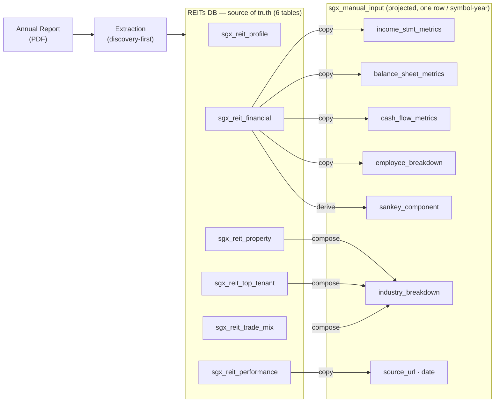

# SGX REITs DB — handoff

Everything needed to consume the **REITs DB** (our 6 `sgx_reit_*` tables, the source of truth)
and project it into `sgx_manual_input`. Self-contained — this folder is the spec:

- **`sgx_reit_*.json`** — one clean, **DB-shaped** example row per table (table below).
- **[`manual_input_mapping.md`](manual_input_mapping.md)** — the full REITs DB → `sgx_manual_input`
  projection (copy / derive / compose, field by field).

> The **REITs DB is the source of truth** (full granularity); `sgx_manual_input` is a downstream
> **projection** of it — blobs copied, `sankey_component` derived, `industry_breakdown` composed.
> `profile` and the full `property` registry stay REIT-only (only top-20 + counts feed the projection).

Examples are generated from **M44U (Mapletree Logistics Trust) FY2025**, validated to match prod's
`sgx_manual_input` financials to the dollar. Full per-report data lives in `extracted/<SYM>.SI_FY<YYYY>/`.

Regenerate for any report: `python scripts/build_db_examples.py M44U.SI_FY2025`
(validates each record against `schema/models.py`, so only real schema fields appear — extraction
audit-trail extras are dropped).

| File | Table | Shape |
|---|---|---|
| `sgx_reit_profile.json` | `sgx_reit_profile` | 1 row (per trust) |
| `sgx_reit_property.json` | `sgx_reit_property` | 3 of 197 rows (per property·year) |
| `sgx_reit_performance.json` | `sgx_reit_performance` | 1 row (per symbol·year) |
| `sgx_reit_top_tenant.json` | `sgx_reit_top_tenant` | 3 of 10 rows (per rank) |
| `sgx_reit_trade_mix.json` | `sgx_reit_trade_mix` | 3 of N rows (per category) |
| `sgx_reit_financial.json` | `sgx_reit_financial` | 1 row (per symbol·year) |

(List tables show a few representative rows; full data is in `extracted/M44U.SI_FY2025/`.)

## Conventions (important for the projection)
- **Money is ABSOLUTE units** — the audited `S$'000` figures × 1000 (e.g. `total_revenue` =
  727,026,000, not 727,026).
- **Percentages are plain numbers** — `revenue_pct` = 5.0, `occupancy_rate` = 97.0, `pct` = 19.0
  (prod stores fractions like 0.05 → divide by 100 in the projection).
- **Provenance** — every row carries `source_page`; canonical taxonomy fields keep the verbatim
  disclosed label in `*_raw` (`category_raw`, `tenure_raw`).
- **flags** — `[{type, scope, note}]`, human-verify caveats (dpu_half_year_split,
  same_property_diff_lease, …). Usually empty.

## `sgx_reit_financial` notes
- **1:1 with `sgx_manual_input`'s three blobs** — `income_stmt_metrics`,
  `balance_sheet_metrics`, `cash_flow_metrics` use prod's exact keys (+ `employee_breakdown`,
  usually null for externally-managed REITs). Push them straight across.
- `income_stmt_metrics._derived` lists the fields we **computed** (ebit/ebitda/operating_income/…)
  vs read off the statement — REIT statements don't print these, so we standardize them like prod.
- `funds_from_operation` is captured when a report discloses an FFO/AFFO; otherwise **null** (many
  SG REITs report distributable income, in `sgx_reit_performance.net_distributable_income`, rather
  than US-style FFO). It is not set equal to net_income, which includes non-cash fair-value items
  FFO excludes — so a null here means "not disclosed in this report," not a class-wide assumption.
- `line_items` is our extension (the verbatim audited Statement of Total Return; reconciles
  `Σrevenue − Σexpense + Σadjustment = net_income`). **Not** part of `income_stmt_metrics` — keep
  or drop as you like; it's the audit trail.
- `sankey_component` is **not** stored — derive it from `income_stmt_metrics` (see
  `manual_input_mapping.md` §3).

## How these project into `sgx_manual_input`
See **`manual_input_mapping.md`** — the 3 financial blobs copy 1:1; `sankey_component`
derives from `financial`; `industry_breakdown` is composed from `top_tenant` + `property` +
`trade_mix` (with `property_name→name`, `market_valuation→valuation`, `gross_revenue→gross_income`
renames + the `÷100` conversions done in the projection transform, not in our source columns).
