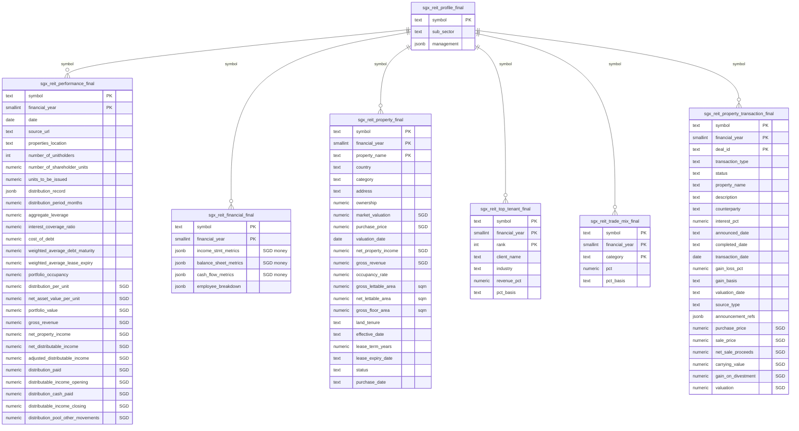

# Final SGX-REIT schema (7 tables) — raw -> clean, SGD-normalized

**Status:** PROPOSAL (2026-07-13, rev. after emirsyah directives). For review — adjust freely.
**Scope:** the 7 `sgx_reit_*` data tables -> new `sgx_reit_*_final` tables. Companion to
`manual_input_mapping.md` (the `sgx_manual_input` projection).

## 0. The model

Today's `sgx_reit_*` tables are **raw**: audited values PLUS heavy provenance (source pages, flags,
`*_basis` notes, `*_raw` labels, per-figure currency tags, native/original value copies, jsonb audit
blobs) and money in **each trust's native currency**.

The **final** tables (`sgx_reit_*_final`, NEW tables) are a clean, SGD-normalized,
provenance-stripped projection:
1. **Drop all provenance / audit-trail columns** (kept in the raw tables = system-of-record).
2. **Normalize every money figure to SGD** via `quarterly_rates.json` (MAS quarterly rates); drop the
   per-figure currency scaffolding. **No `reporting_currency` tag** — final is SGD, full stop.
3. **Normalize areas to sqm** (convert sqft -> sqm); drop `area_unit`.
4. **Expand shortened column names** to full words (glossary in section 9).

**Build:** a Python job (reuse the notebook's `_to_sgd()` + `quarterly_rates.json`) reads raw
`sgx_reit_*` -> writes new `sgx_reit_*_final` tables. Raw stays the audited source of truth; final is
re-derivable. (Real tables, not views — SGD/area conversion + per-figure nearest-quarter FX is done
in the build job, not SQL.)

## 0a. ER diagram — the 7 final tables

`sgx_reit_profile_final` is the parent (per trust); all others key on `symbol` + `financial_year`.
All money columns are **SGD**; areas are **sqm**; `_final` = provenance-stripped.

## 1. Currency normalization — VALIDATED RULE (audit 2026-07-13, 47 reports)

A 4-agent AR-grounded audit + programmatic cross-check settled the currency state. It is a **clean,
deterministic, tag-driven rule** — with exactly ONE exception. The `*_currency` tags are RELIABLE
(they name the currency the stored value is in) EXCEPT for two property columns that were
pre-converted at extraction.

**Rule A — always-SGD (ignore tag):** `property.market_valuation` and `property.purchase_price` are
ALREADY SGD for every row (proven: stored/`original_value` = the FX rate, 543/543 non-SGD-tagged mv
rows; AUD 0.88, JPY 0.0089, KRW 0.00094). Their `*_currency` tag is the NATIVE source label, not the
figure's currency. -> KEEP as-is, do NOT convert.

**Rule B — in-tag (convert where tag != SGD):** every other money field holds its value IN its
currency tag; convert to SGD where the tag is non-SGD, else keep.
- `performance` block + `financial` blobs: row `currency`. Native only for the **9 foreign-presentation
  reporters** (perf.currency != SGD): **USD** — BTOU, CMOU, DCRU, ODBU, OXMU, XZL; **EUR** — SET,
  UD1U; **GBP** — MXNU. All other REIT-years present SGD -> no conversion. (per-unit
  `distribution_per_unit`, `net_asset_value_per_unit`: convert with the same row currency.)
- `property.gross_revenue` / `net_property_income`: their `*_currency` tag (656 rows non-SGD;
  native-magnitude confirmed: JPY 1.77bn, KRW 11.9bn, VND 259bn). Rate date = FY-end `date`.
- `property_transaction` every money figure: its per-figure `*_currency` (native-tagged = native-
  magnitude, confirmed; the auditors' "C2PU/TS0U/HMN tag-lies" flags were MISREADS — those figures
  are tagged SGD and are SGD). Rate date: `valuation`->`valuation_date`; sale/net/gain/carrying->
  `completed_date`|`transaction_date`; `purchase_price`->`transaction_date`.
- FX: `quarterly_rates.json`, nearest quarter to the figure's date.

**NOT converted:** percentages/ratios, unit counts, dates.

### 1a. FX rate coverage (checked 2026-07-13)
`quarterly_rates.json` covers every data currency EXCEPT **NZD** and **VND**.
- **NZD:** immaterial — the one row (J85 Auckland) already stores SGD.
- **VND:** only genuine exposure = **5 `property.gross_revenue` rows (M44U Vietnam), native VND, no
  rate** (market_valuation VND rows fall under Rule A = already SGD). DECISION: source a VND rate
  (add to the blob) or NULL those 5 figures — never emit raw VND as SGD (~18,000x off).

## 2. Area normalization

- Target: **sqm**. Convert `gla`/`nla`/`gfa` from sqft -> sqm (x 0.092903) where `area_unit`='sqft'
  (or the disclosed unit is imperial). Drop `area_unit` after.

## 3. sgx_reit_profile_final
- KEEP: `symbol`, `sub_sector`, `management` (jsonb — **role-keyed**: `{role: [company_names]}`, value always an array; restructured 2026-07-14).
- DROP: `source_page`, `income_model` (removed per emirsyah 2026-07-14).

## 4. sgx_reit_performance_final

- KEEP: `symbol`, `financial_year`, `date`, `source_url` (per-year AR PDF link — backfilled from `reit_report.pdf_r2_key` prefixed with the R2 public base; 47/47 populated), `properties_location`, `number_of_unitholders`,
  `number_of_shareholder_units`, `units_to_be_issued`, `distribution_record` (jsonb),
  `distribution_period_months` (was `dpu_period_months`), and the ratio KPIs `aggregate_leverage`,
  `interest_coverage_ratio`, `cost_of_debt`, `weighted_average_debt_maturity` (was
  `weighted_avg_debt_maturity`), `weighted_average_lease_expiry` (was `wale`), `portfolio_occupancy`.
- CONVERT to SGD: `portfolio_value`, `gross_revenue`, `net_property_income`,
  `net_distributable_income`, `adjusted_distributable_income`, `distribution_paid`,
  `distributable_income_opening`, `distribution_cash_paid`, `distributable_income_closing`,
  `distribution_pool_other_movements`.
- **`distribution_pool_other_movements`** *(NEW, 2026-07-14)*: signed $ — the Distribution
  Statement's printed pool additions/deductions that sit BETWEEN the for-year line (B) and the
  distribution rows, e.g. ME8U FY24/25 "Distribution of gains from divestment" +13,354k, C2PU
  FY2024 capex retention -3,000k. Null when the statement has no such line (most REITs). Needed so
  `distributable_income` in the `sgx_manual_input` projection reproduces the colleague's figure
  17/17 (see `manual_vs_ours_parity.md` 4a) and so the rollforward guard closes exactly:
  A + B + other_movements - P = E.
- PER-UNIT (SGD decision, section 10): `distribution_per_unit` (was `dpu`),
  `net_asset_value_per_unit` (was `nav_per_unit`).
- DROP: `currency`, `flags`, `source_page`, `distribution_basis`.

## 5. sgx_reit_financial_final

- KEEP: `symbol`, `financial_year`, `income_stmt_metrics`, `balance_sheet_metrics`,
  `cash_flow_metrics`, `employee_breakdown` (jsonb blobs).
- CONVERT to SGD: every money value inside the three metric blobs (+ `*_breakdown[].amount`) at FY-end
  `date`. Leave share counts / ratio keys.
- DROP: `currency`, `line_items`, `source_page`.

## 6. sgx_reit_property_final

- KEEP: `symbol`, `financial_year`, `property_name`, `country`, `category`, `address`, `ownership`,
  `valuation_date`, `occupancy_rate`, `land_tenure`, `effective_date`, `lease_term_years`,
  `lease_expiry_date`, `status`, `purchase_date`,
  `gross_lettable_area` (was `gla`), `net_lettable_area` (was `nla`), `gross_floor_area` (was `gfa`)
  — all in **sqm**.
- CONVERT to SGD: `market_valuation`, `net_property_income`, `gross_revenue`, `purchase_price`.
- DROP (per emirsyah): `major_tenants`, `npi_pct`, `area_unit`.
- DROP (provenance): `category_raw`, `tenure_raw`, `flags`, `lease_terms_flags`, `source_page`,
  `currency`, `original_currency`, `original_value`, `purchase_price_currency`,
  `net_property_income_currency`, `gross_revenue_currency`, `market_valuation_currency`,
  `purchase_price_local`, `purchase_price_local_currency`.

## 7. sgx_reit_top_tenant_final

- KEEP: `symbol`, `financial_year`, `rank`, `client_name`, `industry`, `revenue_pct`,
  **`pct_basis`** (kept per emirsyah).
- DROP: `source_page`.

## 8. sgx_reit_trade_mix_final

- KEEP: `symbol`, `financial_year`, `category`, `pct`, **`pct_basis`** (kept per emirsyah).
- DROP: `category_raw`, `source_page`.

## 9. sgx_reit_property_transaction_final

This final table = the DATA columns of the raw `property_transaction` (whose full schema, incl. the
deliberately-kept provenance layer, is `docs/7-8-2026-finalizing/property-transaction-schema-proposal.md`),
minus that provenance layer.

- KEEP: `symbol`, `financial_year`, `deal_id`, `transaction_type`, `status`, `property_name`,
  `description`, `counterparty`, `interest_pct`, `announced_date`, `completed_date`,
  `transaction_date`, `gain_loss_pct`, `gain_basis`, `valuation_date`.
- KEEP as DATA (not provenance): `announcement_refs` (the per-deal SGX plan/completion links — a
  colleagues' wishlist deliverable, the whole point of the announcement top-up) and `source_type`
  (`annual_report`|`sgx_announcement`|`both` — a data-completeness signal). Empty today only because
  the SGX top-up is deferred; keeping them means the deal-source links reach consumers. (Open
  decision — could instead slim `announcement_refs` to a flat `announcement_urls` list.)
- CONVERT to SGD: `purchase_price`, `sale_price`, `net_sale_proceeds`, `carrying_value`,
  `gain_on_divestment`, `valuation`.
- DROP (pure provenance / raw layer): `raw`, `source_page`, `carrying_value_basis`,
  `gain_on_divestment_basis`, `net_proceeds_basis`, and all `*_currency`.
- Does NOT feed `sgx_manual_input` (confirmed). Standalone REIT enrichment surface.

## 10. Column-name glossary (raw -> final)

| raw | final |
|---|---|
| `dpu` | `distribution_per_unit` |
| `dpu_period_months` | `distribution_period_months` |
| `nav_per_unit` | `net_asset_value_per_unit` |
| `wale` | `weighted_average_lease_expiry` |
| `weighted_avg_debt_maturity` | `weighted_average_debt_maturity` |
| `gla` | `gross_lettable_area` |
| `nla` | `net_lettable_area` |
| `gfa` | `gross_floor_area` |

(All other columns keep their already-full names. `income_stmt_metrics` etc. keep prod's exact jsonb
keys — do NOT rename inside the blobs, they must stay 1:1 with `sgx_manual_input`.)

## 11. Open decisions

1. **Per-unit money** (`distribution_per_unit`, `net_asset_value_per_unit`): convert to SGD
   (recommended, uniform) vs keep native? (No `reporting_currency`, so native would be unlabeled.)
2. **FX gaps** (currency missing from `quarterly_rates.json`): leave unconverted + warn (rec) vs fail build.
3. **Area source unit** — confirm each REIT's disclosed area unit is reliably known (to convert
   sqft->sqm correctly); where unknown, assume sqm (SG default) + flag.

## 12. Build status (2026-07-13) — BUILT

All 7 `sgx_reit_*_final` tables created & committed via `scripts/db/build_final_tables.py`
(re-runnable: `--write` commits, default is DRY preview). Row counts: profile 37, performance 47,
financial 47, property 2440, top_tenant 504, trade_mix 515, property_transaction 145.

- SGD normalization verified: foreign reporters converted (BTOU gross_revenue 113.9M USD -> 146.3M
  SGD), SGD reporters unchanged (K71U), `market_valuation`/`purchase_price` kept (Rule A), share
  counts NOT converted, `weighted_avg_shares_basic`->`basic_shares_outstanding` applied.
- Only VND figures NULLed (10: 5 HMN gross_revenue + 1 DHLU NPI + 4 M44U txn) per the VND decision.
- `units_to_be_issued` backfill DONE 2026-07-14 (raw column added + extracted from 47 ARs; 26
  populated in `performance_final`, 21 genuinely null).
- `distribution_pool_other_movements` DONE 2026-07-14 (new raw+final column; 16 populated, each a
  disclosed reconciling line, each closes A+B+pool-P=E; foreign reporters FX-converted). Includes
  the CMOU FY2025 rollforward fix (cash_paid 2,611->0, pool -40,421k) and AU8U B correction
  (83,900->78,226, pool +5,700k). All applied to raw + final; frozen-REIT touches are new-field
  backfills only (no frozen existing-field edits; BUOU shareholder-units fix still gated).
- FOLLOW-ONS remaining: (1) BUOU issued-only shareholder-units fix (gated); (2) source a VND rate
  if the 10 nulled VND figures are wanted. (`source_url` backfill DONE 2026-07-14 from R2.)
