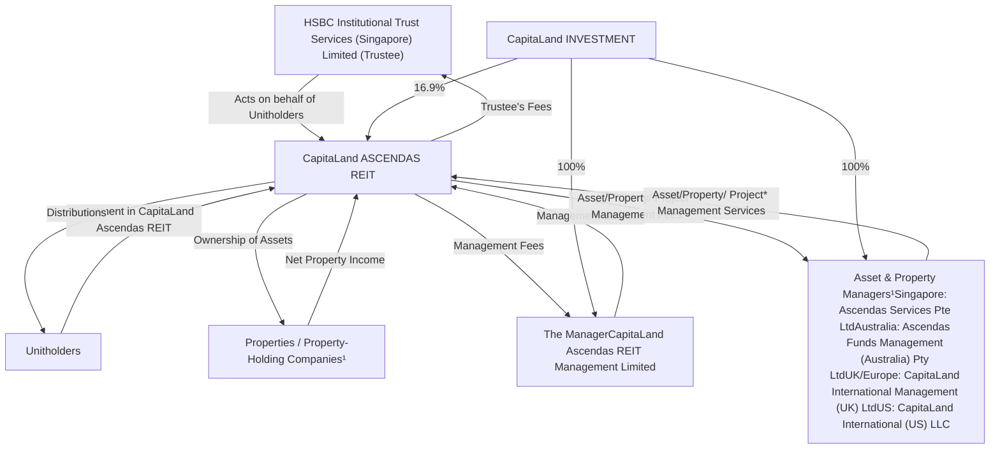
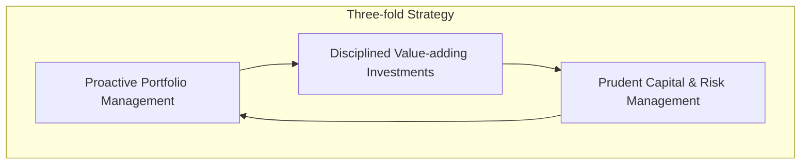
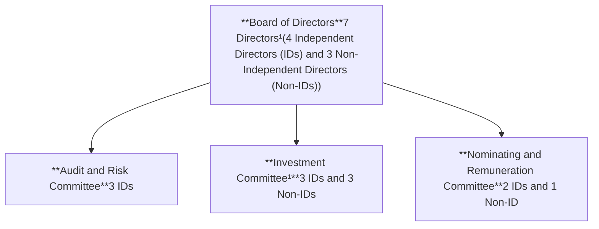
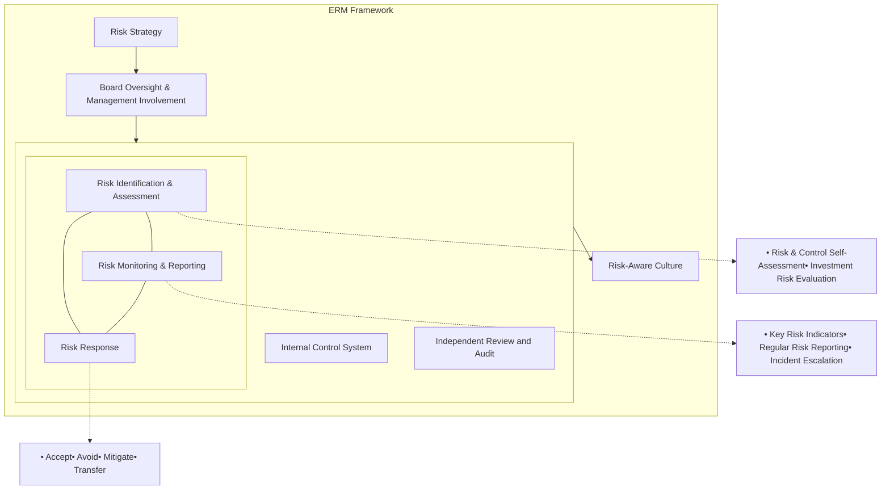

<!-- PAGE 1 -->

CapitaLand ASCENDAS REIT logo

Abstract dandelion-like graphic with orange lines and dots radiating from a central red circle

CapitaLand Ascendas REIT
Annual Report 2025

<!-- PAGE 2 -->

# Seeding Growth, Creating Enduring Value

Grounded in resilience and governance, our values keep us steadfast through business cycles while propelling us to seize opportunities with clarity and confidence.

We are advancing through innovation, partnerships, and sustainable growth. With strategic focus and effective execution, we continue to seed new opportunities and strengthen growth engines to deliver enduring value for our stakeholders.

Dandelion seed graphic

## Contents

<table>
  <thead>
    <tr>
        <th colspan="2">Overview</th>
        <th> </th>
        <th> </th>
    </tr>
  </thead>
  <tbody>
    <tr>
        <td>About Us</td>
        <td>1</td>
        <td>Logistics Properties (Australia)</td>
        <td>54</td>
    </tr>
    <tr>
        <td>2025 Highlights</td>
        <td>2</td>
        <td>Business Space Properties (Australia)</td>
        <td>58</td>
    </tr>
    <tr>
        <td>Financial Highlights</td>
        <td>3</td>
        <td>Business Space &amp; Life Sciences Properties (US)</td>
        <td>60</td>
    </tr>
    <tr>
        <td>Milestones</td>
        <td>4</td>
        <td> </td>
        <td> </td>
    </tr>
    <tr>
        <td>Structure</td>
        <td>5</td>
        <td>Logistics Properties (US)</td>
        <td>64</td>
    </tr>
    <tr>
        <td>ESG Highlights</td>
        <td>6</td>
        <td>Logistics Properties (UK/Europe)</td>
        <td>66</td>
    </tr>
    <tr>
        <td>Chairman &amp; CEO Message</td>
        <td>8</td>
        <td>Data Centres (UK/Europe)</td>
        <td>70</td>
    </tr>
    <tr>
        <td>What CLAR Invests In</td>
        <td>10</td>
        <td> </td>
        <td> </td>
    </tr>
    <tr>
        <td>Board of Directors</td>
        <td>11</td>
        <td colspan="2">Governance</td>
    </tr>
    <tr>
        <td>Management Team</td>
        <td>14</td>
        <td>Corporate Governance</td>
        <td>72</td>
    </tr>
    <tr>
        <td>The Asset, Property &amp; Project Managers</td>
        <td>16</td>
        <td>Risk Management</td>
        <td>98</td>
    </tr>
    <tr>
        <td>Strategy</td>
        <td>17</td>
        <td>Sustainability Management</td>
        <td>104</td>
    </tr>
    <tr>
        <td> </td>
        <td> </td>
        <td> </td>
        <td> </td>
    </tr>
    <tr>
        <td colspan="2">Performance</td>
        <td colspan="2">Financial Statements</td>
    </tr>
    <tr>
        <td>The Manager’s Review of FY 2025</td>
        <td>18</td>
        <td>Financial Report FY 2025</td>
        <td>106</td>
    </tr>
    <tr>
        <td>Investor Relations</td>
        <td>38</td>
        <td> </td>
        <td> </td>
    </tr>
    <tr>
        <td>CLAR’s Portfolio</td>
        <td>40</td>
        <td colspan="2">Other Information</td>
    </tr>
    <tr>
        <td>Business Space &amp; Life Sciences Properties (Singapore)</td>
        <td>45</td>
        <td>Statistics of Unitholdings</td>
        <td>201</td>
    </tr>
    <tr>
        <td>Industrial Properties &amp; Data Centres (Singapore)</td>
        <td>48</td>
        <td>Additional Information</td>
        <td>204</td>
    </tr>
    <tr>
        <td> </td>
        <td> </td>
        <td>Appendix</td>
        <td>206</td>
    </tr>
    <tr>
        <td>Logistics Properties (Singapore)</td>
        <td>52</td>
        <td>Corporate Information</td>
        <td>IBC</td>
    </tr>
  </tbody>
</table>

<!-- PAGE 3 -->

# About Us

CapitaLand Ascendas REIT (CLAR) is Singapore’s first and largest listed business space and industrial real estate investment trust (REIT). As one of Singapore’s REIT pioneers, CLAR has played a crucial role in the development of the Singapore REIT sector. It provides an attractive platform for investment in business and industrial properties across developed markets. CLAR owns and manages a well-diversified portfolio, valued at S$18.2 billion. The portfolio comprises 222 investment properties<sup>1</sup> in Singapore, Australia, the US and the UK/ Europe. CapitaLand Ascendas REIT Management Limited, the manager of CLAR (Manager), is a wholly owned subsidiary of Singapore-listed CapitaLand Investment Limited (CLI), a leading global real asset manager with a strong Asia foothold.

## Our Vision

To be a leading global real estate investment trust

## Our Mission

To deliver predictable distributions and achieve long-term capital stability for Unitholders

## Reporting Suite

As part of environmental conservation efforts, CLAR continues to print limited copies of its Annual Report. The Annual Report, Independent Market Report and Sustainability Report (to be published around the middle of April 2026) are available for downloading at:

* <u>https://investor.capitaland-ascendasreit.com/ar.html</u>

* <u>https://investor.capitaland-ascendasreit.com/sustainability_reports.html</u>

QR code to view online reports

Scan the QR code to view the online reports

CapitaLand Ascendas REIT Annual Report 2025 cover

CapitaLand Ascendas REIT Independent Market Report 2025 cover

CapitaLand Ascendas REIT Sustainability Report 2025 cover

1 Excludes 27 IBP and LogisHub @ Clementi in Singapore, Summerville Logistics Center in the US, as well as Welwyn Garden City, Manton Wood and Towcester in the UK which were under development as at 31 December 2025.

**Note:** Any discrepancies in the tables and charts between the listed figures and totals thereof in this Annual Report are due to rounding. Wherever applicable, figures and percentages are rounded to one decimal place.

<!-- PAGE 4 -->

# 2025 Highlights

## Multi-pronged Growth Strategy

Growth Strategy icon

<table>
  <tbody>
    <tr>
        <td>S$1,470.6 million¹</td>
        <td>S$350.1 million</td>
        <td>S$470.6 million</td>
    </tr>
    <tr>
        <td>Six Accretive Acquisitions in Singapore and the US</td>
        <td>Two Greenfield Logistics Developments in the UK</td>
        <td>Two Completed Redevelopments in Singapore</td>
    </tr>
  </tbody>
</table>

## Robust Operational Performance

Operational Performance icon

<table>
  <tbody>
    <tr>
        <td>90.9%</td>
        <td>12.0%</td>
        <td>3.7 Years</td>
    </tr>
    <tr>
        <td>Healthy Portfolio Occupancy</td>
        <td>Positive Rental Reversion</td>
        <td>Long WALE (by gross rental)</td>
    </tr>
  </tbody>
</table>

## Resilient Balance Sheet

Balance Sheet icon

<table>
  <tbody>
    <tr>
        <td>39.0%</td>
        <td>75.4%</td>
        <td>A3</td>
    </tr>
    <tr>
        <td>Healthy Aggregate Leverage</td>
        <td>High Level of Fixed Debt</td>
        <td>Moody’s Credit Rating</td>
    </tr>
  </tbody>
</table>

Geographically diversified, multi-asset portfolio value of **S$18.2 billion** that caters to a diverse mix of industries

## Portfolio Value by Geography

<table>
  <tbody>
    <tr>
        <td>Category</td>
        <td>Value (%)</td>
    </tr>
    <tr>
        <td>Singapore</td>
        <td>68</td>
    </tr>
    <tr>
        <td>Australia</td>
        <td>12</td>
    </tr>
    <tr>
        <td>US</td>
        <td>11</td>
    </tr>
    <tr>
        <td>UK / Europe</td>
        <td>9</td>
    </tr>
  </tbody>
</table>

## Portfolio Value by Segment

<table>
  <tbody>
    <tr>
        <td>Category</td>
        <td>Value (%)</td>
    </tr>
    <tr>
        <td>Business Space</td>
        <td>36</td>
    </tr>
    <tr>
        <td>Life Sciences</td>
        <td>8</td>
    </tr>
    <tr>
        <td>Logistics</td>
        <td>24</td>
    </tr>
    <tr>
        <td>Industrial</td>
        <td>21</td>
    </tr>
    <tr>
        <td>Data Centres</td>
        <td>11</td>
    </tr>
  </tbody>
</table>

## Monthly Rental Income² by Tenant Industry

<table>
  <tbody>
    <tr>
        <td>Category</td>
        <td>Value (%)</td>
    </tr>
    <tr>
        <td>Technology³</td>
        <td>47</td>
    </tr>
    <tr>
        <td>Logistics &amp; Supply Chain Management</td>
        <td>11</td>
    </tr>
    <tr>
        <td>Biomedical Sciences</td>
        <td>10</td>
    </tr>
    <tr>
        <td>Others</td>
        <td>32</td>
    </tr>
  </tbody>
</table>

\*1 Based on total acquisition costs.

\*2 As at 31 December 2025.

\*3 Includes Engineering, Data Centres, Information & Communications Technology, Electronics and e-Commerce.

<!-- PAGE 5 -->

# Financial Highlights

Gross Revenue
(S$ million)

<table>
  <thead>
    <tr>
        <th>Fiscal Year</th>
        <th>Gross Revenue (S$ million)</th>
    </tr>
  </thead>
  <tbody>
    <tr>
        <td>FY 2021</td>
        <td>1,226.5</td>
    </tr>
    <tr>
        <td>FY 2022</td>
        <td>1,352.7</td>
    </tr>
    <tr>
        <td>FY 2023</td>
        <td>1,479.8</td>
    </tr>
    <tr>
        <td>FY 2024</td>
        <td>1,523.0</td>
    </tr>
    <tr>
        <td>FY 2025</td>
        <td>1,538.6</td>
    </tr>
  </tbody>
</table>

Net Property Income
(S$ million)

<table>
  <thead>
    <tr>
        <th>Fiscal Year</th>
        <th>Net Property Income (S$ million)</th>
    </tr>
  </thead>
  <tbody>
    <tr>
        <td>FY 2021</td>
        <td>920.8</td>
    </tr>
    <tr>
        <td>FY 2022</td>
        <td>968.8</td>
    </tr>
    <tr>
        <td>FY 2023</td>
        <td>1,023.2</td>
    </tr>
    <tr>
        <td>FY 2024</td>
        <td>1,049.9</td>
    </tr>
    <tr>
        <td>FY 2025</td>
        <td>1,067.6</td>
    </tr>
  </tbody>
</table>

Total Amount Available for Distribution
(S$ million)

<table>
  <thead>
    <tr>
        <th>Fiscal Year</th>
        <th>Total Amount Available for Distribution (S$ million)</th>
    </tr>
  </thead>
  <tbody>
    <tr>
        <td>FY 2021</td>
        <td>630.0</td>
    </tr>
    <tr>
        <td>FY 2022</td>
        <td>663.9</td>
    </tr>
    <tr>
        <td>FY 2023</td>
        <td>654.4</td>
    </tr>
    <tr>
        <td>FY 2024</td>
        <td>668.8</td>
    </tr>
    <tr>
        <td>FY 2025</td>
        <td>678.3</td>
    </tr>
  </tbody>
</table>

Distribution Per Unit
(Singapore cents)

<table>
  <thead>
    <tr>
        <th>Fiscal Year</th>
        <th>Distribution Per Unit (Singapore cents)</th>
    </tr>
  </thead>
  <tbody>
    <tr>
        <td>FY 2021</td>
        <td>15.258¹</td>
    </tr>
    <tr>
        <td>FY 2022</td>
        <td>15.798</td>
    </tr>
    <tr>
        <td>FY 2023</td>
        <td>15.160</td>
    </tr>
    <tr>
        <td>FY 2024</td>
        <td>15.205</td>
    </tr>
    <tr>
        <td>FY 2025</td>
        <td>15.005</td>
    </tr>
  </tbody>
</table>

Total Assets
(S$ million)

<table>
  <thead>
    <tr>
        <th>Fiscal Year</th>
        <th>Total Assets (S$ million)</th>
    </tr>
  </thead>
  <tbody>
    <tr>
        <td>FY 2021</td>
        <td>17,730</td>
    </tr>
    <tr>
        <td>FY 2022</td>
        <td>17,876</td>
    </tr>
    <tr>
        <td>FY 2023</td>
        <td>18,274</td>
    </tr>
    <tr>
        <td>FY 2024</td>
        <td>18,269</td>
    </tr>
    <tr>
        <td>FY 2025</td>
        <td>19,794</td>
    </tr>
  </tbody>
</table>

Total Borrowings<sup>2,3,4</sup>
(S$ million)

<table>
  <thead>
    <tr>
        <th>Fiscal Year</th>
        <th>Total Borrowings (S$ million)</th>
    </tr>
  </thead>
  <tbody>
    <tr>
        <td>FY 2021</td>
        <td>6,143</td>
    </tr>
    <tr>
        <td>FY 2022</td>
        <td>6,296</td>
    </tr>
    <tr>
        <td>FY 2023</td>
        <td>6,724</td>
    </tr>
    <tr>
        <td>FY 2024</td>
        <td>6,708</td>
    </tr>
    <tr>
        <td>FY 2025</td>
        <td>7,563</td>
    </tr>
  </tbody>
</table>

1 Distribution Per Unit after performance fee.
2 Excludes the effects of the Singapore Financial Reporting Standard 116 Leases (FRS 116).
3 Excludes fair value changes and amortised costs. Borrowings denominated in foreign currencies are translated at the prevailing exchange rates except for HKD-denominated debt issues, which are translated at the cross-currency swap rates that CapitaLand Ascendas REIT has committed to.
4 Includes CLAR's deferred payments and its proportionate share of its associate company's borrowings.

<!-- PAGE 6 -->

# Milestones

## January

**15th**

Completed the acquisition of DHL Indianapolis Logistics Centre, a logistics property in Indianapolis, the US, for S$153.4 million.

## March

**3rd**

Completed the redevelopment of 1 Science Park Drive, a premium business space and life sciences property in Singapore, for S$300.2 million.

## April

**25th**

The Annual General Meeting was held, and all resolutions were approved by Unitholders.

## July

**30th**

An Extraordinary General Meeting was held, and the resolution in relation to the proposed acquisitions of 9 Tai Seng Drive and 5 Science Park Drive was approved by Unitholders.

## June

**26th**

Completed the divestment of Parkside, a business space property in Portland, the US, for S$26.5 million.

## May

**24th**

Received the “Most Resilient REIT” award at the REITs Symposium 2025.

**29th**

Completed private placement of S$500.0 million to fund acquisitions and repay debt.

## August

**6th**

Completed the acquisition of 5 Science Park Drive, a premium business space property in Singapore, for S$261.0 million.

**11th**

Completed the acquisition of 9 Tai Seng Drive, a Tier III colocation data centre in Singapore, for S$463.6 million.

**15th**

Issued S$300.0 million subordinated green perpetual securities at a fixed initial distribution rate of 3.18% per annum.

**27th**

Issued S$700.0 million 7-year Green Notes due 2032 at a fixed coupon of 2.343% per annum.

## November

**7th**

Completed the divestment of Astmoor Road, a logistics property in North West England, the UK, for S$52.5 million.

## October

**16th**

Completed the divestment of 30 Tampines Industrial Avenue 3, an industrial property in Singapore, for S$23.0 million.

## September

**18th**

Completed the redevelopment of 5 Toh Guan Road East, a modern six-storey ramp-up logistics property in Singapore, for S$107.4 million.

## December

**10th**

Completed the divestment of 95 Gilmore Road, a logistics property in Queensland, Australia, for S$90.0 million.

**17th**

Completed the divestment of 31 Ubi Road 1, 9 Changi South Street 3, 10 Toh Guan Road, as well as 19 & 21 Pandan Avenue in Singapore for S$306.0 million.

**30th**

* Completed the divestment of 8700-8770 Nimbus, a business space property in Portland, the US, for S$8.5 million.

* Completed the acquisition of 2 Pioneer Sector 1, a ramp-up logistics property; Tuas Connection, a light industrial property; and 9 Kallang Sector, a high-specifications industrial property in Singapore, for S$592.6 million.

<!-- PAGE 7 -->

# Structure

As at 3 March 2026



\* Project management services relating to development, re-development and asset enhancement initiatives in Singapore are provided by CapitaLand Development Pte. Ltd., a related company of CapitaLand Investment Limited.

1 Properties located in Singapore are held directly by CapitaLand Ascendas REIT (except Galaxis, 1 Buroh Lane, 9 Tai Seng Drive and 9 Kallang Sector which are held under wholly owned subsidiaries of CapitaLand Ascendas REIT).
Properties located in Australia are held through wholly owned subsidiaries of CapitaLand Ascendas REIT, and are managed by Ascendas Funds Management (Australia) Pty Ltd together with CapitaLand Australia Pty Ltd and third-party managing agents.
Properties located in the UK/Europe are held through wholly owned subsidiaries of CapitaLand Ascendas REIT and are managed by CapitaLand International Management (UK) Ltd together with third-party managing agents.
Properties located in the US are held through wholly owned subsidiaries of CapitaLand Ascendas REIT and are managed by CapitaLand International (US) LLC together with third-party managing agents.

<!-- PAGE 8 -->

# ESG Highlights

## Environmental, Social and Governance Recognition

### GRESB<sup>1</sup>

**Real Estate Assessment**
★★★★☆
for three consecutive years

**Public Disclosure**
'A' Rating
for six consecutive years

### MSCI ESG Rating<sup>2</sup>
'AA' Rating
for three consecutive years

### FTSE4Good Indices
**Constituent of:**
* FTSE4Good Developed Index
* FTSE4Good Developed Minimum Variance Index

### Singapore Governance and Transparency Index (SGTI)
2<sup>nd</sup> place
(REITs and Business Trusts category)

### ASEAN Corporate Governance Scorecard (ACGS)
One of ASEAN's Top 50 Listed Entities

---

## Environmental Highlights

### Green Properties
Green Properties icon
**75%**
Green-certified properties by Gross Floor Area (GFA)

### Green Lease
Green Lease icon
**60%**
Coverage by Net Leasable Area (NLA)

### Green Energy
Green Energy icon
**19%**
of electricity<sup>3</sup> consumption is powered by renewable energy

### Green Financing
Green Financing icon
**> S$3.3b**
(44% of total borrowings)

---

## Social Highlights

Training icon
**24.8 hours**
of training per employee on average

Safety icon
**Zero**
employee work-related fatality or permanent disability

Volunteering icon
**164**
volunteering hours by employees

---

\*1 GRESB is an industry-led organisation that provides actionable and transparent ESG data to financial markets.

\*2 MSCI ESG Ratings aim to measure a company's resilience to long-term ESG risks. Companies are scored on an industry-relative AAA-CCC scale across the most relevant Key Issues based on a company's business model The use by CLAR of any MSCI ESG Research LLC or its affiliates ("MSCI") data, and the use of MSCI logos, trademarks, service marks or index names herein, do not constitute a sponsorship, endorsement, recommendation. or promotion of CLAR by MSCI. MSCI services and data are the property of MSCI or its information providers, and are provided 'as-is' and without warranty. MSCI names and logos are trademarks or service marks of MSCI.

\*3 Refers to common facilities in CLAR's owned and managed properties.

<!-- PAGE 9 -->

# Governance Highlights

## Board Composition (as at 31 Dec 2025)

<table>
    <tr>
        <th>Board Independence</th>
        <th>Gender Diversity</th>
        <th>Age profile</th>
        <th>Tenure mix</th>
    </tr>
    <tr>
        <td>5 independent icons<br/>5 independent<br/>2 non-independent icons<br/>2 non-independent</td>
        <td>5 male icons<br/>5 males<br/>2 female icons<br/>2 females</td>
        <td>

 [CHART TYPE] Donut chart. [AXES &amp; SERIES] Legend: 1 below 55 years old (29%), 2 55 to 60 years old (57%), 4 above 60 years old (14%). [DIMENSIONS] 2 columns x 3 rows. [PRECISION] Percentages as shown. [CAPTION] Age profile. [PROOF ROW] 1 below 55 years old</td>
        <td>29. ```tsvCategory</td>
        <td>Percentage 1 below 55 years old</td>
        <td>29 2 55 to 60 years old</td>
        <td>57 4 above 60 years old</td>
        <td>14```</td>
        <td>

 [CHART TYPE] Donut chart. [AXES &amp; SERIES] Legend: 1 less than 3 years (43%), 3 3 to 6 years (43%), 3 more than 6 years (14%). [DIMENSIONS] 2 columns x 3 rows. [PRECISION] Percentages as shown. [CAPTION] Tenure mix. [PROOF ROW] 1 less than 3 years</td>
        <td>43. ```tsvCategory</td>
        <td>Percentage 1 less than 3 years</td>
        <td>43 3 3 to 6 years</td>
        <td>43 3 more than 6 years</td>
        <td>14```</td>
    </tr>
</table>

## Committee Composition (as at 31 Dec 2025)

<table>
    <tr>
        <th>Audit and Risk Committee</th>
        <th>Investment Committee</th>
        <th>Nominating and Remuneration Committee</th>
    </tr>
    <tr>
        <td>**3** arrow **100%**<br/>Members Independent</td>
        <td>**5** arrow **60%**<br/>Members Independent</td>
        <td>**3** arrow **67%**<br/>Members Independent</td>
    </tr>
</table>

## Number of meetings

<table>
    <tr>
        <th>8</th>
        <th>5</th>
        <th>2</th>
        <th>1</th>
        <th>1</th>
    </tr>
    <tr>
        <td>Board</td>
        <td>Audit and Risk Committee</td>
        <td>Nominating and Remuneration Committee</td>
        <td>Annual General Meeting</td>
        <td>Extraordinary General Meeting</td>
    </tr>
</table>

## How CapitaLand Ascendas REIT Complies with the Corporate Governance Code

The Corporate Governance Report (CGR) is benchmarked against the Code of Corporate Governance 2018 (last amended 11 January 2023) (Code). CapitaLand Ascendas REIT has complied with the principles of corporate governance laid down by the Code and also, substantially, with the provisions underlying the principles of the Code. Where there are deviations from the provisions of the Code, appropriate explanations are provided in the CGR along with explanations of how the practices are consistent with the aim and philosophy of the principle of the Code in question.

<table>
    <tr>
        <th>Our Role</th>
        <th>72</th>
    </tr>
    <tr>
        <td>Our Corporate Governance Framework and Culture</td>
        <td>73</td>
    </tr>
    <tr>
        <td>Board Matters</td>
        <td>73</td>
    </tr>
    <tr>
        <td>Remuneration Matters</td>
        <td>82</td>
    </tr>
    <tr>
        <td>Accountability and Audit</td>
        <td>88</td>
    </tr>
    <tr>
        <td>Unitholder Rights And Engagement</td>
        <td>92</td>
    </tr>
    <tr>
        <td>Additional Information</td>
        <td>93</td>
    </tr>
    <tr>
        <td>\* Investment Committee</td>
        <td>93</td>
    </tr>
    <tr>
        <td>\* Dealings with Interested Persons</td>
        <td>93</td>
    </tr>
    <tr>
        <td>\* Role of the Audit &amp; Risk Committee for Interested Person Transactions</td>
        <td>94</td>
    </tr>
    <tr>
        <td>\* Dealing with Conflicts of Interest</td>
        <td>95</td>
    </tr>
    <tr>
        <td>\* Dealings in Securities</td>
        <td>95</td>
    </tr>
    <tr>
        <td>\* Code of Business Conduct</td>
        <td>96</td>
    </tr>
    <tr>
        <td>\* Whistleblowing Policy</td>
        <td>96</td>
    </tr>
    <tr>
        <td>\* Business Continuity Management</td>
        <td>96</td>
    </tr>
    <tr>
        <td>\* Financial Crime and Third Party Risk Management</td>
        <td>96</td>
    </tr>
</table>

<!-- PAGE 10 -->

# Chairman & CEO Message

Dr Beh Swan Gin, Chairman William Tay Wee Leong, Chief Executive Officer

**Dr Beh Swan Gin**
Chairman
Non-Executive Independent Director

**William Tay Wee Leong**
Chief Executive Officer
Executive Non-Independent Director

Dear Unitholders,

CapitaLand Ascendas REIT (CLAR) delivered growth in distributable income for FY 2025 against a backdrop of continued economic uncertainty. The resilient performance was underpinned by our disciplined portfolio rejuvenation strategy, focus on high quality assets in developed markets and proactive management of operating and interest expenses, while consolidating CLAR’s position as a global REIT anchored in Singapore.

## FY 2025 Performance Highlights

Gross revenue rose by 1.0% year-on-year (YoY) to S$1.54 billion for FY 2025. The higher revenue was mainly driven by acquisitions completed in FY 2025 which more than made up for the loss of revenue from divestments in FY 2024 and FY 2025. Supported by lower property operating expenses, net property income (NPI) was higher at 1.7% YoY to reach S$1.07 billion. Consequently, distributable income grew by 1.4% YoY to S$678.3 million which translated to a distribution per unit of 15.005 Singapore cents.

The portfolio continued to demonstrate stable operating fundamentals. The portfolio occupancy rate was 90.9% as at 31 December 2025 and we achieved a high average positive reversion of 12.0% for leases renewed during the year. This is CLAR’s third consecutive year of double-digit reversions which reflect sustained demand for our well-curated portfolio of quality business space and industrial assets.

As at the end of FY 2025, gearing remained healthy at 39.0% and well within regulatory limits. Despite the continued high-interest rate environment, the average cost of debt for CLAR’s total borrowings, which comprises various currencies, declined to 3.5% from 3.7% a year ago. The robust financial metrics stem from our proactive refinancing and capital raising strategies to preserve our strong balance sheet and prudent capital structure. Maintaining financial flexibility and liquidity remains a priority for CLAR, enabling us to seize accretive investment opportunities when they arise.

(+) *Read more about CLAR’s financial and operational performance in The Manager’s Review of FY 2025 on pages 18 to 37.*

## A Resilient and Future-ready Portfolio

Our portfolio rejuvenation strategy remains central to our intent to prudently grow and enhance the value of our diversified portfolio. This strategy encompasses accretive acquisitions, disciplined divestments as well as deliberate investments in the redevelopment of existing assets and greenfield developments.

In FY 2025, we successfully completed approximately S$1.5 billion of accretive acquisitions, mainly in Singapore. These six properties in Singapore and the US are well-occupied by established tenants and are expected to generate initial NPI yields of 6.1% to 7.6%.

We also accelerated the pace of capital recycling, divesting nine properties for a total sale price of S$506.5 million

<!-- PAGE 11 -->

in FY 2025. The total divestment amount represented a premium of approximately 9% over their aggregate market valuation and about 14% above their aggregate original purchase price, demonstrating our ability to unlock gains from the appreciation of asset values.

In addition, meaningful progress was made on CLAR’s organic growth initiatives. We completed the redevelopment of 1 Science Park Drive, a business space and life sciences property, and that of 5 Toh Guan Road East, a logistics property, at a total cost of S$407.6 million in Singapore. Their healthy leasing levels of about 81% and 65% respectively, reflect tenants’ confidence in our strategy to future-proof our properties. These properties will contribute income from 2026 and their stabilised yields are expected to be approximately 6% and 8% respectively.

Including the newly acquired properties and re-commissioned 5 Toh Guan Road East, the total value of CLAR’s 222 investment properties increased by 8.6% YoY to S$18.2 billion as at 31 December 2025. On a same-store basis, the total portfolio valuation increased by 2.0% YoY to S$16.6 billion with increases across all three segments (Business Space & Life Sciences, Industrial & Data Centres, and Logistics). The higher independent valuations demonstrate the resilience of our geographically diversified, multi-asset portfolio. Singapore remains a cornerstone of CLAR’s portfolio, accounting for 68% of the total portfolio value, with the balance 32% in the US, Australia and the UK/Europe.

Aside from acquiring income-producing properties, we continued to expand our logistics footprint by investing S$350.1 million in two development projects in the UK. With expected yields of about 7%, these new best-in-class, green-certified properties will enhance CLAR’s logistics portfolio in the East Midlands, a key market in the UK’s logistics heartlands.

CLAR has a total of seven projects underway comprising three greenfield developments, two redevelopments and two asset enhancement initiatives in Singapore, the US and the UK. With an aggregate amount of S$730.3 million, these investments upon completion will strengthen earnings resilience, enhance portfolio quality, and position CLAR for sustainable long-term growth. We will continue to identify opportunities to optimise and create additional value from the existing portfolio through targeted rejuvenation of our properties.

(+) *Read more about CLAR’s investments and projects in The Manager’s Review of FY 2025 on pages 20 to 30.*

## Sustainability Excellence

Our sustainability performance continues to be recognised by leading local and global benchmarks which reflect CLAR’s ongoing commitment to sustainability.

In the 2025 GRESB Real Estate Assessment, CLAR maintained its four-star rating for the third consecutive year, as well as an ‘A’ rating for Public Disclosure for the sixth consecutive year. CLAR was ranked second in the Singapore Governance and Transparency Index 2025 (under the REITs and Business Trusts category),

improving from third position the year before. We were also included as one of ASEAN’s Top 50 Listed Entities at the ASEAN Corporate Governance Awards, one of only eight Singapore-listed entities on the list.

(+) *Read more about CLAR’s sustainability achievements on pages 6 and 7, as well as in its Sustainability Report 2025.*

## Board Renewal

We would like to express our sincere thanks to Mr Vinamra Srivastava and Ms Maureen Ong, who have both retired as directors in December 2025 and January 2026, respectively. The Board and management have benefitted greatly from their invaluable insights, wisdom and guidance.

In January 2026, we welcomed Mr Paul Tham as a Non-Executive Non-Independent Director. He brings expertise and strength to the Board with his broad base of knowledge and experience in the real estate industry including the management of REITs.

With these changes, the Board consists of seven members, of which four are independent directors.

## Looking Ahead

The outlook for global economic growth continues to be clouded by continued uncertainties surrounding tariffs and geopolitical tensions. While these could weigh on economic activity, structural drivers underpinning demand for modern industrial, logistics, data centres and business space assets remain intact.

CLAR’s market leadership, strong financial position as well as the diversified portfolio that is anchored in Singapore enable us to execute our portfolio rejuvenation strategy with clarity and confidence. We will remain disciplined in pursuing growth opportunities to strengthen our portfolio, focusing on developed markets with strong fundamentals and quality assets that align with our core strategy of a diversified portfolio of modern business space, industrial, logistics and data centre assets. We are nimble and well-positioned to leverage growth opportunities and optimise our cost of capital.

## Appreciation

On behalf of the Board, we would like to express our deep appreciation to Unitholders for your continued support. We also thank our tenants and business partners for their confidence in CLAR. Finally, we extend our gratitude to every one of our colleagues from the Manager, as well as the Asset and Property Managers for their professionalism and unwavering commitment.

With your trust and partnership, CLAR is well-positioned to deliver sustainable long-term value and stable returns for Unitholders.

<table>
  <tbody>
    <tr>
        <td>Dr Beh Swan Gin</td>
        <td>Mr William Tay</td>
    </tr>
    <tr>
        <td>Chairman</td>
        <td>CEO</td>
    </tr>
  </tbody>
</table>

<!-- PAGE 12 -->

# What CLAR Invests In

Galaxis (Business Space) building

Reynolds House (Data Centre) building

▲ Galaxis (Business Space)

▲ Reynolds House (Data Centre)

## Business Space & Life Sciences

## Industrial & Data Centres

CLAR’s Business Space & Life Sciences properties are in business and science parks in Singapore, suburban locations in Australia and within leading corporate campus environments in the US. They include business space for regional Corporate Headquarters (HQ), backroom support offices, Research & Development (R&D) facilities and life science spaces with lab-ready specifications.

CLAR’s Industrial properties are in Singapore. They offer a range of premium to basic facilities to meet the needs of various tenants and include high-specifications properties such as vertical corporate campuses with a higher business component, combined with high-specifications mixed-use industrial space. Such properties typically have modern facades, air-conditioned units, sufficient floor load capacities and ceiling heights, as well as high power capacities for office functions and manufacturing activities to be carried out together. Other types are light industrial properties and flatted factories. Tenants include multinational and local industrial companies that wish to co-locate their HQ with their manufacturing, engineering and R&D activities.

These properties are situated in close proximity to a critical mass of established, growth and start-up companies in R&D, technology and innovation, as well as educational institutions and research universities. They are easily accessed by public transportation and major road networks, and the surrounding amenities consist of retail shops, food & beverage businesses, as well as leisure and lifestyle services.

CLAR’s data centres are in Singapore, the UK and Europe. They house computing machines and related hardware equipment. Tenants include international and local enterprises in a range of industries such as financial services, telecommunications, information technology and retail.

Tenants include multinational corporations and companies from industries such as engineering, biomedical & life sciences, information & communications, electronics, e-commerce, financial & professional services, the government, distributors & trading, media and education.

## Logistics

CLAR’s logistics properties are in Singapore, Australia, the US and the UK. They include single-storey and multi-storey buildings featuring vehicular ramp and/or cargo lift access. These properties are highly-functional facilities with good access to major ground, water and air transportation networks. Tenants include third-party logistics providers and end-users such as manufacturers, distributors and trading companies.

1 Buroh Lane (Logistics) building

▲ 1 Buroh Lane (Logistics)

<!-- PAGE 13 -->

# Board of Directors

Portrait of Dr Beh Swan Gin

Portrait of William Tay Wee Leong

Portrait of Daniel Cuthbert Ee Hock Huat

**Dr Beh Swan Gin, 58**

Chairman
Non-Executive
Independent Director

* M.B.,B.S., Medicine, National University of Singapore

* Sloan Fellow, Master of Science in Management, Stanford University’s Graduate School of Business

* Advanced Management Programme, Business Administration and Management, Harvard Business School

**Date of first appointment as a director**

6 July 2020

**Date of first appointment as Chairman**

6 July 2020

**Length of service as a director (as at 31 December 2025):**

* 5 years 5 months

**Board committees served on**

* Investment Committee (Member)

* Nominating and Remuneration Committee (Chairman)

**Present directorship in other listed company**

* Singapore Exchange Limited

**Present principal commitments (other than directorship in other listed company)**

* Ministry of Trade and Industry (Permanent Secretary)

* CapitaLand Ascendas REIT Management Limited (manager of CapitaLand Ascendas REIT) (Chairman)

**Past directorship in other listed company held over the preceding three years**

* Nil

**William Tay Wee Leong, 55**

Chief Executive Officer
Executive Non-Independent Director

* Bachelor of Science (Estate Management), National University of Singapore

**Date of first appointment as a director**

1 February 2018

**Length of service as a director (as at 31 December 2025)**

7 years 11 months

**Board committees served on**

* Investment Committee (Member)

**Present directorship in other listed company**

* Nil

**Present principal commitment**

* CapitaLand Ascendas REIT Management Limited (manager of CapitaLand Ascendas REIT) (Chief Executive Officer and Executive Director)

**Past directorship in other listed company held over the preceding three years**

* Nil

**Daniel Cuthbert Ee Hock Huat, 73**

Non-Executive
Independent Director

* Bachelor of Science in Systems Engineering (1st Class Honours), University of Bath, UK

* Master of Science in Industrial Engineering, National University of Singapore

**Date of first appointment as a director**

1 October 2018

**Length of service as a director (as at 31 December 2025)**

7 years 3 months

**Board committees served on**

* Audit and Risk Committee (Chairman)

* Nominating and Remuneration Committee (Member)

**Present directorships in other listed companies**

* Keppel Infrastructure Fund Management Pte. Ltd. (trustee-manager of Keppel Infrastructure Trust)

* Tye Soon Limited

**Present principal commitment (other than directorships in other listed companies)**

* Singapore Mediation Centre (Director)

**Other major appointments**

* Keppel Asia Infra Fund (GP) Pte. Ltd. (Investment Committee Member)

* Keppel Infra Fund GP Pte. Ltd. (Investment Committee Member)

* Neptune1 Infrastructure Holdings Pte. Ltd. (Director)

* One Eco Co., Ltd. (Director)

**Past directorship in other listed company held over the preceding three years**

* Olive Tree Estates Limited

**Award**

* The Public Service Medal, 2003

<!-- PAGE 14 -->

# Board of Directors

Portrait of Chinniah Kunnasagaran

Portrait of Choo Oi Yee

## Chinniah Kunnasagaran, 68

## Choo Oi Yee, 52

Non-Executive
Independent Director

Non-Executive
Independent Director

* Bachelor of Engineering (Electrical), National University of Singapore

* Master of Business Administration, University of California Berkeley

* Chartered Financial Analyst (CFA), CFA Institute

* Bachelor of Accountancy, Nanyang Technological University

* Master in Business Administration, Manchester Business School, UK

**Date of first appointment as a director**

1 November 2020

**Date of first appointment as a director**

22 February 2023

**Length of service as a director (as at 31 December 2025)**

5 years 2 months

**Length of service as a director (as at 31 December 2025)**

2 years 10 months

**Board committees served on**

* Audit and Risk Committee (Member)

* Investment Committee (Member)

**Board committees served on**

* Audit and Risk Committee (Member)

* Investment Committee (Member)

**Present directorships in other listed companies**

* Nirlon Limited, India

* Sembcorp Industries Ltd

**Present directorship in other listed company**

* Nil

**Present principal commitments (other than directorships in other listed companies)**

* Archipelago Capital Partners Pte. Ltd. (Advisor)

* Azalea Investment Management Pte. Ltd. (Advisor)

* Changi Airport International Pte. Ltd. (Advisor)

* EAAA Pte. Limited (Director)

* Greenko Energy Holding, Mauritius (Director)

* Hindu Endowments Board (Board Member)

* Pavilion Capital International Pte. Ltd. (Investment Committee Member)

**Present principal commitments**

* Climate Impact X Pte. Ltd. (CEO and Director)

* Verified Impact Exchange Holdings Pte. Ltd. (CEO and Director)

**Other major appointments**

* Financial Industry Disputes and Resolution (Director)

* ISEAS – Yusof Ishak Institute (Member of Board of Trustees)

* Methodist Girls School (Director)

* St. Joseph’s Institution International Elementary School Ltd. (Member of Board of Governors)

* St. Joseph’s Institution International Ltd. (Member of Board of Governors)

* The National Kidney Foundation (Director)

* Urban Redevelopment Authority (Director)

**Past directorship in other listed companies held over the preceding three years**

* Keppel Infrastructure Fund Management Pte. Ltd. (trustee-manager of Keppel Infrastructure Trust)

**Past directorship in other listed company held over the preceding three years**

* Nil

<!-- PAGE 15 -->

Manohar Khiatani portrait

Tham Wei Hsing, Paul portrait

## Manohar Khiatani, 66

## Tham Wei Hsing, Paul, 44

Non-Executive
Non-Independent Director

Non-Executive
Non-Independent Director

* Masters Degree (Naval Architecture), the University of Hamburg, Germany

* Advanced Management Program, Harvard Business School

* Bachelor of Engineering in Civil & Environmental Engineering, Cornell University

* Master in Business Administration, Singapore Management University

**Date of first appointment as a director**

10 June 2013

**Date of first appointment as a director**

16 January 2026

**Length of service as a director (as at 31 December 2025)**

12 years 6 months

**Length of service as a director (as at 31 December 2025)**
-

**Board committees served on**

* Investment Committee (Chairman)

* Nominating and Remuneration Committee (Member)

**Board committees served on**

* Investment Committee (Member)

**Present directorship in other listed company**

* CapitaLand India Trust Management Pte. Ltd. (trustee-manager of CapitaLand India Trust)

**Present directorship in other listed company**

* Nil

**Present principal commitment (other than directorship in other listed company)**

* CapitaLand Investment Limited (Senior Advisor)

**Present principal commitment**

* CapitaLand Investment Limited (Group Chief Financial Officer)

**Other major appointments**

* Building and Construction Authority (Board Member)

* EDB Society (President)

* Singapore Economic Development Board (Special Advisor to Chairman)

* Singaporean-German Chamber of Industry and Commerce, Advisory Council (Member)

* Skills Future Fellowships and Skills Future Employer Awards Judging Panel (Chairman)

**Other major appointments**

* Directorships in other CapitaLand Investment Group companies

* NESST Singapore Limited

**Past directorship in other listed company held over the preceding three years**

* Nil

**Past directorship in other listed company held over the preceding three years**

* Nil

<!-- PAGE 16 -->

# Management Team

Portrait of William Tay Wee Leong

Portrait of Koo Lee Sze

**William Tay Wee Leong**
Chief Executive Officer (CEO)

**Koo Lee Sze**
Chief Financial Officer

William is the Executive Director and CEO of the Manager of CLAR. He is responsible for leading the management team in the planning and execution of CLAR's value creation and growth strategy across all aspects of its global operations.

Lee Sze oversees financial and sustainability reporting, risk management and taxation matters. She develops key business strategies of CLAR together with the management team, ensures principle base governance and executes the strategies through financial management.

Prior to his current appointment, William was the Deputy CEO of Singapore and Southeast Asia (SSEA) of the Ascendas-Singbridge Group. In addition to leading Ascendas-Singbridge SSEA regional teams in Singapore, Malaysia, Indonesia and Vietnam, he was concurrently the CEO for South Korea, overseeing the real estate private equity funds business and investments in South Korea.

Prior to joining the Manager, Lee Sze was the Director of Finance at Popular Holdings Limited where she was responsible for the financial management and reporting of various aspects of the business including retail and distribution, publishing and e-Learning.

William has approximately 30 years of wide-ranging experience in real estate, straddling both the public and private sectors as well as Singapore and overseas. Since joining Ascendas-Singbridge in 2007, he held various leadership positions in investment, business development, asset and fund management as well as country operations. William started his career with JTC Corporation where he spent 12 years in the development and marketing of Ready-Built Factories, Wafer Fabrication Parks and Logistics Parks, as well as strategic and corporate planning.

Lee Sze started her career in the audit and assurance division of Deloitte & Touche after graduation. She has extensive exposure in real estate, manufacturing, retail and service industries and has about three decades of experience in key financial and managerial roles.

William holds a Bachelor's Degree in Estate Management (Honours) from the National University of Singapore.

Lee Sze holds a Bachelor of Accountancy degree from the National University of Singapore and is a Member of the Institute of Singapore Chartered Accountants.

<!-- PAGE 17 -->

Ram Soundararajan

James Goh

**Ram Soundararajan**
Head, Investment

**James Goh**
Head, Portfolio Management

Ram is responsible for developing and executing CLAR’s investment strategy in Singapore and overseas. He leads the investment team to identify, evaluate and negotiate suitable investment opportunities for CLAR. Ram joined the Manager in May 2018 to drive investments into overseas markets and has since successfully led multiple transactions across different geographies. Prior to joining the Manager, he was the Head, Investments of CapitaLand India Trust (formerly known as Ascendas India Trust).

James oversees a global portfolio of approximately 220 properties across Singapore, Australia, the US and the UK/ Europe, with total assets under management exceeding S$18 billion. His team is responsible for enhancing the financial and operational performance of CLAR’s assets through active asset management, strategic capital recycling and disciplined portfolio optimisation. He first joined the Manager of CLAR in 2018 as Head of International Portfolio Management. Before that, he helmed both the Investor Relations and Asset Management functions at CapitaLand India Trust (formerly known as Ascendas India Trust), where he played a pivotal role in strengthening investor engagement and driving portfolio performance.

Ram has more than 21 years of experience in investment, business development and asset management. His experience covers real estate acquisitions, mergers and acquisitions and corporate finance across Asia, the US and Europe. He has previously worked with global firms such as GIC Real Estate and real estate corporate finance divisions of Andersen and Ernst & Young.

With more than 25 years of experience spanning investor relations, asset management, analytical research and strategic planning, James possesses in-depth experience and insights in diverse real estate markets. He is a CFA charterholder and holds a Bachelor of Accountancy (Honours) from Nanyang Technological University.

Ram holds a Bachelors in Commerce and a Masters in Business Administration from Bharatidasan Institute of Management, India.

<!-- PAGE 18 -->

# The Asset, Property & Project Managers

The daily operations of CLAR’s portfolio of properties located in Singapore, Australia, the US and the UK/Europe are undertaken by asset and property managers that are wholly owned subsidiaries of CapitaLand Investment Limited (CLI), a project manager from a related company of CLI, as well as third-party managing agents.

The asset, property and project managers have staff members located across markets that CLAR operates in, providing professional services to customers, and enhancing the market positioning and attractiveness of CLAR’s properties so as to maximise returns to Unitholders.

**The asset, property and project managers have the following key responsibilities:**

Diagram showing the four key responsibilities of The Asset, Property & Project Managers: Asset Management, Facilities Management, Project Management, and Marketing & Leasing.

## Asset Management

* Execute the asset management strategy formulated by the Manager

* Oversee property performance, lease management, building safety, etc.

* Oversee third-party managing agents

## Facilities Management

* Ensure that the property specifications and service levels are commensurate with the intended market positioning of each property

## Project Management

* Provide expertise in areas of design, construction and project management for development projects and asset enhancement initiatives

## Marketing & Leasing

* Proactive prospecting of customers and partnerships with leasing agents to improve occupancy and revenue of properties

<!-- PAGE 19 -->

# Strategy



## Proactive Portfolio Management

Maximising organic growth potential and returns of the portfolio through active asset management. The Manager works closely with the asset and property managers in carrying out these principal strategies and the relevant activities.

* Proactive marketing and leasing of spaces to achieve a healthy occupancy rate

* Providing high standards of property and customer services

* Enhancing operational efficiency and optimisation of operating costs

* Carrying out asset enhancement initiatives

## Disciplined Value-adding Investments

Undertaking disciplined value-adding investments through acquisitions and development of high-quality properties.

* Acquiring income-producing properties leased to established customers

* Acquiring high-quality properties with strong income stream and/ or asset enhancement potential

* Developing build-to-suit projects to cater to prospective customers’ operational requirements and specifications

* Selective development/ redevelopment to capitalise on the Manager’s development capabilities

* Sourcing of overseas investment opportunities to strengthen portfolio diversification and resilience

## Prudent Capital & Risk Management

Optimising CLAR’s funding structure and costs. Maintaining an effective system of risk management and internal controls.

* Regular reviews of CLAR’s debt and capital management, and financial policy

* Diversifying sources of funding, managing interest rate risk, liquidity risk, credit risk and foreign currency risk

* Monitoring CLAR’s exposure to various risk elements and externally imposed requirements of the markets in which it operates by closely adhering to clearly established management policies and procedures

* Risk management policies and systems are reviewed regularly to reflect changes in market conditions and CLAR’s strategic direction

* Creating an acceptable balance between the benefits derived from managing risks and the cost of managing those risks

<!-- PAGE 20 -->

# The Manager's Review of FY 2025

## Financial Performance

<table>
  <thead>
    <tr>
        <th> </th>
        <th>FY 2025</th>
        <th>FY 2024</th>
        <th>Variance</th>
    </tr>
  </thead>
  <tbody>
    <tr>
        <td>Number of Properties</td>
        <td><strong>226</strong>¹</td>
        <td>229</td>
        <td>-</td>
    </tr>
    <tr>
        <td>Gross Revenue (S$ million)</td>
        <td><strong>1,538.6</strong></td>
        <td>1,523.0</td>
        <td>1.0%</td>
    </tr>
    <tr>
        <td>Net Property Income (S$ million)</td>
        <td><strong>1,067.6</strong></td>
        <td>1,049.9</td>
        <td>1.7%</td>
    </tr>
    <tr>
        <td>Total Amount Available for Distribution (S$ million)</td>
        <td><strong>678.3</strong></td>
        <td>668.8</td>
        <td>1.4%</td>
    </tr>
    <tr>
        <td>Distribution Per Unit (cents)</td>
        <td><strong>15.005</strong></td>
        <td>15.205</td>
        <td>-1.3%</td>
    </tr>
    <tr>
        <td>Applicable Number of Units (million)</td>
        <td><strong>4,520</strong></td>
        <td>4,399</td>
        <td>2.8%</td>
    </tr>
  </tbody>
</table>

1 Includes 27 IBP and Logis Hub @ Clementi in Singapore, Summerville Logistics Center in the US and Welwyn Garden City in the UK and excludes Manton Wood and Towcester in the UK which were under development as at 31 December 2025.

Gross revenue for FY 2025 rose by 1.0% year-on-year (YoY) to S$1,538.6 million. The increase was mainly due to acquisitions of 9 Tai Seng Drive, a data centre in Singapore, 5 Science Park Drive, a business space property in Singapore, as well as DHL Indianapolis Logistics Center, a logistics property in the US. The increase was partially offset by the divestments of four properties in Australia, six properties in Singapore, two properties in the US and one property in the UK between February 2024 and December 2025.

Net property income (NPI) rose by 1.7% YoY to S$1,067.6 million. The NPI growth was due to higher gross revenue and lower operating expenses.

The total amount available for distribution increased by 1.4% YoY to S$678.3 million, in tandem with the increase in NPI. Included in the total amount available for distribution was approximately S$3.9 million or a distribution per unit (DPU) of 0.085 cents of income support in relation to certain properties that was received and paid to Unitholders in FY 2025.

The DPU decreased by 1.3% YoY to 15.005 cents arising from an enlarged unit base following the equity fundraising in June 2025, issuance of units for the payment of divestment and acquisition fees (both interested person transactions) and issuance of units for the partial payment of base management fees.

## Capital Management

<table>
  <thead>
    <tr>
        <th> </th>
        <th>As at</th>
        <th>As at</th>
    </tr>
    <tr>
        <th>Key Funding Indicators</th>
        <th>31 December 2025</th>
        <th>31 December 2024</th>
    </tr>
  </thead>
  <tbody>
    <tr>
        <td>Aggregate Leverage¹<sup>,</sup>²<sup>,</sup>³</td>
        <td><strong>39.0%</strong></td>
        <td>37.7%</td>
    </tr>
    <tr>
        <td>Total Debt (S$ million)¹<sup>,</sup>²<sup>,</sup>³</td>
        <td><strong>7,563</strong></td>
        <td>6,708</td>
    </tr>
    <tr>
        <td>Fixed Rate Debt as a % of Total Debt</td>
        <td><strong>75.4%</strong></td>
        <td>82.7%</td>
    </tr>
    <tr>
        <td>Weighted Average All-in Debt Cost (per annum)</td>
        <td><strong>3.5%</strong></td>
        <td>3.7%</td>
    </tr>
    <tr>
        <td>Weighted Average Term of Debt Outstanding</td>
        <td><strong>3.1 years</strong></td>
        <td>3.5 years</td>
    </tr>
    <tr>
        <td>Weighted Average Term of Fixed Debt Outstanding</td>
        <td><strong>3.8 years</strong></td>
        <td>3.7 years</td>
    </tr>
    <tr>
        <td>Interest Coverage Ratio⁴<sup>,</sup>⁵</td>
        <td><strong>3.6 x</strong></td>
        <td>3.6 x</td>
    </tr>
    <tr>
        <td>Net Debt/EBITDA⁶</td>
        <td><strong>8.3 x</strong></td>
        <td>7.6 x</td>
    </tr>
    <tr>
        <td>Unencumbered Properties as a % of Total Investment Properties⁷</td>
        <td><strong>93.8%</strong></td>
        <td>92.9%</td>
    </tr>
  </tbody>
</table>

1 Excludes fair value changes and amortised costs. Borrowings denominated in foreign currencies are translated at the prevailing exchange rates except for HKD-denominated debt issues, which are translated at the cross-currency swap rates that CLAR has committed to.

2 Excludes the effects of FRS 116.

3 In accordance with Appendix 6 of the Code on Collective Investment Schemes issued by the MAS (Property Funds Appendix), CLAR's deferred payments and its proportionate share of its associate company's borrowings and deposited property values are included when computing aggregate leverage. The ratio of total gross borrowings (including perpetual securities) to total net assets is 70.5%.

4 In accordance with MAS Code on Collective Investment Schemes dated 28 November 2025. Based on the trailing 12 months EBITDA (excluding effects of any fair value changes of derivatives and investment properties, and foreign exchange translation), divided by the trailing 12 months interest expense, borrowing-related fees and distributions on perpetual securities.

5 With reference to MAS Circular No. CFC 01/2021, the interest expense on lease liabilities was excluded as it is an accounting classification and does not reflect the serviceability of debt. The interest coverage ratio, excluding distributions on perpetual securities, is 3.8 x.

6 Net debt includes lease liabilities arising from FRS 116, 50% of perpetual securities, offset by cash and fixed deposits.

7 Total investment properties exclude properties reported as finance lease receivables.

<!-- PAGE 21 -->

CLAR’s effective approach to capital management was evident in its strong balance sheet which enabled the REIT to mitigate the adverse impacts of interest rate volatility and exchange rate fluctuations. Adequate liquidity allowed CLAR to execute its acquisition and redevelopment plans to support growth in FY 2025.

Refinancing of debt ahead of their maturities are proactively explored to manage liquidity risks. In FY 2025, approximately S$0.8 billion of debt was refinanced and termed out with fresh tenures ranging from five to 10 years. This included a S$300 million subordinated green perpetual securities and a S$700 million 7-year green bond which also increased CLAR’s green financing commitment to approximately S$3.3 billion<sup>1</sup> or about 44% of total borrowings. Consequently, only 12% of CLAR’s total borrowings would mature over each of the next two years, lowering CLAR’s refinancing risk exposure.

The aggregate leverage was 39.0% as at 31 December 2025, a slight increase from a year ago mainly due to higher borrowings to fund investments. The Manager is of the view that the higher aggregate leverage will not have a material impact on the risk profile of CLAR as it is still at a healthy level. The Manager will remain prudent and disciplined in managing CLAR's capital profile. CLAR’s total debt of approximately S$7.6 billion comprises borrowings in Singapore Dollars, US Dollars, Australian Dollars, Great Britain Pounds and Euros. Despite the continued high-interest rate environment and higher borrowings, CLAR’s weighted average all-in debt cost was lower at 3.5% per annum (p.a.) for FY 2025, compared to 3.7% p.a. in FY 2024.

The private placement conducted in FY 2025 to raise S$500.0 million of gross proceeds to fund investments and repay debt was met with strong demand. It was approximately 4.1 times covered by new and existing investors. A total of 202,430,000 new units were issued at a price of S$2.470 per unit, representing a discount of approximately 5.2% to the volume weighted average price of S$2.6059 per unit for trades done on the Singapore Exchange Securities Trading Limited for the preceding market day on 27 May 2025. The issue price is also a premium of approximately 12.3% to the adjusted NAV per unit of S$2.20 as at 31 December 2024. The use of proceeds was in accordance with the stated use in the announcements of CLAR dated 29 May 2025 and 11 August 2025.

The Interest Coverage Ratio (ICR) stood at a healthy 3.6 times, well above the statutory and bank loan covenants. Additionally, based on stress scenarios, CLAR's ICRs remain comfortably above statutory limits and financial covenants; (i) a 10% decrease in EBITDA would result in an ICR of 3.3 times; (ii) a 100 basis point (bps) increase in weighted average interest rate would lead to an ICR of 2.8 times.

With prudent financial policies and a stable operating track record of consistent income generation, CLAR continues to maintain its A3 investment grade credit rating from Moody’s.

A high level of natural hedge of approximately 76% is maintained for CLAR’s overseas investments of about S$5.8 billion, to minimise the effects of adverse exchange rate fluctuations. The use of foreign currency denominated borrowings to match the currency of the underlying assets safeguards CLAR’s net asset value (NAV) per unit which was stable at S$2.21 after adjusting for the amount to be distributed.

CLAR is well positioned to seize investment opportunities when they arise given the large debt headroom of about S$4.2 billion before the aggregate leverage reaches the regulated limit of 50.0% by the Monetary Authority of Singapore (MAS).

CLAR’s robust financial metrics are underpinned by our proactive refinancing and capital raising strategies to preserve our strong balance sheet and prudent capital structure.

## Debt Maturity Profile

Total Borrowings (S$ million)
<table>
  <thead>
    <tr>
        <th>Year</th>
        <th>Medium Term Notes</th>
        <th>Committed Loan Facilities</th>
        <th>Revolving Credit Facilities</th>
        <th>Total Borrowings</th>
        <th>Percentage</th>
    </tr>
  </thead>
  <tbody>
    <tr>
        <td>FY 2025</td>
        <td> </td>
        <td>642</td>
        <td>206</td>
        <td>848</td>
        <td>12%</td>
    </tr>
    <tr>
        <td>FY 2026</td>
        <td>239</td>
        <td>643</td>
        <td> </td>
        <td>882</td>
        <td>12%</td>
    </tr>
    <tr>
        <td>FY 2027</td>
        <td>346</td>
        <td>569</td>
        <td> </td>
        <td>915</td>
        <td>12%</td>
    </tr>
    <tr>
        <td>FY 2028</td>
        <td>660</td>
        <td>553</td>
        <td> </td>
        <td>1,213</td>
        <td>17%</td>
    </tr>
    <tr>
        <td>FY 2029</td>
        <td>137</td>
        <td>597</td>
        <td>208</td>
        <td>942</td>
        <td>13%</td>
    </tr>
    <tr>
        <td>FY 2030</td>
        <td>100</td>
        <td>880</td>
        <td> </td>
        <td>980</td>
        <td>13%</td>
    </tr>
    <tr>
        <td>FY 2031</td>
        <td> </td>
        <td>456</td>
        <td> </td>
        <td>456</td>
        <td>6%</td>
    </tr>
    <tr>
        <td>FY 2032</td>
        <td> </td>
        <td>815</td>
        <td> </td>
        <td>815</td>
        <td>11%</td>
    </tr>
    <tr>
        <td>FY 2034</td>
        <td>300</td>
        <td> </td>
        <td> </td>
        <td>300</td>
        <td>4%</td>
    </tr>
  </tbody>
</table>

\* Including Green Perpetual Securities of S$300 million.

## Diversified Financial Resources

S$3.3 billion<sup>1</sup> Green Debt
<table>
  <thead>
    <tr>
        <th>Resource Type</th>
        <th>Percentage</th>
    </tr>
  </thead>
  <tbody>
    <tr>
        <td>Revolving Credit Facilities</td>
        <td>11%</td>
    </tr>
    <tr>
        <td>Medium Term Notes</td>
        <td>36%</td>
    </tr>
    <tr>
        <td>Term Loan Facilities</td>
        <td>53%</td>
    </tr>
  </tbody>
</table>

<!-- PAGE 22 -->

# The Manager’s Review of FY 2025

## Use of Gross Proceeds from Private Placement in May 2025

(as at 31 December 2025)

<table>
  <thead>
    <tr>
        <th>Intended Use of Proceeds (S$ million)</th>
        <th>Announced Use of Proceeds¹</th>
        <th>Actual Use of Proceeds</th>
    </tr>
  </thead>
  <tbody>
    <tr>
        <td>To partially finance the proposed acquisition of 100.0% of the interest in the property known as 9 Tai Seng Drive</td>
        <td>275.5</td>
        <td>276.3²</td>
    </tr>
    <tr>
        <td>To partially finance the proposed acquisition of 100.0% of the interest in the property known as 5 Science Park Drive</td>
        <td>137.1</td>
        <td>137.1³</td>
    </tr>
    <tr>
        <td>To be used for debt repayment purposes (including debt previously drawn down for investments, developments and/or asset enhancement initiatives).</td>
        <td>81.6</td>
        <td>81.6</td>
    </tr>
    <tr>
        <td>To pay the estimated fees and expenses, including professional fees and expenses, incurred or to be incurred by CLAR in connection with the Private Placement</td>
        <td>5.8</td>
        <td>5.0</td>
    </tr>
    <tr>
        <td><strong>Total</strong></td>
        <td><strong>500.0</strong></td>
        <td><strong>500.0</strong></td>
    </tr>
  </tbody>
</table>

1 As set out in the announcement of CLAR dated 29 May 2025 in relation to the close of the private placement and the announcement of CLAR dated 11 August 2025 in relation to, among others, the re-allocation and utilisation of proceeds of the private placement.

2 Please refer to the announcement of CLAR dated 11 August 2025 in relation to the completion of the acquisition of 9 Tai Seng Drive.

3 Please refer to the announcement of CLAR dated 6 August 2025 in relation to the completion of the acquisition of 5 Science Park Drive.

## Investments

In 2025, CLAR remained disciplined and selective in deploying capital, prioritising DPU-accretive acquisitions and the selective development of high-quality properties in markets with sound fundamentals. This strategic approach positions CLAR for sustainable and long-term growth.

The Manager acquired six logistics, industrial, business space and data centre assets for a total of S$1.4 billion (excluding acquisition costs) during the year. Five of these properties are in Singapore which further strengthen CLAR's market leadership and footprint in key industrial clusters across the city-state. They are 5 Science Park Drive, a premium business space property; 9 Tai Seng Drive, a Tier III colocation data centre; 2 Pioneer Sector 1, a modern ramp-up logistics facility; Tuas Connection, a light industrial complex, and; 9 Kallang Sector, a high-specifications industrial asset. The sixth property is DHL Indianapolis Logistics Center in the US. These well-occupied properties deepen CLAR's exposure to the technology, logistics and life sciences sectors while enhancing the quality, resilience and diversification of CLAR's portfolio.

CLAR also reached a significant strategic milestone by embarking on its first logistics greenfield developments in the UK for S$350.1 million in 2025. Four best-in-class,

green-certified logistics properties will be developed in the East Midlands at Manton Wood and Towcester, deepening CLAR's footprint in one of the UK's traditional logistics heartlands due to its centralised location and connectivity with the rest of the country.

CLAR's financial capacity and development capability also enable the REIT to enhance the long-term asset value of the existing portfolio through redevelopments and asset enhancement initiatives (AEIs).

The redevelopment of 1 Science Park Drive was completed in March 2025 for S$300.2 million. CLAR has a 34% stake in the joint venture with CapitaLand Development. The site has been transformed into a premium business space and life sciences property (1, 1A and 1B Science Park Drive) featuring wet-lab ready workspaces, retail and F&B amenities - as well as seamless connectivity to the Kent Ridge MRT station. A healthy leasing level of approximately 81% was achieved as at 31 December 2025. This successful redevelopment deepens CLAR's exposure to high-value sectors such as biomedical sciences, technology and innovation, and aligns with its long-term strategy of building a resilient portfolio catering to growth sectors. The valuation of 1, 1A and 1B Science

<!-- PAGE 23 -->

Park Drive was S$907.0 million as at 31 December 2025 and CLAR’s 34% interest amounts to S$308.4 million.

A second redevelopment project, 5 Toh Guan Road East, was completed in September 2025 for S$107.4 million. The new, ramp-up logistics facility is approximately 65% leased as at 31 December 2025 and is well-positioned to capture demand from logistics and supply chain players with its modern specifications. The redevelopment enhances CLAR’s income resilience and will contribute to long term returns. The valuation of 5 Toh Guan Road East was S$133.0 million as at 31 December 2025.

In FY 2025, four AEIs were completed for a total cost of S$28.6 million at Perimeter One and Perimeter Two in the US, as well as 80 Bendemeer Road and Aperia in Singapore.

This is a part of the Manager’s ongoing efforts to elevate assets’ competitiveness amid evolving market conditions, while enhancing tenant experience and optimising returns. Collectively, these four properties recorded a valuation increase of S$36.7 million or 3.8% as at end-December 2025 compared to the previous year.

As at end-2025, CLAR has a pipeline of seven ongoing projects comprising three developments, two redevelopments and two AEIs with a total investment of S$730.3 million. These projects, scheduled for completion between 1H 2026 to 2H 2028, are part of CLAR’s multi-year portfolio rejuvenation strategy to enhance the portfolio quality and deepen CLAR's presence in developed markets with healthy fundamentals.

# Completed Acquisitions in FY 2025

<table>
  <thead>
    <tr>
        <th>Property</th>
        <th>Location</th>
        <th>Purchase Price/Agreed Property Value (S$ million)</th>
        <th>Valuation as at Acquisition (S$ million)</th>
        <th>Occupancy as at Acquisition (%)</th>
        <th>Completion Date</th>
    </tr>
  </thead>
  <tbody>
    <tr>
        <td>DHL Indianapolis Logistics Center</td>
        <td>Indianapolis, US</td>
        <td>150.3</td>
        <td>156.8²</td>
        <td>100</td>
        <td>15 Jan 2025</td>
    </tr>
    <tr>
        <td>5 Science Park Drive</td>
        <td>Singapore</td>
        <td>245.0¹</td>
        <td>263.5³</td>
        <td>100</td>
        <td>6 Aug 2025</td>
    </tr>
    <tr>
        <td>9 Tai Seng Drive</td>
        <td>Singapore</td>
        <td>455.2</td>
        <td>465.5⁴</td>
        <td>100</td>
        <td>11 Aug 2025</td>
    </tr>
    <tr>
        <td>2 Pioneer Sector 1</td>
        <td>Singapore</td>
        <td>192.9</td>
        <td>202.0⁵</td>
        <td>100</td>
        <td>30 Dec 2025</td>
    </tr>
    <tr>
        <td>Tuas Connection</td>
        <td>Singapore</td>
        <td>166.9</td>
        <td>178.0⁵</td>
        <td>100</td>
        <td>30 Dec 2025</td>
    </tr>
    <tr>
        <td>9 Kallang Sector</td>
        <td>Singapore</td>
        <td>206.0</td>
        <td>209.0⁶</td>
        <td>100</td>
        <td>30 Dec 2025</td>
    </tr>
    <tr>
        <td><strong>Total</strong></td>
        <td> </td>
        <td><strong>1,416.3</strong></td>
        <td><strong>1,474.8</strong></td>
        <td> </td>
        <td> </td>
    </tr>
  </tbody>
</table>

1 Inclusive of S$30.0 million deferred consideration payable on 13 November 2026.

2 Valuation dated 1 January 2025 was jointly commissioned by the Manager and the Trustee, and was carried out by CBRE Valuation & Advisory Services, using the direct capitalisation and discounted cash flow approaches.

3 Valuations dated 15 May 2025 were commissioned by the Manager and the Trustee and were carried out by Jones Lang LaSalle Property Consultants Pte. Ltd. (“JLL”) and CBRE Pte. Ltd. respectively. Both valuers’ valuations (S$265.0 million and S$262.0 million, respectively) were carried out using the discounted cash flow approach and the income capitalisation method.

4 Valuations dated 15 May 2025 were commissioned by the Manager and the Trustee and were carried out by JLL and Savills Valuation and Professional Services (S) Pte Ltd, respectively. Both valuers’ valuations (S$465.0 million and S$466.0 million, respectively) were carried out using the discounted cash flow approach and the income capitalisation method.

5 Valuations dated 10 July 2025 were commissioned by the Manager and the Trustee and were carried out by Cushman & Wakefield VHS Pte. Ltd. using the discounted cash flow approach and the income capitalisation method.

6 Valuation dated 11 July 2025 was commissioned by the Manager and the Trustee and was carried out by Cushman & Wakefield VHS Pte. Ltd. using the discounted cash flow approach and the income capitalisation method.

<!-- PAGE 24 -->

## Completed Redevelopments and AEIs in FY 2025

<table>
  <thead>
    <tr>
        <th>Property</th>
        <th>Location</th>
        <th>Total Cost (S$ million)</th>
        <th>Completion Date</th>
    </tr>
  </thead>
  <tbody>
    <tr>
        <td><strong>Redevelopments</strong></td>
        <td> </td>
        <td><strong>407.6</strong></td>
        <td> </td>
    </tr>
    <tr>
        <td>1 Science Park Drive (34% stake)</td>
        <td>Singapore</td>
        <td>300.2</td>
        <td>3 Mar 2025</td>
    </tr>
    <tr>
        <td>5 Toh Guan Road East</td>
        <td>Singapore</td>
        <td>107.4</td>
        <td>18 Sep 2025</td>
    </tr>
    <tr>
        <td><strong>AEIs</strong></td>
        <td> </td>
        <td><strong>28.6</strong></td>
        <td> </td>
    </tr>
    <tr>
        <td>Perimeter Two</td>
        <td>Raleigh, US</td>
        <td>1.1</td>
        <td>31 Jan 2025</td>
    </tr>
    <tr>
        <td>80 Bendemeer Road</td>
        <td>Singapore</td>
        <td>3.5</td>
        <td>17 Feb 2025</td>
    </tr>
    <tr>
        <td>Perimeter One</td>
        <td>Raleigh, US</td>
        <td>1.3</td>
        <td>30 Sep 2025</td>
    </tr>
    <tr>
        <td>Aperia</td>
        <td>Singapore</td>
        <td>22.7</td>
        <td>29 Oct 2025</td>
    </tr>
    <tr>
        <td><strong>Total</strong></td>
        <td> </td>
        <td><strong>436.2</strong></td>
        <td> </td>
    </tr>
  </tbody>
</table>

## Ongoing Projects (as at end of FY 2025)

<table>
  <thead>
    <tr>
        <th>Property</th>
        <th>Location</th>
        <th>Estimated Total Cost (S$ million)</th>
        <th>Estimated Completion Date</th>
    </tr>
  </thead>
  <tbody>
    <tr>
        <td><strong>Acquisitions under Development</strong></td>
        <td> </td>
        <td><strong>444.9</strong></td>
        <td> </td>
    </tr>
    <tr>
        <td>Summerville Logistics Center¹</td>
        <td>Charleston, US</td>
        <td>94.8</td>
        <td>1Q 2026</td>
    </tr>
    <tr>
        <td>Manton Wood²</td>
        <td>East Midlands, UK</td>
        <td>87.2</td>
        <td>1H 2027</td>
    </tr>
    <tr>
        <td>Towcester³</td>
        <td>East Midlands, UK</td>
        <td>262.9</td>
        <td>2H 2028</td>
    </tr>
    <tr>
        <td><strong>Redevelopments</strong></td>
        <td> </td>
        <td><strong>272.2</strong></td>
        <td> </td>
    </tr>
    <tr>
        <td>27 IBP</td>
        <td>Singapore</td>
        <td>136.0</td>
        <td>1H 2026</td>
    </tr>
    <tr>
        <td>Logis Hub @ Clementi</td>
        <td>Singapore</td>
        <td>136.2</td>
        <td>1Q 2028</td>
    </tr>
    <tr>
        <td><strong>AEIs</strong></td>
        <td> </td>
        <td><strong>13.2</strong></td>
        <td> </td>
    </tr>
    <tr>
        <td>5005 &amp; 5010 Wateridge</td>
        <td>San Diego, US</td>
        <td>11.2</td>
        <td>2H 2026</td>
    </tr>
    <tr>
        <td>Nexus @one-north</td>
        <td>Singapore</td>
        <td>2.0</td>
        <td>2Q 2026</td>
    </tr>
    <tr>
        <td><strong>Total</strong></td>
        <td> </td>
        <td><strong>730.3</strong></td>
        <td> </td>
    </tr>
  </tbody>
</table>

1 The land was acquired from Summerville Logistics Center Owner (SC), LLC., which is indirectly wholly-owned by PTLI Summerville Member, LLC, which will be developing the property. The valuation of the land on which Summerville Logistics Center would be developed on as at 28 August 2024 is S$8.5 million on a 100% basis. The valuation was commissioned by the Manager and the Trustee, and was carried out by CBRE Valuation & Advisory Services using the land sales comparison approach.

2 The land was acquired from DHL Real Estate (UK) Limited. The valuation of the land at Manton Wood, on which a logistics property would be developed on as at 3 June 2025 is S$22.9 million. The valuation was commissioned by the Manager and the Trustee, and was carried out by Cushman & Wakefield Debenham Tie Leung Limited using the residual method.

3 The land was acquired from DHL Real Estate (UK) Limited. The valuation of the land at Towcester, on which three logistics properties would be developed on as at 3 June 2025 is S$81.9 million. The valuation was commissioned by the Manager and the Trustee, and was carried out by Cushman & Wakefield Debenham Tie Leung Limited using the residual method. This is inclusive of the acquisition of a plot of land in the vicinity of (but not adjacent to) the plot of land at Towester, which is acquired to satisfy a biodiversity net gain condition in the planning permission.

<!-- PAGE 25 -->

# Completed Acquisitions in FY 2025

Aerial view of DHL Indianapolis Logistics Center

## DHL Indianapolis Logistics Center, Indianapolis, the US

A modern Class A logistics property completed in 2022, this was CLAR’s first sale and leaseback acquisition from Exel Inc d/b/a DHL Supply Chain (USA). The property is fully leased by DHL, a blue-chip tenant, with a long lease term and built-in rent escalation of 3.5% through December 2035.

Located along the Interstate 65 corridor, less than 45 kilometres from Downtown Indianapolis and Indianapolis International Airport, the property is well-positioned to serve as a regional distribution hub for Indianapolis and the Midwest markets given its geographically central location and excellent connectivity to road, air and rail transportation networks.

**Purchase price:** S$150.3 million
**Acquisition date:** 15 January 2025

Exterior view of 9 Tai Seng Drive data centre

Exterior view of 5 Science Park Drive

## 5 Science Park Drive, Singapore

5 Science Park Drive is a premium six-storey business space property in the "Geneo" life sciences and innovation cluster at Singapore Science Park 1 (SSP 1) which was acquired from Science Park Property Trustee Pte. Ltd. (in its capacity as trustee of Science Park Property Trust 1). It features expansive floor plates and high ceilings with a clear height of up to 4 metres. It has a long remaining land lease tenure of more than 55 years and is a BCA Green Mark Platinum certified building.

The property is strategically located at the gateway of SSP 1, offering direct access to Kent Ridge MRT station. A mere five-minute drive to Ayer Rajah Expressway (AYE) and West Coast Highway ensures seamless connectivity to the rest of Singapore.

**Purchase price:** S$245.0 million
**Acquisition date:** 6 August 2025

## 9 Tai Seng Drive, Singapore

9 Tai Seng Drive is a six-storey carrier-neutral Tier III colocation data centre which was acquired from Perpetual (Asia) Limited (in its capacity as trustee of CapitaLand Data Centre Trust). It features modern specifications like dual power systems, water-cooled chillers, and computer room air handlers. It boasts high ceiling heights and robust floor loading capacity. It has a long remaining land lease tenure of about 30 years and is a BCA-IMDA Green Mark Platinum certified building.

This facility is strategically located in Tai Seng Industrial Estate, making it ideal for cloud service providers and enterprises. With excellent connectivity to the central business district (CBD), the airport, and other parts of Singapore, it offers easy access via two expressways and the nearby Tai Seng MRT station.

**Purchase price:** S$455.2 million
**Acquisition date:** 11 August 2025

<!-- PAGE 26 -->

Photograph of 2 Pioneer Sector 1, Singapore

Photograph of Tuas Connection, Singapore

## 2 Pioneer Sector 1, Singapore

2 Pioneer Sector 1 is a four-storey ramp-up logistics property completed in 2023 and acquired from DBS Trustee Limited (in its capacity as Trustee of Supreme REIT). It offers best-in-class specifications such as high ceilings, excellent floor loading capacity, and dedicated loading bays with ample dock levellers.

Located within Jurong Industrial Estate, Singapore's first and largest industrial hub, it enjoys proximity to Jurong Port, Tuas Mega Port and Tuas Second Link which connects Singapore to Johor, Malaysia. Accessibility is further enhanced by its five-minute drive to the AYE and Pan Island Expressway (PIE).

**Purchase price:** S$192.9 million
**Acquisition date:** 30 December 2025

## Tuas Connection, Singapore

Tuas Connection features 15 double-storey industrial units and was acquired from DBS Trustee Limited (in its capacity as Trustee of Supreme REIT). It is suitable for manufacturing and production, offering dedicated compounds, excellent floor loading capacity and functional layouts for operational efficiency.

Located within Jurong Industrial Estate, Singapore's first and largest industrial hub, it is near Jurong Port, Tuas Mega Port and Tuas Second Link which provides connectivity to Johor, Malaysia. The property also benefits from easy access to the AYE and PIE, both just a five-minute drive away.

**Purchase price:** S$166.9 million
**Acquisition date:** 30 December 2025

Photograph of 9 Kallang Sector, Singapore

## 9 Kallang Sector, Singapore

9 Kallang Sector is an eight-storey, high-specifications industrial property completed in 2019 and was acquired from DBS Trustee Limited (in its capacity as Trustee of Supreme REIT).

A modern, built-to-suit development close to Singapore's CBD within the Kallang Planning Area, the property is surrounded by diverse F&B options, amenities and two MRT stations nearby, ensuring convenience for tenants. Adjacent to the PIE, it provides excellent connectivity, being just a 15-minute drive from both Changi International Airport and the CBD, making it an ideal location for businesses seeking accessibility and modern facilities.

**Purchase price:** S$206.0 million
**Acquisition date:** 30 December 2025

<!-- PAGE 27 -->

# Completed Redevelopments in FY 2025

Geneo at 1, 1A and 1B Science Park Drive

5 Toh Guan Road East, Singapore

## 1,1A and 1B Science Park Drive, Singapore (34% stake)

Part of the "Geneo" life sciences and innovation cluster in SSP1, the life sciences property occupies a prime location, right at the main entrance of SSP1 and next to the Kent Ridge MRT station.

The redevelopment has transformed the site into a life science and innovation campus with a GFA of 116,200 sqm. It comprises three interconnected Grade A buildings (one 15-storey-tall and two 9-storey tall), an event plaza as well as retail and F&B amenities. Approximately 81% of the total net lettable area (103,200 sqm comprising business space, retail and F&B amenities) has been leased as at 31 December 2025.

The gross plot ratio (GPR) of 3.6 represents a threefold intensification of the previous maximum allowable GPR of 1.2 on a land area of 31,856 sqm. CLAR has a 34% interest in this joint redevelopment with CapitaLand Development.

**Development cost (34% interest):** S$300.2 million
**Completion date:** 3 March 2025

## 5 Toh Guan Road East, Singapore

5 Toh Guan Road East, strategically located near the Jurong Lake District in Singapore's western region, stands as a premier logistics property within the prime Toh Guan LogisPark area.

Adjacent to the PIE, the redevelopment transformed two blocks of warehouse space into a modern six-storey ramp-up logistics property, boasting a total GFA of 50,919 sqm. This redevelopment capitalised on previously unutilised plot ratio, adding approximately 21,000 sqm of space or a 71% increase in GFA.

The property features dedicated loading bays, high floor loading capacity and power provision for cold storage, complemented by large contiguous floor plates with soaring ceilings of up to 12 metres for operational efficiency.

This prime logistics facility has achieved the BCA Green Mark Gold<sup>PLUS</sup> certification, underscoring the Manager's commitment to environmental excellence while providing superior logistics solutions.

**Development cost:** S$107.4 million
**Completion date:** 18 September 2025

---

# Completed AEIs in FY 2025

Perimeter Two lobby interior

## Perimeter Two, Raleigh, the US

The five-storey business space property is located within Perimeter Park in Raleigh, North Carolina. It offers a corporate campus environment with amenities such as a communal fitness centre, conference facilities, a cafeteria, green spaces and walking trails, all within walking distance.

Enhancement works include upgrading the main lobby to create a modern, hospitality-inspired lounge. The patio was also revamped to provide welcoming outdoor spaces for tenants' well-being and engagement.

**Total project cost:** S$1.1 million
**Completion date:** 31 January 2025

<!-- PAGE 28 -->

Interior view of the refurbished main lobby at 80 Bendemeer Road, Singapore

## 80 Bendemeer Road, Singapore

Located in a prime city-fringe spot in Kallang Industrial Estate, the 10-storey premier industrial property is minutes away by foot from Boon Keng MRT station and Bendemeer MRT station. Well-served by three major expressways, it is a short drive away from the CBD. The building has been awarded the BCA Green Mark Gold certification.

Enhancement works include refurbishment of the interior design of the main lobby as well as a new self-serve pantry to improve the overall tenant and visitor experience. An additional service lift was constructed to improve accessibility between floors.

**Total project cost:** S$3.5 million
**Completion date:** 17 February 2025

Exterior view of the upgraded drop-off point at Aperia, Singapore, showing a height restriction sign "MAXIMUM HEIGHT 3.5M"

Outdoor patio area at Perimeter One, Raleigh, featuring modern seating and landscaped walking trails

## Perimeter One, Raleigh, the US

Perimeter One is a five-storey business space building located in Raleigh, North Carolina, within the established Perimeter Park business district. The property offers convenient access to a range of communal amenities—including a fitness centre, conference centre and cafeteria—all connected through landscaped walking trails.

The property underwent upgrades that included transforming the main lobby into a modern, hospitality-inspired lounge to create a more welcoming arrival experience. In addition, the outdoor patio was revamped and refreshed, providing improved amenities that support tenant well-being, outdoor engagement and informal collaboration.

**Total project cost:** S$1.3 million
**Completion date:** 30 September 2025

## Aperia, Singapore

Aperia is an iconic high-specifications industrial building located in the CBD fringe. The property is well served by three MRT stations (Lavender, Kallang and Bendemeer) close by, and multiple bus services along Lavender Street and Kallang Road. Comprising two high-rise towers and a three-storey retail mall, Aperia’s premium space and convenient lifestyle offerings has attracted tenants from a wide range of industries. The property has been awarded the BCA Green Mark Platinum certification.

Aperia’s drop-off point has been upgraded and new entrances were created for a seamless arrival experience for tenants and visitors. Within the retail mall, circulation has been improved to increase footfall with the extension of an existing retail street on the ground floor, allowing for an expanded mix of F&B options with better visibility across retail fronts.

**Total project cost:** S$22.7 million
**Completion date:** 29 October 2025

<!-- PAGE 29 -->

# Ongoing Acquisitions under Development

Artist's impression of Summerville Logistics Center

▲ Artist’s impression

## Summerville Logistics Center, Charleston, the US

The logistics distribution property is strategically located on the US East Coast near Charleston, South Carolina, in the established industrial submarket of Dorchester County, which hosts manufacturing and assembly facilities for many large American and multinational corporations.

Situated along US Highway 78, it has strong interstate connectivity and easy access to the Port of Charleston, Downtown Charleston and the Charleston International Airport.

Slated to complete in 1Q 2026, the two single-storey buildings featuring modern specifications have achieved EDGE Advanced Preliminary certification.

**Estimated development cost:** S$94.8 million
**Estimated completion date:** 1Q 2026

Artist's impression of Manton Wood

▲ Artist’s impression

## Manton Wood, East Midlands, the UK

Manton Wood is a freehold logistics development site in Worksop, Nottinghamshire. With easy access to the A1 and M1 motorways, Manton Wood’s central location and excellent connectivity in the East Midlands is capable of supporting regional and national distribution routes.

Slated to complete in 1H 2027, the single-storey logistics building with a GFA of approximately 42,900 sqm will feature modern specifications and targets to achieve a BREEAM ‘Excellent’ certification.

**Estimated development cost:** S$87.2 million
**Estimated completion date:** 1H 2027

Artist's impression of Towcester development

▲ Artist’s impression

## Towcester, East Midlands, the UK

Towcester is a freehold logistics development site in Northampton West. Situated off the A43/A5 interchange and close to the M1 motorway, Towcester is a 2-hour drive from London in the UK’s logistics “Golden Triangle” of the Midlands. The Golden Triangle is a growing warehouse and logistics region driven by online retail, supply chain reconfiguration, improved connectivity and demand for faster nationwide delivery.

Slated to complete in 2H 2028, the three single-storey buildings with a total GFA of 92,630 sqm will feature modern specifications and target to achieve BREEAM ‘Excellent’ certifications.

**Estimated development cost:** S$262.9 million
**Estimated completion date:** 2H 2028

<!-- PAGE 30 -->

# The Manager’s Review of FY 2025

## Ongoing Redevelopments

Artist’s impression of 27 IBP, Singapore

▲ Artist’s impression

## 27 IBP, Singapore

27 IBP is a business space property located in International Business Park. The plot ratio will be maximised, resulting in an additional GFA of approximately 12,000 sqm (total GFA of 24,641 sqm post redevelopment). The new building, designed to achieve the highest BCA Green Mark Platinum accolade, will include facilities such as a gym, skydeck, food court and end-of-trip facilities to complement the government’s strategy for a car-lite nation.

27 IBP will benefit from enhanced accessibility via the future Jurong Regional Line and enjoy greater vibrancy with its proximity to the Jurong Lake District, which is envisioned to be the largest commercial and regional centre in Singapore outside of the CBD.

Along with the AEI completed at Nordic European Centre in January 2019, this redevelopment is part of the Manager’s transformation plan to rejuvenate its portfolio of assets within International Business Park.

**Estimated development cost:** S$136.0 million
**Estimated completion date:** 1H 2026

Artist’s impression of Logis Hub @ Clementi, Singapore

▲ Artist’s impression

## Logis Hub @ Clementi, Singapore

Well served by two major expressways (AYE and PIE), the property provides easy connectivity to the Port of Singapore and Tuas Second Link.

The redevelopment will transform the existing four-storey cargo lift warehouse into a modern seven-storey ramp up logistics property. Its plot ratio will be intensified to achieve a GFA increase of approximately 122% or 32,315 sqm (total GFA of 58,820 sqm post redevelopment).

Notable features include 106 loading bays, power provision for cold storage and large contiguous floor plates with ceiling heights of up to 12 metres.

When completed, this prime logistics property is targeted to achieve BCA Green Mark Gold<sup>PLUS</sup> certification.

**Estimated development cost:** S$136.2 million
**Estimated completion date:** 1Q 2028

<!-- PAGE 31 -->

# Ongoing AEIs

Artist's impression of 5005 & 5010 Wateridge, San Diego

▲ Artist’s impression

## 5005 & 5010 Wateridge, San Diego, the US

Located in the Sorrento Valley submarket of San Diego, the property comprises two double-storey business space buildings situated within the Sorrento Gateway campus. An established corporate hub known for its strong concentration of technology, life sciences and professional services firms, the campus offers a wide array of onsite amenities and a collaborative work environment.

The property will undergo a façade refresh, lobby upgrades, and the creation of a new lounge and meeting space to elevate the tenant experience. In addition, the AEI will revamp both indoor and outdoor fitness facilities to strengthen the long-term appeal of the property to tenants seeking wellness and engagement facilities for their employees.

**Estimated project cost:** S$11.2 million
**Estimated completion date:** 2H 2026

Artist's impression of Nexus @one-north lobby

▲ Artist’s impression

## Nexus @one-north, Singapore

Located within the vibrant one-north district, Nexus @one-north is a premium business space development comprising two six-storey towers linked by a lush green sky bridge and a central landscaped plaza. The property enjoys excellent accessibility, being just a short walk from the one-north MRT station.

As part of ongoing enhancement efforts, the North and South lift lobbies at Nexus @one-north will be redesigned to feature upgraded wayfinding signages and newly created collaborative zones with refreshed seating areas. These enhancements improve navigation throughout the property while elevating the overall tenant experience.

**Estimated project cost:** S$2.0 million
**Estimated completion date:** 2Q 2026

<!-- PAGE 32 -->

# The Manager’s Review of FY 2025

## Divestments

To improve its portfolio quality and maintain financial flexibility and liquidity, CLAR continued its disciplined capital recycling strategy. In FY 2025, the Manager completed the divestment of nine properties across Singapore, the US, Australia and the UK, for a total sale consideration of S$506.5 million. This represents a premium of approximately 9% above the total independent market valuation of S$466.1 million and approximately 14% over the total original purchase price of S$443.4 million.

The Manager will remain selective and proactive in pursuing further divestments to streamline CLAR’s portfolio, unlock gains from appreciation of asset values, and optimise returns for Unitholders.

## Completed Divestments in FY 2025

<table>
  <thead>
    <tr>
        <th>Property</th>
        <th>Location</th>
        <th>Sale<br/>Consideration<br/>(S$ million)</th>
        <th>Valuation<br/>(S$ million)</th>
        <th>Buyer</th>
        <th>Completion<br/>Date</th>
    </tr>
  </thead>
  <tbody>
    <tr>
        <td>Parkside</td>
        <td>Portland, US</td>
        <td>26.5</td>
        <td>18.3¹</td>
        <td>Tualatin Hills Park &amp; Recreation District</td>
        <td>26 Jun 2025</td>
    </tr>
    <tr>
        <td>30 Tampines Industrial Avenue 3</td>
        <td>Singapore</td>
        <td>23.0</td>
        <td>22.0²</td>
        <td>Tekscend Photomask Singapore Pte. Ltd.</td>
        <td>16 Oct 2025</td>
    </tr>
    <tr>
        <td>Astmoor Road</td>
        <td>North West England, UK</td>
        <td>52.5</td>
        <td>46.6³</td>
        <td>Howden Joinery Limited</td>
        <td>7 Nov 2025</td>
    </tr>
    <tr>
        <td>95 Gilmore Road</td>
        <td>Queensland, Australia</td>
        <td>90.0</td>
        <td>82.2⁴</td>
        <td>CDIT No 6 Pty Ltd ATF Cadence Direct Industrial Trust No 6 Sub Trust</td>
        <td>10 Dec 2025</td>
    </tr>
    <tr>
        <td>31 Ubi Road 1</td>
        <td rowspan="4">Singapore</td>
        <td>30.0</td>
        <td>29.5⁵</td>
        <td>Intertrust (Singapore) Ltd. in its capacity as trustee of 31 Ubi Sub-Trust</td>
        <td rowspan="4">17 Dec 2025</td>
    </tr>
    <tr>
        <td>9 Changi South Street 3</td>
        <td>51.5</td>
        <td>47.5⁶</td>
        <td>Intertrust (Singapore) Ltd. in its capacity as trustee of 9 Changi Sub-Trust</td>
    </tr>
    <tr>
        <td>10 Toh Guan Road</td>
        <td>84.5</td>
        <td>79.7⁵</td>
        <td>Intertrust (Singapore) Ltd. in its capacity as trustee of 10 Toh Guan Sub-Trust</td>
    </tr>
    <tr>
        <td>19 &amp; 21 Pandan Avenue</td>
        <td>140.0</td>
        <td>132.6⁶</td>
        <td>Intertrust (Singapore) Ltd. in its capacity as trustee of 19 &amp; 21 Pandan Sub-Trust</td>
    </tr>
    <tr>
        <td>8700-8770 Nimbus</td>
        <td>Portland, US</td>
        <td>8.5</td>
        <td>7.7⁷</td>
        <td>Madrona SW Nimbus LLC</td>
        <td>30 Dec 2025</td>
    </tr>
    <tr>
        <td colspan="2">Total</td>
        <td>506.5</td>
        <td>466.1</td>
        <td> </td>
        <td> </td>
    </tr>
  </tbody>
</table>

1 Valuation dated 31 December 2024 was commissioned by the Manager and the Trustee, and was carried out by National Property Valuation Advisors, Inc. using the income approach and sales comparison approach.

2 Valuation dated 30 June 2025 was commissioned by the Manager and the Trustee, and was carried out by Edmund Tie & Company (SEA) Pte Ltd using the capitalisation, discounted cash flow and direct comparison methods.

3 Valuation dated 15 July 2025 for the property was commissioned by the Manager and the Trustee, and was carried out by Colliers International Property Consultants Limited, using the sales comparison and income capitalisation methods.

4 Valuation dated 30 September 2025 for the Property was commissioned by the Manager and the Trustee, and was carried out by Jones Lang LaSalle Advisory Services Pty Ltd using the capitalisation of net income and discounted cash flow methods.

5 Valuation dated 1 July 2025 was commissioned by the Manager and the Trustee, and was carried out by Edmund Tie & Company (SEA) Pte Ltd using the capitalisation, discounted cash flow and direct comparison methods.

6 Valuation dated 1 July 2025 was commissioned by the Manager and the Trustee, and was carried out by Cushman & Wakefield VHS Pte Ltd using the capitalisation, discounted cash flow and direct comparison methods.

7 Valuation dated 1 September 2025 was commissioned by the Manager and the Trustee, and was carried out by JLL Value & Risk Advisory using the cost, sales comparison and income approaches.

<!-- PAGE 33 -->

# Portfolio Overview & Performance

# Achieved Positive Rental Reversion in FY 2025

CLAR owns a spectrum of Business Space & Life Sciences properties, Industrial & Data Centres, and Logistics properties across the four major developed markets of Singapore, the US, Australia and the UK/Europe.

The weighted average rental reversion for CLAR’s portfolio was +12.0% for renewed leases in multi-tenant buildings signed during the year. Rental reversions were positive across all geographies and asset types except for Data Centres segment in UK/Europe.

## Annual Valuation

As at 31 December 2025, the total valuation of CLAR’s 222 investment properties (excluding properties which are under development) increased by 8.6% YoY to S$18.2 billion. The increase was mainly due to new acquisitions and the completion of a redevelopment in FY 2025. The portfolio comprised S$12.4 billion (68%) in Singapore, S$2.1 billion (12%) in Australia, S$2.0 billion (11%) in the US and S$1.7 billion (9%) in the UK/Europe.

Average rental reversions in Singapore were healthy, ranging from +9.7% to +13.0%, led by the Business Space & Life Sciences segment in FY 2025. Overall, the Singapore portfolio rental reversion remained strong at +11.8% for renewed leases in FY 2025.

On a same-store basis, the total portfolio value increased by 2.0% YoY to S$16.6 billion as at 31 December 2025 (31 December 2024: S$16.3 billion). By segment, the same-store valuation of the Business Space and Life Sciences portfolio increased by 1.2% YoY to S$7.8 billion. The same-store valuation of the Industrial and Data Centres portfolio segment recorded a 4.0% YoY increase to S$4.9 billion while the Logistics segment increased by 1.1% YoY to S$3.9 billion.

In the US, the Business Space & Life Sciences and Logistics segments achieved average rental reversions of +9.8% and +16.6%, respectively. Consequently, the average rental reversion for the US portfolio was +12.3%.

In Australia, the portfolio recorded an average rental reversion of +41.0%. Notably, the Logistics segment achieved an average rental reversion of +57.9%, the highest ever recorded.

In the UK/Europe, renewed leases in the Data Centres segment recorded an average rental reversion of -0.9%.

For more details on the valuation of each investment property, please refer to pages 46 to 71.

<table>
  <thead>
    <tr>
        <th> </th>
        <th colspan="2">Percentage Change in Renewal Rates¹</th>
    </tr>
    <tr>
        <th>Multi-tenant Buildings Only</th>
        <th>FY 2025</th>
        <th>FY 2024</th>
    </tr>
  </thead>
  <tbody>
    <tr>
        <td><strong>Singapore</strong></td>
        <td><strong>11.8%</strong></td>
        <td><strong>11.0%</strong></td>
    </tr>
    <tr>
        <td>Business Space &amp; Life Sciences</td>
        <td>13.0%</td>
        <td>4.6%</td>
    </tr>
    <tr>
        <td>Logistics</td>
        <td>11.3%</td>
        <td>31.4%</td>
    </tr>
    <tr>
        <td>Industrial &amp; Data Centres</td>
        <td>9.7%</td>
        <td>10.9%</td>
    </tr>
    <tr>
        <td><strong>US</strong></td>
        <td><strong>12.3%</strong></td>
        <td><strong>20.9%</strong></td>
    </tr>
    <tr>
        <td>Business Space &amp; Life Sciences</td>
        <td>9.8%</td>
        <td>21.4%</td>
    </tr>
    <tr>
        <td>Logistics</td>
        <td>16.6%</td>
        <td>13.5%</td>
    </tr>
    <tr>
        <td><strong>Australia</strong></td>
        <td><strong>41.0%</strong></td>
        <td><strong>12.9%</strong></td>
    </tr>
    <tr>
        <td>Business Space</td>
        <td>6.3%</td>
        <td>8.7%</td>
    </tr>
    <tr>
        <td>Logistics</td>
        <td>57.9%</td>
        <td>48.4%</td>
    </tr>
    <tr>
        <td><strong>UK/Europe</strong></td>
        <td><strong>-0.9%</strong></td>
        <td><strong>10.8%</strong></td>
    </tr>
    <tr>
        <td>Data Centres</td>
        <td>-0.9%</td>
        <td>10.8%</td>
    </tr>
    <tr>
        <td>Logistics</td>
        <td>-²</td>
        <td>-²</td>
    </tr>
    <tr>
        <td><strong>Total Portfolio</strong></td>
        <td><strong>12.0%</strong></td>
        <td><strong>11.6%</strong></td>
    </tr>
  </tbody>
</table>

\*1 Percentage change of the average gross rent over the lease period of the renewed leases against the preceding average gross rent from lease start date. Takes into account renewed leases that were signed in their respective periods and average gross rents are weighted by area renewed.

\*2 There were no renewals signed in the period.

<!-- PAGE 34 -->

## Occupancy

The occupancy rate of the Singapore portfolio was 91.2% as at 31 December 2025 (31 December 2024: 92.5%). The redevelopment of 5 Toh Guan Road East was completed in 3Q 2025 and its occupancy rate was 65% as at 31 December 2025. Excluding 5 Toh Guan Road East which is currently in its lease-up and stabilisation phase, the Singapore portfolio occupancy rate would have been higher at 91.7%. West England which is slated for redevelopment in 2H 2026. Excluding Hawleys Lane, the UK/Europe portfolio occupancy would remain high at 98.7%.

For the US portfolio, the occupancy rate was 85.5% as at 31 December 2025 (31 December 2024: 88.9%). Overall, CLAR’s portfolio occupancy rate was 90.9% as at 31 December 2025 (31 December 2024: 92.8%). Excluding 5 Toh Guan Road East and Hawleys Lane, the overall portfolio occupancy would have been higher at 91.9%.

The occupancy rate of the Australia portfolio increased by 1.9 percentage points (ppt) to 94.4% (31 December 2024: 92.5%) mainly attributable to a higher occupancy rate for the Logistics portfolio. In FY 2025, sources of new demand in Singapore continued to be broad-based, led by requirements from Electronics, Logistics & Supply Chain Management and IT & Data Centres sectors. For the overseas portfolio, demand similarly stemmed from a diverse range of industries, with Logistics & Supply Chain Management, Financial & Professional Services and Electronics forming the top three contributors.

For the UK/Europe portfolio, the occupancy rate declined 7.3 ppt to 92.0% (31 December 2024: 99.3%) mainly attributable to Hawleys Lane, a logistics property in North

## Overview of Portfolio Occupancy

<table>
  <thead>
    <tr>
        <th>Portfolio</th>
        <th>31 Dec 2025 (%)</th>
        <th>31 Dec 2024 (%)</th>
    </tr>
  </thead>
  <tbody>
    <tr>
        <td>Singapore</td>
        <td>91.2</td>
        <td>92.5</td>
    </tr>
    <tr>
        <td>United States</td>
        <td>85.5</td>
        <td>88.9</td>
    </tr>
    <tr>
        <td>Australia</td>
        <td>94.4</td>
        <td>92.5</td>
    </tr>
    <tr>
        <td>United Kingdom/Europe</td>
        <td>92.0</td>
        <td>99.3</td>
    </tr>
    <tr>
        <td>Total Portfolio</td>
        <td>90.9</td>
        <td>92.8</td>
    </tr>
  </tbody>
</table>

<!-- PAGE 35 -->

<table>
  <thead>
    <tr>
<th>Portfolio Occupancy (By Geography)</th>
<th>As at 31<br/>December 2025</th>
<th>As at 31<br/>December 2024</th>
<th>Change</th>
    </tr>
  </thead>
  <tbody>
    <tr>
<td colspan="4"><strong>Singapore</strong></td>
    </tr>
    <tr>
<td>Total GFA (sqm)</td>
<td>3,189,870<sup>1,2</sup></td>
<td>3,148,830</td>
<td>+1.3%</td>
    </tr>
    <tr>
<td>Singapore Portfolio Occupancy (same-store)³</td>
<td>91.0%</td>
<td>92.6%</td>
<td>-1.6ppt</td>
    </tr>
    <tr>
<td><strong>Overall Singapore Portfolio Occupancy</strong></td>
<td><strong>91.2%</strong></td>
<td><strong>92.5%</strong></td>
<td><strong>-1.3 ppt</strong></td>
    </tr>
    <tr>
<td>Singapore Multi-tenant Building Occupancy</td>
<td>89.0%</td>
<td>90.3%</td>
<td>-1.3 ppt</td>
    </tr>
    <tr>
<td colspan="4"><strong>US</strong></td>
    </tr>
    <tr>
<td>Total GFA (sqm)</td>
<td>764,974⁴</td>
<td>692,185</td>
<td>+10.5%</td>
    </tr>
    <tr>
<td>US Portfolio Occupancy (same-store)³</td>
<td>83.5%</td>
<td>90.4%</td>
<td>-6.9 ppt</td>
    </tr>
    <tr>
<td><strong>Overall US Portfolio Occupancy</strong></td>
<td><strong>85.5%</strong></td>
<td><strong>88.9%</strong></td>
<td><strong>-3.4 ppt</strong></td>
    </tr>
    <tr>
<td colspan="4"><strong>Australia</strong></td>
    </tr>
    <tr>
<td>Total GFA (sqm)</td>
<td>780,234⁵</td>
<td>822,635</td>
<td>-5.2%</td>
    </tr>
    <tr>
<td>Australia Portfolio Occupancy (same-store)³</td>
<td>94.4%</td>
<td>92.1%</td>
<td>+2.3 ppt</td>
    </tr>
    <tr>
<td><strong>Overall Australian Portfolio Occupancy</strong></td>
<td><strong>94.4%</strong></td>
<td><strong>92.5%</strong></td>
<td><strong>+1.9 ppt</strong></td>
    </tr>
    <tr>
<td colspan="4"><strong>UK/Europe</strong></td>
    </tr>
    <tr>
<td>Total GFA (sqm)</td>
<td>543,262⁶</td>
<td>588,305</td>
<td>-7.7%</td>
    </tr>
    <tr>
<td>UK/Europe Portfolio Occupancy (same-store)³</td>
<td>92.0%</td>
<td>99.2%</td>
<td>-7.2 ppt</td>
    </tr>
    <tr>
<td><strong>Overall UK/Europe Portfolio Occupancy</strong></td>
<td><strong>92.0%</strong></td>
<td><strong>99.3%</strong></td>
<td><strong>-7.3 ppt</strong></td>
    </tr>
    <tr>
<td><strong>Total Portfolio Occupancy</strong></td>
<td><strong>90.9%</strong></td>
<td><strong>92.8%</strong></td>
<td><strong>-1.9 ppt</strong></td>
    </tr>
  </tbody>
</table>

1 Includes 5 Science Park Drive which was acquired on 6 August 2025, 9 Tai Seng Drive which was acquired on 11 August 2025 as well as 9 Kallang Sector, Tuas Connection and 2 Pioneer Sector 1 which were acquired on 30 December 2025.

2 Excludes 30 Tampines Industrial Avenue 3 which was divested on 16 October 2025, 31 Ubi Road 1, 9 Changi South Street 3, 10 Toh Guan Road and 19 & 21 Pandan Avenue which were divested on 17 December 2025 as well as Logis Hub @ Clementi which was decommissioned for redevelopment in November 2025.

3 Same-store portfolio occupancy rate for the preceding period is computed with the same list of properties as at 31 December 2025, excluding new investments completed in the last 12 months and divestments.

4 Excludes Parkside and 8700-8770 Nimbus in Portland which were divested on 26 June 2025 and 30 December 2025 respectively, and includes DHL Indianapolis Logistics Center in Indianapolis which was acquired on 15 January 2025.

5 Excludes 95 Gilmore Road in Queensland which was divested on 10 December 2025.

6 Excludes Astmoor Road in North West England which was divested on 7 November 2025.

## Lease Structure and Profile

About 26% of CLAR’s portfolio comprises long-term leases in single-tenant properties. These leases provide stability in earnings. The remaining 74% of CLAR’s portfolio comprises leases in multi-tenant buildings. The rental rates for such leases are marked-to-market upon renewal and provide an opportunity for an increase in earnings during an upmarket cycle.

Typically for Singapore, leases have three-year tenures without any rental adjustments during their lease periods.

For the US, annual escalations of between 2.5% to 4% p.a. are found in the majority of leases.

For Australia, the average rent escalation is around 3% to 4% p.a..

For the UK, rents are adjusted up to market rates, pegged to the inflation index or increased by a predetermined rate every five years. Most of the data centre leases in the UK/ Europe enjoy annual escalations of between 1% to 3%.

The weighted average lease to expiry (WALE) for the portfolio was 3.7 years as at 31 December 2025. Specifically, the WALE in Singapore was at 3.4 years, the US was 4.6 years, Australia was 3.7 years and the UK/ Europe was 5.0 years.

The weighted average lease term of new leases signed in the twelve months ending 31 December 2025 was 3.4 years and they accounted for 0.2% of total gross rental income for FY 2025.

About 19.6% of CLAR’s gross rental income is due for renewal in FY 2026 of which 4.4% are leases of single-tenant buildings and 15.2% are leases of multi-tenant buildings. The Manager is proactively working on the renewal of these leases.

<!-- PAGE 36 -->

# The Manager’s Review of FY 2025

## Portfolio Lease Expiry Profile

(as at 31 December 2025)

<table>
  <thead>
    <tr>
        <th>Category</th>
        <th>Multi-tenant Buildings (%)</th>
        <th>Single-tenant Buildings (%)</th>
        <th>Total (%)</th>
    </tr>
  </thead>
  <tbody>
    <tr>
        <td>FY 2026</td>
        <td>15.2</td>
        <td>4.4</td>
        <td>19.6</td>
    </tr>
    <tr>
        <td>FY 2027</td>
        <td>16.2</td>
        <td>3.7</td>
        <td>19.9</td>
    </tr>
    <tr>
        <td>FY 2028</td>
        <td>14.8</td>
        <td>3.3</td>
        <td>18.1</td>
    </tr>
    <tr>
        <td>FY 2029</td>
        <td>7.6</td>
        <td>2.3</td>
        <td>9.9</td>
    </tr>
    <tr>
        <td>FY 30-48</td>
        <td>17.9</td>
        <td>14.6</td>
        <td>32.5</td>
    </tr>
  </tbody>
</table>

## Breakdown of Expiring Leases for FY 2026 by Gross Rental Income

(as at 31 December 2025)

### By Segment
<table>
  <thead>
    <tr>
        <th>Segment</th>
        <th>Percentage (%)</th>
    </tr>
  </thead>
  <tbody>
    <tr>
        <td>Business Space &amp; Life Sciences</td>
        <td>47%</td>
    </tr>
    <tr>
        <td>Logistics</td>
        <td>21%</td>
    </tr>
    <tr>
        <td>Industrial &amp; Data Centres</td>
        <td>32%</td>
    </tr>
  </tbody>
</table>

### By Geography
<table>
  <thead>
    <tr>
        <th>Geography</th>
        <th>Percentage (%)</th>
    </tr>
  </thead>
  <tbody>
    <tr>
        <td>Singapore</td>
        <td>84%</td>
    </tr>
    <tr>
        <td>United States</td>
        <td>2%</td>
    </tr>
    <tr>
        <td>Australia</td>
        <td>7%</td>
    </tr>
    <tr>
        <td>United Kingdom/Europe</td>
        <td>7%</td>
    </tr>
  </tbody>
</table>

The weighted average land lease to expiry for the portfolio of properties (excluding freehold properties) was 38.3 years. 75.3% of CLAR’s portfolio has a remaining land lease tenure of more than 30 years.

## Land Lease Expiry Profile (By Property Type)

(as at 31 December 2025)

<table>
  <thead>
    <tr>
        <th> </th>
        <th colspan="2">Business Space &amp; Life Sciences</th>
        <th colspan="2">Industrial &amp; Data Centres</th>
        <th colspan="2">Logistics</th>
        <th colspan="2">Total</th>
    </tr>
    <tr>
        <th rowspan="2">Land Tenure Expiry</th>
        <th>No. of Properties</th>
        <th>Asset Value (S$ million)</th>
        <th>No. of Properties</th>
        <th>Asset Value (S$ million)</th>
        <th>No. of Properties</th>
        <th>Asset Value (S$ million)</th>
        <th>No. of Properties</th>
        <th>Asset Value (S$ million)</th>
    </tr>
    <tr>
        <th> </th>
        <th> </th>
        <th> </th>
        <th> </th>
        <th> </th>
        <th> </th>
        <th> </th>
        <th></th>
    </tr>
  </thead>
  <tbody>
    <tr>
        <td>≤30 years left</td>
        <td>4</td>
        <td>643.7</td>
        <td>27</td>
        <td>2,574.7</td>
        <td>13</td>
        <td>1,280.4</td>
        <td>44</td>
        <td>4,498.8</td>
    </tr>
    <tr>
        <td>≤40 years left</td>
        <td>9</td>
        <td>1,003.6</td>
        <td>15</td>
        <td>946.6</td>
        <td>4</td>
        <td>272.0</td>
        <td>28</td>
        <td>2,222.2</td>
    </tr>
    <tr>
        <td>≤50 years left</td>
        <td>11</td>
        <td>3,018.4</td>
        <td>4</td>
        <td>972.3</td>
        <td>3</td>
        <td>158.0</td>
        <td>18</td>
        <td>4,148.7</td>
    </tr>
    <tr>
        <td>≤60 years left</td>
        <td>4</td>
        <td>1,065.2</td>
        <td>0</td>
        <td>0.0</td>
        <td>0</td>
        <td>0.0</td>
        <td>4</td>
        <td>1,065.2</td>
    </tr>
    <tr>
        <td>60 years left</td>
        <td>1</td>
        <td>117.7</td>
        <td>5</td>
        <td>814.0</td>
        <td>0</td>
        <td>0.0</td>
        <td>6</td>
        <td>931.7</td>
    </tr>
    <tr>
        <td>Freehold¹</td>
        <td>34</td>
        <td>2,179.8</td>
        <td>5</td>
        <td>431.6</td>
        <td>83</td>
        <td>2,724.4</td>
        <td>122</td>
        <td>5,335.8</td>
    </tr>
    <tr>
        <td>Total</td>
        <td>63²</td>
        <td>8,028.4²</td>
        <td>56³</td>
        <td>5,739.2³</td>
        <td>103⁴</td>
        <td>4,434.8⁴</td>
        <td>222</td>
        <td>18,202.4</td>
    </tr>
  </tbody>
</table>

1 In the UK, one property on 999-year leasehold land and one property on 965-year leasehold land are classified as freehold properties.

2 Excludes 27 IBP which was under redevelopment as at 31 December 2025.

3 Excludes Welwyn Garden City which was under redevelopment as at 31 December 2025.

4 Excludes LogisHub @ Clementi which was undergoing redevelopment and Summerville Logistics Center which was under development as at 31 December 2025.

## Land Lease Expiry Profile (By Country / Asset Value)

(as at 31 December 2025)

<table>
  <thead>
    <tr>
        <th> </th>
        <th colspan="5">Asset Value (S$ million)</th>
        <th>Total</th>
    </tr>
    <tr>
        <th>Land Tenure Expiry</th>
        <th>Singapore</th>
        <th>Australia</th>
        <th>US</th>
        <th>UK/Europe</th>
        <th>Total</th>
        <th>%</th>
    </tr>
  </thead>
  <tbody>
    <tr>
        <td>≤30 years left</td>
        <td>4,397.5</td>
        <td>-</td>
        <td>-</td>
        <td>101.3</td>
        <td>4,498.8</td>
        <td>24.7%</td>
    </tr>
    <tr>
        <td>≤60 years left</td>
        <td>7,313.1</td>
        <td>-</td>
        <td>-</td>
        <td>123.0</td>
        <td>7,436.1</td>
        <td>40.9%</td>
    </tr>
    <tr>
        <td>60 years left</td>
        <td>684.3</td>
        <td>-</td>
        <td>-</td>
        <td>247.4</td>
        <td>931.7</td>
        <td>5.1%</td>
    </tr>
    <tr>
        <td>Freehold¹</td>
        <td>-</td>
        <td>2,097.8</td>
        <td>2,048.9</td>
        <td>1,189.2</td>
        <td>5,335.8</td>
        <td>29.3%</td>
    </tr>
    <tr>
        <td>Total</td>
        <td>12,394.9²</td>
        <td>2,097.8</td>
        <td>2,048.9³</td>
        <td>1,660.9⁴</td>
        <td>18,202.4</td>
        <td>100.0%</td>
    </tr>
  </tbody>
</table>

1 In the UK, one property on 999-year leasehold land and one property on 965-year leasehold land are classified as freehold properties.

2 Excludes 27 IBP and LogisHub @ Clementi which were under redevelopment as at 31 December 2025.

3 Excludes Summerville Logistics Center which was under development as at 31 December 2025.

4 Excludes Welwyn Garden City which was under redevelopment as at 31 December 2025.

<!-- PAGE 37 -->

# Customer Credit & Risk Management

To minimise customer credit risk, a credit evaluation process has been established to assess the credit worthiness of CLAR’s customers. Based on standard industry practice, one month’s worth of gross rental is usually held as security deposit for each year’s lease. For long-term leases in single-tenant properties, a larger sum of security deposit may be held. This is dependent on the length of the lease, the credit risks of such customers and commercial negotiation. The weighted average security deposit for the portfolio is approximately 5.2 months of rental income. services. This enables the Manager to react efficiently and appropriately towards any delinquency in payment.

CLAR’s customer base is diversified across more than 20 industries. In particular, the properties cater to the technology (information & communications technology, data centres, engineering, electronics and e-commerce), logistics and biomedical sciences industries. Approximately 68% of monthly rental income is contributed by tenants from these industries.

With a customer base of 1,731 local and international companies, rigorous and conscientious effort has been put in to manage accounts receivables. More than 70% of rental receipts are collected via interbank GIRO

Top ten customers accounted for not more than 16.3% of CLAR’s monthly gross revenue and the majority of these customers are either multinational or listed companies. Furthermore, no single property accounts for more than 4.0% of CLAR’s annual gross revenue, offering income diversity within the portfolio.

# Customers' Industry Diversification by Monthly Rental Income

(as at 31 December 2025)

<table>
  <thead>
    <tr>
        <th>Industry</th>
        <th>Percentage (%)</th>
    </tr>
  </thead>
  <tbody>
    <tr>
        <td>Data Centres</td>
        <td>12.2</td>
    </tr>
    <tr>
        <td>Engineering</td>
        <td>12.1</td>
    </tr>
    <tr>
        <td>Logistics &amp; Supply Chain Management</td>
        <td>11.5</td>
    </tr>
    <tr>
        <td>Biomedical Sciences</td>
        <td>10.2</td>
    </tr>
    <tr>
        <td>Electronics</td>
        <td>10.2</td>
    </tr>
    <tr>
        <td>Information &amp; Communications Technology</td>
        <td>8.0</td>
    </tr>
    <tr>
        <td>Government</td>
        <td>5.7</td>
    </tr>
    <tr>
        <td>Financial Services</td>
        <td>5.0</td>
    </tr>
    <tr>
        <td>Distributors &amp; Trading Company</td>
        <td>4.1</td>
    </tr>
    <tr>
        <td>e-Commerce</td>
        <td>4.0</td>
    </tr>
    <tr>
        <td>Retail</td>
        <td>3.9</td>
    </tr>
    <tr>
        <td>Food &amp; Beverages</td>
        <td>3.8</td>
    </tr>
    <tr>
        <td>Media</td>
        <td>2.3</td>
    </tr>
    <tr>
        <td>Chemical</td>
        <td>1.9</td>
    </tr>
    <tr>
        <td>Professional Services</td>
        <td>1.7</td>
    </tr>
    <tr>
        <td>Education</td>
        <td>1.0</td>
    </tr>
    <tr>
        <td>Natural Resources / Energy / Utilities</td>
        <td>0.6</td>
    </tr>
    <tr>
        <td>Textile &amp; Garments</td>
        <td>0.6</td>
    </tr>
    <tr>
        <td>Real Estate</td>
        <td>0.5</td>
    </tr>
    <tr>
        <td>IO/NGOs/NPOs¹</td>
        <td>0.3</td>
    </tr>
    <tr>
        <td>FMCG²</td>
        <td>0.2</td>
    </tr>
    <tr>
        <td>Hospitality &amp; Leisure</td>
        <td>0.1</td>
    </tr>
    <tr>
        <td>Agriculture</td>
        <td>0.1</td>
    </tr>
  </tbody>
</table>
<table>
  <thead>
    <tr>
        <th colspan="2">Industry Grouping (Donut Chart)</th>
    </tr>
  </thead>
  <tbody>
    <tr>
        <td>Technology (ICT, Data Centres, Engineering, Electronics, e-Commerce)</td>
        <td>46.5%</td>
    </tr>
    <tr>
        <td>Logistics &amp; Supply Chain Management</td>
        <td>11.5%</td>
    </tr>
    <tr>
        <td>Biomedical Sciences</td>
        <td>10.2%</td>
    </tr>
    <tr>
        <td>Others</td>
        <td>31.8%</td>
    </tr>
  </tbody>
</table>

Note: Any discrepancies in the chart between the listed figures and totals thereof are due to rounding. Where applicable, figures and percentages are rounded to one decimal place.

1 International organisations/non-governmental organisations/non-profit organisations.

2 Fast moving consumer goods.

<!-- PAGE 38 -->

# Top 10 Customers of CLAR by Monthly Gross Revenue

(as at 31 December 2025)

<table>
  <thead>
    <tr>
        <th>Customer</th>
        <th>Monthly Gross Revenue (%)</th>
    </tr>
  </thead>
  <tbody>
    <tr>
        <td>SEA Group</td>
        <td>3.2</td>
    </tr>
    <tr>
        <td>DSO National Laboratories</td>
        <td>2.0</td>
    </tr>
    <tr>
        <td>Global Technology Company¹</td>
        <td>1.7</td>
    </tr>
    <tr>
        <td>Stripe, Inc.</td>
        <td>1.7</td>
    </tr>
    <tr>
        <td>Entserv UK Limited</td>
        <td>1.5</td>
    </tr>
    <tr>
        <td>Singapore Telecommunications Limited</td>
        <td>1.4</td>
    </tr>
    <tr>
        <td>DHL</td>
        <td>1.4</td>
    </tr>
    <tr>
        <td>Seagate Singapore</td>
        <td>1.2</td>
    </tr>
    <tr>
        <td>DBS Bank Ltd.</td>
        <td>1.1</td>
    </tr>
    <tr>
        <td>Citibank N.A.</td>
        <td>1.1</td>
    </tr>
  </tbody>
</table>

¹ The identity of the tenant is not disclosed due to strict confidentiality obligations under the lease agreement.

## Outlook

According to the International Monetary Fund (IMF), global growth was estimated at 3.3% in 2025. It is projected to remain resilient at 3.3% in 2026. The latest forecast reflects the balancing of headwinds from shifting trade policies and tailwinds from surging technology investment, fiscal and monetary support, broadly accommodative financial conditions as well as adaptability of the private sector.

value as at 31 December 2025. The multi-asset portfolio comprises Business Space & Life Sciences, Industrial & Data Centres and Logistics properties. The Manager will continue to identify opportunities to further strengthen the portfolio and optimise returns through acquisitions, redevelopments and asset enhancement initiatives, as well as divestments.

## Singapore

The Singapore economy expanded by 5.0% in 2025, easing from the 5.3% growth in 2024 according to the Ministry of Trade and Industry (MTI). In February 2026, the MTI raised its GDP growth forecast for 2026 to ‘2.0% to 4.0%’ as the stronger-than-expected global growth momentum seen in the last quarter of 2025 is projected to carry into 2026.

Singapore’s core inflation rate (excluding accommodation and private transport) held steady at 1.2% YoY in December 2025 as food and services inflation remained unchanged. In January 2026, the MAS maintained its monetary policy as growth in 2026 is expected to remain resilient following the strong performance in 2025.

Singapore remains a cornerstone of CLAR’s portfolio, accounting for S$12.4 billion or 68% of the total portfolio

## Australia

The Australian economy grew at a faster rate of 2.6% in 2025 compared to 1.2% in 2024 (source: Australian Bureau of Statistics). The IMF estimates Australia’s gross domestic product growth to be 2.1% in 2026.

Australia’s All groups Consumer Price Index (CPI) rose 3.8% for the 12 months to December 2025, up from a 3.4% rise for the 12 months to November 2025 (source: Australian Bureau of Statistics). In February 2026, the Reserve Bank of Australia raised its cash rate target by 25 bps to 3.85% as inflation has picked up materially in 2H 2025 and is likely to stay above the 2%-3% target range for some time.

As at 31 December 2025, CLAR’s Australia portfolio was valued at S$2.1 billion, comprising Business Space and Logistics properties. The healthy portfolio occupancy rate of 94.4% and WALE of 3.7 years will underpin the portfolio’s stable performance.

<!-- PAGE 39 -->

## US

In 2025, the US economy increased 2.1% YoY primarily reflecting increases in consumer spending and investment according to the US Bureau of Economic Analysis. The IMF estimates that the US economy will expand by 2.4% in 2026.

Core CPI rose 2.6% for the 12 months ending December 2025 which was unchanged from November 2025. In January 2026, the US Federal Reserve maintained the target range for the federal funds rate at 3.50% to 3.75%. While inflation remains slightly elevated, available indicators suggest that economic activity has been expanding at a solid pace.

As at 31 December 2025, CLAR’s US portfolio was valued at S$2.0 billion, comprising Business Space & Life Sciences and Logistics properties. The portfolio is expected to grow to approximately S$2.2 billion with the addition of DHL Canal Winchester and the completion of Summerville Logistics Center in 1Q 2026. The Manager remains selective on investment opportunities to expand CLAR’s logistics presence and continues to focus on proactive asset management to enhance operational performance. CLAR’s US portfolio has a long WALE of 4.6 years with approximately 2.6% of the portfolio’s gross rental income due for renewal in FY 2026.

## UK/Europe

The UK economy is estimated to have increased by 1.3% YoY in 2025, following growth of 1.1% in 2024 (source: Office for National Statistics). The IMF estimates that growth is expected to remain steady at 1.3% in 2026. In December 2025, the Bank of England’s Monetary Policy Committee lowered the Bank Rate by 25 bps to 3.75% as inflation had eased and is expected to fall back towards the target of 2% in the near term.

The European Union (EU) economy was estimated to have grown by 1.6% YoY (source: European Commission). According to the European Commission’s Autumn Forecast, the EU economy is projected to grow at a rate of 1.4% in 2026. The European Central Bank has kept its key interest rates unchanged since June 2025 as it is determined to ensure that inflation stabilises at its 2% target in the medium term.

As at 31 December 2025, CLAR’s UK/Europe portfolio was valued at S$1.7 billion, comprising Logistics and Data Centre properties. The Manager plans to redevelop a data centre as well as a logistics property in the UK, and will capitalise on future opportunities to enhance the portfolio quality through acquisitions, redevelopments and AEIs in the UK/Europe.

## Conclusion

The outlook for global economic growth continues to be clouded by continued uncertainties surrounding tariffs and geopolitical tensions which could weigh on economic activity. The stability of CLAR’s performance is underpinned by its diversified and resilient portfolio that is anchored in Singapore. With a strong balance sheet and healthy liquidity, CLAR is well-positioned to leverage growth opportunities to deliver sustainable returns and generate additional value for Unitholders.

Independent Market Report 2025: Read more about the economic and industrial property market trends and outlook of CLAR’s markets in the Independent Market Report 2025 available at https://investor.capitaland-ascendasreit.com/ar.html.

<!-- PAGE 40 -->

# Investor Relations

## Proactive Engagement with Unitholders

The Manager is committed to regular, timely and effective communication with Unitholders and the investment community.

Key updates on CLAR’s performance, strategies and initiatives are communicated regularly to Unitholders, prospective investors, analysts and the media through multiple channels. This includes physical briefings, webcasts, meetings, property visits and conferences throughout the year to discuss CLAR’s business performance, the Manager’s strategy, and to gather feedback and inputs from the investment community. A dedicated investor relations contact is also available on CLAR’s website through which the investment community can ask questions and receive responses.

During the year, the Manager engaged with approximately 1,500 institutional and retail investors, as well as analysts, through in-person and virtual meetings, events and activities.

More information on the Manager’s communication and engagement guidelines with investors and the media can be found in the Investor Relations (IR) policy published on CLAR’s website.

> **IR Policy**
> https://investor.capitaland-ascendasreit.com/ir_policy.html

## Analysts Coverage

CLAR is well-covered by 16 research houses in Singapore. The list of research houses and their respective analysts’ contacts is available on CLAR’s website.

> **Analysts Coverage**
> https://investor.capitaland-ascendasreit.com/research-info.html

---

## Unitholders’ Enquiries

To find out more about CLAR, please speak to your financial adviser or contact the Investor Relations Department at:

168 Robinson Road, #30-01 Capital Tower, Singapore 068912

Phone: (65) 6713 2888 | Email: clar@capitaland.com | Website: www.capitaland-ascendasreit.com

---

## CLAR Unit Price Performance

<table>
  <thead>
    <tr>
        <th> </th>
        <th>FY 2021</th>
        <th>FY 2022</th>
        <th>FY 2023</th>
        <th>FY 2024</th>
        <th>FY 2025</th>
    </tr>
  </thead>
  <tbody>
    <tr>
        <td>Opening price (S$)</td>
        <td>2.98</td>
        <td>2.96</td>
        <td>2.74</td>
        <td>3.03</td>
        <td><strong>2.57</strong></td>
    </tr>
    <tr>
        <td>Closing price (S$)</td>
        <td>2.95</td>
        <td>2.74</td>
        <td>3.03</td>
        <td>2.57</td>
        <td><strong>2.83</strong></td>
    </tr>
    <tr>
        <td>High (S$)</td>
        <td>3.16</td>
        <td>3.02</td>
        <td>3.03</td>
        <td>2.98</td>
        <td><strong>2.89</strong></td>
    </tr>
    <tr>
        <td>Low (S$)</td>
        <td>2.85</td>
        <td>2.47</td>
        <td>2.48</td>
        <td>2.52</td>
        <td><strong>2.44</strong></td>
    </tr>
    <tr>
        <td>Trading volume (million units)</td>
        <td>3,140</td>
        <td>2,838</td>
        <td>3,031</td>
        <td>3,105</td>
        <td><strong>3,120</strong></td>
    </tr>
    <tr>
        <td>% of S-REIT trading volume</td>
        <td>7.1%</td>
        <td>6.4%</td>
        <td>7.8%</td>
        <td>6.7%</td>
        <td><strong>7.4%</strong></td>
    </tr>
    <tr>
        <td>Net asset value per Unit (S$)¹</td>
        <td>2.38</td>
        <td>2.37</td>
        <td>2.26</td>
        <td>2.27</td>
        <td><strong>2.29</strong></td>
    </tr>
    <tr>
        <td>Market capitalisation (S$ million)²</td>
        <td>12,383</td>
        <td>11,519</td>
        <td>13,313</td>
        <td>11,309</td>
        <td><strong>13,052</strong></td>
    </tr>
  </tbody>
</table>

1 Prior to distribution of distributable income.

2 Based on the last trading date of the respective financial year.

<!-- PAGE 41 -->

# CLAR Monthly Trading Performance in FY 2025

<table>
  <thead>
    <tr>
        <th>Month</th>
        <th>Jan</th>
        <th>Feb</th>
        <th>Mar</th>
        <th>Apr</th>
        <th>May</th>
        <th>Jun</th>
        <th>Jul</th>
        <th>Aug</th>
        <th>Sep</th>
        <th>Oct</th>
        <th>Nov</th>
        <th>Dec</th>
    </tr>
  </thead>
  <tbody>
    <tr>
        <td>Trading Volume (million units)</td>
        <td>211.2</td>
        <td>250.7</td>
        <td>291.7</td>
        <td>331.4</td>
        <td>223.7</td>
        <td>248.6</td>
        <td>281.5</td>
        <td>336.7</td>
        <td>293.4</td>
        <td>213.8</td>
        <td>229.1</td>
        <td>208.7</td>
    </tr>
    <tr>
        <td>Price (S$)</td>
        <td>2.59</td>
        <td>2.57</td>
        <td>2.67</td>
        <td>2.66</td>
        <td>2.65</td>
        <td>2.68</td>
        <td>2.79</td>
        <td>2.72</td>
        <td>2.79</td>
        <td>2.82</td>
        <td>2.81</td>
        <td>2.83</td>
    </tr>
  </tbody>
</table>

# CLAR Unit Price Performance in FY 2025 vs Major Indices

<table>
  <thead>
    <tr>
        <th>Month</th>
        <th>CLAR</th>
        <th>FTSE ST Index</th>
        <th>FTSE ST REIT Index</th>
        <th>FTSE EPRA Nareit Developed Index</th>
    </tr>
  </thead>
  <tbody>
    <tr>
        <td>Jan</td>
        <td>100</td>
        <td>100</td>
        <td>100</td>
        <td>100</td>
    </tr>
    <tr>
        <td>Feb</td>
        <td>98</td>
        <td>102</td>
        <td>101</td>
        <td>99</td>
    </tr>
    <tr>
        <td>Mar</td>
        <td>103</td>
        <td>104</td>
        <td>102</td>
        <td>97</td>
    </tr>
    <tr>
        <td>Apr</td>
        <td>102</td>
        <td>106</td>
        <td>95</td>
        <td>88</td>
    </tr>
    <tr>
        <td>May</td>
        <td>103</td>
        <td>105</td>
        <td>100</td>
        <td>92</td>
    </tr>
    <tr>
        <td>Jun</td>
        <td>105</td>
        <td>107</td>
        <td>102</td>
        <td>94</td>
    </tr>
    <tr>
        <td>Jul</td>
        <td>110</td>
        <td>115</td>
        <td>105</td>
        <td>96</td>
    </tr>
    <tr>
        <td>Aug</td>
        <td>108</td>
        <td>118</td>
        <td>106</td>
        <td>95</td>
    </tr>
    <tr>
        <td>Sep</td>
        <td>112</td>
        <td>119</td>
        <td>108</td>
        <td>94</td>
    </tr>
    <tr>
        <td>Oct</td>
        <td>113</td>
        <td>120</td>
        <td>110</td>
        <td>95</td>
    </tr>
    <tr>
        <td>Nov</td>
        <td>112</td>
        <td>125</td>
        <td>109</td>
        <td>93</td>
    </tr>
    <tr>
        <td>Dec</td>
        <td>113</td>
        <td>130</td>
        <td>110</td>
        <td>95</td>
    </tr>
  </tbody>
</table>

# Total Unitholder Return

<table>
  <thead>
    <tr>
        <th> </th>
        <th>1-year (from 1 Jan 2025</th>
        <th>5-year (from 1 Jan 2021</th>
    </tr>
    <tr>
        <th> </th>
        <th>to 31 Dec 2025)</th>
        <th>to 31 Dec 2025)</th>
    </tr>
  </thead>
  <tbody>
    <tr>
        <td>Closing unit price on the last trading day prior to the commencement of the period (S$)</td>
        <td>2.57</td>
        <td>2.98</td>
    </tr>
    <tr>
        <td>Capital appreciation (%)</td>
        <td>10.1</td>
        <td>-5.0</td>
    </tr>
    <tr>
        <td>Distribution yield¹ (%)</td>
        <td>5.8</td>
        <td>25.6</td>
    </tr>
    <tr>
        <td>Total return as at 31 Dec 2025² (%)</td>
        <td>16.0</td>
        <td>20.6</td>
    </tr>
    <tr>
        <td>Total return³ assuming dividends reinvested (%)</td>
        <td>16.7</td>
        <td>4.1</td>
    </tr>
  </tbody>
</table>

1 Distribution yield is the ratio of the sum of distributions to Unitholders for the financial year(s) to the closing Unit price on the last trading day prior to the commencement of the period.

2 Total return is the sum of distributions to Unitholders for the financial year(s) and capital gains (or losses), expressed as a percentage of the initial investment.

3 Based on Bloomberg data assuming dividends reinvested.

# Competitive Yield Returns

<table>
  <thead>
    <tr>
        <th>Category</th>
        <th>Yield (%)</th>
    </tr>
  </thead>
  <tbody>
    <tr>
        <td>CLAR Yield for IPO Investors¹</td>
        <td>16.7</td>
    </tr>
    <tr>
        <td>CLAR Yield as at 31 Dec 2025²</td>
        <td>5.8</td>
    </tr>
    <tr>
        <td>Weighted Average Industrial S-REIT Yield 2025³</td>
        <td>5.9</td>
    </tr>
    <tr>
        <td>FTSE Straits Times Index⁴</td>
        <td>4.6</td>
    </tr>
    <tr>
        <td>FTSE S-REIT Index⁴</td>
        <td>4.7</td>
    </tr>
    <tr>
        <td>10-year Singapore Government Bond⁵</td>
        <td>2.2</td>
    </tr>
    <tr>
        <td>CPF Ordinary Account⁶</td>
        <td>2.5</td>
    </tr>
    <tr>
        <td>Deposit Rate of Singapore Dollar Denominated Deposits Offered to Non-bank Customers⁷</td>
        <td>1.3</td>
    </tr>
  </tbody>
</table>

1 Based on CapitaLand Ascendas REIT’s adjusted IPO price of S$0.8961 per unit and DPU of 15.005 cents for the period from 1 January 2025 to 31 December 2025.

2 Based on CapitaLand Ascendas REIT’s closing price of S$2.83 per unit as at 31 December 2025 and DPU of 15.005 cents for the period from 1 January 2025 to 31 December 2025.

3 Based on CapitaLand Ascendas REIT research and Bloomberg.

4 Based on dividend yield computed by Bloomberg as at 31 December 2025.

5 Based on rate published on the Monetary Authority of Singapore (MAS) website as at 31 December 2025.

6 Based on interest rate published on Central Provident Fund website as at 31 December 2025.

7 Based on weighted average rate for 12-month fixed deposits published on the MAS website (https://eservices.mas.gov.sg/statistics/msb-xml/Report.aspx?tableSetID=III&tableID=III.3A)

<!-- PAGE 42 -->

# CLAR's Portfolio

## Singapore

As at 31 December 2025

# Business Space & Life Sciences Properties

Map of Singapore showing locations of Business Space & Life Sciences Properties

## Business Space

1. Nexus @one-north

2. Galaxis

3. Grab Headquarters

4. The Shugart

5. Techquest

6. 27 IBP

7. Acer Building

8. 31 International Business Park

9. Nordic European Centre

10. 17 Changi Business Park Central 1

11. 1 Changi Business Park Avenue 1

12. Hansapoint

13. 1, 3 & 5 Changi Business Park Crescent

14. DBS Asia Hub

15. 3 Changi Business Park Vista

16. ONE@Changi City

17. Cintech I

18. Cintech II

19. 12, 14 & 16 Science Park Drive

20. 5 Science Park Drive

21. The Alpha

22. The Capricorn

23. FM Global Centre

## Life Sciences

24. Neuros & Immunos

25. Nucleos

26. The Rutherford & Oasis

27. Cintech III & IV

28. The Aries, Sparkle & Gemini

29. The Galen

30. The Kendall

# Industrial Properties & Data Centres

## Industrial

31. Aperia

32. Techlink

33. Siemens Centre

34. Infineon Building

35. Techpoint

36. KA Centre

37. Pacific Tech Centre

38. Techview

39. 1 Jalan Kilang

40. Schneider Electric Building

41. UBIX

42. 138 Depot Road

43. 2 Changi South Lane

44. 9 Serangoon North Avenue 5

45. Corporation Place

46. 80 Bendemeer Road

47. Techplace I

48. Techplace II

49. Osim Headquarters

50. 12 Woodlands Loop

51. 247 Alexandra Road

52. 5 Tai Seng Drive

53. 35 Tampines Street 92

54. 53 Serangoon North Avenue 4

55. 3 Tai Seng Drive

56. 52 Serangoon North Avenue 4

57. Tampines Biz-Hub

58. 455A Jalan Ahmad Ibrahim

59. 37A Tampines Street 92

60. Hamilton Sundstrand Building

61. 21 Changi North Rise

62. Ubi Biz-Hub

63. 2 Senoko South Road

64. 18 Woodlands Loop

65. 9 Woodlands Terrace

66. 11 Woodlands Terrace

67. FoodAxis @ Senoko

68. 31 Joo Koon Circle

69. 622 Lorong 1 Toa Payoh

70. Tuas Connection

71. 9 Kallang Sector

## Data Centres

72. 5 Tampines Central 6

73. Kim Chuan Telecommunications Complex

74. 38A Kim Chuan Road

75. 9 Tai Seng Drive

<!-- PAGE 43 -->

Map of Singapore showing Green Buildings and transportation lines

**Green Buildings**
(Properties with BCA Green Mark / EDGE Certifications as at 31 December 2025)

Business Space & Life Sciences Properties
Industrial Properties & Data Centres
Logistics Properties

**Operating Lines**
North South MRT Line
East West MRT Line
North East MRT Line
Circle MRT Line
Downtown Line
Thomson-East Coast Line

**Future Lines**
Thomson-East Coast Line 5 Extension
Downtown Line 3 Extension
Circle Line 6 Extension
Jurong Region Line
Cross Island Line Phase 1

**SLE** Seletar Expressway
**PIE** Pan Island Expressway
**CTE** Central Expressway
**KPE** Kallang-Paya Lebar Expressway
**AYE** Ayer Rajah Expressway
**BKE** Bukit Timah Expressway
**TPE** Tampines Expressway
**KJE** Kranji Expressway
**ECP** East Coast Parkway
**MCE** Marina Coastal Expressway

# Logistics Properties

76. 20 Tuas Avenue 1
77. LogisTech
78. Changi Logistics Centre
79. Courts Megastore
80. Giant Hypermart
81. 4 Changi South Lane
82. 40 Penjuru Lane
83. Xilin Districentre A&B
84. 20 Tuas Avenue 6
85. Xilin Districentre D
86. 5 Toh Guan Road East
87. Xilin Districentre C
88. 1 Changi South Lane
89. Logis Hub @ Clementi
90. 21 Changi South Avenue 2
91. 15 Changi North Way
92. Pioneer Hub
93. 71 Alps Avenue
94. 90 Alps Avenue
95. 1 Buroh Lane
96. 2 Pioneer Sector 1

<!-- PAGE 44 -->

# CLAR’s Portfolio

## Australia

As at 31 December 2025

Map of Australia showing property locations in Western Australia, Queensland, New South Wales, and Victoria.

# Logistics Properties

## BRISBANE, QUEENSLAND

97. 99 Radius Drive
98. 1 -7 Wayne Goss Drive
99. Cargo Business Park
100. 500 Green Road

## MELBOURNE, VICTORIA

101. 676 – 698 Kororoit Creek Road

102. 700 – 718 Kororoit Creek Road

103. 2 – 16 Aylesbury Drive

104. 9 Andretti Court

105. 14 – 28 Ordish Road

106. 31 Permas Way

107. 35 – 61 South Park Drive

108. 81 – 89 Drake Boulevard

109. 162 Australis Drive

110. 52 Fox Drive

111. 169 – 177 Australis Drive

## PERTH, WESTERN AUSTRALIA

112. 35 Baile Road

## SYDNEY, NEW SOUTH WALES

113. 484 – 490 Great Western Highway

114. 494 – 500 Great Western Highway

115. 1 Distribution Place

116. 1 – 15 Kellet Close

117. 1A & 1B Raffles Glade

118. 5 Eucalyptus Place

119. 7 Grevillea Street

120. 16 Kangaroo Avenue

121. 94 Lenore Drive

122. 6 – 20 Clunies Ross Road

123. 7 Kiora Crescent

# Business Space Properties

## BRISBANE, QUEENSLAND

124. 100 Wickham Street

125. 108 Wickham Street

## MELBOURNE, VICTORIA

126. 254 Wellington Road

## SYDNEY, NEW SOUTH WALES

127. 197 – 201 Coward Street

128. 1 – 5 Thomas Holt Drive

129. MQX4

Green Buildings icon **Green Buildings**
(Properties with Green Star / NABERS certifications as at 31 December 2025)

● Logistics Properties

● Business Space Properties

<!-- PAGE 45 -->

# United States
As at 31 December 2025

Map of United States showing property locations in Portland, Kansas City, Chicago, Indianapolis, San Diego, San Francisco, and Raleigh.

# Business Space & Life Sciences Properties

## Business Space
### PORTLAND, OREGON

130. 8300 Creekside
131. 8305 Creekside
132. 8405 Nimbus
133. 8500 Creekside
134. 9205 Gemini
135. 9405 Gemini
136. Creekside 5
137. Creekside 6
138. Greenbrier Court
139. Ridgeview
140. Heartwood
141. The Commons
142. Waterside

### RALEIGH, NORTH CAROLINA

143. 5200 East & West Paramount Parkway
144. Perimeter One
145. Perimeter Two
146. Perimeter Three
147. Perimeter Four

### SAN DIEGO, CALIFORNIA

148. 10020 Pacific Mesa Boulevard
149. 15051 Avenue of Science
150. 15073 Avenue of Science
151. 15231, 15253 & 15333 Avenue of Science
152. 15378 Avenue of Science
153. 15435 & 15445 Innovation Drive
154. 5005 & 5010 Wateridge

### SAN FRANCISCO, CALIFORNIA

155. 510 Townsend Street
156. 505 Brannan Street

## Life Sciences
### SAN DIEGO, CALIFORNIA

157. 6055 Lusk Boulevard

# Logistics Properties

### KANSAS CITY, KANSAS/ MISSOURI

158. Airworld 1
159. Airworld 2
160. Continental Can
161. Crossroads Distribution Center
162. Lackman Business Center 1-3
163. Lackman Business Center 4
164. Levee
165. North Topping
166. Quebec
167. Saline
168. Warren

### CHICAGO, ILLINOIS

169. 540-570 Congress Circle South
170. 490 Windy Point Drive
171. 472-482 Thomas Drive
172. 13144 South Pulaski Road
173. 3950 Sussex Avenue
174. 2500 South 25ᵗʰ Avenue
175. 501 South Steward Road

### INDIANAPOLIS, INDIANA

176. DHL Indianapolis Logistics Center

*   **Green Buildings** (Properties with LEED certifications as at 31 December 2025)
*   Business Space & Life Sciences Properties
*   Logistics Properties

<!-- PAGE 46 -->

# CLAR’s Portfolio

## United Kingdom/Europe

As at 31 December 2025

# Logistics Properties

**EAST ENGLAND, UK**

177. Market Garden Road

**EAST MIDLANDS, UK**

178. Common Road

179. Units 1 – 5, Export Drive

**NORTH WEST ENGLAND, UK**

180. Transpennine 200

181. Leacroft Road

182. Hawleys Lane

183. 8 Leacroft Road

**SOUTH EAST ENGLAND, UK**

184. Howard House

185. Units 1 – 2, Tower Lane

186. Lodge Road

**WEST MIDLANDS, UK**

187. Eastern Avenue

188. Vernon Road

189. 1 Sun Street

190. The Triangle

191. Unit 103, Stonebridge Cross Business Park

192. Unit 302, Stonebridge Cross Business Park

193. Unit 401, Stonebridge Cross Business Park

194. Unit 402, Stonebridge Cross Business Park

195. Unit 404, Stonebridge Cross Business Park

196. Unit 1, Wellesbourne Distribution Park

197. Unit 2, Wellesbourne Distribution Park

198. Unit 3, Wellesbourne Distribution Park

199. Unit 4, Wellesbourne Distribution Park

200. Unit 5, Wellesbourne Distribution Park

201. Unit 8, Wellesbourne Distribution Park

202. Unit 13, Wellesbourne Distribution Park

203. Unit 14, Wellesbourne Distribution Park

204. Unit 16, Wellesbourne Distribution Park

205. Unit 17, Wellesbourne Distribution Park

206. Unit 18, Wellesbourne Distribution Park

207. Unit 19, Wellesbourne Distribution Park

208. Unit 20, Wellesbourne Distribution Park

209. Unit 21, Wellesbourne Distribution Park

**YORKSHIRE AND THE HUMBER, UK**

210. 12 Park Farm Road

211. Units 1a, 1b, 2 & 3 Upwell Street

212. Unit 3, Brookfields Way

213. Lowfields Way

# Data Centres

**AMSTERDAM, THE NETHERLANDS**

214. Cateringweg

215. Gyroscoopweg

216. Paul van Vlissingenstraat

**GENEVA, SWITZERLAND**

217. Chemin de L’Epinglier

**LONDON, UK**

218. Welwyn Garden City

219. Cressex Business Park

220. Croydon

221. The Chess Building

**MANCHESTER, UK**

222. Reynolds House

**PARIS, FRANCE**

223. Montigny-le-Bretonneux

224. Bièvres

225. Saclay

Map of United Kingdom properties

Map of Europe properties

Green Buildings icon **Green Buildings**
(Properties with BREEAM certifications as at 31 December 2025)
Logistics Properties icon Logistics Properties
Data Centres icon Data Centres

<!-- PAGE 47 -->

# Business Space & Life Sciences Properties
# Singapore

## Customers' Industry Mix as at 31 December 2025

(By Gross Rental Income)

<table>
  <thead>
    <tr>
        <th>Industry</th>
        <th>%</th>
    </tr>
  </thead>
  <tbody>
    <tr>
        <td>Financial Services</td>
        <td>16.8%</td>
    </tr>
    <tr>
        <td>Government</td>
        <td>14.8%</td>
    </tr>
    <tr>
        <td>e-Commerce</td>
        <td>13.2%</td>
    </tr>
    <tr>
        <td>Biomedical Sciences</td>
        <td>11.7%</td>
    </tr>
    <tr>
        <td>Electronics</td>
        <td>11.5%</td>
    </tr>
    <tr>
        <td>Information &amp; Communications Technology</td>
        <td>7.0%</td>
    </tr>
    <tr>
        <td>Engineering</td>
        <td>6.6%</td>
    </tr>
    <tr>
        <td>Chemical</td>
        <td>5.3%</td>
    </tr>
    <tr>
        <td>Food</td>
        <td>4.3%</td>
    </tr>
    <tr>
        <td>Professional Services</td>
        <td>3.5%</td>
    </tr>
    <tr>
        <td>Education</td>
        <td>2.8%</td>
    </tr>
    <tr>
        <td>Retail &amp; F&amp;B</td>
        <td>0.7%</td>
    </tr>
    <tr>
        <td>Real Estate</td>
        <td>0.5%</td>
    </tr>
    <tr>
        <td>Distributors &amp; Trading Company</td>
        <td>0.4%</td>
    </tr>
    <tr>
        <td>Natural Resources</td>
        <td>0.4%</td>
    </tr>
    <tr>
        <td>Agriculture</td>
        <td>0.3%</td>
    </tr>
    <tr>
        <td>Logistics &amp; Supply Chain Management</td>
        <td>0.2%</td>
    </tr>
    <tr>
        <td>Media</td>
        <td>0.1%</td>
    </tr>
  </tbody>
</table>
<table>
  <thead>
    <tr>
        <th>Business Space &amp; Life Sciences Properties (Singapore)</th>
        <th>Multi-tenant Buildings</th>
        <th>Single-tenant Buildings</th>
        <th>Total</th>
    </tr>
  </thead>
  <tbody>
    <tr>
        <td>No. of Properties</td>
        <td>26</td>
        <td>4</td>
        <td>30</td>
    </tr>
    <tr>
        <td>No. of Customers</td>
        <td>473</td>
        <td>4</td>
        <td>477</td>
    </tr>
    <tr>
        <td>GFA (sqm)</td>
        <td>864,228</td>
        <td>140,607</td>
        <td>1,004,835</td>
    </tr>
    <tr>
        <td>Gross Revenue (S$ million)</td>
        <td>382.9</td>
        <td>54.7</td>
        <td>437.6</td>
    </tr>
    <tr>
        <td>Book Value/Valuation as at 31 December 2025 (S$ million)</td>
        <td>5,078.6</td>
        <td>770.0</td>
        <td>5,848.6</td>
    </tr>
    <tr>
        <td>Capitalisation Rate as at 31 December 2025 (%)</td>
        <td colspan="3">5.4</td>
    </tr>
    <tr>
        <td>Weighted Average Lease Expiry (in Years)</td>
        <td colspan="3">3.9</td>
    </tr>
  </tbody>
</table>

<!-- PAGE 48 -->

# Business Space & Life Sciences Properties
# Singapore

<table>
  <thead>
    <tr>
        <th>Property</th>
        <th>Acquisition/ Completion Date</th>
        <th>Purchase Price*/ Development Cost (S$ million)</th>
        <th>Valuation as at 31 December 2025⁺ (S$ million)</th>
        <th>GFA (sqm)</th>
        <th>NLA (sqm)</th>
        <th>Address</th>
        <th>Gross Revenue⁺⁺ for FY 2025 (S$ million)</th>
        <th colspan="2">Occupancy Rate as at 31 December 2025</th>
    </tr>
  </thead>
  <tbody>
    <tr>
        <td colspan="10">Business Space Properties</td>
    </tr>
    <tr>
        <td colspan="10">one-north</td>
    </tr>
    <tr>
        <td>1</td>
        <td>Nexus @one-north</td>
        <td>04 Sep 13</td>
        <td>181.3</td>
        <td>226.0</td>
        <td>25,511</td>
        <td>21,072</td>
        <td>1 &amp; 3 Fusionopolis Link</td>
        <td>15.7</td>
        <td>87.6%</td>
    </tr>
    <tr>
        <td>2</td>
        <td>Galaxis#</td>
        <td>30 Jun 21</td>
        <td>697.5</td>
        <td>848.7</td>
        <td>68,835</td>
        <td>60,926</td>
        <td>1 &amp; 3 Fusionopolis Place</td>
        <td>59.3</td>
        <td>87.9%</td>
    </tr>
    <tr>
        <td>3</td>
        <td>Grab Headquarters</td>
        <td>30 Jul 21</td>
        <td>184.6</td>
        <td>203.0</td>
        <td>42,290</td>
        <td>42,290</td>
        <td>1 &amp; 3 Media Close</td>
        <td>12.0</td>
        <td>100.0%</td>
    </tr>
    <tr>
        <td>4</td>
        <td>The Shugart</td>
        <td>25 May 23</td>
        <td>218.2</td>
        <td>230.3</td>
        <td>40,880</td>
        <td>40,880</td>
        <td>26 Ayer Rajah Crescent</td>
        <td>19.0</td>
        <td>100.0%</td>
    </tr>
    <tr>
        <td colspan="2">Total (one-north)</td>
        <td>1,281.6</td>
        <td>1,508.0</td>
        <td>177,516</td>
        <td>165,168</td>
        <td> </td>
        <td>106.0</td>
        <td>93.9%</td>
        <td></td>
    </tr>
    <tr>
        <td colspan="10">International Business Park</td>
    </tr>
    <tr>
        <td>5</td>
        <td>Techquest#</td>
        <td>05 Oct 05</td>
        <td>7.5</td>
        <td>28.7</td>
        <td>9,382</td>
        <td>9,079</td>
        <td>7 International Business Park</td>
        <td>3.2</td>
        <td>100.0%</td>
    </tr>
    <tr>
        <td>6</td>
        <td>27 IBP (decommissioned for redevelopment)</td>
        <td>12 Jan 07</td>
        <td>18.6</td>
        <td>-</td>
        <td>-</td>
        <td>-</td>
        <td>27 International Business Park</td>
        <td>-</td>
        <td>-</td>
    </tr>
    <tr>
        <td>7</td>
        <td>Acer Building</td>
        <td>19 Mar 08</td>
        <td>75.0</td>
        <td>63.8</td>
        <td>29,185</td>
        <td>22,557</td>
        <td>29 International Business Park</td>
        <td>2.8</td>
        <td>23.0%</td>
    </tr>
    <tr>
        <td>8</td>
        <td>31 International Business Park</td>
        <td>26 Jun 08</td>
        <td>246.8</td>
        <td>181.7</td>
        <td>61,720</td>
        <td>48,995</td>
        <td>31 International Business Park</td>
        <td>8.8</td>
        <td>36.8%</td>
    </tr>
    <tr>
        <td>9</td>
        <td>Nordic European Centre</td>
        <td>08 Jul 11</td>
        <td>121.6</td>
        <td>124.0</td>
        <td>28,361</td>
        <td>21,995</td>
        <td>3 International Business Park</td>
        <td>9.8</td>
        <td>82.7%</td>
    </tr>
    <tr>
        <td colspan="2">Total (International Business Park)</td>
        <td>469.5</td>
        <td>398.2</td>
        <td>128,648</td>
        <td>102,626</td>
        <td> </td>
        <td>24.6</td>
        <td>49.2%</td>
        <td></td>
    </tr>
    <tr>
        <td colspan="10">Changi Business Park</td>
    </tr>
    <tr>
        <td>10</td>
        <td>17 Changi Business Park Central 1**#</td>
        <td>19 Nov 02</td>
        <td>32.8</td>
        <td>60.4</td>
        <td>18,123</td>
        <td>14,299</td>
        <td>17 Changi Business Park Central 1</td>
        <td>2.7</td>
        <td>37.3%</td>
    </tr>
    <tr>
        <td>11</td>
        <td>1 Changi Business Park Avenue 1</td>
        <td>30 Oct 03</td>
        <td>18.0</td>
        <td>59.3</td>
        <td>11,578</td>
        <td>9,185</td>
        <td>1 Changi Business Park Avenue 1</td>
        <td>5.1</td>
        <td>74.1%</td>
    </tr>
    <tr>
        <td>12</td>
        <td>Hansapoint</td>
        <td>22 Jan 08</td>
        <td>26.1</td>
        <td>97.8</td>
        <td>19,448</td>
        <td>16,401</td>
        <td>10 Changi Business Park Central 2</td>
        <td>5.1</td>
        <td>58.2%</td>
    </tr>
    <tr>
        <td>13</td>
        <td>1, 3 &amp; 5 Changi Business Park Crescent**</td>
        <td>16 Feb 09<br/>25 Sep 09<br/>31 Dec 10</td>
        <td>200.9</td>
        <td>353.0</td>
        <td>74,660</td>
        <td>63,362</td>
        <td>1, 3 &amp; 5 Changi Business Park Crescent</td>
        <td>25.5</td>
        <td>83.2%</td>
    </tr>
    <tr>
        <td>14</td>
        <td>DBS Asia Hub#</td>
        <td>31 Mar 10</td>
        <td>137.8</td>
        <td>219.0</td>
        <td>45,823</td>
        <td>38,172</td>
        <td>2 &amp; 2A Changi Business Park Crescent</td>
        <td>17.5</td>
        <td>100.0%</td>
    </tr>
    <tr>
        <td>15</td>
        <td>3 Changi Business Park Vista</td>
        <td>15 Apr 15</td>
        <td>80.0</td>
        <td>64.0</td>
        <td>19,225</td>
        <td>15,137</td>
        <td>3 Changi Business Park Vista</td>
        <td>4.2</td>
        <td>51.1%</td>
    </tr>
    <tr>
        <td>16</td>
        <td>ONE@Changi City#</td>
        <td>08 Dec 11<br/>01 Mar 16</td>
        <td>420.0</td>
        <td>528.0</td>
        <td>71,158</td>
        <td>61,864</td>
        <td>1 Changi Business Park Central 1</td>
        <td>41.2</td>
        <td>99.5%</td>
    </tr>
    <tr>
        <td colspan="2">Total (Changi Business Park)</td>
        <td>915.6</td>
        <td>1,381.5</td>
        <td>260,015</td>
        <td>218,420</td>
        <td> </td>
        <td>101.3</td>
        <td>83.3%</td>
        <td></td>
    </tr>
    <tr>
        <td colspan="10">Singapore Science Park I</td>
    </tr>
    <tr>
        <td>17</td>
        <td>Cintech I#</td>
        <td>29 Mar 12</td>
        <td>47.1</td>
        <td>58.0</td>
        <td>15,160</td>
        <td>10,900</td>
        <td>73 Science Park Drive</td>
        <td>3.4</td>
        <td>65.1%</td>
    </tr>
    <tr>
        <td>18</td>
        <td>Cintech II#</td>
        <td>29 Mar 12</td>
        <td>35.3</td>
        <td>58.5</td>
        <td>13,436</td>
        <td>10,155</td>
        <td>75 Science Park Drive</td>
        <td>5.2</td>
        <td>100.0%</td>
    </tr>
    <tr>
        <td>19</td>
        <td>12, 14 &amp; 16 Science Park Drive#</td>
        <td>16 Feb 17</td>
        <td>420.0</td>
        <td>513.7</td>
        <td>78,871</td>
        <td>78,871</td>
        <td>12, 14 &amp; 16 Science Park Drive</td>
        <td>35.6</td>
        <td>100.0%</td>
    </tr>
    <tr>
        <td>20</td>
        <td>5 Science Park Drive#</td>
        <td>06 Aug 25</td>
        <td>245.0</td>
        <td>265.1</td>
        <td>25,534</td>
        <td>22,488</td>
        <td>5 Science Park Drive</td>
        <td>7.6</td>
        <td>100.0%</td>
    </tr>
    <tr>
        <td colspan="2">Total (Singapore Science Park I)</td>
        <td>747.4</td>
        <td>895.3</td>
        <td>133,001</td>
        <td>122,414</td>
        <td> </td>
        <td>51.8</td>
        <td>96.9%</td>
        <td></td>
    </tr>
    <tr>
        <td colspan="10">Singapore Science Park II</td>
    </tr>
    <tr>
        <td>21</td>
        <td>The Alpha#</td>
        <td>19 Nov 02</td>
        <td>52.3</td>
        <td>120.7</td>
        <td>29,155</td>
        <td>20,733</td>
        <td>10 Science Park Road</td>
        <td>11.4</td>
        <td>89.9%</td>
    </tr>
    <tr>
        <td>22</td>
        <td>The Capricorn#</td>
        <td>19 Nov 02</td>
        <td>71.8</td>
        <td>126.4</td>
        <td>28,602</td>
        <td>20,712</td>
        <td>1 Science Park Road</td>
        <td>10.7</td>
        <td>75.5%</td>
    </tr>
    <tr>
        <td>23</td>
        <td>FM Global Centre#</td>
        <td>11 Dec 19</td>
        <td>91.0</td>
        <td>117.7</td>
        <td>11,613</td>
        <td>11,613</td>
        <td>288 Pasir Panjang Road</td>
        <td>6.3</td>
        <td>100.0%</td>
    </tr>
    <tr>
        <td colspan="2">Total (Singapore Science Park II)</td>
        <td>215.1</td>
        <td>364.8</td>
        <td>69,370</td>
        <td>53,058</td>
        <td> </td>
        <td>28.4</td>
        <td>86.5%</td>
        <td></td>
    </tr>
    <tr>
        <td colspan="2">Total (Business Space Properties)</td>
        <td>3,629.2</td>
        <td>4,547.8</td>
        <td>768,550</td>
        <td>661,686</td>
        <td> </td>
        <td>312.1</td>
        <td>83.4%</td>
        <td></td>
    </tr>
    <tr>
        <td colspan="10">Life Sciences Properties</td>
    </tr>
    <tr>
        <td colspan="10">one-north</td>
    </tr>
    <tr>
        <td>24</td>
        <td>Neuros &amp; Immunos#</td>
        <td>31 Mar 11</td>
        <td>125.6</td>
        <td>163.0</td>
        <td>36,931</td>
        <td>28,603</td>
        <td>8/8A Biomedical Grove</td>
        <td>29.0</td>
        <td>99.9%</td>
    </tr>
    <tr>
        <td>25</td>
        <td>Nucleos#</td>
        <td>11 Dec 19</td>
        <td>289.0</td>
        <td>404.6</td>
        <td>46,150</td>
        <td>37,532</td>
        <td>21 Biopolis Road</td>
        <td>33.2</td>
        <td>92.0%</td>
    </tr>
    <tr>
        <td colspan="2">Total (one-north)</td>
        <td>414.6</td>
        <td>567.6</td>
        <td>83,081</td>
        <td>66,135</td>
        <td> </td>
        <td>62.2</td>
        <td>95.4%</td>
        <td></td>
    </tr>
    <tr>
        <td colspan="10">Singapore Science Park I</td>
    </tr>
    <tr>
        <td>26</td>
        <td>The Rutherford &amp; Oasis#</td>
        <td>26 Mar 08</td>
        <td>51.5</td>
        <td>99.8</td>
        <td>26,892</td>
        <td>19,046</td>
        <td>87/89 Science Park Drive</td>
        <td>6.1</td>
        <td>60.3%</td>
    </tr>
    <tr>
        <td>27</td>
        <td>Cintech III &amp; IV#</td>
        <td>29 Mar 12</td>
        <td>100.7</td>
        <td>125.0</td>
        <td>25,622</td>
        <td>18,333</td>
        <td>77 &amp; 79 Science Park Drive</td>
        <td>9.7</td>
        <td>75.4%</td>
    </tr>
    <tr>
        <td colspan="2">Total (Singapore Science Park I)</td>
        <td>152.2</td>
        <td>224.8</td>
        <td>52,514</td>
        <td>37,379</td>
        <td> </td>
        <td>15.8</td>
        <td>67.7%</td>
        <td></td>
    </tr>
    <tr>
        <td colspan="10">Singapore Science Park II</td>
    </tr>
    <tr>
        <td>28</td>
        <td>The Aries, Sparkle &amp; Gemini</td>
        <td>19 Nov 02</td>
        <td>129.2</td>
        <td>222.0</td>
        <td>49,868</td>
        <td>37,004</td>
        <td>41, 45 &amp; 51 Science Park Road</td>
        <td>16.6</td>
        <td>78.6%</td>
    </tr>
    <tr>
        <td>29</td>
        <td>The Galen#</td>
        <td>25 Mar 13</td>
        <td>126.0</td>
        <td>161.7</td>
        <td>30,632</td>
        <td>22,442</td>
        <td>61 Science Park Road</td>
        <td>17.6</td>
        <td>94.1%</td>
    </tr>
    <tr>
        <td>30</td>
        <td>The Kendall#</td>
        <td>30 Mar 15</td>
        <td>112.0</td>
        <td>124.7</td>
        <td>20,190</td>
        <td>17,064</td>
        <td>50 Science Park Road</td>
        <td>13.3</td>
        <td>84.9%</td>
    </tr>
    <tr>
        <td colspan="2">Total (Singapore Science Park II)</td>
        <td>367.2</td>
        <td>508.4</td>
        <td>100,690</td>
        <td>76,510</td>
        <td> </td>
        <td>47.5</td>
        <td>84.5%</td>
        <td></td>
    </tr>
    <tr>
        <td colspan="2">Total (Life Sciences Properties)</td>
        <td>934.0</td>
        <td>1,300.8</td>
        <td>236,285</td>
        <td>180,024</td>
        <td> </td>
        <td>125.5</td>
        <td>85.0%</td>
        <td></td>
    </tr>
    <tr>
        <td colspan="2">Total (Business Space &amp; Life Sciences Properties)</td>
        <td>4,563.2</td>
        <td>5,848.6</td>
        <td>1,004,835</td>
        <td>841,710</td>
        <td> </td>
        <td>437.6</td>
        <td>83.8%</td>
        <td></td>
    </tr>
  </tbody>
</table>

Notes:

\* Purchase Price excludes transaction cost associated with the purchase of the property.

\*\* As at 31 December 2025, these properties recorded a depreciation on revaluation against their corresponding values as at 31 December 2024 due to changing market conditions.

\+ The valuation for these properties were based on Capitalisation Approach and Discounted Cash Flow Analysis.

<!-- PAGE 49 -->

<table>
  <thead>
    <tr>
        <th rowspan="2">Property</th>
        <th rowspan="2">Acquisition/<br/>Completion Date</th>
        <th>Purchase Price*/<br/>Development Cost</th>
        <th>Valuation as at 31<br/>December 2025⁺</th>
        <th rowspan="2">GFA (sqm)</th>
        <th rowspan="2">NLA (sqm)</th>
        <th rowspan="2">Address</th>
        <th>Gross Revenue⁺⁺<br/>for FY 2025</th>
        <th>Occupancy<br/>Rate as at</th>
    </tr>
    <tr>
        <th>(S$ million)</th>
        <th>(S$ million)</th>
        <th>(S$ million)</th>
        <th>31 December 2025</th>
    </tr>
  </thead>
  <tbody>
    <tr>
        <td colspan="9"><strong>Business Space Properties</strong></td>
    </tr>
    <tr>
        <td colspan="9"><strong>one-north</strong></td>
    </tr>
    <tr>
        <td>1 Nexus @one-north</td>
        <td>04 Sep 13</td>
        <td>181.3</td>
        <td>226.0</td>
        <td>25,511</td>
        <td>21,072</td>
        <td>1 &amp; 3 Fusionopolis Link</td>
        <td>15.7</td>
        <td>87.6%</td>
    </tr>
    <tr>
        <td>2 Galaxis#</td>
        <td>30 Jun 21</td>
        <td>697.5</td>
        <td>848.7</td>
        <td>68,835</td>
        <td>60,926</td>
        <td>1 &amp; 3 Fusionopolis Place</td>
        <td>59.3</td>
        <td>87.9%</td>
    </tr>
    <tr>
        <td>3 Grab Headquarters</td>
        <td>30 Jul 21</td>
        <td>184.6</td>
        <td>203.0</td>
        <td>42,290</td>
        <td>42,290</td>
        <td>1 &amp; 3 Media Close</td>
        <td>12.0</td>
        <td>100.0%</td>
    </tr>
    <tr>
        <td>4 The Shugart</td>
        <td>25 May 23</td>
        <td>218.2</td>
        <td>230.3</td>
        <td>40,880</td>
        <td>40,880</td>
        <td>26 Ayer Rajah Crescent</td>
        <td>19.0</td>
        <td>100.0%</td>
    </tr>
    <tr>
        <td><strong>Total (one-north)</strong></td>
        <td> </td>
        <td><strong>1,281.6</strong></td>
        <td><strong>1,508.0</strong></td>
        <td><strong>177,516</strong></td>
        <td><strong>165,168</strong></td>
        <td> </td>
        <td><strong>106.0</strong></td>
        <td><strong>93.9%</strong></td>
    </tr>
    <tr>
        <td colspan="9"><strong>International Business Park</strong></td>
    </tr>
    <tr>
        <td>5 Techquest#</td>
        <td>05 Oct 05</td>
        <td>7.5</td>
        <td>28.7</td>
        <td>9,382</td>
        <td>9,079</td>
        <td>7 International Business Park</td>
        <td>3.2</td>
        <td>100.0%</td>
    </tr>
    <tr>
        <td>6 27 IBP (decommissioned for redevelopment)</td>
        <td>12 Jan 07</td>
        <td>18.6</td>
        <td>-</td>
        <td>-</td>
        <td>-</td>
        <td>27 International Business Park</td>
        <td>-</td>
        <td>-</td>
    </tr>
    <tr>
        <td>7 Acer Building</td>
        <td>19 Mar 08</td>
        <td>75.0</td>
        <td>63.8</td>
        <td>29,185</td>
        <td>22,557</td>
        <td>29 International Business Park</td>
        <td>2.8</td>
        <td>23.0%</td>
    </tr>
    <tr>
        <td>8 31 International Business Park</td>
        <td>26 Jun 08</td>
        <td>246.8</td>
        <td>181.7</td>
        <td>61,720</td>
        <td>48,995</td>
        <td>31 International Business Park</td>
        <td>8.8</td>
        <td>36.8%</td>
    </tr>
    <tr>
        <td>9 Nordic European Centre</td>
        <td>08 Jul 11</td>
        <td>121.6</td>
        <td>124.0</td>
        <td>28,361</td>
        <td>21,995</td>
        <td>3 International Business Park</td>
        <td>9.8</td>
        <td>82.7%</td>
    </tr>
    <tr>
        <td><strong>Total (International Business Park)</strong></td>
        <td> </td>
        <td><strong>469.5</strong></td>
        <td><strong>398.2</strong></td>
        <td><strong>128,648</strong></td>
        <td><strong>102,626</strong></td>
        <td> </td>
        <td><strong>24.6</strong></td>
        <td><strong>49.2%</strong></td>
    </tr>
    <tr>
        <td colspan="9"><strong>Changi Business Park</strong></td>
    </tr>
    <tr>
        <td>10 17 Changi Business Park Central 1</td>
        <td>19 Nov 02</td>
        <td>32.8</td>
        <td>60.4</td>
        <td>18,123</td>
        <td>14,299</td>
        <td>17 Changi Business Park Central 1</td>
        <td>2.7</td>
        <td>37.3%</td>
    </tr>
    <tr>
        <td>11 1 Changi Business Park Avenue 1</td>
        <td>30 Oct 03</td>
        <td>18.0</td>
        <td>59.3</td>
        <td>11,578</td>
        <td>9,185</td>
        <td>1 Changi Business Park Avenue 1</td>
        <td>5.1</td>
        <td>74.1%</td>
    </tr>
    <tr>
        <td>12 Hansapoint</td>
        <td>22 Jan 08</td>
        <td>26.1</td>
        <td>97.8</td>
        <td>19,448</td>
        <td>16,401</td>
        <td>10 Changi Business Park Central 2</td>
        <td>5.1</td>
        <td>58.2%</td>
    </tr>
    <tr>
        <td>13 1, 3 &amp; 5 Changi Business Park Crescent**</td>
        <td>16 Feb 09 / 25 Sep 09 / 31 Dec 10</td>
        <td>200.9</td>
        <td>353.0</td>
        <td>74,660</td>
        <td>63,362</td>
        <td>1, 3 &amp; 5 Changi Business Park Crescent</td>
        <td>25.5</td>
        <td>83.2%</td>
    </tr>
    <tr>
        <td>14 DBS Asia Hub#</td>
        <td>31 Mar 10</td>
        <td>137.8</td>
        <td>219.0</td>
        <td>45,823</td>
        <td>38,172</td>
        <td>2 &amp; 2A Changi Business Park Crescent</td>
        <td>17.5</td>
        <td>100.0%</td>
    </tr>
    <tr>
        <td>15 3 Changi Business Park Vista</td>
        <td>15 Apr 15</td>
        <td>80.0</td>
        <td>64.0</td>
        <td>19,225</td>
        <td>15,137</td>
        <td>3 Changi Business Park Vista</td>
        <td>4.2</td>
        <td>51.1%</td>
    </tr>
    <tr>
        <td>16 ONE@Changi City#</td>
        <td>08 Dec 11 / 01 Mar 16</td>
        <td>420.0</td>
        <td>528.0</td>
        <td>71,158</td>
        <td>61,864</td>
        <td>1 Changi Business Park Central 1</td>
        <td>41.2</td>
        <td>99.5%</td>
    </tr>
    <tr>
        <td><strong>Total (Changi Business Park)</strong></td>
        <td> </td>
        <td><strong>915.6</strong></td>
        <td><strong>1,381.5</strong></td>
        <td><strong>260,015</strong></td>
        <td><strong>218,420</strong></td>
        <td> </td>
        <td><strong>101.3</strong></td>
        <td><strong>83.3%</strong></td>
    </tr>
    <tr>
        <td colspan="9"><strong>Singapore Science Park I</strong></td>
    </tr>
    <tr>
        <td>17 Cintech I#</td>
        <td>29 Mar 12</td>
        <td>47.1</td>
        <td>58.0</td>
        <td>15,160</td>
        <td>10,900</td>
        <td>73 Science Park Drive</td>
        <td>3.4</td>
        <td>65.1%</td>
    </tr>
    <tr>
        <td>18 Cintech II#</td>
        <td>29 Mar 12</td>
        <td>35.3</td>
        <td>58.5</td>
        <td>13,436</td>
        <td>10,155</td>
        <td>75 Science Park Drive</td>
        <td>5.2</td>
        <td>100.0%</td>
    </tr>
    <tr>
        <td>19 12, 14 &amp; 16 Science Park Drive</td>
        <td>16 Feb 17</td>
        <td>420.0</td>
        <td>513.7</td>
        <td>78,871</td>
        <td>78,871</td>
        <td>12, 14 &amp; 16 Science Park Drive</td>
        <td>35.6</td>
        <td>100.0%</td>
    </tr>
    <tr>
        <td>20 5 Science Park Drive#</td>
        <td>06 Aug 25</td>
        <td>245.0</td>
        <td>265.1</td>
        <td>25,534</td>
        <td>22,488</td>
        <td>5 Science Park Drive</td>
        <td>7.6</td>
        <td>100.0%</td>
    </tr>
    <tr>
        <td><strong>Total (Singapore Science Park I)</strong></td>
        <td> </td>
        <td><strong>747.4</strong></td>
        <td><strong>895.3</strong></td>
        <td><strong>133,001</strong></td>
        <td><strong>122,414</strong></td>
        <td> </td>
        <td><strong>51.8</strong></td>
        <td><strong>96.9%</strong></td>
    </tr>
    <tr>
        <td colspan="9"><strong>Singapore Science Park II</strong></td>
    </tr>
    <tr>
        <td>21 The Alpha#</td>
        <td>19 Nov 02</td>
        <td>52.3</td>
        <td>120.7</td>
        <td>29,155</td>
        <td>20,733</td>
        <td>10 Science Park Road</td>
        <td>11.4</td>
        <td>89.9%</td>
    </tr>
    <tr>
        <td>22 The Capricorn#</td>
        <td>19 Nov 02</td>
        <td>71.8</td>
        <td>126.4</td>
        <td>28,602</td>
        <td>20,712</td>
        <td>1 Science Park Road</td>
        <td>10.7</td>
        <td>75.5%</td>
    </tr>
    <tr>
        <td>23 FM Global Centre</td>
        <td>11 Dec 19</td>
        <td>91.0</td>
        <td>117.7</td>
        <td>11,613</td>
        <td>11,613</td>
        <td>288 Pasir Panjang Road</td>
        <td>6.3</td>
        <td>100.0%</td>
    </tr>
    <tr>
        <td><strong>Total (Singapore Science Park II)</strong></td>
        <td> </td>
        <td><strong>215.1</strong></td>
        <td><strong>364.8</strong></td>
        <td><strong>69,370</strong></td>
        <td><strong>53,058</strong></td>
        <td> </td>
        <td><strong>28.4</strong></td>
        <td><strong>86.5%</strong></td>
    </tr>
    <tr>
        <td><strong>Total (Business Space Properties)</strong></td>
        <td> </td>
        <td><strong>3,629.2</strong></td>
        <td><strong>4,547.8</strong></td>
        <td><strong>768,550</strong></td>
        <td><strong>661,686</strong></td>
        <td> </td>
        <td><strong>312.1</strong></td>
        <td><strong>83.4%</strong></td>
    </tr>
    <tr>
        <td colspan="9"><strong>Life Sciences Properties</strong></td>
    </tr>
    <tr>
        <td colspan="9"><strong>one-north</strong></td>
    </tr>
    <tr>
        <td>24 Neuros &amp; Immunos#</td>
        <td>31 Mar 11</td>
        <td>125.6</td>
        <td>163.0</td>
        <td>36,931</td>
        <td>28,603</td>
        <td>8/8A Biomedical Grove</td>
        <td>29.0</td>
        <td>99.9%</td>
    </tr>
    <tr>
        <td>25 Nucleos#</td>
        <td>11 Dec 19</td>
        <td>289.0</td>
        <td>404.6</td>
        <td>46,150</td>
        <td>37,532</td>
        <td>21 Biopolis Road</td>
        <td>33.2</td>
        <td>92.0%</td>
    </tr>
    <tr>
        <td><strong>Total (one-north)</strong></td>
        <td> </td>
        <td><strong>414.6</strong></td>
        <td><strong>567.6</strong></td>
        <td><strong>83,081</strong></td>
        <td><strong>66,135</strong></td>
        <td> </td>
        <td><strong>62.2</strong></td>
        <td><strong>95.4%</strong></td>
    </tr>
    <tr>
        <td colspan="9"><strong>Singapore Science Park I</strong></td>
    </tr>
    <tr>
        <td>26 The Rutherford &amp; Oasis</td>
        <td>26 Mar 08</td>
        <td>51.5</td>
        <td>99.8</td>
        <td>26,892</td>
        <td>19,046</td>
        <td>87/89 Science Park Drive</td>
        <td>6.1</td>
        <td>60.3%</td>
    </tr>
    <tr>
        <td>27 Cintech III &amp; IV#</td>
        <td>29 Mar 12</td>
        <td>100.7</td>
        <td>125.0</td>
        <td>25,622</td>
        <td>18,333</td>
        <td>77 &amp; 79 Science Park Drive</td>
        <td>9.7</td>
        <td>75.4%</td>
    </tr>
    <tr>
        <td><strong>Total (Singapore Science Park I)</strong></td>
        <td> </td>
        <td><strong>152.2</strong></td>
        <td><strong>224.8</strong></td>
        <td><strong>52,514</strong></td>
        <td><strong>37,379</strong></td>
        <td> </td>
        <td><strong>15.8</strong></td>
        <td><strong>67.7%</strong></td>
    </tr>
    <tr>
        <td colspan="9"><strong>Singapore Science Park II</strong></td>
    </tr>
    <tr>
        <td>28 The Aries, Sparkle &amp; Gemini</td>
        <td>19 Nov 02</td>
        <td>129.2</td>
        <td>222.0</td>
        <td>49,868</td>
        <td>37,004</td>
        <td>41, 45 &amp; 51 Science Park Road</td>
        <td>16.6</td>
        <td>78.6%</td>
    </tr>
    <tr>
        <td>29 The Galen#</td>
        <td>25 Mar 13</td>
        <td>126.0</td>
        <td>161.7</td>
        <td>30,632</td>
        <td>22,442</td>
        <td>61 Science Park Road</td>
        <td>17.6</td>
        <td>94.1%</td>
    </tr>
    <tr>
        <td>30 The Kendall</td>
        <td>30 Mar 15</td>
        <td>112.0</td>
        <td>124.7</td>
        <td>20,190</td>
        <td>17,064</td>
        <td>50 Science Park Road</td>
        <td>13.3</td>
        <td>84.9%</td>
    </tr>
    <tr>
        <td><strong>Total (Singapore Science Park II)</strong></td>
        <td> </td>
        <td><strong>367.2</strong></td>
        <td><strong>508.4</strong></td>
        <td><strong>100,690</strong></td>
        <td><strong>76,510</strong></td>
        <td> </td>
        <td><strong>47.5</strong></td>
        <td><strong>84.5%</strong></td>
    </tr>
    <tr>
        <td><strong>Total (Life Sciences Properties)</strong></td>
        <td> </td>
        <td><strong>934.0</strong></td>
        <td><strong>1,300.8</strong></td>
        <td><strong>236,285</strong></td>
        <td><strong>180,024</strong></td>
        <td> </td>
        <td><strong>125.5</strong></td>
        <td><strong>85.0%</strong></td>
    </tr>
    <tr>
        <td><strong>Total (Business Space &amp; Life Sciences Properties)</strong></td>
        <td> </td>
        <td><strong>4,563.2</strong></td>
        <td><strong>5,848.6</strong></td>
        <td><strong>1,004,835</strong></td>
        <td><strong>841,710</strong></td>
        <td> </td>
        <td><strong>437.6</strong></td>
        <td><strong>83.8%</strong></td>
    </tr>
  </tbody>
</table>

Notes:
++ Includes gross rental income, car park income and other income.
\# Acquired from the Sponsor.
BCA Green Mark / EDGE Certifications icon Properties with BCA Green Mark / EDGE Certifications. For more details, please refer to https://www.capitaland-ascendasreit.com/en/sustainability/green-buildings.html

<!-- PAGE 50 -->

# Industrial Properties & Data Centres
# Singapore

**Customers' Industry Mix as at 31 December 2025**

(By Gross Rental Income)

<table>
  <thead>
    <tr>
        <th>Industry</th>
        <th>%</th>
    </tr>
  </thead>
  <tbody>
    <tr>
        <td>Engineering</td>
        <td>22.2%</td>
    </tr>
    <tr>
        <td>Data centres</td>
        <td>19.9%</td>
    </tr>
    <tr>
        <td>Electronics</td>
        <td>19.6%</td>
    </tr>
    <tr>
        <td>Biomedical Sciences</td>
        <td>8.7%</td>
    </tr>
    <tr>
        <td>Information &amp; Communications Technology</td>
        <td>7.7%</td>
    </tr>
    <tr>
        <td>Food</td>
        <td>6.9%</td>
    </tr>
    <tr>
        <td>Distributors &amp; Trading Company</td>
        <td>3.6%</td>
    </tr>
    <tr>
        <td>Retail &amp; F&amp;B</td>
        <td>2.7%</td>
    </tr>
    <tr>
        <td>Logistics &amp; Supply Chain Management</td>
        <td>2.2%</td>
    </tr>
    <tr>
        <td>Government</td>
        <td>1.3%</td>
    </tr>
    <tr>
        <td>Real Estate</td>
        <td>1.1%</td>
    </tr>
    <tr>
        <td>e-Commerce</td>
        <td>0.7%</td>
    </tr>
    <tr>
        <td>Media</td>
        <td>0.6%</td>
    </tr>
    <tr>
        <td>FMCG</td>
        <td>0.6%</td>
    </tr>
    <tr>
        <td>Financial Services</td>
        <td>0.5%</td>
    </tr>
    <tr>
        <td>Education</td>
        <td>0.5%</td>
    </tr>
    <tr>
        <td>Professional Services</td>
        <td>0.4%</td>
    </tr>
    <tr>
        <td>Hospitality &amp; Leisure</td>
        <td>0.3%</td>
    </tr>
    <tr>
        <td>IO/NGOs/NPOs</td>
        <td>0.2%</td>
    </tr>
    <tr>
        <td>Textile &amp; Garments</td>
        <td>0.2%</td>
    </tr>
    <tr>
        <td>Chemical</td>
        <td>0.1%</td>
    </tr>
    <tr>
        <td>Others</td>
        <td>&lt; 0.1%</td>
    </tr>
  </tbody>
</table>
<table>
  <thead>
    <tr>
        <th colspan="2">Property</th>
        <th>Acquisition/<br/>Completion Date</th>
        <th>Purchase Price*/<br/>Development Cost<br/>(S$ million)</th>
        <th>Valuation as at 31<br/>December 2025⁺<br/>(S$ million)</th>
        <th>GFA (sqm)</th>
        <th>NLA (sqm)</th>
        <th>Address</th>
        <th>Gross Revenue⁺⁺<br/>for FY 2025<br/>(S$ million)</th>
        <th>Occupancy<br/>Rate as at<br/>31 December 2025</th>
    </tr>
  </thead>
  <tbody>
    <tr>
        <td colspan="10">Industrial Properties</td>
    </tr>
    <tr>
        <td>31</td>
        <td>Aperia</td>
        <td>08 Aug 14</td>
        <td>458.0</td>
        <td>678.9</td>
        <td>86,692</td>
        <td>70,422</td>
        <td>8, 10 &amp; 12 Kallang Avenue</td>
        <td>50.1</td>
        <td>91.1%</td>
    </tr>
    <tr>
        <td>32</td>
        <td>Techlink#</td>
        <td>19 Nov 02</td>
        <td>69.8</td>
        <td>146.7</td>
        <td>49,832</td>
        <td>36,294</td>
        <td>31 Kaki Bukit Road 3</td>
        <td>17.3</td>
        <td>95.4%</td>
    </tr>
    <tr>
        <td>33</td>
        <td>Siemens Centre</td>
        <td>12 Mar 04</td>
        <td>65.8</td>
        <td>110.9</td>
        <td>36,529</td>
        <td>28,089</td>
        <td>60 MacPherson Road</td>
        <td>11.9</td>
        <td>89.3%</td>
    </tr><tr>
<td>34</td>
<td>Infineon Building#</td>
<td>01 Dec 04</td>
<td>50.9</td>
<td>106.5</td>
<td>27,278</td>
<td>27,278</td>
<td>8 Kallang Sector</td>
<td>11.0</td>
<td>100.0%</td>
</tr><tr>
<td>35</td>
<td>Techpoint#</td>
<td>01 Dec 04</td>
<td>75.0</td>
<td>153.6</td>
<td>56,107</td>
<td>40,339</td>
<td>10 Ang Mo Kio Street 65</td>
<td>14.3</td>
<td>80.1%</td>
</tr><tr>
<td>36</td>
<td>KA Centre</td>
<td>02 Mar 05</td>
<td>19.2</td>
<td>54.8</td>
<td>19,638</td>
<td>13,560</td>
<td>150 Kampong Ampat</td>
<td>5.8</td>
<td>98.1%</td>
</tr><tr>
<td>37</td>
<td>Pacific Tech Centre</td>
<td>01 Jul 05</td>
<td>62.0</td>
<td>92.1</td>
<td>25,718</td>
<td>19,573</td>
<td>1 Jalan Kilang Timor</td>
<td>7.2</td>
<td>91.6%</td>
</tr>
    <tr>
        <td>38</td>
        <td>Techview#</td>
        <td>05 Oct 05</td>
        <td>76.0</td>
        <td>182.5</td>
        <td>51,103</td>
        <td>38,616</td>
        <td>1 Kaki Bukit View</td>
        <td>19.8</td>
        <td>96.3%</td>
    </tr>
    <tr>
        <td>39</td>
        <td>1 Jalan Kilang</td>
        <td>27 Oct 05</td>
        <td>18.7</td>
        <td>26.0</td>
        <td>7,158</td>
        <td>6,071</td>
        <td>1 Jalan Kilang</td>
        <td>2.5</td>
        <td>100.0%</td>
    </tr>
    <tr>
        <td>40</td>
        <td>Schneider Electric Building</td>
        <td>27 Feb 06<br/>21 Jun 17</td>
        <td>45.2</td>
        <td>93.3</td>
        <td>18,970</td>
        <td>18,970</td>
        <td>50 Kallang Avenue</td>
        <td>7.3</td>
        <td>100.0%</td>
    </tr>
    <tr>
        <td>41</td>
        <td>UBIX</td>
        <td>07 Jan 22</td>
        <td>38.2</td>
        <td>75.5</td>
        <td>17,097</td>
        <td>13,877</td>
        <td>25 Ubi Road 4</td>
        <td>7.2</td>
        <td>100.0%</td>
    </tr>
    <tr>
        <td>42</td>
        <td>138 Depot Road#</td>
        <td>15 Mar 06</td>
        <td>42.3</td>
        <td>110.1</td>
        <td>29,626</td>
        <td>26,239</td>
        <td>138 Depot Road</td>
        <td>13.8</td>
        <td>84.5%</td>
    </tr>
    <tr>
        <td>43</td>
        <td>2 Changi South Lane</td>
        <td>01 Feb 07</td>
        <td>30.0</td>
        <td>42.1</td>
        <td>26,300</td>
        <td>20,939</td>
        <td>2 Changi South Lane</td>
        <td>2.9</td>
        <td>100.0%</td>
    </tr>
    <tr>
        <td>44</td>
        <td>9 Serangoon North Avenue 5**#1</td>
        <td>25 Mar 08</td>
        <td>18.3</td>
        <td>15.7</td>
        <td>9,797</td>
        <td>8,671</td>
        <td>9 Serangoon North Avenue 5</td>
        <td>0.2</td>
        <td>0.0%</td>
    </tr>
  </tbody>
</table>

Notes:

\* Purchase Price excludes transaction cost associated with the purchase of the property.

\*\* As at 31 December 2025, these properties recorded a depreciation on revaluation against their corresponding values as at 31 December 2024 due to changing market conditions.

\+ The valuation for these properties were based on Capitalisation Approach and Discounted Cash Flow Analysis.

++ Includes gross rental income, car park income and other income.

\# Acquired from the Sponsor.

<!-- PAGE 51 -->

<table>
  <thead>
    <tr>
        <th>Industrial Properties &amp; Data Centres (Singapore)</th>
        <th>Multi-tenant Buildings</th>
        <th>Single-tenant Buildings</th>
        <th>Total</th>
    </tr>
  </thead>
  <tbody>
    <tr>
        <td>No. of Properties</td>
        <td>29</td>
        <td>16</td>
        <td>45</td>
    </tr>
    <tr>
        <td>No. of Customers</td>
        <td>812</td>
        <td>16</td>
        <td>828</td>
    </tr>
    <tr>
        <td>GFA (sqm)</td>
        <td>1,046,405</td>
        <td>300,143</td>
        <td>1,346,548</td>
    </tr>
    <tr>
        <td>Gross Revenue (S$ million)</td>
        <td>322.9</td>
        <td>67.4</td>
        <td>390.3</td>
    </tr>
    <tr>
        <td>Book Value/Valuation as at 31 December 2025 (S$ million)</td>
        <td>3,774.3</td>
        <td>1,061.6</td>
        <td>4,835.9</td>
    </tr>
    <tr>
        <td>Capitalisation Rate as at 31 December 2025 (%)</td>
        <td> </td>
        <td>5.9</td>
        <td> </td>
    </tr>
    <tr>
        <td>Weighted Average Lease Expiry (in Years)</td>
        <td> </td>
        <td>3.0</td>
        <td> </td>
    </tr>
  </tbody>
</table>
<table>
  <thead>
    <tr>
        <th colspan="2">Property</th>
        <th>Acquisition/ Completion Date</th>
        <th>Purchase Price*/ Development Cost (S$ million)</th>
        <th>Valuation as at 31 December 2025⁺ (S$ million)</th>
        <th>GFA (sqm)</th>
        <th>NLA (sqm)</th>
        <th>Address</th>
        <th>Gross Revenue⁺⁺ for FY 2025 (S$ million)</th>
        <th>Occupancy Rate as at 31 December 2025</th>
    </tr>
  </thead>
  <tbody>
    <tr>
        <td colspan="10">Industrial Properties</td>
    </tr>
    <tr>
        <td>31</td>
        <td>Aperia</td>
        <td>08 Aug 14</td>
        <td>458.0</td>
        <td>678.9</td>
        <td>86,692</td>
        <td>70,422</td>
        <td>8, 10 &amp; 12 Kallang Avenue</td>
        <td>50.1</td>
        <td>91.1%</td>
    </tr>
    <tr>
        <td>32</td>
        <td>Techlink#</td>
        <td>19 Nov 02</td>
        <td>69.8</td>
        <td>146.7</td>
        <td>49,832</td>
        <td>36,294</td>
        <td>31 Kaki Bukit Road 3</td>
        <td>17.3</td>
        <td>95.4%</td>
    </tr>
    <tr>
        <td>33</td>
        <td>Siemens Centre</td>
        <td>12 Mar 04</td>
        <td>65.8</td>
        <td>110.9</td>
        <td>36,529</td>
        <td>28,089</td>
        <td>60 MacPherson Road</td>
        <td>11.9</td>
        <td>89.3%</td>
    </tr>
    <tr>
        <td>34</td>
        <td>Infineon Building#</td>
        <td>01 Dec 04</td>
        <td>50.9</td>
        <td>106.5</td>
        <td>27,278</td>
        <td>27,278</td>
        <td>8 Kallang Sector</td>
        <td>11.0</td>
        <td>100.0%</td>
    </tr>
    <tr>
        <td>35</td>
        <td>Techpoint#</td>
        <td>01 Dec 04</td>
        <td>75.0</td>
        <td>153.6</td>
        <td>56,107</td>
        <td>40,339</td>
        <td>10 Ang Mo Kio Street 65</td>
        <td>14.3</td>
        <td>80.1%</td>
    </tr>
    <tr>
        <td>36</td>
        <td>KA Centre</td>
        <td>02 Mar 05</td>
        <td>19.2</td>
        <td>54.8</td>
        <td>19,638</td>
        <td>13,560</td>
        <td>150 Kampong Ampat</td>
        <td>5.8</td>
        <td>98.1%</td>
    </tr>
    <tr>
        <td>37</td>
        <td>Pacific Tech Centre</td>
        <td>01 Jul 05</td>
        <td>62.0</td>
        <td>92.1</td>
        <td>25,718</td>
        <td>19,573</td>
        <td>1 Jalan Kilang Timor</td>
        <td>7.2</td>
        <td>91.6%</td>
    </tr>
    <tr>
        <td>38</td>
        <td>Techview#</td>
        <td>05 Oct 05</td>
        <td>76.0</td>
        <td>182.5</td>
        <td>51,103</td>
        <td>38,616</td>
        <td>1 Kaki Bukit View</td>
        <td>19.8</td>
        <td>96.3%</td>
    </tr>
    <tr>
        <td>39</td>
        <td>1 Jalan Kilang</td>
        <td>27 Oct 05</td>
        <td>18.7</td>
        <td>26.0</td>
        <td>7,158</td>
        <td>6,071</td>
        <td>1 Jalan Kilang</td>
        <td>2.5</td>
        <td>100.0%</td>
    </tr>
    <tr>
        <td>40</td>
        <td>Schneider Electric Building</td>
        <td>27 Feb 06</td>
        <td>45.2</td>
        <td>93.3</td>
        <td>18,970</td>
        <td>18,970</td>
        <td>50 Kallang Avenue</td>
        <td>7.3</td>
        <td>100.0%</td>
    </tr>
    <tr>
        <td>41</td>
        <td>UBIX</td>
        <td>21 Jun 17<br/>07 Jan 22</td>
        <td>38.2</td>
        <td>75.5</td>
        <td>17,097</td>
        <td>13,877</td>
        <td>25 Ubi Road 4</td>
        <td>7.2</td>
        <td>100.0%</td>
    </tr>
    <tr>
        <td>42</td>
        <td>138 Depot Road#</td>
        <td>15 Mar 06</td>
        <td>42.3</td>
        <td>110.1</td>
        <td>29,626</td>
        <td>26,239</td>
        <td>138 Depot Road</td>
        <td>13.8</td>
        <td>84.5%</td>
    </tr>
    <tr>
        <td>43</td>
        <td>2 Changi South Lane</td>
        <td>01 Feb 07</td>
        <td>30.0</td>
        <td>42.1</td>
        <td>26,300</td>
        <td>20,939</td>
        <td>2 Changi South Lane</td>
        <td>2.9</td>
        <td>100.0%</td>
    </tr>
    <tr>
        <td>44</td>
        <td>9 Serangoon North Avenue 5**#1</td>
        <td>25 Mar 08</td>
        <td>18.3</td>
        <td>15.7</td>
        <td>9,797</td>
        <td>8,671</td>
        <td>9 Serangoon North Avenue 5</td>
        <td>0.2</td>
        <td>0.0%</td>
    </tr>
  </tbody>
</table>

**Notes:**

## ## 38A Kim Chuan Road was valued by independent valuer at S$173.1 million. CLAR has recorded the property at S$173.1 million comprising S$144.5 million in land and building, and S$28.6 million in M&E equipment.

BCA Green Mark / EDGE Certifications icon Properties with BCA Green Mark / EDGE Certifications. For more details, please refer to https://www.capitaland-ascendasreit.com/en/sustainability/green-buildings.html

1 Formerly known as CGG Veritas Hub.

<!-- PAGE 52 -->

# Industrial Properties & Data Centres
# Singapore

<table>
  <thead>
    <tr>
        <th colspan="2">Property</th>
        <th>Acquisition/<br/>Completion Date</th>
        <th>Purchase Price*/<br/>Development Cost<br/>(S$ million)</th>
        <th>Valuation as at 31<br/>December 2025⁺<br/>(S$ million)</th>
        <th>GFA (sqm)</th>
        <th>NLA (sqm)</th>
        <th>Address</th>
        <th>Gross Revenue⁺⁺<br/>for FY 2025<br/>(S$ million)</th>
        <th>Occupancy<br/>Rate as at<br/>31 December 2025</th>
    </tr>
  </thead>
  <tbody>
    <tr>
        <td colspan="10"><strong>Industrial Properties</strong></td>
    </tr>
    <tr>
        <td>45</td>
        <td>Corporation Place</td>
        <td>08 Dec 11</td>
        <td>99.0</td>
        <td>133.5</td>
        <td>74,988</td>
        <td>56,357</td>
        <td>2 Corporation Road</td>
        <td>16.8</td>
        <td>73.4%</td>
    </tr>
    <tr>
        <td>46</td>
        <td>80 Bendemeer Road</td>
        <td>30 Jun 14</td>
        <td>191.2</td>
        <td>229.6</td>
        <td>43,435</td>
        <td>35,568</td>
        <td>80 Bendemeer Road</td>
        <td>19.8</td>
        <td>91.9%</td>
    </tr>
    <tr>
        <td>47</td>
        <td>Techplace I#</td>
        <td>19 Nov 02</td>
        <td>105.3</td>
        <td>160.0</td>
        <td>85,021</td>
        <td>59,524</td>
        <td>Blk 4008 - 4012 Ang Mo Kio Avenue 10</td>
        <td>15.5</td>
        <td>98.4%</td>
    </tr>
    <tr>
        <td>48</td>
        <td>Techplace II#</td>
        <td>19 Nov 02</td>
        <td>128.9</td>
        <td>222.0</td>
        <td>115,162</td>
        <td>83,200</td>
        <td>Blk 5000 - 5004, 5008 - 5014 Ang Mo Kio Avenue 5</td>
        <td>21.3</td>
        <td>97.4%</td>
    </tr>
    <tr>
        <td>49</td>
        <td>Osim Headquarters</td>
        <td>20 Jun 03</td>
        <td>35.0</td>
        <td>43.7</td>
        <td>17,676</td>
        <td>15,068</td>
        <td>65 Ubi Avenue 1</td>
        <td>3.3</td>
        <td>100.0%</td>
    </tr>
    <tr>
        <td>50</td>
        <td>12 Woodlands Loop</td>
        <td>29 Jul 04</td>
        <td>24.8</td>
        <td>42.3</td>
        <td>19,887</td>
        <td>16,593</td>
        <td>12 Woodlands Loop</td>
        <td>3.2</td>
        <td>100.0%</td>
    </tr>
    <tr>
        <td>51</td>
        <td>247 Alexandra Road</td>
        <td>01 Dec 04</td>
        <td>44.8</td>
        <td>72.5</td>
        <td>13,699</td>
        <td>12,803</td>
        <td>247 Alexandra Road</td>
        <td>5.4</td>
        <td>100.0%</td>
    </tr><tr>
<td>52</td>
<td>5 Tai Seng Drive</td>
<td>01 Dec 04</td>
<td>15.3</td>
<td>21.2</td>
<td>12,930</td>
<td>11,359</td>
<td>5 Tai Seng Drive</td>
<td>3.1</td>
<td>100.0%</td>
</tr><tr>
<td>53</td>
<td>35 Tampines Street 92</td>
<td>01 Dec 04</td>
<td>9.4</td>
<td>16.8</td>
<td>8,931</td>
<td>8,931</td>
<td>35 Tampines Street 92</td>
<td>0.9</td>
<td>100.0%</td>
</tr><tr>
<td>54</td>
<td>53 Serangoon North Avenue 4</td>
<td>27 Dec 04</td>
<td>14.0</td>
<td>24.8</td>
<td>12,358</td>
<td>10,071</td>
<td>53 Serangoon North Avenue 4</td>
<td>3.7</td>
<td>100.0%</td>
</tr><tr>
<td>55</td>
<td>3 Tai Seng Drive</td>
<td>01 Apr 05</td>
<td>19.5</td>
<td>21.0</td>
<td>14,929</td>
<td>11,723</td>
<td>3 Tai Seng Drive</td>
<td>2.8</td>
<td>100.0%</td>
</tr><tr>
<td>56</td>
<td>52 Serangoon North Avenue 4</td>
<td>04 Apr 05</td>
<td>14.0</td>
<td>26.0</td>
<td>14,767</td>
<td>11,044</td>
<td>52 Serangoon North Avenue 4</td>
<td>3.9</td>
<td>100.0%</td>
</tr><tr>
<td>57</td>
<td>Tampines Biz-Hub</td>
<td>05 Oct 05</td>
<td>16.8</td>
<td>25.0</td>
<td>18,086</td>
<td>14,551</td>
<td>11 Tampines Street 92</td>
<td>3.5</td>
<td>100.0%</td>
</tr><tr>
<td>58</td>
<td>455A Jalan Ahmad Ibrahim**#</td>
<td>05 Oct 05</td>
<td>5.3</td>
<td>5.7</td>
<td>6,505</td>
<td>6,430</td>
<td>455A Jalan Ahmad Ibrahim</td>
<td>0.9</td>
<td>100.0%</td>
</tr>
    <tr>
        <td>59</td>
        <td>37A Tampines Street 92</td>
        <td>01 Dec 05</td>
        <td>12.3</td>
        <td>22.5</td>
        <td>12,011</td>
        <td>10,178</td>
        <td>37A Tampines Street 92</td>
        <td>3.8</td>
        <td>100.0%</td>
    </tr>
    <tr>
        <td>60</td>
        <td>Hamilton Sundstrand Building#</td>
        <td>09 Dec 05</td>
        <td>31.0</td>
        <td>55.1</td>
        <td>17,857</td>
        <td>16,744</td>
        <td>11 Changi North Rise</td>
        <td>4.2</td>
        <td>100.0%</td>
    </tr>
    <tr>
        <td>61</td>
        <td>21 Changi North Rise#</td>
        <td>03 Jan 06<br/>20 Mar 08</td>
        <td>5.8</td>
        <td>21.4</td>
        <td>7,772</td>
        <td>7,771</td>
        <td>21 Changi North Rise</td>
        <td>1.8</td>
        <td>100.0%</td>
    </tr>
    <tr>
        <td>62</td>
        <td>Ubi Biz-Hub</td>
        <td>27 Mar 06</td>
        <td>13.2</td>
        <td>23.2</td>
        <td>12,978</td>
        <td>10,631</td>
        <td>150 Ubi Avenue 4</td>
        <td>2.9</td>
        <td>100.0%</td>
    </tr>
    <tr>
        <td>63</td>
        <td>2 Senoko South Road</td>
        <td>08 Jan 07</td>
        <td>33.5</td>
        <td>43.0</td>
        <td>23,467</td>
        <td>17,619</td>
        <td>2 Senoko South Road</td>
        <td>7.1</td>
        <td>100.0%</td>
    </tr>
    <tr>
        <td>64</td>
        <td>18 Woodlands Loop</td>
        <td>01 Feb 07</td>
        <td>17.2</td>
        <td>37.0</td>
        <td>18,422</td>
        <td>16,056</td>
        <td>18 Woodlands Loop</td>
        <td>7.8</td>
        <td>100.0%</td>
    </tr>
    <tr>
        <td>65</td>
        <td>9 Woodlands Terrace</td>
        <td>01 Feb 07</td>
        <td>1.9</td>
        <td>9.0</td>
        <td>3,014</td>
        <td>2,959</td>
        <td>9 Woodlands Terrace</td>
        <td>0.5</td>
        <td>100.0%</td>
    </tr>
    <tr>
        <td>66</td>
        <td>11 Woodlands Terrace</td>
        <td>01 Feb 07</td>
        <td>1.9</td>
        <td>8.9</td>
        <td>2,919</td>
        <td>2,919</td>
        <td>11 Woodlands Terrace</td>
        <td>0.6</td>
        <td>100.0%</td>
    </tr>
    <tr>
        <td>67</td>
        <td>FoodAxis @ Senoko</td>
        <td>15 May 07<br/>16 Feb 12</td>
        <td>57.8</td>
        <td>104.6</td>
        <td>43,362</td>
        <td>44,439</td>
        <td>1 Senoko Avenue</td>
        <td>12.3</td>
        <td>100.0%</td>
    </tr>
    <tr>
        <td>68</td>
        <td>31 Joo Koon Circle</td>
        <td>30 Mar 10</td>
        <td>15.0</td>
        <td>39.6</td>
        <td>23,826</td>
        <td>17,638</td>
        <td>31 Joo Koon Circle</td>
        <td>2.8</td>
        <td>100.0%</td>
    </tr>
    <tr>
        <td>69</td>
        <td>622 Lorong 1 Toa Payoh</td>
        <td>11 Jan 23</td>
        <td>104.8</td>
        <td>113.2</td>
        <td>37,980</td>
        <td>28,995</td>
        <td>622 Lorong 1 Toa Payoh</td>
        <td>13.0</td>
        <td>99.2%</td>
    </tr>
    <tr>
        <td>70</td>
        <td>Tuas Connection</td>
        <td>30 Dec 25</td>
        <td>166.9</td>
        <td>178.0</td>
        <td>56,879</td>
        <td>60,487</td>
        <td>1-10, 12, 14, 16, 18, 20 Tuas Loop</td>
        <td>-</td>
        <td>100.0%</td>
    </tr>
    <tr>
        <td>71</td>
        <td>9 Kallang Sector</td>
        <td>30 Dec 25</td>
        <td>206.0</td>
        <td>209.0</td>
        <td>36,308</td>
        <td>36,308</td>
        <td>9 Kallang Sector</td>
        <td>-</td>
        <td>100.0%</td>
    </tr>
    <tr>
        <td colspan="3"><strong>Total (Industrial Properties)</strong></td>
        <td><strong>2,460.0</strong></td>
        <td><strong>3,797.3</strong></td>
        <td><strong>1,217,014</strong></td>
        <td><strong>994,904</strong></td>
        <td></td>
        <td><strong>332.2</strong></td>
        <td><strong>94.3%</strong></td>
    </tr>
    <tr>
        <td colspan="10"><strong>Data Centres</strong></td>
    </tr>
    <tr>
        <td>72</td>
        <td>5 Tampines Central 6²</td>
        <td>02 Mar 05</td>
        <td>186.0</td>
        <td>270.9</td>
        <td>40,026</td>
        <td>24,610</td>
        <td>5 Tampines Central 6</td>
        <td>5.7</td>
        <td>5.1%</td>
    </tr>
    <tr>
        <td>73</td>
        <td>Kim Chuan Telecommunications Complex</td>
        <td>02 Mar 05</td>
        <td>100.0</td>
        <td>151.2</td>
        <td>35,456</td>
        <td>35,456</td>
        <td>38 Kim Chuan Road</td>
        <td>11.7</td>
        <td>100.0%</td>
    </tr>
    <tr>
        <td>74</td>
        <td>38A Kim Chuan Road##</td>
        <td>11 Dec 09</td>
        <td>98.4</td>
        <td>144.5</td>
        <td>33,745</td>
        <td>32,885</td>
        <td>38A Kim Chuan Road</td>
        <td>10.9</td>
        <td>100.0%</td>
    </tr>
    <tr>
        <td>75</td>
        <td>9 Tai Seng Drive#</td>
        <td>11 Aug 25</td>
        <td>455.2</td>
        <td>472.0</td>
        <td>20,307</td>
        <td>6,968</td>
        <td>9 Tai Seng Drive</td>
        <td>29.8</td>
        <td>100.0%</td>
    </tr>
    <tr>
        <td colspan="3"><strong>Total (Data Centres)</strong></td>
        <td><strong>839.6</strong></td>
        <td><strong>1,038.6</strong></td>
        <td><strong>129,534</strong></td>
        <td><strong>99,919</strong></td>
        <td></td>
        <td><strong>58.1</strong></td>
        <td><strong>76.6%</strong></td>
    </tr>
    <tr>
        <td colspan="3"><strong>Total (Industrial Properties and Data Centres)</strong></td>
        <td><strong>3,299.6</strong></td>
        <td><strong>4,835.9</strong></td>
        <td><strong>1,346,548</strong></td>
        <td><strong>1,094,823</strong></td>
        <td></td>
        <td><strong>390.3</strong></td>
        <td><strong>92.7%</strong></td>
    </tr>
  </tbody>
</table>

Notes:

\* Purchase Price excludes transaction cost associated with the purchase of the property.

\*\* As at 31 December 2025, these properties recorded a depreciation on revaluation against their corresponding values as at 31 December 2024 due to changing market conditions.

\+ The valuation for these properties were based on Capitalisation Approach and Discounted Cash Flow Analysis.

++ Includes gross rental income, car park income and other income.

\# Acquired from the Sponsor.

<!-- PAGE 53 -->

<table>
  <thead>
    <tr>
        <th>Property</th>
        <th>Completion Date</th>
        <th>Acquisition/ Purchase Price*/ Development Cost (S$ million)</th>
        <th>Valuation as at 31 December 2025⁺ (S$ million)</th>
        <th>GFA (sqm)</th>
        <th>NLA (sqm)</th>
        <th>Address</th>
        <th>Gross Revenue⁺⁺ for FY 2025 (S$ million)</th>
        <th>Occupancy Rate as at 31 December 2025</th>
    </tr>
  </thead>
  <tbody>
    <tr>
        <td colspan="9"><strong>Industrial Properties</strong></td>
    </tr>
    <tr>
        <td>45 Corporation Place</td>
        <td>08 Dec 11</td>
        <td>99.0</td>
        <td>133.5</td>
        <td>74,988</td>
        <td>56,357</td>
        <td>2 Corporation Road</td>
        <td>16.8</td>
        <td>73.4%</td>
    </tr>
    <tr>
        <td>46 80 Bendemeer Road</td>
        <td>30 Jun 14</td>
        <td>191.2</td>
        <td>229.6</td>
        <td>43,435</td>
        <td>35,568</td>
        <td>80 Bendemeer Road</td>
        <td>19.8</td>
        <td>91.9%</td>
    </tr>
    <tr>
        <td>47 Techplace I#</td>
        <td>19 Nov 02</td>
        <td>105.3</td>
        <td>160.0</td>
        <td>85,021</td>
        <td>59,524</td>
        <td>Blk 4008 - 4012 Ang Mo Kio Avenue 10</td>
        <td>15.5</td>
        <td>98.4%</td>
    </tr>
    <tr>
        <td>48 Techplace II#</td>
        <td>19 Nov 02</td>
        <td>128.9</td>
        <td>222.0</td>
        <td>115,162</td>
        <td>83,200</td>
        <td>Blk 5000 - 5004, 5008 - 5014 Ang Mo Kio Avenue 5</td>
        <td>21.3</td>
        <td>97.4%</td>
    </tr>
    <tr>
        <td>49 Osim Headquarters</td>
        <td>20 Jun 03</td>
        <td>35.0</td>
        <td>43.7</td>
        <td>17,676</td>
        <td>15,068</td>
        <td>65 Ubi Avenue 1</td>
        <td>3.3</td>
        <td>100.0%</td>
    </tr>
    <tr>
        <td>50 12 Woodlands Loop</td>
        <td>29 Jul 04</td>
        <td>24.8</td>
        <td>42.3</td>
        <td>19,887</td>
        <td>16,593</td>
        <td>12 Woodlands Loop</td>
        <td>3.2</td>
        <td>100.0%</td>
    </tr>
    <tr>
        <td>51 247 Alexandra Road</td>
        <td>01 Dec 04</td>
        <td>44.8</td>
        <td>72.5</td>
        <td>13,699</td>
        <td>12,803</td>
        <td>247 Alexandra Road</td>
        <td>5.4</td>
        <td>100.0%</td>
    </tr>
    <tr>
        <td>52 5 Tai Seng Drive</td>
        <td>01 Dec 04</td>
        <td>15.3</td>
        <td>21.2</td>
        <td>12,930</td>
        <td>11,359</td>
        <td>5 Tai Seng Drive</td>
        <td>3.1</td>
        <td>100.0%</td>
    </tr>
    <tr>
        <td>53 35 Tampines Street 92</td>
        <td>01 Dec 04</td>
        <td>9.4</td>
        <td>16.8</td>
        <td>8,931</td>
        <td>8,931</td>
        <td>35 Tampines Street 92</td>
        <td>0.9</td>
        <td>100.0%</td>
    </tr>
    <tr>
        <td>54 53 Serangoon North Avenue 4</td>
        <td>27 Dec 04</td>
        <td>14.0</td>
        <td>24.8</td>
        <td>12,358</td>
        <td>10,071</td>
        <td>53 Serangoon North Avenue 4</td>
        <td>3.7</td>
        <td>100.0%</td>
    </tr>
    <tr>
        <td>55 3 Tai Seng Drive</td>
        <td>01 Apr 05</td>
        <td>19.5</td>
        <td>21.0</td>
        <td>14,929</td>
        <td>11,723</td>
        <td>3 Tai Seng Drive</td>
        <td>2.8</td>
        <td>100.0%</td>
    </tr>
    <tr>
        <td>56 52 Serangoon North Avenue 4</td>
        <td>04 Apr 05</td>
        <td>14.0</td>
        <td>26.0</td>
        <td>14,767</td>
        <td>11,044</td>
        <td>52 Serangoon North Avenue 4</td>
        <td>3.9</td>
        <td>100.0%</td>
    </tr>
    <tr>
        <td>57 Tampines Biz-Hub</td>
        <td>05 Oct 05</td>
        <td>16.8</td>
        <td>25.0</td>
        <td>18,086</td>
        <td>14,551</td>
        <td>11 Tampines Street 92</td>
        <td>3.5</td>
        <td>100.0%</td>
    </tr>
    <tr>
        <td>58 455A Jalan Ahmad Ibrahim**#</td>
        <td>05 Oct 05</td>
        <td>5.3</td>
        <td>5.7</td>
        <td>6,505</td>
        <td>6,430</td>
        <td>455A Jalan Ahmad Ibrahim</td>
        <td>0.9</td>
        <td>100.0%</td>
    </tr>
    <tr>
        <td>59 37A Tampines Street 92</td>
        <td>01 Dec 05</td>
        <td>12.3</td>
        <td>22.5</td>
        <td>12,011</td>
        <td>10,178</td>
        <td>37A Tampines Street 92</td>
        <td>3.8</td>
        <td>100.0%</td>
    </tr>
    <tr>
        <td>60 Hamilton Sundstrand Building#</td>
        <td>09 Dec 05</td>
        <td>31.0</td>
        <td>55.1</td>
        <td>17,857</td>
        <td>16,744</td>
        <td>11 Changi North Rise</td>
        <td>4.2</td>
        <td>100.0%</td>
    </tr>
    <tr>
        <td>61 21 Changi North Rise#</td>
        <td>03 Jan 06<br/>20 Mar 08</td>
        <td>5.8</td>
        <td>21.4</td>
        <td>7,772</td>
        <td>7,771</td>
        <td>21 Changi North Rise</td>
        <td>1.8</td>
        <td>100.0%</td>
    </tr>
    <tr>
        <td>62 Ubi Biz-Hub</td>
        <td>27 Mar 06</td>
        <td>13.2</td>
        <td>23.2</td>
        <td>12,978</td>
        <td>10,631</td>
        <td>150 Ubi Avenue 4</td>
        <td>2.9</td>
        <td>100.0%</td>
    </tr>
    <tr>
        <td>63 2 Senoko South Road</td>
        <td>08 Jan 07</td>
        <td>33.5</td>
        <td>43.0</td>
        <td>23,467</td>
        <td>17,619</td>
        <td>2 Senoko South Road</td>
        <td>7.1</td>
        <td>100.0%</td>
    </tr>
    <tr>
        <td>64 18 Woodlands Loop</td>
        <td>01 Feb 07</td>
        <td>17.2</td>
        <td>37.0</td>
        <td>18,422</td>
        <td>16,056</td>
        <td>18 Woodlands Loop</td>
        <td>7.8</td>
        <td>100.0%</td>
    </tr>
    <tr>
        <td>65 9 Woodlands Terrace</td>
        <td>01 Feb 07</td>
        <td>1.9</td>
        <td>9.0</td>
        <td>3,014</td>
        <td>2,959</td>
        <td>9 Woodlands Terrace</td>
        <td>0.5</td>
        <td>100.0%</td>
    </tr>
    <tr>
        <td>66 11 Woodlands Terrace</td>
        <td>01 Feb 07</td>
        <td>1.9</td>
        <td>8.9</td>
        <td>2,919</td>
        <td>2,919</td>
        <td>11 Woodlands Terrace</td>
        <td>0.6</td>
        <td>100.0%</td>
    </tr>
    <tr>
        <td>67 FoodAxis @ Senoko</td>
        <td>15 May 07<br/>16 Feb 12</td>
        <td>57.8</td>
        <td>104.6</td>
        <td>43,362</td>
        <td>44,439</td>
        <td>1 Senoko Avenue</td>
        <td>12.3</td>
        <td>100.0%</td>
    </tr>
    <tr>
        <td>68 31 Joo Koon Circle</td>
        <td>30 Mar 10</td>
        <td>15.0</td>
        <td>39.6</td>
        <td>23,826</td>
        <td>17,638</td>
        <td>31 Joo Koon Circle</td>
        <td>2.8</td>
        <td>100.0%</td>
    </tr>
    <tr>
        <td>69 622 Lorong 1 Toa Payoh</td>
        <td>11 Jan 23</td>
        <td>104.8</td>
        <td>113.2</td>
        <td>37,980</td>
        <td>28,995</td>
        <td>622 Lorong 1 Toa Payoh</td>
        <td>13.0</td>
        <td>99.2%</td>
    </tr>
    <tr>
        <td>70 Tuas Connection</td>
        <td>30 Dec 25</td>
        <td>166.9</td>
        <td>178.0</td>
        <td>56,879</td>
        <td>60,487</td>
        <td>1-10, 12, 14, 16, 18, 20 Tuas Loop</td>
        <td>-</td>
        <td>100.0%</td>
    </tr>
    <tr>
        <td>71 9 Kallang Sector</td>
        <td>30 Dec 25</td>
        <td>206.0</td>
        <td>209.0</td>
        <td>36,308</td>
        <td>36,308</td>
        <td>9 Kallang Sector</td>
        <td>-</td>
        <td>100.0%</td>
    </tr>
    <tr>
        <td><strong>Total (Industrial Properties)</strong></td>
        <td> </td>
        <td><strong>2,460.0</strong></td>
        <td><strong>3,797.3</strong></td>
        <td><strong>1,217,014</strong></td>
        <td><strong>994,904</strong></td>
        <td> </td>
        <td><strong>332.2</strong></td>
        <td><strong>94.3%</strong></td>
    </tr>
    <tr>
        <td colspan="9"><strong>Data Centres</strong></td>
    </tr>
    <tr>
        <td>72 5 Tampines Central 6²</td>
        <td>02 Mar 05</td>
        <td>186.0</td>
        <td>270.9</td>
        <td>40,026</td>
        <td>24,610</td>
        <td>5 Tampines Central 6</td>
        <td>5.7</td>
        <td>5.1%</td>
    </tr>
    <tr>
        <td>73 Kim Chuan Telecommunications Complex</td>
        <td>02 Mar 05</td>
        <td>100.0</td>
        <td>151.2</td>
        <td>35,456</td>
        <td>35,456</td>
        <td>38 Kim Chuan Road</td>
        <td>11.7</td>
        <td>100.0%</td>
    </tr>
    <tr>
        <td>74 38A Kim Chuan Road##</td>
        <td>11 Dec 09</td>
        <td>98.4</td>
        <td>144.5</td>
        <td>33,745</td>
        <td>32,885</td>
        <td>38A Kim Chuan Road</td>
        <td>10.9</td>
        <td>100.0%</td>
    </tr>
    <tr>
        <td>75 9 Tai Seng Drive#</td>
        <td>11 Aug 25</td>
        <td>455.2</td>
        <td>472.0</td>
        <td>20,307</td>
        <td>6,968</td>
        <td>9 Tai Seng Drive</td>
        <td>29.8</td>
        <td>100.0%</td>
    </tr>
    <tr>
        <td><strong>Total (Data Centres)</strong></td>
        <td> </td>
        <td><strong>839.6</strong></td>
        <td><strong>1,038.6</strong></td>
        <td><strong>129,534</strong></td>
        <td><strong>99,919</strong></td>
        <td> </td>
        <td><strong>58.1</strong></td>
        <td><strong>76.6%</strong></td>
    </tr>
    <tr>
        <td><strong>Total (Industrial Properties and Data Centres)</strong></td>
        <td> </td>
        <td><strong>3,299.6</strong></td>
        <td><strong>4,835.9</strong></td>
        <td><strong>1,346,548</strong></td>
        <td><strong>1,094,823</strong></td>
        <td> </td>
        <td><strong>390.3</strong></td>
        <td><strong>92.7%</strong></td>
    </tr>
  </tbody>
</table>

**Notes:**

## 38A Kim Chuan Road was valued by independent valuer at S$173.1 million. CLAR has recorded the property at S$173.1 million comprising S$144.5 million in land and building, and S$28.6 million in M&E equipment.

B logo Properties with BCA Green Mark / EDGE Certifications. For more details, please refer to https://www.capitaland-ascendasreit.com/en/sustainability/green-buildings.html

2 Formerly known as Telepark.

<!-- PAGE 54 -->

# Logistics Properties
# Singapore

## Customers' Industry Mix as at 31 December 2025
(By Gross Rental Income)

<table>
  <thead>
    <tr>
        <th>Industry</th>
        <th>%</th>
    </tr>
  </thead>
  <tbody>
    <tr>
        <td>Logistics &amp; Supply Chain Management</td>
        <td>38.9%</td>
    </tr>
    <tr>
        <td>Retail &amp; F&amp;B</td>
        <td>16.7%</td>
    </tr>
    <tr>
        <td>Distributors &amp; Trading Company</td>
        <td>8.5%</td>
    </tr>
    <tr>
        <td>Electronics</td>
        <td>7.3%</td>
    </tr>
    <tr>
        <td>Data centres</td>
        <td>6.5%</td>
    </tr>
    <tr>
        <td>Engineering</td>
        <td>6.4%</td>
    </tr>
    <tr>
        <td>Biomedical Sciences</td>
        <td>5.3%</td>
    </tr>
    <tr>
        <td>Chemical</td>
        <td>3.5%</td>
    </tr>
    <tr>
        <td>Media</td>
        <td>1.9%</td>
    </tr>
    <tr>
        <td>Food</td>
        <td>1.9%</td>
    </tr>
    <tr>
        <td>Information &amp; Communications Technology</td>
        <td>1.0%</td>
    </tr>
    <tr>
        <td>Government</td>
        <td>0.9%</td>
    </tr>
    <tr>
        <td>Agriculture</td>
        <td>0.5%</td>
    </tr>
    <tr>
        <td>FMCG</td>
        <td>0.4%</td>
    </tr>
    <tr>
        <td>Professional Services</td>
        <td>0.1%</td>
    </tr>
    <tr>
        <td>Real Estate</td>
        <td>0.1%</td>
    </tr>
    <tr>
        <td>Others</td>
        <td>&lt; 0.1%</td>
    </tr>
  </tbody>
</table>
<table>
  <thead>
    <tr>
        <th rowspan="2">ID</th>
        <th rowspan="2">Property</th>
        <th rowspan="2">Completion Date</th>
        <th>Purchase Price*/ Development Cost</th>
        <th>Valuation as at 31 December 2025⁺</th>
        <th rowspan="2">GFA (sqm)</th>
        <th rowspan="2">NLA (sqm)</th>
        <th rowspan="2">Address</th>
        <th>Gross Revenue⁺⁺ for FY 2025</th>
        <th>Occupancy Rate as at</th>
    </tr>
    <tr>
        <th>(S$ million)</th>
        <th>(S$ million)</th>
        <th>(S$ million)</th>
        <th>31 December 2025</th>
    </tr>
  </thead>
  <tbody>
    <tr>
        <td colspan="10"><strong>Logistics Properties</strong></td>
    </tr>
    <tr>
        <td>76</td>
        <td>20 Tuas Avenue 1</td>
        <td>19 Feb 04<br/>02 Apr 18</td>
        <td>50.0</td>
        <td>109.0</td>
        <td>44,449</td>
        <td>40,990</td>
        <td>20 Tuas Avenue 1</td>
        <td>9.8</td>
        <td>100.0%</td>
    </tr>
    <tr>
        <td>77</td>
        <td>LogisTech</td>
        <td>04 Mar 04</td>
        <td>32.0</td>
        <td>69.0</td>
        <td>39,078</td>
        <td>30,177</td>
        <td>3 Changi North Street 2</td>
        <td>6.7</td>
        <td>94.3%</td>
    </tr>
    <tr>
        <td>78</td>
        <td>Changi Logistics Centre</td>
        <td>09 Mar 04</td>
        <td>45.6</td>
        <td>86.0</td>
        <td>54,741</td>
        <td>43,915</td>
        <td>19 Loyang Way</td>
        <td>12.2</td>
        <td>98.7%</td>
    </tr>
    <tr>
        <td>79</td>
        <td>Courts Megastore**</td>
        <td>30 Nov 06</td>
        <td>46.0</td>
        <td>52.0</td>
        <td>28,410</td>
        <td>28,410</td>
        <td>50 Tampines North Drive 2</td>
        <td>8.0</td>
        <td>100.0%</td>
    </tr><tr>
<td>80</td>
<td>Giant Hypermart**</td>
<td>06 Feb 07</td>
<td>65.4</td>
<td>64.0</td>
<td>42,219</td>
<td>42,178</td>
<td>21 Tampines North Drive 2</td>
<td>9.6</td>
<td>100.0%</td>
</tr><tr>
<td>81</td>
<td>4 Changi South Lane</td>
<td>31 May 04</td>
<td>23.3</td>
<td>30.0</td>
<td>18,885</td>
<td>15,611</td>
<td>4 Changi South Lane</td>
<td>3.2</td>
<td>100.0%</td>
</tr><tr>
<td>82</td>
<td>40 Penjuru Lane</td>
<td>21 Jul 04</td>
<td>225.0</td>
<td>283.0</td>
<td>160,939</td>
<td>151,893</td>
<td>40 Penjuru Lane</td>
<td>28.5</td>
<td>100.0%</td>
</tr><tr>
<td>83</td>
<td>Xilin Districentre A&B</td>
<td>02 Dec 04</td>
<td>31.1</td>
<td>42.4</td>
<td>24,313</td>
<td>21,315</td>
<td>3 Changi South Street 2</td>
<td>5.0</td>
<td>100.0%</td>
</tr>
    <tr>
        <td>84</td>
        <td>20 Tuas Avenue 6</td>
        <td>02 Dec 04</td>
        <td>5.5</td>
        <td>9.9</td>
        <td>5,338</td>
        <td>5,085</td>
        <td>20 Tuas Avenue 6</td>
        <td>0.7</td>
        <td>100.0%</td>
    </tr>
    <tr>
        <td>85</td>
        <td>Xilin Districentre D</td>
        <td>09 Dec 04</td>
        <td>33.5</td>
        <td>32.0</td>
        <td>18,619</td>
        <td>15,764</td>
        <td>6 Changi South Street 2</td>
        <td>3.8</td>
        <td>96.1%</td>
    </tr>
    <tr>
        <td>86</td>
        <td>5 Toh Guan Road East</td>
        <td>28 Dec 04<br/>18 Sep 25</td>
        <td>107.4</td>
        <td>133.0</td>
        <td>50,919</td>
        <td>46,998</td>
        <td>5 Toh Guan Road East</td>
        <td>1.7</td>
        <td>64.8%</td>
    </tr>
    <tr>
        <td>87</td>
        <td>Xilin Districentre C</td>
        <td>05 May 05</td>
        <td>30.6</td>
        <td>32.1</td>
        <td>18,708</td>
        <td>13,315</td>
        <td>7 Changi South Street 2</td>
        <td>3.9</td>
        <td>96.8%</td>
    </tr>
    <tr>
        <td>88</td>
        <td>1 Changi South Lane<sup>#</sup></td>
        <td>05 Oct 05</td>
        <td>34.8</td>
        <td>64.0</td>
        <td>25,768</td>
        <td>23,706</td>
        <td>1 Changi South Lane</td>
        <td>6.8</td>
        <td>100.0%</td>
    </tr>
    <tr>
        <td>89</td>
        <td>Logis Hub @ Clementi<sup>#</sup><br/>(decommissioned for redevelopment)</td>
        <td>05 Oct 05</td>
        <td>18.1</td>
        <td>-</td>
        <td>-</td>
        <td>-</td>
        <td>2 Clementi Loop</td>
        <td>2.9</td>
        <td>-</td>
    </tr>
    <tr>
        <td>90</td>
        <td>21 Changi South Avenue 2</td>
        <td>19 Mar 08</td>
        <td>31.9</td>
        <td>28.0</td>
        <td>13,381</td>
        <td>11,441</td>
        <td>21 Changi South Avenue 2</td>
        <td>3.8</td>
        <td>100.0%</td>
    </tr>
    <tr>
        <td>91</td>
        <td>15 Changi North Way</td>
        <td>29 Jul 08</td>
        <td>36.2</td>
        <td>55.0</td>
        <td>31,961</td>
        <td>28,974</td>
        <td>15 Changi North Way</td>
        <td>4.5</td>
        <td>100.0%</td>
    </tr>
    <tr>
        <td>92</td>
        <td>Pioneer Hub**</td>
        <td>12 Aug 08</td>
        <td>79.3</td>
        <td>118.0</td>
        <td>91,392</td>
        <td>80,498</td>
        <td>15 Pioneer Walk</td>
        <td>31.8</td>
        <td>99.3%</td>
    </tr>
    <tr>
        <td>93</td>
        <td>71 Alps Avenue</td>
        <td>02 Sep 09</td>
        <td>25.6</td>
        <td>27.0</td>
        <td>12,756</td>
        <td>11,003</td>
        <td>71 Alps Avenue</td>
        <td>3.0</td>
        <td>100.0%</td>
    </tr>
    <tr>
        <td>94</td>
        <td>90 Alps Avenue</td>
        <td>20 Jan 12</td>
        <td>37.9</td>
        <td>76.0</td>
        <td>26,277</td>
        <td>26,277</td>
        <td>90 Alps Avenue</td>
        <td>6.7</td>
        <td>100.0%</td>
    </tr>
    <tr>
        <td>95</td>
        <td>1 Buroh Lane</td>
        <td>02 Feb 23</td>
        <td>191.9</td>
        <td>196.0</td>
        <td>60,008</td>
        <td>55,731</td>
        <td>1 Buroh Lane</td>
        <td>17.6</td>
        <td>99.6%</td>
    </tr>
    <tr>
        <td>96</td>
        <td>2 Pioneer Sector 1</td>
        <td>30 Dec 25</td>
        <td>192.9</td>
        <td>204.0</td>
        <td>70,326</td>
        <td>67,731</td>
        <td>2 Pioneer Sector 1</td>
        <td>-</td>
        <td>99.6%</td>
    </tr>
    <tr>
        <td colspan="3"><strong>Total (Logistics Properties)</strong></td>
        <td><strong>1,344.0</strong></td>
        <td><strong>1,710.4</strong></td>
        <td><strong>838,487</strong></td>
        <td><strong>761,012</strong></td>
        <td></td>
        <td><strong>170.3</strong></td>
        <td><strong>97.2%</strong></td>
    </tr>
  </tbody>
</table>

**Notes:**
\* Purchase Price excludes transaction cost associated with the purchase of the property.
\*\* As at 31 December 2025, these properties recorded a depreciation on revaluation against their corresponding values as at 31 December 2024 due to changing market conditions.
\+ The valuation for these properties were based on Capitalisation Approach and Discounted Cash Flow Analysis.

<!-- PAGE 55 -->

<table>
  <thead>
    <tr>
        <th>Logistics Properties (Singapore)</th>
        <th>Multi-tenant Buildings</th>
        <th>Single-tenant Buildings</th>
        <th>Total</th>
    </tr>
  </thead>
  <tbody>
    <tr>
        <td>No. of Properties</td>
        <td>16</td>
        <td>5</td>
        <td>21</td>
    </tr>
    <tr>
        <td>No. of Customers</td>
        <td>126</td>
        <td>5</td>
        <td>131</td>
    </tr>
    <tr>
        <td>GFA (sqm)</td>
        <td>704,282</td>
        <td>134,205</td>
        <td>838,487</td>
    </tr>
    <tr>
        <td>Gross Revenue (S$ million)</td>
        <td>140.7</td>
        <td>29.6</td>
        <td>170.3</td>
    </tr>
    <tr>
        <td>Book Value/Valuation as at 31 December 2025 (S$ million)</td>
        <td>1,453.5</td>
        <td>256.9</td>
        <td>1,710.4</td>
    </tr>
    <tr>
        <td>Capitalisation Rate as at 31 December 2025 (%)</td>
        <td> </td>
        <td colspan="2">5.7</td>
    </tr>
    <tr>
        <td>Weighted Average Lease to Expiry (in Years)</td>
        <td> </td>
        <td colspan="2">3.9</td>
    </tr>
  </tbody>
</table>
<table>
  <thead>
    <tr>
        <th>Property</th>
        <th>Completion Date</th>
        <th>Acquisition/ Purchase Price*/ Development Cost (S$ million)</th>
        <th>Valuation as at 31 December 2025⁺ (S$ million)</th>
        <th>GFA (sqm)</th>
        <th>NLA (sqm)</th>
        <th>Address</th>
        <th>Gross Revenue⁺⁺ for FY 2025 (S$ million)</th>
        <th>Occupancy Rate as at 31 December 2025</th>
    </tr>
  </thead>
  <tbody>
    <tr>
        <td colspan="9">Logistics Properties</td>
    </tr>
    <tr>
        <td>76 20 Tuas Avenue 1</td>
        <td>19 Feb 04<br/>02 Apr 18</td>
        <td>50.0</td>
        <td>109.0</td>
        <td>44,449</td>
        <td>40,990</td>
        <td>20 Tuas Avenue 1</td>
        <td>9.8</td>
        <td>100.0%</td>
    </tr>
    <tr>
        <td>77 LogisTech</td>
        <td>04 Mar 04</td>
        <td>32.0</td>
        <td>69.0</td>
        <td>39,078</td>
        <td>30,177</td>
        <td>3 Changi North Street 2</td>
        <td>6.7</td>
        <td>94.3%</td>
    </tr>
    <tr>
        <td>78 Changi Logistics Centre</td>
        <td>09 Mar 04</td>
        <td>45.6</td>
        <td>86.0</td>
        <td>54,741</td>
        <td>43,915</td>
        <td>19 Loyang Way</td>
        <td>12.2</td>
        <td>98.7%</td>
    </tr>
    <tr>
        <td>79 Courts Megastore**</td>
        <td>30 Nov 06</td>
        <td>46.0</td>
        <td>52.0</td>
        <td>28,410</td>
        <td>28,410</td>
        <td>50 Tampines North Drive 2</td>
        <td>8.0</td>
        <td>100.0%</td>
    </tr>
    <tr>
        <td>80 Giant Hypermart**</td>
        <td>06 Feb 07</td>
        <td>65.4</td>
        <td>64.0</td>
        <td>42,219</td>
        <td>42,178</td>
        <td>21 Tampines North Drive 2</td>
        <td>9.6</td>
        <td>100.0%</td>
    </tr>
    <tr>
        <td>81 4 Changi South Lane</td>
        <td>31 May 04</td>
        <td>23.3</td>
        <td>30.0</td>
        <td>18,885</td>
        <td>15,611</td>
        <td>4 Changi South Lane</td>
        <td>3.2</td>
        <td>100.0%</td>
    </tr>
    <tr>
        <td>82 40 Penjuru Lane</td>
        <td>21 Jul 04</td>
        <td>225.0</td>
        <td>283.0</td>
        <td>160,939</td>
        <td>151,893</td>
        <td>40 Penjuru Lane</td>
        <td>28.5</td>
        <td>100.0%</td>
    </tr>
    <tr>
        <td>83 Xilin Districentre A&amp;B</td>
        <td>02 Dec 04</td>
        <td>31.1</td>
        <td>42.4</td>
        <td>24,313</td>
        <td>21,315</td>
        <td>3 Changi South Street 2</td>
        <td>5.0</td>
        <td>100.0%</td>
    </tr>
    <tr>
        <td>84 20 Tuas Avenue 6</td>
        <td>02 Dec 04</td>
        <td>5.5</td>
        <td>9.9</td>
        <td>5,338</td>
        <td>5,085</td>
        <td>20 Tuas Avenue 6</td>
        <td>0.7</td>
        <td>100.0%</td>
    </tr>
    <tr>
        <td>85 Xilin Districentre D</td>
        <td>09 Dec 04</td>
        <td>33.5</td>
        <td>32.0</td>
        <td>18,619</td>
        <td>15,764</td>
        <td>6 Changi South Street 2</td>
        <td>3.8</td>
        <td>96.1%</td>
    </tr>
    <tr>
        <td>86 5 Toh Guan Road East</td>
        <td>28 Dec 04<br/>18 Sep 25</td>
        <td>107.4</td>
        <td>133.0</td>
        <td>50,919</td>
        <td>46,998</td>
        <td>5 Toh Guan Road East</td>
        <td>1.7</td>
        <td>64.8%</td>
    </tr>
    <tr>
        <td>87 Xilin Districentre C</td>
        <td>05 May 05</td>
        <td>30.6</td>
        <td>32.1</td>
        <td>18,708</td>
        <td>13,315</td>
        <td>7 Changi South Street 2</td>
        <td>3.9</td>
        <td>96.8%</td>
    </tr>
    <tr>
        <td>88 1 Changi South Lane #</td>
        <td>05 Oct 05</td>
        <td>34.8</td>
        <td>64.0</td>
        <td>25,768</td>
        <td>23,706</td>
        <td>1 Changi South Lane</td>
        <td>6.8</td>
        <td>100.0%</td>
    </tr>
    <tr>
        <td>89 Logis Hub @ Clementi# (decommissioned for redevelopment)</td>
        <td>05 Oct 05</td>
        <td>18.1</td>
        <td>-</td>
        <td>-</td>
        <td>-</td>
        <td>2 Clementi Loop</td>
        <td>2.9</td>
        <td>-</td>
    </tr>
    <tr>
        <td>90 21 Changi South Avenue 2</td>
        <td>19 Mar 08</td>
        <td>31.9</td>
        <td>28.0</td>
        <td>13,381</td>
        <td>11,441</td>
        <td>21 Changi South Avenue 2</td>
        <td>3.8</td>
        <td>100.0%</td>
    </tr>
    <tr>
        <td>91 15 Changi North Way</td>
        <td>29 Jul 08</td>
        <td>36.2</td>
        <td>55.0</td>
        <td>31,961</td>
        <td>28,974</td>
        <td>15 Changi North Way</td>
        <td>4.5</td>
        <td>100.0%</td>
    </tr>
    <tr>
        <td>92 Pioneer Hub**</td>
        <td>12 Aug 08</td>
        <td>79.3</td>
        <td>118.0</td>
        <td>91,392</td>
        <td>80,498</td>
        <td>15 Pioneer Walk</td>
        <td>31.8</td>
        <td>99.3%</td>
    </tr>
    <tr>
        <td>93 71 Alps Avenue</td>
        <td>02 Sep 09</td>
        <td>25.6</td>
        <td>27.0</td>
        <td>12,756</td>
        <td>11,003</td>
        <td>71 Alps Avenue</td>
        <td>3.0</td>
        <td>100.0%</td>
    </tr>
    <tr>
        <td>94 90 Alps Avenue</td>
        <td>20 Jan 12</td>
        <td>37.9</td>
        <td>76.0</td>
        <td>26,277</td>
        <td>26,277</td>
        <td>90 Alps Avenue</td>
        <td>6.7</td>
        <td>100.0%</td>
    </tr>
    <tr>
        <td>95 1 Buroh Lane</td>
        <td>02 Feb 23</td>
        <td>191.9</td>
        <td>196.0</td>
        <td>60,008</td>
        <td>55,731</td>
        <td>1 Buroh Lane</td>
        <td>17.6</td>
        <td>99.6%</td>
    </tr>
    <tr>
        <td>96 2 Pioneer Sector 1</td>
        <td>30 Dec 25</td>
        <td>192.9</td>
        <td>204.0</td>
        <td>70,326</td>
        <td>67,731</td>
        <td>2 Pioneer Sector 1</td>
        <td>-</td>
        <td>99.6%</td>
    </tr>
    <tr>
        <td><strong>Total (Logistics Properties)</strong></td>
        <td> </td>
        <td><strong>1,344.0</strong></td>
        <td><strong>1,710.4</strong></td>
        <td><strong>838,487</strong></td>
        <td><strong>761,012</strong></td>
        <td> </td>
        <td><strong>170.3</strong></td>
        <td><strong>97.2%</strong></td>
    </tr>
  </tbody>
</table>

Notes:

++ Includes gross rental income, car park income and other income.

\# Acquired from the Sponsor.

Properties with BCA Green Mark / EDGE Certifications icon Properties with BCA Green Mark / EDGE Certifications. For more details, please refer to https://www.capitaland-ascendasreit.com/en/sustainability/green-buildings.html

<!-- PAGE 56 -->

# Logistics Properties
# Australia

## Customers' Industry Mix as at 31 December 2025

(By Gross Rental Income)

<table>
  <thead>
    <tr>
        <th>Industry</th>
        <th>%</th>
    </tr>
  </thead>
  <tbody>
    <tr>
        <td>Logistics &amp; Supply Chain Management</td>
        <td>48.4%</td>
    </tr>
    <tr>
        <td>Distributors &amp; Trading Company</td>
        <td>18.5%</td>
    </tr>
    <tr>
        <td>Textile &amp; Garments</td>
        <td>7.9%</td>
    </tr>
    <tr>
        <td>Retail</td>
        <td>7.4%</td>
    </tr>
    <tr>
        <td>Biomedical Sciences</td>
        <td>7.2%</td>
    </tr>
    <tr>
        <td>Food &amp; Beverages</td>
        <td>3.4%</td>
    </tr>
    <tr>
        <td>Electronics</td>
        <td>3.1%</td>
    </tr>
    <tr>
        <td>Engineering</td>
        <td>1.5%</td>
    </tr>
    <tr>
        <td>Government</td>
        <td>1.3%</td>
    </tr>
    <tr>
        <td>Education</td>
        <td>0.5%</td>
    </tr>
    <tr>
        <td>Information &amp; Communications Technology</td>
        <td>0.5%</td>
    </tr>
    <tr>
        <td>Professional Services</td>
        <td>0.2%</td>
    </tr>
    <tr>
        <td>Agriculture</td>
        <td>0.1%</td>
    </tr>
  </tbody>
</table>
<table>
  <thead>
    <tr>
        <th colspan="2">Property</th>
        <th>Acquisition/ Completion Date</th>
        <th>Purchase Price*^/ Development Cost (S$ million)</th>
        <th>Valuation as at 31 December 2025^^# (S$ million)</th>
        <th>GFA (sqm)</th>
        <th>NLA (sqm)</th>
        <th>Address</th>
        <th>Gross Revenue⁺ for FY 2025 (S$ million)</th>
        <th>Occupancy Rate as at 31 December 2025</th>
    </tr>
  </thead>
  <tbody>
    <tr>
        <td colspan="10"><strong>Brisbane, Queensland</strong></td>
    </tr>
    <tr>
        <td>97</td>
        <td>99 Radius Drive##</td>
        <td>18 Nov 15</td>
        <td>29.0</td>
        <td>27.8</td>
        <td>14,592</td>
        <td>14,592</td>
        <td>99 Radius Drive, Larapinta</td>
        <td>1.5</td>
        <td>100.0%</td>
    </tr>
    <tr>
        <td>98</td>
        <td>1-7 Wayne Goss Drive**</td>
        <td>07 Sep 18</td>
        <td>30.8</td>
        <td>34.8</td>
        <td>17,907</td>
        <td>17,907</td>
        <td>1 - 7 Wayne Goss Drive, Berrinba</td>
        <td>1.0</td>
        <td>100.0%</td>
    </tr>
    <tr>
        <td>99</td>
        <td>Cargo Business Park**##</td>
        <td>17 Sep 18</td>
        <td>33.9</td>
        <td>27.6</td>
        <td>8,139</td>
        <td>8,139</td>
        <td>56 Lavarack Avenue, Eagle Farm</td>
        <td>2.1</td>
        <td>84.3%</td>
    </tr>
    <tr>
        <td>100</td>
        <td>500 Green Road##</td>
        <td>11 Feb 22</td>
        <td>69.1</td>
        <td>71.3</td>
        <td>38,711</td>
        <td>38,711</td>
        <td>500 Green Road, Crestmead</td>
        <td>3.8</td>
        <td>100.0%</td>
    </tr>
    <tr>
        <td colspan="3"><strong>Total (Logistics Properties, Brisbane)</strong></td>
        <td><strong>162.8</strong></td>
        <td><strong>161.4</strong></td>
        <td><strong>79,349</strong></td>
        <td><strong>79,349</strong></td>
        <td> </td>
        <td><strong>8.5</strong></td>
        <td><strong>98.4%</strong></td>
    </tr>
    <tr>
        <td colspan="10"><strong>Melbourne, Victoria</strong></td>
    </tr>
    <tr>
        <td>101</td>
        <td>676-698 Kororoit Creek Road##</td>
        <td>23 Oct 15</td>
        <td>52.3</td>
        <td>73.0</td>
        <td>44,036</td>
        <td>44,036</td>
        <td>676-698 Kororoit Creek Road, Altona North</td>
        <td>4.7</td>
        <td>100.0%</td>
    </tr>
    <tr>
        <td>102</td>
        <td>700-718 Kororoit Creek Road##</td>
        <td>23 Oct 15</td>
        <td>34.8</td>
        <td>46.7</td>
        <td>28,037</td>
        <td>28,037</td>
        <td>700-718 Kororoit Creek Road, Altona North</td>
        <td>2.7</td>
        <td>100.0%</td>
    </tr>
    <tr>
        <td>103</td>
        <td>2-16 Aylesbury Drive</td>
        <td>18 Nov 15</td>
        <td>21.3</td>
        <td>29.7</td>
        <td>17,513</td>
        <td>17,513</td>
        <td>2-16 Aylesbury Drive, Altona</td>
        <td>1.7</td>
        <td>100.0%</td>
    </tr>
    <tr>
        <td>104</td>
        <td>9 Andretti Court##</td>
        <td>18 Nov 15</td>
        <td>26.6</td>
        <td>42.4</td>
        <td>24,158</td>
        <td>24,158</td>
        <td>9 Andretti Court, Truganina</td>
        <td>2.7</td>
        <td>100.0%</td>
    </tr>
    <tr>
        <td>105</td>
        <td>14-28 Ordish Road##</td>
        <td>18 Nov 15</td>
        <td>53.2</td>
        <td>57.7</td>
        <td>28,224</td>
        <td>28,224</td>
        <td>14-28 Ordish Road, Dandenong South</td>
        <td>2.5</td>
        <td>0.0%</td>
    </tr>
    <tr>
        <td>106</td>
        <td>31 Permas Way</td>
        <td>18 Nov 15</td>
        <td>48.2</td>
        <td>67.0</td>
        <td>44,540</td>
        <td>44,540</td>
        <td>31 Permas Way, Truganina</td>
        <td>3.6</td>
        <td>100.0%</td>
    </tr>
    <tr>
        <td>107</td>
        <td>35-61 South Park Drive##</td>
        <td>18 Nov 15</td>
        <td>39.1</td>
        <td>53.9</td>
        <td>32,167</td>
        <td>32,167</td>
        <td>35-61 South Park Drive, Dandenong South</td>
        <td>3.1</td>
        <td>100.0%</td>
    </tr>
    <tr>
        <td>108</td>
        <td>81-89 Drake Boulevard</td>
        <td>18 Nov 15</td>
        <td>17.1</td>
        <td>23.8</td>
        <td>14,103</td>
        <td>14,103</td>
        <td>81-89 Drake Boulevard, Altona</td>
        <td>0.8</td>
        <td>56.3%</td>
    </tr>
    <tr>
        <td>109</td>
        <td>162 Australis Drive##</td>
        <td>18 Nov 15</td>
        <td>25.0</td>
        <td>40.3</td>
        <td>23,252</td>
        <td>23,252</td>
        <td>162 Australis Drive, Derrimut</td>
        <td>2.4</td>
        <td>100.0%</td>
    </tr>
    <tr>
        <td>110</td>
        <td>52 Fox Drive**##</td>
        <td>03 Apr 17</td>
        <td>26.5</td>
        <td>35.2</td>
        <td>18,040</td>
        <td>18,040</td>
        <td>52 Fox Drive, Dandenong South</td>
        <td>2.1</td>
        <td>100.0%</td>
    </tr>
    <tr>
        <td>111</td>
        <td>169-177 Australis Drive##</td>
        <td>04 Jun 18</td>
        <td>34.5</td>
        <td>52.6</td>
        <td>31,035</td>
        <td>31,035</td>
        <td>169 - 177 Australis Drive, Derrimut</td>
        <td>2.8</td>
        <td>100.0%</td>
    </tr>
    <tr>
        <td colspan="3"><strong>Total (Logistics Properties, Melbourne)</strong></td>
        <td><strong>378.6</strong></td>
        <td><strong>522.2</strong></td>
        <td><strong>305,105</strong></td>
        <td><strong>305,105</strong></td>
        <td> </td>
        <td><strong>29.1</strong></td>
        <td><strong>88.7%</strong></td>
    </tr>
  </tbody>
</table>

**Notes:**

\* Purchase Price excludes transaction cost associated with the purchase of the property.

\*\* Purchase Price includes rental guarantee provided by the vendor.

^ Purchase Price includes outstanding incentives reimbursed by the vendor, except for 1 - 7 Wayne Goss Drive.

^^ The valuation for these properties were based on Capitalisation Approach and Discounted Cash Flow Analysis. Valuation amount excludes rental guarantee and/or outstanding incentives (if any) reimbursed by the vendor.

<!-- PAGE 57 -->

<table>
  <thead>
    <tr>
        <th>Logistics Properties (Australia)</th>
        <th>Multi-tenant Buildings</th>
        <th>Single-tenant Buildings</th>
        <th>Total</th>
    </tr>
  </thead>
  <tbody>
    <tr>
        <td>No. of Properties</td>
        <td>11</td>
        <td>16</td>
        <td>27</td>
    </tr>
    <tr>
        <td>No. of Customers</td>
        <td>32</td>
        <td>16</td>
        <td>48</td>
    </tr>
    <tr>
        <td>GFA (sqm)</td>
        <td>255,818</td>
        <td>401,705</td>
        <td>657,523</td>
    </tr>
    <tr>
        <td>Gross Revenue (S$ million)</td>
        <td>27.9</td>
        <td>47.6</td>
        <td>75.5</td>
    </tr>
    <tr>
        <td>Book Value/Valuation as at 31 December 2025 (S$ million)</td>
        <td>601.2</td>
        <td>890.4</td>
        <td>1,491.5</td>
    </tr>
    <tr>
        <td>Capitalisation Rate as at 31 December 2025 (%)</td>
        <td> </td>
        <td>5.6</td>
        <td> </td>
    </tr>
    <tr>
        <td>Weighted Average Lease Expiry (in Years)</td>
        <td> </td>
        <td>3.9</td>
        <td> </td>
    </tr>
  </tbody>
</table>
<table>
  <thead>
    <tr>
        <th colspan="2">Property</th>
        <th>Completion Date</th>
        <th>Purchase Price*^/<br/>Development Cost<br/>(S$ million)</th>
        <th>Valuation as at 31<br/>December 2025^^#<br/>(S$ million)</th>
        <th>GFA (sqm)</th>
        <th>NLA (sqm)</th>
        <th>Address</th>
        <th>Gross Revenue⁺<br/>for FY 2025<br/>(S$ million)</th>
        <th>Occupancy<br/>Rate as at<br/>31 December 2025</th>
    </tr>
  </thead>
  <tbody>
    <tr>
        <td colspan="10"><strong>Brisbane, Queensland</strong></td>
    </tr>
    <tr>
        <td>97</td>
        <td>99 Radius Drive##</td>
        <td>18 Nov 15</td>
        <td>29.0</td>
        <td>27.8</td>
        <td>14,592</td>
        <td>14,592</td>
        <td>99 Radius Drive, Larapinta</td>
        <td>1.5</td>
        <td>100.0%</td>
    </tr>
    <tr>
        <td>98</td>
        <td>1-7 Wayne Goss Drive**</td>
        <td>07 Sep 18</td>
        <td>30.8</td>
        <td>34.8</td>
        <td>17,907</td>
        <td>17,907</td>
        <td>1 - 7 Wayne Goss Drive, Berrinba</td>
        <td>1.0</td>
        <td>100.0%</td>
    </tr>
    <tr>
        <td>99</td>
        <td>Cargo Business Park**##</td>
        <td>17 Sep 18</td>
        <td>33.9</td>
        <td>27.6</td>
        <td>8,139</td>
        <td>8,139</td>
        <td>56 Lavarack Avenue, Eagle Farm</td>
        <td>2.1</td>
        <td>84.3%</td>
    </tr>
    <tr>
        <td>100</td>
        <td>500 Green Road##</td>
        <td>11 Feb 22</td>
        <td>69.1</td>
        <td>71.3</td>
        <td>38,711</td>
        <td>38,711</td>
        <td>500 Green Road, Crestmead</td>
        <td>3.8</td>
        <td>100.0%</td>
    </tr>
    <tr>
        <td colspan="3"><strong>Total (Logistics Properties, Brisbane)</strong></td>
        <td>162.8</td>
        <td>161.4</td>
        <td>79,349</td>
        <td>79,349</td>
        <td> </td>
        <td>8.5</td>
        <td>98.4%</td>
    </tr>
    <tr>
        <td colspan="10"><strong>Melbourne, Victoria</strong></td>
    </tr>
    <tr>
        <td>101</td>
        <td>676-698 Kororoit Creek Road##</td>
        <td>23 Oct 15</td>
        <td>52.3</td>
        <td>73.0</td>
        <td>44,036</td>
        <td>44,036</td>
        <td>676-698 Kororoit Creek Road, Altona North</td>
        <td>4.7</td>
        <td>100.0%</td>
    </tr>
    <tr>
        <td>102</td>
        <td>700-718 Kororoit Creek Road##</td>
        <td>23 Oct 15</td>
        <td>34.8</td>
        <td>46.7</td>
        <td>28,037</td>
        <td>28,037</td>
        <td>700-718 Kororoit Creek Road, Altona North</td>
        <td>2.7</td>
        <td>100.0%</td>
    </tr>
    <tr>
        <td>103</td>
        <td>2-16 Aylesbury Drive</td>
        <td>18 Nov 15</td>
        <td>21.3</td>
        <td>29.7</td>
        <td>17,513</td>
        <td>17,513</td>
        <td>2-16 Aylesbury Drive, Altona</td>
        <td>1.7</td>
        <td>100.0%</td>
    </tr>
    <tr>
        <td>104</td>
        <td>9 Andretti Court##</td>
        <td>18 Nov 15</td>
        <td>26.6</td>
        <td>42.4</td>
        <td>24,158</td>
        <td>24,158</td>
        <td>9 Andretti Court, Truganina</td>
        <td>2.7</td>
        <td>100.0%</td>
    </tr>
    <tr>
        <td>105</td>
        <td>14-28 Ordish Road##</td>
        <td>18 Nov 15</td>
        <td>53.2</td>
        <td>57.7</td>
        <td>28,224</td>
        <td>28,224</td>
        <td>14-28 Ordish Road, Dandenong South</td>
        <td>2.5</td>
        <td>0.0%</td>
    </tr>
    <tr>
        <td>106</td>
        <td>31 Permas Way</td>
        <td>18 Nov 15</td>
        <td>48.2</td>
        <td>67.0</td>
        <td>44,540</td>
        <td>44,540</td>
        <td>31 Permas Way, Truganina</td>
        <td>3.6</td>
        <td>100.0%</td>
    </tr>
    <tr>
        <td>107</td>
        <td>35-61 South Park Drive##</td>
        <td>18 Nov 15</td>
        <td>39.1</td>
        <td>53.9</td>
        <td>32,167</td>
        <td>32,167</td>
        <td>35-61 South Park Drive, Dandenong South</td>
        <td>3.1</td>
        <td>100.0%</td>
    </tr>
    <tr>
        <td>108</td>
        <td>81-89 Drake Boulevard</td>
        <td>18 Nov 15</td>
        <td>17.1</td>
        <td>23.8</td>
        <td>14,103</td>
        <td>14,103</td>
        <td>81-89 Drake Boulevard, Altona</td>
        <td>0.8</td>
        <td>56.3%</td>
    </tr>
    <tr>
        <td>109</td>
        <td>162 Australis Drive##</td>
        <td>18 Nov 15</td>
        <td>25.0</td>
        <td>40.3</td>
        <td>23,252</td>
        <td>23,252</td>
        <td>162 Australis Drive, Derrimut</td>
        <td>2.4</td>
        <td>100.0%</td>
    </tr>
    <tr>
        <td>110</td>
        <td>52 Fox Drive**##</td>
        <td>03 Apr 17</td>
        <td>26.5</td>
        <td>35.2</td>
        <td>18,040</td>
        <td>18,040</td>
        <td>52 Fox Drive, Dandenong South</td>
        <td>2.1</td>
        <td>100.0%</td>
    </tr>
    <tr>
        <td>111</td>
        <td>169-177 Australis Drive##</td>
        <td>04 Jun 18</td>
        <td>34.5</td>
        <td>52.6</td>
        <td>31,035</td>
        <td>31,035</td>
        <td>169 - 177 Australis Drive, Derrimut</td>
        <td>2.8</td>
        <td>100.0%</td>
    </tr>
    <tr>
        <td colspan="3"><strong>Total (Logistics Properties, Melbourne)</strong></td>
        <td>378.6</td>
        <td>522.2</td>
        <td>305,105</td>
        <td>305,105</td>
        <td> </td>
        <td>29.1</td>
        <td>88.7%</td>
    </tr>
  </tbody>
</table>

**Notes:**

+ Includes gross rental income, car park income and other income.

\# Based on exchange rate of A$1.0000: S$0.8484 as at 31 December 2025.

\#\# As at 31 December 2025, these properties recorded a depreciation on revaluation against their corresponding A$ values as at 31 December 2024 due to changing market conditions.

Green Star logo Properties with Green Star certifications. For more details, please refer to https://www.capitaland-ascendasreit.com/en/sustainability/green-buildings.html

<!-- PAGE 58 -->

# Logistics Properties
# Australia

<table>
  <thead>
    <tr>
        <th>Property</th>
        <th>Acquisition/ Completion Date</th>
        <th>Purchase Price*^/ Development Cost (S$ million)</th>
        <th>Valuation as at 31 December 2025^^# (S$ million)</th>
        <th>GFA (sqm)</th>
        <th>NLA (sqm)</th>
        <th>Address</th>
        <th>Gross Revenue⁺ for FY 2025 (S$ million)</th>
        <th>Occupancy Rate as at 31 December 2025</th>
    </tr>
  </thead>
  <tbody>
    <tr>
        <td colspan="9"><strong>Perth, Western Australia</strong></td>
    </tr>
    <tr>
        <td>112 35 Baile Road</td>
        <td>23 Oct 15</td>
        <td>36.6</td>
        <td>40.7</td>
        <td>20,895</td>
        <td>20,895</td>
        <td>35 Baile Road, Canning Vale</td>
        <td>2.9</td>
        <td>100.0%</td>
    </tr>
    <tr>
        <td><strong>Total (Logistics Properties, Perth)</strong></td>
        <td> </td>
        <td><strong>36.6</strong></td>
        <td><strong>40.7</strong></td>
        <td><strong>20,895</strong></td>
        <td><strong>20,895</strong></td>
        <td> </td>
        <td><strong>2.9</strong></td>
        <td><strong>100.0%</strong></td>
    </tr>
    <tr>
        <td colspan="9"><strong>Sydney, New South Wales</strong></td>
    </tr>
    <tr>
        <td>113 484-490 Great Western Highway 🍃</td>
        <td>23 Oct 15</td>
        <td>19.9</td>
        <td>37.4</td>
        <td>13,304</td>
        <td>13,304</td>
        <td>484 - 490 Great Western Highway, Arndell Park</td>
        <td>1.8</td>
        <td>100.0%</td>
    </tr>
    <tr>
        <td>114 494-500 Great Western Highway 🍃</td>
        <td>23 Oct 15</td>
        <td>33.4</td>
        <td>70.6</td>
        <td>25,256</td>
        <td>25,256</td>
        <td>494 - 500 Great Western Highway, Arndell Park</td>
        <td>3.8</td>
        <td>100.0%</td>
    </tr>
    <tr>
        <td>115 1 Distribution Place 🍃</td>
        <td>18 Nov 15</td>
        <td>28.6</td>
        <td>45.2</td>
        <td>13,513</td>
        <td>13,513</td>
        <td>1 Distribution Place, Seven Hills</td>
        <td>2.6</td>
        <td>100.0%</td>
    </tr>
    <tr>
        <td>116 1-15 Kellet Close 🍃</td>
        <td>18 Nov 15</td>
        <td>44.7</td>
        <td>68.5</td>
        <td>23,205</td>
        <td>23,205</td>
        <td>1 - 15 Kellet Close, Erskine Park</td>
        <td>3.6</td>
        <td>100.0%</td>
    </tr>
    <tr>
        <td>117 1A &amp; 1B Raffles Glade 🍃</td>
        <td>18 Nov 15</td>
        <td>42.9</td>
        <td>66.6</td>
        <td>21,703</td>
        <td>21,703</td>
        <td>1A &amp; 1B Raffles Glade, Eastern Creek</td>
        <td>3.8</td>
        <td>100.0%</td>
    </tr>
    <tr>
        <td>118 5 Eucalyptus Place 🍃</td>
        <td>18 Nov 15</td>
        <td>21.8</td>
        <td>39.9</td>
        <td>10,732</td>
        <td>10,732</td>
        <td>5 Eucalyptus Place, Eastern Creek</td>
        <td>2.9</td>
        <td>100.0%</td>
    </tr>
    <tr>
        <td>119 7 Grevillea Street 🍃</td>
        <td>18 Nov 15</td>
        <td>104.8</td>
        <td>154.0</td>
        <td>51,709</td>
        <td>51,709</td>
        <td>7 Grevillea Street, Eastern Creek</td>
        <td>9.2</td>
        <td>100.0%</td>
    </tr>
    <tr>
        <td>120 16 Kangaroo Avenue 🍃</td>
        <td>18 Nov 15</td>
        <td>33.1</td>
        <td>66.2</td>
        <td>19,918</td>
        <td>19,918</td>
        <td>16 Kangaroo Avenue, Eastern Creek</td>
        <td>1.6</td>
        <td>100.0%</td>
    </tr>
    <tr>
        <td>121 94 Lenore Drive 🍃</td>
        <td>18 Nov 15</td>
        <td>42.0</td>
        <td>71.7</td>
        <td>21,143</td>
        <td>21,143</td>
        <td>94 Lenore Drive, Erskine Park</td>
        <td>2.4</td>
        <td>100.0%</td>
    </tr>
    <tr>
        <td>122 6-20 Clunies Ross Street 🍃</td>
        <td>22 Feb 16</td>
        <td>76.6</td>
        <td>108.2</td>
        <td>38,579</td>
        <td>38,579</td>
        <td>6 - 20 Clunies Ross Street, Pemulway</td>
        <td>1.5</td>
        <td>100.0%</td>
    </tr>
    <tr>
        <td>123 7 Kiora Crescent 🍃</td>
        <td>24 Feb 22</td>
        <td>21.1</td>
        <td>39.0</td>
        <td>13,114</td>
        <td>13,114</td>
        <td>7 Kiora Crescent, Yennora</td>
        <td>1.7</td>
        <td>100.0%</td>
    </tr>
    <tr>
        <td><strong>Total (Logistics Properties, Sydney)</strong></td>
        <td> </td>
        <td><strong>468.9</strong></td>
        <td><strong>767.2</strong></td>
        <td><strong>252,174</strong></td>
        <td><strong>252,174</strong></td>
        <td> </td>
        <td><strong>35.0</strong></td>
        <td><strong>100.0%</strong></td>
    </tr>
    <tr>
        <td><strong>Total (Logistics Properties, Australia)</strong></td>
        <td> </td>
        <td><strong>1,046.9</strong></td>
        <td><strong>1,491.5</strong></td>
        <td><strong>657,523</strong></td>
        <td><strong>657,523</strong></td>
        <td> </td>
        <td><strong>75.5</strong></td>
        <td><strong>94.6%</strong></td>
    </tr>
  </tbody>
</table>

Notes:

\* Purchase Price excludes transaction cost associated with the purchase of the property.

\*\* Purchase Price includes rental guarantee provided by the vendor.

^ Purchase Price includes outstanding incentives reimbursed by the vendor, except for 1 - 7 Wayne Goss Drive.

^^ The valuation for these properties were based on Capitalisation Approach and Discounted Cash Flow Analysis. Valuation amount excludes rental guarantee and/or outstanding incentives (if any) reimbursed by the vendor.

\+ Includes gross rental income, car park income and other income.

\# Based on exchange rate of A$1.0000: S$0.8484 as at 31 December 2025.

\#\# As at 31 December 2025, these properties recorded a depreciation on revaluation against their corresponding A$ values as at 31 December 2024 due to changing market conditions.

🍃 Properties with Green Star certifications. For more details, please refer to https://www.capitaland-ascendasreit.com/en/sustainability/green-buildings.html

<!-- PAGE 59 -->

<table>
  <thead>
    <tr>
        <th>Property</th>
        <th>Acquisition/<br/>Completion Date</th>
        <th>Purchase Price*^/<br/>Development Cost<br/>(S$ million)</th>
        <th>Valuation as at 31<br/>December 2025^^#<br/>(S$ million)</th>
        <th>GFA (sqm)</th>
        <th>NLA (sqm)</th>
        <th>Address</th>
        <th>Gross Revenue⁺<br/>for FY 2025<br/>(S$ million)</th>
        <th>Occupancy<br/>Rate as at<br/>31 December 2025</th>
    </tr>
  </thead>
  <tbody>
    <tr>
        <td colspan="9"><strong>Perth, Western Australia</strong></td>
    </tr>
    <tr>
        <td>112 35 Baile Road</td>
        <td>23 Oct 15</td>
        <td>36.6</td>
        <td>40.7</td>
        <td>20,895</td>
        <td>20,895</td>
        <td>35 Baile Road, Canning Vale</td>
        <td>2.9</td>
        <td>100.0%</td>
    </tr>
    <tr>
        <td><strong>Total (Logistics Properties, Perth)</strong></td>
        <td> </td>
        <td><strong>36.6</strong></td>
        <td><strong>40.7</strong></td>
        <td><strong>20,895</strong></td>
        <td><strong>20,895</strong></td>
        <td> </td>
        <td><strong>2.9</strong></td>
        <td><strong>100.0%</strong></td>
    </tr>
    <tr>
        <td colspan="9"><strong>Sydney, New South Wales</strong></td>
    </tr>
    <tr>
        <td>113 484-490 Great Western Highway</td>
        <td>23 Oct 15</td>
        <td>19.9</td>
        <td>37.4</td>
        <td>13,304</td>
        <td>13,304</td>
        <td>484 - 490 Great Western Highway, Arndell Park</td>
        <td>1.8</td>
        <td>100.0%</td>
    </tr>
    <tr>
        <td>114 494-500 Great Western Highway</td>
        <td>23 Oct 15</td>
        <td>33.4</td>
        <td>70.6</td>
        <td>25,256</td>
        <td>25,256</td>
        <td>494 - 500 Great Western Highway, Arndell Park</td>
        <td>3.8</td>
        <td>100.0%</td>
    </tr>
    <tr>
        <td>115 1 Distribution Place</td>
        <td>18 Nov 15</td>
        <td>28.6</td>
        <td>45.2</td>
        <td>13,513</td>
        <td>13,513</td>
        <td>1 Distribution Place, Seven Hills</td>
        <td>2.6</td>
        <td>100.0%</td>
    </tr>
    <tr>
        <td>116 1-15 Kellet Close</td>
        <td>18 Nov 15</td>
        <td>44.7</td>
        <td>68.5</td>
        <td>23,205</td>
        <td>23,205</td>
        <td>1 - 15 Kellet Close, Erskine Park</td>
        <td>3.6</td>
        <td>100.0%</td>
    </tr>
    <tr>
        <td>117 1A &amp; 1B Raffles Glade</td>
        <td>18 Nov 15</td>
        <td>42.9</td>
        <td>66.6</td>
        <td>21,703</td>
        <td>21,703</td>
        <td>1A &amp; 1B Raffles Glade, Eastern Creek</td>
        <td>3.8</td>
        <td>100.0%</td>
    </tr>
    <tr>
        <td>118 5 Eucalyptus Place</td>
        <td>18 Nov 15</td>
        <td>21.8</td>
        <td>39.9</td>
        <td>10,732</td>
        <td>10,732</td>
        <td>5 Eucalyptus Place, Eastern Creek</td>
        <td>2.9</td>
        <td>100.0%</td>
    </tr>
    <tr>
        <td>119 7 Grevillea Street</td>
        <td>18 Nov 15</td>
        <td>104.8</td>
        <td>154.0</td>
        <td>51,709</td>
        <td>51,709</td>
        <td>7 Grevillea Street, Eastern Creek</td>
        <td>9.2</td>
        <td>100.0%</td>
    </tr>
    <tr>
        <td>120 16 Kangaroo Avenue</td>
        <td>18 Nov 15</td>
        <td>33.1</td>
        <td>66.2</td>
        <td>19,918</td>
        <td>19,918</td>
        <td>16 Kangaroo Avenue, Eastern Creek</td>
        <td>1.6</td>
        <td>100.0%</td>
    </tr>
    <tr>
        <td>121 94 Lenore Drive</td>
        <td>18 Nov 15</td>
        <td>42.0</td>
        <td>71.7</td>
        <td>21,143</td>
        <td>21,143</td>
        <td>94 Lenore Drive, Erskine Park</td>
        <td>2.4</td>
        <td>100.0%</td>
    </tr>
    <tr>
        <td>122 6-20 Clunies Ross Street</td>
        <td>22 Feb 16</td>
        <td>76.6</td>
        <td>108.2</td>
        <td>38,579</td>
        <td>38,579</td>
        <td>6 - 20 Clunies Ross Street, Pemulway</td>
        <td>1.5</td>
        <td>100.0%</td>
    </tr>
    <tr>
        <td>123 7 Kiora Crescent</td>
        <td>24 Feb 22</td>
        <td>21.1</td>
        <td>39.0</td>
        <td>13,114</td>
        <td>13,114</td>
        <td>7 Kiora Crescent, Yennora</td>
        <td>1.7</td>
        <td>100.0%</td>
    </tr>
    <tr>
        <td><strong>Total (Logistics Properties, Sydney)</strong></td>
        <td> </td>
        <td><strong>468.9</strong></td>
        <td><strong>767.2</strong></td>
        <td><strong>252,174</strong></td>
        <td><strong>252,174</strong></td>
        <td> </td>
        <td><strong>35.0</strong></td>
        <td><strong>100.0%</strong></td>
    </tr>
    <tr>
        <td><strong>Total (Logistics Properties, Australia)</strong></td>
        <td> </td>
        <td><strong>1,046.9</strong></td>
        <td><strong>1,491.5</strong></td>
        <td><strong>657,523</strong></td>
        <td><strong>657,523</strong></td>
        <td> </td>
        <td><strong>75.5</strong></td>
        <td><strong>94.6%</strong></td>
    </tr>
  </tbody>
</table>

<!-- PAGE 60 -->

# Business Space Properties
# Australia

## Customers' Industry Mix as at 31 December 2025

(By Gross Rental Income)

<table>
  <thead>
    <tr>
        <th>Industry</th>
        <th>%</th>
    </tr>
  </thead>
  <tbody>
    <tr>
        <td>Government</td>
        <td>23.1%</td>
    </tr>
    <tr>
        <td>Distributors &amp; Trading Company</td>
        <td>12.4%</td>
    </tr>
    <tr>
        <td>Media</td>
        <td>12.2%</td>
    </tr>
    <tr>
        <td>Engineering</td>
        <td>11.8%</td>
    </tr>
    <tr>
        <td>Information &amp; Communications Technology</td>
        <td>9.8%</td>
    </tr>
    <tr>
        <td>Logistics &amp; Supply Chain Management</td>
        <td>6.7%</td>
    </tr>
    <tr>
        <td>Professional Services</td>
        <td>6.6%</td>
    </tr>
    <tr>
        <td>IO/NGOs/NPOs</td>
        <td>5.4%</td>
    </tr>
    <tr>
        <td>Biomedical Sciences</td>
        <td>5.1%</td>
    </tr>
    <tr>
        <td>Retail</td>
        <td>2.2%</td>
    </tr>
    <tr>
        <td>Natural Resources / Energy / Utilities</td>
        <td>1.2%</td>
    </tr>
    <tr>
        <td>Food &amp; Beverages</td>
        <td>1.1%</td>
    </tr>
    <tr>
        <td>Electronics</td>
        <td>0.7%</td>
    </tr>
    <tr>
        <td>Education</td>
        <td>0.6%</td>
    </tr>
    <tr>
        <td>Real Estate</td>
        <td>0.6%</td>
    </tr>
    <tr>
        <td>Financial Services</td>
        <td>0.5%</td>
    </tr>
  </tbody>
</table>
<table>
  <thead>
    <tr>
        <th colspan="2">Property</th>
        <th>Completion Date</th>
        <th>Purchase Price*/<br/>Development Cost<br/>(S$ million)</th>
        <th>Valuation as at 31<br/>December 2025^^#<br/>(S$ million)</th>
        <th>GFA (sqm)</th>
        <th>NLA (sqm)</th>
        <th>Address</th>
        <th>Gross Revenue⁺<br/>for FY 2025<br/>(S$ million)</th>
        <th>Occupancy<br/>Rate as at<br/>31 December 2025</th>
    </tr>
  </thead>
  <tbody>
    <tr>
        <td colspan="10">Brisbane, Queensland</td>
    </tr>
    <tr>
        <td>124</td>
        <td>100 Wickham Street</td>
        <td>25 Sep 17</td>
        <td>90.3</td>
        <td>52.6</td>
        <td>12,959</td>
        <td>12,959</td>
        <td>100 Wickham Street, Fortitude Valley</td>
        <td>6.2</td>
        <td>88.7%</td>
    </tr>
    <tr>
        <td>125</td>
        <td>108 Wickham Street^</td>
        <td>22 Dec 17</td>
        <td>109.0</td>
        <td>55.1</td>
        <td>11,839</td>
        <td>11,839</td>
        <td>108 Wickham Street, Fortitude Valley</td>
        <td>3.8</td>
        <td>74.9%</td>
    </tr>
    <tr>
        <td colspan="3">Total (Business Space Properties, Brisbane)</td>
        <td>199.3</td>
        <td>107.7</td>
        <td>24,798</td>
        <td>24,798</td>
        <td> </td>
        <td>10.1</td>
        <td>82.1%</td>
    </tr>
    <tr>
        <td colspan="10">Melbourne, Victoria</td>
    </tr>
    <tr>
        <td>126</td>
        <td>254 Wellington Road##</td>
        <td>11 Sep 20</td>
        <td>95.2</td>
        <td>76.4</td>
        <td>17,646</td>
        <td>17,646</td>
        <td>254 Wellington Road, Mulgrave</td>
        <td>6.2</td>
        <td>100.0%</td>
    </tr>
    <tr>
        <td colspan="3">Total (Business Space Properties, Melbourne)</td>
        <td>95.2</td>
        <td>76.4</td>
        <td>17,646</td>
        <td>17,646</td>
        <td> </td>
        <td>6.2</td>
        <td>100.0%</td>
    </tr>
    <tr>
        <td colspan="10">Sydney, New South Wales</td>
    </tr>
    <tr>
        <td>127</td>
        <td>197-201 Coward Street##</td>
        <td>09 Sep 16</td>
        <td>145.6</td>
        <td>133.6</td>
        <td>22,402</td>
        <td>22,402</td>
        <td>197-201 Coward Street, Mascot</td>
        <td>9.9</td>
        <td>92.3%</td>
    </tr>
    <tr>
        <td>128</td>
        <td>1-5 Thomas Holt Drive**##</td>
        <td>13 Jan 21</td>
        <td>284.0</td>
        <td>167.1</td>
        <td>38,596</td>
        <td>38,596</td>
        <td>1– 5 Thomas Holt Drive, Macquarie Park</td>
        <td>16.8</td>
        <td>95.3%</td>
    </tr>
    <tr>
        <td>129</td>
        <td>MQX4**##</td>
        <td>17 Oct 23</td>
        <td>161.0</td>
        <td>121.4</td>
        <td>19,269</td>
        <td>19,269</td>
        <td>1 Giffnock Avenue, Macquarie Park</td>
        <td>9.9</td>
        <td>100.0%</td>
    </tr>
    <tr>
        <td colspan="3">Total (Business Space Properties, Sydney)</td>
        <td>590.6</td>
        <td>422.1</td>
        <td>80,267</td>
        <td>80,267</td>
        <td> </td>
        <td>36.6</td>
        <td>95.6%</td>
    </tr>
    <tr>
        <td colspan="3">Total (Business Space Properties, Australia)</td>
        <td>885.1</td>
        <td>606.2</td>
        <td>122,711</td>
        <td>122,711</td>
        <td> </td>
        <td>52.9</td>
        <td>93.5%</td>
    </tr>
  </tbody>
</table>

Notes:

\* Purchase Price excludes transaction cost associated with the purchase of the property.

\*\* Includes a rental guarantee provided by the vendor for vacant space.

^ Purchase Price includes outstanding incentives reimbursed by the vendor.

^^ The valuation for these properties were based on Capitalisation Approach and Discounted Cash Flow Analysis. Valuation amount excludes rental guarantee and/or outstanding incentives (if any) reimbursed by the vendor.

<!-- PAGE 61 -->

<table>
  <thead>
    <tr>
        <th>Business Space Properties (Australia)</th>
        <th>Multi-tenant Buildings</th>
        <th>Total</th>
    </tr>
  </thead>
  <tbody>
    <tr>
        <td>No. of Properties</td>
        <td>6</td>
        <td>6</td>
    </tr>
    <tr>
        <td>No. of Customers</td>
        <td>67</td>
        <td>67</td>
    </tr>
    <tr>
        <td>GFA (sqm)</td>
        <td>122,711</td>
        <td>122,711</td>
    </tr>
    <tr>
        <td>Gross Revenue (S$ million)</td>
        <td>52.9</td>
        <td>52.9</td>
    </tr>
    <tr>
        <td>Book Value/Valuation as at 31 December 2025 (S$ million)</td>
        <td>606.2</td>
        <td>606.2</td>
    </tr>
    <tr>
        <td>Capitalisation Rate as at 31 December 2025 (%)</td>
        <td> </td>
        <td>7.4</td>
    </tr>
    <tr>
        <td>Weighted Average Lease Expiry (in Years)</td>
        <td> </td>
        <td>3.3</td>
    </tr>
  </tbody>
</table>
<table>
  <thead>
    <tr>
        <th colspan="2">Property</th>
        <th>Completion Date</th>
        <th>Purchase Price*/<br/>Development Cost<br/>(S$ million)</th>
        <th>Valuation as at 31<br/>December 2025^^#<br/>(S$ million)</th>
        <th>GFA (sqm)</th>
        <th>NLA (sqm)</th>
        <th>Address</th>
        <th>Gross Revenue⁺<br/>for FY 2025<br/>(S$ million)</th>
        <th>Occupancy<br/>Rate as at<br/>31 December 2025</th>
    </tr>
  </thead>
  <tbody>
    <tr>
        <td colspan="10"><strong>Brisbane, Queensland</strong></td>
    </tr>
    <tr>
        <td>124</td>
        <td>100 Wickham Street</td>
        <td>25 Sep 17</td>
        <td>90.3</td>
        <td>52.6</td>
        <td>12,959</td>
        <td>12,959</td>
        <td>100 Wickham Street, Fortitude Valley</td>
        <td>6.2</td>
        <td>88.7%</td>
    </tr>
    <tr>
        <td>125</td>
        <td>108 Wickham Street^</td>
        <td>22 Dec 17</td>
        <td>109.0</td>
        <td>55.1</td>
        <td>11,839</td>
        <td>11,839</td>
        <td>108 Wickham Street, Fortitude Valley</td>
        <td>3.8</td>
        <td>74.9%</td>
    </tr>
    <tr>
        <td colspan="3"><strong>Total (Business Space Properties, Brisbane)</strong></td>
        <td>199.3</td>
        <td>107.7</td>
        <td>24,798</td>
        <td>24,798</td>
        <td> </td>
        <td>10.1</td>
        <td>82.1%</td>
    </tr>
    <tr>
        <td colspan="10"><strong>Melbourne, Victoria</strong></td>
    </tr>
    <tr>
        <td>126</td>
        <td>254 Wellington Road##</td>
        <td>11 Sep 20</td>
        <td>95.2</td>
        <td>76.4</td>
        <td>17,646</td>
        <td>17,646</td>
        <td>254 Wellington Road, Mulgrave</td>
        <td>6.2</td>
        <td>100.0%</td>
    </tr>
    <tr>
        <td colspan="3"><strong>Total (Business Space Properties, Melbourne)</strong></td>
        <td>95.2</td>
        <td>76.4</td>
        <td>17,646</td>
        <td>17,646</td>
        <td> </td>
        <td>6.2</td>
        <td>100.0%</td>
    </tr>
    <tr>
        <td colspan="10"><strong>Sydney, New South Wales</strong></td>
    </tr>
    <tr>
        <td>127</td>
        <td>197-201 Coward Street##</td>
        <td>09 Sep 16</td>
        <td>145.6</td>
        <td>133.6</td>
        <td>22,402</td>
        <td>22,402</td>
        <td>197-201 Coward Street, Mascot</td>
        <td>9.9</td>
        <td>92.3%</td>
    </tr>
    <tr>
        <td>128</td>
        <td>1-5 Thomas Holt Drive**##</td>
        <td>13 Jan 21</td>
        <td>284.0</td>
        <td>167.1</td>
        <td>38,596</td>
        <td>38,596</td>
        <td>1– 5 Thomas Holt Drive, Macquarie Park</td>
        <td>16.8</td>
        <td>95.3%</td>
    </tr>
    <tr>
        <td>129</td>
        <td>MQX4**##</td>
        <td>17 Oct 23</td>
        <td>161.0</td>
        <td>121.4</td>
        <td>19,269</td>
        <td>19,269</td>
        <td>1 Giffnock Avenue, Macquarie Park</td>
        <td>9.9</td>
        <td>100.0%</td>
    </tr>
    <tr>
        <td colspan="3"><strong>Total (Business Space Properties, Sydney)</strong></td>
        <td>590.6</td>
        <td>422.1</td>
        <td>80,267</td>
        <td>80,267</td>
        <td> </td>
        <td>36.6</td>
        <td>95.6%</td>
    </tr>
    <tr>
        <td colspan="3"><strong>Total (Business Space Properties, Australia)</strong></td>
        <td>885.1</td>
        <td>606.2</td>
        <td>122,711</td>
        <td>122,711</td>
        <td> </td>
        <td>52.9</td>
        <td>93.5%</td>
    </tr>
  </tbody>
</table>

Notes:

\# Based on exchange rate of A$1.0000: S$0.8484 as at 31 December 2025.

## As at 31 December 2025, these properties recorded a depreciation on revaluation against their corresponding A$ values as at 31 December 2024 due to changing market conditions.

\+ Includes gross rental income, car park income and other income.

Green leaf icon Properties with Green Star / NABERS certifications. For more details, please refer to https://www.capitaland-ascendasreit.com/en/sustainability/green-buildings.html

<!-- PAGE 62 -->

# Business Space & Life Sciences Properties
# United States

## Customers' Industry Mix as at 31 December 2025

(By Gross Rental Income)

<table>
  <thead>
    <tr>
        <th>Industry</th>
        <th>%</th>
    </tr>
  </thead>
  <tbody>
    <tr>
        <td>Information &amp; Communications Technology</td>
        <td>31.8%</td>
    </tr>
    <tr>
        <td>Biomedical Sciences</td>
        <td>29.7%</td>
    </tr>
    <tr>
        <td>Media</td>
        <td>13.4%</td>
    </tr>
    <tr>
        <td>Engineering</td>
        <td>11.9%</td>
    </tr>
    <tr>
        <td>Electronics</td>
        <td>2.8%</td>
    </tr>
    <tr>
        <td>Professional Services</td>
        <td>2.7%</td>
    </tr>
    <tr>
        <td>Natural Resources / Energy / Utilities</td>
        <td>2.5%</td>
    </tr>
    <tr>
        <td>Financial Services</td>
        <td>2.1%</td>
    </tr>
    <tr>
        <td>Government</td>
        <td>1.4%</td>
    </tr>
    <tr>
        <td>Education</td>
        <td>0.5%</td>
    </tr>
    <tr>
        <td>Textile &amp; Garments</td>
        <td>0.4%</td>
    </tr>
    <tr>
        <td>Real Estate</td>
        <td>0.3%</td>
    </tr>
    <tr>
        <td>Distributors &amp; Trading Company</td>
        <td>0.2%</td>
    </tr>
    <tr>
        <td>Food &amp; Beverages</td>
        <td>0.2%</td>
    </tr>
    <tr>
        <td>Chemical</td>
        <td>0.1%</td>
    </tr>
  </tbody>
</table>
<table>
  <thead>
    <tr>
        <th rowspan="2">Property</th>
        <th rowspan="2">Acquisition/<br/>Completion Date</th>
        <th>Purchase Price*/<br/>Development Cost</th>
        <th>Valuation as at 31<br/>December 2025#</th>
        <th rowspan="2">GFA (sqm)</th>
        <th rowspan="2">NLA (sqm)</th>
        <th rowspan="2">Address</th>
        <th>Gross Revenue⁺<br/>for FY 2025</th>
        <th colspan="2">Occupancy<br/>Rate as at</th>
    </tr>
    <tr>
        <th>(S$ million)</th>
        <th>(S$ million)</th>
        <th>(S$ million)</th>
        <th colspan="2">31 December 2025</th>
    </tr>
  </thead>
  <tbody>
    <tr>
        <td colspan="10">Business Space Properties</td>
    </tr>
    <tr>
        <td colspan="10">Portland, Oregon</td>
    </tr>
    <tr>
        <td>130</td>
        <td>8300 Creekside</td>
        <td>11 Dec 19</td>
        <td>14.3</td>
        <td>11.2</td>
        <td>5,030</td>
        <td>5,030</td>
        <td>8300 SW Creekside Place, Beaverton</td>
        <td>1.8</td>
        <td>93.9%</td>
    </tr>
    <tr>
        <td>131</td>
        <td>8305 Creekside</td>
        <td>11 Dec 19</td>
        <td>5.0</td>
        <td>3.8</td>
        <td>1,837</td>
        <td>1,837</td>
        <td>8305 SW Creekside Place, Beaverton</td>
        <td>0.6</td>
        <td>88.6%</td>
    </tr>
    <tr>
        <td>132</td>
        <td>8405 Nimbus##</td>
        <td>11 Dec 19</td>
        <td>18.0</td>
        <td>9.0</td>
        <td>4,997</td>
        <td>4,997</td>
        <td>8405 SW Nimbus Avenue, Beaverton</td>
        <td>1.8</td>
        <td>100.0%</td>
    </tr>
    <tr>
        <td>133</td>
        <td>8500 Creekside##</td>
        <td>11 Dec 19</td>
        <td>20.9</td>
        <td>15.2</td>
        <td>6,085</td>
        <td>6,085</td>
        <td>8500 SW Creekside Place, Beaverton</td>
        <td>2.0</td>
        <td>100.0%</td>
    </tr>
    <tr>
        <td>134</td>
        <td>9205 Gemini</td>
        <td>11 Dec 19</td>
        <td>10.2</td>
        <td>7.5</td>
        <td>3,805</td>
        <td>3,805</td>
        <td>9205 SW Gemini Drive, Beaverton</td>
        <td>0.5</td>
        <td>31.2%</td>
    </tr>
    <tr>
        <td>135</td>
        <td>9405 Gemini</td>
        <td>11 Dec 19</td>
        <td>15.7</td>
        <td>8.7</td>
        <td>4,382</td>
        <td>4,382</td>
        <td>9405 SW Gemini Drive, Beaverton</td>
        <td>0.0</td>
        <td>0.0%</td>
    </tr>
    <tr>
        <td>136</td>
        <td>Creekside 5</td>
        <td>11 Dec 19</td>
        <td>13.2</td>
        <td>9.6</td>
        <td>5,822</td>
        <td>4,463</td>
        <td>8705 SW Nimbus Avenue, Beaverton</td>
        <td>1.5</td>
        <td>80.5%</td>
    </tr>
    <tr>
        <td>137</td>
        <td>Creekside 6</td>
        <td>11 Dec 19</td>
        <td>22.5</td>
        <td>15.8</td>
        <td>7,025</td>
        <td>6,916</td>
        <td>8905 SW Nimbus Avenue, Beaverton</td>
        <td>1.9</td>
        <td>59.9%</td>
    </tr>
    <tr>
        <td>138</td>
        <td>Greenbrier Court</td>
        <td>11 Dec 19</td>
        <td>21.2</td>
        <td>17.5</td>
        <td>7,190</td>
        <td>7,190</td>
        <td>14600 - 14700 NW Greenbrier Parkway, Beaverton</td>
        <td>2.2</td>
        <td>100.0%</td>
    </tr>
    <tr>
        <td>139</td>
        <td>Ridgeview##</td>
        <td>11 Dec 19</td>
        <td>20.2</td>
        <td>17.4</td>
        <td>8,795</td>
        <td>8,733</td>
        <td>15201 NW Greenbrier Parkway, Beaverton</td>
        <td>2.0</td>
        <td>72.5%</td>
    </tr>
    <tr>
        <td>140</td>
        <td>Heartwood</td>
        <td>11 Dec 19</td>
        <td>41.3</td>
        <td>26.1</td>
        <td>15,899</td>
        <td>15,899</td>
        <td>15220 NW Greenbrier Parkway, Beaverton</td>
        <td>3.0</td>
        <td>55.5%</td>
    </tr>
    <tr>
        <td>141</td>
        <td>The Commons##</td>
        <td>11 Dec 19</td>
        <td>16.4</td>
        <td>11.4</td>
        <td>6,479</td>
        <td>6,479</td>
        <td>15455 NW Greenbrier Parkway, Beaverton</td>
        <td>2.0</td>
        <td>84.3%</td>
    </tr>
    <tr>
        <td>142</td>
        <td>Waterside</td>
        <td>11 Dec 19</td>
        <td>29.5</td>
        <td>23.9</td>
        <td>11,762</td>
        <td>11,762</td>
        <td>14908, 14924, 15247 and 15272 NW Greenbrier Parkway, Beaverton</td>
        <td>3.3</td>
        <td>88.8%</td>
    </tr>
    <tr>
        <td colspan="3">Total (Business Space Properties, Portland)</td>
        <td>248.4</td>
        <td>177.1</td>
        <td>89,108</td>
        <td>87,578</td>
        <td> </td>
        <td>22.6</td>
        <td>73.8%</td>
    </tr>
  </tbody>
</table>

**Notes:**

\* Purchase Price excludes transaction cost associated with the purchase of the property.

\# The valuation for these properties were based on Capitalisation Approach and Discounted Cash Flow Analysis. Based on exchange rate of US$1.0000: S$1.2986 as at 31 December 2025.

## As at 31 December 2025, these properties recorded a depreciation on revaluation against their corresponding US$ values as at 31 December 2024 due to changing market conditions and/or shorter unexpired lease term.

<!-- PAGE 63 -->

<table>
  <thead>
    <tr>
        <th>Business Space &amp; Life Sciences Properties (United States)</th>
        <th>Multi-tenant Buildings</th>
        <th>Single-tenant Buildings</th>
        <th>Total</th>
    </tr>
  </thead>
  <tbody>
    <tr>
        <td>No. of Properties</td>
        <td>18</td>
        <td>10</td>
        <td>28</td>
    </tr>
    <tr>
        <td>No. of Customers</td>
        <td>98</td>
        <td>9</td>
        <td>107</td>
    </tr>
    <tr>
        <td>GFA (sqm)</td>
        <td>225,355</td>
        <td>115,329</td>
        <td>340,684</td>
    </tr>
    <tr>
        <td>Gross Revenue (S$ million)</td>
        <td>61.7</td>
        <td>98.6</td>
        <td>160.3</td>
    </tr>
    <tr>
        <td>Book Value/Valuation as at 31 December 2025 (S$ million)</td>
        <td>576.3</td>
        <td>997.3</td>
        <td>1,573.6</td>
    </tr>
    <tr>
        <td>Capitalisation Rate as at 31 December 2025 (%)</td>
        <td> </td>
        <td> </td>
        <td>7.3</td>
    </tr>
    <tr>
        <td>Weighted Average Lease Expiry (in Years)</td>
        <td> </td>
        <td> </td>
        <td>4.1</td>
    </tr>
  </tbody>
</table>
<table>
  <thead>
    <tr>
        <th colspan="2">Property</th>
        <th>Completion Date</th>
        <th>Purchase Price*/ Development Cost (S$ million)</th>
        <th>Valuation as at 31 December 2025# (S$ million)</th>
        <th>GFA (sqm)</th>
        <th>NLA (sqm)</th>
        <th>Address</th>
        <th>Gross Revenue⁺ for FY 2025 (S$ million)</th>
        <th>Occupancy Rate as at 31 December 2025</th>
    </tr>
  </thead>
  <tbody>
    <tr>
        <td colspan="10">Business Space Properties</td>
    </tr>
    <tr>
        <td colspan="10">Portland, Oregon</td>
    </tr>
    <tr>
        <td>130</td>
        <td>8300 Creekside</td>
        <td>11 Dec 19</td>
        <td>14.3</td>
        <td>11.2</td>
        <td>5,030</td>
        <td>5,030</td>
        <td>8300 SW Creekside Place, Beaverton</td>
        <td>1.8</td>
        <td>93.9%</td>
    </tr>
    <tr>
        <td>131</td>
        <td>8305 Creekside</td>
        <td>11 Dec 19</td>
        <td>5.0</td>
        <td>3.8</td>
        <td>1,837</td>
        <td>1,837</td>
        <td>8305 SW Creekside Place, Beaverton</td>
        <td>0.6</td>
        <td>88.6%</td>
    </tr>
    <tr>
        <td>132</td>
        <td>8405 Nimbus##</td>
        <td>11 Dec 19</td>
        <td>18.0</td>
        <td>9.0</td>
        <td>4,997</td>
        <td>4,997</td>
        <td>8405 SW Nimbus Avenue, Beaverton</td>
        <td>1.8</td>
        <td>100.0%</td>
    </tr>
    <tr>
        <td>133</td>
        <td>8500 Creekside##</td>
        <td>11 Dec 19</td>
        <td>20.9</td>
        <td>15.2</td>
        <td>6,085</td>
        <td>6,085</td>
        <td>8500 SW Creekside Place, Beaverton</td>
        <td>2.0</td>
        <td>100.0%</td>
    </tr>
    <tr>
        <td>134</td>
        <td>9205 Gemini</td>
        <td>11 Dec 19</td>
        <td>10.2</td>
        <td>7.5</td>
        <td>3,805</td>
        <td>3,805</td>
        <td>9205 SW Gemini Drive, Beaverton</td>
        <td>0.5</td>
        <td>31.2%</td>
    </tr>
    <tr>
        <td>135</td>
        <td>9405 Gemini</td>
        <td>11 Dec 19</td>
        <td>15.7</td>
        <td>8.7</td>
        <td>4,382</td>
        <td>4,382</td>
        <td>9405 SW Gemini Drive, Beaverton</td>
        <td>0.0</td>
        <td>0.0%</td>
    </tr>
    <tr>
        <td>136</td>
        <td>Creekside 5</td>
        <td>11 Dec 19</td>
        <td>13.2</td>
        <td>9.6</td>
        <td>5,822</td>
        <td>4,463</td>
        <td>8705 SW Nimbus Avenue, Beaverton</td>
        <td>1.5</td>
        <td>80.5%</td>
    </tr>
    <tr>
        <td>137</td>
        <td>Creekside 6</td>
        <td>11 Dec 19</td>
        <td>22.5</td>
        <td>15.8</td>
        <td>7,025</td>
        <td>6,916</td>
        <td>8905 SW Nimbus Avenue, Beaverton</td>
        <td>1.9</td>
        <td>59.9%</td>
    </tr>
    <tr>
        <td>138</td>
        <td>Greenbrier Court</td>
        <td>11 Dec 19</td>
        <td>21.2</td>
        <td>17.5</td>
        <td>7,190</td>
        <td>7,190</td>
        <td>14600 - 14700 NW Greenbrier Parkway, Beaverton</td>
        <td>2.2</td>
        <td>100.0%</td>
    </tr>
    <tr>
        <td>139</td>
        <td>Ridgeview##</td>
        <td>11 Dec 19</td>
        <td>20.2</td>
        <td>17.4</td>
        <td>8,795</td>
        <td>8,733</td>
        <td>15201 NW Greenbrier Parkway, Beaverton</td>
        <td>2.0</td>
        <td>72.5%</td>
    </tr>
    <tr>
        <td>140</td>
        <td>Heartwood</td>
        <td>11 Dec 19</td>
        <td>41.3</td>
        <td>26.1</td>
        <td>15,899</td>
        <td>15,899</td>
        <td>15220 NW Greenbrier Parkway, Beaverton</td>
        <td>3.0</td>
        <td>55.5%</td>
    </tr>
    <tr>
        <td>141</td>
        <td>The Commons##</td>
        <td>11 Dec 19</td>
        <td>16.4</td>
        <td>11.4</td>
        <td>6,479</td>
        <td>6,479</td>
        <td>15455 NW Greenbrier Parkway, Beaverton</td>
        <td>2.0</td>
        <td>84.3%</td>
    </tr>
    <tr>
        <td>142</td>
        <td>Waterside</td>
        <td>11 Dec 19</td>
        <td>29.5</td>
        <td>23.9</td>
        <td>11,762</td>
        <td>11,762</td>
        <td>14908, 14924, 15247 and 15272 NW Greenbrier Parkway, Beaverton</td>
        <td>3.3</td>
        <td>88.8%</td>
    </tr>
    <tr>
        <td colspan="3">Total (Business Space Properties, Portland)</td>
        <td>248.4</td>
        <td>177.1</td>
        <td>89,108</td>
        <td>87,578</td>
        <td> </td>
        <td>22.6</td>
        <td>73.8%</td>
    </tr>
  </tbody>
</table>

Notes:

+ Includes gross rental income, car park income and other income.

LEED logo Properties with LEED certifications. For more details, please refer to www.capitaland-ascendasreit.com/en/sustainability/green-buildings.html

<!-- PAGE 64 -->

# Business Space & Life Sciences Properties
# United States

<table>
  <thead>
    <tr>
        <th rowspan="2">Property</th>
        <th rowspan="2">Acquisition/<br/>Completion Date</th>
        <th>Purchase Price*/<br/>Development Cost</th>
        <th>Valuation as at 31<br/>December 2025#</th>
        <th rowspan="2">GFA (sqm)</th>
        <th rowspan="2">NLA (sqm)</th>
        <th rowspan="2">Address</th>
        <th>Gross Revenue⁺<br/>for FY 2025</th>
        <th colspan="2">Occupancy<br/>Rate as at</th>
    </tr>
    <tr>
        <th>(S$ million)</th>
        <th>(S$ million)</th>
        <th>(S$ million)</th>
        <th colspan="2">31 December 2025</th>
    </tr>
  </thead>
  <tbody>
    <tr>
        <td colspan="10"><strong>Business Space Properties</strong></td>
    </tr>
    <tr>
        <td colspan="10"><strong>Raleigh, North Carolina</strong></td>
    </tr>
    <tr>
        <td>143</td>
        <td>5200 East &amp; West Paramount Parkway##</td>
        <td>11 Dec 19</td>
        <td>105.8</td>
        <td>38.3</td>
        <td>30,555</td>
        <td>29,478</td>
        <td>5200 East &amp; West Paramount Parkway, Morrisville</td>
        <td>8.7</td>
        <td>63.4%</td>
    </tr>
    <tr>
        <td>144</td>
        <td>Perimeter One##</td>
        <td>11 Dec 19</td>
        <td>76.8</td>
        <td>53.4</td>
        <td>19,356</td>
        <td>18,865</td>
        <td>3005 Carrington Mill Boulevard, Morrisville</td>
        <td>6.8</td>
        <td>87.4%</td>
    </tr>
    <tr>
        <td>145</td>
        <td>Perimeter Two</td>
        <td>11 Dec 19</td>
        <td>76.0</td>
        <td>45.1</td>
        <td>19,940</td>
        <td>19,238</td>
        <td>3020 Carrington Mill Boulevard, Morrisville</td>
        <td>1.8</td>
        <td>30.6%</td>
    </tr>
    <tr>
        <td>146</td>
        <td>Perimeter Three</td>
        <td>11 Dec 19</td>
        <td>82.8</td>
        <td>76.5</td>
        <td>23,959</td>
        <td>22,863</td>
        <td>3015 Carrington Mill Boulevard, Morrisville</td>
        <td>8.0</td>
        <td>94.5%</td>
    </tr>
    <tr>
        <td>147</td>
        <td>Perimeter Four</td>
        <td>11 Dec 19</td>
        <td>70.3</td>
        <td>47.0</td>
        <td>18,569</td>
        <td>16,918</td>
        <td>3025 Carrington Mill Boulevard, Morrisville</td>
        <td>1.1</td>
        <td>18.7%</td>
    </tr>
    <tr>
        <td colspan="3"><strong>Total (Business Space Properties, Raleigh)</strong></td>
        <td>411.7</td>
        <td>260.2</td>
        <td>112,379</td>
        <td>107,362</td>
        <td> </td>
        <td>26.5</td>
        <td>61.3%</td>
    </tr>
    <tr>
        <td colspan="10"><strong>San Diego, California</strong></td>
    </tr>
    <tr>
        <td>148</td>
        <td>10020 Pacific Mesa Boulevard##</td>
        <td>11 Dec 19</td>
        <td>169.2</td>
        <td>168.8</td>
        <td>29,543</td>
        <td>29,543</td>
        <td>10020 Pacific Mesa Boulevard, San Diego</td>
        <td>15.1</td>
        <td>100.0%</td>
    </tr>
    <tr>
        <td>149</td>
        <td>15051 Avenue of Science</td>
        <td>11 Dec 19</td>
        <td>35.5</td>
        <td>36.2</td>
        <td>6,500</td>
        <td>6,500</td>
        <td>15051 Avenue of Science, San Diego</td>
        <td>3.7</td>
        <td>100.0%</td>
    </tr>
    <tr>
        <td>150</td>
        <td>15073 Avenue of Science</td>
        <td>11 Dec 19</td>
        <td>26.3</td>
        <td>23.5</td>
        <td>4,497</td>
        <td>4,497</td>
        <td>15073 Avenue of Science, San Diego</td>
        <td>2.2</td>
        <td>100.0%</td>
    </tr>
    <tr>
        <td>151</td>
        <td>15231, 15253 &amp; 15333 Avenue of Science</td>
        <td>11 Dec 19</td>
        <td>92.0</td>
        <td>82.7</td>
        <td>16,553</td>
        <td>16,553</td>
        <td>15231, 15253 &amp; 15333 Avenue of Science, San Diego</td>
        <td>6.6</td>
        <td>64.5%</td>
    </tr>
    <tr>
        <td>152</td>
        <td>15378 Avenue of Science</td>
        <td>11 Dec 19</td>
        <td>35.1</td>
        <td>29.7</td>
        <td>6,391</td>
        <td>6,391</td>
        <td>15378 Avenue of Science, San Diego</td>
        <td>3.3</td>
        <td>100.0%</td>
    </tr>
    <tr>
        <td>153</td>
        <td>15435 &amp; 15445 Innovation Drive</td>
        <td>11 Dec 19</td>
        <td>57.2</td>
        <td>42.3</td>
        <td>9,536</td>
        <td>9,508</td>
        <td>15435 &amp; 15445 Innovation Drive, San Diego</td>
        <td>5.5</td>
        <td>85.2%</td>
    </tr>
    <tr>
        <td>154</td>
        <td>5005 &amp; 5010 Wateridge</td>
        <td>11 Dec 19</td>
        <td>119.0</td>
        <td>55.6</td>
        <td>16,051</td>
        <td>16,051</td>
        <td>5005 &amp; 5010 Wateridge Vista Drive, San Diego</td>
        <td>6.6</td>
        <td>64.4%</td>
    </tr>
    <tr>
        <td colspan="3"><strong>Total (Business Space Properties, San Diego)</strong></td>
        <td>534.3</td>
        <td>438.9</td>
        <td>89,071</td>
        <td>89,043</td>
        <td> </td>
        <td>43.0</td>
        <td>86.7%</td>
    </tr>
    <tr>
        <td colspan="10"><strong>San Francisco, California</strong></td>
    </tr>
    <tr>
        <td>155</td>
        <td>510 Townsend Street</td>
        <td>21 Nov 20</td>
        <td>498.6</td>
        <td>338.9</td>
        <td>27,437</td>
        <td>27,437</td>
        <td>510 Townsend Street, San Francisco</td>
        <td>37.2</td>
        <td>100.0%</td>
    </tr>
    <tr>
        <td>156</td>
        <td>505 Brannan Street</td>
        <td>21 Nov 20</td>
        <td>269.4</td>
        <td>205.2</td>
        <td>13,935</td>
        <td>13,935</td>
        <td>505 Brannan Street, San Francisco</td>
        <td>21.9</td>
        <td>100.0%</td>
    </tr>
    <tr>
        <td colspan="3"><strong>Total (Business Space Properties, San Francisco)</strong></td>
        <td>768.0</td>
        <td>544.1</td>
        <td>41,372</td>
        <td>41,372</td>
        <td> </td>
        <td>59.0</td>
        <td>100.0%</td>
    </tr>
    <tr>
        <td colspan="3"><strong>Total (Business Space Properties)</strong></td>
        <td><strong>1,962.4</strong></td>
        <td><strong>1,420.4</strong></td>
        <td><strong>331,930</strong></td>
        <td><strong>325,355</strong></td>
        <td> </td>
        <td><strong>151.1</strong></td>
        <td><strong>76.2%</strong></td>
    </tr>
    <tr>
        <td colspan="10"><strong>Life Sciences Properties</strong></td>
    </tr>
    <tr>
        <td colspan="10"><strong>San Diego, California</strong></td>
    </tr>
    <tr>
        <td>157</td>
        <td>6055 Lusk Boulevard</td>
        <td>11 Dec 19</td>
        <td>47.3</td>
        <td>153.2</td>
        <td>8,754</td>
        <td>8,754</td>
        <td>6055 Lusk Boulevard, San Diego</td>
        <td>9.2</td>
        <td>100.0%</td>
    </tr>
    <tr>
        <td colspan="3"><strong>Total (Life Sciences Properties, San Diego)</strong></td>
        <td><strong>47.3</strong></td>
        <td><strong>153.2</strong></td>
        <td><strong>8,754</strong></td>
        <td><strong>8,754</strong></td>
        <td> </td>
        <td><strong>9.2</strong></td>
        <td><strong>100.0%</strong></td>
    </tr>
    <tr>
        <td colspan="3"><strong>Total (Business Space Properties, United States)</strong></td>
        <td><strong>2,009.7</strong></td>
        <td><strong>1,573.6</strong></td>
        <td><strong>340,684</strong></td>
        <td><strong>334,109</strong></td>
        <td> </td>
        <td><strong>160.3</strong></td>
        <td><strong>76.8%</strong></td>
    </tr>
  </tbody>
</table>

**Notes:**

\* Purchase Price excludes transaction cost associated with the purchase of the property.

\# The valuation for these properties were based on Capitalisation Approach and Discounted Cash Flow Analysis. Based on exchange rate of US$1.0000: S$1.2986 as at 31 December 2025.

\## As at 31 December 2025, these properties recorded a depreciation on revaluation against their corresponding US$ values as at 31 December 2024 due to changing market conditions and/or shorter unexpired lease term.

<!-- PAGE 65 -->

<table>
  <thead>
    <tr>
        <th>Property</th>
        <th>Acquisition/ Completion Date</th>
        <th>Purchase Price*/ Development Cost (S$ million)</th>
        <th>Valuation as at 31 December 2025# (S$ million)</th>
        <th>GFA (sqm)</th>
        <th>NLA (sqm)</th>
        <th>Address</th>
        <th>Gross Revenue⁺ for FY 2025 (S$ million)</th>
        <th>Occupancy Rate as at 31 December 2025</th>
    </tr>
  </thead>
  <tbody>
    <tr>
        <td colspan="9"><strong>Business Space Properties</strong></td>
    </tr>
    <tr>
        <td colspan="9"><strong>Raleigh, North Carolina</strong></td>
    </tr>
    <tr>
        <td>143 5200 East &amp; West Paramount Parkway##</td>
        <td>11 Dec 19</td>
        <td>105.8</td>
        <td>38.3</td>
        <td>30,555</td>
        <td>29,478</td>
        <td>5200 East &amp; West Paramount Parkway, Morrisville</td>
        <td>8.7</td>
        <td>63.4%</td>
    </tr>
    <tr>
        <td>144 Perimeter One##</td>
        <td>11 Dec 19</td>
        <td>76.8</td>
        <td>53.4</td>
        <td>19,356</td>
        <td>18,865</td>
        <td>3005 Carrington Mill Boulevard, Morrisville</td>
        <td>6.8</td>
        <td>87.4%</td>
    </tr>
    <tr>
        <td>145 Perimeter Two</td>
        <td>11 Dec 19</td>
        <td>76.0</td>
        <td>45.1</td>
        <td>19,940</td>
        <td>19,238</td>
        <td>3020 Carrington Mill Boulevard, Morrisville</td>
        <td>1.8</td>
        <td>30.6%</td>
    </tr>
    <tr>
        <td>146 Perimeter Three</td>
        <td>11 Dec 19</td>
        <td>82.8</td>
        <td>76.5</td>
        <td>23,959</td>
        <td>22,863</td>
        <td>3015 Carrington Mill Boulevard, Morrisville</td>
        <td>8.0</td>
        <td>94.5%</td>
    </tr>
    <tr>
        <td>147 Perimeter Four</td>
        <td>11 Dec 19</td>
        <td>70.3</td>
        <td>47.0</td>
        <td>18,569</td>
        <td>16,918</td>
        <td>3025 Carrington Mill Boulevard, Morrisville</td>
        <td>1.1</td>
        <td>18.7%</td>
    </tr>
    <tr>
        <td colspan="2"><strong>Total (Business Space Properties, Raleigh)</strong></td>
        <td><strong>411.7</strong></td>
        <td><strong>260.2</strong></td>
        <td><strong>112,379</strong></td>
        <td><strong>107,362</strong></td>
        <td> </td>
        <td><strong>26.5</strong></td>
        <td><strong>61.3%</strong></td>
    </tr>
    <tr>
        <td colspan="9"><strong>San Diego, California</strong></td>
    </tr>
    <tr>
        <td>148 10020 Pacific Mesa Boulevard##</td>
        <td>11 Dec 19</td>
        <td>169.2</td>
        <td>168.8</td>
        <td>29,543</td>
        <td>29,543</td>
        <td>10020 Pacific Mesa Boulevard, San Diego</td>
        <td>15.1</td>
        <td>100.0%</td>
    </tr>
    <tr>
        <td>149 15051 Avenue of Science</td>
        <td>11 Dec 19</td>
        <td>35.5</td>
        <td>36.2</td>
        <td>6,500</td>
        <td>6,500</td>
        <td>15051 Avenue of Science, San Diego</td>
        <td>3.7</td>
        <td>100.0%</td>
    </tr>
    <tr>
        <td>150 15073 Avenue of Science</td>
        <td>11 Dec 19</td>
        <td>26.3</td>
        <td>23.5</td>
        <td>4,497</td>
        <td>4,497</td>
        <td>15073 Avenue of Science, San Diego</td>
        <td>2.2</td>
        <td>100.0%</td>
    </tr>
    <tr>
        <td>151 15231, 15253 &amp; 15333 Avenue of Science</td>
        <td>11 Dec 19</td>
        <td>92.0</td>
        <td>82.7</td>
        <td>16,553</td>
        <td>16,553</td>
        <td>15231, 15253 &amp; 15333 Avenue of Science, San Diego</td>
        <td>6.6</td>
        <td>64.5%</td>
    </tr>
    <tr>
        <td>152 15378 Avenue of Science</td>
        <td>11 Dec 19</td>
        <td>35.1</td>
        <td>29.7</td>
        <td>6,391</td>
        <td>6,391</td>
        <td>15378 Avenue of Science, San Diego</td>
        <td>3.3</td>
        <td>100.0%</td>
    </tr>
    <tr>
        <td>153 15435 &amp; 15445 Innovation Drive</td>
        <td>11 Dec 19</td>
        <td>57.2</td>
        <td>42.3</td>
        <td>9,536</td>
        <td>9,508</td>
        <td>15435 &amp; 15445 Innovation Drive, San Diego</td>
        <td>5.5</td>
        <td>85.2%</td>
    </tr>
    <tr>
        <td>154 5005 &amp; 5010 Wateridge</td>
        <td>11 Dec 19</td>
        <td>119.0</td>
        <td>55.6</td>
        <td>16,051</td>
        <td>16,051</td>
        <td>5005 &amp; 5010 Wateridge Vista Drive, San Diego</td>
        <td>6.6</td>
        <td>64.4%</td>
    </tr>
    <tr>
        <td colspan="2"><strong>Total (Business Space Properties, San Diego)</strong></td>
        <td><strong>534.3</strong></td>
        <td><strong>438.9</strong></td>
        <td><strong>89,071</strong></td>
        <td><strong>89,043</strong></td>
        <td> </td>
        <td><strong>43.0</strong></td>
        <td><strong>86.7%</strong></td>
    </tr>
    <tr>
        <td colspan="9"><strong>San Francisco, California</strong></td>
    </tr>
    <tr>
        <td>155 510 Townsend Street</td>
        <td>21 Nov 20</td>
        <td>498.6</td>
        <td>338.9</td>
        <td>27,437</td>
        <td>27,437</td>
        <td>510 Townsend Street, San Francisco</td>
        <td>37.2</td>
        <td>100.0%</td>
    </tr>
    <tr>
        <td>156 505 Brannan Street</td>
        <td>21 Nov 20</td>
        <td>269.4</td>
        <td>205.2</td>
        <td>13,935</td>
        <td>13,935</td>
        <td>505 Brannan Street, San Francisco</td>
        <td>21.9</td>
        <td>100.0%</td>
    </tr>
    <tr>
        <td colspan="2"><strong>Total (Business Space Properties, San Francisco)</strong></td>
        <td><strong>768.0</strong></td>
        <td><strong>544.1</strong></td>
        <td><strong>41,372</strong></td>
        <td><strong>41,372</strong></td>
        <td> </td>
        <td><strong>59.0</strong></td>
        <td><strong>100.0%</strong></td>
    </tr>
    <tr>
        <td colspan="2"><strong>Total (Business Space Properties)</strong></td>
        <td><strong>1,962.4</strong></td>
        <td><strong>1,420.4</strong></td>
        <td><strong>331,930</strong></td>
        <td><strong>325,355</strong></td>
        <td> </td>
        <td><strong>151.1</strong></td>
        <td><strong>76.2%</strong></td>
    </tr>
    <tr>
        <td colspan="9"><strong>Life Sciences Properties</strong></td>
    </tr>
    <tr>
        <td colspan="9"><strong>San Diego, California</strong></td>
    </tr>
    <tr>
        <td>157 6055 Lusk Boulevard</td>
        <td>11 Dec 19</td>
        <td>47.3</td>
        <td>153.2</td>
        <td>8,754</td>
        <td>8,754</td>
        <td>6055 Lusk Boulevard, San Diego</td>
        <td>9.2</td>
        <td>100.0%</td>
    </tr>
    <tr>
        <td colspan="2"><strong>Total (Life Sciences Properties, San Diego)</strong></td>
        <td><strong>47.3</strong></td>
        <td><strong>153.2</strong></td>
        <td><strong>8,754</strong></td>
        <td><strong>8,754</strong></td>
        <td> </td>
        <td><strong>9.2</strong></td>
        <td><strong>100.0%</strong></td>
    </tr>
    <tr>
        <td colspan="2"><strong>Total (Business Space Properties, United States)</strong></td>
        <td><strong>2,009.7</strong></td>
        <td><strong>1,573.6</strong></td>
        <td><strong>340,684</strong></td>
        <td><strong>334,109</strong></td>
        <td> </td>
        <td><strong>160.3</strong></td>
        <td><strong>76.8%</strong></td>
    </tr>
  </tbody>
</table>

**Notes:**

+ Includes gross rental income, car park income and other income.

LEED certification icon Properties with LEED certifications. For more details, please refer to www.capitaland-ascendasreit.com/en/sustainability/green-buildings.html

<!-- PAGE 66 -->

# Logistics Properties
# United States

## Customers' Industry Mix as at 31 December 2025

(By Gross Rental Income)

<table>
  <thead>
    <tr>
        <th>Industry</th>
        <th>%</th>
    </tr>
  </thead>
  <tbody>
    <tr>
        <td>Logistics &amp; Supply Chain Management</td>
        <td>50.9%</td>
    </tr>
    <tr>
        <td>Distributors &amp; Trading Company</td>
        <td>13.5%</td>
    </tr>
    <tr>
        <td>Engineering</td>
        <td>12.4%</td>
    </tr>
    <tr>
        <td>Natural Resources / Energy / Utilities</td>
        <td>6.0%</td>
    </tr>
    <tr>
        <td>Food &amp; Beverages</td>
        <td>5.7%</td>
    </tr>
    <tr>
        <td>Retail</td>
        <td>2.9%</td>
    </tr>
    <tr>
        <td>Biomedical Sciences</td>
        <td>2.8%</td>
    </tr>
    <tr>
        <td>Government</td>
        <td>2.7%</td>
    </tr>
    <tr>
        <td>Textile &amp; Garments</td>
        <td>0.9%</td>
    </tr>
    <tr>
        <td>Construction</td>
        <td>0.9%</td>
    </tr>
    <tr>
        <td>Professional Services</td>
        <td>0.7%</td>
    </tr>
    <tr>
        <td>Information &amp; Communications Technology</td>
        <td>0.6%</td>
    </tr>
  </tbody>
</table>
<table>
  <thead>
    <tr>
        <th rowspan="2">Property</th>
        <th> </th>
        <th rowspan="2">Acquisition/<br/>Completion Date</th>
        <th>Purchase Price*/<br/>Development Cost<br/>(S$ million)</th>
        <th>Valuation as at 31<br/>December 2025#<br/>(S$ million)</th>
        <th rowspan="2">GFA (sqm)</th>
        <th rowspan="2">NLA (sqm)</th>
        <th rowspan="2">Address</th>
        <th>Gross Revenue⁺<br/>for FY2025<br/>(S$ million)</th>
        <th>Occupancy<br/>Rate as at<br/>31 December 2025</th>
    </tr>
    <tr>
        <th> </th>
        <th> </th>
        <th> </th>
        <th colspan="2"></th>
    </tr>
  </thead>
  <tbody>
    <tr>
        <td colspan="10"><strong>Kansas City, Kansas/Missouri</strong></td>
    </tr>
    <tr>
        <td>158</td>
        <td>Airworld 1##</td>
        <td>05 Nov 21</td>
        <td>16.2</td>
        <td>13.9</td>
        <td>18,580</td>
        <td>18,580</td>
        <td>10707 – 10715 Airworld Drive</td>
        <td>0.8</td>
        <td>100.0%</td>
    </tr>
    <tr>
        <td>159</td>
        <td>Airworld 2</td>
        <td>05 Nov 21</td>
        <td>16.3</td>
        <td>14.5</td>
        <td>13,961</td>
        <td>13,961</td>
        <td>10717 Airworld Drive</td>
        <td>1.6</td>
        <td>100.0%</td>
    </tr>
    <tr>
        <td>160</td>
        <td>Continental Can</td>
        <td>05 Nov 21</td>
        <td>17.7</td>
        <td>15.7</td>
        <td>15,946</td>
        <td>15,946</td>
        <td>11725 West 85th Street</td>
        <td>1.3</td>
        <td>100.0%</td>
    </tr>
    <tr>
        <td>161</td>
        <td>Crossroads Distribution Center</td>
        <td>05 Nov 21</td>
        <td>18.7</td>
        <td>15.7</td>
        <td>16,259</td>
        <td>16,259</td>
        <td>11350 Strang Line Road</td>
        <td>1.3</td>
        <td>16.3%</td>
    </tr>
    <tr>
        <td>162</td>
        <td>Lackman Business Center 1-3</td>
        <td>05 Nov 21</td>
        <td>40.4</td>
        <td>37.8</td>
        <td>32,337</td>
        <td>32,337</td>
        <td>15300 – 15610 West 101th Terrace</td>
        <td>3.7</td>
        <td>100.0%</td>
    </tr>
    <tr>
        <td>163</td>
        <td>Lackman Business Center 4</td>
        <td>05 Nov 21</td>
        <td>8.8</td>
        <td>8.3</td>
        <td>6,800</td>
        <td>6,800</td>
        <td>15555 – 15607 West 100th Terrace</td>
        <td>0.5</td>
        <td>100.0%</td>
    </tr>
    <tr>
        <td>164</td>
        <td>Levee</td>
        <td>05 Nov 21</td>
        <td>20.6</td>
        <td>17.3</td>
        <td>22,125</td>
        <td>22,125</td>
        <td>1746 Levee Road</td>
        <td>1.9</td>
        <td>100.0%</td>
    </tr>
    <tr>
        <td>165</td>
        <td>North Topping</td>
        <td>05 Nov 21</td>
        <td>10.4</td>
        <td>10.5</td>
        <td>11,066</td>
        <td>11,066</td>
        <td>1501 – 1599 North Topping Avenue</td>
        <td>1.3</td>
        <td>100.0%</td>
    </tr>
    <tr>
        <td>166</td>
        <td>Quebec##</td>
        <td>05 Nov 21</td>
        <td>26.2</td>
        <td>20.9</td>
        <td>28,935</td>
        <td>28,935</td>
        <td>1253 – 1333 Quebec Street</td>
        <td>1.5</td>
        <td>48.6%</td>
    </tr>
    <tr>
        <td>167</td>
        <td>Saline</td>
        <td>05 Nov 21</td>
        <td>10.2</td>
        <td>9.7</td>
        <td>11,100</td>
        <td>11,100</td>
        <td>1234 – 1250 Saline Street</td>
        <td>1.0</td>
        <td>100.0%</td>
    </tr>
    <tr>
        <td>168</td>
        <td>Warren</td>
        <td>05 Nov 21</td>
        <td>22.3</td>
        <td>20.0</td>
        <td>23,826</td>
        <td>23,826</td>
        <td>1902 – 1930 Warren Street</td>
        <td>2.2</td>
        <td>100.0%</td>
    </tr>
    <tr>
        <td colspan="3"><strong>Total (Logistics Properties, Kansas City)</strong></td>
        <td>207.8</td>
        <td>184.4</td>
        <td>200,935</td>
        <td>200,935</td>
        <td> </td>
        <td>17.1</td>
        <td>85.8%</td>
    </tr>
    <tr>
        <td colspan="10"><strong>Chicago, Illinois</strong></td>
    </tr>
    <tr>
        <td>169</td>
        <td>540-570 Congress Circle South</td>
        <td>10 Jun 22</td>
        <td>16.3</td>
        <td>13.2</td>
        <td>9,385</td>
        <td>9,385</td>
        <td>540-570 Congress Circle South, Roselle</td>
        <td>1.1</td>
        <td>100.0%</td>
    </tr>
    <tr>
        <td>170</td>
        <td>490 Windy Point Drive</td>
        <td>10 Jun 22</td>
        <td>6.2</td>
        <td>6.2</td>
        <td>4,116</td>
        <td>4,116</td>
        <td>490 Windy Point Drive, Glendale Heights</td>
        <td>0.0</td>
        <td>0.0%</td>
    </tr>
    <tr>
        <td>171</td>
        <td>472-482 Thomas Drive##</td>
        <td>10 Jun 22</td>
        <td>15.4</td>
        <td>18.3</td>
        <td>10,966</td>
        <td>10,966</td>
        <td>472 Thomas Drive, Bensenville</td>
        <td>1.4</td>
        <td>100.0%</td>
    </tr>
    <tr>
        <td>172</td>
        <td>13144 South Pulaski Road##</td>
        <td>10 Jun 22</td>
        <td>25.9</td>
        <td>30.6</td>
        <td>34,398</td>
        <td>34,398</td>
        <td>13144 South Pulaski Road, Alsip</td>
        <td>3.3</td>
        <td>100.0%</td>
    </tr>
    <tr>
        <td>173</td>
        <td>3950 Sussex Avenue##</td>
        <td>10 Jun 22</td>
        <td>6.6</td>
        <td>5.5</td>
        <td>4,020</td>
        <td>4,020</td>
        <td>3950 Sussex Avenue, Aurora</td>
        <td>0.5</td>
        <td>100.0%</td>
    </tr>
    <tr>
        <td>174</td>
        <td>2500 South 25th Avenue</td>
        <td>10 Jun 22</td>
        <td>14.9</td>
        <td>15.5</td>
        <td>15,615</td>
        <td>15,615</td>
        <td>2500 South 25th Avenue, Broadview</td>
        <td>1.8</td>
        <td>100.0%</td>
    </tr>
    <tr>
        <td>175</td>
        <td>501 South Steward Road##</td>
        <td>10 Jun 22</td>
        <td>47.8</td>
        <td>47.0</td>
        <td>53,844</td>
        <td>53,844</td>
        <td>501 South Steward Road, Rochelle</td>
        <td>4.8</td>
        <td>100.0%</td>
    </tr>
    <tr>
        <td colspan="3"><strong>Total (Logistics Properties, Chicago)</strong></td>
        <td>133.2</td>
        <td>136.3</td>
        <td>132,344</td>
        <td>132,344</td>
        <td> </td>
        <td>13.0</td>
        <td>96.9%</td>
    </tr>
    <tr>
        <td colspan="10"><strong>Indianapolis, Indiana</strong></td>
    </tr>
    <tr>
        <td>176</td>
        <td>DHL Indianapolis Logistics Center</td>
        <td>15 Jan 25</td>
        <td>150.3</td>
        <td>154.5</td>
        <td>91,012</td>
        <td>91,012</td>
        <td>45 Mission Road, Whiteland</td>
        <td>12.1</td>
        <td>100.0%</td>
    </tr>
    <tr>
        <td colspan="3"><strong>Total (Logistics Properties, Indiana)</strong></td>
        <td>150.3</td>
        <td>154.5</td>
        <td>91,012</td>
        <td>91,012</td>
        <td> </td>
        <td>12.1</td>
        <td>100%</td>
    </tr>
    <tr>
        <td colspan="3"><strong>Total (Logistics Properties, United States)</strong></td>
        <td>491.3</td>
        <td>475.3</td>
        <td>424,290</td>
        <td>424,290</td>
        <td> </td>
        <td>42.2</td>
        <td>92.3%</td>
    </tr>
  </tbody>
</table>

**Notes:**

\* Purchase Price excludes transaction cost associated with the purchase of the property.

\# The valuation for these properties were based on Capitalisation Approach and Discounted Cash Flow Analysis. Based on exchange rate of US$1.0000: S$1.2986 as at 31 December 2025.

## As at 31 December 2025, these properties recorded a depreciation on revaluation against their corresponding US$ values as at 31 December 2024 due to changing market conditions and/or shorter unexpired lease term.

<!-- PAGE 67 -->

<table>
  <thead>
    <tr>
        <th>Logistics Properties (United States)</th>
        <th>Multi-tenant Buildings</th>
        <th>Single-tenant Buildings</th>
        <th>Total</th>
    </tr>
  </thead>
  <tbody>
    <tr>
        <td>No. of Properties</td>
        <td>11</td>
        <td>8</td>
        <td>19</td>
    </tr>
    <tr>
        <td>No. of Customers</td>
        <td>31</td>
        <td>8</td>
        <td>39</td>
    </tr>
    <tr>
        <td>GFA (sqm)</td>
        <td>248,971</td>
        <td>175,319</td>
        <td>424,290</td>
    </tr>
    <tr>
        <td>Gross Revenue (S$ million)</td>
        <td>22.5</td>
        <td>19.7</td>
        <td>42.2</td>
    </tr>
    <tr>
        <td>Book Value/Valuation as at 31 December 2025 (S$ million)</td>
        <td>234.1</td>
        <td>241.1</td>
        <td>475.3</td>
    </tr>
    <tr>
        <td>Capitalisation Rate as at 31 December 2025 (%)</td>
        <td> </td>
        <td>6.4%</td>
        <td> </td>
    </tr>
    <tr>
        <td>Weighted Average Lease Expiry (in Years)</td>
        <td> </td>
        <td>6.3</td>
        <td> </td>
    </tr>
  </tbody>
</table>
<table>
  <thead>
    <tr>
        <th>Property</th>
        <th>Completion Date</th>
        <th>Acquisition/ Purchase Price*/ Development Cost (S$ million)</th>
        <th>Valuation as at 31 December 2025# (S$ million)</th>
        <th>GFA (sqm)</th>
        <th>NLA (sqm)</th>
        <th>Address</th>
        <th>Gross Revenue+ for FY2025 (S$ million)</th>
        <th>Occupancy Rate as at 31 December 2025</th>
    </tr>
  </thead>
  <tbody>
    <tr>
        <td colspan="9"><strong>Kansas City, Kansas/Missouri</strong></td>
    </tr>
    <tr>
        <td>158 Airworld 1##</td>
        <td>05 Nov 21</td>
        <td>16.2</td>
        <td>13.9</td>
        <td>18,580</td>
        <td>18,580</td>
        <td>10707 – 10715 Airworld Drive</td>
        <td>0.8</td>
        <td>100.0%</td>
    </tr>
    <tr>
        <td>159 Airworld 2</td>
        <td>05 Nov 21</td>
        <td>16.3</td>
        <td>14.5</td>
        <td>13,961</td>
        <td>13,961</td>
        <td>10717 Airworld Drive</td>
        <td>1.6</td>
        <td>100.0%</td>
    </tr>
    <tr>
        <td>160 Continental Can</td>
        <td>05 Nov 21</td>
        <td>17.7</td>
        <td>15.7</td>
        <td>15,946</td>
        <td>15,946</td>
        <td>11725 West 85th Street</td>
        <td>1.3</td>
        <td>100.0%</td>
    </tr>
    <tr>
        <td>161 Crossroads Distribution Center</td>
        <td>05 Nov 21</td>
        <td>18.7</td>
        <td>15.7</td>
        <td>16,259</td>
        <td>16,259</td>
        <td>11350 Strang Line Road</td>
        <td>1.3</td>
        <td>16.3%</td>
    </tr>
    <tr>
        <td>162 Lackman Business Center 1-3</td>
        <td>05 Nov 21</td>
        <td>40.4</td>
        <td>37.8</td>
        <td>32,337</td>
        <td>32,337</td>
        <td>15300 – 15610 West 101st Terrace</td>
        <td>3.7</td>
        <td>100.0%</td>
    </tr>
    <tr>
        <td>163 Lackman Business Center 4</td>
        <td>05 Nov 21</td>
        <td>8.8</td>
        <td>8.3</td>
        <td>6,800</td>
        <td>6,800</td>
        <td>15555 – 15607 West 100th Terrace</td>
        <td>0.5</td>
        <td>100.0%</td>
    </tr>
    <tr>
        <td>164 Levee</td>
        <td>05 Nov 21</td>
        <td>20.6</td>
        <td>17.3</td>
        <td>22,125</td>
        <td>22,125</td>
        <td>1746 Levee Road</td>
        <td>1.9</td>
        <td>100.0%</td>
    </tr>
    <tr>
        <td>165 North Topping</td>
        <td>05 Nov 21</td>
        <td>10.4</td>
        <td>10.5</td>
        <td>11,066</td>
        <td>11,066</td>
        <td>1501 – 1599 North Topping Avenue</td>
        <td>1.3</td>
        <td>100.0%</td>
    </tr>
    <tr>
        <td>166 Quebec##</td>
        <td>05 Nov 21</td>
        <td>26.2</td>
        <td>20.9</td>
        <td>28,935</td>
        <td>28,935</td>
        <td>1253 – 1333 Quebec Street</td>
        <td>1.5</td>
        <td>48.6%</td>
    </tr>
    <tr>
        <td>167 Saline</td>
        <td>05 Nov 21</td>
        <td>10.2</td>
        <td>9.7</td>
        <td>11,100</td>
        <td>11,100</td>
        <td>1234 – 1250 Saline Street</td>
        <td>1.0</td>
        <td>100.0%</td>
    </tr>
    <tr>
        <td>168 Warren</td>
        <td>05 Nov 21</td>
        <td>22.3</td>
        <td>20.0</td>
        <td>23,826</td>
        <td>23,826</td>
        <td>1902 – 1930 Warren Street</td>
        <td>2.2</td>
        <td>100.0%</td>
    </tr>
    <tr>
        <td><strong>Total (Logistics Properties, Kansas City)</strong></td>
        <td> </td>
        <td><strong>207.8</strong></td>
        <td><strong>184.4</strong></td>
        <td><strong>200,935</strong></td>
        <td><strong>200,935</strong></td>
        <td> </td>
        <td><strong>17.1</strong></td>
        <td><strong>85.8%</strong></td>
    </tr>
    <tr>
        <td colspan="9"><strong>Chicago, Illinois</strong></td>
    </tr>
    <tr>
        <td>169 540-570 Congress Circle South</td>
        <td>10 Jun 22</td>
        <td>16.3</td>
        <td>13.2</td>
        <td>9,385</td>
        <td>9,385</td>
        <td>540-570 Congress Circle South, Roselle</td>
        <td>1.1</td>
        <td>100.0%</td>
    </tr>
    <tr>
        <td>170 490 Windy Point Drive</td>
        <td>10 Jun 22</td>
        <td>6.2</td>
        <td>6.2</td>
        <td>4,116</td>
        <td>4,116</td>
        <td>490 Windy Point Drive, Glendale Heights</td>
        <td>0.0</td>
        <td>0.0%</td>
    </tr>
    <tr>
        <td>171 472-482 Thomas Drive##</td>
        <td>10 Jun 22</td>
        <td>15.4</td>
        <td>18.3</td>
        <td>10,966</td>
        <td>10,966</td>
        <td>472 Thomas Drive, Bensenville</td>
        <td>1.4</td>
        <td>100.0%</td>
    </tr>
    <tr>
        <td>172 13144 South Pulaski Road</td>
        <td>10 Jun 22</td>
        <td>25.9</td>
        <td>30.6</td>
        <td>34,398</td>
        <td>34,398</td>
        <td>13144 South Pulaski Road, Alsip</td>
        <td>3.3</td>
        <td>100.0%</td>
    </tr>
    <tr>
        <td>173 3950 Sussex Avenue##</td>
        <td>10 Jun 22</td>
        <td>6.6</td>
        <td>5.5</td>
        <td>4,020</td>
        <td>4,020</td>
        <td>3950 Sussex Avenue, Aurora</td>
        <td>0.5</td>
        <td>100.0%</td>
    </tr>
    <tr>
        <td>174 2500 South 25th Avenue</td>
        <td>10 Jun 22</td>
        <td>14.9</td>
        <td>15.5</td>
        <td>15,615</td>
        <td>15,615</td>
        <td>2500 South 25th Avenue, Broadview</td>
        <td>1.8</td>
        <td>100.0%</td>
    </tr>
    <tr>
        <td>175 501 South Steward Road##</td>
        <td>10 Jun 22</td>
        <td>47.8</td>
        <td>47.0</td>
        <td>53,844</td>
        <td>53,844</td>
        <td>501 South Steward Road, Rochelle</td>
        <td>4.8</td>
        <td>100.0%</td>
    </tr>
    <tr>
        <td><strong>Total (Logistics Properties, Chicago)</strong></td>
        <td> </td>
        <td><strong>133.2</strong></td>
        <td><strong>136.3</strong></td>
        <td><strong>132,344</strong></td>
        <td><strong>132,344</strong></td>
        <td> </td>
        <td><strong>13.0</strong></td>
        <td><strong>96.9%</strong></td>
    </tr>
    <tr>
        <td colspan="9"><strong>Indianapolis, Indiana</strong></td>
    </tr>
    <tr>
        <td>176 DHL Indianapolis Logistics Center</td>
        <td>15 Jan 25</td>
        <td>150.3</td>
        <td>154.5</td>
        <td>91,012</td>
        <td>91,012</td>
        <td>45 Mission Road, Whiteland</td>
        <td>12.1</td>
        <td>100.0%</td>
    </tr>
    <tr>
        <td><strong>Total (Logistics Properties, Indiana)</strong></td>
        <td> </td>
        <td><strong>150.3</strong></td>
        <td><strong>154.5</strong></td>
        <td><strong>91,012</strong></td>
        <td><strong>91,012</strong></td>
        <td> </td>
        <td><strong>12.1</strong></td>
        <td><strong>100%</strong></td>
    </tr>
    <tr>
        <td><strong>Total (Logistics Properties, United States)</strong></td>
        <td> </td>
        <td><strong>491.3</strong></td>
        <td><strong>475.3</strong></td>
        <td><strong>424,290</strong></td>
        <td><strong>424,290</strong></td>
        <td> </td>
        <td><strong>42.2</strong></td>
        <td><strong>92.3%</strong></td>
    </tr>
  </tbody>
</table>

# Notes:

+ Includes gross rental income, car park income and other income.

IREM certification logo Properties with IREM certifications. For more details, please refer to www.capitaland-ascendasreit.com/en/sustainability/green-buildings.html

<!-- PAGE 68 -->

# Logistics Properties
# United Kingdom/Europe

## Customers' Industry Mix as at 31 December 2025
(By Gross Rental Income)

<table>
  <thead>
    <tr>
        <th>Industry</th>
        <th>%</th>
    </tr>
  </thead>
  <tbody>
    <tr>
        <td>Logistics &amp; Supply Chain Management</td>
        <td>45.9%</td>
    </tr>
    <tr>
        <td>Engineering</td>
        <td>27.2%</td>
    </tr>
    <tr>
        <td>Distributors &amp; Trading Company</td>
        <td>9.7%</td>
    </tr>
    <tr>
        <td>Retail</td>
        <td>6.2%</td>
    </tr>
    <tr>
        <td>Electronics</td>
        <td>4.0%</td>
    </tr>
    <tr>
        <td>e-Commerce</td>
        <td>3.9%</td>
    </tr>
    <tr>
        <td>Food &amp; Beverage</td>
        <td>1.7%</td>
    </tr>
    <tr>
        <td>Hospitality &amp; Leisure</td>
        <td>0.7%</td>
    </tr>
    <tr>
        <td>IO/NGOs/NPOs</td>
        <td>0.7%</td>
    </tr>
  </tbody>
</table>
<table>
  <thead>
    <tr>
        <th>Property</th>
        <th>Acquisition/ Completion Date</th>
        <th>Purchase Price*/ Development Cost (S$ million)</th>
        <th>Valuation as at 31 December 2025^^# (S$ million)</th>
        <th>GFA (sqm)</th>
        <th>NLA (sqm)</th>
        <th>Address</th>
        <th>Gross Revenue⁺ for FY 2025 (S$ million)</th>
        <th>Occupancy Rate as at 31 December 2025</th>
    </tr>
  </thead>
  <tbody>
    <tr>
        <td colspan="9"><strong>East England</strong></td>
    </tr>
    <tr>
        <td>177 Market Garden Road</td>
        <td>16 Aug 18</td>
        <td>37.5</td>
        <td>30.8</td>
        <td>13,016</td>
        <td>13,016</td>
        <td>Market Garden Road, Stratton Business Park, Biggleswade</td>
        <td>1.7</td>
        <td>100.0%</td>
    </tr>
    <tr>
        <td><strong>Total (Logistics Properties, East England)</strong></td>
        <td> </td>
        <td><strong>37.5</strong></td>
        <td><strong>30.8</strong></td>
        <td><strong>13,016</strong></td>
        <td><strong>13,016</strong></td>
        <td> </td>
        <td><strong>1.7</strong></td>
        <td><strong>100.0%</strong></td>
    </tr>
    <tr>
        <td colspan="9"><strong>East Midlands</strong></td>
    </tr>
    <tr>
        <td>178 Common Road</td>
        <td>16 Aug 18</td>
        <td>54.4</td>
        <td>41.0</td>
        <td>47,298</td>
        <td>47,298</td>
        <td>Common Road, Fullwood Industrial Estate, Huthwaite, Sutton-in-Ashfield</td>
        <td>2.5</td>
        <td>100.0%</td>
    </tr>
    <tr>
        <td>179 Units 1-5, Export Drive</td>
        <td>16 Aug 18</td>
        <td>3.0</td>
        <td>3.9</td>
        <td>2,785</td>
        <td>2,785</td>
        <td>Units 1-5, Export Drive, Huthwaite, Ashfield</td>
        <td>0.2</td>
        <td>100.0%</td>
    </tr>
    <tr>
        <td><strong>Total (Logistics Properties, East Midlands)</strong></td>
        <td> </td>
        <td><strong>57.4</strong></td>
        <td><strong>44.9</strong></td>
        <td><strong>50,083</strong></td>
        <td><strong>50,083</strong></td>
        <td> </td>
        <td><strong>2.7</strong></td>
        <td><strong>100.0%</strong></td>
    </tr>
    <tr>
        <td colspan="9"><strong>North West England</strong></td>
    </tr>
    <tr>
        <td>180 Transpennine 200</td>
        <td>16 Aug 18</td>
        <td>15.3</td>
        <td>14.9</td>
        <td>7,880</td>
        <td>7,880</td>
        <td>Transpennine 200, Pilsworth Road, Heywood, Greater Manchester</td>
        <td>1.0</td>
        <td>100.0%</td>
    </tr>
    <tr>
        <td>181 Leacroft Road</td>
        <td>04 Oct 18</td>
        <td>12.5</td>
        <td>13.2</td>
        <td>8,388</td>
        <td>8,388</td>
        <td>Leacroft Road, Birchwood, Warrington</td>
        <td>0.8</td>
        <td>100.0%</td>
    </tr>
    <tr>
        <td>182 Hawleys Lane</td>
        <td>04 Oct 18</td>
        <td>43.5</td>
        <td>20.5</td>
        <td>35,104</td>
        <td>35,104</td>
        <td>Hawleys Lane, Warrington</td>
        <td>3.1</td>
        <td>0.0%</td>
    </tr>
    <tr>
        <td>183 8 Leacroft Road</td>
        <td>04 Oct 18</td>
        <td>9.5</td>
        <td>11.0</td>
        <td>8,432</td>
        <td>8,432</td>
        <td>8 Leacroft Road, Birchwood, Warrington</td>
        <td>0.7</td>
        <td>100.0%</td>
    </tr>
    <tr>
        <td><strong>Total (Logistics Properties, North West England)</strong></td>
        <td> </td>
        <td><strong>80.8</strong></td>
        <td><strong>59.6</strong></td>
        <td><strong>59,804</strong></td>
        <td><strong>59,804</strong></td>
        <td> </td>
        <td><strong>5.6</strong></td>
        <td><strong>41.3%</strong></td>
    </tr>
    <tr>
        <td colspan="9"><strong>South East England</strong></td>
    </tr>
    <tr>
        <td>184 Howard House</td>
        <td>16 Aug 18</td>
        <td>56.7</td>
        <td>45.7</td>
        <td>20,611</td>
        <td>20,611</td>
        <td>Howard House, Howard Way, Interchange Park, Newport Pagnell</td>
        <td>2.4</td>
        <td>100.0%</td>
    </tr>
    <tr>
        <td>185 Units 1-2, Tower Lane</td>
        <td>16 Aug 18</td>
        <td>20.0</td>
        <td>23.2</td>
        <td>7,803</td>
        <td>7,601</td>
        <td>Units 1-2, Tower Lane, Stoke Park, Tower Industrial Estate, Eastleigh</td>
        <td>1.5</td>
        <td>100.0%</td>
    </tr>
    <tr>
        <td>186 Lodge Road^</td>
        <td>04 Oct 18</td>
        <td>21.0</td>
        <td>21.7</td>
        <td>12,025</td>
        <td>12,025</td>
        <td>Lodge Road, Staplehurst, Kent</td>
        <td>1.5</td>
        <td>100.0%</td>
    </tr>
    <tr>
        <td><strong>Total (Logistics Properties, South East England)</strong></td>
        <td> </td>
        <td><strong>97.7</strong></td>
        <td><strong>90.6</strong></td>
        <td><strong>40,439</strong></td>
        <td><strong>40,237</strong></td>
        <td> </td>
        <td><strong>5.4</strong></td>
        <td><strong>100.0%</strong></td>
    </tr>
  </tbody>
</table>

**Notes:**

\* Purchase Price excludes transaction cost associated with the purchase of the property.

\*\* Purchase Price includes rental guarantee provided by the vendor.

^ Purchase Price includes outstanding incentives reimbursed by the vendor.

^^ The valuation for these properties were based on Capitalisation Approach. Valuation amount excludes rental guarantee and/or outstanding incentives (if any) reimbursed by the vendor.

<!-- PAGE 69 -->

<table>
  <thead>
    <tr>
        <th>Logistics Properties (United Kingdom)</th>
        <th>Multi-tenant Buildings</th>
        <th>Single-tenant Buildings</th>
        <th>Total</th>
    </tr>
  </thead>
  <tbody>
    <tr>
        <td>No. of Properties</td>
        <td>2</td>
        <td>35</td>
        <td>37</td>
    </tr>
    <tr>
        <td>No. of Customers</td>
        <td>2</td>
        <td>28</td>
        <td>30</td>
    </tr>
    <tr>
        <td>GFA (sqm)</td>
        <td>42,907</td>
        <td>420,475</td>
        <td>463,382</td>
    </tr>
    <tr>
        <td>Gross Revenue (S$ million)</td>
        <td>4.6</td>
        <td>43.0</td>
        <td>47.6</td>
    </tr>
    <tr>
        <td>Book Value/Valuation as at 31 December 2025 (S$ million)</td>
        <td>43.7</td>
        <td>713.9</td>
        <td>757.6</td>
    </tr>
    <tr>
        <td>Capitalisation Rate as at 31 December 2025 (%)</td>
        <td> </td>
        <td colspan="2">6.4</td>
    </tr>
    <tr>
        <td>Weighted Average Lease Expiry (in Years)</td>
        <td> </td>
        <td colspan="2">5.1</td>
    </tr>
  </tbody>
</table>
<table>
  <thead>
    <tr>
        <th>Property</th>
        <th>Completion Date</th>
        <th>Purchase Price*/ Development Cost (S$ million)</th>
        <th>Valuation as at 31 December 2025^^# (S$ million)</th>
        <th>GFA (sqm)</th>
        <th>NLA (sqm)</th>
        <th>Address</th>
        <th>Gross Revenue⁺ for FY 2025 (S$ million)</th>
        <th>Occupancy Rate as at 31 December 2025</th>
    </tr>
  </thead>
  <tbody>
    <tr>
        <td colspan="9"><strong>East England</strong></td>
    </tr>
    <tr>
        <td>177 Market Garden Road</td>
        <td>16 Aug 18</td>
        <td>37.5</td>
        <td>30.8</td>
        <td>13,016</td>
        <td>13,016</td>
        <td>Market Garden Road, Stratton Business Park, Biggleswade</td>
        <td>1.7</td>
        <td>100.0%</td>
    </tr>
    <tr>
        <td><strong>Total (Logistics Properties, East England)</strong></td>
        <td> </td>
        <td><strong>37.5</strong></td>
        <td><strong>30.8</strong></td>
        <td><strong>13,016</strong></td>
        <td><strong>13,016</strong></td>
        <td> </td>
        <td><strong>1.7</strong></td>
        <td><strong>100.0%</strong></td>
    </tr>
    <tr>
        <td colspan="9"><strong>East Midlands</strong></td>
    </tr>
    <tr>
        <td>178 Common Road</td>
        <td>16 Aug 18</td>
        <td>54.4</td>
        <td>41.0</td>
        <td>47,298</td>
        <td>47,298</td>
        <td>Common Road, Fullwood Industrial Estate, Huthwaite, Sutton-in-Ashfield</td>
        <td>2.5</td>
        <td>100.0%</td>
    </tr>
    <tr>
        <td>179 Units 1-5, Export Drive</td>
        <td>16 Aug 18</td>
        <td>3.0</td>
        <td>3.9</td>
        <td>2,785</td>
        <td>2,785</td>
        <td>Units 1-5, Export Drive, Huthwaite, Ashfield</td>
        <td>0.2</td>
        <td>100.0%</td>
    </tr>
    <tr>
        <td><strong>Total (Logistics Properties, East Midlands)</strong></td>
        <td> </td>
        <td><strong>57.4</strong></td>
        <td><strong>44.9</strong></td>
        <td><strong>50,083</strong></td>
        <td><strong>50,083</strong></td>
        <td> </td>
        <td><strong>2.7</strong></td>
        <td><strong>100.0%</strong></td>
    </tr>
    <tr>
        <td colspan="9"><strong>North West England</strong></td>
    </tr>
    <tr>
        <td>180 Transpennine 200</td>
        <td>16 Aug 18</td>
        <td>15.3</td>
        <td>14.9</td>
        <td>7,880</td>
        <td>7,880</td>
        <td>Transpennine 200, Pilsworth Road, Heywood, Greater Manchester</td>
        <td>1.0</td>
        <td>100.0%</td>
    </tr>
    <tr>
        <td>181 Leacroft Road</td>
        <td>04 Oct 18</td>
        <td>12.5</td>
        <td>13.2</td>
        <td>8,388</td>
        <td>8,388</td>
        <td>Leacroft Road, Birchwood, Warrington</td>
        <td>0.8</td>
        <td>100.0%</td>
    </tr>
    <tr>
        <td>182 Hawleys Lane</td>
        <td>04 Oct 18</td>
        <td>43.5</td>
        <td>20.5</td>
        <td>35,104</td>
        <td>35,104</td>
        <td>Hawleys Lane, Warrington</td>
        <td>3.1</td>
        <td>0.0%</td>
    </tr>
    <tr>
        <td>183 8 Leacroft Road</td>
        <td>04 Oct 18</td>
        <td>9.5</td>
        <td>11.0</td>
        <td>8,432</td>
        <td>8,432</td>
        <td>8 Leacroft Road, Birchwood, Warrington</td>
        <td>0.7</td>
        <td>100.0%</td>
    </tr>
    <tr>
        <td><strong>Total (Logistics Properties, North West England)</strong></td>
        <td> </td>
        <td><strong>80.8</strong></td>
        <td><strong>59.6</strong></td>
        <td><strong>59,804</strong></td>
        <td><strong>59,804</strong></td>
        <td> </td>
        <td><strong>5.6</strong></td>
        <td><strong>41.3%</strong></td>
    </tr>
    <tr>
        <td colspan="9"><strong>South East England</strong></td>
    </tr>
    <tr>
        <td>184 Howard House</td>
        <td>16 Aug 18</td>
        <td>56.7</td>
        <td>45.7</td>
        <td>20,611</td>
        <td>20,611</td>
        <td>Howard House, Howard Way, Interchange Park, Newport Pagnell</td>
        <td>2.4</td>
        <td>100.0%</td>
    </tr>
    <tr>
        <td>185 Units 1-2, Tower Lane</td>
        <td>16 Aug 18</td>
        <td>20.0</td>
        <td>23.2</td>
        <td>7,803</td>
        <td>7,601</td>
        <td>Units 1-2, Tower Lane, Stoke Park, Tower Industrial Estate, Eastleigh</td>
        <td>1.5</td>
        <td>100.0%</td>
    </tr>
    <tr>
        <td>186 Lodge Road^</td>
        <td>04 Oct 18</td>
        <td>21.0</td>
        <td>21.7</td>
        <td>12,025</td>
        <td>12,025</td>
        <td>Lodge Road, Staplehurst, Kent</td>
        <td>1.5</td>
        <td>100.0%</td>
    </tr>
    <tr>
        <td><strong>Total (Logistics Properties, South East England)</strong></td>
        <td> </td>
        <td><strong>97.7</strong></td>
        <td><strong>90.6</strong></td>
        <td><strong>40,439</strong></td>
        <td><strong>40,237</strong></td>
        <td> </td>
        <td><strong>5.4</strong></td>
        <td><strong>100.0%</strong></td>
    </tr>
  </tbody>
</table>

**Notes:**

\# Based on exchange rate of £1.0000: S$1.71075 as at 31 December 2025.

## As at 31 December 2025, these properties recorded a depreciation on revaluation against their corresponding £ values as at 31 December 2024 due to changing market conditions and/or shorter unexpired lease term.

\+ Includes gross rental income, car park income and other income.

BREEAM logo Properties with BREEAM rating. For more details, please refer to https://www.capitaland-ascendasreit.com/en/sustainability/green-buildings.html

<!-- PAGE 70 -->

<table>
  <thead>
    <tr>
        <th>Property</th>
        <th>Acquisition/ Completion Date</th>
        <th>Purchase Price*/ Development Cost (S$ million)</th>
        <th>Valuation as at 31 December 2025^^# (S$ million)</th>
        <th>GFA (sqm)</th>
        <th>NLA (sqm)</th>
        <th>Address</th>
        <th>Gross Revenue⁺ for FY 2025 (S$ million)</th>
        <th colspan="2">Occupancy Rate as at 31 December 2025</th>
    </tr>
  </thead>
  <tbody>
    <tr>
        <td colspan="10"><strong>West Midlands</strong></td>
    </tr>
    <tr>
        <td>187</td>
        <td>Eastern Avenue</td>
        <td>16 Aug 18</td>
        <td>26.4</td>
        <td>29.2</td>
        <td>15,994</td>
        <td>15,994</td>
        <td>Eastern Avenue, Derby Road, Burton-on-Trent</td>
        <td>1.8</td>
        <td>100.0%</td>
    </tr>
    <tr>
        <td>188</td>
        <td>Vernon Road</td>
        <td>16 Aug 18</td>
        <td>31.0</td>
        <td>28.9</td>
        <td>25,701</td>
        <td>25,701</td>
        <td>Vernon Road, Stoke-on-Trent</td>
        <td>1.9</td>
        <td>100.0%</td>
    </tr>
    <tr>
        <td>189</td>
        <td>1 Sun Street^##</td>
        <td>04 Oct 18</td>
        <td>39.1</td>
        <td>50.5</td>
        <td>24,929</td>
        <td>24,929</td>
        <td>1 Sun Street, Wolverhampton</td>
        <td>2.8</td>
        <td>100.0%</td>
    </tr>
    <tr>
        <td>190</td>
        <td>The Triangle</td>
        <td>04 Oct 18</td>
        <td>48.1</td>
        <td>28.9</td>
        <td>28,917</td>
        <td>26,074</td>
        <td>The Triangle, North View, Walsgrave, Coventry</td>
        <td>2.4</td>
        <td>100.0%</td>
    </tr>
    <tr>
        <td>191</td>
        <td>Unit 103, Stonebridge Cross Business Park</td>
        <td>04 Oct 18</td>
        <td>2.2</td>
        <td>2.7</td>
        <td>1,233</td>
        <td>1,233</td>
        <td>Unit 103, Pointon Way, Stonebridge Cross Business Park, Droitwich</td>
        <td>0.2</td>
        <td>100.0%</td>
    </tr>
    <tr>
        <td>192</td>
        <td>Unit 302, Stonebridge Cross Business Park</td>
        <td>04 Oct 18</td>
        <td>35.7</td>
        <td>42.5</td>
        <td>21,499</td>
        <td>21,499</td>
        <td>Unit 302, Pointon Way, Stonebridge Cross Business Park, Droitwich</td>
        <td>3.0</td>
        <td>100.0%</td>
    </tr>
    <tr>
        <td>193</td>
        <td>Unit 401, Stonebridge Cross Business Park</td>
        <td>04 Oct 18</td>
        <td>11.0</td>
        <td>11.1</td>
        <td>6,265</td>
        <td>6,265</td>
        <td>Unit 401, Pointon Way, Stonebridge Cross Business Park, Droitwich</td>
        <td>0.6</td>
        <td>100.0%</td>
    </tr>
    <tr>
        <td>194</td>
        <td>Unit 402, Stonebridge Cross Business Park##</td>
        <td>04 Oct 18</td>
        <td>8.0</td>
        <td>6.4</td>
        <td>5,037</td>
        <td>5,037</td>
        <td>Unit 402, Pointon Way, Stonebridge Cross Business Park, Droitwich</td>
        <td>0.5</td>
        <td>100.0%</td>
    </tr>
    <tr>
        <td>195</td>
        <td>Unit 404, Stonebridge Cross Business Park</td>
        <td>04 Oct 18</td>
        <td>8.4</td>
        <td>8.9</td>
        <td>5,045</td>
        <td>5,045</td>
        <td>Unit 404, Pointon Way, Stonebridge Cross Business Park, Droitwich</td>
        <td>0.5</td>
        <td>100.0%</td>
    </tr>
    <tr>
        <td>196</td>
        <td>Unit 1, Wellesbourne Distribution Park</td>
        <td>04 Oct 18</td>
        <td>43.8</td>
        <td>47.9</td>
        <td>21,243</td>
        <td>21,243</td>
        <td>Unit 1, Wellesbourne Distribution Park, Wellesbourne, Warwick</td>
        <td>2.7</td>
        <td>100.0%</td>
    </tr>
    <tr>
        <td>197</td>
        <td>Unit 2, Wellesbourne Distribution Park</td>
        <td>04 Oct 18</td>
        <td>29.1</td>
        <td>29.9</td>
        <td>12,282</td>
        <td>12,282</td>
        <td>Unit 2, Wellesbourne Distribution Park, Wellesbourne, Warwick</td>
        <td>1.8</td>
        <td>100.0%</td>
    </tr>
    <tr>
        <td>198</td>
        <td>Unit 3, Wellesbourne Distribution Park</td>
        <td>04 Oct 18</td>
        <td>41.9</td>
        <td>47.9</td>
        <td>19,552</td>
        <td>19,552</td>
        <td>Unit 3, Wellesbourne Distribution Park, Wellesbourne, Warwick</td>
        <td>2.8</td>
        <td>100.0%</td>
    </tr>
    <tr>
        <td>199</td>
        <td>Unit 4, Wellesbourne Distribution Park</td>
        <td>04 Oct 18</td>
        <td>10.7</td>
        <td>12.1</td>
        <td>4,774</td>
        <td>4,774</td>
        <td>Unit 4, Wellesbourne Distribution Park, Wellesbourne, Warwick</td>
        <td>0.7</td>
        <td>100.0%</td>
    </tr>
    <tr>
        <td>200</td>
        <td>Unit 5, Wellesbourne Distribution Park**##</td>
        <td>04 Oct 18</td>
        <td>13.1</td>
        <td>12.2</td>
        <td>6,146</td>
        <td>6,146</td>
        <td>Unit 5, Wellesbourne Distribution Park, Wellesbourne, Warwick</td>
        <td>0.8</td>
        <td>100.0%</td>
    </tr>
    <tr>
        <td>201</td>
        <td>Unit 8, Wellesbourne Distribution Park**</td>
        <td>04 Oct 18</td>
        <td>21.4</td>
        <td>21.2</td>
        <td>8,759</td>
        <td>8,759</td>
        <td>Unit 8, Wellesbourne Distribution Park, Wellesbourne, Warwick</td>
        <td>1.1</td>
        <td>100.0%</td>
    </tr>
    <tr>
        <td>202</td>
        <td>Unit 13, Wellesbourne Distribution Park**##</td>
        <td>04 Oct 18</td>
        <td>9.5</td>
        <td>11.9</td>
        <td>5,618</td>
        <td>5,618</td>
        <td>Unit 13, Wellesbourne Distribution Park, Wellesbourne, Warwick</td>
        <td>0.7</td>
        <td>100.0%</td>
    </tr>
    <tr>
        <td>203</td>
        <td>Unit 14, Wellesbourne Distribution Park</td>
        <td>04 Oct 18</td>
        <td>14.3</td>
        <td>16.1</td>
        <td>9,887</td>
        <td>9,887</td>
        <td>Unit 14, Wellesbourne Distribution Park, Wellesbourne, Warwick</td>
        <td>1.2</td>
        <td>100.0%</td>
    </tr>
    <tr>
        <td>204</td>
        <td>Unit 16, Wellesbourne Distribution Park##</td>
        <td>04 Oct 18</td>
        <td>3.0</td>
        <td>3.8</td>
        <td>1,598</td>
        <td>1,598</td>
        <td>Unit 16, Wellesbourne Distribution Park, Wellesbourne, Warwick</td>
        <td>0.2</td>
        <td>100.0%</td>
    </tr>
    <tr>
        <td>205</td>
        <td>Unit 17, Wellesbourne Distribution Park##</td>
        <td>04 Oct 18</td>
        <td>2.2</td>
        <td>2.3</td>
        <td>971</td>
        <td>971</td>
        <td>Unit 17, Wellesbourne Distribution Park, Wellesbourne, Warwick</td>
        <td>0.1</td>
        <td>100.0%</td>
    </tr>
    <tr>
        <td>206</td>
        <td>Unit 18, Wellesbourne Distribution Park</td>
        <td>04 Oct 18</td>
        <td>1.8</td>
        <td>2.0</td>
        <td>891</td>
        <td>891</td>
        <td>Unit 18, Wellesbourne Distribution Park, Wellesbourne, Warwick</td>
        <td>0.1</td>
        <td>100.0%</td>
    </tr>
    <tr>
        <td>207</td>
        <td>Unit 19, Wellesbourne Distribution Park</td>
        <td>04 Oct 18</td>
        <td>2.1</td>
        <td>2.3</td>
        <td>891</td>
        <td>891</td>
        <td>Unit 19, Wellesbourne Distribution Park, Wellesbourne, Warwick</td>
        <td>0.2</td>
        <td>100.0%</td>
    </tr>
    <tr>
        <td>208</td>
        <td>Unit 20, Wellesbourne Distribution Park</td>
        <td>04 Oct 18</td>
        <td>4.2</td>
        <td>4.9</td>
        <td>2,335</td>
        <td>2,335</td>
        <td>Unit 20, Wellesbourne Distribution Park, Wellesbourne, Warwick</td>
        <td>0.3</td>
        <td>100.0%</td>
    </tr>
    <tr>
        <td>209</td>
        <td>Unit 21, Wellesbourne Distribution Park</td>
        <td>04 Oct 18</td>
        <td>5.3</td>
        <td>7.5</td>
        <td>3,064</td>
        <td>3,064</td>
        <td>Unit 21, Wellesbourne Distribution Park, Wellesbourne, Warwick</td>
        <td>0.4</td>
        <td>100.0%</td>
    </tr>
    <tr>
        <td><strong>Total (Logistics Properties, West Midlands)</strong></td>
        <td> </td>
        <td><strong>412.3</strong></td>
        <td><strong>431.0</strong></td>
        <td><strong>232,631</strong></td>
        <td><strong>229,788</strong></td>
        <td> </td>
        <td><strong>26.8</strong></td>
        <td><strong>100.0%</strong></td>
        <td></td>
    </tr>
    <tr>
        <td colspan="10"><strong>Yorkshire and the Humber</strong></td>
    </tr>
    <tr>
        <td>210</td>
        <td>12 Park Farm Road</td>
        <td>16 Aug 18</td>
        <td>19.8</td>
        <td>18.3</td>
        <td>23,454</td>
        <td>23,454</td>
        <td>12 Park Farm Road, Foxhills Industrial Estate, Scunthorpe</td>
        <td>1.4</td>
        <td>100.0%</td>
    </tr>
    <tr>
        <td>211</td>
        <td>Units 1a, 1b, 2 &amp; 3, Upwell Street</td>
        <td>16 Aug 18</td>
        <td>34.2</td>
        <td>37.0</td>
        <td>14,065</td>
        <td>14,065</td>
        <td>Units 1a, 1b, 2 &amp; 3, Upwell Street, Victory Park, Sheffield</td>
        <td>1.9</td>
        <td>100.0%</td>
    </tr>
    <tr>
        <td>212</td>
        <td>Unit 3, Brookfields Way**</td>
        <td>16 Aug 18</td>
        <td>22.5</td>
        <td>27.7</td>
        <td>18,341</td>
        <td>18,341</td>
        <td>Unit 3, Brookfields Way, Rotherham</td>
        <td>1.2</td>
        <td>100.0%</td>
    </tr>
    <tr>
        <td>213</td>
        <td>Lowfields Way</td>
        <td>04 Oct 18</td>
        <td>17.8</td>
        <td>17.6</td>
        <td>11,549</td>
        <td>11,549</td>
        <td>Lowfields Way, Lowfields Business Park, Elland, Yorkshire</td>
        <td>1.0</td>
        <td>100.0%</td>
    </tr>
    <tr>
        <td><strong>Total (Logistics Properties, Yorkshire and the Humber)</strong></td>
        <td> </td>
        <td><strong>94.3</strong></td>
        <td><strong>100.7</strong></td>
        <td><strong>67,409</strong></td>
        <td><strong>67,409</strong></td>
        <td> </td>
        <td><strong>5.4</strong></td>
        <td><strong>100.0%</strong></td>
        <td></td>
    </tr>
    <tr>
        <td><strong>Total (Logistics Properties, United Kingdom)</strong></td>
        <td> </td>
        <td><strong>780.0</strong></td>
        <td><strong>757.6</strong></td>
        <td><strong>463,382</strong></td>
        <td><strong>460,338</strong></td>
        <td> </td>
        <td><strong>47.6</strong></td>
        <td><strong>92.4%</strong></td>
        <td></td>
    </tr>
  </tbody>
</table>

Notes:

\* Purchase Price excludes transaction cost associated with the purchase of the property.

\*\* Purchase Price includes rental guarantee provided by the vendor.

^ Purchase Price includes outstanding incentives reimbursed by the vendor.

^^ The valuation for these properties were based on Capitalisation Approach. Valuation amount excludes rental guarantee and/or outstanding incentives (if any) reimbursed by the vendor.

<!-- PAGE 71 -->

<table>
  <thead>
    <tr>
        <th>Property</th>
        <th>Acquisition/ Completion Date</th>
        <th>Purchase Price*/ Development Cost (S$ million)</th>
        <th>Valuation as at 31 December 2025^^# (S$ million)</th>
        <th>GFA (sqm)</th>
        <th>NLA (sqm)</th>
        <th>Address</th>
        <th>Gross Revenue⁺ for FY 2025 (S$ million)</th>
        <th>Occupancy Rate as at 31 December 2025</th>
    </tr>
  </thead>
  <tbody>
    <tr>
        <td colspan="9"><strong>West Midlands</strong></td>
    </tr>
    <tr>
        <td>187 Eastern Avenue</td>
        <td>16 Aug 18</td>
        <td>26.4</td>
        <td>29.2</td>
        <td>15,994</td>
        <td>15,994</td>
        <td>Eastern Avenue, Derby Road, Burton-on-Trent</td>
        <td>1.8</td>
        <td>100.0%</td>
    </tr>
    <tr>
        <td>188 Vernon Road ##</td>
        <td>16 Aug 18</td>
        <td>31.0</td>
        <td>28.9</td>
        <td>25,701</td>
        <td>25,701</td>
        <td>Vernon Road, Stoke-on-Trent</td>
        <td>1.9</td>
        <td>100.0%</td>
    </tr>
    <tr>
        <td>189 1 Sun Street^</td>
        <td>04 Oct 18</td>
        <td>39.1</td>
        <td>50.5</td>
        <td>24,929</td>
        <td>24,929</td>
        <td>1 Sun Street, Wolverhampton</td>
        <td>2.8</td>
        <td>100.0%</td>
    </tr>
    <tr>
        <td>190 The Triangle</td>
        <td>04 Oct 18</td>
        <td>48.1</td>
        <td>28.9</td>
        <td>28,917</td>
        <td>26,074</td>
        <td>The Triangle, North View, Walsgrave, Coventry</td>
        <td>2.4</td>
        <td>100.0%</td>
    </tr>
    <tr>
        <td>191 Unit 103, Stonebridge Cross Business Park</td>
        <td>04 Oct 18</td>
        <td>2.2</td>
        <td>2.7</td>
        <td>1,233</td>
        <td>1,233</td>
        <td>Unit 103, Pointon Way, Stonebridge Cross Business Park, Droitwich</td>
        <td>0.2</td>
        <td>100.0%</td>
    </tr>
    <tr>
        <td>192 Unit 302, Stonebridge Cross Business Park</td>
        <td>04 Oct 18</td>
        <td>35.7</td>
        <td>42.5</td>
        <td>21,499</td>
        <td>21,499</td>
        <td>Unit 302, Pointon Way, Stonebridge Cross Business Park, Droitwich</td>
        <td>3.0</td>
        <td>100.0%</td>
    </tr>
    <tr>
        <td>193 Unit 401, Stonebridge Cross Business Park</td>
        <td>04 Oct 18</td>
        <td>11.0</td>
        <td>11.1</td>
        <td>6,265</td>
        <td>6,265</td>
        <td>Unit 401, Pointon Way, Stonebridge Cross Business Park, Droitwich</td>
        <td>0.6</td>
        <td>100.0%</td>
    </tr>
    <tr>
        <td>194 Unit 402, Stonebridge Cross Business Park##</td>
        <td>04 Oct 18</td>
        <td>8.0</td>
        <td>6.4</td>
        <td>5,037</td>
        <td>5,037</td>
        <td>Unit 402, Pointon Way, Stonebridge Cross Business Park, Droitwich</td>
        <td>0.5</td>
        <td>100.0%</td>
    </tr>
    <tr>
        <td>195 Unit 404, Stonebridge Cross Business Park</td>
        <td>04 Oct 18</td>
        <td>8.4</td>
        <td>8.9</td>
        <td>5,045</td>
        <td>5,045</td>
        <td>Unit 404, Pointon Way, Stonebridge Cross Business Park, Droitwich</td>
        <td>0.5</td>
        <td>100.0%</td>
    </tr>
    <tr>
        <td>196 Unit 1, Wellesbourne Distribution Park</td>
        <td>04 Oct 18</td>
        <td>43.8</td>
        <td>47.9</td>
        <td>21,243</td>
        <td>21,243</td>
        <td>Unit 1, Wellesbourne Distribution Park, Wellesbourne, Warwick</td>
        <td>2.7</td>
        <td>100.0%</td>
    </tr>
    <tr>
        <td>197 Unit 2, Wellesbourne Distribution Park</td>
        <td>04 Oct 18</td>
        <td>29.1</td>
        <td>29.9</td>
        <td>12,282</td>
        <td>12,282</td>
        <td>Unit 2, Wellesbourne Distribution Park, Wellesbourne, Warwick</td>
        <td>1.8</td>
        <td>100.0%</td>
    </tr>
    <tr>
        <td>198 Unit 3, Wellesbourne Distribution Park</td>
        <td>04 Oct 18</td>
        <td>41.9</td>
        <td>47.9</td>
        <td>19,552</td>
        <td>19,552</td>
        <td>Unit 3, Wellesbourne Distribution Park, Wellesbourne, Warwick</td>
        <td>2.8</td>
        <td>100.0%</td>
    </tr>
    <tr>
        <td>199 Unit 4, Wellesbourne Distribution Park</td>
        <td>04 Oct 18</td>
        <td>10.7</td>
        <td>12.1</td>
        <td>4,774</td>
        <td>4,774</td>
        <td>Unit 4, Wellesbourne Distribution Park, Wellesbourne, Warwick</td>
        <td>0.7</td>
        <td>100.0%</td>
    </tr>
    <tr>
        <td>200 Unit 5, Wellesbourne Distribution Park**##</td>
        <td>04 Oct 18</td>
        <td>13.1</td>
        <td>12.2</td>
        <td>6,146</td>
        <td>6,146</td>
        <td>Unit 5, Wellesbourne Distribution Park, Wellesbourne, Warwick</td>
        <td>0.8</td>
        <td>100.0%</td>
    </tr>
    <tr>
        <td>201 Unit 8, Wellesbourne Distribution Park**</td>
        <td>04 Oct 18</td>
        <td>21.4</td>
        <td>21.2</td>
        <td>8,759</td>
        <td>8,759</td>
        <td>Unit 8, Wellesbourne Distribution Park, Wellesbourne, Warwick</td>
        <td>1.1</td>
        <td>100.0%</td>
    </tr>
    <tr>
        <td>202 Unit 13, Wellesbourne Distribution Park**##</td>
        <td>04 Oct 18</td>
        <td>9.5</td>
        <td>11.9</td>
        <td>5,618</td>
        <td>5,618</td>
        <td>Unit 13, Wellesbourne Distribution Park, Wellesbourne, Warwick</td>
        <td>0.7</td>
        <td>100.0%</td>
    </tr>
    <tr>
        <td>203 Unit 14, Wellesbourne Distribution Park</td>
        <td>04 Oct 18</td>
        <td>14.3</td>
        <td>16.1</td>
        <td>9,887</td>
        <td>9,887</td>
        <td>Unit 14, Wellesbourne Distribution Park, Wellesbourne, Warwick</td>
        <td>1.2</td>
        <td>100.0%</td>
    </tr>
    <tr>
        <td>204 Unit 16, Wellesbourne Distribution Park##</td>
        <td>04 Oct 18</td>
        <td>3.0</td>
        <td>3.8</td>
        <td>1,598</td>
        <td>1,598</td>
        <td>Unit 16, Wellesbourne Distribution Park, Wellesbourne, Warwick</td>
        <td>0.2</td>
        <td>100.0%</td>
    </tr>
    <tr>
        <td>205 Unit 17, Wellesbourne Distribution Park##</td>
        <td>04 Oct 18</td>
        <td>2.2</td>
        <td>2.3</td>
        <td>971</td>
        <td>971</td>
        <td>Unit 17, Wellesbourne Distribution Park, Wellesbourne, Warwick</td>
        <td>0.1</td>
        <td>100.0%</td>
    </tr>
    <tr>
        <td>206 Unit 18, Wellesbourne Distribution Park</td>
        <td>04 Oct 18</td>
        <td>1.8</td>
        <td>2.0</td>
        <td>891</td>
        <td>891</td>
        <td>Unit 18, Wellesbourne Distribution Park, Wellesbourne, Warwick</td>
        <td>0.1</td>
        <td>100.0%</td>
    </tr>
    <tr>
        <td>207 Unit 19, Wellesbourne Distribution Park</td>
        <td>04 Oct 18</td>
        <td>2.1</td>
        <td>2.3</td>
        <td>891</td>
        <td>891</td>
        <td>Unit 19, Wellesbourne Distribution Park, Wellesbourne, Warwick</td>
        <td>0.2</td>
        <td>100.0%</td>
    </tr>
    <tr>
        <td>208 Unit 20, Wellesbourne Distribution Park</td>
        <td>04 Oct 18</td>
        <td>4.2</td>
        <td>4.9</td>
        <td>2,335</td>
        <td>2,335</td>
        <td>Unit 20, Wellesbourne Distribution Park, Wellesbourne, Warwick</td>
        <td>0.3</td>
        <td>100.0%</td>
    </tr>
    <tr>
        <td>209 Unit 21, Wellesbourne Distribution Park</td>
        <td>04 Oct 18</td>
        <td>5.3</td>
        <td>7.5</td>
        <td>3,064</td>
        <td>3,064</td>
        <td>Unit 21, Wellesbourne Distribution Park, Wellesbourne, Warwick</td>
        <td>0.4</td>
        <td>100.0%</td>
    </tr>
    <tr>
        <td><strong>Total (Logistics Properties, West Midlands)</strong></td>
        <td> </td>
        <td><strong>412.3</strong></td>
        <td><strong>431.0</strong></td>
        <td><strong>232,631</strong></td>
        <td><strong>229,788</strong></td>
        <td> </td>
        <td><strong>26.8</strong></td>
        <td><strong>100.0%</strong></td>
    </tr>
    <tr>
        <td colspan="9"><strong>Yorkshire and the Humber</strong></td>
    </tr>
    <tr>
        <td>210 12 Park Farm Road</td>
        <td>16 Aug 18</td>
        <td>19.8</td>
        <td>18.3</td>
        <td>23,454</td>
        <td>23,454</td>
        <td>12 Park Farm Road, Foxhills Industrial Estate, Scunthorpe</td>
        <td>1.4</td>
        <td>100.0%</td>
    </tr>
    <tr>
        <td>211 Units 1a, 1b, 2 &amp; 3, Upwell Street</td>
        <td>16 Aug 18</td>
        <td>34.2</td>
        <td>37.0</td>
        <td>14,065</td>
        <td>14,065</td>
        <td>Units 1a, 1b, 2 &amp; 3, Upwell Street, Victory Park, Sheffield</td>
        <td>1.9</td>
        <td>100.0%</td>
    </tr>
    <tr>
        <td>212 Unit 3, Brookfields Way**</td>
        <td>16 Aug 18</td>
        <td>22.5</td>
        <td>27.7</td>
        <td>18,341</td>
        <td>18,341</td>
        <td>Unit 3, Brookfields Way, Rotherham</td>
        <td>1.2</td>
        <td>100.0%</td>
    </tr>
    <tr>
        <td>213 Lowfields Way</td>
        <td>04 Oct 18</td>
        <td>17.8</td>
        <td>17.6</td>
        <td>11,549</td>
        <td>11,549</td>
        <td>Lowfields Way, Lowfields Business Park, Elland, Yorkshire</td>
        <td>1.0</td>
        <td>100.0%</td>
    </tr>
    <tr>
        <td><strong>Total (Logistics Properties, Yorkshire and the Humber)</strong></td>
        <td> </td>
        <td><strong>94.3</strong></td>
        <td><strong>100.7</strong></td>
        <td><strong>67,409</strong></td>
        <td><strong>67,409</strong></td>
        <td> </td>
        <td><strong>5.4</strong></td>
        <td><strong>100.0%</strong></td>
    </tr>
    <tr>
        <td><strong>Total (Logistics Properties, United Kingdom)</strong></td>
        <td> </td>
        <td><strong>780.0</strong></td>
        <td><strong>757.6</strong></td>
        <td><strong>463,382</strong></td>
        <td><strong>460,338</strong></td>
        <td> </td>
        <td><strong>47.6</strong></td>
        <td><strong>92.4%</strong></td>
    </tr>
  </tbody>
</table>

Notes:

\# Based on exchange rate of £1.0000: S$1.71075 as at 31 December 2025.

## As at 31 December 2025, these properties recorded a depreciation on revaluation against their corresponding £ values as at 31 December 2024 due to changing market conditions and/or shorter unexpired lease term.

\+ Includes gross rental income, car park income and other income.

BREEAM logo Properties with BREEAM rating. For more details, please refer to https://www.capitaland-ascendasreit.com/en/sustainability/green-buildings.html

<!-- PAGE 72 -->

# Data Centres
# <u>United Kingdom/Europe</u>

<table>
  <thead>
    <tr>
        <th>Data Centres (United Kingdom/Europe)</th>
        <th>Multi-tenant Buildings</th>
        <th>Single-tenant Buildings</th>
        <th>Total</th>
    </tr>
  </thead>
  <tbody>
    <tr>
        <td>No. of Properties</td>
        <td>6</td>
        <td>6</td>
        <td>12</td>
    </tr>
    <tr>
        <td>No. of Customers</td>
        <td>10</td>
        <td>4</td>
        <td>14</td>
    </tr>
    <tr>
        <td>GFA (sqm)</td>
        <td>44,449</td>
        <td>35,431</td>
        <td>79,880</td>
    </tr>
    <tr>
        <td>Gross Revenue (S$ million)</td>
        <td>97.1</td>
        <td>21.2</td>
        <td>118.3</td>
    </tr>
    <tr>
        <td>Book Value/Valuation as at 31 December 2025 (S$ million)</td>
        <td>585.0</td>
        <td>318.3</td>
        <td>903.3</td>
    </tr>
    <tr>
        <td colspan="2">Capitalisation Rate as at 31 December 2025 (%)</td>
        <td colspan="2">6.6</td>
    </tr>
    <tr>
        <td colspan="2">Weighted Average Lease Expiry (in Years)</td>
        <td colspan="2">4.9</td>
    </tr>
  </tbody>
</table>

## Notes:

As at 31 December 2025, all the customers of the Data Centre portfolio in the UK/Europe were classified under the Data Centres industry category.

<table>
  <thead>
    <tr>
        <th>Property</th>
        <th> </th>
        <th>Acquisition/ Completion Date</th>
        <th>Purchase Price*/ Development Cost (S$ million)</th>
        <th>Valuation as at 31 December 2025# (S$ million)</th>
        <th>GFA (sqm)</th>
        <th>NLA (sqm)</th>
        <th>Address</th>
        <th>Gross Revenue+ for FY 2025 (S$ million)</th>
        <th>Occupancy Rate as at 31 December 2025</th>
    </tr>
  </thead>
  <tbody>
    <tr>
        <td colspan="10"><strong>Amsterdam, The Netherlands</strong></td>
    </tr>
    <tr>
        <td>214</td>
        <td>Cateringweg##</td>
        <td>17 Mar 21</td>
        <td>109.1</td>
        <td>74.9</td>
        <td>5,683</td>
        <td>5,683</td>
        <td>Cateringweg 5, Schiphol</td>
        <td>7.0</td>
        <td>100.0%</td>
    </tr>
    <tr>
        <td>215</td>
        <td>Gyroscoopweg</td>
        <td>17 Mar 21</td>
        <td>30.0</td>
        <td>28.1</td>
        <td>5,254</td>
        <td>5,254</td>
        <td>Gyroscoopweg 2E and 2F, Amsterdam</td>
        <td>2.0</td>
        <td>100.0%</td>
    </tr>
    <tr>
        <td>216</td>
        <td>Paul van Vlissingenstraat</td>
        <td>17 Mar 21</td>
        <td>92.7</td>
        <td>73.2</td>
        <td>11,069</td>
        <td>6,182^</td>
        <td>Paul van Vlissingenstraat 16 and Johann Siegerstraat 9, Amsterdam</td>
        <td>7.1</td>
        <td>75.1%</td>
    </tr>
    <tr>
        <td colspan="3"><strong>Total (Data Centres, Amsterdam, The Netherlands)</strong></td>
        <td>231.8</td>
        <td>176.2</td>
        <td>22,006</td>
        <td>17,119</td>
        <td> </td>
        <td>16.1</td>
        <td>91.0%</td>
    </tr>
    <tr>
        <td colspan="10"><strong>Geneva, Switzerland</strong></td>
    </tr>
    <tr>
        <td>217</td>
        <td>Chemin de L'Epinglier</td>
        <td>17 Mar 21</td>
        <td>40.1</td>
        <td>48.1</td>
        <td>6,114</td>
        <td>6,114</td>
        <td>Chemin de L'Epinglier 2, Satigny</td>
        <td>2.8</td>
        <td>100.0%</td>
    </tr>
    <tr>
        <td colspan="3"><strong>Total (Data Centres, Geneva, Switzerland)</strong></td>
        <td>40.1</td>
        <td>48.1</td>
        <td>6,114</td>
        <td>6,114</td>
        <td> </td>
        <td>2.8</td>
        <td>100.0%</td>
    </tr>
    <tr>
        <td colspan="10"><strong>London, United Kingdom</strong></td>
    </tr>
    <tr>
        <td>218</td>
        <td>Welwyn Garden City<br/>(decommissioned for redevelopment)</td>
        <td>17 Mar 21</td>
        <td>120.5</td>
        <td>-</td>
        <td>-</td>
        <td>-</td>
        <td>Hertfordshire Data Centre, Mundellst, Welwyn Garden City</td>
        <td>-</td>
        <td>-</td>
    </tr>
    <tr>
        <td>219</td>
        <td>Cressex Business Park</td>
        <td>17 Mar 21</td>
        <td>65.3</td>
        <td>58.4</td>
        <td>4,921</td>
        <td>1,953^</td>
        <td>Cressex Business Park, 1 Coronation Road, High Wycombe</td>
        <td>11.0</td>
        <td>68.0%</td>
    </tr>
    <tr>
        <td>220</td>
        <td>Croydon</td>
        <td>17 Mar 21</td>
        <td>249.4</td>
        <td>206.1</td>
        <td>12,868</td>
        <td>5,132^</td>
        <td>Unit B, Beddington Lane, Croydon</td>
        <td>26.3</td>
        <td>100.0%</td>
    </tr>
    <tr>
        <td>221</td>
        <td>The Chess Building**</td>
        <td>17 Aug 23</td>
        <td>209.4</td>
        <td>222.4</td>
        <td>10,720</td>
        <td>6,981^</td>
        <td>The Chess Building, Caxton Way, Watford</td>
        <td>45.2</td>
        <td>67.1%</td>
    </tr>
    <tr>
        <td colspan="3"><strong>Total (Data Centres, London, United Kingdom)</strong></td>
        <td>644.6</td>
        <td>486.8</td>
        <td>28,509</td>
        <td>14,067</td>
        <td> </td>
        <td>82.5</td>
        <td>79.2%</td>
    </tr>
    <tr>
        <td colspan="10"><strong>Manchester, United Kingdom</strong></td>
    </tr>
    <tr>
        <td>222</td>
        <td>Reynolds House</td>
        <td>17 Mar 21</td>
        <td>25.1</td>
        <td>25.0</td>
        <td>4,871</td>
        <td>3,532^</td>
        <td>Plot C1, Birley Fields, Hulme, Manchester</td>
        <td>7.5</td>
        <td>100.0%</td>
    </tr>
    <tr>
        <td colspan="3"><strong>Total (Data Centres, Manchester, United Kingdom)</strong></td>
        <td>25.1</td>
        <td>25.0</td>
        <td>4,871</td>
        <td>3,532</td>
        <td> </td>
        <td>7.5</td>
        <td>100.0%</td>
    </tr>
    <tr>
        <td colspan="10"><strong>Paris, France</strong></td>
    </tr>
    <tr>
        <td>223</td>
        <td>Montigny-le-Bretonneux</td>
        <td>17 Mar 21</td>
        <td>114.0</td>
        <td>111.2</td>
        <td>10,406</td>
        <td>9,714^</td>
        <td>1 Rue Jean Pierre Timbaud, Montigny le Bretonneux</td>
        <td>6.5</td>
        <td>100.0%</td>
    </tr>
    <tr>
        <td>224</td>
        <td>Bièvres</td>
        <td>17 Mar 21</td>
        <td>41.7</td>
        <td>46.8</td>
        <td>5,838</td>
        <td>5,573^</td>
        <td>127 Rue de Paris, Bièvres</td>
        <td>2.8</td>
        <td>100.0%</td>
    </tr>
    <tr>
        <td>225</td>
        <td>Saclay</td>
        <td>17 Mar 21</td>
        <td>16.7</td>
        <td>9.2</td>
        <td>2,136</td>
        <td>1,982^</td>
        <td>Route de Bièvres &amp; Route Nationale 306, Saclay</td>
        <td>0.0</td>
        <td>0.0%</td>
    </tr>
    <tr>
        <td colspan="3"><strong>Total (Data Centres, Paris, France)</strong></td>
        <td>172.4</td>
        <td>167.1</td>
        <td>18,380</td>
        <td>17,269</td>
        <td> </td>
        <td>9.4</td>
        <td>88.5%</td>
    </tr>
    <tr>
        <td colspan="3"><strong>Total (Data Centres, United Kingdom / Europe)</strong></td>
        <td>1,114.0</td>
        <td>903.3</td>
        <td>79,880</td>
        <td>58,101</td>
        <td> </td>
        <td>118.3</td>
        <td>88.9%</td>
    </tr>
  </tbody>
</table>

## Notes:

\* Purchase Price excludes transaction cost associated with the purchase of the property.

\*\* Purchase Price includes an 18-month rental top up provided by the vendor.

\# The valuation for these properties were based on Capitalisation Approach and Discounted Cashflow Analysis. Based on exchange rate of £1.0000: S$1.71075 for UK properties and €1.0000: S$1.50862 for EU properties as at 31 December 2025.

<!-- PAGE 73 -->

<table>
  <thead>
    <tr>
        <th>Property</th>
        <th>Completion Date</th>
        <th>Acquisition/ Purchase Price*/ Development Cost (S$ million)</th>
        <th>Valuation as at 31 December 2025# (S$ million)</th>
        <th>GFA (sqm)</th>
        <th>NLA (sqm)</th>
        <th>Address</th>
        <th>Gross Revenue⁺ for FY 2025 (S$ million)</th>
        <th>Occupancy Rate as at 31 December 2025</th>
    </tr>
  </thead>
  <tbody>
    <tr>
        <td colspan="9"><strong>Amsterdam, The Netherlands</strong></td>
    </tr>
    <tr>
        <td>214 Cateringweg##</td>
        <td>17 Mar 21</td>
        <td>109.1</td>
        <td>74.9</td>
        <td>5,683</td>
        <td>5,683</td>
        <td>Cateringweg 5, Schiphol</td>
        <td>7.0</td>
        <td>100.0%</td>
    </tr>
    <tr>
        <td>215 Gyroscoopweg</td>
        <td>17 Mar 21</td>
        <td>30.0</td>
        <td>28.1</td>
        <td>5,254</td>
        <td>5,254</td>
        <td>Gyroscoopweg 2E and 2F, Amsterdam</td>
        <td>2.0</td>
        <td>100.0%</td>
    </tr>
    <tr>
        <td>216 Paul van Vlissingenstraat</td>
        <td>17 Mar 21</td>
        <td>92.7</td>
        <td>73.2</td>
        <td>11,069</td>
        <td>6,182^</td>
        <td>Paul van Vlissingenstraat 16 and Johann Siegerstraat 9, Amsterdam</td>
        <td>7.1</td>
        <td>75.1%</td>
    </tr>
    <tr>
        <td><strong>Total (Data Centres, Amsterdam, The Netherlands)</strong></td>
        <td> </td>
        <td><strong>231.8</strong></td>
        <td><strong>176.2</strong></td>
        <td><strong>22,006</strong></td>
        <td><strong>17,119</strong></td>
        <td> </td>
        <td><strong>16.1</strong></td>
        <td><strong>91.0%</strong></td>
    </tr>
    <tr>
        <td colspan="9"><strong>Geneva, Switzerland</strong></td>
    </tr>
    <tr>
        <td>217 Chemin de L’Epinglier</td>
        <td>17 Mar 21</td>
        <td>40.1</td>
        <td>48.1</td>
        <td>6,114</td>
        <td>6,114</td>
        <td>Chemin de L’Epinglier 2, Satigny</td>
        <td>2.8</td>
        <td>100.0%</td>
    </tr>
    <tr>
        <td><strong>Total (Data Centres, Geneva, Switzerland)</strong></td>
        <td> </td>
        <td><strong>40.1</strong></td>
        <td><strong>48.1</strong></td>
        <td><strong>6,114</strong></td>
        <td><strong>6,114</strong></td>
        <td> </td>
        <td><strong>2.8</strong></td>
        <td><strong>100.0%</strong></td>
    </tr>
    <tr>
        <td colspan="9"><strong>London, United Kingdom</strong></td>
    </tr>
    <tr>
        <td>218 Welwyn Garden City (decommissioned for redevelopment)</td>
        <td>17 Mar 21</td>
        <td>120.5</td>
        <td>-</td>
        <td>-</td>
        <td>-</td>
        <td>Hertfordshire Data Centre, Mundellst, Welwyn Garden City</td>
        <td>-</td>
        <td>-</td>
    </tr>
    <tr>
        <td>219 Cressex Business Park</td>
        <td>17 Mar 21</td>
        <td>65.3</td>
        <td>58.4</td>
        <td>4,921</td>
        <td>1,953^</td>
        <td>Cressex Business Park, 1 Coronation Road, High Wycombe</td>
        <td>11.0</td>
        <td>68.0%</td>
    </tr>
    <tr>
        <td>220 Croydon</td>
        <td>17 Mar 21</td>
        <td>249.4</td>
        <td>206.1</td>
        <td>12,868</td>
        <td>5,132^</td>
        <td>Unit B, Beddington Lane, Croydon</td>
        <td>26.3</td>
        <td>100.0%</td>
    </tr>
    <tr>
        <td>221 The Chess Building**</td>
        <td>17 Aug 23</td>
        <td>209.4</td>
        <td>222.4</td>
        <td>10,720</td>
        <td>6,981^</td>
        <td>The Chess Building, Caxton Way, Watford</td>
        <td>45.2</td>
        <td>67.1%</td>
    </tr>
    <tr>
        <td><strong>Total (Data Centres, London, United Kingdom)</strong></td>
        <td> </td>
        <td><strong>644.6</strong></td>
        <td><strong>486.8</strong></td>
        <td><strong>28,509</strong></td>
        <td><strong>14,067</strong></td>
        <td> </td>
        <td><strong>82.5</strong></td>
        <td><strong>79.2%</strong></td>
    </tr>
    <tr>
        <td colspan="9"><strong>Manchester, United Kingdom</strong></td>
    </tr>
    <tr>
        <td>222 Reynolds House</td>
        <td>17 Mar 21</td>
        <td>25.1</td>
        <td>25.0</td>
        <td>4,871</td>
        <td>3,532^</td>
        <td>Plot C1, Birley Fields, Hulme, Manchester</td>
        <td>7.5</td>
        <td>100.0%</td>
    </tr>
    <tr>
        <td><strong>Total (Data Centres, Manchester, United Kingdom)</strong></td>
        <td> </td>
        <td><strong>25.1</strong></td>
        <td><strong>25.0</strong></td>
        <td><strong>4,871</strong></td>
        <td><strong>3,532</strong></td>
        <td> </td>
        <td><strong>7.5</strong></td>
        <td><strong>100.0%</strong></td>
    </tr>
    <tr>
        <td colspan="9"><strong>Paris, France</strong></td>
    </tr>
    <tr>
        <td>223 Montigny-le-Bretonneux</td>
        <td>17 Mar 21</td>
        <td>114.0</td>
        <td>111.2</td>
        <td>10,406</td>
        <td>9,714^</td>
        <td>1 Rue Jean Pierre Timbaud, Montigny le Bretonneux</td>
        <td>6.5</td>
        <td>100.0%</td>
    </tr>
    <tr>
        <td>224 Bièvres</td>
        <td>17 Mar 21</td>
        <td>41.7</td>
        <td>46.8</td>
        <td>5,838</td>
        <td>5,573^</td>
        <td>127 Rue de Paris, Bièvres</td>
        <td>2.8</td>
        <td>100.0%</td>
    </tr>
    <tr>
        <td>225 Saclay</td>
        <td>17 Mar 21</td>
        <td>16.7</td>
        <td>9.2</td>
        <td>2,136</td>
        <td>1,982^</td>
        <td>Route de Bièvres &amp; Route Nationale 306, Saclay</td>
        <td>0.0</td>
        <td>0.0%</td>
    </tr>
    <tr>
        <td><strong>Total (Data Centres, Paris, France)</strong></td>
        <td> </td>
        <td><strong>172.4</strong></td>
        <td><strong>167.1</strong></td>
        <td><strong>18,380</strong></td>
        <td><strong>17,269</strong></td>
        <td> </td>
        <td><strong>9.4</strong></td>
        <td><strong>88.5%</strong></td>
    </tr>
    <tr>
        <td><strong>Total (Data Centres, United Kingdom / Europe)</strong></td>
        <td> </td>
        <td><strong>1,114.0</strong></td>
        <td><strong>903.3</strong></td>
        <td><strong>79,880</strong></td>
        <td><strong>58,101</strong></td>
        <td> </td>
        <td><strong>118.3</strong></td>
        <td><strong>88.9%</strong></td>
    </tr>
  </tbody>
</table>

Notes:
## As at 31 December 2025, these properties recorded a depreciation on revaluation against their corresponding £ or € values as at 31 December 2024 due to changing market conditions and/or shorter unexpired lease term.

+ Includes gross rental income, car park income and other income.

^ Includes data hall space only.

<!-- PAGE 74 -->

# Corporate Governance

## Our Governance Framework



## Our Role

We, as the manager of CLAR (Manager), set the strategic direction of CLAR and its subsidiaries (CLAR Group) and make recommendations to HSBC Institutional Trust Services (Singapore) Limited, in its capacity as trustee of CLAR (Trustee), on any investment or divestment opportunities for CLAR and the enhancement of the assets of CLAR in accordance with the stated investment strategy for CLAR. The research, evaluation and analysis required for this purpose are coordinated and carried out by us as the Manager.

As the Manager, we have general powers of management over the assets of CLAR. Our primary responsibility is to manage the assets and liabilities of CLAR for the benefit of Unitholders. We do this with a focus on generating rental income and enhancing asset value over time to maximise returns from the investments, and ultimately the distributions and total returns, to Unitholders.

Our other functions and responsibilities as the Manager include, but are not limited to:

(a) using our best endeavours to conduct CLAR's business in a proper and efficient manner;

(b) preparing annual business plans for review by the directors of the Manager (Directors), including forecasts on revenue, net income, capital expenditure, financial results, written commentaries on key issues and underlying assumptions on rental rates, operating expenses and any other relevant assumptions;

(c) ensuring compliance with relevant laws and regulations, including the Listing Manual of the Singapore Exchange Securities Trading Limited (SGX-ST) (Listing Manual), the Code on Collective Investment Schemes (CIS Code) issued by the Monetary Authority of Singapore (MAS) (including Appendix 6 of the CIS Code (Property Funds Appendix)), the Securities and Futures Act 2001 (SFA), written directions, notices, codes and other guidelines that the MAS may issue from time to time, the tax rulings issued by the Inland Revenue Authority of Singapore and relevant tax authorities on the taxation of CLAR and Unitholders, and the United Kingdom's Alternative Investment Fund Managers Regulations 2013 (as amended) (AIFMR) and the European Union’s (EU) Directive 2011/61/EU on Alternative Investment Fund Managers (AIFMD);

(d) attending to all regular communications with Unitholders; and

(e) supervising the property managers of CLAR which perform the day-to-day property management functions (including leasing, marketing, promotion, operations coordination and other property management activities) for CLAR's properties.

The Manager also considers sustainability issues (including environmental and social factors) as part of its responsibilities. For the purposes of the EU Regulation 2019/2088 on sustainability-related disclosures in the financial services sector and the EU Regulation 2020/852 on the establishment of a framework to facilitate sustainable investment, the investments underlying this financial product do not take into account the EU criteria for environmentally sustainable economic activities. More detailed information on the Board Statement, sustainability frameworks, policies, practices and performances, climate-related disclosures and stakeholder engagements are provided on CLAR’s website at

\*1 As at the date of this Annual Report.

<!-- PAGE 75 -->

<u>www.capitaland-ascendasreit.com</u> (Website) and in the Sustainability Report (SR) 2025, to be published around the middle of April 2026.

CLAR, constituted as a trust, is externally managed by the Manager. The Manager appoints experienced and well-qualified personnel to run its day-to-day operations.

The Manager was appointed in accordance with the terms of the trust deed constituting CLAR dated 9 October 2002 (as amended, varied or supplemented from time to time) (Trust Deed²). The Trust Deed outlines certain circumstances under which the Manager can be removed, including by notice in writing given by the Trustee upon the occurrence of certain events, or by resolution passed by a simple majority of Unitholders present and voting at a meeting of Unitholders duly convened and held in accordance with the provisions of the Trust Deed.

The Manager is a wholly owned subsidiary of CLI which holds a significant unitholding interest in CLAR. CLI is a leading global real asset manager, with a vested interest in the long-term performance of CLAR. CLI’s significant unitholding in CLAR demonstrates its commitment to CLAR and as a result, CLI’s interest is aligned with that of other Unitholders. The Manager's association with CLI provides the following benefits, among other things, to CLAR:

(a) strategic pipelines of property assets through, amongst others, CLI’s access to the development capabilities of and pipeline investment opportunities from CapitaLand group's development arm;

(b) wider and better access to banking and capital markets on favourable terms;

(c) fund raising and treasury support; and

(d) access to a bench of experienced management talent.

# Our Corporate Governance Framework and Culture

The Manager embraces the tenets of sound corporate governance, including accountability, transparency and sustainability. It is committed to enhancing long-term Unitholder value. The Board of Directors (Board) is responsible for setting the Manager’s corporate governance standards and policies, which sets the tone at the top. This corporate governance report (Report) sets out the corporate governance practices for the financial year ended 31 December 2025 (FY 2025), benchmarked against the Code of Corporate Governance 2018 (Code).

Throughout FY 2025, the Manager has complied with the principles of corporate governance laid down by the Code and also, substantially, with the provisions underlying the principles of the Code. Where there are deviations from the provisions of the Code, appropriate explanations are provided in this Annual Report. This Annual Report also sets out additional policies and practices adopted by the Manager which are not provided in the Code. In FY 2025, CLAR received multiple corporate governance and sustainability awards. Please refer to the 2025 ESG Highlights section on pages 6 and 7 of this Annual Report for more details.

# Board Matters

## Principle 1: The Board's Conduct of Affairs

### Duties and Responsibilities

The Board’s primary responsibility is to foster CLAR’s success to deliver sustainable value over the long term. It oversees the Manager’s strategic direction, performance and affairs and provides guidance to the management team (Management), led by the CEO. The Board also integrates material environmental, social and governance (ESG) considerations into its strategy formulation, risk management and decision making, reflecting its commitment to responsible growth. The Board works with Management to achieve CLAR’s objectives and Management is accountable to the Board for its performance and the execution of CLAR’s strategy.

The Board establishes goals for Management and monitors the achievement of these goals. It ensures that proper and effective controls are in place to assess and manage business risks and compliance with the Listing Manual, Property Funds Appendix, and other applicable laws and regulations.

Written Board approval limits have been established, setting out matters which require its approval, and communicated to Management. These include written financial approval limits for capital expenditure, investments, divestments, and bank borrowings. The Board delegates authority for transactions below those limits to Board Committees and Management for operational efficiency.

Directors are fiduciaries and are obliged at all times to act objectively in CLAR’s best interests. This sets the tone at the top on the desired organisational culture and ensures proper accountability within the Manager. The Board has

\* 2 A copy of the Trust Deed will be available for inspection at the registered office of the Manager during usual business hours. Prior appointment with the Manager is required. Please contact the Manager via email at clar@capitaland.com.

<!-- PAGE 76 -->

adopted a Board Code of Business Conduct and Ethics which provides for every Director to adhere to the highest standards of ethical conduct and to avoid conflicts of interest. Each Director is required to disclose to the Board his/her interests in CLAR’s transactions (or potential transactions), and any other potential conflicts of interest, and where there are conflicts of interest, Directors will recuse himself/herself from deliberations and abstain from voting on such transactions. In FY 2025, every Director complied with this policy, and such compliance has been recorded in the minutes of meeting or written resolutions.

## Directors' Development

The Nominating and Remuneration Committee ensures that the Manager has a training framework to equip Directors with the necessary knowledge and skills to understand the CLAR Group’s business and discharge their duties and responsibilities as Directors (including their roles as executive and non-executive, and IDs). Directors who have no prior experience as a director of an issuer listed on the SGX-ST will undergo training on the roles and responsibilities of a director of a listed issuer as prescribed by the SGX-ST. As at end-FY 2025, all the members of the Board attended the sustainability training prescribed under Rule 720(7) of the Listing Manual. Arrangements have been made for Mr Tham Wei Hsing, Paul (Mr Paul Tham), who was appointed to the Board with effect from 16 January 2026, to attend such training in FY 2026.

Each newly appointed Director is provided with a letter of appointment and a Director’s Manual (containing a broad range of information relating to Directors’ roles and responsibilities and the Manager’s policies on disclosure of interests in securities, conflicts of interests and securities trading restrictions). All Directors undergo an induction programme which focuses on orientating the Director to CLAR’s business, operations, policies, strategies, financial and governance practices, and includes visits to CLAR’s properties.

Directors are provided with opportunities for continuing education in areas such as director's duties and responsibilities, laws and regulations, risk management and accounting standards, industry related matters and sustainability (including sustainability training as prescribed under the Listing Manual) so as to be updated on matters that enhance their performance as Directors or Board Committee members. The costs of training of all Directors are borne by the Manager. Directors can also request for training in any other area or recommend specific training and development programmes to the Board³.

In FY 2025, the training and professional development programmes for the Directors included seminars and training sessions conducted by experts and senior business leaders on macroeconomic and market outlook, leadership perspectives dialogue, as well as e-learning on anti-money laundering and global sanctions.

## Board Committees

The Board has established various Board Committees to assist in the discharge of its functions. These Board Committees are the Audit and Risk Committee (ARC), the Investment Committee (IC) and the Nominating and Remuneration Committee (NRC).

Each Board Committee has clear written terms of reference (setting out its composition, authorities and duties, including reporting back to the Board) and operates under delegated authority from the Board with the Board retaining overall oversight. The decisions and significant matters discussed at Board Committees' meetings are reported to the Board on a periodic basis, and minutes of such meetings are circulated to all Board members.

<!-- PAGE 77 -->

The composition of the various Board Committees as at 3 March 2026 (being the latest practicable date prior to the issuance of this Annual Report) is set out in the table below.

<table>
  <thead>
    <tr>
        <th>Board Members</th>
        <th>Audit and Risk Committee</th>
        <th>Investment Committee#</th>
        <th>Nominating and Remuneration Committee</th>
    </tr>
  </thead>
  <tbody>
    <tr>
        <td>Dr Beh Swan Gin, Chairman</td>
        <td>-</td>
        <td>M</td>
        <td>C</td>
    </tr>
    <tr>
        <td>William Tay Wee Leong, CEO</td>
        <td>-</td>
        <td>M</td>
        <td>-</td>
    </tr>
    <tr>
        <td>Daniel Cuthbert Ee Hock Huat</td>
        <td>C</td>
        <td>-</td>
        <td>M</td>
    </tr>
    <tr>
        <td>Chinniah Kunnasagaran</td>
        <td>M</td>
        <td>M</td>
        <td>-</td>
    </tr>
    <tr>
        <td>Choo Oi Yee¹</td>
        <td>M</td>
        <td>M</td>
        <td>-</td>
    </tr>
    <tr>
        <td>Manohar Khiatani</td>
        <td>-</td>
        <td>C</td>
        <td>M</td>
    </tr>
    <tr>
        <td>Tham Wei Hsing, Paul²</td>
        <td>-</td>
        <td>M</td>
        <td>-</td>
    </tr>
  </tbody>
</table>

Denotes: *C - Chairman* *M - Member* *CEO - Chief Executive Officer*

\# Given the nature and scope of the work of the IC, the IC regularly reviews and approves matters tabled for discussion or approval.

Notes:

1 Ms Choo Oi Yee was appointed as Member of Audit and Risk Committee with effect from 23 January 2026.

2 Mr Tham Wei Hsing, Paul was appointed as non-executive non-independent Director and Member of Investment Committee with effect from 16 January 2026.

## Meetings of Board and Board Committees

Board and Board Committee meetings are scheduled prior to the start of each financial year. The Constitution of the Manager (Constitution) permits the Directors to participate via audio or video conference. The Board and Board Committees may also make decisions by way of written resolutions.

In FY 2025, the Board held eight meetings. The Directors' meeting attendance record for FY 2025 is set out on page 97 of this Annual Report. At Board and Board Committee meetings, all Directors actively participate in discussions, engaging in open and constructive debate and challenging Management on its assumptions and recommendations. No individual Director influences or dominates the decision-making process.

The Board may hold ad hoc meetings if required. The non-executive Directors, led by the independent Chairman, also meet at least once a year without the presence of Management. The Chairman provides feedback to the Board and/or Management as appropriate.

The Directors also have separate and independent access to the company secretary of the Manager (Company Secretary). The Company Secretary has oversight of corporate secretarial matters, ensuring that Board procedures are followed at Board meetings and facilitating the administration work relating to Directors' professional development. The appointment and the removal of the Company Secretary is subject to the Board's approval. The Directors are entitled to access independent professional advice where required, at the Manager's expense.

There is active interaction between the Management and the Board. The Management provides updates at Board meetings on the progress of the CLAR Group's business operations (including market developments and trends, business initiatives, budget and capital management) and challenges CLAR faces. The Directors and Management have separate, independent and unfettered access to each other at all times for any information they may require.

## Principle 2: Board Composition and Guidance

### Board Independence

Management provides the Board with complete, adequate and timely information prior to Board and Board Committee meetings and on an ongoing basis to enable the Directors to make informed decisions, discharge their duties and responsibilities, and facilitate focused discussions and active participation.

The Board has a strong independent element as four out of seven Directors, including the Chairman, are non-executive IDs. Other than the CEO, non-executive Directors make up the rest of the Board. None of the IDs has served on the Board for nine years or longer. Under the Code, the Board should have a lead ID to provide

<!-- PAGE 78 -->

# Corporate Governance

leadership in situations where the Chairman is conflicted and especially where the Chairman is not independent. As the Chairman is an ID, CLAR has accordingly not appointed a lead ID. Profiles of the Directors and their roles are set out on pages 11 to 13 of this Annual Report.

The Board, through the NRC, reviews the size and composition of the Board and Board Committees regularly, to ensure that they are appropriate to support effective deliberations and decision-making, and the composition reflects a strong independent element and diversity of thought and background. The review takes into account the scope and nature of the CLAR Group's operations, external environment and competition.

The Board, through the NRC, assesses annually (and when circumstances require) the independence of each Director in accordance with the requirements of the Listing Manual and the Code (including where relevant, the recommendations in the accompanying Practice Guidance (Practice Guidance)), and the Securities and Futures (Licensing and Conduct of Business) Regulations (SFR). Under the Code, a Director is considered independent if he/she is independent in conduct, character and judgement, has no relationship with the Manager, its related corporations, its substantial shareholders, CLAR’s substantial unitholders (being Unitholders who have interests in voting Units of 5% or more of the total votes attached to all voting Units) or the Manager's officers, that could interfere, or be reasonably perceived to interfere with the exercise of his/her independent business judgement in CLAR’s best interests⁴.

There is a rigorous process to evaluate the independence of the Directors:

(a) each Director discloses his/her business interests and confirms annually that there are no relationships which interfere with the exercise of his/her independent business judgement in the Unitholders’ best interests; such information is reviewed by the NRC; and

(b) the NRC considers the Directors' conduct and contributions at Board and Board Committee meetings, in particular, whether he/she has exercised independent business judgement in discharging his/her duties.

Thereafter, the NRC's recommendation is presented to the Board for its approval. Directors must recuse themselves from the NRC's and the Board's deliberations on their own independence. The NRC also reviews the independence of an ID when there is a change in their circumstances and makes recommendations to the Board. IDs are required to report to the Manager any changes which may affect their independence.

The outcome of the Board’s assessment in February 2026 is set out below. In reviewing the Directors’ independence, the NRC considered the relevant relationships and circumstances of each Director, including those specified in the Listing Manual, the SFR and the Code. These include: (a) appointments in organisations which have a business relationship with the CLAR Group and/or the CLI Group, and (b) directorships in related corporations and/or associated corporations of Temasek Holdings (Private) Limited (Temasek), a controlling unitholder of CLAR and controlling shareholder of the Manager through its indirect interest in CLI. All Directors have recused themselves from the NRC’s and the Board’s deliberations on their own independence.

\* 4 Under the Listing Manual, a director will not be considered independent under the following circumstances: (i) if he/she is or has been employed by the issuer or any of its related corporations in the current or any of the past three financial years; (ii) if he/she has an immediate family member who is or has been employed by the issuer or any of its related corporations in the current or any of the past three financial years, and whose remuneration is or was determined by the Board and/or NRC; or (iii) if he/she has been a director of the issuer for an aggregate period of more than nine years (whether before or after listing) in which case, such director may continue to be considered independent until the conclusion of the next annual general meeting of the issuer.

<!-- PAGE 79 -->

<table>
    <tr>
        <th>Relevant Relationships and Circumstances</th>
        <th>Considerations</th>
    </tr>
    <tr>
        <td>

 (1) Directorships in Related Corporations and/or Associated Corporations of Temasek</td>
        <td></td>
    </tr>
    <tr>
        <td>

 * Mr Daniel Cuthbert Ee Hock Kuat (Mr Ee) is the independent non-executive chairman of Keppel Infrastructure Fund Management Pte. Ltd. (KIFM), trustee-manager of Keppel Infrastructure Trust (KIT). Pursuant to such appointment, he also serves as a non-executive director of two joint-venture investee companies of KIT, namely Neptune1 Infrastructure Holdings Pte. Ltd. and One Eco Co., Ltd. (collectively, KIT SPVs).<br/>* KIFM and KIT SPVs are associated corporations of Temasek.<br/>* Mr Ee is also a member of the investment committee of Keppel Asia Infra Fund (GP) Pte. Ltd. and Keppel Infra Fund GP Pte. Ltd. (collectively, KAI), which are also associated corporations of Temasek.</td>
        <td>

 (a) Mr Ee and Mr Kunnasagaran are not involved in the day-to-day conduct of the businesses of such corporations.<br/>(b) Mr Ee, Mr Kunnasagaran and Ms Choo have confirmed that they are not under any obligation, whether formal or informal, to act in accordance with the directions of Temasek in the corporate affairs of the Manager and CLAR; and they are also not a representative of Temasek on the board of the Manager.</td>
    </tr>
    <tr>
        <td>

 * Mr Chinniah Kunnasagaran (Mr Kunnasagaran) is a non-executive director of Astrea VI Pte. Ltd. and an advisor of Azalea Investment Management Pte. Ltd. (collectively, Temasek-Sub). Mr Kunnasagaran is also a non-executive director of Sembcorp Industries Ltd. (Sembcorp).<br/>* Temasek-Sub are subsidiaries of Temasek and Sembcorp is an associated corporation of Temasek.</td>
        <td></td>
    </tr>
    <tr>
        <td>

 * Ms Choo Oi Yee (Ms Choo) is the CEO and a director of Climate Impact X Pte. Ltd. (Climate Impact) and Verified Impact Exchange Holdings Pte. Ltd (Verified Impact), which are associated corporations of Temasek.</td>
        <td></td>
    </tr>
    <tr>
        <td>

 (2) Other Relevant Relationships and Circumstances</td>
        <td></td>
    </tr>
    <tr>
        <td>

 * Dr Beh Swan Gin (Dr Beh) is Permanent Secretary (PS) of the Ministry of Trade and Industry (MTI). JTC Corporation (JTC) is the government agency that manages industrial and business park land. It is a statutory board under the MTI.<br/>* Economic Development Board (EDB) and Enterprise Singapore (Enterprise SG) are statutory boards under MTI responsible for attracting foreign investments and developing local enterprises, respectively.</td>
        <td>

 (a) As PS of MTI, Dr Beh has confirmed that he has no executive role in the operations or decision-making at JTC on projects, leases, investments etc.<br/>(b) While CLAR's business could indirectly benefit from the work of both agencies, as PS of MTI, Dr Beh has confirmed that he has no executive role in the operations or decision-making at EDB or Enterprise SG on projects, investments or companies that they support.</td>
    </tr>
</table>

The Board has considered the conduct of each of Mr Ee, Mr Kunnasagaran and Ms Choo and is of the view that the relationships above did not interfere with the exercise of his/her independent judgement in the discharge of his/her duties and responsibilities as a Director. Dr Beh and Ms Ong Lee Keang Maureen (Ms Ong) do not have any relationships and are not faced with any of the circumstances identified in the Code, SFR and Listing Manual, or other relationships which may affect his/her independent judgement. The Board is of the view that these Directors have exercised independent judgement in the discharge of their duties and responsibilities. The Board therefore determined that

<!-- PAGE 80 -->

# Corporate Governance

Dr Beh, Mr Ee, Mr Kunnasagaran, Ms Ong and Ms Choo are independent Directors.

The Board is of the view that as at the end of FY 2025, Dr Beh, Mr Ee, Mr Kunnasagaran, Ms Ong<sup>5</sup> and Ms Choo were able to act in the Unitholders’ best interests in respect of the period in which they served as Directors in FY 2025.

Based on the assessment, other than Mr William Tay Wee Leong<sup>6</sup>, Mr Manohar Khiatani<sup>7</sup>, and Mr Paul Tham<sup>8</sup>, all members of the Board are considered to be independent Directors.

## Board Diversity

The Board embraces diversity and has a Board Diversity Policy which provides for the Board to comprise talented and dedicated Directors with a diverse mix of expertise, experience, perspectives, skills and backgrounds, with due consideration to diversity factors, including diversity in business or professional experience, age and gender.

The Board values the benefits that diversity can bring to the Board in its deliberations by enhancing decision-making capacity, avoiding groupthink and fostering constructive debate, which contributes to the effective governance of CLAR's business and long-term sustainable growth.

CLAR’s Board diversity targets, plans and timelines for achieving those targets are described below.

<table>
  <thead>
    <tr>
        <th>Diversity Targets, Plans and Timelines</th>
        <th>Targets Achieved / Progress Towards Achieving Targets</th>
    </tr>
  </thead>
  <tbody>
    <tr>
        <td colspan="2">Gender</td>
    </tr>
    <tr>
        <td>To have at least 25% and 30% female Directors on the Board during the period leading up to 2025 and 2030.<br/><br/>The Manager believes in achieving an optimum mix of men and women on the Board to provide different approaches and perspectives.</td>
        <td>Achieved icon <strong>Achieved</strong><br/>As at the end of FY 2025, there were two female Directors (out of seven Directors) on the Board. This represents 28.6% of the Board.<br/><br/><strong>Gender Diversity</strong><br/>29% Female - 2 Directors Gender Diversity Chart 71% Male - 5 Directors</td>
    </tr>
  </tbody>
</table>

<sup>5</sup> Ms Ong Lee Keang Maureen resigned as non-executive independent Director with effect from 23 January 2026.

<sup>6</sup> Mr William Tay Wee Leong is considered non-independent by virtue of his employment with CLI Group.

<sup>7</sup> Mr Manohar Khiatani is considered non-independent by virtue of his employment with CLI Group.

<sup>8</sup> Mr Paul Tham is considered non-independent by virtue of his employment with CLI Group. Mr Paul Tham was appointed as non-executive non-independent Director and Member of the Investment Committee of the Manager with effect from 16 January 2026.

<!-- PAGE 81 -->

<table>
    <tr>
        <th>Diversity Targets,<br/>Plans and Timelines</th>
        <th>Targets Achieved /<br/>Progress Towards Achieving Targets</th>
    </tr>
    <tr>
        <td>

**Age**</td>
        <td></td>
    </tr>
</table>
| 

To ensure that the Board comprises Directors across diverse age groups:(a) below 55 years old;(b) 55 to 60 years old; and(c) above 60 years old,and to maintain such level of age diversity during the period leading up to 2026. The Manager believes that age diversity would provide a broad spectrum of thoughts and views in Board and Board Committee deliberations. | 

Achieved icon **Achieved**

As at the end of FY 2025, the Board comprised Directors across all three age groups.

**Age Spread**

 
Annual Report 2025 79

<!-- PAGE 82 -->

The charts in pages 78 and 79 set out the key details relating to Board diversity, which is illustrative of how the Board has already achieved a level of diversity which fulfils the objectives as envisioned by the Board Diversity Policy – which is to leverage on the diversity in the Board in business and professional experience, age and gender to enhance the Board’s decision-making capacity and ensure that the Manager has the opportunity to benefit from all available talent and perspectives.

The NRC has reviewed the size and composition of the Board and its committees and is of the opinion that the current size is appropriate with an appropriate balance and diversity of skills, knowledge, experience, gender, age and tenure, taking into account CLAR’s diversity targets, plans and timelines and objectives of the Board Diversity Policy and the CLAR Group's business needs and plans, for effective decision-making and constructive debate.

# Principle 3: Chairman and CEO

The roles of the Chairman and the CEO are held by separate individuals to ensure a clear division of responsibilities between the leadership of the Board and Management, such that no individual has unfettered powers of decision-making. The Chairman does not share any family ties with the CEO.

The Chairman leads the Board and plays a pivotal role in promoting open and constructive engagement and dialogue among the Directors as well as between the Board and Management at meetings. The Chairman also presides at general meetings of Unitholders where he fosters constructive dialogue between the Unitholders, the Board and Management. The Chairman provides oversight to the CEO, who has full executive responsibilities to manage the CLAR Group's business and to develop and implement Board-approved policies. The separation of the responsibilities of the Chairman and CEO and the resulting clarity of roles facilitate robust deliberations on the CLAR Group's business activities and ensure an appropriate balance of power, increased accountability and greater capacity of the Board for independent decision-making.

# Principle 4: Board Membership

The Board has a formal and transparent process for the appointment and re-appointment of Directors, taking into account the need for progressive renewal of the Board. The NRC makes recommendations to the Board on all appointments to the Board and Board Committees. All Board appointments are made based on merit and subject to the Board’s approval.

The NRC comprises three non-executive Directors, two of whom (including the chairman of the NRC) are IDs. The NRC met twice in FY 2025. Under its terms of reference, the NRC's scope of duties and responsibilities includes the following:

(a) review and make recommendations to the Board on the Board size and composition, succession plans for Directors and composition of the Board Committees;

(b) review and recommend an objective process and criteria for evaluation of performance of the Board, Board Committees and Directors;

(c) consider annually and when required, if a Director is independent; and

(d) consider and make recommendations to the Board on the appointment and re-appointment of Directors.

Guided by its terms of reference, the NRC oversees the development and succession planning for the CEO. This includes overseeing the selection process of the CEO and conducting an annual review of career development and succession matters for the CEO<sup>9</sup>.

## Board Composition and Renewal

The NRC considers different time horizons for purposes of succession planning. The NRC evaluates the Board's competencies on a long-term basis and identifies competencies which may be further strengthened in the long term to achieve CLAR's strategy and objectives. As part of medium-term planning, the NRC seeks to refresh the membership of the Board progressively and in an orderly manner, whilst ensuring continuity and sustainability of corporate performance. The NRC also considers contingency planning to prepare for sudden and unforeseen changes. In reviewing succession plans, the NRC has in mind CLAR's strategic priorities and the factors affecting the long-term success of CLAR. The NRC aims to maintain an optimal board composition by considering

<!-- PAGE 83 -->

the trends affecting CLAR, reviewing the skills needed and identifying gaps, including considering whether there is an appropriate level of diversity of thought. The process ensures that the Board has capabilities and experience which align with CLAR's strategy and the operating environment, and includes the following considerations: (a) the current size of the Board and Board Committees, composition mix and core competencies, (b) the candidate's / Director's independence, in the case of an independent Director, (c) the composition requirements for the Board and relevant Board Committees (if the candidate / Director is proposed to be appointed to any Board Committee), and (d) the candidate's / Director's age, gender, track record, experience and capabilities and such other relevant factors as may be determined by the Board, which would provide an appropriate balance and contribute to the collective skills of the Board.

The Board supports continuous renewal for good governance and has guidelines which provide for IDs’ tenure of no more than a maximum of two three-year terms, with any extension of tenure beyond six years to be reviewed on a yearly basis up to a period of nine years (inclusive of the initial two three-year terms served by the NRC). Board succession planning is part of the NRC's annual review of the Board's composition as well as when a Director gives notice of his/her intention to retire or resign. The annual review takes into account, among others, the requirements in the Listing Manual and the Code, feedback from any Board member and the diversity targets and factors in the Board Diversity Policy. The outcome is reported to the Board. The Board strives for orderly succession and continually looks to fill future gaps in competencies and to renew the Board in a progressive manner, whilst ensuring continuity and sustainability of corporate performance.

Candidates are identified based on CLAR's needs, taking into account skills required and the requirements in the Listing Manual and the Code, and assessed against a range of criteria including their demonstrated business sense and judgement, skills and expertise, and market and industry knowledge (and may include financial, sustainability or other competency, geographical representation and business background) with due consideration to diversity factors in the Board Diversity Policy. The NRC also considers the candidate's alignment with CLAR's strategic directions and values, ability to commit time and potential to complement the expertise and experience of existing Board members, as well as any qualitative feedback from Directors and Management from its annual Board evaluation exercise. The NRC uses a skills matrix to determine the skills gaps of the Board and if the expertise and experience of a candidate would complement those of the existing Board members. External consultants may be retained to ensure a diverse slate of candidates.

Mr Vinamra Srivastava retired as a non-executive non-independent Director and Member of IC with effect from 3 December 2025 while Mr Paul Tham was appointed as a non-executive non-independent Director and Member of IC with effect from 16 January 2026. Ms Ong resigned as non-executive independent Director with effect from 23 January 2026 due to health reasons.

## Review of Directors' Ability to Commit Time

Directors must be able to devote sufficient time and attention to adequately perform their duties. Directors are required to report to the Board any changes in their other appointments or commitments.

For the Directors' other appointments and commitments, no limit is set as to the number of listed company board appointments. The Board takes the view that the number of listed company directorships that an individual may hold should be considered on a case-by-case basis, as a person's available time and attention may depend on factors, such as his/her capacity, employment status, and the nature of his/her other responsibilities. IDs are required to inform the Chairman before accepting any new directorships or offer of full-time executive appointments.

Each Director is required to make a self-assessment and confirm that he/she is able to devote sufficient time and attention to the affairs of the Manager. For FY 2025, all non-executive Directors had undergone the assessment and provided such confirmation.

In assessing each Director’s ability to commit time, the NRC takes into consideration each Director's confirmation, his/her other appointments and commitments, as well as attendance and conduct at Board and Board Committee meetings. The Directors’ listed company directorships and other principal commitments are disclosed on pages 11 to 13 of this Annual Report. There is no alternate director to any of the Directors, which is in line with the principle adopted by the NRC that it will generally not approve the appointment of alternate directors.

Directors are informed of the expectation to attend scheduled meetings, unless unusual circumstances make attendance impractical or if a Director has to recuse himself/herself from the discussion. For FY 2025, the Directors achieved high attendance rates for Board and Board Committee meetings.

Based on the above, the NRC (with each member recused from deliberations in respect of himself) has determined that each Director has been adequately carrying out his/

<!-- PAGE 84 -->

her duties as a Director and noted that no Director has a significant number of listed directorships and principal commitments. The Board, taking into consideration the NRC's assessment, has noted that each Director has been adequately carrying out his/her duties and responsibilities as a Director of the Manager.

## Principle 5: Board Performance

The Manager believes that regular self-assessment and evaluation of Board performance enable the Board to reflect on its effectiveness, including the quality of its decisions, and for Directors to consider their performance and contributions. The process helps identify key strengths and areas for improvement, which are essential to effective stewardship of CLAR.

The NRC recommends for the Board's approval, the process and objective performance criteria, and the Board undertakes an annual evaluation of the effectiveness of the Board, Board Committees and individual Directors. As part of the process, a questionnaire is sent to the Directors. Management also provides feedback on areas including Board structure, strategy, performance and governance, as well as Board functions and practices. The results are aggregated and reported to the NRC, and thereafter to the Board. The findings are considered by the Board and follow up action is taken where necessary. No external facilitators were appointed to assist in the evaluation process of the Board and Board committees for FY 2025.

## Board and Board Committees

The evaluation categories covered in the questionnaire include Board composition, Board processes, strategy, performance and governance, access to information and Board Committee effectiveness. The Board also considers whether the creation of value for Unitholders has been taken into account in the decision-making process. For FY 2025, the outcome of the evaluation was satisfactory, and the Board as a whole, and each of the Board Committees, received affirmative ratings across all the evaluation categories.

## Individual Directors

The evaluation categories covered in the questionnaire include Director's duties, contributions, conduct and interpersonal skills, as well as strategic thinking and risk management. For FY 2025, the outcome of the evaluation was satisfactory and each Director received affirmative ratings across all the evaluation categories.

The Board believes that performance evaluation should be an ongoing process and seeks feedback on a regular basis. The regular interactions between the Directors, and between the Directors and Management, also contribute to this ongoing process. Through such engagement, the Board benefits from an understanding of shared norms between Directors which contributes to a positive Board culture.

# Remuneration Matters

## Principles 6, 7 and 8: Procedures for Developing Remuneration Policies, Level and Mix of Remuneration and Disclosure on Remuneration

All fees and remuneration payable to Directors, key management personnel (including the CEO) and staff of the Manager are paid by the Manager.

The Board, assisted by the NRC, has a formal and transparent procedure for developing policies on Director and executive remuneration, recommending individual Directors’ remuneration packages to the Board for shareholders’ approval, as well as determining the remuneration of key management personnel (KMP).

All NRC members are non-executive Directors, the majority of whom (including the NRC chairman) are independent Directors. Under the NRC’s terms of reference, its key responsibilities are:

(1) to oversee the Manager’s leadership development and succession planning for the CEO. The NRC oversees the process for selection of the CEO and reviews annually the career development and succession matters for the CEO. The Manager is committed to developing a strong talent pipeline to sustain its business growth, leveraging on CLI’s established talent identification and succession processes. The NRC decides on the appointment of the CEO; and

(2) To review and recommend to the Board, remuneration frameworks for the Board and KMP; including reviewing the specific remuneration package for each Director as well as for the KMP; and the administration of the Manager’s Unit Plans (as defined in page 85). The Board sets the remuneration policies to support the CLAR Group’s business strategy and deliver sustainable returns to Unitholders. In its deliberations, the NRC also takes into consideration industry practices and norms in compensation to ensure market competitiveness.

The NRC considers all aspects of remuneration, including termination terms, to ensure they are fair, and has access to remuneration consultants for advice on remuneration matters as required. It approves the specific remuneration package for each KMP (including the CEO) and

<!-- PAGE 85 -->

recommends to the Board for endorsement on the specific remuneration package for each Director.

## Remuneration Policy and Framework

While Provision 6.1 of the Code provides for the NRC to make recommendations to the Board on the specific remuneration packages for each KMP (including the CEO), the Board is of the view that such matters are best reviewed and determined by the NRC as part of its focused scope and has delegated the decision-making on such matters to the NRC. The NRC reports any decisions made on such matters to the Board. This is accordingly consistent with the intent of Principle 6 of the Code.

The remuneration policy and framework for the KMP (including the CEO), which take reference from the compensation framework of CLI, are designed to support the implementation of the CLAR Group's strategy and deliver sustainable returns to Unitholders.

In FY 2025, the NRC appointed an independent remuneration consultant, Willis Towers Watson (WTW), to provide professional advice on Board and executive remuneration. The appointed independent remuneration consultant advises the NRC on the compensation of the KMP including, but not limited to, the reasonableness of compensation levels in relation to the performance achieved, the competitiveness of compensation levels against relevant industry peers, compensation trends and practices around the world. The consultant is not related to the Manager or any Directors, its controlling shareholder or its directors or CLI's related corporations.

The Manager is a subsidiary of CLI which also holds a significant stake in CLAR. This association facilitates the Manager in attracting and retaining better qualified management talent. It further provides an intangible benefit to the employees of the Manager by offering the depth and breadth of experience associated with an established corporate group and enhanced career development opportunities.

The Remuneration Policy has four key principles:

<table>
  <thead>
    <tr>
        <th>Business Alignment</th>
        <th>Fair &amp; Appropriate</th>
    </tr>
  </thead>
  <tbody>
    <tr>
        <td>* Focuses on generating rental income and enhancing asset value over time so as to maximise returns from investments and ultimately the distributions and total returns to Unitholders.<br/>* Provides sound and structured funding to ensure affordability and cost-effectiveness in line with performance goals.<br/>* Enhances retention of key talents to build strong organisational capabilities.<br/>* Strengthens alignment to ESG practices.</td>
        <td>* Ensures competitive remuneration relative to the appropriate external talent markets.<br/>* Manages internal equity such that remuneration is viewed as fair across the CLAR Group.<br/>* Puts significant and appropriate portion of pay-at-risk, taking into account risk policies of the CLAR Group, symmetric with risk outcomes and sensitive to risk time horizon.</td>
    </tr>
  </tbody>
</table>
<table>
  <thead>
    <tr>
        <th>Motivate Right Behaviour</th>
        <th>Effective Implementation</th>
    </tr>
  </thead>
  <tbody>
    <tr>
        <td>* Pay for performance - align, differentiate and balance rewards according to multiple dimensions of performance.<br/>* Strengthens line-of-sight linking rewards and performance.</td>
        <td>* Maintains rigorous corporate governance standards.<br/>* Exercises appropriate flexibility to meet strategic business needs and practical implementation considerations.<br/>* Facilitates employee understanding to maximise the value of the remuneration programmes.</td>
    </tr>
  </tbody>
</table>

<!-- PAGE 86 -->

# Corporate Governance

Under the Remuneration Framework, a significant proportion of the total remuneration for the KMP, including the CEO is in the form of variable compensation, awarded in a combination of short-term, deferred and long-term incentives, to ensure alignment of the CEO’s and KMP’s interests with those of the Unitholders, with an emphasis on linking pay to business and individual performance. Performance targets are hence set at realistic yet stretched levels each year to motivate a high degree of business performance with emphasis on both shorter-term and longer-term quantifiable objectives. There are four key components of the remuneration for the CEO and KMP:

remunerated based on an employee’s competencies, experience, responsibilities and performance. It is typically reviewed on an annual basis to ensure market competitiveness.

**(1) Salary:**
Includes the base salary, fixed allowances and compulsory employer contribution to an employee’s Central Provident Fund (CPF). The base salary is

**(2) Performance Bonus:**
Using the Balanced Scorecard (BSC) framework, the CLAR Group’s strategies and goals are translated to performance outcomes comprising both quantitative and qualitative targets in the dimensions of REIT Performance, Preparing for Future, Sustainability and Manager’s Financial Health. These BSC targets are approved by the Board and cascaded down throughout the organisation, thereby creating alignment across the CLAR Group. The performance measures in each dimension and their relative weights are reviewed annually to reflect the CLAR Group’s business priorities and focus for the relevant year.

<table>
  <thead>
    <tr>
        <th colspan="3">Business Alignment</th>
    </tr>
    <tr>
        <th> </th>
        <th>REIT Performance</th>
        <th>Preparing for the Future</th>
    </tr>
  </thead>
  <tbody>
    <tr>
        <td>Key Objectives</td>
        <td>This includes targets relating to profitability and distributions, investor outreach and communication, capital structure, as well as financial and risk management.</td>
        <td>This includes targets relating to asset performance, asset enhancements and capital recycling.</td>
    </tr>
    <tr>
        <td> </td>
        <td>Sustainability</td>
        <td>Manager’s Financial Health</td>
    </tr>
    <tr>
        <td>Key Objectives</td>
        <td>This includes targets relating to ESG such as environmental sustainability, talent retention, succession planning and sustainable corporate practices (including workplace safety).</td>
        <td>This includes targets relating to the Manager’s financial viability and efficiency.</td>
    </tr>
  </tbody>
</table>

After the close of each financial year, the Board reviews the CLAR Group’s achievements against the BSC targets and determines the overall performance taking into consideration qualitative factors such as the quality of earnings, operating environment, regulatory landscape and industry trends. In determining the Performance Bonus payout quantum for each KMP, the NRC considers the overall business and individual performance as well as the affordability of the payout to the Manager.

The Performance Bonus is paid out in the form of a cash bonus and deferred Unit awards with senior management grade employees receiving a greater proportion of their payout in deferred Units. Deferred Unit awards are awarded pursuant to the Manager’s Restricted Unit Plan (RUP) and vests in three equal annual tranches without further performance conditions, with the first tranche vesting in the year of grant. Recipients will receive fully paid Units, their equivalent cash value or combinations thereof. The Unit awards ensure ongoing alignment between remuneration and sustainable business performance.

**(3) Long-Term Incentives:**
The Manager has established the CapitaLand Ascendas REIT Management Limited Performance Unit Plan (PUP) and the RUP, together the “Unit Plans”, to promote the alignment of Management’s interests with that of the Unitholders and CLAR’s long-term growth and value. The obligation to deliver the Units is satisfied out of existing Units held by the Manager.

The NRC has approved Unit ownership guidelines for senior management to instil stronger identification with the long-term performance and growth of the CLAR Group. Under these guidelines, senior management are required to retain a prescribed proportion of Units received under the Unit Plans worth up to at least one year of basic salary. Units vested pursuant to the Unit Plans may be clawed back in circumstances where the relevant participants are found to be involved in financial misstatement, misconduct, fraud or malfeasance to the detriment of the CLAR Group.

<!-- PAGE 87 -->

# CapitaLand Ascendas REIT Management Limited Performance Unit Plan

Pursuant to the PUP, Units are awarded to senior management which are conditional on the achievement of targets relating to the following key measurements of wealth creation for Unitholders and commitment of the CLAR Group towards sustainability:

(a) **Returns**: Relative Total Unitholder Return (TUR) of CLAR which is based on the percentile ranking of the TUR of CLAR relative to the constituent REITs in the FTSE ST REIT Index;

(b) **Portfolio Growth**: Net Asset Value per Unit; and

(c) **Sustainability**: Performance outcomes such as green building certification.

The final number of PUP Units to be released will depend on the achievement of pre-determined targets over a three-year qualifying performance period. This serves to align Management's interests with those of Unitholders in the longer term and to deter short-term risk taking. No Unit will be released if the threshold targets are not met at the end of the qualifying performance period. If baseline targets are met or exceeded, more Units than the baseline award can be delivered, up to a maximum of 200% of the baseline award. The NRC has the discretion to adjust the number of Units released taking into consideration other relevant quantitative and qualitative factors. Recipients will receive fully paid Units, their equivalent cash value or combinations thereof.

For FY 2025, the relevant award for assessment is the performance achieved by the CLAR Group for the award granted in FY 2023 where the qualifying performance period was FY 2023 to FY 2025. Based on the NRC’s assessment that the performance achieved by the CLAR Group has exceeded the pre-determined performance targets for such performance period, the resulting number of Units for the finalised award has been adjusted accordingly to reflect the performance level.

In respect of the Units awards granted pursuant to the PUP in FY 2024 and FY 2025, the qualifying performance period has not ended as of the date of this Annual Report.

In FY 2021, a one-time Special CLI Founders Performance Share Plan (Special PSP Award) was granted by the CLI Group to selected senior executives within the group (including the Manager) to commemorate its listing, foster a "founders' mindset" in driving transformation, and retain talent. The grant has a five-year performance period with defined performance parameters which are linked to CLI. Subject to the performance achieved, the award may vest at the end of the third and/or fifth year.

Such compensation is in the long-term interests of CLAR as CLAR is a key part of CLI's business and ecosystem (and CLI is the single largest Unitholder of CLAR), and Management's actions to grow CLAR and drive CLAR's performance will also have a positive impact on CLI, thus reinforcing the complementary nature of the linked performance between CLAR and CLI. The cost of this one-time award will be borne by the Manager, and it is not expected to form a significant part of the KMP's remuneration over a five-year period. In addition, a proportion of the Management's remuneration is paid in the form of Units, which further incentivises the Management to take actions which are beneficial to the Unitholders. Accordingly, the Special PSP Award will not result in Management prioritising the interest of CLI over that of CLAR given that the bulk of their remuneration is determined based on the evaluation of the performance of CLAR, and a proportion of their remuneration comprises Units. In addition, it should be further noted that under the SFA, the Manager and Directors of the Manager are required to act in the best interest of CLAR and give priority to the interest of CLAR over the interests of the shareholders of the Manager, and this would further mitigate any potential conflicts of interest. Save for the Special PSP Award, the NRC will continue to assess and reward the KMP based on the performance of CLAR. Accordingly, the Manager is of the view that there would not be any conflicts of interest arising from the arrangement, nor would the arrangement result in any misalignment of interest with those of Unitholders.

In respect of the Special PSP Award granted in FY 2021, there was no vesting in FY 2025. The next and final vesting, subject to performance conditions being met, will take place at the end of the qualifying performance period in FY 2026. There was no new Special PSP Award in FY 2025.

# CapitaLand Ascendas REIT Management Limited Restricted Unit Plan

Pursuant to the RUP, Units awarded may be conditional on pre-determined targets set for a one-year performance period. Prior to FY 2023, these targets were based on: (i) NPI of the CLAR Group; and (ii) DPU of the CLAR Group. These selected performance measures are key drivers of business performance and are aligned to Unitholder value.

<!-- PAGE 88 -->

The final number of Units to be released will depend on the CLAR Group's performance against the targets at the end of the 1-year qualifying performance period. The Units will be released in equal annual tranches over a vesting period of three years. No Units will be released if the threshold targets are not met at the end of the qualifying performance period. If baseline targets are met or exceeded, more Units than the RUP baseline award can be delivered, up to a maximum of 150% of the baseline award. The NRC has the discretion to adjust the number of Units released, taking into consideration other relevant quantitative and qualitative factors. Recipients will receive fully paid Units, their equivalent cash value or combinations thereof, at no cost.

Time-vested awards may also be granted pursuant to the RUP in the form of:

(a) deferred Units from the Performance Bonus and vest in three equal annual tranches without further performance conditions with the first tranche delivered in the same year as the year of award; or

(b) time-vested restricted awards for the retention of critical talents, or recruitment of new senior executive hires to compensate for the share-based incentives that they may have had to forgo when they left their previous employer to join the Manager. Such awards can vest progressively over periods of up to three years, provided recipients of the awards remain under employment of the CLI Group.

As part of the FY 2025 Performance Bonus, deferred Units will be awarded in FY 2026 pursuant to the RUP and vest in three equal annual tranches without further performance conditions, with the first tranche to be delivered in FY 2026. There were no performance-based and time-vested restricted awards granted pursuant to the RUP in FY 2025.

** (4) Employee Benefits: **

The benefits provided are comparable with local market practices.

# Remuneration of Key Management Personnel

Each year, the NRC evaluates the extent to which each of the KMP has delivered on the business and individual goals and objectives, and based on the outcome of the evaluation, approves the compensation for the KMP. In

such evaluation, the NRC considers whether the level of remuneration is appropriate to attract, retain and motivate the KMP to successfully manage CLAR for the long term. The CEO does not attend discussions relating to his own performance and remuneration.

In determining the remuneration package for each KMP, the NRC takes into consideration appropriate compensation benchmarks within the industry, so as to ensure that the remuneration packages payable to KMP are competitive and in line with the objectives of the remuneration policies.

While the disclosure of, among others, the names, amounts and breakdown of remuneration of at least the top five KMP (who are not Directors or the CEO) in bands no wider than S$250,000 and the aggregate of the total remuneration paid to these KMP would be in full compliance with Provision 8.1 of the Code, the Board has considered carefully and decided that such disclosure would not be in the interests of the Manager or Unitholders due to:

(a) the intense competition for talents in the REIT management industry, the Manager is of the view that it is in the interests of Unitholders not to make such disclosures to minimise potential staff movement and undue disruption to its key management team;

(b) the need to balance the confidential and commercial sensitivities associated with remuneration matters, the Manager is of the view that such disclosures could be prejudicial to the interests of Unitholders;

(c) the importance of retaining competent and experienced staff to ensure the CLAR's stability and continuity of business operations, the Manager is of the view that such disclosures may subject the Manager to undue risks, including unnecessary key management turnover; and

(d) there being no misalignment between the remuneration of the KMP and the interest of Unitholders. Their remuneration is not borne by the REIT as they are paid out from the fees that the Manager receives, the quantum and basis of which have been disclosed to Unitholders in this Annual Report.

The Manager is of the view that disclosure of the total remuneration of the KMP for FY 2025 together with the breakdown of their remuneration in the manner set out on page 87 provides a more holistic view and is consistent with the intent of Principle 8 of the Code, and that these and other details in this Annual Report provide sufficient information and transparency to Unitholders on CLAR's remuneration policies for the KMP, including the level and mix of remuneration and the

<!-- PAGE 89 -->

procedure for setting remuneration. These disclosures would enable Unitholders to understand the relationship between CLAR’s performance, value creation and the remuneration of the KMP. The Manager is of the view that the interests of Unitholders are not prejudiced by the abovementioned deviation from Provision 8.1(b) of the Code, as the remuneration of KMP is aligned to safeguard these interests.

## Key Management Personnel Remuneration Table for FY 2025

<table>
  <thead>
    <tr>
        <th> </th>
        <th>Salary Inclusive of Employer's CPF</th>
        <th>Bonus Inclusive of Employer's CPF¹</th>
        <th>Benefits-in-kind</th>
        <th>Deferred Compensation Awards²</th>
        <th>Total</th>
    </tr>
  </thead>
  <tbody>
    <tr>
        <td><strong>CEO</strong><br/>William Tay Wee Leong</td>
        <td>S$499,536<br/>33%</td>
        <td>S$478,912<br/>32%</td>
        <td>S$29,808<br/>2%</td>
        <td>S$505,537<br/>33%</td>
        <td>S$1,513,793<br/>100%</td>
    </tr>
    <tr>
        <td><strong>Key Management Personnel</strong><br/>(Excluding CEO)</td>
        <td>S$1,122,602<br/>49%</td>
        <td>S$618,863<br/>27%</td>
        <td>S$63,893<br/>3%</td>
        <td>S$483,864<br/>21%</td>
        <td>S$2,289,222<br/>100%</td>
    </tr>
  </tbody>
</table>

1 Includes (a) the cash bonus earned under the FY 2025 Performance Bonus which was accrued in FY 2025; and (b) the first tranche of deferred Units to be granted pursuant to the RUP in FY 2026 as part of the FY 2025 Performance Bonus and vest over three equal annual tranches without further performance conditions with the first tranche vesting in the following month after the cash bonus payout.

2 Includes contingent Unit awards made during the year pursuant to the PUP which are subject to the achievement of pre-determined performance conditions and vesting period. Also includes, pursuant to the RUP, the second and third tranches of the deferred Units, to be granted in FY 2026 as part of the FY 2025 Performance Bonus which will vest over three equal annual tranches without further performance conditions, to be delivered in FY 2027 and FY 2028.

Apart from the KMP and other employees of the Manager, the Manager outsources various other services to a wholly owned subsidiary of CLI (CLI Subsidiary). The CLI Subsidiary provides these services through its employees and employees of CLI Group (together, the Outsourced Personnel). This arrangement is to provide flexibility and maximise efficiency in resource management to match the needs of CLAR from time to time, as well as to leverage on economies of scale and tap on the management talent of an established corporate group which can offer enhanced depth and breadth of experience. Notwithstanding the outsourcing arrangement, the responsibility for due diligence, oversight and accountability continues to reside with the Board and Management. In this regard, the remuneration of such Outsourced Personnel, being employees of the CLI Subsidiary and CLI Group, is not included as part of the disclosure of remuneration of the KMP of the Manager in this Report.

In FY 2025, there were no termination, retirement or post-employment benefits granted to Directors, the CEO and other KMP. There was also no special retirement plan, 'golden parachute' or special severance package for any KMP.

There were also no employees of the Manager who were substantial shareholders of the Manager, substantial Unitholders of CLAR or immediate family members of a Director, the CEO, any substantial shareholder of the Manager or any substantial Unitholder of CLAR whose remuneration exceeds S$100,000 during the year. "Immediate family member" refers to the spouse, child, adopted child, stepchild, sibling or parent of the individual.

## Disclosures under AIFMR / AIFMD

The Manager is required under the AIFMR / AIFMD to make quantitative disclosures of remuneration. Disclosures are provided in relation to (a) the staff of the Manager; (b) staff who are senior management; and (c) staff who have the ability to materially affect the risk profile of CLAR.

All individuals included in the aggregated figures disclosed are rewarded in line with the Manager's remuneration policies described in this Report.

The aggregate amount of remuneration awarded by the Manager to its staff (including CEO and non-executive Directors) in respect of FY 2025 was approximately S$13.14 million. This figure comprised fixed pay of S$8.05 million, variable pay of S$4.36 million (including Units issued under the Unit Plans, where applicable) and allowances and benefits-in-kind of S$0.73 million. There was a total of 66 beneficiaries of the remuneration described above. In respect of FY 2025, the aggregate amount of remuneration awarded by the Manager to its senior management (which are also members of staff whose actions have a material impact on the risk profile of CLAR) was approximately S$3.80 million, comprising 5 individuals, having considered, among others, their roles and decision-making powers.

<!-- PAGE 90 -->

## Remuneration for Non-Executive Director

The non-executive Directors' fees are paid by the Manager, and the FY 2025 fees, together with a breakdown of the components, are set out in the Non-Executive Directors' Remuneration Table on page 97 of this Annual Report.

The remuneration policy for non-executive Directors is based on a scale of fees divided into basic retainer fees for serving as a Director and additional fees for serving on Board Committees. There were no attendance fees payable, save for in-person participation by Directors at Board and Board Committee meetings that require Directors to travel overseas. Directors' fees are paid to non-executive Directors on a current year basis.

The CEO, who is an executive Director, is remunerated as part of the KMP of the Manager and does not receive any Director's fees for his role as an executive Director. The non-executive Directors who are employees of the CLI Group also do not receive any Directors' fees.

The non-executive Directors' fee structure and Directors' fees are reviewed and benchmarked against the REIT industry annually, taking into account the effort, time spent and responsibilities on the part of the non-executive Directors in light of the scale, complexity and geographic scope of the CLAR Group's business. The remuneration of non-executive Directors is reviewed from time to time to ensure that it is appropriate to attract, retain and motivate the non-executive Directors to provide good stewardship of the Manager and CLAR. The non-executive Directors' remuneration (including any Unit awards granted under the RUP in lieu of cash) does not include any performance-related elements. The framework for the non-executive Directors' fees has remained unchanged from that of the previous financial year.

The non-executive Directors' fees are paid in cash (about 80%) and in the form of Units (about 20%), save that (i) a non-executive Director (not being an employee of the CLI Group) who steps down from the Board during a financial year will be paid fees fully in cash and; (ii) Dr Beh Swan Gin's fees are paid fully in cash to a government agency, The Directorship & Consultancy Appointments Council. The Manager believes that the payment of a portion of the non-executive Directors' fees in Units will serve to align the interests of non-executive Directors with the interests of Unitholders and CLAR's long-term growth and value. The payment of non-executive Directors' fees in Units, is satisfied from the Units held by the Manager. No individual Director is involved in any decision of the NRC relating to his/her own remuneration.

In order to encourage the alignment of the interests of the non-executive Directors with the interests of Unitholders, a non-executive Director is required to hold a number of Units worth at least one year of the basic retainer fee or the total number of Units awarded, whichever is lower, at all times during his/her Board tenure.

# Accountability and Audit

## Principle 9: Risk Management and Internal Controls

The Manager maintains adequate and effective systems of risk management and internal controls (including financial, operational, compliance and information technology (IT) controls) to safeguard Unitholders' interests and the CLAR Group's assets.

The Board has overall responsibility for the governance of risk, and oversees the Manager in the design, implementation and monitoring of the risk management and internal controls systems. The ARC assists the Board in carrying out the Board's responsibility of overseeing CLAR's risk management framework and policies for the CLAR Group.

Under its terms of reference, the ARC's scope of duties and responsibilities includes:

(a) making recommendations to the Board on the Risk Appetite Statement (RAS) for CLAR Group;

(b) assessing the adequacy and effectiveness of the risk management and internal controls systems established by the Manager to manage risks;

(c) overseeing the formulation, updating and maintenance of an adequate and effective risk management framework, policies and strategies for managing risks that are consistent with CLAR Group's risk appetite and reports to the Board on its decisions on any material matters concerning the aforementioned;

(d) making the necessary assessment and recommendation to the Board such that an opinion regarding the adequacy and effectiveness of the risk management and internal controls systems can be made by the Board in the Annual Report for CLAR in accordance with the Listing Manual and the Code; and

(e) considering and advising on risk matters referred to it by the Board or Management, including reviewing and reporting to the Board on any material breaches of the RAS, any material non-compliance with the approved framework and policies and the adequacy of any proposed action.

<!-- PAGE 91 -->

The Manager adopts an Enterprise Risk Management (ERM) Framework which sets out the required environmental and organisational components for managing risks in an integrated, systematic and consistent manner. The ERM Framework and related policies are reviewed annually.

As part of the ERM Framework, the Manager undertakes and performs a Risk and Control Self-Assessment (RCSA) annually to identify material risks along with their mitigating measures.

The adequacy and effectiveness of the systems of risk management and internal controls are reviewed at least annually by Management, the ARC and the Board, taking into account the best practices and guidance in the Risk Governance Guidance for Listed Boards issued by the Corporate Governance Council and the Listing Manual.

The CLAR Group’s RAS, which incorporates the CLAR Group’s risk limits, addresses the management of material risks faced by the CLAR Group. Alignment of the CLAR Group’s risk profile to the RAS is achieved through various communication and monitoring mechanisms (including key performance indicators set for Management) put in place across the various functions within the Manager.

More information on the Manager’s ERM Framework including the material risks identified can be found in the ERM section on pages 98 to 102 of this Annual Report.

The internal and external auditors conduct reviews of the adequacy and effectiveness of the material internal controls (including financial, operational, compliance and IT controls) and risk management systems. This includes testing, where practicable, material internal controls in areas managed by external service providers. Any material non-compliance or lapses in internal controls together with corrective measures recommended by the internal and external auditors are reported to and reviewed by the ARC. The ARC also reviews the adequacy and effectiveness of the measures taken by the Manager on the recommendations made by the internal and external auditors in this respect.

The Board has received assurance from the CEO and the Chief Financial Officer (CFO) of the Manager that the financial records of the CLAR Group have been properly maintained and the financial statements for FY 2025 give a true and fair view of the CLAR Group’s operations and finances. It has also received assurance from the CEO, the CFO and the relevant KMP who have responsibility regarding various aspects of risk management and internal controls that the systems of risk management and internal controls within the CLAR Group are adequate and effective to address the risks (including financial, operational, compliance and IT risks) which the Manager considers relevant and material to the current business environment.

The CEO, the CFO and the relevant KMP of the Manager have obtained similar assurances from the respective risk and control owners.

In addition, for FY 2025, the Board received half-yearly certification by Management on the integrity of financial reporting and the Board provided a negative assurance confirmation to Unitholders as required by the Listing Manual.

Based on the ERM Framework established and the reviews conducted by Management and both the internal and external auditors, as well as the assurance from the CEO and the CFO, the Board is of the opinion that the systems of risk management and internal controls within CLAR Group are adequate and effective to address the risks (including financial, operational, compliance and IT risks) which CLAR Group considers relevant and material to the current business environment as at 31 December 2025. The ARC concurs with the Board in its opinion. No material weaknesses in the systems of risk management and internal controls were identified by the ARC and the Board in the review for FY 2025.

The Board notes that the systems of risk management and internal controls established by the Manager provide reasonable assurance that the CLAR Group, as it strives to achieve its business objectives, will not be significantly affected by any event that can be reasonably foreseen or anticipated. However, the Board also notes that no system of risk management and internal controls can provide absolute assurance in this regard, or absolute assurance against poor judgement in decision-making, human error, losses, fraud or other irregularities.

# Principle 10: Audit and Risk Committee

The ARC comprises three members, all of whom (including the ARC chairman) are IDs. They bring recent and relevant managerial and professional expertise or experience in accounting, auditing and related financial management domains. The ARC does not comprise former partners of the external auditor, Deloitte & Touche (Deloitte), (a) within a period of two years commencing from the date of their ceasing to be partners of Deloitte; or (b) who have any financial interest in Deloitte.

The ARC has explicit authority to investigate matters within its terms of reference. Management gives the fullest co-operation in providing information and resources to the ARC, and carrying out its requests. The ARC has direct access to the internal and external auditors and full discretion to invite any Director or KMP to attend its meetings. Similarly, internal and external auditors have unrestricted access to the ARC.

<!-- PAGE 92 -->

# Corporate Governance

Under its terms of reference, the ARC's scope of duties and responsibilities includes:

(a) reviewing the significant financial reporting issues and judgements so as to ensure the integrity of the financial statements of CLAR Group and any announcements relating to the CLAR Group’s financial performance;

(b) reviewing and reporting to the Board at least annually the adequacy and effectiveness of the Manager’s internal controls (including financial, operational, compliance and IT controls) and risk management systems;

(c) reviewing the assurances from the CEO and CFO on the financial records and financial statements;

(d) reviewing the scope and results of the internal audit and external audit, and the adequacy, effectiveness, independence and objectivity of the Manager’s internal audit function and the external auditors respectively;

(e) making recommendations to the Board on the proposals to Unitholders on the appointment, re-appointment and removal of the external auditors, and approving the remuneration and terms of engagement of the external auditors;

(f) reviewing and approving processes to regulate transactions between an interested person (as defined in Chapter 9 of the Listing Manual) and/ or interested party (as defined in the Property Funds Appendix) (each, an Interested Person) and CLAR and/or its subsidiaries (Interested Person Transactions), to ensure compliance with the applicable regulations. The regulations include the requirements that Interested Person Transactions (IPTs) are on normal commercial terms and are not prejudicial to CLAR’s interests and its minority Unitholders. In respect of any property management agreement which is an IPT, the ARC also carries out reviews at appropriate intervals to satisfy itself that the Manager has reviewed the asset / property manager’s compliance with the terms of the property management agreement and has taken remedial actions where necessary; and

(g) reviewing the policy and arrangements for concerns about possible improprieties in financial reporting or other matters to be safely raised, and independently investigated, for appropriate follow up action to be taken.

The ARC reviewed the independence of the external auditors taking into consideration, among other factors, the non-audit services provided as well as CLAR's relationships with the external auditors in FY 2025, as well as the processes and safeguards adopted by the Manager and the external auditors relating to audit independence. Based on the review, the ARC is satisfied that the independence of the external auditors is not affected by the provision of such services. The external auditors have also provided confirmation of their independence to the ARC. The fees paid or payable to the external auditors for FY 2025 amounted to S$1,358,000, of which audit (and audit-related) fees amounted to S$1,312,000 and non-audit fees amounted to S$46,000.

The ARC met five times in FY 2025. The ARC reviews CLAR’s half-yearly financial statements, including the relevance and consistency of accounting principles adopted and any significant financial reporting issues, and the quarterly business updates between such announcements, which are presented to the Board for approval.

In FY 2025, the ARC also reviewed and assessed the adequacy and effectiveness of the internal controls and risk management systems established by the Manager to address the material risks faced by the CLAR Group, taking into consideration the outcome of reviews conducted by Management and both the internal and external auditors, as well as the assurances from the CEO and the CFO.

The ARC meets internal and external auditors, separately and without Management’s presence at least once a year. In FY 2025, the ARC discussed the financial reporting process, internal controls and risk management systems, and significant comments and recommendations by the auditors at the meetings.

## Key Audit Matter

In the review of CLAR Group’s financial statements for FY 2025, the ARC discussed with Management the accounting principles applied and their judgement of items that might affect the integrity of the financial statements and also considered the clarity of key disclosures in the financial statements. The ARC reviewed, amongst other matters, the following key audit matter as reported by the external auditors for FY 2025.

<!-- PAGE 93 -->

<table>
  <thead>
    <tr>
        <th>Key Audit Matter</th>
        <th>How this issue was addressed by the ARC</th>
    </tr>
  </thead>
  <tbody>
    <tr>
        <td><strong>Valuation of Investment Properties and Investment Properties under Development</strong></td>
        <td>The ARC considered the valuation methodologies and key assumptions applied by the valuers for investment properties and investment properties under development in arriving at the valuations, and also evaluated the valuers' objectivity and competency. In order to provide fresh perspectives to the valuation process, the valuers do not value the same property for more than two consecutive years. This practice has been consistently adhered to over time.<br/><br/>The ARC reviewed the outputs from the valuation process of the investment properties and investment properties under development, held discussions with Management and the external auditors to review the valuation methodologies, focusing on significant changes in fair value measurement and key drivers of the changes including assessing the reasonableness of the capitalisation rates, discount rates, and terminal yield rates, price per square metre and gross development costs adopted by the valuers.<br/><br/>The valuation of investment properties and investment properties under development was also an area of focus for the external auditors. The ARC considered the findings of the external auditors, including their assessment of the appropriateness of valuation methodologies and the key assumptions applied in the valuation of investment properties and investment properties under development.<br/><br/>The ARC was satisfied with the valuation process, the methodologies used and the valuation of the investment properties and investment properties under development.</td>
    </tr>
  </tbody>
</table>

The Manager confirms, on behalf of CLAR, that CLAR complies with Rules 712 and 715 of the Listing Manual in relation to the appointment of its external auditors.

## Internal Audit (IA)

The Manager has an IA function supported by CLI's Internal Audit department (CLI IA). The head of CLI IA is Dr. Jenny Tan. CLI IA is independent of the activities it audits and has unfettered access to the CLAR Group's documents, records, properties and employees, including access to the ARC, and has appropriate standing with respect to the Manager. CLI IA's primary reporting line for CLAR Group is the ARC<sup>10</sup> .

CLI IA formulates its internal audit plan in consultation with, but independently of, Management. Its plan is submitted to the ARC for approval prior to the beginning of each year. CLI IA also reviews compliance with CLAR Group's policies, procedures and regulatory responsibilities, performed in the context of financial and operational and information system reviews. CLI IA is guided by the International Standards for the Professional Practice of Internal Auditing (Standards) developed by The Institute of Internal Auditors (IIA) and has incorporated these Standards into its audit practices.

The ARC monitors and assesses the role and effectiveness of the IA function through the review of IA's processes from time to time. The ARC also reviews to ensure that the IA function is adequately resourced and skilled in line with the nature, size and complexity of the Manager and CLAR's business.

During FY 2025, the ARC reviewed the results of audits performed by CLI IA based on the approved audit plan. All findings are reported to Management and the ARC, with emphasis on any significant findings. CLI IA also reviews the status of implementation of the audit recommendations and reports the same to Management and the ARC. The ARC reviewed reports on whistleblower complaints reviewed by CLI IA to ensure independent and thorough investigation and adequate follow up.

In respect of FY 2025, the ARC reviewed the IA function and is satisfied that the internal audit function is adequately resourced, effective and independent. In addition, CLI IA has passed the quality assurance review conducted by an external independent auditor.

\*10 While CLI IA's primary reporting line is to the ARC for CLAR Group, the ARC does not determine the appointment, termination, or remuneration of the head of CLI IA, as such decisions are made at the CLI Group level. Despite this deviation from Provision 10.4 of the Code, CLI IA is able to fulfil its role effectively, aligning with the intent of Principle 10 of the Code.

<!-- PAGE 94 -->

CLI IA employs suitably qualified professional staff with the requisite skill sets and experience, including IT auditors with the relevant professional IT certifications who are also members of the ISACA Singapore Chapter, a professional body administering information systems audit and information security certifications that is headquartered in the United States (US). CLI IA provides training and development opportunities for its staff to ensure their technical knowledge and skill sets remain current and relevant.

# Unitholder Rights and Engagement

## Principles 11, 12 and 13: Shareholder Rights and Conduct of General Meetings, Engagement with Shareholders, Managing Stakeholder Relationships

The Manager is committed to treating all Unitholders fairly and equitably. All Unitholders enjoy specific rights under the Trust Deed and the relevant laws and regulations.

**General Meetings**

CLAR encourages Unitholder participation and voting at general meetings. Unitholders may download the Annual Report and the notice of the general meeting from the Website and SGXNet. The notice of the general meeting, proxy form and request form for the printed annual report / circular are mailed to Unitholders. More than the legally required notice period for general meetings is generally provided. To safeguard Unitholders' interests and rights, a separate resolution is proposed for each substantially separate matter to be approved at a general meeting, unless the issues are interdependent and linked to form one significant proposal. Where the resolutions are bundled, the reasons and material implications are explained in the notice of general meeting to enable Unitholders to make an informed decision.

In FY 2025, CLAR held an annual general meeting (2025 AGM) on 25 April 2025, and an extraordinary general meeting (EGM) on 30 July 2025, by way of a physical meeting (collectively, the 2025 General Meetings). Unitholders submitted questions to the chairman of the meeting in advance of the 2025 General Meetings, and substantial and relevant questions received from Unitholders were addressed before the 2025 General Meetings via publication on the Website and SGXNet, or at the meetings. Unitholders could vote at the 2025 General Meetings themselves or through duly appointed proxy(ies). All Directors attended the 2025 AGM. The AGM to be held on 24 April 2026 (2026 AGM) will be a physical meeting. Further information on the arrangements relating to 2026 AGM is provided in the Notice of AGM 2026.

Unitholders are entitled to attend, participate and vote at general meetings (including through the appointment of proxies or representatives) and communicate their views, ask questions and discuss with the Board and Management on matters affecting CLAR. Representatives of the Trustee, Directors (including the chairmen of the Board Committees), KMP and CLAR’s external auditors, attend to address any queries from Unitholders. Presentation materials for the general meetings are available on the Website and SGXNet.

To ensure transparency in the voting process and better reflect Unitholders' interests, CLAR conducts electronic poll voting for all the resolutions proposed at general meetings. One Unit is entitled to one vote. Voting procedures and the rules governing general meetings are explained and votes cast on each resolution, and the respective percentages, are displayed live on-screen at the general meetings. An independent scrutineer is appointed to validate the vote tabulation procedures. The results of the votes cast on the resolutions are announced on SGXNet after the general meetings.

Provision 11.4 of the Code requires an issuer's constitution to allow for absentia voting at general meetings. CLAR's Trust Deed currently does not permit Unitholders to vote at general meetings in absentia (such as via mail or email). The Manager is of the view that although this may be considered a partial deviation from Provision 11.4 of the Code as Unitholders or their duly appointed proxy(ies) are still required to attend the general meeting virtually in order to avail themselves of real-time remote electronic voting, Unitholders nevertheless now have greater opportunities (in addition to the proxy regime) to communicate their views on matters affecting CLAR even when they are not physically in attendance at general meetings. Unitholders can access the minutes of the general meetings on the Website. Accordingly, the rights of the Unitholders are consistent with the intent of Principle 11 of the Code.

**Distribution Policy**

CLAR's distribution policy is to distribute at least 90.0% of its taxable income (other than gains from the disposal of properties, and unrealised surplus on revaluation of investment properties and investment properties under development) on a semi-annual basis, with the actual level of distribution to be determined at the Manager's discretion. Distributions are generally paid within 35 market days after the relevant record date. In FY 2025, CLAR made three distributions to Unitholders.

<!-- PAGE 95 -->

## Timely Disclosure of Information

The Manager is committed to keeping all Unitholders, other stakeholders, analysts and the media informed of CLAR's performance and any changes in the CLAR Group or its business which is likely to materially affect the price or value of the Units, by posting announcements and news releases on SGXNet and the Website in compliance with regulatory reporting requirements, on a timely and consistent basis.

In FY 2025, the Manager provided Unitholders with half-year and full-year financial statements within the relevant periods under the Listing Manual. Such financial statements were reviewed and approved by the Board before being announced on SGXNet and accompanied by news releases. In presenting the financial statements to Unitholders, the Board sought to provide Unitholders with a balanced, clear and comprehensible assessment of CLAR and CLAR Group's performance, position and prospects.

The Manager provides Unitholders, on a voluntary basis, with quarterly business updates between such announcements, which contain information on CLAR Group's key operating and financial metrics. In addition, the Manager also keeps CLAR's Unitholders, stakeholders and analysts informed of the performance and changes in CLAR Group or its business which would likely materially affect the price or value of the Units. The Manager also conducts analysts' and media briefings and uploads the briefing materials used on SGXNet.

The Manager has a formal policy on corporate disclosure controls and procedures to ensure that CLAR complies with its disclosure obligations under the Listing Manual. These controls and procedures incorporate the decision-making process and an obligation on internal reporting of the decisions made.

## Investor Relations

The Manager has an Investor Relations (IR) function, supported by CLI’s Listed Funds IR department, which facilitates effective communication with Unitholders and analysts. The Manager also has a corporate communications function supported by CLI's Group Communications department which works closely with the media and oversees CLAR's media communications efforts. CLI’s Listed Funds IR department maintains the Website containing information on CLAR including its Prospectus, announcements and news releases, financial statements and investor presentations.

The Manager actively engages with Unitholders to solicit and understand their views, and has an IR policy (IR Policy) to promote regular, effective and fair communications with Unitholders. The IR Policy, which sets out the mechanism through which Unitholders may contact the Manager with questions and through which the Manager may respond to such questions, is available on the Website.

## Managing Stakeholder Relationships

The Board's role includes considering sustainability as part of its strategy formulation. The Manager adopts an inclusive approach for CLAR by considering and balancing the needs and interests of material stakeholders. The Manager is committed to sustainability and incorporates the key principles of environmental and social responsibility, and corporate governance in CLAR's business strategies and operations. The Manager has arrangements to identify, engage and manage relationships with material stakeholder groups from time to time, and gathers feedback on the sustainability issues most important to them. The Manager also updates the Website with current information on its sustainability approach and stakeholder engagements, to facilitate communication and engagement with CLAR's stakeholders.

The rights of CLAR's creditors, which comprise of lending banks, are protected with a well-spread debt maturity, a healthy interest coverage ratio and gearing ratio below the regulated limits. Regular internal reviews are also conducted to ensure that various capital management metrics remain compliant with loan covenants.

## Additional Information

### Investment Committee

The Board has also established an IC to review all matters within its terms of reference. Pursuant to the IC’s terms of reference, the IC’s scope of duties and responsibilities involve assisting the Board in its oversight of responsibilities in the areas of investment, divestment and asset enhancement initiatives within the IC’s approval limits. The IC regularly reviews and approves matters tabled for discussion or approval.

## Dealings with Interested Persons

### Review Procedures for Interested Person Transactions (IPTs)

The Manager has established internal control procedures to ensure that IPTs are in compliance with Chapter 9 of the Listing Manual and the Property Funds Appendix. The Manager would have to demonstrate to the ARC that such IPTs are undertaken at arm’s length, on normal commercial terms and are not prejudicial to the interests of CLAR and Unitholders, which may include obtaining (where practicable) third party quotations or valuations from independent valuers (in accordance with applicable provisions of the Listing Manual and Property Funds Appendix).

<!-- PAGE 96 -->

The procedures include the following:

<table>
  <thead>
    <tr>
        <th>Interested Person Transactions¹</th>
        <th>Approving Authority, Procedures<br/>and Disclosure</th>
    </tr>
  </thead>
  <tbody>
    <tr>
        <td>S$100,000 and above per transaction (which singly, or when aggregated with other transactions² with the same interested person (Interested Person) in the same financial year, is less than S$15 million)</td>
        <td>* Management<br/>* ARC (review at regular intervals)</td>
    </tr>
    <tr>
        <td>Transaction above S$15 million (which singly, or when aggregated with other transactions² with the same Interested Person in the same financial year, is less than 3.0% of CLAR’s latest audited net tangible assets / NAV³)</td>
        <td>* Management<br/>* ARC</td>
    </tr>
    <tr>
        <td>Transaction² which:<br/>(a) is equal to or exceeds 3.0% of CLAR’s latest audited net tangible assets / NAV³; or<br/>(b) when aggregated with other transactions² with the same Interested Person in the same financial year, is equal to or exceeds 3.0% of CLAR’s latest audited net tangible assets / NAV³</td>
        <td>* Management<br/>* ARC<br/>* Immediate Announcement</td>
    </tr>
    <tr>
        <td>Transaction² which:<br/>(a) is equal to or exceeds 5.0% of CLAR’s latest audited net tangible assets / NAV³; or<br/>(b) when aggregated with other transactions², ⁴ with the same Interested Person in the same financial year, is equal to or exceeds 5.0% of CLAR’s latest audited net tangible assets / NAV³</td>
        <td>* Management<br/>* ARC<br/>* Immediate Announcement<br/>* Unitholders⁴</td>
    </tr>
  </tbody>
</table>

1 *This table does not include the procedures applicable to IPTs falling under the exceptions set out in Rules 915 and 916 of the Listing Manual.*

2 *Either individually or as part of a series or if aggregated with other transactions involving the same interested party during the same financial year.*

3 *NAV means net asset value.*

4 *In relation to approval by Unitholders for transactions that are equal to or exceed 5.0% of CLAR’s latest audited net tangible assets / NAV (whether singly or aggregated), any transaction which has been approved by Unitholders, or is the subject of aggregation with another transaction that has been approved by Unitholders, need not be included in any subsequent aggregation.*

The Manager has engaged BDO LLP (BDO) to carry out reviews on IPTs on a quarterly basis. As part of this engagement, BDO reviews, amongst other procedures, the maintenance of IPT registers, the process of identification of IPTs, the comparables used for assessing if IPTs are undertaken at arm’s length and on normal commercial terms, and that there is reasonable and valid documentation supporting the conclusions on IPTs. Guidelines and procedures established to monitor IPTs are also audited on a periodic basis.

## Role of the Audit & Risk Committee for Interested Person Transactions

The Manager’s internal control procedures are intended to ensure that IPTs are conducted at arm’s length, on normal commercial terms and are not prejudicial to CLAR and Unitholders’ interests.

The Manager maintains a register to record all IPTs entered into by CLAR (and the basis on which they are entered into, including quotations obtained to support such basis). All IPTs are subject to regular periodic reviews by the ARC, which in turn obtains advice from BDO, to ascertain that the guidelines and procedures established to monitor IPTs, including the relevant provisions of the Listing Manual and the Property Funds Appendix, as well as any other guidelines which may from time to time be prescribed by the SGX-ST, MAS or other relevant authorities, have been complied with. The review includes an examination of the nature of the transaction and its supporting documents or such other information deemed necessary by the ARC. ARC members with an interest in any IPT are required to abstain from participating in the review and approval process in relation to that transaction. The ARC and the Trustee receive quarterly reports on IPTs reviewed by BDO.

<!-- PAGE 97 -->

to ensure the transactions were on normal commercial terms and are not prejudicial to the interests of CLAR and its minority Unitholders.

Details of all IPTs (except those under S$100,000) entered into by CLAR in FY 2025 are disclosed on page 204 of this Annual Report.

## Dealing with Conflicts of Interest

The following principles and procedures have been established to deal with potential conflicts of interest which the Manager (including its Directors, KMP and employees) may encounter in managing CLAR:

(a) the Manager is a dedicated manager to CLAR and will not manage any other REIT or be involved in any other real property business;

(b) all resolutions at meetings of the Board in relation to matters concerning CLAR must be decided by a majority vote of the Directors, including at least one ID;

(c) in respect of matters in which CLI and/or its subsidiaries have an interest, whether direct or indirect, any nominees appointed by CLI and/or its subsidiaries to the Board will abstain from voting. In such matters, the quorum must comprise a majority of IDs and shall exclude such nominee Directors of CLI and/or its subsidiaries;

(d) in respect of matters in which a Director or his/her associates have an interest, whether direct or indirect, such interested Director will abstain from voting. In such matters, the quorum must comprise a majority of the Directors and shall exclude such interested Director(s);

(e) if the Manager is required to decide whether or not to take any action against any person in relation to any breach of any agreement entered into by the Trustee for and on behalf of CLAR with an affiliate of the Manager, the Manager is obliged to consult with a reputable law firm (acceptable to the Trustee) which shall provide legal advice on the matter. If the said law firm is of the opinion that the Trustee, on behalf of CLAR, has a prima facie case against the party allegedly in breach under such agreement, the Manager is obliged to pursue the appropriate remedies under such agreement; and

(f) at least one-third of the Board shall comprise IDs.

In respect of voting rights where the Manager would face a conflict between its own interests and that of Unitholders, the Manager shall exercise such voting rights according to the Trustee's discretion.

## Dealings in Securities

The Manager has a securities trading policy for the officers and employees which applies the best practice recommendations in the Listing Manual. Directors and employees of the Manager and certain relevant executives of the CLI Group must refrain from dealing in CLAR's securities (i) while in possession of material unpublished price sensitive information, and (ii) during the one-month period before the announcement of CLAR's half-year and full-year financial statements. The Manager also does not deal in CLAR's securities during the black-out period.

In addition, certain designated employees and "Key Insiders" are prohibited from dealing in CLAR's securities, except during the open trading window (a period of 45 calendar days commencing from market open on trading day following CLAR's financial results announcements), provided that they are not in possession of undisclosed material or price-sensitive information. They must obtain approval for any trades outside the opening trading window, from Compliance, in consultation with the CEO (in the case of an employee). They must also notify Compliance of any trade in CLAR's securities during the open trading window within five business days.

The policy also provides for the Manager to maintain a list(s) of persons who are privy to price-sensitive information relating to the CLAR Group where required under the Listing Manual.

Directors and employees of the Manager are discouraged from trading on short term or speculative considerations, and are prohibited from using information obtained through their employment to trade in securities of other entities. They are also required to hold securities for a minimum period of 90 calendar days.

Directors must notify the Manager of their interest in CLAR's securities within two business days after becoming a Director or acquiring such interest and notify of any change in their interests within two business days. Dealings by the Directors are disclosed in accordance with the SFA and the Listing Manual. In FY 2025, based on the information available to the Manager, save as disclosed in accordance with such requirements and other than the Units awarded as part payment of Directors' fees and CEO's remuneration under the Unit Plans, there were no dealings by the Directors in CLAR's securities.

## Code of Business Conduct

The Manager is committed to conducting business with integrity and upholding the highest ethical standards. Our Ethics and Code of Business Conduct covers business ethics, confidentiality, conflict of interest, conduct and

<!-- PAGE 98 -->

work discipline. The Manager maintains a zero-tolerance stance against fraud, bribery and corruption, which applies to all employees and extends to its business dealings with third parties.

The Manager adopts CLI Group's Global Anti-Bribery & Corruption Policy and Global Fraud Policy, supported by related internal policies and guidelines. These policies provide clear expectations for all employees to maintain the highest legal and ethical standards in their work and business dealings.

To detect and prevent fraud, the Manager adopts fair and transparent practices, maintains documented policies and internal controls, and fosters a culture of integrity grounded in its core values. These expectations are regularly reinforced by Management during staff engagements.

Employees receive mandatory training on relevant policies, and must provide an annual declaration to uphold CLI Group's values and refrain from any unethical or corrupt practices.

## Whistleblowing Policy

The Manager has a whistleblowing policy, which provides the Manager's employees and parties who have dealings with the Manager with well-defined, accessible and trusted procedures to report any suspected fraud, corruption, dishonest practices, misconduct, wrongdoing and/or other improprieties relating to the Manager and its officers, and provides for independent investigation of any reported incidents made in good faith and appropriate follow up actions. It ensures that employees or external parties making any reports in good faith will be treated fairly and the whistleblower's identity will be kept confidential. The Manager is committed to ensuring the protection of the whistleblower against detrimental or unfair treatment. The ARC is responsible for oversight and monitoring of whistleblowing and reviews all whistleblowing complaints made in good faith at its scheduled meetings. Independent, thorough investigation and appropriate follow up actions are taken. The outcome of each investigation is reported to the ARC. The whistleblowing policy is publicly disclosed on the Website and made available to all employees.

## Business Continuity Management

The Manager has established a Business Continuity Management System (BCMS) and is committed to maintaining resilience in our business operations and minimising the impact of potential disruptions on our employees, stakeholders and businesses. The BCMS aims to protect our key stakeholders, data, assets and business activities by embedding business continuity practices in our operations. It outlines clear governance structures, roles and responsibilities, and fostering a resilient culture through training and awareness programmes. Business continuity plans, such as Crisis Management Plan and IT Disaster Recovery Plan, are in place to respond and recover from crises. Regular exercises and continuous improvement reviews are carried out to maintain BCMS' effectiveness and relevance.

## Financial Crime and Third Party Risk Management

The Manager has established a robust and integrated framework to prevent and mitigate financial crime and integrity risks, underpinned by CLI Group's Anti-Money Laundering and Countering the Financing of Terrorism Policy, Global Sanctions Compliance Policy, Global Anti-Bribery & Corruption Policy and Third Party Due Diligence Policy. Together, these policies set out CLAR Group's risk-based approach to identifying, assessing and managing risks relating to money laundering, terrorist financing, sanctions, bribery and the use of third parties across the CLAR Group's operations and investments. The framework applies on a group-wide basis and covers customer and third-party onboarding, screening, ongoing monitoring and escalation of red flags, with clearly defined roles and responsibilities under CLI Group's governance and three lines of defence model. These policies are subject to periodic review and updates to remain aligned with evolving regulatory requirements and industry standards, and are supported by training and monitoring programmes to promote consistent implementation across CLAR Group.

<!-- PAGE 99 -->

# Attendance Record of Meetings of Unitholders, Board and Board Committees in FY 2025<sup>1</sup>

<table>
  <thead>
    <tr>
        <th> </th>
        <th>Board<sup>2</sup></th>
        <th>Audit and Risk Committee</th>
        <th>Nominating and Remuneration Committee</th>
        <th>AGM</th>
        <th>EGM</th>
    </tr>
  </thead>
  <tbody>
    <tr>
        <td>No. of Meetings Held</td>
        <td>8</td>
        <td>5</td>
        <td>2</td>
        <td>1</td>
        <td>1</td>
    </tr>
    <tr>
        <td>Dr Beh Swan Gin</td>
        <td>100%</td>
        <td>N.A.</td>
        <td>100%</td>
        <td>100%</td>
        <td>100%</td>
    </tr>
    <tr>
        <td>William Tay Wee Leong</td>
        <td>100%</td>
        <td>N.A.</td>
        <td>N.A.</td>
        <td>100%</td>
        <td>100%</td>
    </tr>
    <tr>
        <td>Daniel Cuthbert Ee Hock Huat</td>
        <td>100%</td>
        <td>100%</td>
        <td>100%</td>
        <td>100%</td>
        <td>100%</td>
    </tr>
    <tr>
        <td>Chinniah Kunnasagaran</td>
        <td>100%</td>
        <td>100%</td>
        <td>N.A.</td>
        <td>100%</td>
        <td>100%</td>
    </tr>
    <tr>
        <td>Ong Lee Keang Maureen<sup>3</sup></td>
        <td>100%</td>
        <td>100%</td>
        <td>N.A.</td>
        <td>100%</td>
        <td>100%</td>
    </tr>
    <tr>
        <td>Choo Oi Yee</td>
        <td>100%</td>
        <td>N.A.</td>
        <td>N.A.</td>
        <td>100%</td>
        <td>100%</td>
    </tr>
    <tr>
        <td>Manohar Khiatani</td>
        <td>100%</td>
        <td>N.A.</td>
        <td>100%</td>
        <td>100%</td>
        <td>100%</td>
    </tr>
    <tr>
        <td>Vinamra Srivastava<sup>4</sup></td>
        <td>100%</td>
        <td>N.A.</td>
        <td>N.A.</td>
        <td>100%</td>
        <td>100%</td>
    </tr>
    <tr>
        <td>Tham Wei Hsing, Paul<sup>5</sup></td>
        <td>N.A.</td>
        <td>N.A.</td>
        <td>N.A.</td>
        <td>N.A.</td>
        <td>N.A.</td>
    </tr>
  </tbody>
</table>

N.A.: Not Applicable.

1 All Directors are required to attend Board and/or Board Committee meetings called, in person or via audio or video conference, unless required to recuse. Attendance is marked against the Board and Board Committee meetings, EGM and AGM each Director is required to attend, and the percentage is computed accordingly.

2 Includes a Board Strategy meeting, a Business Plan & Budget meeting and two ad-hoc Board meetings.

3 With effect from 23 January 2026, Ms Ong Lee Keang Maureen resigned as non-executive independent Director and Member of the Audit and Risk Committee.

4 With effect from 3 December 2025, Mr Vinamra Srivastava retired as non-executive non-independent Director and Member of Investment Committee.

5 With effect from 16 January 2026, Mr Tham Wei Hsing, Paul was appointed as non-executive non-independent Director and Member of Investment Committee.

## Non-Executive Directors’ Remuneration Table for FY 2025

<table>
  <thead>
    <tr>
        <th> </th>
        <th colspan="3">Components of Directors' fees<sup>1, 2</sup> (S$)</th>
    </tr>
    <tr>
        <th>Non-Executive Directors</th>
        <th>Cash Component (80%)</th>
        <th>Unit Component (20%)</th>
        <th>Total</th>
    </tr>
  </thead>
  <tbody>
    <tr>
        <td>Dr Beh Swan Gin<sup>3</sup></td>
        <td>176,000</td>
        <td>-</td>
        <td>176,000</td>
    </tr>
    <tr>
        <td>Daniel Cuthbert Ee Hock Huat</td>
        <td>112,000</td>
        <td>28,000</td>
        <td>140,000</td>
    </tr>
    <tr>
        <td>Chinniah Kunnasagaran</td>
        <td>96,000</td>
        <td>24,000</td>
        <td>120,000</td>
    </tr>
    <tr>
        <td>Ong Lee Keang Maureen<sup>4</sup></td>
        <td>83,200</td>
        <td>20,800</td>
        <td>104,000</td>
    </tr>
    <tr>
        <td>Choo Oi Yee</td>
        <td>72,000</td>
        <td>18,000</td>
        <td>90,000</td>
    </tr>
    <tr>
        <td>Manohar Khiatani<sup>5</sup></td>
        <td>N.A.<sup>7</sup></td>
        <td>N.A.<sup>7</sup></td>
        <td>N.A.<sup>7</sup></td>
    </tr>
    <tr>
        <td>Vinamra Srivastava<sup>5</sup></td>
        <td>N.A.<sup>7</sup></td>
        <td>N.A.<sup>7</sup></td>
        <td>N.A.<sup>7</sup></td>
    </tr>
    <tr>
        <td>Tham Wei Hsing, Paul<sup>6</sup></td>
        <td>-</td>
        <td>-</td>
        <td>-</td>
    </tr>
  </tbody>
</table>

**Aggregate of remuneration for non-executive Directors: S$630,000.00**

N.A. : Not Applicable

1 Inclusive of attendance fees for overseas meetings (if any) of (a) S$3,000 per trip for travel within the region; and (b) S$10,000 per trip for travel outside the region.

2 Each non-executive Director (save for non-executive Directors who are employees of CLI Group or are stepping down in the financial year or are public officers) shall receive up to 20% of his/her Director’s fees in the form of Units (subject to truncation adjustments). The remainder of the Director’s fees shall be paid in cash. No new Units will be issued for this purpose as these Units will be paid by the Manager from the Units it holds.

3 All Director’s fees payable to Dr Beh Swan Gin, a public officer, will be paid in cash to a government agency, The Directorship and Consultancy Appointments Council.

4 With effect from 23 January 2026, Ms Ong Lee Keang Maureen resigned as non-executive independent Director and Member of the Audit and Risk Committee.

5 With effect from 3 December 2025, Mr Vinamra Srivastava retired as non-executive non-independent Director and Member of Investment Committee.

6 With effect from 16 January 2026, Mr Tham Wei Hsing, Paul was appointed as non-executive non-independent Director and Member of Investment Committee.

7 Non-executive Directors who are employees of CLI Group do not receive Directors’ fees.

<!-- PAGE 100 -->

# Risk Management

As an integral part of the business, CLAR and its subsidiaries (CLAR Group) views risk management as a key enabler to support its objective as a global real estate investment trust to generate sustainable results, deliver predictable distributions and achieve long-term capital stability for Unitholders.

CLAR Group embeds risk considerations into decision-making processes to ensure a proactive and rigorous approach to managing current and emerging risks. This approach is supported by a robust enterprise risk framework, a strong risk-aware culture and prudent risk-taking aligned with CLAR’s strategic objectives, and CLAR Group’s approved risk appetite. Through clear policies, controls and governance processes, the Manager manages risk systematically, safeguards CLAR Group’s interests and enhances its resilience in a dynamic operating environment.

## Risk Framework

The Manager’s Enterprise Risk Management (ERM) Framework sets out governance requirements for the achievement of strategic objectives through managing risks in an integrated and consistent manner. It supports a proactive approach to identify, assess and manage material risks, including emerging risks. It integrates risk insights across all businesses and geographies. The framework is adapted from the International Organization for Standardization (ISO) 31000 International Risk Management Standards and is benchmarked against other recognised best practices and guidelines.



<!-- PAGE 101 -->

# Risk Governance

CLAR’s risk governance is anchored in independent oversight by the Board, supported by clear accountability and transparency in risk-taking by Management.

## Board and Audit & Risk Committee (ARC) | Management

* Oversee risk governance and ensure Management maintains adequate and effective risk management and internal control systems to safeguard the interests of CLAR Group and its stakeholders.
* Accountable to the Board, through the ARC, on all risk-related matters.

* Approve CLAR Group’s risk appetite (risk tolerance) which determines the nature and extent of material risks that CLAR Group is willing to take to achieve its strategic objectives.
* Monitor key risk indicators and metrics and ensure timely and regular reporting to the Board.

* Oversee implementation of risk frameworks and policies.
* Maintain escalation process to provide transparency and confidence that material risks are actively managed.

* Regularly review CLAR Group’s risk profile, including financial and non-financial risks, and mitigation strategies that arise from business activities.

# Three Lines of Defence

All employees have individual accountability and clearly defined ownership and responsibilities, with strong enterprise-wide risk culture as the foundation.

1 **1<sup>st</sup> Line – Business & Operations**

* Primary risk owners are accountable for effectively identifying and managing risks arising from their business activities.

* Conduct forward-looking risk assessments, which cover a broad spectrum of risks, to support informed decision-making and responsible risk-taking.

* Implement controls to manage the day-to-day business risks and ensure compliance with regulations, ethical expectations and Group-wide polices.

**2<sup>nd</sup> Line – Risk Management & Specialist Functions**

* Risk management and specialist functions include Legal, Compliance, Digital & Technology and Sustainability, who are independent of the business units.

* Provide risk oversight and necessary checks and balances through monitoring and reporting processes.

* Foster a strong risk culture through ongoing training, guidance and communication.

**3<sup>rd</sup> Line – Internal Audit & External Audit**

* Internal and external audit provide independent assurance on the adequacy and effectiveness of risk management and internal control systems.

<!-- PAGE 102 -->

# Risk Assessment

A Risk and Control Self-Assessment (RCSA) exercise is conducted annually to identify, assess and document material risks, including new and emerging risks, as well as the mitigating measures and any opportunities that can be leveraged to achieve strategic objectives.

The measures to mitigate the material risks for FY2025 are listed below:

<table>
  <thead>
    <tr>
        <th>Material Risks</th>
        <th>Key Mitigating Actions</th>
    </tr>
    <tr>
        <th colspan="2">Strategic &amp; Financial Risks</th>
    </tr>
  </thead>
  <tbody>
    <tr>
        <td colspan="2">Economic</td>
    </tr>
    <tr>
        <td>* Volatility in the macroeconomic environment including inflationary pressures, and broader economic conditions which result in challenging business conditions.</td>
        <td>* Proactively monitor macroeconomic trends, policies, and regulatory changes in key markets.<br/>* Diversify CLAR Group’s portfolio across asset classes and geographies in accordance with Board-approved mandates.<br/>* Focus on markets where CLAR Group has operational scale, and where underlying economic fundamentals are more robust.</td>
    </tr>
    <tr>
        <td colspan="2">Financial</td>
    </tr>
    <tr>
        <td>* Exposure to financial risks involving liquidity, foreign currency and interest rates and their volatility.</td>
        <td>* Disciplined approach to financial management and a well-balanced portfolio.<br/>* Actively monitor CLAR Group’s debt maturity profile, operating cash flows and the availability of funding to ensure that there are sufficient liquid reserves, in the form of cash and banking facilities, to finance CLAR Group’s operations.<br/>* Maintain access to various sources of funds from both banks and capital markets to minimise over-reliance on single source of funds for any funding or refinancing requirements.<br/>* Actively review and maintain an optimal mix of fixed and floating rate borrowings.<br/>* Adopt natural hedging where possible by borrowing in the same currency as the revenue stream generated from investments; limit certain financial risk exposures using various forms of financial instruments (e.g. interest rate swaps and cross-currency swaps).<br/>* For more details, please refer to the Financial Risk Management section on pages 178 to 190 of this Annual Report.</td>
    </tr>
  </tbody>
</table>

<!-- PAGE 103 -->

<table>
  <thead>
    <tr>
        <th>Material Risks</th>
        <th>Key Mitigating Actions</th>
    </tr>
  </thead>
</table>

## Strategic & Financial Risks

### Geopolitical

<table>
  <tbody>
    <tr>
        <td>* Volatility in the geopolitical environment, including shifts in international policies or relations, political instability, which may affect investors' sentiments, capital flows and operations in key markets where CLAR Group operates.</td>
        <td>* Proactively monitor geopolitical environment, government policies and regulatory changes, with timely assessments to inform strategic and investment decisions.<br/>* Maintain engagement with relevant regulatory authorities to keep abreast of regulatory and policy developments.<br/>* Ensure investments are diversified across asset classes and/or geographically to minimise impact from political events.<br/>* Focus on markets where CLAR Group has operational scale, and where underlying political fundamentals are more stable.</td>
    </tr>
  </tbody>
</table>

### Investments and Divestments

<table>
  <tbody>
    <tr>
        <td>* Deployment of capital into loss-making or below-target return investments due to wrong underwriting assumptions or poor execution.<br/>* Inadequate planning to identify suitable divestment opportunities.</td>
        <td>* Perform risk assessment on all investment deals.<br/>* Review hurdle rates and weighted average cost of capital annually based on relevant risk-adjusted input parameters that serve as investment benchmarks and make necessary adjustments accordingly.<br/>* Maintain a robust investment approval process including comprehensive due diligence supported by an inter-disciplinary internal team, and/or where applicable, local independent consultants.<br/>* The Board reviews and approves all major investment and divestment decisions.</td>
    </tr>
  </tbody>
</table>

<!-- PAGE 104 -->

<table>
  <thead>
    <tr>
<th>Material Risks</th>
<th>Key Mitigating Actions</th>
    </tr>
  </thead>
  <tbody>
    <tr>
<td colspan="2"><strong>Non-Financial Risks</strong></td>
    </tr>
    <tr>
<td colspan="2"><em><strong>Climate-related</strong></em></td>
    </tr>
    <tr>
<td>* Physical risks include coastal and fluvial flooding, tropical cyclones, extreme cold, extreme heat and wildfire. Transition risks encompasses the potential impact of more stringent regulations, carbon price shifts, changes in electricity prices and increased expectations from customers and stakeholders.</td>
<td>* Conduct an assessment of physical and transition risks and opportunities, and health and safety related risks in the evaluation of new investments / capital expenditure decisions. This includes implementing a shadow internal carbon price.<br/>* Review CLAR Group’s mitigation and adaptation efforts, which include future-proofing the portfolio, enhancing the operational efficiency of CLAR’s properties and implementing measures to drive decarbonisation across the CLAR Group’s value chain.</td>
    </tr>
    <tr>
<td colspan="2"><em><strong>Cybersecurity and Information Technology</strong></em></td>
    </tr>
    <tr>
<td>* Ongoing business digitalisation exposes the business to IT-related threats, which may result in compromising the confidentiality, integrity, and availability of CLAR Group’s information assets and/ or systems.</td>
<td>* The outsourced Information Technology (IT) team from CLI executes its Cybersecurity Strategy by continuously reviewing against threat landscapes, and institute measures to minimise vulnerability exposure and manage threat vectors, including enhanced protection controls for systems that hold personal data.<br/>* Conduct regular mandatory staff IT Security Awareness Training to minimise human-related risks in the information security chain.<br/>* Conduct IT Security Incident Management Procedure test, third party vulnerability test and annual Disaster Recovery Plan exercise to validate IT infrastructure / management system security resilience and ensure timely recoverability of business-critical IT systems.<br/>* Regular updates to the Board on the state of cybersecurity risk activities and key control improvements, with periodic review and updates of the Group-wide IT Security Policy.</td>
    </tr>
    <tr>
<td colspan="2"><em><strong>Fraud, Bribery and Corruption (FBC)</strong></em></td>
    </tr>
    <tr>
<td>* Any forms of fraud, bribery and corruption that could be perpetuated by employees, third parties or collusion between employees and third parties.</td>
<td>* Foster a culture of ethics and integrity in the CLAR Group.<br/>* Adopt a zero-tolerance stance against FBC across the CLAR Group.<br/>* Communicate the commitment to integrity from the top through policies and practices, such as FBC Risk Management Policy, Whistle-blowing Policy, Ethics and Code of Business Conduct Policies and Anti-Money Laundering and Countering the Financing of Terrorism Policy.<br/>* Conduct mandatory trainings to enhance awareness among employees.</td>
    </tr>
  </tbody>
</table>

<!-- PAGE 105 -->

# Material Risks Key Mitigating Actions

## Non-Financial Risks

### Regulatory and Compliance

<table>
  <thead>
    <tr>
        <th>Material Risks</th>
        <th>Key Mitigating Actions</th>
    </tr>
  </thead>
  <tbody>
    <tr>
        <td colspan="2"><strong>Regulatory and Compliance</strong></td>
    </tr>
    <tr>
        <td>* Non-compliance with applicable laws, regulations and rules, relating to REIT management, tax, data protection and privacy, financial crimes and sanctions in the markets where CLAR Group operates.</td>
        <td>* Maintain a framework that proactively identifies the applicable laws, regulations and rules, assesses regulatory and compliance risks and embeds compliance risk mitigation measures into day-to-day operations.<br/>* Leverage in-house specialised teams in CLI such as legal, compliance and tax, and external consultants to provide advisory services and updates on changes to laws, regulations and rules.<br/>* CLI maintains Group-wide policies and procedures to address the requirements of the applicable laws, regulations and rules such as Personal Data Protection Policy, Anti-Money Laundering and Countering the Financing of Terrorism Policy, Global Sanctions Compliance Policy, and Tax Strategy.<br/>* Adopt a blended compliance training approach through e-learning and in-person sessions to raise awareness and train employees on ways to avoid or prevent non-compliant behaviour.</td>
    </tr>
    <tr>
        <td colspan="2"><strong>Safety, Health and Well-being</strong></td>
    </tr>
    <tr>
        <td>* Increased expectations from stakeholders to provide a safe and healthy environment that contributes to their well-being.</td>
        <td>* Entrench a sustainable safety culture through deep safety capabilities, disciplined safety practices, and a progressive safety mindset that drives key performance targets for both CLAR Group and its supply chain.<br/>* Leverage CLI’s well-established Environmental, Health and Safety (EHS) Management System, which is certified to ISO 14001 and ISO 45001 in the relevant operating markets.<br/>* For more information, please refer to:<br/>- CLAR’s SR 2025 (<u>https://investor.capitaland-ascendasreit.com/sustainability_reports.html</u>), to be published around the middle of April 2026.<br/>- CLI’s Global Sustainability Report (GSR) 2025 (<u>https://www.capitaland.com/en/about-capitaland/sustainability/sustainability-reports.html</u>), to be published by 31 May 2026.</td>
    </tr>
  </tbody>
</table>

<!-- PAGE 106 -->

# Sustainability Management

CLAR is committed to being a responsible REIT. Its sponsor, CLI, has committed to achieving Net Zero carbon emissions for Scope 1 and 2 by 2050, contributing to the environmental and social well-being of the communities where it operates, as it delivers long-term economic value to its stakeholders.

CLAR maintained its 4-star rating in the 2025 GRESB Real Estate Assessment. Its sustainability performance has also been recognised by other international benchmarks and indices such as the MSCI ESG Rating<sup>1</sup> (AA rating). CLAR is listed on the FTSE4Good<sup>2</sup> Developed Index and the FTSE4Good Developed Minimum Variance Index, underscoring its commitment and efforts towards ESG.

GRESB 4-star rating logo

The Board recognises the importance of sustainability as a business imperative and ensures that sustainability considerations are factored into CLAR’s strategy development. The Manager will continue to identify and adopt meaningful ESG practices to remain competitive and resilient in an increasingly challenging business environment. For the Board statement, CLAR’s sustainability management structure, material ESG factors and performance, please refer to CLAR SR 2025.

MSCI ESG Ratings AA logo

CLAR’s sponsor, CLI, outlines its sustainability targets in its 2030 Sustainability Master Plan (SMP) and clear pathways across the portfolio. CLAR’s target and material ESG factors are aligned to CLI 2030 SMP and mapped against 8 United Nations Sustainable Development Goals (UN SDGs).

FTSE4Good logo

CLAR’s climate-related disclosures can be found in SR 2025, which will reference and adopt various international standards and guidelines.

Abstract circular graphic with radiating lines

1 The use by CLAR of any MSCI ESG Research LLC or its affiliates (“MSCI”) data, and the use of MSCI logos, trademarks, service marks or index names herein, do not constitute a sponsorship, endorsement, recommendation, or promotion of CLAR by MSCI. MSCI services and data are the property of MSCI or its information providers, and are provided ‘as-is’ and without warranty. MSCI names and logos are trademarks or service marks of MSCI.

2 FTSE Russell (the trading name of FTSE International Limited and Frank Russell Company) confirms that CapitaLand Ascendas REIT has been independently assessed according to the FTSE4Good criteria, and has satisfied the requirements to become a constituent of the FTSE4Good Index Series. Created by the global index provider FTSE Russell, the FTSE4Good Index Series is designed to measure the performance of companies demonstrating strong Environmental, Social and Governance (ESG) practices. The FTSE4Good indices are used by a wide variety of market participants to create and assess responsible investment funds and other products.

<!-- PAGE 107 -->

# Financial
# Statements

<table>
  <tbody>
    <tr>
        <td>Report of the Trustee</td>
        <td>106</td>
    </tr>
    <tr>
        <td>Statement by the Manager</td>
        <td>107</td>
    </tr>
    <tr>
        <td>Independent Auditor’s Report</td>
        <td>108</td>
    </tr>
    <tr>
        <td>Statements of Financial Position</td>
        <td>112</td>
    </tr>
    <tr>
        <td>Consolidated Statement of Total Return</td>
        <td>113</td>
    </tr>
    <tr>
        <td>Consolidated Distribution Statement</td>
        <td>114</td>
    </tr>
    <tr>
        <td>Statements of Movements in Unitholders’ Funds</td>
        <td>116</td>
    </tr>
    <tr>
        <td>Investment Properties Portfolio Statement</td>
        <td>117</td>
    </tr>
    <tr>
        <td>Consolidated Statement of Cash Flows</td>
        <td>129</td>
    </tr>
    <tr>
        <td>Notes to the Financial Statements</td>
        <td>132</td>
    </tr>
  </tbody>
</table>

Dandelion-like graphic illustration

<!-- PAGE 108 -->

# Report of the Trustee

Year ended 31 December 2025

HSBC Institutional Trust Services (Singapore) Limited (the “Trustee”) is under a duty to take into custody and hold the assets of CapitaLand Ascendas REIT (the “Trust”) and its subsidiaries (the “Group”) in trust for the Unitholders. In accordance with the Securities and Futures Act 2001, its subsidiary legislation and the Code on Collective Investment Schemes, the Trustee shall monitor the activities of CapitaLand Ascendas REIT Management Limited (the “Manager”) for compliance with the limitations imposed on the investment and borrowing powers as set out in the Trust Deed dated 9 October 2002 (as amended and restated)¹ between the Trustee and the Manager (the “Trust Deed”) in each annual accounting period and report thereon to Unitholders in an annual report.

To the best knowledge of the Trustee, the Manager has, in all material respects, managed the Trust during the period covered by these financial statements, set out on pages 112 to 200, in accordance with the limitations imposed on the investment and borrowing powers set out in the Trust Deed.

**For and on behalf of the Trustee,**

**HSBC Institutional Trust Services (Singapore) Limited**

Authorised Signatory

Singapore

9 March 2026

\*1 As amended by the First Supplemental Deed dated 16 January 2004, the Second Supplemental Deed dated 23 February 2004, the Third Supplemental Deed dated 30 September 2004, the Fourth Supplemental Deed dated 17 November 2004, the Fifth Supplemental Deed dated 20 April 2006, the First Amending and Restating Deed dated 11 June 2008, the Seventh Supplemental Deed dated 22 January 2009, the Eighth Supplemental Deed dated 17 September 2009, the Ninth Supplemental Deed dated 31 May 2010, the Tenth Supplemental Deed dated 22 July 2010, the Eleventh Supplemental Deed dated 14 October 2011, the Twelfth Supplemental Deed dated 19 October 2015, the Thirteenth Supplemental Deed dated 26 January 2016, the Second Amending and Restating Deed dated 10 August 2017, the Fifteenth Supplemental Deed dated 20 August 2018, the Sixteenth Supplemental Deed dated 24 July 2019, the Seventeenth Supplemental Deed dated 3 April 2020, the Eighteenth Supplemental Deed dated 28 November 2020, the Nineteenth Supplemental Deed dated 27 September 2022 and the Third Amending and Restating Deed dated 26 October 2023.

<!-- PAGE 109 -->

# Statement by the Manager

Year ended 31 December 2025

In the opinion of the directors of CapitaLand Ascendas REIT Management Limited (the “Manager”), the accompanying financial statements set out on pages 112 to 200 comprising the Statements of Financial Position and Statements of Movements in Unitholders’ Funds of CapitaLand Ascendas REIT (the “Trust”) and its subsidiaries (the “Group”), Consolidated Statement of Total Return, Consolidated Distribution Statement, Investment Properties Portfolio Statement and Consolidated Statement of Cash Flows of the Group and Notes to the Financial Statements, including material accounting policy information are drawn up so as to present fairly, in all material respects, the financial positions of the Group and the Trust as at 31 December 2025, the consolidated financial performance, consolidated distributable income, movements in Unitholders’ funds and consolidated cash flows of the Group and the movements in Unitholders’ funds of the Trust for the year ended 31 December 2025, in accordance with the recommendations of *Statement of Recommended Accounting Practice 7 “Reporting Framework for Investment Funds”* issued by the Institute of Singapore Chartered Accountants and the provisions of the Trust Deed. At the date of this statement, there are reasonable grounds to believe that the Group and the Trust will be able to meet their financial obligations as and when they materialise.

**For and on behalf of the Manager,**
**CapitaLand Ascendas REIT Management Limited**

**William Tay Wee Leong**
Director

Singapore
9 March 2026

<!-- PAGE 110 -->

# Independent Auditor’s Report

TO UNITHOLDERS OF CAPITALAND ASCENDAS REIT

(Constituted under a Trust Deed dated 9 October 2002 (as amended and restated) in the Republic of Singapore)

# Report on the Audit of the Financial Statements

## Opinion

We have audited the financial statements of CapitaLand Ascendas REIT (the “Trust”) and its subsidiaries (the “Group”), which comprise the Statement of Financial Position and Investment Properties Portfolio Statement of the Group and the Statement of Financial Position of the Trust as at 31 December 2025, the Consolidated Statement of Total Return, Consolidated Distribution Statement, Statement of Movements in Unitholders’ Funds and Consolidated Statement of Cash Flows of the Group and the Statement of Movements in Unitholders’ Funds of the Trust for the year then ended, and notes to the financial statements, including material accounting policy information, as set out on pages 112 to 200.

In our opinion, the accompanying consolidated financial statements of the Group and the Statement of Financial Position and Statement of Movements in Unitholders’ Funds of the Trust are properly drawn up in accordance with the recommendations of *Statement of Recommended Accounting Practice 7 “Reporting Framework for Investment Funds”* issued by the Institute of Singapore Chartered Accountants so as to present fairly, in all material respects, the consolidated financial position and portfolio of the Group and the financial position of the Trust as at 31 December 2025 and the consolidated financial performance, consolidated distributable income, consolidated movements in Unitholders’ funds and consolidated cash flows of the Group and the movements in Unitholders’ funds of the Trust for the year ended on that date.

## Basis for Opinion

We conducted our audit in accordance with Singapore Standards on Auditing (“SSAs”). Our responsibilities under those standards are further described in the *Auditor’s Responsibilities for the Audit of the Financial Statements* section of our report. We are independent of the Group in accordance with the Accounting and Corporate Regulatory Authority *Code of Professional Conduct and Ethics for Public Accountants and Accounting Entities* (“ACRA Code”), as applicable to audits of financial statements of public interest entities, together with the ethical requirements that are relevant to audits of the financial statements of public interest entities in Singapore. We have also fulfilled our other ethical responsibilities in accordance with these requirements and the ACRA Code. We believe that the audit evidence we have obtained is sufficient and appropriate to provide a basis for our opinion.

## Key Audit Matters

Key audit matters are those matters that, in our professional judgement, were of most significance in our audit of the financial statements of the current year. These matters were addressed in the context of our audit of the financial statements as a whole, and in forming our opinion thereon, and we do not provide a separate opinion on these matters.

<!-- PAGE 111 -->

# Independent Auditor’s Report
TO UNITHOLDERS OF CAPITALAND ASCENDAS REIT

(Constituted under a Trust Deed dated 9 October 2002 (as amended and restated) in the Republic of Singapore)

<table>
  <thead>
    <tr>
        <th>Key Audit Matter</th>
        <th>How the matter was addressed in the audit</th>
    </tr>
    <tr>
        <th colspan="2">Valuation of investment properties and investment properties under development (“Investment Properties”)</th>
    </tr>
  </thead>
  <tbody>
    <tr>
        <td>The Group owns a portfolio of Investment Properties comprising business space and life sciences properties, industrial and data centres properties and logistics properties, located in Singapore, Australia, the United Kingdom / Europe and the United States of America. The Investment Properties represent the single largest category of assets, with a carrying amount of $18.6 billion as at 31 December 2025.<br/><br/>The Group has adopted the fair value model under FRS 40 Investment Property which requires all the investment properties to be measured at fair value.<br/><br/>The Group has engaged external independent valuers (“Valuers”) to perform the fair value assessment of the Investment Properties.<br/><br/>The fair valuation of Investment Properties is considered to be a matter of significance as the valuation process requires the application of judgement in determining the appropriate valuation methodology to be used, and the use of subjective assumptions and various unobservable inputs. The fair valuations are sensitive to certain key assumptions applied in deriving the capitalisation rate, discount rate, terminal yield, price per square metre and gross development costs as a small change in these assumptions can result in an increase or decrease in fair valuation of the Investment Properties.<br/><br/>The valuation methodology, their key assumptions and the inter-relationships between the assumptions and the valuation have been disclosed in Note 29(c) to the financial statements.</td>
        <td>We have assessed the Manager’s process of appointment and determination of the scope of work of the Valuers, as well as their process of reviewing, and accepting the Valuers’ investment property valuations.<br/><br/>We have reviewed the qualifications, competence, independence, and the terms of engagement of the Valuers to determine whether there were any matters which might affect the objectivity of the Valuers or impede their scope of work.<br/><br/>We held discussions with the Manager and the Valuers on the valuation reports issued by the Valuers, and engaged our valuation specialists to assist in our audit. Our audit procedures include:<br/><br/>* assessing the valuation methodology, key assumptions and estimates used by the Valuers against general market practice for similar types of properties; and<br/>* assessing the reasonableness of the key valuation assumptions such as capitalisation rates, discount rates, terminal yields, price per square metre and gross development costs to historical rates, and available industry data for comparable markets and properties.<br/><br/>Based on the audit procedures performed, the fair valuation of the Investment Properties and the various inputs used are within a reasonable range of our expectations.<br/><br/>We have also assessed and validated the adequacy and appropriateness of the disclosures made in the financial statements.</td>
    </tr>
  </tbody>
</table>

<!-- PAGE 112 -->

## Information Other than the Financial Statements and Auditor’s Report Thereon

CapitaLand Ascendas REIT Management Limited (“the Manager”) is responsible for the other information. The other information comprises the information included in the annual report, but does not include the financial statements and our auditor’s report thereon.

Our opinion on the financial statements does not cover the other information and we do not express any form of assurance conclusion thereon.

In connection with our audit of the financial statements, our responsibility is to read the other information and, in doing so, consider whether the other information is materially inconsistent with the financial statements or our knowledge obtained in the audit or otherwise appears to be materially misstated. If, based on the work we have performed, we conclude that there is a material misstatement of this other information, we are required to report that fact. We have nothing to report in this regard.

## Responsibilities of the Directors of the Manager for the Financial Statements

The Manager is responsible for the preparation and fair presentation of these financial statements in accordance with the recommendations of *Statement of Recommended Accounting Practice 7 “Reporting Framework for Investment Funds”* issued by the Institute of Singapore Chartered Accountants, and for such internal control as the Manager determines is necessary to enable the preparation of financial statements that are free from material misstatement, whether due to fraud or error.

In preparing the financial statements, the Manager is responsible for assessing the Group’s ability to continue as a going concern, disclosing, as applicable, matters related to going concern and using the going concern basis of accounting unless the Manager either intends to liquidate the Group or to cease operations, or has no realistic alternative but to do so.

The responsibilities of the Directors of the Manager include overseeing the Group’s financial reporting process.

## Auditor’s Responsibilities for the Audit of the Financial Statements

Our objectives are to obtain reasonable assurance about whether the financial statements as a whole are free from material misstatement, whether due to fraud or error, and to issue an auditor’s report that includes our opinion. Reasonable assurance is a high level of assurance, but is not a guarantee that an audit conducted in accordance with SSAs will always detect a material misstatement when it exists. Misstatements can arise from fraud or error and are considered material if, individually or in the aggregate, they could reasonably be expected to influence the economic decisions of users taken on the basis of these financial statements.

As part of an audit in accordance with SSAs, we exercise professional judgement and maintain professional scepticism throughout the audit. We also:

- Identify and assess the risks of material misstatement of the financial statements, whether due to fraud or error, design and perform audit procedures responsive to those risks, and obtain audit evidence that is sufficient and appropriate to provide a basis for our opinion. The risk of not detecting a material misstatement resulting from fraud is higher than for one resulting from error, as fraud may involve collusion, forgery, intentional omissions, misrepresentations, or the override of internal control.
- Obtain an understanding of internal control relevant to the audit in order to design audit procedures that are appropriate in the circumstances, but not for the purpose of expressing an opinion on the effectiveness of the Group’s internal control.
- Evaluate the appropriateness of accounting policies used and the reasonableness of accounting estimates and related disclosures made by the Manager.

<!-- PAGE 113 -->

# Independent Auditor’s Report

## TO UNITHOLDERS OF CAPITALAND ASCENDAS REIT

(Constituted under a Trust Deed dated 9 October 2002 (as amended and restated) in the Republic of Singapore)

*   Conclude on the appropriateness of the Manager’s use of the going concern basis of accounting and, based on the audit evidence obtained, whether a material uncertainty exists related to events or conditions that may cast significant doubt on the Group’s ability to continue as a going concern. If we conclude that a material uncertainty exists, we are required to draw attention in our auditor’s report to the related disclosures in the financial statements or, if such disclosures are inadequate, to modify our opinion. Our conclusions are based on the audit evidence obtained up to the date of our auditor’s report. However, future events or conditions may cause the Group to cease to continue as a going concern.

*   Evaluate the overall presentation, structure and content of the financial statements, including the disclosures, and whether the financial statements represent the underlying transactions and events in a manner that achieves fair presentation.

*   Plan and perform the Group audit to obtain sufficient appropriate audit evidence regarding the financial information of the entities or business activities within the Group as a basis for forming an opinion on the Group financial statements. We are responsible for the direction, supervision and review of the audit work performed for purposes of the Group audit. We remain solely responsible for our audit opinion.

We communicate with the Directors of the Manager regarding, among other matters, the planned scope and timing of the audit and significant audit findings, including any significant deficiencies in internal control that we identify during our audit.

We also provide the Directors of the Manager with a statement that we have complied with relevant ethical requirements regarding independence, and to communicate with them all relationships and other matters that may reasonably be thought to bear on our independence, and where applicable, actions taken to eliminate threats or safeguards applied.

From the matters communicated with the Directors of the Manager, we determine those matters that were of most significance in the audit of the financial statements of the current year and are therefore the key audit matters. We describe these matters in our auditor’s report unless law or regulation precludes public disclosure about the matter or when, in extremely rare circumstances, we determine that a matter should not be communicated in our report because the adverse consequences of doing so would reasonably be expected to outweigh the public interest benefits of such communication.

The engagement partner on the audit resulting in this independent auditor’s report is Mr. Patrick Tan Hak Pheng.

**Deloitte & Touche LLP**

Public Accountants and
Chartered Accountants Singapore

**Singapore**

9 March 2026

<!-- PAGE 114 -->

# Statements of Financial Position

As at 31 December 2025

<table>
  <thead>
    <tr>
<th> </th>
<th> </th>
<th colspan="2">Group</th>
<th colspan="2">Trust</th>
    </tr>
    <tr>
<th> </th>
<th> </th>
<th>2025</th>
<th>2024</th>
<th>2025</th>
<th>2024</th>
    </tr>
    <tr>
<th> </th>
<th>Note</th>
<th>$’000</th>
<th>$’000</th>
<th>$’000</th>
<th>$’000</th>
    </tr>
  </thead>
  <tbody>
    <tr>
<td colspan="6"><strong>ASSETS</strong></td>
    </tr>
    <tr>
<td colspan="6"><strong>Non-current assets</strong></td>
    </tr>
    <tr>
<td>Investment properties</td>
<td>4</td>
<td>18,202,446</td>
<td>16,758,446</td>
<td>10,669,200</td>
<td>10,004,000</td>
    </tr>
    <tr>
<td>Investment properties under development</td>
<td>5</td>
<td>416,605</td>
<td>268,734</td>
<td>147,600</td>
<td>144,350</td>
    </tr>
    <tr>
<td>Finance lease receivables</td>
<td>6</td>
<td>23,207</td>
<td>27,965</td>
<td>23,207</td>
<td>27,965</td>
    </tr>
    <tr>
<td>Right-of-use assets</td>
<td>7</td>
<td>604,776</td>
<td>629,861</td>
<td>573,761</td>
<td>600,874</td>
    </tr>
    <tr>
<td>Interests in subsidiaries</td>
<td>8</td>
<td>–</td>
<td>–</td>
<td>5,152,224</td>
<td>4,213,668</td>
    </tr>
    <tr>
<td>Loans to subsidiaries</td>
<td>8</td>
<td>–</td>
<td>–</td>
<td>593,522</td>
<td>495,236</td>
    </tr>
    <tr>
<td>Investment in an associate company</td>
<td>9</td>
<td>131,526</td>
<td>118,456</td>
<td>122,903</td>
<td>122,903</td>
    </tr>
    <tr>
<td>Investment in a joint venture</td>
<td>9</td>
<td>270</td>
<td>142</td>
<td>–</td>
<td>–</td>
    </tr>
    <tr>
<td>Derivative assets</td>
<td>13</td>
<td>22,089</td>
<td>96,904</td>
<td>22,089</td>
<td>86,248</td>
    </tr>
    <tr>
<td>Deferred tax asset</td>
<td>15</td>
<td>7,377</td>
<td>18,289</td>
<td>–</td>
<td>–</td>
    </tr>
    <tr>
<td> </td>
<td> </td>
<td>19,408,296</td>
<td>17,918,797</td>
<td>17,304,506</td>
<td>15,695,244</td>
    </tr>
    <tr>
<td colspan="6"><strong>Current assets</strong></td>
    </tr>
    <tr>
<td>Finance lease receivables</td>
<td>6</td>
<td>4,758</td>
<td>4,861</td>
<td>4,758</td>
<td>4,861</td>
    </tr>
    <tr>
<td>Trade and other receivables</td>
<td>10</td>
<td>168,089</td>
<td>121,814</td>
<td>53,039</td>
<td>69,334</td>
    </tr>
    <tr>
<td>Loan to a subsidiary</td>
<td>8</td>
<td>–</td>
<td>–</td>
<td>240,550</td>
<td>30,187</td>
    </tr>
    <tr>
<td>Cash and fixed deposits</td>
<td>11</td>
<td>209,444</td>
<td>167,741</td>
<td>4,017</td>
<td>34,482</td>
    </tr>
    <tr>
<td>Derivative assets</td>
<td>13</td>
<td>3,801</td>
<td>55,797</td>
<td>2,797</td>
<td>51,876</td>
    </tr>
    <tr>
<td> </td>
<td> </td>
<td>386,092</td>
<td>350,213</td>
<td>305,161</td>
<td>190,740</td>
    </tr>
    <tr>
<td><strong>Total assets</strong></td>
<td> </td>
<td>19,794,388</td>
<td>18,269,010</td>
<td>17,609,667</td>
<td>15,885,984</td>
    </tr>
    <tr>
<td> </td>
<td> </td>
<td> </td>
<td> </td>
<td> </td>
<td> </td>
    </tr>
    <tr>
<td colspan="6"><strong>LIABILITIES</strong></td>
    </tr>
    <tr>
<td colspan="6"><strong>Current liabilities</strong></td>
    </tr>
    <tr>
<td>Trade and other payables</td>
<td>12</td>
<td>524,634</td>
<td>412,153</td>
<td>336,516</td>
<td>257,508</td>
    </tr>
    <tr>
<td>Security deposits</td>
<td> </td>
<td>79,173</td>
<td>76,662</td>
<td>76,235</td>
<td>72,940</td>
    </tr>
    <tr>
<td>Derivative liabilities</td>
<td>13</td>
<td>26,850</td>
<td>1,186</td>
<td>26,850</td>
<td>1,186</td>
    </tr>
    <tr>
<td>Short term bank borrowings</td>
<td>14</td>
<td>848,380</td>
<td>144,966</td>
<td>848,380</td>
<td>144,966</td>
    </tr>
    <tr>
<td>Term loans</td>
<td>14</td>
<td>626,996</td>
<td>509,851</td>
<td>–</td>
<td>–</td>
    </tr>
    <tr>
<td>Medium term notes</td>
<td>14</td>
<td>237,619</td>
<td>325,644</td>
<td>237,619</td>
<td>325,644</td>
    </tr>
    <tr>
<td>Lease liabilities</td>
<td>7</td>
<td>42,277</td>
<td>39,315</td>
<td>41,803</td>
<td>38,393</td>
    </tr>
    <tr>
<td>Provision for taxation</td>
<td> </td>
<td>8,495</td>
<td>10,727</td>
<td>883</td>
<td>4,104</td>
    </tr>
    <tr>
<td> </td>
<td> </td>
<td>2,394,424</td>
<td>1,520,504</td>
<td>1,568,286</td>
<td>844,741</td>
    </tr>
    <tr>
<td colspan="6"><strong>Non-current liabilities</strong></td>
    </tr>
    <tr>
<td>Security deposits</td>
<td> </td>
<td>149,910</td>
<td>148,886</td>
<td>133,801</td>
<td>133,606</td>
    </tr>
    <tr>
<td>Derivative liabilities</td>
<td>13</td>
<td>76,479</td>
<td>36,462</td>
<td>76,479</td>
<td>36,462</td>
    </tr>
    <tr>
<td>Amount due to a subsidiary</td>
<td> </td>
<td>–</td>
<td>–</td>
<td>25,686</td>
<td>20,020</td>
    </tr>
    <tr>
<td>Term loans</td>
<td>14</td>
<td>3,256,387</td>
<td>3,660,365</td>
<td>1,927,529</td>
<td>1,933,676</td>
    </tr>
    <tr>
<td>Medium term notes</td>
<td>14</td>
<td>2,350,846</td>
<td>1,883,986</td>
<td>2,350,846</td>
<td>1,883,986</td>
    </tr>
    <tr>
<td>Lease liabilities</td>
<td>7</td>
<td>562,499</td>
<td>590,546</td>
<td>531,958</td>
<td>562,481</td>
    </tr>
    <tr>
<td>Other payables</td>
<td>12</td>
<td>163</td>
<td>85</td>
<td>–</td>
<td>–</td>
    </tr>
    <tr>
<td>Deferred tax liabilities</td>
<td>15</td>
<td>149,374</td>
<td>119,661</td>
<td>–</td>
<td>–</td>
    </tr>
    <tr>
<td> </td>
<td> </td>
<td>6,545,658</td>
<td>6,439,991</td>
<td>5,046,299</td>
<td>4,570,231</td>
    </tr>
    <tr>
<td><strong>Total liabilities</strong></td>
<td> </td>
<td>8,940,082</td>
<td>7,960,495</td>
<td>6,614,585</td>
<td>5,414,972</td>
    </tr>
    <tr>
<td> </td>
<td> </td>
<td> </td>
<td> </td>
<td> </td>
<td> </td>
    </tr>
    <tr>
<td><strong>Net assets</strong></td>
<td> </td>
<td>10,854,306</td>
<td>10,308,515</td>
<td>10,995,082</td>
<td>10,471,012</td>
    </tr>
    <tr>
<td colspan="6">Represented by:</td>
    </tr>
    <tr>
<td>Unitholders’ funds</td>
<td> </td>
<td>10,550,108</td>
<td>10,008,906</td>
<td>10,692,728</td>
<td>10,172,074</td>
    </tr>
    <tr>
<td>Perpetual securities holders’ funds</td>
<td>16</td>
<td>302,354</td>
<td>298,938</td>
<td>302,354</td>
<td>298,938</td>
    </tr>
    <tr>
<td>Non-controlling interests</td>
<td> </td>
<td>1,844</td>
<td>671</td>
<td>–</td>
<td>–</td>
    </tr>
    <tr>
<td> </td>
<td> </td>
<td>10,854,306</td>
<td>10,308,515</td>
<td>10,995,082</td>
<td>10,471,012</td>
    </tr>
    <tr>
<td> </td>
<td> </td>
<td> </td>
<td> </td>
<td> </td>
<td> </td>
    </tr>
    <tr>
<td><strong>Units in issue (’000)</strong></td>
<td>17</td>
<td>4,611,952</td>
<td>4,400,309</td>
<td>4,611,952</td>
<td>4,400,309</td>
    </tr>
    <tr>
<td>**Net asset value per unit\* ($)**</td>
<td> </td>
<td>2.29</td>
<td>2.27</td>
<td>2.32</td>
<td>2.31</td>
    </tr>
  </tbody>
</table>

\*Net asset value attributable to Unitholders.

The accompanying notes form an integral part of these financial statements.

<!-- PAGE 115 -->

# Consolidated Statement of Total Return

Year ended 31 December 2025

<table>
  <thead>
    <tr>
<th> </th>
<th> </th>
<th colspan="2">Group</th>
    </tr>
    <tr>
<th> </th>
<th> </th>
<th>2025</th>
<th>2024</th>
    </tr>
    <tr>
<th> </th>
<th>Note</th>
<th>$’000</th>
<th>$’000</th>
    </tr>
  </thead>
  <tbody>
    <tr>
<td>Gross revenue</td>
<td>18</td>
<td>1,538,574</td>
<td>1,523,046</td>
    </tr>
    <tr>
<td>Property operating expenses</td>
<td>19</td>
<td>(471,014)</td>
<td>(473,121)</td>
    </tr>
    <tr>
<td><strong>Net property income</strong></td>
<td> </td>
<td><strong>1,067,560</strong></td>
<td><strong>1,049,925</strong></td>
    </tr>
    <tr>
<td colspan="4">Management fees</td>
    </tr>
    <tr>
<td>- Base management fee</td>
<td>20</td>
<td>(87,888)</td>
<td>(86,197)</td>
    </tr>
    <tr>
<td>Trust expenses</td>
<td>21</td>
<td>(16,125)</td>
<td>(12,385)</td>
    </tr>
    <tr>
<td>Finance costs, net</td>
<td>22</td>
<td>(277,812)</td>
<td>(271,265)</td>
    </tr>
    <tr>
<td>Net foreign exchange differences</td>
<td> </td>
<td>32,861</td>
<td>(25,862)</td>
    </tr>
    <tr>
<td>Gain on disposal of a subsidiary</td>
<td> </td>
<td>3,538</td>
<td>–</td>
    </tr>
    <tr>
<td>Gain on disposal of investment properties</td>
<td> </td>
<td>19,281</td>
<td>45,362</td>
    </tr>
    <tr>
<td><strong>Net income</strong></td>
<td> </td>
<td><strong>741,415</strong></td>
<td><strong>699,578</strong></td>
    </tr>
    <tr>
<td>Net change in fair value of financial derivatives</td>
<td> </td>
<td>(105,476)</td>
<td>43,699</td>
    </tr>
    <tr>
<td>Net change in fair value of right-of-use assets</td>
<td>7</td>
<td>(10,189)</td>
<td>(8,369)</td>
    </tr>
    <tr>
<td>Net change in fair value of investment properties and investment<br/>properties under development</td>
<td>4</td>
<td>194,619</td>
<td>10,842</td>
    </tr>
    <tr>
<td>Share of associated company’s and joint venture’s results</td>
<td>9</td>
<td>15,117</td>
<td>496</td>
    </tr>
    <tr>
<td><strong>Total return for the year before tax</strong></td>
<td> </td>
<td><strong>835,486</strong></td>
<td><strong>746,246</strong></td>
    </tr>
    <tr>
<td>Tax (expense)/credit</td>
<td>23</td>
<td>(55,770)</td>
<td>17,861</td>
    </tr>
    <tr>
<td><strong>Total return for the year</strong></td>
<td> </td>
<td><strong>779,716</strong></td>
<td><strong>764,107</strong></td>
    </tr>
    <tr>
<td colspan="4"><strong>Attributable to:</strong></td>
    </tr>
    <tr>
<td>Unitholders of CapitaLand Ascendas REIT</td>
<td> </td>
<td>769,696</td>
<td>755,082</td>
    </tr>
    <tr>
<td>Perpetual securities holders</td>
<td> </td>
<td>10,020</td>
<td>9,025</td>
    </tr>
    <tr>
<td><strong>Total return for the year</strong></td>
<td> </td>
<td><strong>779,716</strong></td>
<td><strong>764,107</strong></td>
    </tr>
    <tr>
<td colspan="4">Other comprehensive income</td>
    </tr>
    <tr>
<td colspan="4">Items that may be reclassified subsequently to profit or loss:</td>
    </tr>
    <tr>
<td>- Effective portion of change in fair value of cash flow hedges</td>
<td> </td>
<td>(64,604)</td>
<td>24,680</td>
    </tr>
    <tr>
<td>- Foreign exchange difference on translation of foreign operations</td>
<td> </td>
<td>(10,230)</td>
<td>(42,050)</td>
    </tr>
    <tr>
<td>Other comprehensive income, net of tax</td>
<td> </td>
<td>(74,834)</td>
<td>(17,370)</td>
    </tr>
    <tr>
<td><strong>Total comprehensive income for the year</strong></td>
<td> </td>
<td><strong>704,882</strong></td>
<td><strong>746,737</strong></td>
    </tr>
    <tr>
<td colspan="4"><strong>Earnings per Unit (cents)</strong></td>
    </tr>
    <tr>
<td>- Basic and diluted</td>
<td>24</td>
<td>16.951</td>
<td>17.178</td>
    </tr>
    <tr>
<td><strong>Distribution per Unit (cents)</strong></td>
<td>24</td>
<td><strong>15.005</strong></td>
<td><strong>15.205</strong></td>
    </tr>
  </tbody>
</table>

The accompanying notes form an integral part of these financial statements.

<!-- PAGE 116 -->

# Consolidated Distribution Statement

Year ended 31 December 2025

<table>
  <thead>
    <tr>
        <th> </th>
        <th> </th>
        <th colspan="2">Group</th>
    </tr>
    <tr>
        <th> </th>
        <th> </th>
        <th>2025</th>
        <th>2024</th>
    </tr>
    <tr>
        <th> </th>
        <th>Note</th>
        <th>$’000</th>
        <th>$’000</th>
    </tr>
  </thead>
  <tbody>
    <tr>
        <td>Total amount available for distribution to Unitholders at beginning of the financial year</td>
        <td> </td>
        <td>338,376</td>
        <td>327,300</td>
    </tr>
    <tr>
        <td>Total return for the year attributable to Unitholders and perpetual securities holders</td>
        <td> </td>
        <td>779,716</td>
        <td>764,107</td>
    </tr>
    <tr>
        <td>Less: Amount reserved for distribution to perpetual securities holders</td>
        <td> </td>
        <td>(10,020)</td>
        <td>(9,025)</td>
    </tr>
    <tr>
        <td>Distribution adjustments</td>
        <td>A</td>
        <td>(208,494)</td>
        <td>(208,218)</td>
    </tr>
    <tr>
        <td>Taxable income</td>
        <td> </td>
        <td>561,202</td>
        <td>546,864</td>
    </tr>
    <tr>
        <td>Tax-exempt income</td>
        <td> </td>
        <td>36,092</td>
        <td>41,800</td>
    </tr>
    <tr>
        <td>Distribution from capital</td>
        <td> </td>
        <td>80,974</td>
        <td>80,169</td>
    </tr>
    <tr>
        <td>Total amount available for distribution to Unitholders for the year</td>
        <td> </td>
        <td>678,268</td>
        <td>668,833</td>
    </tr>
    <tr>
        <td>Distribution of 0.998 cents per unit for the period from 06/06/25 to 30/06/25</td>
        <td> </td>
        <td>(45,971)</td>
        <td>–</td>
    </tr>
    <tr>
        <td>Distribution of 6.479 cents per unit for the period from 01/01/25 to 05/06/25</td>
        <td> </td>
        <td>(285,110)</td>
        <td>–</td>
    </tr>
    <tr>
        <td>Distribution of 7.681 cents per unit for the period from 01/07/24 to 31/12/24</td>
        <td> </td>
        <td>(338,005)</td>
        <td>–</td>
    </tr>
    <tr>
        <td>Distribution of 7.524 cents per unit for the period from 01/01/24 to 30/06/24</td>
        <td> </td>
        <td>–</td>
        <td>(330,829)</td>
    </tr>
    <tr>
        <td>Distribution of 7.441 cents per unit for the period from 01/07/23 to 31/12/23</td>
        <td> </td>
        <td>–</td>
        <td>(326,928)</td>
    </tr>
    <tr>
        <td> </td>
        <td> </td>
        <td>(669,086)</td>
        <td>(657,757)</td>
    </tr>
    <tr>
        <td>Total amount available for distribution to Unitholders at end of the financial year</td>
        <td> </td>
        <td>347,558</td>
        <td>338,376</td>
    </tr>
    <tr>
        <td>Distribution per Unit (cents)</td>
        <td>24</td>
        <td>15.005</td>
        <td>15.205</td>
    </tr>
  </tbody>
</table>

The accompanying notes form an integral part of these financial statements.

<!-- PAGE 117 -->

# Consolidated Distribution Statement
Year ended 31 December 2025

**Note A - Distribution adjustments comprise:**

**Group**

<table>
  <thead>
    <tr>
      <th></th>
      <th>2025</th>
      <th>2024</th>
    </tr>
  </thead>
  <tbody>
    <tr>
      <td>Note $’000 $’000</td>
      <td></td>
      <td></td>
    </tr>
    <tr>
      <td>Amount reserved for distribution to perpetual securities holders</td>
      <td>10,020</td>
      <td>9,025</td>
    </tr>
    <tr>
      <td>Management fee paid/payable in Units 20</td>
      <td>17,644</td>
      <td>17,258</td>
    </tr>
    <tr>
      <td>Acquisition fee paid/payable in Units –</td>
      <td>6,702</td>
      <td></td>
    </tr>
    <tr>
      <td>Divestment fee payable in Units  –</td>
      <td></td>
      <td>564</td>
    </tr>
    <tr>
      <td>Trustee fee</td>
      <td>2,802</td>
      <td>2,713</td>
    </tr>
    <tr>
      <td>Deferred tax expense/(credit) 23</td>
      <td>43,393</td>
      <td>(34,440)</td>
    </tr>
    <tr>
      <td>Income from subsidiaries, joint venture and associate company</td>
      <td>(143,037)</td>
      <td>(131,194)</td>
    </tr>
    <tr>
      <td>Net change in fair value of financial derivatives</td>
      <td>105,476</td>
      <td>(43,699)</td>
    </tr>
    <tr>
      <td>Net foreign exchange differences</td>
      <td>(32,861)</td>
      <td>25,862</td>
    </tr>
    <tr>
      <td>Net change in fair value of investment properties and investment 4</td>
      <td>(194,619)</td>
      <td>(10,842)</td>
    </tr>
    <tr>
      <td>properties under development</td>
      <td></td>
      <td></td>
    </tr>
    <tr>
      <td>Gain on disposal of investment properties</td>
      <td>(19,281)</td>
      <td>(45,362)</td>
    </tr>
    <tr>
      <td>Gain on disposal of a subsidiary -</td>
      <td>(3,538)</td>
      <td></td>
    </tr>
    <tr>
      <td>Others</td>
      <td>(1,195)</td>
      <td>1,897</td>
    </tr>
    <tr>
      <td>Total distribution adjustments</td>
      <td>(208,494)</td>
      <td>(208,218)</td>
    </tr>
    <tr>
      <td>Annual Report 2025</td>
      <td></td>
      <td>115</td>
    </tr>
  </tbody>
</table>

<table>
  <thead>
    <tr>
      <th></th>
      <th>2025</th>
      <th>2024</th>
    </tr>
  </thead>
  <tbody>
    <tr>
      <td>Note $’000 $’000</td>
      <td></td>
      <td></td>
    </tr>
    <tr>
      <td>Amount reserved for distribution to perpetual securities holders</td>
      <td>10,020</td>
      <td>9,025</td>
    </tr>
    <tr>
      <td>Management fee paid/payable in Units 20</td>
      <td>17,644</td>
      <td>17,258</td>
    </tr>
    <tr>
      <td>Acquisition fee paid/payable in Units –</td>
      <td>6,702</td>
      <td></td>
    </tr>
    <tr>
      <td>Divestment fee payable in Units  –</td>
      <td></td>
      <td>564</td>
    </tr>
    <tr>
      <td>Trustee fee</td>
      <td>2,802</td>
      <td>2,713</td>
    </tr>
    <tr>
      <td>Deferred tax expense/(credit) 23</td>
      <td>43,393</td>
      <td>(34,440)</td>
    </tr>
    <tr>
      <td>Income from subsidiaries, joint venture and associate company</td>
      <td>(143,037)</td>
      <td>(131,194)</td>
    </tr>
    <tr>
      <td>Net change in fair value of financial derivatives</td>
      <td>105,476</td>
      <td>(43,699)</td>
    </tr>
    <tr>
      <td>Net foreign exchange differences</td>
      <td>(32,861)</td>
      <td>25,862</td>
    </tr>
    <tr>
      <td>Net change in fair value of investment properties and investment 4</td>
      <td>(194,619)</td>
      <td>(10,842)</td>
    </tr>
    <tr>
      <td>properties under development</td>
      <td></td>
      <td></td>
    </tr>
    <tr>
      <td>Gain on disposal of investment properties</td>
      <td>(19,281)</td>
      <td>(45,362)</td>
    </tr>
    <tr>
      <td>Gain on disposal of a subsidiary -</td>
      <td>(3,538)</td>
      <td></td>
    </tr>
    <tr>
      <td>Others</td>
      <td>(1,195)</td>
      <td>1,897</td>
    </tr>
    <tr>
      <td>Total distribution adjustments</td>
      <td>(208,494)</td>
      <td>(208,218)</td>
    </tr>
    <tr>
      <td>Annual Report 2025</td>
      <td></td>
      <td>115</td>
    </tr>
  </tbody>
</table>

<!-- PAGE 118 -->

# Statements of Movements in Unitholders’ Funds

Year ended 31 December 2025

<table>
  <thead>
    <tr>
<th> </th>
<th> </th>
<th colspan="2">Group</th>
<th colspan="2">Trust</th>
    </tr>
    <tr>
<th> </th>
<th>Note</th>
<th>2025</th>
<th>2024</th>
<th>2025</th>
<th>2024</th>
    </tr>
    <tr>
<th> </th>
<th> </th>
<th>$’000</th>
<th>$’000</th>
<th>$’000</th>
<th>$’000</th>
    </tr>
  </thead>
  <tbody>
    <tr>
<td colspan="6"><strong>Unitholders’ Funds</strong></td>
    </tr>
    <tr>
<td>Balance at beginning of the financial year</td>
<td> </td>
<td>10,008,906</td>
<td>9,911,129</td>
<td>10,172,074</td>
<td>9,924,793</td>
    </tr>
    <tr>
<td colspan="6"><strong>Operations</strong></td>
    </tr>
    <tr>
<td>Total return for the year attributable to Unitholders</td>
<td> </td>
<td>779,716</td>
<td>764,107</td>
<td>724,357</td>
<td>883,202</td>
    </tr>
    <tr>
<td>Less: Amount reserved for distribution to perpetual securities holders</td>
<td> </td>
<td>(10,020)</td>
<td>(9,025)</td>
<td>(10,020)</td>
<td>(9,025)</td>
    </tr>
    <tr>
<td>Less: Transfer from perpetual securities holders’ funds</td>
<td> </td>
<td>(3,676)</td>
<td>–</td>
<td>(3,676)</td>
<td>–</td>
    </tr>
    <tr>
<td><strong>Net increase in net assets resulting from operations</strong></td>
<td> </td>
<td><strong>766,020</strong></td>
<td>755,082</td>
<td><strong>710,661</strong></td>
<td>874,177</td>
    </tr>
    <tr>
<td><strong>Movement in foreign currency translation reserve</strong></td>
<td> </td>
<td><strong>(10,230)</strong></td>
<td>(42,050)</td>
<td>–</td>
<td>–</td>
    </tr>
    <tr>
<td colspan="6"><strong>Movement in hedging reserve</strong></td>
    </tr>
    <tr>
<td>Effective portion of change in fair value of cash flow hedges</td>
<td> </td>
<td><strong>(64,604)</strong></td>
<td>24,680</td>
<td><strong>(40,023)</strong></td>
<td>13,039</td>
    </tr>
    <tr>
<td colspan="6"><strong>Unitholders’ transactions</strong></td>
    </tr>
    <tr>
<td>Units issued through equity fund raising</td>
<td>17</td>
<td>500,002</td>
<td>–</td>
<td>500,002</td>
<td>–</td>
    </tr>
    <tr>
<td>Management fees paid/payable in Units</td>
<td> </td>
<td>17,644</td>
<td>17,258</td>
<td>17,644</td>
<td>17,258</td>
    </tr>
    <tr>
<td>Acquisition fees paid/payable in Units</td>
<td>17</td>
<td>6,702</td>
<td>–</td>
<td>6,702</td>
<td>–</td>
    </tr>
    <tr>
<td>Divestment fees payable in Units</td>
<td>17</td>
<td>–</td>
<td>564</td>
<td>–</td>
<td>564</td>
    </tr>
    <tr>
<td>Unit issue costs</td>
<td> </td>
<td>(5,246)</td>
<td>–</td>
<td>(5,246)</td>
<td>–</td>
    </tr>
    <tr>
<td>Distributions to Unitholders</td>
<td> </td>
<td>(669,086)</td>
<td>(657,757)</td>
<td>(669,086)</td>
<td>(657,757)</td>
    </tr>
    <tr>
<td><strong>Net decrease in net assets resulting from Unitholders’ transactions</strong></td>
<td> </td>
<td><strong>(149,984)</strong></td>
<td>(639,935)</td>
<td><strong>(149,984)</strong></td>
<td>(639,935)</td>
    </tr>
    <tr>
<td>Balance at end of the financial year</td>
<td> </td>
<td><strong>10,550,108</strong></td>
<td>10,008,906</td>
<td><strong>10,692,728</strong></td>
<td>10,172,074</td>
    </tr>
    <tr>
<td colspan="6"><strong>Perpetual Securities Holders’ Funds</strong></td>
    </tr>
    <tr>
<td>Balance at beginning of the financial year</td>
<td> </td>
<td>298,938</td>
<td>298,938</td>
<td>298,938</td>
<td>298,938</td>
    </tr>
    <tr>
<td>Proceeds from the issuance of perpetual securities</td>
<td> </td>
<td>300,000</td>
<td>–</td>
<td>300,000</td>
<td>–</td>
    </tr>
    <tr>
<td>Redemption of perpetual securities</td>
<td> </td>
<td>(300,000)</td>
<td>–</td>
<td>(300,000)</td>
<td>–</td>
    </tr>
    <tr>
<td>Issue costs</td>
<td> </td>
<td>(1,280)</td>
<td>–</td>
<td>(1,280)</td>
<td>–</td>
    </tr>
    <tr>
<td>Transfer to Unitholders’ funds</td>
<td> </td>
<td>3,676</td>
<td>–</td>
<td>3,676</td>
<td>–</td>
    </tr>
    <tr>
<td>Amount reserved for distribution to perpetual securities holders</td>
<td> </td>
<td>10,020</td>
<td>9,025</td>
<td>10,020</td>
<td>9,025</td>
    </tr>
    <tr>
<td>Distribution to perpetual securities holders</td>
<td> </td>
<td>(9,000)</td>
<td>(9,025)</td>
<td>(9,000)</td>
<td>(9,025)</td>
    </tr>
    <tr>
<td>Balance at end of the financial year</td>
<td> </td>
<td><strong>302,354</strong></td>
<td>298,938</td>
<td><strong>302,354</strong></td>
<td>298,938</td>
    </tr>
    <tr>
<td colspan="6"><strong>Non-controlling interests</strong></td>
    </tr>
    <tr>
<td>Balance at beginning of the financial year</td>
<td> </td>
<td>671</td>
<td>–</td>
<td>–</td>
<td>–</td>
    </tr>
    <tr>
<td>Contribution from non-controlling interest</td>
<td> </td>
<td>1,206</td>
<td>668</td>
<td>–</td>
<td>–</td>
    </tr>
    <tr>
<td>Currency translation movement</td>
<td> </td>
<td>(33)</td>
<td>3</td>
<td>–</td>
<td>–</td>
    </tr>
    <tr>
<td>Balance at end of the financial year</td>
<td> </td>
<td><strong>1,844</strong></td>
<td>671</td>
<td>–</td>
<td>–</td>
    </tr>
    <tr>
<td><strong>Total</strong></td>
<td> </td>
<td><strong>10,854,306</strong></td>
<td>10,308,515</td>
<td><strong>10,995,082</strong></td>
<td>10,471,012</td>
    </tr>
  </tbody>
</table>

The accompanying notes form an integral part of these financial statements.

<!-- PAGE 119 -->

# Investment Properties Portfolio Statement

As at 31 December 2025

<table>
  <thead>
    <tr>
        <th> </th>
        <th> </th>
        <th> </th>
        <th> </th>
        <th> </th>
        <th> </th>
        <th> </th>
        <th colspan="2">Carrying amount</th>
        <th colspan="2">Percentage of net assets attributable to unitholders</th>
    </tr>
    <tr>
        <th>Description of property</th>
        <th>Acquisition date</th>
        <th>Tenure</th>
        <th>Term of lease</th>
        <th>Lease expiry</th>
        <th>Remaining term of lease</th>
        <th>Location</th>
        <th>2025 $’000</th>
        <th>2024 $’000</th>
        <th>2025 %</th>
        <th>2024 %</th>
    </tr>
  </thead>
  <tbody>
    <tr>
        <td colspan="11">Group</td>
    </tr>
    <tr>
        <td colspan="11">SINGAPORE</td>
    </tr>
    <tr>
        <td colspan="11">Business Space and Life Sciences</td>
    </tr>
    <tr>
        <td colspan="11">Business Space</td>
    </tr>
    <tr>
        <td colspan="11">One-north</td>
    </tr>
    <tr>
        <td>Nexus @one-north</td>
        <td>4 Sep 2013</td>
        <td>Leasehold</td>
        <td>60 years</td>
        <td>7 Jun 2071</td>
        <td>45 years</td>
        <td>1 &amp; 3 Fusionopolis Link</td>
        <td>226,000</td>
        <td>215,900</td>
        <td>2.14</td>
        <td>2.16</td>
    </tr>
    <tr>
        <td>Galaxis</td>
        <td>30 Jun 2021</td>
        <td>Leasehold</td>
        <td>60 years</td>
        <td>11 July 2072</td>
        <td>47 years</td>
        <td>1 &amp; 3 Fusionopolis Place</td>
        <td>848,700</td>
        <td>798,000</td>
        <td>8.04</td>
        <td>7.97</td>
    </tr>
    <tr>
        <td>Grab Headquarters</td>
        <td>30 Jul 2021</td>
        <td>Leasehold</td>
        <td>30 years</td>
        <td>7 April 2049</td>
        <td>23 years</td>
        <td>1 &amp; 3 Media Close</td>
        <td>203,000</td>
        <td>199,000</td>
        <td>1.92</td>
        <td>1.99</td>
    </tr>
    <tr>
        <td>The Shugart</td>
        <td>25 May 2023</td>
        <td>Leasehold</td>
        <td>30 years</td>
        <td>21 May 2043</td>
        <td>17 years</td>
        <td>26 Ayer Rajah Crescent</td>
        <td>230,300</td>
        <td>230,000</td>
        <td>2.18</td>
        <td>2.30</td>
    </tr>
    <tr>
        <td colspan="11">International Business Park</td>
    </tr>
    <tr>
        <td>Techquest</td>
        <td>5 Oct 2005</td>
        <td>Leasehold</td>
        <td>60 years</td>
        <td>15 Jun 2055</td>
        <td>29 years</td>
        <td>7 International Business Park</td>
        <td>28,700</td>
        <td>27,800</td>
        <td>0.27</td>
        <td>0.28</td>
    </tr>
    <tr>
        <td>Acer Building</td>
        <td>19 Mar 2008</td>
        <td>Leasehold</td>
        <td>60 years<sup>(a)</sup></td>
        <td>30 Apr 2056<sup>(a)</sup></td>
        <td>30 years<sup>(a)</sup></td>
        <td>29 International Business Park</td>
        <td>63,800</td>
        <td>70,900</td>
        <td>0.60</td>
        <td>0.71</td>
    </tr>
    <tr>
        <td>31 International Business Park</td>
        <td>26 Jun 2008</td>
        <td>Leasehold</td>
        <td>60 years</td>
        <td>15 Dec 2054</td>
        <td>29 years</td>
        <td>31 International Business Park</td>
        <td>181,700</td>
        <td>195,500</td>
        <td>1.72</td>
        <td>1.95</td>
    </tr>
    <tr>
        <td>Nordic European Centre</td>
        <td>8 Jul 2011</td>
        <td>Leasehold</td>
        <td>60 years<sup>(a)</sup></td>
        <td>31 Mar 2057<sup>(a)</sup></td>
        <td>31 years<sup>(a)</sup></td>
        <td>3 International Business Park</td>
        <td>124,000</td>
        <td>122,300</td>
        <td>1.18</td>
        <td>1.22</td>
    </tr>
    <tr>
        <td colspan="11">Changi Business Park</td>
    </tr>
    <tr>
        <td>17 Changi Business Park Central 1</td>
        <td>19 Nov 2002</td>
        <td>Leasehold</td>
        <td>60 years<sup>(a)</sup></td>
        <td>15 Dec 2058<sup>(a)</sup></td>
        <td>33 years<sup>(a)</sup></td>
        <td>17 Changi Business Park Central 1</td>
        <td>60,400</td>
        <td>61,000</td>
        <td>0.57</td>
        <td>0.61</td>
    </tr>
    <tr>
        <td>1 Changi Business Park Avenue 1</td>
        <td>30 Oct 2003</td>
        <td>Leasehold</td>
        <td>60 years<sup>(a)</sup></td>
        <td>31 Jan 2061<sup>(a)</sup></td>
        <td>35 years<sup>(a)</sup></td>
        <td>1 Changi Business Park Avenue 1</td>
        <td>59,300</td>
        <td>59,100</td>
        <td>0.56</td>
        <td>0.59</td>
    </tr>
    <tr>
        <td>Hansapoint</td>
        <td>22 Jan 2008</td>
        <td>Leasehold</td>
        <td>60 years<sup>(a)</sup></td>
        <td>31 Oct 2066<sup>(a)</sup></td>
        <td>41 years<sup>(a)</sup></td>
        <td>10 Changi Business Park Central 2</td>
        <td>97,800</td>
        <td>97,000</td>
        <td>0.93</td>
        <td>0.97</td>
    </tr>
    <tr>
        <td>1, 3 &amp; 5 Changi Business Park Crescent</td>
        <td>16 Feb 2009, 25 Sep 2009 &amp; 31 Dec 2010</td>
        <td>Leasehold</td>
        <td>60 years<sup>(a)</sup></td>
        <td>30 Sep 2067<sup>(a)</sup></td>
        <td>42 years<sup>(a)</sup></td>
        <td>1, 3 &amp; 5 Changi Business Park Crescent</td>
        <td>353,000</td>
        <td>342,000</td>
        <td>3.35</td>
        <td>3.42</td>
    </tr>
    <tr>
        <td>DBS Asia Hub</td>
        <td>31 Mar 2010 &amp; 15 April 2015</td>
        <td>Leasehold</td>
        <td>60 years<sup>(a)</sup></td>
        <td>30 Sep 2067<sup>(a)</sup></td>
        <td>42 years<sup>(a)</sup></td>
        <td>2 &amp; 2A Changi Business Park Crescent</td>
        <td>219,000</td>
        <td>211,500</td>
        <td>2.08</td>
        <td>2.11</td>
    </tr>
    <tr>
        <td>3 Changi Business Park Vista</td>
        <td>8 Dec 2011</td>
        <td>Leasehold</td>
        <td>60 years<sup>(a)</sup></td>
        <td>28 Feb 2061<sup>(a)</sup></td>
        <td>35 years<sup>(a)</sup></td>
        <td>3 Changi Business Park Vista</td>
        <td>64,000</td>
        <td>61,400</td>
        <td>0.61</td>
        <td>0.61</td>
    </tr>
    <tr>
        <td>ONE@Changi City</td>
        <td>1 Mar 2016</td>
        <td>Leasehold</td>
        <td>60 years</td>
        <td>29 Apr 2069</td>
        <td>43 years</td>
        <td>1 Changi Business Park Central 1</td>
        <td>528,000</td>
        <td>509,600</td>
        <td>5.01</td>
        <td>5.09</td>
    </tr>
    <tr>
        <td colspan="11">Science Park I</td>
    </tr>
    <tr>
        <td>Cintech I</td>
        <td>29 Mar 2012</td>
        <td>Leasehold</td>
        <td>56 years</td>
        <td>28 Mar 2068</td>
        <td>42 years</td>
        <td>73 Science Park Drive</td>
        <td>58,000</td>
        <td>62,000</td>
        <td>0.55</td>
        <td>0.62</td>
    </tr>
    <tr>
        <td>Cintech II</td>
        <td>29 Mar 2012</td>
        <td>Leasehold</td>
        <td>56 years</td>
        <td>28 Mar 2068</td>
        <td>42 years</td>
        <td>75 Science Park Drive</td>
        <td>58,500</td>
        <td>58,500</td>
        <td>0.55</td>
        <td>0.58</td>
    </tr>
    <tr>
        <td>12, 14 &amp; 16 Science Park Drive</td>
        <td>16 Feb 2017</td>
        <td>Leasehold</td>
        <td>64 years</td>
        <td>30 May 2081</td>
        <td>55 years</td>
        <td>12, 14 and 16 Science Park Drive</td>
        <td>513,700</td>
        <td>495,000</td>
        <td>4.87</td>
        <td>4.95</td>
    </tr>
    <tr>
        <td>5 Science Park Drive <sup>(i)</sup></td>
        <td>6 Aug 2025</td>
        <td>Leasehold</td>
        <td>64 years</td>
        <td>31 May 2081</td>
        <td>55 years</td>
        <td>5 Science Park Drive</td>
        <td>265,100</td>
        <td>–</td>
        <td>2.51</td>
        <td>–</td>
    </tr>
    <tr>
        <td colspan="11">Science Park II</td>
    </tr>
    <tr>
        <td>The Alpha</td>
        <td>19 Nov 2002</td>
        <td>Leasehold</td>
        <td>60 years</td>
        <td>18 Nov 2062</td>
        <td>37 years</td>
        <td>10 Science Park Road</td>
        <td>120,700</td>
        <td>111,400</td>
        <td>1.14</td>
        <td>1.11</td>
    </tr>
    <tr>
        <td>The Capricorn</td>
        <td>19 Nov 2002</td>
        <td>Leasehold</td>
        <td>60 years</td>
        <td>18 Nov 2062</td>
        <td>37 years</td>
        <td>1 Science Park Road</td>
        <td>126,400</td>
        <td>130,000</td>
        <td>1.20</td>
        <td>1.30</td>
    </tr>
    <tr>
        <td>FM Global Centre</td>
        <td>11 Dec 2019</td>
        <td>Leasehold</td>
        <td>99 years</td>
        <td>23 Mar 2092</td>
        <td>66 years</td>
        <td>288 Pasir Panjang Road</td>
        <td>117,700</td>
        <td>109,000</td>
        <td>1.12</td>
        <td>1.09</td>
    </tr>
    <tr>
        <td colspan="7">Total Singapore Business Space</td>
        <td>4,547,800</td>
        <td>4,166,900</td>
        <td>43.10</td>
        <td>41.63</td>
    </tr>
    <tr>
        <td colspan="11">Life Sciences</td>
    </tr>
    <tr>
        <td colspan="11">One-north</td>
    </tr>
    <tr>
        <td>Neuros &amp; Immunos</td>
        <td>31 Mar 2011</td>
        <td>Leasehold</td>
        <td>60 years</td>
        <td>31 Jan 2065</td>
        <td>39 years</td>
        <td>8/8A Biomedical Grove</td>
        <td>163,000</td>
        <td>160,000</td>
        <td>1.55</td>
        <td>1.60</td>
    </tr>
    <tr>
        <td>Nucleos</td>
        <td>11 Dec 2019</td>
        <td>Leasehold</td>
        <td>60 years</td>
        <td>31 May 2071</td>
        <td>45 years</td>
        <td>21 Biopolis Road</td>
        <td>404,600</td>
        <td>388,000</td>
        <td>3.84</td>
        <td>3.88</td>
    </tr>
    <tr>
        <td colspan="11">Science Park I</td>
    </tr>
    <tr>
        <td>The Rutherford &amp; Oasis</td>
        <td>26 Mar 2008</td>
        <td>Leasehold</td>
        <td>60 years</td>
        <td>25 Mar 2068</td>
        <td>42 years</td>
        <td>87 &amp; 89 Science Park Drive</td>
        <td>99,800</td>
        <td>106,300</td>
        <td>0.95</td>
        <td>1.06</td>
    </tr>
    <tr>
        <td>Cintech III &amp; IV</td>
        <td>29 Mar 2012</td>
        <td>Leasehold</td>
        <td>56 years</td>
        <td>28 Mar 2068</td>
        <td>42 years</td>
        <td>77 &amp; 79 Science Park Drive</td>
        <td>125,000</td>
        <td>131,100</td>
        <td>1.18</td>
        <td>1.31</td>
    </tr>
    <tr>
        <td colspan="11">Science Park II</td>
    </tr>
    <tr>
        <td>The Aries, Sparkle &amp; Gemini <sup>(i)</sup></td>
        <td>19 Nov 2002</td>
        <td>Leasehold</td>
        <td>60 years</td>
        <td>18 Nov 2062</td>
        <td>37 years</td>
        <td>41, 45 &amp; 51 Science Park Road</td>
        <td>222,000</td>
        <td>221,400</td>
        <td>2.10</td>
        <td>2.21</td>
    </tr>
    <tr>
        <td>The Galen</td>
        <td>25 Mar 2013</td>
        <td>Leasehold</td>
        <td>66 years</td>
        <td>24 Mar 2079</td>
        <td>53 years</td>
        <td>61 Science Park Road</td>
        <td>161,700</td>
        <td>157,000</td>
        <td>1.53</td>
        <td>1.57</td>
    </tr>
    <tr>
        <td>The Kendall</td>
        <td>30 Mar 2015</td>
        <td>Leasehold</td>
        <td>64 years</td>
        <td>24 Mar 2079</td>
        <td>53 years</td>
        <td>50 Science Park Road</td>
        <td>124,700</td>
        <td>136,500</td>
        <td>1.18</td>
        <td>1.36</td>
    </tr>
    <tr>
        <td colspan="7">Total Singapore Life Sciences</td>
        <td>1,300,800</td>
        <td>1,300,300</td>
        <td>12.33</td>
        <td>12.99</td>
    </tr>
    <tr>
        <td colspan="7">Total Singapore Business Space and Life Sciences</td>
        <td>5,848,600</td>
        <td>5,467,200</td>
        <td>55.43</td>
        <td>54.62</td>
    </tr>
  </tbody>
</table>

<!-- PAGE 120 -->

# Investment Properties Portfolio Statement

As at 31 December 2025

<table>
  <thead>
    <tr>
        <th colspan="7"> </th>
        <th colspan="2">Carrying amount</th>
        <th colspan="2">Percentage of net assets attributable to unitholders</th>
    </tr>
    <tr>
        <th>Description of property</th>
        <th>Acquisition date</th>
        <th>Tenure</th>
        <th>Term of lease</th>
        <th>Lease expiry</th>
        <th>Remaining term of lease</th>
        <th>Location</th>
        <th>2025 $’000</th>
        <th>2024 $’000</th>
        <th>2025 %</th>
        <th>2024 %</th>
    </tr>
  </thead>
  <tbody>
    <tr>
        <td colspan="11"><strong>SINGAPORE (continued)</strong></td>
    </tr>
    <tr>
        <td colspan="11"><strong>Industrial and Data Centres</strong></td>
    </tr>
    <tr>
        <td colspan="11"><strong>Industrial</strong></td>
    </tr>
    <tr>
        <td>Techlink</td>
        <td>19 Nov 2002</td>
        <td>Leasehold</td>
        <td>60 years</td>
        <td>24 Sep 2053</td>
        <td>28 years</td>
        <td>31 Kaki Bukit Road 3</td>
        <td>146,700</td>
        <td>142,900</td>
        <td>1.39</td>
        <td>1.43</td>
    </tr>
    <tr>
        <td>Siemens Centre</td>
        <td>12 Mar 2004</td>
        <td>Leasehold</td>
        <td>60 years<sup>(a)</sup></td>
        <td>15 Dec 2061<sup>(a)</sup></td>
        <td>36 years<sup>(a)</sup></td>
        <td>60 MacPherson Road</td>
        <td>110,900</td>
        <td>110,800</td>
        <td>1.05</td>
        <td>1.11</td>
    </tr>
    <tr>
        <td>Infineon Building</td>
        <td>1 Dec 2004</td>
        <td>Leasehold</td>
        <td>47 years<sup>(c)</sup></td>
        <td>30 Jun 2050<sup>(c)</sup></td>
        <td>25 years<sup>(c)</sup></td>
        <td>8 Kallang Sector</td>
        <td>106,500</td>
        <td>96,200</td>
        <td>1.01</td>
        <td>0.96</td>
    </tr>
    <tr>
        <td>Techpoint</td>
        <td>1 Dec 2004</td>
        <td>Leasehold</td>
        <td>65 years</td>
        <td>31 Mar 2052</td>
        <td>26 years</td>
        <td>10 Ang Mo Kio Street 65</td>
        <td>153,600</td>
        <td>153,600</td>
        <td>1.46</td>
        <td>1.53</td>
    </tr>
    <tr>
        <td>KA Centre</td>
        <td>2 Mar 2005</td>
        <td>Leasehold</td>
        <td>99 years</td>
        <td>31 May 2058</td>
        <td>32 years</td>
        <td>150 Kampong Ampat</td>
        <td>54,800</td>
        <td>53,500</td>
        <td>0.52</td>
        <td>0.53</td>
    </tr>
    <tr>
        <td>Pacific Tech Centre</td>
        <td>1 Jul 2025</td>
        <td>Leasehold</td>
        <td>99 years</td>
        <td>31 Dec 2061</td>
        <td>36 years</td>
        <td>1 Jalan Kilang Timor</td>
        <td>92,100</td>
        <td>91,700</td>
        <td>0.87</td>
        <td>0.92</td>
    </tr>
    <tr>
        <td>Techview</td>
        <td>5 Oct 2005</td>
        <td>Leasehold</td>
        <td>60 years</td>
        <td>8 Jul 2056</td>
        <td>31 years</td>
        <td>1 Kaki Bukit View</td>
        <td>182,500</td>
        <td>177,500</td>
        <td>1.73</td>
        <td>1.77</td>
    </tr>
    <tr>
        <td>1 Jalan Kilang</td>
        <td>27 Oct 2005</td>
        <td>Leasehold</td>
        <td>99 years</td>
        <td>31 Dec 2061</td>
        <td>36 years</td>
        <td>1 Jalan Kilang</td>
        <td>26,000</td>
        <td>25,700</td>
        <td>0.25</td>
        <td>0.26</td>
    </tr>
    <tr>
        <td>30 Tampines Industrial Avenue 3 <sup>(ii)</sup></td>
        <td>15 Nov 2005</td>
        <td>Leasehold</td>
        <td>60 years<sup>(a)</sup></td>
        <td>31 Dec 2063<sup>(a)</sup></td>
        <td>38 years<sup>(a)</sup></td>
        <td>30 Tampines Industrial Avenue 3</td>
        <td>–</td>
        <td>22,000</td>
        <td>–</td>
        <td>0.22</td>
    </tr>
    <tr>
        <td>138 Depot Road</td>
        <td>15 Mar 2006</td>
        <td>Leasehold</td>
        <td>60 years<sup>(a)</sup></td>
        <td>30 Nov 2064<sup>(a)</sup></td>
        <td>39 years<sup>(a)</sup></td>
        <td>138 Depot Road</td>
        <td>110,100</td>
        <td>109,000</td>
        <td>1.04</td>
        <td>1.09</td>
    </tr>
    <tr>
        <td>2 Changi South Lane</td>
        <td>1 Feb 2007</td>
        <td>Leasehold</td>
        <td>60 years<sup>(a)</sup></td>
        <td>15 Oct 2057<sup>(a)</sup></td>
        <td>32 years<sup>(a)</sup></td>
        <td>2 Changi South Lane</td>
        <td>42,100</td>
        <td>39,400</td>
        <td>0.40</td>
        <td>0.39</td>
    </tr>
    <tr>
        <td>9 Serangoon North Avenue 5 <sup>(iii)</sup></td>
        <td>25 Mar 2008</td>
        <td>Leasehold</td>
        <td>60 years<sup>(a)</sup></td>
        <td>31 Dec 2066<sup>(a)</sup></td>
        <td>41 years<sup>(a)</sup></td>
        <td>9 Serangoon North Avenue 5</td>
        <td>15,700</td>
        <td>15,800</td>
        <td>0.15</td>
        <td>0.16</td>
    </tr>
    <tr>
        <td>Corporation Place</td>
        <td>8 Dec 2011</td>
        <td>Leasehold</td>
        <td>60 years</td>
        <td>30 Sep 2050</td>
        <td>25 years</td>
        <td>2 Corporation Road</td>
        <td>133,500</td>
        <td>130,700</td>
        <td>1.27</td>
        <td>1.31</td>
    </tr>
    <tr>
        <td>31 Ubi Road 1 <sup>(iv)</sup></td>
        <td>21 Feb 2006</td>
        <td>Leasehold</td>
        <td>60 years</td>
        <td>28 Feb 2050</td>
        <td>24 years</td>
        <td>31 Ubi Road 1</td>
        <td>–</td>
        <td>29,500</td>
        <td>–</td>
        <td>0.29</td>
    </tr>
    <tr>
        <td>80 Bendemeer Road</td>
        <td>30 Jun 2014</td>
        <td>Leasehold</td>
        <td>59 years<sup>(a)</sup></td>
        <td>30 Dec 2068<sup>(a)</sup></td>
        <td>43 years<sup>(a)</sup></td>
        <td>80 Bendemeer Road</td>
        <td>229,600</td>
        <td>218,300</td>
        <td>2.18</td>
        <td>2.18</td>
    </tr>
    <tr>
        <td>Schneider Electric Building</td>
        <td>27 Feb 2006</td>
        <td>Leasehold</td>
        <td>60 years</td>
        <td>15 Nov 2055</td>
        <td>30 years</td>
        <td>50 Kallang Avenue</td>
        <td>93,300</td>
        <td>92,600</td>
        <td>0.88</td>
        <td>0.93</td>
    </tr>
    <tr>
        <td>10 Toh Guan Road <sup>(iv)</sup></td>
        <td>5 Mar 2004</td>
        <td>Leasehold</td>
        <td>60 years</td>
        <td>14 Oct 2055</td>
        <td>30 years</td>
        <td>10 Toh Guan Road</td>
        <td>–</td>
        <td>79,700</td>
        <td>–</td>
        <td>0.79</td>
    </tr>
    <tr>
        <td>Techplace I</td>
        <td>19 Nov 2002</td>
        <td>Leasehold</td>
        <td>65 years</td>
        <td>31 Mar 2052</td>
        <td>26 years</td>
        <td>Blk 4008–4012 Ang Mo Kio Avenue 10</td>
        <td>160,000</td>
        <td>147,800</td>
        <td>1.52</td>
        <td>1.48</td>
    </tr>
    <tr>
        <td>Techplace II</td>
        <td>19 Nov 2002</td>
        <td>Leasehold</td>
        <td>65 years</td>
        <td>31 Mar 2052</td>
        <td>26 years</td>
        <td>Blk 5000–5004, 5008–5014 Ang Mo Kio Avenue 5</td>
        <td>222,000</td>
        <td>201,500</td>
        <td>2.10</td>
        <td>2.01</td>
    </tr>
    <tr>
        <td>OSIM Headquarters</td>
        <td>20 Jun 2003</td>
        <td>Leasehold</td>
        <td>60 years</td>
        <td>9 Mar 2057</td>
        <td>31 years</td>
        <td>65 Ubi Avenue 1</td>
        <td>43,700</td>
        <td>43,500</td>
        <td>0.41</td>
        <td>0.43</td>
    </tr>
    <tr>
        <td>12 Woodlands Loop</td>
        <td>29 Jul 2004</td>
        <td>Leasehold</td>
        <td>60 years<sup>(a)</sup></td>
        <td>15 Jan 2056<sup>(a)</sup></td>
        <td>30 years<sup>(a)</sup></td>
        <td>12 Woodlands Loop</td>
        <td>42,300</td>
        <td>41,100</td>
        <td>0.40</td>
        <td>0.41</td>
    </tr>
    <tr>
        <td>247 Alexandra Road</td>
        <td>1 Dec 2004</td>
        <td>Leasehold</td>
        <td>99 years</td>
        <td>25 Sep 2051</td>
        <td>26 years</td>
        <td>247 Alexandra Road</td>
        <td>72,500</td>
        <td>72,200</td>
        <td>0.69</td>
        <td>0.72</td>
    </tr>
    <tr>
        <td>5 Tai Seng Drive</td>
        <td>1 Dec 2004</td>
        <td>Leasehold</td>
        <td>60 years</td>
        <td>30 Nov 2049</td>
        <td>24 years</td>
        <td>5 Tai Seng Drive</td>
        <td>21,200</td>
        <td>20,800</td>
        <td>0.20</td>
        <td>0.21</td>
    </tr>
    <tr>
        <td>35 Tampines Street 92</td>
        <td>1 Dec 2004</td>
        <td>Leasehold</td>
        <td>60 years</td>
        <td>31 Jan 2052</td>
        <td>26 years</td>
        <td>35 Tampines Street 92</td>
        <td>16,800</td>
        <td>16,700</td>
        <td>0.16</td>
        <td>0.17</td>
    </tr>
    <tr>
        <td>53 Serangoon North Avenue 4</td>
        <td>27 Dec 2004</td>
        <td>Leasehold</td>
        <td>60 years</td>
        <td>30 Nov 2055</td>
        <td>30 years</td>
        <td>53 Serangoon North Avenue 4</td>
        <td>24,800</td>
        <td>23,300</td>
        <td>0.24</td>
        <td>0.23</td>
    </tr>
    <tr>
        <td>3 Tai Seng Drive</td>
        <td>1 Apr 2005</td>
        <td>Leasehold</td>
        <td>60 years</td>
        <td>30 Nov 2049</td>
        <td>24 years</td>
        <td>3 Tai Seng Drive</td>
        <td>21,000</td>
        <td>20,100</td>
        <td>0.20</td>
        <td>0.20</td>
    </tr>
    <tr>
        <td>52 Serangoon North Avenue 4</td>
        <td>4 Apr 2005</td>
        <td>Leasehold</td>
        <td>60 years</td>
        <td>15 Sep 2055</td>
        <td>30 years</td>
        <td>52 Serangoon North Avenue 4</td>
        <td>26,000</td>
        <td>24,800</td>
        <td>0.25</td>
        <td>0.25</td>
    </tr>
    <tr>
        <td>Tampines Biz-Hub</td>
        <td>5 Oct 2005</td>
        <td>Leasehold</td>
        <td>60 years</td>
        <td>30 Nov 2049</td>
        <td>24 years</td>
        <td>11 Tampines Street 92</td>
        <td>25,000</td>
        <td>24,000</td>
        <td>0.24</td>
        <td>0.24</td>
    </tr>
    <tr>
        <td>455A Jalan Ahmad Ibrahim</td>
        <td>5 Oct 2005</td>
        <td>Leasehold</td>
        <td>30 years</td>
        <td>15 May 2033</td>
        <td>7 years</td>
        <td>455A Jalan Ahmad Ibrahim</td>
        <td>5,700</td>
        <td>6,600</td>
        <td>0.05</td>
        <td>0.07</td>
    </tr>
    <tr>
        <td>37A Tampines Street 92</td>
        <td>1 Dec 2005</td>
        <td>Leasehold</td>
        <td>60 years</td>
        <td>31 Aug 2054</td>
        <td>29 years</td>
        <td>37A Tampines Street 92</td>
        <td>22,500</td>
        <td>20,800</td>
        <td>0.21</td>
        <td>0.21</td>
    </tr>
    <tr>
        <td>Hamilton Sundstrand Building</td>
        <td>9 Dec 2005</td>
        <td>Leasehold</td>
        <td>60 years<sup>(a)</sup></td>
        <td>28 Feb 2065<sup>(a)</sup></td>
        <td>39 years<sup>(a)</sup></td>
        <td>11 Changi North Rise</td>
        <td>55,100</td>
        <td>54,600</td>
        <td>0.52</td>
        <td>0.55</td>
    </tr>
    <tr>
        <td>21 Changi North Rise</td>
        <td>3 Jan 2006 &amp; 20 Mar 2008</td>
        <td>Leasehold</td>
        <td>42 years<sup>(e)</sup></td>
        <td>30 Jun 2047<sup>(e)</sup></td>
        <td>22 years<sup>(e)</sup></td>
        <td>21 Changi North Rise</td>
        <td>21,400</td>
        <td>19,000</td>
        <td>0.20</td>
        <td>0.19</td>
    </tr>
    <tr>
        <td>Ubi Biz-Hub</td>
        <td>27 Mar 2006</td>
        <td>Leasehold</td>
        <td>60 years<sup>(a)</sup></td>
        <td>30 Jun 2056<sup>(a)</sup></td>
        <td>30 years<sup>(a)</sup></td>
        <td>150 Ubi Avenue 4</td>
        <td>23,200</td>
        <td>22,900</td>
        <td>0.22</td>
        <td>0.23</td>
    </tr>
    <tr>
        <td>2 Senoko South Road</td>
        <td>8 Jan 2007</td>
        <td>Leasehold</td>
        <td>60 years<sup>(a)</sup></td>
        <td>31 May 2056<sup>(a)</sup></td>
        <td>30 years<sup>(a)</sup></td>
        <td>2 Senoko South Road</td>
        <td>43,000</td>
        <td>41,500</td>
        <td>0.41</td>
        <td>0.41</td>
    </tr>
    <tr>
        <td>18 Woodlands Loop</td>
        <td>1 Feb 2007</td>
        <td>Leasehold</td>
        <td>60 years<sup>(a)</sup></td>
        <td>15 Feb 2057<sup>(a)</sup></td>
        <td>31 years<sup>(a)</sup></td>
        <td>18 Woodlands Loop</td>
        <td>37,000</td>
        <td>36,300</td>
        <td>0.35</td>
        <td>0.37</td>
    </tr>
    <tr>
        <td>9 Woodlands Terrace</td>
        <td>1 Feb 2007</td>
        <td>Leasehold</td>
        <td>60 years</td>
        <td>31 Dec 2054</td>
        <td>29 years</td>
        <td>9 Woodlands Terrace</td>
        <td>9,000</td>
        <td>8,000</td>
        <td>0.09</td>
        <td>0.08</td>
    </tr>
    <tr>
        <td>11 Woodlands Terrace</td>
        <td>1 Feb 2007</td>
        <td>Leasehold</td>
        <td>60 years<sup>(a)</sup></td>
        <td>15 Jan 2056<sup>(a)</sup></td>
        <td>30 years<sup>(a)</sup></td>
        <td>11 Woodlands Terrace</td>
        <td>8,900</td>
        <td>8,200</td>
        <td>0.08</td>
        <td>0.08</td>
    </tr>
    <tr>
        <td>FoodAxis @ Senoko</td>
        <td>15 May 2007</td>
        <td>Leasehold</td>
        <td>60 years</td>
        <td>15 Nov 2044</td>
        <td>19 years</td>
        <td>1 Senoko Avenue</td>
        <td>104,600</td>
        <td>97,400</td>
        <td>0.99</td>
        <td>0.97</td>
    </tr>
    <tr>
        <td>31 Joo Koon Circle</td>
        <td>30 Mar 2010</td>
        <td>Leasehold</td>
        <td>60 years</td>
        <td>15 Aug 2055</td>
        <td>30 years</td>
        <td>31 Joo Koon Circle</td>
        <td>39,600</td>
        <td>38,400</td>
        <td>0.38</td>
        <td>0.38</td>
    </tr>
    <tr>
        <td>Aperia</td>
        <td>8 Aug 2014</td>
        <td>Leasehold</td>
        <td>60 years</td>
        <td>21 Feb 2072</td>
        <td>46 years</td>
        <td>8, 10 &amp; 12 Kallang Avenue</td>
        <td>678,900</td>
        <td>652,000</td>
        <td>6.44</td>
        <td>6.51</td>
    </tr>
    <tr>
        <td>UBIX</td>
        <td>1 Apr 2005 &amp; 16 May 2005</td>
        <td>Leasehold</td>
        <td>60 years<sup>(k)</sup></td>
        <td>26 Dec 2055<sup>(k)</sup></td>
        <td>30 years<sup>(k)</sup></td>
        <td>25 Ubi Road 4</td>
        <td>75,500</td>
        <td>69,300</td>
        <td>0.72</td>
        <td>0.69</td>
    </tr>
    <tr>
        <td>622 Lorong 1 Toa Payoh</td>
        <td>11 Jan 2023</td>
        <td>Leasehold</td>
        <td>29 years</td>
        <td>31 May 2043</td>
        <td>17 years</td>
        <td>622 Lorong 1 Toa Payoh</td>
        <td>113,200</td>
        <td>112,500</td>
        <td>1.07</td>
        <td>1.13</td>
    </tr>
    <tr>
        <td>Tuas Connection <sup>(v)</sup></td>
        <td>30 Dec 2025</td>
        <td>Leasehold</td>
        <td>43 years</td>
        <td>30 Sept 2050</td>
        <td>25 years</td>
        <td>1–10, 12, 14, 16, 18, 20 Tuas Loop</td>
        <td>178,000</td>
        <td>–</td>
        <td>1.69</td>
        <td>–</td>
    </tr>
    <tr>
        <td>9 Kallang Sector <sup>(v)</sup></td>
        <td>30 Dec 2025</td>
        <td>Leasehold</td>
        <td>40 years</td>
        <td>25 Aug 2051</td>
        <td>26 years</td>
        <td>9 Kallang Sector</td>
        <td>209,000</td>
        <td>–</td>
        <td>1.98</td>
        <td>–</td>
    </tr>
    <tr>
        <td colspan="7"><strong>Total Singapore Industrial</strong></td>
        <td><strong>3,797,300</strong></td>
        <td><strong>3,412,200</strong></td>
        <td><strong>36.01</strong></td>
        <td><strong>34.09</strong></td>
    </tr>
  </tbody>
</table>

<!-- PAGE 121 -->

# Investment Properties Portfolio Statement

As at 31 December 2025

<table>
  <thead>
    <tr>
        <th colspan="7"> </th>
        <th colspan="2">Carrying amount</th>
        <th colspan="2">Percentage of net assets attributable to unitholders</th>
    </tr>
    <tr>
        <th>Description of property</th>
        <th>Acquisition date</th>
        <th>Tenure</th>
        <th>Term of lease</th>
        <th>Lease expiry</th>
        <th>Remaining term of lease</th>
        <th>Location</th>
        <th>2025 $’000</th>
        <th>2024 $’000</th>
        <th>2025 %</th>
        <th>2024 %</th>
    </tr>
  </thead>
  <tbody>
    <tr>
        <td colspan="11"><strong>SINGAPORE (continued)</strong></td>
    </tr>
    <tr>
        <td colspan="11"><strong>Industrial and Data Centres</strong> (continued)</td>
    </tr>
    <tr>
        <td colspan="11"><strong>Data Centres</strong></td>
    </tr>
    <tr>
        <td>5 Tampines Central 6 <sup>(vi)</sup></td>
        <td>02 Mar 2005</td>
        <td>Leasehold</td>
        <td>99 years</td>
        <td>1 Apr 2091</td>
        <td>65 years</td>
        <td>5 Tampines Central 6</td>
        <td>270,900</td>
        <td>269,700</td>
        <td>2.57</td>
        <td>2.69</td>
    </tr>
    <tr>
        <td>Kim Chuan Telecommunications Complex</td>
        <td>02 Mar 2005</td>
        <td>Leasehold</td>
        <td>99 years</td>
        <td>30 Mar 2091</td>
        <td>65 years</td>
        <td>38 Kim Chuan Road</td>
        <td>151,200</td>
        <td>151,100</td>
        <td>1.43</td>
        <td>1.51</td>
    </tr>
    <tr>
        <td>38A Kim Chuan Road</td>
        <td>11 Dec 2009</td>
        <td>Leasehold</td>
        <td>99 years</td>
        <td>30 Mar 2091</td>
        <td>65 years</td>
        <td>38A Kim Chuan Road</td>
        <td>144,500</td>
        <td>137,900</td>
        <td>1.37</td>
        <td>1.38</td>
    </tr>
    <tr>
        <td>9 Tai Seng Drive <sup>(vii)</sup></td>
        <td>11 Aug 2025</td>
        <td>Leasehold</td>
        <td>30 years</td>
        <td>31 May 2055</td>
        <td>29 years</td>
        <td>9 Tai Seng Drive</td>
        <td>472,000</td>
        <td>–</td>
        <td>4.47</td>
        <td>–</td>
    </tr>
    <tr>
        <td><strong>Total Singapore Data Centres</strong></td>
        <td> </td>
        <td> </td>
        <td> </td>
        <td> </td>
        <td> </td>
        <td> </td>
        <td><strong>1,038,600</strong></td>
        <td>558,700</td>
        <td><strong>9.84</strong></td>
        <td>5.58</td>
    </tr>
    <tr>
        <td><strong>Total Singapore Industrial and Data Centres</strong></td>
        <td> </td>
        <td> </td>
        <td> </td>
        <td> </td>
        <td> </td>
        <td> </td>
        <td><strong>4,835,900</strong></td>
        <td>3,970,900</td>
        <td><strong>45.85</strong></td>
        <td>39.67</td>
    </tr>
    <tr>
        <td colspan="11"><strong>Logistics</strong></td>
    </tr>
    <tr>
        <td>20 Tuas Avenue 1</td>
        <td>19 Feb 2004</td>
        <td>Leasehold</td>
        <td>58 years<sup>(b)</sup></td>
        <td>31 Aug 2056<sup>(b)</sup></td>
        <td>31 years<sup>(b)</sup></td>
        <td>20 Tuas Avenue 1</td>
        <td>109,000</td>
        <td>106,000</td>
        <td>1.03</td>
        <td>1.06</td>
    </tr>
    <tr>
        <td>LogisTech</td>
        <td>4 Mar 2004</td>
        <td>Leasehold</td>
        <td>60 years</td>
        <td>15 Nov 2056</td>
        <td>31 years</td>
        <td>3 Changi North Street 2</td>
        <td>69,000</td>
        <td>68,300</td>
        <td>0.66</td>
        <td>0.68</td>
    </tr>
    <tr>
        <td>Changi Logistics Centre</td>
        <td>9 Mar 2004</td>
        <td>Leasehold</td>
        <td>60 years</td>
        <td>15 Oct 2050</td>
        <td>25 years</td>
        <td>19 Loyang Way</td>
        <td>86,000</td>
        <td>80,500</td>
        <td>0.82</td>
        <td>0.80</td>
    </tr>
    <tr>
        <td>4 Changi South Lane</td>
        <td>31 May 2004</td>
        <td>Leasehold</td>
        <td>60 years<sup>(a)</sup></td>
        <td>15 Oct 2057<sup>(a)</sup></td>
        <td>32 years<sup>(a)</sup></td>
        <td>4 Changi South Lane</td>
        <td>30,000</td>
        <td>28,500</td>
        <td>0.28</td>
        <td>0.29</td>
    </tr>
    <tr>
        <td>40 Penjuru Lane</td>
        <td>21 Jul 2004</td>
        <td>Leasehold</td>
        <td>48 years</td>
        <td>31 Dec 2049</td>
        <td>24 years</td>
        <td>40 Penjuru Lane</td>
        <td>283,000</td>
        <td>280,000</td>
        <td>2.68</td>
        <td>2.80</td>
    </tr>
    <tr>
        <td>Xilin Districentre A &amp; B</td>
        <td>2 Dec 2004</td>
        <td>Leasehold</td>
        <td>60 years</td>
        <td>31 May 2054</td>
        <td>28 years</td>
        <td>3 Changi South Street 2</td>
        <td>42,400</td>
        <td>41,700</td>
        <td>0.40</td>
        <td>0.42</td>
    </tr>
    <tr>
        <td>20 Tuas Avenue 6</td>
        <td>2 Dec 2004</td>
        <td>Leasehold</td>
        <td>60 years</td>
        <td>15 Jul 2050</td>
        <td>25 years</td>
        <td>20 Tuas Avenue 6</td>
        <td>9,900</td>
        <td>8,100</td>
        <td>0.09</td>
        <td>0.08</td>
    </tr>
    <tr>
        <td>Xilin Districentre D</td>
        <td>9 Dec 2004</td>
        <td>Leasehold</td>
        <td>60 years</td>
        <td>31 Oct 2055</td>
        <td>30 years</td>
        <td>6 Changi South Street 2</td>
        <td>32,000</td>
        <td>31,400</td>
        <td>0.30</td>
        <td>0.31</td>
    </tr>
    <tr>
        <td>9 Changi South Street 3 <sup>(iv)</sup></td>
        <td>28 Dec 2004</td>
        <td>Leasehold</td>
        <td>60 years</td>
        <td>30 Apr 2055</td>
        <td>29 years</td>
        <td>9 Changi South Street 3</td>
        <td>–</td>
        <td>47,500</td>
        <td>–</td>
        <td>0.48</td>
    </tr>
    <tr>
        <td>Xilin Districentre C</td>
        <td>5 May 2005</td>
        <td>Leasehold</td>
        <td>60 years</td>
        <td>30 Sep 2054</td>
        <td>29 years</td>
        <td>7 Changi South Street 2</td>
        <td>32,100</td>
        <td>31,800</td>
        <td>0.30</td>
        <td>0.32</td>
    </tr>
    <tr>
        <td>19 &amp; 21 Pandan Avenue <sup>(iv)</sup></td>
        <td>23 Sep 2005 &amp; 1 Feb 2008</td>
        <td>Leasehold</td>
        <td>45 years<sup>(d)</sup></td>
        <td>31 Jan 2049<sup>(d)</sup></td>
        <td>23 years<sup>(d)</sup></td>
        <td>19 &amp; 21 Pandan Avenue</td>
        <td>–</td>
        <td>132,600</td>
        <td>–</td>
        <td>1.32</td>
    </tr>
    <tr>
        <td>1 Changi South Lane</td>
        <td>5 Oct 2005</td>
        <td>Leasehold</td>
        <td>60 years<sup>(a)</sup></td>
        <td>31 Aug 2058<sup>(a)</sup></td>
        <td>33 years<sup>(a)</sup></td>
        <td>1 Changi South Lane</td>
        <td>64,000</td>
        <td>59,200</td>
        <td>0.61</td>
        <td>0.59</td>
    </tr>
    <tr>
        <td>Logis Hub @ Clementi <sup>(viii)</sup></td>
        <td>5 Oct 2005</td>
        <td>Leasehold</td>
        <td>60 years</td>
        <td>15 May 2053</td>
        <td>27 years</td>
        <td>2 Clementi Loop</td>
        <td>–</td>
        <td>27,100</td>
        <td>–</td>
        <td>0.27</td>
    </tr>
    <tr>
        <td>21 Changi South Avenue 2</td>
        <td>19 Mar 2008</td>
        <td>Leasehold</td>
        <td>60 years<sup>(a)</sup></td>
        <td>30 Sep 2054<sup>(a)</sup></td>
        <td>29 years<sup>(a)</sup></td>
        <td>21 Changi South Avenue 2</td>
        <td>28,000</td>
        <td>27,000</td>
        <td>0.27</td>
        <td>0.27</td>
    </tr>
    <tr>
        <td>15 Changi North Way</td>
        <td>29 Jul 2008</td>
        <td>Leasehold</td>
        <td>60 years<sup>(a)</sup></td>
        <td>31 Dec 2066<sup>(a)</sup></td>
        <td>41 years<sup>(a)</sup></td>
        <td>15 Changi North Way</td>
        <td>55,000</td>
        <td>52,900</td>
        <td>0.52</td>
        <td>0.53</td>
    </tr>
    <tr>
        <td>Pioneer Hub</td>
        <td>12 Aug 2008</td>
        <td>Leasehold</td>
        <td>30 years</td>
        <td>30 Nov 2036</td>
        <td>11 years</td>
        <td>15 Pioneer Walk</td>
        <td>118,000</td>
        <td>121,400</td>
        <td>1.12</td>
        <td>1.21</td>
    </tr>
    <tr>
        <td>71 Alps Avenue</td>
        <td>2 Sep 2009</td>
        <td>Leasehold</td>
        <td>60 years<sup>(a)</sup></td>
        <td>14 Aug 2068<sup>(a)</sup></td>
        <td>43 years<sup>(a)</sup></td>
        <td>71 Alps Avenue</td>
        <td>27,000</td>
        <td>26,000</td>
        <td>0.26</td>
        <td>0.26</td>
    </tr>
    <tr>
        <td>90 Alps Avenue</td>
        <td>20 Jan 2012</td>
        <td>Leasehold</td>
        <td>60 years</td>
        <td>22 Oct 2070</td>
        <td>45 years</td>
        <td>90 Alps Avenue</td>
        <td>76,000</td>
        <td>69,900</td>
        <td>0.72</td>
        <td>0.70</td>
    </tr>
    <tr>
        <td>Courts Megastore</td>
        <td>30 Nov 2006</td>
        <td>Leasehold</td>
        <td>30 years</td>
        <td>31 Dec 2035</td>
        <td>10 years</td>
        <td>50 Tampines North Drive 2</td>
        <td>52,000</td>
        <td>54,000</td>
        <td>0.49</td>
        <td>0.54</td>
    </tr>
    <tr>
        <td>Giant Hypermart</td>
        <td>6 Feb 2007</td>
        <td>Leasehold</td>
        <td>30 years</td>
        <td>31 Dec 2035</td>
        <td>10 years</td>
        <td>21 Tampines North Drive 2</td>
        <td>64,000</td>
        <td>70,000</td>
        <td>0.61</td>
        <td>0.70</td>
    </tr>
    <tr>
        <td>5 Toh Guan Road East <sup>(ix)</sup></td>
        <td>28 Dec 2004</td>
        <td>Leasehold</td>
        <td>60 years</td>
        <td>15 Dec 2049</td>
        <td>24 years</td>
        <td>5 Toh Guan Road East</td>
        <td>133,000</td>
        <td>–</td>
        <td>1.26</td>
        <td>–</td>
    </tr>
    <tr>
        <td>1 Buroh Lane</td>
        <td>2 Feb 2023</td>
        <td>Leasehold</td>
        <td>30 years</td>
        <td>20 Feb 2043</td>
        <td>17 years</td>
        <td>1 Buroh Lane</td>
        <td>196,000</td>
        <td>196,000</td>
        <td>1.86</td>
        <td>1.96</td>
    </tr>
    <tr>
        <td>2 Pioneer Sector 1 <sup>(v)</sup></td>
        <td>30 Dec 2025</td>
        <td>Leasehold</td>
        <td>30 years</td>
        <td>30 Sep 2046</td>
        <td>21 years</td>
        <td>2 Pioneer Sector 1</td>
        <td>204,000</td>
        <td>–</td>
        <td>1.93</td>
        <td>–</td>
    </tr>
    <tr>
        <td><strong>Total Singapore Logistics</strong></td>
        <td> </td>
        <td> </td>
        <td> </td>
        <td> </td>
        <td> </td>
        <td> </td>
        <td><strong>1,710,400</strong></td>
        <td>1,559,900</td>
        <td><strong>16.21</strong></td>
        <td>15.59</td>
    </tr>
    <tr>
        <td><strong>Total Singapore investment properties</strong></td>
        <td> </td>
        <td> </td>
        <td> </td>
        <td> </td>
        <td> </td>
        <td> </td>
        <td><strong>12,394,900</strong></td>
        <td>10,998,000</td>
        <td><strong>117.49</strong></td>
        <td>109.88</td>
    </tr>
  </tbody>
</table>

<!-- PAGE 122 -->

# Investment Properties Portfolio Statement

As at 31 December 2025

<table>
  <thead>
    <tr>
        <th> </th>
        <th> </th>
        <th> </th>
        <th> </th>
        <th> </th>
        <th> </th>
        <th> </th>
        <th colspan="2">Carrying amount</th>
        <th colspan="2">Percentage of net assets attributable to unitholders</th>
    </tr>
    <tr>
        <th>Description of property</th>
        <th>Acquisition date</th>
        <th>Tenure</th>
        <th>Term of lease</th>
        <th>Lease expiry</th>
        <th>Remaining term of lease</th>
        <th>Location</th>
        <th>2025</th>
        <th>2024</th>
        <th>2025</th>
        <th>2024</th>
    </tr>
    <tr>
        <th> </th>
        <th> </th>
        <th> </th>
        <th> </th>
        <th> </th>
        <th> </th>
        <th> </th>
        <th>$’000</th>
        <th>$’000</th>
        <th>%</th>
        <th>%</th>
    </tr>
  </thead>
  <tbody>
    <tr>
        <td colspan="11"><strong>AUSTRALIA</strong></td>
    </tr>
    <tr>
        <td colspan="11"><strong>Logistics</strong></td>
    </tr>
    <tr>
        <td colspan="11"><strong>Logistics (Sydney, New South Wales)</strong></td>
    </tr>
    <tr>
        <td>484–490 Great Western Highway ^</td>
        <td>23 Oct 2015</td>
        <td>Freehold</td>
        <td>Freehold</td>
        <td>–</td>
        <td>–</td>
        <td>484–490 Great Western Highway, Arndell Park</td>
        <td>37,413<br/>(A$44,100)</td>
        <td>33,818<br/>(A$39,000)</td>
        <td>0.35</td>
        <td>0.34</td>
    </tr>
    <tr>
        <td>494–500 Great Western Highway ^</td>
        <td>23 Oct 2015</td>
        <td>Freehold</td>
        <td>Freehold</td>
        <td>–</td>
        <td>–</td>
        <td>494–500 Great Western Highway, Arndell Park</td>
        <td>70,627<br/>(A$83,250)</td>
        <td>65,902<br/>(A$76,000)</td>
        <td>0.67</td>
        <td>0.66</td>
    </tr>
    <tr>
        <td>1A &amp; 1B Raffles Glade ^</td>
        <td>18 Nov 2015</td>
        <td>Freehold</td>
        <td>Freehold</td>
        <td>–</td>
        <td>–</td>
        <td>1A &amp; 1B Raffles Glade, Eastern Creek</td>
        <td>66,597<br/>(A$78,500)</td>
        <td>62,000<br/>(A$71,500)</td>
        <td>0.63</td>
        <td>0.62</td>
    </tr>
    <tr>
        <td>7 Grevillea Street ^</td>
        <td>18 Nov 2015</td>
        <td>Freehold</td>
        <td>Freehold</td>
        <td>–</td>
        <td>–</td>
        <td>7 Grevillea Street, Eastern Creek</td>
        <td>153,979<br/>(A$181,500)</td>
        <td>154,783<br/>(A$178,500)</td>
        <td>1.46</td>
        <td>1.55</td>
    </tr>
    <tr>
        <td>5 Eucalyptus Place ^</td>
        <td>18 Nov 2015</td>
        <td>Freehold</td>
        <td>Freehold</td>
        <td>–</td>
        <td>–</td>
        <td>5 Eucalyptus Place, Eastern Creek</td>
        <td>39,873<br/>(A$47,000)</td>
        <td>38,587<br/>(A$44,500)</td>
        <td>0.38</td>
        <td>0.38</td>
    </tr>
    <tr>
        <td>16 Kangaroo Avenue ^</td>
        <td>18 Nov 2015</td>
        <td>Freehold</td>
        <td>Freehold</td>
        <td>–</td>
        <td>–</td>
        <td>16 Kangaroo Avenue, Eastern Creek</td>
        <td>66,173<br/>(A$78,000)</td>
        <td>61,783<br/>(A$71,250)</td>
        <td>0.63</td>
        <td>0.62</td>
    </tr>
    <tr>
        <td>1–15 Kellet Close ^</td>
        <td>18 Nov 2015</td>
        <td>Freehold</td>
        <td>Freehold</td>
        <td>–</td>
        <td>–</td>
        <td>1–15 Kellet Close, Erskine Park</td>
        <td>68,506<br/>(A$80,750)</td>
        <td>66,552<br/>(A$76,750)</td>
        <td>0.65</td>
        <td>0.66</td>
    </tr>
    <tr>
        <td>94 Lenore Drive ^</td>
        <td>18 Nov 2015</td>
        <td>Freehold</td>
        <td>Freehold</td>
        <td>–</td>
        <td>–</td>
        <td>94 Lenore Drive, Erskine Park</td>
        <td>71,687<br/>(A$84,500)</td>
        <td>63,951<br/>(A$73,750)</td>
        <td>0.68</td>
        <td>0.64</td>
    </tr>
    <tr>
        <td>1 Distribution Place ^</td>
        <td>18 Nov 2015</td>
        <td>Freehold</td>
        <td>Freehold</td>
        <td>–</td>
        <td>–</td>
        <td>1 Distribution Place, Seven Hills</td>
        <td>45,176<br/>(A$53,250)</td>
        <td>42,923<br/>(A$49,500)</td>
        <td>0.43</td>
        <td>0.43</td>
    </tr>
    <tr>
        <td>6–20 Clunies Ross Street</td>
        <td>22 Feb 2016</td>
        <td>Freehold</td>
        <td>Freehold</td>
        <td>–</td>
        <td>–</td>
        <td>6–20 Clunies Ross Street, Pemulway</td>
        <td>108,167<br/>(A$127,500)</td>
        <td>107,958<br/>(A$124,500)</td>
        <td>1.03</td>
        <td>1.08</td>
    </tr>
    <tr>
        <td>7 Kiora Crescent</td>
        <td>24 Feb 2022</td>
        <td>Freehold</td>
        <td>Freehold</td>
        <td>–</td>
        <td>–</td>
        <td>7 Kiora Crescent, Yennora</td>
        <td>39,025<br/>(A$46,000)</td>
        <td>36,853<br/>(A$42,500)</td>
        <td>0.37</td>
        <td>0.37</td>
    </tr>
    <tr>
        <td colspan="11"><strong>Logistics (Melbourne, Victoria)</strong></td>
    </tr>
    <tr>
        <td>676–698 Kororoit Creek Road ^</td>
        <td>23 Oct 2015</td>
        <td>Freehold</td>
        <td>Freehold</td>
        <td>–</td>
        <td>–</td>
        <td>676–698 Kororoit Creek Road, Altona North</td>
        <td>72,960<br/>(A$86,000)</td>
        <td>77,175<br/>(A$89,000)</td>
        <td>0.69</td>
        <td>0.77</td>
    </tr>
    <tr>
        <td>700–718 Kororoit Creek Road ^</td>
        <td>23 Oct 2015</td>
        <td>Freehold</td>
        <td>Freehold</td>
        <td>–</td>
        <td>–</td>
        <td>700–718 Kororoit Creek Road, Altona North</td>
        <td>46,660<br/>(A$55,000)</td>
        <td>49,860<br/>(A$57,500)</td>
        <td>0.44</td>
        <td>0.50</td>
    </tr>
    <tr>
        <td>14–28 Ordish Road ^</td>
        <td>18 Nov 2015</td>
        <td>Freehold</td>
        <td>Freehold</td>
        <td>–</td>
        <td>–</td>
        <td>14–28 Ordish Road, Dandenong South</td>
        <td>57,689<br/>(A$68,000)</td>
        <td>60,699<br/>(A$70,000)</td>
        <td>0.55</td>
        <td>0.61</td>
    </tr>
    <tr>
        <td>35–61 South Park Drive ^</td>
        <td>18 Nov 2015</td>
        <td>Freehold</td>
        <td>Freehold</td>
        <td>–</td>
        <td>–</td>
        <td>35–61 South Park Drive, Dandenong South</td>
        <td>53,871<br/>(A$63,500)</td>
        <td>56,797<br/>(A$65,500)</td>
        <td>0.51</td>
        <td>0.57</td>
    </tr>
    <tr>
        <td>2–16 Aylesbury Drive ^</td>
        <td>18 Nov 2015</td>
        <td>Freehold</td>
        <td>Freehold</td>
        <td>–</td>
        <td>–</td>
        <td>2–16 Aylesbury Drive, Altona</td>
        <td>29,693<br/>(A$35,000)</td>
        <td>30,350<br/>(A$35,000)</td>
        <td>0.28</td>
        <td>0.30</td>
    </tr>
    <tr>
        <td>81–89 Drake Boulevard ^</td>
        <td>18 Nov 2015</td>
        <td>Freehold</td>
        <td>Freehold</td>
        <td>–</td>
        <td>–</td>
        <td>81–89 Drake Boulevard, Altona</td>
        <td>23,754<br/>(A$28,000)</td>
        <td>23,413<br/>(A$27,000)</td>
        <td>0.23</td>
        <td>0.23</td>
    </tr>
    <tr>
        <td>9 Andretti Court ^</td>
        <td>18 Nov 2015</td>
        <td>Freehold</td>
        <td>Freehold</td>
        <td>–</td>
        <td>–</td>
        <td>9 Andretti Court, Truganina</td>
        <td>42,419<br/>(A$50,000)</td>
        <td>44,657<br/>(A$51,500)</td>
        <td>0.40</td>
        <td>0.45</td>
    </tr>
    <tr>
        <td>31 Permas Way ^</td>
        <td>18 Nov 2015</td>
        <td>Freehold</td>
        <td>Freehold</td>
        <td>–</td>
        <td>–</td>
        <td>31 Permas Way, Truganina</td>
        <td>67,021<br/>(A$79,000)</td>
        <td>68,070<br/>(A$78,500)</td>
        <td>0.64</td>
        <td>0.68</td>
    </tr>
    <tr>
        <td>162 Australis Drive ^</td>
        <td>18 Nov 2015</td>
        <td>Freehold</td>
        <td>Freehold</td>
        <td>–</td>
        <td>–</td>
        <td>162 Australis Drive, Derrimut</td>
        <td>40,298<br/>(A$47,500)</td>
        <td>41,622<br/>(A$48,000)</td>
        <td>0.38</td>
        <td>0.41</td>
    </tr>
    <tr>
        <td>52 Fox Drive</td>
        <td>3 April 2017</td>
        <td>Freehold</td>
        <td>Freehold</td>
        <td>–</td>
        <td>–</td>
        <td>52 Fox Drive, Dandenong South</td>
        <td>35,207<br/>(A$41,500)</td>
        <td>36,853<br/>(A$42,500)</td>
        <td>0.33</td>
        <td>0.37</td>
    </tr>
    <tr>
        <td>169–177 Australis Drive</td>
        <td>4 June 2018</td>
        <td>Freehold</td>
        <td>Freehold</td>
        <td>–</td>
        <td>–</td>
        <td>169–177 Australis Drive, Derrimut</td>
        <td>52,599<br/>(A$62,000)</td>
        <td>55,496<br/>(A$64,000)</td>
        <td>0.50</td>
        <td>0.55</td>
    </tr>
  </tbody>
</table>

<!-- PAGE 123 -->

# Investment Properties Portfolio Statement

As at 31 December 2025

<table>
  <thead>
    <tr>
        <th> </th>
        <th> </th>
        <th> </th>
        <th> </th>
        <th> </th>
        <th> </th>
        <th> </th>
        <th colspan="2">Carrying amount</th>
        <th colspan="2">Percentage of net assets attributable to unitholders</th>
    </tr>
    <tr>
        <th>Description of property</th>
        <th>Acquisition date</th>
        <th>Tenure</th>
        <th>Term of lease</th>
        <th>Lease expiry</th>
        <th>Remaining term of lease</th>
        <th>Location</th>
        <th>2025</th>
        <th>2024</th>
        <th>2025</th>
        <th>2024</th>
    </tr>
    <tr>
        <th> </th>
        <th> </th>
        <th> </th>
        <th> </th>
        <th> </th>
        <th> </th>
        <th> </th>
        <th>$'000</th>
        <th>$'000</th>
        <th>%</th>
        <th>%</th>
    </tr>
  </thead>
  <tbody>
    <tr>
        <td colspan="11"><strong>AUSTRALIA (continued)</strong></td>
    </tr>
    <tr>
        <td colspan="11"><strong>Logistics</strong> (continued)</td>
    </tr>
    <tr>
        <td colspan="11"><strong>Logistics (Brisbane, Queensland)</strong></td>
    </tr>
    <tr>
        <td>95 Gilmore Road ^ (x)</td>
        <td>23 Oct 2015</td>
        <td>Freehold</td>
        <td>Freehold</td>
        <td>–</td>
        <td>–</td>
        <td>95 Gilmore Road, Berrinba</td>
        <td>–</td>
        <td>80,643<br/>(A$93,000)</td>
        <td>–</td>
        <td>0.81</td>
    </tr>
    <tr>
        <td>99 Radius Drive ^</td>
        <td>18 Nov 2015</td>
        <td>Freehold</td>
        <td>Freehold</td>
        <td>–</td>
        <td>–</td>
        <td>99 Radius Drive, Larapinta</td>
        <td>27,784<br/>(A$32,750)</td>
        <td>28,832<br/>(A$33,250)</td>
        <td>0.26</td>
        <td>0.29</td>
    </tr>
    <tr>
        <td>1–7 Wayne Goss Drive</td>
        <td>07 Sep 2018</td>
        <td>Freehold</td>
        <td>Freehold</td>
        <td>–</td>
        <td>–</td>
        <td>1–7 Wayne Goss Drive, Berrinba</td>
        <td>34,783<br/>(A$41,000)</td>
        <td>34,685<br/>(A$40,000)</td>
        <td>0.33</td>
        <td>0.35</td>
    </tr>
    <tr>
        <td>Cargo Business Park</td>
        <td>17 Sep 2018</td>
        <td>Freehold</td>
        <td>Freehold</td>
        <td>–</td>
        <td>–</td>
        <td>56 Lavarack Ave, Eagle Farm</td>
        <td>27,572<br/>(A$32,500)</td>
        <td>29,049<br/>(A$33,500)</td>
        <td>0.26</td>
        <td>0.29</td>
    </tr>
    <tr>
        <td>500 Green Road</td>
        <td>11 Feb 2022</td>
        <td>Freehold</td>
        <td>Freehold</td>
        <td>–</td>
        <td>–</td>
        <td>500 Green Road, Crestmead</td>
        <td>71,263<br/>(A$84,000)</td>
        <td>73,706<br/>(A$85,000)</td>
        <td>0.68</td>
        <td>0.74</td>
    </tr>
    <tr>
        <td colspan="11"><strong>Logistics (Perth, Western Australia)</strong></td>
    </tr>
    <tr>
        <td>35 Baile Road ^</td>
        <td>23 Oct 2015</td>
        <td>Freehold</td>
        <td>Freehold</td>
        <td>–</td>
        <td>–</td>
        <td>35 Baile Road, Canning Vale</td>
        <td>40,722<br/>(A$48,000)</td>
        <td>39,454<br/>(A$45,500)</td>
        <td>0.39</td>
        <td>0.39</td>
    </tr>
    <tr>
        <td colspan="7"><strong>Total Australia Logistics</strong></td>
        <td><strong>1,491,518</strong><br/><strong>(A$1,758,100)</strong></td>
        <td><strong>1,566,471</strong><br/><strong>(A$1,806,500)</strong></td>
        <td><strong>14.15</strong></td>
        <td><strong>15.66</strong></td>
    </tr>
    <tr>
        <td colspan="11"><strong>Business Space</strong></td>
    </tr>
    <tr>
        <td colspan="11"><strong>Business Space (Sydney, New South Wales)</strong></td>
    </tr>
    <tr>
        <td>197–201 Coward Street</td>
        <td>9 Sep 2016</td>
        <td>Freehold</td>
        <td>Freehold</td>
        <td>–</td>
        <td>–</td>
        <td>197–201 Coward Street, Mascot</td>
        <td>133,618<br/>(A$157,500)</td>
        <td>138,741<br/>(A$160,000)</td>
        <td>1.27</td>
        <td>1.39</td>
    </tr>
    <tr>
        <td>1–5 Thomas Holt Drive</td>
        <td>13 Jan 2021</td>
        <td>Freehold</td>
        <td>Freehold</td>
        <td>–</td>
        <td>–</td>
        <td>1–5 Thomas Holt Drive, Macquarie Park</td>
        <td>167,129<br/>(A$197,000)</td>
        <td>182,964<br/>(A$211,000)</td>
        <td>1.58</td>
        <td>1.83</td>
    </tr>
    <tr>
        <td>MQX4</td>
        <td>17 Oct 2023</td>
        <td>Freehold</td>
        <td>Freehold</td>
        <td>–</td>
        <td>–</td>
        <td>1 Giffnock Avenue, Macquarie Park</td>
        <td>121,402<br/>(A$143,100)</td>
        <td>129,202<br/>(A$149,000)</td>
        <td>1.15</td>
        <td>1.29</td>
    </tr>
    <tr>
        <td colspan="11"><strong>Business Space (Brisbane, Queensland)</strong></td>
    </tr>
    <tr>
        <td>100 Wickham Street</td>
        <td>25 Sep 2017</td>
        <td>Freehold</td>
        <td>Freehold</td>
        <td>–</td>
        <td>–</td>
        <td>100 Wickham Street, Fortitude Valley</td>
        <td>52,599<br/>(A$62,000)</td>
        <td>45,576<br/>(A$52,560)</td>
        <td>0.50</td>
        <td>0.46</td>
    </tr>
    <tr>
        <td>108 Wickham Street</td>
        <td>22 Dec 2017</td>
        <td>Freehold</td>
        <td>Freehold</td>
        <td>–</td>
        <td>–</td>
        <td>108 Wickham Street, Fortitude Valley</td>
        <td>55,144<br/>(A$65,000)</td>
        <td>55,496<br/>(A$64,000)</td>
        <td>0.52</td>
        <td>0.55</td>
    </tr>
    <tr>
        <td colspan="11"><strong>Business Space (Melbourne, Victoria)</strong></td>
    </tr>
    <tr>
        <td>254 Wellington Road</td>
        <td>11 Sep 2020</td>
        <td>Freehold</td>
        <td>Freehold</td>
        <td>–</td>
        <td>–</td>
        <td>254 Wellington Road, Mulgrave</td>
        <td>76,353<br/>(A$90,000)</td>
        <td>80,210<br/>(A$92,500)</td>
        <td>0.72</td>
        <td>0.80</td>
    </tr>
    <tr>
        <td colspan="7"><strong>Total Australia Business Space</strong></td>
        <td><strong>606,245</strong><br/><strong>(A$714,600)</strong></td>
        <td><strong>632,189</strong><br/><strong>(A$729,060)</strong></td>
        <td><strong>5.74</strong></td>
        <td><strong>6.32</strong></td>
    </tr>
    <tr>
        <td colspan="7"><strong>Total Australia investment properties</strong></td>
        <td><strong>2,097,763</strong><br/><strong>(A$2,472,700)</strong></td>
        <td><strong>2,198,660</strong><br/><strong>(A$2,535,560)</strong></td>
        <td><strong>19.89</strong></td>
        <td><strong>21.98</strong></td>
    </tr>
  </tbody>
</table>

<!-- PAGE 124 -->

# Investment Properties Portfolio Statement

As at 31 December 2025

<table>
  <thead>
    <tr>
        <th> </th>
        <th> </th>
        <th> </th>
        <th> </th>
        <th> </th>
        <th> </th>
        <th> </th>
        <th colspan="2">Carrying amount</th>
        <th colspan="2">Percentage of net assets attributable to unitholders</th>
    </tr>
    <tr>
        <th>Description of property</th>
        <th>Acquisition date</th>
        <th>Tenure</th>
        <th>Term of lease</th>
        <th>Lease expiry</th>
        <th>Remaining term of lease</th>
        <th>Location</th>
        <th>2025 $’000</th>
        <th>2024 $’000</th>
        <th>2025 %</th>
        <th>2024 %</th>
    </tr>
  </thead>
  <tbody>
    <tr>
        <td colspan="11"><strong><u>UNITED KINGDOM / EUROPE</u></strong></td>
    </tr>
    <tr>
        <td colspan="11"><strong>Logistics</strong></td>
    </tr>
    <tr>
        <td colspan="11"><strong>Logistics (East England, United Kingdom)</strong></td>
    </tr>
    <tr>
        <td>Market Garden Road</td>
        <td>16 Aug 2018</td>
        <td>Freehold</td>
        <td>Freehold</td>
        <td>–</td>
        <td>–</td>
        <td>Market Garden Road, Stratton Business Park, Biggleswade</td>
        <td><strong>30,794</strong><br/><strong>(GBP18,000)</strong></td>
        <td>30,149<br/>(GBP17,800)</td>
        <td><strong>0.29</strong></td>
        <td>0.30</td>
    </tr>
    <tr>
        <td colspan="11"><strong>Logistics (East Midlands, United Kingdom)</strong></td>
    </tr>
    <tr>
        <td>Common Road</td>
        <td>16 Aug 2018</td>
        <td>Freehold</td>
        <td>Freehold</td>
        <td>–</td>
        <td>–</td>
        <td>Common Road, Fullwood Industrial Estate, Huthwaite, Sutton-in-Ashfield</td>
        <td><strong>40,972</strong><br/><strong>(GBP23,950)</strong></td>
        <td>34,553<br/>(GBP20,400)</td>
        <td><strong>0.39</strong></td>
        <td>0.35</td>
    </tr>
    <tr>
        <td>Units 1–5, Export Drive</td>
        <td>16 Aug 2018</td>
        <td>Freehold</td>
        <td>Freehold</td>
        <td>–</td>
        <td>–</td>
        <td>Units 1–5, Export Drive, Huthwaite, Sutton-in-Ashfield</td>
        <td><strong>3,935</strong><br/><strong>(GBP2,300)</strong></td>
        <td>2,371<br/>(GBP1,400)</td>
        <td><strong>0.04</strong></td>
        <td>0.02</td>
    </tr>
    <tr>
        <td colspan="11"><strong>Logistics (North West England, United Kingdom)</strong></td>
    </tr>
    <tr>
        <td>Astmoor Road <sup>(xi)</sup></td>
        <td>16 Aug 2018</td>
        <td>Freehold</td>
        <td>Freehold</td>
        <td>–</td>
        <td>–</td>
        <td>Astmoor Road, Astmoor Industrial Estate, Runcorn</td>
        <td>–</td>
        <td>48,273<br/>(GBP28,500)</td>
        <td>–</td>
        <td>0.48</td>
    </tr>
    <tr>
        <td>Transpennine 200</td>
        <td>16 Aug 2018</td>
        <td>Freehold</td>
        <td>Freehold</td>
        <td>–</td>
        <td>–</td>
        <td>Transpennine 200, Pilsworth Road, Heywood, Greater Manchester</td>
        <td><strong>14,884</strong><br/><strong>(GBP8,700)</strong></td>
        <td>16,599<br/>(GBP9,800)</td>
        <td><strong>0.14</strong></td>
        <td>0.17</td>
    </tr>
    <tr>
        <td>Leacroft Road</td>
        <td>4 Oct 2018</td>
        <td>Freehold</td>
        <td>Freehold</td>
        <td>–</td>
        <td>–</td>
        <td>Leacroft Road, Birchwood, Warrington</td>
        <td><strong>13,173</strong><br/><strong>(GBP7,700)</strong></td>
        <td>13,804<br/>(GBP8,150)</td>
        <td><strong>0.12</strong></td>
        <td>0.14</td>
    </tr>
    <tr>
        <td>Hawleys Lane</td>
        <td>4 Oct 2018</td>
        <td>Leasehold</td>
        <td>965 years</td>
        <td>22 Nov 2962</td>
        <td>937 years</td>
        <td>Hawleys Lane, Warrington</td>
        <td><strong>20,529</strong><br/><strong>(GBP12,000)</strong></td>
        <td>26,254<br/>(GBP15,500)</td>
        <td><strong>0.19</strong></td>
        <td>0.26</td>
    </tr>
    <tr>
        <td>8 Leacroft Road</td>
        <td>4 Oct 2018</td>
        <td>Freehold</td>
        <td>Freehold</td>
        <td>–</td>
        <td>–</td>
        <td>8 Leacroft Road, Birchwood, Warrington</td>
        <td><strong>11,034</strong><br/><strong>(GBP6,450)</strong></td>
        <td>11,264<br/>(GBP6,650)</td>
        <td><strong>0.10</strong></td>
        <td>0.11</td>
    </tr>
    <tr>
        <td colspan="11"><strong>Logistics (South East England, United Kingdom)</strong></td>
    </tr>
    <tr>
        <td>Howard House</td>
        <td>16 Aug 2018</td>
        <td>Leasehold</td>
        <td>999 years</td>
        <td>28 Nov 3004</td>
        <td>979 years</td>
        <td>Howard House, Howard Way, Interchange Park, Newport Pagnell</td>
        <td><strong>45,677</strong><br/><strong>(GBP26,700)</strong></td>
        <td>44,716<br/>(GBP26,400)</td>
        <td><strong>0.43</strong></td>
        <td>0.45</td>
    </tr>
    <tr>
        <td>Units 1–2, Tower Lane</td>
        <td>16 Aug 2018</td>
        <td>Freehold</td>
        <td>Freehold</td>
        <td>–</td>
        <td>–</td>
        <td>Units 1–2, Tower Lane, Stoke Park, Tower Industrial Estate, Eastleigh</td>
        <td><strong>23,181</strong><br/><strong>(GBP13,550)</strong></td>
        <td>22,951<br/>(GBP13,550)</td>
        <td><strong>0.22</strong></td>
        <td>0.23</td>
    </tr>
    <tr>
        <td>Lodge Road</td>
        <td>4 Oct 2018</td>
        <td>Freehold</td>
        <td>Freehold</td>
        <td>–</td>
        <td>–</td>
        <td>Lodge Road, Staplehurst, Kent</td>
        <td><strong>21,727</strong><br/><strong>(GBP12,700)</strong></td>
        <td>21,511<br/>(GBP12,700)</td>
        <td><strong>0.21</strong></td>
        <td>0.21</td>
    </tr>
    <tr>
        <td colspan="11"><strong>Logistics (West Midlands, United Kingdom)</strong></td>
    </tr>
    <tr>
        <td>Eastern Avenue</td>
        <td>16 Aug 2018</td>
        <td>Freehold</td>
        <td>Freehold</td>
        <td>–</td>
        <td>–</td>
        <td>Eastern Avenue, Derby Road, Burton-on-Trent</td>
        <td><strong>29,168</strong><br/><strong>(GBP17,050)</strong></td>
        <td>28,879<br/>(GBP17,050)</td>
        <td><strong>0.28</strong></td>
        <td>0.29</td>
    </tr>
    <tr>
        <td>Vernon Road</td>
        <td>16 Aug 2018</td>
        <td>Freehold</td>
        <td>Freehold</td>
        <td>–</td>
        <td>–</td>
        <td>Vernon Road, Stoke-on-Trent</td>
        <td><strong>28,912</strong><br/><strong>(GBP16,900)</strong></td>
        <td>28,794<br/>(GBP17,000)</td>
        <td><strong>0.28</strong></td>
        <td>0.29</td>
    </tr>
    <tr>
        <td>1 Sun Street</td>
        <td>4 Oct 2018</td>
        <td>Freehold</td>
        <td>Freehold</td>
        <td>–</td>
        <td>–</td>
        <td>1 Sun Street, Wolverhampton</td>
        <td><strong>50,467</strong><br/><strong>(GBP29,500)</strong></td>
        <td>52,084<br/>(GBP30,750)</td>
        <td><strong>0.48</strong></td>
        <td>0.52</td>
    </tr>
    <tr>
        <td>The Triangle</td>
        <td>4 Oct 2018</td>
        <td>Freehold</td>
        <td>Freehold</td>
        <td>–</td>
        <td>–</td>
        <td>The Triangle, North View, Walsgrave, Coventry</td>
        <td><strong>28,912</strong><br/><strong>(GBP16,900)</strong></td>
        <td>23,205<br/>(GBP13,700)</td>
        <td><strong>0.27</strong></td>
        <td>0.23</td>
    </tr>
    <tr>
        <td>Unit 103, Stonebridge Cross Business Park</td>
        <td>4 Oct 2018</td>
        <td>Freehold</td>
        <td>Freehold</td>
        <td>–</td>
        <td>–</td>
        <td>Unit 103, Pointon Way, Stonebridge Cross Business Park, Droitwich</td>
        <td><strong>2,652</strong><br/><strong>(GBP1,550)</strong></td>
        <td>2,371<br/>(GBP1,400)</td>
        <td><strong>0.03</strong></td>
        <td>0.02</td>
    </tr>
    <tr>
        <td>Unit 302, Stonebridge Cross Business Park</td>
        <td>4 Oct 2018</td>
        <td>Freehold</td>
        <td>Freehold</td>
        <td>–</td>
        <td>–</td>
        <td>Unit 302, Pointon Way, Stonebridge Cross Business Park, Droitwich</td>
        <td><strong>42,512</strong><br/><strong>(GBP24,850)</strong></td>
        <td>39,804<br/>(GBP23,500)</td>
        <td><strong>0.40</strong></td>
        <td>0.39</td>
    </tr>
  </tbody>
</table>

<!-- PAGE 125 -->

# Investment Properties Portfolio Statement

As at 31 December 2025

<table>
  <thead>
    <tr>
        <th> </th>
        <th> </th>
        <th> </th>
        <th> </th>
        <th> </th>
        <th> </th>
        <th> </th>
        <th colspan="2">Carrying amount</th>
        <th colspan="2">Percentage of net assets attributable to unitholders</th>
    </tr>
    <tr>
        <th>Description of property</th>
        <th>Acquisition date</th>
        <th>Tenure</th>
        <th>Term of lease</th>
        <th>Lease expiry</th>
        <th>Remaining term of lease</th>
        <th>Location</th>
        <th>2025<br/>$’000</th>
        <th>2024<br/>$’000</th>
        <th>2025<br/>%</th>
        <th>2024<br/>%</th>
    </tr>
  </thead>
  <tbody>
    <tr>
        <td colspan="11"><strong>UNITED KINGDOM / EUROPE</strong> (continued)</td>
    </tr>
    <tr>
        <td colspan="11"><strong>Logistics</strong> (continued)</td>
    </tr>
    <tr>
        <td colspan="11"><strong>Logistics (West Midlands, United Kingdom)</strong> (continued)</td>
    </tr>
    <tr>
        <td>Unit 401, Stonebridge Cross Business Park</td>
        <td>4 Oct 2018</td>
        <td>Freehold</td>
        <td>Freehold</td>
        <td>–</td>
        <td>–</td>
        <td>Unit 401, Pointon Way, Stonebridge Cross Business Park, Droitwich</td>
        <td><strong>11,120</strong><br/>(GBP6,500)</td>
        <td>11,010<br/>(GBP6,500)</td>
        <td><strong>0.11</strong></td>
        <td>0.11</td>
    </tr>
    <tr>
        <td>Unit 402, Stonebridge Cross Business Park</td>
        <td>4 Oct 2018</td>
        <td>Freehold</td>
        <td>Freehold</td>
        <td>–</td>
        <td>–</td>
        <td>Unit 402, Pointon Way, Stonebridge Cross Business Park, Droitwich</td>
        <td><strong>6,415</strong><br/>(GBP3,750)</td>
        <td>8,300<br/>(GBP4,900)</td>
        <td><strong>0.06</strong></td>
        <td>0.08</td>
    </tr>
    <tr>
        <td>Unit 404, Stonebridge Cross Business Park</td>
        <td>4 Oct 2018</td>
        <td>Freehold</td>
        <td>Freehold</td>
        <td>–</td>
        <td>–</td>
        <td>Unit 404, Pointon Way, Stonebridge Cross Business Park, Droitwich</td>
        <td><strong>8,896</strong><br/>(GBP5,200)</td>
        <td>8,808<br/>(GBP5,200)</td>
        <td><strong>0.09</strong></td>
        <td>0.09</td>
    </tr>
    <tr>
        <td>Unit 1, Wellesbourne Distribution Park</td>
        <td>4 Oct 2018</td>
        <td>Freehold</td>
        <td>Freehold</td>
        <td>–</td>
        <td>–</td>
        <td>Unit 1, Wellesbourne Distribution Park, Wellesbourne, Warwick</td>
        <td><strong>47,901</strong><br/>(GBP28,000)</td>
        <td>47,087<br/>(GBP27,800)</td>
        <td><strong>0.45</strong></td>
        <td>0.47</td>
    </tr>
    <tr>
        <td>Unit 2, Wellesbourne Distribution Park</td>
        <td>4 Oct 2018</td>
        <td>Freehold</td>
        <td>Freehold</td>
        <td>–</td>
        <td>–</td>
        <td>Unit 2, Wellesbourne Distribution Park, Wellesbourne, Warwick</td>
        <td><strong>29,938</strong><br/>(GBP17,500)</td>
        <td>29,641<br/>(GBP17,500)</td>
        <td><strong>0.28</strong></td>
        <td>0.30</td>
    </tr>
    <tr>
        <td>Unit 3, Wellesbourne Distribution Park</td>
        <td>4 Oct 2018</td>
        <td>Freehold</td>
        <td>Freehold</td>
        <td>–</td>
        <td>–</td>
        <td>Unit 3, Wellesbourne Distribution Park, Wellesbourne, Warwick</td>
        <td><strong>47,901</strong><br/>(GBP28,000)</td>
        <td>47,087<br/>(GBP27,800)</td>
        <td><strong>0.46</strong></td>
        <td>0.47</td>
    </tr>
    <tr>
        <td>Unit 4, Wellesbourne Distribution Park</td>
        <td>4 Oct 2018</td>
        <td>Freehold</td>
        <td>Freehold</td>
        <td>–</td>
        <td>–</td>
        <td>Unit 4, Wellesbourne Distribution Park, Wellesbourne, Warwick</td>
        <td><strong>12,061</strong><br/>(GBP7,050)</td>
        <td>11,941<br/>(GBP7,050)</td>
        <td><strong>0.11</strong></td>
        <td>0.12</td>
    </tr>
    <tr>
        <td>Unit 5, Wellesbourne Distribution Park</td>
        <td>4 Oct 2018</td>
        <td>Freehold</td>
        <td>Freehold</td>
        <td>–</td>
        <td>–</td>
        <td>Unit 5, Wellesbourne Distribution Park, Wellesbourne, Warwick</td>
        <td><strong>12,232</strong><br/>(GBP7,150)</td>
        <td>12,534<br/>(GBP7,400)</td>
        <td><strong>0.12</strong></td>
        <td>0.13</td>
    </tr>
    <tr>
        <td>Unit 8, Wellesbourne Distribution Park</td>
        <td>4 Oct 2018</td>
        <td>Freehold</td>
        <td>Freehold</td>
        <td>–</td>
        <td>–</td>
        <td>Unit 8, Wellesbourne Distribution Park, Wellesbourne, Warwick</td>
        <td><strong>21,213</strong><br/>(GBP12,400)</td>
        <td>20,834<br/>(GBP12,300)</td>
        <td><strong>0.20</strong></td>
        <td>0.21</td>
    </tr>
    <tr>
        <td>Unit 13, Wellesbourne Distribution Park</td>
        <td>4 Oct 2018</td>
        <td>Freehold</td>
        <td>Freehold</td>
        <td>–</td>
        <td>–</td>
        <td>Unit 13, Wellesbourne Distribution Park, Wellesbourne, Warwick</td>
        <td><strong>11,890</strong><br/>(GBP6,950)</td>
        <td>12,195<br/>(GBP7,200)</td>
        <td><strong>0.11</strong></td>
        <td>0.12</td>
    </tr>
    <tr>
        <td>Unit 14, Wellesbourne Distribution Park</td>
        <td>4 Oct 2018</td>
        <td>Freehold</td>
        <td>Freehold</td>
        <td>–</td>
        <td>–</td>
        <td>Unit 14, Wellesbourne Distribution Park, Wellesbourne, Warwick</td>
        <td><strong>16,081</strong><br/>(GBP9,400)</td>
        <td>15,922<br/>(GBP9,400)</td>
        <td><strong>0.15</strong></td>
        <td>0.16</td>
    </tr>
    <tr>
        <td>Unit 16, Wellesbourne Distribution Park</td>
        <td>4 Oct 2018</td>
        <td>Freehold</td>
        <td>Freehold</td>
        <td>–</td>
        <td>–</td>
        <td>Unit 16, Wellesbourne Distribution Park, Wellesbourne, Warwick</td>
        <td><strong>3,763</strong><br/>(GBP2,200)</td>
        <td>3,896<br/>(GBP2,300)</td>
        <td><strong>0.04</strong></td>
        <td>0.04</td>
    </tr>
    <tr>
        <td>Unit 17, Wellesbourne Distribution Park</td>
        <td>4 Oct 2018</td>
        <td>Freehold</td>
        <td>Freehold</td>
        <td>–</td>
        <td>–</td>
        <td>Unit 17, Wellesbourne Distribution Park, Wellesbourne, Warwick</td>
        <td><strong>2,310</strong><br/>(GBP1,350)</td>
        <td>2,456<br/>(GBP1,450)</td>
        <td><strong>0.02</strong></td>
        <td>0.02</td>
    </tr>
    <tr>
        <td>Unit 18, Wellesbourne Distribution Park</td>
        <td>4 Oct 2018</td>
        <td>Freehold</td>
        <td>Freehold</td>
        <td>–</td>
        <td>–</td>
        <td>Unit 18, Wellesbourne Distribution Park, Wellesbourne, Warwick</td>
        <td><strong>1,967</strong><br/>(GBP1,150)</td>
        <td>1,948<br/>(GBP1,150)</td>
        <td><strong>0.02</strong></td>
        <td>0.02</td>
    </tr>
    <tr>
        <td>Unit 19, Wellesbourne Distribution Park</td>
        <td>4 Oct 2018</td>
        <td>Freehold</td>
        <td>Freehold</td>
        <td>–</td>
        <td>–</td>
        <td>Unit 19, Wellesbourne Distribution Park, Wellesbourne, Warwick</td>
        <td><strong>2,310</strong><br/>(GBP1,350)</td>
        <td>2,287<br/>(GBP1,350)</td>
        <td><strong>0.02</strong></td>
        <td>0.02</td>
    </tr>
    <tr>
        <td>Unit 20, Wellesbourne Distribution Park</td>
        <td>4 Oct 2018</td>
        <td>Freehold</td>
        <td>Freehold</td>
        <td>–</td>
        <td>–</td>
        <td>Unit 20, Wellesbourne Distribution Park, Wellesbourne, Warwick</td>
        <td><strong>4,876</strong><br/>(GBP2,850)</td>
        <td>4,827<br/>(GBP2,850)</td>
        <td><strong>0.05</strong></td>
        <td>0.05</td>
    </tr>
    <tr>
        <td>Unit 21, Wellesbourne Distribution Park</td>
        <td>4 Oct 2018</td>
        <td>Freehold</td>
        <td>Freehold</td>
        <td>–</td>
        <td>–</td>
        <td>Unit 21, Wellesbourne Distribution Park, Wellesbourne, Warwick</td>
        <td><strong>7,527</strong><br/>(GBP4,400)</td>
        <td>5,928<br/>(GBP3,500)</td>
        <td><strong>0.07</strong></td>
        <td>0.06</td>
    </tr>
  </tbody>
</table>

<!-- PAGE 126 -->

# Investment Properties Portfolio Statement

As at 31 December 2025

<table>
  <thead>
    <tr>
        <th> </th>
        <th> </th>
        <th> </th>
        <th> </th>
        <th> </th>
        <th> </th>
        <th> </th>
        <th colspan="2">Carrying amount</th>
        <th colspan="2">Percentage of net assets attributable to unitholders</th>
    </tr>
    <tr>
        <th>Description of property</th>
        <th>Acquisition date</th>
        <th>Tenure</th>
        <th>Term of lease</th>
        <th>Lease expiry</th>
        <th>Remaining term of lease</th>
        <th>Location</th>
        <th>2025 $’000</th>
        <th>2024 $’000</th>
        <th>2025 %</th>
        <th>2024 %</th>
    </tr>
  </thead>
  <tbody>
    <tr>
        <td colspan="11">UNITED KINGDOM / EUROPE (continued)</td>
    </tr>
    <tr>
        <td colspan="11">Logistics (continued)</td>
    </tr>
    <tr>
        <td colspan="11">Logistics (Yorkshire and the Humber, United Kingdom)</td>
    </tr>
    <tr>
        <td>12 Park Farm Road</td>
        <td>16 Aug 2018</td>
        <td>Freehold</td>
        <td>Freehold</td>
        <td>–</td>
        <td>–</td>
        <td>12 Park Farm Road, Foxhills Industrial Estate, Scunthorpe</td>
        <td><strong>18,305</strong><br/>(GBP10,700)</td>
        <td>18,124<br/>(GBP10,700)</td>
        <td><strong>0.17</strong></td>
        <td>0.18</td>
    </tr>
    <tr>
        <td>Units 1a, 1b, 2 &amp; 3, Upwell Street</td>
        <td>16 Aug 2018</td>
        <td>Freehold</td>
        <td>Freehold</td>
        <td>–</td>
        <td>–</td>
        <td>Units 1a, 1b, 2 &amp; 3, Upwell Street, Victory Park, Sheffield</td>
        <td><strong>37,037</strong><br/>(GBP21,650)</td>
        <td>33,114<br/>(GBP19,550)</td>
        <td><strong>0.35</strong></td>
        <td>0.33</td>
    </tr>
    <tr>
        <td>Unit 3, Brookfields Way</td>
        <td>16 Aug 2018</td>
        <td>Freehold</td>
        <td>Freehold</td>
        <td>–</td>
        <td>–</td>
        <td>Unit 3, Brookfields Way, Rotherham</td>
        <td><strong>27,714</strong><br/>(GBP16,200)</td>
        <td>25,830<br/>(GBP15,250)</td>
        <td><strong>0.26</strong></td>
        <td>0.26</td>
    </tr>
    <tr>
        <td>Lowfields Way</td>
        <td>4 Oct 2018</td>
        <td>Freehold</td>
        <td>Freehold</td>
        <td>–</td>
        <td>–</td>
        <td>Lowfields Way, Lowfields Business Park, Elland, Yorkshire</td>
        <td><strong>17,621</strong><br/>(GBP10,300)</td>
        <td>17,278<br/>(GBP10,200)</td>
        <td><strong>0.17</strong></td>
        <td>0.17</td>
    </tr>
    <tr>
        <td colspan="7">Total United Kingdom / Europe Logistics</td>
        <td><strong>757,607</strong><br/>(GBP442,850)</td>
        <td>788,629<br/>(GBP465,600)</td>
        <td><strong>7.18</strong></td>
        <td>7.87</td>
    </tr>
    <tr>
        <td colspan="11">Data Centres</td>
    </tr>
    <tr>
        <td colspan="11">Data Centres (London, United Kingdom)</td>
    </tr>
    <tr>
        <td>Croydon</td>
        <td>17 Mar 2021</td>
        <td>Freehold</td>
        <td>Freehold</td>
        <td>–</td>
        <td>–</td>
        <td>Unit B, Beddington Lane, Croydon</td>
        <td><strong>206,059</strong><br/>(GBP120,450)</td>
        <td>187,672<br/>(GBP110,800)</td>
        <td><strong>1.95</strong></td>
        <td>1.88</td>
    </tr>
    <tr>
        <td>Cressex Business Park</td>
        <td>17 Mar 2021</td>
        <td>Freehold</td>
        <td>Freehold</td>
        <td>–</td>
        <td>–</td>
        <td>Cressex Business Park, 1 Coronation Road, High Wycombe</td>
        <td><strong>58,379</strong><br/>(GBP34,125)</td>
        <td>57,758<br/>(GBP34,100)</td>
        <td><strong>0.55</strong></td>
        <td>0.58</td>
    </tr>
    <tr>
        <td>The Chess Building</td>
        <td>17 Aug 2023</td>
        <td>Leasehold</td>
        <td>125 years</td>
        <td>21 Mar 2108</td>
        <td>82 years</td>
        <td>The Chess Building, 9-17 Caxton Way, Watford</td>
        <td><strong>222,398</strong><br/>(GBP130,000)</td>
        <td>203,932<br/>(GBP120,400)</td>
        <td><strong>2.11</strong></td>
        <td>2.04</td>
    </tr>
    <tr>
        <td colspan="11">Data Centres (Manchester, United Kingdom)</td>
    </tr>
    <tr>
        <td>Reynolds House</td>
        <td>17 Mar 2021</td>
        <td>Leasehold</td>
        <td>125 years</td>
        <td>24 May 2125</td>
        <td>99 years</td>
        <td>Plot C1, Birley Fields, Hulme, Manchester</td>
        <td><strong>24,977</strong><br/>(GBP14,600)</td>
        <td>24,391<br/>(GBP14,400)</td>
        <td><strong>0.24</strong></td>
        <td>0.25</td>
    </tr>
    <tr>
        <td colspan="11">Data Centres (Amsterdam, The Netherlands)</td>
    </tr>
    <tr>
        <td>Paul van Vlissingenstraat</td>
        <td>17 Mar 2021</td>
        <td>Leasehold</td>
        <td>50 years<sup>(f)</sup></td>
        <td>15 Apr 2054<sup>(f)</sup></td>
        <td>28 years<sup>(f)</sup></td>
        <td>Paul van Vlissingenstraat 16, Amsterdam</td>
        <td><strong>73,168</strong><br/>(EUR48,500)</td>
        <td>67,337<br/>(EUR47,600)</td>
        <td><strong>0.69</strong></td>
        <td>0.67</td>
    </tr>
    <tr>
        <td>Gyroscoopweg</td>
        <td>17 Mar 2021</td>
        <td>Leasehold</td>
        <td>50 years<sup>(g)</sup></td>
        <td>31 Dec 2041<sup>(g)</sup></td>
        <td>16 years<sup>(g)</sup></td>
        <td>Gyroscoopweg 2E and 2F, Amsterdam</td>
        <td><strong>28,136</strong><br/>(EUR18,650)</td>
        <td>25,888<br/>(EUR18,300)</td>
        <td><strong>0.27</strong></td>
        <td>0.26</td>
    </tr>
    <tr>
        <td>Cateringweg</td>
        <td>17 Mar 2021</td>
        <td>Leasehold</td>
        <td>50 years<sup>(h)</sup></td>
        <td>18 Dec 2059<sup>(h)</sup></td>
        <td>34 years<sup>(h)</sup></td>
        <td>Cateringweg 5, Schiphol</td>
        <td><strong>74,903</strong><br/>(EUR49,650)</td>
        <td>88,698<br/>(EUR62,700)</td>
        <td><strong>0.71</strong></td>
        <td>0.89</td>
    </tr>
    <tr>
        <td colspan="11">Data Centres (Paris, France)</td>
    </tr>
    <tr>
        <td>Montigny-le-Bretonneux</td>
        <td>17 Mar 2021</td>
        <td>Freehold</td>
        <td>Freehold</td>
        <td>–</td>
        <td>–</td>
        <td>1 Rue Jean Pierre Timbaud, Montigny le Bretonneux</td>
        <td><strong>111,185</strong><br/>(EUR73,700)</td>
        <td>103,976<br/>(EUR73,500)</td>
        <td><strong>1.05</strong></td>
        <td>1.04</td>
    </tr>
    <tr>
        <td>Saclay</td>
        <td>17 Mar 2021</td>
        <td>Freehold</td>
        <td>Freehold</td>
        <td>–</td>
        <td>–</td>
        <td>Route de Bievres and Route Nationale 306, Saclay</td>
        <td><strong>9,157</strong><br/>(EUR6,070)</td>
        <td>8,834<br/>(EUR6,245)</td>
        <td><strong>0.09</strong></td>
        <td>0.09</td>
    </tr>
    <tr>
        <td>Bievres</td>
        <td>17 Mar 2021</td>
        <td>Freehold</td>
        <td>Freehold</td>
        <td>–</td>
        <td>–</td>
        <td>127 Rue de Paris, Bievres</td>
        <td><strong>46,804</strong><br/>(EUR31,024)</td>
        <td>42,439<br/>(EUR30,000)</td>
        <td><strong>0.44</strong></td>
        <td>0.42</td>
    </tr>
    <tr>
        <td colspan="11">Data Centres (Geneva, Switzerland)</td>
    </tr>
    <tr>
        <td>Chemin de L’Epinglier</td>
        <td>17 Mar 2021</td>
        <td>Leasehold</td>
        <td>90 years<sup>(i)</sup></td>
        <td>30 Jun 2074<sup>(i)</sup></td>
        <td>49 years<sup>(i)</sup></td>
        <td>Chemin de L’Epinglier 2, Satiny</td>
        <td><strong>48,125</strong><br/>(EUR31,900)</td>
        <td>42,581<br/>(EUR30,100)</td>
        <td><strong>0.46</strong></td>
        <td>0.42</td>
    </tr>
    <tr>
        <td colspan="7">Total United Kingdom / Europe Data Centres</td>
        <td><strong>903,291</strong><br/>(GBP299,175)<br/>and<br/>(EUR259,494)</td>
        <td>853,506<br/>(GBP279,700)<br/>and<br/>(EUR268,445)</td>
        <td><strong>8.56</strong></td>
        <td>8.54</td>
    </tr>
    <tr>
        <td colspan="7">Total United Kingdom / Europe investment properties</td>
        <td><strong>1,660,898</strong><br/>(GBP742,025)<br/>and<br/>(EUR259,494)</td>
        <td>1,642,135<br/>(GBP745,300)<br/>and<br/>(EUR268,445)</td>
        <td><strong>15.74</strong></td>
        <td>16.41</td>
    </tr>
  </tbody>
</table>

<!-- PAGE 127 -->

# Investment Properties Portfolio Statement

As at 31 December 2025

<table>
  <thead>
    <tr>
        <th colspan="7"> </th>
        <th colspan="2">Carrying amount</th>
        <th colspan="2">Percentage of net assets attributable to unitholders</th>
    </tr>
    <tr>
        <th>Description of property</th>
        <th>Acquisition date</th>
        <th>Tenure</th>
        <th>Term of lease</th>
        <th>Lease expiry</th>
        <th>Remaining term of lease</th>
        <th>Location</th>
        <th>2025<br/>$’000</th>
        <th>2024<br/>$’000</th>
        <th>2025<br/>%</th>
        <th>2024<br/>%</th>
    </tr>
  </thead>
  <tbody>
    <tr>
        <td colspan="11"><strong>UNITED STATES</strong></td>
    </tr>
    <tr>
        <td colspan="11"><strong>Business Space</strong></td>
    </tr>
    <tr>
        <td colspan="11"><strong>Business Space (San Diego, California)</strong></td>
    </tr>
    <tr>
        <td>5005 &amp; 5010 Wateridge</td>
        <td>11 Dec 2019</td>
        <td>Freehold</td>
        <td>Freehold</td>
        <td>–</td>
        <td>–</td>
        <td>5005 &amp; 5010 Wateridge Vista Drive</td>
        <td>55,579<br/>(USD42,800)</td>
        <td>55,828<br/>(USD41,600)</td>
        <td>0.53</td>
        <td>0.56</td>
    </tr>
    <tr>
        <td>10020 Pacific Mesa Boulevard</td>
        <td>11 Dec 2019</td>
        <td>Freehold</td>
        <td>Freehold</td>
        <td>–</td>
        <td>–</td>
        <td>10020 Pacific Mesa Boulevard</td>
        <td>168,814<br/>(USD130,000)</td>
        <td>175,803<br/>(USD131,000)</td>
        <td>1.60</td>
        <td>1.76</td>
    </tr>
    <tr>
        <td>15051 Avenue of Science</td>
        <td>11 Dec 2019</td>
        <td>Freehold</td>
        <td>Freehold</td>
        <td>–</td>
        <td>–</td>
        <td>15051 Avenue of Science</td>
        <td>36,230<br/>(USD27,900)</td>
        <td>36,503<br/>(USD27,200)</td>
        <td>0.34</td>
        <td>0.36</td>
    </tr>
    <tr>
        <td>15073 Avenue of Science</td>
        <td>11 Dec 2019</td>
        <td>Freehold</td>
        <td>Freehold</td>
        <td>–</td>
        <td>–</td>
        <td>15073 Avenue of Science</td>
        <td>23,504<br/>(USD18,100)</td>
        <td>24,156<br/>(USD18,000)</td>
        <td>0.22</td>
        <td>0.24</td>
    </tr>
    <tr>
        <td>15231, 15253 &amp; 15333 Avenue of Science</td>
        <td>11 Dec 2019</td>
        <td>Freehold</td>
        <td>Freehold</td>
        <td>–</td>
        <td>–</td>
        <td>15231, 15253 &amp; 15333 Avenue of Science</td>
        <td>82,719<br/>(USD63,700)</td>
        <td>81,460<br/>(USD60,700)</td>
        <td>0.78</td>
        <td>0.81</td>
    </tr>
    <tr>
        <td>15378 Avenue of Science</td>
        <td>11 Dec 2019</td>
        <td>Freehold</td>
        <td>Freehold</td>
        <td>–</td>
        <td>–</td>
        <td>15378 Avenue of Science</td>
        <td>29,737<br/>(USD22,900)</td>
        <td>29,793<br/>(USD22,200)</td>
        <td>0.28</td>
        <td>0.30</td>
    </tr>
    <tr>
        <td>15435 &amp; 15445 Innovation Drive</td>
        <td>11 Dec 2019</td>
        <td>Freehold</td>
        <td>Freehold</td>
        <td>–</td>
        <td>–</td>
        <td>15435 &amp; 15445 Innovation Drive</td>
        <td>42,333<br/>(USD32,600)</td>
        <td>41,737<br/>(USD31,100)</td>
        <td>0.40</td>
        <td>0.42</td>
    </tr>
    <tr>
        <td colspan="11"><strong>Business Space (San Francisco, California)</strong></td>
    </tr>
    <tr>
        <td>505 Brannan Street</td>
        <td>21 Nov 2020</td>
        <td>Freehold</td>
        <td>Freehold</td>
        <td>–</td>
        <td>–</td>
        <td>505 Brannan Street</td>
        <td>205,174<br/>(USD158,000)</td>
        <td>195,933<br/>(USD146,000)</td>
        <td>1.95</td>
        <td>1.96</td>
    </tr>
    <tr>
        <td>510 Townsend Street</td>
        <td>21 Nov 2020</td>
        <td>Freehold</td>
        <td>Freehold</td>
        <td>–</td>
        <td>–</td>
        <td>510 Townsend Street</td>
        <td>338,927<br/>(USD261,000)</td>
        <td>323,424<br/>(USD241,000)</td>
        <td>3.21</td>
        <td>3.23</td>
    </tr>
    <tr>
        <td colspan="11"><strong>Business Space (Raleigh, North Carolina)</strong></td>
    </tr>
    <tr>
        <td>5200 East &amp; West Paramount Parkway</td>
        <td>11 Dec 2019</td>
        <td>Freehold</td>
        <td>Freehold</td>
        <td>–</td>
        <td>–</td>
        <td>5200 East &amp; West Paramount Parkway, Morrisville</td>
        <td>38,308<br/>(USD29,500)</td>
        <td>70,456<br/>(USD52,500)</td>
        <td>0.36</td>
        <td>0.70</td>
    </tr>
    <tr>
        <td>Perimeter One</td>
        <td>11 Dec 2019</td>
        <td>Freehold</td>
        <td>Freehold</td>
        <td>–</td>
        <td>–</td>
        <td>3005 Carrington Mill Boulevard, Morrisville</td>
        <td>53,371<br/>(USD41,100)</td>
        <td>55,828<br/>(USD41,600)</td>
        <td>0.51</td>
        <td>0.56</td>
    </tr>
    <tr>
        <td>Perimeter Two</td>
        <td>11 Dec 2019</td>
        <td>Freehold</td>
        <td>Freehold</td>
        <td>–</td>
        <td>–</td>
        <td>3020 Carrington Mill Boulevard, Morrisville</td>
        <td>45,060<br/>(USD34,700)</td>
        <td>44,152<br/>(USD32,900)</td>
        <td>0.43</td>
        <td>0.44</td>
    </tr>
    <tr>
        <td>Perimeter Three</td>
        <td>11 Dec 2019</td>
        <td>Freehold</td>
        <td>Freehold</td>
        <td>–</td>
        <td>–</td>
        <td>3015 Carrington Mill Boulevard, Morrisville</td>
        <td>76,486<br/>(USD58,900)</td>
        <td>77,166<br/>(USD57,500)</td>
        <td>0.72</td>
        <td>0.77</td>
    </tr>
    <tr>
        <td>Perimeter Four</td>
        <td>11 Dec 2019</td>
        <td>Freehold</td>
        <td>Freehold</td>
        <td>–</td>
        <td>–</td>
        <td>3025 Carrington Mill Boulevard, Morrisville</td>
        <td>47,008<br/>(USD36,200)</td>
        <td>38,247<br/>(USD28,500)</td>
        <td>0.45</td>
        <td>0.38</td>
    </tr>
    <tr>
        <td colspan="11"><strong>Business Space (Portland, Oregon)</strong></td>
    </tr>
    <tr>
        <td>Heartwood</td>
        <td>11 Dec 2019</td>
        <td>Freehold</td>
        <td>Freehold</td>
        <td>–</td>
        <td>–</td>
        <td>15220 NW Greenbrier Parkway, Beaverton</td>
        <td>26,101<br/>(USD20,100)</td>
        <td>21,472<br/>(USD16,000)</td>
        <td>0.25</td>
        <td>0.21</td>
    </tr>
    <tr>
        <td>The Commons</td>
        <td>11 Dec 2019</td>
        <td>Freehold</td>
        <td>Freehold</td>
        <td>–</td>
        <td>–</td>
        <td>15455 NW Greenbrier Parkway, Beaverton</td>
        <td>11,427<br/>(USD8,800)</td>
        <td>13,058<br/>(USD9,730)</td>
        <td>0.11</td>
        <td>0.13</td>
    </tr>
    <tr>
        <td>Greenbrier Court</td>
        <td>11 Dec 2019</td>
        <td>Freehold</td>
        <td>Freehold</td>
        <td>–</td>
        <td>–</td>
        <td>14600–14700 NW Greenbrier Parkway, Beaverton</td>
        <td>17,531<br/>(USD13,500)</td>
        <td>18,117<br/>(USD13,500)</td>
        <td>0.16</td>
        <td>0.18</td>
    </tr>
    <tr>
        <td>Parkside <sup>(xii)</sup></td>
        <td>11 Dec 2019</td>
        <td>Freehold</td>
        <td>Freehold</td>
        <td>–</td>
        <td>–</td>
        <td>15350–15400 NW Greenbrier Parkway, Beaverton</td>
        <td>–</td>
        <td>18,251<br/>(USD13,600)</td>
        <td>–</td>
        <td>0.18</td>
    </tr>
    <tr>
        <td>Ridgeview</td>
        <td>11 Dec 2019</td>
        <td>Freehold</td>
        <td>Freehold</td>
        <td>–</td>
        <td>–</td>
        <td>15201 NW Greenbrier Parkway, Beaverton</td>
        <td>17,401<br/>(USD13,400)</td>
        <td>18,386<br/>(USD13,700)</td>
        <td>0.16</td>
        <td>0.18</td>
    </tr>
    <tr>
        <td>Waterside</td>
        <td>11 Dec 2019</td>
        <td>Freehold</td>
        <td>Freehold</td>
        <td>–</td>
        <td>–</td>
        <td>14908, 14924, 15247 and 15272 NW Greenbrier Parkway, Beaverton</td>
        <td>23,894<br/>(USD18,400)</td>
        <td>20,935<br/>(USD15,600)</td>
        <td>0.23</td>
        <td>0.21</td>
    </tr>
    <tr>
        <td>8300 Creekside</td>
        <td>11 Dec 2019</td>
        <td>Freehold</td>
        <td>Freehold</td>
        <td>–</td>
        <td>–</td>
        <td>8300 SW Creekside Place, Beaverton</td>
        <td>11,168<br/>(USD8,600)</td>
        <td>11,004<br/>(USD8,200)</td>
        <td>0.11</td>
        <td>0.11</td>
    </tr>
    <tr>
        <td>8305 Creekside</td>
        <td>11 Dec 2019</td>
        <td>Freehold</td>
        <td>Freehold</td>
        <td>–</td>
        <td>–</td>
        <td>8305 SW Creekside Place, Beaverton</td>
        <td>3,766<br/>(USD2,900)</td>
        <td>3,623<br/>(USD2,700)</td>
        <td>0.04</td>
        <td>0.04</td>
    </tr>
    <tr>
        <td>8405 Nimbus</td>
        <td>11 Dec 2019</td>
        <td>Freehold</td>
        <td>Freehold</td>
        <td>–</td>
        <td>–</td>
        <td>8405 SW Nimbus Avenue, Beaverton</td>
        <td>8,960<br/>(USD6,900)</td>
        <td>10,333<br/>(USD7,700)</td>
        <td>0.09</td>
        <td>0.10</td>
    </tr>
    <tr>
        <td>8500 Creekside</td>
        <td>11 Dec 2019</td>
        <td>Freehold</td>
        <td>Freehold</td>
        <td>–</td>
        <td>–</td>
        <td>8500 SW Creekside Place, Beaverton</td>
        <td>15,193<br/>(USD11,700)</td>
        <td>17,983<br/>(USD13,400)</td>
        <td>0.14</td>
        <td>0.18</td>
    </tr>
    <tr>
        <td>8700–8770 Nimbus <sup>(xiii)</sup></td>
        <td>11 Dec 2019</td>
        <td>Freehold</td>
        <td>Freehold</td>
        <td>–</td>
        <td>–</td>
        <td>8700–8770 SW Nimbus Avenue, Beaverton</td>
        <td>–</td>
        <td>7,381<br/>(USD5,500)</td>
        <td>–</td>
        <td>0.07</td>
    </tr>
    <tr>
        <td>Creekside 5</td>
        <td>11 Dec 2019</td>
        <td>Freehold</td>
        <td>Freehold</td>
        <td>–</td>
        <td>–</td>
        <td>8705 SW Nimbus Avenue, Beaverton</td>
        <td>9,609<br/>(USD7,400)</td>
        <td>7,515<br/>(USD5,600)</td>
        <td>0.09</td>
        <td>0.08</td>
    </tr>
    <tr>
        <td>Creekside 6</td>
        <td>11 Dec 2019</td>
        <td>Freehold</td>
        <td>Freehold</td>
        <td>–</td>
        <td>–</td>
        <td>8905 SW Nimbus Avenue, Beaverton</td>
        <td>15,843<br/>(USD12,200)</td>
        <td>10,870<br/>(USD8,100)</td>
        <td>0.15</td>
        <td>0.11</td>
    </tr>
    <tr>
        <td>9205 Gemini</td>
        <td>11 Dec 2019</td>
        <td>Freehold</td>
        <td>Freehold</td>
        <td>–</td>
        <td>–</td>
        <td>9205 SW Gemini Drive, Beaverton</td>
        <td>7,532<br/>(USD5,800)</td>
        <td>6,576<br/>(USD4,900)</td>
        <td>0.07</td>
        <td>0.07</td>
    </tr>
    <tr>
        <td>9405 Gemini</td>
        <td>11 Dec 2019</td>
        <td>Freehold</td>
        <td>Freehold</td>
        <td>–</td>
        <td>–</td>
        <td>9405 SW Gemini Drive, Beaverton</td>
        <td>8,700<br/>(USD6,700)</td>
        <td>8,857<br/>(USD6,600)</td>
        <td>0.08</td>
        <td>0.09</td>
    </tr>
    <tr>
        <td><strong>Total United States Business Space</strong></td>
        <td> </td>
        <td> </td>
        <td> </td>
        <td> </td>
        <td> </td>
        <td> </td>
        <td><strong>1,420,375</strong><br/><strong>(USD1,093,800)</strong></td>
        <td><strong>1,444,847</strong><br/><strong>(USD1,076,630)</strong></td>
        <td><strong>13.46</strong></td>
        <td><strong>14.43</strong></td>
    </tr>
  </tbody>
</table>

<!-- PAGE 128 -->

# Investment Properties Portfolio Statement

As at 31 December 2025

<table>
  <thead>
    <tr>
        <th> </th>
        <th> </th>
        <th> </th>
        <th> </th>
        <th> </th>
        <th> </th>
        <th> </th>
        <th colspan="2">Carrying amount</th>
        <th colspan="2">Percentage of net assets attributable to unitholders</th>
    </tr>
    <tr>
        <th>Description of property</th>
        <th>Acquisition date</th>
        <th>Tenure</th>
        <th>Term of lease</th>
        <th>Lease expiry</th>
        <th>Remaining term of lease</th>
        <th>Location</th>
        <th>2025 $’000</th>
        <th>2024 $’000</th>
        <th>2025 %</th>
        <th>2024 %</th>
    </tr>
  </thead>
  <tbody>
    <tr>
        <td colspan="11"><strong>UNITED STATES (continued)</strong></td>
    </tr>
    <tr>
        <td colspan="11"><em><strong>Life Science</strong></em></td>
    </tr>
    <tr>
        <td colspan="11"><strong>Life Science (San Diego, California)</strong></td>
    </tr>
    <tr>
        <td>6055 Lusk Boulevard</td>
        <td>11 Dec 2019</td>
        <td>Freehold</td>
        <td>Freehold</td>
        <td>–</td>
        <td>–</td>
        <td>6055 Lusk Boulevard</td>
        <td>153,231<br/>(USD118,000)</td>
        <td>154,331<br/>(USD115,000)</td>
        <td>1.45</td>
        <td>1.54</td>
    </tr>
    <tr>
        <td colspan="7"><strong>Total United States Life Science</strong></td>
        <td><strong>153,231<br/>(USD118,000)</strong></td>
        <td><strong>154,331<br/>(USD115,000)</strong></td>
        <td><strong>1.45</strong></td>
        <td><strong>1.54</strong></td>
    </tr>
    <tr>
        <td colspan="7"><strong>Total United States Business Space and Life Science</strong></td>
        <td><strong>1,573,606<br/>(USD1,211,800)</strong></td>
        <td><strong>1,599,178<br/>(USD1,191,630)</strong></td>
        <td><strong>14.91</strong></td>
        <td><strong>15.97</strong></td>
    </tr>
    <tr>
        <td colspan="11"><em><strong>Logistics</strong></em></td>
    </tr>
    <tr>
        <td colspan="11"><strong>Logistics (Kansas City, Kansas / Missouri)</strong></td>
    </tr>
    <tr>
        <td>Crossroads Distribution Center</td>
        <td>5 Nov 2021</td>
        <td>Freehold</td>
        <td>Freehold</td>
        <td>–</td>
        <td>–</td>
        <td>11350 Strang Line Road</td>
        <td>15,713<br/>(USD12,100)</td>
        <td>16,104<br/>(USD12,000)</td>
        <td>0.15</td>
        <td>0.16</td>
    </tr>
    <tr>
        <td>Lackman Business Center 1–3</td>
        <td>5 Nov 2021</td>
        <td>Freehold</td>
        <td>Freehold</td>
        <td>–</td>
        <td>–</td>
        <td>15300–15610 West 101st Terrace</td>
        <td>37,788<br/>(USD29,100)</td>
        <td>34,490<br/>(USD25,700)</td>
        <td>0.36</td>
        <td>0.34</td>
    </tr>
    <tr>
        <td>Lackman Business Center 4</td>
        <td>5 Nov 2021</td>
        <td>Freehold</td>
        <td>Freehold</td>
        <td>–</td>
        <td>–</td>
        <td>15555 – 15607 West 100th Terrace</td>
        <td>8,311<br/>(USD6,400)</td>
        <td>6,576<br/>(USD4,900)</td>
        <td>0.08</td>
        <td>0.07</td>
    </tr>
    <tr>
        <td>Continental Can</td>
        <td>5 Nov 2021</td>
        <td>Freehold</td>
        <td>Freehold</td>
        <td>–</td>
        <td>–</td>
        <td>11725 West 85th Street</td>
        <td>15,713<br/>(USD12,100)</td>
        <td>15,165<br/>(USD11,300)</td>
        <td>0.15</td>
        <td>0.15</td>
    </tr>
    <tr>
        <td>North Topping</td>
        <td>5 Nov 2021</td>
        <td>Freehold</td>
        <td>Freehold</td>
        <td>–</td>
        <td>–</td>
        <td>1501–1599 North Topping Avenue</td>
        <td>10,518<br/>(USD8,100)</td>
        <td>10,602<br/>(USD7,900)</td>
        <td>0.10</td>
        <td>0.11</td>
    </tr>
    <tr>
        <td>Warren</td>
        <td>5 Nov 2021</td>
        <td>Freehold</td>
        <td>Freehold</td>
        <td>–</td>
        <td>–</td>
        <td>1902–1930 Warren Street</td>
        <td>19,998<br/>(USD15,400)</td>
        <td>19,593<br/>(USD14,600)</td>
        <td>0.19</td>
        <td>0.20</td>
    </tr>
    <tr>
        <td>Quebec</td>
        <td>5 Nov 2021</td>
        <td>Freehold</td>
        <td>Freehold</td>
        <td>–</td>
        <td>–</td>
        <td>1253–1333 Quebec Street</td>
        <td>20,907<br/>(USD16,100)</td>
        <td>22,009<br/>(USD16,400)</td>
        <td>0.20</td>
        <td>0.22</td>
    </tr>
    <tr>
        <td>Saline</td>
        <td>5 Nov 2021</td>
        <td>Freehold</td>
        <td>Freehold</td>
        <td>–</td>
        <td>–</td>
        <td>1234–1250 Saline Street</td>
        <td>9,739<br/>(USD7,500)</td>
        <td>9,394<br/>(USD7,000)</td>
        <td>0.09</td>
        <td>0.09</td>
    </tr>
    <tr>
        <td>Levee</td>
        <td>5 Nov 2021</td>
        <td>Freehold</td>
        <td>Freehold</td>
        <td>–</td>
        <td>–</td>
        <td>1746 Levee Road</td>
        <td>17,271<br/>(USD13,300)</td>
        <td>17,849<br/>(USD13,300)</td>
        <td>0.16</td>
        <td>0.18</td>
    </tr>
    <tr>
        <td>Airworld 1</td>
        <td>5 Nov 2021</td>
        <td>Freehold</td>
        <td>Freehold</td>
        <td>–</td>
        <td>–</td>
        <td>10707–10715 Airworld Drive</td>
        <td>13,895<br/>(USD10,700)</td>
        <td>15,165<br/>(USD11,300)</td>
        <td>0.13</td>
        <td>0.15</td>
    </tr>
    <tr>
        <td>Airworld 2</td>
        <td>5 Nov 2021</td>
        <td>Freehold</td>
        <td>Freehold</td>
        <td>–</td>
        <td>–</td>
        <td>10717 Airworld Drive</td>
        <td>14,544<br/>(USD11,200)</td>
        <td>12,481<br/>(USD9,300)</td>
        <td>0.14</td>
        <td>0.13</td>
    </tr>
    <tr>
        <td colspan="11"><strong>Logistics (Chicago, Illinois)</strong></td>
    </tr>
    <tr>
        <td>540–570 Congress Circle South</td>
        <td>10 Jun 2022</td>
        <td>Freehold</td>
        <td>Freehold</td>
        <td>–</td>
        <td>–</td>
        <td>540–570 Congress Circle South, Roselle</td>
        <td>13,245<br/>(USD10,200)</td>
        <td>13,554<br/>(USD10,100)</td>
        <td>0.13</td>
        <td>0.14</td>
    </tr>
    <tr>
        <td>490 Windy Point Drive</td>
        <td>10 Jun 2022</td>
        <td>Freehold</td>
        <td>Freehold</td>
        <td>–</td>
        <td>–</td>
        <td>490 Windy Point Drive, Glendale Heights</td>
        <td>6,233<br/>(USD4,800)</td>
        <td>6,039<br/>(USD4,500)</td>
        <td>0.06</td>
        <td>0.06</td>
    </tr>
    <tr>
        <td>472–482 Thomas Drive</td>
        <td>10 Jun 2022</td>
        <td>Freehold</td>
        <td>Freehold</td>
        <td>–</td>
        <td>–</td>
        <td>472–482 Thomas Drive, Bensenville</td>
        <td>18,310<br/>(USD14,100)</td>
        <td>18,117<br/>(USD13,500)</td>
        <td>0.17</td>
        <td>0.18</td>
    </tr>
    <tr>
        <td>13144 South Pulaski Road</td>
        <td>10 Jun 2022</td>
        <td>Freehold</td>
        <td>Freehold</td>
        <td>–</td>
        <td>–</td>
        <td>13144 South Pulaski Road, Alsip</td>
        <td>30,646<br/>(USD23,600)</td>
        <td>33,282<br/>(USD24,800)</td>
        <td>0.29</td>
        <td>0.33</td>
    </tr>
    <tr>
        <td>3950 Sussex Avenue</td>
        <td>10 Jun 2022</td>
        <td>Freehold</td>
        <td>Freehold</td>
        <td>–</td>
        <td>–</td>
        <td>3950 Sussex Avenue, Aurora</td>
        <td>5,454<br/>(USD4,200)</td>
        <td>5,771<br/>(USD4,300)</td>
        <td>0.05</td>
        <td>0.06</td>
    </tr>
    <tr>
        <td>2500 South 25th Avenue</td>
        <td>10 Jun 2022</td>
        <td>Freehold</td>
        <td>Freehold</td>
        <td>–</td>
        <td>–</td>
        <td>2500 South 25th Avenue, Broadview</td>
        <td>15,453<br/>(USD11,900)</td>
        <td>15,567<br/>(USD11,600)</td>
        <td>0.15</td>
        <td>0.16</td>
    </tr>
    <tr>
        <td>501 South Steward Road</td>
        <td>10 Jun 2022</td>
        <td>Freehold</td>
        <td>Freehold</td>
        <td>–</td>
        <td>–</td>
        <td>501 South Steward Road, Rochelle</td>
        <td>47,008<br/>(USD36,200)</td>
        <td>48,715<br/>(USD36,300)</td>
        <td>0.45</td>
        <td>0.49</td>
    </tr>
    <tr>
        <td colspan="11"><strong>Logistics (Indianapolis, Indiana)</strong></td>
    </tr>
    <tr>
        <td>DHL Indianapolis Logistics Center <sup>(xiv)</sup></td>
        <td>15 Jan 2025</td>
        <td>Freehold</td>
        <td>Freehold</td>
        <td>–</td>
        <td>–</td>
        <td>45 Mission Road, Whiteland</td>
        <td>154,530<br/>(USD119,000)</td>
        <td>–</td>
        <td>1.46</td>
        <td>–</td>
    </tr>
    <tr>
        <td colspan="7"><strong>Total United States - Logistics</strong></td>
        <td><strong>475,276<br/>(USD366,000)</strong></td>
        <td><strong>320,473<br/>(USD238,800)</strong></td>
        <td><strong>4.51</strong></td>
        <td><strong>3.21</strong></td>
    </tr>
    <tr>
        <td colspan="7"><strong>Total United States investment properties</strong></td>
        <td><strong>2,048,882<br/>(USD1,577,800)</strong></td>
        <td><strong>1,919,651<br/>(USD1,430,430)</strong></td>
        <td><strong>19.42</strong></td>
        <td><strong>19.18</strong></td>
    </tr>
    <tr>
        <td colspan="7"><strong>Total Group’s investment properties (Note 4)</strong></td>
        <td><strong>18,202,446</strong></td>
        <td><strong>16,758,446</strong></td>
        <td><strong>172.54</strong></td>
        <td><strong>167.45</strong></td>
    </tr>
    <tr>
        <td colspan="7">Investment properties under development (Note 5)</td>
        <td>416,605</td>
        <td>268,734</td>
        <td>3.95</td>
        <td>2.68</td>
    </tr>
    <tr>
        <td colspan="7">Other assets and liabilities (net)</td>
        <td>(7,764,745)</td>
        <td>(6,718,665)</td>
        <td>(73.60)</td>
        <td>(67.13)</td>
    </tr>
    <tr>
        <td colspan="7"><strong>Net assets of the Group</strong></td>
        <td><strong>10,854,306</strong></td>
        <td><strong>10,308,515</strong></td>
        <td><strong>102.89</strong></td>
        <td><strong>103.00</strong></td>
    </tr>
    <tr>
        <td colspan="7">Perpetual securities</td>
        <td>(302,354)</td>
        <td>(298,938)</td>
        <td>(2.87)</td>
        <td>(2.99)</td>
    </tr>
    <tr>
        <td colspan="7">Net assets attributable to non-controlling interests</td>
        <td>(1,844)</td>
        <td>(671)</td>
        <td>(0.02)</td>
        <td>(0.01)</td>
    </tr>
    <tr>
        <td colspan="7"><strong>Net assets attributable to Unitholders</strong></td>
        <td><strong>10,550,108</strong></td>
        <td><strong>10,008,906</strong></td>
        <td><strong>100.00</strong></td>
        <td><strong>100.00</strong></td>
    </tr>
  </tbody>
</table>

<!-- PAGE 129 -->

# Investment Properties Portfolio Statement

As at 31 December 2025

Investment properties comprise a diverse portfolio of properties that are leased to customers. Most of the leases for multi-tenant buildings contain an initial non-cancellable period ranging from one to three years. Subsequent renewals are negotiated with the respective lessees.

Independent valuations for 228 (2024 : 229) investment properties and investment properties under development were undertaken by the following valuers on the dates stated below during the financial year ended 31 December 2025 and 31 December 2024:

<table>
  <thead>
    <tr>
        <th>Valuers</th>
        <th>2025<br/>Valuation date</th>
        <th>2024<br/>Valuation date</th>
    </tr>
  </thead>
  <tbody>
    <tr>
        <td>CBRE Pte. Ltd.</td>
        <td>31 December 2025</td>
        <td>31 December 2024</td>
    </tr>
    <tr>
        <td>CBRE Inc.</td>
        <td>31 December 2025</td>
        <td>31 December 2024</td>
    </tr>
    <tr>
        <td>Colliers International Property Consultants Limited</td>
        <td>31 December 2025</td>
        <td>31 December 2024</td>
    </tr>
    <tr>
        <td>Cushman and Wakefield VHS Pte. Ltd.</td>
        <td>31 December 2025</td>
        <td>31 December 2024</td>
    </tr>
    <tr>
        <td>Jones Lang LaSalle Property Consultants Pte. Ltd.</td>
        <td>31 December 2025</td>
        <td>31 December 2024</td>
    </tr>
    <tr>
        <td>Jones Lang LaSalle Advisory Services Pty Ltd</td>
        <td>31 December 2025</td>
        <td>31 December 2024</td>
    </tr>
    <tr>
        <td>Cushman &amp; Wakefield Debenham Tie Leung Limited</td>
        <td>31 December 2025</td>
        <td>–</td>
    </tr>
    <tr>
        <td>JLL Valuation &amp; Advisory Services, LLC</td>
        <td>31 December 2025</td>
        <td>–</td>
    </tr>
    <tr>
        <td>Jones Lang LaSalle IP, Inc.</td>
        <td>31 December 2025</td>
        <td>–</td>
    </tr>
    <tr>
        <td>Knight Frank Pte Ltd</td>
        <td>31 December 2025</td>
        <td>–</td>
    </tr>
    <tr>
        <td>Savills Valuation And Professional Services (S) Pte Ltd</td>
        <td>31 December 2025</td>
        <td>–</td>
    </tr>
    <tr>
        <td>Colliers International Consultancy &amp; Valuation (Singapore) Pte. Ltd.</td>
        <td>–</td>
        <td>31 December 2024</td>
    </tr>
    <tr>
        <td>Edmund Tie &amp; Company (SEA) Pte. Ltd.</td>
        <td>–</td>
        <td>31 December 2024</td>
    </tr>
    <tr>
        <td>Knight Frank LLP</td>
        <td>–</td>
        <td>31 December 2024</td>
    </tr>
    <tr>
        <td>National Property Valuation Advisors, Inc.</td>
        <td>–</td>
        <td>31 December 2024</td>
    </tr>
  </tbody>
</table>

These firms are independent valuers having appropriate professional qualifications and recent experience in the location and category of the properties being valued. The valuations for these properties were based on the direct comparison method, capitalisation approach, discounted cash flow analysis and/or residual land value method. As at 31 December 2025, the valuations adopted for investment properties and investment properties under development amounted to $18,202.4 million and $416.6 million (2024 : $16,758.4 million and $268.7 million) respectively.

(i) The acquisition of 5 Science Park Drive, Singapore was completed on 6 August 2025.

(ii) The divestment of 30 Tampines Industrial Avenue 3, Singapore was completed on 16 October 2025.

(iii) Formerly known as CGG Veritas Hub.

(iv) The divestments of 31 Ubi Road 1, 10 Toh Guan Road, 9 Changi South Street 3 and 19 & 21 Pandan Avenue, Singapore were completed on 17 December 2025.

(v) The acquisitions of Tuas Connection, 9 Kallang Sector and 2 Pioneer Sector 1, Singapore were completed on 30 December 2025.

(vi) Formerly known as Telepark.

(vii) The acquisition of 9 Tai Seng Drive, Singapore was completed on 11 August 2025.

(viii) Logis Hub @ Clementi, Singapore was de-commissioned for redevelopment. The property was classified as investment property under development as at 31 December 2025.

<!-- PAGE 130 -->

# Investment Properties Portfolio Statement

As at 31 December 2025

(ix) The redevelopment of 5 Toh Guan Road East, Singapore was completed on 18 September 2025. The property was classified as investment property as at 31 December 2025.

(x) The divestment of 95 Gilmore Road, Australia was completed on 10 December 2025.

(xi) The divestment of Astmoor Road, United Kingdom was completed on 7 November 2025.

(xii) The divestment of Parkside, United States was completed on 26 June 2025.

(xiii) The divestment of 8700-8770 Nimbus, United States was completed on 30 December 2025.

(xiv) The acquisition of DHL Indianapolis Logistics Centre, United States was completed on 15 January 2025.

(a) Includes an option for the Trust to renew the land lease for a further term of 30 years upon expiry.

(b) Includes an option for the Trust to renew the land lease for a further term of 28 years upon expiry.

(c) Includes an option for the Trust to renew the land lease for a further term of 17 years upon expiry.

(d) Includes an option for the Trust to renew the land lease for a further term of 15 years upon expiry.

(e) Includes an option for the Trust to renew the land lease for a further term of 12 years upon expiry.

(f) Land lease is a perpetual leasehold divided in terms of 50 years each, of which the current term expires on 15 April 2054.

(g) Land lease is a perpetual leasehold divided in terms of 50 years each, of which the current term expires on 31 December 2041.

(h) Land lease is a temporary right of leasehold of 50 years expiring on 18 December 2059.

(j) Land lease (building rights) is a temporary right of leasehold of 90 years expiring on 30 June 2074.

(k) Includes Lot 5054T and Lot 5076L, with land lease expiring on 26 December 2055.

(l) The land titles of both The Aries and The Gemini have been amalgamated subsequent to the completion of asset enhancement works for Sparkle, a link block connecting the two buildings.

^ These properties were pledged as securities in relation to the syndicated term loans from Australian banks for the financial year ended 31 December 2025 and 31 December 2024.

<!-- PAGE 131 -->

# Consolidated Statement of Cash Flows

Year ended 31 December 2025

**Group**

<table>
  <thead>
    <tr>
      <th></th>
      <th>2025</th>
      <th>2024</th>
    </tr>
  </thead>
  <tbody>
    <tr>
      <td>Note $’000 $’000</td>
      <td></td>
      <td></td>
    </tr>
    <tr>
      <td>Cash flows from operating activities</td>
      <td></td>
      <td></td>
    </tr>
    <tr>
      <td>Total return for the year before tax</td>
      <td>835,486</td>
      <td>746,246</td>
    </tr>
    <tr>
      <td>Adjustments for:</td>
      <td></td>
      <td></td>
    </tr>
    <tr>
      <td>Finance costs, net 22</td>
      <td>277,812</td>
      <td>271,265</td>
    </tr>
    <tr>
      <td>Management fees paid / payable in Units 20</td>
      <td>17,644</td>
      <td>17,258</td>
    </tr>
    <tr>
      <td>Acquisition fees payable in Units 17 –</td>
      <td>6,702</td>
      <td></td>
    </tr>
    <tr>
      <td>Divestment fees payable in Units –</td>
      <td></td>
      <td>564</td>
    </tr>
    <tr>
      <td>Provision of expected credit loss on receivables</td>
      <td>2,705</td>
      <td>860</td>
    </tr>
    <tr>
      <td>Net change in fair value of derivative financial instruments</td>
      <td>105,476</td>
      <td>(43,699)</td>
    </tr>
    <tr>
      <td>change in fair value of investment properties and investment 4</td>
      <td>(194,619)</td>
      <td>(10,842)</td>
    </tr>
    <tr>
      <td>properties under development</td>
      <td></td>
      <td></td>
    </tr>
    <tr>
      <td>Net change in fair value of right-of-use assets 7</td>
      <td>10,189</td>
      <td>8,369</td>
    </tr>
    <tr>
      <td>Unrealised foreign exchange differences</td>
      <td>(65)</td>
      <td>49,497</td>
    </tr>
    <tr>
      <td>Share of joint venture and associate company’s results 9</td>
      <td>(15,117)</td>
      <td>(496)</td>
    </tr>
    <tr>
      <td>Gain from disposal of investment properties</td>
      <td>(19,281)</td>
      <td>(45,362)</td>
    </tr>
    <tr>
      <td>Gain from disposal of a subsidiary –</td>
      <td>(3,538)</td>
      <td></td>
    </tr>
    <tr>
      <td>Operating income before working capital changes</td>
      <td>1,023,394</td>
      <td>993,660</td>
    </tr>
    <tr>
      <td>Changes in working capital:</td>
      <td></td>
      <td></td>
    </tr>
    <tr>
      <td>Trade and other receivables</td>
      <td>6,816</td>
      <td>(32,428)</td>
    </tr>
    <tr>
      <td>Trade and other payables</td>
      <td>54,593</td>
      <td>(511)</td>
    </tr>
    <tr>
      <td>Cash generated from operations</td>
      <td>1,084,803</td>
      <td>960,721</td>
    </tr>
    <tr>
      <td>Income tax paid</td>
      <td>(15,933)</td>
      <td>(12,889)</td>
    </tr>
    <tr>
      <td>Net cash from operating activities</td>
      <td>1,068,870</td>
      <td>947,832</td>
    </tr>
    <tr>
      <td>Cash flows from investing activities</td>
      <td></td>
      <td></td>
    </tr>
    <tr>
      <td>Acquisition of investment properties (A) –</td>
      <td>(1,454,508)</td>
      <td></td>
    </tr>
    <tr>
      <td>Payment for capital improvement on investment properties</td>
      <td>(162,534)</td>
      <td>(106,961)</td>
    </tr>
    <tr>
      <td>Acquisition of investment property under development (D)</td>
      <td>(75,790)</td>
      <td>(11,967)</td>
    </tr>
    <tr>
      <td>Net payment for investment properties under development</td>
      <td>(190,648)</td>
      <td>(108,231)</td>
    </tr>
    <tr>
      <td>Proceeds from the divestment of investment properties</td>
      <td>434,984</td>
      <td>175,148</td>
    </tr>
    <tr>
      <td>Proceeds from the divestment of a subsidiary (B) –</td>
      <td>52,599</td>
      <td></td>
    </tr>
    <tr>
      <td>Dividend received from a joint venture company and an associate company 9</td>
      <td>414</td>
      <td>507</td>
    </tr>
    <tr>
      <td>Interest received</td>
      <td>2,607</td>
      <td>2,924</td>
    </tr>
    <tr>
      <td>injection to an associate company, including directly attributable 9 –</td>
      <td></td>
      <td>(7,173)</td>
    </tr>
    <tr>
      <td>transaction costs</td>
      <td></td>
      <td></td>
    </tr>
    <tr>
      <td>Deposits paid for the acquisition of an investment property –</td>
      <td></td>
      <td>(6,710)</td>
    </tr>
    <tr>
      <td>Net cash used in investing activities</td>
      <td>(1,392,876)</td>
      <td>(62,463)</td>
    </tr>
    <tr>
      <td>Annual Report 2025</td>
      <td></td>
      <td>129</td>
    </tr>
  </tbody>
</table>


<table>
  <thead>
    <tr>
      <th></th>
      <th>2025</th>
      <th>2024</th>
    </tr>
  </thead>
  <tbody>
    <tr>
      <td>Note $’000 $’000</td>
      <td></td>
      <td></td>
    </tr>
    <tr>
      <td>Cash flows from operating activities</td>
      <td></td>
      <td></td>
    </tr>
    <tr>
      <td>Total return for the year before tax</td>
      <td>835,486</td>
      <td>746,246</td>
    </tr>
    <tr>
      <td>Adjustments for:</td>
      <td></td>
      <td></td>
    </tr>
    <tr>
      <td>Finance costs, net 22</td>
      <td>277,812</td>
      <td>271,265</td>
    </tr>
    <tr>
      <td>Management fees paid / payable in Units 20</td>
      <td>17,644</td>
      <td>17,258</td>
    </tr>
    <tr>
      <td>Acquisition fees payable in Units 17 –</td>
      <td>6,702</td>
      <td></td>
    </tr>
    <tr>
      <td>Divestment fees payable in Units –</td>
      <td></td>
      <td>564</td>
    </tr>
    <tr>
      <td>Provision of expected credit loss on receivables</td>
      <td>2,705</td>
      <td>860</td>
    </tr>
    <tr>
      <td>Net change in fair value of derivative financial instruments</td>
      <td>105,476</td>
      <td>(43,699)</td>
    </tr>
    <tr>
      <td>change in fair value of investment properties and investment 4</td>
      <td>(194,619)</td>
      <td>(10,842)</td>
    </tr>
    <tr>
      <td>properties under development</td>
      <td></td>
      <td></td>
    </tr>
    <tr>
      <td>Net change in fair value of right-of-use assets 7</td>
      <td>10,189</td>
      <td>8,369</td>
    </tr>
    <tr>
      <td>Unrealised foreign exchange differences</td>
      <td>(65)</td>
      <td>49,497</td>
    </tr>
    <tr>
      <td>Share of joint venture and associate company’s results 9</td>
      <td>(15,117)</td>
      <td>(496)</td>
    </tr>
    <tr>
      <td>Gain from disposal of investment properties</td>
      <td>(19,281)</td>
      <td>(45,362)</td>
    </tr>
    <tr>
      <td>Gain from disposal of a subsidiary –</td>
      <td>(3,538)</td>
      <td></td>
    </tr>
    <tr>
      <td>Operating income before working capital changes</td>
      <td>1,023,394</td>
      <td>993,660</td>
    </tr>
    <tr>
      <td>Changes in working capital:</td>
      <td></td>
      <td></td>
    </tr>
    <tr>
      <td>Trade and other receivables</td>
      <td>6,816</td>
      <td>(32,428)</td>
    </tr>
    <tr>
      <td>Trade and other payables</td>
      <td>54,593</td>
      <td>(511)</td>
    </tr>
    <tr>
      <td>Cash generated from operations</td>
      <td>1,084,803</td>
      <td>960,721</td>
    </tr>
    <tr>
      <td>Income tax paid</td>
      <td>(15,933)</td>
      <td>(12,889)</td>
    </tr>
    <tr>
      <td>Net cash from operating activities</td>
      <td>1,068,870</td>
      <td>947,832</td>
    </tr>
    <tr>
      <td>Cash flows from investing activities</td>
      <td></td>
      <td></td>
    </tr>
    <tr>
      <td>Acquisition of investment properties (A) –</td>
      <td>(1,454,508)</td>
      <td></td>
    </tr>
    <tr>
      <td>Payment for capital improvement on investment properties</td>
      <td>(162,534)</td>
      <td>(106,961)</td>
    </tr>
    <tr>
      <td>Acquisition of investment property under development (D)</td>
      <td>(75,790)</td>
      <td>(11,967)</td>
    </tr>
    <tr>
      <td>Net payment for investment properties under development</td>
      <td>(190,648)</td>
      <td>(108,231)</td>
    </tr>
    <tr>
      <td>Proceeds from the divestment of investment properties</td>
      <td>434,984</td>
      <td>175,148</td>
    </tr>
    <tr>
      <td>Proceeds from the divestment of a subsidiary (B) –</td>
      <td>52,599</td>
      <td></td>
    </tr>
    <tr>
      <td>Dividend received from a joint venture company and an associate company 9</td>
      <td>414</td>
      <td>507</td>
    </tr>
    <tr>
      <td>Interest received</td>
      <td>2,607</td>
      <td>2,924</td>
    </tr>
    <tr>
      <td>injection to an associate company, including directly attributable 9 –</td>
      <td></td>
      <td>(7,173)</td>
    </tr>
    <tr>
      <td>transaction costs</td>
      <td></td>
      <td></td>
    </tr>
    <tr>
      <td>Deposits paid for the acquisition of an investment property –</td>
      <td></td>
      <td>(6,710)</td>
    </tr>
    <tr>
      <td>Net cash used in investing activities</td>
      <td>(1,392,876)</td>
      <td>(62,463)</td>
    </tr>
    <tr>
      <td>Annual Report 2025</td>
      <td></td>
      <td>129</td>
    </tr>
  </tbody>
</table>

<!-- PAGE 132 -->

# Consolidated Statement of Cash Flows

Year ended 31 December 2025

<table>
  <thead>
    <tr>
<th colspan="2"> </th>
<th colspan="2">Group</th>
    </tr>
    <tr>
<th> </th>
<th>Note</th>
<th>2025</th>
<th>2024</th>
    </tr>
    <tr>
<th> </th>
<th> </th>
<th>$’000</th>
<th>$’000</th>
    </tr>
  </thead>
  <tbody>
    <tr>
<td colspan="4"><strong>Cash flows from financing activities</strong></td>
    </tr>
    <tr>
<td>Distributions paid to Unitholders</td>
<td> </td>
<td><strong>(669,086)</strong></td>
<td>(657,757)</td>
    </tr>
    <tr>
<td>Distributions paid to perpetual securities holders</td>
<td> </td>
<td><strong>(9,000)</strong></td>
<td>(9,025)</td>
    </tr>
    <tr>
<td>Finance costs paid</td>
<td> </td>
<td><strong>(252,539)</strong></td>
<td>(242,077)</td>
    </tr>
    <tr>
<td>Payment of lease liabilities</td>
<td>7</td>
<td><strong>(37,460)</strong></td>
<td>(36,695)</td>
    </tr>
    <tr>
<td>Proceeds from loans and borrowings</td>
<td> </td>
<td><strong>4,409,743</strong></td>
<td>1,347,078</td>
    </tr>
    <tr>
<td>Repayment of loans and borrowings</td>
<td> </td>
<td><strong>(3,571,324)</strong></td>
<td>(1,346,404)</td>
    </tr>
    <tr>
<td>Proceeds from issuance of Units</td>
<td> </td>
<td><strong>500,002</strong></td>
<td>–</td>
    </tr>
    <tr>
<td>Equity issue costs paid</td>
<td> </td>
<td><strong>(5,246)</strong></td>
<td>–</td>
    </tr>
    <tr>
<td>Proceeds from issuance of perpetual securities</td>
<td> </td>
<td><strong>300,000</strong></td>
<td>–</td>
    </tr>
    <tr>
<td>Perpetual securities issue cost paid</td>
<td> </td>
<td><strong>(1,280)</strong></td>
<td>–</td>
    </tr>
    <tr>
<td>Redemption of perpetual securities</td>
<td> </td>
<td><strong>(300,000)</strong></td>
<td>–</td>
    </tr>
    <tr>
<td>Contribution from non-controlling interests</td>
<td> </td>
<td><strong>1,173</strong></td>
<td>671</td>
    </tr>
    <tr>
<td><strong>Net cash from / (used in) financing activities</strong></td>
<td> </td>
<td><strong>364,983</strong></td>
<td>(944,209)</td>
    </tr>
    <tr>
<td> </td>
<td> </td>
<td> </td>
<td> </td>
    </tr>
    <tr>
<td><strong>Net increase / (decrease) in cash and cash equivalents</strong></td>
<td> </td>
<td><strong>40,977</strong></td>
<td>(58,840)</td>
    </tr>
    <tr>
<td>Cash and cash equivalents at beginning of the financial year</td>
<td>11</td>
<td><strong>167,741</strong></td>
<td>221,579</td>
    </tr>
    <tr>
<td>Effect of exchange rate changes on cash balances</td>
<td> </td>
<td><strong>726</strong></td>
<td>5,002</td>
    </tr>
    <tr>
<td><strong>Cash and cash equivalents at end of the financial year</strong></td>
<td>11</td>
<td><strong>209,444</strong></td>
<td>167,741</td>
    </tr>
  </tbody>
</table>

**Notes:**

**(A) Net cash outflow on acquisition of investment properties (including acquisition costs)**

Net cash outflow on acquisition of investment properties (including acquisition costs) is set out below:

<table>
  <thead>
    <tr>
        <th> </th>
        <th> </th>
        <th>2025</th>
    </tr>
    <tr>
        <th> </th>
        <th>Note</th>
        <th>$’000</th>
    </tr>
  </thead>
  <tbody>
    <tr>
        <td>Investment properties (including acquisition costs)¹</td>
        <td>4</td>
        <td><strong>1,444,432</strong></td>
    </tr>
    <tr>
        <td>Trade and other receivables</td>
        <td> </td>
        <td><strong>26,848</strong></td>
    </tr>
    <tr>
        <td>Trade and other payables</td>
        <td> </td>
        <td><strong>(15,386)</strong></td>
    </tr>
    <tr>
        <td>Provision for taxation</td>
        <td> </td>
        <td><strong>(1,366)</strong></td>
    </tr>
    <tr>
        <td>Security deposits</td>
        <td> </td>
        <td><strong>(20)</strong></td>
    </tr>
    <tr>
        <td><strong>Net identifiable assets acquired/total consideration</strong></td>
        <td> </td>
        <td><strong>1,454,508</strong></td>
    </tr>
  </tbody>
</table>

\*1 The Group acquired investment properties amounting to $1,474,432,000 of which deferred consideration amounting to $30,000,000 was unpaid as at year end (Note 12). In addition, investment properties (including acquisition costs) amounting to $678,690,000 are acquired through acquisition of shares.

The accompanying notes form an integral part of these financial statements.

<!-- PAGE 133 -->

# Consolidated Statement of Cash Flows

Year ended 31 December 2025

**Notes:**

## (B) Net cash inflow on the divestment of a subsidiary

Net cash inflow on the divestment of a subsidiary is set out below:

<table>
  <thead>
    <tr>
        <th> </th>
        <th> </th>
        <th>2025</th>
    </tr>
    <tr>
        <th> </th>
        <th>Note</th>
        <th>$’000</th>
    </tr>
  </thead>
  <tbody>
    <tr>
        <td>Investment properties (including acquisition costs)</td>
        <td>4</td>
        <td>49,515</td>
    </tr>
    <tr>
        <td>Trade and other receivables</td>
        <td> </td>
        <td>22</td>
    </tr>
    <tr>
        <td>Trade and other payables</td>
        <td> </td>
        <td>(476)</td>
    </tr>
    <tr>
        <td>Net identifiable assets and liabilities divested</td>
        <td> </td>
        <td>49,061</td>
    </tr>
    <tr>
        <td>Gain on disposal of a subsidiary</td>
        <td> </td>
        <td>3,538</td>
    </tr>
    <tr>
        <td>Net cash inflow</td>
        <td> </td>
        <td>52,599</td>
    </tr>
  </tbody>
</table>

## (C) Significant non-cash transactions

During the financial year ended 31 December 2025:

* 6,548,657 new Units amounting to $17,561,000 were issued at issue price ranging from $2.5854 to $2.7807 per unit for the payment of 20% base management fee to the Manager in Units.

* 2,442,528 new Units amounting to $6,702,000 were issued at issue price of $2.7258 to $2.7525 per unit for the payment of acquisition fee to the Manager in Units.

* 221,916 new Units amounting to $564,000 were issued at issue price of $2.5415 per unit for the payment of divestment fee to the Manager in Units.

During the financial year ended 31 December 2024:

* 6,701,944 new Units amounting to $17,297,000 were issued at issue prices ranging from $2.5741 to $2.5878 per unit for the payment of 20% base management fee to the Manager in Units.

**(D)** During the financial year ended 31 December 2025, the Group acquired 2 plots of land amounting to $94,608,000 (Note 5), of which deferred consideration amounting to $18,818,000 was unpaid as at year end (Note 12).

The accompanying notes form an integral part of these financial statements.

<!-- PAGE 134 -->

# Notes to the Financial Statements

31 December 2025

These notes form an integral part of the financial statements.

The financial statements were authorised for issue by the Manager and the Trustee on 9 March 2026.

## 1. General

CapitaLand Ascendas REIT (the “Trust” or “CLAR”) is a Singapore-domiciled real estate investment trust constituted pursuant to the trust deed dated 9 October 2002 between CapitaLand Ascendas REIT Management Limited (the “Manager”) and HSBC Institutional Trust Services (Singapore) Limited (the “Trustee”), as amended by the First Supplemental Deed dated 16 January 2004, the Second Supplemental Deed dated 23 February 2004, the Third Supplemental Deed dated 30 September 2004, the Fourth Supplemental Deed dated 17 November 2004, the Fifth Supplemental Deed dated 20 April 2006, the First Amending and Restating Deed dated 11 June 2008, the Seventh Supplemental Deed dated 22 January 2009, the Eighth Supplemental Deed dated 17 September 2009, the Ninth Supplemental Deed dated 31 May 2010, the Tenth Supplemental Deed dated 22 July 2010, the Eleventh Supplemental Deed dated 14 October 2011, the Twelfth Supplemental Deed dated 19 October 2015, the Thirteenth Supplemental Deed dated 26 January 2016, the Second Amending and Restating Deed dated 10 August 2017, the Fifteenth Supplemental Deed dated 20 August 2018, the Sixteenth Supplemental Deed dated 24 July 2019, the Seventeenth Supplemental Deed dated 3 April 2020, the Eighteenth Supplemental Deed dated 28 November 2020 and the Nineteenth Supplemental Deed dated 27 September 2022 and Third Amending and Restating Deed dated 26 October 2023 (collectively, the “Trust Deed”).

The Trust was formally admitted to the Official List of the Singapore Exchange Securities Trading Limited (“SGX-ST”) on 19 November 2002 and was included under the Central Provident Fund (“CPF”) Investment Scheme on 15 October 2002.

The principal activity of the Trust is to invest in a diverse portfolio of properties and property related assets with the mission to deliver predictable distributions and achieve long-term capital stability for Unitholders. The principal activities of the subsidiaries are set out in Note 8.

The consolidated financial statements relate to the Trust and its subsidiaries (the “Group”) and the Group’s interests in the equity-accounted investees.

The Group has entered into several service agreements in relation to the management of the Group and its property operations.

The fees structures of these services are as follows:

## 1.1 Trustee fees

Trustee fee shall not exceed 0.25% per annum of the value of all the gross assets of the Group (“Deposited Property”) (subject to a minimum of $10,000 per month) or such higher percentage as may be fixed by an Extraordinary Resolution of a meeting of Unitholders. The Trustee fee is payable out of the Deposited Property of the Group monthly in arrears. The Trustee is also entitled to reimbursement of expenses incurred in the performance of its duties under the Trust Deed.

<!-- PAGE 135 -->

# 1. General (continued)

## 1.2 Management fees

The Manager is entitled to receive the following remuneration:

(i) a base management fee of 0.5% per annum of the Deposited Property or such higher percentage as may be approved by an Extraordinary Resolution of a meeting of Unitholders;

(ii) an annual performance fee of:

* 0.1% per annum of the Deposited Property, provided that the annual growth in distribution per Unit in a given financial year (calculated before accounting for the performance fee in that financial year) exceeds 2.5%; and

* an additional 0.1% per annum of the Deposited Property, provided that the growth in distribution per Unit (“DPU”) in a given financial year (calculated before accounting for the performance fee in that financial year) exceeds 5.0%;

(iii) an acquisition fee of 1.0% of the purchase price of investment property acquired by the Trustee on behalf of the Trust;

(iv) a divestment fee of 0.5% of the sale price of investment property sold or divested by the Trustee on behalf of the Trust; and

(v) a development management fee, not exceeding 3.0% of the total project cost incurred in development projects undertaken by the Trust. In cases where the market pricing for comparable services is materially lower, the Manager will reduce the development management fee to less than 3.0%. In addition, when the estimated total project cost is greater than $100.0 million, the Trustee and the Manager’s independent directors will review and approve the quantum of the development management fee.

With effect from 1 April 2014, the Manager has improved the basis of determining management fees by excluding derivative assets and investment properties under development from the computation of Adjusted Deposited Property.

With effect from 1 April 2019, the Manager excluded right-of-use assets from the computation of Deposited Property (the “Adjusted Deposited Property”).

The Manager will also unilaterally waive part of its performance fee to ensure equitable distribution of the growth in distributable income such that any increase in DPU (which is calculated before accounting for the performance fee) would not result in Unitholders receiving less DPU than the threshold percentage as a result of the payment of the performance fee. In addition, the performance fee payable will be based on 0.1% per annum, or as the case may be, 0.2% per annum of the Adjusted Deposited Property instead of the Deposited Property.

With effect from 17 November 2004, the Manager may elect to receive performance fee in cash and/or Units, in such proportion as may be determined by the Manager.

With effect from 19 November 2007, the Manager has elected to receive 20.0% of the base management fee in Units and 80.0% in cash.

The cash component of the base management fees will be paid monthly in arrears and the units component will be paid on a six-monthly basis in arrears. The performance fee will be paid within 60 days from the last day of every financial year.

<!-- PAGE 136 -->

## Notes to the Financial Statements 31 December 2025

## Fees under the property management agreements (for the Singapore properties)

## *Property management services*

For property management services, the Group will pay Ascendas Services Pte Ltd (the “Property Manager”), a fee of 2.0% per annum of the adjusted gross revenue of each property, managed by the Property Manager, and in the event that the Property Manager only manages such property for less than one calendar year, such amount will be pro-rated based on the number of days which the Property Manager manages such property divided by the number of days in such year.

## *Marketing and leasing services*

For marketing and leasing services, the Group will pay the Property Manager the following commissions for new tenancies.

- pro-rated based on 1.0 month’s gross rent inclusive of service charge for securing a tenancy of six months or more but less than three years;
- 1.0 month’s gross rent inclusive of service charge for securing a tenancy of three years;
- pro-rated based on 2.0 months’ gross rent inclusive of service charge for securing a tenancy of more than three years but less than five years;
- 2.0 months’ gross rent inclusive of service charge for securing a tenancy of five years;
- pro-rated based on 2.0 months’ gross rent inclusive of service charge for securing a tenancy of more than five years with the terms of the lease subject to the prior approval of the Manager, provided that the commission payable shall not exceed a sum equivalent to 3 months’ gross rent inclusive of service charge;
- if a third party agent secures a tenancy, the Property Manager shall pay to the third party agent the same fees as stated above. Prior approval of the Manager is required for the Property Manager to pay a third party agent a commission that is less than as set out above. For the avoidance of doubt, there will not be double charging of commission payable to the third party agents and the Property Manager as the commissions payable to such third party agents shall be paid out of the Property Manager’s fee; and
- an administrative charge of 20.0% of the commission is payable to the Manager or the Property Manager in the case of a new lease take-up which involves a third party agent for the marketing support and administrative services to be rendered either by the Manager or the Property Manager.

In the event the tenancy is prematurely terminated within six months of the commencement of the tenancy, the Property Manager shall:

- where no third-party agent is involved, refund 50.0% of the commission paid to the Property Manager provided that if the tenant fully compensates CLAR for the pre-termination (taking into account the loss of income and related expenses). The Property Manager need not refund 50.0% of the commission it received, and if the tenant only compensates CLAR for a proportion of the loss, the amount refunded to CLAR by the Property Manager would be pro-rated based on the unrecovered loss divided by the aggregate total loss multiplied by 50.0% of the commission paid to the Property Manager; or

<!-- PAGE 137 -->

# Notes to the Financial Statements
31 December 2025

# 1. General (continued)

## 1.3 Fees under the property management agreements (for the Singapore properties) (continued)

### (ii) Marketing and leasing services (continued)

* where a third-party agent is involved, procure (on a best effort basis) the third-party agent to refund to the Trustee 50.0% of the commission paid to the third-party agent by Property Manager, provided that if the tenant fully compensates CLAR for the pre-termination (taking into account the loss of income and related expenses), the third-party agent need not refund 50.0% of its commission. If the tenant only compensates CLAR for a proportion of the loss, the amount to be refunded to CLAR by the third-party agent (which shall be procured by Property Manager on a best effort basis) would be pro-rated based on the unrecovered loss divided by the aggregate total loss multiplied by 50.0% of the commission paid to the third-party agent.

### (iii) Project management services

For project management services, the Group will pay the Property Manager the following fees for the (i) routine refurbishment, retrofitting, renovation and reinstatement works of the property or (ii) routine maintenance where the expenses for the routine maintenance of the property results in such expenses being classified as capital expenditure under the Singapore Financial Reporting Standards (“FRS”):

* a fee of 3.00% of the construction costs, where the construction costs are $2.0 million or less;

* a fee of 2.15% of the construction costs, where the construction costs exceed $2.0 million but do not exceed $12.0 million;

* a fee of 1.45% of the construction costs, where the construction costs exceed $12.0 million but do not exceed $40.0 million;

* a fee of 1.40% of the construction costs, where the construction costs exceed $40.0 million but do not exceed $70.0 million;

* a fee of 1.35% of the construction costs, where the construction costs exceed $70.0 million but do not exceed $100.0 million; and

* a fee to be mutually agreed by the parties but not exceeding 1.35% of the construction costs, where the construction costs exceed $100.0 million.

For purpose of calculating the fees payable to the Property Manager, construction costs means all construction costs and expenditure valued by the quantity surveyor engaged by the Trustee for the project (including but without limitation to development, redevelopment and capital expenditure works), but excluding development charges, differential premiums, statutory payments, consultants’ professional fees and goods and services tax (“GST”).

<!-- PAGE 138 -->

# Notes to the Financial Statements
31 December 2025

# 1. General (continued)

## 1.4 Fees under the project management agreement (for the Singapore properties)

For project management services, the Group will pay CapitaLand Development Pte. Ltd. (the “Project Manager”) the following fees for the (i) development or redevelopment (if not prohibited by the Property Funds Appendix or if otherwise permitted by the Monetary Authority of Singapore), refurbishment, retrofitting and renovation works of the property where submission to the relevant authorities for the approval of such works is required or (ii) routine maintenance where the expenses for the routine maintenance of the property results in such expenses being classified as capital expenditure under the FRS:

*   a fee of 3.00% of the construction costs, where the construction costs are $2.0 million or less;

*   a fee of 2.15% of the construction costs, where the construction costs exceed $2.0 million but do not exceed $12.0 million;

*   a fee of 1.45% of the construction costs, where the construction costs exceed $12.0 million but do not exceed $40.0 million;

*   a fee of 1.40% of the construction costs, where the construction costs exceed $40.0 million but do not exceed $70.0 million;

*   a fee of 1.35% of the construction costs, where the construction costs exceed $70.0 million but do not exceed $100.0 million; and

*   a fee to be mutually agreed by the parties, but not exceeding 1.35% of the construction costs, where the construction costs exceed $100.0 million.

For purpose of calculating the fees payable to the Project Manager, construction costs means all construction costs and expenditure valued by the quantity surveyor engaged by the Group for the project (including but without limitation to development and re-development and capital expenditure works), but excluding development charges, differential premiums, statutory payments, consultants’ professional fees and GST.

## 1.5 Fees under the lease management agreement (for the Singapore properties)

### (i) Lease management services

The Group will pay the Manager or its nominees (as the Lease Manager may direct), a fee of 1.0% per annum of the adjusted gross revenue of each property. In addition to the above fee, the Group will pay the Manager or its nominees the following fees, subject to a refund of 50.0% of the commission paid to the Manager or its nominees if the tenancy is prematurely terminated within six months of the commencement of the tenancy. If the tenant fully compensates the Group for the pre-termination (taking into account the loss of income and related expenses), the Manager or its nominees need not refund 50.0% of the commission. If the tenant only compensates the Group for a proportion of the loss, the amount refunded to the Group by the Manager or its nominees would be pro-rated based on the unrecovered loss divided by the aggregate total loss multiplied by 50.0% of the commission paid.

<!-- PAGE 139 -->

# Notes to the Financial Statements
31 December 2025

## 1. General (continued)

### 1.5 Fees under the lease management agreement (for the Singapore properties) (continued)

In relation to a tenancy renewal (where an existing tenant of CLAR renews its tenancy for the same or less net lettable area irrespective of whether it is in respect of the same location), the Group will pay Manager or its nominees, the following fee commission:

* pro-rated based 0.5 month's gross rent inclusive of service charge for securing a tenancy of six months or more but less than one year;

* 0.5 month's gross rent inclusive of service charge for securing a tenancy of one year or more but less than or equivalent to three years;

* pro-rated based on 1.0 month's gross rent inclusive of service charge for securing a tenancy of more than three years but less than five years;

* 1.0 month's gross rent inclusive of service charge for securing a tenancy of five years; and

* pro-rated based on 1.0 month's gross rent inclusive of service charge for securing a tenancy of more than five years, provided that the commission payable shall not exceed a sum equivalent to 1.5 months' gross rent inclusive of service charge.

In relation to a tenancy renewal (where an existing tenant of CLAR renews its tenancy for a larger net lettable area irrespective of whether it is in respect of the same location), the Group will pay Manager or its nominees in addition to the above, the following fees for the additional net lettable area:

* pro-rated based on 1.0 month's gross rent inclusive of service charge for securing a tenancy of six months or more but less than three years;

* 1.0 month's gross rent inclusive of service charge for securing a tenancy of more than one year but less than three years;

* pro-rated based on 2.0 months' gross rent inclusive of service charge for securing a tenancy of more than three years but less than five years;

* 2.0 months' gross rent inclusive of service charge for securing a tenancy of five years; and

* pro-rated based on 2.0 months' gross rent inclusive of service charge for securing a tenancy of more than five years, provided that the commission payable shall not exceed a sum equivalent to 3.0 months' gross rent inclusive of service charge.

The Group will pay the Manager or its nominees the following lease commission for new take-up of space by an existing tenant or where the space is taken up by a new tenant introduced by an existing tenant:

* pro-rated based on 1.0 month's gross rent inclusive of service charge for securing a tenancy of six months or more but less than three years;

* 1.0 month's gross rent inclusive of service charge for securing a tenancy of three years;

* pro-rated based on 2.0 months' gross rent inclusive of service charge for securing a tenancy of more than three years but less than five years;

* 2.0 months' gross rent inclusive of service charge for securing a tenancy of five years; and

* pro-rated based on 2.0 months' gross rent inclusive of service charge for securing a tenancy of more than five years, provided that the commission payable shall not exceed a sum equivalent to 3.0 months' gross rent inclusive of service charge.

<!-- PAGE 140 -->

# 1. General (continued)

## 1.5 Fees under the lease management agreement (for the Singapore properties) (continued)

### (ii) Property tax objections and savings

The Manager or its nominees are entitled to the following fees if as a result of the Manager’s or the nominees objections to the tax authorities, the proposed annual value is reduced resulting in property tax savings for the property:

* a fee of 7.5% of the property tax savings, where the proposed reduction in annual value is $1.0 million or less;

* a fee of 5.5% of the property tax savings, where the proposed reduction in annual value is more than $1.0 million but does not exceed $5.0 million; and

* a fee of 5.0% of the property tax savings, where the proposed reduction in annual value is more than $5.0 million.

The above mentioned fee is a lump sum fixed fee based on the property tax savings calculated on a 12-month period less the expenses incurred to obtain the property tax savings and is not payable to the Lease Manager if the Lease Manager’s objections are not successful or if the reduction in annual value results from an appeal to the valuation review board.

## 1.6 Fees under the strategic and asset management agreements (for the Australia properties)

For strategic management services, the Group will pay Ascendas Funds Management (Australia) Pty Ltd (“AFMA”), a wholly owned subsidiary of the Manager, a strategic management fee of 1.0% per annum of the adjusted gross revenue of each property. Adjusted gross revenue means gross rental income and car park income (after deducting rent rebates and other tenant incentives amortised or otherwise) from the Australia Property, all penalties and liquidated damages from tenants (such as past-due interests, compensation for pre-termination lease) and amounts from any profit sharing agreements for sub-letting of an Australia Property and the additional property tax recovered from tenants, but shall exclude all other income earned by Ascendas REIT Australia such as (i) all other income earned from the Australia Property including, but not limited to, utilities income, car park income, sale of equipment, liquidated damages from contractors, rentals for fitting-out works for tenants and rental support and (ii) all goods and services tax collected from the tenants and licensees and rental deposits and other refundable security deposits to the extent that they are not set off against the sums due to the landlord.

For asset management services, the Group will pay AFMA an asset management fee (to be mutually agreed between the Group and AFMA) under the individual asset management agreement. To the extent that the asset management fees payable to AFMA exceeds the fees charged to AFMA by third-party licensed real estate agents and results in a net positive balance for any financial year to AFMA (an “Excess”), the fees payable to AFMA under the strategic management agreement will be reduced by the Excess such that the total fee payable to AFMA under both the strategic management agreement and the asset management agreement, after taking into consideration the fees charged by the third-party licensed real estate agents, will not exceed the aggregate fee of 1.0% per annum of the adjusted gross revenue of the properties for which strategic management services and asset management services are provided.

<!-- PAGE 141 -->

# Notes to the Financial Statements
31 December 2025

# 1. General (continued)

## 1.7 Fees under the asset and lease management agreements (for the United Kingdom / Europe (the “UK / Europe”) properties)

The Group appointed CapitaLand International Management (UK) Ltd (“Europe Asset Manager”) as the asset manager to provide certain asset management, lease management and project management services in respect of the properties located in the UK / Europe, including the properties, held (whether directly or indirectly) by CLAR from time to time and may nominate other individual asset managers to carry out the asset and lease management services, subject to the overall management of the Manager.

### (i) Asset management fees

The Group will pay the Europe Asset Manager an asset management fee not exceeding 0.3% per annum of the UK/Europe Adjusted Deposited Property (excluding right-of-use assets) for which the asset management services are provided.

The payment of asset management fee will reduce the base management fees payable to the Manager described under 1.2 (i) such that there is no double counting of the payment of the asset management fees and the payment of base management fees to the Manager.

### (ii) Lease management fees

The Group will pay the Europe Asset Manager a fee of 1.0% per annum of the adjusted gross revenue of such UK/Europe Properties for which lease management services are provided.

### (iii) Project management fees

The Group will pay the Europe Asset Manager the following fees for development, re-development, routine refurbishment, retrofitting and renovation works to a UK/Europe property where submission to the relevant authorities for the approval of such works is required.

*   a fee of 3.00% of the construction costs, where the construction costs are £2.0 million or less;

*   a fee of 2.15% of the construction costs, where the construction costs exceed £2.0 million but do not exceed £12.0 million;

*   a fee of 1.45% of the construction costs, where the construction costs exceed £12.0 million but do not exceed £40.0 million;

*   a fee of 1.40% of the construction costs, where the construction costs exceed £40.0 million but do not exceed £70.0 million;

*   a fee of 1.35% of the construction costs, where the construction costs exceed £70.0 million but do not exceed £100.0 million; and

*   a fee to be mutually agreed by the parties but not exceeding 1.35% of the construction costs, where the construction costs exceed £100.0 million.

<!-- PAGE 142 -->

# 1. General (continued)

## 1.8 Fees under the asset and lease management agreements (for the United States of America (the “US”) properties)

The Group appointed CapitaLand International USA LLC (“US Asset Manager”) as the asset manager to provide certain asset management, lease management and project management services in respect of the properties located in the US, including the properties, held (whether directly or indirectly) by CLAR from time to time.

### (i) Asset management fees

The Group will pay the US Asset Manager an asset management fee of up to 0.3% per annum of the US Adjusted Deposited Property for which the asset management services are provided (excluding right-of-use assets).

The payment of asset management fee will reduce the base management fees payable to the Manager described under 1.2 (i) such that there is no double counting of the payment of the asset management fees and the payment of base management fees to the Manager.

### (ii) Lease management fees

The Group will pay the US Asset Manager a lease management fee of 1.0% per annum of the adjusted gross revenue of each property in the US.

### (iii) Project management fees

The Group will pay the US Asset Manager the following fees for development, re-development, routine refurbishment, retrofitting and renovation works where submission to the relevant authorities for the approval of such works is required.

* a fee of 3.00% of the construction costs, where the construction costs are US$1.4 million or less;

* a fee of 2.15% of the construction costs, where the construction costs exceed US$1.4 million but do not exceed US$8.4 million;

* a fee of 1.45% of the construction costs, where the construction costs exceed US$8.4 million but do not exceed US$28.0 million;

* a fee of 1.40% of the construction costs, where the construction costs exceed US$28.0 million but do not exceed US$49.0 million;

* a fee of 1.35% of the construction costs, where the construction costs exceed US$49.0 million but do not exceed US$70.0 million; and

* a fee to be mutually agreed by the parties but not exceeding 1.35% of the construction costs, where the construction costs exceed US$70.0 million.

# 2. Basis of Preparation

## 2.1 Statement of compliance

The financial statements have been prepared in accordance with the recommendations of *The Statement of Recommended Accounting Practice 7 “Reporting Framework for Investment Funds”* issued by the Institute of Singapore Chartered Accountants, and the applicable requirements of the Code on Collective Investment Schemes (the “CIS Code”) issued by the Monetary Authority of Singapore (“MAS”) and the provisions of the Trust Deed. RAP 7 requires the accounting policies to generally comply with the recognition and measurement principles of Singapore Financial Reporting Standards (“FRS”).

<!-- PAGE 143 -->

# 2. Basis of Preparation (continued)

## 2.2 Functional and presentation currency

The financial statements are presented in Singapore dollars (“SGD”), which is the Trust’s functional currency. All financial information presented in Singapore dollars has been rounded to the nearest thousand, unless otherwise stated.

## 2.3 Basis of measurement

The financial statements are prepared on the historical cost basis, except for investment properties, investment properties under development, right-of-use assets and certain financial assets and financial liabilities which are stated at fair value as described in Note 3.

As at 31 December 2025, the Group and the Trust’s current liabilities exceed its current assets by $2,008.3 million (2024 : $1,170.3 million) and $1,263.1 million (2024 : $654.0 million) respectively. Notwithstanding the net current liabilities position, based on the Group’s and the Trust’s existing financial resources, the Manager is of the opinion that the Group and the Trust will be able to refinance its borrowings and meet its current obligations as and when they fall due.

## 2.4 Use of estimates and judgements

The preparation of financial statements in conformity with RAP 7 requires the Manager to make judgements, estimates and assumptions that affect the application of policies and reported amounts of assets, liabilities, income, expenses and the disclosure of contingent liabilities at the end of each reporting period. The estimates and associated assumptions are based on historical experience and various other factors that are believed to be reasonable under the circumstances, the results of which form the basis of making the judgements about carrying amounts of assets and liabilities that are not readily apparent from other sources.

The estimates and underlying assumptions are reviewed on an ongoing basis. Revisions to accounting estimates are recognised in the period in which the estimate is revised, and in any future periods affected.

Information about significant areas of estimation that have the most significant effect on the amounts recognised in the financial statements is included in the following note:

* Note 29 (c) – Valuation of investment properties and investment properties under development

### Measurement of fair values

A number of the Group’s accounting policies and disclosures require the measurement of fair values, for both financial and non-financial assets and liabilities.

The Group has an established control framework with respect to the measurement of fair values. This includes a valuation team that has overall responsibility for all significant fair value measurements, including Level 3 fair values, and reports directly to the Head of Portfolio Management and Chief Financial Officer.

The valuation team regularly reviews significant unobservable inputs and valuation adjustments. If third party information, such as broker quotes or pricing services, is used to measure fair values, then the valuation team assesses and documents the evidence obtained from the third parties to support the conclusion that such valuations meet the requirements of FRS, including the level in the fair value hierarchy in which such valuations should be classified.

Significant valuation issues are reported to the Audit and Risk Committee.

<!-- PAGE 144 -->

# 2. Basis of Preparation (continued)

## 2.4 Use of estimates and judgements (continued)

### *Measurement of fair values* (continued)

When measuring the fair value of an asset or a liability, the Group uses observable market data as far as possible. Fair values are categorised into different levels in a fair value hierarchy based on the inputs used in the valuation techniques as follows:

* Level 1: quoted prices (unadjusted) in active markets for identical assets or liabilities.

* Level 2: inputs other than quoted prices included in Level 1 that are observable for the asset or liability, either directly (i.e. as prices) or indirectly (i.e. derived from prices).

* Level 3: inputs for the asset or liability that are not based on observable market data (unobservable inputs).

If the inputs used to measure the fair value of an asset or a liability fall into different levels of the fair value hierarchy, then the fair value measurement is categorised in its entirety in the same level of the fair value hierarchy as the lowest level input that is significant to the entire measurement (with Level 3 being the lowest).

The Group recognises transfers between levels of the fair value hierarchy as of the end of the reporting period during which the change has occurred.

Further information about the assumptions made in measuring fair values is included in the following note:

* Note 29 (c) – Valuation of investment properties and investment properties under development

# 3. Material Accounting Policy Information

The accounting policies set out below have been applied consistently to all periods presented in these financial statements, and have been applied consistently by Group entities.

## 3.1 Basis of consolidation

### Subsidiaries

Subsidiaries are entities controlled by the Group. The Group controls an entity when it is exposed to, or has rights to, variable returns from its involvement with the entity and has the ability to affect these returns through its power over the entity. The financial statements of subsidiaries are included in the consolidated financial statements from the date that control commences until the date that control ceases. The accounting policies of subsidiaries have been changed when necessary to align them with the policies adopted by the Group.

Changes in the Group’s interests in subsidiaries that do not result in a loss of control are accounted for as transactions with owners and therefore no adjustments are made to goodwill and no gain or loss is recognised in the Consolidated Statement of Total Return. Upon the loss of control of a subsidiary, the Group derecognises the assets and liabilities of the subsidiary, any non-controlling interests and the other components of equity related to the subsidiary. Any surplus or deficit arising from the loss of control is recognised in the Consolidated Statement of Total Return. If the Group retains any interest in the previous subsidiary, then such interest is measured at fair value at the date that control is lost. Subsequently, it is accounted for as an equity-accounted investee or as a financial asset at fair value depending on the level of influence retained.

### Investment in associate company and joint venture

An associate is an entity over which the Group has significant influence. Significant influence is the power to participate in the financial and operating policy decisions of the investee, but is not control or joint control over those policies.

<!-- PAGE 145 -->

## 31 December 2025

## **Basis of consolidation** (continued)

## ***Investment in associate company and joint venture*** (continued)

A joint venture is an arrangement in which the Group has joint control, whereby the Group has rights to the net assets of the arrangement, rather than rights to its assets and obligations for its liabilities.

Investment in associate and joint venture is accounted for using the equity method. It is recognised initially at cost, which includes transaction costs. Subsequent to initial recognition, the consolidated financial statements include the Group’s share of the profit or loss and other comprehensive income of equity-accounted investees, after adjustments to align the accounting policies with those of the Group, from the date that significant influence or joint control commences until the date that significant influence or joint control ceases.

When the Group’s share of losses exceeds its interest in an equity-accounted investee, the carrying amount of the investment, together with any long-term interests that form part thereof, is reduced to zero, and the recognition of further losses is discontinued except to the extent that the Group has an obligation to fund the investee’s operations or has made payments on behalf of the investee.

## *Transactions eliminated on consolidation*

Intra-group balances and transactions, and any unrealised income or expenses arising from intra-group transactions, are eliminated in preparing the consolidated financial statements.

Unrealised gains arising from transactions with equity-accounted investees are eliminated against the investment to the extent of the Group’s interest in the investee. Unrealised losses are eliminated in the same way as unrealised gains, but only to the extent that there is no evidence of impairment.

## *Subsidiaries, associate company and joint venture in the separate financial statements*

Interest in subsidiaries, associate company and joint venture are stated in the Trust’s Statement of Financial Position at cost less accumulated impairment losses.

## Foreign currency

## *Foreign currency transactions*

Transactions in foreign currencies are translated to the respective functional currencies of the Group entities at the exchange rates at the dates of the transactions. Monetary assets and liabilities denominated in foreign currencies at the end of the reporting period are translated to the functional currency at the exchange rate at that date. The foreign currency gain or loss on monetary items is the difference between amortised cost in the functional currency at the beginning of the year, adjusted for effective interest and payments during the year, and the amortised cost in foreign currency translated at the exchange rate at the end of the year.

Non-monetary assets and liabilities denominated in foreign currencies that are measured at fair value are translated to the functional currency at the exchange rate at the date on which the fair value was determined. Non-monetary items in a foreign currency that are measured in terms of historical costs are translated using the exchange rate at the date of the transaction.

Foreign currency differences arising on translation are recognised in the Consolidated Statement of Total Return, except for differences arising on the translation of monetary items that in substance form part of the Group’s net investment in a foreign operation, which are recognised in the foreign currency translation reserve (“translation reserve”) in the Statements of Movements in Unitholders’ funds.

<!-- PAGE 146 -->

# 3. Material Accounting Policy Information (continued)

## 3.2 Foreign currency (continued)

### Foreign operations

The assets and liabilities of foreign operations, including fair value adjustments arising on acquisition, are translated to Singapore dollars at exchange rates prevailing at the reporting date. The income and expenses of foreign operations are translated to Singapore dollars at exchange rates at the dates of the transactions. Fair value adjustments arising from the acquisition of a foreign operation are treated as assets and liabilities of the foreign operation and translated at the closing rate.

Foreign currency differences are recognised in the translation reserve in the Statements of Movements in Unitholders’ Funds. However, if the foreign operation is not a wholly-owned subsidiary, then the relevant proportionate share of the translation difference is allocated to the non-controlling interests. When a foreign operation is disposed of such that control, significant influence or joint control is lost, the cumulative amount in the translation reserve related to that foreign operation is transferred to the Consolidated Statement of Total Return as part of the gain or loss on disposal. When the Group disposes of only part of its interest in a subsidiary that includes a foreign operation while retaining control, the relevant proportion of the cumulative amount is reattributed to non-controlling interests.

When the settlement of a monetary item receivable from or payable to a foreign operation is neither planned nor likely in the foreseeable future, foreign exchange gains and losses arising from such a monetary item are considered to form part of a net investment in a foreign operation. These are recognised in the translation reserve in the Statements of Movements in Unitholders’ Funds.

## 3.3 Investment properties and investment properties under development

Investment properties are properties held either to earn rental income or for capital appreciation, or for both, but not for sale in the ordinary course of business. Investment properties under development include properties that are being constructed or developed for future use as investment properties.

Investment properties and investment properties under development are initially stated at cost, including transaction costs, and are measured at fair value thereafter, with any change therein recognised in the Consolidated Statement of Total Return. Fair values are determined in accordance with the Trust Deed, which requires the investment properties to be valued by independent registered valuers in the following events:

(i) in such manner and frequency required under the CIS Code issued by MAS; and

(ii) at least once in a financial year following the acquisition of the investment properties.

When an investment property is disposed of, the resulting gain or loss recognised in the Consolidated Statement of Total Return is the difference between net disposal proceeds and the carrying amount of the property.

## 3.4 Plant and equipment

Plant and equipment are stated at cost less accumulated depreciation and impairment losses. Cost includes expenditure that is directly attributable to the acquisition of the plant and equipment.

Subsequent expenditure relating to plant and equipment is added to the carrying amount of the asset when it is probable that future economic benefit in excess of the originally assessed standard of performance of the existing asset will flow to the Group. All other subsequent expenditure is recognised as an expense in the period in which it is incurred.

Depreciation is provided on the straight-line basis over the estimated useful lives of each component of an item of plant and equipment.

Gains or losses arising from the retirement or disposal of plant and equipment are determined as the difference between the net disposal proceeds and the carrying amount of the asset, and are recognised in the Consolidated Statement of Total Return on the date of retirement or disposal.

Depreciation methods, useful lives and residual values are reviewed at each reporting date and adjusted as appropriate.

<!-- PAGE 147 -->

## 31 December 2025

## Leases

## *As lessee*

At commencement or on modification of a contract that contains a lease component, the Group allocates the consideration in the contract to each lease component on the basis of its relative stand-alone prices. However, for the leases of property, the Group has elected not to separate non-lease components and account for the lease and non-lease components as a single lease component.

The Group recognises a right-of-use asset and a lease liability at the lease commencement date. The right-of-use asset is initially measured at cost, which comprises the initial amount of the lease liability adjusted for any lease payments made at or before the commencement date, plus any initial direct costs incurred and an estimate of costs to dismantle and remove the underlying asset or to restore the underlying asset or the site on which it is located, less any lease incentives received.

The right-of-use asset is measured at fair value and adjusted for certain remeasurements of the lease liability.

The lease liability is initially measured at the present value of the lease payments that are not paid at the commencement date, discounted using the interest rate implicit in the lease or, if that rate cannot be readily determined, the lessee’s incremental borrowing rate. Generally, the Group uses the lessee’s incremental borrowing rate as the discount rate.

The Group determines the lessee’s incremental borrowing rate by obtaining interest rates from various external financing sources and makes certain adjustments to reflect the terms of the lease and type of the asset leased.

Lease payments included in the measurement of the lease liability comprise the following:

- fixed payments, including in-substance fixed payments;
- variable lease payments that depend on an index or a rate, initially measured using the index or rate as at the commencement date;
- amounts expected to be payable under a residual value guarantee; and
- the exercise price under a purchase option that the Group is reasonably certain to exercise, lease payments in an optional renewal period if the Group is reasonably certain to exercise an extension option, and penalties for early termination of a lease unless the Group is reasonably certain not to terminate early.

The lease liability is measured at amortised cost using the effective interest method. It is remeasured when there is a change in future lease payments arising from a change in an index or rate, if there is a change in the Group’s estimate of the amount expected to be payable under a residual value guarantee, if the Group changes its assessment of whether it will exercise a purchase, extension or termination option or if there is a revised in-substance fixed lease payment.

When the lease liability is remeasured in this way, a corresponding adjustment is made to the carrying amount of the right-of-use asset or is recorded in profit or loss if the carrying amount of the use asset has been reduced to zero.

## *Short-term leases and leases of low-value assets*

The Group has elected not to recognise right-of-use assets and lease liabilities for leases of value assets and short-term leases, including IT equipment. The Group recognises the lease payments associated with these leases as an expense on a straight-line basis over the lease term.

<!-- PAGE 148 -->

## 31 December 2025

## *As lessor*

At inception or on modification of a contract that contains a lease component, the Group allocates the consideration in the contract to each lease component on the basis of their relative stand-alone prices.

When the Group acts as a lessor, it determines at lease inception whether each lease is a finance lease or an operating lease.

To classify each lease, the Group makes an overall assessment of whether the lease transfers substantially all of the risks and rewards incidental to ownership of the underlying asset. If this is the case, then the lease is a finance lease; if not, then it is an operating lease. As part of this assessment, the Group considers certain indicators such as whether the lease is for the major part of the economic life of the asset.

When the Group is an intermediate lessor, it accounts for its interests in the head lease and the sub-lease separately. It assesses the lease classification of a sub-lease with reference to the right-of-use asset arising from the head lease, not with reference to the underlying asset. If a head lease is a short-term lease to which the Group applies the exemption described above, then it classifies the sub-lease as an operating lease. If an arrangement contains lease and non-lease components, then the Group applies FRS 115 *Revenue from Contracts with Customers* to allocate the consideration in the contract.

The Group applies the derecognition and impairment requirements in FRS 109 *Financial Instruments* to the net investment in the lease (see Note 3.7 (i)). The Group further regularly reviews estimated unguaranteed residual values used in calculating the gross investment in the lease.

The Group recognises lease payments received from investment property under operating leases as income on a straight-line basis over the lease term as part of ‘gross revenue’.

## Financial instruments

## *Financial assets*

## Classification and measurement

The Group classifies its non-derivative financial assets at amortised cost.

The classification depends on the Group’s business model for managing the financial assets as well as the contractual terms of the cash flows of the financial asset.

The Group reclassifies financial assets when its business model for managing those assets changes.

## Initial measurement

A financial asset at amortised cost is initially measured at its fair value plus transaction costs that are directly attributable to the acquisition of the financial asset.

## Subsequent measurement

Financial assets at amortised cost are held for collection of contractual cash flows where those cash flows represent solely payments of principal and interest are subsequently measured at amortised cost. Interest income from these financial assets is included in the Consolidated Statement of Total Return using the effective interest method.

## De-recognition

A financial asset is derecognised where the contractual right to receive cash flows from the asset has expired. On de-recognition of a financial asset in its entirety, the difference between the carrying amount and the sum of the consideration received and any cumulative gain or loss that had been recognised in other comprehensive income is recognised in the Consolidated Statement of Total Return.

<!-- PAGE 149 -->

## 31 December 2025

## **Financial instruments** (continued)

## *Financial liabilities*

## Initial recognition and measurement

Financial liabilities are recognised when the Group becomes a party to the contractual provisions of the financial instrument. The Group determines the classification of its financial liabilities at initial recognition.

Financial liabilities are classified as measured at amortised cost. Other financial liabilities are initially measured at fair value less directly attributable transaction costs. They are subsequently measured at amortised cost using the effective interest method. Interest expense and net foreign exchange differences are recognised in Consolidated Statement of Total Return.

## Subsequent measurement

After initial recognition, financial liabilities that are not carried at fair value through profit or loss are subsequently measured at amortised cost using the effective interest rate method. Gains and losses are recognised in the Consolidated Statement of Total Return when the liabilities are derecognised, and through the amortisation process.

## De-recognition

A financial liability is derecognised when the obligation under the liability is discharged or cancelled or expires. When an existing financial liability is replaced by another from the same lender on substantially different terms, or the terms of an existing liability are substantially modified, such an exchange or modification is treated as a de-recognition of the original liability and the recognition of a new liability, and the difference in the respective carrying amounts is recognised in the Consolidated Statement of Total Return.

## *Derivative financial instruments and hedge accounting*

The Group holds derivative financial instruments to hedge its foreign currency and interest rate risk exposures.

The Group documents at the inception of the transaction the relationship between the hedging instruments and hedged items, as well as its risk management objectives and strategies for undertaking various transactions. The Group also documents its assessment, both at hedge inception and on an ongoing basis, of whether the derivatives designated as hedging instruments are highly effective in offsetting changes in fair value or cash flows of the hedged items.

Derivative financial instruments are initially recognised at fair value on the date a derivative contract is entered into and are subsequently re-measured at fair value. Derivative financial instruments are carried as assets when the fair value is positive and as liabilities when the fair value is negative.

Gains or losses arising from changes in fair value of derivative financial instruments that do not qualify for hedge accounting are taken to profit or loss.

For cash flow hedges, the effective portion of the gains or losses on the hedging instrument is recognised directly in other comprehensive income and accumulated in the hedging reserve, while any ineffective portion is recognised in profit or loss. For all hedged transactions, the amount accumulated in the hedging reserve is reclassified to profit or loss in the same period or periods during which the hedged expected cash flows affect the profit or loss.

If the hedge no longer meets the criteria for hedge accounting or the hedging instrument is sold, expires, is terminated or is exercised, then hedge accounting is discontinued prospectively. When hedge accounting for cash flow hedges is discontinued, the amount that has been accumulated in the hedging reserve remains in unitholders’ funds until it is reclassified to profit or loss in the same period or periods as the hedged expected future cash flows affect the profit or loss.

If the hedged future cash flows are no longer expected to occur, then the amounts that have been accumulated in the hedging reserve are immediately reclassified to profit or loss.

<!-- PAGE 150 -->

## 31 December 2025

## Impairment

## *Financial assets*

The Group recognises loss allowances for expected credit loss (“ECLs”) on financial assets measured at amortised cost. The impairment methodology applied depends on whether there has been a significant increase in credit risk.

Loss allowances of the Group are measured on either of the following bases:

- Lifetime ECLs: these are ECLs that result from all possible default events over the expected life of a financial instrument; or
- 12-month ECLs: these are ECLs that result from default events that are possible within the 12 months after the reporting date (or for a shorter period if the expected life of the instrument is less than 12 months).

## Simplified approach

For trade receivables, the Group applies the simplified approach permitted by the FRS 109 *Financial Instruments* , which requires expected lifetime losses to be recognised from initial recognition of the receivables.

## General approach

For other financial assets at amortised cost, the Group applies the general approach to provide for ECLs. Under the general approach, the loss allowance is measured at an amount equal to 12-months ECLs at initial recognition.

At each reporting date, the Group assesses whether the credit risk of a financial instrument has increased significantly since initial recognition. When credit risk has increased significantly since initial recognition, loss allowance is measured at an amount equal to lifetime ECLs.

When determining whether the credit risk of a financial asset has increased significantly since initial recognition and when estimating ECLs, the Group considers reasonable and supportable information that is relevant and available without undue cost or effort. This includes both quantitative and qualitative information and analysis, based on the Group’s historical experience and informed credit assessment that includes forward-looking information.

The Group considers the probability of default upon initial recognition of asset and whether there has been a significant increase in credit risk on an ongoing basis throughout each reporting period.

The Group has determined the default event on a financial asset to be when internal and/or external information indicates that the financial asset is unlikely to be received, which could include default of contractual payments which are 1 to 90 days past due or there is significant financial difficulty of the counterparty.

## Measurement of ECLs

ECLs are probability-weighted estimates or credit losses. Credit losses are measured at the present value of all cash shortfalls (i.e. the difference between the cash flows due to the entity in accordance with the contract and the cash flows that the Group expects to receive). ECLs are discounted at the effective interest rate of the financial asset.

<!-- PAGE 151 -->

## 31 December 2025

## **Impairment** (continued)

## ***Financial assets*** (continued)

## Credit-impaired financial assets

At each reporting date, the Group assesses whether financial assets carried at amortised cost are impaired.

The Group determined that its financial assets are credit-impaired when:

- there is significant financial difficulty of the debtor;
- a breach of contract, such as a default or past due event; or
- it is becoming probable that the debtor will enter bankruptcy or another financial reorganisation.

## Presentation of allowance for ECLs in the Statements of Financial Position

Loss allowances for financial assets measured at amortised cost are deducted from the gross carrying amount of these assets.

## *Non-financial assets*

The carrying amounts of Group’s non-financial assets, other than investment properties, investment properties under development and right of use assets, are reviewed at each reporting date to determine whether there is any indication of impairment. If any such indication exists, the assets’ recoverable amounts are estimated.

An impairment loss is recognised in the Consolidated Statement of Total Return if the carrying amount of an asset or its cash-generating unit exceeds its recoverable amount. A cash-generating unit is the smallest identifiable asset group that generates cash flows that are largely independent from other assets and groups. Impairment losses are recognised in the Consolidated Statement of Total Return.

## Calculation of recoverable amount

The recoverable amount of an asset or cash-generating unit is the greater of its value in use and its fair value less costs of disposal. In assessing value in use, the estimated future cash flows are discounted to their present value using a pre-tax discount rate that reflects current market assessments of the time value of money and the risks specific to the asset or cash-generating unit. For the purpose of impairment testing, assets that cannot be tested individually are grouped together into the smallest group of assets that generates cash inflows from continuing use that are largely independent of the cash inflows of other assets or cash-generating unit.

## Reversal of impairment

Impairment losses recognised in prior periods are assessed at each reporting date for any indications that the loss has decreased or no longer exists. An impairment loss is reversed if there has been a change in the estimates used to determine the recoverable amount. An impairment loss is reversed only to the extent that the asset’s carrying amount does not exceed the carrying amount that would have been determined, net of depreciation or amortisation, if no impairment loss had been recognised.

<!-- PAGE 152 -->

## 31 December 2025

## Taxation

## *Current tax and deferred tax*

Current and deferred tax are recognised in the Consolidated Statement of Total Return, except to the extent that it relates to business combinations, or items directly in Unitholders’ funds.

Current tax is the expected tax payable or receivable on the taxable income or loss for the period, using tax rates enacted or substantively enacted at the reporting date, and any adjustment to tax payable in respect of previous periods.

Deferred tax is provided using the liability method in respect of temporary differences between the carrying amounts of assets and liabilities for financial reporting purposes and the amounts used for taxation purposes. Deferred tax is not recognised for:

- temporary differences on the initial recognition of assets or liabilities in a transaction that is not a business combination and that affects neither accounting nor taxable profit; and
- temporary differences relating to investments in subsidiaries to the extent that the Group is able to control the timing of the reversal of the temporary differences and it is probable that they will not reverse in the foreseeable future.

The measurement of deferred taxes reflects the tax consequences that would follow the manner in which the Group expects, at the end of the reporting period, to recover or settle the carrying amount of its assets and liabilities. For investment properties that are measured at fair value, the presumption that the carrying amounts will be recovered through sale has not been rebutted. Deferred tax is measured at the tax rates that are expected to be applied to temporary differences when they reverse, based on the laws that have been enacted or substantively enacted by the reporting date.

Deferred tax assets and liabilities are offset if there is a legally enforceable right to offset current tax liabilities and assets, and they relate to income taxes levied by the same tax authority on the same taxable entity, or on different tax entities, but they intend to settle current tax liabilities and assets on a net basis or their tax assets and liabilities will be realised simultaneously.

A deferred tax asset is recognised only to the extent that it is probable that future taxable profits will be available against which the unused tax losses and credits can be utilised. Deferred tax assets are reviewed at each reporting date and reduced to the extent that it is no longer probable that the related tax benefit will be realised.

In determining the amount of current and deferred tax, the Group takes into account the impact of uncertain tax positions and whether additional taxes and interest may be due. The Group believes that its accruals for tax liabilities are adequate for all open tax years based on its assessment of many factors, including interpretations of tax law and prior experience. This assessment relies on estimates and assumptions and may involve a series of judgements about future events. New information may become available that causes the Group to change its judgement regarding the adequacy of existing tax liabilities; such changes to tax liabilities will impact tax expense in the period that such a determination is made.

The Inland Revenue Authority of Singapore (“IRAS”) has issued a tax ruling on the taxation of the Trust for income earned and expenditure incurred after its public listing on the SGX-ST. Subject to meeting the terms and conditions of the tax ruling, the Trustee will not be assessed to tax on the taxable income of the Trust distributed in the same financial year (“Tax transparency”). Instead, the Trustee and the Manager will deduct income tax (if required) at the prevailing corporate tax rate of 17.0% from the distributions made to Unitholders that are made out of the taxable income of the Trust in that financial year.

However, the Trustee and the Manager will not deduct tax from distributions made out of the Trust’s taxable income that is not taxed at the Trust’s level to the extent that the beneficial Unitholders are:

individuals (whether resident or non-resident) who receive such distributions as investment income (excluding income received through a Singapore partnership);

<!-- PAGE 153 -->

# 3. Material Accounting Policy Information (continued)

## 3.8 Taxation (continued)

### (i) Current tax and deferred tax (continued)

(ii) companies incorporated and tax resident in Singapore;

(iii) Singapore branches of foreign companies which have presented a letter of approval from the IRAS granting waiver from tax deducted at source in respect of distributions from the Trust;

(iv) non-corporate Singapore constituted or registered entities (e.g. town councils, statutory boards, charitable organisations, management corporations, clubs and trade and industry associations constituted, incorporated, registered or organised in Singapore);

(v) Central Provident Fund (“CPF”) members who use their CPF funds under the CPF Investment Scheme and where the distributions received are returned to the CPF accounts; and

(vi) individuals who use their Supplementary Retirement Scheme (“SRS”) funds and where the distributions received are returned to the SRS accounts.

The Trustee and the Manager will deduct tax at the reduced concessionary rate of 10.0% from distributions made during the period from 18 February 2005 to 31 December 2030 (both dates inclusive) made out of the Trust’s taxable income that is not taxed at the Trust’s level to beneficial Unitholders who are qualifying foreign non-individual investors. A qualifying foreign non-individual investor is one who is not a resident of Singapore for income tax purposes and:

(i) who does not have a permanent establishment in Singapore; or

(ii) who carries on any operation in Singapore through a permanent establishment in Singapore, where the funds used to acquire the Units in the Trust are not obtained from that operation.

With reference to the global minimum top-up tax under Pillar Two, the Group has adopted Amendments to FRS 12: International Tax Reform – Pillar Two Model Rules upon their release on 23 May 2023. The Group has applied a temporary mandatory relief from deferred tax accounting for the impacts of the top-up tax and accounts for it as a current tax when it is incurred. Accordingly, the Group neither recognises nor discloses information about deferred tax assets and liabilities related to Pillar Two income taxes.

### (ii) Sales tax

Revenues, expenses and assets are recognised net of the amount of sales tax except:

*   Where the sales tax incurred on a purchase of assets or services is not recoverable from the taxation authority, in which case the sales tax is recognised as part of the cost of acquisition of the asset or as part of the expense item as applicable; and

*   Receivables and payables are stated with the amount of sales tax included.

## 3.9 Provisions

Provisions are recognised when the Group has a present obligation (legal or constructive) as a result of a past event, it is probable that an outflow of resources embodying economic benefits will be required to settle the obligation and the amount of the obligation can be estimated reliably.

Provisions are reviewed at the end of each reporting period and adjusted to reflect the current best estimate. If it is no longer probable that an outflow of economic resources will be required to settle the obligation, the provision is reversed.

<!-- PAGE 154 -->

# Notes to the Financial Statements
31 December 2025

## 3. Material Accounting Policy Information (continued)

### 3.10 Distribution policy

CLAR’s policy is to distribute at least 90% of the taxable income to Unitholders, other than gains on the sale of properties, and unrealised surplus on revaluation of investment properties and investment properties under development on a semi-annual basis at the discretion of the Manager. In the case of its overseas subsidiaries, income from these subsidiaries will be distributed, after relevant adjustments (if any) such as withholding tax, on a semi-annual basis at the discretion of the Manager.

### 3.11 Unitholders’ funds

Unitholders’ funds are classified as equity. Issue costs relate to expenses incurred in connection with the issue of Units. These expenses not deducted against proceeds from the issue are deducted directly against Unitholders’ funds.

### 3.12 Perpetual securities

The perpetual securities may be redeemed at the option of the Trust. Distributions to the perpetual securities holders will be payable semi-annually in arrears on a discretionary basis and will be non-cumulative. Accordingly, the perpetual securities are classified as equity.

The expenses relating to the issue of the perpetual securities are deducted against the proceeds from the issue.

### 3.13 Revenue recognition

**Rental income**

Rental income arising from operating leases on investment properties is accounted for on a straight-line basis over the lease terms. The aggregate costs of incentives provided to lessees are recognised as a reduction of rental income over the lease term on a straight-line basis.

**Other income**

Other income comprises interest income received from finance lease receivable, car park charges, utilities income and sundry income. Interest income received from finance lease receivable is recognised on a basis that reflects a constant periodic rate of return on the net investment in the finance lease receivable. Except for interest income received from finance lease receivable, other income is recognised when the right to receive payment is established, after services have been rendered.

### 3.14 Expenses

**Property operating expenses**

Property operating expenses are recognised on an accrual basis. Included in property operating expenses are fees incurred under the property management agreements, project management agreement and lease management agreement in Singapore, strategic and asset management agreements in Australia, asset and lease management agreements in the UK / Europe and asset and lease management agreements in the US which are based on the applicable formula stipulated in Note 1.3 to Note 1.8.

**Management fees**

Management fees are recognised on an accrual basis using the applicable formula stipulated in Note 1.2.

**Trust expenses**

Trust expenses are recognised on an accrual basis. Included in trust expenses is the trustee fee which is based on the applicable formula stipulated in Note 1.1.

<!-- PAGE 155 -->

# Notes to the Financial Statements
31 December 2025

# 3. Material Accounting Policy Information (continued)

## 3.15 Finance costs

Finance costs comprise interest expense on borrowings, amortisation of borrowing-related transaction costs and accretion adjustments on security deposits.

Interest expense on borrowings, amortisation of borrowing-related transaction costs and accretion adjustments on security deposits are recognised in the Consolidated Statement of Total Return using the effective interest method over the period of borrowings, except to the extent that they are capitalised as being directly attributable to the acquisition, construction or production of an asset which necessarily takes a substantial period of time to be prepared for its intended use or sale.

## 3.16 Earnings per Unit

The Group presents basic and diluted earnings per Unit data for its Units. Basic earnings per Unit is calculated by dividing the total return for the year attributable to Unitholders of the Trust by the weighted average number of Units outstanding during the year.

## 3.17 Cash and cash equivalents

Cash and cash equivalents comprise cash at bank and short term fixed deposits that are readily convertible to known amount of cash and which are subject to insignificant risk of changes in value. These also include bank overdrafts that form an integral part of the Group’s cash management policy.

## 3.18 New and amended standards and interpretations

The Group applied for the first-time certain standards and amendments, which are effective for annual periods beginning on or after 1 January 2025 (unless otherwise stated). The adoption has not had any material impact on the disclosure or on the amounts reported in these financial statements. The Group has not early adopted any other standard, interpretation or amendment that has been issued but is not yet effective.

## 3.19 Standards issued but not yet effective

The new and amended standards and interpretations that are issued, but not yet effective, up to the date of issuance of the Group’s financial statements are disclosed below. The Group intends to adopt these new and amended standards and interpretations, if applicable, when they become effective.

### FRS 118: Presentation and Disclosure in Financial Statements

FRS 118 Presentation and Disclosure in Financial Statements will replace FRS 1 Presentation of Financial Statements and applies for annual reporting period beginning on or after 1 January 2027. The new standard introduces the following new requirements:

*   Entities are required to classify all income and expenses into five categories in the statement of profit or loss, namely the operating, investing, financing, discontinued operations and income tax categories. Entities are also required to present a newly-defined operating profit subtotal. Entities’ net profit will not change.

*   Management-defined performance measures (MPMs) are disclosed in a single note in the financial statements.

*   Enhanced guidance is provided on how to group information in the financial statements.

In addition, all entities are required to use the operating profit subtotal as the starting point for the statement of cash flows when presenting operating cash flows under the indirect method. The Group is still in the process of assessing the impact of the new standard, particularly with respect to the structure of the Consolidated Statement of Total Return, the Consolidated Statement of Cash Flows and the additional disclosures required for MPMs. The Group is also assessing the impact on how information is grouped in the consolidated financial statements, including the items currently labelled as “Others”.

<!-- PAGE 156 -->

# 4. Investment Properties

<table>
  <thead>
    <tr>
<th> </th>
<th colspan="2">Group</th>
<th colspan="2">Trust</th>
    </tr>
    <tr>
<th> </th>
<th>2025</th>
<th>2024</th>
<th>2025</th>
<th>2024</th>
    </tr>
    <tr>
<th> </th>
<th>$’000</th>
<th>$’000</th>
<th>$’000</th>
<th>$’000</th>
    </tr>
  </thead>
  <tbody>
    <tr>
<td>At the beginning of the financial year</td>
<td><strong>16,758,446</strong></td>
<td>16,922,976</td>
<td><strong>10,004,000</strong></td>
<td>9,853,000</td>
    </tr>
    <tr>
<td>Acquisition of investment properties</td>
<td><strong>1,474,432</strong></td>
<td>–</td>
<td><strong>639,961</strong></td>
<td>–</td>
    </tr>
    <tr>
<td>Transfer from / (to) investment properties<br/>under development (Note 5)</td>
<td><strong>97,515</strong></td>
<td>(112,227)</td>
<td><strong>97,515</strong></td>
<td>–</td>
    </tr>
    <tr>
<td>Capital expenditure incurred</td>
<td><strong>162,534</strong></td>
<td>106,961</td>
<td><strong>52,063</strong></td>
<td>49,521</td>
    </tr>
    <tr>
<td>Disposal of investment properties</td>
<td><strong>(465,218)</strong></td>
<td>(67,354)</td>
<td><strong>(312,011)</strong></td>
<td>(67,354)</td>
    </tr>
    <tr>
<td>Exchange differences</td>
<td><strong>(77,948)</strong></td>
<td>(100,949)</td>
<td>–</td>
<td>–</td>
    </tr>
    <tr>
<td>Net change in fair value</td>
<td><strong>252,685</strong></td>
<td>9,039</td>
<td><strong>187,672</strong></td>
<td>168,833</td>
    </tr>
    <tr>
<td>At the end of the financial year</td>
<td><strong>18,202,446</strong></td>
<td>16,758,446</td>
<td><strong>10,669,200</strong></td>
<td>10,004,000</td>
    </tr>
    <tr>
<td> </td>
<td> </td>
<td> </td>
<td> </td>
<td> </td>
    </tr>
    <tr>
<td colspan="5"><strong>Consolidated Statement of Total Return:</strong></td>
    </tr>
    <tr>
<td>Net change in fair value change of investment<br/>properties</td>
<td><strong>252,685</strong></td>
<td>9,039</td>
<td><strong>187,672</strong></td>
<td>168,833</td>
    </tr>
    <tr>
<td>Net change in fair value of investment properties<br/>under development (Note 5)</td>
<td><strong>(40,041)</strong></td>
<td>11,028</td>
<td><strong>(16,812)</strong></td>
<td>13,735</td>
    </tr>
    <tr>
<td>Effect of lease incentive and marketing<br/>fee amortisation</td>
<td><strong>(18,025)</strong></td>
<td>(9,225)</td>
<td><strong>(15,708)</strong></td>
<td>(1,897)</td>
    </tr>
    <tr>
<td>Net change in fair value of investment properties<br/>and investment properties under development<br/>recognised in the Consolidated Statement of<br/>Total Return (unrealised)</td>
<td><strong>194,619</strong></td>
<td>10,842</td>
<td><strong>155,152</strong></td>
<td>180,671</td>
    </tr>
  </tbody>
</table>

Details of the properties are shown in the Investment Properties Portfolio Statement.

Investment properties are leased to both related and non-related parties under operating lease or finance lease.

As at 31 December 2025, investment properties with an aggregate carrying amount of $1,122,902,000 (2024: $1,191,870,000) have been pledged as collateral for certain term loans taken out by the Group (Note 14).

Information on the fair value assessment of investment properties is disclosed in Note 29(c).

<!-- PAGE 157 -->

# Notes to the Financial Statements
31 December 2025

# 5. Investment Properties Under Development

<table>
  <thead>
    <tr>
        <th> </th>
        <th colspan="2">Group</th>
        <th colspan="2">Trust</th>
    </tr>
    <tr>
        <th> </th>
        <th>2025</th>
        <th>2024</th>
        <th>2025</th>
        <th>2024</th>
    </tr>
    <tr>
        <th> </th>
        <th>$’000</th>
        <th>$’000</th>
        <th>$’000</th>
        <th>$’000</th>
    </tr>
  </thead>
  <tbody>
    <tr>
        <td>At the beginning of the financial year</td>
        <td><strong>268,734</strong></td>
        <td>26,100</td>
        <td><strong>144,350</strong></td>
        <td>26,100</td>
    </tr>
    <tr>
        <td>Acquisition of investment properties under development</td>
        <td><strong>94,608</strong></td>
        <td>11,967</td>
        <td>–</td>
        <td>–</td>
    </tr>
    <tr>
        <td>Transfer (to) / from investment properties (Note 4)</td>
        <td><strong>(97,515)</strong></td>
        <td>112,227</td>
        <td><strong>(97,515)</strong></td>
        <td>–</td>
    </tr>
    <tr>
        <td>Capital expenditure incurred</td>
        <td><strong>190,648</strong></td>
        <td>108,231</td>
        <td><strong>117,577</strong></td>
        <td>104,515</td>
    </tr>
    <tr>
        <td>Exchange differences</td>
        <td><strong>171</strong></td>
        <td>(819)</td>
        <td>–</td>
        <td>–</td>
    </tr>
    <tr>
        <td>Net change in fair value (Note 4)</td>
        <td><strong>(40,041)</strong></td>
        <td>11,028</td>
        <td><strong>(16,812)</strong></td>
        <td>13,735</td>
    </tr>
    <tr>
        <td>At the end of the financial year</td>
        <td><strong>416,605</strong></td>
        <td>268,734</td>
        <td><strong>147,600</strong></td>
        <td>144,350</td>
    </tr>
  </tbody>
</table>

As at 31 December 2025 and 31 December 2024, investment properties under development are as follows:

<table>
  <thead>
    <tr>
        <th> </th>
        <th> </th>
        <th colspan="2">Group</th>
    </tr>
    <tr>
        <th>Description of Property</th>
        <th>Location</th>
        <th>2025</th>
        <th>2024</th>
    </tr>
    <tr>
        <th> </th>
        <th> </th>
        <th>$’000</th>
        <th>$’000</th>
    </tr>
  </thead>
  <tbody>
    <tr>
        <td>27 IBP</td>
        <td>27 International Business Park, Singapore</td>
        <td><strong>123,000</strong></td>
        <td>59,350</td>
    </tr>
    <tr>
        <td>Logis Hub @ Clementi</td>
        <td>2 Clementi Loop, Singapore</td>
        <td><strong>24,600</strong></td>
        <td>–</td>
    </tr>
    <tr>
        <td>Welwyn Garden City</td>
        <td>Hertfordshire Data Centre, Mundellst, Welwyn Garden City, UK</td>
        <td><strong>93,235</strong></td>
        <td>108,064</td>
    </tr>
    <tr>
        <td>Summerville Logistics Center</td>
        <td>178 &amp; 179 Quality Drive, Summerville, South Carolina, US</td>
        <td><strong>69,343</strong></td>
        <td>16,320</td>
    </tr>
    <tr>
        <td>Towcester</td>
        <td>Land to the north of Bell Plantation, Watling Street, Towcester NN12 8EU, UK</td>
        <td><strong>85,111</strong></td>
        <td>–</td>
    </tr>
    <tr>
        <td>Mantonwood</td>
        <td>Sherwood Drive, Manton Wood Distribution Park, Workshop, S80 3EG, UK</td>
        <td><strong>21,316</strong></td>
        <td>–</td>
    </tr>
    <tr>
        <td>5 Toh Guan Road East</td>
        <td>5 Toh Guan Road East, Singapore</td>
        <td>–</td>
        <td>85,000</td>
    </tr>
    <tr>
        <td>Total investment properties under development</td>
        <td> </td>
        <td><strong>416,605</strong></td>
        <td>268,734</td>
    </tr>
  </tbody>
</table>
<table>
  <thead>
    <tr>
        <th> </th>
        <th> </th>
        <th colspan="2">Trust</th>
    </tr>
    <tr>
        <th>Description of Property</th>
        <th>Location</th>
        <th>2025</th>
        <th>2024</th>
    </tr>
    <tr>
        <th> </th>
        <th> </th>
        <th>$’000</th>
        <th>$’000</th>
    </tr>
  </thead>
  <tbody>
    <tr>
        <td>27 IBP</td>
        <td>27 International Business Park, Singapore</td>
        <td><strong>123,000</strong></td>
        <td>59,350</td>
    </tr>
    <tr>
        <td>Logis Hub @ Clementi</td>
        <td>2 Clementi Loop, Singapore</td>
        <td><strong>24,600</strong></td>
        <td>–</td>
    </tr>
    <tr>
        <td>5 Toh Guan Road East</td>
        <td>5 Toh Guan Road East, Singapore</td>
        <td>–</td>
        <td>85,000</td>
    </tr>
    <tr>
        <td>Total investment properties under development</td>
        <td> </td>
        <td><strong>147,600</strong></td>
        <td>144,350</td>
    </tr>
  </tbody>
</table>

As at 31 December 2025, an investment property under development with an aggregate carrying amount of $69,343,000 (2024: $16,320,000) has been pledged as collateral for a certain term loan taken out and yet to be drawn by the Group.

Information on the fair value assessment of investment properties under development is disclosed in Note 29(c).

<!-- PAGE 158 -->

# 6. Finance Lease Receivables

<table>
  <thead>
    <tr>
<th> </th>
<th colspan="4">Group and Trust</th>
    </tr>
    <tr>
<th> </th>
<th colspan="2">2025</th>
<th colspan="2">2024</th>
    </tr>
    <tr>
<th> </th>
<th>Carrying amount</th>
<th>Face value</th>
<th>Carrying amount</th>
<th>Face value</th>
    </tr>
    <tr>
<th> </th>
<th>$’000</th>
<th>$’000</th>
<th>$’000</th>
<th>$’000</th>
    </tr>
  </thead>
  <tbody>
    <tr>
<td colspan="5"><strong>Group and Trust</strong></td>
    </tr>
    <tr>
<td colspan="5">Finance lease receivables</td>
    </tr>
    <tr>
<td>- Current</td>
<td>4,758</td>
<td>6,588</td>
<td>4,861</td>
<td>7,028</td>
    </tr>
    <tr>
<td>- Non-current</td>
<td>23,207</td>
<td>26,618</td>
<td>27,965</td>
<td>33,206</td>
    </tr>
    <tr>
<td> </td>
<td>27,965</td>
<td>33,206</td>
<td>32,826</td>
<td>40,234</td>
    </tr>
  </tbody>
</table>

Finance lease receivables are receivable from the lessees as follows:

<table>
  <thead>
    <tr>
<th> </th>
<th colspan="3">2025</th>
<th colspan="3">2024</th>
    </tr>
    <tr>
<th> </th>
<th>Gross receivables</th>
<th>Unearned interest income</th>
<th>Net receivables</th>
<th>Gross receivables</th>
<th>Unearned interest income</th>
<th>Net receivables</th>
    </tr>
    <tr>
<th> </th>
<th>$’000</th>
<th>$’000</th>
<th>$’000</th>
<th>$’000</th>
<th>$’000</th>
<th>$’000</th>
    </tr>
  </thead>
  <tbody>
    <tr>
<td colspan="7"><strong>Group and Trust</strong></td>
    </tr>
    <tr>
<td>Within 1 year</td>
<td>6,588</td>
<td>1,830</td>
<td>4,758</td>
<td>7,028</td>
<td>2,167</td>
<td>4,861</td>
    </tr>
    <tr>
<td>After 1 year but within 5 years</td>
<td>26,618</td>
<td>3,411</td>
<td>23,207</td>
<td>27,237</td>
<td>5,052</td>
<td>22,185</td>
    </tr>
    <tr>
<td>After 5 years</td>
<td>–</td>
<td>–</td>
<td>–</td>
<td>5,969</td>
<td>189</td>
<td>5,780</td>
    </tr>
    <tr>
<td> </td>
<td>33,206</td>
<td>5,241</td>
<td>27,965</td>
<td>40,234</td>
<td>7,408</td>
<td>32,826</td>
    </tr>
  </tbody>
</table>

The Group has a credit policy in place to monitor lessees’ credit rating on an ongoing basis. The lessees would be required to provide a security deposit if the credit rating falls below the agreed terms. The Manager believes that no impairment allowance is necessary in respect of the finance lease receivables.

# 7. Leases

## As lessee

The Group and Trust lease land which pertains to their investment properties as disclosed in Investment Properties Portfolio Statement. The leases typically run for periods ranging from 30-125 years, some with options to renew after the lease expiry dates. Some lease payments are subject to market review and certain leases provide for additional rent payments that are based on changes in local price indices.

Information about leases for which the Group is a lessee is presented below:

<table>
  <thead>
    <tr>
<th> </th>
<th colspan="2">Group</th>
<th colspan="2">Trust</th>
    </tr>
    <tr>
<th> </th>
<th>2025</th>
<th>2024</th>
<th>2025</th>
<th>2024</th>
    </tr>
    <tr>
<th> </th>
<th>$’000</th>
<th>$’000</th>
<th>$’000</th>
<th>$’000</th>
    </tr>
  </thead>
  <tbody>
    <tr>
<td colspan="5"><strong>Right-of-use assets</strong></td>
    </tr>
    <tr>
<td>At the beginning of the financial year</td>
<td>629,861</td>
<td>646,322</td>
<td>600,874</td>
<td>617,834</td>
    </tr>
    <tr>
<td>Derecognition of right-of use assets due to divestments</td>
<td>(56,789)</td>
<td>(8,979)</td>
<td>(56,789)</td>
<td>(8,979)</td>
    </tr>
    <tr>
<td>Remeasurement of right-of use assets</td>
<td>39,415</td>
<td>–</td>
<td>39,415</td>
<td>–</td>
    </tr>
    <tr>
<td>Net change in fair value of the right-of-use assets</td>
<td>(10,189)</td>
<td>(8,369)</td>
<td>(9,739)</td>
<td>(7,981)</td>
    </tr>
    <tr>
<td>Exchange differences</td>
<td>2,478</td>
<td>887</td>
<td>–</td>
<td>–</td>
    </tr>
    <tr>
<td>At the end of the financial year</td>
<td>604,776</td>
<td>629,861</td>
<td>573,761</td>
<td>600,874</td>
    </tr>
  </tbody>
</table>

<!-- PAGE 159 -->

# 7. Leases (continued)

## As lessee (continued)

<table>
  <thead>
    <tr>
<th> </th>
<th colspan="2">Group</th>
<th colspan="2">Trust</th>
    </tr>
    <tr>
<th> </th>
<th>2025</th>
<th>2024</th>
<th>2025</th>
<th>2024</th>
    </tr>
    <tr>
<th> </th>
<th>$’000</th>
<th>$’000</th>
<th>$’000</th>
<th>$’000</th>
    </tr>
  </thead>
  <tbody>
    <tr>
<td colspan="5"><strong>Lease liabilities</strong></td>
    </tr>
    <tr>
<td>At the beginning of the financial year</td>
<td>629,861</td>
<td>646,322</td>
<td>600,874</td>
<td>617,834</td>
    </tr>
    <tr>
<td>Derecognition of lease liabilities due to divestments</td>
<td>(56,789)</td>
<td>(8,979)</td>
<td>(56,789)</td>
<td>(8,979)</td>
    </tr>
    <tr>
<td>Remeasurement of lease liabilities</td>
<td>39,415</td>
<td>–</td>
<td>39,415</td>
<td>–</td>
    </tr>
    <tr>
<td>Payment of land rent expenses</td>
<td>(37,460)</td>
<td>(36,695)</td>
<td>(36,562)</td>
<td>(35,799)</td>
    </tr>
    <tr>
<td>Interest expenses on the lease liabilities (Note 22)</td>
<td>27,393</td>
<td>28,461</td>
<td>26,823</td>
<td>27,818</td>
    </tr>
    <tr>
<td>Exchange differences</td>
<td>2,356</td>
<td>752</td>
<td>–</td>
<td>–</td>
    </tr>
    <tr>
<td>At the end of the financial year</td>
<td>604,776</td>
<td>629,861</td>
<td>573,761</td>
<td>600,874</td>
    </tr>
    <tr>
<td colspan="5"><strong>Presented as</strong></td>
    </tr>
    <tr>
<td>Current</td>
<td>42,277</td>
<td>39,315</td>
<td>41,803</td>
<td>38,393</td>
    </tr>
    <tr>
<td>Non-current</td>
<td>562,499</td>
<td>590,546</td>
<td>531,958</td>
<td>562,481</td>
    </tr>
    <tr>
<td> </td>
<td>604,776</td>
<td>629,861</td>
<td>573,761</td>
<td>600,874</td>
    </tr>
  </tbody>
</table>

# 8. Interests in Subsidiaries and Loans to Subsidiaries

<table>
  <thead>
    <tr>
<th> </th>
<th colspan="2">Trust</th>
    </tr>
    <tr>
<th> </th>
<th>2025</th>
<th>2024</th>
    </tr>
    <tr>
<th> </th>
<th>$’000</th>
<th>$’000</th>
    </tr>
  </thead>
  <tbody>
    <tr>
<td colspan="3"><strong>Interests in subsidiaries</strong></td>
    </tr>
    <tr>
<td colspan="3">Equity investment, at cost</td>
    </tr>
    <tr>
<td>At the beginning of the financial year</td>
<td>1,706,575</td>
<td>1,706,575</td>
    </tr>
    <tr>
<td>Acquisitions / addition</td>
<td>894,887</td>
<td>–</td>
    </tr>
    <tr>
<td>At the end of the financial year</td>
<td>2,601,462</td>
<td>1,706,575</td>
    </tr>
    <tr>
<td>Loans to subsidiaries (Note a)</td>
<td>2,550,762</td>
<td>2,507,093</td>
    </tr>
    <tr>
<td> </td>
<td>5,152,224</td>
<td>4,213,668</td>
    </tr>
    <tr>
<td colspan="3"><strong>Loans to subsidiaries</strong></td>
    </tr>
    <tr>
<td>Current (Note b)</td>
<td>240,550</td>
<td>30,187</td>
    </tr>
    <tr>
<td>Non-current (Note c)</td>
<td>593,522</td>
<td>495,236</td>
    </tr>
    <tr>
<td> </td>
<td>834,072</td>
<td>525,423</td>
    </tr>
  </tbody>
</table>

(a) As loans to subsidiaries for both financial years ended 31 December 2025 and 31 December 2024 were, in substance, a part of the Trust’s net investment in the subsidiaries, they are stated at cost less accumulated impairment losses. Loans to subsidiaries are interest free and unsecured. The settlement of the amounts is neither planned nor likely to occur in the foreseeable future.

(b) As at 31 December 2025, a loan to a subsidiary bears floating interest averaging 5.3% per annum. The principal amount of the loan to subsidiary is unsecured and due in the next 12 months from the end of the financial year. As at 31 December 2024, a loan to a subsidiary bore interest of 5.0% per annum. The principal amount of the loan to subsidiary is unsecured and due in the next 12 months from the end of the financial year. In 2025, upon maturity, the loan to a subsidiary is treated as part of the Trust’s net investment in the subsidiaries (Note (a)).

<!-- PAGE 160 -->

# 8. Interests in Subsidiaries and Loans to Subsidiaries (continued)

(c) As at 31 December 2025, loans to subsidiaries bear interest of SORA + 1.70%, Bank Bill Swap Bid Rate (BBSY)+2.5% and Bank Bill Swap Rate (BBSW)+2.0%, ranging from 2.59% to 6.97% (2024 : (BBSY)+2.5% and Bank Bill Swap Rate (BBSW)+2.0%, ranging from 6.79% to 6.99%) per annum respectively. The principal amount of the loans to subsidiaries will not be called by the Trust in the next 12 months from the end of the financial year.

Details of interests in subsidiaries:

<table>
  <thead>
    <tr>
        <th> </th>
        <th> </th>
        <th> </th>
        <th colspan="2">Proportion of ownership interest<br/>and voting rights<br/>held by the trust</th>
    </tr>
    <tr>
        <th>Name of subsidiary</th>
        <th>Principal activity</th>
        <th>Principal place of business</th>
        <th>2025 %</th>
        <th>2024 %</th>
    </tr>
  </thead>
  <tbody>
    <tr>
        <td colspan="5"><strong>(i) Direct subsidiaries</strong></td>
    </tr>
    <tr>
        <td>PLC 8 Holdings Pte. Ltd.*</td>
        <td>Investment holding</td>
        <td>Singapore</td>
        <td>100</td>
        <td>100</td>
    </tr>
    <tr>
        <td>Ascendas REIT Australia^</td>
        <td>Investment holding</td>
        <td>Australia</td>
        <td>100</td>
        <td>100</td>
    </tr>
    <tr>
        <td>Ascendas REIT (Europe) Pte.Ltd.*</td>
        <td>Investment holding</td>
        <td>Singapore</td>
        <td>100</td>
        <td>100</td>
    </tr>
    <tr>
        <td>Ascendas REIT (Europe) 2 Pte. Ltd.*</td>
        <td>Investment holding</td>
        <td>Singapore</td>
        <td>100</td>
        <td>100</td>
    </tr>
    <tr>
        <td>Ascendas US HoldCo Pte Ltd*</td>
        <td>Investment holding</td>
        <td>Singapore</td>
        <td>100</td>
        <td>100</td>
    </tr>
    <tr>
        <td>Ascendas REIT BP Trust 1^</td>
        <td>Investment holding</td>
        <td>Australia</td>
        <td>100</td>
        <td>100</td>
    </tr>
    <tr>
        <td>Ascendas Logistics Trust 3 ^</td>
        <td>Investment holding</td>
        <td>Australia</td>
        <td>100</td>
        <td>100</td>
    </tr>
    <tr>
        <td>Ascendas Reit (Singapore Sub 1) LLP*</td>
        <td>Investment in real estate assets</td>
        <td>Singapore</td>
        <td>100</td>
        <td>100</td>
    </tr>
    <tr>
        <td>Ascendas REIT Moonshine Trust*</td>
        <td>Investment holding</td>
        <td>Singapore</td>
        <td>100</td>
        <td>100</td>
    </tr>
    <tr>
        <td>Ascendas REIT Singapore Holdco 1 Pte. Ltd.*</td>
        <td>Investment holding</td>
        <td>Singapore</td>
        <td>100</td>
        <td>100</td>
    </tr>
    <tr>
        <td>Ascendas REIT 9KS Trust**</td>
        <td>Investment holding</td>
        <td>Singapore</td>
        <td>100<sup>(i)</sup></td>
        <td>-</td>
    </tr>
    <tr>
        <td>Ascendas REIT 9KS Holdco Pte. Ltd.**</td>
        <td>Investment holding</td>
        <td>Singapore</td>
        <td>100<sup>(i)</sup></td>
        <td>-</td>
    </tr>
    <tr>
        <td>CLDCSG Trust*</td>
        <td>Investment in real estate assets</td>
        <td>Singapore</td>
        <td>100<sup>(i)</sup></td>
        <td>-</td>
    </tr>
    <tr>
        <td colspan="5"><strong>(ii) Indirect subsidiaries</strong></td>
    </tr>
    <tr>
        <td>Ascendas REIT (Singapore Sub 2) LLP*</td>
        <td>Investment in real estate assets</td>
        <td>Singapore</td>
        <td>100</td>
        <td>100</td>
    </tr>
    <tr>
        <td>PLC 8 Development Pte. Ltd.*</td>
        <td>Commercial and industrial real estate management</td>
        <td>Singapore</td>
        <td>100</td>
        <td>100</td>
    </tr>
    <tr>
        <td>Waterbay Investment Pte. Ltd.**</td>
        <td>Investment in real estate assets</td>
        <td>Singapore</td>
        <td>100<sup>(i)</sup></td>
        <td>-</td>
    </tr>
    <tr>
        <td>Ascendas Logistics Trust^, ^^</td>
        <td>Investment holding</td>
        <td>Australia</td>
        <td>100</td>
        <td>100</td>
    </tr>
    <tr>
        <td>Ascendas Logistics Trust 2^</td>
        <td>Investment holding</td>
        <td>Australia</td>
        <td>100</td>
        <td>100</td>
    </tr>
    <tr>
        <td>Ascendas Longbeach Trust No.1^</td>
        <td>Investment holding</td>
        <td>Australia</td>
        <td>100</td>
        <td>100</td>
    </tr><tr>
<td>Ascendas Longbeach Trust No.2^</td>
<td>Investment holding</td>
<td>Australia</td>
<td>100</td>
<td>100</td>
</tr><tr>
<td>Ascendas Longbeach Trust No.3^</td>
<td>Investment holding</td>
<td>Australia</td>
<td>100</td>
<td>100</td>
</tr><tr>
<td>Ascendas Longbeach Trust No.4^</td>
<td>Investment holding</td>
<td>Australia</td>
<td>100</td>
<td>100</td>
</tr><tr>
<td>Ascendas Longbeach Trust No.5^</td>
<td>Investment holding</td>
<td>Australia</td>
<td>100</td>
<td>100</td>
</tr>
    <tr>
        <td>Ascendas Longbeach Trust No.6^</td>
        <td>Investment holding</td>
        <td>Australia</td>
        <td>100</td>
        <td>100</td>
    </tr>
    <tr>
        <td>Ascendas Longbeach Trust No.7^</td>
        <td>Investment holding</td>
        <td>Australia</td>
        <td>100</td>
        <td>100</td>
    </tr>
    <tr>
        <td>Ascendas Longbeach Trust No.8^</td>
        <td>Investment holding</td>
        <td>Australia</td>
        <td>100</td>
        <td>100</td>
    </tr>
  </tbody>
</table>

<!-- PAGE 161 -->

# 8. Interests in Subsidiaries and Loans to Subsidiaries (continued)

<table>
  <thead>
    <tr>
<th> </th>
<th> </th>
<th> </th>
<th colspan="2">Proportion of ownership interest and voting rights held by the trust</th>
    </tr>
    <tr>
<th><strong>Name of subsidiary</strong></th>
<th><strong>Principal activity</strong></th>
<th><strong>of business</strong></th>
<th><strong>2025 %</strong></th>
<th><strong>2024 %</strong></th>
    </tr>
  </thead>
  <tbody>
    <tr>
<td colspan="5"><strong>(ii) Indirect subsidiaries (continued)</strong></td>
    </tr>
    <tr>
<td>Ascendas Longbeach Trust No.9^</td>
<td>Investment holding</td>
<td>Australia</td>
<td><strong>100</strong></td>
<td>100</td>
    </tr>
    <tr>
<td>Ascendas Longbeach Trust No.10^</td>
<td>Investment holding</td>
<td>Australia</td>
<td><strong>100</strong></td>
<td>100</td>
    </tr>
    <tr>
<td>Ascendas Longbeach Trust No.12^</td>
<td>Investment holding</td>
<td>Australia</td>
<td><strong>100</strong></td>
<td>100</td>
    </tr><tr>
<td>Ascendas Longbeach Sub-Trust No.1^</td>
<td>Investment holding</td>
<td>Australia</td>
<td></td>
<td>100</td>
</tr><tr>
<td>Ascendas Longbeach Sub-Trust No.2^</td>
<td>Investment holding</td>
<td>Australia</td>
<td></td>
<td>100</td>
</tr><tr>
<td>Ascendas Longbeach Sub-Trust No.3^</td>
<td>Investment holding</td>
<td>Australia</td>
<td></td>
<td>100</td>
</tr><tr>
<td>Ascendas Longbeach Sub-Trust No.4^</td>
<td>Investment holding</td>
<td>Australia</td>
<td></td>
<td>100</td>
</tr><tr>
<td>Ascendas Longbeach Sub-Trust No.5^</td>
<td>Investment holding</td>
<td>Australia</td>
<td></td>
<td>100</td>
</tr><tr>
<td>Ascendas Longbeach Sub-Trust No.6^</td>
<td>Investment holding</td>
<td>Australia</td>
<td></td>
<td>100</td>
</tr><tr>
<td>Ascendas Longbeach Sub-Trust No.7^</td>
<td>Investment holding</td>
<td>Australia</td>
<td></td>
<td>100</td>
</tr><tr>
<td>Ascendas Longbeach Sub-Trust No.8^</td>
<td>Investment holding</td>
<td>Australia</td>
<td></td>
<td>100</td>
</tr><tr>
<td>Ascendas Longbeach Sub-Trust No.9^</td>
<td>Investment holding</td>
<td>Australia</td>
<td></td>
<td>100</td>
</tr><tr>
<td>Ascendas Longbeach Sub-Trust No.10^</td>
<td>Investment holding</td>
<td>Australia</td>
<td></td>
<td>100</td>
</tr><tr>
<td>Ascendas Longbeach Sub-Trust No.11^</td>
<td>Investment holding</td>
<td>Australia</td>
<td></td>
<td>100</td>
</tr><tr>
<td>Ascendas Business Park Trust No.1^</td>
<td>Investment holding</td>
<td>Australia</td>
<td></td>
<td>100</td>
</tr><tr>
<td>Ascendas Business Park Trust No.2^</td>
<td>Investment holding</td>
<td>Australia</td>
<td></td>
<td>100</td>
</tr><tr>
<td>Ascendas Business Park Trust No.3^</td>
<td>Investment holding</td>
<td>Australia</td>
<td></td>
<td>100</td>
</tr>
    <tr>
<td>Ascendas Business Park Trust No.4^</td>
<td>Investment holding</td>
<td>Australia</td>
<td><strong>100</strong></td>
<td>100</td>
    </tr>
    <tr>
<td>Ascendas REIT (Europe Sub 1) Ltd.**</td>
<td>Investment holding</td>
<td>Guernsey</td>
<td><strong>100</strong></td>
<td>100</td>
    </tr>
    <tr>
<td>ARE S1 (Logistics I) Limited**</td>
<td>Investment in real estate assets</td>
<td>Guernsey</td>
<td><strong>100</strong></td>
<td>100</td>
    </tr>
    <tr>
<td>ARE S1 (Logistics II) Limited**</td>
<td>Investment in real estate assets</td>
<td>Guernsey</td>
<td><strong>100</strong></td>
<td>100</td>
    </tr>
    <tr>
<td>ARE S1 (Logistics III) Limited**</td>
<td>Investment in real estate assets</td>
<td>Guernsey</td>
<td><strong>100</strong></td>
<td>100</td>
    </tr>
    <tr>
<td>ARE S1 (Logistics IV) Limited**</td>
<td>Investment in real estate assets</td>
<td>Guernsey</td>
<td><strong>100</strong></td>
<td>100</td>
    </tr>
    <tr>
<td>ARE S1 (Logistics V) Limited**</td>
<td>Investment in real estate assets</td>
<td>Guernsey</td>
<td><strong>100</strong></td>
<td>100</td>
    </tr>
    <tr>
<td>ARE S1 (Logistics VI) Limited**</td>
<td>Investment in real estate assets</td>
<td>Guernsey</td>
<td>–(ii)</td>
<td>100</td>
    </tr>
    <tr>
<td>ARE S1 (Logistics VII) Limited**</td>
<td>Investment in real estate assets</td>
<td>Guernsey</td>
<td><strong>100</strong></td>
<td>100</td>
    </tr>
    <tr>
<td>ARE S1 (Logistics VIII) Limited**</td>
<td>Investment in real estate assets</td>
<td>Guernsey</td>
<td><strong>100</strong></td>
<td>100</td>
    </tr>
    <tr>
<td>ARE S1 (Logistics IX) Limited**</td>
<td>Investment in real estate assets</td>
<td>Guernsey</td>
<td><strong>100</strong></td>
<td>100</td>
    </tr>
    <tr>
<td>ARE S1 (Logistics X) Limited**</td>
<td>Investment in real estate assets</td>
<td>Guernsey</td>
<td><strong>100</strong></td>
<td>100</td>
    </tr>
    <tr>
<td>Ascendas REIT (Europe Sub 2) Group Ltd**</td>
<td>Investment holding</td>
<td>Jersey</td>
<td><strong>100</strong></td>
<td>100</td>
    </tr>
    <tr>
<td>ARE S2 (Logistics I) Limited**</td>
<td>Investment in real estate assets</td>
<td>Jersey</td>
<td><strong>100</strong></td>
<td>100</td>
    </tr>
  </tbody>
</table>

<!-- PAGE 162 -->

# 8. Interests in Subsidiaries and Loans to Subsidiaries (continued)

<table>
  <thead>
    <tr>
        <th> </th>
        <th> </th>
        <th> </th>
        <th colspan="2">Proportion of ownership interest and voting rights held by the trust</th>
    </tr>
    <tr>
        <th>Name of subsidiary</th>
        <th>Principal activity</th>
        <th>Principal place of business</th>
        <th>2025<br/>%</th>
        <th>2024<br/>%</th>
    </tr>
  </thead>
  <tbody>
    <tr>
        <td colspan="5">(ii) Indirect subsidiaries (continued)</td>
    </tr>
    <tr>
        <td>ARE S2 (Logistics II) Limited**</td>
        <td>Investment in real estate assets</td>
        <td>Jersey</td>
        <td><strong>100</strong></td>
        <td>100</td>
    </tr>
    <tr>
        <td>ARE S2 (Logistics III) Limited**</td>
        <td>Investment in real estate assets</td>
        <td>Jersey</td>
        <td><strong>100</strong></td>
        <td>100</td>
    </tr>
    <tr>
        <td>ARE S2 (Logistics IV) Limited**</td>
        <td>Investment in real estate assets</td>
        <td>Jersey</td>
        <td><strong>100</strong></td>
        <td>100</td>
    </tr>
    <tr>
        <td>ARE S2 (Logistics V) Limited**</td>
        <td>Investment in real estate assets</td>
        <td>Jersey</td>
        <td><strong>100</strong></td>
        <td>100</td>
    </tr>
    <tr>
        <td>ARE S2 (Logistics VI) Limited**</td>
        <td>Investment in real estate assets</td>
        <td>Jersey</td>
        <td><strong>100</strong></td>
        <td>100</td>
    </tr>
    <tr>
        <td>ARE S2 (Logistics VII) Limited**</td>
        <td>Investment in real estate assets</td>
        <td>Jersey</td>
        <td><strong>100</strong></td>
        <td>100</td>
    </tr>
    <tr>
        <td>ARE S2 (Logistics VIII) Limited**</td>
        <td>Investment in real estate assets</td>
        <td>Jersey</td>
        <td><strong>100</strong></td>
        <td>100</td>
    </tr>
    <tr>
        <td>ARE S2 (Logistics IX) Limited**</td>
        <td>Investment in real estate assets</td>
        <td>Jersey</td>
        <td><strong>100</strong></td>
        <td>100</td>
    </tr>
    <tr>
        <td>Ascendas REIT UK Limited^^</td>
        <td>Investment holding</td>
        <td>United Kingdom</td>
        <td><strong>100<sup>(iii)</sup></strong></td>
        <td>-</td>
    </tr>
    <tr>
        <td>Ascendas (Europe Sub 4) Limited**</td>
        <td>Investment holding</td>
        <td>United Kingdom</td>
        <td><strong>100<sup>(iii)</sup></strong></td>
        <td>-</td>
    </tr>
    <tr>
        <td>ARE S4 (Logistics 1) Limited**</td>
        <td>Investment in real estate assets</td>
        <td>United Kingdom</td>
        <td><strong>100<sup>(iii)</sup></strong></td>
        <td>-</td>
    </tr>
    <tr>
        <td>ARE S4 (Logistics 2) Limited**</td>
        <td>Investment in real estate assets</td>
        <td>United Kingdom</td>
        <td><strong>100<sup>(iii)</sup></strong></td>
        <td>-</td>
    </tr>
    <tr>
        <td>Ascendas REIT (Europe Sub 3) Limited**</td>
        <td>Investment holding</td>
        <td>Jersey</td>
        <td><strong>100</strong></td>
        <td>100</td>
    </tr>
    <tr>
        <td>Ascendas REIT (Croydon) UK Limited**</td>
        <td>Investment in real estate assets</td>
        <td>United Kingdom</td>
        <td><strong>100</strong></td>
        <td>100</td>
    </tr>
    <tr>
        <td>Ascendas REIT (Croydon) Limited**</td>
        <td>Investment in real estate assets</td>
        <td>Isle of Man</td>
        <td><strong>100</strong></td>
        <td>100</td>
    </tr>
    <tr>
        <td>Ascendas REIT (Cressex) Limited**</td>
        <td>Investment in real estate assets</td>
        <td>Jersey</td>
        <td><strong>100</strong></td>
        <td>100</td>
    </tr>
    <tr>
        <td>Ascendas REIT (Welwyn) Limited**</td>
        <td>Investment in real estate assets</td>
        <td>Jersey</td>
        <td><strong>100</strong></td>
        <td>100</td>
    </tr>
    <tr>
        <td>Ascendas REIT (Watford) Limited**</td>
        <td>Investment in real estate assets</td>
        <td>British Virgin Islands</td>
        <td><strong>100</strong></td>
        <td>100</td>
    </tr>
    <tr>
        <td>Ascendas REIT (Manchester) Limited**</td>
        <td>Investment in real estate assets</td>
        <td>Jersey</td>
        <td><strong>100</strong></td>
        <td>100</td>
    </tr>
    <tr>
        <td>Ascendas REIT (Netherlands Sub 1) BV**</td>
        <td>Investment holding</td>
        <td>Netherlands</td>
        <td><strong>100</strong></td>
        <td>100</td>
    </tr>
    <tr>
        <td>Ascendas REIT (PVV) B.V.**</td>
        <td>Investment in real estate assets</td>
        <td>Netherlands</td>
        <td><strong>100</strong></td>
        <td>100</td>
    </tr>
    <tr>
        <td>Ascendas REIT (Gyroscoopweg) B.V.**</td>
        <td>Investment in real estate assets</td>
        <td>Netherlands</td>
        <td><strong>100</strong></td>
        <td>100</td>
    </tr>
    <tr>
        <td>Ascendas REIT (Cateringweg) B.V.**</td>
        <td>Investment in real estate assets</td>
        <td>Netherlands</td>
        <td><strong>100</strong></td>
        <td>100</td>
    </tr>
    <tr>
        <td>Ascendas REIT (France Sub 1) SAS**</td>
        <td>Investment holding</td>
        <td>France</td>
        <td><strong>100</strong></td>
        <td>100</td>
    </tr>
    <tr>
        <td>Ascendas REIT Paris Holding S.a.r.l**</td>
        <td>Investment holding</td>
        <td>France</td>
        <td><strong>100</strong></td>
        <td>100</td>
    </tr>
  </tbody>
</table>

<!-- PAGE 163 -->

# 8. Interests in Subsidiaries and Loans to Subsidiaries (continued)

<table>
  <thead>
    <tr>
        <th> </th>
        <th> </th>
        <th> </th>
        <th colspan="2">Proportion of ownership interest and voting rights held by the trust</th>
    </tr>
    <tr>
        <th>Name of subsidiary</th>
        <th>Principal activity</th>
        <th>Principal place of business</th>
        <th>2025 %</th>
        <th>2024 %</th>
    </tr>
  </thead>
  <tbody>
    <tr>
        <td colspan="5">(ii) Indirect subsidiaries (continued)</td>
    </tr>
    <tr>
        <td>Ascendas REIT (Montigny) SCI^^**</td>
        <td>Investment in<br/>real estate assets</td>
        <td>France</td>
        <td>100</td>
        <td>100</td>
    </tr>
    <tr>
        <td>Ascendas REIT (Bievres) SCI**</td>
        <td>Investment in<br/>real estate assets</td>
        <td>France</td>
        <td>100</td>
        <td>100</td>
    </tr>
    <tr>
        <td>Ascendas REIT (Saclay) SCI**</td>
        <td>Investment in<br/>real estate assets</td>
        <td>France</td>
        <td>100</td>
        <td>100</td>
    </tr>
    <tr>
        <td>Ascendas REIT (Geneva) S.a.r.l**</td>
        <td>Investment in<br/>real estate assets</td>
        <td>France</td>
        <td>100</td>
        <td>100</td>
    </tr>
    <tr>
        <td>Ascendas US REIT LLC**</td>
        <td>Investment holding</td>
        <td>United States</td>
        <td>100</td>
        <td>100</td>
    </tr>
    <tr>
        <td>Portland 1 LLC**</td>
        <td>Investment in<br/>real estate assets</td>
        <td>United States</td>
        <td>100</td>
        <td>100</td>
    </tr>
    <tr>
        <td>Portland 2 LLC**</td>
        <td>Investment in<br/>real estate assets</td>
        <td>United States</td>
        <td>100</td>
        <td>100</td>
    </tr>
    <tr>
        <td>San Diego 1 LLC**</td>
        <td>Investment in<br/>real estate assets</td>
        <td>United States</td>
        <td>100</td>
        <td>100</td>
    </tr>
    <tr>
        <td>San Diego 2 LLC**</td>
        <td>Investment in<br/>real estate assets</td>
        <td>United States</td>
        <td>100</td>
        <td>100</td>
    </tr>
    <tr>
        <td>Raleigh 1 LLC**</td>
        <td>Investment in<br/>real estate assets</td>
        <td>United States</td>
        <td>100</td>
        <td>100</td>
    </tr>
    <tr>
        <td>Raleigh 1 LP**</td>
        <td>Investment in<br/>real estate assets</td>
        <td>United States</td>
        <td>100</td>
        <td>100</td>
    </tr>
    <tr>
        <td>Ascendas TRS 1 LLC**</td>
        <td>Operate and<br/>manage<br/>real estate assets</td>
        <td>United States</td>
        <td>100</td>
        <td>100</td>
    </tr>
    <tr>
        <td>Ascendas REIT SF1 LLC**</td>
        <td>Investment in<br/>real estate assets</td>
        <td>United States</td>
        <td>100</td>
        <td>100</td>
    </tr>
    <tr>
        <td>Ascendas REIT SF2 LLC**</td>
        <td>Investment in<br/>real estate assets</td>
        <td>United States</td>
        <td>100</td>
        <td>100</td>
    </tr>
    <tr>
        <td>Ascendas REIT US 1 LLC**</td>
        <td>Investment in<br/>real estate assets</td>
        <td>United States</td>
        <td>100</td>
        <td>100</td>
    </tr>
    <tr>
        <td>Ascendas REIT Chicago 1 LLC**</td>
        <td>Investment in<br/>real estate assets</td>
        <td>United States</td>
        <td>100</td>
        <td>100</td>
    </tr>
    <tr>
        <td>Charleston 1 LLC**</td>
        <td>Investment holding</td>
        <td>United States</td>
        <td>100</td>
        <td>100</td>
    </tr>
    <tr>
        <td>Charleston Sub 1 LLC**</td>
        <td>Investment in<br/>real estate assets</td>
        <td>United States</td>
        <td>95<sup>(iv)</sup></td>
        <td>95<sup>(iv)</sup></td>
    </tr>
    <tr>
        <td>Ascendas Reit Indiana 1 LLC**</td>
        <td>Investment in<br/>real estate assets</td>
        <td>United States</td>
        <td>100</td>
        <td>100</td>
    </tr>
  </tbody>
</table>

(i) Acquired during the financial year ended 31 December 2025.

(ii) Disposed during the financial year ended 31 December 2025.

(iii) Incorporated during the financial year ended 31 December 2025.

(iv) The assets and credit of the subsidiary are not available to satisfy the debts and other obligations of the Group.

\* Audited by Deloitte & Touche LLP, Singapore.

\*\* Audited by Deloitte & Touche LLP, Singapore for consolidation purpose.

^ Audited by overseas practices of Deloitte Touche Tohmatsu Limited for consolidation purpose.

^^ Audited by overseas practices of Deloitte Touche Tohmatsu Limited.

<!-- PAGE 164 -->

# 9. Investment in an Associate Company and Investment in A Joint Venture

## Investment in an associate company

<table>
  <thead>
    <tr>
        <th> </th>
        <th colspan="2">Group</th>
        <th colspan="2">Trust</th>
    </tr>
    <tr>
        <th> </th>
        <th>2025</th>
        <th>2024</th>
        <th>2025</th>
        <th>2024</th>
    </tr>
    <tr>
        <th> </th>
        <th>$’000</th>
        <th>$’000</th>
        <th>$’000</th>
        <th>$’000</th>
    </tr>
  </thead>
  <tbody>
    <tr>
        <td>At the beginning of the financial year</td>
        <td><strong>118,456</strong></td>
        <td>111,334</td>
        <td><strong>122,903</strong></td>
        <td>115,730</td>
    </tr>
    <tr>
        <td>Equity injection</td>
        <td>–</td>
        <td>6,834</td>
        <td>–</td>
        <td>6,834</td>
    </tr>
    <tr>
        <td>Directly attributable transaction costs</td>
        <td>–</td>
        <td>339</td>
        <td>–</td>
        <td>339</td>
    </tr>
    <tr>
        <td>Share of post-acquisition profit / (loss)</td>
        <td><strong>14,575</strong></td>
        <td>(51)</td>
        <td>–</td>
        <td>–</td>
    </tr>
    <tr>
        <td>Share of other comprehensive loss</td>
        <td><strong>(1,505)</strong></td>
        <td>–</td>
        <td>–</td>
        <td>–</td>
    </tr>
    <tr>
        <td>At the end of the financial year</td>
        <td><strong>131,526</strong></td>
        <td>118,456</td>
        <td><strong>122,903</strong></td>
        <td>122,903</td>
    </tr>
  </tbody>
</table>

Details of the associate company are as follows:

<table>
  <thead>
    <tr>
        <th> </th>
        <th> </th>
        <th colspan="2">Effective equity held by the Group and the Trust</th>
    </tr>
    <tr>
        <th>Name of associate company</th>
        <th>Principal place of business</th>
        <th>2025</th>
        <th>2024</th>
    </tr>
    <tr>
        <th> </th>
        <th> </th>
        <th>%</th>
        <th>%</th>
    </tr>
  </thead>
  <tbody>
    <tr>
        <td>SPRINT Plot 1 Trust*</td>
        <td>Singapore</td>
        <td><strong>34</strong></td>
        <td>34</td>
    </tr>
  </tbody>
</table>

\* Audited by KPMG LLP Singapore.

The following information summarises the financial information of the Group’s investment in an associate company based on unaudited management accounts, and the information has been modified for fair value adjustments on acquisition and differences in the Group’s accounting polices:

<table>
  <thead>
    <tr>
        <th> </th>
        <th>2025</th>
        <th>2024</th>
    </tr>
    <tr>
        <th> </th>
        <th>$’000</th>
        <th>$’000</th>
    </tr>
  </thead>
  <tbody>
    <tr>
        <td>Revenue</td>
        <td><strong>18,869</strong></td>
        <td>(5)</td>
    </tr>
    <tr>
        <td>Profit / (loss) after tax</td>
        <td><strong>42,867</strong></td>
        <td>(149)</td>
    </tr>
    <tr>
        <td>Other comprehensive loss for the year</td>
        <td><strong>(4,428)</strong></td>
        <td>–</td>
    </tr>
    <tr>
        <td>Total comprehensive income / (loss) for the year</td>
        <td><strong>38,439</strong></td>
        <td>(149)</td>
    </tr>
    <tr>
        <td> </td>
        <td> </td>
        <td> </td>
    </tr>
    <tr>
        <td>Non-current assets</td>
        <td><strong>907,055</strong></td>
        <td>829,767</td>
    </tr>
    <tr>
        <td>Current assets</td>
        <td><strong>23,136</strong></td>
        <td>10,374</td>
    </tr>
    <tr>
        <td>Total assets</td>
        <td><strong>930,191</strong></td>
        <td>840,141</td>
    </tr>
    <tr>
        <td>Current liabilities</td>
        <td><strong>60,259</strong></td>
        <td>34,758</td>
    </tr>
    <tr>
        <td>Non-current liabilities</td>
        <td><strong>473,020</strong></td>
        <td>447,143</td>
    </tr>
    <tr>
        <td>Total liabilities</td>
        <td><strong>533,279</strong></td>
        <td>481,901</td>
    </tr>
    <tr>
        <td>Net asset of the associate</td>
        <td><strong>396,912</strong></td>
        <td>358,240</td>
    </tr>
    <tr>
        <td>Proportion of the Group’s interest</td>
        <td><strong>34%</strong></td>
        <td>34%</td>
    </tr>
    <tr>
        <td>Group’s share of net assets</td>
        <td><strong>134,950</strong></td>
        <td>121,802</td>
    </tr>
    <tr>
        <td>Other adjustments</td>
        <td><strong>(3,424)</strong></td>
        <td>(3,346)</td>
    </tr>
    <tr>
        <td>Carrying amount of the Group’s interest</td>
        <td><strong>131,526</strong></td>
        <td>118,456</td>
    </tr>
  </tbody>
</table>

<!-- PAGE 165 -->

# 9. Investment in an Associate Company and Investment in A Joint Venture (continued)

## Investment in a joint venture

<table>
  <thead>
    <tr>
        <th colspan="3">Group</th>
    </tr>
    <tr>
        <th> </th>
        <th>2025</th>
        <th>2024</th>
    </tr>
    <tr>
        <th> </th>
        <th>$’000</th>
        <th>$’000</th>
    </tr>
  </thead>
  <tbody>
    <tr>
        <td>At the beginning of the financial year</td>
        <td>142</td>
        <td>102</td>
    </tr>
    <tr>
        <td>Share of post-acquisition profit</td>
        <td>542</td>
        <td>547</td>
    </tr>
    <tr>
        <td>Dividend received</td>
        <td>(414)</td>
        <td>(507)</td>
    </tr>
    <tr>
        <td>At the end of the financial year</td>
        <td>270</td>
        <td>142</td>
    </tr>
  </tbody>
</table>
<table>
  <thead>
    <tr>
        <th> </th>
        <th> </th>
        <th colspan="2">Effective equity held by the Group and the Trust</th>
    </tr>
    <tr>
        <th>Name of joint venture</th>
        <th>Principal place of business</th>
        <th>2025</th>
        <th>2024</th>
    </tr>
    <tr>
        <th> </th>
        <th> </th>
        <th>%</th>
        <th>%</th>
    </tr>
  </thead>
  <tbody>
    <tr>
        <td>Changi City Carpark Operations LLP</td>
        <td>Singapore</td>
        <td>39.914</td>
        <td>39.914</td>
    </tr>
  </tbody>
</table>

\* Audited by Tan, Chan & Partners LLP and P G Wee Partnership LLP for the financial years ended 30 September 2024 and 30 September 2025 respectively.

Changi City Carpark Operations LLP (“CCCO”) is an unlisted joint arrangement in which the Group has joint control via a partnership agreement. CCCO manages and operates the car park at ONE@Changi City.

CCCO is structured as a separate vehicle and the Group has a residual interest in its net assets. Accordingly, the Group has classified its interest in CCCO as a joint venture, which is equity accounted.

The following information is about the Group’s investment in a joint venture that is not material, and the information has been modified for fair value adjustments on acquisition and differences in the Group’s accounting polices:

<table>
  <thead>
    <tr>
        <th colspan="3">Group</th>
    </tr>
    <tr>
        <th> </th>
        <th>2025</th>
        <th>2024</th>
    </tr>
    <tr>
        <th> </th>
        <th>$’000</th>
        <th>$’000</th>
    </tr>
  </thead>
  <tbody>
    <tr>
        <td>Profit after tax, representing total comprehensive income</td>
        <td>1,358</td>
        <td>1,370</td>
    </tr>
  </tbody>
</table>

<!-- PAGE 166 -->

# 10. Trade and Other Receivables

<table>
  <thead>
    <tr>
      <th></th>
      <th>2025</th>
      <th>2024</th>
      <th>2025</th>
      <th>2024</th>
    </tr>
  </thead>
  <tbody>
    <tr>
      <td>$’000 $’000 $’000 $’000</td>
      <td></td>
      <td></td>
      <td></td>
      <td></td>
    </tr>
    <tr>
      <td>Trade receivables, gross</td>
      <td>32,928</td>
      <td>31,690</td>
      <td>2,335</td>
      <td>1,982</td>
    </tr>
    <tr>
      <td>Allowance for expected credit losses</td>
      <td>(3,990)</td>
      <td>(1,389)</td>
      <td>(650)</td>
      <td>(831)</td>
    </tr>
    <tr>
      <td>Trade receivables, net</td>
      <td>28,938</td>
      <td>30,301</td>
      <td>1,685</td>
      <td>1,151</td>
    </tr>
    <tr>
      <td>Deposits – –</td>
      <td>25,240</td>
      <td>11,619</td>
      <td></td>
      <td></td>
    </tr>
    <tr>
      <td>Interest receivables</td>
      <td>1,120</td>
      <td>4,954</td>
      <td>191</td>
      <td>2,995</td>
    </tr>
    <tr>
      <td>Other receivables:</td>
      <td></td>
      <td></td>
      <td></td>
      <td></td>
    </tr>
    <tr>
      <td>- subsidiaries – –</td>
      <td></td>
      <td></td>
      <td>27,881</td>
      <td>44,811</td>
    </tr>
    <tr>
      <td>- other related parties -</td>
      <td>1,566</td>
      <td>36</td>
      <td>1,532</td>
      <td></td>
    </tr>
    <tr>
      <td>- non-related parties</td>
      <td>85,910</td>
      <td>53,509</td>
      <td>11,198</td>
      <td>11,276</td>
    </tr>
    <tr>
      <td>- allowance for expected credit losses - -</td>
      <td>(1,669)</td>
      <td>(1,706)</td>
      <td></td>
      <td></td>
    </tr>
    <tr>
      <td></td>
      <td>85,807</td>
      <td>51,839</td>
      <td>40,611</td>
      <td>56,087</td>
    </tr>
    <tr>
      <td></td>
      <td>141,105</td>
      <td>98,713</td>
      <td>42,487</td>
      <td>60,233</td>
    </tr>
    <tr>
      <td>Prepayments</td>
      <td>26,984</td>
      <td>23,101</td>
      <td>10,552</td>
      <td>9,101</td>
    </tr>
    <tr>
      <td></td>
      <td>168,089</td>
      <td>121,814</td>
      <td>53,039</td>
      <td>69,334</td>
    </tr>
  </tbody>
</table>

Other receivables from subsidiaries are the interest receivables related to loans to subsidiaries, which is receivable on demand.

The Group’s primary exposure to credit risk arises through its trade and other receivables. The Group has a credit policy in place and the exposure to credit risk is monitored on an ongoing basis. The maximum exposure to credit risk for trade receivables at reporting date considering expected credit losses, by operating segments, is as follows:

<table>
  <thead>
    <tr>
        <th> </th>
        <th colspan="2">Group</th>
        <th colspan="2">Trust</th>
    </tr>
    <tr>
        <th> </th>
        <th>2025</th>
        <th>2024</th>
        <th>2025</th>
        <th>2024</th>
    </tr>
    <tr>
        <th> </th>
        <th>$’000</th>
        <th>$’000</th>
        <th>$’000</th>
        <th>$’000</th>
    </tr>
  </thead>
  <tbody>
    <tr>
        <td>Business Space and Life Sciences</td>
        <td>1,608</td>
        <td>6,023</td>
        <td>427</td>
        <td>305</td>
    </tr>
    <tr>
        <td>Industrial and Data Centres</td>
        <td>20,410</td>
        <td>11,185</td>
        <td>704</td>
        <td>691</td>
    </tr>
    <tr>
        <td>Logistics</td>
        <td>6,920</td>
        <td>13,093</td>
        <td>554</td>
        <td>155</td>
    </tr>
    <tr>
        <td><strong>TOTAL</strong></td>
        <td><strong>28,938</strong></td>
        <td><strong>30,301</strong></td>
        <td><strong>1,685</strong></td>
        <td><strong>1,151</strong></td>
    </tr>
  </tbody>
</table>

The amounts represented in the table above are mainly secured by way of bankers’ guarantees, insurance bonds or cash security deposits held by the Group.

As a result of the default in rental by tenants, $2,285,000 (2024 : $5,001,000) of cash security deposits were forfeited during the financial year.


<table>
  <thead>
    <tr>
      <th></th>
      <th>2025</th>
      <th>2024</th>
      <th>2025</th>
      <th>2024</th>
    </tr>
  </thead>
  <tbody>
    <tr>
      <td>$’000 $’000 $’000 $’000</td>
      <td></td>
      <td></td>
      <td></td>
      <td></td>
    </tr>
    <tr>
      <td>Trade receivables, gross</td>
      <td>32,928</td>
      <td>31,690</td>
      <td>2,335</td>
      <td>1,982</td>
    </tr>
    <tr>
      <td>Allowance for expected credit losses</td>
      <td>(3,990)</td>
      <td>(1,389)</td>
      <td>(650)</td>
      <td>(831)</td>
    </tr>
    <tr>
      <td>Trade receivables, net</td>
      <td>28,938</td>
      <td>30,301</td>
      <td>1,685</td>
      <td>1,151</td>
    </tr>
    <tr>
      <td>Deposits – –</td>
      <td>25,240</td>
      <td>11,619</td>
      <td></td>
      <td></td>
    </tr>
    <tr>
      <td>Interest receivables</td>
      <td>1,120</td>
      <td>4,954</td>
      <td>191</td>
      <td>2,995</td>
    </tr>
    <tr>
      <td>Other receivables:</td>
      <td></td>
      <td></td>
      <td></td>
      <td></td>
    </tr>
    <tr>
      <td>- subsidiaries – –</td>
      <td></td>
      <td></td>
      <td>27,881</td>
      <td>44,811</td>
    </tr>
    <tr>
      <td>- other related parties -</td>
      <td>1,566</td>
      <td>36</td>
      <td>1,532</td>
      <td></td>
    </tr>
    <tr>
      <td>- non-related parties</td>
      <td>85,910</td>
      <td>53,509</td>
      <td>11,198</td>
      <td>11,276</td>
    </tr>
    <tr>
      <td>- allowance for expected credit losses - -</td>
      <td>(1,669)</td>
      <td>(1,706)</td>
      <td></td>
      <td></td>
    </tr>
    <tr>
      <td></td>
      <td>85,807</td>
      <td>51,839</td>
      <td>40,611</td>
      <td>56,087</td>
    </tr>
    <tr>
      <td></td>
      <td>141,105</td>
      <td>98,713</td>
      <td>42,487</td>
      <td>60,233</td>
    </tr>
    <tr>
      <td>Prepayments</td>
      <td>26,984</td>
      <td>23,101</td>
      <td>10,552</td>
      <td>9,101</td>
    </tr>
    <tr>
      <td></td>
      <td>168,089</td>
      <td>121,814</td>
      <td>53,039</td>
      <td>69,334</td>
    </tr>
  </tbody>
</table>

<!-- PAGE 167 -->

# Notes to the Financial Statements
31 December 2025

# 10. Trade and Other Receivables (continued)

The ageing of trade receivables at the reporting date was:

<table>
  <thead>
    <tr>
<th> </th>
<th colspan="2">2025</th>
<th colspan="2">2024</th>
    </tr>
    <tr>
<th> </th>
<th>Gross</th>
<th>Expected credit losses</th>
<th>Gross</th>
<th>Expected credit losses</th>
    </tr>
    <tr>
<th> </th>
<th>$’000</th>
<th>$’000</th>
<th>$’000</th>
<th>$’000</th>
    </tr>
  </thead>
  <tbody>
    <tr>
<td colspan="5"><strong>Group</strong></td>
    </tr>
    <tr>
<td>Current</td>
<td>24,043</td>
<td>–</td>
<td>22,168</td>
<td>–</td>
    </tr>
    <tr>
<td>Past due 1 – 90 days</td>
<td>2,705</td>
<td>(1,203)</td>
<td>8,569</td>
<td>(472)</td>
    </tr>
    <tr>
<td>Past due over 90 days</td>
<td>6,180</td>
<td>(2,787)</td>
<td>953</td>
<td>(917)</td>
    </tr>
    <tr>
<td> </td>
<td>32,928</td>
<td>(3,990)</td>
<td>31,690</td>
<td>(1,389)</td>
    </tr>
    <tr>
<td colspan="5"><strong>Trust</strong></td>
    </tr>
    <tr>
<td>Current</td>
<td>1,018</td>
<td>–</td>
<td>1,236</td>
<td>(122)</td>
    </tr>
    <tr>
<td>Past due 1 – 90 days</td>
<td>693</td>
<td>(183)</td>
<td>127</td>
<td>(100)</td>
    </tr>
    <tr>
<td>Past due over 90 days</td>
<td>624</td>
<td>(467)</td>
<td>619</td>
<td>(609)</td>
    </tr>
    <tr>
<td> </td>
<td>2,335</td>
<td>(650)</td>
<td>1,982</td>
<td>(831)</td>
    </tr>
  </tbody>
</table>

## Expected credit losses

The movements in allowance for expected credit losses of trade receivables are as follows:

<table>
  <thead>
    <tr>
        <th> </th>
        <th colspan="2">Group</th>
        <th colspan="2">Trust</th>
    </tr>
    <tr>
        <th> </th>
        <th>2025</th>
        <th>2024</th>
        <th>2025</th>
        <th>2024</th>
    </tr>
    <tr>
        <th> </th>
        <th>$’000</th>
        <th>$’000</th>
        <th>$’000</th>
        <th>$’000</th>
    </tr>
  </thead>
  <tbody>
    <tr>
        <td>At the beginning of the financial year</td>
        <td>1,389</td>
        <td>3,344</td>
        <td>831</td>
        <td>621</td>
    </tr>
    <tr>
        <td>Provision / (reversal) of expected credit losses</td>
        <td>2,705</td>
        <td>860</td>
        <td>(148)</td>
        <td>464</td>
    </tr>
    <tr>
        <td>Reclassification to provision of expected credit losses for other receivables</td>
        <td>–</td>
        <td>(1,706)</td>
        <td>–</td>
        <td>–</td>
    </tr>
    <tr>
        <td>Bad debt written off from provision previously made</td>
        <td>(104)</td>
        <td>(1,109)</td>
        <td>(33)</td>
        <td>(254)</td>
    </tr>
    <tr>
        <td>At the end of the financial year</td>
        <td>3,990</td>
        <td>1,389</td>
        <td>650</td>
        <td>831</td>
    </tr>
  </tbody>
</table>

The movements in allowance for expected credit losses of other receivables are as follows:

<table>
  <thead>
    <tr>
        <th> </th>
        <th colspan="2">Group</th>
        <th colspan="2">Trust</th>
    </tr>
    <tr>
        <th> </th>
        <th>2025</th>
        <th>2024</th>
        <th>2025</th>
        <th>2024</th>
    </tr>
    <tr>
        <th> </th>
        <th>$’000</th>
        <th>$’000</th>
        <th>$’000</th>
        <th>$’000</th>
    </tr>
  </thead>
  <tbody>
    <tr>
        <td>At the beginning of the financial year</td>
        <td>1,706</td>
        <td>–</td>
        <td>–</td>
        <td>–</td>
    </tr>
    <tr>
        <td>Reclassification to provision of expected credit losses for other receivables</td>
        <td>–</td>
        <td>1,706</td>
        <td>–</td>
        <td>–</td>
    </tr>
    <tr>
        <td>Exchange differences</td>
        <td>(37)</td>
        <td>–</td>
        <td>–</td>
        <td>–</td>
    </tr>
    <tr>
        <td>At the end of the financial year</td>
        <td>1,669</td>
        <td>1,706</td>
        <td>–</td>
        <td>–</td>
    </tr>
  </tbody>
</table>

The Manager believes that no provision of impairment losses is necessary in respect of the remaining trade and other receivables as majority of the balances are either not past due or collected subsequent to year end. The rest of these amounts mainly arise from tenants who have good payment records and / or have placed sufficient security with the Group in the form of bankers’ guarantees, insurance bonds or cash security deposits.

<!-- PAGE 168 -->

# 11. Cash and Fixed Deposits

<table>
  <thead>
    <tr>
        <th> </th>
        <th>Group</th>
        <th>Trust</th>
    </tr>
  </thead>
</table>
<table>
  <thead>
    <tr>
      <th></th>
      <th>2025</th>
      <th>2024</th>
      <th>2025</th>
      <th>2024</th>
    </tr>
  </thead>
  <tbody>
    <tr>
      <td>$’000 $’000 $’000 $’000</td>
      <td></td>
      <td></td>
      <td></td>
      <td></td>
    </tr>
    <tr>
      <td>Cash at banks</td>
      <td>209,444</td>
      <td>167,591</td>
      <td>4,017</td>
      <td>34,482</td>
    </tr>
    <tr>
      <td>Fixed deposits – – –</td>
      <td></td>
      <td>150</td>
      <td></td>
      <td></td>
    </tr>
    <tr>
      <td>Cash and cash equivalents in the</td>
      <td>209,444</td>
      <td>167,741</td>
      <td>4,017</td>
      <td>34,482</td>
    </tr>
    <tr>
      <td>Consolidated Statement of Cash Flows</td>
      <td></td>
      <td></td>
      <td></td>
      <td></td>
    </tr>
    <tr>
      <td>Trade and Other Payables</td>
      <td></td>
      <td></td>
      <td></td>
      <td></td>
    </tr>
    <tr>
      <td>Group Trust</td>
      <td></td>
      <td></td>
      <td></td>
      <td></td>
    </tr>
    <tr>
      <td></td>
      <td>2025</td>
      <td>2024</td>
      <td>2025</td>
      <td>2024</td>
    </tr>
    <tr>
      <td>$’000 $’000 $’000 $’000</td>
      <td></td>
      <td></td>
      <td></td>
      <td></td>
    </tr>
    <tr>
      <td>Trade payables</td>
      <td></td>
      <td></td>
      <td></td>
      <td></td>
    </tr>
    <tr>
      <td>- non-related parties</td>
      <td>53,017</td>
      <td>29,882</td>
      <td>54,554</td>
      <td>28,531</td>
    </tr>
    <tr>
      <td>- the Manager and its fellow subsidiaries</td>
      <td>12,488</td>
      <td>11,290</td>
      <td>12,488</td>
      <td>8,323</td>
    </tr>
    <tr>
      <td>- the Property Manager</td>
      <td>9,686</td>
      <td>5,180</td>
      <td>9,686</td>
      <td>5,180</td>
    </tr>
    <tr>
      <td>- the Trustee</td>
      <td>500</td>
      <td>459</td>
      <td>500</td>
      <td>459</td>
    </tr>
    <tr>
      <td>- other related parties</td>
      <td>605</td>
      <td>525</td>
      <td>233</td>
      <td>74</td>
    </tr>
    <tr>
      <td>Accruals</td>
      <td>249,523</td>
      <td>178,677</td>
      <td>175,084</td>
      <td>117,770</td>
    </tr>
    <tr>
      <td>Other payables</td>
      <td>70,040</td>
      <td>79,227</td>
      <td>36,088</td>
      <td>38,163</td>
    </tr>
    <tr>
      <td>Amount owing to a subsidiary – – –</td>
      <td></td>
      <td></td>
      <td></td>
      <td>3,924</td>
    </tr>
    <tr>
      <td>Property tax payable</td>
      <td>19,086</td>
      <td>15,644</td>
      <td>10,468</td>
      <td>8,765</td>
    </tr>
    <tr>
      <td>Interest payable</td>
      <td>43,161</td>
      <td>42,079</td>
      <td>27,539</td>
      <td>25,088</td>
    </tr>
    <tr>
      <td>GST / VAT payables</td>
      <td>20,213</td>
      <td>18,870</td>
      <td>7,174</td>
      <td>15,972</td>
    </tr>
    <tr>
      <td>Rental received in advance</td>
      <td>46,395</td>
      <td>30,320</td>
      <td>2,702</td>
      <td>5,259</td>
    </tr>
    <tr>
      <td>Cumulative redeemable preference shares - -</td>
      <td>83</td>
      <td>85</td>
      <td></td>
      <td></td>
    </tr>
    <tr>
      <td></td>
      <td>524,797</td>
      <td>412,238</td>
      <td>336,516</td>
      <td>257,508</td>
    </tr>
    <tr>
      <td>Presented as:</td>
      <td></td>
      <td></td>
      <td></td>
      <td></td>
    </tr>
    <tr>
      <td>Group Trust</td>
      <td></td>
      <td></td>
      <td></td>
      <td></td>
    </tr>
    <tr>
      <td></td>
      <td>2025</td>
      <td>2024</td>
      <td>2025</td>
      <td>2024</td>
    </tr>
    <tr>
      <td>$’000 $’000 $’000 $’000</td>
      <td></td>
      <td></td>
      <td></td>
      <td></td>
    </tr>
    <tr>
      <td>Current</td>
      <td>524,634</td>
      <td>412,153</td>
      <td>336,516</td>
      <td>257,508</td>
    </tr>
    <tr>
      <td>Non-current – –</td>
      <td>163</td>
      <td>85</td>
      <td></td>
      <td></td>
    </tr>
    <tr>
      <td></td>
      <td>524,797</td>
      <td>412,238</td>
      <td>336,516</td>
      <td>257,508</td>
    </tr>
    <tr>
      <td>166 CapitaLand Ascendas REIT</td>
      <td></td>
      <td></td>
      <td></td>
      <td></td>
    </tr>
  </tbody>
</table>


<table>
  <thead>
    <tr>
      <th></th>
      <th>2025</th>
      <th>2024</th>
      <th>2025</th>
      <th>2024</th>
    </tr>
  </thead>
  <tbody>
    <tr>
      <td>$’000 $’000 $’000 $’000</td>
      <td></td>
      <td></td>
      <td></td>
      <td></td>
    </tr>
    <tr>
      <td>Cash at banks</td>
      <td>209,444</td>
      <td>167,591</td>
      <td>4,017</td>
      <td>34,482</td>
    </tr>
    <tr>
      <td>Fixed deposits – – –</td>
      <td></td>
      <td>150</td>
      <td></td>
      <td></td>
    </tr>
    <tr>
      <td>Cash and cash equivalents in the</td>
      <td>209,444</td>
      <td>167,741</td>
      <td>4,017</td>
      <td>34,482</td>
    </tr>
    <tr>
      <td>Consolidated Statement of Cash Flows</td>
      <td></td>
      <td></td>
      <td></td>
      <td></td>
    </tr>
    <tr>
      <td>Trade and Other Payables</td>
      <td></td>
      <td></td>
      <td></td>
      <td></td>
    </tr>
    <tr>
      <td>Group Trust</td>
      <td></td>
      <td></td>
      <td></td>
      <td></td>
    </tr>
    <tr>
      <td></td>
      <td>2025</td>
      <td>2024</td>
      <td>2025</td>
      <td>2024</td>
    </tr>
    <tr>
      <td>$’000 $’000 $’000 $’000</td>
      <td></td>
      <td></td>
      <td></td>
      <td></td>
    </tr>
    <tr>
      <td>Trade payables</td>
      <td></td>
      <td></td>
      <td></td>
      <td></td>
    </tr>
    <tr>
      <td>- non-related parties</td>
      <td>53,017</td>
      <td>29,882</td>
      <td>54,554</td>
      <td>28,531</td>
    </tr>
    <tr>
      <td>- the Manager and its fellow subsidiaries</td>
      <td>12,488</td>
      <td>11,290</td>
      <td>12,488</td>
      <td>8,323</td>
    </tr>
    <tr>
      <td>- the Property Manager</td>
      <td>9,686</td>
      <td>5,180</td>
      <td>9,686</td>
      <td>5,180</td>
    </tr>
    <tr>
      <td>- the Trustee</td>
      <td>500</td>
      <td>459</td>
      <td>500</td>
      <td>459</td>
    </tr>
    <tr>
      <td>- other related parties</td>
      <td>605</td>
      <td>525</td>
      <td>233</td>
      <td>74</td>
    </tr>
    <tr>
      <td>Accruals</td>
      <td>249,523</td>
      <td>178,677</td>
      <td>175,084</td>
      <td>117,770</td>
    </tr>
    <tr>
      <td>Other payables</td>
      <td>70,040</td>
      <td>79,227</td>
      <td>36,088</td>
      <td>38,163</td>
    </tr>
    <tr>
      <td>Amount owing to a subsidiary – – –</td>
      <td></td>
      <td></td>
      <td></td>
      <td>3,924</td>
    </tr>
    <tr>
      <td>Property tax payable</td>
      <td>19,086</td>
      <td>15,644</td>
      <td>10,468</td>
      <td>8,765</td>
    </tr>
    <tr>
      <td>Interest payable</td>
      <td>43,161</td>
      <td>42,079</td>
      <td>27,539</td>
      <td>25,088</td>
    </tr>
    <tr>
      <td>GST / VAT payables</td>
      <td>20,213</td>
      <td>18,870</td>
      <td>7,174</td>
      <td>15,972</td>
    </tr>
    <tr>
      <td>Rental received in advance</td>
      <td>46,395</td>
      <td>30,320</td>
      <td>2,702</td>
      <td>5,259</td>
    </tr>
    <tr>
      <td>Cumulative redeemable preference shares - -</td>
      <td>83</td>
      <td>85</td>
      <td></td>
      <td></td>
    </tr>
    <tr>
      <td></td>
      <td>524,797</td>
      <td>412,238</td>
      <td>336,516</td>
      <td>257,508</td>
    </tr>
    <tr>
      <td>Presented as:</td>
      <td></td>
      <td></td>
      <td></td>
      <td></td>
    </tr>
    <tr>
      <td>Group Trust</td>
      <td></td>
      <td></td>
      <td></td>
      <td></td>
    </tr>
    <tr>
      <td></td>
      <td>2025</td>
      <td>2024</td>
      <td>2025</td>
      <td>2024</td>
    </tr>
    <tr>
      <td>$’000 $’000 $’000 $’000</td>
      <td></td>
      <td></td>
      <td></td>
      <td></td>
    </tr>
    <tr>
      <td>Current</td>
      <td>524,634</td>
      <td>412,153</td>
      <td>336,516</td>
      <td>257,508</td>
    </tr>
    <tr>
      <td>Non-current – –</td>
      <td>163</td>
      <td>85</td>
      <td></td>
      <td></td>
    </tr>
    <tr>
      <td></td>
      <td>524,797</td>
      <td>412,238</td>
      <td>336,516</td>
      <td>257,508</td>
    </tr>
    <tr>
      <td>166 CapitaLand Ascendas REIT</td>
      <td></td>
      <td></td>
      <td></td>
      <td></td>
    </tr>
  </tbody>
</table>

<!-- PAGE 169 -->

# Notes to the Financial Statements
31 December 2025

# 13. Derivative Financial Instruments

<table>
  <thead>
    <tr>
<th> </th>
<th colspan="2">Group</th>
<th colspan="2">Trust</th>
    </tr>
    <tr>
<th> </th>
<th>2025</th>
<th>2024</th>
<th>2025</th>
<th>2024</th>
    </tr>
    <tr>
<th> </th>
<th>$’000</th>
<th>$’000</th>
<th>$’000</th>
<th>$’000</th>
    </tr>
  </thead>
  <tbody>
    <tr>
<td colspan="5"><strong>Derivative assets</strong></td>
    </tr>
    <tr>
<td>Current</td>
<td><strong>3,801</strong></td>
<td>55,797</td>
<td><strong>2,797</strong></td>
<td>51,876</td>
    </tr>
    <tr>
<td>Non-current</td>
<td><strong>22,089</strong></td>
<td>96,904</td>
<td><strong>22,089</strong></td>
<td>86,248</td>
    </tr>
    <tr>
<td> </td>
<td><strong>25,890</strong></td>
<td>152,701</td>
<td><strong>24,886</strong></td>
<td>138,124</td>
    </tr>
    <tr>
<td colspan="5"><strong>Derivative liabilities</strong></td>
    </tr>
    <tr>
<td>Current</td>
<td><strong>(26,850)</strong></td>
<td>(1,186)</td>
<td><strong>(26,850)</strong></td>
<td>(1,186)</td>
    </tr>
    <tr>
<td>Non-current</td>
<td><strong>(76,479)</strong></td>
<td>(36,462)</td>
<td><strong>(76,479)</strong></td>
<td>(36,462)</td>
    </tr>
    <tr>
<td> </td>
<td><strong>(103,329)</strong></td>
<td>(37,648)</td>
<td><strong>(103,329)</strong></td>
<td>(37,648)</td>
    </tr>
    <tr>
<td>Total derivative financial instruments</td>
<td><strong>(77,439)</strong></td>
<td>115,053</td>
<td><strong>(78,443)</strong></td>
<td>100,476</td>
    </tr>
    <tr>
<td>Derivative financial instruments as a percentage of net assets</td>
<td><strong>-0.71%</strong></td>
<td>1.12%</td>
<td><strong>-0.71%</strong></td>
<td>0.96%</td>
    </tr>
  </tbody>
</table>

The Group enters into interest rate swaps to manage its exposure to interest rate movements on its floating rate interest-bearing borrowings by swapping the interest expense on these borrowings from floating rates to fixed rates. In addition, the Group enters into cross currency swaps ("CCS") to manage its exposure to foreign exchange rate movements on its borrowings denominated in foreign currencies. The Group applies hedge accounting in accordance with FRS 109 *Financial Instruments* for certain hedging relationships which qualify for hedge accounting. The effective portion of the fair value gains or losses on the interest rate swaps and CCS is recognised directly in other comprehensive income and accumulated in the hedging reserve, while the ineffective portion is recognised in profit or loss.

The Group held interest rate swaps with a notional amounts of AUD282.0 million, SGD850.0 million, GBP280.0 million and USD1,156.6 million (approximately $3,070.0 million) (2024 : AUD 564.0 million, SGD925.0 million, GBP280.0 million and USD1,156.6 million (approximately $3,843.0 million) to provide fixed rate funding for terms of less than 1 year to 5.2 years (2024 : less than 1 year to 6.2 years).

The Group and the Trust enter into cross currency swaps with banks to manage currency risk. As at 31 December 2025, the Group held CCS with notional amounts of HKD 5.1 billion (approximately $0.8 billion) (2024 : HKD5.9 billion (approximately $1.0 billion)) to provide Singapore dollar funding for terms of less than 1 year to 6.1 years (2024 : less than 1 year to 7.1 years).

In addition, the Group held CCS with notional amounts of AUD586.1 million and USD97 million (approximately $623.2 million) (2024 : AUD301.8 million and USD270.0 million (approximately $624.1 million)) as a hedge for its investment in Australia and US for a term of less than 1 year to 4.6 years (2024 : less than 1 year to 2.0 years) respectively.

The Group had also entered into forward exchange contracts to manage its foreign currency risk. The notional amount of the Group’s outstanding forward exchange contracts as at 31 December 2025 was AUD 0.2 million, GBP 3.0 million, EUR 2.1 million and USD11.6 million (approximately $23.5 million) (2024 : AUD1.3 million, GBP2.8 million and USD31.4 million (approximately $48.0 million)) respectively.

<!-- PAGE 170 -->

# 14. Loans and Borrowings

<table>
  <thead>
    <tr>
      <th></th>
      <th>2025</th>
      <th>2024</th>
      <th>2025</th>
      <th>2024</th>
    </tr>
  </thead>
  <tbody>
    <tr>
      <td>$’000 $’000 $’000 $’000</td>
      <td></td>
      <td></td>
      <td></td>
      <td></td>
    </tr>
    <tr>
      <td>Current</td>
      <td></td>
      <td></td>
      <td></td>
      <td></td>
    </tr>
    <tr>
      <td>Short term bank borrowings (unsecured)</td>
      <td>848,380</td>
      <td>144,966</td>
      <td>848,380</td>
      <td>144,966</td>
    </tr>
    <tr>
      <td></td>
      <td>848,380</td>
      <td>144,966</td>
      <td>848,380</td>
      <td>144,966</td>
    </tr>
    <tr>
      <td>Term loans</td>
      <td></td>
      <td></td>
      <td></td>
      <td></td>
    </tr>
    <tr>
      <td>- Secured – –</td>
      <td>239,385</td>
      <td>244,679</td>
      <td></td>
      <td></td>
    </tr>
    <tr>
      <td>- Unsecured – –</td>
      <td>387,753</td>
      <td>265,718</td>
      <td></td>
      <td></td>
    </tr>
    <tr>
      <td>Less: Unamortised transaction costs – –</td>
      <td>(142)</td>
      <td>(546)</td>
      <td></td>
      <td></td>
    </tr>
    <tr>
      <td>– –</td>
      <td>626,996</td>
      <td>509,851</td>
      <td></td>
      <td></td>
    </tr>
    <tr>
      <td>Medium term notes (unsecured)</td>
      <td>237,641</td>
      <td>325,680</td>
      <td>237,641</td>
      <td>325,680</td>
    </tr>
    <tr>
      <td>Less: Unamortised transaction costs</td>
      <td>(22)</td>
      <td>(36)</td>
      <td>(22)</td>
      <td>(36)</td>
    </tr>
    <tr>
      <td></td>
      <td>237,619</td>
      <td>325,644</td>
      <td>237,619</td>
      <td>325,644</td>
    </tr>
    <tr>
      <td>Total current loans and borrowings</td>
      <td>1,712,995</td>
      <td>980,461</td>
      <td>1,085,999</td>
      <td>470,610</td>
    </tr>
    <tr>
      <td>Non-current</td>
      <td></td>
      <td></td>
      <td></td>
      <td></td>
    </tr>
    <tr>
      <td>Term loans</td>
      <td></td>
      <td></td>
      <td></td>
      <td></td>
    </tr>
    <tr>
      <td>- Secured – –</td>
      <td>24,734</td>
      <td>244,679</td>
      <td></td>
      <td></td>
    </tr>
    <tr>
      <td>- Unsecured</td>
      <td>3,242,856</td>
      <td>3,430,277</td>
      <td>1,933,898</td>
      <td>1,942,525</td>
    </tr>
    <tr>
      <td>Less: Unamortised transaction costs</td>
      <td>(11,203)</td>
      <td>(14,591)</td>
      <td>(6,369)</td>
      <td>(8,849)</td>
    </tr>
    <tr>
      <td></td>
      <td>3,256,387</td>
      <td>3,660,365</td>
      <td>1,927,529</td>
      <td>1,933,676</td>
    </tr>
    <tr>
      <td>Medium term notes (unsecured)</td>
      <td>2,354,840</td>
      <td>1,887,918</td>
      <td>2,354,840</td>
      <td>1,887,918</td>
    </tr>
    <tr>
      <td>Less: Unamortised transaction costs</td>
      <td>(3,994)</td>
      <td>(3,932)</td>
      <td>(3,994)</td>
      <td>(3,932)</td>
    </tr>
    <tr>
      <td></td>
      <td>2,350,846</td>
      <td>1,883,986</td>
      <td>2,350,846</td>
      <td>1,883,986</td>
    </tr>
    <tr>
      <td>Total non-current loans and borrowings</td>
      <td>5,607,233</td>
      <td>5,544,351</td>
      <td>4,278,375</td>
      <td>3,817,662</td>
    </tr>
    <tr>
      <td>Total loans and borrowings</td>
      <td>7,320,228</td>
      <td>6,524,812</td>
      <td>5,364,374</td>
      <td>4,288,272</td>
    </tr>
    <tr>
      <td>Maturity of gross loans and borrowings:</td>
      <td></td>
      <td></td>
      <td></td>
      <td></td>
    </tr>
    <tr>
      <td>Group Trust</td>
      <td></td>
      <td></td>
      <td></td>
      <td></td>
    </tr>
    <tr>
      <td></td>
      <td>2025</td>
      <td>2024</td>
      <td>2025</td>
      <td>2024</td>
    </tr>
    <tr>
      <td>$’000 $’000 $’000 $’000</td>
      <td></td>
      <td></td>
      <td></td>
      <td></td>
    </tr>
    <tr>
      <td>Within 1 year</td>
      <td>1,713,159</td>
      <td>981,043</td>
      <td>1,086,021</td>
      <td>470,646</td>
    </tr>
    <tr>
      <td>After 1 year but within 5 years</td>
      <td>4,066,365</td>
      <td>3,955,486</td>
      <td>2,732,673</td>
      <td>3,167,220</td>
    </tr>
    <tr>
      <td>After 5 years</td>
      <td>1,556,065</td>
      <td>1,607,388</td>
      <td>1,556,065</td>
      <td>663,223</td>
    </tr>
    <tr>
      <td></td>
      <td>7,335,589</td>
      <td>6,543,917</td>
      <td>5,374,759</td>
      <td>4,301,089</td>
    </tr>
    <tr>
      <td>168 CapitaLand Ascendas REIT</td>
      <td></td>
      <td></td>
      <td></td>
      <td></td>
    </tr>
  </tbody>
</table>

<table>
  <thead>
    <tr>
      <th></th>
      <th>2025</th>
      <th>2024</th>
      <th>2025</th>
      <th>2024</th>
    </tr>
  </thead>
  <tbody>
    <tr>
      <td>$’000 $’000 $’000 $’000</td>
      <td></td>
      <td></td>
      <td></td>
      <td></td>
    </tr>
    <tr>
      <td>Current</td>
      <td></td>
      <td></td>
      <td></td>
      <td></td>
    </tr>
    <tr>
      <td>Short term bank borrowings (unsecured)</td>
      <td>848,380</td>
      <td>144,966</td>
      <td>848,380</td>
      <td>144,966</td>
    </tr>
    <tr>
      <td></td>
      <td>848,380</td>
      <td>144,966</td>
      <td>848,380</td>
      <td>144,966</td>
    </tr>
    <tr>
      <td>Term loans</td>
      <td></td>
      <td></td>
      <td></td>
      <td></td>
    </tr>
    <tr>
      <td>- Secured – –</td>
      <td>239,385</td>
      <td>244,679</td>
      <td></td>
      <td></td>
    </tr>
    <tr>
      <td>- Unsecured – –</td>
      <td>387,753</td>
      <td>265,718</td>
      <td></td>
      <td></td>
    </tr>
    <tr>
      <td>Less: Unamortised transaction costs – –</td>
      <td>(142)</td>
      <td>(546)</td>
      <td></td>
      <td></td>
    </tr>
    <tr>
      <td>– –</td>
      <td>626,996</td>
      <td>509,851</td>
      <td></td>
      <td></td>
    </tr>
    <tr>
      <td>Medium term notes (unsecured)</td>
      <td>237,641</td>
      <td>325,680</td>
      <td>237,641</td>
      <td>325,680</td>
    </tr>
    <tr>
      <td>Less: Unamortised transaction costs</td>
      <td>(22)</td>
      <td>(36)</td>
      <td>(22)</td>
      <td>(36)</td>
    </tr>
    <tr>
      <td></td>
      <td>237,619</td>
      <td>325,644</td>
      <td>237,619</td>
      <td>325,644</td>
    </tr>
    <tr>
      <td>Total current loans and borrowings</td>
      <td>1,712,995</td>
      <td>980,461</td>
      <td>1,085,999</td>
      <td>470,610</td>
    </tr>
    <tr>
      <td>Non-current</td>
      <td></td>
      <td></td>
      <td></td>
      <td></td>
    </tr>
    <tr>
      <td>Term loans</td>
      <td></td>
      <td></td>
      <td></td>
      <td></td>
    </tr>
    <tr>
      <td>- Secured – –</td>
      <td>24,734</td>
      <td>244,679</td>
      <td></td>
      <td></td>
    </tr>
    <tr>
      <td>- Unsecured</td>
      <td>3,242,856</td>
      <td>3,430,277</td>
      <td>1,933,898</td>
      <td>1,942,525</td>
    </tr>
    <tr>
      <td>Less: Unamortised transaction costs</td>
      <td>(11,203)</td>
      <td>(14,591)</td>
      <td>(6,369)</td>
      <td>(8,849)</td>
    </tr>
    <tr>
      <td></td>
      <td>3,256,387</td>
      <td>3,660,365</td>
      <td>1,927,529</td>
      <td>1,933,676</td>
    </tr>
    <tr>
      <td>Medium term notes (unsecured)</td>
      <td>2,354,840</td>
      <td>1,887,918</td>
      <td>2,354,840</td>
      <td>1,887,918</td>
    </tr>
    <tr>
      <td>Less: Unamortised transaction costs</td>
      <td>(3,994)</td>
      <td>(3,932)</td>
      <td>(3,994)</td>
      <td>(3,932)</td>
    </tr>
    <tr>
      <td></td>
      <td>2,350,846</td>
      <td>1,883,986</td>
      <td>2,350,846</td>
      <td>1,883,986</td>
    </tr>
    <tr>
      <td>Total non-current loans and borrowings</td>
      <td>5,607,233</td>
      <td>5,544,351</td>
      <td>4,278,375</td>
      <td>3,817,662</td>
    </tr>
    <tr>
      <td>Total loans and borrowings</td>
      <td>7,320,228</td>
      <td>6,524,812</td>
      <td>5,364,374</td>
      <td>4,288,272</td>
    </tr>
    <tr>
      <td>Maturity of gross loans and borrowings:</td>
      <td></td>
      <td></td>
      <td></td>
      <td></td>
    </tr>
    <tr>
      <td>Group Trust</td>
      <td></td>
      <td></td>
      <td></td>
      <td></td>
    </tr>
    <tr>
      <td></td>
      <td>2025</td>
      <td>2024</td>
      <td>2025</td>
      <td>2024</td>
    </tr>
    <tr>
      <td>$’000 $’000 $’000 $’000</td>
      <td></td>
      <td></td>
      <td></td>
      <td></td>
    </tr>
    <tr>
      <td>Within 1 year</td>
      <td>1,713,159</td>
      <td>981,043</td>
      <td>1,086,021</td>
      <td>470,646</td>
    </tr>
    <tr>
      <td>After 1 year but within 5 years</td>
      <td>4,066,365</td>
      <td>3,955,486</td>
      <td>2,732,673</td>
      <td>3,167,220</td>
    </tr>
    <tr>
      <td>After 5 years</td>
      <td>1,556,065</td>
      <td>1,607,388</td>
      <td>1,556,065</td>
      <td>663,223</td>
    </tr>
    <tr>
      <td></td>
      <td>7,335,589</td>
      <td>6,543,917</td>
      <td>5,374,759</td>
      <td>4,301,089</td>
    </tr>
    <tr>
      <td>168 CapitaLand Ascendas REIT</td>
      <td></td>
      <td></td>
      <td></td>
      <td></td>
    </tr>
  </tbody>
</table>

<!-- PAGE 171 -->

## Notes to the Financial Statements 31 December 2025

## Short term bank borrowings

As at 31 December 2025, the Group has in place various short term banking credit facilities totalling $2,314.9 million (2024 : $2,317.1 million), of which $862.0 million (2024 : $161.1 million) has been utilised. Included in the amount of $2,314.9 million (2024 : $2,317.1 million) is a sub-facility of $101.0 million (2024 : $101.8 million) for the issuance of letters of guarantee.

## Term loans

As at 31 December 2025, the Group has in place various term loan facilities totalling $3,894.7 million (2024 : totalling $4,185.4 million) which have been fully utilised (2024 : fully utilised).

Included in the above was approximately $24.7 million (2024 : Nil) secured term loan from an American bank and $239.3 million (2024 : $489.4 million) secured syndicated term loan from Australian banks (“Syndicated Loans”). The $24.7 million secured term loan is secured by way of a first mortgage over the assets and credit of a subsidiary in the United States (Note 8). The Syndicated Loans are secured by way of a first mortgage over 20 (2024 : 21) properties in Australia and assets of their respective holding trusts, and a guarantee from the Trust.

## Medium term notes

In March 2009, the Trust established a $1.0 billion Multicurrency Medium Term Note (“MTN”) Programme. Pursuant to the MTN Programme, the Trust may, subject to compliance with all relevant laws, regulations and directives, from time to time, issue fixed or floating interest rate notes (the “MTN Notes”) in Singapore dollars or any other currency for up to a programme limit of $1.0 billion. In March 2016, the Trust upsized the programme limit to $5.0 billion.

In August 2020, the Trust established a $7.0 billion Euro Medium Term Note (“EMTN”) Programme. Pursuant to the EMTN Programme, the Trust may, subject to compliance with all relevant laws, regulations and directives, from time to time, issue notes (the “EMTN Notes”, the MTN Notes and EMTN Notes are collectively defined as “Notes”), or perpetual securities (the “Perpetual Securities”) denominated in any currency.

The Notes shall constitute direct, unconditional, unsecured and unsubordinated obligations of the Trust ranking *pari passu* , without any preference or priority among themselves and *pari passu* with all other present and future unsecured obligations (other than subordinated obligations and priorities created by law) of the Trust.

The principal amount of the Notes outstanding as at 31 December 2025 comprised $1,308.0 million (2024 : $808.0 million) in SGD-denominated Notes, $832.1 million (2024 : $981.5 million) in HKD-denominated Notes and $452.3 million (2024 : $424.1 million) in EURO-denominated Notes. The Trust has in place the cross currency swaps with notional amounts of HKD5.1 billion (2024 : HKD5.9 billion) to hedge against the foreign currency risk arising from the principal amount of the HKD denominated Notes (Note 13).

<!-- PAGE 172 -->

# 14. Loans and Borrowings (continued)

## Medium term notes (continued)

Total Notes outstanding as at 31 December 2025 under the MTN and EMTN programme were $2,592,481,000 (2024: $2,213,598,000), comprising:

<table>
  <thead>
    <tr>
        <th>Maturity date</th>
        <th>Fixed interest rate per annum</th>
        <th>Interest payment in arrears</th>
        <th>2025<br/>'000</th>
        <th>2024<br/>'000</th>
    </tr>
  </thead>
  <tbody>
    <tr>
        <td>(i) 2 March 2025</td>
        <td>3.14%</td>
        <td>Semi-annually</td>
        <td>-</td>
        <td>$200,000</td>
    </tr>
    <tr>
        <td>(ii) 16 May 2025¹</td>
        <td>3.66%</td>
        <td>Semi-annually</td>
        <td>-</td>
        <td>HKD729,000</td>
    </tr>
    <tr>
        <td>(iii) 4 February 2026¹</td>
        <td>3.00%</td>
        <td>Annually</td>
        <td>HKD500,000</td>
        <td>HKD500,000</td>
    </tr>
    <tr>
        <td>(iv) 3 August 2026¹</td>
        <td>2.77%</td>
        <td>Annually</td>
        <td>HKD923,000</td>
        <td>HKD923,000</td>
    </tr>
    <tr>
        <td>(v) 23 June 2028</td>
        <td>0.75%</td>
        <td>Annually</td>
        <td>EUR300,000</td>
        <td>EUR300,000</td>
    </tr><tr>
<td></td>
<td></td>
<td></td>
<td></td>
<td></td>
</tr><tr>
<td></td>
<td></td>
<td></td>
<td></td>
<td></td>
</tr><tr>
<td></td>
<td></td>
<td></td>
<td></td>
<td></td>
</tr><tr>
<td></td>
<td></td>
<td></td>
<td></td>
<td></td>
</tr><tr>
<td></td>
<td></td>
<td></td>
<td></td>
<td></td>
</tr>
    <tr>
        <td>(xi) 17 February 2032¹</td>
        <td>3.08%</td>
        <td>Semi-annually</td>
        <td>HKD661,000</td>
        <td>HKD661,000</td>
    </tr>
    <tr>
        <td>(xii) 29 May 2034</td>
        <td>3.73%</td>
        <td>Semi-annually</td>
        <td>$300,000</td>
        <td>$300,000</td>
    </tr>
    <tr>
        <td>(xiii) 27 August 2032</td>
        <td>2.343%</td>
        <td>Semi-annually</td>
        <td>$700,000</td>
        <td>-</td>
    </tr>
  </tbody>
</table>

¹ The Trust has entered into cross currency swaps to swap into Singapore dollars.

² The Trust has entered into cross currency swaps to swap into GBP.

## Terms and debt repayment schedule

Terms and conditions of outstanding loans and borrowings are as follows:

<table>
  <thead>
    <tr>
        <th> </th>
        <th>Nominal interest rate %</th>
        <th>Year of maturity</th>
        <th>Face value<br/>$'000</th>
        <th>Carrying amount<br/>$'000</th>
    </tr>
  </thead>
  <tbody>
    <tr>
        <td colspan="5"><strong>Group</strong></td>
    </tr>
    <tr>
        <td colspan="5"><strong>2025</strong></td>
    </tr>
    <tr>
        <td>Short term bank borrowings</td>
        <td>COF^ + margin</td>
        <td>2026</td>
        <td><strong>848,380</strong></td>
        <td><strong>848,380</strong></td>
    </tr>
    <tr>
        <td>Term loans</td>
        <td>Benchmark rate^^ + margin</td>
        <td>2026 to 2031</td>
        <td><strong>3,894,728</strong></td>
        <td><strong>3,883,383</strong></td>
    </tr>
    <tr>
        <td>Medium term notes</td>
        <td>0.75 - 3.73</td>
        <td>2026 to 2034</td>
        <td><strong>2,592,481</strong></td>
        <td><strong>2,588,465</strong></td>
    </tr>
    <tr>
        <td></td>
        <td></td>
        <td></td>
        <td><strong>7,335,589</strong></td>
        <td>7,320,228</td>
    </tr>
    <tr>
        <td colspan="5"><strong>2024</strong></td>
    </tr>
    <tr>
        <td>Short term bank borrowings</td>
        <td>COF^ + margin</td>
        <td>2025</td>
        <td>144,966</td>
        <td>144,966</td>
    </tr>
    <tr>
        <td>Term loans</td>
        <td>Benchmark rate^^ + margin</td>
        <td>2025 to 2031</td>
        <td>4,185,353</td>
        <td>4,170,216</td>
    </tr>
    <tr>
        <td>Medium term notes</td>
        <td>0.75 - 3.73</td>
        <td>2025 to 2034</td>
        <td>2,213,598</td>
        <td>2,209,630</td>
    </tr>
    <tr>
        <td></td>
        <td></td>
        <td></td>
        <td>6,543,917</td>
        <td>6,524,812</td>
    </tr>
  </tbody>
</table>

<!-- PAGE 173 -->

# Notes to the Financial Statements
31 December 2025

## 14. Loans and Borrowings (continued)

**Terms and debt repayment schedule (continued)**

<table>
  <thead>
    <tr>
        <th rowspan="2"> </th>
        <th rowspan="2">Nominal<br/>interest rate<br/>%</th>
        <th rowspan="2">Year of<br/>maturity</th>
        <th>Face<br/>value</th>
        <th>Carrying<br/>amount</th>
    </tr>
    <tr>
        <th>$’000</th>
        <th>$’000</th>
    </tr>
  </thead>
  <tbody>
    <tr>
        <td colspan="5"><strong>Trust</strong></td>
    </tr>
    <tr>
        <td colspan="5"><strong>2025</strong></td>
    </tr>
    <tr>
        <td>Short term bank borrowings</td>
        <td>COF^ + margin</td>
        <td>2026</td>
        <td><strong>848,380</strong></td>
        <td><strong>848,380</strong></td>
    </tr>
    <tr>
        <td>Term loans</td>
        <td>Benchmark rate^^ + margin</td>
        <td>2027 to 2031</td>
        <td><strong>1,933,898</strong></td>
        <td><strong>1,927,529</strong></td>
    </tr>
    <tr>
        <td>Medium term notes</td>
        <td>0.75 - 3.73</td>
        <td>2026 to 2034</td>
        <td><strong>2,592,481</strong></td>
        <td><strong>2,588,465</strong></td>
    </tr>
    <tr>
        <td> </td>
        <td> </td>
        <td> </td>
        <td><strong>5,374,759</strong></td>
        <td><strong>5,364,374</strong></td>
    </tr>
    <tr>
        <td colspan="5"><strong>2024</strong></td>
    </tr>
    <tr>
        <td>Short term bank borrowings</td>
        <td>COF^ + margin</td>
        <td>2025</td>
        <td>144,966</td>
        <td>144,966</td>
    </tr>
    <tr>
        <td>Term loans</td>
        <td>Benchmark rate^^ + margin</td>
        <td>2027 to 2031</td>
        <td>1,942,525</td>
        <td>1,933,676</td>
    </tr>
    <tr>
        <td>Medium term notes</td>
        <td>0.75 - 3.73</td>
        <td>2025 to 2034</td>
        <td>2,213,598</td>
        <td>2,209,630</td>
    </tr>
    <tr>
        <td> </td>
        <td> </td>
        <td> </td>
        <td>4,301,089</td>
        <td>4,288,272</td>
    </tr>
  </tbody>
</table>

^ COF denotes the lender’s cost of funds

^^ Benchmark rate is dependent on the currencies of the term loan

The Group’s weighted average all-in cost of borrowings, including interest rate swaps and amortised costs of borrowings as at 31 December 2025 was 3.5% (2024 : 3.7%) per annum. Total borrowings have a weighted average term remaining of 3.1 years (2024 : 3.5 years).

A reconciliation of liabilities arising from financing activities is as follows:

<table>
  <thead>
    <tr>
        <th> </th>
        <th> </th>
        <th> </th>
        <th colspan="3">Non-cash changes</th>
        <th> </th>
    </tr>
    <tr>
        <th> </th>
        <th>1 January</th>
        <th> </th>
        <th>Currency</th>
        <th>Accretion</th>
        <th> </th>
        <th>31 December</th>
    </tr>
    <tr>
        <th> </th>
        <th>2025</th>
        <th>Cash flows²</th>
        <th>translation</th>
        <th>of interests</th>
        <th>Others³</th>
        <th>2025</th>
    </tr>
    <tr>
        <th> </th>
        <th>$’000</th>
        <th>$’000</th>
        <th>$’000</th>
        <th>$’000</th>
        <th>$’000</th>
        <th>$’000</th>
    </tr>
  </thead>
  <tbody>
    <tr>
        <td colspan="7"><strong>Group</strong></td>
    </tr>
    <tr>
        <td>Loans and borrowings – medium term notes, and bank borrowings¹</td>
        <td><strong>6,566,891</strong></td>
        <td><strong>585,880</strong></td>
        <td><strong>(41,294)</strong></td>
        <td><strong>246,447</strong></td>
        <td><strong>5,465</strong></td>
        <td><strong>7,363,389</strong></td>
    </tr>
    <tr>
        <td>Lease liabilities (Note 7)</td>
        <td><strong>629,861</strong></td>
        <td><strong>(37,460)</strong></td>
        <td><strong>2,356</strong></td>
        <td><strong>27,393</strong></td>
        <td><strong>(17,374)</strong></td>
        <td><strong>604,776</strong></td>
    </tr>
    <tr>
        <td> </td>
        <td><strong>7,196,752</strong></td>
        <td><strong>548,420</strong></td>
        <td><strong>(38,938)</strong></td>
        <td><strong>273,840</strong></td>
        <td><strong>(11,909)</strong></td>
        <td><strong>7,968,165</strong></td>
    </tr>
  </tbody>
</table>
<table>
  <thead>
    <tr>
        <th> </th>
        <th> </th>
        <th> </th>
        <th colspan="3">Non-cash changes</th>
        <th> </th>
    </tr>
    <tr>
        <th> </th>
        <th>1 January</th>
        <th> </th>
        <th>Currency</th>
        <th>Accretion</th>
        <th> </th>
        <th>31 December</th>
    </tr>
    <tr>
        <th> </th>
        <th>2024</th>
        <th>Cash flows²</th>
        <th>translation</th>
        <th>of interests</th>
        <th>Others³</th>
        <th>2024</th>
    </tr>
    <tr>
        <th> </th>
        <th>$’000</th>
        <th>$’000</th>
        <th>$’000</th>
        <th>$’000</th>
        <th>$’000</th>
        <th>$’000</th>
    </tr>
  </thead>
  <tbody>
    <tr>
        <td colspan="7"><strong>Group</strong></td>
    </tr>
    <tr>
        <td>Loans and borrowings – medium term notes, and bank borrowings¹</td>
        <td>6,565,007</td>
        <td>(241,403)</td>
        <td>(2,080)</td>
        <td>239,870</td>
        <td>5,497</td>
        <td>6,566,891</td>
    </tr>
    <tr>
        <td>Lease liabilities (Note 7)</td>
        <td>646,322</td>
        <td>(36,695)</td>
        <td>752</td>
        <td>28,461</td>
        <td>(8,979)</td>
        <td>629,861</td>
    </tr>
    <tr>
        <td> </td>
        <td>7,211,329</td>
        <td>(278,098)</td>
        <td>(1,328)</td>
        <td>268,331</td>
        <td>(3,482)</td>
        <td>7,196,752</td>
    </tr>
  </tbody>
</table>

1 Includes interest payable.

2 Net proceeds from loans and borrowings, repayment of loans and borrowings, settlement of financial derivatives, payment of lease liabilities, interest paid and payment of issue and financing expenses.

3 Movement of debt related transaction cost, derecognition of lease liabilities due to the divestments, lease liabilities arising from acquisitions and remeasurement of lease liabilities.

<!-- PAGE 174 -->

# 15. Deferred Tax Asset and Liabilities

The movements in the deferred tax balances on the gross basis during the year are as follows:

<table>
  <thead>
    <tr>
<th> </th>
<th>Unused tax<br/>losses and<br/>other tax<br/>credits</th>
<th>Investment<br/>properties</th>
<th>Unremitted<br/>earnings of<br/>overseas<br/>subsidiaries</th>
<th>Total</th>
    </tr>
    <tr>
<th> </th>
<th>$’000</th>
<th>$’000</th>
<th>$’000</th>
<th>$’000</th>
    </tr>
  </thead>
  <tbody>
    <tr>
<td colspan="5"><strong>Group</strong></td>
    </tr>
    <tr>
<td>At 1 January 2024</td>
<td>(22,151)</td>
<td>46,171</td>
<td>114,748</td>
<td>138,768</td>
    </tr>
    <tr>
<td>Recognised in the Consolidated<br/>Statement of Total Return (Note 23)</td>
<td>(4,718)</td>
<td>(2,732)</td>
<td>(26,990)</td>
<td>(34,440)</td>
    </tr>
    <tr>
<td>Exchange differences</td>
<td>–</td>
<td>(2,956)</td>
<td>–</td>
<td>(2,956)</td>
    </tr>
    <tr>
<td><strong>At 31 December 2024</strong></td>
<td><strong>(26,869)</strong></td>
<td><strong>40,483</strong></td>
<td><strong>87,758</strong></td>
<td><strong>101,372</strong></td>
    </tr>
    <tr>
<td>Recognised in the Consolidated<br/>Statement of Total Return (Note 23)</td>
<td>2,238</td>
<td>22,587</td>
<td>18,568</td>
<td>43,393</td>
    </tr>
    <tr>
<td>Exchange differences</td>
<td>–</td>
<td>(830)</td>
<td>(1,938)</td>
<td>(2,768)</td>
    </tr>
    <tr>
<td><strong>At 31 December 2025</strong></td>
<td><strong>(24,631)</strong></td>
<td><strong>62,240</strong></td>
<td><strong>104,388</strong></td>
<td><strong>141,997</strong></td>
    </tr>
  </tbody>
</table>

Reflected in the Statement of Financial Position as follows:

<table>
  <thead>
    <tr>
        <th> </th>
        <th colspan="2">Group</th>
    </tr>
    <tr>
        <th> </th>
        <th>2025</th>
        <th>2024</th>
    </tr>
    <tr>
        <th> </th>
        <th>$’000</th>
        <th>$’000</th>
    </tr>
  </thead>
  <tbody>
    <tr>
        <td>Deferred tax asset</td>
        <td>(7,377)</td>
        <td>(18,289)</td>
    </tr>
    <tr>
        <td>Deferred tax liabilities</td>
        <td>149,374</td>
        <td>119,661</td>
    </tr>
  </tbody>
</table>

# 16. Perpetual Securities

In September 2020, the Trust issued $300.0 million perpetual securities (“Perpetual Securities Series 002”). In August 2025, the Trust issued $300.0 million perpetual securities (“Perpetual Securities Series 008”). In September 2025, Perpetual Securities Series 002 was redeemed in full. The key terms and conditions of the perpetual securities are as follows:

* the Perpetual Securities Series 002 conferred a right to receive distribution payments at an initial rate of 3.00% per annum with the first distribution rate reset falling on 17 September 2025 and subsequent resets occurring every five years thereafter;

* the Perpetual Securities Series 008 will confer a right to receive distribution payments at an initial rate of 3.18% per annum with the first distribution rate reset falling on 15 August 2030 and subsequent resets occurring every five years thereafter;

* the distributions are payable semi-annually in arrears on a discretionary basis and are non-cumulative; and

* the perpetual securities will constitute direct, unconditional, subordinated and unsecured obligations of the Trust and rank *pari passu* and without any preference among themselves and with any Parity Obligations (as defined in the conditions) of the Issuer.

The perpetual securities are classified as equity instruments and recorded as equity in the Statements of Financial Position. The $302.4 million (2024 : $298.9 million) presented in the Statements of Financial Position represents the carrying value of the $300.0 million (2024 : $300.0 million) perpetual securities issued, net of issue costs and includes the total return attributable to the perpetual securities holders from the last distribution date.

<!-- PAGE 175 -->

# 17. Units in Issue and to be Issued

<table>
  <thead>
    <tr>
<th> </th>
<th colspan="2">Group and Trust</th>
    </tr>
    <tr>
<th> </th>
<th>2025</th>
<th>2024</th>
    </tr>
    <tr>
<th> </th>
<th>('000)</th>
<th>('000)</th>
    </tr>
  </thead>
  <tbody>
    <tr>
<td colspan="3"><strong>Units issued:</strong></td>
    </tr>
    <tr>
<td>At the beginning of the financial year</td>
<td>4,400,309</td>
<td>4,393,607</td>
    </tr>
    <tr>
<td colspan="3">Issue of new Units:</td>
    </tr>
    <tr>
<td>- Management fees paid in Units</td>
<td>6,549</td>
<td>6,702</td>
    </tr>
    <tr>
<td>- Equity fund raising</td>
<td>202,430</td>
<td>–</td>
    </tr>
    <tr>
<td>- Acquisition fee paid in Units</td>
<td>2,442</td>
<td>–</td>
    </tr>
    <tr>
<td>- Divestment fee paid in Units</td>
<td>222</td>
<td>–</td>
    </tr>
    <tr>
<td>At end of the financial year</td>
<td>4,611,952</td>
<td>4,400,309</td>
    </tr>
    <tr>
<td colspan="3"><strong>Units to be issued:</strong></td>
    </tr>
    <tr>
<td>Management fees payable in Units</td>
<td>555</td>
<td>575</td>
    </tr>
    <tr>
<td>Divestment fee payable in Units</td>
<td>–</td>
<td>222</td>
    </tr>
    <tr>
<td>Total Units issued and to be issued at end of the financial year</td>
<td>4,612,507</td>
<td>4,401,106</td>
    </tr>
  </tbody>
</table>

<u>During the financial year ended 31 December 2025:</u>

* 6,548,657 new Units amounting to $17,561,000 were issued at issue price ranging from $2.5854 to $2.7807 per unit for the payment of 20% base management fee to the Manager in Units.

* 202,430,000 new Units amounting to $500,002,100 were issued at an issue price of $2.4700 per unit for the private placement launched in May 2025.

* 2,442,528 new Units amounting to $6,702,000 were issued at issue price of $2.7258 to $2.7525 per unit for the payment of acquisition fee to the Manager in Units.

* 221,916 new Units amounting to $564,000 were issued at issue price of $2.5415 per unit for the payment of divestment fee to the Manager in Units.

<u>During the financial year ended 31 December 2024:</u>

* 6,701,944 new Units amounting to $17,297,000 were issued at issue price ranging from $2.5741 to $2.5878 per unit for the payment of 20% base management fee to the Manager in Units.

# 18. Gross Revenue

<table>
  <thead>
    <tr>
        <th> </th>
        <th colspan="2">Group</th>
    </tr>
    <tr>
        <th> </th>
        <th>2025</th>
        <th>2024</th>
    </tr>
    <tr>
        <th> </th>
        <th>$’000</th>
        <th>$’000</th>
    </tr>
  </thead>
  <tbody>
    <tr>
        <td>Property rental income</td>
        <td>1,254,395</td>
        <td>1,244,634</td>
    </tr>
    <tr>
        <td>Other income</td>
        <td>284,179</td>
        <td>278,412</td>
    </tr>
    <tr>
        <td> </td>
        <td>1,538,574</td>
        <td>1,523,046</td>
    </tr>
  </tbody>
</table>

Other income comprises interest income received from finance lease receivable, car park charges, utilities income and sundry income.

<!-- PAGE 176 -->

# 19. Property Operating Expenses

**Group**

<table>
  <thead>
    <tr>
      <th></th>
      <th>2025</th>
      <th>2024</th>
    </tr>
  </thead>
  <tbody>
    <tr>
      <td>$’000 $’000</td>
      <td></td>
      <td></td>
    </tr>
    <tr>
      <td>Maintenance and conservancy expenses</td>
      <td>58,773</td>
      <td>46,978</td>
    </tr>
    <tr>
      <td>Property service fees</td>
      <td>116,927</td>
      <td>121,786</td>
    </tr>
    <tr>
      <td>Property tax</td>
      <td>99,912</td>
      <td>95,301</td>
    </tr>
    <tr>
      <td>Utilities</td>
      <td>167,097</td>
      <td>178,123</td>
    </tr>
    <tr>
      <td>Security services</td>
      <td>10,189</td>
      <td>10,276</td>
    </tr>
    <tr>
      <td>Site staff cost</td>
      <td>6,834</td>
      <td>8,059</td>
    </tr>
    <tr>
      <td>Land tax</td>
      <td>3,886</td>
      <td>2,107</td>
    </tr>
    <tr>
      <td>Other operating expenses</td>
      <td>7,396</td>
      <td>10,491</td>
    </tr>
    <tr>
      <td></td>
      <td>471,014</td>
      <td>473,121</td>
    </tr>
    <tr>
      <td>Management Fees</td>
      <td></td>
      <td></td>
    </tr>
    <tr>
      <td>Group</td>
      <td></td>
      <td></td>
    </tr>
    <tr>
      <td></td>
      <td>2025</td>
      <td>2024</td>
    </tr>
    <tr>
      <td>$’000 $’000</td>
      <td></td>
      <td></td>
    </tr>
    <tr>
      <td>Base management fees</td>
      <td>87,888</td>
      <td>86,197</td>
    </tr>
    <tr>
      <td>per unit.</td>
      <td></td>
      <td></td>
    </tr>
    <tr>
      <td>Trust Expenses</td>
      <td></td>
      <td></td>
    </tr>
    <tr>
      <td>Group</td>
      <td></td>
      <td></td>
    </tr>
    <tr>
      <td></td>
      <td>2025</td>
      <td>2024</td>
    </tr>
    <tr>
      <td>$’000 $’000</td>
      <td></td>
      <td></td>
    </tr>
    <tr>
      <td>Auditors’ remuneration</td>
      <td></td>
      <td></td>
    </tr>
    <tr>
      <td>- audit fees to auditors of the Trust and Deloitte network firm</td>
      <td>1,312</td>
      <td>1,135</td>
    </tr>
    <tr>
      <td>- non-audit fees to auditors of the Trust and Deloitte network firm</td>
      <td>46</td>
      <td>45</td>
    </tr>
    <tr>
      <td>Professional fees</td>
      <td>6,040</td>
      <td>3,820</td>
    </tr>
    <tr>
      <td>Valuation fees</td>
      <td>826</td>
      <td>905</td>
    </tr>
    <tr>
      <td>Trustee fees</td>
      <td>3,343</td>
      <td>3,307</td>
    </tr>
    <tr>
      <td>Other expenses</td>
      <td>4,558</td>
      <td>3,173</td>
    </tr>
    <tr>
      <td></td>
      <td>16,125</td>
      <td>12,385</td>
    </tr>
    <tr>
      <td>174 CapitaLand Ascendas REIT</td>
      <td></td>
      <td></td>
    </tr>
  </tbody>
</table>

<table>
  <thead>
    <tr>
      <th></th>
      <th>2025</th>
      <th>2024</th>
    </tr>
  </thead>
  <tbody>
    <tr>
      <td>$’000 $’000</td>
      <td></td>
      <td></td>
    </tr>
    <tr>
      <td>Maintenance and conservancy expenses</td>
      <td>58,773</td>
      <td>46,978</td>
    </tr>
    <tr>
      <td>Property service fees</td>
      <td>116,927</td>
      <td>121,786</td>
    </tr>
    <tr>
      <td>Property tax</td>
      <td>99,912</td>
      <td>95,301</td>
    </tr>
    <tr>
      <td>Utilities</td>
      <td>167,097</td>
      <td>178,123</td>
    </tr>
    <tr>
      <td>Security services</td>
      <td>10,189</td>
      <td>10,276</td>
    </tr>
    <tr>
      <td>Site staff cost</td>
      <td>6,834</td>
      <td>8,059</td>
    </tr>
    <tr>
      <td>Land tax</td>
      <td>3,886</td>
      <td>2,107</td>
    </tr>
    <tr>
      <td>Other operating expenses</td>
      <td>7,396</td>
      <td>10,491</td>
    </tr>
    <tr>
      <td></td>
      <td>471,014</td>
      <td>473,121</td>
    </tr>
    <tr>
      <td>Management Fees</td>
      <td></td>
      <td></td>
    </tr>
    <tr>
      <td>Group</td>
      <td></td>
      <td></td>
    </tr>
    <tr>
      <td></td>
      <td>2025</td>
      <td>2024</td>
    </tr>
    <tr>
      <td>$’000 $’000</td>
      <td></td>
      <td></td>
    </tr>
    <tr>
      <td>Base management fees</td>
      <td>87,888</td>
      <td>86,197</td>
    </tr>
    <tr>
      <td>per unit.</td>
      <td></td>
      <td></td>
    </tr>
    <tr>
      <td>Trust Expenses</td>
      <td></td>
      <td></td>
    </tr>
    <tr>
      <td>Group</td>
      <td></td>
      <td></td>
    </tr>
    <tr>
      <td></td>
      <td>2025</td>
      <td>2024</td>
    </tr>
    <tr>
      <td>$’000 $’000</td>
      <td></td>
      <td></td>
    </tr>
    <tr>
      <td>Auditors’ remuneration</td>
      <td></td>
      <td></td>
    </tr>
    <tr>
      <td>- audit fees to auditors of the Trust and Deloitte network firm</td>
      <td>1,312</td>
      <td>1,135</td>
    </tr>
    <tr>
      <td>- non-audit fees to auditors of the Trust and Deloitte network firm</td>
      <td>46</td>
      <td>45</td>
    </tr>
    <tr>
      <td>Professional fees</td>
      <td>6,040</td>
      <td>3,820</td>
    </tr>
    <tr>
      <td>Valuation fees</td>
      <td>826</td>
      <td>905</td>
    </tr>
    <tr>
      <td>Trustee fees</td>
      <td>3,343</td>
      <td>3,307</td>
    </tr>
    <tr>
      <td>Other expenses</td>
      <td>4,558</td>
      <td>3,173</td>
    </tr>
    <tr>
      <td></td>
      <td>16,125</td>
      <td>12,385</td>
    </tr>
    <tr>
      <td>174 CapitaLand Ascendas REIT</td>
      <td></td>
      <td></td>
    </tr>
  </tbody>
</table>

<!-- PAGE 177 -->

## 22. Finance Costs, Net

**Group**

<table>
  <thead>
    <tr>
      <th></th>
      <th>2025</th>
      <th>2024</th>
    </tr>
  </thead>
  <tbody>
    <tr>
      <td>$’000 $’000</td>
      <td></td>
      <td></td>
    </tr>
    <tr>
      <td>Finance income</td>
      <td>2,607</td>
      <td>2,924</td>
    </tr>
    <tr>
      <td>Interest expense on loans and borrowings</td>
      <td>(241,468)</td>
      <td>(239,870)</td>
    </tr>
    <tr>
      <td>Cash flow hedges (cross currency swaps) –</td>
      <td>(4,979)</td>
      <td></td>
    </tr>
    <tr>
      <td>Interest expenses on lease liabilities (Note 7)</td>
      <td>(27,393)</td>
      <td>(28,461)</td>
    </tr>
    <tr>
      <td>Amortisation of transaction costs</td>
      <td>(5,981)</td>
      <td>(5,497)</td>
    </tr>
    <tr>
      <td>Others</td>
      <td>(598)</td>
      <td>(361)</td>
    </tr>
    <tr>
      <td>Finance costs</td>
      <td>(280,419)</td>
      <td>(274,189)</td>
    </tr>
    <tr>
      <td>Finance costs, net</td>
      <td>(277,812)</td>
      <td>(271,265)</td>
    </tr>
    <tr>
      <td>Tax Expense / (Credit)</td>
      <td></td>
      <td></td>
    </tr>
    <tr>
      <td>Group</td>
      <td></td>
      <td></td>
    </tr>
    <tr>
      <td></td>
      <td>2025</td>
      <td>2024</td>
    </tr>
    <tr>
      <td>$’000 $’000</td>
      <td></td>
      <td></td>
    </tr>
    <tr>
      <td>Current tax expense</td>
      <td></td>
      <td></td>
    </tr>
    <tr>
      <td>- Current year</td>
      <td>12,377</td>
      <td>16,579</td>
    </tr>
    <tr>
      <td>Deferred tax expense</td>
      <td></td>
      <td></td>
    </tr>
    <tr>
      <td>- Reversal of temporary differences (Note 15)</td>
      <td>43,393</td>
      <td>(34,440)</td>
    </tr>
    <tr>
      <td>Tax expense / (credit)</td>
      <td>55,770</td>
      <td>(17,861)</td>
    </tr>
    <tr>
      <td>Reconciliation of effective tax rate</td>
      <td></td>
      <td></td>
    </tr>
    <tr>
      <td>Group</td>
      <td></td>
      <td></td>
    </tr>
    <tr>
      <td></td>
      <td>2025</td>
      <td>2024</td>
    </tr>
    <tr>
      <td>$’000 $’000</td>
      <td></td>
      <td></td>
    </tr>
    <tr>
      <td>Total return for the year before tax</td>
      <td>835,486</td>
      <td>746,246</td>
    </tr>
    <tr>
      <td>Tax calculated using Singapore tax rate of 17% (2024 : 17%)</td>
      <td>142,033</td>
      <td>126,862</td>
    </tr>
    <tr>
      <td>Effect of different tax rate in foreign jurisdictions</td>
      <td>11,317</td>
      <td>4,422</td>
    </tr>
    <tr>
      <td>Non-tax deductible items, net</td>
      <td>23,740</td>
      <td>12,764</td>
    </tr>
    <tr>
      <td>Income not subject to tax</td>
      <td>(45,522)</td>
      <td>(41,952)</td>
    </tr>
    <tr>
      <td>Tax on overseas profits yet to be remitted (Note 15)</td>
      <td>18,568</td>
      <td>(26,990)</td>
    </tr>
    <tr>
      <td>Tax transparency</td>
      <td>(94,366)</td>
      <td>(92,967)</td>
    </tr>
    <tr>
      <td></td>
      <td>55,770</td>
      <td>(17,861)</td>
    </tr>
    <tr>
      <td>Global minimum tax under Pillar two</td>
      <td></td>
      <td></td>
    </tr>
  </tbody>
</table>

## 23.

CLAR and all of its constituent entities qualify as Excluded Entities under the GloBE Rules. Accordingly, the Group is not expected to be subject to Pillar Two top-up tax. No current tax relating to the top-up tax was recognised for the financial years ended 31 December 2024 and 31 December 2025.

While Pillar Two does not directly impact the Group by imposing additional taxes, the Group continues to monitor developments in Pillar Two legislation and guidance, including any indirect or administrative impacts that may arise.


<table>
  <thead>
    <tr>
      <th></th>
      <th>2025</th>
      <th>2024</th>
    </tr>
  </thead>
  <tbody>
    <tr>
      <td>$’000 $’000</td>
      <td></td>
      <td></td>
    </tr>
    <tr>
      <td>Finance income</td>
      <td>2,607</td>
      <td>2,924</td>
    </tr>
    <tr>
      <td>Interest expense on loans and borrowings</td>
      <td>(241,468)</td>
      <td>(239,870)</td>
    </tr>
    <tr>
      <td>Cash flow hedges (cross currency swaps) –</td>
      <td>(4,979)</td>
      <td></td>
    </tr>
    <tr>
      <td>Interest expenses on lease liabilities (Note 7)</td>
      <td>(27,393)</td>
      <td>(28,461)</td>
    </tr>
    <tr>
      <td>Amortisation of transaction costs</td>
      <td>(5,981)</td>
      <td>(5,497)</td>
    </tr>
    <tr>
      <td>Others</td>
      <td>(598)</td>
      <td>(361)</td>
    </tr>
    <tr>
      <td>Finance costs</td>
      <td>(280,419)</td>
      <td>(274,189)</td>
    </tr>
    <tr>
      <td>Finance costs, net</td>
      <td>(277,812)</td>
      <td>(271,265)</td>
    </tr>
    <tr>
      <td>Tax Expense / (Credit)</td>
      <td></td>
      <td></td>
    </tr>
    <tr>
      <td>Group</td>
      <td></td>
      <td></td>
    </tr>
    <tr>
      <td></td>
      <td>2025</td>
      <td>2024</td>
    </tr>
    <tr>
      <td>$’000 $’000</td>
      <td></td>
      <td></td>
    </tr>
    <tr>
      <td>Current tax expense</td>
      <td></td>
      <td></td>
    </tr>
    <tr>
      <td>- Current year</td>
      <td>12,377</td>
      <td>16,579</td>
    </tr>
    <tr>
      <td>Deferred tax expense</td>
      <td></td>
      <td></td>
    </tr>
    <tr>
      <td>- Reversal of temporary differences (Note 15)</td>
      <td>43,393</td>
      <td>(34,440)</td>
    </tr>
    <tr>
      <td>Tax expense / (credit)</td>
      <td>55,770</td>
      <td>(17,861)</td>
    </tr>
    <tr>
      <td>Reconciliation of effective tax rate</td>
      <td></td>
      <td></td>
    </tr>
    <tr>
      <td>Group</td>
      <td></td>
      <td></td>
    </tr>
    <tr>
      <td></td>
      <td>2025</td>
      <td>2024</td>
    </tr>
    <tr>
      <td>$’000 $’000</td>
      <td></td>
      <td></td>
    </tr>
    <tr>
      <td>Total return for the year before tax</td>
      <td>835,486</td>
      <td>746,246</td>
    </tr>
    <tr>
      <td>Tax calculated using Singapore tax rate of 17% (2024 : 17%)</td>
      <td>142,033</td>
      <td>126,862</td>
    </tr>
    <tr>
      <td>Effect of different tax rate in foreign jurisdictions</td>
      <td>11,317</td>
      <td>4,422</td>
    </tr>
    <tr>
      <td>Non-tax deductible items, net</td>
      <td>23,740</td>
      <td>12,764</td>
    </tr>
    <tr>
      <td>Income not subject to tax</td>
      <td>(45,522)</td>
      <td>(41,952)</td>
    </tr>
    <tr>
      <td>Tax on overseas profits yet to be remitted (Note 15)</td>
      <td>18,568</td>
      <td>(26,990)</td>
    </tr>
    <tr>
      <td>Tax transparency</td>
      <td>(94,366)</td>
      <td>(92,967)</td>
    </tr>
    <tr>
      <td></td>
      <td>55,770</td>
      <td>(17,861)</td>
    </tr>
    <tr>
      <td>Global minimum tax under Pillar two</td>
      <td></td>
      <td></td>
    </tr>
  </tbody>
</table>

<!-- PAGE 178 -->

# 24. Earnings per unit and Distribution per unit

## (a) Basic earnings per Unit

The calculation of basic earnings per Unit is based on the total return for the year and weighted average number of units during the year:

<table>
  <thead>
    <tr>
<th> </th>
<th colspan="2">Group</th>
    </tr>
    <tr>
<th> </th>
<th>2025</th>
<th>2024</th>
    </tr>
    <tr>
<th> </th>
<th>$’000</th>
<th>$’000</th>
    </tr>
  </thead>
  <tbody>
    <tr>
<td>Total return for the year attributable to the Unitholders and perpetual securities holders</td>
<td>779,716</td>
<td>764,107</td>
    </tr>
    <tr>
<td>Less: Amount reserved for distribution to perpetual securities holders</td>
<td>(10,020)</td>
<td>(9,025)</td>
    </tr>
    <tr>
<td>Less: Transfer from Perpetual Securities Holders’ Funds</td>
<td>(3,676)</td>
<td>—</td>
    </tr>
    <tr>
<td>Total return attributable to Unitholders</td>
<td>766,020</td>
<td>755,082</td>
    </tr>
    <tr>
<th> </th>
<th colspan="2">Number of Units</th>
    </tr>
    <tr>
<th> </th>
<th>2025</th>
<th>2024</th>
    </tr>
    <tr>
<th> </th>
<th>(’000)</th>
<th>(’000)</th>
    </tr>
    <tr>
<td colspan="3"><strong>Weighted average number of Units:</strong></td>
    </tr>
    <tr>
<td>- outstanding during the year</td>
<td>4,519,150</td>
<td>4,395,568</td>
    </tr>
    <tr>
<td>- to be issued as payment for management fee payable in Units</td>
<td>1</td>
<td>1</td>
    </tr>
    <tr>
<td> </td>
<td>4,519,151</td>
<td>4,395,569</td>
    </tr>
    <tr>
<th> </th>
<th colspan="2">Group</th>
    </tr>
    <tr>
<th> </th>
<th>2025</th>
<th>2024</th>
    </tr>
    <tr>
<td>Basic earnings per Unit (cents)</td>
<td>16.951</td>
<td>17.178</td>
    </tr>
  </tbody>
</table>

## (b) Diluted earnings per Unit

As at 31 December 2025 and 31 December 2024, the diluted earnings per Unit was equivalent to the basic earnings per Unit.

## (c) Distribution per Unit

The calculation of distribution per Unit for the financial year is based on:

<table>
  <thead>
    <tr>
        <th> </th>
        <th colspan="2">Group</th>
    </tr>
    <tr>
        <th> </th>
        <th>2025</th>
        <th>2024</th>
    </tr>
  </thead>
  <tbody>
    <tr>
        <td>Total amount available for distribution for the year ($’000)</td>
        <td>678,268</td>
        <td>668,833</td>
    </tr>
    <tr>
        <td> </td>
        <td> </td>
        <td> </td>
    </tr>
    <tr>
        <td>Distribution per Unit (cents)</td>
        <td>15.005</td>
        <td>15.205</td>
    </tr>
  </tbody>
</table>

<!-- PAGE 179 -->

# Notes to the Financial Statements
31 December 2025

## 25. Commitments and Contingencies

(a) The Group and the Trust lease out their investment properties under operating lease agreements. Non-cancellable operating lease rental receivables are as follows:

<table>
  <thead>
    <tr>
        <th> </th>
        <th colspan="2">Group</th>
        <th colspan="2">Trust</th>
    </tr>
    <tr>
        <th> </th>
        <th>2025</th>
        <th>2024</th>
        <th>2025</th>
        <th>2024</th>
    </tr>
    <tr>
        <th> </th>
        <th>$’000</th>
        <th>$’000</th>
        <th>$’000</th>
        <th>$’000</th>
    </tr>
  </thead>
  <tbody>
    <tr>
        <td>Within 1 year</td>
        <td><strong>1,270,739</strong></td>
        <td>1,198,719</td>
        <td><strong>763,225</strong></td>
        <td>772,579</td>
    </tr>
    <tr>
        <td>After 1 year but within 5 years</td>
        <td><strong>2,807,951</strong></td>
        <td>2,545,098</td>
        <td><strong>1,520,101</strong></td>
        <td>1,567,717</td>
    </tr>
    <tr>
        <td>After 5 years</td>
        <td><strong>1,304,026</strong></td>
        <td>1,330,452</td>
        <td><strong>733,330</strong></td>
        <td>845,349</td>
    </tr>
    <tr>
        <td> </td>
        <td><strong>5,382,716</strong></td>
        <td>5,074,269</td>
        <td><strong>3,016,656</strong></td>
        <td>3,185,645</td>
    </tr>
  </tbody>
</table>

(b) As at 31 December 2025, the Group and Trust had $101.1 million and $98.3 million (2024 : $293.9 million and $91.2 million (Group and Trust)) of capital expenditure commitments that had been contracted for but not provided for in the financial statements, respectively.

(c) The Trust has provided corporate guarantees amounting to $1,936.1 million (2024 : $2,242.8 million) to banks for loans obtained by its subsidiaries.

## 26. Significant Related Party Transactions

For the purposes of these financial statements, parties are considered to be related to the Group if the Manager has the ability, directly or indirectly, to control the party or exercise significant influence over the party in making financial and operating decisions, or vice versa, or where the Manager and the party are subject to common significant influence. Related parties may be individuals or other entities. The Manager and the Property Manager are indirect wholly-owned subsidiaries of a significant Unitholder of the Trust.

In the normal course of its business, the Group carried out transactions with related parties on terms agreed between the parties. During the financial year, in addition to those disclosed elsewhere in the financial statements, there were the following significant related party transactions:

<table>
  <thead>
    <tr>
<th> </th>
<th colspan="2">Group</th>
    </tr>
    <tr>
<th> </th>
<th>2025</th>
<th>2024</th>
    </tr>
    <tr>
<th> </th>
<th>$’000</th>
<th>$’000</th>
    </tr>
  </thead>
  <tbody>
    <tr>
<td>Acquisition of properties</td>
<td><strong>700,200</strong></td>
<td>–</td>
    </tr>
    <tr>
<td>Proceeds from the divestment of a property</td>
<td>–</td>
<td>(112,800)</td>
    </tr>
    <tr>
<td>Investment in an associate company</td>
<td>–</td>
<td>6,834</td>
    </tr>
    <tr>
<td>Management fees paid / payable to the manager, a subsidiary of the Manager and related parties of the Manager</td>
<td><strong>87,888</strong></td>
<td>86,197</td>
    </tr>
    <tr>
<td colspan="3">Lease service fee paid / payable to:</td>
    </tr>
    <tr>
<td>- the Manager</td>
<td><strong>17,750</strong></td>
<td>17,578</td>
    </tr>
    <tr>
<td>- the subsidiary of the Manager</td>
<td><strong>2,439</strong></td>
<td>2,508</td>
    </tr>
    <tr>
<td>Property service fees paid to the Property Manager</td>
<td><strong>34,709</strong></td>
<td>32,866</td>
    </tr>
    <tr>
<td>Lease rental, licence fee, security deposits, chilled water, electricity, car park income, other income from related companies</td>
<td><strong>(29,558)</strong></td>
<td>(73,106)</td>
    </tr>
    <tr>
<td colspan="3">Acquisition fees paid / payable to:</td>
    </tr>
    <tr>
<td>- the Manager</td>
<td><strong>14,163</strong></td>
<td>–</td>
    </tr>
    <tr>
<td>- the subsidiary of the Manager</td>
<td>–</td>
<td>1,494</td>
    </tr>
    <tr>
<td>Property service fees, service charges, reimbursements and receipts on behalf to related parties of the Manager</td>
<td><strong>15,658</strong></td>
<td>15,714</td>
    </tr>
  </tbody>
</table>

<!-- PAGE 180 -->

# 26. Significant Related Party Transactions (continued)

<table>
  <thead>
    <tr>
<th> </th>
<th colspan="2">Group</th>
    </tr>
    <tr>
<th> </th>
<th>2025</th>
<th>2024</th>
    </tr>
    <tr>
<th> </th>
<th>$’000</th>
<th>$’000</th>
    </tr>
  </thead>
  <tbody>
    <tr>
<td>Utilities expense, telephone charges, security deposits, M&amp;C services and reimbursement of expenses to related companies</td>
<td>10,116</td>
<td>8,595</td>
    </tr>
    <tr>
<td colspan="3">Divestment fees paid / payable to:</td>
    </tr>
    <tr>
<td>- the Manager</td>
<td>2,200</td>
<td>564</td>
    </tr>
    <tr>
<td>- the subsidiary of the Manager</td>
<td>450</td>
<td>324</td>
    </tr>
    <tr>
<td>Trustee fee paid</td>
<td>2,824</td>
<td>2,777</td>
    </tr>
    <tr>
<td>Reimbursements and receipts on behalf to the Property Manager</td>
<td>1,296</td>
<td>870</td>
    </tr>
  </tbody>
</table>

# 27. Financial Ratios

<table>
  <thead>
    <tr>
<th> </th>
<th colspan="2">Group</th>
    </tr>
    <tr>
<th> </th>
<th>2025</th>
<th>2024</th>
    </tr>
    <tr>
<th> </th>
<th>%</th>
<th>%</th>
    </tr>
  </thead>
  <tbody>
    <tr>
<td colspan="3">Expenses to weighted average net assets¹</td>
    </tr>
    <tr>
<td>- including performance component of Manager’s management fees</td>
<td>0.99</td>
<td>0.96</td>
    </tr>
    <tr>
<td>- excluding performance component of Manager’s management fees</td>
<td>0.99</td>
<td>0.96</td>
    </tr>
    <tr>
<td>Ratio of expenses to net asset value²</td>
<td>5.30</td>
<td>5.57</td>
    </tr>
    <tr>
<td>Portfolio turnover rate³</td>
<td>4.84</td>
<td>0.08</td>
    </tr>
  </tbody>
</table>

1 The annualised ratio is computed in accordance with guidelines of the Investment Management Association of Singapore. The expenses used in the computation relate to expenses at the Group level, excluding property related expenses and borrowing costs.

2 The ratio is computed based on the total property expenses, including all fees and charges paid to the Trustee, the Manager and related parties for the financial year and as a percentage of net asset value as at the end of the financial year.

3 The portfolio turnover rate is calculated in accordance with the formula stated in the Code on Collective Investment Schemes. The calculation of the portfolio turnover ratio was based on the lower of the total value of purchases or sales of underlying investment properties of the Group divided by the average weighted net asset value.

# 28. Financial Risk Management

## Financial risk factors

The Group’s activities expose it to market risk (including currency risk and interest rate risk), credit risk and liquidity risk. Risk management is integral to the whole business of the Group. The Manager has a system of controls in place to maintain an acceptable balance between the benefits derived from managing risks and the cost of managing those risks. The Manager also monitors the Group’s risk management process closely to ensure an appropriate balance between control and achievement of business objectives. Risk management policies and systems are reviewed regularly to reflect changes in market conditions and the Group’s strategic direction.

The Audit and Risk Committee of the Manager oversees how management monitors compliance with the Group’s risk management policies and procedures and reviews the adequacy of the risk management framework in relation to the Group’s exposure to those risks. The Audit and Risk Committee’s oversight role is supported by CapitaLand Investment Limited Internal Audit Department (“CLI IA”). CLI IA undertakes both regular and ad-hoc reviews of controls and procedures, the results of which are reported to the Audit and Risk Committee.

The following sections provide details regarding the Group’s and Trust’s exposure to the above-mentioned financial risks and the objectives, policies and processes for the management of these risks.

<!-- PAGE 181 -->

# 28. Financial Risk Management (continued)

## (a) Categories of financial instruments

The following table sets out the financial instruments as at the end of the reporting period:

<table>
  <thead>
    <tr>
      <th></th>
      <th>2025</th>
      <th>2024</th>
      <th>2025</th>
      <th>2024</th>
    </tr>
  </thead>
  <tbody>
    <tr>
      <td>$’000 $’000 $’000 $’000</td>
      <td></td>
      <td></td>
      <td></td>
      <td></td>
    </tr>
    <tr>
      <td>Financial assets</td>
      <td></td>
      <td></td>
      <td></td>
      <td></td>
    </tr>
    <tr>
      <td>Derivatives</td>
      <td></td>
      <td></td>
      <td></td>
      <td></td>
    </tr>
    <tr>
      <td>Designated in hedge relationships –</td>
      <td>24,980</td>
      <td>11,641</td>
      <td>18,901</td>
      <td></td>
    </tr>
    <tr>
      <td>Not designated in hedged relationships</td>
      <td>910</td>
      <td>141,060</td>
      <td>5,985</td>
      <td>138,124</td>
    </tr>
    <tr>
      <td></td>
      <td>25,890</td>
      <td>152,701</td>
      <td>24,886</td>
      <td>138,124</td>
    </tr>
    <tr>
      <td>Finance lease receivables</td>
      <td>27,965</td>
      <td>32,826</td>
      <td>27,965</td>
      <td>32,826</td>
    </tr>
    <tr>
      <td>Financial assets at amortised cost</td>
      <td></td>
      <td></td>
      <td></td>
      <td></td>
    </tr>
    <tr>
      <td>Cash and fixed deposits</td>
      <td>209,444</td>
      <td>167,741</td>
      <td>4,017</td>
      <td>34,482</td>
    </tr>
    <tr>
      <td>Trade and other receivables</td>
      <td>128,955</td>
      <td>98,713</td>
      <td>42,487</td>
      <td>60,233</td>
    </tr>
    <tr>
      <td>Loans to subsidiaries – –</td>
      <td></td>
      <td></td>
      <td>834,072</td>
      <td>525,423</td>
    </tr>
    <tr>
      <td></td>
      <td>338,399</td>
      <td>266,454</td>
      <td>880,576</td>
      <td>620,138</td>
    </tr>
    <tr>
      <td></td>
      <td>392,254</td>
      <td>451,981</td>
      <td>933,427</td>
      <td>791,088</td>
    </tr>
    <tr>
      <td>Financial liabilities</td>
      <td></td>
      <td></td>
      <td></td>
      <td></td>
    </tr>
    <tr>
      <td>Derivatives</td>
      <td></td>
      <td></td>
      <td></td>
      <td></td>
    </tr>
    <tr>
      <td>Designated in hedge relationships</td>
      <td>(67,463)</td>
      <td>(15,262)</td>
      <td>(57,232)</td>
      <td>(15,262)</td>
    </tr>
    <tr>
      <td>Not designated in hedged relationships</td>
      <td>(35,866)</td>
      <td>(22,386)</td>
      <td>(46,097)</td>
      <td>(22,386)</td>
    </tr>
    <tr>
      <td></td>
      <td>(103,329)</td>
      <td>(37,648)</td>
      <td>(103,329)</td>
      <td>(37,648)</td>
    </tr>
    <tr>
      <td>Lease liabilities</td>
      <td>(604,776)</td>
      <td>(629,861)</td>
      <td>(573,761)</td>
      <td>(600,874)</td>
    </tr>
    <tr>
      <td>Financial liabilities at amortised cost</td>
      <td></td>
      <td></td>
      <td></td>
      <td></td>
    </tr>
    <tr>
      <td>Trade and other payables</td>
      <td>(458,189)</td>
      <td>(363,048)</td>
      <td>(326,640)</td>
      <td>(236,277)</td>
    </tr>
    <tr>
      <td>Security deposits</td>
      <td>(229,083)</td>
      <td>(225,548)</td>
      <td>(210,036)</td>
      <td>(206,546)</td>
    </tr>
    <tr>
      <td>Amount due to a subsidiary – –</td>
      <td></td>
      <td></td>
      <td>(25,686)</td>
      <td>(20,020)</td>
    </tr>
    <tr>
      <td>Loans and borrowings</td>
      <td>(7,335,589)</td>
      <td>(6,543,917)</td>
      <td>(5,374,759)</td>
      <td>(4,301,089)</td>
    </tr>
    <tr>
      <td></td>
      <td>(8,022,861)</td>
      <td>(7,132,513)</td>
      <td>(5,937,121)</td>
      <td>(4,763,932)</td>
    </tr>
    <tr>
      <td></td>
      <td>(8,730,966)</td>
      <td>(7,800,022)</td>
      <td>(6,614,211)</td>
      <td>(5,402,454)</td>
    </tr>
    <tr>
      <td>Annual Report 2025</td>
      <td></td>
      <td></td>
      <td></td>
      <td>179</td>
    </tr>
  </tbody>
</table>


<table>
  <thead>
    <tr>
      <th></th>
      <th>2025</th>
      <th>2024</th>
      <th>2025</th>
      <th>2024</th>
    </tr>
  </thead>
  <tbody>
    <tr>
      <td>$’000 $’000 $’000 $’000</td>
      <td></td>
      <td></td>
      <td></td>
      <td></td>
    </tr>
    <tr>
      <td>Financial assets</td>
      <td></td>
      <td></td>
      <td></td>
      <td></td>
    </tr>
    <tr>
      <td>Derivatives</td>
      <td></td>
      <td></td>
      <td></td>
      <td></td>
    </tr>
    <tr>
      <td>Designated in hedge relationships –</td>
      <td>24,980</td>
      <td>11,641</td>
      <td>18,901</td>
      <td></td>
    </tr>
    <tr>
      <td>Not designated in hedged relationships</td>
      <td>910</td>
      <td>141,060</td>
      <td>5,985</td>
      <td>138,124</td>
    </tr>
    <tr>
      <td></td>
      <td>25,890</td>
      <td>152,701</td>
      <td>24,886</td>
      <td>138,124</td>
    </tr>
    <tr>
      <td>Finance lease receivables</td>
      <td>27,965</td>
      <td>32,826</td>
      <td>27,965</td>
      <td>32,826</td>
    </tr>
    <tr>
      <td>Financial assets at amortised cost</td>
      <td></td>
      <td></td>
      <td></td>
      <td></td>
    </tr>
    <tr>
      <td>Cash and fixed deposits</td>
      <td>209,444</td>
      <td>167,741</td>
      <td>4,017</td>
      <td>34,482</td>
    </tr>
    <tr>
      <td>Trade and other receivables</td>
      <td>128,955</td>
      <td>98,713</td>
      <td>42,487</td>
      <td>60,233</td>
    </tr>
    <tr>
      <td>Loans to subsidiaries – –</td>
      <td></td>
      <td></td>
      <td>834,072</td>
      <td>525,423</td>
    </tr>
    <tr>
      <td></td>
      <td>338,399</td>
      <td>266,454</td>
      <td>880,576</td>
      <td>620,138</td>
    </tr>
    <tr>
      <td></td>
      <td>392,254</td>
      <td>451,981</td>
      <td>933,427</td>
      <td>791,088</td>
    </tr>
    <tr>
      <td>Financial liabilities</td>
      <td></td>
      <td></td>
      <td></td>
      <td></td>
    </tr>
    <tr>
      <td>Derivatives</td>
      <td></td>
      <td></td>
      <td></td>
      <td></td>
    </tr>
    <tr>
      <td>Designated in hedge relationships</td>
      <td>(67,463)</td>
      <td>(15,262)</td>
      <td>(57,232)</td>
      <td>(15,262)</td>
    </tr>
    <tr>
      <td>Not designated in hedged relationships</td>
      <td>(35,866)</td>
      <td>(22,386)</td>
      <td>(46,097)</td>
      <td>(22,386)</td>
    </tr>
    <tr>
      <td></td>
      <td>(103,329)</td>
      <td>(37,648)</td>
      <td>(103,329)</td>
      <td>(37,648)</td>
    </tr>
    <tr>
      <td>Lease liabilities</td>
      <td>(604,776)</td>
      <td>(629,861)</td>
      <td>(573,761)</td>
      <td>(600,874)</td>
    </tr>
    <tr>
      <td>Financial liabilities at amortised cost</td>
      <td></td>
      <td></td>
      <td></td>
      <td></td>
    </tr>
    <tr>
      <td>Trade and other payables</td>
      <td>(458,189)</td>
      <td>(363,048)</td>
      <td>(326,640)</td>
      <td>(236,277)</td>
    </tr>
    <tr>
      <td>Security deposits</td>
      <td>(229,083)</td>
      <td>(225,548)</td>
      <td>(210,036)</td>
      <td>(206,546)</td>
    </tr>
    <tr>
      <td>Amount due to a subsidiary – –</td>
      <td></td>
      <td></td>
      <td>(25,686)</td>
      <td>(20,020)</td>
    </tr>
    <tr>
      <td>Loans and borrowings</td>
      <td>(7,335,589)</td>
      <td>(6,543,917)</td>
      <td>(5,374,759)</td>
      <td>(4,301,089)</td>
    </tr>
    <tr>
      <td></td>
      <td>(8,022,861)</td>
      <td>(7,132,513)</td>
      <td>(5,937,121)</td>
      <td>(4,763,932)</td>
    </tr>
    <tr>
      <td></td>
      <td>(8,730,966)</td>
      <td>(7,800,022)</td>
      <td>(6,614,211)</td>
      <td>(5,402,454)</td>
    </tr>
    <tr>
      <td>Annual Report 2025</td>
      <td></td>
      <td></td>
      <td></td>
      <td>179</td>
    </tr>
  </tbody>
</table>

<!-- PAGE 182 -->

# 28. Financial Risk Management (continued)

## (b) Market risk

### (i) Currency risk

The Group operates in Singapore, Australia, Europe, the UK and US. Entities in the Group regularly transact in currencies other than their respective functional currencies (“foreign currencies”).

The Group’s exposure to fluctuations in foreign currency rates relates primarily to its bank borrowings and medium term notes that are denominated in foreign currencies as well as investments in Singapore properties. The foreign currencies giving rise to this risk are mainly Australian Dollar (“AUD”), British Pound (“GBP”), Euro (“EUR”), Hong Kong Dollar (“HKD”), Japanese Yen (“JPY”) and US Dollar (“USD”).

The Group monitors its foreign currency exposure on an ongoing basis and manages its exposure to adverse movements in foreign currency exchange rates through financial instruments or other suitable financial products. The Group and the Trust enter into CCS with banks to manage currency risk.

In relation to foreign currency risk arising from investments in non-Singapore properties, the Group and the Trust had borrowed in the foreign currency of underlying investments to achieve a natural hedge. The Group and the Trust had also entered into forward exchange contracts to hedge the cash flows from overseas investments (Note 13).

The Group’s currency exposure is as follows:

<table>
  <thead>
    <tr>
        <th> </th>
        <th>SGD</th>
        <th>AUD</th>
        <th>GBP</th>
        <th>EUR</th>
        <th>USD</th>
        <th>HKD</th>
        <th>Net</th>
    </tr>
    <tr>
        <th> </th>
        <th>$’000</th>
        <th>$’000</th>
        <th>$’000</th>
        <th>$’000</th>
        <th>$’000</th>
        <th>$’000</th>
        <th>$’000</th>
    </tr>
  </thead>
  <tbody>
    <tr>
        <td colspan="8"><strong>Group</strong></td>
    </tr>
    <tr>
        <td colspan="8"><strong>2025</strong></td>
    </tr>
    <tr>
        <td colspan="8"><strong>Financial assets</strong></td>
    </tr>
    <tr>
        <td>Cash and fixed deposits</td>
        <td>49,589</td>
        <td>24,972</td>
        <td>37,289</td>
        <td>36,642</td>
        <td>60,952</td>
        <td>–</td>
        <td>209,444</td>
    </tr>
    <tr>
        <td>Trade and other receivables¹</td>
        <td>37,810</td>
        <td>5,713</td>
        <td>74,518</td>
        <td>3,777</td>
        <td>7,137</td>
        <td>–</td>
        <td>128,955</td>
    </tr>
    <tr>
        <td>Finance lease receivables</td>
        <td>27,965</td>
        <td>–</td>
        <td>–</td>
        <td>–</td>
        <td>–</td>
        <td>–</td>
        <td>27,965</td>
    </tr>
    <tr>
        <td> </td>
        <td>115,364</td>
        <td>30,685</td>
        <td>111,807</td>
        <td>40,419</td>
        <td>68,089</td>
        <td>–</td>
        <td>366,364</td>
    </tr>
    <tr>
        <td colspan="8"><strong>Financial liabilities</strong></td>
    </tr>
    <tr>
        <td>Trade and other payables²</td>
        <td>(216,392)</td>
        <td>(15,359)</td>
        <td>(140,979)</td>
        <td>(4,862)</td>
        <td>(80,597)</td>
        <td>–</td>
        <td>(458,189)</td>
    </tr>
    <tr>
        <td>Security deposits</td>
        <td>(219,388)</td>
        <td>(226)</td>
        <td>(4,259)</td>
        <td>–</td>
        <td>(5,210)</td>
        <td>–</td>
        <td>(229,083)</td>
    </tr>
    <tr>
        <td>Lease liabilities</td>
        <td>(573,761)</td>
        <td>–</td>
        <td>(13,388)</td>
        <td>(17,627)</td>
        <td>–</td>
        <td>–</td>
        <td>(604,776)</td>
    </tr>
    <tr>
        <td>Loans and borrowings – Gross</td>
        <td>(3,438,960)</td>
        <td>(844,273)</td>
        <td>(479,010)</td>
        <td>(452,586)</td>
        <td>(1,721,446)</td>
        <td>(399,314)</td>
        <td>(7,335,589)</td>
    </tr>
    <tr>
        <td> </td>
        <td>(4,448,501)</td>
        <td>(859,858)</td>
        <td>(637,636)</td>
        <td>(475,075)</td>
        <td>(1,807,253)</td>
        <td>(399,314)</td>
        <td>(8,627,637)</td>
    </tr>
    <tr>
        <td><strong>Net financial liabilities</strong></td>
        <td><strong>(4,333,137)</strong></td>
        <td><strong>(829,173)</strong></td>
        <td><strong>(525,829)</strong></td>
        <td><strong>(434,656)</strong></td>
        <td><strong>(1,739,164)</strong></td>
        <td><strong>(399,314)</strong></td>
        <td><strong>(8,261,273)</strong></td>
    </tr>
    <tr>
        <td>Add: Net non-financial assets of foreign subsidiaries</td>
        <td>–</td>
        <td>120,366</td>
        <td>479,010</td>
        <td>452,586</td>
        <td>–</td>
        <td>–</td>
        <td>1,051,962</td>
    </tr>
    <tr>
        <td>Less: Net financial assets denominated in the respective entities’ functional currency</td>
        <td>4,333,137</td>
        <td>724,564</td>
        <td>183,356</td>
        <td>(16,370)</td>
        <td>1,825,102</td>
        <td>–</td>
        <td>7,049,789</td>
    </tr>
    <tr>
        <td>Less: Cross currency swap</td>
        <td>–</td>
        <td>–</td>
        <td>–</td>
        <td>–</td>
        <td>–</td>
        <td>399,314</td>
        <td>399,314</td>
    </tr>
    <tr>
        <td><strong>Currency exposure</strong></td>
        <td><strong>–</strong></td>
        <td><strong>15,757</strong></td>
        <td><strong>136,537</strong></td>
        <td><strong>1,560</strong></td>
        <td><strong>85,938</strong></td>
        <td><strong>–</strong></td>
        <td><strong>239,792</strong></td>
    </tr>
  </tbody>
</table>

¹ Excludes prepayments and tax recoverable.

² Excludes rental received in advance and GST / VAT payable.

<!-- PAGE 183 -->

# Notes to the Financial Statements
31 December 2025

## 28. Financial Risk Management (continued)

### (b) Market risk (continued)

#### (i) Currency risk (continued)

The Group’s currency exposure is as follows:

<table>
  <thead>
    <tr>
        <th> </th>
        <th>SGD</th>
        <th>AUD</th>
        <th>GBP</th>
        <th>EUR</th>
        <th>USD</th>
        <th>HKD</th>
        <th>Net</th>
    </tr>
    <tr>
        <th> </th>
        <th>$’000</th>
        <th>$’000</th>
        <th>$’000</th>
        <th>$’000</th>
        <th>$’000</th>
        <th>$’000</th>
        <th>$’000</th>
    </tr>
  </thead>
  <tbody>
    <tr>
        <td colspan="8"><strong>Group</strong></td>
    </tr>
    <tr>
        <td colspan="8"><strong>2024</strong></td>
    </tr>
    <tr>
        <td colspan="8"><strong>Financial assets</strong></td>
    </tr>
    <tr>
        <td>Cash and fixed deposits</td>
        <td>46,249</td>
        <td>35,778</td>
        <td>32,643</td>
        <td>31,875</td>
        <td>21,196</td>
        <td>-</td>
        <td>167,741</td>
    </tr>
    <tr>
        <td>Trade and other receivables¹</td>
        <td>17,954</td>
        <td>9,204</td>
        <td>46,835</td>
        <td>6,044</td>
        <td>18,676</td>
        <td>-</td>
        <td>98,713</td>
    </tr>
    <tr>
        <td>Finance lease receivables</td>
        <td>32,826</td>
        <td>-</td>
        <td>-</td>
        <td>-</td>
        <td>-</td>
        <td>-</td>
        <td>32,826</td>
    </tr>
    <tr>
        <td> </td>
        <td>97,029</td>
        <td>44,982</td>
        <td>79,478</td>
        <td>37,919</td>
        <td>39,872</td>
        <td>-</td>
        <td>299,280</td>
    </tr>
    <tr>
        <td colspan="8"><strong>Financial liabilities</strong></td>
    </tr>
    <tr>
        <td>Trade and other payables²</td>
        <td>(245,057)</td>
        <td>(16,213)</td>
        <td>(20,004)</td>
        <td>(6,488)</td>
        <td>(75,286)</td>
        <td>-</td>
        <td>(363,048)</td>
    </tr>
    <tr>
        <td>Security deposits</td>
        <td>(215,250)</td>
        <td>(626)</td>
        <td>(4,466)</td>
        <td>-</td>
        <td>(5,206)</td>
        <td>-</td>
        <td>(225,548)</td>
    </tr>
    <tr>
        <td>Lease liabilities</td>
        <td>(600,874)</td>
        <td>-</td>
        <td>(13,298)</td>
        <td>(15,689)</td>
        <td>-</td>
        <td>-</td>
        <td>(629,861)</td>
    </tr>
    <tr>
        <td>Loans and borrowings – Gross</td>
        <td>(1,294,966)</td>
        <td>(1,107,622)</td>
        <td>(474,261)</td>
        <td>(424,059)</td>
        <td>(1,753,470)</td>
        <td>(1,489,539)</td>
        <td>(6,543,917)</td>
    </tr>
    <tr>
        <td> </td>
        <td>(2,356,147)</td>
        <td>(1,124,461)</td>
        <td>(512,029)</td>
        <td>(446,236)</td>
        <td>(1,833,962)</td>
        <td>(1,489,539)</td>
        <td>(7,762,374)</td>
    </tr>
    <tr>
        <td><strong>Net financial liabilities</strong></td>
        <td>(2,259,118)</td>
        <td>(1,079,479)</td>
        <td>(432,551)</td>
        <td>(408,317)</td>
        <td>(1,794,090)</td>
        <td>(1,489,539)</td>
        <td>(7,463,094)</td>
    </tr>
    <tr>
        <td>Add: Net non-financial assets of foreign subsidiaries</td>
        <td>-</td>
        <td>123,028</td>
        <td>474,261</td>
        <td>424,059</td>
        <td>-</td>
        <td>-</td>
        <td>1,021,348</td>
    </tr>
    <tr>
        <td>Less: Net financial assets denominated in the respective entities’ functional currency</td>
        <td>2,259,118</td>
        <td>975,952</td>
        <td>(12,618)</td>
        <td>(9,195)</td>
        <td>1,876,842</td>
        <td>-</td>
        <td>5,090,099</td>
    </tr>
    <tr>
        <td>Less: Cross currency swap</td>
        <td>-</td>
        <td>-</td>
        <td>-</td>
        <td>-</td>
        <td>-</td>
        <td>1,489,539</td>
        <td>1,489,539</td>
    </tr>
    <tr>
        <td><strong>Currency exposure</strong></td>
        <td>-</td>
        <td>19,501</td>
        <td>29,092</td>
        <td>6,547</td>
        <td>82,752</td>
        <td>-</td>
        <td>137,892</td>
    </tr>
  </tbody>
</table>

1 Excludes prepayments and tax recoverable.

2 Excludes rental received in advance and GST / VAT payable.

<!-- PAGE 184 -->

# 28. Financial Risk Management (continued)

## (b) Market risk (continued)

### (i) Currency risk (continued)

The Trust’s currency exposure is as follows:

<table>
  <thead>
    <tr>
        <th> </th>
        <th>SGD</th>
        <th>AUD</th>
        <th>GBP</th>
        <th>EUR</th>
        <th>USD</th>
        <th>HKD</th>
        <th>Net</th>
    </tr>
    <tr>
        <th> </th>
        <th>$’000</th>
        <th>$’000</th>
        <th>$’000</th>
        <th>$’000</th>
        <th>$’000</th>
        <th>$’000</th>
        <th>$’000</th>
    </tr>
  </thead>
  <tbody>
    <tr>
        <td colspan="8"><strong>Trust</strong></td>
    </tr>
    <tr>
        <td colspan="8"><strong>2025</strong></td>
    </tr>
    <tr>
        <td colspan="8"><strong>Financial assets</strong></td>
    </tr>
    <tr>
        <td>Cash and fixed deposits</td>
        <td>3,392</td>
        <td>171</td>
        <td>173</td>
        <td>151</td>
        <td>130</td>
        <td>–</td>
        <td>4,017</td>
    </tr>
    <tr>
        <td>Trade and other receivables¹</td>
        <td>42,487</td>
        <td>–</td>
        <td>–</td>
        <td>–</td>
        <td>–</td>
        <td>–</td>
        <td>42,487</td>
    </tr>
    <tr>
        <td>Finance lease receivables</td>
        <td>27,965</td>
        <td>–</td>
        <td>–</td>
        <td>–</td>
        <td>–</td>
        <td>–</td>
        <td>27,965</td>
    </tr>
    <tr>
        <td>Loans to subsidiaries</td>
        <td>349,550</td>
        <td>484,522</td>
        <td>–</td>
        <td>–</td>
        <td>–</td>
        <td>–</td>
        <td>834,072</td>
    </tr>
    <tr>
        <td></td>
        <td>423,394</td>
        <td>484,693</td>
        <td>173</td>
        <td>151</td>
        <td>130</td>
        <td>–</td>
        <td>908,541</td>
    </tr>
    <tr>
        <td colspan="8"><strong>Financial liabilities</strong></td>
    </tr>
    <tr>
        <td>Trade and other payables²</td>
        <td>(326,640)</td>
        <td>–</td>
        <td>–</td>
        <td>–</td>
        <td>–</td>
        <td>–</td>
        <td>(326,640)</td>
    </tr>
    <tr>
        <td>Security deposits</td>
        <td>(210,036)</td>
        <td>–</td>
        <td>–</td>
        <td>–</td>
        <td>–</td>
        <td>–</td>
        <td>(210,036)</td>
    </tr>
    <tr>
        <td>Amount due to a subsidiary<br/>(non-current)</td>
        <td>(25,686)</td>
        <td>–</td>
        <td>–</td>
        <td>–</td>
        <td>–</td>
        <td>–</td>
        <td>(25,686)</td>
    </tr>
    <tr>
        <td>Lease liabilities</td>
        <td>(573,761)</td>
        <td>–</td>
        <td>–</td>
        <td>–</td>
        <td>–</td>
        <td>–</td>
        <td>(573,761)</td>
    </tr>
    <tr>
        <td>Loans and borrowings - Gross</td>
        <td>(3,438,960)</td>
        <td>(604,888)</td>
        <td>(479,010)</td>
        <td>(452,586)</td>
        <td>–</td>
        <td>(399,315)</td>
        <td>(5,374,759)</td>
    </tr>
    <tr>
        <td></td>
        <td>(4,575,083)</td>
        <td>(604,888)</td>
        <td>(479,010)</td>
        <td>(452,586)</td>
        <td>–</td>
        <td>(399,315)</td>
        <td>(6,510,882)</td>
    </tr>
    <tr>
        <td> </td>
        <td> </td>
        <td> </td>
        <td> </td>
        <td> </td>
        <td> </td>
        <td> </td>
        <td> </td>
    </tr>
    <tr>
        <td><strong>Net financial liabilities</strong></td>
        <td><strong>(4,151,689)</strong></td>
        <td><strong>(120,195)</strong></td>
        <td><strong>(478,837)</strong></td>
        <td><strong>(452,435)</strong></td>
        <td><strong>130</strong></td>
        <td><strong>(399,315)</strong></td>
        <td><strong>(5,602,341)</strong></td>
    </tr>
    <tr>
        <td>Add: Net interest in subsidiaries</td>
        <td>–</td>
        <td>120,366</td>
        <td>479,010</td>
        <td>452,586</td>
        <td>–</td>
        <td>–</td>
        <td>1,051,962</td>
    </tr>
    <tr>
        <td>Less: Net financial assets<br/>denominated in the respective<br/>entities’ functional currency</td>
        <td>4,151,689</td>
        <td>–</td>
        <td>–</td>
        <td>–</td>
        <td>–</td>
        <td>–</td>
        <td>4,151,689</td>
    </tr>
    <tr>
        <td>Less: Cross currency swap</td>
        <td>–</td>
        <td>–</td>
        <td>–</td>
        <td>–</td>
        <td>–</td>
        <td>399,315</td>
        <td>399,315</td>
    </tr>
    <tr>
        <td><strong>Currency exposure</strong></td>
        <td><strong>–</strong></td>
        <td><strong>171</strong></td>
        <td><strong>173</strong></td>
        <td><strong>151</strong></td>
        <td><strong>130</strong></td>
        <td><strong>–</strong></td>
        <td><strong>625</strong></td>
    </tr>
  </tbody>
</table>

1  Excludes prepayments.

2  Excludes rental received in advance and GST / VAT payable.

<!-- PAGE 185 -->

# 28. Financial Risk Management (continued)

## (b) Market risk (continued)

### (i) Currency risk (continued)

The Trust’s currency exposure is as follows:

<table>
  <thead>
    <tr>
<th> </th>
<th>SGD</th>
<th>AUD</th>
<th>GBP</th>
<th>EUR</th>
<th>USD</th>
<th>HKD</th>
<th>Net</th>
    </tr>
    <tr>
<th> </th>
<th>$’000</th>
<th>$’000</th>
<th>$’000</th>
<th>$’000</th>
<th>$’000</th>
<th>$’000</th>
<th>$’000</th>
    </tr>
  </thead>
  <tbody>
    <tr>
<td colspan="8">Trust</td>
    </tr>
    <tr>
<td colspan="8">2024</td>
    </tr>
    <tr>
<td colspan="8">Financial assets</td>
    </tr>
    <tr>
<td>Cash and fixed deposits</td>
<td>24,465</td>
<td>2,662</td>
<td>4,622</td>
<td>473</td>
<td>2,260</td>
<td>-</td>
<td>34,482</td>
    </tr>
    <tr>
<td>Trade and other receivables¹</td>
<td>60,233</td>
<td>-</td>
<td>-</td>
<td>-</td>
<td>-</td>
<td>-</td>
<td>60,233</td>
    </tr>
    <tr>
<td>Finance lease receivables</td>
<td>32,826</td>
<td>-</td>
<td>-</td>
<td>-</td>
<td>-</td>
<td>-</td>
<td>32,826</td>
    </tr>
    <tr>
<td>Loans to subsidiaries</td>
<td>-</td>
<td>495,236</td>
<td>-</td>
<td>-</td>
<td>30,187</td>
<td>-</td>
<td>525,423</td>
    </tr>
    <tr>
<td> </td>
<td>117,524</td>
<td>497,898</td>
<td>4,622</td>
<td>473</td>
<td>32,447</td>
<td>-</td>
<td>652,964</td>
    </tr>
    <tr>
<td colspan="8">Financial liabilities</td>
    </tr>
    <tr>
<td>Trade and other payables²</td>
<td>(236,277)</td>
<td>-</td>
<td>-</td>
<td>-</td>
<td>-</td>
<td>-</td>
<td>(236,277)</td>
    </tr>
    <tr>
<td>Security deposits</td>
<td>(206,546)</td>
<td>-</td>
<td>-</td>
<td>-</td>
<td>-</td>
<td>-</td>
<td>(206,546)</td>
    </tr>
    <tr>
<td>Amount due to a subsidiary (non-current)</td>
<td>(20,020)</td>
<td>-</td>
<td>-</td>
<td>-</td>
<td>-</td>
<td>-</td>
<td>(20,020)</td>
    </tr>
    <tr>
<td>Lease liabilities</td>
<td>(600,874)</td>
<td>-</td>
<td>-</td>
<td>-</td>
<td>-</td>
<td>-</td>
<td>(600,874)</td>
    </tr>
    <tr>
<td>Loans and borrowings - Gross</td>
<td>(1,294,966)</td>
<td>(618,264)</td>
<td>(474,261)</td>
<td>(424,059)</td>
<td>-</td>
<td>(1,489,539)</td>
<td>(4,301,089)</td>
    </tr>
    <tr>
<td> </td>
<td>(2,358,683)</td>
<td>(618,264)</td>
<td>(474,261)</td>
<td>(424,059)</td>
<td>-</td>
<td>(1,489,539)</td>
<td>(5,364,806)</td>
    </tr>
    <tr>
<td>Net financial liabilities</td>
<td>(2,241,159)</td>
<td>(120,366)</td>
<td>(469,639)</td>
<td>(423,586)</td>
<td>32,447</td>
<td>(1,489,539)</td>
<td>(4,711,842)</td>
    </tr>
    <tr>
<td>Add: Net interest in subsidiaries</td>
<td>-</td>
<td>123,028</td>
<td>474,261</td>
<td>424,059</td>
<td>(30,187)</td>
<td>-</td>
<td>991,161</td>
    </tr>
    <tr>
<td>Less: Net financial assets denominated in the respective entities’ functional currency</td>
<td>2,241,159</td>
<td>-</td>
<td>-</td>
<td>-</td>
<td>-</td>
<td>-</td>
<td>2,241,159</td>
    </tr>
    <tr>
<td>Less: Cross currency swap</td>
<td>-</td>
<td>-</td>
<td>-</td>
<td>-</td>
<td>-</td>
<td>1,489,539</td>
<td>1,489,539</td>
    </tr>
    <tr>
<td>Currency exposure</td>
<td>-</td>
<td>2,662</td>
<td>4,622</td>
<td>473</td>
<td>2,260</td>
<td>-</td>
<td>10,017</td>
    </tr>
  </tbody>
</table>

¹ Excludes prepayments.

² Excludes rental received in advance and GST / VAT payable.

### Sensitivity analysis

The Group and the Trust are not subject to significant currency risk after entering into cross currency swap and forward exchange contracts for the financial assets or liabilities denominated in foreign currencies.

### (ii) Interest rate risk

The Group’s exposure to changes in interest rates relates primarily to interest-earning financial assets and interest-bearing financial liabilities. Cash flow interest rate risk is the risk that the future cash flows of a financial instrument will fluctuate because of changes in market interest rates. Fair value interest rate risk is the risk that the fair value of a financial instrument will fluctuate due to changes in market interest rates. The Group has no significant interest-bearing assets.

The Group’s policy is to maintain a certain level of its borrowings in fixed-rate instruments. The Group’s and the Trust’s exposure to cash flow interest rate risks arise mainly from variable-rate borrowings. The Manager manages these cash flow interest rate risks using floating-to-fixed interest rate swaps.

The Group’s and Trust’s borrowings at variable rates on which interest rate swaps have not been entered into, are denominated mainly in SGD, AUD and GBP (2024 : SGD, AUD and GBP). If the SGD, AUD or GBP interest rates had increased / decreased by 100 basis point (2024 : 100 basis point) with all other variables including tax rate being held constant, the total return would have been lower / higher by $18,227,000 and $18,227,000 respectively (2024 : $11,309,000 and $11,309,000 respectively) as a result of higher / lower interest expense on these borrowings.

<!-- PAGE 186 -->

# 28. Financial Risk Management (continued)

## (b) Market risk (continued)

### (ii) Interest rate risk (continued)

**Hedge accounting**

The Group determines the economic relationship between the fixed rate borrowings and the interest rate swap and between borrowings denominated in foreign currencies and cross currency swap, by matching the critical terms of the hedging instrument with the terms of the hedged item. The hedge ratio is determined to be 1:1. Other than late designation of hedge accounting for certain hedged items and hedging instruments, there were no expected sources of ineffectiveness on the Group’s cash flow hedge as the critical terms of the hedging instrument swap match exactly with the terms of the hedged item.

Movement in cash flow hedge reserve:

<table>
  <thead>
    <tr>
        <th> </th>
        <th colspan="2">Group</th>
        <th colspan="2">Trust</th>
    </tr>
    <tr>
        <th> </th>
        <th>2025</th>
        <th>2024</th>
        <th>2025</th>
        <th>2024</th>
    </tr>
    <tr>
        <th> </th>
        <th>$’000</th>
        <th>$’000</th>
        <th>$’000</th>
        <th>$’000</th>
    </tr>
  </thead>
  <tbody>
    <tr>
        <td>At the beginning of the financial year</td>
        <td>(3,621)</td>
        <td>(28,301)</td>
        <td>(15,262)</td>
        <td>(28,301)</td>
    </tr>
    <tr>
        <td>Loss / (gain) arising from changes in fair value of hedging instrument</td>
        <td>(64,604)</td>
        <td>24,680</td>
        <td>(40,023)</td>
        <td>13,039</td>
    </tr>
    <tr>
        <td>At the end of the financial year</td>
        <td>(68,225)</td>
        <td>(3,621)</td>
        <td>(55,285)</td>
        <td>(15,262)</td>
    </tr>
  </tbody>
</table>

The effects of applying hedge accounting on the Group’s and Trust’s Statements of Financial Position and Consolidated Statement of Total Return as follows:

<table>
  <thead>
    <tr>
        <th> </th>
        <th colspan="2">Group</th>
        <th colspan="2">Trust</th>
    </tr>
    <tr>
        <th>Cash flow hedge</th>
        <th>2025</th>
        <th>2024</th>
        <th>2025</th>
        <th>2024</th>
    </tr>
  </thead>
  <tbody>
    <tr>
        <td>Hedged item</td>
        <td colspan="4">Floating rate borrowings</td>
    </tr>
    <tr>
        <td>Carrying amount of hedged item ($’000)</td>
        <td>3,070,176</td>
        <td>1,418,426</td>
        <td>1,329,010</td>
        <td>774,261</td>
    </tr>
    <tr>
        <td>Accumulated fair value adjustments on the hedged item ($’000)</td>
        <td>(56,217)</td>
        <td>(3,621)</td>
        <td>(44,782)</td>
        <td>(15,262)</td>
    </tr>
    <tr>
        <td>Line item in the Statements of Financial Position that includes the hedged item</td>
        <td colspan="4">Loans and borrowings</td>
    </tr>
    <tr>
        <td>Hedging instrument</td>
        <td colspan="4">Receive variable/pay fixed interest rate swap</td>
    </tr>
    <tr>
        <td>Accumulated fair value adjustments on the hedging instrument ($’000)</td>
        <td>(80,101)</td>
        <td>(3,621)</td>
        <td>(43,701)</td>
        <td>(15,262)</td>
    </tr>
    <tr>
        <td>Line item in the Statements of Financial Position that includes the hedging instrument</td>
        <td colspan="4">Derivative assets and liabilities</td>
    </tr>
    <tr>
        <td>Amount of hedge ineffectiveness ($’000)</td>
        <td>24,965</td>
        <td>–</td>
        <td>–</td>
        <td>–</td>
    </tr>
    <tr>
        <td>Line item in the Consolidated Statement of Total Return in which hedge ineffectiveness is included</td>
        <td colspan="4">Net change in fair value of financial derivatives</td>
    </tr>
    <tr>
        <td>Hedged item</td>
        <td colspan="4">HKD-denominated fixed rate borrowings</td>
    </tr>
    <tr>
        <td>Carrying amount of hedged item ($’000)</td>
        <td>511,187</td>
        <td>–</td>
        <td>511,187</td>
        <td>–</td>
    </tr>
    <tr>
        <td>Accumulated fair value adjustments on the hedged item ($’000)</td>
        <td>(11,584)</td>
        <td>–</td>
        <td>(11,584)</td>
        <td>–</td>
    </tr>
    <tr>
        <td>Line item in the Statements of Financial Position that includes the hedged item</td>
        <td colspan="4">Non-current loan and borrowings</td>
    </tr>
    <tr>
        <td>Hedging instrument</td>
        <td colspan="4">Receive fixed/pay fixed cross currency swaps</td>
    </tr>
    <tr>
        <td>Accumulated fair value adjustments on the hedging instrument ($’000)</td>
        <td>(11,584)</td>
        <td>–</td>
        <td>(11,584)</td>
        <td>–</td>
    </tr>
    <tr>
        <td>Line item in the Statements of Financial Position that includes the hedging instrument</td>
        <td>Derivative assets and liabilities</td>
        <td>–</td>
        <td>Derivative assets and liabilities</td>
        <td>–</td>
    </tr>
  </tbody>
</table>

<!-- PAGE 187 -->

# Notes to the Financial Statements
31 December 2025

# 28. Financial Risk Management (continued)

## (c) Credit risk

Credit risk refers to the risk that the counterparty will default on its contractual obligations resulting in a loss to the Group. The Group’s exposure to credit risk arises primarily from trade and other receivables. For other financial assets (including investment securities and cash), the Group minimises credit risk by dealing exclusively with high credit rating counterparties.

The Group’s major classes of financial assets are cash and fixed deposits, finance lease receivables, trade and other receivables and derivative assets.

For trade receivables, the Group adopts the policy of dealing only with customers of appropriate credit history and obtaining sufficient security where appropriate to mitigate credit risk. For other receivables, the Group deals only with high credit quality counterparties. Cash and fixed deposits are placed with financial institutions which are regulated. Transactions involving derivative financial instruments are entered into only with counterparties that are of acceptable credit quality.

The Manager has an established process to evaluate the creditworthiness of its tenants and prospective tenants to minimise potential credit risk. Security in the form of bankers’ guarantees, insurance bonds or cash security deposits are obtained upon the commencement of the lease.

As at the reporting date, there are no significant concentrations of credit risk. The maximum exposure to credit risk is represented by the carrying value of each financial asset, including derivative financial instruments on the Statements of Financial Position.

** (i) Trade receivables **

For all trade receivables, the Group provides for lifetime expected credit losses using a provision matrix, estimated based on historical credit loss experience based on the past due status of the debtors and payment records, adjusted as appropriate to reflect current conditions and estimates of future economic conditions.

The Group’s and the Trust’s credit risk for net trade receivables based on the information provided to key management personnel is disclosed in Note 10.

** (ii) Loans to subsidiaries **

The Trust held loans to its subsidiaries of $834,072,000 (2024 : $525,423,000) which are amounts lent to subsidiaries to satisfy both short term and long term funding requirements. Based on an assessment of qualitative and quantitative factors that are indicative of the risk of default (including but not limited to audited financial statements, management accounts and cash flow projections, and applying experienced credit judgement), these exposures are considered to have low credit risk. Therefore, impairment on these balances has been measured on the 12 months expected credit loss basis, and the amount of the allowance is not significant.

** (iii) Derivatives financial instruments **

Derivatives financial instruments are entered into with financial institution counterparties that are regulated.

** (iv) Cash and fixed deposits **

Cash and fixed deposits are placed with financial institutions that are regulated. The Group limits its credit risk exposure in respect of investments by only investing in liquid securities and only with counterparties that have sound credit ratings, and thus management does not expect any counterparty to fail to meet its obligations.

Other than the above, the Group and the Trust had no other financial assets which it had determined to be impaired and there are no allowances on impairment provided for as at 31 December 2025 and 31 December 2024.

<!-- PAGE 188 -->

# 28. Financial Risk Management (continued)

## (d) Liquidity risk

Liquidity risk is the risk that the Group or the Trust may encounter difficulty in meeting financial obligations due to shortage of funds. The Group’s and the Trust’s exposure to liquidity risk arises primarily from mismatches of the maturities of financial assets and liabilities.

The Manager monitors and maintains a level of cash and cash equivalents deemed adequate to finance the Group’s operations and to mitigate the effects of fluctuations in cash flows. Typically, the Group ensures that it has sufficient cash on demand to meet expected operational expenses for a reasonable period, including the servicing of financial obligations.

The Group strives to maintain available banking facilities at a reasonable level to meet its investment opportunities. The Group has in place various credit facilities, a Multicurrency Medium Term Note Programme with a programme limit of $5.0 billion and a Euro Medium Term Note Programme with a programme limit of $7.0 billion (Note 14).

The following are the expected contractual undiscounted cash outflows of financial liabilities, including estimated interest payments and excluding the impact of netting arrangements:

<table>
  <thead>
    <tr>
<th> </th>
<th>Within<br/>1 year<br/>$’000</th>
<th>After 1 year<br/>but within<br/>5 years<br/>$’000</th>
<th>After<br/>5 years<br/>$’000</th>
    </tr>
  </thead>
  <tbody>
    <tr>
<td colspan="4"><strong>Group</strong></td>
    </tr>
    <tr>
<td colspan="4"><strong>2025</strong></td>
    </tr>
    <tr>
<td colspan="4"><strong>Derivative financial assets</strong></td>
    </tr>
    <tr>
<td>Interest rate swaps (net-settled)</td>
<td>3,801</td>
<td>2,278</td>
<td>–</td>
    </tr>
    <tr>
<td>Cross currency swaps (net-settled)</td>
<td>–</td>
<td>7,142</td>
<td>12,669</td>
    </tr>
    <tr>
<td> </td>
<td>3,801</td>
<td>9,420</td>
<td>12,669</td>
    </tr>
    <tr>
<td> </td>
<td> </td>
<td> </td>
<td> </td>
    </tr>
    <tr>
<td colspan="4"><strong>Non-derivative financial liabilities</strong></td>
    </tr>
    <tr>
<td>Loans and borrowings</td>
<td>1,880,496</td>
<td>4,427,138</td>
<td>1,629,601</td>
    </tr>
    <tr>
<td>Trade and other payables¹</td>
<td>458,106</td>
<td>–</td>
<td>83</td>
    </tr>
    <tr>
<td>Security deposits</td>
<td>79,173</td>
<td>101,009</td>
<td>48,901</td>
    </tr>
    <tr>
<td>Lease liabilities</td>
<td>42,277</td>
<td>155,907</td>
<td>1,015,205</td>
    </tr>
    <tr>
<td> </td>
<td>2,460,052</td>
<td>4,684,054</td>
<td>2,693,790</td>
    </tr>
    <tr>
<td> </td>
<td> </td>
<td> </td>
<td> </td>
    </tr>
    <tr>
<td colspan="4"><strong>Derivative financial liabilities</strong></td>
    </tr>
    <tr>
<td>Interest rate swaps (net-settled)</td>
<td>–</td>
<td>(41,414)</td>
<td>(16,411)</td>
    </tr>
    <tr>
<td>Cross currency swaps (net-settled)</td>
<td>(26,333)</td>
<td>(8,766)</td>
<td>(9,888)</td>
    </tr>
    <tr>
<td colspan="4">Forward contacts (gross-settled)</td>
    </tr>
    <tr>
<td>- Inflow</td>
<td>22,769</td>
<td>–</td>
<td>–</td>
    </tr>
    <tr>
<td>- Outflow</td>
<td>(23,533)</td>
<td>–</td>
<td>–</td>
    </tr>
    <tr>
<td> </td>
<td>(27,097)</td>
<td>(50,180)</td>
<td>(26,299)</td>
    </tr>
  </tbody>
</table>

1 Excludes rental received in advance and GST / VAT payable.

<!-- PAGE 189 -->

# 28. Financial Risk Management (continued)

## (d) Liquidity risk (continued)

<table>
  <thead>
    <tr>
<th> </th>
<th>Within<br/>1 year<br/>$’000</th>
<th>After 1 year<br/>but within<br/>5 years<br/>$’000</th>
<th>After<br/>5 years<br/>$’000</th>
    </tr>
  </thead>
  <tbody>
    <tr>
<td colspan="4"><strong>Group</strong></td>
    </tr>
    <tr>
<td colspan="4"><strong>2024</strong></td>
    </tr>
    <tr>
<td colspan="4"><strong>Derivative financial assets</strong></td>
    </tr>
    <tr>
<td>Interest rate swaps (net-settled)</td>
<td>6,231</td>
<td>34,491</td>
<td>11,641</td>
    </tr>
    <tr>
<td>Cross currency swaps (net-settled)</td>
<td>50,167</td>
<td>29,988</td>
<td>19,475</td>
    </tr>
    <tr>
<td colspan="4">Forward contracts (gross-settled)</td>
    </tr>
    <tr>
<td>- Inflow</td>
<td>1,125</td>
<td>-</td>
<td>-</td>
    </tr>
    <tr>
<td>- Outflow</td>
<td>(1,127)</td>
<td>-</td>
<td>-</td>
    </tr>
    <tr>
<td> </td>
<td>56,396</td>
<td>64,479</td>
<td>31,116</td>
    </tr>
    <tr>
<td> </td>
<td> </td>
<td> </td>
<td> </td>
    </tr>
    <tr>
<td colspan="4"><strong>Non-derivative financial liabilities</strong></td>
    </tr>
    <tr>
<td>Loans and borrowings</td>
<td>1,239,194</td>
<td>4,514,842</td>
<td>1,722,718</td>
    </tr>
    <tr>
<td>Trade and other payables¹</td>
<td>362,963</td>
<td>-</td>
<td>85</td>
    </tr>
    <tr>
<td>Security deposits</td>
<td>76,662</td>
<td>104,125</td>
<td>44,761</td>
    </tr>
    <tr>
<td>Lease liabilities</td>
<td>39,315</td>
<td>159,786</td>
<td>1,118,905</td>
    </tr>
    <tr>
<td> </td>
<td>1,718,134</td>
<td>4,778,753</td>
<td>2,886,469</td>
    </tr>
    <tr>
<td> </td>
<td> </td>
<td> </td>
<td> </td>
    </tr>
    <tr>
<td colspan="4"><strong>Derivative financial liabilities</strong></td>
    </tr>
    <tr>
<td>Interest rate swaps (net-settled)</td>
<td>-</td>
<td>(13,297)</td>
<td>(5,858)</td>
    </tr>
    <tr>
<td>Cross currency swaps (net-settled)</td>
<td>(213)</td>
<td>(12,149)</td>
<td>(4,450)</td>
    </tr>
    <tr>
<td colspan="4">Forward contacts (gross-settled)</td>
    </tr>
    <tr>
<td>- Inflow</td>
<td>37,800</td>
<td>-</td>
<td>-</td>
    </tr>
    <tr>
<td>- Outflow</td>
<td>(38,427)</td>
<td>-</td>
<td>-</td>
    </tr>
    <tr>
<td> </td>
<td>(840)</td>
<td>(25,446)</td>
<td>(10,308)</td>
    </tr>
  </tbody>
</table>

\*1 Excludes rental received in advance and GST / VAT payable.

<!-- PAGE 190 -->

# 28. Financial Risk Management (continued)

## (d) Liquidity risk (continued)

<table>
  <thead>
    <tr>
<th> </th>
<th>Within<br/>1 year<br/>$'000</th>
<th>After 1 year<br/>but within<br/>5 years<br/>$'000</th>
<th>After<br/>5 years<br/>$'000</th>
    </tr>
  </thead>
  <tbody>
    <tr>
<td colspan="4"><strong>Trust</strong></td>
    </tr>
    <tr>
<td colspan="4"><strong>2025</strong></td>
    </tr>
    <tr>
<td colspan="4"><strong>Derivative financial assets</strong></td>
    </tr>
    <tr>
<td>Interest rate swaps (net-settled)</td>
<td>2,797</td>
<td>2,278</td>
<td>–</td>
    </tr>
    <tr>
<td>Cross currency swaps (net-settled)</td>
<td>–</td>
<td>7,142</td>
<td>12,669</td>
    </tr>
    <tr>
<td> </td>
<td><strong>2,797</strong></td>
<td><strong>9,420</strong></td>
<td><strong>12,669</strong></td>
    </tr>
    <tr>
<td> </td>
<td> </td>
<td> </td>
<td> </td>
    </tr>
    <tr>
<td colspan="4"><strong>Non-derivative financial liabilities</strong></td>
    </tr>
    <tr>
<td>Loans and borrowings</td>
<td><strong>1,219,392</strong></td>
<td><strong>3,033,020</strong></td>
<td><strong>1,629,601</strong></td>
    </tr>
    <tr>
<td>Trade and other payables¹</td>
<td><strong>326,640</strong></td>
<td>–</td>
<td>–</td>
    </tr>
    <tr>
<td>Security deposits</td>
<td><strong>76,235</strong></td>
<td><strong>91,575</strong></td>
<td><strong>42,226</strong></td>
    </tr>
    <tr>
<td>Lease liabilities</td>
<td><strong>41,803</strong></td>
<td><strong>151,506</strong></td>
<td><strong>964,776</strong></td>
    </tr>
    <tr>
<td> </td>
<td><strong>1,664,070</strong></td>
<td><strong>3,276,101</strong></td>
<td><strong>2,636,603</strong></td>
    </tr>
    <tr>
<td> </td>
<td> </td>
<td> </td>
<td> </td>
    </tr>
    <tr>
<td colspan="4"><strong>Derivative financial liabilities</strong></td>
    </tr>
    <tr>
<td>Interest rate swaps (net-settled)</td>
<td>–</td>
<td><strong>(41,414)</strong></td>
<td><strong>(16,411)</strong></td>
    </tr>
    <tr>
<td>Cross currency swaps (net-settled)</td>
<td><strong>(26,333)</strong></td>
<td><strong>(8,766)</strong></td>
<td><strong>(9,888)</strong></td>
    </tr>
    <tr>
<td colspan="4">Forward contracts (gross-settled)</td>
    </tr>
    <tr>
<td>- Inflow</td>
<td><strong>22,769</strong></td>
<td>–</td>
<td>–</td>
    </tr>
    <tr>
<td>- Outflow</td>
<td><strong>(23,533)</strong></td>
<td>–</td>
<td>–</td>
    </tr>
    <tr>
<td> </td>
<td><strong>(27,097)</strong></td>
<td><strong>(50,180)</strong></td>
<td><strong>(26,299)</strong></td>
    </tr>
  </tbody>
</table>

\*1 Excludes rental received in advance and GST / VAT payable.

<!-- PAGE 191 -->

# 28. Financial Risk Management (continued)

## (d) Liquidity risk (continued)

<table>
  <thead>
    <tr>
<th> </th>
<th>Within<br/>1 year<br/>$’000</th>
<th>After 1 year<br/>but within<br/>5 years<br/>$’000</th>
<th>After<br/>5 years<br/>$’000</th>
    </tr>
  </thead>
  <tbody>
    <tr>
<td colspan="4"><strong>Trust</strong></td>
    </tr>
    <tr>
<td colspan="4"><strong>2024</strong></td>
    </tr>
    <tr>
<td colspan="4"><strong>Derivative financial assets</strong></td>
    </tr>
    <tr>
<td>Interest rate swaps (net-settled)</td>
<td>1,709</td>
<td>24,435</td>
<td>11,641</td>
    </tr>
    <tr>
<td>Cross currency swaps (net-settled)</td>
<td>50,167</td>
<td>29,988</td>
<td>19,475</td>
    </tr>
    <tr>
<td colspan="4">Forward contracts (gross-settled)</td>
    </tr>
    <tr>
<td>- Inflow</td>
<td>1,125</td>
<td>-</td>
<td>-</td>
    </tr>
    <tr>
<td>- Outflow</td>
<td>(1,127)</td>
<td>-</td>
<td>-</td>
    </tr>
    <tr>
<td> </td>
<td>51,874</td>
<td>54,423</td>
<td>31,116</td>
    </tr>
    <tr>
<td> </td>
<td> </td>
<td> </td>
<td> </td>
    </tr>
    <tr>
<td colspan="4"><strong>Non-derivative financial liabilities</strong></td>
    </tr>
    <tr>
<td>Loans and borrowings</td>
<td>618,135</td>
<td>3,244,099</td>
<td>1,043,045</td>
    </tr>
    <tr>
<td>Trade and other payables¹</td>
<td>236,277</td>
<td>-</td>
<td>-</td>
    </tr>
    <tr>
<td>Security deposits</td>
<td>72,940</td>
<td>96,526</td>
<td>37,080</td>
    </tr>
    <tr>
<td>Lease liabilities</td>
<td>38,393</td>
<td>155,881</td>
<td>1,070,636</td>
    </tr>
    <tr>
<td> </td>
<td>965,745</td>
<td>3,496,506</td>
<td>2,150,761</td>
    </tr>
    <tr>
<td> </td>
<td> </td>
<td> </td>
<td> </td>
    </tr>
    <tr>
<td colspan="4"><strong>Derivative financial liabilities</strong></td>
    </tr>
    <tr>
<td>Interest rate swaps (net-settled)</td>
<td>-</td>
<td>(13,297)</td>
<td>(5,858)</td>
    </tr>
    <tr>
<td>Cross currency swaps (net-settled)</td>
<td>(213)</td>
<td>(12,149)</td>
<td>(4,450)</td>
    </tr>
    <tr>
<td colspan="4">Forward contracts (gross-settled)</td>
    </tr>
    <tr>
<td>- Inflow</td>
<td>37,800</td>
<td>-</td>
<td>-</td>
    </tr>
    <tr>
<td>- Outflow</td>
<td>(38,427)</td>
<td>-</td>
<td>-</td>
    </tr>
    <tr>
<td> </td>
<td>(840)</td>
<td>(25,446)</td>
<td>(10,308)</td>
    </tr>
  </tbody>
</table>

1  *Excludes rental received in advance and GST / VAT payable.*

The table below shows the contractual expiry by maturity of the Trust’s corporate guarantee provided to the subsidiaries (Note 25). The maximum amount of the financial guarantee contracts are allocated to the earliest period in which the guarantee could be called.

<table>
  <thead>
    <tr>
<th> </th>
<th>Within<br/>1 year<br/>$’000</th>
<th>After 1 year<br/>but within<br/>5 years<br/>$’000</th>
<th>After<br/>5 years<br/>$’000</th>
    </tr>
  </thead>
  <tbody>
    <tr>
<td colspan="4"><strong>Trust</strong></td>
    </tr>
    <tr>
<td colspan="4"><strong>2025</strong></td>
    </tr>
    <tr>
<td>Corporate guarantee</td>
<td>627,138</td>
<td>1,308,959</td>
<td>-</td>
    </tr>
    <tr>
<td> </td>
<td> </td>
<td> </td>
<td> </td>
    </tr>
    <tr>
<td colspan="4"><strong>2024</strong></td>
    </tr>
    <tr>
<td>Corporate guarantee</td>
<td>510,397</td>
<td>1,088,266</td>
<td>644,165</td>
    </tr>
  </tbody>
</table>

<!-- PAGE 192 -->

# Notes to the Financial Statements
31 December 2025

## 28. Financial Risk Management (continued)

### (e) Capital management

The Group’s and the Trust’s objective when managing capital is to optimise Unitholders’ value through the mixture of available capital sources which include debt, equity and convertible instruments. In addition, the Group and the Trust ensure the compliance with statutory and constitutional capital and distribution requirements, maintaining gearing ratio, interest expense coverage and other ratios within approved limits. The aforementioned remain unchanged from 2024.

The Board of Directors of the Manager (the “Board”) reviews the Group’s and the Trust’s capital management as well as financing policies regularly so as to optimise the Group’s and the Trust’s capital funding structure. The Board also monitors the Group’s and the Trust’s exposure to various risk elements and externally imposed requirements by closely adhering to clearly established management policies and procedures.

The Group is subject to the aggregate leverage limit as defined in the Property Funds Appendix of the CIS Code. The CIS Code stipulates that the total borrowings and deferred payments (together the “aggregate leverage”) of a property fund should not, exceed 50.0% of the Deposited Property (2024 : should not, exceed 50.0% of the Deposited Property) and the property fund should have a minimum interest coverage ratio of 1.5 times (2024 : 1.5 times) after taking into account the interest payment obligations arising from the new borrowings.

As at 31 December 2025, the aggregate leverage of the Group is 39.0% (2024 : 37.7%).

The Group and the Trust were in compliance with the aggregate leverage limit of 50.0% (2024 : 50.0%) during the financial year. The Group had an interest coverage ratio¹ of 3.6 (2024 : 3.6) times as at reporting date.

1 \*Calculated by dividing the trailing 12 months earnings before interest, tax, depreciation and amortisation (excluding effects of any fair value changes of derivatives and investment properties and foreign exchange translation) by the trailing 12 months interest expense, borrowing related fees and distributions on hybrid securities as defined in the Code of Collective Investment Schemes. Perpetual securities are the only hybrid security that the Group holds.

## 29. Fair Value Measurement

The Group has an established control framework with respect to the measurement of fair values. This framework includes a team that has overall responsibility for all significant fair value measurements, including Level 3 fair values.

The team regularly reviews significant unobservable inputs and valuation adjustments. If third party information, such as broker quotes, pricing services or external valuations, is used to measure fair value, then the team assesses and documents the evidence obtained from the third parties to support the conclusion that such valuations meet the requirements of FRS, including the level in the fair value hierarchy the resulting fair value estimate should be classified.

<!-- PAGE 193 -->

# 29. Fair Value Measurement (continued)

## (a) Assets and liabilities measured at fair value

The following table shows an analysis of each class of assets and liabilities of the Group measured at fair value at the end of the reporting period:

<table>
  <thead>
    <tr>
<th>Group</th>
<th>Level 1</th>
<th>Level 2</th>
<th>Level 3</th>
<th>Total</th>
    </tr>
    <tr>
<th> </th>
<th>$’000</th>
<th>$’000</th>
<th>$’000</th>
<th>$’000</th>
    </tr>
  </thead>
  <tbody>
    <tr>
<td colspan="5"><strong>2025</strong></td>
    </tr>
    <tr>
<td colspan="5"><em>Financial asset</em></td>
    </tr>
    <tr>
<td>Derivative assets</td>
<td>-</td>
<td>25,890</td>
<td>-</td>
<td>25,890</td>
    </tr>
    <tr>
<td><strong>Total financial asset</strong></td>
<td>-</td>
<td>25,890</td>
<td>-</td>
<td>25,890</td>
    </tr>
    <tr>
<td> </td>
<td> </td>
<td> </td>
<td> </td>
<td> </td>
    </tr>
    <tr>
<td colspan="5"><em>Non-financial assets</em></td>
    </tr>
    <tr>
<td>Investment properties</td>
<td>-</td>
<td>-</td>
<td>18,202,446</td>
<td>18,202,446</td>
    </tr>
    <tr>
<td>Investment properties<br/>under development</td>
<td>-</td>
<td>-</td>
<td>416,605</td>
<td>416,605</td>
    </tr>
    <tr>
<td>Right-of-use assets</td>
<td>-</td>
<td>-</td>
<td>604,776</td>
<td>604,776</td>
    </tr>
    <tr>
<td><strong>Total non-financial assets</strong></td>
<td>-</td>
<td>-</td>
<td>19,223,827</td>
<td>19,223,827</td>
    </tr>
    <tr>
<td> </td>
<td> </td>
<td> </td>
<td> </td>
<td> </td>
    </tr>
    <tr>
<td colspan="5"><em>Financial liability</em></td>
    </tr>
    <tr>
<td>Derivative liabilities</td>
<td>-</td>
<td>(103,329)</td>
<td>-</td>
<td>(103,329)</td>
    </tr>
    <tr>
<td><strong>Total financial liability</strong></td>
<td>-</td>
<td>(103,329)</td>
<td>-</td>
<td>(103,329)</td>
    </tr>
    <tr>
<td> </td>
<td> </td>
<td> </td>
<td> </td>
<td> </td>
    </tr>
    <tr>
<td colspan="5"><strong>2024</strong></td>
    </tr>
    <tr>
<td colspan="5"><em>Financial asset</em></td>
    </tr>
    <tr>
<td>Derivative assets</td>
<td>-</td>
<td>152,701</td>
<td>-</td>
<td>152,701</td>
    </tr>
    <tr>
<td><strong>Total financial asset</strong></td>
<td>-</td>
<td>152,701</td>
<td>-</td>
<td>152,701</td>
    </tr>
    <tr>
<td> </td>
<td> </td>
<td> </td>
<td> </td>
<td> </td>
    </tr>
    <tr>
<td colspan="5"><em>Non-financial assets</em></td>
    </tr>
    <tr>
<td>Investment properties</td>
<td>-</td>
<td>-</td>
<td>16,758,446</td>
<td>16,758,446</td>
    </tr>
    <tr>
<td>Investment properties<br/>under development</td>
<td>-</td>
<td>-</td>
<td>268,734</td>
<td>268,734</td>
    </tr>
    <tr>
<td>Right-of-use assets</td>
<td>-</td>
<td>-</td>
<td>629,861</td>
<td>629,861</td>
    </tr>
    <tr>
<td><strong>Total non-financial assets</strong></td>
<td>-</td>
<td>-</td>
<td>17,657,041</td>
<td>17,657,041</td>
    </tr>
    <tr>
<td> </td>
<td> </td>
<td> </td>
<td> </td>
<td> </td>
    </tr>
    <tr>
<td colspan="5"><em>Financial liability</em></td>
    </tr>
    <tr>
<td>Derivative liabilities</td>
<td>-</td>
<td>(37,648)</td>
<td>-</td>
<td>(37,648)</td>
    </tr>
    <tr>
<td><strong>Total financial liability</strong></td>
<td>-</td>
<td>(37,648)</td>
<td>-</td>
<td>(37,648)</td>
    </tr>
  </tbody>
</table>

<!-- PAGE 194 -->

# 29. Fair Value Measurement (continued)

## (a) Assets and liabilities measured at fair value (continued)

<table>
  <thead>
    <tr>
<th>Group</th>
<th>Level 1</th>
<th>Level 2</th>
<th>Level 3</th>
<th>Total</th>
    </tr>
    <tr>
<th> </th>
<th>$’000</th>
<th>$’000</th>
<th>$’000</th>
<th>$’000</th>
    </tr>
  </thead>
  <tbody>
    <tr>
<td colspan="5"><strong>Trust</strong></td>
    </tr>
    <tr>
<td colspan="5"><strong>2025</strong></td>
    </tr>
    <tr>
<td colspan="5"><em>Financial asset</em></td>
    </tr>
    <tr>
<td>Derivative assets</td>
<td>-</td>
<td>24,886</td>
<td>-</td>
<td>24,886</td>
    </tr>
    <tr>
<td><strong>Total financial asset</strong></td>
<td>-</td>
<td>24,886</td>
<td>-</td>
<td>24,886</td>
    </tr>
    <tr>
<td> </td>
<td> </td>
<td> </td>
<td> </td>
<td> </td>
    </tr>
    <tr>
<td colspan="5"><em>Non-financial assets</em></td>
    </tr>
    <tr>
<td>Investment properties</td>
<td>-</td>
<td>-</td>
<td>10,669,200</td>
<td>10,669,200</td>
    </tr>
    <tr>
<td>Investment properties<br/>under development</td>
<td>-</td>
<td>-</td>
<td>147,600</td>
<td>147,600</td>
    </tr>
    <tr>
<td>Right-of-use assets</td>
<td>-</td>
<td>-</td>
<td>573,761</td>
<td>573,761</td>
    </tr>
    <tr>
<td><strong>Total non-financial assets</strong></td>
<td>-</td>
<td>-</td>
<td>11,390,561</td>
<td>11,390,561</td>
    </tr>
    <tr>
<td> </td>
<td> </td>
<td> </td>
<td> </td>
<td> </td>
    </tr>
    <tr>
<td colspan="5"><em>Financial liability</em></td>
    </tr>
    <tr>
<td>Derivative liabilities</td>
<td>-</td>
<td>(103,329)</td>
<td>-</td>
<td>(103,329)</td>
    </tr>
    <tr>
<td><strong>Total financial liability</strong></td>
<td>-</td>
<td>(103,329)</td>
<td>-</td>
<td>(103,329)</td>
    </tr>
    <tr>
<td> </td>
<td> </td>
<td> </td>
<td> </td>
<td> </td>
    </tr>
    <tr>
<td colspan="5"><strong>2024</strong></td>
    </tr>
    <tr>
<td colspan="5"><em>Financial asset</em></td>
    </tr>
    <tr>
<td>Derivative assets</td>
<td>-</td>
<td>138,124</td>
<td>-</td>
<td>138,124</td>
    </tr>
    <tr>
<td><strong>Total financial asset</strong></td>
<td>-</td>
<td>138,124</td>
<td>-</td>
<td>138,124</td>
    </tr>
    <tr>
<td> </td>
<td> </td>
<td> </td>
<td> </td>
<td> </td>
    </tr>
    <tr>
<td colspan="5"><em>Non-financial assets</em></td>
    </tr>
    <tr>
<td>Investment properties</td>
<td>-</td>
<td>-</td>
<td>10,004,000</td>
<td>10,004,000</td>
    </tr>
    <tr>
<td>Investment properties<br/>under development</td>
<td>-</td>
<td>-</td>
<td>144,350</td>
<td>144,350</td>
    </tr>
    <tr>
<td>Right-of-use assets</td>
<td>-</td>
<td>-</td>
<td>600,874</td>
<td>600,874</td>
    </tr>
    <tr>
<td><strong>Total non-financial assets</strong></td>
<td>-</td>
<td>-</td>
<td>10,749,224</td>
<td>10,749,224</td>
    </tr>
    <tr>
<td> </td>
<td> </td>
<td> </td>
<td> </td>
<td> </td>
    </tr>
    <tr>
<td colspan="5"><em>Financial liability</em></td>
    </tr>
    <tr>
<td>Derivative liabilities</td>
<td>-</td>
<td>(37,648)</td>
<td>-</td>
<td>(37,648)</td>
    </tr>
    <tr>
<td><strong>Total financial liability</strong></td>
<td>-</td>
<td>(37,648)</td>
<td>-</td>
<td>(37,648)</td>
    </tr>
  </tbody>
</table>

<!-- PAGE 195 -->

# Notes to the Financial Statements
31 December 2025

# 29. Fair Value Measurement (continued)

## (b) Level 2 fair value measurements

The following is a description of the valuation techniques and inputs used in the fair value measurement for assets and liabilities that are categorised within Level 2 of the fair value hierarchy:

**Derivatives**

The fair value of interest rate swaps, forward contracts and cross currency swaps are based on valuations provided by the financial institutions that are the counterparties of the transactions. These quotes are tested for reasonableness by discounting estimated future cash flows based on the terms and maturity of each contract and using market interest rates for a similar instrument at the reporting date.

## (c) Level 3 fair value measurements

### (i) Information about significant unobservable inputs used in Level 3 fair value measurement

**Investment properties and investment properties under development**

Investment properties and investment properties under development are stated at fair value based on valuations by independent professional valuers. The independent professional valuers have appropriate recognised professional qualifications and recent experience in the location and category of the properties being valued.

The fair values are based on open market values, being the estimated amount for which a property could be exchanged on the date of the valuation between a willing buyer and a willing seller in an arm’s length transaction after proper marketing wherein the parties had each acted knowledgeably, prudently and without compulsion.

The independent professional valuers have considered valuation techniques including direct comparison method, capitalisation approach, discounted cash flows and residual land value method in arriving at the open market value as at the reporting date. These valuation methods involve certain estimates. The Manager has exercised its judgement and is satisfied that the valuation methods and estimates are reflective of the current market conditions. In 2025, for certain investment properties in Singapore, there is a change in valuation technique to capitalisation approach and discounted cash flow method (2024 : capitalisation approach, discounted cash flow method and direct comparison method) due to change in valuer.

The direct comparison method involves the analysis of comparable sales of similar properties and adjusting the sale prices to that reflective of the investment properties. The capitalisation approach capitalises an income stream into a present value using a market-corroborated capitalisation rate. The discounted cash flows method involves the estimation of an income stream over a period and discounting the income stream with an expected internal rate of return and terminal yield. The residual land value method involves deducting the total gross development costs and the developer’s profit from the gross development value to arrive at the residual land value.

The fair value of investment properties of the Group and the Trust was $18,202.4 million (2024: $16,758.4 million) and $10,669.2 million (2024 : $10,004.0 million) respectively. The fair value of investment properties under development of the Group and the Trust was $416.6 million (2024 : $268.7 million) and $147.6 million (2024 : $144.4 million) as at 31 December 2025 respectively.

The above fair value has been classified as a Level 3 fair value based on the inputs to the valuation techniques used.

<!-- PAGE 196 -->

# 29. Fair Value Measurement (continued)

## (c) Level 3 fair value measurements (continued)

### (i) Information about significant unobservable inputs used in Level 3 fair value measurement (continued)

**Investment properties and investment properties under development (continued)**

The following table shows the key unobservable inputs used in the valuation models:

<table>
  <thead>
    <tr>
        <th>Valuation technique</th>
        <th>Key unobservable inputs</th>
        <th>Inter–relationship between key unobservable inputs and fair value measurements</th>
    </tr>
  </thead>
  <tbody>
    <tr><td> </td><td><strong>Group</strong></td></tr>
    <tr>
        <td rowspan="4">Capitalisation Approach</td>
        <td>Singapore<br/>\* Capitalisation rates of 4.75% to 7.00%<br/>(2024 : 4.75% to 6.60%)</td>
        <td rowspan="8">The estimated fair value would increase if the capitalisation rate, discount rate and terminal yield decreased.</td>
    </tr>
    <tr>
        <td>Australia<br/>\* Capitalisation rates of 5.13% to 8.50%<br/>(2024 : 5.38% to 8.50%)</td>
    </tr>
    <tr>
        <td>UK / Europe<br/>\* Equivalent yield of 5.75% to 8.00%<br/>(2024 : 5.50% to 9.00%)</td>
    </tr>
    <tr>
        <td>US<br/>\* Capitalisation rates of 5.75% to 9.25%<br/>(2024 : 5.75% to 11.75%)</td>
    </tr>
    <tr>
        <td rowspan="4">Discounted Cash Flow Method</td>
        <td>Singapore<br/>\* Discount rates of 7.00% to 8.00%<br/>(2024 : 7.00% to 8.25%)<br/>\* Terminal yields 5.00% to 6.80%<br/>(2024 : of 5.00% to 6.85%)</td>
    </tr>
    <tr>
        <td>Australia<br/>\* Discount rates of 6.75% to 8.50%<br/>(2024 : 6.75% to 8.25%)<br/>\* Terminal yields of 5.25% to 8.75%<br/>(2024 : 5.62% to 8.75%)</td>
    </tr>
    <tr>
        <td>UK / Europe<br/>\* Discount rates of 7.25% to 12.00%<br/>(2024 : 6.50% to 9.50%)<br/>\* Terminal yields of 5.25% to 9.00%<br/>(2024 : 5.50% to 9.00%)</td>
    </tr>
    <tr>
        <td>US<br/>\* Discount rates of 7.00% to 11.00%<br/>(2024 : 7.25% to 11.25%)<br/>\* Terminal yields of 6.00% to 9.25%<br/>(2024 : 6.25% to 8.75%)</td>
    </tr>
    <tr>
        <td rowspan="2">Direct Comparison Method</td>
        <td>Singapore<br/>\* Adjusted price (psm): Not applicable<br/>(2024 : $1,068 to $5,599)</td>
        <td rowspan="2">The estimated fair value would increase if the price per sqm (“psm”) increased.</td>
    </tr>
    <tr>
        <td>UK / Europe<br/>\* Adjusted price (psm): $585<br/>(2024 : Not applicable)</td>
    </tr>
  </tbody>
</table>

<!-- PAGE 197 -->

# 29. Fair Value Measurement (continued)

## (c) Level 3 fair value measurements (continued)

### (i) Information about significant unobservable inputs used in Level 3 fair value measurement (continued)

**Investment properties and investment properties under development (continued)**

<table>
  <thead>
    <tr>
        <th>Valuation technique</th>
        <th>Key unobservable inputs</th>
        <th>Inter-relationship between key unobservable inputs and fair value measurements</th>
    </tr>
  </thead>
  <tbody>
    <tr>
        <td colspan="3"><strong>Group</strong></td>
    </tr>
    <tr>
        <td>Residual Land Value Method</td>
        <td>Singapore<br/>\* Gross development costs (psm): $2,533 to $5,924 (2024: $2,612 to $5,347)<br/>UK/Europe<br/>\* Gross development costs (psm): $2,333 to $3,422 (2024: Not applicable)</td>
        <td>The estimated fair value would increase if the gross developemnt costs decrease.</td>
    </tr>
    <tr>
        <td colspan="3"><strong>Trust</strong></td>
    </tr>
    <tr>
        <td>Capitalisation Approach</td>
        <td>\* Capitalisation rates of 5.00% to 7.00% (2024 : 4.75% to 6.60%)</td>
        <td rowspan="2">The estimated fair value would increase if the capitalisation rate, discount rate and terminal yield decreased.</td>
    </tr>
    <tr>
        <td>Discounted Cash Flow Method</td>
        <td>\* Discount rates of 7.00% to 8.00% (2024 : 7.00% to 8.25%)<br/>\* Terminal yields of 5.25% to 6.80% (2024 : 5.00% to 6.85%)</td>
    </tr>
    <tr>
        <td>Direct Comparison Method</td>
        <td>\* Adjusted price (psm): Not applicable (2024 : $1,068 to $5,599)</td>
        <td>The estimated fair value would increase if the price psm increased.</td>
    </tr>
    <tr>
        <td>Residual Land Value Method</td>
        <td>\* Gross development costs (psm): $2,533 to $5,924 (2024 : $2,612 to $5,347)</td>
        <td>The estimated fair value would increase if the qross development costs decrease.</td>
    </tr>
  </tbody>
</table>

### (ii) Movements in Level 3 assets and liabilities measured at fair value

**Right-of-use assets**

The right-of-use assets are stated at fair value approximate the value of lease liabilities at each balance sheet date.

The Group discounted lease payments using the applicable incremental borrowing rates to measure the value of lease liabilities. The weighted average incremental borrowing rates applied are 4.22% (2024 : 4.22%) for 15 years’ leases, 4.55% (2024 : 4.55%) for 20 years’ leases and 5.05% (2024 : 5.05%) for 30 years’ leases.

The fair value of right-of-use assets of the Group and the Trust was $604.8 million (2024 : $629.9 million) and $573.8 million (2024 : $600.9 million) respectively as at 31 December 2025.

The reconciliation for investment properties, investment properties under development and right-of-use assets are measured at fair value based on significant unobservable inputs (Level 3) is disclosed in Note 4, Note 5 and Note 7 respectively.

<!-- PAGE 198 -->

## 29. Fair Value Measurement (continued)

### (d) Assets and liabilities not measured at fair value for which fair value is disclosed

The following table shows an analysis of the Group and the Trust’s other non-current assets and liabilities not measured at fair value for which fair value is disclosed:

<table>
  <thead>
    <tr>
      <th>2025</th>
      <th></th>
      <th></th>
    </tr>
  </thead>
  <tbody>
    <tr>
      <td>Asset</td>
      <td></td>
      <td></td>
    </tr>
    <tr>
      <td>Finance lease receivables</td>
      <td>25,437</td>
      <td>23,207</td>
    </tr>
    <tr>
      <td>Liabilities</td>
      <td></td>
      <td></td>
    </tr>
    <tr>
      <td>Security deposits</td>
      <td>130,419</td>
      <td>149,910</td>
    </tr>
    <tr>
      <td>Lease liabilities</td>
      <td>562,499</td>
      <td>562,499</td>
    </tr>
    <tr>
      <td>Medium term notes - gross</td>
      <td>2,564,228</td>
      <td>2,354,840</td>
    </tr>
    <tr>
      <td>2024</td>
      <td></td>
      <td></td>
    </tr>
    <tr>
      <td>Asset</td>
      <td></td>
      <td></td>
    </tr>
    <tr>
      <td>Finance lease receivables</td>
      <td>31,106</td>
      <td>27,965</td>
    </tr>
    <tr>
      <td>Liabilities</td>
      <td></td>
      <td></td>
    </tr>
    <tr>
      <td>Security deposits</td>
      <td>123,394</td>
      <td>148,886</td>
    </tr>
    <tr>
      <td>Lease liabilities</td>
      <td>590,546</td>
      <td>590,546</td>
    </tr>
    <tr>
      <td>Medium term notes - gross</td>
      <td>1,867,613</td>
      <td>1,887,918</td>
    </tr>
    <tr>
      <td>Trust</td>
      <td></td>
      <td></td>
    </tr>
    <tr>
      <td>2025</td>
      <td></td>
      <td></td>
    </tr>
    <tr>
      <td>Asset</td>
      <td></td>
      <td></td>
    </tr>
    <tr>
      <td>Finance lease receivables</td>
      <td>25,437</td>
      <td>23,207</td>
    </tr>
    <tr>
      <td>Liabilities</td>
      <td></td>
      <td></td>
    </tr>
    <tr>
      <td>Security deposits</td>
      <td>118,879</td>
      <td>133,801</td>
    </tr>
    <tr>
      <td>Lease liabilities</td>
      <td>531,958</td>
      <td>531,958</td>
    </tr>
    <tr>
      <td>Medium term notes - gross</td>
      <td>2,564,228</td>
      <td>2,354,840</td>
    </tr>
    <tr>
      <td>2024</td>
      <td></td>
      <td></td>
    </tr>
    <tr>
      <td>Asset</td>
      <td></td>
      <td></td>
    </tr>
    <tr>
      <td>Finance lease receivables</td>
      <td>31,106</td>
      <td>27,965</td>
    </tr>
    <tr>
      <td>Liabilities</td>
      <td></td>
      <td></td>
    </tr>
    <tr>
      <td>Security deposits</td>
      <td>110,441</td>
      <td>133,606</td>
    </tr>
    <tr>
      <td>Lease liabilities</td>
      <td>562,481</td>
      <td>562,481</td>
    </tr>
    <tr>
      <td>Medium term notes - gross</td>
      <td>1,867,613</td>
      <td>1,887,918</td>
    </tr>
    <tr>
      <td>196 CapitaLand Ascendas REIT</td>
      <td></td>
      <td></td>
    </tr>
  </tbody>
</table>


<table>
  <thead>
    <tr>
      <th>2025</th>
      <th></th>
      <th></th>
    </tr>
  </thead>
  <tbody>
    <tr>
      <td>Asset</td>
      <td></td>
      <td></td>
    </tr>
    <tr>
      <td>Finance lease receivables</td>
      <td>25,437</td>
      <td>23,207</td>
    </tr>
    <tr>
      <td>Liabilities</td>
      <td></td>
      <td></td>
    </tr>
    <tr>
      <td>Security deposits</td>
      <td>130,419</td>
      <td>149,910</td>
    </tr>
    <tr>
      <td>Lease liabilities</td>
      <td>562,499</td>
      <td>562,499</td>
    </tr>
    <tr>
      <td>Medium term notes - gross</td>
      <td>2,564,228</td>
      <td>2,354,840</td>
    </tr>
    <tr>
      <td>2024</td>
      <td></td>
      <td></td>
    </tr>
    <tr>
      <td>Asset</td>
      <td></td>
      <td></td>
    </tr>
    <tr>
      <td>Finance lease receivables</td>
      <td>31,106</td>
      <td>27,965</td>
    </tr>
    <tr>
      <td>Liabilities</td>
      <td></td>
      <td></td>
    </tr>
    <tr>
      <td>Security deposits</td>
      <td>123,394</td>
      <td>148,886</td>
    </tr>
    <tr>
      <td>Lease liabilities</td>
      <td>590,546</td>
      <td>590,546</td>
    </tr>
    <tr>
      <td>Medium term notes - gross</td>
      <td>1,867,613</td>
      <td>1,887,918</td>
    </tr>
    <tr>
      <td>Trust</td>
      <td></td>
      <td></td>
    </tr>
    <tr>
      <td>2025</td>
      <td></td>
      <td></td>
    </tr>
    <tr>
      <td>Asset</td>
      <td></td>
      <td></td>
    </tr>
    <tr>
      <td>Finance lease receivables</td>
      <td>25,437</td>
      <td>23,207</td>
    </tr>
    <tr>
      <td>Liabilities</td>
      <td></td>
      <td></td>
    </tr>
    <tr>
      <td>Security deposits</td>
      <td>118,879</td>
      <td>133,801</td>
    </tr>
    <tr>
      <td>Lease liabilities</td>
      <td>531,958</td>
      <td>531,958</td>
    </tr>
    <tr>
      <td>Medium term notes - gross</td>
      <td>2,564,228</td>
      <td>2,354,840</td>
    </tr>
    <tr>
      <td>2024</td>
      <td></td>
      <td></td>
    </tr>
    <tr>
      <td>Asset</td>
      <td></td>
      <td></td>
    </tr>
    <tr>
      <td>Finance lease receivables</td>
      <td>31,106</td>
      <td>27,965</td>
    </tr>
    <tr>
      <td>Liabilities</td>
      <td></td>
      <td></td>
    </tr>
    <tr>
      <td>Security deposits</td>
      <td>110,441</td>
      <td>133,606</td>
    </tr>
    <tr>
      <td>Lease liabilities</td>
      <td>562,481</td>
      <td>562,481</td>
    </tr>
    <tr>
      <td>Medium term notes - gross</td>
      <td>1,867,613</td>
      <td>1,887,918</td>
    </tr>
    <tr>
      <td>196 CapitaLand Ascendas REIT</td>
      <td></td>
      <td></td>
    </tr>
  </tbody>
</table>

<!-- PAGE 199 -->

# 29. Fair Value Measurement (continued)

## (d) Assets and liabilities not measured at fair value for which fair value is disclosed (continued)

Interest rates used to discount the estimated cash flows were as follows:

<table>
  <thead>
    <tr>
        <th> </th>
        <th colspan="2">Group and Trust</th>
    </tr>
    <tr>
        <th> </th>
        <th>2025</th>
        <th>2024</th>
    </tr>
    <tr>
        <th> </th>
        <th>%</th>
        <th>%</th>
    </tr>
  </thead>
  <tbody>
    <tr>
        <td>Finance lease receivables</td>
        <td><strong>2.33</strong></td>
        <td>2.68</td>
    </tr>
    <tr>
        <td>Security deposits</td>
        <td><strong>3.25</strong></td>
        <td>3.67</td>
    </tr>
    <tr>
        <td>Lease liabilities</td>
        <td><strong>4.22 – 5.05</strong></td>
        <td>4.22 – 5.05</td>
    </tr>
    <tr>
        <td>Medium term notes</td>
        <td><strong>2.88 – 4.49</strong></td>
        <td>2.91 – 5.06</td>
    </tr>
  </tbody>
</table>

### Determination of fair value

**Finance lease receivables**

Fair value, which is determined for disclosure purposes, is calculated based on the present value of future principal and interest cash flows, discounted at market interest rate for instruments with similar maturity, repricing and credit risk characteristics at the reporting date.

**Security deposits**

The fair value of security deposits is calculated based on the present value of future cash outflows, discounted at the market interest rate at the reporting date.

**Lease liabilities**

The fair value of lease liabilities is calculated based on the present value of future cash outflows, discounted at the Group’s incremental borrowing rates at the reporting date.

**Medium term notes**

The fair value of the medium term notes is calculated based on the present value of future principal and interest cash flows, discounted at the market interest rate of instruments with similar maturity, repricing and credit risk characteristics at the reporting date.

**Other non-current loans and borrowings**

The fair value of the Group and the Trust’s non-current loans and borrowings with floating interest rate approximate their fair value.

**Other financial assets and liabilities**

The fair values of all other financial assets and liabilities are calculated based on the present value of future principal, discounted at the market interest rate of the instruments at the reporting date.

The carrying amount of the Group and the Trust’s current financial assets and liabilities approximate their fair value. The fair value of the Group and the Trust’s non-current loans and borrowings with floating interest rate approximate their fair value.

<!-- PAGE 200 -->

# 30. Operating Segments

For the purpose of making resource allocation decisions and the assessment of segment performance, the Chief Executive Officer, the Group’s Chief Operating Decision Maker (“CODM”) reviews internal / management reports of its investment properties. This forms the basis of identifying the operating segments of the Group under FRS 108 *Operating Segments*.

Segment revenue comprises mainly income generated from its tenants. Segment net property income represents the income earned by each segment after allocating property operating expenses. This is the measure reported to the CODM for the purpose of assessment of segment performance. In addition, the CODM monitors the financial assets as well as financial assets attributable to each segment when assessing segment performance.

Segment results, assets and liabilities include items directly attributable to a segment as well as those that can be allocated on a reasonable basis. Unallocated items comprise mainly management fee, performance fee, trust expenses, finance income, finance costs and related assets and liabilities.

Information regarding the Group’s reportable segments is presented in the tables below.

## Segment results

<table>
  <thead>
    <tr>
<th> </th>
<th colspan="2">Business Space and Life Sciences</th>
<th colspan="2">Industrial and Data Centres</th>
<th colspan="2">Logistics</th>
<th colspan="2">Total</th>
    </tr>
    <tr>
<th>Group</th>
<th>2025</th>
<th>2024</th>
<th>2025</th>
<th>2024</th>
<th>2025</th>
<th>2024</th>
<th>2025</th>
<th>2024</th>
    </tr>
    <tr>
<th> </th>
<th>$’000</th>
<th>$’000</th>
<th>$’000</th>
<th>$’000</th>
<th>$’000</th>
<th>$’000</th>
<th>$’000</th>
<th>$’000</th>
    </tr>
  </thead>
  <tbody>
    <tr>
<td>Gross rental income</td>
<td>561,476</td>
<td>547,376</td>
<td>396,664</td>
<td>402,469</td>
<td>296,255</td>
<td>294,789</td>
<td>1,254,395</td>
<td>1,244,634</td>
    </tr>
    <tr>
<td>Other income</td>
<td>105,115</td>
<td>106,945</td>
<td>117,884</td>
<td>110,531</td>
<td>61,180</td>
<td>60,936</td>
<td>284,179</td>
<td>278,412</td>
    </tr>
    <tr>
<td>Gross revenue</td>
<td>666,591</td>
<td>654,321</td>
<td>514,548</td>
<td>513,000</td>
<td>357,435</td>
<td>355,725</td>
<td>1,538,574</td>
<td>1,523,046</td>
    </tr>
    <tr>
<td>Property operating expenses</td>
<td>(187,709)</td>
<td>(194,943)</td>
<td>(181,072)</td>
<td>(182,177)</td>
<td>(102,233)</td>
<td>(96,001)</td>
<td>(471,014)</td>
<td>(473,121)</td>
    </tr>
    <tr>
<td>Segment net property income</td>
<td>478,882</td>
<td>459,378</td>
<td>333,476</td>
<td>330,823</td>
<td>255,202</td>
<td>259,724</td>
<td>1,067,560</td>
<td>1,049,925</td>
    </tr>
    <tr>
<td>Net property income margin</td>
<td>71.8%</td>
<td>70.2%</td>
<td>64.8%</td>
<td>64.5%</td>
<td>71.4%</td>
<td>73.0%</td>
<td>69.4%</td>
<td>68.9%</td>
    </tr>
    <tr>
<td colspan="9">Unallocated</td>
    </tr>
    <tr>
<td>- Gain on disposal of investment properties</td>
<td> </td>
<td> </td>
<td> </td>
<td> </td>
<td> </td>
<td> </td>
<td>19,281</td>
<td>45,362</td>
    </tr>
    <tr>
<td>- Gain on disposal of a subsidiary</td>
<td> </td>
<td> </td>
<td> </td>
<td> </td>
<td> </td>
<td> </td>
<td>3,538</td>
<td>-</td>
    </tr>
    <tr>
<td>- Finance costs, net</td>
<td> </td>
<td> </td>
<td> </td>
<td> </td>
<td> </td>
<td> </td>
<td>(277,812)</td>
<td>(271,265)</td>
    </tr>
    <tr>
<td>- Other net expenses</td>
<td> </td>
<td> </td>
<td> </td>
<td> </td>
<td> </td>
<td> </td>
<td>(71,152)</td>
<td><u>(124,444)</u></td>
    </tr>
    <tr>
<td>Net income</td>
<td> </td>
<td> </td>
<td> </td>
<td> </td>
<td> </td>
<td> </td>
<td>741,415</td>
<td>699,578</td>
    </tr>
    <tr>
<td>Unallocated net change in fair value of financial derivatives</td>
<td> </td>
<td> </td>
<td> </td>
<td> </td>
<td> </td>
<td> </td>
<td>(105,476)</td>
<td>43,699</td>
    </tr>
    <tr>
<td>Net change in fair value of right-of-use assets</td>
<td>(2,794)</td>
<td>(3,842)</td>
<td>(4,553)</td>
<td>(2,371)</td>
<td>(2,842)</td>
<td>(2,156)</td>
<td>(10,189)</td>
<td>(8,369)</td>
    </tr>
    <tr>
<td>Net change in fair value of investment properties and investment properties under development</td>
<td>112,276</td>
<td>(44,659)</td>
<td>56,696</td>
<td>32,236</td>
<td>25,647</td>
<td>23,265</td>
<td>194,619</td>
<td>10,842</td>
    </tr>
    <tr>
<td>Share of associated company’s and joint venture’s results</td>
<td> </td>
<td> </td>
<td> </td>
<td> </td>
<td> </td>
<td> </td>
<td>15,117</td>
<td>496</td>
    </tr>
    <tr>
<td>Total return for the year before tax</td>
<td> </td>
<td> </td>
<td> </td>
<td> </td>
<td> </td>
<td> </td>
<td>835,486</td>
<td>746,246</td>
    </tr>
    <tr>
<td>Unallocated tax (expense) / credit</td>
<td> </td>
<td> </td>
<td> </td>
<td> </td>
<td> </td>
<td> </td>
<td>(55,770)</td>
<td>17,861</td>
    </tr>
    <tr>
<td>Total return for the year</td>
<td> </td>
<td> </td>
<td> </td>
<td> </td>
<td> </td>
<td> </td>
<td>779,716</td>
<td>764,107</td>
    </tr>
  </tbody>
</table>

<!-- PAGE 201 -->

# 30. Operating Segments (continued)

Segment assets and liabilities

<table>
  <thead>
    <tr>
<th> </th>
<th>Business Space and Life Sciences</th>
<th>Industrial and Data Centres</th>
<th>Logistics</th>
<th>Total</th>
    </tr>
    <tr>
<th> </th>
<th>$’000</th>
<th>$’000</th>
<th>$’000</th>
<th>$’000</th>
    </tr>
  </thead>
  <tbody>
    <tr>
<td colspan="5"><strong>Group</strong></td>
    </tr>
    <tr>
<td colspan="5"><strong>2025</strong></td>
    </tr>
    <tr>
<td colspan="5"><strong>Assets and liabilities</strong></td>
    </tr>
    <tr>
<td>Segment assets</td>
<td>8,334,324</td>
<td>6,155,738</td>
<td>4,790,654</td>
<td>19,280,716</td>
    </tr>
    <tr>
<td>Unallocated assets</td>
<td> </td>
<td> </td>
<td> </td>
<td>513,672</td>
    </tr>
    <tr>
<td>Total assets</td>
<td> </td>
<td> </td>
<td> </td>
<td>19,794,388</td>
    </tr>
    <tr>
<td>Segment liabilities</td>
<td>525,329</td>
<td>449,369</td>
<td>518,294</td>
<td>1,492,992</td>
    </tr>
    <tr>
<td> </td>
<td> </td>
<td> </td>
<td> </td>
<td> </td>
    </tr>
    <tr>
<td colspan="5">Unallocated liabilities:</td>
    </tr>
    <tr>
<td>- loans and borrowings</td>
<td> </td>
<td> </td>
<td> </td>
<td>7,320,228</td>
    </tr>
    <tr>
<td>- others</td>
<td> </td>
<td> </td>
<td> </td>
<td>126,862</td>
    </tr>
    <tr>
<td>Total liabilities</td>
<td> </td>
<td> </td>
<td> </td>
<td>8,940,082</td>
    </tr>
    <tr>
<td> </td>
<td> </td>
<td> </td>
<td> </td>
<td> </td>
    </tr>
    <tr>
<td colspan="5"><strong>Other segmental information</strong></td>
    </tr>
    <tr>
<td colspan="5">Capital expenditure:</td>
    </tr>
    <tr>
<td>- investment properties</td>
<td>71,688</td>
<td>51,247</td>
<td>39,599</td>
<td>162,534</td>
    </tr>
    <tr>
<td>- investment properties under development</td>
<td>59,439</td>
<td>4,612</td>
<td>126,597</td>
<td>190,648</td>
    </tr>
    <tr>
<td>Provision of expected credit losses on trade receivables</td>
<td>359</td>
<td>511</td>
<td>3,120</td>
<td>3,990</td>
    </tr>
    <tr>
<td> </td>
<td> </td>
<td> </td>
<td> </td>
<td> </td>
    </tr>
    <tr>
<td colspan="5"><strong>2024</strong></td>
    </tr>
    <tr>
<td colspan="5"><strong>Assets and liabilities</strong></td>
    </tr>
    <tr>
<td>Segment assets</td>
<td>7,768,091</td>
<td>5,599,260</td>
<td>4,351,148</td>
<td>17,718,499</td>
    </tr>
    <tr>
<td>Unallocated assets</td>
<td> </td>
<td> </td>
<td> </td>
<td>550,511</td>
    </tr>
    <tr>
<td>Total assets</td>
<td> </td>
<td> </td>
<td> </td>
<td>18,269,010</td>
    </tr>
    <tr>
<td>Segment liabilities</td>
<td>206,173</td>
<td>846,163</td>
<td>86,499</td>
<td>1,138,835</td>
    </tr>
    <tr>
<td> </td>
<td> </td>
<td> </td>
<td> </td>
<td> </td>
    </tr>
    <tr>
<td colspan="5">Unallocated liabilities:</td>
    </tr>
    <tr>
<td>- loans and borrowings</td>
<td> </td>
<td> </td>
<td> </td>
<td>6,524,812</td>
    </tr>
    <tr>
<td>- others</td>
<td> </td>
<td> </td>
<td> </td>
<td>296,848</td>
    </tr>
    <tr>
<td>Total liabilities</td>
<td> </td>
<td> </td>
<td> </td>
<td>7,960,495</td>
    </tr>
    <tr>
<td> </td>
<td> </td>
<td> </td>
<td> </td>
<td> </td>
    </tr>
    <tr>
<td colspan="5"><strong>Other segmental information</strong></td>
    </tr>
    <tr>
<td colspan="5">Capital expenditure:</td>
    </tr>
    <tr>
<td>- investment properties</td>
<td>42,461</td>
<td>37,170</td>
<td>27,330</td>
<td>106,961</td>
    </tr>
    <tr>
<td>- investment properties under development</td>
<td>43,561</td>
<td>(637)</td>
<td>65,307</td>
<td>108,231</td>
    </tr>
    <tr>
<td>Provision of expected credit losses on trade receivables</td>
<td>356</td>
<td>676</td>
<td>357</td>
<td>1,389</td>
    </tr>
  </tbody>
</table>

<!-- PAGE 202 -->

# 30. Operating Segments (continued)

## Geographical segments

In presenting information on the basis of geographical segments, segment revenue is based on the geographical location of properties. Segment assets are based on the geographical location of the assets. Information regarding the Group’s geographical segments is presented in the tables below.

<table>
  <thead>
    <tr>
<th> </th>
<th colspan="2">Singapore</th>
<th colspan="2">Australia</th>
<th colspan="2">United Kingdom / Europe</th>
<th colspan="2">United States</th>
<th colspan="2">Total</th>
    </tr>
    <tr>
<th> </th>
<th>2025</th>
<th>2024</th>
<th>2025</th>
<th>2024</th>
<th>2025</th>
<th>2024</th>
<th>2025</th>
<th>2024</th>
<th>2025</th>
<th>2024</th>
    </tr>
    <tr>
<th> </th>
<th>$’000</th>
<th>$’000</th>
<th>$’000</th>
<th>$’000</th>
<th>$’000</th>
<th>$’000</th>
<th>$’000</th>
<th>$’000</th>
<th>$’000</th>
<th>$’000</th>
    </tr>
  </thead>
  <tbody>
    <tr>
<td colspan="11"><strong>Group</strong></td>
    </tr>
    <tr>
<td>External revenue</td>
<td>1,031,874</td>
<td>1,001,381</td>
<td>133,487</td>
<td>145,004</td>
<td>169,111</td>
<td>173,738</td>
<td>204,102</td>
<td>202,923</td>
<td>1,538,574</td>
<td>1,523,046</td>
    </tr>
    <tr>
<td>Non–current assets¹</td>
<td>13,248,057</td>
<td>11,861,822</td>
<td>2,097,765</td>
<td>2,198,660</td>
<td>1,891,573</td>
<td>1,779,186</td>
<td>2,118,228</td>
<td>1,935,971</td>
<td>19,355,623</td>
<td>17,775,639</td>
    </tr>
  </tbody>
</table>

1 Exclude financial assets and deferred tax assets

# 31. Events after the Reporting Period

On 29 January 2026, the Group completed its acquisition of a new logistics property in the United States of America amounting to $96.4 million¹ (US$75.3 million).

On 27 February 2026, the Group completed its acquisition of six logistics assets in Spain amounting to $185.4 million² (€124.0 million).

1 An exchange rate of US$1.00:$1.28053 is used for conversion from US Dollar amounts into Singapore Dollar amounts.

2 An exchange rate of €1.00:$1.49551 is used for conversion from Euro amounts into Singapore Dollar amounts.

<!-- PAGE 203 -->

# Statistics of Unitholdings
as at 3 March 2026

4,611,952,294 Units (Voting rights: one vote per Unit)

Market Capitalisation: S$12,221,673,579 (based on closing price of S$2.65 as at 3 March 2026)

## Distribution of Unitholdings

<table>
  <thead>
    <tr>
        <th>Size of Unitholdings</th>
        <th>No. of Unitholders</th>
        <th>%</th>
        <th>No. of Units</th>
        <th>%</th>
    </tr>
  </thead>
  <tbody>
    <tr>
        <td>1 - 99</td>
        <td>264</td>
        <td>0.71</td>
        <td>10,807</td>
        <td>0.00</td>
    </tr>
    <tr>
        <td>100 - 1,000</td>
        <td>5,832</td>
        <td>15.60</td>
        <td>4,071,860</td>
        <td>0.09</td>
    </tr>
    <tr>
        <td>1,001 - 10,000</td>
        <td>22,028</td>
        <td>58.94</td>
        <td>102,417,739</td>
        <td>2.22</td>
    </tr>
    <tr>
        <td>10,001 - 1,000,000</td>
        <td>9,212</td>
        <td>24.65</td>
        <td>334,910,123</td>
        <td>7.26</td>
    </tr>
    <tr>
        <td>1,000,001 AND ABOVE</td>
        <td>36</td>
        <td>0.10</td>
        <td>4,170,541,765</td>
        <td>90.43</td>
    </tr>
    <tr>
        <td><strong>Total</strong></td>
        <td><strong>37,372</strong></td>
        <td><strong>100.00</strong></td>
        <td><strong>4,611,952,294</strong></td>
        <td><strong>100.00</strong></td>
    </tr>
  </tbody>
</table>
<table>
  <thead>
    <tr>
        <th>Country</th>
        <th>No. of Unitholders</th>
        <th>%</th>
        <th>No. of Units</th>
        <th>%</th>
    </tr>
  </thead>
  <tbody>
    <tr>
        <td>SINGAPORE</td>
        <td>36,268</td>
        <td>97.04</td>
        <td>4,594,154,513</td>
        <td>99.61</td>
    </tr>
    <tr>
        <td>MALAYSIA</td>
        <td>765</td>
        <td>2.05</td>
        <td>13,186,623</td>
        <td>0.29</td>
    </tr>
    <tr>
        <td>OTHERS</td>
        <td>339</td>
        <td>0.91</td>
        <td>46,111,158</td>
        <td>0.10</td>
    </tr>
    <tr>
        <td><strong>Total</strong></td>
        <td><strong>37,372</strong></td>
        <td><strong>100.00</strong></td>
        <td><strong>4,611,952,294</strong></td>
        <td><strong>100.00</strong></td>
    </tr>
  </tbody>
</table>

## Twenty Largest Unitholders

<table>
  <thead>
    <tr>
        <th>No.</th>
        <th>Name</th>
        <th>No. of Units</th>
        <th>%</th>
    </tr>
  </thead>
  <tbody>
    <tr>
        <td>1</td>
        <td>CITIBANK NOMINEES SINGAPORE PTE LTD</td>
        <td>1,129,989,522</td>
        <td>24.50</td>
    </tr>
    <tr>
        <td>2</td>
        <td>CLI RE FUND INVESTMENTS PTE LTD</td>
        <td>779,928,969</td>
        <td>16.91</td>
    </tr><tr>
<td>3</td>
<td>DBS NOMINEES (PRIVATE) LIMITED</td>
<td>617,226,259</td>
<td>13.38</td>
</tr><tr>
<td>4</td>
<td>HSBC (SINGAPORE) NOMINEES PTE LTD</td>
<td>564,460,677</td>
<td>12.24</td>
</tr><tr>
<td>5</td>
<td>DBSN SERVICES PTE. LTD.</td>
<td>416,974,687</td>
<td>9.04</td>
</tr><tr>
<td>6</td>
<td>RAFFLES NOMINEES (PTE.) LIMITED</td>
<td>317,059,958</td>
<td>6.87</td>
</tr><tr>
<td>7</td>
<td>BPSS NOMINEES SINGAPORE (PTE.) LTD.</td>
<td>63,176,413</td>
<td>1.37</td>
</tr><tr>
<td>8</td>
<td>UNITED OVERSEAS BANK NOMINEES (PRIVATE) LIMITED</td>
<td>36,732,518</td>
<td>0.80</td>
</tr><tr>
<td>9</td>
<td>ABN AMRO CLEARING BANK N.V.</td>
<td>29,049,630</td>
<td>0.63</td>
</tr><tr>
<td>10</td>
<td>PHILLIP SECURITIES PTE LTD</td>
<td>27,932,167</td>
<td>0.61</td>
</tr><tr>
<td>11</td>
<td>IFAST FINANCIAL PTE. LTD.</td>
<td>22,405,419</td>
<td>0.49</td>
</tr><tr>
<td>12</td>
<td>MOOMOO FINANCIAL SINGAPORE PTE. LTD.</td>
<td>19,856,553</td>
<td>0.43</td>
</tr><tr>
<td>13</td>
<td>OCBC NOMINEES SINGAPORE PRIVATE LIMITED</td>
<td>18,918,782</td>
<td>0.41</td>
</tr><tr>
<td>14</td>
<td>OCBC SECURITIES PRIVATE LIMITED</td>
<td>18,050,336</td>
<td>0.39</td>
</tr><tr>
<td>15</td>
<td>DB NOMINEES (SINGAPORE) PTE LTD</td>
<td>13,992,782</td>
<td>0.30</td>
</tr><tr>
<td>16</td>
<td>CGS INTERNATIONAL SECURITIES SINGAPORE PTE. LTD.</td>
<td>12,341,393</td>
<td>0.27</td>
</tr><tr>
<td>17</td>
<td>BNP PARIBAS NOMINEES SINGAPORE PTE. LTD.</td>
<td>9,667,204</td>
<td>0.21</td>
</tr>
    <tr>
        <td>18</td>
        <td>UOB KAY HIAN PRIVATE LIMITED</td>
        <td>9,029,567</td>
        <td>0.20</td>
    </tr>
    <tr>
        <td>19</td>
        <td>TIGER BROKERS (SINGAPORE) PTE. LTD.</td>
        <td>8,358,354</td>
        <td>0.18</td>
    </tr>
    <tr>
        <td>20</td>
        <td>MAYBANK SECURITIES PTE. LTD.</td>
        <td>7,145,460</td>
        <td>0.15</td>
    </tr>
    <tr>
        <td></td>
        <td><strong>Total</strong></td>
        <td><strong>4,122,296,650</strong></td>
        <td><strong>89.38</strong></td>
    </tr>
  </tbody>
</table>

<!-- PAGE 204 -->

# Directors’ Interests in Units and Convertible Securities as at 21 January 2026

Based on the Register of Directors’ Unitholdings, the direct and deemed interests of each of the Directors in Units and convertible securities issued by CapitaLand Ascendas REIT as at 21 January 2026 are as follows:

<table>
  <thead>
    <tr>
        <th> </th>
        <th colspan="2">No. of Units</th>
        <th colspan="2">Contingent Awards of Units¹<br/>under the Manager’s</th>
    </tr>
    <tr>
        <th>Name of Director</th>
        <th>Direct<br/>Interest</th>
        <th>Deemed<br/>Interest</th>
        <th>Performance<br/>Unit Plan</th>
        <th>Restricted<br/>Unit Plan</th>
    </tr>
  </thead>
  <tbody>
    <tr>
        <td>Dr Beh Swan Gin</td>
        <td>-</td>
        <td>-</td>
        <td>-</td>
        <td>-</td>
    </tr>
    <tr>
        <td>William Tay Wee Leong</td>
        <td>927,940</td>
        <td>-</td>
        <td>0 to 733,490²</td>
        <td>89,047³'⁴</td>
    </tr>
    <tr>
        <td>Daniel Cuthbert Ee Hock Huat</td>
        <td>67,402</td>
        <td>-</td>
        <td>-</td>
        <td>-</td>
    </tr>
    <tr>
        <td>Chinniah Kunnasagaran</td>
        <td>35,341</td>
        <td>6,222</td>
        <td>-</td>
        <td>-</td>
    </tr>
    <tr>
        <td>Choo Oi Yee</td>
        <td>12,789</td>
        <td>-</td>
        <td>-</td>
        <td>-</td>
    </tr>
    <tr>
        <td>Manohar Khiatani</td>
        <td>-</td>
        <td>-</td>
        <td>-</td>
        <td>-</td>
    </tr>
    <tr>
        <td>Tham Wei Hsing, Paul</td>
        <td>5,000</td>
        <td>-</td>
        <td>-</td>
        <td>-</td>
    </tr>
  </tbody>
</table>

1 This refers to the number of Units which are the subject of contingent awards granted or finalised but not released under the Manager’s Performance Unit Plan (“PUP”) and Restricted Unit Plan (“RUP”).

2 The final number of Units to be released will depend on the achievement of pre-determined targets at the end of the three-year performance periods. The final number of Units that will be released could range from 0% to 200% of the baseline award. The Units released, if any, will be delivered in a combination of units and cash.

3 Being the unvested Units under the RUP.

4 On the final vesting, an additional number of Units of a total value equal to the value of the accumulated distributions which are declared during each of the vesting periods and deemed foregone due to the vesting mechanism of RUP, will also be released.

<!-- PAGE 205 -->

# Substantial Unitholders’ Unitholdings as at 3 March 2026

Based on the information available to the Manager, the names of the Substantial Unitholders of CapitaLand Ascendas REIT and a breakdown of their direct and deemed interests as at 3 March 2026 are as follows:

<table>
  <thead>
    <tr>
        <th> </th>
        <th colspan="2">Direct Interest</th>
        <th colspan="2">Deemed Interest</th>
    </tr>
    <tr>
        <th>Name of Substantial Unitholder</th>
        <th>No. of Units</th>
        <th>%¹</th>
        <th>No. of Units</th>
        <th>%¹</th>
    </tr>
  </thead>
  <tbody>
    <tr>
        <td>Temasek Holdings (Private) Limited<sup>2,4,5</sup> (“Temasek”)</td>
        <td>-</td>
        <td>-</td>
        <td>858,753,598</td>
        <td>18.62</td>
    </tr>
    <tr>
        <td>Tembusu Capital Pte. Ltd.<sup>3,4,5</sup> (“Tembusu”)</td>
        <td>-</td>
        <td>-</td>
        <td>796,770,614</td>
        <td>17.27</td>
    </tr>
    <tr>
        <td>Bartley Investments Pte. Ltd.<sup>4,5</sup> (“Bartley”)</td>
        <td>-</td>
        <td>-</td>
        <td>782,916,108</td>
        <td>16.97</td>
    </tr>
    <tr>
        <td>Mawson Peak Holdings Pte. Ltd.<sup>4,5</sup> (“Mawson”)</td>
        <td>-</td>
        <td>-</td>
        <td>782,916,108</td>
        <td>16.97</td>
    </tr>
    <tr>
        <td>Glenville Investments Pte. Ltd.<sup>4,5</sup> (“Glenville”)</td>
        <td>-</td>
        <td>-</td>
        <td>782,916,108</td>
        <td>16.97</td>
    </tr>
    <tr>
        <td>TJ Holdings (III) Pte. Ltd.<sup>4,5</sup> (“TJ Holdings (III)”)</td>
        <td>-</td>
        <td>-</td>
        <td>782,916,108</td>
        <td>16.97</td>
    </tr>
    <tr>
        <td>CLA Real Estate Holdings Pte. Ltd.<sup>4,5</sup> (“CLA”)</td>
        <td>-</td>
        <td>-</td>
        <td>782,916,108</td>
        <td>16.97</td>
    </tr>
    <tr>
        <td>CapitaLand Group Pte. Ltd.<sup>4,5</sup> (“CL”)</td>
        <td>-</td>
        <td>-</td>
        <td>782,916,108</td>
        <td>16.97</td>
    </tr>
    <tr>
        <td>CapitaLand Investment Limited<sup>4,5,6</sup> (“CLI”)</td>
        <td>-</td>
        <td>-</td>
        <td>782,916,108</td>
        <td>16.97</td>
    </tr>
    <tr>
        <td>CLI International Pte. Ltd.⁷ (“CLII”)</td>
        <td>-</td>
        <td>-</td>
        <td>779,928,969</td>
        <td>16.91</td>
    </tr>
    <tr>
        <td>CLI RE Fund Investments Pte. Ltd. (“CLIRE”)<sup>6, 7</sup></td>
        <td>779,928,969</td>
        <td>16.91</td>
        <td>-</td>
        <td>-</td>
    </tr>
    <tr>
        <td>BlackRock, Inc.⁸ (“BlackRock”)</td>
        <td>-</td>
        <td>-</td>
        <td>309,800,887</td>
        <td>6.71</td>
    </tr>
  </tbody>
</table>

1. The percentage is based on the 4,611,952,294 Units in issue as at 3 March 2026. Percentages are rounded down to the nearest 0.01%

2. Temasek is deemed to have an interest in the unitholdings in which its subsidiaries and associated companies (including but not limited to CLA) have or are deemed to have an interest pursuant to Section 4 of the Securities and Futures Act 2001 (“SFA”).

3. Tembusu is deemed to have an interest in the unitholdings in which its subsidiaries (including but not limited to CLA) have or are deemed to have an interest pursuant to Section 4 of the SFA.

4. Temasek holds 100% of the equity interest in Tembusu, which holds 100% of the equity interest in Bartley, which holds 100% of the equity interest in Mawson, which holds 100% of the equity interest in Glenville, which holds 100% of the equity interest in TJ Holdings (III), which holds 100% of the equity interest in CLA, which holds 100% of the equity interest in CL. CL holds approximately 53.94% of the issued shares in CLI.

5. Each of Temasek, Tembusu, Bartley, Mawson, Glenville and TJ Holdings (III) is deemed to have an interest in the unitholdings in which CLA is deemed to have an interest pursuant to Section 4 of the SFA. Each of CLA and CL is deemed to have an interest in the unitholdings in which CLI is deemed to have an interest pursuant to Section 4 of the SFA.

6. CLI is deemed to have an interest in the unitholdings of its indirect wholly owned subsidiaries namely, CLIRE and CapitaLand Ascendas REIT Management Limited (“CLARML”). CLARML holds 2,987,139 Units.

7. CLII is deemed to have an interest in the unitholding of its direct wholly owned subsidiary namely, CLIRE.

8. BlackRock is deemed to have an interest in the Units held by the various funds managed by BlackRock investment advisors.

# Public Float

Based on the information available to the Manager, as at 3 March 2026, approximately 74% of the Units were held in the hands of the public. Rule 723 of the Listing Manual of the SGX-ST has accordingly been complied with.

<!-- PAGE 206 -->

# Additional Information

## Interested Person Transactions

Transactions entered into with interested persons during the financial year, which fall under the Listing Manual of the SGX-ST and the Property Funds Appendix of the CIS (excluding transactions of less than $100,000 each) are as follows:

<table>
  <thead>
    <tr>
        <th>Name of interested party</th>
        <th>Nature of relationship</th>
        <th>Aggregate value of all interested party transactions during the financial year under review (excluding transactions less than $100,000 and transactions conducted under Unitholders’ mandate pursuant to Rule 920)</th>
        <th>Aggregate value of all interested party transactions conducted under Unitholders’ mandate pursuant to Rule 920 (excluding transactions less than $100,000) $’000</th>
    </tr>
  </thead>
  <tbody>
    <tr>
        <td><strong>Temasek Holdings (Private) Limited and its associates</strong></td>
        <td>Controlling shareholder of the Manager and controlling Unitholder, and its subsidiaries and associates</td>
        <td> </td>
        <td> </td>
    </tr>
    <tr>
        <td>– Acquisition of properties</td>
        <td> </td>
        <td>700,200</td>
        <td>–</td>
    </tr>
    <tr>
        <td>– Acquisition fees</td>
        <td> </td>
        <td>14,163¹</td>
        <td>–</td>
    </tr>
    <tr>
        <td>– Divestment fees</td>
        <td> </td>
        <td>2,650²</td>
        <td>–</td>
    </tr>
    <tr>
        <td>– Base management fee</td>
        <td> </td>
        <td>87,888³</td>
        <td>–</td>
    </tr>
    <tr>
        <td>– Lease rental, service charge, carpark revenue and utilities income</td>
        <td> </td>
        <td>33,715</td>
        <td>–</td>
    </tr>
    <tr>
        <td>– Property service fees</td>
        <td> </td>
        <td>4,165</td>
        <td>–</td>
    </tr>
    <tr>
        <td>– Receipts/recovery of expenses paid on behalf and reimbursables</td>
        <td> </td>
        <td>2,999</td>
        <td>–</td>
    </tr>
    <tr>
        <td> </td>
        <td> </td>
        <td> </td>
        <td> </td>
    </tr>
    <tr>
        <td><strong>HSBC Institutional Trust Services (Singapore) Ltd</strong></td>
        <td>Trustee</td>
        <td> </td>
        <td> </td>
    </tr>
    <tr>
        <td>– Trustee fees</td>
        <td> </td>
        <td>2,824</td>
        <td>–</td>
    </tr>
  </tbody>
</table>

1 Acquisition fee of 1.0% on the purchase price of investment properties acquired by the Group during the financial year.

2 Divestment fee of 0.5% on the sale price of investment properties divested by the Group during the financial year.

3 Base management fee of 0.5% per annum on the Adjusted Deposited Property. With effect from 19 November 2007, the Manager has elected to receive 20% of the base management fee in units and 80% in cash for all properties.

Saved as disclosed above, there were no additional interested person transactions (excluding transactions of less than $100,000 each) entered into up to and including 31 December 2025 nor any material contracts entered by CapitaLand Ascendas REIT (“CLAR”) or any of its subsidiaries that involve the interests of the CEO, any Directors or any controlling Unitholder of the Trust, either still subsisting at the end of the financial year under review or entered into since the end of the previous financial year.

Please also see Significant Related Party Transactions in Note 26 to the financial statements.

The entry into and the fees payable pursuant to the Trust Deed have been approved by the Unitholders upon purchase of the Units at the initial public offering of CLAR on the SGX-ST in November 2002 and in an Extraordinary General

<!-- PAGE 207 -->

## Interested Person Transactions (continued)

Meeting held on 28 June 2007 (where the Unitholders approved the amendment of the Trust Deed, inter alia, to allow the Manager to receive development management fees), and are therefore not subject to Rules 905 and 906 of the Listing Manual. The entry into and the fees payable pursuant to the Property Management Agreements and Lease Management Agreements have been approved by the Unitholders in an Extraordinary General Meeting held on 6 July 2022, and such fees shall not be subject to the aggregation or further Unitholders' approval requirement under Rules 905 and 906 of the Listing Manual to the extent that there is no subsequent change to the rates and/or bases of the property management fees and related expenses thereunder which are adverse to CLAR.

## Fees Paid to the Manager and the Property Managers

<table>
  <thead>
    <tr>
<th> </th>
<th>FY2025</th>
<th>FY2024</th>
    </tr>
    <tr>
<th> </th>
<th>$’000</th>
<th>$’000</th>
    </tr>
  </thead>
  <tbody>
    <tr>
<td colspan="3">Asset/Fund management fees</td>
    </tr>
    <tr>
<td>- Base fee</td>
<td>87,888</td>
<td>86,197</td>
    </tr>
    <tr>
<td><strong>Total fees paid to the Manager</strong></td>
<td><strong>87,888</strong></td>
<td><strong>86,197</strong></td>
    </tr>
    <tr>
<td>% of Total amount available for distribution (before all fees)</td>
<td><strong>10.69%</strong></td>
<td>10.65%</td>
    </tr>
    <tr>
<td>% of Total assets</td>
<td><strong>0.44%</strong></td>
<td>0.47%</td>
    </tr>
    <tr>
<td> </td>
<td> </td>
<td> </td>
    </tr>
    <tr>
<td>- Lease management fee</td>
<td>20,189</td>
<td>20,035</td>
    </tr>
    <tr>
<td>- Property management fee</td>
<td>33,278</td>
<td>31,804</td>
    </tr>
    <tr>
<td><strong>Total fees paid to the Property Managers</strong></td>
<td><strong>53,467</strong></td>
<td><strong>51,839</strong></td>
    </tr>
    <tr>
<td>% of Total amount available for distribution (before all fees)</td>
<td><strong>6.50%</strong></td>
<td>6.40%</td>
    </tr>
    <tr>
<td>% of Total assets</td>
<td><strong>0.27%</strong></td>
<td>0.28%</td>
    </tr>
    <tr>
<td> </td>
<td> </td>
<td> </td>
    </tr>
    <tr>
<td>Trustee's fee</td>
<td>2,824</td>
<td>2,777</td>
    </tr>
    <tr>
<td><strong>Total fees paid to the Trustee</strong></td>
<td><strong>2,824</strong></td>
<td><strong>2,777</strong></td>
    </tr>
    <tr>
<td>% of Total amount available for distribution (before all fees)</td>
<td><strong>0.34%</strong></td>
<td>0.34%</td>
    </tr>
    <tr>
<td>% of Total assets</td>
<td><strong>0.01%</strong></td>
<td>0.02%</td>
    </tr>
    <tr>
<td> </td>
<td> </td>
<td> </td>
    </tr>
    <tr>
<td colspan="3">Major transactional fees</td>
    </tr>
    <tr>
<td>- Acquisition fees</td>
<td>14,163</td>
<td>1,494</td>
    </tr>
    <tr>
<td>- Divestment fees</td>
<td>2,650</td>
<td>888</td>
    </tr>
    <tr>
<td><strong>Total transactional fees paid to Manager</strong></td>
<td><strong>16,813</strong></td>
<td><strong>2,382</strong></td>
    </tr>
    <tr>
<td>% of Total assets</td>
<td><strong>0.08%</strong></td>
<td>0.01%</td>
    </tr>
    <tr>
<td> </td>
<td> </td>
<td> </td>
    </tr>
    <tr>
<td>- Project management fee</td>
<td>1,431</td>
<td>1,062</td>
    </tr>
    <tr>
<td colspan="3"><strong>Total transactional fees paid to the Property Managers</strong></td>
    </tr>
    <tr>
<td>% of Total assets</td>
<td><strong>0.01%</strong></td>
<td>0.01%</td>
    </tr>
  </tbody>
</table>

## Listing of New Units in CLAR

An aggregate of 211.7 million new Units were issued during the year bringing the total number of Units in issue to 4,612.0 million as at 31 December 2025.

<!-- PAGE 208 -->

# Appendix

## Development Projects<sup>1</sup>

Since CLAR embarked on its first development project in 2006, it has completed 21 development/redevelopment projects. Two of the development projects, Four Acres Singapore and A-REIT Jiashan Logistics Centre in China, were divested in FY16/17. For the remaining 19 projects, the total cumulative unrealised gains achieved were S$689.3 million (39.8% over cost of development).

<table>
  <thead>
    <tr>
        <th> </th>
        <th>Development</th>
        <th>Sub-segment</th>
        <th>Total Development / Redevelopment Cost (S$ million)</th>
        <th>Revaluation as at 31 Dec 2025 (S$ million)</th>
        <th>Completion</th>
    </tr>
  </thead>
  <tbody>
    <tr>
        <td>1</td>
        <td>Courts Megastore</td>
        <td>Logistics</td>
        <td>46.0</td>
        <td>52.0</td>
        <td>Nov 2006</td>
    </tr>
    <tr>
        <td>2</td>
        <td>Giant Hypermart</td>
        <td>Logistics</td>
        <td>65.4</td>
        <td>64.0</td>
        <td>Feb 2007</td>
    </tr>
    <tr>
        <td>3</td>
        <td>Hansapoint</td>
        <td>Business Space – Changi Business Park</td>
        <td>26.1</td>
        <td>97.8</td>
        <td>Jan 2008</td>
    </tr>
    <tr>
        <td>4</td>
        <td>15 Changi North Way</td>
        <td>Logistics</td>
        <td>36.2</td>
        <td>55.0</td>
        <td>Jul 2008</td>
    </tr>
    <tr>
        <td>5</td>
        <td>Pioneer Hub</td>
        <td>Logistics</td>
        <td>79.3</td>
        <td>118.0</td>
        <td>Aug 2008</td>
    </tr>
    <tr>
        <td>6</td>
        <td>1, 3 &amp; 5 Changi Business Park Crescent</td>
        <td>Business Space – Changi Business Park</td>
        <td>200.9</td>
        <td>353.0</td>
        <td>Feb 2009, Sep 2009, Dec 2010</td>
    </tr>
    <tr>
        <td>7</td>
        <td>71 Alps Avenue</td>
        <td>Logistics</td>
        <td>25.6</td>
        <td>27.0</td>
        <td>Sep 2009</td>
    </tr>
    <tr>
        <td>8</td>
        <td>38A Kim Chuan Road</td>
        <td>Data Centres</td>
        <td>170.0</td>
        <td>173.1²</td>
        <td>Dec 2009</td>
    </tr>
    <tr>
        <td>9</td>
        <td>90 Alps Avenue</td>
        <td>Logistics</td>
        <td>37.9</td>
        <td>76.0</td>
        <td>Jan 2012</td>
    </tr>
    <tr>
        <td>10</td>
        <td>FoodAxis @ Senoko³</td>
        <td>Industrial</td>
        <td>57.8</td>
        <td>104.6</td>
        <td>Feb 2012</td>
    </tr>
    <tr>
        <td>11</td>
        <td>Nexus @one-north</td>
        <td>Business Space – one-north</td>
        <td>181.3</td>
        <td>226.0</td>
        <td>Sep 2013</td>
    </tr>
    <tr>
        <td>12</td>
        <td>DBS Asia Hub Phase 2</td>
        <td>Business Space – Changi Business Park</td>
        <td>21.8</td>
        <td>N.A.⁴</td>
        <td>Apr 2015</td>
    </tr>
    <tr>
        <td>13</td>
        <td>Schneider Electric Building⁵</td>
        <td>Industrial</td>
        <td>45.2</td>
        <td>93.3</td>
        <td>Jun 2017</td>
    </tr>
    <tr>
        <td>14</td>
        <td>20 Tuas Avenue 1⁶</td>
        <td>Logistics</td>
        <td>61.4</td>
        <td>109.0</td>
        <td>Apr 2018</td>
    </tr>
    <tr>
        <td>15</td>
        <td>Grab Headquarters</td>
        <td>Business Space – one-north</td>
        <td>184.6</td>
        <td>203.0</td>
        <td>Jul 2021</td>
    </tr>
    <tr>
        <td>16</td>
        <td>UBIX⁷</td>
        <td>Industrial</td>
        <td>38.2</td>
        <td>75.5</td>
        <td>Jan 2022</td>
    </tr>
    <tr>
        <td>17</td>
        <td>6055 Lusk Boulevard</td>
        <td>Life Sciences</td>
        <td>47.3</td>
        <td>153.2</td>
        <td>Dec 2023</td>
    </tr>
    <tr>
        <td>18</td>
        <td>1, 1A and 1B Science Park Drive⁸</td>
        <td>Life Sciences – Singapore Science Park 1</td>
        <td>300.2</td>
        <td>308.4</td>
        <td>Mar 2025</td>
    </tr>
    <tr>
        <td>19</td>
        <td>5 Toh Guan Road East⁹</td>
        <td>Logistics</td>
        <td>107.4</td>
        <td>133.0</td>
        <td>Sep 2025</td>
    </tr>
    <tr>
        <td> </td>
        <td><strong>Total</strong></td>
        <td> </td>
        <td><strong>1,732.6</strong></td>
        <td><strong>2,421.9</strong></td>
        <td> </td>
    </tr>
  </tbody>
</table>

**Notes:**

1 Includes convert-to-suit projects.

2 38A Kim Chuan Road was valued by an independent valuer at S$173.1 million. CLAR has recorded the property at S$173.1 million, comprising S$144.5 million in land and building, and S$28.6 million in M&E equipment.

3 FoodAxis @ Senoko (previously known as 1 Senoko Avenue) was first acquired on 15 May 2007 for S$11.2 million. It was subsequently redeveloped to maximise the allowable plot ratio.

4 Valuation for DBS Asia Hub Phase 2 is not available. The entire property was valued at S$219.0 million.

5 Schneider Electric Building was acquired on 27 February 2006 for S$28.6 million. It was subsequently redeveloped and leased to a single tenant.

6 20 Tuas Avenue 1 was acquired on 19 February 2004 for S$50.0 million and was subsequently redeveloped to maximise the allowable plot ratio. Redevelopment cost does not include land premium.

7 UBIX was redeveloped from two light industrial buildings, 25 Ubi Road 4 and 27 Ubi Road 4, which were acquired on 16 May 2005 for S$9.0 million and 1 April 2005 for S$12.6 million, respectively.

8 1, 1A and 1B Science Park Drive (previously known as TÜV SÜD PSB Building) was acquired on 18 November 2005 for S$35.0 million. It was subsequently redeveloped via a joint venture with CapitaLand Development, where CLAR owns a 34% stake.

9 5 Toh Guan Road East was acquired on 28 December 2004 for S$36.4 million and was subsequently redeveloped to maximise the allowable plot ratio.

<!-- PAGE 209 -->

# Notes

<!-- PAGE 210 -->

# Notes

<!-- PAGE 211 -->

# Corporate Information

## Trustee

**Registered Address**

HSBC Institutional Trust Services (Singapore) Limited
10 Marina Boulevard
Marina Bay Financial Centre
Tower 2 #48-01
Singapore 018983

**Office Address**

HSBC Institutional Trust Services (Singapore) Limited
10 Marina Boulevard
Marina Bay Financial Centre
Tower 2 #45-01
Singapore 018983

Tel: (65) 6658 6667

## Auditor

**Deloitte & Touche LLP**

6 Shenton Way
OUE Downtown 2 #33-00
Singapore 068809

Tel: (65) 6224 8288

Fax: (65) 6538 6166

Partner-in-charge:

Patrick Tan Hak Pheng
(with effect from financial year 31 December 2024)

## Unit Registrar

**Boardroom Corporate & Advisory Services Pte. Ltd.**

1 Harbourfront Avenue #14-07
Keppel Bay Tower
Singapore 098632

Tel: (65) 6536 5355

Fax: (65) 6536 1360

## The Manager

**CapitaLand Ascendas REIT Management Limited**

Company Registration Number: 200201987K

**Registered Office**

168 Robinson Road
#30-01 Capital Tower
Singapore 068912

Tel: (65) 6713 2888

Fax: (65) 6713 2999

Email: <u>clar@capitaland.com</u>

Website: <u>www.capitaland-ascendasreit.com</u>

## Board of Directors

**Dr Beh Swan Gin**
Chairman and Non-Executive Independent Director

**Mr William Tay Wee Leong**
Chief Executive Officer and Executive Non-Independent Director

**Mr Daniel Cuthbert Ee Hock Huat**
Non-Executive Independent Director

**Mr Chinniah Kunnasagaran**
Non-Executive Independent Director

**Ms Choo Oi Yee**
Non-Executive Independent Director

**Mr Manohar Khiatani**
Non-Executive Non-Independent Director

**Mr Tham Wei Hsing, Paul**
Non-Executive Non-Independent Director

## Audit and Risk Committee

**Mr Daniel Cuthbert Ee Hock Huat**

Chairman

**Mr Chinniah Kunnasagaran**

**Ms Choo Oi Yee**

## Investment Committee

**Mr Manohar Khiatani**

Chairman

**Dr Beh Swan Gin**

**Mr William Tay Wee Leong**

**Mr Chinniah Kunnasagaran**

**Ms Choo Oi Yee**

**Mr Tham Wei Hsing, Paul**

## Nominating and Remuneration Committee

**Dr Beh Swan Gin**
Chairman

**Mr Daniel Cuthbert Ee Hock Huat**

**Mr Manohar Khiatani**

## Company Secretaries

**Mr Hon Wei Seng**

**Mr Lee Wei Hsiung**

## Stock Symbols

A17U/CAPD.SI

<!-- PAGE 212 -->

QR Code

# CAPITALAND ASCENDAS REIT

CapitaLand Ascendas REIT Management Limited
Company Registration Number: 200201987K

168 Robinson Road
#30-01 Capital Tower
Singapore 068912

**Tel:** +65 6713 2888
**Fax:** +65 6713 2999
**Email:** clar@capitaland.com

www.capitaland-ascendasreit.com

FSC MIX Paper logo

This annual report has been produced by a printer certified according to the standards from the Forest Stewardship Council™ (FSC™), and printed with soy-based ink on environmentally-friendly paper in accordance with the FSC™ standard.