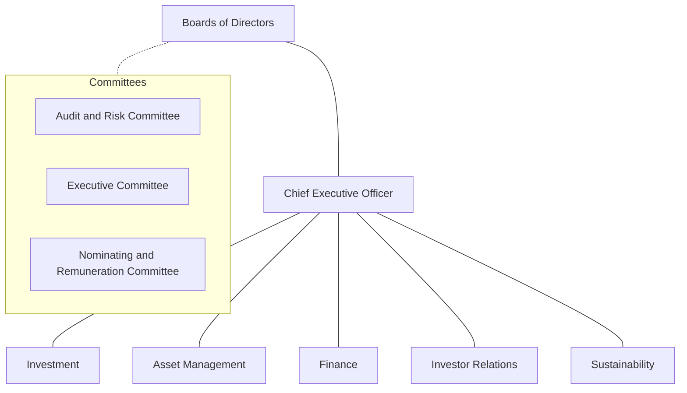
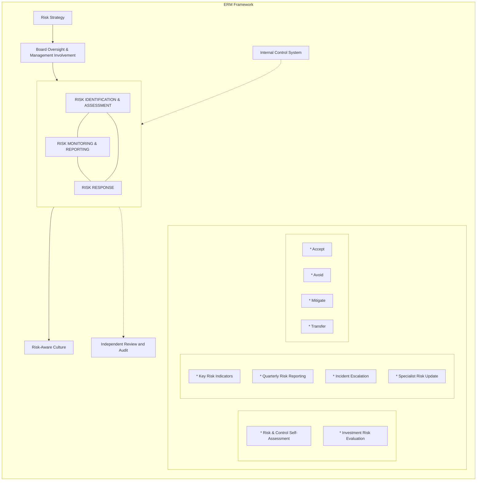

<!-- PAGE 1 -->

CapitaLand ASCOTT TRUST logo

Abstract dandelion-like graphic with purple rays and a red center

# CapitaLand Ascott Trust

Annual Report 2025

<!-- PAGE 2 -->

# Seeding Growth, Creating Enduring Value

Grounded in resilience and governance, our values keep us steadfast through business cycles while propelling us to seize opportunities with clarity and confidence.

We are advancing through innovation, partnerships, and sustainable growth. With strategic focus and effective execution, we continue to seed new opportunities and strengthen growth engines to deliver enduring value for our stakeholders.

Abstract dandelion-like graphic with radiating lines

## Contents

<table>
  <thead>
    <tr>
        <th colspan="2">Overview</th>
        <th colspan="2">Governance</th>
    </tr>
  </thead>
  <tbody>
    <tr>
        <td>About Us</td>
        <td>1</td>
        <td>Risk Management</td>
        <td>58</td>
    </tr>
    <tr>
        <td>Chairman and CEO Message</td>
        <td>2</td>
        <td>Corporate Governance</td>
        <td>64</td>
    </tr>
    <tr>
        <td>CLAS at 20</td>
        <td>4</td>
        <td>Statement of Policies and Practices</td>
        <td>92</td>
    </tr>
    <tr>
        <td>2025 Highlights</td>
        <td>6</td>
        <td> </td>
        <td> </td>
    </tr>
    <tr>
        <th>Boards of Directors</th>
        <th>12</th>
        <th colspan="2">Financial Statements</th>
    </tr>
    <tr>
        <td>Trust Structure and Organisation Structure</td>
        <td>14</td>
        <td>Financial Statements and Notes</td>
        <td>98</td>
    </tr>
    <tr>
        <td>Management Team</td>
        <td>15</td>
        <td> </td>
        <td> </td>
    </tr>
    <tr>
        <td> </td>
        <td> </td>
        <td> </td>
        <td> </td>
    </tr>
    <tr>
        <th colspan="2">Performance</th>
        <th colspan="2">Other Information</th>
    </tr>
    <tr>
        <td>Financial Review</td>
        <td>16</td>
        <td>Additional Information</td>
        <td>289</td>
    </tr>
    <tr>
        <td>Portfolio Overview</td>
        <td>22</td>
        <td>Statistics of Stapled Securityholdings</td>
        <td>291</td>
    </tr>
    <tr>
        <td>Operations Review</td>
        <td>26</td>
        <td> </td>
        <td> </td>
    </tr>
    <tr>
        <td>Investor Relations</td>
        <td>50</td>
        <td> </td>
        <td> </td>
    </tr>
    <tr>
        <td>Portfolio Listing</td>
        <td>52</td>
        <td> </td>
        <td> </td>
    </tr>
  </tbody>
</table>

## Reporting Suite

QR Code

Scan the QR code or visit www.capitalandascotttrust.com to view the online reports

<!-- PAGE 3 -->

# About Us

CapitaLand Ascott Trust (CLAS) is the largest lodging trust in Asia Pacific with an asset value of S$8.9 billion as at 31 December 2025. Having listed on the Singapore Exchange Securities Trading Limited (SGX‑ST) since March 2006, CLAS’ objective is to invest primarily in income‑producing real estate and real estate‑related assets which are used or predominantly used as serviced residences, rental housing properties, student accommodation and other hospitality assets in any country in the world. CLAS is a constituent of the FTSE EPRA Nareit Global Real Estate Index Series (Global Developed Index).

CLAS is a stapled group comprising CapitaLand Ascott Real Estate Investment Trust (CapitaLand Ascott REIT) and CapitaLand Ascott Business Trust (CapitaLand Ascott BT). CLAS is managed by CapitaLand Ascott Trust Management Limited (as manager of CapitaLand Ascott REIT) and CapitaLand Ascott Business Trust Management Pte. Ltd. (as trustee‑manager of CapitaLand Ascott BT). The manager and trustee‑manager (collectively, the Managers) are wholly‑owned subsidiaries of Singapore‑listed CapitaLand Investment Limited, a leading global real asset manager with a strong Asia foothold.

CLAS’ international portfolio comprises 103 properties with over 18,000 units in 45 cities across 16 countries in Asia Pacific, Europe and the United States of America as of 31 December 2025.

## Our Vision

To be the premier lodging trust with quality assets in key global cities

CLAS’ properties are mostly operated under the Ascott, Somerset, Quest and Citadines brands. They are mainly located in key gateway cities such as Barcelona, Berlin, Brussels, Hanoi, Ho Chi Minh City, Jakarta, Kuala Lumpur, London, Manila, Melbourne, Munich, New York, Paris, Perth, Seoul, Singapore, Sydney and Tokyo.

## Our Mission

To deliver stable and sustainable returns to Stapled Securityholders

In 2025, CLAS maintained its strong reputation in corporate governance, investor relations and sustainability. For the fifth year in a row, CLAS secured the top ranking in the Singapore Governance and Transparency Index 2025 (REITs and Business Trusts category) and the title of Global Listed Sector Leader for the Hotel category in the 2025 GRESB Real Estate Assessment. CLAS is a constituent of key sustainability indices, including the iEdge‑UOB APAC Yield Focus Green REIT Index and the iEdge - OCBC Singapore Low Carbon Select 40 Capped Index.

<table>
  <tbody>
    <tr>
        <td colspan="2">S$8.9 billion</td>
    </tr>
    <tr>
        <td colspan="2">Total Assets</td>
    </tr>
    <tr>
        <td>16</td>
        <td>45</td>
    </tr>
    <tr>
        <td>Countries</td>
        <td>Cities</td>
    </tr>
    <tr>
        <td>103</td>
        <td>&gt;18,000</td>
    </tr>
    <tr>
        <td>Properties</td>
        <td>Units</td>
    </tr>
  </tbody>
</table>

<!-- PAGE 4 -->

# Chairman and CEO Message

Teo Joo Ling, Serena and Lui Chong Chee

**Teo Joo Ling, Serena**
Chief Executive Officer
Executive Non-Independent Director

**Lui Chong Chee**
Chairman
Non-Executive Independent Director

**Dear Stapled Securityholders,**

2026 marks the 20<sup>th</sup> anniversary of CapitaLand Ascott Trust’s (CLAS) listing on the SGX-ST — a significant milestone that reflects two decades of disciplined growth, resilience and a resolute commitment to delivering long-term sustainable returns to Stapled Securityholders in key gateway cities across Asia Pacific, Europe and the United States of America (USA). We also broadened our exposure to the living sector by investing in rental housing and student accommodation.

**20 Years of Growth and Resilience**

From our beginnings as a Pan-Asia REIT in 2006 with 12 properties across six countries, CLAS has steadily transformed into a leading global lodging trust. As at 31 December 2025, we have built a well-diversified portfolio of 103 properties across 16 countries.

In the financial year 2025 (FY 2025), stable income sources – master leases, management contracts with minimum guaranteed income and living sector assets – contributed 65% of total gross profit. Growth income from serviced residences and hotels under management contracts accounted for the remaining 35%.

Since our IPO, CLAS’ distribution income has grown at a compounded annual growth rate (CAGR) of about 12%, underpinned by our healthy operating performance and our proactive portfolio and capital management. We have delivered a total return of over 250% to Stapled Securityholders.

One of the pivotal milestones in our 20-year journey was the successful combination of Ascott Residence Trust and Ascendas Hospitality Trust in 2019. This strategic merger consolidated CLAS’ position as the largest lodging trust in Asia Pacific and provided the scale, financial resilience and operational flexibility that enabled us to navigate the unprecedented challenges of the COVID-19 pandemic.

A key differentiator of CLAS is our diversified portfolio that balances stability and growth. Spanning across geographies, asset classes and contract types, this diversity enhances our resilience. Over the years, we expanded into new markets and strengthened our foothold

We have been disciplined in reconstituting our portfolio to enhance returns. We continue to divest assets that have reached optimal maturity and redeploy capital into higher-yielding, accretive investments. This ensures that our portfolio remains high quality, future-ready and aligned with evolving lodging trends. These efforts are supported by ongoing asset enhancement initiatives (AEIs) that uplift our properties’ value and income potential.

<!-- PAGE 5 -->

# Delivering Stable Distributions

In FY 2025, CLAS continued to demonstrate operational strength and deliver stable returns despite ongoing macroeconomic uncertainties.

Income available for distribution increased 11% year-on-year (YoY) due to the increase in gross profit and higher non-periodic items¹. Total distribution was S$233.5 million, after retaining S$23.2 million in non-periodic items to fund AEIs to drive future growth and/or for general corporate and working capital purposes. Correspondingly, Distribution per Stapled Security remained at 6.10 cents, in line with our commitment to deliver stable distributions.

Gross profit increased 4% YoY to S$385.3 million, supported by stronger operating performance, contributions from our reconstituted portfolio, and uplift from renovated properties. These mitigated the impact of foreign currency fluctuations against the Singapore Dollar. On a same-store basis, excluding acquisitions and divestments in the financial year 2024 (FY 2024) and FY 2025, gross profit rose 1%.

In FY 2025, revenue per available unit grew 3% to S$161. This was driven by an increase in our portfolio’s average occupancy from 77% in FY 2024 to 80%. CLAS’ portfolio valuation rose by 1.7% or S$130 million due to our stronger operating performance.

# Building a Stronger Portfolio

CLAS continues to take a proactive approach to enhance the quality of our portfolio and income streams for long-term sustained growth. This is achieved through accretive investments, strategic divestments and well-timed AEIs to capture lodging demand.

As part of our capital recycling strategy, we completed approximately S$300 million in divestments across China and Japan in 2025 at a significant premium to book value, unlocking over S$50 million in net gains. During the year, CLAS reinvested proceeds from previous divestments into approximately S$210 million of accretive acquisitions. These acquisitions comprised two hotels and three rental housing properties in Japan.

CLAS also completed two AEIs in Paris and Seoul. In 2026 and 2027, CLAS has planned five more AEIs. The properties are The Cavendish London in the United Kingdom, Sotetsu Grand Fresa Osaka-Namba in Japan, Sheraton Tribeca New York Hotel in the USA, Citadines Place d’Italie Paris in France and Sydney Central Hotel in Australia.

Additionally, we are redeveloping our 192-unit Somerset property in Clarke Quay, Singapore. Development is slated for completion in 2026 and the property is expected to open in 2027.

# Disciplined Capital Management

Maintaining a strong financial position remains a key priority for CLAS. We hold an investment grade credit rating of BBB with a stable outlook by Fitch Ratings. We maintain a disciplined capital management approach by recycling capital from divestments, accessing debt markets judiciously, and upholding a well-staggered debt maturity profile. This strategy ensures that CLAS is well-positioned to pursue accretive opportunities while effectively managing risks in a dynamic macroeconomic environment.

As at 31 December 2025, gearing stood at 37.7%, well within regulatory limits and providing ample debt headroom for growth. As at 31 December 2025, CLAS’ average cost of debt was 2.9% per annum and we expect it to be relatively stable in 2026. Interest cover is healthy at 3.0 times. Our exposure to foreign exchange movements is mitigated by our geographically diversified portfolio and hedging strategies.

# Creating Sustainable Value

While macroeconomic uncertainties are expected to persist, CLAS’ diversified portfolio and proactive asset management ensure CLAS is well-positioned to navigate the evolving landscape.

In our next phase of growth, we will further enhance the resilience of CLAS’ portfolio by strengthening our presence in key markets and recycling capital from divestments. In February 2026, we acquired three rental housing properties in Greater Tokyo, Japan, progressing towards CLAS' medium-term portfolio allocation of 25%–30% in the living sector and 70%–75% in hospitality assets.

We remain disciplined in our value-creation strategy. This includes prioritising yield-accretive investments, undertaking AEIs for properties in prime locations, upholding operational excellence, and advancing sustainability efforts that drive long-term value.

As we pursue these growth initiatives, CLAS is committed to delivering stable distributions through stronger core operating performance. We have the flexibility to distribute gains from past divestments to mitigate the impact of AEIs on CLAS’ income.

As we mark CLAS’ 20<sup>th</sup> anniversary, we extend our deepest appreciation to our Stapled Securityholders for your trust and support; to our Sponsor, The Ascott Limited; to our operators for your strong partnership; and to our teams around the world for your dedication. We remain steadfast in upholding CLAS’ legacy of excellence and disciplined growth in the years ahead.

Sincerely,

<table>
  <tbody>
    <tr>
        <td>Lui Chong Chee</td>
        <td>Serena Teo</td>
    </tr>
    <tr>
        <td>Chairman</td>
        <td>Chief Executive Officer</td>
    </tr>
  </tbody>
</table>

\*1 Relates to realised exchange gain arising from the settlement of cross currency interest rate swaps and repayment of foreign currency bank loans and medium term notes.

<!-- PAGE 6 -->

# CLAS at 20

## Celebrating Two Decades of Strength and Stewardship

CapitaLand Ascott Trust 20 Years logo

World map showing Key Markets and Other Markets including USA, Ireland, UK, Germany, France, Spain, Belgium, South Korea, China, Japan, Vietnam, The Philippines, Malaysia, Singapore, Indonesia, and Australia

# Key Milestones

**2006**

Listing on the Main Board of the SGX-ST as the first pan-Asian serviced residence REIT

**2010**

Foray into Europe

**2015**

Expansion into the USA

**2018**

First development project in Singapore

**2019**

S$1.9 billion combination with Ascendas Hospitality Trust

**2020**

Included into the FTSE EPRA Nareit Global Developed Index

**2021**

Expanded investment mandate to include student accommodation

<!-- PAGE 7 -->

# Portfolio Snapshot

Properties icon

**103**
Properties

Globe icon

**4**
Lodging Asset Classes

* Serviced Residences
* Hotels
* Rental Housing
* Student Accommodation

Key icon

**16**
Countries

Pie chart icon

**6**
Key Markets

# 20 Years of Growth

Upward arrow icon

**12%**
Distribution Income CAGR since IPO

Bar chart icon

**8 times**
Increase in Total Assets since 2006

Target icon

**>250%**
Total Stapled Securityholder Returns since IPO

Flag icon

**Asia Pacific, Europe and USA**
Globally Diversified Portfolio

## 2022

Ascott Residence Trust changed its name to CapitaLand Ascott Trust

## 2023

Delivered strong performance post-pandemic, increasing DPS by 16%

## 2025

* Included into the iEdge Singapore Next 50 Index
* Only lodging trust in Asia Pacific to be included in the S&P Global Sustainability Yearbook
* Achieved sector leader position in the ‘Listed Hotel, Globally Diversified’ category in GRESB for the fifth time
* Ranked 1ˢᵗ in the Singapore Governance and Transparency Index (REITs and Business Trusts) for the fifth time

<!-- PAGE 8 -->

# 2025 Highlights

## Financial Highlights

## 5-Year Financial Summary

<table>
  <thead>
    <tr>
        <th> </th>
        <th>2025</th>
        <th>2024</th>
        <th>2023</th>
        <th>2022</th>
        <th>2021</th>
    </tr>
  </thead>
  <tbody>
    <tr>
        <td colspan="6"><strong>For the Financial Year</strong></td>
    </tr>
    <tr>
        <td>Gross Revenue (S$ million)</td>
        <td><strong>837.6</strong></td>
        <td>809.5</td>
        <td>744.5</td>
        <td>621.2</td>
        <td>394.4</td>
    </tr>
    <tr>
        <td>Gross Profit (S$ million)</td>
        <td><strong>385.3</strong></td>
        <td>370.9</td>
        <td>338.2</td>
        <td>282.8</td>
        <td>173.3</td>
    </tr>
    <tr>
        <td>Total Distribution (S$ million)</td>
        <td><strong>233.5</strong></td>
        <td>231.2</td>
        <td>237.0</td>
        <td>189.8</td>
        <td>137.3</td>
    </tr>
    <tr>
        <td>Distribution per Stapled Security (DPS) (cents)</td>
        <td><strong>6.10</strong></td>
        <td>6.10</td>
        <td>6.57</td>
        <td>5.67</td>
        <td>4.32</td>
    </tr>
    <tr>
        <td>Distribution Yield¹ (%)</td>
        <td><strong>6.35</strong></td>
        <td>7.01</td>
        <td>6.64</td>
        <td>5.40</td>
        <td>4.19</td>
    </tr>
    <tr>
        <td colspan="6"><strong>Balance Sheet as at 31 December</strong></td>
    </tr>
    <tr>
        <td>Total Assets (S$ million)</td>
        <td><strong>8,947.4</strong></td>
        <td>8,820.1</td>
        <td>8,730.8</td>
        <td>8,023.7</td>
        <td>7,733.2</td>
    </tr>
    <tr>
        <td>Stapled Securityholders' Funds (S$ million)</td>
        <td><strong>4,474.8</strong></td>
        <td>4,377.0</td>
        <td>4,356.4</td>
        <td>3,965.4</td>
        <td>3,890.9</td>
    </tr>
    <tr>
        <td>Total Borrowings (S$ million)</td>
        <td><strong>3,190.1</strong></td>
        <td>3,173.5</td>
        <td>3,048.4</td>
        <td>2,874.6</td>
        <td>2,728.9</td>
    </tr>
    <tr>
        <td colspan="6"><strong>Financial Ratios as at 31 December</strong></td>
    </tr>
    <tr>
        <td>Net Asset Value (NAV) per Stapled Security (S$)</td>
        <td><strong>1.17</strong></td>
        <td>1.15</td>
        <td>1.16</td>
        <td>1.15</td>
        <td>1.19</td>
    </tr>
    <tr>
        <td>Aggregate Leverage (%)</td>
        <td><strong>37.7</strong></td>
        <td>38.3</td>
        <td>37.9</td>
        <td>38.0</td>
        <td>37.1</td>
    </tr>
    <tr>
        <td>Interest Cover Ratio² (times)</td>
        <td><strong>3.0</strong></td>
        <td>3.1</td>
        <td>3.4</td>
        <td>3.6</td>
        <td>2.8</td>
    </tr>
    <tr>
        <td>Management Expense Ratio³ (%)</td>
        <td><strong>1.3</strong></td>
        <td>1.3</td>
        <td>1.2</td>
        <td>1.1</td>
        <td>1.0</td>
    </tr>
    <tr>
        <td>Financial Derivatives as a Percentage of NAV⁴ (%)</td>
        <td><strong>2.3</strong></td>
        <td>2.9</td>
        <td>1.9</td>
        <td>2.2</td>
        <td>0.7</td>
    </tr>
    <tr>
        <td colspan="6"><strong>Other Information as at 31 December</strong></td>
    </tr>
    <tr>
        <td>Market Capitalisation¹ (S$ million)</td>
        <td><strong>3,677.9</strong></td>
        <td>3,302.7</td>
        <td>3,725.7</td>
        <td>3,617.9</td>
        <td>3,374.8</td>
    </tr>
    <tr>
        <td>Number of Stapled Securities in Issue (million)</td>
        <td><strong>3,831.1</strong></td>
        <td>3,796.2</td>
        <td>3,763.3</td>
        <td>3,445.6</td>
        <td>3,276.5</td>
    </tr>
  </tbody>
</table>

1 Based on the closing price on the last trading day of each respective year. 2025: S$0.96; 2024: S$0.87, 2023: S$0.99, 2022: S$1.05 and 2021: S$1.03.

2 Refers to EBITDA (earnings before interest expense, income tax expense, depreciation and amortisation) before change in fair value of financial derivatives, change in fair value of investment properties, investment properties under development and assets held for sale, revaluation surplus/(deficit) on land and buildings, and foreign exchange differences over interest expense and distributions on hybrid securities as defined in the Code on Collective Investment Schemes dated 28 November 2025. Perpetual securities are the only hybrid securities that CLAS holds.

3 Refers to expenses (excluding direct expenses, foreign exchange differences, net interest expense, change in fair value of financial derivatives, change in fair value of investment properties, investment properties under development and assets held for sale, revaluation surplus/(deficit) on land and buildings, investment properties written off and income tax expense) over net asset value.

4 Financial derivatives refer to the cross currency interest rate swaps, currency forwards and interest rate swaps which CLAS has entered into.

<!-- PAGE 9 -->

# Delivering Stable Distributions in FY 2025

**3%**
Increase in
Gross Revenue

**4%**
Increase in
Gross Profit

**6.35%**
Distribution
Yield<sup>1</sup>

**6.10 cents**
Stable DPS

# Strong Financial Position

**BBB**
(Stable Outlook)
Fitch Ratings

**2.9%**
Low Average
Cost of Debt

**37.7%**
Healthy
Gearing

**3.0X**
Interest
Cover

**1.7%**
Increase in
Portfolio Valuation

Photograph of London street scene with Big Ben, red double-decker buses, and black cabs

1 Based on the closing price of S$0.96 on the last trading day of FY 2025.

<!-- PAGE 10 -->

# 2025 Highlights

## Portfolio Highlights

CLAS proactively pursues investment, divestment and asset enhancement opportunities to enhance the quality and performance of our portfolio, and the sustainability of returns to Stapled Securityholders.

Divesting properties that have reached the optimal stage of their life cycles allows CLAS to redeploy proceeds into more optimal uses. These include investing in higher yielding properties in prime locations with strong demand drivers and funding asset enhancement initiatives (AEIs) to enhance the performance and valuation of existing properties. Proceeds from divestments may also be used to pare down debt with higher interest rates.

Circular diagram showing the cycle of Divestment, Investment, and Asset Enhancement

## Divestment

In FY 2025, CLAS completed about S$300 million in divestments at a significant premium to book value, unlocking over S$50 million in net gain after tax.

> **Completed c.S$300 mil in divestments at significant premium to book value in FY 2025**

## Divestments Completed in FY 2025

<table>
  <thead>
    <tr>
        <th>No.</th>
        <th>Property</th>
        <th>Location</th>
        <th>Sale Price</th>
        <th>Premium Over Book Value¹</th>
        <th>Exit Yield²</th>
        <th>Divestment Date</th>
    </tr>
  </thead>
  <tbody>
    <tr>
        <td>1</td>
        <td>Somerset Olympic Tower Tianjin</td>
        <td>Tianjin, China</td>
        <td>RMB420.0 million<br/>(S$77.4 million)</td>
        <td>c.50%</td>
        <td>2.2%</td>
        <td>Apr 2025</td>
    </tr>
    <tr>
        <td>2</td>
        <td>Citadines Central Shinjuku Tokyo</td>
        <td>Tokyo, Japan</td>
        <td>JPY25.0 billion<br/>(S$222.7 million)</td>
        <td>c.100%</td>
        <td>3.2%</td>
        <td>Oct 2025</td>
    </tr>
  </tbody>
</table>

1 For Somerset Olympic Tower Tianjin, the premium over book value is based on the property’s book value as at 31 December 2023 as the divestment was entered into in 2024; for Citadines Central Shinjuku Tokyo, it is based on the property’s book value as at 30 June 2025.

2 For Somerset Olympic Tower Tianjin, the exit yield is based on the property’s FY 2023 earnings before interest, taxes, depreciation and amortisation (EBITDA) as the divestment was entered into in 2024; for Citadines Central Shinjuku Tokyo, it is based on the property’s FY 2024 EBITDA, as the divestment was entered into in 2025.

## Investment

### Acquisitions

In FY 2025, CLAS completed about S$210 million of accretive acquisitions, recycling capital at higher yields. These included the acquisition of two hotels and three rental housing properties in Japan.

> **Completed c.S$210 mil of accretive acquisitions at higher yields in FY 2025**

<!-- PAGE 11 -->

# Investments Completed in FY 2025

<table>
  <thead>
    <tr>
        <th>No.</th>
        <th>Property</th>
        <th>Lodging Type</th>
        <th>Location</th>
        <th>No. of Units</th>
        <th>Purchase Price</th>
        <th>NOI Yield¹</th>
        <th>Acquisition Date</th>
    </tr>
  </thead>
  <tbody>
    <tr>
        <td>1</td>
        <td>ibis Styles Tokyo Ginza</td>
        <td>Hotel</td>
        <td>Tokyo, Japan</td>
        <td>224</td>
        <td rowspan="2">JPY21.0 billion<br/>(S$178.5 million)</td>
        <td rowspan="2">4.3%</td>
        <td rowspan="2">Jan 2025</td>
    </tr>
    <tr>
        <td>2</td>
        <td>Chisun Budget Kanazawa Ekimae</td>
        <td>Hotel</td>
        <td>Kanazawa, Japan</td>
        <td>392</td>
    </tr>
    <tr>
        <td>3</td>
        <td>Pre de Cort Nishikyogoku</td>
        <td>Rental Housing</td>
        <td>Kyoto, Japan</td>
        <td>85</td>
        <td rowspan="3">JPY4.0 billion<br/>(S$34.2 million)</td>
        <td rowspan="3">4.0%</td>
        <td rowspan="3">Aug 2025</td>
    </tr>
    <tr>
        <td>4</td>
        <td>Splendide Namba West</td>
        <td>Rental Housing</td>
        <td>Osaka, Japan</td>
        <td>56</td>
    </tr>
    <tr>
        <td>5</td>
        <td>Pregio Esaka South</td>
        <td>Rental Housing</td>
        <td>Osaka, Japan</td>
        <td>48</td>
    </tr>
  </tbody>
</table>

\* 1 For properties 1 and 2, the Net Operating Income (NOI) yield refers to the blended NOI yield in FY 2024; for properties 3 to 5, it refers to the expected blended NOI entry yield in FY 2025.

# Development Projects

Development works are currently ongoing for the former Somerset Liang Court Singapore, a serviced residence with hotel licence located in the popular riverfront lifestyle and entertainment Clarke Quay precinct. The development work is expected to be completed in 2026 and the serviced residence is expected to commence operations in 2027¹.

As at 31 December 2025, CLAS’ development activities comprise less than 10% of its deposited property, within the Monetary Authority of Singapore’s development limit.

\* 1 Timeline is subject to change.

# Asset Enhancement

In FY 2025, CLAS completed two AEIs in Paris and Seoul, which are expected to enhance the value and profitability of these properties. In FY 2026 and FY 2027, CLAS plans to undertake several AEIs in prime locations of key gateway cities, including London and New York.

Given the uncertain global outlook, CLAS will monitor the macroeconomic situation, lodging demand and renovation costs, and may adjust the AEI schedules as needed. The capital expenditure for CLAS’ AEIs is funded partially by the master lessees or operators of the properties.

CLAS is committed to distributing stable distributions and has the flexibility to distribute past divestment gains to mitigate the impact of the AEIs on CLAS’ income.

> **Flexibility to distribute past divestment gains to mitigate the impact of AEIs on CLAS’ income**

# AEIs Completed in FY 2025

<table>
  <thead>
    <tr>
        <th>No.</th>
        <th>Property</th>
        <th>Location</th>
        <th>Completion Date</th>
    </tr>
  </thead>
  <tbody>
    <tr>
        <td>1</td>
        <td>ibis Ambassador Seoul Insadong</td>
        <td>Seoul, South Korea</td>
        <td>2Q 2025</td>
    </tr>
    <tr>
        <td>2</td>
        <td>Citadines République Paris</td>
        <td>Paris, France</td>
        <td>4Q 2025</td>
    </tr>
  </tbody>
</table>

# Properties Undergoing or Scheduled for AEI

<table>
  <thead>
    <tr>
        <th>No.</th>
        <th>Property</th>
        <th>Location</th>
        <th>Timeline of AEI¹</th>
    </tr>
  </thead>
  <tbody>
    <tr>
        <td>1</td>
        <td>Sotetsu Grand Fresa Osaka-Namba</td>
        <td>Osaka, Japan</td>
        <td>4Q 2025 to 4Q 2026</td>
    </tr>
    <tr>
        <td>2</td>
        <td>Sheraton Tribeca New York Hotel</td>
        <td>New York, USA</td>
        <td>1Q 2026 to 4Q 2026</td>
    </tr>
    <tr>
        <td>3</td>
        <td>Citadines Place d'Italie Paris</td>
        <td>Paris, France</td>
        <td>1Q 2026 to 1Q 2027</td>
    </tr>
    <tr>
        <td>4</td>
        <td>The Cavendish London</td>
        <td>London, United Kingdom</td>
        <td>1Q 2026 to 2027</td>
    </tr>
    <tr>
        <td>5</td>
        <td>Sydney Central Hotel</td>
        <td>Sydney, Australia</td>
        <td>2026 to 2027</td>
    </tr>
  </tbody>
</table>

\* 1 Timeline is subject to change.

<!-- PAGE 12 -->

# Sustainability Highlights

CLAS is committed to being a responsible trust, and is aligned with the CapitaLand Investment (CLI) 2030 Sustainability Master Plan (SMP), which outlines our sustainability targets and pathways.

CLAS’ material ESG factors are aligned with the SMP and mapped against eight UN Sustainable Development Goals. In line with CLI, CLAS has committed to achieving Net Zero carbon emissions for Scope 1 and 2 by 2050. CLAS contributes to the environmental and social well-being of the communities where we operate, as we deliver long-term economic value to our stakeholders.

CLAS’ Boards recognise sustainability as an important business imperative and ensure that sustainability considerations are factored into CLAS’ strategic development. CLAS’ board statement, sustainability management structure, material ESG factors, performance and climate-related disclosures will be available in CLAS’ Sustainability Report 2025, which will be published in May 2026. The report will reference and adopt various international standards and guidelines.

# Ratings & Accolades

Included in the S&P Global Sustainability Yearbook 2026 logo
Included in the
**S&P Global Sustainability Yearbook 2026**

GRESB Global Listed Sector Leader – Hotel 2021-2025 logo
**Global Listed Sector Leader – Hotel**
GRESB 2021-2025

Ranked 1st Singapore Governance and Transparency Index logo
**Ranked 1ˢᵗ**
Singapore Governance and Transparency Index (REITs and Business Trusts) 2021-2025

Sustainalytics 'Negligible' ESG Risk Rating logo
**‘Negligible’**
Sustainalytics ESG Risk Rating

Constituent of iEdge-UOB APAC Yield Focus Green REIT Index logo
Constituent of
**iEdge-UOB APAC Yield Focus Green REIT Index**

& **iEdge-OCBC Singapore Low Carbon Select 40 Capped Index**

<!-- PAGE 13 -->

# Corporate Governance Highlights

## Board Composition (7 Directors)

Board Independence

**57% (4)**
Independent icon

Independent

**43% (3)**
Non-Independent icon

Non-Independent

Gender Diversity

**57% (4)**
Males icon

Males

**43% (3)**
Females icon

Females

Age Profile

**43% (3)**
61 years & above icon

61 years & above

**43% (3)**
51-60 years old icon

51-60 years old

**14% (1)**
50 years & below icon

50 years & below

Tenure Mix

**43% (3)**
0-3 years icon

0-3 years

**43% (3)**
3-6 years icon

3-6 years

**14% (1)**
>6 years icon

>6 years

## Board Committee Composition

Audit and Risk Committee

3

Members

100%

Independent

Executive Committee

3

Members

100%
Non-Independent

Nominating and Remuneration Committee

3

Members

100%

Independent

## Number of Meetings

6 icon
6

Board

5

Audit and Risk Committee

2

Nominating and Remuneration Committee

1

Executive Committee

2

AGM/EGM

## How CLAS Complies with the Corporate Governance Code

The Corporate Governance Report is benchmarked against the Code of Corporate Governance 2018 (last amended 11 January 2023) (Code). CLAS has complied with the principles of corporate governance laid down by the Code and also, substantially, with the provisions underlying the principles of the Code. Where there are deviations from the provisions of the Code, appropriate explanations are provided in this Report along with explanations of how the practices are consistent with the aim and philosophy of the principle of the Code in question.

<table>
  <thead>
    <tr>
        <th> </th>
        <th>Page</th>
    </tr>
  </thead>
  <tbody>
    <tr>
        <td>Board Matters</td>
        <td>66</td>
    </tr>
    <tr>
        <td>Remuneration Matters</td>
        <td>74</td>
    </tr>
    <tr>
        <td>Accountability and Audit</td>
        <td>81</td>
    </tr>
    <tr>
        <td>Stapled Securityholder Rights and Engagement</td>
        <td>84</td>
    </tr>
    <tr>
        <td colspan="2">Policies</td>
    </tr>
    <tr>
        <td>Board Diversity Policy</td>
        <td>70</td>
    </tr>
    <tr>
        <td>Remuneration Policy and Framework</td>
        <td>75</td>
    </tr>
    <tr>
        <td>Dealings in Securities Policy</td>
        <td>89</td>
    </tr>
    <tr>
        <td>Whistle-Blowing Policy</td>
        <td>90</td>
    </tr>
  </tbody>
</table>

<!-- PAGE 14 -->

# Boards of Directors

Lui Chong Chee portrait

**Lui Chong Chee, 65**

Chairman
Non-Executive
Independent Director

* Bachelor of Science in Business Administration, New York University, United States

* Master of Business Administration, New York University, United States

* Advanced Management Program, Harvard Business School

**Date of first appointment as a Director\***

1 February 2024

**Date of appointment as Chairman**

22 April 2024

**Length of service as a Director (as at 31 December 2025)**

1 year 11 months

**Board committee served on**

* Nominating and Remuneration Committee (Chairman)

**Present principal commitment**

* CapitaLand Ascott Trust Management Limited and CapitaLand Ascott Business Trust Management Pte. Ltd. (Chairman)

**Past directorship in listed companies held over the preceding three years**

* CapitaLand Malaysia REIT Management Sdn. Bhd. (manager of CapitaLand Malaysia Trust)

Teo Joo Ling, Serena portrait

**Teo Joo Ling, Serena, 52**

Chief Executive Officer
Executive Non-Independent Director

* Master in Business Administration, INSEAD

* Bachelor of Electrical and Electronic Engineering (Honours), National University of Singapore

**Date of first appointment as a Director**

1 July 2022

**Length of service as a Director (as at 31 December 2025)**

3 years 6 months

**Board committee served on**

* Executive Committee (Member)

**Present principal commitment**

* CapitaLand Ascott Trust Management Limited and CapitaLand Ascott Business Trust Management Pte. Ltd. (Chief Executive Officer and Executive Non-Independent Director)

Max Loh Khum Whai portrait

**Max Loh Khum Whai, 64**

Non-Executive
Independent Director

* Bachelor of Accountancy (Honours), National University of Singapore

* Fellow Chartered Accountant, Institute of Singapore Chartered Accountants

* Fellow Certified Practising Accountant, CPA Australia

* Senior Accredited Director and Vice-Chair, Singapore Institute of Directors

**Date of first appointment as a Director**

23 November 2023

**Length of service as a Director (as at 31 December 2025)**

2 years 1 month

**Board committee served on**

* Audit and Risk Committee (Chairman)

**Present directorship in other listed company**

* Samudera Shipping Line Ltd

**Other major appointments**

* Building & Construction Authority (Deputy Chairman)

* Competition & Consumer Commission of Singapore (Chairman)

* SPH Media Holdings Limited (Director)

Chia Kim Huat portrait

**Chia Kim Huat, 59**

Non-Executive
Independent Director

* Bachelor of Law (Honours), National University of Singapore

* Advocate & Solicitor, Supreme Court of Singapore

**Date of first appointment as a Director**

15 April 2020

**Length of service as a Director (as at 31 December 2025)**

5 years 8 months

**Board committees served on**

* Audit and Risk Committee (Member)

* Nominating and Remuneration Committee (Member)

**Past directorship in listed companies held over the preceding three years**

* SATS Ltd

**Present principal commitment**

* Rajah & Tann Singapore LLP (Partner)

\* Mr Lui Chong Chee was first appointed as a Director of Ascott Residence Trust Management Limited (currently known as CapitaLand Ascott Trust Management Limited) from June 2008 to May 2010.

For more information on the Boards of Directors’ background, working experience and awards, please refer to CLAS’ website at <u>https://www.capitalandascotttrust.com/board_of_directors.html</u>.

<!-- PAGE 15 -->

**Other major appointments**

* Business China (Director)

* Business China's FutureChina's Committee (Co-Chairman)

* Chinese Development Assistance Council (Director)

* Dunman High School (School Advisory Board Member)

* Singapore Centre for Chinese Language (Director)

* Singapore Chinese Chamber of Commerce (Director and Company Secretary, Financial Board)

* Singapore Chinese Chamber of Commerce Foundation (Director and Company Secretary)

* Singapore Chinese Chamber of Commerce & Industry, International Affairs Committee (Chairman)

* Sun Yat Sen Nanyang Memorial Hall Co Ltd (Company Secretary)

Portrait of Deborah Lee Siew Yin

**Deborah Lee Siew Yin, 68**

Non-Executive Independent Director

* Bachelor of Accountancy (Honours), National University of Singapore

* Degree of Master of Science (Applied Finance), National University of Singapore

* Chartered Financial Analyst® and Member, CFA Institute

**Date of first appointment as a Director**

17 June 2020

**Length of service as a Director (as at 31 December 2025)**

5 years 6 months

**Board committees served on**

* Audit and Risk Committee (Member)

* Nominating and Remuneration Committee (Member)

**Present directorship in other listed company**

* Metro Holdings Limited

**Present principal commitments**

* Singapore University of Technology and Design (Member, Board of Trustees)

* Singapore University of Technology and Design (Chairperson, Finance Committee)

Portrait of Beh Siew Kim

**Beh Siew Kim, 55**

Non-Executive Non-Independent Director

* Bachelor of Business (Accounting), University of Tasmania, Australia

* Member, Institute of Singapore Chartered Accountants

**Date of first appointment as a Director**

From 1 July 2022 (Non-Executive Non-Independent Director)

From 1 May 2017 to 30 June 2022 (Chief Executive Officer and Executive Non-Independent Director)

**Length of service as a Director (as at 31 December 2025)**

8 years 8 months

**Board committee served on**

* Executive Committee (Chairman)

**Present principal commitments**

* CapitaLand Investment Limited (Chief Financial and Sustainability Officer and Managing Director, Japan and Korea, Lodging)

* Focus On the Family Singapore Limited (Director)

* Focus On the Family Singapore Limited (Member, Audit, Risk & Compliance Committee)

* Focus On the Family Singapore Limited (Deputy Chairman, Finance & Fundraising Committee)

Portrait of Yeo Chin Fu Ervin

**Yeo Chin Fu Ervin, 42**

Non-Executive Non-Independent Director

* Bachelor of Arts (Ethics, Politics and Economics), Yale University, United States

**Date of first appointment as a Director**

1 January 2025

**Length of service as a Director (as at 31 December 2025)**

1 year

**Board committee served on**

* Executive Committee (Member)

**Present principal commitments**

* CapitaLand Investment Limited (Group Chief Strategy Officer and Chief Executive Officer, Commercial Management)

* Fair Tenancy Industry Committee (Member)

**Other major appointments**

* Changi Airport Group (Singapore) Pte Ltd (Director)

* Communicable Diseases Agency (Board Member)

<!-- PAGE 16 -->

# Trust Structure

CapitaLand Ascott Trust (CLAS) is a stapled group comprising CapitaLand Ascott Real Estate Investment Trust (CapitaLand Ascott REIT), a real estate investment trust, and CapitaLand Ascott Business Trust (CapitaLand Ascott BT), a business trust, with the following structure:

```mermaid
graph TD
    SSH[Stapled Securityholders]
    Logo[CapitaLand ASCOTT TRUST]
    
    subgraph CLAS[CapitaLand Ascott Trust]
        REIT[CapitaLand AscottReal EstateInvestment Trust(CapitaLand Ascott REIT)]
        BT[CapitaLand AscottBusiness Trust(CapitaLand Ascott BT)]
        REIT --- |Stapling deed| BT
    end

    Trustee[TrusteeDBS Trustee Limited]
    Manager[ManagerCapitaLand Ascott TrustManagement Limited]
    TM[Trustee-ManagerCapitaLand Ascott Business TrustManagement Pte. Ltd.]
    Portfolio[Portfolio of Properties]

    SSH --> |Holdings of Stapled Securities| Logo
    Logo --> |Distributions| SSH

    Trustee --> |Acts on behalf of holders of the CapitaLand Ascott REIT units| REIT
    REIT --> |Trustee fees| Trustee
    
    Manager --> |Management services| REIT
    REIT --> |Management fees| Manager

    TM --> |Acts on behalf of holders of the CapitaLand Ascott BT units and provides management services| BT
    BT --> |Trustee fees and management fees| TM

    REIT --> |Ownership of assets / shares| Portfolio
    Portfolio --> |Net profit / dividends| REIT
```

# Organisation Structure



<!-- PAGE 17 -->

# Management Team

## Teo Joo Ling, Serena

Chief Executive Officer
Executive Non-Independent Director

Ms Teo is an Executive Director on the Boards of the Managers and serves as a member of the Executive Committee. As Chief Executive Officer, she leads the overall strategic planning and implementation of the business, investment and operational strategies for CLAS. She oversees the investment, asset management, finance, investor relations and sustainability functions of the Managers.

Ms Teo has over 25 years of experience spanning both private and public sectors. Before joining the Managers, she was with Ascendas Group for over 12 years, including more than five years in the managers of Ascendas REIT and Ascendas India Development Trust. In her previous role, she was Head of Portfolio Management, where she was responsible for formulating and executing business strategies, and overseeing property management, lease management and asset enhancement initiatives for Ascendas REIT. Before that, Ms Teo held various positions, including Head of Operations & Services, Head of Group Strategy Management and Vice President, Fund Management.

Earlier in her career, she spent more than 10 years in the Singapore Economic Development Board, EDB Investments and Chartered Semiconductors. Ms Teo holds a Master's in Business Administration from INSEAD and a Bachelor's in Electrical and Electronic Engineering (Honours) from the National University of Singapore.

## Kang Siew Fong

Chief Financial Officer

Ms Kang heads the finance team of the Managers and oversees all matters relating to financial management and reporting, accounting, risk management, treasury and capital management. She works closely with the investment and asset management teams to drive acquisitions, divestments and annual business plans. She was a member of the pioneering team responsible for the listing of CLAS in 2006.

Ms Kang has over 30 years of experience in the finance profession. Before joining the Managers, Ms Kang was with The Ascott Limited (Ascott) for over 13 years, where she held various leadership positions, including Vice President, Finance and Vice President, Business Development and Planning. At Ascott, she was responsible for preparing the Group's consolidated accounts and quarterly reports, coordinating with external auditors, and ensuring compliance with statutory 

 regulations and financial reporting standards. She was also involved in mergers and acquisitions, implementation of financial policies and practices, budgeting and internal controls.

Ms Kang holds a Bachelor of Accountancy degree from the National University of Singapore. She is also a Chartered Accountant with the Institute of Singapore Chartered Accountants.

## Lai Dongliang

Head, Investment & Asset Management

As the Head, Investment & Asset Management, Mr Lai oversees CLAS’ investments, divestments and asset enhancement initiatives. He also collaborates with internal and external stakeholders to maximise portfolio efficiency and financial performance.

Mr Lai has over 15 years of experience in real estate investment and asset management. He has held several senior management positions with Keppel Ltd and AEW Capital Management (Asia), amongst others. In his most recent role as Head of Investments for Singapore at Keppel Ltd, he led the origination, underwriting and execution of transactions across various regions, including Singapore, Australia, Hong Kong and Indonesia.

Mr Lai holds a Bachelor of Accountancy with First Class Honours from Nanyang Technological University, Singapore.

## Wong Xiao Fen Denise

Vice President, Listed Funds – Investor Relations

Ms Wong heads the investor relations function of the Managers. She is responsible for providing strategic counsel to senior management and facilitating timely and effective communication with the investment community. In addition, she leads the sustainability reporting for CLAS.

Ms Wong brings with her over 10 years of experience in investor relations for real estate investment trusts and fund managers, as well as in construction and technology companies. She also has experience in asset management, wealth management and financial advisory.

Ms Wong obtained her Bachelor of Business Management degree from Singapore Management University, with majors in Finance (Wealth Management) and Marketing. She also holds the International Certificate in Investor Relations from the Investor Relations Society of the UK and a Certificate in ESG Investing from the CFA Institute.

<!-- PAGE 18 -->

# Financial Review

## Revenue and Gross Profit

CLAS’ revenue of S$837.6 million for the financial year ended 31 December 2025 (FY 2025) comprised S$113.1 million (14% of total revenue) from properties under master leases, S$230.2 million (27%) from properties under management contracts with minimum guaranteed income (MCMGI) and S$494.3 million (59%) from properties under management contracts. The revenue from management contracts comprised S$400.0 million from hospitality properties (serviced residences and hotels) and S$94.3 million from living sector properties (rental housing and student accommodation).

from properties under management contracts. For the management contracts, the gross profit from hospitality properties was S$134.9 million and the gross profit from living sector properties amounted to S$54.7 million.

CLAS’ stable income sources (which include master leases, MCMGI and living sector properties) contributed about 65% of CLAS’ gross profit for FY 2025.

Revenue for FY 2025 increased by S$28.1 million as compared to the previous financial year ended 31 December 2024 (FY 2024).

For the properties under master leases, revenue and gross profit were higher in FY 2025 mainly due to contribution from lyf Funan Singapore (acquired on 31 December 2024), Japan (higher variable rent), and France (higher rent from rent indexation, higher variable rent and appreciation of EUR against SGD). These increases were partially offset by the divestment of a property in Japan in March 2024.

The increase in revenue was mainly due to higher revenue of S$25.5 million from the existing properties and additional contribution of S$29.0 million from the five properties acquired during FY 2025 and full year contribution from the two properties acquired in FY 2024. The contribution from the acquisitions had more than offset the decrease in revenue of S$26.4 million from the divestment of 10 properties during FY 2025 and FY 2024.

For the properties under MCMGI, both revenue and gross profit were higher as compared to last year due to stronger operating performance from most countries, in particular UK (driven by stronger performance at Citadines Holborn-Covent Garden London post asset enhancement initiative).

CLAS’ portfolio occupancy was 80% in FY 2025. Revenue per available unit (RevPAU) increased by 3%, from S$156 in FY 2024 to S$161 in FY 2025.

Revenue from management contracts was higher due to stronger performance from most countries and contributions from the acquisition of two hotels in Japan (acquired in January 2025) and three rental housing properties in Japan (acquired in August 2025). These increases were partially offset by the divestment of seven properties in Australia, Japan and Singapore in FY 2024 and divestment of two properties in China and Japan during FY 2025. Gross profit was lower by 3% due to property tax adjustments in FY 2024 and FY 2025. Excluding the property tax adjustments, gross profit would have been 0.5% lower YoY.

CLAS’ gross profit of S$385.3 million for FY 2025 comprised S$103.9 million (27% of total gross profit) from properties under master leases, S$91.8 million (24%) from properties under MCMGI and S$189.6 million (49%)

<table>
  <thead>
    <tr>
        <th> </th>
        <th> </th>
        <th colspan="2">FY 2025</th>
        <th colspan="2">FY 2024</th>
    </tr>
    <tr>
        <th> </th>
        <th>Local Currency</th>
        <th>Revenue (million)</th>
        <th>Gross Profit (million)</th>
        <th>Revenue (million)</th>
        <th>Gross Profit (million)</th>
    </tr>
  </thead>
  <tbody>
    <tr>
        <td colspan="6"><strong>Master Leases</strong></td>
    </tr>
    <tr>
        <td>Australia</td>
        <td>AUD</td>
        <td>12.6</td>
        <td>11.2</td>
        <td>12.2</td>
        <td>11.0</td>
    </tr>
    <tr>
        <td>France</td>
        <td>EUR</td>
        <td>23.9</td>
        <td>21.7</td>
        <td>23.6</td>
        <td>21.5</td>
    </tr>
    <tr>
        <td>Germany</td>
        <td>EUR</td>
        <td>11.8</td>
        <td>11.1</td>
        <td>11.4</td>
        <td>10.7</td>
    </tr>
    <tr>
        <td>Japan</td>
        <td>JPY</td>
        <td>3,215.0</td>
        <td>2,983.2</td>
        <td>2,904.8</td>
        <td>2,664.8</td>
    </tr>
    <tr>
        <td>Singapore</td>
        <td>S$</td>
        <td>11.4</td>
        <td>10.5</td>
        <td>-</td>
        <td>-</td>
    </tr>
    <tr>
        <td>South Korea</td>
        <td>KRW</td>
        <td>11,294.3</td>
        <td>10,668.2</td>
        <td>10,818.0</td>
        <td>10,268.7</td>
    </tr>
    <tr>
        <td colspan="6"><strong>Management Contracts with Minimum Guaranteed Income</strong></td>
    </tr>
    <tr>
        <td>Australia</td>
        <td>AUD</td>
        <td>27.2</td>
        <td>8.3</td>
        <td>24.8</td>
        <td>8.3</td>
    </tr>
    <tr>
        <td>Belgium</td>
        <td>EUR</td>
        <td>13.0</td>
        <td>4.4</td>
        <td>12.1</td>
        <td>3.5</td>
    </tr>
    <tr>
        <td>Ireland</td>
        <td>EUR</td>
        <td>13.8</td>
        <td>4.4</td>
        <td>14.2</td>
        <td>4.7</td>
    </tr>
    <tr>
        <td>Singapore</td>
        <td>S$</td>
        <td>54.8</td>
        <td>20.6</td>
        <td>53.2</td>
        <td>19.0</td>
    </tr>
    <tr>
        <td>Spain</td>
        <td>EUR</td>
        <td>7.9</td>
        <td>3.8</td>
        <td>7.4</td>
        <td>3.6</td>
    </tr>
    <tr>
        <td>United Kingdom</td>
        <td>GBP</td>
        <td>58.9</td>
        <td>26.6</td>
        <td>55.3</td>
        <td>25.0</td>
    </tr>
  </tbody>
</table>

<!-- PAGE 19 -->

<table>
  <thead>
    <tr>
        <th colspan="2"> </th>
        <th colspan="2">FY 2025</th>
        <th colspan="2">FY 2024</th>
    </tr>
    <tr>
        <th> </th>
        <th>Local Currency</th>
        <th>Revenue (million)</th>
        <th>Gross Profit (million)</th>
        <th>Revenue (million)</th>
        <th>Gross Profit (million)</th>
    </tr>
  </thead>
  <tbody>
    <tr>
        <td colspan="6"><strong>Management Contracts</strong></td>
    </tr>
    <tr>
        <td>Australia</td>
        <td>AUD</td>
        <td>137.4</td>
        <td>23.0</td>
        <td>141.1</td>
        <td>32.9</td>
    </tr>
    <tr>
        <td>China</td>
        <td>RMB</td>
        <td>91.0</td>
        <td>16.0</td>
        <td>119.9</td>
        <td>22.9</td>
    </tr>
    <tr>
        <td>Indonesia¹</td>
        <td>IDR</td>
        <td>290.2</td>
        <td>96.5</td>
        <td>260.9</td>
        <td>93.0</td>
    </tr>
    <tr>
        <td>Japan</td>
        <td>JPY</td>
        <td>7,710.6</td>
        <td>4,474.6</td>
        <td>6,730.7</td>
        <td>3,906.3</td>
    </tr>
    <tr>
        <td>Malaysia</td>
        <td>MYR</td>
        <td>15.8</td>
        <td>5.0</td>
        <td>14.3</td>
        <td>3.7</td>
    </tr>
    <tr>
        <td>The Philippines</td>
        <td>PHP</td>
        <td>929.0</td>
        <td>326.1</td>
        <td>939.2</td>
        <td>328.6</td>
    </tr>
    <tr>
        <td>Singapore</td>
        <td>S$</td>
        <td>13.1</td>
        <td>5.1</td>
        <td>15.2</td>
        <td>6.0</td>
    </tr>
    <tr>
        <td>United States of America</td>
        <td>USD</td>
        <td>148.3</td>
        <td>67.4</td>
        <td>140.0</td>
        <td>65.2</td>
    </tr>
    <tr>
        <td>Vietnam¹</td>
        <td>VND</td>
        <td>731.2</td>
        <td>347.7</td>
        <td>668.4</td>
        <td>314.1</td>
    </tr>
  </tbody>
</table>

1 Revenue and gross profit figures for Indonesia and Vietnam are stated in billions.

<table>
  <thead>
    <tr>
        <th> </th>
        <th colspan="2">FY 2025</th>
        <th colspan="2">FY 2024</th>
    </tr>
    <tr>
        <th> </th>
        <th>Revenue (S$’million)</th>
        <th>Gross Profit (S$’million)</th>
        <th>Revenue (S$’million)</th>
        <th>Gross Profit (S$’million)</th>
    </tr>
  </thead>
  <tbody>
    <tr>
        <td colspan="5"><strong>Master Leases</strong></td>
    </tr>
    <tr>
        <td>Australia</td>
        <td>10.6</td>
        <td>9.4</td>
        <td>10.8</td>
        <td>9.7</td>
    </tr>
    <tr>
        <td>France</td>
        <td>35.1</td>
        <td>31.8</td>
        <td>34.2</td>
        <td>31.1</td>
    </tr>
    <tr>
        <td>Germany</td>
        <td>17.3</td>
        <td>16.3</td>
        <td>16.4</td>
        <td>15.5</td>
    </tr>
    <tr>
        <td>Japan</td>
        <td>28.3</td>
        <td>26.0</td>
        <td>25.8</td>
        <td>23.6</td>
    </tr>
    <tr>
        <td>Singapore</td>
        <td>11.4</td>
        <td>10.5</td>
        <td>-</td>
        <td>-</td>
    </tr>
    <tr>
        <td>South Korea</td>
        <td>10.4</td>
        <td>9.9</td>
        <td>10.7</td>
        <td>10.1</td>
    </tr>
    <tr>
        <td><strong>Subtotal</strong></td>
        <td><strong>113.1</strong></td>
        <td><strong>103.9</strong></td>
        <td><strong>97.9</strong></td>
        <td><strong>90.0</strong></td>
    </tr>
    <tr>
        <td colspan="5"><strong>Management Contracts with Minimum Guaranteed Income</strong></td>
    </tr>
    <tr>
        <td>Australia</td>
        <td>22.9</td>
        <td>7.0</td>
        <td>21.9</td>
        <td>7.3</td>
    </tr>
    <tr>
        <td>Belgium</td>
        <td>19.1</td>
        <td>6.4</td>
        <td>17.5</td>
        <td>5.1</td>
    </tr>
    <tr>
        <td>Ireland</td>
        <td>20.3</td>
        <td>6.5</td>
        <td>20.5</td>
        <td>6.8</td>
    </tr>
    <tr>
        <td>Singapore</td>
        <td>54.8</td>
        <td>20.6</td>
        <td>53.2</td>
        <td>19.0</td>
    </tr>
    <tr>
        <td>Spain</td>
        <td>11.7</td>
        <td>5.6</td>
        <td>10.7</td>
        <td>5.2</td>
    </tr>
    <tr>
        <td>United Kingdom</td>
        <td>101.4</td>
        <td>45.7</td>
        <td>94.3</td>
        <td>42.6</td>
    </tr>
    <tr>
        <td><strong>Subtotal</strong></td>
        <td><strong>230.2</strong></td>
        <td><strong>91.8</strong></td>
        <td><strong>218.1</strong></td>
        <td><strong>86.0</strong></td>
    </tr>
    <tr>
        <td colspan="5"><strong>Management Contracts</strong></td>
    </tr>
    <tr>
        <td>Australia</td>
        <td>116.0</td>
        <td>19.5</td>
        <td>124.8</td>
        <td>29.1</td>
    </tr>
    <tr>
        <td>China</td>
        <td>16.5</td>
        <td>2.9</td>
        <td>22.3</td>
        <td>4.3</td>
    </tr>
    <tr>
        <td>Indonesia</td>
        <td>23.2</td>
        <td>7.7</td>
        <td>22.2</td>
        <td>7.9</td>
    </tr><tr>
<td>Japan</td>
<td>67.7</td>
<td>39.4</td>
<td>59.8</td>
<td>34.7</td>
</tr><tr>
<td>Malaysia</td>
<td>4.8</td>
<td>1.5</td>
<td>4.1</td>
<td>1.1</td>
</tr><tr>
<td>The Philippines</td>
<td>21.2</td>
<td>7.5</td>
<td>22.0</td>
<td>7.7</td>
</tr><tr>
<td>Singapore</td>
<td>13.1</td>
<td>5.1</td>
<td>15.2</td>
<td>6.0</td>
</tr><tr>
<td>United States of America</td>
<td>194.5</td>
<td>88.3</td>
<td>187.0</td>
<td>87.1</td>
</tr>
    <tr>
        <td>Japan</td>
        <td>67.7</td>
        <td>39.4</td>
        <td>59.8</td>
        <td>34.7</td>
    </tr>
    <tr>
        <td>Malaysia</td>
        <td>4.8</td>
        <td>1.5</td>
        <td>4.1</td>
        <td>1.1</td>
    </tr>
    <tr>
        <td>The Philippines</td>
        <td>21.2</td>
        <td>7.5</td>
        <td>22.0</td>
        <td>7.7</td>
    </tr>
    <tr>
        <td>Singapore</td>
        <td>13.1</td>
        <td>5.1</td>
        <td>15.2</td>
        <td>6.0</td>
    </tr>
    <tr>
        <td>United States of America</td>
        <td>194.5</td>
        <td>88.3</td>
        <td>187.0</td>
        <td>87.1</td>
    </tr>
    <tr>
        <td>Vietnam</td>
        <td>37.3</td>
        <td>17.7</td>
        <td>36.1</td>
        <td>17.0</td>
    </tr>
    <tr>
        <td><strong>Subtotal</strong></td>
        <td><strong>494.3</strong></td>
        <td><strong>189.6</strong></td>
        <td><strong>493.5</strong></td>
        <td><strong>194.9</strong></td>
    </tr>
    <tr>
        <td><strong>Total</strong></td>
        <td><strong>837.6</strong></td>
        <td><strong>385.3</strong></td>
        <td><strong>809.5</strong></td>
        <td><strong>370.9</strong></td>
    </tr>
  </tbody>
</table>

<!-- PAGE 20 -->

## Equity Fund Raising

On 2 August 2023, the Managers launched an equity fund raising comprising a private placement and a *pro rata* and non-renounceable preferential offering (2023 Equity Fund Raising), raising gross proceeds of S$200.0 million and S$103.1 million from the private placement and preferential offering respectively.

As set out in the announcements dated 30 November 2023, 24 April 2024, 26 July 2024, 27 January 2025 and 11 July 2025, the gross proceeds of S$303.1 million from the 2023 Equity Fund Raising have been partially utilised as follows, in accordance with the stated use of proceeds:

(a) S$170.2 million was used to fund the acquisition of The Cavendish London, Temple Bar Hotel Dublin by The Unlimited Collection and Ascott Kuningan Jakarta on 30 November 2023;

(b) S$4.4 million was used to fund the proposed extension and renovation of Sydney Central Hotel;

(c) S$19.9 million was used to fund the renovation of Citadines Holborn-Covent Garden London;

(d) S$24.4 million was used to repay debts; and

(e) S$4.9 million was used to pay the professional and other fees and expenses in connection with the 2023 Equity Fund Raising.

The proceeds from the 2023 Equity Fund Raising that have been allocated towards the proposed extension and renovation of Sydney Central Hotel have yet to be fully utilised. On 31 December 2025, the Managers announced their intention to change the allocated use and percentage of such proceeds. The Managers intend to finance CLAS' 50% share of the renovation, rebranding, and other costs for The Cavendish London with approximately S$78.4 million remaining of the S$82.8 million which was originally allocated to finance CLAS' estimated costs for the proposed extension and renovation of Sydney Central Hotel. While such intended use of proceeds would be a deviation from the stated use and percentage allocated, the Managers have decided to redeploy such amounts to optimise the use of capital, as the renovation and rebranding costs for The Cavendish London is required to be paid prior to that of Sydney Central Hotel.

The amount used for the professional and other fees and expenses incurred in connection with the 2023 Equity Fund Raising was less than the originally estimated amount in the announcement dated 2 August 2023 due to lower fees and expenses incurred.

The Managers will make further announcements on the actual utilisation of the remaining proceeds and any deviation from the stated use and percentage allocated in the use of proceeds announcement from the 2023 Equity Fund Raising as and when such funds are materially utilised.

## Distributions

Income available for distribution to Stapled Securityholders for FY 2025 was S$256.7 million, 11% higher as compared to FY 2024, mainly due to higher gross profit and an increase in non-periodic items relating to realised exchange gain arising from the settlement of cross currency interest rate swaps and repayment of foreign currency bank loans and medium term notes.

Total distribution to Stapled Securityholders for FY 2025 was S$233.5 million, 1% higher as compared to FY 2024. The distribution per Stapled Security (DPS) for FY 2025 was stable YoY at 6.10 cents. CLAS had retained approximately S$23.2 million of its non-periodic items to fund its asset enhancement initiatives and/or for general corporate and working capital purposes.

Core DPS was 3% lower due to property tax adjustments in FY 2024 and FY 2025. Excluding these adjustments, core DPS would have been relatively stable.

Breakdown of DPS for FY 2025 is as follows:

<table>
  <thead>
    <tr>
        <th>Distribution</th>
        <th>For 1 January 2025 to 30 June 2025</th>
        <th>For 1 July 2025 to 31 December 2025</th>
        <th>Total for FY 2025</th>
    </tr>
  </thead>
  <tbody>
    <tr>
        <td>Distribution Rate per Stapled Security</td>
        <td>2.526 cents</td>
        <td>3.576 cents</td>
        <td>6.102 cents</td>
    </tr>
    <tr>
        <td>Payment Date</td>
        <td>29 August 2025</td>
        <td>27 February 2026</td>
        <td> </td>
    </tr>
  </tbody>
</table>

<!-- PAGE 21 -->

# Assets

CLAS' total asset value stood at S$8.9 billion as at 31 December 2025, 1% higher as compared to S$8.8 billion as at 31 December 2024. The increase in total assets was mainly due to higher portfolio valuation resulting from stronger operating performance.

# Change in Fair Value of Investment Properties, Land and Buildings and Investment Properties Under Development

The net change in fair value of investment properties, land and buildings and investment properties under development has no impact on Stapled Securityholders' distribution.

In accordance with the Code on Collective Investment Schemes issued by the Monetary Authority of Singapore, valuation of CLAS' properties is to be conducted once every year. Any increase or decrease in fair value is credited or charged to the Statement of Total Return as net appreciation or depreciation on revaluation of investment properties and investment properties under development.

The above accounting policy is applicable to all properties, except for The Robertson House by The Crest Collection and five hotels held under CapitaLand Ascott BT Group, which are classified as property, plant and equipment.

Property, plant and equipment are measured at cost less accumulated depreciation. Subsequent to recognition, land and buildings are measured at fair value less accumulated depreciation while other plant and equipment are measured at cost less accumulated depreciation.

Any surplus arising from revaluation is recognised in Stapled Securityholders' funds, except when it reverses a previous revaluation deficit on the same asset that was recognised in the Statement of Total Return; in such case, the surplus is recognised in the Statement of Total Return to the extent of the previous deficit. Conversely, any deficit from revaluation is recognised in the Statement of Total Return, except when it reverses a previous revaluation surplus on the same asset; in such case, the deficit is recognised in Stapled Securityholders' funds to the extent of the previous surplus.

As at 31 December 2025, independent full valuations were carried out by the following valuers:

* Colliers for the 66 properties in Asia Pacific;

* CBRE Limited for the 26 properties in Europe (including UK); and

* JLL Valuation & Advisory Services, LLC for the 11 properties in USA (comprising three hotels and eight student accommodation properties).

In determining the fair value of the Group's portfolio, the discounted cash flow method, direct capitalisation method and residual land method were used. The valuation methods used are consistent with that used for the 31 December 2024 valuation and prior years.

The Group's portfolio was revalued at S$7.9 billion, resulting in a surplus of S$129.8 million of which S$128.5 million was recognised in the Consolidated Statement of Total Return and S$1.3 million was recognised in the Asset Revaluation Reserve on the balance sheet in FY 2025. The surplus for FY 2025 resulted mainly from higher valuation of the Group's properties in France, Japan and South Korea, partially offset by lower valuation of the properties in China, Singapore, UK and Vietnam. The net impact on the Consolidated Statement of Total Return was S$97.8 million (net of tax and non-controlling interests).

# Capital Management

## Key Financial Indicators

<table>
  <thead>
    <tr>
        <th> </th>
        <th>As at</th>
        <th>As at</th>
    </tr>
    <tr>
        <th> </th>
        <th>31 Dec 2025</th>
        <th>31 Dec 2024</th>
    </tr>
  </thead>
  <tbody>
    <tr>
        <td>Aggregate Leverage¹ (%)</td>
        <td>37.7</td>
        <td>38.3</td>
    </tr>
    <tr>
        <td>Unencumbered Properties as % of Total Property Value (%)</td>
        <td>68</td>
        <td>69</td>
    </tr>
    <tr>
        <td>Interest Cover Ratio² (times)</td>
        <td>3.0</td>
        <td>3.1</td>
    </tr>
    <tr>
        <td>Effective Interest Rate (%)</td>
        <td>2.9</td>
        <td>3.0</td>
    </tr>
    <tr>
        <td>Weighted Average Debt to Maturity (years)</td>
        <td>3.4</td>
        <td>3.7</td>
    </tr>
  </tbody>
</table>

\*1 As at 31 December 2025, the ratio of net debt to net assets for CapitaLand Ascott REIT Group and CapitaLand Ascott BT Group is 64.0% and 15.8% respectively; the ratio for CLAS is 56.8%.

\*2 Refers to EBITDA before change in fair value of financial derivatives, change in fair value of investment properties, investment properties under development and assets held for sale, revaluation surplus/(deficit) on land and buildings, and foreign exchange differences over interest expense and distributions on perpetual securities.

<!-- PAGE 22 -->

# Financial Review

CLAS adopts a prudent and disciplined approach towards capital management to ensure financial flexibility in its funding structure and to mitigate concentration risk. As at 31 December 2025, 74% of CLAS' total debt was funded by bank borrowings and the remaining 26% was tapped from the debt capital market.

As at 31 December 2025, CLAS' outstanding borrowings was S$3,190.1 million (2024: S$3,173.5 million) with an effective interest rate at 2.9% per annum (2024: 3.0% per annum). In total, CLAS has approximately S$822.3 million (2024: S$825.4 million) in sustainable financing. To hedge against rising interest rates, approximately 78% (2024: 77%) of the total borrowings were effectively on fixed interest rates.

In May 2025, CapitaLand Ascott REIT issued S$260.0 million of fixed rate perpetual securities with an initial distribution rate of 4.20% per annum, with the first distribution rate reset falling on 28 March 2031 and subsequent resets occurring every five years thereafter. The proceeds were used to redeem the S$250.0 million perpetual securities on 30 June 2025 and repay the existing borrowings of the CapitaLand Ascott REIT Group.

CLAS is a stapled group comprising CapitaLand Ascott REIT and CapitaLand Ascott BT. The aggregate leverage of CLAS as at 31 December 2025 was 37.7% (2024: 38.3%) with a debt headroom of S$2.1 billion<sup>1</sup>, providing it with the capacity to pursue growth opportunities including acquisitions, development and conversion projects.

As at 31 December 2025, the aggregate leverage of CapitaLand Ascott REIT was 40.1% (2024: 40.9%), within the regulatory limit of the Monetary Authority of Singapore<sup>2</sup>.

CLAS holds derivative financial instruments to hedge its currency and interest rate risk exposures. The fair value of derivatives for FY 2025 comprised financial derivative assets and financial derivative liabilities of S$117.7 million and S$13.7 million respectively. The net assets amount of S$104.0 million represented 2.1% of the net assets of CLAS as at 31 December 2025.

## Debt Maturity Profile
As at 31 Dec 2025

<table>
  <tbody>
    <tr>
        <td>Year</td>
        <td>Percentage (%)</td>
    </tr>
    <tr>
        <td>2026</td>
        <td>16</td>
    </tr>
    <tr>
        <td>2027</td>
        <td>12</td>
    </tr>
    <tr>
        <td>2028</td>
        <td>22</td>
    </tr>
    <tr>
        <td>2029</td>
        <td>27</td>
    </tr>
    <tr>
        <td>2030 &amp; after</td>
        <td>23</td>
    </tr>
  </tbody>
</table>

As at 31 Dec 2024

<table>
  <tbody>
    <tr>
        <td>Year</td>
        <td>Percentage (%)</td>
    </tr>
    <tr>
        <td>2025</td>
        <td>10</td>
    </tr>
    <tr>
        <td>2026</td>
        <td>16</td>
    </tr>
    <tr>
        <td>2027</td>
        <td>15</td>
    </tr>
    <tr>
        <td>2028</td>
        <td>23</td>
    </tr>
    <tr>
        <td>2029 &amp; after</td>
        <td>36</td>
    </tr>
  </tbody>
</table>
<table>
  <thead>
    <tr>
        <th>Maturity</th>
        <th>S$'million</th>
    </tr>
  </thead>
  <tbody>
    <tr>
        <td>2026</td>
        <td>497.4</td>
    </tr>
    <tr>
        <td>2027</td>
        <td>385.0</td>
    </tr>
    <tr>
        <td>2028</td>
        <td>694.6</td>
    </tr>
    <tr>
        <td>2029</td>
        <td>864.5</td>
    </tr>
    <tr>
        <td>2030 &amp; after</td>
        <td>748.6</td>
    </tr>
    <tr>
        <td><strong>Total</strong></td>
        <td><strong>3,190.1<sup>1</sup></strong></td>
    </tr>
  </tbody>
</table>
<table>
  <thead>
    <tr>
        <th>Maturity</th>
        <th>S$'million</th>
    </tr>
  </thead>
  <tbody>
    <tr>
        <td>2025</td>
        <td>300.1</td>
    </tr>
    <tr>
        <td>2026</td>
        <td>519.5</td>
    </tr>
    <tr>
        <td>2027</td>
        <td>484.7</td>
    </tr>
    <tr>
        <td>2028</td>
        <td>724.0</td>
    </tr>
    <tr>
        <td>2029 &amp; after</td>
        <td>1,145.2</td>
    </tr>
    <tr>
        <td><strong>Total</strong></td>
        <td><strong>3,173.5<sup>1</sup></strong></td>
    </tr>
  </tbody>
</table>

\* Net of unamortised transaction costs.

CLAS maintains a well-spread debt maturity profile to minimise refinancing risks. About 16% of CLAS' total debt is due in 2026, and the Managers have commenced discussions to refinance the loan facilities ahead of their maturity dates.

1 Before reaching aggregate leverage of 50%.

2 With effect from 28 November 2024, the aggregate leverage of a property fund should not exceed 50% of the deposited property.

<!-- PAGE 23 -->

# Fixed versus Floating Rate Debt Profile

<table>
  <thead>
    <tr>
        <th> </th>
        <th colspan="2">As at 31 Dec 2025</th>
        <th colspan="2">As at 31 Dec 2024</th>
    </tr>
    <tr>
        <th> </th>
        <th>S$’million</th>
        <th>%</th>
        <th>S$’million</th>
        <th>%</th>
    </tr>
  </thead>
  <tbody>
    <tr>
        <td>Fixed Rate</td>
        <td>2,502.2</td>
        <td>78</td>
        <td>2,454.2</td>
        <td>77</td>
    </tr>
    <tr>
        <td>Floating Rate</td>
        <td>687.9</td>
        <td>22</td>
        <td>719.3</td>
        <td>23</td>
    </tr>
    <tr>
        <td><strong>Total</strong></td>
        <td><strong>3,190.1¹</strong></td>
        <td><strong>100</strong></td>
        <td><strong>3,173.5¹</strong></td>
        <td><strong>100</strong></td>
    </tr>
  </tbody>
</table>

\*1 Net of unamortised transaction costs.

The fixed rate loans take into account the interest rate swaps and cross currency interest rate swaps which were entered into to convert floating rate loans to fixed rate loans. As at 31 December 2025, S$2,502.2 million³ or 78% of CLAS’ borrowings were on fixed interest rates, including S$356.5 million³ due for refinancing in 2026. The interest rates are fixed for the duration of their respective loan tenures.

# Debt by Currency Profile

As at 31 Dec 2025 [space] As at 31 Dec 2024

<table>
  <thead>
    <tr>
        <th>Currency</th>
        <th>S$’million</th>
        <th>%</th>
    </tr>
  </thead>
  <tbody>
    <tr>
        <td>SGD</td>
        <td>1,347.5</td>
        <td>42</td>
    </tr>
    <tr>
        <td>USD</td>
        <td>582.7</td>
        <td>18</td>
    </tr>
    <tr>
        <td>JPY</td>
        <td>681.0</td>
        <td>21</td>
    </tr>
    <tr>
        <td>GBP</td>
        <td>303.1</td>
        <td>10</td>
    </tr>
    <tr>
        <td>EUR</td>
        <td>237.6</td>
        <td>8</td>
    </tr>
    <tr>
        <td>KRW</td>
        <td>28.5</td>
        <td>1</td>
    </tr>
    <tr>
        <td>RMB</td>
        <td>9.7</td>
        <td>&lt;1</td>
    </tr>
    <tr>
        <td><strong>Total</strong></td>
        <td><strong>3,190.1¹</strong></td>
        <td><strong>100</strong></td>
    </tr>
  </tbody>
</table>
<table>
  <thead>
    <tr>
        <th>Currency</th>
        <th>S$’million</th>
        <th>%</th>
    </tr>
  </thead>
  <tbody>
    <tr>
        <td>SGD</td>
        <td>1,286.0</td>
        <td>41</td>
    </tr>
    <tr>
        <td>USD</td>
        <td>672.7</td>
        <td>21</td>
    </tr>
    <tr>
        <td>JPY</td>
        <td>638.4</td>
        <td>20</td>
    </tr>
    <tr>
        <td>GBP</td>
        <td>309.0</td>
        <td>10</td>
    </tr>
    <tr>
        <td>EUR</td>
        <td>222.5</td>
        <td>7</td>
    </tr>
    <tr>
        <td>KRW</td>
        <td>30.6</td>
        <td>1</td>
    </tr>
    <tr>
        <td>RMB</td>
        <td>14.3</td>
        <td>&lt;1</td>
    </tr>
    <tr>
        <td><strong>Total</strong></td>
        <td><strong>3,173.5¹</strong></td>
        <td><strong>100</strong></td>
    </tr>
  </tbody>
</table>

\*1 Net of unamortised transaction costs and before taking into account the cross currency interest rate swaps to manage the exposure to foreign currency risk.

On a portfolio basis, approximately 48% of CLAS’ assets denominated in foreign currency were hedged.

# Cash Flows and Liquidity

CLAS takes a proactive role in monitoring its cash flow position and requirements to ensure that there is sufficient liquidity and adequate funding for distribution to Stapled Securityholders as well as to meet any short-term obligations.

As at 31 December 2025, CLAS’ cash and cash equivalents was S$614.1 million, a decrease of S$29.9 million over the previous year. Net cash generated from operating activities for FY 2025 was S$355.6 million, an increase of S$38.4 million as compared to FY 2024.

In FY 2025, net cash used in investing activities was S$65.9 million mainly due to (i) acquisition of investment properties, (ii) capital expenditure on investment properties and investment properties under development, and (iii) purchase of property, plant and equipment, partially offset by proceeds from the disposal of investment properties and assets held for sale.

Net cash used in financing activities was S$310.7 million mainly due to interest payments and distribution payments to Stapled Securityholders and perpetual securities holders, partially offset by the net drawdown of borrowings.

\*3 Net of unamortised transaction costs.

<!-- PAGE 24 -->

# Portfolio Overview

## Largest Lodging Trust in Asia Pacific

CLAS’ portfolio comprises 103 properties¹ with more than 18,000 units in 45 cities across 16 countries. These include serviced residences, hotels/business hotels, rental housing and student accommodation properties, serving a wide spectrum of guests with varying accommodation needs.

CLAS' properties are mainly located in key gateway cities across Australia, Belgium, China, France, Germany, Indonesia, Ireland, Japan, Malaysia, The Philippines, South Korea, Singapore, Spain, United Kingdom, USA and Vietnam. Apart from being popular destinations for international travellers, many of these countries also have large domestic markets. CLAS’ properties are well located near central business districts, manufacturing hubs or tourist landmarks, and enjoy convenient access to transportation nodes and amenities.

## Total Assets by Geography

<table>
  <thead>
    <tr>
        <th>Region</th>
        <th>Percentage</th>
    </tr>
  </thead>
  <tbody>
    <tr>
        <td>Asia Pacific</td>
        <td>56%</td>
    </tr>
    <tr>
        <td>Europe</td>
        <td>26%</td>
    </tr>
    <tr>
        <td>USA</td>
        <td>18%</td>
    </tr>
  </tbody>
</table>
<table>
  <thead>
    <tr>
        <th>Asia Pacific</th>
        <th>56%</th>
        <th>Europe</th>
        <th>26%</th>
        <th>USA</th>
        <th>18%</th>
    </tr>
  </thead>
  <tbody>
    <tr>
        <td>Singapore</td>
        <td>19%</td>
        <td>United Kingdom</td>
        <td>11%</td>
        <td>USA</td>
        <td>18%</td>
    </tr>
    <tr>
        <td>Japan</td>
        <td>18%</td>
        <td>France</td>
        <td>8%</td>
        <td> </td>
        <td> </td>
    </tr>
    <tr>
        <td>Australia</td>
        <td>10%</td>
        <td>Germany</td>
        <td>3%</td>
        <td> </td>
        <td> </td>
    </tr>
    <tr>
        <td>China</td>
        <td>2%</td>
        <td>Ireland</td>
        <td>2%</td>
        <td> </td>
        <td> </td>
    </tr>
    <tr>
        <td>Vietnam</td>
        <td>2%</td>
        <td>Belgium</td>
        <td>1%</td>
        <td> </td>
        <td> </td>
    </tr>
    <tr>
        <td>Indonesia</td>
        <td>2%</td>
        <td>Spain</td>
        <td>1%</td>
        <td> </td>
        <td> </td>
    </tr>
    <tr>
        <td>South Korea</td>
        <td>2%</td>
        <td> </td>
        <td> </td>
        <td> </td>
        <td> </td>
    </tr>
    <tr>
        <td>The Philippines</td>
        <td>1%</td>
        <td> </td>
        <td> </td>
        <td> </td>
        <td> </td>
    </tr>
    <tr>
        <td>Malaysia</td>
        <td>&lt;1%</td>
        <td> </td>
        <td> </td>
        <td> </td>
        <td> </td>
    </tr>
  </tbody>
</table>

CLAS’ scale and geographic diversification enable it to be resilient, as it is not subjected to concentration risk. Its portfolio is anchored in Asia Pacific, where it has built up its capabilities and track record, and where there remain significant opportunities for growth. As at 31 December 2025, approximately 56% of CLAS’ total assets are in Asia Pacific, 26% in Europe and 18% in the USA.

## Diversified Portfolio with Balanced Mix of Growth and Stable Income Streams

In addition to being diversified across geographies and asset classes, CLAS has a balanced mix of stable and growth income sources which enables us to deliver sustainable returns to our Stapled Securityholders.

## Stable Income

For FY 2025, approximately 65% of CLAS’ gross profit was from stable income sources, comprising master leases, management contracts with minimum guaranteed income (MCMGI) and living sector properties (rental housing and student accommodation).

## Master Leases

Under a master lease, CLAS receives rental income from the master lessee who in turn engages an operator to manage the operations of the property. A master lease may come with a fixed rent component, which provides downside protection and stable income to CLAS. Expenses of properties under master leases are typically paid for by the master lessee.

As at 31 December 2025, 28 of CLAS' operating properties – 12 in France, five in Germany, five in Australia, three in Japan, two in South Korea and one in Singapore are on master leases.

* 15² of the master leases (in Australia, France, Germany and Japan) are on fixed rent terms, which may be subject to annual indexation, market review or rental revisions pegged to indices representing construction cost, inflation or commercial rental prices.

* 12 of the master leases (in France, Germany, Japan and South Korea) have fixed and variable rent components.

* The master lease in Singapore, which relates to lyf Funan Singapore, has variable rent terms, and CLAS receives a percentage of the gross operating profit of the property.

In 2025, a master lease in Japan was renewed on fixed and variable rent terms for 11 years, and a master lease in Australia was renewed on fixed rent terms with annual rental increments for five years. The renewed master leases account for less than 2% of CLAS’ FY 2025 gross revenue. There were no income support payments for CLAS in FY 2025.

\* 1 As at 31 December 2025, including Somerset Liang Court Property Singapore which is under development.

\* 2 Includes Eslead College Gate Kindaimae, a student accommodation in Japan under master lease.

<!-- PAGE 25 -->

The lease expiry profile of CLAS’ master leases, based on their gross rental income, is shown in the chart below.

## Lease Expiry for Master Leases¹

As at 31 Dec 2025

<table>
  <thead>
    <tr>
        <th>Year</th>
        <th>Percentage of gross rental income (%)</th>
    </tr>
  </thead>
  <tbody>
    <tr>
        <td>2026</td>
        <td>3</td>
    </tr>
    <tr>
        <td>2027</td>
        <td>7</td>
    </tr>
    <tr>
        <td>2028</td>
        <td>3</td>
    </tr>
    <tr>
        <td>2029</td>
        <td>9</td>
    </tr>
    <tr>
        <td>2030 and beyond</td>
        <td>78</td>
    </tr>
  </tbody>
</table>

\*1 Percentage of gross rental income for master leases expiring at respective years over the total gross rental income for all master leases.

The weighted average remaining tenure (by valuation) of CLAS’ 28 master leases is approximately 11 years. The weighted average lease expiry (by valuation) of the master leases that were renewed in FY 2025 is about 11 years.

## Management Contracts with Minimum Guaranteed Income

Management contracts are entered into between CLAS and the operators and managers of its properties. Guests then lease the units directly from CLAS, including its subsidiaries (for properties outside of Japan) or other entities acting on behalf of CLAS (for properties within Japan³).

An MCMGI enables CLAS to capture the upside during a market upturn, while the minimum income guarantee from the operator mitigates downside risks. As at 31 December 2025, 12 of our properties across Australia, Belgium, Ireland, Singapore, Spain and United Kingdom are on MCMGI. The weighted average remaining term of CLAS’ MCMGI is around 14 years.

## Living Sector Properties

CLAS’ living sector portfolio comprises rental housing and student accommodation properties. Rental housing and student accommodation are counter-cyclical lodging asset types with long average length of stay of two years and one year respectively. Given the long leases and high average occupancies, these properties provide CLAS with income stability and resilience through market cycles. As at 31 December 2025, CLAS has 26 rental housing and eight student accommodation properties under management contracts, while Eslead College Gate Kindaimae, a student accommodation property in Japan, is under a master lease.

## Growth Income

For FY 2025, approximately 35% of CLAS’ gross profit was from growth income sources, which are management contracts of serviced residences and hotels.

## Management Contracts of Serviced Residences and Hotels

Under a management contract without minimum guaranteed income, the income stream to CLAS is dependent on the operating performance of the property. In a market upturn, properties under management contracts provide the greatest growth potential.

28 of CLAS' operating serviced residences and hotels across Australia, China, Indonesia, Japan, Malaysia, The Philippines, Singapore, USA and Vietnam are on management contracts.

> Note: A waiver from the Monetary Authority of Singapore was obtained in relation to paragraphs 11.1(c) (iv) and (v) of the Property Funds Appendix regarding the disclosures of lease maturity profile and weighted average lease expiry for properties under management contracts, subject to the following disclosures:
>
> (1) the average length of stay of guests of properties under the management contracts (combined for both management contracts with and without minimum guaranteed income) for current year and past five years; and
> (2) the weighted average remaining term of the MCMGI.

\*3 In Japan, CLAS’ interests in properties are indirectly held as trust beneficial interests through the godo kaisha and tokutei mokuteki kaisha structures and Singapore special purpose vehicles.

<!-- PAGE 26 -->

# FY 2025 Gross Profit by Contract Type

<table>
  <tbody>
    <tr>
        <td>Category</td>
        <td>Percentage</td>
    </tr>
    <tr>
        <td>Growth Income</td>
        <td>35%</td>
    </tr>
    <tr>
        <td>Stable Income</td>
        <td>65%</td>
    </tr>
  </tbody>
</table>
<table>
  <thead>
    <tr>
        <th colspan="4">Contract Types with a Fixed/Minimum Rent Component</th>
    </tr>
    <tr>
        <th colspan="2">Master Leases</th>
        <th colspan="2">MCMGI</th>
    </tr>
  </thead>
  <tbody>
    <tr>
        <td>France</td>
        <td>8%</td>
        <td>UK</td>
        <td>12%</td>
    </tr>
    <tr>
        <td>Japan¹</td>
        <td>7%</td>
        <td>Singapore</td>
        <td>5%</td>
    </tr>
    <tr>
        <td>Germany</td>
        <td>4%</td>
        <td>Australia</td>
        <td>2%</td>
    </tr>
    <tr>
        <td>Singapore</td>
        <td>3%</td>
        <td>Ireland</td>
        <td>2%</td>
    </tr>
    <tr>
        <td>South Korea</td>
        <td>3%</td>
        <td>Belgium</td>
        <td>2%</td>
    </tr>
    <tr>
        <td>Australia</td>
        <td>2%</td>
        <td>Spain</td>
        <td>1%</td>
    </tr>
    <tr>
        <th colspan="4">Management Contracts of Living Sector Properties</th>
    </tr>
    <tr>
        <th colspan="2">Student Accommodation</th>
        <th colspan="2">Rental Housing</th>
    </tr>
    <tr>
        <td>USA</td>
        <td>9%</td>
        <td>Japan</td>
        <td>5%</td>
    </tr>
    <tr>
        <th colspan="4">Management Contracts of Serviced Residences and Hotels</th>
    </tr>
    <tr>
        <td>USA</td>
        <td>14%</td>
        <td>The Philippines</td>
        <td>2%</td>
    </tr>
    <tr>
        <td>Australia</td>
        <td>5%</td>
        <td>Singapore</td>
        <td>1%</td>
    </tr>
    <tr>
        <td>Japan</td>
        <td>5%</td>
        <td>China</td>
        <td>1%</td>
    </tr>
    <tr>
        <td>Vietnam</td>
        <td>5%</td>
        <td>Malaysia</td>
        <td>&lt;1%</td>
    </tr>
    <tr>
        <td>Indonesia</td>
        <td>2%</td>
        <td> </td>
        <td> </td>
    </tr>
  </tbody>
</table>

\* 1 Includes Eslead College Gate Kindaimae, a student accommodation in Japan under master lease.

## Quality Assets Managed by Best‑In‑Class Operators

CLAS’ Sponsor, The Ascott Limited (Ascott), is one of the leading international lodging owner-operators with over 40 years of industry track record. Ascott manages properties within the CLAS portfolio, under brands such as Ascott, Citadines, lyf, Quest, Somerset and The Crest Collection. At the World Travel Awards 2025, Ascott received 31 accolades, including the global title of ‘World’s Leading Serviced Apartment Brand’ for the fifth time. Ascott also clinched the 'Impact Enterprise Excellence Award' at the 2025 Sustainability Impact Awards and the title of 'Best Hotel Loyalty Programme in Asia-Pacific' at the Business Traveller Asia-Pacific Awards 2025.

Other third-party operators CLAS engages include Accor, IHG, Marriott and Sotetsu, with properties operating under their established brands such as Pullman, Mercure, Sheraton, voco and Sotetsu Grand Fresa.

## Key Statistics of CLAS’ Portfolio¹

<table>
  <tbody>
    <tr>
        <td>Metric</td>
        <td>2025</td>
        <td>2024</td>
        <td>Unit</td>
    </tr>
    <tr>
        <td>Portfolio Occupancy</td>
        <td>80</td>
        <td>77</td>
        <td>%</td>
    </tr>
    <tr>
        <td>Portfolio Average Daily Rate</td>
        <td>201</td>
        <td>203</td>
        <td>S$</td>
    </tr>
    <tr>
        <td>Portfolio Revenue Per Available Unit</td>
        <td>161</td>
        <td>156</td>
        <td>S$</td>
    </tr>
    <tr>
        <td colspan="4">Number of Units²</td>
    </tr>
    <tr>
        <td>Student Accommodation</td>
        <td>1,636</td>
        <td>1,636</td>
        <td>Units</td>
    </tr>
    <tr>
        <td>Rental Housing</td>
        <td>2,958</td>
        <td>2,769</td>
        <td>Units</td>
    </tr>
    <tr>
        <td>Serviced Residences and Hotels</td>
        <td>14,231</td>
        <td>14,049</td>
        <td>Units</td>
    </tr>
    <tr>
        <td>Total Number of Units</td>
        <td>18,825</td>
        <td>18,454</td>
        <td>Units</td>
    </tr>
  </tbody>
</table>

\* 1 Key statistics, other than the number of units, pertain to operational properties only and exclude rental housing, student accommodation and properties on master leases.

\* 2 Includes properties under development.

<!-- PAGE 27 -->

# Portfolio Information by Length of Stay<sup>1</sup>

<table>
  <thead>
    <tr>
        <th>Year</th>
        <th>2020</th>
        <th>2021</th>
        <th>2022</th>
        <th>2023</th>
        <th>2024</th>
        <th>2025</th>
    </tr>
  </thead>
  <tbody>
    <tr>
        <td>Average length of stay</td>
        <td>3 months</td>
        <td>4 months</td>
        <td>3 months</td>
        <td>2 months</td>
        <td>2 months</td>
        <td>2 months</td>
    </tr>
    <tr>
        <td>More than 12 months</td>
        <td>20</td>
        <td>17</td>
        <td>8</td>
        <td>8</td>
        <td>8</td>
        <td>7</td>
    </tr>
    <tr>
        <td>6 to 12 months</td>
        <td> </td>
        <td> </td>
        <td>14</td>
        <td>12</td>
        <td>12</td>
        <td>12</td>
    </tr>
    <tr>
        <td>1 to 6 months</td>
        <td>4</td>
        <td>17</td>
        <td>7</td>
        <td>7</td>
        <td>7</td>
        <td>5</td>
    </tr>
    <tr>
        <td>1 week to 1 month</td>
        <td>12</td>
        <td>11</td>
        <td>9</td>
        <td>9</td>
        <td>10</td>
        <td>9</td>
    </tr>
    <tr>
        <td>Less than 1 week</td>
        <td>19</td>
        <td>16</td>
        <td> </td>
        <td> </td>
        <td> </td>
        <td> </td>
    </tr>
    <tr>
        <td>Total (Less than 1 week)</td>
        <td>45</td>
        <td>39</td>
        <td>62</td>
        <td>64</td>
        <td>63</td>
        <td>67</td>
    </tr>
  </tbody>
</table>

\*1 Historical information is prepared for illustrative purposes only and are not guarantees of future performance. Portfolio information excludes properties on master leases and properties under development.

# FY 2025 Portfolio Information by Industry<sup>1</sup>

<table>
  <thead>
    <tr>
        <th>Industry</th>
        <th>% of Rental Income</th>
        <th>Industry</th>
        <th>% of Rental Income</th>
    </tr>
  </thead>
  <tbody>
    <tr>
        <td>Industrial</td>
        <td>21%</td>
        <td>Media &amp; Telecommunications</td>
        <td>6%</td>
    </tr>
    <tr>
        <td>Government &amp; Non-governmental Organisations (NGOs)</td>
        <td>17%</td>
        <td>Manufacturing</td>
        <td>6%</td>
    </tr>
    <tr>
        <td>Financial Institutions</td>
        <td>13%</td>
        <td>Real Estate / Lodging</td>
        <td>5%</td>
    </tr>
    <tr>
        <td>Consumers</td>
        <td>11%</td>
        <td>Healthcare</td>
        <td>5%</td>
    </tr>
    <tr>
        <td>Information Technology</td>
        <td>6%</td>
        <td>Others</td>
        <td>4%</td>
    </tr>
    <tr>
        <td>Energy &amp; Utilities</td>
        <td>6%</td>
        <td> </td>
        <td> </td>
    </tr>
  </tbody>
</table>

1 Based on rental income from corporate accounts of properties under Ascott management contracts only.

# FY 2025 Top 10 Corporate Clients<sup>1</sup>

<table>
  <thead>
    <tr>
        <th>Corporate Client</th>
        <th>Industry²</th>
        <th>% of Rental Income</th>
    </tr>
  </thead>
  <tbody>
    <tr>
        <td>Government entities and embassies of various countries</td>
        <td>Government &amp; NGOs</td>
        <td>1.2%</td>
    </tr>
    <tr>
        <td>CapitaLand</td>
        <td>Real estate</td>
        <td>0.2%</td>
    </tr>
    <tr>
        <td>SK</td>
        <td>Industrial</td>
        <td>0.2%</td>
    </tr>
    <tr>
        <td>Mitsubishi</td>
        <td>Industrial</td>
        <td>0.1%</td>
    </tr>
    <tr>
        <td>LITE-ON</td>
        <td>Industrial</td>
        <td>0.1%</td>
    </tr>
    <tr>
        <td>Volkswagen</td>
        <td>Manufacturing</td>
        <td>0.1%</td>
    </tr>
    <tr>
        <td>Rothschild</td>
        <td>Financial Institution</td>
        <td>0.1%</td>
    </tr>
    <tr>
        <td>UBS</td>
        <td>Financial Institution</td>
        <td>0.1%</td>
    </tr>
    <tr>
        <td>Hôpital Universitaire de Bruxelles</td>
        <td>Healthcare</td>
        <td>0.1%</td>
    </tr>
    <tr>
        <td>Amazon</td>
        <td>Consumer</td>
        <td>0.1%</td>
    </tr>
    <tr>
        <td>3J Shipping Agencies</td>
        <td>Industrial</td>
        <td>0.1%</td>
    </tr>
    <tr>
        <td colspan="2">Total</td>
        <td>2.4%</td>
    </tr>
  </tbody>
</table>

1 Based on rental income from corporate accounts of properties under Ascott management contracts only.

2 Refers to the largest contributing industry for corporate clients with multiple business operations.

<!-- PAGE 28 -->

# Operations Review

## Key Market
# Australia

Featured property: Pullman Sydney Hyde Park, Australia with key statistics for Australia market

▲ Featured property: Pullman Sydney Hyde Park, Australia

Australia is one of CLAS’ key markets, contributing about 9% of the total gross profit for FY 2025.

CLAS’ Australia portfolio comprises one leasehold and 11 freehold properties located across Brisbane, Sydney, Melbourne and Perth. Of the 12 properties in Australia, there are five serviced residences under master leases, one hotel under MCMGI, and two serviced residences and four hotels under management contracts.

## Management Contract with Minimum Guaranteed Income

CLAS has one hotel under MCMGI. The 255-unit *Sydney Central Hotel* is located in the Sydney CBD, situated near well-known attractions such as the Sydney Darling Harbour, Chinatown, Haymarket and Paddy’s Market.

## Master Leases

CLAS has five serviced residences under master leases. The 140-unit *Quest Sydney Olympic Park* is a 99-year leasehold property located within Sydney Olympic Park, near Accor Stadium and Qudos Bank Arena, a large entertainment and sporting complex. The 81-unit *Quest Campbelltown* is well-located in south-west Sydney’s urban hub, an established residential, commercial and industrial area, while the 91-unit *Quest Mascot* is a five-minute drive away from Sydney Airport. Strategically located in Sydney’s second largest business district of Macquarie Park is the 111-unit *Quest Macquarie Park*, which is a five-minute drive to Macquarie University, Macquarie University Hospital and Macquarie Centre. The 100-unit *Quest Cannon Hill* is located in the emerging suburb of Cannon Hill in Brisbane, within a 5-minute walk to the train station and with direct access to the central business district (CBD).

Including the extension period at the lessees' option, each of the master leases in Australia has a remaining lease term of at least 14 years.

## Management Contracts

CLAS has two serviced residences under management contracts. The 85-unit *Citadines St Georges Terrace Perth* is conveniently located in Perth’s CBD, along St Georges Terrace, while the 380-unit *Citadines on Bourke Melbourne* is situated in the heart of Melbourne’s CBD, close to the Parliament House and 101 Collins Street.

CLAS also has four hotels under management contracts. The 241-unit *Pullman Sydney Hyde Park* is located in the Sydney CBD, overlooking the iconic Hyde Park and the 150-unit *Citadines Connect Sydney Airport* is situated adjacent to the *Quest Mascot* serviced residence and within proximity to the Sydney Airport.

The 378-unit *Pullman and Mercure Melbourne Albert Park* is a dual-branded business hotel comprising 169 Pullman and 209 Mercure units. Overlooking the scenic Albert Park where the annual Formula 1 Australian Grand Prix is held, the property is also located close to the Melbourne CBD, the popular St Kilda Road precinct and the Royal Botanic Gardens. The 438-unit *Pullman and Mercure Brisbane King George Square* comprises a 16-storey Pullman Tower with 210 units and a 16-storey Mercure Tower with

<!-- PAGE 29 -->

228 units. Prominently situated in the Brisbane CBD and facing the Brisbane City Hall, the hotel is within walking distance to the city's key attractions and landmarks. 100,000 attendees in each city, resulting in a combined AUD42 million uplift in hotel revenue³.

The properties under MCMGI and management contracts have an average length of stay of less than one month.

## Operational Updates

According to Tourism Research Australia, the number of domestic overnight trips was up 1% YoY, while number of nights decreased 1% YoY in the 12 months to September 2025, as Australians continued to travel domestically but opted for shorter trips. Meanwhile, international arrivals increased 8% YoY, mainly driven by visitors from China and United Kingdom. Total trip expenditure in Australia, from both domestic and international short-term visitors, rose 5% to AUD189 billion over the same period¹.

The Australian accommodation sector ended 2025 on a strong footing, with improved performance across most capital cities. This was underpinned by a robust calendar of major events and a gradual recovery in business travel². The British & Irish Lions Rugby Tour, a high-profile sporting event held in Brisbane, Melbourne and Sydney, drew significant crowds of between 50,000 to

Against this backdrop, CLAS' properties under management contracts and MCMGI in Australia delivered solid RevPAU growth in FY 2025, increasing 12% YoY in AUD terms. On a same-store basis, excluding the two properties divested in 2024, RevPAU increased 19%.

The master leases, which have fixed rent terms with annual indexation, continued to provide stable income for the portfolio. Revenue of the master leases rose 3% YoY in AUD terms in FY 2025.

Demand for accommodation is expected to remain resilient in 2026, on the back of a pipeline of large-scale events that is anticipated to support room rates and occupancy. Key events include the 2026 Ashes Test and AEW Grand Slam in Sydney, the Royal Edinburgh Military Tattoo in Brisbane and the Formula 1 Australian Grand Prix in Melbourne. Domestic travellers are expected to continue to be the main source of demand for CLAS' properties. Domestic visitor nights are forecast to grow 1.4% in 2026, while international visitor arrivals are projected to increase by 5.2%⁴.

## Serviced Residences

<table>
  <thead>
    <tr>
        <th> </th>
        <th colspan="2">Gross Rental Income<br/>(AUD'000)</th>
        <th colspan="2">Revenue Per Available Unit<br/>(AUD)</th>
    </tr>
    <tr>
        <th> </th>
        <th>FY 2025</th>
        <th>FY 2024</th>
        <th>FY 2025</th>
        <th>FY 2024</th>
    </tr>
  </thead>
  <tbody>
    <tr>
        <td colspan="5"><strong>Properties under Master Lease</strong></td>
    </tr>
    <tr>
        <td>Quest Campbelltown</td>
        <td><strong>1,820</strong></td>
        <td>1,741</td>
        <td>-</td>
        <td>-</td>
    </tr>
    <tr>
        <td>Quest Cannon Hill</td>
        <td><strong>2,251</strong></td>
        <td>2,186</td>
        <td>-</td>
        <td>-</td>
    </tr>
    <tr>
        <td>Quest Macquarie Park</td>
        <td><strong>2,918</strong></td>
        <td>2,659</td>
        <td>-</td>
        <td>-</td>
    </tr>
    <tr>
        <td>Quest Mascot</td>
        <td><strong>2,126</strong></td>
        <td>1,853</td>
        <td>-</td>
        <td>-</td>
    </tr>
    <tr>
        <td>Quest Sydney Olympic Park</td>
        <td><strong>3,092</strong></td>
        <td>3,439</td>
        <td>-</td>
        <td>-</td>
    </tr>
    <tr>
        <td colspan="5"><strong>Properties under Management Contract</strong></td>
    </tr>
    <tr>
        <td>Citadines on Bourke Melbourne</td>
        <td><strong>20,368</strong></td>
        <td>18,949</td>
        <td><strong>143</strong></td>
        <td>133</td>
    </tr>
    <tr>
        <td>Citadines Connect Sydney Airport</td>
        <td><strong>7,277</strong></td>
        <td>7,013</td>
        <td><strong>132</strong></td>
        <td>126</td>
    </tr>
    <tr>
        <td>Citadines St Georges Terrace Perth</td>
        <td><strong>5,430</strong></td>
        <td>4,637</td>
        <td><strong>175</strong></td>
        <td>149</td>
    </tr>
  </tbody>
</table>

1 Source: Tourism Research Australia (2025).

2 Source: Accommodation Australia (2026).

3 Source: CBRE Research (2025).

4 Source: Colliers (2026).

<!-- PAGE 30 -->

# Operations Review

## Hotels

<table>
  <thead>
    <tr>
        <th> </th>
        <th colspan="2">Hotel Revenue (AUD'000)</th>
        <th colspan="2">Revenue Per Available Unit (AUD)</th>
    </tr>
    <tr>
        <th> </th>
        <th>FY 2025</th>
        <th>FY 2024</th>
        <th>FY 2025</th>
        <th>FY 2024</th>
    </tr>
  </thead>
  <tbody>
    <tr>
        <td colspan="5"><strong>Properties under Management Contract</strong></td>
    </tr>
    <tr>
        <td>Courtyard by Marriott Sydney-North Ryde¹</td>
        <td>-</td>
        <td>815</td>
        <td>-</td>
        <td>105</td>
    </tr>
    <tr>
        <td>Novotel Sydney Parramatta²</td>
        <td>-</td>
        <td>9,929</td>
        <td>-</td>
        <td>149</td>
    </tr>
    <tr>
        <td>Pullman and Mercure Brisbane King George Square</td>
        <td><strong>42,004</strong></td>
        <td>38,590</td>
        <td><strong>191</strong></td>
        <td>164</td>
    </tr>
    <tr>
        <td>Pullman and Mercure Melbourne Albert Park</td>
        <td><strong>31,840</strong></td>
        <td>29,967</td>
        <td><strong>127</strong></td>
        <td>112</td>
    </tr>
    <tr>
        <td>Pullman Sydney Hyde Park</td>
        <td><strong>28,241</strong></td>
        <td>29,113</td>
        <td><strong>248</strong></td>
        <td>234</td>
    </tr>
    <tr>
        <td colspan="5"><strong>Property under MCMGI</strong></td>
    </tr>
    <tr>
        <td>Sydney Central Hotel</td>
        <td><strong>27,193</strong></td>
        <td>24,809</td>
        <td><strong>197</strong></td>
        <td>175</td>
    </tr>
  </tbody>
</table>

\*1 The divestment of the property was completed on 31 January 2024; hence the hotel revenue and RevPAU stated for FY 2024 are for 1 January 2024 to 31 January 2024.

\*2 The divestment of the property was completed on 2 September 2024; hence the hotel revenue and RevPAU stated for FY 2024 are for 1 January 2024 to 2 September 2024.

<!-- PAGE 31 -->

Key Market

# France

Featured property: Citadines République Paris, France

<table>
  <tbody>
    <tr>
        <td>12</td>
        <td>Properties</td>
    </tr>
    <tr>
        <td>1,266</td>
        <td>Units</td>
    </tr>
    <tr>
        <td>S$35.1M</td>
        <td>Total Revenue (FY 2025)</td>
    </tr>
    <tr>
        <td>S$31.8M</td>
        <td>Total Gross Profit (FY 2025)</td>
    </tr>
    <tr>
        <td>S$646.5M¹</td>
        <td>Valuation (as at 31 Dec 2025)</td>
    </tr>
  </tbody>
</table>

▲ Featured property: Citadines République Paris, France

France is one of CLAS’ key markets, contributing 8% to total gross profit for FY 2025. CLAS owns 12 freehold serviced residences in France. The properties are under master leases, with remaining lease terms ranging between one to 10 years.

10 of the serviced residences are in the French capital of Paris, and the remaining two are in the cities of Lyon and Montpellier. The properties in Paris are located near iconic landmarks such as the Eiffel Tower, The Louvre, Notre Dame, Arc de Triomphe and the shopping street of Champs-Élysées.

Citadines Presqu’île Lyon is located on the Lyon peninsula, within minutes of Place Bellecour, Passerelle du Palais de Justice and Old Lyon. Citadines Antigone Montpellier is located in the famous Antigone district, in the centre of Montpellier, within 10-minutes’ walk from the historic centre of La Surdouée and its famous Place de La Comédie, and Polygone Shopping Centre.

## Operational Updates

France experienced another strong year in 2025, with international visitor arrivals projected to exceed 100 million². The growth builds on the record inflows achieved in 2024, which were bolstered by the Paris Olympics Games. Despite the high base effect, visitor numbers in Paris increased by nearly 3% YoY in 2025³, while industry RevPAR grew by 4.4% YoY⁴, underscoring the strength of demand in the French capital.

Total revenue for CLAS’ France portfolio increased 1% YoY in EUR terms in FY 2025. The improvement was driven primarily by rent indexation and higher variable rent, reflecting stronger operating performance. The higher revenue was partially offset by the refurbishment of Citadines République Paris, which was ongoing from 2Q 2025 to 4Q 2025.

In 2026, France is expected to maintain its leadership position as one of the world’s top travel destinations, with international arrivals projected to stabilise above the 100 million visitor level⁵. The outlook for CLAS’ France portfolio remains healthy, supported mainly by transient demand. The phased renovation of Citadines Place d’Italie Paris is scheduled to take place from 1Q 2026 to 1Q 2027. As CLAS’ France properties are under master leases, the fixed rent component provides income stability and downside protection.

1 Valuation relates to the 1,264 units owned by CLAS.
2 Source: Travel and Tour World (2025).
3 Source: Lemonde (2026).
4 Source: Hospitality On (2026).
5 Source: Tornos News (2026).

<!-- PAGE 32 -->

# Operations Review

<table>
  <thead>
    <tr>
      <th>Citadines Antigone Montpellier</th>
      <th>528</th>
      <th>563</th>
    </tr>
  </thead>
  <tbody>
    <tr>
      <td>Citadines Austerlitz Paris</td>
      <td>534</td>
      <td>502</td>
    </tr>
    <tr>
      <td>Citadines Les Halles Paris</td>
      <td>3,481</td>
      <td>3,349</td>
    </tr>
    <tr>
      <td>Citadines Maine Montparnasse Paris</td>
      <td>1,157</td>
      <td>1,142</td>
    </tr>
    <tr>
      <td>Citadines Montmartre Paris</td>
      <td>1,453</td>
      <td>1,356</td>
    </tr>
    <tr>
      <td>Citadines Place d’Italie Paris</td>
      <td>2,413</td>
      <td>2,395</td>
    </tr>
    <tr>
      <td>Citadines Presqu’île Lyon</td>
      <td>1,124</td>
      <td>1,062</td>
    </tr>
    <tr>
      <td>Citadines République Paris</td>
      <td>824</td>
      <td>1,187</td>
    </tr>
    <tr>
      <td>Citadines Tour Eiffel Paris</td>
      <td>2,738</td>
      <td>2,659</td>
    </tr>
    <tr>
      <td>Citadines Trocadéro Paris</td>
      <td>1,650</td>
      <td>1,642</td>
    </tr>
    <tr>
      <td>La Clef Louvre Paris by The Crest Collection</td>
      <td>2,155</td>
      <td>2,072</td>
    </tr>
    <tr>
      <td>La Clef Tour Eiffel Paris by The Crest Collection</td>
      <td>4,082</td>
      <td>3,970</td>
    </tr>
    <tr>
      <td>30 CapitaLand Ascott Trust</td>
      <td></td>
      <td></td>
    </tr>
  </tbody>
</table>


<table>
  <thead>
    <tr>
      <th>Citadines Antigone Montpellier</th>
      <th>528</th>
      <th>563</th>
    </tr>
  </thead>
  <tbody>
    <tr>
      <td>Citadines Austerlitz Paris</td>
      <td>534</td>
      <td>502</td>
    </tr>
    <tr>
      <td>Citadines Les Halles Paris</td>
      <td>3,481</td>
      <td>3,349</td>
    </tr>
    <tr>
      <td>Citadines Maine Montparnasse Paris</td>
      <td>1,157</td>
      <td>1,142</td>
    </tr>
    <tr>
      <td>Citadines Montmartre Paris</td>
      <td>1,453</td>
      <td>1,356</td>
    </tr>
    <tr>
      <td>Citadines Place d’Italie Paris</td>
      <td>2,413</td>
      <td>2,395</td>
    </tr>
    <tr>
      <td>Citadines Presqu’île Lyon</td>
      <td>1,124</td>
      <td>1,062</td>
    </tr>
    <tr>
      <td>Citadines République Paris</td>
      <td>824</td>
      <td>1,187</td>
    </tr>
    <tr>
      <td>Citadines Tour Eiffel Paris</td>
      <td>2,738</td>
      <td>2,659</td>
    </tr>
    <tr>
      <td>Citadines Trocadéro Paris</td>
      <td>1,650</td>
      <td>1,642</td>
    </tr>
    <tr>
      <td>La Clef Louvre Paris by The Crest Collection</td>
      <td>2,155</td>
      <td>2,072</td>
    </tr>
    <tr>
      <td>La Clef Tour Eiffel Paris by The Crest Collection</td>
      <td>4,082</td>
      <td>3,970</td>
    </tr>
    <tr>
      <td>30 CapitaLand Ascott Trust</td>
      <td></td>
      <td></td>
    </tr>
  </tbody>
</table>

<!-- PAGE 33 -->

Key Market

# Japan

Featured property: ibis Styles Tokyo Ginza, Japan

▲ Featured property: ibis Styles Tokyo Ginza, Japan

Japan is one of CLAS’ key markets which contributed 17% to the total gross profit for FY 2025.

As at 31 December 2025, CLAS owns 32 freehold properties in Japan. Two hotels and a student accommodation property are under master leases. The rest of the Japan portfolio which consists of a serviced residence, two hotels and 26 rental housing properties, are under management contracts.

In 2025, CLAS acquired two hotels – ibis Styles Tokyo Ginza in Tokyo and Chisun Budget Kanazawa Ekimae in Kanazawa – and three rental housing properties – Pre de Cort Nishikyogoku in Kyoto, and Pregio Esaka South and Splendide Namba West in Osaka. During the year, CLAS also divested Citadines Central Shinjuku Tokyo.

## Master Leases

*Sotetsu Grand Fresa Tokyo-Bay Ariake* is a 912-unit hotel located within the Tokyo Secondary City Centre which is close to Big Sight, a major international convention centre, Ariake Colosseum and retail options. *Sotetsu Grand Fresa Osaka-Namba* is a 698-unit hotel centrally located in Namba, Osaka.

*Eslead College Gate Kindaimae* is CLAS’ only student accommodation property in Japan. It comprises 112 studio apartment units and is within walking distance to the main campus of Kindai University in Osaka.

The master leases have remaining lease terms of seven to 11 years.

## Management Contracts

*Citadines Shinjuku Tokyo* is a 160-unit serviced residence located in the heart of Shinjuku, an area known for its dynamic energy and entertainment options. The property is surrounded by an eclectic mix of department stores, boutiques, and local eateries.

*ibis Styles Tokyo Ginza* is a 224-unit hotel located within the capital city’s premium shopping and entertainment district. The property is next to Ginza Six, a popular high-end retail mall, and is surrounded by a wide array of retail and dining options.

*Chisun Budget Kanazawa Ekimae* is a 392-unit hotel situated in Kanazawa, in the northwest of Japan. Kanazawa city is well known for its historical attractions, traditional landscaped gardens, and cultural icons which guests can access easily.

The properties under management contracts have an average length of stay of less than one month.

CLAS’ 26 rental housing properties are located across eight cities – Fukuoka, Hiroshima, Hyogo, Kyoto, Nagoya, Osaka, Tokyo and Sapporo. All the properties are conveniently located close to public transportation and other lifestyle amenities. The rental housing properties have an average length of stay of over 12 months.

1 As at 31 December 2025. Does not include Citadines Central Shinjuku Tokyo, which was divested in October 2025.

<!-- PAGE 34 -->

## Operational Updates

In 2025, Japan’s inbound tourism market reached new heights, with international visitor arrivals surpassing 42 million, an increase of 15.8 % from 2024 and marking the highest annual total on record. The robust growth was supported by the continued appeal of Japan’s cultural attractions, competitive pricing due to a weak Yen, and strong demand from Europe, the USA and Australia. Based on preliminary data, travel expenditure by inbound visitors climbed to about JPY9.5 trillion, setting a third consecutive annual record for tourism receipts². delivered strong operating performance, boosted by the Expo 2025 in Osaka, while the student accommodation property continued to deliver stable income under its fixed-rent master lease. The master lease for Sotetsu Grand Fresa Osaka-Namba was renewed in 2025 for a new 11-year term beginning January 2026, with rent terms largely unchanged. The property is undergoing AEI from 4Q 2025 to 4Q 2026.

Against this backdrop, the Japan hotel sector sustained its positive momentum in 2025. On a same-store basis, excluding ibis Styles Tokyo Ginza and Chisun Budget Kanazawa Ekimae acquired in January 2025, and Citadines Central Shinjuku Tokyo, divested in October 2025, CLAS’ RevPAU increased by 14% YoY in JPY terms³, primarily driven by higher occupancy rates. Revenue from CLAS’ rental housing properties declined YoY mainly due to the divestment of Infini Garden in October 2024, partially mitigated by the three properties acquired in August 2025. On a same-store basis, revenue was stable and the properties continued to register high average occupancies of over 95%.

In November 2025, the Chinese government issued an advisory discouraging outbound travel to Japan. Despite this, the impact on CLAS’ FY 2025 performance was limited, as CLAS’ properties in Tokyo and Kanazawa have a diversified guest profile, with Chinese travellers accounting for less than 10% of guests. Looking ahead to 2026, Japan's inbound travel demand is anticipated to remain robust, though slightly below the 2025 peak as arrivals from China and Hong Kong could soften². Approximately 41.4 million foreign visitors are forecasted, and hospitality demand is expected to remain healthy, supported by events like the World Baseball Classic, and new attractions such as the Pokémon-themed amusement park PokéPark Kanto in Tokyo. To address potential shortfalls from China, CLAS properties are targeting alternative source markets, while CLAS’ living sector properties are expected to continue providing diversification and resilience to the portfolio.

Revenue from CLAS’ properties under master leases increased 11% YoY in JPY terms in FY 2025. The two hotels

2 Source: Colliers (2026).

3 Actual RevPAU decreased 26% YoY, on the back of acquisitions and divestments in FY 2024 and FY 2025.

## Hotels/Serviced Residences

<table>
  <thead>
    <tr>
        <th> </th>
        <th colspan="2">Gross Rental Income (JPY'000)</th>
        <th colspan="2">Revenue Per Available Unit (JPY)</th>
    </tr>
    <tr>
        <th> </th>
        <th>FY 2025</th>
        <th>FY 2024</th>
        <th>FY 2025</th>
        <th>FY 2024</th>
    </tr>
  </thead>
  <tbody>
    <tr>
        <td colspan="5"><strong>Properties under Master Lease</strong></td>
    </tr>
    <tr>
        <td>Hotel WBF Honmachi¹</td>
        <td>-</td>
        <td>24,468</td>
        <td>-</td>
        <td>-</td>
    </tr>
    <tr>
        <td>Sotetsu Grand Fresa Osaka-Namba</td>
        <td>1,366,154</td>
        <td>1,196,026</td>
        <td>-</td>
        <td>-</td>
    </tr>
    <tr>
        <td>Sotetsu Grand Fresa Tokyo-Bay Ariake</td>
        <td>1,758,249</td>
        <td>1,593,753</td>
        <td>-</td>
        <td>-</td>
    </tr>
    <tr>
        <td colspan="5"><strong>Properties under Management Contract</strong></td>
    </tr>
    <tr>
        <td>Chisun Budget Kanazawa Ekimae²</td>
        <td>564,685</td>
        <td>-</td>
        <td>4,313</td>
        <td>-</td>
    </tr>
    <tr>
        <td>Citadines Central Shinjuku Tokyo³</td>
        <td>1,164,822</td>
        <td>1,517,905</td>
        <td>19,311</td>
        <td>19,041</td>
    </tr>
    <tr>
        <td>Citadines Karasuma-Gojo Kyoto⁴</td>
        <td>-</td>
        <td>316,404</td>
        <td>-</td>
        <td>9,313</td>
    </tr>
    <tr>
        <td>Citadines Shinjuku Tokyo</td>
        <td>1,472,430</td>
        <td>1,285,649</td>
        <td>25,045</td>
        <td>21,954</td>
    </tr>
    <tr>
        <td>ibis Styles Tokyo Ginza²</td>
        <td>1,199,945</td>
        <td>-</td>
        <td>16,021</td>
        <td>-</td>
    </tr>
  </tbody>
</table>

1 The divestment of the property was completed on 14 March 2024; hence the gross rental income stated for FY 2024 is for 1 January 2024 to 13 March 2024.

2 The acquisition of the property was completed on 31 January 2025; hence the gross rental income and RevPAU stated for FY 2025 are for 1 February 2025 to 31 December 2025.

3 The divestment of the property was completed on 2 October 2025; hence the gross rental income and RevPAU stated for FY 2025 are for 1 January 2025 to 1 October 2025.

4 The divestment of the property was completed on 8 October 2024; hence the gross rental income and RevPAU stated for FY 2024 are for 1 January 2024 to 7 October 2024.

<!-- PAGE 35 -->

# Living Sector

<table>
  <thead>
    <tr>
        <th> </th>
        <th colspan="2">Gross Rental Income<br/>(JPY’000)</th>
        <th colspan="2">Rental Per Square Metre<br/>(JPY)</th>
    </tr>
    <tr>
        <th> </th>
        <th>FY 2025</th>
        <th>FY 2024</th>
        <th>FY 2025</th>
        <th>FY 2024</th>
    </tr>
  </thead>
  <tbody>
    <tr>
        <td colspan="5"><strong>Properties under Management Contract</strong></td>
    </tr>
    <tr>
        <td>Actus Hakata V-Tower</td>
        <td>263,659</td>
        <td>256,659</td>
        <td>2,561</td>
        <td>2,522</td>
    </tr>
    <tr>
        <td>Alpha Square Kita 15 jo</td>
        <td>104,467</td>
        <td>107,176</td>
        <td>2,168</td>
        <td>2,194</td>
    </tr>
    <tr>
        <td>Big Palace Kita 14 jo</td>
        <td>110,546</td>
        <td>110,290</td>
        <td>2,132</td>
        <td>2,119</td>
    </tr>
    <tr>
        <td>Big Palace Minami 5 jo</td>
        <td>145,028</td>
        <td>142,380</td>
        <td>1,662</td>
        <td>1,644</td>
    </tr>
    <tr>
        <td>City Court Kita 1 jo</td>
        <td>129,596</td>
        <td>126,716</td>
        <td>2,122</td>
        <td>2,093</td>
    </tr>
    <tr>
        <td>Eslead Residence Bentencho Grande</td>
        <td>101,644</td>
        <td>98,275</td>
        <td>2,784</td>
        <td>2,740</td>
    </tr>
    <tr>
        <td>Eslead Residence Osaka Fukushima East</td>
        <td>90,202</td>
        <td>89,287</td>
        <td>3,302</td>
        <td>3,286</td>
    </tr>
    <tr>
        <td>Eslead Residence Umeda Grande</td>
        <td>58,884</td>
        <td>57,152</td>
        <td>3,343</td>
        <td>3,332</td>
    </tr>
    <tr>
        <td>Granfore Hakata Waterfront</td>
        <td>205,175</td>
        <td>204,270</td>
        <td>2,532</td>
        <td>2,500</td>
    </tr>
    <tr>
        <td>Gravis Court Kakomachi</td>
        <td>45,036</td>
        <td>45,306</td>
        <td>2,030</td>
        <td>2,022</td>
    </tr>
    <tr>
        <td>Gravis Court Kokutaiji</td>
        <td>34,837</td>
        <td>35,108</td>
        <td>2,149</td>
        <td>2,155</td>
    </tr>
    <tr>
        <td>Gravis Court Nishiharaekimae</td>
        <td>26,611</td>
        <td>27,664</td>
        <td>2,291</td>
        <td>2,234</td>
    </tr>
    <tr>
        <td>House Saison Shijo-dori</td>
        <td>157,115</td>
        <td>156,499</td>
        <td>2,626</td>
        <td>2,617</td>
    </tr>
    <tr>
        <td>Infini Garden¹</td>
        <td>-</td>
        <td>448,309</td>
        <td>-</td>
        <td>1,385</td>
    </tr>
    <tr>
        <td>Marunouchi Central Heights</td>
        <td>48,679</td>
        <td>47,710</td>
        <td>2,369</td>
        <td>2,336</td>
    </tr>
    <tr>
        <td>Pre de Cort Nishikyogoku²</td>
        <td>23,546</td>
        <td>-</td>
        <td>2,430</td>
        <td>-</td>
    </tr>
    <tr>
        <td>Pregio Esaka South²</td>
        <td>15,981</td>
        <td>-</td>
        <td>2,763</td>
        <td>-</td>
    </tr>
    <tr>
        <td>Roppongi Residences Tokyo</td>
        <td>187,606</td>
        <td>185,826</td>
        <td>4,271</td>
        <td>4,377</td>
    </tr>
    <tr>
        <td>S-Residence Fukushima Luxe</td>
        <td>169,654</td>
        <td>166,800</td>
        <td>3,132</td>
        <td>3,021</td>
    </tr>
    <tr>
        <td>S-Residence Gakuenzaka</td>
        <td>69,944</td>
        <td>70,262</td>
        <td>2,383</td>
        <td>2,370</td>
    </tr>
    <tr>
        <td>S-Residence Hommachi Marks</td>
        <td>90,679</td>
        <td>89,637</td>
        <td>2,688</td>
        <td>2,597</td>
    </tr>
    <tr>
        <td>S-Residence Midoribashi Serio</td>
        <td>83,725</td>
        <td>82,951</td>
        <td>2,697</td>
        <td>2,635</td>
    </tr>
    <tr>
        <td>S-Residence Namba Viale</td>
        <td>99,425</td>
        <td>98,312</td>
        <td>2,625</td>
        <td>2,606</td>
    </tr>
    <tr>
        <td>S-Residence Shukugawa</td>
        <td>49,374</td>
        <td>49,827</td>
        <td>1,697</td>
        <td>1,681</td>
    </tr>
    <tr>
        <td>S-Residence Tanimachi 9 chome</td>
        <td>102,529</td>
        <td>100,717</td>
        <td>2,951</td>
        <td>2,859</td>
    </tr>
    <tr>
        <td>Splendide Namba West²</td>
        <td>17,949</td>
        <td>-</td>
        <td>2,753</td>
        <td>-</td>
    </tr>
    <tr>
        <td>Teriha Ocean Stage³</td>
        <td>393,043</td>
        <td>301,210</td>
        <td>1,768</td>
        <td>1,718</td>
    </tr>
    <tr>
        <td colspan="5"><strong>Property under Master Lease</strong></td>
    </tr>
    <tr>
        <td>Eslead College Gate Kindaimae</td>
        <td>86,016</td>
        <td>86,016</td>
        <td>-</td>
        <td>-</td>
    </tr>
  </tbody>
</table>

1 The divestment of the property was completed on 29 October 2024; hence the gross rental income and rental per square metre stated for FY 2024 are for 1 January 2024 to 28 October 2024.

2 The acquisition of the property was completed on 27 August 2025; hence the gross rental income and rental housing rental per square metre stated for FY 2025 are for 28 August 2025 to 31 December 2025.

3 The acquisition of the property was completed on 24 January 2024; hence the gross rental income and rental per square metre stated for FY 2024 are for 25 January 2024 to 31 December 2024.

<!-- PAGE 36 -->

Operations Review

Key Market
# Singapore

Featured property: lyf Funan Singapore and key statistics for Singapore market

▲ Featured property: lyf Funan Singapore

Singapore is a key market which contributed 9% of CLAS’ total gross profit for FY 2025. As at 31 December 2025, CLAS has five properties in Singapore – a hotel under master lease, a serviced residence and a hotel under MCMGI, a serviced residence under management contract and a serviced residence under development.

## Master Lease

*lyf Funan Singapore* is a 329-unit leasehold hotel in the heart of Singapore’s Civic District. It is in proximity to an array of business and entertainment attractions, and surrounded by various iconic landmarks, including heritage sites and art galleries. Funan enjoys excellent connectivity to public transportation. It has a direct underpass linking to City Hall MRT interchange station and is within walking distance to three other MRT stations.

## Management Contracts with Minimum Guaranteed Income

*Ascott Orchard Singapore* is a 220-unit leasehold serviced residence well suited for expatriates, business travellers and tourists as it is a few minutes’ walk from Orchard as well as Somerset MRT stations, with easy access to the CBD, world-class shopping malls and premium medical facilities in Singapore.

*The Robertson House by The Crest Collection* is a 336-unit leasehold hotel located in the Clarke Quay entertainment precinct. Situated along the Singapore River, the hotel is well-connected to Orchard Road and the CBD, and offers guests a unique experience with its colonial charm.

## Management Contract

*lyf one-north Singapore* is a 324-unit leasehold serviced residence located in one-north, a prominent research, innovation, and business district. The property offers a dynamic blend of private and communal living spaces, and caters to technopreneurs, creatives, self-starters and business schools in the area. The property is a two-minute walk from the one-north MRT station.

Collectively, the properties under MCMGI and management contract have an average length of stay of more than a month.

## Development Property

*Somerset Liang Court Property Singapore* was formerly a 197-unit leasehold serviced residence in Clarke Quay before part of its GFA was divested in July 2020. The retained GFA of about 13,000 square metres is currently under redevelopment into a 192-unit serviced residence with hotel licence and a refreshed lease of 99 years. CLAS has a 100% interest in the property which will be part of an iconic waterfront integrated development. The new development has topped out in 2025, with the remaining fit-out works expected to be completed in 2026. The property is expected to commence operations in 2027.

\*1 Includes the 192-unit Somerset Liang Court Property Singapore, which is under development.

<!-- PAGE 37 -->

# Operational Updates

In 2025, international visitor arrivals to Singapore increased 2.3% YoY to 16.9 million, with China, Indonesia and Malaysia as the top source markets. The growth was supported by enhanced tourism offerings and a robust calendar of leisure, MICE and entertainment events. Tourism receipts for the first nine months of 2025 hit a record high of S$23.9 billion, marking a 6.5% increase YoY². events such as the F1 Grand Prix and Blackpink concert. On a same-store basis, excluding Citadines Mount Sophia Singapore which was divested in March 2024, RevPAU remained stable YoY.

The Singapore hotel industry maintained stable performance in 2025, with occupancy increasing slightly from 81.4% to 81.9%. Average room rates and RevPAR moderated slightly by 1% and 0.4% respectively².

lyf Funan Singapore, operating under a master lease, began contributing to CLAS’ income following its acquisition on 31 December 2024.

The RevPAU of CLAS’ properties under MCMGI and management contracts increased 1% YoY in FY 2025. Performance in the first half of the year was softer, reflecting the absence of large-scale concerts, such as those by Taylor Swift and Coldplay, and biennial events like the Singapore Airshow. Demand strengthened in the second half of 2025, supported by conferences and

Looking ahead to 2026, Singapore’s international visitor arrivals are expected to trend higher. The Singapore Tourism Board forecasts arrivals of 17 million to 18 million, with tourism receipts estimated at S$31.0 billion to S$32.5 billion. These projections adopt a prudent stance amid ongoing global economic uncertainty and geopolitical developments that may influence travel demand. Singapore’s tourism sector will continue to be underpinned by new and enhanced attractions, sustained investments in infrastructure and experiences, and a strong line-up of events, reinforcing its position as a leading global tourism destination.

# Hotels/Serviced Residences

<table>
  <thead>
    <tr>
        <th> </th>
        <th colspan="2">Gross Rental Income (S$’000)</th>
        <th colspan="2">Revenue Per Available Unit (S$)</th>
    </tr>
    <tr>
        <th> </th>
        <th>FY 2025</th>
        <th>FY 2024</th>
        <th>FY 2025</th>
        <th>FY 2024</th>
    </tr>
  </thead>
  <tbody>
    <tr>
        <td colspan="5">Property under Master Lease</td>
    </tr>
    <tr>
        <td>lyf Funan Singapore¹</td>
        <td>11,357</td>
        <td>-</td>
        <td>-</td>
        <td>-</td>
    </tr>
    <tr>
        <td colspan="5">Property under MCMGI</td>
    </tr>
    <tr>
        <td>Ascott Orchard Singapore</td>
        <td>27,130</td>
        <td>26,536</td>
        <td>338</td>
        <td>329</td>
    </tr>
    <tr>
        <td colspan="5">Properties under Management Contract</td>
    </tr>
    <tr>
        <td>Citadines Mount Sophia Property Singapore²</td>
        <td>-</td>
        <td>741</td>
        <td>-</td>
        <td>107</td>
    </tr>
    <tr>
        <td>lyf one-north Singapore</td>
        <td>12,974</td>
        <td>14,354</td>
        <td>110</td>
        <td>121</td>
    </tr>
  </tbody>
</table>

1 The acquisition of the property was completed on 31 December 2024; hence there was no gross rental income for FY 2024.

2 The divestment of the property was completed on 1 March 2024; hence the gross rental income and RevPAU stated for FY 2024 are for 1 January 2024 to 29 February 2024.

# Hotel

<table>
  <thead>
    <tr>
        <th> </th>
        <th colspan="2">Hotel Revenue (S$’000)</th>
        <th colspan="2">Revenue per Available Unit (S$)</th>
    </tr>
    <tr>
        <th> </th>
        <th>FY 2025</th>
        <th>FY 2024</th>
        <th>FY 2025</th>
        <th>FY 2024</th>
    </tr>
  </thead>
  <tbody>
    <tr>
        <td colspan="5">Property under MCMGI</td>
    </tr>
    <tr>
        <td>The Robertson House by The Crest Collection</td>
        <td>25,321</td>
        <td>23,874</td>
        <td>155</td>
        <td>149</td>
    </tr>
  </tbody>
</table>

2 Source: Singapore Tourism Board (2026).

<!-- PAGE 38 -->

Operations Review

Key Market

# United Kingdom

Interior of Citadines Holborn-Covent Garden London with key statistics for United Kingdom: 5 Properties, 830 Units, S$101.4M Total Revenue (FY 2025), S$45.7M Total Gross Profit (FY 2025), S$916.0M Valuation (as at 31 Dec 2025)

▲ Featured property: Citadines Holborn-Covent Garden London, United Kingdom

United Kingdom (UK) is one of CLAS’ key markets, contributing about 12% of the total gross profit for FY 2025. CLAS owns five properties in UK, all of which are under MCMGI.

CLAS’ five UK properties have an average length of stay of less than one month.

*The Cavendish London* is a 230-unit leasehold hotel in the exclusive Mayfair high-end shopping district of central London. The property is a five- to 10-minute drive from iconic attractions including Buckingham Palace, Big Ben, West End theatre, Piccadilly Circus and Hyde Park.

## Operational Updates

UK is estimated to have received 43.6 million inbound visits in 2025, representing a 2% increase over 2024, with international visitor spending rising to GBP33.4 billion, approximately 3% higher YoY¹. Against this backdrop, London’s hotel market delivered a mixed but resilient performance², anchored by strong event-driven demand³.

The other four properties are freehold serviced residences located in London. *Citadines South Kensington London* is a 92-unit property situated close to embassies and the renowned shopping and dining districts of Chelsea and Knightsbridge. *Citadines Barbican London* is a 129-unit property situated close to the Barbican Arts Centre and Museum of London. *Citadines Holborn-Covent Garden London* comprises 192 units and is centrally located, close to the financial district of London. *Citadines Trafalgar Square London* is a 187-unit serviced residence located near key tourist attractions including Trafalgar Square, the National Gallery and River Thames.

The RevPAU of CLAS’ UK portfolio, which is concentrated in London, increased 5% YoY in GBP terms. This was primarily driven by the enhanced performance of Citadines Holborn-Covent Garden London after its renovation was completed in 3Q 2024. The property’s ADR in FY 2025 was over 40% higher than pre-renovation levels in FY 2022. Overall portfolio performance was supported by corporate and group demand, with major events such as the London Marathon and the DSEI Conference providing incremental uplift during event periods.

1 Source: VisitBritain (2026).

2 Source: Knight Frank (2025).

3 Source: CoStar (2025).

<!-- PAGE 39 -->

Looking ahead to 2026, inbound visits to UK are projected to reach 45.5 million, with visitor spending expected to increase to approximately GBP35.7 billion, representing growth of 4% in visits and 7% in spending compared to 2025¹. The UK hotel sector is expected to remain resilient, supported by steady international travel demand and major events. In London, the industry RevPAR is forecast to grow by approximately 1.8%, driven mainly by higher occupancy, while ADR growth is expected to be moderated by new supply⁴.

Collection, a luxury brand managed by The Ascott Limited. The capital expenditure for the AEI will be co-shared with the operator. The property closed for renovations in January 2026, and CLAS has committed to distributing past divestment gains to mitigate the impact of the AEI.

In 2026 and 2027, The Cavendish London will be undergoing an AEI and will be rebranded under The Crest Demand at CLAS’ remaining four UK properties is expected to be led by the corporate and transient segments. As these properties operate under MCMGI, they are well positioned to capture upside from any increase in lodging demand, while the minimum guaranteed income provides protection against downside risks.

<table>
  <thead>
    <tr>
        <th> </th>
        <th colspan="2">Gross Rental Income (GBP’000)</th>
        <th colspan="2">Revenue Per Available Unit (GBP)</th>
    </tr>
    <tr>
        <th> </th>
        <th>FY 2025</th>
        <th>FY 2024</th>
        <th>FY 2025</th>
        <th>FY 2024</th>
    </tr>
  </thead>
  <tbody>
    <tr>
        <td colspan="5"><strong>Properties under MCMGI</strong></td>
    </tr>
    <tr>
        <td>Citadines Barbican London</td>
        <td><strong>6,183</strong></td>
        <td>6,242</td>
        <td><strong>128</strong></td>
        <td>129</td>
    </tr>
    <tr>
        <td>Citadines Holborn - Covent Garden London</td>
        <td><strong>12,505</strong></td>
        <td>7,833</td>
        <td><strong>175</strong></td>
        <td>107</td>
    </tr>
    <tr>
        <td>Citadines South Kensington London</td>
        <td><strong>5,437</strong></td>
        <td>5,672</td>
        <td><strong>156</strong></td>
        <td>160</td>
    </tr>
    <tr>
        <td>Citadines Trafalgar Square London</td>
        <td><strong>13,788</strong></td>
        <td>14,130</td>
        <td><strong>195</strong></td>
        <td>200</td>
    </tr>
    <tr>
        <td>The Cavendish London</td>
        <td><strong>18,487</strong></td>
        <td>19,409</td>
        <td><strong>186</strong></td>
        <td>204</td>
    </tr>
  </tbody>
</table>

4 Source: PwC (2025).

<!-- PAGE 40 -->

Operations Review

Key Market

# United States of America

Featured property: Standard at Columbia, USA

<table>
  <tbody>
    <tr>
        <td>11</td>
        <td>Properties</td>
    </tr>
    <tr>
        <td>2,528</td>
        <td>Units</td>
    </tr>
    <tr>
        <td>S$194.5M</td>
        <td>Total Revenue (FY 2025)</td>
    </tr>
    <tr>
        <td>S$88.3M</td>
        <td>Total Gross Profit (FY 2025)</td>
    </tr>
    <tr>
        <td>S$1,330.5M</td>
        <td>Valuation (as at 31 Dec 2025)</td>
    </tr>
  </tbody>
</table>

▲ Featured property: Standard at Columbia, USA

United States of America (USA) is one of CLAS’ key markets. In FY 2025, USA contributed 23% of CLAS’ gross profit. CLAS owns 11 USA properties under management contracts, consisting of three hotels and eight student accommodation properties.

## Management Contracts

All three hotels in CLAS’ USA portfolio are in New York. Element New York Times Square West, a 411-unit leasehold hotel and voco Times Square South, a 224-unit freehold hotel are in Midtown Manhattan, close to the Jacob K. Javits Convention Center (Javits Center), Hudson Yards and Times Square. Sheraton Tribeca New York Hotel is a 369-unit leasehold hotel in Tribeca, near the financial district and SoHo. The hotels have an average length of stay of less than a month.

CLAS’ eight student accommodation properties are located near renowned universities with competitive athletics programmes, sizeable student populations and a steady enrolment growth. They have an average length of stay of about 12 months.

Paloma Kent is a leasehold property located in Kent, Ohio, with 384 beds across 126 units. The property is adjacent to the campus of Kent State University.

CLAS owns two properties in North Carolina, Paloma Raleigh and Uncommon Wilmington. Paloma Raleigh is a freehold student accommodation with 523 beds across 180 units. The property caters to students at North Carolina State University, which is about 2km away. Uncommon Wilmington is a freehold property with 493 beds across 150 units located in the city of Wilmington. It is situated about 1.5km from the University of North Carolina Wilmington, a three-minute drive to the campus.

Paloma University City is a freehold property comprising 251 beds across 126 units situated in Philadelphia, Pennsylvania. Located in the heart of Philadelphia’s University City, it is walking distance from both the University of Pennsylvania and Drexel University as well as uCity Square, a life science and technology hub with retail, residential, clinical, office and laboratory space.

Paloma West Midtown is a freehold property with 525 beds across 183 units located in the heart of Atlanta, Georgia. It is situated across the street from the Georgia Institute of Technology.

Seven07 is a freehold property with 548 beds across 218 units located in the city of Champaign, Illinois, less than 200m away from the University of Illinois.

Standard at Columbia is a freehold property consisting of 678 beds across 247 units, located in Columbia, South Carolina. It primarily serves students from the University of South Carolina.

Wildwood Lubbock is a freehold property with 1,005 beds across 294 units located in the city of Lubbock, Texas. It is situated 2.7km from the campus boundary of Texas Tech University.

<!-- PAGE 41 -->

# Operational Updates

In 2025, New York City (NYC) welcomed approximately 64.7 million visitors, a modest increase from 64.3 million visitors in 2024 and falling short of pre-pandemic levels. Tariffs and negative rhetoric around travel to USA contributed to a decline in international arrivals, which was mitigated by an increase in domestic tourism¹.

The hotel industry in NYC experienced a 4.5% increase in RevPAU in 2025, driven by a 4.7% rise in the ADR, while occupancy slightly decreased by 0.2%².

CLAS’ hotels in NYC maintained positive momentum in 2025, with RevPAU rising by 9% YoY in USD terms. Demand was primarily driven by transient stays, bolstered by major city-wide events, MICE activities, and stable corporate demand. Additionally, the supply of new hotel rooms remained limited.

In 2026, NYC is forecasted to receive about 66 million visitors, with domestic tourism expected to be a key driver of the city’s tourism recovery¹. The outlook for CLAS’ hotels continues to be positive, with stronger demand expected during events and holiday periods. Sheraton Tribeca New York hotel is under refurbishment from 1Q 2026 to 4Q 2026.

The performance of CLAS’ student accommodation properties in USA moderated from a year ago. For the academic year (AY) 2025–2026, the average occupancy of the properties was approximately 89%, and rent decreased marginally by about 0.9% due to an increase in supply in some markets.

As an industry, pre-leasing for the AY 2026–2027 started more slowly than recent cycles, reflecting later leasing decisions by students amid a more uncertain economic backdrop. However, leasing momentum improved toward the end of 2025, suggesting resilient demand in core university markets³. As of February 2026, pre-leasing at CLAS’ student accommodation properties is ahead of the previous AY. With over 90% of the tenants being local students from reputable universities with high enrolment rates, CLAS’ properties are less affected by changes in international visa policies.

## Hotels

<table>
  <thead>
    <tr>
        <th> </th>
        <th colspan="2">Gross Rental Income (USD'000)</th>
        <th colspan="2">Revenue Per Available Unit (USD)</th>
    </tr>
    <tr>
        <th> </th>
        <th>FY 2025</th>
        <th>FY 2024</th>
        <th>FY 2025</th>
        <th>FY 2024</th>
    </tr>
  </thead>
  <tbody>
    <tr>
        <td colspan="5"><strong>Properties under Management Contract</strong></td>
    </tr>
    <tr>
        <td>Element New York Times Square West</td>
        <td>37,170</td>
        <td>33,717</td>
        <td>248</td>
        <td>224</td>
    </tr>
    <tr>
        <td>Sheraton Tribeca New York Hotel</td>
        <td>38,532</td>
        <td>35,950</td>
        <td>282</td>
        <td>262</td>
    </tr>
    <tr>
        <td>voco Times Square South</td>
        <td>19,293</td>
        <td>17,958</td>
        <td>219</td>
        <td>204</td>
    </tr>
  </tbody>
</table>

## Student Accommodation

<table>
  <thead>
    <tr>
        <th> </th>
        <th colspan="2">Gross Rental Income (USD'000)</th>
        <th colspan="2">Rent Per Available Bed (USD)</th>
    </tr>
    <tr>
        <th> </th>
        <th>FY 2025</th>
        <th>FY 2024</th>
        <th>FY 2025</th>
        <th>FY 2024</th>
    </tr>
  </thead>
  <tbody>
    <tr>
        <td colspan="5"><strong>Properties under Management Contract</strong></td>
    </tr>
    <tr>
        <td>Paloma Kent</td>
        <td>3,489</td>
        <td>3,502</td>
        <td>757</td>
        <td>760</td>
    </tr>
    <tr>
        <td>Paloma Raleigh</td>
        <td>5,766</td>
        <td>5,708</td>
        <td>919</td>
        <td>910</td>
    </tr>
    <tr>
        <td>Paloma University City</td>
        <td>4,366</td>
        <td>4,573</td>
        <td>1,407</td>
        <td>1,471</td>
    </tr>
    <tr>
        <td>Paloma West Midtown</td>
        <td>7,286</td>
        <td>7,499</td>
        <td>1,156</td>
        <td>1,190</td>
    </tr>
    <tr>
        <td>Seven07</td>
        <td>7,633</td>
        <td>7,410</td>
        <td>1,161</td>
        <td>1,127</td>
    </tr>
    <tr>
        <td>Standard at Columbia</td>
        <td>9,440</td>
        <td>8,403</td>
        <td>1,160</td>
        <td>1,033</td>
    </tr>
    <tr>
        <td>Uncommon Wilmington</td>
        <td>4,970</td>
        <td>4,872</td>
        <td>840</td>
        <td>824</td>
    </tr>
    <tr>
        <td>Wildwood Lubbock</td>
        <td>5,344</td>
        <td>5,706</td>
        <td>443</td>
        <td>473</td>
    </tr>
  </tbody>
</table>

1 \*Source: New York City Tourism + Conventions (2026).*

2 \*Source: CoStar (2026).*

3 \*Source: RealPage (2026).*

<!-- PAGE 42 -->

Operations Review

# Belgium

Featured property: Citadines Toison d’Or Brussels, Belgium with key statistics: 2 Properties, 324 Units, S$19.1M Total Revenue (FY 2025), S$6.4M Total Gross Profit (FY 2025), S$80.1M Valuation (as at 31 Dec 2025)

▲ Featured property: Citadines Toison d’Or Brussels, Belgium

CLAS owns two freehold serviced residences in Brussels, Belgium. Both properties are under MCMGI, and they have an average length of stay of less than a month.

Citadines Sainte-Catherine Brussels is a 169-unit serviced residence located within a bustling neighbourhood of cafes, restaurants and shops, on the edge of Brussels’ historic centre. It is also near the main business area and Grand Place, the city’s central square and a UNESCO World Heritage Site. Citadines Toison d’Or Brussels is a 155-unit serviced residence situated in the shopping district of Avenue Louise, close to the Royal Palace and major embassies.

In FY 2025, the performance of both properties exceeded the minimum guarantee. RevPAU of the Belgium portfolio in EUR terms increased 6%, largely due to higher occupancies.

<table>
  <thead>
    <tr>
        <th> </th>
        <th colspan="2">Gross Rental Income (EUR'000)</th>
        <th colspan="2">Revenue Per Available Unit (EUR)</th>
    </tr>
    <tr>
        <th> </th>
        <th>FY 2025</th>
        <th>FY 2024</th>
        <th>FY 2025</th>
        <th>FY 2024</th>
    </tr>
  </thead>
  <tbody>
    <tr>
        <td colspan="5"><strong>Properties under MCMGI</strong></td>
    </tr>
    <tr>
        <td>Citadines Sainte-Catherine Brussels</td>
        <td>6,425</td>
        <td>6,152</td>
        <td>103</td>
        <td>98</td>
    </tr>
    <tr>
        <td>Citadines Toison d’Or Brussels</td>
        <td>5,780</td>
        <td>5,386</td>
        <td>100</td>
        <td>93</td>
    </tr>
  </tbody>
</table>

<!-- PAGE 43 -->

# China

Interior view of a serviced residence apartment at Somerset Heping Shenyang, China, showing a living area and a bedroom.

▲ Featured property: Somerset Heping Shenyang, China

Following the divestment of Somerset Olympic Tower Tianjin in April 2025, CLAS currently owns four leasehold serviced residences in China. As long stays are the primary source of business, CLAS’ China properties have an average length of stay of over five months. The properties are all operating under management contracts.

Somerset Grand Central Dalian is a 195-unit property situated in the CBD of the Dalian Development Area; Somerset Heping Shenyang is a 270-unit property that lies in the heart of Shenyang’s main commercial and shopping district; Citadines Xinghai Suzhou is a 167-unit property in the heart of the Suzhou Industrial Park; and Citadines Zhuankou Wuhan is a 249-unit property situated in the Wuhan Economic and Technological Development Zone.

In FY 2025, RevPAU of the China properties decreased by 11% YoY in RMB terms due to slower-than-anticipated recovery in business activity.

<table>
  <thead>
    <tr>
        <th rowspan="2"> </th>
        <th colspan="2">Gross Rental Income (RMB’000)</th>
        <th colspan="2">Revenue Per Available Unit (RMB)</th>
    </tr>
    <tr>
        <th>FY 2025</th>
        <th>FY 2024</th>
        <th>FY 2025</th>
        <th>FY 2024</th>
    </tr>
  </thead>
  <tbody>
    <tr>
        <td colspan="5"><strong>Properties under Management Contract</strong></td>
    </tr>
    <tr>
        <td>Citadines Xinghai Suzhou</td>
        <td>10,647</td>
        <td>11,494</td>
        <td>172</td>
        <td>185</td>
    </tr>
    <tr>
        <td>Citadines Zhuankou Wuhan</td>
        <td>10,133</td>
        <td>11,793</td>
        <td>100</td>
        <td>116</td>
    </tr>
    <tr>
        <td>Somerset Grand Central Dalian</td>
        <td>33,524</td>
        <td>32,632</td>
        <td>443</td>
        <td>435</td>
    </tr>
    <tr>
        <td>Somerset Heping Shenyang</td>
        <td>24,975</td>
        <td>25,769</td>
        <td>253</td>
        <td>260</td>
    </tr>
    <tr>
        <td>Somerset Olympic Tower Property Tianjin¹</td>
        <td>9,392</td>
        <td>34,697</td>
        <td>410</td>
        <td>431</td>
    </tr>
  </tbody>
</table>

1 The divestment of the property was completed on 15 April 2025; hence the gross rental income and RevPAU stated for FY 2025 are for 1 January 2025 to 15 April 2025.

1 As at 31 December 2025. Does not include Somerset Olympic Tower Tianjin, which was divested in April 2025.

<!-- PAGE 44 -->

Operations Review

# Germany

Featured property: Citadines Kurfürstendamm Berlin, Germany with portfolio highlights: 5 Properties, 721 Units, S$17.3M Total Revenue (FY 2025), S$16.3M Total Gross Profit (FY 2025), S$262.3M Valuation (as at 31 Dec 2025)

▲ Featured property: Citadines Kurfürstendamm Berlin, Germany

CLAS owns five serviced residences in Germany under master leases, with remaining lease terms varying between six and 22 years, including the extension period at the lessees' option. Most of the master leases come with fixed rent terms and annual indexation to the German CPI index. This allows CLAS to receive higher rents in an inflationary environment.

Citadines Arnulfpark Munich is a 146-unit freehold property located in the Westend, a vibrant area known for its mix of residential, commercial, historical and cultural spaces. The property is well-connected to the rest of the city and is a short drive to Olympia Shopping Centre, one of Munich’s main shopping malls. Citadines City Centre

Frankfurt is a 165-unit freehold property that is located in the city centre, surrounded by numerous retail and commercial developments, and a 10-minute drive to the Financial District. Citadines Kurfürstendamm Berlin is a 117-unit freehold property located near Kurfürstendamm, an upscale commercial and retail neighbourhood. Citadines Michel Hamburg, a 127-unit leasehold property and The Madison Hamburg, a 166-unit freehold property, are both strategically located near Hamburg city centre.

In FY 2025, revenue for the Germany portfolio in EUR terms increased 4% YoY, mainly due to higher variable rent from one of the properties.

<table>
  <thead>
    <tr>
        <th> </th>
        <th colspan="2">Gross Rental Income (EUR’000)</th>
    </tr>
    <tr>
        <th> </th>
        <th>FY 2025</th>
        <th>FY 2024</th>
    </tr>
  </thead>
  <tbody>
    <tr>
        <td colspan="3"><strong>Properties under Master Lease</strong></td>
    </tr>
    <tr>
        <td>Citadines Arnulfpark Munich</td>
        <td>1,708</td>
        <td>1,694</td>
    </tr>
    <tr>
        <td>Citadines City Centre Frankfurt</td>
        <td>2,541</td>
        <td>2,487</td>
    </tr>
    <tr>
        <td>Citadines Kurfürstendamm Berlin</td>
        <td>1,004</td>
        <td>1,073</td>
    </tr>
    <tr>
        <td>Citadines Michel Hamburg</td>
        <td>2,122</td>
        <td>2,076</td>
    </tr>
    <tr>
        <td>The Madison Hamburg</td>
        <td>3,808</td>
        <td>3,518</td>
    </tr>
  </tbody>
</table>

<!-- PAGE 45 -->

# Indonesia

Featured property: Ascott Kuningan Jakarta, Indonesia with key performance indicators: 3 Properties, 587 Units, S$23.2M Total Revenue (FY 2025), S$7.7M Total Gross Profit (FY 2025), S$141.7M Valuation (as at 31 Dec 2025)

▲ Featured property: Ascott Kuningan Jakarta, Indonesia

CLAS owns three leasehold serviced residences in Indonesia which are under management contracts. Collectively, the three properties have an average length of stay of around two months. main business, shopping and entertainment district – and surrounded by offices, embassies, convention centres and shopping centres.

The 204-unit Ascott Jakarta, 185-unit Ascott Kuningan Jakarta and 198-unit Somerset Grand Citra Jakarta are situated near the Golden Triangle of Jakarta – the city’s In FY 2025, RevPAU of the Indonesia properties increased by 11% YoY in IDR terms, due to higher ADR and occupancies.

<table>
  <thead>
    <tr>
        <th> </th>
        <th colspan="2">Gross<br/>Rental Income<br/>(IDR’million)</th>
        <th colspan="2">Revenue Per<br/>Available Unit<br/>(IDR’000)</th>
    </tr>
    <tr>
        <th> </th>
        <th>FY 2025</th>
        <th>FY 2024</th>
        <th>FY 2025</th>
        <th>FY 2024</th>
    </tr>
  </thead>
  <tbody>
    <tr>
        <td colspan="5">Properties under Management Contract</td>
    </tr>
    <tr>
        <td>Ascott Jakarta</td>
        <td>118,676</td>
        <td>102,567</td>
        <td>1,572</td>
        <td>1,348</td>
    </tr>
    <tr>
        <td>Ascott Kuningan Jakarta</td>
        <td>96,114</td>
        <td>90,485</td>
        <td>1,410</td>
        <td>1,322</td>
    </tr>
    <tr>
        <td>Somerset Grand Citra Jakarta</td>
        <td>68,427</td>
        <td>63,983</td>
        <td>993</td>
        <td>918</td>
    </tr>
  </tbody>
</table>

<!-- PAGE 46 -->

# Operations Review

# Ireland

Featured property: Temple Bar Hotel Dublin by The Unlimited Collection, Ireland. Key stats: 1 Property, 136 Units, S$20.3M Total Revenue (FY 2025), S$6.5M Total Gross Profit (FY 2025), S$122.0M Valuation (as at 31 Dec 2025).

▲ Featured property: Temple Bar Hotel Dublin by The Unlimited Collection, Ireland

CLAS owns a freehold hotel in Dublin, Ireland. The 136‑unit *Temple Bar Hotel Dublin by The Unlimited Collection* operates under a MCMGI. The property has a guest profile of mainly leisure travellers and has an average length stay of less than a month. close to the city’s CBD. The hotel is a short walk to Dublin’s shopping streets and renowned landmarks such as Dublin Castle and the National Gallery of Ireland.

The property is located within Dublin’s Temple Bar area, a key tourist destination and entertainment district, and In FY 2025, the property exceeded the minimum guarantee, and RevPAU in EUR terms was stable YoY.

<table>
  <thead>
    <tr>
        <th> </th>
        <th colspan="2">Hotel Revenue (EUR’000)</th>
        <th colspan="2">Revenue Per Available Unit (EUR)</th>
    </tr>
    <tr>
        <th> </th>
        <th>FY 2025</th>
        <th>FY 2024</th>
        <th>FY 2025</th>
        <th>FY 2024</th>
    </tr>
  </thead>
  <tbody>
    <tr>
        <td colspan="5"><strong>Property under MCMGI</strong></td>
    </tr>
    <tr>
        <td>Temple Bar Hotel Dublin by The Unlimited Collection</td>
        <td>13,825</td>
        <td>14,152</td>
        <td>155</td>
        <td>155</td>
    </tr>
  </tbody>
</table>

<!-- PAGE 47 -->

# Malaysia

Interior view of Somerset Kuala Lumpur with key statistics: 1 Property, 205 Units, S$4.8M Total Revenue (FY 2025), S$1.5M Total Gross Profit (FY 2025), S$35.6M Valuation (as at 31 Dec 2025)

▲ Featured property: Somerset Kuala Lumpur, Malaysia

CLAS owns a freehold serviced residence in Kuala Lumpur, Malaysia. Operating under a management contract, the serviced residence has an average length of stay of over one month.

The 205-unit Somerset Kuala Lumpur is situated along Jalan Ampang, close to several embassies, offices and shopping malls. Its prime location provides easy access to Kuala Lumpur’s Golden Triangle, the city’s renowned commercial, shopping and entertainment district.

In FY 2025, RevPAU of the property rose 6% YoY in MYR terms, due to higher ADR and occupancy.

<table>
  <thead>
    <tr>
        <th> </th>
        <th colspan="2">Gross Rental Income<br/>(MYR’000)</th>
        <th colspan="2">Revenue Per<br/>Available Unit<br/>(MYR)</th>
    </tr>
    <tr>
        <th> </th>
        <th>FY 2025</th>
        <th>FY 2024</th>
        <th>FY 2025</th>
        <th>FY 2024</th>
    </tr>
  </thead>
  <tbody>
    <tr>
        <td colspan="5"><strong>Property under Management Contract</strong></td>
    </tr>
    <tr>
        <td>Somerset Kuala Lumpur</td>
        <td>14,991</td>
        <td>14,118</td>
        <td>200</td>
        <td>188</td>
    </tr>
  </tbody>
</table>

<!-- PAGE 48 -->

# The Philippines

Featured property: Ascott Makati, The Philippines

The Philippines key statistics: 2 Properties, 438 Units, S$21.2M Total Revenue (FY 2025), S$7.5M Total Gross Profit (FY 2025), S$91.9M¹ Valuation (as at 31 Dec 2025)

▲ Featured property: Ascott Makati, The Philippines

CLAS owns two serviced residences in Makati, The Philippines. Both properties are under management contracts, and they have an average length of stay of over one month.

Somerset Millennium Makati is a freehold property located in the heart of Makati City's shopping and business district. The property comprises 76 units, of which 65 are owned by CLAS. It is within walking distance to Legazpi Park, Ayala Museum and Greenbelt, a 12-hectare lifestyle destination that blends lush open spaces with world-class shopping, dining and entertainment.

Ascott Makati is a 362-unit leasehold property located within Glorietta Mall, at the heart of Ayala Center Makati in the CBD. Surrounded by premier retail destinations, office towers, multinational corporations, financial institutions and embassies, the area stands as one of the country's most dynamic commercial hubs. Ongoing redevelopment and enhancements within Ayala Center, including improvements to Glorietta, are set to further elevate the area's vibrancy and connectivity.

In FY 2025, RevPAU of the properties increased 2% YoY in PHP terms due to higher ADR.

<table>
  <thead>
    <tr>
        <th> </th>
        <th colspan="2">Gross<br/>Rental Income<br/>(PHP’000)</th>
        <th colspan="2">Revenue per<br/>Available Unit<br/>(PHP)</th>
    </tr>
    <tr>
        <th> </th>
        <th>FY 2025</th>
        <th>FY 2024</th>
        <th>FY 2025</th>
        <th>FY 2024</th>
    </tr>
  </thead>
  <tbody>
    <tr>
        <td colspan="5"><strong>Properties under Management Contract</strong></td>
    </tr>
    <tr>
        <td>Ascott Makati</td>
        <td><strong>758,269</strong></td>
        <td>743,756</td>
        <td><strong>5,416</strong></td>
        <td>5,299</td>
    </tr>
    <tr>
        <td>Somerset Millennium Makati</td>
        <td><strong>115,618</strong></td>
        <td>133,495</td>
        <td><strong>2,889</strong></td>
        <td>2,939</td>
    </tr>
  </tbody>
</table>

1 Valuation relates to the 427 units owned by CLAS.

<!-- PAGE 49 -->

# South Korea

Featured property: ibis Ambassador Seoul Insadong, South Korea and key portfolio statistics

▲ Featured property: ibis Ambassador Seoul Insadong, South Korea

CLAS owns two freehold hotels in Seoul, South Korea, under master leases with fixed and variable rent components.

*ibis Ambassador Seoul Insadong* is a 363-unit hotel and is strategically located near the CBD, one of the major business districts in Seoul, where many large Korean corporates and financial institutions are based. The hotel is also located near key tourist destinations such as the Insadong retail precinct, Changdeokgung Palace and Jongmyo Shrine. It is a short walk from the Jongno 3-ga Station, which runs three lines of the Seoul metropolitan subway, offering convenience and connectivity to other parts of the city. The property has a remaining master lease term of approximately eight years.

*Sotetsu Hotels The Splaisir Seoul Dongdaemun* is a 215-unit hotel located in the wholesale and retail precinct of Dongdaemun, one of the most popular destinations in Seoul. Landmarks within its vicinity include the Dongdaemun Design Plaza and the Doota Mall. The hotel is well-connected to other parts of Seoul as it enjoys direct access to the Dongdaemun History & Culture Park Station, which runs three lines of the Seoul metropolitan subway. The property has a remaining master lease term of approximately four years¹.

In FY 2025, revenue for the South Korea portfolio increased by 4% YoY in KRW terms, due to higher variable rent on the back of strong demand and operating performance.

<table>
  <thead>
    <tr>
        <th> </th>
        <th colspan="2">Gross Rental Income (KRW’million)</th>
    </tr>
    <tr>
        <th>Properties under Master Lease</th>
        <th>FY 2025</th>
        <th>FY 2024</th>
    </tr>
  </thead>
  <tbody>
    <tr>
        <td>ibis Ambassador Seoul Insadong</td>
        <td>5,150</td>
        <td>5,183</td>
    </tr>
    <tr>
        <td>Sotetsu Hotels The Splaisir Seoul Dongdaemun</td>
        <td>6,144</td>
        <td>5,635</td>
    </tr>
  </tbody>
</table>

1 Based on the assumption that the lessee exercises its right to terminate the 20-year lease agreement at the 10-year mark, by paying one year of rent. Based on the full 20-year term of the lease, the remaining lease term would be approximately 13 years.

<!-- PAGE 50 -->

# Operations Review

# Spain

Featured property: Citadines Ramblas Barcelona, Spain

▲ Featured property: Citadines Ramblas Barcelona, Spain

CLAS owns a freehold serviced residence in Barcelona, Spain. The 131-unit property operates under a MCMGI and has an average length of stay of less than a month. Citadines Ramblas Barcelona is located on the La Rambla boulevard, an iconic entertainment district, and is a few metres away from Plaza Catalunya, one of the most visited destinations in Barcelona. The property enjoys good connectivity, with access to three metro stations, and is close to the main business areas of the city, making it a prime location for both business and leisure travellers.

In FY 2025, the performance of Citadines Ramblas Barcelona exceeded the minimum guarantee. RevPAU of the property grew by 7% YoY in EUR terms, mainly due to higher ADR and occupancy.

<table>
  <thead>
    <tr>
        <th> </th>
        <th colspan="2">Gross Rental Income (EUR’000)</th>
        <th colspan="2">Revenue per Available Unit (EUR)</th>
    </tr>
    <tr>
        <th> </th>
        <th>FY 2025</th>
        <th>FY 2024</th>
        <th>FY 2025</th>
        <th>FY 2024</th>
    </tr>
  </thead>
  <tbody>
    <tr>
        <td colspan="5"><strong>Property under MCMGI</strong></td>
    </tr>
    <tr>
        <td>Citadines Ramblas Barcelona</td>
        <td>7,647</td>
        <td>7,133</td>
        <td>149</td>
        <td>139</td>
    </tr>
  </tbody>
</table>

<!-- PAGE 51 -->

# Vietnam

Featured property: Somerset Hoa Binh Hanoi, Vietnam with key statistics: 5 Properties, 893 Units, S$37.3M Total Revenue (FY 2025), S$17.7M Total Gross Profit (FY 2025), S$153.0M Valuation (as at 31 Dec 2025)

▲ Featured property: Somerset Hoa Binh Hanoi, Vietnam

CLAS owns five leasehold serviced residences in Vietnam, which operate under management contracts. The five properties have an average length of stay of over three months. Somerset Grand Hanoi comprises 185 units and is located within Hanoi’s largest CBD, close to a host of restaurants, entertainment stretches and local attractions. Somerset Hoa Binh Hanoi comprises 206 units and is well located next to the business and financial districts, as well as the flourishing Hoa Lac high technology development zone. Somerset Chancellor Court Ho Chi Minh City is a 172‑unit serviced residence with a prime location in the CBD, attracting expatriates working for large multinational companies within the vicinity. The 198-unit *Somerset Ho Chi Minh City* is strategically located in District 1, the city’s acclaimed commercial, diplomatic and shopping district.

Somerset Grand Hanoi comprises 185 units and is located within Hanoi’s largest CBD, close to a host of restaurants, entertainment stretches and local attractions. Somerset Hoa Binh Hanoi comprises 206 units and is well located next to the business and financial districts, as well as the flourishing Hoa Lac high technology development zone. Somerset Central TD Hai Phong City is a 132₋ unit serviced residence that is part of an integrated development, close to a multitude of international schools, shopping malls and hospital facilities. The property is located in Hai Phong, the third largest city and one of the largest industrial hubs and ports of Vietnam. The property is a 15₋ minute drive from three industrial parks.

Somerset Chancellor Court Ho Chi Minh City is a 172‑unit serviced residence with a prime location in the CBD, attracting expatriates working for large multinational In FY 2025, RevPAU of the Vietnam properties increased 13% YoY in VND terms due to higher ADR and occupancy.

<table>
  <thead>
    <tr>
        <th> </th>
        <th colspan="2">Gross Rental Income (VND’million)</th>
        <th colspan="2">Revenue per Available Unit (VND’000)</th>
    </tr>
    <tr>
        <th> </th>
        <th>FY 2025</th>
        <th>FY 2024</th>
        <th>FY 2025</th>
        <th>FY 2024</th>
    </tr>
  </thead>
  <tbody>
    <tr>
        <td colspan="5"><strong>Properties under Management Contract</strong></td>
    </tr>
    <tr>
        <td>Somerset Central TD Hai Phong City</td>
        <td><strong>52,157</strong></td>
        <td>45,513</td>
        <td><strong>1,029</strong></td>
        <td>896</td>
    </tr>
    <tr>
        <td>Somerset Chancellor Court Ho Chi Minh City</td>
        <td><strong>151,202</strong></td>
        <td>141,022</td>
        <td><strong>1,765</strong></td>
        <td>1,566</td>
    </tr>
    <tr>
        <td>Somerset Grand Hanoi</td>
        <td><strong>259,210</strong></td>
        <td>243,242</td>
        <td><strong>2,132</strong></td>
        <td>1,934</td>
    </tr>
    <tr>
        <td>Somerset Ho Chi Minh City</td>
        <td><strong>149,076</strong></td>
        <td>131,921</td>
        <td><strong>1,942</strong></td>
        <td>1,715</td>
    </tr>
    <tr>
        <td>Somerset Hoa Binh Hanoi</td>
        <td><strong>90,015</strong></td>
        <td>78,824</td>
        <td><strong>1,020</strong></td>
        <td>895</td>
    </tr>
  </tbody>
</table>

<!-- PAGE 52 -->

# Investor Relations

CLAS is committed to proactive, timely and transparent communication with our stakeholders, including potential and existing retail and institutional investors, sell-side analysts and the media. This is supported by our Investor Relations Policy, which outlines the guiding principles of our communication approach and is available on CLAS’ website (<u>https://investor.capitalandascotttrust.com/investor_relations_policy.html</u>).

Fireside chat for financial influencers featuring CLAS, CLCT and CLINT

▲ Fireside chat for financial influencers featuring CLAS, CapitaLand China Trust and CapitaLand India Trust

We ensure that disclosures are made immediately in accordance with the Listing Manual, or as soon as practicable when immediate disclosure is not feasible, so that all stakeholders have equal access to the information needed to make informed investment decisions. Announcements, press releases and presentation materials on CLAS’ latest corporate developments can be accessed on SGXNet and on CLAS’ website (<u>https://www.capitalandascotttrust.com/</u>). Information such as CLAS’ stock and distribution data, factsheet, publications, tax refund procedures and a list of frequently asked questions can be found in the Investor Relations section of the website.

These interactions served as an effective platform for us to provide clear and timely updates on CLAS’ financial and operating performance, portfolio reconstitution activities and outlook, as well as seek feedback from the investment community on our performance and plans. These exchanges supported our continual efforts to enhance the quality of our disclosures and strengthen our value proposition to investors.

CLAS consistently releases its financial results and business updates within 30 days following the end of each quarter. To provide a more comprehensive overview of CLAS’ financial and operational performance, post-results briefings are held for the media, analysts and investors.

In 2025, CLAS continued to receive industry recognition for excellence in investor engagement and corporate governance. Reflecting our strong commitment to upholding high governance standards, CLAS ranked 1<sup>st</sup> in the REITs and Business Trusts category of the Singapore Governance and Transparency Index 2025 for the fifth consecutive year.

In 2025, we proactively connected with various stakeholders through in-person and virtual interactions, comprising both group and one-on-one meetings and calls, as well as overseas non-deal roadshows, comprising more than 120 engagements in total.

## Comparative Trading Performance for FY 2025

<table>
  <thead>
    <tr>
        <th>Month</th>
        <th>CLAS</th>
        <th>Straits Times Index (STI)</th>
        <th>FTSE ST Real Estate Index (FSTRE)</th>
        <th>FTSE ST REIT Index (FSTREI)</th>
        <th>FTSE EPRA Nareit Developed Index (ENGL)</th>
    </tr>
  </thead>
  <tbody>
    <tr>
        <td>Jan</td>
        <td>100</td>
        <td>100</td>
        <td>100</td>
        <td>100</td>
        <td>100</td>
    </tr>
    <tr>
        <td>Feb</td>
        <td>102</td>
        <td>101</td>
        <td>101</td>
        <td>101</td>
        <td>100</td>
    </tr>
    <tr>
        <td>Mar</td>
        <td>100</td>
        <td>100</td>
        <td>100</td>
        <td>100</td>
        <td>98</td>
    </tr>
    <tr>
        <td>Apr</td>
        <td>95</td>
        <td>98</td>
        <td>98</td>
        <td>98</td>
        <td>93</td>
    </tr>
    <tr>
        <td>May</td>
        <td>102</td>
        <td>103</td>
        <td>103</td>
        <td>103</td>
        <td>95</td>
    </tr>
    <tr>
        <td>Jun</td>
        <td>105</td>
        <td>105</td>
        <td>105</td>
        <td>105</td>
        <td>98</td>
    </tr>
    <tr>
        <td>Jul</td>
        <td>112</td>
        <td>110</td>
        <td>110</td>
        <td>110</td>
        <td>105</td>
    </tr>
    <tr>
        <td>Aug</td>
        <td>115</td>
        <td>113</td>
        <td>113</td>
        <td>113</td>
        <td>108</td>
    </tr>
    <tr>
        <td>Sep</td>
        <td>118</td>
        <td>115</td>
        <td>115</td>
        <td>115</td>
        <td>110</td>
    </tr>
    <tr>
        <td>Oct</td>
        <td>118</td>
        <td>115</td>
        <td>115</td>
        <td>115</td>
        <td>108</td>
    </tr>
    <tr>
        <td>Nov</td>
        <td>120</td>
        <td>116</td>
        <td>116</td>
        <td>116</td>
        <td>105</td>
    </tr>
    <tr>
        <td>Dec</td>
        <td>123</td>
        <td>117</td>
        <td>111</td>
        <td>110</td>
        <td>97</td>
    </tr>
  </tbody>
</table>

Source: Bloomberg

<!-- PAGE 53 -->

# Comparative Trading Performance from FY 2023 to FY 2025

<table>
  <thead>
    <tr>
        <th>Series</th>
        <th>2023</th>
        <th>2024</th>
        <th>2025</th>
        <th>Total Change (%)</th>
    </tr>
  </thead>
  <tbody>
    <tr>
        <td>CLAS</td>
        <td>100</td>
        <td> </td>
        <td>143</td>
        <td>+43</td>
    </tr>
    <tr>
        <td>Straits Times Index (STI)</td>
        <td>100</td>
        <td> </td>
        <td>100</td>
        <td>0</td>
    </tr>
    <tr>
        <td>FTSE ST Real Estate Index (FSTRE)</td>
        <td>100</td>
        <td> </td>
        <td>100</td>
        <td>0</td>
    </tr>
    <tr>
        <td>FTSE ST REIT Index (FSTREI)</td>
        <td>100</td>
        <td> </td>
        <td>98</td>
        <td>-2</td>
    </tr>
    <tr>
        <td>FTSE EPRA Nareit Developed Index (ENGL)</td>
        <td>100</td>
        <td> </td>
        <td>91</td>
        <td>-9</td>
    </tr>
  </tbody>
</table>

Source: Bloomberg

# Trading Price Performance

<table>
  <thead>
    <tr>
        <th> </th>
        <th>2025</th>
        <th>2024</th>
    </tr>
  </thead>
  <tbody>
    <tr>
        <td>Opening price on the first trading day of the year (S$)</td>
        <td>0.87</td>
        <td>0.990</td>
    </tr>
    <tr>
        <td>Closing price on the last trading day of the year (S$)</td>
        <td>0.955</td>
        <td>0.870</td>
    </tr>
    <tr>
        <td>Highest closing price (S$)</td>
        <td>0.965</td>
        <td>0.99</td>
    </tr>
    <tr>
        <td>Lowest closing price (S$)</td>
        <td>0.785</td>
        <td>0.860</td>
    </tr>
    <tr>
        <td>Average closing price (S$)</td>
        <td>0.893</td>
        <td>0.911</td>
    </tr>
    <tr>
        <td>Average daily trading volume (million stapled securities)</td>
        <td>6.32</td>
        <td>6.46</td>
    </tr>
    <tr>
        <td>Total trading volume (billion stapled securities)</td>
        <td>1.59</td>
        <td>1.63</td>
    </tr>
  </tbody>
</table>

Source: Bloomberg

# Stapled Security Returns since IPO

**Assuming no reinvestment of distributions**

* **6.6%** Annualised return
* **255.4%** Total return

**Assuming reinvestment of distributions**

* **8.7%** Annualised return
* **416.1%** Total return

Source: Bloomberg as at 31 December 2025
Note: Total return consists of distributions paid and capital appreciation of the stapled security price for the period.

For enquiries or more information about CapitaLand Ascott Trust, please contact:

**Ms Denise Wong**
Investor Relations
Tel: +65 6713 2888
Fax: +65 6713 2121
Email: ask-us@capitalandascotttrust.com
Corporate Website: www.capitalandascotttrust.com

**Ms Joan Tan**
Group Communications

REITs on the Move visit to lyf one-north Singapore with SGX REIT Ambassadors

▲ REITs on the Move visit to lyf one-north Singapore with SGX REIT Ambassadors

<!-- PAGE 54 -->

# Portfolio Listing

CLAS' portfolio comprises 103 properties which are predominantly held under CapitaLand Ascott REIT, with the exception of the properties denoted by asterisks (*) which are held under CapitaLand Ascott BT.

<table>
  <thead>
    <tr>
        <th>Property Name</th>
        <th>Address</th>
        <th>Number of Units</th>
        <th>Tenure (Years)</th>
        <th>Tenure Expiry Date (Year)</th>
        <th>Agreed Property Value at Acquisition (S$'million)</th>
    </tr>
  </thead>
  <tbody>
    <tr>
        <td colspan="6"><strong>Australia</strong></td>
    </tr>
    <tr>
        <td>Citadines on Bourke Melbourne</td>
        <td>131-135 Bourke Street, Melbourne, VIC 3000, Australia</td>
        <td>380</td>
        <td>Freehold</td>
        <td>-</td>
        <td>167.6</td>
    </tr>
    <tr>
        <td>Citadines Connect Sydney Airport</td>
        <td>113-121 Baxter Road, Mascot, Sydney, NSW 2020, Australia</td>
        <td>150</td>
        <td>Freehold</td>
        <td>-</td>
        <td>58.8</td>
    </tr>
    <tr>
        <td>Citadines St Georges Terrace Perth</td>
        <td>185 St Georges Terrace, Perth, WA 6000, Australia</td>
        <td>85</td>
        <td>Freehold</td>
        <td>-</td>
        <td>36.1</td>
    </tr>
    <tr>
        <td>Pullman and Mercure Brisbane King George Square*</td>
        <td>Corner Ann and Roma Street, Brisbane, QLD 4000, Australia</td>
        <td>438</td>
        <td>Freehold</td>
        <td>-</td>
        <td>89.2</td>
    </tr>
    <tr>
        <td>Pullman and Mercure Melbourne Albert Park*</td>
        <td>65 Queens Road, Melbourne, VIC 3004, Australia</td>
        <td>378</td>
        <td>Freehold</td>
        <td>-</td>
        <td>109.4</td>
    </tr>
    <tr>
        <td>Pullman Sydney Hyde Park*</td>
        <td>36 College Street, Sydney, NSW 2000, Australia</td>
        <td>241</td>
        <td>Freehold</td>
        <td>-</td>
        <td>156.4</td>
    </tr>
    <tr>
        <td>Quest Campbelltown</td>
        <td>1 Rennie Road, Woodbine, Sydney, NSW 2560, Australia</td>
        <td>81</td>
        <td>Freehold</td>
        <td>-</td>
        <td>21.3</td>
    </tr>
    <tr>
        <td>Quest Cannon Hill</td>
        <td>930 Wynnum Road, Cannon Hill, Brisbane, QLD 4170, Australia</td>
        <td>100</td>
        <td>Freehold</td>
        <td>-</td>
        <td>27.5</td>
    </tr>
    <tr>
        <td>Quest Macquarie Park</td>
        <td>71 Epping Rd, Macquarie Park, Sydney, NSW 2113, Australia</td>
        <td>111</td>
        <td>Freehold</td>
        <td>-</td>
        <td>42.8</td>
    </tr>
    <tr>
        <td>Quest Mascot</td>
        <td>108-114 Robey Road, Mascot, Sydney, NSW 2020, Australia</td>
        <td>91</td>
        <td>Freehold</td>
        <td>-</td>
        <td>26.9</td>
    </tr>
    <tr>
        <td>Quest Sydney Olympic Park</td>
        <td>6 Edwin Flack Avenue, Sydney Olympic Park, Sydney, NSW 2127, Australia</td>
        <td>140</td>
        <td>99</td>
        <td>2111</td>
        <td>44.8</td>
    </tr>
    <tr>
        <td>Sydney Central Hotel*</td>
        <td>169-179 Thomas Street, Sydney, NSW 2000, Australia</td>
        <td>255</td>
        <td>Freehold</td>
        <td>-</td>
        <td>161.2</td>
    </tr>
    <tr>
        <td colspan="6"><strong>Belgium</strong></td>
    </tr>
    <tr>
        <td>Citadines Sainte-Catherine Brussels</td>
        <td>51, quai au Bois à Brûler, 1000 Brussels, Belgium</td>
        <td>169</td>
        <td>Freehold</td>
        <td>-</td>
        <td>26.7</td>
    </tr>
    <tr>
        <td>Citadines Toison d'Or Brussels</td>
        <td>61-63, Avenue de la Toison d'Or, 1060 Brussels, Belgium</td>
        <td>155</td>
        <td>Freehold</td>
        <td>-</td>
        <td>23.5</td>
    </tr>
    <tr>
        <td colspan="6"><strong>China</strong></td>
    </tr>
    <tr>
        <td>Citadines Xinghai Suzhou</td>
        <td>Block 27, Jiacheng Gardens, 58 Xinghai Street, Suzhou Industrial Park, Suzhou 215021, China</td>
        <td>167</td>
        <td>70</td>
        <td>2066</td>
        <td>23.2</td>
    </tr>
    <tr>
        <td>Citadines Zhuankou Wuhan</td>
        <td>159 Dongfeng Avenue (Xianglong Business Centre Zone C), Wuhan Economic and Technological Development Zone, Wuhan 430056, China</td>
        <td>249</td>
        <td>40</td>
        <td>2043</td>
        <td>51.4</td>
    </tr>
    <tr>
        <td>Somerset Grand Central Dalian</td>
        <td>128-2 Jinma Road, Dalian Development Area, Dalian 116600, China</td>
        <td>195</td>
        <td>50</td>
        <td>2056</td>
        <td>118.6</td>
    </tr>
    <tr>
        <td>Somerset Heping Shenyang</td>
        <td>80 Taiyuan North Street, Heping District, Shenyang 110000, China</td>
        <td>270</td>
        <td>40</td>
        <td>2046</td>
        <td>86.2</td>
    </tr>
  </tbody>
</table>

<!-- PAGE 55 -->

<table>
  <thead>
    <tr>
        <th> </th>
        <th> </th>
        <th> </th>
        <th>Tenure</th>
        <th>Tenure Expiry</th>
        <th>Agreed Property</th>
    </tr>
    <tr>
        <th>Property Name</th>
        <th>Address</th>
        <th>Number of Units</th>
        <th>(Years)</th>
        <th>Date (Year)</th>
        <th>Value at Acquisition (S$'million)</th>
    </tr>
  </thead>
  <tbody>
    <tr>
        <td colspan="6"><strong>France</strong></td>
    </tr>
    <tr>
        <td>Citadines Antigone Montpellier</td>
        <td>588, boulevard d’Antigone,<br/>34000 Montpellier, France</td>
        <td>121</td>
        <td>Freehold</td>
        <td>-</td>
        <td>13.8</td>
    </tr>
    <tr>
        <td>Citadines Austerlitz Paris</td>
        <td>27, rue Esquirol,<br/>75013 Paris, France</td>
        <td>50</td>
        <td>Freehold</td>
        <td>-</td>
        <td>9.6</td>
    </tr>
    <tr>
        <td>Citadines Les Halles Paris</td>
        <td>4, rue des Innocents,<br/>75001 Paris, France</td>
        <td>189</td>
        <td>Freehold</td>
        <td>-</td>
        <td>88.2</td>
    </tr>
    <tr>
        <td>Citadines Maine<br/>Montparnasse Paris</td>
        <td>67, avenue du Maine,<br/>75014 Paris, France</td>
        <td>67</td>
        <td>Freehold</td>
        <td>-</td>
        <td>20.6</td>
    </tr>
    <tr>
        <td>Citadines Montmartre Paris</td>
        <td>16, avenue Rachel,<br/>75018 Paris, France</td>
        <td>114</td>
        <td>Freehold</td>
        <td>-</td>
        <td>40.4</td>
    </tr>
    <tr>
        <td>Citadines Place d'Italie Paris</td>
        <td>18, place d'Italie,<br/>75013 Paris, France</td>
        <td>169</td>
        <td>Freehold</td>
        <td>-</td>
        <td>56.3</td>
    </tr>
    <tr>
        <td>Citadines Presqu'île Lyon</td>
        <td>2, rue Thomassin,<br/>69002 Lyon, France</td>
        <td>116</td>
        <td>Freehold</td>
        <td>-</td>
        <td>21.4</td>
    </tr>
    <tr>
        <td>Citadines République Paris</td>
        <td>75 bis, avenue Parmentier,<br/>75011 Paris, France</td>
        <td>76</td>
        <td>Freehold</td>
        <td>-</td>
        <td>21.2</td>
    </tr>
    <tr>
        <td>Citadines Tour Eiffel Paris</td>
        <td>132, Boulevard de Grenelle,<br/>75015 Paris, France</td>
        <td>104</td>
        <td>Freehold</td>
        <td>-</td>
        <td>59.2</td>
    </tr>
    <tr>
        <td>Citadines Trocadéro Paris</td>
        <td>29 bis, rue Saint-Didier,<br/>75116 Paris, France</td>
        <td>97</td>
        <td>Freehold</td>
        <td>-</td>
        <td>51.3</td>
    </tr>
    <tr>
        <td>La Clef Louvre Paris by<br/>The Crest Collection</td>
        <td>8, rue de Richelieu,<br/>75001 Paris, France</td>
        <td>51</td>
        <td>Freehold</td>
        <td>-</td>
        <td>40.3</td>
    </tr>
    <tr>
        <td>La Clef Tour Eiffel Paris by<br/>The Crest Collection</td>
        <td>83, avenue Kléber,<br/>75116 Paris, France</td>
        <td>112</td>
        <td>Freehold</td>
        <td>-</td>
        <td>145.4</td>
    </tr>
    <tr>
        <td colspan="6"><strong>Germany</strong></td>
    </tr>
    <tr>
        <td>Citadines Arnulfpark Munich</td>
        <td>Arnulfstrasse 51,<br/>80636 München, Germany</td>
        <td>146</td>
        <td>Freehold</td>
        <td>-</td>
        <td>34.0</td>
    </tr>
    <tr>
        <td>Citadines City Centre<br/>Frankfurt</td>
        <td>Europa-Allee 23, 60327 Frankfurt<br/>am Main, Germany</td>
        <td>165</td>
        <td>Freehold</td>
        <td>-</td>
        <td>55.6</td>
    </tr>
    <tr>
        <td>Citadines Kurfürstendamm<br/>Berlin</td>
        <td>Olivaer Platz 1, 10707<br/>Berlin-Wilmersdorf, Germany</td>
        <td>117</td>
        <td>Freehold</td>
        <td>-</td>
        <td>21.1</td>
    </tr>
    <tr>
        <td>Citadines Michel Hamburg</td>
        <td>Ludwig-Erhard-Straße 7,<br/>20459 Hamburg, Germany</td>
        <td>127</td>
        <td>99</td>
        <td>2111</td>
        <td>46.4</td>
    </tr>
    <tr>
        <td>The Madison Hamburg</td>
        <td>Schaarsteinweg 4, 20459<br/>Hamburg, Germany</td>
        <td>166</td>
        <td>Freehold</td>
        <td>-</td>
        <td>59.4</td>
    </tr>
    <tr>
        <td colspan="6"><strong>Indonesia</strong></td>
    </tr>
    <tr>
        <td>Ascott Jakarta</td>
        <td>Jalan Kebon Kacang Raya No. 2,<br/>Jakarta 10230, Indonesia</td>
        <td>204</td>
        <td>30</td>
        <td>2054</td>
        <td>43.0</td>
    </tr>
    <tr>
        <td>Ascott Kuningan Jakarta</td>
        <td>Ciputra World 1 Jalan Prof Dr Satrio<br/>Kav. 3-5, Jakarta 12940, Indonesia</td>
        <td>185</td>
        <td>30</td>
        <td>2027</td>
        <td>54.8</td>
    </tr>
    <tr>
        <td>Somerset Grand Citra Jakarta</td>
        <td>Jalan Prof Dr Satrio Kav 1,<br/>Jakarta 12940, Indonesia</td>
        <td>198</td>
        <td>20</td>
        <td>2044</td>
        <td>54.6</td>
    </tr>
  </tbody>
</table>

<!-- PAGE 56 -->

# Portfolio Listing

<table>
  <thead>
    <tr>
        <th>Property Name</th>
        <th>Address</th>
        <th>Number of Units</th>
        <th>Tenure (Years)</th>
        <th>Tenure Expiry Date (Year)</th>
        <th>Agreed Property Value at Acquisition (S$'million)</th>
    </tr>
  </thead>
  <tbody>
    <tr>
        <td colspan="6"><strong>Ireland</strong></td>
    </tr>
    <tr>
        <td>Temple Bar Hotel Dublin by<br/>The Unlimited Collection*</td>
        <td>13-17 Fleet St, Temple Bar,<br/>Dublin 2, D02 WD51, Ireland</td>
        <td>136</td>
        <td>Freehold</td>
        <td>-</td>
        <td>103.7</td>
    </tr>
    <tr>
        <td colspan="6"><strong>Japan</strong></td>
    </tr>
    <tr>
        <td>Chisun Budget Kanazawa<br/>Ekimae</td>
        <td>8-16 Horikawa Shinmachi,<br/>Kanazawa City,<br/>Ishikawa 920-0849, Japan</td>
        <td>392</td>
        <td>Freehold</td>
        <td>-</td>
        <td>42.5</td>
    </tr>
    <tr>
        <td>Citadines Shinjuku Tokyo</td>
        <td>1-28-13 Shinjuku, Shinjuku-ku,<br/>Tokyo 1600022, Japan</td>
        <td>160</td>
        <td>Freehold</td>
        <td>-</td>
        <td>84.3</td>
    </tr>
    <tr>
        <td>ibis Styles Tokyo Ginza</td>
        <td>7 10 9 Ginza, Chuo-ku,<br/>Tokyo 104-0061, Japan</td>
        <td>224</td>
        <td>Freehold</td>
        <td>-</td>
        <td>136.0</td>
    </tr>
    <tr>
        <td>Sotetsu Grand Fresa<br/>Osaka-Namba*</td>
        <td>1-1-13, Nipponbashi, Chuo-ku,<br/>Osaka 542-0073, Japan</td>
        <td>698</td>
        <td>Freehold</td>
        <td>-</td>
        <td>239.8</td>
    </tr>
    <tr>
        <td>Sotetsu Grand Fresa<br/>Tokyo-Bay Ariake</td>
        <td>3-6-6 Ariake Koto-ku,<br/>Tokyo 135-0063, Japan</td>
        <td>912</td>
        <td>Freehold</td>
        <td>-</td>
        <td>325.0</td>
    </tr>
    <tr>
        <td colspan="6"><strong>Japan Rental Housing</strong></td>
    </tr>
    <tr>
        <td>Actus Hakata V-Tower</td>
        <td>3-15-10, Hakata Ekimae<br/>Hakata-ku, Fukuoka, Japan</td>
        <td>296</td>
        <td>Freehold</td>
        <td>-</td>
        <td>39.5</td>
    </tr>
    <tr>
        <td>Alpha Square Kita 15 jo</td>
        <td>2-5, Kita 15 jo Higashi 1-chome,<br/>Higashi-ku, Sapporo-shi,<br/>Hokkaido, Japan</td>
        <td>127</td>
        <td>Freehold</td>
        <td>-</td>
        <td>25.5</td>
    </tr>
    <tr>
        <td>Big Palace Kita 14 jo</td>
        <td>4-1-6, Kita 14 jo Nishi, Kita-ku,<br/>Sapporo-shi, Hokkaido, Japan</td>
        <td>140</td>
        <td>Freehold</td>
        <td>-</td>
        <td>17.3</td>
    </tr>
    <tr>
        <td>Big Palace Minami 5 jo</td>
        <td>3-1, Minami 5 jo Nishi 8-chome,<br/>Chuo-ku, Sapporo-shi, Hokkaido,<br/>Japan</td>
        <td>158</td>
        <td>Freehold</td>
        <td>-</td>
        <td>28.3</td>
    </tr>
    <tr>
        <td>City Court Kita 1 jo</td>
        <td>6-3, Kita 1 jo Higashi 1-chome,<br/>Chuo-ku, Sapporo-shi, Hokkaido,<br/>Japan</td>
        <td>126</td>
        <td>Freehold</td>
        <td>-</td>
        <td>31.4</td>
    </tr>
    <tr>
        <td>Eslead Residence Bentencho<br/>Grande</td>
        <td>5-15-21, Benten, Minato-ku,<br/>Osaka-shi, Osaka, Japan</td>
        <td>120</td>
        <td>Freehold</td>
        <td>-</td>
        <td>21.4</td>
    </tr>
    <tr>
        <td>Eslead Residence Osaka<br/>Fukushima East</td>
        <td>5-8-7, Sagisu, Fukushima-ku,<br/>Osaka, Japan</td>
        <td>108</td>
        <td>Freehold</td>
        <td>-</td>
        <td>22.2</td>
    </tr>
    <tr>
        <td>Eslead Residence<br/>Umeda Grande</td>
        <td>4-8-3, Nakatsu, Kita-ku,<br/>Osaka-shi, Osaka, Japan</td>
        <td>70</td>
        <td>Freehold</td>
        <td>-</td>
        <td>14.1</td>
    </tr>
    <tr>
        <td>Granfore Hakata Waterfront</td>
        <td>7-9, Sekijomachi, Hakata-ku,<br/>Fukuoka, Japan</td>
        <td>247</td>
        <td>Freehold</td>
        <td>-</td>
        <td>47.9</td>
    </tr>
    <tr>
        <td>Gravis Court Kakomachi</td>
        <td>13-10, Kakomachi, Naka-ku,<br/>Hiroshima, Japan</td>
        <td>63</td>
        <td>Freehold</td>
        <td>-</td>
        <td>6.7</td>
    </tr>
    <tr>
        <td>Gravis Court Kokutaiji</td>
        <td>2-1-9, Kokutaijimachi, Naka-ku,<br/>Hiroshima, Japan</td>
        <td>48</td>
        <td>Freehold</td>
        <td>-</td>
        <td>5.0</td>
    </tr>
    <tr>
        <td>Gravis Court Nishiharaekimae</td>
        <td>8-38-10, Nishihara, Asaminami-ku,<br/>Hiroshima, Japan</td>
        <td>29</td>
        <td>Freehold</td>
        <td>-</td>
        <td>4.2</td>
    </tr>
  </tbody>
</table>

<!-- PAGE 57 -->

<table>
  <thead>
    <tr>
        <th> </th>
        <th> </th>
        <th> </th>
        <th> </th>
        <th>Tenure Expiry</th>
        <th>Agreed Property</th>
    </tr>
    <tr>
        <th> </th>
        <th> </th>
        <th>Number</th>
        <th>Tenure</th>
        <th>Date</th>
        <th>Value at Acquisition</th>
    </tr>
    <tr>
        <th>Property Name</th>
        <th>Address</th>
        <th>of Units</th>
        <th>(Years)</th>
        <th>(Year)</th>
        <th>(S$'million)</th>
    </tr>
  </thead>
  <tbody>
    <tr>
        <td colspan="6">Japan Rental Housing (continued)</td>
    </tr>
    <tr>
        <td>House Saison Shijo-Dori</td>
        <td>47-2, Kasaboko-cho,<br/>Shimogyo-ku, Kyoto, Japan</td>
        <td>190</td>
        <td>Freehold</td>
        <td>-</td>
        <td>29.6</td>
    </tr>
    <tr>
        <td>Marunouchi Central Heights</td>
        <td>3-23-6 Marunouchi, Naka-ku,<br/>Nagoya city, Aichi, Japan</td>
        <td>30</td>
        <td>Freehold</td>
        <td>-</td>
        <td>7.3</td>
    </tr>
    <tr>
        <td>Pre de Cort Nishikyogoku</td>
        <td>13-1, Nishikyogoku<br/>Tsutsumisotocho, Ukyo-ku,<br/>615-0854, Japan</td>
        <td>85</td>
        <td>Freehold</td>
        <td>-</td>
        <td>13.7</td>
    </tr>
    <tr>
        <td>Pregio Esaka South</td>
        <td>5 chome-16-30 Minamisuita,<br/>Suita-city, Osaka, 564-0043,<br/>Japan</td>
        <td>48</td>
        <td>Freehold</td>
        <td>-</td>
        <td>9.9</td>
    </tr>
    <tr>
        <td>Roppongi Residences Tokyo</td>
        <td>3-4-31 Roppongi, Minato-ku,<br/>Tokyo 106-0032, Japan</td>
        <td>64</td>
        <td>Freehold</td>
        <td>-</td>
        <td>57.1</td>
    </tr>
    <tr>
        <td>S-Residence Fukushima Luxe</td>
        <td>7-22-9, Fukushima,<br/>Fukushima-ku, Osaka, Japan</td>
        <td>178</td>
        <td>Freehold</td>
        <td>-</td>
        <td>31.1</td>
    </tr>
    <tr>
        <td>S-Residence Gakuenzaka</td>
        <td>2-1-1 Shimodera, Naniwa-ku,<br/>Osaka shi, Osaka, Japan</td>
        <td>58</td>
        <td>Freehold</td>
        <td>-</td>
        <td>13.0</td>
    </tr>
    <tr>
        <td>S-Residence Hommachi Marks</td>
        <td>2-3-6, Tokuicho, Chuo-ku,<br/>Osaka, Japan</td>
        <td>110</td>
        <td>Freehold</td>
        <td>-</td>
        <td>17.3</td>
    </tr>
    <tr>
        <td>S-Residence Midoribashi Serio</td>
        <td>3-17-6, Nakamoto,<br/>Higashinari-ku, Osaka, Japan</td>
        <td>98</td>
        <td>Freehold</td>
        <td>-</td>
        <td>14.5</td>
    </tr>
    <tr>
        <td>S-Residence Namba Viale</td>
        <td>3-9-1 Motomachi, Naniwa-ku,<br/>Osaka shi, Osaka, Japan</td>
        <td>116</td>
        <td>Freehold</td>
        <td>-</td>
        <td>18.3</td>
    </tr>
    <tr>
        <td>S-Residence Shukugawa</td>
        <td>2-88 Kamizono-cho,<br/>Nishinomiya city, Hyogo, Japan</td>
        <td>33</td>
        <td>Freehold</td>
        <td>-</td>
        <td>7.6</td>
    </tr>
    <tr>
        <td>S-Residence Tanimachi 9 chome</td>
        <td>4-29, Ikutamamaemachi,<br/>Tennoji-ku, Osaka, Japan</td>
        <td>102</td>
        <td>Freehold</td>
        <td>-</td>
        <td>18.1</td>
    </tr>
    <tr>
        <td>Splendide Namba West</td>
        <td>2 Chome-16-2 Shikitsunishi,<br/>Naniwa-ku, Osaka, 556-0015,<br/>Japan</td>
        <td>56</td>
        <td>Freehold</td>
        <td>-</td>
        <td>10.6</td>
    </tr>
    <tr>
        <td>Teriha Ocean Stage</td>
        <td>7-8-3, Kashii Teriha,<br/>Higashi-ku, Fukuoka, Japan</td>
        <td>258</td>
        <td>Freehold</td>
        <td>-</td>
        <td>82.6</td>
    </tr>
    <tr>
        <td colspan="6">Japan Student Accommodation</td>
    </tr>
    <tr>
        <td>Eslead College Gate Kindaimae</td>
        <td>19-28, 3chome Kowakae,<br/>Higashiosaka-shi, Osaka, Japan</td>
        <td>112</td>
        <td>Freehold</td>
        <td>-</td>
        <td>19.5</td>
    </tr>
    <tr>
        <td colspan="6">Malaysia</td>
    </tr>
    <tr>
        <td>Somerset Kuala Lumpur</td>
        <td>187, Jalan Ampang 50450,<br/>Kuala Lumpur, Malaysia</td>
        <td>205</td>
        <td>Freehold</td>
        <td>-</td>
        <td>67.4</td>
    </tr>
    <tr>
        <td colspan="6">The Philippines</td>
    </tr>
    <tr>
        <td>Ascott Makati</td>
        <td>Glorietta 4, Ayala Center,<br/>Makati City 1224, The Philippines</td>
        <td>362</td>
        <td>48</td>
        <td>2044</td>
        <td>87.5</td>
    </tr>
    <tr>
        <td>Somerset Millennium Makati</td>
        <td>104 Aguirre Street, Legaspi Village,<br/>Makati City 1229, The Philippines</td>
        <td>76</td>
        <td>Freehold</td>
        <td>-</td>
        <td>12.7</td>
    </tr>
  </tbody>
</table>

<!-- PAGE 58 -->

# Portfolio Listing

<table>
  <thead>
    <tr>
        <th>Property Name</th>
        <th>Address</th>
        <th>Number of Units</th>
        <th>Tenure (Years)</th>
        <th>Tenure Expiry Date (Year)</th>
        <th>Agreed Property Value at Acquisition (S$'million)</th>
    </tr>
  </thead>
  <tbody>
    <tr>
        <td colspan="6">Singapore</td>
    </tr>
    <tr>
        <td>Ascott Orchard Singapore</td>
        <td>11 Cairnhill Road, Singapore 229724, Singapore</td>
        <td>220</td>
        <td>99</td>
        <td>2113</td>
        <td>405.0</td>
    </tr>
    <tr>
        <td>lyf Funan Singapore</td>
        <td>67 Hill St, Level 4 Funan, Singapore 179370, Singapore</td>
        <td>329</td>
        <td>99</td>
        <td>2078</td>
        <td>263.0</td>
    </tr>
    <tr>
        <td>lyf one-north Singapore¹</td>
        <td>80 Nepal Park, Singapore 139409, Singapore</td>
        <td>324</td>
        <td>60</td>
        <td>2078</td>
        <td>62.4</td>
    </tr>
    <tr>
        <td>The Robertson House by The Crest Collection</td>
        <td>1 Unity Street, Singapore 237983, Singapore</td>
        <td>336</td>
        <td>99</td>
        <td>2105</td>
        <td>325.0</td>
    </tr>
    <tr>
        <td>Somerset Liang Court Property Singapore²</td>
        <td>177B River Valley Road, Singapore 179032, Singapore</td>
        <td>192</td>
        <td>99</td>
        <td>2120</td>
        <td>140.3</td>
    </tr>
    <tr>
        <td colspan="6">South Korea</td>
    </tr>
    <tr>
        <td>ibis Ambassador Seoul Insadong*</td>
        <td>31 Samil-daero 30-gil, Ikseon-dong, Jongno-gu, Seoul, South Korea</td>
        <td>363</td>
        <td>Freehold</td>
        <td>-</td>
        <td>98.1</td>
    </tr>
    <tr>
        <td>Sotetsu Hotels The Splaisir Seoul Dongdaemun*</td>
        <td>226 Jangchoongdan-ro, Gwanghui-dong, Jung-gu, Seoul, South Korea</td>
        <td>215</td>
        <td>Freehold</td>
        <td>-</td>
        <td>95.1</td>
    </tr>
    <tr>
        <td colspan="6">Spain</td>
    </tr>
    <tr>
        <td>Citadines Ramblas Barcelona</td>
        <td>Ramblas 122, 08002 Barcelona, Spain</td>
        <td>131</td>
        <td>Freehold</td>
        <td>-</td>
        <td>56.7</td>
    </tr>
    <tr>
        <td colspan="6">United Kingdom</td>
    </tr>
    <tr>
        <td>Citadines Barbican London</td>
        <td>7-21 Goswell Road, London EC1M 7AH, United Kingdom</td>
        <td>129</td>
        <td>Freehold</td>
        <td>-</td>
        <td>75.0</td>
    </tr>
    <tr>
        <td>Citadines Holborn-Covent Garden London</td>
        <td>94-99 High Holborn, London WC1V 6LF, United Kingdom</td>
        <td>192</td>
        <td>Freehold</td>
        <td>-</td>
        <td>127.5</td>
    </tr>
    <tr>
        <td>Citadines South Kensington London</td>
        <td>35A Gloucester Road, London SW7 4PL, United Kingdom</td>
        <td>92</td>
        <td>Freehold</td>
        <td>-</td>
        <td>71.1</td>
    </tr>
    <tr>
        <td>Citadines Trafalgar Square London</td>
        <td>18-21 Northumberland Avenue, London WC2N 5EA, United Kingdom</td>
        <td>187</td>
        <td>Freehold</td>
        <td>-</td>
        <td>130.9</td>
    </tr>
    <tr>
        <td>The Cavendish London</td>
        <td>81 Jermyn St, St. James's, London SW1Y 6JF, United Kingdom</td>
        <td>230</td>
        <td>150</td>
        <td>2158</td>
        <td>372.3</td>
    </tr>
  </tbody>
</table>

1. The Agreed Property Value at Acquisition of S$62.4 million refers to the price of the site acquired through a tender bid.

2. (a) As disclosed in the announcement dated 21 November 2019, partial interest in the land was divested and the retained interest in the land is currently being redeveloped into a new serviced residence property with 192 units (number of units may be subject to change).

(b) The Agreed Property Value at Acquisition of S$140.3 million refers to the value of CLAS' remaining interest in the land derived from the sale price per square foot as disclosed in the announcement.

<!-- PAGE 59 -->

<table>
  <thead>
    <tr>
        <th>Property Name</th>
        <th>Address</th>
        <th>Number of Units</th>
        <th>Tenure (Years)</th>
        <th>Tenure Expiry Date (Year)</th>
        <th>Agreed Property Value at Acquisition (S$'million)</th>
    </tr>
  </thead>
  <tbody>
    <tr>
        <td colspan="6"><strong>United States of America (USA)</strong></td>
    </tr>
    <tr>
        <td>Element New York Times Square West</td>
        <td>311 West 39ᵗʰ Street, New York, New York 10018, United States of America</td>
        <td>411</td>
        <td>99</td>
        <td>2112</td>
        <td>220.7</td>
    </tr>
    <tr>
        <td>Sheraton Tribeca New York Hotel</td>
        <td>370 Canal Street, New York, New York 10013, United States of America</td>
        <td>369</td>
        <td>99</td>
        <td>2112</td>
        <td>218.0</td>
    </tr>
    <tr>
        <td>voco Times Square South</td>
        <td>343 West 36ᵗʰ Street, New York, New York 10018, United States of America</td>
        <td>224</td>
        <td>Freehold</td>
        <td>-</td>
        <td>148.4</td>
    </tr>
    <tr>
        <td colspan="6"><strong>USA Student Accommodation</strong></td>
    </tr>
    <tr>
        <td>Paloma Kent</td>
        <td>1450 E Summit St, Kent, Ohio 44240, United States of America</td>
        <td>126</td>
        <td>99</td>
        <td>2117</td>
        <td>40.3</td>
    </tr>
    <tr>
        <td>Paloma Raleigh</td>
        <td>5701 Hillsborough Street, Raleigh, North Carolina 27606, United States of America</td>
        <td>180</td>
        <td>Freehold</td>
        <td>-</td>
        <td>87.5</td>
    </tr>
    <tr>
        <td>Paloma University City</td>
        <td>3600 Lancaster Avenue, Philadelphia, Pennsylvania 19104, United States of America</td>
        <td>126</td>
        <td>Freehold</td>
        <td>-</td>
        <td>89.5</td>
    </tr>
    <tr>
        <td>Paloma West Midtown</td>
        <td>800 Marietta Street NW, Atlanta, Georgia 30318, United States of America</td>
        <td>183</td>
        <td>Freehold</td>
        <td>-</td>
        <td>126.3</td>
    </tr>
    <tr>
        <td>Seven07</td>
        <td>707 South Fourth Street, Champaign, Illinois 61820, United States of America</td>
        <td>218</td>
        <td>Freehold</td>
        <td>-</td>
        <td>112.4</td>
    </tr>
    <tr>
        <td>Standard at Columbia</td>
        <td>1401 Assembly Street, Columbia, South Carolina 29201, United States of America</td>
        <td>247</td>
        <td>Freehold</td>
        <td>-</td>
        <td>139.3</td>
    </tr>
    <tr>
        <td>Uncommon Wilmington</td>
        <td>2421 Playa Way, Wilmington, North Carolina 28403, United States of America</td>
        <td>150</td>
        <td>Freehold</td>
        <td>-</td>
        <td>73.8</td>
    </tr>
    <tr>
        <td>Wildwood Lubbock</td>
        <td>1701 N Quaker Avenue, Lubbock, Texas 79416, United States of America</td>
        <td>294</td>
        <td>Freehold</td>
        <td>-</td>
        <td>93.8</td>
    </tr>
    <tr>
        <td colspan="6"><strong>Vietnam</strong></td>
    </tr>
    <tr>
        <td>Somerset Central TD Hai Phong City</td>
        <td>Tower A, TD Plaza, Lot 20A, Nga Nam – Cat Bi Airport New Urban Area, Gia Vien Ward, Hai Phong City, Vietnam</td>
        <td>132</td>
        <td>64</td>
        <td>2075</td>
        <td>22.8</td>
    </tr>
    <tr>
        <td>Somerset Chancellor Court Ho Chi Minh City</td>
        <td>21-23 Nguyen Thi Minh Khai Street, Saigon Ward, Ho Chi Minh City, Vietnam</td>
        <td>172</td>
        <td>48</td>
        <td>2041</td>
        <td>69.3</td>
    </tr>
    <tr>
        <td>Somerset Grand Hanoi</td>
        <td>No. 49 Hai Ba Trung, Cua Nam Ward, Hanoi City, Vietnam</td>
        <td>185</td>
        <td>45</td>
        <td>2038</td>
        <td>105.7</td>
    </tr>
    <tr>
        <td>Somerset Ho Chi Minh City</td>
        <td>No. 8A Nguyen Binh Khiem, Saigon Ward, Ho Chi Minh City, Vietnam</td>
        <td>198</td>
        <td>45</td>
        <td>2039</td>
        <td>66.8</td>
    </tr>
    <tr>
        <td>Somerset Hoa Binh Hanoi</td>
        <td>No. 106, Hoang Quoc Viet Street, Nghia Do Ward, Hanoi City, Vietnam</td>
        <td>206</td>
        <td>36</td>
        <td>2042</td>
        <td>54.9</td>
    </tr>
  </tbody>
</table>

<!-- PAGE 60 -->

# Risk Management

The Managers of CLAS view risk management as a key enabler to support CLAS’ objectives of delivering sustainable returns to Stapled Securityholders and creating long-term value for our stakeholders.

Risk management is integral to CLAS’ business. The Managers embed risk considerations into decision-making processes to ensure a proactive and rigorous approach to managing current and emerging risks. This approach is supported by a robust enterprise risk framework, a strong risk-aware culture and prudent risk-taking aligned with investors’ mandate, long-term return objectives and CLAS’ approved risk appetite. Through clear policies, controls and governance processes, the Managers manage risk systematically, safeguard CLAS’ reputation and enhance its resilience in a dynamic operating environment.

## Risk Framework

The Managers’ Enterprise Risk Management (ERM) Framework sets out the governance requirements for the achievement of strategic objectives through managing risks in an integrated and consistent manner. It supports a proactive approach to identify, assess and manage material risks, including emerging risks. The Framework integrates risk insights across all businesses and geographies. The Framework is adapted from the International Organisation for Standardisation 31000 International Risk Management Standards and is benchmarked against other recognised best practices and guidelines.



<!-- PAGE 61 -->

# Risk Governance

CLAS’ risk governance is anchored in independent oversight by the Boards of Directors of the Managers (Boards), supported by clear accountability and transparency in risk-taking by Management.

**Boards & Audit and Risk Committee (ARC)**

* Oversee risk governance and ensure Management maintains adequate and effective risk management and internal control systems to safeguard the interests of CLAS and our stakeholders

* Approve CLAS’ risk appetite which determines the nature and extent of material risks that Managers are willing to take to achieve its strategic objectives

* Oversee implementation of risk frameworks and policies

* Regularly review CLAS’ risk profile, including financial and non-financial risks, and mitigation strategies that arise from business activities

**Management**

* Accountable to the Boards, through the ARC, on all risk-related matters

* Conduct forward-looking risk assessments to anticipate market, operational and regulatory shifts

* Monitor key risk indicators and metrics, conduct scenario analysis and ensure timely and regular reporting to the Boards

* Maintain escalation process to provide transparency and confidence that material risks are actively managed

# Three Lines of Defence

All employees have individual accountability and clearly defined ownership and responsibilities, with strong enterprise-wide risk culture as the foundation.

1

**1<sup>st</sup> Line – Business & Operations (Risk Owners)**

* Primary risk owners are accountable for effectively identifying and managing risks arising from their business activities

* Conduct forward-looking risk assessments, which cover a broad spectrum of risks, to support informed decision-making and responsible risk-taking

* Implement controls to manage the day-to-day business risks and ensure compliance with regulations, ethical expectations and CLAS-wide policies

2

**2<sup>nd</sup> Line – Risk Management & Specialist Functions**

* Risk management and specialist functions include Legal, Compliance, Digital & Technology and Sustainability, who are independent of the business units

* Provide risk oversight and necessary checks and balances through monitoring and reporting processes

* Foster a strong risk culture through ongoing training, guidance and communication

3

**3<sup>rd</sup> Line – Internal Audit and External Audit**

* Internal Audit and External Audit provide independent assurance on the adequacy and effectiveness of risk management and internal control systems

<!-- PAGE 62 -->

# Risk Assessment

CLAS conducts an annual Risk and Control Self-Assessment to identify, assess and document material risks, including new and emerging risks. Additionally, it involves outlining the mitigating measures and identifying any opportunities that can be leveraged to achieve strategic objectives. The identification of material risks considers the likelihood and potential impact on CLAS’ business processes and the achievement of business objectives.

The measures to mitigate the identified material risks for FY 2025 are listed below:

<table>
  <thead>
    <tr>
        <th colspan="2">Strategic &amp; Financial Risks</th>
    </tr>
    <tr>
        <th>Material Risks</th>
        <th>Key Mitigating Actions</th>
    </tr>
  </thead>
  <tbody>
    <tr>
        <td>Competition icon<br/><strong>Competition</strong><br/>Keen industry competition from established players who capture our customers by meeting their expectations or reacting aptly to market trends.</td>
        <td>* Constantly strive to differentiate ourselves from our peers by adapting CLAS’ business and products to the evolving needs of our customers, delivering exceptional products and services, and engaging customer-centric initiatives and loyalty programmes.<br/>* Leverage on the extensive network and capabilities of CLAS’ Sponsor, The Ascott Limited, and third-party operators such as Accor, IHG and Marriott for our hospitality assets.<br/>* Leverage on the strong network of property management professionals with deep knowledge in rental housing and student accommodation properties.<br/>* Incorporate ESG considerations and align CLAS' business with recognised industry standards, to reinforce our leading position as a sustainable trust.<br/>* Enhance our product offerings through AEIs and refresh of brands.</td>
    </tr>
    <tr>
        <td>Economic icon<br/><strong>Economic</strong><br/>Volatility in the macroeconomic environment including inflationary pressures, and broader economic conditions which result in challenging business conditions.</td>
        <td>* Adopt a disciplined approach to financial management.<br/>* Diversify our portfolio across asset classes and geographies in accordance with Board-approved country limits.<br/>* Focus on markets where CLAS or its Sponsor has operational scale and where the underlying economic fundamentals are more robust.<br/>* Actively monitor macroeconomic trends, policies and regulatory changes in key markets.</td>
    </tr>
  </tbody>
</table>

<!-- PAGE 63 -->

# Material Risks | Key Mitigating Actions

Financial risk icon

## Financial

Exposure to financial risks involving liquidity, foreign currency and interest rates and their volatility.

Volatility of cash flow negatively impacting planned cash generation and cash usage profile.

Volatility of foreign currencies and interest rates resulting in realised/ unrealised losses.

* Actively monitor CLAS’ debt maturity profile, operating cash flows and the availability of funding including committed and uncommitted lines to ensure that there are sufficient liquid reserves, in the form of cash and banking facilities, to finance CLAS’ operations and AEIs.

* Maintain access to various sources of funds from both banks and capital markets to minimise over-reliance on a single source of funds for any funding or refinancing requirements.

* Adopt natural hedging, where possible, by borrowing in the same currency as the revenue streams generated from CLAS’ investments.

* Actively review and maintain an optimal mix of fixed and floating interest rate borrowings.

* For more details, please refer to the Financial Risk Management section on page 218.

---

Geopolitical risk icon

## Geopolitical

Volatility in the geopolitical environment, including shifts in international policies or relations, and political instability affecting investors’ sentiments, capital flows and operations in the markets where CLAS operates.

* Proactively monitor geopolitical environment, government policies, macroeconomic trends and regulatory changes, with timely assessments to inform strategic and investment decisions.

* Establish good working relationships between local management teams and local authorities to be kept abreast of regulatory and policy changes.

* Ensure investments are diversified across asset classes and/or geographies to minimise impact from political events.

* Focus on markets where CLAS has operational scale and the underlying political fundamentals are more stable.

---

Investments and Divestments icon

## Investments and Divestments

Deployment of capital into loss-making or below-target return investments due to wrong underwriting assumptions or poor execution.

Inadequate planning to identify suitable divestment opportunities.

* Evaluate all investment and divestment proposals against a rigorous set of criteria which includes potential for value creation and DPS accretion, review key financial assumptions and perform sensitivity analysis on key variables.

* Maintain disciplined capital allocation and investment governance, supported by cross-functional due diligence and independent local expertise, to enhance execution quality, ensure regulatory compliance and safeguard risk-adjusted returns.

* Identify potential risks associated with proposed projects and the issues that may prevent smooth implementation or attainment of projected outcomes at the evaluation stage and devise action plans to mitigate such risks as early as possible.

* Integrate sustainability in the real estate life cycle, from the earliest stage of our investment, redevelopment and divestment processes.

* The Boards review and approve all major investment and divestment decisions.

<!-- PAGE 64 -->

# Non-Financial Risks

<table>
  <thead>
    <tr>
        <th>Material Risks</th>
        <th>Key Mitigating Actions</th>
    </tr>
  </thead>
  <tbody>
    <tr>
        <td>Business Interruption icon<br/><strong>Business Interruption</strong><br/>Exposure to sudden and major disaster events such as fires, prolonged power outages or other major infrastructure or equipment failures which can cause business interruption and significantly disrupt operations at the properties.</td>
        <td>* Put in place business continuity plans and standard operating procedures for crisis management at each property to respond to any disruption.<br/>* Ensure business interruption insurance coverage is adequately purchased.</td>
    </tr>
    <tr>
        <td>Climate-related icon<br/><strong>Climate-related</strong><br/>Physical risks include coastal and fluvial flooding, tropical cyclones, extreme cold, extreme heat and wildfire. Transition risks encompass the potential impact of more stringent regulations, carbon price shifts, changes in electricity prices and increased expectations from customers and stakeholders.</td>
        <td>* Conduct an assessment of physical and transition risks and opportunities, and health and safety related risks in the evaluation of new investments/ capital expenditure decisions. This includes implementing a shadow internal carbon price.<br/>* Review the mitigation and adaptation efforts, which include future-proofing the portfolio, enhancing the operational efficiency of CLAS' properties and implementing measures to drive decarbonisation across its value chain.</td>
    </tr>
    <tr>
        <td>Cybersecurity icon<br/><strong>Cybersecurity and Information Technology</strong><br/>Ongoing business digitalisation exposes the business to IT-related threats, which may result in compromising the confidentiality, integrity and availability of CLAS' information assets and/or systems.</td>
        <td>* Continuously review threat landscapes, and institute measures to minimise vulnerability exposure and manage threat vectors, including enhanced protection controls for systems that hold personal data.<br/>* Conduct regular mandatory IT Security Awareness Training to minimise human-related risks in the information security chain.<br/>* Conduct IT Security Incident Management Procedure test, third-party vulnerability test and annual Disaster Recovery Plan exercise to validate IT infrastructure/management system security resilience and ensure timely recoverability of business-critical IT systems.<br/>* Maintain Board oversight with regular updates to ARC on the state of cybersecurity risk activities and key control improvements, with periodic review and updates of the Group-wide IT Security Policy.</td>
    </tr>
  </tbody>
</table>

<!-- PAGE 65 -->

<table>
    <tr>
        <th>Material Risks</th>
        <th>Key Mitigating Actions</th>
    </tr>
</table>
<table>
    <tr>
        <th>Handshake icon<br/>**Fraud, Bribery and Corruption**<br/>Any forms of fraud, bribery and corruption that could be perpetuated by employees, third parties or collusion between employees and third parties.</th>
        <th>\* Foster a culture of ethics and integrity in CLAS.<br/>\* Adopt a zero-tolerance stance against fraud, bribery and corruption (FBC) across CLAS' businesses.<br/>\* Communicate CLAS' commitment to integrity from the top through policies and practices, such as the FBC Risk Management Policy, Whistle-blowing Policy, Ethics and Code of Business Conduct Policies and Anti-Money Laundering and Countering the Financing of Terrorism Policy.<br/>\* Conduct mandatory trainings to enhance awareness among employees.</th>
    </tr>
</table>
<table>
    <tr>
        <th>Document and gavel icon<br/>**Regulatory and Compliance**<br/>Non-compliance with applicable laws, regulations and rules, relating to tax, data protection and privacy, financial crimes and sanctions in the key markets where CLAS operates.</th>
        <th>\* Maintain a framework that proactively identifies the applicable laws, regulations and rules, assesses the regulatory and compliance risks and embeds compliance risk mitigation measures into day-to-day operations.<br/>\* Leverage in-house specialised teams in CLI such as legal, compliance and tax, and external consultants to provide advisory services and updates on changes to laws, regulations and rules.<br/>\* CLI maintains Group-wide policies and procedures to address the requirements of the applicable laws, regulations and rules such as Personal Data Protection Policy, Anti-Money Laundering and Countering the Financing of Terrorism Policy, Global Sanctions Compliance Policy and Tax Strategy.<br/>\* Adopt blended compliance training approach through e-learning and in-person sessions to raise awareness and train employees on ways to avoid or prevent non-compliant behaviour.</th>
    </tr>
</table>
<table>
    <tr>
        <th>Heart icon<br/>**Safety, Health and Well-being**<br/>Increased expectations from stakeholders for CLAS' properties to provide a safe and healthy environment that contributes to their well-being.</th>
        <th>\* Entrench a sustainable safety culture through deep safety capabilities, disciplined safety practices, and a progressive safety mindset that drives key performance targets for both CLAS and our supply chain.<br/>\* Leverage on CLI's Environmental, Health and Safety Management System with ISO 14001 and 45001 certificates in the relevant operating markets.<br/>\* For more information, please refer to CLAS' Sustainability Report 2025, to be published in May 2026.</th>
    </tr>
</table>

<!-- PAGE 66 -->

# Corporate Governance

## Our Governance Framework

Boards of Directors as at the date of this Report infographic showing 7 Directors comprising 57% (4) Independent Directors and 43% (3) Non-Independent Directors, with committee compositions: ARC (100% Independent), EC (100% Non-Independent), and NRC (100% Independent).

## Our Role

CapitaLand Ascott Trust (CLAS) is a stapled group comprising CapitaLand Ascott Real Estate Investment Trust (CapitaLand Ascott REIT) and CapitaLand Ascott Business Trust (CapitaLand Ascott BT) pursuant to a stapling deed dated 9 September 2019 (as amended) and each stapled security consists of one CapitaLand Ascott REIT Unit and one CapitaLand Ascott BT Unit and is treated as a single instrument (Stapled Security).

CapitaLand Ascott Trust Management Limited (REIT Manager) was appointed manager of CapitaLand Ascott REIT in accordance with the terms of the trust deed dated 19 January 2006 (as amended) between the REIT Manager and DBS Trustee Limited, as the trustee of CapitaLand Ascott REIT (Trustee). CapitaLand Ascott Business Trust Management Pte. Ltd. (Trustee-Manager) (collectively with the REIT Manager, the Managers) was appointed the trustee-manager of CapitaLand Ascott BT in accordance with the terms of the trust deed constituting CapitaLand Ascott BT dated 9 September 2019 (as amended) (collectively, Trust Deeds)¹.

We, as the Managers, set the strategic direction of CLAS and its subsidiaries (CLAS Group) and make recommendations to the Trustee on any investment or divestment opportunities for CLAS and the enhancement of the assets of CLAS in accordance with the stated investment strategy of CLAS. The research, evaluation and analysis required for this purpose are coordinated and carried out by us as the Managers.

As the Managers, we have general powers of management over the assets of CLAS. Our primary responsibility is to manage the assets and liabilities of CLAS for the benefit of the stapled securityholders of CLAS (Stapled Securityholders). We do this with a focus on generating rental income and enhancing asset value over time so as to maximise returns from the investments, and ultimately the distributions and total returns, to Stapled Securityholders.

Our other functions and responsibilities as the Managers include, but are not limited to:

(a) using our best endeavours to conduct CLAS’ business in a proper and efficient manner;

(b) preparing annual business plans for review by the directors of the Managers (Directors), including forecasts on revenue, net income, capital expenditure, explanations on major variances to previous years’ financial results, written commentaries on key issues and underlying assumptions on rental rates, operating expenses and any other relevant assumptions;

¹ Copies of the Trust Deeds for the time being in force will be available for inspection at the registered offices of the Managers during usual business hours. Prior appointment with the Managers is required. Please contact the Managers via email at <u>ask-us@capitalandascotttrust.com</u>.

<!-- PAGE 67 -->

(c) ensuring compliance with relevant laws and regulations, including the Listing Manual of Singapore Exchange Securities Trading Limited (SGX-ST) (Listing Manual), the Code on Collective Investment Schemes (CIS Code) issued by the Monetary Authority of Singapore (MAS) (including Appendix 6 of the CIS Code (Property Funds Appendix)), the Business Trusts Act 2004 (BTA), the Business Trusts Regulations 2005 (BTR), the Securities and Futures Act 2001 (SFA), written directions, notices, codes and other guidelines that the MAS may issue from time to time, the tax rulings issued by the Inland Revenue Authority of Singapore on the taxation of CLAS and Stapled Securityholders, and the United Kingdom’s Alternative Investment Fund Managers Regulations 2013 (as amended) (AIFMR);

(d) attending to all regular communications with Stapled Securityholders; and

(e) supervising the property managers of CLAS which perform the day-to-day property management functions (including leasing, marketing, promotion, operations coordination and other property management activities) for CLAS’ properties.

The Managers also consider sustainability issues (including environmental and social factors) as part of our responsibilities. More detailed information on the Boards statement, sustainability frameworks, policies, practices and performances, climate-related disclosures, and stakeholder engagements are provided on CLAS’ website at <u>www.capitalandascotttrust.com</u> (Website) and in CLAS’ externally assured Sustainability Report 2025, which will be published in May 2026.

CLAS is externally managed by the Managers. The Managers appoint experienced and well qualified personnel to run their day-to-day operations.

The Managers were appointed in accordance with the terms of the Trust Deeds. The Trust Deeds outline certain circumstances under which the Managers can be removed. In the case of CapitaLand Ascott REIT, by resolution passed by a simple majority, and in the case of CapitaLand Ascott BT, by 75% of Stapled Securityholders present and voting at a meeting of Stapled Securityholders duly convened and held in accordance with the provisions of the Trust Deeds.

The Managers are wholly owned subsidiaries of CapitaLand Investment Limited (CLI) which holds a significant stapled securityholding interest in CLAS. CLI is a leading global real asset manager, with a vested interest in the long-term performance of CLAS. CLI’s significant stapled securityholding interest in CLAS demonstrates its commitment to CLAS and as a result, CLI’s interest is aligned with that of other Stapled Securityholders.

The Managers’ association with CLI and its subsidiaries (CLI Group) provides the following benefits, among other things, to CLAS:

(a) strategic pipelines of property assets through, amongst others, CLI’s access to the development capabilities of and pipeline investment opportunities from CapitaLand Group’s development arm;

(b) wider and better access to banking and capital markets on favourable terms;

(c) fund raising and treasury support; and

(d) access to a bench of experienced management talent.

# Our Corporate Governance Framework and Culture

The Managers embrace the tenets of sound corporate governance, including accountability, transparency and sustainability. We are committed to enhancing long-term stapled securityholder value with appropriate people, processes and structure to manage the business of the Managers and deliver CLAS’ long-term strategic objectives.

The Boards of Directors of the Managers (Boards) are responsible for setting the Managers’ corporate governance standards and policies which sets the tone at the top.

This Report sets out the corporate governance practices for the financial year ended 31 December 2025 (FY 2025), benchmarked against the Code of Corporate Governance (Code).

In FY 2025, the Managers have complied with the principles of corporate governance laid down by the Code and also, substantially, with the provisions underlying the principles of the Code. Where there are deviations from the provisions of the Code, appropriate explanations are provided in this Report. This Report also sets out additional policies and practices adopted by the Managers which are not provided in the Code.

In FY 2025, CLAS was conferred the top spot in the Singapore Governance and Transparency Index within the REITs and Business Trusts category for the fifth consecutive year. CLAS has been included by the SGX-ST in the Fast Track Programme list. The scheme recognises listed companies with good governance standards and compliance practices, and accords prioritised clearance for selected corporate-action submissions.

## Board Changes

As part of the Boards’ renewal process, Mr Sim Juat Quee Michael Gabriel stepped down from the Boards with effect from 31 August 2025 and Mr Max Loh Khum Whai took over the role of Chairman of the ARC with effect from 1 September 2025.

<!-- PAGE 68 -->

# Board Matters

## Principle 1: The Boards’ Conduct of Affairs

### Boards’ Duties and Responsibilities

The Boards’ primary responsibility is to foster CLAS’ success so as to deliver sustainable value over the long term. The Boards oversee the Managers’ strategic direction, performance and affairs and provide guidance to the management team (Management), led by the Chief Executive Officer (CEO). The Boards work with Management to achieve CLAS’ objectives, and Management is accountable to the Boards for its performance and the execution of CLAS’ strategy.

The Boards establish goals for Management and monitor the achievement of these goals. The Boards ensure that proper and effective controls are in place to assess and manage business risks and compliance with the Listing Manual, Property Funds Appendix, and other applicable laws and regulations.

Written Boards approval limits have been established, which are communicated to Management, setting out matters which require their approval, including written financial approval limits such as capital expenditure, investments, divestments and bank borrowings.

The Boards delegate authority for transactions below those limits to Board committees (Board Committees) and Management for operational efficiency.

Directors are fiduciaries and are obliged at all times to act objectively in CLAS’ best interests. This sets the tone at the top on the desired organisational culture and ensures proper accountability within the Managers. The Boards have adopted a Board Code of Business Conduct and Ethics which provides for every Director to adhere to the highest standards of ethical conduct and to avoid conflicts of interest. Each Director is required to disclose to the Boards his/her interests in CLAS’ transactions (or potential transactions), and any other potential conflicts of interest, recuse himself/herself from deliberations and abstain from voting on such transactions. In FY 2025, every Director complied with this policy, and such compliance has been recorded in the minutes of meeting or written resolutions.

### Sustainability

The Managers are committed to growing our business in a responsible manner, delivering long-term economic value, and contributing to the environmental and social well-being of the communities in which we have a presence. In keeping with this commitment, sustainability-related considerations are key aspects of the Boards’ strategic formulation.

At the board level, in recognition of the importance of sustainability as a business imperative and consistent with the principle that the Boards play an important role in considering and incorporating sustainability considerations as part of its strategy development, an important consideration is ensuring that Environmental, Social and Governance (ESG) risks and opportunities are holistically integrated into and form the Managers’ long-term strategy. This also sets the tone at the top to ensure the alignment of the Managers’ activities with its purpose and stakeholder interests.

The Boards and the Managers are committed to ensuring environmental and workplace health and safety for their stakeholders, including employees and customers. CLI’s Environmental, Health and Safety Management System is audited by a third-party accredited certification body to ISO 14001 and ISO 45001 standards, internationally recognised standards for the environmental management of businesses and occupational health and safety management of businesses respectively. CLAS’ health and safety practices are also aligned with the Code of Practice on Chief Executives’ and Board of Directors’ Workplace Safety and Health Duties. CLI’s Environmental, Health and Safety policy is readily available to employees and to all suppliers, service providers and partners.

### Corporate Governance

All the members of the Boards attended the sustainability training as prescribed by the SGX-ST. New Directors who are appointed to the Boards from time to time who have not undergone training on sustainability matters as prescribed by the SGX-ST will either have expertise in sustainability matters or will undergo further training required under Rule 720(7) of the Listing Manual.

More details of CLAS’ sustainability approach, environmental policies, anti-corruption efforts, training and development can be found in CLAS’ Sustainability Report 2025 which will be published in May 2026.

### Directors’ Development

The Nominating and Remuneration Committee (NRC) ensures that the Managers have a training framework to equip Directors with the necessary knowledge and skills to understand CLAS’ business and discharge their duties and responsibilities as Directors (including their roles as executive, non-executive and independent directors). Directors, including those who have no prior experience as a director of an issuer listed on the SGX-ST, will undergo

<!-- PAGE 69 -->

training as prescribed by the SGX-ST on, for example, the roles and responsibilities of a director. The costs of training for all Directors are borne by the Managers. Mr Yeo Chin Fu Ervin, being a first-time director who was appointed on 1 January 2025, has completed the training in the roles and responsibilities of a director of a listed issuer as prescribed by the SGX-ST in FY 2025. members. Directors can also request for training in any other area or recommend specific training development programmes to the Boards<sup>2</sup>.

Each newly-appointed Director is provided with a letter of appointment and a Director's Manual (containing a broad range of information relating to Directors' roles and responsibilities and the Managers' policies on disclosure of interests in securities, conflicts of interests and securities trading restrictions). All Directors undergo an induction programme which focuses on orientating the Director to CLAS' business, operations, policies, strategies, and financial and governance practices, and includes visits to CLAS' properties.

In FY 2025, the training and professional development programmes for the Directors included seminars and training sessions conducted by experts and senior business leaders on Leadership Perspectives and Essentials for Directors of REIT Managers conducted by REITAS.

Directors are provided with opportunities for continuing education in areas such as director's duties and responsibilities, laws and regulations, risk management and accounting standards, industry-related matters and sustainability so as to be updated on matters that enhance their performance as Directors or Board Committee

## Board Committees

Each Board Committee has clear written terms of reference (setting out their composition, authorities and duties, including reporting back to the Boards) and operates under delegated authority from the Boards with the Boards retaining overall oversight. The decisions and significant matters discussed at Board Committee meetings are reported to the Boards on a periodic basis, and minutes of such meetings are also circulated to all members of the Boards. The composition of the various Board Committees in FY 2025 and as at the date of this Report is set out in the table below.

# Composition of Board Committees in FY 2025 and as at the date of this Report

<table>
  <thead>
    <tr>
        <th>Board Members</th>
        <th>Audit and Risk Committee (ARC)</th>
        <th>Executive Committee (EC)#</th>
        <th>Nominating and Remuneration Committee (NRC)</th>
    </tr>
  </thead>
  <tbody>
    <tr>
        <td>Lui Chong Chee, Chairman</td>
        <td>–</td>
        <td>–</td>
        <td>C</td>
    </tr>
    <tr>
        <td>Teo Joo Ling, Serena, CEO</td>
        <td>–</td>
        <td>M</td>
        <td>–</td>
    </tr>
    <tr>
        <td>Sim Juat Quee Michael Gabriel¹</td>
        <td>C</td>
        <td>–</td>
        <td>–</td>
    </tr>
    <tr>
        <td>Max Loh Khum Whai²</td>
        <td>C</td>
        <td>–</td>
        <td>–</td>
    </tr>
    <tr>
        <td>Chia Kim Huat</td>
        <td>M</td>
        <td>–</td>
        <td>M</td>
    </tr>
    <tr>
        <td>Deborah Lee Siew Yin</td>
        <td>M</td>
        <td>–</td>
        <td>M</td>
    </tr>
    <tr>
        <td>Beh Siew Kim</td>
        <td>–</td>
        <td>C</td>
        <td>–</td>
    </tr>
    <tr>
        <td>Yeo Chin Fu Ervin</td>
        <td>–</td>
        <td>M</td>
        <td>–</td>
    </tr>
  </tbody>
</table>

Denotes: C – Chairman; M – Member; CEO – Chief Executive Officer

\# Given the nature and scope of the work of the EC, their business was discussed/transacted primarily through conference call, correspondence and informal meetings.

1 Mr Sim Juat Quee Michael Gabriel stepped down as Non-Executive Independent Director with effect from 31 August 2025 and relinquished his role as Chairman of the ARC on the same day.

2 Mr Max Loh Khum Whai, an existing member of the ARC, was appointed as Chairman of the ARC with effect from 1 September 2025.

\*2 The Boards consider all Board members' views and feedback in recommending training and professional development programmes for the Boards and the Directors. Hence, any Director may recommend specific training and development programmes which he/she believes would benefit the Directors or the Boards. The review of training and professional development programmes is done by the Boards as a whole, and this function was not delegated to the NRC. While this is a partial deviation from Provision 4.1(c) which requires the NRC to review and make recommendations to the Boards on the training and professional development programmes for the Boards and their directors, this is consistent with the intent of Principle 4 of the Code.

<!-- PAGE 70 -->

## Meetings of Board and Board Committees

Board and Board Committee meetings are scheduled prior to the start of each financial year. The constitutions of the Managers permit the Directors to participate via audio or video conference. The Boards and Board Committees may also make decisions by way of written resolutions.

The Boards may hold ad hoc meetings if required. The independent directors (IDs), led by the independent Chairman, also meet quarterly without the presence of Management. The Chairman provides feedback to the Boards and/or Management as appropriate.

There is active interaction between the Management and the Boards and Management provides updates to the Boards at Board meetings on the progress of CLAS’ business and operations (including market developments and trends, business initiatives, budget and capital management) and issues and challenges CLAS faces. The Directors and Management have separate, independent and unfettered access to each other at all times for any information they may require.

Management provides the Board with complete, adequate and timely information prior to Board and Board Committee meetings and on an ongoing basis, to enable the Directors to make informed decisions, discharge their duties and responsibilities, and facilitate focused discussions and active participation.

In FY 2025, the Boards held six meetings. The number of Board Committee meetings and Directors’ meeting attendance record for FY 2025 are set out on page 91 of this Annual Report. At Board and Board Committee meetings, all Directors actively participate in discussions, engaging in open and constructive debate and challenging Management on its assumptions and recommendations. No individual Director influences or dominates the decision-making process.

The Directors also have separate and independent access to the company secretaries of the Managers (Company Secretaries). The Company Secretaries have oversight of corporate secretarial matters, ensuring that Board procedures are followed at Board meetings and facilitating the administration work relating to Directors’ professional development. The appointment and removal of the Company Secretaries is subject to the Boards’ approval.

The Directors are entitled to access independent professional advice where required, at the Managers’ expense.

# Principle 2: Board Composition and Guidance

## Board Independence

The Boards have a strong independent element as four out of seven directors, including the Chairman, are non-executive IDs. Other than the CEO, non-executive Directors make up the rest of the Boards. None of the Directors have served on the Boards for nine years or longer. Under the Code, the Boards should have a lead ID, especially when the Chairman is not independent. As the Chairman is independent, CLAS has accordingly not appointed a lead ID. Profiles of the Directors and their roles are set out on pages 12 to 13 of this Annual Report. The statement on the Composition of the Board of Directors of the Trustee-Manager pursuant to Regulation 12(8) of the BTR can be found on pages 96 to 97 of this Annual Report.

The Boards, through the NRC, review the size and composition of the Boards and Board Committees regularly to ensure that they are appropriate to support effective deliberations and decision-making, and the composition reflects a strong independent element and diversity of thought and background. The review takes into account the scope and nature of CLAS’ operations, external environment and competition.

The Boards, with the recommendation of the NRC, assess annually (and when circumstances require) the independence of each Director in accordance with the requirements of the Listing Manual and the Code (including where relevant, the recommendations in the accompanying Practice Guidance (Practice Guidance)), the Securities and Futures (Licensing and Conduct of Business) Regulations (SFR) and the BTR. Under the Code, a Director is considered independent if he/she is independent in conduct, character and judgement, has no relationship with the Managers, their related corporations, their substantial shareholders, CLAS’ substantial Stapled Securityholders (being Stapled Securityholders who have interests in voting Stapled Securities of 5% or more of the total votes attached to all voting Stapled Securities) or the Managers’ officers, that could interfere, or be reasonably perceived to interfere with the exercise of his/her independent business judgement in CLAS’ best interests³.

\*3 Under the Listing Manual, a director will not be considered independent under the following circumstances: (i) if he/she is or has been employed by the Managers or CLAS or any of their related corporations in the current or any of the past 3 financial years; (ii) if he/she has an immediate family member who is or has been employed by the Managers or CLAS or any of their related corporations in the current or any of the past 3 financial years, and whose remuneration is or was determined by the Boards and/or NRC; or (iii) if he/she has been a director of the Managers for an aggregate period of more than 9 years (whether before or after listing) in which case, such director may continue to be considered independent until the conclusion of the next annual general meeting of CLAS.

<!-- PAGE 71 -->

There is a rigorous process to evaluate the independence of each ID. As part of the process:
makes recommendations to the Boards. IDs are required to report to the Managers any changes which may affect their independence.

(a) each ID discloses his/her business interests and confirms annually that there are no relationships which interfere with the exercise of his/her independent business judgement in the Stapled Securityholders’ best interests, and such information is then reviewed by the NRC; and

(b) the NRC also considers the IDs’ conduct and contributions at Board and Board Committee meetings, in particular, whether he/she has exercised independent judgement in discharging his/her duties.

The outcome of the Boards’ assessment of the independence of the IDs as at the last day of FY 2025 is set out below.

Thereafter, the NRC’s recommendation is presented to the Boards for their approval. IDs must recuse themselves from the NRC’s and the Boards’ deliberations on their own independence. The NRC also reviews the independence of an ID when there is a change in their circumstances and

In reviewing the IDs’ independence, the NRC considered the relevant relationships and circumstances of each ID, including those specified in the Listing Manual, the SFR and the Code. These include: (a) appointments in organisations which have a business relationship with the CLAS Group and/or the CLI Group, and (b) directorships in Temasek Holdings (Private) Limited (Temasek), the substantial Stapled Securityholder of CLAS through its indirect interest in CLI, and in organisations linked to Temasek. All IDs had recused themselves from the NRC’s and the Boards’ deliberations on their own independence.

<table>
  <thead>
    <tr>
        <th>Relevant Relationships and Circumstances</th>
        <th>Considerations</th>
    </tr>
    <tr>
        <th colspan="2">Appointments in organisations which have a business relationship with the CLAS Group and/or CLI Group and Directorships in Temasek and Temasek-linked organisations</th>
    </tr>
  </thead>
  <tbody>
    <tr>
        <td>* Mr Chia Kim Huat (Mr Chia) is the regional head, Corporate and Transactional Group of Rajah &amp; Tann Singapore LLP (Rajah &amp; Tann), which provides legal services to CLAS Group and some of the subsidiaries of CLI Group. Mr Chia was a non-executive director of SATS Ltd (SATS), an associated company of Temasek. Mr Chia’s role in SATS had ceased on 25 July 2025 upon the conclusion of the 52ⁿᵈ Annual General Meeting of SATS.</td>
        <td>a. (i) Mr Chia’s roles in Rajah &amp; Tann and SATS; and<br/>(ii) Mr Loh’s role in SPH Media are/were non-executive in nature. They are/were not involved in the business operations of such corporations.</td>
    </tr>
    <tr>
        <td> </td>
        <td>b. Mr Chia and Mr Loh were not and will continue not to be involved in the approval process for the engagement of Rajah &amp; Tann and SPH Media.</td>
    </tr>
    <tr>
        <td>* Mr Max Loh Khum Whai (Mr Loh) is a non-executive director of SPH Media Holdings Pte. Ltd. (SPH Media). CLAS Group and CLI Group have business relationships with SPH Media for the subscription of newspapers and placement of advertisements in the newspapers.</td>
        <td>c. Any engagement with Rajah &amp; Tann and SPH Media has been or will be decided by Management in the ordinary course of business, on arm’s length basis and on normal commercial terms and/or market rates.</td>
    </tr>
    <tr>
        <td> </td>
        <td>d. In the event of any past, present or future engagement of Rajah &amp; Tann and SPH Media requiring the Boards’ approval or any potential conflict of interest that may arise, the relevant Directors have recused or will recuse themselves from any deliberations or approvals.</td>
    </tr>
    <tr>
        <td> </td>
        <td>e. With respect to Mr Chia’s role in SATS, he confirmed that he was not under any obligation, whether formal or informal, to act in accordance with the directions of CLI and/or Temasek in relation to the corporate affairs of CLAS and the Managers.</td>
    </tr>
  </tbody>
</table>

The Boards have considered the conduct of each of Mr Chia and Mr Loh and are of the view that the relationships above did not interfere with the exercise of independent judgement in the discharge of their duties and responsibilities as a Director. Mr Lui Chong Chee (Mr Lui) and Ms Deborah Lee Siew Yin (Ms Lee) do not have any relationships and are not faced with any of the circumstances identified in the Code, SFR, BTR and Listing Manual, or other relationships which may affect their independent judgement. The Boards are of the view that these Directors have exercised independent judgement in the discharge of their duties and responsibilities. The Boards therefore determined that Mr Lui, Mr Loh, Mr Chia and Ms Lee are independent Directors.

The Boards are of the view that as at the last day of FY 2025, each of Mr Lui, Mr Loh, Mr Chia and Ms Lee was able to act in the Stapled Securityholders’ best interests in respect of the period in which they served as Directors in FY 2025.

<!-- PAGE 72 -->

# Corporate Governance

In addition, under Regulation 13H(1) of the SFR, where a substantial shareholder of a manager of a real estate investment trust (REIT) is a corporation, a person would be considered to be connected to that substantial shareholder if he is, inter alia, a director of the substantial shareholder or a director of a related corporation or an associated company of the substantial shareholder. Such person will prima facie not be deemed to be independent unless the directors nevertheless regard him to be independent.

The Trustee-Manager is a related corporation of the REIT Manager as both the Trustee-Manager and the REIT Manager are directly held by CLI Group and as CapitaLand Ascott BT and CapitaLand Ascott REIT are stapled, the directors of the Managers are identical to avoid any differences or deadlock in the operation of the Stapled Group. As a result, all independent directors of the REIT Manager, namely Mr Lui, Mr Loh, Mr Chia and Ms Lee will prima facie be deemed to be connected to a substantial shareholder of the REIT Manager and hence not independent pursuant to Regulation 13H of the SFR.

Against the foregoing, the board of directors of the REIT Manager (REIT Manager Board) has reviewed and assessed the independence of each of the IDs of the REIT Manager in relation to Regulation 13H of the SFR and has pursuant to Regulation 13D(8) of the SFR, resolved that notwithstanding that each of the IDs is a director of both the REIT Manager and the Trustee-Manager, the REIT Manager Board is satisfied that the IDs' independent judgement and ability to act with regard to the interests of all the Stapled Securityholders of CLAS as a whole will not be impaired, on the basis that:

(a) for so long as CapitaLand Ascott BT is stapled to CapitaLand Ascott REIT, there will be no real prejudice to the interests of the holders of CapitaLand Ascott REIT Units for the Trustee-Manager and the REIT Manager to have the same board of directors as CapitaLand Ascott REIT Units and the CapitaLand Ascott BT Units will be stapled together and held by the same investors. The stapling together of CapitaLand Ascott REIT Units and CapitaLand Ascott BT Units means that the holders of CapitaLand Ascott REIT Units are at the same time the investors of the Stapled Securities, who stand to benefit as a whole; and

(b) since the CapitaLand Ascott BT Units and CapitaLand Ascott REIT Units are held by the same pool of investors in the same proportion, concerns and potential abuses applicable to interested party transactions will be absent in transactions between CapitaLand Ascott REIT and CapitaLand Ascott BT.

The remaining non-executive Directors, namely Ms Beh Siew Kim and Mr Yeo Chin Fu Ervin, are employees of CLI Group and are not considered to be independent.

## Board Diversity

The Boards embrace diversity and have a Board Diversity Policy which provides for the Boards to comprise talented and dedicated Directors with a diverse mix of expertise, experience, perspectives, skills and backgrounds, with due consideration to diversity factors, including diversity in age and gender.

The Boards value the benefits that diversity can bring to the Boards in their deliberations by enhancing decision-making capacity, avoiding groupthink and fostering constructive debate, which contributes to the effective governance of CLAS' business and long-term sustainable growth.

CLAS' Board diversity targets, plans and timelines for achieving those targets are described below.

<table>
  <thead>
    <tr>
        <th>Diversity Targets, Plans and Timelines</th>
        <th>Targets Achieved/Progress Towards Achieving Targets</th>
    </tr>
  </thead>
  <tbody>
    <tr>
        <td colspan="2">Gender</td>
    </tr>
    <tr>
        <td>To have at least 2 female Directors on the Boards during the period leading up to 2026.<br/>The Managers believe in achieving an optimum mix of men and women on the Boards to provide different approaches and perspectives.</td>
        <td>Achieved – As at the end of FY 2025, 3 out of 7 Directors are female. This represents 43% of the Boards.</td>
    </tr>
    <tr>
        <td colspan="2">Age</td>
    </tr>
    <tr>
        <td>To ensure that the Boards comprise Directors across the following age groups:<br/>(a) 50 and below;<br/>(b) 51 to 60; and<br/>(c) 61 and above, and to maintain such level of age diversity during the period leading up to 2026.<br/>The Managers believe that age diversity would provide a broad spectrum of thoughts and views in deliberations of the Boards and Board Committees.</td>
        <td>Achieved – As at the end of FY 2025, the Boards comprise Directors across all 3 age groups.<br/>In particular:<br/>(a) 50 and below – 1 Director<br/>(b) 51 to 60 – 3 Directors<br/>(c) 61 and above – 3 Directors</td>
    </tr>
  </tbody>
</table>

<!-- PAGE 73 -->

<table>
  <thead>
    <tr>
        <th>Diversity Targets, Plans and Timelines</th>
        <th>Targets Achieved/Progress Towards Achieving Targets</th>
    </tr>
  </thead>
  <tbody>
    <tr>
        <td colspan="2"><strong>Tenure</strong></td>
    </tr>
    <tr>
        <td>To ensure that the Boards comprise Directors across the following tenure groups:<br/>(a) less than 3 years;<br/>(b) 3 to 6 years; and<br/>(c) more than 6 years, and to maintain such level of tenure diversity during the period leading up to 2026.<br/><br/>The Managers believe that tenure diversity would facilitate renewal of the Boards progressively and in an orderly manner, whilst ensuring knowledge continuity about the Managers and CLAS and their business operations and sustainability of corporate performance.</td>
        <td><strong>Achieved</strong> – As at the end of FY 2025, the Boards comprise Directors across all 3 tenure groups.<br/>In particular:<br/>(a) less than 3 years – 3 Directors<br/>(b) 3 to 6 years – 3 Directors<br/>(c) more than 6 years – 1 Director</td>
    </tr>
    <tr>
        <td colspan="2"><strong>Skills &amp; Experience</strong></td>
    </tr>
    <tr>
        <td>To ensure that the Directors as a group, possess:<br/>(a) a variety of skill sets, including in core competencies, domain knowledge and other fields of expertise, such as finance, banking, real estate and investment management; and<br/>(b) a mix of industry experience, management experience and listed company board experience by 2025, or (if applicable) to maintain such level of diversity in skill sets and experience during the period leading up to 2026.<br/><br/>The Managers believe that diversity in skill sets would support the work of the Boards and Board Committees and needs of the Managers, and that an optimal mix of experience would help shape the Managers’ strategic objectives and provide effective guidance and oversight of Management and the Managers’ operations. The Managers continually endeavour to deepen the bench strength of the Boards with complementary and relevant expertise, including in the areas of lodging, hospitality and sustainability.</td>
        <td><strong>Achieved/Achieving Targets</strong> – As at the end of FY 2025, the Boards comprise Directors who, as a group, possess a significant majority of the identified core skills and experience. The Boards will continue to look for opportunities to strengthen certain skill sets.<br/><br/>In terms of skill sets, the Boards comprise Directors with a variety of skills and expertise in areas including hospitality, investment management, real estate, accounting, finance, governance, banking, capital markets and sustainability.<br/><br/>In terms of experience, the Boards comprise Directors who are corporate and business leaders and who collectively have experience in general business management, have served on public listed company boards, have international or regional experience and have exposure in various industry sectors and markets.</td>
    </tr>
    <tr>
        <td>Gender diversity is also considered an important aspect of diversity. The current Boards have three female members, one of whom is also the CEO, and the female representation on the Boards is 43%. It is noted that the Council for Board Diversity has a target of women making up 25% of the boards of SGX-ST listed companies by 2025 and 30% by 2030.<br/><br/>The NRC has reviewed the size and composition of the Boards and their committees and is of the opinion that the</td>
        <td>current size is appropriate with an appropriate balance and diversity of skills, knowledge, talents, experience and backgrounds, taking into account the objectives of the Board Diversity Policy and CLAS’ business needs and plans, for effective decision-making and constructive debate.<br/><br/>For further information on the Boards’ work in this regard, please refer to “Board Membership” under Principle 4 in this Report.</td>
    </tr>
  </tbody>
</table>

<!-- PAGE 74 -->

# Principle 3: Chairman and Chief Executive Officer

The roles of the Chairman and the CEO are held by separate individuals to ensure a clear division of responsibilities between the leadership of the Boards and Management, such that no individual has unfettered powers of decision-making. The Chairman does not share any family ties with the CEO.

The Chairman provides oversight to the CEO, who has full executive responsibilities to manage the Stapled Group's business and to develop and implement policies approved by the Boards.

The Chairman leads the Boards and plays a pivotal role in promoting open and constructive engagement among the Directors as well as between the Boards and Management at meetings.

The separation of the responsibilities of the Chairman and CEO and the resulting clarity of roles facilitate robust deliberations on CLAS' business activities and ensure an appropriate balance of power, increased accountability and greater capacity of the Boards for independent decision-making.

The Chairman also presides at general meetings of Stapled Securityholders where he fosters constructive dialogue between the Stapled Securityholders, the Boards and Management.

As the roles of the Chairman and the CEO are held by separate individuals who are unrelated, and the Chairman is an ID, no lead ID has been appointed. Moreover, the Boards have a strong independent element as four out of seven directors (including the Chairman) are non-executive IDs.

# Principle 4: Board Membership

The Boards have a formal and transparent process for the appointment and re-appointment of Directors, taking into account the need for progressive renewal of the Boards. The NRC makes recommendations to the Boards on all appointments to the Boards and Board Committees. All Board appointments are made based on merit and subject to the Boards' approval.

(c) consider annually and when required, if a Director is independent; and

(d) consider and make recommendations to the Boards on the appointment and re-appointment of Directors (including alternate directors, if any)⁴.

As at the date of this Report, the NRC comprises three non-executive Directors, all of whom (including the chairman of the NRC) are IDs. The three members on the NRC are Mr Lui Chong Chee (NRC Chairman), Mr Chia Kim Huat and Ms Deborah Lee Siew Yin.

Guided by its terms of reference, the NRC oversees the development and succession planning for the CEO. This includes overseeing the process for selection of the CEO and conducting an annual review of career development and succession matters for the CEO⁵.

The NRC met twice in FY 2025.

## Board Composition and Renewal

Under its terms of reference, the NRC's scope of duties and responsibilities includes the following:

(a) review and make recommendations to the Boards on the Board size and composition, succession plans for Directors and composition of the Board Committees;

The NRC considers different time horizons for purposes of succession planning. The NRC evaluates the Boards' competencies on a long-term basis and identifies competencies which may be further strengthened in the long term to achieve CLAS' strategy and objectives. As part of medium-term planning, the NRC seeks to refresh the membership of the Boards progressively and in an orderly manner, whilst ensuring continuity and sustainability of corporate performance. The NRC also considers contingency planning to prepare for sudden

(b) review and recommend an objective process and criteria for evaluation of performance of the Boards, Board Committees and Directors;

\* 4 For the avoidance of doubt, there are no alternate directors appointed for FY 2025.

\* 5 While this is a partial deviation from Provision 4.1(a) which requires the NRC to make recommendations to the Boards on relevant matters relating to the review of succession plans, in particular the appointment and/or replacement of key management personnel (KMP), the Boards are of the view that such matters could be considered either by the NRC or by the Boards as a whole given that the NRC and/or the Boards as a whole are kept abreast of relevant matters relating to the review of succession plans relating to KMP, in particular the appointment and/or replacement of KMP. This is accordingly consistent with the intent of Principle 4 of the Code.

<!-- PAGE 75 -->

and unforeseen changes. In reviewing succession plans, the NRC has in mind CLAS’ strategic priorities and the factors affecting the long-term success of CLAS. The NRC aims to maintain the optimal composition of the Boards by considering the trends affecting CLAS, reviewing the skills needed and identifying gaps, including considering whether there is an appropriate level of diversity of thought. The process ensures that the Boards have capabilities and experience which align with CLAS’ strategy and the operating environment, and includes the following considerations: (a) the current size of the Boards and Board Committees, composition mix and core competencies; (b) the candidate’s/Director’s independence, in the case of an independent director; (c) the composition requirements for the Boards and relevant Board Committees (if the candidate/Director is proposed to be appointed to any Board Committee); and (d) the candidate’s/Director’s age, gender, track record, experience and capabilities and such other relevant factors as may be determined by the Boards, which would provide an appropriate balance and contribute to the collective skill of the Boards.

The Boards support continuous renewal for good governance, and have guidelines which provide for IDs’ tenure of no more than a maximum of two three-year terms, with any extension of tenure beyond six years to be reviewed on a yearly basis up to a period of nine years (inclusive of the initial two three-year terms served) by the NRC. Board succession planning is part of the NRC’s annual review of the Boards’ composition as well as when a Director gives notice of his/her intention to retire or resign. The annual review takes into account, among others, the requirements in the Listing Manual and the Code, feedback from any Board member and the diversity targets and factors in the Board Diversity Policy. The outcome is reported to the Boards. The Boards strive for orderly succession and continually look to fill future gaps in competencies and to renew the Boards in a progressive manner, whilst ensuring continuity and sustainability of corporate performance.

Candidates are identified based on CLAS’ needs, taking into account skills required and the requirements in the Listing Manual and the Code, and assessed against a range of criteria including their demonstrated business sense and judgement, skills and expertise, and market and industry knowledge (and may include financial, sustainability or other competency, geographical representation and business background) with due consideration to diversity factors in the Board Diversity Policy. The NRC also considers the candidates’ alignment with CLAS’ strategic directions and values, ability to commit time and potential to complement the expertise and experience of the existing members of the Boards,

as well as any qualitative feedback from Directors and Management from its annual Board evaluation exercise. The NRC uses a skills matrix to determine the skills gaps of the Boards and if the expertise and experience of a candidate would complement those of the existing Board members. External consultants may be retained to ensure a diverse slate of candidates.

## Board Changes

The changes to the Boards have been set out above in the “Board Changes” section on page 65 of this Report.

## Review of Directors’ Ability to Commit Time

Directors must be able to devote sufficient time and attention to adequately perform their duties. The NRC reviews each Director’s appointments and commitments annually, and when there are changes which may affect their ability to commit time to the affairs of the Managers. Directors are required to report to the Boards any changes in their other appointments or commitments.

For the Directors’ other appointments and commitments, no limit is set as to the number of listed company board appointments. The Boards take the view that the number of listed company directorships that an individual may hold should be considered on a case-by-case basis, as a person’s available time and attention may depend on factors, such as his/her capacity, employment status, and the nature of his/her other responsibilities. IDs are required to inform the Chairman before accepting any new directorships or offer of full-time executive appointments.

Each Director is required to make a self-assessment and confirm that he/she is able to devote sufficient time and attention to the affairs of the Managers. For FY 2025, all non-executive Directors had undergone the self-assessment and provided confirmation.

In assessing each Director’s ability to commit time, the NRC takes into consideration each Director’s confirmation, his/her commitments, as well as attendance record and conduct and contributions (including preparedness, participation and level of engagement) at Board and Board Committee meetings. The Directors’ listed company directorships and other principal commitments are disclosed on pages 12 to 13 of this Annual Report. There is no alternate director to any of the Directors, which is in line with the principle adopted by the NRC that it will generally not approve the appointment of alternate directors.

Directors are informed of the expectation to attend scheduled meetings, unless unusual circumstances make attendance impractical or if a Director has to recuse

<!-- PAGE 76 -->

himself/herself from the discussion. For FY 2025, the Directors achieved 100% attendance at all meetings. Based on the above, the NRC (with each member recused from deliberations in respect of himself/herself) has determined that each Director has been adequately carrying out his/her duties as a Director and noted that no Director has a significant number of listed directorships and principal commitments.

The Boards, taking into consideration the NRC’s assessment, have noted that each Director has been adequately carrying out his/her duties and responsibilities as a Director.

# Principle 5: Board Performance

The Managers believe that regular self-assessment and evaluation of Board performance enables the Boards to reflect on their effectiveness, including the quality of their decisions, and for Directors to consider their performance and contributions. The process helps identify key strengths and areas for improvement which are essential for the effective stewardship of CLAS.

performance and governance, access to information and Board Committee effectiveness. The Boards also consider whether the creation of value for Stapled Securityholders has been taken into account in the decision-making process. For FY 2025, the outcome of the evaluation was satisfactory and the Boards as a whole, and each of the Board Committees, received affirmative ratings across all the evaluation categories.

The NRC recommends for the Boards’ approval the objective performance criteria and evaluation process, and the Boards undertake, with the assistance of the Company Secretaries, an annual formal assessment of the effectiveness of the Boards, Board Committees and individual Directors. As part of the appraisal process, a questionnaire is sent to the Directors. Management also provides feedback on areas including Board structure, strategy, performance and governance, as well as Board functions and practices. The results are aggregated and reported to the NRC, and thereafter the Boards. The findings are considered by the Boards and follow up action is taken where necessary. No external facilitators were appointed to assist in the evaluation process of the Boards and Board Committees for FY 2025.

## Individual Directors

The evaluation categories covered in the questionnaire include Director’s duties, contributions, conduct and interpersonal skills, as well as strategic thinking and risk management. For FY 2025, the outcome of the evaluation was satisfactory and each Director received affirmative ratings across all the evaluation categories.

## Board and Board Committees

The evaluation categories covered in the questionnaire include Board composition, Board processes, strategy,

The Boards believe that performance evaluation should be an ongoing process and seek feedback on a regular basis. The regular interactions between the Directors, and between the Directors and Management, also contribute to this ongoing process. Through such engagement, the Boards benefit from an understanding of shared norms between Directors which contributes to a positive Board culture.

# Remuneration Matters

## Principles 6, 7 and 8: Procedures for Developing Remuneration Policies, Level and Mix of Remuneration and Disclosure on Remuneration

All fees and remuneration payable to Directors, key management personnel (including the CEO) and staff of the Managers are paid by the Managers. All NRC members are non-executive independent Directors. Under the NRC’s terms of reference, its key responsibilities are:

The Boards, assisted by the NRC, have a formal and transparent procedure for developing policies on Director and executive remuneration, recommending individual Directors’ remuneration packages to the Boards for shareholders’ approval, as well as determining the remuneration of key management personnel (KMP).

(1) To oversee the Managers’ leadership development and succession planning for the CEO. The NRC oversees the process for selection of the CEO and reviews annually the career development and succession matters for the CEO. The Managers are committed to developing a strong talent pipeline to sustain its business growth, leveraging on the

<!-- PAGE 77 -->

Sponsor’s established talent identification and succession processes. The NRC decides on the appointment of the CEO; and

(2) To review and recommend to the Boards, remuneration frameworks for the Boards and KMP; including reviewing the specific remuneration package for each Director as well as for the KMP; and the administration of the Managers’ Stapled Security Plans. The Boards set the remuneration policies to support the Stapled Group’s business strategy and deliver sustainable returns to Stapled Securityholders. In its deliberations, the NRC also takes into consideration industry practices and norms in compensation to ensure market competitiveness.

The NRC considers all aspects of remuneration, including termination terms, to ensure they are fair, and has access to remuneration consultants for advice on remuneration matters as required. It approves the specific remuneration package for each KMP (including the CEO), and recommends to the Boards for endorsement on the specific remuneration package for each Director.

While Provision 6.1 of the Code provides for the NRC to make recommendations to the Boards on the specific remuneration packages for each KMP (including the CEO), the Boards are of the view that such matters are best reviewed and determined by the NRC as part of its focused scope, and have delegated the decision-making on such matters to the NRC. The NRC reports any decisions

made on such matters to the Boards. This is accordingly consistent with the intent of Principle 6 of the Code.

In FY 2025, the NRC appointed an independent remuneration consultant, Willis Towers Watson, to provide professional advice on Board and executive remuneration. The appointed independent remuneration consultant advises the NRC on the compensation of the KMPs including, but not limited to, the reasonableness of compensation levels in relation to the performance achieved, the competitiveness of compensation levels against relevant industry peers, compensation trends and practices around the world. The consultant is not related to the Managers or any Directors, their controlling shareholder or its directors or CLI’s related corporations.

# Remuneration Policy and Framework

The remuneration policy and framework for the KMP (including the CEO), which take reference from the compensation framework of CLI, are designed to support the implementation of the Stapled Group’s strategy and deliver sustainable returns to Stapled Securityholders.

The Managers are subsidiaries of CLI which also hold a significant stake in CLAS. This association facilitates the Managers in attracting and retaining better qualified management talent. It further provides an intangible benefit to the employees of the Managers by offering the depth and breadth of experience associated with an established corporate group and enhanced career development opportunities.

The Remuneration Policy has four key principles:

## Business Alignment

* Focus on generating recurring income and enhancing asset value over time so as to maximise returns from investments and ultimately the distributions and total returns to Stapled Securityholders

* Provides sound and structured funding to ensure affordability and cost-effectiveness in line with performance goals

* Enhances retention of key talents to build strong organisational capabilities

* Strengthens alignment to ESG practices

## Fair & Appropriate

* Ensures competitive remuneration relative to the appropriate external talent markets

* Manages internal equity such that remuneration is viewed as fair across the Stapled Group

* Puts significant and appropriate portion of pay-at-risk, taking into account risk policies of the Stapled Group, symmetric with risk outcomes and sensitive to risk time horizon

## Motivate Right Behaviour

* Pay for performance - align, differentiate and balance rewards according to multiple dimensions of performance

* Strengthens line-of-sight linking rewards and performance

## Effective Implementation

* Maintains rigorous corporate governance standards

* Exercises appropriate flexibility to meet strategic business needs and practical implementation considerations

* Facilitates employee understanding to maximise the value of the remuneration programmes

<!-- PAGE 78 -->

# Corporate Governance

Under the Remuneration Framework, a significant proportion of the total remuneration for the KMP, including the CEO, is in the form of variable compensation, awarded in a combination of short-term, deferred and long-term incentives, to ensure alignment of the CEO’s and KMP’s interests with those of the Stapled Securityholders, with an emphasis on linking pay to business and individual performance. Performance targets are hence set at realistic yet stretched levels each year to motivate a high degree of business performance with emphasis on both shorter-term and longer-term quantifiable objectives. There are four key components of the remuneration for the CEO and KMP:

remunerated based on an employee’s competencies, experience, responsibilities and performance. It is typically reviewed on an annual basis to ensure market competitiveness.

## A Salary:

Includes the base salary, fixed allowances and compulsory employer contribution to an employee’s Central Provident Fund. The base salary is

## B Performance Bonus:

Using the Balanced Scorecard (BSC) framework, the Stapled Group’s strategies and goals are translated to performance outcomes comprising both quantitative and qualitative targets in the dimensions of REIT Performance, Preparing for Future, Sustainability and Managers’ Financial Health. These BSC targets are approved by the Boards and cascaded down throughout the organisation, thereby creating alignment across the Stapled Group. The performance measures in each dimension and their relative weights are reviewed annually to reflect the Stapled Group’s business priorities and focus for the relevant year.

### Business Alignment

<table>
  <thead>
    <tr>
        <th> </th>
        <th>REIT Performance</th>
        <th>Preparing for Future</th>
    </tr>
  </thead>
  <tbody>
    <tr>
        <td>Key Objectives</td>
        <td>This includes targets relating to profitability and distributions, capital structure, financial and risk management, as well as investor engagement.</td>
        <td>This includes targets relating to asset enhancements, portfolio reconstitution, asset performance and renewal of master leases and management contracts.</td>
    </tr>
    <tr>
        <th> </th>
        <th>Sustainability</th>
        <th>Managers’ Financial Health</th>
    </tr>
    <tr>
        <td>Key Objectives</td>
        <td>This includes targets relating to talent retention, succession planning and sustainable corporate practices (including workplace safety).</td>
        <td>This includes targets relating to the Managers’ financial viability and efficiency.</td>
    </tr>
  </tbody>
</table>

After the close of each financial year, the Boards review the Stapled Group’s achievements against the BSC targets and determine the overall performance taking into consideration qualitative factors such as the quality of earnings, operating environment, regulatory landscape and industry trends. In determining the Performance Bonus payout quantum for each KMP, the NRC considers the overall business and individual performance, as well as the affordability of the payout to the Managers.

## C Long-term Incentives:

The Managers have established the Performance Stapled Security Plan (PSSP) and RSSP, together, the Stapled Security Plans, to promote the alignment of Management’s interests with that of the Stapled Securityholders and CLAS’ long-term growth and value. The obligation to deliver the Stapled Securities is satisfied out of existing Stapled Securities held by the Managers.

The Performance Bonus is paid out in the form of a cash bonus and deferred Stapled Security awards with senior management grade employees receiving a greater proportion of their payout in deferred Stapled Securities. Deferred Stapled Security awards are awarded pursuant to the Managers’ Restricted Stapled Security Plan (RSSP) and vest in three equal annual tranches without further performance conditions, with the first tranche vesting in the year of grant. Recipients will receive fully paid Stapled Securities, their equivalent cash value or combinations thereof. These Stapled Security awards ensure ongoing alignment between remuneration and sustainable business performance.

The NRC has approved Stapled Security ownership guidelines for senior management to instil stronger identification with the long-term performance and growth of the Stapled Group. Under these guidelines, senior management are required to retain a prescribed proportion of Stapled Securities received under the Stapled Security Plans worth up to at least one year of basic salary. Stapled Securities vested pursuant to the Stapled Security Plans may be clawed back in circumstances where the relevant participants are found to be involved in financial misstatement, misconduct, fraud or malfeasance to the detriment of the Stapled Group.

<!-- PAGE 79 -->

# Managers’ Performance Stapled Security Plan (PSSP)

Pursuant to the PSSP, Stapled Securities are awarded to senior management which are conditional on the achievement of targets relating to the following key measurements of wealth creation for Stapled Securityholders and commitment of the Stapled Group towards sustainability:

(a) **Returns:** Relative Total Stapled Securityholder Return (TSSR) of CLAS which is based on the percentile ranking of the TSSR of CLAS relative to the constituent REITs in the FTSE ST REIT Index;

(b) **Portfolio Growth:** Net Asset Value per Stapled Security; and

(c) **Sustainability:** Performance outcomes such as green building certification.

The final number of PSSP Stapled Securities to be released will depend on the achievement of pre-determined targets over a three-year qualifying performance period. This serves to align Management’s interests with those of Stapled Securityholders in the longer term and to deter short-term risk taking. No Stapled Security will be released if the threshold targets are not met at the end of the qualifying performance period. If baseline targets are met or exceeded, more Stapled Securities than the baseline award can be delivered, up to a maximum of 200% of the baseline award. The NRC has the discretion to adjust the number of Stapled Securities released taking into consideration other relevant quantitative and qualitative factors. Recipients will receive fully paid Stapled Securities, their equivalent cash value or combinations thereof.

For FY 2025, the relevant award for assessment is the performance achieved by the Stapled Group for the award granted in FY 2023 where the qualifying performance period was FY 2023 to FY 2025. Based on the NRC’s assessment that the performance achieved by the Stapled Group has partially met the pre-determined performance targets for such performance period, the resulting number of Stapled Securities for the finalised award has been adjusted accordingly to reflect the performance level.

In respect of the Stapled Security awards granted pursuant to the PSSP in FY 2024 and FY 2025, the respective qualifying performance period has not ended as at the date of this Report.

In FY 2021, a one-time Special CLI Founders Performance Share Plan (Special PSP Award) was granted by the CLI Group to selected senior executives within the group (including the Managers) 

 to commemorate its listing, foster a “founders’ mindset” in driving transformation, and retain talent. The grant has a five-year performance period with defined performance parameters which are linked to CLI. Subject to the performance achieved, the award may vest at the end of the third and/or fifth year.

Such compensation is in the long-term interests of CLAS as CLAS is a key part of CLI’s business and ecosystem (and CLI is also the largest Stapled Securityholders of CLAS), and Management’s actions to grow CLAS and drive CLAS’ performance will also have a positive impact on CLI, thus reinforcing the complementary nature of the linked performance between CLAS and CLI. The cost of this one-time award will be borne by the Managers and it is not expected to form a significant part of the KMP’s remuneration over a five-year period. In addition, a proportion of the Management’s remuneration is paid in the form of Stapled Securities, which further incentivises the Management to take actions which are beneficial to the Stapled Securityholders. Accordingly, the Special PSP Award will not result in the Management prioritising the interest of CLI over that of CLAS given that the bulk of their remuneration is determined based on the evaluation of the performance of CLAS and a proportion of their remuneration comprises Stapled Securities. In addition, it should be further noted that under the SFA, the Managers and Directors of the Managers are required to act in the best interest of CLAS and give priority to the interest of CLAS over the interests of the shareholders of the Managers, and this would further mitigate any potential conflicts of interest. Save for the Special PSP Award, the NRC will continue to assess and reward the KMP based on the performance of CLAS. Accordingly, the Managers are of the view that there would not be any conflicts of interest arising from the arrangement, nor would the arrangement result in any misalignment of interest with those of Stapled Securityholders.

In respect of the Special PSP Award granted in FY 2021, there was no vesting in FY 2025. The next and final vesting, subject to performance conditions being met, will take place at the end of the qualifying performance period in FY 2026. There was no new Special PSP Award in FY 2025.

# Managers’ Restricted Stapled Security Plan (RSSP)

Pursuant to the RSSP, Stapled Securities awarded may be conditional on pre-determined targets set for a one-year performance period. Prior to FY 2023, these targets were based on: (i) Gross Profit of the

<!-- PAGE 80 -->

Stapled Group; and (ii) DPS of the Stapled Group. These selected performance measures are key drivers of business performance and are aligned to Stapled Securityholders' value.

The final number of Stapled Securities to be released will depend on the Stapled Group's performance against the targets at the end of the one-year qualifying performance period. The Stapled Securities will be released in equal annual tranches over a vesting period of three years. No Stapled Security will be released if the threshold targets are not met at the end of the qualifying performance period. If baseline targets are met or exceeded, more Stapled Securities than the RSSP baseline award can be delivered, up to a maximum of 150% of the baseline award. The NRC has the discretion to adjust the number of Stapled Securities released, taking into consideration other relevant quantitative and qualitative factors. Recipients will receive fully paid Stapled Securities, their equivalent cash value or combinations thereof, at no cost.

Time-vested awards may also be granted pursuant to the RSSP in the form of:

(a) deferred Stapled Securities from the Performance Bonus and vest in three equal annual tranches without further performance conditions with the first tranche delivered in the same year as the year of award; or

(b) time-vested restricted awards for the retention of critical talents, or recruitment of new senior executive hires to compensate for the share-based incentives that they may have had to forgo when they left their previous employer to join the Managers. Such awards can vest progressively over periods of up to three years, provided recipients of the awards remain under employment of the CLI Group.

As part of the FY 2025 performance bonus, deferred Stapled Securities will be awarded in FY 2026 pursuant to the RSSP, and vest in three equal annual tranches without further performance conditions, with the first tranche to be delivered in FY 2026. There were no performance-based and time-vested restricted awards granted pursuant to the RSSP in FY 2025.

# Employee Benefits:

The benefits provided are comparable with local market practices.

# Remuneration of Key Management Personnel

Each year, the NRC evaluates the extent to which each of the KMP has delivered on the business and individual goals and objectives, and based on the outcome of the evaluation, approves the compensation for the KMP. In such evaluation, the NRC considers whether the level of remuneration is appropriate to attract, retain and motivate the KMP to successfully manage CLAS for the long term. The CEO does not attend discussions relating to her own performance and remuneration.

In determining the remuneration package for each KMP, the NRC takes into consideration appropriate compensation benchmarks within the industry, so as to ensure that the remuneration packages payable to KMP are competitive and in line with the objectives of the remuneration policies.

While the disclosure of, among others, the names, amounts and breakdown of remuneration of at least the top five KMP (who are not Directors or the CEO) in bands no wider than S$250,000 and the aggregate of the total remuneration paid to these KMP would be in full compliance with Provision 8.1 of the Code, the Boards have considered carefully and decided that such disclosure would not be in the interests of the Managers or Stapled Securityholders due to:

(a) the intense competition for talents in the REIT management industry, the Managers are of the view that it is in the interests of Stapled Securityholders to not make such disclosures so as to minimise potential staff movement and undue disruption to its key management team;

(b) the need to balance the confidential and commercial sensitivities associated with remuneration matters, the Managers are of the view that such disclosures could be prejudicial to the interests of Stapled Securityholders;

(c) the importance of retaining competent and experienced staff to ensure CLAS' stability and continuity of business operations, the Managers are of the view that such disclosures may subject the Managers to undue risks, including unnecessary key management turnover; and

(d) there being no misalignment between the remuneration of the KMP and the interest of Stapled Securityholders. Their remuneration is not borne by CLAS as they are paid out from the fees that the Managers receive, the quantum and basis of which have been disclosed to Stapled Securityholders in this Report.

<!-- PAGE 81 -->

The Managers are of the view that disclosure of the total remuneration of the KMP for FY 2025 together with the breakdown of their remuneration in the manner set out below provides a more holistic view and is consistent with the intent of Principle 8 of the Code, and that these and other details in this Corporate Governance Report provide sufficient information and transparency to Stapled Securityholders on the Managers’ remuneration policies for KMP, including the level and mix of remuneration and the procedure for setting remuneration. These disclosures would enable Stapled Securityholders to understand the relationship between CLAS’ performance, value creation and the remuneration of KMP. The Managers are of the view that the interests of Stapled Securityholders are not prejudiced by the above mentioned deviation from Provision 8.1(b) of the Code, as the remuneration of KMP is aligned to safeguard these interests.

## Key Management Personnel Remuneration Table for FY 2025

<table>
  <thead>
    <tr>
        <th> </th>
        <th>Salary<br/>inclusive of<br/>employer's<br/>CPF</th>
        <th>Bonus<br/>inclusive of<br/>employer's<br/>CPF¹</th>
        <th>Benefits-<br/>in-kind</th>
        <th>Deferred<br/>Compensation<br/>Awards²</th>
        <th>Total</th>
    </tr>
  </thead>
  <tbody>
    <tr>
        <td><strong>CEO</strong></td>
        <td>S$417,996</td>
        <td>S$398,245</td>
        <td>S$18,724</td>
        <td>S$304,590</td>
        <td>S$1,139,555</td>
    </tr>
    <tr>
        <td>Teo Joo Ling, Serena</td>
        <td>37%</td>
        <td>35%</td>
        <td>2%</td>
        <td>26%</td>
        <td>100%</td>
    </tr>
    <tr>
        <td><strong>Key Management Personnel</strong></td>
        <td>S$704,184</td>
        <td>S$335,697</td>
        <td>S$39,572</td>
        <td>S$163,059</td>
        <td>S$1,242,512</td>
    </tr>
    <tr>
        <td>(Excluding the CEO)</td>
        <td>57%</td>
        <td>27%</td>
        <td>3%</td>
        <td>13%</td>
        <td>100%</td>
    </tr>
  </tbody>
</table>

\*1 Includes (a) the cash bonus earned under the FY 2025 Performance Bonus which was accrued in FY 2025; and (b) the first tranche of deferred Stapled Securities to be granted pursuant to the RSSP in FY 2026 as part of the FY 2025 Performance Bonus and vest over three equal annual tranches without further performance conditions, with the first tranche vesting in the following month after the cash bonus payout.

\*2 Includes contingent Stapled Security awards made during the year pursuant to the PSSP which are subject to the achievement of pre-determined performance conditions and vesting period. Also includes, pursuant to the RSSP, the second and third tranches of the deferred Stapled Securities, to be granted in FY 2026 as part of the FY 2025 Performance Bonus which will vest over three equal annual tranches without further performance conditions, to be delivered in FY 2027 and FY 2028.

Apart from the KMP and other employees of the Managers, the Managers outsource various other services to a wholly owned subsidiary of CLI (CLI Subsidiary). The CLI Subsidiary provides these services through its employees and employees of CLI Group (together, the Outsourced Personnel). This arrangement is put in place so as to provide flexibility and maximise efficiency in resource management to match the needs of CLAS from time to time, as well as to leverage on economies of scale and tap on the management talent of an established corporate group which can offer enhanced depth and breadth of experience. Notwithstanding the outsourcing arrangement, the responsibility for due diligence, oversight and accountability continues to reside with the Boards and Management. In this regard, the remuneration of such Outsourced Personnel, being employees of the CLI Subsidiary and CLI Group, is not included as part of the disclosure of remuneration of KMP of the Managers in this Report.

There were also no employees of the Managers who were substantial shareholders of the Managers, substantial Stapled Securityholders of CLAS or immediate family members of a Director, the CEO, any substantial shareholder of the Managers or any substantial Stapled Securityholder of CLAS whose remuneration exceeds S$100,000. “Immediate family member” refers to the spouse, child, adopted child, step-child, sibling or parent of the individual.

In FY 2025, there were no termination, retirement or post-employment benefits granted to Directors, the CEO and other KMP. There was also no special retirement plan, ‘golden parachute’ or special severance package for any KMP.

## Remuneration Disclosures under AIFMR

The Managers are required under the AIFMR to make quantitative disclosures of remuneration. Disclosures are provided in relation to (a) the staff of the Managers; (b) staff who are senior management; and (c) staff who have the ability to materially affect the risk profile of CLAS.

All individuals included in the aggregated figures disclosed are rewarded in line with the Managers’ remuneration policies described in this Report.

The aggregate amount of remuneration awarded by the Managers to its staff (including CEO and non-executive Directors) in respect of FY 2025

<!-- PAGE 82 -->

was approximately S$4.23 million. This figure comprised fixed pay of S$2.49 million, variable pay of S$1.55 million (including Stapled Securities issued under the Stapled Security Plans, where applicable) and allowances and benefits-in-kind of S$0.19 million. There was a total of 20 beneficiaries of the remuneration described above. In respect of FY 2025, the aggregate amount of remuneration awarded by the Managers to its senior management (which are also members of staff whose actions have a material impact on the risk profile of CLAS) was approximately S$2.38 million, comprising four individuals having considered, among others, their roles and decision-making powers.

## Remuneration for Non-Executive Directors

The non-executive Directors’ fees are paid by the Managers and the FY 2025 fees, together with a breakdown of the components, are set out in the Non-Executive Directors’ Remuneration Table on page 91 of this Annual Report. These non-executive Directors’ fees are paid by the Managers.

The remuneration policy for non-executive Directors is based on a scale of fees divided into basic retainer fees for serving as Director and additional fees for serving on Board Committees. There were no attendance fees payable, save for in-person participation by Directors at Board and Board Committee meetings that require Directors to travel overseas. Directors’ fees are paid to non-executive Directors on a current year basis.

The CEO, who is an executive Director, is remunerated as part of the KMP of the Managers and does not receive any Director’s fees for his/her role as an executive Director. The non-executive Directors who are employees of the CLI Group also do not receive any Directors’ fees.

The non-executive Directors’ fee structure and Directors’ fees are reviewed and benchmarked against the REIT industry annually, taking into account the effort, time spent and responsibilities on the part of the non-executive Directors in light of the scale, complexity and geographic scope of the Stapled Group’s business. The remuneration of non-executive Directors is reviewed from time to time to ensure that it is appropriate to attract, retain and motivate the non-executive Directors to provide good stewardship of the Managers and CLAS. The non-executive Directors’ remuneration (including any Stapled Securities awards granted under the RSSP in lieu of cash) does not include any performance-related elements. Complimentary accommodation may be extended by the Managers to its non-executive Directors in any given year. Such benefits are discretionary and not as a matter of right. The framework for the non-executive Directors’ fees has remained unchanged from that of the previous financial year.

The non-executive Directors’ fees are paid in cash (about 80%) and in the form of Stapled Securities (about 20%), save that a non-executive Director (not being an employee of the CLI Group) who steps down from the Boards during a financial year will be paid fees fully in cash. The Managers believe that the payment of a portion of the non-executive Directors’ fees in Stapled Securities will serve to align the interests of non-executive Directors with the interests of Stapled Securityholders and CLAS’ long-term growth and value. The payment of non-executive Directors’ fees in Stapled Securities is satisfied from the Stapled Securities held by the Managers. No individual Director is involved in any decision of the NRC relating to his/her own remuneration.

In order to encourage the alignment of the interests of the non-executive Directors with the interests of Stapled Securityholders, a non-executive Director is required to hold the number of Stapled Securities worth at least one year of the basic retainer fee or the total number of Stapled Securities awarded, whichever is lower, at all times during his/her Board tenure.

<!-- PAGE 83 -->

## Accountability and Audit

# Principle 9: Risk Management and Internal Controls

The Managers maintain adequate and effective systems of risk management and internal controls (including financial, operational, compliance, information technology (IT) and sanctions-related controls) to safeguard Stapled Securityholders’ interests and CLAS’ assets.

The Boards have overall responsibility for the governance of risk and oversee the Managers in the design, implementation and monitoring of the risk management and internal controls systems. The ARC assists the Boards in carrying out the Boards’ responsibility of overseeing the risk management framework and policies for CLAS and ensuring that Management maintains sound systems of risk management and internal controls.

Under its terms of reference, the scope of the ARC’s duties and responsibilities includes:

(a) making recommendations to the Boards on the Risk Appetite Statement (RAS) for CLAS and CLAS’ risk profile;

(b) assessing the adequacy and effectiveness of the risk management and internal controls systems established by the Managers to manage risks;

(c) overseeing the formulation, updating and maintenance of an adequate and effective risk management framework, policies and strategies for managing risks that are consistent with CLAS’ risk appetite and reports to the Boards on its decisions on any material matters concerning the aforementioned;

(d) making the necessary recommendations to the Boards such that an opinion regarding the adequacy and effectiveness of the risk management and internal controls systems can be made by the Boards in the Annual Report in accordance with the Listing Manual and the Code; and

(e) considering and advising on risk matters referred to it by the Boards or Management, including reviewing and reporting to the Boards on any material breaches of CLAS’ RAS, any material non-compliance with the approved framework and policies and the adequacy of any proposed action.

The Managers adopt an Enterprise Risk Management (ERM) Framework which sets out the required environmental and organisational components for managing risks in an integrated, systematic and consistent manner. The ERM Framework and related policies are reviewed annually.

As part of the ERM Framework, the Managers undertake and perform a Risk and Control Self-Assessment (RCSA) annually to identify material risks along with their mitigating measures. The adequacy and effectiveness of the systems of risk management and internal controls are reviewed at least annually, by Management, the ARC and the Boards, taking into account the best practices and guidance in the Risk Governance Guidance for Listed Boards issued by the Corporate Governance Council and the Listing Manual.

CLAS’ RAS, which incorporates CLAS’ limits, addresses the management of material risks faced by CLAS. Alignment of CLAS’ risk profile to CLAS’ RAS is achieved through various communication and monitoring mechanisms (including key risk indicators set for Management) put in place across the various functions within the Managers.

More information on the Managers’ ERM Framework including the material risks identified can be found in the Risk Management section on pages 58 to 63 of this Annual Report.

The internal and external auditors conduct reviews of the adequacy and effectiveness of the material internal controls (including financial, operational, compliance, IT and sanctions-related controls) and risk management systems. This includes testing, where practicable, material internal controls in areas managed by external service providers. Any material non-compliance or lapses in internal controls together with corrective measures recommended by the internal and external auditors are reported to and reviewed by the ARC. In the course of their statutory audit, the external auditors had considered the risk assessment conducted by the internal auditors. Any material non-compliance and weakness in internal controls, together with the internal auditors’ recommendations to address them, are reported to the ARC. The ARC also reviews the adequacy and effectiveness of the measures taken by the Managers on the recommendations made by the internal and external auditors in this respect.

The Boards have received assurance from the CEO and the Chief Financial Officer (CFO) of the Managers that the financial records of CLAS have been properly maintained and the financial statements for FY 2025 give a true and fair view of CLAS’ operations and finances. They have also received assurance from the CEO, the CFO and the relevant KMP who have responsibility regarding various aspects of risk management and internal controls that the systems of risk management and internal controls

<!-- PAGE 84 -->

within CLAS are adequate and effective to address the risks (including financial, operational, compliance, IT and sanctions-related risks) that the Managers consider relevant and material to the current business environment.

The CEO, the CFO and the relevant KMP of the Managers have obtained similar assurances from the respective risk and control owners. In addition, for FY 2025, the Boards received half-yearly certification by Management on the integrity of financial reporting and the Boards provided a negative assurance confirmation to Stapled Securityholders as required by the Listing Manual.

Based on the ERM Framework established and the reviews conducted by Management and both the internal and external auditors, as well as the assurance from the CEO and the CFO, the Boards are of the opinion that the systems of risk management and internal controls (including financial, operational, compliance, IT and sanctions-related controls) are adequate and effective to address the risks (including financial, operational, compliance, IT and sanctions-related risks) which CLAS considers relevant and material to its current business environment as at 31 December 2025. The ARC concurs with the Boards in their opinion.

No material weaknesses in the systems of risk management and internal controls were identified by the Boards or the ARC in the review for FY 2025. The Boards note that the systems of risk management and internal controls established by the Managers provide reasonable assurance that CLAS, as it strives to achieve its business objectives, will not be significantly affected by any event that can be reasonably foreseen or anticipated. However, the Boards also note that no system of risk management and internal controls can provide absolute assurance in this regard, or absolute assurance against poor judgement in decision-making, human error, losses, fraud or other irregularities.

# Principle 10: Audit and Risk Committee

The ARC comprises three non-executive Directors, all of whom (including the ARC chairman) are IDs. They bring recent and relevant managerial and professional expertise or experience in accounting, auditing and related financial management domains.

The ARC does not comprise former partners of the external auditors, Deloitte & Touche LLP (Deloitte)

(a) within a period of two years commencing from the date of their ceasing to be partners of Deloitte; or

(b) who have any financial interest in Deloitte.

The ARC has explicit authority to investigate matters within its terms of reference. Management gives the fullest co-operation in providing information and resources to the ARC, and carrying out its requests. The ARC has direct access to the internal and external auditors and full discretion to invite any Director or KMP to attend its meetings. Similarly, internal and external auditors have unrestricted access to the ARC.

Under its terms of reference, the ARC’s scope of duties and responsibilities includes:

(a) reviewing the significant financial reporting issues and judgements so as to ensure the integrity of the financial statements of the Stapled Group and any announcements relating to the Stapled Group’s financial performance;

(b) reviewing and reporting to the Boards at least annually the adequacy and effectiveness of the Managers’ internal controls and risk management systems;

(c) reviewing the assurances from the Management (including the CEO and the CFO) on the financial records and financial statements;

(d) reviewing the adequacy, effectiveness, independence, scope and results of the internal audit and external audit, and the adequacy and effectiveness of the Managers’ internal audit function and the external auditors respectively;

(e) making recommendations to the Boards on the proposals to Stapled Securityholders on the appointment, re-appointment and removal of the external auditors, and approving remuneration and terms of engagement of the external auditors;

(f) reviewing and approving processes to regulate transactions between an interested person (as defined in Chapter 9 of the Listing Manual) and/ or interested party (as defined in the Property Funds Appendix) (each, an Interested Person) and CLAS and/ or its subsidiaries (Interested Person Transactions), to ensure compliance with the applicable regulations. The regulations include the requirements that Interested Person Transactions are on normal commercial terms and are not prejudicial to the interests of CLAS and its minority Stapled Securityholders. In respect of any property management agreement which is an Interested Person Transaction, the ARC also carries out reviews at appropriate intervals to satisfy itself that the Managers have reviewed the property manager’s compliance with the terms of the property management agreement and has taken remedial actions where necessary; and

<!-- PAGE 85 -->

(g) reviewing the policy and arrangements for concerns about possible improprieties in financial reporting or other matters to be safely raised, and independently investigated, for appropriate follow up action to be taken.

S$3,804,000. The non-audit fees for FY 2025 amounted to S$75,000.

The ARC also reviews the assurance from the CEO and the CFO on the financial records and financial statements.

The ARC met five times in FY 2025. The ARC reviews CLAS' half-yearly financial statements, including the relevance and consistency of accounting principles adopted and any significant financial reporting issues, and the In FY 2025, the ARC also reviewed and assessed the adequacy and effectiveness of the internal controls and risk management systems established by the Managers to manage risks, taking into consideration the outcome of reviews conducted by Management and both the internal and external auditors, as well as the assurances from the CEO and the CFO.

The ARC undertook a review of the independence of the external auditors, considering among other factors, the non-audit services provided as well as the processes and safeguards adopted by the Managers and the external auditors relating to audit independence. Based on the review, the ARC is satisfied that the independence of the external auditors is not affected by the provision of the non-audit services. The external auditors have also provided confirmation of their independence to the ARC. The amount of audit and audit-related fees paid or payable to the external auditors for FY 2025 amounted to

The ARC meets internal and external auditors, separately and without Management's presence at least once a year.

In FY 2025, the ARC discussed the financial reporting process, internal controls and risk management systems, and significant comments and recommendations by the auditors at the meetings.

# Key Audit Matters

In the review of the CLAS' financial statements for FY 2025, the ARC discussed with Management the accounting principles applied and their judgement of items that might affect the integrity of the financial statements and also considered the clarity of key disclosures in the financial statements. The ARC reviewed, amongst other matters, the following key audit matter as reported by the external auditors for FY 2025.

<table>
  <thead>
    <tr>
        <th>Key audit matter</th>
        <th>How this issue was addressed by the ARC</th>
    </tr>
  </thead>
  <tbody>
    <tr>
        <td>Valuation of investment properties, land and buildings and investment properties under development</td>
        <td>The ARC considered the valuation methodologies and key assumptions applied by the valuers for investment properties, land and buildings and investment properties under development in arriving at the valuations and also evaluated the valuers' objectivity and competency. In order to provide fresh perspectives to the valuation process, the valuers do not value the same property for more than two consecutive years. This practice has been consistently adhered to over time.<br/>The ARC reviewed the outputs from the valuation process and held discussions with Management and the external auditors to review the valuation methodologies, focusing on significant changes in fair value measurement and key drivers of the changes including assessing the reasonableness of the discount rates, terminal capitalisation rates, capitalisation rates, revenue per available unit and gross development costs adopted by the valuers.<br/>The valuation of investment properties, land and buildings and investment properties under development was also an area of focus for the external auditors.<br/>The ARC considered the findings of the external auditors, including their assessment of the appropriateness of valuation methodologies and the key assumptions applied in the valuation.<br/>The ARC was satisfied with the valuation process, the methodologies used and the valuation of the investment properties, land and buildings and investment properties under development.</td>
    </tr>
  </tbody>
</table>

The Managers confirm, on behalf of CLAS, that CLAS complies with Rules 712 and 715 of the Listing Manual in relation to the appointment of its external auditors as Deloitte is registered with the Accounting and Corporate Regulatory Authority.

<!-- PAGE 86 -->

## Internal Audit (IA)

The Managers have an internal audit function supported by CLI’s Internal Audit Department (CLI IA). The head of the CLI IA is Dr Jenny Tan. CLI IA is independent of the activities it audits and has unfettered access to CLAS’ documents, records, properties and employees, including access to the ARC, and has appropriate standing with respect to the Managers. CLI IA’s primary reporting line for the Stapled Group is the ARC⁸.

The ARC monitors and assesses the role and effectiveness of the IA function through the review of IA’s processes from time to time. The ARC also reviews to ensure that the IA function is adequately resourced and skilled in line with the nature, size and complexity of the Managers and CLAS’ business. In FY 2025, the ARC reviewed the IA function and was satisfied that the IA function is adequately resourced, effective and independent. In addition, CLI IA has passed the quality assurance review conducted by an external independent auditor.

CLI IA formulates its internal audit plan in consultation with, but independently of, Management. Its plan is submitted to the ARC for approval prior to the beginning of each year. CLI IA also reviews compliance with the CLI Group’s and CLAS’ policies, procedures and regulatory responsibilities, performed in the context of financial and operational, and information system reviews. CLI IA is guided by the International Standards for the Professional Practice of Internal Auditing (Standards) developed by the Institute of Internal Auditors Inc. (IIA), Singapore, and has incorporated these Standards into its audit practices.

During FY 2025, the ARC reviewed the results of audits performed by CLI IA based on the approved audit plan. All significant findings are reported to Management and the ARC. CLI IA also reviews the status of implementation of the audit recommendations, and reports the same to Management and the ARC.

The ARC reviewed reports on whistle-blower complaints reviewed by CLI IA to ensure independent and thorough investigation and adequate follow up. The ARC also received reports on Interested Person Transactions reviewed by CLI IA that they were on normal commercial terms and are not prejudicial to the interests of CLAS and its minority Stapled Securityholders. This is pursuant to procedures established by the Managers to comply with the Listing Manual requirements relating to interested person transactions. All interested person transactions are reported to and monitored by the Finance department which also keeps tab on the aggregate value, prior to the review by CLI IA. Legal advice is sought, if required, in respect of any issues relating to any specific interested person transaction. In the year under review, save for the divestment of Citadines Central Shinjuku Tokyo, there were no significant interested person transactions involving controlling Stapled Securityholders, controlling shareholders of each of the Managers or Directors requiring approval of the Stapled Securityholders.

CLI IA employs suitably qualified professional staff with the requisite skill sets and experience, including IT auditors with the relevant professional IT certifications who are also members of the ISACA Singapore Chapter, a professional body administering information systems audit and information security certifications that is headquartered in the USA. CLI IA provides training and development opportunities for its staff to ensure their technical knowledge and skill sets remain current and relevant.

# Stapled Securityholder Rights and Engagement

<mark>**Principles 11, 12 and 13: Shareholder Rights and Conduct of General Meetings, Engagement with Shareholders, Managing Stakeholder Relationships**</mark>

The Managers are committed to treating all Stapled Securityholders fairly and equitably. All Stapled Securityholders enjoy specific rights under the Trust Deeds and the relevant laws and regulations.

## General Meetings

In FY 2025, CLAS convened and held an annual general meeting on 17 April 2025 and an extraordinary general meeting on 26 September 2025 (collectively, the 2025 General Meetings), which were both held physically. This provided Stapled Securityholders with the opportunity

\* While CLI IA’s primary reporting line is to the ARC for the Stapled Group, the ARC does not determine the appointment, termination, or remuneration of the head of CLI IA, as such decisions are made at the CLI Group level. Despite this deviation from Provision 10.4, CLI IA is able to fulfil its role effectively, aligning with the intent of Principle 10 of the Code.

<!-- PAGE 87 -->

to participate effectively in and vote at the 2025 General Meetings and facilitated the interaction by the Directors and Management with the Stapled Securityholders at and after the 2025 General Meetings.

All Directors (including the CEO who is also a Director) attended the 2025 General Meetings in person. A record of the Directors’ attendance at the 2025 General Meetings can be found in the record of their attendance at general meetings and Board and Board Committee meetings for FY 2025 set out on page 91 of this Annual Report.

The upcoming AGM to be held on 23 April 2026 (AGM 2026) will also be held in a physical format similar to the 2025 General Meetings described above. Further information on the arrangements relating to the conduct of the AGM 2026 is set out in the Managers’ notice of AGM dated 25 March 2026.

Stapled Securityholders are entitled to attend general meetings and are accorded the opportunity to participate effectively in and vote at general meetings (including through the appointment of up to two proxies, if they are unable to attend in person or in the case of a corporate Stapled Securityholder, through its appointed representative). Stapled Securityholders such as nominee companies which provide custodial services for securities are not constrained by the two proxy limitation, and are able to appoint more than two proxies to attend, speak and vote at general meetings of CLAS.

CLAS encourages Stapled Securityholder participation and voting at general meetings. Stapled Securityholders may download the Annual Report and the notices of general meeting from CLAS’ Website and SGXNet. More than the legally required notice period for general meetings is generally provided. To safeguard the Stapled Securityholders’ interests and rights, a separate resolution is proposed for each substantially separate matter to be approved at a general meeting, unless the issues are interdependent and linked so as to form one significant proposal. Where the resolutions are “bundled”, the reasons and material implications will be explained in the notice of general meeting to enable Stapled Securityholders to make an informed decision.

At general meetings, Stapled Securityholders are given the opportunity to communicate their views, ask questions and discuss with the Boards and Management on matters affecting CLAS. Representatives of the Trustee, Directors (including the chairmen of the respective Board Committees), KMP and CLAS’ external auditors, attend to address any queries from Stapled Securityholders.

To ensure transparency in the voting process and better reflect Stapled Securityholders’ interests, CLAS conducts electronic poll voting for all the resolutions proposed at general meetings. One Stapled Security is entitled to one vote. Voting procedures and the rules governing general meetings are explained and votes cast on each resolution, and the respective percentages, are displayed live on-screen at the general meetings. An independent scrutineer is also appointed to validate the vote tabulation procedures. The results of the votes cast on the resolutions are also announced on SGXNet after the general meetings.

Provision 11.4 of the Code requires an issuer’s Constitution to allow for absentia voting at general meetings. CLAS’ Trust Deeds currently do not permit Stapled Securityholders to vote at general meetings in absentia (such as via mail or email). Further to legislative changes implemented in July 2023 to recognise real-time remote electronic voting, the REIT Manager on 6 October 2023 implemented relevant amendments to the trust deed dated 19 January 2006 (as amended) constituting CapitaLand Ascott REIT so as to permit real-time remote electronic voting for CapitaLand Ascott REIT. As a result of similar recent legislative changes to the business trusts regime which automatically permitted real-time remote electronic voting for CapitaLand Ascott BT provided that the trust deed constituting CapitaLand Ascott BT is not subsequently amended to exclude such automatic application, the Trustee-Manager has considered and opted not to exclude the recognition of real-time remote electronic voting for CapitaLand Ascott BT. The Managers are of the view that although these aforementioned changes may still be considered a partial deviation from Provision 11.4 of the Code as Stapled Securityholders or their duly appointed proxy(ies) are still required to attend the general meeting virtually in order to avail themselves of real-time remote electronic voting, Stapled Securityholders nevertheless now have greater opportunities (in addition to the proxy regime) to communicate their views on matters affecting CLAS even when they are not physically in attendance at general meetings. The Managers will consider amendments to CLAS’ Trust Deeds to fully permit absentia voting after they have carried out careful study and are satisfied that the integrity of information and the authentication of Stapled Securityholders’ identities will not be compromised, and after the implementation of legislative changes to recognise methods of voting without the need for Stapled Securityholders or their proxy(ies) to be present in-person or virtually.

Minutes of the general meetings are available to Stapled Securityholders upon request, and are also uploaded to the Website as soon as practicable. Accordingly, the rights provided to Stapled Securityholders are consistent with the intent of Principle 11 of the Code.

<!-- PAGE 88 -->

# Corporate Governance

## Distribution Policy

CLAS’ distribution policy is to distribute at least 90.0% of its taxable income (other than gains from the sale of real estate properties by CLAS which are determined to be trading gains), with the actual level of distribution to be determined at the Managers’ discretion. Distributions are generally paid within 35 market days after the relevant record date.

## Timely Disclosure of Information

The Managers are committed to keeping all Stapled Securityholders, other stakeholders, analysts and the media informed of CLAS’ performance and any changes in CLAS or its business which are likely to materially affect the price or value of the Stapled Securities, by posting announcements and news releases on SGXNet and the Website in compliance with regulatory reporting requirements, on a timely and consistent basis.

For FY 2025, the Managers provided Stapled Securityholders with unaudited half year and full year financial statements within the relevant periods prescribed by the Listing Manual. Such financial statements were reviewed and approved by the Boards before being announced on SGXNet and accompanied by news releases. In presenting the financial statements to Stapled Securityholders, the Boards sought to provide Stapled Securityholders with a balanced, clear and comprehensible assessment of CLAS and the Stapled Group’s performance, position and prospects.

The Managers provide Stapled Securityholders, on a voluntary basis, with business updates between the announcement of half-yearly financial statements, which contain information on CLAS’ key operating and financial metrics. In addition, the Managers also keep CLAS’ Stapled Securityholders, stakeholders and analysts informed of the performance and changes in CLAS or its business which would likely materially affect the price or value of the Stapled Securities. In providing such information to Stapled Securityholders, the Boards seek to provide them with a balanced, clear and understandable assessment of CLAS’ performance, position and prospects. The Managers also conduct analyst, investor and media briefings, and upload the briefing materials used on SGXNet.

The Managers have a formal policy on corporate disclosure and procedures to ensure that CLAS complies with its disclosure obligations under the Listing Manual. These controls and procedures incorporate the decision-making process and an obligation on internal reporting of the decisions made.

## Investor Relations

The Managers have an Investor Relations team which facilitates effective communication with Stapled Securityholders and analysts. The Managers also have a corporate communications function supported by CLI’s Group Communications department which works closely with the media and oversees CLAS’ media communications efforts.

The Managers actively engage with Stapled Securityholders to solicit and understand their views, and have an Investor Relations Policy (IR Policy) to promote regular, effective and fair communications with Stapled Securityholders. The IR Policy, which sets out the mechanism through which Stapled Securityholders may contact the Managers with questions and through which the Managers may respond to such questions, is available on the Website.

The Website, which is maintained by the Managers, also contains other information on CLAS, including its prospectus, circulars, announcements and news releases, financial statements and investor presentations.

## Managing Stakeholder Relationships

The Boards’ role includes considering sustainability as part of their strategic formulation. The Managers adopt an inclusive approach for CLAS by considering and balancing the needs and interests of material stakeholders. The Managers are committed to sustainability and incorporate the key principles of environmental and social responsibility, and corporate governance in CLAS’ business strategies and operations. The Managers have arrangements to identify, engage and manage relationships with material stakeholder groups from time to time, and gather feedback on the sustainability issues most important to them. The Managers also update the Website with current information on its sustainability approach and stakeholder engagements, to facilitate communication and engagement with CLAS’ stakeholders.

The rights of CLAS’ creditors, which comprises lending banks, are protected with well-spread debt maturity, healthy interest coverage ratio and gearing ratio below the regulated limits. Regular internal reviews are also conducted to ensure that various capital management metrics remain compliant with loan covenants.

More details of CLAS’ stakeholder engagements can be found in CLAS’ Sustainability Report 2025 which will be published in May 2026.

<!-- PAGE 89 -->

# Additional Information

## Executive Committee

The Boards have also established an EC, which oversees the day-to-day activities of the Managers and CLAS. The EC is guided by its terms of reference, in particular, the EC:

(a) approves specific budgets for capital expenditure on development projects, acquisitions and enhancements/upgrading of properties within its approved financial limits;

(b) reviews management reports and operating budgets; and

(c) awards contracts for development projects.

The members of the EC also meet informally during the year.

# Dealings with Interested Persons

## Review Procedures for Interested Person Transactions

The Managers have internal control procedures to ensure that all Interested Person Transactions are in compliance with Chapter 9 of the Listing Manual and the Property Funds Appendix. The Managers would have to demonstrate to the ARC that such transactions are undertaken at arm's length, on normal commercial terms and are not prejudicial to the interests of CLAS and its minority Stapled Securityholders. This may include obtaining (where practicable) third party quotations or valuations from independent valuers (in accordance with the Listing Manual and Property Funds Appendix).

The procedures include the following:

<table>
  <thead>
    <tr>
        <th>Interested Person Transactions¹</th>
        <th>Approving Authority, Procedures and Disclosure</th>
    </tr>
  </thead>
  <tbody>
    <tr>
        <td>Below S$100,000 per transaction</td>
        <td>* Management</td>
    </tr>
    <tr>
        <td>S$100,000 and above per transaction which:<br/>(a) (for the purpose of the Listing Manual) singly, or when aggregated with other transactions² entered into by CapitaLand Ascott REIT or CapitaLand Ascott BT with the same Interested Person in the same financial year is less than 3.0% of CLAS' net tangible assets; or<br/>(b) (for the purpose of the Property Funds Appendix) singly, or when aggregated with other transactions entered into by CapitaLand Ascott REIT with the same Interested Person in the same financial year is less than 3.0% of CapitaLand Ascott REIT's net asset value.</td>
        <td>* Management<br/>* Audit and Risk Committee</td>
    </tr>
    <tr>
        <td>Transaction² which:<br/>(a) (for the purpose of the Listing Manual) if entered into by CapitaLand Ascott REIT or CapitaLand Ascott BT, is equal to or exceeds 3.0% of CLAS' net tangible assets;<br/>(b) (for the purpose of the Property Funds Appendix) if entered into by CapitaLand Ascott REIT, is equal to or exceeds 3.0% of CapitaLand Ascott REIT's net asset value;<br/>(c) (for the purpose of the Listing Manual) if entered into by CapitaLand Ascott REIT or CapitaLand Ascott BT, when aggregated with other transactions² with the same Interested Person in the same financial year is equal to or exceeds 3.0% of CLAS' net tangible assets; or<br/>(d) (for the purpose of the Property Funds Appendix) if entered into by CapitaLand Ascott REIT, when aggregated with other transactions with the same Interested Person in the same financial year is equal to or exceeds 3.0% of CapitaLand Ascott REIT's net asset value.</td>
        <td>* Management<br/>* Audit and Risk Committee<br/>* Immediate announcement</td>
    </tr>
  </tbody>
</table>

<!-- PAGE 90 -->

<table>
  <thead>
    <tr>
<th>Interested Person Transactions¹</th>
<th>Approving Authority, Procedures and Disclosure</th>
    </tr>
  </thead>
  <tbody>
    <tr>
<td>Transaction² which:</td>
<td>* Audit and Risk Committee</td>
    </tr>
    <tr>
<td>(a) (for the purpose of the Listing Manual) if entered into by CapitaLand Ascott REIT or CapitaLand Ascott BT, is equal to or exceeds 5.0% of CLAS’ net tangible assets;</td>
<td>* Immediate announcement</td>
    </tr>
    <tr>
<td>(b) (for the purpose of the Property Funds Appendix) if entered into by CapitaLand Ascott REIT, is equal to or exceeds 5.0% of CapitaLand Ascott REIT’s net asset value;</td>
<td>* Stapled Securityholders³</td>
    </tr>
    <tr>
<td colspan="2">(c) (for the purpose of the Listing Manual) if entered into by CapitaLand Ascott REIT or CapitaLand Ascott BT, when aggregated with other transactions²,³ with the same Interested Person in the same financial year is equal to or exceeds 5.0% of CLAS’ net tangible assets; or</td>
    </tr>
    <tr>
<td colspan="2">(d) (for the purpose of the Property Funds Appendix) if entered into by CapitaLand Ascott REIT, when aggregated with other transactions²,⁴ with the same Interested Person in the same financial year is equal to or exceeds 5.0% of CapitaLand Ascott REIT’s net asset value.</td>
    </tr>
  </tbody>
</table>

1 This table does not include the procedures applicable to Interested Person Transactions falling under the exceptions set out in Rules 915 and 916 of the Listing Manual.

2 Any transaction of less than S$100,000 in value is disregarded.

3 In relation to approval by Stapled Securityholders for transactions that are equal to or exceed 5.0% of CLAS’ net asset value (whether singly or aggregated), any transaction which has been approved by Stapled Securityholders, or is the subject of aggregation with another transaction that has been approved by Stapled Securityholders, need not be included in any subsequent aggregation.

4 In relation to approval by Stapled Securityholders for transactions that are equal to or exceed 5.0% of CapitaLand Ascott REIT’s net asset value, any transaction which has been approved by Stapled Securityholders, or is the subject of aggregation with another transaction that has been approved by Stapled Securityholders, need not be included in any subsequent aggregation.

The Managers maintain a register to record all Interested Person Transactions entered into by CLAS (and the basis on which they are entered into, including quotations obtained to support such basis). All Interested Person Transactions are subject to regular periodic reviews by the ARC, which in turn obtains advice from CLI IA, to ascertain that the guidelines and procedures established to monitor Interested Person Transactions, have been complied with. The review includes an examination of the nature of the transaction and its supporting documents or such other information deemed necessary by the ARC. ARC members with an interest in any Interested Person Transaction is required to abstain from the review and approval process in relation to that transaction.

Details of all Interested Person Transactions (except those under S$100,000) in FY 2025 are disclosed on page 289 of this Annual Report.

## Dealing with Conflicts of Interest

The following principles and procedures have been established to deal with potential conflicts of interest which the Managers (including their Directors, KMP and employees) may encounter in managing CLAS:

(a) the Managers are dedicated managers to CLAS and will not manage any other REIT or BT or be involved in any other real property business;

(b) all resolutions at meetings of the Boards in relation to matters concerning CLAS must be decided by a majority vote of the Directors, including at least one ID;

(c) in respect of matters in which CLI and/or its subsidiaries have an interest, whether direct or indirect, any nominees appointed by CLI and/or its subsidiaries to the Boards will abstain from voting. In such matters, the quorum must comprise a majority of IDs and shall exclude such nominee Directors of CLI and/or its subsidiaries;

(d) in respect of matters in which a Director or his/ her associates have an interest, whether direct or indirect, such interested Director will abstain from voting. In such matters, the quorum must comprise a majority of the Directors and shall exclude such interested Director(s);

(e) if the REIT Manager is required to decide whether or not to take any action against any person in relation to any breach of any agreement entered into by the Trustee for and on behalf of CapitaLand Ascott REIT with an affiliate of the REIT Manager, the REIT Manager is obliged to consult with a reputable law firm (acceptable to the Trustee) which shall provide legal advice on the matter. If the said law firm is of the opinion that the Trustee, on behalf of CapitaLand Ascott REIT, has a prima facie case against the party allegedly in breach under such agreement, the REIT Manager is obliged to pursue the appropriate remedies under such agreement; and

(f) at least one-third of the Boards shall comprise IDs.

<!-- PAGE 91 -->

Additionally, CLAS has been granted a right of first refusal by The Ascott Limited (Ascott) which is a wholly owned subsidiary of CLI over any proposed sale of (a) any properties that are used, or predominantly used, as serviced residences or rental housing properties in Europe and the Pan-Asia region and (b) any shares or equity interests in single-purpose corporations which hold such properties (each a Relevant Asset), by Ascott or any of its wholly owned subsidiaries (each an Ascott entity), for so long as the Managers remain the managers of CLAS and Ascott and/or any of its related corporations remain a shareholder of the Managers (TAL ROFR).

Following the completion of the combination of CapitaLand Ascott REIT and Ascendas Hospitality Trust, the agreement in relation to the right of first refusal granted by Ascendas Land International Pte. Ltd. (ALI), as sponsor of Ascendas Hospitality Trust (A-HTRUST), in favour of Perpetual (Asia) Limited, in its capacity as trustee of Ascendas Hospitality Real Estate Investment Trust and Ascendas Hospitality Trust Management Pte. Ltd., in its capacity as trustee-manager of Ascendas Hospitality Business Trust dated 9 July 2012 (as amended) (A-HTRUST ROFR, and together with TAL ROFR, the ROFRs) pursuant to which ALI had granted a right of first refusal to A-HTRUST in the event ALI wishes to dispose of certain assets which are subject to the A-HTRUST ROFR, had been novated by ALI to Ascott, such that Ascott becomes the obligor under the A-HTRUST ROFR. Consequently, Ascott is required to ensure that CLAS has the first right to acquire any asset falling within the scope of either of the above ROFRs.

In respect of voting rights where the Managers would face a conflict between their own interests and that of Stapled Securityholders, the Managers shall exercise such voting rights according to the Trustee’s discretion.

## Dealings in Securities

The Managers have a securities trading policy for the officers and employees which applies the best practice recommendations in the Listing Manual. Directors and employees of the Managers must refrain from dealing in CLAS’ securities (i) while in possession of material unpublished price-sensitive or trade-sensitive information, and (ii) during the one-month period before the announcement of CLAS’ half year and full year financial statements. In addition, certain employees and “Key Insiders” are prohibited from dealing in CLAS’ securities, except during the open trading window (a period of 45 calendar days commencing from market open on trading day following CLAS’ financial results announcements). They must obtain approval for any trades outside the open trading window, from Compliance, in consultation with the CEO (in the case of an employee).

They must also notify Compliance of any trade in CLAS' securities during the open trading window within five business days.

This policy also provides for the Managers to maintain list(s) of persons who are privy to price-sensitive or trade-sensitive information relating to the Stapled Group where required under the Listing Manual. Directors and employees of the Managers are discouraged from trading on short-term or speculative considerations, and are required to hold CLAS securities for a minimum of 90 days. They are also prohibited from using information obtained through their employment to trade in securities of other entities.

Directors must notify the Managers of their interest in CLAS’ securities within two business days after becoming a Director, or acquiring such interest, and notify of any change in their interest within two business days.

Any dealings by the Directors (including the CEO) in CLAS' securities are disclosed, in accordance with the SFA and the Listing Manual. In FY 2025, based on the information available to the Managers, save as disclosed in accordance with such requirements and other than the Stapled Securities awarded as part payment of Directors’ fees, there were no dealings by the Directors in CLAS’ securities.

## Ethics and Code of Business Conduct

The Managers are committed to conducting business with integrity and upholding the highest ethical standards. CLI Group's Ethics and Code of Business Conduct covers business ethics, confidentiality, conflict of interest, conduct and work discipline. The Managers maintain a zero-tolerance stance against fraud, bribery and corruption, which applies to all employees and extends to business dealings with third parties.

The Managers adopt CLI’s Global Anti-Bribery and Corruption Policy and Global Fraud Policy, supported by related internal policies and guidelines. These policies provide clear expectations for all employees to maintain the highest legal and ethical standards in their work and business dealings.

To detect and prevent fraud and misconduct, the Managers adopt fair and transparent practices, maintain documented policies and internal controls, and foster a culture of integrity grounded in our core values. These expectations are regularly reinforced by Management during staff engagements.

Employees receive mandatory training on relevant policies and must provide an annual declaration to uphold CLI Group’s values and refrain from any unethical or corrupt practices.

<!-- PAGE 92 -->

## Whistle-Blowing Policy

The Managers have a whistle-blowing policy, which provides the Managers’ employees and parties who have dealings with the Managers with well-defined, accessible and trusted procedures to report any suspected fraud, corruption, dishonest practices, misconduct, wrongdoing and/or other improprieties relating to the Managers and their officers, and provides for independent investigation of any reported incidents made in good faith and appropriate follow up actions. It ensures that employees or external parties making any reports in good faith will be treated fairly. Anonymous reporting is allowed, and the whistle-blower’s identity will be kept confidential. The Managers are committed to ensuring protection of the whistle-blower against detrimental or unfair treatment. The ARC is responsible for oversight and monitoring of whistle-blowing, and reviews all whistle-blowing complaints made in good faith at its scheduled meetings. Independent, thorough investigation and appropriate follow up actions are taken. The outcome of each investigation is reported to the ARC. The whistle-blowing policy is publicly disclosed on the Website and made available to all employees.

## Financial Crime and Third Party Risk Management

The Managers have established a robust and integrated framework to prevent and mitigate financial crime and integrity risks, underpinned by CLI’s Anti-Money Laundering and Countering the Financing of Terrorism Policy, Global Sanctions Compliance Policy, Global Anti-Bribery & Corruption Policy and Third Party Due Diligence Policy. Together, these policies set out the Managers’ risk-based approach to identifying, assessing and managing risks relating to money laundering, terrorist financing, sanctions, bribery and the use of third parties across the Stapled Group’s operations and investments. The framework applies on a group-wide basis and covers customer and third-party onboarding, screening, ongoing monitoring and escalation of red flags, with clearly defined roles and responsibilities under CLI’s governance and three lines of defence model. These policies are subject to periodic review and updates to remain aligned with evolving regulatory requirements and industry standards, and are supported by training and monitoring programmes to promote consistent implementation across the Stapled Group.

## Business Continuity Management

The Managers have established a Business Continuity Management System (BCMS) and are committed to maintaining resilience in our business operations and minimising the impact of potential disruptions on our employees, stakeholders and businesses. The BCMS aims to protect our key stakeholders, data, assets and business activities by embedding business continuity practices in our operations. It outlines clear governance structures, roles and responsibilities, and fostering a resilient culture through training and awareness programmes. Business continuity plans, such as Crisis Management Plan and IT Disaster Recovery Plan, are in place to respond and recover from crises. Regular exercises and continuous improvement reviews are carried out to maintain BCMS’ effectiveness and relevance.

## Statement of Policies and Practices of CapitaLand Ascott BT

Apart from the corporate governance practices disclosed above, the Trustee-Manager has prepared a statement of policies and practices in relation to the management and governance of CapitaLand Ascott BT (as described in section 87(1) of the Business Trusts Act 2004) in respect of FY 2025, which is set out on pages 92 to 97 of this Annual Report.

<!-- PAGE 93 -->

# Attendance Record of Meetings of Stapled Securityholders, Boards and Board Committees in FY 2025<sup>1</sup>

<table>
  <thead>
    <tr>
        <th> </th>
        <th>Boards²</th>
        <th>ARC</th>
        <th>NRC</th>
        <th>EC</th>
        <th>AGM</th>
        <th>EGM</th>
    </tr>
    <tr>
        <th>No. of Meetings Held</th>
        <th>6</th>
        <th>5</th>
        <th>2</th>
        <th>1</th>
        <th>1</th>
        <th>1</th>
    </tr>
  </thead>
  <tbody>
    <tr>
        <td colspan="7">Board Members</td>
    </tr>
    <tr>
        <td>Lui Chong Chee</td>
        <td>100%</td>
        <td>N.A.</td>
        <td>100%</td>
        <td>N.A.</td>
        <td>100%</td>
        <td>100%</td>
    </tr>
    <tr>
        <td>Teo Joo Ling, Serena</td>
        <td>100%</td>
        <td>N.A.</td>
        <td>N.A.</td>
        <td>100%</td>
        <td>100%</td>
        <td>100%</td>
    </tr>
    <tr>
        <td>Sim Juat Quee Michael Gabriel³</td>
        <td>100%</td>
        <td>100%</td>
        <td>N.A.</td>
        <td>N.A.</td>
        <td>100%</td>
        <td>N.A.</td>
    </tr>
    <tr>
        <td>Max Loh Khum Whai</td>
        <td>100%</td>
        <td>100%</td>
        <td>N.A.</td>
        <td>N.A.</td>
        <td>100%</td>
        <td>100%</td>
    </tr>
    <tr>
        <td>Chia Kim Huat</td>
        <td>100%</td>
        <td>100%</td>
        <td>100%</td>
        <td>N.A.</td>
        <td>100%</td>
        <td>100%</td>
    </tr>
    <tr>
        <td>Deborah Lee Siew Yin</td>
        <td>100%</td>
        <td>100%</td>
        <td>100%</td>
        <td>N.A.</td>
        <td>100%</td>
        <td>100%</td>
    </tr>
    <tr>
        <td>Beh Siew Kim</td>
        <td>100%</td>
        <td>N.A.</td>
        <td>N.A.</td>
        <td>100%</td>
        <td>100%</td>
        <td>100%</td>
    </tr>
    <tr>
        <td>Yeo Chin Fu Ervin</td>
        <td>100%</td>
        <td>N.A.</td>
        <td>N.A.</td>
        <td>100%</td>
        <td>100%</td>
        <td>100%</td>
    </tr>
  </tbody>
</table>

N.A.: Not applicable

1 All Directors are required to attend general meetings and Board and/or Board Committee meetings called, in person or via audio or video conference, unless required to recuse. Attendance is marked against the general meetings and Board and Board Committee meetings each Director is required to attend, and the percentage computed accordingly.

2 Included a Board Strategy meeting and an ad-hoc meeting.

3 Mr Sim Juat Quee Michael Gabriel retired as Non-Executive Independent Director with effect from 31 August 2025 and relinquished his role as Chairman of the ARC on the same day.

# Non-Executive Directors’ Remuneration Table for FY 2025

<table>
  <thead>
    <tr>
        <th colspan="5">Components of Directors’ Fees<sup>1,2</sup> (S$)</th>
    </tr>
    <tr>
        <th> </th>
        <th>Cash Component</th>
        <th>Stapled Securities Component²</th>
        <th>Benefits (S$)</th>
        <th>Total Remuneration (S$)</th>
    </tr>
  </thead>
  <tbody>
    <tr>
        <td colspan="5">Non-Executive Directors</td>
    </tr>
    <tr>
        <td>Lui Chong Chee</td>
        <td>116,000</td>
        <td>29,000</td>
        <td>3,500</td>
        <td>148,500</td>
    </tr>
    <tr>
        <td>Sim Juat Quee Michael Gabriel³</td>
        <td>72,568</td>
        <td>-</td>
        <td>7,504</td>
        <td>80,072</td>
    </tr>
    <tr>
        <td>Max Loh Khum Whai⁴</td>
        <td>76,549</td>
        <td>19,137</td>
        <td>–</td>
        <td>95,686</td>
    </tr>
    <tr>
        <td>Chia Kim Huat</td>
        <td>84,000</td>
        <td>21,000</td>
        <td>3,277</td>
        <td>108,277</td>
    </tr>
    <tr>
        <td>Deborah Lee Siew Yin</td>
        <td>84,000</td>
        <td>21,000</td>
        <td>2,500</td>
        <td>107,500</td>
    </tr>
    <tr>
        <td>Beh Siew Kim⁵</td>
        <td>N.A.</td>
        <td>N.A.</td>
        <td>–</td>
        <td>N.A.</td>
    </tr>
    <tr>
        <td>Yeo Chin Fu Ervin⁵</td>
        <td>N.A.</td>
        <td>N.A.</td>
        <td>–</td>
        <td>N.A.</td>
    </tr>
    <tr>
        <td colspan="5">Aggregate of remuneration for Non-Executive Directors: S$540,035</td>
    </tr>
  </tbody>
</table>

N.A.: Not applicable

1 Inclusive of attendance fees for overseas meeting (if any) of (a) S$3,000 per trip for travel within the region; and (b) S$10,000 per trip for travel outside the region.

2 Each non-executive Director (save for non-executive Directors who are employees of CLI Group or public officers) shall receive up to 20% of his/her Director’s fees in the form of Stapled Securities (subject to truncation adjustments). The remainder of the Director’s fees shall be paid in cash. No new Stapled Securities will be issued for this purpose as these Stapled Securities will be paid by the Managers from the Stapled Securities they hold.

3 Mr Sim Juat Quee Michael Gabriel retired as Non-Executive Independent Director with effect from 31 August 2025 and relinquished his role as Chairman of the ARC on the same day. Fees are paid fully in cash.

4 Mr Max Loh Khum Whai was appointed as Chairman of the ARC with effect from 1 September 2025.

5 Non-executive Directors who are employees of CLI Group do not receive Directors’ fees.

<!-- PAGE 94 -->

# Statement of Policies and Practices

in Relation to the Management and Governance of CapitaLand Ascott Business Trust

The Board of Directors of CapitaLand Ascott Business Trust Management Pte. Ltd. (Trustee-Manager Board), as trustee-manager of CapitaLand Ascott BT (Trustee-Manager), is responsible for safeguarding the interests of the unitholders of Ascott BT (Ascott BT Unitholders) as a whole and managing the business of CapitaLand Ascott BT. The Trustee-Manager has general power of management over the business and assets of CapitaLand Ascott BT and its main responsibility is to manage CapitaLand Ascott BT's assets and liabilities for the benefit of the CapitaLand Ascott BT Unitholders as a whole. In the event of a conflict between the interests of the CapitaLand Ascott BT Unitholders as a whole and its own interests, the Trustee-Manager will give priority to the interests of the CapitaLand Ascott BT Unitholders as a whole over its own interests.

The Trustee-Manager Board is also obliged to exercise due care to comply with the relevant provisions of all applicable legislations and regulations, the listing manual of Singapore Exchange Securities Trading Limited (the Listing Manual), the trust deed constituting CapitaLand Ascott BT dated 9 September 2019 (as amended) (CapitaLand Ascott BT Trust Deed), the stapling deed dated 9 September 2019 (as amended) (Stapling Deed) and all relevant contracts entered into by CapitaLand Ascott BT.

The Trustee-Manager, in exercising its powers and carrying out its duties as trustee-manager of the CapitaLand Ascott BT, is required to, and will:

* treat the CapitaLand Ascott BT Unitholders who hold units of CapitaLand Ascott BT (CapitaLand Ascott BT Units) in the same class fairly and equally and CapitaLand Ascott BT Unitholders who hold CapitaLand Ascott BT Units in different classes (if any) fairly;

* ensure that all payments out of the trust property of CapitaLand Ascott BT (CapitaLand Ascott BT Trust Property) are made in accordance with the Business Trusts Act 2004 (BTA), the CapitaLand Ascott BT Trust Deed and the Stapling Deed;

* report to Monetary Authority of Singapore (MAS) any contravention of the BTA or Business Trusts Regulations 2005 (BTR) by any other person that:

    - relates to CapitaLand Ascott BT; and

    - has had, has or is likely to have, a material adverse effect on the interests of all the CapitaLand Ascott BT Unitholders, or any class of CapitaLand Ascott BT Unitholders, as a whole as soon as practicable after the Trustee-Manager becomes aware of the contravention;

* ensure that the CapitaLand Ascott BT Trust Property is properly accounted for; and

* ensure that the CapitaLand Ascott BT Trust Property is kept distinct from the property of the Trustee-Manager held in its own capacity.

In addition, the Trustee-Manager will:

* at all times act honestly and exercise reasonable diligence in the discharge of its duties as the trustee-manager of the CapitaLand Ascott BT in accordance with the BTA, the CapitaLand Ascott BT Trust Deed and the Stapling Deed;

* act in the best interests of all the CapitaLand Ascott BT Unitholders as a whole and give priority to the interests of all CapitaLand Ascott BT Unitholders as a whole over its own interests in the event of a conflict between the interests of all CapitaLand Ascott BT Unitholders as a whole and its own interests;

* not make improper use of any information acquired by virtue of its position as the Trustee-Manager to gain, directly or indirectly, an advantage for itself or for any other person to the detriment of the CapitaLand Ascott BT Unitholders;

* hold the CapitaLand Ascott BT Trust Property on trust for all CapitaLand Ascott BT Unitholders as a whole in accordance with the terms of the CapitaLand Ascott BT Trust Deed;

* adhere with the business scope of CapitaLand Ascott BT as set out in the CapitaLand Ascott BT Trust Deed;

* review interested person transactions in relation to CapitaLand Ascott BT;

* review expense and cost allocations payable to the Trustee-Manager in its capacity as trustee-manager of CapitaLand Ascott BT out of the CapitaLand Ascott BT Trust Property and ensure that fees and expenses charged to CapitaLand Ascott BT are appropriate and in accordance with the CapitaLand Ascott BT Trust Deed; and

* comply with the BTA and the Listing Manual.

The MAS has also granted the Trustee-Manager an exemption from compliance with Section 10(2)(a) of the BTA and the directors of the Trustee-Manager (the Trustee-Manager Directors) from compliance with Section 11(1)(a) of the BTA subject to the condition that for the duration of the time that the CapitaLand Ascott BT Units are stapled to the units of CapitaLand Ascott REIT, the Trustee-Manager and Trustee-Manager Directors shall act in the best interests of all CLAS Stapled Securityholders.

<!-- PAGE 95 -->

The Trustee-Manager Board, in exercising its power and carrying out its duties as trustee-manager of CapitaLand Ascott BT, has put in place measures to ensure that:

* the CapitaLand Ascott BT Trust Property is properly accounted for and is kept distinct from the property held by the Trustee-Manager in its own capacity;

* the business scope of CapitaLand Ascott BT as set out in the CapitaLand Ascott BT Trust Deed has been adhered to;

* potential conflicts between the interests of the Trustee-Manager and the interests of the Ascott BT Unitholders as a whole are appropriately managed;

* interested person transactions are transparent, properly recorded and disclosed;

* expenses and cost allocations payable to the Trustee-Manager out of the CapitaLand Ascott BT Trust Property, and the fees and expenses charged to CapitaLand Ascott BT are appropriate and are made in accordance with the CapitaLand Ascott BT Trust Deed; and

* the BTA and the Listing Manual have been complied with.

The Trustee-Manager has also adopted a set of corporate governance practices as set out on pages 64 to 91 of this Annual Report.

# CapitaLand Ascott BT Trust Property Properly Accounted for

To ensure that the CapitaLand Ascott BT Trust Property is properly accounted for and is kept distinct from the property held by the Trustee-Manager in its own capacity, the accounting records of CapitaLand Ascott BT are kept separate and distinct from the accounting records of the Trustee-Manager. Different bank accounts are maintained for the Trustee-Manager in its capacity as trustee-manager of CapitaLand Ascott BT and in its own capacity. Regular internal reviews are also carried out to ascertain that all CapitaLand Ascott BT Trust Property has been fully accounted for.

Each of the financial statements of CapitaLand Ascott BT and the Trustee-Manager are approved by the Trustee-Manager Board on a semi-annual basis and annual basis respectively. Each of the financial statements of CapitaLand Ascott BT and Trustee-Manager are also kept separate and distinct and are duly audited by external auditors on an annual basis to ensure that the CapitaLand Ascott BT Trust Property is properly accounted for and the CapitaLand Ascott BT Trust Property is kept distinct from the property of the Trustee-Manager held in its own capacity.

# Adherence to Business Scope

The Trustee-Manager Board reviews and approves all authorised businesses undertaken by CapitaLand Ascott BT so as to ensure its adherence to the business scope under the CapitaLand Ascott BT Trust Deed. Such authorised businesses include:

(i) the management or operation of hospitality assets;

(ii) the acquisition, disposition and ownership of Authorised Investments (as defined in the CapitaLand Ascott BT Trust Deed) and all activities, concerns, functions and matters reasonably incidental thereto;

(iii) ownership of subsidiaries which are engaged in the acquisition, disposition and ownership of Authorised Investments and all activities, concerns, functions and matters reasonably incidental thereto; and

(iv) any business, undertaking or activity associated with, incidental and/or ancillary to the carrying on of the businesses referred to in paragraphs (ii) and (iii) of this definition, including (without limitation) the management, and/or leasing of the Authorised Investments.

Management provides regular updates to the Trustee-Manager Board and the ARC about potential projects that it is looking into on behalf of CapitaLand Ascott BT and the Trustee-Manager Board, and the ARC ensures that all such projects are within the permitted business scope under the CapitaLand Ascott BT Trust Deed. Prior to the carrying out of any significant business transactions, the Trustee-Manager Board, the ARC and or management will have careful regard to the provisions of the CapitaLand Ascott BT Trust Deed and when in doubt, will seek advice from professional advisers.

# Potential Conflicts of Interest

The Trustee-Manager is not involved in any other businesses other than managing CapitaLand Ascott BT. All potential conflicts of interest, as and when they arise, will be identified by the Trustee-Manager Board and management, and will be reviewed accordingly.

The Trustee-Manager is a wholly-owned subsidiary of CLI. CLI is the parent company of The Ascott Limited. The Ascott Limited, in turn, is the sponsor of CLAS (Sponsor). Therefore, there may be potential conflicts of interest between CapitaLand Ascott BT, the Trustee-Manager and CLAS.

<!-- PAGE 96 -->

# Statement of Policies and Practices
in Relation to the Management and Governance of CapitaLand Ascott Business Trust

The Trustee-Manager has instituted, among others, the following procedures to deal with issues of conflicts of interest:

* As at the date of this Report, the Trustee-Manager Board comprises four independent directors who do not have management or business relationships with the Trustee-Manager and are independent from the substantial shareholders of the Trustee-Manager. The independent Trustee-Manager Directors form the majority of the Trustee-Manager Board. This allows the Trustee-Manager Board to examine independently and objectively, any potential issue of conflicts of interest arising between the Trustee-Manager in its own capacity and the CapitaLand Ascott BT Unitholders as a whole.

* In respect of matters in which the Sponsor and/or its subsidiaries has an interest, direct or indirect, any nominees appointed by the Sponsor and/or its subsidiaries to the Trustee-Manager Board to represent its/their interests will abstain from voting. In such matters, the quorum shall comprise a majority of the independent Trustee-Manager Directors and shall exclude nominee directors of the Sponsor and/or its subsidiaries.

* In respect of matters in which a Trustee-Manager Director or his Associates (as defined in the Listing Manual) has an interest, direct or indirect, such interested Trustee-Manager Director shall abstain from voting. In such matters, the quorum must comprise a majority of the Trustee-Manager Directors and must exclude such interested Trustee-Manager Director.

* Where matters concerning CapitaLand Ascott BT relate to transactions to be entered into by the Trustee-Manager for and on behalf of CapitaLand Ascott BT with an interested person of the Trustee-Manager or CapitaLand Ascott BT (which would include relevant associates thereof), the ARC is required to consider the terms of such transactions (except transactions under agreements which are deemed to have been specifically approved by CapitaLand Ascott BT Unitholders upon purchase of CapitaLand Ascott BT Units) to satisfy itself that such transactions are conducted on normal commercial terms, are not prejudicial to the interests of CapitaLand Ascott BT and the Stapled Securityholders, and are in compliance with all applicable requirements of the Listing Manual and the BTA relating to the transactions in question. If the Trustee-Manager is to sign any contract with an interested person of the Trustee-Manager or CapitaLand Ascott BT, the Trustee-Manager will review the contract to ensure that it complies with the provisions of the Listing Manual and the BTA relating to interested person transactions (as may be amended from time to time) as well as any other guidelines as may from time to time be prescribed to apply to business trusts.

## Present and Ongoing Interested Person Transactions

### (i) Exempted Agreements

The fees and charges payable by CapitaLand Ascott BT to the Trustee-Manager under the CapitaLand Ascott BT Trust Deed are considered interested person transactions which are deemed to have been specifically approved by the CapitaLand Ascott BT Unitholders upon their purchase of the CapitaLand Ascott BT Units, to the extent that there are no subsequent changes to the rates and/or bases of the fees charged thereunder which will adversely affect CapitaLand Ascott BT.

### (ii) Future Interested Person Transactions

Depending on the materiality of the transaction, CapitaLand Ascott BT may make a public announcement of or obtain prior approval of the CapitaLand Ascott BT Unitholders for such a transaction. If necessary, the Trustee-Manager Board may make a written statement in accordance with the resolution of the Trustee-Manager Board and signed by at least two Trustee-Manager Directors on behalf of the Trustee-Manager Board certifying that, inter alia, such interested person transaction is not detrimental to the interests of the CapitaLand Ascott BT Unitholders as a whole, based on the circumstances at the time of the transaction.

The Trustee-Manager may, in future, seek an annual general mandate from the CapitaLand Ascott BT Unitholders for recurrent transactions of revenue or trading nature or those necessary for the day-to-day operations with interested persons, and all transactions would then be conducted under such a general mandate for that relevant financial year. In seeking such an annual general mandate, the Trustee-Manager may appoint an independent financial adviser to render an opinion as to whether the methods or procedures for determining the transaction prices contemplated under the annual general mandate are sufficient, in an effort to ensure that such transactions will be carried out on normal commercial terms and will not be prejudicial to the interests of CapitaLand Ascott BT and the CapitaLand Ascott BT Unitholders.

The Trustee-Manager has in place an internal control system as well as policies and procedures to ensure that all future interested person transactions will be undertaken on an arm's length basis, on normal

<!-- PAGE 97 -->

commercial terms, will not be prejudicial to the interests of CapitaLand Ascott BT and the minority CapitaLand Ascott BT Unitholders, and will be in accordance with all applicable requirements of the BTA, the Listing Manual and all applicable guidelines as may from time to time be prescribed to apply to business trusts relating to the transaction in question.

# Fees and Expenses Charged to CapitaLand Ascott BT are Appropriate and in Accordance with the CapitaLand Ascott BT Trust Deed

Management identifies interested person transactions in relation to CapitaLand Ascott BT. The Trustee-Manager maintains a register to record all interested person transactions which are entered into by CapitaLand Ascott BT. The Trustee-Manager incorporates into its plan a review of all interested person transactions entered into by CapitaLand Ascott BT during the financial year. The ARC reviews at least quarterly in each financial year the interested person transactions entered into during such quarterly period to ascertain that the guidelines and procedures established to monitor interested person transactions have been complied with. The review includes the examination of the nature of the transactions and their supporting documents or such other data that the ARC deems necessary. If a member of the ARC has an interest in a transaction, he/she will abstain from participating in the review and approval process in relation to that transaction.

The Trustee-Manager is entitled under the CapitaLand Ascott BT Trust Deed to a management fee comprising a base fee of up to a maximum of 0.3% per annum of the property values (being the aggregate value of the real estate held by CapitaLand Ascott BT) and base performance fee of 4.0% per annum of CapitaLand Ascott BT and its subsidiaries (the CapitaLand Ascott BT Group)’s share of gross profit for each financial year. In the event that the CapitaLand Ascott BT Group’s share of gross profit increases by more than 6.0% annually, the Trustee-Manager is entitled to an outperformance fee of 1.0% of the difference between the CapitaLand Ascott BT Group’s share of that financial year’s gross profit and 106.0% of the preceding year’s gross profit.

In addition, all such interested person transactions conducted and any contracts entered into by the Trustee-Manager on behalf of CapitaLand Ascott BT with an interested person of the Trustee-Manager or CapitaLand Ascott BT, shall comply with and be in accordance with all applicable requirements of the Listing Manual and the BTA as well as such other guidelines as may from time to time be prescribed to apply to business trusts.

The management fee is payable to the Trustee-Manager in the form of cash and/or stapled securities of CLAS (Stapled Securities) or (as the case may be) CapitaLand Ascott BT Units as the Trustee-Manager may elect, and in such proportion and for such period as may be determined by the Trustee-Manager.

Under the CapitaLand Ascott BT Trust Deed, the Trustee-Manager is entitled to a trustee fee not exceeding 0.015% per annum of the value of the assets for the time being held or deemed to be held upon trust, subject to a minimum of S$13,500 per month, excluding out-of-pocket expenses and goods and services tax which is borne by CapitaLand Ascott BT. The trustee fee is payable to the Trustee-Manager in arrears on a monthly basis.

In particular, when CapitaLand Ascott BT acquires assets from the Sponsor or parties related to the Sponsor in future, the Trustee-Manager will obtain valuations from independent parties. In any event, interested person transactions entered into by CapitaLand Ascott BT, depending on the materiality of such transactions, may be publicly announced or, as the case may be, approved by CapitaLand Ascott BT Unitholders, and will, in addition, be:

* reviewed and recommended by the ARC of the Trustee-Manager, which comprises only independent Trustee-Manager Directors; and

The Trustee-Manager is also entitled to receive an acquisition fee at the rate of up to a maximum of 1.0% of the Enterprise Value (as defined in the CapitaLand Ascott BT Trust Deed) of any real estate-related asset acquired directly or indirectly by CapitaLand Ascott BT, prorated if applicable to the proportion of CapitaLand Ascott BT’s interest.

* decided by the Trustee-Manager Board, of which more than half of the Trustee-Manager Directors are independent directors.

The acquisition fee is payable to the Trustee-Manager in the form of cash but in the event that the Trustee-Manager receives any acquisition fee in connection with an acquisition from a related party, such acquisition fee shall be payable in the form of Stapled Securities or (as the case may be) CapitaLand Ascott BT Units.

<!-- PAGE 98 -->

# Statement of Policies and Practices
in Relation to the Management and Governance of CapitaLand Ascott Business Trust

The Trustee-Manager is also entitled to a divestment fee at the rate of 0.5% of the Enterprise Value of any real estate or real estate-related asset disposed directly or indirectly by CapitaLand Ascott BT, prorated if applicable to the proportion of CapitaLand Ascott BT’s interest.

Any increase in the rate or any change in structure of the Trustee-Manager’s management fee, trustee fee, the acquisition fee or the divestment fee, must be approved by an extraordinary resolution passed at a meeting of CapitaLand Ascott BT Unitholders duly convened and held in accordance with the provisions of the CapitaLand Ascott BT Trust Deed.

The table below sets out the fees earned by the Trustee-Manager for FY 2025.

<table>
  <thead>
    <tr>
        <th>Fee</th>
        <th>Amount (S$’000)</th>
        <th>% in Cash</th>
        <th>% in Units</th>
    </tr>
  </thead>
  <tbody>
    <tr>
        <td>Management Fee</td>
        <td>4,637</td>
        <td>50</td>
        <td>50</td>
    </tr>
    <tr>
        <td>Trustee Fee</td>
        <td>162</td>
        <td>100</td>
        <td>–</td>
    </tr>
  </tbody>
</table>

For FY 2025, the Trustee-Manager will receive 100% of trustee fee in cash while the management fee (for all properties, excluding Temple Bar Hotel Dublin by The Unlimited Collection) is in the form of 50% cash and 50% Stapled Securities. The management fee derived from Temple Bar Hotel Dublin by The Unlimited Collection is paid 100% in the form of Stapled Securities. No expenses were paid to the Trustee-Manager during FY 2025 and any out-of-pocket expenses incurred were funded by CapitaLand Ascott BT’s working capital.

## Compliance of the Trustee-Manager Board

Under regulation 12(1) of the BTR, the Trustee-Manager Board is required to comprise:

* at least a majority of Trustee-Manager Directors who are independent from management and business relationships with the Trustee-Manager;

* at least one-third of Trustee-Manager Directors who are independent from management and business relationships with the Trustee-Manager and from every substantial shareholder of the Trustee-Manager; and

* at least a majority of Trustee-Manager Directors who are independent from any single substantial shareholder of the Trustee-Manager.

The Trustee-Manager Board will meet to review, semi-annually, the material expenses, cost allocations and fees charged to CapitaLand Ascott BT and to ensure that the fees and expenses payable to the Trustee-Manager out of the CapitaLand Ascott BT Trust Property are appropriate and in accordance with the CapitaLand Ascott BT Trust Deed.

As at the last day of FY 2025 and as at the date of report, the Trustee-Manager Board consists of seven directors, four of whom are independent directors for the purposes of the BTR. In accordance with Regulation 12(8) read with Regulations 12(6) and 12(9) of the BTR, the Trustee-Manager Board and the board of CapitaLand Ascott Trust Management Limited (REIT Manager) have determined that the following directors are independent from management and business relationships with the Trustee-Manager and from every substantial shareholder of CapitaLand Ascott Business Trust of the Trustee-Manager, with the nature of such relationships (if any) and explanations of the grounds for the determination of the relevant director’s independence set out in the section on “Board Independence” on pages 68 to 70 of this Annual Report:

Lui Chong Chee;
Max Loh Khum Whai;
Chia Kim Huat; and
Deborah Lee Siew Yin.

## Compliance with the Business Trusts Act and Listing Manual

The Company Secretaries and Compliance Officer monitor CapitaLand Ascott BT’s compliance with the BTA and the Listing Manual. The Trustee-Manager has an internal compliance manual which serves to summarise all the applicable rules and regulations as well as key internal policies and processes which CapitaLand Ascott BT needs to comply with. The manual will be consistently updated whenever there are changes to the rules and regulations and such policies and processes, and this will help management to ensure that applicable rules and regulations are being complied with.

The Trustee-Manager will also engage the services of and obtain advice from professional advisers and consultants from time to time to ensure compliance with the requirements of the BTA and the Listing Manual.

<!-- PAGE 99 -->

Ms Teo Joo Ling, Serena, Ms Beh Siew Kim and Mr Yeo Chin Fu Ervin are considered non-independent directors. Ms Teo Joo Ling, Serena is the CEO of the REIT Manager and the Trustee-Manager (Managers). Ms Beh Siew Kim and Mr Yeo Chin Fu Ervin are employees of CLI Group.

None of the Trustee-Manager Directors would, by definition under the BTR, be independent from a substantial shareholder of the Trustee-Manager. The Trustee-Manager is a related corporation of the REIT Manager as both the Trustee-Manager and the REIT Manager are directly held by CLI Group and as CapitaLand Ascott BT and CapitaLand Ascott REIT are stapled, the directors of the Managers are identical to avoid any differences or deadlock in the operation of the Stapled Group. As a result, all four independent directors of the Trustee-Manager, namely Mr Lui Chong Chee, Mr Max Loh Khum Whai, Mr Chia Kim Huat and Ms Deborah Lee Siew Yin will prima facie be deemed to be connected to a substantial shareholder of the Trustee-Manager and hence not be independent pursuant to Regulations 12(1)(a) and 12(1)(b) of the BTR.

The MAS has granted an exemption to the Trustee-Manager from compliance with Regulations 12(1)(a) and 12(1)(b) of the BTR to the extent that non-compliance with these regulations is due to any Trustee-Manager Director being considered to be not independent from management and business relationships with the Trustee-Manager or from every substantial shareholder of the Trustee-Manager solely by virtue of such Trustee-Manager Director also being a director of the REIT Manager. For the avoidance of doubt, a Trustee-Manager Director shall not be considered independent from a substantial shareholder of the Trustee-Manager if he is also a director of a subsidiary or an associated company of the substantial shareholder of the Trustee-Manager (where the subsidiary or associated company is not the Trustee-Manager or the REIT Manager).

<!-- PAGE 100 -->

# Financial
# Statements

<table>
  <tbody>
    <tr>
        <td>Report of the Trustee of CapitaLand Ascott Real Estate Investment Trust</td>
        <td>99</td>
    </tr>
    <tr>
        <td>Report of the Manager of CapitaLand Ascott Real Estate Investment Trust</td>
        <td>100</td>
    </tr>
    <tr>
        <td>Report of the Trustee-Manager of CapitaLand Ascott Business Trust</td>
        <td>101</td>
    </tr>
    <tr>
        <td>Statement by the BT Trustee-Manager</td>
        <td>104</td>
    </tr>
    <tr>
        <td>Statement by the Chief Executive Officer of the BT Trustee-Manager</td>
        <td>105</td>
    </tr>
    <tr>
        <td>Independent Auditor’s Report</td>
        <td>106</td>
    </tr>
    <tr>
        <td>Statements of Financial Position</td>
        <td>110</td>
    </tr>
    <tr>
        <td>Statements of Total Return</td>
        <td>112</td>
    </tr>
    <tr>
        <td>Statement of Comprehensive Income of the CapitaLand Ascott BT Group</td>
        <td>113</td>
    </tr>
    <tr>
        <td>Distribution Statements</td>
        <td>114</td>
    </tr>
    <tr>
        <td>Statements of Movements in Stapled Securityholders’ Funds</td>
        <td>115</td>
    </tr>
    <tr>
        <td>Portfolio Statements</td>
        <td>125</td>
    </tr>
    <tr>
        <td>Statements of Cash Flows</td>
        <td>144</td>
    </tr>
    <tr>
        <td>Notes to the Financial Statements</td>
        <td>148</td>
    </tr>
  </tbody>
</table>

<!-- PAGE 101 -->

# Report of the Trustee of
# CapitaLand Ascott Real Estate Investment Trust

DBS Trustee Limited (the “REIT Trustee”) is under a duty to take into custody and hold the assets of CapitaLand Ascott Real Estate Investment Trust (“CapitaLand Ascott REIT”) held by it or through its subsidiaries (collectively, the “CapitaLand Ascott REIT Group”) in trust for the holders of units in CapitaLand Ascott REIT. In accordance with the Securities and Futures Act 2001, its subsidiary legislation and the Code on Collective Investment Schemes, the REIT Trustee shall monitor the activities of CapitaLand Ascott Trust Management Limited (the “REIT Manager”) for compliance with the limitations imposed on the investment and borrowing powers as set out in the trust deed dated 19 January 2006 (as amended) (the “CapitaLand Ascott REIT Trust Deed”) between the REIT Manager and the REIT Trustee in each annual accounting period and report thereon to Stapled Securityholders in an annual report.

To the best knowledge of the REIT Trustee, the REIT Manager has, in all material respects, managed the CapitaLand Ascott REIT Group during the period covered by these financial statements, set out on pages 110 to 265 in accordance with the limitations imposed on the investment and borrowing powers set out in the CapitaLand Ascott REIT Trust Deed.

For and on behalf of the REIT Trustee,
**DBS Trustee Limited**

**Jane Lim Puay Yuen**
Authorised Signatory

5 March 2026

<!-- PAGE 102 -->

# Report of the Manager of
# CapitaLand Ascott Real Estate Investment Trust

In the opinion of the directors of CapitaLand Ascott Trust Management Limited (the "REIT Manager"), the Manager of CapitaLand Ascott Real Estate Investment Trust (“CapitaLand Ascott REIT”), the accompanying consolidated financial statements of CapitaLand Ascott REIT and its subsidiaries (the “CapitaLand Ascott REIT Group”), and CapitaLand Ascott Trust (“CLAS”) (the “Stapled Group”, comprising the CapitaLand Ascott REIT Group and CapitaLand Ascott Business Trust and its subsidiaries) set out on pages 110 to 265, comprising the Statements of Financial Position, Statements of Total Return, Statements of Movements in Stapled Securityholders’ Funds, Portfolio Statements and Statements of Cash Flows of the CapitaLand Ascott REIT Group and the Stapled Group, and the Distribution Statement of the Stapled Group, and notes to the financial statements, are drawn up so as to present fairly, in all material respects, the financial positions and portfolio holdings of the CapitaLand Ascott REIT Group and the Stapled Group as at 31 December 2025 and the financial performance, movements in stapled securityholders’ funds and cash flows of the CapitaLand Ascott REIT Group and the Stapled Group, and the distributable income of the Stapled Group for the year then ended in accordance with the recommendations of Statement of Recommended Accounting Practice 7 *“Reporting Framework for Investment Funds”* issued by the Institute of Singapore Chartered Accountants and the provisions of CapitaLand Ascott REIT’s trust deed between DBS Trustee Limited (the “REIT Trustee”) and the REIT Manager dated 19 January 2006 (as amended) and the stapling deed of CapitaLand Ascott Trust between the REIT Trustee, the REIT Manager and CapitaLand Ascott Business Trust Management Pte. Ltd. (Trustee-Manager of CapitaLand Ascott Business Trust) dated 9 September 2019 (as amended). At the date of this statement, there are reasonable grounds to believe that the CapitaLand Ascott REIT Group and the Stapled Group will be able to meet their respective financial obligations as and when they materialise.

For and on behalf of the REIT Manager,
**CapitaLand Ascott Trust Management Limited**

**Teo Joo Ling, Serena**
Director

5 March 2026

<!-- PAGE 103 -->

# Report of the Trustee-Manager of CapitaLand Ascott Business Trust

The directors of CapitaLand Ascott Business Trust Management Pte. Ltd., the trustee-manager of CapitaLand Ascott Business Trust (“CapitaLand Ascott BT”) (the “BT Trustee-Manager”), are pleased to present their report to the unitholders of CapitaLand Ascott BT for the financial year ended 31 December 2025, together with the audited financial statements of CapitaLand Ascott BT and its subsidiaries (the “CapitaLand Ascott BT Group”) for the financial year ended 31 December 2025.

## Directors

The directors of the BT Trustee-Manager in office at the date of this report are:

**Mr Lui Chong Chee** (Chairman)
**Ms Teo Joo Ling, Serena** (Chief Executive Officer)
**Mr Max Loh Khum Whai**
**Mr Chia Kim Huat**
**Ms Deborah Lee Siew Yin**
**Ms Beh Siew Kim**
**Mr Yeo Chin Fu Ervin**

## Directors’ Interests in Units or Debentures of CapitaLand Ascott BT

According to the register kept by the BT Trustee-Manager for the purpose of Sections 13 and 76 of the Business Trusts Act 2004 (the “BTA”), particulars of interests of directors who held office at the end of the financial year (including those held by their spouses and infant children) in units of CapitaLand Ascott BT are as follows:

<table>
  <thead>
    <tr>
        <th> </th>
        <th colspan="4">Direct and deemed unitholdings registered in the name of the director, spouse or infant children</th>
    </tr>
    <tr>
        <th> </th>
        <th>Direct</th>
        <th>Deemed</th>
        <th>Direct</th>
        <th>Deemed</th>
    </tr>
    <tr>
        <th>Name of director in which interests are held</th>
        <th>At beginning of the year</th>
        <th>At beginning of the year</th>
        <th>At end of the year</th>
        <th>At end of the year</th>
    </tr>
  </thead>
  <tbody>
    <tr>
        <td>Mr Lui Chong Chee</td>
        <td>1,000,000</td>
        <td>–</td>
        <td>2,025,381</td>
        <td>–</td>
    </tr>
    <tr>
        <td>Ms Teo Joo Ling, Serena</td>
        <td>173,894</td>
        <td>–</td>
        <td>1,095,597</td>
        <td>–</td>
    </tr>
    <tr>
        <td>Mr Max Loh Khum Whai</td>
        <td>122,123</td>
        <td>–</td>
        <td>141,993</td>
        <td>–</td>
    </tr>
    <tr>
        <td>Mr Chia Kim Huat</td>
        <td>159,091</td>
        <td>–</td>
        <td>178,961</td>
        <td>–</td>
    </tr>
    <tr>
        <td>Ms Deborah Lee Siew Yin</td>
        <td>60,216</td>
        <td>–</td>
        <td>83,658</td>
        <td>–</td>
    </tr>
    <tr>
        <td>Ms Beh Siew Kim</td>
        <td>2,373,188</td>
        <td>–</td>
        <td>2,840,113</td>
        <td>–</td>
    </tr>
    <tr>
        <td>Mr Yeo Chin Fu Ervin</td>
        <td>10,593</td>
        <td>–</td>
        <td>10,593</td>
        <td>–</td>
    </tr>
    <tr>
        <td colspan="5"><strong>Contingent award of Performance Stapled Security¹ to be delivered after 2024</strong></td>
    </tr>
    <tr>
        <td>Ms Teo Joo Ling, Serena (110,913 PSSP)</td>
        <td>0 to 221,826²</td>
        <td>–</td>
        <td>0\*</td>
        <td>–</td>
    </tr>
    <tr>
        <td>Ms Beh Siew Kim (221,827 PSSP)</td>
        <td>0 to 443,654²</td>
        <td>–</td>
        <td>0^</td>
        <td>–</td>
    </tr>
    <tr>
        <td colspan="5"><strong>Contingent award of Performance Stapled Security¹ to be delivered after 2025</strong></td>
    </tr>
    <tr>
        <td>Ms Teo Joo Ling, Serena (169,573 PSSP)</td>
        <td>0 to 339,146²</td>
        <td>–</td>
        <td>0 to 339,146²</td>
        <td>–</td>
    </tr>
  </tbody>
</table>

\*During the year, 221,826 stapled securities were released, of which 55,456 stapled securities were settled in cash.

^During the year, 443,654 stapled securities were released, of which 110,912 stapled securities were settled in cash.

<!-- PAGE 104 -->

# Report of the Trustee-Manager of CapitaLand Ascott Business Trust

<table>
  <thead>
    <tr>
<th rowspan="3">Name of director<br/>in which interests are held</th>
<th colspan="4">Direct and deemed unitholdings registered in the name<br/>of the director, spouse or infant children</th>
    </tr>
    <tr>
<th>Direct</th>
<th>Deemed</th>
<th>Direct</th>
<th>Deemed</th>
    </tr>
    <tr>
<th>At beginning<br/>of the year</th>
<th>At beginning<br/>of the year</th>
<th>At end of<br/>the year</th>
<th>At end of<br/>the year</th>
    </tr>
  </thead>
  <tbody>
    <tr>
<td colspan="5"><strong>Contingent award of Performance Stapled<br/>Security¹ to be delivered after 2026</strong></td>
    </tr>
    <tr>
<td>Ms Teo Joo Ling, Serena<br/>(204,582 PSSP)</td>
<td>0 to 409,164²</td>
<td>–</td>
<td>0 to 409,164²</td>
<td>–</td>
    </tr>
    <tr>
<td colspan="5"><strong>Contingent award of Performance Stapled<br/>Security¹ to be delivered after 2027</strong></td>
    </tr>
    <tr>
<td>Ms Teo Joo Ling, Serena<br/>(228,728 PSSP)</td>
<td>–</td>
<td>–</td>
<td>0 to 457,456²</td>
<td>–</td>
    </tr>
    <tr>
<td colspan="5"><strong>Unvested Restricted Stapled<br/>Security¹ to be delivered after 2022</strong></td>
    </tr>
    <tr>
<td>Ms Teo Joo Ling, Serena</td>
<td>55,457³, ⁴</td>
<td>–</td>
<td>0\*</td>
<td>–</td>
    </tr>
    <tr>
<td>Ms Beh Siew Kim</td>
<td>110,914³, ⁴</td>
<td>–</td>
<td>0^</td>
<td>–</td>
    </tr>
    <tr>
<td colspan="5">\*During the year, 67,091 stapled securities were released.</td>
    </tr>
    <tr>
<td colspan="5">^During the year, 134,183 stapled securities were released.</td>
    </tr>
    <tr>
<td colspan="5"><strong>Contingent award of Restricted Stapled<br/>Security¹ to be delivered after March 2024</strong></td>
    </tr>
    <tr>
<td>Ms Teo Joo Ling, Serena<br/>(184,124 RSSP)</td>
<td>122,750³</td>
<td>–</td>
<td>61,376³, ⁴</td>
<td>–</td>
    </tr>
    <tr>
<td colspan="5"><strong>Contingent award of Restricted Stapled<br/>Security¹ to be delivered after March 2025</strong></td>
    </tr>
    <tr>
<td>Ms Teo Joo Ling, Serena<br/>(227,169 RSSP)</td>
<td>–</td>
<td>–</td>
<td>151,446³</td>
<td>–</td>
    </tr>
    <tr>
<td colspan="5"><strong>Contingent award of Restricted Stapled<br/>Security¹ to be delivered after 2024</strong></td>
    </tr>
    <tr>
<td>Ms Teo Joo Ling, Serena<br/>(102,291 RSSP)</td>
<td>102,291⁵</td>
<td>–</td>
<td>51,146⁶</td>
<td>–</td>
    </tr>
  </tbody>
</table>

There were no changes in the abovementioned interests of CapitaLand Ascott BT between 31 December 2025 and 21 January 2026.

Notes:

1 This refers to the number of Stapled Securities which are the subject of contingent awards granted or finalised but not released under the REIT Manager’s Performance Stapled Security Plan (“PSSP”) and awards granted but not released under the REIT Manager’s Restricted Stapled Security Plan (“RSSP”).

2 The final number of Stapled Securities to be released will depend on the achievement of pre-determined targets at the end of the respective performance periods of the PSSP. The final number of Stapled Securities that will be released could range from 0% to 200% of the baseline award under the PSSP. The Nominating and Remuneration Committee of the Managers has the discretion to adjust the number of Stapled Securities released taking into consideration other relevant quantitative and qualitative factors. The Stapled Securities released under PSSP, if any, will be delivered in a combination of stapled securities and cash.

3 Being the finalised and unvested Stapled Securities under the RSSP.

4 On the final vesting, an additional number of Stapled Securities of a total value equal to the value of the accumulated distributions which are declared during each of the vesting periods and deemed foregone due to the vesting mechanism of the RSSP, will also be released.

5 Time-based Stapled Securities which will vest equally over 2 years, with the remaining to be released in March 2026.

6 Based on the unvested remaining 50% of the award.

Except as disclosed in this report, no director who held office at the end of the financial year had interests in units, options, warrants or debentures of CapitaLand Ascott BT, either at the beginning or at the end of the financial year.

<!-- PAGE 105 -->

# Report of the Trustee-Manager of CapitaLand Ascott Business Trust

## Arrangements to Enable Directors to Acquire Units and Debentures

Neither at the end of nor at any time during the financial year was the BT Trustee-Manager a party to any arrangement whose object was to enable any or all directors of the BT Trustee-Manager to acquire benefits by means of the acquisition of units, or debentures, of CapitaLand Ascott BT.

## Directors’ Contractual Benefits

During the financial year, no director of the BT Trustee-Manager has received or became entitled to receive a benefit in CapitaLand Ascott BT by reason of a contract made by the BT Trustee-Manager, on behalf of CapitaLand Ascott BT or a related corporation with the director, or with a firm of which such director is a member or with a company in which such director has a substantial financial interest, except that the directors served as directors or employees of related corporations and received remuneration in that capacity from related corporations.

## Unit Options

During the financial year, there were:

(i) no options granted by the BT Trustee-Manager to any person to take up unissued units in CapitaLand Ascott BT; and

(ii) no units issued by virtue of any exercise of option to take up unissued units of CapitaLand Ascott BT.

There were no unissued units in CapitaLand Ascott BT under option as at the end of the financial year.

## Audit and Risk Committee

The members of the audit and risk committee of the BT Trustee-Manager (the “ARC”) at the date of this statement are:

* Mr Max Loh Khum Whai (Chairman), Independent, Non-Executive Director;

* Mr Chia Kim Huat, Independent, Non-Executive Director; and

* Ms Deborah Lee Siew Yin, Independent, Non-Executive Director.

The ARC performs the functions specified in Section 201B of the Companies Act 1967, Regulation 13(6) of the Business Trusts Regulations 2005 (“BTR”), the Listing Manual by Singapore Exchange Securities Trading Limited (the “SGX Listing Manual”) and the Code of Corporate Governance 2018.

The ARC has held five meetings since the last report of the BT Trustee-Manager. In performing its functions, the ARC met with CapitaLand Ascott BT’s external and internal auditors to discuss the scope of their work, the results of their examination and evaluation of CapitaLand Ascott BT’s internal accounting control system.

The ARC also reviewed the following:

* assistance provided by CapitaLand Ascott BT’s officers to the internal and external auditors;

* semi-annual financial information and annual financial statements of CapitaLand Ascott BT prior to their submission to the directors of the BT Trustee-Manager for adoption; and

* interested person transactions (as defined in Chapter 9 of the SGX Listing Manual).

The ARC has full access to management and is given the resources required for it to discharge its functions. It has full authority and the discretion to invite any director or executive officer to attend its meetings. The ARC also recommends the appointment of the external auditors and reviews the level of audit and non-audit fees.

The ARC is satisfied with the independence and objectivity of the external auditors and has recommended to the Board of Directors of the BT Trustee-Manager that the auditors, Deloitte & Touche LLP, be nominated for re-appointment as independent external auditors of CapitaLand Ascott BT at the forthcoming Annual General Meeting of CapitaLand Ascott BT.

In appointing our auditors for the CapitaLand Ascott BT Group, we have complied with Rules 712 and 715 of the SGX Listing Manual.

## Independent Auditor

The auditors, Deloitte & Touche LLP, has expressed its willingness to accept re-appointment.

<!-- PAGE 106 -->

# Statement by the BT Trustee-Manager

In the opinion of the directors of the BT Trustee-Manager,

(a) the consolidated financial statements of the CapitaLand Ascott BT Group as set out on pages 110 to 265 are drawn up so as to give a true and fair view of the financial position of the CapitaLand Ascott BT Group as at 31 December 2025, and the financial performance, changes in unitholders’ funds and cash flows of the CapitaLand Ascott BT Group, for the year ended on that date in accordance with the provisions of the Business Trusts Act 2004 (the “BTA”), and Singapore Financial Reporting Standards (International); and

(b) at the date of this statement, there are reasonable grounds to believe that the BT Trustee-Manager will be able to fulfil, out of the trust property of CapitaLand Ascott BT, the liabilities of CapitaLand Ascott BT as and when they fall due.

In accordance with Section 86(2) of the BTA, the directors of the BT Trustee-Manager further certify that:

* the fees or charges paid or payable out of the property of the CapitaLand Ascott BT Group to the BT Trustee-Manager are in accordance with the CapitaLand Ascott BT trust deed dated 9 September 2019 (as amended);

* interested person transactions are not detrimental to the interests of all the unitholders as a whole based on the circumstances at the time of the transactions; and

* the Board of Directors is not aware of any violation of duties of the BT Trustee-Manager which would have a materially adverse effect on the business of the CapitaLand Ascott BT Group or the interests of the unitholders as a whole.

The Board of Directors has, on the date of this statement, authorised these financial statements for issue.

For and on behalf of the Board of Directors of the BT Trustee-Manager,
**CapitaLand Ascott Business Trust Management Pte. Ltd.**

**Lui Chong Chee**

Director

**Teo Joo Ling, Serena**

Director

5 March 2026

<!-- PAGE 107 -->

# Statement by the Chief Executive Officer of the BT Trustee-Manager

In accordance with Section 86 of the Business Trusts Act 2004, I certify that I am not aware of any violation of duties of the BT Trustee-Manager which would have a materially adverse effect on the business of the CapitaLand Ascott BT Group or on the interests of all the unitholders of CapitaLand Ascott BT as a whole.

**Teo Joo Ling, Serena**
Chief Executive Officer

5 March 2026

<!-- PAGE 108 -->

# Independent Auditor's Report

TO THE STAPLED SECURITYHOLDERS OF CAPITALAND ASCOTT TRUST
(Constituted under the Stapling Deed in the Republic of Singapore)

## Report on the Audit of the Financial Statements

## Opinion

We have audited:

(i) the consolidated financial statements of CapitaLand Ascott Real Estate Investment Trust ("CapitaLand Ascott REIT") and its subsidiaries (the "CapitaLand Ascott REIT Group"), which comprise the Statement of Financial Position and Portfolio Statement as at 31 December 2025, the Statement of Total Return, Statement of Movements in Stapled Securityholders' Funds and Statement of Cash Flows of the CapitaLand Ascott REIT Group for the year then ended, and notes to the financial statements, including material accounting policy information;

(ii) the consolidated financial statements of CapitaLand Ascott Business Trust ("CapitaLand Ascott BT") and its subsidiaries (the "CapitaLand Ascott BT Group"), which comprise the Statement of Financial Position as at 31 December 2025, the Statement of Total Return and Statement of Comprehensive Income, Statement of Movements in Stapled Securityholders' Funds and Statement of Cash Flows of the CapitaLand Ascott BT Group for the year then ended, and notes to the financial statements, including material accounting policy information; and

(iii) the consolidated financial statements of CapitaLand Ascott Trust, which comprise the Statement of Financial Position and Portfolio Statement as at 31 December 2025, the Statement of Total Return, Distribution Statement, Statement of Movements in Stapled Securityholders' Funds and Statement of Cash Flows of CapitaLand Ascott Trust for the year then ended, and notes to the financial statements, including material accounting policy information;

as set out on pages 110 to 265. CapitaLand Ascott Trust, which comprises the CapitaLand Ascott REIT Group and the CapitaLand Ascott BT Group, is hereinafter referred to as the "Stapled Group".

In our opinion:

(a) the accompanying consolidated financial statements of the CapitaLand Ascott REIT Group and the Stapled Group present fairly, in all material respects, the financial positions and portfolio holdings of the CapitaLand Ascott REIT Group and the Stapled Group as at 31 December 2025, the financial performance, movements in stapled securityholders' funds and cash flows of the CapitaLand Ascott REIT Group and the Stapled Group, and the distributable income of the Stapled Group for the year then ended in accordance with the recommendations of Statement of Recommended Accounting Practice ("RAP") 7 *Reporting Framework for Investment Funds* issued by the Institute of Singapore Chartered Accountants ("ISCA");

(b) the accompanying consolidated financial statements of the CapitaLand Ascott BT Group are properly drawn up in accordance with the provisions of the Business Trusts Act 2004 (the "BTA"), and Singapore Financial Reporting Standards (International) ("SFRS(I)s") so as to give a true and fair view of the financial position of the CapitaLand Ascott BT Group as at 31 December 2025 and the financial performance, movements in stapled securityholders' funds and cash flows of the CapitaLand Ascott BT Group for the year ended on that date.

## Basis for opinion

We conducted our audit in accordance with Singapore Standards on Auditing ("SSAs"). Our responsibilities under those standards are further described in the 'Auditor's responsibilities for the audit of the financial statements' section of our report. We are independent of the Stapled Group in accordance with the Accounting and Corporate Regulatory Authority *Code of Professional Conduct and Ethics for Public Accountants and Accounting Entities* ("ACRA Code"), as applicable to audits of financial statements of public interest entities, together with the ethical requirements that are relevant to audits of the financial statements of public interest entities in Singapore. We have also fulfilled our other ethical responsibilities in accordance with these requirements and the ACRA Code. We believe that the audit evidence we have obtained is sufficient and appropriate to provide a basis for our opinion.

<!-- PAGE 109 -->

# Independent Auditor's Report

TO THE STAPLED SECURITYHOLDERS OF CAPITALAND ASCOTT TRUST
(Constituted under the Stapling Deed in the Republic of Singapore)

## Key audit matters

Key audit matters are those matters that, in our professional judgement, were of most significance in our audit of the financial statements of the current year. These matters were addressed in the context of our audit of the financial statements as a whole, and in forming our opinion thereon, and we do not provide a separate opinion on these matters.

**Valuation of investment properties, land and buildings and investment properties under development**

**Note 4 – Investment properties**

**Note 5 – Property, plant and equipment**

**Note 6 – Investment properties under development**

**Risk:**

The Stapled Group has portfolios of investment properties, land and buildings, and investment properties under development with carrying amount as at 31 December 2025 of $6,771.4 million, $888.7 million and $315.4 million (2024: $6,561.7 million, $909.8 million and $279.0 million) respectively.

The fair values of the investment properties, land and buildings and investment properties under development are appraised by external property valuers. The valuation process involves significant judgement in determining the appropriate valuation methodology to be used, and in estimating the underlying assumptions to be applied. The valuations are highly sensitive to key assumptions applied, particularly those relating to discount rates, terminal capitalisation rates, capitalisation rate, revenue per available unit and gross development costs.

**How the matter was addressed in audit:**

We assessed the Stapled Group’s process relating to the selection of the external property valuers, the determination of the scope of work of the external property valuers, and the review and acceptance of the valuation reports issued by the external property valuers.

We evaluated the qualification and competence of the external property valuers. We also read the terms of engagement of the external property valuers with the Stapled Group to ascertain whether there are matters that might have affected their objectivity or limited the scope of their work.

We considered and involved our internal specialists to review and assess the valuation methodologies adopted against those applied by other valuers for similar property types. We evaluated the key assumptions and inputs used in the valuations, which included discount rates, terminal capitalisation rates, capitalisation rate, revenue per available unit and gross development costs by comparing them against historical rates and available industry data, taking into consideration comparability and market factors. Where the rates were outside the expected range, we undertook further procedures to understand the effect of additional factors and, when necessary, held further discussions with the external property valuers.

We considered the appropriateness of disclosures in the financial statements, in describing the inherent degree of subjectivity and key assumptions in the estimates. This includes the relationships between the key unobservable inputs and fair values, in conveying the uncertainties.

## Other information

CapitaLand Ascott Trust Management Limited, the Manager of CapitaLand Ascott REIT (the “REIT Manager”) and CapitaLand Ascott Business Trust Management Pte. Ltd., the Trustee-Manager of CapitaLand Ascott BT (the “BT Trustee-Manager”) (collectively, the “Managers”), are responsible for the other information contained in the annual report. Other information is defined as all information in the annual report other than the financial statements and our auditors’ report thereon.

Our opinion on the financial statements does not cover the other information and we do not express any form of assurance conclusion thereon.

<!-- PAGE 110 -->

# Independent Auditor’s Report

TO THE STAPLED SECURITYHOLDERS OF CAPITALAND ASCOTT TRUST
(Constituted under the Stapling Deed in the Republic of Singapore)

## Other information (continued)

In connection with our audit of the financial statements, our responsibility is to read the other information and, in doing so, consider whether the other information is materially inconsistent with the financial statements or our knowledge obtained in the audit or otherwise appears to be materially misstated. If, based on the work we have performed, we conclude that there is a material misstatement of this other information, we are required to report that fact. We have nothing to report in this regard.

## Responsibilities of the REIT Manager for the financial statements

The REIT Manager is responsible for the preparation and fair presentation of the financial statements of the CapitaLand Ascott REIT Group and the Stapled Group in accordance with the recommendations of RAP 7 issued by the ISCA, and for such internal controls as the REIT Manager determines is necessary to enable the preparation of financial statements that are free from material misstatement, whether due to fraud or error.

In preparing the financial statements, the REIT Manager is responsible for assessing the ability of the CapitaLand Ascott REIT Group and the Stapled Group to continue as a going concern, disclosing, as applicable, matters related to going concern and using the going concern basis of accounting unless the REIT Manager either intends to terminate the CapitaLand Ascott REIT Group and the Stapled Group or to cease operations of the CapitaLand Ascott REIT Group and the Stapled Group, or has no realistic alternative but to do so.

The REIT Manager’s responsibilities include overseeing the financial reporting process of the CapitaLand Ascott REIT Group and the Stapled Group.

## Responsibilities of the BT Trustee-Manager for the financial statements

The BT Trustee-Manager is responsible for the preparation of financial statements of the CapitaLand Ascott BT Group that gives a true and fair view in accordance with the provisions of the BTA and SFRS(I)s, and for devising and maintaining a system of internal accounting controls sufficient to provide a reasonable assurance that assets that are part of the trust property of the registered business trust are safeguarded against loss from unauthorised use or disposition; and transactions by the BT Trustee-Manager entered into on behalf of or purported to be entered into on behalf of the registered business trust are properly authorised and that they are recorded as necessary to permit the preparation of true and fair accounts and to maintain accountability of assets.

In preparing the financial statements, the BT Trustee-Manager is responsible for assessing the ability of the CapitaLand Ascott BT Group to continue as a going concern, disclosing, as applicable, matters related to going concern and using the going concern basis of accounting unless the BT Trustee-Manager either intends to terminate the CapitaLand Ascott BT Group or to cease the operations of the CapitaLand Ascott BT Group, or has no realistic alternative but to do so.

The BT Trustee-Manager’s responsibilities include overseeing the CapitaLand Ascott BT Group’s financial reporting process.

## Auditor’s responsibilities for the audit of the financial statements

Our objectives are to obtain reasonable assurance about whether the financial statements as a whole are free from material misstatement, whether due to fraud or error, and to issue an auditor’s report that includes our opinion. Reasonable assurance is a high level of assurance, but is not a guarantee that an audit conducted in accordance with SSAs will always detect a material misstatement when it exists. Misstatements can arise from fraud or error and are considered material if, individually or in the aggregate, they could reasonably be expected to influence the economic decisions of users taken on the basis of these financial statements.

As part of an audit in accordance with SSAs, we exercise professional judgement and maintain professional scepticism throughout the audit. We also:

* Identify and assess the risks of material misstatement of the financial statements, whether due to fraud or error, design and perform audit procedures responsive to those risks, and obtain audit evidence that is sufficient and appropriate to provide a basis for our opinion. The risk of not detecting a material misstatement resulting from fraud is higher than for one resulting from error, as fraud may involve collusion, forgery, intentional omissions, misrepresentations, or the override of internal controls.

<!-- PAGE 111 -->

# Independent Auditor's Report

TO THE STAPLED SECURITYHOLDERS OF CAPITALAND ASCOTT TRUST
(Constituted under the Stapling Deed in the Republic of Singapore)

## Auditor's responsibilities for the audit of the financial statements (continued)

* Obtain an understanding of internal controls relevant to the audit in order to design audit procedures that are appropriate in the circumstances, but not for the purpose of expressing an opinion on the effectiveness of the internal controls of the CapitaLand Ascott REIT Group, the CapitaLand Ascott BT Group and the Stapled Group.

* Evaluate the appropriateness of accounting policies used and the reasonableness of accounting estimates and related disclosures made by the Managers.

* Conclude on the appropriateness of the use of the going concern basis of accounting by the Managers and, based on the audit evidence obtained, whether a material uncertainty exists related to events or conditions that may cast significant doubt on the ability of the CapitaLand Ascott REIT Group, the CapitaLand Ascott BT Group and the Stapled Group to continue as a going concern. If we conclude that a material uncertainty exists, we are required to draw attention in our auditors' report to the related disclosures in the financial statements or, if such disclosures are inadequate, to modify our opinion. Our conclusions are based on the audit evidence obtained up to the date of our auditors' report. However, future events or conditions may cause the CapitaLand Ascott REIT Group, the CapitaLand Ascott BT Group and the Stapled Group to cease to continue as a going concern.

* Evaluate the overall presentation, structure and content of the financial statements, including the disclosures, and whether the financial statements represent the underlying transactions and events in a manner that achieves fair presentation.

* Plan and perform the group audit to obtain sufficient appropriate audit evidence regarding the financial information of the entities or business units within the CapitaLand Ascott REIT Group, the CapitaLand Ascott BT Group and the Stapled Group as a basis for forming an opinion on the consolidated financial statements. We are responsible for the direction, supervision and review of the audit work performed for the purposes of the group audit. We remain solely responsible for our audit opinion.

We communicate with the Managers regarding, among other matters, the planned scope and timing of the audit and significant audit findings, including any significant deficiencies in internal controls that we identify during our audit.

We also provide the Managers with a statement that we have complied with relevant ethical requirements regarding independence, and to communicate with them all relationships and other matters that may reasonably be thought to bear on our independence, and where applicable, action taken to eliminate threats or safeguards applied.

From the matters communicated with the Managers, we determine those matters that were of most significance in the audit of the financial statements of the current year and are therefore the key audit matters. We describe these matters in our auditors' report unless the law or regulations preclude public disclosure about the matter or when, in extremely rare circumstances, we determine that a matter should not be communicated in our report because the adverse consequences of doing so would reasonably be expected to outweigh the public interest benefits of such communication.

## Report on other legal and regulatory requirement

In our opinion, the accounting and other records required by the BTA to be kept by the BT Trustee-Manager on behalf of CapitaLand Ascott BT have been properly kept in accordance with the provisions of the BTA.

The engagement partner on the audit resulting in this independent auditors' report is Seah Gek Choo.

**Deloitte & Touche LLP**
Public Accountants and
Chartered Accountants

Singapore
5 March 2026

<!-- PAGE 112 -->

# Statements of Financial Position

As at 31 December 2025

<table>
  <thead>
    <tr>
<th> </th>
<th> </th>
<th colspan="2">CapitaLand Ascott REIT Group</th>
<th colspan="2">CapitaLand Ascott BT Group</th>
<th colspan="2">Stapled Group</th>
    </tr>
    <tr>
<th> </th>
<th>Note</th>
<th>2025</th>
<th>2024</th>
<th>2025</th>
<th>2024</th>
<th>2025</th>
<th>2024</th>
    </tr>
    <tr>
<th> </th>
<th> </th>
<th>$’000</th>
<th>$’000</th>
<th>$’000</th>
<th>$’000</th>
<th>$’000</th>
<th>$’000</th>
    </tr>
  </thead>
  <tbody>
    <tr>
<td colspan="8"><strong>Non-current assets</strong></td>
    </tr>
    <tr>
<td>Investment properties</td>
<td>4</td>
<td>6,724,519</td>
<td>6,556,284</td>
<td>437,746</td>
<td>419,331</td>
<td>6,771,365</td>
<td>6,561,673</td>
    </tr>
    <tr>
<td>Property, plant and equipment</td>
<td>5</td>
<td>74,953</td>
<td>68,907</td>
<td>580,262</td>
<td>584,365</td>
<td>993,165</td>
<td>1,007,178</td>
    </tr>
    <tr>
<td>Investment properties under development</td>
<td>6</td>
<td>315,400</td>
<td>279,000</td>
<td>–</td>
<td>–</td>
<td>315,400</td>
<td>279,000</td>
    </tr>
    <tr>
<td>Investment securities</td>
<td>7</td>
<td>1,822</td>
<td>1,977</td>
<td>–</td>
<td>–</td>
<td>–</td>
<td>–</td>
    </tr>
    <tr>
<td>Associate</td>
<td>10</td>
<td>2,855</td>
<td>2,977</td>
<td>–</td>
<td>–</td>
<td>2,855</td>
<td>2,977</td>
    </tr>
    <tr>
<td>Financial derivative assets</td>
<td>11</td>
<td>86,022</td>
<td>91,487</td>
<td>5,349</td>
<td>–</td>
<td>91,371</td>
<td>91,487</td>
    </tr>
    <tr>
<td>Deferred tax assets</td>
<td>12</td>
<td>14,950</td>
<td>15,069</td>
<td>2,604</td>
<td>3,828</td>
<td>17,554</td>
<td>18,897</td>
    </tr>
    <tr>
<td> </td>
<td> </td>
<td>7,220,521</td>
<td>7,015,701</td>
<td>1,025,961</td>
<td>1,007,524</td>
<td>8,191,710</td>
<td>7,961,212</td>
    </tr>
    <tr>
<td> </td>
<td> </td>
<td> </td>
<td> </td>
<td> </td>
<td> </td>
<td> </td>
<td> </td>
    </tr>
    <tr>
<td colspan="8"><strong>Current assets</strong></td>
    </tr>
    <tr>
<td>Inventories</td>
<td> </td>
<td>115</td>
<td>167</td>
<td>476</td>
<td>518</td>
<td>591</td>
<td>685</td>
    </tr>
    <tr>
<td>Trade and other receivables</td>
<td>13</td>
<td>320,162</td>
<td>320,849</td>
<td>26,254</td>
<td>22,107</td>
<td>114,553</td>
<td>112,441</td>
    </tr>
    <tr>
<td>Assets held for sale</td>
<td>14</td>
<td>–</td>
<td>67,251</td>
<td>–</td>
<td>–</td>
<td>–</td>
<td>67,251</td>
    </tr>
    <tr>
<td>Financial derivative assets</td>
<td>11</td>
<td>26,369</td>
<td>31,037</td>
<td>–</td>
<td>3,409</td>
<td>26,369</td>
<td>34,446</td>
    </tr>
    <tr>
<td>Cash and cash equivalents</td>
<td>15</td>
<td>529,112</td>
<td>529,563</td>
<td>85,018</td>
<td>114,492</td>
<td>614,130</td>
<td>644,055</td>
    </tr>
    <tr>
<td> </td>
<td> </td>
<td>875,758</td>
<td>948,867</td>
<td>111,748</td>
<td>140,526</td>
<td>755,643</td>
<td>858,878</td>
    </tr>
    <tr>
<td> </td>
<td> </td>
<td> </td>
<td> </td>
<td> </td>
<td> </td>
<td> </td>
<td> </td>
    </tr>
    <tr>
<td><strong>Total assets</strong></td>
<td> </td>
<td>8,096,279</td>
<td>7,964,568</td>
<td>1,137,709</td>
<td>1,148,050</td>
<td>8,947,353</td>
<td>8,820,090</td>
    </tr>
    <tr>
<td> </td>
<td> </td>
<td> </td>
<td> </td>
<td> </td>
<td> </td>
<td> </td>
<td> </td>
    </tr>
    <tr>
<td colspan="8"><strong>Non-current liabilities</strong></td>
    </tr>
    <tr>
<td>Financial liabilities</td>
<td>16</td>
<td>2,561,156</td>
<td>2,792,879</td>
<td>131,546</td>
<td>80,528</td>
<td>2,692,702</td>
<td>2,873,407</td>
    </tr>
    <tr>
<td>Financial derivative liabilities</td>
<td>11</td>
<td>12,488</td>
<td>569</td>
<td>254</td>
<td>575</td>
<td>12,742</td>
<td>1,144</td>
    </tr>
    <tr>
<td>Trade and other payables</td>
<td>17</td>
<td>63,297</td>
<td>62,670</td>
<td>7,302</td>
<td>7,515</td>
<td>70,599</td>
<td>70,185</td>
    </tr>
    <tr>
<td>Deferred income</td>
<td>18</td>
<td>11,141</td>
<td>8,986</td>
<td>1,191</td>
<td>2,668</td>
<td>12,332</td>
<td>11,654</td>
    </tr>
    <tr>
<td>Deferred tax liabilities</td>
<td>12</td>
<td>221,147</td>
<td>166,847</td>
<td>49,048</td>
<td>43,623</td>
<td>270,195</td>
<td>210,470</td>
    </tr>
    <tr>
<td>Lease liabilities</td>
<td>19</td>
<td>211,002</td>
<td>229,639</td>
<td>47,443</td>
<td>54,803</td>
<td>211,002</td>
<td>229,639</td>
    </tr>
    <tr>
<td> </td>
<td> </td>
<td>3,080,231</td>
<td>3,261,590</td>
<td>236,784</td>
<td>189,712</td>
<td>3,269,572</td>
<td>3,396,499</td>
    </tr>
    <tr>
<td> </td>
<td> </td>
<td> </td>
<td> </td>
<td> </td>
<td> </td>
<td> </td>
<td> </td>
    </tr>
    <tr>
<td colspan="8"><strong>Current liabilities</strong></td>
    </tr>
    <tr>
<td>Financial liabilities</td>
<td>16</td>
<td>497,372</td>
<td>251,831</td>
<td>–</td>
<td>48,281</td>
<td>497,372</td>
<td>300,112</td>
    </tr>
    <tr>
<td>Financial derivative liabilities</td>
<td>11</td>
<td>779</td>
<td>–</td>
<td>134</td>
<td>–</td>
<td>913</td>
<td>–</td>
    </tr>
    <tr>
<td>Liabilities held for sale</td>
<td>14</td>
<td>–</td>
<td>23,955</td>
<td>–</td>
<td>–</td>
<td>–</td>
<td>23,955</td>
    </tr>
    <tr>
<td>Trade and other payables</td>
<td>17</td>
<td>170,231</td>
<td>206,400</td>
<td>261,663</td>
<td>256,682</td>
<td>200,031</td>
<td>232,567</td>
    </tr>
    <tr>
<td>Deferred income</td>
<td>18</td>
<td>425</td>
<td>425</td>
<td>40</td>
<td>111</td>
<td>465</td>
<td>536</td>
    </tr>
    <tr>
<td>Current tax liabilities</td>
<td> </td>
<td>19,207</td>
<td>12,335</td>
<td>1,167</td>
<td>1,859</td>
<td>20,374</td>
<td>14,194</td>
    </tr>
    <tr>
<td>Lease liabilities</td>
<td>19</td>
<td>11,294</td>
<td>10,907</td>
<td>5,507</td>
<td>5,233</td>
<td>11,294</td>
<td>10,907</td>
    </tr>
    <tr>
<td> </td>
<td> </td>
<td>699,308</td>
<td>505,853</td>
<td>268,511</td>
<td>312,166</td>
<td>730,449</td>
<td>582,271</td>
    </tr>
    <tr>
<td> </td>
<td> </td>
<td> </td>
<td> </td>
<td> </td>
<td> </td>
<td> </td>
<td> </td>
    </tr>
    <tr>
<td><strong>Total liabilities</strong></td>
<td> </td>
<td>3,779,539</td>
<td>3,767,443</td>
<td>505,295</td>
<td>501,878</td>
<td>4,000,021</td>
<td>3,978,770</td>
    </tr>
    <tr>
<td><strong>Net assets</strong></td>
<td> </td>
<td>4,316,740</td>
<td>4,197,125</td>
<td>632,414</td>
<td>646,172</td>
<td>4,947,332</td>
<td>4,841,320</td>
    </tr>
  </tbody>
</table>

The accompanying notes form an integral part of these financial statements.

<!-- PAGE 113 -->

# Statements of Financial Position

As at 31 December 2025

<table>
  <thead>
    <tr>
<th> </th>
<th> </th>
<th colspan="2">CapitaLand Ascott REIT Group</th>
<th colspan="2">CapitaLand Ascott BT Group</th>
<th colspan="2">Stapled Group</th>
    </tr>
    <tr>
<th> </th>
<th> </th>
<th>2025</th>
<th>2024</th>
<th>2025</th>
<th>2024</th>
<th>2025</th>
<th>2024</th>
    </tr>
    <tr>
<th> </th>
<th>Note</th>
<th>$’000</th>
<th>$’000</th>
<th>$’000</th>
<th>$’000</th>
<th>$’000</th>
<th>$’000</th>
    </tr>
  </thead>
  <tbody>
    <tr>
<td colspan="8">Represented by:</td>
    </tr>
    <tr>
<td>Stapled Securityholders’ funds</td>
<td>20</td>
<td>3,846,036</td>
<td>3,734,556</td>
<td>628,756</td>
<td>642,423</td>
<td>4,474,792</td>
<td>4,376,979</td>
    </tr>
    <tr>
<td>Perpetual securities holders</td>
<td>21</td>
<td>407,247</td>
<td>396,175</td>
<td>–</td>
<td>–</td>
<td>407,247</td>
<td>396,175</td>
    </tr>
    <tr>
<td>Non-controlling interests</td>
<td>9</td>
<td>63,457</td>
<td>66,394</td>
<td>3,658</td>
<td>3,749</td>
<td>65,293</td>
<td>68,166</td>
    </tr>
    <tr>
<td> </td>
<td> </td>
<td>4,316,740</td>
<td>4,197,125</td>
<td>632,414</td>
<td>646,172</td>
<td>4,947,332</td>
<td>4,841,320</td>
    </tr>
    <tr>
<td> </td>
<td> </td>
<td> </td>
<td> </td>
<td> </td>
<td> </td>
<td> </td>
<td> </td>
    </tr>
    <tr>
<td><strong>Stapled Securities in issue (’000)</strong></td>
<td>21</td>
<td>3,831,131</td>
<td>3,796,166</td>
<td>3,831,131</td>
<td>3,796,166</td>
<td>3,831,131</td>
<td>3,796,166</td>
    </tr>
    <tr>
<td> </td>
<td> </td>
<td> </td>
<td> </td>
<td> </td>
<td> </td>
<td> </td>
<td> </td>
    </tr>
    <tr>
<td><strong>Net asset value per Stapled Security ($)</strong></td>
<td> </td>
<td>1.00</td>
<td>0.98</td>
<td>0.16</td>
<td>0.17</td>
<td>1.17</td>
<td>1.15</td>
    </tr>
  </tbody>
</table>

The accompanying notes form an integral part of these financial statements.

<!-- PAGE 114 -->

# Statements of Total Return

Year ended 31 December 2025

<table>
  <thead>
    <tr>
<th> </th>
<th> </th>
<th colspan="2">CapitaLand Ascott REIT Group</th>
<th colspan="2">CapitaLand Ascott BT Group</th>
<th colspan="2">Stapled Group</th>
    </tr>
    <tr>
<th> </th>
<th> </th>
<th>2025</th>
<th>2024</th>
<th>2025</th>
<th>2024</th>
<th>2025</th>
<th>2024</th>
    </tr>
    <tr>
<th> </th>
<th>Note</th>
<th>$’000</th>
<th>$’000</th>
<th>$’000</th>
<th>$’000</th>
<th>$’000</th>
<th>$’000</th>
    </tr>
  </thead>
  <tbody>
    <tr>
<td>Gross revenue</td>
<td>22</td>
<td>660,133</td>
<td>633,336</td>
<td>209,108</td>
<td>197,616</td>
<td>837,584</td>
<td>809,520</td>
    </tr>
    <tr>
<td>Direct expenses</td>
<td>23</td>
<td>(322,249)</td>
<td>(318,413)</td>
<td>(151,422)</td>
<td>(131,192)</td>
<td>(452,283)</td>
<td>(438,571)</td>
    </tr>
    <tr>
<td><strong>Gross profit</strong></td>
<td> </td>
<td><strong>337,884</strong></td>
<td><strong>314,923</strong></td>
<td><strong>57,686</strong></td>
<td><strong>66,424</strong></td>
<td><strong>385,301</strong></td>
<td><strong>370,949</strong></td>
    </tr>
    <tr>
<td>Depreciation of land and buildings, plant and machinery</td>
<td> </td>
<td>–</td>
<td>–</td>
<td>(16,307)</td>
<td>(17,954)</td>
<td>(21,023)</td>
<td>(22,670)</td>
    </tr>
    <tr>
<td>Finance income</td>
<td>24</td>
<td>4,991</td>
<td>4,240</td>
<td>1,521</td>
<td>2,020</td>
<td>6,465</td>
<td>6,181</td>
    </tr>
    <tr>
<td>Other income</td>
<td> </td>
<td>1,342</td>
<td>7,893</td>
<td>315</td>
<td>1,295</td>
<td>1,581</td>
<td>8,784</td>
    </tr>
    <tr>
<td>Finance costs</td>
<td>24</td>
<td>(102,651)</td>
<td>(100,044)</td>
<td>(9,867)</td>
<td>(10,875)</td>
<td>(107,484)</td>
<td>(105,352)</td>
    </tr>
    <tr>
<td>Managers’ management fees</td>
<td>25</td>
<td>(32,767)</td>
<td>(30,591)</td>
<td>(4,637)</td>
<td>(5,223)</td>
<td>(37,404)</td>
<td>(35,814)</td>
    </tr>
    <tr>
<td>Trustee’s fee</td>
<td> </td>
<td>(842)</td>
<td>(806)</td>
<td>(162)</td>
<td>(165)</td>
<td>(1,004)</td>
<td>(971)</td>
    </tr>
    <tr>
<td>Professional fees</td>
<td>26</td>
<td>(4,672)</td>
<td>(4,499)</td>
<td>(1,175)</td>
<td>(865)</td>
<td>(5,847)</td>
<td>(5,364)</td>
    </tr>
    <tr>
<td>Audit fees</td>
<td> </td>
<td>(3,230)</td>
<td>(2,844)</td>
<td>(543)</td>
<td>(665)</td>
<td>(3,773)</td>
<td>(3,509)</td>
    </tr>
    <tr>
<td>Foreign exchange gain/(loss)</td>
<td> </td>
<td>44,504</td>
<td>(16,825)</td>
<td>(4,816)</td>
<td>(3,761)</td>
<td>39,688</td>
<td>(20,586)</td>
    </tr>
    <tr>
<td>Other operating expenses</td>
<td> </td>
<td>(7,356)</td>
<td>(7,898)</td>
<td>(1,761)</td>
<td>(1,480)</td>
<td>(9,314)</td>
<td>(9,782)</td>
    </tr>
    <tr>
<td><strong>Net income before share of results of associate</strong></td>
<td> </td>
<td><strong>237,203</strong></td>
<td><strong>163,549</strong></td>
<td><strong>20,254</strong></td>
<td><strong>28,751</strong></td>
<td><strong>247,186</strong></td>
<td><strong>181,866</strong></td>
    </tr>
    <tr>
<td>Share of results of associate (net of tax)</td>
<td>10</td>
<td>–</td>
<td>15</td>
<td>–</td>
<td>–</td>
<td>–</td>
<td>15</td>
    </tr>
    <tr>
<td><strong>Net income</strong></td>
<td>27</td>
<td><strong>237,203</strong></td>
<td><strong>163,564</strong></td>
<td><strong>20,254</strong></td>
<td><strong>28,751</strong></td>
<td><strong>247,186</strong></td>
<td><strong>181,881</strong></td>
    </tr>
    <tr>
<td>Net change in fair value of investment properties and investment properties under development</td>
<td> </td>
<td>79,277</td>
<td>23,758</td>
<td>35,319</td>
<td>24,161</td>
<td>135,726</td>
<td>51,106</td>
    </tr>
    <tr>
<td>Revaluation deficit on land and buildings</td>
<td> </td>
<td>–</td>
<td>–</td>
<td>(7,257)</td>
<td>(1,134)</td>
<td>(7,257)</td>
<td>(1,134)</td>
    </tr>
    <tr>
<td>Net change in fair value of financial derivatives</td>
<td> </td>
<td>(27,991)</td>
<td>(5,295)</td>
<td>(2,222)</td>
<td>–</td>
<td>(30,213)</td>
<td>(5,295)</td>
    </tr>
    <tr>
<td>Net change in fair value of investment securities</td>
<td> </td>
<td>(155)</td>
<td>(477)</td>
<td>–</td>
<td>–</td>
<td>–</td>
<td>–</td>
    </tr>
    <tr>
<td>Profit/(loss) from divestments</td>
<td>28</td>
<td>99,038</td>
<td>64,239</td>
<td>–</td>
<td>(1,925)</td>
<td>99,038</td>
<td>62,687</td>
    </tr>
    <tr>
<td>Investment properties written off</td>
<td>4</td>
<td>(300)</td>
<td>(441)</td>
<td>–</td>
<td>–</td>
<td>(102)</td>
<td>(37)</td>
    </tr>
    <tr>
<td colspan="8"><strong>Total return for the year</strong></td>
    </tr>
  </tbody>
</table>
<table>
  <thead>
    <tr>
      <th>before income tax</th>
      <th>387,072</th>
      <th>245,348</th>
      <th>46,094</th>
      <th>49,853</th>
      <th>444,378</th>
      <th>289,208</th>
    </tr>
  </thead>
  <tbody>
    <tr>
      <td>Income tax expense 29</td>
      <td>(99,427)</td>
      <td>(34,191)</td>
      <td>(12,328)</td>
      <td>(10,731)</td>
      <td>(111,755)</td>
      <td>(44,922)</td>
    </tr>
    <tr>
      <td>Total return for the year</td>
      <td>287,645</td>
      <td>211,157</td>
      <td>33,766</td>
      <td>39,122</td>
      <td>332,623</td>
      <td>244,286</td>
    </tr>
    <tr>
      <td>Total return attributable to:</td>
      <td></td>
      <td></td>
      <td></td>
      <td></td>
      <td></td>
      <td></td>
    </tr>
    <tr>
      <td>Stapled Securityholders and</td>
      <td></td>
      <td></td>
      <td></td>
      <td></td>
      <td></td>
      <td></td>
    </tr>
    <tr>
      <td>perpetual securities holders</td>
      <td>282,864</td>
      <td>208,342</td>
      <td>33,701</td>
      <td>38,895</td>
      <td>327,614</td>
      <td>241,175</td>
    </tr>
    <tr>
      <td>Non<sub>-</sub> controlling interests 9</td>
      <td>4,781</td>
      <td>2,815</td>
      <td>65</td>
      <td>227</td>
      <td>5,009</td>
      <td>3,111</td>
    </tr>
    <tr>
      <td></td>
      <td>287,645</td>
      <td>211,157</td>
      <td>33,766</td>
      <td>39,122</td>
      <td>332,623</td>
      <td>244,286</td>
    </tr>
    <tr>
      <td>Earnings per Stapled</td>
      <td></td>
      <td></td>
      <td></td>
      <td></td>
      <td></td>
      <td></td>
    </tr>
    <tr>
      <td>Security (cents) 30</td>
      <td></td>
      <td></td>
      <td></td>
      <td></td>
      <td></td>
      <td></td>
    </tr>
    <tr>
      <td>Basic</td>
      <td></td>
      <td></td>
      <td></td>
      <td></td>
      <td>8.13</td>
      <td>5.99</td>
    </tr>
    <tr>
      <td>Diluted</td>
      <td></td>
      <td></td>
      <td></td>
      <td></td>
      <td>8.07</td>
      <td>5.95</td>
    </tr>
    <tr>
      <td>112 CapitaLand Ascott Trust</td>
      <td></td>
      <td></td>
      <td></td>
      <td></td>
      <td></td>
      <td></td>
    </tr>
  </tbody>
</table>


<table>
  <thead>
    <tr>
      <th>before income tax</th>
      <th>387,072</th>
      <th>245,348</th>
      <th>46,094</th>
      <th>49,853</th>
      <th>444,378</th>
      <th>289,208</th>
    </tr>
  </thead>
  <tbody>
    <tr>
      <td>Income tax expense 29</td>
      <td>(99,427)</td>
      <td>(34,191)</td>
      <td>(12,328)</td>
      <td>(10,731)</td>
      <td>(111,755)</td>
      <td>(44,922)</td>
    </tr>
    <tr>
      <td>Total return for the year</td>
      <td>287,645</td>
      <td>211,157</td>
      <td>33,766</td>
      <td>39,122</td>
      <td>332,623</td>
      <td>244,286</td>
    </tr>
    <tr>
      <td>Total return attributable to:</td>
      <td></td>
      <td></td>
      <td></td>
      <td></td>
      <td></td>
      <td></td>
    </tr>
    <tr>
      <td>Stapled Securityholders and</td>
      <td></td>
      <td></td>
      <td></td>
      <td></td>
      <td></td>
      <td></td>
    </tr>
    <tr>
      <td>perpetual securities holders</td>
      <td>282,864</td>
      <td>208,342</td>
      <td>33,701</td>
      <td>38,895</td>
      <td>327,614</td>
      <td>241,175</td>
    </tr>
    <tr>
      <td>Non<sub>-</sub> controlling interests 9</td>
      <td>4,781</td>
      <td>2,815</td>
      <td>65</td>
      <td>227</td>
      <td>5,009</td>
      <td>3,111</td>
    </tr>
    <tr>
      <td></td>
      <td>287,645</td>
      <td>211,157</td>
      <td>33,766</td>
      <td>39,122</td>
      <td>332,623</td>
      <td>244,286</td>
    </tr>
    <tr>
      <td>Earnings per Stapled</td>
      <td></td>
      <td></td>
      <td></td>
      <td></td>
      <td></td>
      <td></td>
    </tr>
    <tr>
      <td>Security (cents) 30</td>
      <td></td>
      <td></td>
      <td></td>
      <td></td>
      <td></td>
      <td></td>
    </tr>
    <tr>
      <td>Basic</td>
      <td></td>
      <td></td>
      <td></td>
      <td></td>
      <td>8.13</td>
      <td>5.99</td>
    </tr>
    <tr>
      <td>Diluted</td>
      <td></td>
      <td></td>
      <td></td>
      <td></td>
      <td>8.07</td>
      <td>5.95</td>
    </tr>
    <tr>
      <td>112 CapitaLand Ascott Trust</td>
      <td></td>
      <td></td>
      <td></td>
      <td></td>
      <td></td>
      <td></td>
    </tr>
  </tbody>
</table>

<!-- PAGE 115 -->

# Statement of Comprehensive Income of the CapitaLand Ascott BT Group

Year ended 31 December 2025

<table>
  <thead>
    <tr>
<th> </th>
<th>2025</th>
<th>2024</th>
    </tr>
    <tr>
<th> </th>
<th>$’000</th>
<th>$’000</th>
    </tr>
  </thead>
  <tbody>
    <tr>
<td><strong>Profit for the year</strong></td>
<td><strong>33,766</strong></td>
<td>39,122</td>
    </tr>
    <tr>
<td> </td>
<td> </td>
<td> </td>
    </tr>
    <tr>
<td colspan="3"><strong>Items that will not be reclassified subsequently to profit or loss:</strong></td>
    </tr>
    <tr>
<td>Revaluation surplus on land and buildings (net of tax)</td>
<td><strong>11,785</strong></td>
<td>11,447</td>
    </tr>
    <tr>
<td> </td>
<td> </td>
<td> </td>
    </tr>
    <tr>
<td colspan="3"><strong>Items that may be reclassified subsequently to profit or loss:</strong></td>
    </tr>
    <tr>
<td>Effective portion of change in fair values of cash flow hedges</td>
<td><strong>1,794</strong></td>
<td>278</td>
    </tr>
    <tr>
<td>Net change in fair value of cash flow hedge reclassified to Statement of Total Return</td>
<td><strong>303</strong></td>
<td>(353)</td>
    </tr>
    <tr>
<td>Realisation of reserves upon divestment</td>
<td><strong>–</strong></td>
<td>2,450</td>
    </tr>
    <tr>
<td>Exchange differences arising from translation of foreign operations and foreign<br/>currency loans forming part of net investment in foreign operations</td>
<td><strong>(18,029)</strong></td>
<td>(34,765)</td>
    </tr>
    <tr>
<td> </td>
<td><strong>(15,932)</strong></td>
<td>(32,390)</td>
    </tr>
    <tr>
<td> </td>
<td> </td>
<td> </td>
    </tr>
    <tr>
<td><strong>Total comprehensive income for the year</strong></td>
<td><strong>29,619</strong></td>
<td>18,179</td>
    </tr>
  </tbody>
</table>

The accompanying notes form an integral part of these financial statements.

<!-- PAGE 116 -->

# Distribution Statements

Year ended 31 December 2025

<table>
  <thead>
    <tr>
      <th>-
properties under development</th>
      <th>(135,726)</th>
      <th>(51,106)</th>
    </tr>
  </thead>
  <tbody>
    <tr>
      <td>Revaluation deficit on land and buildings</td>
      <td>7,257</td>
      <td>1,134</td>
    </tr>
    <tr>
      <td>-
Net change in fair value of financial derivatives</td>
      <td>30,213</td>
      <td>5,295</td>
    </tr>
    <tr>
      <td>-
Profit from divestments</td>
      <td>(99,038)</td>
      <td>(62,687)</td>
    </tr>
    <tr>
      <td>-
Investment properties written off</td>
      <td>102</td>
      <td>37</td>
    </tr>
  </tbody>
</table>

The accompanying notes form an integral part of these financial statements.


<table>
  <thead>
    <tr>
      <th>-
properties under development</th>
      <th>(135,726)</th>
      <th>(51,106)</th>
    </tr>
  </thead>
  <tbody>
    <tr>
      <td>Revaluation deficit on land and buildings</td>
      <td>7,257</td>
      <td>1,134</td>
    </tr>
    <tr>
      <td>-
Net change in fair value of financial derivatives</td>
      <td>30,213</td>
      <td>5,295</td>
    </tr>
    <tr>
      <td>-
Profit from divestments</td>
      <td>(99,038)</td>
      <td>(62,687)</td>
    </tr>
    <tr>
      <td>-
Investment properties written off</td>
      <td>102</td>
      <td>37</td>
    </tr>
  </tbody>
</table>

<!-- PAGE 117 -->

# Statements of Movements in Stapled Securityholders’ Funds

Year ended 31 December 2025

<table>
  <thead>
    <tr>
<th> </th>
<th colspan="6">Attributable to Stapled Securityholders</th>
<th> </th>
<th> </th>
<th> </th>
    </tr>
    <tr>
<th> </th>
<th>Stapled Securities in issue</th>
<th>Revenue reserve</th>
<th>Foreign currency translation reserve</th>
<th>Capital reserve</th>
<th>Hedging reserve</th>
<th>Total</th>
<th>Perpetual securities</th>
<th>Non-controlling interests</th>
<th>Total equity</th>
    </tr>
    <tr>
<th>CapitaLand Ascott REIT Group</th>
<th>$’000</th>
<th>$’000</th>
<th>$’000</th>
<th>$’000</th>
<th>$’000</th>
<th>$’000</th>
<th>$’000</th>
<th>$’000</th>
<th>$’000</th>
    </tr>
  </thead>
  <tbody>
    <tr>
<td>At 1 January 2024</td>
<td>2,505,410</td>
<td>1,526,773</td>
<td>(358,354)</td>
<td>724</td>
<td>21,602</td>
<td>3,696,155</td>
<td>396,298</td>
<td>75,949</td>
<td>4,168,402</td>
    </tr>
    <tr>
<td>Total return for the year</td>
<td>–</td>
<td>208,342</td>
<td>–</td>
<td>–</td>
<td>–</td>
<td>208,342</td>
<td>–</td>
<td>2,815</td>
<td>211,157</td>
    </tr>
    <tr>
<td>Total return attributable to perpetual securities holders</td>
<td>–</td>
<td>(14,413)</td>
<td>–</td>
<td>–</td>
<td>–</td>
<td>(14,413)</td>
<td>14,413</td>
<td>–</td>
<td>–</td>
    </tr>
    <tr>
<td> </td>
<td> </td>
<td> </td>
<td> </td>
<td> </td>
<td> </td>
<td> </td>
<td> </td>
<td> </td>
<td> </td>
    </tr>
    <tr>
<td colspan="10"><strong>Other comprehensive income</strong></td>
    </tr>
    <tr>
<td>Effective portion of change in fair values of cash flow hedges</td>
<td>–</td>
<td>–</td>
<td>–</td>
<td>–</td>
<td>16,923</td>
<td>16,923</td>
<td>–</td>
<td>–</td>
<td>16,923</td>
    </tr>
    <tr>
<td>Net change in fair value of cash flow hedge reclassified to Statement of Total Return</td>
<td>–</td>
<td>–</td>
<td>–</td>
<td>–</td>
<td>(17,342)</td>
<td>(17,342)</td>
<td>–</td>
<td>–</td>
<td>(17,342)</td>
    </tr>
    <tr>
<td>Realisation of reserves upon divestment</td>
<td>–</td>
<td>–</td>
<td>7,790</td>
<td>–</td>
<td>–</td>
<td>7,790</td>
<td>–</td>
<td>–</td>
<td>7,790</td>
    </tr>
    <tr>
<td>Exchange differences arising from translation of foreign operations and foreign currency loans forming part of net investment in foreign operations</td>
<td>–</td>
<td>–</td>
<td>(15,895)</td>
<td>–</td>
<td>–</td>
<td>(15,895)</td>
<td>–</td>
<td>(3,081)</td>
<td>(18,976)</td>
    </tr>
    <tr>
<td><strong>Total other comprehensive income</strong></td>
<td>–</td>
<td>–</td>
<td>(8,105)</td>
<td>–</td>
<td>(419)</td>
<td>(8,524)</td>
<td>–</td>
<td>(3,081)</td>
<td>(11,605)</td>
    </tr>
    <tr>
<td> </td>
<td> </td>
<td> </td>
<td> </td>
<td> </td>
<td> </td>
<td> </td>
<td> </td>
<td> </td>
<td> </td>
    </tr>
    <tr>
<td colspan="10"><strong>Transactions with owners, recognised directly in equity</strong></td>
    </tr>
    <tr>
<td colspan="10"><strong>Contributions by and distributions to owners</strong></td>
    </tr>
    <tr>
<td>REIT Manager’s management fee payable in Stapled Securities</td>
<td>23,663</td>
<td>–</td>
<td>–</td>
<td>–</td>
<td>–</td>
<td>23,663</td>
<td>–</td>
<td>–</td>
<td>23,663</td>
    </tr>
    <tr>
<td>Issue expenses relating to equity fund raising\*</td>
<td>575</td>
<td>–</td>
<td>–</td>
<td>–</td>
<td>–</td>
<td>575</td>
<td>–</td>
<td>–</td>
<td>575</td>
    </tr>
    <tr>
<td>Issuance of perpetual securities</td>
<td>–</td>
<td>–</td>
<td>–</td>
<td>–</td>
<td>–</td>
<td>–</td>
<td>150,000</td>
<td>–</td>
<td>150,000</td>
    </tr>
    <tr>
<td>Issue expenses relating to perpetual securities</td>
<td>–</td>
<td>–</td>
<td>–</td>
<td>–</td>
<td>–</td>
<td>–</td>
<td>(1,004)</td>
<td>–</td>
<td>(1,004)</td>
    </tr>
    <tr>
<td>Redemption of perpetual securities</td>
<td>–</td>
<td>–</td>
<td>–</td>
<td>–</td>
<td>–</td>
<td>–</td>
<td>(150,000)</td>
<td>–</td>
<td>(150,000)</td>
    </tr>
    <tr>
<td>REIT Manager’s acquisition fees payable in Stapled Securities</td>
<td>4,177</td>
<td>–</td>
<td>–</td>
<td>–</td>
<td>–</td>
<td>4,177</td>
<td>–</td>
<td>–</td>
<td>4,177</td>
    </tr>
    <tr>
<td>Distribution to Stapled Securityholders</td>
<td>(87,576)</td>
<td>(85,213)</td>
<td>–</td>
<td>–</td>
<td>–</td>
<td>(172,789)</td>
<td>–</td>
<td>–</td>
<td>(172,789)</td>
    </tr>
    <tr>
<td>Distribution to perpetual securities holders</td>
<td>–</td>
<td>–</td>
<td>–</td>
<td>–</td>
<td>–</td>
<td>–</td>
<td>(13,532)</td>
<td>–</td>
<td>(13,532)</td>
    </tr>
    <tr>
<td>Distribution to non-controlling interests</td>
<td>–</td>
<td>–</td>
<td>–</td>
<td>–</td>
<td>–</td>
<td>–</td>
<td>–</td>
<td>(3,430)</td>
<td>(3,430)</td>
    </tr>
    <tr>
<td><strong>Total contributions by and distributions to owners</strong></td>
<td>(59,161)</td>
<td>(85,213)</td>
<td>–</td>
<td>–</td>
<td>–</td>
<td>(144,374)</td>
<td>(14,536)</td>
<td>(3,430)</td>
<td>(162,340)</td>
    </tr>
  </tbody>
</table>

\* Credited against Stapled Securityholders’ funds due to reversal of over provision of issue expenses

The accompanying notes form an integral part of these financial statements.

<!-- PAGE 118 -->

# Statements of Movements in Stapled Securityholders’ Funds

Year ended 31 December 2025

<table>
  <thead>
    <tr>
<th> </th>
<th colspan="6">Attributable to Stapled Securityholders</th>
<th> </th>
<th> </th>
<th> </th>
    </tr>
    <tr>
<th>CapitaLand Ascott REIT Group</th>
<th>Stapled Securities in issue<br/>$'000</th>
<th>Revenue reserve<br/>$'000</th>
<th>Foreign currency translation reserve<br/>$'000</th>
<th>Capital reserve<br/>$'000</th>
<th>Hedging reserve<br/>$'000</th>
<th>Total<br/>$'000</th>
<th>Perpetual securities<br/>$'000</th>
<th>Non-controlling interests<br/>$'000</th>
<th>Total equity<br/>$'000</th>
    </tr>
  </thead>
  <tbody>
    <tr>
<td colspan="10"><strong>Changes in ownership interests in subsidiaries</strong></td>
    </tr>
    <tr>
<td>Change in ownership interests in subsidiaries with no change in control</td>
<td>–</td>
<td>(2,504)</td>
<td>(126)</td>
<td>–</td>
<td>–</td>
<td>(2,630)</td>
<td>–</td>
<td>(5,859)</td>
<td>(8,489)</td>
    </tr>
    <tr>
<td><strong>Total changes in ownership interests in subsidiaries</strong></td>
<td>–</td>
<td>(2,504)</td>
<td>(126)</td>
<td>–</td>
<td>–</td>
<td>(2,630)</td>
<td>–</td>
<td>(5,859)</td>
<td>(8,489)</td>
    </tr>
    <tr>
<td>At 31 December 2024</td>
<td>2,446,249</td>
<td>1,632,985</td>
<td>(366,585)</td>
<td>724</td>
<td>21,183</td>
<td>3,734,556</td>
<td>396,175</td>
<td>66,394</td>
<td>4,197,125</td>
    </tr>
  </tbody>
</table>

The accompanying notes form an integral part of these financial statements.

<!-- PAGE 119 -->

# Statements of Movements in Stapled Securityholders’ Funds

Year ended 31 December 2025

<table>
  <thead>
    <tr>
<th> </th>
<th colspan="6">Attributable to Stapled Securityholders</th>
<th> </th>
<th>Non-</th>
<th> </th>
    </tr>
    <tr>
<th> </th>
<th>Stapled Securities in issue</th>
<th>Revenue reserve</th>
<th>Foreign currency translation reserve</th>
<th>Capital reserve</th>
<th>Hedging reserve</th>
<th>Total</th>
<th>Perpetual securities</th>
<th>controlling interests</th>
<th>Total equity</th>
    </tr>
    <tr>
<th>CapitaLand Ascott REIT Group</th>
<th>$’000</th>
<th>$’000</th>
<th>$’000</th>
<th>$’000</th>
<th>$’000</th>
<th>$’000</th>
<th>$’000</th>
<th>$’000</th>
<th>$’000</th>
    </tr>
  </thead>
  <tbody>
    <tr>
<td>At 1 January 2025</td>
<td>2,446,249</td>
<td>1,632,985</td>
<td>(366,585)</td>
<td>724</td>
<td>21,183</td>
<td>3,734,556</td>
<td>396,175</td>
<td>66,394</td>
<td>4,197,125</td>
    </tr>
    <tr>
<td>Total return for the year</td>
<td>–</td>
<td>282,864</td>
<td>–</td>
<td>–</td>
<td>–</td>
<td>282,864</td>
<td>–</td>
<td>4,781</td>
<td>287,645</td>
    </tr>
    <tr>
<td>Total return attributable to perpetual securities holders</td>
<td>–</td>
<td>(17,207)</td>
<td>–</td>
<td>–</td>
<td>–</td>
<td>(17,207)</td>
<td>17,207</td>
<td>–</td>
<td>–</td>
    </tr>
    <tr>
<td> </td>
<td> </td>
<td> </td>
<td> </td>
<td> </td>
<td> </td>
<td> </td>
<td> </td>
<td> </td>
<td> </td>
    </tr>
    <tr>
<td colspan="10"><strong>Other comprehensive income</strong></td>
    </tr>
    <tr>
<td>Effective portion of change in fair values of cash flow hedges</td>
<td>–</td>
<td>–</td>
<td>–</td>
<td>–</td>
<td>(7,717)</td>
<td>(7,717)</td>
<td>–</td>
<td>–</td>
<td>(7,717)</td>
    </tr>
    <tr>
<td>Net change in fair value of cash flow hedge reclassified to Statement of Total Return</td>
<td>–</td>
<td>–</td>
<td>–</td>
<td>–</td>
<td>(6,621)</td>
<td>(6,621)</td>
<td>–</td>
<td>–</td>
<td>(6,621)</td>
    </tr>
    <tr>
<td>Realisation of reserves upon divestment</td>
<td>–</td>
<td>–</td>
<td>16,892</td>
<td>–</td>
<td>–</td>
<td>16,892</td>
<td>–</td>
<td>–</td>
<td>16,892</td>
    </tr>
    <tr>
<td>Exchange differences arising from translation of foreign operations and foreign currency loans forming part of net investment in foreign operations</td>
<td>–</td>
<td>–</td>
<td>1,456</td>
<td>–</td>
<td>–</td>
<td>1,456</td>
<td>–</td>
<td>(4,200)</td>
<td>(2,744)</td>
    </tr>
    <tr>
<td><strong>Total other comprehensive income</strong></td>
<td>–</td>
<td>–</td>
<td>18,348</td>
<td>–</td>
<td>(14,338)</td>
<td>4,010</td>
<td>–</td>
<td>(4,200)</td>
<td>(190)</td>
    </tr>
    <tr>
<td> </td>
<td> </td>
<td> </td>
<td> </td>
<td> </td>
<td> </td>
<td> </td>
<td> </td>
<td> </td>
<td> </td>
    </tr>
    <tr>
<td colspan="10"><strong>Transactions with owners, recognised directly in equity</strong></td>
    </tr>
    <tr>
<td colspan="10"><strong>Contributions by and distributions to owners</strong></td>
    </tr>
    <tr>
<td>REIT Manager’s management fee payable in Stapled Securities</td>
<td>25,558</td>
<td>–</td>
<td>–</td>
<td>–</td>
<td>–</td>
<td>25,558</td>
<td>–</td>
<td>–</td>
<td>25,558</td>
    </tr>
    <tr>
<td>Issuance of perpetual securities</td>
<td>–</td>
<td>–</td>
<td>–</td>
<td>–</td>
<td>–</td>
<td>–</td>
<td>260,000</td>
<td>–</td>
<td>260,000</td>
    </tr>
    <tr>
<td>Issue expenses relating to perpetual securities</td>
<td>–</td>
<td>–</td>
<td>–</td>
<td>–</td>
<td>–</td>
<td>–</td>
<td>(1,728)</td>
<td>–</td>
<td>(1,728)</td>
    </tr>
    <tr>
<td>Redemption of perpetual securities</td>
<td>–</td>
<td>–</td>
<td>–</td>
<td>–</td>
<td>–</td>
<td>–</td>
<td>(250,000)</td>
<td>–</td>
<td>(250,000)</td>
    </tr>
    <tr>
<td>REIT Manager’s acquisition fees payable in Stapled Securities</td>
<td>2,619</td>
<td>–</td>
<td>–</td>
<td>–</td>
<td>–</td>
<td>2,619</td>
<td>–</td>
<td>–</td>
<td>2,619</td>
    </tr>
    <tr>
<td>REIT Manager’s divestment fees payable in Stapled Securities</td>
<td>1,094</td>
<td>–</td>
<td>–</td>
<td>–</td>
<td>–</td>
<td>1,094</td>
<td>–</td>
<td>–</td>
<td>1,094</td>
    </tr>
    <tr>
<td>Distribution to Stapled Securityholders</td>
<td>(16,475)</td>
<td>(168,863)</td>
<td>–</td>
<td>–</td>
<td>–</td>
<td>(185,338)</td>
<td>–</td>
<td>–</td>
<td>(185,338)</td>
    </tr>
    <tr>
<td>Distribution to perpetual securities holders</td>
<td>–</td>
<td>–</td>
<td>–</td>
<td>–</td>
<td>–</td>
<td>–</td>
<td>(14,407)</td>
<td>–</td>
<td>(14,407)</td>
    </tr>
    <tr>
<td>Distribution to non-controlling interests</td>
<td>–</td>
<td>–</td>
<td>–</td>
<td>–</td>
<td>–</td>
<td>–</td>
<td>–</td>
<td>(3,763)</td>
<td>(3,763)</td>
    </tr>
    <tr>
<td><strong>Total contributions by and distributions to owners</strong></td>
<td>12,796</td>
<td>(168,863)</td>
<td>–</td>
<td>–</td>
<td>–</td>
<td>(156,067)</td>
<td>(6,135)</td>
<td>(3,763)</td>
<td>(165,965)</td>
    </tr>
  </tbody>
</table>

The accompanying notes form an integral part of these financial statements.

<!-- PAGE 120 -->

# Statements of Movements in Stapled Securityholders’ Funds

Year ended 31 December 2025

<table>
  <thead>
    <tr>
<th> </th>
<th colspan="6">Attributable to Stapled Securityholders</th>
<th> </th>
<th> </th>
<th> </th>
    </tr>
    <tr>
<th>CapitaLand Ascott REIT Group</th>
<th>Stapled Securities in issue</th>
<th>Revenue reserve</th>
<th>Foreign currency translation reserve</th>
<th>Capital reserve</th>
<th>Hedging reserve</th>
<th>Total</th>
<th>Perpetual securities</th>
<th>Non-controlling interests</th>
<th>Total equity</th>
    </tr>
    <tr>
<th> </th>
<th>$’000</th>
<th>$’000</th>
<th>$’000</th>
<th>$’000</th>
<th>$’000</th>
<th>$’000</th>
<th>$’000</th>
<th>$’000</th>
<th>$’000</th>
    </tr>
  </thead>
  <tbody>
    <tr>
<td colspan="10"><strong>Changes in ownership interests in subsidiaries</strong></td>
    </tr>
    <tr>
<td>Change in ownership interests in subsidiaries with a change in control</td>
<td>–</td>
<td>–</td>
<td>(1,875)</td>
<td>–</td>
<td>–</td>
<td>(1,875)</td>
<td>–</td>
<td>–</td>
<td>(1,875)</td>
    </tr>
    <tr>
<td>Change in ownership interests in subsidiaries with no change in control</td>
<td>–</td>
<td>(245)</td>
<td>–</td>
<td>–</td>
<td>–</td>
<td>(245)</td>
<td>–</td>
<td>245</td>
<td>–</td>
    </tr>
    <tr>
<td><strong>Total changes in ownership interests in subsidiaries</strong></td>
<td>–</td>
<td>(245)</td>
<td>(1,875)</td>
<td>–</td>
<td>–</td>
<td>(2,120)</td>
<td>–</td>
<td>245</td>
<td>(1,875)</td>
    </tr>
    <tr>
<td>At 31 December 2025</td>
<td>2,459,045</td>
<td>1,729,534</td>
<td>(350,112)</td>
<td>724</td>
<td>6,845</td>
<td>3,846,036</td>
<td>407,247</td>
<td>63,457</td>
<td>4,316,740</td>
    </tr>
  </tbody>
</table>

The accompanying notes form an integral part of these financial statements.

<!-- PAGE 121 -->

# Statements of Movements in Stapled Securityholders’ Funds

Year ended 31 December 2025

<table>
  <thead>
    <tr>
<th> </th>
<th colspan="6">Attributable to Stapled Securityholders</th>
<th> </th>
<th> </th>
    </tr>
    <tr>
<th>CapitaLand Ascott BT Group</th>
<th>Stapled Securities in issue</th>
<th>Revenue reserve</th>
<th>Foreign currency translation reserve</th>
<th>Hedging reserve</th>
<th>Asset revaluation reserve</th>
<th>Total</th>
<th>Non-controlling interests</th>
<th>Total equity</th>
    </tr>
    <tr>
<th> </th>
<th>$’000</th>
<th>$’000</th>
<th>$’000</th>
<th>$’000</th>
<th>$’000</th>
<th>$’000</th>
<th>$’000</th>
<th>$’000</th>
    </tr>
  </thead>
  <tbody>
    <tr>
<td>At 1 January 2024</td>
<td>745,527</td>
<td>(107,463)</td>
<td>(63,369)</td>
<td>(264)</td>
<td>85,767</td>
<td>660,198</td>
<td>4,148</td>
<td>664,346</td>
    </tr>
    <tr>
<td> </td>
<td> </td>
<td> </td>
<td> </td>
<td> </td>
<td> </td>
<td> </td>
<td> </td>
<td> </td>
    </tr>
    <tr>
<td colspan="9"><strong>Total comprehensive income for the year</strong></td>
    </tr>
    <tr>
<td>Profit for the year</td>
<td>–</td>
<td>38,895</td>
<td>–</td>
<td>–</td>
<td>–</td>
<td>38,895</td>
<td>227</td>
<td>39,122</td>
    </tr>
    <tr>
<td>Effective portion of change in fair values of cash flow hedges</td>
<td>–</td>
<td>–</td>
<td>–</td>
<td>278</td>
<td>–</td>
<td>278</td>
<td>–</td>
<td>278</td>
    </tr>
    <tr>
<td>Net change in fair value of cash flow hedge reclassified to Statement of Total Return</td>
<td>–</td>
<td>–</td>
<td>–</td>
<td>(353)</td>
<td>–</td>
<td>(353)</td>
<td>–</td>
<td>(353)</td>
    </tr>
    <tr>
<td>Realisation of reserves upon divestment</td>
<td>–</td>
<td>–</td>
<td>2,749</td>
<td>(299)</td>
<td>–</td>
<td>2,450</td>
<td>–</td>
<td>2,450</td>
    </tr>
    <tr>
<td>Revaluation surplus on land and buildings (net of tax)</td>
<td>–</td>
<td>–</td>
<td>–</td>
<td>–</td>
<td>11,358</td>
<td>11,358</td>
<td>89</td>
<td>11,447</td>
    </tr>
    <tr>
<td>Transfer of reserves upon divestment</td>
<td>–</td>
<td>19,087</td>
<td>–</td>
<td>–</td>
<td>(19,087)</td>
<td>–</td>
<td>–</td>
<td>–</td>
    </tr>
    <tr>
<td>Exchange differences arising from translation of foreign operations and foreign currency loans forming part of net investment in foreign operations</td>
<td>–</td>
<td>–</td>
<td>(34,538)</td>
<td>–</td>
<td>–</td>
<td>(34,538)</td>
<td>(227)</td>
<td>(34,765)</td>
    </tr>
    <tr>
<td><strong>Total comprehensive income</strong></td>
<td>–</td>
<td>57,982</td>
<td>(31,789)</td>
<td>(374)</td>
<td>(7,729)</td>
<td>18,090</td>
<td>89</td>
<td>18,179</td>
    </tr>
    <tr>
<td> </td>
<td> </td>
<td> </td>
<td> </td>
<td> </td>
<td> </td>
<td> </td>
<td> </td>
<td> </td>
    </tr>
    <tr>
<td colspan="9"><strong>Transactions with owners, recognised directly in equity</strong></td>
    </tr>
    <tr>
<td colspan="9"><strong>Contributions by and distributions to owners</strong></td>
    </tr>
    <tr>
<td>BT Trustee-Manager’s management fee payable in Stapled Securities</td>
<td>2,925</td>
<td>–</td>
<td>–</td>
<td>–</td>
<td>–</td>
<td>2,925</td>
<td>–</td>
<td>2,925</td>
    </tr>
    <tr>
<td>Issue expenses relating to equity fund raising\*</td>
<td>315</td>
<td>–</td>
<td>–</td>
<td>–</td>
<td>–</td>
<td>315</td>
<td>–</td>
<td>315</td>
    </tr>
    <tr>
<td>BT Trustee-Manager’s acquisition fees payable in Stapled Securities</td>
<td>1,023</td>
<td>–</td>
<td>–</td>
<td>–</td>
<td>–</td>
<td>1,023</td>
<td>–</td>
<td>1,023</td>
    </tr>
    <tr>
<td>Distribution to Stapled Securityholders</td>
<td>(42,475)</td>
<td>2,347</td>
<td>–</td>
<td>–</td>
<td>–</td>
<td>(40,128)</td>
<td>–</td>
<td>(40,128)</td>
    </tr>
    <tr>
<td>Distribution to non-controlling interests</td>
<td>–</td>
<td>–</td>
<td>–</td>
<td>–</td>
<td>–</td>
<td>–</td>
<td>(488)</td>
<td>(488)</td>
    </tr>
    <tr>
<td><strong>Total contributions by and distributions to owners</strong></td>
<td>(38,212)</td>
<td>2,347</td>
<td>–</td>
<td>–</td>
<td>–</td>
<td>(35,865)</td>
<td>(488)</td>
<td>(36,353)</td>
    </tr>
    <tr>
<td> </td>
<td> </td>
<td> </td>
<td> </td>
<td> </td>
<td> </td>
<td> </td>
<td> </td>
<td> </td>
    </tr>
    <tr>
<td>At 31 December 2024</td>
<td>707,315</td>
<td>(47,134)</td>
<td>(95,158)</td>
<td>(638)</td>
<td>78,038</td>
<td>642,423</td>
<td>3,749</td>
<td>646,172</td>
    </tr>
  </tbody>
</table>

\* Credited against Stapled Securityholders’ funds due to reversal of over provision of issue expenses

The accompanying notes form an integral part of these financial statements.

<!-- PAGE 122 -->

# Statements of Movements in Stapled Securityholders’ Funds

Year ended 31 December 2025

<table>
  <thead>
    <tr>
        <th> </th>
        <th colspan="6">Attributable to Stapled Securityholders</th>
        <th> </th>
        <th> </th>
    </tr>
    <tr>
        <th>CapitaLand Ascott BT Group</th>
        <th>Stapled Securities in issue<br/>$’000</th>
        <th>Revenue reserve<br/>$’000</th>
        <th>Foreign currency translation reserve<br/>$’000</th>
        <th>Hedging reserve<br/>$’000</th>
        <th>Asset revaluation reserve<br/>$’000</th>
        <th>Total<br/>$’000</th>
        <th>Non-controlling interests<br/>$’000</th>
        <th>Total equity<br/>$’000</th>
    </tr>
  </thead>
  <tbody>
    <tr>
        <td>At 1 January 2025</td>
        <td>707,315</td>
        <td>(47,134)</td>
        <td>(95,158)</td>
        <td>(638)</td>
        <td>78,038</td>
        <td>642,423</td>
        <td>3,749</td>
        <td>646,172</td>
    </tr>
    <tr>
        <td colspan="9"><strong>Total comprehensive income for the year</strong></td>
    </tr>
    <tr>
        <td>Profit for the year</td>
        <td>–</td>
        <td>33,701</td>
        <td>–</td>
        <td>–</td>
        <td>–</td>
        <td>33,701</td>
        <td>65</td>
        <td>33,766</td>
    </tr>
    <tr>
        <td>Effective portion of change in fair values of cash flow hedges</td>
        <td>–</td>
        <td>–</td>
        <td>–</td>
        <td>1,794</td>
        <td>–</td>
        <td>1,794</td>
        <td>–</td>
        <td>1,794</td>
    </tr>
    <tr>
        <td>Net change in fair value of cash flow hedge reclassified to Statement of Total Return</td>
        <td>–</td>
        <td>–</td>
        <td>–</td>
        <td>303</td>
        <td>–</td>
        <td>303</td>
        <td>–</td>
        <td>303</td>
    </tr>
    <tr>
        <td>Revaluation surplus on land and buildings (net of tax)</td>
        <td>–</td>
        <td>–</td>
        <td>–</td>
        <td>–</td>
        <td>11,657</td>
        <td>11,657</td>
        <td>128</td>
        <td>11,785</td>
    </tr>
    <tr>
        <td>Exchange differences arising from translation of foreign operations and foreign currency loans forming part of net investment in foreign operations</td>
        <td>–</td>
        <td>–</td>
        <td>(17,854)</td>
        <td>–</td>
        <td>–</td>
        <td>(17,854)</td>
        <td>(175)</td>
        <td>(18,029)</td>
    </tr>
    <tr>
        <td><strong>Total comprehensive income</strong></td>
        <td>–</td>
        <td>33,701</td>
        <td>(17,854)</td>
        <td>2,097</td>
        <td>11,657</td>
        <td>29,601</td>
        <td>18</td>
        <td>29,619</td>
    </tr>
    <tr>
        <td colspan="9"><strong>Transactions with owners, recognised directly in equity</strong></td>
    </tr>
    <tr>
        <td colspan="9"><strong>Contributions by and distributions to owners</strong></td>
    </tr>
    <tr>
        <td>BT Trustee-Manager’s management fee payable in Stapled Securities</td>
        <td>2,641</td>
        <td>–</td>
        <td>–</td>
        <td>–</td>
        <td>–</td>
        <td>2,641</td>
        <td>–</td>
        <td>2,641</td>
    </tr>
    <tr>
        <td>Contribution from non-controlling interests</td>
        <td>–</td>
        <td>–</td>
        <td>–</td>
        <td>–</td>
        <td>–</td>
        <td>–</td>
        <td>59</td>
        <td>59</td>
    </tr>
    <tr>
        <td>Distribution to Stapled Securityholders</td>
        <td>(43,660)</td>
        <td>(2,249)</td>
        <td>–</td>
        <td>–</td>
        <td>–</td>
        <td>(45,909)</td>
        <td>–</td>
        <td>(45,909)</td>
    </tr>
    <tr>
        <td>Distribution to non-controlling interests</td>
        <td>–</td>
        <td>–</td>
        <td>–</td>
        <td>–</td>
        <td>–</td>
        <td>–</td>
        <td>(168)</td>
        <td>(168)</td>
    </tr>
    <tr>
        <td><strong>Total contributions by and distributions to owners</strong></td>
        <td>(41,019)</td>
        <td>(2,249)</td>
        <td>–</td>
        <td>–</td>
        <td>–</td>
        <td>(43,268)</td>
        <td>(109)</td>
        <td>(43,377)</td>
    </tr>
    <tr>
        <td>At 31 December 2025</td>
        <td>666,296</td>
        <td>(15,682)</td>
        <td>(113,012)</td>
        <td>1,459</td>
        <td>89,695</td>
        <td>628,756</td>
        <td>3,658</td>
        <td>632,414</td>
    </tr>
  </tbody>
</table>

The accompanying notes form an integral part of these financial statements.

<!-- PAGE 123 -->

# Statements of Movements in Stapled Securityholders’ Funds

Year ended 31 December 2025

<table>
  <thead>
    <tr>
        <th> </th>
        <th colspan="7">Attributable to Stapled Securityholders</th>
        <th> </th>
        <th> </th>
        <th> </th>
    </tr>
    <tr>
        <th>Stapled Group</th>
        <th>Stapled Securities in issue</th>
        <th>Revenue reserve</th>
        <th>Foreign currency translation reserve</th>
        <th>Capital reserve</th>
        <th>Hedging reserve</th>
        <th>Asset revaluation reserve</th>
        <th>Total</th>
        <th>Perpetual securities</th>
        <th>Non-controlling interests</th>
        <th>Total equity</th>
    </tr>
    <tr>
        <th> </th>
        <th>$’000</th>
        <th>$’000</th>
        <th>$’000</th>
        <th>$’000</th>
        <th>$’000</th>
        <th>$’000</th>
        <th>$’000</th>
        <th>$’000</th>
        <th>$’000</th>
        <th>$’000</th>
    </tr>
  </thead>
  <tbody>
    <tr>
        <td>At 1 January 2024</td>
        <td>3,250,937</td>
        <td>1,380,750</td>
        <td>(421,777)</td>
        <td>724</td>
        <td>21,346</td>
        <td>124,373</td>
        <td>4,356,353</td>
        <td>396,298</td>
        <td>77,643</td>
        <td>4,830,294</td>
    </tr>
    <tr>
        <td>Total return for the year</td>
        <td>–</td>
        <td>241,175</td>
        <td>–</td>
        <td>–</td>
        <td>–</td>
        <td>–</td>
        <td>241,175</td>
        <td>–</td>
        <td>3,111</td>
        <td>244,286</td>
    </tr>
    <tr>
        <td>Total return attributable to perpetual securities holders</td>
        <td>–</td>
        <td>(14,413)</td>
        <td>–</td>
        <td>–</td>
        <td>–</td>
        <td>–</td>
        <td>(14,413)</td>
        <td>14,413</td>
        <td>–</td>
        <td>–</td>
    </tr>
    <tr>
        <td colspan="11"><strong>Other comprehensive income</strong></td>
    </tr>
    <tr>
        <td>Effective portion of change in fair values of cash flow hedges</td>
        <td>–</td>
        <td>–</td>
        <td>–</td>
        <td>–</td>
        <td>17,201</td>
        <td>–</td>
        <td>17,201</td>
        <td>–</td>
        <td>–</td>
        <td>17,201</td>
    </tr>
    <tr>
        <td>Net change in fair value of cash flow hedge reclassified to Statement of Total Return</td>
        <td>–</td>
        <td>–</td>
        <td>–</td>
        <td>–</td>
        <td>(17,695)</td>
        <td>–</td>
        <td>(17,695)</td>
        <td>–</td>
        <td>–</td>
        <td>(17,695)</td>
    </tr>
    <tr>
        <td>Realisation of reserves upon divestment</td>
        <td>–</td>
        <td>–</td>
        <td>10,174</td>
        <td>–</td>
        <td>(307)</td>
        <td>–</td>
        <td>9,867</td>
        <td>–</td>
        <td>–</td>
        <td>9,867</td>
    </tr>
    <tr>
        <td>Revaluation surplus on land and buildings (net of tax)</td>
        <td>–</td>
        <td>–</td>
        <td>–</td>
        <td>–</td>
        <td>–</td>
        <td>17,886</td>
        <td>17,886</td>
        <td>–</td>
        <td>–</td>
        <td>17,886</td>
    </tr>
    <tr>
        <td>Transfer of reserves upon divestment</td>
        <td>–</td>
        <td>19,280</td>
        <td>–</td>
        <td>–</td>
        <td>–</td>
        <td>(19,280)</td>
        <td>–</td>
        <td>–</td>
        <td>–</td>
        <td>–</td>
    </tr>
    <tr>
        <td>Exchange differences arising from translation of foreign operations and foreign currency loans forming part of net investment in foreign operations</td>
        <td>–</td>
        <td>–</td>
        <td>(50,526)</td>
        <td>–</td>
        <td>–</td>
        <td>–</td>
        <td>(50,526)</td>
        <td>–</td>
        <td>(3,216)</td>
        <td>(53,742)</td>
    </tr>
    <tr>
        <td><strong>Total other comprehensive income</strong></td>
        <td>–</td>
        <td>19,280</td>
        <td>(40,352)</td>
        <td>–</td>
        <td>(801)</td>
        <td>(1,394)</td>
        <td>(23,267)</td>
        <td>–</td>
        <td>(3,216)</td>
        <td>(26,483)</td>
    </tr>
    <tr>
        <td colspan="11"><strong>Transactions with owners, recognised directly in equity</strong></td>
    </tr>
    <tr>
        <td colspan="11"><strong>Contributions by and distributions to owners</strong></td>
    </tr>
    <tr>
        <td>REIT Manager’s management fee payable in Stapled Securities</td>
        <td>23,663</td>
        <td>–</td>
        <td>–</td>
        <td>–</td>
        <td>–</td>
        <td>–</td>
        <td>23,663</td>
        <td>–</td>
        <td>–</td>
        <td>23,663</td>
    </tr>
    <tr>
        <td>BT Trustee-Manager’s management fee payable in Stapled Securities</td>
        <td>2,925</td>
        <td>–</td>
        <td>–</td>
        <td>–</td>
        <td>–</td>
        <td>–</td>
        <td>2,925</td>
        <td>–</td>
        <td>–</td>
        <td>2,925</td>
    </tr>
    <tr>
        <td>Issue expenses relating to equity fund raising\*</td>
        <td>890</td>
        <td>–</td>
        <td>–</td>
        <td>–</td>
        <td>–</td>
        <td>–</td>
        <td>890</td>
        <td>–</td>
        <td>–</td>
        <td>890</td>
    </tr>
    <tr>
        <td>Issuance of perpetual securities</td>
        <td>–</td>
        <td>–</td>
        <td>–</td>
        <td>–</td>
        <td>–</td>
        <td>–</td>
        <td>–</td>
        <td>150,000</td>
        <td>–</td>
        <td>150,000</td>
    </tr>
    <tr>
        <td>Issue expenses relating to perpetual securities</td>
        <td>–</td>
        <td>–</td>
        <td>–</td>
        <td>–</td>
        <td>–</td>
        <td>–</td>
        <td>–</td>
        <td>(1,004)</td>
        <td>–</td>
        <td>(1,004)</td>
    </tr>
    <tr>
        <td>Redemption of perpetual securities</td>
        <td>–</td>
        <td>–</td>
        <td>–</td>
        <td>–</td>
        <td>–</td>
        <td>–</td>
        <td>–</td>
        <td>(150,000)</td>
        <td>–</td>
        <td>(150,000)</td>
    </tr>
    <tr>
        <td>REIT Manager’s acquisition fees payable in Stapled Securities</td>
        <td>4,177</td>
        <td>–</td>
        <td>–</td>
        <td>–</td>
        <td>–</td>
        <td>–</td>
        <td>4,177</td>
        <td>–</td>
        <td>–</td>
        <td>4,177</td>
    </tr>
    <tr>
        <td>BT Trustee-Manager’s acquisition fees payable in Stapled Securities</td>
        <td>1,023</td>
        <td>–</td>
        <td>–</td>
        <td>–</td>
        <td>–</td>
        <td>–</td>
        <td>1,023</td>
        <td>–</td>
        <td>–</td>
        <td>1,023</td>
    </tr>
    <tr>
        <td>Distribution to Stapled Securityholders</td>
        <td>(130,051)</td>
        <td>(82,866)</td>
        <td>–</td>
        <td>–</td>
        <td>–</td>
        <td>–</td>
        <td>(212,917)</td>
        <td>–</td>
        <td>–</td>
        <td>(212,917)</td>
    </tr>
    <tr>
        <td>Distribution to perpetual securities holders</td>
        <td>–</td>
        <td>–</td>
        <td>–</td>
        <td>–</td>
        <td>–</td>
        <td>–</td>
        <td>–</td>
        <td>(13,532)</td>
        <td>–</td>
        <td>(13,532)</td>
    </tr>
    <tr>
        <td>Distribution to non-controlling interests</td>
        <td>–</td>
        <td>–</td>
        <td>–</td>
        <td>–</td>
        <td>–</td>
        <td>–</td>
        <td>–</td>
        <td>–</td>
        <td>(3,513)</td>
        <td>(3,513)</td>
    </tr>
    <tr>
        <td><strong>Total contributions by and distributions to owners</strong></td>
        <td>(97,373)</td>
        <td>(82,866)</td>
        <td>–</td>
        <td>–</td>
        <td>–</td>
        <td>–</td>
        <td>(180,239)</td>
        <td>(14,536)</td>
        <td>(3,513)</td>
        <td>(198,288)</td>
    </tr>
  </tbody>
</table>

\* Credited against Stapled Securityholders’ funds due to reversal of over provision of issue expenses

The accompanying notes form an integral part of these financial statements.

<!-- PAGE 124 -->

# Statements of Movements in Stapled Securityholders’ Funds

Year ended 31 December 2025

<table>
  <thead>
    <tr>
<th> </th>
<th colspan="7">Attributable to Stapled Securityholders</th>
<th> </th>
<th>Non-</th>
<th> </th>
    </tr>
    <tr>
<th> </th>
<th>Stapled Securities in issue</th>
<th>Revenue reserve</th>
<th>Foreign currency translation reserve</th>
<th>Capital reserve</th>
<th>Hedging reserve</th>
<th>Asset revaluation reserve</th>
<th>Total</th>
<th>Perpetual securities</th>
<th>controlling interests</th>
<th>Total equity</th>
    </tr>
    <tr>
<th>Stapled Group</th>
<th>$’000</th>
<th>$’000</th>
<th>$’000</th>
<th>$’000</th>
<th>$’000</th>
<th>$’000</th>
<th>$’000</th>
<th>$’000</th>
<th>$’000</th>
<th>$’000</th>
    </tr>
  </thead>
  <tbody>
    <tr>
<td colspan="11"><strong>Changes in ownership interests in subsidiaries</strong></td>
    </tr>
    <tr>
<td>Change in ownership interests in subsidiaries with no change in control</td>
<td>–</td>
<td>(2,504)</td>
<td>(126)</td>
<td>–</td>
<td>–</td>
<td>–</td>
<td>(2,630)</td>
<td>–</td>
<td>(5,859)</td>
<td>(8,489)</td>
    </tr>
    <tr>
<td><strong>Total changes in ownership interests in subsidiaries</strong></td>
<td>–</td>
<td>(2,504)</td>
<td>(126)</td>
<td>–</td>
<td>–</td>
<td>–</td>
<td>(2,630)</td>
<td>–</td>
<td>(5,859)</td>
<td>(8,489)</td>
    </tr>
    <tr>
<td>At 31 December 2024</td>
<td>3,153,564</td>
<td>1,541,422</td>
<td>(462,255)</td>
<td>724</td>
<td>20,545</td>
<td>122,979</td>
<td>4,376,979</td>
<td>396,175</td>
<td>68,166</td>
<td>4,841,320</td>
    </tr>
  </tbody>
</table>

The accompanying notes form an integral part of these financial statements.

<!-- PAGE 125 -->

# Statements of Movements in Stapled Securityholders’ Funds

Year ended 31 December 2025

<table>
  <thead>
    <tr>
        <th> </th>
        <th colspan="7">Attributable to Stapled Securityholders</th>
        <th> </th>
        <th> </th>
        <th> </th>
    </tr>
    <tr>
        <th>Stapled Group</th>
        <th>Stapled Securities in issue $’000</th>
        <th>Revenue reserve $’000</th>
        <th>Foreign currency translation reserve $’000</th>
        <th>Capital reserve $’000</th>
        <th>Hedging reserve $’000</th>
        <th>Asset revaluation reserve $’000</th>
        <th>Total $’000</th>
        <th>Perpetual securities $’000</th>
        <th>Non-controlling interests $’000</th>
        <th>Total equity $’000</th>
    </tr>
  </thead>
  <tbody>
    <tr>
        <td>At 1 January 2025</td>
        <td>3,153,564</td>
        <td>1,541,422</td>
        <td>(462,255)</td>
        <td>724</td>
        <td>20,545</td>
        <td>122,979</td>
        <td>4,376,979</td>
        <td>396,175</td>
        <td>68,166</td>
        <td>4,841,320</td>
    </tr>
    <tr>
        <td>Total return for the year</td>
        <td>–</td>
        <td>327,614</td>
        <td>–</td>
        <td>–</td>
        <td>–</td>
        <td>–</td>
        <td>327,614</td>
        <td>–</td>
        <td>5,009</td>
        <td>332,623</td>
    </tr>
    <tr>
        <td>Total return attributable to perpetual securities holders</td>
        <td>–</td>
        <td>(17,207)</td>
        <td>–</td>
        <td>–</td>
        <td>–</td>
        <td>–</td>
        <td>(17,207)</td>
        <td>17,207</td>
        <td>–</td>
        <td>–</td>
    </tr>
    <tr>
        <td colspan="11"><strong>Other comprehensive income</strong></td>
    </tr>
    <tr>
        <td>Effective portion of change in fair values of cash flow hedges</td>
        <td>–</td>
        <td>–</td>
        <td>–</td>
        <td>–</td>
        <td>(5,923)</td>
        <td>–</td>
        <td>(5,923)</td>
        <td>–</td>
        <td>–</td>
        <td>(5,923)</td>
    </tr>
    <tr>
        <td>Net change in fair value of cash flow hedge reclassified to Statement of Total Return</td>
        <td>–</td>
        <td>–</td>
        <td>–</td>
        <td>–</td>
        <td>(6,318)</td>
        <td>–</td>
        <td>(6,318)</td>
        <td>–</td>
        <td>–</td>
        <td>(6,318)</td>
    </tr>
    <tr>
        <td>Realisation of reserves upon divestment</td>
        <td>–</td>
        <td>–</td>
        <td>16,892</td>
        <td>–</td>
        <td>–</td>
        <td>–</td>
        <td>16,892</td>
        <td>–</td>
        <td>–</td>
        <td>16,892</td>
    </tr>
    <tr>
        <td>Revaluation surplus on land and buildings (net of tax)</td>
        <td>–</td>
        <td>–</td>
        <td>–</td>
        <td>–</td>
        <td>–</td>
        <td>652</td>
        <td>652</td>
        <td>–</td>
        <td>–</td>
        <td>652</td>
    </tr>
    <tr>
        <td>Exchange differences arising from translation of foreign operations and foreign currency loans forming part of net investment in foreign operations</td>
        <td>–</td>
        <td>–</td>
        <td>(16,442)</td>
        <td>–</td>
        <td>–</td>
        <td>–</td>
        <td>(16,442)</td>
        <td>–</td>
        <td>(4,331)</td>
        <td>(20,773)</td>
    </tr>
    <tr>
        <td><strong>Total other comprehensive income</strong></td>
        <td>–</td>
        <td>–</td>
        <td>450</td>
        <td>–</td>
        <td>(12,241)</td>
        <td>652</td>
        <td>(11,139)</td>
        <td>–</td>
        <td>(4,331)</td>
        <td>(15,470)</td>
    </tr>
    <tr>
        <td colspan="11"><strong>Transactions with owners, recognised directly in equity</strong></td>
    </tr>
    <tr>
        <td colspan="11"><strong>Contributions by and distributions to owners</strong></td>
    </tr>
    <tr>
        <td>REIT Manager’s management fee payable in Stapled Securities</td>
        <td>25,558</td>
        <td>–</td>
        <td>–</td>
        <td>–</td>
        <td>–</td>
        <td>–</td>
        <td>25,558</td>
        <td>–</td>
        <td>–</td>
        <td>25,558</td>
    </tr>
    <tr>
        <td>BT Trustee-Manager’s management fee payable in Stapled Securities</td>
        <td>2,641</td>
        <td>–</td>
        <td>–</td>
        <td>–</td>
        <td>–</td>
        <td>–</td>
        <td>2,641</td>
        <td>–</td>
        <td>–</td>
        <td>2,641</td>
    </tr>
    <tr>
        <td>Contribution from non-controlling interests</td>
        <td>–</td>
        <td>–</td>
        <td>–</td>
        <td>–</td>
        <td>–</td>
        <td>–</td>
        <td>–</td>
        <td>–</td>
        <td>59</td>
        <td>59</td>
    </tr>
    <tr>
        <td>Issuance of perpetual securities</td>
        <td>–</td>
        <td>–</td>
        <td>–</td>
        <td>–</td>
        <td>–</td>
        <td>–</td>
        <td>–</td>
        <td>260,000</td>
        <td>–</td>
        <td>260,000</td>
    </tr>
    <tr>
        <td>Issue expenses relating to perpetual securities</td>
        <td>–</td>
        <td>–</td>
        <td>–</td>
        <td>–</td>
        <td>–</td>
        <td>–</td>
        <td>–</td>
        <td>(1,728)</td>
        <td>–</td>
        <td>(1,728)</td>
    </tr>
    <tr>
        <td>Redemption of perpetual securities</td>
        <td>–</td>
        <td>–</td>
        <td>–</td>
        <td>–</td>
        <td>–</td>
        <td>–</td>
        <td>–</td>
        <td>(250,000)</td>
        <td>–</td>
        <td>(250,000)</td>
    </tr>
    <tr>
        <td>REIT Manager’s acquisition fees payable in Stapled Securities</td>
        <td>2,619</td>
        <td>–</td>
        <td>–</td>
        <td>–</td>
        <td>–</td>
        <td>–</td>
        <td>2,619</td>
        <td>–</td>
        <td>–</td>
        <td>2,619</td>
    </tr>
    <tr>
        <td>REIT Manager’s divestment fees payable in Stapled Securities</td>
        <td>1,094</td>
        <td>–</td>
        <td>–</td>
        <td>–</td>
        <td>–</td>
        <td>–</td>
        <td>1,094</td>
        <td>–</td>
        <td>–</td>
        <td>1,094</td>
    </tr>
    <tr>
        <td>Distribution to Stapled Securityholders</td>
        <td>(60,135)</td>
        <td>(171,112)</td>
        <td>–</td>
        <td>–</td>
        <td>–</td>
        <td>–</td>
        <td>(231,247)</td>
        <td>–</td>
        <td>–</td>
        <td>(231,247)</td>
    </tr>
    <tr>
        <td>Distribution to perpetual securities holders</td>
        <td>–</td>
        <td>–</td>
        <td>–</td>
        <td>–</td>
        <td>–</td>
        <td>–</td>
        <td>–</td>
        <td>(14,407)</td>
        <td>–</td>
        <td>(14,407)</td>
    </tr>
    <tr>
        <td>Distribution to non-controlling interests</td>
        <td>–</td>
        <td>–</td>
        <td>–</td>
        <td>–</td>
        <td>–</td>
        <td>–</td>
        <td>–</td>
        <td>–</td>
        <td>(3,855)</td>
        <td>(3,855)</td>
    </tr>
    <tr>
        <td><strong>Total contributions by and distributions to owners</strong></td>
        <td>(28,223)</td>
        <td>(171,112)</td>
        <td>–</td>
        <td>–</td>
        <td>–</td>
        <td>–</td>
        <td>(199,335)</td>
        <td>(6,135)</td>
        <td>(3,796)</td>
        <td>(209,266)</td>
    </tr>
  </tbody>
</table>

The accompanying notes form an integral part of these financial statements.

<!-- PAGE 126 -->

# Statements of Movements in Stapled Securityholders’ Funds

Year ended 31 December 2025

<table>
  <thead>
    <tr>
<th> </th>
<th colspan="7">Attributable to Stapled Securityholders</th>
<th> </th>
<th>Non-</th>
<th> </th>
    </tr>
    <tr>
<th> </th>
<th>Stapled</th>
<th> </th>
<th>Foreign</th>
<th> </th>
<th> </th>
<th>Asset</th>
<th> </th>
<th> </th>
<th>controlling</th>
<th> </th>
    </tr>
    <tr>
<th> </th>
<th>Securities</th>
<th>Revenue</th>
<th>currency</th>
<th>Capital</th>
<th>Hedging</th>
<th>revaluation</th>
<th> </th>
<th>Perpetual</th>
<th>interests</th>
<th>Total</th>
    </tr>
    <tr>
<th> </th>
<th>in issue</th>
<th>reserve</th>
<th>translation</th>
<th>reserve</th>
<th>reserve</th>
<th>reserve</th>
<th>Total</th>
<th>securities</th>
<th> </th>
<th>equity</th>
    </tr>
    <tr>
<th>Stapled Group</th>
<th>$’000</th>
<th>$’000</th>
<th>reserve $’000</th>
<th>$’000</th>
<th>$’000</th>
<th>$’000</th>
<th>$’000</th>
<th>$’000</th>
<th>$’000</th>
<th>$’000</th>
    </tr>
  </thead>
  <tbody>
    <tr>
<td colspan="11"><strong>Changes in ownership interests in subsidiaries</strong></td>
    </tr>
    <tr>
<td>Change in ownership interests in subsidiaries with<br/>a change in control</td>
<td>–</td>
<td>–</td>
<td>(1,875)</td>
<td>–</td>
<td>–</td>
<td>–</td>
<td>(1,875)</td>
<td>–</td>
<td>–</td>
<td>(1,875)</td>
    </tr>
    <tr>
<td>Change in ownership interests in subsidiaries with<br/>no change in control</td>
<td>–</td>
<td>(245)</td>
<td>–</td>
<td>–</td>
<td>–</td>
<td>–</td>
<td>(245)</td>
<td>–</td>
<td>245</td>
<td>–</td>
    </tr>
    <tr>
<td><strong>Total changes in ownership interests in subsidiaries</strong></td>
<td>–</td>
<td>(245)</td>
<td>(1,875)</td>
<td>–</td>
<td>–</td>
<td>–</td>
<td>(2,120)</td>
<td>–</td>
<td>245</td>
<td>(1,875)</td>
    </tr>
    <tr>
<td>At 31 December 2025</td>
<td>3,125,341</td>
<td>1,680,472</td>
<td>(463,680)</td>
<td>724</td>
<td>8,304</td>
<td>123,631</td>
<td>4,474,792</td>
<td>407,247</td>
<td>65,293</td>
<td>4,947,332</td>
    </tr>
  </tbody>
</table>

The accompanying notes form an integral part of these financial statements.

<!-- PAGE 127 -->

# Portfolio Statements

As at 31 December 2025

## By Geography

<table>
  <thead>
    <tr>
        <th> </th>
        <th> </th>
        <th> </th>
        <th> </th>
        <th colspan="2">Remaining Term of Lease</th>
        <th colspan="4">At Valuation</th>
        <th colspan="4">Percentage of Stapled Securityholders’ funds</th>
    </tr>
    <tr>
        <th> </th>
        <th> </th>
        <th> </th>
        <th> </th>
        <th> </th>
        <th> </th>
        <th colspan="2">Stapled Group</th>
        <th colspan="2">CapitaLand Ascott REIT Group</th>
        <th colspan="2">Stapled Group</th>
        <th colspan="2">CapitaLand Ascott REIT Group</th>
    </tr>
    <tr>
        <th>Description of Property</th>
        <th>Location</th>
        <th>Tenure of Land</th>
        <th>Term of Lease</th>
        <th>2025</th>
        <th>2024</th>
        <th>2025</th>
        <th>2024</th>
        <th>2025</th>
        <th>2024</th>
        <th>2025</th>
        <th>2024</th>
        <th>2025</th>
        <th>2024</th>
    </tr>
    <tr>
        <th> </th>
        <th> </th>
        <th> </th>
        <th> </th>
        <th> </th>
        <th> </th>
        <th>$’000</th>
        <th>$’000</th>
        <th>$’000</th>
        <th>$’000</th>
        <th>%</th>
        <th>%</th>
        <th>%</th>
        <th>%</th>
    </tr>
  </thead>
  <tbody>
    <tr>
        <td colspan="14"><strong>Investment properties and investment properties under development</strong></td>
    </tr>
    <tr>
        <td colspan="14"><em><strong>Australia</strong></em></td>
    </tr>
    <tr>
        <td>Citadines Connect<br/>Sydney Airport</td>
        <td>113-121 Baxter Road,<br/>Mascot, Sydney, New South<br/>Wales, NSW 2020</td>
        <td>Freehold</td>
        <td>Not<br/>applicable</td>
        <td>Not<br/>applicable</td>
        <td>Not<br/>applicable</td>
        <td><strong>41,740</strong></td>
        <td>47,045</td>
        <td><strong>41,740</strong></td>
        <td>47,045</td>
        <td><strong>0.9</strong></td>
        <td>1.1</td>
        <td><strong>1.1</strong></td>
        <td>1.3</td>
    </tr>
    <tr>
        <td>Citadines on<br/>Bourke Melbourne</td>
        <td>131-135 Bourke Street,<br/>Melbourne, Victoria 3000</td>
        <td>Freehold</td>
        <td>Not<br/>applicable</td>
        <td>Not<br/>applicable</td>
        <td>Not<br/>applicable</td>
        <td><strong>134,015</strong></td>
        <td>139,373</td>
        <td><strong>134,015</strong></td>
        <td>139,373</td>
        <td><strong>3.0</strong></td>
        <td>3.2</td>
        <td><strong>3.5</strong></td>
        <td>3.7</td>
    </tr>
    <tr>
        <td>Citadines St Georges<br/>Terrace Perth</td>
        <td>185 St Georges Terrace,<br/>Perth WA 6000</td>
        <td>Freehold</td>
        <td>Not<br/>applicable</td>
        <td>Not<br/>applicable</td>
        <td>Not<br/>applicable</td>
        <td><strong>17,711</strong></td>
        <td>18,080</td>
        <td><strong>17,711</strong></td>
        <td>18,080</td>
        <td><strong>0.4</strong></td>
        <td>0.4</td>
        <td><strong>0.5</strong></td>
        <td>0.5</td>
    </tr>
    <tr>
        <td>Quest Campbelltown</td>
        <td>1 Rennie Road, Woodbine,<br/>Sydney, NSW 2560</td>
        <td>Freehold</td>
        <td>Not<br/>applicable</td>
        <td>Not<br/>applicable</td>
        <td>Not<br/>applicable</td>
        <td><strong>19,496</strong></td>
        <td>20,361</td>
        <td><strong>19,496</strong></td>
        <td>20,361</td>
        <td><strong>0.4</strong></td>
        <td>0.5</td>
        <td><strong>0.5</strong></td>
        <td>0.5</td>
    </tr>
    <tr>
        <td>Quest Cannon Hill</td>
        <td>930 Wynnum Road,<br/>Cannon Hill, Brisbane,<br/>QLD 4170</td>
        <td>Freehold</td>
        <td>Not<br/>applicable</td>
        <td>Not<br/>applicable</td>
        <td>Not<br/>applicable</td>
        <td><strong>26,469</strong></td>
        <td>26,361</td>
        <td><strong>26,469</strong></td>
        <td>26,361</td>
        <td><strong>0.6</strong></td>
        <td>0.6</td>
        <td><strong>0.7</strong></td>
        <td>0.7</td>
    </tr>
    <tr>
        <td>Quest Macquarie Park</td>
        <td>71 Epping Road,<br/>Macquarie Park,<br/>Sydney, NSW 2113</td>
        <td>Freehold</td>
        <td>Not<br/>applicable</td>
        <td>Not<br/>applicable</td>
        <td>Not<br/>applicable</td>
        <td><strong>36,056</strong></td>
        <td>35,552</td>
        <td><strong>36,056</strong></td>
        <td>35,552</td>
        <td><strong>0.8</strong></td>
        <td>0.8</td>
        <td><strong>0.9</strong></td>
        <td>0.9</td>
    </tr>
    <tr>
        <td>Quest Mascot</td>
        <td>108-114 Robey Road,<br/>Mascot, Sydney, NSW 2020</td>
        <td>Freehold</td>
        <td>Not<br/>applicable</td>
        <td>Not<br/>applicable</td>
        <td>Not<br/>applicable</td>
        <td><strong>22,724</strong></td>
        <td>23,003</td>
        <td><strong>22,724</strong></td>
        <td>23,003</td>
        <td><strong>0.5</strong></td>
        <td>0.5</td>
        <td><strong>0.6</strong></td>
        <td>0.6</td>
    </tr>
    <tr>
        <td>Quest Sydney<br/>Olympic Park</td>
        <td>6 Edwin Flack Avenue,<br/>Sydney Olympic Park,<br/>Sydney NSW 2127</td>
        <td>Leasehold</td>
        <td>99 years</td>
        <td><strong>86 years</strong></td>
        <td>87 years</td>
        <td><strong>44,355</strong></td>
        <td>41,114</td>
        <td><strong>44,355</strong></td>
        <td>41,114</td>
        <td><strong>1.0</strong></td>
        <td>0.9</td>
        <td><strong>1.1</strong></td>
        <td>1.1</td>
    </tr>
    <tr>
        <td>Balance carried forward</td>
        <td> </td>
        <td> </td>
        <td> </td>
        <td> </td>
        <td> </td>
        <td><strong>342,566</strong></td>
        <td>350,889</td>
        <td><strong>342,566</strong></td>
        <td>350,889</td>
        <td><strong>7.6</strong></td>
        <td>8.0</td>
        <td><strong>8.9</strong></td>
        <td>9.3</td>
    </tr>
  </tbody>
</table>

The accompanying notes form an integral part of these financial statements.

<!-- PAGE 128 -->

# Portfolio Statements

As at 31 December 2025

<table>
  <thead>
    <tr>
<th> </th>
<th> </th>
<th> </th>
<th> </th>
<th> </th>
<th> </th>
<th colspan="4">At Valuation</th>
<th colspan="4">Percentage of Stapled Securityholders’ funds</th>
    </tr>
    <tr>
<th> </th>
<th> </th>
<th>Tenure of Land</th>
<th>Term of Lease</th>
<th colspan="2">Remaining Term of Lease</th>
<th colspan="2">Stapled Group</th>
<th colspan="2">CapitaLand Ascott REIT Group</th>
<th colspan="2">Stapled Group</th>
<th colspan="2">CapitaLand Ascott REIT Group</th>
    </tr>
    <tr>
<th>Description of Property</th>
<th>Location</th>
<th> </th>
<th> </th>
<th>2025</th>
<th>2024</th>
<th>2025</th>
<th>2024</th>
<th>2025</th>
<th>2024</th>
<th>2025</th>
<th>2024</th>
<th>2025</th>
<th>2024</th>
    </tr>
    <tr>
<th> </th>
<th> </th>
<th> </th>
<th> </th>
<th> </th>
<th> </th>
<th>$’000</th>
<th>$’000</th>
<th>$’000</th>
<th>$’000</th>
<th>%</th>
<th>%</th>
<th>%</th>
<th>%</th>
    </tr>
  </thead>
  <tbody>
    <tr>
<td>Balance brought forward</td>
<td> </td>
<td> </td>
<td> </td>
<td> </td>
<td> </td>
<td>342,566</td>
<td>350,889</td>
<td>342,566</td>
<td>350,889</td>
<td>7.6</td>
<td>8.0</td>
<td>8.9</td>
<td>9.3</td>
    </tr>
    <tr>
<td colspan="14"><strong>Belgium</strong></td>
    </tr>
    <tr>
<td>Citadines Sainte-Catherine Brussels</td>
<td>51 quai au Bois à Brûler, 1000 Brussels</td>
<td>Freehold</td>
<td>Not applicable</td>
<td>Not applicable</td>
<td>Not applicable</td>
<td>43,361</td>
<td>40,333</td>
<td>43,361</td>
<td>40,333</td>
<td>1.0</td>
<td>0.9</td>
<td>1.1</td>
<td>1.1</td>
    </tr>
    <tr>
<td>Citadines Toison d’ Or Brussels</td>
<td>61-63 Avenue de la Toison d’Or, 1060 Brussels</td>
<td>Freehold</td>
<td>Not applicable</td>
<td>Not applicable</td>
<td>Not applicable</td>
<td>35,158</td>
<td>32,512</td>
<td>35,158</td>
<td>32,512</td>
<td>0.8</td>
<td>0.7</td>
<td>0.9</td>
<td>0.9</td>
    </tr>
    <tr>
<td colspan="14"><strong>China</strong></td>
    </tr>
    <tr>
<td>Citadines Xinghai Suzhou</td>
<td>Block 27, Jiacheng Gardens, 58 Xinghai Street, Suzhou Industrial Park, Suzhou 215021</td>
<td>Leasehold</td>
<td>70 years</td>
<td>41 years</td>
<td>42 years</td>
<td>18,943</td>
<td>21,164</td>
<td>18,943</td>
<td>21,164</td>
<td>0.4</td>
<td>0.5</td>
<td>0.5</td>
<td>0.6</td>
    </tr>
    <tr>
<td>Citadines Zhuankou Wuhan</td>
<td>159 Dongfeng Avenue (Xianglong Business Centre Zone C), Wuhan Economic and Technological Development Zone, Wuhan 430056</td>
<td>Leasehold</td>
<td>40 years</td>
<td>18 years</td>
<td>19 years</td>
<td>22,577</td>
<td>26,307</td>
<td>22,577</td>
<td>26,307</td>
<td>0.5</td>
<td>0.6</td>
<td>0.6</td>
<td>0.7</td>
    </tr>
    <tr>
<td>Somerset Grand Central Dalian</td>
<td>No. 128-2 Jinma Road, Dalian Development Area, Dalian 116600</td>
<td>Leasehold</td>
<td>50 years</td>
<td>31 years</td>
<td>32 years</td>
<td>58,430</td>
<td>63,867</td>
<td>58,430</td>
<td>63,867</td>
<td>1.3</td>
<td>1.5</td>
<td>1.5</td>
<td>1.7</td>
    </tr>
    <tr>
<td>Somerset Heping Shenyang</td>
<td>80 Taiyuan North Street, Heping District, Shenyang 110000</td>
<td>Leasehold</td>
<td>40 years</td>
<td>21 years</td>
<td>22 years</td>
<td>40,647</td>
<td>45,288</td>
<td>40,647</td>
<td>45,288</td>
<td>0.9</td>
<td>1.0</td>
<td>1.1</td>
<td>1.2</td>
    </tr>
    <tr>
<td>Balance carried forward</td>
<td> </td>
<td> </td>
<td> </td>
<td> </td>
<td> </td>
<td>561,682</td>
<td>580,360</td>
<td>561,682</td>
<td>580,360</td>
<td>12.5</td>
<td>13.2</td>
<td>14.6</td>
<td>15.5</td>
    </tr>
  </tbody>
</table>

The accompanying notes form an integral part of these financial statements.

<!-- PAGE 129 -->

# Portfolio Statements

As at 31 December 2025

<table>
  <thead>
    <tr>
        <th> </th>
        <th> </th>
        <th> </th>
        <th> </th>
        <th> </th>
        <th> </th>
        <th colspan="4">At Valuation</th>
        <th colspan="4">Percentage of Stapled Securityholders’ funds</th>
    </tr>
    <tr>
        <th>Description of Property</th>
        <th>Location</th>
        <th>Tenure of Land</th>
        <th>Term of Lease</th>
        <th colspan="2">Remaining Term of Lease</th>
        <th colspan="2">Stapled Group</th>
        <th colspan="2">CapitaLand Ascott REIT Group</th>
        <th colspan="2">Stapled Group</th>
        <th colspan="2">CapitaLand Ascott REIT Group</th>
    </tr>
    <tr>
        <th> </th>
        <th> </th>
        <th> </th>
        <th> </th>
        <th>2025</th>
        <th>2024</th>
        <th>2025</th>
        <th>2024</th>
        <th>2025</th>
        <th>2024</th>
        <th>2025</th>
        <th>2024</th>
        <th>2025</th>
        <th>2024</th>
    </tr>
    <tr>
        <th> </th>
        <th> </th>
        <th> </th>
        <th> </th>
        <th> </th>
        <th> </th>
        <th>$’000</th>
        <th>$’000</th>
        <th>$’000</th>
        <th>$’000</th>
        <th>%</th>
        <th>%</th>
        <th>%</th>
        <th>%</th>
    </tr>
  </thead>
  <tbody>
    <tr>
        <td>Balance brought forward</td>
        <td> </td>
        <td> </td>
        <td> </td>
        <td> </td>
        <td> </td>
        <td>561,682</td>
        <td>580,360</td>
        <td>561,682</td>
        <td>580,360</td>
        <td>12.5</td>
        <td>13.2</td>
        <td>14.6</td>
        <td>15.5</td>
    </tr>
    <tr>
        <td colspan="14"><strong>France</strong></td>
    </tr>
    <tr>
        <td>Citadines Antigone Montpellier<sup>(1)</sup></td>
        <td>588 boulevard d’Antigone, 34000 Montpellier</td>
        <td>Freehold</td>
        <td>Not applicable</td>
        <td>Not applicable</td>
        <td>Not applicable</td>
        <td>13,314</td>
        <td>10,185</td>
        <td>13,314</td>
        <td>10,185</td>
        <td>0.3</td>
        <td>0.2</td>
        <td>0.3</td>
        <td>0.3</td>
    </tr>
    <tr>
        <td>Citadines Austerlitz Paris<sup>(1)</sup></td>
        <td>27 rue Esquirol, 75013 Paris</td>
        <td>Freehold</td>
        <td>Not applicable</td>
        <td>Not applicable</td>
        <td>Not applicable</td>
        <td>12,823</td>
        <td>12,166</td>
        <td>12,823</td>
        <td>12,166</td>
        <td>0.3</td>
        <td>0.3</td>
        <td>0.3</td>
        <td>0.3</td>
    </tr>
    <tr>
        <td>Citadines Les Halles Paris<sup>(1)</sup></td>
        <td>4 rue des Innocents, 75001 Paris</td>
        <td>Freehold</td>
        <td>Not applicable</td>
        <td>Not applicable</td>
        <td>Not applicable</td>
        <td>107,866</td>
        <td>81,243</td>
        <td>107,866</td>
        <td>81,243</td>
        <td>2.4</td>
        <td>1.9</td>
        <td>2.8</td>
        <td>2.2</td>
    </tr>
    <tr>
        <td>Citadines Maine Montparnasse Paris<sup>(1)</sup></td>
        <td>67 avenue du Maine, 75014 Paris</td>
        <td>Freehold</td>
        <td>Not applicable</td>
        <td>Not applicable</td>
        <td>Not applicable</td>
        <td>26,167</td>
        <td>24,190</td>
        <td>26,167</td>
        <td>24,190</td>
        <td>0.6</td>
        <td>0.6</td>
        <td>0.7</td>
        <td>0.6</td>
    </tr>
    <tr>
        <td>Citadines Montmartre Paris<sup>(1)</sup></td>
        <td>16 avenue Rachel, 75018 Paris</td>
        <td>Freehold</td>
        <td>Not applicable</td>
        <td>Not applicable</td>
        <td>Not applicable</td>
        <td>41,315</td>
        <td>33,386</td>
        <td>41,315</td>
        <td>33,386</td>
        <td>0.9</td>
        <td>0.8</td>
        <td>1.1</td>
        <td>0.9</td>
    </tr>
    <tr>
        <td>Citadines Place d’Italie Paris<sup>(1)</sup></td>
        <td>18 place d’Italie, 75013 Paris</td>
        <td>Freehold</td>
        <td>Not applicable</td>
        <td>Not applicable</td>
        <td>Not applicable</td>
        <td>59,346</td>
        <td>56,413</td>
        <td>59,346</td>
        <td>56,413</td>
        <td>1.3</td>
        <td>1.3</td>
        <td>1.4</td>
        <td>1.5</td>
    </tr>
    <tr>
        <td>Balance carried forward</td>
        <td> </td>
        <td> </td>
        <td> </td>
        <td> </td>
        <td> </td>
        <td>822,513</td>
        <td>797,943</td>
        <td>822,513</td>
        <td>797,943</td>
        <td>18.3</td>
        <td>18.3</td>
        <td>21.2</td>
        <td>21.3</td>
    </tr>
  </tbody>
</table>

<sup>(1)</sup> As at 31 December 2025, these 17 (2024: 17) investment properties are leased to related parties under master lease arrangements.

<!-- PAGE 130 -->

# Portfolio Statements

As at 31 December 2025

<table>
  <thead>
    <tr>
        <th colspan="6"> </th>
        <th colspan="4">At Valuation</th>
        <th colspan="4">Percentage of Stapled Securityholders’ funds</th>
    </tr>
    <tr>
        <th colspan="2"> </th>
        <th>Tenure of Land</th>
        <th>Term of Lease</th>
        <th colspan="2">Remaining Term of Lease</th>
        <th colspan="2">Stapled Group</th>
        <th colspan="2">CapitaLand Ascott REIT Group</th>
        <th colspan="2">Stapled Group</th>
        <th colspan="2">CapitaLand Ascott REIT Group</th>
    </tr>
    <tr>
        <th>Description of Property</th>
        <th>Location</th>
        <th> </th>
        <th> </th>
        <th>2025</th>
        <th>2024</th>
        <th>2025</th>
        <th>2024</th>
        <th>2025</th>
        <th>2024</th>
        <th>2025</th>
        <th>2024</th>
        <th>2025</th>
        <th>2024</th>
    </tr>
    <tr>
        <th> </th>
        <th> </th>
        <th> </th>
        <th> </th>
        <th> </th>
        <th> </th>
        <th>$’000</th>
        <th>$’000</th>
        <th>$’000</th>
        <th>$’000</th>
        <th>%</th>
        <th>%</th>
        <th>%</th>
        <th>%</th>
    </tr>
  </thead>
  <tbody>
    <tr>
        <td>Balance brought forward</td>
        <td> </td>
        <td> </td>
        <td> </td>
        <td> </td>
        <td> </td>
        <td>822,513</td>
        <td>797,943</td>
        <td>822,513</td>
        <td>797,943</td>
        <td>18.3</td>
        <td>18.3</td>
        <td>21.2</td>
        <td>21.3</td>
    </tr>
    <tr>
        <td colspan="14"><strong>France (continued)</strong></td>
    </tr>
    <tr>
        <td>Citadines Presqu'île Lyon(1)</td>
        <td>2 rue Thomassin,<br/>69002 Lyon</td>
        <td>Freehold</td>
        <td>Not applicable</td>
        <td>Not applicable</td>
        <td>Not applicable</td>
        <td>21,724</td>
        <td>21,927</td>
        <td>21,724</td>
        <td>21,927</td>
        <td>0.5</td>
        <td>0.5</td>
        <td>0.6</td>
        <td>0.6</td>
    </tr>
    <tr>
        <td>Citadines République Paris(1)</td>
        <td>75 bis, avenue Parmentier,<br/>75011 Paris</td>
        <td>Freehold</td>
        <td>Not applicable</td>
        <td>Not applicable</td>
        <td>Not applicable</td>
        <td>29,296</td>
        <td>28,116</td>
        <td>29,296</td>
        <td>28,116</td>
        <td>0.7</td>
        <td>0.6</td>
        <td>0.8</td>
        <td>0.8</td>
    </tr>
    <tr>
        <td>Citadines Tour Eiffel Paris(1)</td>
        <td>132 Boulevard de Grenelle,<br/>75015 Paris</td>
        <td>Freehold</td>
        <td>Not applicable</td>
        <td>Not applicable</td>
        <td>Not applicable</td>
        <td>80,213</td>
        <td>66,332</td>
        <td>80,213</td>
        <td>66,332</td>
        <td>1.8</td>
        <td>1.5</td>
        <td>2.1</td>
        <td>1.8</td>
    </tr>
    <tr>
        <td>Citadines Trocadéro Paris(1)</td>
        <td>29 bis, rue Saint-Didier,<br/>75116 Paris</td>
        <td>Freehold</td>
        <td>Not applicable</td>
        <td>Not applicable</td>
        <td>Not applicable</td>
        <td>49,917</td>
        <td>46,556</td>
        <td>49,917</td>
        <td>46,556</td>
        <td>1.1</td>
        <td>1.1</td>
        <td>1.3</td>
        <td>1.2</td>
    </tr>
    <tr>
        <td>La Clef Louvre Paris by<br/>The Crest Collection<br/>(formerly known as La<br/>Clef Louvre Paris)(1)</td>
        <td>8 rue de Richelieu,<br/>75001 Paris</td>
        <td>Freehold</td>
        <td>Not applicable</td>
        <td>Not applicable</td>
        <td>Not applicable</td>
        <td>56,709</td>
        <td>54,520</td>
        <td>56,709</td>
        <td>54,520</td>
        <td>1.3</td>
        <td>1.2</td>
        <td>1.5</td>
        <td>1.5</td>
    </tr>
    <tr>
        <td>La Clef Tour Eiffel Paris by<br/>The Crest Collection<br/>(formerly known as La<br/>Clef Tour Eiffel Paris)(1)</td>
        <td>83 avenue Kléber,<br/>75116 Paris</td>
        <td>Freehold</td>
        <td>Not applicable</td>
        <td>Not applicable</td>
        <td>Not applicable</td>
        <td>144,002</td>
        <td>135,769</td>
        <td>144,002</td>
        <td>135,769</td>
        <td>3.2</td>
        <td>3.0</td>
        <td>3.7</td>
        <td>3.6</td>
    </tr>
    <tr>
        <td>Balance carried forward</td>
        <td> </td>
        <td> </td>
        <td> </td>
        <td> </td>
        <td> </td>
        <td>1,204,374</td>
        <td>1,151,163</td>
        <td>1,204,374</td>
        <td>1,151,163</td>
        <td>26.9</td>
        <td>26.2</td>
        <td>31.2</td>
        <td>30.8</td>
    </tr>
  </tbody>
</table>

\* (1) As at 31 December 2025, these 17 (2024: 17) investment properties are leased to related parties under master lease arrangements.

The accompanying notes form an integral part of these financial statements.

<!-- PAGE 131 -->

# Portfolio Statements

As at 31 December 2025

<table>
  <thead>
    <tr>
<th rowspan="3">Description of Property</th>
<th rowspan="3">Location</th>
<th rowspan="3">Tenure of Land</th>
<th rowspan="3">Term of Lease</th>
<th colspan="2" rowspan="2">Remaining Term of Lease</th>
<th colspan="4" rowspan="2">At Valuation</th>
<th colspan="8">Percentage of Stapled Securityholders’ funds</th>
    </tr>
    <tr>
<th colspan="2">Stapled Group</th>
<th colspan="2">CapitaLand Ascott REIT Group</th>
<th colspan="2">Stapled Group</th>
<th colspan="2">CapitaLand Ascott REIT Group</th>
    </tr>
    <tr>
<th>2025</th>
<th>2024</th>
<th>2025 $’000</th>
<th>2024 $’000</th>
<th>2025 $’000</th>
<th>2024 $’000</th>
<th>2025 %</th>
<th>2024 %</th>
<th>2025 %</th>
<th>2024 %</th>
<th colspan="4"></th>
    </tr>
  </thead>
  <tbody>
    <tr>
<td>Balance brought forward</td>
<td> </td>
<td> </td>
<td> </td>
<td> </td>
<td> </td>
<td>1,204,374</td>
<td>1,151,163</td>
<td>1,204,374</td>
<td>1,151,163</td>
<td>26.9</td>
<td>26.2</td>
<td>31.2</td>
<td>30.8</td>
<td colspan="4"></td>
    </tr>
    <tr>
<td colspan="18"><strong>Germany</strong></td>
    </tr>
    <tr>
<td>Citadines Arnulfpark Munich(1)</td>
<td>Arnulfstrasse 51, 80636 München</td>
<td>Freehold</td>
<td>Not applicable</td>
<td>Not applicable</td>
<td>Not applicable</td>
<td>42,634</td>
<td>39,327</td>
<td>42,634</td>
<td>39,327</td>
<td>1.0</td>
<td>0.9</td>
<td>1.1</td>
<td>1.0</td>
<td colspan="4"></td>
    </tr>
    <tr>
<td>Citadines City Centre Frankfurt(1)</td>
<td>Europa-Allee 23, 60327 Frankfurt am Main</td>
<td>Freehold</td>
<td>Not applicable</td>
<td>Not applicable</td>
<td>Not applicable</td>
<td>56,724</td>
<td>55,171</td>
<td>56,724</td>
<td>55,171</td>
<td>1.3</td>
<td>1.3</td>
<td>1.5</td>
<td>1.5</td>
<td colspan="4"></td>
    </tr>
    <tr>
<td>Citadines Kurfürstendamm Berlin(1)</td>
<td>Olivaer Platz 1, 10707 Berlin-Wilmersdorf</td>
<td>Freehold</td>
<td>Not applicable</td>
<td>Not applicable</td>
<td>Not applicable</td>
<td>26,552</td>
<td>24,190</td>
<td>26,552</td>
<td>24,190</td>
<td>0.6</td>
<td>0.5</td>
<td>0.7</td>
<td>0.6</td>
<td colspan="4"></td>
    </tr>
    <tr>
<td>Citadines Michel Hamburg(1)</td>
<td>Ludwig-Erhard-Straße 7, 20459 Hamburg</td>
<td>Leasehold</td>
<td>99 years</td>
<td>85 years</td>
<td>86 years</td>
<td>53,556</td>
<td>50,927</td>
<td>53,556</td>
<td>50,927</td>
<td>1.2</td>
<td>1.2</td>
<td>1.4</td>
<td>1.4</td>
<td colspan="4"></td>
    </tr>
    <tr>
<td>The Madison Hamburg</td>
<td>Schaarsteinweg 4, 20459 Hamburg</td>
<td>Freehold</td>
<td>Not applicable</td>
<td>Not applicable</td>
<td>Not applicable</td>
<td>82,778</td>
<td>84,468</td>
<td>82,778</td>
<td>84,468</td>
<td>1.8</td>
<td>1.9</td>
<td>2.2</td>
<td>2.3</td>
<td colspan="4"></td>
    </tr>
    <tr>
<td colspan="18"><strong>Indonesia</strong></td>
    </tr>
    <tr>
<td>Ascott Jakarta</td>
<td>Jalan Kebon Kacang Raya No. 2, Jakarta 10230</td>
<td>Leasehold</td>
<td>30 years</td>
<td>28 years</td>
<td>29 years</td>
<td>52,607</td>
<td>53,304</td>
<td>52,607</td>
<td>53,304</td>
<td>1.2</td>
<td>1.2</td>
<td>1.4</td>
<td>1.4</td>
<td colspan="4"></td>
    </tr>
    <tr>
<td>Ascott Kuningan Jakarta</td>
<td>Ciputra World 1 Jalan Prof Dr Satrio Kav. 3-5 Jakarta 12940</td>
<td>Leasehold</td>
<td>30 years</td>
<td>1 year</td>
<td>2 years</td>
<td>53,577</td>
<td>54,949</td>
<td>53,577</td>
<td>54,949</td>
<td>1.2</td>
<td>1.3</td>
<td>1.4</td>
<td>1.5</td>
<td colspan="4"></td>
    </tr>
    <tr>
<td>Somerset Grand Citra Jakarta</td>
<td>Jalan Prof Dr Satrio Kav. 1, Jakarta 12940</td>
<td>Leasehold</td>
<td>20 years</td>
<td>19 years</td>
<td>20 years</td>
<td>33,173</td>
<td>33,342</td>
<td>33,173</td>
<td>33,342</td>
<td>0.7</td>
<td>0.7</td>
<td>0.9</td>
<td>0.9</td>
<td colspan="4"></td>
    </tr>
    <tr>
<td>Balance carried forward</td>
<td> </td>
<td> </td>
<td> </td>
<td> </td>
<td> </td>
<td>1,605,975</td>
<td>1,546,841</td>
<td>1,605,975</td>
<td>1,546,841</td>
<td>35.9</td>
<td>35.2</td>
<td>41.8</td>
<td>41.4</td>
<td colspan="4"></td>
    </tr>
  </tbody>
</table>

<!-- PAGE 132 -->

# Portfolio Statements

As at 31 December 2025

<table>
  <thead>
    <tr>
        <th colspan="6"> </th>
        <th colspan="4">At Valuation</th>
        <th colspan="4">Percentage of Stapled Securityholders’ funds</th>
    </tr>
    <tr>
        <th colspan="2"> </th>
        <th>Tenure of Land</th>
        <th>Term of Lease</th>
        <th colspan="2">Remaining Term of Lease</th>
        <th colspan="2">Stapled Group</th>
        <th colspan="2">CapitaLand Ascott REIT Group</th>
        <th colspan="2">Stapled Group</th>
        <th colspan="2">CapitaLand Ascott REIT Group</th>
    </tr>
    <tr>
        <th>Description of Property</th>
        <th>Location</th>
        <th> </th>
        <th> </th>
        <th>2025</th>
        <th>2024</th>
        <th>2025</th>
        <th>2024</th>
        <th>2025</th>
        <th>2024</th>
        <th>2025</th>
        <th>2024</th>
        <th>2025</th>
        <th>2024</th>
    </tr>
    <tr>
        <th> </th>
        <th> </th>
        <th> </th>
        <th> </th>
        <th> </th>
        <th> </th>
        <th>$’000</th>
        <th>$’000</th>
        <th>$’000</th>
        <th>$’000</th>
        <th>%</th>
        <th>%</th>
        <th>%</th>
        <th>%</th>
    </tr>
  </thead>
  <tbody>
    <tr>
        <td>Balance brought forward</td>
        <td> </td>
        <td> </td>
        <td> </td>
        <td> </td>
        <td> </td>
        <td>1,605,975</td>
        <td>1,546,841</td>
        <td>1,605,975</td>
        <td>1,546,841</td>
        <td>35.9</td>
        <td>35.2</td>
        <td>41.8</td>
        <td>41.4</td>
    </tr>
    <tr>
        <td colspan="14"><strong>Japan</strong></td>
    </tr>
    <tr>
        <td>Chisun Budget Kanazawa Ekimae(2)</td>
        <td>8-16 Horikawa Shinmachi, Kanazawa City, Ishikawa 920-0849</td>
        <td>Freehold</td>
        <td>Not applicable</td>
        <td>Not applicable</td>
        <td>Not applicable</td>
        <td>47,106</td>
        <td>–</td>
        <td>47,106</td>
        <td>–</td>
        <td>1.1</td>
        <td>–</td>
        <td>1.2</td>
        <td>–</td>
    </tr>
    <tr>
        <td>Citadines Central Shinjuku Tokyo(3)</td>
        <td>1-2-9, Kabuki-cho, Shinjuku-ku, Tokyo 1600021</td>
        <td>Freehold</td>
        <td>Not applicable</td>
        <td>Not applicable</td>
        <td>Not applicable</td>
        <td>–</td>
        <td>108,647</td>
        <td>–</td>
        <td>108,647</td>
        <td>–</td>
        <td>2.4</td>
        <td>–</td>
        <td>2.9</td>
    </tr>
    <tr>
        <td>Citadines Shinjuku Tokyo</td>
        <td>1-28-13 Shinjuku, Shinjuku-ku, Tokyo 1600022</td>
        <td>Freehold</td>
        <td>Not applicable</td>
        <td>Not applicable</td>
        <td>Not applicable</td>
        <td>126,380</td>
        <td>85,343</td>
        <td>126,380</td>
        <td>85,343</td>
        <td>2.8</td>
        <td>1.9</td>
        <td>3.3</td>
        <td>2.3</td>
    </tr>
    <tr>
        <td>ibis Styles Tokyo Ginza(4)</td>
        <td>7 10 9 Ginza, Chuo-ku, Tokyo 104-0061</td>
        <td>Freehold</td>
        <td>Not applicable</td>
        <td>Not applicable</td>
        <td>Not applicable</td>
        <td>145,345</td>
        <td>–</td>
        <td>145,345</td>
        <td>–</td>
        <td>3.2</td>
        <td>–</td>
        <td>3.8</td>
        <td>–</td>
    </tr>
    <tr>
        <td>Sotetsu Grand Fresa Tokyo-Bay Ariake</td>
        <td>3-6-6 Ariake Koto-ku, Tokyo 135-0063</td>
        <td>Freehold</td>
        <td>Not applicable</td>
        <td>Not applicable</td>
        <td>Not applicable</td>
        <td>305,833</td>
        <td>258,271</td>
        <td>305,833</td>
        <td>258,271</td>
        <td>6.8</td>
        <td>5.9</td>
        <td>8.0</td>
        <td>6.9</td>
    </tr>
    <tr>
        <td>Balance carried forward</td>
        <td> </td>
        <td> </td>
        <td> </td>
        <td> </td>
        <td> </td>
        <td>2,230,639</td>
        <td>1,999,102</td>
        <td>2,230,639</td>
        <td>1,999,102</td>
        <td>49.8</td>
        <td>45.4</td>
        <td>58.1</td>
        <td>53.5</td>
    </tr>
  </tbody>
</table>

(2) On 31 January 2025, the CapitaLand Ascott REIT Group acquired Chisun Budget Kanazawa Ekimae from GKK Godo Kaisha, an unrelated third party. The valuation was based on discounted cash flow method.

(3) On 2 October 2025, Citadines Central Shinjuku Tokyo was divested to an unrelated third party, ML Estate Co., Ltd. which would warehouse the property for CapitaLand Japan Kabushiki Kaisha, a related party. The sale price of JPY25.0 billion was agreed on a willing buyer willing seller basis, and represented 100% above the property valuation as at 31 December 2024. The valuation was based on the income approach (which utilises both the discounted cash flow method and direct capitalisation method to estimate value) and the cost approach.

(4) On 31 January 2025, the CapitaLand Ascott REIT Group acquired ibis Styles Tokyo Ginza from GKK Godo Kaisha, an unrelated third party. The valuation was based on discounted cash flow method.

The accompanying notes form an integral part of these financial statements.

<!-- PAGE 133 -->

# Portfolio Statements

As at 31 December 2025

<table>
  <thead>
    <tr>
<th colspan="6"> </th>
<th colspan="4">At Valuation</th>
<th colspan="4">Percentage of Stapled Securityholders’ funds</th>
    </tr>
    <tr>
<th colspan="2"> </th>
<th>Tenure of Land</th>
<th>Term of Lease</th>
<th colspan="2">Remaining Term of Lease</th>
<th colspan="2">Stapled Group</th>
<th colspan="2">CapitaLand Ascott REIT Group</th>
<th colspan="2">Stapled Group</th>
<th colspan="2">CapitaLand Ascott REIT Group</th>
    </tr>
    <tr>
<th>Description of Property</th>
<th>Location</th>
<th> </th>
<th> </th>
<th>2025</th>
<th>2024</th>
<th>2025</th>
<th>2024</th>
<th>2025</th>
<th>2024</th>
<th>2025</th>
<th>2024</th>
<th>2025</th>
<th>2024</th>
    </tr>
    <tr>
<th> </th>
<th> </th>
<th> </th>
<th> </th>
<th> </th>
<th> </th>
<th>$’000</th>
<th>$’000</th>
<th>$’000</th>
<th>$’000</th>
<th>%</th>
<th>%</th>
<th>%</th>
<th>%</th>
    </tr>
  </thead>
  <tbody>
    <tr>
<td>Balance brought forward</td>
<td> </td>
<td> </td>
<td> </td>
<td> </td>
<td> </td>
<td>2,230,639</td>
<td>1,999,102</td>
<td>2,230,639</td>
<td>1,999,102</td>
<td>49.8</td>
<td>45.4</td>
<td>58.1</td>
<td>53.5</td>
    </tr>
    <tr>
<td colspan="14"><strong>Japan (continued)</strong></td>
    </tr>
    <tr>
<td>Actus Hakata V-Tower</td>
<td>3-15-10 Hakata Ekimae,<br/>Hakata-ku, Fukuoka</td>
<td>Freehold</td>
<td>Not applicable</td>
<td>Not applicable</td>
<td>Not applicable</td>
<td>40,380</td>
<td>39,601</td>
<td>40,380</td>
<td>39,601</td>
<td>0.9</td>
<td>0.8</td>
<td>1.0</td>
<td>1.1</td>
    </tr>
    <tr>
<td>Alpha Square Kita 15 jo</td>
<td>2-5, Kita 15 jo Higashi<br/>1-chome, Higashi-ku,<br/>Sapporo-shi, Hokkaido</td>
<td>Freehold</td>
<td>Not applicable</td>
<td>Not applicable</td>
<td>Not applicable</td>
<td>19,409</td>
<td>20,262</td>
<td>19,409</td>
<td>20,262</td>
<td>0.4</td>
<td>0.5</td>
<td>0.5</td>
<td>0.5</td>
    </tr>
    <tr>
<td>Big Palace Kita 14 jo</td>
<td>4-1-6, Kita 14 jo Nishi,<br/>Kita-ku, Sapporo-shi,<br/>Hokkaido</td>
<td>Freehold</td>
<td>Not applicable</td>
<td>Not applicable</td>
<td>Not applicable</td>
<td>17,140</td>
<td>16,435</td>
<td>17,140</td>
<td>16,435</td>
<td>0.4</td>
<td>0.4</td>
<td>0.4</td>
<td>0.4</td>
    </tr>
    <tr>
<td>Big Palace Minami 5 jo</td>
<td>3-1, Minami 5 jo Nishi<br/>8-chome, Chuo-ku,<br/>Sapporo-shi, Hokkaido</td>
<td>Freehold</td>
<td>Not applicable</td>
<td>Not applicable</td>
<td>Not applicable</td>
<td>21,341</td>
<td>22,001</td>
<td>21,341</td>
<td>22,001</td>
<td>0.5</td>
<td>0.5</td>
<td>0.6</td>
<td>0.6</td>
    </tr>
    <tr>
<td>City Court Kita 1 jo</td>
<td>6-3 Kita 1 jo Higashi<br/>1-chome, Chuo-ku,<br/>Sapporo-shi, Hokkaido</td>
<td>Freehold</td>
<td>Not applicable</td>
<td>Not applicable</td>
<td>Not applicable</td>
<td>20,346</td>
<td>21,847</td>
<td>20,346</td>
<td>21,847</td>
<td>0.5</td>
<td>0.5</td>
<td>0.5</td>
<td>0.6</td>
    </tr>
    <tr>
<td>Eslead College Gate Kindaimae</td>
<td>19-28, 3chome Kowakae,<br/>Higashiosaka-shi, Osaka</td>
<td>Freehold</td>
<td>Not applicable</td>
<td>Not applicable</td>
<td>Not applicable</td>
<td>15,630</td>
<td>15,805</td>
<td>15,630</td>
<td>15,805</td>
<td>0.3</td>
<td>0.4</td>
<td>0.4</td>
<td>0.4</td>
    </tr>
    <tr>
<td>Eslead Residence Bentencho Grande</td>
<td>5-15-21, Benten, Minato-ku,<br/>Osaka-shi, Osaka</td>
<td>Freehold</td>
<td>Not applicable</td>
<td>Not applicable</td>
<td>Not applicable</td>
<td>17,812</td>
<td>17,305</td>
<td>17,812</td>
<td>17,305</td>
<td>0.4</td>
<td>0.4</td>
<td>0.5</td>
<td>0.5</td>
    </tr>
    <tr>
<td>Balance carried forward</td>
<td> </td>
<td> </td>
<td> </td>
<td> </td>
<td> </td>
<td>2,382,697</td>
<td>2,152,358</td>
<td>2,382,697</td>
<td>2,152,358</td>
<td>53.2</td>
<td>48.9</td>
<td>62.0</td>
<td>57.6</td>
    </tr>
  </tbody>
</table>

The accompanying notes form an integral part of these financial statements.

<!-- PAGE 134 -->

# Portfolio Statements

As at 31 December 2025

<table>
  <thead>
    <tr>
<th rowspan="3">Description of Property</th>
<th rowspan="3">Location</th>
<th rowspan="3">Tenure of Land</th>
<th rowspan="3">Term of Lease</th>
<th colspan="2">Remaining Term of Lease</th>
<th colspan="4">At Valuation</th>
<th colspan="4">Percentage of Stapled Securityholders’ funds</th>
    </tr>
    <tr>
<th rowspan="2">2025</th>
<th rowspan="2">2024</th>
<th colspan="2">Stapled Group</th>
<th colspan="2">CapitaLand Ascott REIT Group</th>
<th colspan="2">Stapled Group</th>
<th colspan="2">CapitaLand Ascott REIT Group</th>
    </tr>
    <tr>
<th>2025 $’000</th>
<th>2024 $’000</th>
<th>2025 $’000</th>
<th>2024 $’000</th>
<th>2025 %</th>
<th>2024 %</th>
<th>2025 %</th>
<th>2024 %</th>
    </tr>
  </thead>
  <tbody>
    <tr>
<td>Balance brought forward</td>
<td> </td>
<td> </td>
<td> </td>
<td> </td>
<td> </td>
<td>2,382,697</td>
<td>2,152,358</td>
<td>2,382,697</td>
<td>2,152,358</td>
<td>53.2</td>
<td>48.9</td>
<td>62.0</td>
<td>57.6</td>
    </tr>
    <tr>
<td colspan="14"><strong>Japan (continued)</strong></td>
    </tr>
    <tr>
<td>Eslead Residence Osaka Fukushima East</td>
<td>5-8-7, Sagisu, Fukushima-ku, Osaka</td>
<td>Freehold</td>
<td>Not applicable</td>
<td>Not applicable</td>
<td>Not applicable</td>
<td>17,476</td>
<td>18,088</td>
<td>17,476</td>
<td>18,088</td>
<td>0.4</td>
<td>0.4</td>
<td>0.5</td>
<td>0.5</td>
    </tr>
    <tr>
<td>Eslead Residence Umeda Grande</td>
<td>4-8-3, Nakatsu, Kita-ku, Osaka-shi, Osaka</td>
<td>Freehold</td>
<td>Not applicable</td>
<td>Not applicable</td>
<td>Not applicable</td>
<td>10,755</td>
<td>11,045</td>
<td>10,755</td>
<td>11,045</td>
<td>0.3</td>
<td>0.3</td>
<td>0.3</td>
<td>0.3</td>
    </tr>
    <tr>
<td>Granfore Hakata Waterfront</td>
<td>7-9, Sekijomachi, Hakata-ku, Fukuoka</td>
<td>Freehold</td>
<td>Not applicable</td>
<td>Not applicable</td>
<td>Not applicable</td>
<td>36,633</td>
<td>37,741</td>
<td>36,633</td>
<td>37,741</td>
<td>0.8</td>
<td>0.9</td>
<td>1.0</td>
<td>1.0</td>
    </tr>
    <tr>
<td>Gravis Court Kakomachi</td>
<td>13-10, Kakomachi, Naka-ku, Hiroshima</td>
<td>Freehold</td>
<td>Not applicable</td>
<td>Not applicable</td>
<td>Not applicable</td>
<td>5,537</td>
<td>5,696</td>
<td>5,537</td>
<td>5,696</td>
<td>0.1</td>
<td>0.1</td>
<td>0.1</td>
<td>0.2</td>
    </tr>
    <tr>
<td>Gravis Court Kokutaiji</td>
<td>2-1-9, Kokutaijimachi, Naka-ku, Hiroshima</td>
<td>Freehold</td>
<td>Not applicable</td>
<td>Not applicable</td>
<td>Not applicable</td>
<td>4,310</td>
<td>4,244</td>
<td>4,310</td>
<td>4,244</td>
<td>0.1</td>
<td>0.1</td>
<td>0.1</td>
<td>0.1</td>
    </tr>
    <tr>
<td>Gravis Court Nishiharaekimae</td>
<td>8-38-10, Nishihara, Asaminami-ku, Hiroshima</td>
<td>Freehold</td>
<td>Not applicable</td>
<td>Not applicable</td>
<td>Not applicable</td>
<td>3,478</td>
<td>3,513</td>
<td>3,478</td>
<td>3,513</td>
<td>0.1</td>
<td>0.1</td>
<td>0.1</td>
<td>0.1</td>
    </tr>
    <tr>
<td>House Saison Shijo-Dori</td>
<td>47-2, Kasaboko-cho, Shimogyo-ku, Kyoto</td>
<td>Freehold</td>
<td>Not applicable</td>
<td>Not applicable</td>
<td>Not applicable</td>
<td>25,290</td>
<td>25,915</td>
<td>25,290</td>
<td>25,915</td>
<td>0.6</td>
<td>0.6</td>
<td>0.7</td>
<td>0.7</td>
    </tr>
    <tr>
<td>Balance carried forward</td>
<td> </td>
<td> </td>
<td> </td>
<td> </td>
<td> </td>
<td>2,486,176</td>
<td>2,258,600</td>
<td>2,486,176</td>
<td>2,258,600</td>
<td>55.6</td>
<td>51.4</td>
<td>64.8</td>
<td>60.5</td>
    </tr>
  </tbody>
</table>

The accompanying notes form an integral part of these financial statements.

<!-- PAGE 135 -->

# Portfolio Statements

As at 31 December 2025

<table>
  <thead>
    <tr>
        <th colspan="6"> </th>
        <th colspan="4">At Valuation</th>
        <th colspan="4">Percentage of Stapled Securityholders’ funds</th>
    </tr>
    <tr>
        <th colspan="2"> </th>
        <th>Tenure of Land</th>
        <th>Term of Lease</th>
        <th colspan="2">Remaining Term of Lease</th>
        <th colspan="2">Stapled Group</th>
        <th colspan="2">CapitaLand Ascott REIT Group</th>
        <th colspan="2">Stapled Group</th>
        <th colspan="2">CapitaLand Ascott REIT Group</th>
    </tr>
    <tr>
        <th>Description of Property</th>
        <th>Location</th>
        <th> </th>
        <th> </th>
        <th>2025</th>
        <th>2024</th>
        <th>2025</th>
        <th>2024</th>
        <th>2025</th>
        <th>2024</th>
        <th>2025</th>
        <th>2024</th>
        <th>2025</th>
        <th>2024</th>
    </tr>
    <tr>
        <th> </th>
        <th> </th>
        <th> </th>
        <th> </th>
        <th> </th>
        <th> </th>
        <th>$’000</th>
        <th>$’000</th>
        <th>$’000</th>
        <th>$’000</th>
        <th>%</th>
        <th>%</th>
        <th>%</th>
        <th>%</th>
    </tr>
  </thead>
  <tbody>
    <tr>
        <td>Balance brought forward</td>
        <td> </td>
        <td> </td>
        <td> </td>
        <td> </td>
        <td> </td>
        <td>2,486,176</td>
        <td>2,258,600</td>
        <td>2,486,176</td>
        <td>2,258,600</td>
        <td>55.6</td>
        <td>51.4</td>
        <td>64.8</td>
        <td>60.5</td>
    </tr>
    <tr>
        <td colspan="14"><strong>Japan (continued)</strong></td>
    </tr>
    <tr>
        <td>Marunouchi Central Heights</td>
        <td>3-23-6 Marunouchi, Naka-ku, Nagoya city, Aichi</td>
        <td>Freehold</td>
        <td>Not applicable</td>
        <td>Not applicable</td>
        <td>Not applicable</td>
        <td>6,125</td>
        <td>6,287</td>
        <td>6,125</td>
        <td>6,287</td>
        <td>0.1</td>
        <td>0.1</td>
        <td>0.2</td>
        <td>0.2</td>
    </tr>
    <tr>
        <td>Pre de Cort Nishikyogoku<sup>(5)</sup></td>
        <td>13-1 Nishikyogoku Tsutsumisotocho, Ukyo-ku, 615-0854</td>
        <td>Freehold</td>
        <td>Not applicable</td>
        <td>Not applicable</td>
        <td>Not applicable</td>
        <td>14,872</td>
        <td>–</td>
        <td>14,872</td>
        <td>–</td>
        <td>0.3</td>
        <td>–</td>
        <td>0.4</td>
        <td>–</td>
    </tr>
    <tr>
        <td>Pregio Esaka South<sup>(5)</sup></td>
        <td>5 Chome-16-30 Minamisuita, Suita-city, Osaka, 564-0043</td>
        <td>Freehold</td>
        <td>Not applicable</td>
        <td>Not applicable</td>
        <td>Not applicable</td>
        <td>10,923</td>
        <td>–</td>
        <td>10,923</td>
        <td>–</td>
        <td>0.2</td>
        <td>–</td>
        <td>0.3</td>
        <td>–</td>
    </tr>
    <tr>
        <td>Roppongi Residences Tokyo</td>
        <td>3-4-31 Roppongi, Minato-ku, Tokyo 106-0032</td>
        <td>Freehold</td>
        <td>Not applicable</td>
        <td>Not applicable</td>
        <td>Not applicable</td>
        <td>35,482</td>
        <td>33,695</td>
        <td>35,482</td>
        <td>33,695</td>
        <td>0.8</td>
        <td>0.8</td>
        <td>0.9</td>
        <td>0.9</td>
    </tr>
    <tr>
        <td>S-Residence Fukushima Luxe</td>
        <td>7-22-9, Fukushima, Fukushima-ku, Osaka</td>
        <td>Freehold</td>
        <td>Not applicable</td>
        <td>Not applicable</td>
        <td>Not applicable</td>
        <td>27,550</td>
        <td>28,410</td>
        <td>27,550</td>
        <td>28,410</td>
        <td>0.6</td>
        <td>0.6</td>
        <td>0.7</td>
        <td>0.8</td>
    </tr>
    <tr>
        <td>S-Residence Gakuenzaka</td>
        <td>2-1-1 Shimodera, Naniwa-ku, Osaka-shi, Osaka</td>
        <td>Freehold</td>
        <td>Not applicable</td>
        <td>Not applicable</td>
        <td>Not applicable</td>
        <td>11,007</td>
        <td>11,479</td>
        <td>11,007</td>
        <td>11,479</td>
        <td>0.2</td>
        <td>0.3</td>
        <td>0.3</td>
        <td>0.3</td>
    </tr>
    <tr>
        <td>S-Residence Hommachi Marks</td>
        <td>2-3-6, Tokuicho, Chuo-ku, Osaka</td>
        <td>Freehold</td>
        <td>Not applicable</td>
        <td>Not applicable</td>
        <td>Not applicable</td>
        <td>15,124</td>
        <td>15,653</td>
        <td>15,124</td>
        <td>15,653</td>
        <td>0.3</td>
        <td>0.4</td>
        <td>0.4</td>
        <td>0.4</td>
    </tr>
    <tr>
        <td>S-Residence Midoribashi Serio</td>
        <td>3-17-6, Nakamoto, Higashinari-ku, Osaka</td>
        <td>Freehold</td>
        <td>Not applicable</td>
        <td>Not applicable</td>
        <td>Not applicable</td>
        <td>13,695</td>
        <td>14,088</td>
        <td>13,695</td>
        <td>14,088</td>
        <td>0.3</td>
        <td>0.3</td>
        <td>0.4</td>
        <td>0.4</td>
    </tr>
    <tr>
        <td>Balance carried forward</td>
        <td> </td>
        <td> </td>
        <td> </td>
        <td> </td>
        <td> </td>
        <td>2,620,954</td>
        <td>2,368,212</td>
        <td>2,620,954</td>
        <td>2,368,212</td>
        <td>58.4</td>
        <td>53.9</td>
        <td>68.4</td>
        <td>63.5</td>
    </tr>
  </tbody>
</table>

<sup>(5)</sup> On 27 August 2025, the CapitaLand Ascott REIT Group acquired Pre de Cort Nishikyogoku, Pregio Esaka South and Splendide Namba West from HSJPN2 TMK, an unrelated third party. The valuation was based on discounted cash flow method.

The accompanying notes form an integral part of these financial statements.

<!-- PAGE 136 -->

# Portfolio Statements

As at 31 December 2025

<table>
  <thead>
    <tr>
<th colspan="6"> </th>
<th colspan="4">At Valuation</th>
<th colspan="4">Percentage of Stapled Securityholders’ funds</th>
    </tr>
    <tr>
<th colspan="3"> </th>
<th>Term of Lease</th>
<th colspan="2">Remaining Term of Lease</th>
<th colspan="2">Stapled Group</th>
<th colspan="2">CapitaLand Ascott REIT Group</th>
<th colspan="2">Stapled Group</th>
<th colspan="2">CapitaLand Ascott REIT Group</th>
    </tr>
    <tr>
<th>Description of Property</th>
<th>Location</th>
<th>Tenure of Land</th>
<th> </th>
<th>2025</th>
<th>2024</th>
<th>2025</th>
<th>2024</th>
<th>2025</th>
<th>2024</th>
<th>2025</th>
<th>2024</th>
<th>2025</th>
<th>2024</th>
    </tr>
    <tr>
<th colspan="6"> </th>
<th>$’000</th>
<th>$’000</th>
<th>$’000</th>
<th>$’000</th>
<th>%</th>
<th>%</th>
<th>%</th>
<th>%</th>
    </tr>
  </thead>
  <tbody>
    <tr>
<td>Balance brought forward</td>
<td> </td>
<td> </td>
<td> </td>
<td> </td>
<td> </td>
<td>2,620,954</td>
<td>2,368,212</td>
<td>2,620,954</td>
<td>2,368,212</td>
<td>58.4</td>
<td>53.9</td>
<td>68.4</td>
<td>63.5</td>
    </tr>
    <tr>
<td colspan="14"><strong>Japan (continued)</strong></td>
    </tr>
    <tr>
<td>S-Residence Namba Viale</td>
<td>3-9-1 Motomachi, Naniwa-ku, Osaka shi, Osaka</td>
<td>Freehold</td>
<td>Not applicable</td>
<td>Not applicable</td>
<td>Not applicable</td>
<td>15,544</td>
<td>16,088</td>
<td>15,544</td>
<td>16,088</td>
<td>0.3</td>
<td>0.4</td>
<td>0.4</td>
<td>0.4</td>
    </tr>
    <tr>
<td>S-Residence Shukugawa</td>
<td>2-88 Kamizono-cho, Nishinomiya city, Hyogo</td>
<td>Freehold</td>
<td>Not applicable</td>
<td>Not applicable</td>
<td>Not applicable</td>
<td>6,520</td>
<td>6,705</td>
<td>6,520</td>
<td>6,705</td>
<td>0.1</td>
<td>0.2</td>
<td>0.2</td>
<td>0.2</td>
    </tr>
    <tr>
<td>S-Residence Tanimachi 9 chome</td>
<td>4-29, Ikutamamaemachi, Tennoji-ku, Osaka</td>
<td>Freehold</td>
<td>Not applicable</td>
<td>Not applicable</td>
<td>Not applicable</td>
<td>16,300</td>
<td>16,522</td>
<td>16,300</td>
<td>16,522</td>
<td>0.4</td>
<td>0.4</td>
<td>0.4</td>
<td>0.4</td>
    </tr>
    <tr>
<td>Splendide Namba West<sup>(5)</sup></td>
<td>2 Chome-16-2 Shikitsunishi, Naniwa-ku, Osaka, 556-0015</td>
<td>Freehold</td>
<td>Not applicable</td>
<td>Not applicable</td>
<td>Not applicable</td>
<td>11,427</td>
<td>–</td>
<td>11,427</td>
<td>–</td>
<td>0.3</td>
<td>–</td>
<td>0.3</td>
<td>–</td>
    </tr>
    <tr>
<td>Teriha Ocean Stage<sup>(6)</sup></td>
<td>7-8-3, Kashii Teriha, Higashi-ku, Fukuoka</td>
<td>Freehold</td>
<td>Not applicable</td>
<td>Not applicable</td>
<td>Not applicable</td>
<td>71,921</td>
<td>73,307</td>
<td>71,921</td>
<td>73,307</td>
<td>1.6</td>
<td>1.7</td>
<td>1.9</td>
<td>2.0</td>
    </tr>
    <tr>
<td>Balance carried forward</td>
<td> </td>
<td> </td>
<td> </td>
<td> </td>
<td> </td>
<td>2,742,666</td>
<td>2,480,834</td>
<td>2,742,666</td>
<td>2,480,834</td>
<td>61.1</td>
<td>56.6</td>
<td>71.6</td>
<td>66.5</td>
    </tr>
  </tbody>
</table>

(5) On 27 August 2025, the CapitaLand Ascott REIT Group acquired Pre de Cort Nishikyogoku, Pregio Esaka South and Splendide Namba West from HSJPN2 TMK, an unrelated third party. The valuation was based on discounted cash flow method.

(6) On 24 January 2024, the CapitaLand Ascott REIT Group acquired Teriha Ocean Stage from Sekisui House, Ltd. and Fukuoka Shoji, Co., Ltd., unrelated third parties. The valuation was based on discounted cash flow method.

<!-- PAGE 137 -->

# Portfolio Statements

As at 31 December 2025

<table>
  <thead>
    <tr>
        <th colspan="6"> </th>
        <th colspan="4">At Valuation</th>
        <th colspan="4">Percentage of Stapled Securityholders’ funds</th>
    </tr>
    <tr>
        <th colspan="2"> </th>
        <th>Tenure of Land</th>
        <th>Term of Lease</th>
        <th colspan="2">Remaining Term of Lease</th>
        <th colspan="2">Stapled Group</th>
        <th colspan="2">CapitaLand Ascott REIT Group</th>
        <th colspan="2">Stapled Group</th>
        <th colspan="2">CapitaLand Ascott REIT Group</th>
    </tr>
    <tr>
        <th>Description of Property</th>
        <th>Location</th>
        <th> </th>
        <th> </th>
        <th>2025</th>
        <th>2024</th>
        <th>2025</th>
        <th>2024</th>
        <th>2025</th>
        <th>2024</th>
        <th>2025</th>
        <th>2024</th>
        <th>2025</th>
        <th>2024</th>
    </tr>
    <tr>
        <th colspan="6"> </th>
        <th>$’000</th>
        <th>$’000</th>
        <th>$’000</th>
        <th>$’000</th>
        <th>%</th>
        <th>%</th>
        <th>%</th>
        <th>%</th>
    </tr>
  </thead>
  <tbody>
    <tr>
        <td>Balance brought forward</td>
        <td> </td>
        <td> </td>
        <td> </td>
        <td> </td>
        <td> </td>
        <td>2,742,666</td>
        <td>2,480,834</td>
        <td>2,742,666</td>
        <td>2,480,834</td>
        <td>61.1</td>
        <td>56.6</td>
        <td>71.6</td>
        <td>66.5</td>
    </tr>
    <tr>
        <td colspan="14"><strong>Malaysia</strong></td>
    </tr>
    <tr>
        <td>Somerset Kuala Lumpur</td>
        <td>187, Jalan Ampang, 50450, Kuala Lumpur</td>
        <td>Freehold</td>
        <td>Not applicable</td>
        <td>Not applicable</td>
        <td>Not applicable</td>
        <td>35,293</td>
        <td>36,451</td>
        <td>35,293</td>
        <td>36,451</td>
        <td>0.8</td>
        <td>0.8</td>
        <td>0.9</td>
        <td>1.0</td>
    </tr>
    <tr>
        <td colspan="14"><strong>The Philippines</strong></td>
    </tr>
    <tr>
        <td>Ascott Makati</td>
        <td>Glorietta 4, Ayala Center, Makati City 1224</td>
        <td>Leasehold</td>
        <td>48 years</td>
        <td>18 years</td>
        <td>19 years</td>
        <td>81,917</td>
        <td>88,085</td>
        <td>81,917</td>
        <td>88,085</td>
        <td>1.8</td>
        <td>2.0</td>
        <td>2.1</td>
        <td>2.4</td>
    </tr>
    <tr>
        <td>Somerset Millennium Makati</td>
        <td>104 Aguirre Street, Legaspi Village, Makati City 1229</td>
        <td>Freehold</td>
        <td>Not applicable</td>
        <td>Not applicable</td>
        <td>Not applicable</td>
        <td>8,585</td>
        <td>12,178</td>
        <td>8,585</td>
        <td>12,178</td>
        <td>0.2</td>
        <td>0.3</td>
        <td>0.2</td>
        <td>0.3</td>
    </tr>
    <tr>
        <td colspan="14"><strong>Singapore</strong></td>
    </tr>
    <tr>
        <td>Ascott Orchard Singapore</td>
        <td>11 Cairnhill Road, Singapore 229724</td>
        <td>Leasehold</td>
        <td>99 years</td>
        <td>87 years</td>
        <td>88 years</td>
        <td>430,627</td>
        <td>433,925</td>
        <td>430,627</td>
        <td>433,925</td>
        <td>9.6</td>
        <td>9.9</td>
        <td>11.2</td>
        <td>11.6</td>
    </tr>
    <tr>
        <td>lyf one-north Singapore</td>
        <td>80 Nepal Park, Singapore 139409</td>
        <td>Leasehold</td>
        <td>60 years</td>
        <td>53 years</td>
        <td>54 years</td>
        <td>140,017</td>
        <td>144,477</td>
        <td>140,017</td>
        <td>144,477</td>
        <td>3.2</td>
        <td>3.3</td>
        <td>3.6</td>
        <td>3.9</td>
    </tr>
    <tr>
        <td>lyf Funan Singapore<sup>(1), (7)</sup></td>
        <td>67 Hill Street, Level 4 Funan, Singapore 179370</td>
        <td>Leasehold</td>
        <td>99 years</td>
        <td>53 years</td>
        <td>54 years</td>
        <td>270,271</td>
        <td>270,585</td>
        <td>270,271</td>
        <td>270,585</td>
        <td>6.0</td>
        <td>6.2</td>
        <td>7.0</td>
        <td>7.2</td>
    </tr>
    <tr>
        <td>Somerset Liang Court Property Singapore (under development)</td>
        <td>177B River Valley Road, Singapore 179032</td>
        <td>Leasehold</td>
        <td>99 years</td>
        <td>95 years</td>
        <td>96 years</td>
        <td>315,400</td>
        <td>279,000</td>
        <td>315,400</td>
        <td>279,000</td>
        <td>7.1</td>
        <td>6.4</td>
        <td>8.1</td>
        <td>7.5</td>
    </tr>
    <tr>
        <td>Balance carried forward</td>
        <td> </td>
        <td> </td>
        <td> </td>
        <td> </td>
        <td> </td>
        <td>4,024,776</td>
        <td>3,745,535</td>
        <td>4,024,776</td>
        <td>3,745,535</td>
        <td>89.8</td>
        <td>85.5</td>
        <td>104.7</td>
        <td>100.4</td>
    </tr>
  </tbody>
</table>

<sup>(1)</sup> As at 31 December 2025, these 17 (2024: 17) investment properties are leased to related parties under master lease arrangements.

<sup>(7)</sup> On 31 December 2024, the CapitaLand Ascott REIT Group acquired lyf Funan Singapore from Victory SR Pte. Ltd., a related party. The valuation was based on discounted cash flow method.

The accompanying notes form an integral part of these financial statements.

<!-- PAGE 138 -->

# Portfolio Statements

As at 31 December 2025

<table>
  <thead>
    <tr>
        <th> </th>
        <th> </th>
        <th> </th>
        <th> </th>
        <th> </th>
        <th> </th>
        <th colspan="4">At Valuation</th>
        <th colspan="4">Percentage of Stapled Securityholders’ funds</th>
    </tr>
    <tr>
        <th> </th>
        <th> </th>
        <th rowspan="2">Tenure of Land</th>
        <th rowspan="2">Term of Lease</th>
        <th colspan="2">Remaining Term of Lease</th>
        <th colspan="2">Stapled Group</th>
        <th colspan="2">CapitaLand Ascott REIT Group</th>
        <th colspan="2">Stapled Group</th>
        <th colspan="2">CapitaLand Ascott REIT Group</th>
    </tr>
    <tr>
        <th rowspan="2">Description of Property</th>
        <th rowspan="2">Location</th>
        <th>2025</th>
        <th>2024</th>
        <th>2025</th>
        <th>2024</th>
        <th>2025</th>
        <th>2024</th>
        <th>2025</th>
        <th>2024</th>
        <th>2025</th>
        <th>2024</th>
    </tr>
    <tr>
        <th> </th>
        <th> </th>
        <th> </th>
        <th>$’000</th>
        <th>$’000</th>
        <th>$’000</th>
        <th>$’000</th>
        <th>%</th>
        <th>%</th>
        <th>%</th>
        <th>%</th>
        <th></th>
    </tr>
  </thead>
  <tbody>
    <tr>
        <td>Balance brought forward</td>
        <td> </td>
        <td> </td>
        <td> </td>
        <td> </td>
        <td> </td>
        <td>4,024,776</td>
        <td>3,745,535</td>
        <td>4,024,776</td>
        <td>3,745,535</td>
        <td>89.8</td>
        <td>85.5</td>
        <td>104.7</td>
        <td>100.4</td>
    </tr>
    <tr>
        <td colspan="14"><strong>Singapore (continued)</strong></td>
    </tr>
    <tr>
        <td>The Robertson House by The Crest Collection</td>
        <td>1 Unity Street, Singapore 237983</td>
        <td>Leasehold</td>
        <td>99 years</td>
        <td>80 years</td>
        <td>81 years</td>
        <td>–</td>
        <td>–</td>
        <td>337,950</td>
        <td>353,906</td>
        <td>–</td>
        <td>–</td>
        <td>8.8</td>
        <td>9.5</td>
    </tr>
    <tr>
        <td colspan="14"><strong>Spain</strong></td>
    </tr>
    <tr>
        <td>Citadines Ramblas Barcelona</td>
        <td>Ramblas 122, 08002 Barcelona</td>
        <td>Freehold</td>
        <td>Not applicable</td>
        <td>Not applicable</td>
        <td>Not applicable</td>
        <td>100,372</td>
        <td>72,136</td>
        <td>100,372</td>
        <td>72,136</td>
        <td>2.2</td>
        <td>1.6</td>
        <td>2.6</td>
        <td>1.9</td>
    </tr>
    <tr>
        <td colspan="14"><strong>United Kingdom</strong></td>
    </tr>
    <tr>
        <td>Citadines Barbican London</td>
        <td>7-21 Goswell Road, London EC1M 7AH</td>
        <td>Freehold</td>
        <td>Not applicable</td>
        <td>Not applicable</td>
        <td>Not applicable</td>
        <td>85,648</td>
        <td>84,745</td>
        <td>85,648</td>
        <td>84,745</td>
        <td>1.9</td>
        <td>1.9</td>
        <td>2.2</td>
        <td>2.3</td>
    </tr>
    <tr>
        <td>Citadines Holborn-Covent Garden London</td>
        <td>94-99 High Holborn, London WC1V 6LF</td>
        <td>Freehold</td>
        <td>Not applicable</td>
        <td>Not applicable</td>
        <td>Not applicable</td>
        <td>214,343</td>
        <td>186,582</td>
        <td>214,343</td>
        <td>186,582</td>
        <td>4.8</td>
        <td>4.3</td>
        <td>5.6</td>
        <td>5.0</td>
    </tr>
    <tr>
        <td>Citadines South Kensington London</td>
        <td>35A Gloucester Road, London SW7 4PL</td>
        <td>Freehold</td>
        <td>Not applicable</td>
        <td>Not applicable</td>
        <td>Not applicable</td>
        <td>77,551</td>
        <td>75,172</td>
        <td>77,551</td>
        <td>75,172</td>
        <td>1.7</td>
        <td>1.7</td>
        <td>2.0</td>
        <td>2.0</td>
    </tr>
    <tr>
        <td>Citadines Trafalgar Square London</td>
        <td>18-21 Northumberland Avenue, London WC2N 5EA</td>
        <td>Freehold</td>
        <td>Not applicable</td>
        <td>Not applicable</td>
        <td>Not applicable</td>
        <td>203,614</td>
        <td>194,762</td>
        <td>203,614</td>
        <td>194,762</td>
        <td>4.6</td>
        <td>4.4</td>
        <td>5.3</td>
        <td>5.2</td>
    </tr>
    <tr>
        <td>The Cavendish London</td>
        <td>81 Jermyn St, St. James’s, London SW1Y 6JF</td>
        <td>Leasehold</td>
        <td>150 years</td>
        <td>133 years</td>
        <td>134 years</td>
        <td>319,418</td>
        <td>370,686</td>
        <td>319,418</td>
        <td>370,686</td>
        <td>7.2</td>
        <td>8.5</td>
        <td>8.3</td>
        <td>9.9</td>
    </tr>
    <tr>
        <td>Balance carried forward</td>
        <td> </td>
        <td> </td>
        <td> </td>
        <td> </td>
        <td> </td>
        <td>5,025,722</td>
        <td>4,729,618</td>
        <td>5,363,672</td>
        <td>5,083,524</td>
        <td>112.2</td>
        <td>107.9</td>
        <td>139.5</td>
        <td>136.2</td>
    </tr>
  </tbody>
</table>

The accompanying notes form an integral part of these financial statements.

<!-- PAGE 139 -->

# Portfolio Statements

As at 31 December 2025

<table>
  <thead>
    <tr>
<th colspan="6"> </th>
<th colspan="4">At Valuation</th>
<th colspan="4">Percentage of Stapled Securityholders’ funds</th>
    </tr>
    <tr>
<th colspan="2"> </th>
<th>Tenure of Land</th>
<th>Term of Lease</th>
<th colspan="2">Remaining Term of Lease</th>
<th colspan="2">Stapled Group</th>
<th colspan="2">CapitaLand Ascott REIT Group</th>
<th colspan="2">Stapled Group</th>
<th colspan="2">CapitaLand Ascott REIT Group</th>
    </tr>
    <tr>
<th>Description of Property</th>
<th>Location</th>
<th> </th>
<th> </th>
<th>2025</th>
<th>2024</th>
<th>2025</th>
<th>2024</th>
<th>2025</th>
<th>2024</th>
<th>2025</th>
<th>2024</th>
<th>2025</th>
<th>2024</th>
    </tr>
    <tr>
<th> </th>
<th> </th>
<th> </th>
<th> </th>
<th> </th>
<th> </th>
<th>$’000</th>
<th>$’000</th>
<th>$’000</th>
<th>$’000</th>
<th>%</th>
<th>%</th>
<th>%</th>
<th>%</th>
    </tr>
  </thead>
  <tbody>
    <tr>
<td>Balance brought forward</td>
<td> </td>
<td> </td>
<td> </td>
<td> </td>
<td> </td>
<td>5,025,722</td>
<td>4,729,618</td>
<td>5,363,672</td>
<td>5,083,524</td>
<td>112.2</td>
<td>107.9</td>
<td>139.5</td>
<td>136.2</td>
    </tr>
    <tr>
<td colspan="14"><strong>United States of America</strong></td>
    </tr>
    <tr>
<td>Element New York Times Square West</td>
<td>311 West 39th Street, New York, New York 10018</td>
<td>Leasehold</td>
<td>99 years</td>
<td><strong>87 years</strong></td>
<td>88 years</td>
<td><strong>151,260</strong></td>
<td>157,039</td>
<td><strong>151,260</strong></td>
<td>157,039</td>
<td><strong>3.4</strong></td>
<td>3.6</td>
<td><strong>3.9</strong></td>
<td>4.2</td>
    </tr>
    <tr>
<td>Sheraton Tribeca New York Hotel</td>
<td>370 Canal Street, New York, New York 10013</td>
<td>Leasehold</td>
<td>99 years</td>
<td><strong>87 years</strong></td>
<td>88 years</td>
<td><strong>177,094</strong></td>
<td>182,767</td>
<td><strong>177,094</strong></td>
<td>182,767</td>
<td><strong>4.0</strong></td>
<td>4.2</td>
<td><strong>4.6</strong></td>
<td>4.9</td>
    </tr>
    <tr>
<td>voco Times Square South</td>
<td>343 West 36th Street, New York, New York 10018</td>
<td>Freehold</td>
<td>Not applicable</td>
<td><strong>Not applicable</strong></td>
<td>Not applicable</td>
<td><strong>158,076</strong></td>
<td>167,657</td>
<td><strong>158,076</strong></td>
<td>167,657</td>
<td><strong>3.5</strong></td>
<td>3.8</td>
<td><strong>4.1</strong></td>
<td>4.5</td>
    </tr>
    <tr>
<td>Paloma Kent</td>
<td>1450 E Summit Street Kent, Ohio 44240</td>
<td>Leasehold</td>
<td>99 years</td>
<td><strong>92 years</strong></td>
<td>93 years</td>
<td><strong>46,702</strong></td>
<td>50,457</td>
<td><strong>46,702</strong></td>
<td>50,457</td>
<td><strong>1.0</strong></td>
<td>1.2</td>
<td><strong>1.2</strong></td>
<td>1.4</td>
    </tr>
    <tr>
<td>Paloma Raleigh</td>
<td>5701 Hillsborough Street, Raleigh, North Carolina 27606</td>
<td>Freehold</td>
<td>Not applicable</td>
<td><strong>Not applicable</strong></td>
<td>Not applicable</td>
<td><strong>87,049</strong></td>
<td>89,869</td>
<td><strong>87,049</strong></td>
<td>89,869</td>
<td><strong>2.0</strong></td>
<td>2.1</td>
<td><strong>2.3</strong></td>
<td>2.4</td>
    </tr>
    <tr>
<td>Paloma University City</td>
<td>3600 Lancaster Avenue, Philadelphia, Pennsylvania 19104</td>
<td>Freehold</td>
<td>Not applicable</td>
<td><strong>Not applicable</strong></td>
<td>Not applicable</td>
<td><strong>80,233</strong></td>
<td>80,989</td>
<td><strong>80,233</strong></td>
<td>80,989</td>
<td><strong>1.8</strong></td>
<td>1.9</td>
<td><strong>2.1</strong></td>
<td>2.1</td>
    </tr>
    <tr>
<td>Paloma West Midtown</td>
<td>800 Marietta Street NW, Atlanta, Georgia, 30318</td>
<td>Freehold</td>
<td>Not applicable</td>
<td><strong>Not applicable</strong></td>
<td>Not applicable</td>
<td><strong>149,211</strong></td>
<td>153,151</td>
<td><strong>149,211</strong></td>
<td>153,151</td>
<td><strong>3.3</strong></td>
<td>3.5</td>
<td><strong>3.9</strong></td>
<td>4.1</td>
    </tr>
    <tr>
<td>Balance carried forward</td>
<td> </td>
<td> </td>
<td> </td>
<td> </td>
<td> </td>
<td><strong>5,875,347</strong></td>
<td>5,611,547</td>
<td><strong>6,213,297</strong></td>
<td>5,965,453</td>
<td><strong>131.2</strong></td>
<td>128.2</td>
<td><strong>161.6</strong></td>
<td>159.8</td>
    </tr>
  </tbody>
</table>

The accompanying notes form an integral part of these financial statements.

<!-- PAGE 140 -->

# Portfolio Statements

As at 31 December 2025

<table>
  <thead>
    <tr>
<th> </th>
<th> </th>
<th>Tenure of Land</th>
<th>Term of Lease</th>
<th colspan="2">Remaining Term of Lease</th>
<th colspan="4">At Valuation</th>
<th colspan="4">Percentage of Stapled Securityholders’ funds</th>
    </tr>
    <tr>
<th>Description of Property</th>
<th>Location</th>
<th> </th>
<th> </th>
<th>2025</th>
<th>2024</th>
<th colspan="2">Stapled Group</th>
<th colspan="2">CapitaLand Ascott REIT Group</th>
<th colspan="2">Stapled Group</th>
<th colspan="2">CapitaLand Ascott REIT Group</th>
    </tr>
    <tr>
<th> </th>
<th> </th>
<th> </th>
<th> </th>
<th> </th>
<th> </th>
<th>2025</th>
<th>2024</th>
<th>2025</th>
<th>2024</th>
<th>2025</th>
<th>2024</th>
<th>2025</th>
<th>2024</th>
    </tr>
    <tr>
<th> </th>
<th> </th>
<th> </th>
<th> </th>
<th> </th>
<th> </th>
<th>$’000</th>
<th>$’000</th>
<th>$’000</th>
<th>$’000</th>
<th>%</th>
<th>%</th>
<th>%</th>
<th>%</th>
    </tr>
  </thead>
  <tbody>
    <tr>
<td>Balance brought forward</td>
<td> </td>
<td> </td>
<td> </td>
<td> </td>
<td> </td>
<td>5,875,347</td>
<td>5,611,547</td>
<td>6,213,297</td>
<td>5,965,453</td>
<td>131.2</td>
<td>128.2</td>
<td>161.6</td>
<td>159.8</td>
    </tr>
    <tr>
<td colspan="14"><strong>United States of America (continued)</strong></td>
    </tr>
    <tr>
<td>Seven07</td>
<td>707 South Fourth Street, Champaign, Illinois 61820</td>
<td>Freehold</td>
<td>Not applicable</td>
<td>Not applicable</td>
<td>Not applicable</td>
<td>124,850</td>
<td>125,314</td>
<td>124,850</td>
<td>125,314</td>
<td>2.8</td>
<td>2.9</td>
<td>3.2</td>
<td>3.4</td>
    </tr>
    <tr>
<td>Standard at Columbia<sup>(8)</sup></td>
<td>1401 Assembly Street, Columbia, South Carolina 29201</td>
<td>Freehold</td>
<td>Not applicable</td>
<td>Not applicable</td>
<td>Not applicable</td>
<td>165,946</td>
<td>159,459</td>
<td>165,946</td>
<td>159,459</td>
<td>3.7</td>
<td>3.6</td>
<td>4.3</td>
<td>4.3</td>
    </tr>
    <tr>
<td>Uncommon Wilmington</td>
<td>2421 Playa Way, Wilmington, North Carolina 28403</td>
<td>Freehold</td>
<td>Not applicable</td>
<td>Not applicable</td>
<td>Not applicable</td>
<td>69,744</td>
<td>76,944</td>
<td>69,744</td>
<td>76,944</td>
<td>1.6</td>
<td>1.8</td>
<td>1.8</td>
<td>2.1</td>
    </tr>
    <tr>
<td>Wildwood Lubbock</td>
<td>1701 N. Quaker Avenue, Lubbock, Texas, 79416</td>
<td>Freehold</td>
<td>Not applicable</td>
<td>Not applicable</td>
<td>Not applicable</td>
<td>94,849</td>
<td>98,172</td>
<td>94,849</td>
<td>98,172</td>
<td>2.1</td>
<td>2.2</td>
<td>2.5</td>
<td>2.6</td>
    </tr>
    <tr>
<td><strong>Balance carried forward</strong></td>
<td> </td>
<td> </td>
<td> </td>
<td> </td>
<td> </td>
<td><strong>6,330,736</strong></td>
<td><strong>6,071,436</strong></td>
<td><strong>6,668,686</strong></td>
<td><strong>6,425,342</strong></td>
<td><strong>141.4</strong></td>
<td><strong>138.7</strong></td>
<td><strong>173.4</strong></td>
<td><strong>172.2</strong></td>
    </tr>
  </tbody>
</table>

<sup>(8)</sup> On 31 May 2024, the CapitaLand Ascott REIT Group acquired the remaining 10% stake in Standard at Columbia from LMP Columbia Co-Dev, LLC, an unrelated third party, pursuant to the exercise of an existing call option. The valuation was based on direct capitalisation method.

<!-- PAGE 141 -->

# Portfolio Statements

As at 31 December 2025

<table>
  <thead>
    <tr>
        <th> </th>
        <th> </th>
        <th> </th>
        <th> </th>
        <th> </th>
        <th> </th>
        <th colspan="4">At Valuation</th>
        <th colspan="4">Percentage of Stapled Securityholders’ funds</th>
    </tr>
    <tr>
        <th> </th>
        <th> </th>
        <th>Tenure of Land</th>
        <th>Term of Lease</th>
        <th colspan="2">Remaining Term of Lease</th>
        <th colspan="2">Stapled Group</th>
        <th colspan="2">CapitaLand Ascott REIT Group</th>
        <th colspan="2">Stapled Group</th>
        <th colspan="2">CapitaLand Ascott REIT Group</th>
    </tr>
    <tr>
        <th>Description of Property</th>
        <th>Location</th>
        <th> </th>
        <th> </th>
        <th>2025</th>
        <th>2024</th>
        <th>2025</th>
        <th>2024</th>
        <th>2025</th>
        <th>2024</th>
        <th>2025</th>
        <th>2024</th>
        <th>2025</th>
        <th>2024</th>
    </tr>
    <tr>
        <th> </th>
        <th> </th>
        <th> </th>
        <th> </th>
        <th> </th>
        <th> </th>
        <th>$’000</th>
        <th>$’000</th>
        <th>$’000</th>
        <th>$’000</th>
        <th>%</th>
        <th>%</th>
        <th>%</th>
        <th>%</th>
    </tr>
  </thead>
  <tbody>
    <tr>
        <td>Balance brought forward</td>
        <td> </td>
        <td> </td>
        <td> </td>
        <td> </td>
        <td> </td>
        <td>6,330,736</td>
        <td>6,071,436</td>
        <td>6,668,686</td>
        <td>6,425,342</td>
        <td>141.4</td>
        <td>138.7</td>
        <td>173.4</td>
        <td>172.2</td>
    </tr>
    <tr>
        <td colspan="14"><strong>Vietnam</strong></td>
    </tr>
    <tr>
        <td>Somerset Central TD Hai Phong City</td>
        <td>Tower A, TD Plaza, Lot 20A, Nga Nam – Cat Bi Airport New Urban Area, Gia Vien Ward, Hai Phong City</td>
        <td>Leasehold</td>
        <td>64 years</td>
        <td>50 years</td>
        <td>51 years</td>
        <td>17,511</td>
        <td>20,224</td>
        <td>17,511</td>
        <td>20,224</td>
        <td>0.4</td>
        <td>0.5</td>
        <td>0.5</td>
        <td>0.5</td>
    </tr>
    <tr>
        <td>Somerset Chancellor Court Ho Chi Minh City</td>
        <td>21–23 Nguyen Thi Minh Khai Street, Saigon Ward, Ho Chi Minh City</td>
        <td>Leasehold</td>
        <td>48 years</td>
        <td>16 years</td>
        <td>17 years</td>
        <td>31,073</td>
        <td>34,650</td>
        <td>31,073</td>
        <td>34,650</td>
        <td>0.7</td>
        <td>0.8</td>
        <td>0.8</td>
        <td>0.8</td>
    </tr>
    <tr>
        <td>Somerset Grand Hanoi</td>
        <td>No. 49 Hai Ba Trung, Cua Nam Ward, Hanoi City</td>
        <td>Leasehold</td>
        <td>45 years</td>
        <td>12 years</td>
        <td>13 years</td>
        <td>55,225</td>
        <td>63,130</td>
        <td>55,225</td>
        <td>63,130</td>
        <td>1.2</td>
        <td>1.4</td>
        <td>1.4</td>
        <td>1.7</td>
    </tr>
    <tr>
        <td>Somerset Ho Chi Minh City</td>
        <td>No. 8A Nguyen Binh Khiem, Saigon Ward, Ho Chi Minh City</td>
        <td>Leasehold</td>
        <td>45 years</td>
        <td>14 years</td>
        <td>15 years</td>
        <td>26,036</td>
        <td>29,001</td>
        <td>26,036</td>
        <td>29,001</td>
        <td>0.7</td>
        <td>0.7</td>
        <td>0.7</td>
        <td>0.8</td>
    </tr>
    <tr>
        <td>Somerset Hoa Binh Hanoi</td>
        <td>No. 106, Hoang Quoc Viet Street, Nghia Do Ward, Hanoi City</td>
        <td>Leasehold</td>
        <td>36 years</td>
        <td>16 years</td>
        <td>17 years</td>
        <td>19,092</td>
        <td>22,391</td>
        <td>19,092</td>
        <td>22,391</td>
        <td>0.4</td>
        <td>0.5</td>
        <td>0.5</td>
        <td>0.6</td>
    </tr>
    <tr>
        <td colspan="6"><strong>Portfolio of investment properties and investment properties under development</strong></td>
        <td><strong>6,479,673</strong></td>
        <td><strong>6,240,832</strong></td>
        <td><strong>6,817,623</strong></td>
        <td><strong>6,594,738</strong></td>
        <td><strong>144.8</strong></td>
        <td><strong>142.6</strong></td>
        <td><strong>177.3</strong></td>
        <td><strong>176.6</strong></td>
    </tr>
    <tr>
        <td colspan="6"><strong>Right-of-use assets</strong></td>
        <td><strong>222,296</strong></td>
        <td><strong>240,546</strong></td>
        <td><strong>222,296</strong></td>
        <td><strong>240,546</strong></td>
        <td><strong>5.0</strong></td>
        <td><strong>5.5</strong></td>
        <td><strong>5.8</strong></td>
        <td><strong>6.4</strong></td>
    </tr>
    <tr>
        <td colspan="6"><strong>Investment properties and investment properties under development on the Statement of Financial Position of the CapitaLand Ascott REIT Group</strong></td>
        <td><strong>6,701,969</strong></td>
        <td><strong>6,481,378</strong></td>
        <td><strong>7,039,919</strong></td>
        <td><strong>6,835,284</strong></td>
        <td><strong>149.8</strong></td>
        <td><strong>148.1</strong></td>
        <td><strong>183.1</strong></td>
        <td><strong>183.0</strong></td>
    </tr>
    <tr>
        <td colspan="6">Balance carried forward</td>
        <td><strong>6,701,969</strong></td>
        <td><strong>6,481,378</strong></td>
        <td><strong>7,039,919</strong></td>
        <td><strong>6,835,284</strong></td>
        <td><strong>149.8</strong></td>
        <td><strong>148.1</strong></td>
        <td><strong>183.1</strong></td>
        <td><strong>183.0</strong></td>
    </tr>
  </tbody>
</table>

The accompanying notes form an integral part of these financial statements.

<!-- PAGE 142 -->

# Portfolio Statements

As at 31 December 2025

<table>
  <thead>
    <tr>
        <th colspan="6"> </th>
        <th colspan="4">At Valuation</th>
        <th colspan="4">Percentage of Stapled Securityholders’ funds</th>
    </tr>
    <tr>
        <th colspan="2"> </th>
        <th>Tenure of Land</th>
        <th>Term of Lease</th>
        <th colspan="2">Remaining Term of Lease</th>
        <th colspan="2">Stapled Group</th>
        <th colspan="2">CapitaLand Ascott REIT Group</th>
        <th colspan="2">Stapled Group</th>
        <th colspan="2">CapitaLand Ascott REIT Group</th>
    </tr>
    <tr>
        <th>Description of Property</th>
        <th>Location</th>
        <th> </th>
        <th> </th>
        <th>2025</th>
        <th>2024</th>
        <th>2025</th>
        <th>2024</th>
        <th>2025</th>
        <th>2024</th>
        <th>2025</th>
        <th>2024</th>
        <th>2025</th>
        <th>2024</th>
    </tr>
    <tr>
        <th> </th>
        <th> </th>
        <th> </th>
        <th> </th>
        <th> </th>
        <th> </th>
        <th>$’000</th>
        <th>$’000</th>
        <th>$’000</th>
        <th>$’000</th>
        <th>%</th>
        <th>%</th>
        <th>%</th>
        <th>%</th>
    </tr>
  </thead>
  <tbody>
    <tr>
        <td>Balance brought forward</td>
        <td> </td>
        <td> </td>
        <td> </td>
        <td> </td>
        <td> </td>
        <td>6,701,969</td>
        <td>6,481,378</td>
        <td>7,039,919</td>
        <td>6,835,284</td>
        <td>149.8</td>
        <td>148.1</td>
        <td>183.1</td>
        <td>183.0</td>
    </tr>
    <tr>
        <td colspan="14"><strong>Investment properties of the CapitaLand Ascott BT Group</strong></td>
    </tr>
    <tr>
        <td colspan="14"><em><strong>Japan</strong></em></td>
    </tr>
    <tr>
        <td>Sotetsu Grand Fresa Osaka-Namba</td>
        <td>1-1-13, Nipponbashi, Chuo-ku, Osaka 542-0073</td>
        <td>Freehold</td>
        <td>Not applicable</td>
        <td>Not applicable</td>
        <td>Not applicable</td>
        <td>207,447</td>
        <td>188,703</td>
        <td>–</td>
        <td>–</td>
        <td>4.6</td>
        <td>4.4</td>
        <td>–</td>
        <td>–</td>
    </tr>
    <tr>
        <td colspan="14"><em><strong>South Korea</strong></em></td>
    </tr>
    <tr>
        <td>ibis Ambassador Seoul Insadong</td>
        <td>31 Samil-daero 30-gil, Ikseon-dong, Jongno-gu, Seoul</td>
        <td>Freehold</td>
        <td>Not applicable</td>
        <td>Not applicable</td>
        <td>Not applicable</td>
        <td>89,746</td>
        <td>85,248</td>
        <td>–</td>
        <td>–</td>
        <td>2.0</td>
        <td>1.9</td>
        <td>–</td>
        <td>–</td>
    </tr>
    <tr>
        <td>Sotetsu Hotels The Splaisir Seoul Dongdaemun</td>
        <td>226 Jangchoongdan-ro, Gwanghui-dong, Jung-gu, Seoul</td>
        <td>Freehold</td>
        <td>Not applicable</td>
        <td>Not applicable</td>
        <td>Not applicable</td>
        <td>87,603</td>
        <td>85,344</td>
        <td>–</td>
        <td>–</td>
        <td>2.0</td>
        <td>1.9</td>
        <td>–</td>
        <td>–</td>
    </tr>
    <tr>
        <td colspan="6">Investment properties and investment properties under development on the Statement of Financial Position of the Stapled Group</td>
        <td>7,086,765</td>
        <td>6,840,673</td>
        <td>7,039,919</td>
        <td>6,835,284</td>
        <td>158.4</td>
        <td>156.3</td>
        <td>183.1</td>
        <td>183.0</td>
    </tr>
    <tr>
        <td>Balance carried forward</td>
        <td> </td>
        <td> </td>
        <td> </td>
        <td> </td>
        <td> </td>
        <td>7,086,765</td>
        <td>6,840,673</td>
        <td>7,039,919</td>
        <td>6,835,284</td>
        <td>158.4</td>
        <td>156.3</td>
        <td>183.1</td>
        <td>183.0</td>
    </tr>
  </tbody>
</table>

The accompanying notes form an integral part of these financial statements.

<!-- PAGE 143 -->

# Portfolio Statements

As at 31 December 2025

<table>
  <thead>
    <tr>
        <th> </th>
        <th> </th>
        <th> </th>
        <th> </th>
        <th> </th>
        <th> </th>
        <th colspan="4">At Valuation</th>
        <th colspan="4">Percentage of Stapled Securityholders’ funds</th>
    </tr>
    <tr>
        <th> </th>
        <th> </th>
        <th>Tenure of Land</th>
        <th>Term of Lease</th>
        <th colspan="2">Remaining Term of Lease</th>
        <th colspan="2">Stapled Group</th>
        <th colspan="2">CapitaLand Ascott REIT Group</th>
        <th colspan="2">Stapled Group</th>
        <th colspan="2">CapitaLand Ascott REIT Group</th>
    </tr>
    <tr>
        <th>Description of Property</th>
        <th>Location</th>
        <th> </th>
        <th> </th>
        <th>2025</th>
        <th>2024</th>
        <th>2025</th>
        <th>2024</th>
        <th>2025</th>
        <th>2024</th>
        <th>2025</th>
        <th>2024</th>
        <th>2025</th>
        <th>2024</th>
    </tr>
    <tr>
        <th> </th>
        <th> </th>
        <th> </th>
        <th> </th>
        <th> </th>
        <th> </th>
        <th>$’000</th>
        <th>$’000</th>
        <th>$’000</th>
        <th>$’000</th>
        <th>%</th>
        <th>%</th>
        <th>%</th>
        <th>%</th>
    </tr>
  </thead>
  <tbody>
    <tr>
        <td>Balance brought forward</td>
        <td> </td>
        <td> </td>
        <td> </td>
        <td> </td>
        <td> </td>
        <td>7,086,765</td>
        <td>6,840,673</td>
        <td>7,039,919</td>
        <td>6,835,284</td>
        <td>158.4</td>
        <td>156.3</td>
        <td>183.1</td>
        <td>183.0</td>
    </tr>
    <tr>
        <td colspan="14"><strong>Freehold land and buildings of the CapitaLand Ascott BT Group</strong></td>
    </tr>
    <tr>
        <td colspan="14"><em><strong>Australia</strong></em></td>
    </tr>
    <tr>
        <td>Pullman and Mercure Brisbane King George Square</td>
        <td>Corner Ann and Roma Street, Brisbane, QLD 4000</td>
        <td>Freehold</td>
        <td>Not applicable</td>
        <td>Not applicable</td>
        <td>Not applicable</td>
        <td>94,619</td>
        <td>83,003</td>
        <td>–</td>
        <td>–</td>
        <td>2.1</td>
        <td>1.9</td>
        <td>–</td>
        <td>–</td>
    </tr>
    <tr>
        <td>Pullman and Mercure Melbourne Albert Park</td>
        <td>65 Queens Road, Melbourne, VIC 3004</td>
        <td>Freehold</td>
        <td>Not applicable</td>
        <td>Not applicable</td>
        <td>Not applicable</td>
        <td>70,822</td>
        <td>78,770</td>
        <td>–</td>
        <td>–</td>
        <td>1.6</td>
        <td>1.8</td>
        <td>–</td>
        <td>–</td>
    </tr>
    <tr>
        <td>Pullman Sydney Hyde Park</td>
        <td>36 College Street, Sydney, NSW 2000</td>
        <td>Freehold</td>
        <td>Not applicable</td>
        <td>Not applicable</td>
        <td>Not applicable</td>
        <td>135,260</td>
        <td>139,170</td>
        <td>–</td>
        <td>–</td>
        <td>3.0</td>
        <td>3.2</td>
        <td>–</td>
        <td>–</td>
    </tr>
    <tr>
        <td>Sydney Central Hotel</td>
        <td>169-179 Thomas Street, Sydney, NSW 2000</td>
        <td>Freehold</td>
        <td>Not applicable</td>
        <td>Not applicable</td>
        <td>Not applicable</td>
        <td>132,696</td>
        <td>142,712</td>
        <td>–</td>
        <td>–</td>
        <td>3.0</td>
        <td>3.3</td>
        <td>–</td>
        <td>–</td>
    </tr>
    <tr>
        <td colspan="14"><em><strong>Ireland</strong></em></td>
    </tr>
    <tr>
        <td>Temple Bar Hotel Dublin by The Unlimited Collection</td>
        <td>13-17 Fleet St, Temple Bar, Dublin 2, D02 WD51</td>
        <td>Freehold</td>
        <td>Not applicable</td>
        <td>Not applicable</td>
        <td>Not applicable</td>
        <td>117,351</td>
        <td>112,252</td>
        <td>–</td>
        <td>–</td>
        <td>2.6</td>
        <td>2.6</td>
        <td>–</td>
        <td>–</td>
    </tr>
    <tr>
        <td colspan="6">Portfolio of freehold land and buildings of the CapitaLand Ascott BT Group</td>
        <td>550,748</td>
        <td>555,907</td>
        <td>–</td>
        <td>–</td>
        <td>12.3</td>
        <td>12.8</td>
        <td>–</td>
        <td>–</td>
    </tr>
    <tr>
        <td colspan="6"><strong>Total investment properties, investment properties under development and freehold land and buildings</strong></td>
        <td><strong>7,637,513</strong></td>
        <td><strong>7,396,580</strong></td>
        <td><strong>7,039,919</strong></td>
        <td><strong>6,835,284</strong></td>
        <td><strong>170.7</strong></td>
        <td><strong>169.1</strong></td>
        <td><strong>183.1</strong></td>
        <td><strong>183.0</strong></td>
    </tr>
  </tbody>
</table>

The accompanying notes form an integral part of these financial statements.

<!-- PAGE 144 -->

# Portfolio Statements

As at 31 December 2025

<table>
  <thead>
    <tr>
        <th rowspan="3">Description of Property</th>
        <th rowspan="3">Location</th>
        <th rowspan="3">Tenure of Land</th>
        <th rowspan="3">Term of Lease</th>
        <th colspan="2">Remaining Term of Lease</th>
        <th colspan="4">At Valuation</th>
        <th colspan="4">Percentage of Stapled Securityholders’ funds</th>
    </tr>
    <tr>
        <th>2025</th>
        <th>2024</th>
        <th colspan="2">Stapled Group</th>
        <th colspan="2">CapitaLand Ascott REIT Group</th>
        <th colspan="2">Stapled Group</th>
        <th colspan="2">CapitaLand Ascott REIT Group</th>
    </tr>
    <tr>
        <th> </th>
        <th>2025<br/>$’000</th>
        <th>2024<br/>$’000</th>
        <th>2025<br/>$’000</th>
        <th>2024<br/>$’000</th>
        <th>2025<br/>%</th>
        <th>2024<br/>%</th>
        <th>2025<br/>%</th>
        <th colspan="2">2024<br/>%</th>
    </tr>
  </thead>
  <tbody>
    <tr>
        <td>Balance brought forward</td>
        <td> </td>
        <td> </td>
        <td> </td>
        <td> </td>
        <td> </td>
        <td>7,637,513</td>
        <td>7,396,580</td>
        <td>7,039,919</td>
        <td>6,835,284</td>
        <td>170.7</td>
        <td>169.1</td>
        <td>183.1</td>
        <td>183.0</td>
    </tr>
    <tr>
        <td>Leasehold land and buildings – The Robertson House by The Crest Collection</td>
        <td> </td>
        <td> </td>
        <td> </td>
        <td> </td>
        <td> </td>
        <td>337,950</td>
        <td>353,906</td>
        <td>–</td>
        <td>–</td>
        <td>7.6</td>
        <td>8.1</td>
        <td>–</td>
        <td>–</td>
    </tr>
    <tr>
        <td>Other assets and liabilities (net)</td>
        <td> </td>
        <td> </td>
        <td> </td>
        <td> </td>
        <td> </td>
        <td>(3,028,131)</td>
        <td>(2,909,166)</td>
        <td>(2,723,179)</td>
        <td>(2,638,159)</td>
        <td>(67.7)</td>
        <td>(66.5)</td>
        <td>(70.9)</td>
        <td>(70.6)</td>
    </tr>
    <tr>
        <td><strong>Net assets</strong></td>
        <td> </td>
        <td> </td>
        <td> </td>
        <td> </td>
        <td> </td>
        <td><strong>4,947,332</strong></td>
        <td><strong>4,841,320</strong></td>
        <td><strong>4,316,740</strong></td>
        <td><strong>4,197,125</strong></td>
        <td><strong>110.6</strong></td>
        <td><strong>110.7</strong></td>
        <td><strong>112.2</strong></td>
        <td><strong>112.4</strong></td>
    </tr>
    <tr>
        <td>Perpetual securities holders</td>
        <td> </td>
        <td> </td>
        <td> </td>
        <td> </td>
        <td> </td>
        <td>(407,247)</td>
        <td>(396,175)</td>
        <td>(407,247)</td>
        <td>(396,175)</td>
        <td>(9.1)</td>
        <td>(9.1)</td>
        <td>(10.6)</td>
        <td>(10.6)</td>
    </tr>
    <tr>
        <td>Non-controlling interests</td>
        <td> </td>
        <td> </td>
        <td> </td>
        <td> </td>
        <td> </td>
        <td>(65,293)</td>
        <td>(68,166)</td>
        <td>(63,457)</td>
        <td>(66,394)</td>
        <td>(1.5)</td>
        <td>(1.6)</td>
        <td>(1.6)</td>
        <td>(1.8)</td>
    </tr>
    <tr>
        <td><strong>Stapled Securityholders’ funds</strong></td>
        <td> </td>
        <td> </td>
        <td> </td>
        <td> </td>
        <td> </td>
        <td><strong>4,474,792</strong></td>
        <td><strong>4,376,979</strong></td>
        <td><strong>3,846,036</strong></td>
        <td><strong>3,734,556</strong></td>
        <td><strong>100.0</strong></td>
        <td><strong>100.0</strong></td>
        <td><strong>100.0</strong></td>
        <td><strong>100.0</strong></td>
    </tr>
  </tbody>
</table>

The accompanying notes form an integral part of these financial statements.

<!-- PAGE 145 -->

# Portfolio Statements

As at 31 December 2025

On 31 December 2025, Somerset Grand Central Dalian, Somerset Heping Shenyang, Chisun Budget Kanazawa Ekimae, Citadines Shinjuku Tokyo, ibis Styles Tokyo Ginza, Sotetsu Grand Fresa Tokyo-Bay Ariake, Actus Hakata V-Tower, Alpha Square Kita 15 jo, Big Palace Kita 14 jo, Big Palace Minami 5 jo, City Court Kita 1 jo, Eslead College Gate Kindaimae, Eslead Residence Bentencho Grande, Eslead Residence Osaka Fukushima East, Eslead Residence Umeda Grande, Granfore Hakata Waterfront, Gravis Court Kakomachi, Gravis Court Kokutaiji, Gravis Court Nishiharaekimae, House Saison Shijo-Dori, Marunouchi Central Heights, Pre de Cort Nishikyogoku, Pregio Esaka South, Roppongi Residences Tokyo, S-Residence Fukushima Luxe, S-Residence Gakuenzaka, S-Residence Hommachi Marks, S-Residence Midoribashi Serio, S-Residence Namba Viale, S-Residence Shukugawa, S-Residence Tanimachi 9 chome, Splendide Namba West, Teriha Ocean Stage, Element New York Times Square West, Sheraton Tribeca New York Hotel, voco Times Square South, Paloma West Midtown, Seven07, Standard at Columbia, Sotetsu Grand Fresa Osaka-Namba, and Temple Bar Hotel Dublin by The Unlimited Collection were pledged as securities to banks for banking facilities granted to certain subsidiaries (Note 16).

On 31 December 2024, Citadines Zhuankou Wuhan, Somerset Grand Central Dalian, Somerset Heping Shenyang, Citadines Central Shinjuku Tokyo, Citadines Shinjuku Tokyo, Sotetsu Grand Fresa Tokyo-Bay Ariake, Actus Hakata V-Tower, Alpha Square Kita 15 jo, Big Palace Kita 14 jo, Big Palace Minami 5 jo, City Court Kita 1 jo, Eslead College Gate Kindaimae, Eslead Residence Bentencho Grande, Eslead Residence Osaka Fukushima East, Eslead Residence Umeda Grande, Granfore Hakata Waterfront, Gravis Court Kakomachi, Gravis Court Kokutaiji, Gravis Court Nishiharaekimae, House Saison Shijo-Dori, Marunouchi Central Heights, Roppongi Residences Tokyo, S-Residence Fukushima Luxe, S-Residence Gakuenzaka, S-Residence Hommachi Marks, S-Residence Midoribashi Serio, S-Residence Namba Viale, S-Residence Shukugawa, S-Residence Tanimachi 9 chome, Teriha Ocean Stage, Element New York Times Square West, Sheraton Tribeca New York Hotel, voco Times Square South, Paloma West Midtown, Seven07, Standard at Columbia, Sotetsu Grand Fresa Osaka-Namba, and Temple Bar Hotel Dublin by The Unlimited Collection were pledged as securities to banks for banking facilities granted to certain subsidiaries (Note 16).

As at 31 December 2025, independent full valuations were carried out by the following valuers:

* Colliers for the 66 properties in Asia Pacific;

* CBRE Limited for the 26 properties in Europe (including United Kingdom); and

* JLL Valuation & Advisory Services, LLC for the 11 properties in USA (comprising three hotels and the eight student accommodation properties)

The Stapled Group’s valuations include plant and equipment located in the investment properties. The valuations adopted in the portfolio table above were adjusted for values ascribed to plant and equipment.

As at 31 December 2024, the carrying amounts for most of the investment properties and Somerset Liang Court, investment property under development, were based on independent valuations carried out by HVS. The valuation for the remaining properties are conducted by the following valuers: (a) Citadines Connect Sydney Airport, Citadines on Bourke Melbourne, Citadines St Georges Terrace Perth, Quest Campbelltown, Quest Cannon Hill, Quest Macquarie Park Sydney, Quest Mascot, Quest Sydney Olympic Park, La Clef Tour Eiffel Paris by The Crest Collection (formerly known as La Clef Tour Eiffel Paris), House Saison Shijo-Dori, Marunouchi Central Heights, S-Residence Gakuenzaka, S-Residence Namba Viale, S-Residence Shukugawa, lyf Funan Singapore, Element New York Times Square West, Sheraton Tribeca New York Hotel, voco Times Square South, Paloma Kent, Paloma Raleigh, Paloma University City, Paloma West Midtown, Seven07, Standard at Columbia, Uncommon Wilmington, Wildwood Lubbock and Somerset Central TD Hai Phong City conducted by Colliers; and (b) Pullman and Mercure Brisbane King George Square, Pullman and Mercure Melbourne Albert Park, Pullman Sydney Hyde Park and Sydney Central Hotel conducted by CBRE Valuations Pty Limited. The leasehold land and buildings of The Robertson House by The Crest Collection and the freehold land and buildings of Temple Bar Hotel Dublin by The Unlimited Collection were stated at fair value based on valuations carried out by HVS. The Managers believe that the external property valuers have appropriate professional qualifications and recent experience in the location and category of the properties being valued. The Stapled Group’s valuations include plant and equipment located in the investment properties. The valuations adopted in the portfolio table above were adjusted for values ascribed to plant and equipment.

The fair values were derived based on the discounted cash flow, direct capitalisation and residual land value methods. The specific risks inherent in each of the properties are taken into consideration in arriving at the valuations. The valuation methods used in determining the fair value involve certain estimates and assumptions including those relating to discount rate, terminal capitalisation rate, capitalisation rate, revenue per available unit and gross development costs.

The accompanying notes form an integral part of these financial statements.

<!-- PAGE 146 -->

# Statements of Cash Flows

Year ended 31 December 2025

<table>
  <thead>
    <tr>
<th> </th>
<th colspan="2">CapitaLand Ascott REIT Group</th>
<th colspan="2">CapitaLand Ascott BT Group</th>
<th colspan="2">Stapled Group</th>
    </tr>
    <tr>
<th> </th>
<th>2025</th>
<th>2024</th>
<th>2025</th>
<th>2024</th>
<th>2025</th>
<th>2024</th>
    </tr>
    <tr>
<th> </th>
<th>$’000</th>
<th>$’000</th>
<th>$’000</th>
<th>$’000</th>
<th>$’000</th>
<th>$’000</th>
    </tr>
  </thead>
  <tbody>
    <tr>
<td colspan="7"><strong>Cash flows from operating activities</strong></td>
    </tr>
    <tr>
<td>Total return for the year before income tax</td>
<td><strong>387,072</strong></td>
<td>245,348</td>
<td><strong>46,094</strong></td>
<td>49,853</td>
<td><strong>444,378</strong></td>
<td>289,208</td>
    </tr>
    <tr>
<td colspan="7">Adjustments for:</td>
    </tr>
    <tr>
<td>Depreciation of property, plant and equipment</td>
<td><strong>14,294</strong></td>
<td>14,129</td>
<td><strong>18,462</strong></td>
<td>19,370</td>
<td><strong>37,472</strong></td>
<td>38,215</td>
    </tr>
    <tr>
<td>Amortisation of deferred income</td>
<td><strong>(425)</strong></td>
<td>(425)</td>
<td>–</td>
<td>–</td>
<td><strong>(425)</strong></td>
<td>(425)</td>
    </tr>
    <tr>
<td>Finance costs</td>
<td><strong>102,651</strong></td>
<td>100,044</td>
<td><strong>9,867</strong></td>
<td>10,875</td>
<td><strong>107,484</strong></td>
<td>105,352</td>
    </tr>
    <tr>
<td>Finance income</td>
<td><strong>(4,991)</strong></td>
<td>(4,240)</td>
<td><strong>(1,521)</strong></td>
<td>(2,020)</td>
<td><strong>(6,465)</strong></td>
<td>(6,181)</td>
    </tr>
    <tr>
<td>Foreign exchange loss – unrealised</td>
<td><strong>2,026</strong></td>
<td>40,971</td>
<td><strong>9,740</strong></td>
<td>4,218</td>
<td><strong>11,766</strong></td>
<td>45,189</td>
    </tr>
    <tr>
<td>Loss on disposal of property, plant and equipment</td>
<td><strong>217</strong></td>
<td>16</td>
<td><strong>490</strong></td>
<td>3</td>
<td><strong>905</strong></td>
<td>423</td>
    </tr>
    <tr>
<td>Managers’ management fees paid/payable in Stapled Securities</td>
<td><strong>25,558</strong></td>
<td>23,663</td>
<td><strong>2,641</strong></td>
<td>2,925</td>
<td><strong>28,199</strong></td>
<td>26,588</td>
    </tr>
    <tr>
<td>Net change in fair value of investment properties and investment properties under development</td>
<td><strong>(79,277)</strong></td>
<td>(23,758)</td>
<td><strong>(35,319)</strong></td>
<td>(24,161)</td>
<td><strong>(135,726)</strong></td>
<td>(51,106)</td>
    </tr>
    <tr>
<td>Revaluation deficit on land and buildings</td>
<td>–</td>
<td>–</td>
<td><strong>7,257</strong></td>
<td>1,134</td>
<td><strong>7,257</strong></td>
<td>1,134</td>
    </tr>
    <tr>
<td>Net change in fair value of financial derivatives</td>
<td><strong>27,991</strong></td>
<td>5,295</td>
<td><strong>2,222</strong></td>
<td>–</td>
<td><strong>30,213</strong></td>
<td>5,295</td>
    </tr>
    <tr>
<td>Net change in fair value of investment securities</td>
<td><strong>155</strong></td>
<td>477</td>
<td>–</td>
<td>–</td>
<td>–</td>
<td>–</td>
    </tr>
    <tr>
<td>(Profit)/loss from divestments</td>
<td><strong>(99,038)</strong></td>
<td>(64,239)</td>
<td>–</td>
<td>1,925</td>
<td><strong>(99,038)</strong></td>
<td>(62,687)</td>
    </tr>
    <tr>
<td>Investment properties written off</td>
<td><strong>300</strong></td>
<td>441</td>
<td>–</td>
<td>–</td>
<td><strong>102</strong></td>
<td>37</td>
    </tr>
    <tr>
<td>Impairment loss/write-off of trade and other receivables</td>
<td><strong>1,955</strong></td>
<td>2,707</td>
<td><strong>257</strong></td>
<td>592</td>
<td><strong>2,212</strong></td>
<td>3,299</td>
    </tr>
    <tr>
<td colspan="7">Share of results of associate</td>
    </tr>
    <tr>
<td colspan="7">TABLE_PLACE_PLACEHOLDER_TOP_LEFT_0</td>
    </tr>
  </tbody>
</table>


<table>
  <thead>
    <tr>
      <th>(net of tax) – – – –</th>
      <th></th>
      <th>(15)</th>
      <th></th>
      <th></th>
      <th></th>
      <th>(15)</th>
    </tr>
  </thead>
  <tbody>
    <tr>
      <td>Operating income before working</td>
      <td></td>
      <td></td>
      <td></td>
      <td></td>
      <td></td>
      <td></td>
    </tr>
    <tr>
      <td>capital changes</td>
      <td>378,488</td>
      <td>340,414</td>
      <td>60,190</td>
      <td>64,714</td>
      <td>428,334</td>
      <td>394,326</td>
    </tr>
    <tr>
      <td>Changes in working capital:</td>
      <td></td>
      <td></td>
      <td></td>
      <td></td>
      <td></td>
      <td></td>
    </tr>
    <tr>
      <td>Inventories</td>
      <td>52</td>
      <td>(76)</td>
      <td>42</td>
      <td>(62)</td>
      <td>94</td>
      <td>(138)</td>
    </tr>
    <tr>
      <td>Trade and other receivables</td>
      <td>(266)</td>
      <td>(50,982)</td>
      <td>(11,877)</td>
      <td>(4,222)</td>
      <td>(7,002)</td>
      <td>(26,081)</td>
    </tr>
    <tr>
      <td>Trade and other payables</td>
      <td>(33,780)</td>
      <td>(11,248)</td>
      <td>(1,087)</td>
      <td>12,480</td>
      <td>(40,009)</td>
      <td>(27,892)</td>
    </tr>
    <tr>
      <td>Cash generated from operations</td>
      <td>344,494</td>
      <td>278,108</td>
      <td>47,268</td>
      <td>72,910</td>
      <td>381,417</td>
      <td>340,215</td>
    </tr>
    <tr>
      <td>Income tax paid</td>
      <td>(23,688)</td>
      <td>(22,484)</td>
      <td>(2,177)</td>
      <td>(580)</td>
      <td>(25,865)</td>
      <td>(23,064)</td>
    </tr>
    <tr>
      <td>Net cash generated from</td>
      <td></td>
      <td></td>
      <td></td>
      <td></td>
      <td></td>
      <td></td>
    </tr>
    <tr>
      <td>operating activities</td>
      <td>320,806</td>
      <td>255,624</td>
      <td>45,091</td>
      <td>72,330</td>
      <td>355,552</td>
      <td>317,151</td>
    </tr>
    <tr>
      <td>Balance carried forward</td>
      <td>320,806</td>
      <td>255,624</td>
      <td>45,091</td>
      <td>72,330</td>
      <td>355,552</td>
      <td>317,151</td>
    </tr>
    <tr>
      <td>144 CapitaLand Ascott Trust</td>
      <td></td>
      <td></td>
      <td></td>
      <td></td>
      <td></td>
      <td></td>
    </tr>
  </tbody>
</table>

<!-- PAGE 147 -->

# Statements of Cash Flows

Year ended 31 December 2025

<table>
  <thead>
    <tr>
        <th> </th>
        <th colspan="2">CapitaLand Ascott REIT Group</th>
        <th colspan="2">CapitaLand Ascott BT Group</th>
        <th colspan="2">Stapled Group</th>
    </tr>
    <tr>
        <th> </th>
        <th>2025</th>
        <th>2024</th>
        <th>2025</th>
        <th>2024</th>
        <th>2025</th>
        <th>2024</th>
    </tr>
    <tr>
        <th> </th>
        <th>$’000</th>
        <th>$’000</th>
        <th>$’000</th>
        <th>$’000</th>
        <th>$’000</th>
        <th>$’000</th>
    </tr>
  </thead>
  <tbody>
    <tr>
        <td><strong>Balance brought forward</strong></td>
        <td><strong>320,806</strong></td>
        <td>255,624</td>
        <td><strong>45,091</strong></td>
        <td>72,330</td>
        <td><strong>355,552</strong></td>
        <td>317,151</td>
    </tr>
    <tr>
        <td colspan="7"><strong>Cash flows from investing activities</strong></td>
    </tr>
    <tr>
        <td>Acquisition of investment properties (Note 37)</td>
        <td><strong>(214,915)</strong></td>
        <td>(211,572)</td>
        <td>–</td>
        <td>–</td>
        <td><strong>(214,915)</strong></td>
        <td>(211,572)</td>
    </tr>
    <tr>
        <td>Milestone payment for acquisition of investment property</td>
        <td>–</td>
        <td>(29,297)</td>
        <td>–</td>
        <td>–</td>
        <td>–</td>
        <td>(29,297)</td>
    </tr>
    <tr>
        <td>Milestone payment for acquisition of property, plant and equipment</td>
        <td>–</td>
        <td>–</td>
        <td>–</td>
        <td>(30,176)</td>
        <td>–</td>
        <td>(30,176)</td>
    </tr>
    <tr>
        <td>Repayment of advance from/(to) related parties</td>
        <td><strong>1,368</strong></td>
        <td>19,118</td>
        <td><strong>(1,368)</strong></td>
        <td>(19,118)</td>
        <td>–</td>
        <td>–</td>
    </tr>
    <tr>
        <td>Deferred income received</td>
        <td><strong>2,565</strong></td>
        <td>1,442</td>
        <td>–</td>
        <td>2,081</td>
        <td><strong>2,565</strong></td>
        <td>3,523</td>
    </tr>
    <tr>
        <td>Capital expenditure on investment properties and assets held for sale</td>
        <td><strong>(21,692)</strong></td>
        <td>(9,934)</td>
        <td><strong>(4,804)</strong></td>
        <td>(1,344)</td>
        <td><strong>(26,405)</strong></td>
        <td>(11,278)</td>
    </tr>
    <tr>
        <td>Capital expenditure on investment properties under development</td>
        <td><strong>(33,274)</strong></td>
        <td>(14,687)</td>
        <td>–</td>
        <td>–</td>
        <td><strong>(33,274)</strong></td>
        <td>(14,687)</td>
    </tr>
    <tr>
        <td>Proceeds from disposal of investment properties</td>
        <td><strong>210,265</strong></td>
        <td>154,596</td>
        <td>–</td>
        <td>–</td>
        <td><strong>210,265</strong></td>
        <td>154,596</td>
    </tr>
    <tr>
        <td>Payment of transaction costs for disposal of investment properties</td>
        <td><strong>(707)</strong></td>
        <td>(2,063)</td>
        <td>–</td>
        <td>–</td>
        <td><strong>(707)</strong></td>
        <td>(2,063)</td>
    </tr>
    <tr>
        <td>Proceeds from disposal of assets held for sale</td>
        <td><strong>41,119</strong></td>
        <td>243,302</td>
        <td>–</td>
        <td>96,323</td>
        <td><strong>41,119</strong></td>
        <td>339,625</td>
    </tr>
    <tr>
        <td>Payment of transaction costs for disposal of assets held for sale</td>
        <td><strong>(2,234)</strong></td>
        <td>(7,590)</td>
        <td>–</td>
        <td>(1,802)</td>
        <td><strong>(2,234)</strong></td>
        <td>(9,392)</td>
    </tr>
    <tr>
        <td>Interest received</td>
        <td><strong>4,991</strong></td>
        <td>4,240</td>
        <td><strong>1,418</strong></td>
        <td>1,914</td>
        <td><strong>6,362</strong></td>
        <td>6,075</td>
    </tr>
    <tr>
        <td>Deposit received for divestment of subsidiaries</td>
        <td>–</td>
        <td>23,700</td>
        <td>–</td>
        <td>–</td>
        <td>–</td>
        <td>23,700</td>
    </tr>
    <tr>
        <td>Proceeds from sale of property, plant and equipment</td>
        <td><strong>176</strong></td>
        <td>34</td>
        <td>–</td>
        <td>–</td>
        <td><strong>176</strong></td>
        <td>34</td>
    </tr>
    <tr>
        <td>Purchase of property, plant and equipment</td>
        <td><strong>(36,549)</strong></td>
        <td>(38,662)</td>
        <td><strong>(12,199)</strong></td>
        <td>(10,163)</td>
        <td><strong>(48,839)</strong></td>
        <td>(48,825)</td>
    </tr>
    <tr>
        <td>Settlement of hedging instruments</td>
        <td>–</td>
        <td>6,183</td>
        <td>–</td>
        <td>–</td>
        <td>–</td>
        <td>6,183</td>
    </tr>
    <tr>
        <td><strong>Net cash (used in)/generated from investing activities</strong></td>
        <td><strong>(48,887)</strong></td>
        <td>138,810</td>
        <td><strong>(16,953)</strong></td>
        <td>37,715</td>
        <td><strong>(65,887)</strong></td>
        <td>176,446</td>
    </tr>
    <tr>
        <td><strong>Balance carried forward</strong></td>
        <td><strong>271,919</strong></td>
        <td>394,434</td>
        <td><strong>28,138</strong></td>
        <td>110,045</td>
        <td><strong>289,665</strong></td>
        <td>493,597</td>
    </tr>
  </tbody>
</table>

The accompanying notes form an integral part of these financial statements.

<!-- PAGE 148 -->

# Statements of Cash Flows

Year ended 31 December 2025

<table>
  <thead>
    <tr>
      <th>perpetual securities – –</th>
      <th>(1,764)</th>
      <th>(968)</th>
      <th></th>
      <th></th>
      <th>(1,764)</th>
      <th>(968)</th>
    </tr>
  </thead>
  <tbody>
    <tr>
      <td>Payment of lease liabilities</td>
      <td>(10,419)</td>
      <td>(10,025)</td>
      <td>(5,282)</td>
      <td>(4,910)</td>
      <td>(10,419)</td>
      <td>(10,025)</td>
    </tr>
    <tr>
      <td>Interest paid</td>
      <td>(97,611)</td>
      <td>(96,319)</td>
      <td>(9,292)</td>
      <td>(10,535)</td>
      <td>(101,869)</td>
      <td>(101,287)</td>
    </tr>
    <tr>
      <td>Change in restricted cash deposits</td>
      <td>(54)</td>
      <td>3,755</td>
      <td>201</td>
      <td>237</td>
      <td>147</td>
      <td>3,992</td>
    </tr>
    <tr>
      <td>Net cash used in financing activities</td>
      <td>(265,151)</td>
      <td>(214,948)</td>
      <td>(55,924)</td>
      <td>(56,215)</td>
      <td>(310,683)</td>
      <td>(260,281)</td>
    </tr>
  </tbody>
</table>

The accompanying notes form an integral part of these financial statements.


<table>
  <thead>
    <tr>
      <th>perpetual securities – –</th>
      <th>(1,764)</th>
      <th>(968)</th>
      <th></th>
      <th></th>
      <th>(1,764)</th>
      <th>(968)</th>
    </tr>
  </thead>
  <tbody>
    <tr>
      <td>Payment of lease liabilities</td>
      <td>(10,419)</td>
      <td>(10,025)</td>
      <td>(5,282)</td>
      <td>(4,910)</td>
      <td>(10,419)</td>
      <td>(10,025)</td>
    </tr>
    <tr>
      <td>Interest paid</td>
      <td>(97,611)</td>
      <td>(96,319)</td>
      <td>(9,292)</td>
      <td>(10,535)</td>
      <td>(101,869)</td>
      <td>(101,287)</td>
    </tr>
    <tr>
      <td>Change in restricted cash deposits</td>
      <td>(54)</td>
      <td>3,755</td>
      <td>201</td>
      <td>237</td>
      <td>147</td>
      <td>3,992</td>
    </tr>
    <tr>
      <td>Net cash used in financing activities</td>
      <td>(265,151)</td>
      <td>(214,948)</td>
      <td>(55,924)</td>
      <td>(56,215)</td>
      <td>(310,683)</td>
      <td>(260,281)</td>
    </tr>
  </tbody>
</table>

<!-- PAGE 149 -->

# Statements of Cash Flows

Year ended 31 December 2025

## Significant non-cash transactions

## CapitaLand Ascott REIT Group

During the year, the CapitaLand Ascott REIT Group has the following significant non-cash transactions:

* A total of 27,848,875 (2024: 26,578,594) Stapled Securities were issued or will be issued as payment of the REIT Manager’s management fees amounting to $25,558,000 (2024: $23,663,000) in respect of the year ended 31 December 2025.

* The CapitaLand Ascott REIT Group incurred capital expenditure on investment properties under development of $36,394,000 (2024: $10,346,000), of which $8,686,000 (2024: $5,566,000) was unpaid and included in trade and other payables.

## CapitaLand Ascott BT Group

During the year, the CapitaLand Ascott BT Group has the following significant non-cash transactions:

* A total of 2,931,386 (2024: 3,166,205) Stapled Securities were issued or will be issued as payment of the BT Trustee-Manager’s management fees amounting to $2,641,000 (2024: $2,925,000) in respect of the year ended 31 December 2025.

## Stapled Group

During the year, the Stapled Group has the following significant non-cash transactions:

* A total of 27,848,875 (2024: 26,578,594) Stapled Securities were issued or will be issued as payment of the REIT Manager’s management fees amounting to $25,558,000 (2024: $23,663,000) in respect of the year ended 31 December 2025.

* A total of 2,931,386 (2024: 3,166,205) Stapled Securities were issued or will be issued as payment of the BT Trustee-Manager’s management fees amounting to $2,641,000 (2024: $2,925,000) in respect of the year ended 31 December 2025.

* The Stapled Group incurred capital expenditure on investment properties under development of $36,394,000 (2024: $10,346,000), of which $8,686,000 (2024: $5,566,000) was unpaid and included in trade and other payables.

<!-- PAGE 150 -->

# Notes to the Financial Statements

For the financial year ended 31 December 2025

These notes form an integral part of the financial statements.

The financial statements were authorised for issue by the REIT Manager, the BT Trustee-Manager and the REIT Trustee on 5 March 2026.

## 1 General

CapitaLand Ascott Trust is a stapled group comprising CapitaLand Ascott Real Estate Investment Trust (“CapitaLand Ascott REIT”) and its subsidiaries (the “CapitaLand Ascott REIT Group”) and CapitaLand Ascott Business Trust (“CapitaLand Ascott BT”) and its subsidiaries (the “CapitaLand Ascott BT Group”) (collectively, the “Stapled Group”).

CapitaLand Ascott REIT is a Singapore-domiciled unit trust constituted pursuant to the CapitaLand Ascott REIT trust deed dated 19 January 2006 (as amended) (the “CapitaLand Ascott REIT Trust Deed”) between CapitaLand Ascott Trust Management Limited (the “REIT Manager”) and DBS Trustee Limited (the “REIT Trustee”). The CapitaLand Ascott REIT Trust Deed is governed by the laws of the Republic of Singapore. The REIT Trustee is under a duty to take into custody and hold the assets of CapitaLand Ascott REIT held by it or through its subsidiaries in trust for the holders of units in CapitaLand Ascott REIT.

CapitaLand Ascott BT is a business trust constituted by a trust deed dated 9 September 2019 (as amended) (the “CapitaLand Ascott BT Trust Deed”) and is managed by CapitaLand Ascott Business Trust Management Pte. Ltd. (the “BT Trustee-Manager”).

A stapling deed dated 9 September 2019 and First Supplemental Stapling Deed dated 27 September 2022 was entered into between the REIT Manager, the REIT Trustee and the BT Trustee-Manager (the “Stapling Deed”).

On 31 December 2019, the units in each of CapitaLand Ascott REIT and CapitaLand Ascott BT were stapled together and cannot be traded separately. Each stapled security in CapitaLand Ascott Trust (the “Stapled Security”) comprises a unit in CapitaLand Ascott REIT (the “CapitaLand Ascott REIT Unit”) and a unit in CapitaLand Ascott BT (the “CapitaLand Ascott BT Unit”).

The principal activities of the significant subsidiaries of the Stapled Group are those relating to investment in real estate and real estate related assets which are income-producing, and which are used or predominantly used, as serviced residences, hotels, rental housing properties, student accommodation properties and other hospitality assets in any country in the world.

The consolidated financial statements of the CapitaLand Ascott REIT Group relate to CapitaLand Ascott REIT, its subsidiaries and its interests in its associate. The consolidated financial statements of the CapitaLand Ascott BT Group relate to CapitaLand Ascott BT and its subsidiaries. The consolidated financial statements of the Stapled Group relate to the CapitaLand Ascott REIT Group and the CapitaLand Ascott BT Group.

## 1.1 Service agreements

Several service agreements are in place in relation to the management of CapitaLand Ascott REIT and CapitaLand Ascott BT and their property operations. The fee structures of these services are as follows:

### (i) REIT Trustee’s fees

Pursuant to Clause 16.2 of the CapitaLand Ascott REIT Trust Deed, the REIT Trustee’s fee shall not exceed 0.1% per annum of the value of the assets of the CapitaLand Ascott REIT Group (the “CapitaLand Ascott REIT Deposited Property”), subject to a minimum of $10,000 per month, excluding out-of-pocket expenses and goods and services tax which is borne by CapitaLand Ascott REIT. The REIT Trustee is also entitled to reimbursement of expenses incurred in the performance of its duties under the CapitaLand Ascott REIT Trust Deed. The REIT Trustee’s fees are payable monthly in arrears.

<!-- PAGE 151 -->

# 1 General (continued)

## 1.1 Service agreements (continued)

### (ii) REIT Manager’s fees

**Management fees**

The REIT Manager is entitled under Clauses 15.1.1 and 15.1.2 of the CapitaLand Ascott REIT Trust Deed to the following management fees:

(a) a base fee of 0.3% per annum of the property values; and

(b) an annual performance fee of:

* base performance fee of 4.0% per annum of the CapitaLand Ascott REIT Group’s share of gross profit for each financial year; and

* in the event that the CapitaLand Ascott REIT Group’s share of gross profit increases by more than 6.0% annually, an additional outperformance fee of 1.0% of the difference between the CapitaLand Ascott REIT Group’s share of that financial year’s gross profit and 106% of the CapitaLand Ascott REIT Group’s share of the preceding year’s gross profit.

The base management fees payable in cash and in the form of Stapled Securities shall be payable quarterly in arrears. Performance fees shall be payable once a year, after the end of the financial year.

When management fees are payable in Stapled Securities, the REIT Manager shall be entitled to receive such number of Stapled Securities as may be purchased for the relevant amount of the management fees at the market price (as defined in the CapitaLand Ascott REIT Trust Deed).

**Acquisition fee**

Pursuant to Clause 15.2.1 of the CapitaLand Ascott REIT Trust Deed, the REIT Manager is entitled to receive the following acquisition fees:

(a) an acquisition fee of 1.0% of the enterprise value (“Enterprise Value”) of any real estate or real estate related asset acquired directly or indirectly by CapitaLand Ascott REIT, prorated if applicable to the proportion of CapitaLand Ascott REIT’s interest; and

(b) in the event that there is payment to third party agents or brokers in connection with the acquisition, such payment shall be paid out of the CapitaLand Ascott REIT Deposited Property, provided that the REIT Manager shall charge an acquisition fee of 0.5% instead of 1.0%.

Where assets acquired by CapitaLand Ascott REIT are shares in a company whose primary purpose is to hold/own real estate (directly or indirectly), Enterprise Value shall mean the sum of the equity value and the total debt attributable to the shares being acquired by CapitaLand Ascott REIT and where the asset acquired by the CapitaLand Ascott REIT is a property, Enterprise Value shall mean the value of the property.

The REIT Manager may opt to receive such acquisition fee in the form of cash or Stapled Securities or a combination of cash and Stapled Securities as it may determine.

In the event that the REIT Manager receives an acquisition fee in connection with a transaction with a related party, any such acquisition fee shall be paid in the form of Stapled Securities to be issued by CapitaLand Ascott REIT at the market price.

**Divestment fee**

The REIT Manager is entitled under Clause 15.2.1 of the CapitaLand Ascott REIT Trust Deed to receive a divestment fee of 0.5% of the Enterprise Value of any real estate or real estate related asset disposed directly or indirectly by CapitaLand Ascott REIT, prorated if applicable to the proportion of CapitaLand Ascott REIT’s interest.

<!-- PAGE 152 -->

# Notes to the Financial Statements

For the financial year ended 31 December 2025

## 1 General (continued)

### 1.1 Service agreements (continued)

#### (ii) REIT Manager’s fees (continued)

**Divestment fee (continued)**

The divestment fee is payable to the REIT Manager in the form of cash. In the event that the REIT Manager receives a divestment fee in connection with a transaction with a related party, any such divestment fee shall be paid in the form of Stapled Securities to be issued by CapitaLand Ascott REIT at the market price.

#### (iii) BT Trustee-Manager’s fees

**Trustee fee**

Pursuant to Clause 14.4.2 of the CapitaLand Ascott BT Trust Deed, the BT Trustee-Manager’s fee shall not exceed 0.015% per annum of the value of the assets of the CapitaLand Ascott BT Group (the “CapitaLand Ascott BT Deposited Property”), subject to a minimum of $13,500 per month, excluding out-of-pocket expenses and goods and services tax which is borne by CapitaLand Ascott BT. The BT Trustee-Manager is also entitled to reimbursement of expenses incurred in the performance of its duties under the CapitaLand Ascott BT Trust Deed. The BT Trustee-Manager’s fees are payable monthly in arrears.

**Management fees**

The BT Trustee-Manager is entitled under Clauses 14.1.1 and 14.1.2 of the CapitaLand Ascott BT Trust Deed to the following management fees:

(a) a base fee of 0.3% per annum of the property values; and

(b) an annual performance fee of:

* base performance fee of 4.0% per annum of the CapitaLand Ascott BT Group’s share of gross profit for each financial year; and

* in the event that the CapitaLand Ascott BT Group’s share of gross profit increases by more than 6.0% annually, an additional outperformance fee of 1.0% of the difference between the CapitaLand Ascott BT Group’s share of that financial year’s gross profit and 106% of the CapitaLand Ascott BT Group’s share of the preceding year’s gross profit.

The base management fees and performance fees payable in cash and in the form of Stapled Securities shall be payable quarterly in arrears.

When management fees are payable in Stapled Securities, the BT Trustee-Manager shall be entitled to receive such number of Stapled Securities as may be purchased for the relevant amount of the management fees at the market price (as defined in the CapitaLand Ascott BT Trust Deed).

**Acquisition fee**

Pursuant to Clause 14.2.1 of the CapitaLand Ascott BT Trust Deed, the BT Trustee-Manager is entitled to receive the following acquisition fees:

(a) an acquisition fee of 1.0% of the Enterprise Value of any real estate or real estate related asset acquired directly or indirectly by CapitaLand Ascott BT, prorated if applicable to the proportion of CapitaLand Ascott BT’s interest; and

(b) in the event that there is payment to third party agents or brokers in connection with the acquisition, such payment shall be paid out of the CapitaLand Ascott BT Deposited Property, provided that the BT Trustee-Manager shall charge an acquisition fee of 0.5% instead of 1.0%.

<!-- PAGE 153 -->

# 1 General (continued)

## 1.1 Service agreements (continued)

### (iii) BT Trustee-Manager’s fees (continued)

**Acquisition fee (continued)**

Where assets acquired by CapitaLand Ascott BT are shares in a company whose primary purpose is to hold/own real estate (directly or indirectly), Enterprise Value shall mean the sum of the equity value and the total debt attributable to the shares being acquired by CapitaLand Ascott BT and where the asset acquired by CapitaLand Ascott BT is a property, Enterprise Value shall mean the value of the property.

The BT Trustee-Manager may opt to receive such acquisition fee in the form of cash or Stapled Securities or a combination of cash and Stapled Securities as it may determine.

In the event that the BT Trustee-Manager receives an acquisition fee in connection with a transaction with a related party, any such acquisition fee shall be paid in the form of Stapled Securities to be issued by CapitaLand Ascott BT at the market price.

**Divestment fee**

The BT Trustee-Manager is entitled under Clause 14.2.1 of the CapitaLand Ascott BT Trust Deed to receive a divestment fee of 0.5% of the Enterprise Value of any real estate or real estate related asset disposed directly or indirectly by CapitaLand Ascott BT, prorated if applicable to the proportion of the CapitaLand Ascott BT’s interest.

The divestment fee is payable to the BT Trustee-Manager in the form of cash. In the event that the BT Trustee-Manager receives a divestment fee in connection with a transaction with a related party, any such divestment fee shall be paid in the form of Stapled Securities to be issued by CapitaLand Ascott BT at the market price.

### (iv) Fees under serviced residence management agreements

The serviced residence management fee for each property is agreed between the Stapled Group and the relevant serviced residence management company as follows:

(a) for management contracts, each property is charged management fees of between 1.0% and 3.0% per annum of the total revenue of each property and up to 11.0% per annum of gross operating profit of each property; and

(b) for management contracts with minimum guaranteed income, each property is charged management fees of:

* 1.5% to 3.0% per annum of the total revenue of each property; and

* up to 9.0% per annum of gross operating profit of each property and up to 13.0% per annum of adjusted gross operating profit of each property.

For one of the properties undergoing renovation (expected to be completed in 2027), if the adjusted gross operating profit exceeds the hurdle (as defined in the management agreement), the operator will be entitled to share 50% of such profits exceeding the hurdle. The total profit share is subject to a cap for ten years after the completion of the renovation works.

<!-- PAGE 154 -->

# Notes to the Financial Statements

For the financial year ended 31 December 2025

# 2 Basis of Preparation

## 2.1 Statement of compliance

The financial statements of the CapitaLand Ascott REIT Group and the Stapled Group have been prepared in accordance with the Statement of Recommended Accounting Practice (“RAP”) 7 “Reporting Framework for Investment Funds” issued by the Institute of Singapore Chartered Accountants, and the applicable requirements of the Code on Collective Investment Schemes (the “CIS Code”) issued by the Monetary Authority of Singapore (“MAS”) and the provisions of the CapitaLand Ascott REIT Trust Deed and the Stapling Deed. RAP 7 requires that accounting policies adopted should generally comply with the principles relating to recognition and measurement of the Singapore Financial Reporting Standards (“FRSs”).

The financial statements of the CapitaLand Ascott BT Group have been prepared in accordance with Singapore Financial Reporting Standards (International) (“SFRS(I)s”), the applicable requirements of the Business Trusts Act 2004 and the provisions of the CapitaLand Ascott BT Trust Deed. The adoption of new accounting standards and amendments are described in Note 2.5.

## 2.2 Basis of measurement

The financial statements have been prepared on the historical cost basis, except as disclosed in the notes below.

## 2.3 Functional and presentation currency

These financial statements are presented in Singapore Dollars, which is the functional currency of CapitaLand Ascott REIT and CapitaLand Ascott BT. All financial information presented in Singapore Dollars have been rounded to the nearest thousand, unless otherwise stated.

## 2.4 Use of estimates and judgements

The preparation of the financial statements requires management to make judgements, estimates and assumptions about the future, including climate-related risks and opportunities, that affect the application of accounting policies and the reported amounts of assets, liabilities, income and expenses. Actual results may differ from these estimates.

Estimates and underlying assumptions are reviewed on an ongoing basis and are consistent with the Group’s risk management and climate-related commitments where appropriate. Revisions to accounting estimates are recognised prospectively.

Information about critical judgements in applying accounting policies that have the most significant effect on the amount recognised in the financial statements are described in the following notes:

* Note 3.3 and 4 – classification of investment properties.

Information about assumptions and estimation uncertainties that have a significant risk of resulting in a material adjustment within the next financial year are included in the following notes:

* Note 4, 5 and 6 – determination of fair value of investment properties, land and buildings, and investment properties under development.

### Measurement of fair values

A number of the Stapled Group’s accounting policies and disclosures require the measurement of fair values, for both financial and non-financial assets and liabilities.

The CapitaLand Ascott REIT Group, the CapitaLand Ascott BT Group and the Stapled Group have an established control framework with respect to the measurement of fair values. Significant fair value measurements, including Level 3 fair values, will be reported directly to the Chief Executive Officer (“CEO”) of the Managers.

<!-- PAGE 155 -->

# 2 Basis of Preparation (continued)

## 2.4 Use of estimates and judgements (continued)

### Measurement of fair values (continued)

Management regularly reviews significant unobservable inputs and valuation adjustments. If third party information, such as valuation of investment property by external property valuers, is used to measure fair values, then management assesses and documents the evidence obtained from the third parties to support the conclusion that such valuations meet the requirements of FRSs/SFRS(I)s, including the level in the fair value hierarchy in which such valuations should be classified.

The valuation of significant assets and their financial impact are discussed by the ARC and Board of Directors of the Managers.

When measuring the fair value of an asset or a liability, the CapitaLand Ascott REIT Group, the CapitaLand Ascott BT Group and the Stapled Group use observable market data as far as possible. Fair values are categorised into different levels in a fair value hierarchy based on the inputs used in the valuation techniques as follows:

* Level 1: quoted prices (unadjusted) in active markets for identical assets or liabilities.

* Level 2: inputs other than quoted prices included in Level 1 that are observable for the asset or liability, either directly (i.e. as prices) or indirectly (i.e. derived from prices).

* Level 3: inputs for the asset or liability that are not based on observable market data (unobservable inputs).

If the inputs used to measure the fair value of an asset or a liability fall into different levels of the fair value hierarchy, then the fair value measurement is categorised in its entirety in the same level of the fair value hierarchy as the lowest level input that is significant to the entire measurement (with Level 3 being the lowest).

The CapitaLand Ascott REIT Group, the CapitaLand Ascott BT Group and the Stapled Group recognise transfers between levels of the fair value hierarchy as of the end of the reporting period during which the change has occurred.

Further information about the assumptions made in measuring fair values is included in Note 32 – financial instruments.

## 2.5 Adoption of new accounting standards and amendments

The CapitaLand Ascott REIT Group, the CapitaLand Ascott BT Group and the Stapled Group have applied the following FRSs/SFRS(I)s, amendments to and interpretations of FRSs/SFRS(I)s for the first time for the annual period beginning on 1 January 2025:

* SFRS(I) 1-21: *Lack of Exchangeability*.

The adoption of the above new and amended accounting standard did not have a material effect on the financial statements.

<!-- PAGE 156 -->

# Notes to the Financial Statements

For the financial year ended 31 December 2025

# 3 Material Accounting Policies

The accounting policies set out below have been applied by the CapitaLand Ascott REIT Group, the CapitaLand Ascott BT Group and the Stapled Group consistently to all periods presented in these financial statements.

## 3.1 Basis of consolidation

**(i) Stapling**

Where entities enter into a stapling arrangement, the stapling arrangement is accounted for as a business combination under the acquisition method.

**(ii) Business combinations**

Business combinations are accounted for using the acquisition method when the acquired set of activities and assets meets the definition of a business and control is transferred to the Stapled Group. In determining whether a particular set of activities and assets is a business, the Stapled Group assesses whether the set of assets and activities acquired includes, at a minimum, an input and substantive process and whether the acquired set has the ability to produce outputs.

The Stapled Group has an option to apply a ‘concentration test’ that permits a simplified assessment of whether an acquired set of activities and assets is not a business. The optional concentration test is met if substantially all of the fair value of the gross assets acquired is concentrated in a single identifiable asset or group of similar identifiable assets.

The Stapled Group measures goodwill at the acquisition date as:

* the fair value of the consideration transferred; plus

* the recognised amount of any non-controlling interest (“NCI”) in the acquiree; plus

* if the business combination is achieved in stages, the fair value of the pre-existing equity interest in the acquiree, over the net recognised amount (generally fair value) of the identifiable assets acquired and liabilities assumed. Any goodwill that arises is tested annually for impairment.

NCI that are present ownership interests and entitle their holders to a proportionate share of the acquiree’s net assets in the event of liquidation are measured either at fair value or at the NCI’s proportionate share of the recognised amounts of the acquiree’s identifiable net assets, at the date of acquisition. The measurement basis taken is elected on a transaction-by-transaction basis. All other NCI are measured at acquisition-date fair value, unless another measurement basis is required by FRS/SFRS(I)s. If the business combination is achieved in stages, the Stapled Group’s previously held equity interest in the acquiree is re-measured to fair value at each acquisition date and any changes are taken to the total return.

Costs related to the acquisition, other than those associated with the issue of debt or equity securities, that the Stapled Group incurs in connection with a business combination are expensed as incurred.

**(iii) Property acquisition and business combination**

Where a property is acquired, via corporate acquisitions or otherwise, the Managers consider whether the acquisition represents an acquisition of a business or an acquisition of an asset. The Stapled Group accounts for an acquisition as business combination when an integrated set of activities is acquired, in addition to the property.

In determining whether an integrated set of activities is acquired, the Managers consider whether significant processes are acquired (e.g. strategic management and serviced residence operations, etc.). Where significant processes are acquired, the acquisition is considered an acquisition of business.

<!-- PAGE 157 -->

# 3 Material Accounting Policies (continued)

## 3.1 Basis of consolidation (continued)

### (iii) Property acquisition and business combination (continued)

When acquisition of an asset or a group of assets does not constitute a business combination, it is treated as property acquisition. In such cases, the individual identifiable assets acquired and liabilities assumed are recognised. The acquisition cost shall be allocated to the individual identifiable assets and liabilities on the basis of their relative fair values at the date of acquisition. Such a transaction does not give rise to goodwill.

### (iv) Subsidiaries

Subsidiaries are entities controlled by the CapitaLand Ascott REIT Group or the CapitaLand Ascott BT Group. The CapitaLand Ascott REIT Group and the CapitaLand Ascott BT Group control an entity when they are exposed to, or have rights to, variable returns from their involvement with the entity and have the ability to affect these returns through its power over the entity. The financial statements of subsidiaries are included in the consolidated financial statements from the date that control commences until the date that control ceases.

The accounting policies of subsidiaries have been changed when necessary to align them with the policies adopted by the CapitaLand Ascott REIT Group, the CapitaLand Ascott BT Group and the Stapled Group. Losses applicable to the non-controlling interests in a subsidiary are allocated to the non-controlling interests even if this results in the non-controlling interests having a deficit balance.

Changes in the interests of the CapitaLand Ascott REIT Group or the CapitaLand Ascott BT Group in subsidiaries that do not result in a loss of control are accounted for as transactions with owners and therefore no adjustments are made to goodwill and no gain or loss is recognised in the Statement of Total Return. Adjustments to non-controlling interests arising from transactions that do not involve the loss of control are based on a proportionate amount of the net assets of the subsidiary.

Upon the loss of control of a subsidiary, the CapitaLand Ascott REIT Group and the CapitaLand Ascott BT Group derecognise the assets and liabilities of the subsidiary, any non-controlling interests and the other components of equity related to the subsidiary. Any surplus or deficit arising from the loss of control is recognised in the Statement of Total Return. If the CapitaLand Ascott REIT Group and the CapitaLand Ascott BT Group retain any interest in the previous subsidiary, then such interest is measured at fair value at the date that control is lost.

### (v) Transactions eliminated on consolidation

Intra-group balances and transactions, and any unrealised income and expenses arising from intra-group transactions, are eliminated in preparing the consolidated financial statements of the CapitaLand Ascott REIT Group, the CapitaLand Ascott BT Group and the Stapled Group. Unrealised gains arising from transactions with associates are eliminated against the investment to the extent of the CapitaLand Ascott REIT Group’s interest in the associate. Unrealised losses are eliminated in the same way as unrealised gains, but only to the extent that there is no evidence of impairment.

## 3.2 Foreign currency

### (i) Foreign currency transactions

Items included in the financial statements of each entity in the CapitaLand Ascott REIT Group, the CapitaLand Ascott BT Group, and the Stapled Group are measured using the currency that best reflects the economic substance of the underlying events and circumstances relevant to that entity (the “functional currency”).

<!-- PAGE 158 -->

# Notes to the Financial Statements

For the financial year ended 31 December 2025

## 3 Material Accounting Policies (continued)

### 3.2 Foreign currency (continued)

#### (i) Foreign currency transactions (continued)

Transactions in foreign currencies are translated to the respective functional currencies of the Stapled Group’s entities at the exchange rates at the dates of the transactions. Monetary assets and liabilities denominated in foreign currencies at the end of the reporting date are translated to the functional currency at the exchange rate prevailing at that date.

Non-monetary assets and liabilities denominated in foreign currencies that are measured at fair value are translated to the functional currency at the exchange rate at the date on which the fair value was determined. Non-monetary items in a foreign currency that are measured in terms of historical cost are translated using the exchange rate at the date of the transaction.

Foreign currency differences arising from translation are recognised in the Statement of Total Return, except for differences arising from the translation of monetary items that in substance form part of the CapitaLand Ascott REIT Group’s, the CapitaLand Ascott BT Group’s and the Stapled Group’s net investment in a foreign operation, financial liabilities designated as hedges of net investment in a foreign operation (see Note 3.6(vi)) or qualifying cash flow hedges, to the extent such hedges are effective, which are recognised in other comprehensive income (“OCI”) or Stapled Securityholders’ funds (as the case may be) directly.

#### (ii) Foreign operations

The assets and liabilities of foreign operations, excluding goodwill and fair value adjustments, arising on acquisitions are translated to Singapore Dollars at exchange rates prevailing at the end of the reporting period. The income and expenses of foreign operations are translated to Singapore Dollars at exchange rates at the dates of the transactions. Fair value adjustments arising from the acquisition of a foreign operation are treated as assets and liabilities of the foreign operation and translated at the exchange rates at the reporting date.

Foreign currency differences are recognised in other comprehensive income (“OCI”) or Stapled Securityholders’ funds, and presented in the foreign currency translation reserve. However, if the foreign operation is not a wholly-owned subsidiary, then the relevant proportionate share of the translation difference is allocated to the non-controlling interests. When a foreign operation is disposed of such that control, significant influence or joint control is lost, the cumulative amount in the foreign currency translation reserve related to that foreign operation is transferred to total return as part of the profit or loss on disposal. When the disposal is only part of its interest in a subsidiary that includes a foreign operation while retaining control, the relevant proportion of the cumulative amount is reattributed to non-controlling interests. When the CapitaLand Ascott REIT Group, the CapitaLand Ascott BT Group and the Stapled Group dispose of only part of its investment in an associate that includes a foreign operation while retaining significant influence or joint control, the relevant proportion of the cumulative amount is transferred to Statement of Total Return.

#### (iii) Net investment in a foreign operation

When the settlement of a monetary item receivable from or payable to a foreign operation is neither planned nor likely to occur in the foreseeable future, foreign exchange gains and losses arising from such a monetary item are considered to form part of a net investment in a foreign operation. These are recognised in Stapled Securityholders’ funds and are presented in the foreign currency translation reserve.

<!-- PAGE 159 -->

# 3 Material Accounting Policies (continued)

## 3.3 Investment properties and investment properties under development

Investment properties comprise serviced residences, hotels, rental housing properties, student accommodation properties and other hospitality assets which are held either to earn rental or for capital appreciation or both. Investment properties under development are properties being constructed or developed for future use as investment properties. Certain of the Stapled Group’s investment properties acquired through interests in subsidiaries, are accounted for as acquisition of assets.

Investment properties and investment properties under development are initially recognised at cost, including transaction costs, and subsequently at fair value with any change therein recognised in the total return. Cost includes expenditure that is directly attributable to the acquisition of the investment property. The cost of self-constructed investment property includes the cost of materials and direct labour, any other costs directly attributable to bringing the investment property to a working condition for their intended use and capitalised borrowing costs.

Fair value is determined in accordance with the CapitaLand Ascott REIT Trust Deed and the CapitaLand Ascott BT Trust Deed, which requires the investment properties to be valued by independent registered valuers in the following events:

* at least once in each period of 12 months following the acquisition of each parcel of real estate property; and

* for acquisition and disposal of real estate property as required by the CIS Code issued by MAS.

Any increase or decrease on revaluation is credited or charged to the Statement of Total Return as a net change in fair value of the investment properties and investment properties under development.

When an investment property or investment property under development is disposed of, the resulting gain or loss recognised in the Statement of Total Return is the difference between the net disposal proceeds and the carrying amount of the property.

Properties are classified either as investment properties or property, plant and equipment in the Statement of Financial Position. In assessing whether a property is classified as an investment property or property, plant and equipment, the Stapled Group takes into consideration several factors including, but not limited to, the business model, the extent of ancillary services provided, the power that the Stapled Group has to make significant operating and financing decisions regarding the operations of the property and the significance of its exposure to variations in the net cash flows of the property. The factors above are considered collectively, together with the facts and circumstances of each lease, in determining the classification of a property.

## 3.4 Property, plant and equipment

### (i) Recognition and measurement

Property, plant and equipment are measured at cost less accumulated depreciation and accumulated impairment losses. Cost includes expenditure that is directly attributable to the acquisition of the asset. Certain of the Stapled Group’s property, plant and equipment acquired through interests in subsidiaries, are accounted for as acquisition of assets.

Subsequent to recognition, land and buildings are measured at fair value less accumulated depreciation and accumulated impairment losses while other plant and equipment are measured at cost less accumulated depreciation and accumulated impairment losses.

<!-- PAGE 160 -->

# Notes to the Financial Statements

For the financial year ended 31 December 2025

## 3 Material Accounting Policies (continued)

### 3.4 Property, plant and equipment (continued)

#### (i) Recognition and measurement (continued)

Any surplus arising on the revaluation is recognised in OCI or Stapled Securityholders' funds (as the case may be), except to the extent that the surplus reverses a previous revaluation deficit on the same asset recognised in the Statement of Total Return, in which case the credit to that extent is recognised in the Statement of Total Return. Any deficit on revaluation is recognised in the Statement of Total Return except to the extent that it reverses a previous revaluation surplus on the same asset, in which case the debit to that extent is recognised in OCI or Stapled Securityholders' funds (as the case may be).

The gain or loss on disposal of an item of property, plant and equipment (calculated as the difference between the net proceeds from disposal and the carrying amount of the item) is recognised in the Statement of Total Return.

#### (ii) Subsequent expenditure

Subsequent expenditure relating to property, plant and equipment that has already been recognised is added to the carrying amount of the asset if it is probable that future economic benefits, in excess of the originally assessed standard of performance of the existing asset, will flow to the Stapled Group and its cost can be measured reliably. All other subsequent expenditure is recognised as an expense in the period in which it is incurred.

#### (iii) Depreciation

Depreciation is recognised from the date that the property, plant and equipment are installed and are ready for use. Depreciation on property, plant and equipment is recognised in the Statement of Total Return on a straight-line basis over the estimated useful lives of each component of an item of property, plant and equipment as follows:

<table>
  <tbody>
    <tr>
        <td>Land and buildings</td>
        <td>-</td>
        <td>30 to 83 years</td>
    </tr>
    <tr>
        <td>Plant and machinery</td>
        <td>-</td>
        <td>2 to 15 years</td>
    </tr>
    <tr>
        <td>Renovation</td>
        <td>-</td>
        <td>8 to 12 years</td>
    </tr>
    <tr>
        <td>Motor vehicles</td>
        <td>-</td>
        <td>5 to 8 years</td>
    </tr>
    <tr>
        <td>Office equipment, computers and furniture</td>
        <td>-</td>
        <td>2 to 10 years</td>
    </tr>
  </tbody>
</table>

Freehold land and assets under construction are stated at cost and are not depreciated.

The assets' residual values, useful lives and depreciation methods are reviewed at each reporting date, and adjusted if appropriate.

### 3.5 Intangible assets

#### Goodwill

For business combinations, the Stapled Group measures goodwill as at acquisition date based on the fair value of the consideration transferred (including the fair value of any pre-existing equity interest in the acquiree) and the recognised amount of any non-controlling interests in the acquiree, less the net recognised amount (generally fair value) of the identifiable assets acquired and liabilities assumed. When the amount is negative, a gain on bargain purchase is recognised in the total return. Goodwill is subsequently measured at cost less accumulated impairment losses.

Goodwill arising from the acquisition of subsidiaries is included in intangible assets.

Goodwill is tested annually for impairment as described in Note 3.7.

<!-- PAGE 161 -->

# 3 Material Accounting Policies (continued)

## 3.6 Financial instruments

### (i) Non-derivative financial assets

**Classification and measurement**

The Stapled Group classifies their financial assets as financial assets at amortised cost.

The classification depends on the Stapled Group’s business model for managing the financial assets as well as the contractual terms of the cash flows of the financial asset.

The Stapled Group reclassifies financial assets when and only when its business model for managing those assets changes.

**At initial recognition**

A financial asset is recognised if the Stapled Group becomes a party to the contractual provisions of the financial asset.

At initial recognition, the Stapled Group measures a financial asset at its fair value plus, in the case of a financial asset not at fair value through profit or loss, transaction costs that are directly attributable to the acquisition of the financial asset. Transaction costs of financial assets carried at fair value through profit or loss are expensed in the Statement of Total Return.

**At subsequent measurement**

*Financial assets at amortised cost*

Financial assets that are held for collection of contractual cash flows where those cash flows represent solely payments of principal and interest are measured at amortised cost. Interest income from these financial assets is included in interest income using the effective interest rate method.

### (ii) Cash and cash equivalents

Cash and cash equivalents comprise cash balances and bank deposits. For the purpose of the Statement of Cash Flows, pledged deposits are excluded whilst bank overdrafts that are repayable on demand and form an integral part of the Stapled Group’s cash management are included as a component of cash and cash equivalents.

### (iii) Non-derivative financial liabilities

The Stapled Group initially recognises debt securities issued on the date that they are originated. Financial liabilities for contingent consideration payable in a business combination are recognised at the acquisition date. All other financial liabilities (including liabilities designated at fair value through profit or loss (“FVTPL”)) are recognised initially on the trade date, which is the date that the Stapled Group becomes a party to the contractual provisions of the instrument.

A financial liability is classified as FVTPL if it is classified as held for trading or is designated as such on initial recognition. Directly attributable transaction costs are recognised in total return as incurred. Financial liabilities at FVTPL are measured at fair value and changes therein, including any interest expense, are recognised in total return.

The Stapled Group classifies non-derivative financial liabilities under the other financial liabilities category. Such financial liabilities are recognised initially at fair value plus any directly attributable transaction costs. Subsequent to initial recognition, these financial liabilities are measured at amortised cost using the effective interest rate method. Other financial liabilities comprised loans and borrowings, and trade and other payables (excluding advance rental and liability for employee benefits).

<!-- PAGE 162 -->

# Notes to the Financial Statements

For the financial year ended 31 December 2025

## 3 Material Accounting Policies (continued)

### 3.6 Financial instruments (continued)

#### (iv) Derecognition

Financial assets are derecognised if the Stapled Group’s contractual rights to the cash flows from the financial assets expire or if the Stapled Group transfers the financial assets to another party without retaining control or transfers substantially all the risks and rewards of the assets. The Stapled Group derecognises a financial liability when its contractual obligations are discharged, cancelled or expired.

#### (v) Offsetting

Financial assets and financial liabilities are offset and the net amount presented in the Statement of Financial Position when, and only when, the Stapled Group currently has a legally enforceable right to set off the amounts and it intends either to settle them on a net basis or to realise the asset and settle the liability simultaneously.

#### (vi) Derivative financial instruments and hedge accounting

The Stapled Group holds derivative financial instruments to hedge its foreign currency and interest rate risk exposures. Embedded derivatives are separated from the host contract and accounted for separately if the host contract is not a financial asset and the economic characteristics and risks of the host contract and the embedded derivative are not closely related, a separate instrument with the same terms as the embedded derivative would meet the definition of a derivative, and the combined instrument is not measured at fair value through total return. The method of recognising the resulting gain or loss depends on whether the derivative is designated as a hedging instrument, and if so, the nature of the item being hedged. The Stapled Group designates each hedge as either: (a) cash flow hedge; or (b) net investment hedge.

On initial designation of the derivative as the hedging instrument, the Stapled Group formally documents the economic relationship between the hedging instrument and hedged item, including the risk management objectives and strategy in undertaking the hedge transaction and the hedged risk, together with the methods that will be used to assess the effectiveness of the hedging relationship. The Stapled Group makes an assessment, both at the inception of the hedge relationship as well as on an ongoing basis, of whether the hedging instruments are expected to be highly effective in offsetting the changes in the fair value or cash flows of the respective hedged items attributable to the hedged risk. For a cash flow hedge of a forecast transaction, the transaction should be highly probable to occur and should present an exposure to variations in cash flows that could ultimately affect reported total return.

Derivatives are recognised initially at fair value; attributable transaction costs are recognised in the Statement of Total Return when incurred. Subsequent to initial recognition, derivatives are measured at fair value, and changes therein are accounted for as described below.

**Cash flow hedges**

The Stapled Group designates certain derivatives as hedging instruments to hedge the variability in cash flows associated with highly probable forecast transactions arising from changes in foreign exchange rates and interest rates.

When a derivative is designated as a cash flow hedging instrument, the effective portion of changes in the fair value of the derivative is recognised in the hedging reserve in Stapled Securityholders’ funds. Any ineffective portion of changes in the fair value of the derivative is recognised immediately in the Statement of Total Return.

<!-- PAGE 163 -->

# 3 Material Accounting Policies (continued)

## 3.6 Financial instruments (continued)

### (vi) Derivative financial instruments and hedge accounting (continued)

**Cash flow hedges (continued)**

When the hedged forecast transaction subsequently results in the recognition of a non-financial item, such as inventory, the amounts recognised in the hedging reserve is included in the initial cost of the non-financial item.

If the hedge no longer meets the criteria for hedge accounting or the hedging instrument is sold, expires, is terminated or is exercised, then hedge accounting is discontinued prospectively. When hedge accounting for cash flow hedges is discontinued, the amount that has been accumulated in the hedging reserve remains in Stapled Securityholders’ funds until, for a hedge of a transaction resulting in recognition of a non-financial item, it is included in the non-financial item’s cost on its initial recognition or, for other cash flow hedges, it is reclassified to Statement of Total Return in the same period or periods as the hedged expected future cash flows affect total return.

**Net investment hedge**

The Stapled Group designates certain derivatives and non-derivative financial liabilities as hedges of foreign exchange risk on a net investment in a foreign operation.

When a derivative instrument or a non-derivative financial liability is designated as the hedging instrument in a hedge of a net investment in a foreign operation, the effective portion of, for a derivative, changes in the fair value of the hedging instrument or, for a non-derivative, foreign exchange gains and losses is recognised in the foreign currency translation reserve in Stapled Securityholders’ funds. Any ineffective portion of the changes in the fair value of the derivative or foreign exchange gains and losses on the non-derivative is recognised immediately in the Statement of Total Return. The amount recognised in the foreign currency translation reserve is reclassified to the Statement of Total Return on disposal of the foreign operation.

**Other non-trading derivatives**

When a derivative financial instrument is not designated in a hedge relationship that qualifies for hedge accounting, all changes in its fair value are recognised immediately in the Statement of Total Return.

**Sustainability-linked notes**

The Stapled Group issued notes with contractual cash flows based on the Stapled Group meeting several sustainability performance targets. The Stapled Group has determined that the variability in cash flows linked to the Stapled Group’s sustainability performance target is a non-financial variable specific to the party to the contract and therefore in accordance to the accounting policy of the Stapled Group, the feature fails the definition of a derivative. Accordingly, the feature is not separated. Instead, it is included in the calculation of the effective interest rate of the notes.

### (vii) Stapled Securityholders’ funds

Stapled Securityholders’ funds represent the Stapled Securityholders’ residual interest in the net assets of the CapitaLand Ascott REIT Group, the CapitaLand Ascott BT Group and the Stapled Group upon termination and is classified as equity. Incremental costs directly attributable to the issue of Stapled Securities are recognised as a deduction from Stapled Securityholders’ funds.

### (viii) Perpetual securities

The perpetual securities do not have a maturity date and distribution payment is optional at the discretion of CapitaLand Ascott REIT. As CapitaLand Ascott REIT does not have a contractual obligation to repay the principal nor make any distributions, perpetual securities are classified as Stapled Securityholders’ funds.

<!-- PAGE 164 -->

# Notes to the Financial Statements

For the financial year ended 31 December 2025

## 3 Material Accounting Policies (continued)

### 3.6 Financial instruments (continued)

#### (viii) Perpetual securities (continued)

Any distributions made are directly debited from Stapled Securityholders’ funds. Incremental costs directly attributable to the issue of the perpetual securities are deducted against the proceeds from the issue.

### 3.7 Impairment

#### (i) Financial assets

The Stapled Group assesses on a forward-looking basis, the expected credit losses (“ECL”) associated with its financial assets carried at amortised cost and financial guarantee contracts. For trade receivables, the Stapled Group applies the simplified approach permitted by FRS 109/ SFRS(I) 9, which requires expected lifetime losses to be recognised from initial recognition of the receivables. The Stapled Group applies the general approach of 12-month ECL at initial recognition for all other financial assets and financial guarantee contracts.

At each reporting date, the Stapled Group assesses whether financial assets carried at amortised cost are credit-impaired. A financial asset is ‘credit-impaired’ when one or more events that have a detrimental impact on the estimated future cash flows of the financial asset have occurred.

Evidence that a financial asset is credit-impaired includes the following observable data:

* significant financial difficulty of the borrower or issuer;

* a breach of contract such as a default or being more than 90 days past due;

* the restructuring of a loan or advance by the Stapled Group on terms that the Stapled Group would not consider otherwise;

* it is probable that the borrower will enter bankruptcy or other financial reorganisation; or

* the disappearance of an active market for a security because of financial difficulties.

**Presentation of allowance for ECLs in the statement of financial position**

Loss allowances for financial assets measured at amortised cost and contract assets are deducted from the gross carrying amount of these assets.

**Write-off**

The gross carrying amount of a financial asset is written off (either partially or in full) to the extent that there is no realistic prospect of recovery. This is generally the case when the Stapled Group determines that the debtor does not have assets or sources of income that could generate sufficient cash flows to repay the amounts subject to the write-off. However, financial assets that are written off could still be subject to enforcement activities in order to comply with the Stapled Group’s procedures for recovery of amounts due.

#### (ii) Non-financial assets

The carrying amounts of the Stapled Group’s non-financial assets, other than investment properties, investment properties under development and deferred tax assets, are reviewed at each reporting date to determine whether there is any indication of impairment. If any such indication exists, then the assets’ recoverable amounts are estimated. An impairment loss is recognised if the carrying amount of an asset or its related cash-generating unit (“CGU”) exceeds its estimated recoverable amount.

<!-- PAGE 165 -->

# 3 Material Accounting Policies (continued)

## 3.7 Impairment (continued)

### (ii) Non-financial assets (continued)

The recoverable amount of an asset or CGU is the greater of its value in use and its fair value less costs of disposal. In assessing value in use, the estimated future cash flows are discounted to their present value using a pre-tax discount rate that reflects current market assessments of the time value of money and the risks specific to the asset or CGU. For the purpose of impairment testing, assets that cannot be tested individually are grouped together into the smallest group of assets that generate cash inflows from continuing use that are largely independent of the cash inflows of other assets or CGU. For the purposes of goodwill impairment testing, CGUs to which goodwill has been allocated are aggregated so that the level at which impairment is tested reflects the lowest level at which goodwill is monitored for internal reporting purposes. Goodwill acquired in a business combination is allocated to groups of CGU that are expected to benefit from the synergies of the combination.

Impairment losses are recognised in the Statement of Total Return. Impairment losses recognised in respect of CGUs are allocated first to reduce the carrying amount of any goodwill allocated to the units and then to reduce the carrying amounts of the other assets in the CGU on a pro-rata basis.

An impairment loss in respect of goodwill is not reversed. In respect of other assets, impairment losses recognised in prior periods are assessed at each reporting date for any indication that the loss has decreased or no longer exists. An impairment loss is reversed if there has been a change in the estimates used to determine the recoverable amount. An impairment loss is reversed only to the extent that the asset’s carrying amount does not exceed the carrying amount that would have been determined, net of depreciation or amortisation, if no impairment loss had been recognised.

## 3.8 Assets and liabilities held for sale

Non-current assets and liabilities, that are highly probable to be recovered primarily through sale rather than through continuing use, are classified as held for sale. Immediately before classification as held for sale, the assets are remeasured in accordance with applicable FRSs/SFRS(I)s. Thereafter, the assets classified as held for sale are generally measured at the lower of their carrying amount and fair value less costs to sell except for investment properties and land and buildings which are remeasured with reference to fair value or agreed sale proceeds which indicate fair value.

Impairment losses on initial classification as held for sale and subsequent gains or losses on remeasurement are recognised in the Statement of Total Return. Gains are not recognised in excess of any cumulative impairment loss.

## 3.9 Provisions

A provision is recognised if, as a result of a past event, the Stapled Group has a present legal or constructive obligation that can be estimated reliably, and it is probable that an outflow of economic benefits will be required to settle the obligation.

The amount recognised as a provision is the best estimate of the consideration required to settle the present obligation at the reporting date, taking into account the risks and uncertainties surrounding the obligation. Where a provision is measured using the cash flows estimated to settle the present obligation, its carrying amount is the present value of those cash flows when the effect of the time value of money is material.

When some or all of the economic benefits required to settle a provision are expected to be recovered from a third party, a receivable is recognised as an asset if it is virtually certain that reimbursement will be received and the amount of the receivable can be measured reliably.

<!-- PAGE 166 -->

# Notes to the Financial Statements

For the financial year ended 31 December 2025

## 3 Material Accounting Policies (continued)

### 3.10 Leases

#### (i) As a lessee

At commencement or on modification of a contract that contains a lease component, the Stapled Group allocates the consideration in the contract to each lease component on the basis of its relative stand-alone prices. However, for the leases of property, the Stapled Group has elected not to separate non-lease components and account for the lease and non-lease components as a single lease component.

The Stapled Group recognises a right-of-use assets and a lease liability at the lease commencement date. The right-of-use asset is initially measured at cost, which comprises the initial amount of the lease liability adjusted for any lease payments made at or before the commencement date, plus any initial direct costs incurred and an estimate of costs to dismantle and remove the underlying asset or to restore the underlying asset or the site on which it is located, less any lease incentives received.

The right-of-use assets is subsequently depreciated using the straight-line method from the commencement date to the end of the lease term, unless the lease transfers ownership of the underlying asset to the Stapled Group by the end of the lease term or the cost of the right-of-use assets reflects that the Stapled Group will exercise a purchase option. In that case the right-of-use asset will be depreciated over the useful life of the underlying asset, which is determined on the same basis as those of property and equipment. In addition, the right-of-use asset is periodically reduced by impairment losses, if any, and adjusted for certain remeasurements of the lease liability.

The right-of-use asset is subsequently stated at cost less accumulated depreciation and impairment losses, except for right-of-use assets that meet the definition of investment property are carried at fair value in accordance with Note 3.3.

The lease liability is initially measured at the present value of the lease payments that are not paid at the commencement date, discounted using the interest rate implicit in the lease or, if that rate cannot be readily determined, the lessee’s incremental borrowing rate.

The lease liability is measured at amortised cost using the effective interest method. It is remeasured when there is a change in future lease payments arising from a change in an index or rate, if there is a change in the Stapled Group’s estimate of the amount expected to be payable under a residual value guarantee, if the Stapled Group changes its assessment of whether it will exercise a purchase, extenuation or termination option or if there is a revised in-substance fixed lease payment.

#### (ii) As a lessor

To classify each lease, the Stapled Group makes an overall assessment of whether the lease transfers substantially all of the risks and rewards incidental to ownership of the underlying asset. If this is the case, then the lease is a finance lease; if not, then it is an operating lease. As part of this assessment, the Stapled Group considers certain indicators such as whether the lease is for the major part of the economic life of the asset.

The Stapled Group leases out its investment property, including own property and right-of-use assets. The Stapled Group has classified these leases as operating leases.

The Stapled Group recognises lease payments received from investment property under operating leases as rental income on a straight-line basis over the lease term as part of ‘gross revenue’.

<!-- PAGE 167 -->

# 3 Material Accounting Policies (continued)

## 3.11 Revenue

### (i) Rental income from operating leases

Rental income receivable under operating leases is recognised on a straight-line basis over the term of the lease, except where an alternative basis is more representative of the pattern of benefits to be derived from the leased assets. Lease incentives granted are recognised as an integral part of the total rental income to be received. Contingent rentals are recognised as income in the accounting period in which they are earned.

### (ii) Hotel revenue

Revenue from hotel operations is recognised when the accommodation and related services are rendered.

### (iii) Hospitality income

Hospitality income from operations is recognised on an accrual basis, upon rendering of the relevant services. Hospitality income includes fees from usage of the business centres and laundry facilities, recoveries from guests for utilities and telephone charges, income earned from the sales of food and beverages, service and maintenance fees, recoveries of property taxes and maintenance costs from tenants and fees for managing public areas as well as other miscellaneous income.

### (iv) Car park income

For car parks which are leased to an external operator, car park income is recognised on a straight-line basis over the term of the lease. For other car parks, car park income is recognised on an accrual basis.

## 3.12 Expenses

### (i) Direct expenses

Direct expenses consist of serviced residence management fees, property taxes, staff costs and other property outgoings where such expenses are the responsibility of the Stapled Group.

### (ii) Trustee’s fees

The REIT Trustee’s fee and BT Trustee-Manager’s trustee fee are recognised on an accrual basis using the applicable formula as stipulated in Note 1.1(i) and Note 1.1(iii) respectively.

### (iii) REIT Manager’s management fees

REIT Manager’s management fees are recognised on an accrual basis using the applicable formula, stipulated in Note 1.1(ii).

### (iv) BT Trustee-Manager’s management fees

BT Trustee-Manager’s management fees are recognised on an accrual basis using the applicable formula, stipulated in Note 1.1(iii).

### (v) Serviced residence management fees

The serviced residence management fees are recognised on an accrual basis using the applicable formula, stipulated in Note 1.1(iv).

<!-- PAGE 168 -->

# Notes to the Financial Statements

For the financial year ended 31 December 2025

## 3 Material Accounting Policies (continued)

### 3.13 Finance income and finance costs

Finance income comprises interest income and is recognised as it accrues, using the effective interest method. Effective interest rate is the rate that exactly discounts estimated future cash receipts through the expected life of the financial instrument to the gross carrying amount of the financial asset or the rate that exactly discounts estimated future cash payments through the expected life of the financial instrument to the amortised cost of the financial liability. Finance costs comprise interest expense on loans and borrowings, and amortisation of loans and borrowings related costs. Finance costs are recognised in the Statement of Total Return using the effective interest method.

### 3.14 Income tax

Income tax expense comprises current and deferred tax. Income tax expense is recognised in the Statement of Total Return except to the extent that it relates to a business combination, or items recognised directly in Stapled Securityholders’ funds.

Current tax is the expected tax payable or receivable on the taxable income or loss for the year, using tax rates enacted or substantively enacted at the reporting date, and any adjustment to tax payable in respect of previous years. The amount of current tax payable or receivable is the best estimate of the tax amount expected to be paid or received that reflects uncertainty related to income taxes, if any.

Current tax assets and liabilities are offset only if certain criteria are met.

Deferred tax is recognised in respect of temporary differences between the carrying amounts of assets and liabilities for financial reporting purposes and the amounts used for taxation purposes. Deferred tax is not recognised for:

* temporary differences on the initial recognition of assets or liabilities in a transaction that is not a business combination and that affects neither accounting nor taxable profit or loss, and does not give rise to equal taxable and deductible temporary differences;

* temporary differences related to investments in subsidiaries and associates to the extent that the Stapled Group is able to control the timing of the reversal of the temporary difference and it is probable that they will not reverse in the foreseeable future; and

* taxable temporary differences arising on the initial recognition of goodwill.

The measurement of deferred taxes reflects the tax consequences that would follow the manner in which the Stapled Group expects, at the reporting date, to recover or settle the carrying amount of its assets and liabilities. Deferred tax is measured at the tax rates that are expected to be applied to temporary differences when they reverse, based on the tax rates and tax laws that have been enacted or substantively enacted by the reporting date. For this purpose, the carrying amount of investment property measured at fair value is presumed to be recovered through sale, and the Stapled Group has not rebutted this presumption.

Deferred tax assets and liabilities are offset if there is a legally enforceable right to offset current tax liabilities and assets, and they relate to income taxes levied by the same tax authority on the same taxable entity, or on different tax entities, but they intend to settle current tax liabilities and assets on a net basis or their tax assets and liabilities will be realised simultaneously.

A deferred tax asset is recognised to the extent that it is probable that future taxable profits will be available against which temporary differences can be utilised. Deferred tax assets are reviewed at each reporting date and are reduced to the extent that it is no longer probable that the related tax benefit will be realised.

<!-- PAGE 169 -->

# 3 Material Accounting Policies (continued)

## 3.14 Income tax (continued)

The Inland Revenue Authority of Singapore (the "IRAS") has issued a tax ruling on the income tax treatment of CapitaLand Ascott REIT. Subject to compliance with the terms and conditions of the tax ruling, CapitaLand Ascott REIT is not subject to tax on the taxable income of CapitaLand Ascott REIT. Instead, the distributions made by CapitaLand Ascott REIT out of such taxable income are distributed free of tax deducted at source to individual Stapled Securityholders and qualifying Stapled Securityholders. Qualifying Stapled Securityholders are companies incorporated and tax resident in Singapore, Singapore branches of foreign companies that have obtained waiver from the IRAS from tax deducted at source in respect of the distributions from CapitaLand Ascott REIT, and bodies of persons registered or constituted in Singapore. This treatment is known as the tax transparency treatment.

The REIT Trustee will deduct tax at the reduced rate of 10% from distributions made out of CapitaLand Ascott REIT's taxable income that is not taxed at CapitaLand Ascott REIT's level to beneficial Stapled Securityholders who are qualifying foreign non-individual investors. A qualifying foreign non-individual investor is one who is not a resident of Singapore for income tax purposes and does not have a permanent establishment in Singapore. Where the non-individual investor carries on any operation in Singapore through a permanent establishment in Singapore, the funds used by that person to acquire the Stapled Securities cannot be obtained from that operation to qualify for the reduced tax rate.

For other types of Stapled Securityholders, the REIT Trustee is required to withhold tax at the prevailing corporate tax rate on the distributions made by CapitaLand Ascott REIT. Such Stapled Securityholders are subject to tax on the regrossed amounts of the distributions received but may claim a credit for the tax deducted at source by the REIT Trustee.

CapitaLand Ascott REIT will distribute at least 90% of its taxable income, other than gains from the sale of real estate properties that are determined by the IRAS to be trading gains, and net overseas income.

Net overseas income refers to the net profits (excluding any gains from the sale of property or shares, as the case may be) after applicable taxes and adjustment for non-cash items such as depreciation, derived by CapitaLand Ascott REIT from its properties located outside Singapore.

Distributions for the Stapled Group are made on a semi-annual basis, with the amount calculated as at 30 June and 31 December each year for the six-month period ending on each of the said dates. In accordance with the provisions of the CapitaLand Ascott REIT Trust Deed and the CapitaLand Ascott BT Trust Deed, the REIT Manager and the BT Trustee-Manager are required to pay distributions declared within 60 days of the end of each distribution period. Distributions, when paid, will be in Singapore Dollars.

## 3.15 Earnings per Stapled Security

The Stapled Group presents basic and diluted earnings per Stapled Security. Basic earnings per Stapled Security is calculated by dividing the total return attributable to Stapled Securityholders by the weighted average number of Stapled Securities outstanding during the year. Diluted earnings per Stapled Security is determined by adjusting the total return attributable to Stapled Securityholders and the weighted average number of Stapled Securities outstanding, adjusted for the effects of all dilutive potential Stapled Securities.

## 3.16 Segment reporting

An operating segment is a component of the Stapled Group that engages in business activities from which they may earn revenues and incur expenses, including revenues and expenses that relate to transactions with any of the Stapled Group's other components. All operating segments' operating results are reviewed regularly by the REIT Manager's and the BT Trustee-Manager's CEO to make decisions about resources to be allocated to the segment and to assess its performance, and for which discrete financial information is available.

<!-- PAGE 170 -->

# Notes to the Financial Statements

For the financial year ended 31 December 2025

## 3 Material Accounting Policies (continued)

### 3.16 Segment reporting (continued)

Segment results include items directly attributable to a segment as well as those that can be allocated on a reasonable basis. Unallocated items mainly comprise finance costs, trust expenses and income tax expense.

Segment capital expenditure is the total costs incurred on investment properties, property, plant and equipment and investment properties under development during the year.

### 3.17 Standards issued but not effective

The CapitaLand Ascott REIT Group, the CapitaLand Ascott BT Group and the Stapled Group have not early adopted the new standards, interpretations and amendments to standards which are effective for annual periods beginning after 1 January 2025, in preparing these consolidated financial statements.

**SFRS(I) 18/FRS 118: *Presentation and Disclosure in Financial Statements***

SFRS(I) 18/FRS 118 will replace SFRS(I) 1-1/FRS 1 *Presentation of Financial Statements* and applies for annual reporting periods beginning on or after 1 January 2027. The new standard introduces the following key new requirements.

* Entities are required to classify all income and expenses into five categories in the statement of profit or loss, namely the operating, investing, financing, discontinued operations and income tax categories. Entities are also required to present a newly-defined operating profit subtotal. Entities' net profit will not change.

* Management-defined performance measures (MPMs) are disclosed in a single note in the financial statements.

* Enhanced guidance is provided on how to group information in the financial statements.

In addition, all entities are required to use the operating profit subtotal as the starting point for the statement of cash flows when presenting operating cash flows under the indirect method. The Group is still in the process of assessing the impact of the new standard, particularly with respect to the structure of the Group's statement of profit or loss, the statement of cash flows and the additional disclosures required for MPMs. The Group is also assessing the impact on how information is grouped in the financial statements, including the items currently labelled as "Others".

**Other accounting standards**

The following amendments to SFRS(I)s/FRSs are not expected to have a significant impact on the CapitaLand Ascott REIT Group, the CapitaLand Ascott BT Group and the Stapled Group's consolidated financial statements.

* Amendments to SFRS(I) 9/FRS 109 and SFRS(I) 7/FRS 107: *Amendments to the Classification and Measurement of Financial Instruments*

* Annual Improvements to SFRS(I)s/FRSs – Volume 11

* Amendments to SFRS(I) 9/FRS 109 and SFRS(I) 7/FRS 107: *Contracts Referencing Nature-dependent Electricity*

<!-- PAGE 171 -->

# 4 Investment Properties

<table>
  <thead>
    <tr>
        <th> </th>
        <th colspan="2">CapitaLand Ascott REIT Group</th>
        <th colspan="2">CapitaLand Ascott BT Group</th>
        <th colspan="2">Stapled Group</th>
    </tr>
    <tr>
        <th> </th>
        <th>2025</th>
        <th>2024</th>
        <th>2025</th>
        <th>2024</th>
        <th>2025</th>
        <th>2024</th>
    </tr>
    <tr>
        <th> </th>
        <th>$’000</th>
        <th>$’000</th>
        <th>$’000</th>
        <th>$’000</th>
        <th>$’000</th>
        <th>$’000</th>
    </tr>
  </thead>
  <tbody>
    <tr>
        <td><strong>At 1 January</strong></td>
        <td><strong>6,556,284</strong></td>
        <td>6,498,182</td>
        <td><strong>419,331</strong></td>
        <td>424,990</td>
        <td><strong>6,561,673</strong></td>
        <td>6,501,017</td>
    </tr>
    <tr>
        <td>Acquisition of investment properties (Note 37)</td>
        <td><strong>214,915</strong></td>
        <td>337,296</td>
        <td><strong>–</strong></td>
        <td>–</td>
        <td><strong>214,915</strong></td>
        <td>337,296</td>
    </tr>
    <tr>
        <td>Capital expenditure</td>
        <td><strong>21,692</strong></td>
        <td>12,546</td>
        <td><strong>4,804</strong></td>
        <td>1,010</td>
        <td><strong>26,405</strong></td>
        <td>13,556</td>
    </tr>
    <tr>
        <td>Net change in fair value of investment properties</td>
        <td><strong>79,271</strong></td>
        <td>23,104</td>
        <td><strong>35,319</strong></td>
        <td>24,161</td>
        <td><strong>135,720</strong></td>
        <td>50,452</td>
    </tr>
    <tr>
        <td>Investment properties disposed</td>
        <td><strong>(109,494)</strong></td>
        <td>(109,248)</td>
        <td><strong>–</strong></td>
        <td>–</td>
        <td><strong>(109,494)</strong></td>
        <td>(109,248)</td>
    </tr>
    <tr>
        <td>Investment properties written off</td>
        <td><strong>(300)</strong></td>
        <td>(441)</td>
        <td><strong>–</strong></td>
        <td>–</td>
        <td><strong>(102)</strong></td>
        <td>(37)</td>
    </tr>
    <tr>
        <td>Transfer from/(to) assets held for sale (Note 14)</td>
        <td><strong>438</strong></td>
        <td>(61,873)</td>
        <td><strong>–</strong></td>
        <td>–</td>
        <td><strong>438</strong></td>
        <td>(61,873)</td>
    </tr>
    <tr>
        <td>Transfer from property, plant and equipment (Note 5)</td>
        <td><strong>15,070</strong></td>
        <td>784</td>
        <td><strong>–</strong></td>
        <td>–</td>
        <td><strong>15,070</strong></td>
        <td>784</td>
    </tr>
    <tr>
        <td>Translation differences</td>
        <td><strong>(53,357)</strong></td>
        <td>(144,066)</td>
        <td><strong>(21,708)</strong></td>
        <td>(30,830)</td>
        <td><strong>(73,260)</strong></td>
        <td>(170,274)</td>
    </tr>
    <tr>
        <td><strong>At 31 December</strong></td>
        <td><strong>6,724,519</strong></td>
        <td>6,556,284</td>
        <td><strong>437,746</strong></td>
        <td>419,331</td>
        <td><strong>6,771,365</strong></td>
        <td>6,561,673</td>
    </tr>
  </tbody>
</table>

The Stapled Group assessed the classification of its investment properties as investment properties or property, plant and equipment based on its business model, taking into consideration the quantum of other income derived from ancillary services rendered relative to total revenue and employment of external property managers to operate the investment properties, amongst other factors.

From 1 October 2022, The Robertson House by The Crest Collection, is leased by CapitaLand Ascott REIT’s subsidiary to CapitaLand Ascott BT’s subsidiary under a master lease arrangement. CapitaLand Ascott BT’s subsidiary has separately entered into a hotel management agreement with Ascott International Management Pte Ltd for the management of the property as well as the rebranding and renovation of the property. The hotel management agreement is effective from 1 October 2022 and will continue for a period of 20 years from completion of rebranding and renovation. The property is classified as property, plant and equipment instead of investment property in the Stapled Group’s financial statements as it will be operated as a full facility hotel and the proportion of ancillary income is deemed significant.

The investment properties of CapitaLand Ascott BT Group included a right-of-use asset relating to the operating lease for Sotetsu Grand Fresa Tokyo-Bay Ariake (“Ariake Hotel”) on adoption of SFRS(I) 16/ FRS 116. Ascendas Ariake Godo Kaisha (“AAGK”), a subsidiary of CapitaLand Ascott BT, leases Ariake Hotel from Ascendas Hospitality Tokutei Mokuteki Kaisha, a subsidiary of CapitaLand Ascott REIT. SFRS(I) 16/ FRS 116 requires AAGK to recognise a right-of-use asset and lease liability relating to this operating lease. There is no impact for the Stapled Group as the intra-group transaction is eliminated upon consolidation.

Certain investment properties of the Stapled Group with an aggregate carrying value of $2,369,652,000 (2024: $2,203,545,000) are pledged as securities to banks for banking facilities granted to certain subsidiaries (Note 16).

<!-- PAGE 172 -->

# Notes to the Financial Statements

For the financial year ended 31 December 2025

## 4 Investment Properties (continued)

### Fair value hierarchy

The fair value measurements for the investment properties have been categorised as level 3 fair values based on inputs to the valuation techniques used. The following table reconciles the net carrying value of the investment properties to the fair value.

<table>
  <thead>
    <tr>
        <th> </th>
        <th colspan="2">CapitaLand Ascott REIT Group</th>
        <th colspan="2">CapitaLand Ascott BT Group</th>
        <th colspan="2">Stapled Group</th>
    </tr>
    <tr>
        <th> </th>
        <th>2025</th>
        <th>2024</th>
        <th>2025</th>
        <th>2024</th>
        <th>2025</th>
        <th>2024</th>
    </tr>
    <tr>
        <th> </th>
        <th>$’000</th>
        <th>$’000</th>
        <th>$’000</th>
        <th>$’000</th>
        <th>$’000</th>
        <th>$’000</th>
    </tr>
  </thead>
  <tbody>
    <tr>
        <td>Carrying value of investment properties</td>
        <td><strong>6,724,519</strong></td>
        <td>6,556,284</td>
        <td><strong>437,746</strong></td>
        <td>419,331</td>
        <td><strong>6,771,365</strong></td>
        <td>6,561,673</td>
    </tr>
    <tr>
        <td>Less: Carrying amount of lease liabilities</td>
        <td><strong>(222,296)</strong></td>
        <td>(240,546)</td>
        <td><strong>(52,950)</strong></td>
        <td>(60,036)</td>
        <td><strong>(222,296)</strong></td>
        <td>(240,546)</td>
    </tr>
    <tr>
        <td>Fair value of investment properties</td>
        <td><strong>6,502,223</strong></td>
        <td>6,315,738</td>
        <td><strong>384,796</strong></td>
        <td>359,295</td>
        <td><strong>6,549,069</strong></td>
        <td>6,321,127</td>
    </tr>
  </tbody>
</table>

### Valuation technique and significant unobservable inputs

The Stapled Group’s investment property portfolio is valued by external property valuers annually. External valuations are also carried out on occurrence of acquisitions. The fair values are based on open market values, being the estimated amount for which a property could be exchanged on the date of the valuation between a willing buyer and a willing seller in an arm’s length transaction wherein the parties had each acted knowledgeably and without compulsion.

The valuers have considered the discounted cash flow and direct capitalisation methods (2024: discounted cash flow and direct capitalisation methods) in arriving at the fair value as at the reporting date. In determining the fair value, the valuers have used valuation techniques which involve certain estimates. The key assumptions used to determine the fair value of investment properties include market-corroborated discount rate, terminal capitalisation rate, capitalisation rate and revenue per available unit.

The valuation of the Stapled Group’s investment property portfolio is discussed with the ARC and Board of Directors in accordance with the Stapled Group’s reporting policies.

<!-- PAGE 173 -->

# 4 Investment Properties (continued)

## Valuation technique and significant unobservable inputs (continued)

The following table shows the valuation techniques used in measuring Level 3 fair values of investment properties, as well as the significant unobservable inputs used.

<table>
  <thead>
    <tr>
        <th>Valuation technique</th>
        <th>Significant unobservable inputs</th>
        <th>Inter-relationship between key unobservable inputs and fair value measurement</th>
    </tr>
  </thead>
  <tbody>
    <tr>
        <td>Discounted cash flow method:<br/>The valuation model considers the present value of net cash flows to be generated from the property, taking into account expected rental growth rate and occupancy rate. The expected net cash flows are discounted using risk-adjusted discount rates. Among other factors, the discount rate estimation considers the quality of a building and its location and lease terms.</td>
        <td><strong>Stapled Group</strong><br/>\* Discount rate:<br/>South East Asia and Australia:<br/>5.91% – 12.25%<br/>(2024: 5.56% – 10.30%)<br/><br/>North Asia:<br/>3.20% – 7.15%<br/>(2024: 3.20% – 7.12%)<br/><br/>Europe and United Kingdom:<br/>6.23% – 10.15%<br/>(2024: 4.68% – 8.95%)<br/><br/>United States of America:<br/>7.00% - 10.75%<br/>(2024: 9.00%)<br/><br/><strong>Stapled Group</strong><br/>\* Terminal capitalisation rate:<br/>South East Asia and Australia:<br/>3.50% – 8.00%<br/>(2024: 3.75% – 7.50%)<br/><br/>North Asia:<br/>3.50% – 6.00%<br/>(2024: 3.70% – 6.25%)<br/><br/>Europe and United Kingdom:<br/>4.40% – 8.25%<br/>(2024: 3.75% – 7.50%)<br/><br/>United States of America:<br/>5.75% - 7.75%<br/>(2024: 6.75%)</td>
        <td>The estimated fair value would increase (decrease) if:<br/>\* the discount rate was lower (higher); or<br/>\* the terminal capitalisation rate was lower (higher).</td>
    </tr>
    <tr>
        <td>Direct capitalisation method:<br/>The valuation method considers the net present value of the expected future operating income of the property and dividing them by the capitalisation rate. This method is applied to the student accommodation properties which have relatively stable operating histories and expectations.</td>
        <td><strong>Stapled Group</strong><br/>\* Capitalisation rate:<br/>United States of America:<br/>5.00% – 6.00%<br/>(2024: 5.00% – 6.00%)</td>
        <td>The estimated fair value would increase (decrease) if the capitalisation rate was lower (higher).</td>
    </tr>
  </tbody>
</table>

<!-- PAGE 174 -->

# Notes to the Financial Statements

For the financial year ended 31 December 2025

# 5 Property, Plant and Equipment

<table>
  <thead>
    <tr>
<th>CapitaLand Ascott REIT Group</th>
<th>Renovation<br/>$'000</th>
<th>Motor<br/>vehicles<br/>$'000</th>
<th>Office<br/>equipment,<br/>computers<br/>and furniture<br/>$'000</th>
<th>Assets<br/>under<br/>construction<br/>$'000</th>
<th>Total<br/>$'000</th>
    </tr>
  </thead>
  <tbody>
    <tr>
<td colspan="6"><strong>Cost</strong></td>
    </tr>
    <tr>
<td>At 1 January 2024</td>
<td>10,472</td>
<td>573</td>
<td>118,658</td>
<td>15,010</td>
<td>144,713</td>
    </tr>
    <tr>
<td>Additions</td>
<td>922</td>
<td>144</td>
<td>17,972</td>
<td>19,624</td>
<td>38,662</td>
    </tr>
    <tr>
<td>Disposals/written off</td>
<td>(2)</td>
<td>–</td>
<td>(1,395)</td>
<td>–</td>
<td>(1,397)</td>
    </tr>
    <tr>
<td>Acquisition of investment properties (Note 37)</td>
<td>–</td>
<td>–</td>
<td>415</td>
<td>–</td>
<td>415</td>
    </tr>
    <tr>
<td>Disposal of investment properties</td>
<td>–</td>
<td>–</td>
<td>(1,208)</td>
<td>–</td>
<td>(1,208)</td>
    </tr>
    <tr>
<td>Transfer to investment properties (Note 4)</td>
<td>(585)</td>
<td>–</td>
<td>3,049</td>
<td>(3,248)</td>
<td>(784)</td>
    </tr>
    <tr>
<td>Transfer to assets held for sale (Note 14)</td>
<td>–</td>
<td>(74)</td>
<td>(2,953)</td>
<td>–</td>
<td>(3,027)</td>
    </tr>
    <tr>
<td>Reclassifications</td>
<td>617</td>
<td>–</td>
<td>8,953</td>
<td>(9,570)</td>
<td>–</td>
    </tr>
    <tr>
<td>Translation differences</td>
<td>(549)</td>
<td>279</td>
<td>(1,902)</td>
<td>(14)</td>
<td>(2,186)</td>
    </tr>
    <tr>
<td>At 31 December 2024</td>
<td>10,875</td>
<td>922</td>
<td>141,589</td>
<td>21,802</td>
<td>175,188</td>
    </tr>
    <tr>
<td> </td>
<td> </td>
<td> </td>
<td> </td>
<td> </td>
<td> </td>
    </tr>
    <tr>
<td>At 1 January 2025</td>
<td>10,875</td>
<td>922</td>
<td>141,589</td>
<td>21,802</td>
<td>175,188</td>
    </tr>
    <tr>
<td>Additions</td>
<td>438</td>
<td>90</td>
<td>14,202</td>
<td>21,819</td>
<td>36,549</td>
    </tr>
    <tr>
<td>Disposals/written off</td>
<td>(9)</td>
<td>(35)</td>
<td>(4,863)</td>
<td>–</td>
<td>(4,907)</td>
    </tr>
    <tr>
<td>Disposal of investment properties</td>
<td>–</td>
<td>–</td>
<td>(149)</td>
<td>–</td>
<td>(149)</td>
    </tr>
    <tr>
<td>Transfer to investment properties (Note 4)</td>
<td>–</td>
<td>–</td>
<td>(962)</td>
<td>(14,108)</td>
<td>(15,070)</td>
    </tr>
    <tr>
<td>Reclassifications</td>
<td>–</td>
<td>–</td>
<td>1,587</td>
<td>(1,587)</td>
<td>–</td>
    </tr>
    <tr>
<td>Translation differences</td>
<td>(582)</td>
<td>(44)</td>
<td>(2,516)</td>
<td>185</td>
<td>(2,957)</td>
    </tr>
    <tr>
<td>At 31 December 2025</td>
<td>10,722</td>
<td>933</td>
<td>148,888</td>
<td>28,111</td>
<td>188,654</td>
    </tr>
    <tr>
<td> </td>
<td> </td>
<td> </td>
<td> </td>
<td> </td>
<td> </td>
    </tr>
    <tr>
<td colspan="6"><strong>Accumulated depreciation</strong></td>
    </tr>
    <tr>
<td>At 1 January 2024</td>
<td>7,913</td>
<td>490</td>
<td>88,962</td>
<td>–</td>
<td>97,365</td>
    </tr>
    <tr>
<td>Charge for the year</td>
<td>846</td>
<td>56</td>
<td>13,227</td>
<td>–</td>
<td>14,129</td>
    </tr>
    <tr>
<td>Disposals/written off</td>
<td>(1)</td>
<td>–</td>
<td>(1,346)</td>
<td>–</td>
<td>(1,347)</td>
    </tr>
    <tr>
<td>Disposal of investment properties</td>
<td>–</td>
<td>–</td>
<td>(377)</td>
<td>–</td>
<td>(377)</td>
    </tr>
    <tr>
<td>Transfer to assets held for sale (Note 14)</td>
<td>–</td>
<td>(66)</td>
<td>(1,868)</td>
<td>–</td>
<td>(1,934)</td>
    </tr>
    <tr>
<td>Translation differences</td>
<td>(425)</td>
<td>274</td>
<td>(1,404)</td>
<td>–</td>
<td>(1,555)</td>
    </tr>
    <tr>
<td>At 31 December 2024</td>
<td>8,333</td>
<td>754</td>
<td>97,194</td>
<td>–</td>
<td>106,281</td>
    </tr>
    <tr>
<td> </td>
<td> </td>
<td> </td>
<td> </td>
<td> </td>
<td> </td>
    </tr>
    <tr>
<td>At 1 January 2025</td>
<td>8,333</td>
<td>754</td>
<td>97,194</td>
<td>–</td>
<td>106,281</td>
    </tr>
    <tr>
<td>Charge for the year</td>
<td>992</td>
<td>44</td>
<td>13,258</td>
<td>–</td>
<td>14,294</td>
    </tr>
    <tr>
<td>Disposals/written off</td>
<td>(9)</td>
<td>(35)</td>
<td>(4,470)</td>
<td>–</td>
<td>(4,514)</td>
    </tr>
    <tr>
<td>Translation differences</td>
<td>(482)</td>
<td>(33)</td>
<td>(1,845)</td>
<td>–</td>
<td>(2,360)</td>
    </tr>
    <tr>
<td>At 31 December 2025</td>
<td>8,834</td>
<td>730</td>
<td>104,137</td>
<td>–</td>
<td>113,701</td>
    </tr>
    <tr>
<td> </td>
<td> </td>
<td> </td>
<td> </td>
<td> </td>
<td> </td>
    </tr>
    <tr>
<td colspan="6"><strong>Carrying amounts</strong></td>
    </tr>
    <tr>
<td>At 31 December 2024</td>
<td>2,542</td>
<td>168</td>
<td>44,395</td>
<td>21,802</td>
<td>68,907</td>
    </tr>
    <tr>
<td>At 31 December 2025</td>
<td>1,888</td>
<td>203</td>
<td>44,751</td>
<td>28,111</td>
<td>74,953</td>
    </tr>
  </tbody>
</table>

<!-- PAGE 175 -->

# 5 Property, Plant and Equipment (continued)

<table>
  <thead>
    <tr>
<th> </th>
<th>At Valuation</th>
<th colspan="4">At Cost</th>
<th> </th>
    </tr>
    <tr>
<th rowspan="2">CapitaLand Ascott<br/>BT Group</th>
<th rowspan="2">Land and<br/>buildings<br/>$’000</th>
<th rowspan="2">Plant and<br/>machinery<br/>$’000</th>
<th rowspan="2">Renovation<br/>$’000</th>
<th>Office<br/>equipment,<br/>computers<br/>and furniture</th>
<th>Assets<br/>under<br/>construction</th>
<th rowspan="2">Total<br/>$’000</th>
    </tr>
    <tr>
<th>$’000</th>
<th>$’000</th>
    </tr>
  </thead>
  <tbody>
    <tr>
<td colspan="7"><strong>At valuation/cost</strong></td>
    </tr>
    <tr>
<td>At 1 January 2024</td>
<td>577,691</td>
<td>31,493</td>
<td>–</td>
<td>15,186</td>
<td>–</td>
<td>624,370</td>
    </tr>
    <tr>
<td>Additions</td>
<td>2,123</td>
<td>2,864</td>
<td>–</td>
<td>2,406</td>
<td>2,770</td>
<td>10,163</td>
    </tr>
    <tr>
<td>Disposals/written off</td>
<td>(3)</td>
<td>–</td>
<td>–</td>
<td>–</td>
<td>–</td>
<td>(3)</td>
    </tr>
    <tr>
<td>Net change in revaluation recognised in Statement of Total Return</td>
<td>(1,134)</td>
<td>–</td>
<td>–</td>
<td>–</td>
<td>–</td>
<td>(1,134)</td>
    </tr>
    <tr>
<td>Net change in revaluation recognised in Stapled Securityholders’ funds</td>
<td>15,466</td>
<td>–</td>
<td>–</td>
<td>–</td>
<td>–</td>
<td>15,466</td>
    </tr>
    <tr>
<td>Reclassifications</td>
<td>(1,213)</td>
<td>2,450</td>
<td>280</td>
<td>(3,438)</td>
<td>1,921</td>
<td>–</td>
    </tr>
    <tr>
<td>Translation differences</td>
<td>(23,926)</td>
<td>(1,222)</td>
<td>–</td>
<td>(586)</td>
<td>–</td>
<td>(25,734)</td>
    </tr>
    <tr>
<td>Elimination of accumulated depreciation on revaluation</td>
<td>(13,097)</td>
<td>–</td>
<td>–</td>
<td>–</td>
<td>–</td>
<td>(13,097)</td>
    </tr>
    <tr>
<td>At 31 December 2024</td>
<td>555,907</td>
<td>35,585</td>
<td>280</td>
<td>13,568</td>
<td>4,691</td>
<td>610,031</td>
    </tr>
    <tr>
<td> </td>
<td> </td>
<td> </td>
<td> </td>
<td> </td>
<td> </td>
<td> </td>
    </tr>
    <tr>
<td>At 1 January 2025</td>
<td>555,907</td>
<td>35,585</td>
<td>280</td>
<td>13,568</td>
<td>4,691</td>
<td>610,031</td>
    </tr>
    <tr>
<td>Additions</td>
<td>3,964</td>
<td>633</td>
<td>910</td>
<td>2,905</td>
<td>3,787</td>
<td>12,199</td>
    </tr>
    <tr>
<td>Disposals/written off</td>
<td>–</td>
<td>(431)</td>
<td>–</td>
<td>(101)</td>
<td>–</td>
<td>(532)</td>
    </tr>
    <tr>
<td>Net change in revaluation recognised in Statement of Total Return</td>
<td>(7,257)</td>
<td>–</td>
<td>–</td>
<td>–</td>
<td>–</td>
<td>(7,257)</td>
    </tr>
    <tr>
<td>Net change in revaluation recognised in Stapled Securityholders’ funds</td>
<td>12,385</td>
<td>–</td>
<td>–</td>
<td>–</td>
<td>–</td>
<td>12,385</td>
    </tr>
    <tr>
<td>Reclassifications</td>
<td>1,177</td>
<td>297</td>
<td>752</td>
<td>32</td>
<td>(2,258)</td>
<td>–</td>
    </tr>
    <tr>
<td>Translation differences</td>
<td>(3,260)</td>
<td>(551)</td>
<td>(6)</td>
<td>(179)</td>
<td>38</td>
<td>(3,958)</td>
    </tr>
    <tr>
<td>Elimination of accumulated depreciation on revaluation</td>
<td>(12,168)</td>
<td>–</td>
<td>–</td>
<td>–</td>
<td>–</td>
<td>(12,168)</td>
    </tr>
    <tr>
<td>At 31 December 2025</td>
<td>550,748</td>
<td>35,533</td>
<td>1,936</td>
<td>16,225</td>
<td>6,258</td>
<td>610,700</td>
    </tr>
  </tbody>
</table>

<!-- PAGE 176 -->

# Notes to the Financial Statements

For the financial year ended 31 December 2025

## 5 Property, Plant and Equipment (continued)

<table>
  <thead>
    <tr>
        <th> </th>
        <th>At Valuation</th>
        <th colspan="5">At Cost</th>
    </tr>
    <tr>
        <th>CapitaLand Ascott<br/>BT Group</th>
        <th>Land and buildings<br/>$’000</th>
        <th>Plant and machinery<br/>$’000</th>
        <th>Renovation<br/>$’000</th>
        <th>Office equipment,<br/>computers and furniture<br/>$’000</th>
        <th>Assets under<br/>construction<br/>$’000</th>
        <th>Total<br/>$’000</th>
    </tr>
  </thead>
  <tbody>
    <tr>
        <td colspan="7"><strong>Accumulated depreciation</strong></td>
    </tr>
    <tr>
        <td>At 1 January 2024</td>
        <td>–</td>
        <td>14,087</td>
        <td>–</td>
        <td>8,278</td>
        <td>–</td>
        <td>22,365</td>
    </tr>
    <tr>
        <td>Charge for the year</td>
        <td>15,119</td>
        <td>2,835</td>
        <td>9</td>
        <td>1,407</td>
        <td>–</td>
        <td>19,370</td>
    </tr>
    <tr>
        <td>Reclassifications</td>
        <td>–</td>
        <td>931</td>
        <td>80</td>
        <td>(1,011)</td>
        <td>–</td>
        <td>–</td>
    </tr>
    <tr>
        <td>Translation differences</td>
        <td>(2,022)</td>
        <td>(602)</td>
        <td>–</td>
        <td>(348)</td>
        <td>–</td>
        <td>(2,972)</td>
    </tr>
    <tr>
        <td>Elimination of accumulated<br/>depreciation on revaluation</td>
        <td>(13,097)</td>
        <td>–</td>
        <td>–</td>
        <td>–</td>
        <td>–</td>
        <td>(13,097)</td>
    </tr>
    <tr>
        <td>At 31 December 2024</td>
        <td>–</td>
        <td>17,251</td>
        <td>89</td>
        <td>8,326</td>
        <td>–</td>
        <td>25,666</td>
    </tr>
    <tr>
        <td> </td>
        <td> </td>
        <td> </td>
        <td> </td>
        <td> </td>
        <td> </td>
        <td> </td>
    </tr>
    <tr>
        <td>At 1 January 2025</td>
        <td>–</td>
        <td>17,251</td>
        <td>89</td>
        <td>8,326</td>
        <td>–</td>
        <td>25,666</td>
    </tr>
    <tr>
        <td>Charge for the year</td>
        <td>13,167</td>
        <td>3,140</td>
        <td>410</td>
        <td>1,745</td>
        <td>–</td>
        <td>18,462</td>
    </tr>
    <tr>
        <td>Disposals</td>
        <td>–</td>
        <td>(7)</td>
        <td>–</td>
        <td>(35)</td>
        <td>–</td>
        <td>(42)</td>
    </tr>
    <tr>
        <td>Translation differences</td>
        <td>(999)</td>
        <td>(346)</td>
        <td>2</td>
        <td>(137)</td>
        <td>–</td>
        <td>(1,480)</td>
    </tr>
    <tr>
        <td>Elimination of accumulated<br/>depreciation on revaluation</td>
        <td>(12,168)</td>
        <td>–</td>
        <td>–</td>
        <td>–</td>
        <td>–</td>
        <td>(12,168)</td>
    </tr>
    <tr>
        <td>At 31 December 2025</td>
        <td>–</td>
        <td>20,038</td>
        <td>501</td>
        <td>9,899</td>
        <td>–</td>
        <td>30,438</td>
    </tr>
    <tr>
        <td> </td>
        <td> </td>
        <td> </td>
        <td> </td>
        <td> </td>
        <td> </td>
        <td> </td>
    </tr>
    <tr>
        <td colspan="7"><strong>Carrying amounts</strong></td>
    </tr>
    <tr>
        <td>At 31 December 2024</td>
        <td>555,907</td>
        <td>18,334</td>
        <td>191</td>
        <td>5,242</td>
        <td>4,691</td>
        <td>584,365</td>
    </tr>
    <tr>
        <td>At 31 December 2025</td>
        <td>550,748</td>
        <td>15,495</td>
        <td>1,435</td>
        <td>6,326</td>
        <td>6,258</td>
        <td>580,262</td>
    </tr>
  </tbody>
</table>

<!-- PAGE 177 -->

# 5 Property, Plant and Equipment (continued)

<table>
  <thead>
    <tr>
<th> </th>
<th>At Valuation</th>
<th colspan="5">At Cost</th>
<th> </th>
    </tr>
    <tr>
<th> </th>
<th>Land and<br/>buildings</th>
<th>Plant and<br/>machinery</th>
<th>Renovation</th>
<th>Motor<br/>vehicles</th>
<th>Office<br/>equipment,<br/>computers<br/>and<br/>furniture</th>
<th>Assets<br/>under<br/>construction</th>
<th>Total</th>
    </tr>
    <tr>
<th>Stapled Group</th>
<th>$’000</th>
<th>$’000</th>
<th>$’000</th>
<th>$’000</th>
<th>$’000</th>
<th>$’000</th>
<th>$’000</th>
    </tr>
  </thead>
  <tbody>
    <tr>
<td colspan="8"><strong>At valuation/cost</strong></td>
    </tr>
    <tr>
<td>At 1 January 2024</td>
<td>930,279</td>
<td>31,493</td>
<td>10,472</td>
<td>573</td>
<td>133,842</td>
<td>15,010</td>
<td>1,121,669</td>
    </tr>
    <tr>
<td>Additions</td>
<td>2,123</td>
<td>2,864</td>
<td>922</td>
<td>144</td>
<td>20,378</td>
<td>22,394</td>
<td>48,825</td>
    </tr>
    <tr>
<td>Disposals/written off</td>
<td>(407)</td>
<td>–</td>
<td>(2)</td>
<td>–</td>
<td>(1,395)</td>
<td>–</td>
<td>(1,804)</td>
    </tr>
    <tr>
<td>Net change in revaluation recognised in Statement of Total Return</td>
<td>(1,134)</td>
<td>–</td>
<td>–</td>
<td>–</td>
<td>–</td>
<td>–</td>
<td>(1,134)</td>
    </tr>
    <tr>
<td>Net change in revaluation recognised in Stapled Securityholders’ funds</td>
<td>21,905</td>
<td>–</td>
<td>–</td>
<td>–</td>
<td>–</td>
<td>–</td>
<td>21,905</td>
    </tr>
    <tr>
<td>Acquisition of investment properties (Note 37)</td>
<td>–</td>
<td>–</td>
<td>–</td>
<td>–</td>
<td>415</td>
<td>–</td>
<td>415</td>
    </tr>
    <tr>
<td>Disposal of investment properties</td>
<td>–</td>
<td>–</td>
<td>–</td>
<td>–</td>
<td>(1,208)</td>
<td>–</td>
<td>(1,208)</td>
    </tr>
    <tr>
<td>Transfer to investment properties (Note 4)</td>
<td>–</td>
<td>–</td>
<td>(585)</td>
<td>–</td>
<td>3,049</td>
<td>(3,248)</td>
<td>(784)</td>
    </tr>
    <tr>
<td>Transfer to assets held for sale (Note 14)</td>
<td>–</td>
<td>–</td>
<td>–</td>
<td>(74)</td>
<td>(2,953)</td>
<td>–</td>
<td>(3,027)</td>
    </tr>
    <tr>
<td>Reclassifications</td>
<td>(1,213)</td>
<td>2,450</td>
<td>897</td>
<td>–</td>
<td>5,515</td>
<td>(7,649)</td>
<td>–</td>
    </tr>
    <tr>
<td>Translation differences</td>
<td>(23,927)</td>
<td>(1,222)</td>
<td>(549)</td>
<td>279</td>
<td>(2,488)</td>
<td>(14)</td>
<td>(27,921)</td>
    </tr>
    <tr>
<td>Elimination of accumulated depreciation on revaluation</td>
<td>(17,813)</td>
<td>–</td>
<td>–</td>
<td>–</td>
<td>–</td>
<td>–</td>
<td>(17,813)</td>
    </tr>
    <tr>
<td>At 31 December 2024</td>
<td>909,813</td>
<td>35,585</td>
<td>11,155</td>
<td>922</td>
<td>155,155</td>
<td>26,493</td>
<td>1,139,123</td>
    </tr>
    <tr>
<td> </td>
<td> </td>
<td> </td>
<td> </td>
<td> </td>
<td> </td>
<td> </td>
<td> </td>
    </tr>
    <tr>
<td>At 1 January 2025</td>
<td>909,813</td>
<td>35,585</td>
<td>11,155</td>
<td>922</td>
<td>155,155</td>
<td>26,493</td>
<td>1,139,123</td>
    </tr>
    <tr>
<td>Additions</td>
<td>4,055</td>
<td>633</td>
<td>1,348</td>
<td>90</td>
<td>17,107</td>
<td>25,606</td>
<td>48,839</td>
    </tr>
    <tr>
<td>Disposals/written off</td>
<td>(198)</td>
<td>(431)</td>
<td>(9)</td>
<td>(35)</td>
<td>(4,964)</td>
<td>–</td>
<td>(5,637)</td>
    </tr>
    <tr>
<td>Net change in revaluation recognised in Statement of Total Return</td>
<td>(7,257)</td>
<td>–</td>
<td>–</td>
<td>–</td>
<td>–</td>
<td>–</td>
<td>(7,257)</td>
    </tr>
    <tr>
<td>Net change in revaluation recognised in Stapled Securityholders’ funds</td>
<td>1,252</td>
<td>–</td>
<td>–</td>
<td>–</td>
<td>–</td>
<td>–</td>
<td>1,252</td>
    </tr>
    <tr>
<td>Disposal of investment properties</td>
<td>–</td>
<td>–</td>
<td>–</td>
<td>–</td>
<td>(149)</td>
<td>–</td>
<td>(149)</td>
    </tr>
    <tr>
<td>Transfer to investment properties (Note 4)</td>
<td>–</td>
<td>–</td>
<td>–</td>
<td>–</td>
<td>(962)</td>
<td>(14,108)</td>
<td>(15,070)</td>
    </tr>
    <tr>
<td>Reclassifications</td>
<td>1,177</td>
<td>297</td>
<td>752</td>
<td>–</td>
<td>1,619</td>
<td>(3,845)</td>
<td>–</td>
    </tr>
    <tr>
<td>Translation differences</td>
<td>(3,260)</td>
<td>(551)</td>
<td>(588)</td>
<td>(44)</td>
<td>(2,695)</td>
<td>222</td>
<td>(6,916)</td>
    </tr>
    <tr>
<td>Elimination of accumulated depreciation on revaluation</td>
<td>(16,884)</td>
<td>–</td>
<td>–</td>
<td>–</td>
<td>–</td>
<td>–</td>
<td>(16,884)</td>
    </tr>
    <tr>
<td>At 31 December 2025</td>
<td>888,698</td>
<td>35,533</td>
<td>12,658</td>
<td>933</td>
<td>165,111</td>
<td>34,368</td>
<td>1,137,301</td>
    </tr>
  </tbody>
</table>

<!-- PAGE 178 -->

# Notes to the Financial Statements

For the financial year ended 31 December 2025

# 5 Property, Plant and Equipment (continued)

<table>
  <thead>
    <tr>
<th> </th>
<th>At Valuation</th>
<th colspan="6">At Cost</th>
    </tr>
    <tr>
<th> </th>
<th>Land and buildings</th>
<th>Plant and machinery</th>
<th>Renovation</th>
<th>Motor vehicles</th>
<th>Office equipment, computers and furniture</th>
<th>Assets under construction</th>
<th>Total</th>
    </tr>
    <tr>
<th>Stapled Group</th>
<th>$’000</th>
<th>$’000</th>
<th>$’000</th>
<th>$’000</th>
<th>$’000</th>
<th>$’000</th>
<th>$’000</th>
    </tr>
  </thead>
  <tbody>
    <tr>
<td colspan="8"><strong>Accumulated depreciation</strong></td>
    </tr>
    <tr>
<td>At 1 January 2024</td>
<td>–</td>
<td>14,087</td>
<td>7,913</td>
<td>490</td>
<td>97,238</td>
<td>–</td>
<td>119,728</td>
    </tr>
    <tr>
<td>Charge for the year</td>
<td>19,835</td>
<td>2,835</td>
<td>855</td>
<td>56</td>
<td>14,634</td>
<td>–</td>
<td>38,215</td>
    </tr>
    <tr>
<td>Disposals/written off</td>
<td>–</td>
<td>–</td>
<td>(1)</td>
<td>–</td>
<td>(1,346)</td>
<td>–</td>
<td>(1,347)</td>
    </tr>
    <tr>
<td>Disposal of investment properties</td>
<td>–</td>
<td>–</td>
<td>–</td>
<td>–</td>
<td>(377)</td>
<td>–</td>
<td>(377)</td>
    </tr>
    <tr>
<td>Transfer to assets held for sale (Note 14)</td>
<td>–</td>
<td>–</td>
<td>–</td>
<td>(66)</td>
<td>(1,868)</td>
<td>–</td>
<td>(1,934)</td>
    </tr>
    <tr>
<td>Reclassifications</td>
<td>–</td>
<td>931</td>
<td>80</td>
<td>–</td>
<td>(1,011)</td>
<td>–</td>
<td>–</td>
    </tr>
    <tr>
<td>Translation differences</td>
<td>(2,022)</td>
<td>(602)</td>
<td>(425)</td>
<td>274</td>
<td>(1,752)</td>
<td>–</td>
<td>(4,527)</td>
    </tr>
    <tr>
<td>Elimination of accumulated depreciation on revaluation</td>
<td>(17,813)</td>
<td>–</td>
<td>–</td>
<td>–</td>
<td>–</td>
<td>–</td>
<td>(17,813)</td>
    </tr>
    <tr>
<td>At 31 December 2024</td>
<td>–</td>
<td>17,251</td>
<td>8,422</td>
<td>754</td>
<td>105,518</td>
<td>–</td>
<td>131,945</td>
    </tr>
    <tr>
<td> </td>
<td> </td>
<td> </td>
<td> </td>
<td> </td>
<td> </td>
<td> </td>
<td> </td>
    </tr>
    <tr>
<td>At 1 January 2025</td>
<td>–</td>
<td>17,251</td>
<td>8,422</td>
<td>754</td>
<td>105,518</td>
<td>–</td>
<td>131,945</td>
    </tr>
    <tr>
<td>Charge for the year</td>
<td>17,883</td>
<td>3,140</td>
<td>1,403</td>
<td>44</td>
<td>15,002</td>
<td>–</td>
<td>37,472</td>
    </tr>
    <tr>
<td>Disposals/written off</td>
<td>–</td>
<td>(7)</td>
<td>(9)</td>
<td>(35)</td>
<td>(4,505)</td>
<td>–</td>
<td>(4,556)</td>
    </tr>
    <tr>
<td>Translation differences</td>
<td>(999)</td>
<td>(346)</td>
<td>(481)</td>
<td>(33)</td>
<td>(1,982)</td>
<td>–</td>
<td>(3,841)</td>
    </tr>
    <tr>
<td>Elimination of accumulated depreciation on revaluation</td>
<td>(16,884)</td>
<td>–</td>
<td>–</td>
<td>–</td>
<td>–</td>
<td>–</td>
<td>(16,884)</td>
    </tr>
    <tr>
<td>At 31 December 2025</td>
<td>–</td>
<td>20,038</td>
<td>9,335</td>
<td>730</td>
<td>114,033</td>
<td>–</td>
<td>144,136</td>
    </tr>
    <tr>
<td> </td>
<td> </td>
<td> </td>
<td> </td>
<td> </td>
<td> </td>
<td> </td>
<td> </td>
    </tr>
    <tr>
<td colspan="8"><strong>Carrying amounts</strong></td>
    </tr>
    <tr>
<td>At 31 December 2024</td>
<td>909,813</td>
<td>18,334</td>
<td>2,733</td>
<td>168</td>
<td>49,637</td>
<td>26,493</td>
<td>1,007,178</td>
    </tr>
    <tr>
<td>At 31 December 2025</td>
<td>888,698</td>
<td>15,495</td>
<td>3,323</td>
<td>203</td>
<td>51,078</td>
<td>34,368</td>
<td>993,165</td>
    </tr>
  </tbody>
</table>

For each revalued class of property, plant and equipment, the carrying amount that would have been recognised had the assets been carried under the cost model is as follows:

<table>
  <thead>
    <tr>
<th> </th>
<th colspan="2">CapitaLand Ascott BT Group</th>
<th colspan="2">Stapled Group</th>
    </tr>
    <tr>
<th> </th>
<th>2025</th>
<th>2024</th>
<th>2025</th>
<th>2024</th>
    </tr>
    <tr>
<th> </th>
<th>$’000</th>
<th>$’000</th>
<th>$’000</th>
<th>$’000</th>
    </tr>
  </thead>
  <tbody>
    <tr>
<td colspan="5"><strong>Land and buildings</strong></td>
    </tr>
    <tr>
<td>Carrying amount at cost</td>
<td>484,377</td>
<td>491,171</td>
<td>827,022</td>
<td>819,014</td>
    </tr>
  </tbody>
</table>

As at 31 December 2025, land and buildings are revalued to their fair values. The fair value of the land and buildings is determined by external property valuers having appropriate professional qualifications and recent experience in the location and category of the properties being valued.

As at 31 December 2025, Temple Bar Hotel Dublin by The Unlimited Collection, with a carrying value of $117,351,000 (2024: $112,252,000), is pledged as security to the bank (Note 16).

<!-- PAGE 179 -->

# 5 Property, Plant and Equipment (continued)

## Fair value hierarchy

The fair value measurement for the land and buildings have been categorised as level 3 fair values based on inputs to the valuation techniques used.

## Valuation technique and significant unobservable inputs

Land and buildings are stated at fair value based on valuation performed by external property valuers. The fair values were derived based on the discounted cash flow method (2024: discounted cash flow method). In determining the fair value, the valuers have used valuation techniques which involve certain estimates. The key assumptions used to determine the fair value of land and buildings include market-corroborated discount rate, terminal capitalisation rate and revenue per available unit.

The valuation of the Stapled Group’s land and buildings is discussed with the ARC and Board of Directors in accordance with the Stapled Group’s reporting policies.

The following table shows the significant unobservable inputs used in the valuation models:

<table>
  <thead>
    <tr>
        <th>Valuation technique</th>
        <th>Significant unobservable inputs</th>
        <th>Inter-relationship between key unobservable inputs and fair value measurement</th>
    </tr>
  </thead>
  <tbody>
    <tr>
        <td>Discounted cash flow method</td>
        <td><strong>Stapled Group</strong><br/>\* Discount rate:<br/>Australia:<br/>7.50% – 8.25%<br/>(2024: 7.75% – 8.65%)<br/><br/>Singapore:<br/>5.91% (2024: 5.57%)<br/><br/>Ireland:<br/>8.78% (2024: 8.41%)<br/><br/>\* Terminal capitalisation rate:<br/>Australia:<br/>5.50% – 6.25%<br/>(2024: 5.75% – 7.00%)<br/><br/>Singapore:<br/>3.50% (2024: 3.75%)<br/><br/>Ireland:<br/>6.60% (2024: 6.00%)</td>
        <td>The estimated fair value would increase (decrease) if:<br/>\* the discount rate was lower (higher); or<br/>\* the terminal capitalisation rate was lower (higher).</td>
    </tr>
  </tbody>
</table>

<!-- PAGE 180 -->

# Notes to the Financial Statements

For the financial year ended 31 December 2025

# 6 Investment Properties Under Development

<table>
  <thead>
    <tr>
        <th> </th>
        <th colspan="2">CapitaLand Ascott REIT<br/>Group and Stapled Group</th>
    </tr>
    <tr>
        <th> </th>
        <th>2025</th>
        <th>2024</th>
    </tr>
    <tr>
        <th> </th>
        <th>$’000</th>
        <th>$’000</th>
    </tr>
  </thead>
  <tbody>
    <tr>
        <td>At 1 January</td>
        <td>279,000</td>
        <td>268,000</td>
    </tr>
    <tr>
        <td>Development costs and interest capitalised<sup>(1)</sup></td>
        <td>36,394</td>
        <td>10,346</td>
    </tr>
    <tr>
        <td>Net change in fair value of investment properties under development</td>
        <td>6</td>
        <td>654</td>
    </tr>
    <tr>
        <td>At 31 December</td>
        <td>315,400</td>
        <td>279,000</td>
    </tr>
  </tbody>
</table>

<sup>(1)</sup> Capitalised costs included $77,000 (2024: $150,000) paid/payable to related parties and borrowing costs of $103,000 (2024: $53,000).

Somerset Liang Court Property Singapore, with a gross floor area of about 13,000 square metres, is currently under development into a serviced residence with hotel licence. The Stapled Group owns a 100% interest in the property. Site works commenced in mid-July 2021 and foundation piling works were completed in 2022. Substructure works were completed in 2024. The property is on track to be completed in 2026.

## Fair value hierarchy

The fair value measurement for the investment properties under development have been categorised as level 3 fair values based on inputs to the valuation techniques used.

## Valuation technique and significant unobservable inputs

Investment properties under development is stated at fair value based on valuation performed by external property valuers. In determining the fair value, the valuers have adopted the residual land value method. The key assumptions used to determine the fair value of investment properties under development include market corroborated discount rate, terminal capitalisation rate, capitalisation rate and gross development costs.

The valuation of the Stapled Group’s investment property under development portfolio is discussed with the ARC and Board of Directors in accordance with the Stapled Group’s reporting policies.

The following table shows the significant unobservable inputs used in the valuation models:

<table>
  <thead>
    <tr>
        <th>Valuation technique</th>
        <th>Significant unobservable inputs</th>
        <th>Inter-relationship between key unobservable inputs and fair value measurement</th>
    </tr>
  </thead>
  <tbody>
    <tr>
        <td>Under the residual land value method of valuation, the total gross development costs and developer’s profit are deducted from the gross development value to arrive at the residual value of land. The gross development value is the estimated value of the property assuming satisfactory completion of the development as at the date of the valuation.</td>
        <td><strong>Stapled Group</strong><br/>\* Discount rate:<br/>Singapore<br/>5.66% (2024: 5.32%)<br/><br/>\* Terminal capitalisation rate:<br/>Singapore<br/>3.50% (2024: 3.50%)<br/><br/>\* Gross development costs:<br/>Singapore<br/>$149,260,000<br/>(2024: $138,540,000)</td>
        <td>The estimated fair value would increase (decrease) if:<br/>\* the discount rate was lower (higher);<br/>\* the terminal capitalisation rate was lower (higher); or<br/>\* the gross development costs decrease (increase).</td>
    </tr>
  </tbody>
</table>

<!-- PAGE 181 -->

# 7 Investment Securities

CapitaLand Ascott REIT Group holds 1% interest in Ascendas Hospitality Australia Investment Fund No. 1 (“AHAIF1”). The CapitaLand Ascott REIT Group’s ownership in AHAIF1 enables AHAIF1 to meet the Australian corporate law requirement for a Managed Investment Scheme and certain requirements to qualify as a Managed Investment Trust under the Australian tax law. AHAIF1 owns 100% equity interest in Ascendas Australia Hotel Trust, which owns the hotel properties in Australia. Investments in unquoted investment securities are measured at fair value with change in fair value recognised in the Statement of Total Return.

As at 31 December 2025, the fair value of the CapitaLand Ascott REIT Group’s 1% interest in AHAIF1 is $1,822,000 (2024: $1,977,000). The effective interest held by the Stapled Group is 100%. Upon consolidation, the investment securities will be adjusted against the non-controlling interests of the CapitaLand Ascott BT Group.

# 8 Subsidiaries

The CapitaLand Ascott REIT Group and the CapitaLand Ascott BT Group have equity investments in subsidiaries.

Details of the significant subsidiaries are as follows:

<table>
  <thead>
    <tr>
        <th rowspan="2">Name of subsidiaries</th>
        <th rowspan="2">Principal place of<br/>business/Country<br/>of incorporation</th>
        <th colspan="2">Effective equity<br/>interest held by the<br/>Stapled Group</th>
    </tr>
    <tr>
        <th>2025<br/>%</th>
        <th>2024<br/>%</th>
    </tr>
  </thead>
  <tbody>
    <tr>
        <td colspan="4"><strong>Held by CapitaLand Ascott REIT</strong></td>
    </tr>
    <tr>
        <td>Ascott REIT MTN Pte. Ltd.</td>
        <td>Singapore</td>
        <td>100</td>
        <td>100</td>
    </tr>
    <tr>
        <td>Ascendas Hospitality Real Estate Investment Trust</td>
        <td>Singapore</td>
        <td>100</td>
        <td>100</td>
    </tr>
    <tr>
        <td>Victory SR Trust</td>
        <td>Singapore</td>
        <td>100</td>
        <td>100</td>
    </tr>
    <tr>
        <td> </td>
        <td> </td>
        <td> </td>
        <td> </td>
    </tr>
    <tr>
        <td colspan="4"><strong>Held through CapitaLand Ascott REIT subsidiaries</strong></td>
    </tr>
    <tr>
        <td>Ascott REIT Cannon Hill Trust<sup>(a)</sup></td>
        <td>Australia</td>
        <td>100</td>
        <td>100</td>
    </tr>
    <tr>
        <td>Ascott REIT Seven Campbelltown Trust<sup>(a)</sup></td>
        <td>Australia</td>
        <td>100</td>
        <td>100</td>
    </tr>
    <tr>
        <td>Ascott REIT Eight Mascot Trust<sup>(a)</sup></td>
        <td>Australia</td>
        <td>100</td>
        <td>100</td>
    </tr>
    <tr>
        <td>Ascott REIT Nine SOP Trust<sup>(a)</sup></td>
        <td>Australia</td>
        <td>100</td>
        <td>100</td>
    </tr>
    <tr>
        <td>Ascott REIT Fourteen MP Unit Trust<sup>(a)</sup></td>
        <td>Australia</td>
        <td>100</td>
        <td>100</td>
    </tr>
    <tr>
        <td>Citadines Melbourne on Bourke Unit Trust<sup>(a)</sup></td>
        <td>Australia</td>
        <td>100</td>
        <td>100</td>
    </tr>
    <tr>
        <td>Citadines St Georges Terrace (Perth) Unit Trust<sup>(a)</sup></td>
        <td>Australia</td>
        <td>100</td>
        <td>100</td>
    </tr>
    <tr>
        <td>Citadines Connect Sydney Airport Unit Trust<sup>(a)</sup></td>
        <td>Australia</td>
        <td>100</td>
        <td>100</td>
    </tr>
    <tr>
        <td>Somerset Heping (Shenyang) Property Co., Ltd.<sup>(a)</sup></td>
        <td>China</td>
        <td>100</td>
        <td>100</td>
    </tr>
    <tr>
        <td>Suzhou Chong Rui Xin Shi Ji Real Estate Co., Ltd.<sup>(a)</sup></td>
        <td>China</td>
        <td>100</td>
        <td>100</td>
    </tr>
    <tr>
        <td>Tianjin Consco Property Development Co., Ltd.<sup>(a)</sup></td>
        <td>China</td>
        <td>–</td>
        <td>100</td>
    </tr>
    <tr>
        <td>Wangze (Dalian) Enterprise Co., Limited<sup>(a)</sup></td>
        <td>China</td>
        <td>100</td>
        <td>100</td>
    </tr>
    <tr>
        <td>Wuhan Citadines Property Development Co., Ltd.<sup>(a)</sup></td>
        <td>China</td>
        <td>100</td>
        <td>100</td>
    </tr>
    <tr>
        <td>Ascott Kleber SNC<sup>(a)</sup></td>
        <td>France</td>
        <td>100</td>
        <td>100</td>
    </tr>
    <tr>
        <td>Oriville SAS<sup>(a)</sup></td>
        <td>France</td>
        <td>100</td>
        <td>100</td>
    </tr>
    <tr>
        <td>Citadines Munich Arnulfpark GmbH &amp; Co. KG<sup>(b)</sup></td>
        <td>Germany</td>
        <td>100</td>
        <td>100</td>
    </tr>
    <tr>
        <td>Citadines Europaviertel (Frankfurt) GmbH &amp; Co., KG<sup>(b)</sup></td>
        <td>Germany</td>
        <td>93</td>
        <td>93</td>
    </tr>
    <tr>
        <td>Citadines Hamburg Michel GmbH &amp; Co., KG<sup>(b)</sup></td>
        <td>Germany</td>
        <td>93</td>
        <td>93</td>
    </tr>
    <tr>
        <td>PT Bumi Perkasa Andhika<sup>(a)</sup></td>
        <td>Indonesia</td>
        <td>100</td>
        <td>100</td>
    </tr>
    <tr>
        <td>PT Ciputra Liang Court<sup>(a)</sup></td>
        <td>Indonesia</td>
        <td>57</td>
        <td>57</td>
    </tr>
    <tr>
        <td>PT Menara Aspen Persada<sup>(a)</sup></td>
        <td>Indonesia</td>
        <td>100</td>
        <td>100</td>
    </tr>
  </tbody>
</table>

<!-- PAGE 182 -->

# Notes to the Financial Statements

For the financial year ended 31 December 2025

## 8 Subsidiaries (continued)

<table>
  <thead>
    <tr>
        <th>Name of subsidiaries</th>
        <th>Principal place of business/Country of incorporation</th>
        <th colspan="2">Effective equity interest held by the Stapled Group</th>
    </tr>
    <tr>
        <th> </th>
        <th> </th>
        <th>2025</th>
        <th>2024</th>
    </tr>
    <tr>
        <th> </th>
        <th> </th>
        <th>%</th>
        <th>%</th>
    </tr>
  </thead>
  <tbody>
    <tr>
        <td colspan="4"><strong>Held through CapitaLand Ascott REIT subsidiaries (continued)</strong></td>
    </tr>
    <tr>
        <td>ARC-CapitaLand Three TMK<sup>(a)</sup></td>
        <td>Japan</td>
        <td>100</td>
        <td>100</td>
    </tr>
    <tr>
        <td>ARC-CapitaLand Four TMK<sup>(a)</sup></td>
        <td>Japan</td>
        <td>100</td>
        <td>100</td>
    </tr>
    <tr>
        <td>Ascendas Hospitality Tokutei Mokuteki Kaisha<sup>(a)</sup></td>
        <td>Japan</td>
        <td>100</td>
        <td>100</td>
    </tr>
    <tr>
        <td>Pearl Residence TMK (formerly known as Citadines Central Shinjuku TMK)<sup>(a)</sup></td>
        <td>Japan</td>
        <td>100</td>
        <td>100</td>
    </tr>
    <tr>
        <td>Amethyst Residence TMK (formerly known as Citadines Kyoto Gojo TMK)<sup>(a)</sup></td>
        <td>Japan</td>
        <td>100</td>
        <td>100</td>
    </tr>
    <tr>
        <td>Citadines Shinjuku TMK<sup>(a)</sup></td>
        <td>Japan</td>
        <td>100</td>
        <td>100</td>
    </tr>
    <tr>
        <td>Crystal Residence TMK<sup>(a)</sup></td>
        <td>Japan</td>
        <td>100</td>
        <td>100</td>
    </tr>
    <tr>
        <td>Diamond Ginza TMK<sup>(a)</sup></td>
        <td>Japan</td>
        <td>100</td>
        <td>100</td>
    </tr>
    <tr>
        <td>Diamond Kanazawa TMK<sup>(a)</sup></td>
        <td>Japan</td>
        <td>100</td>
        <td>100</td>
    </tr>
    <tr>
        <td>Sapphire Residence TMK<sup>(a)</sup></td>
        <td>Japan</td>
        <td>100</td>
        <td>100</td>
    </tr>
    <tr>
        <td>Somerset Roppongi TMK<sup>(a)</sup></td>
        <td>Japan</td>
        <td>100</td>
        <td>100</td>
    </tr>
    <tr>
        <td>Ascott REIT (Jersey) Limited<sup>(b)</sup></td>
        <td>United Kingdom/ Jersey</td>
        <td>100</td>
        <td>100</td>
    </tr>
    <tr>
        <td>The Cavendish Hotel (London) Limited<sup>(a)</sup></td>
        <td>United Kingdom</td>
        <td>100</td>
        <td>100</td>
    </tr>
    <tr>
        <td>Somerset Ampang (Malaysia) Sdn. Bhd.<sup>(a)</sup></td>
        <td>Malaysia</td>
        <td>100</td>
        <td>100</td>
    </tr>
    <tr>
        <td>Ascott Baumwall (Hamburg) BV<sup>(b)</sup></td>
        <td>Netherlands</td>
        <td>100</td>
        <td>100</td>
    </tr>
    <tr>
        <td>Ascott Hospitality Holdings Philippines, Inc<sup>(a)</sup></td>
        <td>Philippines</td>
        <td>100</td>
        <td>100</td>
    </tr>
    <tr>
        <td>Ascott Makati, Inc<sup>(a)</sup></td>
        <td>Philippines</td>
        <td>100</td>
        <td>100</td>
    </tr>
    <tr>
        <td>SQ Resources, Inc<sup>(a)</sup></td>
        <td>Philippines</td>
        <td>63</td>
        <td>63</td>
    </tr>
    <tr>
        <td>SN Resources, Inc<sup>(a)</sup></td>
        <td>Philippines</td>
        <td>97</td>
        <td>97</td>
    </tr>
    <tr>
        <td>Barrydale SM LLC<sup>(a)</sup></td>
        <td>United States of America</td>
        <td>100</td>
        <td>100</td>
    </tr>
    <tr>
        <td>SM Ascott LLC<sup>(b)</sup></td>
        <td>United States of America</td>
        <td>100</td>
        <td>100</td>
    </tr>
    <tr>
        <td>Tribeca Ascott LLC<sup>(b)</sup></td>
        <td>United States of America</td>
        <td>100</td>
        <td>100</td>
    </tr>
    <tr>
        <td>Columbia Student Property Owner, LLC<sup>(b)</sup></td>
        <td>United States of America</td>
        <td>100</td>
        <td>100</td>
    </tr>
    <tr>
        <td>GT Student SM LLC<sup>(b)</sup></td>
        <td>United States of America</td>
        <td>100</td>
        <td>100</td>
    </tr>
    <tr>
        <td>Kent ST SM LLC<sup>(b)</sup></td>
        <td>United States of America</td>
        <td>100</td>
        <td>100</td>
    </tr>
    <tr>
        <td>NCST LP<sup>(b)</sup></td>
        <td>United States of America</td>
        <td>100</td>
        <td>100</td>
    </tr>
    <tr>
        <td>PHL UC SM LLC<sup>(b)</sup></td>
        <td>United States of America</td>
        <td>100</td>
        <td>100</td>
    </tr>
    <tr>
        <td>TTU Student SM LLC<sup>(b)</sup></td>
        <td>United States of America</td>
        <td>100</td>
        <td>100</td>
    </tr>
    <tr>
        <td>UIUC 707 Student SM LLC<sup>(b)</sup></td>
        <td>United States of America</td>
        <td>100</td>
        <td>100</td>
    </tr>
    <tr>
        <td>UNCW LP<sup>(b)</sup></td>
        <td>United States of America</td>
        <td>100</td>
        <td>100</td>
    </tr>
  </tbody>
</table>

<!-- PAGE 183 -->

# 8 Subsidiaries (continued)

<table>
  <thead>
    <tr>
<th>Name of subsidiaries</th>
<th>Principal place of business/Country of incorporation</th>
<th colspan="2">Effective equity interest held by the Stapled Group</th>
    </tr>
    <tr>
<th> </th>
<th> </th>
<th>2025</th>
<th>2024</th>
    </tr>
    <tr>
<th> </th>
<th> </th>
<th>%</th>
<th>%</th>
    </tr>
  </thead>
  <tbody>
    <tr>
<td colspan="4"><strong>Held through CapitaLand Ascott REIT subsidiaries (continued)</strong></td>
    </tr>
    <tr>
<td>Hanoi Tower Center Company Limited<sup>(a)</sup></td>
<td>Vietnam</td>
<td>76</td>
<td>76</td>
    </tr>
    <tr>
<td>Mekong-Hacota Joint Venture Company Limited<sup>(a)</sup></td>
<td>Vietnam</td>
<td>57</td>
<td>58</td>
    </tr>
    <tr>
<td>Saigon Office and Serviced Apartment Company Limited<sup>(a)</sup></td>
<td>Vietnam</td>
<td>67</td>
<td>67</td>
    </tr>
    <tr>
<td>Somerset Hoa Binh Joint Venture Company Limited<sup>(a)</sup></td>
<td>Vietnam</td>
<td>90</td>
<td>90</td>
    </tr>
    <tr>
<td>Somerset Central TD Company Limited<sup>(a)</sup></td>
<td>Vietnam</td>
<td>100</td>
<td>100</td>
    </tr>
    <tr>
<td> </td>
<td> </td>
<td> </td>
<td> </td>
    </tr>
    <tr>
<td colspan="4"><strong>Held through CapitaLand Ascott BT</strong></td>
    </tr>
    <tr>
<td>Ascendas Hospitality Business Trust</td>
<td>Singapore</td>
<td>100</td>
<td>100</td>
    </tr>
    <tr>
<td> </td>
<td> </td>
<td> </td>
<td> </td>
    </tr>
    <tr>
<td colspan="4"><strong>Held through CapitaLand Ascott BT subsidiaries</strong></td>
    </tr>
    <tr>
<td>Ascendas Australia Hotel Trust<sup>(a)</sup></td>
<td>Australia</td>
<td>100</td>
<td>100</td>
    </tr>
    <tr>
<td>Ascendas Hospitality Australia Investment Fund No.1<sup>(b)</sup></td>
<td>Australia</td>
<td>100</td>
<td>100</td>
    </tr>
    <tr>
<td>Ascendas Hospitality Australia Investment Fund No.2<sup>(b)</sup></td>
<td>Australia</td>
<td>100</td>
<td>100</td>
    </tr>
    <tr>
<td>Ascendas Hospitality Operations Pty Ltd<sup>(a)</sup></td>
<td>Australia</td>
<td>100</td>
<td>100</td>
    </tr>
    <tr>
<td>Ascendas Hotel Investment Company Pty Limited<sup>(a)</sup></td>
<td>Australia</td>
<td>100</td>
<td>100</td>
    </tr>
    <tr>
<td>TUC T Bar Hotel (Dublin) Limited<sup>(a)</sup></td>
<td>Ireland</td>
<td>100</td>
<td>100</td>
    </tr>
    <tr>
<td>Ascendas Japan Namba Tokutei Mokuteki Kaisha<sup>(a)</sup></td>
<td>Japan</td>
<td>100</td>
<td>100</td>
    </tr>
    <tr>
<td>CapitaLand Korea Hospitality No.6 Qualified Private Real Estate Investment LLC<sup>(b)</sup></td>
<td>South Korea</td>
<td>99</td>
<td>99</td>
    </tr>
    <tr>
<td>CapitaLand Korea Hospitality Qualified Private Real Estate Investment Trust No.7<sup>(b)</sup></td>
<td>South Korea</td>
<td>99</td>
<td>99</td>
    </tr>
  </tbody>
</table>

All significant subsidiaries are audited by Deloitte & Touche LLP Singapore except for the following:

(a) Audited by other member firms of Deloitte Touche Tohmatsu Limited.

(b) Not required to be audited by laws of country of incorporation.

<!-- PAGE 184 -->

# Notes to the Financial Statements

For the financial year ended 31 December 2025

## 9 Non-Controlling Interests

The following subsidiaries have material non-controlling interests (“NCI”) and operate investment properties.

<table>
  <thead>
    <tr>
        <th>Name</th>
        <th rowspan="2">Principal place of business/Country<br/>of incorporation</th>
        <th colspan="2">Ownership interests<br/>held by NCI</th>
    </tr>
    <tr>
        <th> </th>
        <th>2025<br/>%</th>
        <th>2024<br/>%</th>
    </tr>
  </thead>
  <tbody>
    <tr>
        <td colspan="4"><strong>Held by CapitaLand Ascott REIT</strong></td>
    </tr>
    <tr>
        <td>PT Ciputra Liang Court</td>
        <td>Indonesia</td>
        <td><strong>42.6</strong></td>
        <td>42.6</td>
    </tr>
    <tr>
        <td>Hanoi Tower Center Company Limited</td>
        <td>Vietnam</td>
        <td><strong>24.0</strong></td>
        <td>24.0</td>
    </tr>
    <tr>
        <td>Mekong-Hacota Joint Venture<br/>Company Limited</td>
        <td>Vietnam</td>
        <td><strong>43.0</strong></td>
        <td>42.2</td>
    </tr>
    <tr>
        <td>Saigon Office and Serviced Apartment<br/>Company Limited</td>
        <td>Vietnam</td>
        <td><strong>33.0</strong></td>
        <td>33.0</td>
    </tr>
    <tr>
        <td>Somerset Hoa Binh Joint Venture Company Limited</td>
        <td>Vietnam</td>
        <td><strong>10.0</strong></td>
        <td>10.0</td>
    </tr>
  </tbody>
</table>

The CapitaLand Ascott REIT Group’s interests in its subsidiaries in Vietnam are held under the terms of joint venture arrangements with unrelated third parties. Under the terms of these joint venture arrangements, the net profits of each of the subsidiaries in Vietnam, upon fulfilment of certain statutory financial obligations and the payment of other amounts due, are to be distributed to the shareholders of these subsidiaries in certain proportions during different periods in accordance with the terms of the relevant joint venture arrangements and/or the applicable investment license under which these subsidiaries operate.

Under the investment license of Hanoi Tower Center Company Limited, Burton Engineering Pte Ltd is entitled to 76%, 70% and 50% of the distributed profits for each year during the first 25 years, the following ten years and the subsequent ten years, respectively, from the commencement of operations of Hanoi Tower Center Company Limited. From 9 February 2018, profits attributable to NCI of Hanoi Tower Center Company Limited increased from 24% to 30%.

Under the investment license of Saigon Office and Serviced Apartment Company Limited, East Australia Trading Company (S) Pte Ltd is entitled to 67%, 60% and 40% of the distributed profits for each year prior to the repayment of its capital bank loan, after the repayment of its capital bank loan and after 31 years from the commencement of operations of Saigon Office and Serviced Apartment Company Limited respectively. From 28 February 2022, profits attributable to NCI of Saigon Office and Serviced Apartment Company Limited increased from 33% to 40%. From 5 October 2023, profits attributable to NCI of Saigon Office and Serviced Apartment Company Limited increased from 40% to 60%.

<!-- PAGE 185 -->

# 9 Non-Controlling Interests (continued)

The following summarises the financial information of each of the CapitaLand Ascott REIT Group’s subsidiaries with material NCI, based on their respective financial statements prepared in accordance with SFRS(I)s/ FRSs, modified for fair value adjustments on acquisition and differences in the Stapled Group’s accounting policies.

<table>
  <thead>
    <tr>
<th>CapitaLand Ascott REIT Group</th>
<th>PT Ciputra Liang Court $’000</th>
<th>Hanoi Tower Center Company Limited $’000</th>
<th>Mekong-Hacota Joint Venture Company Limited $’000</th>
<th>Saigon Office and Serviced Apartment Company Limited $’000</th>
<th>Somerset Hoa Binh Joint Venture Company Limited $’000</th>
<th>Other individually immaterial subsidiaries $’000</th>
<th>Total $’000</th>
    </tr>
  </thead>
  <tbody>
    <tr>
<td colspan="8"><strong>2025</strong></td>
    </tr>
    <tr>
<td>Revenue</td>
<td>5,526</td>
<td>13,893</td>
<td>7,792</td>
<td>8,091</td>
<td>4,785</td>
<td> </td>
<td> </td>
    </tr>
    <tr>
<td>Profit/(Loss)</td>
<td>3,007</td>
<td>3,205</td>
<td>2,350</td>
<td>2,459</td>
<td>(1,027)</td>
<td> </td>
<td> </td>
    </tr>
    <tr>
<td colspan="8">Attributable to NCI:</td>
    </tr>
    <tr>
<td>- Profit/(Loss)</td>
<td>1,280</td>
<td>962</td>
<td>991</td>
<td>1,475</td>
<td>(103)</td>
<td>176</td>
<td>4,781</td>
    </tr>
    <tr>
<td></td>
<td> </td>
<td> </td>
<td> </td>
<td> </td>
<td> </td>
<td> </td>
<td> </td>
    </tr>
    <tr>
<td>Non-current assets</td>
<td>38,708</td>
<td>52,942</td>
<td>26,473</td>
<td>32,778</td>
<td>18,881</td>
<td> </td>
<td> </td>
    </tr>
    <tr>
<td>Current assets</td>
<td>3,791</td>
<td>6,610</td>
<td>4,672</td>
<td>5,022</td>
<td>832</td>
<td> </td>
<td> </td>
    </tr>
    <tr>
<td>Non-current liabilities</td>
<td>(846)</td>
<td>(489)</td>
<td>—</td>
<td>—</td>
<td>—</td>
<td> </td>
<td> </td>
    </tr>
    <tr>
<td>Current liabilities</td>
<td>(2,077)</td>
<td>(2,601)</td>
<td>(1,243)</td>
<td>(1,739)</td>
<td>(7,051)</td>
<td> </td>
<td> </td>
    </tr>
    <tr>
<td><strong>Net assets</strong></td>
<td>39,576</td>
<td>56,462</td>
<td>29,902</td>
<td>36,061</td>
<td>12,662</td>
<td> </td>
<td> </td>
    </tr>
    <tr>
<td><strong>Net assets attributable to NCI</strong></td>
<td>16,847</td>
<td>13,551</td>
<td>12,858</td>
<td>11,900</td>
<td>1,266</td>
<td>7,035</td>
<td>63,457</td>
    </tr>
    <tr>
<td></td>
<td> </td>
<td> </td>
<td> </td>
<td> </td>
<td> </td>
<td> </td>
<td> </td>
    </tr>
    <tr>
<td>Cash flows from operating activities</td>
<td>1,323</td>
<td>6,728</td>
<td>3,474</td>
<td>3,312</td>
<td>1,187</td>
<td> </td>
<td> </td>
    </tr>
    <tr>
<td>Cash flows from/(used in) investing activities</td>
<td>33</td>
<td>(914)</td>
<td>(148)</td>
<td>(359)</td>
<td>(108)</td>
<td> </td>
<td> </td>
    </tr>
    <tr>
<td>Cash flows used in financing activities</td>
<td>(457)</td>
<td>(4,192)</td>
<td>(1,578)</td>
<td>(2,551)</td>
<td>(1,299)</td>
<td> </td>
<td> </td>
    </tr>
    <tr>
<td><strong>Net increase/(decrease) in cash and cash equivalents</strong></td>
<td>899</td>
<td>1,622</td>
<td>1,748</td>
<td>402</td>
<td>(220)</td>
<td> </td>
<td> </td>
    </tr>
    <tr>
<td></td>
<td> </td>
<td> </td>
<td> </td>
<td> </td>
<td> </td>
<td> </td>
<td> </td>
    </tr>
    <tr>
<td><strong>Dividends paid to NCI</strong></td>
<td>(195)</td>
<td>(1,258)</td>
<td>(666)</td>
<td>(1,531)</td>
<td>—</td>
<td> </td>
<td> </td>
    </tr>
  </tbody>
</table>

<!-- PAGE 186 -->

# Notes to the Financial Statements

For the financial year ended 31 December 2025

## 9 Non-Controlling Interests (continued)

<table>
  <thead>
    <tr>
<th>CapitaLand Ascott REIT Group</th>
<th>PT Ciputra Liang Court</th>
<th>Hanoi Tower Center Company Limited</th>
<th>Mekong-Hacota Joint Venture Company Limited</th>
<th>Saigon Office and Serviced Apartment Company Limited</th>
<th>Somerset Hoa Binh Joint Venture Company Limited</th>
<th>Other individually immaterial subsidiaries</th>
<th>Total</th>
    </tr>
    <tr>
<th> </th>
<th>$’000</th>
<th>$’000</th>
<th>$’000</th>
<th>$’000</th>
<th>$’000</th>
<th>$’000</th>
<th>$’000</th>
    </tr>
  </thead>
  <tbody>
    <tr>
<td colspan="8"><strong>2024</strong></td>
    </tr>
    <tr>
<td><strong>Revenue</strong></td>
<td>5,509</td>
<td>13,836</td>
<td>7,282</td>
<td>8,001</td>
<td>4,447</td>
<td> </td>
<td> </td>
    </tr>
    <tr>
<td>Profit/(Loss)</td>
<td>677</td>
<td>2,650</td>
<td>1,804</td>
<td>2,264</td>
<td>(2,164)</td>
<td> </td>
<td> </td>
    </tr>
    <tr>
<td colspan="8">Attributable to NCI:</td>
    </tr>
    <tr>
<td>- Profit/(Loss)</td>
<td>288</td>
<td>795</td>
<td>745</td>
<td>599</td>
<td>(216)</td>
<td>604</td>
<td>2,815</td>
    </tr>
    <tr>
<td> </td>
<td> </td>
<td> </td>
<td> </td>
<td> </td>
<td> </td>
<td> </td>
<td> </td>
    </tr>
    <tr>
<td>Non-current assets</td>
<td>38,928</td>
<td>60,928</td>
<td>29,472</td>
<td>36,321</td>
<td>22,187</td>
<td> </td>
<td> </td>
    </tr>
    <tr>
<td>Current assets</td>
<td>3,712</td>
<td>5,721</td>
<td>3,111</td>
<td>4,902</td>
<td>1,088</td>
<td> </td>
<td> </td>
    </tr>
    <tr>
<td>Non-current liabilities</td>
<td>(871)</td>
<td>(875)</td>
<td>–</td>
<td>–</td>
<td>–</td>
<td> </td>
<td> </td>
    </tr>
    <tr>
<td>Current liabilities</td>
<td>(1,757)</td>
<td>(3,078)</td>
<td>(1,042)</td>
<td>(2,085)</td>
<td>(8,470)</td>
<td> </td>
<td> </td>
    </tr>
    <tr>
<td><strong>Net assets</strong></td>
<td>40,012</td>
<td>62,696</td>
<td>31,541</td>
<td>39,138</td>
<td>14,805</td>
<td> </td>
<td> </td>
    </tr>
    <tr>
<td><strong>Net assets attributable to NCI</strong></td>
<td>17,033</td>
<td>15,047</td>
<td>13,304</td>
<td>12,916</td>
<td>1,480</td>
<td>6,614</td>
<td>66,394</td>
    </tr>
    <tr>
<td> </td>
<td> </td>
<td> </td>
<td> </td>
<td> </td>
<td> </td>
<td> </td>
<td> </td>
    </tr>
    <tr>
<td>Cash flows from operating activities</td>
<td>951</td>
<td>6,893</td>
<td>3,206</td>
<td>3,711</td>
<td>1,028</td>
<td> </td>
<td> </td>
    </tr>
    <tr>
<td>Cash flows used in investing activities</td>
<td>(287)</td>
<td>(270)</td>
<td>(271)</td>
<td>(498)</td>
<td>(107)</td>
<td> </td>
<td> </td>
    </tr>
    <tr>
<td>Cash flows used in financing activities</td>
<td>(502)</td>
<td>(4,325)</td>
<td>(1,859)</td>
<td>(2,669)</td>
<td>(2,059)</td>
<td> </td>
<td> </td>
    </tr>
    <tr>
<td><strong>Net increase/(decrease) in cash and cash equivalents</strong></td>
<td>162</td>
<td>2,298</td>
<td>1,076</td>
<td>544</td>
<td>(1,138)</td>
<td> </td>
<td> </td>
    </tr>
    <tr>
<td> </td>
<td> </td>
<td> </td>
<td> </td>
<td> </td>
<td> </td>
<td> </td>
<td> </td>
    </tr>
    <tr>
<td><strong>Dividends paid to NCI</strong></td>
<td>(214)</td>
<td>(1,297)</td>
<td>(768)</td>
<td>(1,151)</td>
<td>–</td>
<td> </td>
<td> </td>
    </tr>
  </tbody>
</table>

The NCI of the CapitaLand Ascott BT Group is immaterial as at 31 December 2025 and 2024, and therefore, the financial information is not presented.

<!-- PAGE 187 -->

# 9 Non-Controlling Interests (continued)

The following summarises the financial information of each of the Stapled Group’s subsidiaries with material NCI, based on their respective financial statements prepared in accordance with SFRS(I)s/FRSs, modified for fair value adjustments on acquisition and differences in the Stapled Group’s accounting policies.

<table>
  <thead>
    <tr>
<th> </th>
<th>PT Ciputra Liang Court</th>
<th>Hanoi Tower Center Company Limited</th>
<th>Mekong-Hacota Joint Venture Company Limited</th>
<th>Saigon Office and Serviced Apartment Company Limited</th>
<th>Somerset Hoa Binh Joint Venture Company Limited</th>
<th>Other individually immaterial subsidiaries</th>
<th>Total</th>
    </tr>
    <tr>
<th>Stapled Group</th>
<th>$’000</th>
<th>$’000</th>
<th>$’000</th>
<th>$’000</th>
<th>$’000</th>
<th>$’000</th>
<th>$’000</th>
    </tr>
  </thead>
  <tbody>
    <tr>
<td colspan="8"><strong>2025</strong></td>
    </tr>
    <tr>
<td>Revenue</td>
<td>5,526</td>
<td>13,893</td>
<td>7,792</td>
<td>8,091</td>
<td>4,785</td>
<td> </td>
<td> </td>
    </tr>
    <tr>
<td>Profit/(Loss)</td>
<td>3,007</td>
<td>3,205</td>
<td>2,350</td>
<td>2,459</td>
<td>(1,027)</td>
<td> </td>
<td> </td>
    </tr>
    <tr>
<td colspan="8">Attributable to NCI:</td>
    </tr>
    <tr>
<td>- Profit/(Loss)</td>
<td>1,280</td>
<td>962</td>
<td>991</td>
<td>1,475</td>
<td>(103)</td>
<td>404</td>
<td>5,009</td>
    </tr>
    <tr>
<td> </td>
<td> </td>
<td> </td>
<td> </td>
<td> </td>
<td> </td>
<td> </td>
<td> </td>
    </tr>
    <tr>
<td>Non-current assets</td>
<td>38,708</td>
<td>52,942</td>
<td>26,473</td>
<td>32,778</td>
<td>18,881</td>
<td> </td>
<td> </td>
    </tr>
    <tr>
<td>Current assets</td>
<td>3,791</td>
<td>6,610</td>
<td>4,672</td>
<td>5,022</td>
<td>832</td>
<td> </td>
<td> </td>
    </tr>
    <tr>
<td>Non-current liabilities</td>
<td>(846)</td>
<td>(489)</td>
<td>–</td>
<td>–</td>
<td>–</td>
<td> </td>
<td> </td>
    </tr>
    <tr>
<td>Current liabilities</td>
<td>(2,077)</td>
<td>(2,601)</td>
<td>(1,243)</td>
<td>(1,739)</td>
<td>(7,051)</td>
<td> </td>
<td> </td>
    </tr>
    <tr>
<td><strong>Net assets</strong></td>
<td>39,576</td>
<td>56,462</td>
<td>29,902</td>
<td>36,061</td>
<td>12,662</td>
<td> </td>
<td> </td>
    </tr>
    <tr>
<td><strong>Net assets attributable to NCI</strong></td>
<td>16,847</td>
<td>13,551</td>
<td>12,858</td>
<td>11,900</td>
<td>1,266</td>
<td>8,871</td>
<td>65,293</td>
    </tr>
    <tr>
<td> </td>
<td> </td>
<td> </td>
<td> </td>
<td> </td>
<td> </td>
<td> </td>
<td> </td>
    </tr>
    <tr>
<td>Cash flows from operating activities</td>
<td>1,323</td>
<td>6,728</td>
<td>3,474</td>
<td>3,312</td>
<td>1,187</td>
<td> </td>
<td> </td>
    </tr>
    <tr>
<td>Cash flows from/(used in) investing activities</td>
<td>33</td>
<td>(914)</td>
<td>(148)</td>
<td>(359)</td>
<td>(108)</td>
<td> </td>
<td> </td>
    </tr>
    <tr>
<td>Cash flows used in financing activities</td>
<td>(457)</td>
<td>(4,192)</td>
<td>(1,578)</td>
<td>(2,551)</td>
<td>(1,299)</td>
<td> </td>
<td> </td>
    </tr>
    <tr>
<td><strong>Net increase/(decrease) in cash and cash equivalents</strong></td>
<td>899</td>
<td>1,622</td>
<td>1,748</td>
<td>402</td>
<td>(220)</td>
<td> </td>
<td> </td>
    </tr>
    <tr>
<td> </td>
<td> </td>
<td> </td>
<td> </td>
<td> </td>
<td> </td>
<td> </td>
<td> </td>
    </tr>
    <tr>
<td><strong>Dividends paid to NCI</strong></td>
<td>(195)</td>
<td>(1,258)</td>
<td>(666)</td>
<td>(1,531)</td>
<td>–</td>
<td> </td>
<td> </td>
    </tr>
  </tbody>
</table>

<!-- PAGE 188 -->

# Notes to the Financial Statements

For the financial year ended 31 December 2025

## 9 Non-Controlling Interests (continued)

<table>
  <thead>
    <tr>
        <th>Stapled Group</th>
        <th>PT Ciputra Liang Court<br/>$'000</th>
        <th>Hanoi Tower Center Company Limited<br/>$'000</th>
        <th>Mekong-Hacota Joint Venture Company Limited<br/>$'000</th>
        <th>Saigon Office and Serviced Apartment Company Limited<br/>$'000</th>
        <th>Somerset Hoa Binh Joint Venture Company Limited<br/>$'000</th>
        <th>Other individually immaterial subsidiaries<br/>$'000</th>
        <th>Total<br/>$'000</th>
    </tr>
    <tr>
        <th>2024</th>
        <th> </th>
        <th> </th>
        <th> </th>
        <th> </th>
        <th> </th>
        <th> </th>
        <th> </th>
    </tr>
  </thead>
  <tbody>
    <tr>
        <td>Revenue</td>
        <td>5,509</td>
        <td>13,836</td>
        <td>7,282</td>
        <td>8,001</td>
        <td>4,447</td>
        <td> </td>
        <td> </td>
    </tr>
    <tr>
        <td>Profit/(Loss)</td>
        <td>677</td>
        <td>2,650</td>
        <td>1,804</td>
        <td>2,264</td>
        <td>(2,164)</td>
        <td> </td>
        <td> </td>
    </tr>
    <tr>
        <td colspan="8">Attributable to NCI:</td>
    </tr>
    <tr>
        <td>- Profit/(Loss)</td>
        <td>288</td>
        <td>795</td>
        <td>745</td>
        <td>599</td>
        <td>(216)</td>
        <td>900</td>
        <td>3,111</td>
    </tr>
    <tr>
        <td> </td>
        <td> </td>
        <td> </td>
        <td> </td>
        <td> </td>
        <td> </td>
        <td> </td>
        <td> </td>
    </tr>
    <tr>
        <td>Non-current assets</td>
        <td>38,928</td>
        <td>60,928</td>
        <td>29,472</td>
        <td>36,321</td>
        <td>22,187</td>
        <td> </td>
        <td> </td>
    </tr>
    <tr>
        <td>Current assets</td>
        <td>3,712</td>
        <td>5,721</td>
        <td>3,111</td>
        <td>4,902</td>
        <td>1,088</td>
        <td> </td>
        <td> </td>
    </tr>
    <tr>
        <td>Non-current liabilities</td>
        <td>(871)</td>
        <td>(875)</td>
        <td>—</td>
        <td>—</td>
        <td>—</td>
        <td> </td>
        <td> </td>
    </tr>
    <tr>
        <td>Current liabilities</td>
        <td>(1,757)</td>
        <td>(3,078)</td>
        <td>(1,042)</td>
        <td>(2,085)</td>
        <td>(8,470)</td>
        <td> </td>
        <td> </td>
    </tr>
    <tr>
        <td>Net assets</td>
        <td>40,012</td>
        <td>62,696</td>
        <td>31,541</td>
        <td>39,138</td>
        <td>14,805</td>
        <td> </td>
        <td> </td>
    </tr>
    <tr>
        <td><strong>Net assets attributable to NCI</strong></td>
        <td>17,033</td>
        <td>15,047</td>
        <td>13,304</td>
        <td>12,916</td>
        <td>1,480</td>
        <td>8,386</td>
        <td>68,166</td>
    </tr>
    <tr>
        <td> </td>
        <td> </td>
        <td> </td>
        <td> </td>
        <td> </td>
        <td> </td>
        <td> </td>
        <td> </td>
    </tr>
    <tr>
        <td>Cash flows from operating activities</td>
        <td>951</td>
        <td>6,893</td>
        <td>3,206</td>
        <td>3,711</td>
        <td>1,028</td>
        <td> </td>
        <td> </td>
    </tr>
    <tr>
        <td>Cash flows used in investing activities</td>
        <td>(287)</td>
        <td>(270)</td>
        <td>(271)</td>
        <td>(498)</td>
        <td>(107)</td>
        <td> </td>
        <td> </td>
    </tr>
    <tr>
        <td>Cash flows used in financing activities</td>
        <td>(502)</td>
        <td>(4,325)</td>
        <td>(1,859)</td>
        <td>(2,669)</td>
        <td>(2,059)</td>
        <td> </td>
        <td> </td>
    </tr>
    <tr>
        <td><strong>Net increase/(decrease) in cash and cash equivalents</strong></td>
        <td>162</td>
        <td>2,298</td>
        <td>1,076</td>
        <td>544</td>
        <td>(1,138)</td>
        <td> </td>
        <td> </td>
    </tr>
    <tr>
        <td> </td>
        <td> </td>
        <td> </td>
        <td> </td>
        <td> </td>
        <td> </td>
        <td> </td>
        <td> </td>
    </tr>
    <tr>
        <td><strong>Dividends paid to NCI</strong></td>
        <td>(214)</td>
        <td>(1,297)</td>
        <td>(768)</td>
        <td>(1,151)</td>
        <td>—</td>
        <td> </td>
        <td> </td>
    </tr>
  </tbody>
</table>

<!-- PAGE 189 -->

# 10 Associate

<table>
  <thead>
    <tr>
        <th> </th>
        <th colspan="2">CapitaLand Ascott REIT Group and Stapled Group</th>
    </tr>
    <tr>
        <th> </th>
        <th>2025</th>
        <th>2024</th>
    </tr>
    <tr>
        <th> </th>
        <th>$’000</th>
        <th>$’000</th>
    </tr>
  </thead>
  <tbody>
    <tr>
        <td>Unquoted equity shares, at cost</td>
        <td>—*</td>
        <td>—*</td>
    </tr>
    <tr>
        <td>Less: Share of associate post-acquisition revenue reserve</td>
        <td>(528)</td>
        <td>(528)</td>
    </tr>
    <tr>
        <td> </td>
        <td>(528)</td>
        <td>(528)</td>
    </tr>
    <tr>
        <td>Loan receivable</td>
        <td>3,636</td>
        <td>3,758</td>
    </tr>
    <tr>
        <td>Less: Allowance for impairment loss</td>
        <td>(253)</td>
        <td>(253)</td>
    </tr>
    <tr>
        <td> </td>
        <td>2,855</td>
        <td>2,977</td>
    </tr>
  </tbody>
</table>

\* *Less than $1,000*

The loan to associate is unsecured, interest-free and repayable on demand with a notice period of twelve months. The loan to associate is not expected to be recalled in the next twelve months.

Movement in allowance for impairment loss is as follows:

<table>
  <thead>
    <tr>
        <th> </th>
        <th colspan="2">CapitaLand Ascott REIT Group and Stapled Group</th>
    </tr>
    <tr>
        <th> </th>
        <th>2025</th>
        <th>2024</th>
    </tr>
    <tr>
        <th> </th>
        <th>$’000</th>
        <th>$’000</th>
    </tr>
  </thead>
  <tbody>
    <tr>
        <td>At 1 January and 31 December</td>
        <td>253</td>
        <td>253</td>
    </tr>
  </tbody>
</table>

During the year, there was no additional allowance for impairment loss arising from the loan receivable as the ECL is not material. The recoverable amount for the loan to associate was estimated based on the higher of the value in use calculation using cash flow projection and the fair value of the net assets of associate at the reporting date. The fair value measurement was estimated based on net assets of the associate with maturity of less than one year.

Details of the associate are as follows:

<table>
  <tbody>
    <tr>
        <td>Company name</td>
        <td>East Australia Trading Company Limited</td>
    </tr>
    <tr>
        <td>Nature of relationship with the CapitaLand Ascott REIT Group</td>
        <td>Investment holding company held by the CapitaLand Ascott REIT Group</td>
    </tr>
    <tr>
        <td>Country of incorporation</td>
        <td>Hong Kong</td>
    </tr>
    <tr>
        <td>Ownership interest/Voting rights held</td>
        <td>40% (2024: 40%)</td>
    </tr>
  </tbody>
</table>

The associate is immaterial to the CapitaLand Ascott REIT Group and the Stapled Group.

A member firm of Deloitte Touche Tohmatsu Limited is the auditor of the associate. In 2025 and 2024, the CapitaLand Ascott REIT Group did not receive any dividends from the associate.

The following table summarises the financial information for the interest in the associate, based on the amounts reported in the CapitaLand Ascott REIT Group’s and the Stapled Group’s Statement of Total Return:

<table>
  <thead>
    <tr>
        <th> </th>
        <th>2025</th>
        <th>2024</th>
    </tr>
    <tr>
        <th> </th>
        <th>$’000</th>
        <th>$’000</th>
    </tr>
  </thead>
  <tbody>
    <tr>
        <td>Profit after taxation</td>
        <td>-</td>
        <td>15</td>
    </tr>
  </tbody>
</table>

<!-- PAGE 190 -->

# Notes to the Financial Statements

For the financial year ended 31 December 2025

## 11 Financial Derivatives

<table>
  <thead>
    <tr>
<th> </th>
<th colspan="2">CapitaLand Ascott REIT Group</th>
<th colspan="2">CapitaLand Ascott BT Group</th>
<th colspan="2">Stapled Group</th>
    </tr>
    <tr>
<th> </th>
<th>2025</th>
<th>2024</th>
<th>2025</th>
<th>2024</th>
<th>2025</th>
<th>2024</th>
    </tr>
    <tr>
<th> </th>
<th>$’000</th>
<th>$’000</th>
<th>$’000</th>
<th>$’000</th>
<th>$’000</th>
<th>$’000</th>
    </tr>
  </thead>
  <tbody>
    <tr>
<td colspan="7"><strong>Financial derivative assets</strong></td>
    </tr>
    <tr>
<td colspan="7"><strong>Non-current</strong></td>
    </tr>
    <tr>
<td>Interest rate swaps</td>
<td>6,134</td>
<td>16,564</td>
<td>–</td>
<td>–</td>
<td>6,134</td>
<td>16,564</td>
    </tr>
    <tr>
<td>Cross currency interest rate swaps</td>
<td>79,888</td>
<td>74,923</td>
<td>5,349</td>
<td>–</td>
<td>85,237</td>
<td>74,923</td>
    </tr>
    <tr>
<td> </td>
<td>86,022</td>
<td>91,487</td>
<td>5,349</td>
<td>–</td>
<td>91,371</td>
<td>91,487</td>
    </tr>
    <tr>
<td colspan="7"><strong>Current</strong></td>
    </tr>
    <tr>
<td>Interest rate swaps</td>
<td>890</td>
<td>1,247</td>
<td>–</td>
<td>–</td>
<td>890</td>
<td>1,247</td>
    </tr>
    <tr>
<td>Cross currency interest rate swaps</td>
<td>25,479</td>
<td>29,790</td>
<td>–</td>
<td>3,409</td>
<td>25,479</td>
<td>33,199</td>
    </tr>
    <tr>
<td> </td>
<td>26,369</td>
<td>31,037</td>
<td>–</td>
<td>3,409</td>
<td>26,369</td>
<td>34,446</td>
    </tr>
    <tr>
<td> </td>
<td> </td>
<td> </td>
<td> </td>
<td> </td>
<td> </td>
<td> </td>
    </tr>
    <tr>
<td colspan="7"><strong>Financial derivative liabilities</strong></td>
    </tr>
    <tr>
<td colspan="7"><strong>Non-current</strong></td>
    </tr>
    <tr>
<td>Interest rate swaps</td>
<td>(6,870)</td>
<td>(569)</td>
<td>(254)</td>
<td>(575)</td>
<td>(7,124)</td>
<td>(1,144)</td>
    </tr>
    <tr>
<td>Cross currency interest rate swaps</td>
<td>(5,618)</td>
<td>–</td>
<td>–</td>
<td>–</td>
<td>(5,618)</td>
<td>–</td>
    </tr>
    <tr>
<td> </td>
<td>(12,488)</td>
<td>(569)</td>
<td>(254)</td>
<td>(575)</td>
<td>(12,742)</td>
<td>(1,144)</td>
    </tr>
    <tr>
<td colspan="7"><strong>Current</strong></td>
    </tr>
    <tr>
<td>Interest rate swaps</td>
<td>(779)</td>
<td>–</td>
<td>(134)</td>
<td>–</td>
<td>(913)</td>
<td>–</td>
    </tr>
  </tbody>
</table>

At the reporting date, the notional principal amounts of the financial instruments were as follows:

<table>
  <thead>
    <tr>
        <th> </th>
        <th colspan="2">CapitaLand Ascott REIT Group</th>
        <th colspan="2">CapitaLand Ascott BT Group</th>
        <th colspan="2">Stapled Group</th>
    </tr>
    <tr>
        <th> </th>
        <th>2025</th>
        <th>2024</th>
        <th>2025</th>
        <th>2024</th>
        <th>2025</th>
        <th>2024</th>
    </tr>
    <tr>
        <th> </th>
        <th>$’000</th>
        <th>$’000</th>
        <th>$’000</th>
        <th>$’000</th>
        <th>$’000</th>
        <th>$’000</th>
    </tr>
  </thead>
  <tbody>
    <tr>
        <td>Interest rate swaps</td>
        <td>787,853</td>
        <td>901,693</td>
        <td>33,793</td>
        <td>31,688</td>
        <td>821,646</td>
        <td>933,381</td>
    </tr>
    <tr>
        <td>Cross currency interest rate swaps</td>
        <td>903,738</td>
        <td>771,415</td>
        <td>50,000</td>
        <td>34,088</td>
        <td>953,738</td>
        <td>805,503</td>
    </tr>
    <tr>
        <td> </td>
        <td>1,691,591</td>
        <td>1,673,108</td>
        <td>83,793</td>
        <td>65,776</td>
        <td>1,775,384</td>
        <td>1,738,884</td>
    </tr>
  </tbody>
</table>

<!-- PAGE 191 -->

# 12 Deferred Tax

Movements in deferred tax assets and liabilities are as follows:

<table>
  <thead>
    <tr>
<th> </th>
<th>Credited/ (Charged) to Statement of Total Return (Note 29)</th>
<th>Acquisition of subsidiary (Note 37)</th>
<th>Reclassification to assets/ liabilities held for sale</th>
<th>Translation differences</th>
<th>At 31 December 2024</th>
<th>Credited/ (Charged) to Statement of Total Return (Note 29)</th>
<th>Translation differences</th>
<th colspan="2">At 31 December 2025</th>
    </tr>
    <tr>
<th>CapitaLand Ascott REIT Group</th>
<th>$’000</th>
<th>$’000</th>
<th>$’000</th>
<th>$’000</th>
<th>$’000</th>
<th>$’000</th>
<th>$’000</th>
<th colspan="2">$’000</th>
    </tr>
  </thead>
  <tbody>
    <tr>
<td colspan="10"><strong>Deferred tax assets</strong></td>
    </tr>
    <tr>
<td>Unutilised capital allowances</td>
<td>408</td>
<td>589</td>
<td>–</td>
<td>–</td>
<td>1</td>
<td>998</td>
<td>–</td>
<td>10</td>
<td>1,008</td>
    </tr>
    <tr>
<td>Unutilised tax losses</td>
<td>6,657</td>
<td>4,501</td>
<td>–</td>
<td>–</td>
<td>(349)</td>
<td>10,809</td>
<td>757</td>
<td>548</td>
<td>12,114</td>
    </tr>
    <tr>
<td>Provisions and accruals</td>
<td>138</td>
<td>(76)</td>
<td>–</td>
<td>–</td>
<td>(3)</td>
<td>59</td>
<td>124</td>
<td>(2)</td>
<td>181</td>
    </tr>
    <tr>
<td>Unrealised foreign exchange loss – trade</td>
<td>3,392</td>
<td>–</td>
<td>–</td>
<td>–</td>
<td>(189)</td>
<td>3,203</td>
<td>(1,493)</td>
<td>(63)</td>
<td>1,647</td>
    </tr>
    <tr>
<td>Lease liabilities</td>
<td>83,051</td>
<td>(4,110)</td>
<td>–</td>
<td>(2,639)</td>
<td>(557)</td>
<td>75,745</td>
<td>(3,424)</td>
<td>(2,394)</td>
<td>69,927</td>
    </tr>
    <tr>
<td> </td>
<td>93,646</td>
<td>904</td>
<td>–</td>
<td>(2,639)</td>
<td>(1,097)</td>
<td>90,814</td>
<td>(4,036)</td>
<td>(1,901)</td>
<td>84,877</td>
    </tr>
    <tr>
<td>Set-off of tax</td>
<td>(83,051)</td>
<td>4,110</td>
<td>–</td>
<td>2,639</td>
<td>557</td>
<td>(75,745)</td>
<td>3,424</td>
<td>2,394</td>
<td>(69,927)</td>
    </tr>
    <tr>
<td> </td>
<td>10,595</td>
<td>5,014</td>
<td>–</td>
<td>–</td>
<td>(540)</td>
<td>15,069</td>
<td>(612)</td>
<td>493</td>
<td>14,950</td>
    </tr>
    <tr>
<td> </td>
<td> </td>
<td> </td>
<td> </td>
<td> </td>
<td> </td>
<td> </td>
<td> </td>
<td> </td>
<td></td>
    </tr>
    <tr>
<td colspan="10"><strong>Deferred tax liabilities</strong></td>
    </tr>
    <tr>
<td>Investment properties</td>
<td>(152,532)</td>
<td>(5,583)</td>
<td>–</td>
<td>–</td>
<td>3,846</td>
<td>(154,269)</td>
<td>(24,100)</td>
<td>(2,483)</td>
<td>(180,852)</td>
    </tr>
    <tr>
<td>Property, plant and equipment</td>
<td>(147)</td>
<td>–</td>
<td>–</td>
<td>–</td>
<td>(2)</td>
<td>(149)</td>
<td>(397)</td>
<td>9</td>
<td>(537)</td>
    </tr>
    <tr>
<td>Revaluation gain from business combinations</td>
<td>(1,288)</td>
<td>–</td>
<td>–</td>
<td>–</td>
<td>–</td>
<td>(1,288)</td>
<td>–</td>
<td>–</td>
<td>(1,288)</td>
    </tr>
    <tr>
<td>Accrued income and interest receivable</td>
<td>(35)</td>
<td>7</td>
<td>–</td>
<td>–</td>
<td>3</td>
<td>(25)</td>
<td>(1)</td>
<td>4</td>
<td>(22)</td>
    </tr>
    <tr>
<td>Unremitted earnings</td>
<td>–</td>
<td>(8,396)</td>
<td>–</td>
<td>–</td>
<td>44</td>
<td>(8,352)</td>
<td>(28,757)</td>
<td>1,441</td>
<td>(35,668)</td>
    </tr>
    <tr>
<td>Capital allowances in investment properties</td>
<td>–</td>
<td>–</td>
<td>(2,764)</td>
<td>–</td>
<td>–</td>
<td>(2,764)</td>
<td>–</td>
<td>(16)</td>
<td>(2,780)</td>
    </tr>
    <tr>
<td>Right-of-use assets</td>
<td>(83,051)</td>
<td>4,110</td>
<td>–</td>
<td>2,639</td>
<td>557</td>
<td>(75,745)</td>
<td>3,424</td>
<td>2,394</td>
<td>(69,927)</td>
    </tr>
    <tr>
<td> </td>
<td>(237,053)</td>
<td>(9,862)</td>
<td>(2,764)</td>
<td>2,639</td>
<td>4,448</td>
<td>(242,592)</td>
<td>(49,831)</td>
<td>1,349</td>
<td>(291,074)</td>
    </tr>
    <tr>
<td>Set-off of tax</td>
<td>83,051</td>
<td>(4,110)</td>
<td>–</td>
<td>(2,639)</td>
<td>(557)</td>
<td>75,745</td>
<td>(3,424)</td>
<td>(2,394)</td>
<td>69,927</td>
    </tr>
    <tr>
<td> </td>
<td>(154,002)</td>
<td>(13,972)</td>
<td>(2,764)</td>
<td>–</td>
<td>3,891</td>
<td>(166,847)</td>
<td>(53,255)</td>
<td>(1,045)</td>
<td>(221,147)</td>
    </tr>
    <tr>
<td> </td>
<td> </td>
<td> </td>
<td> </td>
<td> </td>
<td> </td>
<td> </td>
<td> </td>
<td> </td>
<td></td>
    </tr>
    <tr>
<td><strong>Net deferred tax (liabilities)/assets</strong></td>
<td>(143,407)</td>
<td>(8,958)</td>
<td>(2,764)</td>
<td>–</td>
<td>3,351</td>
<td>(151,778)</td>
<td>(53,867)</td>
<td>(552)</td>
<td>(206,197)</td>
    </tr>
  </tbody>
</table>

<!-- PAGE 192 -->

# Notes to the Financial Statements

For the financial year ended 31 December 2025

# 12 Deferred Tax (continued)

<table>
  <thead>
    <tr>
        <th>CapitalAnd Ascott BT Group</th>
        <th>At 1 January 2024 $’000</th>
        <th>Credited/ (Charged) to Statement of Total Return (Note 29) $’000</th>
        <th>Charged to Stapled Security- holders' funds $’000</th>
        <th>Translation differences $’000</th>
        <th>At 31 December 2024 $’000</th>
        <th>Credited/ (Charged) to Statement of Total Return (Note 29) $’000</th>
        <th>Charged to Stapled Security- holders' funds $’000</th>
        <th>Translation differences $’000</th>
        <th>At 31 December 2025 $’000</th>
    </tr>
  </thead>
  <tbody>
    <tr>
        <td colspan="10"><strong>Deferred tax assets</strong></td>
    </tr>
    <tr>
        <td>Unutilised capital allowances</td>
        <td>102</td>
        <td>–</td>
        <td>–</td>
        <td>(4)</td>
        <td>98</td>
        <td>(37)</td>
        <td>–</td>
        <td>(2)</td>
        <td>59</td>
    </tr>
    <tr>
        <td>Provisions and accruals</td>
        <td>3,881</td>
        <td>–</td>
        <td>–</td>
        <td>(151)</td>
        <td>3,730</td>
        <td>(1,098)</td>
        <td>–</td>
        <td>(87)</td>
        <td>2,545</td>
    </tr>
    <tr>
        <td>Lease liabilities</td>
        <td>3,478</td>
        <td>(246)</td>
        <td>–</td>
        <td>(231)</td>
        <td>3,001</td>
        <td>(264)</td>
        <td>–</td>
        <td>(90)</td>
        <td>2,647</td>
    </tr>
    <tr>
        <td> </td>
        <td>7,461</td>
        <td>(246)</td>
        <td>–</td>
        <td>(386)</td>
        <td>6,829</td>
        <td>(1,399)</td>
        <td>–</td>
        <td>(179)</td>
        <td>5,251</td>
    </tr>
    <tr>
        <td>Set-off of tax</td>
        <td>(3,478)</td>
        <td>246</td>
        <td>–</td>
        <td>231</td>
        <td>(3,001)</td>
        <td>264</td>
        <td>–</td>
        <td>90</td>
        <td>(2,647)</td>
    </tr>
    <tr>
        <td> </td>
        <td>3,983</td>
        <td>–</td>
        <td>–</td>
        <td>(155)</td>
        <td>3,828</td>
        <td>(1,135)</td>
        <td>–</td>
        <td>(89)</td>
        <td>2,604</td>
    </tr>
    <tr>
        <td> </td>
        <td> </td>
        <td> </td>
        <td> </td>
        <td> </td>
        <td> </td>
        <td> </td>
        <td> </td>
        <td> </td>
        <td> </td>
    </tr>
    <tr>
        <td colspan="10"><strong>Deferred tax liabilities</strong></td>
    </tr>
    <tr>
        <td>Investment properties</td>
        <td>(5,849)</td>
        <td>(4,539)</td>
        <td>–</td>
        <td>525</td>
        <td>(9,863)</td>
        <td>(5,948)</td>
        <td>–</td>
        <td>726</td>
        <td>(15,085)</td>
    </tr>
    <tr>
        <td>Property, plant and equipment</td>
        <td>(31,373)</td>
        <td>4,792</td>
        <td>(4,019)</td>
        <td>1,324</td>
        <td>(29,276)</td>
        <td>787</td>
        <td>(600)</td>
        <td>441</td>
        <td>(28,648)</td>
    </tr>
    <tr>
        <td>Revaluation gain from business combinations</td>
        <td>(2,780)</td>
        <td>–</td>
        <td>–</td>
        <td>–</td>
        <td>(2,780)</td>
        <td>–</td>
        <td>–</td>
        <td>–</td>
        <td>(2,780)</td>
    </tr>
    <tr>
        <td>Unremitted earnings</td>
        <td>(1,321)</td>
        <td>(383)</td>
        <td>–</td>
        <td>–</td>
        <td>(1,704)</td>
        <td>(831)</td>
        <td>–</td>
        <td>–</td>
        <td>(2,535)</td>
    </tr>
    <tr>
        <td>Right-of-use assets</td>
        <td>(3,478)</td>
        <td>246</td>
        <td>–</td>
        <td>231</td>
        <td>(3,001)</td>
        <td>264</td>
        <td>–</td>
        <td>90</td>
        <td>(2,647)</td>
    </tr>
    <tr>
        <td> </td>
        <td>(44,801)</td>
        <td>116</td>
        <td>(4,019)</td>
        <td>2,080</td>
        <td>(46,624)</td>
        <td>(5,728)</td>
        <td>(600)</td>
        <td>1,257</td>
        <td>(51,695)</td>
    </tr>
    <tr>
        <td>Set-off of tax</td>
        <td>3,478</td>
        <td>(246)</td>
        <td>–</td>
        <td>(231)</td>
        <td>3,001</td>
        <td>(264)</td>
        <td>–</td>
        <td>(90)</td>
        <td>2,647</td>
    </tr>
    <tr>
        <td> </td>
        <td>(41,323)</td>
        <td>(130)</td>
        <td>(4,019)</td>
        <td>1,849</td>
        <td>(43,623)</td>
        <td>(5,992)</td>
        <td>(600)</td>
        <td>1,167</td>
        <td>(49,048)</td>
    </tr>
    <tr>
        <td> </td>
        <td> </td>
        <td> </td>
        <td> </td>
        <td> </td>
        <td> </td>
        <td> </td>
        <td> </td>
        <td> </td>
        <td> </td>
    </tr>
    <tr>
        <td><strong>Net deferred tax (liabilities)/assets</strong></td>
        <td>(37,340)</td>
        <td>(130)</td>
        <td>(4,019)</td>
        <td>1,694</td>
        <td>(39,795)</td>
        <td>(7,127)</td>
        <td>(600)</td>
        <td>1,078</td>
        <td>(46,444)</td>
    </tr>
  </tbody>
</table>

<!-- PAGE 193 -->

# 12 Deferred Tax (continued)

<table>
  <thead>
    <tr>
<th rowspan="2">Stapled Group</th>
<th rowspan="2">At 1 January 2024 $'000</th>
<th>Credited/ (Charged) to Statement of Total Return (Note 29) $'000</th>
<th>Charged to Stapled Security-holders’ funds $'000</th>
<th>Acquisition of subsidiary (Note 37) $'000</th>
<th>Reclassification to assets/ liabilities held for sale $'000</th>
<th rowspan="2">Translation differences $'000</th>
<th rowspan="2">At 31 December 2024 $'000</th>
<th>Credited/ (Charged) to Statement of Total Return (Note 29) $'000</th>
<th>Charged to Stapled Security-holders’ funds $'000</th>
<th rowspan="2">Translation differences $'000</th>
<th rowspan="2">At 31 December 2025 $'000</th>
    </tr>
    <tr>
<th> </th>
<th> </th>
<th> </th>
<th> </th>
<th colspan="2"></th>
    </tr>
  </thead>
  <tbody>
    <tr>
<td colspan="12"><strong>Deferred tax assets</strong></td>
    </tr>
    <tr>
<td>Unutilised capital allowances</td>
<td>510</td>
<td>589</td>
<td>–</td>
<td>–</td>
<td>–</td>
<td>(3)</td>
<td>1,096</td>
<td>(37)</td>
<td>–</td>
<td>8</td>
<td><strong>1,067</strong></td>
    </tr>
    <tr>
<td>Unutilised tax losses</td>
<td>6,657</td>
<td>4,501</td>
<td>–</td>
<td>–</td>
<td>–</td>
<td>(349)</td>
<td>10,809</td>
<td>757</td>
<td>–</td>
<td>548</td>
<td><strong>12,114</strong></td>
    </tr>
    <tr>
<td>Provisions and accruals</td>
<td>4,019</td>
<td>(76)</td>
<td>–</td>
<td>–</td>
<td>–</td>
<td>(154)</td>
<td>3,789</td>
<td>(974)</td>
<td>–</td>
<td>(89)</td>
<td><strong>2,726</strong></td>
    </tr>
    <tr>
<td>Unrealised foreign exchange loss – trade</td>
<td>3,392</td>
<td>–</td>
<td>–</td>
<td>–</td>
<td>–</td>
<td>(189)</td>
<td>3,203</td>
<td>(1,493)</td>
<td>–</td>
<td>(63)</td>
<td><strong>1,647</strong></td>
    </tr>
    <tr>
<td>Lease liabilities</td>
<td>86,529</td>
<td>(4,356)</td>
<td>–</td>
<td>–</td>
<td>(2,639)</td>
<td>(788)</td>
<td>78,746</td>
<td>(3,688)</td>
<td>–</td>
<td>(2,484)</td>
<td><strong>72,574</strong></td>
    </tr>
    <tr>
<td> </td>
<td>101,107</td>
<td>658</td>
<td>–</td>
<td>–</td>
<td>(2,639)</td>
<td>(1,483)</td>
<td>97,643</td>
<td>(5,435)</td>
<td>–</td>
<td>(2,080)</td>
<td><strong>90,128</strong></td>
    </tr>
    <tr>
<td>Set-off of tax</td>
<td>(86,529)</td>
<td>4,356</td>
<td>–</td>
<td>–</td>
<td>2,639</td>
<td>788</td>
<td>(78,746)</td>
<td>3,688</td>
<td>–</td>
<td>2,484</td>
<td><strong>(72,574)</strong></td>
    </tr>
    <tr>
<td> </td>
<td>14,578</td>
<td>5,014</td>
<td>–</td>
<td>–</td>
<td>–</td>
<td>(695)</td>
<td>18,897</td>
<td>(1,747)</td>
<td>–</td>
<td>404</td>
<td><strong>17,554</strong></td>
    </tr>
    <tr>
<td> </td>
<td> </td>
<td> </td>
<td> </td>
<td> </td>
<td> </td>
<td> </td>
<td> </td>
<td> </td>
<td> </td>
<td> </td>
<td> </td>
    </tr>
    <tr>
<td colspan="12"><strong>Deferred tax liabilities</strong></td>
    </tr>
    <tr>
<td>Investment properties</td>
<td>(158,381)</td>
<td>(10,122)</td>
<td>–</td>
<td>–</td>
<td>–</td>
<td>4,371</td>
<td>(164,132)</td>
<td>(30,048)</td>
<td>–</td>
<td>(1,757)</td>
<td><strong>(195,937)</strong></td>
    </tr>
    <tr>
<td>Property, plant and equipment</td>
<td>(31,520)</td>
<td>4,792</td>
<td>(4,019)</td>
<td>–</td>
<td>–</td>
<td>1,322</td>
<td>(29,425)</td>
<td>390</td>
<td>(600)</td>
<td>450</td>
<td><strong>(29,185)</strong></td>
    </tr>
    <tr>
<td>Revaluation gain from business combinations</td>
<td>(4,068)</td>
<td>–</td>
<td>–</td>
<td>–</td>
<td>–</td>
<td>–</td>
<td>(4,068)</td>
<td>–</td>
<td>–</td>
<td>–</td>
<td><strong>(4,068)</strong></td>
    </tr>
    <tr>
<td>Accrued income and interest receivable</td>
<td>(35)</td>
<td>7</td>
<td>–</td>
<td>–</td>
<td>–</td>
<td>3</td>
<td>(25)</td>
<td>(1)</td>
<td>–</td>
<td>4</td>
<td><strong>(22)</strong></td>
    </tr>
    <tr>
<td>Unremitted earnings</td>
<td>(1,321)</td>
<td>(8,779)</td>
<td>–</td>
<td>–</td>
<td>–</td>
<td>44</td>
<td>(10,056)</td>
<td>(29,588)</td>
<td>–</td>
<td>1,441</td>
<td><strong>(38,203)</strong></td>
    </tr>
    <tr>
<td>Capital allowances in investment properties</td>
<td>–</td>
<td>–</td>
<td>–</td>
<td>(2,764)</td>
<td>–</td>
<td>–</td>
<td>(2,764)</td>
<td>–</td>
<td>–</td>
<td>(16)</td>
<td><strong>(2,780)</strong></td>
    </tr>
    <tr>
<td>Right-of-use assets</td>
<td>(86,529)</td>
<td>4,356</td>
<td>–</td>
<td>–</td>
<td>2,639</td>
<td>788</td>
<td>(78,746)</td>
<td>3,688</td>
<td>–</td>
<td>2,484</td>
<td><strong>(72,574)</strong></td>
    </tr>
    <tr>
<td> </td>
<td>(281,854)</td>
<td>(9,746)</td>
<td>(4,019)</td>
<td>(2,764)</td>
<td>2,639</td>
<td>6,528</td>
<td>(289,216)</td>
<td>(55,559)</td>
<td>(600)</td>
<td>2,606</td>
<td><strong>(342,769)</strong></td>
    </tr>
    <tr>
<td>Set-off of tax</td>
<td>86,529</td>
<td>(4,356)</td>
<td>–</td>
<td>–</td>
<td>(2,639)</td>
<td>(788)</td>
<td>78,746</td>
<td>(3,688)</td>
<td>–</td>
<td>(2,484)</td>
<td><strong>72,574</strong></td>
    </tr>
    <tr>
<td> </td>
<td>(195,325)</td>
<td>(14,102)</td>
<td>(4,019)</td>
<td>(2,764)</td>
<td>–</td>
<td>5,740</td>
<td>(210,470)</td>
<td>(59,247)</td>
<td>(600)</td>
<td>122</td>
<td><strong>(270,195)</strong></td>
    </tr>
    <tr>
<td> </td>
<td> </td>
<td> </td>
<td> </td>
<td> </td>
<td> </td>
<td> </td>
<td> </td>
<td> </td>
<td> </td>
<td> </td>
<td> </td>
    </tr>
    <tr>
<td><strong>Net deferred tax (liabilities)/assets</strong></td>
<td>(180,747)</td>
<td>(9,088)</td>
<td>(4,019)</td>
<td>(2,764)</td>
<td>–</td>
<td>5,045</td>
<td>(191,573)</td>
<td>(60,994)</td>
<td>(600)</td>
<td>526</td>
<td><strong>(252,641)</strong></td>
    </tr>
  </tbody>
</table>

<!-- PAGE 194 -->

# Notes to the Financial Statements

For the financial year ended 31 December 2025

## 12 Deferred Tax (continued)

Deferred tax liabilities and assets are offset when there is a legally enforceable right to set off current tax liabilities and when the deferred taxes relate to the same tax authority. The amounts determined after appropriate offsetting are included in the Statements of Financial Position as follows:

<table>
  <thead>
    <tr>
        <th> </th>
        <th colspan="2">CapitaLand Ascott REIT Group</th>
        <th colspan="2">CapitaLand Ascott BT Group</th>
        <th colspan="2">Stapled Group</th>
    </tr>
    <tr>
        <th> </th>
        <th>2025</th>
        <th>2024</th>
        <th>2025</th>
        <th>2024</th>
        <th>2025</th>
        <th>2024</th>
    </tr>
    <tr>
        <th> </th>
        <th>$’000</th>
        <th>$’000</th>
        <th>$’000</th>
        <th>$’000</th>
        <th>$’000</th>
        <th>$’000</th>
    </tr>
  </thead>
  <tbody>
    <tr>
        <td>Deferred tax assets</td>
        <td>14,950</td>
        <td>15,069</td>
        <td>2,604</td>
        <td>3,828</td>
        <td>17,554</td>
        <td>18,897</td>
    </tr>
    <tr>
        <td>Deferred tax liabilities</td>
        <td>(221,147)</td>
        <td>(166,847)</td>
        <td>(49,048)</td>
        <td>(43,623)</td>
        <td>(270,195)</td>
        <td>(210,470)</td>
    </tr>
  </tbody>
</table>

As at 31 December 2025, deferred tax liabilities amounting to $5,748,000 (2024: $5,322,000) had not been recognised for taxes that would be payable on the undistributed earnings of certain subsidiaries as these earnings would not be distributed in the foreseeable future.

A deferred tax asset is recognised to the extent that it is probable that future taxable profits will be available against which temporary differences can be utilised. Deferred tax assets are reviewed at each reporting date and are reduced to the extent that it is no longer probable that the related tax benefit will be realised.

Deferred tax assets have not been recognised in respect of the following items because it is not probable that future taxable profit will be available against which the CapitaLand Ascott REIT Group, the CapitaLand Ascott BT Group and the Stapled Group can utilise the benefits therefrom:

<table>
  <thead>
    <tr>
        <th> </th>
        <th colspan="2">CapitaLand Ascott REIT Group</th>
        <th colspan="2">CapitaLand Ascott BT Group</th>
        <th colspan="2">Stapled Group</th>
    </tr>
    <tr>
        <th> </th>
        <th>2025</th>
        <th>2024</th>
        <th>2025</th>
        <th>2024</th>
        <th>2025</th>
        <th>2024</th>
    </tr>
    <tr>
        <th> </th>
        <th>$’000</th>
        <th>$’000</th>
        <th>$’000</th>
        <th>$’000</th>
        <th>$’000</th>
        <th>$’000</th>
    </tr>
  </thead>
  <tbody>
    <tr>
        <td>Tax losses</td>
        <td>196,620</td>
        <td>206,303</td>
        <td>1,176</td>
        <td>–</td>
        <td>197,796</td>
        <td>206,303</td>
    </tr>
    <tr>
        <td>Deductible temporary differences</td>
        <td>7,425</td>
        <td>5,934</td>
        <td>–</td>
        <td>–</td>
        <td>7,425</td>
        <td>5,934</td>
    </tr>
    <tr>
        <td> </td>
        <td>204,045</td>
        <td>212,237</td>
        <td>1,176</td>
        <td>–</td>
        <td>205,221</td>
        <td>212,237</td>
    </tr>
  </tbody>
</table>

Tax losses are subject to agreement by the tax authorities and compliance with tax regulations in the respective countries in which the subsidiaries operate. The deductible temporary differences do not expire under the current tax legislation.

Unrecognised tax losses brought forward of the Stapled Group amounting to $4,968,000 (2024: $2,833,000) expired during the year. In addition, $16,218,000 (2024: $37,903,000) of the losses brought forward were utilised to set off against current year’s taxable profit and $1,061,000 (2024: Nil) was divested. The remaining balance of $184,056,000 (2024: $184,088,000) and unrecognised tax losses arising during the year of $13,740,000 (2024: $22,215,000) have been carried forward. Tax losses that have been carried forward are subject to expiration as follows:

<table>
  <thead>
    <tr>
<th> </th>
<th colspan="2">CapitaLand Ascott REIT Group</th>
<th colspan="2">CapitaLand Ascott BT Group</th>
<th colspan="2">Stapled Group</th>
    </tr>
    <tr>
<th> </th>
<th>2025</th>
<th>2024</th>
<th>2025</th>
<th>2024</th>
<th>2025</th>
<th>2024</th>
    </tr>
    <tr>
<th> </th>
<th>$’000</th>
<th>$’000</th>
<th>$’000</th>
<th>$’000</th>
<th>$’000</th>
<th>$’000</th>
    </tr>
  </thead>
  <tbody>
    <tr>
<td colspan="7">Expiry dates</td>
    </tr>
    <tr>
<td>- No expiry</td>
<td>163,116</td>
<td>172,945</td>
<td>1,176</td>
<td>–</td>
<td>164,292</td>
<td>172,945</td>
    </tr>
    <tr>
<td>- Within 1 to 5 years</td>
<td>29,828</td>
<td>29,082</td>
<td>–</td>
<td>–</td>
<td>29,828</td>
<td>29,082</td>
    </tr>
    <tr>
<td>- After 5 years</td>
<td>3,676</td>
<td>4,276</td>
<td>–</td>
<td>–</td>
<td>3,676</td>
<td>4,276</td>
    </tr>
    <tr>
<td> </td>
<td>196,620</td>
<td>206,303</td>
<td>1,176</td>
<td>–</td>
<td>197,796</td>
<td>206,303</td>
    </tr>
  </tbody>
</table>

<!-- PAGE 195 -->

# 13 Trade and Other Receivables

<table>
  <thead>
    <tr>
<th> </th>
<th> </th>
<th colspan="2">CapitaLand Ascott REIT Group</th>
<th colspan="2">CapitaLand Ascott BT Group</th>
<th colspan="2">Stapled Group</th>
    </tr>
    <tr>
<th> </th>
<th>Note</th>
<th>2025</th>
<th>2024</th>
<th>2025</th>
<th>2024</th>
<th>2025</th>
<th>2024</th>
    </tr>
    <tr>
<th> </th>
<th> </th>
<th>$’000</th>
<th>$’000</th>
<th>$’000</th>
<th>$’000</th>
<th>$’000</th>
<th>$’000</th>
    </tr>
  </thead>
  <tbody>
    <tr>
<td>Trade receivables</td>
<td> </td>
<td><strong>31,632</strong></td>
<td>31,198</td>
<td><strong>14,985</strong></td>
<td>10,735</td>
<td><strong>46,617</strong></td>
<td>41,933</td>
    </tr>
    <tr>
<td>Impairment loss</td>
<td>32</td>
<td><strong>(3,513)</strong></td>
<td>(3,429)</td>
<td><strong>(212)</strong></td>
<td>(86)</td>
<td><strong>(3,725)</strong></td>
<td>(3,515)</td>
    </tr>
    <tr>
<td> </td>
<td> </td>
<td><strong>28,119</strong></td>
<td>27,769</td>
<td><strong>14,773</strong></td>
<td>10,649</td>
<td><strong>42,892</strong></td>
<td>38,418</td>
    </tr>
    <tr>
<td colspan="8">Amounts due from related parties:</td>
    </tr>
    <tr>
<td>- trade</td>
<td> </td>
<td><strong>29,208</strong></td>
<td>18,303</td>
<td><strong>5,073</strong></td>
<td>4,851</td>
<td><strong>26,611</strong></td>
<td>19,446</td>
    </tr>
    <tr>
<td>- non-trade</td>
<td> </td>
<td><strong>94,951</strong></td>
<td>99,075</td>
<td><strong>709</strong></td>
<td>761</td>
<td><strong>1,614</strong></td>
<td>2,411</td>
    </tr>
    <tr>
<td>- loan (interest-bearing)</td>
<td> </td>
<td>–</td>
<td>1,368</td>
<td>–</td>
<td>–</td>
<td>–</td>
<td>–</td>
    </tr>
    <tr>
<td>Loans due from CapitaLand Ascott BT Group</td>
<td> </td>
<td><strong>130,147</strong></td>
<td>128,014</td>
<td>–</td>
<td>–</td>
<td>–</td>
<td>–</td>
    </tr>
    <tr>
<td>Deposits</td>
<td> </td>
<td><strong>1,445</strong></td>
<td>5,180</td>
<td><strong>44</strong></td>
<td>231</td>
<td><strong>1,489</strong></td>
<td>5,411</td>
    </tr>
    <tr>
<td>Other receivables</td>
<td> </td>
<td><strong>18,069</strong></td>
<td>20,005</td>
<td><strong>2,390</strong></td>
<td>3,837</td>
<td><strong>20,459</strong></td>
<td>23,842</td>
    </tr>
    <tr>
<td>Impairment loss</td>
<td>32</td>
<td><strong>(4)</strong></td>
<td>(4)</td>
<td>–</td>
<td>–</td>
<td><strong>(4)</strong></td>
<td>(4)</td>
    </tr>
    <tr>
<td> </td>
<td> </td>
<td><strong>18,065</strong></td>
<td>20,001</td>
<td><strong>2,390</strong></td>
<td>3,837</td>
<td><strong>20,455</strong></td>
<td>23,838</td>
    </tr>
    <tr>
<td> </td>
<td> </td>
<td><strong>301,935</strong></td>
<td>299,710</td>
<td><strong>22,989</strong></td>
<td>20,329</td>
<td><strong>93,061</strong></td>
<td>89,524</td>
    </tr>
    <tr>
<td>Prepayments</td>
<td> </td>
<td><strong>18,227</strong></td>
<td>21,139</td>
<td><strong>3,265</strong></td>
<td>1,778</td>
<td><strong>21,492</strong></td>
<td>22,917</td>
    </tr>
    <tr>
<td> </td>
<td> </td>
<td><strong>320,162</strong></td>
<td>320,849</td>
<td><strong>26,254</strong></td>
<td>22,107</td>
<td><strong>114,553</strong></td>
<td>112,441</td>
    </tr>
  </tbody>
</table>

The non-trade amounts due from related parties mainly pertain to payments made on behalf of these entities. The non-trade amounts and loans due from related parties are unsecured, interest-free and repayable on demand. The interest-bearing loan due from a related party at the CapitaLand Ascott REIT Group was repaid during the year.

<!-- PAGE 196 -->

# Notes to the Financial Statements

For the financial year ended 31 December 2025

## 14 Assets and Liabilities Held for Sale

<table>
  <thead>
    <tr>
<th> </th>
<th> </th>
<th colspan="2">CapitaLand Ascott REIT Group</th>
<th colspan="2">CapitaLand Ascott BT Group</th>
<th colspan="2">Stapled Group</th>
    </tr>
    <tr>
<th> </th>
<th>Note</th>
<th>2025</th>
<th>2024</th>
<th>2025</th>
<th>2024</th>
<th>2025</th>
<th>2024</th>
    </tr>
    <tr>
<th> </th>
<th> </th>
<th>$’000</th>
<th>$’000</th>
<th>$’000</th>
<th>$’000</th>
<th>$’000</th>
<th>$’000</th>
    </tr>
  </thead>
  <tbody>
    <tr>
<td colspan="8">Somerset Olympic Tower Tianjin</td>
    </tr>
    <tr>
<td>- Investment property</td>
<td> </td>
<td>–</td>
<td>51,316</td>
<td>–</td>
<td>–</td>
<td>–</td>
<td>51,316</td>
    </tr>
    <tr>
<td>- Right-of-use assets</td>
<td> </td>
<td>–</td>
<td>10,557</td>
<td>–</td>
<td>–</td>
<td>–</td>
<td>10,557</td>
    </tr>
    <tr>
<td>- Property, plant and equipment</td>
<td> </td>
<td>–</td>
<td>1,093</td>
<td>–</td>
<td>–</td>
<td>–</td>
<td>1,093</td>
    </tr>
    <tr>
<td>- Trade and other receivables</td>
<td> </td>
<td>–</td>
<td>471</td>
<td>–</td>
<td>–</td>
<td>–</td>
<td>471</td>
    </tr>
    <tr>
<td>- Cash and cash equivalents</td>
<td> </td>
<td>–</td>
<td>3,094</td>
<td>–</td>
<td>–</td>
<td>–</td>
<td>3,094</td>
    </tr>
    <tr>
<td> </td>
<td>(a)</td>
<td>–</td>
<td>66,531</td>
<td>–</td>
<td>–</td>
<td>–</td>
<td>66,531</td>
    </tr>
    <tr>
<td colspan="8">Somerset Grand Citra Jakarta</td>
    </tr>
    <tr>
<td>- Investment property</td>
<td>(b)</td>
<td>–</td>
<td>720</td>
<td>–</td>
<td>–</td>
<td>–</td>
<td>720</td>
    </tr>
    <tr>
<td><strong>Assets held for sale</strong></td>
<td> </td>
<td>–</td>
<td>67,251</td>
<td>–</td>
<td>–</td>
<td>–</td>
<td>67,251</td>
    </tr>
    <tr>
<td> </td>
<td> </td>
<td> </td>
<td> </td>
<td> </td>
<td> </td>
<td> </td>
<td> </td>
    </tr>
    <tr>
<td colspan="8">Somerset Olympic Tower Tianjin</td>
    </tr>
    <tr>
<td>- Trade and other payables</td>
<td> </td>
<td>–</td>
<td>2,101</td>
<td>–</td>
<td>–</td>
<td>–</td>
<td>2,101</td>
    </tr>
    <tr>
<td>- Financial liabilities</td>
<td> </td>
<td>–</td>
<td>11,297</td>
<td>–</td>
<td>–</td>
<td>–</td>
<td>11,297</td>
    </tr>
    <tr>
<td>- Lease liabilities</td>
<td> </td>
<td>–</td>
<td>10,557</td>
<td>–</td>
<td>–</td>
<td>–</td>
<td>10,557</td>
    </tr>
    <tr>
<td><strong>Liabilities held for sale</strong></td>
<td> </td>
<td>–</td>
<td>23,955</td>
<td>–</td>
<td>–</td>
<td>–</td>
<td>23,955</td>
    </tr>
  </tbody>
</table>

(a) On 22 October 2024, the CapitaLand Ascott REIT Group entered into a sale and purchase agreement with Tianjin Yuchuang Consulting Co. Ltd, an unrelated third party, to divest its wholly-owned subsidiary, Tianjin Consco Property Development Co., Ltd at an agreed property value of RMB420 million. The Stapled Group owns a 100% interest in Somerset Olympic Tower Tianjin, which has a gross floor area of about 32,900 square metres. The consideration is approximately 50% above the property’s carrying value as at 31 December 2023 which was appraised based on the discounted cash flow method. The divestment was anticipated to be completed within 12 months and accordingly, all assets and liabilities held by Tianjin Consco Property Development Co., Ltd were reclassified to assets held for sale and liabilities held for sale respectively. As at 31 December 2024, Somerset Olympic Tower Tianjin, with an aggregate carrying value of $51,316,000, was pledged as security for banking facilities granted to Tianjin Consco Property Development Co., Ltd.

Divestment of Tianjin Consco Property Development Co., Ltd was completed on 15 April 2025.

<!-- PAGE 197 -->

# 14 Assets and Liabilities Held for Sale (continued)

(b) In 2021, pursuant to the planned divestment of nine strata units in Somerset Grand Citra Jakarta (a serviced residence), the investment property pertaining to these nine units have been reclassified to assets held for sale. As at 31 December 2024, the Stapled Group owns a 100% interest in the six remaining strata units, which have a combined gross floor area of about 490 square metres. As at 31 December 2025, the five remaining strata units have been reclassified to investment properties as the divestment is expected to be delayed to after 2026.

## Fair value hierarchy

On 31 December 2024, the Stapled Group’s assets and liabilities held for sale were valued as such:

* Investment properties: based on independent valuation conducted by HVS using the discounted cash flow method.

* Non-derivative financial liabilities: present value of future principal and interest cash flows.

* Other assets and liabilities: held at carrying amount as they were assumed to approximate their fair value less estimated costs to sell because of their short period to maturity.

The fair value measurement for assets held for sale for the Stapled Group have been categorised as level 3 fair values.

## Reconciliation of Level 3 fair value

The following table presents the reconciliation of the assets held for sale from the beginning balances to the ending balances for Level 3 fair values.

<table>
  <thead>
    <tr>
        <th> </th>
        <th colspan="2">CapitaLand Ascott REIT Group</th>
        <th colspan="2">CapitaLand Ascott BT Group</th>
        <th colspan="2">Stapled Group</th>
    </tr>
    <tr>
        <th> </th>
        <th>2025</th>
        <th>2024</th>
        <th>2025</th>
        <th>2024</th>
        <th>2025</th>
        <th>2024</th>
    </tr>
    <tr>
        <th> </th>
        <th>$’000</th>
        <th>$’000</th>
        <th>$’000</th>
        <th>$’000</th>
        <th>$’000</th>
        <th>$’000</th>
    </tr>
  </thead>
  <tbody>
    <tr>
        <td><strong>Balance at 1 January</strong></td>
        <td><strong>67,251</strong></td>
        <td>211,599</td>
        <td>–</td>
        <td>95,628</td>
        <td><strong>67,251</strong></td>
        <td>307,227</td>
    </tr>
    <tr>
        <td>Capital expenditure on assets held for sale</td>
        <td>–</td>
        <td>16</td>
        <td>–</td>
        <td>334</td>
        <td>–</td>
        <td>350</td>
    </tr>
    <tr>
        <td>Disposal of assets held for sale</td>
        <td><strong>(64,680)</strong></td>
        <td>(207,135)</td>
        <td>–</td>
        <td>(93,996)</td>
        <td><strong>(64,680)</strong></td>
        <td>(301,131)</td>
    </tr>
    <tr>
        <td>Transfer (to)/from investment properties (Note 4)</td>
        <td><strong>(438)</strong></td>
        <td>61,873</td>
        <td>–</td>
        <td>–</td>
        <td><strong>(438)</strong></td>
        <td>61,873</td>
    </tr>
    <tr>
        <td>Transfer from property, plant and equipment (Note 5)</td>
        <td>–</td>
        <td>1,093</td>
        <td>–</td>
        <td>–</td>
        <td>–</td>
        <td>1,093</td>
    </tr>
    <tr>
        <td>Transfer from other assets</td>
        <td>–</td>
        <td>3,565</td>
        <td>–</td>
        <td>–</td>
        <td>–</td>
        <td>3,565</td>
    </tr>
    <tr>
        <td>Translation difference</td>
        <td><strong>(2,133)</strong></td>
        <td>(3,760)</td>
        <td>–</td>
        <td>(1,966)</td>
        <td><strong>(2,133)</strong></td>
        <td>(5,726)</td>
    </tr>
    <tr>
        <td>Balance at 31 December</td>
        <td>–</td>
        <td>67,251</td>
        <td>–</td>
        <td>–</td>
        <td>–</td>
        <td>67,251</td>
    </tr>
  </tbody>
</table>

<!-- PAGE 198 -->

# Notes to the Financial Statements

For the financial year ended 31 December 2025

# 15 Cash and Cash Equivalents

<table>
  <thead>
    <tr>
        <th> </th>
        <th> </th>
        <th colspan="2">CapitaLand Ascott REIT Group</th>
        <th colspan="2">CapitaLand Ascott BT Group</th>
        <th colspan="2">Stapled Group</th>
    </tr>
    <tr>
        <th> </th>
        <th> </th>
        <th>2025</th>
        <th>2024</th>
        <th>2025</th>
        <th>2024</th>
        <th>2025</th>
        <th>2024</th>
    </tr>
    <tr>
        <th> </th>
        <th>Note</th>
        <th>$’000</th>
        <th>$’000</th>
        <th>$’000</th>
        <th>$’000</th>
        <th>$’000</th>
        <th>$’000</th>
    </tr>
  </thead>
  <tbody>
    <tr>
        <td>Cash at bank and in hand</td>
        <td> </td>
        <td>502,582</td>
        <td>354,238</td>
        <td>82,339</td>
        <td>111,612</td>
        <td>584,921</td>
        <td>465,850</td>
    </tr>
    <tr>
        <td>Fixed deposits with financial institutions</td>
        <td> </td>
        <td>26,530</td>
        <td>175,325</td>
        <td>2,679</td>
        <td>2,880</td>
        <td>29,209</td>
        <td>178,205</td>
    </tr>
    <tr>
        <td>Cash and cash equivalents</td>
        <td> </td>
        <td>529,112</td>
        <td>529,563</td>
        <td>85,018</td>
        <td>114,492</td>
        <td>614,130</td>
        <td>644,055</td>
    </tr>
    <tr>
        <td>Restricted cash</td>
        <td>(a)</td>
        <td>(2,772)</td>
        <td>(2,718)</td>
        <td>(2,682)</td>
        <td>(2,883)</td>
        <td>(5,454)</td>
        <td>(5,601)</td>
    </tr>
    <tr>
        <td>Cash and cash equivalents in the Statements of Cash Flows</td>
        <td> </td>
        <td>526,340</td>
        <td>526,845</td>
        <td>82,336</td>
        <td>111,609</td>
        <td>608,676</td>
        <td>638,454</td>
    </tr>
  </tbody>
</table>

As at 31 December 2025, the interest rates per annum for cash and cash equivalents of the CapitaLand Ascott REIT Group, the CapitaLand Ascott BT Group and the Stapled Group ranged from 0% to 5.70% (2024: 0% to 5.10%), 0% to 3.00% (2024: 0% to 3.60%) and 0% to 5.70% (2024: 0% to 5.10%) respectively.

(a) The restricted cash comprise:

* bank balances of certain subsidiaries pledged as collateral for certain borrowings of $2,772,000 (2024: $2,718,000) and $3,000 (2024: $3,000) for the CapitaLand Ascott REIT Group and the CapitaLand Ascott BT Group respectively; and

* security deposit of $2,679,000 (2024: $2,880,000) from a tenant which can only be drawn down as rental payment upon tenant’s default or refunded to tenant upon lease expiry.

# 16 Financial Liabilities

<table>
  <thead>
    <tr>
<th> </th>
<th colspan="2">CapitaLand Ascott REIT Group</th>
<th colspan="2">CapitaLand Ascott BT Group</th>
<th colspan="2">Stapled Group</th>
    </tr>
    <tr>
<th> </th>
<th>2025</th>
<th>2024</th>
<th>2025</th>
<th>2024</th>
<th>2025</th>
<th>2024</th>
    </tr>
    <tr>
<th> </th>
<th>$’000</th>
<th>$’000</th>
<th>$’000</th>
<th>$’000</th>
<th>$’000</th>
<th>$’000</th>
    </tr>
  </thead>
  <tbody>
    <tr>
<td colspan="7"><strong>Non-current liabilities</strong></td>
    </tr>
    <tr>
<td>Secured bank loans</td>
<td>838,679</td>
<td>843,878</td>
<td>53,292</td>
<td>49,936</td>
<td>891,971</td>
<td>893,814</td>
    </tr>
    <tr>
<td>Unsecured bank loans</td>
<td>1,044,596</td>
<td>1,101,780</td>
<td>78,254</td>
<td>30,592</td>
<td>1,122,850</td>
<td>1,132,372</td>
    </tr>
    <tr>
<td>Medium term notes</td>
<td>339,509</td>
<td>504,155</td>
<td>–</td>
<td>–</td>
<td>339,509</td>
<td>504,155</td>
    </tr>
    <tr>
<td>Sustainability-linked notes</td>
<td>338,372</td>
<td>343,066</td>
<td>–</td>
<td>–</td>
<td>338,372</td>
<td>343,066</td>
    </tr>
    <tr>
<td> </td>
<td>2,561,156</td>
<td>2,792,879</td>
<td>131,546</td>
<td>80,528</td>
<td>2,692,702</td>
<td>2,873,407</td>
    </tr>
    <tr>
<td> </td>
<td> </td>
<td> </td>
<td> </td>
<td> </td>
<td> </td>
<td> </td>
    </tr>
    <tr>
<td colspan="7"><strong>Current liabilities</strong></td>
    </tr>
    <tr>
<td>Secured bank loans</td>
<td>134,974</td>
<td>110,909</td>
<td>–</td>
<td>–</td>
<td>134,974</td>
<td>110,909</td>
    </tr>
    <tr>
<td>Unsecured bank loans</td>
<td>197,446</td>
<td>97,444</td>
<td>–</td>
<td>48,281</td>
<td>197,446</td>
<td>145,725</td>
    </tr>
    <tr>
<td>Medium term notes</td>
<td>164,952</td>
<td>43,478</td>
<td>–</td>
<td>–</td>
<td>164,952</td>
<td>43,478</td>
    </tr>
    <tr>
<td> </td>
<td>497,372</td>
<td>251,831</td>
<td>–</td>
<td>48,281</td>
<td>497,372</td>
<td>300,112</td>
    </tr>
    <tr>
<td> </td>
<td>3,058,528</td>
<td>3,044,710</td>
<td>131,546</td>
<td>128,809</td>
<td>3,190,074</td>
<td>3,173,519</td>
    </tr>
  </tbody>
</table>

The weighted average effective interest rates per annum relating to financial liabilities at the reporting date for the CapitaLand Ascott REIT Group, the CapitaLand Ascott BT Group and the Stapled Group are 3.43% (2024: 4.13%), 3.26% (2024: 5.35%) and 3.42% (2024: 4.18%) respectively.

<!-- PAGE 199 -->

# 16 Financial Liabilities (continued)

Included in the CapitaLand Ascott REIT Group’s, the CapitaLand Ascott BT Group’s and the Stapled Group’s financial liabilities is an amount of $11,024,000 (2024: $12,038,000), $672,000 (2024: $605,000) and $11,696,000 (2024: $12,643,000) respectively, relating to unamortised transaction costs.

## Secured bank loans

The CapitaLand Ascott REIT Group’s secured bank loans are secured on certain investment properties (Note 4), pledge of shares of certain subsidiaries, pledge over certain bank deposits (Note 15), assignment of rental proceeds from the properties, assignment of insurance policies on the properties and corporate guarantee from CapitaLand Ascott REIT.

The CapitaLand Ascott BT Group’s secured bank loan is secured on an investment property (Note 4) and a hotel (Note 5).

## Medium term notes

On 9 September 2009, a subsidiary of the CapitaLand Ascott REIT Group, Ascott REIT MTN Pte. Ltd., launched a $1.0 billion Multi-currency Medium Term Note Programme (“MTN Programme”). On 9 July 2020, the MTN Programme was amended to add the REIT Trustee and the BT Trustee-Manager as issuers and perpetual securities was added as a security which may be issued by the REIT Trustee and the BT Trustee-Manager (“Amended MTN Programme”). The Amended MTN Programme limit was increased to $2.0 billion. Under this Amended MTN Programme, the Ascott REIT MTN Pte. Ltd., the REIT Trustee and BT Trustee-Manager may, subject to compliance with all relevant laws, regulations and directives, from time to time issue fixed or floating interest rate notes and perpetual securities with aggregate principal amounts of $2.0 billion.

On 30 November 2011, a subsidiary of the CapitaLand Ascott REIT Group, Ascott REIT MTN (Euro) Pte. Ltd., established a US$2.0 billion Euro-Medium Term Note Programme (“EMTN Programme”). Under this EMTN Programme, Ascott REIT MTN (Euro) Pte. Ltd. may, subject to any applicable legal or regulatory restrictions, from time to time issue fixed or floating interest rate notes in series or tranches in Euro, Sterling Pound, US Dollar, Singapore Dollar, Chinese Renminbi or any other currency agreed between Ascott REIT MTN (Euro) Pte. Ltd. and the relevant dealer of the programme.

## Sustainability-linked loans

On 6 August 2024, the CapitaLand Ascott REIT Group secured a $165.0 million sustainability-linked multi-currency revolving credit facility. Under the conditions of the credit facility, there is a sustainability performance target of the Stapled Group achieving a reduction in Absolute 1 and 2 Greenhouse Gas Emissions from the 2019 baseline of 19.9% to 33.0% for each sustainability performance period. The margin of the credit facility can be reduced slightly if the sustainability performance target is met.

On 30 December 2024, the CapitaLand Ascott REIT Group drew down a $120.0 million sustainability-linked loan facility. Under the conditions of the loan facility, there is a sustainability performance target of the Stapled Group achieving a Global Real Estate Sustainability Benchmark (GRESB) rating of 4-star for each financial year ending 31 December. The margin of the loan facility can be reduced if the sustainability performance target is met.

On 23 June 2025, the CapitaLand Ascott BT Group drew down a $50.0 million sustainability-linked loan facility. Under the conditions of the loan facility, there is a sustainability performance target of the Stapled Group achieving a GRESB rating of 4-star for each financial year ending 31 December. If the sustainability performance target is met, the margin of the loan facility will be reduced, save for the first 12 months of the facility.

<!-- PAGE 200 -->

# Notes to the Financial Statements

For the financial year ended 31 December 2025

## 16 Financial Liabilities (continued)

### Sustainability-linked notes

On 20 April 2022, the CapitaLand Ascott REIT Group issued $200.0 million of sustainability-linked notes due 2027. Under the conditions of the notes, there is a sustainability performance target of having at least 50% of the total gross floor area of the Stapled Group’s portfolio being awarded with regional, national or internally recognised green building standards or certifications by a recognised third party by the sustainability performance observation date.

On 7 November 2022, the CapitaLand Ascott REIT Group issued JPY16.5 billion of sustainability-linked notes due 2029. Under the conditions of the notes, there are sustainability performance targets of (i) achieving a 40.5% reduction in electricity consumption as a proxy for Scope 1 and 2 Carbon Emissions Intensity from the base year of 2019 for the eligible projects by the sustainability performance target observation date, and (ii) achieving EDGE Greenbuilding Certifications for the eligible projects by the sustainability performance target observation date.

Subject to the conditions stipulated in the sustainability-linked notes, if the Stapled Group fails to satisfy any of the performance targets on the respective observation dates, the issuer shall pay in respect of each note an amount equal to the interest premium of 0.25% on the nominal value of the notes.

### Sustainability-linked cross currency interest rate swap

On 6 September 2023, the CapitaLand Ascott REIT Group issued $120.0 million of medium term notes due 2028. At the same time, a 5-year cross currency interest rate swap was entered into to convert part of the Singapore dollar proceeds into Japanese Yen amounting to JPY11.0 billion at a fixed interest rate of 1.09% per annum. Under the conditions of the cross currency swap, there is sustainability performance target of having:

(i) at least 50% of the total gross floor area of the Stapled Group’s portfolio being awarded with regional, national or internally recognised green building standards or certifications by a recognised third party by 31 December 2025; and

(ii) at least 60% of the total gross floor area of the Stapled Group’s portfolio being awarded with regional, national or internally recognised green building standards or certifications by a recognised third party by 31 December 2026.

The Japanese Yen interest can be reduced slightly if the sustainability performance target is met by the respective sustainability performance target dates.

As at 31 December 2025, notes issued by the Stapled Group under the Amended MTN Programme comprise:

(i) $505.0 million (2024: $505.0 million) of fixed rate notes maturing between 2026 and 2029;

(ii) $200.0 million (2024: $200.0 million) of fixed rate sustainability-linked notes maturing in 2027; and

(iii) JPY16.5 billion (2024: JPY16.5 billion) of fixed rate sustainability-linked notes maturing in 2029.

<!-- PAGE 201 -->

# 16 Financial Liabilities (continued)

<table>
  <thead>
    <tr>
        <th> </th>
        <th>Currency</th>
        <th>Nominal<br/>interest rate<br/>%</th>
        <th>Year of<br/>maturity</th>
        <th>Face value(1)<br/>$’000</th>
        <th>Carrying<br/>amount<br/>$’000</th>
    </tr>
  </thead>
  <tbody>
    <tr>
        <td colspan="6"><strong>CapitaLand Ascott REIT Group</strong></td>
    </tr>
    <tr>
        <td colspan="6"><strong>2025</strong></td>
    </tr>
    <tr>
        <td>Medium term notes</td>
        <td>SGD</td>
        <td>3.69 – 5.00</td>
        <td>2026 – 2029</td>
        <td>505,000</td>
        <td>504,461</td>
    </tr>
    <tr>
        <td>Secured fixed rate loans</td>
        <td>JPY</td>
        <td>0.25 – 2.13</td>
        <td>2026 – 2030</td>
        <td>364,101</td>
        <td>361,584</td>
    </tr>
    <tr>
        <td>Secured fixed rate loans</td>
        <td>USD</td>
        <td>2.70 – 5.06</td>
        <td>2028 – 2031</td>
        <td>179,877</td>
        <td>179,261</td>
    </tr>
    <tr>
        <td>Secured floating rate loans</td>
        <td>JPY</td>
        <td>1.02 – 1.76</td>
        <td>2026 – 2030</td>
        <td>142,809</td>
        <td>141,778</td>
    </tr>
    <tr>
        <td>Secured floating rate loans</td>
        <td>RMB</td>
        <td>4.00</td>
        <td>2032</td>
        <td>9,696</td>
        <td>9,696</td>
    </tr>
    <tr>
        <td>Secured floating rate loans</td>
        <td>USD</td>
        <td>5.99 – 6.48</td>
        <td>2026 – 2032</td>
        <td>282,309</td>
        <td>281,334</td>
    </tr>
    <tr>
        <td>Sustainability-linked notes</td>
        <td>JPY</td>
        <td>1.05</td>
        <td>2029</td>
        <td>138,633</td>
        <td>138,545</td>
    </tr>
    <tr>
        <td>Sustainability-linked notes</td>
        <td>SGD</td>
        <td>3.63</td>
        <td>2027</td>
        <td>200,000</td>
        <td>199,827</td>
    </tr>
    <tr>
        <td>Unsecured floating rate loans</td>
        <td>EUR</td>
        <td>2.60 – 3.22</td>
        <td>2026 – 2029</td>
        <td>185,560</td>
        <td>185,165</td>
    </tr>
    <tr>
        <td>Unsecured floating rate loans</td>
        <td>GBP</td>
        <td>5.17 – 5.64</td>
        <td>2028</td>
        <td>304,062</td>
        <td>303,084</td>
    </tr>
    <tr>
        <td>Unsecured floating rate loans</td>
        <td>JPY</td>
        <td>1.16 – 1.68</td>
        <td>2026 – 2029</td>
        <td>38,277</td>
        <td>38,222</td>
    </tr>
    <tr>
        <td>Unsecured floating rate loans</td>
        <td>SGD</td>
        <td>1.88 – 2.88</td>
        <td>2026 – 2031</td>
        <td>596,513</td>
        <td>593,493</td>
    </tr>
    <tr>
        <td>Unsecured floating rate loans</td>
        <td>USD</td>
        <td>5.75 – 6.03</td>
        <td>2026 – 2029</td>
        <td>122,715</td>
        <td>122,078</td>
    </tr>
    <tr>
        <td> </td>
        <td> </td>
        <td> </td>
        <td> </td>
        <td>3,069,552</td>
        <td>3,058,528</td>
    </tr>
    <tr>
        <td colspan="6"><strong>2024</strong></td>
    </tr>
    <tr>
        <td>Medium term notes</td>
        <td>JPY</td>
        <td>0.97</td>
        <td>2025</td>
        <td>43,480</td>
        <td>43,478</td>
    </tr>
    <tr>
        <td>Medium term notes</td>
        <td>SGD</td>
        <td>3.69 – 5.00</td>
        <td>2026 – 2029</td>
        <td>505,000</td>
        <td>504,155</td>
    </tr>
    <tr>
        <td>Secured fixed rate loans</td>
        <td>JPY</td>
        <td>0.25 – 1.39</td>
        <td>2026 – 2029</td>
        <td>294,420</td>
        <td>292,403</td>
    </tr>
    <tr>
        <td>Secured fixed rate loans</td>
        <td>USD</td>
        <td>2.70 – 5.06</td>
        <td>2028 – 2031</td>
        <td>188,284</td>
        <td>187,467</td>
    </tr>
    <tr>
        <td>Secured floating rate loans</td>
        <td>JPY</td>
        <td>0.33 – 1.26</td>
        <td>2026 – 2029</td>
        <td>158,215</td>
        <td>156,965</td>
    </tr>
    <tr>
        <td>Secured floating rate loans</td>
        <td>RMB</td>
        <td>4.10 – 4.35</td>
        <td>2026 – 2032</td>
        <td>14,376</td>
        <td>14,364</td>
    </tr>
    <tr>
        <td>Secured floating rate loans</td>
        <td>USD</td>
        <td>7.04 – 7.52</td>
        <td>2025 – 2032</td>
        <td>304,368</td>
        <td>303,588</td>
    </tr>
    <tr>
        <td>Sustainability-linked notes</td>
        <td>JPY</td>
        <td>1.05</td>
        <td>2029</td>
        <td>143,484</td>
        <td>143,373</td>
    </tr>
    <tr>
        <td>Sustainability-linked notes</td>
        <td>SGD</td>
        <td>3.63</td>
        <td>2027</td>
        <td>200,000</td>
        <td>199,693</td>
    </tr>
    <tr>
        <td>Unsecured fixed rate loans</td>
        <td>USD</td>
        <td>1.00</td>
        <td>2025</td>
        <td>23</td>
        <td>23</td>
    </tr>
    <tr>
        <td>Unsecured floating rate loans</td>
        <td>EUR</td>
        <td>3.68 – 4.73</td>
        <td>2026 – 2028</td>
        <td>174,001</td>
        <td>173,427</td>
    </tr>
    <tr>
        <td>Unsecured floating rate loans</td>
        <td>GBP</td>
        <td>6.12 – 6.59</td>
        <td>2027 – 2028</td>
        <td>310,699</td>
        <td>309,000</td>
    </tr>
    <tr>
        <td>Unsecured floating rate loans</td>
        <td>JPY</td>
        <td>0.86</td>
        <td>2025</td>
        <td>1,304</td>
        <td>1,304</td>
    </tr>
    <tr>
        <td>Unsecured floating rate loans</td>
        <td>SGD</td>
        <td>3.73 – 5.14</td>
        <td>2025 – 2030</td>
        <td>584,893</td>
        <td>582,176</td>
    </tr>
    <tr>
        <td>Unsecured floating rate loans</td>
        <td>USD</td>
        <td>5.29 – 7.02</td>
        <td>2026 – 2029</td>
        <td>134,201</td>
        <td>133,294</td>
    </tr>
    <tr>
        <td> </td>
        <td> </td>
        <td> </td>
        <td> </td>
        <td>3,056,748</td>
        <td>3,044,710</td>
    </tr>
  </tbody>
</table>

(1) \*Excluding unamortised transaction costs

<!-- PAGE 202 -->

# Notes to the Financial Statements

For the financial year ended 31 December 2025

## 16 Financial Liabilities (continued)

<table>
  <thead>
    <tr>
<th> </th>
<th>Currency</th>
<th>Nominal<br/>interest rate<br/>%</th>
<th>Year of<br/>maturity</th>
<th>Face value(1)<br/>$’000</th>
<th>Carrying<br/>amount<br/>$’000</th>
    </tr>
  </thead>
  <tbody>
    <tr>
<td colspan="6"><strong>CapitaLand Ascott BT Group</strong></td>
    </tr>
    <tr>
<td colspan="6"><strong>2025</strong></td>
    </tr>
    <tr>
<td>Secured fixed rate loans</td>
<td>JPY</td>
<td>1.39</td>
<td>2027</td>
<td>840</td>
<td>829</td>
    </tr>
    <tr>
<td>Secured floating rate loans</td>
<td>EUR</td>
<td>3.40</td>
<td>2028</td>
<td>52,802</td>
<td>52,463</td>
    </tr>
    <tr>
<td>Unsecured fixed rate loans</td>
<td>KRW</td>
<td>4.98</td>
<td>2027</td>
<td>28,576</td>
<td>28,508</td>
    </tr>
    <tr>
<td>Unsecured floating rate loans</td>
<td>SGD</td>
<td>2.26</td>
<td>2030</td>
<td>50,000</td>
<td>49,746</td>
    </tr>
    <tr>
<td> </td>
<td> </td>
<td> </td>
<td> </td>
<td>132,218</td>
<td>131,546</td>
    </tr>
    <tr>
<td colspan="6"><strong>2024</strong></td>
    </tr>
    <tr>
<td>Secured fixed rate loans</td>
<td>JPY</td>
<td>1.39</td>
<td>2027</td>
<td>870</td>
<td>850</td>
    </tr>
    <tr>
<td>Secured floating rate loans</td>
<td>EUR</td>
<td>4.84</td>
<td>2028</td>
<td>49,512</td>
<td>49,086</td>
    </tr>
    <tr>
<td>Unsecured fixed rate loans</td>
<td>KRW</td>
<td>4.98</td>
<td>2027</td>
<td>30,720</td>
<td>30,592</td>
    </tr>
    <tr>
<td>Unsecured floating rate loans</td>
<td>USD</td>
<td>6.18</td>
<td>2025</td>
<td>48,312</td>
<td>48,281</td>
    </tr>
    <tr>
<td> </td>
<td> </td>
<td> </td>
<td> </td>
<td>129,414</td>
<td>128,809</td>
    </tr>
    <tr>
<td colspan="6"><strong>Stapled Group</strong></td>
    </tr>
    <tr>
<td colspan="6"><strong>2025</strong></td>
    </tr>
    <tr>
<td>Medium term notes</td>
<td>SGD</td>
<td>3.69 – 5.00</td>
<td>2026 – 2029</td>
<td>505,000</td>
<td>504,461</td>
    </tr>
    <tr>
<td>Secured fixed rate loans</td>
<td>JPY</td>
<td>0.25 – 2.13</td>
<td>2026 – 2030</td>
<td>364,941</td>
<td>362,413</td>
    </tr>
    <tr>
<td>Secured fixed rate loans</td>
<td>USD</td>
<td>2.70 – 5.06</td>
<td>2028 – 2031</td>
<td>179,877</td>
<td>179,261</td>
    </tr>
    <tr>
<td>Secured floating rate loans</td>
<td>EUR</td>
<td>3.40</td>
<td>2028</td>
<td>52,802</td>
<td>52,463</td>
    </tr>
    <tr>
<td>Secured floating rate loans</td>
<td>JPY</td>
<td>1.02 – 1.76</td>
<td>2026 – 2030</td>
<td>142,809</td>
<td>141,778</td>
    </tr>
    <tr>
<td>Secured floating rate loans</td>
<td>RMB</td>
<td>4.00</td>
<td>2032</td>
<td>9,696</td>
<td>9,696</td>
    </tr>
    <tr>
<td>Secured floating rate loans</td>
<td>USD</td>
<td>5.99 – 6.48</td>
<td>2026 – 2032</td>
<td>282,309</td>
<td>281,334</td>
    </tr>
    <tr>
<td>Sustainability-linked notes</td>
<td>JPY</td>
<td>1.05</td>
<td>2029</td>
<td>138,633</td>
<td>138,545</td>
    </tr>
    <tr>
<td>Sustainability-linked notes</td>
<td>SGD</td>
<td>3.63</td>
<td>2027</td>
<td>200,000</td>
<td>199,827</td>
    </tr>
    <tr>
<td>Unsecured fixed rate loans</td>
<td>KRW</td>
<td>4.98</td>
<td>2027</td>
<td>28,576</td>
<td>28,508</td>
    </tr>
    <tr>
<td>Unsecured floating rate loans</td>
<td>EUR</td>
<td>2.60 – 3.22</td>
<td>2026 – 2029</td>
<td>185,560</td>
<td>185,165</td>
    </tr>
    <tr>
<td>Unsecured floating rate loans</td>
<td>GBP</td>
<td>5.17 – 5.64</td>
<td>2028</td>
<td>304,062</td>
<td>303,084</td>
    </tr>
    <tr>
<td>Unsecured floating rate loans</td>
<td>JPY</td>
<td>1.16 – 1.68</td>
<td>2026 – 2029</td>
<td>38,277</td>
<td>38,222</td>
    </tr>
    <tr>
<td>Unsecured floating rate loans</td>
<td>SGD</td>
<td>1.88 – 2.88</td>
<td>2026 – 2031</td>
<td>646,513</td>
<td>643,239</td>
    </tr>
    <tr>
<td>Unsecured floating rate loans</td>
<td>USD</td>
<td>5.75 – 6.03</td>
<td>2026 – 2029</td>
<td>122,715</td>
<td>122,078</td>
    </tr>
    <tr>
<td> </td>
<td> </td>
<td> </td>
<td> </td>
<td>3,201,770</td>
<td>3,190,074</td>
    </tr>
  </tbody>
</table>

(1) Excluding unamortised transaction costs

<!-- PAGE 203 -->

# 16 Financial Liabilities (continued)

<table>
  <thead>
    <tr>
        <th> </th>
        <th>Currency</th>
        <th>Nominal interest rate %</th>
        <th>Year of maturity</th>
        <th>Face value(1) $’000</th>
        <th>Carrying amount $’000</th>
    </tr>
  </thead>
  <tbody>
    <tr>
        <td colspan="6"><strong>Stapled Group</strong></td>
    </tr>
    <tr>
        <td colspan="6"><strong>2024</strong></td>
    </tr>
    <tr>
        <td>Medium term notes</td>
        <td>JPY</td>
        <td>0.97</td>
        <td>2025</td>
        <td>43,480</td>
        <td>43,478</td>
    </tr>
    <tr>
        <td>Medium term notes</td>
        <td>SGD</td>
        <td>3.69 – 5.00</td>
        <td>2026 – 2029</td>
        <td>505,000</td>
        <td>504,155</td>
    </tr>
    <tr>
        <td>Secured fixed rate loans</td>
        <td>JPY</td>
        <td>0.25 – 1.39</td>
        <td>2026 – 2029</td>
        <td>295,290</td>
        <td>293,253</td>
    </tr><tr>
<td>Secured fixed rate loans</td>
<td>USD</td>
<td>2.70 – 5.06</td>
<td>2028 – 2031</td>
<td>188,284</td>
<td>187,467</td>
</tr><tr>
<td>Secured floating rate loans</td>
<td>EUR</td>
<td>4.84</td>
<td>2028</td>
<td>49,512</td>
<td>49,086</td>
</tr><tr>
<td>Secured floating rate loans</td>
<td>JPY</td>
<td>0.33 – 1.26</td>
<td>2026 – 2029</td>
<td>158,215</td>
<td>156,965</td>
</tr><tr>
<td>Secured floating rate loans</td>
<td>RMB</td>
<td>4.10 – 4.35</td>
<td>2026 – 2032</td>
<td>14,376</td>
<td>14,364</td>
</tr><tr>
<td>Secured floating rate loans</td>
<td>USD</td>
<td>7.04 – 7.52</td>
<td>2025 – 2032</td>
<td>304,368</td>
<td>303,588</td>
</tr><tr>
<td>Sustainability₋ linked notes</td>
<td>JPY</td>
<td>1.05</td>
<td>2029</td>
<td>143,484</td>
<td>143,373</td>
</tr><tr>
<td>Sustainability₋ linked notes</td>
<td>SGD</td>
<td>3.63</td>
<td>2027</td>
<td>200,000</td>
<td>199,693</td>
</tr><tr>
<td>Unsecured fixed rate loans</td>
<td>KRW</td>
<td>4.98</td>
<td>2027</td>
<td>30,720</td>
<td>30,592</td>
</tr><tr>
<td>Unsecured fixed rate loans</td>
<td>USD</td>
<td>1.00</td>
<td>2025</td>
<td>23</td>
<td>23</td>
</tr><tr>
<td>Unsecured floating rate loans</td>
<td>EUR</td>
<td>3.68 – 4.73</td>
<td>2026 – 2028</td>
<td>174,001</td>
<td>173,427</td>
</tr><tr>
<td>Unsecured floating rate loans</td>
<td>GBP</td>
<td>6.12 – 6.59</td>
<td>2027 – 2028</td>
<td>310,699</td>
<td>309,000</td>
</tr>
    <tr>
        <td>Unsecured floating rate loans</td>
        <td>JPY</td>
        <td>0.86</td>
        <td>2025</td>
        <td>1,304</td>
        <td>1,304</td>
    </tr>
    <tr>
        <td>Unsecured floating rate loans</td>
        <td>SGD</td>
        <td>3.73 – 5.14</td>
        <td>2025 – 2030</td>
        <td>584,893</td>
        <td>582,176</td>
    </tr>
    <tr>
        <td>Unsecured floating rate loans</td>
        <td>USD</td>
        <td>5.29 – 7.02</td>
        <td>2025 – 2029</td>
        <td>182,513</td>
        <td>181,575</td>
    </tr>
    <tr>
        <td colspan="4"> </td>
        <td>3,186,162</td>
        <td>3,173,519</td>
    </tr>
  </tbody>
</table>

\* (1) Excluding unamortised transaction costs

## Guarantees

The CapitaLand Ascott REIT Group has provided corporate guarantees to banks amounting to $464,233,000 (2024: $511,550,000) for bank loans undertaken by its subsidiaries which expire in 2026, 2028, 2029, 2030 and 2032 (2024: 2025, 2026, 2028, 2029, 2030 and 2032).

The CapitaLand Ascott BT Group has provided corporate guarantees to banks amounting to $28,222,000 (2024: $30,340,000) for unsecured bank loans undertaken by its subsidiaries which expire in 2027 (2024: 2027).

The earliest period that the guarantees could be called is within one year (2024: one year) from the reporting date.

At the reporting date, the CapitaLand Ascott REIT Group and the CapitaLand Ascott BT Group do not consider it probable that a claim will be made under these guarantees.

## Loan covenant

As at 31 December 2025, the Stapled Group has complied with all debt covenants.

## Sensitivity analysis

The impact to the interest coverage ratio for the trailing 12-month period ended 31 December 2025 under the following scenarios are:

<table>
  <thead>
    <tr>
        <th colspan="2">Stapled Group</th>
    </tr>
    <tr>
        <th colspan="2">2025</th>
    </tr>
  </thead>
  <tbody>
    <tr>
        <td>10% decrease in the earnings before interest, tax, depreciation and amortisation<br/>(excluding effects of any fair value changes of derivatives and investment properties<br/>and foreign exchange translation)</td>
        <td>2.7</td>
    </tr>
    <tr>
        <td>100 basis point increase in the weighted average interest rate</td>
        <td>2.4</td>
    </tr>
  </tbody>
</table>

<!-- PAGE 204 -->

# Notes to the Financial Statements

For the financial year ended 31 December 2025

## 16 Financial Liabilities (continued)

**Reconciliation of movements of liabilities to cash flows arising from financing activities**

<table>
  <thead>
    <tr>
      <th>borrowings and notes – –</th>
      <th>(5,683)</th>
      <th></th>
      <th></th>
      <th>(5,683)</th>
    </tr>
  </thead>
  <tbody>
    <tr>
      <td>Payment of lease liabilities – –</td>
      <td></td>
      <td></td>
      <td>(10,025)</td>
      <td>(10,025)</td>
    </tr>
    <tr>
      <td>Interest paid –</td>
      <td></td>
      <td>(86,716)</td>
      <td>(9,603)</td>
      <td>(96,319)</td>
    </tr>
    <tr>
      <td>Total changes from financing</td>
      <td></td>
      <td></td>
      <td></td>
      <td></td>
    </tr>
    <tr>
      <td>cash flows</td>
      <td>87,114</td>
      <td>(86,716)</td>
      <td>(19,628)</td>
      <td>(19,230)</td>
    </tr>
    <tr>
      <td>Other changes</td>
      <td></td>
      <td></td>
      <td></td>
      <td></td>
    </tr>
    <tr>
      <td>Finance costs</td>
      <td>4,789</td>
      <td>85,652</td>
      <td>9,603</td>
      <td>100,044</td>
    </tr>
  </tbody>
</table>

(1) \*Net of interest receivables of $7,180,000 (2024: $7,463,000) from cross currency interest rate swaps.


<table>
  <thead>
    <tr>
      <th>borrowings and notes – –</th>
      <th>(5,683)</th>
      <th></th>
      <th></th>
      <th>(5,683)</th>
    </tr>
  </thead>
  <tbody>
    <tr>
      <td>Payment of lease liabilities – –</td>
      <td></td>
      <td></td>
      <td>(10,025)</td>
      <td>(10,025)</td>
    </tr>
    <tr>
      <td>Interest paid –</td>
      <td></td>
      <td>(86,716)</td>
      <td>(9,603)</td>
      <td>(96,319)</td>
    </tr>
    <tr>
      <td>Total changes from financing</td>
      <td></td>
      <td></td>
      <td></td>
      <td></td>
    </tr>
    <tr>
      <td>cash flows</td>
      <td>87,114</td>
      <td>(86,716)</td>
      <td>(19,628)</td>
      <td>(19,230)</td>
    </tr>
    <tr>
      <td>Other changes</td>
      <td></td>
      <td></td>
      <td></td>
      <td></td>
    </tr>
    <tr>
      <td>Finance costs</td>
      <td>4,789</td>
      <td>85,652</td>
      <td>9,603</td>
      <td>100,044</td>
    </tr>
  </tbody>
</table>


<table>
  <thead>
    <tr>
      <th>exchange rates</th>
      <th>(63,867)</th>
      <th>3</th>
      <th>(2,837)</th>
      <th>(66,701)</th>
    </tr>
  </thead>
  <tbody>
    <tr>
      <td>Transfer to liabilities held for sale –</td>
      <td>(11,297)</td>
      <td></td>
      <td>(10,557)</td>
      <td>(21,854)</td>
    </tr>
    <tr>
      <td>Acquisition of investment properties</td>
      <td></td>
      <td></td>
      <td></td>
      <td></td>
    </tr>
    <tr>
      <td>(Note 37) – –</td>
      <td>112,993</td>
      <td></td>
      <td></td>
      <td>112,993</td>
    </tr>
    <tr>
      <td>Balance as at 31 December 2024</td>
      <td>3,044,710</td>
      <td>10,503</td>
      <td>240,546</td>
      <td>3,295,759</td>
    </tr>
    <tr>
      <td>Balance as at 1 January 2025</td>
      <td>3,044,710</td>
      <td>10,503</td>
      <td>240,546</td>
      <td>3,295,759</td>
    </tr>
  </tbody>
</table>


<table>
  <thead>
    <tr>
      <th>borrowings – –</th>
      <th>(3,218)</th>
      <th></th>
      <th></th>
      <th>(3,218)</th>
    </tr>
  </thead>
  <tbody>
    <tr>
      <td>Payment of lease liabilities – –</td>
      <td></td>
      <td></td>
      <td>(10,419)</td>
      <td>(10,419)</td>
    </tr>
    <tr>
      <td>Interest paid –</td>
      <td></td>
      <td>(89,156)</td>
      <td>(8,455)</td>
      <td>(97,611)</td>
    </tr>
    <tr>
      <td>Total changes from financing</td>
      <td></td>
      <td></td>
      <td></td>
      <td></td>
    </tr>
    <tr>
      <td>cash flows</td>
      <td>38,205</td>
      <td>(89,156)</td>
      <td>(18,874)</td>
      <td>(69,825)</td>
    </tr>
    <tr>
      <td>Other changes</td>
      <td></td>
      <td></td>
      <td></td>
      <td></td>
    </tr>
    <tr>
      <td>Finance costs</td>
      <td>4,117</td>
      <td>90,079</td>
      <td>8,455</td>
      <td>102,651</td>
    </tr>
  </tbody>
</table>

<!-- PAGE 205 -->

# 16 Financial Liabilities (continued)

Reconciliation of movements of liabilities to cash flows arising from financing activities (continued)

<table>
  <thead>
    <tr>
      <th>borrowings – –</th>
      <th>(284)</th>
      <th></th>
      <th></th>
      <th>(284)</th>
    </tr>
  </thead>
  <tbody>
    <tr>
      <td>Payment of lease liabilities – –</td>
      <td></td>
      <td></td>
      <td>(5,282)</td>
      <td>(5,282)</td>
    </tr>
    <tr>
      <td>Interest paid –</td>
      <td></td>
      <td>(4,305)</td>
      <td>(4,987)</td>
      <td>(9,292)</td>
    </tr>
    <tr>
      <td>Total changes from financing</td>
      <td></td>
      <td></td>
      <td></td>
      <td></td>
    </tr>
    <tr>
      <td>cash flows</td>
      <td>4,467</td>
      <td>(4,305)</td>
      <td>(10,269)</td>
      <td>(10,107)</td>
    </tr>
    <tr>
      <td>Other changes</td>
      <td></td>
      <td></td>
      <td></td>
      <td></td>
    </tr>
    <tr>
      <td>Finance costs</td>
      <td>235</td>
      <td>4,542</td>
      <td>4,987</td>
      <td>9,764<sup>(2)</sup></td>
    </tr>
  </tbody>
</table>

(1) Net of interest receivables of $28,000 (2024: $231,000) from cross currency interest rate swaps.

(2) Excludes financial expenses from remeasuring the security deposits of $103,000 (2024: $106,000).


<table>
  <thead>
    <tr>
      <th>borrowings – –</th>
      <th>(284)</th>
      <th></th>
      <th></th>
      <th>(284)</th>
    </tr>
  </thead>
  <tbody>
    <tr>
      <td>Payment of lease liabilities – –</td>
      <td></td>
      <td></td>
      <td>(5,282)</td>
      <td>(5,282)</td>
    </tr>
    <tr>
      <td>Interest paid –</td>
      <td></td>
      <td>(4,305)</td>
      <td>(4,987)</td>
      <td>(9,292)</td>
    </tr>
    <tr>
      <td>Total changes from financing</td>
      <td></td>
      <td></td>
      <td></td>
      <td></td>
    </tr>
    <tr>
      <td>cash flows</td>
      <td>4,467</td>
      <td>(4,305)</td>
      <td>(10,269)</td>
      <td>(10,107)</td>
    </tr>
    <tr>
      <td>Other changes</td>
      <td></td>
      <td></td>
      <td></td>
      <td></td>
    </tr>
    <tr>
      <td>Finance costs</td>
      <td>235</td>
      <td>4,542</td>
      <td>4,987</td>
      <td>9,764<sup>(2)</sup></td>
    </tr>
  </tbody>
</table>

<!-- PAGE 206 -->

# Notes to the Financial Statements

For the financial year ended 31 December 2025

## 16 Financial Liabilities (continued)

**Reconciliation of movements of liabilities to cash flows arising from financing activities (continued)**

<table>
  <thead>
    <tr>
      <th>exchange rates</th>
      <th>(68,502)</th>
      <th>76</th>
      <th>(2,837)</th>
      <th>(71,263)</th>
    </tr>
  </thead>
  <tbody>
    <tr>
      <td>Transfer to liabilities held for sale –</td>
      <td>(11,297)</td>
      <td></td>
      <td>(10,557)</td>
      <td>(21,854)</td>
    </tr>
    <tr>
      <td>Acquisition of investment properties</td>
      <td></td>
      <td></td>
      <td></td>
      <td></td>
    </tr>
    <tr>
      <td>(Note 37) – –</td>
      <td>112,993</td>
      <td></td>
      <td></td>
      <td>112,993</td>
    </tr>
    <tr>
      <td>Balance as at 31 December 2024</td>
      <td>3,173,519</td>
      <td>10,834</td>
      <td>240,546</td>
      <td>3,424,899</td>
    </tr>
    <tr>
      <td>Balance as at 1 January 2025</td>
      <td>3,173,519</td>
      <td>10,834</td>
      <td>240,546</td>
      <td>3,424,899</td>
    </tr>
  </tbody>
</table>

(1) Net of interest receivables of $7,208,000 (2024: $7,694,000) from cross currency interest rate swaps.

(2) Excludes financial expenses from remeasuring the security deposits of $103,000 (2024: $106,000).


<table>
  <thead>
    <tr>
      <th>exchange rates</th>
      <th>(68,502)</th>
      <th>76</th>
      <th>(2,837)</th>
      <th>(71,263)</th>
    </tr>
  </thead>
  <tbody>
    <tr>
      <td>Transfer to liabilities held for sale –</td>
      <td>(11,297)</td>
      <td></td>
      <td>(10,557)</td>
      <td>(21,854)</td>
    </tr>
    <tr>
      <td>Acquisition of investment properties</td>
      <td></td>
      <td></td>
      <td></td>
      <td></td>
    </tr>
    <tr>
      <td>(Note 37) – –</td>
      <td>112,993</td>
      <td></td>
      <td></td>
      <td>112,993</td>
    </tr>
    <tr>
      <td>Balance as at 31 December 2024</td>
      <td>3,173,519</td>
      <td>10,834</td>
      <td>240,546</td>
      <td>3,424,899</td>
    </tr>
    <tr>
      <td>Balance as at 1 January 2025</td>
      <td>3,173,519</td>
      <td>10,834</td>
      <td>240,546</td>
      <td>3,424,899</td>
    </tr>
  </tbody>
</table>

<!-- PAGE 207 -->

# 17 Trade and Other Payables

<table>
  <thead>
    <tr>
<th> </th>
<th colspan="2">CapitaLand Ascott REIT Group</th>
<th colspan="2">CapitaLand Ascott BT Group</th>
<th colspan="2">Stapled Group</th>
    </tr>
    <tr>
<th> </th>
<th>2025</th>
<th>2024</th>
<th>2025</th>
<th>2024</th>
<th>2025</th>
<th>2024</th>
    </tr>
    <tr>
<th> </th>
<th>$’000</th>
<th>$’000</th>
<th>$’000</th>
<th>$’000</th>
<th>$’000</th>
<th>$’000</th>
    </tr>
  </thead>
  <tbody>
    <tr>
<td>Trade payables and accrued operating expenses</td>
<td>92,274</td>
<td>94,236</td>
<td>22,347</td>
<td>19,590</td>
<td>114,621</td>
<td>113,826</td>
    </tr>
    <tr>
<td>Amounts due to associate (non-trade)</td>
<td>1,851</td>
<td>1,904</td>
<td>–</td>
<td>–</td>
<td>1,851</td>
<td>1,904</td>
    </tr>
    <tr>
<td colspan="7">Amounts due to related parties:</td>
    </tr>
    <tr>
<td>- trade</td>
<td>18,590</td>
<td>18,714</td>
<td>7,879</td>
<td>4,199</td>
<td>18,799</td>
<td>19,205</td>
    </tr>
    <tr>
<td>- non-trade</td>
<td>2,521</td>
<td>4,972</td>
<td>93,337</td>
<td>96,666</td>
<td>1,812</td>
<td>4,213</td>
    </tr>
    <tr>
<td>- loan (interest-bearing)</td>
<td>4,007</td>
<td>3,683</td>
<td>–</td>
<td>1,368</td>
<td>4,007</td>
<td>3,683</td>
    </tr>
    <tr>
<td>Amounts due to the REIT Manager</td>
<td>3,823</td>
<td>6,018</td>
<td>–</td>
<td>–</td>
<td>3,823</td>
<td>6,018</td>
    </tr>
    <tr>
<td>Amounts due to the BT Trustee-Manager</td>
<td>–</td>
<td>–</td>
<td>173</td>
<td>208</td>
<td>173</td>
<td>208</td>
    </tr>
    <tr>
<td>Amounts due to the REIT Trustee</td>
<td>280</td>
<td>267</td>
<td>–</td>
<td>–</td>
<td>280</td>
<td>267</td>
    </tr>
    <tr>
<td>Amounts due to non-controlling interests (non-trade)</td>
<td>366</td>
<td>514</td>
<td>–</td>
<td>–</td>
<td>366</td>
<td>514</td>
    </tr>
    <tr>
<td>Loans due to CapitaLand Ascott REIT Group</td>
<td>–</td>
<td>–</td>
<td>130,147</td>
<td>128,014</td>
<td>–</td>
<td>–</td>
    </tr>
    <tr>
<td>Interest payable</td>
<td>18,651</td>
<td>17,966</td>
<td>478</td>
<td>562</td>
<td>19,129</td>
<td>18,528</td>
    </tr>
    <tr>
<td>Deposits received for divestment of subsidiaries</td>
<td>–</td>
<td>23,700</td>
<td>–</td>
<td>–</td>
<td>–</td>
<td>23,700</td>
    </tr>
    <tr>
<td>Rental deposits and advance rental</td>
<td>27,868</td>
<td>34,426</td>
<td>7,302</td>
<td>6,075</td>
<td>35,170</td>
<td>40,501</td>
    </tr>
    <tr>
<td><strong>Trade and other payables (current)</strong></td>
<td><strong>170,231</strong></td>
<td><strong>206,400</strong></td>
<td><strong>261,663</strong></td>
<td><strong>256,682</strong></td>
<td><strong>200,031</strong></td>
<td><strong>232,567</strong></td>
    </tr>
    <tr>
<td> </td>
<td> </td>
<td> </td>
<td> </td>
<td> </td>
<td> </td>
<td> </td>
    </tr>
    <tr>
<td colspan="7">Amounts due to related parties:</td>
    </tr>
    <tr>
<td>- milestone payment for acquisition of investment property</td>
<td>63,297</td>
<td>62,670</td>
<td>–</td>
<td>–</td>
<td>63,297</td>
<td>62,670</td>
    </tr>
    <tr>
<td>Other payables</td>
<td>–</td>
<td>–</td>
<td>155</td>
<td>137</td>
<td>155</td>
<td>137</td>
    </tr>
    <tr>
<td>Rental deposits</td>
<td>–</td>
<td>–</td>
<td>7,147</td>
<td>7,378</td>
<td>7,147</td>
<td>7,378</td>
    </tr>
    <tr>
<td><strong>Trade and other payables (non-current)</strong></td>
<td><strong>63,297</strong></td>
<td><strong>62,670</strong></td>
<td><strong>7,302</strong></td>
<td><strong>7,515</strong></td>
<td><strong>70,599</strong></td>
<td><strong>70,185</strong></td>
    </tr>
  </tbody>
</table>

The non-trade amounts due to associate and related parties mainly pertain to payments made on behalf by these entities. These amounts and loans due to the CapitaLand Ascott REIT Group are unsecured, interest-free and repayable on demand. The effective interest rate for the interest-bearing loan to related parties in the CapitaLand Ascott REIT Group, the CapitaLand Ascott BT Group and the Stapled Group are 2.22% (2024: 2.14%), Nil% (2024: 5.19%) and 2.22% (2024: 2.14%) per annum respectively. The interest-bearing loan to related parties at the CapitaLand Ascott BT Group was repaid during the year.

The non-trade amounts due to non-controlling interests mainly pertain to interest-bearing loans extended to the Stapled Group with an effective interest rate of 6.15% (2024: 7.20%) per annum.

<!-- PAGE 208 -->

# Notes to the Financial Statements

For the financial year ended 31 December 2025

## 17 Trade and Other Payables (continued)

Milestone payment for acquisition of investment property will be paid to the vendor by the CapitaLand Ascott REIT Group when 70% of the renovation works have been completed for The Cavendish London.

The non-current rental deposits are refundable to tenant upon the lease expiry ranging from March 2033 to June 2038.

## 18 Deferred Income

<table>
  <thead>
    <tr>
<th> </th>
<th colspan="2">CapitaLand Ascott REIT Group</th>
<th colspan="2">CapitaLand Ascott BT Group</th>
<th colspan="2">Stapled Group</th>
    </tr>
    <tr>
<th> </th>
<th>2025</th>
<th>2024</th>
<th>2025</th>
<th>2024</th>
<th>2025</th>
<th>2024</th>
    </tr>
    <tr>
<th> </th>
<th>$’000</th>
<th>$’000</th>
<th>$’000</th>
<th>$’000</th>
<th>$’000</th>
<th>$’000</th>
    </tr>
  </thead>
  <tbody>
    <tr>
<td>Non-current</td>
<td>11,141</td>
<td>8,986</td>
<td>1,191</td>
<td>2,668</td>
<td>12,332</td>
<td>11,654</td>
    </tr>
    <tr>
<td>Current</td>
<td>425</td>
<td>425</td>
<td>40</td>
<td>111</td>
<td>465</td>
<td>536</td>
    </tr>
    <tr>
<td>Total</td>
<td>11,566</td>
<td>9,411</td>
<td>1,231</td>
<td>2,779</td>
<td>12,797</td>
<td>12,190</td>
    </tr>
    <tr>
<td> </td>
<td> </td>
<td> </td>
<td> </td>
<td> </td>
<td> </td>
<td> </td>
    </tr>
    <tr>
<td>At 1 January</td>
<td>9,411</td>
<td>8,394</td>
<td>2,779</td>
<td>867</td>
<td>12,190</td>
<td>9,261</td>
    </tr>
    <tr>
<td>Additions during the year</td>
<td>2,565</td>
<td>1,442</td>
<td>–</td>
<td>2,081</td>
<td>2,565</td>
<td>3,523</td>
    </tr>
    <tr>
<td colspan="7">Amount amortised during the year</td>
    </tr>
    <tr>
<td>- Gross revenue (Note 22)</td>
<td>(425)</td>
<td>(425)</td>
<td>–</td>
<td>–</td>
<td>(425)</td>
<td>(425)</td>
    </tr>
    <tr>
<td>- Finance income (Note 24)</td>
<td>–</td>
<td>–</td>
<td>(103)</td>
<td>(106)</td>
<td>(103)</td>
<td>(106)</td>
    </tr>
    <tr>
<td>Reversal during the year</td>
<td>–</td>
<td>–</td>
<td>(1,357)</td>
<td>–</td>
<td>(1,357)</td>
<td>–</td>
    </tr>
    <tr>
<td>Translation differences</td>
<td>15</td>
<td>–</td>
<td>(88)</td>
<td>(63)</td>
<td>(73)</td>
<td>(63)</td>
    </tr>
    <tr>
<td> </td>
<td>11,566</td>
<td>9,411</td>
<td>1,231</td>
<td>2,779</td>
<td>12,797</td>
<td>12,190</td>
    </tr>
  </tbody>
</table>

Deferred income relates to the following:

(i) Difference between the considerations received for rental deposits arising from the master leases and its fair value on initial recognition. Deferred income is credited to the Statement of Total Return as finance income.

(ii) Key money contribution of $8.5 million received from Ascott International Management Pte Ltd (“AIMPL”) for the renovation and rebranding of the property to The Robertson House by The Crest Collection in 2023. In the event of termination of the hotel management agreement signed between Ascendas Hospitality Business Trust (“AHBT”) and AIMPL on 30 September 2022, AHBT will return a percentage of the key money contributed by AIMPL based on the remaining duration of the hotel management agreement from the date the property is rebranded as The Robertson House by The Crest Collection. Deferred income is credited to the Statement of Total Return as rental income on a straight-line basis.

(iii) Cash reimbursement received from Ascott Hospitality Management (UK) Limited (“AHMUK”) of GBP2.3 million (2024: GBP0.8 million), for its partial 50% share of the GBP77.3 million capital expenditure to be incurred by The Cavendish Hotel (London) Limited (“TCHLL”) for rebranding of the property to The Cavendish London by The Crest Collection. In the event of termination of the hotel management agreement signed between TCHLL and AHMUK on 25 October 2023, TCHLL will return a percentage of the key money contributed by AHMUK based on the remaining duration of the hotel management agreement from 30 November 2023.

(iv) Key money contribution of AUD0.8 million received from Ascott International Management (Australia) Pty Ltd (“AIMAPL”) for the rebranding and renovation of Sydney Central Hotel. For the AUD2.4 million received in 2024, AUD1.6 million was reversed during the year due to delay in renovation and re-negotiation of key money based on the final renovation plans. In the event of termination of the hotel management agreement signed between Ascendas Hotel Investment Company Pty Ltd (“AHICPL”) and AIMAPL on 2 October 2023, AHICPL will return a percentage of the key money contributed by AIMAPL based on the remaining duration of the hotel management agreement from the date the property is rebranded as Citadines Sydney Central.

<!-- PAGE 209 -->

# 19 Lease Liabilities

<table>
  <thead>
    <tr>
        <th> </th>
        <th colspan="2">CapitaLand Ascott REIT Group</th>
        <th colspan="2">CapitaLand Ascott BT Group</th>
        <th colspan="2">Stapled Group</th>
    </tr>
    <tr>
        <th> </th>
        <th>2025</th>
        <th>2024</th>
        <th>2025</th>
        <th>2024</th>
        <th>2025</th>
        <th>2024</th>
    </tr>
    <tr>
        <th> </th>
        <th>$’000</th>
        <th>$’000</th>
        <th>$’000</th>
        <th>$’000</th>
        <th>$’000</th>
        <th>$’000</th>
    </tr>
  </thead>
  <tbody>
    <tr>
        <td>Non-current</td>
        <td>211,002</td>
        <td>229,639</td>
        <td>47,443</td>
        <td>54,803</td>
        <td>211,002</td>
        <td>229,639</td>
    </tr>
    <tr>
        <td>Current</td>
        <td>11,294</td>
        <td>10,907</td>
        <td>5,507</td>
        <td>5,233</td>
        <td>11,294</td>
        <td>10,907</td>
    </tr>
    <tr>
        <td>Total</td>
        <td>222,296</td>
        <td>240,546</td>
        <td>52,950</td>
        <td>60,036</td>
        <td>222,296</td>
        <td>240,546</td>
    </tr>
  </tbody>
</table>

The investment properties of the CapitaLand Ascott BT Group included a right-of-use asset relating to the operating lease for Ariake Hotel on adoption of SFRS(I) 16/ FRS 116. AAGK, a subsidiary of CapitaLand Ascott BT, leases Ariake Hotel from Ascendas Hospitality Tokutei Mokuteki Kaisha, a subsidiary of CapitaLand Ascott REIT. SFRS(I) 16/ FRS 116 requires AAGK to recognise a right-of-use asset and lease liability relating to this operating lease. There is no impact for the Stapled Group as the intra-group transaction will be eliminated upon consolidation.

## Leases as lessee (SFRS(I) 16/ FRS 116)

The CapitaLand Ascott REIT Group leases the land on which four (2024: four) of the investment properties were constructed. The leases have initial tenures ranging from 25 to 150 years (2024: 25 to 150 years).

The CapitaLand Ascott REIT Group also leased the commercial podium under a 33-year master lease in Somerset Olympic Tower Property Tianjin. The lease liabilities are based on the fixed component of the rent payable under the lease agreement, adjusted for incremental rent which have been provided for in the agreement. The property was divested on 15 April 2025.

Information about leases for which the CapitaLand Ascott REIT Group is a lessee is presented below.

## Amounts recognised in the Statement of Total Return

<table>
  <thead>
    <tr>
        <th> </th>
        <th colspan="2">CapitaLand Ascott REIT Group and Stapled Group</th>
    </tr>
    <tr>
        <th> </th>
        <th>2025</th>
        <th>2024</th>
    </tr>
    <tr>
        <th> </th>
        <th>$’000</th>
        <th>$’000</th>
    </tr>
  </thead>
  <tbody>
    <tr>
        <td colspan="3"><strong>Lease under SFRS(I) 16/ FRS 116</strong></td>
    </tr>
    <tr>
        <td>Interest expense on lease liabilities</td>
        <td>8,455</td>
        <td>9,603</td>
    </tr>
    <tr>
        <td>Change in fair value of right-of-use assets</td>
        <td>10,622</td>
        <td>10,494</td>
    </tr>
    <tr>
        <td> </td>
        <td> </td>
        <td> </td>
    </tr>
    <tr>
        <td colspan="3"><em>Variable lease payments not capitalised in lease liabilities</em></td>
    </tr>
    <tr>
        <td>Variable lease payments which do not depend on an index or rate<sup>(1)</sup></td>
        <td>179</td>
        <td>313</td>
    </tr>
  </tbody>
</table>

<sup>(1)</sup> *The CapitaLand Ascott REIT Group manages certain units at one of the investment properties on behalf of third-party unit owners. The variable lease payments paid to these unit owners are based on a percentage of the net operational profit derived from the investment property. Such variable lease payments are recognised in the Statement of Total Return when incurred and amounted to $179,000 (2024: $313,000) for the year ended 31 December 2025.*

## Amounts recognised in Statement of Cash Flows

<table>
  <thead>
    <tr>
        <th> </th>
        <th colspan="2">CapitaLand Ascott REIT Group and Stapled Group</th>
    </tr>
    <tr>
        <th> </th>
        <th>2025</th>
        <th>2024</th>
    </tr>
    <tr>
        <th> </th>
        <th>$’000</th>
        <th>$’000</th>
    </tr>
  </thead>
  <tbody>
    <tr>
        <td>Payment of lease liabilities</td>
        <td>10,419</td>
        <td>10,025</td>
    </tr>
    <tr>
        <td>Interest paid</td>
        <td>8,455</td>
        <td>9,603</td>
    </tr>
    <tr>
        <td><strong>Total cash outflow for leases</strong></td>
        <td><strong>18,874</strong></td>
        <td><strong>19,628</strong></td>
    </tr>
  </tbody>
</table>

<!-- PAGE 210 -->

# Notes to the Financial Statements

For the financial year ended 31 December 2025

## 20 Stapled Securityholders’ Funds

### Foreign currency translation reserve

The foreign currency translation reserve comprises foreign exchange differences arising from the translation of the financial statements of foreign entities, effective portion of the hedging instrument which is used to hedge against the Stapled Group’s net investment in foreign operations as well as from the translation of foreign currency loans used to hedge or form part of the Stapled Group’s net investments in foreign entities.

### Capital reserve

The subsidiaries incorporated in China are required to transfer 10% of their profits after tax, as determined under the accounting principles and relevant financial regulations of China, to a general reserve until the reserve balance reaches 50% of the subsidiary’s registered capital. The transfer to this reserve must be made before the distribution of dividends to shareholders.

The capital reserve of the subsidiary can be used to make good previous years’ losses, if any, and may be converted to paid-in capital of the subsidiary in proportion to the existing interests of equity owners, provided that the balance after such conversion is not less than 25% of the registered capital.

### Hedging reserve

The hedging reserve comprises the effective portion of the cumulative net change in the fair value of cash flow hedging instruments relating to forecast hedged transactions.

### Asset revaluation reserve

The revaluation reserve relates to the revaluation of land and buildings, net of deferred tax.

### Capital management

The Managers review the Stapled Group’s capital structure regularly, which the Stapled Group defines as total Stapled Securityholders’ funds (excluding non-controlling interests) and the level of distribution to Stapled Securityholders. To manage its aggregate leverage, the Stapled Group uses a combination of debt and equity to fund acquisition and asset enhancement projects.

The objectives of the Managers are to:

(a) maintain a strong balance sheet by adopting and maintaining a target gearing range;

(b) secure diversified funding sources from financial institutions and/or capital markets;

(c) adopt a proactive interest rate management strategy to manage risks related to interest rate fluctuations; and

(d) manage the foreign currency exposure of income and capital values of overseas assets through hedging, where appropriate.

The Managers seek to maintain a combination of debt and equity in order to balance the cost of capital and the returns to Stapled Securityholders. To manage its aggregate leverage, the Managers also monitor the externally imposed capital requirements closely and ensures that the capital structure adopted complies with the requirements.

CapitaLand Ascott REIT is subject to the Aggregate Leverage limit as defined in the Property Funds Appendix of the CIS Code. From 28 November 2024, the CIS Code stipulates that the total borrowings and deferred payments (the “Aggregate Leverage”) of a property fund should not exceed 50.0% of the fund’s Deposited Property and the property fund should have a minimum interest coverage ratio of 1.5 times.

As at the reporting date, CapitaLand Ascott REIT has a credit rating of BBB from Fitch Ratings (2024: BBB from Fitch Ratings). The Aggregate Leverage of the CapitaLand Ascott REIT Group as at 31 December 2025 was 40.1% (2024: 40.9%) of the CapitaLand Ascott REIT Group’s Deposited Property. This complied with the Aggregate Leverage limit.

The aggregate leverage of the Stapled Group as at 31 December 2025 was 37.7% (2024: 38.3%).

There were no changes in the Stapled Group’s approach to capital management during the year.

<!-- PAGE 211 -->

# 21 Stapled Securities in Issue and Perpetual Securities

## (a) Stapled Securities in issue

<table>
  <thead>
    <tr>
<th> </th>
<th colspan="2">CapitaLand Ascott REIT Units</th>
<th colspan="2">CapitaLand Ascott BT Units</th>
<th colspan="2">Stapled Securities</th>
    </tr>
    <tr>
<th> </th>
<th>2025</th>
<th>2024</th>
<th>2025</th>
<th>2024</th>
<th>2025</th>
<th>2024</th>
    </tr>
    <tr>
<th> </th>
<th>'000</th>
<th>'000</th>
<th>'000</th>
<th>'000</th>
<th>'000</th>
<th>'000</th>
    </tr>
  </thead>
  <tbody>
    <tr>
<td><strong>At 1 January</strong></td>
<td><strong>3,796,166</strong></td>
<td>3,763,304</td>
<td><strong>3,796,166</strong></td>
<td>3,763,304</td>
<td><strong>3,796,166</strong></td>
<td>3,763,304</td>
    </tr>
    <tr>
<td colspan="7">Issue of new Stapled Securities:</td>
    </tr>
    <tr>
<td>- Management fees paid in Stapled Securities</td>
<td>30,777</td>
<td>27,270</td>
<td>30,777</td>
<td>27,270</td>
<td>30,777</td>
<td>27,270</td>
    </tr>
    <tr>
<td>- Acquisition fees paid in Stapled Securities</td>
<td>3,008</td>
<td>5,592</td>
<td>3,008</td>
<td>5,592</td>
<td>3,008</td>
<td>5,592</td>
    </tr>
    <tr>
<td>- Divestment fees paid in Stapled Securities</td>
<td>1,180</td>
<td>—</td>
<td>1,180</td>
<td>—</td>
<td>1,180</td>
<td>—</td>
    </tr>
    <tr>
<td><strong>At 31 December</strong></td>
<td><strong><u>3,831,131</u></strong></td>
<td><strong><u>3,796,166</u></strong></td>
<td><strong><u>3,831,131</u></strong></td>
<td><strong><u>3,796,166</u></strong></td>
<td><strong><u>3,831,131</u></strong></td>
<td><strong><u>3,796,166</u></strong></td>
    </tr>
  </tbody>
</table>

During the financial year ended 31 December 2025, the REIT Manager and the BT Trustee-Manager issued Stapled Securities as follows:

(a) 27,761,438 Stapled Securities at issue prices ranging from $0.8682 to $0.9219 per Stapled Security, amounting to $24,375,000, as payment of the REIT Manager’s base management fees for the period from 1 October 2024 to 30 September 2025 and the REIT Manager’s base performance fees for the period from 1 January 2024 to 31 December 2024.

(b) 3,015,496 Stapled Securities at issue prices ranging from $0.8682 to $0.9219 per Stapled Security, amounting to $2,657,000, as payment of the BT Trustee-Manager’s base management fees and base performance fees for the period from 1 October 2024 to 30 September 2025 and additional outperformance fee for the period from 1 January 2024 to 31 December 2024.

(c) 3,007,741 Stapled Securities at an issue price of $0.8708 per Stapled Security to the REIT Manager as payment of the acquisition fee in relation to the acquisition of lyf Funan Singapore.

(d) 1,179,514 Stapled Securities at an issue price of $0.9275 per Stapled Security to the REIT Manager as payment of the divestment fee in relation to the divestment of Citadines Central Shinjuku Tokyo.

During the financial year ended 31 December 2024, the REIT Manager and the BT Trustee-Manager issued Stapled Securities as follows:

(a) 24,268,477 Stapled Securities at issue prices ranging from $0.8842 to $0.9766 per Stapled Security, amounting to $23,013,000, as payment of the REIT Manager’s base management fees for the period from 1 October 2023 to 30 September 2024 and the REIT Manager’s performance fees (including base performance fee and additional outperformance fee) for the period from 1 January 2023 to 31 December 2023.

(b) 3,002,018 Stapled Securities at issue prices ranging from $0.8842 to $0.9766 per Stapled Security, amounting to $2,803,000, as payment of the BT Trustee-Manager’s base management fees and base performance fees for the period from 1 October 2023 to 30 September 2024 and additional outperformance fee for the period from 1 January 2023 to 31 December 2023.

(c) 4,491,814 Stapled Securities at an issue price of $0.9298 per Stapled Security to the REIT Manager as payment of the acquisition fee in relation to the acquisition of Ascott Kuningan Jakarta and The Cavendish London.

(d) 1,100,215 Stapled Securities at an issue price of $0.9298 per Stapled Security to the BT Trustee-Manager as payment of the acquisition fee in relation to the acquisition of Temple Bar Hotel Dublin by The Unlimited Collection.

<!-- PAGE 212 -->

# Notes to the Financial Statements

For the financial year ended 31 December 2025

## 21 Stapled Securities in Issue and Perpetual Securities (continued)

### (a) Stapled Securities in issue (continued)

Each CapitaLand Ascott BT Unit was stapled to one CapitaLand Ascott REIT Unit to form one Stapled Security in accordance with the Stapling Deed entered into between the REIT Manager, the REIT Trustee and the BT Trustee-Manager and cannot be traded separately. Each Stapled Security represents an undivided interest in the Stapled Group.

A holder of the Stapled Security has no equitable or proprietary interest in the underlying assets of the Stapled Group and is not entitled to the transfer to it of any asset (or any part thereof) or of any real estate, any interest in any asset and real estate-related assets (or any part thereof) of the Stapled Group.

The holders of the Stapled Securities are entitled to receive distributions as and when declared by the Stapled Group.

A Stapled Securityholder’s liability is limited to the amount paid or payable for any Stapled Securities in the Stapled Group.

Each CapitaLand Ascott REIT Unit and CapitaLand Ascott BT Unit carry the same voting rights.

### (b) Perpetual securities

On 30 June 2015, CapitaLand Ascott REIT issued $250.0 million of fixed rate perpetual securities with an initial distribution rate of 4.68% per annum with the first distribution rate reset falling on 30 June 2020 and subsequent resets occurring every five years thereafter. As announced on 29 May 2020, the $250.0 million perpetual securities would not be redeemed. The distribution rate applicable to the perpetual securities was reset to 3.07% per annum on 30 June 2020.

On 7 August 2024, CapitaLand Ascott REIT issued $150.0 million of fixed rate perpetual securities with an initial distribution rate of 4.60% per annum with the first distribution rate reset falling on 7 February 2030 and subsequent resets occurring every five years thereafter. The proceeds were used to redeem the $150.0 million perpetual securities with its first call date on 4 September 2024.

On 28 May 2025, CapitaLand Ascott REIT issued $260.0 million of fixed rate perpetual securities with an initial distribution rate of 4.20% per annum with the first distribution rate reset falling on 28 March 2031 and subsequent resets occurring every five years thereafter. The proceeds were used to redeem the $250.0 million perpetual securities on 30 June 2025 and repay the existing borrowings of the CapitaLand Ascott REIT Group.

The perpetual securities have no fixed redemption date and redemption is at the option of CapitaLand Ascott REIT in accordance with the terms of issue of the securities. The distribution will be payable semi-annually at the discretion of CapitaLand Ascott REIT and will be non-cumulative.

In terms of distribution payments or in the event of winding-up of CapitaLand Ascott REIT:

* These perpetual securities rank *pari passu* with the holders of preferred Units (if any) and rank ahead of the Stapled Securityholders of CLAS, but junior to the claims of all other present and future creditors of CapitaLand Ascott REIT.

* CapitaLand Ascott REIT shall not declare or pay any distributions to the Stapled Securityholders, or make redemptions, unless CapitaLand Ascott REIT declares or pays any distributions to the holders of the perpetual securities.

These perpetual securities are classified as equity instruments and recorded within the Statements of Movements in Stapled Securityholders’ Funds. The $407,247,000 (2024: $396,175,000) presented on the Statements of Financial Position represents the $410,000,000 (2024: $400,000,000) perpetual securities net of issue costs and include total return attributable to perpetual securities holders from issue date.

<!-- PAGE 213 -->

# 22 Gross Revenue

<table>
  <thead>
    <tr>
        <th> </th>
        <th colspan="2">CapitaLand Ascott REIT Group</th>
        <th colspan="2">CapitaLand Ascott BT Group</th>
        <th colspan="2">Stapled Group</th>
    </tr>
    <tr>
        <th> </th>
        <th>2025</th>
        <th>2024</th>
        <th>2025</th>
        <th>2024</th>
        <th>2025</th>
        <th>2024</th>
    </tr>
    <tr>
        <th> </th>
        <th>$’000</th>
        <th>$’000</th>
        <th>$’000</th>
        <th>$’000</th>
        <th>$’000</th>
        <th>$’000</th>
    </tr>
  </thead>
  <tbody>
    <tr>
        <td>Gross rental income</td>
        <td>632,119</td>
        <td>605,558</td>
        <td>53,347</td>
        <td>35,470</td>
        <td>653,809</td>
        <td>619,596</td>
    </tr>
    <tr>
        <td>Hospitality income</td>
        <td>22,159</td>
        <td>21,401</td>
        <td>970</td>
        <td>–</td>
        <td>23,129</td>
        <td>21,401</td>
    </tr>
    <tr>
        <td>Hotel revenue</td>
        <td>–</td>
        <td>–</td>
        <td>154,672</td>
        <td>162,146</td>
        <td>154,672</td>
        <td>162,146</td>
    </tr>
    <tr>
        <td>Amortisation of deferred income (Note 18)</td>
        <td>425</td>
        <td>425</td>
        <td>–</td>
        <td>–</td>
        <td>425</td>
        <td>425</td>
    </tr>
    <tr>
        <td>Car park income</td>
        <td>5,430</td>
        <td>5,952</td>
        <td>119</td>
        <td>–</td>
        <td>5,549</td>
        <td>5,952</td>
    </tr>
    <tr>
        <td> </td>
        <td>660,133</td>
        <td>633,336</td>
        <td>209,108</td>
        <td>197,616</td>
        <td>837,584</td>
        <td>809,520</td>
    </tr>
  </tbody>
</table>

# 23 Direct Expenses

<table>
  <thead>
    <tr>
        <th> </th>
        <th colspan="2">CapitaLand Ascott REIT Group</th>
        <th colspan="2">CapitaLand Ascott BT Group</th>
        <th colspan="2">Stapled Group</th>
    </tr>
    <tr>
        <th> </th>
        <th>2025</th>
        <th>2024</th>
        <th>2025</th>
        <th>2024</th>
        <th>2025</th>
        <th>2024</th>
    </tr>
    <tr>
        <th> </th>
        <th>$’000</th>
        <th>$’000</th>
        <th>$’000</th>
        <th>$’000</th>
        <th>$’000</th>
        <th>$’000</th>
    </tr>
  </thead>
  <tbody>
    <tr>
        <td>Operations and maintenance expenses</td>
        <td>59,254</td>
        <td>59,896</td>
        <td>20,157</td>
        <td>18,084</td>
        <td>79,411</td>
        <td>77,980</td>
    </tr>
    <tr>
        <td>Staff costs</td>
        <td>79,728</td>
        <td>75,622</td>
        <td>53,967</td>
        <td>54,183</td>
        <td>133,695</td>
        <td>129,805</td>
    </tr>
    <tr>
        <td>Serviced residence management fees</td>
        <td>26,695</td>
        <td>26,771</td>
        <td>5,610</td>
        <td>5,520</td>
        <td>32,305</td>
        <td>32,291</td>
    </tr>
    <tr>
        <td>Property tax</td>
        <td>35,270</td>
        <td>35,686</td>
        <td>8,960</td>
        <td>4,761</td>
        <td>44,230</td>
        <td>40,447</td>
    </tr>
    <tr>
        <td>Depreciation of property, plant and equipment</td>
        <td>14,294</td>
        <td>14,129</td>
        <td>2,155</td>
        <td>1,416</td>
        <td>16,449</td>
        <td>15,545</td>
    </tr>
    <tr>
        <td>Marketing and selling expenses</td>
        <td>44,806</td>
        <td>43,517</td>
        <td>15,217</td>
        <td>12,266</td>
        <td>60,023</td>
        <td>55,783</td>
    </tr>
    <tr>
        <td>Administrative and general expenses</td>
        <td>40,893</td>
        <td>41,868</td>
        <td>12,647</td>
        <td>12,381</td>
        <td>53,540</td>
        <td>54,249</td>
    </tr>
    <tr>
        <td>Other direct expenses</td>
        <td>21,309</td>
        <td>20,924</td>
        <td>32,709</td>
        <td>22,581</td>
        <td>32,630</td>
        <td>32,471</td>
    </tr>
    <tr>
        <td> </td>
        <td>322,249</td>
        <td>318,413</td>
        <td>151,422</td>
        <td>131,192</td>
        <td>452,283</td>
        <td>438,571</td>
    </tr>
    <tr>
        <td> </td>
        <td> </td>
        <td> </td>
        <td> </td>
        <td> </td>
        <td> </td>
        <td> </td>
    </tr>
    <tr>
        <td>Contributions to defined contribution plans included in staff costs</td>
        <td>5,568</td>
        <td>5,246</td>
        <td>4,498</td>
        <td>4,302</td>
        <td>10,066</td>
        <td>9,548</td>
    </tr>
  </tbody>
</table>

<!-- PAGE 214 -->

# Notes to the Financial Statements

For the financial year ended 31 December 2025

# 24 Finance Income and Costs

<table>
  <thead>
    <tr>
<th> </th>
<th colspan="2">CapitaLand Ascott REIT Group</th>
<th colspan="2">CapitaLand Ascott BT Group</th>
<th colspan="2">Stapled Group</th>
    </tr>
    <tr>
<th> </th>
<th>2025</th>
<th>2024</th>
<th>2025</th>
<th>2024</th>
<th>2025</th>
<th>2024</th>
    </tr>
    <tr>
<th> </th>
<th>$’000</th>
<th>$’000</th>
<th>$’000</th>
<th>$’000</th>
<th>$’000</th>
<th>$’000</th>
    </tr>
  </thead>
  <tbody>
    <tr>
<td colspan="7"><strong>Finance income</strong></td>
    </tr>
    <tr>
<td>Interest income from a related party</td>
<td>47</td>
<td>79</td>
<td>–</td>
<td>–</td>
<td>–</td>
<td>–</td>
    </tr>
    <tr>
<td>Financial income arising from remeasuring the deferred income (Note 18)</td>
<td>–</td>
<td>–</td>
<td>103</td>
<td>106</td>
<td>103</td>
<td>106</td>
    </tr>
    <tr>
<td>Bank deposits</td>
<td>4,944</td>
<td>4,161</td>
<td>1,418</td>
<td>1,914</td>
<td>6,362</td>
<td>6,075</td>
    </tr>
    <tr>
<td> </td>
<td>4,991</td>
<td>4,240</td>
<td>1,521</td>
<td>2,020</td>
<td>6,465</td>
<td>6,181</td>
    </tr>
    <tr>
<td> </td>
<td> </td>
<td> </td>
<td> </td>
<td> </td>
<td> </td>
<td> </td>
    </tr>
    <tr>
<td colspan="7"><strong>Finance costs</strong></td>
    </tr>
    <tr>
<td>Amortisation of transaction costs</td>
<td>(4,117)</td>
<td>(4,789)</td>
<td>(235)</td>
<td>(242)</td>
<td>(4,352)</td>
<td>(5,031)</td>
    </tr>
    <tr>
<td>Interest on bank loans</td>
<td>(112,116)</td>
<td>(121,805)</td>
<td>(5,121)</td>
<td>(7,373)</td>
<td>(117,237)</td>
<td>(129,178)</td>
    </tr>
    <tr>
<td>Cash flow hedges, reclassified from hedging reserve</td>
<td>6,621</td>
<td>17,342</td>
<td>(303)</td>
<td>353</td>
<td>6,318</td>
<td>17,695</td>
    </tr>
    <tr>
<td>Cross currency interest rate swaps<sup>(1)</sup></td>
<td>17,094</td>
<td>20,233</td>
<td>936</td>
<td>2,066</td>
<td>18,030</td>
<td>22,299</td>
    </tr>
    <tr>
<td>Interest expense on lease liabilities</td>
<td>(8,455)</td>
<td>(9,603)</td>
<td>–</td>
<td>–</td>
<td>(8,455)</td>
<td>(9,603)</td>
    </tr>
    <tr>
<td>Interest expense on lease liabilities paid/payable to the CapitaLand Ascott REIT Group</td>
<td>–</td>
<td>–</td>
<td>(4,987)</td>
<td>(5,488)</td>
<td>–</td>
<td>–</td>
    </tr>
    <tr>
<td>Interest paid/payable to a related corporation</td>
<td>(87)</td>
<td>(81)</td>
<td>(47)</td>
<td>(79)</td>
<td>(87)</td>
<td>(81)</td>
    </tr>
    <tr>
<td>Financial expense from remeasuring the security deposits</td>
<td>–</td>
<td>–</td>
<td>(103)</td>
<td>(106)</td>
<td>(103)</td>
<td>(106)</td>
    </tr>
    <tr>
<td>Others</td>
<td>(1,591)</td>
<td>(1,341)</td>
<td>(7)</td>
<td>(6)</td>
<td>(1,598)</td>
<td>(1,347)</td>
    </tr>
    <tr>
<td> </td>
<td>(102,651)</td>
<td>(100,044)</td>
<td>(9,867)</td>
<td>(10,875)</td>
<td>(107,484)</td>
<td>(105,352)</td>
    </tr>
  </tbody>
</table>

<sup>(1)</sup> Interest income arising from cross currency interest rate swaps are classified within finance costs as these financial derivatives were entered into by the Stapled Group as cash flow hedging instruments for certain bank loans.

<!-- PAGE 215 -->

# 25 Managers’ Management Fees

<table>
  <thead>
    <tr>
<th> </th>
<th colspan="2">CapitaLand Ascott REIT Group</th>
<th colspan="2">CapitaLand Ascott BT Group</th>
<th colspan="2">Stapled Group</th>
    </tr>
    <tr>
<th> </th>
<th>2025</th>
<th>2024</th>
<th>2025</th>
<th>2024</th>
<th>2025</th>
<th>2024</th>
    </tr>
    <tr>
<th> </th>
<th>$’000</th>
<th>$’000</th>
<th>$’000</th>
<th>$’000</th>
<th>$’000</th>
<th>$’000</th>
    </tr>
  </thead>
  <tbody>
    <tr>
<td colspan="7">REIT Manager’s fees<sup>(1)</sup></td>
    </tr>
    <tr>
<td>- Base fee</td>
<td>20,111</td>
<td>19,255</td>
<td>–</td>
<td>–</td>
<td>20,111</td>
<td>19,255</td>
    </tr>
    <tr>
<td>- Performance fee</td>
<td>12,397</td>
<td>11,087</td>
<td>–</td>
<td>–</td>
<td>12,397</td>
<td>11,087</td>
    </tr>
    <tr>
<td> </td>
<td>32,508</td>
<td>30,342</td>
<td>–</td>
<td>–</td>
<td>32,508</td>
<td>30,342</td>
    </tr>
    <tr>
<td> </td>
<td> </td>
<td> </td>
<td> </td>
<td> </td>
<td> </td>
<td> </td>
    </tr>
    <tr>
<td colspan="7">BT Trustee-Manager’s fees<sup>(1)</sup></td>
    </tr>
    <tr>
<td>- Base fee</td>
<td>–</td>
<td>–</td>
<td>1,115</td>
<td>1,178</td>
<td>1,115</td>
<td>1,178</td>
    </tr>
    <tr>
<td>- Performance fee</td>
<td>–</td>
<td>–</td>
<td>1,867</td>
<td>2,306</td>
<td>1,867</td>
<td>2,306</td>
    </tr>
    <tr>
<td> </td>
<td>–</td>
<td>–</td>
<td>2,982</td>
<td>3,484</td>
<td>2,982</td>
<td>3,484</td>
    </tr>
    <tr>
<td> </td>
<td> </td>
<td> </td>
<td> </td>
<td> </td>
<td> </td>
<td> </td>
    </tr>
    <tr>
<td>Onshore fees paid/payable to related entities of the Managers<sup>(2)</sup></td>
<td>259</td>
<td>249</td>
<td>1,655</td>
<td>1,739</td>
<td>1,914</td>
<td>1,988</td>
    </tr>
    <tr>
<td> </td>
<td><strong>32,767</strong></td>
<td><strong>30,591</strong></td>
<td><strong>4,637</strong></td>
<td><strong>5,223</strong></td>
<td><strong>37,404</strong></td>
<td><strong>35,814</strong></td>
    </tr>
  </tbody>
</table>

(1) A total of 27,848,875 (2024: 26,578,594) Stapled Securities and 2,931,386 (2024: 3,166,205) Stapled Securities were issued or will be issued as payment of the REIT Manager’s management fees and the BT Trustee-Manager’s management fees amounting to $25,558,000 (2024: $23,663,000) and $2,641,000 (2024: $2,925,000) respectively in respect of the year ended 31 December 2025. The cash portion is derived after deducting the onshore fees payable to the other appointed asset managers.

(2) This relates to management fees paid/payable to related entities for asset management services for some of the properties in Australia, Japan and South Korea.

Under the CapitaLand Ascott REIT Trust Deed and the CapitaLand Ascott BT Trust Deed, part of the fees payable to the Managers can be paid by certain subsidiaries of the CapitaLand Ascott REIT Group and the CapitaLand Ascott BT Group to certain nominated entities of the Managers in certain jurisdictions outside Singapore in which the Stapled Group has a presence (namely, Australia, Japan and South Korea).

The onshore fees form part of, are and not in addition to, the fees payable to the REIT Manager and the BT Trustee-Manager.

# 26 Professional Fees

Professional fees of the CapitaLand Ascott REIT Group, the CapitaLand Ascott BT Group and the Stapled Group include valuation fees of $589,000, $129,000 and $718,000 respectively (2024: $679,000, $95,000 and $774,000 respectively).

<!-- PAGE 216 -->

# Notes to the Financial Statements

For the financial year ended 31 December 2025

# 27 Net Income

The following items have been included in arriving at net income for the year:

<table>
  <thead>
    <tr>
<th> </th>
<th colspan="2">CapitaLand Ascott REIT Group</th>
<th colspan="2">CapitaLand Ascott BT Group</th>
<th colspan="2">Stapled Group</th>
    </tr>
    <tr>
<th> </th>
<th>2025</th>
<th>2024</th>
<th>2025</th>
<th>2024</th>
<th>2025</th>
<th>2024</th>
    </tr>
    <tr>
<th> </th>
<th>$’000</th>
<th>$’000</th>
<th>$’000</th>
<th>$’000</th>
<th>$’000</th>
<th>$’000</th>
    </tr>
  </thead>
  <tbody>
    <tr>
<td colspan="7">Audit and audit-related<br/>fees<sup>(1)</sup> paid to:</td>
    </tr>
    <tr>
<td>- auditors of the Stapled<br/>Group and other firms<br/>affiliated with Deloitte<br/>Touche Tohmatsu Limited</td>
<td>3,260</td>
<td>2,844</td>
<td>543</td>
<td>665</td>
<td>3,803</td>
<td>3,509</td>
    </tr>
    <tr>
<td colspan="7">Non-audit fees paid to:</td>
    </tr>
    <tr>
<td>- auditors of the Stapled<br/>Group</td>
<td>75</td>
<td>–</td>
<td>–</td>
<td>–</td>
<td>75</td>
<td>–</td>
    </tr>
    <tr>
<td>Loss on disposal of property,<br/>plant and equipment</td>
<td>217</td>
<td>16</td>
<td>490</td>
<td>3</td>
<td>905</td>
<td>423</td>
    </tr>
    <tr>
<td>Impairment loss on trade and<br/>other receivables<br/>recognised/(written back)</td>
<td>402</td>
<td>1,467</td>
<td>245</td>
<td>(21)</td>
<td>647</td>
<td>1,446</td>
    </tr>
    <tr>
<td>Write-off of trade and other<br/>receivables</td>
<td>1,553</td>
<td>1,240</td>
<td>12</td>
<td>613</td>
<td>1,565</td>
<td>1,853</td>
    </tr>
  </tbody>
</table>

\* (1) Audit-related services of $1,000 (2024: $55,000) has been capitalised as capital expenditure.

# 28 Profit From Divestments

## Divestment of assets held for sale

On 31 January 2024, the CapitaLand Ascott BT Group completed the divestment of Courtyard by Marriott Sydney - North Ryde in Australia for a consideration of $48.6 million. The disposed hotel contributed profit after tax of $272,000 from 1 January 2024 to the date of disposal.

On 1 March 2024, the CapitaLand Ascott REIT Group completed the divestment of Citadines Mount Sophia Property Singapore for a consideration of $148.0 million. The disposed serviced residence property contributed loss after tax of $34,000 from 1 January 2024 to the date of disposal.

On 14 March 2024, the CapitaLand Ascott REIT Group completed the divestment of three hotels in Japan for a total consideration of $96.3 million. The three properties are Hotel WBF Honmachi, Hotel WBF Kitasemba East and Hotel WBF Kitasemba West. The disposed hotels contributed loss after tax of $243,000 from 1 January 2024 to the date of disposal.

On 2 September 2024, the CapitaLand Ascott BT Group completed the divestment of Novotel Sydney Parramatta in Australia for a consideration of $47.8 million. The disposed hotel contributed profit after tax of $2,309,000 from 1 January 2024 to the date of disposal.

On 15 April 2025, the CapitaLand Ascott REIT Group completed the divestment of Somerset Olympic Tower Tianjin in China for a consideration of $64.5 million, which takes into account the agreed property value of $75.5 million. The disposed serviced residence property contributed profit after tax of $1,131,000 from 1 January 2025 to the date of disposal.

<!-- PAGE 217 -->

# 28 Profit From Divestments (continued)

## Divestment of investment properties

On 8 October 2024, the CapitaLand Ascott REIT Group completed the divestment of Citadines Karasuma - Gojo Kyoto in Japan for a consideration of $54.4 million. The disposed serviced residence property contributed profit after tax of $300,000 from 1 January 2024 to the date of disposal.

On 29 October 2024, the CapitaLand Ascott REIT Group completed the divestment of Infini Garden in Japan for a consideration of $109.7 million. The disposed rental housing property contributed profit after tax of $2,544,000 from 1 January 2024 to the date of disposal.

On 2 October 2025, the CapitaLand Ascott REIT Group completed the divestment of Citadines Central Shinjuku Tokyo in Japan for a consideration of $210.3 million. The disposed serviced residence property contributed profit after tax of $4,556,000 from 1 January 2025 to the date of disposal.

<table>
  <thead>
    <tr>
<th> </th>
<th colspan="2">CapitaLand Ascott REIT Group</th>
<th colspan="2">CapitaLand Ascott BT Group</th>
<th colspan="2">Stapled Group</th>
    </tr>
    <tr>
<th> </th>
<th>2025</th>
<th>2024</th>
<th>2025</th>
<th>2024</th>
<th>2025</th>
<th>2024</th>
    </tr>
    <tr>
<th> </th>
<th>$’000</th>
<th>$’000</th>
<th>$’000</th>
<th>$’000</th>
<th>$’000</th>
<th>$’000</th>
    </tr>
  </thead>
  <tbody>
    <tr>
<td colspan="7"><strong>Profit from divestments</strong></td>
    </tr>
    <tr>
<td>Gain/(loss) on divestment of assets held for sale</td>
<td><strong>17,027</strong></td>
<td>29,575</td>
<td>–</td>
<td>(1,925)<sup>(1)</sup></td>
<td><strong>17,027</strong></td>
<td>28,023</td>
    </tr>
    <tr>
<td>Gain on disposal of investment properties</td>
<td><strong>82,011</strong></td>
<td>34,664</td>
<td>–</td>
<td>–</td>
<td><strong>82,011</strong></td>
<td>34,664</td>
    </tr>
    <tr>
<td> </td>
<td><strong>99,038</strong></td>
<td>64,239</td>
<td>–</td>
<td>(1,925)</td>
<td><strong>99,038</strong></td>
<td>62,687</td>
    </tr>
  </tbody>
</table>

\*<sup>(1)</sup> The divestment loss represents the difference between net sale proceeds and carrying value, and the realisation of the foreign currency loss from the foreign currency translation reserve. With the divestment, previous revaluation surplus amounting to $19,087,000 in the Asset Revaluation Reserve was credited to Revenue Reserve resulting in a divestment gain on original cost of $17,162,000.

<!-- PAGE 218 -->

# Notes to the Financial Statements

For the financial year ended 31 December 2025

# 29 Income Tax Expense

<table>
  <thead>
    <tr>
<th> </th>
<th colspan="2">CapitaLand Ascott REIT Group</th>
<th colspan="2">CapitaLand Ascott BT Group</th>
<th colspan="2">Stapled Group</th>
    </tr>
    <tr>
<th> </th>
<th>2025</th>
<th>2024</th>
<th>2025</th>
<th>2024</th>
<th>2025</th>
<th>2024</th>
    </tr>
    <tr>
<th> </th>
<th>$'000</th>
<th>$'000</th>
<th>$'000</th>
<th>$'000</th>
<th>$'000</th>
<th>$'000</th>
    </tr>
  </thead>
  <tbody>
    <tr>
<td colspan="7"><strong>Current tax expense</strong></td>
    </tr>
    <tr>
<td>Current year</td>
<td>31,060</td>
<td>19,897</td>
<td>1,446</td>
<td>1,874</td>
<td>32,506</td>
<td>21,771</td>
    </tr>
    <tr>
<td>(Over)/Under provided in prior years</td>
<td>(198)</td>
<td>(371)</td>
<td>56</td>
<td>40</td>
<td>(142)</td>
<td>(331)</td>
    </tr>
    <tr>
<td>Withholding tax</td>
<td>14,698</td>
<td>5,707</td>
<td>3,699</td>
<td>8,687</td>
<td>18,397</td>
<td>14,394</td>
    </tr>
    <tr>
<td> </td>
<td>45,560</td>
<td>25,233</td>
<td>5,201</td>
<td>10,601</td>
<td>50,761</td>
<td>35,834</td>
    </tr>
    <tr>
<td colspan="7"><strong>Deferred tax expense</strong></td>
    </tr>
    <tr>
<td>Origination and reversal of temporary differences</td>
<td>55,050</td>
<td>10,061</td>
<td>5,572</td>
<td>812</td>
<td>60,622</td>
<td>10,873</td>
    </tr>
    <tr>
<td>(Over)/Under provided in prior years</td>
<td>(1,183)</td>
<td>(1,103)</td>
<td>1,555</td>
<td>(682)</td>
<td>372</td>
<td>(1,785)</td>
    </tr>
    <tr>
<td> </td>
<td>53,867</td>
<td>8,958</td>
<td>7,127</td>
<td>130</td>
<td>60,994</td>
<td>9,088</td>
    </tr>
    <tr>
<td> </td>
<td> </td>
<td> </td>
<td> </td>
<td> </td>
<td> </td>
<td> </td>
    </tr>
    <tr>
<td><strong>Income tax expense</strong></td>
<td><strong>99,427</strong></td>
<td><strong>34,191</strong></td>
<td><strong>12,328</strong></td>
<td><strong>10,731</strong></td>
<td><strong>111,755</strong></td>
<td><strong>44,922</strong></td>
    </tr>
    <tr>
<td> </td>
<td> </td>
<td> </td>
<td> </td>
<td> </td>
<td> </td>
<td> </td>
    </tr>
    <tr>
<td colspan="7"><strong>Reconciliation of effective tax rate</strong></td>
    </tr>
    <tr>
<td> </td>
<td> </td>
<td> </td>
<td> </td>
<td> </td>
<td> </td>
<td> </td>
    </tr>
    <tr>
<td>Total return before income tax</td>
<td>387,072</td>
<td>245,348</td>
<td>46,094</td>
<td>49,853</td>
<td>444,378</td>
<td>289,208</td>
    </tr>
    <tr>
<td> </td>
<td> </td>
<td> </td>
<td> </td>
<td> </td>
<td> </td>
<td> </td>
    </tr>
    <tr>
<td>Income tax using the Singapore tax rate of 17% (2024: 17%)</td>
<td>65,802</td>
<td>41,709</td>
<td>7,836</td>
<td>8,475</td>
<td>75,544</td>
<td>49,165</td>
    </tr>
    <tr>
<td>Effect of different tax rates in foreign jurisdictions</td>
<td>51,840</td>
<td>29,177</td>
<td>4,987</td>
<td>3,130</td>
<td>56,827</td>
<td>32,307</td>
    </tr>
    <tr>
<td>Tax rebate/relief/exemption</td>
<td>(72)</td>
<td>(159)</td>
<td>–</td>
<td>–</td>
<td>(72)</td>
<td>(159)</td>
    </tr>
    <tr>
<td>Income not subject to tax</td>
<td>(118,767)</td>
<td>(115,865)</td>
<td>(19,704)</td>
<td>(18,271)</td>
<td>(140,350)</td>
<td>(133,037)</td>
    </tr>
    <tr>
<td>Tax benefits not recognised</td>
<td>3,461</td>
<td>6,642</td>
<td>351</td>
<td>–</td>
<td>3,812</td>
<td>6,642</td>
    </tr>
    <tr>
<td>Expenses not deductible for tax purposes</td>
<td>91,881</td>
<td>78,146</td>
<td>13,548</td>
<td>14,034</td>
<td>105,402</td>
<td>92,100</td>
    </tr>
    <tr>
<td>Utilisation of previously unrecognised tax losses</td>
<td>(3,232)</td>
<td>(5,847)</td>
<td>–</td>
<td>(4,682)</td>
<td>(3,232)</td>
<td>(10,529)</td>
    </tr>
    <tr>
<td>Tax transparency</td>
<td>(4,803)</td>
<td>(3,845)</td>
<td>–</td>
<td>–</td>
<td>(4,803)</td>
<td>(3,845)</td>
    </tr>
    <tr>
<td>(Over)/Under provision in prior years</td>
<td>(1,381)</td>
<td>(1,474)</td>
<td>1,611</td>
<td>(642)</td>
<td>230</td>
<td>(2,116)</td>
    </tr>
    <tr>
<td>Withholding tax</td>
<td>14,698</td>
<td>5,707</td>
<td>3,699</td>
<td>8,687</td>
<td>18,397</td>
<td>14,394</td>
    </tr>
    <tr>
<td> </td>
<td><strong>99,427</strong></td>
<td><strong>34,191</strong></td>
<td><strong>12,328</strong></td>
<td><strong>10,731</strong></td>
<td><strong>111,755</strong></td>
<td><strong>44,922</strong></td>
    </tr>
  </tbody>
</table>

No income tax effects have been recognised for those items recognised directly in Stapled Securityholders' funds.

<!-- PAGE 219 -->

# 29 Income Tax Expense (continued)

## Global minimum tax under Pillar Two

To address concerns about uneven profit distribution and tax contributions of large multinational corporations, various agreements have been reached at the global level, including an agreement by over 140 jurisdictions to introduce a global minimum tax rate of 15%. In December 2021, the Organisation for Economic Co-operation and Development released a set of model rules, followed by detailed commentary and administrative guidance in 2022 to 2025, that are expected to be used by individual jurisdictions that signed the agreement to amend their local tax laws.

In 2025, various jurisdictions in which the Stapled Group operates in have enacted tax legislations to implement the Pillar Two model rules. These have no impact on the Stapled Group as the Stapled Group’s consolidated revenue is less than EUR 750 million per year and hence, is not in scope of the Pillar Two model rules.

# 30 Earnings per Stapled Security

## Basic earnings per Stapled Security

The calculation of basic earnings per Stapled Security for the Stapled Group was based on the total return for the year attributable to Stapled Securityholders and a weighted average number of Stapled Securities outstanding.

<table>
  <thead>
    <tr>
        <th> </th>
        <th colspan="2">Stapled Group</th>
    </tr>
    <tr>
        <th> </th>
        <th>2025</th>
        <th>2024</th>
    </tr>
    <tr>
        <th> </th>
        <th>$’000</th>
        <th>$’000</th>
    </tr>
  </thead>
  <tbody>
    <tr>
        <td>Total return attributable to Stapled Securityholders and<br/>perpetual securities holders</td>
        <td>327,614</td>
        <td>241,175</td>
    </tr>
    <tr>
        <td>Less: Total return attributable to perpetual securities holders</td>
        <td>(17,207)</td>
        <td>(14,413)</td>
    </tr>
    <tr>
        <td>Total return attributable to Stapled Securityholders</td>
        <td>310,407</td>
        <td>226,762</td>
    </tr>
  </tbody>
</table>
<table>
  <thead>
    <tr>
<th> </th>
<th colspan="2">Stapled Group</th>
    </tr>
    <tr>
<th> </th>
<th>2025</th>
<th>2024</th>
    </tr>
    <tr>
<th> </th>
<th>’000</th>
<th>’000</th>
    </tr>
  </thead>
  <tbody>
    <tr>
<td>Issued Stapled Securities at the beginning of the year</td>
<td>3,796,166</td>
<td>3,763,304</td>
    </tr>
    <tr>
<td colspan="3">Effect of issue of new Stapled Securities:</td>
    </tr>
    <tr>
<td>- Acquisition fees paid in Stapled Securities</td>
<td>1,871</td>
<td>3,851</td>
    </tr>
    <tr>
<td>- Divestment fees paid in Stapled Securities</td>
<td>252</td>
<td>–</td>
    </tr>
    <tr>
<td>- Management fees paid in Stapled Securities</td>
<td>19,195</td>
<td>16,639</td>
    </tr>
    <tr>
<td>Weighted average number of Stapled Securities outstanding during the year</td>
<td>3,817,484</td>
<td>3,783,794</td>
    </tr>
  </tbody>
</table>

## Diluted earnings per Stapled Security

The calculation of diluted earnings per Stapled Security for the Stapled Group was based on the total return for the year attributable to Stapled Securityholders and a weighted average number of Stapled Securities outstanding after adjustment for the effects of all dilutive potential Stapled Securities.

<table>
  <thead>
    <tr>
        <th> </th>
        <th colspan="2">Stapled Group</th>
    </tr>
    <tr>
        <th> </th>
        <th>2025</th>
        <th>2024</th>
    </tr>
    <tr>
        <th> </th>
        <th>’000</th>
        <th>’000</th>
    </tr>
  </thead>
  <tbody>
    <tr>
        <td>Weighted average number of Stapled Securities used in calculation of<br/>basic earnings per Stapled Security</td>
        <td>3,817,484</td>
        <td>3,783,794</td>
    </tr>
    <tr>
        <td>Weighted average number of unissued Stapled Securities for base and<br/>performance fees</td>
        <td>26,787</td>
        <td>25,728</td>
    </tr>
    <tr>
        <td>Weighted average number of Stapled Securities outstanding (diluted)<br/>during the year</td>
        <td>3,844,271</td>
        <td>3,809,522</td>
    </tr>
  </tbody>
</table>

<!-- PAGE 220 -->

# Notes to the Financial Statements

For the financial year ended 31 December 2025

# 31 Issue Expenses

<table>
  <thead>
    <tr>
        <th> </th>
        <th colspan="2">CapitaLand Ascott REIT Group</th>
        <th colspan="2">CapitaLand Ascott BT Group</th>
        <th colspan="2">Stapled Group</th>
    </tr>
    <tr>
        <th> </th>
        <th>2025</th>
        <th>2024</th>
        <th>2025</th>
        <th>2024</th>
        <th>2025</th>
        <th>2024</th>
    </tr>
    <tr>
        <th> </th>
        <th>$’000</th>
        <th>$’000</th>
        <th>$’000</th>
        <th>$’000</th>
        <th>$’000</th>
        <th>$’000</th>
    </tr>
  </thead>
  <tbody>
    <tr>
        <td>Underwriting fees and selling commission</td>
        <td>1,630</td>
        <td>893</td>
        <td>–</td>
        <td>–</td>
        <td>1,630</td>
        <td>893</td>
    </tr>
    <tr>
        <td>Professional fees</td>
        <td>104</td>
        <td>95</td>
        <td>–</td>
        <td>–</td>
        <td>104</td>
        <td>95</td>
    </tr>
    <tr>
        <td>Other expenses</td>
        <td>(6)</td>
        <td>16</td>
        <td>–</td>
        <td>–</td>
        <td>(6)</td>
        <td>16</td>
    </tr>
    <tr>
        <td> </td>
        <td>1,728</td>
        <td>1,004</td>
        <td>–</td>
        <td>–</td>
        <td>1,728</td>
        <td>1,004</td>
    </tr>
  </tbody>
</table>

These expenses were deducted/(credited) directly against Perpetual Securities or Stapled Securityholders’ funds:

<table>
  <thead>
    <tr>
<th> </th>
<th colspan="2">CapitaLand Ascott REIT Group</th>
<th colspan="2">CapitaLand Ascott BT Group</th>
<th colspan="2">Stapled Group</th>
    </tr>
    <tr>
<th> </th>
<th>2025</th>
<th>2024</th>
<th>2025</th>
<th>2024</th>
<th>2025</th>
<th>2024</th>
    </tr>
    <tr>
<th> </th>
<th>$’000</th>
<th>$’000</th>
<th>$’000</th>
<th>$’000</th>
<th>$’000</th>
<th>$’000</th>
    </tr>
  </thead>
  <tbody>
    <tr>
<td colspan="7"><strong>Perpetual Securities</strong></td>
    </tr>
    <tr>
<td>- issue expenses relating to issuance of perpetual securities</td>
<td>1,728</td>
<td>1,004</td>
<td>–</td>
<td>–</td>
<td>1,728</td>
<td>1,004</td>
    </tr>
    <tr>
<td> </td>
<td> </td>
<td> </td>
<td> </td>
<td> </td>
<td> </td>
<td> </td>
    </tr>
    <tr>
<td colspan="7"><strong>Stapled Securityholders’ funds</strong></td>
    </tr>
    <tr>
<td>- reversal of over provision of issue expenses</td>
<td>–</td>
<td>(575)</td>
<td>–</td>
<td>(315)</td>
<td>–</td>
<td>(890)</td>
    </tr>
  </tbody>
</table>

# 32 Financial Instruments

## Financial risk management

### Overview

The Stapled Group has exposure to the following risks from its use of financial instruments:

* credit risk

* liquidity risk

* market risk

This note presents information about the Stapled Group’s exposure to each of the above risks, the Stapled Group’s objectives, policies and processes for measuring and managing risk, and the Stapled Group’s management of capital. Further quantitative disclosures are included throughout these financial statements. There were no changes in the Stapled Group’s approach to financial risk management during the year.

### Risk management framework

Risk management is integral to the whole business of the Stapled Group. The Stapled Group has a system of controls in place to create an acceptable balance between the cost of risks occurring and the cost of managing the risks. The Managers continually monitor the Stapled Group’s risk management process to ensure that an appropriate balance between risk and control is achieved. Risk management policies and systems are reviewed regularly to reflect changes in market conditions and the Stapled Group’s activities.

<!-- PAGE 221 -->

# 32 Financial Instruments (continued)

## Risk management framework (continued)

The ARC oversees how management monitors compliance with the Stapled Group’s risk management policies and procedures and reviews the adequacy of the risk management framework in relation to the risks faced by the Stapled Group. The ARC is assisted in its oversight role by Internal Audit. Internal Audit undertakes both regular and ad hoc reviews of risk management controls and procedures, the results of which are reported to the ARC.

## Credit risk

Credit risk is the potential financial loss resulting from the failure of a customer or a counterparty to settle its financial and contractual obligations to the Stapled Group as and when they fall due.

## Exposure to credit risk

### Trade receivables

The Managers have established credit limits for customers and monitors their balances on an ongoing basis. Credit evaluations are performed by the serviced residence management companies before lease agreements are entered into with customers. In addition, the balances due from master lessees and customers are being monitored on an ongoing basis.

As at 31 December 2025 and 31 December 2024, there were no significant concentrations of credit risk. The maximum exposure to credit risk is represented by the carrying value of each financial asset on the Statements of Financial Position.

Concentration of credit risk relating to trade receivables is limited due to the CapitaLand Ascott REIT Group’s, the CapitaLand Ascott BT Group’s and the Stapled Group’s varied tenants and a credit policy of collecting rental deposits on certain leases. These tenants are from a wide range of nationalities and are engaged in a wide spectrum of business activities.

The maximum exposure to credit risk for trade receivables at the reporting date by geographic region was:

<table>
  <thead>
    <tr>
        <th> </th>
        <th colspan="2">CapitaLand Ascott REIT Group</th>
        <th colspan="2">CapitaLand Ascott BT Group</th>
        <th colspan="2">Stapled Group</th>
    </tr>
    <tr>
        <th> </th>
        <th>2025</th>
        <th>2024</th>
        <th>2025</th>
        <th>2024</th>
        <th>2025</th>
        <th>2024</th>
    </tr>
    <tr>
        <th> </th>
        <th>$’000</th>
        <th>$’000</th>
        <th>$’000</th>
        <th>$’000</th>
        <th>$’000</th>
        <th>$’000</th>
    </tr>
  </thead>
  <tbody>
    <tr>
        <td>Singapore</td>
        <td>2,676</td>
        <td>1,983</td>
        <td>1,054</td>
        <td>887</td>
        <td>3,730</td>
        <td>2,870</td>
    </tr>
    <tr>
        <td>Australia</td>
        <td>1,165</td>
        <td>1,184</td>
        <td>2,902</td>
        <td>3,647</td>
        <td>4,067</td>
        <td>4,831</td>
    </tr>
    <tr>
        <td>China</td>
        <td>440</td>
        <td>1,072</td>
        <td>–</td>
        <td>–</td>
        <td>440</td>
        <td>1,072</td>
    </tr><tr>
<td>Europe (excluding United Kingdom)</td>
<td>4,360</td>
<td>2,338</td>
<td>–</td>
<td>–</td>
<td>4,360</td>
<td>2,338</td>
</tr><tr>
<td>Indonesia</td>
<td>965</td>
<td>502</td>
<td>–</td>
<td>–</td>
<td>965</td>
<td>502</td>
</tr><tr>
<td>Ireland</td>
<td>–</td>
<td>–</td>
<td>499</td>
<td>302</td>
<td>499</td>
<td>302</td>
</tr><tr>
<td>Japan</td>
<td>12,050</td>
<td>6,547</td>
<td>6,147</td>
<td>2,074</td>
<td>18,197</td>
<td>8,621</td>
</tr><tr>
<td>Malaysia</td>
<td>214</td>
<td>17</td>
<td>–</td>
<td>–</td>
<td>214</td>
<td>17</td>
</tr><tr>
<td>Philippines</td>
<td>784</td>
<td>2,485</td>
<td>–</td>
<td>–</td>
<td>784</td>
<td>2,485</td>
</tr><tr>
<td>South Korea</td>
<td>–</td>
<td>–</td>
<td>4,171</td>
<td>3,739</td>
<td>4,171</td>
<td>3,739</td>
</tr>
    <tr>
        <td>United Kingdom</td>
        <td>2,058</td>
        <td>2,157</td>
        <td>–</td>
        <td>–</td>
        <td>2,058</td>
        <td>2,157</td>
    </tr>
    <tr>
        <td>United States of America</td>
        <td>3,218</td>
        <td>9,147</td>
        <td>–</td>
        <td>–</td>
        <td>3,218</td>
        <td>9,147</td>
    </tr>
    <tr>
        <td>Vietnam</td>
        <td>189</td>
        <td>337</td>
        <td>–</td>
        <td>–</td>
        <td>189</td>
        <td>337</td>
    </tr>
    <tr>
        <td></td>
        <td>28,119</td>
        <td>27,769</td>
        <td>14,773</td>
        <td>10,649</td>
        <td>42,892</td>
        <td>38,418</td>
    </tr>
  </tbody>
</table>

<!-- PAGE 222 -->

# Notes to the Financial Statements

For the financial year ended 31 December 2025

## 32 Financial Instruments (continued)

### Credit risk (continued)

A summary of the Stapled Group’s exposures to credit risk for trade receivables is as follows:

<table>
  <thead>
    <tr>
        <th> </th>
        <th>Not credit impaired</th>
        <th>Credit impaired</th>
        <th>Total</th>
        <th>Not credit impaired</th>
        <th>Credit impaired</th>
        <th>Total</th>
    </tr>
    <tr>
        <th> </th>
        <th>2025</th>
        <th>2025</th>
        <th>2025</th>
        <th>2024</th>
        <th>2024</th>
        <th>2024</th>
    </tr>
    <tr>
        <th> </th>
        <th>$’000</th>
        <th>$’000</th>
        <th>$’000</th>
        <th>$’000</th>
        <th>$’000</th>
        <th>$’000</th>
    </tr>
  </thead>
  <tbody>
    <tr>
        <td colspan="7"><strong>CapitaLand Ascott REIT Group</strong></td>
    </tr>
    <tr>
        <td>Current</td>
        <td>23,167</td>
        <td>–</td>
        <td>23,167</td>
        <td>20,763</td>
        <td>38</td>
        <td>20,801</td>
    </tr>
    <tr>
        <td>Within 30 days</td>
        <td>3,331</td>
        <td>–</td>
        <td>3,331</td>
        <td>4,809</td>
        <td>3</td>
        <td>4,812</td>
    </tr>
    <tr>
        <td>30 to 60 days</td>
        <td>441</td>
        <td>–</td>
        <td>441</td>
        <td>1,239</td>
        <td>–</td>
        <td>1,239</td>
    </tr>
    <tr>
        <td>More than 60 days</td>
        <td>1,968</td>
        <td>2,725</td>
        <td>4,693</td>
        <td>1,677</td>
        <td>2,669</td>
        <td>4,346</td>
    </tr>
    <tr>
        <td><strong>Total gross carrying amount</strong></td>
        <td>28,907</td>
        <td>2,725</td>
        <td>31,632</td>
        <td>28,488</td>
        <td>2,710</td>
        <td>31,198</td>
    </tr>
    <tr>
        <td>Loss allowance</td>
        <td>(788)</td>
        <td>(2,725)</td>
        <td>(3,513)</td>
        <td>(719)</td>
        <td>(2,710)</td>
        <td>(3,429)</td>
    </tr>
    <tr>
        <td> </td>
        <td>28,119</td>
        <td>–</td>
        <td>28,119</td>
        <td>27,769</td>
        <td>–</td>
        <td>27,769</td>
    </tr>
    <tr>
        <td colspan="7"> </td>
    </tr>
    <tr>
        <td colspan="7"><strong>CapitaLand Ascott BT Group</strong></td>
    </tr>
    <tr>
        <td>Current</td>
        <td>13,096</td>
        <td>–</td>
        <td>13,096</td>
        <td>10,313</td>
        <td>–</td>
        <td>10,313</td>
    </tr>
    <tr>
        <td>Within 30 days</td>
        <td>1,325</td>
        <td>–</td>
        <td>1,325</td>
        <td>321</td>
        <td>–</td>
        <td>321</td>
    </tr>
    <tr>
        <td>30 to 60 days</td>
        <td>349</td>
        <td>–</td>
        <td>349</td>
        <td>14</td>
        <td>–</td>
        <td>14</td>
    </tr>
    <tr>
        <td>More than 60 days</td>
        <td>162</td>
        <td>53</td>
        <td>215</td>
        <td>87</td>
        <td>–</td>
        <td>87</td>
    </tr>
    <tr>
        <td><strong>Total gross carrying amount</strong></td>
        <td>14,932</td>
        <td>53</td>
        <td>14,985</td>
        <td>10,735</td>
        <td>–</td>
        <td>10,735</td>
    </tr>
    <tr>
        <td>Loss allowance</td>
        <td>(159)</td>
        <td>(53)</td>
        <td>(212)</td>
        <td>(86)</td>
        <td>–</td>
        <td>(86)</td>
    </tr>
    <tr>
        <td> </td>
        <td>14,773</td>
        <td>–</td>
        <td>14,773</td>
        <td>10,649</td>
        <td>–</td>
        <td>10,649</td>
    </tr>
    <tr>
        <td colspan="7"> </td>
    </tr>
    <tr>
        <td colspan="7"><strong>Stapled Group</strong></td>
    </tr>
    <tr>
        <td>Current</td>
        <td>36,263</td>
        <td>–</td>
        <td>36,263</td>
        <td>31,076</td>
        <td>38</td>
        <td>31,114</td>
    </tr>
    <tr>
        <td>Within 30 days</td>
        <td>4,656</td>
        <td>–</td>
        <td>4,656</td>
        <td>5,130</td>
        <td>3</td>
        <td>5,133</td>
    </tr>
    <tr>
        <td>30 to 60 days</td>
        <td>790</td>
        <td>–</td>
        <td>790</td>
        <td>1,253</td>
        <td>–</td>
        <td>1,253</td>
    </tr>
    <tr>
        <td>More than 60 days</td>
        <td>2,130</td>
        <td>2,778</td>
        <td>4,908</td>
        <td>1,764</td>
        <td>2,669</td>
        <td>4,433</td>
    </tr>
    <tr>
        <td><strong>Total gross carrying amount</strong></td>
        <td>43,839</td>
        <td>2,778</td>
        <td>46,617</td>
        <td>39,223</td>
        <td>2,710</td>
        <td>41,933</td>
    </tr>
    <tr>
        <td>Loss allowance</td>
        <td>(947)</td>
        <td>(2,778)</td>
        <td>(3,725)</td>
        <td>(805)</td>
        <td>(2,710)</td>
        <td>(3,515)</td>
    </tr>
    <tr>
        <td> </td>
        <td>42,892</td>
        <td>–</td>
        <td>42,892</td>
        <td>38,418</td>
        <td>–</td>
        <td>38,418</td>
    </tr>
  </tbody>
</table>

<!-- PAGE 223 -->

# 32 Financial Instruments (continued)

## Credit risk (continued)

The movement in impairment losses in respect of trade and other receivables during the year is as follows:

<table>
  <thead>
    <tr>
        <th> </th>
        <th colspan="2">CapitaLand Ascott REIT Group</th>
        <th colspan="2">CapitaLand Ascott BT Group</th>
        <th colspan="2">Stapled Group</th>
    </tr>
    <tr>
        <th> </th>
        <th>2025</th>
        <th>2024</th>
        <th>2025</th>
        <th>2024</th>
        <th>2025</th>
        <th>2024</th>
    </tr>
    <tr>
        <th> </th>
        <th>$’000</th>
        <th>$’000</th>
        <th>$’000</th>
        <th>$’000</th>
        <th>$’000</th>
        <th>$’000</th>
    </tr>
  </thead>
  <tbody>
    <tr>
        <td><strong>At 1 January</strong></td>
        <td><strong>3,433</strong></td>
        <td>7,917</td>
        <td><strong>86</strong></td>
        <td>110</td>
        <td><strong>3,519</strong></td>
        <td>8,027</td>
    </tr>
    <tr>
        <td>Impairment losses recognised/ (reversed)</td>
        <td>402</td>
        <td>1,467</td>
        <td>245</td>
        <td>(21)</td>
        <td>647</td>
        <td>1,446</td>
    </tr>
    <tr>
        <td>Transfer to assets held sale</td>
        <td>–</td>
        <td>(125)</td>
        <td>–</td>
        <td>–</td>
        <td>–</td>
        <td>(125)</td>
    </tr>
    <tr>
        <td>Utilised during the year</td>
        <td>(418)</td>
        <td>(5,823)</td>
        <td>(119)</td>
        <td>–</td>
        <td>(537)</td>
        <td>(5,823)</td>
    </tr>
    <tr>
        <td>Translation differences</td>
        <td>100</td>
        <td>(3)</td>
        <td>–</td>
        <td>(3)</td>
        <td>100</td>
        <td>(6)</td>
    </tr>
    <tr>
        <td><strong>At 31 December</strong></td>
        <td><strong>3,517</strong></td>
        <td>3,433</td>
        <td><strong>212</strong></td>
        <td>86</td>
        <td><strong>3,729</strong></td>
        <td>3,519</td>
    </tr>
  </tbody>
</table>

Based on historical default rates, the Stapled Group believes that, except for those recognised, no additional impairment is necessary in respect of trade and other receivables not past due. These receivables relate to customers that have a good credit record with the Stapled Group and/or rental deposits held.

## Impairment losses

### Expected credit loss assessment for customers of the Stapled Group

The credit quality of trade receivables of the CapitaLand Ascott REIT Group, the CapitaLand Ascott BT Group and the Stapled Group is assessed based on credit policies established by the CapitaLand Ascott REIT Group and the CapitaLand Ascott BT Group. Trade and other receivables with high credit risk will be identified and monitored by the respective property. The CapitaLand Ascott REIT Group’s, the CapitaLand Ascott BT Group’s and the Stapled Group’s credit risk exposure in relation to trade receivables are set out in the provision matrix as follows:

<table>
  <thead>
    <tr>
<th colspan="2"> </th>
<th colspan="3">Past due</th>
<th> </th>
    </tr>
    <tr>
<th> </th>
<th>Current</th>
<th>Within 30 days</th>
<th>30 to 60 days</th>
<th>More than 60 days</th>
<th>Total</th>
    </tr>
    <tr>
<th> </th>
<th>$’000</th>
<th>$’000</th>
<th>$’000</th>
<th>$’000</th>
<th>$’000</th>
    </tr>
  </thead>
  <tbody>
    <tr>
<td colspan="6"><strong>31 December 2025</strong></td>
    </tr>
    <tr>
<td colspan="6"><strong>CapitaLand Ascott REIT Group</strong></td>
    </tr>
    <tr>
<td>Expected loss rate</td>
<td>0.33%</td>
<td>1.47%</td>
<td>1.81%</td>
<td>72.02%</td>
<td> </td>
    </tr>
    <tr>
<td>Trade receivables</td>
<td>23,167</td>
<td>3,331</td>
<td>441</td>
<td>4,693</td>
<td>31,632</td>
    </tr>
    <tr>
<td>Loss allowance</td>
<td>76</td>
<td>49</td>
<td>8</td>
<td>3,380</td>
<td>3,513</td>
    </tr>
    <tr>
<td> </td>
<td> </td>
<td> </td>
<td> </td>
<td> </td>
<td> </td>
    </tr>
    <tr>
<td colspan="6"><strong>CapitaLand Ascott BT Group</strong></td>
    </tr>
    <tr>
<td>Expected loss rate</td>
<td>0.83%</td>
<td>1.66%</td>
<td>3.44%</td>
<td>32.09%</td>
<td> </td>
    </tr>
    <tr>
<td>Trade receivables</td>
<td>13,096</td>
<td>1,325</td>
<td>349</td>
<td>215</td>
<td>14,985</td>
    </tr>
    <tr>
<td>Loss allowance</td>
<td>109</td>
<td>22</td>
<td>12</td>
<td>69</td>
<td>212</td>
    </tr>
    <tr>
<td> </td>
<td> </td>
<td> </td>
<td> </td>
<td> </td>
<td> </td>
    </tr>
    <tr>
<td colspan="6"><strong>Stapled Group</strong></td>
    </tr>
    <tr>
<td>Expected loss rate</td>
<td>0.51%</td>
<td>1.52%</td>
<td>2.53%</td>
<td>70.27%</td>
<td> </td>
    </tr>
    <tr>
<td>Trade receivables</td>
<td>36,263</td>
<td>4,656</td>
<td>790</td>
<td>4,908</td>
<td>46,617</td>
    </tr>
    <tr>
<td>Loss allowance</td>
<td>185</td>
<td>71</td>
<td>20</td>
<td>3,449</td>
<td>3,725</td>
    </tr>
  </tbody>
</table>

<!-- PAGE 224 -->

# Notes to the Financial Statements

For the financial year ended 31 December 2025

## 32 Financial Instruments (continued)

### Credit risk (continued)

<table>
  <thead>
    <tr>
<th> </th>
<th> </th>
<th colspan="3">Past due</th>
<th> </th>
    </tr>
    <tr>
<th> </th>
<th> </th>
<th>Within</th>
<th>30 to 60</th>
<th>More than</th>
<th> </th>
    </tr>
    <tr>
<th> </th>
<th>Current</th>
<th>30 days</th>
<th>days</th>
<th>60 days</th>
<th>Total</th>
    </tr>
    <tr>
<th> </th>
<th>$'000</th>
<th>$'000</th>
<th>$'000</th>
<th>$'000</th>
<th>$'000</th>
    </tr>
  </thead>
  <tbody>
    <tr>
<td colspan="6"><strong>31 December 2024</strong></td>
    </tr>
    <tr>
<td colspan="6"><strong>CapitaLand Ascott REIT Group</strong></td>
    </tr>
    <tr>
<td>Expected loss rate</td>
<td>0.66%</td>
<td>1.25%</td>
<td>1.69%</td>
<td>73.86%</td>
<td> </td>
    </tr>
    <tr>
<td>Trade receivables</td>
<td>20,801</td>
<td>4,812</td>
<td>1,239</td>
<td>4,346</td>
<td>31,198</td>
    </tr>
    <tr>
<td>Loss allowance</td>
<td>138</td>
<td>60</td>
<td>21</td>
<td>3,210</td>
<td>3,429</td>
    </tr>
    <tr>
<td> </td>
<td> </td>
<td> </td>
<td> </td>
<td> </td>
<td> </td>
    </tr>
    <tr>
<td colspan="6"><strong>CapitaLand Ascott BT Group</strong></td>
    </tr>
    <tr>
<td>Expected loss rate</td>
<td>0.70%</td>
<td>3.12%</td>
<td>7.14%</td>
<td>3.45%</td>
<td> </td>
    </tr>
    <tr>
<td>Trade receivables</td>
<td>10,313</td>
<td>321</td>
<td>14</td>
<td>87</td>
<td>10,735</td>
    </tr>
    <tr>
<td>Loss allowance</td>
<td>72</td>
<td>10</td>
<td>1</td>
<td>3</td>
<td>86</td>
    </tr>
    <tr>
<td> </td>
<td> </td>
<td> </td>
<td> </td>
<td> </td>
<td> </td>
    </tr>
    <tr>
<td colspan="6"><strong>Stapled Group</strong></td>
    </tr>
    <tr>
<td>Expected loss rate</td>
<td>0.67%</td>
<td>1.36%</td>
<td>1.76%</td>
<td>72.48%</td>
<td> </td>
    </tr>
    <tr>
<td>Trade receivables</td>
<td>31,114</td>
<td>5,133</td>
<td>1,253</td>
<td>4,433</td>
<td>41,933</td>
    </tr>
    <tr>
<td>Loss allowance</td>
<td>210</td>
<td>70</td>
<td>22</td>
<td>3,213</td>
<td>3,515</td>
    </tr>
  </tbody>
</table>

No ageing analysis of other receivables is presented as majority of the outstanding balances as at 31 December 2025 and 31 December 2024 is current.

**Non-trade amounts due from related parties**

Expected credit losses associated with the non-trade amounts due from related parties are assessed from estimated cash flows recoverable from the related parties based on the review of their financial strength (i.e. fair value of underlying net assets) and cash flow projections of their operations as at the reporting date.

The Stapled Group did not recognise any impairment arising from the amounts due from related parties as the ECL is not material.

**Financial derivatives**

The financial derivatives are entered into with banks and financial institution counterparties, which are regulated.

**Cash and cash equivalents**

The Stapled Group held cash and cash equivalents of $614,130,000 at 31 December 2025 (2024: $644,055,000). The cash and cash equivalents are held with banks and financial institutions which meet appropriate credit criteria.

<!-- PAGE 225 -->

# 32 Financial Instruments (continued)

## Liquidity risk

Liquidity risk is the risk that the Stapled Group will encounter difficulty in meeting the obligations associated with its financial liabilities that are settled by delivering cash or another financial asset. Typically, the Stapled Group’s approach to managing liquidity is to ensure, as far as possible, that it will always have sufficient liquidity to meet its liabilities when due, under both normal and stressed conditions, without incurring unacceptable losses or risking damage to the Stapled Group’s reputation. The Managers also monitor and observe the CIS Code issued by MAS concerning limits on total borrowings. As at year end, the Stapled Group maintained several lines of credit and has complied with all debt covenants.

The Managers monitor and maintain a level of cash and cash equivalents deemed adequate by management to finance the Stapled Group’s operations and to mitigate the effects of fluctuations in cash flows. Typically, the Stapled Group ensures that it has sufficient cash on demand to meet expected operational expenses for a period of 90 days, including the servicing of financial obligations; this excludes the potential impact of extreme circumstances that cannot reasonably be predicted, such as natural disasters.

As at 31 December 2025, the Stapled Group is in a net current assets position of $25.2 million (2024: net current assets position of $276.6 million) and has current financial liabilities of $497.4 million (2024: $300.1 million) due in the next 12 months. The Managers are in discussions with various financial institutions to refinance these financial liabilities. The Managers do not expect any issue in refinancing these financial liabilities. In addition, the Stapled Group has unutilised credit facilities of approximately $1,041.0 million (2024: $949.9 million) expiring between February 2026 and August 2031, that can be drawn down to meet short-term financing needs. The Stapled Group also holds investment properties amounting to $4.4 billion (2024: $4.4 billion) which are not pledged as securities to banks for banking facilities as at year end.

Notes issued by the Stapled Group as at 31 December 2025 are as follows: (a) $843.6 million (2024: $892.0 million) under the $2.0 billion (2024: $2.0 billion) Amended MTN Programme. No notes were issued as at 31 December 2025 (2024 : Nil) under the US$2.0 billion EMTN programme.

<!-- PAGE 226 -->

# Notes to the Financial Statements

For the financial year ended 31 December 2025

## 32 Financial Instruments (continued)

## Liquidity risk (continued)

The following are the contractual maturities of financial liabilities. The amounts are gross and undiscounted, and include contractual interest payments and exclude the impact of netting agreements:

<table>
  <thead>
    <tr>
        <th rowspan="2">CapitaLand Ascott<br/>REIT Group</th>
        <th>Carrying<br/>amount</th>
        <th>Contractual<br/>cash flows</th>
        <th colspan="3">Cash flows</th>
    </tr>
    <tr>
        <th>$’000</th>
        <th>$’000</th>
        <th>Within<br/>1 year<br/>$’000</th>
        <th>Within<br/>2 to 5 years<br/>$’000</th>
        <th>More than<br/>5 years<br/>$’000</th>
    </tr>
  </thead>
  <tbody>
    <tr>
        <td colspan="6">31 December 2025</td>
    </tr>
    <tr>
        <td colspan="6">Non-derivative financial<br/>liabilities</td>
    </tr>
    <tr>
        <td>Floating rate loans</td>
        <td>1,674,850</td>
        <td>(1,862,208)</td>
        <td>(362,892)</td>
        <td>(1,338,842)</td>
        <td>(160,474)</td>
    </tr>
    <tr>
        <td>Fixed rate loans</td>
        <td>540,845</td>
        <td>(588,686)</td>
        <td>(37,966)</td>
        <td>(485,756)</td>
        <td>(64,964)</td>
    </tr>
    <tr>
        <td>Fixed rate notes</td>
        <td>842,833</td>
        <td>(899,476)</td>
        <td>(190,526)</td>
        <td>(708,950)</td>
        <td>—</td>
    </tr>
    <tr>
        <td>Lease liabilities</td>
        <td>222,296</td>
        <td>(302,131)</td>
        <td>(19,210)</td>
        <td>(80,487)</td>
        <td>(202,434)</td>
    </tr>
    <tr>
        <td>Trade and other payables<sup>(1)</sup></td>
        <td>232,191</td>
        <td>(232,191)</td>
        <td>(168,893)</td>
        <td>(63,298)</td>
        <td>—</td>
    </tr>
    <tr>
        <td> </td>
        <td>3,513,015</td>
        <td>(3,884,692)</td>
        <td>(779,487)</td>
        <td>(2,677,333)</td>
        <td>(427,872)</td>
    </tr>
    <tr>
        <td colspan="6">Derivative financial<br/>instruments</td>
    </tr>
    <tr>
        <td colspan="6">Interest rate swaps</td>
    </tr>
    <tr>
        <td>- assets</td>
        <td>(7,024)</td>
        <td>8,677</td>
        <td>3,624</td>
        <td>5,053</td>
        <td>—</td>
    </tr>
    <tr>
        <td>- liabilities</td>
        <td>7,649</td>
        <td>(8,067)</td>
        <td>(3,745)</td>
        <td>(4,322)</td>
        <td>—</td>
    </tr>
    <tr>
        <td colspan="6">Cross currency interest rate<br/>swaps</td>
    </tr>
    <tr>
        <td>- assets</td>
        <td>(105,367)</td>
        <td>105,687</td>
        <td>32,651</td>
        <td>68,060</td>
        <td>4,976</td>
    </tr>
    <tr>
        <td>- liabilities</td>
        <td>5,618</td>
        <td>(11,962)</td>
        <td>(978)</td>
        <td>(10,984)</td>
        <td>—</td>
    </tr>
    <tr>
        <td> </td>
        <td>(99,124)</td>
        <td>94,335</td>
        <td>31,552</td>
        <td>57,807</td>
        <td>4,976</td>
    </tr>
    <tr>
        <td> </td>
        <td>3,413,891</td>
        <td>(3,790,357)</td>
        <td>(747,935)</td>
        <td>(2,619,526)</td>
        <td>(422,896)</td>
    </tr>
    <tr>
        <td colspan="6">31 December 2024</td>
    </tr>
    <tr>
        <td colspan="6">Non-derivative financial<br/>liabilities</td>
    </tr>
    <tr>
        <td>Floating rate loans</td>
        <td>1,674,118</td>
        <td>(1,889,015)</td>
        <td>(276,568)</td>
        <td>(1,471,088)</td>
        <td>(141,359)</td>
    </tr>
    <tr>
        <td>Fixed rate loans</td>
        <td>479,893</td>
        <td>(529,271)</td>
        <td>(12,118)</td>
        <td>(443,618)</td>
        <td>(73,535)</td>
    </tr>
    <tr>
        <td>Fixed rate notes</td>
        <td>890,699</td>
        <td>(979,021)</td>
        <td>(74,498)</td>
        <td>(904,523)</td>
        <td>—</td>
    </tr>
    <tr>
        <td>Lease liabilities</td>
        <td>240,546</td>
        <td>(331,024)</td>
        <td>(19,495)</td>
        <td>(81,675)</td>
        <td>(229,854)</td>
    </tr>
    <tr>
        <td>Trade and other payables<sup>(1)</sup></td>
        <td>260,976</td>
        <td>(260,976)</td>
        <td>(198,306)</td>
        <td>(62,670)</td>
        <td>—</td>
    </tr>
    <tr>
        <td> </td>
        <td>3,546,232</td>
        <td>(3,989,307)</td>
        <td>(580,985)</td>
        <td>(2,963,574)</td>
        <td>(444,748)</td>
    </tr>
    <tr>
        <td colspan="6">Derivative financial<br/>instruments</td>
    </tr>
    <tr>
        <td colspan="6">Interest rate swaps</td>
    </tr>
    <tr>
        <td>- assets</td>
        <td>(17,811)</td>
        <td>20,716</td>
        <td>8,672</td>
        <td>11,991</td>
        <td>53</td>
    </tr>
    <tr>
        <td>- liabilities</td>
        <td>569</td>
        <td>(566)</td>
        <td>350</td>
        <td>(916)</td>
        <td>—</td>
    </tr>
    <tr>
        <td colspan="6">Cross currency interest rate<br/>swaps</td>
    </tr>
    <tr>
        <td>- assets</td>
        <td>(104,713)</td>
        <td>137,853</td>
        <td>48,720</td>
        <td>89,133</td>
        <td>—</td>
    </tr>
    <tr>
        <td> </td>
        <td>(121,955)</td>
        <td>158,003</td>
        <td>57,742</td>
        <td>100,208</td>
        <td>53</td>
    </tr>
    <tr>
        <td> </td>
        <td>3,424,277</td>
        <td>(3,831,304)</td>
        <td>(523,243)</td>
        <td>(2,863,366)</td>
        <td>(444,695)</td>
    </tr>
  </tbody>
</table>

\* (1) Excluding advance rental, liability for employee benefits and effect of the offsetting of financial assets and financial liabilities under enforceable master netting arrangement.

<!-- PAGE 227 -->

# 32 Financial Instruments (continued)

## Liquidity risk (continued)

<table>
  <thead>
    <tr>
<th colspan="3"> </th>
<th colspan="3">Cash flows</th>
    </tr>
    <tr>
<th>CapitaLand Ascott</th>
<th>Carrying</th>
<th>Contractual</th>
<th>Within</th>
<th>Within</th>
<th>More than</th>
    </tr>
    <tr>
<th>BT Group</th>
<th>amount</th>
<th>cash flows</th>
<th>1 year</th>
<th>2 to 5 years</th>
<th>5 years</th>
    </tr>
    <tr>
<th> </th>
<th>$’000</th>
<th>$’000</th>
<th>$’000</th>
<th>$’000</th>
<th>$’000</th>
    </tr>
  </thead>
  <tbody>
    <tr>
<td colspan="6"><strong>31 December 2025</strong></td>
    </tr>
    <tr>
<td colspan="6"><strong>Non-derivative financial liabilities</strong></td>
    </tr>
    <tr>
<td>Floating rate loans</td>
<td>102,209</td>
<td>(113,097)</td>
<td>(2,924)</td>
<td>(110,173)</td>
<td>–</td>
    </tr>
    <tr>
<td>Fixed rate loans</td>
<td>29,337</td>
<td>(31,295)</td>
<td>(1,433)</td>
<td>(29,862)</td>
<td>–</td>
    </tr>
    <tr>
<td>Lease liabilities</td>
<td>52,950</td>
<td>(71,269)</td>
<td>(9,830)</td>
<td>(39,321)</td>
<td>(22,118)</td>
    </tr>
    <tr>
<td>Trade and other payables<sup>(1)</sup></td>
<td>262,172</td>
<td>(262,724)</td>
<td>(255,025)</td>
<td>–</td>
<td>(7,699)</td>
    </tr>
    <tr>
<td> </td>
<td>446,668</td>
<td>(478,385)</td>
<td>(269,212)</td>
<td>(179,356)</td>
<td>(29,817)</td>
    </tr>
    <tr>
<td colspan="6"><strong>Derivative financial instruments</strong></td>
    </tr>
    <tr>
<td colspan="6">Interest rate swaps</td>
    </tr>
    <tr>
<td>- liabilities</td>
<td>388</td>
<td>(396)</td>
<td>(254)</td>
<td>(142)</td>
<td>–</td>
    </tr>
    <tr>
<td colspan="6">Cross currency interest rate swaps</td>
    </tr>
    <tr>
<td>- assets</td>
<td>(5,349)</td>
<td>5,965</td>
<td>514</td>
<td>5,451</td>
<td>–</td>
    </tr>
    <tr>
<td> </td>
<td>(4,961)</td>
<td>5,569</td>
<td>260</td>
<td>5,309</td>
<td>–</td>
    </tr>
    <tr>
<td> </td>
<td>441,707</td>
<td>(472,816)</td>
<td>(268,952)</td>
<td>(174,047)</td>
<td>(29,817)</td>
    </tr>
    <tr>
<td> </td>
<td> </td>
<td> </td>
<td> </td>
<td> </td>
<td> </td>
    </tr>
    <tr>
<td colspan="6"><strong>31 December 2024</strong></td>
    </tr>
    <tr>
<td colspan="6"><strong>Non-derivative financial liabilities</strong></td>
    </tr>
    <tr>
<td>Floating rate loans</td>
<td>97,367</td>
<td>(108,647)</td>
<td>(52,150)</td>
<td>(56,497)</td>
<td>–</td>
    </tr>
    <tr>
<td>Fixed rate loans</td>
<td>31,442</td>
<td>(35,148)</td>
<td>(1,540)</td>
<td>(33,608)</td>
<td>–</td>
    </tr>
    <tr>
<td>Lease liabilities</td>
<td>60,036</td>
<td>(83,938)</td>
<td>(10,174)</td>
<td>(40,697)</td>
<td>(33,067)</td>
    </tr>
    <tr>
<td>Trade and other payables<sup>(1)</sup></td>
<td>258,138</td>
<td>(258,834)</td>
<td>(250,758)</td>
<td>–</td>
<td>(8,076)</td>
    </tr>
    <tr>
<td> </td>
<td>446,983</td>
<td>(486,567)</td>
<td>(314,622)</td>
<td>(130,802)</td>
<td>(41,143)</td>
    </tr>
    <tr>
<td colspan="6"><strong>Derivative financial instruments</strong></td>
    </tr>
    <tr>
<td colspan="6">Interest rate swaps</td>
    </tr>
    <tr>
<td>- liabilities</td>
<td>575</td>
<td>(606)</td>
<td>(143)</td>
<td>(463)</td>
<td>–</td>
    </tr>
    <tr>
<td colspan="6">Cross currency interest rate swaps</td>
    </tr>
    <tr>
<td>- assets</td>
<td>(3,409)</td>
<td>3,779</td>
<td>3,779</td>
<td>–</td>
<td>–</td>
    </tr>
    <tr>
<td> </td>
<td>(2,834)</td>
<td>3,173</td>
<td>3,636</td>
<td>(463)</td>
<td>–</td>
    </tr>
    <tr>
<td> </td>
<td>444,149</td>
<td>(483,394)</td>
<td>(310,986)</td>
<td>(131,265)</td>
<td>(41,143)</td>
    </tr>
  </tbody>
</table>

(1) \*Excluding advance rental, liability for employee benefits and effect of the offsetting of financial assets and financial liabilities under enforceable master netting arrangement.

<!-- PAGE 228 -->

# Notes to the Financial Statements

For the financial year ended 31 December 2025

# 32 Financial Instruments (continued)

## Liquidity risk (continued)

<table>
  <thead>
    <tr>
<th> </th>
<th> </th>
<th> </th>
<th colspan="3">Cash flows</th>
    </tr>
    <tr>
<th rowspan="2">Stapled Group</th>
<th>Carrying amount</th>
<th>Contractual cash flows</th>
<th>Within 1 year</th>
<th>Within 2 to 5 years</th>
<th>More than 5 years</th>
    </tr>
    <tr>
<th>$'000</th>
<th>$'000</th>
<th>$'000</th>
<th>$'000</th>
<th>$'000</th>
    </tr>
  </thead>
  <tbody>
    <tr>
<td colspan="6"><strong>31 December 2025</strong></td>
    </tr>
    <tr>
<td colspan="6"><strong>Non-derivative financial liabilities</strong></td>
    </tr>
    <tr>
<td>Floating rate loans</td>
<td>1,777,059</td>
<td>(1,975,305)</td>
<td>(365,816)</td>
<td>(1,449,015)</td>
<td>(160,474)</td>
    </tr>
    <tr>
<td>Fixed rate loans</td>
<td>570,182</td>
<td>(619,981)</td>
<td>(39,399)</td>
<td>(515,618)</td>
<td>(64,964)</td>
    </tr>
    <tr>
<td>Fixed rate notes</td>
<td>842,833</td>
<td>(899,476)</td>
<td>(190,526)</td>
<td>(708,950)</td>
<td>–</td>
    </tr>
    <tr>
<td>Lease liabilities</td>
<td>222,296</td>
<td>(302,131)</td>
<td>(19,210)</td>
<td>(80,487)</td>
<td>(202,434)</td>
    </tr>
    <tr>
<td>Trade and other payables<sup>(1)</sup></td>
<td>262,499</td>
<td>(263,052)</td>
<td>(192,055)</td>
<td>(63,298)</td>
<td>(7,699)</td>
    </tr>
    <tr>
<td> </td>
<td>3,674,869</td>
<td>(4,059,945)</td>
<td>(807,006)</td>
<td>(2,817,368)</td>
<td>(435,571)</td>
    </tr>
    <tr>
<td colspan="6"><strong>Derivative financial instruments</strong></td>
    </tr>
    <tr>
<td colspan="6">Interest rate swaps</td>
    </tr>
    <tr>
<td>- assets</td>
<td>(7,024)</td>
<td>8,677</td>
<td>3,624</td>
<td>5,053</td>
<td>–</td>
    </tr>
    <tr>
<td>- liabilities</td>
<td>8,037</td>
<td>(8,463)</td>
<td>(3,999)</td>
<td>(4,464)</td>
<td>–</td>
    </tr>
    <tr>
<td colspan="6">Cross currency interest rate swaps</td>
    </tr>
    <tr>
<td>- assets</td>
<td>(110,716)</td>
<td>111,652</td>
<td>33,165</td>
<td>73,511</td>
<td>4,976</td>
    </tr>
    <tr>
<td>- liabilities</td>
<td>5,618</td>
<td>(11,962)</td>
<td>(978)</td>
<td>(10,984)</td>
<td>–</td>
    </tr>
    <tr>
<td> </td>
<td>(104,085)</td>
<td>99,904</td>
<td>31,812</td>
<td>63,116</td>
<td>4,976</td>
    </tr>
    <tr>
<td> </td>
<td>3,570,784</td>
<td>(3,960,041)</td>
<td>(775,194)</td>
<td>(2,754,252)</td>
<td>(430,595)</td>
    </tr>
    <tr>
<td> </td>
<td> </td>
<td> </td>
<td> </td>
<td> </td>
<td> </td>
    </tr>
    <tr>
<td colspan="6"><strong>31 December 2024</strong></td>
    </tr>
    <tr>
<td colspan="6"><strong>Non-derivative financial liabilities</strong></td>
    </tr>
    <tr>
<td>Floating rate loans</td>
<td>1,771,485</td>
<td>(1,997,662)</td>
<td>(328,718)</td>
<td>(1,527,585)</td>
<td>(141,359)</td>
    </tr>
    <tr>
<td>Fixed rate loans</td>
<td>511,335</td>
<td>(564,419)</td>
<td>(13,658)</td>
<td>(477,226)</td>
<td>(73,535)</td>
    </tr>
    <tr>
<td>Fixed rate notes</td>
<td>890,699</td>
<td>(979,021)</td>
<td>(74,498)</td>
<td>(904,523)</td>
<td>–</td>
    </tr>
    <tr>
<td>Lease liabilities</td>
<td>240,546</td>
<td>(331,024)</td>
<td>(19,495)</td>
<td>(81,675)</td>
<td>(229,854)</td>
    </tr>
    <tr>
<td>Trade and other payables<sup>(1)</sup></td>
<td>288,599</td>
<td>(289,295)</td>
<td>(218,549)</td>
<td>(62,670)</td>
<td>(8,076)</td>
    </tr>
    <tr>
<td> </td>
<td>3,702,664</td>
<td>(4,161,421)</td>
<td>(654,918)</td>
<td>(3,053,679)</td>
<td>(452,824)</td>
    </tr>
    <tr>
<td colspan="6"><strong>Derivative financial instruments</strong></td>
    </tr>
    <tr>
<td colspan="6">Interest rate swaps</td>
    </tr>
    <tr>
<td>- assets</td>
<td>(17,811)</td>
<td>20,716</td>
<td>8,672</td>
<td>11,991</td>
<td>53</td>
    </tr>
    <tr>
<td>- liabilities</td>
<td>1,144</td>
<td>(1,172)</td>
<td>207</td>
<td>(1,379)</td>
<td>–</td>
    </tr>
    <tr>
<td colspan="6">Cross currency interest rate swaps</td>
    </tr>
    <tr>
<td>- assets</td>
<td>(108,122)</td>
<td>141,632</td>
<td>52,499</td>
<td>89,133</td>
<td>–</td>
    </tr>
    <tr>
<td> </td>
<td>(124,789)</td>
<td>161,176</td>
<td>61,378</td>
<td>99,745</td>
<td>53</td>
    </tr>
    <tr>
<td> </td>
<td>3,577,875</td>
<td>(4,000,245)</td>
<td>(593,540)</td>
<td>(2,953,934)</td>
<td>(452,771)</td>
    </tr>
  </tbody>
</table>

(1) Excluding advance rental, liability for employee benefits and effect of the offsetting of financial assets and financial liabilities under enforceable master netting arrangement.

<!-- PAGE 229 -->

# 32 Financial Instruments (continued)

## Liquidity risk (continued)

It is not expected that the cash flows included in the maturity analysis could occur significantly earlier, or at significantly different amounts.

The interest payments on the Stapled Group’s sustainability-linked notes take into consideration the Stapled Group’s expectation of its ability to meet the sustainability-linked performance targets, and may change if the Stapled Group expects that it can no longer meet this target.

## Market risk

Market risk is the risk that changes in market prices, such as foreign exchange rates and interest rates will affect the income of the CapitaLand Ascott REIT Group, the CapitaLand Ascott BT Group and the Stapled Group and their holdings of financial instruments. The objective of market risk management is to manage and control market risk exposures within acceptable parameters, while optimising the return on risk. Market risk is managed through established investment policies and guidelines. These policies and guidelines are reviewed regularly taking into consideration changes in the overall market environment.

## Foreign currency risk

The CapitaLand Ascott REIT Group, the CapitaLand Ascott BT Group and the Stapled Group have exposure to foreign currency risk as a result of its operations in several countries. The currencies giving rise to this risk are Singapore Dollar (“SGD”), Australian Dollar (“AUD”), Chinese Renminbi (“RMB”), Euro (“EUR”), Sterling Pound (“GBP”), Hong Kong Dollar (“HKD”), Indonesian Rupiah (“IDR”), Korean Won (“KRW”), Japanese Yen (“JPY”), Malaysian Ringgit (“MYR”), Philippine Peso (“PHP”), US Dollar (“USD”) and Vietnam Dong (“VND”).

In order to manage the foreign currency risk, the Managers adopt foreign currency risk management strategies that include:

* entering into foreign currency forward contracts to hedge the foreign currency income from the overseas assets;

* the use of certain foreign currency denominated borrowings to match the capital values of the overseas assets as a natural hedge, whenever possible; and

* the use of certain foreign currency denominated borrowings, which include bank loans and medium term notes, and cross currency interest rate swaps to hedge against the currency risk arising from the Stapled Group’s net investments in certain subsidiaries.

<!-- PAGE 230 -->

# Notes to the Financial Statements

For the financial year ended 31 December 2025

## 32 Financial Instruments (continued)
## Foreign currency risk (continued)

The exposures to foreign currencies risk (excluding cross currency interest rate swaps that are designated as a hedge of net investments in foreign operations) as reported to the management of the CapitaLand Ascott REIT Group, the CapitaLand Ascott BT Group and the Stapled Group were as follows:

<table>
  <thead>
    <tr>
        <th colspan="14">CapitaLand Ascott REIT Group</th>
    </tr>
    <tr>
        <th> </th>
        <th>Singapore Dollar</th>
        <th>Australian Dollar</th>
        <th>Chinese Renminbi</th>
        <th>Euro</th>
        <th>Sterling Pound</th>
        <th>Hong Kong Dollar</th>
        <th>Indonesian Rupiah</th>
        <th>Japanese Yen</th>
        <th>Malaysian Ringgit</th>
        <th>Philippine Peso</th>
        <th>US Dollar</th>
        <th>Vietnam Dong</th>
        <th>Total foreign currencies</th>
    </tr>
    <tr>
        <th> </th>
        <th>$’000</th>
        <th>$’000</th>
        <th>$’000</th>
        <th>$’000</th>
        <th>$’000</th>
        <th>$’000</th>
        <th>$’000</th>
        <th>$’000</th>
        <th>$’000</th>
        <th>$’000</th>
        <th>$’000</th>
        <th>$’000</th>
        <th>$’000</th>
    </tr>
    <tr>
        <th colspan="14">31 December 2025</th>
    </tr>
  </thead>
  <tbody>
    <tr>
        <td>Loan receivables – associate</td>
        <td>–</td>
        <td>–</td>
        <td>–</td>
        <td>–</td>
        <td>–</td>
        <td>–</td>
        <td>–</td>
        <td>–</td>
        <td>–</td>
        <td>–</td>
        <td>3,383</td>
        <td>–</td>
        <td>3,383</td>
    </tr>
    <tr>
        <td>Trade and other receivables<sup>(1)</sup></td>
        <td>12,615</td>
        <td>1,364</td>
        <td>608</td>
        <td>20,152</td>
        <td>14,787</td>
        <td>–</td>
        <td>1,074</td>
        <td>13,766</td>
        <td>396</td>
        <td>1,906</td>
        <td>5,179</td>
        <td>877</td>
        <td>72,724</td>
    </tr>
    <tr>
        <td>Intra-group receivables</td>
        <td>42</td>
        <td>32,916</td>
        <td>1,963</td>
        <td>282,311</td>
        <td>219,238</td>
        <td>–</td>
        <td>–</td>
        <td>85,856</td>
        <td>11,458</td>
        <td>496</td>
        <td>810</td>
        <td>1</td>
        <td>635,091</td>
    </tr>
    <tr>
        <td>Cash and cash equivalents</td>
        <td>19,833</td>
        <td>32,539</td>
        <td>6,492</td>
        <td>75,150</td>
        <td>55,625</td>
        <td>–</td>
        <td>12,073</td>
        <td>230,159</td>
        <td>1,378</td>
        <td>7,189</td>
        <td>72,223</td>
        <td>16,451</td>
        <td>529,112</td>
    </tr>
    <tr>
        <td>Trade and other payables<sup>(2)</sup></td>
        <td>(40,413)</td>
        <td>(10,083)</td>
        <td>(4,102)</td>
        <td>(26,972)</td>
        <td>(83,481)</td>
        <td>(12,963)</td>
        <td>(3,880)</td>
        <td>(7,036)</td>
        <td>(1,042)</td>
        <td>(9,067)</td>
        <td>(14,250)</td>
        <td>(5,319)</td>
        <td>(218,608)</td>
    </tr>
    <tr>
        <td>Intra-group payables</td>
        <td>(1,820)</td>
        <td>(14)</td>
        <td>–</td>
        <td>–</td>
        <td>–</td>
        <td>–</td>
        <td>–</td>
        <td>–</td>
        <td>–</td>
        <td>(448)</td>
        <td>(16)</td>
        <td>–</td>
        <td>(2,298)</td>
    </tr>
    <tr>
        <td>Financial liabilities</td>
        <td>(1,296,857)</td>
        <td>–</td>
        <td>(9,696)</td>
        <td>(185,451)</td>
        <td>(303,579)</td>
        <td>–</td>
        <td>–</td>
        <td>(680,272)</td>
        <td>–</td>
        <td>–</td>
        <td>(582,673)</td>
        <td>–</td>
        <td>(3,058,528)</td>
    </tr>
    <tr>
        <td>Lease liabilities</td>
        <td>–</td>
        <td>–</td>
        <td>–</td>
        <td>–</td>
        <td>(2,742)</td>
        <td>–</td>
        <td>–</td>
        <td>–</td>
        <td>–</td>
        <td>(13,027)</td>
        <td>(206,527)</td>
        <td>–</td>
        <td>(222,296)</td>
    </tr>
    <tr>
        <td>Gross currency exposure</td>
        <td>(1,306,600)</td>
        <td>56,722</td>
        <td>(4,735)</td>
        <td>165,190</td>
        <td>(100,152)</td>
        <td>(12,963)</td>
        <td>9,267</td>
        <td>(357,527)</td>
        <td>12,190</td>
        <td>(12,951)</td>
        <td>(721,871)</td>
        <td>12,010</td>
        <td>(2,261,420)</td>
    </tr>
    <tr>
        <td>Add/(less): Net exposure denominated in the respective entities’ functional currencies</td>
        <td>1,298,557</td>
        <td>(24,087)</td>
        <td>6,181</td>
        <td>(68,430)</td>
        <td>130,291</td>
        <td>18</td>
        <td>(9,326)</td>
        <td>267,331</td>
        <td>(949)</td>
        <td>13,247</td>
        <td>707,777</td>
        <td>(12,010)</td>
        <td>2,308,600</td>
    </tr>
    <tr>
        <td>Add: Loan designated for net investment hedge<sup>(3)</sup></td>
        <td>–</td>
        <td>–</td>
        <td>–</td>
        <td>185,560</td>
        <td>134,294</td>
        <td>–</td>
        <td>–</td>
        <td>176,910</td>
        <td>–</td>
        <td>–</td>
        <td>–</td>
        <td>–</td>
        <td>496,764</td>
    </tr>
    <tr>
        <td>Net exposure</td>
        <td>(8,043)</td>
        <td>32,635</td>
        <td>1,446</td>
        <td>282,320</td>
        <td>164,433</td>
        <td>(12,945)</td>
        <td>(59)</td>
        <td>86,714</td>
        <td>11,241</td>
        <td>296</td>
        <td>(14,094)</td>
        <td>–</td>
        <td>543,944</td>
    </tr>
  </tbody>
</table>

<sup>(1)</sup> Excluding prepayments.
<sup>(2)</sup> Excluding advance rental and liability for employee benefits.
<sup>(3)</sup> Stated at face value (excluding unamortised transaction costs).

<!-- PAGE 231 -->

# 32 Financial Instruments (continued)

## Foreign currency risk (continued)

<table>
  <thead>
    <tr>
        <th rowspan="2">CapitaLand Ascott<br/>REIT Group</th>
        <th>Singapore<br/>Dollar</th>
        <th>Australian<br/>Dollar</th>
        <th>Chinese<br/>Renminbi</th>
        <th>Euro</th>
        <th>Sterling<br/>Pound</th>
        <th>Hong<br/>Kong<br/>Dollar</th>
        <th>Indonesian<br/>Rupiah</th>
        <th>Japanese<br/>Yen</th>
        <th>Malaysian<br/>Ringgit</th>
        <th>Philippine<br/>Peso</th>
        <th>US<br/>Dollar</th>
        <th>Vietnam<br/>Dong</th>
        <th>Total<br/>foreign<br/>currencies</th>
    </tr>
    <tr>
        <th>$’000</th>
        <th>$’000</th>
        <th>$’000</th>
        <th>$’000</th>
        <th>$’000</th>
        <th>$’000</th>
        <th>$’000</th>
        <th>$’000</th>
        <th>$’000</th>
        <th>$’000</th>
        <th>$’000</th>
        <th>$’000</th>
        <th>$’000</th>
    </tr>
  </thead>
  <tbody>
    <tr>
        <td colspan="14"><strong>31 December 2024</strong></td>
    </tr>
    <tr>
        <td>Loan receivables – associate</td>
        <td>–</td>
        <td>–</td>
        <td>–</td>
        <td>–</td>
        <td>–</td>
        <td>–</td>
        <td>–</td>
        <td>–</td>
        <td>–</td>
        <td>–</td>
        <td>3,505</td>
        <td>–</td>
        <td>3,505</td>
    </tr>
    <tr>
        <td>Trade and other receivables<sup>(1)</sup></td>
        <td>11,818</td>
        <td>1,439</td>
        <td>1,225</td>
        <td>20,086</td>
        <td>11,618</td>
        <td>–</td>
        <td>713</td>
        <td>7,885</td>
        <td>144</td>
        <td>4,037</td>
        <td>11,324</td>
        <td>844</td>
        <td>71,133</td>
    </tr>
    <tr>
        <td>Intra-group receivables</td>
        <td>75</td>
        <td>34,912</td>
        <td>1,987</td>
        <td>263,038</td>
        <td>218,454</td>
        <td>–</td>
        <td>–</td>
        <td>99,827</td>
        <td>10,795</td>
        <td>670</td>
        <td>236</td>
        <td>1</td>
        <td>629,995</td>
    </tr>
    <tr>
        <td>Cash and cash equivalents</td>
        <td>19,165</td>
        <td>31,711</td>
        <td>29,543</td>
        <td>36,377</td>
        <td>64,499</td>
        <td>–</td>
        <td>10,066</td>
        <td>248,161</td>
        <td>1,167</td>
        <td>16,613</td>
        <td>58,755</td>
        <td>13,506</td>
        <td>529,563</td>
    </tr>
    <tr>
        <td>Trade and other payables<sup>(2)</sup></td>
        <td>(40,665)</td>
        <td>(7,460)</td>
        <td>(27,992)</td>
        <td>(22,318)</td>
        <td>(77,894)</td>
        <td>(13,390)</td>
        <td>(4,879)</td>
        <td>(21,379)</td>
        <td>(1,093)</td>
        <td>(9,876)</td>
        <td>(14,737)</td>
        <td>(6,058)</td>
        <td>(247,741)</td>
    </tr>
    <tr>
        <td>Intra-group payables</td>
        <td>(1,775)</td>
        <td>(31)</td>
        <td>–</td>
        <td>–</td>
        <td>–</td>
        <td>–</td>
        <td>–</td>
        <td>–</td>
        <td>–</td>
        <td>(630)</td>
        <td>(1)</td>
        <td>–</td>
        <td>(2,437)</td>
    </tr>
    <tr>
        <td>Financial liabilities</td>
        <td>(1,284,344)</td>
        <td>–</td>
        <td>(14,364)</td>
        <td>(174,001)</td>
        <td>(309,994)</td>
        <td>–</td>
        <td>–</td>
        <td>(637,635)</td>
        <td>–</td>
        <td>–</td>
        <td>(624,372)</td>
        <td>–</td>
        <td>(3,044,710)</td>
    </tr>
    <tr>
        <td>Lease liabilities</td>
        <td>–</td>
        <td>–</td>
        <td>–</td>
        <td>–</td>
        <td>(2,715)</td>
        <td>–</td>
        <td>–</td>
        <td>–</td>
        <td>–</td>
        <td>(13,888)</td>
        <td>(223,943)</td>
        <td>–</td>
        <td>(240,546)</td>
    </tr>
    <tr>
        <td>Gross currency exposure</td>
        <td>(1,295,726)</td>
        <td>60,571</td>
        <td>(9,601)</td>
        <td>123,182</td>
        <td>(96,032)</td>
        <td>(13,390)</td>
        <td>5,900</td>
        <td>(303,141)</td>
        <td>11,013</td>
        <td>(3,074)</td>
        <td>(789,233)</td>
        <td>8,293</td>
        <td>(2,301,238)</td>
    </tr>
    <tr>
        <td>Add/(less): Net exposure denominated in the respective entities’ functional currencies</td>
        <td>1,293,845</td>
        <td>(26,177)</td>
        <td>(2,635)</td>
        <td>(35,145)</td>
        <td>138,466</td>
        <td>26</td>
        <td>(6,001)</td>
        <td>207,371</td>
        <td>(412)</td>
        <td>3,313</td>
        <td>768,179</td>
        <td>(8,293)</td>
        <td>2,332,537</td>
    </tr>
    <tr>
        <td>Add: Loan designated for net investment hedge<sup>(3)</sup></td>
        <td>–</td>
        <td>–</td>
        <td>–</td>
        <td>174,001</td>
        <td>142,614</td>
        <td>–</td>
        <td>–</td>
        <td>188,268</td>
        <td>–</td>
        <td>–</td>
        <td>–</td>
        <td>–</td>
        <td>504,883</td>
    </tr>
    <tr>
        <td>Net exposure</td>
        <td>(1,881)</td>
        <td>34,394</td>
        <td>(12,236)</td>
        <td>262,038</td>
        <td>185,048</td>
        <td>(13,364)</td>
        <td>(101)</td>
        <td>92,498</td>
        <td>10,601</td>
        <td>239</td>
        <td>(21,054)</td>
        <td>–</td>
        <td>536,182</td>
    </tr>
  </tbody>
</table>

(1) Excluding prepayments.

(2) Excluding advance rental and liability for employee benefits.

(3) Stated at face value (excluding unamortised transaction costs).

<!-- PAGE 232 -->

# 32 Financial Instruments (continued)
## Foreign currency risk (continued)

<table>
  <thead>
    <tr>
        <th colspan="8">CapitaLand Ascott BT Group</th>
    </tr>
    <tr>
        <th> </th>
        <th>Singapore Dollar</th>
        <th>Australian Dollar</th>
        <th>Euro</th>
        <th>Japanese Yen</th>
        <th>Korean Won</th>
        <th>US Dollar</th>
        <th>Total foreign currencies</th>
    </tr>
    <tr>
        <th> </th>
        <th>$’000</th>
        <th>$’000</th>
        <th>$’000</th>
        <th>$’000</th>
        <th>$’000</th>
        <th>$’000</th>
        <th>$’000</th>
    </tr>
  </thead>
  <tbody>
    <tr>
        <td colspan="8"><strong>31 December 2025</strong></td>
    </tr>
    <tr>
        <td>Trade and other receivables<sup>(1)</sup></td>
        <td>3,123</td>
        <td>5,390</td>
        <td>565</td>
        <td>6,951</td>
        <td>4,252</td>
        <td>56</td>
        <td>20,337</td>
    </tr>
    <tr>
        <td>Intra-group receivables</td>
        <td>–</td>
        <td>141,008</td>
        <td>–</td>
        <td>29,159</td>
        <td>–</td>
        <td>–</td>
        <td>170,167</td>
    </tr>
    <tr>
        <td>Cash and cash equivalents</td>
        <td>5,404</td>
        <td>30,668</td>
        <td>3,379</td>
        <td>27,562</td>
        <td>17,990</td>
        <td>15</td>
        <td>85,018</td>
    </tr>
    <tr>
        <td>Trade and other payables<sup>(2)</sup></td>
        <td>3,347</td>
        <td>(17,670)</td>
        <td>(1,881)</td>
        <td>(9,183)</td>
        <td>(7,049)</td>
        <td>–</td>
        <td>(32,436)</td>
    </tr>
    <tr>
        <td>Intra-group payables</td>
        <td>–</td>
        <td>–</td>
        <td>–</td>
        <td>(18)</td>
        <td>–</td>
        <td>–</td>
        <td>(18)</td>
    </tr>
    <tr>
        <td>Financial liabilities</td>
        <td>(49,746)</td>
        <td>–</td>
        <td>(52,463)</td>
        <td>(829)</td>
        <td>(28,508)</td>
        <td>–</td>
        <td>(131,546)</td>
    </tr>
    <tr>
        <td>Lease liabilities</td>
        <td>–</td>
        <td>–</td>
        <td>–</td>
        <td>(52,950)</td>
        <td>–</td>
        <td>–</td>
        <td>(52,950)</td>
    </tr>
    <tr>
        <td>Gross currency exposure</td>
        <td>(37,872)</td>
        <td>159,396</td>
        <td>(50,400)</td>
        <td>692</td>
        <td>(13,315)</td>
        <td>71</td>
        <td>58,572</td>
    </tr>
    <tr>
        <td>Add/(less): Net exposure denominated in the respective entities’ functional currencies</td>
        <td>37,872</td>
        <td>(21,629)</td>
        <td>50,400</td>
        <td>28,386</td>
        <td>25,906</td>
        <td>–</td>
        <td>120,935</td>
    </tr>
    <tr>
        <td>Net exposure</td>
        <td>–</td>
        <td>137,767</td>
        <td>–</td>
        <td>29,078</td>
        <td>12,591</td>
        <td>71</td>
        <td>179,507</td>
    </tr>
    <tr>
        <td> </td>
        <td> </td>
        <td> </td>
        <td> </td>
        <td> </td>
        <td> </td>
        <td> </td>
        <td> </td>
    </tr>
    <tr>
        <td colspan="8"><strong>31 December 2024</strong></td>
    </tr>
    <tr>
        <td>Trade and other receivables<sup>(1)</sup></td>
        <td>2,702</td>
        <td>8,706</td>
        <td>531</td>
        <td>2,551</td>
        <td>3,843</td>
        <td>58</td>
        <td>18,391</td>
    </tr>
    <tr>
        <td>Intra-group receivables</td>
        <td>–</td>
        <td>132,547</td>
        <td>–</td>
        <td>32,615</td>
        <td>–</td>
        <td>–</td>
        <td>165,162</td>
    </tr>
    <tr>
        <td>Cash and cash equivalents</td>
        <td>4,879</td>
        <td>64,595</td>
        <td>3,854</td>
        <td>23,330</td>
        <td>17,737</td>
        <td>97</td>
        <td>114,492</td>
    </tr>
    <tr>
        <td>Trade and other payables<sup>(2)</sup></td>
        <td>322</td>
        <td>(14,768)</td>
        <td>(2,169)</td>
        <td>(6,050)</td>
        <td>(6,257)</td>
        <td>(82)</td>
        <td>(29,004)</td>
    </tr>
    <tr>
        <td>Financial liabilities</td>
        <td>31</td>
        <td>–</td>
        <td>(49,086)</td>
        <td>(850)</td>
        <td>(30,592)</td>
        <td>(48,312)</td>
        <td>(128,809)</td>
    </tr>
    <tr>
        <td>Lease liabilities</td>
        <td>–</td>
        <td>–</td>
        <td>–</td>
        <td>(60,036)</td>
        <td>–</td>
        <td>–</td>
        <td>(60,036)</td>
    </tr>
    <tr>
        <td>Gross currency exposure</td>
        <td>7,934</td>
        <td>191,080</td>
        <td>(46,870)</td>
        <td>(8,440)</td>
        <td>(15,269)</td>
        <td>(48,239)</td>
        <td>80,196</td>
    </tr>
    <tr>
        <td>Add/(less): Net exposure denominated in the respective entities’ functional currencies</td>
        <td>(7,934)</td>
        <td>(24,678)</td>
        <td>46,870</td>
        <td>41,172</td>
        <td>27,334</td>
        <td>–</td>
        <td>82,764</td>
    </tr>
    <tr>
        <td>Add: Cross currency interest rate swap</td>
        <td>–</td>
        <td>–</td>
        <td>–</td>
        <td>–</td>
        <td>–</td>
        <td>34,088</td>
        <td>34,088</td>
    </tr>
    <tr>
        <td>Net exposure</td>
        <td>–</td>
        <td>166,402</td>
        <td>–</td>
        <td>32,732</td>
        <td>12,065</td>
        <td>(14,151)</td>
        <td>197,048</td>
    </tr>
  </tbody>
</table>

<sup>(1)</sup> Excluding prepayments.
<sup>(2)</sup> Excluding advance rental and liability for employee benefits.

<!-- PAGE 233 -->

# 32 Financial Instruments (continued)

## Foreign currency risk (continued)

<table>
  <thead>
    <tr>
        <th>Stapled Group</th>
        <th>Singapore Dollar $’000</th>
        <th>Australian Dollar $’000</th>
        <th>Chinese Renminbi $’000</th>
        <th>Euro $’000</th>
        <th>Sterling Pound $’000</th>
        <th>Hong Kong Dollar $’000</th>
        <th>Indonesian Rupiah $’000</th>
        <th>Japanese Yen $’000</th>
        <th>Malaysian Ringgit $’000</th>
        <th>Philippine Peso $’000</th>
        <th>Korean Won $’000</th>
        <th>US Dollar $’000</th>
        <th>Vietnam Dong $’000</th>
        <th>Total foreign currencies $’000</th>
    </tr>
    <tr>
        <th colspan="15">31 December 2025</th>
    </tr>
  </thead>
  <tbody>
    <tr>
        <td>Loan receivables – associate</td>
        <td>–</td>
        <td>–</td>
        <td>–</td>
        <td>–</td>
        <td>–</td>
        <td>–</td>
        <td>–</td>
        <td>–</td>
        <td>–</td>
        <td>–</td>
        <td>–</td>
        <td>3,383</td>
        <td>–</td>
        <td>3,383</td>
    </tr>
    <tr>
        <td>Trade and other receivables(1)</td>
        <td>15,738</td>
        <td>6,754</td>
        <td>608</td>
        <td>20,717</td>
        <td>14,787</td>
        <td>–</td>
        <td>1,074</td>
        <td>20,717</td>
        <td>396</td>
        <td>1,906</td>
        <td>4,252</td>
        <td>5,235</td>
        <td>877</td>
        <td>93,061</td>
    </tr>
    <tr>
        <td>Intra-group receivables</td>
        <td>42</td>
        <td>173,924</td>
        <td>1,963</td>
        <td>282,311</td>
        <td>219,238</td>
        <td>–</td>
        <td>–</td>
        <td>115,015</td>
        <td>11,458</td>
        <td>496</td>
        <td>–</td>
        <td>810</td>
        <td>1</td>
        <td>805,258</td>
    </tr>
    <tr>
        <td>Cash and cash equivalents</td>
        <td>25,237</td>
        <td>63,207</td>
        <td>6,492</td>
        <td>78,529</td>
        <td>55,625</td>
        <td>–</td>
        <td>12,073</td>
        <td>257,721</td>
        <td>1,378</td>
        <td>7,189</td>
        <td>17,990</td>
        <td>72,238</td>
        <td>16,451</td>
        <td>614,130</td>
    </tr>
    <tr>
        <td>Trade and other payables(2)</td>
        <td>(37,066)</td>
        <td>(27,753)</td>
        <td>(4,102)</td>
        <td>(28,853)</td>
        <td>(83,481)</td>
        <td>(12,963)</td>
        <td>(3,880)</td>
        <td>(16,219)</td>
        <td>(1,042)</td>
        <td>(9,067)</td>
        <td>(7,049)</td>
        <td>(14,250)</td>
        <td>(5,319)</td>
        <td>(251,044)</td>
    </tr>
    <tr>
        <td>Intra-group payables</td>
        <td>(1,820)</td>
        <td>(14)</td>
        <td>–</td>
        <td>–</td>
        <td>–</td>
        <td>–</td>
        <td>–</td>
        <td>(18)</td>
        <td>–</td>
        <td>(448)</td>
        <td>–</td>
        <td>(16)</td>
        <td>–</td>
        <td>(2,316)</td>
    </tr>
    <tr>
        <td>Financial liabilities</td>
        <td>(1,346,603)</td>
        <td>–</td>
        <td>(9,696)</td>
        <td>(237,914)</td>
        <td>(303,579)</td>
        <td>–</td>
        <td>–</td>
        <td>(681,101)</td>
        <td>–</td>
        <td>–</td>
        <td>(28,508)</td>
        <td>(582,673)</td>
        <td>–</td>
        <td>(3,190,074)</td>
    </tr>
    <tr>
        <td>Lease liabilities</td>
        <td>–</td>
        <td>–</td>
        <td>–</td>
        <td>–</td>
        <td>(2,742)</td>
        <td>–</td>
        <td>–</td>
        <td>–</td>
        <td>–</td>
        <td>(13,027)</td>
        <td>–</td>
        <td>(206,527)</td>
        <td>–</td>
        <td>(222,296)</td>
    </tr>
    <tr>
        <td>Gross currency exposure</td>
        <td>(1,344,472)</td>
        <td>216,118</td>
        <td>(4,735)</td>
        <td>114,790</td>
        <td>(100,152)</td>
        <td>(12,963)</td>
        <td>9,267</td>
        <td>(303,885)</td>
        <td>12,190</td>
        <td>(12,951)</td>
        <td>(13,315)</td>
        <td>(721,800)</td>
        <td>12,010</td>
        <td>(2,149,898)</td>
    </tr>
    <tr>
        <td>Add/(less): Net exposure denominated in the respective entities’ functional currencies</td>
        <td>1,336,429</td>
        <td>(45,716)</td>
        <td>6,181</td>
        <td>(18,030)</td>
        <td>130,291</td>
        <td>18</td>
        <td>(9,326)</td>
        <td>242,767</td>
        <td>(949)</td>
        <td>13,247</td>
        <td>25,906</td>
        <td>707,777</td>
        <td>(12,010)</td>
        <td>2,376,585</td>
    </tr>
    <tr>
        <td>Add: Loan designated for net investment hedge(3)</td>
        <td>–</td>
        <td>–</td>
        <td>–</td>
        <td>185,560</td>
        <td>134,294</td>
        <td>–</td>
        <td>–</td>
        <td>176,910</td>
        <td>–</td>
        <td>–</td>
        <td>–</td>
        <td>–</td>
        <td>–</td>
        <td>496,764</td>
    </tr>
    <tr>
        <td>Net exposure</td>
        <td>(8,043)</td>
        <td>170,402</td>
        <td>1,446</td>
        <td>282,320</td>
        <td>164,433</td>
        <td>(12,945)</td>
        <td>(59)</td>
        <td>115,792</td>
        <td>11,241</td>
        <td>296</td>
        <td>12,591</td>
        <td>(14,023)</td>
        <td>–</td>
        <td>723,451</td>
    </tr>
  </tbody>
</table>

(1) Excluding prepayments.

(2) Excluding advance rental and liability for employee benefits.

(3) Stated at face value (excluding unamortised transaction costs).

<!-- PAGE 234 -->

# Notes to the Financial Statements

For the financial year ended 31 December 2025

## 32 Financial Instruments (continued)

### Foreign currency risk (continued)

<table>
  <thead>
    <tr>
        <th>Stapled Group</th>
        <th>Singapore Dollar</th>
        <th>Australian Dollar</th>
        <th>Chinese Renminbi</th>
        <th>Euro</th>
        <th>Sterling Pound</th>
        <th>Hong Kong Dollar</th>
        <th>Indonesian Rupiah</th>
        <th>Japanese Yen</th>
        <th>Malaysian Ringgit</th>
        <th>Philippine Peso</th>
        <th>Korean Won</th>
        <th>US Dollar</th>
        <th>Vietnam Dong</th>
        <th>Total foreign currencies</th>
    </tr>
    <tr>
        <th> </th>
        <th>$’000</th>
        <th>$’000</th>
        <th>$’000</th>
        <th>$’000</th>
        <th>$’000</th>
        <th>$’000</th>
        <th>$’000</th>
        <th>$’000</th>
        <th>$’000</th>
        <th>$’000</th>
        <th>$’000</th>
        <th>$’000</th>
        <th>$’000</th>
        <th>$’000</th>
    </tr>
  </thead>
  <tbody>
    <tr>
        <td colspan="15"><strong>31 December 2024</strong></td>
    </tr>
    <tr>
        <td>Loan receivables – associate</td>
        <td>–</td>
        <td>–</td>
        <td>–</td>
        <td>–</td>
        <td>–</td>
        <td>–</td>
        <td>–</td>
        <td>–</td>
        <td>–</td>
        <td>–</td>
        <td>–</td>
        <td>3,505</td>
        <td>–</td>
        <td>3,505</td>
    </tr>
    <tr>
        <td>Trade and other receivables<sup>(1)</sup></td>
        <td>14,520</td>
        <td>10,145</td>
        <td>1,225</td>
        <td>20,617</td>
        <td>11,618</td>
        <td>–</td>
        <td>713</td>
        <td>10,436</td>
        <td>144</td>
        <td>4,037</td>
        <td>3,843</td>
        <td>11,382</td>
        <td>844</td>
        <td>89,524</td>
    </tr>
    <tr>
        <td>Intra-group receivables</td>
        <td>75</td>
        <td>167,459</td>
        <td>1,987</td>
        <td>263,038</td>
        <td>218,454</td>
        <td>–</td>
        <td>–</td>
        <td>132,442</td>
        <td>10,795</td>
        <td>670</td>
        <td>–</td>
        <td>236</td>
        <td>1</td>
        <td>795,157</td>
    </tr>
    <tr>
        <td>Cash and cash equivalents</td>
        <td>24,044</td>
        <td>96,306</td>
        <td>29,543</td>
        <td>40,231</td>
        <td>64,499</td>
        <td>–</td>
        <td>10,066</td>
        <td>271,491</td>
        <td>1,167</td>
        <td>16,613</td>
        <td>17,737</td>
        <td>58,852</td>
        <td>13,506</td>
        <td>644,055</td>
    </tr>
    <tr>
        <td>Trade and other payables<sup>(2)</sup></td>
        <td>(40,343)</td>
        <td>(22,228)</td>
        <td>(27,992)</td>
        <td>(24,487)</td>
        <td>(77,894)</td>
        <td>(13,390)</td>
        <td>(4,879)</td>
        <td>(27,429)</td>
        <td>(1,093)</td>
        <td>(9,876)</td>
        <td>(6,257)</td>
        <td>(14,819)</td>
        <td>(6,058)</td>
        <td>(276,745)</td>
    </tr>
    <tr>
        <td>Intra-group payables</td>
        <td>(1,775)</td>
        <td>(31)</td>
        <td>–</td>
        <td>–</td>
        <td>–</td>
        <td>–</td>
        <td>–</td>
        <td>–</td>
        <td>–</td>
        <td>(630)</td>
        <td>–</td>
        <td>(1)</td>
        <td>–</td>
        <td>(2,437)</td>
    </tr>
    <tr>
        <td>Financial liabilities</td>
        <td>(1,284,313)</td>
        <td>–</td>
        <td>(14,364)</td>
        <td>(223,087)</td>
        <td>(309,994)</td>
        <td>–</td>
        <td>–</td>
        <td>(638,486)</td>
        <td>–</td>
        <td>–</td>
        <td>(30,591)</td>
        <td>(672,684)</td>
        <td>–</td>
        <td>(3,173,519)</td>
    </tr>
    <tr>
        <td>Lease liabilities</td>
        <td>–</td>
        <td>–</td>
        <td>–</td>
        <td>–</td>
        <td>(2,715)</td>
        <td>–</td>
        <td>–</td>
        <td>–</td>
        <td>–</td>
        <td>(13,888)</td>
        <td>–</td>
        <td>(223,943)</td>
        <td>–</td>
        <td>(240,546)</td>
    </tr>
    <tr>
        <td>Gross currency exposure</td>
        <td>(1,287,792)</td>
        <td>251,651</td>
        <td>(9,601)</td>
        <td>76,312</td>
        <td>(96,032)</td>
        <td>(13,390)</td>
        <td>5,900</td>
        <td>(251,546)</td>
        <td>11,013</td>
        <td>(3,074)</td>
        <td>(15,268)</td>
        <td>(837,472)</td>
        <td>8,293</td>
        <td>(2,161,006)</td>
    </tr>
    <tr>
        <td>Add/(less): Net exposure denominated in the respective entities’ functional currencies</td>
        <td>1,285,911</td>
        <td>(50,855)</td>
        <td>(2,635)</td>
        <td>11,725</td>
        <td>138,466</td>
        <td>26</td>
        <td>(6,001)</td>
        <td>188,507</td>
        <td>(412)</td>
        <td>3,313</td>
        <td>27,334</td>
        <td>768,179</td>
        <td>(8,293)</td>
        <td>2,355,265</td>
    </tr>
    <tr>
        <td>Add: Loan designated for net investment hedge<sup>(3)</sup></td>
        <td>–</td>
        <td>–</td>
        <td>–</td>
        <td>174,001</td>
        <td>142,614</td>
        <td>–</td>
        <td>–</td>
        <td>188,268</td>
        <td>–</td>
        <td>–</td>
        <td>–</td>
        <td>–</td>
        <td>–</td>
        <td>504,883</td>
    </tr>
    <tr>
        <td>Add: Cross currency interest rate swap</td>
        <td>–</td>
        <td>–</td>
        <td>–</td>
        <td>–</td>
        <td>–</td>
        <td>–</td>
        <td>–</td>
        <td>–</td>
        <td>–</td>
        <td>–</td>
        <td>–</td>
        <td>34,088</td>
        <td>–</td>
        <td>34,088</td>
    </tr>
    <tr>
        <td>Net exposure</td>
        <td>(1,881)</td>
        <td>200,796</td>
        <td>(12,236)</td>
        <td>262,038</td>
        <td>185,048</td>
        <td>(13,364)</td>
        <td>(101)</td>
        <td>125,229</td>
        <td>10,601</td>
        <td>239</td>
        <td>12,066</td>
        <td>(35,205)</td>
        <td>–</td>
        <td>733,230</td>
    </tr>
  </tbody>
</table>

(1) Excluding prepayments.
(2) Excluding advance rental and liability for employee benefits.
(3) Stated at face value (excluding unamortised transaction costs).

Results of the analysis as presented in the above table represent an aggregation of the effects on each of the Stapled Group entities’ Statements of Financial Position measured in the respective functional currencies, translated into Singapore dollars at the exchange rate at the reporting date for presentation purposes.

<!-- PAGE 235 -->

# 32 Financial Instruments (continued)

## Foreign currency risk (continued)

### Sensitivity analysis

The following table indicates the approximate increase/(decrease) in the Statement of Total Return of the CapitaLand Ascott REIT Group, the CapitaLand Ascott BT Group and the Stapled Group in response to a 10% increase in foreign exchange rates to which the CapitaLand Ascott REIT Group, the CapitaLand Ascott BT Group and the Stapled Group has significant exposure at the reporting date as compared to the functional currencies of the respective entities. The sensitivity analysis includes balances in group companies where the denomination of the balances is in a currency other than the functional currencies of the lender or the borrower.

<table>
  <thead>
    <tr>
        <th> </th>
        <th colspan="2">CapitaLand Ascott REIT Group</th>
        <th colspan="2">CapitaLand Ascott BT Group</th>
        <th colspan="2">Stapled Group</th>
    </tr>
    <tr>
        <th> </th>
        <th>2025</th>
        <th>2024</th>
        <th>2025</th>
        <th>2024</th>
        <th>2025</th>
        <th>2024</th>
    </tr>
    <tr>
        <th> </th>
        <th>$’000</th>
        <th>$’000</th>
        <th>$’000</th>
        <th>$’000</th>
        <th>$’000</th>
        <th>$’000</th>
    </tr>
  </thead>
  <tbody>
    <tr>
        <td>Singapore Dollar<sup>(1)</sup></td>
        <td><strong>(804)</strong></td>
        <td>(188)</td>
        <td>–</td>
        <td>–</td>
        <td><strong>(804)</strong></td>
        <td>(188)</td>
    </tr>
    <tr>
        <td>Australian Dollar<sup>(2)</sup></td>
        <td><strong>3,264</strong></td>
        <td>3,440</td>
        <td><strong>13,777</strong></td>
        <td>16,640</td>
        <td><strong>17,041</strong></td>
        <td>20,080</td>
    </tr>
    <tr>
        <td>Chinese Renminbi<sup>(2)</sup></td>
        <td><strong>145</strong></td>
        <td>(1,224)</td>
        <td>–</td>
        <td>–</td>
        <td><strong>145</strong></td>
        <td>(1,224)</td>
    </tr>
    <tr>
        <td>Euro<sup>(2)</sup></td>
        <td><strong>28,232</strong></td>
        <td>26,204</td>
        <td>–</td>
        <td>–</td>
        <td><strong>28,232</strong></td>
        <td>26,204</td>
    </tr>
    <tr>
        <td>Sterling Pound<sup>(2)</sup></td>
        <td><strong>16,443</strong></td>
        <td>18,505</td>
        <td>–</td>
        <td>–</td>
        <td><strong>16,443</strong></td>
        <td>18,505</td>
    </tr>
    <tr>
        <td>Hong Kong Dollar<sup>(2)</sup></td>
        <td><strong>(1,295)</strong></td>
        <td>(1,336)</td>
        <td>–</td>
        <td>–</td>
        <td><strong>(1,295)</strong></td>
        <td>(1,336)</td>
    </tr>
    <tr>
        <td>Indonesian Rupiah<sup>(2)</sup></td>
        <td><strong>(6)</strong></td>
        <td>(10)</td>
        <td>–</td>
        <td>–</td>
        <td><strong>(6)</strong></td>
        <td>(10)</td>
    </tr>
    <tr>
        <td>Japanese Yen<sup>(4)</sup></td>
        <td><strong>8,671</strong></td>
        <td>9,250</td>
        <td><strong>2,908</strong></td>
        <td>3,273</td>
        <td><strong>11,579</strong></td>
        <td>12,523</td>
    </tr>
    <tr>
        <td>Malaysian Ringgit<sup>(2)</sup></td>
        <td><strong>1,124</strong></td>
        <td>1,060</td>
        <td>–</td>
        <td>–</td>
        <td><strong>1,124</strong></td>
        <td>1,060</td>
    </tr>
    <tr>
        <td>Philippine Peso<sup>(2)</sup></td>
        <td><strong>30</strong></td>
        <td>24</td>
        <td>–</td>
        <td>–</td>
        <td><strong>30</strong></td>
        <td>24</td>
    </tr>
    <tr>
        <td>Korean Won<sup>(2)</sup></td>
        <td>–</td>
        <td>–</td>
        <td><strong>1,259</strong></td>
        <td>1,207</td>
        <td><strong>1,259</strong></td>
        <td>1,207</td>
    </tr>
    <tr>
        <td>US Dollar<sup>(3)</sup></td>
        <td><strong>(1,409)</strong></td>
        <td>(2,105)</td>
        <td><strong>7</strong></td>
        <td>(1,415)</td>
        <td><strong>(1,402)</strong></td>
        <td>(3,520)</td>
    </tr>
  </tbody>
</table>

\* (1) As compared to functional currencies of Chinese Renminbi and US Dollar.

\* (2) As compared to functional currency of Singapore Dollar.

\* (3) As compared to functional currencies of Singapore Dollar, Chinese Renminbi, Indonesian Rupiah, Philippine Peso, Hong Kong Dollar and Vietnam Dong.

\* (4) As compared to functional currencies of Singapore Dollar and Chinese Renminbi.

A decrease in foreign exchange rates to which the CapitaLand Ascott REIT Group, the CapitaLand Ascott BT Group and the Stapled Group have significant exposure at the reporting date as compared to the functional currencies of the respective entities would have had the equal but opposite effect on the above currencies to the amounts shown above. The analysis assumed that all other variables, in particular interest rates, remain constant and does not take into account the translation related risk, associated tax effects and share of non-controlling interests.

<!-- PAGE 236 -->

# Notes to the Financial Statements

For the financial year ended 31 December 2025

## 32 Financial Instruments (continued)

### Interest rate risk

The Stapled Group’s exposure to changes in interest rates relates primarily to interest-earning financial assets and interest-bearing financial liabilities. To manage interest rate risk and interest coverage ratio levels, the Stapled Group adopts a policy of ensuring that up to 80% of its borrowings are at fixed rates. This is achieved partly by entering into fixed-rate instruments and partly by borrowing at a floating rate and using interest rate swaps as hedges of the variability in cash flows attributable to interest rate risk.

At 31 December 2025, the Stapled Group has interest rate swaps classified as cash flow hedges with notional contractual amount of $821.6 million (2024: $933.4 million) which pay fixed interest rates averaging 2.60% to 2.78% (2024: 2.52% to 2.78%) per annum and receive variable rates on the notional amount and cross currency interest rate swaps classified as cash flow hedge with notional contractual amount of $272.6 million (2024: $124.4 million) which pay fixed interest rates and receive variable rates.

The Stapled Group determines the existence of an economic relationship between the hedging instrument and hedged item based on the reference interest rates, tenors, repricing dates and maturities and the notional or par amounts.

The Stapled Group assesses whether the derivative designated in each hedging relationship is expected to be effective in offsetting changes in cash flows of the hedged item using the critical terms method. When all critical terms match, the economic relationship is considered 100% effective. Hedge ineffectiveness may occur due to changes in the critical terms of either the interest rate swaps or borrowings.

At the reporting date, the interest rate profile of the interest-bearing financial instruments was as follows:

<table>
  <thead>
    <tr>
<th> </th>
<th colspan="6">Carrying amount</th>
    </tr>
    <tr>
<th> </th>
<th colspan="2">CapitaLand Ascott REIT Group</th>
<th colspan="2">CapitaLand Ascott BT Group</th>
<th colspan="2">Stapled Group</th>
    </tr>
    <tr>
<th> </th>
<th>2025</th>
<th>2024</th>
<th>2025</th>
<th>2024</th>
<th>2025</th>
<th>2024</th>
    </tr>
    <tr>
<th> </th>
<th>$’000</th>
<th>$’000</th>
<th>$’000</th>
<th>$’000</th>
<th>$’000</th>
<th>$’000</th>
    </tr>
  </thead>
  <tbody>
    <tr>
<td colspan="7"><strong>Fixed rate instruments</strong></td>
    </tr>
    <tr>
<td>Financial liabilities</td>
<td><strong>(1,383,678)</strong></td>
<td>(1,370,592)</td>
<td><strong>(29,337)</strong></td>
<td>(31,442)</td>
<td><strong>(1,413,015)</strong></td>
<td>(1,402,034)</td>
    </tr>
    <tr>
<td> </td>
<td> </td>
<td> </td>
<td> </td>
<td> </td>
<td> </td>
<td> </td>
    </tr>
    <tr>
<td colspan="7"><strong>Variable rate instruments</strong></td>
    </tr>
    <tr>
<td>Financial liabilities</td>
<td><strong>(1,674,850)</strong></td>
<td>(1,674,118)</td>
<td><strong>(102,209)</strong></td>
<td>(97,367)</td>
<td><strong>(1,777,059)</strong></td>
<td>(1,771,485)</td>
    </tr>
  </tbody>
</table>

To manage its exposure to interest rate movements on its variable rate financial liabilities, the CapitaLand Ascott REIT Group, the CapitaLand Ascott BT Group and the Stapled Group enter into interest rate swaps and cross currency interest rate swaps. The following cross currency interest rate swaps are used to exchange:

a) floating rate interest on USD loan of USD Nil million (2024: USD25.4 million) for fixed rate JPY interest;

b) floating rate interest on SGD loan of SGD154.2 million (2024: SGD90.3 million) for fixed rate JPY interest; and

c) floating rate interest on SGD loan of SGD118.4 million (2024 : Nil) for fixed rate EUR interest.

The hedge relationships for which hedge accounting have been adopted are effective in the financial year ended 31 December 2025 and 31 December 2024.

<!-- PAGE 237 -->

# 32 Financial Instruments (continued)

## Interest rate risk (continued)

**Fair value sensitivity analysis for fixed rate instruments**

The CapitaLand Ascott REIT Group, the CapitaLand Ascott BT Group and the Stapled Group do not account for any fixed rate financial liabilities at fair value through total return, and the CapitaLand Ascott REIT Group, the CapitaLand Ascott BT Group and the Stapled Group do not designate derivatives (interest rate swaps) as hedging instruments under a fair value hedge accounting model. Therefore, a change in interest rate at the reporting date would not affect the Statement of Total Return.

**Cash flow sensitivity analysis for variable rate instruments**

A change of 100 basis points (“bp”) in interest rate at the reporting date would increase/(decrease) Stapled Securityholders’ funds and Statement of Total Return by the amounts shown below. This analysis assumes that all other variables, in particular foreign currency rates, remain constant. The analysis is performed on the same basis for 2024.

<table>
  <thead>
    <tr>
<th> </th>
<th colspan="2">Statement of Total Return</th>
<th colspan="2">Stapled Securityholders’ funds</th>
    </tr>
    <tr>
<th> </th>
<th>100 bp increase</th>
<th>100 bp decrease</th>
<th>100 bp increase</th>
<th>100 bp decrease</th>
    </tr>
    <tr>
<th> </th>
<th>$’000</th>
<th>$’000</th>
<th>$’000</th>
<th>$’000</th>
    </tr>
  </thead>
  <tbody>
    <tr>
<td colspan="5"><strong>CapitaLand Ascott REIT Group</strong></td>
    </tr>
    <tr>
<td colspan="5"><strong>31 December 2025</strong></td>
    </tr>
    <tr>
<td>Variable rate financial liabilities</td>
<td>(16,819)</td>
<td>16,819</td>
<td>–</td>
<td>–</td>
    </tr>
    <tr>
<td>Interest rate swaps/Cross currency interest rate swaps</td>
<td>10,105</td>
<td>(10,105)</td>
<td>1,976</td>
<td>(1,976)</td>
    </tr>
    <tr>
<td>Cash flow sensitivity (net)</td>
<td>(6,714)</td>
<td>6,714</td>
<td>1,976</td>
<td>(1,976)</td>
    </tr>
    <tr>
<td> </td>
<td> </td>
<td> </td>
<td> </td>
<td> </td>
    </tr>
    <tr>
<td colspan="5"><strong>31 December 2024</strong></td>
    </tr>
    <tr>
<td>Variable rate financial liabilities</td>
<td>(16,821)</td>
<td>16,821</td>
<td>–</td>
<td>–</td>
    </tr>
    <tr>
<td>Interest rate swaps/Cross currency interest rate swaps</td>
<td>9,920</td>
<td>(9,920)</td>
<td>2,075</td>
<td>(2,075)</td>
    </tr>
    <tr>
<td>Cash flow sensitivity (net)</td>
<td>(6,901)</td>
<td>6,901</td>
<td>2,075</td>
<td>(2,075)</td>
    </tr>
  </tbody>
</table>

<!-- PAGE 238 -->

# Notes to the Financial Statements

For the financial year ended 31 December 2025

## 32 Financial Instruments (continued)

**Interest rate risk (continued)**

<table>
  <thead>
    <tr>
<th> </th>
<th colspan="2">Statement of Total Return</th>
<th colspan="2">Stapled Securityholders’ funds</th>
    </tr>
    <tr>
<th> </th>
<th>100 bp increase</th>
<th>100 bp decrease</th>
<th>100 bp increase</th>
<th>100 bp decrease</th>
    </tr>
    <tr>
<th> </th>
<th>$’000</th>
<th>$’000</th>
<th>$’000</th>
<th>$’000</th>
    </tr>
  </thead>
  <tbody>
    <tr>
<td colspan="5"><strong>CapitaLand Ascott BT Group</strong></td>
    </tr>
    <tr>
<td colspan="5"><strong>31 December 2025</strong></td>
    </tr>
    <tr>
<td>Variable rate financial liabilities</td>
<td>(1,028)</td>
<td>1,028</td>
<td>–</td>
<td>–</td>
    </tr>
    <tr>
<td>Interest rate swaps/Cross currency interest<br/>rate swaps</td>
<td>838</td>
<td>(838)</td>
<td>79</td>
<td>(79)</td>
    </tr>
    <tr>
<td>Cash flow sensitivity (net)</td>
<td>(190)</td>
<td>190</td>
<td>79</td>
<td>(79)</td>
    </tr>
    <tr>
<td> </td>
<td> </td>
<td> </td>
<td> </td>
<td> </td>
    </tr>
    <tr>
<td colspan="5"><strong>31 December 2024</strong></td>
    </tr>
    <tr>
<td>Variable rate financial liabilities</td>
<td>(978)</td>
<td>978</td>
<td>–</td>
<td>–</td>
    </tr>
    <tr>
<td>Interest rate swaps/Cross currency interest<br/>rate swaps</td>
<td>658</td>
<td>(658)</td>
<td>166</td>
<td>(166)</td>
    </tr>
    <tr>
<td>Cash flow sensitivity (net)</td>
<td>(320)</td>
<td>320</td>
<td>166</td>
<td>(166)</td>
    </tr>
    <tr>
<td> </td>
<td> </td>
<td> </td>
<td> </td>
<td> </td>
    </tr>
    <tr>
<td colspan="5"><strong>Stapled Group</strong></td>
    </tr>
    <tr>
<td colspan="5"><strong>31 December 2025</strong></td>
    </tr>
    <tr>
<td>Variable rate financial liabilities</td>
<td>(17,847)</td>
<td>17,847</td>
<td>–</td>
<td>–</td>
    </tr>
    <tr>
<td>Interest rate swaps/Cross currency interest<br/>rate swaps</td>
<td>10,943</td>
<td>(10,943)</td>
<td>2,055</td>
<td>(2,055)</td>
    </tr>
    <tr>
<td>Cash flow sensitivity (net)</td>
<td>(6,904)</td>
<td>6,904</td>
<td>2,055</td>
<td>(2,055)</td>
    </tr>
    <tr>
<td> </td>
<td> </td>
<td> </td>
<td> </td>
<td> </td>
    </tr>
    <tr>
<td colspan="5"><strong>31 December 2024</strong></td>
    </tr>
    <tr>
<td>Variable rate financial liabilities</td>
<td>(17,799)</td>
<td>17,799</td>
<td>–</td>
<td>–</td>
    </tr>
    <tr>
<td>Interest rate swaps/Cross currency interest<br/>rate swaps</td>
<td>10,578</td>
<td>(10,578)</td>
<td>2,241</td>
<td>(2,241)</td>
    </tr>
    <tr>
<td>Cash flow sensitivity (net)</td>
<td>(7,221)</td>
<td>7,221</td>
<td>2,241</td>
<td>(2,241)</td>
    </tr>
  </tbody>
</table>

<!-- PAGE 239 -->

# Financial Instruments (continued)

## Hedge accounting

At 31 December 2025, the CapitaLand Ascott REIT Group, the CapitaLand Ascott BT Group and the Stapled Group held the following instruments to hedge exposures to changes in foreign currency and interest rates.

<table>
  <thead>
    <tr>
        <th> </th>
        <th colspan="3">Carrying amount</th>
        <th colspan="3">Changes in fair value used for calculating hedge ineffectiveness</th>
        <th> </th>
        <th> </th>
    </tr>
    <tr>
        <th rowspan="2">CapitaLand Ascott REIT Group</th>
        <th>Contractual notional amount $'000</th>
        <th>Assets/ (Liabilities) $'000</th>
        <th>Financial statement line item</th>
        <th>Hedging instrument $'000</th>
        <th>Hedged item $'000</th>
        <th>Hedge ineffectiveness recognised in Statement of Total Return $'000</th>
        <th>Weighted average hedge rate</th>
        <th>Maturity date</th>
    </tr>
    <tr>
        <th>2025</th>
        <th> </th>
        <th> </th>
        <th> </th>
        <th> </th>
        <th> </th>
        <th> </th>
        <th> </th>
    </tr>
  </thead>
  <tbody>
    <tr>
        <td colspan="9"><strong>Cash flow hedges</strong></td>
    </tr>
    <tr>
        <td colspan="9"><em>Interest rate risk</em></td>
    </tr>
    <tr>
        <td>- Interest rate swaps to hedge floating rate borrowings</td>
        <td>787,853</td>
        <td>(625)</td>
        <td>Derivative financial instruments</td>
        <td>(10,809)</td>
        <td>10,809</td>
        <td>–</td>
        <td>2.60%</td>
        <td>2026 – 2030</td>
    </tr>
    <tr>
        <td>- SGD/JPY cross currency interest rate swap to swap SGD floating rate interest for JPY fixed rate interest</td>
        <td>104,223</td>
        <td>1,978</td>
        <td>Derivative financial instruments</td>
        <td>1,738</td>
        <td>(1,738)</td>
        <td>–</td>
        <td>2.65%</td>
        <td>2031</td>
    </tr>
    <tr>
        <td>- SGD/EUR cross currency interest rate swap to swap SGD floating rate interest for EUR fixed rate interest</td>
        <td>118,400</td>
        <td>1,354</td>
        <td>Derivative financial instruments</td>
        <td>1,354</td>
        <td>(1,354)</td>
        <td>–</td>
        <td>2.42%</td>
        <td>2030</td>
    </tr>
    <tr>
        <td colspan="9"><strong>Net investment hedges</strong></td>
    </tr>
    <tr>
        <td colspan="9"><em>Foreign exchange risk</em></td>
    </tr>
    <tr>
        <td>- Borrowings to hedge net investments in foreign operations</td>
        <td>–</td>
        <td>(495,732)</td>
        <td>Borrowings</td>
        <td>(882)</td>
        <td>882</td>
        <td>–</td>
        <td>–</td>
        <td>2026 – 2029</td>
    </tr>
    <tr>
        <td>- Cross currency interest rate swaps to hedge net investments in foreign operations</td>
        <td>681,115</td>
        <td>93,015</td>
        <td>Derivative financial instruments</td>
        <td>18,091</td>
        <td>(18,091)</td>
        <td>–</td>
        <td>EUR 1:$1.45 JPY100.07:$1</td>
        <td>2026 – 2029</td>
    </tr>
    <tr>
        <td>- SGD/JPY cross currency interest rate swap to hedge JPY net investments</td>
        <td>–<sup>(1)</sup></td>
        <td>5,866</td>
        <td>Derivative financial instruments</td>
        <td>4,493</td>
        <td>(4,493)</td>
        <td>–</td>
        <td>JPY115.14:$1</td>
        <td>2031</td>
    </tr>
    <tr>
        <td>- SGD/EUR cross currency interest rate swap to hedge EUR net investments</td>
        <td>–<sup>(1)</sup></td>
        <td>(2,464)</td>
        <td>Derivative financial instruments</td>
        <td>(2,464)</td>
        <td>2,464</td>
        <td>–</td>
        <td>EUR1:$1.48</td>
        <td>2030</td>
    </tr>
  </tbody>
</table>

<!-- PAGE 240 -->

# Notes to the Financial Statements

For the financial year ended 31 December 2025

## 32 Financial Instruments (continued)
### Hedge accounting (continued)

<table>
  <thead>
    <tr>
        <th colspan="11">CapitaLand Ascott BT Group</th>
    </tr>
    <tr>
        <th colspan="11">2025</th>
    </tr>
    <tr>
        <th colspan="11">Cash flow hedges</th>
    </tr>
    <tr>
        <th colspan="11">Interest rate risk</th>
    </tr>
    <tr>
        <th> </th>
        <th colspan="2">Carrying amount</th>
        <th rowspan="2">Financial statement line item</th>
        <th colspan="2" rowspan="2">Changes in fair value used for calculating hedge ineffectiveness</th>
        <th rowspan="2">Hedge ineffectiveness recognised in Statement of Total Return<br/>$'000</th>
        <th rowspan="2">Weighted average hedge rate</th>
        <th colspan="3" rowspan="2">Maturity date</th>
    </tr>
    <tr>
        <th> </th>
        <th>Contractual notional amount<br/>$'000</th>
        <th>Assets/<br/>(Liabilities)<br/>$'000</th>
        <th>Hedging instrument<br/>$'000</th>
        <th>Hedged item<br/>$'000</th>
    </tr>
  </thead>
  <tbody>
    <tr>
        <td>– Interest rate swaps to hedge floating rate borrowings</td>
        <td>33,793</td>
        <td>(388)</td>
        <td>Derivative financial instruments</td>
        <td>(82)</td>
        <td>82</td>
        <td>–</td>
        <td>2.78%</td>
        <td>2026 - 2028</td>
        <td colspan="2"></td>
    </tr>
    <tr>
        <td>– USD/JPY cross currency interest rate swap to swap USD floating rate interest for JPY fixed rate interest</td>
        <td>–<sup>(1)</sup></td>
        <td>–<sup>(1)</sup></td>
        <td>Derivative financial instruments</td>
        <td>36</td>
        <td>(36)</td>
        <td>–</td>
        <td>–</td>
        <td>–</td>
        <td colspan="2"></td>
    </tr>
    <tr>
        <td>– SGD/JPY cross currency interest rate swap to swap SGD floating rate interest for JPY fixed rate interest</td>
        <td>50,000</td>
        <td>1,840</td>
        <td>Derivative financial instruments</td>
        <td>1,840</td>
        <td>(1,840)</td>
        <td>–</td>
        <td>2.26%</td>
        <td>2030</td>
        <td colspan="2"></td>
    </tr>
    <tr>
        <td colspan="11">Net investment hedges</td>
    </tr>
    <tr>
        <td colspan="11">Foreign exchange risk</td>
    </tr>
    <tr>
        <td>– USD/JPY cross currency interest rate swap to hedge JPY net investments</td>
        <td>–<sup>(1)</sup></td>
        <td>–<sup>(1)</sup></td>
        <td>Derivative financial instruments</td>
        <td>(1,223)</td>
        <td>1,223</td>
        <td>–</td>
        <td>–</td>
        <td>–</td>
        <td colspan="2"></td>
    </tr>
    <tr>
        <td>– SGD/JPY cross currency interest rate swap to hedge JPY net investments</td>
        <td>–<sup>(2)</sup></td>
        <td>3,509</td>
        <td>Derivative financial instruments</td>
        <td>3,509</td>
        <td>(3,509)</td>
        <td>–</td>
        <td>JPY113.28:$1</td>
        <td>2030</td>
        <td colspan="2"></td>
    </tr>
  </tbody>
</table>

\* (1) In 2025, the USD/JPY cross currency interest rate swap has matured, and the USD floating rate loan was repaid.
\* (2) Contractual notional amount of the SGD/JPY cross currency interest rate swap is disclosed under "Cash flow hedges".

<!-- PAGE 241 -->

# 32 Financial Instruments (continued)

## Hedge accounting (continued)

<table>
  <thead>
    <tr>
<th> </th>
<th colspan="2">Carrying amount</th>
<th> </th>
<th colspan="2">Changes in fair value used for calculating hedge ineffectiveness</th>
<th> </th>
<th> </th>
<th> </th>
    </tr>
    <tr>
<th>Stapled Group</th>
<th>Contractual<br/>notional<br/>amount<br/>$'000</th>
<th>Assets/<br/>(Liabilities)<br/>$'000</th>
<th>Financial<br/>statement<br/>line item</th>
<th>Hedging<br/>instrument<br/>$'000</th>
<th>Hedged<br/>item<br/>$'000</th>
<th>Hedge<br/>ineffectiveness<br/>recognised in<br/>Statement of<br/>Total Return<br/>$'000</th>
<th>Weighted<br/>average<br/>hedge rate</th>
<th>Maturity<br/>date</th>
    </tr>
  </thead>
  <tbody>
    <tr>
<td colspan="9"><strong>2025</strong></td>
    </tr>
    <tr>
<td colspan="9"><strong>Cash flow hedges</strong></td>
    </tr>
    <tr>
<td colspan="9"><em>Interest rate risk</em></td>
    </tr>
    <tr>
<td>– Interest rate swaps to hedge floating rate borrowings</td>
<td>821,646</td>
<td>(1,013)</td>
<td>Derivative financial instruments</td>
<td>(10,891)</td>
<td>10,891</td>
<td>–</td>
<td>2.60% to 2.78%</td>
<td>2026 - 2030</td>
    </tr>
    <tr>
<td>– USD/JPY cross currency interest rate swap to swap USD floating rate interest for JPY fixed rate interest</td>
<td>—<sup>(1)</sup></td>
<td>—<sup>(1)</sup></td>
<td>Derivative financial instruments</td>
<td>36</td>
<td>(36)</td>
<td>–</td>
<td>–</td>
<td>–</td>
    </tr>
    <tr>
<td>– SGD/JPY cross currency interest rate swap to swap SGD floating rate interest for JPY fixed rate interest</td>
<td>154,223</td>
<td>3,818</td>
<td>Derivative financial instruments</td>
<td>3,578</td>
<td>(3,578)</td>
<td>–</td>
<td>2.26% to 2.65%</td>
<td>2030 - 2031</td>
    </tr>
    <tr>
<td>– SGD/EUR cross currency interest rate swap to swap SGD floating rate interest for EUR fixed rate interest</td>
<td>118,400</td>
<td>1,354</td>
<td>Derivative financial instruments</td>
<td>1,354</td>
<td>(1,354)</td>
<td>–</td>
<td>2.42%</td>
<td>2030</td>
    </tr>
  </tbody>
</table>

\*<sup>(1)</sup> In 2025, the USD/JPY cross currency interest rate swap has matured, and the USD floating rate loan was repaid.

<!-- PAGE 242 -->

# Notes to the Financial Statements

For the financial year ended 31 December 2025

## 32 Financial Instruments (continued)

## Hedge accounting (continued)

<table>
  <thead>
    <tr>
        <th colspan="9">Stapled Group</th>
    </tr>
    <tr>
        <th colspan="9">Net investment hedges</th>
    </tr>
    <tr>
        <th colspan="9">Foreign exchange risk</th>
    </tr>
    <tr>
        <th> </th>
        <th colspan="3">Carrying amount</th>
        <th colspan="3">Changes in fair value used for<br/>calculating hedge ineffectiveness</th>
        <th> </th>
        <th> </th>
    </tr>
    <tr>
        <th> </th>
        <th>Contractual<br/>notional<br/>amount<br/>$'000</th>
        <th>Assets/<br/>(Liabilities)<br/>$'000</th>
        <th>Financial<br/>statement<br/>line item</th>
        <th>Hedging<br/>instrument<br/>$'000</th>
        <th>Hedged<br/>item<br/>$'000</th>
        <th>Hedge<br/>ineffectiveness<br/>recognised in<br/>Statement of<br/>Total Return<br/>$'000</th>
        <th>Weighted<br/>average<br/>hedge rate</th>
        <th>Maturity<br/>date</th>
    </tr>
  </thead>
  <tbody>
    <tr>
        <td>– Borrowings to hedge net<br/>investments in foreign operations</td>
        <td>–</td>
        <td>(495,732)</td>
        <td>Borrowings</td>
        <td>(882)</td>
        <td>882</td>
        <td>–</td>
        <td>–</td>
        <td>2026 - 2029</td>
    </tr>
    <tr>
        <td>– Cross currency interest rate<br/>swaps to hedge net investments in<br/>foreign operations</td>
        <td>681,115</td>
        <td>93,015</td>
        <td>Derivative<br/>financial<br/>instruments</td>
        <td>18,091</td>
        <td>(18,091)</td>
        <td>–</td>
        <td>EUR 1:$1.45<br/>JPY100.07:$1</td>
        <td>2026 - 2029</td>
    </tr>
    <tr>
        <td>– USD/JPY cross currency interest<br/>rate swap to hedge JPY net investments</td>
        <td>– <sup>(1)</sup></td>
        <td>– <sup>(1)</sup></td>
        <td>Derivative<br/>financial<br/>instruments</td>
        <td>(1,223)</td>
        <td>1,223</td>
        <td>–</td>
        <td>–</td>
        <td>–</td>
    </tr>
    <tr>
        <td>– SGD/JPY cross currency interest<br/>rate swap to hedge JPY net investments</td>
        <td>– <sup>(2)</sup></td>
        <td>9,375</td>
        <td>Derivative<br/>financial<br/>instruments</td>
        <td>8,002</td>
        <td>(8,002)</td>
        <td>–</td>
        <td>JPY115.14:$1<br/>JPY113.28:$1</td>
        <td>2030 - 2031</td>
    </tr>
    <tr>
        <td>– SGD/EUR cross currency interest<br/>rate swap to hedge EUR net investments</td>
        <td>– <sup>(2)</sup></td>
        <td>(2,464)</td>
        <td>Derivative<br/>financial<br/>instruments</td>
        <td>(2,464)</td>
        <td>2,464</td>
        <td>–</td>
        <td>EUR1:$1.48</td>
        <td>2030</td>
    </tr>
  </tbody>
</table>

\* (1) In 2025, the USD/JPY cross currency interest rate swap has matured, and the USD floating rate loan was repaid.
\* (2) Contractual notional amount of the SGD/JPY and SGD/EUR cross currency interest rate swap is disclosed under "Cash flow hedges".

<!-- PAGE 243 -->

# 32 Financial Instruments (continued)

## Hedge accounting (continued)

At 31 December 2024, the CapitaLand Ascott REIT Group, the CapitaLand Ascott BT Group and the Stapled Group held the following instruments to hedge exposures to changes in foreign currency and interest rates.

<table>
  <thead>
    <tr>
        <th> </th>
        <th colspan="2">Carrying amount</th>
        <th> </th>
        <th colspan="2">Changes in fair value used for calculating hedge ineffectiveness</th>
        <th rowspan="2">Hedge ineffectiveness recognised in Statement of Total Return $’000</th>
        <th rowspan="2">Weighted average hedge rate</th>
        <th rowspan="2">Maturity date</th>
    </tr>
    <tr>
        <th>CapitaLand Ascott REIT Group</th>
        <th>Contractual notional amount $’000</th>
        <th>Assets/ (Liabilities) $’000</th>
        <th>Financial statement line item</th>
        <th>Hedging instrument $’000</th>
        <th>Hedged item $’000</th>
    </tr>
  </thead>
  <tbody>
    <tr>
        <td colspan="9">2024</td>
    </tr>
    <tr>
        <td colspan="9">Cash flow hedges</td>
    </tr>
    <tr>
        <td colspan="9">Interest rate risk</td>
    </tr>
    <tr>
        <td>- Interest rate swaps to hedge floating rate borrowings</td>
        <td>901,693</td>
        <td>17,242</td>
        <td>Derivative financial instruments</td>
        <td>17,745</td>
        <td>(17,745)</td>
        <td>–</td>
        <td>2.52%</td>
        <td>2025 - 2030</td>
    </tr>
    <tr>
        <td>- SGD/JPY cross currency interest rate swap to swap SGD floating rate interest for JPY fixed rate interest</td>
        <td>90,300</td>
        <td>92</td>
        <td>Derivative financial instruments</td>
        <td>(822)</td>
        <td>822</td>
        <td>–</td>
        <td>5.19%</td>
        <td>2025</td>
    </tr>
    <tr>
        <td> </td>
        <td> </td>
        <td> </td>
        <td> </td>
        <td> </td>
        <td> </td>
        <td> </td>
        <td> </td>
        <td> </td>
    </tr>
    <tr>
        <td colspan="9">Net investment hedges</td>
    </tr>
    <tr>
        <td colspan="9">Foreign exchange risk</td>
    </tr>
    <tr>
        <td>- Borrowings to hedge net investments in foreign operations</td>
        <td>–</td>
        <td>(503,202)</td>
        <td>Borrowings</td>
        <td>19,106</td>
        <td>(19,106)</td>
        <td>–</td>
        <td>–</td>
        <td>2025 - 2029</td>
    </tr>
    <tr>
        <td>- Cross currency interest rate swaps to hedge net investments in foreign operations</td>
        <td>681,115</td>
        <td>74,923</td>
        <td>Derivative financial instruments</td>
        <td>38,934</td>
        <td>(38,934)</td>
        <td>–</td>
        <td>EUR 1:$1.45 JPY100.07:$1</td>
        <td>2025 - 2029</td>
    </tr>
    <tr>
        <td>- SGD/JPY cross currency interest rate swap to hedge JPY net investments</td>
        <td>–<sup>(1)</sup></td>
        <td>29,698</td>
        <td>Derivative financial instruments</td>
        <td>4,808</td>
        <td>(4,808)</td>
        <td>–</td>
        <td>JPY77.52:$1</td>
        <td>2025</td>
    </tr>
  </tbody>
</table>

\*<sup>(1)</sup> Contractual notional amount of the SGD/JPY cross currency interest rate swap is disclosed under “Cash flow hedges”.

<!-- PAGE 244 -->

# Notes to the Financial Statements

For the financial year ended 31 December 2025

# 32 Financial Instruments (continued)

## Hedge accounting (continued)

<table>
  <thead>
    <tr>
        <th colspan="8">CapitaLand Ascott BT Group</th>
    </tr>
    <tr>
        <th colspan="8">2024</th>
    </tr>
    <tr>
        <th colspan="8">Cash flow hedges</th>
    </tr>
    <tr>
        <th colspan="8">Interest rate risk</th>
    </tr>
    <tr>
        <th> </th>
        <th colspan="3">Carrying amount</th>
        <th colspan="3">Changes in fair value used for calculating hedge ineffectiveness</th>
        <th> </th>
    </tr>
    <tr>
        <th> </th>
        <th>Contractual notional amount</th>
        <th>Assets/(Liabilities)</th>
        <th>Financial statement line item</th>
        <th>Hedging instrument</th>
        <th>Hedged item</th>
        <th>Hedge ineffectiveness recognised in Statement of Total Return</th>
        <th>Weighted average hedge rate</th>
    </tr>
    <tr>
        <th> </th>
        <th>$’000</th>
        <th>$’000</th>
        <th> </th>
        <th>$’000</th>
        <th>$’000</th>
        <th>$’000</th>
        <th>Maturity date</th>
    </tr>
  </thead>
  <tbody>
    <tr>
        <td>– Interest rate swaps to hedge floating rate borrowings</td>
        <td>31,688</td>
        <td>(575)</td>
        <td>Derivative financial instruments</td>
        <td>324</td>
        <td>(324)</td>
        <td>–</td>
        <td>2.78% 2026 - 2028</td>
    </tr>
    <tr>
        <td>– USD/JPY cross currency interest rate swap to swap USD floating rate interest for JPY fixed rate interest</td>
        <td>34,088</td>
        <td>38</td>
        <td>Derivative financial instruments</td>
        <td>(46)</td>
        <td>46</td>
        <td>–</td>
        <td>6.91% 2025</td>
    </tr>
    <tr>
        <td colspan="8">Net investment hedges</td>
    </tr>
    <tr>
        <td colspan="8">Foreign exchange risk</td>
    </tr>
    <tr>
        <td>– USD/JPY cross currency interest rate swap to hedge JPY net investments</td>
        <td>—<sup>(1)</sup></td>
        <td>3,371</td>
        <td>Derivative financial instruments</td>
        <td>3,245</td>
        <td>(3,245)</td>
        <td>–</td>
        <td>JPY141:USD1 2025</td>
    </tr>
  </tbody>
</table>

\*<sup>(1)</sup> Contractual notional amount of the USD/JPY cross currency interest rate swap is disclosed under “Cash flow hedges”.

<!-- PAGE 245 -->

# 32 Financial Instruments (continued)

## Hedge accounting (continued)

<table>
  <thead>
    <tr>
<th rowspan="2">Stapled Group</th>
<th colspan="2">Carrying amount</th>
<th rowspan="2">Financial<br/>statement<br/>line item</th>
<th colspan="3" rowspan="2">Changes in fair value used for<br/>calculating hedge ineffectiveness</th>
<th rowspan="2">Weighted<br/>average<br/>hedge rate</th>
<th colspan="4" rowspan="2">Maturity<br/>date</th>
    </tr>
    <tr>
<th>Contractual<br/>notional<br/>amount<br/>$'000</th>
<th>Assets/<br/>(Liabilities)<br/>$'000</th>
<th>Hedging<br/>instrument<br/>$'000</th>
<th>Hedged<br/>item<br/>$'000</th>
<th>Hedge<br/>ineffectiveness<br/>recognised in<br/>Statement of<br/>Total Return<br/>$'000</th>
    </tr>
  </thead>
  <tbody>
    <tr>
<td colspan="12"><strong>2024</strong></td>
    </tr>
    <tr>
<td colspan="12"><strong>Cash flow hedges</strong></td>
    </tr>
    <tr>
<td colspan="12"><em>Interest rate risk</em></td>
    </tr>
    <tr>
<td>– Interest rate swaps to hedge<br/>floating rate borrowings</td>
<td>933,381</td>
<td>16,667</td>
<td>Derivative<br/>financial<br/>instruments</td>
<td>18,069</td>
<td>(18,069)</td>
<td>–</td>
<td>2.52%<br/>to 2.78%</td>
<td>2025 – 2030</td>
<td colspan="3"></td>
    </tr>
    <tr>
<td>– SGD/JPY cross currency interest<br/>rate swap to swap SGD floating rate<br/>interest for JPY fixed rate interest</td>
<td>90,300</td>
<td>92</td>
<td>Derivative<br/>financial<br/>instruments</td>
<td>(822)</td>
<td>822</td>
<td>–</td>
<td>5.19%</td>
<td>2025</td>
<td colspan="3"></td>
    </tr>
    <tr>
<td>– USD/JPY cross currency interest<br/>rate swap to swap USD floating rate<br/>interest for JPY fixed rate interest</td>
<td>34,088</td>
<td>38</td>
<td>Derivative<br/>financial<br/>instruments</td>
<td>(46)</td>
<td>46</td>
<td>–</td>
<td>6.91%</td>
<td>2025</td>
<td colspan="3"></td>
    </tr>
    <tr>
<td colspan="12"><strong>Net investment hedges</strong></td>
    </tr>
    <tr>
<td colspan="12"><em>Foreign exchange risk</em></td>
    </tr>
    <tr>
<td>– Borrowings to hedge net<br/>investments in foreign operations</td>
<td>–</td>
<td>(503,202)</td>
<td>Borrowings</td>
<td>19,106</td>
<td>(19,106)</td>
<td>–</td>
<td>–</td>
<td>2025 – 2029</td>
<td colspan="3"></td>
    </tr>
    <tr>
<td>– Cross currency interest rate<br/>swaps to hedge net investments in<br/>foreign operations</td>
<td>681,115</td>
<td>74,923</td>
<td>Derivative<br/>financial<br/>instruments</td>
<td>38,934</td>
<td>(38,934)</td>
<td>–</td>
<td>EUR 1:$1.45<br/>JPY100.07:$1</td>
<td>2025 – 2029</td>
<td colspan="3"></td>
    </tr>
    <tr>
<td>– SGD/JPY cross currency interest<br/>rate swap to hedge JPY net investments</td>
<td>–<sup>(1)</sup></td>
<td>29,698</td>
<td>Derivative<br/>financial<br/>instruments</td>
<td>4,808</td>
<td>(4,808)</td>
<td>–</td>
<td>JPY77.52:$1</td>
<td>2025</td>
<td colspan="3"></td>
    </tr>
    <tr>
<td>– USD/JPY cross currency interest<br/>rate swap to hedge JPY net investments</td>
<td>–<sup>(1)</sup></td>
<td>3,371</td>
<td>Derivative<br/>financial<br/>instruments</td>
<td>3,245</td>
<td>(3,245)</td>
<td>–</td>
<td>JPY141:USD1</td>
<td>2025</td>
<td colspan="3"></td>
    </tr>
  </tbody>
</table>

\* (1) Contractual notional amount of the SGD/JPY and USD/JPY cross currency interest rate swap is disclosed under "Cash flow hedges".

<!-- PAGE 246 -->

# Notes to the Financial Statements

For the financial year ended 31 December 2025

# 32 Financial Instruments (continued)

## Hedge accounting (continued)

The following table provides a reconciliation by risk category of components of Stapled Securityholders’ funds resulting from cash flow hedge accounting.

<table>
  <thead>
    <tr>
<th> </th>
<th colspan="2">CapitaLand Ascott REIT Group</th>
<th colspan="2">CapitaLand Ascott BT Group</th>
<th colspan="2">Stapled Group</th>
    </tr>
    <tr>
<th> </th>
<th>2025</th>
<th>2024</th>
<th>2025</th>
<th>2024</th>
<th>2025</th>
<th>2024</th>
    </tr>
    <tr>
<th>Hedging reserve</th>
<th>$’000</th>
<th>$’000</th>
<th>$’000</th>
<th>$’000</th>
<th>$’000</th>
<th>$’000</th>
    </tr>
  </thead>
  <tbody>
    <tr>
<td><strong>Balance as at 1 January</strong></td>
<td><strong>21,183</strong></td>
<td>21,602</td>
<td><strong>(638)</strong></td>
<td>(264)</td>
<td><strong>20,545</strong></td>
<td>21,346</td>
    </tr>
    <tr>
<td colspan="7"><strong>Cash flow hedges</strong></td>
    </tr>
    <tr>
<td colspan="7">Change in fair value</td>
    </tr>
    <tr>
<td>– Interest rate risk</td>
<td><strong>(7,717)</strong></td>
<td>16,923</td>
<td><strong>1,794</strong></td>
<td>278</td>
<td><strong>(5,923)</strong></td>
<td>17,201</td>
    </tr>
    <tr>
<td colspan="7">Amounts reclassified to Statement of Total Return</td>
    </tr>
    <tr>
<td>– Interest rate risk</td>
<td><strong>(6,621)</strong></td>
<td>(17,342)</td>
<td><strong>303</strong></td>
<td>(353)</td>
<td><strong>(6,318)</strong></td>
<td>(17,695)</td>
    </tr>
    <tr>
<td>Realisation of reserves upon divestment</td>
<td>–</td>
<td>–</td>
<td>–</td>
<td>(299)</td>
<td>–</td>
<td>(307)</td>
    </tr>
    <tr>
<td><strong>Balance as at 31 December</strong></td>
<td><strong>6,845</strong></td>
<td>21,183</td>
<td><strong>1,459</strong></td>
<td>(638)</td>
<td><strong>8,304</strong></td>
<td>20,545</td>
    </tr>
  </tbody>
</table>

## Net investment hedge

A foreign currency exposure arises from the Stapled Group’s net investment in its subsidiaries in Europe and Japan that has a EUR, GBP and JPY functional currency respectively. The risk arises from the fluctuation in spot exchange rates between the EUR, GBP, JPY and SGD, which causes the amount of the net investment to vary.

The hedged risk in the net investment hedges are the risk of a weakening EUR, GBP and JPY against the SGD that will result in a reduction in the carrying amount of the Stapled Group’s net investment in its subsidiaries in Europe and Japan.

Part of the Stapled Group’s net investments in certain subsidiaries in Europe and Japan are hedged through the use of EUR, GBP and JPY denominated borrowings.

The Stapled Group also entered into cross currency interest rate swaps to swap fixed rate SGD medium term notes for fixed rate EUR and JPY obligations. The SGD medium term notes, which together with the cross currency interest rate swap arrangement, have been used to hedge the Stapled Group’s foreign currency risk on the net investment in the subsidiaries in Europe and Japan.

The Stapled Group has also designated SGD denominated borrowings, together with certain cross currency interest rate swaps, to hedge its net investment in the subsidiaries in Japan.

Cross currency interest rate swaps were entered into to swap floating rate SGD loans for fixed rate EUR and JPY obligations. The EUR and JPY portion of the cross currency interest rate swaps have been designated as a hedge of the Stapled Group’s foreign currency risk on the net investment in the subsidiaries in Europe and Japan. The SGD floating rate loans, together with the swap of the floating SGD interest for fixed EUR and JPY interest under the cross currency interest rate swaps, are designated as cash flow hedges.

<!-- PAGE 247 -->

# 32 Financial Instruments (continued)

## Net investment hedge (continued)

As at the reporting date, the carrying amount of these borrowings was $495,732,000 (2024: $503,202,000) and the fair value of the borrowings was $493,696,000 (2024: $504,659,000). The net investment hedges were effective during the year. The Stapled Group’s investments in other subsidiaries are not hedged.

The Stapled Group determines the existence of an economic relationship between the hedging instrument and hedged item based on the currency and amount. The Stapled Group assess the effectiveness of each hedging relationship by comparing changes in the carrying amount of the debt that is attributable to a change in the spot rate with changes in the investment in the foreign operation due to movements in the spot rate (the offset method).

## Offsetting financial assets and financial liabilities

The disclosures set out in the tables below include financial assets and financial liabilities that:

* are offset in the Stapled Group’s Statement of Financial Position; or

* are subject to an enforceable master netting arrangement, irrespective of whether they are offset in the Statement of Financial Position.

Financial instruments such as loans and receivables and financial liabilities are not disclosed in the tables below unless they are offset in the Statement of Financial Position.

The Stapled Group’s derivative transactions that are not transacted on an exchange are entered into under ISDA Master Netting Agreements. In general, under such agreements, the amounts owed by each counterparty that are due on a single day in respect of all transactions outstanding in the same currency under the agreement are aggregated into a single net amount being payable by one party to the other. In certain circumstances, for example when a credit event such as a default occurs, all outstanding transactions under the agreement are terminated, the termination value is assessed and only a single net amount is due or payable in settlement of all transactions.

The above ISDA agreements do not meet the criteria for offsetting in the Statement of Financial Position. This is because they create a right of set-off of recognised amounts that is enforceable only following an event of default, insolvency or bankruptcy of the Stapled Group or the counterparties. In addition, the Stapled Group and its counterparties do not intend to settle on a net basis or to realise the assets and settle the liabilities simultaneously.

<!-- PAGE 248 -->

# Notes to the Financial Statements

For the financial year ended 31 December 2025

## 32 Financial Instruments (continued)

Financial assets and financial liabilities subject to offsetting and enforceable master netting arrangement

<table>
  <thead>
    <tr>
<th>CapitaLand Ascott REIT Group</th>
<th>Gross amount of recognised financial assets/ (liabilities) $’000</th>
<th>Gross amount of recognised financial assets/ (liabilities) offset in the Statement of Financial Position $’000</th>
<th>Net amount of financial assets/ (liabilities) presented in the Statement of Financial Position $’000</th>
<th>Related amount not offset in the Statement of Financial Position $’000</th>
<th>Net amount $’000</th>
    </tr>
  </thead>
  <tbody>
    <tr>
<td colspan="6"><strong>31 December 2025</strong></td>
    </tr>
    <tr>
<td colspan="6"><strong>Financial assets</strong></td>
    </tr>
    <tr>
<td>Interest rate swaps</td>
<td>7,024</td>
<td>–</td>
<td>7,024</td>
<td>–</td>
<td>7,024</td>
    </tr>
    <tr>
<td>Cross currency interest rate swaps</td>
<td>105,367</td>
<td>–</td>
<td>105,367</td>
<td>–</td>
<td>105,367</td>
    </tr>
    <tr>
<td>Trade and other receivables</td>
<td>10,931</td>
<td>(10,931)</td>
<td>–</td>
<td>–</td>
<td>–</td>
    </tr>
    <tr>
<td> </td>
<td> </td>
<td> </td>
<td> </td>
<td> </td>
<td> </td>
    </tr>
    <tr>
<td colspan="6"><strong>Financial liabilities</strong></td>
    </tr>
    <tr>
<td>Interest rate swaps</td>
<td>(7,649)</td>
<td>–</td>
<td>(7,649)</td>
<td>–</td>
<td>(7,649)</td>
    </tr>
    <tr>
<td>Cross currency interest rate swaps</td>
<td>(5,618)</td>
<td>–</td>
<td>(5,618)</td>
<td>–</td>
<td>(5,618)</td>
    </tr>
    <tr>
<td>Trade and other payables</td>
<td>(12,782)</td>
<td>10,931</td>
<td>(1,851)</td>
<td>–</td>
<td>(1,851)</td>
    </tr>
    <tr>
<td> </td>
<td> </td>
<td> </td>
<td> </td>
<td> </td>
<td> </td>
    </tr>
    <tr>
<td colspan="6"><strong>31 December 2024</strong></td>
    </tr>
    <tr>
<td colspan="6"><strong>Financial assets</strong></td>
    </tr>
    <tr>
<td>Interest rate swaps</td>
<td>17,811</td>
<td>–</td>
<td>17,811</td>
<td>–</td>
<td>17,811</td>
    </tr>
    <tr>
<td>Cross currency interest rate swaps</td>
<td>104,713</td>
<td>–</td>
<td>104,713</td>
<td>–</td>
<td>104,713</td>
    </tr>
    <tr>
<td>Trade and other receivables</td>
<td>11,296</td>
<td>(11,296)</td>
<td>–</td>
<td>–</td>
<td>–</td>
    </tr>
    <tr>
<td> </td>
<td> </td>
<td> </td>
<td> </td>
<td> </td>
<td> </td>
    </tr>
    <tr>
<td colspan="6"><strong>Financial liabilities</strong></td>
    </tr>
    <tr>
<td>Interest rate swaps</td>
<td>(569)</td>
<td>–</td>
<td>(569)</td>
<td>–</td>
<td>(569)</td>
    </tr>
    <tr>
<td>Trade and other payables</td>
<td>(13,200)</td>
<td>11,296</td>
<td>(1,904)</td>
<td>–</td>
<td>(1,904)</td>
    </tr>
  </tbody>
</table>

<!-- PAGE 249 -->

# 32 Financial Instruments (continued)

Financial assets and financial liabilities subject to offsetting and enforceable master netting arrangement (continued)

<table>
  <thead>
    <tr>
<th>CapitaLand Ascott BT Group</th>
<th>Gross amount of recognised financial assets/ (liabilities) $’000</th>
<th>Gross amount of recognised financial assets/ (liabilities) offset in the Statement of Financial Position $’000</th>
<th>Net amount of financial assets/ (liabilities) presented in the Statement of Financial Position $’000</th>
<th>Related amount not offset in the Statement of Financial Position $’000</th>
<th>Net amount $’000</th>
    </tr>
  </thead>
  <tbody>
    <tr>
<td colspan="6"><strong>31 December 2025</strong></td>
    </tr>
    <tr>
<td colspan="6"><strong>Financial assets</strong></td>
    </tr>
    <tr>
<td>Cross currency interest rate swaps</td>
<td>5,349</td>
<td>–</td>
<td>5,349</td>
<td>–</td>
<td>5,349</td>
    </tr>
    <tr>
<td> </td>
<td> </td>
<td> </td>
<td> </td>
<td> </td>
<td> </td>
    </tr>
    <tr>
<td colspan="6"><strong>Financial liabilities</strong></td>
    </tr>
    <tr>
<td>Interest rate swaps</td>
<td>(388)</td>
<td>–</td>
<td>(388)</td>
<td>–</td>
<td>(388)</td>
    </tr>
    <tr>
<td> </td>
<td> </td>
<td> </td>
<td> </td>
<td> </td>
<td> </td>
    </tr>
    <tr>
<td colspan="6"><strong>31 December 2024</strong></td>
    </tr>
    <tr>
<td colspan="6"><strong>Financial assets</strong></td>
    </tr>
    <tr>
<td>Cross currency interest rate swaps</td>
<td>3,409</td>
<td>–</td>
<td>3,409</td>
<td>–</td>
<td>3,409</td>
    </tr>
    <tr>
<td> </td>
<td> </td>
<td> </td>
<td> </td>
<td> </td>
<td> </td>
    </tr>
    <tr>
<td colspan="6"><strong>Financial liabilities</strong></td>
    </tr>
    <tr>
<td>Interest rate swaps</td>
<td>(575)</td>
<td>–</td>
<td>(575)</td>
<td>–</td>
<td>(575)</td>
    </tr>
  </tbody>
</table>

<!-- PAGE 250 -->

# Notes to the Financial Statements

For the financial year ended 31 December 2025

## 32 Financial Instruments (continued)

**Financial assets and financial liabilities subject to offsetting and enforceable master netting arrangement (continued)**

<table>
  <thead>
    <tr>
<th rowspan="3">Stapled Group</th>
<th>Gross amount of recognised financial assets/<br/>(liabilities)</th>
<th>Gross amount of recognised financial assets/<br/>(liabilities) offset in the Statement of Financial Position</th>
<th>Net amount of financial assets/<br/>(liabilities) presented in the Statement of Financial Position</th>
<th>Related amount not offset in the Statement of Financial Position</th>
<th rowspan="2">Net amount</th>
    </tr>
    <tr>
<th>$’000</th>
<th>$’000</th>
<th>$’000</th>
<th>$’000</th>
    </tr>
    <tr>
<th> </th>
<th> </th>
<th> </th>
<th colspan="2">$’000</th>
    </tr>
  </thead>
  <tbody>
    <tr>
<td colspan="6"><strong>31 December 2025</strong></td>
    </tr>
    <tr>
<td colspan="6"><strong>Financial assets</strong></td>
    </tr>
    <tr>
<td>Interest rate swaps</td>
<td>7,024</td>
<td>–</td>
<td>7,024</td>
<td>–</td>
<td>7,024</td>
    </tr>
    <tr>
<td>Cross currency interest rate swaps</td>
<td>110,716</td>
<td>–</td>
<td>110,716</td>
<td>–</td>
<td>110,716</td>
    </tr>
    <tr>
<td>Trade and other receivables</td>
<td>10,931</td>
<td>(10,931)</td>
<td>–</td>
<td>–</td>
<td>–</td>
    </tr>
    <tr>
<td> </td>
<td> </td>
<td> </td>
<td> </td>
<td> </td>
<td> </td>
    </tr>
    <tr>
<td colspan="6"><strong>Financial liabilities</strong></td>
    </tr>
    <tr>
<td>Interest rate swaps</td>
<td>(8,037)</td>
<td>–</td>
<td>(8,037)</td>
<td>–</td>
<td>(8,037)</td>
    </tr>
    <tr>
<td>Cross currency interest rate swaps</td>
<td>(5,618)</td>
<td>–</td>
<td>(5,618)</td>
<td>–</td>
<td>(5,618)</td>
    </tr>
    <tr>
<td>Trade and other payables</td>
<td>(12,782)</td>
<td>10,931</td>
<td>(1,851)</td>
<td>–</td>
<td>(1,851)</td>
    </tr>
    <tr>
<td> </td>
<td> </td>
<td> </td>
<td> </td>
<td> </td>
<td> </td>
    </tr>
    <tr>
<td colspan="6"><strong>31 December 2024</strong></td>
    </tr>
    <tr>
<td colspan="6"><strong>Financial assets</strong></td>
    </tr>
    <tr>
<td>Interest rate swaps</td>
<td>17,811</td>
<td>–</td>
<td>17,811</td>
<td>–</td>
<td>17,811</td>
    </tr>
    <tr>
<td>Cross currency interest rate swaps</td>
<td>108,122</td>
<td>–</td>
<td>108,122</td>
<td>–</td>
<td>108,122</td>
    </tr>
    <tr>
<td>Trade and other receivables</td>
<td>11,296</td>
<td>(11,296)</td>
<td>–</td>
<td>–</td>
<td>–</td>
    </tr>
    <tr>
<td> </td>
<td> </td>
<td> </td>
<td> </td>
<td> </td>
<td> </td>
    </tr>
    <tr>
<td colspan="6"><strong>Financial liabilities</strong></td>
    </tr>
    <tr>
<td>Interest rate swaps</td>
<td>(1,144)</td>
<td>–</td>
<td>(1,144)</td>
<td>–</td>
<td>(1,144)</td>
    </tr>
    <tr>
<td>Trade and other payables</td>
<td>(13,200)</td>
<td>11,296</td>
<td>(1,904)</td>
<td>–</td>
<td>(1,904)</td>
    </tr>
  </tbody>
</table>

The gross amounts of financial assets and financial liabilities and their net amounts as presented in the Statements of Financial Position that are disclosed in the above tables are measured in the Statements of Financial Position on the following basis:

* cross currency interest rate swaps and interest rate swaps – fair value; and

* trade and other receivables and trade and other payables – amortised cost.

<!-- PAGE 251 -->

# 33 Related parties

In the normal course of the operations of the CapitaLand Ascott REIT Group, the REIT Manager’s management fees and the REIT Trustee’s fees have been paid or are payable to the REIT Manager and the REIT Trustee, respectively.

In the normal course of the operations of the CapitaLand Ascott BT Group, the BT Trustee-Manager’s management fees and the BT Trustee-Manager’s trustee fees have been paid or are payable to the BT Trustee-Manager.

During the financial year, other than those disclosed elsewhere in the financial statements, there were the following significant related party transactions, which were carried out in the normal course of business on arm’s length commercial terms:

<table>
  <thead>
    <tr>
        <th> </th>
        <th colspan="2">CapitaLand Ascott REIT Group</th>
        <th colspan="2">CapitaLand Ascott BT Group</th>
        <th colspan="2">Stapled Group</th>
    </tr>
    <tr>
        <th> </th>
        <th>2025</th>
        <th>2024</th>
        <th>2025</th>
        <th>2024</th>
        <th>2025</th>
        <th>2024</th>
    </tr>
    <tr>
        <th> </th>
        <th>$’000</th>
        <th>$’000</th>
        <th>$’000</th>
        <th>$’000</th>
        <th>$’000</th>
        <th>$’000</th>
    </tr>
  </thead>
  <tbody>
    <tr>
        <td>Acquisition fees paid/<br/>payable to the REIT<br/>Manager</td>
        <td>1,255</td>
        <td>3,145</td>
        <td>–</td>
        <td>–</td>
        <td>1,255</td>
        <td>3,145</td>
    </tr>
    <tr>
        <td>Acquisition fees paid/<br/>payable to the BT<br/>Trustee-Manager</td>
        <td>–</td>
        <td>–</td>
        <td>–(1)</td>
        <td>–</td>
        <td>–(1)</td>
        <td>–</td>
    </tr>
    <tr>
        <td>Amortisation of deferred<br/>income</td>
        <td>(425)</td>
        <td>(425)</td>
        <td>–</td>
        <td>–</td>
        <td>(425)</td>
        <td>(425)</td>
    </tr>
    <tr>
        <td>Compensation fees paid/<br/>payable to related parties</td>
        <td>934</td>
        <td>3,638</td>
        <td>–</td>
        <td>–</td>
        <td>934</td>
        <td>3,638</td>
    </tr>
    <tr>
        <td>Divestment fees paid/<br/>payable to the REIT<br/>Manager</td>
        <td>1,463</td>
        <td>2,042</td>
        <td>–</td>
        <td>–</td>
        <td>1,463</td>
        <td>2,042</td>
    </tr>
    <tr>
        <td>Divestment fees paid/<br/>payable to the BT<br/>Trustee-Manager</td>
        <td>–</td>
        <td>–</td>
        <td>–</td>
        <td>482</td>
        <td>–</td>
        <td>482</td>
    </tr>
    <tr>
        <td>Recovery of missing refunds<br/>from related parties</td>
        <td>–</td>
        <td>–</td>
        <td>–</td>
        <td>(2,635)</td>
        <td>–</td>
        <td>(2,635)</td>
    </tr>
    <tr>
        <td>Rental income received/<br/>receivable from related<br/>parties</td>
        <td>(7,593)</td>
        <td>(6,301)</td>
        <td>(2,000)</td>
        <td>(2,899)</td>
        <td>(9,593)</td>
        <td>(9,200)</td>
    </tr>
    <tr>
        <td>Rental income received/<br/>receivable from master<br/>lease arrangements with<br/>related parties</td>
        <td>(52,424)</td>
        <td>(40,103)</td>
        <td>–</td>
        <td>–</td>
        <td>(52,424)</td>
        <td>(40,103)</td>
    </tr>
    <tr>
        <td>Rental income received/<br/>receivable from master<br/>lease arrangements with<br/>the CapitaLand Ascott BT<br/>Group</td>
        <td>(31,657)</td>
        <td>(21,432)</td>
        <td>–</td>
        <td>–</td>
        <td>–</td>
        <td>–</td>
    </tr>
    <tr>
        <td>Serviced residence<br/>management fees paid/<br/>payable to related parties</td>
        <td>20,118</td>
        <td>19,880</td>
        <td>1,878</td>
        <td>2,367</td>
        <td>21,996</td>
        <td>22,247</td>
    </tr>
    <tr>
        <td>Service fee paid/<br/>payable to related parties</td>
        <td>22,951</td>
        <td>23,905</td>
        <td>2,457</td>
        <td>2,071</td>
        <td>25,408</td>
        <td>25,976</td>
    </tr>
    <tr>
        <td>Trustee’s fees paid/<br/>payable to the BT<br/>Trustee-Manager</td>
        <td>–</td>
        <td>–</td>
        <td>162</td>
        <td>165</td>
        <td>162</td>
        <td>165</td>
    </tr>
  </tbody>
</table>

\* (1) Less than $1,000

<!-- PAGE 252 -->

# Notes to the Financial Statements

For the financial year ended 31 December 2025

## 34 Financial Ratios

<table>
  <thead>
    <tr>
<th> </th>
<th colspan="2">CapitaLand Ascott REIT Group</th>
<th colspan="2">Stapled Group</th>
    </tr>
    <tr>
<th> </th>
<th>2025</th>
<th>2024</th>
<th>2025</th>
<th>2024</th>
    </tr>
    <tr>
<th> </th>
<th>%</th>
<th>%</th>
<th>%</th>
<th>%</th>
    </tr>
  </thead>
  <tbody>
    <tr>
<td colspan="5">Ratio of expenses to average net asset value<sup>(1)</sup></td>
    </tr>
    <tr>
<td>- including performance component of the REIT Manager’s management fees</td>
<td><strong>1.17</strong></td>
<td>1.13</td>
<td><strong>1.19</strong></td>
<td>1.16</td>
    </tr>
    <tr>
<td>- excluding performance component of the REIT Manager’s management fees</td>
<td><strong>0.87</strong></td>
<td>0.86</td>
<td><strong>0.90</strong></td>
<td>0.88</td>
    </tr>
    <tr>
<td>Portfolio turnover rate<sup>(2)</sup></td>
<td><strong>5.13</strong></td>
<td>5.81</td>
<td><strong>4.47</strong></td>
<td>5.67</td>
    </tr>
  </tbody>
</table>

\*<sup>(1)</sup> The annualised ratio is computed in accordance with guidelines of Investment Management Association of Singapore. The expenses used in the computation relate to expenses at the CapitaLand Ascott REIT Group and the Stapled Group level, excluding property related expenses, borrowing costs and foreign exchange gains/(losses).

\*<sup>(2)</sup> The annualised ratio is computed based on the lesser of purchases or sales of underlying properties of the CapitaLand Ascott REIT Group and the Stapled Group expressed as a percentage of weighted average net asset value.

## 35 Operating Segments

Segment information is presented in respect of the geographical segments of the Stapled Group. The operations of each of the Stapled Group’s geographical segments are separately managed because of the different economic environments in which they operate in. For each of the reportable segments, the CEO of the Managers review internal management reports on a monthly basis, at minimum, for strategic decision making, performance assessment and resource allocation purpose.

Performance measurement based on segment gross profit and non-financial assets as well as financial assets attributable to each segment is used as the Managers believe that such information is most relevant in evaluating the results of certain segments relative to other entities that operate within these industries.

Segment results, assets and liabilities include items directly attributable to a segment as well as those that can be allocated on a reasonable basis. Unallocated items comprise mainly finance costs, corporate assets and expenses, and income tax expense. Segment capital expenditure is the total cost incurred during the year to acquire segment assets that are expected to be used for more than one year. Information regarding the reportable segments of the Stapled Group is presented in the following tables.

<!-- PAGE 253 -->

# 35 Operating Segments (continued)

## Information about reportable segments

### Geographical segments

The principal business of the Stapled Group are investing in investment properties.

<table>
  <thead>
    <tr>
        <th> </th>
        <th>Singapore</th>
        <th>Australia</th>
        <th>Belgium</th>
        <th>China</th>
        <th>France</th>
        <th>Germany</th>
        <th>Indonesia</th>
        <th>Ireland</th>
        <th>Japan</th>
        <th>Subtotal</th>
    </tr>
    <tr>
        <th>Stapled Group</th>
        <th>$’000</th>
        <th>$’000</th>
        <th>$’000</th>
        <th>$’000</th>
        <th>$’000</th>
        <th>$’000</th>
        <th>$’000</th>
        <th>$’000</th>
        <th>$’000</th>
        <th>$’000</th>
    </tr>
  </thead>
  <tbody>
    <tr>
        <td colspan="11">Year ended 31 December 2025</td>
    </tr>
    <tr>
        <td>Gross rental income</td>
        <td>51,461</td>
        <td>38,199</td>
        <td>17,917</td>
        <td>16,122</td>
        <td>32,502</td>
        <td>16,418</td>
        <td>22,657</td>
        <td>–</td>
        <td>91,661</td>
        <td>286,937</td>
    </tr>
    <tr>
        <td>Hotel revenue</td>
        <td>25,321</td>
        <td>109,055</td>
        <td>–</td>
        <td>–</td>
        <td>–</td>
        <td>–</td>
        <td>–</td>
        <td>20,296</td>
        <td>–</td>
        <td>154,672</td>
    </tr>
    <tr>
        <td>Other income</td>
        <td>2,562</td>
        <td>2,223</td>
        <td>1,172</td>
        <td>416</td>
        <td>2,615</td>
        <td>927</td>
        <td>562</td>
        <td>–</td>
        <td>4,233</td>
        <td>14,710</td>
    </tr>
    <tr>
        <td>Gross revenue</td>
        <td>79,344</td>
        <td>149,477</td>
        <td>19,089</td>
        <td>16,538</td>
        <td>35,117</td>
        <td>17,345</td>
        <td>23,219</td>
        <td>20,296</td>
        <td>95,894</td>
        <td>456,319</td>
    </tr>
    <tr>
        <td>Direct expenses</td>
        <td>(43,147)</td>
        <td>(113,608)</td>
        <td>(12,703)</td>
        <td>(13,624)</td>
        <td>(3,279)</td>
        <td>(1,074)</td>
        <td>(15,501)</td>
        <td>(13,798)</td>
        <td>(30,444)</td>
        <td>(247,178)</td>
    </tr>
    <tr>
        <td>Segment gross profit</td>
        <td>36,197</td>
        <td>35,869</td>
        <td>6,386</td>
        <td>2,914</td>
        <td>31,838</td>
        <td>16,271</td>
        <td>7,718</td>
        <td>6,498</td>
        <td>65,450</td>
        <td>209,141</td>
    </tr>
    <tr>
        <td>Net change in fair value of<br/>investment properties and<br/>investment properties under<br/>development</td>
        <td>(7,654)</td>
        <td>(3,638)</td>
        <td>390</td>
        <td>(13,789)</td>
        <td>30,711</td>
        <td>(9,644)</td>
        <td>9,069</td>
        <td>–</td>
        <td>153,416</td>
        <td>158,861</td>
    </tr>
    <tr>
        <td>Depreciation of land and<br/>buildings, plant and<br/>machinery</td>
        <td>(4,716)</td>
        <td>(14,426)</td>
        <td>–</td>
        <td>–</td>
        <td>–</td>
        <td>–</td>
        <td>–</td>
        <td>(1,881)</td>
        <td>–</td>
        <td>(21,023)</td>
    </tr>
    <tr>
        <td>Revaluation deficit on land and<br/>buildings</td>
        <td>–</td>
        <td>(7,257)</td>
        <td>–</td>
        <td>–</td>
        <td>–</td>
        <td>–</td>
        <td>–</td>
        <td>–</td>
        <td>–</td>
        <td>(7,257)</td>
    </tr>
  </tbody>
</table>

<!-- PAGE 254 -->

# Notes to the Financial Statements

For the financial year ended 31 December 2025

## 35 Operating Segments (continued)

### Information about reportable segments (continued)

### Geographical segments (continued)

<table>
  <thead>
    <tr>
        <th>Stapled Group</th>
        <th>Malaysia</th>
        <th>Philippines</th>
        <th>South Korea</th>
        <th>Spain</th>
        <th>United Kingdom</th>
        <th>United States of America</th>
        <th>Vietnam</th>
        <th>Subtotal</th>
        <th>Total</th>
    </tr>
    <tr>
        <th>Year ended 31 December 2025</th>
        <th>$’000</th>
        <th>$’000</th>
        <th>$’000</th>
        <th>$’000</th>
        <th>$’000</th>
        <th>$’000</th>
        <th>$’000</th>
        <th>$’000</th>
        <th>$’000</th>
    </tr>
  </thead>
  <tbody>
    <tr>
        <td>Gross rental income</td>
        <td>4,557</td>
        <td>19,960</td>
        <td>10,447</td>
        <td>11,226</td>
        <td>97,044</td>
        <td>187,854</td>
        <td>35,784</td>
        <td>366,872</td>
        <td>653,809</td>
    </tr>
    <tr>
        <td>Hotel revenue</td>
        <td>–</td>
        <td>–</td>
        <td>–</td>
        <td>–</td>
        <td>–</td>
        <td>–</td>
        <td>–</td>
        <td>–</td>
        <td>154,672</td>
    </tr>
    <tr>
        <td>Other income</td>
        <td>246</td>
        <td>1,259</td>
        <td>–</td>
        <td>425</td>
        <td>4,353</td>
        <td>6,604</td>
        <td>1,506</td>
        <td>14,393</td>
        <td>29,103</td>
    </tr>
    <tr>
        <td>Gross revenue</td>
        <td>4,803</td>
        <td>21,219</td>
        <td>10,447</td>
        <td>11,651</td>
        <td>101,397</td>
        <td>194,458</td>
        <td>37,290</td>
        <td>381,265</td>
        <td>837,584</td>
    </tr>
    <tr>
        <td>Direct expenses</td>
        <td>(3,293)</td>
        <td>(13,772)</td>
        <td>(579)</td>
        <td>(6,088)</td>
        <td>(55,689)</td>
        <td>(106,126)</td>
        <td>(19,558)</td>
        <td>(205,105)</td>
        <td>(452,283)</td>
    </tr>
    <tr>
        <td>Segment gross profit</td>
        <td>1,510</td>
        <td>7,447</td>
        <td>9,868</td>
        <td>5,563</td>
        <td>45,708</td>
        <td>88,332</td>
        <td>17,732</td>
        <td>176,160</td>
        <td>385,301</td>
    </tr>
    <tr>
        <td>Net change in fair value of investment properties and investment properties under development</td>
        <td>(2,930)</td>
        <td>(6,696)</td>
        <td>14,443</td>
        <td>22,299</td>
        <td>(37,186)</td>
        <td>(5,149)</td>
        <td>(7,916)</td>
        <td>(23,135)</td>
        <td>135,726</td>
    </tr>
    <tr>
        <td>Depreciation of land and buildings, plant and machinery</td>
        <td>–</td>
        <td>–</td>
        <td>–</td>
        <td>–</td>
        <td>–</td>
        <td>–</td>
        <td>–</td>
        <td>–</td>
        <td>(21,023)</td>
    </tr>
    <tr>
        <td>Revaluation deficit on land and buildings</td>
        <td>–</td>
        <td>–</td>
        <td>–</td>
        <td>–</td>
        <td>–</td>
        <td>–</td>
        <td>–</td>
        <td>–</td>
        <td>(7,257)</td>
    </tr>
    <tr>
        <td>Finance income</td>
        <td> </td>
        <td> </td>
        <td> </td>
        <td> </td>
        <td> </td>
        <td> </td>
        <td> </td>
        <td> </td>
        <td>6,465</td>
    </tr>
    <tr>
        <td>Finance costs</td>
        <td> </td>
        <td> </td>
        <td> </td>
        <td> </td>
        <td> </td>
        <td> </td>
        <td> </td>
        <td> </td>
        <td>(107,484)</td>
    </tr>
    <tr>
        <td>Profit from divestments</td>
        <td> </td>
        <td> </td>
        <td> </td>
        <td> </td>
        <td> </td>
        <td> </td>
        <td> </td>
        <td> </td>
        <td>99,038</td>
    </tr>
    <tr>
        <td>Unallocated net expense</td>
        <td> </td>
        <td> </td>
        <td> </td>
        <td> </td>
        <td> </td>
        <td> </td>
        <td> </td>
        <td> </td>
        <td>(46,388)</td>
    </tr>
    <tr>
        <td>Reportable segment profit before income tax</td>
        <td> </td>
        <td> </td>
        <td> </td>
        <td> </td>
        <td> </td>
        <td> </td>
        <td> </td>
        <td> </td>
        <td>444,378</td>
    </tr>
    <tr>
        <td>Income tax expense</td>
        <td> </td>
        <td> </td>
        <td> </td>
        <td> </td>
        <td> </td>
        <td> </td>
        <td> </td>
        <td> </td>
        <td>(111,755)</td>
    </tr>
    <tr>
        <td>Total return for the year</td>
        <td> </td>
        <td> </td>
        <td> </td>
        <td> </td>
        <td> </td>
        <td> </td>
        <td> </td>
        <td> </td>
        <td>332,623</td>
    </tr>
  </tbody>
</table>

<!-- PAGE 255 -->

# 35 Operating Segments (continued)

## Information about reportable segments (continued)

Geographical segments (continued)

<table>
  <thead>
    <tr>
        <th>Stapled Group</th>
        <th>Singapore</th>
        <th>Australia</th>
        <th>Belgium</th>
        <th>China</th>
        <th>France</th>
        <th>Germany</th>
        <th>Indonesia</th>
        <th>Ireland</th>
        <th>Japan</th>
        <th>Subtotal</th>
    </tr>
    <tr>
        <th> </th>
        <th>$’000</th>
        <th>$’000</th>
        <th>$’000</th>
        <th>$’000</th>
        <th>$’000</th>
        <th>$’000</th>
        <th>$’000</th>
        <th>$’000</th>
        <th>$’000</th>
        <th>$’000</th>
    </tr>
    <tr>
        <th colspan="11">Year ended 31 December 2024</th>
    </tr>
  </thead>
  <tbody>
    <tr>
        <td>Gross rental income</td>
        <td>41,631</td>
        <td>37,556</td>
        <td>16,704</td>
        <td>21,631</td>
        <td>31,702</td>
        <td>15,705</td>
        <td>21,848</td>
        <td>–</td>
        <td>81,037</td>
        <td>267,814</td>
    </tr>
    <tr>
        <td>Hotel revenue</td>
        <td>23,874</td>
        <td>117,783</td>
        <td>–</td>
        <td>–</td>
        <td>–</td>
        <td>–</td>
        <td>–</td>
        <td>20,489</td>
        <td>–</td>
        <td>162,146</td>
    </tr>
    <tr>
        <td>Other income</td>
        <td>2,886</td>
        <td>2,121</td>
        <td>840</td>
        <td>651</td>
        <td>2,508</td>
        <td>739</td>
        <td>324</td>
        <td>–</td>
        <td>4,595</td>
        <td>14,664</td>
    </tr>
    <tr>
        <td><strong>Gross revenue</strong></td>
        <td>68,391</td>
        <td>157,460</td>
        <td>17,544</td>
        <td>22,282</td>
        <td>34,210</td>
        <td>16,444</td>
        <td>22,172</td>
        <td>20,489</td>
        <td>85,632</td>
        <td>444,624</td>
    </tr>
    <tr>
        <td>Direct expenses</td>
        <td>(43,378)</td>
        <td>(111,331)</td>
        <td>(12,468)</td>
        <td>(18,034)</td>
        <td>(3,108)</td>
        <td>(916)</td>
        <td>(14,266)</td>
        <td>(13,647)</td>
        <td>(27,305)</td>
        <td>(244,453)</td>
    </tr>
    <tr>
        <td><strong>Segment gross profit</strong></td>
        <td>25,013</td>
        <td>46,129</td>
        <td>5,076</td>
        <td>4,248</td>
        <td>31,102</td>
        <td>15,528</td>
        <td>7,906</td>
        <td>6,842</td>
        <td>58,327</td>
        <td>200,171</td>
    </tr>
    <tr>
        <td>Net change in fair value of investment properties and investment properties under development</td>
        <td>4,292</td>
        <td>(14,437)</td>
        <td>1,199</td>
        <td>(16,324)</td>
        <td>22,729</td>
        <td>4,238</td>
        <td>1,298</td>
        <td>–</td>
        <td>39,538</td>
        <td>42,533</td>
    </tr>
    <tr>
        <td>Depreciation of land and buildings, plant and machinery</td>
        <td>(4,716)</td>
        <td>(16,437)</td>
        <td>–</td>
        <td>–</td>
        <td>–</td>
        <td>–</td>
        <td>–</td>
        <td>(1,517)</td>
        <td>–</td>
        <td>(22,670)</td>
    </tr>
    <tr>
        <td>Revaluation deficit on land and buildings</td>
        <td>–</td>
        <td>(1,134)</td>
        <td>–</td>
        <td>–</td>
        <td>–</td>
        <td>–</td>
        <td>–</td>
        <td>–</td>
        <td>–</td>
        <td>(1,134)</td>
    </tr>
  </tbody>
</table>

<!-- PAGE 256 -->

# Notes to the Financial Statements

For the financial year ended 31 December 2025

## 35 Operating Segments (continued)

Information about reportable segments (continued)

Geographical segments (continued)

<table>
  <thead>
    <tr>
        <th colspan="10">Stapled Group</th>
    </tr>
    <tr>
        <th colspan="10">Year ended 31 December 2024</th>
    </tr>
    <tr>
        <th> </th>
        <th>Malaysia</th>
        <th>Philippines</th>
        <th>South Korea</th>
        <th>Spain</th>
        <th>United Kingdom</th>
        <th>United States of America</th>
        <th>Vietnam</th>
        <th>Subtotal</th>
        <th>Total</th>
    </tr>
    <tr>
        <th> </th>
        <th>$’000</th>
        <th>$’000</th>
        <th>$’000</th>
        <th>$’000</th>
        <th>$’000</th>
        <th>$’000</th>
        <th>$’000</th>
        <th>$’000</th>
        <th>$’000</th>
    </tr>
  </thead>
  <tbody>
    <tr>
        <td>Gross rental income</td>
        <td>4,100</td>
        <td>20,563</td>
        <td>10,677</td>
        <td>10,327</td>
        <td>90,836</td>
        <td>180,692</td>
        <td>34,587</td>
        <td>351,782</td>
        <td>619,596</td>
    </tr>
    <tr>
        <td>Hotel revenue</td>
        <td>–</td>
        <td>–</td>
        <td>–</td>
        <td>–</td>
        <td>–</td>
        <td>–</td>
        <td>–</td>
        <td>–</td>
        <td>162,146</td>
    </tr>
    <tr>
        <td>Other income</td>
        <td>45</td>
        <td>1,453</td>
        <td>–</td>
        <td>407</td>
        <td>3,425</td>
        <td>6,279</td>
        <td>1,505</td>
        <td>13,114</td>
        <td>27,778</td>
    </tr>
    <tr>
        <td>Gross revenue</td>
        <td>4,145</td>
        <td>22,016</td>
        <td>10,677</td>
        <td>10,734</td>
        <td>94,261</td>
        <td>186,971</td>
        <td>36,092</td>
        <td>364,896</td>
        <td>809,520</td>
    </tr>
    <tr>
        <td>Direct expenses</td>
        <td>(3,073)</td>
        <td>(14,314)</td>
        <td>(542)</td>
        <td>(5,503)</td>
        <td>(51,717)</td>
        <td>(99,838)</td>
        <td>(19,131)</td>
        <td>(194,118)</td>
        <td>(438,571)</td>
    </tr>
    <tr>
        <td>Segment gross profit</td>
        <td>1,072</td>
        <td>7,702</td>
        <td>10,135</td>
        <td>5,231</td>
        <td>42,544</td>
        <td>87,133</td>
        <td>16,961</td>
        <td>170,778</td>
        <td>370,949</td>
    </tr>
    <tr>
        <td>Net change in fair value of investment properties and investment properties under development</td>
        <td>48</td>
        <td>(1,664)</td>
        <td>20,619</td>
        <td>3,204</td>
        <td>17,275</td>
        <td>(21,410)</td>
        <td>(9,499)</td>
        <td>8,573</td>
        <td>51,106</td>
    </tr>
    <tr>
        <td>Depreciation of land and buildings, plant and machinery</td>
        <td>–</td>
        <td>–</td>
        <td>–</td>
        <td>–</td>
        <td>–</td>
        <td>–</td>
        <td>–</td>
        <td>–</td>
        <td>(22,670)</td>
    </tr>
    <tr>
        <td>Revaluation deficit on land and buildings</td>
        <td>–</td>
        <td>–</td>
        <td>–</td>
        <td>–</td>
        <td>–</td>
        <td>–</td>
        <td>–</td>
        <td>–</td>
        <td>(1,134)</td>
    </tr>
    <tr>
        <td>Finance income</td>
        <td> </td>
        <td> </td>
        <td> </td>
        <td> </td>
        <td> </td>
        <td> </td>
        <td> </td>
        <td> </td>
        <td>6,181</td>
    </tr>
    <tr>
        <td>Finance costs</td>
        <td> </td>
        <td> </td>
        <td> </td>
        <td> </td>
        <td> </td>
        <td> </td>
        <td> </td>
        <td> </td>
        <td>(105,352)</td>
    </tr>
    <tr>
        <td>Profit from divestments</td>
        <td> </td>
        <td> </td>
        <td> </td>
        <td> </td>
        <td> </td>
        <td> </td>
        <td> </td>
        <td> </td>
        <td>62,687</td>
    </tr>
    <tr>
        <td>Unallocated net expense</td>
        <td> </td>
        <td> </td>
        <td> </td>
        <td> </td>
        <td> </td>
        <td> </td>
        <td> </td>
        <td> </td>
        <td>(72,559)</td>
    </tr>
    <tr>
        <td>Reportable segment profit before income tax</td>
        <td> </td>
        <td> </td>
        <td> </td>
        <td> </td>
        <td> </td>
        <td> </td>
        <td> </td>
        <td> </td>
        <td>289,208</td>
    </tr>
    <tr>
        <td>Income tax expense</td>
        <td> </td>
        <td> </td>
        <td> </td>
        <td> </td>
        <td> </td>
        <td> </td>
        <td> </td>
        <td> </td>
        <td>(44,922)</td>
    </tr>
    <tr>
        <td>Total return for the year</td>
        <td> </td>
        <td> </td>
        <td> </td>
        <td> </td>
        <td> </td>
        <td> </td>
        <td> </td>
        <td> </td>
        <td>244,286</td>
    </tr>
  </tbody>
</table>

<!-- PAGE 257 -->

# 35 Operating Segments (continued)

## Information about reportable segments (continued)

### Geographical segments (continued)

<table>
  <thead>
    <tr>
<th>Stapled Group</th>
<th>Singapore<br/>$’000</th>
<th>Australia<br/>$’000</th>
<th>Belgium<br/>$’000</th>
<th>China<br/>$’000</th>
<th>France<br/>$’000</th>
<th>Germany<br/>$’000</th>
<th>Indonesia<br/>$’000</th>
<th>Ireland<br/>$’000</th>
<th>Japan<br/>$’000</th>
<th>Subtotal<br/>$’000</th>
    </tr>
  </thead>
  <tbody>
    <tr>
<td colspan="11"><strong>2025</strong></td>
    </tr>
    <tr>
<td colspan="11"><strong>Assets and liabilities</strong></td>
    </tr>
    <tr>
<td>Reportable segment assets</td>
<td>1,681,647</td>
<td>879,776</td>
<td>91,538</td>
<td>151,269</td>
<td>719,529</td>
<td>283,492</td>
<td>148,242</td>
<td>126,436</td>
<td>1,624,331</td>
<td>5,706,260</td>
    </tr>
    <tr>
<td>Reportable segment liabilities</td>
<td>507,200</td>
<td>55,997</td>
<td>56,625</td>
<td>47,959</td>
<td>360,968</td>
<td>151,655</td>
<td>11,081</td>
<td>57,865</td>
<td>1,348,203</td>
<td>2,597,553</td>
    </tr>
    <tr>
<td colspan="11"><strong>Other Segmental Information</strong></td>
    </tr>
    <tr>
<td colspan="11">Capital expenditure:</td>
    </tr>
    <tr>
<td>– investment properties</td>
<td>(173)\*</td>
<td>2,928</td>
<td>433</td>
<td>–</td>
<td>30</td>
<td>1,191</td>
<td>139</td>
<td>–</td>
<td>11,688</td>
<td>16,236</td>
    </tr>
    <tr>
<td>– property, plant and equipment</td>
<td>1,463</td>
<td>11,334</td>
<td>259</td>
<td>455</td>
<td>3,743</td>
<td>–</td>
<td>1,369</td>
<td>1,335</td>
<td>2,347</td>
<td>22,305</td>
    </tr>
    <tr>
<td>– investment properties under development</td>
<td>36,394</td>
<td>–</td>
<td>–</td>
<td>–</td>
<td>–</td>
<td>–</td>
<td>–</td>
<td>–</td>
<td>–</td>
<td>36,394</td>
    </tr>
    <tr>
<td>Depreciation</td>
<td>7,286</td>
<td>17,014</td>
<td>136</td>
<td>451</td>
<td>–</td>
<td>–</td>
<td>605</td>
<td>2,368</td>
<td>686</td>
<td>28,546</td>
    </tr>
    <tr>
<td colspan="11"><strong>2024</strong></td>
    </tr>
    <tr>
<td colspan="11"><strong>Assets and liabilities</strong></td>
    </tr>
    <tr>
<td>Reportable segment assets</td>
<td>1,699,050</td>
<td>897,740</td>
<td>82,822</td>
<td>257,398</td>
<td>645,445</td>
<td>264,414</td>
<td>149,527</td>
<td>122,109</td>
<td>1,404,877</td>
<td>5,523,382</td>
    </tr>
    <tr>
<td>Reportable segment liabilities</td>
<td>577,902</td>
<td>52,965</td>
<td>44,120</td>
<td>100,990</td>
<td>271,532</td>
<td>124,519</td>
<td>11,114</td>
<td>56,329</td>
<td>1,286,619</td>
<td>2,526,090</td>
    </tr>
    <tr>
<td colspan="11"><strong>Other Segmental Information</strong></td>
    </tr>
    <tr>
<td colspan="11">Capital expenditure:</td>
    </tr>
    <tr>
<td>– investment properties</td>
<td>4,369</td>
<td>2,766</td>
<td>943</td>
<td>183</td>
<td>301</td>
<td>3,673</td>
<td>2</td>
<td>–</td>
<td>7,249</td>
<td>19,486</td>
    </tr>
    <tr>
<td>– property, plant and equipment</td>
<td>4,957</td>
<td>8,996</td>
<td>251</td>
<td>808</td>
<td>2,079</td>
<td>–</td>
<td>1,127</td>
<td>3,517</td>
<td>1,592</td>
<td>23,327</td>
    </tr>
    <tr>
<td>– investment properties under development</td>
<td>10,346</td>
<td>–</td>
<td>–</td>
<td>–</td>
<td>–</td>
<td>–</td>
<td>–</td>
<td>–</td>
<td>–</td>
<td>10,346</td>
    </tr>
    <tr>
<td>Depreciation</td>
<td>7,053</td>
<td>18,554</td>
<td>134</td>
<td>684</td>
<td>120</td>
<td>–</td>
<td>504</td>
<td>1,674</td>
<td>626</td>
<td>29,349</td>
    </tr>
  </tbody>
</table>

\* Negative due to reversal of over-provision of prior year's capital expenditure

<!-- PAGE 258 -->

# Notes to the Financial Statements

For the financial year ended 31 December 2025

# 35 Operating Segments (continued)

## Information about reportable segments (continued)

### Geographical segments (continued)

<table>
  <thead>
    <tr>
<th> </th>
<th> </th>
<th> </th>
<th>South</th>
<th> </th>
<th>United</th>
<th>United States of</th>
<th> </th>
<th> </th>
<th> </th>
    </tr>
    <tr>
<th> </th>
<th>Malaysia</th>
<th>Philippines</th>
<th>Korea</th>
<th>Spain</th>
<th>Kingdom</th>
<th>America</th>
<th>Vietnam</th>
<th>Subtotal</th>
<th>Total</th>
    </tr>
    <tr>
<th> </th>
<th>$’000</th>
<th>$’000</th>
<th>$’000</th>
<th>$’000</th>
<th>$’000</th>
<th>$’000</th>
<th>$’000</th>
<th>$’000</th>
<th>$’000</th>
    </tr>
  </thead>
  <tbody>
    <tr>
<td colspan="10"><strong>2025</strong></td>
    </tr>
    <tr>
<td colspan="10"><strong>Assets and liabilities</strong></td>
    </tr>
    <tr>
<td>Reportable segment assets</td>
<td>37,509</td>
<td>119,537</td>
<td>186,534</td>
<td>105,157</td>
<td>985,478</td>
<td>1,633,197</td>
<td>173,681</td>
<td>3,241,093</td>
<td>8,947,353</td>
    </tr>
    <tr>
<td>Reportable segment liabilities</td>
<td>1,137</td>
<td>27,936</td>
<td>40,673</td>
<td>59,351</td>
<td>424,591</td>
<td>839,523</td>
<td>9,257</td>
<td>1,402,468</td>
<td>4,000,021</td>
    </tr>
    <tr>
<td colspan="10"><strong>Other Segmental Information</strong></td>
    </tr>
    <tr>
<td colspan="10">Capital expenditure:</td>
    </tr>
    <tr>
<td>− investment properties</td>
<td>–</td>
<td>74</td>
<td>4,721</td>
<td>529</td>
<td>1,904</td>
<td>2,924</td>
<td>17</td>
<td>10,169</td>
<td>26,405</td>
    </tr>
    <tr>
<td>− property, plant and equipment</td>
<td>236</td>
<td>265</td>
<td>–</td>
<td>123</td>
<td>11,281</td>
<td>12,555</td>
<td>2,074</td>
<td>26,534</td>
<td>48,839</td>
    </tr>
    <tr>
<td>− investment properties under development</td>
<td>–</td>
<td>–</td>
<td>–</td>
<td>–</td>
<td>–</td>
<td>–</td>
<td>–</td>
<td>–</td>
<td>36,394</td>
    </tr>
    <tr>
<td>Depreciation</td>
<td>95</td>
<td>625</td>
<td>–</td>
<td>51</td>
<td>1,590</td>
<td>4,941</td>
<td>1,624</td>
<td>8,926</td>
<td>37,472</td>
    </tr>
    <tr>
<td colspan="10"><strong>2024</strong></td>
    </tr>
    <tr>
<td colspan="10"><strong>Assets and liabilities</strong></td>
    </tr>
    <tr>
<td>Reportable segment assets</td>
<td>38,074</td>
<td>141,529</td>
<td>179,606</td>
<td>74,937</td>
<td>987,215</td>
<td>1,683,915</td>
<td>191,432</td>
<td>3,296,708</td>
<td>8,820,090</td>
    </tr>
    <tr>
<td>Reportable segment liabilities</td>
<td>1,023</td>
<td>29,506</td>
<td>38,960</td>
<td>34,831</td>
<td>419,531</td>
<td>913,222</td>
<td>15,607</td>
<td>1,452,680</td>
<td>3,978,770</td>
    </tr>
    <tr>
<td colspan="10"><strong>Other Segmental Information</strong></td>
    </tr>
    <tr>
<td colspan="10">Capital expenditure:</td>
    </tr>
    <tr>
<td>− investment properties</td>
<td>–</td>
<td>–</td>
<td>585</td>
<td>118</td>
<td>652</td>
<td>(7,298)\*</td>
<td>13</td>
<td>(5,930)</td>
<td>13,556</td>
    </tr>
    <tr>
<td>− property, plant and equipment</td>
<td>81</td>
<td>346</td>
<td>–</td>
<td>80</td>
<td>16,003</td>
<td>7,415</td>
<td>1,573</td>
<td>25,498</td>
<td>48,825</td>
    </tr>
    <tr>
<td>− investment properties under development</td>
<td>–</td>
<td>–</td>
<td>–</td>
<td>–</td>
<td>–</td>
<td>–</td>
<td>–</td>
<td>–</td>
<td>10,346</td>
    </tr>
    <tr>
<td>Depreciation</td>
<td>68</td>
<td>951</td>
<td>–</td>
<td>48</td>
<td>1,321</td>
<td>4,930</td>
<td>1,548</td>
<td>8,866</td>
<td>38,215</td>
    </tr>
  </tbody>
</table>

\* Negative due to reversal of over-provision of prior year’s capital expenditure

### Major customers

Revenue from related parties accounted for approximately $52,424,000 (2024: $40,103,000) of the gross revenue of the Stapled Group. Such revenue is attributable to the France segment, Germany segment and Singapore segment (2024: France segment and Germany segment).

<!-- PAGE 259 -->

# 36 Fair Value of Assets and Liabilities

## (a) Determining fair value

A number of the Stapled Group’s accounting policies and disclosures require the determination of fair value, for both financial and non-financial assets and liabilities. Fair values have been determined for measurement and/or disclosure purposes based on the following methods and processes. Where applicable, further information about the assumptions made in determining fair values is disclosed in the notes specific to that asset or liability.

### (i) Financial derivatives

The fair values of cross currency interest rate swaps and interest rate swaps are based on broker quotes. These quotes are tested for reasonableness by discounting estimated future cash flows based on terms and maturity of each contract and using market interest rates or exchange rates, where applicable, for a similar financial instrument at the measurement date.

### (ii) Non-derivative financial liabilities

The fair value of quoted interest-bearing borrowings is their quoted ask price at the reporting date. Fair value for unquoted interest-bearing borrowings is calculated based on the present value of future principal and interest cash flows, discounted at the market rate of interest at the reporting date.

### (iii) Other financial assets and liabilities

The carrying amounts of financial assets and liabilities with a maturity of less than one year (including trade and other receivables, cash and cash equivalents, and trade and other payables) are assumed to approximate their fair values because of the short period to maturity. All other financial assets and liabilities are discounted to determine their fair values.

Where discounted cash flow techniques are used, estimated future cash flows are based on management’s best estimates and the discount rate is a market-related rate for a similar instrument at the reporting date.

<!-- PAGE 260 -->

# Notes to the Financial Statements

For the financial year ended 31 December 2025

# 36 Fair Value of Assets and Liabilities (continued)

## (b) Accounting classifications and fair values

The carrying amounts and fair values of financial assets and financial liabilities, including their levels in the fair value hierarchy, are as follows. It does not include fair value information for financial assets and financial liabilities not measured at fair value if the carrying amount is a reasonable approximation of fair value.

<table>
  <thead>
    <tr>
        <th colspan="2"> </th>
        <th colspan="4">Carrying amount</th>
        <th colspan="4">Fair value</th>
    </tr>
    <tr>
        <th colspan="2"> </th>
        <th colspan="2">Fair value</th>
        <th>Amortised</th>
        <th>Total</th>
        <th>Level 1</th>
        <th>Level 2</th>
        <th>Level 3</th>
        <th>Total</th>
    </tr>
    <tr>
        <th> </th>
        <th>Note</th>
        <th>Mandatorily at FVTPL</th>
        <th>- hedging instruments</th>
        <th>cost</th>
        <th> </th>
        <th> </th>
        <th> </th>
        <th> </th>
        <th> </th>
    </tr>
    <tr>
        <th>CapitaLand Ascott REIT Group</th>
        <th> </th>
        <th>$'000</th>
        <th>$'000</th>
        <th>$'000</th>
        <th>$'000</th>
        <th>$'000</th>
        <th>$'000</th>
        <th>$'000</th>
        <th>$'000</th>
    </tr>
  </thead>
  <tbody>
    <tr>
        <td colspan="10"><strong>31 December 2025</strong></td>
    </tr>
    <tr>
        <td colspan="10"><strong>Financial assets measured at fair value</strong></td>
    </tr>
    <tr>
        <td>Investment securities</td>
        <td>7</td>
        <td>1,822</td>
        <td>-</td>
        <td>-</td>
        <td>1,822</td>
        <td>-</td>
        <td>-</td>
        <td>1,822</td>
        <td>1,822</td>
    </tr>
    <tr>
        <td>Interest rate swaps used for hedging</td>
        <td>11</td>
        <td>-</td>
        <td>7,024</td>
        <td>-</td>
        <td>7,024</td>
        <td>-</td>
        <td>7,024</td>
        <td>-</td>
        <td>7,024</td>
    </tr>
    <tr>
        <td>Cross currency interest rate swaps used for hedging</td>
        <td>11</td>
        <td>-</td>
        <td>105,367</td>
        <td>-</td>
        <td>105,367</td>
        <td>-</td>
        <td>105,367</td>
        <td>-</td>
        <td>105,367</td>
    </tr>
    <tr>
        <td> </td>
        <td> </td>
        <td>1,822</td>
        <td>112,391</td>
        <td>-</td>
        <td>114,213</td>
        <td> </td>
        <td> </td>
        <td> </td>
        <td> </td>
    </tr>
    <tr>
        <td colspan="10"><strong>Financial assets not measured at fair value</strong></td>
    </tr>
    <tr>
        <td>Loan to associate</td>
        <td>10</td>
        <td>-</td>
        <td>-</td>
        <td>3,383</td>
        <td>3,383</td>
        <td> </td>
        <td> </td>
        <td> </td>
        <td> </td>
    </tr>
    <tr>
        <td>Trade and other receivables<sup>(1)</sup></td>
        <td>13</td>
        <td>-</td>
        <td>-</td>
        <td>301,935</td>
        <td>301,935</td>
        <td> </td>
        <td> </td>
        <td> </td>
        <td> </td>
    </tr>
    <tr>
        <td>Cash and cash equivalents</td>
        <td>15</td>
        <td>-</td>
        <td>-</td>
        <td>529,112</td>
        <td>529,112</td>
        <td> </td>
        <td> </td>
        <td> </td>
        <td> </td>
    </tr>
    <tr>
        <td> </td>
        <td> </td>
        <td>-</td>
        <td>-</td>
        <td>834,430</td>
        <td>834,430</td>
        <td> </td>
        <td> </td>
        <td> </td>
        <td> </td>
    </tr>
    <tr>
        <td colspan="10"><strong>Financial liabilities measured at fair value</strong></td>
    </tr>
    <tr>
        <td>Interest rate swaps used for hedging</td>
        <td>11</td>
        <td>-</td>
        <td>(7,649)</td>
        <td>-</td>
        <td>(7,649)</td>
        <td>-</td>
        <td>(7,649)</td>
        <td>-</td>
        <td>(7,649)</td>
    </tr>
    <tr>
        <td>Cross currency interest rate swaps used for hedging</td>
        <td>11</td>
        <td>-</td>
        <td>(5,618)</td>
        <td>-</td>
        <td>(5,618)</td>
        <td>-</td>
        <td>(5,618)</td>
        <td>-</td>
        <td>(5,618)</td>
    </tr>
    <tr>
        <td> </td>
        <td> </td>
        <td>-</td>
        <td>(13,267)</td>
        <td>-</td>
        <td>(13,267)</td>
        <td> </td>
        <td> </td>
        <td> </td>
        <td> </td>
    </tr>
    <tr>
        <td colspan="10"><strong>Financial liabilities not measured at fair value</strong></td>
    </tr>
    <tr>
        <td>Bank loans</td>
        <td>16</td>
        <td>-</td>
        <td>-</td>
        <td>(2,215,695)</td>
        <td>(2,215,695)</td>
        <td>-</td>
        <td>(2,203,145)</td>
        <td>-</td>
        <td>(2,203,145)</td>
    </tr>
    <tr>
        <td>Medium term notes</td>
        <td>16</td>
        <td>-</td>
        <td>-</td>
        <td>(504,461)</td>
        <td>(504,461)</td>
        <td>-</td>
        <td>(520,041)</td>
        <td>-</td>
        <td>(520,041)</td>
    </tr>
    <tr>
        <td>Sustainability-linked notes</td>
        <td>16</td>
        <td>-</td>
        <td>-</td>
        <td>(338,372)</td>
        <td>(338,372)</td>
        <td>-</td>
        <td>(339,714)</td>
        <td>-</td>
        <td>(339,714)</td>
    </tr>
    <tr>
        <td>Trade and other payables<sup>(2)</sup></td>
        <td>17</td>
        <td>-</td>
        <td>-</td>
        <td>(221,259)</td>
        <td>(221,259)</td>
        <td> </td>
        <td> </td>
        <td> </td>
        <td> </td>
    </tr>
    <tr>
        <td> </td>
        <td> </td>
        <td>-</td>
        <td>-</td>
        <td>(3,279,787)</td>
        <td>(3,279,787)</td>
        <td> </td>
        <td> </td>
        <td> </td>
        <td> </td>
    </tr>
  </tbody>
</table>

(1) Excluding prepayments.
(2) Excluding advance rental, liability for employee benefits and rental deposits (non-current).

<!-- PAGE 261 -->

# Fair Value of Assets and Liabilities (continued)

## (b) Accounting classifications and fair values (continued)

<table>
  <thead>
    <tr>
<th> </th>
<th> </th>
<th colspan="4">Carrying amount</th>
<th colspan="4">Fair value</th>
    </tr>
    <tr>
<th> </th>
<th> </th>
<th>Mandatorily at FVTPL</th>
<th>Fair value – hedging instruments</th>
<th>Amortised cost</th>
<th>Total</th>
<th>Level 1</th>
<th>Level 2</th>
<th>Level 3</th>
<th>Total</th>
    </tr>
    <tr>
<th>CapitaLand Ascott REIT Group</th>
<th>Note</th>
<th>$’000</th>
<th>$’000</th>
<th>$’000</th>
<th>$’000</th>
<th>$’000</th>
<th>$’000</th>
<th>$’000</th>
<th>$’000</th>
    </tr>
  </thead>
  <tbody>
    <tr>
<td colspan="10"><strong>31 December 2024</strong></td>
    </tr>
    <tr>
<td> </td>
<td> </td>
<td> </td>
<td> </td>
<td> </td>
<td> </td>
<td> </td>
<td> </td>
<td> </td>
<td> </td>
    </tr>
    <tr>
<td colspan="10"><strong>Financial assets measured at fair value</strong></td>
    </tr>
    <tr>
<td>Investment securities</td>
<td>7</td>
<td>1,977</td>
<td>–</td>
<td>–</td>
<td>1,977</td>
<td>–</td>
<td>–</td>
<td>1,977</td>
<td>1,977</td>
    </tr>
    <tr>
<td>Interest rate swaps used for hedging</td>
<td>11</td>
<td>–</td>
<td>17,811</td>
<td>–</td>
<td>17,811</td>
<td>–</td>
<td>17,811</td>
<td>–</td>
<td>17,811</td>
    </tr>
    <tr>
<td>Cross currency interest rate swaps used for hedging</td>
<td>11</td>
<td>–</td>
<td>104,713</td>
<td>–</td>
<td>104,713</td>
<td>–</td>
<td>104,713</td>
<td>–</td>
<td>104,713</td>
    </tr>
    <tr>
<td> </td>
<td> </td>
<td>1,977</td>
<td>122,524</td>
<td>–</td>
<td>124,501</td>
<td> </td>
<td> </td>
<td> </td>
<td> </td>
    </tr>
    <tr>
<td> </td>
<td> </td>
<td> </td>
<td> </td>
<td> </td>
<td> </td>
<td> </td>
<td> </td>
<td> </td>
<td> </td>
    </tr>
    <tr>
<td colspan="10"><strong>Financial assets not measured at fair value</strong></td>
    </tr>
    <tr>
<td>Loan to associate</td>
<td>10</td>
<td>–</td>
<td>–</td>
<td>3,505</td>
<td>3,505</td>
<td> </td>
<td> </td>
<td> </td>
<td> </td>
    </tr>
    <tr>
<td>Trade and other receivables<sup>(1)</sup></td>
<td>13</td>
<td>–</td>
<td>–</td>
<td>299,710</td>
<td>299,710</td>
<td> </td>
<td> </td>
<td> </td>
<td> </td>
    </tr>
    <tr>
<td>Cash and cash equivalents</td>
<td>15</td>
<td>–</td>
<td>–</td>
<td>529,563</td>
<td>529,563</td>
<td> </td>
<td> </td>
<td> </td>
<td> </td>
    </tr>
    <tr>
<td> </td>
<td> </td>
<td>–</td>
<td>–</td>
<td>832,778</td>
<td>832,778</td>
<td> </td>
<td> </td>
<td> </td>
<td> </td>
    </tr>
    <tr>
<td> </td>
<td> </td>
<td> </td>
<td> </td>
<td> </td>
<td> </td>
<td> </td>
<td> </td>
<td> </td>
<td> </td>
    </tr>
    <tr>
<td colspan="10"><strong>Financial liabilities measured at fair value</strong></td>
    </tr>
    <tr>
<td>Interest rate swaps used for hedging</td>
<td>11</td>
<td>–</td>
<td>(569)</td>
<td>–</td>
<td>(569)</td>
<td>–</td>
<td>(569)</td>
<td>–</td>
<td>(569)</td>
    </tr>
    <tr>
<td> </td>
<td> </td>
<td> </td>
<td> </td>
<td> </td>
<td> </td>
<td> </td>
<td> </td>
<td> </td>
<td> </td>
    </tr>
    <tr>
<td colspan="10"><strong>Financial liabilities not measured at fair value</strong></td>
    </tr>
    <tr>
<td>Bank loans</td>
<td>16</td>
<td>–</td>
<td>–</td>
<td>(2,154,011)</td>
<td>(2,154,011)</td>
<td>–</td>
<td>(2,138,425)</td>
<td>–</td>
<td>(2,138,425)</td>
    </tr>
    <tr>
<td>Medium term notes</td>
<td>16</td>
<td>–</td>
<td>–</td>
<td>(547,633)</td>
<td>(547,633)</td>
<td>–</td>
<td>(558,501)</td>
<td>–</td>
<td>(558,501)</td>
    </tr>
    <tr>
<td>Sustainability-linked notes</td>
<td>16</td>
<td>–</td>
<td>–</td>
<td>(343,066)</td>
<td>(343,066)</td>
<td>–</td>
<td>(345,312)</td>
<td>–</td>
<td>(345,312)</td>
    </tr>
    <tr>
<td>Trade and other payables<sup>(2)</sup></td>
<td>17</td>
<td>–</td>
<td>–</td>
<td>(249,680)</td>
<td>(249,680)</td>
<td> </td>
<td> </td>
<td> </td>
<td> </td>
    </tr>
    <tr>
<td> </td>
<td> </td>
<td>–</td>
<td>–</td>
<td>(3,294,390)</td>
<td>(3,294,390)</td>
<td> </td>
<td> </td>
<td> </td>
<td> </td>
    </tr>
  </tbody>
</table>

\(1\) Excluding prepayments.

\(2\) Excluding advance rental, liability for employee benefits and rental deposits (*non-current*).

<!-- PAGE 262 -->

# Notes to the Financial Statements

For the financial year ended 31 December 2025

# 36 Fair Value of Assets and Liabilities (continued)

## (b) Accounting classifications and fair values (continued)

<table>
  <thead>
    <tr>
        <th colspan="2">CapitaLand Ascott BT Group</th>
        <th>Note</th>
        <th colspan="3">Carrying amount</th>
        <th colspan="4">Fair value</th>
    </tr>
    <tr>
        <th> </th>
        <th> </th>
        <th>Fair value - hedging instruments</th>
        <th>Amortised cost</th>
        <th>Total</th>
        <th>Level 1</th>
        <th>Level 2</th>
        <th>Level 3</th>
        <th colspan="2">Total</th>
    </tr>
    <tr>
        <th> </th>
        <th> </th>
        <th>$'000</th>
        <th>$'000</th>
        <th>$'000</th>
        <th>$'000</th>
        <th>$'000</th>
        <th>$'000</th>
        <th colspan="2">$'000</th>
    </tr>
  </thead>
  <tbody>
    <tr>
        <td colspan="10"><strong>31 December 2025</strong></td>
    </tr>
    <tr>
        <td colspan="10"><strong>Financial assets measured at fair value</strong></td>
    </tr>
    <tr>
        <td>Cross currency interest rate swaps used for hedging</td>
        <td>11</td>
        <td>5,349</td>
        <td>-</td>
        <td>5,349</td>
        <td>-</td>
        <td>5,349</td>
        <td>-</td>
        <td>5,349</td>
        <td></td>
    </tr>
    <tr>
        <td colspan="9"> </td>
        <td></td>
    </tr>
    <tr>
        <td colspan="10"><strong>Financial assets not measured at fair value</strong></td>
    </tr>
    <tr>
        <td>Trade and other receivables<sup>(1)</sup></td>
        <td>13</td>
        <td>-</td>
        <td>22,989</td>
        <td>22,989</td>
        <td> </td>
        <td> </td>
        <td> </td>
        <td> </td>
        <td></td>
    </tr>
    <tr>
        <td>Cash and cash equivalents</td>
        <td>15</td>
        <td>-</td>
        <td>85,018</td>
        <td>85,018</td>
        <td> </td>
        <td> </td>
        <td> </td>
        <td> </td>
        <td></td>
    </tr>
    <tr>
        <td> </td>
        <td> </td>
        <td>-</td>
        <td>108,007</td>
        <td>108,007</td>
        <td> </td>
        <td> </td>
        <td> </td>
        <td> </td>
        <td></td>
    </tr>
    <tr>
        <td colspan="9"> </td>
        <td></td>
    </tr>
    <tr>
        <td colspan="10"><strong>Financial liabilities measured at fair value</strong></td>
    </tr>
    <tr>
        <td>Interest rate swaps used for hedging</td>
        <td>11</td>
        <td>(388)</td>
        <td>-</td>
        <td>(388)</td>
        <td>-</td>
        <td>(388)</td>
        <td>-</td>
        <td>(388)</td>
        <td></td>
    </tr>
    <tr>
        <td colspan="9"> </td>
        <td></td>
    </tr>
    <tr>
        <td colspan="10"><strong>Financial liabilities not measured at fair value</strong></td>
    </tr>
    <tr>
        <td>Bank loans</td>
        <td>16</td>
        <td>-</td>
        <td>(131,546)</td>
        <td>(131,546)</td>
        <td>-</td>
        <td>(132,290)</td>
        <td>-</td>
        <td>(132,290)</td>
        <td></td>
    </tr>
    <tr>
        <td>Trade and other payables<sup>(2)</sup></td>
        <td>17</td>
        <td>-</td>
        <td>(255,025)</td>
        <td>(255,025)</td>
        <td> </td>
        <td> </td>
        <td> </td>
        <td> </td>
        <td></td>
    </tr>
    <tr>
        <td>Rental deposits (non-current)</td>
        <td>17</td>
        <td>-</td>
        <td>(7,147)</td>
        <td>(7,147)</td>
        <td>-</td>
        <td>(5,827)</td>
        <td>-</td>
        <td>(5,827)</td>
        <td></td>
    </tr>
    <tr>
        <td> </td>
        <td> </td>
        <td>-</td>
        <td>(393,718)</td>
        <td>(393,718)</td>
        <td> </td>
        <td> </td>
        <td> </td>
        <td> </td>
        <td></td>
    </tr>
  </tbody>
</table>

<sup>(1)</sup> Excluding prepayments.
<sup>(2)</sup> Excluding advance rental, liability for employee benefits and rental deposits (non-current).

<!-- PAGE 263 -->

# 36 Fair Value of Assets and Liabilities (continued)

## (b) Accounting classifications and fair values (continued)

<table>
  <thead>
    <tr>
<th> </th>
<th> </th>
<th colspan="3">Carrying amount</th>
<th colspan="4">Fair value</th>
    </tr>
    <tr>
<th>CapitaLand Ascott BT Group</th>
<th>Note</th>
<th>Fair value<br/>– hedging<br/>instruments</th>
<th>Amortised<br/>cost</th>
<th>Total</th>
<th>Level 1</th>
<th>Level 2</th>
<th>Level 3</th>
<th>Total</th>
    </tr>
    <tr>
<th> </th>
<th> </th>
<th>$’000</th>
<th>$’000</th>
<th>$’000</th>
<th>$’000</th>
<th>$’000</th>
<th>$’000</th>
<th>$’000</th>
    </tr>
  </thead>
  <tbody>
    <tr>
<td colspan="9"><strong>31 December 2024</strong></td>
    </tr>
    <tr>
<td> </td>
<td> </td>
<td> </td>
<td> </td>
<td> </td>
<td> </td>
<td> </td>
<td> </td>
<td> </td>
    </tr>
    <tr>
<td colspan="9"><strong>Financial assets measured at fair value</strong></td>
    </tr>
    <tr>
<td>Cross currency interest rate swaps used for hedging</td>
<td>11</td>
<td>3,409</td>
<td>–</td>
<td>3,409</td>
<td>–</td>
<td>3,409</td>
<td>–</td>
<td>3,409</td>
    </tr>
    <tr>
<td> </td>
<td> </td>
<td> </td>
<td> </td>
<td> </td>
<td> </td>
<td> </td>
<td> </td>
<td> </td>
    </tr>
    <tr>
<td colspan="9"><strong>Financial assets not measured at fair value</strong></td>
    </tr>
    <tr>
<td>Trade and other receivables<sup>(1)</sup></td>
<td>13</td>
<td>–</td>
<td>20,329</td>
<td>20,329</td>
<td> </td>
<td> </td>
<td> </td>
<td> </td>
    </tr>
    <tr>
<td>Cash and cash equivalents</td>
<td>15</td>
<td>–</td>
<td>114,492</td>
<td>114,492</td>
<td> </td>
<td> </td>
<td> </td>
<td> </td>
    </tr>
    <tr>
<td> </td>
<td> </td>
<td>–</td>
<td>134,821</td>
<td>134,821</td>
<td> </td>
<td> </td>
<td> </td>
<td> </td>
    </tr>
    <tr>
<td> </td>
<td> </td>
<td> </td>
<td> </td>
<td> </td>
<td> </td>
<td> </td>
<td> </td>
<td> </td>
    </tr>
    <tr>
<td colspan="9"><strong>Financial liabilities measured at fair value</strong></td>
    </tr>
    <tr>
<td>Interest rate swaps used for hedging</td>
<td>11</td>
<td>(575)</td>
<td>–</td>
<td>(575)</td>
<td>–</td>
<td>(575)</td>
<td>–</td>
<td>(575)</td>
    </tr>
    <tr>
<td> </td>
<td> </td>
<td> </td>
<td> </td>
<td> </td>
<td> </td>
<td> </td>
<td> </td>
<td> </td>
    </tr>
    <tr>
<td colspan="9"><strong>Financial liabilities not measured at fair value</strong></td>
    </tr>
    <tr>
<td>Bank loans</td>
<td>16</td>
<td>–</td>
<td>(128,809)</td>
<td>(128,809)</td>
<td>–</td>
<td>(129,563)</td>
<td>–</td>
<td>(129,563)</td>
    </tr>
    <tr>
<td>Trade and other payables<sup>(2)</sup></td>
<td>17</td>
<td>–</td>
<td>(250,760)</td>
<td>(250,760)</td>
<td> </td>
<td> </td>
<td> </td>
<td> </td>
    </tr>
    <tr>
<td>Rental deposits (non-current)</td>
<td>17</td>
<td>–</td>
<td>(7,378)</td>
<td>(7,378)</td>
<td>–</td>
<td>(6,782)</td>
<td>–</td>
<td>(6,782)</td>
    </tr>
    <tr>
<td> </td>
<td> </td>
<td>–</td>
<td>(386,947)</td>
<td>(386,947)</td>
<td> </td>
<td> </td>
<td> </td>
<td> </td>
    </tr>
  </tbody>
</table>

(1) Excluding prepayments.

(2) Excluding advance rental, liability for employee benefits and rental deposits (non-current).

<!-- PAGE 264 -->

# Notes to the Financial Statements

For the financial year ended 31 December 2025

# 36 Fair Value of Assets and Liabilities (continued)

## (b) Accounting classifications and fair values (continued)

<table>
  <thead>
    <tr>
        <th colspan="2"> </th>
        <th colspan="3">Carrying amount</th>
        <th colspan="4">Fair value</th>
    </tr>
    <tr>
        <th> </th>
        <th> </th>
        <th>Fair value - hedging instruments</th>
        <th>Amortised cost</th>
        <th>Total</th>
        <th>Level 1</th>
        <th>Level 2</th>
        <th>Level 3</th>
        <th>Total</th>
    </tr>
    <tr>
        <th>Stapled Group</th>
        <th>Note</th>
        <th>$’000</th>
        <th>$’000</th>
        <th>$’000</th>
        <th>$’000</th>
        <th>$’000</th>
        <th>$’000</th>
        <th>$’000</th>
    </tr>
  </thead>
  <tbody>
    <tr>
        <td colspan="9">31 December 2025</td>
    </tr>
    <tr>
        <td colspan="9">Financial assets measured at fair value</td>
    </tr>
    <tr>
        <td>Interest rate swaps used for hedging</td>
        <td>11</td>
        <td>7,024</td>
        <td>–</td>
        <td>7,024</td>
        <td>–</td>
        <td>7,024</td>
        <td>–</td>
        <td>7,024</td>
    </tr>
    <tr>
        <td>Cross currency interest rate swaps used for hedging</td>
        <td>11</td>
        <td>110,716</td>
        <td>–</td>
        <td>110,716</td>
        <td>–</td>
        <td>110,716</td>
        <td>–</td>
        <td>110,716</td>
    </tr>
    <tr>
        <td> </td>
        <td> </td>
        <td>117,740</td>
        <td>–</td>
        <td>117,740</td>
        <td> </td>
        <td> </td>
        <td> </td>
        <td> </td>
    </tr>
    <tr>
        <td colspan="9">Financial assets not measured at fair value</td>
    </tr>
    <tr>
        <td>Loan to associate</td>
        <td>10</td>
        <td>–</td>
        <td>3,383</td>
        <td>3,383</td>
        <td> </td>
        <td> </td>
        <td> </td>
        <td> </td>
    </tr>
    <tr>
        <td>Trade and other receivables<sup>(1)</sup></td>
        <td>13</td>
        <td>–</td>
        <td>93,061</td>
        <td>93,061</td>
        <td> </td>
        <td> </td>
        <td> </td>
        <td> </td>
    </tr>
    <tr>
        <td>Cash and cash equivalents</td>
        <td>15</td>
        <td>–</td>
        <td>614,130</td>
        <td>614,130</td>
        <td> </td>
        <td> </td>
        <td> </td>
        <td> </td>
    </tr>
    <tr>
        <td> </td>
        <td> </td>
        <td>–</td>
        <td>710,574</td>
        <td>710,574</td>
        <td> </td>
        <td> </td>
        <td> </td>
        <td> </td>
    </tr>
    <tr>
        <td colspan="9">Financial liabilities measured at fair value</td>
    </tr>
    <tr>
        <td>Interest rate swaps used for hedging</td>
        <td>11</td>
        <td>(8,037)</td>
        <td>–</td>
        <td>(8,037)</td>
        <td>–</td>
        <td>(8,037)</td>
        <td>–</td>
        <td>(8,037)</td>
    </tr>
    <tr>
        <td>Cross currency interest rate swaps used for hedging</td>
        <td>11</td>
        <td>(5,618)</td>
        <td>–</td>
        <td>(5,618)</td>
        <td>–</td>
        <td>(5,618)</td>
        <td>–</td>
        <td>(5,618)</td>
    </tr>
    <tr>
        <td> </td>
        <td> </td>
        <td>(13,655)</td>
        <td>–</td>
        <td>(13,655)</td>
        <td> </td>
        <td> </td>
        <td> </td>
        <td> </td>
    </tr>
    <tr>
        <td colspan="9">Financial liabilities not measured at fair value</td>
    </tr>
    <tr>
        <td>Bank loans</td>
        <td>16</td>
        <td>–</td>
        <td>(2,347,241)</td>
        <td>(2,347,241)</td>
        <td>–</td>
        <td>(2,335,435)</td>
        <td>–</td>
        <td>(2,335,435)</td>
    </tr>
    <tr>
        <td>Medium term notes</td>
        <td>16</td>
        <td>–</td>
        <td>(504,461)</td>
        <td>(504,461)</td>
        <td>–</td>
        <td>(520,041)</td>
        <td>–</td>
        <td>(520,041)</td>
    </tr>
    <tr>
        <td>Sustainability-linked notes</td>
        <td>16</td>
        <td>–</td>
        <td>(338,372)</td>
        <td>(338,372)</td>
        <td>–</td>
        <td>(339,714)</td>
        <td>–</td>
        <td>(339,714)</td>
    </tr>
    <tr>
        <td>Trade and other payables<sup>(2)</sup></td>
        <td>17</td>
        <td>–</td>
        <td>(244,421)</td>
        <td>(244,421)</td>
        <td> </td>
        <td> </td>
        <td> </td>
        <td> </td>
    </tr>
    <tr>
        <td>Rental deposits (non-current)</td>
        <td>17</td>
        <td>–</td>
        <td>(7,147)</td>
        <td>(7,147)</td>
        <td>–</td>
        <td>(5,827)</td>
        <td>–</td>
        <td>(5,827)</td>
    </tr>
    <tr>
        <td> </td>
        <td> </td>
        <td>–</td>
        <td>(3,441,642)</td>
        <td>(3,441,642)</td>
        <td> </td>
        <td> </td>
        <td> </td>
        <td> </td>
    </tr>
  </tbody>
</table>

(1) Excluding prepayments.
(2) Excluding advance rental, liability for employee benefits and rental deposits (non-current).

<!-- PAGE 265 -->

# 36 Fair Value of Assets and Liabilities (continued)

## (b) Accounting classifications and fair values (continued)

<table>
  <thead>
    <tr>
<th rowspan="2">Stapled Group</th>
<th rowspan="2">Note</th>
<th colspan="3">Carrying amount</th>
<th colspan="4">Fair value</th>
    </tr>
    <tr>
<th>Fair value – hedging instruments</th>
<th>Amortised cost</th>
<th>Total</th>
<th>Level 1</th>
<th>Level 2</th>
<th>Level 3</th>
<th>Total</th>
    </tr>
    <tr>
<th> </th>
<th> </th>
<th>$’000</th>
<th>$’000</th>
<th>$’000</th>
<th>$’000</th>
<th>$’000</th>
<th>$’000</th>
<th>$’000</th>
    </tr>
  </thead>
  <tbody>
    <tr>
<td colspan="9"><strong>31 December 2024</strong></td>
    </tr>
    <tr>
<td colspan="9"><strong>Financial assets measured at fair value</strong></td>
    </tr>
    <tr>
<td>Interest rate swaps used for hedging</td>
<td>11</td>
<td>17,811</td>
<td>–</td>
<td>17,811</td>
<td>–</td>
<td>17,811</td>
<td>–</td>
<td>17,811</td>
    </tr>
    <tr>
<td>Cross currency interest rate swaps used for hedging</td>
<td>11</td>
<td>108,122</td>
<td>–</td>
<td>108,122</td>
<td>–</td>
<td>108,122</td>
<td>–</td>
<td>108,122</td>
    </tr>
    <tr>
<td> </td>
<td> </td>
<td>125,933</td>
<td>–</td>
<td>125,933</td>
<td> </td>
<td> </td>
<td> </td>
<td> </td>
    </tr>
    <tr>
<td colspan="9"><strong>Financial assets not measured at fair value</strong></td>
    </tr>
    <tr>
<td>Loan to associate</td>
<td>10</td>
<td>–</td>
<td>3,505</td>
<td>3,505</td>
<td> </td>
<td> </td>
<td> </td>
<td> </td>
    </tr>
    <tr>
<td>Trade and other receivables<sup>(1)</sup></td>
<td>13</td>
<td>–</td>
<td>89,524</td>
<td>89,524</td>
<td> </td>
<td> </td>
<td> </td>
<td> </td>
    </tr>
    <tr>
<td>Cash and cash equivalents</td>
<td>15</td>
<td>–</td>
<td>644,055</td>
<td>644,055</td>
<td> </td>
<td> </td>
<td> </td>
<td> </td>
    </tr>
    <tr>
<td> </td>
<td> </td>
<td>–</td>
<td>737,084</td>
<td>737,084</td>
<td> </td>
<td> </td>
<td> </td>
<td> </td>
    </tr>
    <tr>
<td colspan="9"><strong>Financial liabilities measured at fair value</strong></td>
    </tr>
    <tr>
<td>Interest rate swaps used for hedging</td>
<td>11</td>
<td>(1,144)</td>
<td>–</td>
<td>(1,144)</td>
<td>–</td>
<td>(1,144)</td>
<td>–</td>
<td>(1,144)</td>
    </tr>
    <tr>
<td colspan="9"><strong>Financial liabilities not measured at fair value</strong></td>
    </tr>
    <tr>
<td>Bank loans</td>
<td>16</td>
<td>–</td>
<td>(2,282,820)</td>
<td>(2,282,820)</td>
<td>–</td>
<td>(2,267,988)</td>
<td>–</td>
<td>(2,267,988)</td>
    </tr>
    <tr>
<td>Medium term notes</td>
<td>16</td>
<td>–</td>
<td>(547,633)</td>
<td>(547,633)</td>
<td>–</td>
<td>(558,501)</td>
<td>–</td>
<td>(558,501)</td>
    </tr>
    <tr>
<td>Sustainability-linked notes</td>
<td>16</td>
<td>–</td>
<td>(343,066)</td>
<td>(343,066)</td>
<td>–</td>
<td>(345,312)</td>
<td>–</td>
<td>(345,312)</td>
    </tr>
    <tr>
<td>Trade and other payables<sup>(2)</sup></td>
<td>17</td>
<td>–</td>
<td>(269,925)</td>
<td>(269,925)</td>
<td> </td>
<td> </td>
<td> </td>
<td> </td>
    </tr>
    <tr>
<td>Rental deposits (non-current)</td>
<td>17</td>
<td>–</td>
<td>(7,378)</td>
<td>(7,378)</td>
<td>–</td>
<td>(6,782)</td>
<td>–</td>
<td>(6,782)</td>
    </tr>
    <tr>
<td> </td>
<td> </td>
<td>–</td>
<td>(3,450,822)</td>
<td>(3,450,822)</td>
<td> </td>
<td> </td>
<td> </td>
<td> </td>
    </tr>
  </tbody>
</table>

(1) Excluding prepayments.

(2) Excluding advance rental, liability for employee benefits and rental deposits (non-current).

During the years ended 31 December 2025 and 2024, there were no transfers between Level 1 and 2 of the fair value hierarchy.

<!-- PAGE 266 -->

# Notes to the Financial Statements

For the financial year ended 31 December 2025

## 37 Acquisition of investment properties

On 31 January 2025, the CapitaLand Ascott REIT Group acquired the trust beneficial interests in two properties, namely ibis Styles Tokyo Ginza and Chisun Budget Kanazawa Ekimae, from an unrelated third party.

On 27 August 2025, the CapitaLand Ascott REIT Group acquired three properties, namely Pre de Cort Nishikyogoku, Pregio Esaka South and Splendide Namba West, from an unrelated third party.

On 24 January 2024, the CapitaLand Ascott REIT Group acquired Teriha Ocean Stage from unrelated third parties.

On 31 December 2024, the CapitaLand Ascott REIT Group acquired a 100% effective interest in the property, lyf Funan Singapore, through the acquisition of 100% issued units in Victory SR Trust from a related corporation.

The assets in the acquired entities largely consist of investment properties and property, plant and equipment without substantive processes. Substantially all of the fair value of the gross assets acquired is concentrated in the portfolio of the investment properties, which represents a group of similar identifiable assets. The Stapled Group applied the concentration test and the acquisition of the entities has been assessed and accounted for as an acquisition of assets in the financial statements.

**Asset acquisition: identifiable assets acquired and liabilities assumed**

The following table summarises the recognised amounts of assets acquired and liabilities assumed at the date of acquisition.

<table>
  <thead>
    <tr>
        <th>CapitaLand Ascott REIT Group and Stapled Group</th>
        <th>Note</th>
        <th>2025</th>
        <th>2024</th>
    </tr>
    <tr>
        <th> </th>
        <th> </th>
        <th>$’000</th>
        <th>$’000</th>
    </tr>
  </thead>
  <tbody>
    <tr>
        <td>Investment properties</td>
        <td>4</td>
        <td>214,915</td>
        <td>337,296</td>
    </tr>
    <tr>
        <td>Property, plant and equipment</td>
        <td>5</td>
        <td>–</td>
        <td>415</td>
    </tr>
    <tr>
        <td>Trade and other receivables</td>
        <td> </td>
        <td>–</td>
        <td>1,752</td>
    </tr>
    <tr>
        <td>Cash and cash equivalents</td>
        <td> </td>
        <td>–</td>
        <td>5,654</td>
    </tr>
    <tr>
        <td>Financial liabilities</td>
        <td>16</td>
        <td>–</td>
        <td>(112,993)</td>
    </tr>
    <tr>
        <td>Trade and other payables</td>
        <td> </td>
        <td>–</td>
        <td>(4,451)</td>
    </tr>
    <tr>
        <td>Current tax liabilities</td>
        <td> </td>
        <td>–</td>
        <td>(189)</td>
    </tr>
    <tr>
        <td>Deferred tax liabilities</td>
        <td>12</td>
        <td>–</td>
        <td>(2,764)</td>
    </tr>
    <tr>
        <td>Total consideration</td>
        <td> </td>
        <td>214,915</td>
        <td>224,720</td>
    </tr>
    <tr>
        <td>Less: Deposit paid in prior year</td>
        <td> </td>
        <td>–</td>
        <td>(7,494)</td>
    </tr>
    <tr>
        <td>Less: Cash and cash equivalents acquired</td>
        <td> </td>
        <td>–</td>
        <td>(5,654)</td>
    </tr>
    <tr>
        <td>Net cash outflow on acquisition</td>
        <td> </td>
        <td>214,915</td>
        <td>211,572</td>
    </tr>
  </tbody>
</table>

<!-- PAGE 267 -->

# 38 Commitments

## Leases as lessor

The Stapled Group leases out some of its investment properties on long term arrangements. All leases are classified as operating leases from a lessor perspective. The leases have initial tenure ranging from three to 25 years, with options to renew for some of the leases. The operating lease receivables are based on the fixed component of the rent receivable under the lease agreements, adjusted for increases in rent where such increases have been provided for in the agreements.

The following table sets out a maturity analysis of lease payments, showing the undiscounted lease payments to be received after the reporting date.

<table>
  <thead>
    <tr>
        <th> </th>
        <th colspan="2">CapitaLand Ascott REIT Group</th>
        <th colspan="2">CapitaLand Ascott BT Group</th>
        <th colspan="2">Stapled Group</th>
    </tr>
    <tr>
        <th> </th>
        <th>2025</th>
        <th>2024</th>
        <th>2025</th>
        <th>2024</th>
        <th>2025</th>
        <th>2024</th>
    </tr>
    <tr>
        <th> </th>
        <th>$’000</th>
        <th>$’000</th>
        <th>$’000</th>
        <th>$’000</th>
        <th>$’000</th>
        <th>$’000</th>
    </tr>
  </thead>
  <tbody>
    <tr>
        <td>Less than one year</td>
        <td>57,369</td>
        <td>55,042</td>
        <td>21,238</td>
        <td>24,551</td>
        <td>68,777</td>
        <td>69,419</td>
    </tr>
    <tr>
        <td>One to two years</td>
        <td>55,124</td>
        <td>53,776</td>
        <td>22,800</td>
        <td>16,935</td>
        <td>68,094</td>
        <td>60,537</td>
    </tr>
    <tr>
        <td>Two to three years</td>
        <td>52,162</td>
        <td>51,276</td>
        <td>22,616</td>
        <td>16,468</td>
        <td>64,948</td>
        <td>57,570</td>
    </tr>
    <tr>
        <td>Three to four years</td>
        <td>50,897</td>
        <td>48,199</td>
        <td>21,025</td>
        <td>16,468</td>
        <td>62,092</td>
        <td>54,493</td>
    </tr>
    <tr>
        <td>Four to five years</td>
        <td>46,217</td>
        <td>46,886</td>
        <td>19,528</td>
        <td>16,468</td>
        <td>55,915</td>
        <td>53,180</td>
    </tr>
    <tr>
        <td>More than five years</td>
        <td>144,127</td>
        <td>179,948</td>
        <td>69,477</td>
        <td>47,522</td>
        <td>191,485</td>
        <td>194,402</td>
    </tr>
    <tr>
        <td><strong>Total</strong></td>
        <td><strong>405,896</strong></td>
        <td><strong>435,127</strong></td>
        <td><strong>176,684</strong></td>
        <td><strong>138,412</strong></td>
        <td><strong>511,311</strong></td>
        <td><strong>489,601</strong></td>
    </tr>
  </tbody>
</table>

## Capital commitments

As at the reporting date, the Stapled Group had the following capital commitments:

<table>
  <thead>
    <tr>
        <th> </th>
        <th colspan="2">CapitaLand Ascott REIT Group</th>
        <th colspan="2">CapitaLand Ascott BT Group</th>
        <th colspan="2">Stapled Group</th>
    </tr>
    <tr>
        <th> </th>
        <th>2025</th>
        <th>2024</th>
        <th>2025</th>
        <th>2024</th>
        <th>2025</th>
        <th>2024</th>
    </tr>
    <tr>
        <th> </th>
        <th>$’000</th>
        <th>$’000</th>
        <th>$’000</th>
        <th>$’000</th>
        <th>$’000</th>
        <th>$’000</th>
    </tr>
  </thead>
  <tbody>
    <tr>
        <td>Capital expenditure commitments:<br/>- contracted but not provided for</td>
        <td>68,306</td>
        <td>91,390</td>
        <td>17,161</td>
        <td>7,778</td>
        <td>85,467</td>
        <td>99,168</td>
    </tr>
  </tbody>
</table>

# 39 Subsequent Events

On 29 January 2026, the REIT Manager and BT Trustee-Manager declared a distribution of 3.576 cents per Stapled Security amounting to $137,025,000 in respect of the period from 1 July 2025 to 31 December 2025.

On 13 February 2026, the CapitaLand Ascott REIT Group completed the acquisition of three rental housing properties in Japan for a total consideration of JPY4.6 billion (equivalent to $38.3 million) from Astro Eight GK, Astro Sixteen GK and Astro Eighteen GK, unrelated third parties. The total consideration was arrived at on a willing buyer willing seller basis and takes into account the independent aggregate valuation of the properties of JPY5.3 billion (equivalent to $44.8 million) using the discounted cash flow method.

On 24 February 2026, the REIT Manager and BT Trustee-Manager issued 14,450,118 Stapled Securities at an issue price of $0.9415 per Stapled Security to the REIT Manager. These Stapled Securities were issued as partial payment of the base fee (as defined in the CapitaLand Ascott REIT Trust Deed) for the period from 1 October 2025 to 31 December 2025 and the base performance fee for the period from 1 January 2025 to 31 December 2025.

On 24 February 2026, the REIT Manager and BT Trustee-Manager issued 775,566 Stapled Securities at an issue price of $0.9415 per Stapled Security to the BT Trustee-Manager. These Stapled Securities were issued to the BT Trustee-Manager as partial payment of the base fee and performance fee (as defined in the CapitaLand Ascott BT Trust Deed) for the period from 1 October 2025 to 31 December 2025.

<!-- PAGE 268 -->

# CapitaLand Ascott Business Trust Management Pte. Ltd. Financial Statements

<table>
  <tbody>
    <tr>
        <td>Directors’ Statement</td>
        <td>267</td>
    </tr>
    <tr>
        <td>Independent Auditor’s Report</td>
        <td>269</td>
    </tr>
    <tr>
        <td>Statement of Financial Position</td>
        <td>271</td>
    </tr>
    <tr>
        <td>Statement of Profit or Loss and Other Comprehensive Income</td>
        <td>272</td>
    </tr>
    <tr>
        <td>Statement of Changes in Equity</td>
        <td>273</td>
    </tr>
    <tr>
        <td>Statement of Cash Flows</td>
        <td>274</td>
    </tr>
    <tr>
        <td>Notes to the Financial Statements</td>
        <td>275</td>
    </tr>
  </tbody>
</table>

Dandelion-like graphic illustration

<!-- PAGE 269 -->

# Directors’ Statement

We are pleased to submit this annual report to the member of the Company, together with the audited financial statements for the financial year ended 31 December 2025.

In our opinion:

(a) the accompanying financial statements as set out on pages 271 to 288 are drawn up so as to give a true and fair view of the financial position of the Company as at 31 December 2025, and the financial performance, changes in equity and the cash flows of the Company for the financial year then ended in accordance with the provisions of the Companies Act 1967 and Singapore Financial Reporting Standards (International); and

(b) at the date of this statement, there are reasonable grounds to believe that the Company will be able to pay its debts as and when they fall due.

The Board of Directors has, on the date of this statement, authorised these financial statements for issue.

## Directors

The directors in office at the date of this statement are as follows:

Mr Lui Chong Chee
Ms Teo Joo Ling, Serena
Mr Max Loh Khum Whai
Mr Chia Kim Huat
Ms Deborah Lee Siew Yin
Ms Beh Siew Kim
Mr Yeo Chin Fu Ervin

## Arrangements to Enable Directors to Acquire Benefits By Means of the Acquisition of Shares and Debentures

Neither at the end of the financial year nor at any time during the financial year, was the Company a party to any arrangement whose objects are, or one of the object is, to enable the Directors of the Company to acquire benefits by means of the acquisition of shares in or debentures of the Company or any other body corporate.

## Directors’ Interests in Shares or Debentures

Pursuant to the Companies (Relief for Company Directors under section 202(2)) Order 2024, the Company has obtained the sole member’s consent for the non-disclosure of particulars of interests of directors who held office at the end of the financial year (including those held by their spouses and infant children) in shares, debentures, options and share awards of the Company and its related corporations in this statement.

<!-- PAGE 270 -->

# Directors’ Statement

## Share Options

There were no options granted during the financial year to subscribe for unissued shares of the Company.

No shares have been issued during the financial year by virtue of the exercise of options to take up unissued shares of the Company.

There were no unissued shares of the Company under option at the end of the financial year.

## Auditors

The auditors, Deloitte & Touche LLP, have expressed their willingness to accept re-appointment.

On behalf of the Board of Directors:

**Lui Chong Chee**

Director

**Teo Joo Ling, Serena**

Director

5 March 2026

<!-- PAGE 271 -->

# Independent Auditor’s Report

To the Member of CapitaLand Ascott Business Trust Management Pte. Ltd.

## Report on the Audit of the Financial Statements

## Opinion

We have audited the financial statements of CapitaLand Ascott Business Trust Management Pte. Ltd. (the “Company”), which comprise the statement of financial position as at 31 December 2025, and the statement of profit or loss and other comprehensive income, statement of changes in equity and statement of cash flows for the year then ended, and notes to the financial statements, including material accounting policy information, as set out on pages 271 to 288.

In our opinion, the accompanying financial statements are properly drawn up in accordance with the provisions of the Companies Act 1967 (the “Act”) and Singapore Financial Reporting Standards (International) (“SFRS(I)s”) so as to give a true and fair view of the financial position of the Company as at 31 December 2025 and of the financial performance, changes in equity and cash flows of the Company for the year ended on that date.

## Basis for Opinion

We conducted our audit in accordance with Singapore Standards on Auditing (“SSAs”). Our responsibilities under those standards are further described in the Auditor’s Responsibilities for the Audit of the Financial Statements section of our report. We are independent of the Company in accordance with the Accounting and Corporate Regulatory Authority (“ACRA”) Code of Professional Conduct and Ethics for Public Accountants and Accounting Entities (“ACRA Code”), as applicable to audits of financial statements of public interest entities, together with the ethical requirements that are relevant to audits of the financial statements of public interest entities in Singapore. We have also fulfilled our other ethical responsibilities in accordance with these requirements and the ACRA Code. We believe that the audit evidence we have obtained is sufficient and appropriate to provide a basis for our opinion.

## Information Other than the Financial Statements and Auditor’s Report Thereon

Management is responsible for the other information. The other information comprises the Directors’ Statement set out on pages 267 to 268, but does not include the financial statements and our auditor’s report thereon.

Our opinion on the financial statements does not cover the other information and we do not express any form of assurance conclusion thereon.

In connection with our audit of the financial statements, our responsibility is to read the other information and, in doing so, consider whether the other information is materially inconsistent with the financial statements or our knowledge obtained in the audit, or otherwise appears to be materially misstated. If, based on the work we have performed, we conclude that there is a material misstatement of this other information, we are required to report that fact. We have nothing to report in this regard.

## Responsibilities of Management and Directors for the Financial Statements

Management is responsible for the preparation of financial statements that give a true and fair view in accordance with the provisions of the Act and SFRS(I)s, and for devising and maintaining a system of internal accounting controls sufficient to provide a reasonable assurance that assets are safeguarded against loss from unauthorised use or disposition; and transactions are properly authorised and that they are recorded as necessary to permit the preparation of true and fair financial statements and to maintain accountability of assets.

In preparing the financial statements, management is responsible for assessing the Company’s ability to continue as a going concern, disclosing, as applicable, matters related to going concern and using the going concern basis of accounting unless management either intends to liquidate the Company or to cease operations, or has no realistic alternative but to do so.

The directors’ responsibilities include overseeing the Company’s financial reporting process.

<!-- PAGE 272 -->

# Independent Auditor's Report

To the Member of CapitaLand Ascott Business Trust Management Pte. Ltd.

## Auditor's Responsibilities for the Audit of the Financial Statements

Our objectives are to obtain reasonable assurance about whether the financial statements as a whole are free from material misstatement, whether due to fraud or error, and to issue an auditor's report that includes our opinion. Reasonable assurance is a high level of assurance, but is not a guarantee that an audit conducted in accordance with SSAs will always detect a material misstatement when it exists. Misstatements can arise from fraud or error and are considered material if, individually or in the aggregate, they could reasonably be expected to influence the economic decisions of users taken on the basis of these financial statements.

As part of an audit in accordance with SSAs, we exercise professional judgement and maintain professional scepticism throughout the audit. We also:

* Identify and assess the risks of material misstatement of the financial statements, whether due to fraud or error, design and perform audit procedures responsive to those risks, and obtain audit evidence that is sufficient and appropriate to provide a basis for our opinion. The risk of not detecting a material misstatement resulting from fraud is higher than for one resulting from error, as fraud may involve collusion, forgery, intentional omissions, misrepresentations, or the override of internal control.

* Obtain an understanding of internal control relevant to the audit in order to design audit procedures that are appropriate in the circumstances, but not for the purpose of expressing an opinion on the effectiveness of the Company's internal control.

* Evaluate the appropriateness of accounting policies used and the reasonableness of accounting estimates and related disclosures made by management.

* Conclude on the appropriateness of management's use of the going concern basis of accounting and, based on the audit evidence obtained, whether a material uncertainty exists related to events or conditions that may cast significant doubt on the Company's ability to continue as a going concern. If we conclude that a material uncertainty exists, we are required to draw attention in our auditor's report to the related disclosures in the financial statements or, if such disclosures are inadequate, to modify our opinion. Our conclusions are based on the audit evidence obtained up to the date of our auditor's report. However, future events or conditions may cause the Company to cease to continue as a going concern.

* Evaluate the overall presentation, structure and content of the financial statements, including the disclosures, and whether the financial statements represent the underlying transactions and events in a manner that achieves fair presentation.

We communicate with the directors regarding, among other matters, the planned scope and timing of the audit and significant audit findings, including any significant deficiencies in internal control that we identify during our audit.

## Report on Other Legal and Regulatory Requirements

In our opinion, the accounting and other records required by the Act to be kept by the Company have been properly kept in accordance with the provisions of the Act.

**Deloitte & Touche LLP**

Public Accountants and
Chartered Accountants

Singapore
5 March 2026

<!-- PAGE 273 -->

# Statement of Financial Position

As at 31 December 2025

<table>
  <thead>
    <tr>
        <th> </th>
        <th>Note</th>
        <th>2025</th>
        <th>2024</th>
    </tr>
    <tr>
        <th> </th>
        <th> </th>
        <th>$’000</th>
        <th>$’000</th>
    </tr>
  </thead>
  <tbody>
    <tr>
        <td colspan="4">ASSETS</td>
    </tr>
    <tr>
        <td colspan="4">Non-current assets</td>
    </tr>
    <tr>
        <td>Other investments</td>
        <td>4</td>
        <td>1,045</td>
        <td>957</td>
    </tr>
    <tr>
        <td> </td>
        <td> </td>
        <td>1,045</td>
        <td>957</td>
    </tr>
    <tr>
        <td colspan="4">Current assets</td>
    </tr>
    <tr>
        <td>Trade and other receivables</td>
        <td>5</td>
        <td>9,655</td>
        <td>9,711</td>
    </tr>
    <tr>
        <td>Cash and cash equivalents</td>
        <td> </td>
        <td>965</td>
        <td>1,087</td>
    </tr>
    <tr>
        <td> </td>
        <td> </td>
        <td>10,620</td>
        <td>10,798</td>
    </tr>
    <tr>
        <td> </td>
        <td> </td>
        <td> </td>
        <td> </td>
    </tr>
    <tr>
        <td><strong>Total assets</strong></td>
        <td> </td>
        <td><strong>11,665</strong></td>
        <td><strong>11,755</strong></td>
    </tr>
    <tr>
        <td> </td>
        <td> </td>
        <td> </td>
        <td> </td>
    </tr>
    <tr>
        <td colspan="4">EQUITY AND LIABILITIES</td>
    </tr>
    <tr>
        <td colspan="4">Equity</td>
    </tr>
    <tr>
        <td>Share capital</td>
        <td>6</td>
        <td>*</td>
        <td>*</td>
    </tr>
    <tr>
        <td>Retained earnings</td>
        <td> </td>
        <td>3,812</td>
        <td>2,904</td>
    </tr>
    <tr>
        <td>Fair value reserve</td>
        <td>7</td>
        <td>(41)</td>
        <td>(129)</td>
    </tr>
    <tr>
        <td><strong>Total equity</strong></td>
        <td> </td>
        <td><strong>3,771</strong></td>
        <td><strong>2,775</strong></td>
    </tr>
    <tr>
        <td> </td>
        <td> </td>
        <td> </td>
        <td> </td>
    </tr>
    <tr>
        <td colspan="4">Current liabilities</td>
    </tr>
    <tr>
        <td>Trade and other payables</td>
        <td>8</td>
        <td>1,666</td>
        <td>1,670</td>
    </tr>
    <tr>
        <td>Loan from a related corporation</td>
        <td>9</td>
        <td>6,100</td>
        <td>7,000</td>
    </tr>
    <tr>
        <td>Current tax liabilities</td>
        <td> </td>
        <td>128</td>
        <td>310</td>
    </tr>
    <tr>
        <td> </td>
        <td> </td>
        <td>7,894</td>
        <td>8,980</td>
    </tr>
    <tr>
        <td> </td>
        <td> </td>
        <td> </td>
        <td> </td>
    </tr>
    <tr>
        <td><strong>Total equity and liabilities</strong></td>
        <td> </td>
        <td><strong>11,665</strong></td>
        <td><strong>11,755</strong></td>
    </tr>
  </tbody>
</table>

\* Less than $1,000

The accompanying notes form an integral part of these financial statements.

<!-- PAGE 274 -->

# Statement of Profit or Loss and Other Comprehensive Income

For the financial year ended 31 December 2025

<table>
  <thead>
    <tr>
<th> </th>
<th> </th>
<th>2025</th>
<th>2024</th>
    </tr>
    <tr>
<th> </th>
<th>Note</th>
<th>$’000</th>
<th>$’000</th>
    </tr>
  </thead>
  <tbody>
    <tr>
<td>Revenue</td>
<td>10</td>
<td>3,145</td>
<td>4,130</td>
    </tr>
    <tr>
<td>Cost of sales</td>
<td> </td>
<td>(2,009)</td>
<td>(2,130)</td>
    </tr>
    <tr>
<td><strong>Gross profit</strong></td>
<td> </td>
<td><strong>1,136</strong></td>
<td><strong>2,000</strong></td>
    </tr>
    <tr>
<td>Other income</td>
<td>4</td>
<td>67</td>
<td>530</td>
    </tr>
    <tr>
<td>Administrative expenses</td>
<td> </td>
<td>(57)</td>
<td>(320)</td>
    </tr>
    <tr>
<td><strong>Profit from operations</strong></td>
<td>11</td>
<td><strong>1,146</strong></td>
<td><strong>2,210</strong></td>
    </tr>
    <tr>
<td>Finance cost</td>
<td>12</td>
<td>(231)</td>
<td>(284)</td>
    </tr>
    <tr>
<td><strong>Profit before income tax</strong></td>
<td> </td>
<td><strong>915</strong></td>
<td><strong>1,926</strong></td>
    </tr>
    <tr>
<td>Income tax expense</td>
<td>13</td>
<td>(7)</td>
<td>(261)</td>
    </tr>
    <tr>
<td><strong>Profit for the year</strong></td>
<td> </td>
<td><strong>908</strong></td>
<td><strong>1,665</strong></td>
    </tr>
    <tr>
<td> </td>
<td> </td>
<td> </td>
<td> </td>
    </tr>
    <tr>
<td colspan="4"><strong>Other comprehensive income/(loss)</strong></td>
    </tr>
    <tr>
<td colspan="4"><strong>Items that will not be reclassified to profit or loss</strong></td>
    </tr>
    <tr>
<td>Net change in fair value of equity investments designated as at FVOCI</td>
<td>4</td>
<td>88</td>
<td>(787)</td>
    </tr>
    <tr>
<td>Related income tax relating to items that will not be reclassified subsequently to profit or loss</td>
<td> </td>
<td>-</td>
<td>(23)</td>
    </tr>
    <tr>
<td><strong>Other comprehensive income/(loss) for the year, net of tax</strong></td>
<td> </td>
<td><strong>88</strong></td>
<td><strong>(810)</strong></td>
    </tr>
    <tr>
<td><strong>Total comprehensive income for the year</strong></td>
<td> </td>
<td><strong>996</strong></td>
<td><strong>855</strong></td>
    </tr>
  </tbody>
</table>

The accompanying notes form an integral part of these financial statements.

<!-- PAGE 275 -->

# Statement of Changes in Equity

For the financial year ended 31 December 2025

<table>
  <thead>
    <tr>
<th> </th>
<th>Share capital<br/>$’000</th>
<th>Retained earnings<br/>$’000</th>
<th>Fair value reserve<br/>$’000</th>
<th>Total<br/>$’000</th>
    </tr>
  </thead>
  <tbody>
    <tr>
<td>At 1 January 2024</td>
<td>*</td>
<td>2,034</td>
<td>(114)</td>
<td>1,920</td>
    </tr>
    <tr>
<td colspan="5"><strong>Total comprehensive income for the year</strong></td>
    </tr>
    <tr>
<td>Profit for the year</td>
<td>–</td>
<td>1,665</td>
<td>–</td>
<td>1,665</td>
    </tr>
    <tr>
<td colspan="5"><strong>Other comprehensive loss for the year</strong></td>
    </tr>
    <tr>
<td>- Net change in fair value of equity investments designated as at FVOCI, net of tax</td>
<td>–</td>
<td>–</td>
<td>(810)</td>
<td>(810)</td>
    </tr>
    <tr>
<td>Total</td>
<td>–</td>
<td>1,665</td>
<td>(810)</td>
<td>855</td>
    </tr>
    <tr>
<td colspan="5"><strong>Others</strong></td>
    </tr>
    <tr>
<td>Transfer of fair value reserve upon disposal of equity investments designated as at FVOCI</td>
<td>–</td>
<td>(795)</td>
<td>795</td>
<td>–</td>
    </tr>
    <tr>
<td>At 31 December 2024</td>
<td>*</td>
<td>2,904</td>
<td>(129)</td>
<td>2,775</td>
    </tr>
    <tr>
<td> </td>
<td> </td>
<td> </td>
<td> </td>
<td> </td>
    </tr>
    <tr>
<td>At 1 January 2025</td>
<td>*</td>
<td>2,904</td>
<td>(129)</td>
<td>2,775</td>
    </tr>
    <tr>
<td colspan="5"><strong>Total comprehensive income for the year</strong></td>
    </tr>
    <tr>
<td>Profit for the year</td>
<td>–</td>
<td>908</td>
<td>–</td>
<td>908</td>
    </tr>
    <tr>
<td colspan="5"><strong>Other comprehensive income for the year</strong></td>
    </tr>
    <tr>
<td>- Net change in fair value of equity investments designated as at FVOCI, net of tax</td>
<td>–</td>
<td>–</td>
<td>88</td>
<td>88</td>
    </tr>
    <tr>
<td>Total</td>
<td>–</td>
<td>908</td>
<td>88</td>
<td>996</td>
    </tr>
    <tr>
<td>At 31 December 2025</td>
<td>*</td>
<td>3,812</td>
<td>(41)</td>
<td>3,771</td>
    </tr>
  </tbody>
</table>

\* Less than $1,000

The accompanying notes form an integral part of these financial statements.

<!-- PAGE 276 -->

# Statement of Cash Flows

For the financial year ended 31 December 2025

<table>
  <thead>
    <tr>
      <th></th>
      <th>2025</th>
      <th>2024</th>
    </tr>
  </thead>
  <tbody>
    <tr>
      <td>Note $’000 $’000</td>
      <td></td>
      <td></td>
    </tr>
    <tr>
      <td>Operating activities</td>
      <td></td>
      <td></td>
    </tr>
    <tr>
      <td>Profit for the year</td>
      <td>908</td>
      <td>1,665</td>
    </tr>
    <tr>
      <td>Adjustments for:</td>
      <td></td>
      <td></td>
    </tr>
    <tr>
      <td>Management fee income received/receivable in stapled securities</td>
      <td>(2,639)</td>
      <td>(2,872)</td>
    </tr>
    <tr>
      <td>Finance cost 12</td>
      <td>231</td>
      <td>284</td>
    </tr>
    <tr>
      <td>Income tax expense 13</td>
      <td>7</td>
      <td>261</td>
    </tr>
    <tr>
      <td>Operating cash flows before working capital changes</td>
      <td>(1,493)</td>
      <td>(662)</td>
    </tr>
    <tr>
      <td>Trade and other receivables</td>
      <td>38</td>
      <td>238</td>
    </tr>
    <tr>
      <td>Trade and other payables</td>
      <td>3</td>
      <td>38</td>
    </tr>
    <tr>
      <td>Cash used in operations</td>
      <td>(1,452)</td>
      <td>(386)</td>
    </tr>
    <tr>
      <td>Income tax paid</td>
      <td>(189)</td>
      <td>(242)</td>
    </tr>
    <tr>
      <td>Net cash used in operating activities</td>
      <td>(1,641)</td>
      <td>(628)</td>
    </tr>
    <tr>
      <td>Investing activities</td>
      <td></td>
      <td></td>
    </tr>
  </tbody>
</table>

## <u>Significant non-cash transactions</u>

During the year ended 31 December 2025, the Company received:

* 3,015,496 (2024: 3,002,018) stapled securities in CapitaLand Ascott Trust (“CLAS”), amounting to $2.7 million (2024: $2.8 million) as payment of manager’s base fees and performance fees for the period from 1 October 2024 to 30 September 2025 (2024: 1 October 2023 to 30 September 2024);

* Nil (2024: 1,100,215) stapled securities in CLAS, amounting to $Nil (2024: $1.0 million) as payment of acquisition fees for the year ended 31 December 2025.

The accompanying notes form an integral part of these financial statements.


<table>
  <thead>
    <tr>
      <th></th>
      <th>2025</th>
      <th>2024</th>
    </tr>
  </thead>
  <tbody>
    <tr>
      <td>Note $’000 $’000</td>
      <td></td>
      <td></td>
    </tr>
    <tr>
      <td>Operating activities</td>
      <td></td>
      <td></td>
    </tr>
    <tr>
      <td>Profit for the year</td>
      <td>908</td>
      <td>1,665</td>
    </tr>
    <tr>
      <td>Adjustments for:</td>
      <td></td>
      <td></td>
    </tr>
    <tr>
      <td>Management fee income received/receivable in stapled securities</td>
      <td>(2,639)</td>
      <td>(2,872)</td>
    </tr>
    <tr>
      <td>Finance cost 12</td>
      <td>231</td>
      <td>284</td>
    </tr>
    <tr>
      <td>Income tax expense 13</td>
      <td>7</td>
      <td>261</td>
    </tr>
    <tr>
      <td>Operating cash flows before working capital changes</td>
      <td>(1,493)</td>
      <td>(662)</td>
    </tr>
    <tr>
      <td>Trade and other receivables</td>
      <td>38</td>
      <td>238</td>
    </tr>
    <tr>
      <td>Trade and other payables</td>
      <td>3</td>
      <td>38</td>
    </tr>
    <tr>
      <td>Cash used in operations</td>
      <td>(1,452)</td>
      <td>(386)</td>
    </tr>
    <tr>
      <td>Income tax paid</td>
      <td>(189)</td>
      <td>(242)</td>
    </tr>
    <tr>
      <td>Net cash used in operating activities</td>
      <td>(1,641)</td>
      <td>(628)</td>
    </tr>
    <tr>
      <td>Investing activities</td>
      <td></td>
      <td></td>
    </tr>
  </tbody>
</table>

<!-- PAGE 277 -->

# Notes to the Financial Statements

For the financial year ended 31 December 2025

# 1 Corporate Information

CapitaLand Ascott Business Trust Management Pte. Ltd. (the “Company”) is incorporated in Singapore and has its registered office at 168 Robinson Road #30-01 Capital Tower, Singapore 068912.

The principal activities of the Company are those relating to investment advisory and property fund management. The Company is the trustee-manager of CapitaLand Ascott Business Trust, part of the stapled trust, CapitaLand Ascott Trust (“CLAS”), listed on the Singapore Exchange Securities Trading Limited (“SGX-ST”).

For financial reporting purposes, the immediate, intermediate and ultimate holding companies of the Company are CapitaLand Investment Limited (“CLI”), CapitaLand Group Pte. Ltd. and Temasek Holdings (Private) Limited respectively. All companies are incorporated in Singapore.

The financial statements of the Company for the year ended 31 December 2025 were authorised for issue by the Board of Directors on 5 March 2026.

# 2 Basis of Preparation

## 2.1 Statement of compliance

The financial statements have been prepared in accordance with Singapore Financial Reporting Standards (International) (“SFRS(I)s”). The changes to accounting policies are described in Note 2.5.

## 2.2 Basis of measurement

The financial statements have been prepared on the historical cost basis except as disclosed in the material accounting policies below.

## 2.3 Functional and presentation currency

These financial statements are presented in Singapore Dollars (“$”), which is the Company’s functional currency. All financial information presented in Singapore Dollars have been rounded to the nearest thousand, unless otherwise stated.

## 2.4 Use of estimates and judgements

The preparation of the financial statements in conformity with SFRS(I)s requires management to make judgements, estimates and assumptions about the future that affect the application of the Company’s accounting policies and the reported amounts of assets, liabilities, income and expenses. Actual results may differ from these estimates.

Estimates and underlying assumptions are reviewed on an ongoing basis and are consistent with the Company’s risk management. Revisions to accounting estimates are recognised prospectively.

Management is of the opinion that there is no significant judgement made in applying the Company’s accounting policies and no estimation uncertainty that have a significant risk of causing a material adjustment to the carrying amounts of assets and liabilities within the next financial year.

**Measurement of fair values**

A number of the Company’s accounting policies and disclosures require the measurement of fair values, for both financial and non-financial assets and liabilities.

The Company’s policies with respect to the measurement of fair values are set by that of its immediate holding company, CapitaLand Investment Limited.

When measuring the fair value of an asset or a liability, the Company uses observable market data as far as possible. Fair values are categorised into different levels in a fair value hierarchy based on the inputs used in the valuation techniques as follows:

<!-- PAGE 278 -->

# Notes to the Financial Statements

For the financial year ended 31 December 2025

## 2 Basis of Preparation (continued)

### 2.4 Use of estimates and judgements (continued)

* Level 1: quoted prices (unadjusted) in active markets for identical assets or liabilities.
* Level 2: inputs other than quoted prices included in Level 1 that are observable for the asset or liability, either directly (i.e. as prices) or indirectly (i.e. derived from prices).
* Level 3: inputs for the asset or liability that are not based on observable market data (unobservable inputs).

If the inputs used to measure the fair value of an asset or a liability fall into different levels of the fair value hierarchy, then the fair value measurement is categorised in its entirety in the same level of the fair value hierarchy as the lowest level input that is significant to the entire measurement (with Level 3 being the lowest).

The Company recognises transfers between levels of the fair value hierarchy as of the end of the reporting period during which the change has occurred.

Further information about the assumptions made in measuring fair values is included in the following notes:

* Note 4 – Other investments

* Note 16 – Fair value of financial assets and financial liabilities

### 2.5 Changes in accounting policies

#### Adoption of new and revised standards

In the current year, the Company has applied all the new and revised SFRS(I)s that are mandatorily effective for an accounting period that begins on or after 1 January 2025. Their adoption has not had any material impact on the disclosures or on the amounts reported in these financial statements.

## 3 Material Accounting Policies

The material accounting policies set out below have been applied consistently to all periods presented in these financial statements, except as indicated under Note 2.5, which addresses changes in accounting policies.

### 3.1 Foreign currency transactions and translation

Transactions in foreign currencies are translated to the functional currency of the Company at exchange rates at the dates of the transactions. Monetary assets and liabilities denominated in foreign currencies at the reporting date are translated to the functional currency at the exchange rate at that date. The foreign currency gain or loss on monetary items is the difference between amortised cost in the functional currency at the beginning of the year, adjusted for effective interest and payments during the year, and the amortised cost in foreign currency translated at the exchange rate at the end of the year.

Non-monetary assets and liabilities denominated in foreign currencies that are measured at fair value are translated to the functional currency at the exchange rate at the date that the fair value was determined. Non-monetary items in a foreign currency that are measured in terms of historical cost are translated using the exchange rate at the date of the transaction. Foreign currency differences arising on translation are generally recognised in profit or loss.

### 3.2 Financial instruments

#### (i) Non-derivative financial assets

**Classification and measurement**

The Company classifies its financial assets in the following measurement categories:

* Amortised cost; and

* Fair value through other comprehensive income (“FVOCI”).

<!-- PAGE 279 -->

# 3 Material Accounting Policies (continued)

## 3.2 Financial instruments (continued)

### (i) Non-derivative financial assets (continued)

The classification depends on the Company’s business model for managing the financial assets as well as the contractual terms of the cash flows of the financial asset.

The Company reclassifies financial assets when and only when its business model for managing those assets changes.

**At initial recognition**

A financial asset is recognised when the Company becomes a party to the contractual provisions of the financial asset.

At initial recognition, the Company measures a financial asset at its fair value plus, in the case of a financial asset not at fair value through profit or loss, transaction costs that are directly attributable to the acquisition of the financial asset. Transaction costs of financial assets carried at fair value through profit or loss are expensed in profit or loss.

**At subsequent measurement**

* **Financial assets at amortised cost**

Financial assets that are held for collection of contractual cash flows where those cash flows represent solely payments of principal and interest are measured at amortised cost. Interest income from these financial assets is included in interest income using the effective interest rate method.

* **Equity investments designated as at FVOCI**

The Company has elected to recognise changes in fair value of equity securities not held for trading in other comprehensive income (“OCI”) as these are strategic investments and the Company considers this to be more relevant. Movements in fair values of equity investments classified as FVOCI are presented as “net change in fair value of equity investments designated as at FVOCI” in OCI. Dividends from equity investments are recognised in “Other income” in profit or loss. On disposal of an equity investment, any difference between the carrying amount and sales proceed amount would be recognised in OCI and transferred to revenue reserve along with the amount previously recognised in OCI relating to that asset.

### (ii) Non-derivative financial liabilities

The Company classifies non-derivative financial liabilities under the other financial liabilities category. Such financial liabilities are recognised initially at fair value plus any directly attributable transaction costs. Subsequent to initial recognition, these financial liabilities are measured at amortised cost using the effective interest rate method. Other financial liabilities comprise trade and other payable, and loan from a related corporation.

### (iii) Derecognition

Financial assets are derecognised if the Company’s contractual rights to the cash flows from the financial assets expire or if the Company transfers the financial assets to another party without retaining control or transfers substantially all the risks and rewards of the assets. The Company derecognises a financial liability when its contractual obligations are discharged, cancelled or expired. The difference between the carrying amount of the financial liability derecognised and the consideration paid and payable is recognised in profit or loss.

### (iv) Offsetting

Financial assets and liabilities are offset and the net amount presented in the statement of financial position when, and only when, the Company has a legal right to offset the amounts and intends either to settle on a net basis or to realise the asset and settle the liability simultaneously.

<!-- PAGE 280 -->

# Notes to the Financial Statements

For the financial year ended 31 December 2025

## 3 Material Accounting Policies (continued)

### 3.2 Financial instruments (continued)

#### (v) Cash and cash equivalents

Cash and cash equivalents comprise cash balances and bank deposits which are subject to an insignificant risk of change in value.

#### (vi) Impairment of financial assets

The Company assesses on a forward-looking basis the expected credit losses (“ECL”) associated with its financial assets carried at amortised cost. For trade receivables, the Company applies the simplified approach permitted by the SFRS(I) 9, which requires expected lifetime losses to be recognised from initial recognition of the receivables. For other financial assets, the Company applies the general approach of 12-month ECL at initial recognition. A loss allowance is recognised based on 12-month ECL if there is no significant increase in credit risk since initial recognition of the assets. If there is a significant increase in credit risk since initial recognition, lifetime ECL will be calculated and recognised.

**Measurement of ECLs**

ECLs are probability-weighted estimates of credit losses. Credit losses are measured at the present value of all cash shortfalls (i.e. the difference between the cash flows due to the entity in accordance with the contract and the cash flows that the Company expects to receive). ECLs are discounted at the effective interest rate of the financial asset.

At each reporting date, the Company assesses whether financial assets carried at amortised cost are credit-impaired. A financial asset is ‘credit-impaired’ when one or more events that have a detrimental impact on the estimated future cash flows of the financial asset have occurred.

Evidence that a financial asset is credit-impaired includes the following observable data:

* significant financial difficulty of the borrower or issuer;

* a breach of contract such as a default;

* the restructuring of a loan or advance by the Company on terms that the Company would not consider otherwise;

* it is probable that the borrower will enter bankruptcy or other financial reorganisation; or

* the disappearance of an active market for a security because of financial difficulties.

**Presentation of allowance for ECLs in the statement of financial position**

Loss allowance for financial assets measured at amortised cost are deducted from the gross carrying amount of these assets.

**Write-off**

The gross carrying amount of a financial asset is written off (either partially or in full) to the extent that there is no realistic prospect of recovery. This is generally the case when the Company determines that the debtor does not have assets or sources of income that could generate sufficient cash flows to repay the amounts subject to the write-off. However, financial assets that are written off could still be subject to enforcement activities in order to comply with the Company’s procedures for recovery of amounts due.

### 3.3 Share capital

Ordinary shares are classified as equity.

Incremental costs directly attributable to the issue of ordinary shares and options are recognised as a deduction from equity, net of any tax effects.

<!-- PAGE 281 -->

# 3 Material Accounting Policies (continued)

## 3.4 Provision

A provision is recognised if, as a result of a past event, the Company has a present legal or constructive obligation that can be estimated reliably, and it is probable that an outflow of economic benefits will be required to settle the obligation.

## 3.5 Revenue

Revenue is measured based on the consideration to which the Company expects to be entitled in exchange for transferring promised services to a customer, excluding amounts collected on behalf of third parties.

Revenue is recognised when the Company satisfies a performance obligation by transferring a promised service to the customer, which is when the customer obtains control of the service. A performance obligation may be satisfied at a point in time or over time. The amount of revenue recognised is the amount allocated to the satisfied performance obligation.

The following specific recognition criteria must also be met before revenue is recognised:

(i) **Management fee income and trustee fee income**
Management fee income and trustee fee income are recognised in profit or loss as and when services are rendered.

(ii) **Acquisition and divestment fee income**
Acquisition and divestment fee income is recognised in profit or loss as and when services are rendered.

## 3.6 Other income

**Distribution income**

Distribution income is recognised in profit or loss on the date on which the Company’s right to receive payment is established.

## 3.7 Finance cost

Finance costs mainly comprise interest expense. Interest expense is recognised in profit or loss using the effective interest rate method.

## 3.8 Tax

Income tax expense comprises current and deferred tax. Current tax and deferred tax are recognised in profit or loss except to the extent that it relates to items recognised directly in equity or in other comprehensive income.

Current tax is the expected tax payable or receivable on the taxable income or loss for the year, using tax rates enacted or substantively enacted at the reporting date, and any adjustment to tax payable in respect of previous years. The amount of current tax payable or receivable is the best estimate of the tax amount expected to be paid or received that reflects uncertainty related to income taxes, if any.

Deferred tax is recognised in respect of temporary differences between the carrying amounts of assets and liabilities for financial reporting purposes and the amounts used for taxation purposes. Deferred tax is not recognised for temporary differences on the initial recognition of assets or liabilities in a transaction that is not a business combination and that affects neither accounting nor taxable profit or loss.

The measurement of deferred taxes reflects the tax consequences that would follow the manner in which the Company expects, at the end of the reporting period, to recover or settle the carrying amount of its assets and liabilities. Deferred tax is measured at the tax rates that are expected to be applied to temporary differences when they reverse, based on the laws that have been enacted or substantively enacted by the reporting date.

Deferred tax assets and liabilities are offset if there is a legally enforceable right to offset current tax liabilities and assets, and they relate to income taxes levied by the same tax authority on the same taxable entity, or on

<!-- PAGE 282 -->

# Notes to the Financial Statements

For the financial year ended 31 December 2025

## 3 Material Accounting Policies (continued)

### 3.8 Tax (continued)

different tax entities, but they intend to settle current tax liabilities and assets on a net basis or their tax assets and liabilities will be realised simultaneously.

A deferred tax asset is recognised to the extent that it is probable that future taxable profits will be available against which temporary differences can be utilised. Deferred tax assets are reviewed at each reporting date and are reduced to the extent that it is no longer probable that the related tax benefit will be realised.

In determining the amount of current and deferred tax, the Company takes into account the impact of uncertain tax positions and whether additional taxes and interest may be due. The Company believes that its accruals for tax liabilities are adequate for all open tax years based on its assessment of many factors, including interpretations of tax law and prior experience.

This assessment relies on estimates and assumptions and may involve a series of judgements about future events. New information may become available that causes the Company to change its judgement regarding the adequacy of existing tax liabilities; such changes to tax liabilities will impact tax expense in the year that such a determination is made.

### 3.9 New standards and interpretations not yet adopted

At the date of authorisation of these financial statements, the Company has not applied the following SFRS(I) pronouncements that have been issued but are not yet effective:

* Amendments to SFRS(I) 9 and SFRS(I) 7: Amendments to the Classification and Measurement of Financial Instruments¹
* Annual Improvements to SFRS(I)s - Volume 11¹
* SFRS(I) 18 Presentation and Disclosure in Financial Statements²
* SFRS(I) 19 Subsidiaries without Public Accountability: Disclosures²

¹ Effective for annual periods beginning on or after 1 January 2026

² Effective for annual periods beginning on or after 1 January 2027

Management anticipates that the adoption of the above SFRS(I)s and amendments to SFRS(I) in future periods will not have a material impact on the financial statements of the Company in the period of their initial adoption except for the following:

**SFRS(I) 18 Presentation and Disclosures in Financial Statements**

SFRS(I) 18 replaces SFRS(I) 1-1 Presentation of Financial Statements, carrying forward many of the requirements in SFRS(I) 1-1 unchanged and complementing them with new requirements. In addition, some SFRS(I) 1-1 paragraphs have been moved to SFRS(I) 1-8 Accounting Policies, Changes in Accounting Estimates and Errors and SFRS(I) 7 Financial Instruments: Disclosures. Furthermore, minor amendments to SFRS(I) 1-7 Statement of Cash Flows and SFRS(I) 1-33 Earnings per Share have been made.

SFRS(I) 18 introduces new requirements to:

* present specified categories and defined subtotals in the statement of profit or loss;
* provide disclosures on management-defined performance measures ("MPMs") in the notes to the financial statements; and
* improve aggregation and disaggregation.

An entity is required to apply SFRS(I) 18 for annual reporting periods beginning on or after 1 January 2027, with earlier application permitted. The amendments to SFRS(I) 1-7 and SFRS(I) 1-33, as well as the revised SFRS(I) 1-8 and SFRS(I) 7, become effective when an entity applies SFRS(I) 18. SFRS(I) 18 requires retrospective application with specific transition provisions.

It is currently impracticable to disclose any further information on the known or reasonably estimate impact to the Company's financial statements in the period of initial application as management has yet to complete its detailed assessment. Management does not plan to early adopt the above new standard.

<!-- PAGE 283 -->

# 4 Other Investments

<table>
  <thead>
    <tr>
<th> </th>
<th>2025</th>
<th>2024</th>
    </tr>
    <tr>
<th> </th>
<th>$’000</th>
<th>$’000</th>
    </tr>
  </thead>
  <tbody>
    <tr>
<td colspan="3"><strong>Equity investments designated as at FVOCI</strong></td>
    </tr>
    <tr>
<td>Balance at beginning of financial year</td>
<td>957</td>
<td>8,108</td>
    </tr>
    <tr>
<td>Additions</td>
<td>2,657</td>
<td>3,826</td>
    </tr>
    <tr>
<td>Disposals<sup>(a)</sup></td>
<td>(2,657)</td>
<td>(10,190)</td>
    </tr>
    <tr>
<td>Fair value changes recognised in other comprehensive income</td>
<td>88</td>
<td>(787)</td>
    </tr>
    <tr>
<td><strong>Balance at end of financial year</strong></td>
<td><strong>1,045</strong></td>
<td><strong>957</strong></td>
    </tr>
  </tbody>
</table>

(a) During the year ended 31 December 2025, the Company transferred 3,015,496 (2024: 11,233,552) stapled securities in CLAS, amounting to $2,657,000 (2024: $10,190,000) to its related corporation, Somerset Capital Pte Ltd.

The Company designated the investments shown below as equity investments as at FVOCI because these equity investments represent investments that the Company intends to hold for the long-term for strategic purposes.

<table>
  <thead>
    <tr>
        <th> </th>
        <th>Fair value at 31 December 2025</th>
        <th>Distribution income recognised during 2025</th>
        <th>Fair value at 31 December 2024</th>
        <th>Distribution income recognised during 2024</th>
    </tr>
    <tr>
        <th> </th>
        <th>$’000</th>
        <th>$’000</th>
        <th>$’000</th>
        <th>$’000</th>
    </tr>
  </thead>
  <tbody>
    <tr>
        <td>Quoted stapled securities in CapitaLand Ascott Trust</td>
        <td>1,045</td>
        <td>67</td>
        <td>957</td>
        <td>530</td>
    </tr>
  </tbody>
</table>

# 5 Trade and Other Receivables

<table>
  <thead>
    <tr>
<th> </th>
<th>2025</th>
<th>2024</th>
    </tr>
    <tr>
<th> </th>
<th>$’000</th>
<th>$’000</th>
    </tr>
  </thead>
  <tbody>
    <tr>
<td colspan="3">Amounts due from related corporation:</td>
    </tr>
    <tr>
<td>- trade</td>
<td>-</td>
<td>6</td>
    </tr>
    <tr>
<td>- non-trade</td>
<td>-</td>
<td>1</td>
    </tr>
    <tr>
<td>Accrued fee income</td>
<td>879</td>
<td>928</td>
    </tr>
    <tr>
<td>Advance to immediate holding company</td>
<td>8,776</td>
<td>8,776</td>
    </tr>
    <tr>
<td> </td>
<td><strong>9,655</strong></td>
<td><strong>9,711</strong></td>
    </tr>
  </tbody>
</table>

Amounts due from related corporation are unsecured, interest-free, and repayable on demand.

Accrued fee income is non-interest bearing and is to be settled in the form of cash and/or stapled securities from CLAS as the Company elects. As at 31 December 2025, accrued fee income arising from CLAS amounting to $730,000 (2024: $749,000) are arranged to be settled via the issuance of stapled securities by CLAS.

Advance to immediate holding company is unsecured, interest-free and repayable upon demand.

# 6 Share Capital

The Company’s share capital comprises fully-paid up 1 (2024: 1) ordinary share with no par value, amounting to a total of $1 (2024: $1).

The holders of ordinary shares are entitled to receive dividends as declared from time to time, and are entitled to one vote per share at meetings of the Company. All shares rank equally with regard to the Company’s residual assets.

<!-- PAGE 284 -->

# Notes to the Financial Statements

For the financial year ended 31 December 2025

## 6 Share Capital (continued)

### Capital management

The Company’s policy on capital management follows that of its immediate holding company, CapitaLand Investment Limited. CapitaLand Investment Limited’s policy is to maintain a strong capital base so as to maintain investor, creditor and market confidence and to sustain future development of the business.

The Company defines ‘capital’ as including all components of equity. There were no changes in the Company’s approach to capital management during the year.

The Company is not subject to externally imposed capital requirements.

## 7 Fair Value Reserve

<table>
  <thead>
    <tr>
        <th> </th>
        <th>2025</th>
        <th>2024</th>
    </tr>
    <tr>
        <th> </th>
        <th>$’000</th>
        <th>$’000</th>
    </tr>
  </thead>
  <tbody>
    <tr>
        <td>Fair value reserve</td>
        <td>(41)</td>
        <td>(129)</td>
    </tr>
  </tbody>
</table>

The fair value reserve includes the cumulative net change in the fair value of equity investments designated as at FVOCI.

## 8 Trade and Other Payables

<table>
  <thead>
    <tr>
<th> </th>
<th>2025</th>
<th>2024</th>
    </tr>
    <tr>
<th> </th>
<th>$’000</th>
<th>$’000</th>
    </tr>
  </thead>
  <tbody>
    <tr>
<td colspan="3">Amount due to immediate holding company:</td>
    </tr>
    <tr>
<td>- non-trade</td>
<td>11</td>
<td>11</td>
    </tr>
    <tr>
<td colspan="3">Amount due to related corporations:</td>
    </tr>
    <tr>
<td>- trade</td>
<td>1,609</td>
<td>1,582</td>
    </tr>
    <tr>
<td>- interest payable</td>
<td>14</td>
<td>21</td>
    </tr>
    <tr>
<td>Accrued operating expenses</td>
<td>8</td>
<td>4</td>
    </tr>
    <tr>
<td>GST payables</td>
<td>24</td>
<td>52</td>
    </tr>
    <tr>
<td> </td>
<td>1,666</td>
<td>1,670</td>
    </tr>
  </tbody>
</table>

The amounts due to immediate holding company and related corporations are unsecured, interest-free and repayable on demand.

## 9 Loan From a Related Corporation

The loan from a related corporation is unsecured and bears interest rate of 3.02% (2024: 4.138%) per annum at the reporting date and is repayable on demand. Interest is repriced quarterly.

The reconciliation of liabilities arising from financing activities:

<table>
  <thead>
    <tr>
<th> </th>
<th> </th>
<th> </th>
<th colspan="2">Non-cash changes</th>
<th> </th>
    </tr>
    <tr>
<th> </th>
<th> </th>
<th>At</th>
<th>Financing</th>
<th>Interest</th>
<th>At</th>
    </tr>
    <tr>
<th> </th>
<th> </th>
<th>1 January</th>
<th>cashflows</th>
<th>expense</th>
<th>31 December</th>
    </tr>
    <tr>
<th> </th>
<th>Note</th>
<th>$’000</th>
<th>$’000</th>
<th>$’000</th>
<th>$’000</th>
    </tr>
  </thead>
  <tbody>
    <tr>
<td colspan="6"><strong>2025</strong></td>
    </tr>
    <tr>
<td>Loan from a related corporation</td>
<td> </td>
<td>7,000</td>
<td>(900)</td>
<td>-</td>
<td>6,100</td>
    </tr>
    <tr>
<td>Amount due to related corporation – interest payable</td>
<td>8</td>
<td>21</td>
<td>(238)</td>
<td>231</td>
<td>14</td>
    </tr>
    <tr>
<td colspan="6"><strong>2024</strong></td>
    </tr>
    <tr>
<td>Loan from a related corporation</td>
<td> </td>
<td>7,065</td>
<td>(65)</td>
<td>-</td>
<td>7,000</td>
    </tr>
    <tr>
<td>Amount due to related corporation – interest payable</td>
<td>8</td>
<td>21</td>
<td>(284)</td>
<td>284</td>
<td>21</td>
    </tr>
  </tbody>
</table>

<!-- PAGE 285 -->

# 10 Revenue

<table>
  <thead>
    <tr>
        <th> </th>
        <th>2025</th>
        <th>2024</th>
    </tr>
    <tr>
        <th> </th>
        <th>$’000</th>
        <th>$’000</th>
    </tr>
  </thead>
  <tbody>
    <tr>
        <td>Management fee income</td>
        <td>2,982</td>
        <td>3,484</td>
    </tr>
    <tr>
        <td>Acquisition and divestment fee income</td>
        <td>-</td>
        <td>481</td>
    </tr>
    <tr>
        <td>Trustee fee income</td>
        <td>163</td>
        <td>165</td>
    </tr>
    <tr>
        <td> </td>
        <td>3,145</td>
        <td>4,130</td>
    </tr>
  </tbody>
</table>

Management fee income, acquisition and divestment fee income, and trustee fee income are derived from a related corporation.

# 11 Profit From Operations

The following items have been included in arriving at profit from operations:

<table>
  <thead>
    <tr>
        <th> </th>
        <th>2025</th>
        <th>2024</th>
    </tr>
    <tr>
        <th> </th>
        <th>$’000</th>
        <th>$’000</th>
    </tr>
  </thead>
  <tbody>
    <tr>
        <td>Audit fees paid to auditor of the Company</td>
        <td>(4)</td>
        <td>(4)</td>
    </tr>
    <tr>
        <td>Other income - Distribution income from equity investments</td>
        <td>67</td>
        <td>530</td>
    </tr>
  </tbody>
</table>

# 12 Finance Cost

<table>
  <thead>
    <tr>
        <th> </th>
        <th>2025</th>
        <th>2024</th>
    </tr>
    <tr>
        <th> </th>
        <th>$’000</th>
        <th>$’000</th>
    </tr>
  </thead>
  <tbody>
    <tr>
        <td>Interest paid/payable to related corporation</td>
        <td>231</td>
        <td>284</td>
    </tr>
  </tbody>
</table>

# 13 Income Tax Expense

<table>
  <thead>
    <tr>
        <th> </th>
        <th>2025</th>
        <th>2024</th>
    </tr>
    <tr>
        <th> </th>
        <th>$’000</th>
        <th>$’000</th>
    </tr>
  </thead>
  <tbody>
    <tr>
        <td colspan="3"><strong>Current income tax expense</strong></td>
    </tr>
    <tr>
        <td>Current year</td>
        <td>128</td>
        <td>310</td>
    </tr>
    <tr>
        <td>Overprovision in respect of prior years</td>
        <td>(121)</td>
        <td>(49)</td>
    </tr>
    <tr>
        <td> </td>
        <td>7</td>
        <td>261</td>
    </tr>
  </tbody>
</table>

**Reconciliation of effective tax rate**

<table>
  <thead>
    <tr>
      <th>Profit before income tax</th>
      <th>915</th>
      <th>1,926</th>
    </tr>
  </thead>
  <tbody>
    <tr>
      <td>Tax calculated using Singapore tax rate of 17% (2024: 17%)</td>
      <td>156</td>
      <td>327</td>
    </tr>
    <tr>
      <td>Tax exempt income</td>
      <td>(28)</td>
      <td>(17)</td>
    </tr>
    <tr>
      <td>Overprovision in respect of prior years</td>
      <td>(121)</td>
      <td>(49)</td>
    </tr>
    <tr>
      <td></td>
      <td>7</td>
      <td>261</td>
    </tr>
    <tr>
      <td>Annual Report 2025</td>
      <td></td>
      <td>283</td>
    </tr>
  </tbody>
</table>


<table>
  <thead>
    <tr>
      <th>Profit before income tax</th>
      <th>915</th>
      <th>1,926</th>
    </tr>
  </thead>
  <tbody>
    <tr>
      <td>Tax calculated using Singapore tax rate of 17% (2024: 17%)</td>
      <td>156</td>
      <td>327</td>
    </tr>
    <tr>
      <td>Tax exempt income</td>
      <td>(28)</td>
      <td>(17)</td>
    </tr>
    <tr>
      <td>Overprovision in respect of prior years</td>
      <td>(121)</td>
      <td>(49)</td>
    </tr>
    <tr>
      <td></td>
      <td>7</td>
      <td>261</td>
    </tr>
    <tr>
      <td>Annual Report 2025</td>
      <td></td>
      <td>283</td>
    </tr>
  </tbody>
</table>

<!-- PAGE 286 -->

# Notes to the Financial Statements

For the financial year ended 31 December 2025

## 14 Significant Related Party Transactions

For the purposes of these financial statements, parties are considered to be related to the Company if the Company has the ability, directly or indirectly, to control the party or exercise significant influence over the party in making financial and operating decisions, or vice versa, or where the Company and the party are subject to common control or common significant influence. Related parties may be individuals or other entities.

### Key management personnel compensation

None of the key management personnel received any compensation from the Company during the year. The compensation of key management personnel (including directors of the Company) is compensated by a related corporation.

### Other related party transactions

In addition to the related party information disclosed elsewhere in the financial statements, these are the following significant transactions which were carried out in the normal course of business on terms agreed between the parties during the financial year:

<table>
  <thead>
    <tr>
<th> </th>
<th>2025</th>
<th>2024</th>
    </tr>
    <tr>
<th> </th>
<th>$’000</th>
<th>$’000</th>
    </tr>
  </thead>
  <tbody>
    <tr>
<td colspan="3"><strong>Related corporation</strong></td>
    </tr>
    <tr>
<td>Management fee expenses included in cost of sales</td>
<td>2,008</td>
<td>2,130</td>
    </tr>
    <tr>
<td>Management fee expenses included in administrative expenses</td>
<td>46</td>
<td>291</td>
    </tr>
  </tbody>
</table>

## 15 Financial Risk Management

### Overview

Exposure to market risk (including interest rate and equity price), credit risk and liquidity risk arises in the normal course of the Company’s business. The Company’s approach to financial risk management seeks to minimise the potential material adverse effects from these exposures.

### Risk management framework

The Company adopts the risk management policies and guidelines of its immediate holding company, which has a system of controls in place to create an acceptable balance between the cost of risks occurring and the cost of managing the risks. Risk management policies and guidelines are reviewed regularly to reflect changes in market conditions and the Company’s activities.

### (a) Market risk

Market risk is the risk that changes in the market prices such as interest rates and equity price will have on the Company’s income or the value of its holdings of financial instruments. The objective of market risk management is to manage and control market risk exposures within acceptable parameters, while optimising the return on risk.

#### (i) Interest rate risk

The Company’s exposure to market risk for changes in interest rates relates primarily to its interest-bearing loan from a related corporation.

The Company’s policy on interest rate management follows that of its immediate holding company. CapitaLand Investment Limited manages the interest rate exposure by maintaining a prudent mix of fixed and floating rate borrowings. It actively reviews its debt portfolio, taking into account the investment holding period and nature of its assets.

<!-- PAGE 287 -->

# 15 Financial Risk Management (continued)

## (a) Market risk (continued)

### (i) Interest rate risk (continued)

**Exposure to interest rate risk**

At the reporting date, the interest rate profile of the Company’s interest-bearing financial instruments, as reported to the management, was as follows:

<table>
  <thead>
    <tr>
<th> </th>
<th>2025</th>
<th>2024</th>
    </tr>
    <tr>
<th> </th>
<th>$’000</th>
<th>$’000</th>
    </tr>
  </thead>
  <tbody>
    <tr>
<td colspan="3"><strong>Variable rate instruments</strong></td>
    </tr>
    <tr>
<td>Loan from a related corporation</td>
<td><strong>6,100</strong></td>
<td>7,000</td>
    </tr>
  </tbody>
</table>

**Cash flow sensitivity analysis for variable rate instruments**

A change of 100 basis points (2024: 100 basis points) in interest rates at the reporting date would have increased/(decreased) profit or loss by the amounts shown below. The analysis assumed that all other variables remain constant.

<table>
  <thead>
    <tr>
<th> </th>
<th colspan="2">Profit or loss</th>
    </tr>
    <tr>
<th> </th>
<th>100 bp increase</th>
<th>100 bp decrease</th>
    </tr>
    <tr>
<th> </th>
<th>$’000</th>
<th>$’000</th>
    </tr>
  </thead>
  <tbody>
    <tr>
<td colspan="3"><strong>31 December 2025</strong></td>
    </tr>
    <tr>
<td colspan="3"><u>Variable rate instruments</u></td>
    </tr>
    <tr>
<td>Loan from a related corporation</td>
<td><strong>(61)</strong></td>
<td>61</td>
    </tr>
    <tr>
<td> </td>
<td> </td>
<td> </td>
    </tr>
    <tr>
<td colspan="3"><strong>31 December 2024</strong></td>
    </tr>
    <tr>
<td colspan="3"><u>Variable rate instruments</u></td>
    </tr>
    <tr>
<td>Loan from a related corporation</td>
<td><strong>(70)</strong></td>
<td>70</td>
    </tr>
  </tbody>
</table>

### (ii) Equity price risk

The Company has equity investments designated as at FVOCI and is exposed to equity price risk. These stapled securities are listed on the Singapore Stock Exchange.

**Sensitivity analysis**

If prices for the equity securities listed change by 10% (2024: 10%) with all other variables including tax rate being held constant, the impact on the fair value reserve will be as follows:

<table>
  <thead>
    <tr>
        <th> </th>
        <th colspan="2">2025</th>
        <th colspan="2">2024</th>
    </tr>
    <tr>
        <th> </th>
        <th>10% price increase</th>
        <th>10% price decrease</th>
        <th>10% price increase</th>
        <th>10% price decrease</th>
    </tr>
    <tr>
        <th> </th>
        <th>$’000</th>
        <th>$’000</th>
        <th>$’000</th>
        <th>$’000</th>
    </tr>
  </thead>
  <tbody>
    <tr>
        <td>Quoted stapled securities in CapitaLand Ascott Trust</td>
        <td>105</td>
        <td>(105)</td>
        <td>96</td>
        <td>(96)</td>
    </tr>
  </tbody>
</table>

<!-- PAGE 288 -->

# Notes to the Financial Statements

For the financial year ended 31 December 2025

## 15 Financial Risk Management (continued)

### (b) Credit risk

Credit risk is the risk of financial loss to the Company if a customer or counterparty to a financial instrument fails to meet its contractual obligations.

Of the total trade and other receivables balance at the end of the financial year, $8,776,000 (2024: $8,776,000) pertains to amount due from immediate holding company. Apart from this, the Company does not have significant concentration of credit risk. The maximum exposure to credit risk is represented by the carrying amount of each financial asset in the statement of financial position.

The Company assesses trade and other receivables due from related corporations to have low credit risk because the related corporations have strong financial capacity to meet the contractual obligation. Accordingly, the loss allowance on trade and other receivables due from related corporations is determined to be immaterial. No ageing analysis are presented as the outstanding balances as at 31 December 2025 are current.

The Company’s other receivables are considered to have low risk of default.

The Company held cash and cash equivalents of $965,000 at 31 December 2025 (2024: $1,087,000). The cash and cash equivalents are placed with banks and financial institutions which are regulated. Impairment on cash and cash equivalents has been measured on the 12-month expected loss basis and reflects the short maturities of the exposures. The Company considers that its cash and cash equivalents have low credit risk based on the external credit ratings of the counterparties. The amount of the loss allowance on cash and cash equivalents is negligible.

The Company has guidelines governing the process of granting credit as a service or product provider in its respective segments of business. Investments and financial transactions are restricted with counterparties that meet the appropriate credit criteria and of high credit standing.

### (c) Liquidity risk

Liquidity risk is the risk that the Company will not be able to meet its financial obligations as they fall due.

The Company’s policy on liquidity risk management follows that of its immediate holding company. CapitaLand Investment Limited actively manages the debt maturity profile, operating cash flows and the availability of funding so as to ensure that all refinancing, repayment and funding needs are met.

**Exposure to liquidity risk**

The following are the expected contractual maturities of financial liabilities, including interest payments:

<table>
  <thead>
    <tr>
<th> </th>
<th> </th>
<th colspan="3">Contractual cash flows<br/>(including interest payments)</th>
    </tr>
    <tr>
<th> </th>
<th>Carrying</th>
<th> </th>
<th>On demand</th>
<th>Within</th>
    </tr>
    <tr>
<th> </th>
<th>amount</th>
<th>Total</th>
<th>or within 1 year</th>
<th>2 to 5 years</th>
    </tr>
    <tr>
<th> </th>
<th>$’000</th>
<th>$’000</th>
<th>$’000</th>
<th>$’000</th>
    </tr>
  </thead>
  <tbody>
    <tr>
<td colspan="5"><strong>31 December 2025</strong></td>
    </tr>
    <tr>
<td colspan="5"><strong>Non-derivative financial liabilities</strong></td>
    </tr>
    <tr>
<td>Trade and other payables*</td>
<td>1,642</td>
<td>1,642</td>
<td>1,642</td>
<td>–</td>
    </tr>
    <tr>
<td>Loan from a related corporation</td>
<td>6,100</td>
<td>6,132</td>
<td>6,132</td>
<td>–</td>
    </tr>
    <tr>
<td> </td>
<td>7,742</td>
<td>7,774</td>
<td>7,774</td>
<td>–</td>
    </tr>
    <tr>
<td> </td>
<td> </td>
<td> </td>
<td> </td>
<td> </td>
    </tr>
    <tr>
<td colspan="5"><strong>31 December 2024</strong></td>
    </tr>
    <tr>
<td colspan="5"><strong>Non-derivative financial liabilities</strong></td>
    </tr>
    <tr>
<td>Trade and other payables*</td>
<td>1,618</td>
<td>1,618</td>
<td>1,618</td>
<td>–</td>
    </tr>
    <tr>
<td>Loan from a related corporation</td>
<td>7,000</td>
<td>7,050</td>
<td>7,050</td>
<td>–</td>
    </tr>
    <tr>
<td> </td>
<td>8,618</td>
<td>8,668</td>
<td>8,668</td>
<td>–</td>
    </tr>
  </tbody>
</table>

\* Excludes GST payables

It is not expected that the cash flows included in the maturity analysis could occur significantly earlier, or at significantly different amounts.

<!-- PAGE 289 -->

# 16 Fair Value of Financial Assets and Financial Liabilities

## (a) Determination of fair value

The following valuation methods and assumptions are used to estimate the fair values of the following significant classes of assets and liabilities:

### (i) Equity investments designated as at FVOCI

The fair value of quoted securities is their quoted bid price at the reporting date.

### (ii) Loan from a related corporation

The carrying amount of loan from a related corporation, which is repriced quarterly, is assumed to approximate the fair value because of the short repricing frequency.

### (iii) Other financial assets and financial liabilities

The carrying amounts of financial assets and financial liabilities with a maturity of less than one year (including trade and other receivables, cash and cash equivalents, and trade and other payables) are assumed to approximate their fair values because of the short period to maturity.

## (b) Accounting classifications and fair values

The carrying amounts and fair values of financial assets and financial liabilities, including their levels in the fair value hierarchy are shown in the below tables. It does not include fair value information for financial assets and financial liabilities not measured at fair value if the carrying amount is a reasonable approximation of fair value.

<table>
  <thead>
    <tr>
<th> </th>
<th> </th>
<th colspan="4">Carrying amount</th>
<th>Fair value</th>
    </tr>
    <tr>
<th> </th>
<th> </th>
<th>Financial assets designated as at FVOCI</th>
<th>Financial assets at amortised cost</th>
<th>Financial liabilities at amortised cost</th>
<th>Total</th>
<th>Level 1</th>
    </tr>
    <tr>
<th> </th>
<th>Note</th>
<th>$’000</th>
<th>$’000</th>
<th>$’000</th>
<th>$’000</th>
<th>$’000</th>
    </tr>
  </thead>
  <tbody>
    <tr>
<td colspan="7">31 December 2025</td>
    </tr>
    <tr>
<td colspan="7">Financial asset measured at fair value</td>
    </tr>
    <tr>
<td>Other investments</td>
<td>4</td>
<td>1,045</td>
<td>-</td>
<td>-</td>
<td>1,045</td>
<td>1,045</td>
    </tr>
    <tr>
<td colspan="7">Financial assets and liabilities not measured at fair value</td>
    </tr>
    <tr>
<td>Trade and other receivables</td>
<td>5</td>
<td>-</td>
<td>9,655</td>
<td>-</td>
<td>9,655</td>
<td> </td>
    </tr>
    <tr>
<td>Cash and cash equivalents</td>
<td> </td>
<td>-</td>
<td>965</td>
<td>-</td>
<td>965</td>
<td> </td>
    </tr>
    <tr>
<td>Trade and other payables*</td>
<td>8</td>
<td>-</td>
<td>-</td>
<td>(1,642)</td>
<td>(1,642)</td>
<td> </td>
    </tr>
    <tr>
<td>Loan from a related corporation</td>
<td>9</td>
<td>-</td>
<td>-</td>
<td>(6,100)</td>
<td>(6,100)</td>
<td> </td>
    </tr>
    <tr>
<td> </td>
<td> </td>
<td>-</td>
<td>10,620</td>
<td>(7,742)</td>
<td>2,878</td>
<td> </td>
    </tr>
  </tbody>
</table>

\* Excludes GST payables

<!-- PAGE 290 -->

# Notes to the Financial Statements

For the financial year ended 31 December 2025

## 16 Fair Value of Financial Assets and Financial Liabilities (continued)

### (b) Accounting classifications and fair values (continued)

<table>
  <thead>
    <tr>
        <th> </th>
        <th> </th>
        <th colspan="4">Carrying amount</th>
        <th>Fair value</th>
    </tr>
    <tr>
        <th> </th>
        <th>Note</th>
        <th>Financial assets designated as at FVOCI</th>
        <th>Financial assets at amortised cost</th>
        <th>Financial liabilities at amortised cost</th>
        <th>Total</th>
        <th>Level 1</th>
    </tr>
    <tr>
        <th> </th>
        <th> </th>
        <th>$’000</th>
        <th>$’000</th>
        <th>$’000</th>
        <th>$’000</th>
        <th>$’000</th>
    </tr>
  </thead>
  <tbody>
    <tr>
        <td colspan="7"><strong>31 December 2024</strong></td>
    </tr>
    <tr>
        <td colspan="7"><strong>Financial asset measured at fair value</strong></td>
    </tr>
    <tr>
        <td>Other investments</td>
        <td>4</td>
        <td>957</td>
        <td>–</td>
        <td>–</td>
        <td>957</td>
        <td>957</td>
    </tr>
    <tr>
        <td colspan="7"><strong>Financial assets and liabilities not measured at fair value</strong></td>
    </tr>
    <tr>
        <td>Trade and other receivables</td>
        <td>5</td>
        <td>–</td>
        <td>9,711</td>
        <td>–</td>
        <td>9,711</td>
        <td> </td>
    </tr>
    <tr>
        <td>Cash and cash equivalents</td>
        <td> </td>
        <td>–</td>
        <td>1,087</td>
        <td>–</td>
        <td>1,087</td>
        <td> </td>
    </tr>
    <tr>
        <td>Trade and other payables*</td>
        <td>8</td>
        <td>–</td>
        <td>–</td>
        <td>(1,618)</td>
        <td>(1,618)</td>
        <td> </td>
    </tr>
    <tr>
        <td>Loan from a related corporation</td>
        <td>9</td>
        <td>–</td>
        <td>–</td>
        <td>(7,000)</td>
        <td>(7,000)</td>
        <td> </td>
    </tr>
    <tr>
        <td> </td>
        <td> </td>
        <td>–</td>
        <td>10,798</td>
        <td>(8,618)</td>
        <td>2,180</td>
        <td> </td>
    </tr>
  </tbody>
</table>

\* Excludes GST payables

There were no significant transfers between Level 1 and Level 2 of the fair value hierarchy during the current or prior year.

<!-- PAGE 291 -->

# Additional Information

## Interested Person Transactions

The transactions entered into with interested persons during the financial year, which fall under the Listing Manual of Singapore Exchange Securities Trading Limited (SGX-ST) and the Property Funds Appendix of the Code on Collective Investment Schemes (excluding transactions of less than S$100,000 each), are as follows:

<table>
  <thead>
    <tr>
        <th>Name of Interested Person</th>
        <th>Nature of relationship</th>
        <th>Aggregate value¹ of all interested person transactions during the financial year under review (excluding transactions less than S$100,000 and transactions conducted under Stapled Securityholders' mandate pursuant to rule 920) S$'000</th>
        <th>Aggregate value¹ of all interested person transactions conducted under Stapled Securityholders' mandate pursuant to rule 920 (excluding transactions less than S$100,000) S$'000</th>
    </tr>
  </thead>
  <tbody>
    <tr>
        <td><strong>Temasek Holdings (Private) Limited and its associates</strong></td>
        <td><strong>Ultimate controlling shareholder of the Managers and ultimate controlling Stapled Securityholder</strong></td>
        <td> </td>
        <td> </td>
    </tr>
    <tr>
        <td>Service fees</td>
        <td> </td>
        <td>2,188</td>
        <td>-</td>
    </tr>
    <tr>
        <td>Rental income</td>
        <td> </td>
        <td>105</td>
        <td>-</td>
    </tr>
    <tr>
        <td> </td>
        <td> </td>
        <td> </td>
        <td> </td>
    </tr>
    <tr>
        <td><strong>CapitaLand Investment Limited and its associates</strong></td>
        <td><strong>Intermediate controlling shareholder of the Managers and intermediate controlling Stapled Securityholder</strong></td>
        <td> </td>
        <td> </td>
    </tr>
    <tr>
        <td>Divestment of interest in a serviced residence property</td>
        <td> </td>
        <td>222,700</td>
        <td>-</td>
    </tr>
    <tr>
        <td>Management fees</td>
        <td> </td>
        <td>83,191</td>
        <td>-</td>
    </tr>
    <tr>
        <td>REIT Manager's management fees</td>
        <td> </td>
        <td>32,348<sup>2</sup></td>
        <td>-</td>
    </tr>
    <tr>
        <td>Key Money from a management agreement</td>
        <td> </td>
        <td>19,346</td>
        <td>-</td>
    </tr>
    <tr>
        <td>Service fees</td>
        <td> </td>
        <td>8,371</td>
        <td>-</td>
    </tr>
    <tr>
        <td>Income top up for management contracts with minimum guaranteed income</td>
        <td> </td>
        <td>5,599<sup>3</sup></td>
        <td>-</td>
    </tr>
    <tr>
        <td>BT Trustee-Manager's management fees</td>
        <td> </td>
        <td>2,996<sup>2</sup></td>
        <td>-</td>
    </tr>
    <tr>
        <td>Rental income</td>
        <td> </td>
        <td>2,246</td>
        <td>-</td>
    </tr>
    <tr>
        <td>REIT Manager's divestment fees</td>
        <td> </td>
        <td>1,461<sup>2</sup></td>
        <td>-</td>
    </tr>
    <tr>
        <td>REIT Manager's acquisition fees</td>
        <td> </td>
        <td>1,262<sup>2</sup></td>
        <td>-</td>
    </tr>
    <tr>
        <td>BT Trustee-Manager's trustee fees</td>
        <td> </td>
        <td>162<sup>2</sup></td>
        <td>-</td>
    </tr>
    <tr>
        <td><strong>Directors of the Managers</strong></td>
        <td><strong>Directors of the Managers</strong></td>
        <td> </td>
        <td> </td>
    </tr>
    <tr>
        <td>Subscription by Ms Beh Siew Kim of Perpetual Securities issued by CapitaLand Ascott REIT</td>
        <td> </td>
        <td>500<sup>4</sup></td>
        <td>-</td>
    </tr>
    <tr>
        <td><strong>DBS Trustee Limited</strong></td>
        <td><strong>REIT Trustee</strong></td>
        <td> </td>
        <td> </td>
    </tr>
    <tr>
        <td>REIT Trustee's fee</td>
        <td> </td>
        <td>842<sup>2</sup></td>
        <td>-</td>
    </tr>
    <tr>
        <td><strong>Total</strong></td>
        <td> </td>
        <td><strong>383,317</strong></td>
        <td><strong>-</strong></td>
    </tr>
  </tbody>
</table>

<sup>1</sup> The aggregate value is for the contract period, except for REIT Manager's management fees, Income top up for management contracts with minimum guaranteed income, BT Trustee-Manager's management fees, REIT Manager's divestment fees, REIT Manager's acquisition fees, BT Trustee-Manager's trustee fees and REIT Trustee's fee.

<sup>2</sup> These are in respect of fees incurred during the year.

<sup>3</sup> These are in respect of income earned during the year.

<sup>4</sup> These are the notional amount of the Perpetual Securities subscribed by the Directors of the Managers.

Saved as disclosed above, there were no material contracts of CLAS and its subsidiaries involving the interests of the CEO or each director of the Managers or the controlling Stapled Securityholder of CLAS, either still subsisting at the end of FY 2025 or if not then subsisting, entered into since the end of FY 2025.

<!-- PAGE 292 -->

## Operating Expenses and Taxation

According to disclosure requirements under paragraph 11.1 item (l) of the Property Funds Appendix of the Code on Collective Investment Schemes, the total operating expenses incurred by CapitaLand Ascott Trust in FY 2025 was S$493.4 million. The amount included all fees and charges paid to the Managers and interested parties. This translates to 11.0% of the property fund’s net asset value as at 31 December 2025. Taxation incurred was S$111.8 million.

## REIT Manager’s Management Fees Paid in Stapled Securities

A summary of Stapled Securities issued for payment of the REIT Manager's management fees (part payment) in respect of the financial year are as follows:

<table>
  <thead>
    <tr>
        <th>For Period</th>
        <th>Issue Date</th>
        <th>Stapled Securities</th>
        <th>Issue Price S$</th>
        <th>Total Value S$'000</th>
    </tr>
  </thead>
  <tbody>
    <tr>
        <td colspan="5">Base Management Fees</td>
    </tr>
    <tr>
        <td>1 January 2025 to 31 March 2025</td>
        <td>7 May 2025</td>
        <td>4,489,174</td>
        <td>0.8682</td>
        <td>3,898</td>
    </tr>
    <tr>
        <td>1 April 2025 to 30 June 2025</td>
        <td>7 August 2025</td>
        <td>4,578,256</td>
        <td>0.8686</td>
        <td>3,977</td>
    </tr>
    <tr>
        <td>1 July 2025 to 30 September 2025</td>
        <td>7 November 2025</td>
        <td>4,331,327</td>
        <td>0.9219</td>
        <td>3,993</td>
    </tr>
    <tr>
        <td>1 October 2025 to 31 December 2025</td>
        <td>24 February 2026</td>
        <td>4,212,772</td>
        <td>0.9415</td>
        <td>3,966</td>
    </tr>
    <tr>
        <td> </td>
        <td> </td>
        <td>17,611,529</td>
        <td> </td>
        <td>15,834</td>
    </tr>
    <tr>
        <td> </td>
        <td> </td>
        <td> </td>
        <td> </td>
        <td> </td>
    </tr>
    <tr>
        <td colspan="5">Performance Management Fees</td>
    </tr>
    <tr>
        <td>1 January 2025 to 31 December 2025</td>
        <td>24 February 2026</td>
        <td>10,237,346</td>
        <td>0.9415</td>
        <td>9,638</td>
    </tr>
    <tr>
        <td> </td>
        <td> </td>
        <td>27,848,875</td>
        <td> </td>
        <td>25,472</td>
    </tr>
  </tbody>
</table>

## BT Trustee-Manager’s Management Fees Paid in Stapled Securities

A summary of Stapled Securities issued for payment of the BT Trustee-Manager’s management fees (part payment) in respect of the financial year are as follows:

<table>
  <thead>
    <tr>
        <th>For Period</th>
        <th>Issue Date</th>
        <th>Stapled Securities</th>
        <th>Issue Price S$</th>
        <th>Total Value S$'000</th>
    </tr>
  </thead>
  <tbody>
    <tr>
        <td colspan="5">Base and Performance Management Fees</td>
    </tr>
    <tr>
        <td>1 January 2025 to 31 March 2025</td>
        <td>7 May 2025</td>
        <td>693,026</td>
        <td>0.8682</td>
        <td>602</td>
    </tr>
    <tr>
        <td>1 April 2025 to 30 June 2025</td>
        <td>7 August 2025</td>
        <td>785,944</td>
        <td>0.8686</td>
        <td>683</td>
    </tr>
    <tr>
        <td>1 July 2025 to 30 September 2025</td>
        <td>7 November 2025</td>
        <td>676,850</td>
        <td>0.9219</td>
        <td>624</td>
    </tr>
    <tr>
        <td>1 October 2025 to 31 December 2025</td>
        <td>24 February 2026</td>
        <td>775,566</td>
        <td>0.9415</td>
        <td>730</td>
    </tr>
    <tr>
        <td> </td>
        <td> </td>
        <td>2,931,386</td>
        <td> </td>
        <td>2,639</td>
    </tr>
  </tbody>
</table>

<!-- PAGE 293 -->

# Statistics of Stapled Securityholdings

As at 26 February 2026

## Issued and Fully Paid Stapled Securities

3,846,356,339 (Voting Rights: 1 vote per Stapled Security)

Market Capitalisation of S$3,730,965,649 based on market closing Stapled Security price of S$0.97 on 26 February 2026.

## Distribution of Stapled Securityholdings

<table>
  <thead>
    <tr>
        <th>Size of Stapled Securityholdings</th>
        <th>No. of Stapled Securityholders</th>
        <th>%</th>
        <th>No. of Stapled Securities</th>
        <th>%</th>
    </tr>
  </thead>
  <tbody>
    <tr>
        <td>1 - 99</td>
        <td>11,293</td>
        <td>15.84</td>
        <td>544,743</td>
        <td>0.02</td>
    </tr>
    <tr>
        <td>100 - 1,000</td>
        <td>28,032</td>
        <td>39.31</td>
        <td>10,115,649</td>
        <td>0.26</td>
    </tr>
    <tr>
        <td>1,001 - 10,000</td>
        <td>19,116</td>
        <td>26.80</td>
        <td>90,745,386</td>
        <td>2.36</td>
    </tr>
    <tr>
        <td>10,001 - 1,000,000</td>
        <td>12,800</td>
        <td>17.95</td>
        <td>600,898,654</td>
        <td>15.62</td>
    </tr>
    <tr>
        <td>1,000,001 and above</td>
        <td>72</td>
        <td>0.10</td>
        <td>3,144,051,907</td>
        <td>81.74</td>
    </tr>
    <tr>
        <th>Total</th>
        <th>71,313</th>
        <th>100.00</th>
        <th>3,846,356,339</th>
        <th>100.00</th>
    </tr>
  </tbody>
</table>
<table>
  <thead>
    <tr>
        <th>Country</th>
        <th>No. of Stapled Securityholders</th>
        <th>%</th>
        <th>No. of Stapled Securities</th>
        <th>%</th>
    </tr>
  </thead>
  <tbody>
    <tr>
        <td>Singapore</td>
        <td>68,851</td>
        <td>96.55</td>
        <td>3,825,116,204</td>
        <td>99.45</td>
    </tr>
    <tr>
        <td>Malaysia</td>
        <td>1,603</td>
        <td>2.25</td>
        <td>14,180,286</td>
        <td>0.37</td>
    </tr>
    <tr>
        <td>Others</td>
        <td>859</td>
        <td>1.20</td>
        <td>7,059,849</td>
        <td>0.18</td>
    </tr>
    <tr>
        <th>Total</th>
        <th>71,313</th>
        <th>100.00</th>
        <th>3,846,356,339</th>
        <th>100.00</th>
    </tr>
  </tbody>
</table>

## Twenty Largest Stapled Securityholders

<table>
  <thead>
    <tr>
        <th>No.</th>
        <th>Name</th>
        <th>No. of Stapled Securities</th>
        <th>%¹</th>
    </tr>
  </thead>
  <tbody>
    <tr>
        <td>1</td>
        <td>Somerset Capital Pte Ltd</td>
        <td>941,622,837</td>
        <td>24.48</td>
    </tr>
    <tr>
        <td>2</td>
        <td>Citibank Nominees Singapore Pte Ltd</td>
        <td>603,195,242</td>
        <td>15.68</td>
    </tr>
    <tr>
        <td>3</td>
        <td>DBS Nominees (Private) Limited</td>
        <td>459,212,301</td>
        <td>11.93</td>
    </tr>
    <tr>
        <td>4</td>
        <td>HSBC (Singapore) Nominees Pte Ltd</td>
        <td>214,827,430</td>
        <td>5.58</td>
    </tr>
    <tr>
        <td>5</td>
        <td>DBSN Services Pte. Ltd.</td>
        <td>159,167,739</td>
        <td>4.13</td>
    </tr>
    <tr>
        <td>6</td>
        <td>CapitaLand Group Pte Ltd</td>
        <td>153,542,083</td>
        <td>3.99</td>
    </tr>
    <tr>
        <td>7</td>
        <td>Raffles Nominees (Pte.) Limited</td>
        <td>121,651,016</td>
        <td>3.16</td>
    </tr>
    <tr>
        <td>8</td>
        <td>United Overseas Bank Nominees (Private) Limited</td>
        <td>68,589,093</td>
        <td>1.78</td>
    </tr>
    <tr>
        <td>9</td>
        <td>AHDF Pte Ltd</td>
        <td>36,660,272</td>
        <td>0.95</td>
    </tr>
    <tr>
        <td>10</td>
        <td>Phillip Securities Pte Ltd</td>
        <td>35,816,898</td>
        <td>0.93</td>
    </tr>
    <tr>
        <td>11</td>
        <td>ABN Amro Clearing Bank N.V.</td>
        <td>28,917,234</td>
        <td>0.75</td>
    </tr>
    <tr>
        <td>12</td>
        <td>BPSS Nominees Singapore (Pte.) Ltd.</td>
        <td>28,520,710</td>
        <td>0.74</td>
    </tr>
    <tr>
        <td>13</td>
        <td>OCBC Securities Private Limited</td>
        <td>25,473,446</td>
        <td>0.66</td>
    </tr>
    <tr>
        <td>14</td>
        <td>Ko Woon Hong</td>
        <td>24,730,005</td>
        <td>0.64</td>
    </tr>
    <tr>
        <td>15</td>
        <td>iFAST Financial Pte. Ltd.</td>
        <td>22,185,814</td>
        <td>0.57</td>
    </tr>
    <tr>
        <td>16</td>
        <td>UOB Kay Hian Private Limited</td>
        <td>17,865,125</td>
        <td>0.46</td>
    </tr>
    <tr>
        <td>17</td>
        <td>OCBC Nominees Singapore Private Limited</td>
        <td>16,915,053</td>
        <td>0.43</td>
    </tr>
    <tr>
        <td>18</td>
        <td>Moomoo Financial Singapore Pte. Ltd.</td>
        <td>14,109,177</td>
        <td>0.36</td>
    </tr>
    <tr>
        <td>19</td>
        <td>BNP Paribas Nominees Singapore Pte. Ltd.</td>
        <td>12,110,604</td>
        <td>0.31</td>
    </tr>
    <tr>
        <td>20</td>
        <td>CapitaLand Ascott Trust Management Limited</td>
        <td>11,209,330</td>
        <td>0.29</td>
    </tr>
    <tr>
        <th> </th>
        <th>Total</th>
        <th>2,996,321,409</th>
        <th>77.82</th>
    </tr>
  </tbody>
</table>

\*1 The percentage is based on 3,846,356,339 Stapled Securities in issue as at 26 February 2026. Percentages are rounded down to the nearest 0.01%.

<!-- PAGE 294 -->

# Directors’ Interests In Stapled Securities And Convertible Securities as at 21 January 2026

Based on the Register of Directors’ Stapled Securityholdings as at 21 January 2026, the direct and deemed interests of each of the Directors in Stapled Securities and convertible securities issued by CLAS are as follows:

<table>
  <thead>
    <tr>
        <th rowspan="2">Name of Directors</th>
        <th colspan="2">No. of Stapled Securities</th>
        <th colspan="2">Contingent Awards of Stapled Securities¹ under the REIT Manager’s</th>
    </tr>
    <tr>
        <th>Direct Interest</th>
        <th>Deemed Interest</th>
        <th>Performance Stapled Security Plan</th>
        <th>Restricted Stapled Security Plan</th>
    </tr>
  </thead>
  <tbody>
    <tr>
        <td>Lui Chong Chee</td>
        <td>2,025,381</td>
        <td>-</td>
        <td>-</td>
        <td>-</td>
    </tr>
    <tr>
        <td>Teo Joo Ling, Serena</td>
        <td>1,095,597</td>
        <td>-</td>
        <td>0 to 1,205,766 <sup>2</sup></td>
        <td>263,968 <sup>3,4,5</sup></td>
    </tr>
    <tr>
        <td>Max Loh Khum Whai</td>
        <td>141,993</td>
        <td>-</td>
        <td>-</td>
        <td>-</td>
    </tr>
    <tr>
        <td>Chia Kim Huat</td>
        <td>178,961</td>
        <td>-</td>
        <td>-</td>
        <td>-</td>
    </tr>
    <tr>
        <td>Deborah Lee Siew Yin</td>
        <td>83,658</td>
        <td>-</td>
        <td>-</td>
        <td>-</td>
    </tr>
    <tr>
        <td>Beh Siew Kim</td>
        <td>2,840,113</td>
        <td>-</td>
        <td>-</td>
        <td>-</td>
    </tr>
    <tr>
        <td>Yeo Chin Fu Ervin</td>
        <td>10,593</td>
        <td>-</td>
        <td>-</td>
        <td>-</td>
    </tr>
  </tbody>
</table>

1 This refers to the number of Stapled Securities which are the subject of contingent awards granted or finalised but not released under the REIT Manager’s Performance Stapled Security Plan (“PSSP”) and awards granted but not released under the REIT Manager’s Restricted Stapled Security Plan (“RSSP”).

2 The final number of Stapled Securities to be released will depend on the achievement of pre-determined targets at the end of the respective performance periods of the PSSP. The final number of Stapled Securities that will be released could range from 0% to 200% of the baseline award under the PSSP. The Nominating and Remuneration Committee of the Managers has the discretion to adjust the number of Stapled Securities released taking into consideration other relevant quantitative and qualitative factors. The Stapled Securities released under PSSP, if any, will be delivered in a combination of stapled securities and cash.

3 Being the unvested Stapled Securities under the RSSP.

4 On the final vesting, with the exclusion of the time-based award which will vest equally over 2 years, an additional number of Stapled Securities of a total value equal to the value of the accumulated distributions which are declared during each of the vesting periods and deemed foregone due to the vesting mechanism of the RSSP, will also be released.

5 Time-based Stapled Securities which will (a) vest in 3 equal annual tranches without further performance conditions; and (b) vest equally over 2 years, with 50% released in March 2025 and the remaining to be released in March 2026.

<!-- PAGE 295 -->

# Statistics of Stapled Securityholdings

## Substantial Stapled Securityholders’ Stapled Securityholdings as at 26 February 2026

Based on the Register of Substantial Stapled Securityholders as at 26 February 2026, the names of the Substantial Stapled Securityholders of CLAS and a breakdown of their direct and deemed interests are as follows:

<table>
  <thead>
    <tr>
        <th> </th>
        <th colspan="2">Direct Interest</th>
        <th colspan="2">Deemed Interest</th>
    </tr>
    <tr>
        <th>Name of Substantial Stapled Securityholders</th>
        <th>No. of Stapled Securities</th>
        <th>%¹</th>
        <th>No. of Stapled Securities</th>
        <th>%¹</th>
    </tr>
  </thead>
  <tbody>
    <tr>
        <td>Temasek Holdings (Private) Limited² (“Temasek”)</td>
        <td>-</td>
        <td>-</td>
        <td>1,153,391,495</td>
        <td>29.98</td>
    </tr>
    <tr>
        <td>Tembusu Capital Pte. Ltd.³ (“Tembusu”)</td>
        <td>-</td>
        <td>-</td>
        <td>1,118,014,158</td>
        <td>29.06</td>
    </tr><tr>
<td></td>
<td></td>
<td></td>
<td></td>
<td></td>
</tr><tr>
<td></td>
<td></td>
<td></td>
<td></td>
<td></td>
</tr><tr>
<td></td>
<td></td>
<td></td>
<td></td>
<td></td>
</tr><tr>
<td></td>
<td></td>
<td></td>
<td></td>
<td></td>
</tr>
    <tr>
        <td>Bartley Investments Pte. Ltd.⁴,⁵ (“Bartley”)</td>
        <td>-</td>
        <td>-</td>
        <td>1,114,986,258</td>
        <td>28.98</td>
    </tr>
    <tr>
        <td>CapitaLand Group Pte. Ltd.⁷ (“CLG”)</td>
        <td>153,542,083</td>
        <td>3.99</td>
        <td>961,444,175</td>
        <td>24.99</td>
    </tr>
    <tr>
        <td>CapitaLand Investment Limited⁸ (“CLI”)</td>
        <td>-</td>
        <td>-</td>
        <td>961,444,175</td>
        <td>24.99</td>
    </tr>
    <tr>
        <td>The Ascott Limited⁹ (“Ascott”)</td>
        <td>4,257,989</td>
        <td>0.11</td>
        <td>941,622,837</td>
        <td>24.48</td>
    </tr>
    <tr>
        <td>Somerset Capital Pte Ltd (“SCPL”)</td>
        <td>941,622,837</td>
        <td>24.48</td>
        <td>-</td>
        <td>-</td>
    </tr>
  </tbody>
</table>

1 The percentage is based on 3,846,356,339 Stapled Securities in issue as at the Latest Practicable Date. Percentages are rounded down to the nearest 0.01%.

2 Temasek is deemed to have an interest in the Stapled Securityholdings in which its subsidiaries (including but not limited to CLA) and associated company have or are deemed to have an interest pursuant to Section 4 of the Securities and Futures Act 2001 (“SFA”).

3 Tembusu is deemed to have an interest in the Stapled Securityholdings in which its subsidiaries (including but not limited to CLA) have or are deemed to have an interest pursuant to Section 4 of the SFA.

4 Temasek holds 100% of the equity interest in Tembusu, which holds 100% of the equity interest in Bartley, which holds 100% of the equity interest in Mawson, which holds 100% of the equity interest in Glenville, which holds 100% of the equity interest in TJHIII, which holds 100% of the equity interest in CLA, which holds 100% equity interest in CLG. CLI is a subsidiary of CLG.

5 Each of Temasek, Tembusu, Bartley, Mawson, Glenville and TJHIII is deemed to have an interest in the Stapled Securityholdings in which CLA is deemed to have an interest pursuant to Section 4 of the SFA.

6 CLA is deemed to have an interest in the Stapled Securityholdings in which CLG has or is deemed to have an interest pursuant to Section 4 of the SFA.

7 CLG is deemed to have an interest in the Stapled Securityholdings that CLI is deemed to have an interest pursuant to Section 4 of the SFA.

8 CLI is deemed to have an interest in the Stapled Securityholdings of its wholly owned subsidiaries namely, Ascott, SCPL (through Ascott), CapitaLand Ascott Trust Management Limited, CapitaLand Ascott Business Trust Management Pte. Ltd. and Carmel Plus Pte. Ltd..

9 Ascott is deemed to have an interest in the Stapled Securityholdings of its wholly owned subsidiary, SCPL.

### Public Float

Based on the information available to the Managers as at 26 February 2026, approximately 69.8% of the Stapled Securities were held in the hands of the public. Rule 723 of the Listing Manual of the SGX-ST has accordingly been complied with.

<!-- PAGE 296 -->

# Corporate Information

---

## CapitaLand Ascott Trust

### Trustee of CapitaLand Ascott Real Estate Investment Trust

**DBS Trustee Limited**

**Registered Address**

12 Marina Boulevard
Marina Bay Financial Centre
Singapore 018982

Tel: +65 6878 8888
Fax: +65 6878 3977

### Manager of CapitaLand Ascott Real Estate Investment Trust

**CapitaLand Ascott Trust Management Limited**

### Trustee-Manager of CapitaLand Ascott Business Trust

**CapitaLand Ascott Business Trust Management Pte. Ltd.**

**Registered Address**

168 Robinson Road
#30-01 Capital Tower
Singapore 068912

Tel: +65 6713 2888
Fax: +65 6713 2999

### Auditors

**Deloitte & Touche LLP**

6 Shenton Way
OUE Downtown 2 #33-00
Singapore 068809

Tel: +65 6224 8288
Fax: +65 6538 6166

Partner-In-Charge:
Ms Seah Gek Choo
(Since financial year ended
31 December 2024)

### Stapled Security Registrar

**Boardroom Corporate & Advisory Services Pte. Ltd.**

1 Harbourfront Avenue
#14-07 Keppel Bay Tower
Singapore 098632

Tel: +65 6536 5355
Fax: +65 6536 1360

For updates or change of mailing address, please contact:

**The Central Depository (Pte) Limited**

Tel: +65 6535 7511
Fax: +65 6535 0775
Email: asksgx@sgx.com
Website: http://www1.cdp.sgx.com

---

## The Managers

### Boards of Directors

**Lui Chong Chee**

Chairman & Non-Executive
Independent Director

**Teo Joo Ling, Serena**

Chief Executive Officer &
Executive Non-Independent Director

**Max Loh Khum Whai**

Non-Executive Independent Director

**Chia Kim Huat**
Non-Executive Independent Director

**Deborah Lee Siew Yin**

Non-Executive Independent Director

**Beh Siew Kim**

Non-Executive
Non-Independent Director

**Yeo Chin Fu Ervin**

Non-Executive
Non-Independent Director

### Audit and Risk Committee

**Max Loh Khum Whai**

Chairman

**Chia Kim Huat**

**Deborah Lee Siew Yin**

### Executive Committee

**Beh Siew Kim**

Chairman

**Teo Joo Ling, Serena**

**Yeo Chin Fu Ervin**

### Nominating and Remuneration Committee

**Lui Chong Chee**
Chairman

**Deborah Lee Siew Yin**

**Chia Kim Huat**

### Joint Company Secretaries

**Hon Wei Seng**

**Lee Wei Hsiung**

Counter Name: CapitaLand Ascott T
Stock Code: HMN
Website: www.capitalandascotttrust.com | Email: ask-us@capitalandascotttrust.com

This annual report may contain forward-looking statements. Actual future performance, outcomes and results may differ materially from those expressed in forward-looking statements as a result of a number of risks, uncertainties and assumptions. Representative examples of these factors include (without limitation) general industry and economic conditions, interest rate trends, cost of capital and capital availability, availability of real estate properties, competition from other developments or companies, shifts in customer demands, shifts in expected levels of occupancy rate, property rental income, charge out collections, changes in operating expenses (including employee wages, benefits and training, property operating expenses), governmental and public policy changes and the continued availability of financing in the amounts and the terms necessary to support future business.

You are cautioned not to place undue reliance on these forward-looking statements, which are based on the current view of management regarding future events. No representation or warranty expressed or implied is made as to, and no reliance should be placed on, the fairness, accuracy, completeness or correctness of the information or opinions contained in this presentation. Neither CapitaLand Ascott Trust Management Limited and CapitaLand Ascott Business Trust Management Pte. Ltd. ("Managers") nor any of their affiliates, advisers or representatives shall have any liability whatsoever (in negligence or otherwise) for any loss howsoever arising, whether directly or indirectly, from any use, reliance on or distribution of this annual report or its contents or otherwise arising in connection with this annual report.

The past performance of CapitaLand Ascott Trust ("CLAS") is not indicative of future performance. The listing of the stapled securities in CLAS ("Stapled Securities") on the Singapore Exchange Securities Trading Limited (the "SGX-ST") does not guarantee a liquid market for the Stapled Securities. The value of the Stapled Securities and the income derived from them may fall as well as rise. Stapled Securities are not obligations of, deposits in, or guaranteed by, the Managers or any of their affiliates. An investment in the Stapled Securities is subject to investment risks, including the possible loss of the principal amount invested. Investors have no right to request that the Managers redeem or purchase their Stapled Securities while the Stapled Securities are listed on the SGX-ST. It is intended that holders of Stapled Securities may only deal in their Stapled Securities through trading on the SGX-ST.

This annual report is for information only and does not constitute an invitation or offer to acquire, purchase or subscribe for the Stapled Securities.

<!-- PAGE 297 -->

QR code

## CapitaLand Ascott Trust Management Limited

As Manager of CapitaLand Ascott Real Estate Investment Trust
Company Registration Number: 200516209Z

## CapitaLand Ascott Business Trust Management Pte. Ltd.

As Trustee-Manager of CapitaLand Ascott Business Trust
Company Registration Number: 201925299R

168 Robinson Road
#30-01 Capital Tower
Singapore 068912

Tel: +65 6713 2888

Fax: +65 6713 2999

Email: ask-us@capitalandascotttrust.com

www.capitalandascotttrust.com

FSC MIX Paper logo

This annual report has been produced by a printer certified according to the standards from the Forest Stewardship Council™ (FSC™), and printed with soy-based ink on environmentally-friendly paper in accordance to the FSC™ standard.