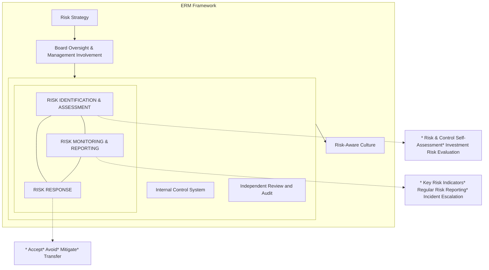

<!-- PAGE 1 -->

CapitaLand China Trust logo

Abstract orange and red dandelion-like graphic with radiating lines and dots

# CapitaLand China Trust

Annual Report 2025

<!-- PAGE 2 -->

# Seeding Growth, Creating Enduring Value

Grounded in resilience and governance, our values keep us steadfast through business cycles while propelling us to seize opportunities with clarity and confidence.

We are advancing through innovation, partnerships, and sustainable growth. With strategic focus and effective execution, we continue to seed new opportunities and strengthen growth engines to deliver enduring value for our stakeholders.

Stylized dandelion seed head graphic

# Contents

<table>
  <thead>
    <tr>
        <th colspan="2">Overview</th>
    </tr>
  </thead>
  <tbody>
    <tr>
        <td>About Us</td>
        <td>1</td>
    </tr>
    <tr>
        <td>Property Portfolio</td>
        <td>2</td>
    </tr>
    <tr>
        <td>2025 Highlights</td>
        <td>4</td>
    </tr>
    <tr>
        <td>Financial Highlights</td>
        <td>5</td>
    </tr>
    <tr>
        <td>ESG Highlights</td>
        <td>6</td>
    </tr>
    <tr>
        <td>Business Model</td>
        <td>8</td>
    </tr>
    <tr>
        <td>Chairman &amp; CEO Message</td>
        <td>10</td>
    </tr>
    <tr>
        <td>Trust Structure</td>
        <td>17</td>
    </tr>
    <tr>
        <td>Board of Directors</td>
        <td>18</td>
    </tr>
    <tr>
        <td>Management Team</td>
        <td>23</td>
    </tr>
    <tr>
        <th colspan="2">Performance</th>
    </tr>
    <tr>
        <td>Financial Review</td>
        <td>24</td>
    </tr>
    <tr>
        <td>Capital Management</td>
        <td>27</td>
    </tr>
    <tr>
        <td>Operations Review</td>
        <td>29</td>
    </tr>
    <tr>
        <td>Investor Relations</td>
        <td>37</td>
    </tr>
    <tr>
        <td>Trading Performance</td>
        <td>39</td>
    </tr>
    <tr>
        <td>Portfolio Details</td>
        <td>40</td>
    </tr>
  </tbody>
</table>
<table>
  <thead>
    <tr>
        <th colspan="2">Governance</th>
    </tr>
  </thead>
  <tbody>
    <tr>
        <td>Corporate Governance</td>
        <td>56</td>
    </tr>
    <tr>
        <td>Risk Management</td>
        <td>80</td>
    </tr>
    <tr>
        <td>Sustainability Management</td>
        <td>85</td>
    </tr>
    <tr>
        <th colspan="2">Financial Statements</th>
    </tr>
    <tr>
        <td>Financial Statements</td>
        <td>86</td>
    </tr>
    <tr>
        <th colspan="2">Other Information</th>
    </tr>
    <tr>
        <td>Additional Information</td>
        <td>170</td>
    </tr>
    <tr>
        <td>Statistics of Unitholdings</td>
        <td>172</td>
    </tr>
    <tr>
        <td>Portfolio Directory</td>
        <td>175</td>
    </tr>
    <tr>
        <td>Corporate Information</td>
        <td>IBC</td>
    </tr>
  </tbody>
</table>

<!-- PAGE 3 -->

# About Us

CapitaLand China Trust (CLCT) is Singapore's largest China-focused real estate investment trust (REIT). Listed on the Singapore Exchange Securities Trading Limited (SGX-ST) on 8 December 2006, the objective of CLCT is to invest on a long-term basis, in a diversified portfolio of income-producing real estate and real estate-related assets in China, Hong Kong and Macau that are used primarily for retail, office and industrial purposes (including business parks, logistics facilities, data centres and integrated developments).

CLCT is managed by CapitaLand China Trust Management Limited (CLCTML), a wholly owned subsidiary of Singapore-listed CapitaLand Investment Limited (CLI), which is a leading global real asset manager with a strong Asia foothold.

## Our Vision

To be the leading China-focused real estate investment trust, with a diversified and professionally managed portfolio of quality assets, capturing long-term growth drivers.

## Our Mission

To deliver resilient distributions and sustainable total returns to Unitholders.

For more information, please visit our corporate website at <u>www.clct.com.sg.</u>

QR code

## Reporting Suite 2025

Scan the QR code or visit <u>https://investor.clct.com.sg/home.html</u> to view the reports online.

CapitaLand China Trust Annual Report 2025 cover

CapitaLand China Trust Independent Market Research 2025 cover

CapitaLand China Trust Sustainability Report 2025 cover

To be published by end-April 2026.

<!-- PAGE 4 -->

# Property Portfolio

Since its IPO in 2006, CLCT’s portfolio¹ has grown from seven shopping malls to a diversified portfolio of 17 properties across 11 tier 1 and leading cities in China, comprising eight retail malls, five business parks, and four logistics parks.

<table>
  <thead>
    <tr>
        <th colspan="3">Retail</th>
    </tr>
  </thead>
  <tbody>
    <tr>
        <td>3</td>
        <td>Beijing</td>
        <td>CapitaMall Xizhimen<br/>CapitaMall Wangjing<br/>CapitaMall Grand Canyon</td>
    </tr>
    <tr>
        <td>1</td>
        <td>Guangzhou</td>
        <td>Rock Square</td>
    </tr>
    <tr>
        <td>1</td>
        <td>Chengdu</td>
        <td>CapitaMall Xinnan</td>
    </tr>
    <tr>
        <td>1</td>
        <td>Hohhot</td>
        <td>CapitaMall Nuohemule</td>
    </tr>
    <tr>
        <td>2</td>
        <td>Harbin</td>
        <td>CapitaMall Xuefu<br/>CapitaMall Aidemengdun</td>
    </tr>
    <tr>
        <th colspan="3">Business Parks</th>
    </tr>
    <tr>
        <td>1</td>
        <td>Suzhou</td>
        <td>Ascendas Xinsu Portfolio</td>
    </tr>
    <tr>
        <td>2</td>
        <td>Hangzhou</td>
        <td>Singapore-Hangzhou Science &amp; Technology Park Phase I<br/>Singapore-Hangzhou Science &amp; Technology Park Phase II</td>
    </tr>
    <tr>
        <td>2</td>
        <td>Xi’an</td>
        <td>Ascendas Innovation Towers<br/>Ascendas Innovation Hub</td>
    </tr>
    <tr>
        <th colspan="3">Logistics Parks</th>
    </tr>
    <tr>
        <td>1</td>
        <td>Shanghai</td>
        <td>Shanghai Fengxian Logistics Park</td>
    </tr>
    <tr>
        <td>1</td>
        <td>Chengdu</td>
        <td>Chengdu Shuangliu Logistics Park</td>
    </tr>
    <tr>
        <td>1</td>
        <td>Wuhan</td>
        <td>Wuhan Yangluo Logistics Park</td>
    </tr>
    <tr>
        <td>1</td>
        <td>Kunshan</td>
        <td>Kunshan Bacheng Logistics Park</td>
    </tr>
  </tbody>
</table>

● ● ● Indicates number of properties within the same asset class in each city

Photo of a CapitaMall retail building

Photo of a modern business park building

Photo of a large blue logistics warehouse

## Eight Retail Malls

The eight retail malls are strategically located in densely populated areas with good connectivity to transportation amenities, which provide stable, recurring shopper footfall. The malls are positioned as one-stop family-oriented destinations that offer essential services and house a wide range of lifestyle offerings that cater to varied consumer preferences in shopping, dining and entertainment.

## Five Business Parks

The five business parks are situated in high-growth economic zones, with quality and reputable domestic and multinational corporations operating in new economy sectors. The business parks and industrial properties have excellent connectivity to transportation hubs and are easily accessible via various modes of transport.

## Four Logistics Parks

The four logistics parks are located in key logistics hubs near transportation nodes such as seaports, airports and railways to serve the growing domestic logistics needs of China’s Eastern, Central and Southwest regions. The properties are anchored by strong domestic tenants, including China’s leading technology-driven supply chain solutions and logistics service providers.

\*1 Unless otherwise disclosed, please note that the disclosures in this Annual Report on CLCT’s portfolio exclude CapitaMall Yuhuating, which is located in Yuhua District in Changsha. The divestment by CLCT of CapitaMall Yuhuating was completed on 31 October 2025.

<!-- PAGE 5 -->

<table>
  <thead>
    <tr>
        <th>City</th>
        <th>Retail</th>
        <th>Business Park</th>
        <th>Logistics Park</th>
    </tr>
  </thead>
  <tbody>
    <tr>
        <td>Harbin</td>
        <td> </td>
        <td>2</td>
        <td> </td>
    </tr>
    <tr>
        <td>Hohhot</td>
        <td>1</td>
        <td> </td>
        <td> </td>
    </tr>
    <tr>
        <td>Beijing</td>
        <td>3</td>
        <td> </td>
        <td> </td>
    </tr>
    <tr>
        <td>Xi'an</td>
        <td> </td>
        <td>2</td>
        <td> </td>
    </tr>
    <tr>
        <td>Chengdu</td>
        <td>1</td>
        <td> </td>
        <td>1</td>
    </tr>
    <tr>
        <td>Wuhan</td>
        <td> </td>
        <td> </td>
        <td>1</td>
    </tr>
    <tr>
        <td>Kunshan</td>
        <td> </td>
        <td>1</td>
        <td> </td>
    </tr>
    <tr>
        <td>Suzhou</td>
        <td> </td>
        <td> </td>
        <td>1</td>
    </tr>
    <tr>
        <td>Shanghai</td>
        <td> </td>
        <td> </td>
        <td>1</td>
    </tr>
    <tr>
        <td>Hangzhou</td>
        <td> </td>
        <td>2</td>
        <td> </td>
    </tr>
    <tr>
        <td>Guangzhou</td>
        <td>1</td>
        <td> </td>
        <td> </td>
    </tr>
  </tbody>
</table>

* Retail
* Business Park
* Logistics Park

<!-- PAGE 6 -->

# 2025 Highlights

## Business Operations

**3,159**
No. of Leases

**+2.1%** YoY
Tenant Sales

**91.7%<sup>1</sup>**
Portfolio Occupancy

**+2.7%** YoY
Shopper Traffic

Portfolio Occupancy by sector: Retail 97.2%, Business Park 86.7%, Logistics Park 98.1%

## Capital Management

**40.7%<sup>2</sup>**
Aggregate Leverage

**2.8x<sup>4</sup>**
Interest Coverage Ratio

**3.32%<sup>3</sup>**
Average Cost of Debt

**3.5 years**
Average Term To Maturity

## Asset Class Diversification
(by GRI<sup>5</sup>)

<table>
  <thead>
    <tr>
        <th>Asset Class</th>
        <th>Percentage</th>
    </tr>
  </thead>
  <tbody>
    <tr>
        <td>Retail</td>
        <td>69.3%</td>
    </tr>
    <tr>
        <td>Business Park</td>
        <td>27.0%</td>
    </tr>
    <tr>
        <td>Logistics Park</td>
        <td>3.7%</td>
    </tr>
  </tbody>
</table>

## Geographical Diversification
(by GRI<sup>5,6</sup>)

<table>
  <thead>
    <tr>
        <th>Region</th>
        <th>Percentage</th>
    </tr>
  </thead>
  <tbody>
    <tr>
        <td>Beijing</td>
        <td>35.1%</td>
    </tr>
    <tr>
        <td>Guangzhou</td>
        <td>13.9%</td>
    </tr>
    <tr>
        <td>Yangtze Delta Cities<sup>7</sup></td>
        <td>22.9%</td>
    </tr>
    <tr>
        <td>Other Key Cities<sup>8</sup></td>
        <td>28.0%</td>
    </tr>
  </tbody>
</table>

## Gross Revenue
(RMB billion)

<table>
  <thead>
    <tr>
        <th>Year</th>
        <th>Gross Revenue (RMB billion)</th>
    </tr>
  </thead>
  <tbody>
    <tr>
        <td>2021</td>
        <td>1.83</td>
    </tr>
    <tr>
        <td>2022</td>
        <td>1.85</td>
    </tr>
    <tr>
        <td>2023</td>
        <td>1.91</td>
    </tr>
    <tr>
        <td>2024</td>
        <td>1.84</td>
    </tr>
    <tr>
        <td>2025</td>
        <td>1.67</td>
    </tr>
  </tbody>
</table>

## Net Property Income
(RMB billion)

<table>
  <thead>
    <tr>
        <th>Year</th>
        <th>Net Property Income (RMB billion)</th>
    </tr>
  </thead>
  <tbody>
    <tr>
        <td>2021</td>
        <td>1.21</td>
    </tr>
    <tr>
        <td>2022</td>
        <td>1.23</td>
    </tr>
    <tr>
        <td>2023</td>
        <td>1.29</td>
    </tr>
    <tr>
        <td>2024</td>
        <td>1.22</td>
    </tr>
    <tr>
        <td>2025</td>
        <td>1.10</td>
    </tr>
  </tbody>
</table>

## Distribution Per Unit
(S cents)

<table>
  <thead>
    <tr>
        <th>Year</th>
        <th>Distribution Per Unit (S cents)</th>
    </tr>
  </thead>
  <tbody>
    <tr>
        <td>2021</td>
        <td>8.73</td>
    </tr>
    <tr>
        <td>2022</td>
        <td>7.50</td>
    </tr>
    <tr>
        <td>2023</td>
        <td>6.74</td>
    </tr>
    <tr>
        <td>2024</td>
        <td>5.65</td>
    </tr>
    <tr>
        <td>2025</td>
        <td>4.82</td>
    </tr>
  </tbody>
</table>

## Total Assets
(S$ billion)

<table>
  <thead>
    <tr>
        <th>Year</th>
        <th>Total Assets (S$ billion)</th>
    </tr>
  </thead>
  <tbody>
    <tr>
        <td>2021</td>
        <td>5.58</td>
    </tr>
    <tr>
        <td>2022</td>
        <td>5.23</td>
    </tr>
    <tr>
        <td>2023</td>
        <td>5.00</td>
    </tr>
    <tr>
        <td>2024</td>
        <td>4.72</td>
    </tr>
    <tr>
        <td>2025</td>
        <td>4.48</td>
    </tr>
  </tbody>
</table>

1 Based on committed leases as at 31 December 2025.
2 Please refer to page 5 for the definition of aggregate leverage.
3 Based on the consolidated interest expense for the respective financial period over weighted average borrowings on balance sheet for that financial period.
4 Please refer to page 5 for the definition of interest coverage ratio.
5 Based on a 100% basis as at 31 December 2025.
6 Amounts may not sum to 100% due to rounding.
7 Includes Shanghai, Suzhou, Kunshan and Hangzhou.
8 Includes Chengdu, Xi'an, Wuhan, Harbin and Hohhot.

<!-- PAGE 7 -->

# Financial Highlights

<table>
  <thead>
    <tr>
<th>As at 31 December</th>
<th>2021</th>
<th>2022</th>
<th>2023</th>
<th>2024</th>
<th>2025</th>
    </tr>
  </thead>
  <tbody>
    <tr>
<td colspan="6"><strong>Financial Performance</strong></td>
    </tr>
    <tr>
<td>Gross Revenue (RMB million)</td>
<td>1,826.1</td>
<td>1,851.5</td>
<td>1,912.5</td>
<td>1,837.6</td>
<td><strong>1,670.0</strong></td>
    </tr>
    <tr>
<td>Gross Revenue (S$ million)</td>
<td>378.0</td>
<td>383.2</td>
<td>364.7</td>
<td>341.5</td>
<td><strong>303.7</strong></td>
    </tr>
    <tr>
<td>Net Property Income (RMB million)</td>
<td>1,209.9</td>
<td>1,228.4</td>
<td>1,293.7</td>
<td>1,219.1</td>
<td><strong>1,104.6</strong></td>
    </tr>
    <tr>
<td>Net Property Income (S$ million)</td>
<td>250.4</td>
<td>254.2</td>
<td>246.7</td>
<td>226.6</td>
<td><strong>200.9</strong></td>
    </tr>
    <tr>
<td>Distributable Income (S$ million)</td>
<td>135.5</td>
<td>125.6</td>
<td>113.9</td>
<td>96.8</td>
<td><strong>83.9</strong></td>
    </tr>
    <tr>
<td>Distribution Per Unit (DPU) (S cents)</td>
<td>8.73</td>
<td>7.50ⁱ</td>
<td>6.74ⁱ</td>
<td>5.65</td>
<td><strong>4.82ⁱ</strong></td>
    </tr>
    <tr>
<td colspan="6"><strong>Key Financial Position</strong></td>
    </tr>
    <tr>
<td>Total Assets (S$ million)</td>
<td>5,575.9</td>
<td>5,226.1</td>
<td>4,995.8</td>
<td>4,722.8</td>
<td><strong>4,484.8</strong></td>
    </tr>
    <tr>
<td>Portfolio Property Valuation (S$ million)ⁱⁱ</td>
<td>5,239.0</td>
<td>4,904.3</td>
<td>4,700.1</td>
<td>4,443.9</td>
<td><strong>4,204.4</strong></td>
    </tr>
    <tr>
<td>Total Deposited Properties (S$ million)ⁱⁱⁱ</td>
<td>5,226.6</td>
<td>4,893.4</td>
<td>4,670.3</td>
<td>4,390.1</td>
<td><strong>4,146.2</strong></td>
    </tr>
    <tr>
<td>Net Assets Attributable to Unitholders (S$ million)</td>
<td>2,588.2</td>
<td>2,306.2</td>
<td>2,039.9</td>
<td>1,926.6</td>
<td><strong>1,789.6</strong></td>
    </tr>
    <tr>
<td colspan="6">Net Asset Value Per Unit (S$)</td>
    </tr>
    <tr>
<td>- Before Income Distribution</td>
<td>1.56</td>
<td>1.38</td>
<td>1.21</td>
<td>1.12</td>
<td><strong>1.03</strong></td>
    </tr>
    <tr>
<td>- After Income Distribution</td>
<td>1.54</td>
<td>1.34</td>
<td>1.18</td>
<td>1.09</td>
<td><strong>1.00</strong></td>
    </tr>
    <tr>
<td>Total Gross Borrowings (S$ million)ⁱᵛ</td>
<td>1,993.4</td>
<td>1,950.9</td>
<td>1,956.4</td>
<td>1,857.3</td>
<td><strong>1,703.0</strong></td>
    </tr>
    <tr>
<td>Market Capitalisation (S$ million)</td>
<td>1,974.8</td>
<td>1,874.8</td>
<td>1,570.6</td>
<td>1,238.7</td>
<td><strong>1,349.2</strong></td>
    </tr>
    <tr>
<td colspan="6"><strong>Capital Management</strong></td>
    </tr>
    <tr>
<td>Aggregate Leverage (%)ᵛ</td>
<td>37.7</td>
<td>39.6</td>
<td>41.5</td>
<td>41.9</td>
<td><strong>40.7</strong></td>
    </tr>
    <tr>
<td>Average Cost of Debt (%)ᵛⁱ</td>
<td>2.62</td>
<td>2.97</td>
<td>3.57</td>
<td>3.51</td>
<td><strong>3.32</strong></td>
    </tr>
    <tr>
<td>Average Term to Maturity (Years)</td>
<td>3.4</td>
<td>3.4</td>
<td>3.5</td>
<td>3.4</td>
<td><strong>3.5</strong></td>
    </tr>
    <tr>
<td>Interest Coverage Ratio (times)ᵛⁱⁱ</td>
<td>4.5</td>
<td>3.6</td>
<td>3.1</td>
<td>3.0</td>
<td><strong>2.8</strong></td>
    </tr>
    <tr>
<td>Management Expense Ratio (%)ᵛⁱⁱⁱ</td>
<td>0.9</td>
<td>0.8</td>
<td>0.9</td>
<td>0.9</td>
<td><strong>0.9</strong></td>
    </tr>
  </tbody>
</table>

i Includes rental support of S$1.3 million in 2022 and S$0.6 million in 2023 (which was previously deducted from the amount paid to the vendor) for the vacancy loss and rent free provided to existing tenants for Chengdu Shuangliu Logistics Park and Wuhan Yangluo Logistics Park. The DPU impact of rental support is 0.08 S cents in 2022 and 0.04 S cents in 2023. No rental support was received in 2024 and 2025. In 2025, there is a distribution top-up of approximately the distribution income from CapitaMall Yuhuating, which would have been contributed from 1 April 2025 to 31 December 2025, proportionally adjusted based on its distribution income in 1Q 2025. It is drawn from past divestment gains from CLCT and is funded through debt.

ii Based on valuation on a 100% basis as at 31 December 2025. The portfolio property valuation includes the valuation of eight retail malls, five business parks and four logistics parks. For more details, please refer to page 26.

iii Total consolidated assets of CLCT and excludes share attributable to the non-controlling interest of the project companies if the ownership is less than 100%.

iv Excludes unamortised transaction costs and modification gain.

v In accordance with the Property Funds Appendix, the aggregate leverage is calculated based on the proportionate share of total borrowings and deferred payments over deposited properties. CLCT does not have any deferred payments.

vi Based on the consolidated interest expense for the respective financial year reflected over weighted average borrowings on balance sheet for that financial year.

vii The ratio is calculated by dividing the trailing 12 months EBITDA (excluding effects of any fair value changes of derivatives and investment properties, and foreign exchange translation) by the trailing 12 months’ interest expense, borrowing-related fees and distributions on hybrid securities (i.e. perpetual securities) in accordance with the Property Funds Appendix. EBITDA refers to earnings before interest, tax, depreciation and amortisation.

viii Refers to the expenses of CLCT excluding property expenses and interest expenses but including the performance component of CLCTML’s management fees, expressed as a percentage of weighted average net assets.

<!-- PAGE 8 -->

# ESG Highlights

## Accolades

GRESB 5-Star Rating logo
Third Consecutive Year with
**5-Star Rating**
2025 GRESB Real Estate Assessment

GRESB A Rating logo
Seventh Consecutive Year with
**A Rating**
2025 GRESB Public Disclosure

Sustainalytics Low Risk logo
**Low Risk**
Sustainalytics ESG Risk Rating

MSCI BBB ESG ratings logo
**BBB**
MSCI ESG ratings

## Environmental and Social Highlights

LEED Gold certification icon
**~70%<sup>1</sup>**
of CLCT's portfolio (by GFA) are LEED Gold certified, where a new certification was obtained for the Ascendas Xinsu Portfolio<sup>2</sup>

Zero incidents icon
**Zero**
incidents resulting in fatality and permanent disability for CLCT employees, property management teams and contractors

Sustainability-linked loans icon
**50%**
of total debts are sustainability-linked loans

Renewable energy icon
**~12%**
of the portfolio's electricity consumption are from renewable energy sources

ISO certification icon
**100%**
of the main contractors appointed this year are ISO 14001 and ISO 45001 certified

Supply chain code of conduct icon
**100%**
of the supply chain agreed to abide by CLI's Supply Chain Code of Conduct

1 By portfolio gross floor area excluding carpark space. Refers to CLCT properties managed by CLI (by sq m).

2 Attained LEED GOLD certification for industrial Block A to D of Ascendas Xinsu Portfolio.

<!-- PAGE 9 -->

# Governance Highlights as at date of this Report

## Board Composition (9 Directors)

**Board Independence**

* **67% (6)** Independent
* **33% (3)** Non-Independent

**Gender Diversity**

Gender Diversity icons
* **67% (6)** Males
* **33% (3)** Females

---

**Age Profile**

<table>
  <thead>
    <tr>
        <th>Category</th>
        <th>Percentage (Count)</th>
    </tr>
  </thead>
  <tbody>
    <tr>
        <td>61 years &amp; above</td>
        <td>56% (5)</td>
    </tr>
    <tr>
        <td>51-60 years old</td>
        <td>22% (2)</td>
    </tr>
    <tr>
        <td>50 years &amp; below</td>
        <td>22% (2)</td>
    </tr>
  </tbody>
</table>

**Tenure Mix**

<table>
  <thead>
    <tr>
        <th>Category</th>
        <th>Percentage (Count)</th>
    </tr>
  </thead>
  <tbody>
    <tr>
        <td>0-3 years</td>
        <td>67% (6)</td>
    </tr>
    <tr>
        <td>3-6 years</td>
        <td>33% (3)</td>
    </tr>
    <tr>
        <td>6 years</td>
        <td>0% (0)</td>
    </tr>
  </tbody>
</table>

---

**Committee Composition**

**Audit and Risk Committee**
Audit and Risk Committee icons Members
* **100%** Independent

**Executive Committee**
Executive Committee icons Members
* **100%** Non-Independent

**Nominating and Remuneration Committee**
Nominating and Remuneration Committee icons Members
* **67%** Independent
* **33%** Non-Independent

---

**Number of Meetings**

* **6** Board
* **5** Audit and Risk Committee
* **2** Nominating and Remuneration Committee
* **1** Executive Committee
* **1** AGM
* **1** EGM

Meeting illustration

**Compliance with the Code of Corporate Governance**

For more information, please refer to the relevant pages in this annual report.

<table>
  <tbody>
    <tr>
        <td>Board Matters</td>
        <td>57</td>
    </tr>
    <tr>
        <td>Remuneration Matters</td>
        <td>65</td>
    </tr>
    <tr>
        <td>Accountability and Audit</td>
        <td>70</td>
    </tr>
    <tr>
        <td>Unitholder Rights and Engagement</td>
        <td>74</td>
    </tr>
  </tbody>
</table>

<!-- PAGE 10 -->

# Business Model

At CLCT, we focus on creating, unlocking, and extracting value, underpinned by proactive capital management. Through disciplined portfolio reconstitution, asset enhancement initiatives (AEIs), and a commitment to sustainability, we leverage our market expertise and operational strengths to drive long-term value creation.

<table>
    <tr>
        <th>Business Strategy<br/>How we create value</th>
        <th>Value Drivers<br/>Where value was created</th>
    </tr>
</table>

Business Strategy Diagram

### 01 Create Value
Enhance revenue diversification and resilience through strategic, yield-accretive acquisitions.

### 02 Extract Value
Execute AEIs and unit reconfigurations to drive organic growth, supported by customer-centric initiatives.

### 03 Unlock Value
Identify the optimal stage to divest mature assets to strengthen the balance sheet or reinvest in higher-growth opportunities.

### 04 Proactive Capital Management
Maintain a strong financial position by managing aggregate leverage, reducing the overall average cost of debt and increasing natural hedge.

Business Strategy circular diagram

### Investment & Portfolio Management
Employ a disciplined portfolio reconstitution strategy to build a resilient, diversified and future-ready asset mix, attracting leading tenants to high-quality spaces.

### Capital Management
Maintain CLCT’s robust financial position by diversifying funding sources, minimising debt costs, optimising aggregate leverage levels, and mitigating risks associated with interest rates, currency, and liquidity.

### Investor Relations
Foster transparent and timely two-way communication with investors, providing clear insights into CLCT’s performance and strategy.

### Risk & Sustainability Management
Incorporate ESG practices into CLCT’s operations and identify material risks with key controls to mitigate those risks.

Employees icon
**Employees**

Investment Community icon
**Investment Community**

Tenants and Shoppers icon
**Tenants and Shoppers**

<!-- PAGE 11 -->

Value Created icon

# Value Created

Value Created in FY 2025

## Completed the Full Investment Cycle at CapitaMall Yuhuating, Unlocking Asset Value through AEI Before Recycling it at a Higher Valuation

### Post-Acquisition Value Creation (2019–2022) Extract Value icon

Following the acquisition of CapitaMall Yuhuating in 2019, CLCT unlocked value in 2022 by converting ~8,900 sq m of anchor supermarket space into specialty tenant space. This introduced enhanced lifestyle offerings and experiences across 70+ stores, achieving an Return on Investment (ROI) of ~15%.

### Strategic Divestment via CLCR (2025) Unlock Value icon

In 2025, CapitaLand Commercial C-REIT (CLCR) was listed on the Shanghai Stock Exchange. CLCT divested CapitaMall Yuhuating to CLCR at ~4% above the 2024 book value, realising an exit NPI yield of 6.2%<sup>1</sup> and completing the full investment cycle.

### Capital Recycling & Strategic Advantage (2026 and beyond) Create Value icon

By subscribing to 5% of CLCR units, CLCT retains a strategic stake in the C-REIT, leveraging it as a platform to recycle mature assets and redeploy capital into higher-yielding, growth-oriented opportunities.

## Strategically Repositioned Traditional Anchor Spaces into High-Yield, Experiential Areas

### CapitaMall Xizhimen Extract Value icon

Transformed ~10,100 sq m of basement supermarket space into a design-led, multi-functional DT-X concept store, driving footfall from younger shoppers.

### CapitaMall Wangjing Extract Value icon

Converted ~8,800 sq m of conventional supermarket area into a new retail concept supermarket, 7Fresh and more than 20 popular retail, Food & Beverage (F&B), and experiential brands, achieving a 12.6% ROI.

### CapitaMall Xuefu Extract Value icon

Replaced a traditional supermarket with local B.U.T Supermarket (~6,600 sq m) and launched an Animation, Comics & Games themed street (~2,100 sq m), achieving a total rental increase of 13.1%<sup>2</sup>.

## Proactive Capital Management

* Improved aggregate leverage of 40.7% and improved average cost of debt of 3.32%.

* Issued 3-year RMB600 million bond at 2.88% and secured RMB1,600 million loan facilities at competitive margins.

* Issued S$150 million Fixed Rate Subordinated Perpetual Securities.

* Exceeded target of at least 50% RMB-denominated debt by 2025.

Supply Chain icon

**Supply Chain**

Community icon

**Community**

**Stakeholders**

Internal and External Stakeholders

Create Value icon Create Value

Extract Value icon Extract Value

Unlock Value icon Unlock Value

\*1 The exit NPI yield is calculated using CapitaMall Yuhuating's FY 2024 NPI of RMB50.7 million.

\*2 For whole AEI area, including supermarket.

<!-- PAGE 12 -->

# Chairman & CEO Message

Tan Tee How, Chairman and Chan Kin Leong Gerry, Chief Executive Officer

**Tan Tee How**
Chairman

**Chan Kin Leong Gerry**
Chief Executive Officer

**Dear Unitholders,**

FY 2026 marks a significant milestone for CapitaLand China Trust (CLCT) as we commemorate our 20^th anniversary. Since our listing on the Singapore Exchange in 2006, we have navigated China’s economic cycles and pursued disciplined growth, with a clear focus on building a high-quality portfolio to deliver income resilience and sustainable long-term returns to Unitholders.

CLCT has evolved from a retail-focused REIT across five cities into a diversified multi-asset platform spanning 11 cities across China, with our total property value growing six-fold from S$0.7 billion to S$4.2 billion, a testament to the disciplined execution of our long-term growth strategy.

## Building on 20 Years of Driving Long-term Value

FY 2025 was marked by heightened global trade tensions and continued economic headwinds in China. Against this backdrop, we remained focused on proactive asset management, prudent capital management and disciplined portfolio reconstitution to safeguard CLCT’s income resilience. We also positioned CLCT for long-term

growth by aligning our strategies and portfolio with China’s economic priorities on driving domestic consumption and high-quality, technology-driven growth, while capturing opportunities arising from the development of domestic capital markets.

This year, we made significant progress in refreshing our retail offerings. Through strategically timed AEIs across four retail malls¹, we introduced unique consumer-centric retail concepts that cater to evolving preferences. These initiatives have improved tenant sales and positioned our assets for growth. In addition, we welcomed new business park and logistics park tenants that reinforce our alignment with China’s growth sectors. Efforts to attract high-tech and other emerging companies to our business parks have also allowed us to increase our occupancies and outperform market standards.

With constructive domestic capital markets and lower interest rates, we expanded our RMB-denominated debt to 60% at the close of FY 2025, strengthening our natural hedging and enhancing our financial position.

\*1 In FY 2025, CLCT completed four AEIs at CapitaMall Xizhimen, Rock Square, CapitaMall Wangjing and CapitaMall Xuefu.

<!-- PAGE 13 -->

During the year, CLCT marked a defining milestone in its next phase of growth. Together with our sponsor, we strengthened our presence in China’s capital markets through the listing of CapitaLand Commercial C-REIT (CLCR), the first internationally sponsored retail C-REIT on the Shanghai Stock Exchange. CLCT remains the only S-REIT offering exposure to China’s expanding C-REIT market.

In connection with the listing, CLCT seeded the platform with its mature asset, CapitaMall Yuhuating, unlocking value and strengthening our balance sheet. Since acquiring the mall in 2019, we have executed a disciplined acquire–enhance–divest strategy, including an AEI that reclaimed 8,900 sq m of anchor supermarket space for specialty retail, lifestyle and experiential offerings. The asset was subsequently injected into CLCR at a premium to its valuation, underscoring our disciplined capital recycling approach while reinforcing portfolio resilience.

Concurrently, we subscribed to a strategic 5% stake in CLCR. This forward-looking move establishes a sustainable capital recycling platform to support ongoing portfolio reconstitution, enhance financial flexibility and provide potential upside from China’s evolving REIT landscape. CLCR debuted strongly, opening 19.6% above its IPO price of RMB5.718 per unit. Our 5% stake deepens access to domestic capital markets and positions CLCT to benefit from the growth of China’s C-REIT sector, supporting long-term portfolio optimisation.

## Steadfast Results

For FY 2025, distributable income totalled S$83.9 million, resulting in a distribution per unit of 4.82 Singapore cents and a distribution yield of 6.2%².

Gross Revenue decreased 9.1% year-on-year (YoY) to RMB 1,670.0 million, while Net Property Income (NPI) was 9.4% lower at RMB 1,104.6 million. This was primarily due to the absence of contributions from CapitaMall Yuhuating from 1 April 2025 to 31 December 2025, following its divestment, AEI downtime at four malls¹ as well as softer occupancy and rents at our business parks and weaker retail environment for CapitaMall Xinnan, CapitaMall Grand Canyon and CapitaMall Wangjing. These pressures were partially mitigated by the resilient performance of CapitaMall Nuohemule and Ascendas Xinsu Portfolio alongside improved contributions from our logistics parks.

The softer revenue performance was partially mitigated by a 4.3% YoY reduction in operating expenses across CLCT’s portfolio on a same-store basis, reflecting continued operational efficiency. To ensure income stability for Unitholders, we have provided a one-off top-

up for 2H 2025 distribution from past divestment gains in the interim to make up for the absence of income from CapitaMall Yuhuating.

Through active leasing and asset management, occupancy remained resilient for our retail, business parks and logistics parks portfolios at 97.2%, 86.7% and 98.1% respectively. Retail malls, which account for 69.3% of our portfolio’s Gross Rental Income (GRI), recorded a 2.7% increase in shopper traffic and a 2.1% rise in tenant sales. This was supported by robust demand in key trade sectors such as Toys & Hobbies, Jewellery & Watches, IT & Telecommunications and Food & Beverage (F&B). Government-issued consumption vouchers have stimulated domestic spending. Our retail portfolio recorded a rental reversion of -2.4% in FY 2025, reflecting a strategic shift away from the automobile sector amid evolving electric vehicle (EV) tenant strategies. Excluding the automobile trade category, reversion was contained at -0.6%, underscoring a more diversified and resilient tenant mix.

Business parks, which contribute 27.0% of our GRI, achieved occupancy that outperformed submarket benchmarks. During the year, our business parks welcomed increased commitments from tenants in the engineering as well as culture, sports and entertainment sectors. Rental reversion came in at -8.1% as we adopted a targeted leasing approach to protect asset value and ensure sustainable tenancy in a softening market. We will deepen efforts to attract tenants in key sectors aligned with China’s technology-driven growth, positioning our business parks portfolio to capture growth opportunities.

Constituting 3.7% of GRI, our logistics parks maintained a strong occupancy rate of 98.1%, supported by the early renewal of strategic anchor tenants, in line with our strategy to prioritise occupancy across the portfolio. Three of the four properties – Shanghai Fengxian Logistics Park, Kunshan Bacheng Logistics Park and Wuhan Yangluo Logistics Park – were fully leased, supported by sustained demand from e-commerce players and third-party logistics providers. Notably, Shanghai Fengxian logistics park secured a third-party logistics tenant on an eight-year lease, effectively addressing the vacancy challenge the asset faced in 2024.

## Enhancing and Unlocking Value for Growth

Our strategy of portfolio rejuvenation through targeted AEIs remains a key driver of value creation and organic growth. In FY 2025, we completed four AEIs, revitalising CapitaMall Xuefu, CapitaMall Xizhimen, CapitaMall Wangjing, and

<!-- PAGE 14 -->

# Chairman & CEO Message

Rock Square with higher-yielding retail concepts designed to meet evolving consumer preferences.

At CapitaMall Xuefu, we upgraded 8,700 square metres (sq m) of supermarket space. Launched in 2Q and 3Q 2025, the refreshed space now houses a leading local supermarket B.U.T. as well as a themed zone centred on animation, comics and gaming, designed to appeal to younger shoppers. Following the AEI, this differentiated concept drove higher footfall, secured full occupancy and lifted total rents by 13.1%.

Elevating shopper experience at CapitaMall Xizhimen, we converted 10,100 sq m of supermarket space to house DT-X, a new retail concept inspired by SKP, one of China’s most successful department stores. Opened in 4Q 2025, DT-X has transformed the well-patronised mall into a sophisticated lifestyle destination, uplifting the mall’s brand positioning with a high-end concept anchored by the introduction of premium labels, including new-to-market and upscale boutique brands aimed at attracting mid to high-income consumers. CapitaMall Xizhimen saw shopper traffic rise 14% YoY and gross turnover per sq m grow 20% YoY in December 2025 following the launch.

In the same quarter, we revitalised 8,800 sq m of anchor space at CapitaMall Wangjing to feature a new retail concept supermarket, 7Fresh by JD.com, together with more than 20 popular retail and F&B outlets. The initiative achieved 100% leasing and a return on investment of approximately 12.6%, underscoring the effectiveness of our AEI strategy.

For Rock Square, we optimised 2,110 sq m at Basement 1, transforming the area from a cluster of older beauty-focused brands to introduce a high-profile mini-anchor tenant, Decathlon. Completed in 4Q 2025, this repositioning strengthened the mall’s appeal as a vibrant lifestyle hub and broadened its shopper base and tenant mix. Following the launch of Decathlon, Rock Square’s shopper traffic grew 4.6% YoY, with gross turnover³ per sq m for the AEI area increasing over 40%.

## Disciplined Financial Stewardship

CLCT’s healthy financial position is anchored in our proactive and prudent capital management approach. Leveraging China’s easing interest rate environment, we increased the proportion of RMB-denominated debt from 35% in FY 2024 to 60% in FY 2025, surpassing our earlier target of 50%. This strengthens our natural hedge, mitigates foreign exchange fluctuations and optimises funding costs.

In April 2025, CLCT completed a RMB600 million bond offering due in 2028, at a competitive interest rate of 2.88%. In September 2025, we launched S$150 million of three-year fixed rate subordinated perpetual securities, with a distribution rate of 3.95%. These issuances expanded our funding sources, providing further capacity to drive long-term growth. A portion of our 2026 refinancing obligations has already been completed, leaving only a minimal amount outstanding next year, reinforcing our strong position for prudent and efficient capital management.

Our average cost of debt lowered to 3.32% as at 31 December 2025, from 3.51% a year ago. We maintained a healthy interest coverage ratio⁴ of 2.8 times, and our gearing ratio of 40.7% is well within the regulatory requirements⁵, down from 41.9% as at 31 December 2024. Our well-staggered debt maturity profile has an average term to maturity of 3.5 years. Additionally, 72% of our undistributed distributable income was hedged into SGD, mitigating foreign currency risk and enhancing the stability of Unitholder returns.

## Championing Sustainability

Sustainability remains a fundamental pillar of our long-term strategy. In the GRESB Real Estate Assessment, CLCT attained a 5-star rating for the third consecutive year in 2025 and out-performed both the GRESB and peer averages. We also secured LEED Gold certification for a portion of our Ascendas Xinsu Portfolio, bringing the proportion of our green-certified assets to approximately 70% of gross floor area as at 31 December 2025. Reflecting our continued focus on sustainable financing, sustainability-linked loans now account for 50% of total debt, up from 42% a year ago.⁶

3 Excluding automobile tenant in the previous area.

4 Please refer to page 5 for the definition of interest coverage ratio.

5 The Monetary Authority of Singapore stipulates a minimum interest coverage ratio of 1.5 times and an aggregate leverage limit of 50% for all REITs.

6 For more details on CLCT’s sustainability initiatives, please refer to the “ESG Highlights” section of this report.

<!-- PAGE 15 -->

# Outlook

Looking ahead, China continues to offer compelling opportunities, underpinned by robust domestic demand, extensive supply chains and strong cost competitiveness. In 2025, the country's GDP expanded by 5.0%, while industrial output grew 5.9%.⁷ During the year, policymakers rolled out fiscal and monetary stimulus initiatives, including a reduction in the Loan Prime Rate as well as programmes encouraging large-scale equipment upgrades and consumer goods trade-ins. These measures are expected to progressively bolster business confidence and consumption.

While the direct impact of US tariffs on CLCT's operations remains limited, we will remain vigilant in monitoring geopolitical developments, global trade trends and China's economic policies. We will actively pursue opportunities to expand our presence across diversified asset classes, including retail in tier 1 and 2 cities, seek targeted AEIs to elevate our retail portfolio for existing and new assets, and sustain strong occupancy rates across business parks and logistics parks.

Our dual connection to both the S-REIT and C-REIT markets differentiates CLCT. It provides us with a distinct advantage in sourcing, structuring and executing accretive transactions, while enabling capital recycling into higher-yielding opportunities. At the same time, we will seek strategic investments that strengthen portfolio resilience and drive value creation.

# Board Renewal

With effect from 1 November 2025, Mr Tan Tze Wooi relinquished his positions as Non-Executive Non-Independent Director and member of the Executive Committee. Mr Neo Poh Kiat also stepped down as Non-Executive Independent Director, Chairman of the Audit and Risk Committee (ARC) and member of the Nominating and Remuneration Committee. On behalf of the Board, we extend our deepest appreciation for their dedicated service and invaluable contributions.

Succeeding Mr Neo in his roles is Mr Chua Keng Kim, who has served as a Non-Executive Independent Director and member of the ARC since 1 January 2025. As part of our Board rejuvenation efforts, we welcomed Mr Liu Sing Cheong on 1 November 2025 as Non Executive Independent Director. He was appointed as a member of the ARC on 5 February 2026. Mr Liu brings extensive experience in real estate, leadership and governance, as well as deep knowledge of the China market. Their expertise will add to the Board's bench strength.

We thank our Unitholders, business partners, tenants and staff for their unwavering support. As we mark our 20ᵗʰ anniversary, we remain steadfast building a diversified, resilient and future-ready portfolio, while pursuing strategies that generate sustainable long-term value for our Unitholders.

**Tan Tee How**
Chairman

**Chan Kin Leong Gerry**
Chief Executive Officer

7 Source: China National Bureau of Statistics.

<!-- PAGE 16 -->

# 致信托单位持有人之信函

尊敬的信托单位持有人

二零二六年后对凯德中国信托而言意义非凡，因为我们迎来了成立二十周年这一重要里程碑。自二零零六年在新加坡交易所上市以来，我们穿越了中国经济的不同周期，始终坚持稳健的增长策略，专注于打造优质的投资组合，提高收入的抗风险能力，为信托单位持有人实现可持续的长期回报。

凯德中国信托已从最初专注于商场、布局中国五个城市的房地产投资信托，发展成为覆盖中国十一个城市的多元资产类别平台。我们的总资产规模增长了六倍，从7亿新元增至42亿新元，这充分印证了我们对长期增长策略的严格执行。

## 立足二十年，持续创造长期价值

二零二五财政年，全球贸易紧张局势加剧，中国经济也持续面临逆风。在此背景下，我们始终专注于主动的资产管理、审慎的资本管理以及稳健的投资组合重组，强化凯德中国信托的收入抗风险能力。同时，我们结合中国推动国内消费及高质量、技术驱动型增长的经济政策方向，调整信托的策略和投资组合，同时把握中国国内资本市场发展带来的机遇，为凯德中国信托的长期增长做好准备。

本年度，我们在调整零售业态方面取得了显著进展。通过对四座零售商场适时开展资产增值计划<sup>1</sup>，我们针对持续变化的需求，引入了以消费者为中心的有特色的零售概念。这些举措提升了租户销售额，并为我们资产的进一步增长奠定了基础。此外，我们把契合中国的经济增长领域的租户带进了产业园和物流园。通过吸引高科技及其他新兴企业入驻我们的产业园，我们得以提高物业出租率，取得高于市场平均的表现水平。

得益于国内资本市场的有利环境以及较低的利率水平，我们在二零二五财政年末将人民币计价债务比例提高至60%，增加了货币自然对冲比例，强化了我们的财务状况。

本财政年度，凯德中国信托迎来了新增长阶段的重大里程碑。我们与发起人携手，成功发行凯德商业REIT（CLCR），加强了我们在中国资本市场的布局。这是上海证券交易所首只由国际发起人发起的消费类基础设施公募REIT。凯德中国信托目前仍是唯一一支参与中国方兴未艾的C-REIT市场的新加坡REIT。

利用此上市机遇，凯德中国信托将其成熟资产凯德广场·雨花亭作为首发资产注入该平台，释放了资产价值并增强了信托的资产负债表。自二零一九年收购该商场以来，我们严格执行了“收购-提升-出售”的策略。通过资产增值计划，将8,900平方米的原主力超市空间调整改造为零售专卖店、生活方式和体验式业态。该资产随后溢价注入CLCR，突显了我们严格遵循的资本循环策略，同时增强了投资组合的韧性。

同时，我们认购了CLCR 5%的战略份额，旨在搭建一个可持续的资本再循环平台，以持续支持投资组合重组，增强财务灵活性，并获取潜在收益。CLCR上市首日表现强劲，开盘价较每份5.718元人民币的发行价上涨19.6%。通过我们持有的5%份额，CLCT得以深化获取中国资本市场的渠道，并使凯德中国信托能够持续受益于中国C-REIT板块的增长，支持长期的投资组合优化。

## 稳健表现

二零二五财政年度，可分派收入总计达8,390万新元，相当于每单位派息为4.82新分，派息收益率为6.2%<sup>2</sup>。

总收入同比下降9.1%，至16.70亿元人民币；净资产收入同比下降9.4%，至11.046亿元人民币。这主要是由于凯德广场·雨花亭自2025年4月1日至2025年12月31日因出售而不再贡献收入、四座商场部分面积因进行资产增值计划暂停营业、产业园出租率和租金下降，以及凯德广场·新南、凯德MALL·大峡谷和凯德MALL·望京面临较弱的零售环境所致。这些压力因凯德广场·诺和木勒和腾飞新苏的稳定的表现以及物流园收入的改善而得到部分缓解。

按可比同店口径计算，凯德中国信托投资组合的运营支出同比下降4.3%，部分缓解了收入疲软的压力，这反映了持续的运营效率改善。为确保单位持有人的收入稳定，我们从过往资产出售收益中为二零二五年下半年派息提供了一次性补足，以弥补凯德广场·雨花亭收入缺失的影响。

通过积极的租赁和资产管理，我们的商场、产业园和物流园资产组合保持了稳健的出租率，分别达到97.2%、86.7%和98.1%。占投资组合总租金收入69.3%的商场，客流同比增长2.7%，租户销售额同比增长2.1%。这得益于玩具及爱好、珠宝钟表、数码产品及餐饮等关键业态的稳定需求。政府发放的消费券也刺激了国内消费。我们的商场投资组合在二零二五年录得租金增长率为-2.4%，这反映了我们主动的战略性调整电车租户，减少了对该业态的依赖。剔除汽车业态类别后，租金增长率被控制在-0.6%，凸显了更加多元化和更具韧性的租户组合。

占我们总租金收入27.0%的产业园，其出租率表现优于各自所在子市场的平均水平。这一年，我们的产业园吸引了更多来自工程以及文化、体育和娱乐行业的租户承租。产业园租金增长率为-8.1%，主要是因为我们在市场疲软的大环境下采取了有针对性的租赁策略来维持资产价值并确保租约的可持续性。我们将加大力度，吸引符合中国技术驱动型增长的关键行业租户，使我们的产业园投资组合能够抓住未来增长机遇。

占总租金收入3.7%的物流园，则保持了98.1%的强劲出租率，这得益于主力租户的提前续约，体现我们优先考虑出租率的策略。在电子商务企业和第三方物流供应商需求的持续支持下，四处物业中的三处——上海奉贤物流园、昆山巴城物流园和武汉阳逻物流园——实现了满租。值得注意的是，上海奉贤物流园与一家第三方物流租户签订了为期八年的租约，有效解决了该资产在二零二四年所面临的空置挑战。

\*1 二零二五财政年，凯德中国信托在凯德MALL·西直门、乐峰广场、凯德MALL·望京和凯德广场·学府完成了四项资产增值计划。

\*2 基于2025年12月31日收盘价0.775新元计算。

<!-- PAGE 17 -->

# 提升价值，解锁增长机遇

通过有针对性的资产增值计划来焕新投资组合，仍然是我们创造价值和推动有机增长的关键驱动力。在二零二五财政年，我们推出旨在满足不断变化的消费者偏好的、收益率更高的零售概念，完成了四项资产增值计划，焕新了凯德MALL·学府、凯德MALL·西直门、凯德广场·望京和乐峰广场。

在凯德广场·学府，我们对8,700平方米的超市空间进行了升级改造。焕新后的空间于二零二五年第二和第三季度分批推出，现入驻了当地领先的比尤特超市以及一个旨在吸引年轻消费者的二次元主题街区。资产增值计划完成后，这一新颖概念带来了更高的客流量，实现了满租，并使总租金提升了13.1%。

为提升凯德MALL·西直门的顾客体验，我们将10,100平方米的超市空间改造为DT-X，这是一个受中国最成功的百货商店之一SKP启发的全新零售概念。DT-X于2025年第四季度开业，将这座客流旺盛的商场空间转变为一个精致的生活目的地，通过引入高端品牌（包括首次进入市场的品牌和旨在吸引中高收入消费者的高档精品店），提升了商场的品牌定位。开业后，凯德MALL·西直门2025年12月的客流量同比增长14%，单位面积销售额同比增长20%。

同季度，我们焕新了凯德MALL·望京8,800平方米的主力空间，引入了京东旗下的新零售概念七鲜超市，以及超过20家受欢迎的零售和餐饮门店。此项改造实现了100%的出租率，投资回报率约为12.6%，我们资产增值计划策略成效显著。

在乐峰广场，我们优化了地下一层2,110平方米的区域，将该区域从原先集中美容品牌的布局，转变为引入知名运动品牌迪卡侬。这一重新定位于2025年第四季度完成，增强了商场作为充满活力的生活枢纽的吸引力，并拓宽了其客群基础和租户组合。迪卡侬开业后，乐峰广场客流量同比增长4.6%，调整区域第四季度单位面积销售额<sup>3</sup>增长超过40%。

# 严谨的财务管理

凯德中国信托健康的财务状况根植于我们主动且审慎的资本管理方法。借助中国宽松的利率环境，我们将人民币计价债务比例从二零二四财政年的35%提升至二零二五财政年的60%，超越了之前50%的目标。这增加了我们的货币自然对冲，减轻了外汇波动的影响，并优化了融资成本。

二零二五年四月，凯德中国信托完成了6亿元人民币债券的发行，该债券将于二零二八年到期，票面年利率为2.88%，具有竞争力。二零二五年九月，我们发行了1.5亿新元的三年期固定利率次级永续证券，年利率为3.95%。这些发行拓宽了我们的融资渠道，为驱动长期增长提供了更多潜能。我们在二零二六年的部分再融资义务已经完成，明年仅剩少量未偿还债务，这巩固了我们在审慎高效资本管理方面的强势地位。

截至二零二五年十二月三十一日，我们的平均债务成本从一年前的3.51%降至3.32%。我们保持了2.8倍健康的利息覆盖率<sup>4</sup>；负债率为40.7%，较二零二四年十二月三十一日的41.9%有所下降，优于监管要求<sup>5</sup>。我们的债务到期分布良好，平均到期期限为3.5年。此外，我们72%的未分配可分派收入已对冲为新元，以减轻外汇风险并增强单位持有人回报的稳定性。

# 树立可持续发展新标杆

可持续发展始终是我们长期策略的核心支柱。在二零二五年全球房地产业可持续标准评估中，凯德中国信托连续第三年荣获五星评级，并且表现优于GRESB及同业平均水平。我们腾飞新苏资产组合的部分物业亦获得了LEED金级认证，这使得截至二零二五年十二月三十一日我们取得绿色认证的资产占比（按建筑面积计算）提升至约70%。可持续发展相关贷款现占总债务的50%，高于一年前的42%<sup>6</sup>，反映了我们对可持续融资的持续关注。

# 展望

展望未来，在稳定的国内需求、完善的供应链网络和强大的成本竞争力支撑下，中国仍将继续提供引人瞩目的发展机遇。二零二五年，中国国内生产总值增长5.0%，工业产出增长5.9%<sup>7</sup>。本年度，政府推出了财政和货币刺激措施，包括下调贷款市场报价利率以及推出鼓励大规模设备更新和消费品以旧换新的计划。这些措施预计将逐步提振商业信心和消费需求。

尽管美国施加关税对凯德中国信托运营的直接影响仍然有限，但我们将保持警惕，密切关注地缘政治发展、全球贸易趋势以及中国的经济政策。我们将积极把握机会，扩大在多元资产类别的布局，包括在一线和二线城市的商场业务，有针对性地寻求资产增值计划，以提升现有及新增投资组合；并维持产业园和物流园的高出租率。

<!-- PAGE 18 -->

# 致信托单位持有人之信函

我们与新加坡S-REIT和中国C-REIT市场的双重联系是凯德中国信托的独特之处。这为我们寻找、构建和执行增值交易提供了独特优势，同时能够将资本再循环投入到收益率更高的机会中。与此同时，我们将寻求能够增强投资组合韧性和推动价值创造的战略投资。

## 董事会更新

自二零二五年十一月一日起，陈子威先生卸任非执行非独立董事及执行委员会成员职务。梁宝吉先生也卸任非执行独立董事、审计与风险委员会主席以及提名与薪酬委员会成员职务。我们谨代表董事会，对他们尽职尽责的服务和宝贵的贡献深表感谢。

接替梁宝吉先生职务的是蔡敬金先生，他自二零二五年一月一日起担任非执行独立董事及审计与风险委员会成员。作为我们董事会焕新工作的一部分，我们于二零二五年十一月一日欢迎廖胜昌先生加入，担任非执行独立董事。他于二零二六年二月五日被任命为审计与风险委员会成员。廖先生拥有丰富的房地产经验、领导力和企业治理经验，并对中国市场有着深刻的了解。他们的专业知识将增强董事会的整体实力。

我们感谢信托单位持有人、业务伙伴、租户和员工给予我们的坚定支持。在我们庆祝成立二十周年之际，我们将坚定不移地致力于打造一个多元化、具有韧性和面向未来的投资组合，同时致力执行能够为信托单位持有人创造可持续长期价值的策略。

**陳繼豪**
主席

**陈建良**
首席执行官

<!-- PAGE 19 -->

# Trust Structure

```mermaid
graph TD
    Unitholders([Unitholders])
    Manager([The ManagerCapitaLand China TrustManagement Limited])
    Trustee([The TrusteeHSBC Institutional TrustServices (Singapore)Limited])
    CLCT[CapitaLandCHINA TRUST]
    Companies([Singapore/Hong Kong/BVI Companies¹])
    ProjectCos([Project Companies²])
    PropertyManagers([The Property Managers])
    Properties([Properties])

    Unitholders -- "Holdings of Units" --> CLCT
    CLCT -- "Distributions" --> Unitholders

    Manager -- "Managementservices" --> CLCT
    CLCT -- "Managementfees" --> Manager

    Trustee -- "Acts on behalfof Unitholders" --> CLCT
    CLCT -- "Trustee fees" --> Trustee

    CLCT -- "Ownership andShareholder's Loans" --> Companies
    Companies -- "Dividends" --> CLCT

    Companies -- "Ownership andShareholder's Loans" --> ProjectCos
    ProjectCos -- "Dividends andInterest Income" --> Companies

    ProjectCos -- "PropertyManagers' Fees" --> PropertyManagers
    PropertyManagers -- "Property ManagementServices" --> Properties

    ProjectCos -- "Ownership" --> Properties
    Properties -- "Net Property Income" --> ProjectCos
```

SINGAPORE/
HONG KONG/
BRITISH VIRGIN ISLANDS

CHINA

1 Interest income and principal repayment of shareholder's loans from the Project Companies are payable to the Singapore/Hong Kong/British Virgin Islands Companies (where applicable).

2 Includes Project Companies which are not wholly owned by CLCT. In such instances, CLCT receives a proportionate share of dividends, and principal repayment of shareholder's loans from the Project Companies for the properties (where applicable).

<!-- PAGE 20 -->

# Board of Directors

Tan Tee How portrait

**Tan Tee How, 66**

Chairman

Non-Executive Independent Director

* Bachelor of Business Administration (Honours), National University of Singapore

* Master of Public Administration, Harvard University, USA

* Advanced Management Program, Wharton Business School, University of Pennsylvania, USA

**Date of first appointment as a Director**

1 August 2023

**Date of appointment as Chairman**

23 April 2024

**Length of service as a Director (as at 31 December 2025)**

2 years 5 months

**Board committees served on**

Nominating and Remuneration Committee (Chairman)

**Present directorships in other listed companies**

* Hong Leong Finance Limited

**Present principal commitments (other than directorships in other listed company)**

* CapitaLand China Trust Management Limited (Manager of CapitaLand China Trust) (Chairman)

* Gambling Regulatory Authority (Chairman)

* National Healthcare Group (Chairman)

**Other major appointments**

* MOH Holdings Pte Ltd (Director)

* Nomura Singapore Ltd (Chairman)

* Nomura Asia-Pacific Holdings Ltd (Director)

* SPTel Pte Ltd (Director)

* Temus Pte Ltd (Director)

**Past directorships in listed companies held over the preceding three years**

* Chip Eng Seng Corporation Ltd¹

**Awards**

* Public Administration Medal (Silver)

* Public Administration Medal (Gold)

* Meritorious Service Medal (2025)

1 Delisted from the official list of the Singapore Exchange Securities Trading Limited and privatised on 11 April 2023.

<!-- PAGE 21 -->

Portrait of Chan Kin Leong Gerry

Portrait of Chua Keng Kim

# Chan Kin Leong Gerry, 50

Chief Executive Officer
Executive Non-Independent Director

* Bachelor of Accountancy (First Class Honours), Nanyang Technological University of Singapore

* Master of Business, Nanyang Technological University of Singapore

* Chartered Financial Analyst® and Member, CFA Institute

## Date of first appointment as a Director

1 January 2025

## Length of service as a Director (as at 31 December 2025)

1 year

## Board committees served on

Executive Committee (Member)

## Present directorships in other listed companies

Nil

## Present principal commitments

* Chief Executive Officer and Executive Director, CapitaLand China Trust Management Limited (Manager of CapitaLand China Trust)

## Past directorships in listed companies held over the preceding three years

Nil

# Chua Keng Kim, 70

Non-Executive Independent Director

* Degree of Bachelor of Accountancy (Honours), The University of Singapore (now known as the National University of Singapore)

## Date of first appointment as a Director

1 January 2025

## Length of service as a Director (as at 31 December 2025)

1 year

## Board committees served on

Audit and Risk Committee (Chairman)
Nominating and Remuneration Committee (Member)

## Present directorships in other listed companies

Nil

## Present principal commitments

Nil

## Past directorships in listed companies held over the preceding three years

* Japan Hotel REIT Advisors Co., Ltd. (Asset Manager of Japan Hotel REIT Investment Corporation)

<!-- PAGE 22 -->

# Board of Directors

Portrait of Professor Ong Seow Eng

## Professor Ong Seow Eng, 65

Non-Executive Independent Director

* Bachelor of Science (Estate Management) (First Class Honours), National University of Singapore

* Master in Business (Finance), Indiana University, USA

* PhD in Finance, Indiana University, USA

* Chartered Financial Analyst® and Member, CFA Institute

**Date of first appointment as a Director**

1 January 2022

**Length of service as a Director (as at 31 December 2025)**

4 years

**Board committees served on**

Audit and Risk Committee (Member)

**Present directorships in other listed companies**

Nil

**Present principal commitments**

* National University of Singapore (Professor of Real Estate)

**Past directorships in listed companies held over the preceding three years**

Nil

Portrait of Tay Hwee Pio

## Tay Hwee Pio, 57

Non-Executive Independent Director

* Member, Institute of Singapore Chartered Accountants

* Fellow, Association of Chartered Certified Accountants, United Kingdom

* Senior Accredited Director, Singapore Institute of Directors

**Date of first appointment as a Director**

1 May 2022

**Length of service as a Director (as at 31 December 2025)**

3 years 8 months

**Board committees served on**

Audit and Risk Committee (Member)

**Present directorships in other listed companies**

* Plato Capital Limited

**Present principal commitments**

Nil

**Past directorships in listed companies held over the preceding three years**

Nil

<!-- PAGE 23 -->

Portrait of Wan Mei Kit

Portrait of Liu Sing Cheong

# Wan Mei Kit, 66

Non-Executive Independent Director

# Liu Sing Cheong, 70

Non-Executive Independent Director

* Fellow, Association of Chartered Certified Accountants, United Kingdom

* Fellow, Institute of Singapore Chartered Accountants

* Fellow and Senior Accredited Director, Singapore Institute of Directors

## Date of first appointment as a Director

1 October 2023

## Length of service as a Director (as at 31 December 2025)

2 years 3 months

## Board committees served on

Audit and Risk Committee (Member)

## Present directorships in other listed companies

Nil

## Present principal commitments

* Asia Philanthropic Ventures Pte Ltd (Director)

* Liberty Specialty Markets Singapore Pte Limited (Director, Chair of Audit Committee, Member of Risk Committee, Member of Nomination Committee, Member of Remuneration Committee)

* Singapore Pools (Private) Limited (Director, Chair of Audit and Risk Committee, Member of Technology Committee)

* Tote Board, Singapore (Member of Audit and Risk Committee)

* United Nations Entity for Gender Equality and the Empowerment of Women (UN-Women), New York (Chair of the Advisory Committee on Oversight)

## Past directorships in listed companies held over the preceding three years

Nil

* Master of Business Administration, The Hong Kong University of Science and Technology

## Date of first appointment as a Director

1 November 2025

## Length of service as a Director (as at 31 December 2025)

2 months

## Board committees served on

Audit and Risk Committee (Member)

## Present directorships in other listed companies

Nil

## Present principal commitments

Nil

## Other major appointments

Justice of the Peace of Hong Kong Special Administrative Region

## Past directorships in listed companies held over the preceding three years

Nil

<!-- PAGE 24 -->

# Board of Directors

Portrait of Quah Ley Hoon

Portrait of Puah Tze Shyang

## Quah Ley Hoon, 49

Non-Executive
Non-Independent Director

## Puah Tze Shyang, 54

Non-Executive
Non-Independent Director

* Master of Economics, University of Pantheon Sorbonne, France
* Bachelor of Science (Major Psychology), University of Southern Queensland, Australia
* Master of Business Administration, IMD Business School, Switzerland

* Master of Engineering (First Class Honours) Degree in Electrical and Electronic Engineering, Imperial College of Science, Technology and Medicine, University of London, UK
* Executive Master of Business Administration (Honours) Degree, The University of Chicago Booth School of Business, USA

**Date of first appointment as a Director**

16 June 2023

**Date of first appointment as a Director**

26 October 2021

**Length of service as a Director (as at 31 December 2025)**

2 years 7 months

**Length of service as a Director (as at 31 December 2025)**

4 years 2 months

**Board committees served on**

Executive Committee (Chairman)
Nominating and Remuneration Committee (Member)

**Board committees served on**

Executive Committee (Member)

**Present directorships in other listed companies**

Nil

**Present directorships in other listed companies**

Nil

**Present principal commitment**

* CapitaLand Investment Limited (Group Chief Corporate Officer)

**Present principal commitments**

* CapitaLand Investment Limited, Chief Executive Officer, China

**Other major appointments**

* French Alumni (President)
* National Healthcare Group Pte Ltd (Director)
* SPH Media Holdings Pte Ltd (Director)

**Other major appointments**

* ULI Shanghai Executive Committee (Member)

**Past directorships in listed companies held over the preceding three years**

Nil

**Past directorships in listed companies held over the preceding three years**

Nil

**Awards**

* Public Administration Medal (Silver) by the Singapore Government (2017)
* Knight of the French Order of the Legion of Honor (Chevalier de la Legion d'Honneur) by the French Government (2022)

<!-- PAGE 25 -->

# Management Team

**Chan Kin Leong Gerry**
Chief Executive Officer (CEO)

Chan Kin Leong Gerry portrait

Gerry is the CEO of the manager of CLCT. He is responsible for leading and driving CLCT’s strategy, growth and performance, as well as overseeing its day-to-day operations.

Gerry has over 20 years of experience spanning investment, divestment, asset management, project development and capital markets, bringing with him a track record of driving strategic growth and value creation. Before joining CLCT, Gerry was Managing Director, REIT Investments at CapitaLand Ascott Trust (CLAS), where he was responsible for directing investment strategies, managing portfolio assets, and leading asset enhancement initiatives. Earlier in his career, Gerry held several leadership positions within the CapitaLand Group, including Investment and Asset Management roles in various REITs and CapitaLand Retail.

Gerry holds a Master of Business and a Bachelor of Accountancy (First Class) from Nanyang Technological University, Singapore. He is also a Chartered Financial Analyst®.

**Joanne Tan**
Chief Financial Officer (CFO)

Joanne Tan portrait

Joanne leads CLCTML’s Finance and Treasury function, overseeing the accounting, financial and regulatory reporting, taxation, capital management, risk management and compliance. Joanne collaborates with the Investment & Portfolio Management team to support the CEO in evaluating and executing acquisition and divestment plans, which align with CLCT’s investment strategy.

Joanne brings 27 years of experience with specialisation in REITs accounting, financial reporting and capital management. She joined CapitaLand in 2005 and has led the CLCTML Finance team since 2010. Joanne was a member of the teams involved in the listing of CLCT in 2006 and CapitaLand Malls Asia in 2009. Prior to joining CLCTML, she gained extensive experience within the CapitaLand Group, including roles related to China and Japan private funds.

Joanne is a Chartered Accountant (CA) with the Institute of Singapore Chartered Accountants and holds a professional degree with the Association of Chartered Certified Accountants (ACCA).

**Yan Lintong**
Chief Financial Officer (CFO) Designate

Yan Lintong portrait

Lintong is the CFO Designate of CLCTML, working alongside Joanne Tan, CFO of CLCT, until he assumes the CFO role, overseeing finance, regulatory reporting, treasury, taxation, risk management and compliance.

With more than 18 years of experience across real estate, finance, and capital markets, Lintong has held senior finance leadership positions in infrastructure and real estate private equity, as well as two ESR Group REITs - ARA US Hospitality Trust and ARA LOGOS Logistics Trust (now part of ESR LOGOS REIT). He also spent a decade with CapitaLand Ascendas REIT and CapitaLand Australia. Earlier in his career, he gained extensive China experience auditing Chinese entities with PwC Singapore and managing the China treasury for the Mapletree India China Fund.

Lintong is a Fellow Chartered Accountant with the Institute of Chartered Accountants in England and Wales, and a Chartered Financial Analyst. He holds double degrees summa cum laude in Accountancy and Information Systems from Singapore Management University.

**You Hong**
Head, Investment & Portfolio Management (IPM)

You Hong portrait

You Hong leads the IPM team at CLCTML, creating value for Unitholders through strategic acquisitions, divestments, asset management, and enhancement initiatives. The IPM team works closely with property managers to implement strategies that improve operational performance and manage property expenses.

You Hong has 20 years of experience in real estate that spans various areas, including investment and asset management, private fund management, risk management and real estate financing. Prior to joining CLCTML, You Hong was a fund manager for CapitaLand-sponsored private funds and an investment and asset manager based in the Shanghai office.

You Hong holds a Bachelor of Science (Honours) in Quantitative Finance from the National University of Singapore.

<!-- PAGE 26 -->

# Financial Review

In RMB terms, gross revenue in FY 2025 decreased by RMB167.6 million, or 9.1% lower than FY 2024 while Net Property Income (NPI) decreased by RMB114.4 million, or 9.4% lower than FY 2024. The decrease was mainly attributable to lower contributions from CapitaMall Yuhuating following its divestment, as well as AEI downtime across 4 retail malls. Performance was also affected by softer occupancy and rents at the business parks, as well as CapitaMall Xinnan, CapitaMall Grand Canyon and CapitaMall Wangjing.

The decline in NPI for Business Parks was primarily attributed to the lower occupancy and rents at Ascendas Innovation Towers, as well as pre-termination of serviced office tenants in Singapore-Hangzhou Science and Technology Park Phase II. These impacts were partially mitigated by contributions from a new tenant in Shanghai Fengxian Logistics Park and improved occupancy at Kunshan Bacheng Logistics Park. On a like-for-like basis for CLCT's eight retail assets (excluding CapitaMall Shuangjing and CapitaMall Yuhuating), NPI decreased by 5.6% year-on-year.

# Gross Revenue

<table>
  <thead>
    <tr>
<th>Gross Revenue by Propertyⁱ</th>
<th>FY 2025</th>
<th>FY 2024</th>
<th>%</th>
<th>FY 2025</th>
<th>FY 2024</th>
<th>%</th>
    </tr>
    <tr>
<th> </th>
<th>RMB'000</th>
<th>RMB'000</th>
<th>Change</th>
<th>S$'000</th>
<th>S$'000</th>
<th>Change</th>
    </tr>
  </thead>
  <tbody>
    <tr>
<td colspan="7"><u>Retail</u></td>
    </tr>
    <tr>
<td><strong>CapitaMall Xizhimen</strong></td>
<td><strong>295,741</strong></td>
<td>302,173</td>
<td>(2.1)</td>
<td><strong>53,772</strong></td>
<td>56,162</td>
<td>(4.3)</td>
    </tr>
    <tr>
<td><strong>Rock Square</strong></td>
<td><strong>234,974</strong></td>
<td>240,163</td>
<td>(2.2)</td>
<td><strong>42,723</strong></td>
<td>44,637</td>
<td>(4.3)</td>
    </tr>
    <tr>
<td><strong>CapitaMall Wangjing</strong></td>
<td><strong>190,687</strong></td>
<td>208,653</td>
<td>(8.6)</td>
<td><strong>34,671</strong></td>
<td>38,780</td>
<td>(10.6)</td>
    </tr>
    <tr>
<td><strong>CapitaMall Xuefu</strong></td>
<td><strong>174,430</strong></td>
<td>175,200</td>
<td>(0.4)</td>
<td><strong>31,715</strong></td>
<td>32,563</td>
<td>(2.6)</td>
    </tr>
    <tr>
<td><strong>CapitaMall Grand Canyon</strong></td>
<td><strong>101,068</strong></td>
<td>112,092</td>
<td>(9.8)</td>
<td><strong>18,376</strong></td>
<td>20,833</td>
<td>(11.8)</td>
    </tr>
    <tr>
<td><strong>CapitaMall Xinnan</strong></td>
<td><strong>42,781</strong></td>
<td>56,446</td>
<td>(24.2)</td>
<td><strong>7,778</strong></td>
<td>10,491</td>
<td>(25.9)</td>
    </tr>
    <tr>
<td><strong>CapitaMall Nuohemule</strong></td>
<td><strong>94,735</strong></td>
<td>94,177</td>
<td>0.6</td>
<td><strong>17,225</strong></td>
<td>17,504</td>
<td>(1.6)</td>
    </tr>
    <tr>
<td><strong>CapitaMall Aidemengdun</strong></td>
<td><strong>31,471</strong></td>
<td>36,815</td>
<td>(14.5)</td>
<td><strong>5,722</strong></td>
<td>6,842</td>
<td>(16.4)</td>
    </tr>
    <tr>
<td><strong>Total Gross Revenue for Retail excluding CapitaMall Shuangjing and CapitaMall Yuhuating</strong></td>
<td><strong>1,165,887</strong></td>
<td><strong>1,225,719</strong></td>
<td><strong>(4.9)</strong></td>
<td><strong>211,982</strong></td>
<td><strong>227,812</strong></td>
<td><strong>(6.9)</strong></td>
    </tr>
    <tr>
<td>CapitaMall Shuangjingⁱⁱ</td>
<td>-</td>
<td>464</td>
<td>(100.0)</td>
<td>-</td>
<td>87</td>
<td>(100.0)</td>
    </tr>
    <tr>
<td>CapitaMall Yuhuatingⁱⁱⁱ</td>
<td>21,705</td>
<td>87,158</td>
<td>(75.1)</td>
<td>4,027</td>
<td>16,199</td>
<td>(75.1)</td>
    </tr>
    <tr>
<td><strong>Total Gross Revenue For Retail</strong></td>
<td><strong>1,187,592</strong></td>
<td><strong>1,313,341</strong></td>
<td><strong>(9.6)</strong></td>
<td><strong>216,009</strong></td>
<td><strong>244,098</strong></td>
<td><strong>(11.5)</strong></td>
    </tr>
    <tr>
<td> </td>
<td> </td>
<td> </td>
<td> </td>
<td> </td>
<td> </td>
<td> </td>
    </tr>
    <tr>
<td colspan="7"><u>Business Parks</u></td>
    </tr>
    <tr>
<td><strong>Ascendas Xinsu Portfolio</strong></td>
<td><strong>224,112</strong></td>
<td>229,588</td>
<td>(2.4)</td>
<td><strong>40,748</strong></td>
<td>42,671</td>
<td>(4.5)</td>
    </tr>
    <tr>
<td><strong>Singapore-Hangzhou Science &amp; Technology Park Phase I</strong></td>
<td><strong>54,227</strong></td>
<td>60,859</td>
<td>(10.9)</td>
<td><strong>9,859</strong></td>
<td>11,311</td>
<td>(12.8)</td>
    </tr>
    <tr>
<td><strong>Singapore-Hangzhou Science &amp; Technology Park Phase II</strong></td>
<td><strong>63,529</strong></td>
<td>82,814</td>
<td>(23.3)</td>
<td><strong>11,551</strong></td>
<td>15,392</td>
<td>(25.0)</td>
    </tr>
    <tr>
<td><strong>Ascendas Innovation Towers</strong></td>
<td><strong>59,572</strong></td>
<td>69,284</td>
<td>(14.0)</td>
<td><strong>10,831</strong></td>
<td>12,877</td>
<td>(15.9)</td>
    </tr>
    <tr>
<td><strong>Ascendas Innovation Hub</strong></td>
<td><strong>29,714</strong></td>
<td>32,849</td>
<td>(9.5)</td>
<td><strong>5,403</strong></td>
<td>6,106</td>
<td>(11.5)</td>
    </tr>
    <tr>
<td><strong>Total Gross Revenue For Business Parks</strong></td>
<td><strong>431,154</strong></td>
<td><strong>475,394</strong></td>
<td><strong>(9.3)</strong></td>
<td><strong>78,392</strong></td>
<td><strong>88,357</strong></td>
<td><strong>(11.3)</strong></td>
    </tr>
    <tr>
<td> </td>
<td> </td>
<td> </td>
<td> </td>
<td> </td>
<td> </td>
<td> </td>
    </tr>
    <tr>
<td colspan="7"><u>Logistics Parks</u></td>
    </tr>
    <tr>
<td><strong>Shanghai Fengxian Logistics Park</strong></td>
<td><strong>6,755</strong></td>
<td>1,212</td>
<td>N.M.</td>
<td><strong>1,228</strong></td>
<td>225</td>
<td>N.M.</td>
    </tr>
    <tr>
<td><strong>Wuhan Yangluo Logistics Park</strong></td>
<td><strong>16,972</strong></td>
<td>17,918</td>
<td>(5.3)</td>
<td><strong>3,086</strong></td>
<td>3,330</td>
<td>(7.3)</td>
    </tr>
    <tr>
<td><strong>Chengdu Shuangliu Logistics Park</strong></td>
<td><strong>13,629</strong></td>
<td>17,057</td>
<td>(20.1)</td>
<td><strong>2,478</strong></td>
<td>3,171</td>
<td>(21.9)</td>
    </tr>
    <tr>
<td><strong>Kunshan Bacheng Logistics Park</strong></td>
<td><strong>13,898</strong></td>
<td>12,638</td>
<td>10.0</td>
<td><strong>2,527</strong></td>
<td>2,348</td>
<td>7.6</td>
    </tr>
    <tr>
<td><strong>Total Gross Revenue For Logistics Parks</strong></td>
<td><strong>51,254</strong></td>
<td><strong>48,825</strong></td>
<td><strong>5.0</strong></td>
<td><strong>9,319</strong></td>
<td><strong>9,074</strong></td>
<td><strong>2.7</strong></td>
    </tr>
    <tr>
<td><strong>Total Gross Revenue</strong></td>
<td><strong>1,670,000</strong></td>
<td><strong>1,837,560</strong></td>
<td><strong>(9.1)</strong></td>
<td><strong>303,720</strong></td>
<td><strong>341,529</strong></td>
<td><strong>(11.1)ⁱᵛ</strong></td>
    </tr>
  </tbody>
</table>

\* Based on 100% stake.

\*ii The divestment of CapitaMall Shuangjing was completed on 23 January 2024.

\*iii The divestment of CapitaMall Yuhuating was completed on 31 October 2025.

\*iv Total gross revenue is lower in SGD terms mainly due to weaker RMB against SGD.

N.M. - not meaningful

<!-- PAGE 27 -->

# Net Property Income

<table>
  <thead>
    <tr>
        <th>Net Property Income by Propertyⁱ</th>
        <th>FY 2025<br/>RMB'000</th>
        <th>FY 2024<br/>RMB'000</th>
        <th>%<br/>Change</th>
        <th>FY 2025<br/>S$'000</th>
        <th>FY 2024<br/>S$'000</th>
        <th>%<br/>Change</th>
    </tr>
  </thead>
  <tbody>
    <tr>
        <td colspan="7"><strong>Retail</strong></td>
    </tr>
    <tr>
        <td>CapitaMall Xizhimen</td>
        <td><strong>204,673</strong></td>
        <td>209,608</td>
        <td>(2.4)</td>
        <td><strong>37,214</strong></td>
        <td>38,958</td>
        <td>(4.5)</td>
    </tr>
    <tr>
        <td>Rock Square</td>
        <td><strong>164,169</strong></td>
        <td>167,186</td>
        <td>(1.8)</td>
        <td><strong>29,849</strong></td>
        <td>31,074</td>
        <td>(3.9)</td>
    </tr>
    <tr>
        <td>CapitaMall Wangjing</td>
        <td><strong>129,294</strong></td>
        <td>142,347</td>
        <td>(9.2)</td>
        <td><strong>23,508</strong></td>
        <td>26,456</td>
        <td>(11.1)</td>
    </tr>
    <tr>
        <td>CapitaMall Xuefu</td>
        <td><strong>119,628</strong></td>
        <td>119,209</td>
        <td>0.4</td>
        <td><strong>21,751</strong></td>
        <td>22,157</td>
        <td>(1.8)</td>
    </tr>
    <tr>
        <td>CapitaMall Grand Canyon</td>
        <td><strong>61,199</strong></td>
        <td>70,432</td>
        <td>(13.1)</td>
        <td><strong>11,127</strong></td>
        <td>13,090</td>
        <td>(15.0)</td>
    </tr>
    <tr>
        <td>CapitaMall Xinnan</td>
        <td><strong>18,245</strong></td>
        <td>29,433</td>
        <td>(38.0)</td>
        <td><strong>3,317</strong></td>
        <td>5,470</td>
        <td>(39.4)</td>
    </tr>
    <tr>
        <td>CapitaMall Nuohemule</td>
        <td><strong>54,706</strong></td>
        <td>54,219</td>
        <td>0.9</td>
        <td><strong>9,947</strong></td>
        <td>10,077</td>
        <td>(1.3)</td>
    </tr>
    <tr>
        <td>CapitaMall Aidemengdun</td>
        <td><strong>10,953</strong></td>
        <td>15,716</td>
        <td>(30.3)</td>
        <td><strong>1,992</strong></td>
        <td>2,921</td>
        <td>(31.8)</td>
    </tr>
    <tr>
        <td><strong>Total Net Property Income for Retail excluding CapitaMall Shuangjing and CapitaMall Yuhuating</strong></td>
        <td><strong>762,867</strong></td>
        <td><strong>808,150</strong></td>
        <td><strong>(5.6)</strong></td>
        <td><strong>138,705</strong></td>
        <td><strong>150,203</strong></td>
        <td><strong>(7.7)</strong></td>
    </tr>
    <tr>
        <td>CapitaMall Shuangjingⁱⁱ</td>
        <td>-</td>
        <td>(24)</td>
        <td>100.0</td>
        <td>-</td>
        <td>(4)</td>
        <td>100.0</td>
    </tr>
    <tr>
        <td>CapitaMall Yuhuatingⁱⁱⁱ</td>
        <td><strong>13,639</strong></td>
        <td>50,746</td>
        <td>(73.1)</td>
        <td><strong>2,531</strong></td>
        <td>9,431</td>
        <td>(73.2)</td>
    </tr>
    <tr>
        <td><strong>Total Net Property Income for Retail</strong></td>
        <td><strong>776,506</strong></td>
        <td><strong>858,872</strong></td>
        <td><strong>(9.6)</strong></td>
        <td><strong>141,236</strong></td>
        <td><strong>159,630</strong></td>
        <td><strong>(11.5)</strong></td>
    </tr>
    <tr>
        <td> </td>
        <td> </td>
        <td> </td>
        <td> </td>
        <td> </td>
        <td> </td>
        <td> </td>
    </tr>
    <tr>
        <td colspan="7"><strong>Business Parks</strong></td>
    </tr>
    <tr>
        <td>Ascendas Xinsu Portfolio</td>
        <td><strong>165,700</strong></td>
        <td>166,223</td>
        <td>(0.3)</td>
        <td><strong>30,127</strong></td>
        <td>30,894</td>
        <td>(2.5)</td>
    </tr>
    <tr>
        <td>Singapore-Hangzhou Science &amp; Technology Park Phase I</td>
        <td><strong>34,166</strong></td>
        <td>39,780</td>
        <td>(14.1)</td>
        <td><strong>6,211</strong></td>
        <td>7,393</td>
        <td>(16.0)</td>
    </tr>
    <tr>
        <td>Singapore-Hangzhou Science &amp; Technology Park Phase II</td>
        <td><strong>36,059</strong></td>
        <td>57,234</td>
        <td>(37.0)</td>
        <td><strong>6,556</strong></td>
        <td>10,638</td>
        <td>(38.4)</td>
    </tr>
    <tr>
        <td>Ascendas Innovation Towers</td>
        <td><strong>38,105</strong></td>
        <td>46,046</td>
        <td>(17.2)</td>
        <td><strong>6,928</strong></td>
        <td>8,560</td>
        <td>(19.1)</td>
    </tr>
    <tr>
        <td>Ascendas Innovation Hub</td>
        <td><strong>20,368</strong></td>
        <td>23,474</td>
        <td>(13.2)</td>
        <td><strong>3,704</strong></td>
        <td>4,363</td>
        <td>(15.1)</td>
    </tr>
    <tr>
        <td><strong>Total Net Property Income for Business Parks</strong></td>
        <td><strong>294,398</strong></td>
        <td><strong>332,757</strong></td>
        <td><strong>(11.5)</strong></td>
        <td><strong>53,526</strong></td>
        <td><strong>61,848</strong></td>
        <td><strong>(13.5)</strong></td>
    </tr>
    <tr>
        <td> </td>
        <td> </td>
        <td> </td>
        <td> </td>
        <td> </td>
        <td> </td>
        <td> </td>
    </tr>
    <tr>
        <td colspan="7"><strong>Logistics Parks</strong></td>
    </tr>
    <tr>
        <td>Shanghai Fengxian Logistics Park</td>
        <td><strong>2,893</strong></td>
        <td>(5,463)</td>
        <td>N.M.</td>
        <td><strong>526</strong></td>
        <td>(1,016)</td>
        <td>N.M.</td>
    </tr>
    <tr>
        <td>Wuhan Yangluo Logistics Park</td>
        <td><strong>11,466</strong></td>
        <td>12,630</td>
        <td>(9.2)</td>
        <td><strong>2,085</strong></td>
        <td>2,347</td>
        <td>(11.2)</td>
    </tr>
    <tr>
        <td>Chengdu Shuangliu Logistics Park</td>
        <td><strong>8,764</strong></td>
        <td>11,991</td>
        <td>(26.9)</td>
        <td><strong>1,593</strong></td>
        <td>2,230</td>
        <td>(28.6)</td>
    </tr>
    <tr>
        <td>Kunshan Bacheng Logistics Park</td>
        <td><strong>10,608</strong></td>
        <td>8,276</td>
        <td>28.2</td>
        <td><strong>1,929</strong></td>
        <td>1,538</td>
        <td>25.4</td>
    </tr>
    <tr>
        <td><strong>Total Net Property Income for Logistics Parks</strong></td>
        <td><strong>33,731</strong></td>
        <td><strong>27,434</strong></td>
        <td><strong>23.0</strong></td>
        <td><strong>6,133</strong></td>
        <td><strong>5,099</strong></td>
        <td><strong>20.3</strong></td>
    </tr>
    <tr>
        <td><strong>Total Net Property Income</strong></td>
        <td><strong>1,104,635</strong></td>
        <td><strong>1,219,063</strong></td>
        <td><strong>(9.4)</strong></td>
        <td><strong>200,895</strong></td>
        <td><strong>226,577</strong></td>
        <td><strong>(11.3)</strong></td>
    </tr>
  </tbody>
</table>

i Based on 100% stake.

ii The divestment of CapitaMall Shuangjing was completed on 23 January 2024.

iii The divestment of CapitaMall Yuhuating was completed on 31 October 2025.

N.M. - not meaningful

<!-- PAGE 28 -->

# Portfolio Valuation

<table>
  <thead>
    <tr>
<th> </th>
<th>Valuation 2025</th>
<th>Valuation 2025</th>
<th>Valuation 2024</th>
<th>Valuation 2025</th>
<th>Valuation 2024</th>
    </tr>
    <tr>
<th> </th>
<th>(in per sq m of GFA)</th>
<th> </th>
<th> </th>
<th> </th>
<th> </th>
    </tr>
    <tr>
<th> </th>
<th>RMB</th>
<th>RMB Million</th>
<th>RMB Million</th>
<th>S$ Million</th>
<th>S$ Million</th>
    </tr>
  </thead>
  <tbody>
    <tr>
<td colspan="6"><strong>Retail</strong></td>
    </tr>
    <tr>
<td>CapitaMall Xizhimen</td>
<td>45,032</td>
<td><strong>3,741.0</strong></td>
<td>3,668.0</td>
<td><strong>684.4</strong></td>
<td>680.4</td>
    </tr>
    <tr>
<td>Rock Square</td>
<td>38,628</td>
<td><strong>3,410.0</strong></td>
<td>3,410.0</td>
<td><strong>623.9</strong></td>
<td>632.5</td>
    </tr>
    <tr>
<td>CapitaMall Wangjing</td>
<td>33,688</td>
<td><strong>2,822.0</strong></td>
<td>2,844.0</td>
<td><strong>516.3</strong></td>
<td>527.6</td>
    </tr>
    <tr>
<td>CapitaMall Xuefu</td>
<td>14,450</td>
<td><strong>1,789.0</strong></td>
<td>1,789.0</td>
<td><strong>327.3</strong></td>
<td>331.9</td>
    </tr>
    <tr>
<td>CapitaMall Grand Canyon</td>
<td>19,157</td>
<td><strong>1,780.0</strong></td>
<td>1,797.0</td>
<td><strong>325.7</strong></td>
<td>333.3</td>
    </tr>
    <tr>
<td>CapitaMall Xinnan</td>
<td>14,191</td>
<td><strong>1,303.0</strong></td>
<td>1,385.0</td>
<td><strong>238.4</strong></td>
<td>256.9</td>
    </tr>
    <tr>
<td>CapitaMall Nuohemule</td>
<td>10,295</td>
<td><strong>1,030.0</strong></td>
<td>1,030.0</td>
<td><strong>188.4</strong></td>
<td>191.1</td>
    </tr>
    <tr>
<td>CapitaMall Aidemengdun</td>
<td>7,524</td>
<td><strong>369.0</strong></td>
<td>382.5</td>
<td><strong>67.5</strong></td>
<td>70.9</td>
    </tr>
    <tr>
<td><strong>Total Valuation for Retail</strong></td>
<td>-</td>
<td><strong>16,244.0</strong></td>
<td><strong>16,305.5</strong></td>
<td><strong>2,971.9</strong></td>
<td><strong>3,024.6</strong></td>
    </tr>
    <tr>
<td colspan="6"><strong>excluding CapitaMall Yuhuating</strong></td>
    </tr>
    <tr>
<td>CapitaMall Yuhuatingⁱ</td>
<td>-</td>
<td>-</td>
<td>785.0</td>
<td>-</td>
<td>145.6</td>
    </tr>
    <tr>
<td><strong>Total Valuation for Retail</strong></td>
<td> </td>
<td><strong>16,244.0</strong></td>
<td><strong>17,090.5</strong></td>
<td><strong>2,971.9</strong></td>
<td><strong>3,170.2</strong></td>
    </tr>
    <tr>
<td> </td>
<td> </td>
<td> </td>
<td> </td>
<td> </td>
<td> </td>
    </tr>
    <tr>
<td colspan="6"><strong>Business Parks</strong></td>
    </tr>
    <tr>
<td>Ascendas Xinsu Portfolio</td>
<td>6,268</td>
<td><strong>2,340.0</strong></td>
<td>2,340.0</td>
<td><strong>428.1</strong></td>
<td>434.1</td>
    </tr>
    <tr>
<td>Singapore-Hangzhou Science &amp; Technology Park Phase I</td>
<td>7,907</td>
<td><strong>805.0</strong></td>
<td>810.0</td>
<td><strong>147.3</strong></td>
<td>150.3</td>
    </tr>
    <tr>
<td>Singapore-Hangzhou Science &amp; Technology Park Phase II</td>
<td>7,807</td>
<td><strong>1,017.0</strong></td>
<td>1,025.0</td>
<td><strong>186.1</strong></td>
<td>190.1</td>
    </tr>
    <tr>
<td>Ascendas Innovation Towers</td>
<td>7,351</td>
<td><strong>871.0</strong></td>
<td>879.0</td>
<td><strong>159.3</strong></td>
<td>163.1</td>
    </tr>
    <tr>
<td>Ascendas Innovation Hub</td>
<td>8,237</td>
<td><strong>334.0</strong></td>
<td>343.0</td>
<td><strong>61.1</strong></td>
<td>63.6</td>
    </tr>
    <tr>
<td><strong>Total Valuation for Business Parks</strong></td>
<td> </td>
<td><strong>5,367.0</strong></td>
<td><strong>5,397.0</strong></td>
<td><strong>981.9</strong></td>
<td><strong>1,001.2</strong></td>
    </tr>
    <tr>
<td> </td>
<td> </td>
<td> </td>
<td> </td>
<td> </td>
<td> </td>
    </tr>
    <tr>
<td colspan="6"><strong>Logistics Parks</strong></td>
    </tr>
    <tr>
<td>Shanghai Fengxian Logistics Park</td>
<td>6,976</td>
<td><strong>438.0</strong></td>
<td>510.0</td>
<td><strong>80.1</strong></td>
<td>94.6</td>
    </tr>
    <tr>
<td>Wuhan Yangluo Logistics Park</td>
<td>3,748</td>
<td><strong>326.0</strong></td>
<td>332.0</td>
<td><strong>59.6</strong></td>
<td>61.6</td>
    </tr>
    <tr>
<td>Chengdu Shuangliu Logistics Park</td>
<td>4,514</td>
<td><strong>323.0</strong></td>
<td>336.0</td>
<td><strong>59.1</strong></td>
<td>62.3</td>
    </tr>
    <tr>
<td>Kunshan Bacheng Logistics Park</td>
<td>6,440</td>
<td><strong>283.0</strong></td>
<td>291.0</td>
<td><strong>51.8</strong></td>
<td>54.0</td>
    </tr>
    <tr>
<td><strong>Total Valuation for Logistics Parks</strong></td>
<td> </td>
<td><strong>1,370.0</strong></td>
<td><strong>1,469.0</strong></td>
<td><strong>250.6</strong></td>
<td><strong>272.5</strong></td>
    </tr>
    <tr>
<td> </td>
<td> </td>
<td> </td>
<td> </td>
<td> </td>
<td> </td>
    </tr>
    <tr>
<td><strong>Total Valuation</strong></td>
<td> </td>
<td><strong>22,981.0</strong></td>
<td><strong>23,171.5</strong></td>
<td><strong>4,204.4</strong></td>
<td><strong>4,298.3</strong></td>
    </tr>
    <tr>
<td colspan="6"><strong>excluding CapitaMall Yuhuating</strong></td>
    </tr>
    <tr>
<td><strong>Total Valuation</strong></td>
<td> </td>
<td><strong>22,981.0</strong></td>
<td><strong>23,956.5</strong></td>
<td><strong>4,204.4</strong></td>
<td><strong>4,443.9</strong></td>
    </tr>
  </tbody>
</table>

\*ⁱ The divestment of CapitaMall Yuhuating was completed on 31 October 2025.

<!-- PAGE 29 -->

# Capital Management

CLCT adopts a prudent and forward-looking capital management strategy to enhance financial resilience and stability. The Manager focuses on diversifying CLCT’s funding sources, including sustainable financing, to improve funding flexibility. The Manager manages CLCT's aggregate leverage ratio and Interest Coverage Ratio (ICR) by maintaining an optimal and well-balanced debt maturity profile, alongside efficient management of funding costs, so as to keep them within a healthy range. In addition, the Manager actively monitors market conditions and capitalises on favourable RMB interest rate environments to further strengthen CLCT’s capital position amid evolving macroeconomic conditions.

In May 2025, China reduced the five-year Loan Prime Rate (LPR) from 3.6% to 3.5%. Leveraging on the favourable RMB rate environment, CLCT enhanced its natural hedging strategy to benefit from RMB interest rate reductions and lower borrowing costs. CLCT successfully issued a RMB600 million bond in April 2025 at a competitive interest rate of 2.88%, maturing in 2028. In addition, CLCT has secured offshore RMB loan facilities amounting to a total of RMB1,600 million in Q4 2025 at competitive margins. As at 31 December 2025, CLCT increased its RMB denominated debt YoY from 35% to 60%, surpassing the earlier target of 50%, further strengthening its natural hedge position and capturing additional cost efficiencies.

To support its refinancing needs and working capital requirements, CLCT maintains access to a diverse range of capital, including both financial institutions and capital markets. CLCT has ample untapped facilities, with approximately S$535 million in undrawn loan facilities. Our ability to access the capital markets is demonstrated by our successful issuance of approximately S$593 million in bonds, and perpetual securities.

In September 2025, CLCT issued S$150 million subordinated perpetual securities at a competitive rate of 3.95% under CLCT’s S$1.0 billion Multicurrency Debt Issuance Programme. The issue was well received as it was approximately 3.4 times oversubscribed, with majority of the allocation taken up by fund managers and insurance companies. The proceeds were mainly used to redeem the S$100 million subordinated perpetual securities in October 2025, and debt refinancing.

As at 31 December 2025, CLCT’s total gross borrowings stood at about S$1.7 billion, with an aggregate leverage of 40.7% which was reduced from 41.9% and an average cost of debt of 3.32% which was reduced from 3.51%. CLCT has put in considerable effort and achieved reduction in both aggregate leverage and average cost of debt. CLCT’s ICR remained healthy at 2.8 times. If CLCT fully utilises the MAS limit of 50% leverage, it could access an additional debt headroom of approximately S$770 million, should future acquisitions be entirely funded by debt. This ample headroom not only supports strategic growth but also provides the flexibility to navigate unforeseen market conditions. In terms of sensitivity, a 10% decrease in EBITDA or a 100 bps increase in weighted average interest rates would lead to an ICR of 2.6 times and 2.2 times, respectively, both of which remain above regulatory limit.

## Funding Source (%)

<table>
  <tbody>
    <tr>
        <td>SGD-Denominated Debt</td>
        <td>40</td>
    </tr>
    <tr>
        <td>RMB-Denominated Debtⁱ</td>
        <td>60</td>
    </tr>
  </tbody>
</table>

Donut chart showing funding sources: SGD-Denominated Debt at 40% and RMB-Denominated Debt at 60%

ⁱ Includes FTZ Bond, RMB Bond as well as Cross Currency Interest Rate Swaps (CCIRS) on SGD loans to RMB. Including forward hedges as at 31 December 2025, total RMB-denominated debt as % of total debt is ~79%.

<table>
  <thead>
    <tr>
        <th> </th>
        <th colspan="2">Total Debt</th>
    </tr>
    <tr>
        <th>Key Financial Indicatorsⁱ</th>
        <th>As at 31 December 2025</th>
        <th>As at 31 December 2024</th>
    </tr>
  </thead>
  <tbody>
    <tr>
        <td>Total Gross Borrowingsⁱⁱ</td>
        <td>S$1,703.0 million</td>
        <td>S$1,857.3 million</td>
    </tr>
    <tr>
        <td>Aggregate Leverageⁱⁱⁱ</td>
        <td>40.7%</td>
        <td>41.9%</td>
    </tr>
    <tr>
        <td>Interest Coverage (times)ⁱᵛ</td>
        <td>2.8x</td>
        <td>3.0x</td>
    </tr>
    <tr>
        <td>Average Term to Maturity (years)</td>
        <td>3.5 years</td>
        <td>3.4 years</td>
    </tr>
    <tr>
        <td>Average Cost of Debtᵛ</td>
        <td>3.32%</td>
        <td>3.51%</td>
    </tr>
  </tbody>
</table>

i All key financial indicators exclude the effect of FRS116 Leases effective from 1 January 2020.

ii Excludes unamortised transaction costs and modification gain.

iii Please refer to page 5 for the definition of aggregate leverage.

iv Please refer to page 5 for the definition of Interest Coverage Ratio.

v Based on the consolidated interest expense for the respective financial year reflected over weighted average borrowings on balance sheet for that financial year.

<!-- PAGE 30 -->

# Capital Management

## Loan Refinancing and Maturity Extension

In FY 2025, CLCT was proactive to secure refinancing ahead of time and successfully refinanced debts due in 2025 and partially those due in 2026. This includes the issuance of a RMB600 million bond in April 2025 and new RMB1,600 million loan facilities in 4Q 2025. CLCT has an upcoming FTZ (Free Trade Zone) bond of RMB600 million, which is due in 4Q 2026. While the manager has enough untapped loan facilities to refinance this FTZ bond, CLCT will proactively source to refinance the FTZ bond at competitive pricing. These strategic initiatives have contributed to a well-distributed debt maturity profile, with an improved average term to maturity of 3.5 years.

## Debt Maturity Profile

as at 31 December 2025

## Balanced mix of RMB and SGD denominated debts

<table>
  <thead>
    <tr>
        <th>Year</th>
        <th>SGD Loan</th>
        <th>Onshore RMB Loan</th>
        <th>SGD Bond under MTN Programme</th>
        <th>Offshore RMB Bond</th>
        <th>Offshore RMB Loan</th>
        <th>Total</th>
    </tr>
  </thead>
  <tbody>
    <tr>
        <td>2026</td>
        <td>109.8</td>
        <td> </td>
        <td>4.4</td>
        <td> </td>
        <td> </td>
        <td>114.2</td>
    </tr>
    <tr>
        <td>2027</td>
        <td>214.0</td>
        <td>73.2</td>
        <td>6.9</td>
        <td> </td>
        <td> </td>
        <td>294.1</td>
    </tr>
    <tr>
        <td>2028</td>
        <td>30.0</td>
        <td>150.0</td>
        <td>10.9</td>
        <td>109.7</td>
        <td> </td>
        <td>300.6</td>
    </tr>
    <tr>
        <td>2029</td>
        <td>200.0</td>
        <td>182.9</td>
        <td>75.5</td>
        <td> </td>
        <td> </td>
        <td>458.4</td>
    </tr>
    <tr>
        <td>2030</td>
        <td>150.0</td>
        <td>109.8</td>
        <td>9.4</td>
        <td> </td>
        <td> </td>
        <td>269.2</td>
    </tr>
    <tr>
        <td>2031</td>
        <td>150.0</td>
        <td>12.9</td>
        <td> </td>
        <td> </td>
        <td> </td>
        <td>162.9</td>
    </tr>
    <tr>
        <td>2032</td>
        <td> </td>
        <td> </td>
        <td> </td>
        <td> </td>
        <td>14.3</td>
        <td>14.3</td>
    </tr>
    <tr>
        <td>Beyond</td>
        <td> </td>
        <td> </td>
        <td> </td>
        <td> </td>
        <td>89.3</td>
        <td>89.3</td>
    </tr>
    <tr>
        <td>Total</td>
        <td>803.8</td>
        <td>528.8</td>
        <td>117.1</td>
        <td>109.7</td>
        <td>143.6</td>
        <td>1,703.0</td>
    </tr>
    <tr>
        <td>Total Debt (S$ million)¹</td>
        <td> </td>
        <td> </td>
        <td> </td>
        <td> </td>
        <td> </td>
        <td>1,703.0</td>
    </tr>
    <tr>
        <td>% of Total Debt maturing by end of the year</td>
        <td>6.7</td>
        <td>17.3</td>
        <td>17.7</td>
        <td>26.9</td>
        <td>15.8</td>
        <td>9.6</td>
    </tr>
  </tbody>
</table>

## Sustainable Financing

In October 2023, we established a Sustainability-Linked Financing Framework and obtained a Second-Party Opinion from Moody’s Investors Service. As at 31 December 2025, sustainability-linked loans accounted for about 50% of our total outstanding debt, comparable with 42% in the previous year. This growth underscores our dedication to aligning capital management strategies with broader sustainability objectives. CLCT has been able to achieve the targets set which include energy consumption, and proportion of gross floor area with green certification.

rates, effectively mitigating interest rate volatility. In addition, 72%² of our actual distributable income was hedged into SGD, reducing our foreign currency risk. CLCT holds derivative financial instruments to hedge its currency and interest rate risk exposures. The fair value derivatives for FY 2025 comprised financial derivative assets and financial derivative liabilities of S$0.3 million and S$15.7 million respectively. The net amount represents 0.9% of the net assets attributable to Unitholders of CLCT as at 31 December 2025.

## Hedging Strategies

CLCT optimises hedging strategies to manage currency and interest rate exposures. As at 31 December 2025, 68%¹ of our total gross borrowings was on fixed interest

## Cash Flow and Liquidity

Prudent liquidity management remains at the core of our capital strategy. We closely monitor cash flow to ensure sufficient liquidity for distributions to Unitholders, as well as to meet any near-term financial obligations. In addition, we do have approximately S$535 million in undrawn loan facilities as part of the liquidity to tap upon when required.

\*1 Excludes onshore RMB loans.

\*2 CLCT’s foreign exchange hedging policy is to hedge at least 50% of undistributed distribution income into SGD. Hedge ratio of 72% as at 31 December 2025 is based on actual distributable income for FY 2025.

<!-- PAGE 31 -->

# Operations Review

## High-Quality Tenant Base Across Diversified Trade Sectors

CLCT’s portfolio has a well-diversified tenant base of 3,159 leases spanning multiple trade sectors.

In FY 2025, the F&B sector remains the top trade sector in our portfolio by GRI, with its contribution rising from 27.1% to 27.3%. This was driven by the introduction of specialty F&B tenants to attract footfall. The IT & Telecommunications (IT) sector continues to experience growth, rising from 2.6% by GRI to 3.3%, as we broaden our category appeal and meet evolving consumers’ demand. Additionally, the Engineering sector grew from 3.8% by GRI to 4.8%, in tandem with China’s push for technology growth.

China’s offline retail consumption is entering a structural recovery phase, with momentum gradually returning. Consumers’ behaviour has evolved post-pandemic to be more rational and experience-oriented, where they are increasingly seeking lifestyle value, social interaction, and emotional connection in their purchases. As such, we introduced more trendy brands across our malls and curated retail experiences that align with changing consumers’ preferences. In the business parks and logistics parks space, we continue to focus on trade sectors that align with China’s advancements in technology and innovation, despite the challenging business environment.

As at 31 December 2025, F&B, Fashion & Accessories and Electronics maintained their positions as the top three trade sectors in the portfolio, accounting for 45.2% by GRI.

## Breakdown of CLCT Portfolio by Trade Sector<sup>i</sup>

(as at 31 December 2025)

<table>
  <thead>
    <tr>
      <th>Retail Business Parks</th>
      <th>69.3%</th>
      <th>27.0%</th>
    </tr>
  </thead>
  <tbody>
    <tr>
      <td>Food & Beverage Electronics</td>
      <td>27.3%</td>
      <td>6.0%</td>
    </tr>
    <tr>
      <td>Fashion & Accessories Engineering</td>
      <td>11.9%</td>
      <td>4.8%</td>
    </tr>
    <tr>
      <td>Beauty & Healthcare Information & Communications</td>
      <td>4.1%</td>
      <td>3.2%</td>
    </tr>
    <tr>
      <td>IT & Telecommunications Technology</td>
      <td>3.3%</td>
      <td></td>
    </tr>
    <tr>
      <td>Leisure & Entertainment Professional Services</td>
      <td>3.2%</td>
      <td>2.6%</td>
    </tr>
    <tr>
      <td>Services By GRI (%) Biomedical Sciences</td>
      <td>3.0%</td>
      <td>2.0%</td>
    </tr>
    <tr>
      <td>Sporting Goods & Apparel E-Commerce</td>
      <td>2.9%</td>
      <td>1.9%</td>
    </tr>
    <tr>
      <td>Supermarket Culture / Sports / Entertainment</td>
      <td>2.4%</td>
      <td>0.9%</td>
    </tr>
    <tr>
      <td>Jewellery & Watches Real Estate</td>
      <td>2.4%</td>
      <td>0.8%</td>
    </tr>
    <tr>
      <td>Gifts & Souvenirs Financial Services</td>
      <td>2.1%</td>
      <td>0.7%</td>
    </tr>
    <tr>
      <td>Education Other Business Park Trades</td>
      <td>1.7%</td>
      <td>4.1%</td>
    </tr>
    <tr>
      <td>Other Retail Trades</td>
      <td>5.0%</td>
      <td></td>
    </tr>
    <tr>
      <td>Logistics Parks</td>
      <td></td>
      <td>3.7%</td>
    </tr>
    <tr>
      <td>Logistics & Warehouse</td>
      <td></td>
      <td>2.3%</td>
    </tr>
    <tr>
      <td>E-Commerce</td>
      <td></td>
      <td>1.3%</td>
    </tr>
    <tr>
      <td>Manufacturing</td>
      <td></td>
      <td>0.1%</td>
    </tr>
    <tr>
      <td>Other Logistics Park Trades</td>
      <td></td>
      <td>0.0%</td>
    </tr>
    <tr>
      <td>Top 10 Tenants</td>
      <td></td>
      <td></td>
    </tr>
  </tbody>
</table>

Group of Companies being our biggest tenant exposure. During the year, we have further mitigated tenant concentration risks and strengthened portfolio stability by incorporating well-represented and diversified leases across the retail, business parks and logistics parks segments. The total contribution by the top 10 tenants decreased from 9.3% as at 31 December 2024 to only 9.0% of the portfolio’s total GRI as at 31 December 2025.


<table>
  <thead>
    <tr>
      <th>Retail Business Parks</th>
      <th>69.3%</th>
      <th>27.0%</th>
    </tr>
  </thead>
  <tbody>
    <tr>
      <td>Food & Beverage Electronics</td>
      <td>27.3%</td>
      <td>6.0%</td>
    </tr>
    <tr>
      <td>Fashion & Accessories Engineering</td>
      <td>11.9%</td>
      <td>4.8%</td>
    </tr>
    <tr>
      <td>Beauty & Healthcare Information & Communications</td>
      <td>4.1%</td>
      <td>3.2%</td>
    </tr>
    <tr>
      <td>IT & Telecommunications Technology</td>
      <td>3.3%</td>
      <td></td>
    </tr>
    <tr>
      <td>Leisure & Entertainment Professional Services</td>
      <td>3.2%</td>
      <td>2.6%</td>
    </tr>
    <tr>
      <td>Services By GRI (%) Biomedical Sciences</td>
      <td>3.0%</td>
      <td>2.0%</td>
    </tr>
    <tr>
      <td>Sporting Goods & Apparel E-Commerce</td>
      <td>2.9%</td>
      <td>1.9%</td>
    </tr>
    <tr>
      <td>Supermarket Culture / Sports / Entertainment</td>
      <td>2.4%</td>
      <td>0.9%</td>
    </tr>
    <tr>
      <td>Jewellery & Watches Real Estate</td>
      <td>2.4%</td>
      <td>0.8%</td>
    </tr>
    <tr>
      <td>Gifts & Souvenirs Financial Services</td>
      <td>2.1%</td>
      <td>0.7%</td>
    </tr>
    <tr>
      <td>Education Other Business Park Trades</td>
      <td>1.7%</td>
      <td>4.1%</td>
    </tr>
    <tr>
      <td>Other Retail Trades</td>
      <td>5.0%</td>
      <td></td>
    </tr>
    <tr>
      <td>Logistics Parks</td>
      <td></td>
      <td>3.7%</td>
    </tr>
    <tr>
      <td>Logistics & Warehouse</td>
      <td></td>
      <td>2.3%</td>
    </tr>
    <tr>
      <td>E-Commerce</td>
      <td></td>
      <td>1.3%</td>
    </tr>
    <tr>
      <td>Manufacturing</td>
      <td></td>
      <td>0.1%</td>
    </tr>
    <tr>
      <td>Other Logistics Park Trades</td>
      <td></td>
      <td>0.0%</td>
    </tr>
    <tr>
      <td>Top 10 Tenants</td>
      <td></td>
      <td></td>
    </tr>
  </tbody>
</table>

<!-- PAGE 32 -->

Top 10 tenants (Based on percentage of Total Gross Rental Income in the month of December 2025)

<table>
  <thead>
    <tr>
        <th> </th>
        <th>Tenantⁱ</th>
        <th>Brand Names</th>
        <th>Trade Sector</th>
        <th>% of Total Gross Rental Incomeⁱⁱ,ⁱⁱⁱ</th>
    </tr>
  </thead>
  <tbody>
    <tr>
        <td>1</td>
        <td>JD.com Group of Companies</td>
        <td>7FRESH<br/>Jingbangda Supply Chain Management<br/>Jingxundi Supply Chain Management</td>
        <td>Supermarket<br/>E-Commerce</td>
        <td>1.8%</td>
    </tr>
    <tr>
        <td>2</td>
        <td>POP MART Holding Limited</td>
        <td>POP MART</td>
        <td>Toys &amp; Hobbies</td>
        <td>1.0%</td>
    </tr>
    <tr>
        <td>3</td>
        <td>Bestseller Group of Companies</td>
        <td>ONLY<br/>VERO MODA<br/>JACK &amp; JONES</td>
        <td>Fashion &amp; Accessories</td>
        <td>1.0%</td>
    </tr>
    <tr>
        <td>4</td>
        <td>Bosideng International Holdings Limited</td>
        <td>Bosideng</td>
        <td>Fashion &amp; Accessories</td>
        <td>0.9%</td>
    </tr>
    <tr>
        <td>5</td>
        <td>Guangdong AEON Teem</td>
        <td>AEON Supermarket</td>
        <td>Supermarket</td>
        <td>0.8%</td>
    </tr>
    <tr>
        <td>6</td>
        <td>BHG Group of Companies</td>
        <td>DT-X<br/>BHG Supermarket</td>
        <td>Supermarket</td>
        <td>0.8%</td>
    </tr>
    <tr>
        <td>7</td>
        <td>Yun Feng Logistics</td>
        <td>Yun Feng International</td>
        <td>Logistics &amp; Warehouse</td>
        <td>0.8%</td>
    </tr>
    <tr>
        <td>8</td>
        <td>Yum China Holdings, Inc</td>
        <td>KFC<br/>Pizza Hut<br/>LAVAZZA</td>
        <td>Food &amp; Beverage</td>
        <td>0.7%</td>
    </tr>
    <tr>
        <td>9</td>
        <td>Biyoute Commercial Group</td>
        <td>B.U.T Supermarket</td>
        <td>Supermarket</td>
        <td>0.6%</td>
    </tr>
    <tr>
        <td>10</td>
        <td>Ping An Insurance Company</td>
        <td>Ping An Insurance</td>
        <td>Financial Services</td>
        <td>0.6%</td>
    </tr>
  </tbody>
</table>

ⁱ Tenants that are under the same group of companies are listed together.

ⁱⁱ Includes both gross rental income and the gross turnover rental income (GTO) components.

ⁱⁱⁱ Based on CLCT’s effective interest in each property. Including 51% interest in Ascendas Xinsu Portfolio, 80% interest in Ascendas Innovation Hub, 80% interest in Singapore-Hangzhou Science & Technology Park Phase I and Phase II.

## Lease Renewals and New Leases

In FY 2025, CLCT continued to attract new tenants from diverse trade sectors. The three largest sectors for new leases by Net Lettable Area (NLA) are E-Commerce, F&B and Electronics.

During the year, a total of 1,130 new and renewal leases were signed within the retail portfolio, representing 139,661 sq m or 39.0% of its NLA. These leases recorded a rental reversion of -2.4%, driven by a strategic pivot away from reliance on the automobile sector amid evolving EV tenant strategies, supporting a more balanced and dynamic tenant mix within shopping malls. For the business park portfolio, 454 new and renewal leases were executed during the same period, covering 283,348 sq m or 39.8% of its NLA, with a rental reversion of -8.1%. Meanwhile, the logistics park portfolio concluded 31 new and renewal leases in FY 2025, amounting to 103,726 sq m or 39.5% of its NLA, and posted a rental reversion of -24.5%.

The rental reversion across our portfolio is consistent with the prevailing market trends in China.

## Summary of Renewals/New leasesⁱ,ⁱⁱ

(From 1 January 2025 to 31 December 2025)

<table>
  <thead>
    <tr>
        <th> </th>
        <th>Number of New Leases / Renewals in FY 2025</th>
        <th>Area (sq m)</th>
        <th>% of Total Net Lettable Area</th>
        <th>Variance Over Preceding Rental</th>
    </tr>
  </thead>
  <tbody>
    <tr>
        <td>Retail Portfolioⁱⁱⁱ</td>
        <td>1,130</td>
        <td>139,661</td>
        <td>39.0%</td>
        <td>-2.4%</td>
    </tr>
    <tr>
        <td>Business Park Portfolioⁱⁱⁱ</td>
        <td>454</td>
        <td>283,348</td>
        <td>39.8%</td>
        <td>-8.1%</td>
    </tr>
    <tr>
        <td>Logistics Park Portfolio</td>
        <td>31</td>
        <td>103,726</td>
        <td>39.5%</td>
        <td>-24.5%</td>
    </tr>
  </tbody>
</table>

ⁱ Includes re-configured units. Excludes newly created units leased, short term renewals (<1 year) and units vacant for ≥ 1 year.

ⁱⁱ Calculated as change in effective rent of outgoing old lease versus effective rent of incoming new lease.

ⁱⁱⁱ Excludes GTO component for retail leases and amenity tenants’ GTO component for business park leases.

<!-- PAGE 33 -->

# Sensitivity Analysis

Assuming the monthly average rental rate is kept the same for the whole of 2025, a 0.5% increase or decrease in occupancy in each month of 2025 would result in an estimated S$1.6¹ million increase or decrease in rental income for FY 2025, respectively.

# Portfolio Lease Expiry Profile

As at 31 December 2025, the portfolio’s Weighted Average Lease Expiry (WALE)² is 2.1 years by GRI and 2.6 years by NLA. For new and renewed leases signed in 2025³, the weighted average lease expiry is 2.2 years by GRI and accounts for 56.9% of the committed GRI in the month of December.

<table>
  <thead>
    <tr>
        <th>as at 31 December 2025</th>
        <th>2026</th>
        <th>2027</th>
        <th>2028</th>
        <th>2029</th>
        <th>2030</th>
        <th>Beyond 2030</th>
    </tr>
  </thead>
  <tbody>
    <tr>
        <td>% of Total GRI for the month<br/>of December 2025</td>
        <td>41.5%</td>
        <td>24.2%</td>
        <td>14.3%</td>
        <td>8.2%</td>
        <td>5.6%</td>
        <td>6.2%</td>
    </tr>
    <tr>
        <td>% of Total NLA for the month<br/>of December 2025</td>
        <td>35.9%</td>
        <td>24.9%</td>
        <td>13.7%</td>
        <td>7.0%</td>
        <td>5.2%</td>
        <td>13.3%</td>
    </tr>
  </tbody>
</table>

# Retail Portfolio

## Favourable Lease Structure with Upside

CLCT’s retail leases are structured to generate stable income with growth potential. The retail GRI comprises base rental income, service fee and advertising and promotion fee. Approximately 90.9% of the leases (by GRI) include turnover rent provisions, allowing CLCT to benefit from high-performing tenants while ensuring a stable base rent.

Additionally, the majority of CLCT’s retail leases⁴ are structured with annual escalations, providing further stable organic growth to the income stream.

## % of Committed Leases with Turnover Rent Provisions by GRI
(as at 31 December 2025)

<table>
  <tbody>
    <tr>
        <td>Category</td>
        <td>Percentage</td>
    </tr>
    <tr>
        <td>% of committed leases with turnover rent provisions</td>
        <td>90.9</td>
    </tr>
    <tr>
        <td>% of committed leases without turnover rent provisions</td>
        <td>9.1</td>
    </tr>
  </tbody>
</table>

## % of Committed Leases with Turnover Rent Provisions by NLA
(as at 31 December 2025)

<table>
  <tbody>
    <tr>
        <td>Category</td>
        <td>Percentage</td>
    </tr>
    <tr>
        <td>% of committed leases with turnover rent provisions</td>
        <td>89.8</td>
    </tr>
    <tr>
        <td>% of committed leases without turnover rent provisions</td>
        <td>10.2</td>
    </tr>
  </tbody>
</table>

1 Based on the average exchange rate (SGD/RMB) of 5.499 for FY 2025.

2 Based on leases commenced before 2026, the portfolio's WALE by GRI and NLA would be 2.1 years and 2.7 years respectively.

3 Based on leases entered into and commenced in 2025, the portfolio's WALE by GRI would be 2.2 years and account for 46.3% of the GRI in the month of December.

4 For retail leases that are longer than one year.

<!-- PAGE 34 -->

# Retail Lease Expiry Profile

All of CLCT’s retail properties are multi-tenanted. In addition to actively enhancing the portfolio’s operating performance and tenancy mix, CLCT strives to balance the stability of longer lease tenures and ensure concepts remain relevant and attractive to the target market.

CLCT’s leases typically range from 10 to 15 years for anchor tenants, five to seven years for mini-anchor tenants, and one to three years for specialty tenants. This is in line with market practices in China. To better manage its lease maturities, CLCT engages its tenants proactively ahead of lease expiries.

As at 31 December 2025, the WALE of CLCT’s retail leases are 2.1 years by GRI and 3.4 years by NLA. The retail leases due in the next two years in FY 2026 and FY 2027 account for 44.0% and 21.8% of CLCT’s retail portfolio GRI, respectively.

The WALE and lease expiry profile by retail properties are as follows:

## Weighted Average Lease Expiry by Retail Property

(as at 31 December 2025)

<table>
  <thead>
    <tr>
        <th> </th>
        <th>Weighted Expiry</th>
        <th>Weighted Expiry</th>
    </tr>
    <tr>
        <th> </th>
        <th>(by Gross Rental Income) Years</th>
        <th>(by Net Lettable Area) Years</th>
    </tr>
  </thead>
  <tbody>
    <tr>
        <td>CapitaMall Xizhimen</td>
        <td>2.3</td>
        <td>4.8</td>
    </tr>
    <tr>
        <td>Rock Square</td>
        <td>2.2</td>
        <td>2.9</td>
    </tr>
    <tr>
        <td>CapitaMall Wangjing</td>
        <td>1.9</td>
        <td>3.0</td>
    </tr>
    <tr>
        <td>CapitaMall Xuefu</td>
        <td>2.0</td>
        <td>3.3</td>
    </tr>
    <tr>
        <td>CapitaMall Grand Canyon</td>
        <td>1.8</td>
        <td>2.6</td>
    </tr>
    <tr>
        <td>CapitaMall Xinnan</td>
        <td>1.8</td>
        <td>2.8</td>
    </tr>
    <tr>
        <td>CapitaMall Nuohemule</td>
        <td>2.1</td>
        <td>4.0</td>
    </tr>
    <tr>
        <td>CapitaMall Aidemengdun</td>
        <td>2.5</td>
        <td>3.8</td>
    </tr>
    <tr>
        <td><strong>CLCT Retail Portfolio</strong></td>
        <td><strong>2.1</strong></td>
        <td><strong>3.4</strong></td>
    </tr>
  </tbody>
</table>

## Lease Expiry Profile for 2026 by Retail Property

(as at 31 December 2025)

<table>
  <thead>
    <tr>
        <th> </th>
        <th>No. of leases</th>
        <th>% of Gross Rental Income<sup>i, ii</sup></th>
        <th>% of Net Lettable Area<sup>iii</sup></th>
    </tr>
  </thead>
  <tbody>
    <tr>
        <td>CapitaMall Xizhimen</td>
        <td>144</td>
        <td>39.4%</td>
        <td>23.9%</td>
    </tr>
    <tr>
        <td>Rock Square</td>
        <td>104</td>
        <td>34.6%</td>
        <td>20.7%</td>
    </tr>
    <tr>
        <td>CapitaMall Wangjing</td>
        <td>149</td>
        <td>46.5%</td>
        <td>33.5%</td>
    </tr>
    <tr>
        <td>CapitaMall Xuefu</td>
        <td>276</td>
        <td>51.2%</td>
        <td>38.4%</td>
    </tr>
    <tr>
        <td>CapitaMall Grand Canyon</td>
        <td>143</td>
        <td>50.3%</td>
        <td>33.4%</td>
    </tr>
    <tr>
        <td>CapitaMall Xinnan</td>
        <td>106</td>
        <td>41.3%</td>
        <td>33.4%</td>
    </tr>
    <tr>
        <td>CapitaMall Nuohemule</td>
        <td>170</td>
        <td>53.0%</td>
        <td>36.1%</td>
    </tr>
    <tr>
        <td>CapitaMall Aidemengdun</td>
        <td>114</td>
        <td>60.0%</td>
        <td>47.8%</td>
    </tr>
    <tr>
        <td><strong>CLCT Retail Portfolio</strong></td>
        <td><strong>1,206</strong></td>
        <td><strong>44.0%</strong></td>
        <td><strong>32.5%</strong></td>
    </tr>
  </tbody>
</table>

\*i Excludes gross turnover rent.

\*ii As a percentage of each respective mall's contractual monthly gross rental income for December 2025.

\*iii As a percentage of each respective mall's committed net lettable area for December 2025.

<!-- PAGE 35 -->

# Retail Occupancy

As at 31 December 2025, the retail portfolio registered a committed occupancy rate of 97.2%, exceeding China’s average retail occupancy rate of 92.8%<sup>5</sup>. CLCT achieved more than 99% occupancy for CapitaMall Nuohemule, CapitaMall Xizhimen and Rock Square.

<table>
  <thead>
    <tr>
        <th>Committed Occupancy Rates</th>
        <th>As at 31 December 2025 %</th>
        <th>As at 31 December 2024 %</th>
    </tr>
  </thead>
  <tbody>
    <tr>
        <td>CapitaMall Xizhimen</td>
        <td>99.1</td>
        <td>100.0</td>
    </tr>
    <tr>
        <td>Rock Square</td>
        <td>99.0</td>
        <td>99.2</td>
    </tr>
    <tr>
        <td>CapitaMall Wangjing</td>
        <td>96.0</td>
        <td>97.6</td>
    </tr>
    <tr>
        <td>CapitaMall Xuefu</td>
        <td>98.8</td>
        <td>99.7</td>
    </tr>
    <tr>
        <td>CapitaMall Grand Canyon</td>
        <td>96.9</td>
        <td>98.6</td>
    </tr>
    <tr>
        <td>CapitaMall Xinnan</td>
        <td>88.4</td>
        <td>92.0</td>
    </tr>
    <tr>
        <td>CapitaMall Nuohemule</td>
        <td>99.5</td>
        <td>99.8</td>
    </tr>
    <tr>
        <td>CapitaMall Aidemengdun</td>
        <td>96.6</td>
        <td>97.0</td>
    </tr>
    <tr>
        <td><strong>CLCT Retail Portfolio</strong></td>
        <td><strong>97.2</strong></td>
        <td><strong>98.3</strong></td>
    </tr>
  </tbody>
</table>

# Retail Tenant Sales and Shopper Traffic<sup>6</sup>

Total tenant sales and shopper traffic continue to achieve YoY growth of 2.1% and 2.7%, respectively in FY 2025. In particular, China's Golden Week (1 October to 7 October 2025) saw a 4.6% YoY increase in traffic and a 3.9% rise in total sales, with the significant 10% surge in sales per sq m underscoring successful tenant mix optimisation and effective in-mall execution.

During the year, the F&B, IT, Jewellery & Watches and Toys & Hobbies trade sectors were key drivers of tenant sales growth. F&B recorded a YoY increase of 5.8%, driven by the introduction of trending dining brands in the market. IT achieved 9.3% YoY growth, boosted by spending from consumption vouchers. Jewellery & Watches posted 18.3% YoY growth, underpinned by strong sales from established brands in Beijing, while the growing popularity of collectable toys contributed to a 52.3% YoY increase in Toys & Hobbies. On a per sq m basis, total tenants' sales increased 7.8% YoY in FY 2025.

As we forge ahead into 2026, we remain committed to enhancing our retail offerings by aligning with leading retail trends and optimising occupancy through curated trade concepts to meet the evolving needs of our consumers.

**Tenant Sales**
(RMB Million)

<table>
  <thead>
    <tr>
        <th>Year</th>
        <th>Tenant Sales (RMB Million)</th>
    </tr>
  </thead>
  <tbody>
    <tr>
        <td>2024</td>
        <td>6,610.7</td>
    </tr>
    <tr>
        <td>2025</td>
        <td>6,746.3</td>
    </tr>
  </tbody>
</table>

**Shopper Traffic**
(Million)

<table>
  <thead>
    <tr>
        <th>Year</th>
        <th>Shopper Traffic (Million)</th>
    </tr>
  </thead>
  <tbody>
    <tr>
        <td>2024</td>
        <td>117.9</td>
    </tr>
    <tr>
        <td>2025</td>
        <td>121.1</td>
    </tr>
  </tbody>
</table>

\*5 Colliers China Independent Market Research for CLCT’s Annual Report 2025.

\*6 CapitaMall Yuhuating has been excluded from the portfolio tenant sales and shopper traffic, due to its divestment to CapitaLand Commercial C-REIT.

<!-- PAGE 36 -->

## Asset Enhancement Initiatives

In 2025, we completed AEIs at CapitaMall Xuefu, CapitaMall Xizhimen, and CapitaMall Wangjing, transforming large supermarket spaces once occupied by anchor tenants into more dynamic and higher-yielding areas. We also carried out an AEI at Rock Square, tailored to meet evolving consumer preferences.

At CapitaMall Xuefu, we revitalized its retail offerings by replacing the traditional supermarket with a ~6,600 sq m B.U.T Supermarket and introducing a ~2,100 sq m Animation, Comics & Gaming (ACG) themed street to attract younger visitors. Following the AEI, this differentiated concept drove higher footfall, secured full occupancy, and increased total rents by 13.1%.

At CapitaMall Xizhimen, a ~10,100 sq m basement-level anchor supermarket was transformed into DT-X, a new retail concept inspired by SKP, one of China’s most successful department stores. This concept blends premium retail, including new-to-market and upscale boutique brands, targeting mid-to-high-end consumers. Following its launch in 4Q 2025, CapitaMall Xizhimen experienced a 14% YoY increase in shopper traffic and a 20% YoY growth in gross turnover per sq m in December 2025.

At CapitaMall Wangjing, a ~8,800 sq m former supermarket space was converted into a higher-yielding retail zone featuring 7Fresh, JD.com's new retail concept supermarket, along with 20 popular retail and F&B outlets. The transformation has enhanced the overall customer experience, delivered a return on investment of approximately 12.6%.

In addition, Rock Square optimised a 2,110 sq m space at Basement 1 by introducing Decathlon as a mini-anchor tenant, completed in 4Q 2025. This move enhanced the mall’s appeal as a vibrant lifestyle hub and broadened its shopper base and tenant mix.

## Establishment of C-REIT and successful Divestment of CapitaMall Yuhuating to CapitaLand Commercial C-REIT

In FY 2025, we unlocked value through the successful divestment of one of our mature retail assets, CapitaMall Yuhuating, to CLCR at a premium to valuation. The net proceeds from this transaction enabled us to strengthen our balance sheet by reducing leverage, while enhancing financial flexibility.

This divestment was done through the sale by CLCT of 100% of the equity interest in the SPV which holds CapitaMall Yuhuating, to Changsha 2023 Consulting & Management Co., Ltd. through Changsha Kaiting Consulting & Management Co., Ltd., each an indirect wholly owned subsidiary of CapitaLand Mall Asia Limited incorporated in the PRC. The divestment was completed on 31 October 2025 at a sale price of RMB813.8 million.

The Manager has commissioned an independent property valuer, Colliers Appraisal & Advisory Services Co., Ltd. (“Colliers”), and the Trustee has commissioned another independent property valuer, CBRE (Shanghai) Management Limited (“CBRE”, and together with Colliers, the “Independent Valuers”), to value CapitaMall Yuhuating. Colliers had valued the asset at RMB748.0 million, while CBRE had valued the asset at RMB780.0 million. In arriving at the valuations of CapitaMall Yuhuating, the valuation methods used by the Independent Valuers were the discounted cash flow analysis and the capitalisation method.

This milestone establishes a sustainable capital recycling platform that supports ongoing portfolio reconstitution and marks CLCT as the first and only S-REIT offering its Unitholders a unique opportunity to gain exposure to C-REITs, setting us apart from other S-REITs and Hong Kong-listed REITs. Through our 5% strategic stake in CLCR, CLCT gains access to a distinct onshore China domestic capital market for future asset recycling as well as an institutional and retail investor base in China that remains largely untapped by global REITs. The listing of CLCR, coupled with our 5% strategic investment, elevates CLCT’s visibility among qualified domestic debt and equity investors, reinforcing our competitive advantage given the depth and liquidity of China’s capital market.

In addition, the Chinese government’s efforts to stimulate consumer spending have supported strong post-IPO average share price performance for consumption-related C-REITs, demonstrating the potential for capital appreciation<sup>7</sup>.

Looking ahead, CLCR presents a potential capital recycling platform for CLCT’s mature assets. By strategically divesting mature assets, we can redeploy capital into higher-yielding, growth-oriented opportunities, balancing income stability with growth potential. The divestment of CapitaMall Yuhuating exemplifies this approach — through proactive AEIs, we unlocked significant value and achieved a higher valuation upon divestment. This strategy underscores our commitment to continuously optimise our portfolio, maintain high-quality assets, and deliver long-term value for Unitholders.

\* 7 CLCT would be subject to a lock-up period of five years in respect of the IPO Units subscribed by CLCT, commencing from the Listing Date of CLCR.

<!-- PAGE 37 -->

# Business Parks

## Business Park Lease Expiry Profile

CLCT's business park portfolio has a WALE of 1.9 years by GRI and 2.0 years by NLA as at 31 December 2025. To better manage its lease maturities, CLCT actively engages tenants ahead of lease expiries. The business park leases due in the next two years in FY 2026 and FY 2027 account for 34.2% and 30.6% of CLCT's business park portfolio GRI, respectively.

The WALE and lease expiry profile by business park property are as follows:

## Weighted Average Lease Expiry by Business Park Property
(as at 31 December 2025)

<table>
  <thead>
    <tr>
        <th> </th>
        <th>Weighted Expiry<br/>(by Gross Rental Income) Years</th>
        <th>Weighted Expiry<br/>(by Net Lettable Area) Years</th>
    </tr>
  </thead>
  <tbody>
    <tr>
        <td>Ascendas Xinsu Portfolio</td>
        <td>2.3</td>
        <td>2.3</td>
    </tr>
    <tr>
        <td>Singapore-Hangzhou Science &amp; Technology<br/>Park Phase I</td>
        <td>1.7</td>
        <td>1.5</td>
    </tr>
    <tr>
        <td>Singapore-Hangzhou Science &amp; Technology<br/>Park Phase II</td>
        <td>1.4</td>
        <td>1.4</td>
    </tr>
    <tr>
        <td>Ascendas Innovation Towers</td>
        <td>1.6</td>
        <td>1.7</td>
    </tr>
    <tr>
        <td>Ascendas Innovation Hub</td>
        <td>1.4</td>
        <td>1.5</td>
    </tr>
    <tr>
        <td><strong>CLCT Business Park Portfolio</strong></td>
        <td><strong>1.9</strong></td>
        <td><strong>2.0</strong></td>
    </tr>
  </tbody>
</table>

## Lease Expiry Profile for 2026 by Business Park Property
(as at 31 December 2025)

<table>
  <thead>
    <tr>
        <th> </th>
        <th>No. of leases</th>
        <th>% of Gross Rental Income</th>
        <th>% of Net Lettable Area</th>
    </tr>
  </thead>
  <tbody>
    <tr>
        <td>Ascendas Xinsu Portfolio</td>
        <td>104</td>
        <td>22.5%</td>
        <td>21.3%</td>
    </tr>
    <tr>
        <td>Singapore-Hangzhou Science &amp; Technology Park Phase I</td>
        <td>94</td>
        <td>37.3%</td>
        <td>37.8%</td>
    </tr>
    <tr>
        <td>Singapore-Hangzhou Science &amp; Technology Park Phase II</td>
        <td>181</td>
        <td>53.9%</td>
        <td>54.8%</td>
    </tr>
    <tr>
        <td>Ascendas Innovation Towers</td>
        <td>57</td>
        <td>45.2%</td>
        <td>43.1%</td>
    </tr>
    <tr>
        <td>Ascendas Innovation Hub</td>
        <td>20</td>
        <td>50.0%</td>
        <td>47.7%</td>
    </tr>
    <tr>
        <td><strong>CLCT Business Park Portfolio</strong></td>
        <td><strong>456</strong></td>
        <td><strong>34.2%</strong></td>
        <td><strong>32.8%</strong></td>
    </tr>
  </tbody>
</table>

## Business Park Occupancy

As at 31 December 2025, the business park portfolio registered a committed occupancy rate of 86.7%, exceeding China's average business park occupancy rate of 63.0%<sup>8</sup>. In 2025, CLCT proactively converted two serviced-office leases totalling 55,334 sq m to direct leases with end-users in Singapore-Hangzhou Science & Technology Park Phase II, mitigating tenant concentration risk and attracting higher-quality occupiers. CLCT aims to stabilise occupancy levels and enhance operational efficiency amid weak leasing sentiments.

<table>
  <thead>
    <tr>
        <th>Committed Occupancy Rates</th>
        <th>As at 31 December<br/>2025 %</th>
        <th>As at 31 December<br/>2024 %</th>
    </tr>
  </thead>
  <tbody>
    <tr>
        <td>Ascendas Xinsu Portfolio</td>
        <td>95.3</td>
        <td>96.6</td>
    </tr>
    <tr>
        <td>Singapore-Hangzhou Science &amp; Technology Park Phase I</td>
        <td>73.6</td>
        <td>74.6</td>
    </tr>
    <tr>
        <td>Singapore-Hangzhou Science &amp; Technology Park Phase II</td>
        <td>74.9</td>
        <td>84.4</td>
    </tr>
    <tr>
        <td>Ascendas Innovation Towers</td>
        <td>85.2</td>
        <td>71.8</td>
    </tr>
    <tr>
        <td>Ascendas Innovation Hub</td>
        <td>86.7</td>
        <td>89.6</td>
    </tr>
    <tr>
        <td><strong>CLCT Business Park Portfolio</strong></td>
        <td><strong>86.7</strong></td>
        <td><strong>87.6</strong></td>
    </tr>
  </tbody>
</table>

\*8 Colliers China Independent Market Research for CLCT's Annual Report 2025.

<!-- PAGE 38 -->

# Logistics Parks

## Logistics Park Lease Expiry Profile

CLCT’s logistics park portfolio has a WALE of 2.7 years by GRI and 2.9 years by NLA as at 31 December 2025. The logistics park leases due in the next two years in FY 2026 and FY 2027 account for 47.5% and 25.1% of CLCT’s logistics park portfolio GRI, respectively. CLCT will continue to adopt proactive lease management strategies to renew or replace these leases ahead of expiry.

The WALE and lease expiry profile by logistics park property are as follows:

## Weighted Average Lease Expiry by Logistics Park Property

(as at 31 December 2025)

<table>
  <thead>
    <tr>
        <th> </th>
        <th>Weighted Expiry<br/>(by Gross Rental Income) Years</th>
        <th>Weighted Expiry<br/>(by Net Lettable Area) Years</th>
    </tr>
  </thead>
  <tbody>
    <tr>
        <td>Shanghai Fengxian Logistics Park</td>
        <td>7.5</td>
        <td>7.5</td>
    </tr>
    <tr>
        <td>Wuhan Yangluo Logistics Park</td>
        <td>1.0</td>
        <td>1.0</td>
    </tr>
    <tr>
        <td>Chengdu Shuangliu Logistics Park</td>
        <td>1.7</td>
        <td>1.8</td>
    </tr>
    <tr>
        <td>Kunshan Bacheng Logistics Park</td>
        <td>1.6</td>
        <td>1.6</td>
    </tr>
    <tr>
        <td><strong>CLCT Logistics Park Portfolio</strong></td>
        <td><strong>2.7</strong></td>
        <td><strong>2.9</strong></td>
    </tr>
  </tbody>
</table>

## Lease Expiry Profile for 2026 by Logistics Park Property

(as at 31 December 2025)

<table>
  <thead>
    <tr>
        <th> </th>
        <th>No. of leases</th>
        <th>% of Gross Rental Income</th>
        <th>% of Net Lettable Area</th>
    </tr>
  </thead>
  <tbody>
    <tr>
        <td>Shanghai Fengxian Logistics Park</td>
        <td>-</td>
        <td>-</td>
        <td>-</td>
    </tr>
    <tr>
        <td>Wuhan Yangluo Logistics Park</td>
        <td>81<sup>i</sup></td>
        <td>99.2%</td>
        <td>98.9%</td>
    </tr>
    <tr>
        <td>Chengdu Shuangliu Logistics Park</td>
        <td>13</td>
        <td>43.1%</td>
        <td>34.7%</td>
    </tr>
    <tr>
        <td>Kunshan Bacheng Logistics Park</td>
        <td>21<sup>i</sup></td>
        <td>26.5%</td>
        <td>34.3%</td>
    </tr>
    <tr>
        <td><strong>CLCT Logistics Park Portfolio</strong></td>
        <td><strong>115</strong></td>
        <td><strong>47.5%</strong></td>
        <td><strong>48.2%</strong></td>
    </tr>
  </tbody>
</table>

\* Includes leases for ancillary buildings.

## Logistics Park Occupancy

As at 31 December 2025, the logistics park portfolio registered a committed occupancy rate of 98.1%, exceeding China’s average logistics park occupancy rate of 80.0%<sup>9</sup>. CLCT’s portfolio is anchored by tenants from the Logistics & Warehouse, E-Commerce, and Manufacturing sectors. CLCT remains well-positioned to benefit from China’s growing demand for modern logistics parks and warehousing space.

<table>
  <thead>
    <tr>
        <th>Committed Occupancy Rates</th>
        <th>As at 31 December 2025 %</th>
        <th>As at 31 December 2024 %</th>
    </tr>
  </thead>
  <tbody>
    <tr>
        <td>Shanghai Fengxian Logistics Park</td>
        <td>100.0</td>
        <td>100.0</td>
    </tr>
    <tr>
        <td>Wuhan Yangluo Logistics Park</td>
        <td>100.0</td>
        <td>99.7</td>
    </tr>
    <tr>
        <td>Chengdu Shuangliu Logistics Park</td>
        <td>92.3</td>
        <td>90.7</td>
    </tr>
    <tr>
        <td>Kunshan Bacheng Logistics Park</td>
        <td>100.0</td>
        <td>100.0</td>
    </tr>
    <tr>
        <td><strong>CLCT Logistics Park Portfolio</strong></td>
        <td><strong>98.1</strong></td>
        <td><strong>97.6</strong></td>
    </tr>
  </tbody>
</table>

9 Colliers China Independent Market Research for CLCT’s Annual Report 2025.

<!-- PAGE 39 -->

# Investor Relations

## Commitment to Open and Transparent Stakeholder Communication

CLCT remains committed to maintaining open and transparent communication with our stakeholders, including Unitholders, potential retail and institutional investors, analysts, media and the financial influencers. Our engagement with the investment community is guided by the "Unitholders' Communication and Investor Relations Policy". This policy outlines CLCT's communication guidelines, engagement channels, and the conduct of Unitholder meetings. It further details CLCT's approach to engaging Unitholders and how they can communicate with us, ensuring a coordinated approach to investor engagement. The policy can be accessed on our website in the Investor Relations section at <u>https://investor.clct.com.sg/ir_policy.html</u>.

The investor relations (IR) team works closely with senior management to strategically plan and manage stakeholder engagement activities, ensuring clear, consistent and effective communication with CLCT's stakeholders. The team also provides regular updates to the Board on key feedback and insights gathered from Unitholders.

## Proactive Engagement with Investment Community

To elevate CLCT's profile and forge strong relationships with our investors, we actively engage with the investment community through multiple channels, including participating in various retail and institutional conferences as well as non-deal roadshows.

In May 2025, we participated in the "REIT Symposium 2025", jointly organised by ShareInvestor, Investing Note and REITAS. We actively engaged the investment community through various panel discussions during the year, including the APREA Global REIT Roundtable in October and a Fireside Chat for Financial Influencers featuring CapitaLand Ascott Trust, CLCT and CapitaLand India Trust in November. In addition, the management met with retail, institutional and high-net-worth investors through conferences and events organised by brokerages.

Following each quarterly release of CLCT's financial results and business updates, we also conduct results briefings for media, analysts, and institutional investors. Such interactions are invaluable for understanding investors' concerns and perspectives, which contribute to informing and refining our strategic decision-making processes. These engagements also help strengthen trust and enhance our transparency with the investment community.

## Ensuring Timely and Transparent Disclosures

We are committed to providing relevant and up-to-date information through CLCT's corporate website. All announcements, financial results, business updates, annual reports, property details, and presentations used at conferences and roadshows are readily accessible on CLCT's website at <u>https://investor.clct.com.sg/newsroom.html</u>. In addition to mandatory financial statements, Unitholders are provided interim updates in the first and third quarters of the financial year, which include discussions of the significant factors that affected CLCT's interim performance, relevant market trends, and the foreseeable risks and opportunities that may have a material impact on CLCT's prospects. These interim updates provide Unitholders with a better understanding of CLCT's performance in the context of the current business environment. Webcasts of analyst and media briefings are also made available online, ensuring that investors can stay informed and make well-informed investment decisions.

Unitholders and the investment community can subscribe to email alerts on CLCT's website to stay updated on the latest announcements, press releases, and events. In addition, investors and the general public can easily reach out to CLCT by sending their inquiries to the dedicated "Ask Us" email address at <u>ask-us@clct.com.sg</u>. This ensures a convenient and direct channel for public and investor engagement.

## AGMs and EGMs

AGMs and EGMs serve as essential communication platforms between the board of directors, management and Unitholders. Prior to these meetings, we actively engage retail Unitholders through both small and large group meetings. Additionally, we collaborate annually with the Securities Investors Association (Singapore) (SIAS) to connect with retail Unitholders through pre-AGM/ EGM sessions.

We convened CLCT's AGM on 21 April 2025 at the Marina Bay Sands Expo and Convention Centre, Singapore. Unitholders were invited to submit substantial and relevant questions ahead of the AGM and had the option to appoint the Chairman as their proxy to exercise their voting rights. The Manager's responses to the substantial and relevant questions were published on SGXNet and CLCT's website prior to the AGM. During the Question & Answer segment of the AGM, Unitholders had the opportunity to seek clarification from the directors and management on any additional questions they had. All resolutions tabled

<!-- PAGE 40 -->

# Investor Relations

at this AGM were duly passed. Following the AGM, the presentation slides and results were uploaded to SGXNet and CLCT’s website. The minutes of the meeting were also published on CLCT’s website for greater transparency.

On 29 July 2025, CLCT convened a physical EGM at the Marina Bay Sands Expo and Convention Centre, Singapore, to seek Unitholders’ approval for the proposed participation by CLCT in the establishment and listing of CLCR, comprising the proposed divestment of CapitaMall Yuhuating and the proposed subscription in CLCR, as an interested person transaction. At the EGM, Unitholders gave a resounding support of 99.51% in favour, underscoring strong endorsement of the transformative move.

## Recognitions and Indices

As a testament to our efforts in driving sustainability in our operations, CLCT maintained its 5-star rating in the GRESB Real Estate Assessment 2025 and an “A” for GRESB Public Disclosure 2025.

CLCT is a constituent of key indices, including the GPR General (World) Index, FTSE EPRA/NAREIT China Index, GPR/APREA Composite REIT Index, the newly launched iEdge Singapore Next 50 Index, among other indices.

## Financial Calendar 2026/2027

(Dates are indicative and are subject to change)

<table>
  <tbody>
    <tr>
        <td>2H 2025 Distribution to Unitholders</td>
        <td>March 2026</td>
    </tr>
    <tr>
        <td>Annual General Meeting</td>
        <td>April 2026</td>
    </tr>
    <tr>
        <td>1Q 2026 Business Updates</td>
        <td>April 2026</td>
    </tr>
    <tr>
        <td>1H 2026 Financial Results Announcement</td>
        <td>July 2026</td>
    </tr>
    <tr>
        <td>1H 2026 Distribution to Unitholders</td>
        <td>September 2026</td>
    </tr>
    <tr>
        <td>3Q 2026 Business Updates</td>
        <td>October 2026</td>
    </tr>
    <tr>
        <td>FY 2026 Financial Results Announcement</td>
        <td>January 2027</td>
    </tr>
    <tr>
        <td>2H 2026 Distribution to Unitholders</td>
        <td>March 2027</td>
    </tr>
  </tbody>
</table>

## Unitholdings by Investor Type (%)

(As at 31 December 2025)

Donut chart showing Unitholdings by Investor Type

<table>
  <thead>
    <tr>
        <th>Investor Type</th>
        <th>Percentage (%)</th>
    </tr>
  </thead>
  <tbody>
    <tr>
        <td>CapitaLand Group</td>
        <td>32.2</td>
    </tr>
    <tr>
        <td>Retail Investors</td>
        <td>50.4</td>
    </tr>
    <tr>
        <td>Institutional Investors</td>
        <td>17.4</td>
    </tr>
  </tbody>
</table>

## Unitholder & Media Enquiries

If you have any enquiries or would like to find out more about CLCT, please contact:

**For Investors and Analysts:**

**Ms Ng Xiuyi**
Manager, Investor Relations
Tel: +65 6713 1649
Email: ng.xiuyi@capitaland.com
Website: <u>www.clct.com.sg</u>

**Unit Registrar:**

**Boardroom Corporate & Advisory Services Pte. Ltd.**
1 Harbourfront Avenue
#14-07 Keppel Bay Tower
Tel: +65 6536 5355
Fax: +65 6536 1360
Website: www.boardroomlimited.com

## Unitholders by Geography<sup>1</sup> (%)

(As at 31 December 2025)

Donut chart showing Unitholders by Geography

<table>
  <thead>
    <tr>
        <th>Geography</th>
        <th>Percentage (%)</th>
    </tr>
  </thead>
  <tbody>
    <tr>
        <td>Singapore (excluding CapitaLand Group’s Unitholdings)</td>
        <td>62.4</td>
    </tr>
    <tr>
        <td>North America</td>
        <td>17.3</td>
    </tr>
    <tr>
        <td>Asia (excluding Singapore)</td>
        <td>10.5</td>
    </tr>
    <tr>
        <td>UK and Europe</td>
        <td>7.6</td>
    </tr>
    <tr>
        <td>Rest of the World</td>
        <td>2.2</td>
    </tr>
  </tbody>
</table>

## Unit Depository

For depository-related matters, such as change of personal details or unitholding records, please contact:

**The Central Depository (Pte) Limited**
Tel: +65 6535 7511
Email: asksgx@sgx.com
www.sgx.com

\*1 Excludes unidentified and unanalysed holdings.

<!-- PAGE 41 -->

# Trading Performance

In 2025, the total trading volume amounted to 588 million units, with an average daily trading volume of 2.3 million units. Throughout the year, CLCT’s unit price traded between S$0.575 and S$0.825 and closed at S$0.775. As at 31 December 2025, the market capitalisation stood at S$1.3 billion.

## 2025 Trading Performance

## 2025 Trading Data

<table>
  <tbody>
    <tr>
        <td>Opening Unit Price on 2 January 2025</td>
        <td>0.720</td>
    </tr>
    <tr>
        <td>Closing Unit Price on 31 December 2025</td>
        <td>0.775</td>
    </tr>
    <tr>
        <td>Lowest Unit Price (S$)</td>
        <td>0.575</td>
    </tr>
    <tr>
        <td>Highest Unit Price (S$)</td>
        <td>0.825</td>
    </tr>
    <tr>
        <td>Average Closing Unit Price (S$)</td>
        <td>0.732</td>
    </tr>
    <tr>
        <td>Total Volume Traded (million units)</td>
        <td>588</td>
    </tr>
    <tr>
        <td>Average Daily Trading Volume (million units)</td>
        <td>2.3</td>
    </tr>
    <tr>
        <td>Market Capitalisation (S$ billion)</td>
        <td>1.3</td>
    </tr>
  </tbody>
</table>
<table>
  <thead>
    <tr>
        <th>Month</th>
        <th>Trading Volume (million units)</th>
        <th>Unit Price (S$)</th>
    </tr>
  </thead>
  <tbody>
    <tr>
        <td>Jan</td>
        <td>23.8</td>
        <td>0.735</td>
    </tr>
    <tr>
        <td>Feb</td>
        <td>45.4</td>
        <td>0.665</td>
    </tr>
    <tr>
        <td>Mar</td>
        <td>58.8</td>
        <td>0.705</td>
    </tr>
    <tr>
        <td>Apr</td>
        <td>98.2</td>
        <td>0.690</td>
    </tr>
    <tr>
        <td>May</td>
        <td>29.6</td>
        <td>0.705</td>
    </tr>
    <tr>
        <td>Jun</td>
        <td>42.0</td>
        <td>0.690</td>
    </tr>
    <tr>
        <td>Jul</td>
        <td>66.9</td>
        <td>0.760</td>
    </tr>
    <tr>
        <td>Aug</td>
        <td>44.4</td>
        <td>0.750</td>
    </tr>
    <tr>
        <td>Sep</td>
        <td>61.7</td>
        <td>0.790</td>
    </tr>
    <tr>
        <td>Oct</td>
        <td>51.5</td>
        <td>0.800</td>
    </tr>
    <tr>
        <td>Nov</td>
        <td>36.4</td>
        <td>0.790</td>
    </tr>
    <tr>
        <td>Dec</td>
        <td>28.9</td>
        <td>0.775</td>
    </tr>
  </tbody>
</table>

## Return on Investment

<table>
  <thead>
    <tr>
        <th> </th>
        <th colspan="2">1 Year</th>
        <th colspan="2">3 Year</th>
    </tr>
    <tr>
        <th> </th>
        <th>Price Change</th>
        <th>Total Returnⁱ</th>
        <th>Price Change</th>
        <th>Total Returnⁱ</th>
    </tr>
  </thead>
  <tbody>
    <tr>
        <td>CLCT</td>
        <td>7.6%</td>
        <td>15.6%</td>
        <td>-30.8%</td>
        <td>-13.7%</td>
    </tr>
    <tr>
        <td>STI</td>
        <td>22.7%</td>
        <td>28.8%</td>
        <td>42.9%</td>
        <td>66.6%</td>
    </tr>
    <tr>
        <td>MXCNⁱⁱ</td>
        <td>28.3%</td>
        <td>31.7%</td>
        <td>28.8%</td>
        <td>39.5%</td>
    </tr>
  </tbody>
</table>

Source: Bloomberg

\*i Assumes dividends were reinvested.

\*ii MXCN refers to the MSCI China Index. Price change and total return data are generated based on SGD.

## Comparative Trading Performance of CLCT Compared to Major Indices for 2025 (%)

<table>
  <thead>
    <tr>
        <th>Month</th>
        <th>CLCT</th>
        <th>STI</th>
        <th>FSTRE</th>
        <th>FSTREI</th>
        <th>SHCOMP</th>
        <th>MXCN</th>
    </tr>
  </thead>
  <tbody>
    <tr>
        <td>Dec-24</td>
        <td>100%</td>
        <td>100%</td>
        <td>100%</td>
        <td>100%</td>
        <td>100%</td>
        <td>100%</td>
    </tr>
    <tr>
        <td>Jan-25</td>
        <td>102%</td>
        <td>101%</td>
        <td>101%</td>
        <td>101%</td>
        <td>102%</td>
        <td>105%</td>
    </tr>
    <tr>
        <td>Feb-25</td>
        <td>95%</td>
        <td>102%</td>
        <td>100%</td>
        <td>100%</td>
        <td>105%</td>
        <td>108%</td>
    </tr>
    <tr>
        <td>Mar-25</td>
        <td>98%</td>
        <td>103%</td>
        <td>102%</td>
        <td>102%</td>
        <td>104%</td>
        <td>106%</td>
    </tr>
    <tr>
        <td>Apr-25</td>
        <td>96%</td>
        <td>104%</td>
        <td>101%</td>
        <td>101%</td>
        <td>106%</td>
        <td>107%</td>
    </tr>
    <tr>
        <td>May-25</td>
        <td>98%</td>
        <td>105%</td>
        <td>103%</td>
        <td>103%</td>
        <td>104%</td>
        <td>105%</td>
    </tr>
    <tr>
        <td>Jun-25</td>
        <td>96%</td>
        <td>106%</td>
        <td>102%</td>
        <td>102%</td>
        <td>103%</td>
        <td>104%</td>
    </tr>
    <tr>
        <td>Jul-25</td>
        <td>105%</td>
        <td>108%</td>
        <td>106%</td>
        <td>106%</td>
        <td>105%</td>
        <td>108%</td>
    </tr>
    <tr>
        <td>Aug-25</td>
        <td>104%</td>
        <td>110%</td>
        <td>108%</td>
        <td>108%</td>
        <td>106%</td>
        <td>110%</td>
    </tr>
    <tr>
        <td>Sep-25</td>
        <td>110%</td>
        <td>115%</td>
        <td>112%</td>
        <td>112%</td>
        <td>115%</td>
        <td>125%</td>
    </tr>
    <tr>
        <td>Oct-25</td>
        <td>111%</td>
        <td>118%</td>
        <td>114%</td>
        <td>114%</td>
        <td>118%</td>
        <td>128%</td>
    </tr>
    <tr>
        <td>Nov-25</td>
        <td>110%</td>
        <td>120%</td>
        <td>115%</td>
        <td>115%</td>
        <td>120%</td>
        <td>125%</td>
    </tr>
    <tr>
        <td>Dec-25</td>
        <td>108%</td>
        <td>123%</td>
        <td>118%</td>
        <td>118%</td>
        <td>122%</td>
        <td>128%</td>
    </tr>
  </tbody>
</table>

## Comparative Trading Performance of CLCT Compared to Major Indices from 2023 to 2025 (%)

<table>
  <thead>
    <tr>
        <th>Date</th>
        <th>CLCT</th>
        <th>STI</th>
        <th>FSTRE</th>
        <th>FSTREI</th>
        <th>SHCOMP</th>
        <th>MXCN</th>
    </tr>
  </thead>
  <tbody>
    <tr>
        <td>Dec-22</td>
        <td>100%</td>
        <td>100%</td>
        <td>100%</td>
        <td>100%</td>
        <td>100%</td>
        <td>100%</td>
    </tr>
    <tr>
        <td>Dec-23</td>
        <td>95%</td>
        <td>105%</td>
        <td>102%</td>
        <td>102%</td>
        <td>105%</td>
        <td>90%</td>
    </tr>
    <tr>
        <td>Dec-24</td>
        <td>85%</td>
        <td>115%</td>
        <td>108%</td>
        <td>108%</td>
        <td>110%</td>
        <td>85%</td>
    </tr>
    <tr>
        <td>Dec-25</td>
        <td>92%</td>
        <td>143%</td>
        <td>128%</td>
        <td>128%</td>
        <td>135%</td>
        <td>110%</td>
    </tr>
  </tbody>
</table>

<!-- PAGE 42 -->

# Portfolio Details

Photograph of CapitaMall Xizhimen building

## CapitaMall Xizhimen

CapitaMall Xizhimen is strategically located next to the Second Ring Road in Xicheng District, at the Beijing North Railway Station, and is well served by Beijing's Metro Lines 2, 4 and 13. The mall offers a diverse array of product offerings, which serve the needs of a large and well-established catchment of more than one million people within a three-kilometre radius, comprising middle-income residents, working professionals from the Beijing Financial Street and technological zones of Zhongguancun District, as well as students from the nearby universities. Positioned as a vibrant mall targeting the young and trendy, CapitaMall Xizhimen features a community-focused boutique concept store DT-X, a state-of-the-art cinema, popular fast-fashion tenants such as Uniqlo and Bosideng, domestic brands including Huawei and a wide selection of dining options such as Haidilao, Maliuji and Feidachu. CapitaMall Xizhimen attained its green certification in 2023.

## Lease Profile Expiry (%)

<table>
  <thead>
    <tr>
        <th>Year</th>
        <th>% of GRI</th>
        <th>% of Committed NLA</th>
    </tr>
  </thead>
  <tbody>
    <tr>
        <td>2026</td>
        <td>39.4</td>
        <td>23.9</td>
    </tr>
    <tr>
        <td>2027</td>
        <td>23.6</td>
        <td>22.0</td>
    </tr>
    <tr>
        <td>2028</td>
        <td>14.4</td>
        <td>9.2</td>
    </tr>
    <tr>
        <td>2029</td>
        <td>11.2</td>
        <td>12.9</td>
    </tr>
    <tr>
        <td>2030</td>
        <td>7.3</td>
        <td>9.4</td>
    </tr>
    <tr>
        <td>Beyond 2030</td>
        <td>22.6</td>
        <td>4.1</td>
    </tr>
  </tbody>
</table>
<table>
  <thead>
    <tr>
        <th colspan="2">Property Information</th>
    </tr>
  </thead>
  <tbody>
    <tr>
        <td>GFA (sq m)</td>
        <td>83,075</td>
    </tr>
    <tr>
        <td>NLA (sq m)</td>
        <td>50,424</td>
    </tr>
    <tr>
        <td>No. of Leases</td>
        <td>275</td>
    </tr>
    <tr>
        <td>Land Use Right Expiry</td>
        <td>23 August 2044<br/>23 August 2054</td>
    </tr>
    <tr>
        <td>Purchase Price</td>
        <td>RMB1,851.4 million</td>
    </tr>
    <tr>
        <td>Acquisition Dateⁱ</td>
        <td>Phase 1: 05 February 2008<br/>Phase 2: 29 September 2008</td>
    </tr>
    <tr>
        <td>Committed Occupancy Rateⁱⁱ</td>
        <td>99.1%</td>
    </tr>
  </tbody>
</table>

\*ⁱ Refers to the completion of the acquisition of the special purpose vehicles which own the properties.
\*ⁱⁱ Based on all committed leases as at 31 December 2025.

## Trade Sector
By Gross Rental Income (%) and By Committed NLA (%)

<table>
  <thead>
    <tr>
        <th>Trade Sector</th>
        <th>By Gross Rental Income (%)</th>
        <th>By Committed NLA (%)</th>
    </tr>
  </thead>
  <tbody>
    <tr>
        <td>Food &amp; Beverage</td>
        <td>48.4</td>
        <td>36.4</td>
    </tr>
    <tr>
        <td>Fashion &amp; Accessories</td>
        <td>19.2</td>
        <td>14.4</td>
    </tr>
    <tr>
        <td>Beauty &amp; Health</td>
        <td>5.6</td>
        <td>6.3</td>
    </tr>
    <tr>
        <td>Sporting Goods &amp; Apparel</td>
        <td>3.9</td>
        <td>3.8</td>
    </tr>
    <tr>
        <td>Services</td>
        <td>3.7</td>
        <td>2.9</td>
    </tr>
    <tr>
        <td>IT &amp; Telecommunications</td>
        <td>3.7</td>
        <td>2.2</td>
    </tr>
    <tr>
        <td>Supermarket</td>
        <td>2.9</td>
        <td>20.3</td>
    </tr>
    <tr>
        <td>Shoes &amp; Bags</td>
        <td>2.4</td>
        <td>1.4</td>
    </tr>
    <tr>
        <td>Gifts &amp; Souvenirs</td>
        <td>2.3</td>
        <td>1.4</td>
    </tr>
    <tr>
        <td>Toys &amp; Hobbies</td>
        <td>2.3</td>
        <td>1.4</td>
    </tr>
    <tr>
        <td>Jewellery &amp; Watches</td>
        <td>2.2</td>
        <td>0.9</td>
    </tr>
    <tr>
        <td>Leisure &amp; Entertainment</td>
        <td>2.2</td>
        <td>6.0</td>
    </tr>
    <tr>
        <td>Education</td>
        <td>0.3</td>
        <td>0.6</td>
    </tr>
    <tr>
        <td>Books &amp; Stationery</td>
        <td>0.3</td>
        <td>1.2</td>
    </tr>
    <tr>
        <td>Others</td>
        <td>0.6</td>
        <td>0.8</td>
    </tr>
  </tbody>
</table>

# 204.7
**Net Property Income (RMB million)**

# 3,741.0
**Property Valuation (RMB million)**

<!-- PAGE 43 -->

Photograph of Rock Square shopping mall exterior

# Rock Square

Rock Square is one of the largest shopping malls located within the well-established Jiangnanxi retail cluster in the Haizhu District, the second most populous urban District in Guangzhou, with a catchment of more than 1.2 million within a three-kilometre radius. The mall is directly connected to Shayuan Metro Station, which serves Line 8 that links Guangzhou's eastern and northern areas, and the Guangfo Line that connects Guangzhou with Foshan. The mall offers a wide range of fashion, dining and entertainment options for modern lifestyles, featuring well-known domestic and international brands such as AEON Supermarket, Zara, US Kimmy, Sushiro and Meland. In 2025, Rock Square reconfigured the corner areas in Basement 1, transitioning the space from a cluster of beauty-focused brands into a single, higher-impact mini-anchor tenant, Decathlon, reflecting a sustained shift towards health and active lifestyles. Rock Square attained its green certification in 2022.

## Property Information

<table>
  <tbody>
    <tr>
        <td>GFA (sq m)</td>
        <td>88,279</td>
    </tr>
    <tr>
        <td>NLA (sq m)</td>
        <td>53,077</td>
    </tr>
    <tr>
        <td>No. of Leases</td>
        <td>238</td>
    </tr>
    <tr>
        <td>Land Use Right Expiry</td>
        <td>17 October 2045</td>
    </tr>
    <tr>
        <td>Purchase Price</td>
        <td>RMB3,400.0ⁱ million</td>
    </tr>
    <tr>
        <td>Acquisition Dateⁱⁱ</td>
        <td>51% stake: 31 January 2018<br/>49% stake: 30 December 2020</td>
    </tr>
    <tr>
        <td>Committed Occupancy Rateⁱⁱⁱ</td>
        <td>99.0%</td>
    </tr>
  </tbody>
</table>

ⁱ The first 51% stake in Rock Square was purchased on 31 January 2018 at RMB 3,340.7 million, and the subsequent 49% stake was purchased on 30 December 2020 at RMB 3,400.0 million (purchase price represented on 100% basis).

ⁱⁱ Refers to the completion of the acquisition of the special purpose vehicles which own the properties.

ⁱⁱⁱ Based on all committed leases as at 31 December 2025.

## Lease Profile Expiry (%)

<table>
  <thead>
    <tr>
        <th>Year</th>
        <th>% of GRI</th>
        <th>% of Committed NLA</th>
    </tr>
  </thead>
  <tbody>
    <tr>
        <td>2026</td>
        <td>34.6</td>
        <td>20.7</td>
    </tr>
    <tr>
        <td>2027</td>
        <td>19.1</td>
        <td>15.9</td>
    </tr>
    <tr>
        <td>2028</td>
        <td>17.5</td>
        <td>16.9</td>
    </tr>
    <tr>
        <td>2029</td>
        <td>13.5</td>
        <td>15.5</td>
    </tr>
    <tr>
        <td>2030</td>
        <td>7.2</td>
        <td>7.0</td>
    </tr>
    <tr>
        <td>Beyond 2030</td>
        <td>24.0</td>
        <td>8.1</td>
    </tr>
  </tbody>
</table>

## Trade Sector
By Gross Rental Income (%) and By Committed NLA (%)

<table>
  <thead>
    <tr>
        <th>Trade Sector</th>
        <th>By Gross Rental Income(%)</th>
        <th>By Committed NLA(%)</th>
    </tr>
  </thead>
  <tbody>
    <tr>
        <td>Food &amp; Beverage</td>
        <td>40.9</td>
        <td>29.0</td>
    </tr>
    <tr>
        <td>Fashion &amp; Accessories</td>
        <td>9.6</td>
        <td>10.4</td>
    </tr>
    <tr>
        <td>Leisure &amp; Entertainment</td>
        <td>7.3</td>
        <td>13.5</td>
    </tr>
    <tr>
        <td>Beauty &amp; Health</td>
        <td>6.4</td>
        <td>6.1</td>
    </tr>
    <tr>
        <td>Supermarket</td>
        <td>5.7</td>
        <td>19.9</td>
    </tr>
    <tr>
        <td>Services</td>
        <td>3.9</td>
        <td>1.7</td>
    </tr>
    <tr>
        <td>Sporting Goods &amp; Apparel</td>
        <td>3.7</td>
        <td>5.0</td>
    </tr>
    <tr>
        <td>Vehicle Sales</td>
        <td>3.7</td>
        <td>1.1</td>
    </tr>
    <tr>
        <td>IT &amp; Telecommunications</td>
        <td>3.6</td>
        <td>1.6</td>
    </tr>
    <tr>
        <td>Toys &amp; Hobbies</td>
        <td>3.2</td>
        <td>2.1</td>
    </tr>
    <tr>
        <td>Education</td>
        <td>3.2</td>
        <td>3.8</td>
    </tr>
    <tr>
        <td>Jewellery &amp; Watches</td>
        <td>2.8</td>
        <td>1.0</td>
    </tr>
    <tr>
        <td>Gifts &amp; Souvenirs</td>
        <td>2.7</td>
        <td>2.0</td>
    </tr>
    <tr>
        <td>Home Living</td>
        <td>2.0</td>
        <td>1.1</td>
    </tr>
    <tr>
        <td>Others</td>
        <td>1.3</td>
        <td>1.7</td>
    </tr>
  </tbody>
</table>

# 164.2
Net Property Income (RMB million)

# 3,410.0
Property Valuation (RMB million)

<!-- PAGE 44 -->

# Portfolio Details

Photograph of CapitaMall Wangjing exterior

# CapitaMall Wangjing

CapitaMall Wangjing, a leading shopping mall within the densely populated Wangjing residential enclave, is located near the North Fourth Ring Road of Beijing. The mall is conveniently located next to Futong Station, which is served by Metro Line 14, and in close proximity to Wangjing Station, the interchange for Metro Lines 14 and 15. The mall enjoys steady daily traffic as it is a popular meeting place amongst working professionals and discerning expatriates in search of high-quality shopping, dining and entertainment options in the District. CapitaMall Wangjing features a diverse range of brands, including co-working space operator UpOffice, Uniqlo, Sephora, Starbucks, Baker & Spice, and Nanjing Impressions. Mall offerings were also refreshed with AEI completion in 2025, which brought in tenants such as a new retail concept supermarket 7Fresh. CapitaMall Wangjing attained its green certification in 2022.

## Property Information

<table>
  <tbody>
    <tr>
        <td>GFA (sq m)</td>
        <td>83,768</td>
    </tr>
    <tr>
        <td>NLA (sq m)</td>
        <td>41,611</td>
    </tr>
    <tr>
        <td>No. of Leases</td>
        <td>270</td>
    </tr>
    <tr>
        <td>Land Use Right Expiry</td>
        <td>15 May 2043<br/>15 May 2053</td>
    </tr>
    <tr>
        <td>Purchase Price</td>
        <td>RMB1,102.0 million</td>
    </tr>
    <tr>
        <td>Acquisition Dateⁱ</td>
        <td>01 December 2006</td>
    </tr>
    <tr>
        <td>Committed Occupancy Rateⁱⁱ</td>
        <td>96.0%</td>
    </tr>
  </tbody>
</table>

ⁱ Refers to the completion of the acquisition of the special purpose vehicles which own the properties.

ⁱⁱ Based on all committed leases as at 31 December 2025.

## Lease Profile Expiry (%)

<table>
  <thead>
    <tr>
        <th>Year</th>
        <th>% of GRI</th>
        <th>% of Committed NLA</th>
    </tr>
  </thead>
  <tbody>
    <tr>
        <td>2026</td>
        <td>46.5</td>
        <td>33.5</td>
    </tr>
    <tr>
        <td>2027</td>
        <td>21.3</td>
        <td>18.4</td>
    </tr>
    <tr>
        <td>2028</td>
        <td>13.8</td>
        <td>11.5</td>
    </tr>
    <tr>
        <td>2029</td>
        <td>6.9</td>
        <td>7.5</td>
    </tr>
    <tr>
        <td>2030</td>
        <td>4.3</td>
        <td>8.0</td>
    </tr>
    <tr>
        <td>Beyond 2030</td>
        <td>7.2</td>
        <td>21.1</td>
    </tr>
  </tbody>
</table>

## Trade Sector

By Gross Rental Income (%) and By Committed NLA (%)

<table>
  <thead>
    <tr>
        <th rowspan="2">Trade Sector</th>
        <th>By Gross</th>
        <th>By Committed</th>
    </tr>
    <tr>
        <th>Rental Income(%)</th>
        <th>NLA(%)</th>
    </tr>
  </thead>
  <tbody>
    <tr>
        <td>Food &amp; Beverage</td>
        <td>33.6</td>
        <td>26.5</td>
    </tr>
    <tr>
        <td>Fashion &amp; Accessories</td>
        <td>14.7</td>
        <td>13.4</td>
    </tr>
    <tr>
        <td>Services</td>
        <td>9.1</td>
        <td>12.6</td>
    </tr>
    <tr>
        <td>Beauty &amp; Health</td>
        <td>7.3</td>
        <td>10.5</td>
    </tr>
    <tr>
        <td>Jewellery &amp; Watches</td>
        <td>7.2</td>
        <td>2.3</td>
    </tr>
    <tr>
        <td>IT &amp; Telecommunications</td>
        <td>6.7</td>
        <td>4.0</td>
    </tr>
    <tr>
        <td>Education</td>
        <td>3.7</td>
        <td>4.4</td>
    </tr>
    <tr>
        <td>Vehicle Sales</td>
        <td>3.4</td>
        <td>0.9</td>
    </tr>
    <tr>
        <td>Leisure &amp; Entertainment</td>
        <td>3.0</td>
        <td>4.8</td>
    </tr>
    <tr>
        <td>Gifts &amp; Souvenirs</td>
        <td>2.9</td>
        <td>4.0</td>
    </tr>
    <tr>
        <td>Sporting Goods &amp; Apparel</td>
        <td>2.5</td>
        <td>2.4</td>
    </tr>
    <tr>
        <td>Shoes &amp; Bags</td>
        <td>1.3</td>
        <td>0.9</td>
    </tr>
    <tr>
        <td>Supermarket</td>
        <td>1.0</td>
        <td>4.6</td>
    </tr>
    <tr>
        <td>Toys &amp; Hobbies</td>
        <td>0.8</td>
        <td>0.6</td>
    </tr>
    <tr>
        <td>Others</td>
        <td>2.8</td>
        <td>8.1</td>
    </tr>
  </tbody>
</table>

# 129.3
Net Property Income (RMB million)

# 2,822.0
Property Valuation (RMB million)

<!-- PAGE 45 -->

Photograph of CapitaMall Xuefu exterior

# CapitaMall Xuefu

CapitaMall Xuefu is a modern and experiential regional shopping mall that is located in the Nangang District of Harbin, the capital and largest city of Heilongjiang Province. It is strategically located next to a cluster of eight tertiary education institutions, where the student population forms a large proportion of the catchment of approximately 750,000 within a three-kilometre radius. Situated at the intersection of multiple arterial roads, it serves the city and provides a direct connection to the Second Ring Road. CapitaMall Xuefu is directly connected to the Xuefu Road Station on Line 1 of the Harbin Metro. Incorporating experiential elements to its unique retail concepts, the mall features Harbin's first all-year-round Amazon-style indoor garden, 'Dream Park', at Level 5. CapitaMall Xuefu houses a diverse mix of tenants such as B.U.T Supermarket, Perfect World Cinema, Miniso Land, Haidilao, Bosideng, Urban Revivo and Green Tea Restaurant. CapitaMall Xuefu attained its green certification in 2024.

## Property Information

<table>
  <tbody>
    <tr>
        <td>GFA (sq m)</td>
        <td>123,811</td>
    </tr>
    <tr>
        <td>NLA (sq m)</td>
        <td>63,218</td>
    </tr>
    <tr>
        <td>No. of Leases</td>
        <td>427</td>
    </tr>
    <tr>
        <td>Land Use Right Expiry</td>
        <td>15 December 2045</td>
    </tr>
    <tr>
        <td>Purchase Price</td>
        <td>RMB1,745.0 million</td>
    </tr>
    <tr>
        <td>Acquisition Dateⁱ</td>
        <td>30 August 2019</td>
    </tr>
    <tr>
        <td>Committed Occupancy Rateⁱⁱ</td>
        <td>98.8%</td>
    </tr>
  </tbody>
</table>

ⁱ Refers to the completion of the acquisition of the special purpose vehicles which own the properties.

ⁱⁱ Based on all committed leases as at 31 December 2025.

## Lease Profile Expiry (%)

<table>
  <thead>
    <tr>
        <th>Year</th>
        <th>% of GRI</th>
        <th>% of Committed NLA</th>
    </tr>
  </thead>
  <tbody>
    <tr>
        <td>2026</td>
        <td>51.2</td>
        <td>38.4</td>
    </tr>
    <tr>
        <td>2027</td>
        <td>22.4</td>
        <td>19.2</td>
    </tr>
    <tr>
        <td>2028</td>
        <td>10.2</td>
        <td>9.6</td>
    </tr>
    <tr>
        <td>2029</td>
        <td>2.7</td>
        <td>2.0</td>
    </tr>
    <tr>
        <td>2030</td>
        <td>7.3</td>
        <td>10.5</td>
    </tr>
    <tr>
        <td>Beyond 2030</td>
        <td>6.2</td>
        <td>20.3</td>
    </tr>
  </tbody>
</table>

## Trade Sector

By Gross Rental Income (%) and By Committed NLA (%)

<table>
  <thead>
    <tr>
        <th>Trade Sector</th>
        <th>By Gross Rental Income (%)</th>
        <th>By Committed NLA (%)</th>
    </tr>
  </thead>
  <tbody>
    <tr>
        <td>Food &amp; Beverage</td>
        <td>34.8</td>
        <td>25.6</td>
    </tr>
    <tr>
        <td>Fashion &amp; Accessories</td>
        <td>26.6</td>
        <td>21.9</td>
    </tr>
    <tr>
        <td>Gifts &amp; Souvenirs</td>
        <td>4.9</td>
        <td>4.8</td>
    </tr>
    <tr>
        <td>IT &amp; Telecommunications</td>
        <td>4.8</td>
        <td>2.9</td>
    </tr>
    <tr>
        <td>Sporting Goods &amp; Apparel</td>
        <td>4.4</td>
        <td>5.1</td>
    </tr>
    <tr>
        <td>Leisure &amp; Entertainment</td>
        <td>3.9</td>
        <td>10.7</td>
    </tr>
    <tr>
        <td>Jewellery &amp; Watches</td>
        <td>3.5</td>
        <td>1.8</td>
    </tr>
    <tr>
        <td>Beauty &amp; Health</td>
        <td>3.5</td>
        <td>3.2</td>
    </tr>
    <tr>
        <td>Supermarket</td>
        <td>3.2</td>
        <td>10.7</td>
    </tr>
    <tr>
        <td>Shoes &amp; Bags</td>
        <td>2.6</td>
        <td>2.3</td>
    </tr>
    <tr>
        <td>Toys &amp; Hobbies</td>
        <td>2.4</td>
        <td>1.7</td>
    </tr>
    <tr>
        <td>Services</td>
        <td>2.4</td>
        <td>2.3</td>
    </tr>
    <tr>
        <td>Education</td>
        <td>1.5</td>
        <td>3.9</td>
    </tr>
    <tr>
        <td>Electrical &amp; Electronics</td>
        <td>0.6</td>
        <td>0.8</td>
    </tr>
    <tr>
        <td>Others</td>
        <td>0.9</td>
        <td>2.3</td>
    </tr>
  </tbody>
</table>

# 119.6
Net Property Income (RMB million)

# 1,789.0
Property Valuation (RMB million)

<!-- PAGE 46 -->

# Portfolio Details

CapitaMall Grand Canyon exterior view

## CapitaMall Grand Canyon

CapitaMall Grand Canyon faces the busy South Third Ring Road in Beijing's Fengtai District. The mall is easily accessible via several public bus routes, Beijing South Railway Station, and Metro Line 4 from the nearby Majiapu Station. Serving the needs of a population of approximately 800,000 within a three-kilometre radius, CapitaMall Grand Canyon offers an exciting array of restaurants, retail and service offerings that make it an attractive destination for families, students and office workers around the precinct. The mall's comprehensive offerings and well-established tenants include 7Fresh Supermarket, Poly Cinema, Uniqlo, Yun Nans, Chagee, Sisyphe Books and K-SHOW KTV, making it a sought-after retail and lifestyle destination within the local community.

### Property Information

<table>
  <tbody>
    <tr>
        <td>GFA (sq m)</td>
        <td>92,918</td>
    </tr>
    <tr>
        <td>NLA (sq m)</td>
        <td>40,672</td>
    </tr>
    <tr>
        <td>No. of Leases</td>
        <td>229</td>
    </tr>
    <tr>
        <td>Land Use Right Expiry</td>
        <td>29 August 2044<br/>29 August 2054</td>
    </tr>
    <tr>
        <td>Purchase Price</td>
        <td>RMB1,740.0 million</td>
    </tr>
    <tr>
        <td>Acquisition Dateⁱ</td>
        <td>30 December 2013</td>
    </tr>
    <tr>
        <td>Committed Occupancy Rateⁱⁱ</td>
        <td>96.9%</td>
    </tr>
  </tbody>
</table>

ⁱ Refers to the completion of the acquisition of the special purpose vehicles which own the properties.

ⁱⁱ Based on all committed leases as at 31 December 2025.

## Lease Profile Expiry (%)

<table>
  <thead>
    <tr>
        <th>Year</th>
        <th>% of GRI</th>
        <th>% of Committed NLA</th>
    </tr>
  </thead>
  <tbody>
    <tr>
        <td>2026</td>
        <td>50.3</td>
        <td>33.4</td>
    </tr>
    <tr>
        <td>2027</td>
        <td>24.8</td>
        <td>22.5</td>
    </tr>
    <tr>
        <td>2028</td>
        <td>5.4</td>
        <td>7.0</td>
    </tr>
    <tr>
        <td>2029</td>
        <td>8.8</td>
        <td>12.6</td>
    </tr>
    <tr>
        <td>2030</td>
        <td>6.2</td>
        <td>14.5</td>
    </tr>
    <tr>
        <td>Beyond 2030</td>
        <td>4.5</td>
        <td>10.0</td>
    </tr>
  </tbody>
</table>

## Trade Sector
By Gross Rental Income (%) and By Committed NLA (%)

<table>
  <thead>
    <tr>
        <th>Trade Sector</th>
        <th>By Gross Rental Income (%)</th>
        <th>By Committed NLA (%)</th>
    </tr>
  </thead>
  <tbody>
    <tr>
        <td>Food &amp; Beverage</td>
        <td>41.9</td>
        <td>28.0</td>
    </tr>
    <tr>
        <td>Beauty &amp; Health</td>
        <td>8.1</td>
        <td>8.3</td>
    </tr>
    <tr>
        <td>Leisure &amp; Entertainment</td>
        <td>7.3</td>
        <td>16.8</td>
    </tr>
    <tr>
        <td>Education</td>
        <td>7.2</td>
        <td>10.7</td>
    </tr>
    <tr>
        <td>Fashion &amp; Accessories</td>
        <td>6.6</td>
        <td>7.7</td>
    </tr>
    <tr>
        <td>IT &amp; Telecommunications</td>
        <td>6.5</td>
        <td>3.0</td>
    </tr>
    <tr>
        <td>Supermarket</td>
        <td>3.8</td>
        <td>9.3</td>
    </tr>
    <tr>
        <td>Services</td>
        <td>3.5</td>
        <td>2.2</td>
    </tr>
    <tr>
        <td>Gifts &amp; Souvenirs</td>
        <td>2.4</td>
        <td>2.5</td>
    </tr>
    <tr>
        <td>Vehicle Sales</td>
        <td>2.1</td>
        <td>0.8</td>
    </tr>
    <tr>
        <td>Jewellery &amp; Watches</td>
        <td>2.0</td>
        <td>0.7</td>
    </tr>
    <tr>
        <td>Toys &amp; Hobbies</td>
        <td>2.0</td>
        <td>1.2</td>
    </tr>
    <tr>
        <td>Sporting Goods &amp; Apparel</td>
        <td>1.5</td>
        <td>1.6</td>
    </tr>
    <tr>
        <td>Home Living</td>
        <td>1.3</td>
        <td>2.0</td>
    </tr>
    <tr>
        <td>Others</td>
        <td>3.8</td>
        <td>5.2</td>
    </tr>
  </tbody>
</table>

# 61.2
Net Property Income (RMB million)

# 1,780.0
Property Valuation (RMB million)

<!-- PAGE 47 -->

CapitaMall Xinnan exterior

# CapitaMall Xinnan

CapitaMall Xinnan is situated along one of the most established shopping belts in the affluent Gaoxin District, south of Chengdu. The mall is conveniently accessible via the nearby Chengdu South Railway Station, a major transportation hub linked to Metro Lines 1 and 7 serving the South Railway Metro Station, and to Chengdu Airport via Airport Express Line (Metro Line 18). The mall's diverse mix of fashion and entertainment options sets it apart as a trendy destination with varied retail experiences that appeal to families and young urbanites living in the middle- and high-income neighbourhood. Its tenant mix includes well-known brands such as 361°, Huawei, Sephora, Uniqlo, McDonald's and M Stand.

## Property Information

<table>
  <tbody>
    <tr>
        <td>GFA (sq m)</td>
        <td>91,816</td>
    </tr>
    <tr>
        <td>NLA (sq m)</td>
        <td>36,854</td>
    </tr>
    <tr>
        <td>No. of Leases</td>
        <td>198</td>
    </tr>
    <tr>
        <td>Land Use Right Expiry</td>
        <td>17 October 2047</td>
    </tr>
    <tr>
        <td>Purchase Price</td>
        <td>RMB1,500.0 million</td>
    </tr>
    <tr>
        <td>Acquisition Dateⁱ</td>
        <td>30 September 2016</td>
    </tr>
    <tr>
        <td>Committed Occupancy Rateⁱⁱ</td>
        <td>88.4%</td>
    </tr>
  </tbody>
</table>

ⁱ Refers to the completion of the acquisition of the special purpose vehicles which own the properties.

ⁱⁱ Based on all committed leases as at 31 December 2025.

## Lease Profile Expiry (%)

<table>
  <thead>
    <tr>
        <th>Year</th>
        <th>% of GRI</th>
        <th>% of Committed NLA</th>
    </tr>
  </thead>
  <tbody>
    <tr>
        <td>2026</td>
        <td>41.3</td>
        <td>33.4</td>
    </tr>
    <tr>
        <td>2027</td>
        <td>25.8</td>
        <td>16.6</td>
    </tr>
    <tr>
        <td>2028</td>
        <td>17.2</td>
        <td>18.9</td>
    </tr>
    <tr>
        <td>2029</td>
        <td>4.7</td>
        <td>6.2</td>
    </tr>
    <tr>
        <td>2030</td>
        <td>7.9</td>
        <td>11.3</td>
    </tr>
    <tr>
        <td>Beyond 2030</td>
        <td>3.1</td>
        <td>13.6</td>
    </tr>
  </tbody>
</table>

## Trade Sector

By Gross Rental Income (%) and By Committed NLA (%)

<table>
  <thead>
    <tr>
        <th>Trade Sector</th>
        <th>By Gross Rental Income(%)</th>
        <th>By Committed NLA(%)</th>
    </tr>
  </thead>
  <tbody>
    <tr>
        <td>Food &amp; Beverage</td>
        <td>39.1</td>
        <td>19.0</td>
    </tr>
    <tr>
        <td>Fashion &amp; Accessories</td>
        <td>13.0</td>
        <td>19.4</td>
    </tr>
    <tr>
        <td>Beauty &amp; Health</td>
        <td>10.5</td>
        <td>10.8</td>
    </tr>
    <tr>
        <td>Sporting Goods &amp; Apparel</td>
        <td>8.3</td>
        <td>10.3</td>
    </tr>
    <tr>
        <td>IT &amp; Telecommunications</td>
        <td>6.9</td>
        <td>2.5</td>
    </tr>
    <tr>
        <td>Services</td>
        <td>5.5</td>
        <td>5.0</td>
    </tr>
    <tr>
        <td>Leisure &amp; Entertainment</td>
        <td>4.7</td>
        <td>18.1</td>
    </tr>
    <tr>
        <td>Gifts &amp; Souvenirs</td>
        <td>3.7</td>
        <td>5.6</td>
    </tr>
    <tr>
        <td>Shoes &amp; Bags</td>
        <td>2.0</td>
        <td>0.9</td>
    </tr>
    <tr>
        <td>Education</td>
        <td>1.8</td>
        <td>4.0</td>
    </tr>
    <tr>
        <td>Jewellery &amp; Watches</td>
        <td>1.3</td>
        <td>0.2</td>
    </tr>
    <tr>
        <td>Home Living</td>
        <td>1.1</td>
        <td>1.0</td>
    </tr>
    <tr>
        <td>Value Store</td>
        <td>1.0</td>
        <td>0.7</td>
    </tr>
    <tr>
        <td>Toys &amp; Hobbies</td>
        <td>0.7</td>
        <td>1.9</td>
    </tr>
    <tr>
        <td>Others</td>
        <td>0.4</td>
        <td>0.6</td>
    </tr>
  </tbody>
</table>

# 18.2
Net Property Income (RMB million)

# 1,303.0
Property Valuation (RMB million)

<!-- PAGE 48 -->

# Portfolio Details

Photograph of CapitaMall Nuohemule exterior

# CapitaMall Nuohemule

CapitaMall Nuohemule is strategically located in the well-established Yuquan District in Hohhot, Inner Mongolia, China. The design of CapitaMall Nuohemule incorporates abundant natural elements, bringing to life the concept of "mall in a garden" with 10,000 sq m of verdant greenery. The mall enjoys excellent connectivity, sitting atop Nuohemule Station on Metro Line 2 and three stops from an interchange station that also serves Metro Line 1. Positioned as a destination lifestyle mall with approximately 700,000 residents within a five-kilometre radius, CapitaMall Nuohemule offers a comprehensive array of retail, dining, and entertainment options, featuring flagship tenants such as Pop Mart, DJI, Haidilao, Wanda Cinema and Pet Tribes. CapitaMall Nuohemule attained its green certification in 2024.

## Property Information

<table>
  <tbody>
    <tr>
        <td>GFA (sq m)</td>
        <td>100,047</td>
    </tr>
    <tr>
        <td>NLA (sq m)</td>
        <td>44,404</td>
    </tr>
    <tr>
        <td>No. of Leases</td>
        <td>259</td>
    </tr>
    <tr>
        <td>Land Use Right Expiry</td>
        <td>26 July 2049</td>
    </tr>
    <tr>
        <td>Purchase Price</td>
        <td>RMB808.0 million</td>
    </tr>
    <tr>
        <td>Acquisition Dateⁱ</td>
        <td>26 December 2019</td>
    </tr>
    <tr>
        <td>Committed Occupancy Rateⁱⁱ</td>
        <td>99.5%</td>
    </tr>
  </tbody>
</table>

ⁱ Refers to the completion of the direct asset acquisition from the Vendor.

ⁱⁱ Based on all committed leases as at 31 December 2025.

## Lease Profile Expiry (%)

<table>
  <thead>
    <tr>
        <th>Year</th>
        <th>% of GRI</th>
        <th>% of Committed NLA</th>
    </tr>
  </thead>
  <tbody>
    <tr>
        <td>2026</td>
        <td>53.0</td>
        <td>36.1</td>
    </tr>
    <tr>
        <td>2027</td>
        <td>18.7</td>
        <td>12.0</td>
    </tr>
    <tr>
        <td>2028</td>
        <td>12.8</td>
        <td>16.6</td>
    </tr>
    <tr>
        <td>2029</td>
        <td>3.9</td>
        <td>3.8</td>
    </tr>
    <tr>
        <td>2030</td>
        <td>2.9</td>
        <td>3.2</td>
    </tr>
    <tr>
        <td>Beyond 2030</td>
        <td>8.7</td>
        <td>28.3</td>
    </tr>
  </tbody>
</table>

## Trade Sector
By Gross Rental Income (%) and By Committed NLA (%)

<table>
  <thead>
    <tr>
        <th>Trade Sector</th>
        <th>By Gross Rental Income(%)</th>
        <th>By Committed NLA(%)</th>
    </tr>
  </thead>
  <tbody>
    <tr>
        <td>Food &amp; Beverage</td>
        <td>28.2</td>
        <td>24.6</td>
    </tr>
    <tr>
        <td>Fashion &amp; Accessories</td>
        <td>28.0</td>
        <td>17.6</td>
    </tr>
    <tr>
        <td>Sporting Goods &amp; Apparel</td>
        <td>8.2</td>
        <td>5.6</td>
    </tr>
    <tr>
        <td>Leisure &amp; Entertainment</td>
        <td>7.4</td>
        <td>20.0</td>
    </tr>
    <tr>
        <td>Beauty &amp; Health</td>
        <td>4.2</td>
        <td>3.3</td>
    </tr>
    <tr>
        <td>Supermarket</td>
        <td>3.9</td>
        <td>12.1</td>
    </tr>
    <tr>
        <td>Gifts &amp; Souvenirs</td>
        <td>3.8</td>
        <td>2.4</td>
    </tr>
    <tr>
        <td>Jewellery &amp; Watches</td>
        <td>3.6</td>
        <td>1.0</td>
    </tr>
    <tr>
        <td>IT &amp; Telecommunications</td>
        <td>3.4</td>
        <td>1.8</td>
    </tr>
    <tr>
        <td>Shoes &amp; Bags</td>
        <td>2.3</td>
        <td>1.0</td>
    </tr>
    <tr>
        <td>Services</td>
        <td>2.3</td>
        <td>2.3</td>
    </tr>
    <tr>
        <td>Toys &amp; Hobbies</td>
        <td>2.2</td>
        <td>1.6</td>
    </tr>
    <tr>
        <td>Education</td>
        <td>0.9</td>
        <td>1.5</td>
    </tr>
    <tr>
        <td>Books &amp; Stationery</td>
        <td>0.6</td>
        <td>1.2</td>
    </tr>
    <tr>
        <td>Others</td>
        <td>1.0</td>
        <td>4.0</td>
    </tr>
  </tbody>
</table>

# 54.7
Net Property Income (RMB million)

# 1,030.0
Property Valuation (RMB million)

<!-- PAGE 49 -->

Photograph of CapitaMall Aidemengdun exterior at dusk

# CapitaMall Aidemengdun

CapitaMall Aidemengdun is located in Downtown Harbin and is positioned as a community mall to mainly serve the needs of residents from the neighbouring high-density residential communities and students and staff from nearby tertiary education institutions. The mall is in close proximity to the Second Ring Road, and enjoys direct frontage to Aidemengdun Road that connects the Harbin Taiping International Airport to Central Street in the city centre. The mall can be easily accessed via public transportation and is within one-and-a-half kilometres from two metro stations on Line 1 of the Harbin Metro. As one of the earliest community malls in the area, it has a captive consumer base formed by the surrounding residents, with a strong focus on families with children, sports and education offerings. The mall features popular tenants such as B.U.T Supermarket, Qi Cai International Cineplex, Miniso, McDonald's, Adidas and Skechers.

## Property Information

<table>
  <tbody>
    <tr>
        <td>GFA (sq m)</td>
        <td>49,040</td>
    </tr>
    <tr>
        <td>NLA (sq m)</td>
        <td>28,130</td>
    </tr>
    <tr>
        <td>No. of Leases</td>
        <td>160</td>
    </tr>
    <tr>
        <td>Land Use Right Expiry</td>
        <td>07 September 2042</td>
    </tr>
    <tr>
        <td>Purchase Price</td>
        <td>RMB469.0 million</td>
    </tr>
    <tr>
        <td>Acquisition Dateⁱ</td>
        <td>30 August 2019</td>
    </tr>
    <tr>
        <td>Committed Occupancy Rateⁱⁱ</td>
        <td>96.6%</td>
    </tr>
  </tbody>
</table>

ⁱ Refers to the completion of the acquisition of the special purpose vehicles which own the properties.

ⁱⁱ Based on all committed leases as at 31 December 2025.

## Lease Profile Expiry (%)

<table>
  <thead>
    <tr>
        <th>Year</th>
        <th>% of GRI</th>
        <th>% of Committed NLA</th>
    </tr>
  </thead>
  <tbody>
    <tr>
        <td>2026</td>
        <td>60.0</td>
        <td>47.8</td>
    </tr>
    <tr>
        <td>2027</td>
        <td>18.7</td>
        <td>17.6</td>
    </tr>
    <tr>
        <td>2028</td>
        <td>2.7</td>
        <td>4.9</td>
    </tr>
    <tr>
        <td>2029</td>
        <td>0.7</td>
        <td>0.5</td>
    </tr>
    <tr>
        <td>2030</td>
        <td>0.0</td>
        <td>0.0</td>
    </tr>
    <tr>
        <td>Beyond 2030</td>
        <td>17.9</td>
        <td>29.2</td>
    </tr>
  </tbody>
</table>

## Trade Sector
By Gross Rental Income (%) and By Committed NLA (%)

Two donut charts showing Trade Sector distribution by Gross Rental Income and Committed NLA

<table>
  <thead>
    <tr>
        <th>Trade Sector</th>
        <th>By Gross Rental Income(%)</th>
        <th>By Committed NLA(%)</th>
    </tr>
  </thead>
  <tbody>
    <tr>
        <td>Food &amp; Beverage</td>
        <td>26.9</td>
        <td>15.9</td>
    </tr>
    <tr>
        <td>Fashion &amp; Accessories</td>
        <td>17.2</td>
        <td>15.8</td>
    </tr>
    <tr>
        <td>Supermarket</td>
        <td>11.5</td>
        <td>25.7</td>
    </tr>
    <tr>
        <td>Sporting Goods &amp; Apparel</td>
        <td>8.4</td>
        <td>8.7</td>
    </tr>
    <tr>
        <td>Leisure &amp; Entertainment</td>
        <td>8.4</td>
        <td>12.1</td>
    </tr>
    <tr>
        <td>IT &amp; Telecommunications</td>
        <td>7.0</td>
        <td>3.4</td>
    </tr>
    <tr>
        <td>Beauty &amp; Health</td>
        <td>5.1</td>
        <td>3.7</td>
    </tr>
    <tr>
        <td>Education</td>
        <td>4.0</td>
        <td>6.8</td>
    </tr>
    <tr>
        <td>Jewellery &amp; Watches</td>
        <td>3.3</td>
        <td>2.0</td>
    </tr>
    <tr>
        <td>Gifts &amp; Souvenirs</td>
        <td>2.7</td>
        <td>1.5</td>
    </tr>
    <tr>
        <td>Shoes &amp; Bags</td>
        <td>2.4</td>
        <td>1.6</td>
    </tr>
    <tr>
        <td>Toys &amp; Hobbies</td>
        <td>0.8</td>
        <td>0.5</td>
    </tr>
    <tr>
        <td>Electrical &amp; Electronics</td>
        <td>0.7</td>
        <td>0.4</td>
    </tr>
    <tr>
        <td>Home Living</td>
        <td>0.6</td>
        <td>0.7</td>
    </tr>
    <tr>
        <td>Others</td>
        <td>1.0</td>
        <td>1.2</td>
    </tr>
  </tbody>
</table>

# 11.0
Net Property Income (RMB million)

# 369.0
Property Valuation (RMB million)

<!-- PAGE 50 -->

# Portfolio Details

Modern office building in Ascendas Xinsu Portfolio

## Ascendas Xinsu Portfolio

The Ascendas Xinsu Portfolio comprises six properties located in different locations covering a range of asset types, including business parks, built-to-suit factories, and ready-built factories. The Ascendas Xinsu Portfolio consists of 61 buildings including R&D and industrial portion. The Portfolio is accessible via various modes of transportation, including High Speed Railway Station and Suzhou Metro Lines 1, 3 and 6. Some key tenants in the portfolio includes TDK (Suzhou) Co., Ltd., Suzhou Kamen Haas Laser Technology Co., Ltd., CCL Design (Suzhou) Co., Ltd., Nexteer Automotive (Suzhou) Co., Ltd, and Herbalife (China) Health Products Co Ltd. The Ascendas Xinsu Portfolio (R&D) portion attained its green certification in 2024 while 4 blocks of the industrial portion attained green certification in 2025.

## Property Information

<table>
  <tbody>
    <tr>
        <td>GFA (sq m)</td>
        <td>373,334</td>
    </tr>
    <tr>
        <td>NLA (sq m)</td>
        <td>348,804</td>
    </tr>
    <tr>
        <td>No. of Leases</td>
        <td>328</td>
    </tr>
    <tr>
        <td>Land Use Right Expiry</td>
        <td>31 December 2046 to 30 May 2057</td>
    </tr>
    <tr>
        <td>Purchase Price</td>
        <td>RMB2,265.0 million</td>
    </tr>
    <tr>
        <td>Acquisition Dateⁱ</td>
        <td>04 January 2021</td>
    </tr>
    <tr>
        <td>Committed Occupancy Rateⁱⁱ</td>
        <td>95.3%</td>
    </tr>
  </tbody>
</table>

ⁱ Refers to the completion of the acquisition of the special purpose vehicles which own the properties.

ⁱⁱ Based on all committed leases as at 31 December 2025.

## Lease Profile Expiry (%)

<table>
  <thead>
    <tr>
        <th>Year</th>
        <th>% of GRI</th>
        <th>% of Committed NLA</th>
    </tr>
  </thead>
  <tbody>
    <tr>
        <td>2026</td>
        <td>22.5</td>
        <td>21.3</td>
    </tr>
    <tr>
        <td>2027</td>
        <td>34.3</td>
        <td>34.2</td>
    </tr>
    <tr>
        <td>2028</td>
        <td>22.1</td>
        <td>23.1</td>
    </tr>
    <tr>
        <td>2029</td>
        <td>11.2</td>
        <td>11.2</td>
    </tr>
    <tr>
        <td>2030</td>
        <td>4.5</td>
        <td>4.8</td>
    </tr>
    <tr>
        <td>Beyond 2030</td>
        <td>5.4</td>
        <td>5.4</td>
    </tr>
  </tbody>
</table>

## Trade Sector
By Gross Rental Income (%) and By Committed NLA (%)

<table>
  <thead>
    <tr>
        <th>Trade Sector</th>
        <th>By Gross Rental Income(%)</th>
        <th>By Committed NLA(%)</th>
    </tr>
  </thead>
  <tbody>
    <tr>
        <td>Engineering</td>
        <td>32.1</td>
        <td>35.8</td>
    </tr>
    <tr>
        <td>Electronics</td>
        <td>26.6</td>
        <td>27.3</td>
    </tr>
    <tr>
        <td>Biomedical Sciences</td>
        <td>10.6</td>
        <td>11.0</td>
    </tr>
    <tr>
        <td>Professional Services</td>
        <td>9.2</td>
        <td>8.8</td>
    </tr>
    <tr>
        <td>Information &amp; Communications Technology</td>
        <td>6.7</td>
        <td>5.5</td>
    </tr>
    <tr>
        <td>Data Centre</td>
        <td>4.0</td>
        <td>2.6</td>
    </tr>
    <tr>
        <td>Others</td>
        <td>10.8</td>
        <td>9.0</td>
    </tr>
  </tbody>
</table>

# 165.7
Net Property Income (RMB million)

# 2,340.0
Property Valuation (RMB million)

<!-- PAGE 51 -->

Singapore-Hangzhou Science & Technology Park Phase I building exterior

# Singapore-Hangzhou Science & Technology Park Phase I

Singapore-Hangzhou Science & Technology Park Phase I is an integrated business park located in the heart of Hangzhou Economic and Technological Development Area. The Phase I property comprises five R&D buildings of four to 20 storeys and two ancillary buildings, with a total gross floor area of 101,811 sq m. The property is in close proximity to Hangzhou Metro Line 1 and Line 8, and adjacent to Zhejiang’s largest university zone. Singapore-Hangzhou Science & Technology Park Phase I hosts a good mixture of companies including MiRXES, CITIC Bank and Hangzhou Quentin Science and Technology across sectors such as Biomedical Sciences, E-Commerce and Professional Services. Singapore-Hangzhou Science & Technology Park Phase I attained its green certification in 2023<sup>i</sup>.

## Property Information

<table>
  <tbody>
    <tr>
        <td>GFA (sq m)</td>
        <td>101,811</td>
    </tr>
    <tr>
        <td>NLA (sq m)</td>
        <td>101,450</td>
    </tr>
    <tr>
        <td>No. of Leases</td>
        <td>168</td>
    </tr>
    <tr>
        <td>Land Use Right Expiry</td>
        <td>04 September 2056</td>
    </tr>
    <tr>
        <td>Purchase Price</td>
        <td>RMB641.0 million</td>
    </tr>
    <tr>
        <td>Acquisition Date<sup>ii</sup></td>
        <td>18 June 2021</td>
    </tr>
    <tr>
        <td>Committed Occupancy Rate<sup>iii</sup></td>
        <td>73.6%</td>
    </tr>
  </tbody>
</table>

<sup>i</sup> Attained LEED Gold certification for Block 1 to 3 of Singapore-Hangzhou Science & Technology Park Phase I – the remaining blocks are LEED Gold certified since 2014.

<sup>ii</sup> Refers to the completion of the acquisition of the special purpose vehicles which own the properties.

<sup>iii</sup> Based on all committed leases as at 31 December 2025.

## Lease Profile Expiry (%)

<table>
  <thead>
    <tr>
        <th>Year</th>
        <th>% of GRI</th>
        <th>% of Committed NLA</th>
    </tr>
  </thead>
  <tbody>
    <tr>
        <td>2026</td>
        <td>37.3</td>
        <td>37.8</td>
    </tr>
    <tr>
        <td>2027</td>
        <td>35.4</td>
        <td>37.9</td>
    </tr>
    <tr>
        <td>2028</td>
        <td>18.8</td>
        <td>19.0</td>
    </tr>
    <tr>
        <td>2029</td>
        <td>1.4</td>
        <td>1.1</td>
    </tr>
    <tr>
        <td>2030</td>
        <td>5.6</td>
        <td>3.7</td>
    </tr>
    <tr>
        <td>Beyond 2030</td>
        <td>1.5</td>
        <td>0.5</td>
    </tr>
  </tbody>
</table>

## Trade Sector
By Gross Rental Income (%) and By Committed NLA (%)

<table>
  <thead>
    <tr>
        <th>Trade Sector</th>
        <th>By Gross Rental Income (%)</th>
        <th>By Committed NLA (%)</th>
    </tr>
  </thead>
  <tbody>
    <tr>
        <td>E-Commerce</td>
        <td>30.4</td>
        <td>30.4</td>
    </tr>
    <tr>
        <td>Biomedical Sciences</td>
        <td>10.8</td>
        <td>9.5</td>
    </tr>
    <tr>
        <td>Culture / Sports / Entertainment</td>
        <td>10.8</td>
        <td>12.6</td>
    </tr>
    <tr>
        <td>Information &amp; Communications Technology</td>
        <td>9.4</td>
        <td>9.8</td>
    </tr>
    <tr>
        <td>Electronics</td>
        <td>9.0</td>
        <td>9.1</td>
    </tr>
    <tr>
        <td>Services</td>
        <td>6.2</td>
        <td>2.9</td>
    </tr>
    <tr>
        <td>Professional Services</td>
        <td>5.4</td>
        <td>6.3</td>
    </tr>
    <tr>
        <td>Food &amp; Beverage</td>
        <td>4.7</td>
        <td>3.3</td>
    </tr>
    <tr>
        <td>Education</td>
        <td>3.7</td>
        <td>5.2</td>
    </tr>
    <tr>
        <td>Others</td>
        <td>9.6</td>
        <td>10.9</td>
    </tr>
  </tbody>
</table>

# 34.2
Net Property Income (RMB million)

# 805.0
Property Valuation (RMB million)

<!-- PAGE 52 -->

# Portfolio Details

Aerial view of Singapore-Hangzhou Science & Technology Park Phase II

# Singapore-Hangzhou Science & Technology Park Phase II

Singapore-Hangzhou Science & Technology Park Phase II is an integrated business park located in the heart of Hangzhou Economic and Technological Development Area. The Phase II property comprises five R&D buildings of 11 to 15 storeys and five semi-detached standalone R&D buildings of four storeys and ancillary facilities, with a total gross floor area of 130,261 sq m. The property is in close proximity to Hangzhou Metro Line 1 and Line 8, and adjacent to Zhejiang's largest university zone. Singapore-Hangzhou Science & Technology Park Phase II hosts a good mixture of companies in high-growth E-Commerce, Culture / Sports / Entertainment, Information and Communication Technology sectors such as Hangzhou Weinian Brand Management, Hangzhou Wentongzi Cultural and Creative and Hangzhou Youyin Youguo Technology. Singapore-Hangzhou Science & Technology Park Phase II attained its green certification in 2024.

## Property Information

<table>
  <tbody>
    <tr>
        <td>GFA (sq m)</td>
        <td>130,261</td>
    </tr>
    <tr>
        <td>NLA (sq m)</td>
        <td>130,161</td>
    </tr>
    <tr>
        <td>No. of Leases</td>
        <td>290</td>
    </tr>
    <tr>
        <td>Land Use Right Expiry</td>
        <td>06 July 2060</td>
    </tr>
    <tr>
        <td>Purchase Price</td>
        <td>RMB767.0 million</td>
    </tr>
    <tr>
        <td>Acquisition Dateⁱ</td>
        <td>18 June 2021</td>
    </tr>
    <tr>
        <td>Committed Occupancy Rateⁱⁱ</td>
        <td>74.9%</td>
    </tr>
  </tbody>
</table>

ⁱ Refers to the completion of the acquisition of the special purpose vehicles which own the properties.

ⁱⁱ Based on all committed leases as at 31 December 2025.

## Lease Profile Expiry (%)

<table>
  <thead>
    <tr>
        <th>Year</th>
        <th>% of GRI</th>
        <th>% of Committed NLA</th>
    </tr>
  </thead>
  <tbody>
    <tr>
        <td>2026</td>
        <td>53.9</td>
        <td>54.8</td>
    </tr>
    <tr>
        <td>2027</td>
        <td>17.7</td>
        <td>17.6</td>
    </tr>
    <tr>
        <td>2028</td>
        <td>15.3</td>
        <td>12.9</td>
    </tr>
    <tr>
        <td>2029</td>
        <td>6.6</td>
        <td>5.5</td>
    </tr>
    <tr>
        <td>2030</td>
        <td>6.4</td>
        <td>9.2</td>
    </tr>
    <tr>
        <td>Beyond 2030</td>
        <td>0.1</td>
        <td>0.0</td>
    </tr>
  </tbody>
</table>

## Trade Sector
By Gross Rental Income (%) and By Committed NLA (%)

Two pie charts showing Trade Sector distribution by Gross Rental Income and Committed NLA

<table>
  <thead>
    <tr>
        <th>Trade Sector</th>
        <th>By Gross Rental Income(%)</th>
        <th>By Committed NLA(%)</th>
    </tr>
  </thead>
  <tbody>
    <tr>
        <td>Food &amp; Beverage</td>
        <td>17.5</td>
        <td>12.8</td>
    </tr>
    <tr>
        <td>E-Commerce</td>
        <td>16.1</td>
        <td>17.2</td>
    </tr>
    <tr>
        <td>Professional Services</td>
        <td>16.0</td>
        <td>17.6</td>
    </tr>
    <tr>
        <td>Culture / Sports / Entertainment</td>
        <td>13.2</td>
        <td>15.8</td>
    </tr>
    <tr>
        <td>Real Estate</td>
        <td>10.5</td>
        <td>11.4</td>
    </tr>
    <tr>
        <td>Information &amp; Communications Technology</td>
        <td>8.2</td>
        <td>8.2</td>
    </tr>
    <tr>
        <td>Biomedical Sciences</td>
        <td>4.5</td>
        <td>4.8</td>
    </tr>
    <tr>
        <td>Textile and Garments</td>
        <td>3.3</td>
        <td>3.0</td>
    </tr>
    <tr>
        <td>Financial Services</td>
        <td>2.5</td>
        <td>1.2</td>
    </tr>
    <tr>
        <td>Others</td>
        <td>8.2</td>
        <td>8.0</td>
    </tr>
  </tbody>
</table>

# 36.1
Net Property Income (RMB million)

# 1,017.0
Property Valuation (RMB million)

<!-- PAGE 53 -->

Ascendas Innovation Towers logo and building

# Ascendas Innovation Towers

Ascendas Innovation Towers is a business park that features two office towers, Block A and Block B. The project has a total gross floor area of 118,495 sq m and net leasable area of 95,654 sq m. It is positioned as a landmark asset, providing quality focal point for the development of Xi'an's new economy, including High-Tech, innovation, software, semiconductor and R&D sectors. Notable tenants include Ping An Insurance Company, iSoftStone, Senfetech and ChangXin Memory Technologies. Ascendas Innovation Towers attained its green certification in 2023.

## Property Information

<table>
  <tbody>
    <tr>
        <td>GFA (sq m)</td>
        <td>118,495</td>
    </tr>
    <tr>
        <td>NLA (sq m)</td>
        <td>95,654</td>
    </tr>
    <tr>
        <td>No. of Leases</td>
        <td>111</td>
    </tr>
    <tr>
        <td>Land Use Right Expiry</td>
        <td>19 February 2064</td>
    </tr>
    <tr>
        <td>Purchase Price</td>
        <td>RMB759.0 million</td>
    </tr>
    <tr>
        <td>Acquisition Dateⁱ</td>
        <td>10 February 2021</td>
    </tr>
    <tr>
        <td>Committed Occupancy Rateⁱⁱ</td>
        <td>85.2%</td>
    </tr>
  </tbody>
</table>

ⁱ Refers to the completion of the acquisition of the special purpose vehicles which own the properties.

ⁱⁱ Based on all committed leases as at 31 December 2025.

## Lease Profile Expiry (%)

<table>
  <thead>
    <tr>
        <th>Year</th>
        <th>% of GRI</th>
        <th>% of Committed NLA</th>
    </tr>
  </thead>
  <tbody>
    <tr>
        <td>2026</td>
        <td>45.2</td>
        <td>43.1</td>
    </tr>
    <tr>
        <td>2027</td>
        <td>29.6</td>
        <td>27.9</td>
    </tr>
    <tr>
        <td>2028</td>
        <td>12.5</td>
        <td>13.1</td>
    </tr>
    <tr>
        <td>2029</td>
        <td>7.5</td>
        <td>9.5</td>
    </tr>
    <tr>
        <td>2030</td>
        <td>5.1</td>
        <td>6.3</td>
    </tr>
    <tr>
        <td>Beyond 2030</td>
        <td>0.1</td>
        <td>0.1</td>
    </tr>
  </tbody>
</table>

## Trade Sector

By Gross Rental Income (%) and By Committed NLA (%)

Trade Sector Donut Charts

<table>
  <thead>
    <tr>
        <th>Trade Sector</th>
        <th>By Gross Rental Income(%)</th>
        <th>By Committed NLA(%)</th>
    </tr>
  </thead>
  <tbody>
    <tr>
        <td>Information &amp; Communications Technology</td>
        <td>34.3</td>
        <td>32.8</td>
    </tr>
    <tr>
        <td>Electronics</td>
        <td>16.6</td>
        <td>17.1</td>
    </tr>
    <tr>
        <td>Financial Services</td>
        <td>13.9</td>
        <td>12.2</td>
    </tr>
    <tr>
        <td>Professional Services</td>
        <td>11.4</td>
        <td>13.9</td>
    </tr>
    <tr>
        <td>Engineering</td>
        <td>6.9</td>
        <td>6.0</td>
    </tr>
    <tr>
        <td>Others</td>
        <td>16.9</td>
        <td>18.0</td>
    </tr>
  </tbody>
</table>

# 38.1
Net Property Income (RMB million)

# 871.0
Property Valuation (RMB million)

<!-- PAGE 54 -->

# Portfolio Details

Photograph of Ascendas Innovation Hub building

# Ascendas Innovation Hub

Ascendas Innovation Hub is a business park with two office towers, located within the core area of Xi’an Software Park in Hi-Tech Industries Development Zone, the most mature business park submarket in Xi’an. The property has a total gross floor area of 40,547 sq m and a net leasable area of 36,288 sq m. Ascendas Innovation Hub has good accessibility, and the area is home to a mixture of office, retail, and residential developments, as well as hotels. Notable tenants include UniIC Semiconductors, Montage Technology, Xi'an Zhaoxin Semiconductor Co., Ltd., New H3C Technologies Co., Ltd. Ascendas Innovation Hub attained its green certification in 2023.

## Lease Profile Expiry (%)

<table>
  <thead>
    <tr>
        <th>Year</th>
        <th>% of GRI</th>
        <th>% of Committed NLA</th>
    </tr>
  </thead>
  <tbody>
    <tr>
        <td>2026</td>
        <td>50.0</td>
        <td>47.7</td>
    </tr>
    <tr>
        <td>2027</td>
        <td>25.2</td>
        <td>23.4</td>
    </tr>
    <tr>
        <td>2028</td>
        <td>16.1</td>
        <td>15.9</td>
    </tr>
    <tr>
        <td>2029</td>
        <td>6.2</td>
        <td>6.9</td>
    </tr>
    <tr>
        <td>2030</td>
        <td>2.5</td>
        <td>6.1</td>
    </tr>
    <tr>
        <td>Beyond 2030</td>
        <td>0.0</td>
        <td>0.0</td>
    </tr>
  </tbody>
</table>

## Trade Sector

By Gross Rental Income (%) and By Committed NLA (%)

Trade Sector Donut Charts

<table>
  <thead>
    <tr>
        <th>Trade Sector</th>
        <th>By Gross Rental Income(%)</th>
        <th>By Committed NLA(%)</th>
    </tr>
  </thead>
  <tbody>
    <tr>
        <td>Electronics</td>
        <td>82.1</td>
        <td>77.5</td>
    </tr>
    <tr>
        <td>Information &amp; Communications Technology</td>
        <td>13.2</td>
        <td>12.8</td>
    </tr>
    <tr>
        <td>Others</td>
        <td>4.7</td>
        <td>9.7</td>
    </tr>
  </tbody>
</table>

## Property Information

<table>
  <tbody>
    <tr>
        <td>GFA (sq m)</td>
        <td>40,547</td>
    </tr>
    <tr>
        <td>NLA (sq m)</td>
        <td>36,288</td>
    </tr>
    <tr>
        <td>No. of Leases</td>
        <td>46</td>
    </tr>
    <tr>
        <td>Land Use Right Expiry</td>
        <td>23 May 2051</td>
    </tr>
    <tr>
        <td>Purchase Price</td>
        <td>RMB298.0 million</td>
    </tr>
    <tr>
        <td>Acquisition Dateⁱ</td>
        <td>26 February 2021</td>
    </tr>
    <tr>
        <td>Committed Occupancy Rateⁱⁱ</td>
        <td>86.7%</td>
    </tr>
  </tbody>
</table>

\*i Refers to the completion of the acquisition of the special purpose vehicles which own the properties.
\*ii Based on all committed leases as at 31 December 2025.

# 20.4
Net Property Income (RMB million)

# 334.0
Property Valuation (RMB million)

<!-- PAGE 55 -->

# Portfolio Details

Aerial view of Shanghai Fengxian Logistics Park

## Shanghai Fengxian Logistics Park

Shanghai Fengxian Logistics Park is surrounded by logistics enterprises and has convenient access to the transport network due to its close proximity to established road, rail, air and sea transportation nodes. It comprises a block of double-storey lift warehouse and ancillary facilities, such as office and guard room, with a total gross floor area of 62,785 sq m. The main entrance to the property is located along Haishang Road, at the north of the site. The vertical accessibility of the asset is primarily served by three cargo lifts and five pallet lifts.

## Property Information

<table>
  <tbody>
    <tr>
        <td>GFA (sq m)</td>
        <td>62,785</td>
    </tr>
    <tr>
        <td>No. of Leases</td>
        <td>1</td>
    </tr>
    <tr>
        <td>Land Use Right Expiry</td>
        <td>20 July 2059</td>
    </tr>
    <tr>
        <td>Purchase Price</td>
        <td>RMB623.7 million</td>
    </tr>
    <tr>
        <td>Acquisition Dateⁱ</td>
        <td>10 November 2021</td>
    </tr>
    <tr>
        <td>Committed Occupancy Rateⁱⁱ</td>
        <td>100.0%</td>
    </tr>
  </tbody>
</table>

ⁱ Refers to the completion of the acquisition of the special purpose vehicles which own the properties.
ⁱⁱ Based on all committed leases as at 31 December 2025.

## Trade Sector

<table>
  <thead>
    <tr>
        <th>Trade Sector</th>
        <th>By Gross Rental Income(%)</th>
        <th>By Committed NLA(%)</th>
    </tr>
  </thead>
  <tbody>
    <tr>
        <td>Logistics &amp; Warehouse</td>
        <td>100</td>
        <td>100</td>
    </tr>
  </tbody>
</table>
<table>
  <thead>
    <tr>
        <th>Net Property Income (RMB million)</th>
        <th>Property Valuation (RMB million)</th>
    </tr>
  </thead>
  <tbody>
    <tr>
        <td>2.9</td>
        <td>438.0</td>
    </tr>
  </tbody>
</table>

Exterior view of Wuhan Yangluo Logistics Park

## Wuhan Yangluo Logistics Park

Wuhan Yangluo Logistics Park is located at the eastern gateway of Wuhan, catering to the logistics catchment area of Central China. Located in close proximity to the airport, highway network, railway and port, the logistics park is well-positioned to capture central China's logistical demands. Wuhan Yangluo Logistics Park comprises four blocks of single-storey warehouse and ancillaries such as dormitory, with a total gross floor area of 86,973 sq m. The main entrance to the property is located along Qiuli Road, at the north of the site.

## Property Information

<table>
  <tbody>
    <tr>
        <td>GFA (sq m)</td>
        <td>86,973</td>
    </tr>
    <tr>
        <td>No. of Leases</td>
        <td>2ⁱ</td>
    </tr>
    <tr>
        <td>Land Use Right Expiry</td>
        <td>14 July 2064</td>
    </tr>
    <tr>
        <td>Purchase Price</td>
        <td>RMB379.7 million</td>
    </tr>
    <tr>
        <td>Acquisition Dateⁱⁱ</td>
        <td>10 November 2021</td>
    </tr>
    <tr>
        <td>Committed Occupancy Rateⁱⁱⁱ</td>
        <td>100.0%</td>
    </tr>
  </tbody>
</table>

ⁱ Excludes ancillary buildings.
ⁱⁱ Refers to the completion of the acquisition of the special purpose vehicles which own the properties.
ⁱⁱⁱ Based on all committed leases as at 31 December 2025.

## Trade Sector

<table>
  <thead>
    <tr>
        <th>Trade Sector</th>
        <th>By Gross Rental Income(%)</th>
        <th>By Committed NLA(%)</th>
    </tr>
  </thead>
  <tbody>
    <tr>
        <td>E-Commerce</td>
        <td>99.2</td>
        <td>94.6</td>
    </tr>
    <tr>
        <td>Others</td>
        <td>0.8</td>
        <td>5.4</td>
    </tr>
  </tbody>
</table>
<table>
  <thead>
    <tr>
        <th>Net Property Income (RMB million)</th>
        <th>Property Valuation (RMB million)</th>
    </tr>
  </thead>
  <tbody>
    <tr>
        <td>11.5</td>
        <td>326.0</td>
    </tr>
  </tbody>
</table>

<!-- PAGE 56 -->

Photograph of Chengdu Shuangliu Logistics Park warehouse building

# Chengdu Shuangliu Logistics Park

Chengdu Shuangliu Logistics Park is positioned to cater to inner- and inter-city distribution and express delivery centres in Western China. With less than a 30 minutes’ drive to the international airport and major railway station, Chengdu Shuangliu Logistics Park is well connected both within and beyond Chengdu. The logistics park comprises one single-storey warehouse and two double-storey ramped warehouses with a total gross floor area of 71,556 sq m. The main entrance to the property is located along Tongguan Road, at the west of the site.

## Property Information

<table>
  <tbody>
    <tr>
        <td>GFA (sq m)</td>
        <td>71,556</td>
    </tr>
    <tr>
        <td>No. of Leases</td>
        <td>32</td>
    </tr>
    <tr>
        <td>Land Use Right Expiry</td>
        <td>25 April 2062</td>
    </tr>
    <tr>
        <td>Purchase Price</td>
        <td>RMB352.0 million</td>
    </tr>
    <tr>
        <td>Acquisition Dateⁱ</td>
        <td>10 November 2021</td>
    </tr>
    <tr>
        <td>Committed Occupancy Rateⁱⁱ</td>
        <td>92.3%</td>
    </tr>
  </tbody>
</table>

ⁱ Refers to the completion of the acquisition of the special purpose vehicles which own the properties.

ⁱⁱ Based on all committed leases as at 31 December 2025.

## Trade Sector

<table>
  <thead>
    <tr>
        <th> </th>
        <th>By Gross Rental Income(%)</th>
        <th>By Committed NLA(%)</th>
    </tr>
  </thead>
  <tbody>
    <tr>
        <td>Logistics &amp; Warehouse</td>
        <td>100</td>
        <td>100</td>
    </tr>
  </tbody>
</table>
<table>
  <tbody>
    <tr>
        <td>8.8</td>
        <td>323.0</td>
    </tr>
    <tr>
        <td>Net Property Income (RMB million)</td>
        <td>Property Valuation (RMB million)</td>
    </tr>
  </tbody>
</table>

Photograph of Kunshan Bacheng Logistics Park warehouse building

# Kunshan Bacheng Logistics Park

Kunshan Bacheng Logistics Park is situated within the distribution centre that covers the Yangtze River Delta region in Eastern China with extensive transportation options. The property is within an hour's drive to Shanghai. It comprises three blocks of single-storey warehouse and 4 blocks of single-storey ancillaries such as office, guard room and facility room, with a total gross floor area of 43,945 sq m. The main entrance to the property is located along Yuyang Road, at the south of the site.

## Property Information

<table>
  <tbody>
    <tr>
        <td>GFA (sq m)</td>
        <td>43,945</td>
    </tr>
    <tr>
        <td>No. of Leases</td>
        <td>6ⁱ</td>
    </tr>
    <tr>
        <td>Land Use Right Expiry</td>
        <td>16 June 2064</td>
    </tr>
    <tr>
        <td>Purchase Price</td>
        <td>RMB328.0 million</td>
    </tr>
    <tr>
        <td>Acquisition Dateⁱⁱ</td>
        <td>10 November 2021</td>
    </tr>
    <tr>
        <td>Committed Occupancy Rateⁱⁱⁱ</td>
        <td>100.0%</td>
    </tr>
  </tbody>
</table>

ⁱ Excludes ancillary buildings.

ⁱⁱ Refers to the completion of the acquisition of the special purpose vehicles which own the properties.

ⁱⁱⁱ Based on all committed leases as at 31 December 2025.

## Trade Sector

<table>
  <thead>
    <tr>
        <th> </th>
        <th>By Gross Rental Income(%)</th>
        <th>By Committed NLA(%)</th>
    </tr>
  </thead>
  <tbody>
    <tr>
        <td>Logistics &amp; Warehouse</td>
        <td>63.1</td>
        <td>54.2</td>
    </tr>
    <tr>
        <td>E-Commerce</td>
        <td>24.4</td>
        <td>31.9</td>
    </tr>
    <tr>
        <td>Manufacturing</td>
        <td>9.5</td>
        <td>9.5</td>
    </tr>
    <tr>
        <td>Others</td>
        <td>3.0</td>
        <td>4.4</td>
    </tr>
  </tbody>
</table>
<table>
  <tbody>
    <tr>
        <td>10.6</td>
        <td>283.0</td>
    </tr>
    <tr>
        <td>Net Property Income (RMB million)</td>
        <td>Property Valuation (RMB million)</td>
    </tr>
  </tbody>
</table>

<!-- PAGE 57 -->

# CapitaLand Commercial C-REIT (CLCR)

CapitaLand Commercial C-REIT (CLCR), China’s first international-sponsored retail C-REIT, was listed on Shanghai Stock Exchange on 29 September 2025. CLCR invests in operating retail assets in China and currently holds two well-located retail assets in tier 1 and strong tier 2 cities, namely CapitaMall SKY+ in Guangzhou and CapitaMall Yuhuating in Changsha. CLCT holds a 5.0% interest in the total units of CLCR.

Save for CLCR, CLCT’s assets comprise solely real estate assets and CLCT does not have any investment in other property funds.

<table>
  <tbody>
    <tr>
        <td>Equity Interest</td>
        <td>5.0% (RMB 130.5 mil as of Dec 25)</td>
    </tr>
    <tr>
        <td>% of Total Assets</td>
        <td>0.5%</td>
    </tr>
    <tr>
        <td>Cost of Investment</td>
        <td>RMB 114.4 million</td>
    </tr>
    <tr>
        <td>Distributions received by CLCT in FY2025</td>
        <td>Nil</td>
    </tr>
  </tbody>
</table>

## Summary of Properties

Photograph of CapitaMall SKY+ exterior

Photograph of CapitaMall Yuhuating exterior

### CapitaMall SKY+

<table>
  <tbody>
    <tr>
        <td>Address</td>
        <td>No. 890, No. 874 and No. 892<br/>Yun Cheng West Road,<br/>Baiyun District, Guangzhou,<br/>Guangdong Province, China</td>
    </tr>
    <tr>
        <td>Year of Opening</td>
        <td>2015</td>
    </tr>
    <tr>
        <td>Site Area (sq m)</td>
        <td>18,092</td>
    </tr>
    <tr>
        <td>GFA (sq m)</td>
        <td>92,974 (including underground parking spaces)</td>
    </tr>
  </tbody>
</table>

### CapitaMall Yuhuating

<table>
  <tbody>
    <tr>
        <td>Address</td>
        <td>No. 421 Shaoshan Middle<br/>Road, Yuhua District,<br/>Changsha, Hunan Province,<br/>China</td>
    </tr>
    <tr>
        <td>Year of Opening</td>
        <td>2005</td>
    </tr>
    <tr>
        <td>Site Area (sq m)</td>
        <td>26,522</td>
    </tr>
    <tr>
        <td>GFA (sq m)</td>
        <td>75,431</td>
    </tr>
  </tbody>
</table>

<!-- PAGE 58 -->

# Corporate Governance

## Our Governance Framework

<table>
  <thead>
    <tr>
        <th colspan="3">Board of Directors<br/>9 Directors¹<br/>(6 Independent Directors (IDs) and 3 Non-Independent Directors (Non-IDs))</th>
    </tr>
    <tr>
        <th>Audit and Risk Committee</th>
        <th>Nominating and Remuneration Committee</th>
        <th>Executive Committee</th>
    </tr>
  </thead>
  <tbody>
    <tr>
        <td>5 IDs</td>
        <td>2 IDs and 1 Non-IDs</td>
        <td>3 Non-IDs</td>
    </tr>
  </tbody>
</table>

## Our Role

We, as the manager of CLCT (Manager), set the strategic direction of CLCT and its subsidiaries (CLCT Group) and make recommendations to HSBC Institutional Trust Services (Singapore) Limited, in its capacity as trustee of CLCT (Trustee), on any investment or divestment opportunities for CLCT and the enhancement of the assets of CLCT in accordance with the stated investment strategy for CLCT. The research, evaluation and analysis required for this purpose are coordinated and carried out by us as the Manager.

As the Manager, we have general powers of management over the assets of CLCT. Our primary responsibility is to manage the assets and liabilities of CLCT for the benefit of Unitholders. We do this with a focus on generating rental income and enhancing asset value over time to maximise returns from the investments, and ultimately the distributions and total returns, to Unitholders.

Our other functions and responsibilities as the Manager include, but are not limited to:

* using our best endeavours to conduct CLCT's business in a proper and efficient manner;

* preparing annual business plans for review by the directors of the Manager (Directors), including forecasts on revenue, net income, capital expenditure, explanations on major variances to previous years' financial results, written commentaries on key issues and underlying assumptions on rental rates, operating expenses and any other relevant assumptions;

* ensuring compliance with relevant laws and regulations, including the Listing Manual of the Singapore Exchange Securities Trading Limited (SGX-ST) (Listing Manual), the Code on Collective Investment Schemes (CIS Code) issued by the Monetary Authority of Singapore (MAS) (including Appendix 6 of the CIS Code (Property Funds Appendix)), the Securities and Futures Act 2001 (SFA), written directions, notices, codes and other guidelines that the MAS may issue from time to time, the tax rulings issued by the Inland Revenue Authority of Singapore on the taxation of CLCT and Unitholders;

* attending to all regular communications with Unitholders; and

* supervising the property managers of CLCT which perform the day-to-day property management functions (including leasing, marketing, promotion, operations coordination and other property management activities) for CLCT's properties.

The Manager also considers sustainability issues (including environmental and social factors) as part of its responsibilities and has included some insights in the 'Sustainability Management' section on page 85 of the Annual Report. More detailed information on the Board Statement, material ESG factors, sustainability frameworks, policies, practices and performances, climate-related disclosures, and stakeholder engagements are provided on CLCT's website at <u>www.clct.com.sg</u> (Website) and in the Sustainability Report 2025 (SR) to be published in end-April 2026.

1  \*As at the date of this Annual Report.

<!-- PAGE 59 -->

CLCT, constituted as a trust, is externally managed by the Manager. The Manager appoints experienced and well-qualified personnel to run its day-to-day operations. The Manager was appointed in accordance with the terms of the trust deed constituting CLCT dated 23 October 2006 (as amended, varied or supplemented from time to time) (Trust Deed²). The Trust Deed outlines certain circumstances under which the Manager can be removed, including by notice in writing given by the Trustee upon the occurrence of certain events, or by resolution passed by a simple majority of Unitholders present and voting at a meeting of Unitholders duly convened and held in accordance with the provisions of the Trust Deed.

The Manager is a wholly owned subsidiary of CLI which holds a significant unitholding interest in CLCT. CLI is a leading global real asset manager, with a vested interest in the long-term performance of CLCT. CLI’s significant unitholding in CLCT demonstrates its commitment to CLCT and as a result, CLI’s interest is aligned with that of other Unitholders. The Manager’s association with CLI provides the following benefits, among other things, to CLCT:

(a) strategic pipelines of property assets through, amongst others, CLI’s access to the development capabilities of and pipeline investment opportunities from CapitaLand group’s development arm;

(b) wider and better access to banking and capital markets on favourable terms;

(c) fund raising and treasury support; and

(d) access to a bench of experienced management talent.

# Our Corporate Governance Framework and Culture

The Manager embraces the tenets of sound corporate governance, including accountability, transparency and sustainability. It is committed to enhancing long-term Unitholder value. The Board of Directors (Board) is responsible for setting the Manager’s corporate governance standards and policies, which sets the tone at the top. This corporate governance report (Report) sets out the corporate governance practices for the financial year ended 31 December 2025 (FY 2025), benchmarked against the Code of Corporate Governance 2018 (Code).

Throughout FY 2025, the Manager has complied with the principles of corporate governance laid down by the Code and also, substantially, with the provisions underlying the principles of the Code. Where there are deviations from the provisions of the Code, appropriate explanations are provided in this Report. This Report also sets out additional policies and practices adopted by the Manager which are not provided in the Code. In FY 2025, CLCT retained its 5-Star rating in the 2025 GRESB Real Estate Assessment for the third consecutive year and achieved an ‘A’ rating in the 2025 GRESB Public Disclosure for the seventh consecutive year. Please refer to the ESG Highlights section on page 6 of this Annual Report for more details.

# Board Matters

## Principle 1: The Board’s Conduct of Affairs

### Duties and Responsibilities

The Board’s primary responsibility is to foster CLCT’s success to deliver sustainable value over the long term. It oversees the Manager’s strategic direction, performance and affairs and provides guidance to the management team (Management), led by the CEO. The Board works with Management to achieve CLCT’s objectives and Management is accountable to the Board for its performance and the execution of CLCT’s strategy.

The Board establishes goals for Management and monitors the achievement of these goals. It ensures that proper and effective controls are in place to assess and manage business risks and compliance with the Listing Manual, Property Funds Appendix, and other applicable laws and regulations.

Written Board approval limits have been established, which are communicated to Management, setting out matters which require its approval, including written financial approval limits for capital expenditure, investments, divestments and bank borrowings. The Board delegates authority for transactions below those limits to Board Committees and Management for operational efficiency.

Directors are fiduciaries and are obliged at all times to act objectively in CLCT’s best interests. This sets the tone at the top on the desired organisational culture and ensures proper accountability within the Manager. The Board has adopted a Board Code of Business Conduct and Ethics which provides for every Director to adhere to the highest standards of ethical conduct and to avoid conflicts of interest. Each Director is required to disclose to the Board his/her interests in CLCT’s transactions (or potential transactions), and any other potential conflicts of interest, and where there are conflicts of interest, Directors will recuse himself/herself from deliberations and abstain from voting on such transactions. In FY 2025, every Director complied with this policy, and such compliance has been recorded in the minutes of meeting or written resolutions.

\* 2 A copy of the Trust Deed is available for inspection at the registered office of the Manager during usual business hours. Prior appointment with the Manager is required. Please contact the Manager via email at ask-us@clct.com.sg.

<!-- PAGE 60 -->

## Directors’ Development

The Nominating and Remuneration Committee ensures that the Manager has a training framework to equip Directors with the necessary knowledge and skills to understand the CLCT Group’s business and discharge their duties and responsibilities as Directors (including their roles as executive and non-executive Directors, and IDs). Directors who have no prior experience as a director of an issuer listed on the SGX-ST, will undergo training on the roles and responsibilities of a director of a listed issuer as prescribed by the SGX-ST. In FY 2025, Mr Chan Kin Leong Gerry and Mr Chua Keng Kim have completed the requisite training. In view of Mr Liu Sing Cheong’s recent appointment to the Board on 1 November 2025, he has not yet completed any of the training as prescribed by the SGX-ST as at the date of this Annual Report. He will undergo such training, which includes courses conducted by the Singapore Institute of Directors and the REIT Association of Singapore, by 31 October 2026.

Each newly appointed Director is provided with a letter of appointment and a Director’s Manual (containing a broad range of information relating to Directors’ roles and responsibilities and the Manager’s policies on disclosure of interests in securities, conflicts of interests and securities trading restrictions). All Directors undergo an induction programme which focuses on orientating the Director to CLCT’s business, operations, policies, strategies, and financial and governance practices.

Directors are provided with opportunities for continuing education in areas such as director’s duties and responsibilities, laws and regulations, risk management and accounting standards, industry related matters and sustainability (including sustainability training as prescribed under the Listing Manual) so as to be updated on matters that enhance their performance as Directors or Board Committee members. The costs of training of all Directors are borne by the Manager. Directors can also request for training in any other area or recommend specific training and development programmes to the Board³.

In FY 2025, the training and professional development programmes for the Directors included seminars and training sessions conducted by experts and senior business leaders on sustainability, risk management and corporate governance.

## Board Committees

The Board has established various Board Committees to assist in the discharge of its functions. These Board Committees are the Audit and Risk Committee (ARC), the Executive Committee (EC) and the Nominating and Remuneration Committee (NRC).

Each Board Committee has clear written terms of reference (setting out its composition, authorities and duties, including reporting back to the Board) and operates under delegated authority from the Board with the Board retaining overall oversight. The decisions and significant matters discussed at Board Committees’ meetings are reported to the Board on a periodic basis, and minutes of such meetings are circulated to all Board members.

The composition of the various Board Committees as at 4 March 2026 (being the latest practicable date prior to the issuance of this Annual Report) is set out in the table below.

<table>
  <thead>
    <tr>
        <th>Board Members</th>
        <th>Audit and Risk Committee</th>
        <th>Nominating and Remuneration Committee</th>
        <th>Executive Committee</th>
    </tr>
  </thead>
  <tbody>
    <tr>
        <td>Tan Tee How, Chairman</td>
        <td>–</td>
        <td>C</td>
        <td>–</td>
    </tr>
    <tr>
        <td>Chan Kin Leong Gerry, CEO</td>
        <td>–</td>
        <td>–</td>
        <td>M</td>
    </tr>
    <tr>
        <td>Chua Keng Kimⁱ</td>
        <td>C</td>
        <td>M</td>
        <td>–</td>
    </tr>
    <tr>
        <td>Professor Ong Seow Eng</td>
        <td>M</td>
        <td>–</td>
        <td>–</td>
    </tr>
    <tr>
        <td>Tay Hwee Pio</td>
        <td>M</td>
        <td>–</td>
        <td>–</td>
    </tr>
    <tr>
        <td>Wan Mei Kitⁱⁱ</td>
        <td>M</td>
        <td>–</td>
        <td>–</td>
    </tr>
    <tr>
        <td>Liu Sing Cheongⁱⁱ</td>
        <td>M</td>
        <td>–</td>
        <td>–</td>
    </tr>
    <tr>
        <td>Quah Ley Hoon</td>
        <td>–</td>
        <td>M</td>
        <td>C</td>
    </tr>
    <tr>
        <td>Puah Tze Shyang</td>
        <td>–</td>
        <td>–</td>
        <td>M</td>
    </tr>
  </tbody>
</table>

Denotes: C – Chairman M – Member CEO – Chief Executive Officer

i Mr Chua Keng Kim was appointed as a Director and a member of the Board with effect from 1 January 2025, and was a member of the ARC before he succeeded Mr Neo Poh Kiat as Chairman of the ARC with effect from 1 November 2025. Mr Chua was also appointed as a member of the NRC with effect from 1 November 2025.

ii Mr Liu Sing Cheong was appointed as a Director with effect from 1 November 2025 and appointed as a member of the ARC with effect from 5 February 2026.

3 The Board considers all Board members’ views and feedback in recommending training and professional development programmes for the Board and the Directors. Hence, any Director may recommend specific training and development programmes which he/she believes would benefit the Directors or the Board. The review of training and professional development programmes is done by the Board as a whole, and this function was not delegated to the NRC. While this is a partial deviation from Provision 4.1(c) which requires the NRC to review and make recommendations to the Board on the training and professional development programmes for the Board and its Directors, this is consistent with the intent of Principle 4 of the Code.

<!-- PAGE 61 -->

## Meetings of Board and Board Committees

Board and Board Committee meetings are scheduled prior to the start of each financial year. The Constitution of the Manager (Constitution) permits the Directors to participate via audio or video conference. The Board and Board Committees may also make decisions by way of written resolutions.

The Board may hold ad hoc meetings if required. The non-executive Directors, led by the independent Chairman, also meet at least twice a year without the presence of Management. The Chairman provides feedback to the Board and/or Management as appropriate.

There is active interaction between the Management and the Board. The Management provides updates at Board meetings on the progress of the CLCT Group's business and operations (including market developments and trends, business initiatives, budget and capital management) and challenges CLCT faces. The Directors and Management have separate, independent and unfettered access to each other at all times for any information they may require.

Management provides the Board with complete, adequate and timely information prior to Board and Board Committee meetings and on an ongoing basis to enable the Directors to make informed decisions, discharge their duties and responsibilities and facilitate focused discussions and active participation.

In FY 2025, the Board held 6 meetings. The Directors' meeting attendance record for FY 2025 is set out on page 78 of this Annual Report. At Board and Board Committee meetings, all Directors actively participate in discussions, engaging in open and constructive debate and challenging Management on its assumptions and recommendations. No individual Director influences or dominates the decision-making process.

The Directors also have separate and independent access to the company secretaries of the Manager (Company Secretaries). The Company Secretaries have oversight of corporate secretarial matters, ensuring that Board procedures are followed at Board meetings and facilitating the administration work relating to Directors' professional development. The appointment and the removal of the Company Secretaries are subject to the Board's approval. The Directors are entitled to access independent professional advice where required, at the Manager's expense.

# Principle 2: Board Composition and Guidance

## Board Independence

The Board has a strong independent element as 6 out of 9 Directors, including the Chairman, are non-executive IDs. Other than the CEO, non-executive Directors make up the rest of the Board. None of the Directors have served on the Board for 9 years or longer. Under the Code, the Board should have a lead ID to provide leadership in situations where the Chairman is conflicted and especially where the Chairman is not independent. As the Chairman is an ID, CLCT has accordingly not appointed a lead ID. Profiles of the Directors and their roles are set out on pages 18 to 22 of this Annual Report.

The Board, through the NRC, reviews the size and composition of the Board and Board Committees regularly, to ensure that they are appropriate to support effective deliberations and decision-making, and the composition reflects a strong independent element and diversity of thought and background. The review takes into account the scope and nature of the CLCT Group's operations, external environment and competition.

The Board, through the NRC, assesses annually (and when circumstances require) the independence of each Director in accordance with the requirements of the Listing Manual and the Code (including where relevant, the recommendations in the accompanying Practice Guidance (Practice Guidance)), and the Securities and Futures (Licensing and Conduct of Business) Regulations (SFR). Under the Code, a Director is considered independent if he/she is independent in conduct, character and judgement, has no relationship with the Manager, its related corporations, its substantial shareholders, CLCT's substantial unitholders (being Unitholders who have interests in voting Units of 5% or more of the total votes attached to all voting Units) or the Manager's officers, that could interfere, or be reasonably perceived to interfere with the exercise of his/her independent business judgement in CLCT's best interests<sup>4</sup>.

<!-- PAGE 62 -->

# Corporate Governance

There is a rigorous process to evaluate the independence of the Directors:

(a) each Director discloses his/her business interests and confirms annually that there are no relationships which interfere with the exercise of his/her independent business judgement in the Unitholders' best interests; such information is reviewed by the NRC; and

(b) the NRC considers the Directors' conduct and contributions at Board and Board Committee meetings, in particular, whether he/she has exercised independent business judgement in discharging his/her duties.

Thereafter, the NRC's recommendation is presented to the Board for its approval. Directors must recuse themselves from the NRC's and the Board's deliberations on their own independence. The NRC also reviews the independence of an ID when there is a change in their circumstances and makes recommendations to the Board. IDs are required to report to the Manager any changes which may affect their independence.

The outcome of the Board's assessment in February 2026 is set out below. In reviewing the Directors' independence, the NRC considered the relevant relationships and circumstances of each Director, including those specified in the Listing Manual, the SFR and the Code. These include: (a) appointments in organisations which have a business relationship with the CLCT Group and/or CLI Group<sup>5</sup>, and (b) directorships in related corporations and/or associated corporations of Temasek Holdings (Private) Limited (Temasek), a controlling unitholder of CLCT and a controlling shareholder of the Manager through its indirect interest in CLI. All Directors have recused themselves from the NRC's and the Board's deliberations on their own independence.

<table>
  <thead>
    <tr>
        <th>Relevant Relationships and Circumstances</th>
        <th>Considerations</th>
    </tr>
    <tr>
        <th colspan="2"><u>(1) Appointments in organisations which have a business relationship with the CLCT Group and/or CLI Group</u></th>
    </tr>
  </thead>
  <tbody>
    <tr>
        <td>* Mr Tan Tee How (Mr Tan) is a non-executive director and chairman of National Healthcare Group Pte. Ltd. (NHG). NHG has business relationships with CLI Group for various matters, including but not limited to leasing from CLI Group.</td>
        <td>Mr Tan's roles in NHG, and Ms Wan's role in SPPL and Liberty, are non-executive in nature. They are not involved in the day-to-day conduct of the business of such corporations.</td>
    </tr>
    <tr>
        <td>* Ms Wan Mei Kit (Ms Wan) is a non-executive director of Singapore Pools Private Limited (SPPL) and Liberty Specialty Markets Singapore Pte. Limited (Liberty). SPPL has business relationships with CLI Group for various matters, including but not limited to leasing from CLI Group and insurance products or services provided to CLI Group.</td>
        <td>Mr Tan and Ms Wan are not involved in the decision-making process of such corporations to enter into business relationships with CLI Group. These transactions with CLI Group are conducted in the ordinary course of business, on an arm's length basis and based on normal commercial terms.</td>
    </tr>
    <tr>
        <td>* Mr Chua Keng Kim (Mr Chua) received consideration from CLI Treasury Limited, a subsidiary of CLI, for the acquisition of his shareholdings (Acquisition) of approximately 7% in each of SCCP Group Holdings Pte Ltd and SC Capital Holdings Ltd. (SCCP Entities).</td>
        <td>Mr Chua has confirmed that as minority shareholder in the SCCP Entities, he was not involved in the approval process and negotiations with CLI Group relating to the Acquisition, which were conducted in the ordinary course of business, on arms' length basis and on normal commercial terms.</td>
    </tr>
    <tr>
        <td>* Professor Ong Seow Eng (Professor Ong) provided training to the CLI Group.</td>
        <td>Professor Ong has confirmed that he provided training in his personal capacity and not as a representative of CLI, and he is not under any obligation, whether formal or informal, to act in accordance with the directions of CLI in relation to the corporate affairs of CLCT and the Manager.</td>
    </tr>
    <tr>
        <th colspan="2">(2) Directorships in Temasek and Temasek-linked organisations</th>
    </tr>
    <tr>
        <td>* Mr Tan is a non-executive director of a subsidiary company of Temasek (Temasek subsidiary).</td>
        <td>Mr Tan's role in the Temasek subsidiary is non-executive in nature and he is not involved in the day-to-day conduct of the business of the Temasek subsidiary.<br/>He has confirmed that he is not under any obligation, whether formal or informal, to act in accordance with the directions of Temasek in relation to the corporate affairs of CLCT and the Manager.</td>
    </tr>
  </tbody>
</table>

\* 5 CLI Group refers to CLI and its subsidiaries.

<!-- PAGE 63 -->

The Board has considered the conduct of each of Mr Tan, Mr Chua, Professor Ong and Ms Wan and is of the view that the relationships above did not interfere with the exercise of independent judgement in the discharge of his/her duties and responsibilities as a Director. Ms Tay Hwee Pio (Ms Tay) and Mr Liu Sing Cheong (Mr Liu) do not have any relationships and are not faced with any of the circumstances identified in the Code, SFR and Listing Manual, or other relationships which may affect their independent judgement. The Board is of the view that these Directors have exercised independent judgement in the discharge of their duties and responsibilities. The Board therefore determined that Mr Tan, Mr Chua, Professor Ong, Ms Wan, Ms Tay and Mr Liu are independent Directors.

The remaining Directors as at the end of FY 2025, namely, Mr Chan Kin Leong Gerry, Ms Quah Ley Hoon and Mr Puah Tze Shyang, are all employees of CLI Group and are considered to be non-independent.

The Board is of the view that as at the end of FY 2025, Mr Tan, Mr Chua, Professor Ong, Ms Wan, Ms Tay and Mr Liu were able to act in the Unitholders’ best interests in respect of the period in which they served as Directors in FY 2025.

## Board Diversity

The Board embraces diversity and has a Board Diversity Policy which provides for the Board to comprise talented and dedicated Directors with a diverse mix of expertise, experience, perspectives, skills and backgrounds, with due consideration to diversity factors, including diversity in business or professional experience, age and gender.

The Board values the benefits that diversity can bring to the Board in its deliberations by enhancing decision-making capacity, avoiding groupthink and fostering constructive debate, which contributes to the effective governance of CLCT’s business and long-term sustainable growth.

CLCT’s Board diversity targets, plans and timelines for achieving those targets are described below.

<table>
    <tr>
        <th>

 Diversity Targets, Plans and Timelines</th>
        <th>

 Targets Achieved / Progress towards Achieving Targets</th>
    </tr>
    <tr>
        <td>

 **Gender**</td>
        <td></td>
    </tr>
</table>
| 

 To have at least 2 female Directors on the Board during the period leading up to 2026.

 The Manager believes in achieving an optimum mix of men and women on the Board to provide different approaches and perspectives. | 

 Achieved icon **Achieved**

 As at the end of FY 2025, there were 3 female Directors (out of 9 Directors) on the Board. This represents 33% of the Board.

 
Annual Report 2025 61

<!-- PAGE 64 -->

<table>
    <tr>
        <th>Diversity Targets, Plans and Timelines</th>
        <th>Targets Achieved / Progress towards Achieving Targets</th>
    </tr>
    <tr>
        <td>

**Tenure**</td>
        <td>

Achieved icon **Achieved / Achieving Target**</td>
    </tr>
    <tr>
        <td>

To ensure that the Board comprises Directors across the following tenure groups:<br/>(a) less than 3 years;<br/>(b) 3 to 6 years; and<br/>(c) more than 6 years,</td>
        <td>

As at the end of FY 2025, the Board comprised Directors across two tenure groups.</td>
    </tr>
    <tr>
        <td>

and to maintain such level of tenure diversity during the period leading up to 2026. The Manager believes that tenure diversity would facilitate Board renewal progressively and in an orderly manner, whilst ensuring knowledge continuity about the Manager and its business operations and sustainability of corporate performance.</td>
        <td>

**TENURE MIX**<br/>Donut chart showing tenure mix: 33% and 67%<br/>Legend icon less than 3 years – 6 Directors<br/>Legend icon 3 to 6 years – 3 Directors<br/>Legend icon more than 6 years – 0 Directors</td>
    </tr>
    <tr>
        <td>

**Skills/Experience**</td>
        <td>

Achieved icon **Achieved / Achieving Target**</td>
    </tr>
    <tr>
        <td>

To ensure that the Directors, as a group, possess:<br/>(a) a variety of skill sets, including in core competencies, domain knowledge and other fields of expertise, such as finance, banking, real estate and investment management; and</td>
        <td>

As at the end of FY 2025, the Board comprised Directors who, as a group, possess a significant majority of the identified core skills and experience. The Board will continue to look for opportunities to strengthen certain skill sets.</td>
    </tr>
    <tr>
        <td>

(b) a mix of industry experience, management experience and listed company board experience, by 2026, or (if applicable) to maintain such level of diversity in skill sets and experience during the period leading up to 2026.</td>
        <td>

In terms of skill sets, the Board comprises Directors with a variety of skills and expertise in areas including investment management, real estate, accounting, finance, governance, sustainability, banking and capital markets.</td>
    </tr>
    <tr>
        <td>

The Manager believes that diversity in skill sets would support the work of the Board and Board Committees and needs of the Manager, and that an optimal mix of experience would help shape the Manager’s strategic objectives and provide effective guidance and oversight of Management and the Manager’s operations. The Manager continually endeavours to deepen the bench strength of the Board with complementary and relevant expertise, including in the areas of investment management and sustainability.</td>
        <td>

In terms of experience, the Board comprises Directors who are corporate and business leaders and who collectively have experience in general business management, have served on public listed company boards, have international or regional experience and have exposure in various industry sectors and the China market.</td>
    </tr>
</table>

The charts above set out the key details relating to Board diversity, which is illustrative of how the Board has already achieved a level of diversity which fulfils the objectives as envisioned by the Board Diversity Policy – which is to leverage on the diversity in the Board in business and professional experience, age and gender to enhance the Board’s decision-making capacity and ensure that the Manager has the opportunity to benefit from all available talent and perspectives.

The NRC has reviewed the size and composition of the Board and its committees and is of the opinion that the current size is appropriate with an appropriate balance and diversity of skills, knowledge, experience, gender, age and tenure, taking into account CLCT’s diversity targets, plans and timelines and objectives of the Board Diversity Policy and the CLCT Group’s business needs and plans, for effective decision-making and constructive debate.

## Principle 3: Chairman and CEO

The roles of the Chairman and the CEO are held by separate individuals to ensure a clear division of responsibilities between the leadership of the Board and Management, such that no individual has unfettered powers of decision-making. The Chairman does not share any family ties with the CEO.

<!-- PAGE 65 -->

The Chairman leads the Board and plays a pivotal role in promoting open and constructive engagement and dialogue among the Directors as well as between the Board and Management at meetings. The Chairman also presides at general meetings of Unitholders where he fosters constructive dialogue between the Unitholders, the Board and Management. The Chairman provides oversight to the CEO, who has full executive responsibilities to manage the CLCT Group’s business and to develop and implement Board-approved policies. The separation of the responsibilities of the Chairman and CEO and the resulting clarity of roles facilitate robust deliberations on the CLCT Group’s business activities and ensure an appropriate balance of power, increased accountability and greater capacity of the Board for independent decision-making.

# Board Composition and Renewal

## Principle 4: Board Membership

The Board has a formal and transparent process for the appointment and re-appointment of Directors, taking into account the need for progressive renewal of the Board. The NRC makes recommendations to the Board on all appointments to the Board and Board Committees. All Board appointments are made based on merit and subject to the Board’s approval.

The NRC considers different time horizons for purposes of succession planning. The NRC evaluates the Board’s competencies on a long-term basis and identifies competencies which may be further strengthened in the long term to achieve CLCT’s strategy and objectives. As part of medium-term planning, the NRC seeks to refresh the membership of the Board progressively and in an orderly manner, whilst ensuring continuity and sustainability of corporate performance. The NRC also considers contingency planning to prepare for sudden and unforeseen changes. In reviewing succession plans, the NRC has in mind CLCT’s strategic priorities and the factors affecting the long-term success of CLCT. The NRC aims to maintain an optimal board composition by considering the trends affecting CLCT, reviewing the skills needed and identifying gaps, including considering whether there is an appropriate level of diversity of thought. The process ensures that the Board has capabilities and experience which align with CLCT’s strategy and the operating environment, and includes the following considerations: (a) the current size of the Board and Board Committees, composition mix and core competencies, (b) the candidate’s/Director’s independence, in the case of an independent director, (c) the composition requirements for the Board and relevant Board Committees (if the candidate/ Director is proposed to be appointed to any Board Committee), and (d) the candidate’s/Director’s age, gender, track record, experience and capabilities and such other relevant factors as may be determined by the Board, which would provide an appropriate balance and contribute to the collective skills of the Board.

The NRC comprises 3 non-executive Directors, 2 of whom (including the chairman of the NRC) are IDs. The NRC met twice in FY 2025. Under its terms of reference, the NRC’s scope of duties and responsibilities includes the following:

(a) review and make recommendations to the Board on the Board size and composition, succession plans for Directors and composition of the Board Committees;

(b) review and recommend an objective process and criteria for evaluation of performance of the Board, Board Committees and Directors;

(c) consider annually and when required, if a Director is independent; and

(d) consider and make recommendations to the Board on the appointment and re-appointment of Directors.

The Board supports continuous renewal for good governance, and has guidelines which provide for IDs’ tenure of no more than a maximum of two 3-year terms, with any extension of tenure beyond 6 years to be reviewed on a yearly basis up to a period of 9 years (inclusive of the initial two 3-year terms served) by the NRC. Board succession planning is part of the NRC’s annual review of the Board’s composition as well as when a Director gives notice of his/her intention to retire or resign. The annual review takes into account, among others, the requirements in the Listing Manual and the Code, feedback from any Board member and the diversity targets and factors in the Board Diversity Policy. The outcome is reported to the Board. The Board strives for orderly succession and

Guided by its terms of reference, the NRC oversees the development and succession planning for the CEO. This includes overseeing the selection process of the CEO and conducting an annual review of career development and succession matters for the CEO⁶.

\*6 While this is a partial deviation from Provision 4.1(a) which requires the NRC to make recommendations to the Board on relevant matters relating to the review of succession plans, in particular the appointment and/or replacement of KMP, the Board is of the view that such matters could be considered either by the NRC or by the Board as a whole given that the NRC and/or the Board as a whole is kept abreast of relevant matters relating to the review of succession plans relating to KMP, in particular the appointment and/or replacement of KMP. This is accordingly consistent with the intent of Principle 4 of the Code.

<!-- PAGE 66 -->

# Corporate Governance

continually looks to fill future gaps in competencies and to renew the Board in a progressive manner, whilst ensuring continuity and sustainability of corporate performance.

Candidates are identified based on CLCT’s needs, taking into account skills required and the requirements in the Listing Manual and the Code, and assessed against a range of criteria including their demonstrated business sense and judgement, skills and expertise, and market and industry knowledge (and may include financial, sustainability or other competency, geographical representation and business background) with due consideration to diversity factors in the Board Diversity Policy. The NRC also considers the candidate’s alignment with CLCT’s strategic directions and values, ability to commit time and potential to complement the expertise and experience of existing Board members, as well as any qualitative feedback from Directors and Management from its annual Board evaluation exercise. The NRC uses a skills matrix to determine the skill gaps of the Board and if the expertise and experience of a candidate would complement those of the existing Board members. External consultants may be retained to ensure a diverse slate of candidates.

## Review of Directors’ Ability to Commit Time

Directors must be able to devote sufficient time and attention to adequately perform their duties. Directors are required to report to the Board any changes in their other appointments or commitments.

For the Directors’ other appointments and commitments, no limit is set as to the number of listed company board appointments. The Board takes the view that the number of listed company directorships that an individual may hold should be considered on a case-by-case basis, as a person’s available time and attention may depend on factors, such as his/her capacity, employment status, and the nature of his/her other responsibilities. IDs are required to inform the Chairman before accepting any new directorships or offer of full time executive appointments.

Each Director is required to make a self-assessment and confirm that he/she is able to devote sufficient time and attention to the affairs of the Manager. For FY 2025, all non-executive Directors had undergone the self-assessment and provided such confirmation.

In assessing each Director’s ability to commit time, the NRC takes into consideration each Director’s confirmation, his/her other appointments and commitments, as well as attendance and conduct at Board and Board Committee meetings. The Directors’ listed company directorships and other principal commitments are disclosed on pages 18 to 22 of this Annual Report. There is no alternate director to any of the Directors, which is in line with the principle adopted by the NRC that it will generally not approve the appointment of alternate directors.

Directors are informed of the expectation to attend scheduled meetings, unless unusual circumstances make attendance impractical or if a Director has to recuse himself/herself from the discussion. For FY 2025, the Directors achieved full attendance rates for Board and Board Committee meetings.

Based on the above, the NRC (with each member recused from deliberations in respect of himself/herself) has determined that each Director has been adequately carrying out his/her duties as a Director and noted that no Director has a significant number of listed directorships and principal commitments. The Board, taking into consideration the NRC’s assessment, has noted that each Director has been adequately carrying out his/her duties and responsibilities as a director of the Manager.

## Principle 5: Board Performance

The Manager believes that regular self-assessment and evaluation of Board performance enable the Board to reflect on its effectiveness, including the quality of its decisions, and for Directors to consider their performance and contributions. The process helps identify key strengths and areas for improvement which are essential to effective stewardship of CLCT.

The NRC recommends for the Board’s approval the process and objective performance criteria, and the Board undertakes an annual evaluation of the effectiveness of the Board, Board Committees and individual Directors. As part of the process, a questionnaire is sent to the Directors. Management also provides feedback on areas including Board structure, strategy, performance and governance, as well as Board functions and practices. The results are aggregated and reported to the NRC, and thereafter the Board. The findings are considered by the Board and follow up action is taken where necessary. No external facilitators were appointed to assist in the evaluation process of the Board and Board committees for FY 2025.

### Board and Board Committees

The evaluation categories covered in the questionnaire include Board composition, Board processes, strategy, performance and governance, access to information and Board Committee effectiveness. The Board also considers whether the creation of value for Unitholders

<!-- PAGE 67 -->

has been taken into account in the decision-making process. For FY 2025, the outcome of the evaluation was satisfactory and the Board as a whole, and each of the Board Committees, generally received affirmative ratings across all the evaluation categories.

## Individual Directors

The evaluation categories covered in the questionnaire include Director's duties, contributions, conduct and interpersonal skills, as well as strategic thinking and risk management. For FY 2025, the outcome of the evaluation was satisfactory and each Director received affirmative ratings across the evaluation categories.

The Board believes that performance evaluation should be an ongoing process and seeks feedback on a regular basis. The regular interactions between the Directors, and between the Directors and Management, also contribute to this ongoing process. Through such engagement, the Board benefits from an understanding of shared norms between Directors which contributes to a positive Board culture.

# Remuneration Matters

## Principles 6, 7 and 8: Procedures for Developing Remuneration Policies, Level and Mix of Remuneration and Disclosure on Remuneration

All fees and remuneration payable to Directors, key management personnel (including the CEO) and staff of the Manager are paid by the Manager.

The Board, assisted by the NRC, has a formal and transparent procedure for developing policies on Director and executive remuneration, recommending individual Directors' remuneration packages to the Board for shareholders' approval, as well as determining the remuneration of key management personnel (KMP).

All NRC members are non-executive Directors, the majority of whom (including the NRC chairman) are independent Directors. Under the NRC's terms of reference, its key responsibilities are:

(a) To oversee the Manager's leadership development and succession planning for the CEO. The NRC oversees the process for selection of the CEO and reviews annually the career development and succession matters for the CEO. The Manager is committed to developing a strong talent pipeline to sustain its business growth, leveraging on CLI's established talent identification and succession processes. The NRC decides on the appointment of the CEO; and

(b) To review and recommend to the Board, remuneration frameworks for the Board and KMP; including reviewing the specific remuneration package for each Director as well as for the KMP; and the administration of the Manager's Unit Plans. The Board sets the remuneration policies to support the CLCT Group's business strategy and deliver sustainable returns to Unitholders. In its deliberations, the NRC also takes into consideration industry practices and norms in compensation to ensure market competitiveness.

The NRC considers all aspects of remuneration, including termination terms, to ensure they are fair, and has access to remuneration consultants for advice on remuneration matters as required. It approves the specific remuneration package for each KMP (including the CEO), and recommends to the Board for endorsement on the specific remuneration package for each Director.

While Provision 6.1 of the Code provides for the NRC to make recommendations to the Board on the specific remuneration packages for each KMP (including the CEO), the Board is of the view that such matters are best reviewed and determined by the NRC as part of its focused scope and has delegated the decision-making on such matters to the NRC. The NRC reports any decisions made on such matters to the Board. This is accordingly consistent with the intent of Principle 6 of the Code.

In FY 2025, the NRC appointed an independent remuneration consultant, Willis Towers Watson (WTW), to provide professional advice on Board and executive remuneration. The appointed independent remuneration consultant advises the NRC on the compensation of the KMPs including, but not limited to, the reasonableness of compensation levels in relation to the performance achieved, the competitiveness of compensation levels against relevant industry peers, compensation trends and practices around the world. The consultant is not related to the Manager or any Directors, its controlling shareholder or its directors or CLI's related corporations.

## Remuneration Policy and Framework

The remuneration policy and framework for the KMP (including the CEO), which take reference from the compensation framework of CLI, are designed to support the implementation of the CLCT Group's strategy and deliver sustainable returns to Unitholders.

The Manager is a subsidiary of CLI which also holds a significant stake in CLCT. This association facilitates the Manager in attracting and retaining better qualified management talent. It further provides an intangible benefit to the employees of the Manager by offering the depth and breadth of experience associated with an established corporate group and enhanced career development opportunities.

<!-- PAGE 68 -->

# The Remuneration Policy has four key principles:

<table>
    <tr>
        <th>**Business Alignment**</th>
        <th>**Fair &amp; Appropriate**</th>
    </tr>
    <tr>
        <td>* Focuses on generating rental income and enhancing asset value over time so as to maximise returns from investments and ultimately the distributions and total returns to Unitholders.</td>
        <td>* Ensures competitive remuneration relative to the appropriate external talent markets.</td>
    </tr>
    <tr>
        <td>* Provides sound and structured funding to ensure affordability and cost-effectiveness in line with performance goals.</td>
        <td>* Manages internal equity such that remuneration is viewed as fair across the CLCT Group.</td>
    </tr>
    <tr>
        <td>* Enhances retention of key talents to build strong organisational capabilities.</td>
        <td>* Puts significant and appropriate portion of pay-at-risk, taking into account risk policies of the CLCT Group, symmetric with risk outcomes and sensitive to risk time horizon.</td>
    </tr>
    <tr>
        <td>* Strengthens alignment to ESG practices.</td>
        <td></td>
    </tr>
</table>
<table>
    <tr>
        <th>**Motivate Right Behaviour**</th>
        <th>**Effective Implementation**</th>
    </tr>
    <tr>
        <td>* Pay for performance – align, differentiate and balance rewards according to multiple dimensions of performance.</td>
        <td>* Maintains rigorous corporate governance standards.</td>
    </tr>
    <tr>
        <td>* Strengthens line-of-sight linking rewards and performance.</td>
        <td>* Exercises appropriate flexibility to meet strategic business needs and practical implementation considerations.</td>
    </tr>
    <tr>
        <td></td>
        <td>* Facilitates employee understanding to maximise the value of the remuneration programmes.</td>
    </tr>
</table>

Under the Remuneration Framework, a significant proportion of the total remuneration for KMP, including the CEO, is in the form of variable compensation, awarded in a combination of short-term, deferred and long-term incentives, to ensure alignment of the CEO's and KMP's interests with those of the Unitholders, with an emphasis on linking pay to business and individual performance. Performance targets are hence set at realistic yet stretched levels each year to motivate a high degree of business performance with emphasis on both shorter-term and longer-term quantifiable objectives. There are four key components of the remuneration for the CEO and KMP:

## A. Salary:

Includes the base salary, fixed allowances and compulsory employer contribution to an employee's Central Provident Fund (CPF). The base salary is remunerated based on an employee's competencies, experience, responsibilities and performance. It is typically reviewed on an annual basis to ensure market competitiveness.

## B. Performance Bonus:

Using the Balanced Scorecard (BSC) framework, the CLCT Group's strategies and goals are translated to performance outcomes comprising both quantitative and qualitative targets in the dimensions of REIT Performance, Preparing for Future, Sustainability and Manager's Financial Health.

These BSC targets are approved by the Board and cascaded down throughout the organisation, thereby creating alignment across the CLCT Group. The performance measures in each dimension and their relative weights are reviewed annually to reflect the CLCT Group's business priorities and focus for the relevant year.

### Business Alignment

<table>
  <thead>
    <tr>
        <th> </th>
        <th>REIT Performance</th>
        <th>Preparing for Future</th>
    </tr>
  </thead>
  <tbody>
    <tr>
        <td>Key Objectives</td>
        <td>This includes targets relating to profitability and distributions, investor outreach and communication, capital structure, as well as financial and risk management.</td>
        <td>This includes targets relating to asset performance and occupancy, asset enhancements, capital recycling.</td>
    </tr>
    <tr>
        <th> </th>
        <th>Sustainability</th>
        <th>Manager's Financial Health</th>
    </tr>
    <tr>
        <td>Key Objectives</td>
        <td>This includes targets relating to talent retention, succession planning and sustainable corporate practices (including workplace safety).</td>
        <td>This includes targets relating to the Manager's financial viability and efficiency.</td>
    </tr>
  </tbody>
</table>

<!-- PAGE 69 -->

After the close of each financial year, the Board reviews the CLCT Group’s achievements against the BSC targets and determines the overall performance taking into consideration qualitative factors such as the quality of earnings, operating environment, regulatory landscape and industry trends. In determining the Performance Bonus payout quantum for each KMP, the NRC considers the overall business and individual performance as well as the affordability of the payout to the Manager.

The Performance Bonus is paid out in the form of a cash bonus and deferred Unit awards with senior management grade employees receiving a greater proportion of their payout in deferred Units. Deferred Unit awards are awarded pursuant to the CapitaLand China Trust Management Limited Restricted Unit Plan (RUP) and vests in three equal annual tranches without further performance conditions, with the first tranche vesting in the year of grant. Recipients will receive fully paid Units, their equivalent cash value or combinations thereof. The Unit awards ensure ongoing alignment between remuneration and sustainable business performance.

## C. Long-Term Incentives:

The Manager has established the CapitaLand China Trust Management Limited Performance Unit Plan (PUP) and RUP, together the “Unit Plans”, to promote the alignment of Management’s interests with that of Unitholders and CLCT’s long-term growth and value. The obligation to deliver the Units is satisfied out of existing Units held by the Manager.

The NRC has approved Unit ownership guidelines for senior management to instil stronger identification with the long-term performance and growth of the CLCT Group. Under these guidelines, senior management are required to retain a prescribed proportion of Units received under the Unit Plans worth up to at least one year of basic salary. Units vested pursuant to the Unit Plans may be clawed back in circumstances where the relevant participants are found to be involved in financial misstatement, misconduct, fraud or malfeasance to the detriment of the CLCT Group.

### CapitaLand China Trust Management Limited Performance Unit Plan

Pursuant to the PUP, Units are awarded to senior management which are conditional on the achievement of targets relating to the following key measurements of wealth creation for Unitholders and commitment of the CLCT Group towards sustainability:

(a) **Returns:** Relative Total Unitholder Return (TUR) of CLCT which is based on the percentile ranking of the TUR of CLCT relative to the constituent REITs in the FTSE ST REIT Index;

(b) **Portfolio Growth:** Net Asset Value per Unit; and

(c) **Sustainability:** Performance outcomes such as green building certification.

The final number of PUP Units to be released will depend on the achievement of pre-determined targets over a three-year qualifying performance period. This serves to align Management’s interests with those of Unitholders in the longer term and to deter short-term risk taking. No Unit will be released if the threshold targets are not met at the end of the qualifying performance period. If baseline targets are met or exceeded, more Units than the baseline award can be delivered, up to a maximum of 200% of the baseline award. The NRC has the discretion to adjust the number of Units released taking into consideration other relevant quantitative and qualitative factors. Recipients will receive fully paid Units, their equivalent cash value or combinations thereof.

For FY 2025, the relevant award for assessment is the performance achieved by the CLCT Group for the award granted in FY 2023 where the qualifying performance period was FY 2023 to FY 2025. Based on the NRC’s assessment that the performance achieved by the CLCT Group has partially met the pre-determined performance targets for such performance period, the resulting number of Units for the finalised award has been adjusted accordingly to reflect the performance level.

In respect of the Unit awards granted pursuant to the PUP in FY 2024 and FY 2025, the qualifying performance period has not ended as of the date of this Annual Report.

In FY 2021, a one-time Special CLI Founders Performance Share Plan (Special PSP Award) was granted by the CLI Group to selected senior executives within the group (including the Manager) to commemorate its listing, foster a “founders’ mindset” in driving transformation, and retain talent. The grant has a five-year performance period with defined performance parameters which are linked to CLI. Subject to the performance achieved, the award may vest at the end of the third and/or fifth year.

Such compensation is in the long-term interests of CLCT as CLCT is a key part of CLI’s business and ecosystem (and CLI is also the largest Unitholder of CLCT), and Management’s actions to grow CLCT and drive CLCT’s performance will also have a positive impact on CLI, thus reinforcing the complementary nature of the linked performance between CLCT and CLI. The cost of this one-time award will be borne by the Manager and it is not expected to form a significant part of the KMP’s remuneration over a five-year period. In addition, a proportion of the Management’s remuneration is paid in the form of Units, which further incentivises the Management to take actions which are beneficial to the Unitholders. Accordingly, the Special PSP Award will not result in the Management prioritising

<!-- PAGE 70 -->

the interest of CLI over that of CLCT given that the bulk of their remuneration is determined based on the evaluation of the performance of CLCT and a proportion of their remuneration comprises Units.

In addition, it should be further noted that under the SFA, the Manager and Directors of the Manager are required to act in the best interest of CLCT and give priority to the interest of CLCT over the interests of the shareholders of the Manager, and this would further mitigate any potential conflicts of interests. Save for the Special PSP Award, the NRC will continue to assess and reward the KMP based on the performance of CLCT. Accordingly, the Manager is of the view that there would not be any conflicts of interest arising from the arrangement, nor would the arrangement result in any misalignment of interest with those of Unitholders.

In respect of the Special PSP Award granted in FY 2021, there was no vesting in FY 2025. The next and final vesting, subject to performance conditions being met, will take place at the end of the qualifying performance period in FY 2026. There was no new Special PSP Award in FY 2025.

**CapitaLand China Trust Management Limited Restricted Unit Plan**

Pursuant to the RUP, Units awarded may be conditional on pre-determined targets set for a one-year performance period. Prior to FY 2023, these pre-determined targets were based on: (i) NPI of the CLCT Group; and (ii) DPU of the CLCT Group. These selected performance measures are key drivers of business performance and are aligned to Unitholder value.

The final number of Units to be released will depend on the CLCT Group's performance against the targets at the end of the one-year qualifying performance period. The Units will be released in equal annual tranches over a vesting period of 3 years. No Unit will be released if the threshold targets are not met at the end of the qualifying performance period. If baseline targets are met or exceeded, more Units than the RUP baseline award can be delivered, up to a maximum of 150% of the baseline award. The NRC has the discretion to adjust the number of Units released, taking into consideration other relevant quantitative and qualitative factors. Recipients will receive fully paid Units, their equivalent cash value or combinations thereof.

Time-vested awards may also be granted pursuant to the RUP in the form of:

(a) deferred Units from the Performance Bonus and vest in three equal annual tranches without further performance conditions with the first tranche delivered in the same year as the year of award; or

(b) time-vested restricted awards for the retention of critical talents, or recruitment of new senior executive hires to compensate for the share-based incentives that they may have had to forgo when they left their previous employer to join the Manager. Such awards can vest progressively over periods of up to three years, provided recipients of the awards remain under employment of the CLI Group.

As part of the FY 2025 Performance Bonus, deferred Units will be awarded in FY 2026 pursuant to the RUP, and vest in three equal annual tranches without further performance conditions, with the first tranche to be delivered in FY 2026. There were no performance-based and time-vested restricted awards granted pursuant to the RUP in FY 2025.

### D. Employee Benefits:

The benefits provided are comparable with local market practices.

### Remuneration of Key Management Personnel

Each year, the NRC evaluates the extent to which each of the KMP has delivered on the business and individual goals and objectives, and based on the outcome of the evaluation, approves the compensation for the KMP. In such evaluation, the NRC considers whether the level of remuneration is appropriate to attract, retain and motivate the KMP to successfully manage CLCT for the long term. The CEO does not attend discussions relating to his own performance and remuneration.

In determining the remuneration package for each KMP, the NRC takes into consideration appropriate compensation benchmarks within the industry, so as to ensure that the remuneration packages payable to KMP are competitive and in line with the objectives of the remuneration policies.

While the disclosure of, among others, the names, amounts and breakdown of remuneration of at least the top five KMP (who are not Directors or the CEO) in bands no wider than S$250,000 and the aggregate of the total remuneration paid to these KMP, would be in full compliance with Provision 8.1 of the Code, the Board has considered carefully and decided that such disclosure would not be in the interests of the Manager or Unitholders due to:

(a) the intense competition for talents in the REIT management industry, the Manager is of the view that it is in the interests of Unitholders not to make such disclosures to minimise potential staff movement and undue disruption to its key management team;

(b) the need to balance the confidential and commercial sensitivities associated with remuneration matters, the Manager is of the view that such disclosures could be prejudicial to the interests of Unitholders;

<!-- PAGE 71 -->

(c) the importance of retaining competent and experienced staff to ensure CLCT's stability and continuity of business operations, the Manager is of the view that such disclosures may subject the Manager to undue risks, including unnecessary key management turnover; and

(d) there being no misalignment between the remuneration of the KMP and the interest of Unitholders. Their remuneration is not borne by the REIT as they are paid out from the fees that the Manager receives, the quantum and basis of which have been disclosed to Unitholders in this Annual Report.

The Manager is of the view that disclosure of the total remuneration of the KMP for FY 2025 together with the breakdown of their remuneration in the manner set out on this page provides a more holistic view and is consistent with the intent of Principle 8 of the Code, and that these and other details in this Report provide sufficient information and transparency to Unitholders on CLCT's remuneration policies for KMP, including the level and mix of remuneration and the procedure for setting remuneration. These disclosures would enable Unitholders to understand the relationship between CLCT's performance, value creation and the remuneration of KMP. The Manager is of the view that the interests of Unitholders are not prejudiced by the abovementioned deviation from Provision 8.1(b) of the Code, as the remuneration of KMP is aligned to safeguard these interests.

# Key Management Personnel Remuneration table for FY 2025

<table>
  <thead>
    <tr>
        <th> </th>
        <th>Salary</th>
        <th>Bonus</th>
        <th> </th>
        <th>Deferred</th>
        <th> </th>
    </tr>
    <tr>
        <th> </th>
        <th>Inclusive of Employer's CPF</th>
        <th>Inclusive of Employer's CPF(1)</th>
        <th>Benefits -in-kind</th>
        <th>Compensation Awards(2)</th>
        <th>Total</th>
    </tr>
  </thead>
  <tbody>
    <tr>
        <td>Chan Kin Leong Gerry</td>
        <td>S$387,096</td>
        <td>S$258,913</td>
        <td>S$28,714</td>
        <td>S$291,528</td>
        <td>S$966,251</td>
    </tr>
    <tr>
        <td> </td>
        <td>40%</td>
        <td>27%</td>
        <td>3%</td>
        <td>30%</td>
        <td>100%</td>
    </tr>
    <tr>
        <td>Key Management Personnel (excluding CEO)</td>
        <td>S$705,180</td>
        <td>S$342,304</td>
        <td>S$44,328</td>
        <td>S$185,105</td>
        <td>S$1,276,917</td>
    </tr>
    <tr>
        <td> </td>
        <td>55%</td>
        <td>27%</td>
        <td>3%</td>
        <td>15%</td>
        <td>100%</td>
    </tr>
  </tbody>
</table>

(1) Includes (a) the cash bonus earned under the FY 2025 Performance Bonus which was accrued in FY 2025; and (b) the first tranche of deferred Units to be granted pursuant to the RUP in FY 2026 as part of the FY 2025 Performance Bonus and vest over three equal annual tranches without further performance conditions with the first tranche vesting in the following month after the cash bonus payout.

(2) Includes contingent Unit awards made during the year pursuant to the PUP which are subject to the achievement of pre-determined performance conditions and vesting period. Also includes, pursuant to the RUP, the second and third tranches of the deferred Units, to be granted in FY 2026 as part of the FY 2025 Performance Bonus which will vest over three equal annual tranches without further performance conditions, to be delivered in FY 2027 and FY 2028.

Apart from the KMP and other employees of the Manager, the Manager outsources various other services to a wholly owned subsidiary of CLI (CLI Subsidiary). The CLI Subsidiary provides these services through its employees and employees of CLI Group (together, the Outsourced Personnel). This arrangement is to provide flexibility and maximise efficiency in resource management to match the needs of CLCT from time to time, as well as to leverage on economies of scale and tap on the management talent of an established Corporate Group which can offer enhanced depth and breadth of experience. Notwithstanding the outsourcing arrangement, the responsibility for due diligence, oversight and accountability continues to reside with the Board and Management. In this regard, the remuneration of such Outsourced Personnel, being employees of the CLI Subsidiary and CLI Group, is not 

 included as part of the disclosure of remuneration of the KMP of the Manager in this Report.

In FY 2025, there were no termination, retirement or post-employment benefits granted to Directors, the CEO and other KMP. There was also no special retirement plan, 'golden parachute' or special severance package for any KMP.

There were also no employees of the Manager who were substantial shareholders of the Manager, substantial Unitholders of CLCT or immediate family members of a Director, the CEO, any substantial shareholder of the Manager or any substantial Unitholder of CLCT whose remuneration exceeds S$100,000. "Immediate family member" refers to the spouse, child, adopted child, step-child, sibling or parent of the individual.

<!-- PAGE 72 -->

## Remuneration for Non-Executive Directors

The non-executive Directors' fees are paid by the Manager and the FY 2025 fees, together with a breakdown of the components, are set out in the Non-Executive Directors' Remuneration Table on page 79 of this Annual Report.

The remuneration policy for non-executive Directors is based on a scale of fees divided into basic retainer fees for serving as Director and additional fees for serving on Board Committees. There were no attendance fees payable, save for in-person participation by Directors at Board and Board Committee meetings that require Directors to travel overseas. Directors' fees are paid to non-executive Directors on a current year basis.

The CEO, who is an executive Director, is remunerated as part of the KMP of the Manager and does not receive any Director's fees for his role as an executive Director. The non-executive Directors who are employees of the CLI Group also do not receive any Directors' fees.

The non-executive Directors' fee structure and Directors' fees are reviewed and benchmarked against the REIT industry annually, taking into account the effort, time spent and responsibilities on the part of the non-executive Directors in light of the scale, complexity and geographic scope of the CLCT Group's business. The remuneration of non-executive Directors is reviewed from time to time to ensure that it is appropriate to attract, retain and motivate the non-executive Directors to provide good stewardship of the Manager and CLCT. The non-executive Directors' remuneration (including any Unit awards granted under the RUP in lieu of cash) does not include any performance-related elements. The framework for the non-executive Directors' fees has remained unchanged from that of the previous financial year.

The non-executive Directors' fees are paid in cash (about 80%) and in the form of Units (about 20%), save that a non-executive Director (not being an employee of the CLI Group) who steps down from the Board during a financial year will be paid fees fully in cash. The Manager believes that the payment of a portion of the non-executive Directors' fees in Units will serve to align the interests of non-executive Directors with the interests of Unitholders and CLCT's long-term growth and value. The payment of non-executive Directors' fees in Units is satisfied from the Units held by the Manager. No individual Director is involved in any decision of the NRC relating to his/her own remuneration.

In order to encourage the alignment of the interests of the non-executive Directors with the interests of Unitholders, a non-executive Director is required to hold a number of Units worth at least one year of the basic retainer fee or the total number of Units awarded, whichever is lower, at all times during his/her Board tenure.

## Accountability and Audit

### Principle 9: Risk Management and Internal Controls

The Manager maintains adequate and effective systems of risk management and internal controls (including financial, operational, compliance and information technology (IT) controls) to safeguard Unitholders' interests and the CLCT Group's assets.

The Board has overall responsibility for the governance of risk and oversees the Manager in the design, implementation and monitoring of the risk management and internal controls systems. The ARC assists the Board in carrying out the Board's responsibility of overseeing CLCT's risk management framework and policies for CLCT Group.

Under its terms of reference, the scope of the ARC's duties and responsibilities includes:

(a) making recommendations to the Board on the Risk Appetite Statement (RAS) for CLCT Group;

(b) assessing the adequacy and effectiveness of the risk management and internal controls systems established by the Manager to manage risks;

(c) overseeing the formulation, updating and maintenance of an adequate and effective risk management framework, policies and strategies for managing risks that are consistent with CLCT Group's risk appetite and reports to the Board on its decisions on any material matters concerning the aforementioned;

(d) making the necessary recommendations to the Board such that an opinion regarding the adequacy and effectiveness of the risk management and internal controls systems can be made by the Board in the Annual Report for CLCT in accordance with the Listing Manual and the Code; and

(e) considering and advising on risk matters referred to it by the Board or Management, including reviewing and reporting to the Board on any material breaches of the RAS, any material non-compliance with the approved framework and policies and the adequacy of any proposed action.

The Manager adopts an Enterprise Risk Management (ERM) Framework which sets out the required environmental and organisational components for managing risks in an integrated, systematic and consistent manner. The ERM Framework and related policies are reviewed annually.

<!-- PAGE 73 -->

As part of the ERM Framework, the Manager undertakes and performs a Risk and Control Self-Assessment (RCSA) annually to identify material risks along with their mitigating measures. The adequacy and effectiveness of the systems of risk management and internal controls are reviewed at least annually, by Management, the ARC and the Board, taking into account the best practices and guidance in the Risk Governance Guidance for Listed Boards issued by the Corporate Governance Council and the Listing Manual.

The CLCT Group’s RAS, which incorporates the CLCT Group’s risk limits, addresses the management of material risks faced by the CLCT Group. Alignment of the CLCT Group’s risk profile to the RAS is achieved through various communication and monitoring mechanisms (including key risk indicators set for Management) put in place across the various functions within the Manager. More information on the Manager’s ERM Framework including the material risks identified can be found in the Risk Management section on pages 80 to 84 of this Annual Report.

The internal and external auditors conduct reviews of the adequacy and effectiveness of the material internal controls (including financial, operational, compliance and IT controls) and risk management systems. This includes testing, where practicable, material internal controls in areas managed by external service providers. Any material non-compliance or lapses in internal controls together with corrective measures recommended by the internal and external auditors are reported to and reviewed by the ARC. The ARC also reviews the adequacy and effectiveness of the measures taken by the Manager on the recommendations made by the internal and external auditors in this respect.

The Board has received assurance from the CEO, the Chief Financial Officer (CFO) and the CFO designate of the Manager that the financial records of the CLCT Group have been properly maintained and the financial statements for FY 2025 give a true and fair view of the CLCT Group’s operations and finances. It has also received assurance from the CEO, the CFO and the relevant KMP who have responsibility regarding various aspects of risk management and internal controls that the systems of risk management and internal controls within the CLCT Group are adequate and effective to address the risks (including financial, operational, compliance and IT risks) which the Manager considers relevant and material to the current business environment. The CEO, the CFO and the relevant KMP of the Manager have obtained similar assurances from the respective risk and control owners. In addition,

for FY 2025, the Board received half-yearly certification by Management on the integrity of financial reporting and the Board provided a negative assurance confirmation to Unitholders as required by the Listing Manual.

Based on the ERM Framework established and the reviews conducted by Management and both the internal and external auditors, as well as the assurance from the CEO, the CFO and the CFO designate, the Board is of the opinion that the systems of risk management and internal controls within CLCT Group are adequate and effective to address the risks (including financial, operational, compliance and IT risks) which CLCT Group considers relevant and material to the current business environment as at 31 December 2025. The ARC concurs with the Board in its opinion. No material weaknesses in the systems of risk management and internal controls were identified by the ARC and the Board in the review for FY 2025.

The Board notes that the systems of risk management and internal controls established by the Manager provide reasonable assurance that the CLCT Group, as it strives to achieve its business objectives, will not be significantly affected by any event that can be reasonably foreseen or anticipated. However, the Board also notes that no system of risk management and internal controls can provide absolute assurance in this regard, or absolute assurance against poor judgement in decision-making, human error, losses, fraud or other irregularities.

## Principle 10: Audit and Risk Committee

The ARC comprises 5 members, all of whom (including the ARC chairman) are IDs. They bring recent and relevant managerial and professional expertise or experience in accounting, auditing and related financial management domains. The majority of the ARC have a background in accounting or finance. The ARC does not comprise former partners of the external auditor, Deloitte & Touche (Deloitte), (a) within a period of 2 years commencing from the date of their ceasing to be partners of Deloitte; or (b) who have any financial interest in Deloitte.

The ARC has explicit authority to investigate matters within its terms of reference. Management gives the fullest co-operation in providing information and resources to the ARC, and carrying out its requests. The ARC has direct access to the internal and external auditors and full discretion to invite any Director or KMP to attend its meetings. Similarly, internal and external auditors have unrestricted access to the ARC.

<!-- PAGE 74 -->

Under its terms of reference, the ARC’s scope of duties and responsibilities includes:

(a) reviewing the significant financial reporting issues and judgements so as to ensure the integrity of the financial statements of CLCT Group and any announcements relating to the CLCT Group’s financial performance;

(b) reviewing and reporting to the Board at least annually the adequacy and effectiveness of the Manager’s internal controls and risk management systems;

(c) reviewing the scope and results of the internal audit and external audit, and the adequacy, effectiveness, independence and objectivity of the Manager’s internal audit function and the external auditors respectively;

(d) making recommendations to the Board on the proposals to Unitholders on the appointment, re-appointment and removal of the external auditors, and approving remuneration and terms of engagement of the external auditors;

(e) reviewing and approving processes to regulate transactions between an interested person (as defined in Chapter 9 of the Listing Manual) and/or interested party (as defined in the Property Funds Appendix) (each, an Interested Person) and CLCT and/or its subsidiaries (Interested Person Transactions), to ensure compliance with the applicable regulations. The regulations include the requirements that Interested Person Transactions (IPTs) are on normal commercial terms and are not prejudicial to CLCT’s interests and its minority Unitholders. In respect of any property management agreement which is an IPT, the ARC also carries out reviews at appropriate intervals to satisfy itself that the Manager has reviewed the property manager’s compliance with the terms of the property management agreement and has taken remedial actions where necessary; and

(f) reviewing the policy and arrangements for concerns about possible improprieties in financial reporting or other matters to be safely raised, and independently investigated, for appropriate follow up action to be taken.

The ARC also reviews the assurance from the CEO, the CFO and the CFO designate on the financial records and financial statements.

While the external auditors had provided non-audit services in FY 2024, they did not provide any non-audit services in FY 2025. The ARC reviewed the independence of the external auditors, taking into consideration, among other factors, CLCT’s relationships with the external auditors in FY 2025, the non-audit services provided, as well as the processes and safeguards adopted by the Manager and the external auditors relating to audit independence. Based on the review, the ARC is satisfied that the external auditors are independent, and such independence is not affected by the provision of the non-audit services. The external auditors have also provided confirmation of their independence to the ARC. The audit and audit-related fees paid or payable to the external auditors for FY 2025 amounted to S$792,143. The non-audit fees paid to the external auditors in FY 2025 amounted to S$35,000 for the non-audit services which they had provided in FY 2024.

The ARC met five times in FY 2025. The ARC reviews CLCT’s half-yearly financial statements, including the relevance and consistency of accounting principles adopted and any significant financial reporting issues, and the quarterly business updates between such announcements, which are presented to the Board for approval.

## Key Audit Matter

In FY 2025, the ARC also reviewed and assessed the adequacy and effectiveness of the internal controls and risk management systems established by the Manager to address the material risks faced by the CLCT Group, taking into consideration the outcome of reviews conducted by Management and both the internal and external auditors, as well as the assurances from the CEO, the CFO and the CFO designate. The ARC meets internal and external auditors, separately and without Management’s presence at least once a year. In FY 2025, the ARC discussed the financial reporting process, internal controls and risk management systems, and significant comments and recommendations by the auditors at the meetings.

In the review of the CLCT Group’s financial statements for FY 2025, the ARC discussed with Management the accounting principles applied and their judgement of items that might affect the integrity of the financial statements and also considered the clarity of key disclosures in the financial statements. The ARC reviewed, amongst other matters, the following key audit matter as reported by the external auditors for FY 2025.

<!-- PAGE 75 -->

<table>
  <thead>
    <tr>
        <th>Key Audit Matter</th>
        <th>How this Issue was Addressed by the ARC</th>
    </tr>
  </thead>
  <tbody>
    <tr>
        <td>Valuation of investment properties</td>
        <td>The ARC considered the valuation methodologies and key assumptions applied by the valuers for investment properties in arriving at the valuations and also evaluated the valuers' objectivity and competency. In order to provide fresh perspectives to the valuation process, the valuers do not value the same property for more than 2 consecutive years. This practice has been consistently adhered to over time.<br/><br/>The ARC reviewed the outputs from the valuation process of the investment properties and held discussions with Management and the external auditors to review the valuation methodologies, focusing on significant changes in fair value measurement and key drivers of the changes including assessing the reasonableness of the capitalisation rates, discount rates and terminal yield rates adopted by the valuers.<br/><br/>The valuation of investment properties was also an area of focus for the external auditors. The ARC considered the findings of the external auditors, including their assessment of the appropriateness of valuation methodologies and the key assumptions applied in the valuation of investment properties.<br/><br/>The ARC was satisfied with the valuation process, the methodologies used and the valuation of the investment properties.</td>
    </tr>
  </tbody>
</table>

The Manager confirms, on behalf of CLCT, that CLCT complies with Rules 712 and 715 of the Listing Manual in relation to the appointment of its external auditors.

## Internal Audit (IA)

The Manager has an IA function supported by CLI's Internal Audit department (CLI IA). The head of CLI IA is Dr. Jenny Tan. CLI IA is independent of the activities it audits and has unfettered access to the CLCT Group's documents, records, properties and employees, including access to the ARC, and has appropriate standing with respect to the Manager. CLI IA's primary reporting line for CLCT Group is the ARC⁷.

The ARC monitors and assesses the role and effectiveness of the IA function through the review of IA's processes from time to time. The ARC also reviews to ensure that the IA function is adequately resourced and skilled in line with the nature, size and complexity of the Manager and CLCT's business.

In respect of FY 2025, the ARC reviewed the IA function and is satisfied that the internal audit function is adequately resourced, effective and independent. In addition, CLI IA has passed the quality assurance review conducted by an external independent auditor.

CLI IA formulates its internal audit plan in consultation with, but independently of, Management. Its plan is submitted to the ARC for approval prior to the beginning of each year. CLI IA also reviews compliance with the CLCT Group's policies, procedures and regulatory responsibilities, performed in the context of financial and operational and information system reviews. CLI IA is guided by, the International Standards for the Professional Practice of Internal Auditing (Standards) developed by The Institute of Internal Auditors (IIA), and has incorporated these Standards into its audit practices.

During FY 2025, the ARC reviewed the results of audits performed by CLI IA based on the approved audit plan. All findings are reported to Management and the ARC, with emphasis on any significant findings. CLI IA also reviews the status of implementation of the audit recommendations, and reports the same to Management and the ARC. The ARC reviewed reports on whistleblower complaints reviewed by CLI IA to ensure independence in its thorough investigation and adequate follow up. The ARC also received reports on IPTs reviewed by CLI IA that they were on normal commercial terms and are not prejudicial to the interests of CLCT and its minority Unitholders.

CLI IA employs suitably qualified professional staff with the requisite skill sets and experience, including IT auditors with the relevant professional IT certifications who are also members of the ISACA Singapore Chapter, a professional body administering information systems audit and information security certifications that is headquartered in the US. CLI IA provides training and development opportunities for its staff to ensure their technical knowledge and skill sets remain current and relevant.

7 While CLI IA's primary reporting line is to the ARC for CLCT Group, the ARC does not determine the appointment, termination, or remuneration of the head of CLI IA, as such decisions are made at the CLI Group level. Despite this deviation from Provision 10.4, CLI IA is able to fulfil its role effectively, aligning with the intent of Principle 10 of the Code.

<!-- PAGE 76 -->

# Unitholder Rights and Engagement

## Principles 11, 12 and 13: Shareholder Rights and Conduct of General Meetings, Engagement with Shareholders, Managing Stakeholder Relationships

The Manager is committed to treating all Unitholders fairly and equitably. All Unitholders enjoy specific rights under the Trust Deed and the relevant laws and regulations.

## General Meetings

CLCT encourages Unitholder participation and voting at general meetings. Unitholders may download the Annual Report and notice of the general meeting from the Website and SGXNet. The notice of the general meeting, proxy form and request form for printed annual report/circular are mailed to Unitholders. More than the legally required notice period for general meetings is generally provided. To safeguard the Unitholders’ interests and rights, a separate resolution is proposed for each substantially separate matter to be approved at a general meeting, unless the issues are interdependent and linked to form one significant proposal. Where the resolutions are bundled, the reasons and material implications are explained in the notice of general meeting to enable Unitholders to make an informed decision.

In FY 2025, CLCT held an annual general meeting (AGM) on 21 April 2025, and an extraordinary general meeting (EGM) on 29 July 2025, by way of physical meetings (collectively, the 2025 General Meetings). Unitholders submitted questions to the chairman of the meeting in advance of the 2025 General Meetings, and substantial and relevant questions received from Unitholders were addressed before the 2025 General Meetings via publication on the Website and SGXNet, or at the meeting. Unitholders could vote at the 2025 General Meetings themselves or through duly appointed proxy(ies). All Directors attended the 2025 General Meetings. The upcoming AGM to be held on 21 April 2026 will be a physical meeting. Further information on the arrangements relating to 2026 AGM is provided in the notice of AGM.

Unitholders are entitled to attend, participate and vote at general meetings (including through the appointment of proxies or representatives) and communicate their views, ask questions and discuss with the Board and Management on matters affecting CLCT. Representatives of the Trustee, Directors (including the chairmen of the Board Committees), KMP and CLCT’s external auditors, attend to address any queries from Unitholders. Presentation

materials for the general meetings are available on the Website and SGXNet.

To ensure transparency in the voting process and better reflect Unitholders’ interests, CLCT conducts electronic poll voting for all the resolutions proposed at general meetings. One Unit is entitled to one vote. Voting procedures and the rules governing general meetings are explained and votes cast on each resolution, and the respective percentages, are displayed live on-screen at the general meetings. An independent scrutineer is appointed to validate the vote tabulation procedures. The results of the votes cast on the resolutions are announced on SGXNet after the general meetings.

Provision 11.4 of the Code requires an issuer’s constitution to allow for absentia voting at general meetings. CLCT’s Trust Deed currently does not permit Unitholders to vote at general meetings in absentia (such as via mail or email). The Manager is of the view that although this may be considered a partial deviation from Provision 11.4 of the Code as Unitholders or their duly appointed proxy(ies) are still required to attend the general meeting virtually in order to avail themselves of real-time remote electronic voting, Unitholders nevertheless now have greater opportunities (in addition to the proxy regime) to communicate their views on matters affecting CLCT even when they are not physically in attendance at general meetings. The Manager will consider amendments to CLCT’s Trust Deed to permit absentia voting after it has carried out careful study and is satisfied that the integrity of information and the authentication of Unitholders’ identities will not be compromised, and after the implementation of legislative changes to recognise methods of voting without the need for Unitholders or their proxy(ies) to be present in-person or virtually.

Unitholders can access the minutes of the general meetings on the Website. Accordingly, the rights of the Unitholders are consistent with the intent of Principle 11 of the Code.

## Distribution Policy

CLCT’s distribution policy is to distribute at least 90.0% of its taxable income (other than gains from the sale of real estate properties by CLCT which are determined to be trading gains), with the actual level of distribution to be determined at the Manager’s discretion. Distributions are generally paid within 35 market days after the relevant record date.

## Timely Disclosure of Information

The Manager is committed to keeping all Unitholders, other stakeholders, analysts and the media informed of CLCT’s performance and any changes in the CLCT Group

<!-- PAGE 77 -->

or its business which is likely to materially affect the price or value of the Units, by posting announcements and news releases on SGXNet and the Website in compliance with regulatory reporting requirements, on a timely and consistent basis.

In FY 2025, the Manager provided Unitholders with half-year and full-year financial statements within the relevant periods under the Listing Manual. Such financial statements were reviewed and approved by the Board before being announced on SGXNet and accompanied by news releases. In presenting the financial statements to Unitholders, the Board sought to provide Unitholders with a balanced, clear and comprehensible assessment of CLCT and the CLCT Group’s performance, position and prospects.

The Manager provides Unitholders, on a voluntary basis, with quarterly business updates between such announcements, which contain information on the CLCT Group’s key operating and financial metrics. In addition, the Manager also keeps CLCT’s Unitholders, stakeholders and analysts informed of the performance and changes in the CLCT Group or its business which would likely materially affect the price or value of the Units. The Manager also conducts analysts’ and media briefings, and uploads the briefing materials used on SGXNet.

The Manager has a formal policy on corporate disclosure controls and procedures to ensure that CLCT complies with its disclosure obligations under the Listing Manual. These controls and procedures incorporate the decision-making process and an obligation on internal reporting of the decisions made.

## Investor Relations

The Manager has an Investor Relations (IR) function, supported by CLI’s Listed Funds IR department, which facilitates effective communication with Unitholders and analysts. The Manager also has a corporate communications function supported by CLI’s Group Communications department which works closely with the media and oversees CLCT’s media communications efforts. The Manager maintains the Website containing information on CLCT including its Prospectus, announcements and news releases, financial statements and investor presentations.

The Manager actively engages with Unitholders to solicit and understand their views, and has a Unitholders’ Communication and Investor Relations Policy (IR Policy) to promote regular, effective and fair communications with Unitholders. The IR Policy, which sets out the mechanism through which Unitholders may contact the Manager with questions and through which the Manager may respond to such questions, is available on the Website.

## Managing Stakeholder Relationships

The Board’s role includes considering sustainability as part of its strategy formulation. The Manager adopts an inclusive approach for CLCT by considering and balancing the needs and interests of material stakeholders. The Manager is committed to sustainability and incorporates the key principles of environmental and social responsibility, and corporate governance in CLCT’s business strategies and operations. The Manager has arrangements to identify, engage and manage relationships with material stakeholder groups from time to time, and gathers feedback on the sustainability issues most important to them. The Manager also updates the Website with current information on its sustainability approach and stakeholder engagements, to facilitate communication and engagement with CLCT’s stakeholders.

The rights of CLCT’s creditors, which comprise of lending banks, are protected with a well-spread debt maturity, healthy interest coverage ratio and gearing ratio below the regulated limits. Regular internal reviews are also conducted to ensure that various capital management metrics remain compliant with loan covenants.

# Additional Information

## Executive Committee

The Board has also established an EC, which oversees the day-to-day activities of the Manager and CLCT. The EC is guided by its terms of reference, in particular, the EC approves specific budgets for capital expenditure on development projects, acquisitions and enhancements/upgrading of properties within its approved financial limits, reviews management reports and operating budgets and awards contracts for development projects. The EC met once in FY 2025. The members of the EC also meet informally during the year.

## Dealings with Interested Persons

### Review Procedures for Interested Person Transactions

The Manager has internal control procedures to ensure that IPTs are in compliance with Chapter 9 of the Listing Manual and the Property Funds Appendix. The Manager would have to demonstrate to the ARC that such IPTs are undertaken at arm’s length, on normal commercial terms and are not prejudicial to CLCT and Unitholders’ interests, which may include obtaining (where practicable) third party quotations or valuations from independent valuers (in accordance with the Listing Manual and Property Funds Appendix).

<!-- PAGE 78 -->

<table>
  <thead>
    <tr>
        <th>Interested Person Transactionsⁱ</th>
        <th>Approving Authority,<br/>Procedures and Disclosure</th>
    </tr>
  </thead>
  <tbody>
    <tr>
        <td>S$100,000 and above per transaction (which singly, or when aggregated with other transactionsⁱⁱ with the same Interested Person in the same financial year is less than 3.0% of CLCT’s latest audited net tangible assets/net asset value)</td>
        <td>* Management<br/>* Audit and Risk Committee</td>
    </tr>
    <tr>
        <td>Transactionⁱⁱ which:<br/>(a) is equal to or exceeds 3.0% of CLCT’s latest audited net tangible assets/net asset value; or<br/>(b) when aggregated with other transactionsⁱⁱ with the same Interested Person in the same financial year is equal to or exceeds 3.0% of CLCT’s latest audited net tangible assets/net asset value</td>
        <td>* Management<br/>* Audit and Risk Committee<br/>* Immediate Announcement</td>
    </tr>
    <tr>
        <td>Transactionⁱⁱ which:<br/>(a) is equal to or exceeds 5.0% of CLCT’s latest audited net tangible assets/net asset value; or<br/>(b) when aggregated with other transactionsⁱⁱ,ⁱⁱⁱ with the same Interested Person in the same financial year is equal to or exceeds 5.0% of CLCT’s latest audited net tangible assets/net asset value</td>
        <td>* Management<br/>* Audit and Risk Committee<br/>* Immediate Announcement<br/>* Unitholdersⁱⁱⁱ</td>
    </tr>
  </tbody>
</table>

\*i This table does not include the procedures applicable to IPTs falling under the exceptions set out in Rules 915 and 916 of the Listing Manual.

\*ii Any transaction of less than S$100,000 in value is disregarded.

\*iii In relation to approval by Unitholders for transactions that are equal to or exceed 5.0% of CLCT’s latest audited net tangible assets/net asset value (whether singly or aggregated), any transaction which has been approved by Unitholders, or is the subject of aggregation with another transaction that has been approved by Unitholders, need not be included in any subsequent aggregation.

A summary of all IPTs entered into within the financial year will be reviewed by the Trustee and the ARC on an annual basis. Guidelines and procedures established to monitor IPTs will be audited by CLI IA annually.

a majority vote of the Directors, including at least one ID;

The Manager maintains a register to record all IPTs entered into by CLCT (and the basis on which they are entered into, including supporting documents obtained to support such basis). All IPTs of S$100,000 and above are subject to regular and periodic reviews by the ARC. The review includes an examination of the nature of the transaction and its supporting documents, or such other information deemed necessary by the ARC. ARC members with an interest in any IPT are required to abstain from the review and approval process in relation to that transaction. Details of all IPTs (except those under S$100,000) in FY 2025 are disclosed on page 170 of this Annual Report.

(c) in respect of matters in which CLI and/or its subsidiaries have an interest, whether direct or indirect, any nominees appointed by CLI and/or its subsidiaries to the Board will abstain from voting. In such matters, the quorum must comprise a majority of IDs and shall exclude such nominee Directors of CLI and/or its subsidiaries;

# Dealing with Conflicts of Interest

(d) in respect of matters in which a Director or his/her associates have an interest, whether direct or indirect, such interested Director will abstain from voting. In such matters, the quorum must comprise a majority of the Directors and shall exclude such interested Director(s);

The following principles and procedures have been established to deal with potential conflicts of interest which the Manager (including its Directors, KMP and employees) may encounter in managing CLCT:

(e) if the Manager is required to decide whether or not to take any action against any person in relation to any breach of any agreement entered into by the Trustee for and on behalf of CLCT with an affiliate of the Manager, the Manager is obliged to consult with a reputable law firm (acceptable to the Trustee) which shall provide legal advice on the matter. If the said law firm is of the opinion that the Trustee, on behalf of CLCT, has a prima facie case against the party allegedly in breach under such agreement, the Manager is obliged to pursue the appropriate remedies under such agreement; and

(a) the Manager is a dedicated manager to CLCT and will not manage any other REIT or be involved in any other real property business;

(b) all resolutions at meetings of the Board in relation to matters concerning CLCT must be decided by

(f) at least one-third of the Board shall comprise IDs.

<!-- PAGE 79 -->

In respect of voting rights where the Manager would face a conflict between its own interests and that of Unitholders, the Manager shall exercise such voting rights according to the Trustee’s discretion.

## Dealings in Securities

The Manager has a securities trading policy for the officers and employees which applies the best practice recommendations in the Listing Manual. Directors and employees of the Manager and certain relevant executives of the CLI Group, must refrain from dealing in CLCT’s securities (i) while in possession of material unpublished price sensitive information, and (ii) during the one-month period before the announcement of CLCT’s half-year and full-year financial statements. The Manager also does not deal in CLCT’s securities during the black-out period.

In addition, certain designated employees and “Key Insiders” are prohibited from dealing in CLCT’s securities, except during the open trading window (a period of 45 calendar days commencing from market open on trading day following CLCT's financial results announcements), provided that they are not in possession of undisclosed material or price-sensitive information. They must obtain approval for any trades outside the open trading window, from Compliance, in consultation with the CEO (in the case of an employee). They must also notify Compliance of any trade in CLCT’s securities during the open trading window within 5 business days. The policy also provides for the Manager to maintain a list(s) of persons who are privy to price-sensitive information relating to the CLCT Group where required under the Listing Manual. Directors and employees of the Manager are discouraged from trading on short term or speculative considerations, and are prohibited from using information obtained through their employment to trade in securities of other entities. They are also required to hold securities for a minimum period of 90 calendar days.

Directors must notify the Manager of their interest in CLCT’s securities within 2 business days after becoming a Director or acquiring such interest, and notify of any change in their interests within 2 business days. Dealings by the Directors are disclosed in accordance with the SFA and the Listing Manual. In FY 2025, based on the information available to the Manager, save as disclosed in accordance with such requirements and other than the Units awarded as part payment of Directors’ fees and CEO’s remuneration under the Unit Plans, there were no dealings by the Directors in CLCT’s securities.

## Code of Business Conduct

The Manager is committed to conducting business with integrity and upholding the highest ethical standards. Our Ethics and Code of Business Conduct covers business ethics, confidentiality, conflict of interest, conduct and work discipline. The Manager maintains a zero-tolerance stance against fraud, bribery and corruption, which applies to all employees and extends to its business dealings with third parties.

The Manager adopts CLI Group’s Global Anti-Bribery & Corruption Policy and Global Fraud Policy supported by related internal policies and guidelines. These policies provide clear expectations for all employees to maintain the highest legal and ethical standards in their work and business dealings.

To detect and prevent fraud and misconduct, the Manager adopts fair and transparent practices, maintains documented policies and internal controls, and fosters a culture of integrity grounded in its core values. These expectations are regularly reinforced by Management during staff engagements.

Employees receive mandatory training on relevant policies, and must provide an annual declaration to uphold CLI Group’s values and refrain from any unethical or corrupt practices.

## Whistleblowing Policy

The Manager has a whistleblowing policy, which provides the Manager’s employees and parties who have dealings with the Manager with well-defined, accessible and trusted procedures to report any suspected fraud, corruption, dishonest practices, misconduct, wrongdoing and/or other improprieties relating to the Manager and its officers, and provides for independent investigation of any reported incidents made in good faith and appropriate follow up actions. It ensures that employees or external parties making any reports in good faith will be treated fairly and the whistleblower’s identity will be kept confidential. The Manager is committed to ensuring protection of the whistleblower against detrimental or unfair treatment. The ARC is responsible for oversight and monitoring of whistleblowing, and reviews all whistleblowing complaints made in good faith at its scheduled meetings. Independent, thorough investigation and appropriate follow up actions are taken. The outcome of each investigation is reported to the ARC. The whistleblowing policy is publicly disclosed on the Website and made available to all employees.

<!-- PAGE 80 -->

# Corporate Governance

## Business Continuity Management

The Manager has established a Business Continuity Management System (BCMS) and is committed to maintaining resilience in our business operations and minimising the impact of potential disruptions on our employees, stakeholders and businesses. The BCMS aims to protect our key stakeholders, data, assets and business activities by embedding business continuity practices in our operations. It outlines clear governance structures, roles and responsibilities, and fostering a resilient culture through training and awareness programmes. Business continuity plans, such as Crisis Management Plan and IT Disaster Recovery Plan, are in place to respond and recover from crises. Regular exercises and continuous improvement reviews are carried out to maintain BCMS’ effectiveness and relevance.

## Financial Crime and Third Party Risk Management

The Manager has established a robust and integrated framework to prevent and mitigate financial crime and integrity risks, underpinned by CLI Group’s Anti-Money Laundering and Countering the Financing of Terrorism Policy, Global Sanctions Compliance Policy, Global Anti-Bribery & Corruption Policy and Third Party Due Diligence Policy. Together, these policies set out CLCT Group’s risk-based approach to identifying, assessing and managing risks relating to money laundering, terrorist financing, sanctions, bribery and the use of third parties across its operations and investments. The framework applies on a group-wide basis and covers customer and third-party onboarding, screening, ongoing monitoring and escalation of red flags, with clearly defined roles and responsibilities under CLI Group’s governance and three lines of defence model. These policies are subject to periodic review and updates to remain aligned with evolving regulatory requirements and industry standards, and are supported by training and monitoring programmes to promote consistent implementation across CLCT Group.

## Attendance Record of Meetings of Unitholders, Board and Board Committees in FY 2025<sup>i</sup>

<table>
  <thead>
    <tr>
<th> </th>
<th>Board<sup>ii</sup></th>
<th>Audit and Risk Committee</th>
<th>Nominating and Remuneration Committee</th>
<th>Executive Committee<sup>iii</sup></th>
<th>AGM</th>
<th>EGM</th>
    </tr>
    <tr>
<th>No. of Meetings Held</th>
<th>6</th>
<th>5</th>
<th>2</th>
<th>1</th>
<th>1</th>
<th>1</th>
    </tr>
  </thead>
  <tbody>
    <tr>
<td colspan="7">Board Members</td>
    </tr>
    <tr>
<td>Tan Tee How</td>
<td>100%</td>
<td>N.A.</td>
<td>100%</td>
<td>N.A.</td>
<td>100%</td>
<td>100%</td>
    </tr>
    <tr>
<td>Chua Keng Kim<sup>iv</sup></td>
<td>100%</td>
<td>100%</td>
<td>N.A.</td>
<td>N.A.</td>
<td>100%</td>
<td>100%</td>
    </tr>
    <tr>
<td>Neo Poh Kiat<sup>v</sup></td>
<td>100%</td>
<td>100%</td>
<td>100%</td>
<td>N.A.</td>
<td>100%</td>
<td>100%</td>
    </tr>
    <tr>
<td>Chan Kin Leong Gerry</td>
<td>100%</td>
<td>N.A.</td>
<td>N.A.</td>
<td>100%</td>
<td>100%</td>
<td>100%</td>
    </tr>
    <tr>
<td>Professor Ong Seow Eng</td>
<td>100%</td>
<td>100%</td>
<td>N.A.</td>
<td>N.A.</td>
<td>100%</td>
<td>100%</td>
    </tr>
    <tr>
<td>Tay Hwee Pio</td>
<td>100%</td>
<td>100%</td>
<td>N.A.</td>
<td>N.A.</td>
<td>100%</td>
<td>100%</td>
    </tr>
    <tr>
<td>Wan Mei Kit</td>
<td>100%</td>
<td>100%</td>
<td>N.A.</td>
<td>N.A.</td>
<td>100%</td>
<td>100%</td>
    </tr>
    <tr>
<td>Liu Sing Cheong<sup>vi</sup></td>
<td>100%</td>
<td>N.A.</td>
<td>N.A.</td>
<td>N.A.</td>
<td>N.A.</td>
<td>N.A.</td>
    </tr>
    <tr>
<td>Quah Ley Hoon</td>
<td>100%</td>
<td>N.A.</td>
<td>100%</td>
<td>100%</td>
<td>100%</td>
<td>100%</td>
    </tr>
    <tr>
<td>Puah Tze Shyang</td>
<td>100%</td>
<td>N.A.</td>
<td>N.A.</td>
<td>100%</td>
<td>100%</td>
<td>100%</td>
    </tr>
    <tr>
<td>Tan Tze Wooi<sup>vii</sup></td>
<td>100%</td>
<td>N.A.</td>
<td>N.A.</td>
<td>N.A.</td>
<td>100%</td>
<td>100%</td>
    </tr>
  </tbody>
</table>

N.A.: Not Applicable.

i All Directors are required to attend Board and/or Board Committee meetings called, in person or via audio or video conference, unless required to recuse. Attendance is marked against the Board and Board Committee meetings, EGM and AGM each Director is required to attend, and the percentage computed accordingly.

ii Includes one Board Strategy Meeting.

iii Given the nature and scope of the work of the EC, most of the business was discussed/transacted primarily through conference calls, correspondences and informal meetings.

iv Mr Chua Keng Kim was appointed as a member of the NRC with effect from 1 November 2025. The meetings of the NRC were held before Mr Chua Keng Kim became a member of the NRC.

<!-- PAGE 81 -->

v Mr Neo Poh Kiat retired as non-executive independent Director with effect from 1 November 2025 and relinquished his roles as Chairman of the ARC and member of the NRC on the same day.

vi Mr Liu Sing Cheong was appointed as a non-executive independent Director with effect from 1 November 2025. He attended all Board meetings held after his appointment as a Director.

vii Mr Tan Tze Wooi retired as non-executive non-independent Director and as a member of the EC with effect from 1 November 2025.

# Non-executive Directors' Remuneration table for FY 2025

<table>
  <thead>
    <tr>
        <th> </th>
        <th colspan="3">Components of Directors' feesⁱ, ⁱⁱ (S$)</th>
    </tr>
    <tr>
        <th>Non-Executive Directors</th>
        <th>Cash Component</th>
        <th>Unit Componentⁱⁱ</th>
        <th>Total</th>
    </tr>
  </thead>
  <tbody>
    <tr>
        <td>Tan Tee How</td>
        <td>116,000</td>
        <td>29,000</td>
        <td>145,000</td>
    </tr>
    <tr>
        <td>Chua Keng Kim</td>
        <td>76,014ⁱⁱⁱ</td>
        <td>19,004ⁱⁱⁱ</td>
        <td>95,018ⁱⁱⁱ</td>
    </tr>
    <tr>
        <td>Neo Poh Kiat</td>
        <td>104,111ⁱᵛ</td>
        <td>0ⁱᵛ</td>
        <td>104,111ⁱᵛ</td>
    </tr><tr>
<td>Ong Seow Eng</td>
<td>71,200</td>
<td>17,800</td>
<td>89,000</td>
</tr><tr>
<td>Tay Hwee Pio</td>
<td>71,200</td>
<td>17,800</td>
<td>89,000</td>
</tr><tr>
<td>Wan Mei Kit</td>
<td>71,200</td>
<td>17,800</td>
<td>89,000</td>
</tr><tr>
<td>Liu Sing Cheong</td>
<td>10,289ᵛ</td>
<td>2,572ᵛ</td>
<td>12,861ᵛ</td>
</tr>
    <tr>
        <td>Quah Ley Hoon</td>
        <td>N.A.ᵛⁱ</td>
        <td>N.A.ᵛⁱ</td>
        <td>N.A.ᵛⁱ</td>
    </tr>
    <tr>
        <td>Puah Tze Shyang</td>
        <td>N.A.ᵛⁱ</td>
        <td>N.A.ᵛⁱ</td>
        <td>N.A.ᵛⁱ</td>
    </tr>
    <tr>
        <td>Tan Tze Wooi</td>
        <td>N.A.ᵛⁱ</td>
        <td>N.A.ᵛⁱ</td>
        <td>N.A.ᵛⁱ</td>
    </tr>
    <tr>
        <td colspan="4"><strong>Aggregate of remuneration for Non-Executive Directors: S$623,990</strong></td>
    </tr>
  </tbody>
</table>

N.A.: Not Applicable.

\*i Inclusive of attendance fees for overseas meeting (if any) of (a) S$3,000 per trip for travel within the region; and (b) S$10,000 per trip for travel outside the region.

\*ii Each non-executive Director (save for non-executive Directors who are employees of the CLI Group) shall receive up to 20% of his/her Director's fees in the form of Units (subject to truncation adjustments). The remainder of the Director's fees shall be paid in cash. No new Units will be issued for this purpose as these Units will be paid by the Manager from the existing Units it holds.

\*iii Mr Chua Keng Kim was appointed as Director and member of the ARC with effect from 1 January 2025 and was appointed as Chairman of the ARC and member of the NRC with effect from 1 November 2025. Fees are prorated accordingly.

\*iv Mr Neo Poh Kiat retired as Director with effect from 1 November 2025 and relinquished his roles as Chairman of the ARC and member of the NRC on the same day. Fees are prorated accordingly and paid fully in cash.

\*v Mr Liu Sing Cheong was appointed as Director with effect from 1 November 2025. Fees are prorated accordingly.

\*vi Non-executive Directors who are employees of the CLI Group do not receive Directors' fees.

<!-- PAGE 82 -->

# Risk Management

CapitaLand China Trust and its subsidiaries (CLCT Group) view risk management as a key enabler to support its objectives of delivering stable distributions and sustainable total returns to its Unitholders.

Risk management is integral to CLCT Group’s business. CLCT Group embeds risk considerations into decision-making processes to ensure a proactive and rigorous approach to managing current and emerging risks. This approach is supported by a robust enterprise risk framework, a strong risk-aware culture and prudent risk-taking aligned with investment mandate, long-term return objectives and CLCT Group’s approved risk appetite. Through clear policies, controls and governance processes, CLCT Group manages risk systematically, safeguards CLCT Group’s reputation and enhances its resilience in a dynamic operating environment.

## Risk Framework

The Manager’s Enterprise Risk Management (ERM) Framework sets out the governance requirements for the achievement of strategic objectives through managing risks in an integrated and consistent manner. It supports a proactive approach to identify, assess and manage material risks. It integrates risk insights across all businesses and geographies. The framework is adapted from the International Organisation for Standardisation 31000 International Risk Management Standards and is benchmarked against other recognised best practices and guidelines.



<!-- PAGE 83 -->

# Risk Governance

CLCT’s risk governance is anchored in independent oversight by the Board, supported by clear accountability and transparency in risk-taking by Management.

## Board and Audit & Risk Committee

* Oversee risk governance, and ensure Management maintains adequate and effective risk management and internal control systems to safeguard the interests of CLCT Group and its stakeholders

* Approve CLCT Group’s risk appetite, which determines the nature and extent of material risks that the Manager is willing to take to achieve strategic objectives

* Oversee implementation of risk frameworks and policies

* Regularly review CLCT Group’s risk profile, including financial and non-financial risks and mitigation strategies that arise from business activities

## Management

* Accountable to the Board, through the ARC, on all risk-related matters

* Conduct forward-looking risk assessments to anticipate market, operational and regulatory shifts

* Monitor key risk indicators and metrics, conduct scenario analysis and ensure timely and regular reporting to the Board

* Maintain escalation process to provide transparency and confidence that material risks are actively managed

# Three Lines of Defence

All employees have individual accountability and clearly defined ownership and responsibilities, with a strong enterprise-wide risk culture as the foundation.

1

## 1st Line – Business & Operations (Risk Owners)

* Primary risk owners are accountable for effectively identifying and managing risks arising from their business activities

* Conduct forward-looking risk assessments, which cover a broad spectrum of risks, to support informed decision-making and responsible risk-taking

* Implement controls to manage the day-to-day business risks and ensure compliance with regulations, ethical expectations and Group-wide policies

2

## 2nd Line – Risk Management & Specialist Functions

* Risk management and specialist functions include Legal, Compliance, Digital & Technology and Sustainability, which are independent of the risk owners

* Provide risk oversight and necessary checks and balances through monitoring and reporting processes

* Foster a strong risk culture through ongoing training, guidance and communication

3

## 3rd Line – Internal Audit and External Audit

* Internal Audit and External Audit provide independent assurance on the adequacy and effectiveness of risk management and internal control systems

<!-- PAGE 84 -->

# Risk Management

## Risk Assessment

CLCT Group conducts an annual Risk and Control Self-Assessment to identify, assess and document material risks, including new and emerging risks, as well as the mitigating measures and any opportunities that can be leveraged to achieve strategic objectives.

The measures to mitigate the material risks for FY 2025 are listed below:

<table>
  <thead>
    <tr>
        <th>Material Risks</th>
        <th>Key Mitigating Actions</th>
    </tr>
    <tr>
        <th colspan="2">Strategic &amp; Financial Risks</th>
    </tr>
  </thead>
  <tbody>
    <tr>
        <td>Competition<br/>Keen industry competition from established players who can capture our customers by meeting their expectations or reacting aptly to market trends.</td>
        <td>* Focusing on capital recycling, capital efficiency and fundraising, to optimise CLCT Group’s capacity to capture opportunities.<br/>* Leverage CLCT Group’s strong network of investment and asset management professionals with deep knowledge in multi-sector assets.</td>
    </tr>
    <tr>
        <td>Economic<br/>Volatility in the macroeconomic environment and broader economic conditions which result in challenging business conditions.</td>
        <td>* Disciplined approach to capital management.<br/>* Diversify the portfolio across asset classes and geographies, focusing on China in accordance with Board-approved mandates to mitigate concentration risk and enhance portfolio resilience.<br/>* Actively monitor macroeconomic trends, policies and regulatory changes.</td>
    </tr>
    <tr>
        <td>Foreign Exchange<br/>Exposure to Chinese Renminbi (RMB) fluctuation against the Singapore Dollar which is the distribution pay out currency.</td>
        <td>* Adopt natural hedging where possible, by borrowing in RMB which matches the revenue stream generated from our investments.<br/>* Regularly review and monitor the foreign currency movement which will have an impact on the translation of the overseas investments which are in foreign currency and put in an appropriate hedging policy with the objective of keeping these investments for the long-term horizon.<br/>* Adopt prudent hedging policy to ensure at least 50% of the undistributed distributable income is hedged from RMB to SGD to protect downside to the cashflow.</td>
    </tr>
    <tr>
        <td>Geopolitical<br/>Volatility in the geopolitical environment, including shifts in international policies or relations and political instability, affects investors’ sentiments, capital flows and operations in the market where CLCT Group operates.</td>
        <td>* Proactively monitor geopolitical environment, government policies, regulatory changes, and macroeconomic trends, with timely assessments to inform strategic and investment decisions.<br/>* Establish good working relationships with local authorities to keep abreast of regulatory and policy changes, and lobby or engage with local authorities.</td>
    </tr>
  </tbody>
</table>

<!-- PAGE 85 -->

# Material Risks  Key Mitigating Actions

<table>
  <thead>
    <tr>
        <th>Material Risks</th>
        <th>Key Mitigating Actions</th>
    </tr>
  </thead>
  <tbody>
    <tr>
        <td colspan="2"><strong>Investments and Divestments</strong></td>
    </tr>
    <tr>
        <td>Deployment of capital into loss-making or below-target return investments due to wrong underwriting assumptions or poor execution.<br/><br/>Inadequate planning to identify suitable divestment opportunities.</td>
        <td>* Review hurdle rates and weighted average cost of capital annually based on relevant risk-adjusted input parameters that serve as investment benchmarks and make necessary adjustments accordingly.<br/>* Maintain disciplined capital allocation and investment governance, supported by cross-functional due diligence and independent local expertise, to enhance execution quality, ensure regulatory compliance and safeguard risk-adjusted returns.<br/>* The Board reviews and approves all major investment and divestment decisions.</td>
    </tr>
  </tbody>
</table>

## Non-Financial Risks

<table>
  <tbody>
    <tr>
        <td colspan="2"><strong>Climate-related</strong></td>
    </tr>
    <tr>
        <td>Physical risks include coastal and fluvial flooding, tropical cyclones, extreme cold, extreme heat and wildfire. Transition risks encompass the potential impact of more stringent regulations, carbon price shifts, changes in electricity prices and increased expectations from customers and stakeholders.</td>
        <td>* Conduct an assessment of physical and transition risks and opportunities, and health and safety related risks in the evaluation of new investments/ capital expenditure decisions. This includes implementing a shadow internal carbon price.<br/>* Review the mitigation and adaptation efforts, which include future-proofing the portfolio, enhancing the operational efficiency of its properties and implementing measures to drive decarbonisation across CLCT Group’s value chain.</td>
    </tr>
    <tr>
        <td colspan="2"><strong>Cybersecurity and Information Technology</strong></td>
    </tr>
    <tr>
        <td>Ongoing business digitalisation exposes the business to IT-related threats, which may result in compromising the confidentiality, integrity and availability of CLCT Group’s information assets and/ or systems.</td>
        <td>* Continuously review threat landscapes, and institute measures to minimise vulnerability exposure and manage threat vectors, including enhanced protection controls for systems that hold personal data.<br/>* Conduct regular mandatory IT Security Awareness Training to minimise human-related risks in the information security chain.<br/>* Conduct IT Security Incident Management Procedure test, third-party vulnerability test and annual Disaster Recovery Plan exercise to validate IT infrastructure/management system security resilience and ensure timely recoverability of business-critical IT systems.<br/>* Maintain Board oversight with regular updates to ARC on the state of cybersecurity risk activities and key control improvements, with periodic review and updates of the Group-wide IT Security Policy.</td>
    </tr>
    <tr>
        <td colspan="2"><strong>Fraud, Bribery and Corruption</strong></td>
    </tr>
    <tr>
        <td>Any forms of fraud, bribery and corruption that could be perpetuated by employees, third parties or collusion between employees and third parties.</td>
        <td>* Foster a culture of ethics and integrity in CLCT Group.<br/>* Adopt a zero-tolerance stance against fraud, bribery and corruption across CLCT Group.<br/>* Communicate its commitment to integrity from the top through policies and practices, such as the FBC Risk Management Policy, Whistle-blowing Policy, Ethics and Code of Business Conduct Policies and Anti-Money Laundering and Countering the Financing of Terrorism Policy.<br/>* Conduct mandatory trainings to enhance awareness among employees.</td>
    </tr>
  </tbody>
</table>

<!-- PAGE 86 -->

# Risk Management

<table>
  <thead>
    <tr>
        <th>Material Risks</th>
        <th>Key Mitigating Actions</th>
    </tr>
  </thead>
  <tbody>
    <tr>
        <td colspan="2"><strong>Regulatory and Compliance</strong></td>
    </tr>
    <tr>
        <td colspan="2">

</td>
    </tr>
    <tr>
        <td>Non-compliance with applicable laws, regulations and rules, relating to fund management, tax, data protection and privacy, financial crimes and sanctions in the markets where CLCT Group operates.</td>
        <td>* Maintain a framework that proactively identifies the applicable laws, regulations and rules, assesses the regulatory and compliance risks and embeds compliance risk mitigation measures into day-to-day operations.<br/>* Leverage in-house specialised teams such as legal, compliance and tax, and external consultants to provide advisory services and updates on changes to laws, regulations and rules.<br/>* CLI maintains Group-wide policies and procedures to address the requirements of the applicable laws, regulations and rules such as Personal Data Protection Policy, Anti-Money Laundering and Countering the Financing of Terrorism Policy, Global Sanctions Compliance Policy and Tax Strategy.<br/>* Adopt a blended compliance training approach through e-learning and in-person sessions to raise awareness and train employees on ways to avoid or prevent non-compliant behaviour.</td>
    </tr>
    <tr>
        <td colspan="2"><strong>Safety, Health and Well-being</strong></td>
    </tr>
    <tr>
        <td colspan="2">

</td>
    </tr>
    <tr>
        <td>Increased expectations from stakeholders for CLCT Group's properties to provide a safe and healthy environment that contributes to their well-being.</td>
        <td>* Entrench a sustainable safety culture through deep safety capabilities, disciplined safety practices, and a progressive safety mindset that drives key performance targets for both CLCT Group and its supply chain.<br/>* Maintain CLI’s Environmental, Health and Safety Management System with ISO 14001 and 45001 certifications in the relevant operating markets.<br/>* For more information, please refer to CLCT’s Sustainability Report 2025, to be published by end-April 2026.</td>
    </tr>
    <tr>
        <td colspan="2"><strong>Sales and Leasing</strong></td>
    </tr>
    <tr>
        <td colspan="2">

</td>
    </tr>
    <tr>
        <td>Strong competition, poor economic and market conditions are some key factors that could result in key tenants not renewing their leases, adversely affecting the leasing performance of CLCT Group’s properties.</td>
        <td>* Establish and maintain a balanced and sustainable tenant mix by attracting a variety of tenants from different sectors, and reducing reliance on any one industry or tenant in the overall portfolio.<br/>* Proactive tenant management strategies to understand and address customers’ changing needs and align with the properties’ overall asset plan. This involves evaluating tenants based on their financial standing, track record, and market adaptability in order to minimise tenant turnover and vacancies, and to appeal to a broader customer base.<br/>* Closely monitor tenants’ performance and maintain positive relationships and rapport with them to build loyalty with CLCT Group’s properties, and actively manage lease renewals ahead of time.</td>
    </tr>
  </tbody>
</table>

<!-- PAGE 87 -->

# Sustainability Management

CLCT aligns its sustainability goals with CapitaLand Investment (CLI) to drive sustainable performance across its portfolio. As a CLI-listed REIT, CLCT has committed to achieving Net Zero carbon emissions for Scope 1 and 2 by 2050, contributing to the environmental and social well-being of the communities where it operates, as it delivers long-term economic value to its stakeholders.

Aligned with our Sponsor, the CLI 2030 Sustainability Master Plan (SMP) outlines our sustainability targets and clear pathways across our portfolio. CLCT’s material ESG factors are aligned to the 2030 SMP and mapped against 8 UN Sustainable Development Goals.

CLCT maintained the highest 5-star rating for standing investments for the 2025 GRESB Real Estate Assessment, placing CLCT in the top 20% of the benchmark globally. The leadership achievement in GRESB underlines CLCT’s holistic approach and commitment to sustainability, which includes setting and meeting ambitious ESG targets.

CLCT’s climate-related disclosures can be found on CLCT’s website and Sustainability Report 2025, which will reference and adopt various international standards and guidelines.

CLI’s Global Sustainability Report 2025 will continue to be externally assured with reference to the International Standard on Assurance Engagements (ISAE) 3000, and will cover CLI’s global portfolio and employees, including CLCT and CLI’s other listed REITs and business trusts.

## Accolades

The CLCT Board recognises the importance of sustainability as a business imperative and ensures that sustainability considerations are factored into the REIT’s strategy development. This enables CLCT to remain competitive and resilient in an increasingly challenging business environment. For the Board statement, CLCT sustainability management structure, material ESG factors and performance, please refer to the CLCT Sustainability Report 2025, which will be published by end-April 2026.

GRESB logo

Third Consecutive Year with
## 5-Star Rating
2025 GRESB Real Estate Assessment

GRESB

<!-- PAGE 88 -->

# Financial
# Statements

<table>
  <tbody>
    <tr>
        <td>Report of the Trustee</td>
        <td>87</td>
    </tr>
    <tr>
        <td>Statement by the Manager</td>
        <td>88</td>
    </tr>
    <tr>
        <td>Independent Auditor's Report</td>
        <td>89</td>
    </tr>
    <tr>
        <td>Statements of Financial Position</td>
        <td>92</td>
    </tr>
    <tr>
        <td>Consolidated Statement of Total Return</td>
        <td>93</td>
    </tr>
    <tr>
        <td>Consolidated Distribution Statement</td>
        <td>94</td>
    </tr>
    <tr>
        <td>Statements of Movements in Unitholders' funds</td>
        <td>96</td>
    </tr>
    <tr>
        <td>Consolidated Portfolio Statement</td>
        <td>98</td>
    </tr>
    <tr>
        <td>Consolidated Statement of Cash Flows</td>
        <td>101</td>
    </tr>
    <tr>
        <td>Notes to the Financial Statements</td>
        <td>103</td>
    </tr>
  </tbody>
</table>

Dandelion-like graphic illustration

<!-- PAGE 89 -->

# Report of the Trustee

HSBC Institutional Trust Services (Singapore) Limited (the “Trustee”) is under a duty to take into custody and hold the assets of CapitaLand China Trust (the “Trust”) in trust for the Unitholders. In accordance with the Securities and Futures Act 2001, its subsidiary legislation and the Code on Collective Investment Schemes, the Trustee shall monitor the activities of CapitaLand China Trust Management Limited (the “Manager”) for compliance with the limitations imposed on the investment and borrowing powers as set out in the Trust Deed dated 23 October 2006 (as amended by a first supplemental deed dated 8 November 2006, a second supplemental deed dated 15 April 2010, a third supplemental deed dated 5 April 2012, a fourth supplemental deed dated 14 February 2014, a fifth supplemental deed dated 6 May 2015, a sixth supplemental deed dated 29 April 2016, a seventh supplemental deed dated 5 June 2018, an eighth supplemental deed dated 17 April 2019, a ninth supplemental deed dated 2 April 2020, a first amending and restating deed dated 20 October 2020, a tenth supplemental deed dated 26 January 2021 and an eleventh supplemental deed dated 31 August 2023) (collectively the “Trust Deed”) between the Manager and the Trustee in each annual accounting period and report thereon to Unitholders in an annual report.

To the best knowledge of the Trustee, the Manager has, in all material respects, managed the Trust during the year covered by these financial statements, set out on pages 92 to 169, in accordance with the limitations imposed on the investment and borrowing powers set out in the Trust Deed.

**For and on behalf of the Trustee,**
**HSBC Institutional Trust Services (Singapore) Limited**

*Authorised Signatory*

**Singapore**
9 March 2026

<!-- PAGE 90 -->

# Statement by the Manager

In the opinion of the directors of CapitaLand China Trust Management Limited (the “Manager”), the accompanying financial statements set out on pages 92 to 169 comprising the consolidated statement of financial position and consolidated portfolio statement of the CapitaLand China Trust (the “Trust”) and its subsidiaries (the “Group”) and the statement of financial position of the Trust as at 31 December 2025, the consolidated statement of total return, consolidated distribution statement, consolidated statement of movements in Unitholders’ funds and consolidated statement of cash flows of the Group and the statement of movements in Unitholders’ funds of the Trust for the year then ended, and material accounting policy information and other explanatory information, are drawn up so as to present fairly, in all material respects, the consolidated financial position and the portfolio holdings of the Group and the financial position of the Trust as at 31 December 2025 and the consolidated total return, consolidated distributable income, consolidated movements in Unitholders’ funds and consolidated cash flows of the Group and the movements in Unitholders’ funds of the Trust for the year ended on that date in accordance with the recommendations of Statement of Recommended Accounting Practice 7 “Reporting Framework for Investment Funds” issued by the Institute of Singapore Chartered Accountants and the provisions of the Trust Deed. At the date of this statement, there are reasonable grounds to believe that the Group will be able to meet its financial obligations as and when they materialise.

**For and on behalf of the Manager,**
**CapitaLand China Trust Management Limited**

**Chan Kin Leong Gerry**
Director

**Singapore**
9 March 2026

<!-- PAGE 91 -->

# Independent Auditor’s Report

To the Unitholders of CapitaLand China Trust

(Constituted under a trust deed dated 23 October 2006 (as amended) in the Republic of Singapore)

# Report on the Audit of the Financial Statements

## Opinion

We have audited the financial statements of CapitaLand China Trust (the “Trust”) and its subsidiaries (the “Group”), which comprise the consolidated statement of financial position and consolidated portfolio statement of the Group and the statement of financial position of the Trust as at 31 December 2025, the consolidated statement of total return, consolidated distribution statement, consolidated statement of movements in Unitholders’ funds and consolidated statement of cash flows of the Group and the statement of movements in Unitholders’ funds of the Trust for the year then ended, and notes to the financial statements, including material accounting policy information, as set out on pages 92 to 169.

In our opinion, the accompanying consolidated financial statements of the Group, and the statement of movements in Unitholders’ funds of the Trust are properly drawn up in accordance with the recommendations of Statement of Recommended Accounting Practice 7 “Reporting Framework for Investment Funds” (“RAP 7”) issued by the Institute of Singapore Chartered Accountants so as to present fairly, in all material respects, the consolidated financial position and the portfolio holdings of the Group and the financial position of the Trust as at 31 December 2025 and the consolidated total return, consolidated distributable income, consolidated movements in Unitholders’ funds and consolidated cash flows of the Group and the movements in Unitholders’ funds of the Trust for the year then ended on that date.

## Basis for Opinion

We conducted our audit in accordance with Singapore Standards on Auditing (“SSAs”). Our responsibilities under those standards are further described in the Auditor’s Responsibilities for the Audit of the Financial Statements section of our report. We are independent of the Group in accordance with the Accounting and Corporate Regulatory Authority Code of Professional Conduct and Ethics for Public Accountants and Accounting Entities (“ACRA Code”) together with the ethical requirements that are relevant to our audit of the financial statements in Singapore, and we have fulfilled our other ethical responsibilities in accordance with these requirements and the ACRA Code. We believe that the audit evidence we have obtained is sufficient and appropriate to provide a basis for our opinion.

## Key Audit Matters

Key audit matters are those matters that, in our professional judgement, were of most significance in our audit of the financial statements of the current year. These matters were addressed in the context of our audit of the financial statements as a whole, and in forming our opinion thereon, and we do not provide a separate opinion on these matters.

<table>
  <thead>
    <tr>
        <th>Key audit matter</th>
        <th>How the matter was addressed in the audit</th>
    </tr>
  </thead>
  <tbody>
    <tr>
        <td><u>Valuation of investment properties (Note 4)</u><br/>The Group owns a portfolio of investment properties, through subsidiaries, comprising retail malls, business parks, and logistics parks.<br/><br/>Investment properties held represent a key category of assets on the consolidated balance sheet at $4,204 million which represents 93.7% of the Group’s total assets as at 31 December 2025.<br/><br/>These investment properties are stated at their fair values based on independent external valuations.<br/><br/>The valuation process involves significant judgement in determining the appropriate valuation methodologies to be used, and in estimating the underlying assumptions to be applied. The valuations are highly sensitive to key assumptions applied and a small change in the assumptions can have a significant impact to the valuation.</td>
        <td>* We assessed the Group’s process of the selection of the external valuers, the determination of the scope of work of the valuers, and the review and acceptance of the valuation reports issued by the external valuers;<br/>* We evaluated the qualification and competence of the external valuers. We also read the terms of engagement of the valuers with the Group to determine whether there are matters that might have affected their objectivity or limited the scope of their work;<br/>* We involved our internal specialists to review and assess the valuation methodologies used against those applied by other valuers for similar property types. We also considered other alternative valuation methods. We tested the integrity of inputs of the projected cash flows used in valuations and evaluated the key assumptions and inputs used in the valuations, which included capitalisation, discount and terminal yield rates by comparing them against available industry data, taking into consideration comparability and market factors. Where the rates were outside the expected range, we obtained an understanding of the reasons for the variance and undertook further procedures to understand the effect of additional factors and, when necessary, held further discussions with the valuers; and<br/>* We considered the adequacy of the disclosures in the financial statements, in describing the inherent degree of subjectivity and key assumptions in the estimates.<br/><br/>Based on the audit procedures performed, the fair valuation of the properties and the various inputs used are within a reasonable range of our expectations.</td>
    </tr>
  </tbody>
</table>

<!-- PAGE 92 -->

## Information Other than the Financial Statements and Auditor’s Report Thereon

CapitaLand China Trust Management Limited, the Manager of the Trust (the “Manager”), is responsible for the other information contained in the annual report. Other information is defined as all information in the annual report other than the financial statements and our auditor’s report thereon.

Our opinion on the financial statements does not cover the other information and we do not express any form of assurance conclusion thereon.

In connection with our audit of the financial statements, our responsibility is to read the other information and, in doing so, consider whether the other information is materially inconsistent with the financial statements or our knowledge obtained in the audit or otherwise appears to be materially misstated. If, based on the work we have performed, we conclude that there is a material misstatement of this other information, we are required to report that fact. We have nothing to report in this regard.

## Responsibility of the Manager for the Financial Statements

The Manager is responsible for the preparation and fair presentation of these financial statements in accordance with the recommendations of RAP 7 issued by the Institute of Singapore Chartered Accountants, and for such internal control as the Manager determines is necessary to enable the preparation of financial statements that are free from material misstatement, whether due to fraud or error.

In preparing the financial statements, the Manager is responsible for assessing the Group’s ability to continue as a going concern, disclosing, as applicable, matters related to going concern and using the going concern basis of accounting unless the Manager either intends to terminate the Group or to cease operations, or has no realistic alternative but to do so.

The Manager’s responsibilities include overseeing the Group’s financial reporting process.

## Auditors’ Responsibility for the Audit of the Financial Statements

Our objectives are to obtain reasonable assurance about whether the financial statements as a whole are free from material misstatement, whether due to fraud or error, and to issue an auditor’s report that includes our opinion. Reasonable assurance is a high level of assurance, but is not a guarantee that an audit conducted in accordance with SSAs will always detect a material misstatement when it exists. Misstatements can arise from fraud or error and are considered material if, individually or in the aggregate, they could reasonably be expected to influence the economic decisions of users taken on the basis of these financial statements.

As part of an audit in accordance with SSAs, we exercise professional judgement and maintain professional scepticism throughout the audit. We also:

- Identify and assess the risks of material misstatement of the financial statements, whether due to fraud or error, design and perform audit procedures responsive to those risks, and obtain audit evidence that is sufficient and appropriate to provide a basis for our opinion. The risk of not detecting a material misstatement resulting from fraud is higher than for one resulting from error, as fraud may involve collusion, forgery, intentional omissions, misrepresentations, or the override of internal controls.
- Obtain an understanding of internal controls relevant to the audit in order to design audit procedures that are appropriate in the circumstances, but not for the purpose of expressing an opinion on the effectiveness of the Group’s internal controls.
- Evaluate the appropriateness of accounting policies used and the reasonableness of accounting estimates and related disclosures made by the Manager.
- Conclude on the appropriateness of the Manager’s use of the going concern basis of accounting and, based on the audit evidence obtained, whether a material uncertainty exists related to events or conditions that may cast significant doubt on the Group’s ability to continue as a going concern. If we conclude that a material uncertainty exists, we are required to draw attention in our auditor’s report to the related disclosures in the financial statements or, if such disclosures are

<!-- PAGE 93 -->

# Independent Auditor’s Report

To the Unitholders of CapitaLand China Trust

(Constituted under a trust deed dated 23 October 2006 (as amended) in the Republic of Singapore)

inadequate, to modify our opinion. Our conclusions are based on the audit evidence obtained up to the date of our auditor’s report. However, future events or conditions may cause the Group to cease to continue as a going concern.

* Evaluate the overall presentation, structure and content of the financial statements, including the disclosures, and whether the financial statements represent the underlying transactions and events in a manner that achieves fair presentation.

* Plan and perform the group audit to obtain sufficient appropriate audit evidence regarding the financial information of the entities or business units within the Group as a basis for forming an opinion on the consolidated financial statements. We are responsible for the direction, supervision and review of the audit work performed for the purposes of the group audit. We remain solely responsible for our audit opinion.

We communicate with the Manager regarding, among other matters, the planned scope and timing of the audit and significant audit findings, including any significant deficiencies in internal controls that we identify during our audit.

We also provide the Manager with a statement that we have complied with relevant ethical requirements regarding independence, and to communicate with them all relationships and other matters that may reasonably be thought to bear on our independence, and where applicable, actions taken to eliminate threats or safeguards applied.

From the matters communicated with the Manager, we determine those matters that were of most significance in the audit of the financial statements of the current year and are therefore the key audit matters. We describe these matters in our auditor’s report unless the law or regulations preclude public disclosure about the matter or when, in extremely rare circumstances, we determine that a matter should not be communicated in our report because the adverse consequences of doing so would reasonably be expected to outweigh the public interest benefits of such communication.

The engagement partner on the audit resulting in this independent auditor’s report is Toh Yew Kuan Jeremy.

Deloitte & Touche LLP

Public Accountants and
Chartered Accountants

**Singapore**

9 March 2026

<!-- PAGE 94 -->

# Statements of Financial Position

As at 31 December 2025

<table>
  <thead>
    <tr>
<th> </th>
<th> </th>
<th colspan="2">Group</th>
<th colspan="2">Trust</th>
    </tr>
    <tr>
<th> </th>
<th> </th>
<th>2025</th>
<th>2024</th>
<th>2025</th>
<th>2024</th>
    </tr>
    <tr>
<th> </th>
<th>Note</th>
<th>$’000</th>
<th>$’000</th>
<th>$’000</th>
<th>$’000</th>
    </tr>
  </thead>
  <tbody>
    <tr>
<td colspan="6"><strong>Non-current assets</strong></td>
    </tr>
    <tr>
<td>Investment properties</td>
<td>4</td>
<td><strong>4,204,374</strong></td>
<td>4,443,931</td>
<td>–</td>
<td>–</td>
    </tr>
    <tr>
<td>Plant and equipment</td>
<td>5</td>
<td><strong>1,346</strong></td>
<td>1,830</td>
<td>–</td>
<td>–</td>
    </tr>
    <tr>
<td>Subsidiaries</td>
<td>6</td>
<td>–</td>
<td>–</td>
<td><strong>2,600,978</strong></td>
<td>2,804,255</td>
    </tr>
    <tr>
<td>Equity investment at fair value</td>
<td>7</td>
<td><strong>23,875</strong></td>
<td>–</td>
<td><strong>23,875</strong></td>
<td>–</td>
    </tr>
    <tr>
<td>Financial derivatives</td>
<td>8</td>
<td><strong>179</strong></td>
<td>6,468</td>
<td><strong>179</strong></td>
<td>6,468</td>
    </tr>
    <tr>
<td>Other receivables</td>
<td>9</td>
<td><strong>915</strong></td>
<td>1,011</td>
<td>–</td>
<td>–</td>
    </tr>
    <tr>
<td> </td>
<td> </td>
<td><strong>4,230,689</strong></td>
<td>4,453,240</td>
<td><strong>2,625,032</strong></td>
<td>2,810,723</td>
    </tr>
    <tr>
<td> </td>
<td> </td>
<td> </td>
<td> </td>
<td> </td>
<td> </td>
    </tr>
    <tr>
<td colspan="6"><strong>Current assets</strong></td>
    </tr>
    <tr>
<td>Financial derivatives</td>
<td>8</td>
<td><strong>77</strong></td>
<td>1,353</td>
<td><strong>77</strong></td>
<td>1,353</td>
    </tr>
    <tr>
<td>Trade and other receivables</td>
<td>9</td>
<td><strong>16,271</strong></td>
<td>39,396</td>
<td><strong>1,932</strong></td>
<td>97</td>
    </tr>
    <tr>
<td>Cash and cash equivalents</td>
<td>10</td>
<td><strong>237,732</strong></td>
<td>228,845</td>
<td><strong>4,100</strong></td>
<td>3,701</td>
    </tr>
    <tr>
<td> </td>
<td> </td>
<td><strong>254,080</strong></td>
<td>269,594</td>
<td><strong>6,109</strong></td>
<td>5,151</td>
    </tr>
    <tr>
<td><strong>Total assets</strong></td>
<td> </td>
<td><strong>4,484,769</strong></td>
<td>4,722,834</td>
<td><strong>2,631,141</strong></td>
<td>2,815,874</td>
    </tr>
    <tr>
<td colspan="6"><strong>Current liabilities</strong></td>
    </tr>
    <tr>
<td>Trade and other payables</td>
<td>11</td>
<td><strong>87,811</strong></td>
<td>100,700</td>
<td><strong>120,047</strong></td>
<td>51,540</td>
    </tr>
    <tr>
<td>Security deposits</td>
<td> </td>
<td><strong>44,662</strong></td>
<td>46,803</td>
<td>–</td>
<td>–</td>
    </tr>
    <tr>
<td>Financial derivatives</td>
<td>8</td>
<td><strong>9,465</strong></td>
<td>1,040</td>
<td><strong>9,465</strong></td>
<td>1,040</td>
    </tr>
    <tr>
<td>Interest-bearing borrowings</td>
<td>12</td>
<td><strong>113,906</strong></td>
<td>203,494</td>
<td>–</td>
<td>199,953</td>
    </tr>
    <tr>
<td>Provision for taxation</td>
<td> </td>
<td><strong>8,599</strong></td>
<td>8,223</td>
<td><strong>2</strong></td>
<td>56</td>
    </tr>
    <tr>
<td> </td>
<td> </td>
<td><strong>264,443</strong></td>
<td>360,260</td>
<td><strong>129,514</strong></td>
<td>252,589</td>
    </tr>
    <tr>
<td colspan="6"><strong>Non-current liabilities</strong></td>
    </tr>
    <tr>
<td>Financial derivatives</td>
<td>8</td>
<td><strong>6,238</strong></td>
<td>10,423</td>
<td><strong>6,238</strong></td>
<td>10,423</td>
    </tr>
    <tr>
<td>Other payables</td>
<td>11</td>
<td><strong>6,890</strong></td>
<td>6,880</td>
<td><strong>44,839</strong></td>
<td>111,270</td>
    </tr>
    <tr>
<td>Security deposits</td>
<td> </td>
<td><strong>38,520</strong></td>
<td>43,476</td>
<td>–</td>
<td>–</td>
    </tr>
    <tr>
<td>Interest-bearing borrowings</td>
<td>12</td>
<td><strong>1,583,929</strong></td>
<td>1,647,702</td>
<td><strong>1,364,691</strong></td>
<td>1,310,234</td>
    </tr>
    <tr>
<td>Deferred tax liabilities</td>
<td>14</td>
<td><strong>357,044</strong></td>
<td>344,359</td>
<td>–</td>
<td>–</td>
    </tr>
    <tr>
<td> </td>
<td> </td>
<td><strong>1,992,621</strong></td>
<td>2,052,840</td>
<td><strong>1,415,768</strong></td>
<td>1,431,927</td>
    </tr>
    <tr>
<td><strong>Total liabilities</strong></td>
<td> </td>
<td><strong>2,257,064</strong></td>
<td>2,413,100</td>
<td><strong>1,545,282</strong></td>
<td>1,684,516</td>
    </tr>
    <tr>
<td><strong>Net assets</strong></td>
<td> </td>
<td><strong>2,227,705</strong></td>
<td>2,309,734</td>
<td><strong>1,085,859</strong></td>
<td>1,131,358</td>
    </tr>
    <tr>
<td> </td>
<td> </td>
<td> </td>
<td> </td>
<td> </td>
<td> </td>
    </tr>
    <tr>
<td colspan="6">Represented by:</td>
    </tr>
    <tr>
<td>Unitholders’ funds</td>
<td>15</td>
<td><strong>1,789,624</strong></td>
<td>1,926,644</td>
<td><strong>936,071</strong></td>
<td>1,031,748</td>
    </tr>
    <tr>
<td>Perpetual securities holders</td>
<td>16</td>
<td><strong>149,788</strong></td>
<td>99,610</td>
<td><strong>149,788</strong></td>
<td>99,610</td>
    </tr>
    <tr>
<td>Non-controlling interests</td>
<td>17</td>
<td><strong>288,293</strong></td>
<td>283,480</td>
<td>–</td>
<td>–</td>
    </tr>
    <tr>
<td> </td>
<td> </td>
<td><strong>2,227,705</strong></td>
<td>2,309,734</td>
<td><strong>1,085,859</strong></td>
<td>1,131,358</td>
    </tr>
    <tr>
<td> </td>
<td> </td>
<td> </td>
<td> </td>
<td> </td>
<td> </td>
    </tr>
    <tr>
<td><strong>Units in issue (’000)</strong></td>
<td>16</td>
<td><strong>1,740,903</strong></td>
<td>1,720,367</td>
<td><strong>1,740,903</strong></td>
<td>1,720,367</td>
    </tr>
    <tr>
<td><strong>Net asset value per Unit attributable to Unitholders ($)</strong></td>
<td> </td>
<td><strong>1.03</strong></td>
<td>1.12</td>
<td><strong>0.54</strong></td>
<td>0.60</td>
    </tr>
  </tbody>
</table>

The accompanying notes form an integral part of these financial statements.

<!-- PAGE 95 -->

# Consolidated Statement of Total Return

Year ended 31 December 2025

<table>
  <thead>
    <tr>
<th> </th>
<th> </th>
<th colspan="2">Group</th>
    </tr>
    <tr>
<th> </th>
<th> </th>
<th>2025</th>
<th>2024</th>
    </tr>
    <tr>
<th> </th>
<th>Note</th>
<th>$’000</th>
<th>$’000</th>
    </tr>
  </thead>
  <tbody>
    <tr>
<td>Gross rental income</td>
<td> </td>
<td>276,794</td>
<td>309,935</td>
    </tr>
    <tr>
<td>Other income</td>
<td> </td>
<td>26,926</td>
<td>31,594</td>
    </tr>
    <tr>
<td><strong>Gross revenue</strong></td>
<td> </td>
<td><strong>303,720</strong></td>
<td><strong>341,529</strong></td>
    </tr>
    <tr>
<td>Property related tax</td>
<td> </td>
<td>(27,577)</td>
<td>(30,272)</td>
    </tr>
    <tr>
<td>Business tax</td>
<td> </td>
<td>(1,598)</td>
<td>(1,976)</td>
    </tr>
    <tr>
<td>Property management fees and reimbursables</td>
<td> </td>
<td>(18,220)</td>
<td>(21,424)</td>
    </tr>
    <tr>
<td>Other property operating expenses</td>
<td>19</td>
<td>(55,430)</td>
<td>(61,280)</td>
    </tr>
    <tr>
<td><strong>Total property operating expenses</strong></td>
<td> </td>
<td><strong>(102,825)</strong></td>
<td><strong>(114,952)</strong></td>
    </tr>
    <tr>
<td><strong>Net property income</strong></td>
<td> </td>
<td><strong>200,895</strong></td>
<td><strong>226,577</strong></td>
    </tr>
    <tr>
<td>Manager’s management fees</td>
<td>20</td>
<td>(17,613)</td>
<td>(19,164)</td>
    </tr>
    <tr>
<td>Trustee’s fees</td>
<td> </td>
<td>(619)</td>
<td>(645)</td>
    </tr>
    <tr>
<td>Audit fees<sup>(1)</sup></td>
<td> </td>
<td>(640)</td>
<td>(635)</td>
    </tr>
    <tr>
<td>Valuation fees</td>
<td> </td>
<td>(99)</td>
<td>(98)</td>
    </tr>
    <tr>
<td>Other operating (expenses)/income<sup>(2)</sup></td>
<td>21</td>
<td>(1,120)</td>
<td>116</td>
    </tr>
    <tr>
<td>Foreign exchange gain – realised</td>
<td> </td>
<td>2,055</td>
<td>1,003</td>
    </tr>
    <tr>
<td>Finance income</td>
<td> </td>
<td>1,487</td>
<td>3,430</td>
    </tr>
    <tr>
<td>Finance costs</td>
<td> </td>
<td>(60,076)</td>
<td>(65,369)</td>
    </tr>
    <tr>
<td><strong>Net finance costs</strong></td>
<td>22</td>
<td><strong>(58,589)</strong></td>
<td><strong>(61,939)</strong></td>
    </tr>
    <tr>
<td><strong>Net income</strong></td>
<td> </td>
<td><strong>124,270</strong></td>
<td><strong>145,215</strong></td>
    </tr>
    <tr>
<td>(Loss)/gain on disposal of subsidiaries<sup>(3)</sup></td>
<td> </td>
<td>(11,988)</td>
<td>7,309</td>
    </tr>
    <tr>
<td>Change in fair value of investment properties</td>
<td>4</td>
<td>(50,507)</td>
<td>(89,733)</td>
    </tr>
    <tr>
<td>Change in fair value of financial derivatives</td>
<td> </td>
<td>(1,122)</td>
<td>(403)</td>
    </tr>
    <tr>
<td>Foreign exchange loss – unrealised</td>
<td> </td>
<td>(73)</td>
<td>(204)</td>
    </tr>
    <tr>
<td><strong>Total return for the year before taxation</strong></td>
<td> </td>
<td><strong>60,580</strong></td>
<td><strong>62,184</strong></td>
    </tr>
    <tr>
<td>Taxation</td>
<td>23</td>
<td>(55,007)</td>
<td>(66,121)</td>
    </tr>
    <tr>
<td><strong>Total return for the year after taxation</strong></td>
<td> </td>
<td><strong>5,573</strong></td>
<td><strong>(3,937)</strong></td>
    </tr>
    <tr>
<td colspan="4"><strong>Attributable to:</strong></td>
    </tr>
    <tr>
<td>Unitholders</td>
<td> </td>
<td>(9,938)</td>
<td>(18,066)</td>
    </tr>
    <tr>
<td>Perpetual securities holders</td>
<td> </td>
<td>4,453</td>
<td>3,384</td>
    </tr>
    <tr>
<td>Non-controlling interests</td>
<td>17</td>
<td>11,058</td>
<td>10,745</td>
    </tr>
    <tr>
<td><strong>Total return for the year after taxation</strong></td>
<td> </td>
<td><strong>5,573</strong></td>
<td><strong>(3,937)</strong></td>
    </tr>
    <tr>
<td>Earnings per Unit (cents)</td>
<td>24</td>
<td> </td>
<td> </td>
    </tr>
    <tr>
<td>- Basic</td>
<td> </td>
<td>(0.57)</td>
<td>(1.06)</td>
    </tr>
    <tr>
<td>- Diluted</td>
<td> </td>
<td>(0.57)</td>
<td>(1.05)</td>
    </tr>
  </tbody>
</table>

(1) Relates to audit fees paid or payable to the auditors of the Group.

(2) Non-audit fees of $35,000 (2024: $ Nil) were paid during the year.

(3) FY 2025 and FY 2024 relates to the divestment of CapitaMall Yuhuating and CapitaMall Shuangjing which were completed on 31 October 2025 and 23 January 2024 respectively. The loss on disposal of CapitaMall Yuhuating in 2025 was mainly due to the realisation of foreign exchange differences upon divestment, partially offset by the premium over the valuation as at 31 December 2024.

The accompanying notes form an integral part of these financial statements.

<!-- PAGE 96 -->

# Consolidated Distribution Statement

Year ended 31 December 2025

<table>
  <thead>
    <tr>
<th> </th>
<th> </th>
<th colspan="2">Group</th>
    </tr>
    <tr>
<th> </th>
<th>Note</th>
<th>2025<br/>$'000</th>
<th>2024<br/>$'000</th>
    </tr>
  </thead>
  <tbody>
    <tr>
<td><strong>Amount available for distribution to Unitholders at beginning<br/>of the year</strong></td>
<td> </td>
<td><strong>46,601</strong></td>
<td>51,765</td>
    </tr>
    <tr>
<td>Total return for the year attributable to Unitholders and perpetual securities<br/>holders</td>
<td> </td>
<td>(5,485)</td>
<td>(14,682)</td>
    </tr>
    <tr>
<td>Less: Total return attributable to perpetual securities holders</td>
<td> </td>
<td>(4,453)</td>
<td>(3,384)</td>
    </tr>
    <tr>
<td>Distribution adjustments</td>
<td>A</td>
<td>88,164</td>
<td>114,869</td>
    </tr>
    <tr>
<td>Income for the year available for distribution to Unitholders</td>
<td> </td>
<td>78,226</td>
<td>96,803</td>
    </tr>
    <tr>
<td>Distribution top-up<sup>(1)</sup></td>
<td> </td>
<td>5,700</td>
<td>–</td>
    </tr>
    <tr>
<td><strong>Amount available for distribution to Unitholders</strong></td>
<td> </td>
<td><strong>130,527</strong></td>
<td>148,568</td>
    </tr>
    <tr>
<td> </td>
<td> </td>
<td> </td>
<td> </td>
    </tr>
    <tr>
<td colspan="4"><strong>Distributions to Unitholders during the year:</strong></td>
    </tr>
    <tr>
<td> </td>
<td> </td>
<td> </td>
<td> </td>
    </tr>
    <tr>
<td>Distribution of 2.49 cents per Unit for the period from<br/>1 January 2025 to 30 June 2025</td>
<td> </td>
<td>(43,325)</td>
<td>–</td>
    </tr>
    <tr>
<td> </td>
<td> </td>
<td> </td>
<td> </td>
    </tr>
    <tr>
<td>Distribution of 2.64 cents per Unit for the period from<br/>1 July 2024 to 31 December 2024</td>
<td> </td>
<td>(45,418)</td>
<td>–</td>
    </tr>
    <tr>
<td> </td>
<td> </td>
<td> </td>
<td> </td>
    </tr>
    <tr>
<td>Distribution of 3.01 cents per Unit for the period from<br/>1 January 2024 to 30 June 2024</td>
<td> </td>
<td>–</td>
<td>(51,301)</td>
    </tr>
    <tr>
<td> </td>
<td> </td>
<td> </td>
<td> </td>
    </tr>
    <tr>
<td>Distribution of 3.00 cents per Unit for the period from<br/>1 July 2023 to 31 December 2023</td>
<td> </td>
<td>–</td>
<td>(50,666)</td>
    </tr>
    <tr>
<td> </td>
<td> </td>
<td><strong>(88,743)</strong></td>
<td>(101,967)</td>
    </tr>
    <tr>
<td> </td>
<td> </td>
<td> </td>
<td> </td>
    </tr>
    <tr>
<td><strong>Amount available for distributions to Unitholders at end of the year</strong></td>
<td> </td>
<td><strong>41,784</strong></td>
<td>46,601</td>
    </tr>
    <tr>
<td> </td>
<td> </td>
<td> </td>
<td> </td>
    </tr>
    <tr>
<td><strong>Distribution per Unit (“DPU”) (cents)</strong></td>
<td> </td>
<td><strong>4.82</strong></td>
<td>5.65</td>
    </tr>
  </tbody>
</table>

\*(1) The amount is approximately the distribution income from CapitaMall Yuhuating, which would have been contributed from 1 April 2025 to 31 December 2025, proportionally adjusted based on its distribution income in 1Q 2025. It is drawn from past divestment gains from CLCT and will be funded through debt.

The accompanying notes form an integral part of these financial statements.

<!-- PAGE 97 -->

# Consolidated Distribution Statement

Year ended 31 December 2025

## Note A – Distribution adjustments

<table>
  <thead>
    <tr>
        <th> </th>
        <th colspan="2">Group</th>
    </tr>
    <tr>
        <th> </th>
        <th>2025</th>
        <th>2024</th>
    </tr>
    <tr>
        <th> </th>
        <th>$’000</th>
        <th>$’000</th>
    </tr>
  </thead>
  <tbody>
    <tr>
        <td colspan="3"><strong>Distribution adjustment items:</strong></td>
    </tr>
    <tr>
        <td>- Loss/(gain) on disposal of subsidiaries<sup>(1)</sup></td>
        <td><strong>11,988</strong></td>
        <td>(7,309)</td>
    </tr>
    <tr>
        <td>- Withholding tax on gain from disposal of subsidiaries<sup>(1)</sup></td>
        <td><strong>1,387</strong></td>
        <td>12,115</td>
    </tr>
    <tr>
        <td>- Straight line rental and leasing commission adjustments<sup>(2)</sup></td>
        <td><strong>881</strong></td>
        <td>859</td>
    </tr>
    <tr>
        <td>- Manager’s management fees payable in Units</td>
        <td><strong>12,556</strong></td>
        <td>13,880</td>
    </tr>
    <tr>
        <td>- Change in fair value of investment properties<sup>(2)</sup></td>
        <td><strong>48,308</strong></td>
        <td>87,162</td>
    </tr>
    <tr>
        <td>- Change in fair value of financial derivatives</td>
        <td><strong>1,122</strong></td>
        <td>403</td>
    </tr>
    <tr>
        <td>- Deferred taxation<sup>(2)</sup></td>
        <td><strong>17,531</strong></td>
        <td>14,954</td>
    </tr>
    <tr>
        <td>- Transfer to general reserve<sup>(2)</sup></td>
        <td><strong>(6,480)</strong></td>
        <td>(7,767)</td>
    </tr>
    <tr>
        <td>- Unrealised foreign exchange loss<sup>(2)</sup></td>
        <td><strong>70</strong></td>
        <td>194</td>
    </tr>
    <tr>
        <td>- Net gain arising on modification of financial instruments measured at amortised cost that were not derecognised</td>
        <td><strong>67</strong></td>
        <td>(303)</td>
    </tr>
    <tr>
        <td>- Other adjustments<sup>(2)</sup></td>
        <td><strong>734</strong></td>
        <td>681</td>
    </tr>
    <tr>
        <td><strong>Net effect of distribution adjustments</strong></td>
        <td><strong>88,164</strong></td>
        <td>114,869</td>
    </tr>
  </tbody>
</table>

\* (1) FY 2025 and FY 2024 relates to the divestment of CapitaMall Yuhuating and CapitaMall Shuangjing which were completed on 31 October 2025 and 23 January 2024 respectively. The loss on disposal of CapitaMall Yuhuating in 2025 was mainly due to the realisation of foreign exchange differences upon divestment, partially offset by the premium over the valuation as at 31 December 2024.

\* (2) Excludes non-controlling interests’ share.

The accompanying notes form an integral part of these financial statements.

<!-- PAGE 98 -->

# Statements of Movements in Unitholders’ Funds

Year ended 31 December 2025

<table>
  <thead>
    <tr>
<th> </th>
<th colspan="2">Group</th>
<th colspan="2">Trust</th>
    </tr>
    <tr>
<th> </th>
<th>2025</th>
<th>2024</th>
<th>2025</th>
<th>2024</th>
    </tr>
    <tr>
<th> </th>
<th>$’000</th>
<th>$’000</th>
<th>$’000</th>
<th>$’000</th>
    </tr>
  </thead>
  <tbody>
    <tr>
<td><strong>Unitholders’ funds as at beginning of the year</strong></td>
<td><strong>1,926,644</strong></td>
<td><strong>2,039,854</strong></td>
<td><strong>1,031,748</strong></td>
<td><strong>1,022,240</strong></td>
    </tr>
    <tr>
<td> </td>
<td> </td>
<td> </td>
<td> </td>
<td> </td>
    </tr>
    <tr>
<td colspan="5"><strong>Operations</strong></td>
    </tr>
    <tr>
<td>Change in Unitholders’ funds resulting from operations</td>
<td>(5,485)</td>
<td>(14,682)</td>
<td>(5,749)</td>
<td>100,113</td>
    </tr>
    <tr>
<td>Total return attributable to perpetual securities holders</td>
<td>(4,453)</td>
<td>(3,384)</td>
<td>(4,453)</td>
<td>(3,384)</td>
    </tr>
    <tr>
<td>Transfer to general reserve</td>
<td>(6,480)</td>
<td>(7,767)</td>
<td>–</td>
<td>–</td>
    </tr>
    <tr>
<td><strong>Net (decrease)/increase in net assets resulting from operations</strong></td>
<td><strong>(16,418)</strong></td>
<td><strong>(25,833)</strong></td>
<td><strong>(10,202)</strong></td>
<td><strong>96,729</strong></td>
    </tr>
    <tr>
<td> </td>
<td> </td>
<td> </td>
<td> </td>
<td> </td>
    </tr>
    <tr>
<td colspan="5"><strong>Movements in hedging reserve</strong></td>
    </tr>
    <tr>
<td>Effective portion of changes in fair value of cash flow hedges</td>
<td>(13,484)</td>
<td>(11,624)</td>
<td>(13,484)</td>
<td>(11,624)</td>
    </tr>
    <tr>
<td> </td>
<td> </td>
<td> </td>
<td> </td>
<td> </td>
    </tr>
    <tr>
<td colspan="5"><strong>Movements in foreign currency translation reserve</strong></td>
    </tr>
    <tr>
<td>Translation differences from financial statements of foreign operations</td>
<td>(35,178)</td>
<td>(7,696)</td>
<td>–</td>
<td>–</td>
    </tr>
    <tr>
<td>Exchange differences on monetary items forming part of net investment in foreign operations</td>
<td>(5,774)</td>
<td>5,910</td>
<td>–</td>
<td>–</td>
    </tr>
    <tr>
<td>Exchange differences on hedges of net investment in foreign operations</td>
<td>(655)</td>
<td>(6,137)</td>
<td>–</td>
<td>–</td>
    </tr>
    <tr>
<td> </td>
<td> </td>
<td> </td>
<td> </td>
<td> </td>
    </tr>
    <tr>
<td><strong>Movement in fair value reserves</strong></td>
<td><strong>3,456</strong></td>
<td><strong>–</strong></td>
<td><strong>3,456</strong></td>
<td><strong>–</strong></td>
    </tr>
    <tr>
<td><strong>Net loss recognised directly in Unitholders’ funds</strong></td>
<td><strong>(51,635)</strong></td>
<td><strong>(19,547)</strong></td>
<td><strong>(10,028)</strong></td>
<td><strong>(11,624)</strong></td>
    </tr>
    <tr>
<td> </td>
<td> </td>
<td> </td>
<td> </td>
<td> </td>
    </tr>
    <tr>
<td><strong>Movement in general reserve</strong></td>
<td><strong>6,480</strong></td>
<td><strong>7,767</strong></td>
<td><strong>–</strong></td>
<td><strong>–</strong></td>
    </tr>
    <tr>
<td> </td>
<td> </td>
<td> </td>
<td> </td>
<td> </td>
    </tr>
    <tr>
<td colspan="5"><strong>Unitholders’ transactions</strong></td>
    </tr>
    <tr>
<td colspan="5">Creation of Units payable/paid to Manager</td>
    </tr>
    <tr>
<td>- Units issued and to be issued as satisfaction of the portion of Manager’s management fees payable in Units</td>
<td>12,556</td>
<td>13,880</td>
<td>12,556</td>
<td>13,880</td>
    </tr>
    <tr>
<td>- Units issued in respect of divestment fees</td>
<td>740</td>
<td>–</td>
<td>740</td>
<td>–</td>
    </tr>
    <tr>
<td>- Units issued in respect of the distribution reinvestment plan</td>
<td>–</td>
<td>12,490</td>
<td>–</td>
<td>12,490</td>
    </tr>
    <tr>
<td> </td>
<td><strong>13,296</strong></td>
<td><strong>26,370</strong></td>
<td><strong>13,296</strong></td>
<td><strong>26,370</strong></td>
    </tr>
    <tr>
<td>Distributions to Unitholders</td>
<td>(88,743)</td>
<td>(101,967)</td>
<td>(88,743)</td>
<td>(101,967)</td>
    </tr>
    <tr>
<td><strong>Net decrease in net assets resulting from Unitholders’ transactions</strong></td>
<td><strong>(75,447)</strong></td>
<td><strong>(75,597)</strong></td>
<td><strong>(75,447)</strong></td>
<td><strong>(75,597)</strong></td>
    </tr>
    <tr>
<td><strong>Unitholders’ funds as at end of the year</strong></td>
<td><strong>1,789,624</strong></td>
<td><strong>1,926,644</strong></td>
<td><strong>936,071</strong></td>
<td><strong>1,031,748</strong></td>
    </tr>
  </tbody>
</table>

The accompanying notes form an integral part of these financial statements.

<!-- PAGE 99 -->

# Statements of Movements in Unitholders’ Funds

Year ended 31 December 2025

<table>
  <thead>
    <tr>
<th> </th>
<th colspan="2">Group</th>
<th colspan="2">Trust</th>
    </tr>
    <tr>
<th> </th>
<th>2025</th>
<th>2024</th>
<th>2025</th>
<th>2024</th>
    </tr>
    <tr>
<th> </th>
<th>$’000</th>
<th>$’000</th>
<th>$’000</th>
<th>$’000</th>
    </tr>
  </thead>
  <tbody>
    <tr>
<td colspan="5"><strong>Perpetual securities holders’ funds</strong></td>
    </tr>
    <tr>
<td>Balance as at beginning of the year</td>
<td><strong>99,610</strong></td>
<td>99,610</td>
<td><strong>99,610</strong></td>
<td>99,610</td>
    </tr>
    <tr>
<td>New issuance of perpetual securities</td>
<td><strong>150,000</strong></td>
<td>–</td>
<td><strong>150,000</strong></td>
<td>–</td>
    </tr>
    <tr>
<td>Issue expenses relating to perpetual securities</td>
<td><strong>(900)</strong></td>
<td>–</td>
<td><strong>(900)</strong></td>
<td>–</td>
    </tr>
    <tr>
<td>Redemption of perpetual securities</td>
<td><strong>(100,000)</strong></td>
<td>–</td>
<td><strong>(100,000)</strong></td>
<td>–</td>
    </tr>
    <tr>
<td>Amount reserved for distributions to perpetual<br/>securities holders</td>
<td><strong>4,453</strong></td>
<td>3,384</td>
<td><strong>4,453</strong></td>
<td>3,384</td>
    </tr>
    <tr>
<td>Distributions to perpetual securities holders</td>
<td><strong>(3,375)</strong></td>
<td>(3,384)</td>
<td><strong>(3,375)</strong></td>
<td>(3,384)</td>
    </tr>
    <tr>
<td><strong>Balance as at end of the year</strong></td>
<td><strong>149,788</strong></td>
<td>99,610</td>
<td><strong>149,788</strong></td>
<td>99,610</td>
    </tr>
    <tr>
<td> </td>
<td> </td>
<td> </td>
<td> </td>
<td> </td>
    </tr>
    <tr>
<td colspan="5"><strong>Non-controlling interests</strong></td>
    </tr>
    <tr>
<td>Balance as at beginning of the year</td>
<td><strong>283,480</strong></td>
<td>277,302</td>
<td>–</td>
<td>–</td>
    </tr>
    <tr>
<td>Total return attributable to non-controlling interests</td>
<td><strong>11,058</strong></td>
<td>10,745</td>
<td>–</td>
<td>–</td>
    </tr>
    <tr>
<td>Dividends paid</td>
<td><strong>(2,786)</strong></td>
<td>(3,420)</td>
<td>–</td>
<td>–</td>
    </tr>
    <tr>
<td>Translation differences from financial statements of<br/>foreign operations</td>
<td><strong>(3,459)</strong></td>
<td>(1,147)</td>
<td>–</td>
<td>–</td>
    </tr>
    <tr>
<td><strong>Balance at end of the year</strong></td>
<td><strong>288,293</strong></td>
<td>283,480</td>
<td>–</td>
<td>–</td>
    </tr>
    <tr>
<td> </td>
<td> </td>
<td> </td>
<td> </td>
<td> </td>
    </tr>
    <tr>
<td><strong>Total</strong></td>
<td><strong>2,227,705</strong></td>
<td>2,309,734</td>
<td><strong>1,085,859</strong></td>
<td>1,131,358</td>
    </tr>
  </tbody>
</table>

The accompanying notes form an integral part of these financial statements.

<!-- PAGE 100 -->

# Consolidated Portfolio Statement

Year ended 31 December 2025

<table>
  <thead>
    <tr>
        <th rowspan="2">Description of leasehold property</th>
        <th rowspan="2">Location</th>
        <th rowspan="2">Term of lease (years)</th>
        <th rowspan="2">Remaining term of lease (years)</th>
        <th colspan="2">Valuation</th>
        <th colspan="2">Valuation</th>
        <th colspan="2">Percentage of Unitholders' funds</th>
    </tr>
    <tr>
        <th>2025<br/>RMB'000</th>
        <th>2024<br/>RMB'000</th>
        <th>2025<br/>$'000</th>
        <th>2024<br/>$'000</th>
        <th>2025<br/>%</th>
        <th>2024<br/>%</th>
    </tr>
  </thead>
  <tbody>
    <tr>
        <td colspan="10"><strong>Group</strong></td>
    </tr>
    <tr>
        <td colspan="10"><u><strong>Retail Malls</strong></u></td>
    </tr>
    <tr>
        <td>CapitaMall Xizhimen</td>
        <td>No. 1 Xizhimenwai Street, Xicheng District, Beijing</td>
        <td>40 – 50</td>
        <td>19 – 29</td>
        <td><strong>3,741,000</strong></td>
        <td>3,668,000</td>
        <td><strong>684,416</strong></td>
        <td>680,414</td>
        <td><strong>38.2</strong></td>
        <td>35.3</td>
    </tr>
    <tr>
        <td>Rock Square</td>
        <td>No.106-108 Gongye Avenue North, Haizhu District, Guangzhou, Guangdong Province</td>
        <td>40</td>
        <td>20</td>
        <td><strong>3,410,000</strong></td>
        <td>3,410,000</td>
        <td><strong>623,859</strong></td>
        <td>632,555</td>
        <td><strong>34.9</strong></td>
        <td>32.8</td>
    </tr>
    <tr>
        <td>CapitaMall Wangjing</td>
        <td>No. 33, Guangshun North Street, Chaoyang District, Beijing</td>
        <td>38 – 48</td>
        <td>18 – 28</td>
        <td><strong>2,822,000</strong></td>
        <td>2,844,000</td>
        <td><strong>516,285</strong></td>
        <td>527,562</td>
        <td><strong>28.9</strong></td>
        <td>27.4</td>
    </tr>
    <tr>
        <td>CapitaMall Grand Canyon</td>
        <td>No. 16 South Third Ring West Road, Fengtai District, Beijing</td>
        <td>40 – 50</td>
        <td>19 – 29</td>
        <td><strong>1,780,000</strong></td>
        <td>1,797,000</td>
        <td><strong>325,651</strong></td>
        <td>333,343</td>
        <td><strong>18.2</strong></td>
        <td>17.3</td>
    </tr>
    <tr>
        <td>CapitaMall Xuefu</td>
        <td>No. 1 Xuefu Road, Nangang District, Harbin, Heilongjiang Province</td>
        <td>40</td>
        <td>20</td>
        <td><strong>1,789,000</strong></td>
        <td>1,789,000</td>
        <td><strong>327,298</strong></td>
        <td>331,859</td>
        <td><strong>18.3</strong></td>
        <td>17.2</td>
    </tr>
    <tr>
        <td>CapitaMall Xinnan</td>
        <td>No. 99, Shenghe First Road, Gaoxin District, Chengdu, Sichuan Province</td>
        <td>40</td>
        <td>22</td>
        <td><strong>1,303,000</strong></td>
        <td>1,385,000</td>
        <td><strong>238,384</strong></td>
        <td>256,918</td>
        <td><strong>13.3</strong></td>
        <td>13.3</td>
    </tr>
    <tr>
        <td>CapitaMall Nuohemule</td>
        <td>Block A Jinyu Xintiandi, Ordos Street, Yuquan District, Hohhot, Inner Mongolia Autonomous Region</td>
        <td>40</td>
        <td>24</td>
        <td><strong>1,030,000</strong></td>
        <td>1,030,000</td>
        <td><strong>188,438</strong></td>
        <td>191,065</td>
        <td><strong>10.5</strong></td>
        <td>9.9</td>
    </tr>
    <tr>
        <td>CapitaMall Aidemengdun</td>
        <td>No. 38 Aidemengdun Road, Daoli District, Harbin, Heilongjiang Province</td>
        <td>40</td>
        <td>17</td>
        <td><strong>369,000</strong></td>
        <td>382,500</td>
        <td><strong>67,509</strong></td>
        <td>70,954</td>
        <td><strong>3.8</strong></td>
        <td>3.7</td>
    </tr>
    <tr>
        <td><strong>Balance carried forward</strong></td>
        <td> </td>
        <td> </td>
        <td> </td>
        <td><strong>16,244,000</strong></td>
        <td>16,305,500</td>
        <td><strong>2,971,840</strong></td>
        <td>3,024,670</td>
        <td><strong>166.1</strong></td>
        <td>156.9</td>
    </tr>
  </tbody>
</table>

The accompanying notes form an integral part of these financial statements.

<!-- PAGE 101 -->

# Consolidated Portfolio Statement

Year ended 31 December 2025

<table>
  <thead>
    <tr>
        <th rowspan="3">Description of leasehold property</th>
        <th rowspan="3">Location</th>
        <th rowspan="3">Term of lease (years)</th>
        <th rowspan="3">Remaining term of lease (years)</th>
        <th colspan="2">Valuation</th>
        <th colspan="2">Valuation</th>
        <th colspan="2">Percentage of Unitholders’ funds</th>
    </tr>
    <tr>
        <th>2025</th>
        <th>2024</th>
        <th>2025</th>
        <th>2024</th>
        <th>2025</th>
        <th>2024</th>
    </tr>
    <tr>
        <th>RMB’000</th>
        <th>RMB’000</th>
        <th>$’000</th>
        <th>$’000</th>
        <th>%</th>
        <th>%</th>
    </tr>
  </thead>
  <tbody>
    <tr>
        <td colspan="10"><strong>Group</strong></td>
    </tr>
    <tr>
        <td>Balance brought forward</td>
        <td> </td>
        <td> </td>
        <td> </td>
        <td>16,244,000</td>
        <td>16,305,500</td>
        <td>2,971,840</td>
        <td>3,024,670</td>
        <td>166.1</td>
        <td>156.9</td>
    </tr>
    <tr>
        <td colspan="10"><u><strong>Business Parks</strong></u></td>
    </tr>
    <tr>
        <td>Ascendas Xinsu Portfolio</td>
        <td>Suzhou Industrial Park, Suzhou, Jiangsu Province</td>
        <td>50</td>
        <td>21 – 32</td>
        <td><strong>2,340,000</strong></td>
        <td>2,340,000</td>
        <td><strong>428,103</strong></td>
        <td>434,070</td>
        <td><strong>23.9</strong></td>
        <td>22.5</td>
    </tr>
    <tr>
        <td>Singapore-Hangzhou Science &amp; Technology Park (Phase I)</td>
        <td>No. 2 Kejiyuan Road, Hangzhou Economic &amp; Technological Development Area, Qiantang New Area, Hangzhou, Zhejiang Province</td>
        <td>50</td>
        <td>31</td>
        <td><strong>805,000</strong></td>
        <td>810,000</td>
        <td><strong>147,275</strong></td>
        <td>150,255</td>
        <td><strong>8.3</strong></td>
        <td>7.8</td>
    </tr>
    <tr>
        <td>Singapore-Hangzhou Science &amp; Technology Park (Phase II)</td>
        <td>No. 20 and 57 Kejiyuan Road, Hangzhou Economic &amp; Technological Development Area, Qiantang New Area, Hangzhou, Zhejiang Province</td>
        <td>50</td>
        <td>35</td>
        <td><strong>1,017,000</strong></td>
        <td>1,025,000</td>
        <td><strong>186,060</strong></td>
        <td>190,138</td>
        <td><strong>10.4</strong></td>
        <td>9.9</td>
    </tr>
    <tr>
        <td>Ascendas Innovation Towers</td>
        <td>No. 88 Tiangu Seventh Road, Xi’an HiTech Industries Development Zone, Xi’an, Shaanxi Province</td>
        <td>50</td>
        <td>39</td>
        <td><strong>871,000</strong></td>
        <td>879,000</td>
        <td><strong>159,349</strong></td>
        <td>163,055</td>
        <td><strong>8.9</strong></td>
        <td>8.5</td>
    </tr>
    <tr>
        <td>Ascendas Innovation Hub</td>
        <td>No. 38 Gaoxin Sixth Road, Xi’an HiTech Industries Development Zone, Xi’an, Shaanxi Province</td>
        <td>50</td>
        <td>26</td>
        <td><strong>334,000</strong></td>
        <td>343,000</td>
        <td><strong>61,105</strong></td>
        <td>63,626</td>
        <td><strong>3.4</strong></td>
        <td>3.3</td>
    </tr>
    <tr>
        <td> </td>
        <td> </td>
        <td> </td>
        <td> </td>
        <td><strong>21,611,000</strong></td>
        <td>21,702,500</td>
        <td><strong>3,953,732</strong></td>
        <td>4,025,814</td>
        <td><strong>221.0</strong></td>
        <td>208.9</td>
    </tr>
  </tbody>
</table>

The accompanying notes form an integral part of these financial statements.

<!-- PAGE 102 -->

# Consolidated Portfolio Statement

Year ended 31 December 2025

<table>
  <thead>
    <tr>
<th colspan="4"> </th>
<th colspan="2">Valuation</th>
<th colspan="2">Valuation</th>
<th colspan="2">Percentage of Unitholders’ funds</th>
    </tr>
    <tr>
<th>Description of leasehold property</th>
<th>Location</th>
<th>Term of lease (years)</th>
<th>Remaining term of lease (years)</th>
<th>2025 RMB’000</th>
<th>2024 RMB’000</th>
<th>2025 $’000</th>
<th>2024 $’000</th>
<th>2025 %</th>
<th>2024 %</th>
    </tr>
  </thead>
  <tbody>
    <tr>
<td colspan="10"><strong>Group</strong></td>
    </tr>
    <tr>
<td>Balance brought forward</td>
<td> </td>
<td> </td>
<td> </td>
<td>21,611,000</td>
<td>21,702,500</td>
<td>3,953,732</td>
<td>4,025,814</td>
<td>221.0</td>
<td>208.9</td>
    </tr>
    <tr>
<td> </td>
<td> </td>
<td> </td>
<td> </td>
<td> </td>
<td> </td>
<td> </td>
<td> </td>
<td> </td>
<td> </td>
    </tr>
    <tr>
<td colspan="10"><u><strong>Logistics Parks</strong></u></td>
    </tr>
    <tr>
<td>Shanghai Fengxian Logistics Park</td>
<td>No. 435, Haishang Road, Fengxian District, Shanghai</td>
<td>50</td>
<td>34</td>
<td>438,000</td>
<td>510,000</td>
<td>80,132</td>
<td>94,605</td>
<td>4.5</td>
<td>4.9</td>
    </tr>
    <tr>
<td>Chengdu Shuangliu Logistics Park</td>
<td>No. 86 Tongguan Road, Shuangliu District, Chengdu, Sichuan Province</td>
<td>50</td>
<td>37</td>
<td>323,000</td>
<td>336,000</td>
<td>59,093</td>
<td>62,328</td>
<td>3.3</td>
<td>3.2</td>
    </tr>
    <tr>
<td>Wuhan Yangluo Logistics Park</td>
<td>No. 10 Qiuli South Road, Yangluo Development Zone, Xinzhou District, Wuhan, Hubei Province</td>
<td>50</td>
<td>39</td>
<td>326,000</td>
<td>332,000</td>
<td>59,642</td>
<td>61,586</td>
<td>3.3</td>
<td>3.2</td>
    </tr>
    <tr>
<td>Kunshan Bacheng Logistics Park</td>
<td>No. 998 Yuyang Road, Yushan Town Kunshan, Jiangsu Province</td>
<td>50</td>
<td>39</td>
<td>283,000</td>
<td>291,000</td>
<td>51,775</td>
<td>53,980</td>
<td>2.9</td>
<td>2.8</td>
    </tr>
    <tr>
<td><strong>Investment properties, at valuation (Note 4)</strong></td>
<td> </td>
<td> </td>
<td> </td>
<td><strong>22,981,000</strong></td>
<td><strong>23,171,500</strong></td>
<td><strong>4,204,374</strong></td>
<td><strong>4,298,313</strong></td>
<td><strong>235.0</strong></td>
<td><strong>223.0</strong></td>
    </tr>
    <tr>
<td> </td>
<td> </td>
<td> </td>
<td> </td>
<td> </td>
<td> </td>
<td> </td>
<td> </td>
<td> </td>
<td> </td>
    </tr>
    <tr>
<td colspan="10"><strong>Divested Asset</strong></td>
    </tr>
    <tr>
<td>CapitaMall Yuhuating<sup>(1)</sup></td>
<td>No. 421 Shaoshan Middle Road, Yuhua District, Changsha, Hunan Province</td>
<td>40</td>
<td>19</td>
<td>–</td>
<td>785,000</td>
<td>–</td>
<td>145,618</td>
<td>–</td>
<td>7.6</td>
    </tr>
    <tr>
<td> </td>
<td> </td>
<td> </td>
<td> </td>
<td><strong>22,981,000</strong></td>
<td><strong>23,956,500</strong></td>
<td><strong>4,204,374</strong></td>
<td><strong>4,443,931</strong></td>
<td><strong>235.0</strong></td>
<td><strong>230.6</strong></td>
    </tr>
    <tr>
<td>Other assets and liabilities (net)</td>
<td> </td>
<td> </td>
<td> </td>
<td> </td>
<td> </td>
<td>(1,976,669)</td>
<td>(2,134,197)</td>
<td>(110.5)</td>
<td>(110.7)</td>
    </tr>
    <tr>
<td> </td>
<td> </td>
<td> </td>
<td> </td>
<td> </td>
<td> </td>
<td><strong>2,227,705</strong></td>
<td><strong>2,309,734</strong></td>
<td><strong>124.5</strong></td>
<td><strong>119.9</strong></td>
    </tr>
    <tr>
<td>Net assets attributable to perpetual securities holders</td>
<td> </td>
<td> </td>
<td> </td>
<td> </td>
<td> </td>
<td>(149,788)</td>
<td>(99,610)</td>
<td>(8.4)</td>
<td>(5.2)</td>
    </tr>
    <tr>
<td>Net assets attributable to non-controlling interests</td>
<td> </td>
<td> </td>
<td> </td>
<td> </td>
<td> </td>
<td>(288,293)</td>
<td>(283,480)</td>
<td>(16.1)</td>
<td>(14.7)</td>
    </tr>
    <tr>
<td><strong>Net assets attributable to Unitholders</strong></td>
<td> </td>
<td> </td>
<td> </td>
<td> </td>
<td> </td>
<td><strong>1,789,624</strong></td>
<td><strong>1,926,644</strong></td>
<td><strong>100.0</strong></td>
<td><strong>100.0</strong></td>
    </tr>
  </tbody>
</table>

(1) The divestment of CapitaMall Yuhuating was completed on 31 October 2025.

The accompanying notes form an integral part of these financial statements.

<!-- PAGE 103 -->

# Consolidated Statement of Cash Flows

Year ended 31 December 2025

**Group**

<table>
  <thead>
    <tr>
      <th></th>
      <th>2025</th>
      <th>2024</th>
    </tr>
  </thead>
  <tbody>
    <tr>
      <td>Note $’000 $’000</td>
      <td></td>
      <td></td>
    </tr>
    <tr>
      <td>Operating activities</td>
      <td></td>
      <td></td>
    </tr>
    <tr>
      <td>Total return for the year after taxation</td>
      <td>5,573</td>
      <td>(3,937)</td>
    </tr>
    <tr>
      <td>Adjustments for:</td>
      <td></td>
      <td></td>
    </tr>
    <tr>
      <td>Finance income 22</td>
      <td>(1,487)</td>
      <td>(3,430)</td>
    </tr>
    <tr>
      <td>Finance costs 22</td>
      <td>60,076</td>
      <td>65,369</td>
    </tr>
    <tr>
      <td>Depreciation and amortisation</td>
      <td>612</td>
      <td>706</td>
    </tr>
    <tr>
      <td>Taxation</td>
      <td>55,007</td>
      <td>66,121</td>
    </tr>
    <tr>
      <td>Manager’s management fees payable in Units A</td>
      <td>12,556</td>
      <td>13,880</td>
    </tr>
    <tr>
      <td>Plant and equipment written off</td>
      <td>172</td>
      <td>51</td>
    </tr>
    <tr>
      <td>Change in fair value of investment properties 4</td>
      <td>50,507</td>
      <td>89,733</td>
    </tr>
    <tr>
      <td>Change in fair value of financial derivatives</td>
      <td>1,122</td>
      <td>403</td>
    </tr>
    <tr>
      <td>Gain on disposal of subsidiaries</td>
      <td>11,988</td>
      <td>(7,309)</td>
    </tr>
    <tr>
      <td>Impairment losses on trade receivables, net</td>
      <td>914</td>
      <td>37</td>
    </tr>
    <tr>
      <td>Operating income before working capital changes</td>
      <td>197,040</td>
      <td>221,624</td>
    </tr>
    <tr>
      <td>Changes in working capital:</td>
      <td></td>
      <td></td>
    </tr>
    <tr>
      <td>Trade and other receivables</td>
      <td>(208)</td>
      <td>934</td>
    </tr>
    <tr>
      <td>Trade and other payables</td>
      <td>(10,760)</td>
      <td>(6,334)</td>
    </tr>
    <tr>
      <td>Cash generated from operating activities</td>
      <td>186,072</td>
      <td>216,224</td>
    </tr>
    <tr>
      <td>Income tax paid</td>
      <td>(33,343)</td>
      <td>(40,429)</td>
    </tr>
    <tr>
      <td>Net cash from operating activities</td>
      <td>152,729</td>
      <td>175,795</td>
    </tr>
    <tr>
      <td>Investing activities</td>
      <td></td>
      <td></td>
    </tr>
    <tr>
      <td>Interest received</td>
      <td>1,487</td>
      <td>3,430</td>
    </tr>
    <tr>
      <td>Capital expenditure on investment properties</td>
      <td>(16,619)</td>
      <td>(16,845)</td>
    </tr>
    <tr>
      <td>Investment in financial asset –</td>
      <td>(20,419)</td>
      <td></td>
    </tr>
    <tr>
      <td>Proceeds from disposal of subsidiaries B</td>
      <td>131,644</td>
      <td>127,438</td>
    </tr>
    <tr>
      <td>Deposit from disposal of subsidiaries –</td>
      <td></td>
      <td>(28,465)</td>
    </tr>
    <tr>
      <td>Purchase of plant and equipment</td>
      <td>(353)</td>
      <td>(405)</td>
    </tr>
    <tr>
      <td>Proceeds from disposal of plant and equipment –</td>
      <td></td>
      <td>1</td>
    </tr>
    <tr>
      <td>Net cash from investing activities</td>
      <td>95,740</td>
      <td>85,154</td>
    </tr>
    <tr>
      <td>Financing activities</td>
      <td></td>
      <td></td>
    </tr>
    <tr>
      <td>Distribution to Unitholders</td>
      <td>(88,743)</td>
      <td>(89,477)</td>
    </tr>
    <tr>
      <td>Distribution to non-controlling interests</td>
      <td>(2,786)</td>
      <td>(3,420)</td>
    </tr>
    <tr>
      <td>Distribution to perpetual securities holders</td>
      <td>(3,375)</td>
      <td>(3,384)</td>
    </tr>
    <tr>
      <td>Payment of equity issue expenses –</td>
      <td>(597)</td>
      <td></td>
    </tr>
    <tr>
      <td>Payment of financing expenses</td>
      <td>(1,317)</td>
      <td>(1,197)</td>
    </tr>
    <tr>
      <td>Proceeds from issuance of perpetual securities –</td>
      <td>150,000</td>
      <td></td>
    </tr>
    <tr>
      <td>Redemption of perpetual securities –</td>
      <td>(100,000)</td>
      <td></td>
    </tr>
    <tr>
      <td>Payment of lease liabilities –</td>
      <td></td>
      <td>(48)</td>
    </tr>
    <tr>
      <td>Proceeds from draw down of interest-bearing borrowings</td>
      <td>668,450</td>
      <td>363,178</td>
    </tr>
    <tr>
      <td>Repayment of interest-bearing borrowings</td>
      <td>(821,472)</td>
      <td>(461,889)</td>
    </tr>
    <tr>
      <td>Settlement of derivative contracts</td>
      <td>(598)</td>
      <td>698</td>
    </tr>
    <tr>
      <td>Interest paid</td>
      <td>(57,634)</td>
      <td>(64,801)</td>
    </tr>
    <tr>
      <td>Repayment from/(Advance to) non-controlling interest</td>
      <td>21,568</td>
      <td>(15,506)</td>
    </tr>
    <tr>
      <td>Net cash used in financing activities</td>
      <td>(236,504)</td>
      <td>(275,846)</td>
    </tr>
    <tr>
      <td>Net increase/ (decrease) in cash and cash equivalents</td>
      <td>11,965</td>
      <td>(14,897)</td>
    </tr>
    <tr>
      <td>Cash and cash equivalents at 1 January</td>
      <td>228,845</td>
      <td>243,464</td>
    </tr>
    <tr>
      <td>Effect of foreign exchange rate changes on cash balances</td>
      <td>(3,078)</td>
      <td>(1,098)</td>
    </tr>
    <tr>
      <td>Changes in cash and cash equivalents reclassified to assets held for sale –</td>
      <td></td>
      <td>1,376</td>
    </tr>
    <tr>
      <td>Cash and cash equivalents at 31 December 10</td>
      <td>237,732</td>
      <td>228,845</td>
    </tr>
    <tr>
      <td>Annual Report 2025</td>
      <td></td>
      <td>101</td>
    </tr>
  </tbody>
</table>

The accompanying notes form an integral part of these financial statements.


<table>
  <thead>
    <tr>
      <th></th>
      <th>2025</th>
      <th>2024</th>
    </tr>
  </thead>
  <tbody>
    <tr>
      <td>Note $’000 $’000</td>
      <td></td>
      <td></td>
    </tr>
    <tr>
      <td>Operating activities</td>
      <td></td>
      <td></td>
    </tr>
    <tr>
      <td>Total return for the year after taxation</td>
      <td>5,573</td>
      <td>(3,937)</td>
    </tr>
    <tr>
      <td>Adjustments for:</td>
      <td></td>
      <td></td>
    </tr>
    <tr>
      <td>Finance income 22</td>
      <td>(1,487)</td>
      <td>(3,430)</td>
    </tr>
    <tr>
      <td>Finance costs 22</td>
      <td>60,076</td>
      <td>65,369</td>
    </tr>
    <tr>
      <td>Depreciation and amortisation</td>
      <td>612</td>
      <td>706</td>
    </tr>
    <tr>
      <td>Taxation</td>
      <td>55,007</td>
      <td>66,121</td>
    </tr>
    <tr>
      <td>Manager’s management fees payable in Units A</td>
      <td>12,556</td>
      <td>13,880</td>
    </tr>
    <tr>
      <td>Plant and equipment written off</td>
      <td>172</td>
      <td>51</td>
    </tr>
    <tr>
      <td>Change in fair value of investment properties 4</td>
      <td>50,507</td>
      <td>89,733</td>
    </tr>
    <tr>
      <td>Change in fair value of financial derivatives</td>
      <td>1,122</td>
      <td>403</td>
    </tr>
    <tr>
      <td>Gain on disposal of subsidiaries</td>
      <td>11,988</td>
      <td>(7,309)</td>
    </tr>
    <tr>
      <td>Impairment losses on trade receivables, net</td>
      <td>914</td>
      <td>37</td>
    </tr>
    <tr>
      <td>Operating income before working capital changes</td>
      <td>197,040</td>
      <td>221,624</td>
    </tr>
    <tr>
      <td>Changes in working capital:</td>
      <td></td>
      <td></td>
    </tr>
    <tr>
      <td>Trade and other receivables</td>
      <td>(208)</td>
      <td>934</td>
    </tr>
    <tr>
      <td>Trade and other payables</td>
      <td>(10,760)</td>
      <td>(6,334)</td>
    </tr>
    <tr>
      <td>Cash generated from operating activities</td>
      <td>186,072</td>
      <td>216,224</td>
    </tr>
    <tr>
      <td>Income tax paid</td>
      <td>(33,343)</td>
      <td>(40,429)</td>
    </tr>
    <tr>
      <td>Net cash from operating activities</td>
      <td>152,729</td>
      <td>175,795</td>
    </tr>
    <tr>
      <td>Investing activities</td>
      <td></td>
      <td></td>
    </tr>
    <tr>
      <td>Interest received</td>
      <td>1,487</td>
      <td>3,430</td>
    </tr>
    <tr>
      <td>Capital expenditure on investment properties</td>
      <td>(16,619)</td>
      <td>(16,845)</td>
    </tr>
    <tr>
      <td>Investment in financial asset –</td>
      <td>(20,419)</td>
      <td></td>
    </tr>
    <tr>
      <td>Proceeds from disposal of subsidiaries B</td>
      <td>131,644</td>
      <td>127,438</td>
    </tr>
    <tr>
      <td>Deposit from disposal of subsidiaries –</td>
      <td></td>
      <td>(28,465)</td>
    </tr>
    <tr>
      <td>Purchase of plant and equipment</td>
      <td>(353)</td>
      <td>(405)</td>
    </tr>
    <tr>
      <td>Proceeds from disposal of plant and equipment –</td>
      <td></td>
      <td>1</td>
    </tr>
    <tr>
      <td>Net cash from investing activities</td>
      <td>95,740</td>
      <td>85,154</td>
    </tr>
    <tr>
      <td>Financing activities</td>
      <td></td>
      <td></td>
    </tr>
    <tr>
      <td>Distribution to Unitholders</td>
      <td>(88,743)</td>
      <td>(89,477)</td>
    </tr>
    <tr>
      <td>Distribution to non-controlling interests</td>
      <td>(2,786)</td>
      <td>(3,420)</td>
    </tr>
    <tr>
      <td>Distribution to perpetual securities holders</td>
      <td>(3,375)</td>
      <td>(3,384)</td>
    </tr>
    <tr>
      <td>Payment of equity issue expenses –</td>
      <td>(597)</td>
      <td></td>
    </tr>
    <tr>
      <td>Payment of financing expenses</td>
      <td>(1,317)</td>
      <td>(1,197)</td>
    </tr>
    <tr>
      <td>Proceeds from issuance of perpetual securities –</td>
      <td>150,000</td>
      <td></td>
    </tr>
    <tr>
      <td>Redemption of perpetual securities –</td>
      <td>(100,000)</td>
      <td></td>
    </tr>
    <tr>
      <td>Payment of lease liabilities –</td>
      <td></td>
      <td>(48)</td>
    </tr>
    <tr>
      <td>Proceeds from draw down of interest-bearing borrowings</td>
      <td>668,450</td>
      <td>363,178</td>
    </tr>
    <tr>
      <td>Repayment of interest-bearing borrowings</td>
      <td>(821,472)</td>
      <td>(461,889)</td>
    </tr>
    <tr>
      <td>Settlement of derivative contracts</td>
      <td>(598)</td>
      <td>698</td>
    </tr>
    <tr>
      <td>Interest paid</td>
      <td>(57,634)</td>
      <td>(64,801)</td>
    </tr>
    <tr>
      <td>Repayment from/(Advance to) non-controlling interest</td>
      <td>21,568</td>
      <td>(15,506)</td>
    </tr>
    <tr>
      <td>Net cash used in financing activities</td>
      <td>(236,504)</td>
      <td>(275,846)</td>
    </tr>
    <tr>
      <td>Net increase/ (decrease) in cash and cash equivalents</td>
      <td>11,965</td>
      <td>(14,897)</td>
    </tr>
    <tr>
      <td>Cash and cash equivalents at 1 January</td>
      <td>228,845</td>
      <td>243,464</td>
    </tr>
    <tr>
      <td>Effect of foreign exchange rate changes on cash balances</td>
      <td>(3,078)</td>
      <td>(1,098)</td>
    </tr>
    <tr>
      <td>Changes in cash and cash equivalents reclassified to assets held for sale –</td>
      <td></td>
      <td>1,376</td>
    </tr>
    <tr>
      <td>Cash and cash equivalents at 31 December 10</td>
      <td>237,732</td>
      <td>228,845</td>
    </tr>
    <tr>
      <td>Annual Report 2025</td>
      <td></td>
      <td>101</td>
    </tr>
  </tbody>
</table>

<!-- PAGE 104 -->

# Consolidated Statement of Cash Flows

Year ended 31 December 2025

Notes:

## (A) Significant non-cash and other transactions

$12.5 million of the Manager’s management fees (performance and partial base fees) in 2025 will be paid through the issuance of 16,247,383 new Units subsequent to the year end.

$13.9 million of the Manager’s management fees (performance and partial base fees) in 2024 was paid through the issuance of 19,612,240 new Units in April 2025.

## (B) Net cash inflow on the divestment of subsidiary

<table>
  <thead>
    <tr>
        <th> </th>
        <th>2025</th>
        <th>2024</th>
    </tr>
    <tr>
        <th> </th>
        <th>$’000</th>
        <th>$’000</th>
    </tr>
  </thead>
  <tbody>
    <tr>
        <td>Investment properties</td>
        <td>144,879</td>
        <td>156,570</td>
    </tr>
    <tr>
        <td>Plant and equipment</td>
        <td>41</td>
        <td>29</td>
    </tr>
    <tr>
        <td>Trade and other receivables</td>
        <td>948</td>
        <td>3,251</td>
    </tr>
    <tr>
        <td>Cash and cash equivalents</td>
        <td>6,761</td>
        <td>1,141</td>
    </tr>
    <tr>
        <td>Trade and other payables</td>
        <td>(7,488)</td>
        <td>(734)</td>
    </tr>
    <tr>
        <td>Security deposits</td>
        <td>–</td>
        <td>(1,175)</td>
    </tr>
    <tr>
        <td>Deferred tax liabilities</td>
        <td>(2,841)</td>
        <td>(28,611)</td>
    </tr>
    <tr>
        <td><strong>Net identifiable assets and liabilities divested</strong></td>
        <td><strong>142,300</strong></td>
        <td>130,471</td>
    </tr>
    <tr>
        <td> </td>
        <td> </td>
        <td> </td>
    </tr>
    <tr>
        <td><strong>Net asset base on percentage shareholdings</strong></td>
        <td><strong>142,300</strong></td>
        <td>130,471</td>
    </tr>
    <tr>
        <td>(Loss)/gain on disposal of subsidiaries</td>
        <td>(11,988)</td>
        <td>7,309</td>
    </tr>
    <tr>
        <td>Transaction costs</td>
        <td>4,950</td>
        <td>1,573</td>
    </tr>
    <tr>
        <td>Non-cash adjustments</td>
        <td>4,530</td>
        <td>1,367</td>
    </tr>
    <tr>
        <td><strong>Sale consideration</strong></td>
        <td><strong>139,792</strong></td>
        <td>140,720</td>
    </tr>
    <tr>
        <td>Tax paid</td>
        <td>(1,387)</td>
        <td>(12,115)</td>
    </tr>
    <tr>
        <td>Cash of subsidiaries divested</td>
        <td>(6,761)</td>
        <td>(1,141)</td>
    </tr>
    <tr>
        <td>Payable to vendor on NAV adjustment</td>
        <td>–</td>
        <td>(26)</td>
    </tr>
    <tr>
        <td><strong>Net cash inflow</strong></td>
        <td><strong>131,644</strong></td>
        <td>127,438</td>
    </tr>
  </tbody>
</table>

The accompanying notes form an integral part of these financial statements.

<!-- PAGE 105 -->

# Notes to the Financial Statements

Year ended 31 December 2025

These notes form an integral part of the financial statements.

The financial statements were authorised for issue by the Manager and the Trustee on 9 March 2026.

# 1. General

CapitaLand China Trust (the “Trust”) is a Singapore-domiciled unit trust constituted pursuant to the trust deed dated 23 October 2006 (as amended by a first supplemental deed dated 8 November 2006, a second supplemental deed dated 15 April 2010, a third supplemental deed dated 5 April 2012, a fourth supplemental deed dated 14 February 2014, a fifth supplemental deed dated 6 May 2015, a sixth supplemental deed dated 29 April 2016, a seventh supplemental deed dated 5 June 2018, an eighth supplemental deed dated 17 April 2019, a ninth supplemental deed dated 2 April 2020, a first amending and restating deed dated 20 October 2020, a tenth supplemental deed dated 26 January 2021, and an eleventh supplemental deed dated 31 August 2023) (collectively the “Trust Deed”) between CapitaLand China Trust Management Limited (the “Manager”) and HSBC Institutional Trust Services (Singapore) Limited (the “Trustee”). The Trust Deed is governed by the laws of the Republic of Singapore. The Trustee is under a duty to take into custody and hold the assets of the Trust held by it or through its subsidiaries (the “Group”) in trust for the holders (“Unitholders”) of Units in the Trust (the “Units”).

The Trust was formally admitted to the Official List of the Singapore Exchange Securities Trading Limited (the “SGX-ST”) on 8 December 2006 (the “Listing Date”) and was included under the Central Provident Fund (“CPF”) Investment Scheme on 8 December 2006.

The principal activities of the Trust are those relating to investment in a diversified portfolio of income-producing properties located primarily in mainland China, Hong Kong and Macau and used primarily for retail, office and industrial purposes (including business parks, logistics facilities, data centres and integrated developments).

The principal activities of the subsidiaries are those of investment holding of properties located in China and used for retail, office and industrial purposes.

The Group has entered into several service agreements in relation to the management of the Trust and its property operations. The fee structures for these services are as follows:

## (a) Trustee’s fees

Pursuant to Clause 14.3 of the Trust Deed, the Trustee’s fee shall not exceed 0.03% per annum of the value of all the assets of the Group (“Deposited Property”), subject to a minimum of $15,000 per month, excluding out-of-pocket expenses and Goods and Service Tax.

## (b) Manager’s management fees

The Manager is entitled under Clauses 14.1.3, 14.1.4 and 14.1.6 of the Trust Deed to the following management fees:

* a base fee of 0.25% per annum of the value of the Deposited Property (excluding those Authorised Investments which are not in the nature of Real Estate);

* a performance fee of 4.0% per annum of the net property income in the relevant financial year (calculated before accounting for the performance fee in that financial year); and

* an authorised investment management fee of 0.5% per annum of the value of authorised investments which are not real estate. Where such authorised investment is an interest in a property fund (either a real estate investment trust or private property fund) wholly managed by a wholly-owned subsidiary of CapitaLand Group Pte Ltd (“CLG"), no authorised investment management fee shall be payable in relation to such authorised investment.

The Manager may, in accordance with Clause 14.1.8(i) of the Trust Deed elect to receive the management fees in cash or Units or a combination of cash and/or Units (as it may in its sole discretion determine). Pursuant to Clauses 14.1.3 and 14.1.4 of the Trust Deed, the base fee and performance fee are computed and payable on a quarterly and annual basis respectively.

<!-- PAGE 106 -->

## **General** (continued)

## (c) Property management fees

Under the property management agreements in respect of each property, the Property Managers will provide lease management services, property tax services and marketing co-ordination services in relation to that property. The Property Managers are entitled to the following fees:

- 2.0% per annum of the gross revenue; and
- 2.5% per annum of the net property income.

## Logistics Parks(1)/ Business Parks(2):

- 1.5% - 3.0%(1) per annum of the gross revenue; and
- a commission equivalent to one (1) time of the monthly gross rent (1) (including service charges and advertisement and promotional fees if any), for each new lease of a term of three (3) years or less;

a commission equivalent to two (2) times of the monthly gross rent (1) (including property management fee and marketing fee if any), for each new lease of a term of more than (3) years and equal to or less than five (5) years (together with (a) above, the “Marketing Commission Fee”);

(c) a commission equivalent to 50% of the relevant Marketing Commission Fee, for each renewal of lease; and

for leases of a term of less than one (1) year or longer than five (5) years, the respective Property Managers and the respective project companies may review and adjust the Marketing Commission Fee on a case by case basis.

- if any lease is referred by a third-party agent and if so requested by the respective Property Managers, the respective project companies shall pay to the third-party agent such amount of commission as notified by the respective Property Managers and concurrently pay to the respective Property Managers 20% of the amount payable to the third-party agent as marketing support and administrative charges.

## (d) Acquisition fee

For any authorised investment acquired from time to time by the Trustee on behalf of the Trust, the acquisition fee payable to the Manager under Clause 14.2 of the Trust Deed shall be:

- up to 1.5% of the purchase price in the case of any authorised investment (as defined in the Trust Deed) acquired by the Trust for less than $200 million; and
- 1.0% of the purchase price in the case of any authorised investment acquired by the Trust for $200 million or more.

The acquisition fee payable in respect of any authorised investment acquired from time to time by the Trustee on behalf of the Trust from CapitaLand Mall China Income Fund I, CapitaLand Mall China Income Fund II, CapitaLand Mall China Income Fund III, CapitaLand Mall China Development Fund III, or CapitaLand Mall Asia Limited shall be 1.0% of the purchase price paid by the Trust.

> *With effect from 1 November 2025, following the renewal of the property management agreements for the Logistics Parks, the property management fee is 2.0% per annum of the total gross revenue for each property for the first two years and 3.0% per annum for the next three years; the commission is based on the effective monthly gross rent.*

> *Except for the Business Parks in Hangzhou, where the property management fees are computed as 8.4% per annum of the gross rental income, in lieu of leasing commission and any services to be provided by the property manager.*

<!-- PAGE 107 -->

## **General** (continued)

## **(d) Acquisition fee** (continued)

No acquisition fee was payable for the acquisition of the initial property portfolio of the Trust.

The acquisition fee is payable to the Manager in the form of cash and/or Units (as the Manager may elect) at the prevailing market price provided that in respect of any acquisition of real estate assets from interested parties, such a fee should, if required by the applicable laws, rules and/or regulations, be in the form of Units issued by the Trust at prevailing market price(s) and subject to such transfer restrictions as may be imposed.

Any payment to third party agents or brokers in connection with the acquisition of any authorised investments for the Trust shall be paid by the Manager to such persons out of the Deposited Property of the Trust or the assets of the relevant special purpose vehicle, and not out of the acquisition fee received or to be received by the Manager.

## (e) Divestment fee

Under Clause 14.2 of the Trust Deed, the Manager is entitled to receive a divestment fee of 0.5% of the sale price of any authorised investment disposed directly or indirectly by the Trust, prorated if applicable to the proportion of the Trust’s interest.

The divestment fee is payable to the Manager in the form of cash and/or Units (as the Manager may elect) at the prevailing market price provided that in respect of any divestment of real estate assets to interested parties, such a fee should, if required by the applicable laws, rules and/or regulations, be in the form of Units issued by the Trust at prevailing market price(s) and subject to such transfer restrictions as may be imposed.

Any payment to third party agents or brokers in connection with the divestment of any authorised investments for the Trust shall be paid by the Manager to such persons out of the Deposited Property of the Trust or the assets of the relevant special purpose vehicle, and not out of the divestment fee received or to be received by the Manager.

## Basis of preparation

## (a) Statement of compliance

The financial statements have been prepared in accordance with the recommendations of the Statement of Recommended Accounting Practice (“RAP”) 7 “ *Reporting Framework for Investment Funds* ” issued by the Institute of Singapore Chartered Accountants, the applicable requirements of the Code on Collective Investment Schemes (the “CIS Code”) issued by the Monetary Authority of Singapore (“MAS”) and the provisions of the Trust Deed. RAP 7 requires that accounting policies adopted should generally comply with the recognition and measurement principles of the Singapore Financial Reporting Standards (“FRS”).

## (b) Basis of measurement

The financial statements have been prepared on the historical cost basis except for the following material items on the statement of financial position:

- investment properties are measured at fair value;
- derivative financial instruments are measured at fair value; and
- equity investments are measured at fair value.

<!-- PAGE 108 -->

# Notes to the Financial Statements

Year ended 31 December 2025

## 2. Basis of preparation (continued)

### (c) Functional and presentation currency

Items included in the financial statements of each entity in the Group are measured using the currency that best reflects the economic substance of the underlying events and circumstances relevant to that entity (the “functional currency”). The consolidated financial statements of the Group are presented in Singapore dollars, which is the functional currency of the Trust. All financial information presented in Singapore dollars has been rounded to the nearest thousand, unless otherwise stated.

### (d) Use of estimates and judgements

The preparation of financial statements in conformity with RAP 7 requires the Manager to make judgements, estimates and assumptions that affect the application of accounting policies and the reported amounts of assets, liabilities, income and expenses. The estimates and associated assumptions are based on historical experience and various other factors that are believed to be reasonable under the circumstances, the results of which form the basis of making the judgements about carrying amounts of assets and liabilities that are not readily apparent from other sources.

Estimates and underlying assumptions are reviewed on an ongoing basis. Revisions to accounting estimates are recognised in the period in which the estimates are revised and in any future periods affected.

Information about assumptions and estimation uncertainties at the reporting date that have a significant risk of resulting in a material adjustment to the carrying amounts of assets and liabilities within the next financial year are included in the following notes:

* Note 4 – Valuation of investment properties; and

* Note 29 – Valuation of financial instruments.

### Measurement of fair values

A number of the Group’s accounting policies and disclosures require the measurement of fair values, for both financial and non-financial assets and liabilities.

When measuring the fair value of an asset or a liability, the Group uses observable market data as far as possible. Fair values are categorised into different levels in a fair value hierarchy based on the inputs used in the valuation techniques as follows:

* Level 1: quoted prices (unadjusted) in active markets for identical assets or liabilities.

* Level 2: inputs other than quoted prices included in Level 1 that are observable for the asset or liability, either directly (i.e. as prices) or indirectly (i.e. derived from prices).

* Level 3: inputs for the asset or liability that are not based on observable market data (unobservable inputs).

<!-- PAGE 109 -->

# Notes to the Financial Statements

Year ended 31 December 2025

## 2. Basis of preparation (continued)

### (d) Use of estimates and judgements (continued)

**Measurement of fair values (continued)**

If the inputs used to measure the fair value of an asset or a liability fall into different levels of the fair value hierarchy, then the fair value measurement is categorised in its entirety in the same level of the fair value hierarchy as the lowest level input that is significant to the entire measurement (with Level 3 being the lowest).

The Group recognises transfers between levels of the fair value hierarchy as of the end of the reporting period during which the change has occurred.

Further information about the assumptions made in measuring fair values is included in the following notes:

* Note 4 – Investment properties; and

* Note 29 – Valuation of financial instruments.

### e) Adoption of new and revised standards

In the current year, the Group has applied all the new and revived FRS which are effective for the annual period beginning on 1 January, 2025. Their adoption has not had any material impact on the disclosures or on the amounts reported in these financial statements.

## 3. Material accounting policies

The accounting policies set out below have been applied consistently to all periods presented in these financial statements, and have been applied consistently by Group entities.

### (a) Basis of consolidation

#### (i) Business combinations and property acquisitions

The Group accounts for business combinations using the acquisition method when the acquired set of activities and assets meets the definition of a business and control is transferred to the Group (see Note 3(a)(ii)). In determining whether a particular set of activities and assets is a business, the Group assesses whether the set of assets and activities acquired includes, at a minimum, an input and substantive process and whether the acquired set has the ability to produce outputs.

The Group has an option to apply a ‘concentration test’ that permits a simplified assessment of whether an acquired set of activities and assets is not a business. The optional concentration test is met if substantially all of the fair value of the gross assets acquired is concentrated in a single identifiable asset or group of similar identifiable assets.

The Group measures goodwill at the date of acquisition as:

* the fair value of the consideration transferred; plus

* the recognised amount of any non-controlling interest (“NCI”) in the acquiree; plus

* if the business combination is achieved in stages, the fair value of the pre-existing equity interest in the acquiree,

over the net recognised amount (generally fair value) of the identifiable assets acquired and liabilities assumed. Any goodwill that arises is tested annually for impairment.

<!-- PAGE 110 -->

# 3. Material accounting policies (continued)

## (a) Basis of consolidation (continued)

### (i) Business combinations and property acquisitions (continued)

When the excess is negative, a gain on bargain purchase is recognised immediately in the statement of total return.

The consideration transferred does not include amounts related to the settlement of pre-existing relationships. Such amounts are generally recognised in the statement of total return.

Costs related to the acquisition, other than those associated with the issue of debt or equity investments, that the Group incurs in connection with a business combination are expensed as incurred.

NCI that are present ownership interests and entitle their holders to a proportionate share of the acquiree’s net assets in the event of liquidation are measured either at fair value or at the NCI’s proportionate share of the recognised amounts of the acquiree’s identifiable net assets, at the date of acquisition. The measurement basis taken is elected for each business combination. All other NCI are measured at acquisition-date fair value, unless another measurement basis is required under the principles of FRSs. If the business combination is achieved in stages, the Group’s previously held equity interest in the acquiree is re-measured to fair value at each acquisition date and any changes are taken to the statement of total return.

When acquisition of an asset or a group of assets does not constitute a business combination, it is treated as property acquisition. In such cases, the individual identifiable assets acquired and liabilities assumed are recognised. The acquisition cost shall be allocated to the individual identifiable assets and liabilities on the basis of their relative fair values at the date of acquisition. Such a transaction does not give rise to goodwill.

### (ii) Subsidiaries

Subsidiaries are entities controlled by the Group. The Group controls an entity when it is exposed to, or has rights to, variable returns from its involvement with the entity and has the ability to affect those returns through its power over the entity. The financial statements of subsidiaries are included in the consolidated financial statements from the date that control commences until the date that control ceases.

The accounting policies of subsidiaries have been changed when necessary to align them with the policies adopted by the Group. Losses applicable to the non-controlling interests in a subsidiary are allocated to the non-controlling interests even if this results in the non-controlling interests having a deficit balance.

### (iii) Loss of control

When the Group loses control over a subsidiary, it derecognises the assets and liabilities of the subsidiary, and any related non-controlling interest and other components of equity. Any resulting gain or loss is recognised in the statement of total return. Any interest retained in the former subsidiary is measured at fair value when control is lost.

### (iv) Transactions eliminated on consolidation

Intra-group balances and transactions, and any unrealised income or expenses (except for foreign currency translation gains and losses) arising from intra-group transactions, are eliminated in preparing the consolidated financial statements. Unrealised gains arising from transactions with equity-accounted investees are eliminated against the investment to the extent of the Group’s interest in the investee. Unrealised losses are eliminated in the same way as unrealised gains, but only to the extent that there is no evidence of impairment.

<!-- PAGE 111 -->

# 3. Material accounting policies (continued)

## (a) Basis of consolidation (continued)

### (v) Accounting for subsidiaries by the Trust

Investments in subsidiaries are stated in the Trust’s statement of financial position at cost less accumulated impairment losses.

## (b) Foreign currency

### (i) Foreign currency transactions

Transactions in foreign currencies are translated to the respective functional currencies of Group entities at exchange rates at the dates of the transactions. Monetary assets and liabilities denominated in foreign currencies at the reporting date are translated to the functional currency at the exchange rates at that date. Non-monetary assets and liabilities denominated in foreign currencies that are measured at fair value are translated at the exchange rates at the date that the fair value was determined. Non-monetary items in a foreign currency that are measured in terms of historical cost are translated using the exchange rate at the date of the transaction.

Foreign currency differences arising on translation are recognised in the statement of total return, except for foreign currency differences arising from the translation of financial liabilities designated as hedges of the net investment in a foreign operation to the extent that the hedge is effective, qualifying cash flow hedges to the extent that the hedge is effective (see Note 3(c)(vi)) and an equity investment designated as at fair value through other comprehensive income (“FVOCI”).

### (ii) Foreign operations

The assets and liabilities of foreign operations, including goodwill and fair value adjustments arising on acquisition, are translated to Singapore dollars at exchange rates at the reporting date. The income and expenses of foreign operations are translated to Singapore dollars at exchange rates at the dates of the transactions.

Foreign currency differences are recognised in the foreign currency translation reserve in Unitholders’ funds. However, if the foreign operation is a non-wholly-owned subsidiary, then the relevant proportionate share of the translation difference is allocated to the NCI. When a foreign operation is disposed of such that control, significant influence or joint control is lost, the cumulative amount in the translation reserve related to that foreign operation is reclassified to the statement of total return as part of the gain or loss on disposal. When the Group disposes of only part of its interest in a subsidiary that includes a foreign operation while retaining control, the relevant proportion of the cumulative amount is reattributed to NCI. When the Group disposes of only part of its investment in an associate or joint venture that includes a foreign operation while retaining significant influence or joint control, the relevant proportion of the cumulative amount is reclassified to the statement of total return.

<!-- PAGE 112 -->

## **(b) Foreign currency** (continued)

When the settlement of a monetary item receivable from or payable to a foreign operation is neither planned nor likely in the foreseeable future, foreign exchange gains and losses arising from such a monetary item that are considered to form part of a net investment in a foreign operation are recognised in Unitholders’ funds and are presented in the foreign currency translation reserve.

## (c) Financial instruments

## (i) Initial recognition

## *Non-derivative financial assets and financial liabilities*

Trade receivables are initially recognised when they are originated. All other financial assets and financial liabilities are initially recognised when the Group becomes a party to the contractual provisions of the instrument.

## (ii) Classification and measurement

## *Non-derivative financial assets*

The Group classifies its financial assets in the following measurement categories:

- amortised cost; or
- fair value through other comprehensive income (“FVOCI”).

The classification depends on the Group’s business model for managing the financial assets as well as the contractual terms of the cash flows of the financial asset.

Financial assets are not reclassified subsequent to their initial recognition unless the Group changes its business model for managing financial assets, in which case all affected financial assets are reclassified on the first day of the first reporting period following the change in the business model.

## *Financial assets at amortised cost*

A financial asset is measured at amortised cost if it meets both the following conditions and is not designated as at fair value through profit or loss (“FVTPL”):

- it is held within a business model whose objective is to hold assets to collect contractual cash flows; and
- its contractual terms give rise on specified dates to cash flows that are solely payments of principal and interest on the principal amount outstanding.

Financial assets at amortised cost comprise non-trade amounts due from subsidiaries, trade and other receivables (excluding prepayments), and cash and cash equivalents.

## *Equity investments at FVOCI*

On initial recognition of a certain equity instrument that is not held-for-trading, the Group has made an irrevocable election (on an instrument-by-instrument basis) to present subsequent changes in the investment’s fair value in the Statement of Movement in Unitholders’ Funds.

<!-- PAGE 113 -->

## Notes to the Financial Statements Year ended 31 December 2025

## **(ii) Classification and measurement** (continued)

## *Subsequent measurement*

## *Financial assets at amortised cost*

These assets are held for collection of contractual cash flows where those cashflows represent solely payments of principal and interest are subsequently measured at amortised cost. Interest income from these financial assets is included in interest income using the effective interest rate method. Any gain or loss on derecognition is recognised in the statement of total return.

## *Equity investments at FVOCI*

These assets are subsequently measured at fair value. Dividends are recognised as income in statement of total return. Other net gains and losses are recognised in statement of unitholders’ funds and are never reclassified in the statement of total return.

## *Non-derivative financial liabilities*

The Group classifies non-derivative financial liabilities under the other financial liabilities category. Such financial liabilities are initially measured at fair value less directly attributable transaction costs. These financial liabilities are subsequently measured at amortised cost using the effective interest method. Interest expense and foreign exchange gains and losses are recognised in the statement of total return. Other financial liabilities comprise trade and other payables, security deposits and bearing borrowings.

## (iii)Derecognition

## *Financial assets*

The Group derecognises a financial asset when:

- the contractual rights to the cash flows from the financial asset expire; or
- it transfers the rights to receive the contractual cash flows in a transaction in which either:

− substantially all of the risks and rewards of ownership of the financial asset are transferred; or

− the Group neither transfers nor retains substantially all of the risks and rewards of ownership and it does not retain control of the financial asset.

Transferred assets are not derecognised when the Group enters into transactions whereby it transfers assets recognised in its statement of financial position, but retains either all or substantially all of the risks and rewards of the transferred assets.

<!-- PAGE 114 -->

## Notes to the Financial Statements Year ended 31 December 2025

## **(iii)Derecognition** (continued)

## *Financial liabilities*

The Group derecognises a financial liability when its contractual obligations are discharged or cancelled, or expire. The Group also derecognises a financial liability when its terms are modified and the cash flows of the modified liability are substantially different, in which case a new financial liability based on the modified terms is recognised at fair value.

On derecognition of a financial liability, the difference between the carrying amount extinguished and the consideration paid (including any non-cash assets transferred or liabilities assumed) is recognised in the statement of total return.

## (iv) Offsetting

Financial assets and financial liabilities are offset and the net amount presented in the statement of financial position when, and only when, the Group currently has a legally enforceable right to set off the amounts and it intends either to settle them on a net basis or to realise the asset and settle the liabilities simultaneously.

## (v) Cash and cash equivalents

Cash and cash equivalents comprise cash balances and bank deposits.

## (vi)Derivative financial instruments and hedge accounting

## *Derivative financial instruments and hedge accounting*

The Group holds derivative financial instruments to hedge its foreign currency and interest rate risk exposure. Embedded derivatives are separated from the host contract and accounted for separately if the host contract is not a financial asset and certain criteria are met.

Derivatives are initially measured at fair value and any directly attributable transaction costs are recognised in the statement of total return as incurred. Subsequent to initial recognition, derivatives are measured at fair value, and changes therein are generally recognised in the statement of total return.

The Group designates certain derivatives and non-derivative financial instruments as hedging instruments in qualifying hedging relationships. At inception of designated hedging relationships, the Group documents the risk management objective and strategy for undertaking the hedge. The Group also documents the economic relationship between the hedged item and the hedging instrument, including whether the changes in cash flows of the hedged item and hedging instrument are expected to offset each other.

<!-- PAGE 115 -->

# Notes to the Financial Statements
Year ended 31 December 2025

# 3. Material accounting policies (continued)

## (c) Financial instruments (continued)

### (vi) Derivative financial instruments and hedge accounting (continued)

**Cash flow hedges**

The Group designates certain derivatives as hedging instruments to hedge the variability in cash flows associated with highly probable forecast transactions arising from changes in interest rates.

When a derivative is designated as a cash flow hedging instrument, the effective portion of changes in the fair value of the derivative is recognised and presented in the hedging reserve in Unitholders’ fund. The effective portion of changes in the fair value of the derivative that is recognised in the hedging reserve is limited to the cumulative change in fair value of the hedged item, determined on a present value basis, from inception of the hedge. Any ineffective portion of changes in the fair value of the derivative is recognised immediately in the statement of total return.

When the hedged forecast transaction subsequently results in the recognition of a non-financial item, the amount accumulated in the hedging reserve and the cost of hedging reserve is included directly in the initial cost of the non-financial item when it is recognised.

For all other hedged forecast transactions, the amount accumulated in the hedging reserve and the cost of hedging reserve is reclassified to the statement of total return in the same period or periods during which the hedged expected future cash flows affect the statement of total return.

If the hedge no longer meets the criteria for hedge accounting or the hedging instrument is sold, expires, is terminated or is exercised, then hedge accounting is discontinued prospectively. When hedge accounting for cash flow hedges is discontinued, the amount that has been accumulated in the hedging reserve and the cost of hedging reserve remains in equity until, for a hedge of a transaction resulting in recognition of a non-financial item, it is included in the non-financial item’s cost on its initial recognition or, for other cash flow hedges, it is reclassified to the statement of total return in the same period or periods as the hedged expected future cash flows affect the statement of total return.

If the hedged future cash flows are no longer expected to occur, then the amounts that have been accumulated in the hedging reserve and the cost of hedging reserve are immediately reclassified to the statement of total return.

**Net investment hedges**

The Group designates certain derivatives and non-derivative financial liabilities as hedges of foreign exchange risk on net investments in foreign operations.

When a derivative instrument or a non-derivative financial liabilities is designated as the hedging instrument in a hedge of a net investment in a foreign operation, the effective portion of changes in the fair value of a derivative or foreign exchange gains and losses for a non-derivative is recognised and presented in the foreign currency translation reserve in Unitholders’ funds. Any ineffective portion of the changes in the fair value of the derivative or foreign exchange gains or losses on the non-derivative is recognised immediately in the statement of total return. The amount recognised in translation reserve is fully or partially reclassified to the statement of total return as a reclassification adjustment on disposal or partial disposal of the foreign operation, respectively.

<!-- PAGE 116 -->

## (d) Loans and borrowings

Loans and borrowings are recognised initially at fair value less attributable transaction costs. Subsequent to initial recognition, loans and borrowings are stated at amortised cost with any difference between cost and redemption value being recognised in the Statement of Total Return over the period of the borrowings on and effective interest basis.

## (e) Sustainability-linked loans

The Group has determined that the variability in cash flows linked to the Group’s sustainability performance target agreed with the lenders from its 2019 baseline as a non-financial variable specific to the party to the contract, and therefore, in accordance with the Group’s accounting policy, the feature fails the definition of a derivative. Accordingly, the feature is not separated. Instead, it is included in the calculation of the effective interest rate of the loans.

## (f) Investment properties

Investment properties are properties held either to earn rental income or for capital appreciation or both. Investment properties are accounted for as non-current assets and are stated at initial cost on acquisition and at fair value thereafter. The cost of a purchased property comprises its purchase price and any directly attributable expenditure. Transaction costs are included in the initial measurement. Fair value is determined in accordance with the Trust Deed, which requires the investment properties to be valued by independent registered valuers at least once a year in accordance with the CIS Code issued by the MAS.

Any increase or decrease on revaluation is credited or charged to the statement of total return as a net change in fair value of the investment properties.

Subsequent expenditure relating to investment properties that have already been recognised is added to the carrying amount when it is probable that future economic benefits, in excess of the originally assessed standard of performance of the existing asset will flow to the Group.

All other subsequent expenditure is recognised as an expense in the period in which it is incurred.

When an investment property is disposed of, the resulting gain or loss recognised in the statement of total return is the difference between the net proceeds from disposal and the carrying amount of the property.

Investment properties are not depreciated. The properties are subject to continued maintenance and regularly revalued on the basis set out above.

<!-- PAGE 117 -->

# Notes to the Financial Statements

Year ended 31 December 2025

# 3. Material accounting policies (continued)

## (g) Plant and equipment

### (i) Recognition and measurement

Items of plant and equipment are measured at cost less accumulated depreciation and accumulated impairment losses. Cost includes expenditure that is directly attributable to the acquisition of the asset.

If significant parts of an item of plant and equipment have different useful lives, they are accounted for as separate items (major components) of plant and equipment.

Any gain or loss on disposal of and item of plant and equipment is recognised in the statement of total return.

### (ii) Subsequent costs

The cost of replacing a component of an item of plant and equipment is recognised in the carrying amount of the item if it is probable that the future economic benefits embodied within the component will flow to the Group, and its cost can be measured reliably. The carrying amount of the replaced component is derecognised. The costs of the day-to-day servicing of plant and equipment are recognised in the statement of total return as incurred.

### (iii) Depreciation

Depreciation is based on the cost of an asset less its residual value. Significant components of individual assets are assessed and if a component has a useful life that is different from the remainder of that asset, that component is depreciated separately.

Depreciation is recognised as an expense in the statement of total return on a straight-line basis over the estimated useful lives of each component of an item of plant and equipment as follows:

<table>
  <tbody>
    <tr>
        <td>Improvement to premises</td>
        <td>5 years</td>
    </tr>
    <tr>
        <td>Plant and machinery</td>
        <td>3 to 5 years</td>
    </tr>
    <tr>
        <td>Motor vehicles</td>
        <td>5 years</td>
    </tr>
    <tr>
        <td>Furniture, fittings and equipment</td>
        <td>2 to 5 years</td>
    </tr>
  </tbody>
</table>

Depreciation methods, useful lives and residual values are reviewed at the end of each reporting period and adjusted if appropriate.

## (h) Leases

At inception of a contract, the Group assesses whether a contract is, or contains, a lease. A contract is, or contains, a lease if the contract conveys the right to control the use of an identified asset for a period of time in exchange for consideration.

### As a lessor

At inception or on modification of a contract that contains a lease component, the Group allocates the consideration in the contract to each lease component on the basis of their relative stand-alone prices.

When the Group acts as a lessor, it determines at lease inception whether each lease is a finance lease or an operating lease.

<!-- PAGE 118 -->

## Notes to the Financial Statements Year ended 31 December 2025

## **(h) Leases** (continued)

## **As a lessor** (continued)

To classify each lease, the Group makes an overall assessment of whether the lease transfers substantially all of the risks and rewards incidental to ownership of the underlying asset. If this is the case, then the lease is a finance lease; if not, then it is an operating lease. As part of this assessment, the Group considers certain indicators such as whether the lease is for the major part of the economic life of the asset.

If an arrangement contains lease and non-lease components, then the Group applies the principles under FRS *115 Revenue from Contract with Customers* to allocate the consideration in the contract.

The Group recognises lease payments received under operating leases as income on a straight-line basis over the lease term as part of ‘gross rental income’.

## (i) Impairment

## (i) Non-derivative financial assets

The Group recognises loss allowances for expected credit losses (“ECLs”) on financial assets measured at amortised cost.

Loss allowances of the Group are measured on either of the following bases:

- 12-month ECLs: these are ECLs that result from default events that are possible within the 12 months after the reporting date (or for a shorter period if the expected life of the instrument is less than 12 months); or
- Lifetime ECLs: these are ECLs that result from all possible default events over the expected life of a financial instrument.

The Group applies the simplified approach to provide for ECLs for all trade receivables. The simplified approach requires the loss allowance to be measured at an amount equal to lifetime ECLs. The Group applies the general approach of 12-month ECL at initial recognition for all other financial assets.

The Group considers a financial asset to be in default when:

- the debtor is unlikely to pay its credit obligations to the Group in full, without recourse by the Group to actions such as realising security (if any is held); or
- the financial asset is more than 90 days past due.

The maximum period considered when estimating ECLs is the maximum contractual period over which the Group is exposed to credit risk.

<!-- PAGE 119 -->

## Notes to the Financial Statements Year ended 31 December 2025

## **(i) Impairment** (continued)

## **(i) Non-derivative financial assets** (continued)

## *Measurement of ECLs*

ECLs are probability-weighted estimates of credit losses. Credit losses are measured at the present value of all cash shortfalls (i.e. the difference between the cash flows due to the entity in accordance with the contract and the cash flows that the Group expects to receive). ECLs are discounted at the effective interest rate of the financial asset.

## *Credit-impaired financial assets*

At each reporting date, the Group assesses whether financial assets carried at amortised cost are impaired. A financial asset is ‘credit-impaired’ when one or more events that have a detrimental impact on the estimated future cash flows of the financial asset have occurred.

Evidence that a financial asset is credit-impaired includes the following observable data:

- significant financial difficulty of the debtor;
- a breach of contract such as a default or being more than 90 days past due;
- the restructuring of a loan or advance by the Group on terms that the Group would not consider otherwise; or
- it is probable that the debtor will enter bankruptcy or other financial reorganisation.

## *Presentation of allowance for ECLs in the statement of financial position*

Loss allowances for financial assets measured at amortised cost are deducted from the gross carrying amount of these assets.

## *Write-off*

The gross carrying amount of a financial asset is written off (either partially or in full) to the extent that there is no realistic prospect of recovery. This is generally the case when the Group determines that the debtor does not have assets or sources of income that could generate sufficient cash flows to repay the amounts subject to the write-off. However, financial assets that are written off could still be subject to enforcement activities in order to comply with the Group’s procedures for recovery of amounts due.

## (ii) Non-financial assets

The carrying amounts of the Group’s non-financial assets, other than investment properties, are reviewed at each reporting date to determine whether there is any indication of impairment. If any such indication exists, then the asset’s recoverable amount is estimated. An impairment loss is recognised if the carrying amount of an asset or its related cash-generating unit (“CGU”) exceeds its estimated recoverable amount.

The recoverable amount of an asset or CGU is the greater of its value in use and its fair value less costs to sell. In assessing value in use, the estimated future cash flows are discounted to their present value using a pre-tax discount rate that reflects current market assessments of the time value of money and the risks specific to the asset or CGU. For the purpose of impairment testing, assets that cannot be tested individually are grouped together into the smallest group of assets that generates cash inflows from continuing use that are largely independent of the cash inflows of other assets or CGUs.

<!-- PAGE 120 -->

## Notes to the Financial Statements Year ended 31 December 2025

## **(i) Impairment** (continued)

## **(ii) Non-financial assets** (continued)

Impairment losses are recognised in the statement of total return. Impairment losses recognised in respect of CGUs are allocated first to reduce the carrying amount of any goodwill allocated to the CGU (group of CGUs), and then to reduce the carrying amounts of the other assets in the CGU (group of CGUs) on a *pro rata* basis.

An impairment loss in respect of goodwill is not reversed. In respect of other assets, impairment losses recognised in prior periods are assessed at each reporting date for any indications that the loss has decreased or no longer exists. An impairment loss is reversed if there has been a change in the estimates used to determine the recoverable amount. An impairment loss is reversed only to the extent that the asset’s carrying amount does not exceed the carrying amount that would have been determined, net of depreciation or amortisation, if no impairment loss had been recognised.

## (j) Unitholders’ funds

Unitholders’ funds represent the residual interests in the Group’s net assets upon termination and are classified as equity.

Expenses incurred in connection with the issuance of Units in the Trust are deducted directly against the Unitholders’ funds.

## (k) Provisions

A provision is recognised if, as a result of a past event, the Group has a present legal or constructive obligation that can be estimated reliably, and it is probable that an outflow of economic benefits will be required to settle the obligation.

## (l) Distribution policy

CLCT’s distribution policy is to distribute at least 90.0% of its taxable income (other than gains from the sale of real estate properties by CLCT which are determined to be trading gains), with the actual level of distribution to be determined at the Manager’s discretion. Distributions are generally paid within 35 market days after the relevant record date.

## (m)Revenue recognition

## (i) Rental income

Rental income receivable under operating leases is recognised on a straight-line basis over the term of the lease, except where an alternative basis is more representative of the time pattern of benefits to be derived from the leased assets. Lease incentives granted are recognised as an integral part of the total rental income. Contingent rentals, which include gross turnover rental, are recognised as income in the accounting period on an earned basis. No contingent rental is recognised if there are uncertainties due to the possible return of the amounts received.

## (ii) Dividend income

Dividend income is recognised when the right to receive payment is established.

<!-- PAGE 121 -->

## Notes to the Financial Statements Year ended 31 December 2025

## (n) Expenses

## (i) Property expenses

Property expenses are recognised on an accrual basis.

## (ii) management fees, property management fees and Trustee’s fees

These are recognised on an accrual basis based on the applicable formula stipulated in Note 1.

## (o) Finance income and finance costs

Finance income comprises interest income recognised in the statement of total return as it accrues, using the effective interest method.

Finance costs comprise interest expense on borrowings and lease liabilities, and expense incurred in connection with borrowings recognised in the statement of total return, using the effective interest method over the period of the borrowings.

## (p) Taxation

Taxation on the returns for the year comprises current and deferred tax. Taxation is recognised in the statement of total return except to the extent that it relates to items recognised directly in Unitholders’ funds.

The Group has determined that interest and penalties related to income taxes, including uncertain tax treatments, do not meet the definition of income taxes, and therefore accounted for them under the provisions of FRS 37 *Provisions, Contingent Liabilities and Contingent Assets* .

Current tax is the expected tax payable on the taxable income for the year, using tax rates enacted or substantively enacted at the reporting date, and any adjustment to tax payable in respect of previous years. The amount of current tax payable or receivable is the best estimate of the tax amount expected to be paid or received that reflects uncertainty related to income taxes, if any.

Current tax assets and liabilities are offset only if certain criteria are met.

Deferred tax is recognised in respect of temporary differences between the carrying amounts of assets and liabilities for financial reporting purposes and the amounts used for taxation purposes. Deferred tax is not recognised for:

- temporary differences on the initial recognition of assets or liabilities in a transaction that is not a business combination and that affects neither accounting nor taxable profit or loss and does not give rise to equal taxable and deductible temporary differences; and
- temporary differences related to investments in subsidiaries and joint ventures to the extent that it is probable that they will not reverse in the foreseeable future.

<!-- PAGE 122 -->

## **(p) Taxation** (continued)

The measurement of deferred taxes reflects the tax consequences that would follow the manner in which the Group expects, at the reporting date, to recover or settle the carrying amount of its assets and liabilities. For investment property that is measured at fair value, the carrying amount of the investment property is presumed to be recovered through sale, and the Group has not rebutted this presumption. Deferred tax is measured at the tax rates that are expected to be applied to the temporary differences when they reverse, based on the laws that have been enacted or substantively enacted by the reporting date, and reflects uncertainty related to income taxes, if any.

Deferred tax assets and liabilities are offset if there is a legally enforceable right to offset current tax liabilities and assets, and they relate to taxes levied by the same tax authority on the same taxable entity, or on different tax entities, but they intend to settle current tax liabilities and assets on a net basis or their tax assets and liabilities will be realised simultaneously.

A deferred tax asset is recognised only to the extent that it is probable that future taxable profits will be available against which the unused tax losses and credits can be used. Deferred tax assets are reviewed at each reporting date and are reduced to the extent that it is no longer probable that the related tax benefit will be realised; such reductions are reversed when the probability of future taxable profits improves.

Except for the tax exemption as described below, income earned by the Trust will be subject to Singapore income tax at the Trust level at the prevailing corporate tax rate.

The Trust is exempted from Singapore income tax under Section 13(12) of the Income Tax Act 1947 on the following income:

dividends; and

interest on shareholders’ loans,

payable by its subsidiaries in Singapore, Hong Kong and British Virgin Islands out of underlying rental income derived from the investment properties in China.

This exemption is granted subject to certain conditions, including the condition that the Trustee is a tax resident of Singapore.

The tax exemption also applies to dividends payable by these subsidiaries out of gains, if any, derived from the disposal of their shares in the subsidiaries in China.

## (q) Earnings per Unit

The Group presents basic and diluted earnings per Unit (“EPU”) data for its Units. Basic EPU is calculated by dividing the total return attributable to Unitholders of the Group by the weighted average number of ordinary Units outstanding during the period. Diluted EPU is determined by adjusting the total return attributable to Unitholders and the weighted average number of Units outstanding for the effects of all dilutive potential Units.

## (r) Segment reporting

An operating segment is a component of the Group that engages in business activities from which it may earn revenues and incur expenses, including revenues and expenses that relate to transactions with any of the Group’s other components. Operating segments are reported in a manner consistent with the internal reporting provided to the Chief Operating Decision-Makers (“CODMs”).

<!-- PAGE 123 -->

## **(r) Segment reporting** (continued)

Segment results that are reported to the CODMs include items directly attributable to a segment as well as those that can be allocated on a reasonable basis. Unallocated items comprise mainly financial derivative assets and liabilities, other receivables, cash and cash equivalents, trade and other payables, and bearing borrowings.

Segment capital expenditure is the total cost incurred during the year for acquisition of plant and equipment and capital expenditure on investment properties.

## (s) Standards issued but not effective

The Group and the Trust have not early adopted the new standards, interpretations and amendments to standards that have been issued but not yet effective in preparing these consolidated financial statements.

## FRS 118: Presentation and Disclosure in Financial Statements

FRS 118 will replace FRS 1 *Presentation of Financial Statements* and applies for annual reporting periods beginning on or after 1 January 2027. The new standard introduces the following key new requirements.

- Entities are required to classify all income and expenses into five categories in the statement of profit or loss, namely the operating, investing, financing, discontinued operations and income tax categories. Entities are also required to present a newly-defined operating profit subtotal. Entities’ net profit will not change.
- Management-defined performance measures (MPMs) are disclosed in a single note in the financial statements.
- Enhanced guidance is provided on how to group information in the financial statements.

In addition, all entities are required to use the operating profit subtotal as the starting point for the statement of cash flows when presenting operating cash flows under the indirect method. The Group is still in the process of assessing the impact of the new standard, particularly with respect to the structure of the Group’s statement of total return, the statement of cash flows and the additional disclosures required for MPMs. The Group is also assessing the impact on how information is grouped in the financial statements, including the items currently labelled as “Others”.

## Other accounting standards

The following amendments to FRSs are not expected to have a significant impact on the Group’s consolidated financial statements.

- Amendments to FRS 109 and FRS 107: *Amendments to the Classification and Measurement of Financial Instruments*
- Annual Improvements to FRSs – Volume 11
- FRS 119: *Subsidiaries without Public Accountability: Disclosures*
- Amendments to FRS 109 and FRS 107: *Contracts Referencing Nature-dependent Electricity*

<!-- PAGE 124 -->

# 4. Investment properties

<table>
  <thead>
    <tr>
        <th> </th>
        <th colspan="2">Group</th>
    </tr>
    <tr>
        <th> </th>
        <th>2025</th>
        <th>2024</th>
    </tr>
    <tr>
        <th> </th>
        <th>$’000</th>
        <th>$’000</th>
    </tr>
  </thead>
  <tbody>
    <tr>
        <td>At 1 January</td>
        <td>4,443,931</td>
        <td>4,543,213</td>
    </tr>
    <tr>
        <td>Disposal of investment property</td>
        <td>(144,879)</td>
        <td>–</td>
    </tr>
    <tr>
        <td>Expenditure capitalised</td>
        <td>15,976</td>
        <td>10,998</td>
    </tr>
    <tr>
        <td>Changes in fair value</td>
        <td>(50,507)</td>
        <td>(89,733)</td>
    </tr>
    <tr>
        <td>Translation differences</td>
        <td>(60,147)</td>
        <td>(20,547)</td>
    </tr>
    <tr>
        <td>Ending balance</td>
        <td>4,204,374</td>
        <td>4,443,931</td>
    </tr>
  </tbody>
</table>

## Security

At 31 December 2025, investment properties of the Group with carrying amounts of $957.2 million (2024: $972.9 million) are pledged as security to secure bank loans (see Note 12).

## Measurement of fair value

Investment properties are stated at fair value based on valuation performed by independent professional valuers having appropriate recognised professional qualifications and recent experience in the location and category of property being valued. In determining the fair value, the valuers have used valuation methods which involve certain estimates. The Manager reviews the key valuation parameters and underlying data including discount, capitalisation and terminal yield rates adopted by the valuers and is of the view that the valuation methods and estimates are reflective of the current market conditions.

The fair value measurement for all of the investment properties has been categorised as a Level 3 fair value based on the inputs to the valuation technique used.

<table>
  <thead>
    <tr>
        <th> </th>
        <th>2025</th>
        <th>2024</th>
    </tr>
    <tr>
        <th> </th>
        <th>$’000</th>
        <th>$’000</th>
    </tr>
  </thead>
  <tbody>
    <tr>
        <td>Fair value of investment properties (based on valuation reports)</td>
        <td>4,204,374</td>
        <td>4,443,931</td>
    </tr>
    <tr>
        <td>Carrying amount of investment properties</td>
        <td>4,204,374</td>
        <td>4,443,931</td>
    </tr>
  </tbody>
</table>

The valuers have considered valuation techniques including the capitalisation and discounted cash flows approaches in arriving at the open market value as at the reporting date.

The capitalisation approach is an investment approach whereby the estimated gross passing income (on both passing and market rent bases) is adjusted to reflect anticipated operating costs to produce a net income on a fully leased basis. The adopted fully leased net income is capitalised over the remaining term of the lease from the valuation date at an appropriate capitalisation rate. The discounted cash flow method involves the estimation and projection of an income stream over a period and discounting the income stream with risk adjusted discount rates to arrive at the market value.

<!-- PAGE 125 -->

# Notes to the Financial Statements

Year ended 31 December 2025

## 4. Investment properties (continued)

Fair value of the investment properties were based on independent professional full valuations carried out by the following valuers on the dates stated below:

<table>
  <thead>
    <tr>
        <th>Valuers</th>
        <th>Valuation Date</th>
        <th>Valuation Date</th>
    </tr>
  </thead>
  <tbody>
    <tr>
        <td>Colliers Appraisal &amp; Advisory Services Co., Ltd.</td>
        <td>31 December 2025</td>
        <td>31 December 2024</td>
    </tr>
    <tr>
        <td>CBRE (Shanghai) Management Limited</td>
        <td>31 December 2025</td>
        <td>–</td>
    </tr>
    <tr>
        <td>Cushman &amp; Wakefield International Property Advisers (Shanghai) Co., Ltd.</td>
        <td>31 December 2025</td>
        <td>31 December 2024</td>
    </tr>
    <tr>
        <td>Jones Lang LaSalle Corporate Appraisal and Advisory Limited</td>
        <td>–</td>
        <td>31 December 2024</td>
    </tr>
    <tr>
        <td>Knight Frank Petty Limited</td>
        <td>31 December 2025</td>
        <td>–</td>
    </tr>
    <tr>
        <td>Savills Real Estate Valuation (Guangzhou) Limited</td>
        <td>31 December 2025</td>
        <td>–</td>
    </tr>
  </tbody>
</table>

The valuation reports obtained from one of the independent valuers for our assets draw attention to material valuation uncertainty clause due to China’s economic growth remained underwhelming coupled with financial issues of a number of mainland China’s largest developers which struggled to meet or defaulted on their financial obligations. There will be less certainty as to how long the valuation may sustain and property prices may fluctuate over a short period of time, therefore a higher degree of caution should be attached to the valuations when making investment decisions. This clause does not invalidate the valuations, but implies that there is substantially more uncertainty than under normal market conditions.

Investment properties comprise retail, business parks and logistics parks properties that are held mainly for use by tenants under operating leases. Most leases contain an initial non-cancellable period of within 1 to 3 years (2024: within 1 to 3 years). See Note 13 for further information.

Contingent rents, representing income based on certain sales achieved by tenants, recognised in the consolidated statement of total return during the year amounted to $6.7 million (2024: $6.6 million).

### Level 3 fair values

The following table shows the significant unobservable inputs used in the valuation models:

<table>
  <thead>
    <tr>
        <th>Valuation methods</th>
        <th>Significant unobservable inputs</th>
        <th>Inter-relationship between key unobservable inputs and fair value measurement</th>
    </tr>
  </thead>
  <tbody>
    <tr>
        <td>Capitalisation approach</td>
        <td>* Capitalisation rates (from 3.50% to 6.00%) (2024: from 3.25% to 6.50%)</td>
        <td>The fair value increases (decreases) as capitalisation rates decrease (increase).</td>
    </tr>
    <tr>
        <td>Discounted cash flows approach</td>
        <td>* Discount rates (from 6.50% to 9.00%) (2024: from 7.00% to 9.00%)<br/>* Terminal rates (from 4.00% to 6.25%) (2024: from 4.00% to 5.75%)</td>
        <td>The fair value increases (decreases) as discount rates and terminal rates decrease (increase).</td>
    </tr>
  </tbody>
</table>

<!-- PAGE 126 -->

# Notes to the Financial Statements

Year ended 31 December 2025

## 5. Plant and equipment

<table>
  <thead>
    <tr>
<th>Group</th>
<th>Improvement<br/>to premises<br/>$’000</th>
<th>Plant and<br/>machinery<br/>$’000</th>
<th>Motor<br/>vehicles<br/>$’000</th>
<th>Furniture,<br/>fittings and<br/>equipment<br/>$’000</th>
<th>Total<br/>$’000</th>
    </tr>
  </thead>
  <tbody>
    <tr>
<td colspan="6"><strong>Cost</strong></td>
    </tr>
    <tr>
<td>At 1 January 2024</td>
<td>10,425</td>
<td>1,292</td>
<td>113</td>
<td>6,424</td>
<td>18,254</td>
    </tr>
    <tr>
<td>Additions</td>
<td>–</td>
<td>–</td>
<td>–</td>
<td>429</td>
<td>429</td>
    </tr>
    <tr>
<td>Disposal/written off</td>
<td>(4)</td>
<td>–</td>
<td>–</td>
<td>(659)</td>
<td>(663)</td>
    </tr>
    <tr>
<td>Translation difference on consolidation</td>
<td>(82)</td>
<td>(8)</td>
<td>–</td>
<td>(27)</td>
<td>(117)</td>
    </tr>
    <tr>
<td>At 31 December 2024</td>
<td>10,339</td>
<td>1,284</td>
<td>113</td>
<td>6,167</td>
<td>17,903</td>
    </tr>
    <tr>
<td>Additions</td>
<td>–</td>
<td>5</td>
<td>–</td>
<td>320</td>
<td>325</td>
    </tr>
    <tr>
<td>Asset disposal</td>
<td>(366)</td>
<td>(111)</td>
<td>–</td>
<td>(174)</td>
<td>(651)</td>
    </tr>
    <tr>
<td>Disposal/written off</td>
<td>(7)</td>
<td>(273)</td>
<td>(106)</td>
<td>(554)</td>
<td>(940)</td>
    </tr>
    <tr>
<td>Translation difference on consolidation</td>
<td>(139)</td>
<td>(21)</td>
<td>(2)</td>
<td>(84)</td>
<td>(246)</td>
    </tr>
    <tr>
<td>At 31 December 2025</td>
<td><strong>9,827</strong></td>
<td><strong>884</strong></td>
<td><strong>5</strong></td>
<td><strong>5,675</strong></td>
<td><strong>16,391</strong></td>
    </tr>
    <tr>
<td> </td>
<td> </td>
<td> </td>
<td> </td>
<td> </td>
<td> </td>
    </tr>
    <tr>
<td colspan="6"><strong>Less: Accumulated depreciation</strong></td>
    </tr>
    <tr>
<td>At 1 January 2024</td>
<td>10,202</td>
<td>766</td>
<td>74</td>
<td>5,057</td>
<td>16,099</td>
    </tr>
    <tr>
<td>Charge for the year</td>
<td>20</td>
<td>107</td>
<td>40</td>
<td>492</td>
<td>659</td>
    </tr>
    <tr>
<td>Disposal/written off</td>
<td>(4)</td>
<td>–</td>
<td>–</td>
<td>(607)</td>
<td>(611)</td>
    </tr>
    <tr>
<td>Translation difference on consolidation</td>
<td>(47)</td>
<td>(4)</td>
<td>(1)</td>
<td>(22)</td>
<td>(74)</td>
    </tr>
    <tr>
<td>At 31 December 2024</td>
<td>10,171</td>
<td>869</td>
<td>113</td>
<td>4,920</td>
<td>16,073</td>
    </tr>
    <tr>
<td>Charge for the year</td>
<td>54</td>
<td>101</td>
<td>1</td>
<td>413</td>
<td>569</td>
    </tr>
    <tr>
<td>Asset disposal</td>
<td>(366)</td>
<td>(100)</td>
<td>–</td>
<td>(144)</td>
<td>(610)</td>
    </tr>
    <tr>
<td>Disposal/written off</td>
<td>(7)</td>
<td>(118)</td>
<td>(106)</td>
<td>(537)</td>
<td>(768)</td>
    </tr>
    <tr>
<td>Translation difference on consolidation</td>
<td>(136)</td>
<td>(12)</td>
<td>(3)</td>
<td>(68)</td>
<td>(219)</td>
    </tr>
    <tr>
<td>At 31 December 2025</td>
<td><strong>9,716</strong></td>
<td><strong>740</strong></td>
<td><strong>5</strong></td>
<td><strong>4,584</strong></td>
<td><strong>15,045</strong></td>
    </tr>
    <tr>
<td> </td>
<td> </td>
<td> </td>
<td> </td>
<td> </td>
<td> </td>
    </tr>
    <tr>
<td colspan="6"><strong>Carrying amounts</strong></td>
    </tr>
    <tr>
<td>At 1 January 2024</td>
<td>223</td>
<td>526</td>
<td>39</td>
<td>1,367</td>
<td>2,155</td>
    </tr>
    <tr>
<td>At 31 December 2024</td>
<td>168</td>
<td>415</td>
<td>–</td>
<td>1,247</td>
<td>1,830</td>
    </tr>
    <tr>
<td>At 31 December 2025</td>
<td><strong>111</strong></td>
<td><strong>144</strong></td>
<td><strong>–</strong></td>
<td><strong>1,091</strong></td>
<td><strong>1,346</strong></td>
    </tr>
  </tbody>
</table>

<!-- PAGE 127 -->

# Notes to the Financial Statements
Year ended 31 December 2025

# 6. Subsidiaries

<table>
  <thead>
    <tr>
<th> </th>
<th colspan="2">Trust</th>
    </tr>
    <tr>
<th> </th>
<th>2025</th>
<th>2024</th>
    </tr>
    <tr>
<th> </th>
<th>$’000</th>
<th>$’000</th>
    </tr>
  </thead>
  <tbody>
    <tr>
<td colspan="3"><strong>Non-current assets</strong></td>
    </tr>
    <tr>
<td>(a) Unquoted equity, at cost</td>
<td>652,452</td>
<td>670,088</td>
    </tr>
    <tr>
<td>Less: Allowance for impairment loss</td>
<td>(72,492)</td>
<td>(60,493)</td>
    </tr>
    <tr>
<td> </td>
<td>579,960</td>
<td>609,595</td>
    </tr>
    <tr>
<td> </td>
<td> </td>
<td> </td>
    </tr>
    <tr>
<td>(b) Non-trade amounts due from subsidiaries</td>
<td>2,021,018</td>
<td>2,194,660</td>
    </tr>
    <tr>
<td> </td>
<td>2,600,978</td>
<td>2,804,255</td>
    </tr>
  </tbody>
</table>

Movement in allowance for impairment loss was as follows:

<table>
  <thead>
    <tr>
        <th> </th>
        <th colspan="2">Trust</th>
    </tr>
    <tr>
        <th> </th>
        <th>2025</th>
        <th>2024</th>
    </tr>
    <tr>
        <th> </th>
        <th>$’000</th>
        <th>$’000</th>
    </tr>
  </thead>
  <tbody>
    <tr>
        <td>At 1 January</td>
        <td>(60,493)</td>
        <td>(34,738)</td>
    </tr>
    <tr>
        <td>Allowance for impairment loss</td>
        <td>(11,999)</td>
        <td>(25,755)</td>
    </tr>
    <tr>
        <td>At 31 December</td>
        <td>(72,492)</td>
        <td>(60,493)</td>
    </tr>
  </tbody>
</table>

During the year, an impairment loss amounting to $12.0 million (2024: $25.8 million) was recognised in respect of the Trust’s investment in its subsidiaries taking into consideration the fair value of the underlying properties held by these subsidiaries and the liabilities to be settled. The recoverable amounts were assessed based on the fair value less costs to sell estimated using the revalued net assets of the subsidiaries and categorised as Level 3 on the fair value hierarchy.

<!-- PAGE 128 -->

# Notes to the Financial Statements
Year ended 31 December 2025

## 6. Subsidiaries (continued)

(a) The details of the significant subsidiaries held by the Group are as follows:

<table>
  <thead>
    <tr>
        <th> </th>
        <th> </th>
        <th> </th>
        <th colspan="2">Effective equity held by the Group</th>
    </tr>
    <tr>
        <th>Name of subsidiaries</th>
        <th>Principal activities</th>
        <th>Place of incorporation/ business</th>
        <th>2025 %</th>
        <th>2024 %</th>
    </tr>
  </thead>
  <tbody>
    <tr>
        <td>CapitaRetail Beijing Wangjing Real Estate Co., Ltd.<sup>(1)(2)</sup></td>
        <td>Property investment</td>
        <td>China</td>
        <td><strong>100</strong></td>
        <td>100</td>
    </tr>
    <tr>
        <td>CapitaRetail Beijing Xizhimen Real Estate Co., Ltd.<sup>(1)(2)</sup></td>
        <td>Property investment</td>
        <td>China</td>
        <td><strong>100</strong></td>
        <td>100</td>
    </tr>
    <tr>
        <td>Beijing Huakun Real Estate Management Co., Ltd.<sup>(1)(2)</sup></td>
        <td>Property investment</td>
        <td>China</td>
        <td><strong>100</strong></td>
        <td>100</td>
    </tr>
    <tr>
        <td>Guangzhou Starshine Properties Co., Ltd.<sup>(1)(2)</sup></td>
        <td>Property investment</td>
        <td>China</td>
        <td><strong>100</strong></td>
        <td>100</td>
    </tr>
    <tr>
        <td>Spicy (Chengdu) Limited<sup>(1)(2)</sup></td>
        <td>Property investment</td>
        <td>China</td>
        <td><strong>100</strong></td>
        <td>100</td>
    </tr>
    <tr>
        <td>Huhhot Xinkai Qingtou Real Estate Leasing Co., Ltd.<sup>(1)(2)</sup></td>
        <td>Property investment</td>
        <td>China</td>
        <td><strong>100</strong></td>
        <td>100</td>
    </tr>
    <tr>
        <td>Huhhot Nuohe Mule Corporate Management Co., Ltd.<sup>(1)(2)</sup></td>
        <td>Property management</td>
        <td>China</td>
        <td><strong>100</strong></td>
        <td>100</td>
    </tr>
    <tr>
        <td>CapitaMalls Hunan Commercial Property Co., Ltd.<sup>(3)</sup></td>
        <td>Property investment</td>
        <td>China</td>
        <td>–</td>
        <td>100</td>
    </tr>
    <tr>
        <td>CapitaRetail Harbin Shangdu Real Estate Co., Ltd.<sup>(1)(2)</sup></td>
        <td>Property investment</td>
        <td>China</td>
        <td><strong>100</strong></td>
        <td>100</td>
    </tr>
    <tr>
        <td>Beijing Hualian Harbin Real Estate Development Co., Ltd.<sup>(1)(2)</sup></td>
        <td>Property investment</td>
        <td>China</td>
        <td><strong>100</strong></td>
        <td>100</td>
    </tr>
    <tr>
        <td>Ascendas Hangzhou Science &amp; Technology Co., Ltd.<sup>(1)(2)</sup></td>
        <td>Property investment</td>
        <td>China</td>
        <td><strong>80</strong></td>
        <td>80</td>
    </tr>
  </tbody>
</table>

<!-- PAGE 129 -->

# Notes to the Financial Statements

Year ended 31 December 2025

## 6. Subsidiaries (continued)

<table>
  <thead>
    <tr>
        <th> </th>
        <th> </th>
        <th> </th>
        <th colspan="2">Effective equity held by the Group</th>
    </tr>
    <tr>
        <th>Name of subsidiaries</th>
        <th>Principal activities</th>
        <th>Place of incorporation/ business</th>
        <th>2025 %</th>
        <th>2024 %</th>
    </tr>
  </thead>
  <tbody>
    <tr>
        <td>Ascendas Hangzhou Data Processing Co., Ltd.<sup>(1)(2)</sup></td>
        <td>Property investment</td>
        <td>China</td>
        <td><strong>80</strong></td>
        <td>80</td>
    </tr>
    <tr>
        <td>Xi An Ascendas-Science Technology Investment Co., Ltd <sup>(1)(2)</sup></td>
        <td>Property investment</td>
        <td>China</td>
        <td><strong>80</strong></td>
        <td>80</td>
    </tr>
    <tr>
        <td>Ascendas Xi An High-Tech Development Co., Ltd.<sup>(1)(2)</sup></td>
        <td>Property investment</td>
        <td>China</td>
        <td><strong>100</strong></td>
        <td>100</td>
    </tr>
    <tr>
        <td>Ascendas – Xinsu Development (Suzhou) Co., Ltd.<sup>(1)(2)</sup></td>
        <td>Property investment</td>
        <td>China</td>
        <td><strong>51</strong></td>
        <td>51</td>
    </tr>
    <tr>
        <td>Kunshan Jixinxiang Auto Development Co. Ltd.<sup>(1)(2)</sup></td>
        <td>Property investment</td>
        <td>China</td>
        <td><strong>100</strong></td>
        <td>100</td>
    </tr>
    <tr>
        <td>Wuhan Lin Gang Zenith Logistics Limited<sup>(1)(2)</sup></td>
        <td>Property investment</td>
        <td>China</td>
        <td><strong>100</strong></td>
        <td>100</td>
    </tr>
    <tr>
        <td>Agility Distribution Services Ltd.<sup>(1)(2)</sup></td>
        <td>Property investment</td>
        <td>China</td>
        <td><strong>100</strong></td>
        <td>100</td>
    </tr>
    <tr>
        <td>Chengdu Xindi Chengyun Logistics Co., Ltd.<sup>(1)(2)</sup></td>
        <td>Property investment</td>
        <td>China</td>
        <td><strong>100</strong></td>
        <td>100</td>
    </tr>
    <tr>
        <td>CLCT MTN Pte. Ltd.<sup>(1)</sup></td>
        <td>Financial, treasury services and investment holding</td>
        <td>Singapore</td>
        <td><strong>100</strong></td>
        <td>100</td>
    </tr>
  </tbody>
</table>

(1) *Audited by other member firms of Deloitte & Touche LLP.*

(2) *Indirectly held by CapitaLand China Trust.*

(3) *Audited by a member firm of KPMG International for 2024. The divestment was completed on 31 October 2025.*

(b) Non-trade amounts due from subsidiaries amounting to $2,021.0 million (2024: $2,194.7 million) are unsecured, interest-free and repayable with a notice period of 366 days. There is no allowance for doubtful debts arising from these outstanding balances as ECL is not material.

<!-- PAGE 130 -->

# 7. Equity investment at fair value

<table>
  <thead>
    <tr>
<th> </th>
<th colspan="2">Trust</th>
    </tr>
    <tr>
<th> </th>
<th>2025</th>
<th>2024</th>
    </tr>
    <tr>
<th> </th>
<th>$’000</th>
<th>$’000</th>
    </tr>
  </thead>
  <tbody>
    <tr>
<td colspan="3"><strong>Quoted equity investment at FVOCI</strong></td>
    </tr>
    <tr>
<td>Investment in CapitaLand Commercial C-REIT</td>
<td>23,875</td>
<td>–</td>
    </tr>
  </tbody>
</table>

Quoted equity investment represents the Group’s and the Trust’s 5.0% interest in CapitaLand Commercial C-REIT. The Group and the Trust designated the investment as equity investment at FVOCI because it represents investment that the Group and the Trust intend to hold for the long-term for strategic purposes.

The fair value of the investment in CapitaLand Commercial C-REIT represents 0.5% of the Group’s total assets as at 31 December 2025.

# 8. Financial derivatives

<table>
  <thead>
    <tr>
<th> </th>
<th colspan="2">Group and Trust</th>
    </tr>
    <tr>
<th> </th>
<th>2025</th>
<th>2024</th>
    </tr>
    <tr>
<th> </th>
<th>$’000</th>
<th>$’000</th>
    </tr>
  </thead>
  <tbody>
    <tr>
<td colspan="3"><strong>Non-current assets</strong></td>
    </tr>
    <tr>
<td>Cross currency interest rate swaps</td>
<td>179</td>
<td>–</td>
    </tr>
    <tr>
<td>Interest rate swaps</td>
<td>–</td>
<td>6,468</td>
    </tr>
    <tr>
<td> </td>
<td><strong>179</strong></td>
<td><strong>6,468</strong></td>
    </tr>
    <tr>
<td> </td>
<td> </td>
<td> </td>
    </tr>
    <tr>
<td colspan="3"><strong>Current assets</strong></td>
    </tr>
    <tr>
<td>Forwards</td>
<td>–</td>
<td>267</td>
    </tr>
    <tr>
<td>Interest rate swaps</td>
<td>77</td>
<td>1,086</td>
    </tr>
    <tr>
<td> </td>
<td><strong>77</strong></td>
<td><strong>1,353</strong></td>
    </tr>
    <tr>
<td> </td>
<td> </td>
<td> </td>
    </tr>
    <tr>
<td colspan="3"><strong>Non-current liabilities</strong></td>
    </tr>
    <tr>
<td>Cross currency interest rate swaps</td>
<td>(43)</td>
<td>(8,632)</td>
    </tr>
    <tr>
<td>Interest rate swaps</td>
<td>(6,195)</td>
<td>(1,791)</td>
    </tr>
    <tr>
<td> </td>
<td><strong>(6,238)</strong></td>
<td><strong>(10,423)</strong></td>
    </tr>
    <tr>
<td> </td>
<td> </td>
<td> </td>
    </tr>
    <tr>
<td colspan="3"><strong>Current liabilities</strong></td>
    </tr>
    <tr>
<td>Cross currency interest rate swaps</td>
<td>(5)</td>
<td>–</td>
    </tr>
    <tr>
<td>Forwards</td>
<td>(9,377)</td>
<td>(100)</td>
    </tr>
    <tr>
<td>Interest rate swaps</td>
<td>(83)</td>
<td>(940)</td>
    </tr>
    <tr>
<td> </td>
<td><strong>(9,465)</strong></td>
<td><strong>(1,040)</strong></td>
    </tr>
  </tbody>
</table>

<!-- PAGE 131 -->

# 8. Financial derivatives (continued)

The following are the contractual maturities of financial derivative assets and liabilities, including estimated interest payments:

<table>
  <thead>
    <tr>
        <th> </th>
        <th>Carrying amount</th>
        <th>Contractual cash flow</th>
        <th>Within 1 year</th>
        <th>Within 2 to 5 years</th>
    </tr>
    <tr>
        <th> </th>
        <th>$’000</th>
        <th>$’000</th>
        <th>$’000</th>
        <th>$’000</th>
    </tr>
  </thead>
  <tbody>
    <tr>
        <td colspan="5"><strong>Group and Trust</strong></td>
    </tr>
    <tr>
        <td colspan="5"><strong>Financial derivative assets</strong></td>
    </tr>
    <tr>
        <td colspan="5"><strong>2025</strong></td>
    </tr>
    <tr>
        <td>Cross currency interest rate swaps</td>
        <td>179</td>
        <td> </td>
        <td> </td>
        <td> </td>
    </tr>
    <tr>
        <td>- Outflow</td>
        <td> </td>
        <td>(57)</td>
        <td>(44)</td>
        <td>(13)</td>
    </tr>
    <tr>
        <td>- Inflow</td>
        <td> </td>
        <td>63</td>
        <td>–</td>
        <td>63</td>
    </tr>
    <tr>
        <td>Interest rate swaps</td>
        <td>77</td>
        <td>175</td>
        <td>175</td>
        <td>–</td>
    </tr>
    <tr>
        <td> </td>
        <td>256</td>
        <td>181</td>
        <td>131</td>
        <td>50</td>
    </tr>
    <tr>
        <td colspan="5"><strong>2024</strong></td>
    </tr>
    <tr>
        <td>Forwards</td>
        <td>267</td>
        <td> </td>
        <td> </td>
        <td> </td>
    </tr>
    <tr>
        <td>- Outflow</td>
        <td> </td>
        <td>(50,954)</td>
        <td>(50,954)</td>
        <td>–</td>
    </tr>
    <tr>
        <td>- Inflow</td>
        <td> </td>
        <td>51,221</td>
        <td>51,221</td>
        <td>–</td>
    </tr>
    <tr>
        <td>Interest rate swaps</td>
        <td>7,554</td>
        <td>9,584</td>
        <td>6,869</td>
        <td>2,715</td>
    </tr>
    <tr>
        <td> </td>
        <td>7,821</td>
        <td>9,851</td>
        <td>7,136</td>
        <td>2,715</td>
    </tr>
    <tr>
        <td colspan="5"><strong>Financial derivative liabilities</strong></td>
    </tr>
    <tr>
        <td colspan="5"><strong>2025</strong></td>
    </tr>
    <tr>
        <td>Cross currency interest rate swaps</td>
        <td>(48)</td>
        <td> </td>
        <td> </td>
        <td> </td>
    </tr>
    <tr>
        <td>- Outflow</td>
        <td> </td>
        <td>(2,310)</td>
        <td>(1,928)</td>
        <td>(382)</td>
    </tr>
    <tr>
        <td>- Inflow</td>
        <td> </td>
        <td>1,681</td>
        <td>246</td>
        <td>1,435</td>
    </tr>
    <tr>
        <td>Forwards</td>
        <td>(9,377)</td>
        <td> </td>
        <td> </td>
        <td> </td>
    </tr>
    <tr>
        <td>- Outflow</td>
        <td> </td>
        <td>(394,377)</td>
        <td>(394,377)</td>
        <td>–</td>
    </tr>
    <tr>
        <td>- Inflow</td>
        <td> </td>
        <td>385,000</td>
        <td>385,000</td>
        <td>–</td>
    </tr>
    <tr>
        <td>Interest rate swaps</td>
        <td>(6,278)</td>
        <td>(6,885)</td>
        <td>(3,883)</td>
        <td>(3,002)</td>
    </tr>
    <tr>
        <td> </td>
        <td>(15,703)</td>
        <td>(16,891)</td>
        <td>(14,942)</td>
        <td>(1,949)</td>
    </tr>
    <tr>
        <td colspan="5"><strong>2024</strong></td>
    </tr>
    <tr>
        <td>Cross currency interest rate swaps</td>
        <td>(8,632)</td>
        <td> </td>
        <td> </td>
        <td> </td>
    </tr>
    <tr>
        <td>- Outflow</td>
        <td> </td>
        <td>(200,527)</td>
        <td>(24)</td>
        <td>(200,503)</td>
    </tr>
    <tr>
        <td>- Inflow</td>
        <td> </td>
        <td>191,906</td>
        <td>890</td>
        <td>191,016</td>
    </tr>
    <tr>
        <td>Forwards</td>
        <td>(100)</td>
        <td> </td>
        <td> </td>
        <td> </td>
    </tr>
    <tr>
        <td>- Outflow</td>
        <td> </td>
        <td>(30,100)</td>
        <td>(30,100)</td>
        <td>–</td>
    </tr>
    <tr>
        <td>- Inflow</td>
        <td> </td>
        <td>30,000</td>
        <td>30,000</td>
        <td>–</td>
    </tr>
    <tr>
        <td>Interest rate swaps</td>
        <td>(2,731)</td>
        <td>(2,725)</td>
        <td>(1,402)</td>
        <td>(1,323)</td>
    </tr>
    <tr>
        <td> </td>
        <td>(11,463)</td>
        <td>(11,446)</td>
        <td>(636)</td>
        <td>(10,810)</td>
    </tr>
  </tbody>
</table>

As at reporting date, it is not expected that the cash flows included in the maturity analysis could occur significantly earlier, or at significantly different amounts.

The table also indicates the periods in which the cash flows associated with derivatives that are expected to occur and impact the statement of total return and Unitholders’ funds.

<!-- PAGE 132 -->

# Notes to the Financial Statements

Year ended 31 December 2025

## 9. Trade and other receivables

<table>
  <thead>
    <tr>
        <th> </th>
        <th colspan="2">Group</th>
        <th colspan="2">Trust</th>
    </tr>
    <tr>
        <th> </th>
        <th>2025</th>
        <th>2024</th>
        <th>2025</th>
        <th>2024</th>
    </tr>
    <tr>
        <th> </th>
        <th>$’000</th>
        <th>$’000</th>
        <th>$’000</th>
        <th>$’000</th>
    </tr>
  </thead>
  <tbody>
    <tr>
        <td>Trade receivables</td>
        <td>6,486</td>
        <td>8,225</td>
        <td>–</td>
        <td>–</td>
    </tr>
    <tr>
        <td>Impairment losses</td>
        <td>(1,191)</td>
        <td>(383)</td>
        <td>–</td>
        <td>–</td>
    </tr>
    <tr>
        <td> </td>
        <td>5,295</td>
        <td>7,842</td>
        <td>–</td>
        <td>–</td>
    </tr>
    <tr>
        <td>Other receivables</td>
        <td>4,419</td>
        <td>2,576</td>
        <td>1,932</td>
        <td>94</td>
    </tr>
    <tr>
        <td>Amounts due from related party -<br/>NCI (non-trade)</td>
        <td>–</td>
        <td>22,031</td>
        <td>–</td>
        <td>–</td>
    </tr>
    <tr>
        <td>Deposits</td>
        <td>2,762</td>
        <td>2,495</td>
        <td>–</td>
        <td>–</td>
    </tr>
    <tr>
        <td> </td>
        <td>12,476</td>
        <td>34,944</td>
        <td>1,932</td>
        <td>94</td>
    </tr>
    <tr>
        <td>Prepayments</td>
        <td>4,710</td>
        <td>5,463</td>
        <td>–</td>
        <td>3</td>
    </tr>
    <tr>
        <td> </td>
        <td>17,186</td>
        <td>40,407</td>
        <td>1,932</td>
        <td>97</td>
    </tr>
    <tr>
        <td> </td>
        <td> </td>
        <td> </td>
        <td> </td>
        <td> </td>
    </tr>
    <tr>
        <td>Current</td>
        <td>16,271</td>
        <td>39,396</td>
        <td>1,932</td>
        <td>97</td>
    </tr>
    <tr>
        <td>Non-current</td>
        <td>915</td>
        <td>1,011</td>
        <td>–</td>
        <td>–</td>
    </tr>
    <tr>
        <td> </td>
        <td>17,186</td>
        <td>40,407</td>
        <td>1,932</td>
        <td>97</td>
    </tr>
  </tbody>
</table>

The amounts due from related party – NCI (non-trade) in FY 2024 of $22.0 million has been received during the year.

Other receivables, amounts due from related party – NCI (non-trade) and deposits are classified as current as the Group and the Trust expect to receive payments within 12 months. There is no allowance for doubtful debts arising from these outstanding balances as the ECL is not material.

Concentration of credit risk relating to trade and other receivables (excluding prepayments and amount due from related party - NCI (non-trade)) is limited as the Group has many varied tenants located in several cities in China and a credit policy of obtaining security deposits from tenants for the lease of units in the Group’s investment properties. These tenants comprise tenants from the retail, business parks and logistics parks assets.

The maximum exposure to credit risk for trade and other receivables (excluding prepayments and amount due from related party - NCI (non-trade)) at the reporting date (by geographical area in China) is:

<table>
  <thead>
    <tr>
        <th> </th>
        <th colspan="2">Group</th>
    </tr>
    <tr>
        <th> </th>
        <th>2025</th>
        <th>2024</th>
    </tr>
    <tr>
        <th> </th>
        <th>$’000</th>
        <th>$’000</th>
    </tr>
  </thead>
  <tbody>
    <tr>
        <td>Beijing</td>
        <td>2,679</td>
        <td>3,692</td>
    </tr>
    <tr>
        <td>Hohhot, Inner Mongolia</td>
        <td>265</td>
        <td>538</td>
    </tr>
    <tr>
        <td>Shanghai</td>
        <td>814</td>
        <td>778</td>
    </tr>
    <tr>
        <td>Guangzhou</td>
        <td>2,335</td>
        <td>2,675</td>
    </tr>
    <tr>
        <td>Hunan</td>
        <td>–</td>
        <td>342</td>
    </tr>
    <tr>
        <td>Harbin</td>
        <td>1,114</td>
        <td>1,506</td>
    </tr>
    <tr>
        <td>Chengdu</td>
        <td>584</td>
        <td>896</td>
    </tr>
    <tr>
        <td>Suzhou</td>
        <td>683</td>
        <td>770</td>
    </tr>
    <tr>
        <td>Hangzhou</td>
        <td>942</td>
        <td>1,097</td>
    </tr>
    <tr>
        <td>Others</td>
        <td>424</td>
        <td>455</td>
    </tr>
    <tr>
        <td> </td>
        <td>9,840</td>
        <td>12,749</td>
    </tr>
  </tbody>
</table>

<!-- PAGE 133 -->

# Notes to the Financial Statements
Year ended 31 December 2025

# 9. Trade and other receivables (continued)

## Impairment losses

The ageing of trade and other receivables (excluding prepayments and amount due from related party - NCI (non-trade)) at the reporting date is:

<table>
  <thead>
    <tr>
        <th> </th>
        <th colspan="2">Gross</th>
        <th colspan="2">Impairment</th>
    </tr>
    <tr>
        <th> </th>
        <th>2025</th>
        <th>2024</th>
        <th>2025</th>
        <th>2024</th>
    </tr>
    <tr>
        <th> </th>
        <th>$’000</th>
        <th>$’000</th>
        <th>$’000</th>
        <th>$’000</th>
    </tr>
  </thead>
  <tbody>
    <tr>
        <td colspan="5"><strong>Group</strong></td>
    </tr>
    <tr>
        <td>Not past due</td>
        <td>9,556</td>
        <td>8,236</td>
        <td>668</td>
        <td>42</td>
    </tr>
    <tr>
        <td>Past due 1 - 30 days</td>
        <td>1,046</td>
        <td>1,044</td>
        <td>–</td>
        <td>–</td>
    </tr>
    <tr>
        <td>Past due 31 - 60 days</td>
        <td>396</td>
        <td>971</td>
        <td>42</td>
        <td>–</td>
    </tr>
    <tr>
        <td>Past due 61 - 90 days</td>
        <td>160</td>
        <td>790</td>
        <td>16</td>
        <td>–</td>
    </tr>
    <tr>
        <td>More than 90 days past due</td>
        <td>2,509</td>
        <td>2,255</td>
        <td>465</td>
        <td>341</td>
    </tr>
    <tr>
        <td> </td>
        <td>13,667</td>
        <td>13,296</td>
        <td>1,191</td>
        <td>383</td>
    </tr>
    <tr>
        <td colspan="5"><strong>Trust</strong></td>
    </tr>
    <tr>
        <td>Not past due</td>
        <td>1,932</td>
        <td>94</td>
        <td>–</td>
        <td>–</td>
    </tr>
  </tbody>
</table>

## Expected credit loss assessment for individual tenants as at 31 December 2024 and 31 December 2025

The Group uses an allowance matrix to measure the ECLs of trade receivables from many different individual tenants, which comprise of small balances each.

The Manager believes that no allowance for impairment beyond the amounts provided for is necessary in respect of trade receivables as these receivables relate mainly to tenants that have good records with the Group or have sufficient security deposits as collateral, and hence ECL is not material.

The movement in the allowance for impairment in respect of trade receivables during the year is as follows:

<table>
  <thead>
    <tr>
        <th colspan="4">Group</th>
    </tr>
    <tr>
        <th> </th>
        <th> </th>
        <th>2025</th>
        <th>2024</th>
    </tr>
    <tr>
        <th> </th>
        <th>Note</th>
        <th>$’000</th>
        <th>$’000</th>
    </tr>
  </thead>
  <tbody>
    <tr>
        <td>At 1 January</td>
        <td> </td>
        <td>383</td>
        <td>404</td>
    </tr>
    <tr>
        <td>Impairment losses on trade receivables, net</td>
        <td>19</td>
        <td>914</td>
        <td>37</td>
    </tr>
    <tr>
        <td>Asset disposal</td>
        <td> </td>
        <td>–</td>
        <td>9</td>
    </tr>
    <tr>
        <td>Written-off</td>
        <td> </td>
        <td>(106)</td>
        <td>(65)</td>
    </tr>
    <tr>
        <td>Translation difference</td>
        <td> </td>
        <td>–</td>
        <td>(2)</td>
    </tr>
    <tr>
        <td>At 31 December</td>
        <td> </td>
        <td>1,191</td>
        <td>383</td>
    </tr>
  </tbody>
</table>

<!-- PAGE 134 -->

# Notes to the Financial Statements

Year ended 31 December 2025

# 10. Cash and cash equivalents

<table>
  <thead>
    <tr>
        <th> </th>
        <th colspan="2">Group</th>
        <th colspan="2">Trust</th>
    </tr>
    <tr>
        <th> </th>
        <th>2025</th>
        <th>2024</th>
        <th>2025</th>
        <th>2024</th>
    </tr>
    <tr>
        <th> </th>
        <th>$’000</th>
        <th>$’000</th>
        <th>$’000</th>
        <th>$’000</th>
    </tr>
  </thead>
  <tbody>
    <tr>
        <td>Cash at banks and in hand</td>
        <td>15,735</td>
        <td>34,131</td>
        <td>4,100</td>
        <td>1,201</td>
    </tr>
    <tr>
        <td>Fixed deposits</td>
        <td>221,997</td>
        <td>194,714</td>
        <td>–</td>
        <td>2,500</td>
    </tr>
    <tr>
        <td> </td>
        <td>237,732</td>
        <td>228,845</td>
        <td>4,100</td>
        <td>3,701</td>
    </tr>
  </tbody>
</table>

# 11. Trade and other payables

<table>
  <thead>
    <tr>
        <th> </th>
        <th colspan="2">Group</th>
        <th colspan="2">Trust</th>
    </tr>
    <tr>
        <th> </th>
        <th>2025</th>
        <th>2024</th>
        <th>2025</th>
        <th>2024</th>
    </tr>
    <tr>
        <th> </th>
        <th>$’000</th>
        <th>$’000</th>
        <th>$’000</th>
        <th>$’000</th>
    </tr>
  </thead>
  <tbody>
    <tr>
        <td>Trade payables</td>
        <td>2,318</td>
        <td>3,059</td>
        <td>12</td>
        <td>–</td>
    </tr>
    <tr>
        <td>Accrued operating expenses</td>
        <td>19,794</td>
        <td>24,186</td>
        <td>1,334</td>
        <td>2,143</td>
    </tr>
    <tr>
        <td>Accrued development expenditure</td>
        <td>7,193</td>
        <td>7,074</td>
        <td>–</td>
        <td>–</td>
    </tr>
    <tr>
        <td>Amount due to Trustee</td>
        <td>153</td>
        <td>160</td>
        <td>153</td>
        <td>160</td>
    </tr>
    <tr>
        <td>Amounts due to related parties (trade)</td>
        <td>9,377</td>
        <td>14,303</td>
        <td>1,265</td>
        <td>1,311</td>
    </tr>
    <tr>
        <td>Amounts due to subsidiaries (non-trade)</td>
        <td>–</td>
        <td>–</td>
        <td>155,447</td>
        <td>152,753</td>
    </tr>
    <tr>
        <td>Amounts due to related party - NCI<br/>(non-trade)</td>
        <td>6,890</td>
        <td>6,874</td>
        <td>–</td>
        <td>–</td>
    </tr>
    <tr>
        <td>Other deposits and advances</td>
        <td>40,277</td>
        <td>43,716</td>
        <td>–</td>
        <td>–</td>
    </tr>
    <tr>
        <td>Interest payable</td>
        <td>8,269</td>
        <td>8,145</td>
        <td>6,675</td>
        <td>6,443</td>
    </tr>
    <tr>
        <td>Other payables</td>
        <td>430</td>
        <td>63</td>
        <td>–</td>
        <td>–</td>
    </tr>
    <tr>
        <td> </td>
        <td>94,701</td>
        <td>107,580</td>
        <td>164,886</td>
        <td>162,810</td>
    </tr>
    <tr>
        <td> </td>
        <td> </td>
        <td> </td>
        <td> </td>
        <td> </td>
    </tr>
    <tr>
        <td>Current</td>
        <td>87,811</td>
        <td>100,700</td>
        <td>120,047</td>
        <td>51,540</td>
    </tr>
    <tr>
        <td>Non-current</td>
        <td>6,890</td>
        <td>6,880</td>
        <td>44,839</td>
        <td>111,270</td>
    </tr>
    <tr>
        <td> </td>
        <td>94,701</td>
        <td>107,580</td>
        <td>164,886</td>
        <td>162,810</td>
    </tr>
  </tbody>
</table>

Included in amounts due to related parties (trade) are amounts due to the Manager and Property Managers of $6.2 million (2024: $1.3 million) and $2.9 million (2024: $12.3 million) respectively.

The amounts due to subsidiaries (non-trade) at the Trust level included the interest-bearing loan to subsidiary, CLCT MTN Pte. Ltd. , amounting to $110.6 million (2024: $111.3 million) which bears interest rate of 3.8% per annum, and is unsecured and repayable on 17 October 2026, with interest payable annually in arrear. The remaining amount is unsecured, interest-free and repayable on demand.

The amounts due to related party – NCI (non-trade) of $6.9 million (2024: $6.9 million) is unsecured, free and repayable on demand.

<!-- PAGE 135 -->

# Notes to the Financial Statements

Year ended 31 December 2025

# 12. Interest-bearing borrowings

<table>
  <thead>
    <tr>
<th> </th>
<th> </th>
<th colspan="2">Group</th>
<th colspan="2">Trust</th>
    </tr>
    <tr>
<th> </th>
<th>Note</th>
<th>2025</th>
<th>2024</th>
<th>2025</th>
<th>2024</th>
    </tr>
    <tr>
<th> </th>
<th> </th>
<th>$’000</th>
<th>$’000</th>
<th>$’000</th>
<th>$’000</th>
    </tr>
  </thead>
  <tbody>
    <tr>
<td>Unsecured term loans</td>
<td>(a)</td>
<td><strong>1,036,405</strong></td>
<td>1,291,197</td>
<td><strong>1,036,405</strong></td>
<td>1,291,197</td>
    </tr>
    <tr>
<td>Medium Term Notes (“MTN”)</td>
<td>(b)</td>
<td><strong>332,950</strong></td>
<td>224,200</td>
<td><strong>332,950</strong></td>
<td>224,200</td>
    </tr>
    <tr>
<td>Free Trade Zone (“FTZ”) bonds</td>
<td>(c)</td>
<td><strong>109,740</strong></td>
<td>111,270</td>
<td>–</td>
<td>–</td>
    </tr>
    <tr>
<td>Secured loans</td>
<td>(d)</td>
<td><strong>143,347</strong></td>
<td>147,402</td>
<td>–</td>
<td>–</td>
    </tr>
    <tr>
<td>Unsecured loan</td>
<td>(d)</td>
<td><strong>80,315</strong></td>
<td>82,919</td>
<td>–</td>
<td>–</td>
    </tr>
    <tr>
<td> </td>
<td> </td>
<td> </td>
<td> </td>
<td> </td>
<td> </td>
    </tr>
    <tr>
<td colspan="6">Less: Unamortised</td>
    </tr>
    <tr>
<td>transaction costs</td>
<td> </td>
<td><strong>(4,922)</strong></td>
<td>(5,792)</td>
<td><strong>(4,664)</strong></td>
<td>(5,210)</td>
    </tr>
    <tr>
<td> </td>
<td> </td>
<td><strong>1,697,835</strong></td>
<td>1,851,196</td>
<td><strong>1,364,691</strong></td>
<td>1,510,187</td>
    </tr>
    <tr>
<td> </td>
<td> </td>
<td> </td>
<td> </td>
<td> </td>
<td> </td>
    </tr>
    <tr>
<td>Current</td>
<td> </td>
<td><strong>113,906</strong></td>
<td>203,494</td>
<td>–</td>
<td>199,953</td>
    </tr>
    <tr>
<td>Non-current</td>
<td> </td>
<td><strong>1,583,929</strong></td>
<td>1,647,702</td>
<td><strong>1,364,691</strong></td>
<td>1,310,234</td>
    </tr>
    <tr>
<td> </td>
<td> </td>
<td><strong>1,697,835</strong></td>
<td>1,851,196</td>
<td><strong>1,364,691</strong></td>
<td>1,510,187</td>
    </tr>
  </tbody>
</table>

(a) As at 31 December 2025, the Group has an aggregate of $1,036.4 million (2024: $1,291.2 million) unsecured floating rate term loan facilities (collectively known as “Trust Term Loan Facilities”). These facilities have negative pledge covenants which require the Trust not to, amongst others, create or have outstanding any security on or over the Group’s interest in any of the investment properties without the prior written consents of the lenders.

The Trust Term Loan Facilities are repayable in full at maturity, although the Trust has the option to make early repayments.

(b) At the reporting date, the Group issued $333.0 million (2024: $224.2 million) MTN under the $1.0 billion Multicurrency Debt Issuance Programme. Under the Multicurrency Debt Issuance Programme, the Trust may:

* (i) issue notes in any currency, in various amounts and tenors, and the notes may bear interest at fixed, floating, variable or hybrid rates or may not bear interest, in each case as agreed between the Trustee, the Manager and the relevant dealer(s) of the Notes and as specified in the relevant Pricing Supplement; and

* (ii) issue perpetual securities in registered and/or bearer form in any currency, in various amounts and the perpetual securities may confer a right to receive distribution at fixed or floating rates, in each case as agreed between the Trustee, the Manager and the relevant dealer(s) of the Perpetual Securities and as specified in the relevant Pricing Supplement.

<!-- PAGE 136 -->

# Notes to the Financial Statements

Year ended 31 December 2025

## 12. Interest-bearing borrowings (continued)

(c) At the reporting date, the Group issued $109.7 million (RMB600.0 million) (2024: $111.3 million (RMB600.0 million)) FTZ bonds through its subsidiary, CLCT MTN Pte. Ltd. The FTZ bonds have a tenor of three years with a coupon rate of 3.80% per annum, payable annually in arrears. The Trustee in its capacity as trustee of the Trust has provided unconditional and irrevocable financial guarantee on all sums payable in respect of the notes issued by CLCT MTN Pte. Ltd. At the reporting date, the Trust does not consider that it is probable that a claim will be made against the Trust under the financial guarantee contract. Accordingly, the Trust does not expect any net cash outflows resulting from the financial guarantee contract.

(d) At the reporting date, secured loans comprise outstanding term loans of $143.3 million (RMB783.5 million) (2024: $147.4 million (RMB794.6 million)). The term loans bear interest rates referenced against 5-year Loan Prime Rate (“LPR”) with lending rates ranging from 2.85% to 3.30% (2024: 3.20% to 4.15%) per annum and repriced on a quarterly or half-yearly basis.

As security for the loans, the Group has granted in favour of the respective lenders the following:

(i) mortgage over the retail asset Rock Square, with carrying amounts of $623.8 million (2024: $632.6 million) (see Note 4);

(ii) mortgage over business park assets Singapore-Hangzhou Science & Technology Park (Phase I and Phase II), with carrying amounts of $147.3 million (2024: $150.2 million) and $186.1 million (2024: $190.1 million) respectively (see Note 4);

(iv) pledge of bank accounts of the respective assets; and

(v) assignment of the insurance policies of the respective assets.

At the reporting date, unsecured loan comprises of outstanding term loan of $80.3 million (RMB439.0 million) (2024: $82.9 million (RMB447.0 million)) entered by CapitaMall Grand Canyon. The term loan bear interest rate referenced against 5-year LPR with lending rates ranging from 3.40% to 3.75% (2024: 3.75% to 4.20%) per annum and repriced on a half-yearly basis. The Trustee in its capacity as trustee of the Trust has provided unconditional and irrevocable financial guarantee on all sums payable of the bank facility.

The RMB term loans are typically amortised and payable on a half-yearly basis with a final lump sum payment at the maturity of the respective loans.

<!-- PAGE 137 -->

# 12. Interest-bearing borrowings (continued)

## Terms and debt repayment schedule

Terms and conditions of the outstanding interest-bearing borrowings are as follows:

<table>
  <thead>
    <tr>
        <th> </th>
        <th>Nominal interest rate per annum %</th>
        <th>Year of maturity</th>
        <th>Face value $’000</th>
        <th>Carrying amount $’000</th>
    </tr>
  </thead>
  <tbody>
    <tr>
        <td colspan="5"><strong>2025</strong></td>
    </tr>
    <tr>
        <td colspan="5"><strong>Group</strong></td>
    </tr>
    <tr>
        <td>S$ fixed rate MTN</td>
        <td>2.40</td>
        <td>2028</td>
        <td>150,000</td>
        <td>149,925</td>
    </tr>
    <tr>
        <td>S$ unsecured floating rate loans</td>
        <td>SORA+Margin</td>
        <td>2027-2031</td>
        <td>743,765</td>
        <td>740,411</td>
    </tr>
    <tr>
        <td>RMB Trust unsecured floating rate term loans</td>
        <td>HIBOR+Margin</td>
        <td>2029-2030</td>
        <td>292,640</td>
        <td>291,606</td>
    </tr>
    <tr>
        <td>RMB fixed rate MTN</td>
        <td>2.88-2.90</td>
        <td>2027-2028</td>
        <td>182,950</td>
        <td>182,749</td>
    </tr>
    <tr>
        <td>RMB secured floating rate term loans</td>
        <td>2.85-3.30</td>
        <td>2026-2038</td>
        <td>143,347</td>
        <td>143,347</td>
    </tr>
    <tr>
        <td>RMB unsecured floating rate term loan</td>
        <td>3.40-3.75</td>
        <td>2026-2029</td>
        <td>80,315</td>
        <td>80,315</td>
    </tr>
    <tr>
        <td>RMB FTZ fixed rate bonds</td>
        <td>3.80</td>
        <td>2026</td>
        <td>109,740</td>
        <td>109,482</td>
    </tr>
    <tr>
        <td colspan="5"><strong>Trust</strong></td>
    </tr>
    <tr>
        <td>S$ fixed rate MTN</td>
        <td>2.40</td>
        <td>2028</td>
        <td>150,000</td>
        <td>149,925</td>
    </tr>
    <tr>
        <td>S$ unsecured floating rate loans</td>
        <td>SORA+Margin</td>
        <td>2027-2031</td>
        <td>743,765</td>
        <td>740,411</td>
    </tr>
    <tr>
        <td>RMB Trust unsecured floating rate term loans</td>
        <td>HIBOR+Margin</td>
        <td>2029-2030</td>
        <td>292,640</td>
        <td>291,606</td>
    </tr>
    <tr>
        <td>RMB fixed rate MTN</td>
        <td>2.88-2.90</td>
        <td>2027-2028</td>
        <td>182,950</td>
        <td>182,749</td>
    </tr>
    <tr>
        <th> </th>
        <th>Nominal interest rate per annum %</th>
        <th>Year of maturity</th>
        <th>Face value $’000</th>
        <th>Carrying amount $’000</th>
    </tr>
    <tr>
        <td colspan="5"><strong>2024</strong></td>
    </tr>
    <tr>
        <td colspan="5"><strong>Group</strong></td>
    </tr>
    <tr>
        <td>S$ fixed rate MTN</td>
        <td>2.40</td>
        <td>2028</td>
        <td>150,000</td>
        <td>149,895</td>
    </tr>
    <tr>
        <td>S$ unsecured floating rate loans</td>
        <td>SORA+Margin</td>
        <td>2025-2031</td>
        <td>1,291,197</td>
        <td>1,286,135</td>
    </tr>
    <tr>
        <td>RMB fixed rate MTN</td>
        <td>2.90</td>
        <td>2027</td>
        <td>74,200</td>
        <td>74,157</td>
    </tr>
    <tr>
        <td>RMB secured floating rate term loans</td>
        <td>3.20-4.15</td>
        <td>2025-2038</td>
        <td>147,402</td>
        <td>147,402</td>
    </tr>
    <tr>
        <td>RMB unsecured floating rate term loan</td>
        <td>3.75-4.20</td>
        <td>2025-2029</td>
        <td>82,919</td>
        <td>82,919</td>
    </tr>
    <tr>
        <td>RMB FTZ fixed rate bonds</td>
        <td>3.80</td>
        <td>2026</td>
        <td>111,270</td>
        <td>110,688</td>
    </tr>
    <tr>
        <td colspan="5"><strong>Trust</strong></td>
    </tr>
    <tr>
        <td>S$ fixed rate MTN</td>
        <td>2.40</td>
        <td>2028</td>
        <td>150,000</td>
        <td>149,895</td>
    </tr>
    <tr>
        <td>S$ unsecured floating rate loans</td>
        <td>SORA+Margin</td>
        <td>2025-2031</td>
        <td>1,291,197</td>
        <td>1,286,135</td>
    </tr>
    <tr>
        <td>RMB fixed rate MTN</td>
        <td>2.90</td>
        <td>2027</td>
        <td>74,200</td>
        <td>74,157</td>
    </tr>
  </tbody>
</table>

<!-- PAGE 138 -->

# Notes to the Financial Statements

Year ended 31 December 2025

## 12. Interest-bearing borrowings (continued)

The following are the contractual maturities of non-derivative financial liabilities, including estimated interest payments and excluding the impact of netting agreements:

<table>
  <thead>
    <tr>
<th> </th>
<th>Carrying</th>
<th>Contractual</th>
<th>Within</th>
<th>Within</th>
<th>After</th>
    </tr>
    <tr>
<th> </th>
<th>amount</th>
<th>cash flow</th>
<th>1 year</th>
<th>2 to 5 years</th>
<th>5 years</th>
    </tr>
    <tr>
<th> </th>
<th>$’000</th>
<th>$’000</th>
<th>$’000</th>
<th>$’000</th>
<th>$’000</th>
    </tr>
  </thead>
  <tbody>
    <tr>
<td colspan="6"><strong>2025</strong></td>
    </tr>
    <tr>
<td colspan="6"><strong>Group</strong></td>
    </tr>
    <tr>
<td>S$ fixed rate MTN</td>
<td>149,925</td>
<td>159,005</td>
<td>3,600</td>
<td>155,405</td>
<td>–</td>
    </tr>
    <tr>
<td>S$ unsecured floating rate loans</td>
<td>740,411</td>
<td>822,155</td>
<td>17,739</td>
<td>648,713</td>
<td>155,703</td>
    </tr>
    <tr>
<td>RMB Trust unsecured floating rate term loans</td>
<td>291,606</td>
<td>324,084</td>
<td>5,573</td>
<td>318,511</td>
<td>–</td>
    </tr>
    <tr>
<td>RMB fixed rate MTN</td>
<td>182,749</td>
<td>195,103</td>
<td>5,284</td>
<td>189,819</td>
<td>–</td>
    </tr>
    <tr>
<td>RMB secured floating rate term loans</td>
<td>143,347</td>
<td>178,025</td>
<td>5,295</td>
<td>41,121</td>
<td>131,609</td>
    </tr>
    <tr>
<td>RMB unsecured floating rate term loan</td>
<td>80,315</td>
<td>89,675</td>
<td>4,624</td>
<td>85,051</td>
<td>–</td>
    </tr>
    <tr>
<td>RMB FTZ fixed rate bonds</td>
<td>109,482</td>
<td>113,910</td>
<td>113,910</td>
<td>–</td>
<td>–</td>
    </tr>
    <tr>
<td>Trade and other payables</td>
<td>94,701</td>
<td>94,701</td>
<td>87,811</td>
<td>–</td>
<td>6,890</td>
    </tr>
    <tr>
<td>Security deposits</td>
<td>83,182</td>
<td>83,182</td>
<td>44,662</td>
<td>35,519</td>
<td>3,001</td>
    </tr>
    <tr>
<td> </td>
<td>1,875,718</td>
<td>2,059,840</td>
<td>288,498</td>
<td>1,474,139</td>
<td>297,203</td>
    </tr>
    <tr>
<td> </td>
<td> </td>
<td> </td>
<td> </td>
<td> </td>
<td> </td>
    </tr>
    <tr>
<td colspan="6"><strong>Trust</strong></td>
    </tr>
    <tr>
<td>S$ fixed rate MTN</td>
<td>149,925</td>
<td>159,005</td>
<td>3,600</td>
<td>155,405</td>
<td>–</td>
    </tr>
    <tr>
<td>S$ unsecured floating rate loans</td>
<td>740,411</td>
<td>822,155</td>
<td>17,739</td>
<td>648,713</td>
<td>155,703</td>
    </tr>
    <tr>
<td>RMB Trust unsecured floating rate term loans</td>
<td>291,606</td>
<td>324,084</td>
<td>5,573</td>
<td>318,511</td>
<td>–</td>
    </tr>
    <tr>
<td>RMB fixed rate MTN</td>
<td>182,749</td>
<td>195,103</td>
<td>5,284</td>
<td>189,819</td>
<td>–</td>
    </tr>
    <tr>
<td>Trade and other payables</td>
<td>164,886</td>
<td>164,886</td>
<td>120,047</td>
<td>44,839</td>
<td>–</td>
    </tr>
    <tr>
<td> </td>
<td>1,529,577</td>
<td>1,665,233</td>
<td>152,243</td>
<td>1,357,827</td>
<td>155,703</td>
    </tr>
    <tr>
<td> </td>
<td> </td>
<td> </td>
<td> </td>
<td> </td>
<td> </td>
    </tr>
    <tr>
<td colspan="6"><strong>2024</strong></td>
    </tr>
    <tr>
<td colspan="6"><strong>Group</strong></td>
    </tr>
    <tr>
<td>S$ fixed rate MTN</td>
<td>149,895</td>
<td>162,605</td>
<td>3,600</td>
<td>159,005</td>
<td>–</td>
    </tr>
    <tr>
<td>S$ unsecured floating rate loans</td>
<td>1,286,135</td>
<td>1,444,380</td>
<td>246,226</td>
<td>1,111,784</td>
<td>86,370</td>
    </tr>
    <tr>
<td>RMB fixed rate MTN</td>
<td>74,157</td>
<td>80,656</td>
<td>2,152</td>
<td>78,504</td>
<td>–</td>
    </tr>
    <tr>
<td>RMB secured floating rate term loan</td>
<td>147,402</td>
<td>191,782</td>
<td>5,847</td>
<td>31,826</td>
<td>154,109</td>
    </tr>
    <tr>
<td>RMB unsecured floating rate term loan</td>
<td>82,919</td>
<td>96,186</td>
<td>4,583</td>
<td>91,603</td>
<td>–</td>
    </tr>
    <tr>
<td>RMB FTZ fixed rate bonds</td>
<td>110,688</td>
<td>119,726</td>
<td>4,228</td>
<td>115,498</td>
<td>–</td>
    </tr>
    <tr>
<td>Trade and other payables</td>
<td>107,580</td>
<td>107,580</td>
<td>100,700</td>
<td>6</td>
<td>6,874</td>
    </tr>
    <tr>
<td>Security deposits</td>
<td>90,279</td>
<td>90,279</td>
<td>46,803</td>
<td>40,084</td>
<td>3,392</td>
    </tr>
    <tr>
<td> </td>
<td>2,049,055</td>
<td>2,293,194</td>
<td>414,139</td>
<td>1,628,310</td>
<td>250,745</td>
    </tr>
    <tr>
<td> </td>
<td> </td>
<td> </td>
<td> </td>
<td> </td>
<td> </td>
    </tr>
    <tr>
<td colspan="6"><strong>Trust</strong></td>
    </tr>
    <tr>
<td>S$ fixed rate MTN</td>
<td>149,895</td>
<td>162,605</td>
<td>3,600</td>
<td>159,005</td>
<td>–</td>
    </tr>
    <tr>
<td>S$ unsecured floating rate loans</td>
<td>1,286,135</td>
<td>1,444,380</td>
<td>246,226</td>
<td>1,111,784</td>
<td>86,370</td>
    </tr>
    <tr>
<td>RMB fixed rate MTN</td>
<td>74,157</td>
<td>80,656</td>
<td>2,152</td>
<td>78,504</td>
<td>–</td>
    </tr>
    <tr>
<td>Trade and other payables</td>
<td>162,810</td>
<td>170,386</td>
<td>54,888</td>
<td>115,498</td>
<td>–</td>
    </tr>
    <tr>
<td> </td>
<td>1,672,997</td>
<td>1,858,027</td>
<td>306,866</td>
<td>1,464,791</td>
<td>86,370</td>
    </tr>
  </tbody>
</table>

<!-- PAGE 139 -->

# 12. Interest-bearing borrowings (continued)

The maturity analysis shows the contractual undiscounted cash flows of the Group’s financial liabilities on the basis of their earliest possible contractual maturity. In addition to the above, the interest payments on the Group’s sustainability-linked borrowings take into consideration the Group’s expectation of its ability to meet the sustainability-linked performance targets, and may change if the Group expects that it can no longer meet these targets.

It is not expected that the cash flows included in the maturity analysis could occur significantly earlier, or at significantly different amounts.

## Reconciliation of movements of liabilities to cash flows arising from financing activities

<table>
  <thead>
    <tr>
        <th> </th>
        <th> </th>
        <th> </th>
        <th colspan="4">Non-cash changes</th>
        <th> </th>
    </tr>
    <tr>
        <th> </th>
        <th>Adjusted balance at 1 January $’000</th>
        <th>Financing cash flows $’000</th>
        <th>Finance costs $’000</th>
        <th>Fair value change $’000</th>
        <th>Foreign exchange movement $’000</th>
        <th>Other changes $’000</th>
        <th>At 31 December $’000</th>
    </tr>
  </thead>
  <tbody>
    <tr>
        <td colspan="8"><strong>2025</strong></td>
    </tr>
    <tr>
        <td>Interest-bearing borrowings<sup>(1)</sup></td>
        <td>1,859,341</td>
        <td>(211,973)</td>
        <td>60,076</td>
        <td>–</td>
        <td>(1,340)</td>
        <td>–</td>
        <td>1,706,104</td>
    </tr>
    <tr>
        <td>Interest rate swaps used for hedging and forward exchange contracts – assets</td>
        <td>(7,821)</td>
        <td>(598)</td>
        <td>–</td>
        <td>8,163</td>
        <td>–</td>
        <td>–</td>
        <td>(256)</td>
    </tr>
    <tr>
        <td>Interest rate swaps, cross currency interest rate swaps used for hedging and forward exchange contracts– liabilities</td>
        <td>11,463</td>
        <td>–</td>
        <td>–</td>
        <td>4,240</td>
        <td>–</td>
        <td>–</td>
        <td>15,703</td>
    </tr>
    <tr>
        <td> </td>
        <td>1,862,983</td>
        <td>(212,571)</td>
        <td>60,076</td>
        <td>12,403</td>
        <td>(1,340)</td>
        <td>–</td>
        <td>1,721,551</td>
    </tr>
    <tr>
        <td colspan="8"><strong>2024</strong></td>
    </tr>
    <tr>
        <td>Interest-bearing borrowings<sup>(1)</sup></td>
        <td>1,960,126</td>
        <td>(164,709)</td>
        <td>65,368</td>
        <td>–</td>
        <td>(407)</td>
        <td>(1,037)</td>
        <td>1,859,341</td>
    </tr>
    <tr>
        <td>Interest rate swaps used for hedging and forward exchange contracts – assets</td>
        <td>(20,227)</td>
        <td>698</td>
        <td>–</td>
        <td>11,708</td>
        <td>–</td>
        <td>–</td>
        <td>(7,821)</td>
    </tr>
    <tr>
        <td>Interest rate swaps, cross currency interest rate swaps used for hedging and forward exchange contracts– liabilities</td>
        <td>5,349</td>
        <td>–</td>
        <td>–</td>
        <td>6,114</td>
        <td>–</td>
        <td>–</td>
        <td>11,463</td>
    </tr>
    <tr>
        <td>Lease liabilities</td>
        <td>41</td>
        <td>(48)</td>
        <td>1</td>
        <td>–</td>
        <td>6</td>
        <td>–</td>
        <td>–</td>
    </tr>
    <tr>
        <td> </td>
        <td>1,945,289</td>
        <td>(164,059)</td>
        <td>65,369</td>
        <td>17,822</td>
        <td>(401)</td>
        <td>(1,037)</td>
        <td>1,862,983</td>
    </tr>
  </tbody>
</table>

\* (1) Includes interest payable of $8.3 million as at 31 December 2025. (2024: $8.1 million).

<!-- PAGE 140 -->

# Notes to the Financial Statements

Year ended 31 December 2025

# 13. Leases

## Leases as lessee

The Group leased motor vehicles which form part of its property, plant and equipment. The leases typically ran for a period of 3 years which had ended as at 31 December 2024.

Information about leases for which the Group is a lessee is presented below.

<table>
  <thead>
    <tr>
        <th> </th>
        <th>2025</th>
        <th>2024</th>
    </tr>
    <tr>
        <th> </th>
        <th>$’000</th>
        <th>$’000</th>
    </tr>
  </thead>
  <tbody>
    <tr>
        <td colspan="3">i. Amounts recognised in the statement of total return</td>
    </tr>
    <tr>
        <td colspan="3"><strong>Group</strong></td>
    </tr>
    <tr>
        <td>Interest on lease liabilities</td>
        <td>–</td>
        <td>1</td>
    </tr>
    <tr>
        <td colspan="3">ii. Amounts recognised in statement of cash flows</td>
    </tr>
    <tr>
        <th> </th>
        <th>2025</th>
        <th>2024</th>
    </tr>
    <tr>
        <th> </th>
        <th>$’000</th>
        <th>$’000</th>
    </tr>
    <tr>
        <td>Total cash outflow for leases</td>
        <td>–</td>
        <td>48</td>
    </tr>
  </tbody>
</table>

## Leases as lessor

The Group leases out its investment properties. The Group has classified these leases as operating leases, because they do not transfer substantially all of the risks and rewards incidental to the ownership of the assets. Note 4 sets out information about the operating leases of investment properties.

Rental income from investment properties recognised by the Group during 2025 was $276.8 million (2024: $309.9 million).

The following table sets out a maturity analysis of lease payments, showing the undiscounted lease payments to be received after the reporting date.

<table>
  <thead>
    <tr>
        <th> </th>
        <th>2025</th>
        <th>2024</th>
    </tr>
    <tr>
        <th> </th>
        <th>$’000</th>
        <th>$’000</th>
    </tr>
  </thead>
  <tbody>
    <tr>
        <td colspan="3"><strong>Group</strong></td>
    </tr>
    <tr>
        <td>Less than one year</td>
        <td>251,693</td>
        <td>275,288</td>
    </tr>
    <tr>
        <td>One to two years</td>
        <td>148,508</td>
        <td>161,558</td>
    </tr>
    <tr>
        <td>Two to three years</td>
        <td>86,416</td>
        <td>94,615</td>
    </tr>
    <tr>
        <td>Three to four years</td>
        <td>48,952</td>
        <td>48,781</td>
    </tr>
    <tr>
        <td>Four to five years</td>
        <td>28,871</td>
        <td>31,714</td>
    </tr>
    <tr>
        <td>More than five years</td>
        <td>65,893</td>
        <td>55,113</td>
    </tr>
    <tr>
        <td><strong>Total</strong></td>
        <td><strong>630,333</strong></td>
        <td><strong>667,069</strong></td>
    </tr>
  </tbody>
</table>

<!-- PAGE 141 -->

# Notes to the Financial Statements

Year ended 31 December 2025

## 14. Deferred tax liabilities

The movement in deferred tax liabilities during the financial year is as follows:

<table>
  <thead>
    <tr>
<th> </th>
<th>At</th>
<th>Statement of total return</th>
<th> </th>
<th> </th>
<th>At</th>
    </tr>
    <tr>
<th> </th>
<th>1 January</th>
<th>(Note 23)</th>
<th>Disposal</th>
<th>Translation difference</th>
<th>31 December</th>
    </tr>
    <tr>
<th> </th>
<th>2025</th>
<th>return</th>
<th> </th>
<th> </th>
<th>2025</th>
    </tr>
    <tr>
<th> </th>
<th>$’000</th>
<th>$’000</th>
<th>$’000</th>
<th>$’000</th>
<th>$’000</th>
    </tr>
  </thead>
  <tbody>
    <tr>
<td colspan="6"><strong>Group</strong></td>
    </tr>
    <tr>
<td colspan="6"><strong>Deferred tax liabilities</strong></td>
    </tr>
    <tr>
<td>Investment properties</td>
<td>326,188</td>
<td>20,048</td>
<td>(2,677)</td>
<td>(4,449)</td>
<td>339,110</td>
    </tr>
    <tr>
<td>Tax on unrepatriated profits</td>
<td>18,171</td>
<td>(73)</td>
<td>(164)</td>
<td>–</td>
<td>17,934</td>
    </tr>
    <tr>
<td> </td>
<td>344,359</td>
<td>19,975</td>
<td>(2,841)</td>
<td>(4,449)</td>
<td>357,044</td>
    </tr>
  </tbody>
</table>
<table>
  <thead>
    <tr>
<th> </th>
<th>At</th>
<th>Statement of total return</th>
<th> </th>
<th> </th>
<th>At</th>
    </tr>
    <tr>
<th> </th>
<th>1 January</th>
<th>(Note 23)</th>
<th>Disposal</th>
<th>Translation difference</th>
<th>31 December</th>
    </tr>
    <tr>
<th> </th>
<th>2024</th>
<th>return</th>
<th> </th>
<th> </th>
<th>2024</th>
    </tr>
    <tr>
<th> </th>
<th>$’000</th>
<th>$’000</th>
<th>$’000</th>
<th>$’000</th>
<th>$’000</th>
    </tr>
  </thead>
  <tbody>
    <tr>
<td colspan="6"><strong>Group</strong></td>
    </tr>
    <tr>
<td colspan="6"><strong>Deferred tax liabilities</strong></td>
    </tr>
    <tr>
<td>Investment properties</td>
<td>311,002</td>
<td>16,419</td>
<td>(21)</td>
<td>(1,212)</td>
<td>326,188</td>
    </tr>
    <tr>
<td>Tax on unrepatriated profits</td>
<td>18,447</td>
<td>(276)</td>
<td>–</td>
<td>–</td>
<td>18,171</td>
    </tr>
    <tr>
<td> </td>
<td>329,449</td>
<td>16,143</td>
<td>(21)</td>
<td>(1,212)</td>
<td>344,359</td>
    </tr>
  </tbody>
</table>

Deferred tax assets have not been recognised in respect of the following item because it is not probable that future taxable profit will be available against which the Group can utilise the benefits therefrom:

<table>
  <thead>
    <tr>
        <th> </th>
        <th colspan="2">Group</th>
    </tr>
    <tr>
        <th> </th>
        <th>2025</th>
        <th>2024</th>
    </tr>
    <tr>
        <th> </th>
        <th>$’000</th>
        <th>$’000</th>
    </tr>
  </thead>
  <tbody>
    <tr>
        <td>Tax losses</td>
        <td>39,396</td>
        <td>33,160</td>
    </tr>
  </tbody>
</table>

The tax losses are subject to agreement by the tax authorities and compliance with tax regulations in the country in which the subsidiaries operate. These tax losses can be carried forward up to five consecutive years and will expire on the fifth year from which the tax losses arise.

<!-- PAGE 142 -->

# Notes to the Financial Statements

Year ended 31 December 2025

## 15. Unitholders’ funds

<table>
  <thead>
    <tr>
        <th> </th>
        <th> </th>
        <th colspan="2">Group</th>
        <th colspan="2">Trust</th>
    </tr>
    <tr>
        <th> </th>
        <th> </th>
        <th>2025</th>
        <th>2024</th>
        <th>2025</th>
        <th>2024</th>
    </tr>
    <tr>
        <th> </th>
        <th>Note</th>
        <th>$’000</th>
        <th>$’000</th>
        <th>$’000</th>
        <th>$’000</th>
    </tr>
  </thead>
  <tbody>
    <tr>
        <td>Net assets resulting from operations</td>
        <td> </td>
        <td><strong>1,575,405</strong></td>
        <td>1,591,823</td>
        <td><strong>371,951</strong></td>
        <td>382,153</td>
    </tr>
    <tr>
        <td>Hedging reserve</td>
        <td>(a)</td>
        <td><strong>(10,037)</strong></td>
        <td>3,447</td>
        <td><strong>(10,037)</strong></td>
        <td>3,447</td>
    </tr>
    <tr>
        <td>Foreign currency translation reserve</td>
        <td>(b)</td>
        <td><strong>(437,196)</strong></td>
        <td>(395,589)</td>
        <td>–</td>
        <td>–</td>
    </tr>
    <tr>
        <td>Fair value reserve</td>
        <td>(c)</td>
        <td><strong>3,456</strong></td>
        <td>–</td>
        <td><strong>3,456</strong></td>
        <td>–</td>
    </tr>
    <tr>
        <td>Unitholders’ transactions</td>
        <td> </td>
        <td><strong>570,701</strong></td>
        <td>646,148</td>
        <td><strong>570,701</strong></td>
        <td>646,148</td>
    </tr>
    <tr>
        <td>General reserve</td>
        <td>(d)</td>
        <td><strong>87,295</strong></td>
        <td>80,815</td>
        <td>–</td>
        <td>–</td>
    </tr>
    <tr>
        <td> </td>
        <td> </td>
        <td><strong>1,789,624</strong></td>
        <td>1,926,644</td>
        <td><strong>936,071</strong></td>
        <td>1,031,748</td>
    </tr>
  </tbody>
</table>

(a) The hedging reserve comprises the effective portion of the cumulative net change in the fair value of cash flow hedging instruments relating to forecast hedged transactions.

(b) The foreign currency translation reserve comprises:

\* (i) foreign exchange differences arising from the translation of the financial statements of foreign operations whose functional currencies are different from the functional currency of the Trust;

\* (ii) the gains or losses on financial instruments used to hedge the Group’s net investment in foreign operations that are determined to be effective hedges; and

\* (iii) the foreign exchange differences on monetary items which form part of the Group’s net investment in foreign operations, provided certain conditions are met.

(c) **Fair value reserve**

Fair value reserve comprises the cumulative net change in the fair value of equity investments at FVOCI until the asset is derecognised.

(d) **General reserve**

The subsidiaries incorporated in China are required to transfer 10% of their profits after taxation, as determined under the accounting principles and relevant financial regulations of China to the general reserve until the reserve balance reaches 50% of registered capital. The transfer to this reserve must be made before distribution of dividends to its shareholders.

General reserve can be used to make good previous years’ losses, if any, and may be converted to registered capital in proportion to the existing interests of the shareholders, provided that the balance after such conversion is not less than 25% of the registered capital.

<!-- PAGE 143 -->

# Notes to the Financial Statements
Year ended 31 December 2025

# 16. Units in issue and perpetual securities

## (a) Units in issue

<table>
  <thead>
    <tr>
<th> </th>
<th>2025</th>
<th>2024</th>
    </tr>
    <tr>
<th> </th>
<th>Number of Units</th>
<th>Number of Units</th>
    </tr>
  </thead>
  <tbody>
    <tr>
<td>Balance as at beginning of year</td>
<td><strong>1,720,367,330</strong></td>
<td>1,688,862,115</td>
    </tr>
    <tr>
<td> </td>
<td> </td>
<td> </td>
    </tr>
    <tr>
<td colspan="3"><strong>New Units issued:</strong></td>
    </tr>
    <tr>
<td>- As payment of distribution through distribution reinvestment plan</td>
<td>–</td>
<td>15,494,730</td>
    </tr>
    <tr>
<td>- As payment of Manager’s divestment fee</td>
<td><strong>923,238</strong></td>
<td>–</td>
    </tr>
    <tr>
<td>- As payment of Manager’s management fees</td>
<td><strong>19,612,240</strong></td>
<td>16,010,485</td>
    </tr>
    <tr>
<td>Total issued Units as at end of the year</td>
<td><strong>1,740,902,808</strong></td>
<td>1,720,367,330</td>
    </tr>
    <tr>
<td> </td>
<td> </td>
<td> </td>
    </tr>
    <tr>
<td colspan="3"><strong>New Units to be issued:</strong></td>
    </tr>
    <tr>
<td>- as payment of Manager’s management fees</td>
<td><strong>16,247,383</strong></td>
<td>19,612,240</td>
    </tr>
    <tr>
<td>Total issued and issuable Units as at end of the year</td>
<td><u><strong>1,757,150,191</strong></u></td>
<td><u>1,739,979,570</u></td>
    </tr>
  </tbody>
</table>

Units issued during the year ended 31 December 2025 are as follows:

(a) On 1 April 2025, the Trust issued 7,914,702 and 11,697,538 new Units at an issue price of $0.7077 per Unit as partial payment of the base and performance management fee respectively for the period from 1 January 2024 to 31 December 2024; and

(b) On 1 December 2025, the Trust issued 923,238 new Units at an issue price of $0.8017 per Unit as payment of divestment fee for CapitaMall Yuhuating.

Units issued during the year ended 31 December 2024 are as follows:

(a) On 27 March 2024, the Trust issued 15,494,730 new Units at an issue price of $0.806 per Unit as payment of distribution under the distribution reinvestment plan for the period from 1 July 2023 to 31 December 2023; and

(b) On 27 September 2024, the Trust issued 6,479,178 and 9,531,307 new Units at an issue price of $0.9326 per Unit as partial payment of the base and performance management fee respectively for the period from 1 January 2023 to 31 December 2023.

The issue prices were determined based on the volume weighted average traded price for all trades done on the SGX-ST in the ordinary course of trading for the last 10 business days of the relevant periods in which the management fees accrue.

Each Unit in the Trust represents an undivided interest in the Trust. The rights and interests of Unitholders are contained in the Trust Deed and include the right to:

* one vote per Unit;

* receive income and other distributions attributable to the Units held;

* participate in the termination of the Trust by receiving a share of all net cash proceeds derived from the realisation of the assets of the Trust less any liabilities, in accordance with their proportionate interests in the Trust. However, a Unitholder has no equitable or proprietary interest in the underlying assets of the Trust and is not entitled to the transfer of any assets (or part thereof) or any estate or interest in any asset (or part thereof) of the Trust; and

* attend all Unitholders’ meetings. The Trustee or the Manager may (and the Manager shall at the request in writing of not less than 50 Unitholders or one-tenth in number of Unitholders, whichever is lesser) at any time convene a meeting of Unitholders in accordance with the provisions of the Trust Deed.

<!-- PAGE 144 -->

## **16. Units in issue and perpetual securities** (continued)

## **(a) Units in issue** (continued)

The restrictions of a Unitholder include the following:

- a Unitholder’s right is limited to the right to require due administration of the Trust in accordance with the provisions of the Trust Deed; and
- a Unitholder has no right to request the Manager to redeem his Units while the Units are listed on the SGX-ST.

A Unitholder’s liability is limited to the amount paid or payable for any Unit in the Trust. The provisions of the Trust Deed provide that no Unitholder will be personally liable to indemnify the Trustee or any creditor of the Trustee in the event that the liabilities of the Trust exceed its assets.

## (b) Perpetual securities

On 27 October 2020, the Trust issued $100.0 million of fixed rate subordinated perpetual securities under the $1.0 billion multicurrency Debt Issuance Programme with an initial distribution rate of 3.375% per annum, with the first distribution rate reset falling on 27 October 2025 and subsequent resets occurring every five years thereafter.

On 10 September 2025, the Trust issued $150.0 million of fixed rate subordinated perpetual securities under the $1.0 billion multicurrency Debt Issuance Programme with an initial distribution rate of 3.95% per annum, with the first distribution rate reset falling on 19 September 2028 and subsequent resets occurring every three years thereafter. The proceeds were used to redeem the $100.0 million perpetual securities on 27 October 2025 and remaining $50.0 million was used to repay the borrowings of the Trust.

The Perpetual Securities will have no fixed redemption date and redemption is at the option of the Trust in accordance with the terms of issue of the securities. The distribution will be payable semi-annually at the discretion of the Trust and will be non-cumulative.

In terms of distribution payments or in the event of winding-up of the Trust:

- These perpetual securities will constitute direct, unconditional, subordinated and unsecured obligations of the Trust and shall at all times rank pari passu, without any preference or priority among themselves and with any parity obligations of the Trust.
- The Trust shall not declare or pay any distributions to the Unitholders, or make redemptions, unless the Trust fully redeems all the outstanding perpetual securities; pays in full an Optional Distribution equal to the amount of the distribution payable that was unpaid in full or in part; pays the next schedule distribution to the holders of the perpetual securities in full; or obtains an extraordinary resolution of the holders of the perpetual securities permitting the Trust to do so.

These perpetual securities are classified as equity instruments and recorded within the Statements of movements in Unitholders’ funds. The $149.8 million (2024: $99.6 million) presented on the Statements of financial position represents the $149.8 million (2024: $99.6 million) perpetual securities net of issue costs and include total return attributable to perpetual securities holders from issue date.

<!-- PAGE 145 -->

# Notes to the Financial Statements

Year ended 31 December 2025

## 17. Non-controlling interests

The following subsidiaries have NCI that are material to the Group.

<table>
  <thead>
    <tr>
        <th>Name</th>
        <th>Place of incorporation/business</th>
        <th>Operating segment</th>
        <th colspan="2">Ownership interests held by NCI</th>
    </tr>
    <tr>
        <th> </th>
        <th> </th>
        <th> </th>
        <th>2025</th>
        <th>2024</th>
    </tr>
  </thead>
  <tbody>
    <tr>
        <td>Xinsu subgroup(1)</td>
        <td>Singapore/China</td>
        <td>Business parks</td>
        <td>49</td>
        <td>49</td>
    </tr>
    <tr>
        <td>Ascendas Hangzhou Science &amp; Technology Co., Ltd.</td>
        <td>China</td>
        <td>Business parks</td>
        <td>20</td>
        <td>20</td>
    </tr>
    <tr>
        <td>Ascendas Hangzhou Data Processing Co., Ltd.</td>
        <td>China</td>
        <td>Business parks</td>
        <td>20</td>
        <td>20</td>
    </tr>
    <tr>
        <td>Xi An Ascendas-Science Technology Investment Co., Ltd.</td>
        <td>China</td>
        <td>Business parks</td>
        <td>20</td>
        <td>20</td>
    </tr>
  </tbody>
</table>

(1) Includes Singapore Suzhou Industrial Holdings Pte. Ltd. and Ascendas–Xinsu Development (Suzhou) Co., Ltd.

The following summarises the financial information of the Group’s significant subsidiaries with material NCI.

<table>
  <thead>
    <tr>
<th> </th>
<th> </th>
<th>Ascendas Hangzhou Science &amp; Technology Co., Ltd.</th>
<th>Ascendas Hangzhou Data Processing Co., Ltd.</th>
<th>Xi An Ascendas-Science Technology Investment Co., Ltd.</th>
<th> </th>
    </tr>
    <tr>
<th> </th>
<th>Xinsu subgroup(1)</th>
<th> </th>
<th> </th>
<th> </th>
<th>Total</th>
    </tr>
    <tr>
<th> </th>
<th>$’000</th>
<th>$’000</th>
<th>$’000</th>
<th>$’000</th>
<th>$’000</th>
    </tr>
  </thead>
  <tbody>
    <tr>
<td colspan="6"><strong>2025</strong></td>
    </tr>
    <tr>
<td colspan="6"><strong>Statement of financial position</strong></td>
    </tr>
    <tr>
<td>Non-current assets</td>
<td>438,138</td>
<td>146,366</td>
<td>184,651</td>
<td>60,364</td>
<td>829,519</td>
    </tr>
    <tr>
<td>Current assets</td>
<td>86,178</td>
<td>13,361</td>
<td>15,795</td>
<td>9,391</td>
<td>124,725</td>
    </tr>
    <tr>
<td>Non-current liabilities</td>
<td>(44,100)</td>
<td>(39,863)</td>
<td>(58,857)</td>
<td>(1,601)</td>
<td>(144,421)</td>
    </tr>
    <tr>
<td>Current liabilities</td>
<td>(20,757)</td>
<td>(3,522)</td>
<td>(6,136)</td>
<td>(4,154)</td>
<td>(34,569)</td>
    </tr>
    <tr>
<td><strong>Net assets</strong></td>
<td><strong>459,459</strong></td>
<td><strong>116,342</strong></td>
<td><strong>135,453</strong></td>
<td><strong>64,000</strong></td>
<td><strong>775,254</strong></td>
    </tr>
    <tr>
<td><strong>Net assets attributable to NCI</strong></td>
<td><strong>225,134</strong></td>
<td><strong>23,268</strong></td>
<td><strong>27,091</strong></td>
<td><strong>12,800</strong></td>
<td><strong>288,293</strong></td>
    </tr>
    <tr>
<td colspan="6"><strong>Statement of total return</strong></td>
    </tr>
    <tr>
<td>Revenue</td>
<td>40,748</td>
<td>9,859</td>
<td>11,551</td>
<td>5,411</td>
<td>67,569</td>
    </tr>
    <tr>
<td>Total return after taxation</td>
<td>19,279</td>
<td>2,846</td>
<td>3,513</td>
<td>1,696</td>
<td>27,334</td>
    </tr>
    <tr>
<td><strong>Total return allocated to NCI</strong></td>
<td><strong>9,447</strong></td>
<td><strong>569</strong></td>
<td><strong>703</strong></td>
<td><strong>339</strong></td>
<td><strong>11,058</strong></td>
    </tr>
    <tr>
<td colspan="6"><strong>Statement of cash flows</strong></td>
    </tr>
    <tr>
<td>Cash flows from operating activities</td>
<td>26,391</td>
<td>5,200</td>
<td>5,982</td>
<td>4,924</td>
<td>42,497</td>
    </tr>
    <tr>
<td>Cash flows used in investing activities</td>
<td>(1,190)</td>
<td>(495)</td>
<td>(432)</td>
<td>(269)</td>
<td>(2,386)</td>
    </tr>
    <tr>
<td>Cash flows used in financing activities (dividends to NCI: SGD2,786,000)</td>
<td>43,078</td>
<td>(4,873)</td>
<td>(7,662)</td>
<td>(3,007)</td>
<td>27,536</td>
    </tr>
    <tr>
<td><strong>Net increase/(decrease) in cash and cash equivalents</strong></td>
<td><strong>68,279</strong></td>
<td><strong>(168)</strong></td>
<td><strong>(2,112)</strong></td>
<td><strong>1,648</strong></td>
<td><strong>67,647</strong></td>
    </tr>
  </tbody>
</table>

<!-- PAGE 146 -->

# Notes to the Financial Statements
Year ended 31 December 2025

## 17. Non-controlling interests (continued)

<table>
  <thead>
    <tr>
<th> </th>
<th>Xinsu<br/>subgroup<sup>(1)</sup><br/>$’000</th>
<th>Ascendas<br/>Hangzhou<br/>Science &amp;<br/>Technology<br/>Co., Ltd.<br/>$’000</th>
<th>Ascendas<br/>Hangzhou<br/>Data<br/>Processing<br/>Co., Ltd.<br/>$’000</th>
<th>Xi An<br/>Ascendas-<br/>Science<br/>Technology<br/>Investment<br/>Co., Ltd.<br/>$’000</th>
<th>Total<br/>$’000</th>
    </tr>
  </thead>
  <tbody>
    <tr>
<td colspan="6"><strong>2024</strong></td>
    </tr>
    <tr>
<td colspan="6"><strong>Statement of financial position</strong></td>
    </tr>
    <tr>
<td>Non-current assets</td>
<td>444,625</td>
<td>149,352</td>
<td>188,737</td>
<td>62,888</td>
<td>845,602</td>
    </tr>
    <tr>
<td>Current assets</td>
<td>63,446</td>
<td>13,917</td>
<td>18,549</td>
<td>8,644</td>
<td>104,556</td>
    </tr>
    <tr>
<td>Non-current liabilities</td>
<td>(42,248)</td>
<td>(39,884)</td>
<td>(63,310)</td>
<td>(2,154)</td>
<td>(147,596)</td>
    </tr>
    <tr>
<td>Current liabilities</td>
<td>(19,347)</td>
<td>(4,488)</td>
<td>(5,525)</td>
<td>(3,189)</td>
<td>(32,549)</td>
    </tr>
    <tr>
<td><strong>Net assets</strong></td>
<td>446,476</td>
<td>118,897</td>
<td>138,451</td>
<td>66,189</td>
<td>770,013</td>
    </tr>
    <tr>
<td><strong>Net assets attributable to NCI</strong></td>
<td>218,773</td>
<td>23,779</td>
<td>27,690</td>
<td>13,238</td>
<td>283,480</td>
    </tr>
    <tr>
<td colspan="6"><strong>Statement of total return</strong></td>
    </tr>
    <tr>
<td>Revenue</td>
<td>42,671</td>
<td>11,311</td>
<td>15,407</td>
<td>6,107</td>
<td>75,496</td>
    </tr>
    <tr>
<td><strong>Total return after taxation</strong></td>
<td>18,110</td>
<td>2,937</td>
<td>4,874</td>
<td>1,544</td>
<td>27,465</td>
    </tr>
    <tr>
<td>Total return allocated to NCI</td>
<td>8,874</td>
<td>587</td>
<td>975</td>
<td>309</td>
<td>10,745</td>
    </tr>
    <tr>
<td colspan="6"><strong>Statement of cash flows</strong></td>
    </tr>
    <tr>
<td>Cash flows from operating activities</td>
<td>24,134</td>
<td>5,780</td>
<td>8,333</td>
<td>4,302</td>
<td>42,549</td>
    </tr>
    <tr>
<td>Cash flows used in investing activities</td>
<td>(1,391)</td>
<td>(1,683)</td>
<td>(488)</td>
<td>(883)</td>
<td>(4,445)</td>
    </tr>
    <tr>
<td>Cash flows used in financing activities (dividends to NCI: SGD3,420,000)</td>
<td>(33,612)</td>
<td>(5,955)</td>
<td>(7,852)</td>
<td>(2,868)</td>
<td>(50,287)</td>
    </tr>
    <tr>
<td><strong>Net (decrease)/increase in cash and cash equivalents</strong></td>
<td>(10,869)</td>
<td>(1,858)</td>
<td>(7)</td>
<td>551</td>
<td>(12,183)</td>
    </tr>
  </tbody>
</table>

<!-- PAGE 147 -->

## Notes to the Financial Statements Year ended 31 December 2025

## 18. Total Unitholders’ distribution

Unitholders’ distribution for the year is accounted for as distribution from operations and distribution from Unitholders’ contributions:

## (a) Distribution from operations

This refers to distribution made by the Trust that is represented by income received or receivable during the financial year, as the case may be, net of expenses. Such income comprises mainly the following:

- dividend from subsidiaries in Singapore, Hong Kong and British Virgin Islands paid out of dividend declared by the subsidiaries in China; and
- dividend from subsidiaries in Singapore paid out of net interest income earned by subsidiaries in Singapore on shareholders’ loans extended to subsidiaries in China; and

The above income originates from income derived by the subsidiaries in China in respect of the current financial year.

## (b) Distribution from Unitholders’ contributions

This refers to the amount of distribution made by the Trust for the financial year where the underlying cash is not, or may not be, received or receivable as income by the Trust during that period. Such distribution comprises mainly the following:

- profits from operations arising from the investment properties which are declared as dividend income after the financial year, as the case may be, and accordingly also received as dividends by the Trust after that year;
- profits from operations arising from the investment properties which cannot be declared as dividends;
- adjustment for depreciation expenses of the investment properties; and
- adjustments for trust expenses that are paid in Units, foreign currency differences attributable to net investment hedges undertaken by the Trust and certain unrealised expenses.

## *Income available for distribution to Unitholders at end of the year*

Distributions are made on a semi-annual basis, with the amount calculated as at 30 June and 31 December each year for the six-month period ending on each of the said dates. In accordance with the provisions of the Trust Deed, the Manager is required to pay distributions within 90 days from the end of each distribution period. Distributions, when paid, will be in Singapore dollars.

<!-- PAGE 148 -->

# Notes to the Financial Statements

Year ended 31 December 2025

## 19. Other property operating expenses

<table>
  <thead>
    <tr>
        <th> </th>
        <th> </th>
        <th colspan="2">Group</th>
    </tr>
    <tr>
        <th> </th>
        <th>Note</th>
        <th>2025<br/>$’000</th>
        <th>2024<br/>$’000</th>
    </tr>
  </thead>
  <tbody>
    <tr>
        <td>Utilities</td>
        <td> </td>
        <td>10,576</td>
        <td>11,462</td>
    </tr>
    <tr>
        <td>Advertising and promotion</td>
        <td> </td>
        <td>8,458</td>
        <td>9,921</td>
    </tr>
    <tr>
        <td>Maintenance</td>
        <td> </td>
        <td>20,874</td>
        <td>22,402</td>
    </tr>
    <tr>
        <td>Staff costs</td>
        <td> </td>
        <td>12,471</td>
        <td>14,873</td>
    </tr>
    <tr>
        <td>Depreciation of plant and equipment</td>
        <td>5</td>
        <td>569</td>
        <td>659</td>
    </tr>
    <tr>
        <td>Impairment losses on trade receivables, net</td>
        <td>9</td>
        <td>914</td>
        <td>37</td>
    </tr>
    <tr>
        <td>Amortisation of deferred expenditure included in other receivables</td>
        <td> </td>
        <td>43</td>
        <td>47</td>
    </tr>
    <tr>
        <td>Plant and equipment written off</td>
        <td> </td>
        <td>172</td>
        <td>51</td>
    </tr>
    <tr>
        <td>Others</td>
        <td> </td>
        <td>1,353</td>
        <td>1,828</td>
    </tr>
    <tr>
        <td> </td>
        <td> </td>
        <td>55,430</td>
        <td>61,280</td>
    </tr>
  </tbody>
</table>

Included in staff costs is contribution to defined contribution plans of $2.1 million (2024: $2.5 million).

## 20. Manager’s management fees

Manager’s management fees comprise base fee of $10.3 million (31 December 2024: $10.9 million) and performance fee of $7.3 million (31 December 2024: $8.3 million). The Manager has elected to receive partial manager’s management fees in the form of Units. The performance component of the Manager’s management fee amounting to $7.3 million (31 December 2024: $8.3 million) and base fee amounting to $5.2 million (31 December 2024: $5.6 million) will be paid through the issue of 16,247,383 (31 December 2024: 19,612,240) new Units subsequent to the year end (the “Management Fee Units”).

## 21. Other operating (expenses)/income

<table>
  <thead>
    <tr>
        <th> </th>
        <th colspan="2">Group</th>
    </tr>
    <tr>
        <th> </th>
        <th>2025<br/>$’000</th>
        <th>2024<br/>$’000</th>
    </tr>
  </thead>
  <tbody>
    <tr>
        <td>Professional fees</td>
        <td>(287)</td>
        <td>(280)</td>
    </tr>
    <tr>
        <td>Others<sup>(1)(2)</sup></td>
        <td>(833)</td>
        <td>396</td>
    </tr>
    <tr>
        <td> </td>
        <td>(1,120)</td>
        <td>116</td>
    </tr>
  </tbody>
</table>

(1) Includes reversal of over provision of other operating expenses in 2024.
(2) Non-audit fees of $35,000 were paid in 2025.

<!-- PAGE 149 -->

# 22. Finance income and finance costs

**Group**

<table>
  <thead>
    <tr>
      <th></th>
      <th>2025</th>
      <th>2024</th>
    </tr>
  </thead>
  <tbody>
    <tr>
      <td>$’000 $’000</td>
      <td></td>
      <td></td>
    </tr>
    <tr>
      <td>Finance income</td>
      <td>1,487</td>
      <td>3,430</td>
    </tr>
    <tr>
      <td>Interest expenses</td>
      <td>(57,903)</td>
      <td>(83,171)</td>
    </tr>
    <tr>
      <td>Cash flow hedges –reclassified from hedging reserve</td>
      <td>(2,173)</td>
      <td>17,803</td>
    </tr>
    <tr>
      <td>Finance lease expenses –</td>
      <td></td>
      <td>(1)</td>
    </tr>
    <tr>
      <td>Finance costs</td>
      <td>(60,076)</td>
      <td>(65,369)</td>
    </tr>
    <tr>
      <td>Net finance costs recognised in statement of total return</td>
      <td>(58,589)</td>
      <td>(61,939)</td>
    </tr>
    <tr>
      <td>23. Taxation</td>
      <td></td>
      <td></td>
    </tr>
    <tr>
      <td>Group</td>
      <td></td>
      <td></td>
    </tr>
    <tr>
      <td></td>
      <td>2025</td>
      <td>2024</td>
    </tr>
    <tr>
      <td>Note $’000 $’000</td>
      <td></td>
      <td></td>
    </tr>
    <tr>
      <td>Current taxation</td>
      <td></td>
      <td></td>
    </tr>
    <tr>
      <td>Current year</td>
      <td>34,804</td>
      <td>51,154</td>
    </tr>
    <tr>
      <td>Under/(over) provision in prior years</td>
      <td>228</td>
      <td>(1,176)</td>
    </tr>
    <tr>
      <td></td>
      <td>35,032</td>
      <td>49,978</td>
    </tr>
    <tr>
      <td>Deferred taxation</td>
      <td></td>
      <td></td>
    </tr>
    <tr>
      <td>Origination and reversal of temporary differences 14</td>
      <td>19,975</td>
      <td>16,143</td>
    </tr>
    <tr>
      <td>Income tax expense</td>
      <td>55,007</td>
      <td>66,121</td>
    </tr>
    <tr>
      <td>Total return for the year before taxation</td>
      <td>60,580</td>
      <td>62,184</td>
    </tr>
    <tr>
      <td>Tax calculated using Singapore tax rate of 17%</td>
      <td></td>
      <td></td>
    </tr>
    <tr>
      <td>(2024: 17%)</td>
      <td>10,299</td>
      <td>10,571</td>
    </tr>
    <tr>
      <td>Adjustments:</td>
      <td></td>
      <td></td>
    </tr>
    <tr>
      <td>Effect of different tax rates in foreign jurisdictions</td>
      <td>19,964</td>
      <td>19,942</td>
    </tr>
    <tr>
      <td>Income not subject to tax</td>
      <td>(1,108)</td>
      <td>(1,645)</td>
    </tr>
    <tr>
      <td>Expenses not deductible for tax purposes</td>
      <td>1,785</td>
      <td>1,219</td>
    </tr>
    <tr>
      <td>Deferred tax assets not recognised</td>
      <td>1,452</td>
      <td>1,758</td>
    </tr>
    <tr>
      <td>Tax losses not allowed to be carried forward</td>
      <td>12,243</td>
      <td>13,080</td>
    </tr>
    <tr>
      <td>Withholding tax</td>
      <td>10,144</td>
      <td>22,372</td>
    </tr>
    <tr>
      <td>Under/(over) provision in prior years</td>
      <td>228</td>
      <td>(1,176)</td>
    </tr>
    <tr>
      <td></td>
      <td>55,007</td>
      <td>66,121</td>
    </tr>
    <tr>
      <td>Annual Report 2025</td>
      <td></td>
      <td>147</td>
    </tr>
  </tbody>
</table>


<table>
  <thead>
    <tr>
      <th></th>
      <th>2025</th>
      <th>2024</th>
    </tr>
  </thead>
  <tbody>
    <tr>
      <td>$’000 $’000</td>
      <td></td>
      <td></td>
    </tr>
    <tr>
      <td>Finance income</td>
      <td>1,487</td>
      <td>3,430</td>
    </tr>
    <tr>
      <td>Interest expenses</td>
      <td>(57,903)</td>
      <td>(83,171)</td>
    </tr>
    <tr>
      <td>Cash flow hedges –reclassified from hedging reserve</td>
      <td>(2,173)</td>
      <td>17,803</td>
    </tr>
    <tr>
      <td>Finance lease expenses –</td>
      <td></td>
      <td>(1)</td>
    </tr>
    <tr>
      <td>Finance costs</td>
      <td>(60,076)</td>
      <td>(65,369)</td>
    </tr>
    <tr>
      <td>Net finance costs recognised in statement of total return</td>
      <td>(58,589)</td>
      <td>(61,939)</td>
    </tr>
    <tr>
      <td>23. Taxation</td>
      <td></td>
      <td></td>
    </tr>
    <tr>
      <td>Group</td>
      <td></td>
      <td></td>
    </tr>
    <tr>
      <td></td>
      <td>2025</td>
      <td>2024</td>
    </tr>
    <tr>
      <td>Note $’000 $’000</td>
      <td></td>
      <td></td>
    </tr>
    <tr>
      <td>Current taxation</td>
      <td></td>
      <td></td>
    </tr>
    <tr>
      <td>Current year</td>
      <td>34,804</td>
      <td>51,154</td>
    </tr>
    <tr>
      <td>Under/(over) provision in prior years</td>
      <td>228</td>
      <td>(1,176)</td>
    </tr>
    <tr>
      <td></td>
      <td>35,032</td>
      <td>49,978</td>
    </tr>
    <tr>
      <td>Deferred taxation</td>
      <td></td>
      <td></td>
    </tr>
    <tr>
      <td>Origination and reversal of temporary differences 14</td>
      <td>19,975</td>
      <td>16,143</td>
    </tr>
    <tr>
      <td>Income tax expense</td>
      <td>55,007</td>
      <td>66,121</td>
    </tr>
    <tr>
      <td>Total return for the year before taxation</td>
      <td>60,580</td>
      <td>62,184</td>
    </tr>
    <tr>
      <td>Tax calculated using Singapore tax rate of 17%</td>
      <td></td>
      <td></td>
    </tr>
    <tr>
      <td>(2024: 17%)</td>
      <td>10,299</td>
      <td>10,571</td>
    </tr>
    <tr>
      <td>Adjustments:</td>
      <td></td>
      <td></td>
    </tr>
    <tr>
      <td>Effect of different tax rates in foreign jurisdictions</td>
      <td>19,964</td>
      <td>19,942</td>
    </tr>
    <tr>
      <td>Income not subject to tax</td>
      <td>(1,108)</td>
      <td>(1,645)</td>
    </tr>
    <tr>
      <td>Expenses not deductible for tax purposes</td>
      <td>1,785</td>
      <td>1,219</td>
    </tr>
    <tr>
      <td>Deferred tax assets not recognised</td>
      <td>1,452</td>
      <td>1,758</td>
    </tr>
    <tr>
      <td>Tax losses not allowed to be carried forward</td>
      <td>12,243</td>
      <td>13,080</td>
    </tr>
    <tr>
      <td>Withholding tax</td>
      <td>10,144</td>
      <td>22,372</td>
    </tr>
    <tr>
      <td>Under/(over) provision in prior years</td>
      <td>228</td>
      <td>(1,176)</td>
    </tr>
    <tr>
      <td></td>
      <td>55,007</td>
      <td>66,121</td>
    </tr>
    <tr>
      <td>Annual Report 2025</td>
      <td></td>
      <td>147</td>
    </tr>
  </tbody>
</table>

<!-- PAGE 150 -->

# Notes to the Financial Statements

Year ended 31 December 2025

## 24. Earnings per Unit

**Basic earnings per Unit**

The calculation of basic earnings per Unit is based on weighted average number of Units during the year and total return for the year after taxation and non-controlling interest before distribution.

<table>
  <thead>
    <tr>
<th> </th>
<th colspan="2">Group</th>
    </tr>
    <tr>
<th> </th>
<th>2025</th>
<th>2024</th>
    </tr>
    <tr>
<th> </th>
<th>$’000</th>
<th>$’000</th>
    </tr>
  </thead>
  <tbody>
    <tr>
<td>Total return for the year after taxation and non-controlling interest before distribution</td>
<td>(5,485)</td>
<td>(14,682)</td>
    </tr>
    <tr>
<td>Less: Total return attributable to perpetual securities holders</td>
<td>(4,453)</td>
<td>(3,384)</td>
    </tr>
    <tr>
<td>Total return attributable to Unitholders</td>
<td>(9,938)</td>
<td>(18,066)</td>
    </tr>
    <tr>
<th> </th>
<th colspan="2">Trust</th>
    </tr>
    <tr>
<th> </th>
<th>Number of Units</th>
<th>Number of Units</th>
    </tr>
    <tr>
<th> </th>
<th>2025</th>
<th>2024</th>
    </tr>
    <tr>
<th> </th>
<th>’000</th>
<th>’000</th>
    </tr>
    <tr>
<td>Issued Units at beginning of year</td>
<td>1,720,367</td>
<td>1,688,862</td>
    </tr>
    <tr>
<td colspan="3">Effect of creation of new Units:</td>
    </tr>
    <tr>
<td>- Distribution to Unitholders in respect of distribution reinvestment plan</td>
<td>–</td>
<td>11,812</td>
    </tr>
    <tr>
<td>- Manager’s management fees paid/payable in Units</td>
<td>30,970</td>
<td>4,121</td>
    </tr>
    <tr>
<td>- Units issued in respect of divestment fees</td>
<td>76</td>
<td>–</td>
    </tr>
    <tr>
<td>Weighted average number of issued and issuable Units at end of the year</td>
<td>1,751,413</td>
<td>1,704,795</td>
    </tr>
  </tbody>
</table>

**Diluted earnings per Unit**

Diluted earnings per Unit is calculated based on the total return attributable to the Unitholders and weighted average number of Units outstanding during the period, adjusted for the effects of all dilutive potential units.

<table>
  <thead>
    <tr>
<th> </th>
<th colspan="2">Trust</th>
    </tr>
    <tr>
<th> </th>
<th>Number of Units</th>
<th>Number of Units</th>
    </tr>
    <tr>
<th> </th>
<th>2025</th>
<th>2024</th>
    </tr>
    <tr>
<th> </th>
<th>’000</th>
<th>’000</th>
    </tr>
  </thead>
  <tbody>
    <tr>
<td>Issued Units at beginning of year</td>
<td>1,720,367</td>
<td>1,688,862</td>
    </tr>
    <tr>
<td colspan="3">Effect of creation of new Units:</td>
    </tr>
    <tr>
<td>- Distribution to Unitholders in respect of distribution reinvestment plan</td>
<td>–</td>
<td>11,812</td>
    </tr>
    <tr>
<td>- Manager’s management fees paid/payable in Units</td>
<td>30,970</td>
<td>23,680</td>
    </tr>
    <tr>
<td>- Units issued in respect of divestment fees</td>
<td>76</td>
<td>–</td>
    </tr>
    <tr>
<td>Weighted average number of issued and issuable Units at end of the year</td>
<td>1,751,413</td>
<td>1,724,354</td>
    </tr>
  </tbody>
</table>

<!-- PAGE 151 -->

# Notes to the Financial Statements
Year ended 31 December 2025

## 25. Related party transactions

For the purposes of these financial statements, parties are considered to be related to the Group if the Group has the ability, directly or indirectly, to control the party or exercise significant influence over the party in making financial and operating decisions, or vice versa, or where the Group and the party are subject to common significant influence. Related parties are entities which are direct or indirect wholly-owned subsidiaries of CLG.

In the normal course of the operations of the Trust, the Manager’s management fees and the Trustee’s fees have been paid or are payable to the Manager and Trustee respectively. The property management fees, reimbursables and project management fees have been paid or are payable to the Property Managers and Project Managers respectively.

During the financial year, other than those disclosed elsewhere in the financial statements, the following were significant related party transactions carried out in the normal course of business on arm’s length commercial terms:

<table>
  <thead>
    <tr>
        <th> </th>
        <th colspan="2">Group</th>
    </tr>
    <tr>
        <th> </th>
        <th>2025</th>
        <th>2024</th>
    </tr>
    <tr>
        <th> </th>
        <th>$’000</th>
        <th>$’000</th>
    </tr>
  </thead>
  <tbody>
    <tr>
        <td>Divestment fee paid to the Manager</td>
        <td>740</td>
        <td>783</td>
    </tr>
    <tr>
        <td>Project management fees paid/payable to related parties</td>
        <td>264</td>
        <td>677</td>
    </tr>
  </tbody>
</table>

## 26. Financial ratios

<table>
  <thead>
    <tr>
<th> </th>
<th colspan="2">Group</th>
    </tr>
    <tr>
<th> </th>
<th>2025</th>
<th>2024</th>
    </tr>
    <tr>
<th> </th>
<th>$’000</th>
<th>$’000</th>
    </tr>
  </thead>
  <tbody>
    <tr>
<td colspan="3">Ratio of expenses to average net asset value<sup>(1)</sup></td>
    </tr>
    <tr>
<td>- including performance component of Manager’s management fees</td>
<td>0.89</td>
<td>0.85</td>
    </tr>
    <tr>
<td>- excluding performance component of Manager’s management fees</td>
<td>0.57</td>
<td>0.51</td>
    </tr>
    <tr>
<td>Portfolio turnover rate<sup>(2)</sup></td>
<td>6.4</td>
<td>6.5</td>
    </tr>
  </tbody>
</table>

Notes:

(1) The annualised ratios are computed in accordance with the guidelines of Investment Management Association of Singapore. The expenses used in the computation relate to expenses of the Group, excluding property expenses and finance costs.

(2) The annualised ratio is computed based on the lesser of purchases or sales of underlying investment properties of the Group expressed as a percentage of weighted average net asset value.

<!-- PAGE 152 -->

## 27. Operating segments

For the purpose of making resource allocation decisions and the assessment of segment performance, the Group’s Chief Operating Decision Makers (“CODMs”) review internal/management reports of its strategic divisions. This forms the basis of identifying the operating segments of the Group consistent with the principles of FRS 108 *Operating Segments* .

The Group is organised into the following main business segments:

- Retail Malls: management of retail properties in China;
- Business Parks: management of business parks in China; and
- Logistics Parks: management of logistics parks in China.

Segment revenue comprises mainly income generated from its tenants. Segment net property income represents the income earned by each segment after allocating property operating expenses. This is the measure reported to the CODMs for the purpose of assessment of segment performance. In addition, the CODMs monitor the financial assets as well as financial assets attributable to each segment when assessing segment performance.

Segment results, assets and liabilities include items directly attributable to a segment as well as those that can be allocated on a reasonable basis. Unallocated items comprise mainly the Trust’s financial assets and liabilities and its expenses. Segment capital expenditure is the total cost incurred during the year to acquire segment assets that are expected to be used for more than one year.

Information regarding the Group’s reportable segments is presented in the tables in the following pages.

For the purpose of monitoring segment performance, the Group’s CODMs monitor the non-financial assets as well as financial assets attributable to each segment.

<!-- PAGE 153 -->

# Notes to the Financial Statements
Year ended 31 December 2025

## 27. Operating segments (continued)

### Information about reportable segments

<table>
  <thead>
    <tr>
<th> </th>
<th colspan="2">Retail Malls</th>
<th colspan="2">Business Parks</th>
<th colspan="2">Logistics Parks</th>
<th colspan="2">Reportable segment totals</th>
    </tr>
    <tr>
<th> </th>
<th>2025</th>
<th>2024</th>
<th>2025</th>
<th>2024</th>
<th>2025</th>
<th>2024</th>
<th>2025</th>
<th>2024</th>
    </tr>
    <tr>
<th> </th>
<th>$’000</th>
<th>$’000</th>
<th>$’000</th>
<th>$’000</th>
<th>$’000</th>
<th>$’000</th>
<th>$’000</th>
<th>$’000</th>
    </tr>
  </thead>
  <tbody>
    <tr>
<td>Gross rental income</td>
<td><strong>193,569</strong></td>
<td>217,544</td>
<td><strong>74,180</strong></td>
<td>83,730</td>
<td><strong>9,045</strong></td>
<td>8,661</td>
<td><strong>276,794</strong></td>
<td>309,935</td>
    </tr>
    <tr>
<td>Others</td>
<td><strong>22,440</strong></td>
<td>26,554</td>
<td><strong>4,212</strong></td>
<td>4,627</td>
<td><strong>274</strong></td>
<td>413</td>
<td><strong>26,926</strong></td>
<td>31,594</td>
    </tr>
    <tr>
<td>Gross revenue</td>
<td><strong>216,009</strong></td>
<td>244,098</td>
<td><strong>78,392</strong></td>
<td>88,357</td>
<td><strong>9,319</strong></td>
<td>9,074</td>
<td><strong>303,720</strong></td>
<td>341,529</td>
    </tr>
    <tr>
<td>Segment net property income</td>
<td><strong>141,236</strong></td>
<td>159,630</td>
<td><strong>53,526</strong></td>
<td>61,848</td>
<td><strong>6,133</strong></td>
<td>5,099</td>
<td><strong>200,895</strong></td>
<td>226,577</td>
    </tr>
    <tr>
<td>Finance income</td>
<td><strong>830</strong></td>
<td>1,545</td>
<td><strong>526</strong></td>
<td>896</td>
<td><strong>90</strong></td>
<td>232</td>
<td><strong>1,446</strong></td>
<td>2,673</td>
    </tr>
    <tr>
<td>Finance costs</td>
<td><strong>(4,975)</strong></td>
<td>(5,468)</td>
<td><strong>(2,447)</strong></td>
<td>(2,862)</td>
<td>–</td>
<td>(446)</td>
<td><strong>(7,422)</strong></td>
<td>(8,776)</td>
    </tr>
    <tr>
<td>Reportable segment total return/ (loss) before taxation</td>
<td><strong>119,173</strong></td>
<td>112,833</td>
<td><strong>42,039</strong></td>
<td>44,282</td>
<td><strong>(13,053)</strong></td>
<td>(25,353)</td>
<td><strong>148,159</strong></td>
<td>131,762</td>
    </tr>
    <tr>
<td>Segment assets</td>
<td><strong>3,084,335</strong></td>
<td>3,340,320</td>
<td><strong>1,111,176</strong></td>
<td>1,086,401</td>
<td><strong>257,822</strong></td>
<td>283,802</td>
<td><strong>4,453,333</strong></td>
<td>4,710,523</td>
    </tr>
    <tr>
<td>Segment liabilities</td>
<td><strong>553,346</strong></td>
<td>571,528</td>
<td><strong>183,759</strong></td>
<td>184,932</td>
<td><strong>10,364</strong></td>
<td>9,295</td>
<td><strong>747,469</strong></td>
<td>765,755</td>
    </tr>
    <tr>
<td colspan="9">Other segment items:</td>
    </tr>
    <tr>
<td>Depreciation and amortisation</td>
<td><strong>(403)</strong></td>
<td>(416)</td>
<td><strong>(162)</strong></td>
<td>(241)</td>
<td><strong>(47)</strong></td>
<td>(49)</td>
<td><strong>(612)</strong></td>
<td>(706)</td>
    </tr>
    <tr>
<td>(Impairment losses)/Write-back on trade receivables, net</td>
<td><strong>35</strong></td>
<td>(5)</td>
<td><strong>(949)</strong></td>
<td>(32)</td>
<td>–</td>
<td>–</td>
<td><strong>(914)</strong></td>
<td>(37)</td>
    </tr>
    <tr>
<td>Net change in fair value of investment properties and Right-of-Use assets</td>
<td><strong>(21,913)</strong></td>
<td>(44,172)</td>
<td><strong>(9,415)</strong></td>
<td>(15,432)</td>
<td><strong>(19,179)</strong></td>
<td>(30,129)</td>
<td><strong>(50,507)</strong></td>
<td>(89,733)</td>
    </tr>
    <tr>
<td>Capital expenditure</td>
<td><strong>(11,000)</strong></td>
<td>(7,809)</td>
<td><strong>(4,110)</strong></td>
<td>(3,377)</td>
<td><strong>(1,191)</strong></td>
<td>(206)</td>
<td><strong>(16,301)</strong></td>
<td>(11,392)</td>
    </tr>
  </tbody>
</table>

<!-- PAGE 154 -->

# 27. Operating segments (continued)

## Reconciliations of reportable segment revenue, total return, assets and liabilities and other material items

<table>
  <thead>
    <tr>
<th> </th>
<th>2025</th>
<th colspan="2">2024</th>
    </tr>
    <tr>
<th> </th>
<th>$’000</th>
<th colspan="2">$’000</th>
    </tr>
  </thead>
  <tbody>
    <tr>
<td colspan="4"><strong>Revenue</strong></td>
    </tr>
    <tr>
<td>Total revenue for reporting segments</td>
<td>303,720</td>
<td>341,529</td>
<td></td>
    </tr>
    <tr>
<td> </td>
<td> </td>
<td> </td>
<td></td>
    </tr>
    <tr>
<td colspan="4"><strong>Total return</strong></td>
    </tr>
    <tr>
<td>Total return for reportable segments before taxation</td>
<td>148,159</td>
<td>131,762</td>
<td></td>
    </tr>
    <tr>
<td> </td>
<td> </td>
<td> </td>
<td></td>
    </tr>
    <tr>
<td colspan="4">Unallocated amounts:</td>
    </tr>
    <tr>
<td>- Other corporate expenses</td>
<td>(87,579)</td>
<td>(69,578)</td>
<td></td>
    </tr>
    <tr>
<td>Total return before taxation</td>
<td>60,580</td>
<td>62,184</td>
<td></td>
    </tr>
    <tr>
<td> </td>
<td> </td>
<td> </td>
<td></td>
    </tr>
    <tr>
<td colspan="4"><strong>Assets</strong></td>
    </tr>
    <tr>
<td>Total assets for reportable segments</td>
<td>4,453,333</td>
<td>4,710,523</td>
<td></td>
    </tr>
    <tr>
<td> </td>
<td> </td>
<td> </td>
<td></td>
    </tr>
    <tr>
<td>Other unallocated amounts</td>
<td>31,436</td>
<td>12,311</td>
<td></td>
    </tr>
    <tr>
<td>Consolidated assets</td>
<td>4,484,769</td>
<td>4,722,834</td>
<td></td>
    </tr>
    <tr>
<td> </td>
<td> </td>
<td> </td>
<td></td>
    </tr>
    <tr>
<td colspan="4"><strong>Liabilities</strong></td>
    </tr>
    <tr>
<td>Total liabilities for reportable segments</td>
<td>747,469</td>
<td>765,755</td>
<td></td>
    </tr>
    <tr>
<td> </td>
<td> </td>
<td> </td>
<td></td>
    </tr>
    <tr>
<td>Other unallocated amounts</td>
<td>1,509,595</td>
<td>1,647,345</td>
<td></td>
    </tr>
    <tr>
<td>Consolidated liabilities</td>
<td>2,257,064</td>
<td>2,413,100</td>
<td></td>
    </tr>
    <tr>
<th> </th>
<th>Reportable segment totals</th>
<th>Unallocated amounts</th>
<th>Consolidated totals</th>
    </tr>
    <tr>
<th> </th>
<th>$’000</th>
<th>$’000</th>
<th>$’000</th>
    </tr>
    <tr>
<td colspan="4"><strong>Other material items 2025</strong></td>
    </tr>
    <tr>
<td>Finance income</td>
<td>1,446</td>
<td>41</td>
<td>1,487</td>
    </tr>
    <tr>
<td>Finance costs</td>
<td>(7,422)</td>
<td>(52,654)</td>
<td>(60,076)</td>
    </tr>
    <tr>
<td> </td>
<td> </td>
<td> </td>
<td> </td>
    </tr>
    <tr>
<td colspan="4"><strong>Other material items 2024</strong></td>
    </tr>
    <tr>
<td>Finance income</td>
<td>2,673</td>
<td>757</td>
<td>3,430</td>
    </tr>
    <tr>
<td>Finance costs</td>
<td>(8,776)</td>
<td>(56,593)</td>
<td>(65,369)</td>
    </tr>
  </tbody>
</table>

## Geographical segments

All of the Group’s investment properties are used for retail malls, business parks and logistics parks purposes. All properties are in China.

<!-- PAGE 155 -->

# 28. Commitments

(a) Capital commitments

<table>
  <thead>
    <tr>
<th> </th>
<th colspan="2">Group</th>
    </tr>
    <tr>
<th> </th>
<th>2025</th>
<th>2024</th>
    </tr>
    <tr>
<th> </th>
<th>$’000</th>
<th>$’000</th>
    </tr>
  </thead>
  <tbody>
    <tr>
<td colspan="3">Payable:</td>
    </tr>
    <tr>
<td>- contracted but not provided for</td>
<td>1,286</td>
<td>1,762</td>
    </tr>
  </tbody>
</table>

(b) The Group has non-cancellable operating leases as the lessee with rentals payable as follows:

<table>
  <thead>
    <tr>
<th> </th>
<th colspan="2">Group</th>
    </tr>
    <tr>
<th> </th>
<th>2025</th>
<th>2024</th>
    </tr>
    <tr>
<th> </th>
<th>$’000</th>
<th>$’000</th>
    </tr>
  </thead>
  <tbody>
    <tr>
<td colspan="3">Payable:</td>
    </tr>
    <tr>
<td>- within 1 year</td>
<td>9</td>
<td>23</td>
    </tr>
    <tr>
<td>- after 1 year but within 5 years</td>
<td>7</td>
<td>16</td>
    </tr>
    <tr>
<td> </td>
<td>16</td>
<td>39</td>
    </tr>
  </tbody>
</table>

# 29. Capital and financial risk management

## Capital management

The Group’s objectives when managing capital are to optimise Unitholders’ value through the combination of available capital sources which include debt and equity instruments whilst complying with statutory and constitutional capital and distribution requirements, maintaining aggregate leverage and interest coverage ratio within approved limits. As a key part of the Group’s overall strategy, the Board of the Manager reviews the Group and the Trust’s debt and capital management cum financing policy regularly so as to optimise the Group and the Trust’s funding structure. The Board also monitors the Group and the Trust’s exposure to various risk elements by closely adhering to clearly established management policies and procedures.

The Group is subject to the aggregate leverage limit as defined in Appendix 6 of the CIS Code (“Property Fund Appendix”). The Property Fund Appendix stipulates that the total borrowings and deferred payments (together, the “Aggregate Leverage”) of a property fund should not exceed: 50.0% of its Deposited Property and the property fund should have a minimum interest coverage ratio of 1.5 times. The Group has complied with the Aggregate Leverage limit of 50.0% and has a minimum interest coverage ratio of 1.5 times with an aggregate leverage of 40.7% (2024: 41.9%) and interest coverage ratio of 2.8 times (2024: 3.0 times) as at 31 December 2025.

There were no changes in the Group’s approach to capital management during the financial year.

<!-- PAGE 156 -->

## Financial risk management

## Overview

The Group’s returns are primarily from net operating income and capital appreciation of its assets. However, these returns are exposed to financial risks including credit, liquidity, interest rate and foreign currency risks.

Financial risk management is integral to the whole business of the Group. The Group adopts an integrated approach to manage the financial risks arising in the normal course of the Group’s business. The Group has written risk management policies and guidelines, and established processes to monitor and manage significant exposures. Risk management policies and processes are reviewed regularly to reflect changes in market conditions and the Group’s activities.

The Group adheres to standardised accounting and financial policies and exercises effective controls over the financial affairs of its subsidiaries. This is achieved by ensuring group-wide adherence to a comprehensive set of guidelines covering contracts, policies and procedures and other requirements. Adequate measures are in place to ensure that the reliability and integrity of financial information compiled from subsidiaries are kept intact.

## Credit risk

While it is necessary to assume a certain level of tenant credit risks to remain competitive in China, the Group has established credit limits for tenants and monitors their balances on an ongoing basis. Risks associated with credit limits are reflected in the level of security deposits and bank guarantees placed as collateral in respect of the leases. Appropriate risk mitigating actions are in place to manage trade receivables.

In monitoring customer credit risk, customers are grouped according to their credit characteristics, including whether they are an individual or legal entity, payment history with the Group, aging profile, maturity and existence of previous financial difficulties.

Cash and fixed deposits are placed with banks which are regulated. Impairment on cash and cash equivalents has been measured on the 12-month expected loss basis and reflects the short maturities of the exposures. The Group considers that its cash and cash equivalents have low credit risk based on the external credit ratings of the counterparties. The amount of allowance on cash and cash equivalents was negligible.

## Liquidity risk

The Group monitors its liquidity risk and maintains a level of cash and cash equivalents deemed adequate by management to finance the Group’s operations and to mitigate the effects of fluctuations in cash flows. Typically, the Group ensures that it has sufficient cash on demand to meet expected operational expenses for a reasonable period, including the servicing of financial obligations.

As of 31 December 2025, the Group is in a net current liabilities position of $10.4 million. This is due to $109.7 million (RMB600.0 million) FTZ bonds due on 17 October 2026. The Group has approximately $250.0 million of available undrawn committed facilities to meet its current obligations as and when they fall due.

<!-- PAGE 157 -->

## **Financial risk management** (continued)

## Interest rate risk

The Manager adopts a proactive interest rate management policy to manage the risk associated with changes in interest rates on the Group’s loan facilities while also seeking to ensure that the ongoing cost of debt remains competitive.

The Group determines the existence of an economic relationship between the hedging instrument and hedged item based on the reference interest rates, tenors, repricing dates and maturities and the notional or par amounts. If a hedging relationship is directly affected by uncertainty arising from interest rate benchmark reform, then the Group assumes for this purpose that the benchmark interest rate is not altered as a result of interest rate benchmark reform.

## *Exposure to interest rate risk*

As at 31 December 2025, the Group has interest rate swaps (“IRS”) with notional contract amount of $545.0 million (2024: $836.0 million) and cross currency interest rate swaps (“CCIRS”) with notional contract amount of $219.0 million (2024: $239.0 million). The Group classifies the IRS and CCIRS as cash flow hedges to hedge the exposure in interest rate fluctuations on certain of its borrowings.

The Manager proactively seeks to minimise of interest rate risk by locking the majority of the Group’s borrowings at fixed rates. As at 31 December 2025, the Group has locked in approximately 68.2% (2024: 86.7%) of its borrowings at fixed rates.

## *Fair value sensitivity analysis for fixed rate instruments*

The Group does not account for any fixed rate financial liabilities at fair value through profit or loss and the Group does not designate interest rate derivatives as hedging instruments under a fair value hedge accounting model. Therefore, a change in interest rates at the reporting date would not affect the statement of total return.

## *Cash flow sensitivity analysis for variable rate instruments*

The net change in fair value of the interest component of IRS and CCIRS as at 31 December 2025 of $13.5 million (2024: $11.6 million), representing the effective portion of the cash flow hedge, has been recognised directly in the hedging reserve.

Effects of a 100 basis point (“bp”)\* movement in interest rate at the reporting date would increase/(decrease) statement of total return and Unitholders’ funds by the amounts shown below. This analysis assumes that all other variables, in particular foreign currency rates, remain constant. The analysis is performed on the same basis for 2024.

*\* 100 basis point is equivalent to 1 percentage point*

<!-- PAGE 158 -->

# 29. Capital and financial risk management (continued)

## Interest rate risk (continued)

### Cash flow sensitivity analysis for variable rate instruments (continued)

<table>
  <thead>
    <tr>
<th> </th>
<th colspan="2">Statement of total return</th>
<th colspan="2">Unitholders' funds</th>
    </tr>
    <tr>
<th> </th>
<th>100 bp increase</th>
<th>100 bp decrease</th>
<th>100 bp increase</th>
<th>100 bp decrease</th>
    </tr>
    <tr>
<th> </th>
<th>$’million</th>
<th>$’million</th>
<th>$’million</th>
<th>$’million</th>
    </tr>
  </thead>
  <tbody>
    <tr>
<td colspan="5"><strong>Group and Trust</strong></td>
    </tr>
    <tr>
<td colspan="5"><strong>2025</strong></td>
    </tr>
    <tr>
<td>Interest rate swaps and cross currency interest rate swaps</td>
<td>–</td>
<td>–</td>
<td>7.6</td>
<td>(7.6)</td>
    </tr>
    <tr>
<td>Variable rate instruments</td>
<td>(2.9)</td>
<td>2.9</td>
<td>–</td>
<td>–</td>
    </tr>
    <tr>
<td>Cash flow sensitivity (net)</td>
<td>(2.9)</td>
<td>2.9</td>
<td>7.6</td>
<td>(7.6)</td>
    </tr>
    <tr>
<td> </td>
<td> </td>
<td> </td>
<td> </td>
<td> </td>
    </tr>
    <tr>
<td colspan="5"><strong>2024</strong></td>
    </tr>
    <tr>
<td>Interest rate swaps and cross currency interest rate swaps</td>
<td>–</td>
<td>–</td>
<td>9.8</td>
<td>(9.8)</td>
    </tr>
    <tr>
<td>Variable rate instruments</td>
<td>(4.7)</td>
<td>4.7</td>
<td>–</td>
<td>–</td>
    </tr>
    <tr>
<td>Cash flow sensitivity (net)</td>
<td>(4.7)</td>
<td>4.7</td>
<td>9.8</td>
<td>(9.8)</td>
    </tr>
  </tbody>
</table>

## Foreign currency risk

The Group is exposed to foreign currency risk on cash holdings and borrowings that are denominated in a currency other than the respective functional currencies of the Group entities. The currencies giving rise to this risk are primarily the US$ and RMB.

The Manager’s strategy is to achieve a natural hedge through local RMB financing. To mitigate the foreign currency cashflow, the Manager will enter into foreign currency forwards to limit on exposure for the RMB denominated cashflow and cross currency interest rate swaps to hedge the foreign currency exposure from the net investment in certain subsidiaries in China.

The Group determines the existence of an economic relationship between the hedging instrument and hedged item based on the currency, amount and timing of their respective cash flows. The Group assesses whether the derivative designated in each hedging relationship is expected to be and has been effective in offsetting changes in cash flows of the hedged item using the hypothetical derivative method.

<!-- PAGE 159 -->

# 29. Capital and financial risk management (continued)

**Interest rate risk** (continued)

*Foreign currency risk* (continued)

The Group’s and Trust’s exposure to foreign currencies is as follows:

<table>
  <thead>
    <tr>
<th> </th>
<th>US$</th>
<th>RMB</th>
<th>Total</th>
    </tr>
    <tr>
<th> </th>
<th>$’000</th>
<th>$’000</th>
<th>$’000</th>
    </tr>
  </thead>
  <tbody>
    <tr>
<td colspan="4"><strong>Group</strong></td>
    </tr>
    <tr>
<td colspan="4"><strong>2025</strong></td>
    </tr>
    <tr>
<td>Equity investment at FVOCI</td>
<td>–</td>
<td>23,875</td>
<td>23,875</td>
    </tr>
    <tr>
<td>Cash and cash equivalents</td>
<td>1,085</td>
<td>2,035</td>
<td>3,120</td>
    </tr>
    <tr>
<td>Loans and borrowings</td>
<td>–</td>
<td>(588,164)</td>
<td>(588,164)</td>
    </tr>
    <tr>
<td> </td>
<td>1,085</td>
<td>(562,254)</td>
<td>(561,169)</td>
    </tr>
    <tr>
<td> </td>
<td> </td>
<td> </td>
<td> </td>
    </tr>
    <tr>
<td colspan="4"><strong>2024</strong></td>
    </tr>
    <tr>
<td>Cash and cash equivalents</td>
<td>1,310</td>
<td>331</td>
<td>1,641</td>
    </tr>
    <tr>
<td>Loans and borrowings</td>
<td>–</td>
<td>(187,314)</td>
<td>(187,314)</td>
    </tr>
    <tr>
<td> </td>
<td>1,310</td>
<td>(186,983)</td>
<td>(185,673)</td>
    </tr>
    <tr>
<td> </td>
<td> </td>
<td> </td>
<td> </td>
    </tr>
    <tr>
<td colspan="4"><strong>Trust</strong></td>
    </tr>
    <tr>
<td colspan="4"><strong>2025</strong></td>
    </tr>
    <tr>
<td>Non-trade amounts due from subsidiaries</td>
<td>310,572</td>
<td>–</td>
<td>310,572</td>
    </tr>
    <tr>
<td>Equity investment at FVOCI</td>
<td>–</td>
<td>23,875</td>
<td>23,875</td>
    </tr>
    <tr>
<td>Cash and cash equivalents</td>
<td>134</td>
<td>1,991</td>
<td>2,125</td>
    </tr>
    <tr>
<td>Non-trade amount due to subsidiaries</td>
<td>(11,102)</td>
<td>(110,608)</td>
<td>(121,710)</td>
    </tr>
    <tr>
<td>Loans and borrowings</td>
<td>–</td>
<td>(477,813)</td>
<td>(477,813)</td>
    </tr>
    <tr>
<td> </td>
<td>299,604</td>
<td>(562,555)</td>
<td>(262,951)</td>
    </tr>
    <tr>
<td> </td>
<td> </td>
<td> </td>
<td> </td>
    </tr>
    <tr>
<td colspan="4"><strong>2024</strong></td>
    </tr>
    <tr>
<td>Non-trade amounts due from subsidiaries</td>
<td>316,290</td>
<td>–</td>
<td>316,290</td>
    </tr>
    <tr>
<td>Cash and cash equivalents</td>
<td>84</td>
<td>1,682</td>
<td>1,766</td>
    </tr>
    <tr>
<td>Non-trade amount due to subsidiaries</td>
<td>(11,473)</td>
<td>(112,150)</td>
<td>(123,623)</td>
    </tr>
    <tr>
<td>Loans and borrowings</td>
<td>–</td>
<td>(75,745)</td>
<td>(75,745)</td>
    </tr>
    <tr>
<td> </td>
<td>304,901</td>
<td>(186,213)</td>
<td>118,688</td>
    </tr>
  </tbody>
</table>

<!-- PAGE 160 -->

# Notes to the Financial Statements

Year ended 31 December 2025

# 29. Capital and financial risk management (continued)

**Interest rate risk (continued)**

**Foreign currency risk (continued)**

## Sensitivity analysis

A 10% strengthening of Singapore dollar against the US$ and RMB at the reporting date would increase/(decrease) total return after tax by the amounts shown below. This analysis assumes that all other variables, in particular interest rates, remain constant. The analysis is performed on the same basis for 2024.

<table>
  <thead>
    <tr>
<th> </th>
<th colspan="2">Statements of total return</th>
<th colspan="2">Unitholders' funds</th>
    </tr>
    <tr>
<th> </th>
<th>Group</th>
<th>Trust</th>
<th>Group</th>
<th>Trust</th>
    </tr>
    <tr>
<th> </th>
<th>$’000</th>
<th>$’000</th>
<th>$’000</th>
<th>$’000</th>
    </tr>
  </thead>
  <tbody>
    <tr>
<td colspan="5"><strong>2025</strong></td>
    </tr>
    <tr>
<td>US$</td>
<td>(109)</td>
<td>(29,960)</td>
<td>–</td>
<td>–</td>
    </tr>
    <tr>
<td>RMB</td>
<td>(204)</td>
<td>58,643</td>
<td>56,429</td>
<td>(2,388)</td>
    </tr>
    <tr>
<td> </td>
<td> </td>
<td> </td>
<td> </td>
<td> </td>
    </tr>
    <tr>
<td colspan="5"><strong>2024</strong></td>
    </tr>
    <tr>
<td>US$</td>
<td>(131)</td>
<td>(30,490)</td>
<td>–</td>
<td>–</td>
    </tr>
    <tr>
<td>RMB</td>
<td>(33)</td>
<td>18,621</td>
<td>18,731</td>
<td>–</td>
    </tr>
  </tbody>
</table>

A 10% weakening of Singapore dollar against the US$ and RMB would have had equal but opposite effect on the US$ and RMB to the amounts shown above, on the basis that all other variables remain constant.

## Forwards

At 31 December 2025, the Group has foreign currency forward contracts with notional amount of $60.0 million (2024: $31.2 million) to hedge the undistributed income and nil (2024: $50.0 million) for the hedging of planned RMB financing activities. The fair value movement on the foreign currency forward contracts resulted in a loss of $1.0 million as at 31 December 2025 (2024: gain of $0.2 million), which has been recognised directly in the statement of total return.

A 10% strengthening/weakening of Singapore dollar against the RMB at the reporting date would increase and decrease the statement of total return by $5.5 million and $6.8 million (2024: $7.4 million and $9.0 million) respectively.

At 31 December 2025, the Group has foreign currency forward contracts with notional amount of $325.0 million to hedge the foreign currency exposure from the net investment in certain subsidiaries in China. The fair value loss of the forwards as at 31 December 2025 of $8.4 million has been recognised directly in the Unitholders’ funds.

A 10% strengthening/weakening of Singapore dollar against the RMB at the reporting date would increase and decrease the Unitholders’ funds by $30.3 million and $37.0 million respectively.

<!-- PAGE 161 -->

# Notes to the Financial Statements

Year ended 31 December 2025

# 29. Capital and financial risk management (continued)

## Interest rate risk (continued)

## Foreign currency risk (continued)

**Cross Currency Interest Rate Swaps**

At 31 December 2025, the Group has cross currency interest rate swaps contract with notional amount of $219.0 million (2024: $239.0 million) to hedge the foreign currency exposure from the net investment in certain subsidiaries in China. The fair value movement on the foreign exchange component of the CCIRS resulted in a gain of $3.9 million as at 31 December 2025 (2024: loss of $7.3 million), which has been recognised directly in the Unitholders’ funds.

A 10% strengthening/weakening of Singapore dollar against the RMB at the reporting date would increase and decrease the Unitholders’ funds by $16.0 million (2024: $22.5 million) and $28.3 million (2024: $27.5 million) respectively.

## Hedge accounting

### Cash flow hedges

The Group held the following instruments to hedge exposures to changes in foreign currency and interest rates.

<table>
  <thead>
    <tr>
<th> </th>
<th colspan="3">Maturity</th>
    </tr>
    <tr>
<th> </th>
<th>1 – 6 months</th>
<th>6 – 12 months</th>
<th>More than one year</th>
    </tr>
  </thead>
  <tbody>
    <tr>
<td colspan="4"><strong>2025</strong></td>
    </tr>
    <tr>
<td colspan="4"><strong>Interest rate risk</strong></td>
    </tr>
    <tr>
<td colspan="4"><strong>Interest rate swaps</strong></td>
    </tr>
    <tr>
<td>Notional amount (in thousands of SGD)</td>
<td>145,000</td>
<td>150,000</td>
<td>250,000</td>
    </tr>
    <tr>
<td>Average fixed interest rate</td>
<td>0.9%</td>
<td>1.3%</td>
<td>2.8%</td>
    </tr>
    <tr>
<td> </td>
<td> </td>
<td> </td>
<td> </td>
    </tr>
    <tr>
<td colspan="4"><strong>Cross currency interest rate swaps</strong></td>
    </tr>
    <tr>
<td>Notional amount (in thousands of SGD)</td>
<td>–</td>
<td>155,000</td>
<td>64,000</td>
    </tr>
    <tr>
<td>Average fixed interest rate</td>
<td>–</td>
<td>2.2%</td>
<td>3.4%</td>
    </tr>
    <tr>
<td> </td>
<td> </td>
<td> </td>
<td> </td>
    </tr>
    <tr>
<td colspan="4"><strong>2024</strong></td>
    </tr>
    <tr>
<td colspan="4"><strong>Interest rate risk</strong></td>
    </tr>
    <tr>
<td colspan="4"><strong>Interest rate swaps</strong></td>
    </tr>
    <tr>
<td>Notional amount (in thousands of SGD)</td>
<td>141,000</td>
<td>150,000</td>
<td>545,000</td>
    </tr>
    <tr>
<td>Average fixed interest rate</td>
<td>2.0%</td>
<td>2.5%</td>
<td>1.9%</td>
    </tr>
    <tr>
<td> </td>
<td> </td>
<td> </td>
<td> </td>
    </tr>
    <tr>
<td colspan="4"><strong>Cross currency interest rate swaps</strong></td>
    </tr>
    <tr>
<td>Notional amount (in thousands of SGD)</td>
<td>–</td>
<td>–</td>
<td>239,000</td>
    </tr>
    <tr>
<td>Average fixed interest rate</td>
<td>–</td>
<td>–</td>
<td>2.5%</td>
    </tr>
  </tbody>
</table>

<!-- PAGE 162 -->

# 29. Capital and financial risk management (continued)

## Hedge accounting (continued)

### Cash flow hedges (continued)

The amounts relating to items designated as hedging instruments and hedge ineffectiveness were as follows.

<table>
  <thead>
    <tr>
        <th> </th>
        <th colspan="3">2025</th>
        <th colspan="5">During the period - 2025</th>
    </tr>
    <tr>
        <th> </th>
        <th> </th>
        <th> </th>
        <th> </th>
        <th>Changes in the value of the hedging instrument recognised in Unitholders' funds<br/>$'000</th>
        <th>Amount reclassified from hedging reserve to the statement of total return<br/>$'000</th>
        <th>Hedge ineffectiveness recognised in statement of total return<br/>$'000</th>
        <th>Amount reclassified from costs of hedging reserve to the statement of total return<br/>$'000</th>
        <th>Line item in the statement of total return affected by the reclassification</th>
    </tr>
    <tr>
        <th>Group and Trust</th>
        <th>Notional amount<br/>$'000</th>
        <th>Carrying amount – assets<br/>$'000</th>
        <th>Carrying amount – liabilities<br/>$'000</th>
        <th> </th>
        <th> </th>
        <th> </th>
        <th> </th>
        <th> </th>
    </tr>
  </thead>
  <tbody>
    <tr>
        <td colspan="9"><strong>Interest rate risk</strong></td>
    </tr>
    <tr>
        <td>Interest rate swaps</td>
        <td>545,000</td>
        <td>77</td>
        <td>(6,278)</td>
        <td>(10,061)</td>
        <td>(1,008)</td>
        <td>44</td>
        <td>–</td>
        <td>Finance costs</td>
    </tr>
    <tr>
        <td>Cross currency interest rate swaps</td>
        <td>219,000</td>
        <td>179</td>
        <td>(48)</td>
        <td>(1,250)</td>
        <td>(1,165)</td>
        <td>–</td>
        <td>–</td>
        <td>Finance costs</td>
    </tr>
    <tr>
        <td> </td>
        <td> </td>
        <td> </td>
        <td> </td>
        <td> </td>
        <td> </td>
        <td> </td>
        <td> </td>
        <td> </td>
    </tr>
    <tr>
        <th> </th>
        <th colspan="3">2024</th>
        <th colspan="5">During the period - 2024</th>
    </tr>
    <tr>
        <th> </th>
        <th> </th>
        <th> </th>
        <th> </th>
        <th>Changes in the value of the hedging instrument recognised in Unitholders' funds<br/>$'000</th>
        <th>Amount reclassified from hedging reserve to the statement of total return<br/>$'000</th>
        <th>Hedge ineffectiveness recognised in statement of total return<br/>$'000</th>
        <th>Amount reclassified from costs of hedging reserve to the statement of total return<br/>$'000</th>
        <th>Line item in the statement of total return affected by the reclassification</th>
    </tr>
    <tr>
        <th>Group and Trust</th>
        <th>Notional amount<br/>$'000</th>
        <th>Carrying amount – assets<br/>$'000</th>
        <th>Carrying amount – liabilities<br/>$'000</th>
        <th> </th>
        <th> </th>
        <th> </th>
        <th> </th>
        <th> </th>
    </tr>
    <tr>
        <td colspan="9"><strong>Interest rate risk</strong></td>
    </tr>
    <tr>
        <td>Interest rate swaps</td>
        <td>836,000</td>
        <td>7,554</td>
        <td>(2,731)</td>
        <td>(25,522)</td>
        <td>15,866</td>
        <td>–</td>
        <td>–</td>
        <td>Finance costs</td>
    </tr>
    <tr>
        <td>Cross currency interest rate swaps</td>
        <td>239,000</td>
        <td>–</td>
        <td>(8,632)</td>
        <td>(3,905)</td>
        <td>1,937</td>
        <td>–</td>
        <td>–</td>
        <td>Finance costs</td>
    </tr>
  </tbody>
</table>

<!-- PAGE 163 -->

# Notes to the Financial Statements

Year ended 31 December 2025

## 29. Capital and financial risk management (continued)

### Hedge accounting (continued)

### Cash flow hedges (continued)

The following table provides a reconciliation by risk category of components of equity and analysis of items recognised in Unitholders’ funds, net of tax, resulting from cash flow hedge accounting.

<table>
  <thead>
    <tr>
<th> </th>
<th colspan="2">Group and Trust</th>
    </tr>
    <tr>
<th> </th>
<th>Hedging reserve</th>
<th>Cost of hedging reserve</th>
    </tr>
    <tr>
<th> </th>
<th>$’000</th>
<th>$’000</th>
    </tr>
  </thead>
  <tbody>
    <tr>
<td><strong>Balance at 1 January 2024</strong></td>
<td>15,071</td>
<td>–</td>
    </tr>
    <tr>
<td colspan="3"><strong>Cash flow hedges</strong></td>
    </tr>
    <tr>
<td colspan="3">Change in fair value:</td>
    </tr>
    <tr>
<td>Interest rate risk</td>
<td>(29,427)</td>
<td>–</td>
    </tr>
    <tr>
<td colspan="3">Amount reclassified to statement of total return:</td>
    </tr>
    <tr>
<td>Interest rate risk</td>
<td>17,803</td>
<td>–</td>
    </tr>
    <tr>
<td><strong>Balance at 31 December 2024</strong></td>
<td>3,447</td>
<td>–</td>
    </tr>
    <tr>
<td></td>
<td> </td>
<td> </td>
    </tr>
    <tr>
<td><strong>Balance at 1 January 2025</strong></td>
<td>3,447</td>
<td>–</td>
    </tr>
    <tr>
<td colspan="3"><strong>Cash flow hedges</strong></td>
    </tr>
    <tr>
<td colspan="3">Change in fair value:</td>
    </tr>
    <tr>
<td>Interest rate risk</td>
<td>(11,311)</td>
<td>–</td>
    </tr>
    <tr>
<td colspan="3">Amount reclassified to statement of total return:</td>
    </tr>
    <tr>
<td>Interest rate risk</td>
<td>(2,173)</td>
<td>–</td>
    </tr>
    <tr>
<td><strong>Balance at 31 December 2025</strong></td>
<td>(10,037)</td>
<td>–</td>
    </tr>
  </tbody>
</table>

### Hedge of net investment in foreign operations

The Group has foreign currency exposures from the net investment in its foreign subsidiaries in China that has RMB functional currency.

As at 31 December 2025, the Group’s net investment in its foreign subsidiaries is hedged by the RMB Trust term loans, RMB FTZ fixed rate bonds, RMB fixed rate MTN, cross currency interest rate swaps and forwards of $1,129.3 million (2024: $424.5 million), which mitigates the foreign currency risk arising from the foreign subsidiaries’ net assets.

The net change in fair value of the net investment hedge comprised the effective portion of approximately $0.7 million (2024: $7.2 million) which was recognised in the foreign currency translation reserve as at 31 December 2025.

<!-- PAGE 164 -->

# 29. Capital and financial risk management (continued)

**Hedge accounting** (continued)

**Hedge of net investment in foreign operations** (continued)

The amounts relating to items designated as hedging instruments were as follows.

<table>
  <thead>
    <tr>
        <th colspan="4">2025</th>
        <th colspan="4">During the period - 2025</th>
    </tr>
    <tr>
        <th> </th>
        <th> </th>
        <th> </th>
        <th> </th>
        <th>Line item in the Statements of Financial Position where the hedging instrument is included</th>
        <th>Changes in the value of the hedging instrument recognised in Unitholders' funds<br/>$'000</th>
        <th>Amount reclassified from costs of hedging reserve to the statement of total return<br/>$'000</th>
        <th>Line item in the statement of total return affected by the reclassification</th>
    </tr>
    <tr>
        <th>Group</th>
        <th>Notional amount<br/>$'000</th>
        <th>Carrying amount – assets<br/>$'000</th>
        <th>Carrying amount – liabilities<br/>$'000</th>
        <th> </th>
        <th> </th>
        <th> </th>
        <th> </th>
    </tr>
  </thead>
  <tbody>
    <tr>
        <td>RMB Trust term loans</td>
        <td>292,640</td>
        <td>–</td>
        <td>(292,640)</td>
        <td>Loans and Borrowings</td>
        <td>(2,900)</td>
        <td>–</td>
        <td>–</td>
    </tr>
    <tr>
        <td>RMB FTZ fixed rate bonds</td>
        <td>109,740</td>
        <td>–</td>
        <td>(109,740)</td>
        <td>Loans and Borrowings</td>
        <td>1,530</td>
        <td>–</td>
        <td>–</td>
    </tr>
    <tr>
        <td>RMB fixed rate MTN</td>
        <td>182,950</td>
        <td>–</td>
        <td>(182,950)</td>
        <td>Loans and Borrowings</td>
        <td>(779)</td>
        <td>–</td>
        <td>–</td>
    </tr>
    <tr>
        <td>Cross currency interest rate swaps</td>
        <td>219,000</td>
        <td>179</td>
        <td>(48)</td>
        <td>Derivative financial instruments</td>
        <td>11,177</td>
        <td>–</td>
        <td>–</td>
    </tr>
    <tr>
        <td>Forwards</td>
        <td>325,000</td>
        <td>–</td>
        <td>(8,378)</td>
        <td>Derivative financial instruments</td>
        <td>(9,683)</td>
        <td>–</td>
        <td>–</td>
    </tr>
  </tbody>
</table>

The amounts related to items designated as hedged items were as follows:

<table>
  <thead>
    <tr>
        <th colspan="2">2025</th>
        <th colspan="2">During the period - 2025</th>
    </tr>
    <tr>
        <th>Group</th>
        <th>Change in value used for calculating hedge ineffectiveness<br/>$'000</th>
        <th>FCTR<br/>$'000</th>
        <th>Balances remaining in the FCTR from hedging relationships for which hedge accounting is no longer applied<br/>$'000</th>
    </tr>
  </thead>
  <tbody>
    <tr>
        <td>RMB net investment</td>
        <td>–</td>
        <td>(655)</td>
        <td>–</td>
    </tr>
  </tbody>
</table>

<!-- PAGE 165 -->

# 29. Capital and financial risk management (continued)

**Hedge accounting (continued)**

**Hedge of net investment in foreign operations (continued)**

<table>
  <thead>
    <tr>
        <th> </th>
        <th colspan="3">2024</th>
        <th> </th>
        <th colspan="3">During the period - 2024</th>
    </tr>
    <tr>
        <th> </th>
        <th> </th>
        <th> </th>
        <th> </th>
        <th>Line item in the Statements of Financial Position where the hedging instrument is included</th>
        <th>Changes in the value of the hedging instrument recognised in Unitholders' funds</th>
        <th>Amount reclassified from costs of hedging reserve to the statement of total return</th>
        <th>Line item in the statement of total return affected by the reclassification</th>
    </tr>
    <tr>
        <th>Group</th>
        <th>Notional amount<br/>$'000</th>
        <th>Carrying amount – assets<br/>$'000</th>
        <th>Carrying amount – liabilities<br/>$'000</th>
        <th>$'000</th>
        <th>$'000</th>
        <th>$'000</th>
        <th> </th>
    </tr>
  </thead>
  <tbody>
    <tr>
        <td>RMB FTZ fixed rate bonds</td>
        <td>111,270</td>
        <td>–</td>
        <td>(111,270)</td>
        <td>Loans and Borrowings</td>
        <td>360</td>
        <td>–</td>
        <td>–</td>
    </tr>
    <tr>
        <td>RMB fixed rate MTN</td>
        <td>74,200</td>
        <td>–</td>
        <td>(74,200)</td>
        <td>Loans and Borrowings</td>
        <td>(1,060)</td>
        <td>–</td>
        <td>–</td>
    </tr>
    <tr>
        <td>Cross currency interest rate swaps</td>
        <td>239,000</td>
        <td>–</td>
        <td>(8,632)</td>
        <td>Derivative financial instruments</td>
        <td>(6,492)</td>
        <td>–</td>
        <td>–</td>
    </tr>
  </tbody>
</table>

The amounts related to items designated as hedged items were as follows:

<table>
  <thead>
    <tr>
        <th> </th>
        <th>2024</th>
        <th colspan="2">During the period - 2024</th>
    </tr>
    <tr>
        <th> </th>
        <th> </th>
        <th> </th>
        <th>Balances remaining in the FCTR from hedging for relationships for which hedge accounting is no longer applied</th>
    </tr>
    <tr>
        <th>Group</th>
        <th>Change in value used for calculating hedge ineffectiveness<br/>$'000</th>
        <th>FCTR<br/>$'000</th>
        <th>$'000</th>
    </tr>
  </thead>
  <tbody>
    <tr>
        <td>RMB net investment</td>
        <td>–</td>
        <td>(7,192)</td>
        <td>–</td>
    </tr>
  </tbody>
</table>

<!-- PAGE 166 -->

# 29. Capital and financial risk management (continued)

## Hedge accounting (continued)

## Accounting classifications and fair values

The carrying amounts and fair values of financial assets and liabilities, including their levels in the fair value hierarchy are as follows. It does not include fair value information for financial assets and liabilities not measured at fair value if the carrying amount is a reasonable approximation of fair value. Further, for the current year, the fair value disclosure of lease liabilities is also not required.

<table>
  <thead>
    <tr>
        <th colspan="2"> </th>
        <th colspan="6">Carrying amount</th>
        <th colspan="4">Fair value</th>
    </tr>
    <tr>
        <th> </th>
        <th>Note</th>
        <th>Amortised cost $’000</th>
        <th>Fair value to statement of total return $’000</th>
        <th>Fair value - hedging instruments $’000</th>
        <th>FVOCI - equity investment $’000</th>
        <th>Other financial liabilities $’000</th>
        <th>Total carrying amount $’000</th>
        <th>Level 1 $’000</th>
        <th>Level 2 $’000</th>
        <th>Level 3 $’000</th>
        <th>Total $’000</th>
    </tr>
  </thead>
  <tbody>
    <tr>
        <td colspan="12"><strong>Group</strong></td>
    </tr>
    <tr>
        <td colspan="12"><strong>2025</strong></td>
    </tr>
    <tr>
        <td colspan="12"><strong>Financial assets not measured at fair value</strong></td>
    </tr>
    <tr>
        <td>Trade and other receivables<sup>(1)</sup></td>
        <td>9</td>
        <td>12,476</td>
        <td>–</td>
        <td>–</td>
        <td>–</td>
        <td>–</td>
        <td>12,476</td>
        <td>–</td>
        <td>–</td>
        <td>–</td>
        <td>–</td>
    </tr>
    <tr>
        <td>Cash and cash equivalents</td>
        <td>10</td>
        <td>237,732</td>
        <td>–</td>
        <td>–</td>
        <td>–</td>
        <td>–</td>
        <td>237,732</td>
        <td>–</td>
        <td>–</td>
        <td>–</td>
        <td>–</td>
    </tr>
    <tr>
        <td> </td>
        <td> </td>
        <td>250,208</td>
        <td>–</td>
        <td>–</td>
        <td>–</td>
        <td>–</td>
        <td>250,208</td>
        <td> </td>
        <td> </td>
        <td> </td>
        <td> </td>
    </tr>
    <tr>
        <td colspan="12"><strong>Financial assets measured at fair value</strong></td>
    </tr>
    <tr>
        <td>Equity investment at FVOCI</td>
        <td>7</td>
        <td>–</td>
        <td>–</td>
        <td>–</td>
        <td>23,875</td>
        <td>–</td>
        <td>23,875</td>
        <td>23,875</td>
        <td>–</td>
        <td>–</td>
        <td>23,875</td>
    </tr>
    <tr>
        <td>Financial derivative assets</td>
        <td>8</td>
        <td>–</td>
        <td>44</td>
        <td>212</td>
        <td>–</td>
        <td>–</td>
        <td>256</td>
        <td>–</td>
        <td>256</td>
        <td>–</td>
        <td>256</td>
    </tr>
    <tr>
        <td> </td>
        <td> </td>
        <td>–</td>
        <td>44</td>
        <td>212</td>
        <td>23,875</td>
        <td>–</td>
        <td>24,131</td>
        <td> </td>
        <td> </td>
        <td> </td>
        <td> </td>
    </tr>
    <tr>
        <td colspan="12"><strong>Financial liabilities not measured at fair value</strong></td>
    </tr>
    <tr>
        <td>Trade and other payables</td>
        <td>11</td>
        <td>–</td>
        <td>–</td>
        <td>–</td>
        <td>–</td>
        <td>94,701</td>
        <td>94,701</td>
        <td>–</td>
        <td>–</td>
        <td>–</td>
        <td>–</td>
    </tr>
    <tr>
        <td>Security deposits</td>
        <td> </td>
        <td>–</td>
        <td>–</td>
        <td>–</td>
        <td>–</td>
        <td>83,182</td>
        <td>83,182</td>
        <td>–</td>
        <td>80,065</td>
        <td>–</td>
        <td>80,065</td>
    </tr>
    <tr>
        <td>Interest-bearing borrowings</td>
        <td>12</td>
        <td>–</td>
        <td>–</td>
        <td>–</td>
        <td>–</td>
        <td>1,697,835</td>
        <td>1,697,835</td>
        <td>–</td>
        <td>1,708,195</td>
        <td>–</td>
        <td>1,708,195</td>
    </tr>
    <tr>
        <td> </td>
        <td> </td>
        <td> </td>
        <td> </td>
        <td> </td>
        <td> </td>
        <td>1,875,718</td>
        <td>1,875,718</td>
        <td> </td>
        <td> </td>
        <td> </td>
        <td> </td>
    </tr>
    <tr>
        <td colspan="12"><strong>Financial liabilities measured at fair value</strong></td>
    </tr>
    <tr>
        <td>Financial derivative liabilities</td>
        <td>8</td>
        <td>–</td>
        <td>999</td>
        <td>14,704</td>
        <td>–</td>
        <td>–</td>
        <td>15,703</td>
        <td>–</td>
        <td>15,703</td>
        <td>–</td>
        <td>15,703</td>
    </tr>
  </tbody>
</table>

*(1) Excluding prepayments*

<!-- PAGE 167 -->

# Notes to the Financial Statements

Year ended 31 December 2025

## 29. Capital and financial risk management (continued)

Hedge accounting (continued)

Accounting classifications and fair values (continued)

<table>
  <thead>
    <tr>
<th colspan="2"> </th>
<th colspan="5">Carrying amount</th>
<th colspan="4">Fair value</th>
    </tr>
    <tr>
<th colspan="3"> </th>
<th>Fair value to statement of total return</th>
<th>Fair value - hedging instruments</th>
<th>Other financial liabilities</th>
<th>Total carrying amount</th>
<th colspan="4"> </th>
    </tr>
    <tr>
<th> </th>
<th>Note</th>
<th>Amortised cost $’000</th>
<th>$’000</th>
<th>$’000</th>
<th>$’000</th>
<th>$’000</th>
<th>Level 1 $’000</th>
<th>Level 2 $’000</th>
<th>Level 3 $’000</th>
<th>Total $’000</th>
    </tr>
  </thead>
  <tbody>
    <tr>
<td colspan="11"><strong>Group</strong></td>
    </tr>
    <tr>
<td colspan="11"><strong>2024</strong></td>
    </tr>
    <tr>
<td colspan="11"><strong>Financial assets not measured at fair value</strong></td>
    </tr>
    <tr>
<td>Trade and other receivables<sup>(1)</sup></td>
<td>9</td>
<td>34,944</td>
<td>–</td>
<td>–</td>
<td>–</td>
<td>34,944</td>
<td>–</td>
<td>–</td>
<td>–</td>
<td>–</td>
    </tr>
    <tr>
<td>Cash and cash equivalents</td>
<td>10</td>
<td>228,845</td>
<td>–</td>
<td>–</td>
<td>–</td>
<td>228,845</td>
<td>–</td>
<td>–</td>
<td>–</td>
<td>–</td>
    </tr>
    <tr>
<td> </td>
<td> </td>
<td>263,789</td>
<td>–</td>
<td>–</td>
<td>–</td>
<td>263,789</td>
<td> </td>
<td> </td>
<td> </td>
<td> </td>
    </tr>
    <tr>
<td colspan="11"><strong>Financial assets measured at fair value</strong></td>
    </tr>
    <tr>
<td>Financial derivative assets</td>
<td>8</td>
<td>–</td>
<td>267</td>
<td>7,554</td>
<td>–</td>
<td>7,821</td>
<td>–</td>
<td>7,821</td>
<td>–</td>
<td>7,821</td>
    </tr>
    <tr>
<td colspan="11"><strong>Financial liabilities not measured at fair value</strong></td>
    </tr>
    <tr>
<td>Trade and other payables</td>
<td>11</td>
<td>–</td>
<td>–</td>
<td>–</td>
<td>107,580</td>
<td>107,580</td>
<td>–</td>
<td>–</td>
<td>–</td>
<td>–</td>
    </tr>
    <tr>
<td>Security deposits</td>
<td> </td>
<td>–</td>
<td>–</td>
<td>–</td>
<td>90,279</td>
<td>90,279</td>
<td>–</td>
<td>84,744</td>
<td>–</td>
<td>84,744</td>
    </tr>
    <tr>
<td>Interest-bearing borrowings</td>
<td>12</td>
<td>–</td>
<td>–</td>
<td>–</td>
<td>1,851,196</td>
<td>1,851,196</td>
<td>–</td>
<td>1,839,438</td>
<td>–</td>
<td>1,839,438</td>
    </tr>
    <tr>
<td> </td>
<td> </td>
<td>–</td>
<td>–</td>
<td>–</td>
<td>2,049,055</td>
<td>2,049,055</td>
<td> </td>
<td> </td>
<td> </td>
<td> </td>
    </tr>
    <tr>
<td colspan="11"><strong>Financial liabilities measured at fair value</strong></td>
    </tr>
    <tr>
<td>Financial derivative liabilities</td>
<td>8</td>
<td>–</td>
<td>100</td>
<td>11,363</td>
<td>–</td>
<td>11,463</td>
<td>–</td>
<td>11,463</td>
<td>–</td>
<td>11,463</td>
    </tr>
  </tbody>
</table>

\*(1) Excluding prepayments

<!-- PAGE 168 -->

# 29. Capital and financial risk management (continued)

Hedge accounting (continued)

Accounting classifications and fair values (continued)

<table>
  <thead>
    <tr>
        <th> </th>
        <th colspan="6">Carrying amount</th>
        <th colspan="5">Fair value</th>
    </tr>
    <tr>
        <th>Note</th>
        <th>Amortised cost<br/>$'000</th>
        <th>Fair value to statement of total return<br/>$'000</th>
        <th>Fair value - hedging instruments<br/>$'000</th>
        <th>FVOCI - equity investment<br/>$'000</th>
        <th>Other financial liabilities<br/>$'000</th>
        <th>Total carrying amount<br/>$'000</th>
        <th>Level 1<br/>$'000</th>
        <th>Level 2<br/>$'000</th>
        <th>Level 3<br/>$'000</th>
        <th colspan="2">Total<br/>$'000</th>
    </tr>
  </thead>
  <tbody>
    <tr>
        <td colspan="12"><strong>Trust</strong></td>
    </tr>
    <tr>
        <td colspan="12"><strong>2025</strong></td>
    </tr>
    <tr>
        <td colspan="12"><strong>Financial assets not measured at fair value</strong></td>
    </tr>
    <tr>
        <td>Non-trade amounts due from subsidiaries</td>
        <td>6</td>
        <td>2,021,018</td>
        <td>–</td>
        <td>–</td>
        <td>–</td>
        <td>–</td>
        <td>2,021,018</td>
        <td>–</td>
        <td>–</td>
        <td>1,975,517</td>
        <td>1,975,517</td>
    </tr>
    <tr>
        <td>Trade and other receivables<sup>(1)</sup></td>
        <td>9</td>
        <td>1,932</td>
        <td>–</td>
        <td>–</td>
        <td>–</td>
        <td>–</td>
        <td>1,932</td>
        <td>–</td>
        <td>–</td>
        <td>–</td>
        <td>–</td>
    </tr>
    <tr>
        <td>Cash and cash equivalents</td>
        <td>10</td>
        <td>4,100</td>
        <td>–</td>
        <td>–</td>
        <td>–</td>
        <td>–</td>
        <td>4,100</td>
        <td>–</td>
        <td>–</td>
        <td>–</td>
        <td>–</td>
    </tr>
    <tr>
        <td> </td>
        <td> </td>
        <td>2,027,050</td>
        <td>–</td>
        <td>–</td>
        <td>–</td>
        <td>–</td>
        <td>2,027,050</td>
        <td> </td>
        <td> </td>
        <td> </td>
        <td> </td>
    </tr>
    <tr>
        <td colspan="12"><strong>Financial assets measured at fair value</strong></td>
    </tr>
    <tr>
        <td>Equity investment at FVOCI</td>
        <td>7</td>
        <td>–</td>
        <td>–</td>
        <td>–</td>
        <td>23,875</td>
        <td>–</td>
        <td>23,875</td>
        <td>23,875</td>
        <td>–</td>
        <td>–</td>
        <td>23,875</td>
    </tr>
    <tr>
        <td>Financial derivative assets</td>
        <td>8</td>
        <td>–</td>
        <td>44</td>
        <td>212</td>
        <td>–</td>
        <td>–</td>
        <td>256</td>
        <td>–</td>
        <td>256</td>
        <td>–</td>
        <td>256</td>
    </tr>
    <tr>
        <td> </td>
        <td> </td>
        <td>–</td>
        <td>44</td>
        <td>212</td>
        <td>23,875</td>
        <td>–</td>
        <td>24,131</td>
        <td> </td>
        <td> </td>
        <td> </td>
        <td> </td>
    </tr>
    <tr>
        <td colspan="12"><strong>Financial liabilities not measured at fair value</strong></td>
    </tr>
    <tr>
        <td>Trade and other payables</td>
        <td>11</td>
        <td>–</td>
        <td>–</td>
        <td>–</td>
        <td>–</td>
        <td>164,886</td>
        <td>164,886</td>
        <td>–</td>
        <td>–</td>
        <td>151,947<sup>(2)</sup></td>
        <td>151,947<sup>(2)</sup></td>
    </tr>
    <tr>
        <td>Interest-bearing borrowings</td>
        <td>12</td>
        <td>–</td>
        <td>–</td>
        <td>–</td>
        <td>–</td>
        <td>1,364,691</td>
        <td>1,364,691</td>
        <td>–</td>
        <td>1,374,030</td>
        <td>–</td>
        <td>1,374,030</td>
    </tr>
    <tr>
        <td> </td>
        <td> </td>
        <td>–</td>
        <td>–</td>
        <td>–</td>
        <td>–</td>
        <td>1,529,577</td>
        <td>1,529,577</td>
        <td> </td>
        <td> </td>
        <td> </td>
        <td> </td>
    </tr>
    <tr>
        <td colspan="12"><strong>Financial liabilities measured at fair value</strong></td>
    </tr>
    <tr>
        <td>Financial derivative liabilities</td>
        <td>8</td>
        <td>–</td>
        <td>999</td>
        <td>14,704</td>
        <td>–</td>
        <td>–</td>
        <td>15,703</td>
        <td>–</td>
        <td>15,703</td>
        <td>–</td>
        <td>15,703</td>
    </tr>
  </tbody>
</table>

(1) Excluding prepayments

(2) Relates to non-trade amounts due to subsidiaries

<!-- PAGE 169 -->

# Notes to the Financial Statements

Year ended 31 December 2025

## 29. Capital and financial risk management (continued)

### Hedge accounting (continued)

### Accounting classifications and fair values (continued)

<table>
  <thead>
    <tr>
        <th> </th>
        <th> </th>
        <th colspan="5">Carrying amount</th>
        <th colspan="4">Fair value</th>
    </tr>
    <tr>
        <th> </th>
        <th>Note</th>
        <th>Amortised cost $’000</th>
        <th>Fair value to statement of total return $’000</th>
        <th>Fair value - hedging instruments $’000</th>
        <th>Other financial liabilities $’000</th>
        <th>Total carrying amount $’000</th>
        <th>Level 1 $’000</th>
        <th>Level 2 $’000</th>
        <th>Level 3 $’000</th>
        <th>Total $’000</th>
    </tr>
  </thead>
  <tbody>
    <tr>
        <td colspan="11"><strong>Trust</strong></td>
    </tr>
    <tr>
        <td colspan="11"><strong>2024</strong></td>
    </tr>
    <tr>
        <td colspan="11"><strong>Financial assets not measured at fair value</strong></td>
    </tr>
    <tr>
        <td>Non-trade amounts due from subsidiaries</td>
        <td>6</td>
        <td>2,194,660</td>
        <td>–</td>
        <td>–</td>
        <td>–</td>
        <td>2,194,660</td>
        <td>–</td>
        <td>–</td>
        <td>2,100,057</td>
        <td>2,100,057</td>
    </tr>
    <tr>
        <td>Trade and other receivables<sup>(1)</sup></td>
        <td>9</td>
        <td>94</td>
        <td>–</td>
        <td>–</td>
        <td>–</td>
        <td>94</td>
        <td>–</td>
        <td>–</td>
        <td>–</td>
        <td>–</td>
    </tr>
    <tr>
        <td>Cash and cash equivalents</td>
        <td>10</td>
        <td>3,701</td>
        <td>–</td>
        <td>–</td>
        <td>–</td>
        <td>3,701</td>
        <td>–</td>
        <td>–</td>
        <td>–</td>
        <td>–</td>
    </tr>
    <tr>
        <td> </td>
        <td> </td>
        <td>2,198,455</td>
        <td>–</td>
        <td>–</td>
        <td>–</td>
        <td>2,198,455</td>
        <td> </td>
        <td> </td>
        <td> </td>
        <td> </td>
    </tr>
    <tr>
        <td colspan="11"><strong>Financial assets measured at fair value</strong></td>
    </tr>
    <tr>
        <td>Financial derivative assets</td>
        <td>8</td>
        <td>–</td>
        <td>267</td>
        <td>7,554</td>
        <td>–</td>
        <td>7,821</td>
        <td>–</td>
        <td>7,821</td>
        <td>–</td>
        <td>7,821</td>
    </tr>
    <tr>
        <td colspan="11"><strong>Financial liabilities not measured at fair value</strong></td>
    </tr>
    <tr>
        <td>Trade and other payables</td>
        <td>11</td>
        <td>–</td>
        <td>–</td>
        <td>–</td>
        <td>162,810</td>
        <td>162,810</td>
        <td>–</td>
        <td>–</td>
        <td>146,387<sup>(2)</sup></td>
        <td>146,387<sup>(2)</sup></td>
    </tr>
    <tr>
        <td>Interest-bearing borrowings</td>
        <td>12</td>
        <td>–</td>
        <td>–</td>
        <td>–</td>
        <td>1,510,187</td>
        <td>1,510,187</td>
        <td>–</td>
        <td>1,499,651</td>
        <td>–</td>
        <td>1,499,651</td>
    </tr>
    <tr>
        <td> </td>
        <td> </td>
        <td>–</td>
        <td>–</td>
        <td>–</td>
        <td>1,672,997</td>
        <td>1,672,997</td>
        <td> </td>
        <td> </td>
        <td> </td>
        <td> </td>
    </tr>
    <tr>
        <td colspan="11"><strong>Financial liabilities measured at fair value</strong></td>
    </tr>
    <tr>
        <td>Financial derivative liabilities</td>
        <td>8</td>
        <td>–</td>
        <td>7,359</td>
        <td>4,104</td>
        <td>–</td>
        <td>11,463</td>
        <td>–</td>
        <td>11,463</td>
        <td>–</td>
        <td>11,463</td>
    </tr>
  </tbody>
</table>

\* (1) Excluding prepayments

\* (2) Relates to non-trade amounts due to subsidiaries

### Estimation of fair value

The following summarises the significant methods and assumptions used in estimating the fair values of financial instruments of the Group and Trust.

### Financial derivatives

The fair values of deliverable forwards and interest rates are based on banks’ quotes. These quotes are tested for reasonableness by discounting estimated future cash flows based on the terms and maturity of each contract and using market interest rates for a similar instrument at the measurement date. Fair values reflect the credit risk of the Group entity and counterparties when appropriate.

### Interest-bearing borrowings

Fair value, which is determined for disclosure purposes, is calculated based on the present value of future principal and interest cash flows, discounted at the market rate of interest at the reporting date.

<!-- PAGE 170 -->

# Notes to the Financial Statements
Year ended 31 December 2025

# 29. Capital and financial risk management (continued)

## Hedge accounting (continued)

**Estimation of fair value (continued)**

### Other financial assets and liabilities

The carrying amounts of financial assets and liabilities (including trade and other receivables, cash and cash equivalents, trade and other payables and current security deposits) are assumed to approximate their fair values because they are either short term in nature, or effect of discounting is immaterial. All other financial assets and liabilities (non-current security deposits) are discounted to determine their fair values.

### Interest rates used in determining fair values

The interest rates used to discount estimated cash flows, where applicable, are based on the forward yield curve as at 31 December 2025 plus an adequate constant credit spread, and are as follows:

<table>
  <thead>
    <tr>
<th> </th>
<th>2025</th>
<th>2024</th>
    </tr>
    <tr>
<th> </th>
<th>% p.a.</th>
<th>% p.a.</th>
    </tr>
  </thead>
  <tbody>
    <tr>
<td colspan="3"><strong>Group</strong></td>
    </tr>
    <tr>
<td>Interest-bearing borrowings</td>
<td>2.27 - 3.23</td>
<td>4.23 - 4.96</td>
    </tr>
    <tr>
<td>Security deposits</td>
<td>2.27 - 2.56</td>
<td>4.23 - 4.58</td>
    </tr>
    <tr>
<td> </td>
<td> </td>
<td> </td>
    </tr>
    <tr>
<td colspan="3"><strong>Trust</strong></td>
    </tr>
    <tr>
<td>Loans to subsidiaries</td>
<td>2.30</td>
<td>4.49</td>
    </tr>
    <tr>
<td>Non-trade amounts due from subsidiaries</td>
<td>2.30</td>
<td>4.49</td>
    </tr>
    <tr>
<td>Non-trade amounts due to subsidiaries</td>
<td>2.30</td>
<td>4.28 - 4.49</td>
    </tr>
    <tr>
<td>Interest-bearing borrowings</td>
<td>2.27 - 3.23</td>
<td>4.23 - 4.96</td>
    </tr>
  </tbody>
</table>

### Offsetting financial assets and financial liabilities

The disclosures set out in the tables below include financial assets and financial liabilities that:

* are offset in the Trust’s statements of financial position; or

* are subject to an enforceable master netting arrangement, irrespective of whether they are offset in the statement of financial position.

Financial instruments such as loans and receivables and financial liabilities are not disclosed in the tables below unless they are offset in the statements of financial position.

The Trust’s derivative transactions that are not transacted on an exchange are entered into under International Swaps and Derivatives Association (“ISDA”) Master Agreements. In certain circumstances, for example when a termination event such as a default occurs, all outstanding transactions under the agreement are terminated, the termination value is assessed and only a single net amount is due or payable in settlement of all transactions.

Under the agreements signed, the Trust and its counterparties neither have a legal obligation nor intend to settle on a net basis or to realise the assets and settle the liabilities simultaneously. In addition, the right of set-off of recognised amounts is enforceable only following the occurrence of a termination event as set out in the agreements. Accordingly, the ISDA agreements do not meet the criteria for offsetting and the derivatives financial instruments presented below are not offset in the Statement of Financial Position.

<!-- PAGE 171 -->

# 29. Capital and financial risk management (continued)

**Hedge accounting** (continued)

**Financial assets and liabilities subject to offsetting and enforceable master netting arrangement under termination events**

<table>
  <thead>
    <tr>
<th> </th>
<th>Gross<br/>amounts of<br/>recognised<br/>financial<br/>instruments<br/>$'000</th>
<th>Gross<br/>amount of<br/>recognised<br/>financial<br/>instruments<br/>offset in the<br/>statement<br/>of financial<br/>position<br/>$'000</th>
<th>Net<br/>amounts<br/>of financial<br/>instruments<br/>presented<br/>in the<br/>statement<br/>of financial<br/>position<br/>$'000</th>
<th>Related<br/>amounts not<br/>offset in the<br/>statement<br/>of financial<br/>position<br/>$'000</th>
<th>Net<br/>amounts<br/>$'000</th>
    </tr>
  </thead>
  <tbody>
    <tr>
<td colspan="6"><strong>31 December 2025</strong></td>
    </tr>
    <tr>
<td colspan="6"><strong>Financial assets</strong></td>
    </tr>
    <tr>
<td>Interest rate swaps</td>
<td>77</td>
<td>–</td>
<td>77</td>
<td>(77)</td>
<td>–</td>
    </tr>
    <tr>
<td>Cross currency interest rate swaps</td>
<td>179</td>
<td>–</td>
<td>179</td>
<td>114</td>
<td>293</td>
    </tr>
    <tr>
<td> </td>
<td>256</td>
<td>–</td>
<td>256</td>
<td>37</td>
<td>293</td>
    </tr>
    <tr>
<td> </td>
<td> </td>
<td> </td>
<td> </td>
<td> </td>
<td> </td>
    </tr>
    <tr>
<td colspan="6"><strong>Financial liabilities</strong></td>
    </tr>
    <tr>
<td>Interest rate swaps</td>
<td>6,278</td>
<td>–</td>
<td>6,278</td>
<td>(77)</td>
<td>6,201</td>
    </tr>
    <tr>
<td>Cross currency interest rate swaps</td>
<td>48</td>
<td>–</td>
<td>48</td>
<td>114</td>
<td>162</td>
    </tr>
    <tr>
<td>Forwards</td>
<td>9,377</td>
<td>–</td>
<td>9,377</td>
<td>–</td>
<td>9,377</td>
    </tr>
    <tr>
<td> </td>
<td>15,703</td>
<td>–</td>
<td>15,703</td>
<td>37</td>
<td>15,740</td>
    </tr>
    <tr>
<td> </td>
<td> </td>
<td> </td>
<td> </td>
<td> </td>
<td> </td>
    </tr>
    <tr>
<td colspan="6"><strong>31 December 2024</strong></td>
    </tr>
    <tr>
<td colspan="6"><strong>Financial assets</strong></td>
    </tr>
    <tr>
<td>Interest rate swaps</td>
<td>7,554</td>
<td>–</td>
<td>7,554</td>
<td>(1,854)</td>
<td>5,700</td>
    </tr>
    <tr>
<td>Forwards</td>
<td>267</td>
<td>–</td>
<td>267</td>
<td>(98)</td>
<td>169</td>
    </tr>
    <tr>
<td> </td>
<td>7,821</td>
<td>–</td>
<td>7,821</td>
<td>(1,952)</td>
<td>5,869</td>
    </tr>
    <tr>
<td> </td>
<td> </td>
<td> </td>
<td> </td>
<td> </td>
<td> </td>
    </tr>
    <tr>
<td colspan="6"><strong>Financial liabilities</strong></td>
    </tr>
    <tr>
<td>Interest rate swaps</td>
<td>2,731</td>
<td>–</td>
<td>2,731</td>
<td>(1,854)</td>
<td>877</td>
    </tr>
    <tr>
<td>Cross currency interest rate swaps</td>
<td>8,632</td>
<td>–</td>
<td>8,632</td>
<td>–</td>
<td>8,632</td>
    </tr>
    <tr>
<td>Forwards</td>
<td>100</td>
<td>–</td>
<td>100</td>
<td>(98)</td>
<td>2</td>
    </tr>
    <tr>
<td> </td>
<td>11,463</td>
<td>–</td>
<td>11,463</td>
<td>(1,952)</td>
<td>9,511</td>
    </tr>
  </tbody>
</table>

# 30. Subsequent events

On 5 February 2026, the Manager declared a distribution of 2.33 cents per Unit to Unitholders in respect of the period from 1 July 2025 to 31 December 2025.

<!-- PAGE 172 -->

# Additional Information

## Interested person transactions

The transactions entered into with interested persons during the financial year, which fall under the Listing Manual and the Property Funds Appendix of the CIS Code (excluding transactions of less than $100,000 each), are as follows:

<table>
  <thead>
    <tr>
<th>Name of Interested Persons</th>
<th>Nature of relationship</th>
<th>Aggregate value of all interested person transactions during the financial year under review (excluding transactions of less than S$100,000 and transactions conducted under shareholder’s mandate pursuant to Rule 920) S$’000</th>
<th>Aggregate value of all interested person transactions during the financial year under review under shareholder’s mandate pursuant to Rule 920 (excluding transactions of less than S$100,000) S$’000</th>
    </tr>
  </thead>
  <tbody>
    <tr>
<td><strong>CapitaLand Investment Limited and its subsidiaries or associates¹</strong></td>
<td>Immediate controlling shareholder of the Manager and immediate controlling Unitholder</td>
<td> </td>
<td> </td>
    </tr>
    <tr>
<td>– Divestment fee</td>
<td> </td>
<td>740</td>
<td>-</td>
    </tr>
    <tr>
<td>– Manager’s Management fees</td>
<td> </td>
<td>17,613</td>
<td>-</td>
    </tr>
    <tr>
<td>– Property Management fees²</td>
<td> </td>
<td>33,862</td>
<td>-</td>
    </tr>
    <tr>
<td>– Divestment of CapitaMalls Hunan Commercial Property Co., Ltd., which held CapitaMall Yuhuating and subscription of units in CapitaLand Commercial C-REIT</td>
<td> </td>
<td>162,500³</td>
<td>-</td>
    </tr>
    <tr>
<td><strong>Temasek Holdings (Private) Limited and its subsidiaries or associates⁴</strong></td>
<td>Ultimate controlling shareholder of the Manager and ultimate controlling Unitholder</td>
<td> </td>
<td> </td>
    </tr>
    <tr>
<td>– Project Management fees</td>
<td> </td>
<td>165</td>
<td>-</td>
    </tr>
    <tr>
<td>– Registry services</td>
<td> </td>
<td>398</td>
<td>-</td>
    </tr>
    <tr>
<td colspan="4"><strong>Directors of CapitaLand China Trust Management Limited</strong></td>
    </tr>
    <tr>
<td>– Subscription of perpetual securities⁵ by Tan Tee How</td>
<td> </td>
<td>1,000</td>
<td>-</td>
    </tr>
    <tr>
<td>– Subscription of perpetual securities⁵ by Chua Keng Kim</td>
<td> </td>
<td>1,000</td>
<td>-</td>
    </tr>
    <tr>
<td><strong>HSBC Institutional Trust Services (Singapore) Limited</strong></td>
<td>Trustee</td>
<td> </td>
<td> </td>
    </tr>
    <tr>
<td>– Trustee’s fees</td>
<td> </td>
<td>619</td>
<td>-</td>
    </tr>
  </tbody>
</table>

1 Following the strategic restructuring of CapitaLand Limited (now known as CapitaLand Group Pte Ltd) and the listing of CapitaLand Investment Limited (“CLI”) with effect from 20 September 2021, all transactions aggregated under the CLI group of companies shall exclude transactions entered into with CapitaLand Group Pte Ltd and its subsidiaries or associates (not inclusive of CapitaLand Investment Limited and its subsidiaries or associates) (collectively the “CL Group”).

2 Inclusive of leasing commission, shared services, reimbursables and car park management related fees on renewal of the property management agreements in relation to the retail properties of CapitaLand China Trust.

3 This is the aggregate value of the Proposed Transaction, comprising the Proposed Divestment and the Proposed Subscription, adjusted for post-completion adjustments and based on the final price of the IPO Units at the IPO of CLCR (each as defined in CLCT’s circular to Unitholders dated 11 July 2025).

4 Following the strategic restructuring of CapitaLand Limited (now known as CapitaLand Group Pte Ltd) and the listing of CapitaLand Investment Limited with effect from 20 September 2021, all transactions aggregated entered into with the CL Group (excluding CLI and its subsidiaries or associates) shall be aggregated as Temasek group of companies.

5 These refer to the S$150million 3.95% fixed rate subordinated perpetual securities announced on 19 September 2025 issued under CLCT’s S$1.0 billion Multicurrency Debt Issuance Programme.

<!-- PAGE 173 -->

Saved as disclosed above, there were

i) additional Interested Person Transactions (excluding transactions of less than S$100,000 each) entered into during the financial period under review.

ii) material contracts of CLCT and its subsidiaries involving the interests of the chief executive officer or each director of the Manager or the controlling unitholder of CLCT, either still subsisting at the end of FY 2025 or if not then subsisting, entered into since the end of FY 2025.

The fees and charges payable by CLCT to the Manager under the Trust Deed, and to the Property Managers under the Property Management Agreements (collectively, the “Exempted Agreements”), each of which constitutes an Interested Person Transaction, are deemed to have been specifically approved by the Unitholder upon purchase of the Units and are therefore not subject to Rules 905 and 906 of the Listing Manual to the extent that there is no subsequent change to the rates and/or bases of the fees charged thereunder which will affect CLCT. However, the renewal of such agreements will be subject to Rules 905 and 906 of the Listing Manual.

Please also see Related Party Transactions on note 25 in the financial statements.

## Subscription of CLCT units

An aggregate of 19,612,240 Units were issued during the year as part payment of the base and performance component of the Manager’s management fee for the financial year 2024. As at 31 December 2025, 1,757,150,191 Units were in issue and outstanding. 16,247,3836 Units will be issued to the Manager as part payment of the base and performance component of its management fee for the financial year 2025.

## Additional disclosure for operating expenses and taxation

According to disclosure requirements under paragraph 11.1 item (l) of the Appendix 6 to Code on Collective Investment Scheme, the total operating expenses incurred by CLCT Group in FY 2025 was S$124.0 million. The amount included all fees and charges paid to the Manager and interested parties. This translates to 5.6% of the CLCT Group’s net asset value as at 31 December 2025. Taxation incurred was S$55.0 million.

> *Based on the volume weighted average price per Unit for all trades on the SGX-ST in the ordinary course of trading for the period of 10 business days immediately preceding the financial year ended 31 December 2025.*

<!-- PAGE 174 -->

# Statistics of Unitholdings

As at 24 February 2026

## Issued and Fully Paid Units

1,740,902,808 Units (voting rights: 1 vote per Unit)

Market Capitalisation: S$1,244,745,508 (based on closing Unit price of S$0.715 on 24 February 2026)

## Distribution of Unitholdings

<table>
  <thead>
    <tr>
        <th>Size of Unitholdings</th>
        <th>No. of Unitholders</th>
        <th>%</th>
        <th>No. of Units</th>
        <th>%</th>
    </tr>
  </thead>
  <tbody>
    <tr>
        <td>1 - 99</td>
        <td>460</td>
        <td>2.54</td>
        <td>18,951</td>
        <td>0.00</td>
    </tr>
    <tr>
        <td>100 - 1,000</td>
        <td>1,725</td>
        <td>9.54</td>
        <td>1,321,101</td>
        <td>0.08</td>
    </tr>
    <tr>
        <td>1,001 - 10,000</td>
        <td>8,916</td>
        <td>49.33</td>
        <td>45,452,093</td>
        <td>2.61</td>
    </tr>
    <tr>
        <td>10,001 - 1,000,000</td>
        <td>6,931</td>
        <td>38.35</td>
        <td>342,918,719</td>
        <td>19.70</td>
    </tr>
    <tr>
        <td>1,000,001 and above</td>
        <td>43</td>
        <td>0.24</td>
        <td>1,351,191,944</td>
        <td>77.61</td>
    </tr>
    <tr>
        <td><strong>Total</strong></td>
        <td><strong>18,075</strong></td>
        <td><strong>100.00</strong></td>
        <td><strong>1,740,902,808</strong></td>
        <td><strong>100.00</strong></td>
    </tr>
  </tbody>
</table>

## Twenty Largest Unitholders

<table>
  <thead>
    <tr>
        <th>No.</th>
        <th>Name</th>
        <th>No. of Units</th>
        <th>%</th>
    </tr>
  </thead>
  <tbody>
    <tr>
        <td>1</td>
        <td>Retail Crown Pte. Ltd.</td>
        <td>423,641,110</td>
        <td>24.33</td>
    </tr>
    <tr>
        <td>2</td>
        <td>DBS Nominees (Private) Limited</td>
        <td>224,563,457</td>
        <td>12.90</td>
    </tr><tr>
<td>3</td>
<td>HSBC (Singapore) Nominees Pte Ltd</td>
<td>213,224,566</td>
<td>12.25</td>
</tr><tr>
<td>4</td>
<td>Citibank Nominees Singapore Pte Ltd</td>
<td>168,303,976</td>
<td>9.67</td>
</tr><tr>
<td>5</td>
<td>Raffles Nominees (Pte.) Limited</td>
<td>55,604,110</td>
<td>3.19</td>
</tr><tr>
<td>6</td>
<td>DBSN Services Pte. Ltd.</td>
<td>35,477,102</td>
<td>2.04</td>
</tr><tr>
<td>7</td>
<td>United Overseas Bank Nominees (Private) Limited</td>
<td>21,381,913</td>
<td>1.23</td>
</tr><tr>
<td>8</td>
<td>iFAST Financial Pte. Ltd.</td>
<td>19,071,837</td>
<td>1.10</td>
</tr><tr>
<td>9</td>
<td>Phillip Securities Pte Ltd</td>
<td>18,304,282</td>
<td>1.05</td>
</tr><tr>
<td>10</td>
<td>OCBC Nominees Singapore Private Limited</td>
<td>17,360,595</td>
<td>1.00</td>
</tr><tr>
<td>11</td>
<td>UOB Kay Hian Private Limited</td>
<td>15,748,273</td>
<td>0.90</td>
</tr><tr>
<td>12</td>
<td>ABN AMRO Clearing Bank N.V.</td>
<td>14,550,057</td>
<td>0.84</td>
</tr><tr>
<td>13</td>
<td>CGS International Securities Singapore Pte. Ltd.</td>
<td>14,483,290</td>
<td>0.83</td>
</tr><tr>
<td>14</td>
<td>OCBC Securities Private Limited</td>
<td>12,848,436</td>
<td>0.74</td>
</tr><tr>
<td>15</td>
<td>Moomoo Financial Singapore Pte. Ltd.</td>
<td>10,413,213</td>
<td>0.60</td>
</tr><tr>
<td>16</td>
<td>Maybank Securities Pte. Ltd.</td>
<td>8,191,159</td>
<td>0.47</td>
</tr><tr>
<td>17</td>
<td>Heng Siew Eng</td>
<td>6,826,401</td>
<td>0.39</td>
</tr>
    <tr>
        <td>18</td>
        <td>Tiger Brokers (Singapore) Pte. Ltd.</td>
        <td>6,545,882</td>
        <td>0.38</td>
    </tr>
    <tr>
        <td>19</td>
        <td>Ko Woon Hong</td>
        <td>5,920,000</td>
        <td>0.34</td>
    </tr>
    <tr>
        <td>20</td>
        <td>BNP Paribas Nominees Singapore Pte. Ltd.</td>
        <td>4,803,347</td>
        <td>0.28</td>
    </tr>
    <tr>
        <td colspan="2"><strong>Total</strong></td>
        <td><strong>1,297,263,006</strong></td>
        <td><strong>74.53</strong></td>
    </tr>
  </tbody>
</table>

<!-- PAGE 175 -->

# Directors’ Interests in Units and Convertible Securities as at 21 January 2026

Based on the Register of Directors’ Unitholdings, the interests of the Directors in Units and convertible securities issued by CLCT are as follows:

<table>
  <thead>
    <tr>
        <th> </th>
        <th colspan="2">No. of Units</th>
        <th colspan="2">Contingent Awards of Units¹<br/>under the Manager’s</th>
    </tr>
    <tr>
        <th>Name of Director</th>
        <th>Direct Interest</th>
        <th>Deemed Interest</th>
        <th>Performance Unit Plan</th>
        <th>Restricted Unit Plan</th>
    </tr>
  </thead>
  <tbody>
    <tr>
        <td>Tan Tee How</td>
        <td>44,513</td>
        <td>-</td>
        <td>-</td>
        <td>-</td>
    </tr>
    <tr>
        <td>Chan Kin Leong Gerry</td>
        <td>60,520</td>
        <td>-</td>
        <td>0 to 563,936²</td>
        <td>121,040³</td>
    </tr>
    <tr>
        <td>Chua Keng Kim</td>
        <td>800,000</td>
        <td>-</td>
        <td>-</td>
        <td>-</td>
    </tr>
    <tr>
        <td>Professor Ong Seow Eng</td>
        <td>67,291</td>
        <td>-</td>
        <td>-</td>
        <td>-</td>
    </tr>
    <tr>
        <td>Tay Hwee Pio</td>
        <td>63,944</td>
        <td>-</td>
        <td>-</td>
        <td>-</td>
    </tr>
    <tr>
        <td>Wan Mei Kit</td>
        <td>31,214</td>
        <td>-</td>
        <td>-</td>
        <td>-</td>
    </tr>
    <tr>
        <td>Liu Sing Cheong</td>
        <td>-</td>
        <td>-</td>
        <td>-</td>
        <td>-</td>
    </tr>
    <tr>
        <td>Quah Ley Hoon</td>
        <td>-</td>
        <td>-</td>
        <td>-</td>
        <td>-</td>
    </tr>
    <tr>
        <td>Puah Tze Shyang</td>
        <td>-</td>
        <td>-</td>
        <td>-</td>
        <td>-</td>
    </tr>
  </tbody>
</table>

Notes:

1 This refers to the number of Units which are the subject of awards granted but not released under the Manager’s Performance Unit Plan (PUP) and the Manager’s Restricted Unit Plan (RUP).

2 The final number of Units to be released will depend on the achievement of pre-determined targets at the end of the respective performance periods for the PUP. The final number of Units that will be released could range from 0% to a maximum of 200% of the baseline award under the PUP. The Nominating and Remuneration Committee of the Manager has the discretion to adjust the number of Units released taking into consideration other relevant quantitative and qualitative factors. The Units released under the PUP, if any, will be delivered in a combination of Units and cash.

3 Being the unvested Units under the RUP. On the final vesting, an additional number of Units of a total value equal to the value of the accumulated distributions which are declared during each of the vesting periods and deemed foregone due to the vesting mechanism of the RUP, will also be released.

<!-- PAGE 176 -->

# Substantial Unitholders’ Unitholdings as at 24 February 2026

Based on the information available to the Manager as at 24 February 2026, the unitholdings of Substantial Unitholders of CLCT are as follows:

<table>
  <thead>
    <tr>
        <th> </th>
        <th colspan="2">Direct Interest</th>
        <th colspan="2">Deemed Interest</th>
    </tr>
    <tr>
        <th>Name of Substantial Unitholder</th>
        <th>No. of Units</th>
        <th>%¹</th>
        <th>No. of Units</th>
        <th>%¹</th>
    </tr>
  </thead>
  <tbody>
    <tr>
        <td>Temasek Holdings (Private) Limited (THPL)</td>
        <td>-</td>
        <td>-</td>
        <td>570,068,682²</td>
        <td>32.74</td>
    </tr>
    <tr>
        <td>Tembusu Capital Pte. Ltd. (Tembusu)</td>
        <td>-</td>
        <td>-</td>
        <td>560,765,981³</td>
        <td>32.21</td>
    </tr>
    <tr>
        <td>Bartley Investments Pte. Ltd. (Bartley)</td>
        <td>-</td>
        <td>-</td>
        <td>560,765,981³</td>
        <td>32.21</td>
    </tr>
    <tr>
        <td>Mawson Peak Holdings Pte. Ltd. (Mawson)</td>
        <td>-</td>
        <td>-</td>
        <td>560,765,981³</td>
        <td>32.21</td>
    </tr>
    <tr>
        <td>Glenville Investments Pte. Ltd. (Glenville)</td>
        <td>-</td>
        <td>-</td>
        <td>560,765,981³</td>
        <td>32.21</td>
    </tr>
    <tr>
        <td>TJ Holdings (III) Pte. Ltd. (TJ Holdings (III))</td>
        <td>-</td>
        <td>-</td>
        <td>560,765,981³</td>
        <td>32.21</td>
    </tr>
    <tr>
        <td>CLA Real Estate Holdings Pte. Ltd. (CLA)</td>
        <td>-</td>
        <td>-</td>
        <td>560,765,981³</td>
        <td>32.21</td>
    </tr>
    <tr>
        <td>CapitaLand Group Pte. Ltd. (CLG)</td>
        <td>-</td>
        <td>-</td>
        <td>560,765,981⁴</td>
        <td>32.21</td>
    </tr>
    <tr>
        <td>CapitaLand Investment Limited (CLI)</td>
        <td> </td>
        <td> </td>
        <td>560,765,981⁵</td>
        <td>32.21</td>
    </tr>
    <tr>
        <td>CapitaLand Mall Asia Limited (CMA)</td>
        <td>-</td>
        <td>-</td>
        <td>423,641,110⁵</td>
        <td>24.33</td>
    </tr>
    <tr>
        <td>CapitaLand Retail China Pte. Ltd. (CLRC)</td>
        <td>-</td>
        <td>-</td>
        <td>423,641,110⁵</td>
        <td>24.33</td>
    </tr>
    <tr>
        <td>Retail Crown Pte. Ltd. (RCPL)</td>
        <td>423,641,110</td>
        <td>24.33</td>
        <td>-</td>
        <td>-</td>
    </tr>
    <tr>
        <td>CLI Singapore Pte. Ltd. (CLIS)</td>
        <td>-</td>
        <td>-</td>
        <td>133,380,335⁵</td>
        <td>7.66</td>
    </tr>
    <tr>
        <td>HSBC Institutional Trust Services (Singapore) Limited, as trustee of CapitaLand Integrated Commercial Trust</td>
        <td>133,380,335</td>
        <td>7.66</td>
        <td>-</td>
        <td>-</td>
    </tr>
  </tbody>
</table>

Notes:

1 The percentage is rounded down to the nearest 0.01%.

2 THPL is deemed to have an interest in the unitholdings in which its subsidiaries and associated companies (including but not limited to CLA) have or are deemed to have an interest pursuant to Section 4 of the Securities and Futures Act 2001 (SFA).

3 THPL holds 100% of the equity interest in Tembusu, which holds 100% of the equity interest in Bartley, which holds 100% of the equity interest in Mawson, which holds 100% of the equity interest in Glenville, which holds 100% of the equity interest in TJ Holdings (III), which holds 100% of the equity interest in CLA, which holds 100% of the equity interest in CLG. Each of Tembusu, Bartley, Mawson, Glenville, TJ Holdings (III) and CLA is deemed to have an interest in the unitholdings in which CLG is deemed to have an interest pursuant to Section 4 of the SFA.

4 CLG holds approximately 53.99% of the equity interest in CLI and is deemed to have an interest in the unitholdings that CLI is deemed to have an interest pursuant to Section 4 of the SFA.

5 Pursuant to Section 4 of the SFA, CLI is deemed to have an interest in the unitholdings held by (a) CLI’s indirect wholly owned subsidiary, RCPL, that CLI’s indirect wholly owned subsidiary, CLRC and CLI’s direct wholly owned subsidiary, CMA, are deemed to have an interest; (b) HSBC Institutional Trust Services (Singapore) Limited, as trustee of CapitaLand Integrated Commercial Trust (CICT) as CLI’s direct wholly owned subsidiary, CLIS, is deemed to have an interest in CLCT through CLIS’ wholly owned subsidiaries which collectively hold more than 20% in CICT; and (c) CLI’s indirect wholly owned subsidiary, CapitaLand China Trust Management Limited that CLI’s direct wholly owned subsidiary, CLI Asset Management Pte. Ltd. is deemed to have an interest, with CLCTML directly holding 3,744,536 Units (constituting a 0.21% direct interest in the units).

## Public Float

Based on the information available to the Manager, approximately 67.11% of the Units in CLCT were held in the hands of the public as at 24 February 2026. Accordingly, Rule 723 of the Listing Manual of the SGX-ST has been complied with.

<!-- PAGE 177 -->

# Portfolio Directory

## Retail

## Beijing

**CapitaMall Xizhimen**
凯德MALL · 西直门
No. 1 Xizhimenwai Street, Xicheng District, Beijing
北京市西城区西直门外大街1号

**CapitaMall Wangjing**
凯德MALL · 望京
No. 33, Guangshun North Street, Chaoyang District, Beijing
北京市朝阳区广顺北大街33号

**CapitaMall Grand Canyon**
凯德MALL · 大峡谷
No. 16 South Third Ring West Road, Fengtai District, Beijing
北京市丰台区南三环西路16号

## Guangzhou | Chengdu

**Rock Square**
乐峰广场
No. 106-108 Gongye Avenue North, Haizhu District, Guangzhou, Guangdong Province
广东省广州市海珠区工业大道北106-108号

**CapitaMall Xinnan**
凯德广场 · 新南
No. 99, Shenghe First Road, Gaoxin District, Chengdu, Sichuan Province
四川省成都市高新区盛和一路99号

## Hohhot

**CapitaMall Nuohemule**
凯德广场 · 诺和木勒
Block A Jinyu Xintiandi, Ordos Street, Yuquan District, Hohhot, Inner Mongolia Autonomous Region
内蒙古自治区呼和浩特市玉泉区鄂尔多斯大街金宇新天地
A座

## Harbin

**CapitaMall Xuefu**
凯德广场 · 学府
No. 1 Xuefu Road, Nangang District, Harbin, Heilongjiang Province
黑龙江省哈尔滨市南岗区学府路1号

**CapitaMall Aidemengdun**
凯德MALL · 埃德蒙顿
No. 38 Aidemengdun Road, Daoli District, Harbin, Heilongjiang Province
黑龙江省哈尔滨市埃德蒙顿路38号

<!-- PAGE 178 -->

# Portfolio Directory

## Business Park

### Suzhou

**Ascendas Xinsu Portfolio**
腾飞新苏
Suzhou Industrial Park, Suzhou, Jiangsu Province
江苏省苏州市苏州工业园区星汉街5号

### Hangzhou

**Singapore-Hangzhou Science & Technology Park Phase I**
新加坡杭州科技园一期
No. 2 Kejiyuan Road, Hangzhou Economic & Technological Development Area, Qiantang New Area, Hangzhou, Zhejiang Province
浙江省杭州市杭州经济技术开发区科技园路2号

**Singapore-Hangzhou Science & Technology Park Phase II**
新加坡杭州科技园二期
No. 20 and 57 Kejiyuan Road, Hangzhou Economic & Technological Development Area, Qiantang New Area, Hangzhou, Zhejiang Province
浙江省杭州市杭州经济技术开发区科技园路20号与57号

### Xi’an

**Ascendas Innovation Towers**
新加坡腾飞科汇城
No. 88 Tiangu Seventh Road, Xi’an Hi-Tech Industries Development Zone, Xi’an, Shaanxi Province
陕西省西安市高新技术产业开发区天谷七路88号

**Ascendas Innovation Hub**
腾飞创新中心
No. 38 Gaoxin Sixth Road, Xi’an Hi-Tech Industries Development Zone, Xi’an, Shaanxi Province
陕西省西安市高新技术产业开发区高新六路38号

## Logistics Park

### Shanghai

**Shanghai Fengxian Logistics Park**
上海奉贤物流园
No. 435, Haishang Road, Fengxian District, Shanghai
上海市奉贤区海尚路435号

### Kunshan

**Kunshan Bacheng Logistics Park**
昆山巴城物流园
No. 998 Yuyang Road, Yushan Town, Kunshan, Jiangsu Province
江苏省昆山市玉山镇玉杨路998号

### Wuhan

**Wuhan Yangluo Logistics Park**
武汉阳逻物流园
No. 10 Qiuli South Road, Yangluo Development Zone, Xinzhou District, Wuhan, Hubei Province
湖北省武汉市新洲区阳逻经济开发区邱栗大道(南)10号

### Chengdu

**Chengdu Shuangliu Logistics Park**
成都双流物流园
No. 86 Tongguan Road, Shuangliu District, Chengdu, Sichuan Province
四川省成都市双流区西航港通关路86号

<!-- PAGE 179 -->

# Corporate Information

## CapitaLand China Trust

**Registered Address of the Trustee**

**HSBC Institutional Trust Services (Singapore) Limited**
10 Marina Boulevard
Marina Bay Financial Centre
Tower 2 #48-01
Singapore 018983

**Email and Website**

**Email:** ask-us@clct.com.sg
**Website:** <u>www.clct.com.sg</u>

**Stock Information**

**Stock Code:** AU8U
**Counter Name:** CapLand China T

**Trustee**

**HSBC Institutional Trust Services (Singapore) Limited**
10 Marina Boulevard
Marina Bay Financial Centre
Tower 2 #45-01
Singapore 018983

**Auditor**

**Deloitte & Touche LLP**
Public Accountants and Chartered Accountants
6 Shenton Way
OUE Downtown 2
#33-00
Singapore 068809

**Tel:** +65 6224 8288
**Fax:** +65 6538 6166
**Partner-In-Charge:** Toh Yew Kuan Jeremy (Date of appointment: 21 April 2025)

**Unit Registrar**

**Boardroom Corporate & Advisory Services Pte. Ltd.**
1 Harbourfront Avenue
#14-07 Keppel Bay Tower
Singapore 098632

**Tel:** +65 6536 5355
**Fax:** +65 6536 1360

## The Manager

**Registered Address of the Manager**

**CapitaLand China Trust Management Limited**
168 Robinson Road, #30-01 Capital Tower, Singapore 068912
**Tel:** +65 6713 2888
**Fax:** +65 6713 2999

**Board of Directors**

**Tan Tee How**
Chairman & Non-Executive Independent Director

**Chan Kin Leong Gerry**
Chief Executive Officer & Executive Non-Independent Director

**Chua Keng Kim**
Non-Executive Independent Director

**Professor Ong Seow Eng**
Non-Executive Independent Director

**Tay Hwee Pio**
Non-Executive Independent Director

**Wan Mei Kit**
Non-Executive Independent Director

**Liu Sing Cheong**
Non-Executive Independent Director

**Quah Ley Hoon**
Non-Executive Non-Independent Director

**Puah Tze Shyang**
Non-Executive Non-Independent Director

**Audit and Risk Committee**

**Chua Keng Kim**
Chairman

Professor Ong Seow Eng
Tay Hwee Pio
Wan Mei Kit
Liu Sing Cheong

**Nominating and Remuneration Committee**

**Tan Tee How**
Chairman

Chua Keng Kim
Quah Ley Hoon

**Executive Committee**

**Quah Ley Hoon**
Chairman

Chan Kin Leong Gerry
Puah Tze Shyang

**Company Secretaries**

Hon Wei Seng
Lee Wei Hsiung

This Annual Report to Unitholders may contain forward-looking statements. Actual future performance, outcomes and results may differ materially from those expressed in forward-looking statements as a result of a number of risks, uncertainties and assumptions. Representative examples of these factors include (without limitation) general industry and economic conditions, interest rate trends, cost of capital and capital availability, availability of real estate investment opportunities, competition from other developments or companies, shifts in customer demands, shifts in expected levels of occupancy rate, property rental income, changes in operating expenses (including employee wages, benefits and training, property operating expenses), governmental and public policy changes and the continued availability of financing in the amounts and the terms necessary to support future business. You are cautioned not to place undue reliance on these forward-looking statements, which are based on the current views of management on future events.

<!-- PAGE 180 -->

QR Code

**CapitaLand China Trust Management Limited**

As Manager of CapitaLand China Trust
Company Registration No. 200611176D

168 Robinson Road
#30-01 Capital Tower
Singapore 068912

**Tel:** +65 6713 2888
**Fax:** +65 6713 2999
**Email:** ask-us@clct.com.sg
www.clct.com.sg

FSC Mix Paper Logo

This annual report has been produced by a printer certified according to the standards from the Forest Stewardship Council™ (FSC™), and printed with soy-based ink on environmentally-friendly paper in accordance to the FSC™ standard.