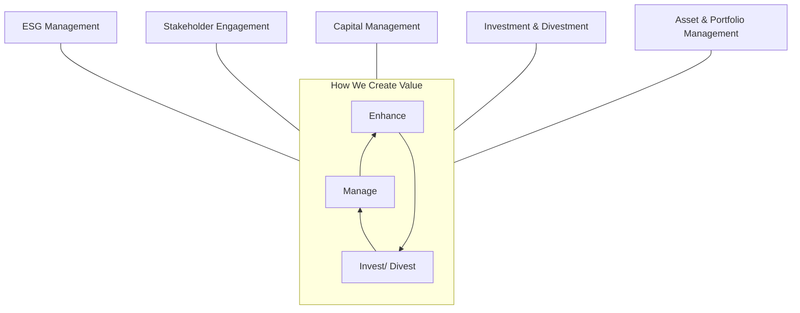
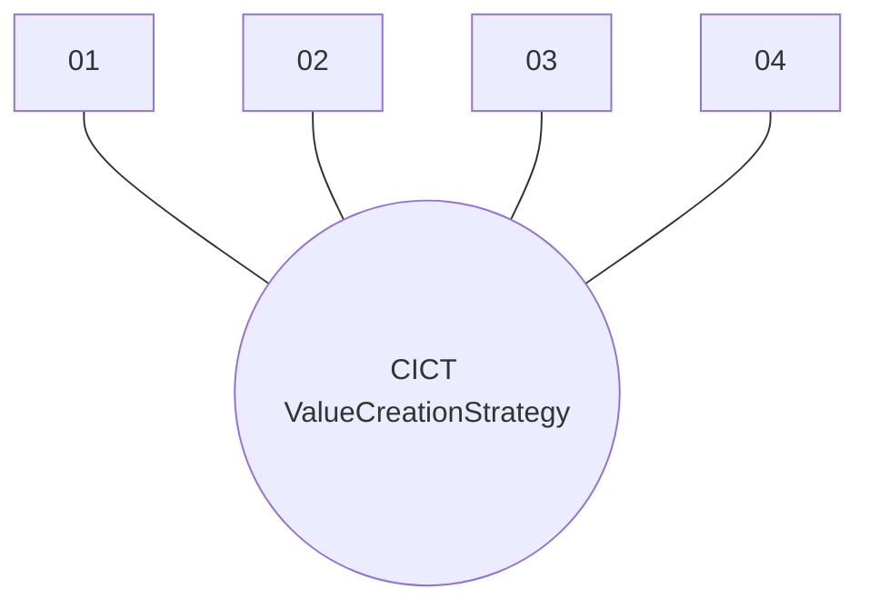
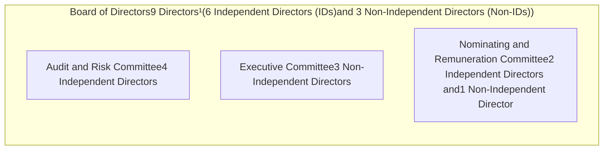
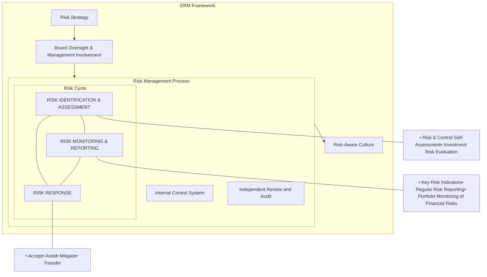

<!-- PAGE 1 -->

CapitaLand Integrated Commercial Trust logo

Abstract dandelion-like graphic with blue seeds and a red center and stem

**CapitaLand Integrated Commercial Trust**

Annual Report 2025

<!-- PAGE 2 -->

# Seeding Growth, Creating Enduring Value.

Grounded in resilience and governance, our values keep us steadfast through business cycles while propelling us to seize opportunities with clarity and confidence.

We are advancing through innovation, partnerships, and sustainable growth. With strategic focus and effective execution, we continue to seed new opportunities and strengthen growth engines to deliver enduring value for our stakeholders.

Dandelion seed illustration

## Contents

<table>
  <thead>
    <tr>
<th colspan="2">Overview</th>
<th colspan="2">Governance</th>
    </tr>
  </thead>
  <tbody>
    <tr>
<td>2025 Highlights</td>
<td>2</td>
<td>Corporate Governance</td>
<td>72</td>
    </tr>
    <tr>
<td>Financial Highlights</td>
<td>4</td>
<td>Risk Management</td>
<td>97</td>
    </tr>
    <tr>
<td>ESG Highlights</td>
<td>6</td>
<td>Sustainability Management</td>
<td>103</td>
    </tr>
    <tr>
<td>Corporate Governance Highlights</td>
<td>7</td>
<td> </td>
<td> </td>
    </tr>
    <tr>
<td>Property Portfolio</td>
<td>8</td>
<td colspan="2">Financial Statements</td>
    </tr>
    <tr>
<td>Trust Structure</td>
<td>11</td>
<td>Financial Statements and Notes</td>
<td>104</td>
    </tr>
    <tr>
<td>Chairman and CEO Message</td>
<td>12</td>
<td> </td>
<td> </td>
    </tr>
    <tr>
<td>Business Model</td>
<td>16</td>
<td colspan="2">Other Information</td>
    </tr>
    <tr>
<td>Value Creation</td>
<td>18</td>
<td>Additional Information:</td>
<td>206</td>
    </tr>
    <tr>
<td>Board of Directors</td>
<td>24</td>
<td>Interested Person Transaction</td>
<td> </td>
    </tr>
    <tr>
<td>Management Team</td>
<td>28</td>
<td>Statistics of Unitholdings</td>
<td>208</td>
    </tr>
    <tr>
<td> </td>
<td> </td>
<td> </td>
<td> </td>
    </tr>
    <tr>
<td colspan="4">Performance</td>
    </tr>
    <tr>
<td>Portfolio Valuation</td>
<td>30</td>
<td> </td>
<td> </td>
    </tr>
    <tr>
<td>Financial Review</td>
<td>32</td>
<td> </td>
<td> </td>
    </tr>
    <tr>
<td>Capital Management</td>
<td>34</td>
<td> </td>
<td> </td>
    </tr>
    <tr>
<td>Trading Performance</td>
<td>37</td>
<td> </td>
<td> </td>
    </tr>
    <tr>
<td>Investor Relations</td>
<td>38</td>
<td> </td>
<td> </td>
    </tr>
    <tr>
<td>Operations Review</td>
<td>39</td>
<td> </td>
<td> </td>
    </tr>
    <tr>
<td>Property Details</td>
<td>46</td>
<td> </td>
<td> </td>
    </tr>
  </tbody>
</table>

## Reporting Suite

Scan the QR code or visit www.cict.com.sg to view the online reports

Independent Market Review 2025

Sustainability Report 2025:
To be published by end-April 2026

<!-- PAGE 3 -->

# About Us

CapitaLand Integrated Commercial Trust (CICT or the Trust) is the first and largest real estate investment trust (REIT) listed on Singapore Exchange Securities Trading Limited (SGX-ST) with a market capitalisation of US$14.2 billion or S$18.2 billion as at 31 December 2025. It debuted on SGX-ST as CapitaLand Mall Trust in July 2002 and was renamed CICT in November 2020 following the merger with CapitaLand Commercial Trust.

As the largest proxy for Singapore commercial real estate, CICT owns and invests in quality income-producing assets primarily used for commercial (including retail and/or office) purposes, located predominantly in Singapore. CICT’s portfolio comprises 20 properties in Singapore, two properties in Frankfurt, Germany, and three properties in Sydney, Australia with a total property value of S$27.0 billion¹ or US$21.0 billion based on valuations of its proportionate interests in the portfolio as at 31 December 2025.

CICT is managed by CapitaLand Integrated Commercial Trust Management Limited (CICTML or the Manager), a wholly owned subsidiary of CapitaLand Investment Limited, a leading global real asset manager with a strong Asia foothold.

## Mission                    Vision

To deliver stable distributions and sustainable     Asia’s premier commercial REIT
total returns to Unitholders

## Purpose                    Values

Creating inspiring work-play environments      \* Winning Mindset
and delightful experiences anchored by a       \* Integrity
strong environmental, social and governance     \* Respect
(ESG) commitment                \* Enterprising

1 Excluding Bukit Panjang Plaza, which was divested on 27 February 2026.

**Note:** The terms Units and Unitholders refer to the units and unitholders of CICT respectively. Any discrepancies in the table and charts between the listed figures and totals thereof are due to rounding. Where applicable, figures and percentages are rounded to one decimal place.

<!-- PAGE 4 -->

# 2025 Highlights

All information for financial year 2025 or as at 31 December 2025, unless otherwise stated.

---

## Financial Performance

Financial Performance icon
**11.58¢** ↑ 6.4% YoY
Distribution per Unit

**S$860.9m** ↑ 14.4% YoY
Distributable Income

**S$1,189.7m** ↑ 3.1% YoY
Net Property Income

**Gross Revenue by Geography**

<table>
  <thead>
    <tr>
        <th>Geography</th>
        <th>Revenue</th>
        <th>Percentage</th>
    </tr>
  </thead>
  <tbody>
    <tr>
        <td>Singapore</td>
        <td>S$1,619.2m</td>
        <td>95%</td>
    </tr>
    <tr>
        <td>Germany</td>
        <td> </td>
        <td>2%</td>
    </tr>
    <tr>
        <td>Australia</td>
        <td> </td>
        <td>3%</td>
    </tr>
  </tbody>
</table>

---

## Portfolio Performance

Portfolio Performance icon
**96.9%** ↑ 0.2 ppts YoY
Committed Occupancy

**3.0 years** ↓ 0.3 years YoY
Weighted Average Lease Expiry

**S$27.4b** ↑ 5.2% YoY
Total Portfolio Property Value<sup>1</sup>

**S$2.14** ↑ 0.9% YoY
NAV per Unit

---

## Capital Management

Capital Management icon
**38.6%** ↑ 0.1 ppts YoY
Aggregate Leverage

**3.2%** ↓ 0.4 ppts YoY
Average Cost of Debt

**A3 by Moody’s**
**A- by S&P**
Credit Rating

---

## Green Financing

Green Financing icon
**28 March 2025**
**S$150m at 3.088% p.a. due 2032**

**25 September 2025**
**S$300m at 2.25% p.a. due 2032**

**As at 31 December 2025**
**63.1%**
Outstanding sustainability linked/ green loans and green bonds as a proportion of total borrowings

---

## Recognition & Rankings

Singapore Corporate Awards logo
**Singapore Corporate Awards 2025**
* Gold - Best Investor Relations
* Gold - Best Annual Report (REITs and Business Trusts category)

SIAS Investors' Choice Awards logo
**SIAS Investors’ Choice Awards 2025**
* Winner - Singapore Corporate Governance Award (REITs and Business Trusts category)

---

GRESB logo
**GRESB Real Estate Assessment 2025**
* Maintained 5-Star Rating with a score of 92 points
* Maintained ‘A’ for GRESB Public Disclosure with a score of 100 points

**REITs Symposium Award 2025**
* Winner - Best Managed REIT Award
* Winner - Most Preferred REIT Leadership Award

---

**Included in the 2025 Fortune Southeast Asia 500 List**

**Singapore Governance and Transparency Index (SGTI) 2025**
Ranked 3ʳᵈ with an overall score of 104.2 (REIT & Business Trust category)

**ASEAN Corporate Governance Awards**
* One of the Top 5 Public Listed Companies (PLC) in Singapore
* Top 50 ASEAN PLC

---

MSCI ESG Ratings AA

FTSE4Good logo
Constituent of the **FTSE4Good Index Series** since September 2007

---

**Sustainalytics**
Rated 9.0 - Negligible Risk
Included in the 2025 Top Rated ESG Companies List

Equileap logo
**Equileap**
Ranked first in Singapore for gender equality in 2026

---

\*<sup>1</sup> Portfolio property value as at 31 December 2025. Includes CICT’s proportionate interest in Gallileo and Main Airport Center (94.9%, respectively), CapitaSky (70%), 101-103 Miller Street & Greenwood Plaza (50%) and ION Orchard (50%).

<!-- PAGE 5 -->

# Financial Highlights

## Financial performance for CICT and its subsidiaries (CICT Group)

Gross Revenue
(S$ million)

<table>
  <tbody>
    <tr>
        <td>Year</td>
        <td>Gross Revenue</td>
    </tr>
    <tr>
        <td>2021</td>
        <td>1,305.1</td>
    </tr>
    <tr>
        <td>2022</td>
        <td>1,441.7</td>
    </tr>
    <tr>
        <td>2023</td>
        <td>1,559.9</td>
    </tr>
    <tr>
        <td>2024</td>
        <td>1,586.3</td>
    </tr>
    <tr>
        <td>2025</td>
        <td>1,619.2</td>
    </tr>
  </tbody>
</table>

Net Property Income
(S$ million)

<table>
  <tbody>
    <tr>
        <td>Year</td>
        <td>Net Property Income</td>
    </tr>
    <tr>
        <td>2021</td>
        <td>951.1</td>
    </tr>
    <tr>
        <td>2022</td>
        <td>1,043.3</td>
    </tr>
    <tr>
        <td>2023</td>
        <td>1,115.9</td>
    </tr>
    <tr>
        <td>2024</td>
        <td>1,153.5</td>
    </tr>
    <tr>
        <td>2025</td>
        <td>1,189.7</td>
    </tr>
  </tbody>
</table>

Distributable Income
(S$ million)

<table>
  <tbody>
    <tr>
        <td>Year</td>
        <td>Distributable Income</td>
    </tr>
    <tr>
        <td>2021</td>
        <td>674.7</td>
    </tr>
    <tr>
        <td>2022</td>
        <td>702.4</td>
    </tr>
    <tr>
        <td>2023</td>
        <td>715.7</td>
    </tr>
    <tr>
        <td>2024</td>
        <td>752.2</td>
    </tr>
    <tr>
        <td>2025</td>
        <td>860.9</td>
    </tr>
  </tbody>
</table>

Total Assets as at 31 December
(S$ billion)

<table>
  <tbody>
    <tr>
        <td>Year</td>
        <td>Total Assets</td>
    </tr>
    <tr>
        <td>2021</td>
        <td>22.7</td>
    </tr>
    <tr>
        <td>2022</td>
        <td>24.7</td>
    </tr>
    <tr>
        <td>2023</td>
        <td>24.7</td>
    </tr>
    <tr>
        <td>2024</td>
        <td>25.5</td>
    </tr>
    <tr>
        <td>2025</td>
        <td>27.4</td>
    </tr>
  </tbody>
</table>
<table>
  <thead>
    <tr>
        <th>CICT Group For the Financial Year</th>
        <th>2021</th>
        <th>2022</th>
        <th>2023</th>
        <th>2024</th>
        <th>2025</th>
    </tr>
    <tr>
        <th colspan="6">Selected Statement of Total Return and Distribution Data (S$ million)</th>
    </tr>
  </thead>
  <tbody>
    <tr>
        <td>Gross Revenue</td>
        <td>1,305.1</td>
        <td>1,441.7</td>
        <td>1,559.9</td>
        <td>1,586.3</td>
        <td><strong>1,619.2</strong></td>
    </tr>
    <tr>
        <td>Net Property Income</td>
        <td>951.1</td>
        <td>1,043.3</td>
        <td>1,115.9</td>
        <td>1,153.5</td>
        <td><strong>1,189.7</strong></td>
    </tr>
    <tr>
        <td>Distributable Income</td>
        <td>674.7</td>
        <td>702.4</td>
        <td>715.7</td>
        <td>752.2</td>
        <td><strong>860.9</strong></td>
    </tr>
    <tr>
        <th colspan="6">Selected Statement of Financial Position Data (S$ million)</th>
    </tr>
    <tr>
        <td>Total Assets</td>
        <td>22,741.9</td>
        <td>24,666.6</td>
        <td>24,739.1</td>
        <td>25,513.0</td>
        <td><strong>27,431.3</strong></td>
    </tr>
    <tr>
        <td>Investment Properties</td>
        <td>21,431.1</td>
        <td>23,744.8</td>
        <td>24,024.9</td>
        <td>23,702.3</td>
        <td><strong>25,601.6</strong></td>
    </tr>
    <tr>
        <td>Total Borrowings</td>
        <td>8,177.3</td>
        <td>9,585.3</td>
        <td>9,477.7</td>
        <td>8,945.1</td>
        <td><strong>9,989.5</strong></td>
    </tr>
    <tr>
        <td>Unitholders’ Funds</td>
        <td>13,667.8</td>
        <td>14,073.4</td>
        <td>14,199.8</td>
        <td>15,524.5</td>
        <td><strong>16,292.1</strong></td>
    </tr>
    <tr>
        <td>Net Asset Value Per Unit (S$)</td>
        <td>2.06</td>
        <td>2.12</td>
        <td>2.13</td>
        <td>2.12</td>
        <td><strong>2.14</strong></td>
    </tr>
    <tr>
        <th colspan="6">Key Financial Indicators</th>
    </tr>
    <tr>
        <td>Distribution Per Unit (¢)</td>
        <td>10.40</td>
        <td>10.58</td>
        <td>10.75</td>
        <td>10.88</td>
        <td><strong>11.58</strong></td>
    </tr>
    <tr>
        <td>Management Expense Ratio¹ (%)</td>
        <td>0.7</td>
        <td>0.7</td>
        <td>0.7</td>
        <td>0.8</td>
        <td><strong>0.7</strong></td>
    </tr>
    <tr>
        <td>% of Total Assets that are Unencumbered</td>
        <td>96.1</td>
        <td>93.5</td>
        <td>93.7</td>
        <td>93.8</td>
        <td><strong>90.9</strong></td>
    </tr>
    <tr>
        <td>Aggregate Leverage (%)</td>
        <td>37.2</td>
        <td>40.4</td>
        <td>39.9</td>
        <td>38.5</td>
        <td><strong>38.6</strong></td>
    </tr>
    <tr>
        <td>Interest Coverage (times)</td>
        <td>4.1</td>
        <td>3.7</td>
        <td>3.1</td>
        <td>3.1</td>
        <td><strong>3.7</strong></td>
    </tr>
    <tr>
        <td>Average Term to Maturity (years)</td>
        <td>3.9</td>
        <td>3.9</td>
        <td>3.9</td>
        <td>3.9</td>
        <td><strong>4.0</strong></td>
    </tr>
    <tr>
        <td>Average Cost of Debt (%)</td>
        <td>2.3</td>
        <td>2.7</td>
        <td>3.4</td>
        <td>3.6</td>
        <td><strong>3.2</strong></td>
    </tr>
  </tbody>
</table>

1 Refers to the expenses excluding property expenses and finance costs but including performance component of management fees, expressed as a percentage of weighted average net assets.

<!-- PAGE 6 -->

# ESG Highlights

## Embracing the Tenets of Sound Corporate Governance¹

**100%**
of CICTML Employees Attended Fraud, Bribery & Corruption Awareness Training

**~24**
Training Hours per Employee

**54%**
Female Representation in Senior Management Level

## Fostering Positive Change through Social Good¹

**908**
Volunteer Hours by Employees

**>98%**
of Employees Attended at Least One ESG Training

**100%**
Supply Chain Vendors Committed to Abide by Supply Chain Code of Conduct

**Zero**
Employee Work-related Fatality or Permanent Disability

## Advancing Our Low Carbon Transition¹

2030 Targets (reduction targets are based on a 2019 baseline)

To Reduce

Absolute Scope 1 & 2 GHG Emissions icon
**46%**
Absolute Scope 1 & 2 GHG Emissions

Carbon Emissions Intensity icon
**72%**
Carbon Emissions Intensity

Energy Consumption Intensity icon
**15%**
Energy Consumption Intensity

Water Consumption Intensity icon
**15%**
Water Consumption Intensity

Waste Intensity icon
**20%**
Waste Intensity in Daily Operations

To Achieve

Recycling Rate icon
**25%**
Recycling Rate in Daily Operations

Renewable Energy icon
**45%**
Renewable Energy

1 More information will be published in CICT's Sustainability Report 2025 by end-April 2026.

# Corporate Governance Highlights

## Board Composition (9 Directors)

### Board Independence

<table>
  <tbody>
    <tr>
        <td>Independent</td>
        <td>67%</td>
    </tr>
    <tr>
        <td>Non-Independent</td>
        <td>33%</td>
    </tr>
  </tbody>
</table>

### Age Spread

<table>
  <tbody>
    <tr>
        <td>50 years &amp; below</td>
        <td>22%</td>
    </tr>
    <tr>
        <td>51-60 years old</td>
        <td>33%</td>
    </tr>
    <tr>
        <td>61 years &amp; above</td>
        <td>45%</td>
    </tr>
  </tbody>
</table>

### Gender Diversity

<table>
  <tbody>
    <tr>
        <td>Males</td>
        <td>5</td>
    </tr>
    <tr>
        <td>Females</td>
        <td>4</td>
    </tr>
  </tbody>
</table>

### Tenure Mix

<table>
  <tbody>
    <tr>
        <td>0-3 years</td>
        <td>11%</td>
    </tr>
    <tr>
        <td>3-6 years</td>
        <td>56%</td>
    </tr>
    <tr>
        <td>6 years</td>
        <td>33%</td>
    </tr>
  </tbody>
</table>

## Committee Composition

**Audit and Risk Committee**
* **4** Members
* **100%** Independent Independent icon

**Executive Committee**
* **3** Members
* **100%** Non-Independent Non-Independent icon

**Nominating and Remuneration Committee**
* **3** Members
* **67%** Independent Independent icon

## Meeting Attendance

Board Meeting icon
**98.4%**
Board Meeting

Audit and Risk Committee Meetings icon
**100%**
Audit and Risk Committee Meetings

Nominating and Remuneration Committee Meetings icon
**100%**
Nominating and Remuneration Committee Meetings

Annual General Meeting icon
**100%**
Annual General Meeting

<!-- PAGE 7 -->

# Property Portfolio

## Singapore

### Retail
1. Bedok Mall
2. Bugis Junction
3. CQ @ Clarke Quay
4. IMM Building
5. ION Orchard (50% interest)
6. Junction 8
7. Lot One Shoppers' Mall
8. Tampines Mall
9. Westgate
10. Bugis+
11. Bukit Panjang Plaza (Divested on 27 February 2026)

### Office
1. Asia Square Tower 2
2. CapitaGreen
3. CapitaSpring
4. Capital Tower
5. CapitaSky (70% interest)
6. Six Battery Road

### Integrated Development
1. Funan
2. Plaza Singapura
3. The Atrium@Orchard
4. Raffles City Singapore

Map of Singapore showing property locations and MRT lines

<!-- PAGE 8 -->

# Property Portfolio

## Sydney, Australia

Map of Sydney, Australia showing property locations and landmarks

1 66 Goulburn Street
2 100 Arthur Street

3 101-103 Miller Street and Greenwood Plaza (50% interest)

* Landmarks
* Train Station
* Metro Station
CBD: Central Business District

## Frankfurt, Germany

Map of Frankfurt, Germany showing property locations and infrastructure

4 Gallileo (94.9% interest)

5 Main Airport Center (94.9% interest)

* Frankfurt Airport Office Submarket
* Frankfurt CBD
* S-Bahn
* `DB` InterCity Express
* Motorway / Highway

<!-- PAGE 9 -->

# Trust Structure

```mermaid
graph TD
    Unitholders([Unitholders])
    Manager[ManagerCapitaLand IntegratedCommercial TrustManagement Limited]
    Trustee[TrusteeHSBC InstitutionalTrust Services(Singapore) Limited]
    CICT_Logo{CapitaLandINTEGRATEDCOMMERCIAL TRUST}
    Properties([Properties])

    Unitholders -- "Investmentin CICT" --> CICT_Logo
    CICT_Logo -- "Distributions" --> Unitholders

    Manager -- "ManagementServices" --> CICT_Logo
    CICT_Logo -- "ManagementFees" --> Manager

    Trustee -- "Represents Interestof Unitholders" --> CICT_Logo
    CICT_Logo -- "TrusteeFees" --> Trustee

    CICT_Logo -- "Ownershipof Assets" --> Properties
    Properties -- "Net PropertyIncome" --> CICT_Logo

    Properties -- "Property ManagementFees" --> Manager
    Manager -- "Property ManagementServices" --> Properties
```

<table>
  <thead>
    <tr>
<th>Property Managers</th>
<th>Retail</th>
<th>Office</th>
<th>Integrated Development</th>
    </tr>
  </thead>
  <tbody>
    <tr>
<td rowspan="5">CapitaLand Retail<br/>Management Pte Ltd</td>
<td>1. Bedok Mall</td>
<td>1. Asia Square Tower 2</td>
<td>1. Funan</td>
    </tr>
    <tr>
<td>2. Bugis Junction</td>
<td>2. CapitaGreen</td>
<td>2. Plaza Singapura</td>
    </tr>
    <tr>
<td>3. CQ @ Clarke Quay</td>
<td>3. CapitaSpring</td>
<td>3. The Atrium@Orchard</td>
    </tr>
    <tr>
<td>4. IMM Building</td>
<td>4. Capital Tower</td>
<td>4. Raffles City Singapore</td>
    </tr>
    <tr>
<td>5. ION Orchard<br/>(comprising ION<br/>Orchard and ION<br/>Orchard Link)<br/>(50% interest)</td>
<td>5. CapitaSky<br/>(70% interest)</td>
<td>5. 101-103 Miller Street<br/>and Greenwood<br/>Plaza, Australia<br/>(50% interest)⁴</td>
    </tr>
    <tr><td rowspan="3">CapitaLand Commercial<br/>Management Pte. Ltd.</td><td>6. Junction 8</td><td>6. Six Battery Road</td></tr>
    <tr>
<td>7. Lot One Shoppers’ Mall</td>
<td>7. Gallileo, Germany<br/>(94.9% interest)³</td>
<td> </td>
    </tr>
    <tr>
<td>8. Tampines Mall</td>
<td>8. Main Airport<br/>Center, Germany<br/>(94.9% interest)³</td>
<td> </td>
    </tr>
    <tr><td rowspan="3">Orchard<br/>Turn Developments<br/>Pte. Ltd. (OTD)¹</td><td>9. Westgate</td><td>9. 66 Goulburn<br/>Street, Australia⁴</td></tr>
    <tr>
<td>10. Bugis+</td>
<td>10. 100 Arthur<br/>Street, Australia⁴</td>
<td> </td>
    </tr>
    <tr>
<td colspan="3">11. Bukit Panjang Plaza<br/>(90 out of 91 strata lots)²</td>
    </tr>
  </tbody>
</table>

1 OTD manages ION Orchard and ION Orchard Link.

2 Sale of 90 out of 91 strata lots in Bukit Panjang Plaza was announced on 14 January 2026 at S$428.0 million and was completed on 27 February 2026.

3 Managed by third party service providers in Germany.

4 Managed by third party service providers in Australia.

<!-- PAGE 10 -->

# Chairman and CEO Message

Teo Swee Lian, Chairman

Tan Choon Siang, Chief Executive Officer

**Teo Swee Lian**
Chairman
Non-Executive Independent Director

**Tan Choon Siang**
Chief Executive Officer
Executive Non-Independent Director

Dear Unitholders,

## Staying Focused in a Year of Transition

## Strong FY 2025 Performance

Singapore’s economy grew by 5.0% in 2025 according to the Ministry of Trade and Industry Singapore, exceeding official forecasts driven by strong fundamentals and proactive policies. Inflation remained subdued, with core inflation averaging between 0.5% and 1% for the year. Singapore’s interest rates tapered off faster than most economies, and the Singapore dollar stayed strong, reinforcing the country’s reputation as a safe haven for investors. Against this backdrop, CICT is well-positioned to leverage Singapore’s strengths, with its portfolio predominantly anchored in the city state. We remain committed to delivering sustainable returns for CICT while navigating an evolving global landscape with discipline and agility.

CICT posted a strong year-on-year (YoY) performance for FY 2025, despite the challenging market environment. The stellar growth was supported by income contributions of ION Orchard for the full FY 2025¹ and the step-up acquisition of the remaining 55% interest in CapitaSpring², as well as the focused asset management and proactive capital management by the team. We delivered a higher FY 2025 distributable income of S$860.9 million, an increase of 14.4% YoY, while distribution per unit (DPU) rose 6.4% YoY to 11.58 cents, reflecting a distribution yield of 4.8%³ and a total return of 29.9%⁴ for FY 2025. Gross revenue grew 2.1% YoY to S$1,619.2 million and net property income (NPI) rose 3.1% YoY to S$1,189.7 million. Excluding the

1 Completed the acquisition of 50% interest in ION Orchard on 30 October 2024.

2 Completed the acquisition of the remaining 55% interest in CapitaSpring’s Commercial Component on 26 August 2025.

3 Based on the closing price of S$2.39 per unit on 31 December 2025.

4 Based on Bloomberg as at 31 December 2025, assuming dividends are reinvested.

<!-- PAGE 11 -->

contributions from CapitaSpring and 21 Collyer Quay, gross revenue and NPI would have increased by 1.4% and 2.5% YoY, respectively.

CICT’s portfolio achieved a high committed occupancy of 96.9% as at 31 December 2025, while tenant retention remained healthy at 83.7% for the retail portfolio and 72.7% for the office portfolio.

## Retail Operating Performance

Our retail portfolio continued to demonstrate strength, achieving high occupancy of 98.7% as at 31 December 2025 and positive rent reversion of 6.6% for FY 2025. Shopper traffic grew 20.5% YoY in FY 2025, or 4.6% YoY excluding ION Orchard. Tenant sales stayed healthy despite a brief moderation in 2Q 2025 due to consumer caution following “Liberation Day” tariffs. Tenant sales per square foot (psf) increased 14.9% YoY, or 1.2% excluding ION Orchard.

The higher shopper traffic and tenant sales psf were driven by curated retail mix and concepts, and targeted marketing initiatives. SG60 vouchers distributed by the Singapore Government in July 2025 further boosted essential trades and encouraged household spending. This positive performance underscores the resilience of Singapore’s retail sector and the appeal of our retail portfolio.

## Office Operating Performance

We remain focused on driving healthy occupancies across the portfolio and adapting our approach to ensure effective portfolio management. As at 31 December 2025, our office portfolio remained steady, with committed occupancy at 95.7%, versus 94.8% a year ago. This was supported by strong leasing activity and signs of stabilisation across our overseas portfolio as lease-up progressed. The Australia and Germany portfolios recorded higher occupancies of 91.8% and 91.6%, respectively, as at 31 December 2025, compared to 89.6% and 81.8% a year ago. The committed occupancy for the Germany portfolio also benefitted from the inclusion of Gallileo, following the completed handover of the Phase 1 Asset Enhancement Initiative (AEI) for the office tower to the anchor tenant, European Central Bank (ECB) in December 2025.

Our Singapore portfolio continued to register positive rent reversion of 6.6% for FY 2025, reflecting healthy demand from sectors such as Banking, Insurance & Financial Services, Distribution and Trading, and IT and Telecommunications.

## Seeding Growth, Creating Enduring Value

Value creation is a core focus of our growth strategy. A key lever is portfolio reconstitution, through which we recycle capital into higher-yielding opportunities to strengthen long-term growth and resilience. In line with this, we divested our 45% interest in the non-core serviced residence component of CapitaSpring for S$126.0 million<sup>5</sup> on 30 May 2025. To further strengthen CICT’s leadership position in Singapore’s commercial real estate market, we acquired the remaining 55% interest in CapitaSpring’s commercial component for S$1,045.0 million<sup>6</sup> on 26 August 2025. The acquisition was funded via a S$600 million private placement, which was upsized from S$500 million due to strong investor demand and was 4.9 times oversubscribed.

Asset enhancement is another key value creation lever. During the year, we made headway on several AEIs to improve asset relevance, tenant experience and portfolio performance. In Singapore, we completed IMM Building's AEI in 3Q 2025, further strengthening its position as a regional outlet destination. In Germany, Gallileo in Frankfurt has begun contributing income progressively from 4Q 2025 following the Phase 1 handover. Phase 2 handover is targeted in 1Q 2026.

We also embarked on new AEIs in 2025. At Tampines Mall, an estimated S$24 million AEI commenced in September 2025 to improve about 50,000 sq ft of net lettable area (NLA) and create a more seamless shopper journey, including a rejuvenated main entrance aligned with the Land Transport Authority’s pedestrianisation plans. Tenant mix optimisation is underway, with new tenants at the newly completed entrance to open progressively from February to April 2026. Completion is on track for 3Q 2026.

At Lot One Shoppers’ Mall, an estimated S$37 million AEI commenced in November 2025 to add about 15,000 sq ft of NLA in Basement 2, leveraging the Urban Redevelopment Authority’s surplus carpark conversion scheme. FairPrice will expand into this new space. Separately, a new sheltered bridge linking Keat Hong Community Club to Level 2 of the mall will enhance accessibility. Completion is on track for 1Q 2027.

5 Cushman & Wakefield VHS Pte Ltd had valued the serviced residence (SR) Component of CapitaSpring at S$278.5 million as at 31 December 2024 using the income capitalisation and discounted cashflow methods. The agreed property value of the SR Component was S$280.0 million on a 100% interest basis.

6 Based on 55% of the agreed property value of S$1.9 billion. Savills Valuation and Professional Services (S) Pte Ltd and Knight Frank Pte Ltd had respectively valued the Commercial Component at CapitaSpring at S$1,905.0 million and S$1,895.0 million as at 30 June 2025 using the income capitalisation and discounted cashflow methods.

<!-- PAGE 12 -->

# Chairman and CEO Message

At Raffles City Singapore, upgrading works began in November 2025 to uplift office user experience. This includes refurbishing the Level 1 office lobby, creating end-of-trip facilities with dedicated bicycle parking and amenities, and installing wayfinding on all office floors. The upgrade is on track for completion by 4Q 2026.

Overall, total property value grew 5.2% YoY to S$27.4 billion as at 31 December 2025. CICT’s portfolio remains Singapore-centric at 94%, with 3% each in Australia and Germany. Net asset value per Unit increased 0.9% to S$2.14, in line with a year ago. From an income perspective, CICT’s FY 2025 NPI yield was 4.6%.

## Growing Responsibly

We are committed to growing CICT responsibly to create long-term value for unitholders. Our portfolio remained 100% green-rated as at end-2025, reflecting our continued focus on carbon emissions reduction and energy efficiency. During the year, three properties upgraded their building certifications. The Atrium@ Orchard became Singapore’s first operational office-retail building to achieve the Building and Construction Authority’s (BCA) Green Mark Platinum (Super Low Energy), while Asia Square Tower 2 also attained the same certification. In addition, Raffles City Singapore was upgraded to Green Mark Platinum from Gold<sup>PLUS</sup>. These achievements underscore our commitment to sustainable asset management and operational excellence amid increasingly rigorous BCA standards.

## Continued momentum into 2026

Continuing the active portfolio reconstitution, CICT started 2026 with a series of value creation initiatives.

## Disciplined Capital Management

We believe adopting a disciplined and proactive capital management approach will enable us to preserve a strong balance sheet. In an environment of evolving interest rate dynamics and macroeconomic uncertainties, we maintained a healthy and resilient balance sheet through prudent financial stewardship.

In January 2026, CICT was awarded the tender for the mixed-use Hougang Central Government Land Sales (GLS) site which it had submitted with partners including CapitaLand Development. CICT will develop and own 100% of the commercial component, deepening our presence in Singapore and expanding our retail footprint in the northeast. The approximately S$1.1 billion development cost translates to about $3,600 psf and an expected yield on cost of over 5%, which compares favourably with recent retail transactions at the low-to-mid 4% level. This allows CICT to shape the mall’s design, positioning, and leasing strategy from inception.

As at 31 December 2025, CICT’s aggregate leverage was 38.6%, while the average cost of debt fell 0.4% YoY to 3.2%. Fixed rate debt accounted for approximately 74% of our total borrowings, providing stability against market volatility. Our debt maturity profile remained well-staggered, with an average term-to-maturity of 4 years, mitigating refinancing risks in any single year.

Also in January 2026, CICT announced the divestment of Bukit Panjang Plaza<sup>7</sup> for S$428.0 million at an exit yield of around the mid-4% level. This forms part of CICT’s broader portfolio reconstitution strategy to redeploy capital into growth opportunities or other strategic purposes.

A more accommodative interest rate environment in Singapore during 2025 supported our capital management efforts. For our last issuance in September 2025, we secured S$300 million 7-year fixed rate notes at 2.25% per annum.

From 3Q 2026, Capital Tower, a Grade A office building, will undergo an approximately S$25 million AEI, which will reposition Level 9 into a community space and create a higher-yielding F&B space with a multi-tenanted retail pavilion on Level 1. Works are to complete in 4Q 2027.

We also continue to diversify funding sources, tapping into sustainability linked and green loan facilities and green bonds. As at end-2025, sustainability linked and green loans and bonds accounted for about 63.1% of the total borrowings. CICT maintained its A3 credit rating with a stable outlook by Moody's and A- by S&P, reflecting the strength of our balance sheet and sound financial governance.

<!-- PAGE 13 -->

CEO of CICT, Mr Tan Choon Siang, receiving the Singapore Corporate Governance Award at the SIAS Investors' Choice Awards 2025 from Mr Gan Kim Yong, Deputy Prime Minister of Singapore, Mr David Gerald, Founder, President and CEO of SIAS, and Mr Oliver Siah, Co-Founder and Group Managing Director of Fraxtor Private Limited. The image includes the CapitaLand Integrated Commercial Trust logo and the award title "REITs and Business Trusts WINNER Singapore Corporate Governance Award".

▲ CEO of CICT, Mr Tan Choon Siang (second from left), receiving the Singapore Corporate Governance Award at the SIAS Investors' Choice Awards 2025 from Mr Gan Kim Yong, Deputy Prime Minister of Singapore (third from left), Mr David Gerald, Founder, President and CEO of SIAS (far right), and Mr Oliver Siah, Co-Founder and Group Managing Director of Fraxtor Private Limited (far left)

## Driving Momentum for the Future

Our commitment to delivering value to unitholders remains steadfast. In 2026, we will explore strategic acquisitions and divestments aligned with long-term objectives, while driving sustainable growth through active portfolio, cost and capital management. With robust liquidity and financial prudence, CICT is well-positioned to navigate market cycles, support AEIs, and pursue strategic investments that create long-term value for our unitholders.

## Recognising your Trust and Support

We extend our heartfelt appreciation to our Board, unitholders, tenants, partners, and employees for their trust and unwavering support. Your continued confidence empowers us to remain agile and responsive amid evolving market conditions and advance our shared vision. Together, we remain committed to building a sustainable and resilient future.

Sincerely,

**Teo Swee Lian**  
Chairman

**Tan Choon Siang**  
Chief Executive Officer

27 February 2026

<!-- PAGE 14 -->

# Business Model

## Our Mission & Vision

To be Asia’s premier commercial REIT and deliver stable distributions and sustainable total returns to Unitholders

### Our Resources

Financial icon
**Financial**
1. Net property income
2. Distributable income
3. Distribution per Unit
4. Capital management & financial indicators

Stakeholders & Communities icon
**Stakeholders & Communities**
1. Customer experience
2. Stakeholder engagement
3. Safety, health & well-being

Properties icon
**Properties**
1. Portfolio occupancy
2. Tenant retention
3. Social integration

Environment icon
**Environment**
1. Climate resilience
2. Resource efficiency & 2030 Sustainability Master Plan

People & Structure icon
**People & Structure**
Performance against benchmarks

### The Value We Create

Sustainable returns icon
**Sustainable returns**

High standards of governance & accountability icon
**High standards of governance & accountability**

Quality assets & differentiated offerings icon
**Quality assets & differentiated offerings**

Portfolio resilience, resource efficiency & innovation icon
**Portfolio resilience, resource efficiency & innovation**

Partner of choice, thriving communities & high performance culture icon
**Partner of choice, thriving communities & high performance culture**

### Our Competitive Advantage

Leadership icon
**Leadership**

Growth icon
**Growth**

Resilience icon
**Resilience**

Partnership icon
**Partnership**

### Value Drivers



ESG Management icon
**ESG Management**

Stakeholder Engagement icon
**Stakeholder Engagement**

Capital Management icon
**Capital Management**

Investment & Divestment icon
**Investment & Divestment**

Asset & Portfolio Management icon
**Asset & Portfolio Management**

<!-- PAGE 15 -->

# Value Creation



## Portfolio Management
Proactive portfolio and asset management to drive higher occupancy and rents while managing operating cost

## Value Creation
Disciplined portfolio reconstitution and proactive AEI to optimise portfolio and/or unlock value

## Sustainability
Operational efficiencies and sustainability initiatives to meet CLI Sustainability Master Plan 2030 targets

## Capital Management
Prudent cost management and agile capital management to enhance financial flexibility

## Divestment of Bukit Panjang Plaza

* Divested Bukit Panjang Plaza¹ to SG Bravo Retail Property Pte. Ltd. at an exit yield around the mid-4% level²

* Agreed property value: S$428.0 million³

* Completion: 27 February 2026

Photograph of Bukit Panjang Plaza exterior

1 90 out of 91 strata lots held by CICT.

2 Based on FY 2024 net property income adjusted for one-offs and deduction of lease payments for right-of-use assets.

3 Cushman & Wakefield VHS Pte. Ltd. had valued the property at S$389.0 million as at 31 December 2025 using the income capitalisation and discounted cashflow methods.

## Value Creation Journey

### A Divestment of the Serviced Residence (SR) Component of CapitaSpring

* Divested 45% interest in the SR Component of CapitaSpring to RP Riverside II (B.V.I.) Limited and YTL Riverside Pte. Ltd. at an estimated exit yield of 3.6%¹

* Agreed property value: S$280.0 million² on a 100% basis

* Completion: 30 May 2025

Interior photograph of the Serviced Residence component of CapitaSpring

1 Based on the annualised net property income for the financial quarter ended 31 March 2025 and the agreed property value of the SR Component.

2 Cushman & Wakefield VHS Pte. Ltd. had valued the SR Component of CapitaSpring at S$278.5 million as at 31 December 2024 using the income capitalisation and discounted cashflow methods.

### B Acquisition of the Remaining 55% interest in the office and retail component (Commercial Component) of CapitaSpring

Exterior photograph of CapitaSpring skyscraper

* Acquired 55% interest in the Commercial Component of CapitaSpring from Glory Office Pte. Ltd. and MEA Commercial Holdings Pte. Ltd. at an entry yield of low 4%

* Agreed property value: S$1,900.0 million on a 100% basis¹

* Acquisition financed via S$600 million private placement to institutional investors at S$2.11 per Unit

* Completion: 26 August 2025

1 Savills Valuation and Professional Services (S) Pte Ltd and Knight Frank Pte Ltd had respectively valued the Commercial Component of CapitaSpring at S$1,905.0 million and S$1,895.0 million as at 30 June 2025 using the income capitalisation and discounted cashflow methods.

<!-- PAGE 16 -->

C icon

# Development of the Commercial Component at Hougang Central Site

On 14 January 2026, CICT was awarded the Hougang Central GLS site as part of a consortium that includes CapitaLand Development. CICT will develop and own 100% of the commercial component, which will be the largest mall in Hougang with about 300,000 sq ft of NLA. The mall is part of a mixed-use development that also includes approximately 830 residential units.

The commercial component will be fully integrated with Hougang MRT, a new bus interchange and a town plaza. This marks a significant milestone for CICT as it reinforces its foothold in its core market of Singapore, while expanding its retail footprint into Singapore’s northeast region within an underserved catchment.

Greenfield Hougang Central Site from Google street view

▲ Greenfield Hougang Central Site from Google street view

The project offers an attractive expected yield on cost of over 5%¹, which compares favourably with recent transactions of operating assets in the market. Importantly, participating at the development phase allows CICT to shape the mall’s design, positioning, and leasing strategy from the outset, unlocking Hougang’s untapped potential given its relatively low private retail space per capita and sizeable population.

Map of Hougang Central area

**Overall Development Details:**

* Site Area: 504,820 sq ft

* Land Use: Mixed-use development comprising a commercial and residential development integrated with a bus interchange

* Plot Ratio: 2.5

* Tenure: 99-year leasehold

* Tender Price: ~S$1.5 billion

**Commercial Component (100% interest held by CICT):**

* NLA: ~300,000 sq ft

* Total Development Cost: ~S$1.1 billion

* Yield on Cost: Over 5%¹

* Funding: Internal funds and external borrowings

* Expected Completion: 2030 / 2031

D icon

# Ongoing AEI

## Lot One Shoppers’ Mall

Creating value through an increase in NLA, focusing on daily essentials and shopper convenience

* Additional NLA from AEI: ~15,000 sq ft

* Estimated cost: S$37 million

* Target return on investment (ROI): >7%

* Duration: 4Q 2025 to 1Q 2027

Artist’s impression of the new F&B units at Basement 2

▲ Artist’s impression of the new F&B units at Basement 2

* Works:

    − Creation of NLA mainly from leveraging Urban Redevelopment Authority’s (URA) surplus carpark conversion scheme

    − Introducing curated daily essentials and convenience-focused offerings at Basement 2, anchored by FairPrice’s expansion from Basement 1

    − Enhancing connectivity to Level 2 via a new sheltered bridge linking Keat Hong Community Club across Choa Chu Kang Avenue 4 to the mall

* Mall remains open and operational throughout the AEI

Artist’s impression of the new pedestrian overhead bridge at Level 2 linking to Keat Hong Community Club

▲ Artist’s impression of the new pedestrian overhead bridge at Level 2 linking to Keat Hong Community Club

## Tampines Mall

Uplifting asset value and enhancing asset potential

* NLA undergoing works: ~50,000 sq ft

* Estimated cost: S$24 million

* Target ROI: ~7%

* Duration: 4Q 2025 to 3Q 2026

Artist’s impression of the enhanced main entrance

▲ Artist’s impression of the enhanced main entrance featuring a straight passage from the planned pedestrianised street along with refreshed offerings

* Works:

    − Rejuvenate the main entrance for a seamless shopper journey, in conjunction with the Land Transport Authority plans to pedestrianise the street between the main entrance and MRT station

    − Refresh tenant mix and expand product offerings through improved space reconfiguration

    − Enhance shopper convenience with the inclusion of accessible changing room

* Exciting mix of new tenants include: Casa Vostra, Yeah Gelato, Shiseido, Braun Buffel, Meilleur Moment

* Existing tenants refreshing their fitout include: Breadtalk, Toastbox, L'Occitane, Running Lab, Goldheart and SK Jewellery

* Mall remains open and operational throughout the AEI

\*1 Based on the valuer’s estimated net income, assuming completion of the commercial component and taking into consideration the estimated total development cost of the commercial component.

<!-- PAGE 17 -->

# E

## Ongoing Upgrading

### Raffles City Tower

Enhancing overall user experience by refreshing key touchpoints and creation of end-of-trip facilities

* Duration: 4Q 2025 to 4Q 2026

Artist's impression of the refreshed Level 1 office lobby

▲ Artist's impression of the refreshed Level 1 office lobby

Artist's impression of the end-of-trip facilities

▲ Artist's impression of the end-of-trip facilities

* Works:

  - Refurbish Level 1 office lobby to elevate user experience for a refreshed and spacious environment

  - Create end-of-trip facilities with dedicated bicycle parking and amenities for our tenants

  - Improve transfer floor lift lobbies and install wayfinding on all floors to tie in seamlessly with the ongoing lift enhancements

# F

## Upcoming AEIs

### Capital Tower

Repositioning Level 9 into a community space and creating higher-yielding F&B space at ground floor

* Estimated cost: S$25 million

* Duration: 3Q 2026 to 4Q 2027

* Level 1 Urban Plaza Enhancement:

  - Development of a new 7,750 sq ft, two-storey, multi-tenanted pavilion to elevate the overall F&B experience

  - Creating an inviting landscape for tenants and public to gather, interact, and unwind in the communal space

  - Enhancing Capital Tower as a vibrant, tenant-and-community centric landmark in the Tanjong Pagar precinct

* Level 9 Reconfiguration:

  - Establishing CBD’s first workplace mental wellness centre for working adults and their families

  - Partnering with TOUCH Community Services and CapitaLand Hope Foundation under the URA's Community/Sports Facilities Scheme (CSFS)

  - Championing social causes and strengthening community engagement to advance well-being and social inclusivity

Artist's impression of proposed retail pavilion at Urban Plaza

▲ Artist's impression of proposed retail pavilion at Urban Plaza

# G

## Completed AEIs

### IMM Building

Strengthening IMM Building’s position as a regional outlet destination

* Total cost: S$48 million

* Outlet Stores: >100

* Completed and handed over to tenants, income contribution started progressively from 3Q 2025

Revamped F&B zone at IMM Building

▲ Revamped F&B zone at IMM Building

Refreshed drop-off point at IMM Building

▲ Refreshed drop-off point at IMM Building

### Gallileo, Frankfurt, Germany

* Total cost: ~EUR180 million

* Completed progressive handover of Phase 1 (office tower) to ECB in December 2025.

* Target handover of phase 2: 1Q 2026

* Income contribution is progressive from 4Q 2025

Gallileo's facade

▲ Gallileo's facade

<!-- PAGE 18 -->

# Board of Directors

Group photo of the Board of Directors

Front Row (Seated left to right)

<table>
  <thead>
    <tr>
        <th>Stephen Lim Beng Lin</th>
        <th>Teo Swee Lian</th>
        <th>Jeann Low Ngiap Jong</th>
        <th>Quek Bin Hwee</th>
    </tr>
  </thead>
  <tbody>
    <tr>
        <td>Non-Executive<br/>Independent Director</td>
        <td>Chairman<br/>Non-Executive<br/>Independent Director</td>
        <td>Non-Executive<br/>Independent Director</td>
        <td>Non-Executive<br/>Independent Director</td>
    </tr>
  </tbody>
</table>

Back Row (Standing left to right)

<table>
  <thead>
    <tr>
        <th>Leo Mun Wai</th>
        <th>Janine Gui Siew Kheng</th>
        <th>Tan Choon Siang</th>
    </tr>
  </thead>
  <tbody>
    <tr>
        <td>Non-Executive<br/>Independent Director</td>
        <td>Non-Executive<br/>Non-Independent Director</td>
        <td>Chief Executive Officer<br/>Executive Non-Independent<br/>Director</td>
    </tr>
  </tbody>
</table>
<table>
  <thead>
    <tr>
        <th>Jonathan Yap Neng Tong</th>
        <th>Tan Boon Khai</th>
    </tr>
  </thead>
  <tbody>
    <tr>
        <td>Non-Executive<br/>Non-Independent Director</td>
        <td>Non-Executive<br/>Independent Director</td>
    </tr>
  </tbody>
</table>

<!-- PAGE 19 -->

# Teo Swee Lian, 66

Chairman

Non-Executive Independent Director

* Bachelor of Science in Mathematics, Imperial College of Science and Technology, University of London, UK

* Master of Science in Applied Statistics, University of Oxford, UK

## Date of first appointment as a Director

12 April 2019

## Date of appointment as Chairman

12 April 2019

## Length of service as a Director (as at 31 December 2025)

6 years 8 months

## Board Committee served on

Nominating and Remuneration Committee (Chairman)

## Present directorships in other listed companies

* Singapore Post Limited

* HSBC Holdings PLC

## Present principal commitments (other than directorships in other listed companies)

* CapitaLand Integrated Commercial Trust Management Limited (Chairman)

* CSCC Agape Fund, Caritas Singapore Community Council Limited (Member of the Board of Trustees)

* Clifford Capital Holdings Pte. Ltd. (Director)

## Past directorships in listed companies held over the preceding three years

* AIA Group Limited

* Singapore Telecommunications Limited

## Awards

* The Public Administration Medal (Gold) (Bar) (2012)

* The Public Administration Medal (Gold) (2006)

* The Public Administration Medal (Silver) (1999)

# Tan Choon Siang, 49

Chief Executive Officer
Executive Non-Independent Director

* Master of Science in Economics from Massachusetts Institute of Technology, United States

* Bachelor of Science in Economics from Massachusetts Institute of Technology, United States

## Date of first appointment as a Director

1 May 2025

## Length of service as a Director (as at 31 December 2025)

8 months

## Board Committee served on

Executive Committee (Member)

## Present directorship in other listed company

Nil

## Present principal commitment

* CapitaLand Integrated Commercial Trust Management Limited (CEO and Executive Director)

## Past directorship in listed company held over the preceding three years

* CapitaLand Malaysia REIT Management Sdn. Bhd.

# Quek Bin Hwee, 68

Non-Executive Independent Director

* Bachelor of Accountancy (Honours), University of Singapore

* Chartered Accountant of Singapore

## Date of first appointment as a Director

3 November 2020

## Length of service as a Director (as at 31 December 2025)

5 years 2 months

## Board Committee served on

Audit and Risk Committee (Chairman)

## Present directorships in other listed companies

* IHH Healthcare Berhad

* SIA Engineering Company Limited

## Present principal commitments (other than directorships in other listed companies)

* Certis Cisco Security Pte. Ltd. (Director)

* Marelli Holdings Co., Ltd. (Director)

## Past directorships in listed company held over the preceding three years

Nil

## Awards

* The Public Service Star (BBM) (2017)

* The Public Service Medal (PBM) (2012)

<!-- PAGE 20 -->

## Leo Mun Wai, 59

Non-Executive Independent Director

* Bachelor of Accountancy, National University of Singapore

* Master of Finance, International Finance, RMIT University, Singapore

**Date of first appointment as a Director**

1 January 2021

**Length of service as a Director (as at 31 December 2025)**

5 years

**Board Committee served on**

Audit and Risk Committee (Member)

**Present directorship in other listed company**

Nil

**Present principal commitment**

Nil

**Past directorship in listed company held over the preceding three years**
Nil

## Jeann Low Ngiap Jong, 65

Non-Executive Independent Director

* Bachelor of Accountancy (Honours), National University of Singapore

* Fellow of the Institute of Singapore Chartered Accountants

**Date of first appointment as a Director**

16 August 2021

**Length of service as a Director (as at 31 December 2025)**

4 years 5 months

**Board Committee served on**

Audit and Risk Committee (Member)

**Present directorships in other listed companies**

* Advanced Info Service Public Company Limited

* Aztech Global Ltd

* Hong Leong Finance Limited

**Present principal commitments (other than directorships in other listed companies)**

* Advanced Wireless Network Co., Ltd. (Director)

* Singapore Telecommunications Limited (Senior Advisor)

**Other major appointments**

* Prison Fellowship Singapore Limited (Director)

* Seventy Times Seven (Management Committee Member)

* The Turning Point (Executive Committee Member)

**Past directorship in listed company held over the preceding three years**

* Intouch Holdings Public Company

**Awards**

* Best Chief Financial Officer (Singapore & Southeast Asia), Corporate-Institutional Investor Awards (2012)

* Best Chief Financial Officer (Singapore), Asian Excellence Recognition Awards (2012)

* Best Chief Financial Officer, Singapore Corporate Awards (2010)

## Stephen Lim Beng Lin, 67

Non-Executive Independent Director

* Bachelor of Science, Electrical and Electronics Engineering, University of Birmingham, UK

* Master in Business Administration and Management, General, Imperial College London, UK

**Date of first appointment as a Director**

16 August 2021

**Length of service as a Director (as at 31 December 2025)**

4 years 5 months

**Board Committee served on**

Nominating and Remuneration Committee (Member)

**Present directorship in other listed company**

* PT Diamond Food Indonesia Tbk (Independent Commissioner)

**Present principal commitments (other than directorships in other listed companies)**

* ESP Aspire Holding Pte. Ltd. (Director)

* SQL View Pte Ltd (CEO and Managing Director)

**Past directorship in listed company held over the preceding three years**
Nil

**Awards**

* The Meritorious Service, NTUC May Day Awards (2021)

* Friend of Labour, NTUC May Day Awards (2018)

* IT Person of the Year, Singapore Computer Society IT Leader Awards (2007)

* National Youth Award (1993)

<!-- PAGE 21 -->

# Tan Boon Khai, 52	Jonathan Yap Neng Tong, 58	Janine Gui Siew Kheng, 46

Non-Executive Independent Director	Non-Executive Non-Independent Director	Non-Executive Non-Independent Director

---

* Bachelor of Laws (First Class), University of Nottingham, UK
* Advocate & Solicitor

* Bachelor of Science in Estate Management (Honours), National University of Singapore
* Master of Science in Project Management, National University of Singapore

* Bachelor of Accountancy (Honours), Nanyang Technological University, Singapore
* Member of the Institute of Singapore Chartered Accountants

**Date of first appointment as a Director**
25 April 2022

**Date of first appointment as a Director**
10 October 2019

**Date of first appointment as a Director**
25 July 2022

**Length of service as a Director (as at 31 December 2025)**
3 years 8 months

**Length of service as a Director (as at 31 December 2025)**
6 years 2 months

**Length of service as a Director (as at 31 December 2025)**
3 years 5 months

**Board Committee served on**
Audit and Risk Committee (Member)

**Board Committees served on**
Executive Committee (Chairman)
Nominating and Remuneration ( Member)

**Board Committee served on**
Executive Committee (Member)

**Present directorship in other listed company**
Nil

**Present directorship in other listed company**
Nil

**Present directorship in other listed company**
Nil

**Present principal commitments (other than directorships in other listed companies)**
* Therme Group Services (Singapore) Pte Ltd (CEO)
* Singapore Aerospace Manufacturing Pte Ltd (Director and Member of Audit Committee)
* Stellar Ace Pte. Ltd. (Director)
* Stellar Ace Outdoor Pte. Ltd. (Director)
* Btan Corporate Advisory Pte. Ltd. (Director)

**Present principal commitment**
* CapitaLand Group Pte. Ltd. (CEO, CapitaLand Development and Executive Non-Independent Director)

**Present principal commitment**
* CapitaLand Investment Limited (Chief M&A Officer (CLI))

**Other major appointment**
* PUB, Singapore’s National Water Agency (Director)

**Past directorship in listed company held over the preceding three years**
* China-Singapore Suzhou Industrial Park Development Group Co., Ltd

**Past directorships in listed companies held over the preceding three years**
* CapitaLand India Trust Management Pte. Ltd. (trustee-manager of CapitaLand India Trust)
* CapitaLand Malaysia REIT Management Sdn. Bhd. (manager of CapitaLand Malaysia Trust)

**Past directorship in listed company held over the preceding three years**
Nil

<!-- PAGE 22 -->

# Management Team

Tan Choon Siang

**Tan Choon Siang**
Chief Executive Officer (CEO)

Choon Siang is responsible for leading the management team in the planning and execution of CICT’s value creation and growth strategy, including matters relating to operations, environmental, social and governance aspects of the business.

Choon Siang has more than 23 years of experience in financial management, investment, corporate finance, treasury and investment banking, including about ten years of management level experience in the real estate and REIT industry. His senior leadership positions at CapitaLand Group include the CEO of CapitaLand Malaysia REIT Management Sdn Bhd and CFO of CapitaLand India Trust Management Pte Ltd.

Choon Siang holds a Master of Science in Economics and a Bachelor of Science in Economics from the Massachusetts Institute of Technology, United States.

Wong Mei Lian

**Wong Mei Lian**
Chief Financial Officer (CFO)

Mei Lian heads the Finance team which is responsible for financial reporting, accounting, taxation, treasury and capital management functions of CICT. The Finance team also works closely with the Investment and Portfolio Management teams to support the requirements of investment assessments and adopts a proactive capital management strategy to optimise portfolio value. Mei Lian has held senior financial leadership roles in various companies and has more than 26 years of experience in corporate finance and treasury, with over 21 years in the real estate and REIT industry.

Mei Lian graduated with a Bachelor of Business Administration from the National University of Singapore.

Jacqueline Lee

**Jacqueline Lee**
Head, Investment

Jacqueline heads the Investment team and is responsible for value creation, including developing and executing CICT’s investment and portfolio reconstitution strategy in Singapore and overseas. The Investment team identifies, evaluates, proposes and executes appropriate acquisitions, divestments and other portfolio reconstitution/optimisation initiatives to enhance CICT’s portfolio value.

Jacqueline has more than 26 years of experience in real estate and the Singapore REIT industry, including investment, portfolio and asset management, mergers and acquisitions, development of mixed-use projects, engineering and business valuation. She holds a Master of Business Administration from the University of Sydney, Australia, and a Master of Arts and a Bachelor of Arts (Honours) in Engineering Science from the University of Oxford, United Kingdom.

Lee Yi Zhuan

**Lee Yi Zhuan**
Head, Portfolio Management

Yi Zhuan heads the Portfolio Management team, overseeing both the Singapore and overseas portfolios, and is responsible for portfolio performance and value creation. The team develops and executes portfolio asset strategies, including redevelopments and asset enhancement initiatives, to improve portfolio value and also works closely with asset managers and property managers to optimise asset performance.

Yi Zhuan has more than 17 years of experience in real estate, including development and asset management. He holds a Bachelor of Science in Real Estate (Honours) from the National University of Singapore, and a Bachelor of Science in Banking and Finance (Honours) from the University of London.

<!-- PAGE 23 -->

# Portfolio Valuation

Portfolio valuation was S$27.4 billion as at 31 December 2025, an increase of 5.2% YoY. The growth in value was largely due to the better performance of the Singapore portfolio, driven by the acquisition of 55% interest in the Commercial Component of CapitaSpring and the uplift in Galliileo's valuation.

<table>
  <thead>
    <tr>
        <th> </th>
        <th>Valuation as at 31 Dec 2024 (S$ million)</th>
        <th>Valuation as at 31 Dec 2025 (S$ million)</th>
        <th>Variance (S$ million)</th>
        <th>Valuation as at 31 Dec 2025 (S$ per sq ft NLA)</th>
    </tr>
  </thead>
  <tbody>
    <tr>
        <td colspan="5"><strong>Retail</strong></td>
    </tr>
    <tr>
        <td>Bedok Mall</td>
        <td>815.0</td>
        <td>827.0</td>
        <td>12.0</td>
        <td>3,710</td>
    </tr>
    <tr>
        <td>Bugis Junction</td>
        <td>1,141.0</td>
        <td>1,155.0</td>
        <td>14.0</td>
        <td>2,940</td>
    </tr>
    <tr>
        <td>CQ @ Clarke Quay</td>
        <td>411.0</td>
        <td>413.0</td>
        <td>2.0</td>
        <td>1,429</td>
    </tr>
    <tr>
        <td>IMM Building</td>
        <td>763.0</td>
        <td>790.0<sup>1</sup></td>
        <td>27.0</td>
        <td>826</td>
    </tr>
    <tr>
        <td>ION Orchard (50%)</td>
        <td>1,849.0</td>
        <td>1,855.2</td>
        <td>6.3</td>
        <td>5,944</td>
    </tr>
    <tr>
        <td>Junction 8</td>
        <td>815.0</td>
        <td>815.0</td>
        <td>0.0</td>
        <td>3,244<sup>2</sup></td>
    </tr>
    <tr>
        <td>Lot One Shoppers' Mall</td>
        <td>564.0</td>
        <td>584.0<sup>3</sup></td>
        <td>20.0</td>
        <td>2,997<sup>2</sup></td>
    </tr>
    <tr>
        <td>Tampines Mall</td>
        <td>1,151.0</td>
        <td>1,158.0</td>
        <td>7.0</td>
        <td>3,253</td>
    </tr>
    <tr>
        <td>Westgate</td>
        <td>1,127.0</td>
        <td>1,140.0</td>
        <td>13.0</td>
        <td>2,847<sup>2</sup></td>
    </tr>
    <tr>
        <td>Bugis+</td>
        <td>359.0</td>
        <td>362.0</td>
        <td>3.0</td>
        <td>1,877<sup>2</sup></td>
    </tr>
    <tr>
        <td>Bukit Panjang Plaza<sup>4</sup></td>
        <td>389.0</td>
        <td>389.0</td>
        <td>0.0</td>
        <td>2,935<sup>2</sup></td>
    </tr>
    <tr>
        <td><strong>Subtotal</strong></td>
        <td><strong>9,384.0</strong></td>
        <td><strong>9,488.2</strong></td>
        <td><strong>104.3</strong></td>
        <td> </td>
    </tr>
    <tr>
        <td colspan="5"><strong>Office</strong></td>
    </tr>
    <tr>
        <td>Asia Square Tower 2</td>
        <td>2,245.0</td>
        <td>2,252.0</td>
        <td>7.0</td>
        <td>2,911</td>
    </tr>
    <tr>
        <td>CapitaSpring<sup>5</sup></td>
        <td>N.A.</td>
        <td>1,900.0</td>
        <td>N.A.</td>
        <td>2,820</td>
    </tr>
    <tr>
        <td>CapitaGreen</td>
        <td>1,689.0</td>
        <td>1,718.0<sup>6</sup></td>
        <td>29.0</td>
        <td>2,470</td>
    </tr>
    <tr>
        <td>Capital Tower</td>
        <td>1,463.0</td>
        <td>1,471.0</td>
        <td>8.0</td>
        <td>2,004</td>
    </tr>
    <tr>
        <td>Six Battery Road</td>
        <td>1,608.0</td>
        <td>1,623.0</td>
        <td>15.0</td>
        <td>3,277</td>
    </tr>
    <tr>
        <td>CapitaSky (70%)</td>
        <td>884.1</td>
        <td>887.6</td>
        <td>3.5</td>
        <td>2,444</td>
    </tr>
    <tr>
        <td>Gallileo, Germany (94.9%)</td>
        <td>363.7</td>
        <td>519.7<sup>7</sup></td>
        <td>156.0</td>
        <td>1,239</td>
    </tr>
    <tr>
        <td>Main Airport Center, Germany (94.9%)</td>
        <td>314.7</td>
        <td>303.5<sup>8</sup></td>
        <td>(11.2)</td>
        <td>489</td>
    </tr>
    <tr>
        <td>66 Goulburn Street, Australia</td>
        <td>205.5</td>
        <td>202.8<sup>9</sup></td>
        <td>(2.7)</td>
        <td>825</td>
    </tr>
    <tr>
        <td>100 Arthur Street, Australia</td>
        <td>261.0</td>
        <td>242.6<sup>10</sup></td>
        <td>(18.4)</td>
        <td>833</td>
    </tr>
    <tr>
        <td><strong>Subtotal</strong></td>
        <td><strong>9,034.0</strong></td>
        <td><strong>11,120.2</strong></td>
        <td><strong>2086.2</strong></td>
        <td> </td>
    </tr>
    <tr>
        <td colspan="5"><strong>Integrated Development (ID)</strong></td>
    </tr>
    <tr>
        <td>CapitaSpring (45%)<sup>5</sup></td>
        <td>926.3</td>
        <td>N.A.</td>
        <td>N.A.</td>
        <td>N.A.</td>
    </tr>
    <tr>
        <td>Funan</td>
        <td>849.0</td>
        <td>852.0</td>
        <td>3.0</td>
        <td>1,659<sup>2</sup></td>
    </tr>
    <tr>
        <td>Plaza Singapura<sup>11</sup></td>
        <td>1,441.0</td>
        <td>1,443.0</td>
        <td>2.0</td>
        <td>2,972</td>
    </tr>
    <tr>
        <td>The Atrium@Orchard<sup>11</sup></td>
        <td>786.0</td>
        <td>789.0</td>
        <td>3.0</td>
        <td>2,157<sup>2</sup></td>
    </tr>
    <tr>
        <td>Raffles City Singapore</td>
        <td>3,332.0</td>
        <td>3,434.0<sup>12</sup></td>
        <td>102.0</td>
        <td>N.M.<sup>13</sup></td>
    </tr>
    <tr>
        <td>101-103 Miller Street and Greenwood Plaza, Australia (50%)</td>
        <td>282.7</td>
        <td>271.1<sup>14</sup></td>
        <td>(11.6)</td>
        <td>1,085</td>
    </tr>
    <tr>
        <td><strong>Subtotal</strong></td>
        <td><strong>7,617.0</strong></td>
        <td><strong>6,789.1</strong></td>
        <td><strong>(828.0)</strong></td>
        <td> </td>
    </tr>
    <tr>
        <td><strong>Grand total</strong></td>
        <td><strong>26,034.9</strong></td>
        <td><strong>27,397.5</strong></td>
        <td><strong>1,362.5</strong></td>
        <td> </td>
    </tr>
  </tbody>
</table>

Figures may not add up due to rounding.

\*1 Valuation for IMM Building as at 31 December 2025 was uplifted due to an increase in value post-AEI, improvements in rents and higher occupancy.

\*2 Excludes CSFS area.

\*3 Valuation for Lot One Shoppers' Mall as at 31 December 2025 increased due to the expected expansion in NLA from the conversion of surplus carpark lots.

\*4 Completed the sale of 90 out of 91 strata lots in Bukit Panjang Plaza for S$428.0 million on 27 February 2026.

\*5 The property has been reclassified under Office following the divestment of the SR Component on 30 May 2025 and the acquisition of the remaining 55% interest in the Commercial Component on 26 August 2025.

\*6 Valuation for CapitaGreen as at 31 December 2025 was uplifted due to improved operating performance.

\*7 Valuation for Gallileo (94.9% interest) was EUR344.5 million as at 31 December 2025. S$ value was derived from a conversion rate of EUR1 = S$1.509.

<!-- PAGE 24 -->

8 Valuation for Main Airport Center (94.9% interest) was EUR201.2 million as at 31 December 2025. S$ value was derived from a conversion rate of EUR1 = S$1.509.

9 Valuation for 66 Goulburn Street was A$239.0 million as at 31 December 2025. S$ value was derived from a conversion rate of A$1 = S$0.848.

10 Valuation for 100 Arthur Street was A$286.0 million as at 31 December 2025. S$ value was derived from a conversion rate of A$1 = S$0.848.

11 Plaza Singapura and The Atrium @ Orchard are classified as an integrated development.

12 Valuation for Raffles City Singapore as at 31 December 2025 was uplifted due to improved operating performance largely driven by the retail and hotel components.

13 Not meaningful as Raffles City Singapore comprises retail and office components, hotels and convention center.

14 Valuation for 101-103 Miller Street & Greenwood Plaza (50% interest) was A$319.5 million as at 31 December 2025. S$ value was derived from a conversion rate of A$1 = S$0.848.

# Valuation By Geography

<table>
  <thead>
    <tr>
        <th> </th>
        <th>As at</th>
        <th>As at</th>
        <th> </th>
        <th> </th>
        <th>Range of</th>
    </tr>
    <tr>
        <th> </th>
        <th>31 Dec 2024</th>
        <th>31 Dec 2025</th>
        <th>Variance</th>
        <th>Variance</th>
        <th>Capitalisation Rates</th>
    </tr>
    <tr>
        <th>Portfolio</th>
        <th>(S$ million)</th>
        <th>(S$ million)</th>
        <th>(S$ million)</th>
        <th>(%)</th>
        <th>as at 31 Dec 2025 (%)</th>
    </tr>
  </thead>
  <tbody>
    <tr>
        <td>Singapore</td>
        <td>24,607.4</td>
        <td>25,857.8</td>
        <td>1,250.4</td>
        <td>5.1</td>
        <td>Retail: 4.35 - 6.20³<br/>Office: 3.15 - 3.85<br/>Hospitality: 4.80</td>
    </tr>
    <tr>
        <td>Australia</td>
        <td>749.2</td>
        <td>716.4</td>
        <td>(32.8)</td>
        <td>(4.4)</td>
        <td>Retail: 6.50<br/>Office: 6.63 - 7.25</td>
    </tr>
    <tr>
        <td>Germany</td>
        <td>678.4</td>
        <td>823.2</td>
        <td>144.9</td>
        <td>21.4</td>
        <td>Office: 4.65 - 5.35⁴</td>
    </tr>
    <tr>
        <td><strong>Total¹</strong></td>
        <td><strong>26,034.9</strong></td>
        <td><strong>27,397.5²</strong></td>
        <td><strong>1,362.5</strong></td>
        <td><strong>5.2</strong></td>
        <td> </td>
    </tr>
  </tbody>
</table>

Figures may not add up due to rounding.

1 On a like-for-like basis, excluding CapitaSpring’s 45% interest as at 31 December 2024 and 100% interest as at 31 December 2025, total portfolio property value increased by 1.5%.

2 Portfolio property value as at 31 December 2025. Includes CICT’s proportionate interest in Gallileo and Main Airport Center (94.9%, respectively), CapitaSky (70%), 101-103 Miller Street & Greenwood Plaza (50%) and ION Orchard (50%).

3 Excludes warehouse.

4 Refers to exit capitalisation rate at the end of discounted cashflow period.

An annual independent valuation of CICT’s Singapore properties as at 31 December 2025 was conducted by CBRE Pte. Ltd., Colliers International Consultancy & Valuation (Singapore) Pte Ltd, Cushman & Wakefield VHS Pte. Ltd., Jones Lang LaSalle Property Consultants Pte Ltd, Knight Frank Pte Ltd , and Savills Valuation and Professional Services (S) Pte Ltd. For Germany properties, by Knight Frank Valuation & Advisory GmbH & Co. KG and for Australia properties, by Cushman & Wakefield (Valuations) Pty Ltd. None of the valuers has assessed a property for more than two consecutive financial years.

The methodologies applied included the discounted cash flow analysis and/or the income capitalisation method.

The Singapore portfolio recorded a healthy uplift in valuations as at 31 December 2025, underpinned by the acquisition of 55% interest in the Commercial Component of CapitaSpring and most properties showing YoY gains supported by positive rental reversions, active cost management and overall stronger operating fundamentals across retail and office assets. Retail properties with

ongoing and completed AEI saw a commendable uplift in values. Office properties such as CapitaGreen recorded a valuation gain of S$29.0 million (+1.7%) during the year, underpinned by improved operating performance and sustained demand for premium office space. Office properties remained resilient as the portfolio benefitted from the sustained demand for premium office space.

The Germany portfolio recorded a 21.4% YoY increase in valuation, primarily driven by Gallileo following the progressive completion of its AEI and the successful handover of the property to the ECB. This uplift was partially offset by a decline in the valuation of Main Airport Center, mainly attributable to lower occupancy level.

The Australian portfolio registered a 4.4% YoY decrease in valuation. This was largely due to a modest expansion in capitalisation rates for the North Sydney assets. In addition, the depreciation of the Australian dollar against the Singapore dollar in FY 2025, compared with FY 2024, exerted further downward pressure on portfolio valuation.

<!-- PAGE 25 -->

# Financial Review

Gross revenue for FY 2025 was S$1,619.2 million, an increase of S$32.9 million or 2.1% from FY 2024. The increase was mainly due to contribution from the acquisition of the remaining 55% stake in Glory Office Trust which holds the commercial component of CapitaSpring and lease commencement at Gallileo based on progressive handover to the anchor tenant as well as the improved performance from existing properties, partially offset by the absence of revenue contribution due to the divestment of 21 Collyer Quay.

NPI for FY 2025 was S$1,189.7 million, an increase of S$36.3 million or 3.1% from FY 2024 mainly due to higher contribution from CapitaSpring, better performance from existing properties as well as lower utilities and property management reimbursements, partially offset by divestment of 21 Collyer Quay.

<table>
  <thead>
    <tr>
        <th colspan="3">Gross Revenue (S$ million)</th>
    </tr>
    <tr>
        <th> </th>
        <th>FY 2024</th>
        <th>FY 2025</th>
    </tr>
  </thead>
  <tbody>
    <tr>
        <td colspan="3"><strong>Retail</strong></td>
    </tr>
    <tr>
        <td>Bedok Mall</td>
        <td>58.1</td>
        <td>58.9</td>
    </tr>
    <tr>
        <td>Bugis Junction</td>
        <td>83.7</td>
        <td>84.9</td>
    </tr>
    <tr>
        <td>CQ @ Clarke Quay</td>
        <td>30.0</td>
        <td>32.2</td>
    </tr>
    <tr>
        <td>IMM Building</td>
        <td>89.4</td>
        <td>95.5</td>
    </tr>
    <tr>
        <td>Junction 8</td>
        <td>61.0</td>
        <td>62.8</td>
    </tr>
    <tr>
        <td>Lot One Shoppers’ Mall</td>
        <td>46.5</td>
        <td>47.2</td>
    </tr>
    <tr>
        <td>Tampines Mall</td>
        <td>82.7</td>
        <td>82.8</td>
    </tr>
    <tr>
        <td>Westgate</td>
        <td>75.5</td>
        <td>77.8</td>
    </tr>
    <tr>
        <td>Other Assets¹</td>
        <td>63.4</td>
        <td>65.7</td>
    </tr>
    <tr>
        <td><strong>Subtotal</strong></td>
        <td><strong>590.3</strong></td>
        <td><strong>607.8</strong></td>
    </tr>
    <tr>
        <td colspan="3"><strong>Office</strong></td>
    </tr>
    <tr>
        <td>Asia Square Tower 2</td>
        <td>105.3</td>
        <td>104.3</td>
    </tr>
    <tr>
        <td>CapitaGreen</td>
        <td>95.0</td>
        <td>97.9</td>
    </tr>
    <tr>
        <td>Capital Tower</td>
        <td>81.9</td>
        <td>79.8</td>
    </tr>
    <tr>
        <td>CapitaSky²</td>
        <td>73.6</td>
        <td>74.8</td>
    </tr>
    <tr>
        <td>CapitaSpring³</td>
        <td>-</td>
        <td>37.7</td>
    </tr>
    <tr>
        <td>Six Battery Road</td>
        <td>70.9</td>
        <td>71.1</td>
    </tr>
    <tr>
        <td>21 Collyer Quay⁴</td>
        <td>26.3</td>
        <td>-</td>
    </tr>
    <tr>
        <td>Gallileo⁵</td>
        <td>N.M.⁶</td>
        <td>6.8</td>
    </tr>
    <tr>
        <td>Main Airport Center⁵</td>
        <td>27.7</td>
        <td>22.1</td>
    </tr>
    <tr>
        <td>66 Goulburn Street</td>
        <td>16.3</td>
        <td>15.8</td>
    </tr>
    <tr>
        <td>100 Arthur Street</td>
        <td>13.5</td>
        <td>15.0</td>
    </tr>
    <tr>
        <td><strong>Subtotal</strong></td>
        <td><strong>513.3</strong></td>
        <td><strong>525.3</strong></td>
    </tr>
    <tr>
        <td colspan="3"><strong>Integrated Development</strong></td>
    </tr>
    <tr>
        <td>Funan</td>
        <td>64.6</td>
        <td>68.4</td>
    </tr>
    <tr>
        <td>Plaza Singapura</td>
        <td>93.7</td>
        <td>93.2</td>
    </tr>
    <tr>
        <td>The Atrium@Orchard</td>
        <td>51.3</td>
        <td>50.5</td>
    </tr>
    <tr>
        <td>Raffles City Singapore</td>
        <td>248.3</td>
        <td>251.8</td>
    </tr>
    <tr>
        <td>101–103 Miller Street and Greenwood Plaza (50% interest)</td>
        <td>24.7</td>
        <td>22.3</td>
    </tr>
    <tr>
        <td><strong>Subtotal</strong></td>
        <td><strong>482.7</strong></td>
        <td><strong>486.1</strong></td>
    </tr>
    <tr>
        <td><strong>Total</strong></td>
        <td><strong>1,586.3</strong></td>
        <td><strong>1,619.2</strong></td>
    </tr>
  </tbody>
</table>

Figures may not add up due to rounding.

1 Bugis+ and Bukit Panjang Plaza are classified under Other Assets.

2 CICT owns 70% interest in CapitaSky. The reported figure is on 100% basis.

3 On 26 August 2025, CICT completed the acquisition of the balance 55% in the units in Glory Office Trust (GOT) which holds the commercial component of CapitaSpring. For FY 2025, the gross revenue for CapitaSpring is based on the period from 26 August 2025 to 31 December 2025.

4 21 Collyer Quay was divested on 11 November 2024.

5 CICT owns 94.9% interest in Gallileo and Main Airport Center. The reported figure is on 100% basis.

6 Not meaningful as Gallileo was undergoing AEI works.

<!-- PAGE 26 -->

<table>
  <thead>
    <tr>
        <th colspan="2">Retail (S$ million)</th>
        <th colspan="2">Office (S$ million)</th>
        <th colspan="2">Integrated Development (S$ million)</th>
    </tr>
    <tr>
        <th>Gross Revenue</th>
        <th>NPI</th>
        <th>Gross Revenue</th>
        <th>NPI</th>
        <th>Gross Revenue</th>
        <th>NPI</th>
    </tr>
  </thead>
  <tbody>
    <tr>
        <td>FY 2024: 590.3</td>
        <td>FY 2024: 420.1</td>
        <td>FY 2024: 513.3</td>
        <td>FY 2024: 387.6</td>
        <td>FY 2024: 482.7</td>
        <td>FY 2024: 345.7</td>
    </tr>
    <tr>
        <td>FY 2025: 607.8</td>
        <td>FY 2025: 439.0</td>
        <td>FY 2025: 525.3</td>
        <td>FY 2025: 396.8</td>
        <td>FY 2025: 486.1</td>
        <td>FY 2025: 353.9</td>
    </tr>
  </tbody>
</table>

Note: Figures may not add up due to rounding.

# Distributable Income

For FY 2025, distributable income increased by S$108.7 million to S$860.9 million YoY mainly attributed to the contribution from the step-up acquisition of CapitaSpring, full year contribution from the acquisition of a 50% interest in ION Orchard in October 2024, better performance from existing operating properties and prudent management of operating and interest costs, partly offset by the divestment of 21 Collyer Quay. CICT had retained distributable income of S$6.9 million and S$2.2 million received from CapitaLand China Trust and Sentral REIT respectively for general corporate and working capital purposes.

Breakdown of the Unitholders’ DPU in cents for FY 2025 as compared to FY 2024 are as follows:

<table>
  <thead>
    <tr>
        <th>2025</th>
        <th>1 January to 30 June</th>
        <th>1 July to 13 August</th>
        <th>14 August to 31 December¹</th>
        <th>1 January to 31 December</th>
    </tr>
  </thead>
  <tbody>
    <tr>
        <td>DPU (cents)</td>
        <td>5.62</td>
        <td>1.35</td>
        <td>4.61</td>
        <td>11.58</td>
    </tr>
    <tr>
        <td colspan="2"> </td>
        <td colspan="2">5.96</td>
        <td> </td>
    </tr>
  </tbody>
</table>

1 DPU for 14 August 2025 to 31 December 2025 was based on the enlarged number of 7,611,317,783 Units as at 31 December 2025 after the issuance of 284,361,000 Units pursuant to the private placement on 14 August 2025.

<table>
  <thead>
    <tr>
        <th>2024</th>
        <th>1 January to 30 June²</th>
        <th>1 July to 11 September</th>
        <th>12 September to 31 December³</th>
        <th>1 January to 31 December</th>
    </tr>
  </thead>
  <tbody>
    <tr>
        <td>DPU (cents)</td>
        <td>5.43</td>
        <td>2.16</td>
        <td>3.29</td>
        <td>10.88</td>
    </tr>
    <tr>
        <td colspan="2"> </td>
        <td colspan="2">5.45</td>
        <td> </td>
    </tr>
  </tbody>
</table>

2 DPU for 1 January 2024 to 30 June 2024 was based on the enlarged number of 6,734,559,345 Units as at 30 June 2024 after the issuance of 59,828,333 Units pursuant to the distribution reinvestment plan in respect of the distribution of 5.45 cents per Unit for the period from 1 July 2023 to 31 December 2023.

3 DPU for 12 September 2024 to 31 December 2024 was based on the enlarged number of 7,298,469,763 Units as at 31 December 2024 after the issuance of 171,737,000 Units and 377,303,974 Units pursuant to the private placement and preferential offering on 12 September 2024 and 2 October 2024 respectively.

# Assets

As at 31 December 2025, the total assets for the Group were S$27.4 billion compared to S$25.5 billion as at 31 December 2024. The increase of S$1.9 billion was mainly attributed to the step-up acquisition of CapitaSpring, capital expenditure incurred in respect of the asset enhancement works at various properties namely Gallileo, IMM Building, Tampines Mall and Lot One Shoppers’ Mall as well as net fair value gain arising from properties located in Singapore, partially offset by fair value loss from properties located in Germany and Australia.

<!-- PAGE 27 -->

# Capital Management

## Key Financial Indicators

<table>
  <thead>
    <tr>
      <th>Aggregate Leverage<sup>1</sup> (%)</th>
      <th>38.5</th>
      <th>38.6</th>
    </tr>
  </thead>
  <tbody>
    <tr>
      <td>Total Borrowings (S$ billion)</td>
      <td>8.9</td>
      <td>10.0</td>
    </tr>
    <tr>
      <td>% of Borrowings on Fixed Interest Rate</td>
      <td>81</td>
      <td>74</td>
    </tr>
    <tr>
      <td>% of Total Assets that are Unencumbered</td>
      <td>93.8</td>
      <td>90.9</td>
    </tr>
    <tr>
      <td>Interest Coverage Ratio (ICR)<sup>2</sup> (times)</td>
      <td>3.1</td>
      <td>3.7</td>
    </tr>
    <tr>
      <td>Average Term to Maturity (years)</td>
      <td>3.9</td>
      <td>4.0</td>
    </tr>
    <tr>
      <td>Average Cost of Debt<sup>3</sup> (%)</td>
      <td>3.6</td>
      <td>3.2</td>
    </tr>
  </tbody>
</table>

1 In accordance with the Property Funds Appendix of the Code of Collective Investment Scheme (CIS code), the aggregate leverage ratio includes proportionate share of borrowings as well as deposited property values of joint ventures. As at 31 December 2025 and 31 December 2024, the total borrowings including CICT’s proportionate share of its joint ventures were S$10.7 billion and S$10.2 billion respectively. The ratio of total gross borrowings to total net assets was 66.3% and 66.0% as at 31 December 2025 and 31 December 2024 respectively.

The Manager is of the view that the moderately higher aggregate leverage as at 31 December 2025 will not have a material impact on the risk profile of CICT as it is still within a manageable range below the aggregate leverage limit of 50% under the CIS code.

2 ICR is defined as the ratio of earnings of CICT Group, before interest, tax, depreciation and amortisation (excluding effects of any fair value changes of derivatives and investment properties, foreign exchange translation, non-operational gain/loss as well as share of results of joint ventures) and distributable income from joint ventures, over interest expense and borrowing-related costs, on a trailing 12-month basis. CICT did not issue any hybrid securities.

3 Ratio of interest expense over weighted average borrowings.

4 Moody’s Ratings has affirmed CICT's A3 rating with a stable outlook on 7 August 2025.

CICT adopts a prudent capital management strategy, with a focus on diversifying its funding sources, including sustainable financing and extending its debt maturity profile.

CICT through CMT MTN Pte. Ltd. issued S$450.0 million of unsecured green bonds in 2025. This comprised a S$150.0 million 3.088% 7-year fixed rate notes due 29 March 2032 and a S$300.0 million 2.25% 7-year fixed rate notes due 27 September 2032 issued on 28 March 2025 and 25 September 2025 respectively.

The proceeds from the two green notes have been fully utilised to refinance eligible Green Buildings under CICT Green Finance Framework. More information can be found on https://www.cict.com.sg/green-finance.html.

The total outstanding sustainability-linked/green loans and green bonds was S$6.8 billion as at 31 December 2025, accounting for about 63% of its total borrowings, including joint ventures' borrowings.

Pursuant to the acquisition of Glory Office Trust, the Manager raised gross proceeds of approximately S$600.0 million from a private placement, which was fully disbursed in accordance with the stated use and percentage allocated as set out in the use of proceeds announcement dated 19 September 2025.

On 14 January 2026, CICT entered into an agreement with an unrelated third-party for the sale of 90 strata lots in Bukit Panjang Plaza at the sale price of S$428.0 million, which was completed on


<table>
  <thead>
    <tr>
      <th>Aggregate Leverage<sup>1</sup> (%)</th>
      <th>38.5</th>
      <th>38.6</th>
    </tr>
  </thead>
  <tbody>
    <tr>
      <td>Total Borrowings (S$ billion)</td>
      <td>8.9</td>
      <td>10.0</td>
    </tr>
    <tr>
      <td>% of Borrowings on Fixed Interest Rate</td>
      <td>81</td>
      <td>74</td>
    </tr>
    <tr>
      <td>% of Total Assets that are Unencumbered</td>
      <td>93.8</td>
      <td>90.9</td>
    </tr>
    <tr>
      <td>Interest Coverage Ratio (ICR)<sup>2</sup> (times)</td>
      <td>3.1</td>
      <td>3.7</td>
    </tr>
    <tr>
      <td>Average Term to Maturity (years)</td>
      <td>3.9</td>
      <td>4.0</td>
    </tr>
    <tr>
      <td>Average Cost of Debt<sup>3</sup> (%)</td>
      <td>3.6</td>
      <td>3.2</td>
    </tr>
  </tbody>
</table>

<!-- PAGE 28 -->

27 February 2026. Net proceeds from the divestment will provide CICT with greater financial flexibility and debt headroom for capital expenditures and other growth opportunities.

CICT Group holds derivative financial instruments to hedge its currency and interest rate risk exposures.

The fair value derivative for FY 2025, which were included in the financial statements as financial derivative assets and financial derivative liabilities were S$1.1 million and S$211.6 million respectively. These net financial derivative liabilities of S$210.5 million represented 1.3% of the net assets of CICT Group as at 31 December 2025.

**Funding Sources¹**
**As at 31 December 2025**

<table>
  <tbody>
    <tr>
        <td>Category</td>
        <td>Percentage</td>
    </tr>
    <tr>
        <td>Secured Bank Loans</td>
        <td>10%</td>
    </tr>
    <tr>
        <td>Unsecured Bank Loans</td>
        <td>52%</td>
    </tr>
    <tr>
        <td>Medium Term Notes</td>
        <td>38%</td>
    </tr>
  </tbody>
</table>

1 Excludes share of joint ventures' borrowings

**Interest rate sensitivity**
**assuming 1% p.a. increase in interest rate**

<table>
  <tbody>
    <tr>
        <td>Estimated additional interest expense</td>
        <td>+S$26.36 million p.a¹</td>
    </tr>
    <tr>
        <td>Estimated DPU</td>
        <td>-0.35 cents²</td>
    </tr>
  </tbody>
</table>

1 Computed on full year basis on floating rate borrowings of CICT Group (excluding proportionate share of joint ventures' borrowings) as at 31 December 2025.

2 Based on the number of units in issue as at 31 December 2025.

In summary, as at 31 December 2025, CICT Group's aggregate leverage was 38.6%. Average cost of debt was at 3.2% as at 31 December 2025 compared to 3.6% as at 31 December 2024 mainly due to lower average cost of debt. 74% of CICT Group's borrowings have been hedged in fixed rates to mitigate the exposure to interest rate movements.

As at 31 December 2025, S$651.0 million of CICT Group's borrowings (excluding interests in joint ventures) will mature in 2026. CICT has sufficient bank facilities and internal resources to repay the borrowings due in 2026. The Manager will continue to adopt a rigorous and focused approach to capital management.

The Manager is also committed to diversifying funding sources and will continue to review its debt profile to reduce refinancing risk.

<!-- PAGE 29 -->

# Capital Management

## Debt Maturity Profile<sup>1</sup> as at 31 December 2025 (S$ million)

<table>
  <thead>
    <tr>
        <th>Year</th>
        <th>Medium Term Notes (MTN)</th>
        <th>Secured Bank Loans</th>
        <th>Unsecured Bank Loans</th>
        <th>Proportionate share of borrowings in ION Orchard</th>
    </tr>
  </thead>
  <tbody>
    <tr>
        <td>2026</td>
        <td>299</td>
        <td>175</td>
        <td>177</td>
        <td> </td>
    </tr>
    <tr>
        <td>2027</td>
        <td>417</td>
        <td> </td>
        <td>694</td>
        <td> </td>
    </tr>
    <tr>
        <td>2028</td>
        <td>460</td>
        <td>440</td>
        <td>915</td>
        <td>814</td>
    </tr>
    <tr>
        <td>2029</td>
        <td>407</td>
        <td>354</td>
        <td>1,110</td>
        <td> </td>
    </tr>
    <tr>
        <td>2030</td>
        <td>475</td>
        <td> </td>
        <td>1,076</td>
        <td> </td>
    </tr>
    <tr>
        <td>2031</td>
        <td>305</td>
        <td> </td>
        <td>859</td>
        <td> </td>
    </tr>
    <tr>
        <td>2032</td>
        <td>700</td>
        <td> </td>
        <td>140</td>
        <td> </td>
    </tr>
    <tr>
        <td>2033</td>
        <td>258</td>
        <td> </td>
        <td> </td>
        <td> </td>
    </tr>
    <tr>
        <td>2034</td>
        <td>300</td>
        <td> </td>
        <td>175</td>
        <td> </td>
    </tr>
    <tr>
        <td>2035</td>
        <td>200</td>
        <td> </td>
        <td> </td>
        <td> </td>
    </tr>
  </tbody>
</table>

1 Based on CICT Group’s borrowings, including proportionate share of borrowings in joint ventures as at 31 December 2025.

## Cashflows and Liquidity

CICT Group takes a proactive role in monitoring its cash flow position and requirements to ensure sufficient liquidity and adequate funding is available for distribution to the Unitholders as well as to meet any short-term obligations.

As at 31 December 2025, the value of cash and cash equivalents of CICT Group stood at S$149.5 million, a decrease of S$6.9 million compared with S$156.4 million as at 31 December 2024 mainly due to capital expenditure incurred in respect of the asset enhancement works, which is partially offset by higher net income.

## Foreign Exchange Risk Management

CICT Group manages foreign exchange risks through natural and forward hedges. For CICT Group’s Germany and Australia properties, Euro and Australian dollar denominated borrowings were obtained as a hedge for CICT’s net investment value. In addition, any anticipated net dividends from the overseas properties were hedged with forward foreign exchange contracts.

## Accounting Policies

The financial statements have been prepared in accordance with the Statement of Recommended Accounting Practice 7 Reporting Framework for Investment Funds (RAP 7) issued by the Institute of Singapore Chartered Accountants, the applicable requirements of the Code on Collective Investment Schemes issued by the Monetary Authority of Singapore and the provisions of the Trust Deed. RAP 7 requires that the accounting policies adopted generally comply with the principles relating to recognition and measurement of the Singapore Financial Reporting Standards.

<!-- PAGE 30 -->

# Trading Performance

## 2025 Trading Performance

CICT’s Units traded in the price range of S$1.91 to S$2.42 in 2025, closing the year with a total trading volume of 6.2 billion Units. This translated to an average daily trading volume of approximately 24.6 million Units.

<table>
  <thead>
    <tr>
        <th>Month</th>
        <th>Jan</th>
        <th>Feb</th>
        <th>Mar</th>
        <th>Apr</th>
        <th>May</th>
        <th>Jun</th>
        <th>Jul</th>
        <th>Aug</th>
        <th>Sep</th>
        <th>Oct</th>
        <th>Nov</th>
        <th>Dec</th>
    </tr>
  </thead>
  <tbody>
    <tr>
        <td>Trading Volume (million Units)</td>
        <td>423.7</td>
        <td>447.8</td>
        <td>645.1</td>
        <td>690.1</td>
        <td>515.0</td>
        <td>508.4</td>
        <td>517.4</td>
        <td>466.6</td>
        <td>461.4</td>
        <td>489.3</td>
        <td>581.5</td>
        <td>421.7</td>
    </tr>
    <tr>
        <td>Unit Price (S$)</td>
        <td>1.95</td>
        <td>1.97</td>
        <td>2.10</td>
        <td>2.15</td>
        <td>2.09</td>
        <td>2.17</td>
        <td>2.20</td>
        <td>2.28</td>
        <td>2.29</td>
        <td>2.37</td>
        <td>2.35</td>
        <td>2.39</td>
    </tr>
  </tbody>
</table>

## Total Unitholder Return

<table>
  <thead>
    <tr>
        <th>Total Unitholder Return as at 31 December 2025</th>
        <th>1-year</th>
        <th>3-year</th>
        <th>5-year</th>
    </tr>
  </thead>
  <tbody>
    <tr>
        <td>Closing price on the last trading day prior to the commencement of the period (S$)</td>
        <td>1.93</td>
        <td>2.04</td>
        <td>2.16</td>
    </tr>
    <tr>
        <td>Capital appreciation/(depreciation) (%)</td>
        <td>23.8</td>
        <td>17.2</td>
        <td>10.6</td>
    </tr>
    <tr>
        <td>Distribution yield¹ (%)</td>
        <td>6.0</td>
        <td>16.3</td>
        <td>25.1</td>
    </tr>
    <tr>
        <td>Total return² (%)</td>
        <td>29.8</td>
        <td>33.4</td>
        <td>35.7</td>
    </tr>
    <tr>
        <td>Total return - assuming dividends reinvested³(%)</td>
        <td>29.9</td>
        <td>38.5</td>
        <td>41.9</td>
    </tr>
    <tr>
        <td colspan="4">Total Returns for Indices- Assuming dividends reinvested³ (%)</td>
    </tr>
    <tr>
        <td>Straits Times Index</td>
        <td>28.8</td>
        <td>66.6</td>
        <td>105.0</td>
    </tr>
    <tr>
        <td>FTSE ST REIT Index</td>
        <td>16.9</td>
        <td>16.7</td>
        <td>9.8</td>
    </tr>
    <tr>
        <td>FTSE ST Real Estate Index</td>
        <td>22.4</td>
        <td>17.2</td>
        <td>19.7</td>
    </tr>
  </tbody>
</table>

Figures may not add up due to rounding.

1 Distribution yield is the ratio of the sum of distributions to Unitholders for the financial year(s) to the closing Unit price on the last trading day prior to the commencement of the period.

2 Total return is the sum of distributions to Unitholders for the financial year(s) and capital gains (or losses), expressed as a percentage of the initial investment.

3 Based on Bloomberg data.

## Five-Year Trading Performance

<table>
  <thead>
    <tr>
        <th> </th>
        <th>2021</th>
        <th>2022</th>
        <th>2023</th>
        <th>2024</th>
        <th>2025</th>
    </tr>
  </thead>
  <tbody>
    <tr>
        <td>Opening price on first trading day of the year (S$)</td>
        <td>2.16</td>
        <td>2.04</td>
        <td>2.04</td>
        <td>2.06</td>
        <td><strong>1.93</strong></td>
    </tr>
    <tr>
        <td>Closing price on last trading day of the year (S$)</td>
        <td>2.04</td>
        <td>2.04</td>
        <td>2.06</td>
        <td>1.93</td>
        <td><strong>2.39</strong></td>
    </tr>
    <tr>
        <td>Highest closing price (S$)</td>
        <td>2.35</td>
        <td>2.35</td>
        <td>2.15</td>
        <td>2.17</td>
        <td><strong>2.42</strong></td>
    </tr>
    <tr>
        <td>Lowest closing price (S$)</td>
        <td>1.96</td>
        <td>1.74</td>
        <td>1.69</td>
        <td>1.85</td>
        <td><strong>1.91</strong></td>
    </tr>
    <tr>
        <td>Market capitalisation (S$ million)</td>
        <td>13,481.6</td>
        <td>13,535.6</td>
        <td>13,714.9</td>
        <td>14,086.0</td>
        <td><strong>18,191.1</strong></td>
    </tr>
    <tr>
        <td>Trading volume (million Units)</td>
        <td>4,607.8</td>
        <td>5,656.2</td>
        <td>4,324.1</td>
        <td>6,190.4</td>
        <td><strong>6,167.9</strong></td>
    </tr>
    <tr>
        <td>Net asset value per Unit (S$)</td>
        <td>2.06</td>
        <td>2.12</td>
        <td>2.13</td>
        <td>2.12</td>
        <td><strong>2.14</strong></td>
    </tr>
  </tbody>
</table>

<!-- PAGE 31 -->

# Investor Relations

## Investor Relations Calendar 2025

<table>
  <thead>
    <tr>
        <th>1H 2025</th>
        <th>2H 2025</th>
    </tr>
  </thead>
  <tbody>
    <tr>
        <td>* DBS Vickers Pulse of Asia Conference 2025<br/>* FY 2024 Financial Results investor meeting<br/>* Citi’s 30ᵗʰ Annual Global Property CEO Conference 2025<br/>* HSBC Global Investment Summit 2025, Hong Kong<br/>* Annual General Meeting<br/>* 1Q 2025 Business Updates investor meeting hosted by Macquarie<br/>* REIT Symposium 2025<br/>* Citi’s 2025 Macro &amp; Pan-Asia Investor Conference<br/>* SGX-REITAS-SIAS “REITs On the Move” visit to CapitaSpring<br/>* Phillip Securities Quarterly Investment Seminar</td>
        <td>* Sydney Non-Deal Roadshow hosted by UBS<br/>* 1H 2025 Financial Results investor meeting hosted by Citi<br/>* Citi's 2025 ASEAN C-Suite Corporate Day<br/>* BofA Global Real Estate Conference 2025, New York, USA<br/>* Hong Kong Non-Deal Roadshow hosted by Goldman Sachs<br/>* SGX-REITAS-SIAS “REITs On the Move” visit to Raffles City Singapore<br/>* CapitaLand Investment and REITs Corporate Day 2025, Kuala Lumpur<br/>* 3Q 2025 Business Updates investor meeting hosted by Bank of America<br/>* Morgan Stanley Twenty-Fourth Annual Asia Pacific Summit 2025<br/>* CapitaLand Investment and REITs Corporate Day 2025, Bangkok<br/>* J.P. Morgan APAC Commercial Property Panel<br/>* UBS Global Real Estate Conference, London</td>
    </tr>
  </tbody>
</table>

## Upcoming Results and Business Updates for FY 2026

Subject to changes by the Manager without prior notice:

<table>
  <thead>
    <tr>
        <th> </th>
        <th>Indicative Month</th>
    </tr>
  </thead>
  <tbody>
    <tr>
        <td>First Quarter Business Updates</td>
        <td>Apr/May 2026</td>
    </tr>
    <tr>
        <td>First Half Results Announcement</td>
        <td>Jul/Aug 2026</td>
    </tr>
    <tr>
        <td>First Half Year Distribution to Unitholders</td>
        <td>Sep 2026</td>
    </tr>
    <tr>
        <td>Third Quarter Business Updates</td>
        <td>Oct/Nov 2026</td>
    </tr>
    <tr>
        <td>Full Year Results Announcement</td>
        <td>Jan/Feb 2027</td>
    </tr>
    <tr>
        <td>Final Half Year Distribution to Unitholders</td>
        <td>Mar 2027</td>
    </tr>
  </tbody>
</table>

## Unitholders’ Enquiries

If you have any enquiries or would like to find out more about CICT, please contact:

**Ms Allison Chen**

Senior Manager, Investor Relations

Direct: +65 6713 1502 | Email: ask-us@cict.com.sg | SGX Ticker Code: CapLand IntCom T

<!-- PAGE 32 -->

# Operations Review

This review is categorised into three main sections: Portfolio, Retail and Office. The operating metrics and sector trends include the retail and office components of integrated developments, in addition to the standalone retail and office properties, unless stated otherwise. The Retail section comprises CICT's Singapore-centric retail portfolio, while the Office section comprises the Singapore, Australia and Germany office portfolios.

On 30 May 2025, CICT divested the non-core SR Component of CapitaSpring before acquiring the remaining 55% interest in its Commercial Component on 26 August 2025. Following that, CapitaSpring was reclassified under Office from Integrated Development. Gallileo, an office property in Frankfurt, Germany, has completed the progressive handover of Phase 1 (office tower) to the major tenant in December 2025. Handover of Phase 2 is targeted to complete in 1Q 2026. All information provided is as at 31 December 2025. Includes Bukit Panjang Plaza, which was part of the portfolio as at 31 December 2025.

## Portfolio

CICT maintained a high committed occupancy across its portfolio and asset classes, driven by proactive asset and lease management efforts. In 2025, CICT signed over 1.8 million square feet of new and renewal leases across the portfolio. Additionally, the Singapore retail and office portfolios achieved a tenant retention rate of 83.7% and 72.7%, respectively.

## Committed Occupancy¹ (%)

Healthy occupancy levels and lease tenures across portfolio

<table>
  <thead>
    <tr>
        <th>Category</th>
        <th>Retail</th>
        <th>Office</th>
        <th>Integrated Development</th>
        <th>Portfolio</th>
    </tr>
  </thead>
  <tbody>
    <tr>
        <td>31 Dec 2024</td>
        <td>99.3</td>
        <td>94.8</td>
        <td>98.9</td>
        <td>96.7</td>
    </tr>
    <tr>
        <td>31 Dec 2025</td>
        <td>98.7</td>
        <td>95.7²</td>
        <td>97.7³</td>
        <td>96.9²</td>
    </tr>
  </tbody>
</table>

1 Committed occupancy excludes any AEI space undergoing works during their respective periods.

2 Committed occupancy includes Gallileo but excludes the space under reconfiguration for community use in Capital Tower.

3 Committed occupancy excludes CapitaSpring which has been reclassified under the Office portfolio.

## Weighted Average Lease Expiry (WALE) and Lease Expiry Profile

CICT maintained a stable and well spread lease expiry profile. Less than a quarter of the portfolio’s gross rental income (GRI) is due for renewal in a year. GRI includes service charge, advertising and promotional charge, where applicable, but excludes gross turnover rent (GTO).

As at 31 December 2025, CICT’s portfolio WALE by committed GRI based on CICT’s proportionate interests, eased to 3.0 years from 3.3 years as at 31 December 2024, largely due to passing of time. The WALE of leases signed and commenced in 2025 for retail, office and integrated development was 3.0 years. The proportion of revenue attributed to these leases was approximately 18% of CICT’s portfolio committed GRI for December 2025. This includes the proportionate interests in CapitaSky, ION Orchard, 101 – 103 Miller Street and Greenwood Plaza, Gallileo and Main Airport Center.

# 1.9 years
Retail Portfolio WALE

# 3.2 years
Office Portfolio WALE

# 4.3 years
Integrated Development Portfolio WALE

<!-- PAGE 33 -->

# Operations Review

## Portfolio Lease Expiry Profile¹ (%)

Proactively managing leases to ensure well spread portfolio lease expiry

<table>
  <thead>
    <tr>
        <th>Year</th>
        <th>Retail</th>
        <th>Office</th>
        <th>Hospitality</th>
    </tr>
  </thead>
  <tbody>
    <tr>
        <td>2026</td>
        <td>16.2</td>
        <td>6.3</td>
        <td> </td>
    </tr>
    <tr>
        <td>2027</td>
        <td>16.5</td>
        <td>8.5</td>
        <td> </td>
    </tr>
    <tr>
        <td>2028</td>
        <td>12.9</td>
        <td>11.5</td>
        <td> </td>
    </tr>
    <tr>
        <td>2029</td>
        <td>4.9</td>
        <td>5.4</td>
        <td> </td>
    </tr>
    <tr>
        <td>2030</td>
        <td>2.4</td>
        <td>2.3</td>
        <td> </td>
    </tr>
    <tr>
        <td>2031 and beyond</td>
        <td>1.6</td>
        <td>7.0</td>
        <td>4.5</td>
    </tr>
  </tbody>
</table>

1 Portfolio lease expiry is based on GRI of committed leases and excludes GTO as at 31 December 2025.

## Top 10 Tenants

With a diversified trade mix from a total of 3,457 tenants in CICT’s portfolio, no single tenant contribution is above 5%. Collectively, the top 10 tenants accounted for 16.0% of CICT’s GRI for December 2025, based on CICT’s proportionate interests.

<table>
  <thead>
    <tr>
        <th>#</th>
        <th>Top 10 Tenants for Dec 2025¹</th>
        <th>% of Total GRI</th>
        <th>Trade Sector</th>
    </tr>
  </thead>
  <tbody>
    <tr>
        <td>1</td>
        <td>RC Hotels (Pte) Ltd</td>
        <td>4.5</td>
        <td>Hotel</td>
    </tr>
    <tr>
        <td>2</td>
        <td>GIC Private Limited</td>
        <td>1.6</td>
        <td>Financial Services</td>
    </tr>
    <tr>
        <td>3</td>
        <td>The Work Project Group</td>
        <td>1.6</td>
        <td>Real Estate &amp; Property Services</td>
    </tr>
    <tr>
        <td>4</td>
        <td>Temasek Holdings</td>
        <td>1.6</td>
        <td>Financial Services</td>
    </tr>
    <tr>
        <td>5</td>
        <td>NTUC Enterprise Co-Operative Ltd</td>
        <td>1.5</td>
        <td>Supermarket / Beauty &amp; Health / Food &amp; Beverages / Education / Warehouse</td>
    </tr>
    <tr>
        <td>6</td>
        <td>Breadtalk Group Pte Ltd</td>
        <td>1.2</td>
        <td>Food &amp; Beverages</td>
    </tr>
    <tr>
        <td>7</td>
        <td>JPMorgan Chase Bank, N.A.</td>
        <td>1.1</td>
        <td>Banking &amp; Financial Services</td>
    </tr>
    <tr>
        <td>8</td>
        <td>UNIQLO (Singapore) Pte. Ltd.</td>
        <td>1.0</td>
        <td>Fashion &amp; Accessories</td>
    </tr>
    <tr>
        <td>9</td>
        <td>KPMG Services Pte. Ltd.</td>
        <td>1.0</td>
        <td>Business Consultancy</td>
    </tr>
    <tr>
        <td>10</td>
        <td>Mizuho Group</td>
        <td>0.9</td>
        <td>Financial Services</td>
    </tr>
    <tr>
        <td> </td>
        <td><strong>Total Top 10 Tenants’ Contribution</strong></td>
        <td><strong>16.0</strong></td>
        <td> </td>
    </tr>
  </tbody>
</table>

1 Top 10 tenants for the month of December 2025 is based on GRI and excludes GTO. ECB will be one of the Top 10 tenants based on monthly rent when progressive handover is fully completed.

<!-- PAGE 34 -->

# Diversified Tenant Business Trade Mix<sup>1</sup>

Donut chart showing Diversified Tenant Business Trade Mix 
<table>
  <thead>
    <tr>
      <th>Banking, Insurance & Financial Services</th>
      <th>18.7%</th>
    </tr>
  </thead>
  <tbody>
    <tr>
      <td>Food & Beverages</td>
      <td>17.8%</td>
    </tr>
    <tr>
      <td>Fashion & Accessories</td>
      <td>8.0%</td>
    </tr>
    <tr>
      <td>Beauty & Health</td>
      <td>7.6%</td>
    </tr>
    <tr>
      <td>Hospitality & Leisure</td>
      <td>5.0%</td>
    </tr>
    <tr>
      <td>Real Estate & Property Services</td>
      <td>4.1%</td>
    </tr>
    <tr>
      <td>IT & Telecommunications</td>
      <td>4.0%</td>
    </tr>
    <tr>
      <td>Other Retail Trades</td>
      <td>22.0%</td>
    </tr>
    <tr>
      <td>Other Office Trades</td>
      <td>12.8%</td>
    </tr>
  </tbody>
</table>
<table>
  <thead>
    <tr>
        <th colspan="2">Other Office Trades</th>
    </tr>
  </thead>
  <tbody>
    <tr>
        <td>Distribution &amp; Trading</td>
        <td>2.9%</td>
    </tr>
    <tr>
        <td>Business Consultancy</td>
        <td>2.4%</td>
    </tr>
    <tr>
        <td>Government</td>
        <td>2.3%</td>
    </tr>
    <tr>
        <td>Energy &amp; Natural Resources</td>
        <td>1.6%</td>
    </tr>
    <tr>
        <td>Legal</td>
        <td>1.5%</td>
    </tr>
    <tr>
        <td>Logistics &amp; Supply Chain Management</td>
        <td>1.2%</td>
    </tr>
    <tr>
        <td>Others<sup>2</sup></td>
        <td>0.9%</td>
    </tr>
  </tbody>
</table>
<table>
  <thead>
    <tr>
        <th colspan="4">Other Retail Trades</th>
    </tr>
  </thead>
  <tbody>
    <tr>
        <td>Books, Stationery &amp; Gifts/ Hobbies/Sports</td>
        <td>3.5%</td>
        <td>Shoes &amp; Bags</td>
        <td>1.7%</td>
    </tr>
    <tr>
        <td>Jewellery &amp; Watches</td>
        <td>2.7%</td>
        <td>Multi-Concepts</td>
        <td>1.4%</td>
    </tr>
    <tr>
        <td>Digital &amp; Appliance</td>
        <td>2.6%</td>
        <td>Others<sup>3</sup></td>
        <td>1.4%</td>
    </tr>
    <tr>
        <td>Supermarket</td>
        <td>2.3%</td>
        <td>Services (Retail)</td>
        <td>1.2%</td>
    </tr>
    <tr>
        <td>Leisure &amp; Entertainment</td>
        <td>2.3%</td>
        <td>Education</td>
        <td>0.9%</td>
    </tr>
    <tr>
        <td>Home &amp; Living</td>
        <td>2.0%</td>
        <td> </td>
        <td> </td>
    </tr>
  </tbody>
</table>

1 Based on CICT's proportionate interests.

2 Includes trade categories such as Services (Office), Engineering, Biomedical Sciences, Chemical, International Organisation/ Non-Governmental Organisations/Non-Profit Organisations, Data Centres and Media.

3 Includes trade categories such as Warehouse and Kids.

## Tenure Profile

CICT's portfolio (based on proportionate interest) comprises 13% of freehold and 87% of leasehold properties based on aggregate gross floor area for Singapore properties and NLA for Germany and Australia properties. The weighted average unexpired leasehold remaining is 91 years.

## Sensitivity Analysis – Impact of Occupancy and Rents

Assuming that the monthly average rental rate is maintained for each month in 2025, it is estimated that a 0.5% increase or decrease in occupancy in each month of 2025 would correspondingly result in an approximate S$7.8 million increase or decrease in rental income for 2025. The impact on rental income for every 10% increase or decrease in rental rates for leases signed and commenced in 2025 for renewals, rent reviews and vacant units would be a variance of approximately S$11.7 million for FY 2025.

<table>
  <thead>
    <tr>
        <th colspan="2">Sensitivity Analysis: Estimated Rental Income Impact per Annum</th>
    </tr>
    <tr>
        <th> </th>
        <th>S$ million</th>
    </tr>
  </thead>
  <tbody>
    <tr>
        <td>0.5% Increase in Occupancy</td>
        <td>7.8</td>
    </tr>
    <tr>
        <td>0.5% Decrease in Occupancy</td>
        <td>(7.8)</td>
    </tr>
    <tr>
        <td>10% Increase in Rental Rates for Leases Signed and Commenced in 2025</td>
        <td>11.7</td>
    </tr>
    <tr>
        <td>10% Decrease in Rental Rates for Leases Signed and Commenced in 2025</td>
        <td>(11.7)</td>
    </tr>
  </tbody>
</table>


<table>
  <thead>
    <tr>
      <th>Banking, Insurance & Financial Services</th>
      <th>18.7%</th>
    </tr>
  </thead>
  <tbody>
    <tr>
      <td>Food & Beverages</td>
      <td>17.8%</td>
    </tr>
    <tr>
      <td>Fashion & Accessories</td>
      <td>8.0%</td>
    </tr>
    <tr>
      <td>Beauty & Health</td>
      <td>7.6%</td>
    </tr>
    <tr>
      <td>Hospitality & Leisure</td>
      <td>5.0%</td>
    </tr>
    <tr>
      <td>Real Estate & Property Services</td>
      <td>4.1%</td>
    </tr>
    <tr>
      <td>IT & Telecommunications</td>
      <td>4.0%</td>
    </tr>
    <tr>
      <td>Other Retail Trades</td>
      <td>22.0%</td>
    </tr>
    <tr>
      <td>Other Office Trades</td>
      <td>12.8%</td>
    </tr>
  </tbody>
</table>

<!-- PAGE 35 -->

# Retail

As a market leader in Singapore's private retail space, CICT’s retail portfolio of approximately 4.7 million sq ft by NLA (based on proportionate interest) is about 45% concentrated in suburban and 55% in downtown.

## Stable and Healthy Retail Occupancy

Due to our proactive leasing strategy and active asset management, CICT’s retail portfolio maintained a healthy committed occupancy of 98.7% as at 31 December 2025. The committed occupancy was above URA's islandwide occupancy of 93.7% for 4Q 2025.

## Suburban Vs Downtown Proportion

By NLA as at 31 December 2025

<table>
  <tbody>
    <tr>
        <td>Category</td>
        <td>Percentage (%)</td>
    </tr>
    <tr>
        <td>Suburban<sup>1</sup></td>
        <td>45</td>
    </tr>
    <tr>
        <td>Downtown<sup>2</sup></td>
        <td>55</td>
    </tr>
  </tbody>
</table>

1 Comprises Bedok Mall, Bukit Panjang Plaza, Junction 8, Lot One Shoppers’ Mall, Tampines Mall, Westgate and the retail component of IMM Building.

2 Comprises Bugis Junction, Bugis+, CQ @ Clarke Quay, ION Orchard (50% interest), Plaza Singapura, and the retail components of Funan, Raffles City Singapore and The Atrium@Orchard.

## Committed Occupancy<sup>1</sup> (%)

<table>
  <tbody>
    <tr>
        <td>Category</td>
        <td>As at 31 Dec 2024</td>
        <td>As at 31 Dec 2025</td>
    </tr>
    <tr>
        <td>Suburban</td>
        <td>99.9</td>
        <td>99.3</td>
    </tr>
    <tr>
        <td>Downtown</td>
        <td>98.8</td>
        <td>98.3</td>
    </tr>
    <tr>
        <td>Retail Portfolio</td>
        <td>99.3</td>
        <td>98.7</td>
    </tr>
  </tbody>
</table>

1 Committed occupancy excludes any AEI space undergoing works during their respective periods.

## Positive Leasing Trends

Retail leases typically have rental step-ups during the lease term. On an average gross rent basis, rents of incoming leases registered an increase of 6.6% against rents of outgoing leases for FY 2025. The average rents for suburban and downtown malls achieved positive rent reversions of 7.2% and 6.2%, respectively. This was largely led by healthy leasing demand from both new and existing brands. CICT’s retail portfolio achieved a healthy tenant retention rate of 83.7% in FY 2025 with suburban and downtown malls achieving 80.9% and 85.4%, respectively. Retail rents comprise gross rents and GTO. Overall, the average GTO for the retail portfolio was about 7% for FY 2025, and within the range of 4% and 10% of the respective mall’s retail GRI.

## Renewed and New Retail Leases for FY 2025

<table>
  <thead>
    <tr>
        <th> </th>
        <th> </th>
        <th> </th>
        <th colspan="2">NLA</th>
        <th>Rent Reversion</th>
    </tr>
    <tr>
        <th> </th>
        <th>No. of Renewals/ New Leases</th>
        <th>Retention Rate (%)</th>
        <th>Area (sq ft)</th>
        <th>Percentage of Retail Portfolio (%)</th>
        <th>Average Incoming Rents vs Average Outgoing Rents (%)</th>
    </tr>
  </thead>
  <tbody>
    <tr>
        <td>Suburban Malls</td>
        <td>328</td>
        <td>80.9</td>
        <td>367,544</td>
        <td>7.4</td>
        <td>+7.2</td>
    </tr>
    <tr>
        <td>Downtown Malls</td>
        <td>381</td>
        <td>85.4</td>
        <td>649,832</td>
        <td>13.1</td>
        <td>+6.2</td>
    </tr>
    <tr>
        <td><strong>CICT Retail Portfolio</strong></td>
        <td><strong>709</strong></td>
        <td><strong>83.7</strong></td>
        <td><strong>1,017,376</strong></td>
        <td><strong>20.5</strong></td>
        <td><strong>+6.6</strong></td>
    </tr>
  </tbody>
</table>

<!-- PAGE 36 -->

# Tenant Sales

Portfolio tenant sales remained healthy, having exceeded 2019 levels since 2022. In FY 2025, tenant sales rose 14.9% by psf and 29.1% by quantum YoY, respectively. This was largely due to contribution from ION Orchard. Excluding ION Orchard, tenant sales recorded growth of 1.2% by psf and 1.4% by quantum YoY, respectively, supported by stronger domestic consumption in 2H 2025 and increased tourist arrivals, despite higher outbound travel by Singapore residents.

Tenant sales in downtown malls recorded increases of 28.7% by psf and 58.0% by quantum YoY. Excluding ION Orchard, tenant sales for downtown malls grew 0.9% by psf and 0.8% by quantum YoY. Suburban malls continued to demonstrate resilient tenant sales growth of 1.3% by psf and 1.9% by quantum over the year.

## FY 2025 Tenant Sales Psf<sup>1</sup>

<table>
  <thead>
    <tr>
        <th>Portfolio</th>
        <th>Category</th>
        <th>YoY Growth</th>
    </tr>
  </thead>
  <tbody>
    <tr>
        <td rowspan="2">Retail Portfolio +14.9% YoY</td>
        <td>Suburban</td>
        <td>+1.3% YoY</td>
    </tr>
    <tr>
        <td>Downtown</td>
        <td>+28.7% YoY</td>
    </tr>
  </tbody>
</table>

<sup>1</sup> *Tenant sales psf adjusted for non-trading days.*

## FY 2025 Tenant Sales by Quantum

<table>
  <thead>
    <tr>
        <th>Portfolio</th>
        <th>Category</th>
        <th>YoY Growth</th>
    </tr>
  </thead>
  <tbody>
    <tr>
        <td rowspan="2">Retail Portfolio +29.1% YoY</td>
        <td>Suburban</td>
        <td>+1.9% YoY</td>
    </tr>
    <tr>
        <td>Downtown</td>
        <td>+58.0% YoY</td>
    </tr>
  </tbody>
</table>

# Performance of Tenant Sales by Trade Categories

The top three retail trade categories of Beauty & Health, Fashion & Accessories, and Food & Beverages (F&B) accounted for 61.8% of FY 2025 retail GRI (including GTO). These categories saw a sales psf increase of 7.5% YoY in FY 2025.

Beauty services were the key growth driver within the Beauty & Health trade category, supported by increasing demand for quality beauty and health offerings. The F&B trade category sales remained resilient despite elevated operating costs, underpinned by sustained consumer dine-out activity. Conversely, the Fashion & Accessories trade category was constrained by evolving consumer spending behaviour amid market uncertainty and moderating wage growth. Notably, Hobbies was one of the top performing trade categories, driven by growing interest in collectibles among adult consumers.

# Healthy Occupancy Cost

Occupancy cost is defined as the ratio of GRI (including GTO) to tenant sales. CICT actively monitors and balances the occupancy cost ratio, particularly in the current elevated cost environment. Occupancy cost also depends on various factors, including trade mix, tenant profile, and mall positioning.

CICT’s occupancy cost for its Singapore retail portfolio was healthy at 17.0% in FY 2025.

# Singapore Retail Portfolio Occupancy Cost (%)

<table>
  <thead>
    <tr>
        <th>Year</th>
        <th>Occupancy Cost (%)</th>
    </tr>
  </thead>
  <tbody>
    <tr>
        <td>2024</td>
        <td>17.1</td>
    </tr>
    <tr>
        <td>2025</td>
        <td>17.0</td>
    </tr>
  </tbody>
</table>

<!-- PAGE 37 -->

## Resilient Shopper Traffic

Portfolio shopper traffic registered an increase of 20.5% YoY in FY 2025, largely due to the inclusion of ION Orchard. Excluding ION Orchard, shopper traffic for the portfolio and downtown malls grew 4.6% and 4.1% YoY, respectively. Suburban malls remained resilient, recording a shopper traffic increase of 5.2%. The rise in shopper traffic was underpinned by a stronger trade mix and enhanced marketing initiatives.

### FY 2025 Shopper Traffic

<table>
  <thead>
    <tr>
        <th>Category</th>
        <th>Growth (YoY)</th>
    </tr>
  </thead>
  <tbody>
    <tr>
        <td>Retail Portfolio</td>
        <td>+20.5%</td>
    </tr>
    <tr>
        <td>Suburban</td>
        <td>+5.2%</td>
    </tr>
    <tr>
        <td>Downtown</td>
        <td>+35.3%</td>
    </tr>
  </tbody>
</table>

# Office

CICT is a market leader in Singapore's private office space with a total NLA of approximately 4.6 million sq ft (based on proportionate interest). The properties are strategically located in prime districts, benefiting from strong connectivity and occupier demand amid limited new CBD supply.

Beyond its core market, CICT owns office properties in Frankfurt, Germany, and Sydney, Australia, with a total NLA of 1.8 million sq ft (based on proportionate interest), providing geographical diversification across major global cities.

## Committed Occupancy

Office portfolio committed occupancy improved to 95.7% as at 31 December 2025, compared to 94.8% a year ago. This was largely driven by the inclusion of Gallileo in Frankfurt, Germany with a committed occupancy of 97.7%, following its progressive handover of the Phase 1 AEI space (office tower) to its major tenant, ECB, in December 2025.

Active leasing efforts lifted the committed occupancy at Main Airport Center to 87.4% from 81.8% a year ago, despite market headwinds. Similarly, the committed occupancy for the Australia portfolio rose to 91.8% from 89.6%, due to leasing progress at 100 Arthur Street to 85.3% as at 31 December 2025, from 77.2% a year ago.

The Singapore portfolio maintained a healthy committed occupancy of 97.3% as at 31 December 2025, supported by proactive tenant management and leasing efforts.

The committed occupancies of the Singapore, Australia and Germany portfolios were above their respective market occupancies of 95.2% (CBRE Singapore Core CBD), 85.3% (JLL Sydney CBD), 74.8% (JLL North Sydney CBD) and 88.9% (CBRE Frankfurt) as at 4Q 2025.

## Committed Occupancy (%)

<table>
  <thead>
    <tr>
        <th>Region</th>
        <th>As at 31 Dec 2024</th>
        <th>As at 31 Dec 2025</th>
    </tr>
  </thead>
  <tbody>
    <tr>
        <td>Singapore</td>
        <td>97.6</td>
        <td>97.3¹</td>
    </tr>
    <tr>
        <td>Germany</td>
        <td>81.8</td>
        <td>91.6²</td>
    </tr>
    <tr>
        <td>Australia</td>
        <td>89.6</td>
        <td>91.8</td>
    </tr>
    <tr>
        <td>Portfolio</td>
        <td>94.8</td>
        <td>95.7¹'²</td>
    </tr>
  </tbody>
</table>

1 Committed occupancy excludes the space under reconfiguration for community use in Capital Tower.
2 Committed occupancy includes Gallileo.

<!-- PAGE 38 -->

# Healthy Demand for Space

The office occupancy was boosted by strong demand from flight-to-quality and expansion by some sectors. Approximately 0.8 million sq ft of new and renewed office leases were signed in FY 2025, illustrating CICT's continued ability to attract tenants from diverse trade sectors. The top three sectors of demand were (1) Banking, Insurance & Financial Services, (2) Distribution & Trading, and (3) IT & Telecommunications.

# Business Sectors of New Leases Signed in 2025

<table>
  <thead>
    <tr>
        <th> </th>
        <th colspan="3">NLA (sq ft)</th>
        <th> </th>
    </tr>
    <tr>
        <th>New Lease Trade Categories</th>
        <th>Singapore</th>
        <th>Germany</th>
        <th>Australia</th>
        <th>% of Total New Leases</th>
    </tr>
  </thead>
  <tbody>
    <tr>
        <td>Banking, Insurance &amp; Financial Services</td>
        <td>63,447</td>
        <td>7,191</td>
        <td>3,851</td>
        <td>24.2</td>
    </tr>
    <tr>
        <td>Biomedical Sciences</td>
        <td>958</td>
        <td>-</td>
        <td>-</td>
        <td>0.3</td>
    </tr>
    <tr>
        <td>Business Consultancy</td>
        <td>817</td>
        <td>-</td>
        <td>20,038</td>
        <td>6.8</td>
    </tr><tr>
<td>Distribution & Trading</td>
<td>12,206</td>
<td>52,432</td>
<td>-</td>
<td>21.0</td>
</tr><tr>
<td>Energy & Natural Resources</td>
<td>14,789</td>
<td>-</td>
<td>-</td>
<td>4.8</td>
</tr><tr>
<td>Hospitality & Leisure</td>
<td>3,638</td>
<td>4,250</td>
<td>42,159</td>
<td>16.3</td>
</tr><tr>
<td>IT & Telecommunications</td>
<td>51,101</td>
<td>-</td>
<td>2,857</td>
<td>17.5</td>
</tr>
    <tr>
        <td>Legal</td>
        <td>16,218</td>
        <td>-</td>
        <td>1,818</td>
        <td>5.9</td>
    </tr>
    <tr>
        <td>Logistics &amp; Supply Chain Management</td>
        <td>7,244</td>
        <td>-</td>
        <td>-</td>
        <td>2.3</td>
    </tr>
    <tr>
        <td>Real Estate &amp; Property Services</td>
        <td>2,723</td>
        <td>-</td>
        <td>-</td>
        <td>0.9</td>
    </tr>
    <tr>
        <td><strong>Total</strong></td>
        <td><strong>173,141</strong></td>
        <td><strong>63,873</strong></td>
        <td><strong>70,723</strong></td>
        <td><strong>100</strong></td>
    </tr>
  </tbody>
</table>

# Positive Rent Reversions

The Singapore office portfolio achieved a positive rent reversion of 6.6% for FY 2025, surpassing market rent growth. The average monthly rent for Singapore office properties increased to S$10.95 psf compared to S$10.73 psf a year ago.

# Expiry Profiles of Grade A Office Properties as a Percentage of Office Portfolio

<table>
  <thead>
    <tr>
        <th> </th>
        <th colspan="2">2026</th>
        <th colspan="2">2027</th>
    </tr>
    <tr>
        <th> </th>
        <th colspan="2">Monthly Average</th>
        <th colspan="2">Monthly Average</th>
    </tr>
    <tr>
        <th>New Lease Trade Categories</th>
        <th>% of Expiring Lease</th>
        <th>Expiring Gross Rent (S$ psf)</th>
        <th>% of Expiring Lease</th>
        <th>Expiring Gross Rent (S$ psf)</th>
    </tr>
  </thead>
  <tbody>
    <tr>
        <td>Asia Square Tower 2</td>
        <td>1.6</td>
        <td>12.23</td>
        <td>2.4</td>
        <td>11.89</td>
    </tr>
    <tr>
        <td>Capital Tower</td>
        <td>0.6</td>
        <td>9.21</td>
        <td>0.2</td>
        <td>9.63</td>
    </tr>
    <tr>
        <td>CapitaGreen</td>
        <td>3.0</td>
        <td>11.30</td>
        <td>3.0</td>
        <td>12.05</td>
    </tr>
    <tr>
        <td>CapitaSky</td>
        <td>1.3</td>
        <td>11.74</td>
        <td>3.1</td>
        <td>10.88</td>
    </tr>
    <tr>
        <td>CapitaSpring</td>
        <td>0.7</td>
        <td>13.05</td>
        <td>5.0</td>
        <td>12.52</td>
    </tr>
    <tr>
        <td>Six Battery Road</td>
        <td>1.8</td>
        <td>12.64</td>
        <td>2.6</td>
        <td>11.90</td>
    </tr>
    <tr>
        <td><strong>Average Expiring Gross Rent¹</strong></td>
        <td>-</td>
        <td><strong>11.72</strong></td>
        <td>-</td>
        <td><strong>11.86</strong></td>
    </tr>
  </tbody>
</table>

1 Average rent at lease expiry is based on leases expiring in the respective year of CICT’s Grade A buildings. Ancillary retail leases excluded from all buildings.

<!-- PAGE 39 -->

# Property Details

Photograph of Bedok Mall at night

## Bedok Mall

Located in one of Singapore's most populous housing estates, Bedok Mall is the only major mall in Bedok. Situated in the heart of the Bedok Town Centre, Bedok Mall is part of a mixed development comprising retail and residential components integrated with a bus interchange. In addition, it enjoys excellent connectivity with a direct link to Bedok Mass Rapid Transit (MRT) station on the East-West Line. Bedok Mall spans four floors, serving everyday essentials, food & beverages, lifestyle and fashion options.

<table>
  <thead>
    <tr>
        <th>As at 31 December</th>
        <th>2024</th>
        <th>2025</th>
    </tr>
  </thead>
  <tbody>
    <tr>
        <td>Valuation (S$ million)</td>
        <td>815.0</td>
        <td>827.0</td>
    </tr>
    <tr>
        <td>GFA (sq ft)</td>
        <td>335,900</td>
        <td>334,300</td>
    </tr>
    <tr>
        <td>NLA (sq ft)</td>
        <td>222,900</td>
        <td>222,900</td>
    </tr>
    <tr>
        <td>Number of Tenants</td>
        <td>200</td>
        <td>190</td>
    </tr>
    <tr>
        <td>Committed Occupancy (%)</td>
        <td>100</td>
        <td>99.7</td>
    </tr>
    <tr>
        <td>Gross Revenue¹ (S$ million)</td>
        <td>58.1</td>
        <td>58.9</td>
    </tr>
  </tbody>
</table>

## Major Tenants²

* Hanbaobao Pte. Ltd.
* NTUC Enterprise Co-Operative Ltd
* Uniqlo (Singapore) Pte. Ltd.

## Property Information

<table>
  <tbody>
    <tr>
        <td>Address</td>
        <td>311 New Upper Changi Road</td>
    </tr>
    <tr>
        <td>Land Tenure</td>
        <td>Leasehold tenure of 99 years with effect from 21 November 2011</td>
    </tr>
    <tr>
        <td>Agreed Property Value in 2015</td>
        <td>S$780.0 million</td>
    </tr>
    <tr>
        <td>Carpark Lots</td>
        <td>265</td>
    </tr>
    <tr>
        <td>Bicycle Lots</td>
        <td>200</td>
    </tr>
    <tr>
        <td>Green Ratings</td>
        <td>BCA Green Mark Platinum<br/>BCA Universal Design Mark Goldᴾᴸᵁˢ</td>
    </tr>
  </tbody>
</table>

## Lease Expiry Profile³ (%)

<table>
  <thead>
    <tr>
        <th>Year</th>
        <th>Percentage (%)</th>
    </tr>
  </thead>
  <tbody>
    <tr>
        <td>2026</td>
        <td>28.3</td>
    </tr>
    <tr>
        <td>2027</td>
        <td>40.5</td>
    </tr>
    <tr>
        <td>2028</td>
        <td>23.2</td>
    </tr>
    <tr>
        <td>2029</td>
        <td>6.8</td>
    </tr>
    <tr>
        <td>2030</td>
        <td>1.2</td>
    </tr>
    <tr>
        <td>2031+</td>
        <td>0.0</td>
    </tr>
  </tbody>
</table>

## Trade Mix³ (%)

<table>
  <thead>
    <tr>
        <th>Trade Category</th>
        <th>Percentage (%)</th>
    </tr>
  </thead>
  <tbody>
    <tr>
        <td>Food &amp; Beverages</td>
        <td>38.3</td>
    </tr>
    <tr>
        <td>Beauty &amp; Health</td>
        <td>18.3</td>
    </tr>
    <tr>
        <td>Fashion &amp; Accessories</td>
        <td>10.5</td>
    </tr>
    <tr>
        <td>Supermarket</td>
        <td>7.5</td>
    </tr>
    <tr>
        <td>Digital &amp; Appliance</td>
        <td>6.0</td>
    </tr>
    <tr>
        <td>Services</td>
        <td>3.5</td>
    </tr>
    <tr>
        <td>Books, Stationery &amp; Gifts/ Hobbies/ Sports</td>
        <td>3.3</td>
    </tr>
    <tr>
        <td>Shoes &amp; Bags</td>
        <td>3.1</td>
    </tr>
    <tr>
        <td>Home &amp; Living</td>
        <td>2.5</td>
    </tr>
    <tr>
        <td>Jewellery &amp; Watches</td>
        <td>2.3</td>
    </tr>
    <tr>
        <td>Multi-Concepts</td>
        <td>1.9</td>
    </tr>
    <tr>
        <td>Education</td>
        <td>1.6</td>
    </tr>
    <tr>
        <td>Kids</td>
        <td>0.9</td>
    </tr>
    <tr>
        <td>Leisure &amp; Entertainment</td>
        <td>0.3</td>
    </tr>
  </tbody>
</table>

1 Gross revenue comprises GRI, car park income and other income for the respective financial year.

2 Based on GRI for the month of December 2025 which excludes GTO.

3 As at 31 December 2025, based on committed GRI which excludes GTO.

<!-- PAGE 40 -->

Photograph of Bugis Junction exterior

# Bugis Junction

Bugis Junction is located within Singapore's Civic and Cultural District and directly connected to Bugis MRT station, an interchange for the East-West Line and Downtown Line. Integrated with a hotel and an office tower, Bugis Junction is positioned as a lifestyle destination mall. The mall encompasses exciting dining choices for young adults and professionals. Blending new-and-old-world charm, the mall features Singapore's first and only air-conditioned sky-lit shopping streets flanked by rows of historical shophouses. With an overhead link bridge to Bugis+, shoppers can enjoy a wider range of retail, food & beverages, and entertainment offerings.

<table>
  <thead>
    <tr>
        <th>As at 31 December</th>
        <th>2024</th>
        <th>2025</th>
    </tr>
  </thead>
  <tbody>
    <tr>
        <td>Valuation (S$ million)</td>
        <td>1,141.0</td>
        <td>1,155.0</td>
    </tr>
    <tr>
        <td>GFA (sq ft)</td>
        <td>577,000</td>
        <td>577,000</td>
    </tr>
    <tr>
        <td>NLA (sq ft)</td>
        <td>393,600</td>
        <td>392,800</td>
    </tr>
    <tr>
        <td>Number of Tenants</td>
        <td>230</td>
        <td>220</td>
    </tr>
    <tr>
        <td>Committed Occupancy (%)</td>
        <td>99.9</td>
        <td>99.1</td>
    </tr>
    <tr>
        <td>Gross Revenue¹ (S$ million)</td>
        <td>83.7</td>
        <td>84.9</td>
    </tr>
  </tbody>
</table>

## Major Tenants²

* BHG (Singapore) Pte. Ltd.
* Cold Storage Singapore (1983) Pte Ltd
* Nitori Retail Singapore Pte. Ltd.

## Property Information

<table>
  <tbody>
    <tr>
        <td>Address</td>
        <td>200 Victoria Street</td>
    </tr>
    <tr>
        <td>Land Tenure</td>
        <td>Leasehold tenure of 99 years with effect from 10 September 1990</td>
    </tr>
    <tr>
        <td>Purchase Price in 2005</td>
        <td>S$605.8 million</td>
    </tr>
    <tr>
        <td>Carpark Lots</td>
        <td>648</td>
    </tr>
    <tr>
        <td>Bicycle Lots</td>
        <td>42</td>
    </tr>
    <tr>
        <td>Green Rating</td>
        <td>BCA Green Mark Platinum</td>
    </tr>
  </tbody>
</table>

## Lease Expiry Profile³ (%)

<table>
  <thead>
    <tr>
        <th>Year</th>
        <th>Percentage (%)</th>
    </tr>
  </thead>
  <tbody>
    <tr>
        <td>2026</td>
        <td>36.0</td>
    </tr>
    <tr>
        <td>2027</td>
        <td>29.5</td>
    </tr>
    <tr>
        <td>2028</td>
        <td>19.8</td>
    </tr>
    <tr>
        <td>2029</td>
        <td>5.4</td>
    </tr>
    <tr>
        <td>2030</td>
        <td>9.3</td>
    </tr>
    <tr>
        <td>2031+</td>
        <td>0.0</td>
    </tr>
  </tbody>
</table>

## Trade Mix³ (%)

<table>
  <thead>
    <tr>
        <th>Trade Category</th>
        <th>Percentage (%)</th>
    </tr>
  </thead>
  <tbody>
    <tr>
        <td>Food &amp; Beverages</td>
        <td>32.1</td>
    </tr>
    <tr>
        <td>Fashion &amp; Accessories</td>
        <td>14.4</td>
    </tr>
    <tr>
        <td>Beauty &amp; Health</td>
        <td>10.5</td>
    </tr>
    <tr>
        <td>Multi-Concepts</td>
        <td>10.0</td>
    </tr>
    <tr>
        <td>Books, Stationery &amp; Gifts/ Hobbies/ Sports</td>
        <td>8.8</td>
    </tr>
    <tr>
        <td>Shoes &amp; Bags</td>
        <td>5.4</td>
    </tr>
    <tr>
        <td>Jewellery &amp; Watches</td>
        <td>5.0</td>
    </tr>
    <tr>
        <td>Digital &amp; Appliance</td>
        <td>4.8</td>
    </tr>
    <tr>
        <td>Home &amp; Living</td>
        <td>4.6</td>
    </tr>
    <tr>
        <td>Supermarket</td>
        <td>3.1</td>
    </tr>
    <tr>
        <td>Services</td>
        <td>1.0</td>
    </tr>
    <tr>
        <td>Leisure &amp; Entertainment</td>
        <td>0.3</td>
    </tr>
  </tbody>
</table>

\*1 Gross revenue comprises GRI, car park income and other income for the respective financial year.

\*2 Based on GRI for the month of December 2025 which excludes GTO.

\*3 As at 31 December 2025, based on committed GRI which excludes GTO.

<!-- PAGE 41 -->

Photograph of CQ @ Clarke Quay at night with river and shophouses

# CQ @ Clarke Quay

CQ @ Clarke Quay is an iconic conserved historical landmark located along the Singapore River and at the fringe of Singapore's Central Business District (CBD). Conveniently located within walking distance of Clarke Quay and Fort Canning MRT stations on the North-East Line and Downtown Line, the property comprises five blocks of restored shophouses and waterfront godowns. CQ @ Clarke Quay is a popular destination for locals and tourists, offering a myriad of dining, entertainment and lifestyle experiences.

<table>
  <thead>
    <tr>
        <th>As at 31 December</th>
        <th>2024</th>
        <th>2025</th>
    </tr>
  </thead>
  <tbody>
    <tr>
        <td>Valuation (S$ million)</td>
        <td>411.0</td>
        <td>413.0</td>
    </tr>
    <tr>
        <td>GFA (sq ft)</td>
        <td>366,600</td>
        <td>366,600</td>
    </tr>
    <tr>
        <td>NLA (sq ft)</td>
        <td>289,900</td>
        <td>289,900</td>
    </tr>
    <tr>
        <td>Number of Tenants</td>
        <td>60</td>
        <td>60</td>
    </tr>
    <tr>
        <td>Committed Occupancy (%)</td>
        <td>94.5</td>
        <td>97.6</td>
    </tr>
    <tr>
        <td>Gross Revenue¹ (S$ million)</td>
        <td>30.0</td>
        <td>32.2</td>
    </tr>
  </tbody>
</table>

## Major Tenants²

* Huone Singapore Pte. Ltd.
* NTUC Enterprise Co-Operative Ltd
* Zouk Clarke Quay Pte. Ltd.

## Property Information

<table>
  <tbody>
    <tr>
        <td>Address</td>
        <td>3A/B/C/D/E River Valley Road</td>
    </tr>
    <tr>
        <td>Land Tenure</td>
        <td>Leasehold tenure of 99 years with effect from 13 January 1990</td>
    </tr>
    <tr>
        <td>Purchase Price in 2010</td>
        <td>S$268.0 million</td>
    </tr>
    <tr>
        <td>Carpark Lots</td>
        <td>414</td>
    </tr>
    <tr>
        <td>Bicycle Lots</td>
        <td>19</td>
    </tr>
    <tr>
        <td>Green Rating</td>
        <td>BCA Green Mark Gold<sup>PLUS</sup></td>
    </tr>
  </tbody>
</table>

## Lease Expiry Profile³ (%)

<table>
  <thead>
    <tr>
        <th>Year</th>
        <th>Percentage (%)</th>
    </tr>
  </thead>
  <tbody>
    <tr>
        <td>2026</td>
        <td>28.8</td>
    </tr>
    <tr>
        <td>2027</td>
        <td>25.5</td>
    </tr>
    <tr>
        <td>2028</td>
        <td>20.9</td>
    </tr>
    <tr>
        <td>2029</td>
        <td>15.1</td>
    </tr>
    <tr>
        <td>2030</td>
        <td>1.7</td>
    </tr>
    <tr>
        <td>2031+</td>
        <td>8.0</td>
    </tr>
  </tbody>
</table>

## Trade Mix³ (%)

<table>
  <thead>
    <tr>
        <th>Trade Category</th>
        <th>Percentage (%)</th>
    </tr>
  </thead>
  <tbody>
    <tr>
        <td>Leisure &amp; Entertainment</td>
        <td>41.9</td>
    </tr>
    <tr>
        <td>Food &amp; Beverages</td>
        <td>33.7</td>
    </tr>
    <tr>
        <td>Beauty &amp; Health</td>
        <td>11.7</td>
    </tr>
    <tr>
        <td>Real Estate &amp; Property Services</td>
        <td>4.1</td>
    </tr>
    <tr>
        <td>Multi-Concepts</td>
        <td>3.8</td>
    </tr>
    <tr>
        <td>Supermarket</td>
        <td>3.5</td>
    </tr>
    <tr>
        <td>Education</td>
        <td>1.0</td>
    </tr>
    <tr>
        <td>Fashion &amp; Accessories</td>
        <td>0.3</td>
    </tr>
  </tbody>
</table>

1 Gross revenue comprises GRI, car park income and other income for the respective financial year.
2 Based on GRI for the month of December 2025 which excludes GTO.
3 As at 31 December 2025, based on committed GRI which excludes GTO.

<!-- PAGE 42 -->

Photograph of IMM Building exterior

# IMM Building

Strategically located adjacent to Jurong Gateway and Jurong Lake District, IMM Building (IMM) is Singapore's largest outlet mall. The outlet mall is seamlessly connected via an elevated covered walkway to Jurong East MRT station, an interchange for the East-West Line and North-South Line. IMM offers a wide variety of value shopping and dining options for families, professionals and young adults. Besides its proximity to the residential estates, IMM is surrounded by major developments such as Westgate and Ng Teng Fong General Hospital and is close to several office and industrial developments. IMM completed an estimated S$48 million AEI to strengthen its position as a regional outlet destination in 3Q 2025.

<table>
  <thead>
    <tr>
<th>As at 31 December</th>
<th>2024</th>
<th>2025</th>
    </tr>
  </thead>
  <tbody>
    <tr>
<td>Valuation (S$ million)</td>
<td>763.0</td>
<td>790.0</td>
    </tr>
    <tr>
<td>GFA (sq ft)</td>
<td>1,426,500</td>
<td>1,426,500</td>
    </tr>
    <tr>
<td>NLA (sq ft) - Total</td>
<td>944,500¹</td>
<td>956,200</td>
    </tr>
    <tr>
<td>Retail</td>
<td>405,200¹</td>
<td>417,600</td>
    </tr>
    <tr>
<td>Warehouse</td>
<td>539,300</td>
<td>538,600</td>
    </tr>
    <tr>
<td>Number of Tenants</td>
<td>500</td>
<td>500</td>
    </tr>
    <tr>
<td colspan="3">Committed Occupancy (%)</td>
    </tr>
    <tr>
<td>Total</td>
<td>99.6¹</td>
<td>98.8</td>
    </tr>
    <tr>
<td>Retail</td>
<td>99.8¹</td>
<td>98.9</td>
    </tr>
    <tr>
<td>Warehouse</td>
<td>99.4</td>
<td>98.6</td>
    </tr>
    <tr>
<td>Gross Revenue² (S$ million)</td>
<td>89.4</td>
<td>95.5</td>
    </tr>
  </tbody>
</table>

## Major Tenants³

* Best Denki (Singapore) Pte. Ltd.
* Cold Storage Singapore (1983) Pte Ltd
* Extra Space Jurong Pte. Ltd.

## Property Information

<table>
  <tbody>
    <tr>
        <td>Address</td>
        <td>2 Jurong East Street 21</td>
    </tr>
    <tr>
        <td>Land Tenure</td>
        <td>Leasehold tenure of 30 + 30 years<br/>with effect from 23 January 1989⁴</td>
    </tr>
    <tr>
        <td>Purchase Price in 2003</td>
        <td>S$247.4 million</td>
    </tr>
    <tr>
        <td>Carpark Lots</td>
        <td>1,327</td>
    </tr>
    <tr>
        <td>Bicycle Lots</td>
        <td>30</td>
    </tr>
    <tr>
        <td>Green Rating</td>
        <td>BCA Green Mark Gold<sup>PLUS</sup></td>
    </tr>
  </tbody>
</table>

## Lease Expiry Profile⁵ (%)

<table>
  <thead>
    <tr>
        <th>Year</th>
        <th>Percentage (%)</th>
    </tr>
  </thead>
  <tbody>
    <tr>
        <td>2026</td>
        <td>23.2</td>
    </tr>
    <tr>
        <td>2027</td>
        <td>33.0</td>
    </tr>
    <tr>
        <td>2028</td>
        <td>27.0</td>
    </tr>
    <tr>
        <td>2029</td>
        <td>12.9</td>
    </tr>
    <tr>
        <td>2030</td>
        <td>2.2</td>
    </tr>
    <tr>
        <td>2031+</td>
        <td>1.7</td>
    </tr>
  </tbody>
</table>

## Trade Mix⁵ (%)

<table>
  <thead>
    <tr>
        <th>Trade Category</th>
        <th>Percentage (%)</th>
    </tr>
  </thead>
  <tbody>
    <tr>
        <td>Food &amp; Beverages</td>
        <td>21.4</td>
    </tr>
    <tr>
        <td>Warehouse</td>
        <td>15.1</td>
    </tr>
    <tr>
        <td>Fashion &amp; Accessories</td>
        <td>12.8</td>
    </tr>
    <tr>
        <td>Home &amp; Living</td>
        <td>12.5</td>
    </tr>
    <tr>
        <td>Books, Stationery &amp; Gifts/ Hobbies/ Sports</td>
        <td>9.1</td>
    </tr>
    <tr>
        <td>Shoes &amp; Bags</td>
        <td>8.1</td>
    </tr>
    <tr>
        <td>Beauty &amp; Health</td>
        <td>5.3</td>
    </tr>
    <tr>
        <td>Digital &amp; Appliance</td>
        <td>5.3</td>
    </tr>
    <tr>
        <td>Supermarket</td>
        <td>5.0</td>
    </tr>
    <tr>
        <td>Multi-Concepts</td>
        <td>2.4</td>
    </tr>
    <tr>
        <td>Jewellery &amp; Watches</td>
        <td>1.9</td>
    </tr>
    <tr>
        <td>Kids</td>
        <td>0.7</td>
    </tr>
    <tr>
        <td>Services</td>
        <td>0.4</td>
    </tr>
  </tbody>
</table>

\*1 Excludes AEI area in IMM Building.
\*2 Gross revenue comprises GRI, car park income and other income for the respective financial year.
\*3 Based on GRI for the month of December 2025 which excludes GTO.
\*4 30-year extension was effected from 23 January 2019.
\*5 As at 31 December 2025, based on committed GRI which excludes GTO.

<!-- PAGE 43 -->

# Property Details

Photograph of ION Orchard mall exterior at night

## Property Information

<table>
  <tbody>
    <tr>
        <td>Address</td>
        <td>2 Orchard Turn</td>
    </tr>
    <tr>
        <td>Land Tenure</td>
        <td>Leasehold tenure of 99 years with effect from 13 March 2006</td>
    </tr>
    <tr>
        <td>Joint Venture (% interest)</td>
        <td>CICT: 50%<br/>Sun Hung Kai Properties: 50%</td>
    </tr>
    <tr>
        <td>Agreed Property Value in 2024</td>
        <td>S$3,697.0 million (100%)</td>
    </tr>
    <tr>
        <td>Carpark Lots</td>
        <td>~520</td>
    </tr>
    <tr>
        <td>Bicycle Lots</td>
        <td>–</td>
    </tr>
    <tr>
        <td>Green Rating</td>
        <td>LEED Gold</td>
    </tr>
  </tbody>
</table>

# ION Orchard

ION Orchard is an iconic premium destination mall located at the gateway of Singapore’s renowned Orchard Road. The mall has a diverse mix of approximately 300 international and local brands across the luxury and necessity retail segments. In addition, ION Orchard offers unique and multi-sensory experiences via the ION Art Gallery and ION Sky. Beyond a curated selection of popular retail, and food and beverages, the mall boasts an expansive food hall presenting an array of local and international culinary delights. Integrated with a 56-storey luxury condominium, The Orchard Residences, it is seamlessly connected to the Orchard MRT station which serves the North-South Line and the Thomson-East Coast Line, as well as ION Orchard Link, an underground pedestrian link with retail offerings. ION Orchard Link is a vital connection that links ION Orchard to other parts of Orchard Road.

<table>
  <thead>
    <tr>
        <th>As at 31 December</th>
        <th>2024</th>
        <th>2025</th>
    </tr>
  </thead>
  <tbody>
    <tr>
        <td colspan="3">(100% basis)</td>
    </tr>
    <tr>
        <td>Valuation (S$ million)</td>
        <td>3,697.9</td>
        <td>3,710.4</td>
    </tr>
    <tr>
        <td>GFA (sq ft)</td>
        <td>945,400</td>
        <td>945,400</td>
    </tr>
    <tr>
        <td>NLA (sq ft)</td>
        <td>624,200</td>
        <td>624,200</td>
    </tr>
    <tr>
        <td>Number of Tenants</td>
        <td>~280</td>
        <td>~280</td>
    </tr>
    <tr>
        <td>Committed Occupancy (%)</td>
        <td>~98</td>
        <td>~98</td>
    </tr>
    <tr>
        <td colspan="3">(50% basis)</td>
    </tr>
    <tr>
        <td>Gross Revenue¹ (S$ million)</td>
        <td>23.6</td>
        <td>130.8</td>
    </tr>
  </tbody>
</table>

\* Gross revenue comprises GRI, car park income and other income for the respective financial year.

<!-- PAGE 44 -->

Photograph of Junction 8 shopping mall at night

# Junction 8

Nestled in the vibrant hub of Bishan's Sub-Regional Centre, Junction 8 stands as the epitome of connectivity, seamlessly linked to the bus interchange and Bishan MRT station, serving both the North-South Line and Circle Line. As the go-to destination for comprehensive shopping, delectable dining, and entertainment, Junction 8 effortlessly meets the desires and aspirations of residents in the vicinity, the office community, and students from neighbouring schools.

<table>
  <thead>
    <tr>
        <th>As at 31 December</th>
        <th>2024</th>
        <th>2025</th>
    </tr>
  </thead>
  <tbody>
    <tr>
        <td>Valuation (S$ million)</td>
        <td>815.0</td>
        <td>815.0</td>
    </tr>
    <tr>
        <td>GFA (sq ft)</td>
        <td>451,600</td>
        <td>451,600</td>
    </tr>
    <tr>
        <td>NLA<sup>1</sup> (sq ft)</td>
        <td>307,700</td>
        <td>305,100</td>
    </tr>
    <tr>
        <td>Number of Tenants</td>
        <td>160</td>
        <td>160</td>
    </tr>
    <tr>
        <td>Committed Occupancy (%)</td>
        <td>100</td>
        <td>100</td>
    </tr>
    <tr>
        <td>Gross Revenue<sup>2</sup> (S$ million)</td>
        <td>61.0</td>
        <td>62.8</td>
    </tr>
  </tbody>
</table>

## Major Tenants<sup>3</sup>

* Best Denki (Singapore) Pte. Ltd.
* BreadTalk Group Pte Ltd
* NTUC Enterprise Co-Operative Ltd

## Property Information

<table>
  <tbody>
    <tr>
        <td>Address</td>
        <td>9 Bishan Place</td>
    </tr>
    <tr>
        <td>Land Tenure</td>
        <td>Leasehold tenure of 99 years with effect from 1 September 1991</td>
    </tr>
    <tr>
        <td>Purchase Price in 2002</td>
        <td>S$295.0 million</td>
    </tr>
    <tr>
        <td>Carpark Lots</td>
        <td>302</td>
    </tr>
    <tr>
        <td>Bicycle Lots</td>
        <td>10</td>
    </tr>
    <tr>
        <td>Green Rating</td>
        <td>BCA Green Mark Gold<sup>PLUS</sup></td>
    </tr>
  </tbody>
</table>

## Lease Expiry Profile<sup>4</sup> (%)

<table>
  <tbody>
    <tr>
        <td>Year</td>
        <td>Percentage</td>
    </tr>
    <tr>
        <td>2026</td>
        <td>20.0</td>
    </tr>
    <tr>
        <td>2027</td>
        <td>35.0</td>
    </tr>
    <tr>
        <td>2028</td>
        <td>36.0</td>
    </tr>
    <tr>
        <td>2029</td>
        <td>3.9</td>
    </tr>
    <tr>
        <td>2030</td>
        <td>5.1</td>
    </tr>
    <tr>
        <td>2031+</td>
        <td>0.0</td>
    </tr>
  </tbody>
</table>

## Trade Mix<sup>4</sup> (%)

<table>
  <tbody>
    <tr>
        <td>Trade Category</td>
        <td>Percentage</td>
    </tr>
    <tr>
        <td>Food &amp; Beverages</td>
        <td>39.3</td>
    </tr>
    <tr>
        <td>Beauty &amp; Health</td>
        <td>14.7</td>
    </tr>
    <tr>
        <td>Fashion &amp; Accessories</td>
        <td>8.8</td>
    </tr>
    <tr>
        <td>Books, Stationery &amp; Gifts/Hobbies/ Sports</td>
        <td>7.5</td>
    </tr>
    <tr>
        <td>Digital &amp; Appliance</td>
        <td>7.5</td>
    </tr>
    <tr>
        <td>Supermarket</td>
        <td>6.0</td>
    </tr>
    <tr>
        <td>Services</td>
        <td>4.5</td>
    </tr>
    <tr>
        <td>Home &amp; Living</td>
        <td>3.0</td>
    </tr>
    <tr>
        <td>Shoes &amp; Bags</td>
        <td>2.2</td>
    </tr>
    <tr>
        <td>Leisure &amp; Entertainment</td>
        <td>1.9</td>
    </tr>
    <tr>
        <td>Jewellery &amp; Watches</td>
        <td>1.8</td>
    </tr>
    <tr>
        <td>Education</td>
        <td>1.4</td>
    </tr>
    <tr>
        <td>Government</td>
        <td>1.4</td>
    </tr>
  </tbody>
</table>

1 Includes CSFS area.
2 Gross revenue comprises GRI, car park income and other income for the respective financial year.
3 Based on GRI for the month of December 2025 which excludes GTO.
4 As at 31 December 2025, based on committed GRI which excludes GTO.

<!-- PAGE 45 -->

Property Details

Photograph of Lot One Shoppers' Mall exterior

# Property Information

<table>
  <tbody>
    <tr>
        <td>Address</td>
        <td>21 Choa Chu Kang Avenue 4</td>
    </tr>
    <tr>
        <td>Land Tenure</td>
        <td>Leasehold tenure of 99 years with effect from 1 December 1993</td>
    </tr>
    <tr>
        <td>Purchase Price in 2007</td>
        <td>S$243.8 million</td>
    </tr>
    <tr>
        <td>Carpark Lots</td>
        <td>314</td>
    </tr>
    <tr>
        <td>Bicycle Lots</td>
        <td>-</td>
    </tr>
    <tr>
        <td>Green Rating</td>
        <td>EDGE</td>
    </tr>
  </tbody>
</table>

# Lot One Shoppers' Mall

Lot One Shoppers' Mall is in the heart of Choa Chu Kang, located in the north-western region of Singapore. The mall is well connected by major arterial roads and is next to the Choa Chu Kang MRT station on the North-South Line, the Light Rail Transit (LRT) station and a bus interchange. It enjoys a large catchment, comprising residents and commuters from the precincts of Choa Chu Kang, Bukit Panjang, Bukit Batok and Upper Bukit Timah, as well as uniformed personnel from military camps in the vicinity and students from nearby schools. The mall is undergoing an AEI which is expected to be completed in 1Q 2027.

<table>
  <thead>
    <tr>
        <th>As at 31 December</th>
        <th>2024</th>
        <th>2025</th>
    </tr>
  </thead>
  <tbody>
    <tr>
        <td>Valuation (S$ million)</td>
        <td>564.0</td>
        <td>584.0</td>
    </tr>
    <tr>
        <td>GFA (sq ft)</td>
        <td>333,300</td>
        <td>333,300</td>
    </tr>
    <tr>
        <td>NLA¹ (sq ft)</td>
        <td>227,200</td>
        <td>227,200</td>
    </tr>
    <tr>
        <td>Number of Tenants</td>
        <td>150</td>
        <td>150</td>
    </tr>
    <tr>
        <td>Committed Occupancy (%)</td>
        <td>100</td>
        <td>100</td>
    </tr>
    <tr>
        <td>Gross Revenue² (S$ million)</td>
        <td>46.5</td>
        <td>47.2</td>
    </tr>
  </tbody>
</table>

# Lease Expiry Profile⁴ (%)

<table>
  <tbody>
    <tr>
        <td>Year</td>
        <td>Percentage</td>
    </tr>
    <tr>
        <td>2026</td>
        <td>28.8</td>
    </tr>
    <tr>
        <td>2027</td>
        <td>29.7</td>
    </tr>
    <tr>
        <td>2028</td>
        <td>26.4</td>
    </tr>
    <tr>
        <td>2029</td>
        <td>4.5</td>
    </tr>
    <tr>
        <td>2030</td>
        <td>5.0</td>
    </tr>
    <tr>
        <td>2031+</td>
        <td>5.6</td>
    </tr>
  </tbody>
</table>

# Major Tenants³

* BreadTalk Group Pte Ltd
* NTUC Enterprise Co-Operative Ltd
* Pertama Merchandising Pte Ltd

# Trade Mix⁴ (%)

<table>
  <tbody>
    <tr>
        <td>Trade Category</td>
        <td>Percentage</td>
    </tr>
    <tr>
        <td>Food &amp; Beverages</td>
        <td>34.5</td>
    </tr>
    <tr>
        <td>Beauty &amp; Health</td>
        <td>16.1</td>
    </tr>
    <tr>
        <td>Fashion &amp; Accessories</td>
        <td>10.5</td>
    </tr>
    <tr>
        <td>Digital &amp; Appliance</td>
        <td>7.1</td>
    </tr>
    <tr>
        <td>Supermarket</td>
        <td>6.3</td>
    </tr>
    <tr>
        <td>Services</td>
        <td>5.2</td>
    </tr>
    <tr>
        <td>Books, Stationery &amp; Gifts / Hobbies / Sports</td>
        <td>5.0</td>
    </tr>
    <tr>
        <td>Leisure &amp; Entertainment</td>
        <td>4.4</td>
    </tr>
    <tr>
        <td>Education</td>
        <td>3.8</td>
    </tr>
    <tr>
        <td>Jewellery &amp; Watches</td>
        <td>3.2</td>
    </tr>
    <tr>
        <td>Home &amp; Living</td>
        <td>1.9</td>
    </tr>
    <tr>
        <td>Kids</td>
        <td>1.3</td>
    </tr>
    <tr>
        <td>Shoes &amp; Bags</td>
        <td>0.7</td>
    </tr>
  </tbody>
</table>

\*1 Includes CSFS area.

\*2 Gross revenue comprises GRI, car park income and other income for the respective financial year.

\*3 Based on GRI for the month of December 2025 which excludes GTO.

\*4 As at 31 December 2025, based on committed GRI which excludes GTO.

<!-- PAGE 46 -->

Photograph of Tampines Mall exterior

# Tampines Mall

Tampines Mall, located in the densely populated residential area of Tampines, is one of Singapore's leading suburban malls. Conveniently situated within the Tampines Regional Centre, the mall is accessible via Tampines MRT station on the East-West Line and bus interchange. To meet the needs of consumers living and working around the bustling Tampines Regional Centre, Tampines Mall provides a wide variety of shopping, dining and entertainment options for families, professionals and young adults. The mall is undergoing an AEI which is expected to be completed in 3Q 2026.

<table>
  <thead>
    <tr>
        <th>As at 31 December</th>
        <th>2024</th>
        <th>2025</th>
    </tr>
  </thead>
  <tbody>
    <tr>
        <td>Valuation (S$ million)</td>
        <td>1,151.0</td>
        <td>1,158.0</td>
    </tr>
    <tr>
        <td>GFA (sq ft)</td>
        <td>507,300</td>
        <td>507,300</td>
    </tr>
    <tr>
        <td>NLA (sq ft)</td>
        <td>356,200</td>
        <td>356,000</td>
    </tr>
    <tr>
        <td>Number of Tenants</td>
        <td>160</td>
        <td>150</td>
    </tr>
    <tr>
        <td>Committed Occupancy (%)</td>
        <td>100</td>
        <td>100</td>
    </tr>
    <tr>
        <td>Gross Revenue¹ (S$ million)</td>
        <td>82.7</td>
        <td>82.8</td>
    </tr>
  </tbody>
</table>

## Major Tenants²

* Golden Village Multiplex Pte Ltd
* NTUC Enterprise Co-Operative Ltd
* Uniqlo (Singapore) Pte. Ltd.

# Property Information

<table>
  <tbody>
    <tr>
        <td><strong>Address</strong></td>
        <td>4 Tampines Central 5</td>
    </tr>
    <tr>
        <td><strong>Land Tenure</strong></td>
        <td>Leasehold tenure of 99 years with effect from 1 September 1992</td>
    </tr>
    <tr>
        <td><strong>Purchase Price in 2002</strong></td>
        <td>S$409.0 million</td>
    </tr>
    <tr>
        <td><strong>Carpark Lots</strong></td>
        <td>637</td>
    </tr>
    <tr>
        <td><strong>Bicycle Lots</strong></td>
        <td>40</td>
    </tr>
    <tr>
        <td><strong>Green Rating</strong></td>
        <td>BCA Green Mark Gold EDGE</td>
    </tr>
  </tbody>
</table>

## Lease Expiry Profile³ (%)

<table>
  <tbody>
    <tr>
        <td>Year</td>
        <td>Percentage</td>
    </tr>
    <tr>
        <td>2026</td>
        <td>37.4</td>
    </tr>
    <tr>
        <td>2027</td>
        <td>36.6</td>
    </tr>
    <tr>
        <td>2028</td>
        <td>13.8</td>
    </tr>
    <tr>
        <td>2029</td>
        <td>11.1</td>
    </tr>
    <tr>
        <td>2030</td>
        <td>1.1</td>
    </tr>
    <tr>
        <td>2031+</td>
        <td>0.0</td>
    </tr>
  </tbody>
</table>

## Trade Mix³ (%)

<table>
  <tbody>
    <tr>
        <td>Category</td>
        <td>Percentage</td>
    </tr>
    <tr>
        <td>Food &amp; Beverages</td>
        <td>33.9</td>
    </tr>
    <tr>
        <td>Beauty &amp; Health</td>
        <td>13.9</td>
    </tr>
    <tr>
        <td>Fashion &amp; Accessories</td>
        <td>10.7</td>
    </tr>
    <tr>
        <td>Digital &amp; Appliance</td>
        <td>9.9</td>
    </tr>
    <tr>
        <td>Supermarket</td>
        <td>6.8</td>
    </tr>
    <tr>
        <td>Jewellery &amp; Watches</td>
        <td>6.4</td>
    </tr>
    <tr>
        <td>Books, Stationery &amp; Gifts/ Hobbies/ Sports</td>
        <td>4.5</td>
    </tr>
    <tr>
        <td>Leisure &amp; Entertainment</td>
        <td>3.8</td>
    </tr>
    <tr>
        <td>Education</td>
        <td>3.2</td>
    </tr>
    <tr>
        <td>Shoes &amp; Bags</td>
        <td>3.0</td>
    </tr>
    <tr>
        <td>Kids</td>
        <td>1.7</td>
    </tr>
    <tr>
        <td>Multi-Concepts</td>
        <td>0.9</td>
    </tr>
    <tr>
        <td>Home &amp; Living</td>
        <td>0.7</td>
    </tr>
    <tr>
        <td>Services</td>
        <td>0.6</td>
    </tr>
  </tbody>
</table>

\*1 Gross revenue comprises GRI, car park income and other income for the respective financial year.

\*2 Based on GRI for the month of December 2025 which excludes GTO.

\*3 As at 31 December 2025, based on committed GRI which excludes GTO.

<!-- PAGE 47 -->

Photograph of Westgate shopping mall exterior

# Westgate

Westgate is CICT's first greenfield project. Strategically located in Jurong Gateway, within the Jurong Lake District, Westgate is a premier lifestyle and family mall in the west of Singapore. It has excellent connectivity with direct access to Jurong East MRT station on the East-West Line and North-South Line, the upcoming Jurong Region Line and adjacent to the new Jurong East integrated transport hub which will feature a fully airconditioned bus interchange. Offering a holistic and city lifestyle shopping experience with many popular brands, Westgate encompasses unique features such as a naturally ventilated courtyard, alfresco dining options, and a thematic children's playground.

<table>
  <thead>
    <tr>
        <th>As at 31 December</th>
        <th>2024</th>
        <th>2025</th>
    </tr>
  </thead>
  <tbody>
    <tr>
        <td>Valuation (S$ million)</td>
        <td>1,127.0</td>
        <td>1,140.0</td>
    </tr>
    <tr>
        <td>GFA (sq ft)</td>
        <td>593,900</td>
        <td>593,900</td>
    </tr>
    <tr>
        <td>NLA¹ (sq ft)</td>
        <td>410,000</td>
        <td>410,000</td>
    </tr>
    <tr>
        <td>Number of Tenants</td>
        <td>250</td>
        <td>250</td>
    </tr>
    <tr>
        <td>Committed Occupancy (%)</td>
        <td>99.5</td>
        <td>97.8</td>
    </tr>
    <tr>
        <td>Gross Revenue² (S$ million)</td>
        <td>75.5</td>
        <td>77.8</td>
    </tr>
  </tbody>
</table>

## Major Tenants³

* BreadTalk Group Pte Ltd
* Green Olive Group Pte. Ltd.
* Paradise Group Holdings Pte. Ltd.

## Property Information

<table>
  <tbody>
    <tr>
        <td>Address</td>
        <td>3 Gateway Drive</td>
    </tr>
    <tr>
        <td>Land Tenure</td>
        <td>Leasehold tenure of 99 years with effect from 29 August 2011</td>
    </tr>
    <tr>
        <td>Agreed Property Value</td>
        <td>2011⁴: S$227.5 million<br/>2018⁵: S$789.6 million</td>
    </tr>
    <tr>
        <td>Carpark Lots</td>
        <td>610</td>
    </tr>
    <tr>
        <td>Bicycle Lots</td>
        <td>10</td>
    </tr>
    <tr>
        <td>Green Ratings</td>
        <td>BCA Green Mark Platinum<br/>BCA Universal Design Mark Platinum</td>
    </tr>
  </tbody>
</table>

## Lease Expiry Profile⁶ (%)

<table>
  <thead>
    <tr>
        <th>Year</th>
        <th>Percentage</th>
    </tr>
  </thead>
  <tbody>
    <tr>
        <td>2026</td>
        <td>29.8</td>
    </tr>
    <tr>
        <td>2027</td>
        <td>26.7</td>
    </tr>
    <tr>
        <td>2028</td>
        <td>27.3</td>
    </tr>
    <tr>
        <td>2029</td>
        <td>12.2</td>
    </tr>
    <tr>
        <td>2030</td>
        <td>2.3</td>
    </tr>
    <tr>
        <td>2031+</td>
        <td>1.7</td>
    </tr>
  </tbody>
</table>

## Trade Mix⁶ (%)

<table>
  <thead>
    <tr>
        <th>Trade Category</th>
        <th>Percentage</th>
    </tr>
  </thead>
  <tbody>
    <tr>
        <td>Food &amp; Beverages</td>
        <td>38.9</td>
    </tr>
    <tr>
        <td>Beauty &amp; Health</td>
        <td>20.2</td>
    </tr>
    <tr>
        <td>Fashion &amp; Accessories</td>
        <td>7.1</td>
    </tr>
    <tr>
        <td>Home &amp; Living</td>
        <td>5.2</td>
    </tr>
    <tr>
        <td>Education</td>
        <td>5.0</td>
    </tr>
    <tr>
        <td>Books, Stationery &amp; Gifts/Hobbies/ Sports</td>
        <td>4.8</td>
    </tr>
    <tr>
        <td>Digital &amp; Appliance</td>
        <td>4.6</td>
    </tr>
    <tr>
        <td>Services</td>
        <td>4.1</td>
    </tr>
    <tr>
        <td>Leisure &amp; Entertainment</td>
        <td>3.9</td>
    </tr>
    <tr>
        <td>Supermarket</td>
        <td>2.8</td>
    </tr>
    <tr>
        <td>Shoes &amp; Bags</td>
        <td>2.3</td>
    </tr>
    <tr>
        <td>Kids</td>
        <td>1.0</td>
    </tr>
    <tr>
        <td>Jewellery &amp; Watches</td>
        <td>0.1</td>
    </tr>
  </tbody>
</table>

\*1 Includes CSFS area.

\*2 Gross revenue comprises GRI, car park income and other income for the respective financial year.

\*3 Based on GRI for the month of December 2025 which excludes GTO.

\*4 The integrated development site (land) was acquired in 2011 at S$969.0 million, of which S$758.3 million pertained to the retail component (30% interest at S$227.5 million).

\*5 The acquisition of the balance 70% of the units in Infinity Mall Trust which holds Westgate was completed on 1 November 2018, at an agreed property value of S$1,128.0 million, on a completed basis (70% interest at S$789.6 million).

\*6 As at 31 December 2025, based on committed GRI which excludes GTO.

<!-- PAGE 48 -->

Photograph of Bugis+ shopping mall exterior

# Bugis+

Bugis+ is strategically located within Singapore’s Civic and Cultural District and directly opposite Bugis Junction. Easily accessible via Bugis MRT station on the East-West Line and Downtown Line, Bugis+ is connected by an overhead link bridge to Bugis Junction. The integration of the two malls further strengthens their overall appeal to shoppers with a combined retail space of more than 600,000 sq ft. Bugis+ exudes vibrancy with endless entertainment, exciting food & beverages options and stylish fashion offerings, creating a dynamic magnet for fun-seeking trendy youth in the heart of Bugis.

<table>
  <thead>
    <tr>
        <th>As at 31 December</th>
        <th>2024</th>
        <th>2025</th>
    </tr>
  </thead>
  <tbody>
    <tr>
        <td>Valuation (S$ million)</td>
        <td>359.0</td>
        <td>362.0</td>
    </tr>
    <tr>
        <td>GFA (sq ft)</td>
        <td>319,800</td>
        <td>319,800</td>
    </tr>
    <tr>
        <td>NLA¹ (sq ft)</td>
        <td>214,400</td>
        <td>214,400</td>
    </tr>
    <tr>
        <td>Number of Tenants</td>
        <td>90</td>
        <td>90</td>
    </tr>
    <tr>
        <td colspan="3">Other Assets (Bugis+ and Bukit Panjang Plaza)</td>
    </tr>
    <tr>
        <td>Committed Occupancy (%)</td>
        <td>100</td>
        <td>99.9</td>
    </tr>
    <tr>
        <td>Gross Revenue² (S$ million)</td>
        <td>63.4</td>
        <td>65.7</td>
    </tr>
  </tbody>
</table>

# Major Tenants³

* Golden Village Multiplex Pte Ltd
* JD Sports Fashion Pte. Ltd.
* Uniqlo (Singapore) Pte. Ltd.

# Property Information

<table>
  <tbody>
    <tr>
        <td>Address</td>
        <td>201 Victoria Street</td>
    </tr>
    <tr>
        <td>Land Tenure</td>
        <td>Leasehold tenure of 60 years with<br/>effect from 30 September 2005</td>
    </tr>
    <tr>
        <td>Purchase Price in 2011</td>
        <td>S$295.0 million</td>
    </tr>
    <tr>
        <td>Carpark Lots</td>
        <td>323</td>
    </tr>
    <tr>
        <td>Bicycle Lots</td>
        <td>14</td>
    </tr>
    <tr>
        <td>Green Rating</td>
        <td>EDGE</td>
    </tr>
  </tbody>
</table>

# Lease Expiry Profile⁴ (%)

<table>
  <thead>
    <tr>
        <th>Year</th>
        <th>Percentage (%)</th>
    </tr>
  </thead>
  <tbody>
    <tr>
        <td>2026</td>
        <td>12.9</td>
    </tr>
    <tr>
        <td>2027</td>
        <td>41.0</td>
    </tr>
    <tr>
        <td>2028</td>
        <td>36.0</td>
    </tr>
    <tr>
        <td>2029</td>
        <td>6.3</td>
    </tr>
    <tr>
        <td>2030</td>
        <td>1.7</td>
    </tr>
    <tr>
        <td>2031+</td>
        <td>2.1</td>
    </tr>
  </tbody>
</table>

# Trade Mix⁴ (%)

Donut chart showing Trade Mix

<table>
  <thead>
    <tr>
        <th>Trade Category</th>
        <th>Percentage (%)</th>
    </tr>
  </thead>
  <tbody>
    <tr>
        <td>Food &amp; Beverages</td>
        <td>38.0</td>
    </tr>
    <tr>
        <td>Leisure &amp; Entertainment</td>
        <td>18.9</td>
    </tr>
    <tr>
        <td>Books, Stationery &amp; Gifts/ Hobbies/ Sports</td>
        <td>15.6</td>
    </tr>
    <tr>
        <td>Fashion &amp; Accessories</td>
        <td>15.1</td>
    </tr>
    <tr>
        <td>Beauty &amp; Health</td>
        <td>9.5</td>
    </tr>
    <tr>
        <td>Supermarket</td>
        <td>1.7</td>
    </tr>
    <tr>
        <td>Shoes &amp; Bags</td>
        <td>0.6</td>
    </tr>
    <tr>
        <td>Digital &amp; Appliance</td>
        <td>0.5</td>
    </tr>
    <tr>
        <td>Services</td>
        <td>0.1</td>
    </tr>
  </tbody>
</table>

1 Includes CSFS area.

2 Gross revenue comprises GRI, car park income and other income for the respective financial year.

3 Based on GRI for the month of December 2025 which excludes GTO.

4 As at 31 December 2025, based on committed GRI which excludes GTO.

<!-- PAGE 49 -->

Photograph of Bukit Panjang Plaza exterior

# Bukit Panjang Plaza

Bukit Panjang Plaza is located in the residential area of Bukit Panjang, in the northwest region of Singapore. The mall is adjacent to the Bukit Panjang Integrated Transport Hub, which comprises an air-conditioned bus interchange with the Bukit Panjang MRT station and LRT station. Besides the surrounding estates, the mall also serves residents from the precincts of Teck Whye, Choa Chu Kang and Upper Bukit Timah.

On 14 January 2026, the divestment of Bukit Panjang Plaza (90 out of 91 strata lots) was announced. Please see the Value Creation section for more information. The divestment was completed on 27 February 2026.

<table>
  <thead>
    <tr>
<th>As at 31 December</th>
<th>2024</th>
<th>2025</th>
    </tr>
  </thead>
  <tbody>
    <tr>
<td>Valuation (S$ million)</td>
<td>389.0</td>
<td>389.0</td>
    </tr>
    <tr>
<td>GFA (sq ft)</td>
<td>247,500</td>
<td>247,500</td>
    </tr>
    <tr>
<td>NLA¹ (sq ft)</td>
<td>164,500</td>
<td>164,500</td>
    </tr>
    <tr>
<td>Number of Tenants</td>
<td>110</td>
<td>120</td>
    </tr>
    <tr>
<td colspan="3">Other Assets (Bugis+ and Bukit Panjang Plaza)</td>
    </tr>
    <tr>
<td>Committed Occupancy (%)</td>
<td>100</td>
<td>99.9</td>
    </tr>
    <tr>
<td>Gross Revenue² (S$ million)</td>
<td>63.4</td>
<td>65.7</td>
    </tr>
  </tbody>
</table>

## Major Tenants³

* National Library Board
* NTUC Enterprise Co-Operative Ltd
* Pan Pacific Retail Management (Singapore) Pte Ltd

## Property Information

<table>
  <tbody>
    <tr>
        <td>Address</td>
        <td>1 Jelebu Road</td>
    </tr>
    <tr>
        <td>Land Tenure</td>
        <td>Leasehold tenure of 99 years with effect from 1 December 1994</td>
    </tr>
    <tr>
        <td>Purchase Price in 2007</td>
        <td>S$161.3 million</td>
    </tr>
    <tr>
        <td>Carpark Lots</td>
        <td>317</td>
    </tr>
    <tr>
        <td>Bicycle Lots</td>
        <td>52</td>
    </tr>
    <tr>
        <td>Green Rating</td>
        <td>EDGE</td>
    </tr>
    <tr>
        <td>Sale Price</td>
        <td>S$428.0 million</td>
    </tr>
  </tbody>
</table>

## Lease Expiry Profile⁴ (%)

<table>
  <thead>
    <tr>
        <th>Year</th>
        <th>Percentage (%)</th>
    </tr>
  </thead>
  <tbody>
    <tr>
        <td>2026</td>
        <td>34.0</td>
    </tr>
    <tr>
        <td>2027</td>
        <td>28.4</td>
    </tr>
    <tr>
        <td>2028</td>
        <td>16.6</td>
    </tr>
    <tr>
        <td>2029</td>
        <td>19.7</td>
    </tr>
    <tr>
        <td>2030</td>
        <td>1.3</td>
    </tr>
    <tr>
        <td>2031+</td>
        <td>0.0</td>
    </tr>
  </tbody>
</table>

## Trade Mix⁴ (%)

Trade Mix donut chart
Legend icon
Legend icon
Legend icon
<table>
  <thead>
    <tr>
        <th>Trade Category</th>
        <th>Percentage (%)</th>
    </tr>
  </thead>
  <tbody>
    <tr>
        <td>Food &amp; Beverages</td>
        <td>41.0</td>
    </tr>
    <tr>
        <td>Supermarket</td>
        <td>18.3</td>
    </tr>
    <tr>
        <td>Beauty &amp; Health</td>
        <td>15.6</td>
    </tr>
    <tr>
        <td>Education</td>
        <td>6.0</td>
    </tr>
    <tr>
        <td>Services</td>
        <td>4.5</td>
    </tr>
    <tr>
        <td>Jewellery &amp; Watches</td>
        <td>4.1</td>
    </tr>
    <tr>
        <td>Books, Stationery &amp; Gifts/ Hobbies/ Sports</td>
        <td>2.7</td>
    </tr>
    <tr>
        <td>Fashion &amp; Accessories</td>
        <td>2.6</td>
    </tr>
    <tr>
        <td>Shoes &amp; Bags</td>
        <td>1.9</td>
    </tr>
    <tr>
        <td>Digital &amp; Appliance</td>
        <td>1.7</td>
    </tr>
    <tr>
        <td>Home &amp; Living</td>
        <td>1.3</td>
    </tr>
    <tr>
        <td>Leisure &amp; Entertainment</td>
        <td>0.3</td>
    </tr>
  </tbody>
</table>

\*1 Includes CSFS area.
\*2 Gross revenue comprises GRI, car park income and other income for the respective financial year.
\*3 Based on GRI for the month of December 2025 which excludes GTO.
\*4 As at 31 December 2025, based on committed GRI which excludes GTO.

<!-- PAGE 50 -->

Photograph of Asia Square Tower 2, a modern glass skyscraper against a blue sky with clouds.

# Asia Square Tower 2

Asia Square Tower 2 is a 46-storey integrated development situated in the Marina Bay precinct, offering direct connectivity to Shenton Way MRT station on the Thomson-East Coast Line and Downtown MRT station on the Downtown Line. It comprises premium Grade A offices with ancillary retail space (owned by CICT) and hotel premises. Completed in September 2013, the building has earned top recognition for environmental sustainability and offers high quality office space through its large and efficient floor plates of up to 31,000 sq ft.

<table>
  <thead>
    <tr>
        <th>As at 31 December</th>
        <th>2024</th>
        <th>2025</th>
    </tr>
  </thead>
  <tbody>
    <tr>
        <td>Valuation (S$ million)</td>
        <td>2,245.0</td>
        <td>2,252.0</td>
    </tr>
    <tr>
        <td>GFA (sq ft)</td>
        <td>916,900</td>
        <td>916,900</td>
    </tr>
    <tr>
        <td>NLA (sq ft)</td>
        <td>774,000</td>
        <td>773,700</td>
    </tr>
    <tr>
        <td>Number of Tenants</td>
        <td>70</td>
        <td>70</td>
    </tr>
    <tr>
        <td>Committed Occupancy (%)</td>
        <td>93.7</td>
        <td>95.3</td>
    </tr>
    <tr>
        <td>Gross Revenue¹ (S$ million)</td>
        <td>105.3</td>
        <td>104.3</td>
    </tr>
  </tbody>
</table>

## Major Tenants²

* KPMG Services Pte. Ltd.
* Mitsui Group
* Mizuho Bank, Ltd

## Property Information

<table>
  <tbody>
    <tr>
        <td><strong>Address</strong></td>
        <td>12 Marina View</td>
    </tr>
    <tr>
        <td><strong>Land Tenure</strong></td>
        <td>Leasehold tenure of 99 years<br/>with effect from 3 March 2008<br/>(land lot only)</td>
    </tr>
    <tr>
        <td><strong>Agreed Property Value in 2017</strong></td>
        <td>S$2,094.0 million</td>
    </tr>
    <tr>
        <td><strong>Carpark Lots</strong></td>
        <td>266</td>
    </tr>
    <tr>
        <td><strong>Bicycle Lots</strong></td>
        <td>98</td>
    </tr>
    <tr>
        <td><strong>Green Ratings</strong></td>
        <td>BCA Green Mark Platinum (Super Low Energy)<br/>LEED Core &amp; Shell Platinum</td>
    </tr>
  </tbody>
</table>

## Lease Expiry Profile³ (%)

<table>
  <thead>
    <tr>
        <th>Year</th>
        <th>Percentage (%)</th>
    </tr>
  </thead>
  <tbody>
    <tr>
        <td>2026</td>
        <td>11.3</td>
    </tr>
    <tr>
        <td>2027</td>
        <td>17.0</td>
    </tr>
    <tr>
        <td>2028</td>
        <td>21.9</td>
    </tr>
    <tr>
        <td>2029</td>
        <td>15.8</td>
    </tr>
    <tr>
        <td>2030</td>
        <td>17.4</td>
    </tr>
    <tr>
        <td>2031+</td>
        <td>16.6</td>
    </tr>
  </tbody>
</table>

## Trade Mix³ (%)

<table>
  <thead>
    <tr>
        <th>Trade Category</th>
        <th>Percentage (%)</th>
    </tr>
  </thead>
  <tbody>
    <tr>
        <td>Banking, Insurance &amp; Financial Services</td>
        <td>41.1</td>
    </tr>
    <tr>
        <td>Business Consultancy</td>
        <td>15.3</td>
    </tr>
    <tr>
        <td>Real Estate &amp; Property Services</td>
        <td>11.8</td>
    </tr>
    <tr>
        <td>Logistics &amp; Supply Chain Management</td>
        <td>8.4</td>
    </tr>
    <tr>
        <td>Distribution &amp; Trading</td>
        <td>8.2</td>
    </tr>
    <tr>
        <td>Energy &amp; Natural Resources</td>
        <td>7.8</td>
    </tr>
    <tr>
        <td>Food &amp; Beverages</td>
        <td>3.9</td>
    </tr>
    <tr>
        <td>IT &amp; Telecommunications</td>
        <td>3.0</td>
    </tr>
    <tr>
        <td>Education</td>
        <td>0.3</td>
    </tr>
    <tr>
        <td>Beauty &amp; Health</td>
        <td>0.2</td>
    </tr>
  </tbody>
</table>

\*1 Gross revenue comprises GRI, car park income and other income for the respective financial year.
\*2 Based on GRI for the month of December 2025 which excludes GTO.
\*3 As at 31 December 2025, based on committed GRI which excludes GTO.

<!-- PAGE 51 -->

Photograph of CapitaGreen office tower with lush greenery on its facade

# CapitaGreen

CapitaGreen is a 40-storey Grade A office tower located in the heart of Singapore’s CBD, near the Raffles Place MRT station on the North-South Line and East-West Line and Telok Ayer MRT station on the Downtown Line. Designed by Pritzker Prize winner Toyo Ito, CapitaGreen’s environmentally sustainable and inclusive architecture has garnered numerous local and international awards, including Best Tall Building (Asia and Australasia) 2015 by The Council on Tall Buildings and Urban Habitat. Perched atop CapitaGreen, a distinctive multi-concept venue offers a one-of-a-kind experience blending dining and entertainment.

<table>
  <thead>
    <tr>
        <th>As at 31 December</th>
        <th>2024</th>
        <th>2025</th>
    </tr>
  </thead>
  <tbody>
    <tr>
        <td>Valuation (S$ million)</td>
        <td>1,689.0</td>
        <td>1,718.0</td>
    </tr>
    <tr>
        <td>GFA (sq ft)</td>
        <td>882,700</td>
        <td>882,700</td>
    </tr>
    <tr>
        <td>NLA (sq ft)</td>
        <td>695,200</td>
        <td>695,600</td>
    </tr>
    <tr>
        <td>Number of Tenants</td>
        <td>70</td>
        <td>70</td>
    </tr>
    <tr>
        <td>Committed Occupancy (%)</td>
        <td>95.1</td>
        <td>97.8</td>
    </tr>
    <tr>
        <td>Gross Revenue¹ (S$ million)</td>
        <td>95.0</td>
        <td>97.9</td>
    </tr>
  </tbody>
</table>

## Major Tenants²

* Lloyd’s of London (Asia) Pte. Ltd.
* Rakuten Asia Pte. Ltd.
* The Work Project Group

## Property Information

<table>
  <tbody>
    <tr>
        <td>Address</td>
        <td>138 Market Street</td>
    </tr>
    <tr>
        <td>Land Tenure</td>
        <td>Leasehold tenure of 99 years with<br/>effect from 1 April 1974</td>
    </tr>
    <tr>
        <td>Agreed Property Value in 2016</td>
        <td>S$1,600.5 million</td>
    </tr>
    <tr>
        <td>Carpark Lots</td>
        <td>184</td>
    </tr>
    <tr>
        <td>Bicycle Lots</td>
        <td>75</td>
    </tr>
    <tr>
        <td>Green Ratings</td>
        <td>BCA Green Mark Platinum<br/>BCA Universal Design Mark Platinum</td>
    </tr>
  </tbody>
</table>

## Lease Expiry Profile³ (%)

<table>
  <thead>
    <tr>
        <th>Year</th>
        <th>Percentage</th>
    </tr>
  </thead>
  <tbody>
    <tr>
        <td>2026</td>
        <td>20.1</td>
    </tr>
    <tr>
        <td>2027</td>
        <td>20.4</td>
    </tr>
    <tr>
        <td>2028</td>
        <td>32.7</td>
    </tr>
    <tr>
        <td>2029</td>
        <td>20.1</td>
    </tr>
    <tr>
        <td>2030</td>
        <td>6.7</td>
    </tr>
    <tr>
        <td>2031+</td>
        <td>0.0</td>
    </tr>
  </tbody>
</table>

## Trade Mix³ (%)

<table>
  <thead>
    <tr>
        <th>Trade Category</th>
        <th>Percentage</th>
    </tr>
  </thead>
  <tbody>
    <tr>
        <td>Banking, Insurance &amp; Financial Services</td>
        <td>55.7</td>
    </tr>
    <tr>
        <td>Distribution &amp; Trading</td>
        <td>12.7</td>
    </tr>
    <tr>
        <td>Real Estate &amp; Property Services</td>
        <td>9.7</td>
    </tr>
    <tr>
        <td>IT &amp; Telecommunications</td>
        <td>9.6</td>
    </tr>
    <tr>
        <td>Others (Media, IO/NGOs/NPOs)</td>
        <td>3.2</td>
    </tr>
    <tr>
        <td>Food &amp; Beverages</td>
        <td>2.9</td>
    </tr>
    <tr>
        <td>Legal</td>
        <td>2.8</td>
    </tr>
    <tr>
        <td>Engineering</td>
        <td>1.0</td>
    </tr>
    <tr>
        <td>Data Centres</td>
        <td>0.9</td>
    </tr>
    <tr>
        <td>Energy &amp; Natural Resources</td>
        <td>0.8</td>
    </tr>
    <tr>
        <td>Business Consultancy Services</td>
        <td>0.4</td>
    </tr>
    <tr>
        <td>Services</td>
        <td>0.3</td>
    </tr>
  </tbody>
</table>

\*1 Gross revenue comprises GRI, car park income and other income for the respective financial year.

\*2 Based on GRI for the month of December 2025 which excludes GTO.

\*3 As at 31 December 2025, based on committed GRI which excludes GTO.

<!-- PAGE 52 -->

Photograph of CapitaSpring building

# CapitaSpring

CapitaSpring is an award-winning 280-metre integrated development that has transformed Singapore's skyline. It combines premium Grade A offices with ancillary retail space (owned by CICT) and a serviced residence. At its heart is the Green Oasis, a four-storey garden at 35 metres, offering lush greenery and social spaces. With an iconic façade and cutting-edge workplace innovations, CapitaSpring promotes healthy living through cycling paths, bicycle parking, and end-of-trip facilities, supporting Singapore's car-lite vision.

\* On 30 May 2025, CICT divested the SR Component before acquiring the remaining 55% interest in the Commercial Component on 26 August 2025.

<table>
  <thead>
    <tr>
        <th>As at 31 December</th>
        <th>2024</th>
        <th>2025</th>
    </tr>
    <tr>
        <th colspan="3">(100% basis)*</th>
    </tr>
  </thead>
  <tbody>
    <tr>
        <td>Valuation¹ (S$ million)</td>
        <td>2,058.5</td>
        <td>1,900.0</td>
    </tr>
    <tr>
        <td>GFA (sq ft)</td>
        <td>1,004,800</td>
        <td>818,500²</td>
    </tr>
    <tr>
        <td>NLA (sq ft)</td>
        <td>673,300</td>
        <td>673,800</td>
    </tr>
    <tr>
        <td>Number of Tenants</td>
        <td>30</td>
        <td>30</td>
    </tr>
    <tr>
        <td>Committed Occupancy (%)</td>
        <td>99.9</td>
        <td>100</td>
    </tr>
    <tr>
        <td>Gross Revenue³ (S$ million)</td>
        <td>57.4</td>
        <td>72.7</td>
    </tr>
  </tbody>
</table>

## Major Tenants⁴

* JPMorgan Chase Bank, N.A.
* Millennium Capital Management (Singapore) Pte. Ltd.
* Sumitomo Mitsui Banking Corporation Singapore

## Property Information

<table>
  <tbody>
    <tr>
        <td>Address</td>
        <td>86 &amp; 88 Market Street</td>
    </tr>
    <tr>
        <td>Land Tenure</td>
        <td>Leasehold tenure of 99 years with effect from 1 February 1982</td>
    </tr>
    <tr>
        <td>Project Development Estimate⁵</td>
        <td>S$1,820.0 million</td>
    </tr>
    <tr>
        <td>Carpark Lots</td>
        <td>354</td>
    </tr>
    <tr>
        <td>Bicycle Lots</td>
        <td>165</td>
    </tr>
    <tr>
        <td>Green Ratings</td>
        <td>BCA Green Mark Platinum<br/>BCA Universal Design Mark Gold<sup>PLUS</sup> (Design)</td>
    </tr>
  </tbody>
</table>

## Lease Expiry Profile⁶ (%)

<table>
  <thead>
    <tr>
        <th>Year</th>
        <th>Percentage (%)</th>
    </tr>
  </thead>
  <tbody>
    <tr>
        <td>2026</td>
        <td>5.5</td>
    </tr>
    <tr>
        <td>2027</td>
        <td>38.5</td>
    </tr>
    <tr>
        <td>2028</td>
        <td>38.5</td>
    </tr>
    <tr>
        <td>2029</td>
        <td>14.0</td>
    </tr>
    <tr>
        <td>2030</td>
        <td>3.5</td>
    </tr>
    <tr>
        <td>2031+</td>
        <td>0.0</td>
    </tr>
  </tbody>
</table>

## Trade Mix⁶ (%)

<table>
  <thead>
    <tr>
        <th>Trade Sector</th>
        <th>Percentage (%)</th>
    </tr>
  </thead>
  <tbody>
    <tr>
        <td>Banking, Insurance &amp; Financial Services</td>
        <td>61.1</td>
    </tr>
    <tr>
        <td>IT &amp; Telecommunications</td>
        <td>10.8</td>
    </tr>
    <tr>
        <td>Real Estate &amp; Property Services</td>
        <td>9.7</td>
    </tr>
    <tr>
        <td>Energy &amp; Natural Resources</td>
        <td>8.2</td>
    </tr>
    <tr>
        <td>Legal</td>
        <td>6.0</td>
    </tr>
    <tr>
        <td>Food &amp; Beverages</td>
        <td>2.2</td>
    </tr>
    <tr>
        <td>Logistics &amp; Supply Chain Management</td>
        <td>1.1</td>
    </tr>
    <tr>
        <td>Hospitality &amp; Leisure</td>
        <td>0.7</td>
    </tr>
    <tr>
        <td>Supermarket</td>
        <td>0.2</td>
    </tr>
  </tbody>
</table>

1 Valuation as at 31 December 2024 includes the SR Component. Valuation as at 31 December 2025 excludes the SR Component.

2 2025 GFA excludes the SR Component.

3 Gross revenue comprises GRI, car park income and other income for the year, and includes revenue from the serviced residence up to its divestment on 30 May 2025. CICT held a 45% interest in CapitaSpring until the remaining 55% interest was acquired on 26 August 2025.

4 Based on GRI for the month of December 2025 which excludes GTO.

5 Project Development Estimate includes the divested SR Component.

6 As at 31 December 2025, based on committed GRI which excludes GTO.

<!-- PAGE 53 -->

# Property Details

Photograph of Capital Tower building

# Capital Tower

Capital Tower is a 52-storey Grade A office building located in the Robinson Road/Tanjong Pagar area. It is well served by public transportation and is seamlessly connected to the Tanjong Pagar MRT station on the East-West Line and surrounding buildings via an underground pedestrian network. Set in an open landscaped plaza, Capital Tower offers ample carparking on-site and features a theatre-style auditorium, flexible workspace, a fitness club, retail services and F&B outlets for the convenience of tenants and visitors. The penthouse of Capital Tower, which houses a restaurant, offers a unique dining experience with stunning panoramic 360-degree views of the sea and cityscape.

<table>
  <thead>
    <tr>
        <th> </th>
        <th colspan="2">As at 31 December</th>
    </tr>
    <tr>
        <th> </th>
        <th>2024</th>
        <th>2025</th>
    </tr>
  </thead>
  <tbody>
    <tr>
        <td>Valuation (S$ million)</td>
        <td>1,463.0</td>
        <td>1,471.0</td>
    </tr>
    <tr>
        <td>GFA (sq ft)</td>
        <td>1,027,200</td>
        <td>1,027,200</td>
    </tr>
    <tr>
        <td>NLA (sq ft)</td>
        <td>732,800</td>
        <td>734,000</td>
    </tr>
    <tr>
        <td>Number of Tenants</td>
        <td>30</td>
        <td>30</td>
    </tr>
    <tr>
        <td>Committed Occupancy (%)</td>
        <td>98.6</td>
        <td>95.2</td>
    </tr>
    <tr>
        <td>Gross Revenue¹ (S$ million)</td>
        <td>81.9</td>
        <td>79.8</td>
    </tr>
  </tbody>
</table>

## Major Tenants²

* CapitaLand Investment Limited
* GIC Private Limited
* TikTok Pte. Ltd.

## Property Information

<table>
  <tbody>
    <tr>
        <td>Address</td>
        <td>168 Robinson Road</td>
    </tr>
    <tr>
        <td>Land Tenure</td>
        <td>Leasehold tenure of 99 years with effect from 1 January 1996</td>
    </tr>
    <tr>
        <td>Purchase Price in 2004</td>
        <td>S$793.9 million</td>
    </tr>
    <tr>
        <td>Carpark Lots</td>
        <td>415</td>
    </tr>
    <tr>
        <td>Bicycle Lots</td>
        <td>28</td>
    </tr>
    <tr>
        <td>Green Ratings</td>
        <td>BCA Green Mark Pearl<br/>BCA Green Mark Platinum<br/>BCA Universal Design Mark Gold</td>
    </tr>
  </tbody>
</table>

## Lease Expiry Profile³ (%)

<table>
  <thead>
    <tr>
        <th>Year</th>
        <th>Percentage</th>
    </tr>
  </thead>
  <tbody>
    <tr>
        <td>2026</td>
        <td>7.8</td>
    </tr>
    <tr>
        <td>2027</td>
        <td>2.8</td>
    </tr>
    <tr>
        <td>2028</td>
        <td>16.2</td>
    </tr>
    <tr>
        <td>2029</td>
        <td>14.3</td>
    </tr>
    <tr>
        <td>2030</td>
        <td>0.4</td>
    </tr>
    <tr>
        <td>2031+</td>
        <td>58.5</td>
    </tr>
  </tbody>
</table>

## Trade Mix³ (%)

<table>
  <thead>
    <tr>
        <th>Trade Category</th>
        <th>Percentage</th>
    </tr>
  </thead>
  <tbody>
    <tr>
        <td>Banking, Insurance &amp; Financial Services</td>
        <td>41.3</td>
    </tr>
    <tr>
        <td>Real Estate &amp; Property Services</td>
        <td>23.4</td>
    </tr>
    <tr>
        <td>IT &amp; Telecommunications</td>
        <td>22.8</td>
    </tr>
    <tr>
        <td>Food &amp; Beverages</td>
        <td>4.6</td>
    </tr>
    <tr>
        <td>Distribution &amp; Trading</td>
        <td>3.6</td>
    </tr>
    <tr>
        <td>Beauty &amp; Health</td>
        <td>1.1</td>
    </tr>
    <tr>
        <td>Logistics &amp; Supply Chain Management</td>
        <td>0.9</td>
    </tr>
    <tr>
        <td>Legal</td>
        <td>0.8</td>
    </tr>
    <tr>
        <td>Business Consultancy</td>
        <td>0.7</td>
    </tr>
    <tr>
        <td>Services</td>
        <td>0.6</td>
    </tr>
    <tr>
        <td>Biomedical Sciences</td>
        <td>0.2</td>
    </tr>
  </tbody>
</table>

\*1 Gross revenue comprises GRI, car park income and other income for the respective financial year.

\*2 Based on GRI for the month of December 2025 which excludes GTO.

\*3 As at 31 December 2025, based on committed GRI which excludes GTO.

<!-- PAGE 54 -->

Photograph of CapitaSky building

# CapitaSky

CapitaSky is prominently located at the junction of Robinson Road and Maxwell Road within the Tanjong Pagar district, accessible by Tanjong Pagar MRT station on the East-West Line and in close proximity to the Shenton Way MRT station on the Thomson-East Coast Line. The Grade A property is well equipped with amenities such as electric vehicle lots and end-of-trip facilities with secured bicycle parking lots, green spaces located at mid-level sky terrace, roof garden and F&B outlets. The highly efficient column-free office floor plates, with hospitality-styled lobby lounge areas, provide a versatile workplace for tenants.

<table>
  <thead>
    <tr>
        <th>As at 31 December</th>
        <th>2024</th>
        <th>2025</th>
    </tr>
    <tr>
        <th colspan="3">(100% basis)</th>
    </tr>
  </thead>
  <tbody>
    <tr>
        <td>Valuation (S$ million)</td>
        <td>1,263.0</td>
        <td>1,268.0</td>
    </tr>
    <tr>
        <td>GFA (sq ft)</td>
        <td>613,600</td>
        <td>613,600</td>
    </tr>
    <tr>
        <td>NLA (sq ft)</td>
        <td>518,900</td>
        <td>518,900</td>
    </tr>
    <tr>
        <td>Number of Tenants</td>
        <td>30</td>
        <td>30</td>
    </tr>
    <tr>
        <td>Committed Occupancy (%)</td>
        <td>98.7</td>
        <td>98.7</td>
    </tr>
    <tr>
        <td>Gross Revenue¹ (S$ million)</td>
        <td>73.6</td>
        <td>74.8</td>
    </tr>
  </tbody>
</table>

## Major Tenants²

* Allianz Group
* Equinix Asia Pacific Pte. Ltd.
* The Boston Consulting Group Pte. Ltd.

# Property Information

<table>
  <tbody>
    <tr>
        <td>Address</td>
        <td>79 Robinson Road</td>
    </tr>
    <tr>
        <td>Land Tenure</td>
        <td>99 years with effect from 10 January 1968</td>
    </tr>
    <tr>
        <td>Joint Venture (% interest)</td>
        <td>CICT: 70%<br/>COREF: 30%</td>
    </tr>
    <tr>
        <td>Agreed Property Value in 2022</td>
        <td>S$1,260.0 million</td>
    </tr>
    <tr>
        <td>Carpark Lots</td>
        <td>137</td>
    </tr>
    <tr>
        <td>Bicycle Lots</td>
        <td>92</td>
    </tr>
    <tr>
        <td>Green Rating</td>
        <td>BCA Green Mark Platinum</td>
    </tr>
  </tbody>
</table>

## Lease Expiry Profile³ (%)

<table>
  <tbody>
    <tr>
        <td>Year</td>
        <td>Percentage</td>
    </tr>
    <tr>
        <td>2026</td>
        <td>19.1</td>
    </tr>
    <tr>
        <td>2027</td>
        <td>44.3</td>
    </tr>
    <tr>
        <td>2028</td>
        <td>24.9</td>
    </tr>
    <tr>
        <td>2029</td>
        <td>1.3</td>
    </tr>
    <tr>
        <td>2030</td>
        <td>1.5</td>
    </tr>
    <tr>
        <td>2031+</td>
        <td>8.9</td>
    </tr>
  </tbody>
</table>

## Trade Mix³ (%)

<table>
  <tbody>
    <tr>
        <td>Trade Sector</td>
        <td>Percentage</td>
    </tr>
    <tr>
        <td>Banking, Insurance &amp; Financial Services</td>
        <td>36.2</td>
    </tr>
    <tr>
        <td>IT &amp; Telecommunications</td>
        <td>15.6</td>
    </tr>
    <tr>
        <td>Business Consultancy</td>
        <td>14.9</td>
    </tr>
    <tr>
        <td>Real Estate &amp; Property Services</td>
        <td>9.6</td>
    </tr>
    <tr>
        <td>Distribution &amp; Trading</td>
        <td>5.4</td>
    </tr>
    <tr>
        <td>Engineering</td>
        <td>4.7</td>
    </tr>
    <tr>
        <td>Logistics &amp; Supply Chain Management</td>
        <td>4.7</td>
    </tr>
    <tr>
        <td>Legal</td>
        <td>2.6</td>
    </tr>
    <tr>
        <td>Others (Media, IO/NGOs/NPOs)</td>
        <td>2.5</td>
    </tr>
    <tr>
        <td>Energy &amp; Natural Resources</td>
        <td>1.5</td>
    </tr>
    <tr>
        <td>Government</td>
        <td>1.2</td>
    </tr>
    <tr>
        <td>Food &amp; Beverages</td>
        <td>0.6</td>
    </tr>
    <tr>
        <td>Services</td>
        <td>0.3</td>
    </tr>
    <tr>
        <td>Supermarket</td>
        <td>0.2</td>
    </tr>
  </tbody>
</table>

\*1 Gross revenue comprises GRI, car park income and other income for the respective financial year.

\*2 Based on GRI for the month of December 2025 which excludes GTO.

\*3 As at 31 December 2025, based on committed GRI which excludes GTO.

<!-- PAGE 55 -->

Property Details

Photograph of Six Battery Road building

# Six Battery Road

Six Battery Road is a 42-storey Grade A office building and a Raffles Place landmark. It is well connected to the Raffles Place MRT station on the North-South Line and East-West Line and other developments within the Raffles Place precinct. Combining prime location with towering views, excellent amenities and revitalised interiors, it is the first operating CBD office building to attain the Green Mark Platinum accolade. Six Battery Road also boasts the first vertical indoor garden in Singapore.

<table>
  <thead>
    <tr>
        <th> </th>
        <th colspan="2">As at 31 December</th>
    </tr>
    <tr>
        <th> </th>
        <th>2024</th>
        <th>2025</th>
    </tr>
  </thead>
  <tbody>
    <tr>
        <td>Valuation (S$ million)</td>
        <td>1,608.0</td>
        <td>1,623.0</td>
    </tr>
    <tr>
        <td>GFA (sq ft)</td>
        <td>655,200</td>
        <td>655,200</td>
    </tr>
    <tr>
        <td>NLA (sq ft)</td>
        <td>494,500</td>
        <td>495,200</td>
    </tr>
    <tr>
        <td>Number of Tenants</td>
        <td>120</td>
        <td>110</td>
    </tr>
    <tr>
        <td>Committed Occupancy (%)</td>
        <td>99.7</td>
        <td>95.7</td>
    </tr>
    <tr>
        <td>Gross Revenue¹ (S$ million)</td>
        <td>70.9</td>
        <td>71.1</td>
    </tr>
  </tbody>
</table>

## Major Tenants²

* Ice Data Services Singapore Pte. Ltd.
* Mayer Brown (Singapore) Pte. Ltd.
* Standard Chartered Bank (Singapore) Limited

## Property Information

<table>
  <tbody>
    <tr>
        <td>Address</td>
        <td>6 Battery Road</td>
    </tr>
    <tr>
        <td>Land Tenure</td>
        <td>Leasehold tenure of 999 years with effect from 20 April 1826</td>
    </tr>
    <tr>
        <td>Purchase Price in 2004</td>
        <td>S$675.2 million</td>
    </tr>
    <tr>
        <td>Carpark Lots</td>
        <td>167</td>
    </tr>
    <tr>
        <td>Bicycle Lots</td>
        <td>30</td>
    </tr>
    <tr>
        <td>Green Rating</td>
        <td>BCA Green Mark Platinum</td>
    </tr>
  </tbody>
</table>

## Lease Expiry Profile³ (%)

<table>
  <thead>
    <tr>
        <th>Year</th>
        <th>Percentage</th>
    </tr>
  </thead>
  <tbody>
    <tr>
        <td>2026</td>
        <td>21.4</td>
    </tr>
    <tr>
        <td>2027</td>
        <td>28.1</td>
    </tr>
    <tr>
        <td>2028</td>
        <td>36.1</td>
    </tr>
    <tr>
        <td>2029</td>
        <td>11.4</td>
    </tr>
    <tr>
        <td>2030</td>
        <td>3.0</td>
    </tr>
    <tr>
        <td>2031+</td>
        <td>0.0</td>
    </tr>
  </tbody>
</table>

## Trade Mix³ (%)

<table>
  <thead>
    <tr>
        <th>Trade Sector</th>
        <th>Percentage</th>
    </tr>
  </thead>
  <tbody>
    <tr>
        <td>Banking, Insurance &amp; Financial Services</td>
        <td>44.3</td>
    </tr>
    <tr>
        <td>Legal</td>
        <td>16.5</td>
    </tr>
    <tr>
        <td>Business Consultancy</td>
        <td>12.2</td>
    </tr>
    <tr>
        <td>Distribution &amp; Trading</td>
        <td>10.0</td>
    </tr>
    <tr>
        <td>Logistics &amp; Supply Chain Management</td>
        <td>6.1</td>
    </tr>
    <tr>
        <td>Energy &amp; Natural Resources</td>
        <td>4.5</td>
    </tr>
    <tr>
        <td>Real Estate &amp; Property Services</td>
        <td>2.9</td>
    </tr>
    <tr>
        <td>Food &amp; Beverages</td>
        <td>2.2</td>
    </tr>
    <tr>
        <td>IT &amp; Telecommunications</td>
        <td>1.3</td>
    </tr>
  </tbody>
</table>

Trade Mix donut chart
Trade Mix donut chart detail

\*1 Gross revenue comprises GRI, car park income and other income for the respective financial year.

\*2 Based on GRI for the month of December 2025 which excludes GTO.

\*3 As at 31 December 2025, based on committed GRI which excludes GTO.

<!-- PAGE 56 -->

Photograph of the Gallileo building in Frankfurt

# Property Information

<table>
  <tbody>
    <tr>
        <td>Address</td>
        <td>Gallusanlage 7/Neckarstrasse<br/>5, 60329 Frankfurt am<br/>Main, Germany</td>
    </tr>
    <tr>
        <td>Land Tenure</td>
        <td>Freehold</td>
    </tr>
    <tr>
        <td>Joint Venture<br/>(% interest)</td>
        <td>CICT: 94.9%<br/>CapitaLand: 5.1%</td>
    </tr>
    <tr>
        <td>Agreed Property<br/>Value in 2018</td>
        <td>EUR356.0 million</td>
    </tr>
    <tr>
        <td>Green Rating</td>
        <td>LEED - Precertified</td>
    </tr>
  </tbody>
</table>

# Gallileo

Strategically located in the Banking District of Frankfurt's CBD, Gallileo is a 38-storey Grade A commercial building with ancillary retail and a 4-storey heritage building for office use. The property has easy access to a U-Bahn station at Willy-Brandt Platz, the Frankfurt Main Railway station, Frankfurt airport and Messe Frankfurt, one of the world's largest trade fair venues. It is also in close proximity to the Frankfurt Opera House. Gallileo started asset enhancement works since February 2024. The progressive handover of the space is targeted to complete in 1Q 2026.

<table>
  <thead>
    <tr>
        <th>As at 31 December</th>
        <th>2024</th>
        <th>2025</th>
    </tr>
    <tr>
        <th colspan="3">(100% basis)</th>
    </tr>
  </thead>
  <tbody>
    <tr>
        <td>Valuation (EUR million)</td>
        <td>270.9</td>
        <td>363.0</td>
    </tr>
    <tr>
        <td>Valuation¹ (S$ million)</td>
        <td>383.2</td>
        <td>547.6</td>
    </tr>
    <tr>
        <td>NLA (sq ft)</td>
        <td>442,100</td>
        <td>442,100</td>
    </tr>
    <tr>
        <td>Number of Tenants</td>
        <td>3</td>
        <td>4</td>
    </tr>
    <tr>
        <td>Committed Occupancy (%)</td>
        <td>97.4</td>
        <td>97.7</td>
    </tr>
    <tr>
        <td>Gross Revenue (S$ million)</td>
        <td>N.M.²</td>
        <td>6.8</td>
    </tr>
  </tbody>
</table>

## Lease Expiry Profile⁴ (%)

<table>
  <thead>
    <tr>
        <th>Year</th>
        <th>Percentage (%)</th>
    </tr>
  </thead>
  <tbody>
    <tr>
        <td>2026</td>
        <td>0.0</td>
    </tr>
    <tr>
        <td>2027</td>
        <td>0.0</td>
    </tr>
    <tr>
        <td>2028</td>
        <td>0.0</td>
    </tr>
    <tr>
        <td>2029</td>
        <td>0.0</td>
    </tr>
    <tr>
        <td>2030</td>
        <td>2.8</td>
    </tr>
    <tr>
        <td>2031+</td>
        <td>97.2</td>
    </tr>
  </tbody>
</table>

## Trade Mix⁴ (%)

<table>
  <thead>
    <tr>
        <th>Sector</th>
        <th>Percentage (%)</th>
    </tr>
  </thead>
  <tbody>
    <tr>
        <td>Banking, Insurance &amp; Financial Services</td>
        <td>97.2</td>
    </tr>
    <tr>
        <td>Leisure &amp; Entertainment</td>
        <td>1.6</td>
    </tr>
    <tr>
        <td>Food &amp; Beverages</td>
        <td>0.8</td>
    </tr>
    <tr>
        <td>Supermarket</td>
        <td>0.3</td>
    </tr>
    <tr>
        <td>Beauty &amp; Health</td>
        <td>0.1</td>
    </tr>
  </tbody>
</table>

## Major Tenant³

* Europäischen Zentralbank (ECB)

1 Based on an exchange rate of EUR1 to S$1.415 as at 31 December 2024 and EUR1 to S$1.509 as at 31 December 2025.

2 Not meaningful as Gallileo was undergoing AEI works.

3 Based on GRI for the month of December 2025 which excludes GTO.

4 As at 31 December 2025, based on committed GRI which excludes GTO.

<!-- PAGE 57 -->

Photograph of Main Airport Center building

# Main Airport Center

Main Airport Center (MAC) is a freehold multi-tenanted office building comprising 11 storeys and two basement levels located in the vicinity of Frankfurt airport. With a thoughtful design, MAC enjoys direct views of the neighbouring Frankfurt airport, the adjacent Stadtwald forest or the Frankfurt skyline from every part of the building. Located near Frankfurt airport and forming part of the Frankfurt airport office submarket, it is well served by a comprehensive transportation infrastructure. Frankfurt's city centre is a 20-minute drive via motorways.

<table>
  <thead>
    <tr>
<th colspan="3">As at 31 December</th>
    </tr>
    <tr>
<th> </th>
<th>2024</th>
<th>2025</th>
    </tr>
  </thead>
  <tbody>
    <tr>
<td colspan="3">(100% basis)</td>
    </tr>
    <tr>
<td>Valuation (EUR million)</td>
<td>234.4</td>
<td>212.0</td>
    </tr>
    <tr>
<td>Valuation¹ (S$ million)</td>
<td>331.6</td>
<td>319.8</td>
    </tr>
    <tr>
<td>NLA (sq ft)</td>
<td>650,100</td>
<td>654,600</td>
    </tr>
    <tr>
<td>Number of Tenants</td>
<td>40</td>
<td>30</td>
    </tr>
    <tr>
<td>Committed Occupancy (%)</td>
<td>81.8</td>
<td>87.4</td>
    </tr>
    <tr>
<td>Gross Revenue² (S$ million)</td>
<td>27.7</td>
<td>22.1</td>
    </tr>
  </tbody>
</table>

## Major Tenants³

* Dell GmbH
* IQVIA Commercial GmbH & Co. OHG
* (MM) Dt. Lufthansa AG

## Property Information

<table>
  <tbody>
    <tr>
        <td>Address</td>
        <td>Unterschweinstiege 2-14, 60549<br/>Frankfurt, Germany</td>
    </tr>
    <tr>
        <td>Land Tenure</td>
        <td>Freehold</td>
    </tr>
    <tr>
        <td>Joint Venture<br/>(% interest)</td>
        <td>CICT: 94.9%<br/>CapitaLand: 5.1%</td>
    </tr>
    <tr>
        <td>Agreed Property<br/>Value in 2019</td>
        <td>EUR265.0 million</td>
    </tr>
    <tr>
        <td>Carpark Lots</td>
        <td>1,513</td>
    </tr>
    <tr>
        <td>Bicycle Lots</td>
        <td>120</td>
    </tr>
    <tr>
        <td>Green Ratings</td>
        <td>BREEAM Very Good (Building Quality)<br/>BREEAM Good (Building Operations)</td>
    </tr>
  </tbody>
</table>

## Lease Expiry Profile⁴ (%)

<table>
  <thead>
    <tr>
        <th>Year</th>
        <th>Percentage</th>
    </tr>
  </thead>
  <tbody>
    <tr>
        <td>2026</td>
        <td>25.4</td>
    </tr>
    <tr>
        <td>2027</td>
        <td>9.2</td>
    </tr>
    <tr>
        <td>2028</td>
        <td>23.3</td>
    </tr>
    <tr>
        <td>2029</td>
        <td>14.4</td>
    </tr>
    <tr>
        <td>2030</td>
        <td>6.5</td>
    </tr>
    <tr>
        <td>2031+</td>
        <td>21.2</td>
    </tr>
  </tbody>
</table>

## Trade Mix⁴ (%)

<table>
  <thead>
    <tr>
        <th>Trade Sector</th>
        <th>Percentage</th>
    </tr>
  </thead>
  <tbody>
    <tr>
        <td>Distribution &amp; Trading</td>
        <td>22.0</td>
    </tr>
    <tr>
        <td>Hospitality &amp; Leisure</td>
        <td>21.3</td>
    </tr>
    <tr>
        <td>Energy &amp; Natural Resources</td>
        <td>17.5</td>
    </tr>
    <tr>
        <td>Logistics &amp; Supply Chain Management</td>
        <td>12.7</td>
    </tr>
    <tr>
        <td>Business Consultancy</td>
        <td>10.0</td>
    </tr>
    <tr>
        <td>IT &amp; Telecommunications</td>
        <td>8.5</td>
    </tr>
    <tr>
        <td>Banking, Insurance &amp; Financial Services</td>
        <td>5.9</td>
    </tr>
    <tr>
        <td>Chemical</td>
        <td>1.1</td>
    </tr>
    <tr>
        <td>Services</td>
        <td>1.0</td>
    </tr>
  </tbody>
</table>

\*1 Based on an exchange rate of EUR1 to S$1.415 as at 31 December 2024 and EUR1 to S$1.509 as at 31 December 2025.
\*2 Gross revenue comprises GRI, car park income and other income for the respective financial year.
\*3 Based on GRI for the month of December 2025 which excludes GTO.
\*4 As at 31 December 2025, based on committed GRI which excludes GTO.

<!-- PAGE 58 -->

Photograph of 66 Goulburn Street building

# 66 Goulburn Street

66 Goulburn Street is a 24-storey Grade A office building with ancillary retail space and a basement carpark, located at the southern edge of the Midtown Precinct of the Sydney CBD. It is prominently located on the corner of Castlereagh Street, close to Museum Station and Central Railway Station, and is in close proximity to the upcoming precinct for Tech Central.

<table>
  <thead>
    <tr>
        <th>As at 31 December</th>
        <th>2024</th>
        <th>2025</th>
    </tr>
  </thead>
  <tbody>
    <tr>
        <td>Valuation (A$ million)</td>
        <td>237.0</td>
        <td>239.0</td>
    </tr>
    <tr>
        <td>Valuation¹ (S$ million)</td>
        <td>205.5</td>
        <td>202.8</td>
    </tr>
    <tr>
        <td>NLA (sq ft)</td>
        <td>246,400</td>
        <td>245,700</td>
    </tr>
    <tr>
        <td>Number of Tenants</td>
        <td>30</td>
        <td>20</td>
    </tr>
    <tr>
        <td>Committed Occupancy (%)</td>
        <td>98.1</td>
        <td>94.2</td>
    </tr>
    <tr>
        <td>Gross Revenue² (S$ million)</td>
        <td>16.3</td>
        <td>15.8</td>
    </tr>
  </tbody>
</table>

## Major Tenants³

* Government Property NSW
* Prudential Investment Company of Australia Pty Ltd
* William Buck Services (NSW) Pty Ltd

## Property Information

<table>
  <tbody>
    <tr>
        <td>Address</td>
        <td>Civic Tower, 66 Goulburn Street<br/>Sydney, New South Wales</td>
    </tr>
    <tr>
        <td>Land Tenure</td>
        <td>Leasehold expiring 16 August 2116</td>
    </tr>
    <tr>
        <td>Agreed Property Value in 2022</td>
        <td>A$300.0 million</td>
    </tr>
    <tr>
        <td>Carpark Lots</td>
        <td>53</td>
    </tr>
    <tr>
        <td>Green Ratings</td>
        <td>5 Star NABERS Energy<br/>4 Star NABERS Water<br/>4 Star NABERS Indoor Environment<br/>4 Star Green Star<br/>3 Star NABERS Waste</td>
    </tr>
  </tbody>
</table>

## Lease Expiry Profile⁴ (%)

<table>
  <thead>
    <tr>
        <th>Year</th>
        <th>Percentage</th>
    </tr>
  </thead>
  <tbody>
    <tr>
        <td>2026</td>
        <td>17.9</td>
    </tr>
    <tr>
        <td>2027</td>
        <td>10.9</td>
    </tr>
    <tr>
        <td>2028</td>
        <td>37.0</td>
    </tr>
    <tr>
        <td>2029</td>
        <td>21.3</td>
    </tr>
    <tr>
        <td>2030</td>
        <td>5.1</td>
    </tr>
    <tr>
        <td>2031+</td>
        <td>7.8</td>
    </tr>
  </tbody>
</table>

## Trade Mix⁴ (%)

<table>
  <thead>
    <tr>
        <th>Trade</th>
        <th>Percentage</th>
    </tr>
  </thead>
  <tbody>
    <tr>
        <td>Government</td>
        <td>27.0</td>
    </tr>
    <tr>
        <td>Legal</td>
        <td>20.9</td>
    </tr>
    <tr>
        <td>Real Estate &amp; Property Services</td>
        <td>15.1</td>
    </tr>
    <tr>
        <td>Banking, Insurance &amp; Financial Services</td>
        <td>11.4</td>
    </tr>
    <tr>
        <td>Business Consultancy</td>
        <td>9.2</td>
    </tr>
    <tr>
        <td>Biomedical Sciences</td>
        <td>4.5</td>
    </tr>
    <tr>
        <td>Engineering</td>
        <td>4.4</td>
    </tr>
    <tr>
        <td>Distribution &amp; Trading</td>
        <td>4.1</td>
    </tr>
    <tr>
        <td>Food &amp; Beverages</td>
        <td>3.4</td>
    </tr>
  </tbody>
</table>

\*1 Based on an exchange rate of A$1 to S$0.867 as at 31 December 2024 and A$1 to S$0.848 as at 31 December 2025.

\*2 Gross revenue comprises GRI, car park income and other income for the respective financial year.

\*3 Based on GRI for the month of December 2025 which excludes GTO.

\*4 As at 31 December 2025, based on committed GRI which excludes GTO.

<!-- PAGE 59 -->

Property Details

Photograph of 100 Arthur Street building

# 100 Arthur Street

100 Arthur Street is a 23-storey Grade A office building with ancillary retail space. The building offers office floors with excellent harbour views and flexible space options. Located in the eastern quadrant of North Sydney CBD, the building is in close proximity to North Sydney Station and Victoria Cross Metro which started operation in August 2024 as well as other amenities, including Coles and Greenwood Plaza. After the completion of a major upgrading work in 2021, 100 Arthur Street features a revitalised lobby, entrance foyer and amenities.

<table>
  <thead>
    <tr>
        <th>As at 31 December</th>
        <th>2024</th>
        <th>2025</th>
    </tr>
  </thead>
  <tbody>
    <tr>
        <td>Valuation (A$ million)</td>
        <td>301.0</td>
        <td>286.0</td>
    </tr>
    <tr>
        <td>Valuation¹ (S$ million)</td>
        <td>261.0</td>
        <td>242.6</td>
    </tr>
    <tr>
        <td>NLA (sq ft)</td>
        <td>291,000</td>
        <td>291,200</td>
    </tr>
    <tr>
        <td>Number of Tenants</td>
        <td>20</td>
        <td>20</td>
    </tr>
    <tr>
        <td>Committed Occupancy (%)</td>
        <td>77.2</td>
        <td>85.3</td>
    </tr>
    <tr>
        <td>Gross Revenue² (S$ million)</td>
        <td>13.5</td>
        <td>15.0</td>
    </tr>
  </tbody>
</table>

## Major Tenants³

* Arthur J. Gallagher & Co (Aus) Limited
* Infosys Technologies Limited
* Kimberly-Clark Australia Pty. Limited

## Property Information

<table>
  <tbody>
    <tr>
        <td>Address</td>
        <td>100 Arthur Street, North Sydney, New South Wales</td>
    </tr>
    <tr>
        <td>Land Tenure</td>
        <td>Freehold</td>
    </tr>
    <tr>
        <td>Agreed Property Value in 2022</td>
        <td>A$372.0 million⁴</td>
    </tr>
    <tr>
        <td>Carpark Lots</td>
        <td>140</td>
    </tr>
    <tr>
        <td>Green Ratings</td>
        <td>6 Star NABERS Waste<br/>5.5 Star NABERS Indoor Environment<br/>5 Star NABERS Energy<br/>4.5 Star NABERS Water<br/>4 Star Green Star</td>
    </tr>
  </tbody>
</table>

## Lease Expiry Profile⁵ (%)

<table>
  <thead>
    <tr>
        <th>Year</th>
        <th>Percentage (%)</th>
    </tr>
  </thead>
  <tbody>
    <tr>
        <td>2026</td>
        <td>14.4</td>
    </tr>
    <tr>
        <td>2027</td>
        <td>14.8</td>
    </tr>
    <tr>
        <td>2028</td>
        <td>19.5</td>
    </tr>
    <tr>
        <td>2029</td>
        <td>4.7</td>
    </tr>
    <tr>
        <td>2030</td>
        <td>6.3</td>
    </tr>
    <tr>
        <td>2031+</td>
        <td>40.3</td>
    </tr>
  </tbody>
</table>

## Trade Mix⁵ (%)

Donut chart of Trade Mix

<table>
  <thead>
    <tr>
        <th>Category</th>
        <th>Percentage (%)</th>
    </tr>
  </thead>
  <tbody>
    <tr>
        <td>IT &amp; Telecommunications</td>
        <td>26.1</td>
    </tr>
    <tr>
        <td>Hospitality &amp; Leisure</td>
        <td>17.5</td>
    </tr>
    <tr>
        <td>Distribution &amp; Trading</td>
        <td>13.4</td>
    </tr>
    <tr>
        <td>Banking, Insurance &amp; Financial Services</td>
        <td>12.4</td>
    </tr>
    <tr>
        <td>Business Consultancy</td>
        <td>9.0</td>
    </tr>
    <tr>
        <td>Real Estate &amp; Property Services</td>
        <td>8.8</td>
    </tr>
    <tr>
        <td>Engineering</td>
        <td>8.2</td>
    </tr>
    <tr>
        <td>Logistics &amp; Supply Chain Management</td>
        <td>4.5</td>
    </tr>
    <tr>
        <td>Food &amp; Beverages</td>
        <td>0.1</td>
    </tr>
  </tbody>
</table>

1 Based on an exchange rate of A$1 to S$0.867 as at 31 December 2024 A$1 to S$0.848 as at 31 December 2025.

2 Gross revenue comprises GRI, car park income and other income for the respective financial year.

3 Based on GRI for the month of December 2025 which excludes GTO.

4 Includes an A$7.0 million rental guarantee (RG) granted by the vendor. The RG amount was deducted from the purchase consideration and does not have an effect on distributions of CICT as no distributions were made on the RG amount.

5 As at 31 December 2025, based on committed GRI which excludes GTO.

<!-- PAGE 60 -->

Photograph of Funan integrated development

# Funan

Funan is an integrated development in Singapore's Civic and Cultural District, featuring a retail hub and two office blocks (owned by CICT), and lyf Funan Singapore – an exclusive apartment hotel designed for millennials. It offers seamless connectivity with a direct underpass to City Hall MRT. Redefining urban living, Funan offers a vibrant, community-driven environment that blends retail, workspaces, and lifestyle experiences for discerning individuals seeking creative experiences, social engagement, and a high-quality lifestyle.

<table>
  <thead>
    <tr>
<th>As at 31 December</th>
<th>2024</th>
<th>2025</th>
    </tr>
  </thead>
  <tbody>
    <tr>
<td>Valuation¹ (S$ million)</td>
<td>849.0</td>
<td>852.0</td>
    </tr>
    <tr>
<td>GFA¹ (sq ft)</td>
<td>767,300</td>
<td>767,300</td>
    </tr>
    <tr>
<td>NLA² (sq ft) - Total</td>
<td>532,200</td>
<td>532,200</td>
    </tr>
    <tr>
<td>Retail</td>
<td>318,100</td>
<td>318,100</td>
    </tr>
    <tr>
<td>Office</td>
<td>214,100</td>
<td>214,100</td>
    </tr>
    <tr>
<td>Number of Tenants</td>
<td>200</td>
<td>200</td>
    </tr>
    <tr>
<td colspan="3">Committed Occupancy (%)</td>
    </tr>
    <tr>
<td>Total</td>
<td>99.4</td>
<td>97.8</td>
    </tr>
    <tr>
<td>Retail</td>
<td>98.9</td>
<td>96.3</td>
    </tr>
    <tr>
<td>Office</td>
<td>100</td>
<td>100</td>
    </tr>
    <tr>
<td>Gross Revenue³ (S$ million)</td>
<td>64.6</td>
<td>68.4</td>
    </tr>
  </tbody>
</table>

## Major Tenants⁴

* Adidas Singapore Pte Ltd
* Department Of Statistics
* WeWork Singapore Pte. Ltd.

## Property Information

<table>
  <tbody>
    <tr>
        <td>Address</td>
        <td>107 and 109 North Bridge Road</td>
    </tr>
    <tr>
        <td>Land Tenure</td>
        <td>Leasehold tenure of 99 years with effect from 12 December 1979</td>
    </tr>
    <tr>
        <td>Purchase Price in 2002</td>
        <td>S$191.0 million</td>
    </tr>
    <tr>
        <td>Project Development Cost</td>
        <td>S$560.0 million</td>
    </tr>
    <tr>
        <td>Carpark Lots</td>
        <td>404</td>
    </tr>
    <tr>
        <td>Bicycle Lots</td>
        <td>183</td>
    </tr>
    <tr>
        <td>Green Ratings</td>
        <td>BCA Green Mark Gold<sup>PLUS</sup><br/>BCA Universal Design Mark Gold<sup>PLUS</sup></td>
    </tr>
  </tbody>
</table>

## Lease Expiry Profile⁵ (%)

<table>
  <thead>
    <tr>
        <th>Year</th>
        <th>Percentage (%)</th>
    </tr>
  </thead>
  <tbody>
    <tr>
        <td>2026</td>
        <td>32.2</td>
    </tr>
    <tr>
        <td>2027</td>
        <td>15.8</td>
    </tr>
    <tr>
        <td>2028</td>
        <td>27.2</td>
    </tr>
    <tr>
        <td>2029</td>
        <td>20.4</td>
    </tr>
    <tr>
        <td>2030</td>
        <td>2.9</td>
    </tr>
    <tr>
        <td>2031+</td>
        <td>1.5</td>
    </tr>
  </tbody>
</table>

## Trade Mix⁵ (%)

<table>
  <thead>
    <tr>
        <th>Trade</th>
        <th>Percentage (%)</th>
    </tr>
  </thead>
  <tbody>
    <tr>
        <td>Food &amp; Beverages</td>
        <td>22.1</td>
    </tr>
    <tr>
        <td>Government</td>
        <td>18.0</td>
    </tr>
    <tr>
        <td>Real Estate &amp; Property Services</td>
        <td>12.4</td>
    </tr>
    <tr>
        <td>Digital &amp; Appliance</td>
        <td>10.6</td>
    </tr>
    <tr>
        <td>Beauty &amp; Health</td>
        <td>7.5</td>
    </tr>
    <tr>
        <td>Books, Stationery &amp; Gifts/ Hobbies/ Sports</td>
        <td>7.5</td>
    </tr>
    <tr>
        <td>Leisure &amp; Entertainment</td>
        <td>6.7</td>
    </tr>
    <tr>
        <td>Distribution &amp; Trading</td>
        <td>4.4</td>
    </tr>
    <tr>
        <td>Fashion &amp; Accessories</td>
        <td>2.5</td>
    </tr>
    <tr>
        <td>IT &amp; Telecommunications</td>
        <td>2.0</td>
    </tr>
    <tr>
        <td>Services</td>
        <td>1.6</td>
    </tr>
    <tr>
        <td>Home &amp; Living</td>
        <td>1.3</td>
    </tr>
    <tr>
        <td>Education</td>
        <td>1.2</td>
    </tr>
    <tr>
        <td>Shoes &amp; Bags</td>
        <td>0.9</td>
    </tr>
    <tr>
        <td>Supermarket</td>
        <td>0.8</td>
    </tr>
    <tr>
        <td>Multi-Concepts</td>
        <td>0.4</td>
    </tr>
    <tr>
        <td>Jewellery &amp; Watches</td>
        <td>0.1</td>
    </tr>
  </tbody>
</table>

1  Excludes the serviced residence component after the completion of the divestment of all units of Victory SR Trust on 31 October 2017.
2  Includes CSFS area.
3  Gross revenue comprises GRI, car park income and other income for the respective financial year.
4  Based on GRI for the month of December 2025 which excludes GTO.
5  As at 31 December 2025, based on committed GRI which excludes GTO.

<!-- PAGE 61 -->

Photograph of Plaza Singapura exterior

# Plaza Singapura

Plaza Singapura is strategically located along Orchard Road and within the Civic and Cultural District. The mall is conveniently linked to Dhoby Ghaut MRT station, an interchange which connects to the North-South Line, North-East Line and Circle Line via a direct passageway. Plaza Singapura and the retail podium of The Atrium@Orchard are seamlessly integrated as an all-encompassing retail, dining and entertainment destination that appeals to a wide profile of shoppers.

# Property Information

<table>
  <tbody>
    <tr>
        <td>Address</td>
        <td>68 Orchard Road</td>
    </tr>
    <tr>
        <td>Land Tenure</td>
        <td>Freehold</td>
    </tr>
    <tr>
        <td>Purchase Price in 2004</td>
        <td>S$710.0 million</td>
    </tr>
    <tr>
        <td>Carpark Lots</td>
        <td>655</td>
    </tr>
    <tr>
        <td>Bicycle Lots</td>
        <td>–</td>
    </tr>
    <tr>
        <td>Green Rating</td>
        <td>BCA Green Mark Gold</td>
    </tr>
  </tbody>
</table>
<table>
  <thead>
    <tr>
        <th>As at 31 December</th>
        <th>2024</th>
        <th>2025</th>
    </tr>
  </thead>
  <tbody>
    <tr>
        <td>Valuation (S$ million)</td>
        <td>1,441.0</td>
        <td>1,443.0</td>
    </tr>
    <tr>
        <td>GFA (sq ft)</td>
        <td>757,200</td>
        <td>757,200</td>
    </tr>
    <tr>
        <td>NLA (sq ft)</td>
        <td>485,500</td>
        <td>485,500</td>
    </tr>
    <tr>
        <td>Number of Tenants</td>
        <td>230</td>
        <td>230</td>
    </tr>
    <tr>
        <td>Committed Occupancy (%)</td>
        <td>99.7</td>
        <td>98.6</td>
    </tr>
    <tr>
        <td>Gross Revenue¹ (S$ million)</td>
        <td>93.7</td>
        <td>93.2</td>
    </tr>
  </tbody>
</table>

## Lease Expiry Profile³ (%)

<table>
  <thead>
    <tr>
        <th>Year</th>
        <th>Percentage (%)</th>
    </tr>
  </thead>
  <tbody>
    <tr>
        <td>2026</td>
        <td>49.8</td>
    </tr>
    <tr>
        <td>2027</td>
        <td>32.3</td>
    </tr>
    <tr>
        <td>2028</td>
        <td>15.6</td>
    </tr>
    <tr>
        <td>2029</td>
        <td>1.8</td>
    </tr>
    <tr>
        <td>2030</td>
        <td>0.0</td>
    </tr>
    <tr>
        <td>2031+</td>
        <td>0.5</td>
    </tr>
  </tbody>
</table>

## Major Tenants²

* Cold Storage Singapore (1983) Pte Ltd
* Golden Village Multiplex Pte Ltd
* MUJI (Singapore) Pte. Ltd.

## Trade Mix³ (%)

<table>
  <thead>
    <tr>
        <th>Trade Category</th>
        <th>Percentage (%)</th>
    </tr>
  </thead>
  <tbody>
    <tr>
        <td>Food &amp; Beverages</td>
        <td>29.2</td>
    </tr>
    <tr>
        <td>Fashion &amp; Accessories</td>
        <td>12.2</td>
    </tr>
    <tr>
        <td>Beauty &amp; Health</td>
        <td>10.3</td>
    </tr>
    <tr>
        <td>Home &amp; Living</td>
        <td>7.3</td>
    </tr>
    <tr>
        <td>Leisure &amp; Entertainment</td>
        <td>6.9</td>
    </tr>
    <tr>
        <td>Multi-Concepts</td>
        <td>6.8</td>
    </tr>
    <tr>
        <td>Books, Stationery &amp; Gifts/ Hobbies/ Sports</td>
        <td>6.2</td>
    </tr>
    <tr>
        <td>Supermarket</td>
        <td>4.5</td>
    </tr>
    <tr>
        <td>Shoes &amp; Bags</td>
        <td>3.5</td>
    </tr>
    <tr>
        <td>Services</td>
        <td>3.3</td>
    </tr>
    <tr>
        <td>Digital &amp; Appliance</td>
        <td>2.9</td>
    </tr>
    <tr>
        <td>Education</td>
        <td>2.8</td>
    </tr>
    <tr>
        <td>Kids</td>
        <td>2.3</td>
    </tr>
    <tr>
        <td>Jewellery &amp; Watches</td>
        <td>1.8</td>
    </tr>
  </tbody>
</table>

1 Gross revenue comprises GRI, car park income and other income for the respective financial year.

2 Based on GRI for the month of December 2025 which excludes GTO.

3 As at 31 December 2025, based on committed GRI which excludes GTO.

<!-- PAGE 62 -->

The Atrium@Orchard building exterior

# The Atrium@Orchard

The Atrium@Orchard is an integrated development that comprises a retail podium and two office towers. The development enjoys direct connectivity to Dhoby Ghaut MRT station, which serves the North-South Line, North-East Line and Circle Line. The retail podium is integrated seamlessly with Plaza Singapura as an all-encompassing retail, dining and entertainment destination that appeals to a wide profile of shoppers.

<table>
  <thead>
    <tr>
        <th> </th>
        <th colspan="2">As at 31 December</th>
    </tr>
    <tr>
        <th> </th>
        <th>2024</th>
        <th>2025</th>
    </tr>
  </thead>
  <tbody>
    <tr>
        <td>Valuation (S$ million)</td>
        <td>786.0</td>
        <td>789.0</td>
    </tr>
    <tr>
        <td>GFA (sq ft)</td>
        <td>576,600</td>
        <td>576,600</td>
    </tr>
    <tr>
        <td>NLA¹ (sq ft) - Total</td>
        <td>385,900</td>
        <td>385,600</td>
    </tr>
    <tr>
        <td>Retail</td>
        <td>133,600</td>
        <td>133,300</td>
    </tr>
    <tr>
        <td>Office</td>
        <td>252,300</td>
        <td>252,300</td>
    </tr>
    <tr>
        <td>Number of Tenants</td>
        <td>80</td>
        <td>70</td>
    </tr>
    <tr>
        <td colspan="3">Committed Occupancy (%)</td>
    </tr>
    <tr>
        <td>Total</td>
        <td>99.5</td>
        <td>98.2</td>
    </tr>
    <tr>
        <td>Retail</td>
        <td>98.6</td>
        <td>94.9</td>
    </tr>
    <tr>
        <td>Office</td>
        <td>100</td>
        <td>100</td>
    </tr>
    <tr>
        <td>Gross Revenue² (S$ million)</td>
        <td>51.3</td>
        <td>50.5</td>
    </tr>
  </tbody>
</table>

## Major Tenants³

* Best Denki (Singapore) Pte. Ltd.
* Sephora Singapore Pte. Ltd.
* Temasek Holdings (Private) Limited

# Property Information

<table>
  <tbody>
    <tr>
        <td>Address</td>
        <td>60A and 60B Orchard Road</td>
    </tr>
    <tr>
        <td>Land Tenure</td>
        <td>Leasehold tenure of 99 years with effect from 15 August 2008</td>
    </tr>
    <tr>
        <td>Purchase Price in 2008</td>
        <td>S$839.8 million</td>
    </tr>
    <tr>
        <td>Carpark Lots</td>
        <td>127</td>
    </tr>
    <tr>
        <td>Bicycle Lots</td>
        <td>12</td>
    </tr>
    <tr>
        <td>Green Rating</td>
        <td>BCA Green Mark Platinum (Super Low Energy)</td>
    </tr>
  </tbody>
</table>

## Lease Expiry Profile⁴ (%)

<table>
  <thead>
    <tr>
        <th>Year</th>
        <th>Percentage</th>
    </tr>
  </thead>
  <tbody>
    <tr>
        <td>2026</td>
        <td>21.1</td>
    </tr>
    <tr>
        <td>2027</td>
        <td>15.7</td>
    </tr>
    <tr>
        <td>2028</td>
        <td>59.2</td>
    </tr>
    <tr>
        <td>2029</td>
        <td>3.3</td>
    </tr>
    <tr>
        <td>2030</td>
        <td>0.7</td>
    </tr>
    <tr>
        <td>2031+</td>
        <td>0.0</td>
    </tr>
  </tbody>
</table>

## Trade Mix⁴ (%)

<table>
  <thead>
    <tr>
        <th>Trade Category</th>
        <th>Percentage</th>
    </tr>
  </thead>
  <tbody>
    <tr>
        <td>Banking, Insurance &amp; Financial Services</td>
        <td>52.3</td>
    </tr>
    <tr>
        <td>Food &amp; Beverages</td>
        <td>16.8</td>
    </tr>
    <tr>
        <td>Beauty &amp; Health</td>
        <td>16.0</td>
    </tr>
    <tr>
        <td>Digital &amp; Appliance</td>
        <td>5.4</td>
    </tr>
    <tr>
        <td>Services</td>
        <td>3.1</td>
    </tr>
    <tr>
        <td>Books, Stationery &amp; Gifts/ Hobbies/ Sports</td>
        <td>2.2</td>
    </tr>
    <tr>
        <td>Fashion &amp; Accessories</td>
        <td>2.0</td>
    </tr>
    <tr>
        <td>Others⁵</td>
        <td>0.7</td>
    </tr>
    <tr>
        <td>Supermarket</td>
        <td>0.7</td>
    </tr>
    <tr>
        <td>Home &amp; Living</td>
        <td>0.5</td>
    </tr>
    <tr>
        <td>Leisure &amp; Entertainment</td>
        <td>0.2</td>
    </tr>
    <tr>
        <td>Education</td>
        <td>0.1</td>
    </tr>
  </tbody>
</table>

1 Includes CSFS area.

2 Gross revenue comprises GRI, car park income and other income for the respective financial year.

3 Based on GRI for the month of December 2025 which excludes GTO.

4 As at 31 December 2025, based on committed GRI which excludes GTO.

5 Others trade category includes international organisation, non-governmental organisation and non-profit organization.

<!-- PAGE 63 -->

Raffles City Singapore building exterior

# Raffles City Singapore

Raffles City Singapore is a prime landmark within the Civic and Cultural District and one of Singapore's largest integrated developments. The development is served by the North-South Line, North-East Line and Circle Line, with direct access to City Hall MRT station and Esplanade MRT station. It comprises the 42-storey Raffles City Tower, 5-storey Raffles City Shopping Centre, Raffles City Convention Centre, the 73-storey Swissôtel The Stamford Singapore and the 28-storey twin-towers Fairmont Singapore.

<table>
  <thead>
    <tr>
<th>As at 31 December</th>
<th>2024</th>
<th>2025</th>
    </tr>
  </thead>
  <tbody>
    <tr>
<td>Valuation (S$ million)</td>
<td>3,332.0</td>
<td>3,434.0</td>
    </tr>
    <tr>
<td>GFA (sq ft)</td>
<td>3,449,700</td>
<td>3,449,800</td>
    </tr>
    <tr>
<td>NLA (sq ft) - Total</td>
<td>787,900</td>
<td>788,100</td>
    </tr>
    <tr>
<td>Retail</td>
<td>406,400</td>
<td>406,500</td>
    </tr>
    <tr>
<td>Office</td>
<td>381,500</td>
<td>381,600</td>
    </tr>
    <tr>
<td>Number of Tenants</td>
<td>290</td>
<td>290</td>
    </tr>
    <tr>
<td colspan="3">Committed Occupancy (%)</td>
    </tr>
    <tr>
<td>Total</td>
<td>99.5</td>
<td>98.4</td>
    </tr>
    <tr>
<td>Retail</td>
<td>99.5</td>
<td>99.2</td>
    </tr>
    <tr>
<td>Office</td>
<td>99.4</td>
<td>97.5</td>
    </tr>
    <tr>
<td>Gross Revenue¹ (S$ million)</td>
<td>248.3</td>
<td>251.8</td>
    </tr>
  </tbody>
</table>

## Major Tenants²

* Accenture Pte. Ltd.
* Economic Development Board
* RC Hotels (Pte) Ltd

## Property Information

<table>
  <tbody>
    <tr>
        <td>Address</td>
        <td>250 &amp; 252 North Bridge Road, 2 Stamford Road and 80 Bras Basah Road</td>
    </tr>
    <tr>
        <td>Land Tenure</td>
        <td>Leasehold tenure of 99 years with effect from 16 July 1979</td>
    </tr>
    <tr>
        <td>Purchase Price in 2006</td>
        <td>S$2,166.0 million</td>
    </tr>
    <tr>
        <td>Carpark Lots</td>
        <td>991</td>
    </tr>
    <tr>
        <td>Bicycle Lots</td>
        <td>10</td>
    </tr>
    <tr>
        <td>Green Rating</td>
        <td>BCA Green Mark Platinum</td>
    </tr>
  </tbody>
</table>

## Lease Expiry Profile³ (%)

<table>
  <tbody>
    <tr>
        <td>Year</td>
        <td>Percentage</td>
    </tr>
    <tr>
        <td>2026</td>
        <td>19.1</td>
    </tr>
    <tr>
        <td>2027</td>
        <td>16.5</td>
    </tr>
    <tr>
        <td>2028</td>
        <td>15.2</td>
    </tr>
    <tr>
        <td>2029</td>
        <td>7.7</td>
    </tr>
    <tr>
        <td>2030</td>
        <td>4.2</td>
    </tr>
    <tr>
        <td>2031+</td>
        <td>37.3</td>
    </tr>
  </tbody>
</table>

## Trade Mix³ (%)

<table>
  <tbody>
    <tr>
        <td>Trade Sector</td>
        <td>Percentage</td>
    </tr>
    <tr>
        <td>Hospitality &amp; Leisure</td>
        <td>35.1</td>
    </tr>
    <tr>
        <td>Food &amp; Beverages</td>
        <td>15.2</td>
    </tr>
    <tr>
        <td>Beauty &amp; Health</td>
        <td>8.1</td>
    </tr>
    <tr>
        <td>Fashion &amp; Accessories</td>
        <td>7.5</td>
    </tr>
    <tr>
        <td>Government</td>
        <td>6.3</td>
    </tr>
    <tr>
        <td>Banking, Insurance &amp; Financial Services</td>
        <td>6.2</td>
    </tr>
    <tr>
        <td>IT &amp; Telecommunications</td>
        <td>5.2</td>
    </tr>
    <tr>
        <td>Books, Stationery &amp; Gifts/Hobbies/ Sports</td>
        <td>3.3</td>
    </tr>
    <tr>
        <td>Jewellery &amp; Watches</td>
        <td>2.7</td>
    </tr>
    <tr>
        <td>Multi-Concepts</td>
        <td>2.6</td>
    </tr>
    <tr>
        <td>Distribution &amp; Trading</td>
        <td>1.6</td>
    </tr>
    <tr>
        <td>Other Retail⁴</td>
        <td>4.0</td>
    </tr>
    <tr>
        <td>Other Office⁵</td>
        <td>2.2</td>
    </tr>
  </tbody>
</table>

\*1 Gross revenue comprises GRI, car park income and other income for the respective financial year.

\*2 Based on GRI for the month of December 2025 which excludes GTO.

\*3 As at 31 December 2025, based on committed GRI which excludes GTO.

\*4 Other Retail trade categories include: Supermarket (1.4%), Home & Living (0.8%), Shoes & Bags (0.8%), Services (0.4%), Digital & Appliance (0.3%), and Kids (0.3%).

\*5 Other Office trade categories include: Energy & Natural Resources (1.0%), Business Consultancy (0.7%), Logistics & Supply Chain Management (0.3%), Real Estate & Property Services (0.1%) and Services (0.1%).

<!-- PAGE 64 -->

Photograph of 101-103 Miller Street and Greenwood Plaza

# 101-103 Miller Street and Greenwood Plaza

101-103 Miller Street and Greenwood Plaza is an iconic integrated development comprising a 28-storey Premium Grade office tower, a 2-storey office building and a 3-storey retail centre. The retail centre offers high quality urban retailing and convenience options to the North Sydney workforce, resident and student populations. Strategically located in the North Sydney CBD, the integrated development is directly connected to North Sydney Train Station and located in close proximity to the Victoria Cross Metro.

<table>
  <thead>
    <tr>
        <th>As at 31 December</th>
        <th>2024</th>
        <th>2025</th>
    </tr>
  </thead>
  <tbody>
    <tr>
        <td colspan="3">(100% basis)</td>
    </tr>
    <tr>
        <td>NLA (sq ft) - Total</td>
        <td>498,500</td>
        <td>499,200</td>
    </tr>
    <tr>
        <td>Retail</td>
        <td>96,000</td>
        <td>96,000</td>
    </tr>
    <tr>
        <td>Office</td>
        <td>402,500</td>
        <td>403,200</td>
    </tr>
    <tr>
        <td>Number of Tenants</td>
        <td>80</td>
        <td>70</td>
    </tr>
    <tr>
        <td>Committed Occupancy (%)</td>
        <td>92.6</td>
        <td>92.8</td>
    </tr>
    <tr>
        <td colspan="3">(50% basis)</td>
    </tr>
    <tr>
        <td>Valuation (A$ million)</td>
        <td>326.0</td>
        <td>319.5</td>
    </tr>
    <tr>
        <td>Valuation¹ (S$ million)</td>
        <td>282.7</td>
        <td>271.1</td>
    </tr>
    <tr>
        <td>Gross Revenue² (S$ million)</td>
        <td>24.7</td>
        <td>22.3</td>
    </tr>
  </tbody>
</table>

## Major Tenants³

* Allianz Australia Services Pty Limited
* Commonwealth of Australia represented by the Attorney General's Department
* Helia Insurance Pty Limited

## Property Information

<table>
  <thead>
    <tr>
        <th>Address</th>
        <th>101 - 103 Miller Street &amp; 36 Blue Street, North Sydney, New South Wales</th>
    </tr>
  </thead>
  <tbody>
    <tr>
        <td>Land Tenure</td>
        <td>Freehold</td>
    </tr>
    <tr>
        <td>Co-Owners' Interests</td>
        <td>CICT: 50% &amp; Mirvac: 50%</td>
    </tr>
    <tr>
        <td>Purchase Price in 2022</td>
        <td>A$422.0 million⁴</td>
    </tr>
    <tr>
        <td>Carpark Lots</td>
        <td>525</td>
    </tr>
    <tr>
        <td>Bicycle Lots</td>
        <td>170</td>
    </tr>
    <tr>
        <td>Green Ratings⁵</td>
        <td>5 Star NABERS Energy<br/>4.5 Star NABERS Water<br/>3.5 Star NABERS Indoor Environment<br/>3 Star NABERS Waste<br/>3 Star Green Star</td>
    </tr>
  </tbody>
</table>

## Lease Expiry Profile⁶ (%)

<table>
  <thead>
    <tr>
        <th>Year</th>
        <th>Percentage</th>
    </tr>
  </thead>
  <tbody>
    <tr>
        <td>2026</td>
        <td>31.0</td>
    </tr>
    <tr>
        <td>2027</td>
        <td>11.1</td>
    </tr>
    <tr>
        <td>2028</td>
        <td>27.2</td>
    </tr>
    <tr>
        <td>2029</td>
        <td>4.6</td>
    </tr>
    <tr>
        <td>2030</td>
        <td>3.7</td>
    </tr>
    <tr>
        <td>2031+</td>
        <td>22.4</td>
    </tr>
  </tbody>
</table>

## Trade Mix⁶ (%)

<table>
  <thead>
    <tr>
        <th>Trade Category</th>
        <th>Percentage</th>
    </tr>
  </thead>
  <tbody>
    <tr>
        <td>Banking, Insurance &amp; Financial Services</td>
        <td>36.9</td>
    </tr>
    <tr>
        <td>Government</td>
        <td>25.1</td>
    </tr>
    <tr>
        <td>Food &amp; Beverages</td>
        <td>8.7</td>
    </tr>
    <tr>
        <td>Business Consultancy</td>
        <td>6.1</td>
    </tr>
    <tr>
        <td>Real Estate &amp; Property Services</td>
        <td>5.5</td>
    </tr>
    <tr>
        <td>Engineering</td>
        <td>3.1</td>
    </tr>
    <tr>
        <td>Hospitality &amp; Leisure</td>
        <td>3.0</td>
    </tr>
    <tr>
        <td>Distribution &amp; Trading</td>
        <td>2.7</td>
    </tr>
    <tr>
        <td>Fashion &amp; Accessories</td>
        <td>2.3</td>
    </tr>
    <tr>
        <td>Services</td>
        <td>2.3</td>
    </tr>
    <tr>
        <td>Beauty &amp; Health</td>
        <td>2.0</td>
    </tr>
    <tr>
        <td>Supermarket</td>
        <td>1.6</td>
    </tr>
    <tr>
        <td>Other Retail⁷</td>
        <td>0.7</td>
    </tr>
  </tbody>
</table>

\*1 Based on an exchange rate of A$1 to S$0.867 as at 31 December 2024 and A$1 to S$0.848 as at 31 December 2025.

\*2 Gross revenue comprises GRI, car park income and other income for the respective financial year.

\*3 Based on GRI for the month of December 2025 which excludes GTO.

\*4 Includes an A$7.0 million rental guarantee (RG) granted by the vendor. The RG amount was deducted from the purchase consideration and does not have an effect on distributions of CICT as no distributions were made on the RG amount.

\*5 101 Miller Street is NABERS rated while 101-103 Miller Street and Greenwood Plaza are rated 3 Star Green Star.

\*6 As at 31 December 2025, based on committed GRI which excludes GTO.

\*7 Other Retail trade categories include: Books, Stationery & Gifts/ Hobbies/ Sports (0.5%), Shoes & Bags (0.1%), and Leisure & Entertainment (0.1%).

<!-- PAGE 65 -->

# Corporate Governance

## Our Governance Framework



## Our Role

We, as the manager of CICT (Manager), set the strategic direction of CICT Group and make recommendations to HSBC Institutional Trust Services (Singapore) Limited, in its capacity as trustee of CICT (Trustee), on any investment or divestment opportunities for CICT and the enhancement of the assets of CICT in accordance with the stated investment strategy for CICT. The research, evaluation and analysis required for this purpose are coordinated and carried out by us as the Manager.

As the Manager, we have general powers of management over the assets of CICT. Our primary responsibility is to manage the assets and liabilities of CICT for the benefit of Unitholders. We do this with a focus on generating rental income and enhancing asset value over time to maximise returns from the investments, and ultimately the distributions and total returns, to Unitholders.

Our other functions and responsibilities as the Manager include, but are not limited to:

(a) using our best endeavours to conduct CICT's business in a proper and efficient manner;

(b) preparing annual business plans for review by the directors of the Manager (Directors), including forecasts on revenue, net income, capital expenditure, explanations on major variances to previous years' financial results, written commentaries on key issues and underlying assumptions on rental rates, operating expenses and any other relevant assumptions;

(c) ensuring compliance with relevant laws and regulations, including the Listing Manual of the Singapore Exchange Securities Trading Limited (SGX-ST) (Listing Manual), the Code on Collective Investment Schemes (CIS Code) issued by the Monetary Authority of Singapore (MAS) (including Appendix 6 of the CIS Code (Property Funds Appendix)), the Securities and Futures Act 2001 (SFA), written directions, notices, codes and other guidelines that the MAS may issue from time to time, the tax rulings issued by the Inland Revenue Authority of Singapore on the taxation of CICT and Unitholders and the United Kingdom's Alternative Investment Fund Managers Regulations 2013 (as amended) (AIFMR);

(d) attending to all regular communications with Unitholders; and

(e) supervising the property managers of CICT which perform the day-to-day property management functions (including leasing, marketing, promotion, operations coordination and other property management activities) for CICT's properties.

\*1 As at the date of this Annual Report.

<!-- PAGE 66 -->

The Manager also considers sustainability issues (including environmental and social factors) as part of its responsibilities. More detailed information on the Board Statement, sustainability frameworks, policies, practices and performances, climate-related disclosures, and stakeholder engagements are provided on CICT’s website at <u>www.cict.com.sg</u> (Website) and in the Sustainability Report 2025 (SR) to be published in end-April 2026.

CICT, constituted as a trust, is externally managed by the Manager. The Manager appoints experienced and well-qualified personnel to run its day-to-day operations.

The Manager was appointed in accordance with the terms of the trust deed constituting CICT dated 29 October 2001 (as amended, varied or supplemented from time to time) (Trust Deed²). The Trust Deed outlines certain circumstances under which the Manager can be removed, including by notice in writing given by the Trustee upon the occurrence of certain events, or by resolution passed by a simple majority of Unitholders present and voting at a meeting of Unitholders duly convened and held in accordance with the provisions of the Trust Deed.

The Manager is a wholly owned subsidiary of CLI which holds a significant unitholding interest in CICT. CLI is a leading global real asset manager, with a vested interest in the long-term performance of CICT. CLI’s significant unitholding in CICT demonstrates its commitment to CICT and as a result, CLI’s interest is aligned with that of other Unitholders. The Manager’s association with CLI provides the following benefits, among other things, to CICT:

(a) strategic pipelines of property assets through, amongst others, CLI’s access to the development capabilities of and pipeline investment opportunities from CapitaLand group’s development arm;

(b) wider and better access to banking and capital markets on favourable terms;

(c) fund raising and treasury support; and

(d) access to a bench of experienced management talent.

# Our Corporate Governance Framework and Culture

The Manager embraces the tenets of sound corporate governance, including accountability, transparency and sustainability. It is committed to enhancing long-term Unitholder value. The Board of Directors (Board) is responsible for setting the Manager’s corporate governance standards and policies, which sets the tone at the top. This corporate governance report (Report) sets out the corporate governance practices for the financial year ended

31 December 2025 (FY 2025), benchmarked against the Code of Corporate Governance 2018 (Code).

Throughout FY 2025, the Manager has complied with the principles of corporate governance laid down by the Code and also, substantially, with the provisions underlying the principles of the Code. Where there are deviations from the provisions of the Code, appropriate explanations are provided in this Report. This Report also sets out additional policies and practices adopted by the Manager which are not provided in the Code. In FY 2025, CICT received multiple corporate governance, sustainability, and investor relations awards. Please refer to the 2025 Highlights section on page 3 of this Annual Report for more details.

# Board Matters

## Principle 1: The Board’s Conduct of Affairs

### Duties and Responsibilities

The Board’s primary responsibility is to foster CICT’s success to deliver sustainable value over the long term. It oversees the Manager’s strategic direction, performance and affairs and provides guidance to the management team (Management), led by the CEO. The Board works with Management to achieve CICT’s objectives and Management is accountable to the Board for its performance and the execution of CICT’s strategy.

The Board establishes goals for Management and monitors the achievement of these goals. It ensures that proper and effective controls are in place to assess and manage business risks and compliance with the Listing Manual, Property Funds Appendix, and other applicable laws and regulations.

Written Board approval limits have been established, which are communicated to Management, setting out matters which require its approval, including written financial approval limits for capital expenditure, investments, divestments, and bank borrowings. The Board delegates authority for transactions below those limits to Board Committees and Management for operational efficiency.

Directors are fiduciaries and are obliged at all times to act objectively in CICT’s best interests. This sets the tone at the top on the desired organisational culture and ensures proper accountability within the Manager. The Board has adopted a Board Code of Business Conduct and Ethics which provides for every Director to adhere to the highest standards of ethical conduct and to avoid conflicts of interest. Each Director is required to disclose to the Board his/her interests in CICT’s transactions (or potential transactions), and any other potential conflicts of

\* 2 A copy of the Trust Deed will be available for inspection at the registered office of the Manager during usual business hours. Prior appointment with the Manager is required. Please contact the Manager via email at ask-us@cict.com.sg.

<!-- PAGE 67 -->

interest, and where there are conflicts of interest, Directors will recuse himself/herself from deliberations and abstain from voting on such transactions. In FY 2025, every Director complied with this policy, and such compliance has been recorded in the minutes of meeting or written resolutions.

sustainability (including sustainability training as prescribed under the Listing Manual) so as to be updated on matters that enhance their performance as Directors or Board Committee members. The costs of training of all Directors are borne by the Manager. Directors can also request for training in any other area or recommend specific training and development programmes to the Board³.

## Directors’ Development

The Nominating and Remuneration Committee ensures that the Manager has a training framework to equip Directors with the necessary knowledge and skills to understand the CICT Group’s business and discharge their duties and responsibilities as Directors (including their roles as executive and non-executive Directors and IDs). Directors who have no prior experience as a director of an issuer listed on the SGX-ST will undergo training on the roles and responsibilities of a director of a listed issuer as prescribed by the SGX-ST.

Each newly appointed Director is provided with a letter of appointment and a Director’s Manual (containing a broad range of information relating to Directors’ roles and responsibilities and the Manager’s policies on disclosure of interests in securities, conflicts of interests and securities trading restrictions). All Directors undergo an induction programme which focuses on orientating the Director to CICT’s business, operations, policies, strategies, financial and governance practices, and includes visits to CICT’s properties.

Directors are provided with opportunities for continuing education in areas such as director’s duties and responsibilities, laws and regulations, risk management and accounting standards, industry related matters and

In FY 2025, the training and professional development programmes for the Directors included seminars and training sessions conducted by experts and senior business leaders on sustainability, technology and innovation.

## Board Committees

The Board has established various Board Committees to assist in the discharge of its functions. These Board Committees are the Audit and Risk Committee (ARC), the Executive Committee (EC) and the Nominating and Remuneration Committee (NRC).

Each Board Committee has clear written terms of reference (setting out its composition, authorities and duties, including reporting back to the Board) and operates under delegated authority from the Board with the Board retaining overall oversight. The decisions and significant matters discussed at Board Committees' meetings are reported to the Board on a periodic basis, and minutes of such meetings are circulated to all Board members. The composition of the various Board Committees as at 27 February 2026 (being the latest practicable date prior to the issuance of this Annual Report) is set out in the table below.

<table>
  <thead>
    <tr>
        <th>Board Members</th>
        <th>Audit and Risk Committee</th>
        <th>Executive Committee#</th>
        <th>Nominating and Remuneration Committee</th>
    </tr>
  </thead>
  <tbody>
    <tr>
        <td>Teo Swee Lian, Chairman</td>
        <td>–</td>
        <td>–</td>
        <td>C</td>
    </tr>
    <tr>
        <td>Tan Choon Siang, CEO@</td>
        <td>–</td>
        <td>M</td>
        <td>–</td>
    </tr>
    <tr>
        <td>Quek Bin Hwee</td>
        <td>C</td>
        <td>–</td>
        <td>–</td>
    </tr>
    <tr>
        <td>Leo Mun Wai</td>
        <td>M</td>
        <td>–</td>
        <td>–</td>
    </tr>
    <tr>
        <td>Jeann Low Ngiap Jong</td>
        <td>M</td>
        <td>–</td>
        <td>–</td>
    </tr>
    <tr>
        <td>Stephen Lim Beng Lin</td>
        <td>–</td>
        <td>–</td>
        <td>M</td>
    </tr>
    <tr>
        <td>Tan Boon Khai</td>
        <td>M</td>
        <td>–</td>
        <td>–</td>
    </tr>
    <tr>
        <td>Jonathan Yap Neng Tong</td>
        <td>–</td>
        <td>C</td>
        <td>M</td>
    </tr>
    <tr>
        <td>Janine Gui Siew Kheng</td>
        <td>–</td>
        <td>M</td>
        <td>–</td>
    </tr>
  </tbody>
</table>

Denotes: C – Chairman M – Member CEO – Chief Executive Officer

\# Given the nature and scope of the work of the EC, their business was discussed/transacted primarily through conference call, correspondence and informal meetings.

@ Mr Tan Choon Siang succeeded Mr Tony Tan Tee Hieong as Chief Executive Officer, executive non-independent director and a member of the EC with effect from 1 May 2025.

³ The Board considers all Board members’ views and feedback in recommending training and professional development programmes for the Board and the Directors. Hence, any Director may recommend specific training and development programmes which he/ she believes would benefit the Directors or the Board. The review of training and professional development programmes is done by the Board as a whole, and this function was not delegated to the NRC. While this is a partial deviation from Provision 4.1(c) which requires the NRC to review and make recommendations to the Board on the training and professional development programmes for the Board and its Directors, this is consistent with the intent of Principle 4 of the Code.

<!-- PAGE 68 -->

# Meetings of Board and Board Committees

Board and Board Committee meetings are scheduled prior to the start of each financial year. The Constitution of the Manager (Constitution) permits the Directors to participate via audio or video conference. The Board and Board Committees may also make decisions by way of written resolutions.

The Board may hold ad hoc meetings if required. The non-executive Directors, led by the independent Chairman, also meet at least twice a year without the presence of Management. The Chairman provides feedback to the Board and/or Management as appropriate.

There is active interaction between the Management and the Board. The Management provides updates at Board meetings on the progress of the CICT Group’s business and operations (including market developments and trends, business initiatives, budget and capital management) and challenges CICT faces. The Directors and Management have separate, independent and unfettered access to each other at all times for any information they may require.

Management provides the Board with complete, adequate and timely information prior to Board and Board Committee meetings and on an ongoing basis to enable the Directors to make informed decisions, discharge their duties and responsibilities and facilitate focused discussions and active participation.

In FY 2025, the Board held seven meetings. The Directors’ meeting attendance record for FY 2025 is set out on page 96 of this Annual Report. At Board and Board Committee meetings, all Directors actively participate in discussions, engaging in open and constructive debate and challenging Management on its assumptions and recommendations. No individual Director influences or dominates the decision-making process.

The Directors also have separate and independent access to the company secretary of the Manager (Company Secretary). The Company Secretary has oversight of corporate secretarial matters, ensuring that Board procedures are followed at Board meetings and facilitating the administration work relating to Directors’ professional development. The appointment and the removal of the Company Secretary is subject to the Board’s approval. The Directors are entitled to access independent professional advice where required, at the Manager’s expense.

# Principle 2: Board Composition and Guidance

## Board Independence

The Board has a strong independent element as 6 out of 9 Directors, including the Chairman, are non-executive IDs. Other than the CEO, non-executive Directors make up the rest of the Board. None of the Directors have served on the Board for 9 years or longer. Under the Code, the Board should have a lead ID to provide leadership in situations where the Chairman is conflicted and especially where the Chairman is not independent. As the Chairman is an ID, CICT has accordingly not appointed a lead ID. Profiles of the Directors and their roles are set out on pages 25 to 27 of this Annual Report.

The Board, through the NRC, reviews the size and composition of the Board and Board Committees regularly, to ensure that they are appropriate to support effective deliberations and decision-making, and the composition reflects a strong independent element and diversity of thought and background. The review takes into account the scope and nature of the CICT Group’s operations, external environment and competition.

The Board, through the NRC, assesses annually (and when circumstances require) the independence of each Director in accordance with the requirements of the Listing Manual and the Code (including where relevant, the recommendations in the accompanying Practice Guidance (Practice Guidance)), and the Securities and Futures (Licensing and Conduct of Business) Regulations (SFR). Under the Code, a Director is considered independent if he/she is independent in conduct, character and judgement, has no relationship with the Manager, its related corporations, its substantial shareholders, CICT’s substantial unitholders (being Unitholders who have interests in voting Units of 5% or more of the total votes attached to all voting Units) or the Manager’s officers, that could interfere, or be reasonably perceived to interfere with the exercise of his/her independent business judgement in CICT’s best interests⁴.

There is a rigorous process to evaluate the independence of the Directors:

(a) each Director discloses his/her business interests and confirms annually that there are no relationships which interfere with the exercise of his/her independent business judgement in the Unitholders’ best interests; such information is reviewed by the NRC; and

\* 4 Under the Listing Manual, a director will not be considered independent under the following circumstances: (i) if he/she is or has been employed by the issuer or any of its related corporations in the current or any of the past three financial years; (ii) if he/she has an immediate family member who is or has been employed by the issuer or any of its related corporations in the current or any of the past three financial years, and whose remuneration is or was determined by the Board and/or NRC; or (iii) if he/she has been a director of the issuer for an aggregate period of more than nine years (whether before or after listing) in which case, such director may continue to be considered independent until the conclusion of the next annual general meeting of the issuer.

<!-- PAGE 69 -->

(b) the NRC considers the Directors' conduct and contributions at Board and Board Committee meetings, in particular, whether he/she has exercised independent business judgement in discharging his/her duties.

Thereafter, the NRC's recommendation is presented to the Board for its approval. Directors must recuse themselves from the NRC's and the Board's deliberations on their own independence. The NRC also reviews the independence of an ID when there is a change in their circumstances and makes recommendations to the Board. IDs are required to report to the Manager any changes which may affect their independence.

The outcome of the Board's assessment on 30 January 2026 is set out below. In reviewing the Directors' independence, the NRC considered the relevant relationships and circumstances of each Director, including those specified in the Listing Manual, the SFR and the Code. These include: (a) appointments in organisations which have a business relationship with the CICT Group and/or CLI Group<sup>5</sup>, and (b) directorships in related corporations and/or associated corporations of Temasek Holdings (Private) Limited (Temasek), a controlling unitholder of CICT and a controlling shareholder of the Manager through its indirect interest in CLI. All Directors have recused themselves from the NRC's and the Board's deliberations on their own independence.

## Relevant Relationships and Circumstances

## Considerations

(1) *Appointments in organisations which have a business relationship with the CICT Group and/or CLI Group and Directorships in related corporations and/or associated corporations of Temasek*

* Ms Teo Swee Lian (Ms Teo) is a non-executive director of HSBC Holdings PLC (HSBC). HSBC is one of the banks that CICT Group and CLI Group work with for its financing requirements. HSBC's wholly owned subsidiary, the Trustee, provides trustee services to CICT Group. HSBC is also a tenant and licensee (in respect of rental of space for ATMs) in some of the malls in CICT's portfolio.

(a) (i) Ms Teo's roles in HSBC, the Temasek Associates, SingPost and Singtel; (ii) Mrs Quek's roles in CCS, SIAEC and GBTB; (iii) Mr Leo's roles in GEGIL and GELAC; and (iv) Ms Low's roles in Singtel and the Singtel related Temasek Subsidiary are/were non-executive in nature. They are/were not involved in the business operations of such corporations.

* Ms Teo is a non-executive director of an associated company of Temasek and such associated company's subsidiary (collectively, Temasek Associates).

(b) Ms Teo, Mrs Quek, Mr Leo and Ms Low were not and will continue not to be involved in the approval process of any engagement of these corporations, which were conducted in the ordinary course of business, on arm's length basis and based on normal commercial terms and/or market rates.

* Ms Teo is a non-executive director of Singapore Post Limited (Singpost), appointed on 21 May 2025. Singpost, an associate of Temasek, provides postal, parcel and logistic services to the CICT Group and CLI Group, and is a tenant of some malls in CICT's portfolio. CapitaLand Retail Management Pte. Ltd., which is part of the CLI Group, is the property manager of Singpost Centre.

(c) If there are any engagements with these corporations requiring the Board's approval or where any potential conflict of interest may arise, the relevant Directors will recuse themselves from any deliberations and abstain from voting on such engagements.

* Ms Teo was a non-executive director of Singapore Telecommunications Limited (Singtel), before stepping down in July 2024. Singtel, a subsidiary of Temasek, provides telecommunication services to the CICT Group and CLI Group, and is a tenant of some malls in CICT's portfolio. CLI Group provided campaign management and marketing services through the CapitaStar app (CLI's lifestyle and loyalty app) to Singtel.

(d) With respect to (i) Ms Teo's roles in the Temasek Associates, Singpost and Singtel; (ii) Mrs Quek's roles in CCS and SIAEC; and (iii) Ms Low's roles in Singtel and the Singtel related Temasek Subsidiary, each of them confirmed that they are not under any obligation, whether formal or informal, to act in accordance with the directions of Temasek in relation to the corporate affairs of CICT and the Manager.

* Mrs Quek Bin Hwee (Mrs Quek) is a non-executive director of Certis Cisco Security Pte. Ltd. (CCS) and SIA Engineering Company Limited (SIAEC). CCS and SIAEC are subsidiaries of Temasek. CCS group provides security and integrated services to the CICT Group and CLI Group.

* Mrs Quek was also a non-executive director of Gardens by the Bay (GBTB), before stepping down in December 2025. The CLI Group rented event spaces at GBTB in FY 2024.

\* 5 CLI Group refers to CLI and its subsidiaries.

<!-- PAGE 70 -->

<table>
  <thead>
    <tr>
<th>Relevant Relationships and Circumstances</th>
<th>Considerations</th>
    </tr>
  </thead>
  <tbody>
    <tr>
<td colspan="2">* Mr Leo Mun Wai (Mr Leo) was a non-executive director of Great Eastern General Insurance Limited (GEGIL), which provided a range of corporate insurance plans and coverage for Industrial All Risks, and claim settlement services, to the CICT Group and CLI Group. Mr Leo was also a non-executive director of The Great Eastern Life Assurance Company Limited (GELAC), which was one of the lenders in a syndicated term loan facility granted to the CICT Group. Mr Leo stepped down from GEGIL and GELAC on 14 April 2025.</td>
    </tr>
    <tr>
<td colspan="2">* Ms Jeann Low Ngiap Jong (Ms Low) is a Senior Advisor of Singtel.</td>
    </tr>
    <tr>
<td colspan="2">* Ms Low was also a non-executive director of certain other subsidiaries of Temasek under the Singtel group (collectively, Singtel related Temasek Subsidiary), before stepping down in 2024.</td>
    </tr>
    <tr>
<td colspan="2">(2) Other relevant relationships and circumstances</td>
    </tr>
    <tr>
<td>* Mr Tan Boon Khai (Mr Tan) was the Chief Executive Officer of Jurong Town Corporation (JTC) before stepping down on 31 March 2025. Leases/sub-leases have been entered into between JTC and the CICT Group or CLI Group which includes (i) the payment of rent and various fees arising from such leases/sub-leases, and (ii) the payment of wayleave and driveway licence fees by the CICT Group to JTC in relation to IMM Building, a mall in CICT's portfolio.</td>
<td>The payment of land premium for renewal of the JTC lease for the land on which IMM Building is situated was made in 2004, which pre-dates Mr Tan's appointment in JTC and his appointment as a Director. The annual rent and various fees arising from the JTC lease for the land on which IMM Building is situated, as well as the wayleave and driveway licence fees in relation thereto, are nominal. These transactions were conducted in the ordinary course of business, on arm's length basis and based on normal commercial terms.</td>
    </tr>
    <tr>
<td>* Ms Teo's sibling, Mr Teo Chee Hean, was appointed as Chairman of Temasek on 9 October 2025.</td>
<td>Ms Teo confirmed that she serves as a non-executive Chairman on the board of the Manager in her personal capacity and not as a representative of Temasek, and that she is not under any obligation, whether formal or informal, to act in accordance with the directions of Temasek.</td>
    </tr>
  </tbody>
</table>

The Board has considered the conduct of each of Ms Teo, Mrs Quek, Mr Leo, Ms Low, and Mr Tan and is of the view that the relationships above did not interfere with the exercise of his/her independent judgement in the discharge of his/her duties and responsibilities as a Director. Mr Stephen Lim Beng Lin (Mr Lim) does not have any relationships and is not faced with any of the circumstances identified in the Code, SFR and Listing Manual, or other relationships which may affect his independent judgement. The Board is of the view that these Directors have exercised independent judgement in the discharge of their duties and responsibilities. The Board therefore determined that Ms Teo, Mrs Quek, Mr Leo, Ms Low, Mr Lim and Mr Tan are independent Directors.

The Board is of the view that as at the end of FY 2025, Ms Teo, Mrs Quek, Mr Leo, Ms Low, Mr Lim, and Mr Tan were able to act in the Unitholders' best interests in respect of the period in which they served as Directors in FY 2025.

Based on the Board's assessment, other than Mr Tan Choon Siang⁶, Ms Janine Gui Siew Kheng⁷ and Mr Jonathan Yap Neng Tong⁸, all members of the Board are considered to be independent Directors.

6 Mr Tan Choon Siang is considered non-independent by virtue of his employment as CEO of the Manager.

7 Ms Janine Gui Siew Kheng is considered non-independent by virtue of her employment with CLI Group.

8 Mr Jonathan Yap Neng Tong is considered non-independent by virtue of his employment as CEO of CapitaLand Development, and as an executive director of CapitaLand Group Pte. Ltd., a substantial shareholder of the Manager and a substantial unitholder of CICT.

<!-- PAGE 71 -->

# Corporate Governance

## Board Diversity

The Board embraces diversity and has a Board Diversity Policy which provides for the Board to comprise talented and dedicated Directors with a diverse mix of expertise, experience, perspectives, skills and backgrounds, with due consideration to diversity factors, including diversity in business or professional experience, age and gender.

The Board values the benefits that diversity can bring to the Board in its deliberations by enhancing decision-making capacity, avoiding groupthink and fostering constructive debate, which contributes to the effective governance of CICT’s business and long-term sustainable growth.

CICT’s Board diversity targets, plans and timelines for achieving those targets are described below.

<table>
  <thead>
    <tr>
        <th>Diversity Targets, Plans and Timelines</th>
        <th>Targets Achieved / Progress Towards Achieving Targets</th>
    </tr>
  </thead>
  <tbody>
    <tr>
        <td colspan="2"><strong>Gender</strong></td>
    </tr>
    <tr>
        <td>To have at least 2 female Directors on the Board during the period leading up to FY 2026.<br/><br/>The Manager believes in achieving an optimum mix of men and women on the Board to provide different approaches and perspectives.</td>
        <td>Achieved <strong>Achieved</strong><br/>As at the end of FY 2025, there were 4 female Directors (out of 9 Directors) on the Board. This represents 44% of the Board.<br/><strong>Gender Diversity</strong><br/>44% Female - 4 Directors<br/>56% Male - 5 Directors</td>
    </tr>
    <tr>
        <td colspan="2"><strong>Age</strong></td>
    </tr>
    <tr>
        <td>To ensure that the Board comprises Directors across diverse age groups:<br/>(a) 50 years old &amp; below;<br/>(b) 51 to 60 years old; and<br/>(c) 61 years old &amp; above,<br/>and to maintain such level of age diversity during the period leading up to 2026. The Manager believes that age diversity would provide a broad spectrum of thoughts and views in Board and Board Committee deliberations.</td>
        <td>Achieved <strong>Achieved</strong><br/>As at the end of FY 2025, the Board comprised Directors across all three age groups.<br/><strong>Age Spread</strong><br/>45% 61 years old &amp; above - 4 Directors<br/>22% 50 years old &amp; below - 2 Directors<br/>33% 51-60 years old - 3 Directors</td>
    </tr>
    <tr>
        <td colspan="2"><strong>Tenure</strong></td>
    </tr>
    <tr>
        <td>To ensure that the Board comprises Directors across the following tenure groups:<br/>(a) less than 3 years;<br/>(b) 3 to 6 years; and<br/>(c) more than 6 years,<br/>and to maintain such level of tenure diversity during the period leading up to 2026. The Manager believes that tenure diversity would facilitate Board renewal progressively and in an orderly manner, whilst ensuring knowledge continuity about the Manager and its business operations and sustainability of corporate performance.</td>
        <td>Achieved <strong>Achieved</strong><br/>As at the end of FY 2025, the Board comprised Directors across all three tenure groups.<br/><strong>Tenure Mix</strong><br/>33% More than 6 years – 3 Directors<br/>11% &lt; 3 years – 1 Director<br/>56% 3-6 years – 5 Directors</td>
    </tr>
  </tbody>
</table>

<!-- PAGE 72 -->

## Skills/Experience

To ensure that the Directors, as a group, possess: check mark icon **Achieved/Achieving Target**

(a) a variety of skill sets, including in core competencies, domain knowledge and other fields of expertise, such as finance, banking, real estate and investment management; and

(b) a mix of industry experience, management experience and listed company board experience,

by 2026, or (if applicable) to maintain such level of diversity in skill sets and experience during the period leading up to 2026.

As at the end of FY 2025, the Board comprised Directors who, as a group, possess a significant majority of the identified core skills and experience. The Board will continue to look for opportunities to strengthen certain skill sets.

The Manager believes that diversity in skill sets would support the work of the Board and Board Committees and needs of the Manager, and that an optimal mix of experience would help shape the Manager’s strategic objectives and provide effective guidance and oversight of Management and the Manager’s operations. The Manager continually endeavours to deepen the bench strength of the Board with complementary and relevant expertise, including in the areas of investment management and sustainability.

In terms of skill sets, the Board comprises Directors with a variety of skills and expertise in areas including investment management, M&As, real estate, accounting, finance, leadership, governance, banking and capital markets, legal and compliance, innovation and technology, marketing, and branding.

In terms of experience, the Board comprises Directors who are corporate and business leaders and who collectively have experience in general business management, have served on public listed company boards, have international or regional experience and have exposure in various industry sectors and markets, including commercial (retail and office).

The charts above set out the key details relating to Board diversity, which is illustrative of how the Board has already achieved a level of diversity which fulfils the objectives as envisioned by the Board Diversity Policy - which is to leverage on the diversity in the Board in business and professional experience, age and gender to enhance the Board’s decision-making capacity and ensure that the Manager has the opportunity to benefit from all available talent and perspectives.

The Chairman leads the Board and plays a pivotal role in promoting open and constructive engagement and dialogue among the Directors as well as between the Board and Management at meetings. The Chairman also presides at general meetings of Unitholders where she fosters constructive dialogue between the Unitholders, the Board and Management. The Chairman provides oversight to the CEO, who has full executive responsibilities to manage the CICT Group’s business and to develop and implement Board-approved policies. The separation of the responsibilities of the Chairman and CEO and the resulting clarity of roles facilitate robust deliberations on the CICT Group’s business activities and ensure an appropriate balance of power, increased accountability and greater capacity of the Board for independent decision-making.

The NRC has reviewed the size and composition of the Board and its committees and is of the opinion that the current size is appropriate with an appropriate balance and diversity of skills, knowledge, experience, gender, age and tenure, taking into account CICT’s diversity targets, plans and timelines and objectives of the Board Diversity Policy and the CICT Group’s business needs and plans, for effective decision-making and constructive debate.

## Principle 4: Board Membership

## Principle 3: Chairman and CEO

The Board has a formal and transparent process for the appointment and re-appointment of Directors, taking into account the need for progressive renewal of the Board. The NRC makes recommendations to the Board on all appointments to the Board and Board Committees. All Board appointments are made based on merit and subject to the Board’s approval.

The roles of the Chairman and the CEO are held by separate individuals to ensure a clear division of responsibilities between the leadership of the Board and Management, such that no individual has unfettered powers of decision-making. The Chairman does not share any family ties with the CEO.

The NRC comprises 3 non-executive Directors, 2 of whom (including the chairman of the NRC) are IDs. The NRC

<!-- PAGE 73 -->

met three times in FY 2025. Under its terms of reference, the NRC’s scope of duties and responsibilities includes the following:

(a) review and make recommendations to the Board on the Board size and composition, succession plans for Directors and composition of the Board Committees;

(b) review and recommend an objective process and criteria for evaluation of performance of the Board, Board Committees and Directors;

(c) consider annually and when required, if a Director is independent; and

(d) consider and make recommendations to the Board on the appointment and re-appointment of Directors.

Guided by its terms of reference, the NRC oversees the development and succession planning for the CEO. This includes overseeing the selection process of the CEO and conducting an annual review of career development and succession matters for the CEO⁹.

# Board Composition and Renewal

The NRC considers different time horizons for purposes of succession planning. The NRC evaluates the Board’s competencies on a long-term basis and identifies competencies which may be further strengthened in the long term to achieve CICT’s strategy and objectives. As part of medium-term planning, the NRC seeks to refresh the membership of the Board progressively and in an orderly manner, whilst ensuring continuity and sustainability of corporate performance. The NRC also considers contingency planning to prepare for sudden and unforeseen changes. In reviewing succession plans, the NRC has in mind CICT’s strategic priorities and the factors affecting the long-term success of CICT. The NRC aims to maintain an optimal board composition by considering the trends affecting CICT, reviewing the skills needed and identifying gaps, including considering whether there is an appropriate level of diversity of thought. The process ensures that the Board has capabilities and experience which align with CICT’s strategy and the operating environment, and includes the following considerations: (a) the current size of the Board and Board Committees, composition mix and core competencies, (b) the candidate’s/Director’s independence, in the case of an independent director, (c) the composition requirements for the Board and relevant Board Committees (if the candidate/Director is proposed to be appointed to any Board Committee), and (d) the candidate’s/Director’s age, gender, track record, 

 experience and capabilities and such other relevant factors as may be determined by the Board, which would provide an appropriate balance and contribute to the collective skills of the Board.

The Board supports continuous renewal for good governance, and has guidelines which provide for IDs’ tenure of no more than a maximum of two three-year terms, with any extension of tenure beyond six years to be reviewed on a yearly basis up to a period of nine years (inclusive of the initial two three-year terms served) by the NRC. Board succession planning is part of the NRC’s annual review of the Board’s composition as well as when a Director gives notice of his/her intention to retire or resign. The annual review takes into account, among others, the requirements in the Listing Manual and the Code, feedback from any Board member and the diversity targets and factors in the Board Diversity Policy. The outcome is reported to the Board. The Board strives for orderly succession and continually looks to fill future gaps in competencies and to renew the Board in a progressive manner, whilst ensuring continuity and sustainability of corporate performance.

Candidates are identified based on CICT’s needs, taking into account skills required and the requirements in the Listing Manual and the Code, and assessed against a range of criteria including their demonstrated business sense and judgement, skills and expertise, and market and industry knowledge (and may include financial, sustainability or other competency, geographical representation and business background) with due consideration to diversity factors in the Board Diversity Policy. The NRC also considers the candidate’s alignment with CICT’s strategic directions and values, ability to commit time and potential to complement the expertise and experience of existing Board members, as well as any qualitative feedback from Directors and Management from its annual Board evaluation exercise. The NRC uses a skills matrix to determine the skills gaps of the Board and if the expertise and experience of a candidate would complement those of the existing Board members. External consultants may be retained to ensure a diverse slate of candidates.

As part of the succession planning and leadership renewal process of CICT, Mr Tan Choon Siang was appointed as CEO, an executive non-ID and a member of the EC with effect from 1 May 2025, following Mr Tony Tan Tee Hieong’s relinquishment of his roles as CEO, an executive non-ID and a member of the EC. Mr Tan Choon Siang has undergone the requisite training under Rule 210(5)(a) of the Listing Manual before 30 April 2026 (being one year from the date of his appointment to the Board).

<!-- PAGE 74 -->

# Review of Directors’ Ability to Commit Time

Directors must be able to devote sufficient time and attention to adequately perform their duties. Directors are required to report to the Board any changes in their other appointments or commitments.

For the Directors’ other appointments and commitments, no limit is set as to the number of listed company board appointments. The Board takes the view that the number of listed company directorships that an individual may hold should be considered on a case-by-case basis, as a person’s available time and attention may depend on factors, such as his/her capacity, employment status, and the nature of his/her other responsibilities. IDs are required to inform the Chairman before accepting any new directorships or offer of full time executive appointments.

Each Director is required to make a self-assessment and confirm that he/she is able to devote sufficient time and attention to the affairs of the Manager. For FY 2025, all non-executive Directors had undergone the self-assessment and provided such confirmation.

In assessing each Director’s ability to commit time, the NRC takes into consideration each Director’s confirmation, his/her other appointments and commitments, as well as attendance and conduct at Board and Board Committee meetings. The Directors’ listed company directorships and other principal commitments are disclosed on pages 25 to 27 of this Annual Report. There is no alternate director to any of the Directors, which is in line with the principle adopted by the NRC that it will generally not approve the appointment of alternate directors.

Directors are informed of the expectation to attend scheduled meetings, unless unusual circumstances make attendance impractical or if a Director has to recuse himself/herself from the discussion. For FY 2025, the Directors achieved high meeting attendance rates for Board and Board Committee meetings.

Based on the above, the NRC (with each member recused from deliberations in respect of himself/herself) has determined that each Director has been adequately carrying out his/her duties as a Director and noted that no Director has a significant number of listed directorships and principal commitments. The Board, taking into consideration the NRC’s assessment, has noted that each Director has been adequately carrying out his/her duties and responsibilities as a director of the Manager.

# Principle 5: Board Performance

The Manager believes that regular self-assessment and evaluation of Board performance enable the Board to reflect on its effectiveness, including the quality of its decisions, and for Directors to consider their performance and contributions. The process helps identify key strengths and areas for improvement which are essential to effective stewardship of CICT.

The NRC recommends for the Board’s approval the process and objective performance criteria, and the Board undertakes an annual evaluation of the effectiveness of the Board, Board Committees and individual Directors. As part of the process, a questionnaire is sent to the Directors. Management also provides feedback on areas including Board structure, strategy, performance and governance, as well as Board functions and practices. The results are aggregated and reported to the NRC, and thereafter the Board. The findings are considered by the Board and follow up action is taken where necessary. No external facilitators were appointed to assist in the evaluation process of the Board and Board committees for FY 2025.

## Board and Board Committees

The evaluation categories covered in the questionnaire include Board composition, Board processes, strategy, performance and governance, access to information and Board Committee effectiveness. The Board also considers whether the creation of value for Unitholders has been taken into account in the decision-making process. For FY 2025, the outcome of the evaluation was satisfactory and the Board as a whole, and each of the Board Committees, received affirmative ratings across all the evaluation categories.

## Individual Directors

The evaluation categories covered in the questionnaire include Director’s duties, contributions, conduct and interpersonal skills, as well as strategic thinking and risk management. For FY 2025, the outcome of the evaluation was satisfactory and each Director received affirmative ratings across all the evaluation categories.

The Board believes that performance evaluation should be an ongoing process and seeks feedback on a regular basis. The regular interactions between the Directors, and between the Directors and Management, also contribute to this ongoing process. Through such engagement, the Board benefits from an understanding of shared norms between Directors which contributes to a positive Board culture.

<!-- PAGE 75 -->

# Remuneration Matters

## Principles 6, 7 and 8: Procedures for Developing Remuneration Policies, Level and Mix of Remuneration and Disclosure on Remuneration

All fees and remuneration payable to Directors, key management personnel (including the CEO) and staff of the Manager are paid by the Manager.

The Board, assisted by the NRC, has a formal and transparent procedure for developing policies on Director and executive remuneration, recommending individual Directors’ remuneration packages to the Board for shareholders’ approval, as well as determining the remuneration of key management personnel (KMP).

All NRC members are non-executive Directors, the majority of whom (including the NRC chairman) are independent Directors. Under the NRC’s terms of reference, its key responsibilities are:

(1) To oversee the Manager’s leadership development and succession planning for the CEO. The NRC oversees the process for selection of the CEO and reviews annually the career development and succession matters for the CEO. The Manager is committed to developing a strong talent pipeline to sustain its business growth, leveraging on CLI’s established talent identification and succession processes. The NRC decides on the appointment of the CEO; and

(2) To review and recommend to the Board, remuneration frameworks for the Board and KMP; including reviewing the specific remuneration package for each Director as well as for the KMP; and the administration of the Manager’s Unit Plans. The Board sets the remuneration policies to support the CICT Group’s business strategy and deliver sustainable returns to Unitholders. In its deliberations, the NRC also takes into consideration industry practices and norms in compensation to ensure market competitiveness.

The NRC considers all aspects of remuneration, including termination terms, to ensure they are fair, and has access to remuneration consultants for advice on remuneration matters as required. It approves the specific remuneration package for each KMP (including the CEO) and recommends to the Board for endorsement on the specific remuneration package for each Director.

While Provision 6.1 of the Code provides for the NRC to make recommendations to the Board on the specific remuneration packages for each KMP (including the CEO), the Board is of the view that such matters are best reviewed and determined by the NRC as part of its focused scope and has delegated the decision-making on such matters to the NRC. The NRC reports any decisions made on such matters to the Board. This is accordingly consistent with the intent of Principle 6 of the Code.

In FY 2025, the NRC appointed an independent remuneration consultant, Willis Towers Watson (WTW), to provide professional advice on Board and executive remuneration. The appointed independent remuneration consultant advises the NRC on the compensation of the KMPs including, but not limited to, the reasonableness of compensation levels in relation to the performance achieved, the competitiveness of compensation levels against relevant industry peers, compensation trends and practices around the world. The consultant is not related to the Manager or any Directors, its controlling shareholder or its directors or CLI’s related corporations.

## Remuneration Policy and Framework

The remuneration policy and framework for the KMP (including the CEO), which take reference from the compensation framework of CLI, are designed to support the implementation of the CICT Group’s strategy and deliver sustainable returns to Unitholders.

The Manager is a subsidiary of CLI which also holds a significant stake in CICT. This association facilitates the Manager in attracting and retaining better qualified management talent. It further provides an intangible benefit to the employees of the Manager by offering the depth and breadth of experience associated with an established corporate group and enhanced career development opportunities.

<!-- PAGE 76 -->

The Remuneration Policy has four key principles:

**BUSINESS ALIGNMENT**

* Focuses on generating rental income and enhancing asset value over time so as to maximise returns from investments and ultimately the distributions and total returns to Unitholders.

* Provides sound and structured funding to ensure affordability and cost-effectiveness in line with performance goals.

* Enhances retention of key talents to build strong organisational capabilities.

* Strengthens alignment to ESG practices.

**FAIR & APPROPRIATE**

* Ensures competitive remuneration relative to the appropriate external talent markets.

* Manages internal equity such that remuneration is viewed as fair across the CICT Group.

* Puts significant and appropriate portion of pay-at-risk, taking into account risk policies of the CICT Group, symmetric with risk outcomes and sensitive to risk time horizon.

**MOTIVATE RIGHT BEHAVIOUR**

* Pay for performance – align, differentiate and balance rewards according to multiple dimensions of performance.

* Strengthens line-of-sight linking rewards and performance.

**EFFECTIVE IMPLEMENTATION**

* Maintains rigorous corporate governance standards.

* Exercises appropriate flexibility to meet strategic business needs and practical implementation considerations.

* Facilitates employee understanding to maximise the value of the remuneration programmes.

Under the Remuneration Framework, a significant proportion of the total remuneration for the KMP, including the CEO, is in the form of variable compensation, awarded in a combination of short-term, deferred and long-term incentives, to ensure alignment of the CEO's and KMP's interests with those of the Unitholders, with an emphasis on linking pay to business and individual performance. Performance targets are hence set at realistic yet stretched levels each year to motivate a high degree of business performance with emphasis on both shorter-term and longer-term quantifiable objectives. There are four key components of the remuneration for the CEO and KMP:

**(1) Salary:**

Includes the base salary, fixed allowances and compulsory employer contribution to an employee's Central Provident Fund (CPF). The base salary is remunerated based on an employee's competencies, experience, responsibilities and performance. It is typically reviewed on an annual basis to ensure market competitiveness.

**(2) Performance Bonus:**

Using the Balanced Scorecard (BSC) framework, the CICT Group's strategies and goals are translated to performance outcomes comprising both quantitative and qualitative targets in the dimensions of REIT Performance, Preparing for Future, Sustainability and Manager's Financial Health. These BSC targets are approved by the Board and cascaded down throughout the organisation, thereby creating alignment across the CICT Group. The performance measures in each dimension and their relative weights are reviewed annually to reflect the CICT Group's business priorities and focus for the relevant year.

<!-- PAGE 77 -->

## (2) Performance Bonus: (cont.)

<table>
  <thead>
    <tr>
        <th> </th>
        <th colspan="2">Business Alignment</th>
    </tr>
    <tr>
        <th rowspan="2">Key Objectives</th>
        <th>REIT Performance</th>
        <th>Preparing for Future</th>
    </tr>
    <tr>
        <th>This includes targets relating to profitability and distributions, investor outreach and communication, capital structure, as well as financial and risk management.</th>
        <th>This includes targets relating to asset performance and occupancy, asset enhancements and capital recycling.</th>
    </tr>
  </thead>
  <tbody>
    <tr>
        <th rowspan="2">Key Objectives</th>
        <th>Sustainability</th>
        <th>Manager’s Financial Health</th>
    </tr>
    <tr>
        <td>This includes targets relating to talent retention, succession planning, sustainable corporate practices (including workplace safety) as well as environmental management.</td>
        <td>This includes targets relating to the Manager’s financial viability and efficiency.</td>
    </tr>
  </tbody>
</table>

After the close of each financial year, the Board reviews the CICT Group’s achievements against the BSC targets and determines the overall performance taking into consideration qualitative factors such as the quality of earnings, operating environment, regulatory landscape and industry trends. In determining the Performance Bonus payout quantum for each KMP, the NRC considers the overall business and individual performance as well as the affordability of the payout to the Manager.

The Performance Bonus is paid out in the form of a cash bonus and deferred Units awards with senior management grade employees receiving a greater proportion of their payout in deferred Units. Deferred Unit awards are awarded pursuant to the CapitaLand Integrated Commercial Trust Management Limited Restricted Unit Plan (RUP) and vests in three equal annual tranches without further performance conditions, with the first tranche vesting in the year of grant. Recipients will receive fully paid Units, their equivalent cash value or combinations thereof. The Unit awards ensure ongoing alignment between remuneration and sustainable business performance.

## (3) Long-Term Incentives:

The Manager has established the CapitaLand Integrated Commercial Trust Management Limited Performance Unit Plan (PUP) and RUP, together the “Unit Plans”, to promote the alignment of Management’s interests with that of the Unitholders and CICT’s long-term growth and value. The obligation to deliver the Units is satisfied out of existing Units held by the Manager.

The NRC has approved Unit ownership guidelines for senior management to instil stronger identification with the long-term performance and growth of the CICT Group. Under these guidelines, senior management are required to retain a prescribed proportion of Units received under the Unit Plans worth up to at least one year of basic salary. Units vested pursuant to the Unit Plans may be clawed back in circumstances where the relevant participants are found to be involved in financial misstatement, misconduct, fraud or malfeasance to the detriment of the CICT Group.

**CapitaLand Integrated Commercial Trust Management Limited Performance Unit Plan**

Pursuant to the PUP, Units are awarded to senior management which are conditional on the achievement of targets relating to the following key measurements of wealth creation for Unitholders and commitment of the CICT Group towards sustainability:

(a) **Returns**: Relative Total Unitholder Return (TUR) of CICT which is based on the percentile ranking of the TUR of CICT relative to the constituent REITs in the FTSE ST REIT Index;

(b) **Portfolio Growth**: Net Asset Value per Unit; and

(c) **Sustainability**: Performance outcomes such as green building certification.

The final number of PUP Units to be released will depend on the achievement of pre-determined targets over a three-year qualifying performance period. This serves to align Management’s interests with those of Unitholders in the longer term and to deter short-term risk taking. No Unit will be released if the threshold targets are not met at the end of the qualifying performance period. If baseline targets are met or exceeded, more Units than the baseline award can be delivered, up to a maximum of 200% of the baseline award. The NRC has the discretion to adjust the number of Units released taking into consideration other relevant quantitative and qualitative factors. Recipients will receive fully paid Units, their equivalent cash value or combinations thereof.

<!-- PAGE 78 -->

For FY 2025, the relevant award for assessment is the performance achieved by the CICT Group for the award granted in FY 2023 where the qualifying performance period was FY 2023 to FY 2025. Based on the NRC’s assessment that the performance achieved by the CICT Group has exceeded the pre-determined performance targets for such performance period, the resulting number of Units for the finalised award has been adjusted accordingly to reflect the performance level.

In respect of the Unit awards granted pursuant to the PUP in FY 2024 and FY 2025, the qualifying performance period has not ended as of the date of this Annual Report.

In FY 2021, a one-time Special CLI Founders Performance Share Plan (Special PSP Award) was granted by the CLI Group to selected senior executives within the group (including the Manager) to commemorate its listing, foster a “founders’ mindset” in driving transformation, and retain talent. The grant has a five-year performance period with defined performance parameters which are linked to CLI. Subject to the performance achieved, the award may vest at the end of the third and/or fifth year.

Such compensation is in the long-term interests of CICT as CICT is a key part of CLI’s business and ecosystem (and CLI is also the largest Unitholder of CICT), and Management’s actions to grow CICT and drive CICT’s performance will also have a positive impact on CLI, thus reinforcing the complementary nature of the linked performance between CICT and CLI. The cost of this one-time award will be borne by the Manager, and it is not expected to form a significant part of the KMP’s remuneration over a five-year period. In addition, a proportion of the Management’s remuneration is paid in the form of Units, which further incentivises the Management to take actions which are beneficial to the Unitholders. Accordingly, the Special PSP Award will not result in the Management prioritising the interest of CLI over that of CICT given that the bulk of their remuneration is determined based on the evaluation of the performance of CICT and a proportion of their remuneration comprises Units. In addition, it should be further noted that under the SFA, the Manager and Directors of the Manager are required to act in the best interest of CICT and give priority to the interest of CICT over the interests of the shareholders of the Manager, and this would further mitigate any potential conflicts of interests. Save for the Special PSP Award, the NRC will continue to assess and reward the KMP based on the performance of CICT. Accordingly, the Manager is of the view that there would not be any conflicts of interest arising from the arrangement, nor would the arrangement result in any misalignment of interest with those of Unitholders.

In respect of the Special PSP Award granted in FY 2021, there was no vesting in FY 2025. The next and final vesting, subject to performance conditions being met, will take place at the end of the qualifying performance period in FY 2026. There was no new Special PSP Award in FY 2025.

# CapitaLand Integrated Commercial Trust Management Limited Restricted Unit Plan

Pursuant to the RUP, Units awarded may be conditional on pre-determined targets set for a one-year performance period. Prior to FY 2023, these targets were based on: (i) NPI of the CICT Group; and (ii) DPU of the CICT Group. These selected performance measures are key drivers of business performance and are aligned to Unitholders value.

The final number of Units to be released will depend on the CICT Group’s performance against the targets at the end of the one-year qualifying performance period. The Units will be released in equal annual tranches over a vesting period of 3 years. No Unit will be released if the threshold targets are not met at the end of the qualifying performance period. If baseline targets are met or exceeded, more Units than the RUP baseline award can be delivered, up to a maximum of 150% of the baseline award. The NRC has the discretion to adjust the number of Units released, taking into consideration other relevant quantitative and qualitative factors. Recipients will receive fully paid Units, their equivalent cash value or combinations thereof.

Time-vested awards may also be granted pursuant to the RUP in the form of:

(a) deferred Units from the Performance Bonus and vest in three equal annual tranches without further performance conditions with the first tranche delivered in the same year as the year of award; or

(b) time-vested restricted awards for the retention of critical talents, or recruitment of new senior executive hires to compensate for the share-based incentives that they may have had to forgo when they left their previous employer to join the Manager. Such awards can vest progressively over periods of up to three years, provided recipients of the awards remain under employment of the CLI Group.

As part of the FY 2025 Performance Bonus, deferred Units will be awarded in FY 2026 pursuant to the RUP, and vest in three equal annual tranches without further performance conditions, with the first tranche to be delivered in FY 2026. There were no performance-based and time-vested restricted awards granted pursuant to the RUP in FY 2025.

<!-- PAGE 79 -->

# (4) Employee Benefits:

The benefits provided are comparable with local market practices.

## Remuneration of Key Management Personnel

Each year, the NRC evaluates the extent to which each of the KMP has delivered on the business and individual goals and objectives, and based on the outcome of the evaluation, approves the compensation for the KMP. In such evaluation, the NRC considers whether the level of remuneration is appropriate to attract, retain and motivate the KMP to successfully manage CICT for the long term. The CEO does not attend discussions relating to his own performance and remuneration.

In determining the remuneration package for each KMP, the NRC takes into consideration appropriate compensation benchmarks within the industry, so as to ensure that the remuneration packages payable to KMP are competitive and in line with the objectives of the remuneration policies.

While the disclosure of, among others, the names, amounts and breakdown of remuneration of at least the top five KMP (who are not Directors or the CEO) in bands no wider than S$250,000 and the aggregate of the total remuneration paid to these KMP, would be in full compliance with Provision 8.1 of the Code, the Board has considered carefully and decided that such disclosure would not be in the interests of the Manager or Unitholders due to:

(a) the intense competition for talents in the REIT management industry, the Manager is of the view that it is in the interests of Unitholders not to make such disclosures to minimise potential staff movement and undue disruption to its key management team;

(b) the need to balance the confidential and commercial sensitivities associated with remuneration matters, the Manager is of the view that such disclosures could be prejudicial to the interests of Unitholders;

(c) the importance of retaining competent and experienced staff to ensure CICT's stability and continuity of business operations, the Manager is of the view that such disclosures may subject the Manager to undue risks, including unnecessary key management turnover; and

(d) there being no misalignment between the remuneration of the KMP and the interest of Unitholders. Their remuneration is not borne by the REIT as they are paid out from the fees that the Manager receives, the quantum and basis of which have been disclosed to Unitholders in this Annual Report.

The Manager is of the view that disclosure of the total remuneration of the KMP for FY 2025 together with the breakdown of their remuneration in the manner set out on this page provides a more holistic view and is consistent with the intent of Principle 8 of the Code, and that these and other details in this Report provide sufficient information and transparency to Unitholders on CICT's remuneration policies for KMP, including the level and mix of remuneration and the procedure for setting remuneration. These disclosures would enable Unitholders to understand the relationship between CICT's performance, value creation and the remuneration of KMP. The Manager is of the view that the interests of Unitholders are not prejudiced by the abovementioned deviation from Provision 8.1(b) of the Code, as the remuneration of KMP is aligned to safeguard these interests.

# Key Management Personnel Remuneration Table for FY 2025

<table>
  <thead>
    <tr>
        <th> </th>
        <th>Salary inclusive of employer's CPF</th>
        <th>Bonus inclusive of employer's CPF¹</th>
        <th>Benefits-in-kind</th>
        <th>Deferred Compensation Awards²</th>
        <th>Total</th>
    </tr>
  </thead>
  <tbody>
    <tr>
        <td><strong>CEO</strong></td>
        <td>S$155,668</td>
        <td>S$186,224⁴</td>
        <td>S$6,469</td>
        <td>S$77,467</td>
        <td>S$425,828</td>
    </tr>
    <tr>
        <td>Tony Tan Tee Hieong³<br/>(1 January 2025 to 30 April 2025)</td>
        <td>37%</td>
        <td>44%</td>
        <td>2%</td>
        <td>17%</td>
        <td>100%</td>
    </tr>
    <tr>
        <td>Tan Choon Siang³<br/>(1 May 2025 to 31 December 2025)</td>
        <td>S$286,064<br/>39%</td>
        <td>S$270,731<br/>37%</td>
        <td>S$79,202<br/>11%</td>
        <td>S$98,447<br/>13%</td>
        <td>S$734,444<br/>100%</td>
    </tr>
    <tr>
        <td><strong>Key Management Personnel</strong><br/>(Excluding the CEO)</td>
        <td>S$1,186,332<br/>39%</td>
        <td>S$687,864<br/>23%</td>
        <td>S$126,215<br/>4%</td>
        <td>S$1,003,254<br/>34%</td>
        <td>S$3,003,665<br/>100%</td>
    </tr>
  </tbody>
</table>

\* 1 Includes (a) the cash bonus earned under the FY 2025 Performance Bonus which was accrued in FY 2025; and (b) the first tranche of deferred Units to be granted pursuant to the RUP in FY 2026 as part of the FY 2025 Performance Bonus and vest over three equal annual tranches without further performance conditions with the first tranche vesting in the following month after the cash bonus payout.

<!-- PAGE 80 -->

2 *Includes contingent Unit awards made during the year pursuant to the PUP which are subject to the achievement of pre-determined performance conditions and vesting period. Also includes, pursuant to the RUP, the second and third tranches of the deferred Units, to be granted in FY 2026 as part of the FY 2025 Performance Bonus which will vest over three equal annual tranches without further performance conditions, to be delivered in FY 2027 and FY 2028.*

3 *Mr Tan Choon Siang succeeded Mr Tony Tan Tee Hieong as CEO of the Manager with effect from 1 May 2025.*

4 *Mr Tony Tan Tee Hieong's pro-rated FY 2025 Performance Bonus was paid fully in cash.*

Apart from the KMP and other employees of the Manager, the Manager outsources various other services to a wholly owned subsidiary of CLI (CLI Subsidiary). The CLI Subsidiary provides these services through its employees and employees of CLI Group (together, the Outsourced Personnel). This arrangement is to provide flexibility and maximise efficiency in resource management to match the needs of CICT from time to time, as well as to leverage on economies of scale and tap on the management talent of an established corporate group which can offer enhanced depth and breadth of experience. Notwithstanding the outsourcing arrangement, the responsibility for due diligence, oversight and accountability continues to reside with the Board and Management. In this regard, the remuneration of such Outsourced Personnel, being employees of the CLI Subsidiary and CLI Group, is not included as part of the disclosure of remuneration of the KMP of the Manager in this Report.

In FY 2025, there were no termination, retirement or post-employment benefits granted to Directors, the CEO and other KMP. There was also no special retirement plan, ‘golden parachute’ or special severance package for any KMP.

There were also no employees of the Manager who were substantial shareholders of the Manager, substantial Unitholders of CICT or immediate family members of a Director, the CEO, any substantial shareholder of the Manager or any substantial Unitholder of CICT whose remuneration exceeds S$100,000. “Immediate family member” refers to the spouse, child, adopted child, stepchild, sibling or parent of the individual.

## Disclosures under AIFMR

The Manager is required under the AIFMR to make quantitative disclosures of remuneration. Disclosures are provided in relation to (a) the staff of the Manager; (b) staff who are senior management; and (c) staff who have the ability to materially affect the risk profile of CICT.

All individuals included in the aggregated figures disclosed are rewarded in line with the Manager’s remuneration policies described in this Report.

The aggregate amount of remuneration awarded by the Manager to its staff (including CEO and non-executive Directors) in respect of FY 2025 was approximately S$7.49 million. This figure comprised fixed pay of S$3.93 million, variable pay of S$3.14 million (including Units issued under the Unit Plans, where applicable) and allowances and benefits-in-kind of S$0.42 million. There was a total of 25 beneficiaries of the remuneration described above. In respect of FY 2025, the aggregate amount of remuneration awarded by the Manager to its senior management (which are also members of staff whose actions have a material impact on the risk profile of CICT) was approximately S$4.16 million, comprising six individuals having considered, among others, their roles and decision-making powers.

## Remuneration for Non-Executive Directors

The non-executive Directors’ fees are paid by the Manager and the FY 2025 fees, together with a breakdown of the components, are set out in the Non-Executive Directors’ Remuneration Table on page 96 of this Annual Report.

The remuneration policy for non-executive Directors is based on a scale of fees divided into basic retainer fees for serving as Director and additional fees for serving on Board Committees. There were no attendance fees payable, save for in-person participation by Directors at Board and Board Committee meetings that require Directors to travel overseas. Directors’ fees are paid to non-executive Directors on a current year basis.

The CEO, who is an executive Director, is remunerated as part of the KMP of the Manager and does not receive any Director’s fees for his role as an executive Director. The non-executive Directors who are employees of the CLI Group also do not receive any Directors’ fees.

The non-executive Directors’ fee structure and Directors’ fees are reviewed and benchmarked against the REIT industry annually, taking into account the effort, time spent and responsibilities on the part of the non-executive Directors in light of the scale, complexity and geographic scope of the CICT Group’s business. The remuneration of non-executive Directors is reviewed from time to time to ensure that it is appropriate to attract, retain and motivate the non-executive Directors to provide good stewardship of the Manager and CICT. The non-executive Directors’ remuneration (including any Unit awards granted under the RUP in lieu of cash) does not include any performance-related elements. The framework for

<!-- PAGE 81 -->

the non-executive Directors’ fees has remained unchanged from that of the previous financial year.

The non-executive Directors’ fees are paid in cash (about 80%) and in the form of Units (about 20%), save that (i) a non-executive Director (not being an employee of the CLI Group) who steps down from the Board during a financial year will be paid fees fully in cash, and (ii) Mr Jonathan Yap Neng Tong’s fees are paid fully in cash to his employing entity, CapitaLand Group Pte. Ltd, and (iii) Mr Tan Boon Khai’s fees are paid fully in cash to a government agency, The Directorship & Consultancy Appointments Council for the period 1 January to 31 March 2025. The Manager believes that the payment of a portion of the non-executive Directors’ fees in Units will serve to align the interests of non-executive Directors with the interests of Unitholders and CICT’s long-term growth and value. The payment of non-executive Directors’ fees in Units is satisfied from the Units held by the Manager. No individual Director is involved in any decision of the NRC relating to his/her own remuneration.

In order to encourage the alignment of the interests of the non-executive Directors with the interests of Unitholders, a non-executive Director is required to hold a number of Units worth at least one year of the basic retainer fee or the total number of Units awarded, whichever is lower, at all times during his/her Board tenure.

(c) overseeing the formulation, updating and maintenance of an adequate and effective risk management framework, policies and strategies for managing risks that are consistent with CICT Group’s risk appetite and reports to the Board on its decisions on any material matters concerning the aforementioned;

(d) making the necessary recommendations to the Board such that an opinion regarding the adequacy and effectiveness of the risk management and internal controls systems can be made by the Board in the Annual Report for CICT in accordance with the Listing Manual and the Code; and

(e) considering and advising on risk matters referred to it by the Board or Management, including reviewing and reporting to the Board on any material breaches of the RAS, any material non-compliance with the approved framework and policies and the adequacy of any proposed action.

The Manager adopts an Enterprise Risk Management (ERM) Framework which sets out the required environmental and organisational components for managing risks in an integrated, systematic and consistent manner. The ERM Framework and related policies are reviewed annually.

As part of the ERM Framework, the Manager undertakes and performs a Risk and Control Self-Assessment (RCSA) annually to identify material risks along with their mitigating measures.

# Accountability and Audit

## Principle 9: Risk Management and Internal Controls

The Manager maintains adequate and effective systems of risk management and internal controls (including financial, operational, compliance and information technology (IT) controls) to safeguard Unitholders’ interests and the CICT Group’s assets.

The Board has overall responsibility for the governance of risk and oversees the Manager in the design, implementation and monitoring of the risk management and internal controls systems. The ARC assists the Board in carrying out the Board’s responsibility of overseeing CICT’s risk management framework and policies for CICT Group.

Under its terms of reference, the scope of the ARC’s duties and responsibilities includes:

(a) making recommendations to the Board on the Risk Appetite Statement (RAS) for CICT Group;

(b) assessing the adequacy and effectiveness of the risk management and internal controls systems established by the Manager to manage risks;

The adequacy and effectiveness of the systems of risk management and internal controls are reviewed at least annually, by Management, the ARC and the Board, taking into account the best practices and guidance in the Risk Governance Guidance for Listed Boards issued by the Corporate Governance Council and the Listing Manual.

The CICT Group’s RAS, which incorporates the CICT Group’s risk limits, addresses the management of material risks faced by the CICT Group. Alignment of the CICT Group’s risk profile to the RAS is achieved through various communication and monitoring mechanisms (including key risk indicators set for Management) put in place across the various functions within the Manager.

More information on the Manager’s ERM Framework including the material risks identified can be found in the Risk Management section on pages 97 to 102 of this Annual Report.

The internal and external auditors conduct reviews of the adequacy and effectiveness of the material internal controls (including financial, operational, compliance and IT controls) and risk management systems. This includes testing, where practicable, material internal controls in areas managed by external service providers. Any material non-compliance or lapses in internal controls together

<!-- PAGE 82 -->

with corrective measures recommended by the internal and external auditors are reported to and reviewed by the ARC. The ARC also reviews the adequacy and effectiveness of the measures taken by the Manager on the recommendations made by the internal and external auditors in this respect.

# Principle 10: Audit and Risk Committee

The Board has received assurance from the CEO and the Chief Financial Officer (CFO) of the Manager that the financial records of the CICT Group have been properly maintained and the financial statements for FY 2025 give a true and fair view of the CICT Group's operations and finances. It has also received assurance from the CEO, the CFO and the relevant KMP who have responsibility regarding various aspects of risk management and internal controls that the systems of risk management and internal controls within the CICT Group are adequate and effective to address the risks (including financial, operational, compliance and IT risks) which the Manager considers relevant and material to the current business environment.

The ARC comprises 4 members, all of whom (including the ARC chairman) are IDs. They bring recent and relevant managerial and professional expertise or experience in accounting, auditing and related financial management domains. The ARC does not comprise former partners of the external auditor, Deloitte & Touche (Deloitte), (a) within a period of 2 years commencing from the date of their ceasing to be partners of Deloitte; or (b) who have any financial interest in Deloitte.

The CEO, the CFO and the relevant KMP of the Manager have obtained similar assurances from the respective risk and control owners.

The ARC has explicit authority to investigate matters within its terms of reference. Management gives the fullest co-operation in providing information and resources to the ARC, and carrying out its requests. The ARC has direct access to the internal and external auditors and full discretion to invite any Director or KMP to attend its meetings. Similarly, internal and external auditors have unrestricted access to the ARC.

In addition, for FY 2025, the Board received half-yearly certification by Management on the integrity of financial reporting and the Board provided a negative assurance confirmation to Unitholders as required by the Listing Manual.

Under its terms of reference, the ARC’s scope of duties and responsibilities includes:

Based on the ERM Framework established and the reviews conducted by Management and both the internal and external auditors, as well as the assurance from the CEO and the CFO, the Board is of the opinion that the systems of risk management and internal controls within CICT Group are adequate and effective to address the risks (including financial, operational, compliance and IT risks) which CICT Group considers relevant and material to the current business environment as at 31 December 2025. The ARC concurs with the Board in its opinion. No material weaknesses in the systems of risk management and internal controls were identified by the ARC and the Board in the review for FY 2025.

(a) reviewing the significant financial reporting issues and judgements so as to ensure the integrity of the financial statements of CICT Group and any announcements relating to the CICT Group’s financial performance;

(b) reviewing and reporting to the Board at least annually the adequacy and effectiveness of the Manager’s internal controls and risk management systems;

(c) reviewing the scope and results of the internal audit and external audit, and the adequacy, effectiveness, independence and objectivity of the Manager’s internal audit function and the external auditors respectively;

(d) making recommendations to the Board on the proposals to Unitholders on the appointment, re-appointment and removal of the external auditors, and approving remuneration and terms of engagement of the external auditors;

The Board notes that the systems of risk management and internal controls established by the Manager provide reasonable assurance that the CICT Group, as it strives to achieve its business objectives, will not be significantly affected by any event that can be reasonably foreseen or anticipated. However, the Board also notes that no system of risk management and internal controls can provide absolute assurance in this regard, or absolute assurance against poor judgement in decision-making, human error, losses, fraud or other irregularities.

(e) reviewing and approving processes to regulate transactions between an interested person (as defined in Chapter 9 of the Listing Manual) and/or interested party (as defined in the Property Funds Appendix) (each, an Interested Person) and CICT and/or its subsidiaries (Interested Person Transactions), to ensure compliance with the applicable regulations. The regulations include the requirements that Interested Person Transactions (IPTs) are on normal commercial terms and are not prejudicial to CICT’s interests and its minority Unitholders. In respect of any property management agreement which is an IPT, the ARC also carries out reviews at appropriate intervals to satisfy itself that the Manager has reviewed the property

<!-- PAGE 83 -->

manager's compliance with the terms of the property management agreement and has taken remedial actions where necessary; and

(f) reviewing the policy and arrangements for concerns about possible improprieties in financial reporting or other matters to be safely raised, and independently investigated, for appropriate follow up action to be taken.

business updates between such announcements, which are presented to the Board for approval.

In FY 2025, the ARC also reviewed and assessed the adequacy and effectiveness of the internal controls and risk management systems established by the Manager to address the material risks faced by the CICT Group, taking into consideration the outcome of reviews conducted by Management and both the internal and external auditors, as well as the assurances from the CEO and the CFO.

The ARC also reviews the assurance from the CEO and the CFO on the financial records and financial statements. The ARC reviewed the independence of the external auditors taking into consideration, among other factors, CICT's relationships with the external auditors in FY 2025, as well as the processes and safeguards adopted by the Manager and the external auditors relating to audit independence. Based on the review, the ARC is satisfied that the external auditors are independent. The external auditors have also provided confirmation of their independence to the ARC. The audit fees paid or payable to the external auditors for FY 2025 amounted to S$892,997. The external auditors did not provide any non-audit services in FY 2025 and accordingly, no non-audit fees were paid in FY 2025.

The ARC meets internal and external auditors, separately and without Management's presence at least once a year. In FY 2025, the ARC discussed the financial reporting process, internal controls and risk management systems, and significant comments and recommendations by the auditors at the meetings.

## Key Audit Matter

The ARC met five times in FY 2025. The ARC reviews CICT's half-yearly financial statements, including the relevance and consistency of accounting principles adopted and any significant financial reporting issues, and the quarterly

In the review of the CICT Group's financial statements for FY 2025, the ARC discussed with Management the accounting principles applied and their judgement of items that might affect the integrity of the financial statements and also considered the clarity of key disclosures in the financial statements. The ARC reviewed, amongst other matters, the following key audit matter as reported by the external auditors for FY 2025.

<table>
  <thead>
    <tr>
        <th>Key Audit Matter</th>
        <th>How this Issue was Addressed by the ARC</th>
    </tr>
  </thead>
  <tbody>
    <tr>
        <td><strong>Valuation of investment properties</strong></td>
        <td>The ARC considered the valuation methodologies and key assumptions applied by the valuers for investment properties in arriving at the valuations and also evaluated the valuers' objectivity and competency. In order to provide fresh perspectives to the valuation process, the valuers do not value the same property for more than 2 consecutive years. This practice has been consistently adhered to over time.<br/><br/>The ARC reviewed the outputs from the valuation process of the investment properties and held discussions with Management and the external auditors to review the valuation methodologies, focusing on significant changes in fair value measurement and key drivers of the changes including assessing the reasonableness of the capitalisation rates, discount rates and terminal yield rates adopted by the valuers.<br/><br/>The valuation of investment properties was also an area of focus for the external auditors. The ARC considered the findings of the external auditors, including their assessment of the appropriateness of valuation methodologies and the key assumptions applied in the valuation of investment properties.<br/><br/>The ARC was satisfied with the valuation process, the methodologies used and the valuation of the investment properties.</td>
    </tr>
  </tbody>
</table>

The Manager confirms, on behalf of CICT, that CICT complies with Rules 712 and 715 of the Listing Manual in relation to the appointment of its external auditors.

<!-- PAGE 84 -->

## Internal Audit (IA)

The Manager has an IA function supported by CLI's Internal Audit department (CLI IA). The head of CLI IA is Dr. Jenny Tan. CLI IA is independent of the activities it audits and has unfettered access to the CICT Group's documents, records, properties and employees, including access to the ARC, and has appropriate standing with respect to the Manager. CLI IA's primary reporting line for CICT Group is the ARC<sup>10</sup>.

The ARC monitors and assesses the role and effectiveness of the IA function through the review of IA's processes from time to time. The ARC also reviews to ensure that the IA function is adequately resourced and skilled in line with the nature, size and complexity of the Manager and CICT's business.

In respect of FY 2025, the ARC reviewed the IA function and is satisfied that the internal audit function is adequately resourced, effective and independent. In addition, CLI IA has passed the quality assurance review conducted by an external independent auditor.

CLI IA formulates its internal audit plan in consultation with, but independently of, Management. Its plan is submitted to the ARC for approval prior to the beginning of each year. CLI IA also reviews compliance with the CICT Group's policies, procedures and regulatory responsibilities, performed in the context of financial and operational and information system reviews. CLI IA is guided by the International Standards for the Professional Practice of Internal Auditing (Standards) developed by The Institute of Internal Auditors (IIA), and has incorporated these Standards into its audit practices.

During FY 2025, the ARC reviewed the results of audits performed by CLI IA based on the approved audit plan. All findings are reported to Management and the ARC, with emphasis on any significant findings. CLI IA also reviews the status of implementation of the audit recommendations, and reports the same to Management and the ARC. The ARC reviewed reports on whistleblower complaints reviewed by CLI IA to ensure independent and thorough investigation and adequate follow up. The ARC also received reports on IPTs reviewed by CLI IA, according to the IPT policy of CICT, that they were on normal commercial terms and are not prejudicial to the interests of CICT and its minority Unitholders.

CLI IA employs suitably qualified professional staff with the requisite skill sets and experience, including IT auditors with the relevant professional IT certifications who are also members of the ISACA Singapore Chapter, a professional body administering information systems audit and information security certifications that is headquartered in the US. CLI IA provides training and development opportunities for its staff to ensure their technical knowledge and skill sets remain current and relevant.

## Unitholder Rights and Engagement

## Principles 11, 12 and 13: Shareholder Rights and Conduct of General Meetings, Engagement with Shareholders, Managing Stakeholder Relationships

The Manager is committed to treating all Unitholders fairly and equitably. All Unitholders enjoy specific rights under the Trust Deed and the relevant laws and regulations.

## General Meetings

CICT encourages Unitholder participation and voting at general meetings. Unitholders may download the Annual Report and the notice of the general meeting from the Website and SGXNet. The notice of the general meeting, proxy form and request form for printed annual report/circular are mailed to Unitholders. More than the legally required notice period for general meetings is generally provided. To safeguard the Unitholders' interests and rights, a separate resolution is proposed for each substantially separate matter to be approved at a general meeting, unless the issues are interdependent and linked to form one significant proposal. Where the resolutions are bundled, the reasons and material implications are explained in the notice of general meeting to enable Unitholders to make an informed decision.

In FY 2025, CICT held an annual general meeting on 22 April 2025 (2025 AGM) by way of physical meeting. Unitholders submitted questions to the chairman of the meeting in advance of the 2025 AGM, and substantial and relevant questions received from Unitholders were addressed before the 2025 AGM via publication on the Website and SGXNet, or at the meeting. Unitholders could vote at the 2025 AGM themselves or through duly appointed proxy(ies). All Directors attended the 2025 AGM. The upcoming AGM to be held on 22 April 2026 will be a physical meeting. Further information on the arrangements relating to 2026 AGM is provided in the notice of AGM.

Unitholders are entitled to attend, participate and vote at general meetings (including through the appointment of proxies or representatives) and communicate their views, ask questions and discuss with the Board and Management on matters affecting CICT. Representatives of the Trustee, Directors (including the chairmen of the Board Committees), KMP and CICT's external auditors, attend to address any queries from Unitholders. Presentation materials for the general meetings are available on the Website and SGXNet.

\* 10 While CLI IA's primary reporting line is to the ARC for CICT Group, the ARC does not determine the appointment, termination, or remuneration of the head of CLI IA, as such decisions are made at the CLI Group level. Despite this deviation from Provision 10.4, CLI IA is able to fulfill its role effectively, aligning with the intent of Principle 10 of the Code.

<!-- PAGE 85 -->

# Corporate Governance

To ensure transparency in the voting process and better reflect Unitholders' interests, CICT conducts electronic poll voting for all the resolutions proposed at general meetings. One Unit is entitled to one vote. Voting procedures and the rules governing general meetings are explained and votes cast on each resolution, and the respective percentages, are displayed live on-screen at the general meetings. An independent scrutineer is appointed to validate the vote tabulation procedures. The results of the votes cast on the resolutions are announced on SGXNet after the general meetings.

Provision 11.4 of the Code requires an issuer's constitution to allow for absentia voting at general meetings. CICT's Trust Deed currently does not permit Unitholders to vote at general meetings in absentia (such as via mail or email). The Manager is of the view that although this may be considered a partial deviation from Provision 11.4 of the Code as Unitholders or their duly appointed proxy(ies) are still required to attend the general meeting virtually in order to avail themselves of real-time remote electronic voting, Unitholders nevertheless now have greater opportunities (in addition to the proxy regime) to communicate their views on matters affecting CICT even when they are not physically in attendance at general meetings. The Manager will consider amendments to CICT's Trust Deed to permit absentia voting after it has carried out careful study and is satisfied that the integrity of information and the authentication of Unitholders' identities will not be compromised, and after the implementation of legislative changes to recognise methods of voting without the need for Unitholders or their proxy(ies) to be present in-person or virtually. Unitholders can access the minutes of the general meetings on the Website. Accordingly, the rights of the Unitholders are consistent with the intent of Principle 11 of the Code.

## Distribution Policy

CICT's distribution policy is to distribute at least 90.0% of its taxable income (other than gains from the sale of real estate properties by CICT which are determined to be trading gains), with the actual level of distribution to be determined at the Manager's discretion. Distributions are generally paid within 35 market days after the relevant record date.

## Timely Disclosure of Information

The Manager is committed to keeping all Unitholders, other stakeholders, analysts and the media informed of CICT's performance and any changes in the CICT Group or its business which is likely to materially affect the price or value of the Units, by posting announcements and news releases on SGXNet and the Website in compliance with regulatory reporting requirements, on a timely and consistent basis.

In FY 2025, the Manager provided Unitholders with half-year and full-year financial statements within the relevant periods under the Listing Manual. Such financial statements were reviewed and approved by the Board before being announced on SGXNet and accompanied by news releases. In presenting the financial statements to Unitholders, the Board sought to provide Unitholders with a balanced, clear and comprehensible assessment of CICT and the CICT Group's performance, position and prospects. The Manager provides Unitholders, on a voluntary basis, with quarterly business updates between such announcements, which contain information on the CICT Group's key operating and financial metrics. In addition, the Manager also keeps CICT's Unitholders, stakeholders and analysts informed of the performance and changes in the CICT Group or its business which would likely materially affect the price or value of the Units. The Manager also conducts analysts' and media briefings and uploads the briefing materials used on SGXNet as well as recorded half-yearly webcasts on the Website.

The Manager has a formal policy on corporate disclosure controls and procedures to ensure that CICT complies with its disclosure obligations under the Listing Manual. These controls and procedures incorporate the decision-making process and an obligation on internal reporting of the decisions made.

## Investor Relations

The Manager has an Investor Relations (IR) function, supported by CLI's Listed Funds IR department, which facilitates effective communication with Unitholders and analysts. The Manager also has a corporate communications function supported by CLI's Group Communications department which works closely with the media and oversees CICT's media communications efforts. The Manager maintains the Website containing information on CICT including its Prospectus, announcements and news releases, financial statements and investor presentations.

The Manager actively engages with Unitholders to solicit and understand their views, and has a Unitholders' Communication and Investor Relations Policy (IR Policy) to promote regular, effective and fair communications with Unitholders. The IR Policy, which sets out the mechanism through which Unitholders may contact the Manager with questions and through which the Manager may respond to such questions, is available on the Website.

## Managing Stakeholder Relationships

The Board's role includes considering sustainability as part of its strategy formulation. The Manager adopts an inclusive approach for CICT by considering and balancing the needs and interests of material stakeholders. The Manager is committed to sustainability and incorporates the key principles

<!-- PAGE 86 -->

of environmental and social responsibility, and corporate governance in CICT’s business strategies and operations. The Manager has arrangements to identify, engage and manage relationships with material stakeholder groups from time to time, and gathers feedback on the sustainability issues most important to them. The Manager also updates the Website with current information on its sustainability approach and stakeholder engagements, to facilitate communication and engagement with CICT’s stakeholders.

development projects, acquisitions and enhancements/ upgrading of properties within its approved financial limits; reviews management reports and operating budgets; and awards contracts for development projects. The members of the EC also meet informally during the year.

The rights of CICT’s creditors, which comprise of lending banks, are protected with a well-spread debt maturity, healthy interest coverage ratio and gearing ratio below the regulated limits. Regular internal reviews are also conducted to ensure that various capital management metrics remain compliant with loan covenants.

# Additional Information

## Executive Committee

The Board has also established an EC, which oversees the day-to-day activities of the Manager and CICT. The EC is guided by its terms of reference, in particular, the EC approves specific budgets for capital expenditure on

## Dealings with Interested Persons

## Review Procedures for Interested Person Transactions

The Manager has internal control procedures to ensure that interested person transactions (IPTs) are in compliance with Chapter 9 of the Listing Manual and the Property Funds Appendix. The Manager would have to demonstrate to the ARC that such IPTs are undertaken at arm’s length, on normal commercial terms and are not prejudicial to CICT and Unitholders’ interests, which may include obtaining (where practicable) third party quotations or valuations from independent valuers (in accordance with the Listing Manual and Property Funds Appendix).

The procedures include the following:

<table>
  <thead>
    <tr>
        <th>Interested Person Transactions¹</th>
        <th>Approving Authority,<br/><u>Procedures and Disclosure</u></th>
    </tr>
  </thead>
  <tbody>
    <tr>
        <td>S$100,000 and above per transaction (which singly, or when aggregated with other transactions² with the same interest person (Interested Person) in the same financial year is less than 3.0% of CICT’s latest audited net tangible assets/NAV³)</td>
        <td>* Management<br/>* ARC</td>
    </tr>
    <tr>
        <td>Transaction² which:<br/>(a) is equal to or exceeds 3.0% of CICT’s latest audited net tangible assets/NAV³; or<br/>(b) when aggregated with other transactions² with the same Interested Person in the same financial year is equal to or exceeds 3.0% of CICT’s latest audited net tangible assets/NAV³</td>
        <td>* Management<br/>* ARC<br/>* Immediate Announcement</td>
    </tr>
    <tr>
        <td>Transaction² which:<br/>(a) is equal to or exceeds 5.0% of CICT’s latest audited net tangible assets/NAV³; or<br/>(b) when aggregated with other transactions²,⁴ with the same Interested Person in the same financial year is equal to or exceeds 5.0% of CICT’s latest audited net tangible assets/NAV³</td>
        <td>* Management<br/>* ARC<br/>* Immediate Announcement<br/>* Unitholders⁴</td>
    </tr>
  </tbody>
</table>

1 This table does not include the procedures applicable to IPTs falling under the exceptions set out in Rules 915 and 916 of the Listing Manual.
2 Any transaction of less than S$100,000 in value is disregarded.
3 NAV means net asset value.
4 In relation to approval by Unitholders for transactions that are equal to or exceed 5.0% of CICT’s latest audited net tangible assets/ NAV (whether singly or aggregated), any transaction which has been approved by Unitholders, or is the subject of aggregation with another transaction that has been approved by Unitholders, need not be included in any subsequent aggregation.

<!-- PAGE 87 -->

# Corporate Governance

A summary of IPTs of S$100,000 and above will be sent to the Trustee for review on a quarterly basis, while the summary of all IPTs within the financial year will be submitted by CLI IA to the ARC for review annually. Guidelines and procedures established to monitor IPTs will be audited by CLI IA on a periodic basis.

The Manager maintains a register to record all IPTs entered into by CICT (and the basis on which they are entered into, including quotations obtained to support such basis). All IPTs are subject to regular periodic reviews by the ARC, which in turn obtains advice from CLI IA<sup>11</sup>, to ascertain that the guidelines and procedures established to monitor IPTs, have been complied with. The review includes an examination of the nature of the transaction and its supporting documents or such other information deemed necessary by the ARC. ARC members with an interest in any IPT are required to abstain from the review and approval process in relation to that transaction. Details of all IPTs (except those under S$100,000) in FY 2025 are disclosed on pages 206 to 207 of this Annual Report.

## Dealing with Conflicts of Interest

The following principles and procedures have been established to deal with potential conflicts of interest which the Manager (including its Directors, KMP and employees) may encounter in managing CICT:

(a) the Manager is a dedicated manager to CICT and will not manage any other REIT or be involved in any other real property business;

(b) all resolutions at meetings of the Board in relation to matters concerning CICT must be decided by a majority vote of the Directors, including at least one ID;

(c) in respect of matters in which CLI and/or its subsidiaries have an interest, whether direct or indirect, any nominees appointed by CLI and/or its subsidiaries to the Board will abstain from voting. In such matters, the quorum must comprise a majority of IDs and shall exclude such nominee Directors of CLI and/or its subsidiaries;

(d) in respect of matters in which a Director or his/her associates have an interest, whether direct or indirect, such interested Director will abstain from voting. In such matters, the quorum must comprise a majority of the Directors and shall exclude such interested Director(s);

(e) if the Manager is required to decide whether or not to take any action against any person in relation to any breach of any agreement entered into by the Trustee for and on behalf of CICT with an affiliate of the Manager, the Manager is obliged to consult with a reputable law firm (acceptable to the Trustee) which shall provide legal advice on the matter. If the said law firm is of the opinion that the Trustee, on behalf of CICT, has a prima facie case against the party allegedly in breach under such agreement, the Manager is obliged to pursue the appropriate remedies under such agreement; and

(f) at least one-third of the Board shall comprise IDs.

In respect of voting rights where the Manager would face a conflict between its own interests and that of Unitholders, the Manager shall exercise such voting rights according to the Trustee's discretion.

## Dealings in Securities

The Manager has a securities trading policy for the officers and employees which applies the best practice recommendations in the Listing Manual. Directors and employees of the Manager and certain relevant executives of the CLI Group, must refrain from dealing in CICT's securities (i) while in possession of material unpublished price sensitive information, and (ii) during the one-month period before the announcement of CICT's half-year and full-year financial statements. The Manager also does not deal in CICT's securities during the black-out period.

In addition, certain designated employees and "Key Insiders" are prohibited from dealing in CICT's securities, except during the open trading window (a period of 45 calendar days commencing from market open on trading day following CICT's financial results announcements), provided that they are not in possession of undisclosed material or price-sensitive information. They must obtain approval for any trades outside the open trading window, from Compliance, in consultation with the CEO (in the case of an employee). They must also notify Compliance of any trade in CICT's securities during the open trading window within 5 business days. The policy also provides for the Manager to maintain a list(s) of persons who are privy to price-sensitive information relating to the CICT Group where required under the Listing Manual. Directors and employees of the Manager are discouraged from trading on short term or speculative considerations, and are prohibited from using information obtained through their employment to trade in securities of other entities. They are also required to hold securities for a minimum period of 90 calendar days.

Directors must notify the Manager of their interest in CICT's securities within 2 business days after becoming a Director or acquiring such interest, and notify of any change in their interests within 2 business days. Dealings by the Directors are

<!-- PAGE 88 -->

disclosed in accordance with the SFA and the Listing Manual. In FY 2025, based on the information available to the Manager, save as disclosed in accordance with such requirements and other than the Units awarded as part payment of Directors’ fees and CEO’s remuneration under the Unit Plans, there were no dealings by the Directors in CICT’s securities.

and reviews all whistleblowing complaints made in good faith at its scheduled meetings. Independent, thorough investigation and appropriate follow up actions are taken. The outcome of each investigation is reported to the ARC. The whistleblowing policy is publicly disclosed on the Website and made available to all employees.

## Code of Business Conduct

The Manager is committed to conducting business with integrity and upholding the highest ethical standards. Our Ethics and Code of Business Conduct covers business ethics, confidentiality, conflict of interest, conduct and work discipline. The Manager maintains a zero-tolerance stance against fraud, bribery and corruption, which applies to all employees and extends to its business dealings with third parties.

The Manager adopts CLI Group’s Global Anti-Bribery & Corruption Policy and Global Fraud Policy, supported by related internal policies and guidelines. These policies provide clear expectations for all employees to maintain the highest legal and ethical standards in their work and business dealings.

To detect and prevent fraud and misconduct, the Manager adopts fair and transparent practices, maintains documented policies and internal controls, and fosters a culture of integrity grounded in its core values. These expectations are regularly reinforced by Management during staff engagements.

Employees receive mandatory training on relevant policies, and must provide an annual declaration to uphold CLI Group’s values and refrain from any unethical or corrupt practices.

## Business Continuity Management

The Manager has established a Business Continuity Management System (BCMS) and is committed to maintaining resilience in our business operations and minimising the impact of potential disruptions on our employees, stakeholders and businesses. The BCMS aims to protect our key stakeholders, data, assets and business activities by embedding business continuity practices in our operations. It outlines clear governance structures, roles and responsibilities, and fostering a resilient culture through training and awareness programmes. Business continuity plans, such as Crisis Management Plan and IT Disaster Recovery Plan, are in place to respond and recover from crises. Regular exercises and continuous improvement reviews are carried out to maintain BCMS’ effectiveness and relevance.

## Whistleblowing Policy

The Manager has a whistleblowing policy, which provides the Manager’s employees and parties who have dealings with the Manager with well-defined, accessible and trusted procedures to report any suspected fraud, corruption, dishonest practices, misconduct, wrongdoing and/or other improprieties relating to the Manager and its officers, and provides for independent investigation of any reported incidents made in good faith and appropriate follow up actions. It ensures that employees or external parties making any reports in good faith will be treated fairly and the whistleblower’s identity will be kept confidential. The Manager is committed to ensuring protection of the whistleblower against detrimental or unfair treatment. The ARC is responsible for oversight and monitoring of whistleblowing,

## Financial Crime and Third Party Risk Management

The Manager has established a robust and integrated framework to prevent and mitigate financial crime and integrity risks, underpinned by CLI Group’s Anti-Money Laundering and Countering the Financing of Terrorism Policy, Global Sanctions Compliance Policy, Global Anti-Bribery & Corruption Policy and Third Party Due Diligence Policy. Together, these policies set out CICT Group’s risk-based approach to identifying, assessing and managing risks relating to money laundering, terrorist financing, sanctions, bribery and the use of third parties across its operations and investments. The framework applies on a group-wide basis and covers customer and third-party onboarding, screening, ongoing monitoring and escalation of red flags, with clearly defined roles and responsibilities under CLI Group’s governance and three lines of defence model. These policies are subject to periodic review and updates to remain aligned with evolving regulatory requirements and industry standards, and are supported by training and monitoring programmes to promote consistent implementation across CICT Group.

<!-- PAGE 89 -->

# Attendance Record of Meetings of Unitholders, Board and Board Committees in FY 2025<sup>1</sup>

<table>
  <thead>
    <tr>
        <th> </th>
        <th> </th>
        <th>Audit and Risk</th>
        <th>Nominating and Remuneration</th>
        <th> </th>
    </tr>
    <tr>
        <th> </th>
        <th>Board²</th>
        <th>Committee²</th>
        <th>Committee²</th>
        <th>AGM</th>
    </tr>
    <tr>
        <th>No. of Meetings Held</th>
        <th>7</th>
        <th>5</th>
        <th>3</th>
        <th>1</th>
    </tr>
    <tr>
        <th>Board Members</th>
        <th> </th>
        <th> </th>
        <th> </th>
        <th> </th>
    </tr>
  </thead>
  <tbody>
    <tr>
        <td>Teo Swee Lian</td>
        <td>100%</td>
        <td>N.A.</td>
        <td>100%</td>
        <td>100%</td>
    </tr>
    <tr>
        <td>Tony Tan Tee Hieong⁴</td>
        <td>100%</td>
        <td>N.A.</td>
        <td>N.A.</td>
        <td>100%</td>
    </tr>
    <tr>
        <td>Tan Choon Siang⁵</td>
        <td>100%</td>
        <td>N.A.</td>
        <td>N.A.</td>
        <td>100%</td>
    </tr>
    <tr>
        <td>Quek Bin Hwee</td>
        <td>100%</td>
        <td>100%</td>
        <td>N.A.</td>
        <td>100%</td>
    </tr>
    <tr>
        <td>Leo Mun Wai</td>
        <td>100%</td>
        <td>100%</td>
        <td>N.A.</td>
        <td>100%</td>
    </tr>
    <tr>
        <td>Jeann Low Ngiap Jong</td>
        <td>100%</td>
        <td>100%</td>
        <td>N.A.</td>
        <td>100%</td>
    </tr>
    <tr>
        <td>Stephen Lim Beng Lin</td>
        <td>86%</td>
        <td>N.A.</td>
        <td>100%</td>
        <td>100%</td>
    </tr>
    <tr>
        <td>Tan Boon Khai</td>
        <td>100%</td>
        <td>100%</td>
        <td>N.A.</td>
        <td>100%</td>
    </tr>
    <tr>
        <td>Jonathan Yap Neng Tong</td>
        <td>100%</td>
        <td>N.A.</td>
        <td>100%</td>
        <td>100%</td>
    </tr>
    <tr>
        <td>Janine Gui Siew Kheng</td>
        <td>100%</td>
        <td>N.A.</td>
        <td>N.A.</td>
        <td>100%</td>
    </tr>
  </tbody>
</table>

N.A.: Not Applicable.

1 All Directors are required to attend Board and/or Board Committee meetings called, in person or via audio or video conference, unless required to recuse. Attendance is marked against the Board and Board Committee meetings, AGM each Director is required to attend, and the percentage computed accordingly.

2 Includes 2 ad hoc Board meetings and 1 Board Strategy Meeting, 1 ad hoc ARC meeting as well as 1 ad hoc NRC meeting.

3 Given the nature and scope of the work of the EC, their business was discussed/transacted primarily through conference call, correspondence and informal meetings.

4 Mr Tony Tan Tee Hieong retired as Chief Executive Officer and executive non-independent director with effect from 1 May 2025 and relinquished his role as a member of the EC on the same day.

5 Mr Tan Choon Siang succeeded Mr Tony Tan Tee Hieong as Chief Executive Officer and executive non-independent director and a member of the EC with effect from 1 May 2025.

## Non-Executive Directors’ Remuneration Table for FY 2025

<table>
  <thead>
    <tr>
        <th> </th>
        <th colspan="3">Components of Directors’ fees¹,² (S$)</th>
    </tr>
    <tr>
        <th>Non-Executive Directors</th>
        <th>Cash component</th>
        <th>Unit component²</th>
        <th>Total</th>
    </tr>
  </thead>
  <tbody>
    <tr>
        <td>Teo Swee Lian</td>
        <td>128,000</td>
        <td>32,000</td>
        <td>160,000</td>
    </tr>
    <tr>
        <td>Quek Bin Hwee</td>
        <td>99,200</td>
        <td>24,800</td>
        <td>124,000</td>
    </tr>
    <tr>
        <td>Leo Mun Wai</td>
        <td>83,200</td>
        <td>20,800</td>
        <td>104,000</td>
    </tr>
    <tr>
        <td>Jeann Low Ngiap Jong</td>
        <td>83,200</td>
        <td>20,800</td>
        <td>104,000</td>
    </tr>
    <tr>
        <td>Stephen Lim Beng Lin</td>
        <td>72,000</td>
        <td>18,000</td>
        <td>90,000</td>
    </tr>
    <tr>
        <td>Tan Boon Khai</td>
        <td>83,200³</td>
        <td>20,800³</td>
        <td>104,000³</td>
    </tr>
    <tr>
        <td>Jonathan Yap Neng Tong</td>
        <td>116,000⁴</td>
        <td>N.A⁴</td>
        <td>116,000⁴</td>
    </tr>
    <tr>
        <td>Janine Gui Siew Kheng</td>
        <td>N.A⁵</td>
        <td>N.A⁵</td>
        <td>N.A⁵</td>
    </tr>
  </tbody>
</table>

**Aggregate of remuneration for Non-Executive Directors: S$802,000**

N.A.: Not Applicable.

1 Inclusive of attendance fees for overseas meeting (if any) of (a) S$3,000 per trip for travel within the region; and S$10,000 per trip for travel outside the region.

2 Each non-executive Director (save for non-executive Directors who are employees of the CLI Group) shall receive up to 20% of his/her Director’s fees in the form of Units (subject to truncation adjustments). The remainder of the Director’s fees shall be paid in cash. No new Units will be issued for this purpose as these Units will be paid by the Manager from the existing Units it holds.

3 All Director’s fees payable to Mr Tan Boon Khai, a public officer, paid/will be paid in cash to a government agency, The Directorship & Consultancy Appointments Council for the period of 1 January 2025 to 31 March 2025.

4 All Director’s fees payable to Mr Jonathan Yap Neng Tong, paid/will be paid in cash to his employer, CapitaLand Group Pte. Ltd..

5 Non-executive Director who is an employee of the CLI Group does not receive Directors’ fees.

<!-- PAGE 90 -->

# Risk Management

CapitaLand Integrated Commercial Trust and its subsidiaries (CICT Group) views risks management as a key enabler to support its objective of delivering stable distribution and sustainable total returns and creating long-term values for our Unitholders.

Risk management is integral to CICT Group’s business. CICT Group embeds risk considerations into decision-making processes to ensure a proactive and rigorous approach to managing current and emerging risks. This approach is supported by a robust enterprise risk framework, a strong risk-aware culture and prudent risk-taking aligned with investors’ mandate, long-term return objectives and CICT Group’s approved risk appetite. Through clear policies, controls and governance processes, CICT Group manages risk systematically, safeguards CICT Group’s reputation and enhances its resilience in a dynamic operating environment.

## Risk Framework

Our Enterprise Risk Management (ERM) Framework sets out the governance requirements for the achievement of strategic objectives through managing risks in an integrated and consistent manner. It supports a proactive approach to identify, assess and manage material risks, including emerging risks. It integrates risk insights across all businesses and geographies. The framework is adapted from the International Organisation for Standardisation 31000 International Risk Management Standards and is benchmarked against other recognised best practices and guidelines.



<!-- PAGE 91 -->

# Risk Governance

Our risk governance is anchored in independent oversight by the Manager’s Board of Directors (the Board), supported by clear accountability and transparency in risk-taking by the Manager’s management team (Management).

**Board & Audit and Risk Committee**

* Oversee risk governance, and ensure Management maintain adequate and effective risk management and internal control systems to safeguard the interests of CICT Group and its stakeholders

* Approve CICT Group’s risk appetite which determines the nature and extent of material risks that CICT Group is willing to take to achieve its strategic objectives

* Oversee implementation of risk frameworks and policies

* Regularly review CICT Group’s risk profile, including financial and non-financial risks, and mitigation strategies that arise from business activities

**Management**

* Accountable to the Board, through the ARC, on all risk-related matters

* Conduct forward-looking risk assessments to anticipate market, operational and regulatory shifts

* Monitor key risk indicators and metrics, conduct scenario analysis and ensure timely and regular reporting to the Board

* Maintain escalation process to provide transparency and confidence that material risks are actively managed

# Three Lines of Defence

All employees have individual accountability and clearly defined ownership and responsibilities, with strong enterprise-wide risk culture as the foundation.

Number 1 icon

**1<sup>st</sup> Line – Business & Operations (Risk Owners)**

* Primary risk owners are accountable for effectively identifying and managing risks arising from their business activities

* Conduct forward-looking risk assessments, which cover a broad spectrum of risks, to support informed decision-making and responsible risk-taking

* Implement controls to manage the day-to-day business risks and ensure compliance with regulations, ethical expectations and Group-wide polices

Number 2 icon

**2<sup>nd</sup> Line – Risk Management & Specialist Functions**

* Risk management and specialist functions under CLI include Legal, Compliance, Digital & Technology and Sustainability, who are independent of the business units

* Provide risk oversight and necessary checks and balances through monitoring and reporting processes

* Foster a strong risk culture through ongoing training, guidance and communication

**3**

**3<sup>rd</sup> Line – Internal Audit and External Audit**

* Internal Audit and External Audit provide independent assurance on the adequacy and effectiveness of risk management and internal control systems

<!-- PAGE 92 -->

# Risk Assessment

CICT Group conducts an annual Group-wide Risk and Control Self-Assessment exercise to identify, assess and document material risks, including new and emerging risks, as well as the mitigating measures and any opportunities that can be leveraged to achieve strategic objectives.

The measures to mitigate the material risks for FY 2025 are listed below:

<table>
  <thead>
    <tr>
        <th>Material Risks</th>
        <th>Key Mitigating Actions</th>
    </tr>
  </thead>
  <tbody>
    <tr>
        <td colspan="2">Strategic &amp; Financial Risks</td>
    </tr>
    <tr>
        <td>Competition icon<br/><strong>Competition</strong><br/>Keen industry competition from established players who can attract and manage more capital by meeting investors' expectations or reacting aptly to market trends.</td>
        <td>* Constantly strive to differentiate ourselves from competitors by proactively engaging customers on their requirements and provide relevant solutions.<br/>* Focus on building key enablers that give CICT Group a competitive advantage amidst the competition and digital disruptions, such as embarking on digital transformation in our processes, enhancing our data analytics capabilities to speed up data-driven decisions, and leveraging innovation tools and solutions to assist our customers pivoting to the new digital operating model.<br/>* Incorporate ESG considerations in CICT Group's business.<br/>* Leverage in-house team of analysts and regular engagement with industry consultants to keep CICT Group on top of latest market trends.<br/>* Constant stream of customer-centric initiatives and a shopper loyalty programme also help to set us apart.</td>
    </tr>
    <tr>
        <td>Economic icon<br/><strong>Economic</strong><br/>Economic instability or changes in macro-economic factors such as inflation or unemployment, which results in challenging business conditions.</td>
        <td>* Actively monitor macroeconomic trends, policies and regulatory changes in key markets.<br/>* Adopt disciplined approach to financial management and a well-balanced portfolio.<br/>* Diversify our portfolio across asset classes and selected geographies in accordance with Board approved mandates.<br/>* Focus on markets where CICT Group or CLI has operational scale and where the underlying economic fundamentals are robust.</td>
    </tr>
    <tr>
        <td>Financial icon<br/><strong>Financial</strong><br/>Exposure to financial risks involving liquidity, foreign currency and interest rates and their volatility.</td>
        <td>* Actively monitor CICT Group's debt maturity profile, operating cash flows and the availability of funding including committed and uncommitted lines to ensure that there are sufficient liquid reserves, in the form of cash and banking facilities, to finance CICT Group's operations and asset enhancement initiatives (AEIs).<br/>* Maintain access to various sources of funds from both banks and capital markets to minimise over-reliance on single source of funds for any funding or refinancing requirements.<br/>* Actively review and maintain an optimal mix of fixed and floating rate borrowings.<br/>* Seek to minimise the level of interest rate risk by borrowing at fixed rate or hedging through interest rate swaps.<br/>* Seek to minimise foreign currency risks by entering into cross currency swaps to hedge the foreign currency denominated bonds into SGD for both the principal amount and the periodic interest payments.<br/>* Adopt natural hedging where possible, by borrowing in the same currency as the revenue stream.</td>
    </tr>
  </tbody>
</table>

<!-- PAGE 93 -->

# Risk Management

<table>
  <thead>
    <tr>
        <th>Material Risks</th>
        <th>Key Mitigating Actions</th>
    </tr>
  </thead>
  <tbody>
    <tr>
        <td>Geopolitical icon<br/><strong>Geopolitical</strong><br/>Volatility in the geopolitical environment, including shifts in international policies or relations, political instability, affecting investors’ sentiments, capital flows and operations in key markets where CICT Group operates.</td>
        <td>* Proactively monitor the geopolitical environment, government policies and regulatory changes, with timely assessments, to inform strategic and investment decisions.<br/>* Establish good working relationships with local authorities to keep abreast of regulatory and policy changes, and engage with local authorities.</td>
    </tr>
    <tr>
        <td>Investments and Divestments icon<br/><strong>Investments and Divestments</strong><br/>Deployment of capital into loss-making or below-target return investments due to wrong underwriting assumptions or poor execution.<br/><br/>Inadequate planning to identify suitable divestment opportunities.</td>
        <td>* Review hurdle rates and weighted average cost of capital annually based on relevant risk-adjusted input parameters that serve as investment benchmarks and make necessary adjustments accordingly.<br/>* Maintain a robust investment approval process including comprehensive due diligence supported by an inter-disciplinary internal team, and/or local independent consultants to advise on legal, tax, building design, quality, environmental, health &amp; safety, security, and compliance with local laws and regulations.<br/>* Evaluate all investment and divestment proposals against a rigorous set of criteria which includes potential for growth in yield, rental sustainability and potential for value creation.<br/>* Rigorous review of key financial assumptions and key sensitivity analysis are undertaken.<br/>* Identify potential risks associated with proposed projects and issues that may affect smooth implementation or attainment of projected outcomes at the evaluation stage and devise action plans to mitigate such risks as early as possible.<br/>* Integrate sustainability in real estate life cycle from the earliest stage of our investment and redevelopment.<br/>* The Board reviews and approves all major investment and divestment decisions.</td>
    </tr>
  </tbody>
</table>

<!-- PAGE 94 -->

# Non-Financial Risks

<table>
    <tr>
        <th>Material Risks</th>
        <th>Key Mitigating Actions</th>
    </tr>
    <tr>
        <td>

 Climate-related icon **Climate-related**</td>
        <td>

 \* Conduct an assessment of physical and transition risks and opportunities, and health and safety related risks in the evaluation of new investments/ capital expenditure decisions. This includes implementing a shadow internal carbon price.</td>
    </tr>
    <tr>
        <td>

 Physical risks include coastal and fluvial flooding, tropical cyclones, extreme cold, extreme heat and wildfire.</td>
        <td>

 \* Review the mitigation and adaptation efforts, which include future-proofing the portfolio, enhancing the operational efficiency of its properties and implementing measures to drive decarbonisation across CICT Group’s value chain.</td>
    </tr>
    <tr>
        <td>

 Transition risks encompasses the potential impact of more stringent regulations, carbon price shifts, changes in electricity prices and increased expectations from customers and stakeholders.</td>
        <td></td>
    </tr>
    <tr>
        <td>

 Cybersecurity icon **Cybersecurity and Information Technology**</td>
        <td>

 \* Outsourced execution of Cyber Security Strategy to Digital and Technology (DT) team from CLI by continuously review threat landscapes, and institute measures to minimise vulnerability exposure and manage threat vectors, including enhanced protection controls for systems that hold personal data.</td>
    </tr>
    <tr>
        <td>

 Ongoing business digitalisation exposes the business to IT-related threats, which may result in compromising the confidentiality, integrity and availability of CICT Group’s information assets and/or systems.</td>
        <td>

 \* Conduct regular mandatory IT Security Awareness Training to minimise human-related risks in the information security chain.</td>
    </tr>
    <tr>
        <td></td>
        <td>

 \* Conduct IT Security Incident Management Procedure test, third-party vulnerability test and annual Disaster Recovery Plan exercise to validate IT infrastructure/management system security resilience and ensure timely recoverability of business-critical IT systems.</td>
    </tr>
    <tr>
        <td></td>
        <td>

 \* Provide periodic updates to Audit and Risk Committee on the state of Cyber Security risk activities and key control improvement.</td>
    </tr>
    <tr>
        <td>

 Fraud, Bribery and Corruption icon **Fraud, Bribery and Corruption**</td>
        <td>

 \* Foster a culture of ethics and integrity in CICT Group.</td>
    </tr>
    <tr>
        <td>

 Any forms of fraud, bribery and corruption that could be perpetuated by employees, third parties or collusion between employees and third parties.</td>
        <td>

 \* Adopt a zero-tolerance stance against fraud, bribery and corruption (FBC) across its businesses.</td>
    </tr>
    <tr>
        <td></td>
        <td>

 \* Communicate our commitment to integrity from the top through policies and practices, such as the FBC Risk Management Policy, Whistle-blowing Policy, Ethics and Code of Business Conduct Policies and Anti-Money Laundering and Countering the Financing of Terrorism Policy.</td>
    </tr>
    <tr>
        <td></td>
        <td>

 \* Conduct mandatory trainings to enhance awareness among employees.</td>
    </tr>
</table>

<!-- PAGE 95 -->

<table>
    <tr>
        <th>Material Risks</th>
        <th>Key Mitigating Actions</th>
    </tr>
    <tr>
        <td>

 Human Capital icon<br/>

 **Human Capital**<br/>

 Inability to attract and retain talent and/or build organisational capabilities to support the strategic objectives.</td>
        <td>

 * Leverage learning and development programmes, along with internal and external talent pools to enhance the skills of its workforce and address capability gaps.<br/>

 * Regular Employee Engagement Surveys are conducted to improve communication and the work environment, fostering a more positive and engaged workforce.</td>
    </tr>
    <tr>
        <td>

 Regulatory and Compliance icon<br/>

 **Regulatory and Compliance**<br/>

 Non-compliance with applicable laws, regulations and rules, relating to fund management, tax, data protection and privacy, financial crimes and sanctions in the major economies and key markets where CICT Group operates.</td>
        <td>

 * Maintain a framework that proactively identifies the applicable laws, regulations and rules, assesses the regulatory and compliance risks and embeds compliance risk mitigation measures into day-to-day operations.<br/>

 * Leverage in-house specialised teams in CLI such as legal, compliance and tax, and external consultants to provide advisory services and updates on changes to laws, regulations and rules.<br/>

 * Rely on CLI’s Group-wide policies and procedures to address the requirements of the applicable laws, regulations and rules such as Personal Data Protection Policy, Anti-Money Laundering and Countering the Financing of Terrorism Policy, Global Sanctions Compliance Policy and Tax Strategy.<br/>

 * Adopt blended compliance training approach through e-learning and in-person sessions to raise awareness and train employees on ways to avoid or prevent non-compliant behaviour.</td>
    </tr>
    <tr>
        <td>

 Safety, Health and Well-being icon<br/>

 **Safety, Health and Well-being**<br/>

 Increased expectations from stakeholders for our properties to provide a safe and healthy environment that contributes to their well-being.</td>
        <td>

 * Entrench a sustainable safety culture through deep safety capabilities, disciplined safety practices, and a progressive safety mindset that drives key performance targets for both CICT and its supply chain.<br/>

 * Leverage on CLI’s Environmental, Health and Safety Management System with ISO 14001 and 45001 certifications in the relevant operating markets.<br/>

 * For more information, please refer to CICT’s website: https://www.cict.com.sg/environmental.html</td>
    </tr>
    <tr>
        <td>

 Sales &amp; Leasing icon<br/>

 **Sales &amp; Leasing**<br/>

 Strong competition, poor economic and market conditions are some key factors that could result in key tenants not renewing their leases, adversely affecting the leasing performance of CICT Group’s properties.</td>
        <td>

 * Proactive leasing strategy to establish and maintain a diversified tenant base and a well spread lease expiry profile.<br/>

 * Build loyalty with proactive tenant management strategies to understand and address tenants’ changing needs and regular engagement to improve tenant retention rate.<br/>

 * Closely monitor tenants’ sales performance and occupancy costs to ensure sustainable trade mix for CICT Group’s retail properties.<br/>

 * Review asset plan and carry out asset enhancements to maintain relevance and appeal of CICT Group’s assets.<br/>

 * Actively monitor relevant leasing trends and market transactions in the market to ensure competitiveness of CICT Group’s properties.</td>
    </tr>
</table>

<!-- PAGE 96 -->

# Sustainability Management

CICT aligns its sustainability goals with its Sponsor, CLI, to achieve the sustainable performance of its portfolio. Together with CLI, CICT has committed to achieving Net Zero carbon emissions for Scope 1 and 2 by 2050, contributing to the environmental and social well-being of the communities where it operates, to deliver long-term economic value to its stakeholders.

The CICT Board recognises the importance of sustainability as a business imperative and ensures that sustainability considerations are factored in CICT’s strategy development. This enables CICT to remain competitive and resilient in an increasingly challenging business environment. For CICT sustainability management structure, material ESG factors and performance, please refer to the Sustainability section on CICT website at <u>https://www.cict.com.sg/sustainability.html</u> and CICT Sustainability Report 2025 which will be published by end-April 2026.

Both CICTML and the property managers oversee CICT’s business and operations, and ensure adherence to CLI’s sustainability framework, policies, and guidelines, including its code of ethics and business conduct. The CLI 2030 Sustainability Master Plan (SMP) outlined the sustainability targets and clear pathways across the portfolio. The CLI group’s material ESG factors are aligned to the 2030 SMP and mapped against eight United Nations Sustainable Development Goals. Please refer to the Sustainability section on the CLI website at <u>https://www.capitaland.com/en/about-capitaland/sustainability.html</u> for CLI 2030 SMP and ESG policies.

CICT is guided by externally validated international standards and frameworks in sustainability reporting. In line with CLI Climate Resilience 2023 Report, CICT’s Sustainability Report 2025 covered climate-related disclosures and the group is also preparing for alignment with the International Sustainability Standards Board’s (ISSB) IFRS S2 Climate-related Disclosures progressively.

## Board Statement

At CICT, we are committed to growing in a responsible manner, by delivering long-term economic value and contributing to the environmental and social well-being of our communities. The operations of CICT’s properties are managed by the property managers (which mainly comprise subsidiaries of CLI), in accordance with the property management agreements. The material ESG factors have been identified with set targets for 2030, considering CICT’s business focus and in alignment with the CLI 2030 SMP. Advancing towards a common set of goals, the CICTML Board has reviewed and endorsed the material ESG factors put up by the management team.

principle of linking pay to performance. The Manager’s business plans are translated to both quantitative and qualitative performance targets, including sustainable corporate practices.

CICT’s ESG factors aim to maximise impact through building portfolio resilience, optimising resources, enabling thriving and future-adaptive communities, and stewarding responsible business conduct and governance.

Awards & Recognition: FTSE4Good, MSCI ESG RATINGS AA, GRESB REAL ESTATE 2025, SIAS INVESTORS' CHOICE AWARDS

The CICTML Board is responsible for overseeing CICT’s sustainability efforts and takes these ESG factors into consideration when determining its strategic direction and priorities. The CICTML Board also approves the executive compensation framework based on the

<!-- PAGE 97 -->

# Financial Statements

Report of the Trustee 105
Statement by the Manager 106
Independent Auditor’s Report to the Unitholders 107
Statements of Financial Position 112
Statement of Total Return 113
Distribution Statement 114
Statements of Movements in Unitholders’ Funds 115
Portfolio Statement 116
Statement of Cash Flows 119
Notes to the Financial Statements 121

<!-- PAGE 98 -->

# Report of the Trustee

HSBC Institutional Trust Services (Singapore) Limited (the "Trustee") is under a duty to take into custody and hold the assets of CapitaLand Integrated Commercial Trust (the "Trust") and its subsidiaries (the "Group") in trust for the Unitholders. In accordance with the Securities and Futures Act 2001, its subsidiary legislation and the Code on Collective Investment Schemes, the Trustee shall monitor the activities of CapitaLand Integrated Commercial Trust Management Limited (the "Manager") for compliance with the limitations imposed on the investment and borrowing powers as set out in the deed of trust dated 29 October 2001 constituting the Trust (as amended)¹ between the Manager and the Trustee (the "Trust Deed") in each annual accounting period and report thereon to Unitholders in an annual report.

To the best knowledge of the Trustee, the Manager has, in all material respects, managed the Trust during the period covered by these financial statements, set out on pages 112 to 205 in accordance with the limitations imposed on the investment and borrowing powers set out in the Trust Deed.

**For and on behalf of the Trustee,**
**HSBC Institutional Trust Services (Singapore) Limited**

**Authorised Signatory**

**Singapore**
6 March 2026

\*1 As amended by the First Supplemental Deed dated 26 December 2001, the Second Supplemental Deed dated 28 June 2002, the Amending and Restating Deed dated 29 April 2003, the Fourth Supplemental Deed dated 18 August 2003, the Second Amending and Restating Deed dated 9 July 2004, the Sixth Supplemental Deed dated 18 March 2005, the Seventh Supplemental Deed dated 21 July 2005, the Eighth Supplemental Deed dated 13 October 2005, the Ninth Supplemental Deed dated 20 April 2006, the Third Amending and Restating Deed dated 25 August 2006, the Eleventh Supplemental Deed dated 15 February 2007, the Twelfth Supplemental Deed dated 31 July 2007, the Thirteenth Supplemental Deed dated 20 May 2008, the Fourteenth Supplemental Deed dated 13 April 2010, the Fifteenth Supplemental Deed dated 25 March 2013, the Sixteenth Supplemental Deed dated 3 February 2014, the Seventeenth Supplemental Deed dated 6 May 2015, the Eighteenth Supplemental Deed dated 12 April 2016, the Fourth Amending and Restating Deed dated 27 July 2018, the Twentieth Supplemental Deed dated 8 April 2019, the First Supplemental Deed dated 6 April 2020, the Twenty-Second Supplemental Deed dated 29 September 2020, the Twenty-Third Supplemental Deed dated 21 October 2020 and the Twenty-Fourth Supplemental Deed dated 27 March 2024.

<!-- PAGE 99 -->

# Statement by the Manager

In the opinion of the directors of CapitaLand Integrated Commercial Trust Management Limited, the accompanying financial statements set out on pages 112 to 205 comprising the Statements of Financial Position of the Group and the Trust and Portfolio Statement of the Group as at 31 December 2025, the Statement of Total Return, Distribution Statement and Statement of Cash Flows of the Group and the Statements of Movements in Unitholders' Funds of the Group and the Trust for the year then ended, and notes to the financial statements including material accounting policies and other explanatory information of the Group and of the Trust, are drawn up so as to present fairly, in all material respects, the financial positions of the Group and of the Trust and the portfolio holdings of the Group as at 31 December 2025, and the total return, distributable income, and cash flows of the Group and the movements in Unitholders' funds of the Group and of the Trust for the year then ended in accordance with the recommendations of Statement of Recommended Accounting Practice 7 *"Reporting Framework for Investment Funds"* issued by the Institute of Singapore Chartered Accountants and the provisions of the Trust Deed. At the date of this statement, there are reasonable grounds to believe that the Group and the Trust will be able to meet their financial obligations as and when they materialise.

**For and on behalf of the Manager,**
**CapitaLand Integrated Commercial Trust Management Limited**

**Tan Choon Siang**

Director

**Singapore**

6 March 2026

<!-- PAGE 100 -->

# Independent Auditor’s Report to the Unitholders

CapitaLand Integrated Commercial Trust
(Constituted in the Republic of Singapore pursuant to a Trust Deed dated 29 October 2001 (as amended))

## Report on the Audit of the Financial Statements

## Opinion

We have audited the financial statements of CapitaLand Integrated Commercial Trust (the “Trust”) and its subsidiaries (the “Group”), which comprise the consolidated statement of financial position and the portfolio statement of the Group and the statement of financial position of the Trust as at 31 December 2025, the consolidated statement of total return, consolidated distribution statement, consolidated statement of movements in unitholders’ funds and consolidated statement of cash flows of the Group and the statement of movements in unitholders’ funds of the Trust for the year then ended, and notes to the financial statements, including material accounting policy information, as set out on pages 112 to 205.

In our opinion, the accompanying consolidated financial statements of the Group and the statement of financial position and statement of movements in unitholders’ funds of the Trust present fairly, in all material respects, the consolidated financial position and the portfolio holdings of the Group and the financial position of the Trust as at 31 December 2025, the consolidated total return, consolidated distributable income, consolidated movements in unitholders’ funds and consolidated cash flows of the Group and the movements in unitholders’ funds of the Trust for the year ended on that date in accordance with the recommendations of Statement of Recommended Accounting Practice 7 *Reporting Framework for Investment Funds* (“RAP 7”) issued by the Institute of Singapore Chartered Accountants.

## Basis for Opinion

We conducted our audit in accordance with Singapore Standards on Auditing (“SSAs”). Our responsibilities under those standards are further described in the *Auditor’s Responsibilities for the Audit of the Financial Statements* section of our report. We are independent of the Group in accordance with the Accounting and Corporate Regulatory Authority *Code of Professional Conduct and Ethics for Public Accountants and Accounting Entities* (“ACRA Code”), as applicable to audits of financial statements of public interest entities, together with the ethical requirements that are relevant to audits of the financial statements of public interest entities in Singapore. We have also fulfilled our other ethical responsibilities in accordance with these requirements and the ACRA Code. We believe that the audit evidence we have obtained is sufficient and appropriate to provide a basis for our opinion.

<!-- PAGE 101 -->

# Independent Auditor’s Report to the Unitholders

CapitaLand Integrated Commercial Trust

(Constituted in the Republic of Singapore pursuant to a Trust Deed dated 29 October 2001 (as amended))

## Key Audit Matters

Key audit matters are those matters that, in our professional judgement, were of most significance in our audit of the financial statements of the current period. These matters were addressed in the context of our audit of the financial statements as a whole, and in forming our opinion thereon, and we do not provide a separate opinion on these matters.

<table>
  <thead>
    <tr>
        <th>Key Audit Matter</th>
        <th>How the matter was addressed in the audit</th>
    </tr>
  </thead>
  <tbody>
    <tr>
        <td>Valuation of Investment Properties (Refer to Note 5 of financial statements)<br/><br/>The Group owns a portfolio of investment properties comprising retail, office and integrated developments located in Singapore, Australia and Germany. The investment properties represent the single largest category of assets on the statements of financial position with a carrying amount of S$25,602 million as at 31 December 2025.<br/><br/>The Group has engaged external independent valuers to perform the fair value assessment of the investment properties.<br/><br/>The fair valuation of investment properties is considered to be a matter of significance as the valuation process requires the application of judgement in determining the appropriate valuation methodology to be used, and the use of subjective assumptions and various unobservable inputs. The fair valuations are sensitive to certain key assumptions applied in deriving the underlying cash flows, discount rates, terminal capitalisation rates and capitalisation rates as a small change in these assumptions can result in an increase or decrease in fair valuation of the investment properties.</td>
        <td>We have assessed the Group’s process of appointment and determination of the scope of work of the Valuers, as well as their process of reviewing, and accepting the Valuers’ investment property valuations.<br/><br/>We have reviewed the qualifications, competence, independence, and the terms of engagement of the Valuers with the Group to determine whether there were any matters which might affect the objectivity of the Valuers or impede their scope of work.<br/><br/>We held discussions with the Manager and the Valuers on the valuation reports and engaged our valuation specialists to assist us in our audit. We considered the valuation methodologies adopted against those applied by other valuers for similar property types. We evaluated the key assumptions and inputs used in the valuations, which included discount rates, terminal capitalisation rates, capitalisation rates, and projected cash flows by comparing them against historical rates and available industry data, taking into consideration comparability and market factors. Where the rates were outside the expected range, we undertook further procedures to understand the effect of additional factors and, when necessary, held further discussions with the external property valuers.<br/><br/>Based on the audit procedures performed, the fair valuation of the properties and the various inputs used are within a reasonable range of our expectations.<br/><br/>We have also assessed the adequacy and appropriateness of the disclosures made in the financial statements.</td>
    </tr>
  </tbody>
</table>

<!-- PAGE 102 -->

## Other Information

CapitaLand Integrated Commercial Trust Management Limited, the Manager of the Trust (“the Manager”) is responsible for the other information contained in the annual report. Other information is defined as all information in the annual report other than the financial statements and our auditor’s report thereon.

We have obtained all other information prior to the date of this auditor’s report.

Our opinion on the financial statements does not cover the other information and we do not express any form of assurance conclusion thereon.

In connection with our audit of the financial statements, our responsibility is to read the other information and, in doing so, consider whether the other information is materially inconsistent with the financial statements or our knowledge obtained in the audit or otherwise appears to be materially misstated. If, based on the work we have performed, we conclude that there is a material misstatement of this other information, we are required to report that fact. We have nothing to report in this regard.

## Responsibilities of the Manager for the Financial Statements

The Manager is responsible for the preparation and fair presentation of these financial statements in accordance with the recommendations of RAP 7 issued by the Institute of Singapore Chartered Accountants, and for such internal control as the Manager determines is necessary to enable the preparation of financial statements that are free from material misstatement, whether due to fraud or error.

In preparing the financial statements, the Manager is responsible for assessing the Group’s ability to continue as a going concern, disclosing, as applicable, matters related to going concern and using the going concern basis of accounting unless the Manager either intends to terminate the Group or to cease operations of the Group, or has no realistic alternative but to do so.

The Manager’s responsibilities include overseeing the Group’s financial reporting process.

<!-- PAGE 103 -->

## Auditor’s Responsibilities for the Audit of the Financial Statements

Our objectives are to obtain reasonable assurance about whether the financial statements as a whole are free from material misstatement, whether due to fraud or error, and to issue an auditor’s report that includes our opinion. Reasonable assurance is a high level of assurance, but is not a guarantee that an audit conducted in accordance with SSAs will always detect a material misstatement when it exists. Misstatements can arise from fraud or error and are considered material if, individually or in the aggregate, they could reasonably be expected to influence the economic decisions of users taken on the basis of these financial statements.

As part of an audit in accordance with SSAs, we exercise professional judgement and maintain professional scepticism throughout the audit. We also:

- Identify and assess the risks of material misstatement of the financial statements, whether due to fraud or error, design and perform audit procedures responsive to those risks, and obtain audit evidence that is sufficient and appropriate to provide a basis for our opinion. The risk of not detecting a material misstatement resulting from fraud is higher than for one resulting from error, as fraud may involve collusion, forgery, intentional omissions, misrepresentations, or the override of internal controls.
- Obtain an understanding of internal controls relevant to the audit in order to design audit procedures that are appropriate in the circumstances, but not for the purpose of expressing an opinion on the effectiveness of the Group’s internal controls.
- Evaluate the appropriateness of accounting policies used and the reasonableness of accounting estimates and related disclosures made by the Manager.
- Conclude on the appropriateness of the Manager’s use of the going concern basis of accounting and, based on the audit evidence obtained, whether a material uncertainty exists related to events or conditions that may cast significant doubt on the Group’s ability to continue as a going concern. If we conclude that a material uncertainty exists, we are required to draw attention in our auditor’s report to the related disclosures in the financial statements or, if such disclosures are inadequate, to modify our opinion. Our conclusions are based on the audit evidence obtained up to the date of our auditor’s report. However, future events or conditions may cause the Group to cease to continue as a going concern.
- Evaluate the overall presentation, structure and content of the financial statements, including the disclosures, and whether the financial statements represent the underlying transactions and events in a manner that achieves fair presentation.
- Plan and perform the group audit to obtain sufficient appropriate audit evidence regarding the financial information of the entities or business units within the Group as a basis for forming an opinion on the group financial statements. We are responsible for the direction, supervision and review of the audit work performed for purposes of the group audit. We remain solely responsible for our audit opinion.

<!-- PAGE 104 -->

## **Auditor’s Responsibilities for the Audit of the Financial Statements** (continued)

We communicate with the Manager regarding, among other matters, the planned scope and timing of the audit and significant audit findings, including any significant deficiencies in internal controls that we identify during our audit.

We also provide the Manager with a statement that we have complied with relevant ethical requirements regarding independence, and to communicate with them all relationships and other matters that may reasonably be thought to bear on our independence, and where applicable, actions taken to eliminate threats or safeguards applied.

From the matters communicated with the Manager, we determine those matters that were of most significance in the audit of the financial statements of the current year and are therefore the key audit matters. We describe these matters in our auditor’s report unless law or regulation precludes public disclosure about the matter or when, in extremely rare circumstances, we determine that a matter should not be communicated in our report because the adverse consequences of doing so would reasonably be expected to outweigh the public interest benefits of such communication.

The engagement partner on the audit resulting in this independent auditor’s report is Chua How Kiat.

## Deloitte & Touche LLP

*Public Accountants and Chartered Accountants*

## Singapore

6 March 2026

<!-- PAGE 105 -->

# Statements of Financial Position

As at 31 December 2025

<table>
  <thead>
    <tr>
<th> </th>
<th> </th>
<th colspan="2">Group</th>
<th colspan="2">Trust</th>
    </tr>
    <tr>
<th> </th>
<th>Note</th>
<th>2025</th>
<th>2024</th>
<th>2025</th>
<th>2024</th>
    </tr>
    <tr>
<th> </th>
<th> </th>
<th>$'000</th>
<th>$'000</th>
<th>$'000</th>
<th>$'000</th>
    </tr>
  </thead>
  <tbody>
    <tr>
<td colspan="6"><strong>Non-current assets</strong></td>
    </tr>
    <tr>
<td>Plant and equipment</td>
<td>4</td>
<td>5,058</td>
<td>4,627</td>
<td>1,032</td>
<td>1,105</td>
    </tr>
    <tr>
<td>Investment properties</td>
<td>5</td>
<td>25,601,573</td>
<td>23,702,305</td>
<td>8,012,765</td>
<td>8,323,559</td>
    </tr>
    <tr>
<td>Subsidiaries</td>
<td>6</td>
<td>–</td>
<td>–</td>
<td>16,012,921</td>
<td>13,519,327</td>
    </tr>
    <tr>
<td>Joint ventures</td>
<td>7</td>
<td>1,047,801</td>
<td>1,431,840</td>
<td>–</td>
<td>197,624</td>
    </tr>
    <tr>
<td>Equity investments at fair value</td>
<td>9</td>
<td>132,693</td>
<td>123,920</td>
<td>103,370</td>
<td>96,034</td>
    </tr>
    <tr>
<td>Financial derivatives</td>
<td>10</td>
<td>379</td>
<td>3,567</td>
<td>–</td>
<td>2,956</td>
    </tr>
    <tr>
<td>Deferred tax assets</td>
<td>11</td>
<td>–</td>
<td>3,638</td>
<td>–</td>
<td>–</td>
    </tr>
    <tr>
<td>Other non-current assets</td>
<td> </td>
<td>–</td>
<td>42</td>
<td>–</td>
<td>12</td>
    </tr>
    <tr>
<td> </td>
<td> </td>
<td>26,787,504</td>
<td>25,269,939</td>
<td>24,130,088</td>
<td>22,140,617</td>
    </tr>
    <tr>
<td colspan="6"><strong>Current assets</strong></td>
    </tr>
    <tr>
<td>Asset held for sale</td>
<td>12</td>
<td>390,885</td>
<td>–</td>
<td>390,885</td>
<td>–</td>
    </tr>
    <tr>
<td>Trade and other receivables</td>
<td>13</td>
<td>102,702</td>
<td>80,929</td>
<td>419,033</td>
<td>242,302</td>
    </tr>
    <tr>
<td>Cash and cash equivalents</td>
<td>14</td>
<td>149,489</td>
<td>156,358</td>
<td>64,325</td>
<td>73,732</td>
    </tr>
    <tr>
<td>Financial derivatives</td>
<td>10</td>
<td>764</td>
<td>5,776</td>
<td>764</td>
<td>528</td>
    </tr>
    <tr>
<td> </td>
<td> </td>
<td>643,840</td>
<td>243,063</td>
<td>875,007</td>
<td>316,562</td>
    </tr>
    <tr>
<td> </td>
<td> </td>
<td> </td>
<td> </td>
<td> </td>
<td> </td>
    </tr>
    <tr>
<td><strong>Total assets</strong></td>
<td> </td>
<td>27,431,344</td>
<td>25,513,002</td>
<td>25,005,095</td>
<td>22,457,179</td>
    </tr>
    <tr>
<td> </td>
<td> </td>
<td> </td>
<td> </td>
<td> </td>
<td> </td>
    </tr>
    <tr>
<td colspan="6"><strong>Current liabilities</strong></td>
    </tr>
    <tr>
<td>Financial derivatives</td>
<td>10</td>
<td>8,083</td>
<td>2,114</td>
<td>632</td>
<td>69</td>
    </tr>
    <tr>
<td>Trade and other payables</td>
<td>15</td>
<td>335,226</td>
<td>374,964</td>
<td>328,808</td>
<td>216,073</td>
    </tr>
    <tr>
<td>Current portion of security deposits</td>
<td> </td>
<td>103,281</td>
<td>89,961</td>
<td>46,513</td>
<td>48,053</td>
    </tr>
    <tr>
<td>Loans and borrowings</td>
<td>16</td>
<td>654,630</td>
<td>1,035,195</td>
<td>398,967</td>
<td>357,019</td>
    </tr>
    <tr>
<td>Lease liabilities</td>
<td>17</td>
<td>1,684</td>
<td>2,595</td>
<td>888</td>
<td>1,825</td>
    </tr>
    <tr>
<td>Provision for taxation</td>
<td> </td>
<td>5,078</td>
<td>6,030</td>
<td>–</td>
<td>–</td>
    </tr>
    <tr>
<td>Liabilities held for sale</td>
<td>12</td>
<td>8,285</td>
<td>–</td>
<td>8,285</td>
<td>–</td>
    </tr>
    <tr>
<td> </td>
<td> </td>
<td>1,116,267</td>
<td>1,510,859</td>
<td>784,093</td>
<td>623,039</td>
    </tr>
    <tr>
<td colspan="6"><strong>Non-current liabilities</strong></td>
    </tr>
    <tr>
<td>Financial derivatives</td>
<td>10</td>
<td>203,510</td>
<td>105,343</td>
<td>60,058</td>
<td>23,979</td>
    </tr>
    <tr>
<td>Trade and other payables</td>
<td>15</td>
<td>49,261</td>
<td>34,622</td>
<td>105,000</td>
<td>182,439</td>
    </tr>
    <tr>
<td>Loans and borrowings</td>
<td>16</td>
<td>9,334,893</td>
<td>7,909,952</td>
<td>8,355,435</td>
<td>6,629,481</td>
    </tr>
    <tr>
<td>Lease liabilities</td>
<td>17</td>
<td>21,414</td>
<td>24,536</td>
<td>308</td>
<td>2,578</td>
    </tr>
    <tr>
<td>Non-current portion of security deposits</td>
<td> </td>
<td>215,659</td>
<td>204,201</td>
<td>85,769</td>
<td>89,344</td>
    </tr>
    <tr>
<td>Deferred tax liabilities</td>
<td>11</td>
<td>23</td>
<td>1,318</td>
<td>–</td>
<td>–</td>
    </tr>
    <tr>
<td> </td>
<td> </td>
<td>9,824,760</td>
<td>8,279,972</td>
<td>8,606,570</td>
<td>6,927,821</td>
    </tr>
    <tr>
<td> </td>
<td> </td>
<td> </td>
<td> </td>
<td> </td>
<td> </td>
    </tr>
    <tr>
<td><strong>Total liabilities</strong></td>
<td> </td>
<td>10,941,027</td>
<td>9,790,831</td>
<td>9,390,663</td>
<td>7,550,860</td>
    </tr>
    <tr>
<td> </td>
<td> </td>
<td> </td>
<td> </td>
<td> </td>
<td> </td>
    </tr>
    <tr>
<td><strong>Net assets</strong></td>
<td> </td>
<td>16,490,317</td>
<td>15,722,171</td>
<td>15,614,432</td>
<td>14,906,319</td>
    </tr>
    <tr>
<td colspan="6">Represented by:</td>
    </tr>
    <tr>
<td>Unitholders’ funds</td>
<td>18</td>
<td>16,292,063</td>
<td>15,524,456</td>
<td>15,614,432</td>
<td>14,906,319</td>
    </tr>
    <tr>
<td>Non-controlling interests (“NCI”)</td>
<td>19</td>
<td>198,254</td>
<td>197,715</td>
<td>–</td>
<td>–</td>
    </tr>
    <tr>
<td> </td>
<td> </td>
<td>16,490,317</td>
<td>15,722,171</td>
<td>15,614,432</td>
<td>14,906,319</td>
    </tr>
    <tr>
<td> </td>
<td> </td>
<td> </td>
<td> </td>
<td> </td>
<td> </td>
    </tr>
    <tr>
<td><strong>Units in issue (’000)</strong></td>
<td>20</td>
<td>7,611,318</td>
<td>7,298,470</td>
<td>7,611,318</td>
<td>7,298,470</td>
    </tr>
    <tr>
<td> </td>
<td> </td>
<td> </td>
<td> </td>
<td> </td>
<td> </td>
    </tr>
    <tr>
<td><strong>Net asset value per unit attributable<br/>to Unitholders¹ ($)</strong></td>
<td> </td>
<td>2.14</td>
<td>2.12</td>
<td>2.05</td>
<td>2.04</td>
    </tr>
  </tbody>
</table>

\*1 Excludes management fees to be issued in units.

The accompanying notes form an integral part of these financial statements.

<!-- PAGE 106 -->

## Statement of Total Return

<table>
  <thead>
    <tr>
      <th></th>
      <th>2025</th>
      <th>2024</th>
    </tr>
  </thead>
  <tbody>
    <tr>
      <td>Note $’000 $’000</td>
      <td></td>
      <td></td>
    </tr>
    <tr>
      <td>Gross revenue 21</td>
      <td>1,619,174</td>
      <td>1,586,329</td>
    </tr>
    <tr>
      <td>Property operating expenses 22</td>
      <td>(429,425)</td>
      <td>(432,851)</td>
    </tr>
    <tr>
      <td>Net property income</td>
      <td>1,189,749</td>
      <td>1,153,478</td>
    </tr>
    <tr>
      <td>Interest and other income 23</td>
      <td>6,781</td>
      <td>12,765</td>
    </tr>
    <tr>
      <td>Investment income 24</td>
      <td>9,083</td>
      <td>9,381</td>
    </tr>
    <tr>
      <td>Management fees</td>
      <td></td>
      <td></td>
    </tr>
    <tr>
      <td>– Base component</td>
      <td>(53,434)</td>
      <td>(48,162)</td>
    </tr>
    <tr>
      <td>– Performance component</td>
      <td>(52,193)</td>
      <td>(47,471)</td>
    </tr>
    <tr>
      <td>Professional fees<sup>1</sup></td>
      <td>(1,981)</td>
      <td>(3,175)</td>
    </tr>
    <tr>
      <td>Valuation fees</td>
      <td>(587)</td>
      <td>(800)</td>
    </tr>
    <tr>
      <td>Trustee’s fees</td>
      <td>(3,654)</td>
      <td>(3,442)</td>
    </tr>
    <tr>
      <td>Audit fees<sup>2</sup></td>
      <td>(882)</td>
      <td>(923)</td>
    </tr>
    <tr>
      <td>Finance costs 25</td>
      <td>(314,704)</td>
      <td>(345,394)</td>
    </tr>
    <tr>
      <td>Other expenses</td>
      <td>(4,470)</td>
      <td>(10,586)</td>
    </tr>
    <tr>
      <td>Net income before share of results of joint ventures</td>
      <td>773,708</td>
      <td>715,671</td>
    </tr>
  </tbody>
</table>

1 2024 includes non-audit fees paid and payable of $39,000 to auditors of the Trust and Deloitte network firms.

2 2025 and 2024 relates to audit fees paid and payable to auditors of the Trust and Deloitte network firms.


<table>
  <thead>
    <tr>
      <th></th>
      <th>2025</th>
      <th>2024</th>
    </tr>
  </thead>
  <tbody>
    <tr>
      <td>Note $’000 $’000</td>
      <td></td>
      <td></td>
    </tr>
    <tr>
      <td>Gross revenue 21</td>
      <td>1,619,174</td>
      <td>1,586,329</td>
    </tr>
    <tr>
      <td>Property operating expenses 22</td>
      <td>(429,425)</td>
      <td>(432,851)</td>
    </tr>
    <tr>
      <td>Net property income</td>
      <td>1,189,749</td>
      <td>1,153,478</td>
    </tr>
    <tr>
      <td>Interest and other income 23</td>
      <td>6,781</td>
      <td>12,765</td>
    </tr>
    <tr>
      <td>Investment income 24</td>
      <td>9,083</td>
      <td>9,381</td>
    </tr>
    <tr>
      <td>Management fees</td>
      <td></td>
      <td></td>
    </tr>
    <tr>
      <td>– Base component</td>
      <td>(53,434)</td>
      <td>(48,162)</td>
    </tr>
    <tr>
      <td>– Performance component</td>
      <td>(52,193)</td>
      <td>(47,471)</td>
    </tr>
    <tr>
      <td>Professional fees<sup>1</sup></td>
      <td>(1,981)</td>
      <td>(3,175)</td>
    </tr>
    <tr>
      <td>Valuation fees</td>
      <td>(587)</td>
      <td>(800)</td>
    </tr>
    <tr>
      <td>Trustee’s fees</td>
      <td>(3,654)</td>
      <td>(3,442)</td>
    </tr>
    <tr>
      <td>Audit fees<sup>2</sup></td>
      <td>(882)</td>
      <td>(923)</td>
    </tr>
    <tr>
      <td>Finance costs 25</td>
      <td>(314,704)</td>
      <td>(345,394)</td>
    </tr>
    <tr>
      <td>Other expenses</td>
      <td>(4,470)</td>
      <td>(10,586)</td>
    </tr>
    <tr>
      <td>Net income before share of results of joint ventures</td>
      <td>773,708</td>
      <td>715,671</td>
    </tr>
  </tbody>
</table>

<!-- PAGE 107 -->

# Distribution Statement

Year ended 31 December 2025

<table>
  <thead>
    <tr>
      <th></th>
      <th>2025</th>
      <th>2024</th>
    </tr>
  </thead>
  <tbody>
    <tr>
      <td>$’000 $’000</td>
      <td></td>
      <td></td>
    </tr>
    <tr>
      <td>Amount available for distribution to Unitholders at beginning of the year</td>
      <td>249,796</td>
      <td>371,657</td>
    </tr>
    <tr>
      <td>Total return attributable to Unitholders</td>
      <td>937,287</td>
      <td>933,683</td>
    </tr>
    <tr>
      <td>Net tax and other adjustments (Note A)</td>
      <td>(143,751)</td>
      <td>(217,106)</td>
    </tr>
    <tr>
      <td>Tax-exempt income</td>
      <td>7,885</td>
      <td>15,512</td>
    </tr>
    <tr>
      <td>Capital distributions</td>
      <td>16,208</td>
      <td>7,585</td>
    </tr>
    <tr>
      <td>Distribution income from joint ventures</td>
      <td>52,328</td>
      <td>21,918</td>
    </tr>
    <tr>
      <td></td>
      <td>869,957</td>
      <td>761,592</td>
    </tr>
    <tr>
      <td>Amount available for distribution to Unitholders</td>
      <td>1,119,753</td>
      <td>1,133,249</td>
    </tr>
  </tbody>
</table>

<sup>1</sup> Distribution per unit relates to the distributions in respect of the relevant financial year. The distribution relating to the period 14 August to 31 December 2025 will be paid after 31 December 2025.

## Note A – Net tax and other adjustments comprise:

<table>
  <thead>
    <tr>
        <th> </th>
        <th colspan="2">Group</th>
    </tr>
    <tr>
        <th> </th>
        <th>2025</th>
        <th>2024</th>
    </tr>
    <tr>
        <th> </th>
        <th>$’000</th>
        <th>$’000</th>
    </tr>
  </thead>
  <tbody>
    <tr>
        <td>– Management fees paid and payable in Units</td>
        <td>51,997</td>
        <td>47,055</td>
    </tr>
    <tr>
        <td>– Trustee’s fees</td>
        <td>3,507</td>
        <td>3,268</td>
    </tr>
    <tr>
        <td>– Amortisation of transaction costs</td>
        <td>5,011</td>
        <td>6,790</td>
    </tr>
    <tr>
        <td>– Net change in fair value of investment properties¹</td>
        <td>(66,206)</td>
        <td>(155,968)</td>
    </tr>
    <tr>
        <td>– Profit of subsidiaries</td>
        <td>(36,757)</td>
        <td>(41,386)</td>
    </tr>
    <tr>
        <td>– Share of results (net of tax) of joint ventures</td>
        <td>(116,753)</td>
        <td>(33,756)</td>
    </tr>
    <tr>
        <td>– Taxation¹</td>
        <td>6,819</td>
        <td>(6,124)</td>
    </tr>
    <tr>
        <td>– Gain on divestment of investment property</td>
        <td>–</td>
        <td>(32,765)</td>
    </tr>
    <tr>
        <td>– Gain on divestment of a joint venture</td>
        <td>(26)</td>
        <td>–</td>
    </tr>
    <tr>
        <td>– Temporary differences and other adjustments²</td>
        <td>9,050</td>
        <td>(3,798)</td>
    </tr>
    <tr>
        <td>– Rollover adjustments³</td>
        <td>(393)</td>
        <td>(422)</td>
    </tr>
    <tr>
        <td><strong>Net tax and other adjustments</strong></td>
        <td><strong>(143,751)</strong></td>
        <td><strong>(217,106)</strong></td>
    </tr>
  </tbody>
</table>

<sup>1</sup> These exclude the non-controlling interests’ share of Gallileo Property S.a.r.l. (“Gallileo Co.”), MAC Property Company B.V. and MAC Car Park Company B.V. (“MAC entities”) and 79RR LLP.

<sup>2</sup> These include mainly the adjustments for interest expense, amortisation of lease incentive and marketing fee incurred as well as the accounting effect of the purchase price allocation adjustment of certain fixed rate borrowings.

<sup>3</sup> These relate to the differences between taxable income previously distributed and the quantum finally agreed with Inland Revenue Authority of Singapore (“IRAS”).

## Note B

Amount retained for general corporate and working capital in financial year 2025 relates to distribution income received from CapitaLand China Trust (“CLCT”) of $6.9 million (2024: $8.0 million) and Sentral REIT of $2.2 million (2024: $1.4 million).

The accompanying notes form an integral part of these financial statements.


<table>
  <thead>
    <tr>
      <th></th>
      <th>2025</th>
      <th>2024</th>
    </tr>
  </thead>
  <tbody>
    <tr>
      <td>$’000 $’000</td>
      <td></td>
      <td></td>
    </tr>
    <tr>
      <td>Amount available for distribution to Unitholders at beginning of the year</td>
      <td>249,796</td>
      <td>371,657</td>
    </tr>
    <tr>
      <td>Total return attributable to Unitholders</td>
      <td>937,287</td>
      <td>933,683</td>
    </tr>
    <tr>
      <td>Net tax and other adjustments (Note A)</td>
      <td>(143,751)</td>
      <td>(217,106)</td>
    </tr>
    <tr>
      <td>Tax-exempt income</td>
      <td>7,885</td>
      <td>15,512</td>
    </tr>
    <tr>
      <td>Capital distributions</td>
      <td>16,208</td>
      <td>7,585</td>
    </tr>
    <tr>
      <td>Distribution income from joint ventures</td>
      <td>52,328</td>
      <td>21,918</td>
    </tr>
    <tr>
      <td></td>
      <td>869,957</td>
      <td>761,592</td>
    </tr>
    <tr>
      <td>Amount available for distribution to Unitholders</td>
      <td>1,119,753</td>
      <td>1,133,249</td>
    </tr>
  </tbody>
</table>

<!-- PAGE 108 -->

# Statements of Movements in Unitholders’ Funds

Year ended 31 December 2025

<table>
  <thead>
    <tr>
      <th>of joint ventures – –</th>
      <th>(13,912)</th>
      <th>907</th>
      <th></th>
      <th></th>
    </tr>
  </thead>
  <tbody>
    <tr>
      <td>Movement in foreign currency translation</td>
      <td></td>
      <td></td>
      <td></td>
      <td></td>
    </tr>
    <tr>
      <td>reserves (“FCTR”) – –</td>
      <td>922</td>
      <td>14,232</td>
      <td></td>
      <td></td>
    </tr>
    <tr>
      <td>Movement in fair value reserves</td>
      <td>8,773</td>
      <td>(26,639)</td>
      <td>7,336</td>
      <td>(28,010)</td>
    </tr>
    <tr>
      <td>Unitholders' transactions</td>
      <td></td>
      <td></td>
      <td></td>
      <td></td>
    </tr>
    <tr>
      <td>Creation of units</td>
      <td></td>
      <td></td>
      <td></td>
      <td></td>
    </tr>
    <tr>
      <td>– Management fees paid</td>
      <td>19,651</td>
      <td>17,706</td>
      <td>19,651</td>
      <td>17,706</td>
    </tr>
    <tr>
      <td>– Management fees payable</td>
      <td>33,160</td>
      <td>30,114</td>
      <td>33,160</td>
      <td>30,114</td>
    </tr>
    <tr>
      <td>– Acquisition fee</td>
      <td>8,550</td>
      <td>18,655</td>
      <td>8,550</td>
      <td>18,655</td>
    </tr>
    <tr>
      <td>– Private placement</td>
      <td>600,002</td>
      <td>350,343</td>
      <td>600,002</td>
      <td>350,343</td>
    </tr>
    <tr>
      <td>– Distribution reinvestment plan – –</td>
      <td></td>
      <td>115,543</td>
      <td></td>
      <td>115,543</td>
    </tr>
    <tr>
      <td>– Preferential offering – –</td>
      <td></td>
      <td>757,249</td>
      <td></td>
      <td>757,249</td>
    </tr>
    <tr>
      <td></td>
      <td>661,363</td>
      <td>1,289,610</td>
      <td>661,363</td>
      <td>1,289,610</td>
    </tr>
    <tr>
      <td>Issue expenses</td>
      <td>(6,964)</td>
      <td>(15,315)</td>
      <td>(6,964)</td>
      <td>(15,315)</td>
    </tr>
    <tr>
      <td>Distributions to Unitholders</td>
      <td>(750,125)</td>
      <td>(874,072)</td>
      <td>(750,125)</td>
      <td>(874,072)</td>
    </tr>
  </tbody>
</table>

## Non-controlling interests (“NCI”)

<table>
  <thead>
    <tr>
        <th> </th>
        <th colspan="2">Group</th>
    </tr>
    <tr>
        <th> </th>
        <th>2025</th>
        <th>2024</th>
    </tr>
    <tr>
        <th> </th>
        <th>$’000</th>
        <th>$’000</th>
    </tr>
  </thead>
  <tbody>
    <tr>
        <td>At beginning of the year</td>
        <td>197,715</td>
        <td>201,907</td>
    </tr>
    <tr>
        <td>Total return attributable to NCI</td>
        <td>14,137</td>
        <td>8,094</td>
    </tr>
    <tr>
        <td>Distributions to NCI</td>
        <td>(12,574)</td>
        <td>(10,945)</td>
    </tr>
    <tr>
        <td>Hedging reserves attributable to NCI</td>
        <td>(1,905)</td>
        <td>(802)</td>
    </tr>
    <tr>
        <td>Translation differences from financial statements of foreign operations</td>
        <td>881</td>
        <td>(539)</td>
    </tr>
    <tr>
        <td>At end of the year</td>
        <td>198,254</td>
        <td>197,715</td>
    </tr>
  </tbody>
</table>

The accompanying notes form an integral part of these financial statements.


<table>
  <thead>
    <tr>
      <th>of joint ventures – –</th>
      <th>(13,912)</th>
      <th>907</th>
      <th></th>
      <th></th>
    </tr>
  </thead>
  <tbody>
    <tr>
      <td>Movement in foreign currency translation</td>
      <td></td>
      <td></td>
      <td></td>
      <td></td>
    </tr>
    <tr>
      <td>reserves (“FCTR”) – –</td>
      <td>922</td>
      <td>14,232</td>
      <td></td>
      <td></td>
    </tr>
    <tr>
      <td>Movement in fair value reserves</td>
      <td>8,773</td>
      <td>(26,639)</td>
      <td>7,336</td>
      <td>(28,010)</td>
    </tr>
    <tr>
      <td>Unitholders' transactions</td>
      <td></td>
      <td></td>
      <td></td>
      <td></td>
    </tr>
    <tr>
      <td>Creation of units</td>
      <td></td>
      <td></td>
      <td></td>
      <td></td>
    </tr>
    <tr>
      <td>– Management fees paid</td>
      <td>19,651</td>
      <td>17,706</td>
      <td>19,651</td>
      <td>17,706</td>
    </tr>
    <tr>
      <td>– Management fees payable</td>
      <td>33,160</td>
      <td>30,114</td>
      <td>33,160</td>
      <td>30,114</td>
    </tr>
    <tr>
      <td>– Acquisition fee</td>
      <td>8,550</td>
      <td>18,655</td>
      <td>8,550</td>
      <td>18,655</td>
    </tr>
    <tr>
      <td>– Private placement</td>
      <td>600,002</td>
      <td>350,343</td>
      <td>600,002</td>
      <td>350,343</td>
    </tr>
    <tr>
      <td>– Distribution reinvestment plan – –</td>
      <td></td>
      <td>115,543</td>
      <td></td>
      <td>115,543</td>
    </tr>
    <tr>
      <td>– Preferential offering – –</td>
      <td></td>
      <td>757,249</td>
      <td></td>
      <td>757,249</td>
    </tr>
    <tr>
      <td></td>
      <td>661,363</td>
      <td>1,289,610</td>
      <td>661,363</td>
      <td>1,289,610</td>
    </tr>
    <tr>
      <td>Issue expenses</td>
      <td>(6,964)</td>
      <td>(15,315)</td>
      <td>(6,964)</td>
      <td>(15,315)</td>
    </tr>
    <tr>
      <td>Distributions to Unitholders</td>
      <td>(750,125)</td>
      <td>(874,072)</td>
      <td>(750,125)</td>
      <td>(874,072)</td>
    </tr>
  </tbody>
</table>

<!-- PAGE 109 -->

# Portfolio Statement

As at 31 December 2025

<table>
  <thead>
    <tr>
        <th rowspan="3">Description of Property</th>
        <th rowspan="3">Tenure of Land</th>
        <th rowspan="3">Term of Lease</th>
        <th rowspan="3">Remaining Term of Lease</th>
        <th rowspan="3">Location</th>
        <th rowspan="3">Existing Use</th>
        <th colspan="2">Carrying Value</th>
        <th colspan="4">Percentage of Total Net Assets*</th>
    </tr>
    <tr>
        <th>2025</th>
        <th>2024</th>
        <th>2025</th>
        <th colspan="3">2024</th>
    </tr>
    <tr>
        <th>$’000</th>
        <th>$’000</th>
        <th>%</th>
        <th colspan="3">%</th>
    </tr>
  </thead>
  <tbody>
    <tr>
        <td colspan="12">Group</td>
    </tr>
    <tr>
        <td colspan="12">Investment properties in Singapore</td>
    </tr>
    <tr>
        <td colspan="12">Retail</td>
    </tr>
    <tr>
        <td>Tampines Mall</td>
        <td>Leasehold</td>
        <td>99 years</td>
        <td>66 years</td>
        <td>4 Tampines Central 5</td>
        <td>Commercial</td>
        <td>1,158,000</td>
        <td>1,151,000</td>
        <td>7.1</td>
        <td>7.4</td>
        <td colspan="2"></td>
    </tr>
    <tr>
        <td>Bugis Junction</td>
        <td>Leasehold</td>
        <td>99 years</td>
        <td>64 years</td>
        <td>200 Victoria Street</td>
        <td>Commercial</td>
        <td>1,155,000</td>
        <td>1,141,000</td>
        <td>7.1</td>
        <td>7.3</td>
        <td colspan="2"></td>
    </tr>
    <tr>
        <td>Westgate¹</td>
        <td>Leasehold</td>
        <td>99 years</td>
        <td>85 years</td>
        <td>3 Gateway Drive</td>
        <td>Commercial</td>
        <td>1,140,000</td>
        <td>1,127,000</td>
        <td>7.0</td>
        <td>7.3</td>
        <td colspan="2"></td>
    </tr>
    <tr>
        <td>Bedok Mall²</td>
        <td>Leasehold</td>
        <td>99 years</td>
        <td>85 years</td>
        <td>311 New Upper Changi Road</td>
        <td>Commercial</td>
        <td>827,996</td>
        <td>816,727</td>
        <td>5.1</td>
        <td>5.3</td>
        <td colspan="2"></td>
    </tr>
    <tr>
        <td>Junction 8</td>
        <td>Leasehold</td>
        <td>99 years</td>
        <td>65 years</td>
        <td>9 Bishan Place</td>
        <td>Commercial</td>
        <td>815,000</td>
        <td>815,000</td>
        <td>5.0</td>
        <td>5.2</td>
        <td colspan="2"></td>
    </tr>
    <tr>
        <td>IMM Building</td>
        <td>Leasehold</td>
        <td>60 years</td>
        <td>23 years</td>
        <td>2 Jurong East Street 21</td>
        <td>Commercial</td>
        <td>790,002</td>
        <td>763,002</td>
        <td>4.8</td>
        <td>4.9</td>
        <td colspan="2"></td>
    </tr>
    <tr>
        <td>Lot One Shoppers’ Mall</td>
        <td>Leasehold</td>
        <td>99 years</td>
        <td>67 years</td>
        <td>21 Choa Chu Kang Avenue 4</td>
        <td>Commercial</td>
        <td>584,000</td>
        <td>564,000</td>
        <td>3.6</td>
        <td>3.6</td>
        <td colspan="2"></td>
    </tr>
    <tr>
        <td>CQ @ Clarke Quay</td>
        <td>Leasehold</td>
        <td>99 years</td>
        <td>63 years</td>
        <td>3A/B/C/D/E River Valley Road</td>
        <td>Commercial</td>
        <td>413,936</td>
        <td>412,430</td>
        <td>2.5</td>
        <td>2.6</td>
        <td colspan="2"></td>
    </tr>
    <tr>
        <td>Bugis+</td>
        <td>Leasehold</td>
        <td>60 years</td>
        <td>40 years</td>
        <td>201 Victoria Street</td>
        <td>Commercial</td>
        <td>362,571</td>
        <td>359,159</td>
        <td>2.2</td>
        <td>2.3</td>
        <td colspan="2"></td>
    </tr>
    <tr>
        <td colspan="12">Office</td>
    </tr>
    <tr>
        <td>Asia Square Tower 2³</td>
        <td>Leasehold</td>
        <td>99 years</td>
        <td>81 years</td>
        <td>12 Marina View</td>
        <td>Commercial</td>
        <td>2,252,000</td>
        <td>2,245,000</td>
        <td>13.8</td>
        <td>14.5</td>
        <td colspan="2"></td>
    </tr>
    <tr>
        <td>CapitaSpring⁴</td>
        <td>Leasehold</td>
        <td>99 years</td>
        <td>55 years</td>
        <td>86 and 88 Market Street</td>
        <td>Commercial</td>
        <td>1,900,000</td>
        <td> </td>
        <td>11.7</td>
        <td>–</td>
        <td colspan="2"></td>
    </tr>
    <tr>
        <td>CapitaGreen⁵</td>
        <td>Leasehold</td>
        <td>99 years</td>
        <td>47 years</td>
        <td>138 Market Street</td>
        <td>Commercial</td>
        <td>1,718,000</td>
        <td>1,689,000</td>
        <td>10.5</td>
        <td>10.9</td>
        <td colspan="2"></td>
    </tr>
    <tr>
        <td>Six Battery Road⁶</td>
        <td>Leasehold</td>
        <td>999 years</td>
        <td>799 years</td>
        <td>6 Battery Road</td>
        <td>Commercial</td>
        <td>1,623,000</td>
        <td>1,608,000</td>
        <td>10.0</td>
        <td>10.4</td>
        <td colspan="2"></td>
    </tr>
    <tr>
        <td>Capital Tower⁶</td>
        <td>Leasehold</td>
        <td>99 years</td>
        <td>69 years</td>
        <td>168 Robinson Road</td>
        <td>Commercial</td>
        <td>1,471,000</td>
        <td>1,463,000</td>
        <td>9.0</td>
        <td>9.4</td>
        <td colspan="2"></td>
    </tr>
    <tr>
        <td>CapitaSky⁷</td>
        <td>Leasehold</td>
        <td>99 years</td>
        <td>41 years</td>
        <td>79 Robinson Road</td>
        <td>Commercial</td>
        <td>1,268,000</td>
        <td>1,263,000</td>
        <td>7.8</td>
        <td>8.1</td>
        <td colspan="2"></td>
    </tr>
    <tr>
        <td colspan="12">Integrated Developments</td>
    </tr>
    <tr>
        <td>Raffles City Singapore⁸</td>
        <td>Leasehold</td>
        <td>99 years</td>
        <td>53 years</td>
        <td>250 and 252 North Bridge Road, 2 Stamford Road and 80 Bras Basah Road</td>
        <td>Commercial</td>
        <td>3,434,000</td>
        <td>3,332,000</td>
        <td>21.1</td>
        <td>21.5</td>
        <td colspan="2"></td>
    </tr>
    <tr>
        <td>Plaza Singapura</td>
        <td>Freehold</td>
        <td>NA</td>
        <td>NA</td>
        <td>68 Orchard Road</td>
        <td>Commercial</td>
        <td>1,443,256</td>
        <td>1,441,048</td>
        <td>8.9</td>
        <td>9.3</td>
        <td colspan="2"></td>
    </tr>
    <tr>
        <td>Funan⁹</td>
        <td>Leasehold</td>
        <td>99 years</td>
        <td>53 years</td>
        <td>107 &amp; 109 North Bridge Road</td>
        <td>Commercial</td>
        <td>852,000</td>
        <td>849,000</td>
        <td>5.2</td>
        <td>5.5</td>
        <td colspan="2"></td>
    </tr>
    <tr>
        <td>The Atrium@Orchard</td>
        <td>Leasehold</td>
        <td>99 years</td>
        <td>82 years</td>
        <td>60A &amp; 60B Orchard Road</td>
        <td>Commercial</td>
        <td>789,000</td>
        <td>786,000</td>
        <td>4.8</td>
        <td>5.1</td>
        <td colspan="2"></td>
    </tr>
    <tr>
        <td colspan="12">Investment properties in Australia</td>
    </tr>
    <tr>
        <td colspan="12">Office</td>
    </tr>
    <tr>
        <td>100 Arthur Street¹⁰</td>
        <td>Freehold</td>
        <td>NA</td>
        <td>NA</td>
        <td>100 Arthur Street</td>
        <td>Commercial</td>
        <td>242,634</td>
        <td>261,006</td>
        <td>1.5</td>
        <td>1.7</td>
        <td colspan="2"></td>
    </tr>
    <tr>
        <td>66 Goulburn Street¹¹</td>
        <td>Leasehold</td>
        <td>111 – 125 years</td>
        <td>91 years</td>
        <td>Civic Tower, 66 Goulburn Street</td>
        <td>Commercial</td>
        <td>223,667</td>
        <td>226,512</td>
        <td>1.4</td>
        <td>1.5</td>
        <td colspan="2"></td>
    </tr>
    <tr>
        <td colspan="12">Integrated Developments</td>
    </tr>
    <tr>
        <td>101–103 Miller Street and Greenwood Plaza¹²</td>
        <td>Freehold</td>
        <td>NA</td>
        <td>NA</td>
        <td>101–103 Miller Street &amp; 36 Blue Street</td>
        <td>Commercial</td>
        <td>271,054</td>
        <td>282,684</td>
        <td>1.7</td>
        <td>1.8</td>
        <td colspan="2"></td>
    </tr>
    <tr>
        <td colspan="12">Investment properties in Germany</td>
    </tr>
    <tr>
        <td colspan="12">Office</td>
    </tr>
    <tr>
        <td>Gallileo¹³</td>
        <td>Freehold</td>
        <td>NA</td>
        <td>NA</td>
        <td>Gallusanlage 7</td>
        <td>Commercial</td>
        <td>547,629</td>
        <td>383,226</td>
        <td>3.3</td>
        <td>2.5</td>
        <td colspan="2"></td>
    </tr>
    <tr>
        <td>Main Airport Center¹⁴</td>
        <td>Freehold</td>
        <td>NA</td>
        <td>NA</td>
        <td>Unterschweinstiege 2-14</td>
        <td>Commercial</td>
        <td>319,828</td>
        <td>331,592</td>
        <td>2.0</td>
        <td>2.1</td>
        <td colspan="2"></td>
    </tr>
    <tr>
        <td colspan="6">Investment properties, at valuation</td>
        <td> </td>
        <td> </td>
        <td>25,601,573</td>
        <td>23,310,386</td>
        <td>157.1</td>
        <td>150.2</td>
    </tr>
    <tr>
        <td colspan="12">Asset held for sale in Singapore</td>
    </tr>
    <tr>
        <td>Bukit Panjang Plaza¹⁵</td>
        <td>Leasehold</td>
        <td>99 years</td>
        <td>68 years</td>
        <td>1 Jelebu Road</td>
        <td>Commercial</td>
        <td>390,885</td>
        <td>391,919</td>
        <td>2.4</td>
        <td>2.5</td>
        <td colspan="2"></td>
    </tr>
    <tr>
        <td colspan="6">Other assets and liabilities (net)</td>
        <td> </td>
        <td> </td>
        <td>(9,502,141)</td>
        <td>(7,980,134)</td>
        <td>(58.3)</td>
        <td>(51.4)</td>
    </tr>
    <tr>
        <td colspan="6">Net assets of the Group</td>
        <td> </td>
        <td> </td>
        <td>16,490,317</td>
        <td>15,722,171</td>
        <td>101.2</td>
        <td>101.3</td>
    </tr>
    <tr>
        <td colspan="6">Non-controlling interests</td>
        <td> </td>
        <td> </td>
        <td>(198,254)</td>
        <td>(197,715)</td>
        <td>(1.2)</td>
        <td>(1.3)</td>
    </tr>
    <tr>
        <td colspan="6">Net assets attributable to Unitholders</td>
        <td> </td>
        <td> </td>
        <td>16,292,063</td>
        <td>15,524,456</td>
        <td>100.0</td>
        <td>100.0</td>
    </tr>
  </tbody>
</table>

NA Not Applicable

\* Net assets attributable to Unitholders

¹ Westgate is held by Infinity Mall Trust (“IMT”).

² Bedok Mall is held by Brilliance Mall Trust (“BMT”).

³ Asia Square Tower 2 is held by Asia Square Tower 2 Pte. Ltd. (“AST2 Co.”), which is in turn held through MVKimi (BVI) Limited, (collectively referred to as “AST2 Group”).

⁴ On 26 August 2025, the acquisition of the balance 55.0% in the units in Glory Office Trust (“GOT”) which holds the commercial component of CapitaSpring was completed. Upon acquisition, GOT became a wholly owned subsidiary.

⁵ CapitaGreen is held by MSO Trust.

⁶ Six Battery Road and Capital Tower are held by CapitaLand Commercial Trust (“CCT”).

⁷ CapitaSky is held by 79RR LLP.

⁸ Raffles City Singapore is held by RCS Trust.

⁹ The retail component of Funan is held through the Trust and the office components are held through Victory Office 1 Trust (“VO1 Trust”) and Victory Office 2 Trust (“VO2 Trust”).

¹⁰ 100 Arthur Street is held by Gateway Arthur Trust (“GAT”).

¹¹ 66 Goulburn Street is held by Gateway Goulburn Trust (“GGT”).

¹² 101–103 Miller Street and Greenwood Plaza is held directly and jointly as tenants in common by Monopoly Trust.

¹³ Gallileo is held by Gallileo Property S.a.r.l.

¹⁴ Main Airport Center is held by MAC Property Company B.V.

¹⁵ Bukit Panjang Plaza is reclassified as Asset held for sale as at 31 December 2025 (Note 12 and Note 37).

The accompanying notes form an integral part of these financial statements.

<!-- PAGE 110 -->

# Portfolio Statement (continued)

As at 31 December 2025

Investment properties are stated at fair value at the reporting date. As at 31 December 2025, the fair values of the investment properties were based on independent valuations undertaken by the following property valuers:

## Retail

<table>
  <thead>
    <tr>
        <th>Country:</th>
        <th>Property valuers</th>
    </tr>
  </thead>
  <tbody>
    <tr>
        <td>Singapore</td>
        <td>Cushman &amp; Wakefield VHS Pte. Ltd. (“C&amp;W”), Jones Lang LaSalle Property Consultants Pte Ltd (“JLL”), Knight Frank Pte Ltd (“Knight Frank”) and Savills Valuation And Professional Services (S) Pte Ltd (“Savills”) (2024: CBRE Pte. Ltd. (“CBRE”), C&amp;W, JLL, Knight Frank and Savills)</td>
    </tr>
  </tbody>
</table>

## Office

<table>
  <thead>
    <tr>
        <th>Countries:</th>
        <th>Property valuers</th>
    </tr>
  </thead>
  <tbody>
    <tr>
        <td>Singapore</td>
        <td>CBRE, Colliers International Consultancy &amp; Valuation (Singapore) Pte Ltd (“Colliers”), C&amp;W and Knight Frank (2024: CBRE, Colliers, C&amp;W and Knight Frank)</td>
    </tr>
    <tr>
        <td>Australia</td>
        <td>Cushman &amp; Wakefield (Valuations) Pty Ltd (“C&amp;W Australia”) (2024: C&amp;W Australia)</td>
    </tr>
    <tr>
        <td>Germany</td>
        <td>Knight Frank Valuation &amp; Advisory GmbH &amp; Co. KG (2024: CBRE GmbH)</td>
    </tr>
  </tbody>
</table>

## Integrated Developments

<table>
  <thead>
    <tr>
        <th>Countries:</th>
        <th>Property valuers</th>
    </tr>
  </thead>
  <tbody>
    <tr>
        <td>Singapore</td>
        <td>JLL and Savills (2024: JLL, Knight Frank and Savills)</td>
    </tr>
    <tr>
        <td>Australia</td>
        <td>C&amp;W Australia (2024: C&amp;W Australia)</td>
    </tr>
  </tbody>
</table>

The valuations include the capitalisation method and/or discounted cash flow method. The Manager believes that the independent valuers have appropriate professional qualifications and experience in the location and category of the properties being valued. The net change in fair value of the properties has been recognised in the Statement of Total Return.

Investment properties comprise commercial properties that are leased to external customers. Generally, the leases contain an initial non-cancellable period of three years. Subsequent renewals are negotiated with the lessees. Contingent rents recognised in the Statement of Total Return of the Group for 2025 is $84,444,000 (2024: $85,129,000).

The accompanying notes form an integral part of these financial statements.

<!-- PAGE 111 -->

# Statement of Cash Flows

Year ended 31 December 2025

<table>
  <thead>
    <tr>
<th> </th>
<th colspan="2">Group</th>
    </tr>
    <tr>
<th> </th>
<th>2025</th>
<th>2024</th>
    </tr>
    <tr>
<th> </th>
<th>$’000</th>
<th>$’000</th>
    </tr>
  </thead>
  <tbody>
    <tr>
<td colspan="3"><strong>Cash flows from operating activities</strong></td>
    </tr>
    <tr>
<td>Total return for the year</td>
<td>951,424</td>
<td>941,777</td>
    </tr>
    <tr>
<td colspan="3"><strong>Adjustments for:</strong></td>
    </tr>
    <tr>
<td>Amortisation of lease incentive and marketing fee</td>
<td>10,170</td>
<td>(7,441)</td>
    </tr>
    <tr>
<td>Assets written off</td>
<td>–</td>
<td>4</td>
    </tr>
    <tr>
<td>Depreciation and amortisation</td>
<td>584</td>
<td>719</td>
    </tr>
    <tr>
<td>Doubtful debts written off/(recovered)</td>
<td>326</td>
<td>(11)</td>
    </tr>
    <tr>
<td>Finance costs</td>
<td>314,704</td>
<td>345,394</td>
    </tr>
    <tr>
<td>Gain on divestment of investment property</td>
<td>–</td>
<td>(32,765)</td>
    </tr>
    <tr>
<td>Gain on divestment of a joint venture</td>
<td>(26)</td>
<td>–</td>
    </tr>
    <tr>
<td>Gain on disposal of property, plant and equipment</td>
<td>(1)</td>
<td>–</td>
    </tr>
    <tr>
<td>Interest and other income</td>
<td>(6,781)</td>
<td>(12,765)</td>
    </tr>
    <tr>
<td>Investment income</td>
<td>(9,083)</td>
<td>(9,381)</td>
    </tr>
    <tr>
<td>Management fees paid/payable in units</td>
<td>52,812</td>
<td>47,820</td>
    </tr>
    <tr>
<td>Net change in fair value of investment properties</td>
<td>(68,117)</td>
<td>(153,127)</td>
    </tr>
    <tr>
<td>Share of results of joint ventures</td>
<td>(116,753)</td>
<td>(33,756)</td>
    </tr>
    <tr>
<td>Taxation</td>
<td>7,180</td>
<td>(6,458)</td>
    </tr>
    <tr>
<td>Allowance of doubtful debts</td>
<td>513</td>
<td>252</td>
    </tr>
    <tr>
<td><strong>Operating income before working capital changes</strong></td>
<td><strong>1,136,952</strong></td>
<td>1,080,262</td>
    </tr>
    <tr>
<td colspan="3">Changes in working capital:</td>
    </tr>
    <tr>
<td>Trade and other receivables</td>
<td>(21,844)</td>
<td>(73,336)</td>
    </tr>
    <tr>
<td>Trade and other payables</td>
<td>(18,810)</td>
<td>42,086</td>
    </tr>
    <tr>
<td>Security deposits</td>
<td>6,505</td>
<td>3,816</td>
    </tr>
    <tr>
<td><strong>Cash generated from operations</strong></td>
<td><strong>1,102,803</strong></td>
<td>1,052,828</td>
    </tr>
    <tr>
<td>Income tax paid</td>
<td>(5,826)</td>
<td>(8,630)</td>
    </tr>
    <tr>
<td><strong>Net cash from operating activities</strong></td>
<td><strong>1,096,977</strong></td>
<td>1,044,198</td>
    </tr>
    <tr>
<td> </td>
<td> </td>
<td> </td>
    </tr>
    <tr>
<td colspan="3"><strong>Cash flows from investing activities</strong></td>
    </tr>
    <tr>
<td>Capital expenditure on investment properties</td>
<td>(285,040)</td>
<td>(178,294)</td>
    </tr>
    <tr>
<td>Distributions received from joint ventures</td>
<td>72,608</td>
<td>37,495</td>
    </tr>
    <tr>
<td>Distributions received from equity investments at fair value</td>
<td>9,083</td>
<td>10,330</td>
    </tr>
    <tr>
<td>Interest received</td>
<td>6,675</td>
<td>12,696</td>
    </tr>
    <tr>
<td>Payment of tender deposit for land acquisition¹</td>
<td>(34,000)</td>
<td>–</td>
    </tr>
    <tr>
<td>Net cash inflow on divestment of investment property (Note 33)</td>
<td>–</td>
<td>672,607</td>
    </tr>
    <tr>
<td>Net cash inflow on divestment of joint venture (Note 34)</td>
<td>14,211</td>
<td>–</td>
    </tr>
    <tr>
<td>Net cash outflow on acquisition of subsidiary (Note 32)</td>
<td>(462,099)</td>
<td>(1,079,322)</td>
    </tr>
    <tr>
<td>Purchase of plant and equipment</td>
<td>(585)</td>
<td>(411)</td>
    </tr>
    <tr>
<td>Proceeds from disposal of plant and equipment</td>
<td>2</td>
<td>2</td>
    </tr>
    <tr>
<td>Repayment of loan from a joint venture</td>
<td>25,300</td>
<td>–</td>
    </tr>
    <tr>
<td>Return of capital from joint ventures</td>
<td>–</td>
<td>4,332</td>
    </tr>
    <tr>
<td><strong>Net cash used in investing activities</strong></td>
<td><strong>(653,845)</strong></td>
<td>(520,565)</td>
    </tr>
  </tbody>
</table>

¹ Tender deposit paid for a mixed-use commercial and residential site at Hougang Central (refer to Note 37b Events after the reporting period).

The accompanying notes form an integral part of these financial statements.

<!-- PAGE 112 -->

# Statement of Cash Flows

Year ended 31 December 2025

<table>
  <thead>
    <tr>
<th> </th>
<th colspan="2">Group</th>
    </tr>
    <tr>
<th> </th>
<th>2025</th>
<th>2024</th>
    </tr>
    <tr>
<th> </th>
<th>$’000</th>
<th>$’000</th>
    </tr>
  </thead>
  <tbody>
    <tr>
<td colspan="3"><strong>Cash flows from financing activities</strong></td>
    </tr>
    <tr>
<td>Distributions paid to Unitholders</td>
<td>(750,125)</td>
<td>(758,529)</td>
    </tr>
    <tr>
<td>Distributions paid to non-controlling interests</td>
<td>(12,044)</td>
<td>(12,463)</td>
    </tr>
    <tr>
<td>Interest paid</td>
<td>(317,122)</td>
<td>(341,294)</td>
    </tr>
    <tr>
<td>Payment of issue and financing expenses</td>
<td>(18,423)</td>
<td>(24,188)</td>
    </tr>
    <tr>
<td>Payment of lease liabilities</td>
<td>(3,262)</td>
<td>(2,580)</td>
    </tr>
    <tr>
<td>Proceeds from issue of units</td>
<td>600,002</td>
<td>1,107,592</td>
    </tr>
    <tr>
<td>Proceeds from loans and borrowings</td>
<td>4,981,237</td>
<td>3,388,752</td>
    </tr>
    <tr>
<td>Proceeds from loans and borrowings from non-controlling interests</td>
<td>19,481</td>
<td>4,361</td>
    </tr>
    <tr>
<td>Repayment of loans and borrowings</td>
<td>(4,949,745)</td>
<td>(3,869,626)</td>
    </tr>
    <tr>
<td><strong>Net cash used in financing activities</strong></td>
<td><strong>(450,001)</strong></td>
<td><strong>(507,975)</strong></td>
    </tr>
    <tr>
<td> </td>
<td> </td>
<td> </td>
    </tr>
    <tr>
<td><strong>Net (decrease)/increase in cash and cash equivalents</strong></td>
<td><strong>(6,869)</strong></td>
<td><strong>15,658</strong></td>
    </tr>
    <tr>
<td>Cash and cash equivalents at beginning of the year</td>
<td>156,358</td>
<td>140,700</td>
    </tr>
    <tr>
<td><strong>Cash and cash equivalents at end of the year (Note 14)</strong></td>
<td><strong>149,489</strong></td>
<td><strong>156,358</strong></td>
    </tr>
  </tbody>
</table>

**Note:**

**Significant Non-Cash Transactions**

* In 2025, 24,642,942 (2024: 22,835,333) Units were issued to the Manager as payment for the management fees payable in units, amounting to $49,765,000 (2024: $45,884,000).

* In 2025, 3,844,078 Units were issued to the Manager as payment of the acquisition fees payable in units in respect of the acquisition of remaining 55.0% interest in Glory Office Trust, amounting to $8,550,000.

  In 2024, 9,041,779 Units were issued to the Manager as payment of the acquisition fees payable in units in respect of the acquisition of CapitaLand Retail Singapore Investments Pte. Ltd. ("CRSI"), which holds an indirect 50.0% interest in ION Orchard and ION Orchard Link, amounting to $18,655,000.

* In 2024, 59,828,333 Units were issued pursuant to CICT’s distribution reinvestment plan in respect of the distribution of 5.45 cents per Unit for the period from 1 July 2023 to 31 December 2023.

The accompanying notes form an integral part of these financial statements.

<!-- PAGE 113 -->

# Notes to the Financial Statements

Year ended 31 December 2025

These notes form an integral part of the financial statements.

The financial statements were authorised for issue by the Manager and the Trustee on 6 March 2026.

# 1 General

CapitaLand Integrated Commercial Trust (the "Trust") is a Singapore-domiciled unit trust constituted pursuant to the trust deed dated 29 October 2001 (as amended) (the "Trust Deed") between CapitaLand Integrated Commercial Trust Management Limited (the "Manager"), and HSBC Institutional Trust Services (Singapore) Limited (the "Trustee"). The Trust Deed is governed by the laws of the Republic of Singapore. The Trustee is under a duty to take into custody and hold the assets of the Trust and its subsidiaries (the "Group") in trust for the holders ("Unitholders") of units in the Trust (the "Units").

The Trust was formally admitted to the Official List of the Singapore Exchange Securities Trading Limited ("SGX-ST") on 17 July 2002 ("Listing Date") and was included under the Central Provident Fund ("CPF") Investment Scheme on 13 September 2002.

The principal activity of the Trust is to invest, directly or indirectly, in real estate which is income producing and is used or primarily used for commercial purposes (including retail and/or office purposes), located predominantly in Singapore.

The principal activities of the material subsidiaries and joint ventures are to invest in income producing real estate and real estate related assets, which are used or substantially used for commercial purposes, with the primary objective of achieving an attractive level of return from rental income and for long-term capital growth.

The consolidated financial statements relate to the Trust and its subsidiaries (the "Group") and the Group's interests in its equity-accounted investees.

The Group has entered into several service agreements in relation to management of the Group and its property operations. The fee structures of these services are as follows:

## 1.1 Property management fees

(i) Pursuant to the property management agreement ("PMA") with CapitaLand Retail Management Pte Ltd ("Retail Property Manager") and CapitaLand Commercial Management Pte. Ltd. ("Office Property Manager"), property management fees to the Retail Property Manager are charged as follows:

(a) 2.00% per annum of property income; and

(b) 2.00% per annum of the net property income.

The property management fees are payable monthly in arrears.

(ii) Pursuant to the PMA, property management fees to the Office Property Manager are charged at 3.00% per annum of net property income of the properties.

The property management fees are payable monthly in arrears.

## 1.2 Marketing fees

(i) Pursuant to the PMA, in respect of marketing services provided by the Retail Property Manager for the leases pertaining to the retail premises in the retail buildings as well as the retail premises of the office buildings (which may include premises in the properties managed by the Office Property Manager pursuant to the PMA), the marketing fees are charged as follows:

(a) In respect of new tenancies:

* 0.5 month's gross rental for securing a tenancy up to 2 years;

* 1 month's gross rental for securing a tenancy of 2 years to less than 5 years;

* 2 months' gross rental for securing a tenancy of more than 5 years.

<!-- PAGE 114 -->

# Notes to the Financial Statements
Year ended 31 December 2025

## 1 General (continued)

### 1.2 Marketing fees (continued)

(b) In respect of renewal of existing tenancies:

* 0.25 month’s gross rental for securing a tenancy up to 2 years;

* 0.5 month’s gross rental for securing a tenancy of 2 years to less than 5 years;

* 0.5 month’s gross rental for securing a tenancy of more than 5 years.

(ii) Pursuant to the PMA, in respect of marketing services provided by the Office Property Manager for the leases pertaining to the office premises in the office buildings as well as the office premises in the retail buildings (which may include premises in the properties managed by the Retail Property Manager pursuant to the PMA), the marketing fees are charged as follows:

(a) in respect of new tenancies:

* 0.5 month’s gross rental for securing a tenancy up to 2 years;

* 1.2 month’s gross rental for securing a tenancy of 2 years to less than 5 years;

* 2 months’ gross rental for securing a tenancy of more than 5 years.

(b) in respect of renewal of existing tenancies:

* 0.25 month’s gross rental for securing a tenancy up to 2 years;

* 0.5 month’s gross rental for securing a tenancy of 2 years to less than 5 years;

* 1 month’s gross rental for securing a tenancy of more than 5 years.

### 1.3 Staff cost reimbursement

The PMA provides for the reimbursement of the agreed employment and remuneration costs of the personnel of the Retail Property Manager and Office Property Manager (the “Agreed Employee Expenditure”). An additional measure was introduced in the PMA to provide that the Agreed Employee Expenditure shall not exceed the Reimbursement Cap¹. Subsequent to the first fiscal year, the Reimbursement Cap for each fiscal year shall be the same as the preceding fiscal year, and any increase in the Reimbursement Cap shall be subject to the approval of the Independent Directors.

### 1.4 Management fees

Pursuant to the Trust Deed, the management fees shall not exceed 0.70% per annum of the Deposited Property or such higher percentage as may be fixed by an Extraordinary Resolution at a meeting of Unitholders. Deposited Property refers to all the assets of the Trust, including all its Authorised Investments (as defined in the Trust Deed) for the time being held or deemed to be held upon the trusts of the Trust Deed. The management fees comprise:

(a) in respect of Authorised Investments which are in the form of real estate, a base component of 0.25% per annum of Deposited Property and a performance component of 4.25% per annum of net property income of the Trust for each financial year; and

(b) in respect of all other Authorised Investments which are not in the form of real estate, 0.5% per annum of the investment value of the Authorised Investment, unless such Authorised Investment is an interest in a property fund (either a real estate investment trust or private property fund) wholly managed by a wholly owned subsidiary of CapitaLand Limited (now known as CapitaLand Group Pte. Ltd.), in which case no management fee shall be payable in relation to such Authorised Investment.

\*1 The “Reimbursement Cap” is computed based on a percentage of the net property income (“NPI”) in the relevant fiscal year, and such percentage takes into account the average staff cost reimbursements paid to the Retail Property Manager and Office Property Manager over the past fiscal years over the NPI in the relevant past fiscal years.

<!-- PAGE 115 -->

# 1 General (continued)

## 1.4 Management fees (continued)

In respect of all Authorised Investments which are in the form of real estate acquired by the Trust:

(a) the base component shall be paid to the Manager in the form of cash and/or Units (as the Manager may elect); and

(b) the performance component shall be paid to the Manager in the form of cash, in the form of Units or a combination of both (as the Manager may elect).

When paid in the form of Units, the Manager shall be entitled to receive such number of Units as may be purchased for the relevant amount of the management fee at the market price (as defined in the Trust Deed). The base and performance components of the management fees are payable quarterly and yearly in arrears respectively.

For all acquisitions or disposals of properties or investments, the Manager is entitled to receive acquisition fee of 1.0% of the purchase price and a divestment fee of 0.5% of the sale price.

## 1.5 Trustee’s fees

Pursuant to the Trust Deed, the Trustee’s fees shall not exceed 0.10% per annum of the Deposited Property (subject to a minimum sum of $15,000 per month) payable out of the Deposited Property of the Trust. The Trustee is also entitled to reimbursement of expenses incurred in the performance of its duties under the Trust Deed.

The Trustee’s fees are payable quarterly in arrears.

# 2 Basis of Preparation

## 2.1 Statement of compliance

The financial statements have been prepared in accordance with the Statement of Recommended Accounting Practice 7 “Reporting Framework for Investment Funds” (“RAP 7”) issued by the Institute of Singapore Chartered Accountants (“ISCA”), the applicable requirements of the Code on Collective Investment Schemes (“CIS Code”) issued by the Monetary Authority of Singapore (“MAS”) and the provisions of the Trust Deed. RAP 7 requires that accounting policies adopted generally comply with the principles relating to recognition and measurement of the Singapore Financial Reporting Standards (“FRS”).

## 2.2 Basis of measurement

The financial statements have been prepared on the historical cost basis, except as otherwise disclosed in the notes below.

## 2.3 Functional and presentation currency

The financial statements are presented in Singapore dollars, which is the Trust’s functional currency. All financial information presented in Singapore dollars has been rounded to the nearest thousand, unless otherwise stated.

## 2.4 Use of estimates and judgements

The preparation of financial statements in conformity with RAP 7 requires management to make judgements, estimates and assumptions that affect the application of accounting policies and reported amounts of assets, liabilities, income and expenses. Actual results may differ from these estimates.

Estimates and underlying assumptions are reviewed on an ongoing basis. Revisions to accounting estimates are recognised prospectively.

<!-- PAGE 116 -->

## Notes to the Financial Statements Year ended 31 December 2025

## **Basis of Preparation** (continued)

## **Use of estimates and judgements** (continued)

Information about assumptions and estimation uncertainty that have a significant risk of resulting in a material adjustment within the next financial year is included in the following note:

- Note Valuation of investment properties

## Measurement of fair values

A number of the Group’s accounting policies and disclosures require the measurement of fair values, for both financial and non-financial assets and liabilities.

When measuring the fair value of an asset or a liability, the Group uses observable market data as far as possible. Fair values are categorised into different levels in a fair value hierarchy based on the inputs used in the valuation techniques as follows:

- Level Quoted prices (unadjusted) in active markets for identical assets or liabilities.
- Level Inputs other than quoted prices included in Level 1 that are observable for the asset or liability, either directly (i.e., as prices) or indirectly (i.e., derived from prices).
- Level Inputs for the asset or liability that are not based on observable market data (unobservable inputs).

If the inputs used to measure the fair value of an asset or a liability fall into different levels of the fair value hierarchy, then the fair value measurement is categorised in its entirety in the same level of the fair value hierarchy as the lowest level input that is significant to the entire measurement (with Level 3 being the lowest).

The Group recognises transfers between levels of the fair value hierarchy as of the end of the reporting period during which the change has occurred.

Further information about the assumptions made in measuring fair values is included in the following notes:

- Note 5 Valuation of investment properties
- Note Valuation of financial instruments

## Changes in material accounting policies

## New accounting standards and amendments

The Group has applied the recognition and measurement principles of the new and revised FRSs, amendments to and interpretations of FRS that are relevant to its operations and mandatorily effective for the annual period beginning on 1 January 2025.

The application of the recognition and measurement principles of these amendments to accounting standards and interpretations did not have a material effect on the financial statements.

## Material accounting policies

The accounting policies set out below have been applied consistently to all periods presented in these financial statements, and have been applied consistently by the Group, except as explained in Note 2.5, which addresses changes in material accounting policies.

<!-- PAGE 117 -->

## Basis of consolidation

## Business combinations

The Group accounts for business combinations using the acquisition method when the acquired set of activities and assets meets the definition of a business and control is transferred to the Group. In determining whether a particular set of activities and assets is a business, the Group assesses whether the set of assets and activities acquired includes, at a minimum, an input and substantive process and whether the acquired set has the ability to produce outputs.

The Group has an option to apply a ‘concentration test’ that permits a simplified assessment of whether an acquired set of activities and assets is not a business. The optional concentration test is met if substantially all of the fair value of the gross assets acquired is concentrated in a single identifiable asset or group of similar identifiable assets.

The consideration transferred in the acquisition is generally measured at fair value, as are the identifiable net assets acquired. Any goodwill that arises is tested annually for impairment. Any gain on a bargain purchase is recognised in Statement of Total Return immediately. Transaction costs are expensed as incurred, except if related to the issue of debt or equity securities.

The consideration transferred does not include amounts related to the settlement of pre-existing relationships. Such amounts are generally recognised in the Statement of Total Return.

Any contingent consideration payable is recognised at fair value at the date of acquisition and included in the consideration transferred. If the contingent consideration that meets the definition of a financial instrument is classified as equity, it is not remeasured and settlement is accounted for within equity. Otherwise, other contingent consideration is remeasured at fair value at each reporting date and subsequent changes to the fair value of the contingent consideration are recognised in the Statement of Total Return.

NCI are measured at the NCI’s proportionate share of the recognised amounts of the acquiree’s identifiable net assets, at the date of acquisition.

Changes in the Group’s interest in a subsidiary that do not result in a loss of control are accounted for as equity transactions.

## Subsidiaries

Subsidiaries are entities controlled by the Group. The Group controls an entity when it is exposed to, or has rights to, variable returns from its involvement with the entity and has the ability to affect those returns through its power over the entity. The financial statements of subsidiaries are included in the consolidated financial statements from the date that control commences until the date that control ceases.

The accounting policies of subsidiaries have been changed when necessary to align them with the policies adopted by the Group. Losses applicable to NCI in a subsidiary are allocated to the NCI even if doing so causes the NCI to have a deficit balance.

## Loss of control

When the Group loses control over a subsidiary, it derecognises the assets and liabilities of the subsidiary, and any related NCI and other components of equity. Any resulting gain or loss is recognised in the Statement of Total Return. Any interest retained in the former subsidiary is measured at fair value when control is lost.

## Investments in joint ventures (equity-accounted investees)

A joint venture is an arrangement in which the Group has joint control, whereby the Group has rights to the net assets of the arrangement, rather than rights to its assets and obligations for its liabilities.

<!-- PAGE 118 -->

## Notes to the Financial Statements Year ended 31 December 2025

## **Basis of consolidation** (continued)

## **Investments in joint ventures (equity-accounted investees)** (continued)

Investments in joint ventures are accounted for using the equity method. They are initially recognised at cost, which includes transaction costs. Subsequent to initial recognition, the consolidated financial statements include the Group’s share of profit or loss and other comprehensive income of equity-accounted investees, after adjustments to align the accounting policies with those of the Group, from the date that joint control commences until the date that joint control ceases.

When the Group’s share of losses exceeds its investment in an equity-accounted investee, the carrying amount of that investment, together with any long-term interests that form part thereof, is reduced to zero, and the recognition of further losses is discontinued except to the extent that the Group has an obligation to fund the investee’s operations or has made payments on behalf of the investee.

## Joint operations

A joint operation is an arrangement in which the Group has joint control whereby the Group has rights to the assets, and obligations for the liabilities, relating to an arrangement. The Group accounts for each of its assets, liabilities and transactions, including its share of those held or incurred jointly, in relation to the joint operation.

## Transactions eliminated on consolidation

Intra-group balances and transactions, and any unrealised income or expenses (except for foreign currency transaction gains or losses) arising from intra-group transactions, are eliminated in preparing the consolidated financial statements. Unrealised gains arising from transactions with equity-accounted investees are eliminated against the investment to the extent of the Group’s interest in the investee. Unrealised losses are eliminated in the same way as unrealised gains, but only to the extent that there is no evidence of impairment.

## Subsidiaries and joint ventures in the separate financial statements

Investments in subsidiaries and joint ventures are stated in the Trust’s Statement of Financial Position at cost less accumulated impairment losses.

## Plant and equipment

## Recognition and measurement

Items of plant and equipment are measured at cost less accumulated depreciation and accumulated impairment losses.

If significant parts of an item of plant and equipment have different useful lives, they are accounted for as separate items (major components) of plant and equipment.

Any gain or loss on disposal of an item of plant and equipment is recognised in the Statement of Total Return.

## Subsequent costs

The cost of replacing a component of an item of plant and equipment is recognised in the carrying amount of the item if it is probable that the future economic benefits embodied within the component will flow to the Group, and its cost can be measured reliably. The carrying amount of the replaced component is derecognised. The costs of the day-to-day servicing of plant and equipment are recognised in the Statement of Total Return as incurred.

<!-- PAGE 119 -->

# 3 Material Accounting Policies (continued)

## 3.2 Plant and equipment (continued)

**Depreciation**

Depreciation is based on the cost of an asset less its residual value. Depreciation is recognised as an expense in the Statement of Total Return on a straight-line basis over the estimated useful lives of each component of an item of plant and equipment.

The estimated useful lives for the current and comparative years are as follows:

Furniture, fittings and equipment – 2 to 5 years

Depreciation methods, useful lives and residual values are reviewed at the end of each reporting period and adjusted if appropriate.

## 3.3 Investment properties

Investment properties are properties held either to earn rental income or for capital appreciation or for both, but not for sale in the ordinary course of business, use in the production or supply of goods or services or for administrative purposes. Investment properties are measured at cost on initial recognition and subsequently at fair value with any change therein recognised in the Statement of Total Return.

Fair value is determined in accordance with the Trust Deed, which requires the investment properties to be valued by independent registered valuers in the following events:

* in such manner and frequency required under the CIS Code issued by MAS; and

* at least once in each period of 12 months following the acquisition of each parcel of real estate property.

Any gain or loss on disposal of an investment property (calculated as the difference between the net proceeds from disposal and the carrying amount of the item) is recognised in the Statement of Total Return.

Any increase or decrease on revaluation is credited or charged to the Statement of Total Return as a net change in fair value of the investment properties.

Investment properties are not depreciated. The properties are subject to continued maintenance and regularly revalued on the basis set out above. For income tax purposes, the Group and the Trust may claim capital allowances on assets that qualify as plant and machinery under the Income Tax Act 1947.

## 3.4 Assets and liabilities held for sale

Investment properties are classified as assets held for sale and accounted for as current assets if their carrying amount will be recovered through a sale transaction rather through continuing use. These investment properties are measured at fair value and any increase or decrease on fair value is credited or charged directly to the Statement of Total Return as a net change in fair value of investment properties.

Liabilities directly associated with the investment properties held for sale are classified as liabilities held for sale and accounted for as current liabilities. These liabilities are measured in accordance with the applicable accounting standards.

## 3.5 Foreign currency

**Foreign currency transactions**

Items included in the financial statements of each entity in the Group are measured using the currency that best reflects the economic substance of the underlying events and circumstances relevant to that entity (the functional currency).

<!-- PAGE 120 -->

# 3 Material Accounting Policies (continued)

## 3.5 Foreign currency (continued)

**Foreign currency transactions** (continued)

Transactions in foreign currencies are translated to the respective functional currencies of Group entities at exchange rates at the dates of the transactions. Monetary assets and liabilities denominated in foreign currencies at the reporting date are translated to the functional currency at the exchange rate at that date.

Non-monetary assets and liabilities denominated in foreign currencies that are measured at fair value are translated to the functional currency at the exchange rate at the date that the fair value was determined. Non-monetary items in a foreign currency that are measured in terms of historical cost are translated using the exchange rate at the date of the transaction. Foreign currency differences arising on translation are generally recognised in Statement of Total Return. However, foreign currency differences arising from the translation of the following items are recognised in the Statement of Movements in Unitholders’ Funds:

* an equity investment designated as at fair value through other comprehensive income (“FVOCI”);

* a financial liability designated as a hedge of the net investment in a foreign operation to the extent that the hedge is effective; and

* qualifying cash flow hedges to the extent the hedge is effective.

**Foreign operations**

The assets and liabilities of foreign operations, including goodwill and fair value adjustments arising on acquisition, are translated to Singapore dollars at exchange rates at the reporting date. The income and expenses of foreign operations are translated to Singapore dollars at exchange rates at the dates of the transactions.

Foreign currency differences are recognised in the Statement of Movements in Unitholders’ Funds. However, if the foreign operation is a non-wholly owned subsidiary, then the relevant proportionate share of the translation difference is allocated to the NCI. When a foreign operation is disposed of such that control, significant influence or joint control is lost, the cumulative amount in the translation reserve related to that foreign operation is reclassified to the Statement of Total Return as part of the gain or loss on disposal. When the Group disposes of only part of its interest in a subsidiary that includes a foreign operation while retaining control, the relevant proportion of the cumulative amount is reattributed to NCI. When the Group disposes of only part of its investment in an associate or joint venture that includes a foreign operation while retaining significant influence or joint control, the relevant proportion of the cumulative amount is reclassified to the Statement of Total Return.

**Net investment in foreign operation**

When the settlement of a monetary item receivable from or payable to a foreign operation is neither planned nor likely to occur in the foreseeable future, foreign exchange gains and losses arising from such a monetary item that are considered to form part of a net investment in a foreign operation are recognised in the Statement of Movements in Unitholders’ Funds and are presented in the foreign currency translation reserve within Unitholders’ Funds.

<!-- PAGE 121 -->

## Financial instruments

## Recognition and initial measurement

## *Non-derivative financial assets and financial liabilities*

Trade receivables are initially recognised and measured at transaction price when they are originated. All other financial assets and financial liabilities are initially recognised and measured at fair value when the Group becomes a party to the contractual provisions of the instrument.

## Classification and subsequent measurement

## *Non-derivative financial assets*

The Group classifies its financial assets in the following measurement categories:

- amortised cost; or
- fair value through other comprehensive income (“FVOCI”).

The classification depends on the Group’s business model for managing the financial assets as well as the contractual terms of the cash flows of the financial asset.

Financial assets are not reclassified subsequent to their initial recognition unless the Group changes its business model for managing financial assets, in which case all affected financial assets are reclassified on the first day of the first reporting period following the change in the business model.

## *Financial assets at amortised cost*

A financial asset is measured at amortised cost if it meets both the following conditions and is not designated as at fair value through profit or loss (“FVTPL”):

- it is held within a business model whose objective is to hold assets to collect contractual cash flows; and
- its contractual terms give rise on specified dates to cash flows that are solely payments of principal and interest on the principal amount outstanding.

## *Equity investments at FVOCI*

On initial recognition of an equity investment that is not held-for-trading, the Group may irrevocably elect to present subsequent changes in the investment’s fair value in the Statement of Movement in Unitholders’ Funds. This election is made on investment-by-investment basis.

## Non-derivative financial assets: Subsequent measurement and gains and losses

## *Financial assets at amortised cost*

These assets are subsequently measured at amortised cost using the effective interest method. The amortised cost is reduced by impairment losses. Interest income, foreign exchange gains and losses and impairment are recognised in Statement of Total Return. Any gain or loss on derecognition is recognised in Statement of Total Return.

<!-- PAGE 122 -->

# Notes to the Financial Statements
Year ended 31 December 2025

# 3 Material Accounting Policies (continued)

## 3.6 Financial instruments (continued)

### (ii) Classification and subsequent measurement (continued)

**Equity investments at FVOCI**

These assets are subsequently measured at fair value. Dividends are recognised as income in Statement of Total Return unless the dividend clearly represents a recovery of part of the cost of the investment. Other net gains and losses are recognised in Statement of Movements in Unitholders’ Funds and are never reclassified to Statement of Total Return.

**Non-derivative financial liabilities: Classification, subsequent measurement and gains and losses**

Financial liabilities are classified as measured at amortised cost. Other financial liabilities are initially measured at fair value less directly attributable transaction costs. They are subsequently measured at amortised cost using the effective interest method. Interest expense and foreign exchange gains and losses are recognised in Statement of Total Return.

### (iii) Derecognition

**Financial assets**

The Group derecognises a financial asset when:

* the contractual rights to the cash flows from the financial asset expire; or

* it transfers the rights to receive the contractual cash flows in a transaction in which either

  - substantially all of the risks and rewards of ownership of the financial asset are transferred; or

  - the Group neither transfers nor retains substantially all of the risks and rewards of ownership and it does not retain control of the financial asset.

The Group enters into transactions whereby it transfers assets recognised in its Statement of Financial Position, but retains either all or substantially all of the risks and rewards of the transferred assets. In these cases, the transferred assets are not derecognised.

**Financial liabilities**

The Group derecognises a financial liability when its contractual obligations are discharged or cancelled, or expire. The Group also derecognises a financial liability when its terms are modified and the cash flows of the modified liability are substantially different, in which case a new financial liability based on the modified terms is recognised at fair value.

On derecognition of a financial liability, the difference between the carrying amount extinguished and the consideration paid (including any non-cash assets transferred or liabilities assumed) is recognised in the Statement of Total Return.

### (iv) Offsetting

Financial assets and financial liabilities are offset and the net amount presented in the Statement of Financial Position when, and only when, the Group currently has a legally enforceable right to set off the amounts and it intends either to settle them on a net basis or to realise the asset and settle the liability simultaneously.

<!-- PAGE 123 -->

Cash and cash equivalents comprise cash balances and bank deposits.

## Derivative financial instruments and hedge accounting

The Group holds derivative financial instruments to hedge its foreign currency and interest rate risk exposures. Embedded derivatives are separated from the host contract and accounted for separately if the host contract is not a financial asset and certain criteria are met.

Derivatives are initially measured at fair value and any directly attributable transaction costs are recognised in the Statement of Total Return as incurred. Subsequent to initial recognition, derivatives are measured at fair value, and changes therein are generally recognised in the Statement of Total Return, unless it is designated in a hedge relationship that qualifies for hedge accounting.

The Group designates certain derivatives and non-derivative financial instruments as hedging instruments in qualifying hedging relationships. At inception of designated hedging relationships, the Group documents the risk management objective and strategy for undertaking the hedge. The Group also documents the economic relationship between the hedged item and the hedging instrument, including whether the changes in cash flows of the hedged item and hedging instrument are expected to offset each other.

## *Cash flow hedges*

The Group designates certain derivatives as hedging instruments to hedge the variability in cash flows associated with highly probable forecast transactions arising from changes in foreign exchange rates and interest rates.

When a derivative is designated as a cash flow hedging instrument, the effective portion of changes in the fair value of the derivative is recognised in the Statement of Movements in Unitholders’ Funds and accumulated in the hedging reserve. The effective portion of changes in the fair value of the derivative that is recognised in the Statement of Movements in Unitholders’ Funds is limited to the cumulative change in fair value of the hedged item, determined on a present value basis, from inception of the hedge. Any ineffective portion of changes in the fair value of the derivative is recognised immediately in the Statement of Total Return.

For all hedged transactions, the amount accumulated in the hedging reserve is reclassified to the Statement of Total Return in the same period or periods during which the hedged expected future cash flows affect the Statement of Total Return.

If the hedge no longer meets the criteria for hedge accounting or the hedging instrument is sold, expires, is terminated or is exercised, then hedge accounting is discontinued prospectively. When hedge accounting for cash flow hedges is discontinued, the amount that has been accumulated in the hedging reserve remains in unitholders’ funds until it is reclassified to the Statement of Total Return in the same period or periods as the hedged expected future cash flows affect the Statement of Total Return.

If the hedged future cash flows are no longer expected to occur, then the amounts that have been accumulated in the hedging reserve are immediately reclassified to the Statement of Total Return.

<!-- PAGE 124 -->

# 3 Material Accounting Policies (continued)

## 3.6 Financial instruments (continued)

### (vi) Derivative financial instruments and hedge accounting (continued)

**Net investment hedges**

The Group designates certain derivatives and non-derivative financial liabilities as hedges of foreign exchange risk on a net investment in a foreign operation.

When a derivative instrument or a non-derivative financial liability is designated as the hedging instrument in a hedge of a net investment in a foreign operation, the effective portion of changes in the fair value of the derivative or foreign exchange gains and losses for a non-derivative is recognised in the Statement of Movements in Unitholders’ Funds and presented in the foreign currency translation reserve within Unitholders’ Funds. Any ineffective portion of the changes in the fair value of the derivative or foreign exchange gains and losses on the non-derivative is recognised immediately in the Statement of Total Return. The amount recognised in Unitholders’ Funds is reclassified to the Statement of Total Return as a reclassification adjustment on disposal of the foreign operation.

## 3.7 Impairment

**Non-derivative financial assets**

The Group recognises loss allowances for expected credit loss (“ECLs”) on financial assets measured at amortised cost.

Loss allowances of the Group are measured on either of the following bases:

* 12-month ECLs: these are ECLs that result from default events that are possible within the 12 months after the reporting date (or for shorter period if the expected life of the instrument is less than 12 months); or

* Lifetime ECLs: these are ECLs that result from all possible default events over the expected life of a financial instrument.

*Simplified approach*

The Group applies the simplified approach to provide for ECLs for all trade receivables. The simplified approach requires the loss allowance to be measured at an amount equal to lifetime ECLs.

*General approach*

The Group applies the general approach to provide for ECLs on all other financial instruments. Under the general approach, the loss allowance is measured at an amount equal to 12-month ECLs at initial recognition.

At each reporting date, the Group assesses whether the credit risk of a financial instrument has increased significantly since initial recognition. When credit risk has increased significantly since initial recognition, loss allowance is measured at an amount equal to lifetime ECLs.

When determining whether the credit risk of a financial asset has increased significantly since initial recognition and when estimating ECLs, the Group considers reasonable and supportable information that is relevant and available without undue cost or effort. This includes both quantitative and qualitative information and analysis, based on the Group’s historical experience and informed credit assessment and includes forward-looking information.

If credit risk has not increased significantly since initial recognition or if the credit quality of the financial instruments improves such that there is no longer a significant increase in credit risk since initial recognition, loss allowance is measured at an amount equal to 12-month ECLs.

<!-- PAGE 125 -->

## **Impairment** (continued)

## **Non-derivative financial assets** (continued)

## *General approach* (continued)

The Group considers a financial asset to be in default when:

- the debtor is unlikely to pay its credit obligations to the Group in full, without recourse by the Group to actions such as realising security (if any is held); or
- the financial asset is more than 90 days past due.

The maximum period considered when estimating ECLs is the maximum contractual period over which the Group is exposed to credit risk.

## *Measurement of ECLs*

ECLs are probability-weighted estimates of credit losses. Credit losses are based on the difference between the cash flows due to the Group in accordance with the contract and the cash flows that the Group expects to receive, discounted at the effective interest rate of the financial asset.

## *Credit-impaired financial assets*

At each reporting date, the Group assesses whether financial assets carried at amortised cost are impaired. A financial asset is ‘credit-impaired’ when one or more events that have a detrimental impact on the estimated future cash flows of the financial asset have occurred.

Evidence that a financial asset is credit-impaired includes the following observable data:

- significant financial difficulty of the debtor;
- a breach of contract such as a default or being more than 90 days past due;
- the restructuring of a loan or advance by the Group on terms that the Group would not consider otherwise;
- it is probable that the debtor will enter bankruptcy or other financial reorganisation; or
- the disappearance of an active market for a security because of financial difficulties.

## *Presentation of allowance for ECLs in the Statement of Financial Position*

Loss allowances for financial assets measured at amortised cost are deducted from the gross carrying amount of these assets.

## *Write-off*

The gross carrying amount of a financial asset is written off (either partially or in full) to the extent that there is no realistic prospect of recovery. This is generally the case when the Group determines that the debtor does not have assets or sources of income that could generate sufficient cash flows to repay the amounts subject to the write-off. However, financial assets that are written off could still be subject to enforcement activities in order to comply with the Group’s procedures for recovery of amounts due.

<!-- PAGE 126 -->

# Notes to the Financial Statements
Year ended 31 December 2025

# 3 Material Accounting Policies (continued)

## 3.7 Impairment (continued)

**Non-financial assets**

The carrying amounts of the Group’s non-financial assets, other than investment properties and deferred tax assets, are reviewed at each reporting date to determine whether there is any indication of impairment. If any such indication exists, then the asset’s recoverable amount is estimated. An impairment loss is recognised if the carrying amount of an asset or its related cash-generating unit (CGU) exceeds its estimated recoverable amount.

The recoverable amount of an asset or CGU is the greater of its value in use and its fair value less costs of disposal. In assessing value in use, the estimated future cash flows are discounted to their present value using a pre-tax discount rate that reflects current market assessments of the time value of money and the risks specific to the asset or CGU. For the purpose of impairment testing, assets that cannot be tested individually are grouped together into the smallest group of assets that generates cash inflows from continuing use that are largely independent of the cash inflows of other assets or CGU.

Impairment losses are recognised in the Statement of Total Return. An impairment loss is recognised if the carrying amount of an asset or CGU exceeds its estimated recoverable amount. A CGU is the smallest identifiable asset group that generates cash flows from continuing use that are largely independent from other assets or CGUs.

Impairment losses recognised in prior periods are assessed at each reporting date for any indications that the loss has decreased or no longer exists. An impairment loss is reversed if there has been a change in the estimates used to determine the recoverable amount. An impairment loss is reversed only to the extent that the asset’s carrying amount does not exceed the carrying amount that would have been determined, net of depreciation or amortisation, if no impairment loss had been recognised.

*Subsidiaries and joint ventures*

An impairment loss in respect of a subsidiary or joint venture is measured by comparing the recoverable amount of the investment with its carrying amount in accordance with the requirements for non-financial assets. An impairment loss is recognised in the Statement of Total Return. An impairment loss is reversed if there has been a favourable change in the estimates used to determine the recoverable amount and only to the extent that the recoverable amount increase.

## 3.8 Loans and borrowings

Loans and borrowings are recognised initially at fair value less attributable transaction costs. Subsequent to initial recognition, loans and borrowings are stated at amortised cost with any difference between cost and redemption value being recognised in the Statement of Total Return over the period of the borrowings on an effective interest basis.

## 3.9 Leases

At inception of a contract, the Group assesses whether a contract is, or contains, a lease. A contract is, or contains, a lease if the contract conveys the right to control the use of an identified asset for a period of time in exchange for consideration.

<!-- PAGE 127 -->

# 3 Material Accounting Policies (continued)

## 3.9 Leases (continued)

**As a lessee**

At commencement or on modification of a contract that contains a lease component, the Group allocates the consideration in the contract to each lease component on the basis of its relative stand-alone prices. However, for the leases of property, the Group has elected not to separate non-lease components and account for the lease and non-lease components as a single lease component.

The Group recognises a right-of-use asset (classified as plant and equipment or investment properties) and a lease liability at the lease commencement date. The right-of-use asset is initially measured at cost, which comprises the initial amount of the lease liability adjusted for any lease payments made at or before the commencement date, plus any initial direct costs incurred and an estimate of costs to dismantle and remove the underlying asset or to restore the underlying asset or the site on which it is located, less any lease incentives received.

The right-of-use asset (classified as plant and equipment) is subsequently depreciated using the straight-line method from the commencement date to the end of the lease term, unless the lease transfers ownership of the underlying asset to the Group by the end of the lease term or the cost of the right-of-use asset (classified as plant and equipment) reflects that the Group will exercise a purchase option. In that case the right-of-use asset (classified as plant and equipment) will be depreciated over the useful life of the underlying asset, which is determined on the same basis as those of property and equipment. In addition, the right-of-use asset (classified as plant and equipment) is periodically reduced by impairment losses, if any, and adjusted for certain remeasurements of the lease liability.

The right-of-use asset (classified as plant and equipment) is subsequently stated at cost less accumulated depreciation and impairment losses, except for right-of-use assets (classified as investment properties) that meet the definition of investment property are carried at fair value in accordance with Note 3.3.

The lease liability is initially measured at the present value of the lease payments that are not paid at the commencement date, discounted using the interest rate implicit in the lease or, if that rate cannot be readily determined, the lessee’s incremental borrowing rate. Generally, the Group uses the lessee’s incremental borrowing rate as the discount rate.

The Group determines the lessee’s incremental borrowing rate by obtaining interest rates from various external financing sources and makes certain adjustments to reflect the terms of the lease and type of the asset leased.

Lease payments included in the measurement of the lease liability comprise the following:

* fixed payments, including in-substance fixed payments; and

* variable lease payments that depend on an index or a rate, initially measured using the index or rate as at the commencement date.

The lease liability is measured at amortised cost using the effective interest method. It is remeasured when there is a change in future lease payments arising from a change in an index or rate, if there is a change in the Group’s estimate of the amount expected to be payable under a residual value guarantee, if the Group changes its assessment of whether it will exercise a purchase, extension or termination option or if there is a revised in-substance fixed lease payment.

When the lease liability is remeasured in this way, a corresponding adjustment is made to the carrying amount of the right-of-use asset, or is recorded in Statement of Total Return if the carrying amount of the right-of-use asset has been reduced to zero.

The Group presents right-of-use assets that do not meet the definition of investment property in ‘plant and equipment’ in the Statement of Financial Position.

<!-- PAGE 128 -->

# 3 Material Accounting Policies (continued)

## 3.9 Leases (continued)

**As a lessee (continued)**

**Short-term leases and leases of low-value assets**

The Group has elected not to recognise right-of-use assets and lease liabilities for leases of low-value assets and short-term leases, including IT equipment. The Group recognises the lease payments associated with these leases as an expense on a straight-line basis over the lease term.

**As a lessor**

At inception or on modification of a contract that contains a lease component, the Group allocates the consideration in the contract to each lease component on the basis of their relative stand-alone prices.

When the Group acts as a lessor, it determines at lease inception whether each lease is a finance lease or an operating lease.

To classify each lease, the Group makes an overall assessment of whether the lease transfers substantially all of the risks and rewards incidental to ownership of the underlying asset. If this is the case, then the lease is a finance lease; if not, then it is an operating lease. As part of this assessment, the Group considers certain indicators such as whether the lease is for the major part of the economic life of the asset.

When the Group is an intermediate lessor, it accounts for its interests in the head lease and the sub-lease separately. It assesses the lease classification of a sub-lease with reference to the right-of-use asset arising from the head lease, not with reference to the underlying asset. If a head lease is a short-term lease to which the Group applies the exemption described above, then it classifies the sub-lease as an operating lease.

If an arrangement contains lease and non-lease components, then the Group applies the principles of FRS 115 to allocate the consideration in the contract.

The Group recognises lease payments received from investment properties under operating leases as income on a straight-line basis over the lease term as part of ‘revenue’.

## 3.10 Unitholders’ funds

Unitholders’ funds represent the Unitholders’ residual interest in the Group’s net assets upon termination and is classified as equity.

Incremental costs directly attributable to the issue of units are recognised as a deduction from Unitholders’ funds.

## 3.11 Revenue recognition

**Rental income**

Rental income from investment properties is recognised in the Statement of Total Return on a straight-line basis over the term of the lease, except where an alternative basis is more representative of the pattern of benefits to be derived from the leased assets. Lease incentives granted are recognised as an integral part of the total rental income, over the term of the lease. Contingent rentals, which include gross turnover rental, are recognised as income in the accounting period in which they are earned. No contingent rentals are recognised if there are uncertainties due to the possible return of amounts received.

**Car park income**

Car park income consists of season and hourly parking income. Car park income is recognised over time upon the utilisation of car parking facilities.

<!-- PAGE 129 -->

# 3 Material Accounting Policies (continued)

## 3.12 Expenses

**Property operating expenses**

Property operating expenses consist of property taxes, utilities, property management fees, property management reimbursements, marketing, maintenance and other property outgoings in relation to investment properties where such expenses are the responsibility of the Group.

Property management fees are recognised on an accrual basis based on the applicable formula, stipulated in Note 1.1.

**Management fees**

Management fees are recognised on an accrual basis using the applicable formula, stipulated in Note 1.4.

**Trustee’s fees**

The Trustee’s fees are recognised on an accrual basis using the applicable formula, stipulated in Note 1.5.

## 3.13 Interest income, investment income and finance costs

Interest income is recognised as it accrues, using the effective interest method.

Investment income is recognised in the Statement of Total Return when the Group’s right to receive distribution income is established.

Finance costs comprise interest expense on borrowings, interest expense from lease liabilities and amortisation of borrowings related transaction costs, and are recognised in the Statement of Total Return using the effective interest method over the period of borrowings.

The ‘effective interest rate’ is the rate that exactly discounts estimated future cash payments or receipts through the expected life of the financial instrument to the gross carrying amount of the financial asset, or the amortised cost of the financial liability.

Borrowing costs that are not directly attributable to the acquisition, construction or production of a qualifying asset are recognised in the Statement of Total Return using the effective interest method.

## 3.14 Government grant

An unconditional government grant related to assets measured at fair value is recognised in Statement of Total Return as ‘other income’ when the grant becomes receivable.

Other government grants related to assets are initially recognised as deferred income at fair value when there is reasonable assurance that they will be received and the Group will comply with the conditions associated with the grant. These grants are then recognised in Statement of Total Return on a systematic basis over the useful life of the asset.

Grants that compensate the Group for expenses incurred are recognised in Statement of Total Return on a systematic basis in the periods in which the expenses are recognised, unless the conditions for receiving the grant are met after the related expenses have been recognised. In this case, the grant is recognised when it becomes receivable.

## 3.15 Tax

Tax expense comprises current and deferred tax. Current tax and deferred tax are recognised in the Statement of Total Return except to the extent that it relates to a business combination, or items directly in Unitholders’ Funds.

<!-- PAGE 130 -->

## Notes to the Financial Statements Year ended 31 December 2025

## **Tax** (continued)

Current tax is the expected tax payable on the taxable income for the year, measured using tax rates enacted or substantively enacted at the reporting date, and any adjustment to tax payable in respect of previous years. The amount of current tax payable or receivable is the best estimate of the tax amount expected to be paid or received that reflects uncertainty related to income taxes, if any.

Current tax assets and liabilities are offset only if certain criteria are met.

Deferred tax is recognised in respect of temporary differences between the carrying amounts of assets and liabilities for financial reporting purposes and the amounts used for taxation purposes.

Deferred tax is not recognised for:

- temporary differences on the initial recognition of assets or liabilities in a transaction that

− is not a business combination and

− at the time of the transaction (i) affects neither accounting nor taxable profit or loss; and (ii) does not give rise to equal taxable and deductible temporary differences; and

- temporary differences related to investments in subsidiaries and joint ventures to the extent the Group is able to control the timing of the reversal of the temporary difference and that it is probable that they will not reverse in the foreseeable future.

The measurement of deferred taxes reflects the tax consequences that would follow the manner in which the Group expects, at the reporting period, to recover or settle the carrying amount of its assets and liabilities. Deferred tax is measured at the tax rates that are expected to be applied to temporary differences when they reverse, based on tax rates and tax laws that have been enacted or substantively enacted by the reporting date, and reflects uncertainty related to income taxes, if any. For investment property that is measured at fair value, the carrying amount of the investment property is presumed to be recovered through sale, and the Group has not rebutted this presumption.

Deferred tax assets and liabilities are offset only if certain criteria are met.

Deferred tax assets are recognised for unused tax losses, unused tax credits and deductible temporary differences to the extent that it is probable that future taxable profits will be available against which they can be used. Deferred tax assets are reviewed at each reporting date and are reduced to the extent that it is no longer probable that the related tax benefit will be realised; such reductions are reversed when the probability of future taxable profits improves.

In determining the amount of current and deferred tax, the Group takes into account the impact of uncertain tax positions and whether additional taxes and interest may be due. The Group believes that its accruals for tax liabilities are adequate for all open tax years based on its assessment of many factors, including interpretations of tax law and prior experience. This assessment relies on estimates and assumptions and may involve a series of judgements about future events. New information may become available that causes the Group to change its judgement regarding the adequacy of existing tax liabilities; such changes to tax liabilities will impact tax expense in the period that such a determination is made.

The Inland Revenue Authority of Singapore (the “IRAS”) has issued a tax ruling on the tax treatment of the Trust. Subject to meeting the terms and conditions of the tax ruling which includes a distribution of at least 90.0% of the taxable income of the Trust, the Trustee is not subject to tax on the taxable income of the Trust to the extent of the amount distributed. Instead, the distributions made by the Trust out of such taxable income are subject to tax in the hands of Unitholders, unless they are exempt from tax on the Trust’s distributions. This treatment is known as the tax transparency treatment.

Individuals and qualifying Unitholders, i.e. companies incorporated and tax resident in Singapore, Singapore branches of companies incorporated outside Singapore, bodies of persons registered or constituted in Singapore, certain international organisations that are exempt from tax on distributions from the Trust

<!-- PAGE 131 -->

# 3 Material Accounting Policies (continued)

## 3.15 Tax (continued)

and real estate investment trust exchange-traded funds which have been accorded the tax transparency treatment, are entitled to gross distributions from the Trust. For distributions made to foreign non-individual Unitholders and qualifying foreign funds managed by Singapore fund managers, the Trustee is required to withhold tax at the reduced rate of 10.0%. For other types of Unitholders, the Trustee is required to withhold tax at the prevailing corporate tax rate on the distributions made by the Trust. Such other types of Unitholders are subject to tax on the re-grossed amounts of the distributions received but may claim a credit for the tax deducted at source at the prevailing corporate tax rate by the Trustee.

The Trust has a distribution policy to distribute at least 90.0% of its taxable income (other than gains from the sale of real estate properties which are determined to be trading gains). For the taxable income that is not distributed, referred to as retained taxable income, tax will be assessed on the Trustee. Where such retained taxable income is subsequently distributed, the Trustee need not deduct tax at source.

**Global minimum top-up tax**

The Group has adopted International Tax Reform – Pillar Two Model Rules (Amendments to FRS 12) upon their release in May 2023. The Group has applied a temporary mandatory relief from deferred tax accounting for the impact of the top-up tax and accounts for it as a current tax when it is incurred. Accordingly, the Group neither recognises nor discloses information about deferred tax assets and liabilities related to Pillar Two income taxes.

## 3.16 Earnings per unit

The Group presents basic and diluted earnings per unit data for its units. Basic earnings per unit is calculated by dividing the total return by the weighted-average number of units outstanding during the year. Diluted earnings per unit is determined by adjusting the total return and the weighted-average number of ordinary units outstanding, for the effects of all dilutive potential units.

## 3.17 Segment reporting

An operating segment is a component of the Group that engages in business activities from which it may earn revenues and incur expenses, including revenues and expenses that relate to transactions with any of the Group’s other components. All operating segments’ operating results are reviewed regularly by the Chief Executive Officer of the Manager (the Group’s “Chief Operating Decision Maker” or “CODM”) to make decisions about the resources to be allocated to the segment and to assess its performance, and for which discrete financial information is available.

## 3.18 New accounting standards and amendments not adopted

A number of new accounting standards and amendments to standards are effective for annual periods beginning after 1 January 2025 and earlier application is permitted; however, the Group has not early adopted the recognition and measurement principles under the new or amended accounting standards in preparing these financial statements.

**FRS 118 Presentation and Disclosure in Financial Statements**

FRS 118 will replace FRS 1 *Presentation of Financial Statements* and applies for annual reporting periods beginning on or after 1 January 2027. The new standard introduces the following key new requirements.

* Entities are required to classify all income and expenses into five categories in the statement of profit or loss, namely the operating, investing, financing, discontinued operations and income tax categories. Entities are also required to present a newly-defined operating profit subtotal. Entities’ net profit will not change.

<!-- PAGE 132 -->

# 3 Material Accounting Policies (continued)

## 3.18 New accounting standards and amendments not adopted (continued)

### FRS 118 Presentation and Disclosure in Financial Statements (continued)

* Management-defined performance measures (MPMs) are disclosed in a single note in the financial statements.

* Enhanced guidance is provided on how to group information in the financial statements.

In addition, all entities are required to use the operating profit subtotal as the starting point for the statement of cash flows when presenting operating cash flows under the indirect method. The Group is still in the process of assessing the impact of the new standard, particularly with respect to the structure of the Group's statement of profit or loss, the statement of cash flows and the additional disclosures required for MPMs. The Group is also assessing the impact on how information is grouped in the financial statements, including the items currently labelled as others.

### Other accounting standards

The following amendments to FRSs are not expected to have a significant impact on the Group's financial statements.

− Amendments to FRS 109 and FRS 107: *Amendments to the Classification and Measurement of Financial Instruments*

− Annual Improvements to FRSs – Volume 11

− FRS 119 *Subsidiaries without Public Accountability: Disclosure*

# 4 Plant and Equipment

<table>
  <thead>
    <tr>
<th> </th>
<th colspan="2">Group</th>
<th colspan="2">Trust</th>
    </tr>
    <tr>
<th> </th>
<th>2025</th>
<th>2024</th>
<th>2025</th>
<th>2024</th>
    </tr>
    <tr>
<th> </th>
<th>$’000</th>
<th>$’000</th>
<th>$’000</th>
<th>$’000</th>
    </tr>
  </thead>
  <tbody>
    <tr>
<td colspan="5"><strong>Furniture, fittings and equipment</strong></td>
    </tr>
    <tr>
<td colspan="5"><strong>Cost</strong></td>
    </tr>
    <tr>
<td>At 1 January</td>
<td><strong>13,114</strong></td>
<td>13,035</td>
<td><strong>7,662</strong></td>
<td>7,659</td>
    </tr>
    <tr>
<td>Acquisition of subsidiaries (Note 32)</td>
<td><strong>384</strong></td>
<td>–</td>
<td><strong>–</strong></td>
<td>–</td>
    </tr>
    <tr>
<td>Additions</td>
<td><strong>585</strong></td>
<td>411</td>
<td><strong>155</strong></td>
<td>167</td>
    </tr>
    <tr>
<td>Disposals</td>
<td><strong>(196)</strong></td>
<td>(109)</td>
<td><strong>(11)</strong></td>
<td>(9)</td>
    </tr>
    <tr>
<td>Assets written off</td>
<td><strong>(527)</strong></td>
<td>(166)</td>
<td><strong>(350)</strong></td>
<td>(155)</td>
    </tr>
    <tr>
<td>Translation difference</td>
<td><strong>117</strong></td>
<td>(57)</td>
<td><strong>–</strong></td>
<td>–</td>
    </tr>
    <tr>
<td>At 31 December</td>
<td><strong>13,477</strong></td>
<td>13,114</td>
<td><strong>7,456</strong></td>
<td>7,662</td>
    </tr>
    <tr>
<td colspan="5"><strong>Accumulated depreciation</strong></td>
    </tr>
    <tr>
<td>At 1 January</td>
<td><strong>8,487</strong></td>
<td>8,087</td>
<td><strong>6,557</strong></td>
<td>6,412</td>
    </tr>
    <tr>
<td>Charge for the year</td>
<td><strong>575</strong></td>
<td>707</td>
<td><strong>227</strong></td>
<td>305</td>
    </tr>
    <tr>
<td>Disposals</td>
<td><strong>(194)</strong></td>
<td>(107)</td>
<td><strong>(11)</strong></td>
<td>(8)</td>
    </tr>
    <tr>
<td>Assets written off</td>
<td><strong>(527)</strong></td>
<td>(162)</td>
<td><strong>(349)</strong></td>
<td>(152)</td>
    </tr>
    <tr>
<td>Translation difference</td>
<td><strong>78</strong></td>
<td>(38)</td>
<td><strong>–</strong></td>
<td>–</td>
    </tr>
    <tr>
<td>At 31 December</td>
<td><strong>8,419</strong></td>
<td>8,487</td>
<td><strong>6,424</strong></td>
<td>6,557</td>
    </tr>
    <tr>
<td colspan="5"><strong>Carrying amounts</strong></td>
    </tr>
    <tr>
<td>At 1 January</td>
<td><strong>4,627</strong></td>
<td>4,948</td>
<td><strong>1,105</strong></td>
<td>1,247</td>
    </tr>
    <tr>
<td>At 31 December</td>
<td><strong>5,058</strong></td>
<td>4,627</td>
<td><strong>1,032</strong></td>
<td>1,105</td>
    </tr>
  </tbody>
</table>

<!-- PAGE 133 -->

# 5 Investment Properties

<table>
  <thead>
    <tr>
      <th></th>
      <th>2025</th>
      <th>2024</th>
      <th>2025</th>
      <th>2024</th>
    </tr>
  </thead>
  <tbody>
    <tr>
      <td>$’000 $’000 $’000 $’000</td>
      <td></td>
      <td></td>
      <td></td>
      <td></td>
    </tr>
    <tr>
      <td>At 1 January</td>
      <td>23,702,305</td>
      <td>24,024,909</td>
      <td>8,323,559</td>
      <td>8,165,542</td>
    </tr>
    <tr>
      <td>Acquisition of investment property – – –</td>
      <td>1,911,321</td>
      <td></td>
      <td></td>
      <td></td>
    </tr>
    <tr>
      <td>Capital expenditure</td>
      <td>261,266</td>
      <td>170,888</td>
      <td>66,129</td>
      <td>36,283</td>
    </tr>
  </tbody>
</table>

## Security

As at 31 December 2025, the Group’s investment properties with a total carrying amount of $2,033.2 million (2024: $1,977.8 million) were pledged as security to banks to secure bank facilities (refer to Note 16).

As at 31 December 2025 and 2024, all investment properties held by the Trust are unencumbered.

## Fair value hierarchy

The fair value of investment properties was determined by external, independent property valuers, having appropriate recognised professional qualifications and recent experience in the location and category of the properties being valued. External valuation of the investment properties is conducted at least once a year.

The fair value measurement for investment properties for the Group and Trust have been categorised as Level 3 fair values based on the inputs to the valuation techniques used.

<table>
  <thead>
    <tr>
        <th> </th>
        <th colspan="2">Group</th>
        <th colspan="2">Trust</th>
    </tr>
    <tr>
        <th> </th>
        <th>2025</th>
        <th>2024</th>
        <th>2025</th>
        <th>2024</th>
    </tr>
    <tr>
        <th> </th>
        <th>$’000</th>
        <th>$’000</th>
        <th>$’000</th>
        <th>$’000</th>
    </tr>
  </thead>
  <tbody>
    <tr>
        <td>Fair value of investment properties (based on valuation reports)</td>
        <td>25,577,905</td>
        <td>23,675,018</td>
        <td>8,011,000</td>
        <td>8,319,000</td>
    </tr>
    <tr>
        <td>Add: Right-of-use asset classified within investment properties</td>
        <td>571</td>
        <td>159</td>
        <td>571</td>
        <td>159</td>
    </tr>
    <tr>
        <td>Add: Carrying amount of lease liabilities</td>
        <td>23,097</td>
        <td>27,128</td>
        <td>1,194</td>
        <td>4,400</td>
    </tr>
    <tr>
        <td>Carrying amount of investment properties</td>
        <td>25,601,573</td>
        <td>23,702,305</td>
        <td>8,012,765</td>
        <td>8,323,559</td>
    </tr>
  </tbody>
</table>

## Valuation technique

Investment properties are stated at fair value based on valuation performed by independent professional valuers. In determining the fair value, the methodologies adopted by the valuers include capitalisation method and/or discounted cash flow method.

The capitalisation method is an investment approach whereby the estimated gross passing income (on both a passing and market rent basis) is adjusted to reflect anticipated operating costs and a natural vacancy to produce the net income on a fully leased basis. The adopted fully leased net income is capitalised over the remaining term of the lease from the valuation date at an appropriate investment yield.

The discounted cash flow method involves the estimation and projection of a net income stream over a period and discounting the net income stream with an internal rate of return to arrive at the market value. The discounted cash flow method requires the valuer to assume a rental growth rate indicative of market and the selection of a target internal rate of return consistent with current market requirements.


<table>
  <thead>
    <tr>
      <th></th>
      <th>2025</th>
      <th>2024</th>
      <th>2025</th>
      <th>2024</th>
    </tr>
  </thead>
  <tbody>
    <tr>
      <td>$’000 $’000 $’000 $’000</td>
      <td></td>
      <td></td>
      <td></td>
      <td></td>
    </tr>
    <tr>
      <td>At 1 January</td>
      <td>23,702,305</td>
      <td>24,024,909</td>
      <td>8,323,559</td>
      <td>8,165,542</td>
    </tr>
    <tr>
      <td>Acquisition of investment property – – –</td>
      <td>1,911,321</td>
      <td></td>
      <td></td>
      <td></td>
    </tr>
    <tr>
      <td>Capital expenditure</td>
      <td>261,266</td>
      <td>170,888</td>
      <td>66,129</td>
      <td>36,283</td>
    </tr>
  </tbody>
</table>

<!-- PAGE 134 -->

# Notes to the Financial Statements

Year ended 31 December 2025

# 5 Investment Properties (continued)

## Valuation technique (continued)

The above valuation methods involve certain estimates. The Manager reviews the key valuation parameters and underlying data including market-corroborated capitalisation rates, discount rates and terminal yield rates adopted by the valuers and is of view that they are reflective of the market conditions as at the reporting dates.

## Significant unobservable inputs

The following table shows the valuation techniques and significant unobservable inputs used in measuring Level 3 fair values of investment properties:

<table>
  <thead>
    <tr>
        <th>Valuation technique</th>
        <th>Significant unobservable inputs</th>
        <th>Inter-relationship between key unobservable inputs and fair value measurement</th>
    </tr>
  </thead>
  <tbody>
    <tr>
        <td rowspan="18">Capitalisation method</td>
        <td><strong>Capitalisation rate</strong></td>
        <td rowspan="18">The estimated fair value would increase/(decrease) if the capitalisation rates were lower/(higher).</td>
    </tr>
    <tr>
        <td><u>Group</u></td>
    </tr>
    <tr>
        <td><em>Singapore</em></td>
    </tr>
    <tr>
        <td>Retail</td>
    </tr>
    <tr>
        <td>2025: 4.50% to 7.00%<sup>1</sup> (2024: 4.50% to 7.00%<sup>1</sup>)</td>
    </tr>
    <tr>
        <td></td>
    </tr>
    <tr>
        <td>Integrated Developments</td>
    </tr>
    <tr>
        <td>2025: 3.50% to 4.85% (2024: 3.50% to 4.85%)</td>
    </tr>
    <tr>
        <td></td>
    </tr>
    <tr>
        <td>Office</td>
    </tr>
    <tr>
        <td>2025: 3.15% to 3.75% (2024: 3.15% to 3.75%)</td>
    </tr>
    <tr>
        <td></td>
    </tr>
    <tr>
        <td><em>Australia</em></td>
    </tr>
    <tr>
        <td>Integrated Developments</td>
    </tr>
    <tr>
        <td>2025: 6.50% to 6.63% (2024: 6.50%)</td>
    </tr>
    <tr>
        <td></td>
    </tr>
    <tr>
        <td>Office</td>
    </tr>
    <tr>
        <td>2025: 7.25% (2024: 7.00% to 7.25%)</td>
    </tr>
    <tr>
        <td rowspan="22">Discounted cash flow method</td>
        <td><strong>Discount rate</strong></td>
        <td rowspan="22">The estimated fair value would increase/(decrease) if the discount rates were lower/(higher).</td>
    </tr>
    <tr>
        <td><u>Group</u></td>
    </tr>
    <tr>
        <td><em>Singapore</em></td>
    </tr>
    <tr>
        <td>Retail</td>
    </tr>
    <tr>
        <td>2025: 6.75% to 8.00%<sup>1</sup> (2024: 7.00% to 7.75%<sup>1</sup>)</td>
    </tr>
    <tr>
        <td></td>
    </tr>
    <tr>
        <td>Integrated Developments</td>
    </tr>
    <tr>
        <td>2025: 7.00% to 7.25% (2024: 6.75% to 7.25%)</td>
    </tr>
    <tr>
        <td></td>
    </tr>
    <tr>
        <td>Office</td>
    </tr>
    <tr>
        <td>2025: 6.50% to 6.75% (2024: 6.50% to 6.75%)</td>
    </tr>
    <tr>
        <td></td>
    </tr>
    <tr>
        <td><em>Germany</em></td>
    </tr>
    <tr>
        <td>Office</td>
    </tr>
    <tr>
        <td>2025: 6.65% to 7.00% (2024: 5.10% to 7.00%)</td>
    </tr>
    <tr>
        <td></td>
    </tr>
    <tr>
        <td><em>Australia</em></td>
    </tr>
    <tr>
        <td>Integrated Developments</td>
    </tr>
    <tr>
        <td>2025: 7.50% to 7.88% (2024: 7.38%)</td>
    </tr>
    <tr>
        <td></td>
    </tr>
    <tr>
        <td>Office</td>
    </tr>
    <tr>
        <td>2025: 8.13% to 8.25% (2024: 7.75% to 7.88%)</td>
    </tr>
  </tbody>
</table>

\*<sup>1</sup> Includes warehouse

<!-- PAGE 135 -->

# 5 Investment Properties (continued)

## Significant unobservable inputs (continued)

<table>
  <thead>
    <tr>
        <th>Valuation technique</th>
        <th>Significant unobservable inputs</th>
        <th>Inter-relationship between key unobservable inputs and fair value measurement</th>
    </tr>
  </thead>
  <tbody>
    <tr>
        <td rowspan="16">Discounted cash flow<br/>method (continued)</td>
        <td><strong>Terminal yield rate</strong></td>
        <td rowspan="16">The estimated fair value would increase/(decrease) if the terminal yield rates were lower/(higher).</td>
    </tr>
    <tr>
        <td><u>Group</u></td>
    </tr>
    <tr>
        <td><u>Singapore</u></td>
    </tr>
    <tr>
        <td>Retail<br/>2025: 4.75% to 7.25%¹ (2024: 4.75% to 7.25%¹)</td>
    </tr>
    <tr>
        <td></td>
    </tr>
    <tr>
        <td>Integrated Developments<br/>2025: 3.75% to 5.10% (2024: 3.75% to 5.10%)</td>
    </tr>
    <tr>
        <td></td>
    </tr>
    <tr>
        <td>Office<br/>2025: 3.15% to 4.00% (2024: 3.15% to 4.00%)</td>
    </tr>
    <tr>
        <td></td>
    </tr>
    <tr>
        <td><u>Germany</u></td>
    </tr>
    <tr>
        <td>Office<br/>2025: 4.65% to 5.35% (2024: 4.60% to 5.45%)</td>
    </tr>
    <tr>
        <td></td>
    </tr>
    <tr>
        <td><u>Australia</u></td>
    </tr>
    <tr>
        <td>Integrated Developments<br/>2025: 6.75% to 7.00% (2024: 6.75%)</td>
    </tr>
    <tr>
        <td></td>
    </tr>
    <tr>
        <td>Office<br/>2025: 7.63% (2024: 7.25% to 7.63%)</td>
    </tr>
  </tbody>
</table>

\*¹ Includes warehouse

# 6 Subsidiaries

<table>
  <thead>
    <tr>
<th> </th>
<th colspan="2">Trust</th>
    </tr>
    <tr>
<th> </th>
<th>2025<br/>$'000</th>
<th>2024<br/>$'000</th>
    </tr>
  </thead>
  <tbody>
    <tr>
<td>Unquoted equity investments, at cost</td>
<td><strong>9,595,530</strong></td>
<td>9,164,641</td>
    </tr>
    <tr>
<td>Less: Allowance for impairment loss</td>
<td><strong>(389,063)</strong></td>
<td>(368,561)</td>
    </tr>
    <tr>
<td> </td>
<td><strong>9,206,467</strong></td>
<td>8,796,080</td>
    </tr>
    <tr>
<td colspan="3">Loans to subsidiaries</td>
    </tr>
    <tr>
<td>– Interest-bearing</td>
<td><strong>6,334,551</strong></td>
<td>4,251,344</td>
    </tr>
    <tr>
<td>– Non-interest-bearing</td>
<td><strong>471,903</strong></td>
<td>471,903</td>
    </tr>
    <tr>
<td> </td>
<td><strong>6,806,454</strong></td>
<td>4,723,247</td>
    </tr>
    <tr>
<td> </td>
<td><strong>16,012,921</strong></td>
<td>13,519,327</td>
    </tr>
  </tbody>
</table>

On 26 August 2025, the acquisition of the balance 55.0% in the units in Glory Office Trust (“GOT”) which holds the commercial component of CapitaSpring (“the Acquisition”) was completed. As a result of the Acquisition, the Group’s investment in GOT and loan to GOT were reclassified from “Joint ventures” to “Subsidiaries” (refer to Note 7).

<!-- PAGE 136 -->

# 6 Subsidiaries (continued)

Loans to subsidiaries are unsecured and are not expected to be repaid in the next twelve months from the reporting date. The interest-bearing loans bear interest rates of 2.97% to 5.00% (2024: 3.56% to 5.00%) per annum. Interest rates are determined by the Trust from time to time.

In 2025, allowance for impairment loss amounting to $29,234,000 (2024: $131,300,000) and a reversal of impairment loss amounting to $8,732,000 (2024: $20,131,000) were recognised in respect of the Trust’s investment in subsidiaries, taking into consideration the fair value of the underlying properties held by the subsidiaries. The recoverable amounts were assessed based on fair value less costs to sell estimated using the revalued net assets of the subsidiaries and categorised as Level 3 on the fair value hierarchy.

The movements in the allowance for impairment loss in unquoted equity investments, at cost, are as follows:

<table>
  <thead>
    <tr>
        <th> </th>
        <th colspan="2">Trust</th>
    </tr>
    <tr>
        <th> </th>
        <th>2025</th>
        <th>2024</th>
    </tr>
    <tr>
        <th> </th>
        <th>$’000</th>
        <th>$’000</th>
    </tr>
  </thead>
  <tbody>
    <tr>
        <td>At the beginning of the year</td>
        <td>368,561</td>
        <td>257,392</td>
    </tr>
    <tr>
        <td>Impairment loss recognised</td>
        <td>29,234</td>
        <td>131,300</td>
    </tr>
    <tr>
        <td>Reversal of impairment loss</td>
        <td>(8,732)</td>
        <td>(20,131)</td>
    </tr>
    <tr>
        <td>At the end of the year</td>
        <td>389,063</td>
        <td>368,561</td>
    </tr>
  </tbody>
</table>

The movements in the allowance for impairment loss in loans to subsidiaries are as follows:

<table>
  <thead>
    <tr>
        <th> </th>
        <th colspan="2">Trust</th>
    </tr>
    <tr>
        <th> </th>
        <th>2025</th>
        <th>2024</th>
    </tr>
    <tr>
        <th> </th>
        <th>$’000</th>
        <th>$’000</th>
    </tr>
  </thead>
  <tbody>
    <tr>
        <td>At the beginning of the year</td>
        <td>–</td>
        <td>1,038</td>
    </tr>
    <tr>
        <td>Reversal of impairment loss</td>
        <td>–</td>
        <td>(1,038)</td>
    </tr>
    <tr>
        <td>At the end of the year</td>
        <td>–</td>
        <td>–</td>
    </tr>
  </tbody>
</table>

Details of the subsidiaries are as follows:

<table>
  <thead>
    <tr>
        <th>Name of subsidiaries</th>
        <th>Principal place of business/<br/>Country of incorporation</th>
        <th colspan="2">Ownership interest</th>
    </tr>
    <tr>
        <th> </th>
        <th> </th>
        <th>2025</th>
        <th>2024</th>
    </tr>
    <tr>
        <th> </th>
        <th> </th>
        <th>%</th>
        <th>%</th>
    </tr>
  </thead>
  <tbody>
    <tr>
        <td>CMT MTN Pte. Ltd.¹</td>
        <td>Singapore</td>
        <td>100.0</td>
        <td>100.0</td>
    </tr>
    <tr>
        <td>Brilliance Mall Trust¹</td>
        <td>Singapore</td>
        <td>100.0</td>
        <td>100.0</td>
    </tr>
    <tr>
        <td>Infinity Mall Trust¹</td>
        <td>Singapore</td>
        <td>100.0</td>
        <td>100.0</td>
    </tr><tr>
<td>Victory Office 1 Trust¹</td>
<td>Singapore</td>
<td>100.0</td>
<td>100.0</td>
</tr><tr>
<td>Victory Office 2 Trust¹</td>
<td>Singapore</td>
<td>100.0</td>
<td>100.0</td>
</tr><tr>
<td>RCS Trust¹</td>
<td>Singapore</td>
<td>100.0</td>
<td>100.0</td>
</tr><tr>
<td>MSO Trust¹</td>
<td>Singapore</td>
<td>100.0</td>
<td>100.0</td>
</tr><tr>
<td>CapitaLand Commercial Trust¹</td>
<td>Singapore</td>
<td>100.0</td>
<td>100.0</td>
</tr><tr>
<td>CCT MTN Pte. Ltd.1, 2</td>
<td>Singapore</td>
<td>100.0</td>
<td>100.0</td>
</tr><tr>
<td>MVKimi (BVI) Limited2,3</td>
<td>Singapore/British Virgin Islands</td>
<td>100.0</td>
<td>100.0</td>
</tr><tr>
<td>Asia Square Tower 2 Pte. Ltd.1, 2</td>
<td>Singapore</td>
<td>100.0</td>
<td>100.0</td>
</tr><tr>
<td>CCT Galaxy One Pte. Ltd.1,2</td>
<td>Singapore</td>
<td>100.0</td>
<td>100.0</td>
</tr><tr>
<td>CCT Galaxy Two Pte. Ltd.1,2</td>
<td>Singapore</td>
<td>100.0</td>
<td>100.0</td>
</tr>
    <tr>
        <td>CCT Mercury One Pte. Ltd.1,2</td>
        <td>Singapore</td>
        <td>100.0</td>
        <td>100.0</td>
    </tr>
    <tr>
        <td>Gallileo Property S.a.r.l.2,4</td>
        <td>Germany/Luxembourg</td>
        <td>94.9</td>
        <td>94.9</td>
    </tr>
    <tr>
        <td>MAC Property Company B.V.2,5</td>
        <td>Germany/Netherlands</td>
        <td>94.9</td>
        <td>94.9</td>
    </tr>
  </tbody>
</table>

<!-- PAGE 137 -->

# 6 Subsidiaries (continued)

<table>
  <thead>
    <tr>
        <th>Name of subsidiaries</th>
        <th>Principal place of business/<br/>Country of incorporation</th>
        <th colspan="2">Ownership interest</th>
    </tr>
    <tr>
        <th> </th>
        <th> </th>
        <th>2025<br/>%</th>
        <th>2024<br/>%</th>
    </tr>
  </thead>
  <tbody>
    <tr>
        <td>MAC Car Park Company B.V.<sup>2,3</sup></td>
        <td>Germany/Netherlands</td>
        <td><strong>94.9</strong></td>
        <td>94.9</td>
    </tr>
    <tr>
        <td>CICT AU Investments Pte. Ltd.<sup>1</sup></td>
        <td>Singapore</td>
        <td><strong>100.0</strong></td>
        <td>100.0</td>
    </tr>
    <tr>
        <td>CICT AU Trust<sup>3,6,8</sup></td>
        <td>Australia</td>
        <td><strong>100.0</strong></td>
        <td>100.0</td>
    </tr>
    <tr>
        <td>CICT AU 1 Trust<sup>3,7</sup></td>
        <td>Australia</td>
        <td><strong>100.0</strong></td>
        <td>100.0</td>
    </tr>
    <tr>
        <td>Monopoly Trust<sup>3,7,9</sup></td>
        <td>Australia</td>
        <td><strong>100.0</strong></td>
        <td>100.0</td>
    </tr>
    <tr>
        <td>Gateway Goulburn Trust<sup>3,7,9</sup></td>
        <td>Australia</td>
        <td><strong>100.0</strong></td>
        <td>100.0</td>
    </tr>
    <tr>
        <td>Gateway Arthur Trust<sup>3,7,9</sup></td>
        <td>Australia</td>
        <td><strong>100.0</strong></td>
        <td>100.0</td>
    </tr>
    <tr>
        <td>79RR Office Trust<sup>1</sup></td>
        <td>Singapore</td>
        <td><strong>100.0</strong></td>
        <td>100.0</td>
    </tr>
    <tr>
        <td>79RR LLP<sup>1,10</sup></td>
        <td>Singapore</td>
        <td><strong>70.0</strong></td>
        <td>70.0</td>
    </tr>
    <tr>
        <td>CapitaLand Retail Singapore<br/>Investments Pte. Ltd.<sup>1</sup></td>
        <td>Singapore</td>
        <td><strong>100.0</strong></td>
        <td>100.0</td>
    </tr>
    <tr>
        <td>Glory Office Trust<sup>1</sup></td>
        <td>Singapore</td>
        <td><strong>100.0</strong></td>
        <td>45.0</td>
    </tr>
  </tbody>
</table>

1 Audited by Deloitte & Touche LLP Singapore.

2 Indirectly held through CCT.

3 These are not subject to audit by laws of countries of incorporation.

4 Audited by Deloitte Audit Société à responsabilité limitée.

5 Audited by Deloitte Accountants B.V.

6 99.0% directly held by the Trust and 1.0% indirectly held through CICT AU Investments Pte. Ltd.

7 Indirectly held through CICT AU Trust and CICT AU Investments Pte. Ltd.

8 Audited by Deloitte & Touche LLP Singapore for group consolidation purpose.

9 Audited by Deloitte & Touche LLP Australia for group consolidation purpose.

10 Indirectly held through 79RR Office Trust.

For material subsidiaries, the property management fees, management fees payable and trustee fees are as follows:

## RCS Trust

RCS Trust has entered into several service agreements in relation to the management of RCS Trust and its property operations. The fee structures of these services are as follows:

### (a) Property management fees

Pursuant to the PMA, the property management fees payable to the Retail Property Manager are as stipulated in Note 1.1.

### (b) Management fees

Pursuant to the RCS Trust Trust Deed, the Manager is entitled to receive the amount of management fees which comprise a base component of 0.25% per annum of the value of deposited property of RCS Trust and a performance component of 4.00% per annum of the net property income of RCS Trust, including all its authorised investments for the time being held or deemed to be held upon the trusts of the RCS Trust Trust Deed.

<!-- PAGE 138 -->

# 6 Subsidiaries (continued)

## RCS Trust (continued)

**(b) Management fees (continued)**

The management fees may, at the option of the Manager, be paid wholly in the form of cash, wholly in the form of Units or a combination of both. When paid in the form of Units, the Manager shall be entitled to receive such number of Units as may be purchased for the relevant amount of the management fees at the market price (as defined in the RCS Trust Trust Deed).

The base and performance components of the management fees are payable quarterly and yearly in arrears respectively.

**(c) RCS Trust Trustee-Manager’s fees**

Pursuant to the RCS Trust Trust Deed, the fees of HSBC Institutional Trust Services (Singapore) Limited as trustee-manager of the RCS Trust (“RCS Trust Trustee-Manager”) shall not exceed 0.10% per annum of the value of deposited property of RCS Trust, as defined in the RCS Trust Trust Deed (subject to a minimum sum of $15,000 per month), payable out of the deposited property of RCS Trust. The RCS Trust Trustee-Manager is also entitled to reimbursement of expenses incurred in the performance of its duties under the RCS Trust Trust Deed.

RCS Trust Trustee-Manager’s fees are payable quarterly in arrears.

## MSO Trust

MSO Trust has entered into several service agreements in relation to the management of MSO Trust and its property operations. The fee structures of these services are as follows:

**(a) Property management fees**

The property management fees payable to the Office Property Manager are as stipulated in Note 1.1.

**(b) Management fees**

Pursuant to the MSO Trust Trust Deed, the Manager is entitled to receive the amount of management fees which comprise a base component of 0.10% per annum of the value of deposited property of MSO Trust and a performance component of 5.25% per annum of the net investment income of the MSO Trust for each financial year.

The management fees may, at the option of the Manager, be paid wholly in the form of cash, wholly in the form of Units or a combination of both. When paid in the form of Units, the Manager shall be entitled to receive such number of Units as may be purchased for the relevant amount of the management fees at the market price (as defined in the MSO Trust Trust Deed).

The base and performance components of the management fees are payable quarterly and yearly in arrears respectively.

<!-- PAGE 139 -->

# 6 Subsidiaries (continued)

## MSO Trust (continued)

** (c) Trustee’s fees**

Pursuant to the MSO Trust Trust Deed, the fees of HSBC Institutional Trust Services (Singapore) Limited as trustee of MSO Trust (“MSOT Trustee”) shall not exceed 0.10% per annum of the value of deposited property of MSO Trust (subject to a minimum sum of $8,000 per month), payable out of the deposited property of MSO Trust. MSOT Trustee is also entitled to reimbursement of expenses incurred in the performance of its duties under the MSO Trust Trust Deed.

The MSOT Trustee’s fees are payable quarterly in arrears.

## CapitaLand Commercial Trust

CCT has entered into several service agreements in relation to the management of CCT and its property operations. The fee structures of these services are as follows:

** (a) Property management fees**

The property management fees payable to the Office Property Manager are as stipulated in Note 1.1.

** (b) Management fees**

Pursuant to the CCT Trust Deed, the Manager is entitled to receive the amount of management fees which comprise a base component of 0.10% per annum of deposited property of CCT and its subsidiaries and a performance component of 5.25% per annum of net investment income of CCT and its subsidiaries for each financial year.

The base and performance components of the management fees are payable quarterly and yearly in arrears respectively.

The management fees may, at the option of the Manager, be paid wholly in the form of cash, wholly in the form of Units or a combination of both. When paid in the form of Units, the Manager shall be entitled to receive such number of Units as may be purchased for the relevant amount of the management fees at the market price (as defined in the CCT Trust Deed).

** (c) Trustee’s fees**

Pursuant to the CCT Trust Deed, the fees of HSBC Institutional Trust Services (Singapore) Limited as trustee of CCT (“CCT Trustee”) shall not exceed 0.10% per annum of the value of deposited property of CCT and its subsidiaries (subject to a minimum sum of $8,000 per month), payable out of the deposited property of CCT and its subsidiaries. The CCT Trustee is also entitled to reimbursement of expenses incurred in the performance of its duties under the CCT Trust Deed.

The CCT Trustee’s fees are payable quarterly in arrears.

## CICT AU Trust

CICT AU Trust has entered into several service agreements in relation to the management of CICT AU Trust. The fee structures of these services are as follows:

<!-- PAGE 140 -->

# 6 Subsidiaries (continued)

## CICT AU Trust (continued)

** (a) Management fees **

Pursuant to the CICT AU Trust Trust Deed, the Manager is entitled to the management fees in respect of the assets held by CICT AU Trust and its subsidiaries, of which it has elected for such management fees to be paid by both the Trust and CICT AU Trust. In accordance with the investment management agreement entered between CICT AU Trust and CapitaLand Australia Pty Ltd ("CAPL"), CAPL is entitled to receive the amount of management fees which comprise a base component of 0.175% per annum of deposited property of CICT AU Trust and a performance component of 2.975% per annum of net property income (as defined in the investment management agreement) of CICT AU Trust for each financial year. Deposited property refers to the trust assets (as defined in CICT AU Trust Trust Deed), including the investments of CICT AU Trust. The payment of the management fees to CAPL will reduce the management fees payable to the Manager as described in Note 1.4 correspondingly, such that there is no duplication in respect of the management fees due to the Manager pursuant to Note 1.4.

The base and performance components of the management fees shall be paid to CAPL in the form of cash and are payable quarterly and yearly in arrears respectively.

** (b) Trustee's fees **

Pursuant to the CICT AU Trust Trust Deed, the fees of the Trust Company (Australia) Limited as trustee of CICT AU Trust ("CICT AU Trust Trustee") are presently charged at 0.02% of the gross asset value of CICT AU Trust and its investments (subject to a minimum sum of AUD2,500 per month). The CICT AU Trust Trustee is also entitled to reimbursement of expenses incurred in the performance of its duties under the CICT AU Trust Trust Deed.

The CICT AU Trust Trustee's fees are payable quarterly in arrears.

## 79RR Office Trust

79RR Office Trust has entered into several service agreements in relation to the management of 79RR Office Trust and the property operations of CapitaSky, held through 79RR LLP. The fee structures of these services are as follows:

** (a) Property management fees **

Under the property management agreement between 79RR LLP (directly held through 79RR Office Trust) and CapitaLand Commercial Management Pte. Ltd., property management fees are charged at 3.00% per annum of the net property income of the property.

The property management fees are payable monthly in arrears.

** (b) Management fees **

The management fees payable is as stipulated in Note 1.4.

** (c) Trustee's fees **

The Trustee's fees of 79RR Office Trust are presently charged at a scaled basis of up to 0.03% per annum of the deposited property of 79RR Office Trust (subject to a minimum sum of $10,000 per month). HSBC Institutional Trust Services (Singapore) Limited as trustee of 79RR Office Trust ("79RR Office Trust Trustee") is also entitled to reimbursement of expenses incurred in the performance of its duties under the 79RR Office Trust Trust Deed.

The 79RR Office Trust Trustee's fees are payable quarterly in arrears.

<!-- PAGE 141 -->

# 7 Joint Ventures

<table>
  <thead>
    <tr>
        <th> </th>
        <th colspan="2">Group</th>
        <th colspan="2">Trust</th>
    </tr>
    <tr>
        <th> </th>
        <th>2025</th>
        <th>2024</th>
        <th>2025</th>
        <th>2024</th>
    </tr>
    <tr>
        <th> </th>
        <th>$’000</th>
        <th>$’000</th>
        <th>$’000</th>
        <th>$’000</th>
    </tr>
  </thead>
  <tbody>
    <tr>
        <td>Investment in joint ventures</td>
        <td>1,047,801</td>
        <td>1,271,190</td>
        <td>–</td>
        <td>61,274</td>
    </tr>
    <tr>
        <td>Loans to joint ventures</td>
        <td>–</td>
        <td>160,650</td>
        <td>–</td>
        <td>136,350</td>
    </tr>
    <tr>
        <td> </td>
        <td>1,047,801</td>
        <td>1,431,840</td>
        <td>–</td>
        <td>197,624</td>
    </tr>
  </tbody>
</table>

As at 31 December 2025, loans to joint ventures is nil upon divestment of Glory SR Trust (“GSRT”) and the Acquisition of GOT (refer to Note 6). As at 31 December 2024, the Group had provided $136.4 million and $24.3 million as unitholder’s loans to GOT and GSRT respectively. The loans were unsecured and were not expected to be repaid in the next twelve months from the reporting date. The loans bore interest rate of 4.5% per annum. Interest rates were determined by the Group and the Trust from time to time.

Details of the joint ventures are as follows:

<table>
  <thead>
    <tr>
        <th rowspan="3">Name of joint ventures¹</th>
        <th rowspan="3">Principal place of business/Country of incorporation</th>
        <th colspan="2">Ownership interest</th>
    </tr>
    <tr>
        <th>2025</th>
        <th>2024</th>
    </tr>
    <tr>
        <th>%</th>
        <th>%</th>
    </tr>
  </thead>
  <tbody>
    <tr>
        <td>Glory Office Trust²</td>
        <td>Singapore</td>
        <td>100.0</td>
        <td>45.0</td>
    </tr>
    <tr>
        <td>Glory SR Trust³'⁴</td>
        <td>Singapore</td>
        <td>–</td>
        <td>45.0</td>
    </tr>
    <tr>
        <td>One George Street LLP³'⁵</td>
        <td>Singapore</td>
        <td>–</td>
        <td>50.0</td>
    </tr>
    <tr>
        <td>Orchard Turn Holding Pte. Ltd.⁶</td>
        <td>Singapore</td>
        <td>50.0</td>
        <td>50.0</td>
    </tr>
    <tr>
        <td>ION Orchard Link Pte. Ltd.⁶</td>
        <td>Singapore</td>
        <td>50.0</td>
        <td>50.0</td>
    </tr>
    <tr>
        <td>Orchard Turn Retail Investment Pte. Ltd.⁶</td>
        <td>Singapore</td>
        <td>50.0</td>
        <td>50.0</td>
    </tr>
    <tr>
        <td>Orchard Turn Developments Pte. Ltd.⁶</td>
        <td>Singapore</td>
        <td>50.0</td>
        <td>50.0</td>
    </tr>
  </tbody>
</table>

1 Audited by Deloitte & Touche LLP Singapore.

2 On 26 August 2025, the Group’s equity interest in Glory Office Trust increased from 45.0% to 100.0% and Glory Office Trust became a subsidiary from that date (see notes 6 and 32).

3 Indirectly held through CCT.

4 Divestment of CICT’s 45.0% interest in Glory SR Trust was completed on 30 May 2025.

5 Wound up by its partners, namely CCT and OGS (II) Limited on 2 August 2025 and the distribution of all remaining assets of the partnership was completed on 17 February 2025.

6 Indirectly held through CapitaLand Retail Singapore Investments Pte. Ltd.

## Orchard Turn Holding Pte. Ltd. and ION Orchard Link Pte. Ltd.

Orchard Turn Holding Pte. Ltd. (“OTH”) holds Orchard Turn Retail Investment Pte. Ltd. (“OTRI”), which holds ION Orchard and Orchard Turn Developments Pte. Ltd. (“OTD”), which is the property manager (collectively referred to as “OTH Group”).

ION Orchard Link Pte. Ltd. (“IOL”) holds ION Orchard Link.

<!-- PAGE 142 -->

# 7 Joint Ventures (continued)

The following table summarises the financial information of each of the Group’s material joint ventures based on the financial statements prepared in accordance with RAP 7/FRS, modified for differences in the Group’s accounting policies. The table also analyses, in aggregate, the carrying amount and share of profit of the remaining individually immaterial joint ventures.

<table>
  <thead>
    <tr>
<th> </th>
<th>OTH</th>
<th>Immaterial</th>
<th> </th>
    </tr>
    <tr>
<th> </th>
<th>Group</th>
<th>joint ventures</th>
<th>Total</th>
    </tr>
    <tr>
<th> </th>
<th>$’000</th>
<th>$’000</th>
<th>$’000</th>
    </tr>
  </thead>
  <tbody>
    <tr>
<td colspan="4"><strong>2025</strong></td>
    </tr>
    <tr>
<td>Gross revenue</td>
<td>248,946</td>
<td> </td>
<td> </td>
    </tr>
    <tr>
<td> </td>
<td> </td>
<td> </td>
<td> </td>
    </tr>
    <tr>
<td>Total return for the year¹</td>
<td>113,232</td>
<td> </td>
<td> </td>
    </tr>
    <tr>
<td>Other comprehensive income</td>
<td>(31,212)</td>
<td> </td>
<td> </td>
    </tr>
    <tr>
<td>Total comprehensive income</td>
<td>82,020</td>
<td> </td>
<td> </td>
    </tr>
    <tr>
<td> </td>
<td> </td>
<td> </td>
<td> </td>
    </tr>
    <tr>
<td colspan="4">¹ Include:</td>
    </tr>
    <tr>
<td>– depreciation and amortisation</td>
<td>(1,970)</td>
<td> </td>
<td> </td>
    </tr>
    <tr>
<td>– interest income</td>
<td>3,407</td>
<td> </td>
<td> </td>
    </tr>
    <tr>
<td>– interest expense</td>
<td>(55,901)</td>
<td> </td>
<td> </td>
    </tr>
    <tr>
<td>– income tax expense</td>
<td>(23,852)</td>
<td> </td>
<td> </td>
    </tr>
    <tr>
<td> </td>
<td> </td>
<td> </td>
<td> </td>
    </tr>
    <tr>
<td>Non-current assets</td>
<td>3,675,034</td>
<td> </td>
<td> </td>
    </tr>
    <tr>
<td>Current assets²</td>
<td>158,565</td>
<td> </td>
<td> </td>
    </tr>
    <tr>
<td>Non-current liabilities³</td>
<td>(1,658,613)</td>
<td> </td>
<td> </td>
    </tr>
    <tr>
<td>Current liabilities⁴</td>
<td>(128,236)</td>
<td> </td>
<td> </td>
    </tr>
    <tr>
<td><strong>Net assets</strong></td>
<td><strong>2,046,750</strong></td>
<td> </td>
<td> </td>
    </tr>
    <tr>
<td> </td>
<td> </td>
<td> </td>
<td> </td>
    </tr>
    <tr>
<td>² Include cash and cash equivalents</td>
<td>152,440</td>
<td> </td>
<td> </td>
    </tr>
    <tr>
<td>³ Include non-current financial liabilities (excluding trade and other payables and provisions)</td>
<td>(1,624,085)</td>
<td> </td>
<td> </td>
    </tr>
    <tr>
<td>⁴ Include current financial liabilities (excluding trade and other payables and provisions)</td>
<td>(23,776)</td>
<td> </td>
<td> </td>
    </tr>
    <tr>
<td> </td>
<td> </td>
<td> </td>
<td> </td>
    </tr>
    <tr>
<td><strong>Group’s interest in net assets of joint ventures at 1 January 2025</strong></td>
<td><strong>1,045,332</strong></td>
<td><strong>225,858</strong></td>
<td><strong>1,271,190</strong></td>
    </tr>
    <tr>
<td>Group’s share of total return for the year</td>
<td>56,616</td>
<td>60,137⁵</td>
<td>116,753</td>
    </tr>
    <tr>
<td>Gain on divestment of joint venture</td>
<td>–</td>
<td>26</td>
<td>26</td>
    </tr>
    <tr>
<td>Distributions received and receivable during the year</td>
<td>(56,000)</td>
<td>(9,994)</td>
<td>(65,994)</td>
    </tr>
    <tr>
<td>Group’s share of other comprehensive income</td>
<td>(15,606)</td>
<td>1,694</td>
<td>(13,912)</td>
    </tr>
    <tr>
<td>Divestment of joint venture</td>
<td>–</td>
<td>(14,211)</td>
<td>(14,211)</td>
    </tr>
    <tr>
<td>Carrying amount of interest in joint venture acquired as subsidiary (Note 32)</td>
<td>–</td>
<td>(246,051)</td>
<td>(246,051)</td>
    </tr>
    <tr>
<td><strong>Carrying amount of interest in joint ventures at 31 December 2025</strong></td>
<td><strong>1,030,342</strong></td>
<td><strong>17,459</strong></td>
<td><strong>1,047,801</strong></td>
    </tr>
    <tr>
<td> </td>
<td> </td>
<td> </td>
<td> </td>
    </tr>
    <tr>
<td>Group’s share of joint ventures’ capital commitment</td>
<td>5,049</td>
<td>–</td>
<td>5,049</td>
    </tr>
  </tbody>
</table>

⁵ Inclusive of CICT’s 45.0% share of fair value gain in GOT prior to the Acquisition.

<!-- PAGE 143 -->

# 7 Joint Ventures (continued)

<table>
  <thead>
    <tr>
<th> </th>
<th>GOT</th>
<th>OTH Group</th>
<th>Immaterial joint ventures</th>
<th>Total</th>
    </tr>
    <tr>
<th> </th>
<th>$’000</th>
<th>$’000</th>
<th>$’000</th>
<th>$’000</th>
    </tr>
  </thead>
  <tbody>
    <tr>
<td colspan="5"><strong>2024</strong></td>
    </tr>
    <tr>
<td>Gross revenue</td>
<td>102,128</td>
<td>46,761</td>
<td> </td>
<td> </td>
    </tr>
    <tr>
<td> </td>
<td> </td>
<td> </td>
<td> </td>
<td> </td>
    </tr>
    <tr>
<td>Total return for the year¹</td>
<td>82,244</td>
<td>15,634</td>
<td> </td>
<td> </td>
    </tr>
    <tr>
<td>Other comprehensive income</td>
<td>(3,766)</td>
<td>5,204</td>
<td> </td>
<td> </td>
    </tr>
    <tr>
<td>Total comprehensive income</td>
<td>78,478</td>
<td>20,838</td>
<td> </td>
<td> </td>
    </tr>
    <tr>
<td> </td>
<td> </td>
<td> </td>
<td> </td>
<td> </td>
    </tr>
    <tr>
<td colspan="5">¹ Include:</td>
    </tr>
    <tr>
<td>– depreciation and amortisation</td>
<td>(69)</td>
<td>(354)</td>
<td> </td>
<td> </td>
    </tr>
    <tr>
<td>– interest income</td>
<td>425</td>
<td>816</td>
<td> </td>
<td> </td>
    </tr>
    <tr>
<td>– interest expense</td>
<td>(58,058)</td>
<td>(10,311)</td>
<td> </td>
<td> </td>
    </tr>
    <tr>
<td>– income tax expense</td>
<td>(294)</td>
<td>(2,956)</td>
<td> </td>
<td> </td>
    </tr>
    <tr>
<td> </td>
<td> </td>
<td> </td>
<td> </td>
<td> </td>
    </tr>
    <tr>
<td>Non-current assets</td>
<td>1,780,057</td>
<td>3,665,660</td>
<td> </td>
<td> </td>
    </tr>
    <tr>
<td>Current assets²</td>
<td>34,364</td>
<td>169,007</td>
<td> </td>
<td> </td>
    </tr>
    <tr>
<td>Non-current liabilities³</td>
<td>(1,331,330)</td>
<td>(1,655,474)</td>
<td> </td>
<td> </td>
    </tr>
    <tr>
<td>Current liabilities⁴</td>
<td>(49,722)</td>
<td>(102,464)</td>
<td> </td>
<td> </td>
    </tr>
    <tr>
<td><strong>Net assets</strong></td>
<td>433,369</td>
<td>2,076,729</td>
<td> </td>
<td> </td>
    </tr>
    <tr>
<td> </td>
<td> </td>
<td> </td>
<td> </td>
<td> </td>
    </tr>
    <tr>
<td>² Include cash and cash equivalents</td>
<td>31,045</td>
<td>153,297</td>
<td> </td>
<td> </td>
    </tr>
    <tr>
<td>³ Include non-current financial liabilities (excluding trade and other payables and provisions)</td>
<td>(1,314,194)</td>
<td>(1,622,325)</td>
<td> </td>
<td> </td>
    </tr>
    <tr>
<td>⁴ Include current financial liabilities (excluding trade and other payables and provisions)</td>
<td>(3,766)</td>
<td>–</td>
<td> </td>
<td> </td>
    </tr>
    <tr>
<td> </td>
<td> </td>
<td> </td>
<td> </td>
<td> </td>
    </tr>
    <tr>
<td><strong>Group’s interest in net assets of joint ventures at 1 January 2024</strong></td>
<td>169,515</td>
<td>–</td>
<td>18,416</td>
<td>187,931</td>
    </tr>
    <tr>
<td>Acquisition during the year</td>
<td>–</td>
<td>1,078,529</td>
<td>12,454</td>
<td>1,090,983</td>
    </tr>
    <tr>
<td>Group’s share of total return for the year</td>
<td>37,142</td>
<td>(10,299)⁵</td>
<td>6,913</td>
<td>33,756</td>
    </tr>
    <tr>
<td>Return of capital from joint ventures</td>
<td>–</td>
<td>–</td>
<td>(4,332)</td>
<td>(4,332)</td>
    </tr>
    <tr>
<td>Distributions received and receivable during the year</td>
<td>(9,945)</td>
<td>(25,500)</td>
<td>(2,610)</td>
<td>(38,055)</td>
    </tr>
    <tr>
<td>Group's share of other comprehensive income</td>
<td>(1,695)</td>
<td>2,602</td>
<td>–</td>
<td>907</td>
    </tr>
    <tr>
<td><strong>Carrying amount of interest in joint ventures at 31 December 2024</strong></td>
<td>195,017</td>
<td>1,045,332</td>
<td>30,841</td>
<td>1,271,190</td>
    </tr>
    <tr>
<td> </td>
<td> </td>
<td> </td>
<td> </td>
<td> </td>
    </tr>
    <tr>
<td>Group’s share of joint ventures’ capital commitment</td>
<td>65</td>
<td>3,621</td>
<td>–</td>
<td>3,686</td>
    </tr>
  </tbody>
</table>

⁵ Includes write-down of capitalised acquisition related costs.

<!-- PAGE 144 -->

# 8 Joint Operation

The Group through its indirect wholly owned subsidiary, Monopoly Trust, holds a 50.0% interest in 101–103 Miller Street and Greenwood Plaza, Australia. The Group classified its 50.0% interest in 101–103 Miller Street and Greenwood Plaza, Australia as a joint operation as the property is held jointly as tenants in common.

# 9 Equity Investments at Fair Value

<table>
  <thead>
    <tr>
        <th> </th>
        <th colspan="2">Group</th>
        <th colspan="2">Trust</th>
    </tr>
    <tr>
        <th> </th>
        <th>2025</th>
        <th>2024</th>
        <th>2025</th>
        <th>2024</th>
    </tr>
    <tr>
        <th> </th>
        <th>$’000</th>
        <th>$’000</th>
        <th>$’000</th>
        <th>$’000</th>
    </tr>
  </thead>
  <tbody>
    <tr>
        <td>Quoted equity investments at FVOCI</td>
        <td>132,693</td>
        <td>123,920</td>
        <td>103,370</td>
        <td>96,034</td>
    </tr>
  </tbody>
</table>

The Group and the Trust designated the investments shown below as equity investments at FVOCI because these equity investments represent investments that the Group and the Trust intend to hold for the long-term for strategic purposes.

<table>
  <thead>
    <tr>
        <th colspan="5">Fair value</th>
    </tr>
    <tr>
        <th> </th>
        <th colspan="2">Group</th>
        <th colspan="2">Trust</th>
    </tr>
    <tr>
        <th> </th>
        <th>2025</th>
        <th>2024</th>
        <th>2025</th>
        <th>2024</th>
    </tr>
    <tr>
        <th> </th>
        <th>$’000</th>
        <th>$’000</th>
        <th>$’000</th>
        <th>$’000</th>
    </tr>
  </thead>
  <tbody>
    <tr>
        <td>Investment in CLCT</td>
        <td>103,370</td>
        <td>96,034</td>
        <td>103,370</td>
        <td>96,034</td>
    </tr>
    <tr>
        <td>Investment in Sentral REIT</td>
        <td>29,323</td>
        <td>27,886</td>
        <td>–</td>
        <td>–</td>
    </tr>
    <tr>
        <td> </td>
        <td>132,693</td>
        <td>123,920</td>
        <td>103,370</td>
        <td>96,034</td>
    </tr>
  </tbody>
</table>

Quoted equity investments represent the Group’s and the Trust’s 7.7% (2024: 7.8%) interest in CLCT and the Group’s 9.8% (2024: 9.8%) interest in Sentral REIT.

The principal activities of CLCT are those relating to investment on a long-term basis in a diversified portfolio of income-producing real estate and real estate-related assets in China, Hong Kong and Macau that are used primarily for retail, office and industrial purposes (including business parks, logistics facilities, data centres and integrated developments). The principal activities of Sentral REIT are to own and invest in commercial properties, primarily in Malaysia.

The fair value of the investments in CLCT and Sentral REIT represent 0.4% (2024: 0.4%) and 0.1% (2024: 0.1%) respectively of the Group’s total assets as at 31 December 2025.

# 10 Financial Derivatives

<table>
  <thead>
    <tr>
<th> </th>
<th colspan="2">Group</th>
<th colspan="2">Trust</th>
    </tr>
    <tr>
<th> </th>
<th>2025</th>
<th>2024</th>
<th>2025</th>
<th>2024</th>
    </tr>
    <tr>
<th> </th>
<th>$’000</th>
<th>$’000</th>
<th>$’000</th>
<th>$’000</th>
    </tr>
  </thead>
  <tbody>
    <tr>
<td colspan="5"><strong>Non-current assets</strong></td>
    </tr>
    <tr>
<td>Interest rate swaps</td>
<td>379</td>
<td>3,567</td>
<td>–</td>
<td>2,956</td>
    </tr>
    <tr>
<td> </td>
<td>379</td>
<td>3,567</td>
<td>–</td>
<td>2,956</td>
    </tr>
    <tr>
<td colspan="5"><strong>Current assets</strong></td>
    </tr>
    <tr>
<td>Cross currency swaps</td>
<td>–</td>
<td>5,194</td>
<td>–</td>
<td>–</td>
    </tr>
    <tr>
<td>Interest rate swaps</td>
<td>764</td>
<td>582</td>
<td>764</td>
<td>528</td>
    </tr>
    <tr>
<td> </td>
<td>764</td>
<td>5,776</td>
<td>764</td>
<td>528</td>
    </tr>
    <tr>
<td colspan="5"><strong>Current liabilities</strong></td>
    </tr>
    <tr>
<td>Cross currency swaps</td>
<td>7,451</td>
<td>2,045</td>
<td>–</td>
<td>–</td>
    </tr>
    <tr>
<td>Interest rate swaps</td>
<td>632</td>
<td>69</td>
<td>632</td>
<td>69</td>
    </tr>
    <tr>
<td> </td>
<td>8,083</td>
<td>2,114</td>
<td>632</td>
<td>69</td>
    </tr>
  </tbody>
</table>

<!-- PAGE 145 -->

# 10 Financial Derivatives (continued)

<table>
  <thead>
    <tr>
      <th></th>
      <th>2025</th>
      <th>2024</th>
      <th>2025</th>
      <th>2024</th>
    </tr>
  </thead>
  <tbody>
    <tr>
      <td>$’000 $’000 $’000 $’000</td>
      <td></td>
      <td></td>
      <td></td>
      <td></td>
    </tr>
    <tr>
      <td>Non-current liabilities</td>
      <td></td>
      <td></td>
      <td></td>
      <td></td>
    </tr>
    <tr>
      <td>Cross currency swaps – –</td>
      <td>137,284</td>
      <td>81,098</td>
      <td></td>
      <td></td>
    </tr>
    <tr>
      <td>Interest rate swaps</td>
      <td>66,226</td>
      <td>24,245</td>
      <td>60,058</td>
      <td>23,979</td>
    </tr>
    <tr>
      <td></td>
      <td>203,510</td>
      <td>105,343</td>
      <td>60,058</td>
      <td>23,979</td>
    </tr>
    <tr>
      <td>Total financial derivative assets</td>
      <td>1,143</td>
      <td>9,343</td>
      <td>764</td>
      <td>3,484</td>
    </tr>
    <tr>
      <td>Total financial derivative liabilities</td>
      <td>211,593</td>
      <td>107,457</td>
      <td>60,690</td>
      <td>24,048</td>
    </tr>
    <tr>
      <td>Group Trust</td>
      <td></td>
      <td></td>
      <td></td>
      <td></td>
    </tr>
    <tr>
      <td></td>
      <td>2025</td>
      <td>2024</td>
      <td>2025</td>
      <td>2024</td>
    </tr>
    <tr>
      <td>$’000 $’000 $’000 $’000</td>
      <td></td>
      <td></td>
      <td></td>
      <td></td>
    </tr>
    <tr>
      <td>Cross currency swaps – –</td>
      <td>1,311,691</td>
      <td>1,518,781</td>
      <td></td>
      <td></td>
    </tr>
    <tr>
      <td>Interest rate swaps</td>
      <td>3,382,900</td>
      <td>2,625,097</td>
      <td>2,870,863</td>
      <td>2,179,674</td>
    </tr>
    <tr>
      <td>Forward exchange contracts – – –</td>
      <td></td>
      <td>709</td>
      <td></td>
      <td></td>
    </tr>
    <tr>
      <td></td>
      <td>4,694,591</td>
      <td>4,144,587</td>
      <td>2,870,863</td>
      <td>2,179,674</td>
    </tr>
  </tbody>
</table>

The disclosures set out in the tables below include financial assets and financial liabilities that are subject to an enforceable master netting arrangement, irrespective of whether they are offset in the Statement of Financial Position.

The Group entered into International Swaps and Derivatives Association (“ISDA”) Master Agreements with various bank counterparties (“ISDA Master Agreement”). In certain circumstances following the occurrence of a termination event as set out in an ISDA Master Agreement, all outstanding transactions under such ISDA Master Agreement may be terminated and the early termination amount payable to one party under such agreements may be offset against amounts payable to the other party such that only a single net amount is due or payable in settlement of all transactions.

In accordance with accounting standards, the swaps presented below are not offset in the Statement of Financial Position as the right of set-off of recognised amounts is enforceable only following the occurrence of a termination event as set out in such ISDA Master Agreement. In addition, the Group and its counterparties do not intend to settle on a net basis or to realise the assets and settle the liabilities simultaneously.


<table>
  <thead>
    <tr>
      <th></th>
      <th>2025</th>
      <th>2024</th>
      <th>2025</th>
      <th>2024</th>
    </tr>
  </thead>
  <tbody>
    <tr>
      <td>$’000 $’000 $’000 $’000</td>
      <td></td>
      <td></td>
      <td></td>
      <td></td>
    </tr>
    <tr>
      <td>Non-current liabilities</td>
      <td></td>
      <td></td>
      <td></td>
      <td></td>
    </tr>
    <tr>
      <td>Cross currency swaps – –</td>
      <td>137,284</td>
      <td>81,098</td>
      <td></td>
      <td></td>
    </tr>
    <tr>
      <td>Interest rate swaps</td>
      <td>66,226</td>
      <td>24,245</td>
      <td>60,058</td>
      <td>23,979</td>
    </tr>
    <tr>
      <td></td>
      <td>203,510</td>
      <td>105,343</td>
      <td>60,058</td>
      <td>23,979</td>
    </tr>
    <tr>
      <td>Total financial derivative assets</td>
      <td>1,143</td>
      <td>9,343</td>
      <td>764</td>
      <td>3,484</td>
    </tr>
    <tr>
      <td>Total financial derivative liabilities</td>
      <td>211,593</td>
      <td>107,457</td>
      <td>60,690</td>
      <td>24,048</td>
    </tr>
    <tr>
      <td>Group Trust</td>
      <td></td>
      <td></td>
      <td></td>
      <td></td>
    </tr>
    <tr>
      <td></td>
      <td>2025</td>
      <td>2024</td>
      <td>2025</td>
      <td>2024</td>
    </tr>
    <tr>
      <td>$’000 $’000 $’000 $’000</td>
      <td></td>
      <td></td>
      <td></td>
      <td></td>
    </tr>
    <tr>
      <td>Cross currency swaps – –</td>
      <td>1,311,691</td>
      <td>1,518,781</td>
      <td></td>
      <td></td>
    </tr>
    <tr>
      <td>Interest rate swaps</td>
      <td>3,382,900</td>
      <td>2,625,097</td>
      <td>2,870,863</td>
      <td>2,179,674</td>
    </tr>
    <tr>
      <td>Forward exchange contracts – – –</td>
      <td></td>
      <td>709</td>
      <td></td>
      <td></td>
    </tr>
    <tr>
      <td></td>
      <td>4,694,591</td>
      <td>4,144,587</td>
      <td>2,870,863</td>
      <td>2,179,674</td>
    </tr>
  </tbody>
</table>

<!-- PAGE 146 -->

# 10 Financial Derivatives (continued)

**Financial instruments that are subject to enforceable master netting arrangements**

<table>
  <thead>
    <tr>
        <th> </th>
        <th>Gross amounts of recognised financial instruments</th>
        <th>Gross amounts of recognised financial instruments offset in the Statement of Financial Position</th>
        <th>Net amounts of financial instruments presented in the Statement of Financial Position</th>
        <th>Related amounts not offset in the Statement of Financial Position - Financial instruments</th>
        <th>Net amount</th>
    </tr>
    <tr>
        <th> </th>
        <th>$’000</th>
        <th>$’000</th>
        <th>$’000</th>
        <th>$’000</th>
        <th>$’000</th>
    </tr>
  </thead>
  <tbody>
    <tr>
        <td colspan="6"><strong>Group</strong></td>
    </tr>
    <tr>
        <td colspan="6"><strong>31 December 2025</strong></td>
    </tr>
    <tr>
        <td colspan="6"><strong>Financial asset</strong></td>
    </tr>
    <tr>
        <td>Interest rate swaps</td>
        <td>1,143</td>
        <td>–</td>
        <td>1,143</td>
        <td>(1,132)</td>
        <td>11</td>
    </tr>
    <tr>
        <td> </td>
        <td> </td>
        <td> </td>
        <td> </td>
        <td> </td>
        <td> </td>
    </tr>
    <tr>
        <td colspan="6"><strong>Financial liabilities</strong></td>
    </tr>
    <tr>
        <td>Cross currency swaps</td>
        <td>144,735</td>
        <td>–</td>
        <td>144,735</td>
        <td>–</td>
        <td>144,735</td>
    </tr>
    <tr>
        <td>Interest rate swaps</td>
        <td>66,858</td>
        <td>–</td>
        <td>66,858</td>
        <td>(1,132)</td>
        <td>65,726</td>
    </tr>
    <tr>
        <td> </td>
        <td> </td>
        <td> </td>
        <td> </td>
        <td> </td>
        <td> </td>
    </tr>
    <tr>
        <td colspan="6"><strong>31 December 2024</strong></td>
    </tr>
    <tr>
        <td colspan="6"><strong>Financial assets</strong></td>
    </tr>
    <tr>
        <td>Cross currency swaps</td>
        <td>5,194</td>
        <td>–</td>
        <td>5,194</td>
        <td>(5,194)</td>
        <td>–</td>
    </tr>
    <tr>
        <td>Interest rate swaps</td>
        <td>4,149</td>
        <td>–</td>
        <td>4,149</td>
        <td>(2,062)</td>
        <td>2,087</td>
    </tr>
    <tr>
        <td> </td>
        <td> </td>
        <td> </td>
        <td> </td>
        <td> </td>
        <td> </td>
    </tr>
    <tr>
        <td colspan="6"><strong>Financial liabilities</strong></td>
    </tr>
    <tr>
        <td>Cross currency swaps</td>
        <td>83,143</td>
        <td>–</td>
        <td>83,143</td>
        <td>(5,194)</td>
        <td>77,949</td>
    </tr>
    <tr>
        <td>Interest rate swaps</td>
        <td>24,314</td>
        <td>–</td>
        <td>24,314</td>
        <td>(2,062)</td>
        <td>22,252</td>
    </tr>
    <tr>
        <td> </td>
        <td> </td>
        <td> </td>
        <td> </td>
        <td> </td>
        <td> </td>
    </tr>
    <tr>
        <td colspan="6"><strong>Trust</strong></td>
    </tr>
    <tr>
        <td colspan="6"><strong>31 December 2025</strong></td>
    </tr>
    <tr>
        <td colspan="6"><strong>Financial asset</strong></td>
    </tr>
    <tr>
        <td>Interest rate swaps</td>
        <td>764</td>
        <td>–</td>
        <td>764</td>
        <td>(764)</td>
        <td>–</td>
    </tr>
    <tr>
        <td> </td>
        <td> </td>
        <td> </td>
        <td> </td>
        <td> </td>
        <td> </td>
    </tr>
    <tr>
        <td colspan="6"><strong>Financial liability</strong></td>
    </tr>
    <tr>
        <td>Interest rate swaps</td>
        <td>60,690</td>
        <td>–</td>
        <td>60,690</td>
        <td>(764)</td>
        <td>59,926</td>
    </tr>
    <tr>
        <td> </td>
        <td> </td>
        <td> </td>
        <td> </td>
        <td> </td>
        <td> </td>
    </tr>
    <tr>
        <td colspan="6"><strong>31 December 2024</strong></td>
    </tr>
    <tr>
        <td colspan="6"><strong>Financial asset</strong></td>
    </tr>
    <tr>
        <td>Interest rate swaps</td>
        <td>3,484</td>
        <td>–</td>
        <td>3,484</td>
        <td>(2,007)</td>
        <td>1,477</td>
    </tr>
    <tr>
        <td> </td>
        <td> </td>
        <td> </td>
        <td> </td>
        <td> </td>
        <td> </td>
    </tr>
    <tr>
        <td colspan="6"><strong>Financial liability</strong></td>
    </tr>
    <tr>
        <td>Interest rate swaps</td>
        <td>24,048</td>
        <td>–</td>
        <td>24,048</td>
        <td>(2,007)</td>
        <td>22,041</td>
    </tr>
  </tbody>
</table>

<!-- PAGE 147 -->

# 11 Deferred Tax

<table>
  <thead>
    <tr>
        <th> </th>
        <th>At 1 January</th>
        <th>Recognised in Statement of Total Return (Note 26)</th>
        <th>Translation differences</th>
        <th>At 31 December</th>
    </tr>
    <tr>
        <th> </th>
        <th>2025</th>
        <th>2025</th>
        <th>2025</th>
        <th>2025</th>
    </tr>
    <tr>
        <th> </th>
        <th>$’000</th>
        <th>$’000</th>
        <th>$’000</th>
        <th>$’000</th>
    </tr>
  </thead>
  <tbody>
    <tr>
        <td colspan="5"><strong>Group</strong></td>
    </tr>
    <tr>
        <td colspan="5"><strong>Deferred tax assets</strong></td>
    </tr>
    <tr>
        <td>Fair value adjustments arising from a business combination</td>
        <td>446</td>
        <td>(453)</td>
        <td>7</td>
        <td>–</td>
    </tr>
    <tr>
        <td>Unutilised tax losses</td>
        <td>3,192</td>
        <td>(3,313)</td>
        <td>121</td>
        <td>–</td>
    </tr>
    <tr>
        <td> </td>
        <td>3,638</td>
        <td>(3,766)</td>
        <td>128</td>
        <td>–</td>
    </tr>
    <tr>
        <td colspan="5"><strong>Deferred tax liabilities</strong></td>
    </tr>
    <tr>
        <td>Fair value adjustments arising from a business combination</td>
        <td>–</td>
        <td>–</td>
        <td>(23)</td>
        <td>(23)</td>
    </tr>
    <tr>
        <td>Fair value changes of investment properties</td>
        <td>(1,318)</td>
        <td>1,368</td>
        <td>(50)</td>
        <td>–</td>
    </tr>
    <tr>
        <td> </td>
        <td>(1,318)</td>
        <td>1,368</td>
        <td>(73)</td>
        <td>(23)</td>
    </tr>
    <tr>
        <td><strong>Net deferred tax assets/(liabilities)</strong></td>
        <td><strong>2,320</strong></td>
        <td><strong>(2,398)</strong></td>
        <td><strong>55</strong></td>
        <td><strong>(23)</strong></td>
    </tr>
    <tr>
        <td> </td>
        <td> </td>
        <td> </td>
        <td> </td>
        <td> </td>
    </tr>
    <tr>
        <th> </th>
        <th>At 1 January</th>
        <th>Recognised in Statement of Total Return (Note 26)</th>
        <th>Translation differences</th>
        <th>At 31 December</th>
    </tr>
    <tr>
        <th> </th>
        <th>2024</th>
        <th>2024</th>
        <th>2024</th>
        <th>2024</th>
    </tr>
    <tr>
        <th> </th>
        <th>$’000</th>
        <th>$’000</th>
        <th>$’000</th>
        <th>$’000</th>
    </tr>
    <tr>
        <td colspan="5"><strong>Group</strong></td>
    </tr>
    <tr>
        <td colspan="5"><strong>Deferred tax assets</strong></td>
    </tr>
    <tr>
        <td>Fair value adjustments arising from a business combination</td>
        <td>1,931</td>
        <td>(1,458)</td>
        <td>(27)</td>
        <td>446</td>
    </tr>
    <tr>
        <td>Unutilised tax losses</td>
        <td>–</td>
        <td>3,267</td>
        <td>(75)</td>
        <td>3,192</td>
    </tr>
    <tr>
        <td> </td>
        <td>1,931</td>
        <td>1,809</td>
        <td>(102)</td>
        <td>3,638</td>
    </tr>
    <tr>
        <td colspan="5"><strong>Deferred tax liabilities</strong></td>
    </tr>
    <tr>
        <td>Fair value changes of investment properties</td>
        <td>(3,634)</td>
        <td>2,243</td>
        <td>73</td>
        <td>(1,318)</td>
    </tr>
    <tr>
        <td><strong>Net deferred tax (liabilities)/assets</strong></td>
        <td><strong>(1,703)</strong></td>
        <td><strong>4,052</strong></td>
        <td><strong>(29)</strong></td>
        <td><strong>2,320</strong></td>
    </tr>
  </tbody>
</table>

Deferred tax liabilities and assets are offset when there is a legally enforceable right to set off current tax assets against current tax liabilities and when the deferred taxes relate to the same tax authority.

The amounts included in the Statement of Financial Position are as follows:

<table>
  <thead>
    <tr>
        <th> </th>
        <th colspan="2">Group</th>
    </tr>
    <tr>
        <th> </th>
        <th>2025</th>
        <th>2024</th>
    </tr>
    <tr>
        <th> </th>
        <th>$’000</th>
        <th>$’000</th>
    </tr>
  </thead>
  <tbody>
    <tr>
        <td>Deferred tax assets</td>
        <td>–</td>
        <td>3,638</td>
    </tr>
    <tr>
        <td>Deferred tax liabilities</td>
        <td>(23)</td>
        <td>(1,318)</td>
    </tr>
  </tbody>
</table>

Deferred tax liabilities relate to the taxable temporary differences in respect of the fair value changes of overseas investment properties held by the Group, with the fair value change only becoming taxable upon an eventual disposal of the investment properties.

<!-- PAGE 148 -->

# 12 Asset and Liabilities Held for Sale

On 14 January 2026, CICT entered into an agreement with an unrelated third party for the sale of the 90 strata lots in Bukit Panjang Plaza. Accordingly, the assets and liabilities directly associated with the transaction were reclassified to asset held for sale and liabilities held for sale respectively as at 31 December 2025. The sale was completed on 27 February 2026.

<table>
  <thead>
    <tr>
<th rowspan="3"> </th>
<th>Group and Trust</th>
    </tr>
    <tr>
<th>2025</th>
    </tr>
    <tr>
<th>$’000</th>
    </tr>
  </thead>
  <tbody>
    <tr>
<td colspan="2"><strong>Asset held for sale</strong></td>
    </tr>
    <tr>
<td>Investment property</td>
<td>390,885</td>
    </tr>
    <tr>
<td> </td>
<td>390,885</td>
    </tr>
    <tr>
<td colspan="2"><strong>Liabilities held for sale</strong></td>
    </tr>
    <tr>
<td>Lease liabilities</td>
<td>1,885</td>
    </tr>
    <tr>
<td>Security deposits</td>
<td>6,400</td>
    </tr>
    <tr>
<td> </td>
<td>8,285</td>
    </tr>
  </tbody>
</table>

# 13 Trade and Other Receivables

<table>
  <thead>
    <tr>
        <th> </th>
        <th colspan="2">Group</th>
        <th colspan="2">Trust</th>
    </tr>
    <tr>
        <th> </th>
        <th>2025</th>
        <th>2024</th>
        <th>2025</th>
        <th>2024</th>
    </tr>
    <tr>
        <th> </th>
        <th>$’000</th>
        <th>$’000</th>
        <th>$’000</th>
        <th>$’000</th>
    </tr>
  </thead>
  <tbody>
    <tr>
        <td>Trade receivables</td>
        <td>21,396</td>
        <td>21,512</td>
        <td>6,567</td>
        <td>7,367</td>
    </tr>
    <tr>
        <td>Less: Allowance for impairment loss</td>
        <td>(1,015)</td>
        <td>(520)</td>
        <td>(92)</td>
        <td>(94)</td>
    </tr>
    <tr>
        <td>Net trade receivables</td>
        <td>20,381</td>
        <td>20,992</td>
        <td>6,475</td>
        <td>7,273</td>
    </tr>
    <tr>
        <td>Amounts due from related parties (non-trade)</td>
        <td>118</td>
        <td>3,416</td>
        <td>212,360</td>
        <td>83,460</td>
    </tr>
    <tr>
        <td>Distribution receivable from subsidiaries</td>
        <td>–</td>
        <td>–</td>
        <td>183,183</td>
        <td>123,747</td>
    </tr>
    <tr>
        <td>Amounts due from joint ventures (non-trade)</td>
        <td>2,504</td>
        <td>10,120</td>
        <td>–</td>
        <td>6,615</td>
    </tr>
    <tr>
        <td>Deposits</td>
        <td>35,493¹</td>
        <td>817</td>
        <td>615</td>
        <td>530</td>
    </tr>
    <tr>
        <td>Interest receivables</td>
        <td>725</td>
        <td>1,309</td>
        <td>15,337</td>
        <td>13,308</td>
    </tr>
    <tr>
        <td>Other receivables</td>
        <td>12,098</td>
        <td>18,877</td>
        <td>274</td>
        <td>6,882</td>
    </tr>
    <tr>
        <td> </td>
        <td>71,319</td>
        <td>55,531</td>
        <td>418,244</td>
        <td>241,815</td>
    </tr>
    <tr>
        <td>Prepayments</td>
        <td>31,383</td>
        <td>25,398</td>
        <td>789</td>
        <td>487</td>
    </tr>
    <tr>
        <td> </td>
        <td>102,702</td>
        <td>80,929</td>
        <td>419,033</td>
        <td>242,302</td>
    </tr>
  </tbody>
</table>

\*1 Includes tender deposit of $34.0 million paid for a mixed-use commercial and residential site at Hougang Central (refer to Note 37b Events after the reporting period).

The non-trade amounts due from related parties and joint ventures are unsecured, interest-free and repayable on demand.

<!-- PAGE 149 -->

# 14 Cash and Cash Equivalents

<table>
  <thead>
    <tr>
        <th> </th>
        <th colspan="2">Group</th>
        <th colspan="2">Trust</th>
    </tr>
    <tr>
        <th> </th>
        <th>2025</th>
        <th>2024</th>
        <th>2025</th>
        <th>2024</th>
    </tr>
    <tr>
        <th> </th>
        <th>$’000</th>
        <th>$’000</th>
        <th>$’000</th>
        <th>$’000</th>
    </tr>
  </thead>
  <tbody>
    <tr>
        <td>Cash at bank and in hand</td>
        <td>149,451</td>
        <td>147,831</td>
        <td>64,325</td>
        <td>73,732</td>
    </tr>
    <tr>
        <td>Fixed deposits with financial institutions</td>
        <td>38</td>
        <td>8,527</td>
        <td>–</td>
        <td>–</td>
    </tr>
    <tr>
        <td>Cash and cash equivalents in the statement<br/>of cash flows</td>
        <td>149,489</td>
        <td>156,358</td>
        <td>64,325</td>
        <td>73,732</td>
    </tr>
  </tbody>
</table>

The weighted average effective interest rate relating to cash and cash equivalents at the reporting date for the Group and Trust are 1.06% (2024: 2.75%) and 0.9% (2024: 2.86%) per annum respectively.

# 15 Trade and Other Payables

<table>
  <thead>
    <tr>
<th> </th>
<th colspan="2">Group</th>
<th colspan="2">Trust</th>
    </tr>
    <tr>
<th> </th>
<th>2025</th>
<th>2024</th>
<th>2025</th>
<th>2024</th>
    </tr>
    <tr>
<th> </th>
<th>$’000</th>
<th>$’000</th>
<th>$’000</th>
<th>$’000</th>
    </tr>
  </thead>
  <tbody>
    <tr>
<td colspan="5"><strong>Current</strong></td>
    </tr>
    <tr>
<td>Trade payables and accrued operating<br/>expenses</td>
<td>207,021</td>
<td>251,765</td>
<td>82,104</td>
<td>89,632</td>
    </tr>
    <tr>
<td>Amounts due to related parties (trade)</td>
<td>58,974</td>
<td>44,635</td>
<td>22,869</td>
<td>17,185</td>
    </tr>
    <tr>
<td>Amounts due to subsidiaries (non-trade)</td>
<td>–</td>
<td>–</td>
<td>176,252</td>
<td>60,783</td>
    </tr>
    <tr>
<td>Deposits and advances</td>
<td>23,925</td>
<td>26,037</td>
<td>8,805</td>
<td>9,487</td>
    </tr>
    <tr>
<td>Distribution payable to NCI</td>
<td>3,142</td>
<td>2,612</td>
<td>–</td>
<td>–</td>
    </tr>
    <tr>
<td>Interest payable</td>
<td>42,164</td>
<td>49,915</td>
<td>38,778</td>
<td>38,986</td>
    </tr>
    <tr>
<td> </td>
<td>335,226</td>
<td>374,964</td>
<td>328,808</td>
<td>216,073</td>
    </tr>
    <tr>
<td colspan="5"><strong>Non-current</strong></td>
    </tr>
    <tr>
<td>Amount due to a subsidiary (non-trade)</td>
<td>–</td>
<td>–</td>
<td>105,000</td>
<td>182,439</td>
    </tr>
    <tr>
<td>Amounts due to NCI (non-trade)</td>
<td>49,234</td>
<td>34,589</td>
<td>–</td>
<td>–</td>
    </tr>
    <tr>
<td>Deferred income</td>
<td>27</td>
<td>33</td>
<td>–</td>
<td>–</td>
    </tr>
    <tr>
<td> </td>
<td>49,261</td>
<td>34,622</td>
<td>105,000</td>
<td>182,439</td>
    </tr>
  </tbody>
</table>

Included in the trade payables and accrued operating expenses of the Group and the Trust was an amount due to the Trustee of $953,000 (2024: $840,000) and $426,000 (2024: $414,000) respectively.

The amounts due to related parties (trade) of the Group mainly relate to amounts due to the Manager of $31,369,000 (2024: $28,739,000) and CapitaLand Retail Management Pte Ltd and CapitaLand Commercial Management Pte. Ltd. of $13,323,000 (2024: $7,777,000). The amounts due to related parties (trade) of the Trust mainly relate to amounts due to the Manager of $14,687,000 (2024: $12,650,000) and CapitaLand Retail Management Pte Ltd of $6,260,000 (2024: $3,204,000).

The non-trade amounts due to subsidiaries are unsecured. Included in current amounts due to subsidiaries (non-trade) is an amount of $98,813,000 (2024: $60,653,000) placed by the Group’s wholly owned subsidiaries under a cash pooling arrangement where the bank balances are transferred to/from a bank account of the Trust on a daily basis. This amount bears interest rates of 0.6% to 0.9% (2024: 0.9%) per annum on the daily outstanding balance. The remaining current amounts due to wholly owned subsidiaries (non-trade) of $77,439,000 is interest-free and repayable within the next twelve months (2024: $130,000, interest-free and repayable on demand). The non-current amount due to a wholly owned subsidiary of $105,000,000 (2024: $182,439,000) is interest-free and repayable in 2027 (2024: 2026 to 2027).

The non-trade amounts due to non-controlling interests are unsecured, bear fixed interest rates from 2.7% to 5.0% (2024: 2.7% to 5.0%) per annum and are not repayable within the next twelve months.

<!-- PAGE 150 -->

# Notes to the Financial Statements
Year ended 31 December 2025

# 16 Loans and Borrowings

<table>
  <thead>
    <tr>
<th> </th>
<th colspan="2">Group</th>
<th colspan="2">Trust</th>
    </tr>
    <tr>
<th> </th>
<th>2025</th>
<th>2024</th>
<th>2025</th>
<th>2024</th>
    </tr>
    <tr>
<th> </th>
<th>$’000</th>
<th>$’000</th>
<th>$’000</th>
<th>$’000</th>
    </tr>
  </thead>
  <tbody>
    <tr>
<td colspan="5"><strong>Current</strong></td>
    </tr>
    <tr>
<td>Medium term notes (“MTN”)</td>
<td>293,520</td>
<td>558,420</td>
<td>–</td>
<td>–</td>
    </tr>
    <tr>
<td>Euro-Medium term notes (“EMTN”)</td>
<td>–</td>
<td>275,580</td>
<td>–</td>
<td>–</td>
    </tr>
    <tr>
<td>Bank loans</td>
<td>361,290</td>
<td>201,399</td>
<td>100,000</td>
<td>–</td>
    </tr>
    <tr>
<td>Term loans</td>
<td>–</td>
<td>–</td>
<td>299,008</td>
<td>357,090</td>
    </tr>
    <tr>
<td>Unamortised transaction costs</td>
<td>(180)</td>
<td>(204)</td>
<td>(41)</td>
<td>(71)</td>
    </tr>
    <tr>
<td> </td>
<td>654,630</td>
<td>1,035,195</td>
<td>398,967</td>
<td>357,019</td>
    </tr>
    <tr>
<td colspan="5"><strong>Non-current</strong></td>
    </tr>
    <tr>
<td>MTN</td>
<td>1,808,117</td>
<td>2,132,717</td>
<td>–</td>
<td>–</td>
    </tr>
    <tr>
<td>EMTN</td>
<td>1,626,385</td>
<td>1,185,322</td>
<td>–</td>
<td>–</td>
    </tr>
    <tr>
<td>Bank loans</td>
<td>5,913,617</td>
<td>4,605,299</td>
<td>4,968,822</td>
<td>3,392,867</td>
    </tr>
    <tr>
<td>Term loans</td>
<td>–</td>
<td>–</td>
<td>3,398,018</td>
<td>3,247,026</td>
    </tr>
    <tr>
<td>Unamortised transaction costs</td>
<td>(13,226)</td>
<td>(13,386)</td>
<td>(11,405)</td>
<td>(10,412)</td>
    </tr>
    <tr>
<td> </td>
<td>9,334,893</td>
<td>7,909,952</td>
<td>8,355,435</td>
<td>6,629,481</td>
    </tr>
    <tr>
<td> </td>
<td> </td>
<td> </td>
<td> </td>
<td> </td>
    </tr>
    <tr>
<td>Total loans and borrowings</td>
<td>9,989,523</td>
<td>8,945,147</td>
<td>8,754,402</td>
<td>6,986,500</td>
    </tr>
  </tbody>
</table>

## Terms and debt repayment schedule

Terms and conditions of outstanding loans and borrowings are as follows:

<table>
  <thead>
    <tr>
<th> </th>
<th> </th>
<th> </th>
<th colspan="2">2025</th>
<th colspan="2">2024</th>
    </tr>
    <tr>
<th> </th>
<th>Nominal interest</th>
<th>Year of</th>
<th>Face</th>
<th>Carrying</th>
<th>Face</th>
<th>Carrying</th>
    </tr>
    <tr>
<th> </th>
<th>rate</th>
<th>maturity</th>
<th>value</th>
<th>amount</th>
<th>value</th>
<th>amount</th>
    </tr>
    <tr>
<th> </th>
<th>%</th>
<th> </th>
<th>$’000</th>
<th>$’000</th>
<th>$’000</th>
<th>$’000</th>
    </tr>
  </thead>
  <tbody>
    <tr>
<td colspan="7"><strong>Group</strong></td>
    </tr>
    <tr>
<td colspan="7"><strong>Unsecured</strong></td>
    </tr>
    <tr>
<td>USD fixed rate MTN</td>
<td>3.61</td>
<td>2029</td>
<td>389,571</td>
<td>389,202</td>
<td>402,603</td>
<td>402,121</td>
    </tr>
    <tr>
<td>JPY fixed rate MTN</td>
<td>0.73</td>
<td>2027</td>
<td>83,965</td>
<td>83,912</td>
<td>86,877</td>
<td>86,798</td>
    </tr>
    <tr>
<td>HKD fixed rate MTN<br/>and EMTN</td>
<td>2.50 – 4.85</td>
<td>2026 to 2033</td>
<td>744,486</td>
<td>743,560</td>
<td>976,301</td>
<td>975,108</td>
    </tr>
    <tr>
<td>SGD fixed rate MTN<br/>and EMTN</td>
<td>2.10 – 3.94</td>
<td>2026 to 2035</td>
<td>2,510,000</td>
<td>2,506,600</td>
<td>2,686,258</td>
<td>2,682,993</td>
    </tr>
    <tr>
<td>SGD bank loans</td>
<td>SORA + Margin</td>
<td>2026 to 2034</td>
<td>4,412,075</td>
<td>4,406,084</td>
<td>2,483,247</td>
<td>2,479,013</td>
    </tr>
    <tr>
<td>EUR fixed bank loans</td>
<td>0.88</td>
<td>2026</td>
<td>77,460</td>
<td>77,406</td>
<td>72,637</td>
<td>72,511</td>
    </tr>
    <tr>
<td>EUR floating bank<br/>loans</td>
<td>EURIBOR + Margin</td>
<td>2028 to 2030</td>
<td>531,188</td>
<td>530,428</td>
<td>391,502</td>
<td>390,447</td>
    </tr>
    <tr>
<td>AUD bank loans</td>
<td>BBSW + Margin</td>
<td>2027</td>
<td>125,559</td>
<td>125,559</td>
<td>986,369</td>
<td>984,613</td>
    </tr>
    <tr>
<td> </td>
<td> </td>
<td> </td>
<td>8,874,304</td>
<td>8,862,751</td>
<td>8,085,794</td>
<td>8,073,604</td>
    </tr>
  </tbody>
</table>

<!-- PAGE 151 -->

# 16 Loans and Borrowings (continued)

## Terms and debt repayment schedule (continued)

<table>
  <thead>
    <tr>
<th> </th>
<th> </th>
<th> </th>
<th colspan="2">2025</th>
<th colspan="2">2024</th>
    </tr>
    <tr>
<th> </th>
<th>Nominal interest rate %</th>
<th>Year of maturity</th>
<th>Face value $’000</th>
<th>Carrying amount $’000</th>
<th>Face value $’000</th>
<th>Carrying amount $’000</th>
    </tr>
  </thead>
  <tbody>
    <tr>
<td colspan="7"><strong>Group</strong></td>
    </tr>
    <tr>
<td colspan="7"><strong>Secured</strong></td>
    </tr>
    <tr>
<td>SGD bank loans</td>
<td>SORA + Margin</td>
<td>2029</td>
<td><strong>505,000</strong></td>
<td><strong>504,118</strong></td>
<td>501,000</td>
<td>499,865</td>
    </tr>
    <tr>
<td>EUR bank loans</td>
<td>0.75</td>
<td>2026</td>
<td><strong>183,830</strong></td>
<td><strong>183,745</strong></td>
<td>371,943</td>
<td>371,678</td>
    </tr>
    <tr>
<td>AUD bank loans</td>
<td>BBSY + Margin</td>
<td>2028</td>
<td><strong>439,795</strong></td>
<td><strong>438,909</strong></td>
<td>–</td>
<td>–</td>
    </tr>
    <tr>
<td> </td>
<td> </td>
<td> </td>
<td><strong>1,128,625</strong></td>
<td><strong>1,126,772</strong></td>
<td>872,943</td>
<td>871,543</td>
    </tr>
    <tr>
<td colspan="3">Total loans and borrowings</td>
<td><strong>10,002,929</strong></td>
<td><strong>9,989,523</strong></td>
<td>8,958,737</td>
<td>8,945,147</td>
    </tr>
    <tr>
<td> </td>
<td> </td>
<td> </td>
<td> </td>
<td> </td>
<td> </td>
<td> </td>
    </tr>
    <tr>
<td colspan="7"><strong>Trust</strong></td>
    </tr>
    <tr>
<td colspan="7"><u><strong>Unsecured</strong></u></td>
    </tr>
    <tr>
<td>SGD fixed rate term loans from CMT MTN</td>
<td>2.10 – 4.03</td>
<td>2026 to 2035</td>
<td><strong>3,697,026</strong></td>
<td><strong>3,692,332</strong></td>
<td>3,604,116</td>
<td>3,599,221</td>
    </tr>
    <tr>
<td>SGD bank loans</td>
<td>SORA + Margin</td>
<td>2026 to 2034</td>
<td><strong>4,412,075</strong></td>
<td><strong>4,406,084</strong></td>
<td>2,483,247</td>
<td>2,479,013</td>
    </tr>
    <tr>
<td>EUR bank loans</td>
<td>EURIBOR + Margin</td>
<td>2028 to 2030</td>
<td><strong>531,188</strong></td>
<td><strong>530,427</strong></td>
<td>391,502</td>
<td>390,447</td>
    </tr>
    <tr>
<td>AUD bank loans</td>
<td>BBSW + Margin</td>
<td>2027</td>
<td><strong>125,559</strong></td>
<td><strong>125,559</strong></td>
<td>518,118</td>
<td>517,819</td>
    </tr>
    <tr>
<td colspan="3">Total loans and borrowings</td>
<td><strong>8,765,848</strong></td>
<td><strong>8,754,402</strong></td>
<td>6,996,983</td>
<td>6,986,500</td>
    </tr>
  </tbody>
</table>

SORA – Singapore Overnight Average Rate
EURIBOR – Euro InterBank Offered Rate
BBSW – Bank Bill Swap Rate
BBSY – Bank Bill Swap Bid Rate

The loans and borrowings comprise the following:

### (1) Unsecured MTN and EMTN

(a) The Group has a $7.0 billion Multicurrency Medium Term Note Programme (“MTN Programme”) and a USD7.0 billion Euro-Medium Term Note Programme (“EMTN Programme”) under CMT MTN Pte. Ltd. (“CMT MTN”).

As at 31 December 2025, notes issued by CMT MTN were as follows:

- under the MTN Programme:

    (i) $1,160.0 million (2024: $1,310.0 million) of fixed rate notes maturing from 2026 to 2032 (2024: 2025 to 2032);

    (ii) HKD2.8 billion (2024: HKD4.0 billion) of fixed rate notes maturing from 2026 to 2033 (2024: 2025 to 2033); and

    (iii) USD300.0 million (2024: USD300.0 million) of fixed rate notes maturing in 2029 (2024: 2029).

<!-- PAGE 152 -->

# 16 Loans and Borrowings (continued)

## (1) Unsecured MTN and EMTN (continued)

- under the EMTN Programme:

  - (i) $1,350.0 million (2024: $900.0 million) of fixed rate notes maturing in 2030 to 2035 (2024: 2030 to 2035); and

  - (ii) HKD1.7 billion (2024: HKD1.7 billion) of fixed rate notes maturing from 2031 to 2033 (2024: 2031 to 2033).

CMT MTN has entered into cross currency swaps to swap the abovementioned foreign currency notes to Singapore dollars proceeds.

CMT MTN has granted the Trustee (in its capacity as trustee of the Trust) term loans of $3,697.0 million (2024: $3,604.1 million) under a facility agreement between the Trust and CMT MTN. These term loans will mature from 2026 to 2035 (2024: 2025 to 2035).

(b) The Group has a $2.0 billion Multicurrency Medium Term Note Programme (“CCT MTN Programme”) under CCT MTN Pte. Ltd. (“CCT MTN”).

As at 31 December 2025, notes issued by CCT MTN were as follows:

- (i) JPY10.0 billion (2024: JPY10.0 billion) of fixed rate notes maturing in 2027 (2024: 2027).

CCT has entered into cross currency swaps to swap the abovementioned foreign currency notes to Singapore dollars proceeds.

## (2) Unsecured bank loans

As at 31 December 2025, the Group has drawn on $5,146.3 million (2024: $3,933.8 million) of unsecured bank loans with maturities up to 10 years (2024: up to 10 years) from various banks.

As at 31 December 2025, the Trust has drawn on $5,068.8 million (2024: $3,392.9 million) of unsecured bank loans with maturities up to 10 years (2024: up to 10 years) from various banks.

## (3) Secured bank loans

(a) Loan facilities for 79RR LLP

As at 31 December 2025, the loan outstanding is $505.0 million (2024: $501.0 million).

As security for the facilities granted to 79RR LLP, 79RR LLP has granted in favour of the banks the following:

- (i) A first mortgage over the investment property;

- (ii) Assignment and charge of the rental proceeds, tenancy agreements and sales agreements relating to CapitaSky;

- (iii) Assignment of the insurance policies relating to CapitaSky; and

- (iv) A fixed and floating charge over the present and future assets of 79RR LLP relating to CapitaSky.

<!-- PAGE 153 -->

# 16 Loans And Borrowings (continued)

## (3) Secured bank loans (continued)

(b) Loan facilities for MAC entities

As at 31 December 2025, MAC entities has drawn down EUR121.9 million (2024: EUR121.9 million), at a fixed interest rate of 0.75% (2024: 0.75%) per annum.

As security for the facilities granted to MAC entities, MAC entities have granted in favour of the banks the following:

(i) Land charges over Main Airport Center;

(ii) Assignment of claims for return of security;

(iii) Assignment of rights and claims arising under lease agreements; and

(iv) Pledge of account balances.

(c) Loan facilities for CICT AU Trust

As at 31 December 2025, the loan outstanding is AUD518.4 million (2024: Nil).

As security for the facilities granted to CICT AU Trust, CICT AU Trust has granted in favour of the bank the following:

(i) First leasehold mortgage over Sydney Masonic Centre (Lot 2 and Lot 3) located at 66 Goulburn Street, Sydney, New South Wales (“NSW”) granted by Gateway Goulburn Trust (Property Trust);

(ii) First freehold mortgage over Innovation Place located at 100 Arthur Street, Sydney, NSW granted by Gateway Arthur Trust (Property Trust); and

(iii) General Security Agreement over all assets of CICT AU Trust, CICT AU 1 Trust, Gateway Goulburn Trust (owner of leasehold interest in 66 Goulburn Street, Sydney, NSW) and Gateway Arthur Trust (owner of freehold property at 100 Arthur Street, Sydney, NSW), including specific security over the units held by CICT AU 1 Trust in Monopoly Trust (which holds a 50.0% interest in Miller Street and Greenwood Plaza at 101 Miller Street and Blue Street, North Sydney, NSW).

(d) Loan facilities for Gallileo Co.

As at 31 December 2024, the loan outstanding was EUR140.0 million, at a fixed interest rate of 1.33% per annum. The loan was repaid in September 2025.

## (4) Guarantee contracts

(a) The Trustee in its capacity as trustee of the Trust has provided unconditional and irrevocable corporate guarantee on all sums payable in respect of the notes issued by CMT MTN. CMT MTN has entered into cross currency swaps to swap the foreign currency notes into Singapore dollars. All sums payable in respect of the cross currency swaps are also guaranteed by the Trustee in its capacity as trustee of the Trust.

(b) As at 31 December 2024, the Trustee in its capacity as trustee of the Trust had provided unconditional and irrevocable corporate guarantee on all sums payable in respect of the loans and borrowings of a subsidiary, in respect of facility agreements of up to AUD558.0 million. As at 31 December 2024, the total amount of utilised borrowing facilities was AUD540.0 million (approximately $468.3 million). The subsidiary had entered into interest rate swaps to swap floating interest rate to fixed interest rate. All sums payable in respect of the interest rate swaps were also guaranteed by the Trustee in its capacity as trustee of the Trust. The loans of AUD540.0 million were repaid during the year.

<!-- PAGE 154 -->

# 16 Loans And Borrowings (continued)

## Reconciliation of movements of liabilities to cash flows arising from financing activities

<table>
  <thead>
    <tr>
        <th rowspan="4"> </th>
        <th rowspan="4">1 January<br/>2025<br/>$'000</th>
        <th rowspan="4">Financing<br/>cashflows¹<br/>$'000</th>
        <th colspan="6">Non-cash changes</th>
        <th rowspan="6">31<br/>December<br/>2025<br/>$'000</th>
    </tr>
    <tr>
        <th rowspan="3">Interest<br/>expense<br/>$'000</th>
        <th rowspan="3">Foreign<br/>exchange<br/>movement<br/>$'000</th>
        <th rowspan="3">Change in<br/>fair value<br/>$'000</th>
        <th>Reclassification<br/>to Liabilities<br/>Held for Sale</th>
        <th>Acquisition<br/>of<br/>subsidiary</th>
        <th rowspan="3">Other<br/>changes<br/>$'000</th>
    </tr>
    <tr>
        <th>(Note 12)</th>
        <th>(Note 32)</th>
    </tr>
    <tr>
        <th>$'000</th>
        <th>$'000</th>
    </tr>
    <tr>
        <th><strong>Group</strong></th>
        <th> </th>
        <th> </th>
        <th> </th>
        <th> </th>
        <th> </th>
        <th> </th>
        <th> </th>
        <th> </th>
    </tr>
    <tr>
        <th>Loans and borrowings²</th>
        <th>8,995,062</th>
        <th>(280,800)</th>
        <th>313,887</th>
        <th>(5,616)</th>
        <th>—</th>
        <th>—</th>
        <th>1,022,659</th>
        <th>(13,505)</th>
        <th>10,031,687</th>
    </tr>
  </thead>
  <tbody>
    <tr>
        <td>Lease liabilities</td>
        <td>27,131</td>
        <td>(4,079)</td>
        <td>817</td>
        <td>(455)</td>
        <td>—</td>
        <td>(1,885)</td>
        <td>—</td>
        <td>1,569</td>
        <td>23,098</td>
    </tr>
    <tr>
        <td>Financial derivatives</td>
        <td>98,114</td>
        <td>(22,436)</td>
        <td>—</td>
        <td>1,902</td>
        <td>132,870</td>
        <td>—</td>
        <td>—</td>
        <td>—</td>
        <td>210,450</td>
    </tr>
    <tr>
        <td>Amounts due to NCI (non-trade)</td>
        <td>34,589</td>
        <td>19,481</td>
        <td>—</td>
        <td>318</td>
        <td>—</td>
        <td>—</td>
        <td>—</td>
        <td>(5,154)</td>
        <td>49,234</td>
    </tr>
    <tr>
        <td> </td>
        <td>9,154,896</td>
        <td>(287,834)</td>
        <td>314,704</td>
        <td>(3,851)</td>
        <td>132,870</td>
        <td>(1,885)</td>
        <td>1,022,659</td>
        <td>(17,090)</td>
        <td>10,314,469</td>
    </tr>
  </tbody>
</table>
<table>
  <thead>
    <tr>
<th rowspan="2"> </th>
<th rowspan="2">1 January<br/>2024<br/>$'000</th>
<th rowspan="2">Financing<br/>cashflows¹<br/>$'000</th>
<th colspan="4">Non-cash changes</th>
<th rowspan="5">31<br/>December<br/>2024<br/>$'000</th>
    </tr>
    <tr>
<th rowspan="4">Interest<br/>expense<br/>$'000</th>
<th rowspan="4">Foreign<br/>exchange<br/>movement<br/>$'000</th>
<th rowspan="4">Change in<br/>fair value<br/>$'000</th>
<th rowspan="4">Other<br/>changes<br/>$'000</th>
    </tr>
    <tr>
<th><strong>Group</strong></th>
<th> </th>
<th> </th>
    </tr>
    <tr>
<th>Loans and borrowings²</th>
<th>9,529,084</th>
<th>(868,725)</th>
<th>344,509</th>
<th>(47,354)</th>
<th>—</th>
<th>37,548</th>
<th>8,995,062</th>
    </tr>
    <tr>
<th>Lease liabilities</th>
<th>25,528</th>
<th>(3,465)</th>
<th>885</th>
<th>(829)</th>
<th>—</th>
<th>5,012</th>
<th>27,131</th>
    </tr>
  </thead>
  <tbody>
    <tr>
<td>Financial derivatives</td>
<td>121,126</td>
<td>23,254</td>
<td>—</td>
<td>819</td>
<td>(47,085)</td>
<td>—</td>
<td>98,114</td>
    </tr>
    <tr>
<td>Amounts due to NCI (non-trade)</td>
<td>34,603</td>
<td>4,361</td>
<td>—</td>
<td>14</td>
<td>—</td>
<td>(4,389)</td>
<td>34,589</td>
    </tr>
    <tr>
<td> </td>
<td>9,710,341</td>
<td>(844,575)</td>
<td>345,394</td>
<td>(47,350)</td>
<td>(47,085)</td>
<td>38,171</td>
<td>9,154,896</td>
    </tr>
  </tbody>
</table>

1 Net of proceeds from loans and borrowings, repayment of loans and borrowings, settlement of financial derivatives, payment of lease liabilities, interest paid and payment of issue and financing expenses.

2 Includes interest payable.

<!-- PAGE 155 -->

# 17 Lease Liabilities

<table>
  <thead>
    <tr>
<th> </th>
<th colspan="2">Group</th>
<th colspan="2">Trust</th>
    </tr>
    <tr>
<th> </th>
<th>2025</th>
<th>2024</th>
<th>2025</th>
<th>2024</th>
    </tr>
    <tr>
<th> </th>
<th>$’000</th>
<th>$’000</th>
<th>$’000</th>
<th>$’000</th>
    </tr>
  </thead>
  <tbody>
    <tr>
<td colspan="5"><strong>Current</strong></td>
    </tr>
    <tr>
<td>Lease liabilities</td>
<td>1,684</td>
<td>2,595</td>
<td>888</td>
<td>1,825</td>
    </tr>
    <tr>
<td> </td>
<td> </td>
<td> </td>
<td> </td>
<td> </td>
    </tr>
    <tr>
<td colspan="5"><strong>Non-current</strong></td>
    </tr>
    <tr>
<td>Lease liabilities</td>
<td>21,414</td>
<td>24,536</td>
<td>308</td>
<td>2,578</td>
    </tr>
    <tr>
<td><strong>Total lease liabilities</strong></td>
<td><strong>23,098</strong></td>
<td><strong>27,131</strong></td>
<td><strong>1,196</strong></td>
<td><strong>4,403</strong></td>
    </tr>
  </tbody>
</table>

## Amounts recognised in Statement of Total Return

<table>
  <thead>
    <tr>
<th> </th>
<th>2025</th>
<th>2024</th>
    </tr>
    <tr>
<th> </th>
<th>$’000</th>
<th>$’000</th>
    </tr>
  </thead>
  <tbody>
    <tr>
<td colspan="3"><strong>Group</strong></td>
    </tr>
    <tr>
<td>Expenses relating to short-term leases</td>
<td>930</td>
<td>766</td>
    </tr>
    <tr>
<td>Expenses relating to variable lease payments not included in the measurement<br/>of lease liabilities</td>
<td>465</td>
<td>527</td>
    </tr>
    <tr>
<td>Expenses relating to leases of low-value assets, excluding short-term leases<br/>of low-value assets</td>
<td>2</td>
<td>–</td>
    </tr>
  </tbody>
</table>

## Amounts recognised in Statement of Cash Flows

<table>
  <thead>
    <tr>
<th> </th>
<th>2025</th>
<th>2024</th>
    </tr>
    <tr>
<th> </th>
<th>$’000</th>
<th>$’000</th>
    </tr>
  </thead>
  <tbody>
    <tr>
<td colspan="3"><strong>Group</strong></td>
    </tr>
    <tr>
<td>Total cash outflow for leases</td>
<td>5,476</td>
<td>4,758</td>
    </tr>
  </tbody>
</table>

# 18 Unitholders’ Funds

## Hedging reserves

Hedging reserves comprise the effective portion of the cumulative net change in the fair value of cash flow hedging instruments.

## Foreign currency translation reserves

Foreign currency translation reserves comprise the foreign exchange differences arising from the translation of the financial statements of foreign entities, the effective portion of the hedging instrument which is used to hedge against the Group’s net investment in foreign currencies as well as from the translation of foreign currency loans that are considered to form part of the Group’s net investments in foreign subsidiaries.

## Fair value reserves

Fair value reserves comprise the cumulative net change in the fair value of equity investments at FVOCI until the asset is derecognised.

<!-- PAGE 156 -->

# 19 Non-Controlling Interests (“NCI”)

Non-controlling interests relate to 30.0% ownership interest in 79RR LLP and 5.1% ownership interest in MAC entities and Gallileo Co. respectively.

The following subsidiary has non-controlling interest (“NCI”) that is material to the Group.

<table>
  <thead>
    <tr>
        <th rowspan="3">Name</th>
        <th rowspan="3">Principal place of<br/>business/Country of<br/>incorporation</th>
        <th colspan="2">NCI percentage of ownership<br/>interests</th>
    </tr>
    <tr>
        <th>2025</th>
        <th>2024</th>
    </tr>
    <tr>
        <th>%</th>
        <th>%</th>
    </tr>
  </thead>
  <tbody>
    <tr>
        <td>79RR LLP</td>
        <td>Singapore</td>
        <td>30.0</td>
        <td>30.0</td>
    </tr>
  </tbody>
</table>

The following summarised financial information for the above subsidiary is prepared in accordance with FRS, modified for fair value adjustments on acquisition and differences in the Group’s accounting policies.

<table>
  <thead>
    <tr>
<th> </th>
<th>79RR LLP</th>
<th>Other<br/>individually<br/>immaterial<br/>subsidiaries</th>
<th>Total</th>
    </tr>
    <tr>
<th> </th>
<th>$’000</th>
<th>$’000</th>
<th>$’000</th>
    </tr>
  </thead>
  <tbody>
    <tr>
<td colspan="4"><strong>2025</strong></td>
    </tr>
    <tr>
<td>Gross revenue</td>
<td>74,805</td>
<td> </td>
<td> </td>
    </tr>
    <tr>
<td>Total return for the year</td>
<td>54,785</td>
<td> </td>
<td> </td>
    </tr>
    <tr>
<td colspan="4">Attributable to NCI:</td>
    </tr>
    <tr>
<td>– Total return for the year</td>
<td>16,435</td>
<td>(2,298)</td>
<td>14,137</td>
    </tr>
    <tr>
<td> </td>
<td> </td>
<td> </td>
<td> </td>
    </tr>
    <tr>
<td>Non-current assets</td>
<td>1,268,323</td>
<td> </td>
<td> </td>
    </tr>
    <tr>
<td>Current assets</td>
<td>8,794</td>
<td> </td>
<td> </td>
    </tr>
    <tr>
<td>Non-current liabilities</td>
<td>(634,829)</td>
<td> </td>
<td> </td>
    </tr>
    <tr>
<td>Current liabilities</td>
<td>(23,404)</td>
<td> </td>
<td> </td>
    </tr>
    <tr>
<td><strong>Net assets</strong></td>
<td><strong>618,884</strong></td>
<td> </td>
<td> </td>
    </tr>
    <tr>
<td><strong>Net assets attributable to NCI</strong></td>
<td><strong>185,665</strong></td>
<td><strong>12,589</strong></td>
<td><strong>198,254</strong></td>
    </tr>
    <tr>
<td> </td>
<td> </td>
<td> </td>
<td> </td>
    </tr>
    <tr>
<td>Cash flows from operating activities</td>
<td>55,728</td>
<td> </td>
<td> </td>
    </tr>
    <tr>
<td>Cash flows used in investing activities</td>
<td>(782)</td>
<td> </td>
<td> </td>
    </tr>
    <tr>
<td colspan="4">Cash flows used in financing activities</td>
    </tr>
    <tr>
<td>(dividends to NCI: $11,669,000)</td>
<td>(55,482)</td>
<td> </td>
<td> </td>
    </tr>
    <tr>
<td><strong>Net decrease in cash and cash equivalents</strong></td>
<td><strong>(536)</strong></td>
<td> </td>
<td> </td>
    </tr>
  </tbody>
</table>

<!-- PAGE 157 -->

# 19 Non-Controlling Interests (“NCI”) (continued)

<table>
  <thead>
    <tr>
<th> </th>
<th>79RR LLP</th>
<th>Other<br/>individually<br/>immaterial<br/>subsidiaries</th>
<th>Total</th>
    </tr>
    <tr>
<th> </th>
<th>$’000</th>
<th>$’000</th>
<th>$’000</th>
    </tr>
  </thead>
  <tbody>
    <tr>
<td colspan="4"><strong>2024</strong></td>
    </tr>
    <tr>
<td>Gross revenue</td>
<td>73,596</td>
<td> </td>
<td> </td>
    </tr>
    <tr>
<td>Total return for the year</td>
<td>33,131</td>
<td> </td>
<td> </td>
    </tr>
    <tr>
<td colspan="4">Attributable to NCI:</td>
    </tr>
    <tr>
<td>– Total return for the year</td>
<td>9,939</td>
<td>(1,845)</td>
<td>8,094</td>
    </tr>
    <tr>
<td> </td>
<td> </td>
<td> </td>
<td> </td>
    </tr>
    <tr>
<td>Non-current assets</td>
<td>1,263,575</td>
<td> </td>
<td> </td>
    </tr>
    <tr>
<td>Current assets</td>
<td>9,324</td>
<td> </td>
<td> </td>
    </tr>
    <tr>
<td>Non-current liabilities</td>
<td>(627,246)</td>
<td> </td>
<td> </td>
    </tr>
    <tr>
<td>Current liabilities</td>
<td>(34,538)</td>
<td> </td>
<td> </td>
    </tr>
    <tr>
<td><strong>Net assets</strong></td>
<td><strong>611,115</strong></td>
<td> </td>
<td> </td>
    </tr>
    <tr>
<td><strong>Net assets attributable to NCI</strong></td>
<td><strong>183,335</strong></td>
<td><strong>14,380</strong></td>
<td><strong>197,715</strong></td>
    </tr>
    <tr>
<td> </td>
<td> </td>
<td> </td>
<td> </td>
    </tr>
    <tr>
<td>Cash flows from operating activities</td>
<td>53,882</td>
<td> </td>
<td> </td>
    </tr>
    <tr>
<td>Cash flows used in investing activities</td>
<td>(541)</td>
<td> </td>
<td> </td>
    </tr>
    <tr>
<td>Cash flows used in financing activities<br/>(dividends to NCI: $11,872,000)</td>
<td>(60,389)</td>
<td> </td>
<td> </td>
    </tr>
    <tr>
<td><strong>Net decrease in cash and cash equivalents</strong></td>
<td><strong>(7,048)</strong></td>
<td> </td>
<td> </td>
    </tr>
  </tbody>
</table>

# 20 Units In Issue

<table>
  <thead>
    <tr>
<th> </th>
<th colspan="2">Group and Trust</th>
    </tr>
    <tr>
<th> </th>
<th>2025</th>
<th>2024</th>
    </tr>
    <tr>
<th> </th>
<th>’000</th>
<th>’000</th>
    </tr>
  </thead>
  <tbody>
    <tr>
<td colspan="3"><strong>Units in issue:</strong></td>
    </tr>
    <tr>
<td>At 1 January</td>
<td>7,298,470</td>
<td>6,657,723</td>
    </tr>
    <tr>
<td colspan="3">Units created:</td>
    </tr>
    <tr>
<td>– management fees paid<sup>(a)</sup></td>
<td>24,643</td>
<td>22,836</td>
    </tr>
    <tr>
<td>– acquisition fees paid<sup>(b)</sup></td>
<td>3,844</td>
<td>9,042</td>
    </tr>
    <tr>
<td>– private placement<sup>(c)</sup></td>
<td>284,361</td>
<td>171,737</td>
    </tr>
    <tr>
<td>– distribution reinvestment plan<sup>(d)</sup></td>
<td>–</td>
<td>59,828</td>
    </tr>
    <tr>
<td>– preferential offering<sup>(e)</sup></td>
<td>–</td>
<td>377,304</td>
    </tr>
    <tr>
<td><strong>Total issued units at 31 December</strong></td>
<td><strong>7,611,318</strong></td>
<td><strong>7,298,470</strong></td>
    </tr>
    <tr>
<td> </td>
<td> </td>
<td> </td>
    </tr>
    <tr>
<td colspan="3"><strong>Units to be issued:</strong></td>
    </tr>
    <tr>
<td>– payment of management fees</td>
<td>14,120</td>
<td>15,637</td>
    </tr>
    <tr>
<td><strong>Total issued and issuable units at 31 December</strong></td>
<td><strong>7,625,438</strong></td>
<td><strong>7,314,107</strong></td>
    </tr>
  </tbody>
</table>

<!-- PAGE 158 -->

# Notes to the Financial Statements
Year ended 31 December 2025

# 20 Units In Issue (continued)

Units issued during the year were as follows:

(a) 24,642,942 (2024: 22,835,333) Units were issued at issue price of $1.9258 to $2.2869 (2024: $1.9504 to $2.1252) per Unit, amounting to $49,765,050 (2024: $45,883,905) issued as payment of the 50.0% base component of the management fee for the period from 1 October 2024 to 30 September 2025 (2024: 1 October 2023 to 30 September 2024) and 50.0% of the performance component of the management fee for the period from 1 January 2024 to 31 December 2024 (2024: 1 January 2023 to 31 December 2023). The remaining 50.0% base component, and 50.0% performance component, of the management fee will be paid in cash.

(b) 3,844,078 Units were issued at issue price of $2.2242 on 12 September 2025 as payment for the acquisition fee of $8,550,000 in respect of the acquisition of remaining 55.0% interest in Glory Office Trust.

9,041,779 Units were issued at issue price of $2.0632 on 27 November 2024 as payment for the acquisition fee of $18,655,000 in respect of the acquisition of CRSI, which holds an indirect 50.0% interest in ION Orchard and ION Orchard Link.

(c) 284,361,000 Units were issued pursuant to the private placement at an issue price of $2.11 per unit on 14 August 2025.

171,737,000 Units were issued pursuant to the private placement at an issue price of $2.04 per unit on 12 September 2024.

(d) 59,828,333 Units were issued at issue price of $1.9308 on 28 March 2024 pursuant to the Trust's Distribution Reinvestment Plan in respect of the distribution of 5.45 cents per Unit for the period from 1 July 2023 to 31 December 2023.

(e) 377,303,974 Units were issued pursuant to the preferential offering at an issue price of $2.007 per unit on 2 October 2024.

Each unit in the Trust represents an undivided interest in the Trust. The rights and interests of Unitholders are contained in the Trust Deed and include the right to:

* Receive income and other distributions attributable to the units held;

* Participate in the termination of the Trust by receiving a share of all net cash proceeds derived from the realisation of the assets of the Trust less any liabilities, in accordance with their proportionate interests in the Trust. However, a Unitholder has no equitable or proprietary interest in the underlying assets of the Trust and is not entitled to the transfer to it of any assets (or part thereof) or of any estate or interest in any asset (or part thereof) of the Trust;

* Attend all Unitholders meetings. The Trustee or the Manager may (and the Manager shall at the request in writing of not less than 50 Unitholders or one-tenth in number of the Unitholders, whichever is lesser) at any time convene a meeting of Unitholders in accordance with the provisions of the Trust Deed; and

* One vote per unit.

The restrictions of a Unitholder include the following:

* A Unitholder's right is limited to the right to require due administration of the Trust in accordance with the provisions of the Trust Deed; and

* A Unitholder has no right to request the Manager to redeem his units while the units are listed on SGX-ST.

A Unitholder's liability is limited to the amount paid or payable for any units in the Trust. The provisions of the Trust Deed provide that no Unitholders will be personally liable for indemnifying the Trustee or any creditor of the Trustee in the event that liabilities of the Trust exceed its assets.

<!-- PAGE 159 -->

# 21 Gross Revenue

<table>
  <thead>
    <tr>
        <th> </th>
        <th colspan="2">Group</th>
    </tr>
    <tr>
        <th> </th>
        <th>2025</th>
        <th>2024</th>
    </tr>
    <tr>
        <th> </th>
        <th>$’000</th>
        <th>$’000</th>
    </tr>
  </thead>
  <tbody>
    <tr>
        <td>Gross rental income</td>
        <td>1,514,171</td>
        <td>1,480,706</td>
    </tr>
    <tr>
        <td>Car park income</td>
        <td>40,243</td>
        <td>39,976</td>
    </tr>
    <tr>
        <td>Other income</td>
        <td>64,760</td>
        <td>65,647</td>
    </tr>
    <tr>
        <td> </td>
        <td>1,619,174</td>
        <td>1,586,329</td>
    </tr>
  </tbody>
</table>

# 22 Property Operating Expenses

<table>
  <thead>
    <tr>
        <th> </th>
        <th colspan="2">Group</th>
    </tr>
    <tr>
        <th> </th>
        <th>2025</th>
        <th>2024</th>
    </tr>
    <tr>
        <th> </th>
        <th>$’000</th>
        <th>$’000</th>
    </tr>
  </thead>
  <tbody>
    <tr>
        <td>Property tax</td>
        <td>141,300</td>
        <td>132,365</td>
    </tr>
    <tr>
        <td>Utilities</td>
        <td>65,525</td>
        <td>77,648</td>
    </tr>
    <tr>
        <td>Property management fees</td>
        <td>51,429</td>
        <td>49,608</td>
    </tr>
    <tr>
        <td>Property management reimbursements¹</td>
        <td>32,231</td>
        <td>42,049</td>
    </tr>
    <tr>
        <td>Marketing</td>
        <td>35,018</td>
        <td>31,307</td>
    </tr>
    <tr>
        <td>Maintenance</td>
        <td>94,768</td>
        <td>92,108</td>
    </tr>
    <tr>
        <td>Depreciation and amortisation</td>
        <td>584</td>
        <td>719</td>
    </tr>
    <tr>
        <td>Allowance of doubtful debts</td>
        <td>513</td>
        <td>252</td>
    </tr>
    <tr>
        <td>Doubtful debts written off/ (recovered)</td>
        <td>326</td>
        <td>(11)</td>
    </tr>
    <tr>
        <td>Others</td>
        <td>7,731</td>
        <td>6,806</td>
    </tr>
    <tr>
        <td> </td>
        <td>429,425</td>
        <td>432,851</td>
    </tr>
  </tbody>
</table>

\*1 Relates to reimbursement of staff costs paid/payable under the property management agreements.

# 23 Interest And Other Income

<table>
  <thead>
    <tr>
<th> </th>
<th colspan="2">Group</th>
    </tr>
    <tr>
<th> </th>
<th>2025</th>
<th>2024</th>
    </tr>
    <tr>
<th> </th>
<th>$’000</th>
<th>$’000</th>
    </tr>
  </thead>
  <tbody>
    <tr>
<td colspan="3">Interest income:</td>
    </tr>
    <tr>
<td>– financial institutions</td>
<td>2,670</td>
<td>5,522</td>
    </tr>
    <tr>
<td>– joint ventures</td>
<td>4,003</td>
<td>7,180</td>
    </tr>
    <tr>
<td>Other income</td>
<td>108</td>
<td>63</td>
    </tr>
    <tr>
<td> </td>
<td>6,781</td>
<td>12,765</td>
    </tr>
  </tbody>
</table>

# 24 Investment Income

<table>
  <thead>
    <tr>
        <th> </th>
        <th colspan="2">Group</th>
    </tr>
    <tr>
        <th> </th>
        <th>2025</th>
        <th>2024</th>
    </tr>
    <tr>
        <th> </th>
        <th>$’000</th>
        <th>$’000</th>
    </tr>
  </thead>
  <tbody>
    <tr>
        <td>Distribution income from equity investments at fair value</td>
        <td>9,083</td>
        <td>9,381</td>
    </tr>
  </tbody>
</table>

<!-- PAGE 160 -->

# 25 Finance Costs

<table>
  <thead>
    <tr>
        <th> </th>
        <th colspan="2">Group</th>
    </tr>
    <tr>
        <th> </th>
        <th>2025</th>
        <th>2024</th>
    </tr>
    <tr>
        <th> </th>
        <th>$’000</th>
        <th>$’000</th>
    </tr>
  </thead>
  <tbody>
    <tr>
        <td>Interest expense</td>
        <td>280,259</td>
        <td>354,968</td>
    </tr>
    <tr>
        <td>Cash flow hedges, reclassified from hedging reserve</td>
        <td>22,436</td>
        <td>(23,254)</td>
    </tr>
    <tr>
        <td>Transaction costs</td>
        <td>11,192</td>
        <td>12,795</td>
    </tr>
    <tr>
        <td>Interest from lease liabilities</td>
        <td>817</td>
        <td>885</td>
    </tr>
    <tr>
        <td> </td>
        <td>314,704</td>
        <td>345,394</td>
    </tr>
  </tbody>
</table>

# 26 Taxation

<table>
  <thead>
    <tr>
<th> </th>
<th colspan="2">Group</th>
    </tr>
    <tr>
<th> </th>
<th>2025</th>
<th>2024</th>
    </tr>
    <tr>
<th> </th>
<th>$’000</th>
<th>$’000</th>
    </tr>
  </thead>
  <tbody>
    <tr>
<td colspan="3"><strong>Current tax expense</strong></td>
    </tr>
    <tr>
<td>Current year</td>
<td>5,545</td>
<td>5,349</td>
    </tr>
    <tr>
<td>Over provision in prior years</td>
<td>(763)</td>
<td>(7,755)</td>
    </tr>
    <tr>
<td> </td>
<td>4,782</td>
<td>(2,406)</td>
    </tr>
    <tr>
<td> </td>
<td> </td>
<td> </td>
    </tr>
    <tr>
<td colspan="3"><strong>Deferred tax expense</strong></td>
    </tr>
    <tr>
<td>Origination and reversal of temporary difference</td>
<td>2,398</td>
<td>(4,052)</td>
    </tr>
    <tr>
<td> </td>
<td> </td>
<td> </td>
    </tr>
    <tr>
<td><strong>Total taxation</strong></td>
<td><strong>7,180</strong></td>
<td><strong>(6,458)</strong></td>
    </tr>
    <tr>
<td> </td>
<td> </td>
<td> </td>
    </tr>
    <tr>
<td colspan="3"><em>Reconciliation of effective tax rate</em></td>
    </tr>
    <tr>
<td> </td>
<td> </td>
<td> </td>
    </tr>
    <tr>
<td>Total return for the year before tax</td>
<td><strong>958,604</strong></td>
<td><strong>935,319</strong></td>
    </tr>
    <tr>
<td> </td>
<td> </td>
<td> </td>
    </tr>
    <tr>
<td>Tax calculated using Singapore tax rate of 17% (2024: 17%)</td>
<td>162,962</td>
<td>159,004</td>
    </tr>
    <tr>
<td>Effects of results of equity-accounted investees presented net of tax</td>
<td>(19,795)</td>
<td>(5,295)</td>
    </tr>
    <tr>
<td>Effect of tax rates in foreign jurisdictions</td>
<td>21</td>
<td>78</td>
    </tr>
    <tr>
<td>Non-deductible items</td>
<td>35,702</td>
<td>36,464</td>
    </tr>
    <tr>
<td>Non-taxable income</td>
<td>(37,971)</td>
<td>(68,490)</td>
    </tr>
    <tr>
<td>Tax transparency</td>
<td>(132,976)</td>
<td>(120,464)</td>
    </tr>
    <tr>
<td>Over provision in prior years</td>
<td>(763)</td>
<td>(7,755)</td>
    </tr>
    <tr>
<td> </td>
<td>7,180</td>
<td>(6,458)</td>
    </tr>
  </tbody>
</table>

## Global minimum tax under Pillar Two

Pillar Two legislation has been enacted in the jurisdictions in which the Group operates and is effective for the Group’s financial year beginning 1 January 2025. The Group has performed an assessment of its potential tax exposure arising from Pillar Two legislation. Based on the assessment, CICT and its wholly owned subsidiaries are excluded entities under the Pillar Two Model Rules, while the entities that are not wholly owned may have Pillar Two tax exposures. The Group also performed an assessment of the potential impact for these entities if top-up tax is levied and this is not expected to be material.

<!-- PAGE 161 -->

# 27 Earnings Per Unit

## Basic earnings per unit

The calculation of basic earnings per unit is based on the total return attributable to Unitholders for the year and weighted average number of units during the year.

<table>
  <thead>
    <tr>
        <th> </th>
        <th colspan="2">Group</th>
    </tr>
    <tr>
        <th> </th>
        <th>2025</th>
        <th>2024</th>
    </tr>
    <tr>
        <th> </th>
        <th>$’000</th>
        <th>$’000</th>
    </tr>
  </thead>
  <tbody>
    <tr>
        <td>Total return attributable to Unitholders</td>
        <td>937,287</td>
        <td>933,683</td>
    </tr>
    <tr>
        <td> </td>
        <td> </td>
        <td> </td>
    </tr>
    <tr>
        <td><strong>Number of units</strong></td>
        <td>’000</td>
        <td>’000</td>
    </tr>
    <tr>
        <td>Weighted average number of units in issue during the year</td>
        <td>7,425,129</td>
        <td>6,864,567</td>
    </tr>
    <tr>
        <td> </td>
        <td> </td>
        <td> </td>
    </tr>
    <tr>
        <td> </td>
        <td>cents</td>
        <td>cents</td>
    </tr>
    <tr>
        <td>Basic earnings per unit</td>
        <td>12.62</td>
        <td>13.60</td>
    </tr>
  </tbody>
</table>

## Diluted earnings per unit

In calculating diluted earnings per unit, the weighted average number of units during the year are adjusted for the effects of all dilutive potential units, calculated as follows:

<table>
  <thead>
    <tr>
<th> </th>
<th colspan="2">Group</th>
    </tr>
    <tr>
<th> </th>
<th>2025</th>
<th>2024</th>
    </tr>
    <tr>
<th> </th>
<th>’000</th>
<th>’000</th>
    </tr>
  </thead>
  <tbody>
    <tr>
<td colspan="3"><strong>Weighted average number of units</strong></td>
    </tr>
    <tr>
<td>Weighted average number of units used in calculation of basic earnings per unit</td>
<td>7,425,129</td>
<td>6,864,567</td>
    </tr>
    <tr>
<td>– effect of payment of management fees</td>
<td>14,082</td>
<td>15,594</td>
    </tr>
    <tr>
<td>Weighted average number of units used in calculation of diluted earnings per unit</td>
<td>7,439,211</td>
<td>6,880,161</td>
    </tr>
    <tr>
<td> </td>
<td> </td>
<td> </td>
    </tr>
    <tr>
<th> </th>
<th colspan="2">Group</th>
    </tr>
    <tr>
<th> </th>
<th>2025</th>
<th>2024</th>
    </tr>
    <tr>
<th> </th>
<th>cents</th>
<th>cents</th>
    </tr>
    <tr>
<td>Diluted earnings per unit</td>
<td>12.60</td>
<td>13.57</td>
    </tr>
  </tbody>
</table>

# 28 Related Parties

For the purposes of these financial statements, parties are considered to be related to the Group if the Group has the ability, directly or indirectly, to control the parties or exercise significant influence over the parties in making financial and operating decisions, or vice versa, or where the Group and the parties are subject to common significant influence. Related parties may be individuals or other entities. The Manager, CapitaLand Retail Management Pte Ltd, CapitaLand Commercial Management Pte. Ltd., CapitaLand Australia Pty Ltd and CapitaLand Development Pte Ltd are related companies of a substantial Unitholder of the Trust. In the normal course of the operations, management fees and trustee’s fees have been paid or are payable to the Manager and respective trustees. The property management fees and property management reimbursements are payable to CapitaLand Retail Management Pte Ltd and CapitaLand Commercial Management Pte. Ltd.

<!-- PAGE 162 -->

# 28 Related Parties (continued)

During the financial year, other than those disclosed elsewhere in the financial statements, the following were significant related party transactions carried out in the normal course of business:

<table>
  <thead>
    <tr>
        <th> </th>
        <th colspan="2">Group</th>
    </tr>
    <tr>
        <th> </th>
        <th>2025</th>
        <th>2024</th>
    </tr>
    <tr>
        <th> </th>
        <th>$’000</th>
        <th>$’000</th>
    </tr>
  </thead>
  <tbody>
    <tr>
        <td>Asset enhancement works and consultancy fees paid/payable to related companies of the Manager</td>
        <td>4,956</td>
        <td>4,195</td>
    </tr>
    <tr>
        <td>Leasing and other expenses paid/payable to related companies of the Manager</td>
        <td>31,211</td>
        <td>33,174</td>
    </tr>
    <tr>
        <td>Rental and other income received/receivable from related companies of the Manager</td>
        <td>51,520</td>
        <td>47,658</td>
    </tr>
    <tr>
        <td>Divestment fees paid/payable to the Manager and related company of the Manager</td>
        <td>630</td>
        <td>3,440</td>
    </tr>
  </tbody>
</table>

# 29 Financial Risk Management

## Capital management

The board of directors of the Manager (“the Board”) proactively reviews the Group’s and the Trust’s capital and debt management and financing policy regularly so as to optimise the Group’s and the Trust’s funding structure. Capital consists of Unitholders’ funds of the Group. The Board also monitors the Group’s and the Trust’s exposure to various risk elements and externally imposed requirements by closely adhering to clearly established management policies and procedures.

The Trust is subject to the aggregate leverage limit as defined in the Property Funds Appendix of the CIS code. The CIS Code stipulates that the total borrowings and deferred payments (the “Aggregate Leverage”) of a property fund should not exceed 50.0% of the fund’s Deposited Property and the property fund should have a minimum interest coverage ratio of 1.5 times.

During the year, the Trust is in compliance with the Aggregate Leverage limit and minimum interest coverage ratio thresholds. There were no changes in the Group’s and the Trust’s approach to capital management during the financial year.

## Overview of risk management

Risk management is integral to the whole business of the Group. The Group has a system of controls in place to create an acceptable balance between the cost of risks occurring and the cost of managing the risks. The Manager continually monitors the Group’s risk management process to ensure that an appropriate balance between risk and control is achieved. Risk management policies and systems are reviewed regularly to reflect changes in market conditions and the Group’s activities.

The Audit and Risk Committee of the Manager (the “Audit and Risk Committee”) oversees how the Manager monitors compliance with the Group’s risk management policies and procedures and reviews the adequacy of the risk management framework in relation to the risks faced by the Group. The Audit and Risk Committee is assisted in its oversight role by Internal Audit. Internal Audit undertakes both regular and ad hoc reviews of risk management controls and procedures, the results of which are reported to the Audit and Risk Committee.

## Credit risk

Credit risk is the potential financial loss resulting from the failure of a tenant or a counterparty to settle its financial and contractual obligations to the Group, as and when they fall due.

<!-- PAGE 163 -->

# 29 Financial Risk Management (continued)

## Credit risk (continued)

### Exposure to credit risk

### Trade receivables

The Manager has established credit limits for customers and monitors their balances on an ongoing basis. Credit evaluations are performed by the Manager before lease agreements are entered into with tenants.

At 31 December 2025 and 31 December 2024, there was no significant concentration of credit risk. The maximum exposure to credit risk is represented by the carrying value of each financial asset on the Statement of Financial Position.

Concentration of credit risk relating to trade receivables is limited due to the Group’s many varied tenants. These tenants are engaged in a wide variety of consumer trades or are in diversified business who are of good quality and strong credit standing. The Group’s historical experience in the collection of accounts receivable falls within the recorded allowances. Due to these factors, the Manager believes that no additional credit risk beyond amounts provided for collection losses is inherent in the Group’s trade receivables.

The movement in the allowance for impairment in respect of trade receivables during the year was as follows:

<table>
  <thead>
    <tr>
        <th> </th>
        <th colspan="2">Group</th>
        <th colspan="2">Trust</th>
    </tr>
    <tr>
        <th> </th>
        <th>2025</th>
        <th>2024</th>
        <th>2025</th>
        <th>2024</th>
    </tr>
    <tr>
        <th> </th>
        <th>$’000</th>
        <th>$’000</th>
        <th>$’000</th>
        <th>$’000</th>
    </tr>
  </thead>
  <tbody>
    <tr>
        <td>At 1 January</td>
        <td>520</td>
        <td>282</td>
        <td>94</td>
        <td>18</td>
    </tr>
    <tr>
        <td>Impairment loss recognised</td>
        <td>1,000</td>
        <td>484</td>
        <td>92</td>
        <td>94</td>
    </tr>
    <tr>
        <td>Reversal of impairment loss</td>
        <td>(487)</td>
        <td>(232)</td>
        <td>(94)</td>
        <td>(18)</td>
    </tr>
    <tr>
        <td>Translation difference</td>
        <td>(18)</td>
        <td>(14)</td>
        <td>–</td>
        <td>–</td>
    </tr>
    <tr>
        <td>At 31 December</td>
        <td>1,015</td>
        <td>520</td>
        <td>92</td>
        <td>94</td>
    </tr>
  </tbody>
</table>

The Manager believes that, apart from the above, no impairment allowance is necessary in respect of the remaining trade receivables as these receivables arose mainly from tenants that have a good record with the Group and have sufficient security deposits as collateral.

### Expected credit loss assessment for tenants

The credit quality of trade receivables is assessed based on credit policies established by the Group. Trade receivables with high credit risk will be identified and monitored by the respective property management team. The Group’s risk exposure in relation to trade receivables are set out in the provision matrix as follows:

<table>
  <thead>
    <tr>
<th> </th>
<th colspan="2">Not past due</th>
<th colspan="3">Past due</th>
<th> </th>
    </tr>
    <tr>
<th> </th>
<th>Not under deferment scheme</th>
<th>Under deferment scheme</th>
<th>Within 30 days</th>
<th>31 to 90 days</th>
<th>More than 90 days</th>
<th>Total</th>
    </tr>
    <tr>
<th> </th>
<th>$’000</th>
<th>$’000</th>
<th>$’000</th>
<th>$’000</th>
<th>$’000</th>
<th>$’000</th>
    </tr>
  </thead>
  <tbody>
    <tr>
<td colspan="7"><strong>2025</strong></td>
    </tr>
    <tr>
<td colspan="7"><strong>Group</strong></td>
    </tr>
    <tr>
<td>Trade receivables</td>
<td>7,373</td>
<td>–</td>
<td>9,085</td>
<td>2,148</td>
<td>2,790</td>
<td>21,396</td>
    </tr>
    <tr>
<td>Loss allowance</td>
<td>141</td>
<td>–</td>
<td>3</td>
<td>63</td>
<td>808</td>
<td>1,015</td>
    </tr>
    <tr>
<td>Expected loss rate</td>
<td>1.9%</td>
<td>–</td>
<td>0.0%</td>
<td>2.9%</td>
<td>29.0%</td>
<td> </td>
    </tr>
    <tr>
<td> </td>
<td> </td>
<td> </td>
<td> </td>
<td> </td>
<td> </td>
<td> </td>
    </tr>
    <tr>
<td colspan="7"><strong>Trust</strong></td>
    </tr>
    <tr>
<td>Trade receivables</td>
<td>921</td>
<td>–</td>
<td>4,087</td>
<td>1,061</td>
<td>498</td>
<td>6,567</td>
    </tr>
    <tr>
<td>Loss allowance</td>
<td>–</td>
<td>–</td>
<td>3</td>
<td>37</td>
<td>52</td>
<td>92</td>
    </tr>
    <tr>
<td>Expected loss rate</td>
<td>0.0%</td>
<td>–</td>
<td>0.1%</td>
<td>3.5%</td>
<td>10.4%</td>
<td> </td>
    </tr>
  </tbody>
</table>

<!-- PAGE 164 -->

# 29 Financial Risk Management (continued)

## Credit risk (continued)

### Trade receivables (continued)

Expected credit loss assessment for tenants (continued)

<table>
  <thead>
    <tr>
        <th> </th>
        <th colspan="2">Not past due</th>
        <th colspan="3">Past due</th>
        <th> </th>
    </tr>
    <tr>
        <th> </th>
        <th>Not under<br/>deferment<br/>scheme</th>
        <th>Under<br/>deferment<br/>scheme</th>
        <th>Within<br/>30 days</th>
        <th>31 to 90<br/>days</th>
        <th>More than<br/>90 days</th>
        <th>Total</th>
    </tr>
    <tr>
        <th> </th>
        <th>$’000</th>
        <th>$’000</th>
        <th>$’000</th>
        <th>$’000</th>
        <th>$’000</th>
        <th>$’000</th>
    </tr>
  </thead>
  <tbody>
    <tr>
        <td colspan="7"><strong>2024</strong></td>
    </tr>
    <tr>
        <td colspan="7"><strong>Group</strong></td>
    </tr>
    <tr>
        <td>Trade receivables</td>
        <td>9,413</td>
        <td>–</td>
        <td>5,840</td>
        <td>2,573</td>
        <td>3,686</td>
        <td>21,512</td>
    </tr>
    <tr>
        <td>Loss allowance</td>
        <td>1</td>
        <td>–</td>
        <td>8</td>
        <td>26</td>
        <td>485</td>
        <td>520</td>
    </tr>
    <tr>
        <td>Expected loss rate</td>
        <td>0.0%</td>
        <td>–</td>
        <td>0.1%</td>
        <td>1.0%</td>
        <td>13.2%</td>
        <td> </td>
    </tr>
    <tr>
        <td colspan="7"> </td>
    </tr>
    <tr>
        <td colspan="7"><strong>Trust</strong></td>
    </tr>
    <tr>
        <td>Trade receivables</td>
        <td>2,483</td>
        <td>–</td>
        <td>3,300</td>
        <td>1,078</td>
        <td>506</td>
        <td>7,367</td>
    </tr>
    <tr>
        <td>Loss allowance</td>
        <td>–</td>
        <td>–</td>
        <td>5</td>
        <td>22</td>
        <td>67</td>
        <td>94</td>
    </tr>
    <tr>
        <td>Expected loss rate</td>
        <td>0.0%</td>
        <td>–</td>
        <td>0.2%</td>
        <td>2.0%</td>
        <td>13.2%</td>
        <td> </td>
    </tr>
  </tbody>
</table>

No ageing analysis of other receivables are presented as the majority of outstanding balances as at 31 December 2025 and 31 December 2024 are current.

### Loans to subsidiaries and joint ventures and non-trade amounts due from subsidiaries, joint ventures and related parties

The Group and the Trust held loans to and non-trade receivables due from its related parties, subsidiaries and joint ventures to meet their funding requirements. Impairment on these balances has been measured on a 12-month and lifetime expected loss basis. The amount of the allowance for impairment loss on loans to subsidiaries is set out in Note 6. There is no allowance for impairment loss arising from the remaining outstanding balances as the ECL is not assessed to be material.

### Financial derivatives

The financial derivatives are entered into with bank and financial institution counterparties, which are regulated.

### Cash and cash equivalents

Cash and fixed deposits are placed with financial institutions which are regulated. The Group limits its credit risk exposure in respect of investments by only investing in liquid securities and only with counterparties that have sound credit ratings, thus the Manager does not expect any counterparty to fail to meet its obligations.

The Group and the Trust held cash and cash equivalents of $149,489,000 and $64,325,000 respectively at 31 December 2025 (2024: $156,358,000 and $73,732,000 respectively). The cash and cash equivalents are held with banks and financial institution counterparties which are rated A to AA-, based on Standard & Poor’s and Fitch’s ratings.

Impairment on cash and cash equivalents has been measured on the 12-month expected loss basis and reflects the short maturities of the exposures. The Group considers that its cash and cash equivalents have low credit risk based on the external credit ratings of the counterparties. The amount of the allowance on cash and cash equivalents is not assessed to be material.

<!-- PAGE 165 -->

# 29 Financial Risk Management (continued)

## Liquidity risk

Liquidity risk is the risk that the Group will not be able to meet its financial obligations as they fall due. The Manager monitors its liquidity risk and maintains a level of cash and cash equivalents deemed adequate to finance the Group’s operations and to mitigate the effects of fluctuations in cash flows. Typically, the Group ensures that it has sufficient cash on demand to meet expected operational expenses for a period of 60 days, including the servicing of financial obligations. In addition, the Manager also monitors and observes the CIS Code issued by MAS concerning limits on total borrowings.

## Exposure to liquidity risk

The following are the expected contractual undiscounted cash outflows of financial liabilities and derivative financial instruments including interest payments and excluding the impact of netting agreements:

<table>
  <thead>
    <tr>
<th> </th>
<th> </th>
<th> </th>
<th colspan="3">Cash flows</th>
    </tr>
    <tr>
<th>Carrying amount</th>
<th>Contractual cash flows</th>
<th>Within 1 year</th>
<th>Within 2 to 5 years</th>
<th colspan="2">More than 5 years</th>
    </tr>
    <tr>
<th>$’000</th>
<th>$’000</th>
<th>$’000</th>
<th>$’000</th>
<th colspan="2">$’000</th>
    </tr>
  </thead>
  <tbody>
    <tr>
<td colspan="6">Group</td>
    </tr>
    <tr>
<td colspan="6">31 December 2025</td>
    </tr>
    <tr>
<td colspan="6">Non-derivative financial liabilities</td>
    </tr>
    <tr>
<td colspan="6"><u>Secured</u></td>
    </tr>
    <tr>
<td>SGD bank loans</td>
<td>504,118</td>
<td>(532,922)</td>
<td>(10,798)</td>
<td>(522,124)</td>
<td>–</td>
    </tr>
    <tr>
<td>EUR bank loans</td>
<td>183,745</td>
<td>(184,990)</td>
<td>(184,990)</td>
<td>–</td>
<td>–</td>
    </tr>
    <tr>
<td>AUD bank loans</td>
<td>438,909</td>
<td>(473,768)</td>
<td>(20,325)</td>
<td>(453,443)</td>
<td>–</td>
    </tr>
    <tr>
<td> </td>
<td>1,126,772</td>
<td>(1,191,680)</td>
<td>(216,113)</td>
<td>(975,567)</td>
<td>–</td>
    </tr>
    <tr>
<td colspan="6"><u>Unsecured</u></td>
    </tr>
    <tr>
<td>USD fixed rate MTN</td>
<td>389,202</td>
<td>(438,722)</td>
<td>(14,021)</td>
<td>(424,701)</td>
<td>–</td>
    </tr>
    <tr>
<td>JPY fixed rate MTN</td>
<td>83,912</td>
<td>(84,487)</td>
<td>(603)</td>
<td>(83,884)</td>
<td>–</td>
    </tr>
    <tr>
<td>HKD fixed rate MTN and EMTN</td>
<td>743,560</td>
<td>(855,235)</td>
<td>(116,513)</td>
<td>(318,212)</td>
<td>(420,510)</td>
    </tr>
    <tr>
<td>SGD fixed rate MTN and EMTN</td>
<td>2,506,600</td>
<td>(2,923,450)</td>
<td>(271,313)</td>
<td>(1,191,147)</td>
<td>(1,460,990)</td>
    </tr>
    <tr>
<td>SGD bank loans</td>
<td>4,406,084</td>
<td>(4,792,172)</td>
<td>(197,743)</td>
<td>(3,391,854)</td>
<td>(1,202,575)</td>
    </tr>
    <tr>
<td>EUR bank loans</td>
<td>607,834</td>
<td>(658,716)</td>
<td>(94,223)</td>
<td>(564,493)</td>
<td>–</td>
    </tr>
    <tr>
<td>AUD bank loans</td>
<td>125,559</td>
<td>(127,869)</td>
<td>(5,823)</td>
<td>(122,046)</td>
<td>–</td>
    </tr>
    <tr>
<td>Trade and other payables¹</td>
<td>384,460</td>
<td>(388,466)</td>
<td>(337,401)</td>
<td>(50,566)</td>
<td>(499)</td>
    </tr>
    <tr>
<td>Security deposits</td>
<td>318,940</td>
<td>(318,940)</td>
<td>(103,281)</td>
<td>(205,613)</td>
<td>(10,046)</td>
    </tr>
    <tr>
<td>Lease liabilities</td>
<td>23,098</td>
<td>(23,098)</td>
<td>(1,684)</td>
<td>(724)</td>
<td>(20,690)</td>
    </tr>
    <tr>
<td> </td>
<td>9,589,249</td>
<td>(10,611,155)</td>
<td>(1,142,605)</td>
<td>(6,353,240)</td>
<td>(3,115,310)</td>
    </tr>
    <tr>
<td> </td>
<td>10,716,021</td>
<td>(11,802,835)</td>
<td>(1,358,718)</td>
<td>(7,328,807)</td>
<td>(3,115,310)</td>
    </tr>
    <tr>
<td colspan="6">Derivative financial assets</td>
    </tr>
    <tr>
<td>Interest rate swaps (net-settled)</td>
<td>(1,143)</td>
<td>1,309</td>
<td>1,722</td>
<td>(413)</td>
<td>–</td>
    </tr>
    <tr>
<td> </td>
<td> </td>
<td> </td>
<td> </td>
<td> </td>
<td> </td>
    </tr>
    <tr>
<td colspan="6">Derivative financial liabilities</td>
    </tr>
    <tr>
<td>Cross currency swaps (gross-settled)</td>
<td>144,735</td>
<td> </td>
<td> </td>
<td> </td>
<td> </td>
    </tr>
    <tr>
<td>- Inflow</td>
<td> </td>
<td>1,307,901</td>
<td>128,064</td>
<td>785,715</td>
<td>394,122</td>
    </tr>
    <tr>
<td>- Outflow</td>
<td> </td>
<td>(1,466,539)</td>
<td>(138,674)</td>
<td>(892,734)</td>
<td>(435,131)</td>
    </tr>
    <tr>
<td> </td>
<td>144,735</td>
<td>(158,638)</td>
<td>(10,610)</td>
<td>(107,019)</td>
<td>(41,009)</td>
    </tr>
    <tr>
<td> </td>
<td> </td>
<td> </td>
<td> </td>
<td> </td>
<td> </td>
    </tr>
    <tr>
<td>Interest rate swaps (net-settled)</td>
<td>66,858</td>
<td>(69,141)</td>
<td>(32,525)</td>
<td>(36,644)</td>
<td>28</td>
    </tr>
  </tbody>
</table>

\* Excluding deferred income

<!-- PAGE 166 -->

# 29 Financial Risk Management (continued)

## Liquidity risk (continued)

Exposure to liquidity risk (continued)

<table>
  <thead>
    <tr>
<th> </th>
<th> </th>
<th> </th>
<th colspan="3">Cash flows</th>
    </tr>
    <tr>
<th> </th>
<th>Carrying amount</th>
<th>Contractual cash flows</th>
<th>Within 1 year</th>
<th>Within 2 to 5 years</th>
<th>More than 5 years</th>
    </tr>
    <tr>
<th> </th>
<th>$’000</th>
<th>$’000</th>
<th>$’000</th>
<th>$’000</th>
<th>$’000</th>
    </tr>
  </thead>
  <tbody>
    <tr>
<td colspan="6"><strong>Group</strong></td>
    </tr>
    <tr>
<td colspan="6"><strong>31 December 2024</strong></td>
    </tr>
    <tr>
<td colspan="6"><strong>Non-derivative financial liabilities</strong></td>
    </tr>
    <tr>
<td colspan="6"><u>Secured</u></td>
    </tr>
    <tr>
<td>SGD bank loans</td>
<td>499,865</td>
<td>(589,738)</td>
<td>(18,482)</td>
<td>(571,256)</td>
<td>–</td>
    </tr>
    <tr>
<td>EUR bank loans</td>
<td>371,678</td>
<td>(374,806)</td>
<td>(201,340)</td>
<td>(173,466)</td>
<td>–</td>
    </tr>
    <tr>
<td></td>
<td>871,543</td>
<td>(964,544)</td>
<td>(219,822)</td>
<td>(744,722)</td>
<td>–</td>
    </tr>
    <tr>
<td colspan="6"><u>Unsecured</u></td>
    </tr>
    <tr>
<td>USD fixed rate MTN</td>
<td>402,121</td>
<td>(468,008)</td>
<td>(14,610)</td>
<td>(453,398)</td>
<td>–</td>
    </tr>
    <tr>
<td>JPY fixed rate MTN</td>
<td>86,798</td>
<td>(94,749)</td>
<td>(649)</td>
<td>(94,100)</td>
<td>–</td>
    </tr>
    <tr>
<td>HKD fixed rate MTN and EMTN</td>
<td>975,108</td>
<td>(1,119,800)</td>
<td>(236,911)</td>
<td>(359,533)</td>
<td>(523,356)</td>
    </tr><tr>
<td>SGD fixed rate MTN and EMTN</td>
<td>2,682,993</td>
<td>(3,092,198)</td>
<td>(696,186)</td>
<td>(969,378)</td>
<td>(1,426,634)</td>
</tr><tr>
<td>SGD bank loans</td>
<td>2,479,013</td>
<td>(2,877,211)</td>
<td>(99,712)</td>
<td>(2,019,251)</td>
<td>(758,248)</td>
</tr><tr>
<td>EUR bank loans</td>
<td>462,958</td>
<td>(545,387)</td>
<td>(16,158)</td>
<td>(430,848)</td>
<td>(98,381)</td>
</tr><tr>
<td>AUD bank loans</td>
<td>984,613</td>
<td>(1,057,959)</td>
<td>(54,632)</td>
<td>(1,003,327)</td>
<td>–</td>
</tr>
    <tr>
<td>Trade and other payables¹</td>
<td>409,553</td>
<td>(411,405)</td>
<td>(376,685)</td>
<td>(34,242)</td>
<td>(478)</td>
    </tr>
    <tr>
<td>Security deposits</td>
<td>294,162</td>
<td>(294,162)</td>
<td>(89,961)</td>
<td>(193,231)</td>
<td>(10,970)</td>
    </tr>
    <tr>
<td>Lease liabilities</td>
<td>27,131</td>
<td>(27,131)</td>
<td>(2,595)</td>
<td>(3,744)</td>
<td>(20,792)</td>
    </tr>
    <tr>
<td></td>
<td>8,804,450</td>
<td>(9,988,010)</td>
<td>(1,588,099)</td>
<td>(5,561,052)</td>
<td>(2,838,859)</td>
    </tr>
    <tr>
<td></td>
<td>9,675,993</td>
<td>(10,952,554)</td>
<td>(1,807,921)</td>
<td>(6,305,774)</td>
<td>(2,838,859)</td>
    </tr>
    <tr>
<td colspan="6"><strong>Derivative financial assets</strong></td>
    </tr>
    <tr>
<td>Cross currency swaps (gross-settled)</td>
<td>(5,194)</td>
<td></td>
<td></td>
<td></td>
<td></td>
    </tr>
    <tr>
<td>- Inflow</td>
<td></td>
<td>114,271</td>
<td>114,271</td>
<td>–</td>
<td>–</td>
    </tr>
    <tr>
<td>- Outflow</td>
<td></td>
<td>(110,045)</td>
<td>(110,045)</td>
<td>–</td>
<td>–</td>
    </tr>
    <tr>
<td></td>
<td>(5,194)</td>
<td>4,226</td>
<td>4,226</td>
<td>–</td>
<td>–</td>
    </tr>
    <tr>
<td>Forward exchange contracts (gross-settled)</td>
<td>–</td>
<td></td>
<td></td>
<td></td>
<td></td>
    </tr>
    <tr>
<td>- Inflow</td>
<td></td>
<td>709</td>
<td>709</td>
<td>–</td>
<td>–</td>
    </tr>
    <tr>
<td>- Outflow</td>
<td></td>
<td>(709)</td>
<td>(709)</td>
<td>–</td>
<td>–</td>
    </tr>
    <tr>
<td></td>
<td>–</td>
<td>–</td>
<td>–</td>
<td>–</td>
<td>–</td>
    </tr>
    <tr>
<td>Interest rate swaps (net-settled)</td>
<td>(4,149)</td>
<td>6,085</td>
<td>4,530</td>
<td>1,555</td>
<td>–</td>
    </tr>
    <tr>
<td colspan="6"><strong>Derivative financial liabilities</strong></td>
    </tr>
    <tr>
<td>Cross currency swaps (gross-settled)</td>
<td>83,143</td>
<td></td>
<td></td>
<td></td>
<td></td>
    </tr>
    <tr>
<td>- Inflow</td>
<td></td>
<td>1,502,250</td>
<td>138,642</td>
<td>870,946</td>
<td>492,662</td>
    </tr>
    <tr>
<td>- Outflow</td>
<td></td>
<td>(1,608,272)</td>
<td>(141,733)</td>
<td>(942,380)</td>
<td>(524,159)</td>
    </tr>
    <tr>
<td></td>
<td>83,143</td>
<td>(106,022)</td>
<td>(3,091)</td>
<td>(71,434)</td>
<td>(31,497)</td>
    </tr>
    <tr>
<td>Interest rate swaps (net-settled)</td>
<td>24,314</td>
<td>(25,643)</td>
<td>(5,892)</td>
<td>(18,982)</td>
<td>(769)</td>
    </tr>
  </tbody>
</table>

\*¹ Excluding deferred income

<!-- PAGE 167 -->

# 29 Financial Risk Management (continued)

## Liquidity risk (continued)

Exposure to liquidity risk (continued)

<table>
  <thead>
    <tr>
<th> </th>
<th> </th>
<th> </th>
<th colspan="3">Cash flows</th>
    </tr>
    <tr>
<th> </th>
<th>Carrying amount</th>
<th>Contractual cash flows</th>
<th>Within 1 year</th>
<th>Within 2 to 5 years</th>
<th>More than 5 years</th>
    </tr>
    <tr>
<th> </th>
<th>$’000</th>
<th>$’000</th>
<th>$’000</th>
<th>$’000</th>
<th>$’000</th>
    </tr>
  </thead>
  <tbody>
    <tr>
<td colspan="6"><strong>Trust</strong></td>
    </tr>
    <tr>
<td colspan="6"><strong>31 December 2025</strong></td>
    </tr>
    <tr>
<td colspan="6"><strong>Non-derivative financial liabilities</strong></td>
    </tr>
    <tr>
<td colspan="6"><u>Unsecured</u></td>
    </tr>
    <tr>
<td>SGD fixed rate term loans</td>
<td>3,692,332</td>
<td>(4,258,680)</td>
<td>(406,447)</td>
<td>(1,956,113)</td>
<td>(1,896,120)</td>
    </tr>
    <tr>
<td>SGD bank loans</td>
<td>4,406,084</td>
<td>(4,792,172)</td>
<td>(197,743)</td>
<td>(3,391,854)</td>
<td>(1,202,575)</td>
    </tr>
    <tr>
<td>EUR bank loans</td>
<td>530,427</td>
<td>(580,779)</td>
<td>(16,286)</td>
<td>(564,493)</td>
<td>–</td>
    </tr>
    <tr>
<td>AUD bank loans</td>
<td>125,559</td>
<td>(127,869)</td>
<td>(5,823)</td>
<td>(122,046)</td>
<td>–</td>
    </tr>
    <tr>
<td>Amount due to a subsidiary (unsecured)</td>
<td>105,000</td>
<td>(105,000)</td>
<td>–</td>
<td>(105,000)</td>
<td>–</td>
    </tr>
    <tr>
<td>Trade and other payables</td>
<td>328,808</td>
<td>(328,808)</td>
<td>(328,808)</td>
<td>–</td>
<td>–</td>
    </tr>
    <tr>
<td>Security deposits</td>
<td>132,282</td>
<td>(132,282)</td>
<td>(46,513)</td>
<td>(83,990)</td>
<td>(1,779)</td>
    </tr>
    <tr>
<td>Lease liabilities</td>
<td>1,196</td>
<td>(1,196)</td>
<td>(888)</td>
<td>(307)</td>
<td>(1)</td>
    </tr>
    <tr>
<td> </td>
<td>9,321,688</td>
<td>(10,326,786)</td>
<td>(1,002,508)</td>
<td>(6,223,803)</td>
<td>(3,100,475)</td>
    </tr>
    <tr>
<td colspan="6"><strong>Derivative financial assets</strong></td>
    </tr>
    <tr>
<td>Interest rate swaps (net-settled)</td>
<td>(764)</td>
<td>804</td>
<td>804</td>
<td>–</td>
<td>–</td>
    </tr>
    <tr>
<td> </td>
<td> </td>
<td> </td>
<td> </td>
<td> </td>
<td> </td>
    </tr>
    <tr>
<td colspan="6"><strong>Derivative financial liabilities</strong></td>
    </tr>
    <tr>
<td>Interest rate swaps (net-settled)</td>
<td>60,690</td>
<td>(63,698)</td>
<td>(31,122)</td>
<td>(32,576)</td>
<td>–</td>
    </tr>
    <tr>
<td> </td>
<td> </td>
<td> </td>
<td> </td>
<td> </td>
<td> </td>
    </tr>
    <tr>
<td colspan="6"><strong>31 December 2024</strong></td>
    </tr>
    <tr>
<td colspan="6"><strong>Non-derivative financial liabilities</strong></td>
    </tr>
    <tr>
<td colspan="6"><u>Unsecured</u></td>
    </tr>
    <tr>
<td>SGD fixed rate term loans</td>
<td>3,599,221</td>
<td>(4,197,472)</td>
<td>(466,230)</td>
<td>(1,780,449)</td>
<td>(1,950,793)</td>
    </tr>
    <tr>
<td>SGD bank loans</td>
<td>2,479,013</td>
<td>(2,877,211)</td>
<td>(99,712)</td>
<td>(2,019,251)</td>
<td>(758,248)</td>
    </tr>
    <tr>
<td>EUR bank loans</td>
<td>390,447</td>
<td>(471,666)</td>
<td>(15,519)</td>
<td>(357,766)</td>
<td>(98,381)</td>
    </tr>
    <tr>
<td>AUD bank loans</td>
<td>517,819</td>
<td>(546,356)</td>
<td>(27,767)</td>
<td>(518,589)</td>
<td>–</td>
    </tr>
    <tr>
<td>Amount due to a subsidiary (unsecured)</td>
<td>182,439</td>
<td>(182,439)</td>
<td>–</td>
<td>(182,439)</td>
<td>–</td>
    </tr>
    <tr>
<td>Trade and other payables</td>
<td>216,073</td>
<td>(216,073)</td>
<td>(216,073)</td>
<td>–</td>
<td>–</td>
    </tr>
    <tr>
<td>Security deposits</td>
<td>137,397</td>
<td>(137,397)</td>
<td>(48,053)</td>
<td>(88,036)</td>
<td>(1,308)</td>
    </tr>
    <tr>
<td>Lease liabilities</td>
<td>4,403</td>
<td>(4,403)</td>
<td>(1,825)</td>
<td>(2,576)</td>
<td>(2)</td>
    </tr>
    <tr>
<td> </td>
<td>7,526,812</td>
<td>(8,633,017)</td>
<td>(875,179)</td>
<td>(4,949,106)</td>
<td>(2,808,732)</td>
    </tr>
    <tr>
<td colspan="6"><strong>Derivative financial assets</strong></td>
    </tr>
    <tr>
<td>Interest rate swaps (net-settled)</td>
<td>(3,484)</td>
<td>4,090</td>
<td>2,512</td>
<td>1,578</td>
<td>–</td>
    </tr>
    <tr>
<td> </td>
<td> </td>
<td> </td>
<td> </td>
<td> </td>
<td> </td>
    </tr>
    <tr>
<td colspan="6"><strong>Derivative financial liabilities</strong></td>
    </tr>
    <tr>
<td>Interest rate swaps (net-settled)</td>
<td>24,048</td>
<td>(25,086)</td>
<td>(5,613)</td>
<td>(19,008)</td>
<td>(465)</td>
    </tr>
  </tbody>
</table>

<!-- PAGE 168 -->

## Notes to the Financial Statements Year ended 31 December 2025

As at 31 December 2024, the Trustee in its capacity as trustee of the Trust has provided corporate guarantees to its subsidiaries (Note 16). As at 31 December 2024, the Trust does not consider that it is probable that a claim will be made against the Trust under the financial guarantee contracts. Accordingly, the Trust does not expect any net cash outflows resulting from the financial guarantee contracts.

## *Market risk*

Market risk is the risk that changes in market prices, such as foreign exchange rates, interest rates, and equity prices will affect the Group’s income or the value of its holdings of financial instruments. The objective of market risk management is to manage and control market risk exposures within acceptable parameters, while optimising the return.

## Foreign currency risk

Foreign currency risk is the risk that the fair value or future cash flows of a financial instrument will fluctuate because of changes in foreign exchange rates. The Group is exposed to foreign currency risk on loans and borrowings and its operations in foreign countries that were denominated in a currency other than the respective functional currencies of the Group entities. The currencies giving rise to this risk are United States Dollars (“USD”), Hong Kong Dollars (“HKD”), Euro (“EUR”), Australian Dollars (“AUD”), and Japanese Yen (“JPY”). The Group hedges this risk by entering into cross currency swaps with notional contracts amounting to USD0.3 billion, HKD4.5 billion and JPY10.0 billion (2024: USD0.3 billion, HKD5.7 billion and JPY10.0 billion).

Foreign exchange risks related to the borrowings of the Group’s USD, HKD and JPY notes, issued by Singapore Dollars (“SGD”) functional currency Group entities, have been fully hedged (2024: fully hedged) using cross currency swaps that mature on the same dates that the borrowings are due for repayment. These cross currency swaps are designated as cash flow hedges. The Group also used its EUR and AUD loans to hedge against the foreign currency risk arising from the Group’s net investments in the foreign subsidiaries.

The Group applies a hedge ratio of 1:1 to its cross currency swaps to hedge its currency risk. The Group’s policy is for the critical terms of the cross currency swaps to align with the hedged item.

The Group determines the existence of an economic relationship between the hedging instrument and hedged item based on the currency, amount and timing of their respective cash flows. The Group assesses whether the derivative designated in each hedging relationship is expected to be and has been effective in offsetting changes in cash flows of the hedged item using the critical terms method. When all critical terms match, the economic relationship is considered 100% match.

In these hedge relationships, the main potential sources of ineffectiveness are:

- the effect of the counterparty and the Group’s own credit risk on the fair value of the cross currency swaps, which is not reflected in the change in the fair value of the hedged cash flows attributable to the change in exchange rates; and
- changes in timing of the hedged transactions.

## *Net investment hedge*

The Group designates foreign currency loans to hedge the changes in the value of its net investments that are attributable to changes in the EUR/SGD and AUD/SGD spot rates (2024: EUR/SGD and AUD/SGD spot rates). The Group’s policy is to hedge the net investment only to the extent of the debt principal.

The Group determines the existence of an economic relationship between the hedging instrument and hedged item based on the currency and amount. The Group assesses the effectiveness of each hedging relationship by comparing changes in the carrying amount of the debt that is due to a change in the spot rate with changes in the investment in the foreign operation due to movements in the spot rate (the offset method).

<!-- PAGE 169 -->

# 29 Financial Risk Management (continued)

## Foreign currency risk (continued)

### Exposure to foreign currency risk

The Group’s exposure to foreign currency risk is as follows:

<table>
  <thead>
    <tr>
<th> </th>
<th>USD</th>
<th>HKD</th>
<th>EUR</th>
<th>AUD</th>
<th>JPY</th>
    </tr>
    <tr>
<th> </th>
<th>$’000</th>
<th>$’000</th>
<th>$’000</th>
<th>$’000</th>
<th>$’000</th>
    </tr>
  </thead>
  <tbody>
    <tr>
<td colspan="6">Group</td>
    </tr>
    <tr>
<td colspan="6"><strong>31 December 2025</strong></td>
    </tr>
    <tr>
<td>Cash and cash equivalents</td>
<td>–</td>
<td>–</td>
<td>460</td>
<td>–</td>
<td>–</td>
    </tr>
    <tr>
<td>Loans and borrowings</td>
<td>(389,571)</td>
<td>(744,486)</td>
<td>(608,648)</td>
<td>(125,559)</td>
<td>(83,965)</td>
    </tr>
    <tr>
<td>Net Statement of Financial Position exposure</td>
<td>(389,571)</td>
<td>(744,486)</td>
<td>(608,188)</td>
<td>(125,559)</td>
<td>(83,965)</td>
    </tr>
    <tr>
<td>Add: Effect of cross currency swaps</td>
<td>389,571</td>
<td>744,486</td>
<td>–</td>
<td>–</td>
<td>83,965</td>
    </tr>
    <tr>
<td>Add: Loans designated as net investment hedge</td>
<td>–</td>
<td>–</td>
<td>600,922</td>
<td>125,559</td>
<td>–</td>
    </tr>
    <tr>
<td>Net exposure</td>
<td>–</td>
<td>–</td>
<td>(7,266)</td>
<td>–</td>
<td>–</td>
    </tr>
    <tr>
<td> </td>
<td> </td>
<td> </td>
<td> </td>
<td> </td>
<td> </td>
    </tr>
    <tr>
<td colspan="6"><strong>31 December 2024</strong></td>
    </tr>
    <tr>
<td>Cash and cash equivalents</td>
<td>–</td>
<td>–</td>
<td>57</td>
<td>–</td>
<td>–</td>
    </tr>
    <tr>
<td>Loans and borrowings</td>
<td>(402,603)</td>
<td>(976,301)</td>
<td>(464,139)</td>
<td>(518,118)</td>
<td>(86,877)</td>
    </tr>
    <tr>
<td>Net Statement of Financial Position exposure</td>
<td>(402,603)</td>
<td>(976,301)</td>
<td>(464,082)</td>
<td>(518,118)</td>
<td>(86,877)</td>
    </tr>
    <tr>
<td>Add: Effect of cross currency swaps</td>
<td>402,603</td>
<td>976,301</td>
<td>–</td>
<td>–</td>
<td>86,877</td>
    </tr>
    <tr>
<td>Add: Loans designated as net investment hedge</td>
<td>–</td>
<td>–</td>
<td>456,892</td>
<td>518,118</td>
<td>–</td>
    </tr>
    <tr>
<td>Net exposure</td>
<td>–</td>
<td>–</td>
<td>(7,190)</td>
<td>–</td>
<td>–</td>
    </tr>
  </tbody>
</table>

### Sensitivity analysis

A reasonably possible 10.0% weakening of the Singapore dollar, as indicated below, against the following foreign currencies at 31 December would have (decreased)/increased the Statement of Total Return and Unitholders’ Funds by the amounts shown below. This analysis assumes that all other variables, in particular, interest rates, remain constant.

<table>
  <thead>
    <tr>
<th> </th>
<th>Statement of Total Return</th>
<th>Unitholders’ Funds</th>
    </tr>
    <tr>
<th> </th>
<th>$’000</th>
<th>$’000</th>
    </tr>
  </thead>
  <tbody>
    <tr>
<td colspan="3">Group</td>
    </tr>
    <tr>
<td colspan="3"><strong>2025</strong></td>
    </tr>
    <tr>
<td>USD</td>
<td>–</td>
<td>(139)</td>
    </tr>
    <tr>
<td>HKD</td>
<td>–</td>
<td>(605)</td>
    </tr>
    <tr>
<td>EUR</td>
<td>(727)</td>
<td>–</td>
    </tr>
    <tr>
<td>AUD</td>
<td>–</td>
<td>–</td>
    </tr>
    <tr>
<td>JPY</td>
<td>–</td>
<td>(231)</td>
    </tr>
    <tr>
<td> </td>
<td>(727)</td>
<td>(975)</td>
    </tr>
  </tbody>
</table>

<!-- PAGE 170 -->

# 29 Financial Risk Management (continued)

## Foreign currency risk (continued)

Sensitivity analysis (continued)

<table>
  <thead>
    <tr>
<th> </th>
<th>Statement of Total Return</th>
<th>Unitholders’ Funds</th>
    </tr>
    <tr>
<th> </th>
<th>$’000</th>
<th>$’000</th>
    </tr>
  </thead>
  <tbody>
    <tr>
<td colspan="3"><strong>2024</strong></td>
    </tr>
    <tr>
<td>USD</td>
<td>–</td>
<td>(764)</td>
    </tr>
    <tr>
<td>HKD</td>
<td>–</td>
<td>(235)</td>
    </tr>
    <tr>
<td>EUR</td>
<td>(719)</td>
<td>–</td>
    </tr>
    <tr>
<td>AUD</td>
<td>–</td>
<td>–</td>
    </tr>
    <tr>
<td>JPY</td>
<td>–</td>
<td>55</td>
    </tr>
    <tr>
<td> </td>
<td>(719)</td>
<td>(944)</td>
    </tr>
  </tbody>
</table>

A reasonably possible 10.0% strengthening of the Singapore dollar against the above currencies would have had an opposite effect of similar quantum on the above currencies to the amounts shown above, on the basis that all other variables remain constant.

## Interest rate risk

The Group adopts a policy of ensuring that at least 70.0% (2024: 70.0%) of its interest rate risk exposure is at a fixed-rate. This is achieved partly by entering into fixed-rate instruments and partly by borrowing at a float rate and using interest rate swaps and cross currency swaps as hedges of the variability in cash flows attributable to interest rate risk. The Group applies a hedge ratio of 1:1.

The Group determines the existence of an economic relationship between the hedging instrument and hedged item based on the reference interest rates, tenors, repricing dates and maturities and the notional or par amounts.

The Group assesses whether the derivative designated in each hedging relationship is expected to be effective in offsetting changes in cash flows of the hedged item using the critical terms method. When all critical terms match, the economic relationship is considered 100% match.

In these hedge relationships, the main potential sources of ineffectiveness are:

* the effect of the counterparty and the Group’s own credit risk on the fair value of the swaps, which is not reflected in the change in the fair value of the hedged cash flows attributable to the change in interest rates; and

* differences in repricing dates between the swaps and the borrowings.

## Exposure to interest rate risk

The Group’s exposure to changes in interest rates relates primarily to interest-bearing financial liabilities. Interest rate risk is managed on an ongoing basis with the primary objective of limiting the extent to which net interest expense could be affected by adverse movements in interest rates. The Group manages its interest rate exposure through the use of interest rate swaps, cross currency swaps and fixed rate borrowings.

<!-- PAGE 171 -->

# 29 Financial Risk Management (continued)

## Interest rate risk (continued)

### Exposure to interest rate risk (continued)

At the reporting date, the interest rate profile of the interest-bearing financial instruments, as reported to the management, was as follows:

<table>
  <thead>
    <tr>
<th> </th>
<th colspan="2">Group</th>
<th colspan="2">Trust</th>
    </tr>
    <tr>
<th> </th>
<th colspan="2">Nominal amount</th>
<th colspan="2">Nominal amount</th>
    </tr>
    <tr>
<th> </th>
<th>2025</th>
<th>2024</th>
<th>2025</th>
<th>2024</th>
    </tr>
    <tr>
<th> </th>
<th>$’000</th>
<th>$’000</th>
<th>$’000</th>
<th>$’000</th>
    </tr>
  </thead>
  <tbody>
    <tr>
<td colspan="5"><strong>Fixed rate instruments</strong></td>
    </tr>
    <tr>
<td>Loans to joint ventures</td>
<td>–</td>
<td>160,650</td>
<td>–</td>
<td>136,350</td>
    </tr>
    <tr>
<td>Loans and borrowings</td>
<td><strong>(3,989,312)</strong></td>
<td>(4,596,619)</td>
<td><strong>(3,697,026)</strong></td>
<td>(3,604,116)</td>
    </tr>
    <tr>
<td>Loans from non-controlling interests</td>
<td><strong>(49,234)</strong></td>
<td>(34,589)</td>
<td>–</td>
<td>–</td>
    </tr>
    <tr>
<td>Effect of interest rate swaps and cross<br/>currency swaps</td>
<td><strong>(3,382,900)</strong></td>
<td>(2,625,097)</td>
<td><strong>(2,870,863)</strong></td>
<td>(2,179,674)</td>
    </tr>
    <tr>
<td> </td>
<td><strong>(7,421,446)</strong></td>
<td>(7,095,655)</td>
<td><strong>(6,567,889)</strong></td>
<td>(5,647,440)</td>
    </tr>
    <tr>
<td> </td>
<td> </td>
<td> </td>
<td> </td>
<td> </td>
    </tr>
    <tr>
<td colspan="5"><strong>Variable rate instruments</strong></td>
    </tr>
    <tr>
<td>Loans to subsidiaries</td>
<td>–</td>
<td>–</td>
<td><strong>6,334,551</strong></td>
<td>4,251,344</td>
    </tr>
    <tr>
<td>Loans and borrowings</td>
<td><strong>(6,013,617)</strong></td>
<td>(4,362,118)</td>
<td><strong>(5,068,822)</strong></td>
<td>(3,392,867)</td>
    </tr>
    <tr>
<td>Effect of interest rate swaps and cross<br/>currency swaps</td>
<td><strong>3,382,900</strong></td>
<td>2,625,097</td>
<td><strong>2,870,863</strong></td>
<td>2,179,674</td>
    </tr>
    <tr>
<td> </td>
<td><strong>(2,630,717)</strong></td>
<td>(1,737,021)</td>
<td><strong>4,136,592</strong></td>
<td>3,038,151</td>
    </tr>
  </tbody>
</table>

**Fair value sensitivity analysis for fixed rate instruments**

The Group does not account for any fixed rate instruments at fair value through profit or loss, and the Group does not designate derivatives as hedging instruments under a fair value hedge accounting model. Therefore, in respect of the fixed rate instruments, a change in interest rates at the reporting date would not affect the Statement of Total Return.

<!-- PAGE 172 -->

# 29 Financial Risk Management (continued)

## Interest rate risk (continued)

**Cash flow sensitivity analysis for variable rate instruments**

A reasonably possible change of 100 basis points in interest rate at the reporting date would have increased/ (decreased) the Statement of Total Return and Unitholders’ Funds by the amounts shown below. This analysis assumes that all other variables, in particular foreign currency exchange rates, remain constant.

<table>
  <thead>
    <tr>
<th> </th>
<th colspan="2">Statement of Total Return</th>
<th colspan="2">Unitholders' Funds</th>
    </tr>
    <tr>
<th> </th>
<th>100 bp<br/>increase</th>
<th>100 bp<br/>decrease</th>
<th>100 bp<br/>increase</th>
<th>100 bp<br/>decrease</th>
    </tr>
    <tr>
<th> </th>
<th>$’000</th>
<th>$’000</th>
<th>$’000</th>
<th>$’000</th>
    </tr>
  </thead>
  <tbody>
    <tr>
<td colspan="5"><strong>Group</strong></td>
    </tr>
    <tr>
<td colspan="5"><strong>31 December 2025</strong></td>
    </tr>
    <tr>
<td>Variable rate instruments</td>
<td>(60,136)</td>
<td>60,136</td>
<td>–</td>
<td>–</td>
    </tr>
    <tr>
<td>Interest rate swaps and cross currency swaps</td>
<td>33,829</td>
<td>(33,829)</td>
<td>71,873</td>
<td>(71,873)</td>
    </tr>
    <tr>
<td>Cash flow sensitivity (net)</td>
<td>(26,307)</td>
<td>26,307</td>
<td>71,873</td>
<td>(71,873)</td>
    </tr>
    <tr>
<td> </td>
<td> </td>
<td> </td>
<td> </td>
<td> </td>
    </tr>
    <tr>
<td colspan="5"><strong>31 December 2024</strong></td>
    </tr>
    <tr>
<td>Variable rate instruments</td>
<td>(43,621)</td>
<td>43,621</td>
<td>–</td>
<td>–</td>
    </tr>
    <tr>
<td>Interest rate swaps and cross currency swaps</td>
<td>26,251</td>
<td>(26,251)</td>
<td>64,871</td>
<td>(64,871)</td>
    </tr>
    <tr>
<td>Cash flow sensitivity (net)</td>
<td>(17,370)</td>
<td>17,370</td>
<td>64,871</td>
<td>(64,871)</td>
    </tr>
    <tr>
<td> </td>
<td> </td>
<td> </td>
<td> </td>
<td> </td>
    </tr>
    <tr>
<td colspan="5"><strong>Trust</strong></td>
    </tr>
    <tr>
<td colspan="5"><strong>31 December 2025</strong></td>
    </tr>
    <tr>
<td>Variable rate instruments</td>
<td>12,657</td>
<td>(12,657)</td>
<td>–</td>
<td>–</td>
    </tr>
    <tr>
<td>Interest rate swaps</td>
<td>28,709</td>
<td>(28,709)</td>
<td>59,512</td>
<td>(59,512)</td>
    </tr>
    <tr>
<td>Cash flow sensitivity (net)</td>
<td>41,366</td>
<td>(41,366)</td>
<td>59,512</td>
<td>(59,512)</td>
    </tr>
    <tr>
<td> </td>
<td> </td>
<td> </td>
<td> </td>
<td> </td>
    </tr>
    <tr>
<td colspan="5"><strong>31 December 2024</strong></td>
    </tr>
    <tr>
<td>Variable rate instruments</td>
<td>8,585</td>
<td>(8,585)</td>
<td>–</td>
<td>–</td>
    </tr>
    <tr>
<td>Interest rate swaps</td>
<td>21,797</td>
<td>(21,797)</td>
<td>62,152</td>
<td>(62,152)</td>
    </tr>
    <tr>
<td>Cash flow sensitivity (net)</td>
<td>30,382</td>
<td>(30,382)</td>
<td>62,152</td>
<td>(62,152)</td>
    </tr>
  </tbody>
</table>

## Equity price risk

The Group’s and Trust’s exposure to change in equity price relates to equity investments at FVOCI in quoted equity securities listed in Singapore and/or Malaysia.

### Sensitivity analysis

As at 31 December 2025, if the price for the quoted equity securities increased by 5.0% with all other variables being held constant, the increase in Unitholders’ Funds of the Group and the Trust would be $6.6 million (2024: $6.2 million) and $5.2 million (2024: $4.8 million) respectively. A similar 5.0% decrease in the price would have an equal but opposite effect.

<!-- PAGE 173 -->

# 29 Financial Risk Management (continued)

## Hedge accounting

### Cash flow hedges

The Group and the Trust held the following instruments to hedge exposures to changes in foreign currency and interest rates.

<table>
  <thead>
    <tr>
<th> </th>
<th colspan="2">Maturity</th>
    </tr>
    <tr>
<th> </th>
<th>Within 1 year</th>
<th>More than 1 year</th>
    </tr>
    <tr>
<th> </th>
<th>$’000</th>
<th>$’000</th>
    </tr>
  </thead>
  <tbody>
    <tr>
<td colspan="3"><strong>Group</strong></td>
    </tr>
    <tr>
<td colspan="3"><strong>2025</strong></td>
    </tr>
    <tr>
<td colspan="3"><strong>Foreign currency risk</strong></td>
    </tr>
    <tr>
<td colspan="3"><strong>Cross currency swaps</strong></td>
    </tr>
    <tr>
<td>Net exposure ($’000)</td>
<td><strong>99,008</strong></td>
<td><strong>1,212,683</strong></td>
    </tr>
    <tr>
<td>Average SGD:HKD forward contract rate</td>
<td><strong>0.1768</strong></td>
<td><strong>0.1747</strong></td>
    </tr>
    <tr>
<td>Average SGD:JPY forward contract rate</td>
<td>–</td>
<td><strong>0.0125</strong></td>
    </tr>
    <tr>
<td>Average SGD:USD forward contract rate</td>
<td>–</td>
<td><strong>1.3570</strong></td>
    </tr>
    <tr>
<td> </td>
<td> </td>
<td> </td>
    </tr>
    <tr>
<td colspan="3"><strong>Interest rate risk</strong></td>
    </tr>
    <tr>
<td colspan="3"><strong>Interest rate swaps</strong></td>
    </tr>
    <tr>
<td>Net exposure ($’000)</td>
<td><strong>577,662</strong></td>
<td><strong>2,805,238</strong></td>
    </tr>
    <tr>
<td>Average fixed interest rate (%)</td>
<td><strong>2.89</strong></td>
<td><strong>3.69</strong></td>
    </tr>
  </tbody>
</table>

<!-- PAGE 174 -->

# 29 Financial Risk Management (continued)

## Hedge accounting (continued)

Cash flow hedges (continued)

<table>
  <thead>
    <tr>
<th> </th>
<th colspan="2">Maturity</th>
    </tr>
    <tr>
<th> </th>
<th>Within<br/>1 year</th>
<th>More than<br/>1 year</th>
    </tr>
    <tr>
<th> </th>
<th>$’000</th>
<th>$’000</th>
    </tr>
  </thead>
  <tbody>
    <tr>
<td colspan="3"><strong>Group</strong></td>
    </tr>
    <tr>
<td colspan="3"><strong>2024</strong></td>
    </tr>
    <tr>
<td colspan="3"><strong>Foreign currency risk</strong></td>
    </tr>
    <tr>
<td colspan="3"><strong>Cross currency swaps</strong></td>
    </tr>
    <tr>
<td>Net exposure ($’000)</td>
<td>207,090</td>
<td>1,311,691</td>
    </tr>
    <tr>
<td>Average SGD:HKD forward contract rate</td>
<td>0.1719</td>
<td>0.1749</td>
    </tr>
    <tr>
<td>Average SGD:JPY forward contract rate</td>
<td>–</td>
<td>0.0125</td>
    </tr>
    <tr>
<td>Average SGD:USD forward contract rate</td>
<td>–</td>
<td>1.3570</td>
    </tr>
    <tr>
<td> </td>
<td> </td>
<td> </td>
    </tr>
    <tr>
<td colspan="3"><strong>Interest rate risk</strong></td>
    </tr>
    <tr>
<td colspan="3"><strong>Interest rate swaps</strong></td>
    </tr>
    <tr>
<td>Net exposure ($’000)</td>
<td>565,520</td>
<td>2,059,577</td>
    </tr>
    <tr>
<td>Average fixed interest rate (%)</td>
<td>3.82</td>
<td>3.96</td>
    </tr>
    <tr>
<td> </td>
<td> </td>
<td> </td>
    </tr>
    <tr>
<td colspan="3"><strong>Trust</strong></td>
    </tr>
    <tr>
<td colspan="3"><strong>2025</strong></td>
    </tr>
    <tr>
<td colspan="3"><strong>Interest rate risk</strong></td>
    </tr>
    <tr>
<td colspan="3"><strong>Interest rate swaps</strong></td>
    </tr>
    <tr>
<td>Net exposure ($’000)</td>
<td>577,662</td>
<td>2,293,201</td>
    </tr>
    <tr>
<td>Average fixed interest rate (%)</td>
<td>2.89</td>
<td>3.79</td>
    </tr>
    <tr>
<td> </td>
<td> </td>
<td> </td>
    </tr>
    <tr>
<td colspan="3"><strong>2024</strong></td>
    </tr>
    <tr>
<td colspan="3"><strong>Interest rate risk</strong></td>
    </tr>
    <tr>
<td colspan="3"><strong>Interest rate swaps</strong></td>
    </tr>
    <tr>
<td>Net exposure ($’000)</td>
<td>206,810</td>
<td>1,972,864</td>
    </tr>
    <tr>
<td>Average fixed interest rate (%)</td>
<td>4.19</td>
<td>3.90</td>
    </tr>
  </tbody>
</table>

<!-- PAGE 175 -->

# 29 Financial Risk Management (continued)

## Hedge accounting (continued)

The following table provides a reconciliation by risk category of components of Unitholders’ Funds resulting from cash flow hedge accounting.

<table>
  <thead>
    <tr>
      <th>Foreign currency risk –</th>
      <th>40,697</th>
      <th></th>
    </tr>
  </thead>
  <tbody>
    <tr>
      <td>Interest rate risk</td>
      <td>22,436</td>
      <td>19,614</td>
    </tr>
    <tr>
      <td></td>
      <td>63,133</td>
      <td>19,614</td>
    </tr>
    <tr>
      <td>Share of net fair value changes on cash flow hedges of joint ventures –</td>
      <td>(13,912)</td>
      <td></td>
    </tr>
    <tr>
      <td>Balance at 31 December 2025</td>
      <td>(103,801)</td>
      <td>(59,926)</td>
    </tr>
    <tr>
      <td>Balance at 1 January 2024</td>
      <td>(23,296)</td>
      <td>(11,530)</td>
    </tr>
    <tr>
      <td>Changes in fair value:</td>
      <td></td>
      <td></td>
    </tr>
    <tr>
      <td>Foreign currency risk</td>
      <td></td>
      <td></td>
    </tr>
    <tr>
      <td>– Cross currency swaps –</td>
      <td>38,161</td>
      <td></td>
    </tr>
    <tr>
      <td>Interest rate risk</td>
      <td>8,924</td>
      <td>6,944</td>
    </tr>
    <tr>
      <td></td>
      <td>47,085</td>
      <td>6,944</td>
    </tr>
  </tbody>
</table>


<table>
  <thead>
    <tr>
      <th>Foreign currency risk –</th>
      <th>40,697</th>
      <th></th>
    </tr>
  </thead>
  <tbody>
    <tr>
      <td>Interest rate risk</td>
      <td>22,436</td>
      <td>19,614</td>
    </tr>
    <tr>
      <td></td>
      <td>63,133</td>
      <td>19,614</td>
    </tr>
    <tr>
      <td>Share of net fair value changes on cash flow hedges of joint ventures –</td>
      <td>(13,912)</td>
      <td></td>
    </tr>
    <tr>
      <td>Balance at 31 December 2025</td>
      <td>(103,801)</td>
      <td>(59,926)</td>
    </tr>
    <tr>
      <td>Balance at 1 January 2024</td>
      <td>(23,296)</td>
      <td>(11,530)</td>
    </tr>
    <tr>
      <td>Changes in fair value:</td>
      <td></td>
      <td></td>
    </tr>
    <tr>
      <td>Foreign currency risk</td>
      <td></td>
      <td></td>
    </tr>
    <tr>
      <td>– Cross currency swaps –</td>
      <td>38,161</td>
      <td></td>
    </tr>
    <tr>
      <td>Interest rate risk</td>
      <td>8,924</td>
      <td>6,944</td>
    </tr>
    <tr>
      <td></td>
      <td>47,085</td>
      <td>6,944</td>
    </tr>
  </tbody>
</table>


<table>
  <thead>
    <tr>
      <th>Foreign currency risk –</th>
      <th>(21,594)</th>
      <th></th>
    </tr>
  </thead>
  <tbody>
    <tr>
      <td>Interest rate risk</td>
      <td>(23,254)</td>
      <td>(15,978)</td>
    </tr>
    <tr>
      <td></td>
      <td>(44,848)</td>
      <td>(15,978)</td>
    </tr>
    <tr>
      <td>Share of net fair value changes on cash flow hedges of joint ventures –</td>
      <td>907</td>
      <td></td>
    </tr>
    <tr>
      <td>Balance at 31 December 2024</td>
      <td>(20,152)</td>
      <td>(20,564)</td>
    </tr>
    <tr>
      <td>Annual Report 2025</td>
      <td></td>
      <td>183</td>
    </tr>
  </tbody>
</table>

<!-- PAGE 176 -->

# 29 Financial Risk Management (continued)

## Hedge accounting (continued)

The amounts relating to items designated as hedged items and hedging instruments (excluding share of hedging reserves of joint ventures) were as follows:

<table>
  <thead>
    <tr>
        <th> </th>
        <th>Nominal amount</th>
        <th colspan="2">Carrying amount</th>
        <th colspan="2">Line item in the Statement of Financial Position where</th>
        <th>Cash flow hedge reserve</th>
        <th>Changes in the fair value of the hedging instrument recognised in Unitholders' Funds</th>
        <th>Amounts reclassified from Hedging Reserve to Statement of Total Return</th>
        <th>Line item in Statement of Total Return affected by the reclassification</th>
    </tr>
    <tr>
        <th> </th>
        <th> </th>
        <th>Assets</th>
        <th>Liabilities</th>
        <th>the hedging instrument is included</th>
        <th>the hedged item is included</th>
        <th> </th>
        <th> </th>
        <th> </th>
        <th> </th>
    </tr>
    <tr>
        <th> </th>
        <th>$’000</th>
        <th>$’000</th>
        <th>$’000</th>
        <th> </th>
        <th> </th>
        <th>$’000</th>
        <th>$’000</th>
        <th>$’000</th>
        <th> </th>
    </tr>
  </thead>
  <tbody>
    <tr>
        <td colspan="10"><strong>Group</strong></td>
    </tr>
    <tr>
        <td colspan="10"><strong>2025</strong></td>
    </tr>
    <tr>
        <td colspan="10"><strong>Foreign currency risk</strong></td>
    </tr>
    <tr>
        <td>Cross currency swaps</td>
        <td>1,311,691</td>
        <td>–</td>
        <td>(144,735)</td>
        <td>Financial derivatives</td>
        <td>Loans and borrowings</td>
        <td>(33,058)</td>
        <td>(66,786)</td>
        <td>40,697</td>
        <td>–</td>
    </tr>
    <tr>
        <td>Forward exchange contracts</td>
        <td>–</td>
        <td>–</td>
        <td>–</td>
        <td>Financial derivatives</td>
        <td>–</td>
        <td>328</td>
        <td>–</td>
        <td>–</td>
        <td>–</td>
    </tr>
    <tr>
        <td colspan="10"><strong>Interest rate risk</strong></td>
    </tr>
    <tr>
        <td>Interest rate swaps</td>
        <td>3,382,900</td>
        <td>1,143</td>
        <td>(66,858)</td>
        <td>Financial derivatives</td>
        <td>Loans and borrowings</td>
        <td>(60,992)</td>
        <td>(66,084)</td>
        <td>22,436</td>
        <td>Finance costs</td>
    </tr>
    <tr>
        <td colspan="10"><strong>2024</strong></td>
    </tr>
    <tr>
        <td colspan="10"><strong>Foreign currency risk</strong></td>
    </tr>
    <tr>
        <td>Cross currency swaps</td>
        <td>1,518,781</td>
        <td>5,194</td>
        <td>(83,143)</td>
        <td>Financial derivatives</td>
        <td>Loans and borrowings</td>
        <td>(6,969)</td>
        <td>38,161</td>
        <td>(21,594)</td>
        <td>–</td>
    </tr>
    <tr>
        <td>Forward exchange contracts</td>
        <td>709</td>
        <td>–</td>
        <td>–</td>
        <td>Financial derivatives</td>
        <td>–</td>
        <td>328</td>
        <td>–</td>
        <td>–</td>
        <td>–</td>
    </tr>
    <tr>
        <td colspan="10"><strong>Interest rate risk</strong></td>
    </tr>
    <tr>
        <td>Interest rate swaps</td>
        <td>2,625,097</td>
        <td>4,149</td>
        <td>(24,314)</td>
        <td>Financial derivatives</td>
        <td>Loans and borrowings</td>
        <td>(17,344)</td>
        <td>8,924</td>
        <td>(23,254)</td>
        <td>Finance costs</td>
    </tr>
    <tr>
        <td colspan="10"><strong>Trust</strong></td>
    </tr>
    <tr>
        <td colspan="10"><strong>2025</strong></td>
    </tr>
    <tr>
        <td colspan="10"><strong>Interest rate risk</strong></td>
    </tr>
    <tr>
        <td>Interest rate swaps</td>
        <td>2,870,863</td>
        <td>764</td>
        <td>(60,690)</td>
        <td>Financial derivatives</td>
        <td>Loans and borrowings</td>
        <td>(59,926)</td>
        <td>(58,976)</td>
        <td>19,614</td>
        <td>Finance costs</td>
    </tr>
    <tr>
        <td colspan="10"><strong>2024</strong></td>
    </tr>
    <tr>
        <td colspan="10"><strong>Interest rate risk</strong></td>
    </tr>
    <tr>
        <td>Interest rate swaps</td>
        <td>2,179,674</td>
        <td>3,484</td>
        <td>(24,048)</td>
        <td>Financial derivatives</td>
        <td>Loans and borrowings</td>
        <td>(20,564)</td>
        <td>6,944</td>
        <td>(15,978)</td>
        <td>Finance costs</td>
    </tr>
  </tbody>
</table>

<!-- PAGE 177 -->

# Notes to the Financial Statements
Year ended 31 December 2025

## 29 Financial Risk Management (continued)

**Hedge accounting (continued)**

**Net investment hedges**

The Group has foreign currency exposures from the net investment in its foreign subsidiaries in Luxembourg and Netherlands that has EUR functional currency, and in Australia that has AUD functional currency.

The risk arises from fluctuation in spot exchange rates between EUR and AUD against SGD that will result in a fluctuation in the carrying amount of the Group’s net investment in its foreign subsidiaries in Luxembourg, Netherlands and Australia.

As at reporting date, the Group’s net investment in its foreign subsidiaries is hedged by a number of EUR-denominated unsecured bank loans of carrying amount of $600,108,000 (2024: $456,173,000) and AUD-denominated unsecured bank loans of carrying amount of $125,559,000 (2024: $517,819,000), which mitigates the foreign currency risk arising from the subsidiaries’ net assets. The fair value of these borrowings at 31 December 2025 is $725,064,000 (2024: $971,750,000). These loans are designated as a hedging instrument for the changes in the value of the net investment that is due to changes in the EUR/SGD and AUD/SGD spot rate.

The amounts related to items designated as hedging instruments were as follows:

<table>
  <thead>
    <tr>
<th> </th>
<th> </th>
<th colspan="2">Carrying amount</th>
<th>Line item in the Statements of Financial Position where the hedging instrument is included</th>
<th>Changes in the fair value of the hedging instrument recognised in Unitholders’ Funds $’000</th>
<th>Amounts reclassified from Hedging Reserve to Statement of Total Return $’000</th>
<th>Line item in Statement of Total Return affected by the reclassification</th>
    </tr>
    <tr>
<th> </th>
<th>Nominal amount $’000</th>
<th>– assets $’000</th>
<th>– liabilities $’000</th>
<th> </th>
<th> </th>
<th> </th>
<th> </th>
    </tr>
  </thead>
  <tbody>
    <tr>
<td colspan="8"><strong>Group</strong></td>
    </tr>
    <tr>
<td colspan="8"><strong>2025</strong></td>
    </tr>
    <tr>
<td>Foreign exchange denominated debt (EUR)</td>
<td>(600,922)</td>
<td>–</td>
<td>(600,108)</td>
<td>Loans and borrowings</td>
<td>20,764</td>
<td>–</td>
<td>NA</td>
    </tr>
    <tr>
<td>Foreign exchange denominated debt (AUD)</td>
<td>(125,559)</td>
<td>–</td>
<td>(125,559)</td>
<td>Loans and borrowings</td>
<td>(12,317)</td>
<td>–</td>
<td>NA</td>
    </tr>
  </tbody>
</table>

The amounts related to items designated as hedged items were as follows:

<table>
  <thead>
    <tr>
<th> </th>
<th>Change in value used for calculating hedge ineffectiveness $’000</th>
<th>FCTR $’000</th>
<th>Balances remaining in the FCTR from hedging relationships for which hedge accounting is no longer applied $’000</th>
    </tr>
  </thead>
  <tbody>
    <tr>
<td colspan="4"><strong>Group</strong></td>
    </tr>
    <tr>
<td colspan="4"><strong>2025</strong></td>
    </tr>
    <tr>
<td>EUR net investment</td>
<td>(13,658)</td>
<td>21,891</td>
<td>–</td>
    </tr>
    <tr>
<td>AUD net investment</td>
<td>6,039</td>
<td>70,885</td>
<td>–</td>
    </tr>
  </tbody>
</table>

<!-- PAGE 178 -->

# 29 Financial Risk Management (continued)

## Hedge accounting (continued)

### Net investment hedges (continued)

The amounts related to items designated as hedging instruments were as follows:

<table>
  <thead>
    <tr>
        <th> </th>
        <th>Nominal amount $’000</th>
        <th>Carrying amount – assets $’000</th>
        <th>Carrying amount – liabilities $’000</th>
        <th>Line item in the Statements of Financial Position where the hedging instrument is included</th>
        <th>Changes in the fair value of the hedging instrument recognised in Unitholders’ Funds $’000</th>
        <th>Amounts reclassified from Hedging Reserve to Statement of Total Return $’000</th>
        <th>Line item in Statement of Total Return affected by the reclassification</th>
    </tr>
  </thead>
  <tbody>
    <tr>
        <td colspan="8">Group</td>
    </tr>
    <tr>
        <td colspan="8">2024</td>
    </tr>
    <tr>
        <td>Foreign exchange denominated debt (EUR)</td>
        <td>(456,892)</td>
        <td>–</td>
        <td>(456,173)</td>
        <td>Loans and borrowings</td>
        <td>(16,217)</td>
        <td>–</td>
        <td>NA</td>
    </tr>
    <tr>
        <td>Foreign exchange denominated debt (AUD)</td>
        <td>(518,118)</td>
        <td>–</td>
        <td>(517,819)</td>
        <td>Loans and borrowings</td>
        <td>(20,925)</td>
        <td>–</td>
        <td>NA</td>
    </tr>
  </tbody>
</table>

The amounts related to items designated as hedged items were as follows:

<table>
  <thead>
    <tr>
        <th> </th>
        <th>Change in value used for calculating hedge ineffectiveness $’000</th>
        <th>FCTR $’000</th>
        <th>Balances remaining in the FCTR from hedging relationships for which hedge accounting is no longer applied $’000</th>
    </tr>
  </thead>
  <tbody>
    <tr>
        <td colspan="4">Group</td>
    </tr>
    <tr>
        <td colspan="4">2024</td>
    </tr>
    <tr>
        <td>EUR net investment</td>
        <td>8,567</td>
        <td>35,549</td>
        <td>–</td>
    </tr>
    <tr>
        <td>AUD net investment</td>
        <td>12,908</td>
        <td>64,846</td>
        <td>–</td>
    </tr>
  </tbody>
</table>

<!-- PAGE 179 -->

# 30 Classification and Fair Value of Financial Instruments

The carrying amounts and fair values of financial assets and liabilities, including their levels in the fair value hierarchy are as follows. It does not include fair value information for financial assets and liabilities not measured at fair value if the carrying amount is a reasonable approximation of fair value.

<table>
  <thead>
    <tr>
        <th> </th>
        <th colspan="5">Carrying amount</th>
        <th colspan="5">Fair value</th>
    </tr>
    <tr>
        <th>Note</th>
        <th>Fair value<br/>– hedging<br/>instruments</th>
        <th>Amortised<br/>cost</th>
        <th>FVOCI<br/>– equity<br/>investments</th>
        <th>Other<br/>financial<br/>liabilities</th>
        <th>Total</th>
        <th>Level 1</th>
        <th>Level 2</th>
        <th>Level 3</th>
        <th colspan="2">Total</th>
    </tr>
    <tr>
        <th> </th>
        <th>$’000</th>
        <th>$’000</th>
        <th>$’000</th>
        <th>$’000</th>
        <th>$’000</th>
        <th>$’000</th>
        <th>$’000</th>
        <th>$’000</th>
        <th colspan="2">$’000</th>
    </tr>
  </thead>
  <tbody>
    <tr>
        <td colspan="11">Group</td>
    </tr>
    <tr>
        <td colspan="11">31 December 2025</td>
    </tr>
    <tr>
        <td colspan="11">Financial assets not measured at fair value</td>
    </tr>
    <tr>
        <td>Trade and other receivables¹</td>
        <td>13</td>
        <td>–</td>
        <td>71,319</td>
        <td>–</td>
        <td>–</td>
        <td>71,319</td>
        <td> </td>
        <td> </td>
        <td> </td>
        <td> </td>
    </tr>
    <tr>
        <td>Cash and cash equivalents</td>
        <td>14</td>
        <td>–</td>
        <td>149,489</td>
        <td>–</td>
        <td>–</td>
        <td>149,489</td>
        <td> </td>
        <td> </td>
        <td> </td>
        <td> </td>
    </tr>
    <tr>
        <td> </td>
        <td> </td>
        <td>–</td>
        <td>220,808</td>
        <td>–</td>
        <td>–</td>
        <td>220,808</td>
        <td> </td>
        <td> </td>
        <td> </td>
        <td> </td>
    </tr>
    <tr>
        <td colspan="11">Financial assets measured at fair value</td>
    </tr>
    <tr>
        <td>Financial derivatives</td>
        <td>10</td>
        <td>1,143</td>
        <td>–</td>
        <td>–</td>
        <td>–</td>
        <td>1,143</td>
        <td>–</td>
        <td>1,143</td>
        <td>–</td>
        <td>1,143</td>
    </tr>
    <tr>
        <td>Equity investments at FVOCI</td>
        <td>9</td>
        <td>–</td>
        <td>–</td>
        <td>132,693</td>
        <td>–</td>
        <td>132,693</td>
        <td>132,693</td>
        <td>–</td>
        <td>–</td>
        <td>132,693</td>
    </tr>
    <tr>
        <td> </td>
        <td> </td>
        <td>1,143</td>
        <td>–</td>
        <td>132,693</td>
        <td>–</td>
        <td>133,836</td>
        <td> </td>
        <td> </td>
        <td> </td>
        <td> </td>
    </tr>
    <tr>
        <td colspan="11">Financial liabilities not measured at fair value</td>
    </tr>
    <tr>
        <td>Trade and other payables²</td>
        <td>15</td>
        <td>–</td>
        <td>–</td>
        <td>–</td>
        <td>(384,460)</td>
        <td>(384,460)</td>
        <td> </td>
        <td> </td>
        <td> </td>
        <td> </td>
    </tr>
    <tr>
        <td>Security deposits</td>
        <td> </td>
        <td>–</td>
        <td>–</td>
        <td>–</td>
        <td>(318,940)</td>
        <td>(318,940)</td>
        <td>–</td>
        <td>(303,167)</td>
        <td>–</td>
        <td>(303,167)</td>
    </tr>
    <tr>
        <td>Loans and borrowings</td>
        <td>16</td>
        <td>–</td>
        <td>–</td>
        <td>–</td>
        <td>(9,989,523)</td>
        <td>(9,989,523)</td>
        <td>–</td>
        <td>(10,060,403)</td>
        <td>–</td>
        <td>(10,060,403)</td>
    </tr>
    <tr>
        <td> </td>
        <td> </td>
        <td>–</td>
        <td>–</td>
        <td>–</td>
        <td>(10,692,923)</td>
        <td>(10,692,923)</td>
        <td> </td>
        <td> </td>
        <td> </td>
        <td> </td>
    </tr>
    <tr>
        <td colspan="11">Financial liability measured at fair value</td>
    </tr>
    <tr>
        <td>Financial derivatives</td>
        <td>10</td>
        <td>(211,593)</td>
        <td>–</td>
        <td>–</td>
        <td>–</td>
        <td>(211,593)</td>
        <td>–</td>
        <td>(211,593)</td>
        <td>–</td>
        <td>(211,593)</td>
    </tr>
  </tbody>
</table>

¹ Excluding prepayments

² Excluding deferred income

<!-- PAGE 180 -->

# 30 Classification and Fair Value of Financial Instruments (continued)

<table>
  <thead>
    <tr>
        <th rowspan="3"> </th>
        <th colspan="6">Carrying amount</th>
        <th colspan="4">Fair value</th>
    </tr>
    <tr>
        <th>Note</th>
        <th>Fair value – hedging instruments</th>
        <th>Amortised cost</th>
        <th>FVOCI – equity investments</th>
        <th>Other financial liabilities</th>
        <th>Total</th>
        <th>Level 1</th>
        <th>Level 2</th>
        <th>Level 3</th>
        <th>Total</th>
    </tr>
    <tr>
        <th>$’000</th>
        <th>$’000</th>
        <th>$’000</th>
        <th>$’000</th>
        <th>$’000</th>
        <th>$’000</th>
        <th>$’000</th>
        <th>$’000</th>
        <th colspan="2">$’000</th>
    </tr>
  </thead>
  <tbody>
    <tr>
        <td colspan="11"><strong>Group</strong></td>
    </tr>
    <tr>
        <td colspan="11"><strong>31 December 2024</strong></td>
    </tr>
    <tr>
        <td colspan="11"><strong>Financial assets not measured at fair value</strong></td>
    </tr>
    <tr>
        <td>Loans to joint ventures</td>
        <td>7</td>
        <td>–</td>
        <td>160,650</td>
        <td>–</td>
        <td>–</td>
        <td>160,650</td>
        <td>–</td>
        <td>–</td>
        <td>162,345</td>
        <td>162,345</td>
    </tr>
    <tr>
        <td>Trade and other receivables¹</td>
        <td>13</td>
        <td>–</td>
        <td>55,531</td>
        <td>–</td>
        <td>–</td>
        <td>55,531</td>
        <td> </td>
        <td> </td>
        <td> </td>
        <td> </td>
    </tr>
    <tr>
        <td>Cash and cash equivalents</td>
        <td>14</td>
        <td>–</td>
        <td>156,358</td>
        <td>–</td>
        <td>–</td>
        <td>156,358</td>
        <td> </td>
        <td> </td>
        <td> </td>
        <td> </td>
    </tr>
    <tr>
        <td> </td>
        <td> </td>
        <td>–</td>
        <td>372,539</td>
        <td>–</td>
        <td>–</td>
        <td>372,539</td>
        <td> </td>
        <td> </td>
        <td> </td>
        <td> </td>
    </tr>
    <tr>
        <td colspan="11"><strong>Financial assets measured at fair value</strong></td>
    </tr>
    <tr>
        <td>Financial derivatives</td>
        <td>10</td>
        <td>9,343</td>
        <td>–</td>
        <td>–</td>
        <td>–</td>
        <td>9,343</td>
        <td>–</td>
        <td>9,343</td>
        <td>–</td>
        <td>9,343</td>
    </tr>
    <tr>
        <td>Equity investments at FVOCI</td>
        <td>9</td>
        <td>–</td>
        <td>–</td>
        <td>123,920</td>
        <td>–</td>
        <td>123,920</td>
        <td>123,920</td>
        <td>–</td>
        <td>–</td>
        <td>123,920</td>
    </tr>
    <tr>
        <td> </td>
        <td> </td>
        <td>9,343</td>
        <td>–</td>
        <td>123,920</td>
        <td>–</td>
        <td>133,263</td>
        <td> </td>
        <td> </td>
        <td> </td>
        <td> </td>
    </tr>
    <tr>
        <td colspan="11"><strong>Financial liabilities not measured at fair value</strong></td>
    </tr>
    <tr>
        <td>Trade and other payables²</td>
        <td>15</td>
        <td>–</td>
        <td>–</td>
        <td>–</td>
        <td>(409,553)</td>
        <td>(409,553)</td>
        <td> </td>
        <td> </td>
        <td> </td>
        <td> </td>
    </tr>
    <tr>
        <td>Security deposits</td>
        <td> </td>
        <td>–</td>
        <td>–</td>
        <td>–</td>
        <td>(294,162)</td>
        <td>(294,162)</td>
        <td>–</td>
        <td>(267,506)</td>
        <td>–</td>
        <td>(267,506)</td>
    </tr>
    <tr>
        <td>Loans and borrowings</td>
        <td>16</td>
        <td>–</td>
        <td>–</td>
        <td>–</td>
        <td>(8,945,147)</td>
        <td>(8,945,147)</td>
        <td>–</td>
        <td>(8,878,923)</td>
        <td>–</td>
        <td>(8,878,923)</td>
    </tr>
    <tr>
        <td> </td>
        <td> </td>
        <td>–</td>
        <td>–</td>
        <td>–</td>
        <td>(9,648,862)</td>
        <td>(9,648,862)</td>
        <td> </td>
        <td> </td>
        <td> </td>
        <td> </td>
    </tr>
    <tr>
        <td colspan="11"><strong>Financial liability measured at fair value</strong></td>
    </tr>
    <tr>
        <td>Financial derivatives</td>
        <td>10</td>
        <td>(107,457)</td>
        <td>–</td>
        <td>–</td>
        <td>–</td>
        <td>(107,457)</td>
        <td>–</td>
        <td>(107,457)</td>
        <td>–</td>
        <td>(107,457)</td>
    </tr>
  </tbody>
</table>

¹ Excluding prepayments

² Excluding deferred income

<!-- PAGE 181 -->

# 30 Classification and Fair Value of Financial Instruments (continued)

<table>
  <thead>
    <tr>
<th> </th>
<th> </th>
<th colspan="5">Carrying amount</th>
<th colspan="4">Fair value</th>
    </tr>
    <tr>
<th> </th>
<th>Note</th>
<th>Fair value – hedging instruments</th>
<th>Amortised cost</th>
<th>FVOCI – equity investments</th>
<th>Other financial liabilities</th>
<th>Total</th>
<th>Level 1</th>
<th>Level 2</th>
<th>Level 3</th>
<th>Total</th>
    </tr>
    <tr>
<th> </th>
<th> </th>
<th>$’000</th>
<th>$’000</th>
<th>$’000</th>
<th>$’000</th>
<th>$’000</th>
<th>$’000</th>
<th>$’000</th>
<th>$’000</th>
<th>$’000</th>
    </tr>
  </thead>
  <tbody>
    <tr>
<td colspan="11">Trust</td>
    </tr>
    <tr>
<td colspan="11">31 December 2025</td>
    </tr>
    <tr>
<td colspan="11">Financial assets not measured at fair value</td>
    </tr>
    <tr>
<td>Loans to subsidiaries</td>
<td>6</td>
<td>–</td>
<td>6,806,454</td>
<td>–</td>
<td>–</td>
<td>6,806,454</td>
<td>–</td>
<td>–</td>
<td>6,798,119</td>
<td>6,798,119</td>
    </tr>
    <tr>
<td>Trade and other receivables¹</td>
<td>13</td>
<td>–</td>
<td>418,244</td>
<td>–</td>
<td>–</td>
<td>418,244</td>
<td> </td>
<td> </td>
<td> </td>
<td> </td>
    </tr>
    <tr>
<td>Cash and cash equivalents</td>
<td>14</td>
<td>–</td>
<td>64,325</td>
<td>–</td>
<td>–</td>
<td>64,325</td>
<td> </td>
<td> </td>
<td> </td>
<td> </td>
    </tr>
    <tr>
<td> </td>
<td> </td>
<td>–</td>
<td>7,289,023</td>
<td>–</td>
<td>–</td>
<td>7,289,023</td>
<td> </td>
<td> </td>
<td> </td>
<td> </td>
    </tr>
    <tr>
<td colspan="11">Financial assets measured at fair value</td>
    </tr>
    <tr>
<td>Financial derivatives</td>
<td>10</td>
<td>764</td>
<td>–</td>
<td>–</td>
<td>–</td>
<td>764</td>
<td>–</td>
<td>764</td>
<td>–</td>
<td>764</td>
    </tr>
    <tr>
<td>Equity investments at FVOCI</td>
<td>9</td>
<td>–</td>
<td>–</td>
<td>103,370</td>
<td>–</td>
<td>103,370</td>
<td>103,370</td>
<td>–</td>
<td>–</td>
<td>103,370</td>
    </tr>
    <tr>
<td> </td>
<td> </td>
<td>764</td>
<td>–</td>
<td>103,370</td>
<td>–</td>
<td>104,134</td>
<td> </td>
<td> </td>
<td> </td>
<td> </td>
    </tr>
    <tr>
<td colspan="11">Financial liabilities not measured at fair value</td>
    </tr>
    <tr>
<td>Trade and other payables</td>
<td>15</td>
<td>–</td>
<td>–</td>
<td>–</td>
<td>(328,808)</td>
<td>(328,808)</td>
<td> </td>
<td> </td>
<td> </td>
<td> </td>
    </tr>
    <tr>
<td>Amount due to a subsidiary (non-trade)</td>
<td>15</td>
<td>–</td>
<td>–</td>
<td>–</td>
<td>(105,000)</td>
<td>(105,000)</td>
<td>–</td>
<td>–</td>
<td>(102,920)</td>
<td>(102,920)</td>
    </tr>
    <tr>
<td>Security deposits</td>
<td> </td>
<td>–</td>
<td>–</td>
<td>–</td>
<td>(132,282)</td>
<td>(132,282)</td>
<td>–</td>
<td>(126,009)</td>
<td>–</td>
<td>(126,009)</td>
    </tr>
    <tr>
<td>Loans and borrowings</td>
<td>16</td>
<td>–</td>
<td>–</td>
<td>–</td>
<td>(8,754,402)</td>
<td>(8,754,402)</td>
<td>–</td>
<td>(8,574,237)</td>
<td>–</td>
<td>(8,574,237)</td>
    </tr>
    <tr>
<td> </td>
<td> </td>
<td>–</td>
<td>–</td>
<td>–</td>
<td>(9,320,492)</td>
<td>(9,320,492)</td>
<td> </td>
<td> </td>
<td> </td>
<td> </td>
    </tr>
    <tr>
<td colspan="11">Financial liability measured at fair value</td>
    </tr>
    <tr>
<td>Financial derivatives</td>
<td>10</td>
<td>(60,690)</td>
<td>–</td>
<td>–</td>
<td>–</td>
<td>(60,690)</td>
<td>–</td>
<td>(60,690)</td>
<td>–</td>
<td>(60,690)</td>
    </tr>
  </tbody>
</table>

¹ Excluding prepayments

<!-- PAGE 182 -->

# 30 Classification and Fair Value of Financial Instruments (continued)

<table>
  <thead>
    <tr>
<th> </th>
<th colspan="6">Carrying amount</th>
<th colspan="4">Fair value</th>
    </tr>
    <tr>
<th> </th>
<th>Note</th>
<th>Fair value – hedging instruments</th>
<th>Amortised cost</th>
<th>FVOCI – equity investments</th>
<th>Other financial liabilities</th>
<th>Total</th>
<th>Level 1</th>
<th>Level 2</th>
<th>Level 3</th>
<th>Total</th>
    </tr>
    <tr>
<th> </th>
<th> </th>
<th>$’000</th>
<th>$’000</th>
<th>$’000</th>
<th>$’000</th>
<th>$’000</th>
<th>$’000</th>
<th>$’000</th>
<th>$’000</th>
<th>$’000</th>
    </tr>
  </thead>
  <tbody>
    <tr>
<td colspan="11"><strong>Trust</strong></td>
    </tr>
    <tr>
<td colspan="11"><strong>31 December 2024</strong></td>
    </tr>
    <tr>
<td colspan="11"><strong>Financial assets not measured at fair value</strong></td>
    </tr>
    <tr>
<td>Loans to subsidiaries</td>
<td>6</td>
<td>–</td>
<td>4,723,247</td>
<td>–</td>
<td>–</td>
<td>4,723,247</td>
<td>–</td>
<td>–</td>
<td>4,707,696</td>
<td>4,707,696</td>
    </tr>
    <tr>
<td>Loans to joint ventures</td>
<td>7</td>
<td>–</td>
<td>136,350</td>
<td>–</td>
<td>–</td>
<td>136,350</td>
<td>–</td>
<td>–</td>
<td>137,789</td>
<td>137,789</td>
    </tr>
    <tr>
<td>Trade and other receivables¹</td>
<td>13</td>
<td>–</td>
<td>241,815</td>
<td>–</td>
<td>–</td>
<td>241,815</td>
<td> </td>
<td> </td>
<td> </td>
<td> </td>
    </tr>
    <tr>
<td>Cash and cash equivalents</td>
<td>14</td>
<td>–</td>
<td>73,732</td>
<td>–</td>
<td>–</td>
<td>73,732</td>
<td> </td>
<td> </td>
<td> </td>
<td> </td>
    </tr>
    <tr>
<td> </td>
<td> </td>
<td>–</td>
<td>5,175,144</td>
<td>–</td>
<td>–</td>
<td>5,175,144</td>
<td> </td>
<td> </td>
<td> </td>
<td> </td>
    </tr>
    <tr>
<td colspan="11"><strong>Financial assets measured at fair value</strong></td>
    </tr>
    <tr>
<td>Financial derivatives</td>
<td>10</td>
<td>3,484</td>
<td>–</td>
<td>–</td>
<td>–</td>
<td>3,484</td>
<td>–</td>
<td>3,484</td>
<td>–</td>
<td>3,484</td>
    </tr>
    <tr>
<td>Equity investments at FVOCI</td>
<td>9</td>
<td>–</td>
<td>–</td>
<td>96,034</td>
<td>–</td>
<td>96,034</td>
<td>96,034</td>
<td>–</td>
<td>–</td>
<td>96,034</td>
    </tr>
    <tr>
<td> </td>
<td> </td>
<td>3,484</td>
<td>–</td>
<td>96,034</td>
<td>–</td>
<td>99,518</td>
<td> </td>
<td> </td>
<td> </td>
<td> </td>
    </tr>
    <tr>
<td colspan="11"><strong>Financial liabilities not measured at fair value</strong></td>
    </tr>
    <tr>
<td>Trade and other payables</td>
<td>15</td>
<td>–</td>
<td>–</td>
<td>–</td>
<td>(216,073)</td>
<td>(216,073)</td>
<td> </td>
<td> </td>
<td> </td>
<td> </td>
    </tr>
    <tr>
<td>Amount due to a subsidiary (non-trade)</td>
<td>15</td>
<td>–</td>
<td>–</td>
<td>–</td>
<td>(182,439)</td>
<td>(182,439)</td>
<td>–</td>
<td>–</td>
<td>(176,364)</td>
<td>(176,364)</td>
    </tr>
    <tr>
<td>Security deposits</td>
<td> </td>
<td>–</td>
<td>–</td>
<td>–</td>
<td>(137,397)</td>
<td>(137,397)</td>
<td>–</td>
<td>(125,734)</td>
<td>–</td>
<td>(125,734)</td>
    </tr>
    <tr>
<td>Loans and borrowings</td>
<td>16</td>
<td>–</td>
<td>–</td>
<td>–</td>
<td>(6,986,500)</td>
<td>(6,986,500)</td>
<td>–</td>
<td>(6,627,043)</td>
<td>–</td>
<td>(6,627,043)</td>
    </tr>
    <tr>
<td> </td>
<td> </td>
<td>–</td>
<td>–</td>
<td>–</td>
<td>(7,522,409)</td>
<td>(7,522,409)</td>
<td> </td>
<td> </td>
<td> </td>
<td> </td>
    </tr>
    <tr>
<td colspan="11"><strong>Financial liability measured at fair value</strong></td>
    </tr>
    <tr>
<td>Financial derivatives</td>
<td>10</td>
<td>(24,048)</td>
<td>–</td>
<td>–</td>
<td>–</td>
<td>(24,048)</td>
<td>–</td>
<td>(24,048)</td>
<td>–</td>
<td>(24,048)</td>
    </tr>
  </tbody>
</table>

¹ Excluding prepayments

<!-- PAGE 183 -->

# 30 Classification and Fair Value of Financial Instruments (continued)

## Determination of fair values

The following summarises the significant methods and assumptions used in estimating the fair values of financial instruments of the Group and Trust.

**Financial derivatives**

The fair values of cross currency swaps and interest rate swaps (Level 2 fair values) are based on banks’ quotes. These quotes are assessed for reasonableness by discounting estimated future cash flows based on the terms and maturity of each contract and using market rates for a similar instrument at the measurement date. Fair values reflect the credit risk of the instrument and include adjustments to take into account the credit risk of the Group and counterparties when appropriate.

The fair values of forward exchange contracts are determined using quoted forward exchange rates at the reporting date and present value calculations based on high credit quality yield curve in the respective currencies.

**Loans and borrowings**

The fair value of quoted loans and borrowings is their quoted ask price at the reporting date. Fair value for unquoted loans and borrowings is calculated based on the present value of future principal and interest cash flows, discounted at the market rate of interest at the measurement date. Fair value is determined for disclosure purposes.

**Other financial assets and liabilities**

At 31 December 2025, fair value of loans to subsidiaries and non-trade amounts due to a subsidiary (2024: loans to subsidiaries and joint ventures and non-trade amounts due to a subsidiary) are estimated based on the present value of future principal and interest cash flows (if relevant), discounted at the market rate of interest at the measurement date.

The carrying amounts of trade and other receivables, cash and cash equivalents, trade and other payables and current security deposits (2024: trade and other receivables, cash and cash equivalents, trade and other payables and current security deposits) are an approximation of their fair values because they are either short term in nature or effect of discounting is immaterial. Non-current security deposits are discounted to determine their fair values.

**Interest rates used in determining fair values**

The interest rates used to discount estimated cash flows, where applicable, are based on forward rates as at 31 December plus a credit spread, and are as follows:

<table>
  <thead>
    <tr>
        <th> </th>
        <th>2025</th>
        <th>2024</th>
    </tr>
    <tr>
        <th> </th>
        <th>%</th>
        <th>%</th>
    </tr>
  </thead>
  <tbody>
    <tr>
        <td colspan="3"><strong>Group</strong></td>
    </tr>
    <tr>
        <td>Loans to joint ventures</td>
        <td>NA</td>
        <td>3.41</td>
    </tr>
    <tr>
        <td>Security deposits</td>
        <td>2.56</td>
        <td>4.33</td>
    </tr>
    <tr>
        <td>Loans and borrowings</td>
        <td>3.54 – 3.57</td>
        <td>3.44 – 3.63</td>
    </tr>
    <tr>
        <td> </td>
        <td> </td>
        <td> </td>
    </tr>
    <tr>
        <td colspan="3"><strong>Trust</strong></td>
    </tr>
    <tr>
        <td>Loans to subsidiaries</td>
        <td>1.80</td>
        <td>3.41</td>
    </tr>
    <tr>
        <td>Loans to joint ventures</td>
        <td>NA</td>
        <td>3.41</td>
    </tr>
    <tr>
        <td>Amount due to a subsidiary (non-trade)</td>
        <td>2.02</td>
        <td>3.41 – 3.47</td>
    </tr>
    <tr>
        <td>Security deposits</td>
        <td>2.56</td>
        <td>4.33</td>
    </tr>
    <tr>
        <td>Loans and borrowings</td>
        <td>1.82 – 2.89</td>
        <td>3.28 – 3.76</td>
    </tr>
  </tbody>
</table>

<!-- PAGE 184 -->

# 31 Operating Segments

The Group organised its reporting structure into strategic divisions to more accurately reflect the way the Group manage its business. For the purpose of making resource allocation decisions and the assessment of segment performance, the Group’s Chief Operating Decision Maker (“CODM”) reviews internal/management reports of its strategic divisions. This forms the basis of identifying the operating segments of the Group consistent with the principles of FRS 108 *Operating Segments*.

The Group’s reportable operating segments are as follows:

* Retail: management of retail properties in Singapore

* Office: management of office properties in Singapore, Germany and Australia

* Integrated Developments: management of retail and office properties in Singapore and Australia

Segment revenue comprises mainly income generated from its tenants. Segment net property income represents the income earned by each segment after allocating property operating expenses. This is the measure reported to the CODM for the purpose of assessment of segment performance. In addition, the CODM monitors the non-financial assets as well as financial assets attributable to each segment when assessing segment performance.

Segment results, assets and liabilities include items directly attributable to a segment as well as those that can be allocated on a reasonable basis. Unallocated income and expenses mainly include interest and other income, investment income, management fees and finance costs. Unallocated assets and liabilities mainly comprise of the investment in joint ventures, equity investments and loans and borrowings. Segment capital expenditure is the total cost incurred during the year to acquire segment assets that are expected to be used for more than one year.

## Geographical segments

The investment properties are located primarily in Singapore, Australia and Germany. The basis of presenting geographical information is based on the geographical location of the assets.

<table>
  <thead>
    <tr>
<th> </th>
<th>Retail</th>
<th>Office</th>
<th>Integrated Developments</th>
<th>Group</th>
    </tr>
    <tr>
<th> </th>
<th>$’000</th>
<th>$’000</th>
<th>$’000</th>
<th>$’000</th>
    </tr>
  </thead>
  <tbody>
    <tr>
<td colspan="5"><strong>2025</strong></td>
    </tr>
    <tr>
<td>Gross revenue</td>
<td>607,767</td>
<td>525,275</td>
<td>486,132</td>
<td>1,619,174</td>
    </tr>
    <tr>
<td>Segment net property income</td>
<td>439,012</td>
<td>396,839</td>
<td>353,898</td>
<td>1,189,749</td>
    </tr>
    <tr>
<td>Interest and other income</td>
<td> </td>
<td> </td>
<td> </td>
<td>6,781</td>
    </tr>
    <tr>
<td>Investment income</td>
<td> </td>
<td> </td>
<td> </td>
<td>9,083</td>
    </tr>
    <tr>
<td>Finance costs</td>
<td> </td>
<td> </td>
<td> </td>
<td>(314,704)</td>
    </tr>
    <tr>
<td>Management fees</td>
<td> </td>
<td> </td>
<td> </td>
<td>(105,627)</td>
    </tr>
    <tr>
<td>Other unallocated expenses</td>
<td> </td>
<td> </td>
<td> </td>
<td>(11,574)</td>
    </tr>
    <tr>
<td>Share of results (net of tax) of joint ventures</td>
<td> </td>
<td> </td>
<td> </td>
<td>116,753</td>
    </tr>
    <tr>
<td>Net income</td>
<td> </td>
<td> </td>
<td> </td>
<td>890,461</td>
    </tr>
    <tr>
<td>Net change in fair value of investment properties</td>
<td>24,220</td>
<td>(30,982)</td>
<td>74,879</td>
<td>68,117</td>
    </tr>
    <tr>
<td>Gain on disposal of a joint venture</td>
<td>–</td>
<td>26</td>
<td>–</td>
<td>26</td>
    </tr>
    <tr>
<td>Total return for the year before tax</td>
<td> </td>
<td> </td>
<td> </td>
<td>958,604</td>
    </tr>
    <tr>
<td>Taxation</td>
<td> </td>
<td> </td>
<td> </td>
<td>(7,180)</td>
    </tr>
    <tr>
<td>Total return for the year</td>
<td> </td>
<td> </td>
<td> </td>
<td>951,424</td>
    </tr>
  </tbody>
</table>

<!-- PAGE 185 -->

# 31 Operating Segments (continued)

<table>
  <thead>
    <tr>
<th> </th>
<th>Retail</th>
<th>Office</th>
<th>Integrated Developments</th>
<th>Group</th>
    </tr>
    <tr>
<th> </th>
<th>$’000</th>
<th>$’000</th>
<th>$’000</th>
<th>$’000</th>
    </tr>
  </thead>
  <tbody>
    <tr>
<td colspan="5"><strong>2025</strong></td>
    </tr>
    <tr>
<td colspan="5"><em><strong>Assets and liabilities</strong></em></td>
    </tr>
    <tr>
<td>Segment assets</td>
<td><strong>7,688,068</strong></td>
<td><strong>11,694,910</strong></td>
<td><strong>6,801,325</strong></td>
<td><strong>26,184,303</strong></td>
    </tr>
    <tr>
<td colspan="5">Unallocated assets:</td>
    </tr>
    <tr>
<td>– Joint ventures</td>
<td> </td>
<td> </td>
<td> </td>
<td>1,047,801</td>
    </tr>
    <tr>
<td>– Equity investments at fair value</td>
<td> </td>
<td> </td>
<td> </td>
<td>132,693</td>
    </tr>
    <tr>
<td>– Financial derivatives</td>
<td> </td>
<td> </td>
<td> </td>
<td>1,143</td>
    </tr>
    <tr>
<td>– Others</td>
<td> </td>
<td> </td>
<td> </td>
<td>65,404</td>
    </tr>
    <tr>
<td> </td>
<td> </td>
<td> </td>
<td> </td>
<td>1,247,041</td>
    </tr>
    <tr>
<td><strong>Total assets</strong></td>
<td> </td>
<td> </td>
<td> </td>
<td><strong>27,431,344</strong></td>
    </tr>
    <tr>
<td> </td>
<td> </td>
<td> </td>
<td> </td>
<td> </td>
    </tr>
    <tr>
<td>Segment liabilities</td>
<td><strong>226,758</strong></td>
<td><strong>296,740</strong></td>
<td><strong>157,279</strong></td>
<td><strong>680,777</strong></td>
    </tr>
    <tr>
<td colspan="5">Unallocated liabilities</td>
    </tr>
    <tr>
<td>– Loans and borrowings</td>
<td> </td>
<td> </td>
<td> </td>
<td>9,989,523</td>
    </tr>
    <tr>
<td>– Financial derivatives</td>
<td> </td>
<td> </td>
<td> </td>
<td>211,593</td>
    </tr>
    <tr>
<td>– Others</td>
<td> </td>
<td> </td>
<td> </td>
<td>59,134</td>
    </tr>
    <tr>
<td> </td>
<td> </td>
<td> </td>
<td> </td>
<td>10,260,250</td>
    </tr>
    <tr>
<td><strong>Total liabilities</strong></td>
<td> </td>
<td> </td>
<td> </td>
<td><strong>10,941,027</strong></td>
    </tr>
    <tr>
<td> </td>
<td> </td>
<td> </td>
<td> </td>
<td> </td>
    </tr>
    <tr>
<td colspan="5"><em>Other segmental information</em></td>
    </tr>
    <tr>
<td> </td>
<td> </td>
<td> </td>
<td> </td>
<td> </td>
    </tr>
    <tr>
<td>Depreciation and amortisation</td>
<td>247</td>
<td>228</td>
<td>109</td>
<td>584</td>
    </tr>
    <tr>
<td> </td>
<td> </td>
<td> </td>
<td> </td>
<td> </td>
    </tr>
    <tr>
<td colspan="5">Plant and equipment</td>
    </tr>
    <tr>
<td>– capital expenditure</td>
<td>148</td>
<td>299</td>
<td>138</td>
<td>585</td>
    </tr>
    <tr>
<td> </td>
<td> </td>
<td> </td>
<td> </td>
<td> </td>
    </tr>
    <tr>
<td colspan="5">Investment properties</td>
    </tr>
    <tr>
<td>– capital expenditure</td>
<td>60,364</td>
<td>175,606</td>
<td>25,296</td>
<td>261,266</td>
    </tr>
    <tr>
<td> </td>
<td> </td>
<td> </td>
<td> </td>
<td> </td>
    </tr>
    <tr>
<td>Allowance of doubtful debts</td>
<td>18</td>
<td>222</td>
<td>273</td>
<td>513</td>
    </tr>
    <tr>
<td> </td>
<td> </td>
<td> </td>
<td> </td>
<td> </td>
    </tr>
    <tr>
<td>Doubtful debts written off</td>
<td>121</td>
<td>205</td>
<td>–</td>
<td>326</td>
    </tr>
  </tbody>
</table>

<!-- PAGE 186 -->

# 31 Operating Segments (continued)

<table>
  <thead>
    <tr>
<th> </th>
<th>Retail</th>
<th>Office</th>
<th>Integrated Developments</th>
<th>Group</th>
    </tr>
    <tr>
<th> </th>
<th>$’000</th>
<th>$’000</th>
<th>$’000</th>
<th>$’000</th>
    </tr>
  </thead>
  <tbody>
    <tr>
<td colspan="5"><strong>2024</strong></td>
    </tr>
    <tr>
<td>Gross revenue</td>
<td>590,313</td>
<td>513,316</td>
<td>482,700</td>
<td>1,586,329</td>
    </tr>
    <tr>
<td>Segment net property income</td>
<td>420,146</td>
<td>387,646</td>
<td>345,686</td>
<td>1,153,478</td>
    </tr>
    <tr>
<td>Interest and other income</td>
<td> </td>
<td> </td>
<td> </td>
<td>12,765</td>
    </tr>
    <tr>
<td>Investment income</td>
<td> </td>
<td> </td>
<td> </td>
<td>9,381</td>
    </tr>
    <tr>
<td>Finance costs</td>
<td> </td>
<td> </td>
<td> </td>
<td>(345,394)</td>
    </tr>
    <tr>
<td>Management fees</td>
<td> </td>
<td> </td>
<td> </td>
<td>(95,633)</td>
    </tr>
    <tr>
<td>Other unallocated expenses</td>
<td> </td>
<td> </td>
<td> </td>
<td>(18,926)</td>
    </tr>
    <tr>
<td>Share of results (net of tax) of joint ventures</td>
<td> </td>
<td> </td>
<td> </td>
<td>33,756</td>
    </tr>
    <tr>
<td>Net income</td>
<td> </td>
<td> </td>
<td> </td>
<td>749,427</td>
    </tr>
    <tr>
<td>Net change in fair value of investment properties</td>
<td>82,488</td>
<td>(77,202)</td>
<td>147,841</td>
<td>153,127</td>
    </tr>
    <tr>
<td>Gain on divestment of investment property</td>
<td>–</td>
<td>32,765</td>
<td>–</td>
<td>32,765</td>
    </tr>
    <tr>
<td>Total return for the year before tax</td>
<td> </td>
<td> </td>
<td> </td>
<td>935,319</td>
    </tr>
    <tr>
<td>Taxation</td>
<td> </td>
<td> </td>
<td> </td>
<td>6,458</td>
    </tr>
    <tr>
<td><strong>Total return for the year</strong></td>
<td> </td>
<td> </td>
<td> </td>
<td>941,777</td>
    </tr>
    <tr>
<td colspan="5"><strong>Assets and liabilities</strong></td>
    </tr>
    <tr>
<td>Segment assets</td>
<td>7,422,570</td>
<td>9,586,872</td>
<td>6,306,536</td>
<td>23,315,978</td>
    </tr>
    <tr>
<td colspan="5">Unallocated assets:</td>
    </tr>
    <tr>
<td>– Joint ventures</td>
<td> </td>
<td> </td>
<td> </td>
<td>1,431,840</td>
    </tr>
    <tr>
<td>– Equity investments at fair value</td>
<td> </td>
<td> </td>
<td> </td>
<td>123,920</td>
    </tr>
    <tr>
<td>– Financial derivatives</td>
<td> </td>
<td> </td>
<td> </td>
<td>9,343</td>
    </tr>
    <tr>
<td>– Others</td>
<td> </td>
<td> </td>
<td> </td>
<td>631,921</td>
    </tr>
    <tr>
<td> </td>
<td> </td>
<td> </td>
<td> </td>
<td>2,197,024</td>
    </tr>
    <tr>
<td><strong>Total assets</strong></td>
<td> </td>
<td> </td>
<td> </td>
<td>25,513,002</td>
    </tr>
    <tr>
<td>Segment liabilities</td>
<td>234,281</td>
<td>285,011</td>
<td>157,895</td>
<td>677,187</td>
    </tr>
    <tr>
<td colspan="5">Unallocated liabilities</td>
    </tr>
    <tr>
<td>– Loans and borrowings</td>
<td> </td>
<td> </td>
<td> </td>
<td>8,945,147</td>
    </tr>
    <tr>
<td>– Financial derivatives</td>
<td> </td>
<td> </td>
<td> </td>
<td>107,457</td>
    </tr>
    <tr>
<td>– Others</td>
<td> </td>
<td> </td>
<td> </td>
<td>61,040</td>
    </tr>
    <tr>
<td> </td>
<td> </td>
<td> </td>
<td> </td>
<td>9,113,644</td>
    </tr>
    <tr>
<td><strong>Total liabilities</strong></td>
<td> </td>
<td> </td>
<td> </td>
<td>9,790,831</td>
    </tr>
  </tbody>
</table>

<!-- PAGE 187 -->

# 31 Operating Segments (continued)

<table>
  <thead>
    <tr>
<th> </th>
<th>Retail</th>
<th>Office</th>
<th>Integrated Developments</th>
<th>Group</th>
    </tr>
    <tr>
<th> </th>
<th>$’000</th>
<th>$’000</th>
<th>$’000</th>
<th>$’000</th>
    </tr>
  </thead>
  <tbody>
    <tr>
<td colspan="5"><strong>2024</strong></td>
    </tr>
    <tr>
<td colspan="5"><em>Other segmental information</em></td>
    </tr>
    <tr>
<td>Depreciation and amortisation</td>
<td>275</td>
<td>271</td>
<td>173</td>
<td>719</td>
    </tr>
    <tr>
<td colspan="5">Plant and equipment</td>
    </tr>
    <tr>
<td>– capital expenditure</td>
<td>178</td>
<td>180</td>
<td>53</td>
<td>411</td>
    </tr>
    <tr>
<td colspan="5">Investment properties</td>
    </tr>
    <tr>
<td>– capital expenditure</td>
<td>37,489</td>
<td>115,269</td>
<td>18,130</td>
<td>170,888</td>
    </tr>
    <tr>
<td>Allowance/ (write back) of doubtful debts</td>
<td>77</td>
<td>(208)</td>
<td>383</td>
<td>252</td>
    </tr>
    <tr>
<td>Doubtful debts written off/(recovered)</td>
<td>–</td>
<td>6</td>
<td>(17)</td>
<td>(11)</td>
    </tr>
  </tbody>
</table>

**Geographical information**

<table>
  <thead>
    <tr>
<th> </th>
<th colspan="2">Group</th>
    </tr>
    <tr>
<th> </th>
<th>2025</th>
<th>2024</th>
    </tr>
    <tr>
<th> </th>
<th>$’000</th>
<th>$’000</th>
    </tr>
  </thead>
  <tbody>
    <tr>
<td colspan="3"><em>Gross Revenue</em></td>
    </tr>
    <tr>
<td>Singapore</td>
<td><strong>1,537,226</strong></td>
<td>1,501,176</td>
    </tr>
    <tr>
<td>Australia</td>
<td><strong>53,081</strong></td>
<td>54,591</td>
    </tr>
    <tr>
<td>Germany</td>
<td><strong>28,867</strong></td>
<td>30,562</td>
    </tr>
    <tr>
<td> </td>
<td><strong>1,619,174</strong></td>
<td>1,586,329</td>
    </tr>
    <tr>
<td colspan="3"><em>Non-current assets¹</em></td>
    </tr>
    <tr>
<td>Singapore</td>
<td><strong>25,048,768</strong></td>
<td>23,653,181</td>
    </tr>
    <tr>
<td>Australia</td>
<td><strong>737,355</strong></td>
<td>770,202</td>
    </tr>
    <tr>
<td>Germany</td>
<td><strong>868,309</strong></td>
<td>715,431</td>
    </tr>
    <tr>
<td> </td>
<td><strong>26,654,432</strong></td>
<td>25,138,814</td>
    </tr>
  </tbody>
</table>

1 Non-current assets exclude financial instruments (other than equity-accounted investees) and deferred tax assets.

# 32 Acquisition of Subsidiaries and Joint Ventures

At the time of acquisition, the Group considers whether the acquisition represents the acquisition of a business or the acquisition of an asset.

**2025**

On 26 August 2025, the Group completed the acquisition of GOT from Glory Office Pte. Ltd., a related party and MEA Commercial Holdings Pte. Ltd., an unrelated third party, to acquire their respective 45% and 10% interests in GOT.

The acquisition has been accounted for as an acquisition of asset in accordance with FRS 103 *Business Combinations*.

<!-- PAGE 188 -->

# 32 Acquisition of Subsidiaries and Joint Ventures (continued)

## Effects of acquisition

The identifiable assets acquired, liabilities assumed and effect of cash flows are presented as follows:

<table>
  <thead>
    <tr>
        <th> </th>
        <th>Group</th>
    </tr>
    <tr>
        <th> </th>
        <th>2025</th>
    </tr>
    <tr>
        <th> </th>
        <th>$’000</th>
    </tr>
  </thead>
  <tbody>
    <tr>
        <td>Investment property</td>
        <td>1,900,000</td>
    </tr>
    <tr>
        <td>Plant and equipment</td>
        <td>384</td>
    </tr>
    <tr>
        <td>Trade and other receivables</td>
        <td>2,670</td>
    </tr>
    <tr>
        <td>Cash and cash equivalents</td>
        <td>8,051</td>
    </tr>
    <tr>
        <td>Trade and other payables</td>
        <td>(24,601)</td>
    </tr>
    <tr>
        <td>Security deposits</td>
        <td>(17,843)</td>
    </tr>
    <tr>
        <td>Loans from Unitholders</td>
        <td>(303,000)</td>
    </tr>
    <tr>
        <td>Loans and borrowings</td>
        <td>(1,018,881)</td>
    </tr>
    <tr>
        <td><strong>Total identifiable net assets</strong></td>
        <td><strong>546,780</strong></td>
    </tr>
    <tr>
        <td>Less: Amount previously accounted for as a joint venture, at fair value</td>
        <td>(246,051)</td>
    </tr>
    <tr>
        <td><strong>Identifiable net assets acquired</strong></td>
        <td><strong>300,729</strong></td>
    </tr>
    <tr>
        <td>Add: Acquisition fee and other related expenses</td>
        <td>11,321</td>
    </tr>
    <tr>
        <td>Add: Loan to GOT for repayment of amounts due to previous unitholders</td>
        <td>166,650</td>
    </tr>
    <tr>
        <td><strong>Total purchase consideration, including acquisitions costs</strong></td>
        <td><strong>478,700</strong></td>
    </tr>
    <tr>
        <td>Less: Acquisition fee paid in units</td>
        <td>(8,550)</td>
    </tr>
    <tr>
        <td>Less: Cash and cash equivalents in subsidiary acquired</td>
        <td>(8,051)</td>
    </tr>
    <tr>
        <td><strong>Net cash outflow on acquisition</strong></td>
        <td><strong>462,099</strong></td>
    </tr>
  </tbody>
</table>

## 2024

On 30 October 2024, the Group completed the acquisition of ION Orchard and ION Orchard Link (collectively known as “the Property”) from a related party, CLI Singapore Pte. Ltd. The Property is held through the Group’s wholly owned subsidiary, CRSI’s 50.0% interest in OTH and IOL, which amounts to a 50.0% stake in the Property and a 50.0% stake in OTD, being the property manager.

The acquisition was accounted for as an acquisition of asset in accordance with FRS 103 *Business Combinations*.

## Effects of acquisition

The identifiable assets acquired, liabilities assumed and effect of cash flows are presented as follows:

<table>
  <thead>
    <tr>
        <th> </th>
        <th>Group</th>
    </tr>
    <tr>
        <th> </th>
        <th>2024</th>
    </tr>
    <tr>
        <th> </th>
        <th>$’000</th>
    </tr>
  </thead>
  <tbody>
    <tr>
        <td>Joint ventures</td>
        <td>1,061,825</td>
    </tr>
    <tr>
        <td>Trade and other receivables</td>
        <td>4,320</td>
    </tr>
    <tr>
        <td>Cash and cash equivalents</td>
        <td>486</td>
    </tr>
    <tr>
        <td>Trade and other payables</td>
        <td>(3)</td>
    </tr>
    <tr>
        <td>Provision for taxation</td>
        <td>(571)</td>
    </tr>
    <tr>
        <td><strong>Identifiable net assets acquired</strong></td>
        <td><strong>1,066,057</strong></td>
    </tr>
    <tr>
        <td>Add: Premium over net assets acquired</td>
        <td>6,966</td>
    </tr>
    <tr>
        <td><strong>Total purchase consideration</strong></td>
        <td><strong>1,073,023</strong></td>
    </tr>
    <tr>
        <td>Add: Acquisition fee and other related expenses</td>
        <td>22,192</td>
    </tr>
    <tr>
        <td><strong>Total purchase consideration, including acquisitions costs</strong></td>
        <td><strong>1,095,215</strong></td>
    </tr>
    <tr>
        <td>Add: Consideration to be refunded from vendor</td>
        <td>3,248</td>
    </tr>
    <tr>
        <td>Less: Acquisition fee paid in units</td>
        <td>(18,655)</td>
    </tr>
    <tr>
        <td>Less: Cash and cash equivalents in subsidiary acquired</td>
        <td>(486)</td>
    </tr>
    <tr>
        <td><strong>Net cash outflow on acquisition</strong></td>
        <td><strong>1,079,322</strong></td>
    </tr>
  </tbody>
</table>

<!-- PAGE 189 -->

# Notes to the Financial Statements
Year ended 31 December 2025

## 33 Divestment of Investment Property

On 12 November 2024, the Manager announced the divestment of 21 Collyer Quay to an unrelated third party which was completed on 11 November 2024. Accordingly, the Group recognised a net gain on divestment of investment property of $32.8 million.

**Net cash inflow on divestment of investment property**

<table>
  <thead>
    <tr>
        <th colspan="2">Group</th>
    </tr>
    <tr>
        <th> </th>
        <th>2024</th>
    </tr>
    <tr>
        <th> </th>
        <th>$’000</th>
    </tr>
  </thead>
  <tbody>
    <tr>
        <td>Consideration received in cash</td>
        <td>688,000</td>
    </tr>
    <tr>
        <td>Less: Divestment-related payments</td>
        <td>(15,393)</td>
    </tr>
    <tr>
        <td><strong>Net proceeds from divestment of investment property</strong></td>
        <td><strong>672,607</strong></td>
    </tr>
  </tbody>
</table>

## 34 Divestment of a Joint Venture

On 2 May 2025, the Manager announced the sale of CICT’s 45.0% interest in GSRT to unrelated third parties which was completed on 30 May 2025. Accordingly, the Group recognised a net gain on divestment of a joint venture of $26,000.

## 35 Commitments

<table>
  <thead>
    <tr>
<th> </th>
<th colspan="2">Group</th>
<th colspan="2">Trust</th>
    </tr>
    <tr>
<th> </th>
<th>2025</th>
<th>2024</th>
<th>2025</th>
<th>2024</th>
    </tr>
    <tr>
<th> </th>
<th>$’000</th>
<th>$’000</th>
<th>$’000</th>
<th>$’000</th>
    </tr>
  </thead>
  <tbody>
    <tr>
<td colspan="5"><strong>Capital commitments</strong></td>
    </tr>
    <tr>
<td>– contracted but not provided for</td>
<td>176,872</td>
<td>197,733</td>
<td>91,434</td>
<td>42,174</td>
    </tr>
  </tbody>
</table>

**Operating lease rental receivable**

The Group leases out its investment properties. The Group has classified these leases as operating leases, because they do not transfer substantially all of the risks and rewards incidental to the ownership of the assets.

Rental income from investment properties recognised by the Group in FY 2025 was $1,429,728,000 (2024: $1,395,577,000).

The following table sets out a maturity analysis of lease payments, showing the undiscounted lease payments to be received after the reporting date.

<table>
  <thead>
    <tr>
        <th> </th>
        <th colspan="2">Group</th>
    </tr>
    <tr>
        <th> </th>
        <th>2025</th>
        <th>2024</th>
    </tr>
    <tr>
        <th> </th>
        <th>$’000</th>
        <th>$’000</th>
    </tr>
  </thead>
  <tbody>
    <tr>
        <td>Less than one year</td>
        <td>1,432,106</td>
        <td>1,315,601</td>
    </tr>
    <tr>
        <td>One to two years</td>
        <td>1,016,614</td>
        <td>999,592</td>
    </tr>
    <tr>
        <td>Two to three years</td>
        <td>649,261</td>
        <td>658,396</td>
    </tr>
    <tr>
        <td>Three to four years</td>
        <td>340,975</td>
        <td>401,431</td>
    </tr>
    <tr>
        <td>Four to five years</td>
        <td>233,724</td>
        <td>249,285</td>
    </tr>
    <tr>
        <td>More than five years</td>
        <td>1,168,689</td>
        <td>1,122,662</td>
    </tr>
    <tr>
        <td> </td>
        <td><strong>4,841,369</strong></td>
        <td><strong>4,746,967</strong></td>
    </tr>
  </tbody>
</table>

<!-- PAGE 190 -->

# 36 Financial Ratios

<table>
  <thead>
    <tr>
<th> </th>
<th colspan="2">Group</th>
    </tr>
    <tr>
<th> </th>
<th>2025<br/>%</th>
<th>2024<br/>%</th>
    </tr>
  </thead>
  <tbody>
    <tr>
<td colspan="3">Expenses to weighted average net assets¹</td>
    </tr>
    <tr>
<td>– including performance component of Manager’s management fees</td>
<td>0.73</td>
<td>0.77</td>
    </tr>
    <tr>
<td>– excluding performance component of Manager’s management fees</td>
<td>0.40</td>
<td>0.44</td>
    </tr>
    <tr>
<td>Portfolio turnover rate²</td>
<td>0.25</td>
<td>4.67</td>
    </tr>
  </tbody>
</table>

1 The annualised ratios are computed in accordance with the guidelines of Investment Management Association of Singapore. The expenses used in the computation relate to expenses of the Group, excluding property expenses and finance costs.

2 The annualised ratio is computed based on the lesser of purchases or sales of underlying investment properties of the Group expressed as a percentage of average net asset value.

<table>
  <thead>
    <tr>
<th> </th>
<th colspan="2">Group</th>
    </tr>
    <tr>
<th> </th>
<th>2025</th>
<th>2024</th>
    </tr>
  </thead>
  <tbody>
    <tr>
<td>Aggregate leverage (%)</td>
<td>38.6</td>
<td>38.5</td>
    </tr>
    <tr>
<td>Interest coverage ratio (“ICR”)³ (times)</td>
<td>3.7</td>
<td>3.1</td>
    </tr>
    <tr>
<td> </td>
<td> </td>
<td> </td>
    </tr>
    <tr>
<td colspan="3">ICR Sensitivity⁴:</td>
    </tr>
    <tr>
<td>– 10% decrease in EBITDA (times)</td>
<td>3.3</td>
<td> </td>
    </tr>
    <tr>
<td>– 100bps increase in weighted average interest rate⁵ (times)</td>
<td>2.8</td>
<td> </td>
    </tr>
  </tbody>
</table>

3 ICR is defined as the ratio of earnings of CICT Group, before interest, tax, depreciation and amortisation (excluding effects of any fair value changes of derivatives and investment properties, foreign exchange translation, non-operational gain/ loss as well as share of results of joint ventures) and distribution income from joint ventures, over interest expense and borrowing-related costs, on a trailing 12-month basis. CICT did not issue any hybrid securities.

4 In accordance with the Monetary Authority of Singapore (“MAS”)’s revised Code on Collective Investment Schemes dated 28 November 2025.

5 Assuming 100bps increase in the weighted average interest rate of all hedged and unhedged borrowings.

# 37 Events After the Reporting Period

a) On 14 January 2026, CICT entered into an agreement with an unrelated third-party for the sale of 90 strata lots in Bukit Panjang Plaza at the sale price of $428.0 million, which was completed on 27 February 2026.

b) On 14 January 2026, the consortium comprising the wholly owned sub-trust of CICT and another entity whose shareholders comprise CapitaLand Group Pte. Ltd. (or its wholly owned subsidiary) and a third-party shareholder, being a UOL consortium, was awarded the tender of a mixed-use commercial and residential site at Hougang Central by the Housing and Development Board. CICT will develop and own 100% of the commercial component at an expected total development cost of $1.1 billion.

<!-- PAGE 191 -->

# Additional Information

## Interested Person Transactions

The transactions entered into with interested persons during the financial year, which fall under the Listing Manual of the Singapore Exchange Securities Trading Limited (SGX-ST) and the Property Funds Appendix of the Code on Collective Investment Schemes (excluding transactions less than S$100,000 each), are as follows:

<table>
  <thead>
    <tr>
        <th>Nature of Interested Persons</th>
        <th>Nature of relationship</th>
        <th>Aggregate value of all interested person transactions during the financial year under review (excluding transactions less than S$100,000 and transactions conducted under shareholders' mandate pursuant to Rule 920) S$'000</th>
        <th>Aggregate value of all interested person transactions during the financial year under review conducted under shareholders' mandate pursuant to Rule 920 (excluding transactions less than S$100,000) S$'000</th>
    </tr>
  </thead>
  <tbody>
    <tr>
        <td><strong>CapitaLand Investment Limited and its associates</strong></td>
        <td>Intermediate controlling shareholder of the Manager and intermediate controlling Unitholder, and its associates</td>
        <td> </td>
        <td> </td>
    </tr>
    <tr>
        <td>- Management fees¹</td>
        <td> </td>
        <td>104,935</td>
        <td>-</td>
    </tr>
    <tr>
        <td>- Acquisition fees</td>
        <td> </td>
        <td>10,450</td>
        <td>-</td>
    </tr>
    <tr>
        <td>- Property management fees and reimbursables, and leasing and marketing fees and accounting fees</td>
        <td> </td>
        <td>813</td>
        <td>-</td>
    </tr>
    <tr>
        <td>- General services²</td>
        <td> </td>
        <td>59,083</td>
        <td>-</td>
    </tr>
    <tr>
        <td><strong>Temasek Holdings (Private) Limited and its associates</strong></td>
        <td>Ultimate controlling shareholder of the Manager and ultimate controlling Unitholder, and its associates</td>
        <td> </td>
        <td> </td>
    </tr>
    <tr>
        <td>- Project Management and service fees</td>
        <td> </td>
        <td>6,558</td>
        <td>-</td>
    </tr>
    <tr>
        <td>- Management fees¹</td>
        <td> </td>
        <td>944</td>
        <td>-</td>
    </tr>
    <tr>
        <td>- Divestment fees</td>
        <td> </td>
        <td>630</td>
        <td>-</td>
    </tr>
    <tr>
        <td>- Rental and service income</td>
        <td> </td>
        <td>15,835</td>
        <td>-</td>
    </tr>
    <tr>
        <td>- General services</td>
        <td> </td>
        <td>4,169</td>
        <td>-</td>
    </tr>
    <tr>
        <td>- Acquisition of 55% of the Glory Office Trust (which holds the CapitaSpring office component)</td>
        <td> </td>
        <td>382,401</td>
        <td>-</td>
    </tr>
    <tr>
        <td>- Joint development at Hougang Central: Trustee fees in connection with wholly owned sub-trust of CICT, and fees in relation to the joint development and sale of 100% of Glory SR Trust: costs and liability shared with the joint vendors in connection with the sale</td>
        <td> </td>
        <td>57,060</td>
        <td>-</td>
    </tr>
    <tr>
        <td><strong>HSBC Institutional Trust Services (Singapore) Limited</strong></td>
        <td>Trustee</td>
        <td> </td>
        <td> </td>
    </tr>
    <tr>
        <td>- Trustee fees¹</td>
        <td> </td>
        <td>3,484</td>
        <td>-</td>
    </tr>
    <tr>
        <td>- Rental and service income</td>
        <td> </td>
        <td>248</td>
        <td>-</td>
    </tr>
  </tbody>
</table>

¹ This includes CICT’s interest in joint ventures.

² This pertains mainly to the CapitaStar Lifestyle Rewards Programme which was entered into for a term of five years.

<!-- PAGE 192 -->

# Interested Person Transactions (Continued)

Save as disclosed above, there were (i) no additional interested person transactions (excluding transactions less than S$100,000 each) entered into during the financial year under review, and (ii) no material contracts of CICT and its subsidiaries involving the interests of the CEO or each director of the Manager or the controlling unitholder of CICT, either still subsisting at the end of FY 2025 or if not then subsisting, entered since the end of the previous financial year.

The fees and charges payable by CICT to the Manager under the Trust Deed, an interested party transaction, is deemed to have been specifically approved by the Unitholders upon the purchase of the Units and is therefore not subject to Rules 905 and 906 of the Listing Manual to the extent that there is no subsequent change to the rates and/or bases of the fees charged thereunder which will adversely affect CICT.

In addition, pursuant to Unitholders' approval obtained at the extraordinary general meeting of CICT held on 19 April 2023, the Manager and the trustee of CICT entered into a new property management agreement on 31 May 2023 (2023 PMA), to appoint CapitaLand Retail Management Pte. Ltd. and CapitaLand Commercial Management Pte. Ltd. (collectively, the Property Managers) to provide, among others, property and lease management services, marketing services and project management services to CICT, for the period of 10 years commencing 1 June 2023 (Term) in respect of properties located in Singapore owned by CICT and for a period co-terminus with the Term for properties located in Singapore that CICT acquires subsequently. The total fees and reimbursements to the Property Managers for the Term were aggregated for the purposes of Rules 905 and 906 of the Listing Manual in the financial year ended 31 December 2023. Accordingly, such fees and expenses will not be subject to further aggregation or further Unitholders' approval requirements under Rules 905 and 906 of the Listing Manual of the SGX-ST after the financial year ended 31 December 2023, to the extent that there is no subsequent change to the rates and/or bases for such fees and expenses.

Please also see Note 28 on Related Parties in the financial statements.

Pursuant to the 2023 PMA, the Trustee, on the recommendation of the Manager, shall reimburse the Property Managers in full for the agreed employment and remuneration costs of the personnel of the Property Managers, as approved in the annual business plan and budget (Agreed Employee Expenditure) incurred for each month in a fiscal year, subject to a Reimbursement Cap¹.

As part of CICT's existing framework, there is a process for the review and approval of the annual business plan and budget by the Trustee and the Board of the Manager, which includes the Agreed Employee Expenditure payable to the Property Managers. An additional measure was introduced in the 2023 PMA to provide that the Agreed Employee Expenditure shall not exceed the Reimbursement Cap. After the first fiscal year, the Reimbursement Cap for each fiscal year shall be the same as the preceding fiscal year, and any increase in the Reimbursement Cap shall be subject to the approval of the Independent Directors.

# Subscription of CICT Units

For the financial year ended 31 December 2025, an aggregate of 312,848,020 CICT units were issued and subscribed for. As at 31 December 2025, 7,611,317,783 CICT units were in issue and outstanding.

# Additional Disclosure for Operating Expenses

According to disclosure requirements under paragraph 11.1(I) of the Property Funds Appendix of the Code on Collective Investment Schemes, the total operating expenses incurred by CICT Group in FY 2025 (including CICT Group's proportionate share of operating expenses incurred by its joint ventures) was S$593.6 million. The amount includes all fees and charges paid to the Manager and interested parties. This translates to 3.6% of CICT Group's net asset value as at 31 December 2025. Taxation incurred by CICT Group in FY 2025 (including CICT Group's proportionate share of taxation incurred by its joint ventures) was S$19.3 million.

\*1 The "Reimbursement Cap" is computed based on a percentage of the NPI in the relevant fiscal year, and such percentage takes into account the average staff cost reimbursements paid to the Property Managers over the past fiscal years over the NPI in the relevant past fiscal years. For avoidance of doubt, any increase in the Reimbursement Cap as approved by the Independent Directors would not be subject to aggregation rules under Chapter 9 of the Listing Manual.

<!-- PAGE 193 -->

# Statistics of Unitholdings

As at 27 February 2026

## Issued and Fully Paid Units

7,611,317,783 units (voting rights: 1 vote per unit)

Market Capitalisation S$18,647,728,568 (based on closing unit price of S$2.45 on 27 February 2026)

## Distribution of Unitholdings

<table>
  <thead>
    <tr>
        <th>Size of Unitholdings</th>
        <th>No. of Unitholders</th>
        <th>%</th>
        <th>No. of Units</th>
        <th>%</th>
    </tr>
  </thead>
  <tbody>
    <tr>
        <td>1-99</td>
        <td>7,631</td>
        <td>8.35</td>
        <td>355,076</td>
        <td>0.00</td>
    </tr>
    <tr>
        <td>100-1,000</td>
        <td>28,037</td>
        <td>30.67</td>
        <td>13,389,194</td>
        <td>0.18</td>
    </tr>
    <tr>
        <td>1,001-10,000</td>
        <td>40,910</td>
        <td>44.75</td>
        <td>161,134,993</td>
        <td>2.12</td>
    </tr>
    <tr>
        <td>10,001-1,000,000</td>
        <td>14,795</td>
        <td>16.18</td>
        <td>546,678,343</td>
        <td>7.18</td>
    </tr>
    <tr>
        <td>1,000,001 AND ABOVE</td>
        <td>48</td>
        <td>0.05</td>
        <td>6,889,760,177</td>
        <td>90.52</td>
    </tr>
    <tr>
        <td><strong>Total</strong></td>
        <td><strong>91,421</strong></td>
        <td><strong>100.00</strong></td>
        <td><strong>7,611,317,783</strong></td>
        <td><strong>100.00</strong></td>
    </tr>
  </tbody>
</table>

## Twenty Largest Unitholders

As shown in the Register of Members and Depository Register

<table>
  <thead>
    <tr>
        <th colspan="2">Name</th>
        <th>No. of Units</th>
        <th>%</th>
    </tr>
  </thead>
  <tbody>
    <tr>
        <td>1</td>
        <td>CITIBANK NOMINEES SINGAPORE PTE LTD</td>
        <td>1,784,518,851</td>
        <td>23.45</td>
    </tr>
    <tr>
        <td>2</td>
        <td>HSBC (SINGAPORE) NOMINEES PTE LTD</td>
        <td>938,602,910</td>
        <td>12.33</td>
    </tr>
    <tr>
        <td>3</td>
        <td>DBS NOMINEES (PRIVATE) LIMITED</td>
        <td>824,171,754</td>
        <td>10.83</td>
    </tr><tr>
<td>4</td>
<td>DBSN SERVICES PTE. LTD.</td>
<td>715,280,000</td>
<td>9.40</td>
</tr><tr>
<td>5</td>
<td>SBR PRIVATE LIMITED</td>
<td>583,714,592</td>
<td>7.67</td>
</tr><tr>
<td>6</td>
<td>RAFFLES NOMINEES (PTE.) LIMITED</td>
<td>539,022,322</td>
<td>7.08</td>
</tr><tr>
<td>7</td>
<td>PREMIER HEALTHCARE SERVICES INTERNATIONAL PTE LTD</td>
<td>413,861,835</td>
<td>5.44</td>
</tr><tr>
<td>8</td>
<td>ALBERT COMPLEX PTE LTD</td>
<td>303,265,987</td>
<td>3.98</td>
</tr><tr>
<td>9</td>
<td>PYRAMEX INVESTMENTS PTE LTD</td>
<td>199,291,863</td>
<td>2.62</td>
</tr><tr>
<td>10</td>
<td>BPSS NOMINEES SINGAPORE (PTE.) LTD.</td>
<td>157,478,978</td>
<td>2.07</td>
</tr><tr>
<td>11</td>
<td>CAPITALAND INTEGRATED COMMERCIAL TRUST MANAGEMENT LIMITED</td>
<td>75,295,119</td>
<td>0.99</td>
</tr><tr>
<td>12</td>
<td>UNITED OVERSEAS BANK NOMINEES (PRIVATE) LIMITED</td>
<td>54,667,479</td>
<td>0.72</td>
</tr><tr>
<td>13</td>
<td>ABN AMRO CLEARING BANK N.V.</td>
<td>36,828,975</td>
<td>0.48</td>
</tr><tr>
<td>14</td>
<td>PHILLIP SECURITIES PTE LTD</td>
<td>28,310,401</td>
<td>0.37</td>
</tr><tr>
<td>15</td>
<td>OCBC NOMINEES SINGAPORE PRIVATE LIMITED</td>
<td>26,630,468</td>
<td>0.35</td>
</tr><tr>
<td>16</td>
<td>OCBC SECURITIES PRIVATE LIMITED</td>
<td>22,218,219</td>
<td>0.29</td>
</tr><tr>
<td>17</td>
<td>DB NOMINEES (SINGAPORE) PTE LTD</td>
<td>20,809,250</td>
<td>0.27</td>
</tr>
    <tr>
        <td>18</td>
        <td>IFAST FINANCIAL PTE. LTD.</td>
        <td>19,786,646</td>
        <td>0.26</td>
    </tr>
    <tr>
        <td>19</td>
        <td>MOOMOO FINANCIAL SINGAPORE PTE. LTD.</td>
        <td>17,980,466</td>
        <td>0.24</td>
    </tr>
    <tr>
        <td>20</td>
        <td>CITIGROUP GLOBAL MARKETS SINGAPORE SECURITIES PTE. LTD.</td>
        <td>14,716,803</td>
        <td>0.19</td>
    </tr>
    <tr>
        <td colspan="2"><strong>Total</strong></td>
        <td><strong>6,776,452,918</strong></td>
        <td><strong>89.03</strong></td>
    </tr>
  </tbody>
</table>

<!-- PAGE 194 -->

# Directors’ Interests in Units and Convertible Securities as at 21 January 2026

Based on the Register of Directors’ Unitholdings, the interests of the Directors in Units and convertible securities issued by CICT are as follows:

<table>
  <thead>
    <tr>
        <th> </th>
        <th colspan="2">No. of Units</th>
        <th colspan="2">Awards of Units¹ under the Manager’s</th>
    </tr>
    <tr>
        <th>Name of Director</th>
        <th>Direct Interest</th>
        <th>Deemed Interest</th>
        <th>Performance Unit Plan</th>
        <th>Restricted Unit Plan</th>
    </tr>
  </thead>
  <tbody>
    <tr>
        <td>Teo Swee Lian</td>
        <td>84,327</td>
        <td>-</td>
        <td>-</td>
        <td>-</td>
    </tr>
    <tr>
        <td>Tan Choon Siang</td>
        <td>37,218</td>
        <td>-</td>
        <td>0 to 363,220²</td>
        <td>67,972³, ⁴</td>
    </tr>
    <tr>
        <td>Quek Bin Hwee</td>
        <td>109,898</td>
        <td>-</td>
        <td>-</td>
        <td>-</td>
    </tr>
    <tr>
        <td>Leo Mun Wai</td>
        <td>43,053</td>
        <td>-</td>
        <td>-</td>
        <td>-</td>
    </tr>
    <tr>
        <td>Jeann Low Ngiap Jong</td>
        <td>47,257</td>
        <td>-</td>
        <td>-</td>
        <td>-</td>
    </tr>
    <tr>
        <td>Stephen Lim Beng Lin</td>
        <td>31,249</td>
        <td>6,028</td>
        <td>-</td>
        <td>-</td>
    </tr>
    <tr>
        <td>Tan Boon Khai</td>
        <td>13,984</td>
        <td>-</td>
        <td>-</td>
        <td>-</td>
    </tr>
    <tr>
        <td>Jonathan Yap Neng Tong</td>
        <td>118,606</td>
        <td>78,383</td>
        <td>-</td>
        <td>-</td>
    </tr>
    <tr>
        <td>Janine Gui Siew Kheng</td>
        <td>81,028</td>
        <td>-</td>
        <td>-</td>
        <td>-</td>
    </tr>
  </tbody>
</table>

1 This refers to the number of Units which are the subject of contingent awards granted but not released under the Manager’s Performance Unit Plan (PUP) and Restricted Unit Plan (RUP).

2 The final number of Units to be released will depend on the achievement of pre-determined targets at the end of the respective performance periods for the PUP. The final number of Units that will be released could range from 0% to a maximum of 200% of the baseline award under the PUP.

3 Being the finalized and unvested Units under the RUP.

4 On the final vesting, an additional number of Units of a total value equal to the value of the accumulated distributions which are declared during each of the vesting periods and deemed foregone due to the vesting mechanism of the RUP, will also be released.

<!-- PAGE 195 -->

# Substantial Unitholders’ Unitholdings as at 27 February 2026

Based on the information available to the Manager, as at 27 February 2026, the unitholdings of Substantial Unitholders of CICT are as follows:

<table>
  <thead>
    <tr>
        <th> </th>
        <th colspan="2">Direct Interest</th>
        <th colspan="2">Deemed Interest</th>
    </tr>
    <tr>
        <th>Name of Substantial Unitholder</th>
        <th>No. of Units</th>
        <th>%¹</th>
        <th>No. of Units</th>
        <th>%¹</th>
    </tr>
  </thead>
  <tbody>
    <tr>
        <td>Temasek Holdings (Private) Limited (THPL)²</td>
        <td>—</td>
        <td>—</td>
        <td>1,628,110,741</td>
        <td>21.39</td>
    </tr>
    <tr>
        <td>Tembusu Capital Pte. Ltd. (Tembusu)³</td>
        <td>—</td>
        <td>—</td>
        <td>1,598,606,142</td>
        <td>21.00</td>
    </tr>
    <tr>
        <td>Bartley Investments Pte. Ltd. (Bartley)⁴</td>
        <td>—</td>
        <td>—</td>
        <td>1,575,870,210</td>
        <td>20.70</td>
    </tr><tr>
<td>Mawson Peak Holdings Pte. Ltd. (Mawson)⁴</td>
<td>—</td>
<td>—</td>
<td>1,575,870,210</td>
<td>20.70</td>
</tr><tr>
<td>Glenville Investments Pte. Ltd. (Glenville)⁴</td>
<td>—</td>
<td>—</td>
<td>1,575,870,210</td>
<td>20.70</td>
</tr><tr>
<td>TJ Holdings (III) Pte. Ltd. (TJ Holdings (III))⁴</td>
<td>—</td>
<td>—</td>
<td>1,575,870,210</td>
<td>20.70</td>
</tr><tr>
<td>CLA Real Estate Holdings Pte. Ltd. (CLA)⁴</td>
<td>—</td>
<td>—</td>
<td>1,575,870,210</td>
<td>20.70</td>
</tr><tr>
<td>CapitaLand Group Pte. Ltd. (CLG)⁵</td>
<td>—</td>
<td>—</td>
<td>1,575,870,210</td>
<td>20.70</td>
</tr><tr>
<td>CapitaLand Investment Limited (CLI)⁷</td>
<td>—</td>
<td>—</td>
<td>1,575,870,210</td>
<td>20.70</td>
</tr>
    <tr>
        <td>CLI Singapore Pte. Ltd. (CLI SG)⁸</td>
        <td>—</td>
        <td>—</td>
        <td>1,500,134,277</td>
        <td>19.71</td>
    </tr>
    <tr>
        <td>SBR Private Limited (SBR)</td>
        <td>583,714,592</td>
        <td>7.67</td>
        <td>—</td>
        <td>—</td>
    </tr>
    <tr>
        <td>BlackRock, Inc.(Blackrock)⁹</td>
        <td>—</td>
        <td>—</td>
        <td>561,196,958</td>
        <td>7.37</td>
    </tr>
    <tr>
        <td>Premier Healthcare Services<br/>International Pte Ltd (PHSIPL)</td>
        <td>413,861,835</td>
        <td>5.44</td>
        <td>—</td>
        <td>—</td>
    </tr>
  </tbody>
</table>

1 The percentage is based on 7,611,317,783 Units in issue as at 27 February 2026, percentages are rounded down to the nearest 0.01%.

2 THPL is deemed to have an interest in the unitholdings in which its subsidiaries (including but not limited to CLA) and associated companies have or are deemed to have an interest pursuant to Section 4 of the Securities and Futures Act 2001 (SFA).

3 Tembusu is deemed to have an interest in the unitholdings in which its subsidiaries (including but not limited to CLA) have or are deemed to have an interest pursuant to Section 4 of the SFA.

4 THPL holds 100% of the equity interest in Tembusu, which holds 100% of the equity interest in Bartley, which holds 100% of the equity interest in Mawson, which holds 100% of the equity interest in Glenville, which holds 100% of the equity interest in TJ Holdings (III), which holds 100% of the equity interest in CLA, which holds 100% of the equity interest in CLG. CLI is a subsidiary of CLG. Each of THPL, Tembusu, Bartley, Mawson, Glenville and TJ Holdings (III) is deemed to have an interest in the unitholdings in which CLA is deemed to have an interest pursuant to Section 4 of the SFA.

5 CLA is deemed to have an interest in the unitholding in which CLG has or is deemed to have an interest pursuant to Section 4 of the SFA.

6 CLG is deemed to have an interest in the unitholding that CLI is deemed to have an interest pursuant to Section 4 of the SFA.

7 CLI is deemed to have an interest in the unitholdings of (i) its indirect wholly owned subsidiaries, namely Albert Complex Pte Ltd (ACPL), PHSIPL, Pyramex Investments Pte Ltd (PIPL) and SBR through its direct wholly owned subsidiary, CLI SG (ii) its indirect wholly owned subsidiary, namely CapitaLand Integrated Commercial Trust Management Limited through its direct wholly owned subsidiary, CLI Asset Management Pte. Ltd. and (iii) its direct wholly owned subsidiary, Carmel Plus Pte. Ltd.

8 CLI SG is deemed to have an interest in the unitholdings of its direct wholly owned subsidiaries, namely ACPL, PHSIPL, PIPL and SBR.

9 BlackRock, Inc. is deemed to have an interest in the units held by the various funds managed by BlackRock investment advisors.

10 Not meaningful.

## Public Float

Based on the information made available to the Manager, approximately 71% of the Units were held in the hands of the public as at 27 February 2026. Accordingly, Rule 723 of the Listing Manual of the SGX-ST has been complied with.

<!-- PAGE 196 -->

This page has been intentionally left blank.

<!-- PAGE 197 -->

This page has been intentionally left blank.

<!-- PAGE 198 -->

# Corporate Information

## CapitaLand Integrated Commercial Trust

*Registered Address*

**HSBC Institutional Trust Services (Singapore) Limited**

10 Marina Boulevard
Marina Bay Financial Centre
Tower 2 #48-01
Singapore 018983

**Website & Email Address**

<u>www.cict.com.sg</u>
ask-us@cict.com.sg

**Counter Name**
CapLand IntCom T

**Stock Code**
C38U

## Trustee

**HSBC Institutional Trust Services (Singapore) Limited**

10 Marina Boulevard
Marina Bay Financial Centre
Tower 2 #45-01
Singapore 018983

## Auditor

**Deloitte & Touche LLP**

Public Accountants and
Chartered Accountants
6 Shenton Way
OUE Downtown 2
#33-00
Singapore 068809
Tel: (65) 6224 8288
Fax: (65) 6538 6166

**Partner-In-Charge:**

Chua How Kiat
(With effect from financial year
ended 31 December 2024)

## The Manager

*Registered Address*

**CapitaLand Integrated Commercial Trust Management Limited**

168 Robinson Road
#30-01 Capital Tower
Singapore 068912
Tel: (65) 6713 2888

Fax: (65) 6713 2999

## Board of Directors

**Ms Teo Swee Lian**
Chairman & Non-Executive
Independent Director

**Mr Tan Choon Siang**
Chief Executive Officer & Executive
Non-Independent Director

**Mrs Quek Bin Hwee**
Non-Executive
Independent Director

**Mr Leo Mun Wai**
Non-Executive
Independent Director

**Ms Jeann Low Ngiap Jong**
Non-Executive
Independent Director

**Mr Stephen Lim Beng Lin**
Non-Executive
Independent Director

**Mr Tan Boon Khai**
Non-Executive
Independent Director

**Mr Jonathan Yap Neng Tong**
Non-Executive
Non-Independent Director

**Ms Janine Gui Siew Kheng**
Non-Executive
Non-Independent Director

## Audit and Risk Committee

**Mrs Quek Bin Hwee (Chairman)**
**Mr Leo Mun Wai**
**Ms Jeann Low Ngiap Jong**
**Mr Tan Boon Khai**

## Executive Committee

**Mr Jonathan Yap Neng Tong (Chairman)**
**Mr Tan Choon Siang**
**Ms Janine Gui Siew Kheng**

## Nominating and Remuneration Committee

**Ms Teo Swee Lian (Chairman)**
**Mr Stephen Lim Beng Lin**
**Mr Jonathan Yap Neng Tong**

## Company Secretaries

**Mr Hon Wei Seng**
**Mr Lee Wei Hsiung**

## The Property Managers

**CapitaLand Retail Management Pte Ltd / CapitaLand Commercial Management Pte. Ltd.**

168 Robinson Road
#30-01 Capital Tower
Singapore 068912
Tel: (65) 6713 2888

**Orchard Turn Developments Pte. Ltd.**

2 Orchard Turn
#05-03 ION Orchard
Singapore 238801

## Unit Registrar

**Boardroom Corporate & Advisory Services Pte. Ltd.**

1 Harbourfront Avenue
Keppel Bay Tower #14-07
Singapore 098632
Tel: (65) 6536 5355

For updates or change of mailing address, please contact:

**The Central Depository (Pte) Ltd**

Tel: (65) 6535 7511
Email: asksgx@sgx.com
Website: <u>https://investors.sgx.com</u>

<!-- PAGE 199 -->

QR Code

## CapitaLand Integrated Commercial Trust Management Limited

Company Registration Number: 200106159R

168 Robinson Road
#30-01 Capital Tower
Singapore 068912

**Tel:** +65 6713 2888

**Fax:** +65 6713 2999

**Email:** ask-us@cict.com.sg

https://www.cict.com.sg

FSC MIX Paper logo

This annual report has been produced by a printer certified according to the standards from the Forest Stewardship Council™ (FSC™), and printed with soy-based ink on environmentally-friendly paper in accordance with the FSC™ standard.