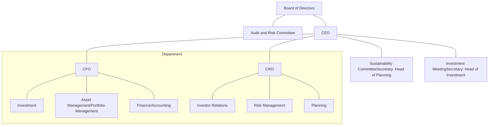

<!-- PAGE 1 -->

Daiwa House Logistics Trust logo

Cover image showing Daiwa House logistics facilities with DPL branding

DRIVING SUSTAINABLE LOGISTICS
# STRENGTHENING LONG TERM TRUST

ANNUAL REPORT **FY2025**

# DAIWA HOUSE LOGISTICS TRUST

(a real estate investment trust constituted on 2 November 2021 under the laws of the Republic of Singapore)

managed by
Daiwa House Asset Management Asia Pte. Ltd.

www.daiwahouse-logisticstrust.com

<!-- PAGE 2 -->

# CORPORATE DIRECTORY

Warehouse interior with high shelving and a forklift operator

**MANAGER**
Daiwa House Asset Management Asia Pte. Ltd.
(Company Registration Number: 202037636H)
6 Shenton Way
#21-08 OUE Downtown 2
Singapore 068809
Telephone: (65) 6202 0486
Email: ir@daiwahouse-lt.com
Website: www.daiwahouse-logisticstrust.com

**TRUSTEE**
HSBC Institutional Trust Services (Singapore) Limited
10 Marina Boulevard
#48-01 Marina Bay Financial Centre Tower 2
Singapore 018983
Telephone: (65) 6658 6667

**AUDITORS**
Ernst & Young LLP
1 Raffles Quay
North Tower, Level 18
Singapore 048583
Telephone: (65) 6535 7777

Partner-in-charge: Mr Nelson Chen
(with effect from financial year ended 31 December 2022)

**UNIT REGISTRAR**
Boardroom Corporate & Advisory Services Pte. Ltd.
1 Harbourfront Avenue
#14-07 Keppel Bay Tower
Singapore 098632
Telephone: (65) 6536 5355

**BOARD OF DIRECTORS**
Mr Tan Jeh Wuan
Chairman and Independent Non-Executive Director

Mr Tan Juay Hiang
Independent Non-Executive Director

Mr Takashi Suzuki
Independent Non-Executive Director

Mr Yoshiyuki Takagi
Non-Independent Non-Executive Director

Mr Eiichi Shibata
Non-Independent Non-Executive Director

Mr Jun Yamamura
Non-Independent Executive Director and Chief Executive Officer

**AUDIT AND RISK COMMITTEE**
Mr Tan Juay Hiang, Chairman
Mr Tan Jeh Wuan
Mr Takashi Suzuki
Mr Yoshiyuki Takagi

**COMPANY SECRETARY**
Ms Josephine Toh Lei Mui

<!-- PAGE 3 -->

Background image of a warehouse with shelving units

# CONTENTS

<table>
  <tbody>
    <tr>
        <td>04<br/>CORPORATE PROFILE</td>
        <td>20<br/>OUR STRATEGIES</td>
        <td>106<br/>MARKET OVERVIEW</td>
    </tr>
    <tr>
        <td>05<br/>HIGHLIGHTS OF FY2025</td>
        <td>22<br/>PORTFOLIO OVERVIEW</td>
        <td>124<br/>CORPORATE GOVERNANCE<br/>REPORT</td>
    </tr>
    <tr>
        <td>06<br/>SIGNIFICANT EVENTS</td>
        <td>26<br/>OUR PROPERTIES</td>
        <td>152<br/>FINANCIAL STATEMENTS</td>
    </tr>
    <tr>
        <td>07<br/>TRUST STRUCTURE</td>
        <td>48<br/>OPERATIONAL REVIEW</td>
        <td>201<br/>ADDITIONAL INFORMATION</td>
    </tr>
    <tr>
        <td>08<br/>BOARD OF DIRECTORS</td>
        <td>51<br/>FINANCIAL REVIEW</td>
        <td>203<br/>STATISTICS OF UNITHOLDINGS</td>
    </tr>
    <tr>
        <td>12<br/>MANAGEMENT TEAM</td>
        <td>53<br/>INVESTOR RELATIONS</td>
        <td>205<br/>NOTICE OF<br/>ANNUAL GENERAL MEETING</td>
    </tr>
    <tr>
        <td>16<br/>CHAIRMAN &amp; CEO MESSAGE</td>
        <td>58<br/>SUSTAINABILITY REPORT</td>
        <td>PROXY FORM</td>
    </tr>
    <tr>
        <td> </td>
        <td> </td>
        <td>GLOSSARY</td>
    </tr>
    <tr>
        <td> </td>
        <td> </td>
        <td>CORPORATE DIRECTORY</td>
    </tr>
  </tbody>
</table>

<!-- PAGE 4 -->

Photograph of a large modern logistics warehouse building with Daiwa House and DPL Kawasaki Yakou branding on the facade.

<!-- PAGE 5 -->

Photograph of a modern multi-story spiral parking garage or industrial structure with white curved ramps and red support pillars, set against a red textured background.

# BUILDING ON **STRENGTHS**
# DELIVERING WITH **PURPOSE**

<!-- PAGE 6 -->

# CORPORATE
# PROFILE

Daiwa House Logistics Trust logo

Daiwa House Group logo

## AN ASIA-FOCUSED LOGISTICS TRUST

## A LEADING REAL ESTATE PLAYER IN JAPAN

Daiwa House Logistics Trust is a Singapore real estate investment trust which is listed on the Mainboard of the SGX-ST.

Seeking to provide solid and affordable housing solutions to the population in the aftermath of a strong typhoon, Daiwa House Industry Co., Ltd. was founded in 1955 by Mr Nobuo Ishibashi.

Listed on the SGX-ST on 26 November 2021, DHLT is established with the investment strategy of principally investing in a portfolio of income-producing logistics and industrial real estate assets located across Asia. As at 31 December 2025, the portfolio comprised 19 quality logistics facilities, with 18 properties well-diversified across Japan and one strategically located in Long An Province (now merged into Tay Ninh Province), near Ho Chi Minh City in Vietnam. The DHLT Portfolio has a portfolio valuation of S$835.2 million<sup>(1)</sup> as at 31 December 2025.

Since then, DHI has developed into one of the largest construction and real estate development companies in Japan. It is the principal company of the Daiwa House Group, which has a wide range of real estate related businesses across multiple asset classes. The Daiwa House Group is also a leading player in the logistics sector, providing comprehensive turnkey solutions to logistics space users, including property development and management.

DHLT is managed by Daiwa House Asset Management Asia Pte. Ltd., which is a wholly-owned subsidiary of the Sponsor, Daiwa House Industry Co., Ltd..

The Sponsor, which is listed on the TSE, is also experienced in asset and fund management. The Daiwa House Group manages real estate funds which include TSE-listed Daiwa House REIT Investment Corporation, as well as unlisted REITs and private funds.

Website: www.daiwahouse-logisticstrust.com

Since its founding, the Daiwa House Group has expanded beyond the shores of Japan and with business operations spanning more than 20 countries.

Website: www.daiwahouse.com/English/

## VISION:

## MISSION:

### A LEADING REAL ESTATE OWNER WITH A PORTFOLIO OF HIGH QUALITY, SUSTAINABLE PROPERTIES

### CREATE LONG TERM VALUE FOR UNITHOLDERS THROUGH SUSTAINABLE GROWTH AND RESPONSIBLE OWNERSHIP

<!-- PAGE 7 -->

# HIGHLIGHTS OF FY2025

---

## PORTFOLIO<sup>(1)</sup>

## FINANCIALS

PORTFOLIO VALUATION<sup>(2)</sup>:

**S$ 835.2 MILLION**

Portfolio valuation icon showing a briefcase and a pie chart

DISTRIBUTION PER UNIT:

**4.33 CENTS**

Distribution per unit icon showing a money bag and coins with a dollar sign

---

OCCUPANCY RATE:

**87.8%**

Occupancy rate icon showing a hand holding a key to a house

AGGREGATE LEVERAGE<sup>(1)</sup>:

**40.2%**

Aggregate leverage icon showing a gear and a bar chart under a magnifying glass

---

WEIGHTED AVERAGE LEASE EXPIRY (BY GRI)<sup>(3)</sup>:

**6.6 YEARS**

WALE icon showing a building and a money bag with a dollar sign

BORROWINGS ON FIXED RATE<sup>(1)</sup>:

**99.3%**

Borrowings on fixed rate icon showing a dollar sign, a bar chart, and a percentage sign

---

GREEN-RATED PROPERTIES (BY PORTFOLIO VALUATION):

**96.0%**

Green-rated properties icon showing a building with a plant growing from it

UNENCUMBERED PROPERTIES<sup>(1)</sup>:

**100%**

Unencumbered properties icon showing a dollar sign above a line and bar chart

---

<!-- PAGE 8 -->

# SIGNIFICANT
# EVENTS

Timeline diagram of significant events for 2025 and 2026

**2025**

*   **28 February 2025**
    

    Announced full year financial results for FY2024

*   **24 March 2025**
    

    Acquired DPL Gunma Fujioka, DHLT’s 19th property, located in Greater Tokyo, Japan

Photograph of DPL Gunma Fujioka property

*   **24 April 2025**
    

    DHLT’s third Annual General Meeting was held, with high passing rate for each of the resolutions tabled

Photograph of DHLT's third Annual General Meeting

**2026**

*   **27 February 2026**
    

    Announced full year financial results for FY2025

*   **22 December 2025**
    

    Entered into first sustainability-linked loan for a S$30 million facility following the establishment of sustainability-linked loan framework

*   **12 November 2025**
    

    Announced business update for 3Q FY2025

*   **8 August 2025**
    

    Announced financial results for 1H FY2025

*   **9 May 2025**
    

    Announced business update for 1Q FY2025

<!-- PAGE 9 -->

# TRUST STRUCTURE<sup>(1)</sup>

```mermaid
graph TD
    Unitholders((Unitholders)) --- DHLT
    
    subgraph Singapore
        REIT_Manager((<b>REIT Manager</b>Daiwa House AssetManagement AsiaPte. Ltd.))
        REIT_Trustee((<b>REIT Trustee</b>HSBC InstitutionalTrust Services(Singapore)Limited))
        SPC((SpecialPurposeCompanies))
    end

    DHLT((Daiwa HouseLogistics Trust)) --- SPC
    
    REIT_Manager -- "Provides REITManagementServices" --> DHLT
    REIT_Trustee -- "Acts onbehalf of theUnitholders" --> DHLT

    SPC --- Overseas

    subgraph Overseas
        subgraph Japan
            JAM((<b>Japan AssetManager</b>Daiwa House RealEstate InvestmentManagementCo., Ltd.))
            TMK((TMK / TK-GK<sup>(2)</sup>))
            PM_Japan((<b>PropertyManager</b>Daiwa HousePropertyManagementCo., Ltd.))
            Props_Japan((18Properties inJapan))
            PT((<b>PropertyTrustee</b>SumitomoMitsui TrustBank, Limited))
            
            JAM -- "Provides AssetManagementServices" --> TMK
            PM_Japan -- "Provides PropertyManagementServices" --> Props_Japan
            PT -- "Holds propertiesin trust forTMK / TK-GK" --> Props_Japan
            TMK --- Props_Japan
        end

        subgraph Vietnam
            PHC((PropertyHoldingCompany))
            Prop_Vietnam((1Property inVietnam))
            PM_Vietnam((<b>PropertyManager</b>Daiwa HouseVietnam Co., Ltd.,Ho Chi Minh CityBranch))
            
            PHC --- Prop_Vietnam
            PM_Vietnam -- "Provides PropertyManagementServices" --> Prop_Vietnam
        end
    end
```

● Sponsor-owned entities

1. As at 31 December 2025.

2. DHLT holds the trust beneficial interests of the properties through the tokutei mokuteki kaisha (**"TMK"**) structure and the tokumei kumiai-godo kaisha (**"TK-GK"**) investment structure, which are two typical tax-efficient investment structures adopted by foreign investors for investing in Japanese properties.

<!-- PAGE 10 -->

# BOARD OF DIRECTORS

Portrait of TAN JEH WUAN

**TAN JEH WUAN**
Chairman and
Independent
Non-Executive Director

Portrait of TAN JUAY HIANG

**TAN JUAY HIANG**
Independent
Non-Executive Director

Date of appointment as Director:

* 2 November 2021

Date of appointment as Director:

* 2 November 2021

Length of service as a Director (as at 31 December 2025)

* 4 years 2 months

Length of service as a Director (as at 31 December 2025):

* 4 years 2 months

Board Committee served on:

* Audit and Risk Committee (Member)

Board Committee served on:

* Audit and Risk Committee (Chairman)

Present directorships in other listed companies:

* Digital Core Reit Management Pte. Ltd. (Manager of Digital Core REIT)

Present directorships in other listed companies:

* Nil

Present principal commitments:

* Non-Executive Director, Tower Capital Asia Pte. Ltd.

* Non-Executive Director, Tower Capital Asia Holdings Pte. Ltd.

* Deputy Chairman, SGX Listings Advisory Committee

* Non-Executive and Independent Director, Raffles Health Insurance Pte. Ltd.

Present principal commitments:

* Non-Independent and Non-Executive Director, Toby’s Trove Pte. Ltd.

* Independent Director, Homebuy Solutions Pte. Ltd.

* Independent Director, Homebuy Solutions Two Pte. Ltd.

* Executive Director, Asia Regen Capital Pte. Ltd.

* Adjunct Lecturer with Lee Kong Chian School of Business at Singapore Management University

Past directorship in other listed company held over the preceding three years:

* Nil

Past directorship in other listed company held over the preceding three years:

* Katrina Group Ltd.

Qualifications:

* Bachelor of Science in Industrial Engineering and Operations Research from the University of California, Berkeley, United States of America

Qualifications:

* Bachelor of Engineering from National University of Singapore

* Master of Business Administration from Nanyang Technological University, Singapore

Background and experience:

* Accumulated more than 30 years of experience in banking and finance-related industries

* Was with DBS Bank from 1989 to 2019, last held position was Managing Director & Head of Capital Markets Singapore

* Previously served as Chairman of the Association of Banks in Singapore Corporate Finance Standing Committee

* Previously served as a Member of the SGX Securities Advisory Committee

* Conferred as an Institute of Banking & Finance Fellow, Capital Markets in 2019

Background and experience:

* Accumulated more than 17 years of experience in real estate Investment trust management

* Previously served as Managing Director, REIT Investments of Ascott Ltd.

* Previously served as Chief Executive Officer of the Manager and Trustee-Manager of Ascendas Hospitality Trust

<!-- PAGE 11 -->

# BOARD OF DIRECTORS

TAKASHI SUZUKI

**TAKASHI SUZUKI**
Independent
Non-Executive Director

Date of appointment as Director:

* 2 November 2021

Length of service as a Director (as at 31 December 2025):

* 4 years 2 months

Board Committee served on:

* Audit and Risk Committee (Member)

Present directorships in other listed companies:

* Nil

Present principal commitments:

* Partner at Kyo Sogo Law Offices, Tokyo, Japan

* Director, Yagi Corporation Co., Ltd.

Past directorship in other listed company held over the preceding three years:

* Takara Leben Infrastructure Fund, Inc.¹

Qualifications:

* Bachelor of Arts in Law from Waseda University, Japan

* Master of Law from the University of Cambridge, England

* Qualified as an Attorney-at-Law in the Supreme Court of Japan

* Admitted to the Japan Bar Association, and the Daini Tokyo Bar Association

* Member of the International Bar Association

Background and experience:

* Accumulated more than 30 years of experience in the legal and risk management field with extensive experience and knowledge around financial and property-related transactions

* Has been a partner at Kyo Sogo Law Offices since 2003

YOSHIYUKI TAKAGI

**YOSHIYUKI TAKAGI**
Non-Independent
Non-Executive Director

Date of appointment as Director:

* 2 November 2021

Length of service as a Director (as at 31 December 2025):

* 4 years 2 months

Board Committee served on:

* Audit and Risk Committee (Member)

Present directorships in other listed companies:

* Nil

Present principal commitments:

* Executive Advisor, Cosmos Initia Co., Ltd.

* Director, Cosmos Australia Holdings Pty. Ltd.

Past directorship in other listed company held over the preceding three years:

* Cosmos Initia Co., Ltd.

Qualifications:

* Bachelor of Arts in Law from Hiroshima University, Japan

Background and experience:

* Accumulated more than 40 years of experience in real estate development

* Previously served as the President, and subsequently Chairman, of Cosmos Initia Co., Ltd., a Japanese residential real estate developer

* Has been with Cosmos Initia Co., Ltd. since 1983, where he also led residential real estate development businesses in Australia for 19 years

<!-- PAGE 12 -->

# BOARD OF DIRECTORS

EIICHI SHIBATA portrait

**EIICHI SHIBATA**
Non-Independent
Non-Executive Director

Date of appointment as Director:

* 1 June 2024<sup>2</sup>

Length of service as a Director (as at 31 December 2025):

* 1 year 7 months

Board Committee served on:

* Nil

Present directorships in other listed companies:

* Daiwa House Industry Co., Ltd.

Present principal commitments:

* Managing Executive Officer, Business Development Department of Daiwa House Industry Co., Ltd.

* Director, StorBest Holdings Pte. Ltd.

* Chairman, Daiwa House USA Member, LCC

Past directorship in other listed company held over the preceding three years:

* Daiwa House Asset Management Asia Pte. Ltd. (Manager of Daiwa House Logistics Trust)<sup>2</sup>

Qualifications:

* Bachelor of Arts in Business and Commerce from Keio University, Japan

Background and experience:

* Accumulated more than 40 years of experience in real estate and finance

* Joined Sponsor in 1983 and held various management positions

* Appointed to serve on various Boards in corporations in the construction and logistics industry since November 2017, in various capacities including as Non-Executive Director and Statutory Auditor

JUN YAMAMURA portrait

**JUN YAMAMURA**
Non-Independent
Executive Director and
Chief Executive Officer

Date of appointment as Director:

* 1 June 2023

Length of service as a Director (as at 31 December 2025):

* 2 years 7 months

Board Committee served on:

* Nil

Present directorships in other listed companies:

* Nil

Present principal commitments:

* Chief Executive Officer, Daiwa House Asset Management Asia Pte. Ltd. (Manager of Daiwa House Logistics Trust)

Past directorship in other listed company held over the preceding three years:

* Nil

Qualifications:

* Bachelor of Arts in Economics from The University of Tokyo, Japan

* Master of Business Administration in Finance and Real Estate from The University of North Carolina at Chapel Hill, USA

* Certified Member Analyst of the Securities Analysts Association of Japan (inactive)

* Certified Master of the Association for Real Estate Securitization (inactive)

* Certified Building Manager of Japan Building Management Institute (inactive)

* Licensed real estate transaction agent in Japan (inactive)

Background and experience:

* Previously spent 22 years in Marubeni Corp., one of the largest general trading companies in Japan, involved in the field of real estate development and investment

* Previously served as Senior Chief in the Business Development Department in Daiwa House Industry Co., Ltd.

<!-- PAGE 13 -->

# BOARD OF
# DIRECTORS

Photograph of a Daiwa House Group DPL building with logos

<!-- PAGE 14 -->

# MANAGEMENT
# TEAM

Portrait of Jun Yamamura

**JUN YAMAMURA**
Chief Executive Officer

Prior to joining the Manager in August 2021, Mr Yamamura was the Senior Chief in the Business Development Department in DHI from April 2021. He was Head of Planning of the Manager before his appointment as CEO of the Manager in June 2023.

Mr Yamamura was previously with Marubeni Corp. (**“Marubeni”**), one of the largest general trading companies in Japan, which he joined in 1999. During his 22 years with Marubeni, he expanded his career in the field of real estate development and investment. Mr Yamamura was involved in mergers of TSE-listed REITs, including the acquisition of Nippon Commercial Investment Corporation by United Urban Investment Corporation (**“United Urban”**), which is managed by Marubeni’s subsidiary, in December 2010. Mr Yamamura also contributed to the initial public offering of United Urban in 2003 and secondary offering in 2004 as an acquisition manager and in corporate planning as a General Manager from 2017 to 2020.

Mr Yamamura holds a Bachelor of Arts in Economics from The University of Tokyo, Japan, and a Master of Business Administration in Finance and Real Estate from The University of North Carolina at Chapel Hill, USA. He is a Certified Member Analyst of the Securities Analysts Association of Japan (inactive), a Certified Master of the Association for Real Estate Securitization (inactive), a Certified Building Manager of Japan Building Management Institute (inactive), and a licensed real estate transaction agent in Japan (inactive).

Portrait of Natalie Wong

**NATALIE WONG**
Chief Financial Officer

Prior to joining the Manager in September 2022, Ms Wong was Senior Vice President, Capital Markets in City Development Limited where she oversaw the capital raising, structuring, financial management and compliance for capital market transactions in both public and private space.

Ms Wong has more than 25 years of experience in finance, accounting and treasury functions, with extensive experience within the real estate industry. She was previously the Chief Financial Officer for the manager of OUE Commercial REIT and Head of Treasury for the manager of Mapletree Logistics Trust, where she was responsible for the finance and/or treasury functions including financial reporting, taxation, corporate finance and capital management.

Ms Wong holds a Bachelor of Accountancy from Nanyang Technological University of Singapore. She is also a Chartered Accountant with the Institute of Singapore Chartered Accountants.

Portrait of Toru Aoki

**TORU AOKI**
Chief Risk Officer

Prior to joining the Manager in September 2021, Mr Aoki was the Deputy Department Manager in the Business Development Department in DHI from May 2020, where he is responsible for promoting real estate securitisation of assets and overseas mergers and acquisitions business of the company.

Mr Aoki started his career with Sumitomo Mitsui Trust Bank, Ltd. in 1986 in the fields of real estate finance and corporate finance. From 1994 to 2018 he had been responsible for global finance and global real estate related businesses in Tokyo, Hong Kong, Singapore and New York. From September 2018 to April 2020, he was with Internal Audit Department where he conducted risk assessments and internal audits for various business departments, overseas branches and subsidiaries of the bank.

Mr Aoki holds a Bachelor of Arts in Economics from Hitotsubashi University, Japan. He is a Certified Internal Auditor registered in the Institute of Internal Auditors and a licensed real estate transaction agent in Japan. Mr Aoki is also the Compliance Officer of the Manager.

<!-- PAGE 15 -->

# MANAGEMENT TEAM

Large warehouse interior with tall blue and orange industrial shelving units

<!-- PAGE 16 -->

# NAVIGATING **CHANGES**
# CAPTURING **OPPORTUNITIES**

<!-- PAGE 17 -->

Daiwa House Group logo on a modern building facade with red graphic elements

<!-- PAGE 18 -->

# CHAIRMAN & CEO
# MESSAGE

Photograph of Jun Yamamura and Tan Jeh Wuan

**JUN YAMAMURA**

Non-Independent
Executive Director and
Chief Executive Officer

**TAN JEH WUAN**

Chairman and Independent
Non-Executive Director

# 66

As we remain mindful of potential headwinds ahead, we are committed to navigating these challenges with discipline and prudence and will continue to focus on strengthening DHLT’s performance and long-term value for the benefit of the Unitholders.

<!-- PAGE 19 -->

# CHAIRMAN & CEO MESSAGE

Dear Unitholders of Daiwa House Logistics Trust,

On behalf of the Board of Directors of the Manager, we are pleased to present the Annual Report of Daiwa House Logistics Trust for the financial year ended 31 December 2025.

In 2025, geopolitical and trade tensions took centre stage, fueling economic uncertainty and created significant headwinds for global recovery. Interest rate environment continued to be volatile. As Federal Reserve continued to cut rates in 2025, it was done at a cautious pace and maintained a relatively elevated rate to counter inflationary pressures. While the Bank of Japan (“BOJ”) raised interest rates, it has also done so at a cautious pace, with the hike in December 2025 only its third one since Japan exited the negative interest environment in March 2024.

Despite the economic uncertainties, we are heartened to note that none of the tenants in DHLT’s portfolio of properties has requested for rent relief or abatement of rent. On the contrary, leases that were renewed or newly entered into posted an encouraging rental uplift. While there have been spaces vacated during the year, we continue to work closely with the property manager in Japan and leverage on Sponsor’s network to improve occupancy. DHLT also continued to grow its portfolio in 2025, with the acquisition of DPL Gunma Fujioka in March 2025, growing the portfolio to now 19 properties. On the sustainability front, DHLT achieved a key milestone as it established the sustainability-linked loan framework in December and also entered into a S$30 million sustainability-linked loan facility.

## PORTFOLIO PERFORMANCE

While there were higher vacancies in certain properties, it was encouraging to note that higher rents were achieved for all of the leases that were renewed or new leases entered into during FY2025¹, with a weighted average rent increase of approximately 11%². As at 31 December 2025, the overall portfolio occupancy was 87.8%, and 16 of the 19 properties remained fully occupied. Anchored by blue-chip tenants, there was no request for rent relief or abatement despite economic uncertainty brought about in part by tariffs imposed by the United States, which is a testament to the resilience of the strong tenant base. WALE remained relatively long at 6.6 years³ as at 31 December 2025.

Further reflection of the resilience of the DHLT Portfolio and the markets it operates in was the stability of the valuation. As at 31 December 2025, valuation of the Japan Portfolio was JPY98,759 million, a growth of 6.1% compared to a year ago, mainly due to the addition of the DPL Gunma Fujioka. On a same-store basis, excluding DPL Gunma Fujioka, valuation of the Japan Portfolio was relatively stable with a slight increase of 0.4%. Capitalisation rates remained largely stable despite increase in interest rates, a reflection of the attractiveness of the Japan market, and the quality of the properties. Valuation of DHLT’s single property in Vietnam, D Project Tan Duc 2, grew by 2.2% to VND524.2 billion. Despite the growth of the valuation in local currency terms, portfolio valuation in S$ was marginally lower by 0.1% due to weaker JPY and VND against S$.

NPI from the Japan Portfolio in JPY terms was lower by 1.0% y-o-y mainly due to vacancies which were partially offset by the contribution from DPL Gunma Fujioka and full year contribution from DPL Ibaraki Yuki, which were acquired in March 2025 and March 2024, respectively. While the contribution from Japan Portfolio was further impacted by weaker JPY against S$, full-year contribution from D Project Tan Duc 2 (acquired in July 2024) resulted in 0.7% y-o-y increase of the overall NPI in S$ terms. However, distributable income for FY2025 was 9.4% lower y-o-y mainly due to lower realised foreign exchange gain and an increase in interest expenses, from higher interest rate and additional loans drawn for acquisitions. As a result, DPU for FY2025 was 4.33 cents.

## EXPANSION OF PORTFOLIO

In FY2025, DHLT continued to grow its portfolio with the addition of DPL Gunma Fujioka in March 2025. Located in Greater Tokyo, the freehold logistics facility is leased to the Japanese group company of one of the largest multinational consumer goods corporations. Through this acquisition, DHLT further strengthened its tenant base with the addition of this new blue-chip tenant. We are also pleased that value was created for DHLT and its Unitholders through this acquisition as the valuation of DPL Gunma Fujioka of JPY5,230 million as at 31 December 2025 was 31.1% higher than the purchase consideration.

DHLT has grown steadily since its IPO in November 2021 with an initial portfolio of 14 properties. Leveraging on Sponsor’s support and network, the portfolio has grown to 19 high quality properties. In the process, DHLT has also expanded its footprints outside of Japan, into Vietnam in 2024. The Manager will continue to seek attractive investment opportunities for the benefit of DHLT and its Unitholders.

## STEPPING UP ON SUSTAINABILITY EFFORTS

The Manager recognises that sustainability is an integral part of the operations of DHLT and has continued to ensure that ESG considerations are factored into business decisions. Green certified by BELS⁴ with a rating of 5-stars, the acquisition of DPL Gunma Fujioka is consistent with our sustainability efforts. DHLT maintains a high proportion of green-certified portfolio. As at 31 December 2025, 17 out of the 19 properties were certified green, representing 95.2% and 96.0% of the DHLT’s portfolio by NLA and valuation, respectively. DHLT has one of the highest proportions of certified green properties, on portfolio level, amongst the logistics and industrial REITs listed on SGX-ST. The 17 properties were all certified green by BELS and 9 properties which represented 60.6% of the portfolio valuation were awarded the highest 6-stars rating under BELS. DPL Gunma Fujioka is also installed with solar panels on its rooftop, with a capacity of 2.6 MWp. The addition of DPL Gunma Fujioka increased the aggregate solar panel capacity of the portfolio to 18.8 MWp. With the addition of DPL Gunma Fujioka, 13 properties in the DHLT Portfolio are installed with solar panels.

\*1. Included leases for spaces that were vacated in FY2024 which were partially backfilled during FY2025.

\*2. Based on the monthly rent for renewed or new leases compared against the preceding lease for the same space.

\*3. By gross rental income which is based on the monthly rent as at 31 December 2025.

\*4. Building Energy-efficiency Labelling System (“BELS”), which is a third-party certification system in Japan that assesses the energy conservation performance of buildings, in line with the guidelines set by the Ministry of Land, Infrastructure, Transport and Tourism of Japan, with a rating scale of 0 to 6 stars.

<!-- PAGE 20 -->

# CHAIRMAN & CEO
# MESSAGE

Interior view of a large, modern logistics warehouse with high-density racking systems and automated guided vehicles

In FY2025, DHLT has also managed to achieve the target of including green clause in 100% of lease agreements for leases renewed or entered into during the financial year. To continue our efforts in contributing to society and environment, we have also kept up with our corporate social responsibility activities in 2025 with food packing for the less privileged and trash picking.

In December 2025, DHLT has also established the sustainability-linked loan framework and entered into a sustainability-linked loan for a S$30 million facility. DHLT has obtained a second-party opinion from an independent party on its framework. This is an important progress in DHLT's sustainability journey and aligns our capital management strategies with sustainability efforts, reinforcing DHLT's commitment to incorporating ESG aspects into the operations. Please refer to the Sustainability Report in this Annual Report for further information on our sustainability efforts.

## CAPITAL MANAGEMENT

During the year, the 4-year loan which matured in November 2025 was refinanced with a new longer tenure 5-year fixed rate loan as we sought to maintain high proportion of fixed rate borrowings amidst the rising interest rate environment in Japan. As at 31 December 2025, the proportion of fixed rate borrowings remained high at 99.3% and the weighted debt maturity was extended to 2.9 years. None of the properties was encumbered as at 31 December 2025 and we believe that the restructuring of the Japan onshore borrowings has benefitted DHLT, allowing DHLT to obtain the sustainability-linked loan on a committed basis. Aggregate leverage of 40.2% and interest coverage ratio of 5.5 times as at 31 December 2025 remained at healthy levels and well within the regulatory limits⁵.

## LOOKING AHEAD⁶

The long-term prospects of the Japan logistics market are expected to remain healthy. Following substantial supply over the past few years, new supply of logistics properties is expected to moderate going forward due to rising construction costs. This will help to rebalance the supply demand dynamics in the sector with demand expected to remain robust.

E-commerce is a key demand driver for logistics space in Japan. The B-to-C e-commerce sector in Japan has grown by 2.2 times in last 10 years from JPY6.8 trillion in 2014 to JPY15.2 trillion in 2024⁷. Despite this expansion, Japan's e-commerce penetration rate remains relatively low at 9.8% in 2024, and given this comparatively modest e-commerce penetration rate, the market is considered to have potential for further growth. With e-commerce players broadening their product offerings and traditional brick-and-mortar retailers expanding their range of goods offered through online channels, these will contribute to demand for logistics facilities. The 3PL sector, another key demand driver for logistics facilities, has continued to grow and is expected to expand further as companies continue the trend of outsourcing logistics functions. The requirements of

<!-- PAGE 21 -->

# CHAIRMAN & CEO MESSAGE

Interior view of a large, modern logistics warehouse with high-density racking systems and automated equipment.

e-commerce sector and the need for automation to address labour concerns have also driven the need for larger, high-specification modern facilities. Despite the substantial supply over the past few years, proportion of large modern facilities remained relatively small at a range of 6% to 15% across the four main metropolitan areas in Japan.

DHLT’s property in Vietnam is located in the South Economic Zone of Vietnam, where the logistics sector there is expected to continue growing. Backed by a resilient economy which grew by 8.0% y-o-y in 2025 despite US tariffs imposed, and with a growth target of 10% for 2026, the sector is also well-supported by factors such as government directives to grow the sector, expanding e-commerce market and improving infrastructure.

After an increase in rates in December 2025, the BOJ held rates steady following a recent meeting in March 2026, while citing the increased tension in the Middle East have resulted in volatility of the global markets⁸. Given the generally sustained inflation in Japan in recent quarters and BOJ raising its growth and inflation forecast in January 2026⁹, we expect upward pressure on the interest rates to persist, although any increase is expected to be at a measured pace.

The longer-term prospects of the markets DHLT operates in are expected to be well supported by strong fundamentals. While the Manager remained cautiously positive in the general outlook of the markets that DHLT operates in, the performance of the individual properties in the DHLT Portfolio depends on factors such as micro-markets they are located in, specifications of the building and requirements of the potential tenants. DHLT’s financial position also remained healthy as we continue our disciplined and prudent approach to capital management. While there were heightened vacancies in the portfolio, we are encouraged by the healthy rent reversion DHLT has achieved in FY2025 and 16 properties remained at full occupancy. In FY2026, we will continue to focus on improving the performance of the portfolio.

**ACKNOWLEDGEMENTS**

On behalf of the Board, we would like to express our appreciation to the management team for their dedication and efforts throughout the year. We also extend our heartfelt thanks to the Unitholders of DHLT for your continued trust and support in DHLT. FY2025 was a challenging year for DHLT, and we are thankful for the confidence placed in us during this period. As we remain mindful of potential headwinds ahead, we are committed to navigating these challenges with discipline and prudence and will continue to focus on strengthening DHLT’s performance and long-term value for the benefit of the Unitholders.

Yours sincerely,

**TAN JEH WUAN**

Chairman and Independent Non-Executive Director

**JUN YAMAMURA**

Non-Independent Executive Director and Chief Executive Officer

<!-- PAGE 22 -->

# OUR
# STRATEGIES

DHLT’s key objectives are to provide Unitholders with regular and stable distributions, and to achieve long-term growth in DPU and net asset value per Unit, while maintaining an optimal capital structure and strengthening the portfolio in scale and quality.

Infographic showing Proactive Asset Management (briefcase and pie chart icon) and Prudent Capital Management (dollar sign in hands icon) connected by arrows

## PROACTIVE ASSET MANAGEMENT

The Manager will proactively manage the DHLT Portfolio to maintain and improve its operational performance, seeking to optimise the cash flow and the value of the properties. The Manager will also look to drive organic growth and improve occupancy rates, encourage strong relationships with the tenants of its portfolio properties, actively negotiate for extension of leases prior to maturity, implement asset management strategies with the aim of ensuring continued relevance of the properties and facilitate property enhancement opportunities.

<u>Achievements or Actions Taken in FY2025</u>

* Achieved higher rent for all the 9 leases renewed or signed with new tenants, with a weighted average rent uplift of approximately 11%<sup>(1)</sup>

* Portfolio occupancy rate of 87.8% as at 31 December 2025, with 16 out of 19 properties at full occupancy

* Maintain relatively long WALE of 6.6 years as at 31 December 2025

* Valuation of Japan Portfolio remained stable while valuation of Vietnam property grew by 2.2%, in local currency terms

## PRUDENT CAPITAL MANAGEMENT

The Manager will endeavour to maintain a strong balance sheet, employ an appropriate mix of debt and equity in financing acquisitions of properties, secure diversified funding sources to access both financial institutions and capital markets, optimise cost of capital within the borrowing limits set out in the Property Funds Appendix and utilise interest rate and foreign exchange hedging strategies where appropriate to minimise exposure to market volatility.

<u>Achievements or Actions Taken in FY2025</u>

* Maintained aggregate leverage at healthy level of 40.2% as at 31 December 2025

* Recorded interest coverage ratio of 5.5 times, which was well above the regulatory limit<sup>(2)</sup>

* Maintained a high proportion of 99.3% of borrowings in fixed-rate

* 100% of the properties were unencumbered as at 31 December 2025

* Continued to apply systematic hedging mechanism to smooth out volatility in income due to foreign exchange movements

<!-- PAGE 23 -->

# OUR STRATEGIES

Icon representing acquisition growth with a house and arrows pointing outwards

## ACQUISITION GROWTH

The Manager will pursue opportunities to undertake acquisitions of quality income-producing logistics and industrial assets that it believes will be accretive to the DHLT Portfolio and improve returns to Unitholders relative to DHLT’s weighted average cost of capital, and opportunities for future income and capital growth. In evaluating future acquisition opportunities, the Manager will seek acquisitions that may enhance the diversification of the portfolio by location and tenant profile, and optimise risk-adjusted returns to the Unitholders.

The Manager believes it is well positioned to pursue its acquisition strategy. In the course of pursuing acquisition opportunities, the Manager will only invest in stable properties with high-occupancy rates and avoid high-risk investments within the sector and geographical regions, confined by the borrowing limits set out in the Property Funds Appendix, including, for the avoidance of doubt, the aggregate leverage limits.

In evaluating potential targets, the Manager will take into consideration factors such as, yield requirement, tenant mix and occupancy characteristics, location, value-enhancing opportunities, and building specifications.

<u>Achievements or Actions Taken in FY2025</u>

* Continued to grow the portfolio with the acquisition of DPL Gunma Fujioka, a freehold logistics property located in Greater Tokyo

* Will continue to leverage on Sponsor ROFR and network for future growth

Icon representing sustainability with a globe held by two hands

## SUSTAINABILITY

The Manager shares the Sponsor’s fundamental approach to asset management and has included ESG considerations in its real estate investment management operations. As such, the Manager has established the following sustainability considerations as guidance in respect of its real estate investment and management responsibilities which include

1. prevention of global warming;

2. harmony with the environment;

3. conservation of natural resources (reducing waste, protecting water resources);

4. prevention of chemical pollution;

5. establishment of an internal framework and initiatives for employees;

6. building of trust relationships with external stakeholders;

7. promotion of communication through information disclosure; and

8. compliance with laws and regulations, and risk management

In collaboration with the property managers, the Manager will incorporate the ESG perspectives in both the management of properties and investment decisions.

<u>Achievements or Actions Taken in FY2025</u>

* Established sustainability-linked loan framework and obtained second-party opinion

* Entered into first sustainability-linked loan with a S$30 million facility

* Increased total NLA of green-certified properties by 5.0% to more than 475,000 sqm

* Maintained high proportion of green-certified rated properties at 96.0%<sup>(3)</sup> with 17 of the 19 properties certified green

* Increased capacity of solar panels installed at its properties by 15.9% to 18.8 MWp

* All renewed/new leases entered into during FY2025 contained "green" clause

<!-- PAGE 24 -->

# PORTFOLIO OVERVIEW

Map of Japan and Vietnam highlighting logistics property locations

## VIETNAM

**LONG AN PROVINCE (NEAR HO CHI MINH CITY)**

19. D Project Tan Duc 2

## JAPAN

**HOKKAIDO & TOHOKU**

1. DPL Sapporo Higashi Kariki

2. DPL Sendai Port

3. DPL Koriyama

**GREATER TOKYO**

4. D Project Nagano Suzaka S

5. D Project Maebashi S

6. D Project Kuki S

7. DPL Ibaraki Yuki

8. DPL Gunma Fujioka

9. D Project Misato S

10. D Project Iruma S

11. DPL Kawasaki Yako

**GREATER NAGOYA**

12. DPL Shinfuji

13. D Project Kakegawa S

**CHUGOKU / SHIKOKU / KYUSHU**

14. DPL Okayama Hayashima

15. DPL Okayama Hayashima 2

16. DPL Iwakuni 1 & 2

17. D Project Matsuyama S

18. D Project Fukuoka Tobara S

<!-- PAGE 25 -->

# PORTFOLIO OVERVIEW

**PORTFOLIO OVERVIEW**

As at 31 December 2025, the DHLT Portfolio comprised 19 high quality properties, with 18 properties well-diversified across Japan, and one strategically located in Long An Province (now merged into Tay Ninh Province), near Ho Chi Minh City in Vietnam. Each of these 19 properties are well-located with easy accessibility and have good connections to highways and major roads, with 15 of the 19 properties located within 5 km of highway interchange, making up more than 80% of the DHLT Portfolio by valuation<sup>(1)</sup>.

The DHLT Portfolio has a good mix of single-tenanted built-to-suit (**"BTS"**) and multi-tenanted properties, providing a balance of both long-term stability and opportunities for potential positive rent reversion upon lease renewals. Multi-tenanted properties are developed by the Sponsor under the DPL brand, which offers premium quality standardised warehouse spaces for lease. DPL assets are built with high-end specifications including minimum floor loads of 1.5 tonne/sqm, ceiling heights in excess of 5.5 metres, and high energy efficiency, amongst others industry leading standards. Single-tenanted

BTS properties are developed under the D Project brand, with customisations including temperature control facilities, electric power capacities, higher floor loads, and other specialised features tailored to meet the exact needs of the tenant.

11 out of the 19 properties in the DHLT Portfolio are freehold properties, representing 61.3% of the total portfolio valuation as at 31 December 2025. Including another 3 of the properties with land tenure over 40 years, approximately 87.7% of the DHLT Portfolio<sup>(1)</sup> comprised freehold properties or properties with land tenure of more than 40 years, as at 31 December 2025.

DHLT also maintains a high proportion of green-certified properties, with 17 properties green-certified, representing 95.2% of portfolio NLA or 96.0% of valuation<sup>(1)</sup>. Certified by BELS<sup>(2)</sup>, 9 of these properties were awarded 6-stars rating, the highest rating under BELS. Within the DHLT Portfolio, 13 properties had solar panels installed on their rooftop, with an aggregate solar capacity of 18.8 MWp, as at 31 December 2025.

## BREAKDOWN BY REGION<sup>(1)</sup>

<table>
  <tbody>
    <tr>
        <td>Region</td>
        <td>Percentage (%)</td>
    </tr>
    <tr>
        <td>Hokkaido/Tohoku</td>
        <td>33.8</td>
    </tr>
    <tr>
        <td>Greater Tokyo</td>
        <td>43.2</td>
    </tr>
    <tr>
        <td>Greater Nagoya</td>
        <td>8.1</td>
    </tr>
    <tr>
        <td>Chugoku/Shikoku/Kyushu</td>
        <td>11.9</td>
    </tr>
    <tr>
        <td>Vietnam</td>
        <td>3.1</td>
    </tr>
  </tbody>
</table>

## BREAKDOWN BY LAND TENURE<sup>(1)</sup>

<table>
  <tbody>
    <tr>
        <td>Land Tenure</td>
        <td>Percentage (%)</td>
    </tr>
    <tr>
        <td>Freehold</td>
        <td>61.3</td>
    </tr>
    <tr>
        <td>40Y</td>
        <td>26.5</td>
    </tr>
    <tr>
        <td>20Y-40Y</td>
        <td>9.3</td>
    </tr>
    <tr>
        <td>&lt;20Y</td>
        <td>3.0</td>
    </tr>
  </tbody>
</table>

## BREAKDOWN BY ASSET TYPE<sup>(1)</sup>

<table>
  <tbody>
    <tr>
        <td>Asset Type</td>
        <td>Percentage (%)</td>
    </tr>
    <tr>
        <td>Multi-tenanted</td>
        <td>76.0</td>
    </tr>
    <tr>
        <td>Built-to-suit</td>
        <td>24.0</td>
    </tr>
  </tbody>
</table>

## BREAKDOWN BY DISTANCE TO NEAREST HIGHWAY INTERCHANGE<sup>(1)</sup>

<table>
  <tbody>
    <tr>
        <td>Distance to Nearest Highway Interchange</td>
        <td>Percentage (%)</td>
    </tr>
    <tr>
        <td>&lt;2.5 KM</td>
        <td>16.4</td>
    </tr>
    <tr>
        <td>2.5 -5.0 KM</td>
        <td>67.7</td>
    </tr>
    <tr>
        <td>5.0 KM</td>
        <td>15.9</td>
    </tr>
  </tbody>
</table>

## BREAKDOWN BY GREEN RATING<sup>(1)</sup>

<table>
  <tbody>
    <tr>
        <td>Green Rating</td>
        <td>Percentage (%)</td>
    </tr>
    <tr>
        <td>6-Stars</td>
        <td>60.6</td>
    </tr>
    <tr>
        <td>5-Stars<sup>(3)</sup></td>
        <td>34.0</td>
    </tr>
    <tr>
        <td>4-Stars</td>
        <td>1.4</td>
    </tr>
    <tr>
        <td>Non-Rated</td>
        <td>4.0</td>
    </tr>
  </tbody>
</table>

## BREAKDOWN BY SOLAR PANELS INSTALLED<sup>(1)</sup>

<table>
  <tbody>
    <tr>
        <td>Solar Panels</td>
        <td>Percentage (%)</td>
    </tr>
    <tr>
        <td>Solar Panels Installed</td>
        <td>74.7</td>
    </tr>
    <tr>
        <td>Solar Panels Not Installed</td>
        <td>25.3</td>
    </tr>
  </tbody>
</table>

\*1. By portfolio valuation based on the independent valuation of the properties as at 31 December 2025.

\*2. The 17 properties were all rated by the Building Energy-efficiency Labelling System (BELS), which is a third-party certification system in Japan that assesses the energy conservation performance of buildings, in line with the guidelines set by the Ministry of Land, Infrastructure, Transport and Tourism of Japan, with a rating scale of 0 to 6 stars.

\*3. There were 7 properties that were awarded 5-stars rating. Out of these 7 properties, 3 were rated based on the previous evaluation criteria of BELS of which 5-stars was the highest rating. The new evaluation criteria, which has a highest rating of 6-stars, was effective from April 2024.

<!-- PAGE 26 -->

# PORTFOLIO
# OVERVIEW

<table>
  <thead>
    <tr>
        <th> </th>
        <th>Building Completion Year</th>
        <th>NLA (sq m)</th>
        <th>Land Tenure</th>
        <th>Property Type</th>
        <th>WALE by GRI(1) (years)</th>
        <th>Occupancy(2)</th>
        <th>Gross Revenue (millions)(3)</th>
        <th>Net Property Income (millions)</th>
    </tr>
  </thead>
  <tbody>
    <tr>
        <td colspan="9">JAPAN – Hokkaido/Tohoku</td>
    </tr>
    <tr>
        <td>DPL Sapporo Higashi Kariki</td>
        <td>2018</td>
        <td>60,348</td>
        <td>Freehold</td>
        <td>Multi-tenanted</td>
        <td>2.3</td>
        <td>100.0%</td>
        <td>JPY 801</td>
        <td>JPY 568</td>
    </tr>
    <tr>
        <td>DPL Sendai Port</td>
        <td>2017</td>
        <td>63,117</td>
        <td>Freehold</td>
        <td>Multi-tenanted</td>
        <td>3.5</td>
        <td>31.9%</td>
        <td>JPY 436</td>
        <td>JPY 246</td>
    </tr>
    <tr>
        <td>DPL Koriyama</td>
        <td>2019</td>
        <td>34,157</td>
        <td>Freehold</td>
        <td>Multi-tenanted</td>
        <td>2.2</td>
        <td>74.6%</td>
        <td>JPY 323</td>
        <td>JPY 236</td>
    </tr>
    <tr>
        <td colspan="9">JAPAN – Greater Tokyo</td>
    </tr>
    <tr>
        <td>D Project Nagano Suzaka S</td>
        <td>2018</td>
        <td>9,810</td>
        <td>Freehold</td>
        <td>Single-tenanted</td>
        <td>2.8</td>
        <td>100.0%</td>
        <td>–</td>
        <td>JPY 128</td>
    </tr>
    <tr>
        <td>D Project Maebashi S</td>
        <td>2018</td>
        <td>14,736</td>
        <td>Freehold</td>
        <td>Single-tenanted</td>
        <td>7.8</td>
        <td>100.0%</td>
        <td>–</td>
        <td>JPY 165</td>
    </tr>
    <tr>
        <td>D Project Kuki S</td>
        <td>2014</td>
        <td>18,257</td>
        <td>Expiring 2034</td>
        <td>Single-tenanted</td>
        <td>8.6</td>
        <td>100.0%</td>
        <td>–</td>
        <td>JPY 178</td>
    </tr>
    <tr>
        <td>DPL Ibaraki Yuki</td>
        <td>2023</td>
        <td>13,421</td>
        <td>Freehold</td>
        <td>Multi-tenanted</td>
        <td>1.1</td>
        <td>100.0%</td>
        <td>–</td>
        <td>JPY 146</td>
    </tr>
    <tr>
        <td>DPL Gunma Fujioka</td>
        <td>2022</td>
        <td>22,514</td>
        <td>Freehold</td>
        <td>Multi-tenanted</td>
        <td>5.3<sup>(4)</sup></td>
        <td>100.0%</td>
        <td>–</td>
        <td>JPY 187</td>
    </tr>
    <tr>
        <td>D Project Misato S</td>
        <td>2015</td>
        <td>14,877</td>
        <td>Expiring 2045</td>
        <td>Single-tenanted</td>
        <td>9.1</td>
        <td>100.0%</td>
        <td>–</td>
        <td>JPY 241</td>
    </tr>
    <tr>
        <td>D Project Iruma S</td>
        <td>2017</td>
        <td>14,582</td>
        <td>Freehold</td>
        <td>Single-tenanted</td>
        <td>12.0</td>
        <td>100.0%</td>
        <td>–</td>
        <td>JPY 185</td>
    </tr>
    <tr>
        <td>DPL Kawasaki Yako</td>
        <td>2017</td>
        <td>93,159</td>
        <td>Expiring 2067</td>
        <td>Multi-tenanted</td>
        <td>9.9</td>
        <td>90.0%</td>
        <td>JPY 1,768</td>
        <td>JPY 1,248</td>
    </tr>
    <tr>
        <td colspan="9">JAPAN – Greater Nagoya</td>
    </tr>
    <tr>
        <td>DPL Shinfuji</td>
        <td>2017</td>
        <td>27,537</td>
        <td>Expiring 2065</td>
        <td>Multi-tenanted</td>
        <td>5.0</td>
        <td>100.0%</td>
        <td>JPY 402</td>
        <td>JPY 290</td>
    </tr>
    <tr>
        <td>D Project Kakegawa S</td>
        <td>2019</td>
        <td>22,523</td>
        <td>Freehold</td>
        <td>Single-tenanted</td>
        <td>8.3</td>
        <td>100.0%</td>
        <td>–</td>
        <td>JPY 209</td>
    </tr>
    <tr>
        <td colspan="9">JAPAN – Chugoku/Shikoku/Kyushu</td>
    </tr>
    <tr>
        <td>DPL Okayama Hayashima</td>
        <td>2017/2018</td>
        <td>23,541</td>
        <td>Expiring 2067</td>
        <td>Multi-tenanted</td>
        <td>1.8</td>
        <td>100.0%</td>
        <td>JPY 382</td>
        <td>JPY 305</td>
    </tr>
    <tr>
        <td>DPL Okayama Hayashima 2</td>
        <td>2017</td>
        <td>16,750</td>
        <td>Expiring 2051</td>
        <td>Multi-tenanted</td>
        <td>1.0</td>
        <td>100.0%</td>
        <td>–</td>
        <td>JPY 170</td>
    </tr>
    <tr>
        <td>DPL Iwakuni 1 &amp; 2</td>
        <td>2016/2020</td>
        <td>15,461</td>
        <td>Freehold</td>
        <td>Multi-tenanted</td>
        <td>1.5</td>
        <td>100.0%</td>
        <td>JPY 155</td>
        <td>JPY 123</td>
    </tr>
    <tr>
        <td>D Project Matsuyama S</td>
        <td>1994/2017</td>
        <td>5,347</td>
        <td>Freehold</td>
        <td>Single-tenanted</td>
        <td>3.6</td>
        <td>100.0%</td>
        <td>–</td>
        <td>JPY 54</td>
    </tr>
    <tr>
        <td>D Project Fukuoka Tobara S</td>
        <td>2019</td>
        <td>10,508</td>
        <td>Expiring 2068</td>
        <td>Single-tenanted</td>
        <td>8.6</td>
        <td>100.0%</td>
        <td>–</td>
        <td>JPY 110</td>
    </tr>
    <tr>
        <td colspan="9">VIETNAM – Long An (near Ho Chi Minh City)</td>
    </tr>
    <tr>
        <td>D Project Tan Duc 2</td>
        <td>2023</td>
        <td>18,465</td>
        <td>Expiring 2058</td>
        <td>Single-tenanted</td>
        <td>17.8</td>
        <td>100.0%</td>
        <td>–</td>
        <td>VND 46,886</td>
    </tr>
  </tbody>
</table>

Interior view of a modern logistics warehouse with high-density shelving systems

1. GRI based on monthly rent as at 31 December 2025.

2. Based on NLA as at 31 December 2025.

3. Not disclosed for properties with one tenant as DHLT is bound by confidentiality obligations in relation to the tenancy agreements, and these tenants did not consent the disclosure of the gross rental income attributed to their tenancies.

4. Assuming the lease is not terminated by the tenant on 31 March 2028 pursuant to its option to terminate under the lease agreement.

<!-- PAGE 27 -->

# PORTFOLIO OVERVIEW

<table>
  <thead>
    <tr>
        <th> </th>
        <th>Building Completion Year</th>
        <th>NLA (sq m)</th>
        <th>Land Tenure</th>
        <th>Property Type</th>
        <th>WALE by GRI(1)<br/>(years)</th>
        <th>Occupancy(2)</th>
        <th>Gross Revenue<br/>(millions)(3)</th>
        <th>Net Property Income<br/>(millions)</th>
    </tr>
  </thead>
  <tbody>
    <tr>
        <td colspan="9"><strong>JAPAN – Hokkaido/Tohoku</strong></td>
    </tr>
    <tr>
        <td>DPL Sapporo Higashi Kariki</td>
        <td>2018</td>
        <td>60,348</td>
        <td>Freehold</td>
        <td>Multi-tenanted</td>
        <td>2.3</td>
        <td>100.0%</td>
        <td>JPY 801</td>
        <td>JPY 568</td>
    </tr>
    <tr>
        <td>DPL Sendai Port</td>
        <td>2017</td>
        <td>63,117</td>
        <td>Freehold</td>
        <td>Multi-tenanted</td>
        <td>3.5</td>
        <td>31.9%</td>
        <td>JPY 436</td>
        <td>JPY 246</td>
    </tr>
    <tr>
        <td>DPL Koriyama</td>
        <td>2019</td>
        <td>34,157</td>
        <td>Freehold</td>
        <td>Multi-tenanted</td>
        <td>2.2</td>
        <td>74.6%</td>
        <td>JPY 323</td>
        <td>JPY 236</td>
    </tr>
    <tr>
        <td colspan="9"><strong>JAPAN – Greater Tokyo</strong></td>
    </tr>
    <tr>
        <td>D Project Nagano Suzaka S</td>
        <td>2018</td>
        <td>9,810</td>
        <td>Freehold</td>
        <td>Single-tenanted</td>
        <td>2.8</td>
        <td>100.0%</td>
        <td>–</td>
        <td>JPY 128</td>
    </tr>
    <tr>
        <td>D Project Maebashi S</td>
        <td>2018</td>
        <td>14,736</td>
        <td>Freehold</td>
        <td>Single-tenanted</td>
        <td>7.8</td>
        <td>100.0%</td>
        <td>–</td>
        <td>JPY 165</td>
    </tr>
    <tr>
        <td>D Project Kuki S</td>
        <td>2014</td>
        <td>18,257</td>
        <td>Expiring 2034</td>
        <td>Single-tenanted</td>
        <td>8.6</td>
        <td>100.0%</td>
        <td>–</td>
        <td>JPY 178</td>
    </tr>
    <tr>
        <td>DPL Ibaraki Yuki</td>
        <td>2023</td>
        <td>13,421</td>
        <td>Freehold</td>
        <td>Multi-tenanted</td>
        <td>1.1</td>
        <td>100.0%</td>
        <td>–</td>
        <td>JPY 146</td>
    </tr>
    <tr>
        <td>DPL Gunma Fujioka</td>
        <td>2022</td>
        <td>22,514</td>
        <td>Freehold</td>
        <td>Multi-tenanted</td>
        <td>5.3<sup>(4)</sup></td>
        <td>100.0%</td>
        <td>–</td>
        <td>JPY 187</td>
    </tr>
    <tr>
        <td>D Project Misato S</td>
        <td>2015</td>
        <td>14,877</td>
        <td>Expiring 2045</td>
        <td>Single-tenanted</td>
        <td>9.1</td>
        <td>100.0%</td>
        <td>–</td>
        <td>JPY 241</td>
    </tr>
    <tr>
        <td>D Project Iruma S</td>
        <td>2017</td>
        <td>14,582</td>
        <td>Freehold</td>
        <td>Single-tenanted</td>
        <td>12.0</td>
        <td>100.0%</td>
        <td>–</td>
        <td>JPY 185</td>
    </tr>
    <tr>
        <td>DPL Kawasaki Yako</td>
        <td>2017</td>
        <td>93,159</td>
        <td>Expiring 2067</td>
        <td>Multi-tenanted</td>
        <td>9.9</td>
        <td>90.0%</td>
        <td>JPY 1,768</td>
        <td>JPY 1,248</td>
    </tr>
    <tr>
        <td colspan="9"><strong>JAPAN – Greater Nagoya</strong></td>
    </tr>
    <tr>
        <td>DPL Shinfuji</td>
        <td>2017</td>
        <td>27,537</td>
        <td>Expiring 2065</td>
        <td>Multi-tenanted</td>
        <td>5.0</td>
        <td>100.0%</td>
        <td>JPY 402</td>
        <td>JPY 290</td>
    </tr>
    <tr>
        <td>D Project Kakegawa S</td>
        <td>2019</td>
        <td>22,523</td>
        <td>Freehold</td>
        <td>Single-tenanted</td>
        <td>8.3</td>
        <td>100.0%</td>
        <td>–</td>
        <td>JPY 209</td>
    </tr>
    <tr>
        <td colspan="9"><strong>JAPAN – Chugoku/Shikoku/Kyushu</strong></td>
    </tr>
    <tr>
        <td>DPL Okayama Hayashima</td>
        <td>2017/2018</td>
        <td>23,541</td>
        <td>Expiring 2067</td>
        <td>Multi-tenanted</td>
        <td>1.8</td>
        <td>100.0%</td>
        <td>JPY 382</td>
        <td>JPY 305</td>
    </tr>
    <tr>
        <td>DPL Okayama Hayashima 2</td>
        <td>2017</td>
        <td>16,750</td>
        <td>Expiring 2051</td>
        <td>Multi-tenanted</td>
        <td>1.0</td>
        <td>100.0%</td>
        <td>–</td>
        <td>JPY 170</td>
    </tr>
    <tr>
        <td>DPL Iwakuni 1 &amp; 2</td>
        <td>2016/2020</td>
        <td>15,461</td>
        <td>Freehold</td>
        <td>Multi-tenanted</td>
        <td>1.5</td>
        <td>100.0%</td>
        <td>JPY 155</td>
        <td>JPY 123</td>
    </tr>
    <tr>
        <td>D Project Matsuyama S</td>
        <td>1994/2017</td>
        <td>5,347</td>
        <td>Freehold</td>
        <td>Single-tenanted</td>
        <td>3.6</td>
        <td>100.0%</td>
        <td>–</td>
        <td>JPY 54</td>
    </tr>
    <tr>
        <td>D Project Fukuoka Tobara S</td>
        <td>2019</td>
        <td>10,508</td>
        <td>Expiring 2068</td>
        <td>Single-tenanted</td>
        <td>8.6</td>
        <td>100.0%</td>
        <td>–</td>
        <td>JPY 110</td>
    </tr>
    <tr>
        <td colspan="9"><strong>VIETNAM – Long An (near Ho Chi Minh City)</strong></td>
    </tr>
    <tr>
        <td>D Project Tan Duc 2</td>
        <td>2023</td>
        <td>18,465</td>
        <td>Expiring 2058</td>
        <td>Single-tenanted</td>
        <td>17.8</td>
        <td>100.0%</td>
        <td>–</td>
        <td>VND 46,886</td>
    </tr>
  </tbody>
</table>

Photograph of an industrial facility interior with blue machinery and work tables

<!-- PAGE 28 -->

# OUR PROPERTIES

## <mark>DPL SAPPORO HIGASHI KARIKI • Hokkaido / Tohoku region</mark>

**LAND ADDRESS**

1-1, Higashikariki 13-jyo 3-chome, Higashi-ku, Sapporo-shi, Hokkaido, Japan

Map of Japan highlighting the Hokkaido / Tohoku region

<table>
  <tbody>
    <tr>
        <td>COMPLETION DATE</td>
        <td>1 February 2018</td>
        <td>OCCUPANCY as of 31 December 2025</td>
        <td>100.0%</td>
    </tr>
    <tr>
        <td>LAND TENURE</td>
        <td>Freehold</td>
        <td>WALE BY GRI as at 31 December 2025</td>
        <td>2.3 years</td>
    </tr>
    <tr>
        <td>LAND AREA</td>
        <td>61,610 sqm</td>
        <td>PURCHASE CONSIDERATION</td>
        <td>JPY 10,520 million</td>
    </tr>
    <tr>
        <td>NLA</td>
        <td>60,348 sqm</td>
        <td>VALUATION as at 31 December 2025</td>
        <td>JPY 13,700 million</td>
    </tr>
  </tbody>
</table>

**Completed in February 2018, DPL Sapporo Higashi Kariki is located in Sapporo, Hokkaido, and positioned within proximity of Sapporo expressway Kariki interchange and is also located approximately 7 km east of the Sapporo CBD.**

The property is a two-storey building, with eight warehouse units for multiple tenants. The ready-built warehouse units enable 3PL service providers to set up operations with speed and ease. Each warehouse unit is equipped with a dedicated office and loading and unloading bay. With the loading bays in the building, it ensures tenants can operate in snowy and rainy weather.

The property is equipped with LED lighting equipment, 24-hour security service and a common lounge space. There are 434 parking bays on the property.

Photograph of DPL Sapporo Higashi Kariki logistics facility

<!-- PAGE 29 -->

# OUR PROPERTIES

# DPL SENDAI PORT • Hokkaido / Tohoku region

**LAND ADDRESS**

15-13, Minato 4-chome, Miyagino-ku, Sendai-shi, Miyagi, Japan

<table>
  <tbody>
    <tr>
        <td>COMPLETION DATE</td>
        <td>10 March 2017</td>
        <td>OCCUPANCY as of 31 December 2025</td>
        <td>31.9%</td>
    </tr>
    <tr>
        <td>LAND TENURE</td>
        <td>Freehold</td>
        <td>WALE BY GRI as at 31 December 2025</td>
        <td>3.5 years</td>
    </tr>
    <tr>
        <td>LAND AREA</td>
        <td>58,864 sqm</td>
        <td>PURCHASE CONSIDERATION</td>
        <td>JPY 11,580 million</td>
    </tr>
    <tr>
        <td>NLA</td>
        <td>63,117 sqm</td>
        <td>VALUATION as at 31 December 2025</td>
        <td>JPY 13,500 million</td>
    </tr>
  </tbody>
</table>

Map of Japan highlighting the Tohoku region

**Completed in March 2017, DPL Sendai Port is located in Sendai (the biggest city of Tohoku (North East of Japan) and positioned within proximity to an expressway and is also located approximately 15 km east of Sendai CBD. In addition, the property is located approximately 25 km and 1.5 km from Sendai Airport and the Port of Sendai-Shiogama respectively.**

The property is a two-storey building, with four warehouse units for multiple tenants. Each warehouse unit is equipped with a dedicated office and loading and unloading bay. With the loading bays in the building, it ensures tenants can operate in snowy and rainy weather.

The property provides 24-hour security service and is equipped with LED lighting equipment. There are 204 parking bays on the property.

Photograph of the DPL Sendai Port warehouse facility

<!-- PAGE 30 -->

# OUR
# PROPERTIES

## DPL KORIYAMA • Hokkaido / Tohoku region

**LAND ADDRESS**

8-1, Aza-Sotogawara, Koriyama-shi Fukushima, Japan

Map of Japan highlighting the Hokkaido / Tohoku region

<table>
  <tbody>
    <tr>
        <td>COMPLETION DATE<br/>6 September 2019</td>
        <td>OCCUPANCY as of 31 December 2025<br/>74.6%</td>
    </tr>
    <tr>
        <td>LAND TENURE<br/>Freehold</td>
        <td>WALE BY GRI as at 31 December 2025<br/>2.2 years</td>
    </tr>
    <tr>
        <td>LAND AREA<br/>56,313 sqm</td>
        <td>PURCHASE CONSIDERATION<br/>JPY 5,350 million</td>
    </tr>
    <tr>
        <td>NLA<br/>34,157 sqm</td>
        <td>VALUATION as at 31 December 2025<br/>JPY 7,200 million</td>
    </tr>
  </tbody>
</table>

**Completed in September 2019, DPL Koriyama is positioned in Koriyama Chuo Industrial Park (“KCIP”), which is a 3.5 km distance from Koriyama CBD. More than 150 companies, including Panasonic, HC Capital Community and manufacturing enterprises, are situated in KCIP.**

The property is a single storey building with six warehouse units for multiple tenants. The ready-built warehouse units enable third party logistics service providers to set up operations with speed and ease.

The property is equipped with LED lighting equipment, 24-hour security service and a common lounge space. There are 197 parking bays on the property.

Photograph of the DPL Koriyama warehouse facility

<!-- PAGE 31 -->

OUR PROPERTIES logo

# D PROJECT NAGANO SUZAKA S • Greater Tokyo region

**LAND ADDRESS**

34, Gokan, Suzaka-shi, Nagano, Japan

Map of Japan highlighting Nagano prefecture

<table>
  <tbody>
    <tr>
        <td>COMPLETION DATE</td>
        <td>25 September 2018</td>
        <td>OCCUPANCY as of 31 December 2025</td>
        <td>100.0%</td>
    </tr>
    <tr>
        <td>LAND TENURE</td>
        <td>Freehold</td>
        <td>WALE BY GRI as at 31 December 2025</td>
        <td>2.8 years</td>
    </tr>
    <tr>
        <td>LAND AREA</td>
        <td>19,178 sqm</td>
        <td>PURCHASE CONSIDERATION</td>
        <td>JPY 2,400 million</td>
    </tr>
    <tr>
        <td>NLA</td>
        <td>9,810 sqm</td>
        <td>VALUATION as at 31 December 2025</td>
        <td>JPY 2,720 million</td>
    </tr>
  </tbody>
</table>

**Completed in September 2018, this BTS warehouse is located in Nagano prefecture (a region in Central Japan). The property is situated within proximity of the Joshinetsu Expressway Suzaka-Nagano-Higashi interchange, with easy access to Nagano area.**

This two-storey warehouse was built for Itochu Shokuhin Co., Ltd. as a distribution centre. The warehouse has loading bays on two sides of the warehouse which is convenient for food supply chain or regional distribution activities. The property is equipped with LED lighting equipment. There are 90 parking bays on the Property.

Photograph of D PROJECT NAGANO SUZAKA S warehouse facility

<!-- PAGE 32 -->

OUR PROPERTIES logo

# D PROJECT MAEBASHI S • Greater Tokyo region

LAND ADDRESS

1-10 Owatari-machi 1-chome, Maebashi-shi, Gunma, Japan

Map of Japan highlighting Gunma prefecture

<table>
    <tr>
        <td>**COMPLETION DATE**</td>
        <td>**OCCUPANCY as of 31 December 2025**</td>
    </tr>
    <tr>
        <td>5 November 2018</td>
        <td>100.0%</td>
    </tr>
    <tr>
        <td>**LAND TENURE**</td>
        <td>**WALE BY GRI as at 31 December 2025**</td>
    </tr>
    <tr>
        <td>Freehold</td>
        <td>7.8 years</td>
    </tr>
    <tr>
        <td>**LAND AREA**</td>
        <td>**PURCHASE CONSIDERATION**</td>
    </tr>
    <tr>
        <td>23,225 sqm</td>
        <td>JPY 3,170 million</td>
    </tr>
    <tr>
        <td>**NLA**</td>
        <td>**VALUATION as at 31 December 2025**</td>
    </tr>
    <tr>
        <td>14,736 sqm</td>
        <td>JPY 3,700 million</td>
    </tr>
</table>

**Completed in November 2018, this BTS warehouse is located in Gunma prefecture (approximately 100 km north of Tokyo). The property is situated within proximity of Kan-Etsu Expressway Maebashi interchange, with easy access to Gunma area.**

This two-storey warehouse was built for Mitsubishi Shokuhin Co., Ltd. as a distribution centre.

The property is equipped with LED lighting equipment and temperature control facilities to dry, freeze or chill. There are 149 parking bays on the property.

Photograph of D Project Maebashi S warehouse

<!-- PAGE 33 -->

OUR PROPERTIES logo

# D PROJECT KUKI S • Greater Tokyo region

**LAND ADDRESS**

6201-3 Shobuchosanga, Kuki-shi, Saitama, Japan

Map of Japan highlighting Greater Tokyo region

<table>
  <tbody>
    <tr>
        <td>COMPLETION DATE<br/>1 August 2014</td>
        <td>OCCUPANCY as of 31 December 2025<br/>100.0%</td>
    </tr>
    <tr>
        <td>LAND TENURE<br/>Leasehold expiring in July 2034</td>
        <td>WALE BY GRI as at 31 December 2025<br/>8.6 years</td>
    </tr>
    <tr>
        <td>LAND AREA<br/>14,198 sqm</td>
        <td>PURCHASE CONSIDERATION<br/>JPY 1,346 million</td>
    </tr>
    <tr>
        <td>NLA<br/>18,257 sqm</td>
        <td>VALUATION as at 31 December 2025<br/>JPY 938 million</td>
    </tr>
  </tbody>
</table>

Completed in August 2014, this BTS warehouse is located in Kuki City, Saitama prefecture (approximately 60 km north of Tokyo). The property is situated within proximity of Tokyo Gaikan Expressway Shiraoka Shobu interchange, with easy access to Greater Tokyo Area and Tohoku Area.

This three-storey warehouse is occupied by Chuo Bussan, a 3PL operator, which caters to the logistics needs of a nationwide supermarket chain. There are 63 parking bays on the property.

Photograph of D Project Kuki S warehouse building

<!-- PAGE 34 -->

# OUR PROPERTIES

## DPL IBARAKI YUKI • Greater Tokyo region

Map of Japan highlighting the Greater Tokyo region

<table>
  <thead>
    <tr>
        <th colspan="4">LAND ADDRESS</th>
    </tr>
  </thead>
  <tbody>
    <tr>
        <td colspan="4">1-24, Shin-Yahata, Yuki, Ibaraki, Japan</td>
    </tr>
    <tr>
        <td>COMPLETION DATE</td>
        <td>31 January 2023</td>
        <td>OCCUPANCY as of 31 December 2025</td>
        <td>100.0%</td>
    </tr>
    <tr>
        <td>LAND TENURE</td>
        <td>Freehold</td>
        <td>WALE BY GRI as at 31 December 2025</td>
        <td>1.1 years</td>
    </tr>
    <tr>
        <td>LAND AREA</td>
        <td>11,942 sqm</td>
        <td>PURCHASE CONSIDERATION</td>
        <td>JPY 2,640 million</td>
    </tr>
    <tr>
        <td>NLA</td>
        <td>13,421 sqm</td>
        <td>VALUATION as at 31 December 2025</td>
        <td>JPY 3,350 million</td>
    </tr>
  </tbody>
</table>

**Completed in January 2023, DPL Ibaraki Yuki is located in Yuki First Industrial Park, Ibaraki, Greater Tokyo. Located within proximity to major expressways like Ken-O Expressway, Tohoku Express way and Kita Kanto Expressway, this positions it as an excellent logistics hub for distribution to Tokyo and the Tohoku region.**

The property is a two-storey building with ready-built warehouse units which enable third party logistics service providers to set up operations with speed and ease. The warehouse units have their own office spaces. The property provides 24-hour security service and is equipped with LED lighting equipment.

The property is currently solely leased to Mitsubishi Shokuhin Co., Ltd., one of the biggest food distributor in Japan.

Photograph of the DPL Ibaraki Yuki logistics facility

<!-- PAGE 35 -->

OUR PROPERTIES logo

# DPL GUNMA FUJIOKA • Greater Tokyo region

LAND ADDRESS

669-1, Mori-Shinden, Fujioka-shi, Gunma, Japan

<table>
  <tbody>
    <tr>
        <td>COMPLETION DATE</td>
        <td>6 January 2022</td>
        <td>OCCUPANCY as of 31 December 2025</td>
        <td>100.0%</td>
    </tr>
    <tr>
        <td>LAND TENURE</td>
        <td>Freehold</td>
        <td>WALE BY GRI as at 31 December 2025</td>
        <td>5.3 years(1)</td>
    </tr>
    <tr>
        <td>LAND AREA</td>
        <td>33,782 sqm</td>
        <td>PURCHASE CONSIDERATION</td>
        <td>JPY 3,990 million</td>
    </tr>
    <tr>
        <td>NLA</td>
        <td>22,514 sqm</td>
        <td>VALUATION as at 31 December 2025</td>
        <td>JPY 5,230 million</td>
    </tr>
  </tbody>
</table>

Map of Japan highlighting Gunma region

Completed in January 2022, DPL Gunma Fujioka is strategically located with good connections to transportation networks. Located near the Fujioka Interchange on the Joshin-Etsu Expressway as well as the Fujioka Junction which connects Kan-Etsu Expressway and the Joshin-Etsu Expressway, the location is suited to be used as a base for deliveries to the wider Kanto and Koshinetsu regions.

The property is a single-storey building built for multi-tenants with net lettable area of 22,514 sqm, and has solar panels installed on its rooftop with a capacity of 2.6 MWp. The entire property is currently leased to a Japanese group company of one of the largest multinational consumer goods corporations globally.

Exterior view of DPL Gunma Fujioka at dusk

<!-- PAGE 36 -->

OUR PROPERTIES logo

# D PROJECT MISATO S • Greater Tokyo region

LAND ADDRESS

1-28, Inter-Minami 2-chome, Misato-shi, Saitama, Japan

<table>
  <tbody>
    <tr>
        <td>COMPLETION DATE</td>
        <td>15 February 2015</td>
        <td>OCCUPANCY as of 31 December 2025</td>
        <td>100.0%</td>
    </tr>
    <tr>
        <td>LAND TENURE</td>
        <td>Leasehold expiring in February 2045</td>
        <td>WALE BY GRI as at 31 December 2025</td>
        <td>9.1 years</td>
    </tr>
    <tr>
        <td>LAND AREA</td>
        <td>14,239 sqm</td>
        <td>PURCHASE CONSIDERATION</td>
        <td>JPY 1,668 million</td>
    </tr>
    <tr>
        <td>NLA</td>
        <td>14,877 sqm</td>
        <td>VALUATION as at 31 December 2025</td>
        <td>JPY 2,130 million</td>
    </tr>
  </tbody>
</table>

Map of Japan highlighting the Greater Tokyo region

**Completed in February 2015, this BTS warehouse is located in Misato City, Saitama prefecture (approximately 20 km north-east of Tokyo). The property is situated within proximity of Metropolitan Expressway/Joban Expressway/Tokyo Gaikan Expressway Misato interchange, with easy access to Greater Tokyo Area, and Tohoku Area.**

This three-storey warehouse was designed and built for Suntory Logistics Ltd., which is a group company of Suntory Holdings, a global F&B conglomerate. There are 41 parking bays on the property.

Exterior photograph of D Project Misato S warehouse

<!-- PAGE 37 -->

OUR PROPERTIES logo

# D PROJECT IRUMA S • Greater Tokyo region

LAND ADDRESS

224-1, Sayamagahara, Iruma-shi, Saitama, Japan

<table>
  <tbody>
    <tr>
        <td>COMPLETION DATE</td>
        <td>18 December 2017</td>
        <td>OCCUPANCY as of 31 December 2025</td>
        <td>100.0%</td>
    </tr>
    <tr>
        <td>LAND TENURE</td>
        <td>Freehold(1)</td>
        <td>WALE BY GRI as at 31 December 2025</td>
        <td>12.0 years</td>
    </tr>
    <tr>
        <td>LAND AREA</td>
        <td>11,528 sqm</td>
        <td>PURCHASE CONSIDERATION</td>
        <td>JPY 4,406 million(2)</td>
    </tr>
    <tr>
        <td>NLA</td>
        <td>14,582 sqm</td>
        <td>VALUATION as at 31 December 2025</td>
        <td>JPY 4,960 million</td>
    </tr>
  </tbody>
</table>

Map of Japan highlighting the Greater Tokyo region

**Completed in December 2017, this BTS warehouse is located in Iruma City, Saitama prefecture (approximately 30 km northwest of Tokyo). The property is situated within proximity of Ken-O Expressway Iruma interchange, with easy access to Tokyo CBD area and also all Saitama area.**

This three-storey warehouse was built for Tokyo Logi Factory Co., Ltd., a leading Japanese 3PL company which services numerous industries including F&B, medicines and industrial materials.

This warehouse has two loading bays which is suitable for regional distribution activities. Some warehouse units of the property are equipped with temperature control facilities to dry, freeze or chill.

Photograph of the D PROJECT IRUMA S warehouse facility

1. This property was converted to freehold in 2024.

2. Comprised the aggregate purchase consideration for property and freehold land.

<!-- PAGE 38 -->

# OUR
# PROPERTIES

**DPL KAWASAKI YAKO • Greater Tokyo region**

LAND ADDRESS

**2-3, 3-chome, Yako, Kawasaki-ku, Kawasaki-shi, Kanagawa, Japan**

Map of Japan highlighting the Greater Tokyo region

<table>
  <tbody>
    <tr>
        <td>COMPLETION DATE</td>
        <td>1 June 2017</td>
        <td>OCCUPANCY as of 31 December 2025</td>
        <td>90.0%</td>
    </tr>
    <tr>
        <td>LAND TENURE</td>
        <td>Leasehold expiring in March 2067</td>
        <td>WALE BY GRI as at 31 December 2025</td>
        <td>9.9 years</td>
    </tr>
    <tr>
        <td>LAND AREA</td>
        <td>47,868 sqm</td>
        <td>PURCHASE CONSIDERATION</td>
        <td>JPY 18,770 million</td>
    </tr>
    <tr>
        <td>NLA</td>
        <td>93,159 sqm</td>
        <td>VALUATION as at 31 December 2025</td>
        <td>JPY 21,000 million</td>
    </tr>
  </tbody>
</table>

**Completed in June 2017, DPL Kawasaki Yako is located in Kawasaki Bay/Industrial area and positioned near Metropolitan Expressway Hama Kawasaki interchange and is also located approximately 15 km south of Tokyo’s CBD. In addition, the property is located approximately 7 km from Haneda Airport and the Port of Kawasaki respectively. Public transportation and all other urban amenities are available in the vicinity.**

This property is a five-storey, double ramp-up facility with 40 warehouse units for multiple tenants. The ready-built warehouse units enable third party logistics service providers to set up operations with speed and ease. Each warehouse unit has its own dedicated office space and loading and unloading bays to facilitate the operations of 3PL operators. The current anchor tenant is Mitsubishi Shokuhin Co., ltd., one of the largest food distributors in Japan.

The property is equipped with LED lighting equipment, 24-hour security service, a convenience store and cafeteria. Some warehouse units of the property are equipped with temperature control facilities to dry, freeze, or chill. There are 367 parking bays on the property.

Exterior view of DPL Kawasaki Yako logistics facility

<!-- PAGE 39 -->

# OUR PROPERTIES

# DPL SHINFUJI • Greater Nagoya region

LAND ADDRESS

1652-11, Atsuhara, Fuji-shi, Shizuoka, Japan

<table>
  <tbody>
    <tr>
        <td>COMPLETION DATE</td>
        <td>20 September 2017</td>
        <td>OCCUPANCY as of 31 December 2025</td>
        <td>100.0%</td>
    </tr>
    <tr>
        <td>LAND TENURE</td>
        <td>Leasehold expiring in March 2065</td>
        <td>WALE BY GRI as at 31 December 2025</td>
        <td>5.0 years</td>
    </tr>
    <tr>
        <td>LAND AREA</td>
        <td>28,217 sqm</td>
        <td>PURCHASE CONSIDERATION</td>
        <td>JPY 3,194 million</td>
    </tr>
    <tr>
        <td>NLA</td>
        <td>27,537 sqm</td>
        <td>VALUATION as at 31 December 2025</td>
        <td>JPY 3,700 million</td>
    </tr>
  </tbody>
</table>

Map of Japan highlighting the Greater Nagoya region

**Completed in September 2017, DPL Shinfuji is positioned within proximity of Shin-Tomei Expressway Shinfuji interchange, easy access to the Greater Tokyo Area, Tokai Area, Kansai Area, Hokuriku Area as well. It is also located approximately 100 km west of Tokyo’s CBD.**

The property is a two-storey warehouse for multiple tenants. The 1st floor and a part of 2nd floor are currently occupied by CREATE SD Co., Ltd., one of the largest drug store chains in Japan, whilst the rest of 2nd floor is occupied by NOK Corporation, a major Japanese car component supplier. Vehicles can directly access the 2nd floor from the connecting road. The property is equipped with LED lighting equipment. There are 227 parking bays on the property.

Photograph of the DPL Shinfuji warehouse facility

<!-- PAGE 40 -->

OUR PROPERTIES logo

# D PROJECT KAKEGAWA S • Greater Nagoya region

**LAND ADDRESS**
1315-2, Minamisaigo, Kakegawa-shi, Shizuoka, Japan
Map of Japan highlighting Shizuoka prefecture

<table>
  <tbody>
    <tr>
        <td>COMPLETION DATE</td>
        <td>1 May 2019</td>
        <td>OCCUPANCY as of 31 December 2025</td>
        <td>100.0%</td>
    </tr>
    <tr>
        <td>LAND TENURE</td>
        <td>Freehold</td>
        <td>WALE BY GRI as at 31 December 2025</td>
        <td>8.3 years</td>
    </tr>
    <tr>
        <td>LAND AREA</td>
        <td>25,633 sqm(1)</td>
        <td>PURCHASE CONSIDERATION</td>
        <td>JPY 3,980 million</td>
    </tr>
    <tr>
        <td>NLA</td>
        <td>22,523 sqm</td>
        <td>VALUATION as at 31 December 2025</td>
        <td>JPY 4,550 million</td>
    </tr>
  </tbody>
</table>

**Completed in May 2019, this BTS warehouse is located in Shizuoka prefecture. The property is situated within proximity of the Tomei Expressway Kakegawa interchange/Shinkansen Express Train Kakegawa station, with easy access to Tokyo Area, Nagoya Area and Osaka Area.**

This three-storey warehouse was built for a TSE-listed 3PL operator, which provides logistics service for a household goods manufacturer. The property is equipped with LED lighting equipment. There are 40 parking bays on the property.

Photograph of D Project Kakegawa S warehouse building

<!-- PAGE 41 -->

# OUR PROPERTIES

# DPL OKAYAMA HAYASHIMA • Chugoku / Shikoku / Kyushu region

**LAND ADDRESS**

3500, Hayashima, Hayashima-cho, Tsukubo-gun, Okayama, Japan

Map of Japan highlighting the Chugoku / Shikoku / Kyushu region

<table>
  <tbody>
    <tr>
        <td>COMPLETION DATE<br/>Block A: 19 September 2017<br/>Block B: 30 November 2018</td>
        <td>OCCUPANCY as of 31 December 2025<br/>100.0%</td>
    </tr>
    <tr>
        <td>LAND TENURE<br/>Leasehold expiring in April 2067(1)</td>
        <td>WALE BY GRI as at 31 December 2025<br/>1.8 years</td>
    </tr>
    <tr>
        <td>LAND AREA<br/>27,274 sqm</td>
        <td>PURCHASE CONSIDERATION<br/>JPY 3,650 million</td>
    </tr>
    <tr>
        <td>NLA<br/>23,541 sqm</td>
        <td>VALUATION as at 31 December 2025<br/>JPY 4,550 million</td>
    </tr>
  </tbody>
</table>

**Completed in September 2017, DPL Okayama Hayashima is positioned within proximity of Sanyo Expressway Hayashima interchange, with easy access to the Okayama area, Osaka area, and Kyushu area.**

The property is a two-storey warehouse for multiple tenants. The property is currently occupied by EDION Corporation, one of the largest appliances retailers in Japan, and K.R.S Corporation, a 3PL operator. Some warehouse units of the property are equipped with temperature control facilities to dry, freeze or chill. The property is equipped with LED lighting equipment. There are 204 parking bays on the property.

Aerial view of DPL Okayama Hayashima warehouse facility

<!-- PAGE 42 -->

# OUR PROPERTIES

## DPL OKAYAMA HAYASHIMA 2 • Chugoku / Shikoku / Kyushu region

<table>
  <thead>
    <tr>
        <th colspan="4">LAND ADDRESS: 4466-1, Hayashima, Hayashima-cho, Tsukubogun, Okayama, Japan</th>
    </tr>
  </thead>
  <tbody>
    <tr>
        <td>COMPLETION DATE</td>
        <td>30 October 2017</td>
        <td>OCCUPANCY as of 31 December 2025</td>
        <td>100.0%</td>
    </tr>
    <tr>
        <td>LAND TENURE</td>
        <td>Leasehold expiring in November 2051(1)</td>
        <td>WALE BY GRI as at 31 December 2025</td>
        <td>1.0 year</td>
    </tr>
    <tr>
        <td>LAND AREA</td>
        <td>17,811 sqm</td>
        <td>PURCHASE CONSIDERATION</td>
        <td>JPY 1,750 million</td>
    </tr>
    <tr>
        <td>NLA</td>
        <td>16,750 sqm</td>
        <td>VALUATION as at 31 December 2025</td>
        <td>JPY 2,620 million</td>
    </tr>
  </tbody>
</table>

Map of Japan highlighting the Chugoku / Shikoku / Kyushu region

**Completed in October 2017, DPL Okayama Hayashima 2 is positioned within proximity of Sanyo Expressway Hayashima interchange, with easy access to the Okayama area, Osaka area, and Kyushu area.**

The property is a two-storey warehouse for multiple tenants. The property is currently solely occupied by Nippon Express Co., Ltd., one of the leading global Japanese 3PL company servicing a major Japanese F&B manufacturer.

The property has a large drive-through canopy in between two warehouse buildings which enable tenants to continue operating even in rainy weather. The property is equipped with LED lighting equipment. There are 60 parking bays.

Photograph of DPL Okayama Hayashima 2 warehouse facility

<!-- PAGE 43 -->

# OUR PROPERTIES

# DPL IWAKUNI 1 & 2 • Chugoku / Shikoku / Kyushu region

**LAND ADDRESS**

1528-2, 1815-3, Naganojiri, Nagano, Iwakuni, Yamaguchi, Japan

Map of Japan highlighting the Chugoku / Shikoku / Kyushu region

<table>
  <tbody>
    <tr>
        <td>COMPLETION DATE</td>
        <td>DPL Iwakuni 1: 28 September 2016<br/>DPL Iwakuni 2: 19 March 2020</td>
        <td>OCCUPANCY as of 31 December 2025</td>
        <td>100.0%</td>
    </tr>
    <tr>
        <td>LAND TENURE</td>
        <td>Freehold</td>
        <td>WALE BY GRI as at 31 December 2025</td>
        <td>1.5 years</td>
    </tr>
    <tr>
        <td>LAND AREA</td>
        <td>30,105 sqm</td>
        <td>PURCHASE CONSIDERATION</td>
        <td>JPY 1,900 million</td>
    </tr>
    <tr>
        <td>NLA</td>
        <td>15,461 sqm</td>
        <td>VALUATION as at 31 December 2025</td>
        <td>JPY 2,540 million</td>
    </tr>
  </tbody>
</table>

DPL Iwakuni 1 & 2 is located in Iwakuni city, which has played an important role as a part of the Setouchi Industrial Zone and has close access to Hiroshima City, the largest city in Chugoku area. It is easily accessible via the nearby “Iwakuni Interchange” on the Sanyo Expressway. DPL Iwakuni 1 & 2 is also located within a 10.0 km radius from Iwakuni Port, an industrial port.

The property has a spacious ground layout which makes movement and handling of goods and materials easy. DPL Iwakuni 1 & 2 has a floor load of 2.5 tonne per sq m, exceeding Japan’s modern logistics facilities standardised at 1.5 tonne per sq m. DPL Iwakuni 1 & 2 is also equipped with LED lighting equipment and solar panels with a capacity of 2.0 MWp.

DPL Iwakuni 1 & 2 is currently occupied by five tenants, including Nippon Express Co., Ltd. which is a global 3PL company that utilises the space as a distribution hub to cover the Hiroshima metropolitan area. The property is equipped with LED lighting equipment. There are 60 parking bays.

Aerial photograph of DPL Iwakuni 1 & 2 logistics facility

<!-- PAGE 44 -->

OUR PROPERTIES logo

# D PROJECT MATSUYAMA S • Chugoku / Shikoku / Kyushu region

**LAND ADDRESS**

74-10, 375-16, 386-6, Wakamiya, Minaminoda, Toon, Ehime, Japan

Map of Japan highlighting the Chugoku / Shikoku / Kyushu region

<table>
  <thead>
    <tr>
<th>COMPLETION DATE</th>
<th> </th>
<th>OCCUPANCY as of 31 December 2025</th>
<th> </th>
    </tr>
  </thead>
  <tbody>
    <tr>
<td>Building 1: 31 October 1994</td>
<td> </td>
<td>100.0%</td>
<td> </td>
    </tr>
    <tr>
<td colspan="4">Building 2: 31 July 2017</td>
    </tr>
    <tr>
<th>LAND TENURE</th>
<th> </th>
<th>WALE BY GRI as at 31 December 2025</th>
<th> </th>
    </tr>
    <tr>
<td>Freehold</td>
<td> </td>
<td>3.6 years</td>
<td> </td>
    </tr>
    <tr>
<th>LAND AREA</th>
<th> </th>
<th>PURCHASE CONSIDERATION</th>
<th> </th>
    </tr>
    <tr>
<td>8,412 sqm</td>
<td> </td>
<td>JPY 800 million</td>
<td> </td>
    </tr>
    <tr>
<th>NLA</th>
<th> </th>
<th>VALUATION as at 31 December 2025</th>
<th> </th>
    </tr>
    <tr>
<td>5,347 sqm</td>
<td> </td>
<td>JPY 971 million</td>
<td> </td>
    </tr>
  </tbody>
</table>

D Project Matsuyama S is located at the suburb of Matsuyama City. Matsuyama City is one of the largest cities in Shikoku area and the city’s major industries are manufacturing, tourism, and agriculture. Matsuyama Expressway directly connects industrial cities including Matsuyama, Niihama, and Mishima.

The property is located in the same area as the logistics bases of regional logistics companies and food-related companies. It is less than 1.0 km from a major arterial road, approximately 5.8 km from “Matsuyama Interchange” on the Matsuyama Expressway. Both Matsuyama Airport and Matsuyama Port are located within a 15 km radius of D Project Matsuyama S. The logistics bases of regional logistics companies and food-related companies are located around the site.

D Project Matsuyama S is currently occupied by Nippon Access., Inc, a leading integrated food trading company in Japan. Nippon Access., Inc, currently uses the facility as a distribution hub to cover the greater Matsuyama area. Portion of D Project Matsuyama S is equipped with temperature control facilities to maintain appropriate temperatures for frozen or chilled foodstuff.

Photograph of D Project Matsuyama S logistics facility with trucks

<!-- PAGE 45 -->

OUR PROPERTIES logo

# D PROJECT FUKUOKA TOBARA S • Chugoku / Shikoku / Kyushu region

LAND ADDRESS

602-6, Oaza Tobara, Kasuyacho, Kasuya-gun, Fukuoka, Japan

Map of Japan highlighting the Chugoku / Shikoku / Kyushu region

<table>
  <tbody>
    <tr>
        <td>COMPLETION DATE<br/>21 February 2019</td>
        <td>OCCUPANCY as of 31 December 2025<br/>100.0%</td>
    </tr>
    <tr>
        <td>LAND TENURE<br/>Leasehold expiring in March 2068</td>
        <td>WALE BY GRI as at 31 December 2025<br/>8.6 years</td>
    </tr>
    <tr>
        <td>LAND AREA<br/>14,439 sqm</td>
        <td>PURCHASE CONSIDERATION<br/>JPY 1,260 million</td>
    </tr>
    <tr>
        <td>NLA<br/>10,508 sqm</td>
        <td>VALUATION as at 31 December 2025<br/>JPY 1,400 million</td>
    </tr>
  </tbody>
</table>

Completed in February 2019, this BTS warehouse is located at Fukuoka (the biggest city in Kyushu area). The property is situated within proximity of the Fukuoka Metropolitan Expressway Kasuya interchange, with easy access to Fukuoka CBD and all Kyushu area.

This two-storey warehouse was designed and built for Sonoda Rikuun Co., Ltd., a 3PL operator catering to the F&B industry. The facility is equipped with temperature control facilities to dry, freeze, and chill. There are 64 parking bays on the property.

Photograph of the D PROJECT FUKUOKA TOBARA S warehouse facility

<!-- PAGE 46 -->

OUR
PROPERTIES

# D PROJECT TAN DUC 2 • Long An Province, near Ho Chi Minh City

**LAND ADDRESS**

**Lot 6, Street No. 15A, Tan Duc Industrial Park, Duc Hoa Commune,**
**Tay Ninh Province, Vietnam**

Map of Vietnam highlighting the location of D Project Tan Duc 2

<table>
  <tbody>
    <tr>
        <td>COMPLETION DATE</td>
        <td>29 September 2023</td>
        <td>OCCUPANCY as of 31 December 2025</td>
        <td>100.0%</td>
    </tr>
    <tr>
        <td>LAND TENURE</td>
        <td>Leasehold expiring in June 2058</td>
        <td>WALE BY GRI as at 31 December 2025</td>
        <td>17.8 years</td>
    </tr>
    <tr>
        <td>LAND AREA</td>
        <td>41,318 sqm</td>
        <td>PURCHASE CONSIDERATION</td>
        <td>VND 483,000 million(1)</td>
    </tr>
    <tr>
        <td>NLA</td>
        <td>18,465 sqm</td>
        <td>VALUATION as at 31 December 2025</td>
        <td>VND 524,200 million</td>
    </tr>
  </tbody>
</table>

**Completed in September 2023, D Project Tan Duc 2 is located within the Tan Duc Industrial Park in Long An Province (now merged into Tay Ninh Province). It is a gateway between Ho Chi Ming City and Mekong Delta Region.**

With a total floor area of 18,465 sqm, the property is a single storey built-to suit cold storage warehouse for storage of frozen and chilled food. The property consists of five fully-fledged frozen warehouse (-25 degree Celsius), three cold to frozen and two chill rooms. The property also houses an office area, machines room, guardhouse, waste storage, parking spaces and multiple loading and unloading bays.

The property is occupied by Meito Vietnam, a Japanese third-party logistics company which specializes in frozen and chilled food transportation and is a group company of a Tokyo Stock Exchange-listed entity.

Aerial view of D Project Tan Duc 2 warehouse facility

<!-- PAGE 47 -->

# OUR
# PROPERTIES

Photograph of a warehouse interior showing long rows of blue and red industrial shelving units receding into the distance.

<!-- PAGE 48 -->

Photograph of a modern industrial warehouse building with the Daiwa House Group logo and "DPL" signage, set against a red textured background.

<!-- PAGE 49 -->

Photograph of a DPL logistics facility with a large signpost in the foreground and a warehouse building with loading docks in the background, set against a white background with red horizontal bands.

# STAYING FOCUSED
# STRENGTHENING RESILIENCE

<!-- PAGE 50 -->

# OPERATIONAL REVIEW

During FY2025, 9 leases were renewed or signed with new tenants, including partial backfilling for space that were vacated in FY2024 and FY2025. DHLT managed to achieve higher rent for all 9 leases, with a weighted average rent uplift of 11.1%<sup>(1)</sup>. The new lease and renewed leases represented 10.5% of the GRI<sup>(2)</sup> and have a WALE of 3.1 years<sup>(3)</sup>. While there were higher vacancies for certain properties, 16 of the 19 properties were fully occupied as at 31 December 2025. As a result, portfolio occupancy rate as at 31 December 2025 was 87.8%.

<table>
  <thead>
    <tr>
        <th rowspan="2">Occupancy Rate</th>
        <th>31 Dec 2024</th>
        <th>30 Sep 2025</th>
        <th>31 Dec 2025</th>
    </tr>
    <tr>
        <th> </th>
        <th> </th>
        <th></th>
    </tr>
  </thead>
  <tbody>
    <tr>
        <td>Japan Portfolio</td>
        <td>97.5%</td>
        <td>91.6%</td>
        <td>87.3%</td>
    </tr>
    <tr>
        <td>Vietnam Portfolio</td>
        <td>100.0%</td>
        <td>100.0%</td>
        <td>100.0%</td>
    </tr>
    <tr>
        <td>Overall Portfolio</td>
        <td>97.6%</td>
        <td>92.0%</td>
        <td>87.8%</td>
    </tr>
  </tbody>
</table>

As at 31 December 2025, the DHLT Portfolio had a relatively long WALE of 6.6 years<sup>(3)</sup>. In FY2026, there will be 8 leases expiring, representing approximately 12.2% of the GRI<sup>(2)</sup>. 3 leases are expiring in 1H FY2026, and the Manager expects some of the space relating to these expiring leases to be vacated and is currently in discussion with potential new tenants to lease these space. The Manager will continue to focus on improving the occupancy rate of the DHLT Portfolio and will work closely with the property manager in Japan to seek tenants for the vacant space.

## PORTFOLIO LEASE EXPIRY<sup>(3)</sup>

as at 31 December 2025

<table>
  <thead>
    <tr>
        <th>Year</th>
        <th>Percentage of GRI (%)</th>
    </tr>
  </thead>
  <tbody>
    <tr>
        <td>2026</td>
        <td>12.2</td>
    </tr>
    <tr>
        <td>2027</td>
        <td>18.9</td>
    </tr>
    <tr>
        <td>2028</td>
        <td>5.2</td>
    </tr>
    <tr>
        <td>2029</td>
        <td>1.1</td>
    </tr>
    <tr>
        <td>2030</td>
        <td>8.7</td>
    </tr>
    <tr>
        <td>2031 and beyond</td>
        <td>54.0</td>
    </tr>
  </tbody>
</table>

## STRONG TENANT BASE

As at 31 December 2025, DHLT has 32 tenants. While 79.6% of the tenants<sup>(3)</sup> are in 3PL sector, they serve clients from diverse sectors, distributing products such as F&B, household products, chemical, materials to, amongst others, supermarkets, convenience stores, retail stores, and manufacturers.

## BREAKDOWN BY TENANT TRADE SECTOR

### BREAKDOWN OF TENANT TRADE SECTOR<sup>(3)</sup>

<table>
  <thead>
    <tr>
        <th>Sector</th>
        <th>Percentage (%)</th>
    </tr>
  </thead>
  <tbody>
    <tr>
        <td>3PL</td>
        <td>79.6</td>
    </tr>
    <tr>
        <td>Retail</td>
        <td>11.4</td>
    </tr>
    <tr>
        <td>E-commerce</td>
        <td>5.8</td>
    </tr>
    <tr>
        <td>Manufacturing</td>
        <td>3.3</td>
    </tr>
  </tbody>
</table>

Apart from the top tenant, no single tenant accounts for more than 10% of the NPI. The Manager believes that although the top tenant contributed 24.5% of the DHLT Portfolio’s NPI for FY2025, the concentration risk is mitigated. Mitsubishi Shokuhin is well-established with history dating back to 1925. Their business operations are mainly wholesale of processed foods, frozen and chilled foods, alcoholic beverages and confectionaries, and other business activities including distribution.

Mitsubishi Shokuhin is utilising space in DHLT properties in various locations, and are used to serve 3 different end-clients which are (i) a leading retail group in Japan, (ii) a major supermarket chain in Japan and (iii) one of the largest convenience store chains in Japan. The WALE for Mitsubishi Shokuhin for the space across the 3 properties was approximately 8.7 years as at 31 December 2025.

<table>
  <thead>
    <tr>
        <th> </th>
        <th>Top 10 Tenant</th>
        <th>Sector</th>
        <th>% of NPI<sup>(4)</sup></th>
    </tr>
  </thead>
  <tbody>
    <tr>
        <td>1</td>
        <td>Mitsubishi Shokuhin</td>
        <td>3PL</td>
        <td>24.5</td>
    </tr>
    <tr>
        <td>2</td>
        <td>Suntory Logistics</td>
        <td>3PL</td>
        <td>8.4</td>
    </tr>
    <tr>
        <td>3</td>
        <td>Meito Vietnam</td>
        <td>3PL</td>
        <td>5.5</td>
    </tr>
    <tr>
        <td>4</td>
        <td>Nippon Express</td>
        <td>3PL</td>
        <td>5.3</td>
    </tr>
    <tr>
        <td>5</td>
        <td>Tenant A<sup>(5)</sup></td>
        <td>3PL</td>
        <td>4.1</td>
    </tr>
    <tr>
        <td>6</td>
        <td>Create SD</td>
        <td>Retail</td>
        <td>3.9</td>
    </tr>
    <tr>
        <td>7</td>
        <td>Tenant B<sup>(5)</sup></td>
        <td>E-commerce</td>
        <td>3.8</td>
    </tr>
    <tr>
        <td>8</td>
        <td>K.R.S Corporation</td>
        <td>3PL</td>
        <td>3.7</td>
    </tr>
    <tr>
        <td>9</td>
        <td>Tenant C<sup>(5)</sup></td>
        <td>Retail</td>
        <td>3.7</td>
    </tr>
    <tr>
        <td>10</td>
        <td>Tokyo Logistics Factory</td>
        <td>3PL</td>
        <td>3.6</td>
    </tr>
    <tr>
        <td colspan="3"> </td>
        <td>66.6</td>
    </tr>
  </tbody>
</table>

\* 1. Based on the monthly rent for new or renewed lease compared against the preceding lease for the same space, weighted by NLA.

\* 2. Based on the monthly rent as at 31 December 2025.

\* 3. By GRI, which was based on the monthly rent as at 31 December 2025.

\* 4. Based on NPI for FY2025 and % of NPI was calculated and adjusted based on the NPI of each property and allocated to the respective tenants by the proportion of NLA the tenants occupy in the property.

\* 5. These tenants have not given consent to the disclosure of any terms of the tenancy agreement at all (including their names).

<!-- PAGE 51 -->

# OPERATIONAL REVIEW

## CONTINUED EXPANSION OF THE DHLT PORTFOLIO

Photograph of DPL Gunma Fujioka logistics facility

On 24 March 2025, DHLT completed the acquisition of DPL Gunma Fujioka from Mitsubishi HC Capital Estate Plus Inc., an unrelated third party. Located in Greater Tokyo, DPL Gunma Fujioka is a freehold logistics property that was built in January 2022. The purchase consideration was JPY3,990.0 million, which represented a discount of 23.4% to the independent valuation of JPY5,210.0 million<sup>(1)</sup>. The acquisition was financed by borrowings and internal cash resources.

The addition of DPL Gunma Fujioka is expected to improve the overall quality of the DHLT Portfolio, as DHLT continued to expand its presence in the Japan logistics market where fundamentals are expected to remain healthy in the long term. Built with modern specifications, the property is strategically located near the Fujioka Interchange on the Joshin-Etsu Expressway as well as the Fujioka Junction which connects Kan-Etsu Expressway and the Joshin-Etsu Expressway, where the area is suited to be used as a base for deliveries to the wider Kanto and Koshinetsu regions. The acquisition of DPL Gunma Fujioka also introduced to DHLT a new high-quality tenant, a Japanese group company of one of the largest multinational consumer goods corporations globally. This further diversified and strengthened DHLT’s tenant base. The acquisition of DPL Gunma Fujioka is also consistent with DHLT’s sustainability efforts. The property is green-certified by BELS with a 5-star rating, and its rooftop is installed with solar panels with solar energy capacity of 2.6 MWp.

Interior view of DPL Gunma Fujioka logistics facility

DPL Gunma Fujioka Acquisition Price vs Valuation (JPY million)

<table>
  <thead>
    <tr>
        <th>Category</th>
        <th>Value (JPY million)</th>
    </tr>
  </thead>
  <tbody>
    <tr>
        <td>Acquisition Price</td>
        <td>3,990</td>
    </tr>
    <tr>
        <td>Valuation as at 31 Dec 2025</td>
        <td>5,230</td>
    </tr>
  </tbody>
</table>

Through this acquisition, substantial value was also created for DHLT and its Unitholders as its valuation as at 31 December 2025 of JPY5,230 million was 31.1% higher than the purchase consideration of JPY3,990.0 million

Since DHLT was listed in November 2021 with an initial portfolio of 14 properties, it has grown steadily to currently 19 properties through Sponsor’s support, leveraging on the Sponsor’s ROFR and network.

## PORTFOLIO VALUATION

The Japan Portfolio grew by 6.1% y-o-y to JPY98,759 million as at 31 December 2025, mainly due to the addition of DPL Gunma Fujioka which was acquired in March 2025. On a “same-store” basis, excluding DPL Gunma Fujioka, the valuation of the Japan Portfolio in JPY terms was relatively stable with an increase of 0.4% y-o-y. The valuation of DHLT’s single property in Vietnam grew by 2.2% y-o-y to VND 524.2 billion as at 31 December 2025. In SGD terms, the overall portfolio valuation of the 19 properties was S$835.2 million as at 31 December 2025<sup>(2)</sup>. This was a marginal decline of 0.1% compared to the portfolio valuation as at 31 December 2024, where the addition of DPL Gunma Fujioka and growth of the portfolio in local currency terms were negated by weaker foreign currencies against SGD.

Overall Portfolio Valuation ($ million)

<table>
  <thead>
    <tr>
        <th>Date</th>
        <th>Valuation ($ million)</th>
    </tr>
  </thead>
  <tbody>
    <tr>
        <td>31 Dec 2024</td>
        <td>835.9</td>
    </tr>
    <tr>
        <td>31 Dec 2025</td>
        <td>835.2</td>
    </tr>
  </tbody>
</table>

<!-- PAGE 52 -->

# OPERATIONAL REVIEW

Japan Portfolio Valuation (JPY million)<sup>(1)</sup>

<table>
  <thead>
    <tr>
        <th>Category</th>
        <th>Value</th>
    </tr>
  </thead>
  <tbody>
    <tr>
        <td>31 Dec 2024</td>
        <td>93,116</td>
    </tr>
    <tr>
        <td>31 Dec 2025</td>
        <td>98,759</td>
    </tr>
  </tbody>
</table>

Vietnam Portfolio Valuation (VND billion)<sup>(1)</sup>

<table>
  <thead>
    <tr>
        <th>Category</th>
        <th>Value</th>
    </tr>
  </thead>
  <tbody>
    <tr>
        <td>31 Dec 2024</td>
        <td>512.7</td>
    </tr>
    <tr>
        <td>31 Dec 2025</td>
        <td>524.2</td>
    </tr>
  </tbody>
</table>

## VALUATION BREAKDOWN BY PROPERTIES

## SPONSOR’S OBLIGATIONS IN RELATION TO CERTAIN LEASEHOLD PROPERTIES

<table>
  <thead>
    <tr>
        <th> </th>
        <th>%<sup>(2)</sup></th>
    </tr>
  </thead>
  <tbody>
    <tr>
        <td colspan="2">JAPAN – Hokkaido/Tohoku</td>
    </tr>
    <tr>
        <td>DPL Sapporo Higashi Kariki</td>
        <td>13.4%</td>
    </tr>
    <tr>
        <td>DPL Sendai Port</td>
        <td>13.2%</td>
    </tr>
    <tr>
        <td>DPL Koriyama</td>
        <td>7.1%</td>
    </tr>
    <tr>
        <td colspan="2">JAPAN – Greater Tokyo</td>
    </tr>
    <tr>
        <td>D Project Nagano Suzaka S</td>
        <td>2.7%</td>
    </tr>
    <tr>
        <td>D Project Maebashi S</td>
        <td>3.6%</td>
    </tr>
    <tr>
        <td>D Project Kuki S</td>
        <td>0.9%</td>
    </tr>
    <tr>
        <td>DPL Ibaraki Yuki</td>
        <td>3.3%</td>
    </tr>
    <tr>
        <td>DPL Gunma Fujioka</td>
        <td>5.1%</td>
    </tr>
    <tr>
        <td>D Project Misato S</td>
        <td>2.1%</td>
    </tr>
    <tr>
        <td>D Project Iruma S</td>
        <td>4.9%</td>
    </tr>
    <tr>
        <td>DPL Kawasaki Yako</td>
        <td>20.6%</td>
    </tr>
    <tr>
        <td colspan="2">JAPAN – Greater Nagoya</td>
    </tr>
    <tr>
        <td>DPL Shinfuji</td>
        <td>3.6%</td>
    </tr>
    <tr>
        <td>D Project Kakegawa S</td>
        <td>4.5%</td>
    </tr>
    <tr>
        <td colspan="2">JAPAN – Chugoku/Shikoku/Kyushu</td>
    </tr>
    <tr>
        <td>DPL Okayama Hayashima</td>
        <td>4.5%</td>
    </tr>
    <tr>
        <td>DPL Okayama Hayashima 2</td>
        <td>2.6%</td>
    </tr>
    <tr>
        <td>DPL Iwakuni 1 &amp; 2</td>
        <td>2.5%</td>
    </tr>
    <tr>
        <td>D Project Matsuyama S</td>
        <td>1.0%</td>
    </tr>
    <tr>
        <td>D Project Fukuoka Tobara S</td>
        <td>1.4%</td>
    </tr>
    <tr>
        <td colspan="2">VIETNAM – Long An (near Ho Chi Minh City)</td>
    </tr>
    <tr>
        <td>D Project Tan Duc 2</td>
        <td>3.1%</td>
    </tr>
  </tbody>
</table>

In respect of six properties within the DHLT Portfolio, which the Sponsor owns land leasehold interests or land subleasehold interests (being DPL Kawasaki Yako, D Project Kuki S, D Project Misato S, DPL Shinfuji, DPL Okayama Hayashima and D Project Fukuoka Tobara S (collectively, the “Leasehold Properties”), DHLT’s interests as the lessee/sub-lessee or sub-sub-lessee would be subject to the interests of the landlords and/or lessors above DHLT.

To this end, in respect of these six Leasehold Properties in which the Sponsor owns land leasehold interests or land subleasehold interests, it has been disclosed in the IPO Prospectus that the Sponsor has provided a written undertaking that it will:

(i) provide a written confirmation to the REIT and the Trustee that the Sponsor is able to fulfil its obligations under the relevant lease agreements with its superior landlords over the six Leasehold Properties (including the bases and/or information to substantiate the confirmation) on an annual basis; and

(ii) properly perform and comply with its own obligations under the relevant lease agreements with its superior landlords.

The written confirmation described in paragraph (i) has been *inter alia* provided by the Sponsor. Having considered, *inter alia*, the written confirmation and that the annual rent payable by the Sponsor to the superior landlords in relation to the six Leasehold Properties comprise only approximately 0.02% of the net asset value of the Sponsor as at 31 December 2025, the Manager is satisfied that the Sponsor is able to fulfill its obligations under the relevant lease agreements with its superior landlords over the six Leasehold Properties in which the Sponsor owns land leasehold interests or land subleasehold interests and DHLT holds trust beneficial interests over the land sub-leasehold interests or land sub-subleasehold interests thereof.

<!-- PAGE 53 -->

FINANCIAL REVIEW

# SUMMARY OF FINANCIAL RESULTS FOR FY2025

<table>
  <thead>
    <tr>
        <th> </th>
        <th>FY2024</th>
        <th>FY2025</th>
        <th>Variance in %</th>
    </tr>
  </thead>
  <tbody>
    <tr>
        <td>Gross Revenue (S$’000)</td>
        <td>57,100</td>
        <td>57,794</td>
        <td>1.2</td>
    </tr>
    <tr>
        <td>Net Property Income (S$’000)</td>
        <td>43,890</td>
        <td>44,199</td>
        <td>0.7</td>
    </tr>
    <tr>
        <td>Distributable Income (S$’000)</td>
        <td>33,518</td>
        <td>30,378</td>
        <td>(9.4)</td>
    </tr>
    <tr>
        <td>Distribution per Unit (cents)</td>
        <td>4.79</td>
        <td>4.33</td>
        <td>(9.6)</td>
    </tr>
  </tbody>
</table>

Gross revenue for FY2025 was S$57.8 million, an increase of S$0.7 million or 1.2% y-o-y from FY2024. The increase was mainly due to contribution from DPL Gunma Fujioka, which was acquired in March 2025, as well as the full year contribution from D Project Tan Duc 2 which was acquired in July 2024. The increase was partially offset by weaker foreign currencies against SGD and vacancies in certain properties. Property expenses for FY2025 were S$13.6 million, an increase of S$0.4 million or 2.9% y-o-y from FY2024, mainly due to the addition of DPL Gunma Fujioka in March 2025 and higher property taxes, leasing commissions and operating expenses of the Japan Portfolio. As a result, overall portfolio NPI was S$44.2 million for FY2025, an increase of S$0.3 million or 0.7% y-o-y from FY2024.

Finance expenses of S$9.2 million were 39.0% higher y-o-y mainly due to the additional borrowings taken to fund the acquisitions of DPL Gunma Fujioka (acquired in March 2025) and D Project Tan Duc 2 (acquired in July 2024) as well as higher interest rates from the refinancings in November 2024 and November 2025. Trust expenses of S$0.8 million were S$0.9 million lower than FY2024 mainly due to GST refunds received in FY2025. Other income comprises mainly net foreign exchange gain including the realised exchange gain of $0.5 million (FY2024: S$2.6 million) mainly due to settlement of the income hedges and interest income (FY2025: S$0.3 million/ FY2024: S$0.2 million).

The gross rental income of the Japan Portfolio outperformed FY2024 by 0.1% y-o-y in JPY terms to JPY 5,586 million with the contribution from DPL Gunma Fujioka, acquired in March 2025 but was partially offset by lower occupancy in certain properties. However, NPI of the Japan Portfolio was JPY4,787 million, lower by 1.0% y-o-y from FY2024.

As a result of the above, distributable income for FY2025 was 9.4% lower y-o-y at S$30.4 million, while DPU for FY2025 declined by 9.6% y-o-y to 4.33 cents.

## GROSS RENTAL INCOME (JAPAN PORTFOLIO)
(JPY million)

<table>
  <thead>
    <tr>
        <th>Metric</th>
        <th>FY2024</th>
        <th>FY2025</th>
    </tr>
  </thead>
  <tbody>
    <tr>
        <td>Gross Rental Income</td>
        <td>5,583</td>
        <td>5,586</td>
    </tr>
  </tbody>
</table>

▲ 0.1%

## NET PROPERTY INCOME (JAPAN PORTFOLIO)
(JPY million)

<table>
  <thead>
    <tr>
        <th>Metric</th>
        <th>FY2024</th>
        <th>FY2025</th>
    </tr>
  </thead>
  <tbody>
    <tr>
        <td>Net Property Income</td>
        <td>4,838</td>
        <td>4,787</td>
    </tr>
  </tbody>
</table>

▼ 1.0%

<!-- PAGE 54 -->

# FINANCIAL
# REVIEW

## PRUDENT CAPITAL MANAGEMENT

Key financial information and indicators

<table>
  <thead>
    <tr>
        <th colspan="2">As at 31 December 2025</th>
    </tr>
  </thead>
  <tbody>
    <tr>
        <td>Total assets</td>
        <td>S$1,060.4 million</td>
    </tr>
    <tr>
        <td>Total liabilities</td>
        <td>S$567.3 million</td>
    </tr>
    <tr>
        <td>Net asset</td>
        <td>S$493.1 million</td>
    </tr>
    <tr>
        <td colspan="2">Net assets represented by:</td>
    </tr>
    <tr>
        <td>Unitholders’ funds</td>
        <td>S$457.3 million</td>
    </tr>
    <tr>
        <td>Perpetual securities</td>
        <td>S$35.8 million</td>
    </tr>
    <tr>
        <td>NAV per Unit</td>
        <td>S$0.65</td>
    </tr>
    <tr>
        <td>Total borrowings</td>
        <td>S$356.7 million</td>
    </tr>
    <tr>
        <td>Aggregate leverage<sup>(1)</sup></td>
        <td>40.2%</td>
    </tr>
    <tr>
        <td>Interest coverage ratio<sup>(2)</sup></td>
        <td>5.5 times</td>
    </tr>
    <tr>
        <td>Weighted average debt maturity</td>
        <td>2.9 years</td>
    </tr>
    <tr>
        <td>Proportion of borrowings in fixed interest rate</td>
        <td>99.3%</td>
    </tr>
    <tr>
        <td>Proportion of borrowings denominated in JPY</td>
        <td>100.0%</td>
    </tr>
    <tr>
        <td>Weighted average borrowing cost</td>
        <td>2.04% (all-in rate)</td>
    </tr>
  </tbody>
</table>

## DEBT MATURITY PROFILE
As at 31 December 2025
(S$ million)

<table>
  <thead>
    <tr>
        <th>Year</th>
        <th>Amount (S$ million)</th>
    </tr>
  </thead>
  <tbody>
    <tr>
        <td>2026</td>
        <td>98.4</td>
    </tr>
    <tr>
        <td>2027</td>
        <td>16.4</td>
    </tr>
    <tr>
        <td>2028</td>
        <td>57.5</td>
    </tr>
    <tr>
        <td>2029</td>
        <td>102.5</td>
    </tr>
    <tr>
        <td>2030</td>
        <td>82.0</td>
    </tr>
  </tbody>
</table>

The Manager adopts a prudent approach to capital management. As at 31 December 2025, the aggregate leverage remained at a healthy level of 40.2%. While the aggregate leverage increased from 31 December 2024, mainly due to the additional borrowings for the acquisition of DPL Gunma Fujioka in March 2025, it remains below the regulatory limit of 50%<sup>(3)</sup>. The interest coverage ratio (“ICR”) of 5.5 times was also at a healthy level above the regulatory threshold of 1.5 times<sup>(3)</sup>.

In November 2025, the Manager refinanced a 4-year loan that matured with a 5-year fixed rate loan and as a result, the weighted average debt tenure was extended to 2.9 years as at 31 December 2025.

The Manager maintained a high proportion of 99.3% of borrowings at fixed rates as at 31 December 2025, which can mitigate against interest rate volatility. With 100% of the borrowings denominated in JPY, this provides a natural hedge given that 96.9% of the DHLT Portfolio<sup>(4)</sup> was denominated in JPY as at 31 December 2025. As at 31 December 2025, none of the properties in the DHLT Portfolio was encumbered.

As at 31 December 2025, DHLT had undrawn facilities of S$60 million for liquidity and funding requirements. One of the facilities was DHLT’s first sustainability-linked loan for a S$30 million revolving credit facility. A further facility was entered into in January 2026, bringing the total undrawn facilities to S$100 million. The Manager acknowledges that the income derived from the portfolio is susceptible to foreign exchange movements. The Manager adopts a prudent hedging policy to systematically hedge its distributions on one-year rolling basis, where appropriate, to smoothen out volatility.

<!-- PAGE 55 -->

# INVESTOR RELATIONS

DHLT is committed to regular, timely and effective communication with DHLT’s stakeholders, including Unitholders and prospective investors. The Manager believes that timely and transparent dissemination of information is important so as to allow the investment community and Unitholders to make informed decisions.

The Manager believes that maintaining regular communication with the investment community is important to strengthen relationships with Unitholders and cultivate new ties with prospective investors. The Manager holds quarterly briefings with analysts and investors in relation to the announcements of business updates and financial results to keep them updated of the latest performance, any new developments and market trends. The Manager also engages with Unitholders and prospective investors through one-on-one meetings, investors conferences, webinars and non-deal roadshows.

The Manager maintains an Investor Relations Policy to provide a framework for effective communication to the investment community. The Investor Relations Policy is subjected to regular review by the Manager to ensure its effectiveness. The policy covers communication principles such as (i) to provide pertinent and accurate information to its Unitholders and the investing community in an effective and timely manner; (ii) to use clear and plain language in its communication; (iii) to observe “black-out” periods prior to announcements of business updates, financial results and property valuations. The policy also covers the various communication channels.

DHLT held its third annual general meeting in April 2025 which was well attended by Unitholders. Unitholders were also invited to send questions to the Manager ahead of the AGM and the responses to substantial and relevant questions were announced prior to the date of the AGM. The AGM offered a platform for Unitholders to ask questions before voting on the resolutions tabled and it was an interactive session as the Board and key management of the Manager fielded questions on various aspects including operations, financials, macro environment and growth strategy. Five of the six members of the Board were in attendance at the AGM. The resolutions tabled at the AGM were supported with approval rates of more than 90% for each of the three resolutions. The minutes of the AGM were subsequently announced and made available on DHLT’s website.

The Manager ensures that price sensitive information is disseminated to the public on a timely and non-selective basis via SGXNet as well as on DHLT’s corporate website. Key updates on DHLT’s performance, strategies and initiatives are communicated by way of announcements and press releases, which are promptly released on SGXNet and subsequently on DHLT’s corporate website (www.daiwahouse-logisticstrust.com). Unitholders and the general public can also subscribe to DHLT’s electronic mailing list via the corporate website through which, they will receive email notification of latest updates. The website is updated regularly to provide up to date information.

The Manager has a dedicated specific investor relations contact via an email address which is monitored by the Investor Relations team: ir@daiwahouse-lt.com. Through this email address, Unitholders or potential investors may reach out to clarify matters or ask questions relating to DHLT.

Photograph of a well-attended annual general meeting with the Board members seated at a long table facing the audience

<!-- PAGE 56 -->

# INVESTOR
# RELATIONS

## FY2025 CALENDAR

<table>
  <thead>
    <tr>
        <th>Date</th>
        <th>Event</th>
    </tr>
  </thead>
  <tbody>
    <tr>
        <td>28 February 2025</td>
        <td>Announced financial results for FY2024</td>
    </tr>
    <tr>
        <td>28 February 2025</td>
        <td>Analysts and investors briefing in relation to financial results for FY2024</td>
    </tr>
    <tr>
        <td>26 March 2025</td>
        <td>Payment of distribution for the period from 1 July 2024 to 31 December 2024</td>
    </tr>
    <tr>
        <td>9 May 2025</td>
        <td>Announced business update for first quarter ended 31 March 2025 ("<strong>1QFY2025</strong>")</td>
    </tr>
    <tr>
        <td>9 May 2025</td>
        <td>Analysts and investors briefing in relation to business update for 1QFY2025</td>
    </tr>
    <tr>
        <td>20 May 2025</td>
        <td>DBS-REITAS Private Banking Luncheon – "Meet the CEOs" session</td>
    </tr>
    <tr>
        <td>8 August 2025</td>
        <td>Announced financial results for first half ended 30 June 2025 ("<strong>1HFY2025</strong>")</td>
    </tr>
    <tr>
        <td>8 August 2025</td>
        <td>Analysts and investors briefing in relation to financial results for 1HFY2025</td>
    </tr>
    <tr>
        <td>26 August 2025</td>
        <td>Lunchtime webinar with Phillip Securities</td>
    </tr>
    <tr>
        <td>9 September 2025</td>
        <td>Investor Call with Daiwa Capital</td>
    </tr>
    <tr>
        <td>26 September 2025</td>
        <td>Payment of distribution for the period from 1 January 2025 to 30 June 2025</td>
    </tr>
    <tr>
        <td>12 November 2025</td>
        <td>Announced business update for third quarter ended 30 September 2025 ("<strong>3QFY2025</strong>")</td>
    </tr>
    <tr>
        <td>12 November 2025</td>
        <td>Analysts and investors briefing in relation to business update for 3QFY2025</td>
    </tr>
    <tr>
        <td>27 February 2026</td>
        <td>Announced financial results for FY2025</td>
    </tr>
    <tr>
        <td>27 February 2026</td>
        <td>Analysts and investors briefing in relation to financial results for FY2025</td>
    </tr>
    <tr>
        <td>26 March 2026</td>
        <td>Payment of distribution for the period from 1 July 2025 to 31 December 2025</td>
    </tr>
  </tbody>
</table>

## FY2026 CALENDAR<sup>(1)</sup>

<table>
  <thead>
    <tr>
        <th>Date</th>
        <th>Event</th>
    </tr>
  </thead>
  <tbody>
    <tr>
        <td>May 2026</td>
        <td>Announcement on business update for first quarter ended 31 March 2026</td>
    </tr>
    <tr>
        <td>August 2026</td>
        <td>Announcement on financial results for first half ended 30 June 2026</td>
    </tr>
    <tr>
        <td>September 2026</td>
        <td>Payment of distribution for the period from 1 January 2026 to 30 June 2026</td>
    </tr>
    <tr>
        <td>November 2026</td>
        <td>Announcement on business update for third quarter ended 30 September 2026</td>
    </tr>
    <tr>
        <td>February 2027</td>
        <td>Announcement on financial results for full year ended 31 December 2026</td>
    </tr>
    <tr>
        <td>March 2027</td>
        <td>Payment of distribution for the period from 1 July 2026 to 31 December 2026</td>
    </tr>
  </tbody>
</table>

<!-- PAGE 57 -->

INVESTOR RELATIONS logo

# UNIT PRICE INFORMATION FOR THE PERIOD FROM 1 JANUARY 2025 TO 31 DECEMBER 2025

<table>
  <tbody>
    <tr>
        <td>Opening price as at 2 January 2025<sup>(1)</sup></td>
        <td>S$0.580</td>
    </tr>
    <tr>
        <td>Closing price as at 31 December 2025</td>
        <td>S$0.565</td>
    </tr>
    <tr>
        <td>Highest price</td>
        <td>S$0.600</td>
    </tr>
    <tr>
        <td>Lowest price</td>
        <td>S$0.520</td>
    </tr>
    <tr>
        <td>Total traded volume (’000)</td>
        <td>86,635</td>
    </tr>
    <tr>
        <td>Average daily traded volume (’000)</td>
        <td>344</td>
    </tr>
  </tbody>
</table>

# MONTHLY TRADING PERFORMANCE IN FY2025<sup>(2)</sup>

<table>
  <thead>
    <tr>
        <th>Month</th>
        <th>Traded Volume (million)</th>
        <th>Closing Price (S$)</th>
    </tr>
  </thead>
  <tbody>
    <tr>
        <td>Jan-25</td>
        <td>4.0</td>
        <td>0.575</td>
    </tr>
    <tr>
        <td>Feb-25</td>
        <td>5.8</td>
        <td>0.585</td>
    </tr>
    <tr>
        <td>Mar-25</td>
        <td>7.0</td>
        <td>0.570</td>
    </tr>
    <tr>
        <td>Apr-25</td>
        <td>7.8</td>
        <td>0.565</td>
    </tr>
    <tr>
        <td>May-25</td>
        <td>5.0</td>
        <td>0.560</td>
    </tr>
    <tr>
        <td>Jun-25</td>
        <td>8.2</td>
        <td>0.570</td>
    </tr>
    <tr>
        <td>Jul-25</td>
        <td>12.5</td>
        <td>0.575</td>
    </tr>
    <tr>
        <td>Aug-25</td>
        <td>8.0</td>
        <td>0.575</td>
    </tr>
    <tr>
        <td>Sep-25</td>
        <td>7.0</td>
        <td>0.585</td>
    </tr>
    <tr>
        <td>Oct-25</td>
        <td>7.5</td>
        <td>0.580</td>
    </tr>
    <tr>
        <td>Nov-25</td>
        <td>5.8</td>
        <td>0.575</td>
    </tr>
    <tr>
        <td>Dec-25</td>
        <td>7.0</td>
        <td>0.570</td>
    </tr>
  </tbody>
</table>

# UNIT PRICE PERFORMANCE AGAINST KEY INDICES<sup>(2)</sup>

For period from 1 January 2025 to 31 December 2025<sup>(3)</sup>

<table>
  <thead>
    <tr>
        <th>Month</th>
        <th>DHLT</th>
        <th>FTSE ST All-Share Real Estate Investment Trusts Index</th>
        <th>Straits Times Index</th>
    </tr>
  </thead>
  <tbody>
    <tr>
        <td>Jan/25</td>
        <td>100.0</td>
        <td>100.0</td>
        <td>100.0</td>
    </tr>
    <tr>
        <td>Feb/25</td>
        <td>102.0</td>
        <td>101.0</td>
        <td>100.0</td>
    </tr>
    <tr>
        <td>Mar/25</td>
        <td>101.0</td>
        <td>100.0</td>
        <td>103.0</td>
    </tr>
    <tr>
        <td>Apr/25</td>
        <td>92.0</td>
        <td>95.0</td>
        <td>90.0</td>
    </tr>
    <tr>
        <td>May/25</td>
        <td>100.0</td>
        <td>98.0</td>
        <td>102.0</td>
    </tr>
    <tr>
        <td>Jun/25</td>
        <td>98.0</td>
        <td>100.0</td>
        <td>103.0</td>
    </tr>
    <tr>
        <td>Jul/25</td>
        <td>95.0</td>
        <td>103.0</td>
        <td>105.0</td>
    </tr>
    <tr>
        <td>Aug/25</td>
        <td>101.0</td>
        <td>105.0</td>
        <td>112.0</td>
    </tr>
    <tr>
        <td>Sep/25</td>
        <td>102.0</td>
        <td>110.0</td>
        <td>114.0</td>
    </tr>
    <tr>
        <td>Oct/25</td>
        <td>100.0</td>
        <td>112.0</td>
        <td>118.0</td>
    </tr>
    <tr>
        <td>Nov/25</td>
        <td>98.0</td>
        <td>108.0</td>
        <td>118.0</td>
    </tr>
    <tr>
        <td>Dec/25</td>
        <td>97.4 (-2.6%)</td>
        <td>111.3 (+11.3%)</td>
        <td>122.7 (+22.7%)</td>
    </tr>
  </tbody>
</table>

Assuming the dividends paid during FY2025 are reinvested into DHLT, the total return for an investor would be 5.43% for FY2025.

<!-- PAGE 58 -->

A large modern logistics warehouse building with a road in front, framed by red textured bands.

# BUILDING FOR THE FUTURE
# ADVANCING SUSTAINABILITY

<!-- PAGE 59 -->

Photograph of a modern industrial warehouse facility with loading docks and a large sign that reads "Built by Daiwa House" next to the Daiwa House logo.

<!-- PAGE 60 -->

# SUSTAINABILITY REPORT

# BOARD STATEMENT

[GRI 2-22]

In 2025, the global REIT sector continued to navigate evolving macroeconomic conditions brought about by geopolitical tensions, trade policies and central banks strategies, while capitalising on robust demand in specialised property segments including logistics assets and responding to greater regulatory requirements surrounding climate disclosures. For Daiwa House Logistics Trust (**"DHLT"**), sustainability impact management, alongside conventional business operations, is a strategic action taken to ensure we remain competitive and resilient in the long run.

We are pleased to present DHLT's sustainability report for the financial year ended 31 December 2025 ("FY2025"). This report serves as a transparent account of the sustainability approach of the Manager of DHLT, Daiwa House Asset Management Asia Pte. Ltd. (**"DHAMA"** or "the **Manager**"), and the progress of the various targets set for the short, medium and long term.

## SYNERGIES AND MATERIALITY REVIEW

Our sustainability approach is aligned with our Sponsor, Daiwa House Industry Co., Ltd (**"DHI"** or "the **Sponsor**"), as well as the broader Daiwa House Group and our Tokyo Stock Exchange listed affiliate, Daiwa House REIT Investment Corporation. We continue to leverage on their decades of experience in the development and operations of logistics assets as part of prioritising our focus areas and initiatives. In FY2025, recognising the changing dynamics of the logistics industry, we performed an updated double materiality assessment using both the sustainability impact and financial impact perspective. This review confirmed that our existing ESG priorities remain valid alongside global standards and continue to meet the evolving expectations of our stakeholders. Relevant targets for the material topics are also enhanced, reflecting our continued efforts to manage our impacts.

## CLIMATE RISK INTEGRATION AND COMPLIANCE

Building upon our existing alignment with the Task Force on Climate-related Financial Disclosures (**"TCFD"**), we are advancing toward progressive alignment with the IFRS S2 Climate-related Disclosures Standards. In 2025, the Manager embarked on our first assessment to quantify the related impacts to the business. The assessment built upon the qualitative risks and opportunities findings from last year's climate scenario analysis and included impact from both Japan and Vietnam geographies. The analysis found that the expected financial impact to DHLT is comparable to global real estate portfolios. It also provided further insights into the degree of financial impact of the identified risks, which the Manager will factor into our financial planning and investment decisions.

## PORTFOLIO SUSTAINABILITY ENHANCEMENTS

This year also saw a number of sustainability-related initiatives implemented for DHLT's portfolio (the **"DHLT Portfolio"**) as part of our ongoing enhancement plans. As part of a target to maintain solar power across 70% of our properties in Japan, we have increased our solar capacity by 2.6 MWp with the acquisition of DPL Gunma Fujioka. This asset is also BELS certified, contributing to our continued progress toward our goal of achieving green building certifications for at least 90% of our multi-tenant Japanese portfolio. To reinforce our sustainability efforts, DHLT established the sustainability-linked loan framework and obtained its first sustainability-linked loan in 2025. This is an intentional effort to align the capital management with our achievement of rigorous, pre-defined sustainability performance targets and continuous improvement. This is a strategic mechanism for us to hold ourselves accountable to our sustainability improvements while reinforcing our commitment to long-term, resilient growth.

We are grateful for the continued support from our stakeholders as we advance our sustainability mission. In the coming years, we will focus on expanding our climate risk management capabilities, refining our governance protocols and building a more inclusive workforce. We remain dedicated to growing our business sustainability while maintaining our role as a responsible investment leader.

**TAN JEH WUAN**
Chairman of the Board

Aerial view of a large logistics facility with solar panels on the roof

<!-- PAGE 61 -->

# SUSTAINABILITY REPORT

## ABOUT THE REPORT

[GRI 2-1] [GRI 2-2] [GRI 2-3] [GRI 2-6] [GRI 2-14]

# ABOUT THE COMPANY

DHLT is a Singapore real estate investment trust that was listed on the Singapore Exchange Securities Trading Limited (**"SGX-ST"**) on 26 November 2021. DHLT has been established with the investment strategy of principally investing, directly or indirectly, in a portfolio of income-producing logistics and industrial real estate assets located in Asia, particularly in Japan as well as in Southeast Asia.

The Manager is a licensed REIT manager in Singapore and provides discretionary management to DHLT, including investment, asset management, capital management, accounting, compliance, and investor relations. The Manager is a wholly owned subsidiary of the Sponsor, a leading real estate player in Japan.

# REPORTING STANDARDS

This report continues to be prepared in accordance with the Global Reporting Initiative (**"GRI"**) Standards 2021, SGX-ST Listing Rules 711A and 711B and the MAS Guidelines on Environmental Risk Management (**"ENRM"**). Please refer to the GRI Content Index on pages 92-96 for more information regarding the disclosures detailed in the report. In FY2025, DHLT also advanced its alignment with the IFRS Sustainability Disclosure Standards (IFRS S1 and S2) on top of TCFD-aligned disclosures from SR2024, enhancing the robustness and transparency of its sustainability and climate-related reporting. Please refer to the IFRS S2 Content Index on pages 99-105 for information regarding climate-related disclosures detailed in the report. The frameworks are chosen as they provide globally recognised, credible guidance that allows for standardised reporting of sustainability and climate impact.

# REPORTING SCOPE

The DHLT Portfolio comprises 19 high-quality modern logistics properties with an appraised value of approximately S$835 million and an aggregate net lettable area (**"NLA"**) of approximately 499,000 square metres. The 18 properties in Japan are located in both in Greater Tokyo as well as in core regional areas. The 1 property located in Vietnam is in Long An province, near Ho Chi Minh City.

The sustainability report covers the DHLT Portfolio's performance for FY2025, being 1 January 2025 to 31 December 2025. The disclosures and targets of the Economic, Environmental, Social and Governance pillars are scoped in the following manner:

This report outlines DHLT's dedication to sustainability by highlighting the operational enhancements the Manager has made since the first publication of its sustainability reporting in FY2022, as well as the steps the Manager intends to take in the near future to further strengthen its commitment. The sustainability report also incorporates the management approach to DHLT's material topics for FY2025. This sustainability report aims to offer a comprehensive view of its sustainability performance, initiatives, and plans for the near future, thus reflecting the Manager's commitment to integrate sustainable practices within the organisation to create long-term value for DHLT's stakeholders and the environment. To enable year-on-year comparison, a set of normalised environmental data that includes only assets that were in the portfolio for both reporting years is presented. DHLT also disclosed the full environmental dataset incorporating the new asset acquired this year. Unless otherwise stated, percentages and year-on-year changes are calculated using the normalised dataset.

This sustainability report has been reviewed and approved by the Board. DHLT's sustainability report is published as part of its annual report on DHLT's website from April 2026.

# INTERNAL REVIEW

[GRI 2-3] [GRI 2-5] [GRI 2-14]

The Manager looks to publish DHLT's sustainability report annually. While no external assurance has been sought for FY2025's sustainability report, the Manager values the transparency from an added layer of external assurance and will consider implementing this in the future. The Manager has established a sustainability committee (the "**Sustainability Committee**") that reports to the Board and has ensured an internal review of the sustainability report by the Sustainability Committee and the Board. The sustainability report was discussed with the Board at a board meeting and was also circulated to them for further feedback.

# RESTATEMENTS OF INFORMATION:

[GRI 2-4]

* FY2024 absolute energy, water and waste consumption have been restated to reflect the utilities consumption of the acquired asset, DPL Ibaraki Yuki, from the date of acquisition instead of the full year's data. The actual consumption of the assets from when DHLT has operational control will be accounted for going forward.

* FY2024 emissions data reported in SR2024 has been restated due to the change of emissions factor used for the Japan assets. The emission calculation uses Residual Values instead of Reference Values as a more accurate representation of energy consumption and emissions attributed to the local grids.

* FY2024 waste data reported in SR2024 has been restated due to an error in the units used. The restated data uses tonnes instead of kilogrammes.

# FEEDBACK

[GRI 2-3]

The Manager welcomes any feedback regarding the sustainability report including feedback on its sustainability vision, approach, performance and targets. The Manager hopes to make progressive improvements to the sustainability reports of DHLT in the coming years. If you have any feedback or specific questions regarding the sustainability report, please reach out via ir@daiwahouse-lt.com.

<table>
  <thead>
    <tr>
        <th>Economic</th>
        <th>Environmental</th>
        <th>Social</th>
        <th>Governance</th>
    </tr>
  </thead>
  <tbody>
    <tr>
        <td>Overall DHLT Portfolio</td>
        <td>Landlord-controlled areas of multi-tenanted buildings ("MTB")¹</td>
        <td>The Manager's employees</td>
        <td>The Manager's operations</td>
    </tr>
  </tbody>
</table>

\* 1. Environmental data is only reported for areas of the properties that is under the Manager's operational control, which refers to the landlord-controlled areas of 9 MTBs in FY2025, otherwise known as the DPL properties. Single-tenanted buildings, otherwise known as D Project properties, are under operational control by the tenants, hence they are excluded from DHLT's environmental disclosures.

<!-- PAGE 62 -->

# SUSTAINABILITY REPORT

## SUSTAINABILITY COMMITMENT

The Manager is mindful of its responsibility to abide by applicable rules and regulations, as well as to take into careful consideration the national sustainability pledges and commitments of Japan, Singapore and Vietnam.

The "Endless Heart" symbol of the Daiwa House Group, including that of the Manager, embodies the Sponsor's core philosophy of striving towards a sustainable future; a philosophy the Manager hopes to further strengthen through its sustainability initiatives. The group symbol of Daiwa House Group represents a bond with customers, a sense of unity and the gentle heart this bond embraces. The "Endless Heart" is reminiscent of a Mobius Strip expressing unceasing efforts and endless growth. The true circle at the centre of the Heart represents harmony.

Daiwa House Group logo

## SUSTAINABILITY GOVERNANCE
[GRI 2-9] [GRI 2-12] [GRI 2-13] [GRI 2-14] [GRI 2-17] [GRI 2-18] [GRI 2-19] [GRI 2-20] [GRI 2-25]

**ORGANISATION CHART**



<!-- PAGE 63 -->

# SUSTAINABILITY REPORT

## SUSTAINABILITY COMMITMENT

The Board holds ultimate accountability for DHLT’s sustainability strategy, agenda, and performance. To ensure effective execution of sustainability initiatives, the Board has entrusted the Sustainability Committee of the Manager with this responsibility. Comprising representatives from various functional areas, the Sustainability Committee fosters diverse perspectives, enhances cross-departmental collaboration, and integrates sustainability as a core principle across the organisation. The Chief Executive Officer (**“CEO”**) of the Manager leads the Sustainability Committee, which includes key executives such as the Chief Financial Officer (**“CFO”**), Chief Risk Officer (**“CRO”**), Head of Planning, Head of Investor Relations, Head of Investment, and Head of Asset Management, as outlined in the organisational structure. While the CEO is primarily responsible for overseeing environmental risk management, the Head of Planning coordinates the daily implementation and monitoring of sustainability initiatives.

**Alignment of Executive Remuneration with Sustainability Performance**

The Directors’ remuneration undergoes an annual review, subject to approval by the Manager’s shareholder. This review considers each Director’s contribution to DHLT’s long-term growth and sustainability objectives, ensuring alignment with the interests of DHLT’s unitholders.

To reinforce DHLT’s commitment to long-term success and sustainable value creation, executive remuneration is structured to correlate with DHLT’s overall performance. A significant portion of total remuneration is variable and contingent upon the achievement of both financial and non-financial key performance indicators (**“KPIs”**). These KPIs are instrumental in enhancing the operational efficiency and organisational effectiveness of the Manager and include improvements in workflow, active participation in Corporate Social Responsibility (**“CSR”**) initiatives, strengthening engagement with investors and tenants, and fostering workforce development through learning and training opportunities.

The Sustainability Committee meets quarterly, prior to the Board’s meetings and aligns with the Manager’s sustainability policy. Its core responsibilities include implementing and tracking action plans to achieve sustainability targets, facilitating sustainability education for employees, engaging with key stakeholders, maintaining a comprehensive sustainability database of DHLT’s properties, and identifying new sustainability initiatives. Department Heads are assigned specific sustainability tasks to promote cross-functional collaboration and strengthening the organisation’s overall sustainability approach. Any identified material sustainability risks or negative impacts are reported to the Board, with the Head of Planning initiating remediation efforts in coordination with the Sustainability Committee. Since its inception, the Sustainability Committee has updated the Board on material sustainability issues, including property-level information when necessary. In cases of material trigger events, the Sustainability Committee escalates the issue to the Board but handles the investigation and resolution itself. Examples of such events may be hazardous substances, infrastructure health and safety concerns, or any negative impacts on sustainability targets.

**Commitment to Sustainable Development**

The need to address sustainability issues for the preservation of the planet has now become more pronounced. From an organisational perspective, embedding ESG considerations into corporate strategy and business planning is crucial in driving sustainable long-term value for the environment and society.

The Manager remains steadfast in its commitment to enhancing DHLT’s role as a responsible steward of capital. It seeks to allocate resources effectively to strengthen the surrounding ecosystems of its properties while safeguarding the interests of all stakeholders. To ensure best practices in sustainability initiatives and reporting, the Manager actively references international sustainability frameworks, consults industry experts, and engages with third-party ESG consultants. Through these efforts, DHLT continues to integrate ESG principles into its business model, reinforcing its commitment to sustainable growth and long-term stakeholder value.

At the property level in Japan, the licensed local asset manager in Japan (Daiwa House Real Estate Investment Management Co., Ltd.) has oversight of the property manager and provides property-specific sustainability data required for DHLT’s sustainability reporting. In Vietnam, the property is managed by a local property manager which is a subsidiary of the Sponsor. Data provided by the local asset manager and property manager is reviewed by the Manager for completeness and consistency prior to inclusion in this report. The Manager actively participates in monthly and ad hoc meetings with the local asset manager and property manager, ensuring clear communication and alignment on sustainability-related matters.

## SUSTAINABILITY APPROACH
[GRI 2-23] [GRI 2-24]

The Manager aligns with the sustainability approach of the Sponsor and supports its vision of “Creating Dreams, Building Hearts.” The Manager is also inspired by the advanced sustainability practices of Daiwa House REIT, which is amongst the first REITs listed in Japan (**“J-REITs”**) to obtain SBTi certification, and additionally participates in numerous sustainability initiatives, including TCFD, PRI, Race to Zero, RE Action and the UN Global Compact.

<!-- PAGE 64 -->

# SUSTAINABILITY
# REPORT

## SUSTAINABILITY COMMITMENT

The Manager adopts the sustainability approach of the Sponsor and has an established sustainability policy that guides the incorporation of sustainability factors in DHLT’s investment management practice and is based on the following eight focus areas.

<table>
  <tbody>
    <tr>
        <td>Prevention of Global Warming icon</td>
        <td>PREVENTION OF GLOBAL WARMING</td>
        <td>The Manager will promote energy conservation measures through the installation of energy conservation equipment and so forth to realise a carbon-free society. The Manager will also consider the introduction of renewable and clean energy through installation of solar panels and LED lights such as the installation of solar and acquisition of properties that have such equipment installed.</td>
    </tr>
    <tr>
        <td>Harmony with the Environment icon</td>
        <td>HARMONY WITH THE ENVIRONMENT<br/>Preservation of biodiversity</td>
        <td>The Manager will strive to support a society that preserves and passes on abundant natural resources to future generations, ensuring the protection and enhancement of the natural environment. Additionally, the Manager will encourage planning and management practices that are in harmony with the environment.</td>
    </tr>
    <tr>
        <td>Conservation of Natural Resources icon</td>
        <td>CONSERVATION OF NATURAL RESOURCES<br/>Protecting water resources, reducing waste</td>
        <td>The Manager will work towards the realisation of a recycling-oriented society by promoting water conservation measures through the installation of water conservation equipment. The Manager will promote 3R (reduce, reuse and recycle) activities to support the conservation of resources.</td>
    </tr>
    <tr>
        <td>Prevention of Chemical Pollution icon</td>
        <td>PREVENTION OF CHEMICAL POLLUTION</td>
        <td>The Manager will aim to protect human health and the environment from adverse effects from hazardous chemical by promoting the reduction, substitution and appropriate management of harmful chemical substances and taking efforts to minimise risks.</td>
    </tr>
    <tr>
        <td>Establishment of an Internal Framework icon</td>
        <td>ESTABLISHMENT OF AN INTERNAL FRAMEWORK AND INITIATIVES FOR EMPLOYEES</td>
        <td>The Manager will establish an internal framework for promoting sustainability and take steps to develop personnel by conducting regular employee engagement activities for their personal development. The Manager will also aim to create a safe and healthy workplace to promote diversity, inclusion and flexibility.</td>
    </tr>
    <tr>
        <td>Building Trusting Relationships icon</td>
        <td>BUILDING TRUSTING RELATIONSHIPS WITH EXTERNAL STAKEHOLDERS</td>
        <td>The Manager will aim to foster positive relationships with tenants and external stakeholders by working with the property manager to enhance the satisfaction of tenant customers and promote CSR in DHLT’s supply chain. The Manager will undertake CSR activities with local communities.</td>
    </tr>
    <tr>
        <td>Promotion of Communication icon</td>
        <td>PROMOTION OF COMMUNICATION THROUGH INFORMATION DISCLOSURE</td>
        <td>The Manager will proactively disclose ESG-related information and utilise dialogues with stakeholders, such as investors, in the Manager’s future business activities.</td>
    </tr>
    <tr>
        <td>Compliance with Laws icon</td>
        <td>COMPLIANCE WITH LAWS AND REGULATIONS AND RISK MANAGEMENT</td>
        <td>The Manager will comply with ESG-related laws and regulations. The Manager will strive to implement appropriate risk management, such as considering the environmental and social impacts of risk evaluations when acquiring real estate.</td>
    </tr>
  </tbody>
</table>

As DHLT’s sustainability practice matures, the objective of the Manager is to actively dedicate efforts to these focus areas.

The CRO and Head of Planning of the Manager maintain the sustainability policy¹ which is updated for any changes in circumstances and regulations. The Board has reviewed and approved the sustainability policy prior to its finalisation and the Manager will continue to ensure that its materiality targets are set in accordance with the sustainability policy. As part of the Manager’s plan to progress DHLT’s sustainability performance in the short term, the Manager will carefully assess and implement measures to become a signatory of recognised sustainability bodies that the Manager deems most aligned with DHLT’s goals.

<!-- PAGE 65 -->

# SUSTAINABILITY REPORT

## SUSTAINABILITY COMMITMENT

# MATERIALITY ASSESSMENT

[GRI 3-1] [GRI 3-2]

Materiality assessments serve to identify ESG issues that are the most critical to DHLT, from both financial and sustainability impact perspectives. By identifying and prioritising these issues, the process provides clear direction for internal resource allocation, to pinpoint the specific areas where the company has a responsibility to manage. This helps DHLT understand the potential negative impacts of its operations on the economy, environment, and people, while simultaneously identifying sustainability-related risks and opportunities that could reasonably be expected to affect its long-term business prospects.

In 2025, the Manager performed a refresh of the material topics. This periodic update ensures that DHLT remains responsive to evolving stakeholder expectations and new regulatory mandates. It also targets resource allocation to the most significant risks and value drivers identified.

# MATERIALITY ASSESSMENT METHODOLOGY

<table>
  <thead>
    <tr>
        <th>STEP 1</th>
        <th>STEP 2</th>
        <th>STEP 3</th>
        <th>STEP 4</th>
        <th>STEP 5</th>
    </tr>
    <tr>
        <th>RESEARCH</th>
        <th>REVIEW</th>
        <th>PRIORITISE</th>
        <th>SET TARGETS</th>
        <th>VALIDATION</th>
    </tr>
  </thead>
  <tbody>
    <tr>
        <td>Analyse ESG issues from industry standards, frameworks, market trends, the company’s sustainability focus and peers.</td>
        <td>Review of the initial list of material topics from Step 1 based on their relevance and the impact to DHLT.</td>
        <td>Prioritise the list of material topics based on the results from the research and feedback from relevant stakeholders.</td>
        <td>Review and set corresponding short, medium and long-term targets for each material topic.</td>
        <td>Obtain Board’s approval of material topics and corresponding targets for each material topic.</td>
    </tr>
  </tbody>
</table>

The materiality assessment resulted in the following changes:

- Introduction of a new material topic, Economic Performance: The Manager recognises that stable economic performance enables positive economic contribution to the markets where an organisation operates, such as through job creation, sustainable procurement, supporting local communities, and creating value for its stakeholders.

- Introduction of a new material topic, Tenant Engagement: Tenant engagement was previously incorporated as part of the Community Engagement topic. Recognising the different management approaches required for these two stakeholder groups, tenant engagement has been taken out as an individual material topic.

- Removal of an existing material topic, Supply Chain Management: Deprioritisation of supply chain management due to limited influence the Manager has over its supply chain, in comparison to other material topics with higher operational influence.

- Expansion of scope of an existing material topic, Quality Assets and Green Building Management: Beyond green building management, providing quality assets and services attract tenants, maintain revenue and align with DHLT’s key objective of retaining quality tenants and providing stable income distributions to unitholders.

- Renaming of an existing material topic, Energy and Emissions Management: Renaming the topic to provide a clearer delineation with the Climate Change Mitigation topic.

The Manager introduced new targets for the new material topics and reviewed and updated targets for the existing topics. These targets and the material topics have been approved by the Board. Please refer to the table below for the targets and the changes made as compared to the previous year. [IFRS S2 34(b)]

<!-- PAGE 66 -->

# SUSTAINABILITY
# REPORT

## SUSTAINABILITY COMMITMENT

### Material Topics, Targets and Performance

[IFRS S2 34(c), 34(d)]

<table>
  <thead>
    <tr>
        <th>Category</th>
        <th>UN SDGs</th>
        <th>Material Topic</th>
        <th>Targets disclosed in FY2025 sustainability report</th>
        <th>Performance of previously set targets</th>
        <th>FY 2026 Targets and KPIs</th>
    </tr>
  </thead>
  <tbody>
    <tr>
        <td rowspan="2"><strong>ECONOMIC</strong><br/>ECONOMIC icon</td>
        <td>UN SDG 8</td>
        <td><strong>Economic Performance</strong><sup>[New]</sup></td>
        <td>N/A</td>
        <td>N/A</td>
        <td>1) Achieve sustainable economic growth to provide stable and growing distributions to Unitholders in the long term.<sup>[New]</sup></td>
    </tr>
    <tr>
        <td> </td>
        <td> </td>
        <td> </td>
        <td> </td>
        <td></td>
    </tr>
    <tr>
        <td rowspan="3"><strong>ENVIRONMENT</strong><br/>ENVIRONMENT icon</td>
        <td>UN SDG 7 UN SDG 11</td>
        <td><strong>Energy and Emissions Management</strong><sup>[Renamed]</sup></td>
        <td>1) Track and monitor energy consumption and level of emissions at 100% of the multi-tenant properties in Japan.<br/>2) Develop adaptation and mitigation plans by 2025 and implement these plans by 2030.</td>
        <td>1) The manager continues to monitor the available data and study the reasons for any changes in energy consumption.<br/>2) Plan developed in FY2025; implementation incorporated as an FY2026 KPI.</td>
        <td>1) Track and monitor energy consumption and level of emissions at 100% of the multi-tenant properties in Japan.<br/>2) Endeavor to achieve 100% efficiency equipment* installation in all newly acquired and existing properties in Japan. (*: LED lighting, Sensor lighting, Sensor faucet etc.).<sup>[New]</sup></td>
    </tr>
    <tr>
        <td><strong>Climate Change Mitigation</strong></td>
        <td>1) Maintain 70% of Japanese properties to have solar power installations.<br/>2) Maintain aggregate solar power capacity at 15MWp by 2030.<br/>3) Achieve net zero Scope 1 and 2 emissions by 2050.<br/>4) Align with ISSB's IFRS S2 requirements on climate related disclosures by FY2025.</td>
        <td>1) Achieved solar power capacity at 72.2% of Japanese properties through the acquisition.<br/>2) Achieved an aggregate solar power capacity of 18.8 MWp in FY2025.<br/>3) Progressing initiatives toward the 2050 net-zero target.<br/>4) Advanced alignment with IFRS S2 in the FY2025 Sustainability Report, including an IFRS S2 content index and enhanced climate-risk disclosures.</td>
        <td>1) Maintain 70% of Japanese properties to have solar power installations.<br/>2) Maintain aggregate solar power capacity at 25MWp by 2030.<sup>[Enhanced]</sup><br/>3) Achieve net zero Scope 1 and 2 emissions by 2050¹.</td>
        <td></td>
    </tr>
    <tr>
        <td>UN SDG 6</td>
        <td><strong>Water Management</strong></td>
        <td>1) Continue to monitor available data and study the reasons for any changes in water consumption.<br/>2) Perform annual statutory inspections by third parties on quality of water for 100% of the properties in Japan.<br/>3) Track and monitor water consumption at 100% of the multi-tenant properties in Japan by 2030.</td>
        <td>1) The manager continues to monitor the available data and study the reasons for any changes in water consumption.<br/>2) Annual statutory inspections were completed for 100% of properties in FY2025.<br/>3) Improving water consumption data collection processes in preparation for achieving full tracking by 2030.</td>
        <td>1) Continue to monitor available data and study the reasons for any changes in water consumption.<br/>2) Perform annual statutory inspections by third parties on quality of water for 100% of the properties in Japan.<br/>3) Track and monitor water consumption at 100% of the multi-tenant properties in Japan by 2030.</td>
    </tr>
  </tbody>
</table>

<!-- PAGE 67 -->

# SUSTAINABILITY REPORT

## SUSTAINABILITY COMMITMENT

<table>
  <thead>
    <tr>
        <th>Category</th>
        <th>UN SDGs</th>
        <th>Material Topic</th>
        <th>Targets disclosed in FY2025 sustainability report</th>
        <th>Performance of previously set targets</th>
        <th>FY 2026 Targets and KPIs</th>
    </tr>
  </thead>
  <tbody>
    <tr>
        <td rowspan="2">ENVIRONMENTAL</td>
        <td>UN SDG 11: Sustainable Cities and Communities</td>
        <td><strong>Waste Management</strong></td>
        <td>1) Continue to monitor available data and study the reasons for any changes in waste generation.<br/>2) Track and monitor waste generation at 100% of the multi-tenant properties in Japan by 2030.</td>
        <td>1) The manager continues to monitor the available data and study the reasons for any changes in waste generated.<br/>2) Improving waste-data collection processes in preparation for achieving full tracking by 2030.</td>
        <td>1) Continue to monitor available data and study the reasons for any changes in waste generation.<br/>2) Track and monitor waste generation at 100% of the multi-tenant properties in Japan by 2030.</td>
    </tr>
    <tr>
        <td>UN SDG 13: Climate Action</td>
        <td><strong>Quality Assets and Green Building Management</strong> [Expanded]</td>
        <td>1) To ensure inclusion of green clauses for 100% of existing lease agreements renewed and new lease agreements signed for multi-tenant properties in Japan.<br/>2) Endeavour to maintain at least 90% of the newly acquired and existing multi-tenant properties in Japan to be green certified.</td>
        <td>1) 100% of existing lease agreements renewed, as well as new lease agreements signed included a green clause.<br/>2) Achieved 94.4% green certification (17/18 of properties in Japan).</td>
        <td>1) To ensure inclusion of green clauses for 100% of existing lease agreements renewed and new lease agreements signed for multi-tenant properties in Japan.<br/>2) Endeavour to maintain at least 90% of the newly acquired and existing multi-tenant properties in Japan to be green certified.</td>
    </tr>
    <tr>
        <td rowspan="2"><strong>SOCIAL</strong><br/>Social Icon</td>
        <td>UN SDG 5: Gender Equality</td>
        <td><strong>Diversity and Equal Opportunity</strong></td>
        <td>1) Ensure female employee representation is no less than 35%.<br/>2) Zero incidents of workplace discrimination.<br/>3) Appoint a female director in the next two years.</td>
        <td>1) Female representation was 33.3% in FY2025, below the target.<br/>2) No incidents of workplace discrimination reported in FY2025.<br/>3) Selection process for a female director is underway.</td>
        <td>1) Appoint a female director in 2026.[Updated]<br/>2) Zero incidents of workplace discrimination.<br/>3) Ensure female employee representation is no less than 33%.[Updated]</td>
    </tr>
    <tr>
        <td>UN SDG 8: Decent Work and Economic Growth UN SDG 4: Quality Education</td>
        <td><strong>Training and Education</strong></td>
        <td>1) Provide training programmes to achieve an average of 15.0 hours of training per employee over FY2025.<br/>2) Ensure 100% of employees attend one ESG training.</td>
        <td>1) Achieved an average of 21.52 training hours per employee in FY2025.<br/>2) 100% employee participation in the ESG training conducted on 26 August 2025.</td>
        <td>1) Provide training programmes to achieve an average of 15.0 hours of training per employee over FY2026.<br/>2) Ensure 100% of employees attend one ESG training.<br/>3) Continue to monitor engagement survey results with a 100% response rate, analyse changes, and conduct any actions for improvement.[New]</td>
    </tr>
  </tbody>
</table>

<!-- PAGE 68 -->

# SUSTAINABILITY REPORT

## SUSTAINABILITY COMMITMENT

<table>
  <thead>
    <tr>
        <th>Category</th>
        <th>UN SDGs</th>
        <th>Material Topic</th>
        <th>Targets disclosed in FY2025 sustainability report</th>
        <th>Performance of previously set targets</th>
        <th>FY 2026 Targets and KPIs</th>
    </tr>
  </thead>
  <tbody>
    <tr>
        <td rowspan="3"> </td>
        <td>UN SDG 11: Sustainable Cities and Communities</td>
        <td>Occupational Health and Safety</td>
        <td>1) Maintain zero incidents of serious injuries or fatalities at the Manager’s workplace.<br/>2) No incidences of reported injuries, fatalities, or ill health relating to DHLT’s properties.<br/>3) Maintain good safety of the properties by conducting regular third-party inspection and ensuring prompt rectification of any findings.</td>
        <td>1) Zero incidents of serious injuries or fatalities in FY2025.<br/>2) No reported injuries, fatalities, or work-related ill health across properties in FY2025.<br/>3) Property safety improvements undertaken based on regular third-party inspections and follow-up actions.</td>
        <td>1) Maintain zero incidents of serious injuries or fatalities at the Manager’s workplace.<br/>2) No incidences of reported injuries, fatalities, or ill health relating to DHLT’s properties.<br/>3) Maintain good safety of the properties by conducting regular third-party inspection and ensuring prompt rectification of any findings.</td>
    </tr>
    <tr>
        <td>Community Impact</td>
        <td>1) 100% of the Manager’s employees to participate in at least one CSR activity annually.</td>
        <td>1) 100% employee participation achieved, with all staff taking part in at least one CSR activity in FY2025.</td>
        <td>1) 100% of the Manager’s employees to participate in at least one CSR activity annually.</td>
        <td></td>
    </tr>
    <tr>
        <td>Tenant Engagement [Expanded]</td>
        <td>1) Maintain at least 80% responses from tenants in the annual tenant survey for FY2025.</td>
        <td>1) Achieved a 97.3% response rate in the FY2025 tenant satisfaction survey.</td>
        <td>1) Maintain at least 80% responses from tenants in the annual tenant survey for FY2026.</td>
        <td></td>
    </tr>
    <tr>
        <td rowspan="2">GOVERNANCE<br/>Governance Icon</td>
        <td>UN SDG 12: Responsible Consumption and Production</td>
        <td>Compliance with Laws and Regulations</td>
        <td>1) Review policies and standard operating procedures (“SOPs”) at least once a year.<br/>2) Ensure 100% successful completion of compliance awareness session in FY2025.<br/>3) Maintain zero material breaches of laws and regulations.</td>
        <td>1) The review and necessary updates of the relevant policies and SOPs was conducted during FY2025.<br/>2) All employees of the Manager attended its compliance awareness session conducted in FY2025.<br/>3) There were zero cases of breaches of laws and regulations during FY2025.</td>
        <td>1) Review policies and SOPs at least once a year.<br/>2) Ensure 100% successful completion of compliance awareness session in FY2026.<br/>3) Maintain zero material breaches of laws and regulations.</td>
    </tr>
    <tr>
        <td>UN SDG 16: Peace, Justice and Strong Institutions</td>
        <td>Business Ethics and Anti-corruption</td>
        <td>1) Ensure 100% of successful completion of annual business ethics training as well as the anti-corruption and anti-bribery practices.<br/>2) Maintain zero material breaches in business ethics, anti-corruption and anti-bribery practices.</td>
        <td>1) DHLT had a 100% attendance for the annual business ethics training in FY2025.<br/>2) There were zero breaches of business ethics, anti-corruption and anti-bribery practices.</td>
        <td>1) Ensure 100% of successful completion of annual business ethics training as well as the anti-corruption and anti-bribery practices.<br/>2) Maintain zero material breaches in business ethics, anti-corruption and anti-bribery practices.</td>
    </tr>
  </tbody>
</table>

<!-- PAGE 69 -->

# SUSTAINABILITY REPORT

## SUSTAINABILITY COMMITMENT

<table>
  <thead>
    <tr>
        <th>Category</th>
        <th>UN SDGs</th>
        <th>Material Topic</th>
        <th>Targets disclosed in FY2025 sustainability report</th>
        <th>Performance of previously set targets</th>
        <th>FY 2026 Targets and KPIs</th>
    </tr>
  </thead>
  <tbody>
    <tr>
        <td> </td>
        <td>DECENT WORK AND ECONOMIC GROWTH UN SDG 8 logo</td>
        <td><strong>Supply Chain Management</strong></td>
        <td>1) Conduct annual checks on all vendors with ongoing business relations for financial concerns, compliance issues, and quality of service.</td>
        <td>1) The Manager carries out regular checks on all its vendors with ongoing business relations for financial concerns, compliance issues, and quality of service.</td>
        <td>Removed from FY2026 onwards as this is no longer a material topic.<br/>Notwithstanding that this topic has been removed as a material topic, DHLT will continue to conduct the relevant checks on vendors.</td>
    </tr>
  </tbody>
</table>

Photograph of a Japanese Zen garden with raked gravel, mossy rocks, and lush green trees

<!-- PAGE 70 -->

# SUSTAINABILITY REPORT

# SUSTAINABILITY COMMITMENT

**STAKEHOLDER ENGAGEMENT**

[GRI 2-12] [GRI 2-29] [GRI 3-1]

The stakeholders of DHLT form a monumental part of the business. The Manager engages with stakeholders to identify material impacts on its business, mitigate any negative impacts and improve the organisation’s performance in areas that are important to them. The purpose of stakeholder engagement is to ensure that the opinions and interests of all stakeholders are thoroughly reviewed when making business decisions, conduct materiality assessments and encourage transparency and accountability in the decision-making process.

DHLT actively engages with the key stakeholders to understand their concerns and expectations in relation to the following objectives and engagement methods:

<table>
  <thead>
    <tr>
        <th>Stakeholder Group</th>
        <th>Focused Issues</th>
        <th>Engagement Methods</th>
        <th>Engagement Issues</th>
        <th>Frequency</th>
    </tr>
  </thead>
  <tbody>
    <tr>
        <td><strong>UNITHOLDERS</strong><br/>Unitholders icon</td>
        <td>• Timely and transparent disclosure<br/>• Understand investors’ expectations</td>
        <td>• Website/SGXNet Announcement and presentation<br/>• Meeting (physical and virtual)<br/>• Investor events including annual general meeting (“AGM”) or extraordinary general meeting</td>
        <td>• Growth strategy, operational performance, risk management<br/>• Impact on operations and financial performance</td>
        <td>• AGM once a year<br/>• Financial results announcements on six-monthly basis<br/>• Business Update Presentation quarterly<br/>• Others on ad hoc or need-to basis</td>
    </tr>
    <tr>
        <td><strong>TENANTS</strong><br/>Tenants icon</td>
        <td>• Maintain long-term relationships</td>
        <td>• Onsite meeting<br/>• Phone call • Email</td>
        <td>• Tenant satisfaction survey<br/>• Green lease</td>
        <td>• Site visit: at least once every three months<br/>• Survey: once a year</td>
    </tr>
    <tr>
        <td><strong>LOCAL COMMUNITIES</strong><br/>Local Communities icon</td>
        <td>• Contribution to society<br/>• Lower environmental impact</td>
        <td>• Onsite meeting<br/>• Phone call<br/>• Email</td>
        <td>• Social activity<br/>• Environmentally friendly buildings</td>
        <td>• Social activity: at least twice a year</td>
    </tr>
    <tr>
        <td><strong>OFFICERS AND EMPLOYEES</strong><br/>Officers and Employees icon</td>
        <td>• Competency<br/>• Retention</td>
        <td>• Virtual/physical learning session</td>
        <td>• Human capital development<br/>• Diversity, performance evaluation</td>
        <td>• Training: As needed and/or annually<br/>• Survey: once a year</td>
    </tr>
    <tr>
        <td><strong>SUPPLY CHAIN</strong><br/>Supply Chain icon</td>
        <td>• Fair competition<br/>• Collaboration and cooperation</td>
        <td>• Meeting (Virtual/physical)<br/>• Email<br/>• Phone call</td>
        <td>• Creation of appropriate mutual relationships<br/>• Keep safe working environment</td>
        <td>• As required</td>
    </tr>
    <tr>
        <td><strong>SPONSOR</strong><br/>Sponsor icon</td>
        <td>• Property pipeline<br/>• Operational support<br/>• Share Daiwa House Group philosophy</td>
        <td>• Meeting (Virtual/physical)<br/>• Email<br/>• Phone call</td>
        <td>• Keep market-level condition in Sponsor transaction<br/>• Co-work in social activities</td>
        <td>• As required</td>
    </tr>
  </tbody>
</table>

<!-- PAGE 71 -->

# SUSTAINABILITY REPORT

## ECONOMIC

[GRI 201-1] [GRI 201-4]

DHLT’s sustainability strategy is closely aligned with its fiduciary duty to preserve and enhance long-term value for its unitholders. In an environment shaped by climate-related risks and evolving regulatory expectations, economic resilience increasingly depends on ensuring that the REIT’s asset base remains future-ready. To support this, DHLT draws on the Daiwa House Group’s strong sustainability commitments and established ESG expertise, enabling the REIT to adopt proven practices and strengthen the long-term robustness of its portfolio.

DHLT adopts an investment and asset-management approach that appropriately considers ESG-related outcomes as part of its broader evaluation of long-term value. While ESG is not positioned as the sole driver of investment decisions, DHLT incorporates measures that improve efficiency, reduce risk exposure, and align with emerging environmental standards. Through these efforts, DHLT aims to safeguard asset value, reduce operational vulnerabilities, and contribute meaningfully to the broader economic and environmental context in which it operates.

## ECONOMIC PERFORMANCE

[GRI 3-3] [GRI 201-1] [GRI 201-4]

### Material Impact of Economic Performance

<table>
  <thead>
    <tr>
        <th>Long-Term Target</th>
        <th>Achieve sustainable economic growth to provide stable and growing distributions to Unitholders in the long term.[New]</th>
    </tr>
  </thead>
</table>

DHLT’s business activities have impacts on the economy, environment, and people. Strong financial performance, disciplined capital management, and targeted asset enhancements support economic activity and strengthen the logistics real estate ecosystem. At the same time, DHLT recognises potential adverse impacts such as resource use, environmental pressure from operations, and exposure to broader market fluctuations. The organisation mitigates these risks through careful investment planning, sustainability-informed upgrades, and responsible operational practices. By balancing economic growth with environmental and social considerations, DHLT aims to enhance long-term stakeholder value and contribute positively to the wider environment in which it operates.

### Management Approach

DHLT manages economic performance by maintaining a resilient asset base and applying disciplined capital management, incorporating ESG considerations where they meaningfully support long-term value and operational stability. Potential negative impacts – such as environmental pressures during development, resource use, and exposure to market fluctuations – are mitigated through careful capital planning, targeted environmental improvements, and operational efficiency measures. The effectiveness of these actions is tracked through asset-level indicators, including utility consumption trends, cost-efficiency metrics, and risk-mitigation assessments, which are regularly reviewed to inform asset management decisions.

In 2025, DHLT further identified the need for earlier planning for regulatory and environmental requirements and for stronger scenario analysis to address market volatility. These have been incorporated into updated policies governing project evaluation and risk management. The Manager also performed a quantitative climate risk assessment to better understand the impact of climate risk on the company’s financial health. Please refer to the Climate Change Mitigation section for more information on the assessment findings.

### Economic Contributions

DHLT contributes to the economies in which it operates through the generation of stable economic value and disciplined financial management. Economic value generated includes revenue from rental operations and other property-related income, supported by prudent operating cost management and responsible capital allocation. DHLT also contributes to the broader economic ecosystem through payments to employees, service providers, lenders, and other capital providers, as well as taxes and statutory fees paid in the jurisdictions where it operates. The DHLT Portfolio does not rely on public subsidies or government assistance. Please refer to the Annual Report pages 51 to 52 for the economic value generated and distributed. These financial flows represent DHLT’s role in strengthening the logistics real estate sector and supporting sustained economic activity across its markets.

In 2025, DHLT established a sustainability-linked loan (“SLL”) framework and obtained its first SLL. The SLL includes sustainability performance targets and integrates sustainability considerations into the way DHLT secures and deploys capital.

<!-- PAGE 72 -->

# SUSTAINABILITY REPORT

## ENVIRONMENT

[GRI 2-23] [GRI 2-24]

The Manager is cognisant of its responsibility as an environmentally responsible investor to proactively mitigate both actual and potential environmental risks associated with its properties while ensuring the responsible use of resources within DHLT’s operations. In line with this commitment, the Manager actively promotes environmentally sustainable practices through initiatives to drive positive environmental impact.

Aligned with the vision of Daiwa House Group, which aspires to achieve “zero environmental impacts” and contribute to a sustainable society, the Manager remains dedicated to upholding this ideology. By ensuring comprehensive collection and monitoring of environmental data, mitigating climate-related risks, conserving natural resources such as water, and minimising waste across DHLT’s investments, the Manager reinforces its commitment to sustainability and responsible asset management.

### ENERGY AND EMISSIONS MANAGEMENT

[GRI 3-3] [GRI 302-1] [GRI 302-2] [GRI 302-3] [GRI 302-4] [GRI 305-1] [GRI 305-2] [GRI 305-4] [GRI 305-5]

<table>
  <tbody>
    <tr>
        <td>FY2026</td>
        <td>Track and monitor energy consumption and level of emissions at 100% of the multi-tenant properties in Japan.</td>
    </tr>
    <tr>
        <td>Mid-Term</td>
        <td>Endeavor to achieve 100% efficiency equipment* installation in all newly acquired and existing properties in Japan. (\*: LED lighting, Sensor lighting, Sensor faucet etc.) [New]</td>
    </tr>
  </tbody>
</table>

### Material Impact of Energy and Emissions Management

The Manager recognises the adverse impacts it could potentially create from inadequate energy and greenhouse gas (“GHG”) emissions management and appreciates the national commitments of Japan, Singapore and Vietnam to achieve Net Zero by 2050.

### Management Approach

As a responsible corporate citizen, the Manager seeks to align with Japan’s roadmap by continually reducing energy consumption, improving efficiency and emissions intensity of its properties and will strive to remain informed by the national agendas of the host countries as it expands geographically in the future.

In line with the first principle of the organisational sustainability policy, “prevention of global warming”, the Manager aims to conserve energy and reduce the amount of emissions being generated across its operations in the MTBs as well as in its Singapore office. To improve energy efficiency, the properties have been equipped with systems that not only conserve but in certain properties, also generate renewable energy.

### Energy consumption and intensity of MTBs¹

Many businesses in Japan have taken steps towards energy management in response to the country’s rising electricity costs. The Manager consequently urged tenants of the DHLT Portfolio to conserve electricity by switching off lights in offices and restrooms while not in use.

To generate clean energy, there are solar panels on the rooftops of 13 out of the 19 properties in the DHLT Portfolio as of 31 December 2025, with an aggregate solar capacity of 18.8 megawatts peak (“MWp”). The Manager aims to increase solar power capacity, by property acquisition and/or additional instalments, and to achieve an aggregate solar power capacity of 25MWp by FY2030. The energy consumed by DHLT mostly entails electricity purchased from third-party power companies. In the case of DPL Ibaraki Yuki and DPL Gunma Fujioka, a portion of its electricity consumed is generated from solar power, aiding DHLT’s transition towards clean energy consumption.

<table>
  <thead>
    <tr>
        <th colspan="4">Performance Comparison</th>
    </tr>
    <tr>
        <th> </th>
        <th>FY2025¹</th>
        <th>FY2025¹</th>
        <th>FY2024²</th>
    </tr>
  </thead>
  <tbody>
    <tr>
        <td>Number of assets</td>
        <td>9</td>
        <td>8</td>
        <td>8</td>
    </tr>
    <tr>
        <td>Energy consumption³ (GJ)</td>
        <td>7,470.29</td>
        <td>7,107.40</td>
        <td>6,949.33</td>
    </tr>
    <tr>
        <td>Energy intensity⁴ (GJ/m²)</td>
        <td>0.16</td>
        <td>0.15</td>
        <td>0.15</td>
    </tr>
  </tbody>
</table>

In FY2025, there was an overall increase in energy consumption due to the expanded portfolio with the acquisition of DPL Gunma Fujioka. Comparing the 8 properties between FY2024 and FY2025, the Manager saw a moderate 2.27% increase attributed to typical operational variances. This includes energy use from vacant tenant spaces and increased use of common spaces from higher tenant traffic.

<!-- PAGE 73 -->

# SUSTAINABILITY REPORT

## ENVIRONMENT

### Energy consumption and intensity of Singapore corporate office

<table>
  <thead>
    <tr>
        <th> </th>
        <th>FY2025</th>
        <th>FY2024</th>
    </tr>
  </thead>
  <tbody>
    <tr>
        <td>Energy consumption (GJ)</td>
        <td>17.77</td>
        <td>18.09</td>
    </tr>
    <tr>
        <td>Energy intensity (GJ/m²)</td>
        <td>0.13</td>
        <td>0.13</td>
    </tr>
  </tbody>
</table>

Energy consumption remained relatively stable, seeing a marginal decrease of 1.77% from FY2024 to FY2025, consistent with standard operational variances.

### Emissions and intensity of MTBs

In 2025, DHLT began tracking its Scope 1 emissions through refrigerant top-ups. DHLT will enhance its data collection in the coming years to provide a more complete picture of its Scope 1 emissions. DHLT’s Scope 2 emissions come from electricity that is consumed through the activities of the Manager at its Singapore head office, as well as in the security rooms and common areas of the MTBs within the DHLT Portfolio that fall under DHLT’s operational purview. As a portion of DPL Ibaraki Yuki and DPL Gunma Fujioka’s electricity consumption are generated from solar power, its Scope 2 emissions is effectively reduced.

<table>
  <thead>
    <tr>
        <th> </th>
        <th>Performance</th>
        <th colspan="2">Comparison</th>
    </tr>
    <tr>
        <th> </th>
        <th>FY2025</th>
        <th>FY2025</th>
        <th>FY2024</th>
    </tr>
  </thead>
  <tbody>
    <tr>
        <td>Number of assets</td>
        <td>9</td>
        <td>8</td>
        <td>8</td>
    </tr>
    <tr>
        <td>Emissions (tCO₂e) – Scope 1</td>
        <td>2.31</td>
        <td>2.31</td>
        <td>N.A.</td>
    </tr>
    <tr>
        <td>Emissions¹ (tCO₂e) – Scope 2</td>
        <td>883.33</td>
        <td>858.07</td>
        <td>922.26</td>
    </tr>
    <tr>
        <td>Emissions (tCO₂e) – Scopes 1 and 2</td>
        <td>885.64</td>
        <td>860.37</td>
        <td>922.26</td>
    </tr>
    <tr>
        <td>Total Emissions intensity² (tCO₂/m²)</td>
        <td>0.02</td>
        <td>0.02</td>
        <td>0.02</td>
    </tr>
  </tbody>
</table>

[IFRS S2 29(a)(i)(ii)]

The total Scope 1 and 2 emissions between FY2024 and FY2025 saw a 6.71% decrease. While there was an increase in consumption of electricity in FY2025, the reduction in emissions is attributed to the lower grid emission factors of the various Japan electricity providers. Emissions intensity remained largely the same between both years.

### Emissions and intensity of Singapore corporate office

<table>
  <thead>
    <tr>
        <th> </th>
        <th>FY2025</th>
        <th>FY2024</th>
    </tr>
  </thead>
  <tbody>
    <tr>
        <td>Emissions (tCO₂e) – Scope 1</td>
        <td>N.A.</td>
        <td>N.A.</td>
    </tr>
    <tr>
        <td>Emissions³ (tCO₂e) – Scope 2</td>
        <td>2.03</td>
        <td>2.07</td>
    </tr>
    <tr>
        <td>Emissions intensity (tCO₂/m²)</td>
        <td>0.02</td>
        <td>0.02</td>
    </tr>
  </tbody>
</table>

The 1.93% decrease in Scope 2 emissions reflect the decrease in energy consumption of the corporate office. The decrease is also due to the reduced grid emission factor of Singapore over time.

In line with the revised SGX requirements, which has delayed mandatory disclosure requirement for Scope 3 emissions, the Manager is preparing for future obligation by enhancing its readiness to disclose all relevant Scope 3 categories. To support this, the Manager will continue strengthening its data collection methods for Scope 3 emissions and improving data-sharing practices with tenants. In FY2025, the Manager will maintain the tracking of energy consumption and emissions trends.

### CLIMATE CHANGE MITIGATION

[GRI 2-12] [GRI 2-13] [GRI 3-3] [GRI 201-2] [IFRS S2 33(a)-(g)]

<table>
  <tbody>
    <tr>
        <td>FY2026</td>
        <td>Maintain 70% of Japanese properties to have solar power installations.</td>
    </tr>
    <tr>
        <td>Mid-Term</td>
        <td>Maintain aggregate solar power capacity at 25MWp by 2030<sup>[Enhanced] Scope 1 and 2 emissions by solar power</sup></td>
    </tr>
    <tr>
        <td>Long-term</td>
        <td>Achieve net zero Scope 1 and 2 emissions by 2050</td>
    </tr>
  </tbody>
</table>

[IFRS S2 35, 36(b)]

### Material Impact of Climate Change Mitigation

Climate change has been brought to the forefront in recent years due to rising global temperatures, sea levels and incidences of natural calamities. This has consequently led to reporting climate-related disclosures taking precedence among organisations globally. Given this context, Climate Change Mitigation carries both positive and potential negative impacts on the economy, environment and people. Effective mitigation can reduce long-term risks and improve environmental and social resilience, while the transition may also involve short-term adjustments and costs.

<!-- PAGE 74 -->

# SUSTAINABILITY REPORT

# ENVIRONMENT

**Management Approach**

In FY2023, the Manager established the ENRM Framework that details its approach towards identification, assessment, monitoring and reporting of environmental risks. The Framework leverages the three-year implementation plan that was developed as a guide for the Manager to strengthen its environmental risk management practices and build alignment with the MAS Guidelines on ENRM for Asset Managers. Since its establishment, the Manager has tracked the effectiveness of these initiatives through periodic reviews against the implementation plan and ongoing monitoring of identified risks.

**Solar Power Capacity**

The Manager continues to advance the use of renewable energy across its portfolio by installing solar power systems on the rooftops of its properties. The Sponsor has adopted a policy to equip all future developments with rooftop solar panels from the construction stage, and the Manager intends to actively pursue the acquisition of such properties as they become available. For existing assets without solar installations, the Manager will assess opportunities for future deployment, except in cases where installation is not feasible due to factors such as heavy snowfall or structural limitations. In FY2025, DHLT increased the aggregate capacity of solar panels to 18.8 MWp, an increase of 15.9%, following the acquisition of DPL Gunma Fujioka.

Currently, most of the solar energy generated from the properties is sold to the national grid. In recent years, newly built properties by the Sponsor have been designed under self-consumption arrangements, enabling on-site renewable electricity to directly power building operations. The Manager sees this arrangement benefitting not just DHLT, but also for the tenants. Such assets will support DHLT’s efforts to reduce Scope 2 and, where applicable, Scope 3 emissions, relying less on the brown energy supplied from the grid. This further strengthens the environmental performance of the portfolio and aligns with DHLT’s broader decarbonisation goals.

Solar panels on a building rooftop

<table>
  <thead>
    <tr>
        <th colspan="3">Solar Power Capacity of DHLT’s properties</th>
    </tr>
    <tr>
        <th> </th>
        <th> </th>
        <th>Solar Energy Capacity (MWp)</th>
    </tr>
  </thead>
  <tbody>
    <tr>
        <td>1</td>
        <td>DPL Sapporo Higashi Kariki</td>
        <td>–</td>
    </tr>
    <tr>
        <td>2</td>
        <td>DPL Sendai Port</td>
        <td>2.6</td>
    </tr>
    <tr>
        <td>3</td>
        <td>DPL Koriyama</td>
        <td>3.0</td>
    </tr>
    <tr>
        <td>4</td>
        <td>D Project Nagano Suzaka S</td>
        <td>0.9</td>
    </tr>
    <tr>
        <td>5</td>
        <td>D Project Maebashi S</td>
        <td>1.4</td>
    </tr>
    <tr>
        <td>6</td>
        <td>D Project Kuki S</td>
        <td>–</td>
    </tr>
    <tr>
        <td>7</td>
        <td>DPL Ibaraki Yuki</td>
        <td>0.8</td>
    </tr>
    <tr>
        <td>8</td>
        <td>DPL Gunma Fujioka</td>
        <td>2.6</td>
    </tr>
    <tr>
        <td>9</td>
        <td>D Project Misato S</td>
        <td>–</td>
    </tr>
    <tr>
        <td>10</td>
        <td>D Project Iruma S</td>
        <td>–</td>
    </tr>
    <tr>
        <td>11</td>
        <td>DPL Kawasaki Yako</td>
        <td>1.2</td>
    </tr>
    <tr>
        <td>12</td>
        <td>DPL Shinfuji</td>
        <td>1.2</td>
    </tr>
    <tr>
        <td>13</td>
        <td>D Project Kakegawa S</td>
        <td>0.7</td>
    </tr>
    <tr>
        <td>14</td>
        <td>DPL Okayama Hayashima</td>
        <td>1.4</td>
    </tr>
    <tr>
        <td>15</td>
        <td>DPL Okayama Hayashima 2</td>
        <td>0.7</td>
    </tr>
    <tr>
        <td>16</td>
        <td>DPL Iwakuni 1&amp;2</td>
        <td>2.0</td>
    </tr>
    <tr>
        <td>17</td>
        <td>D Project Matsuyama S</td>
        <td>-</td>
    </tr>
    <tr>
        <td>18</td>
        <td>D Project Fukuoka Tobara S</td>
        <td>0.5</td>
    </tr>
    <tr>
        <td>19</td>
        <td>D Project Tan Duc 2</td>
        <td>-</td>
    </tr>
    <tr>
        <td colspan="2">Total</td>
        <td>18.8</td>
    </tr>
  </tbody>
</table>

**Climate-related Disclosures**

[GRI 2-17]

In FY2022, a comprehensive scenario analysis exercise was performed to determine the most pertinent physical and transition risks that DHLT faced. The scenario analysis included 14 out of 18 of the Japanese properties and did not include the recently acquired Vietnamese property. In FY2025, the Manager conducted an updated quantitative scenario analysis to reassess exposures and reaffirm, through quantified results, the potential financial impacts of climate change on its portfolio. Lessons learned were incorporated into updates to operational policies and procedures, including refinements to monitoring processes and tenant engagement.

<!-- PAGE 75 -->

# SUSTAINABILITY REPORT

## ENVIRONMENT

The Manager believes in the merits of climate-related reporting and values the IFRS S2 Standard for its clear and strategic framework on climate-related disclosures. The following is the Manager’s climate-related disclosure, which it will progressively align fully to the IFRS S2 Standard over the next few years.

<table>
  <thead>
    <tr>
        <th>IFRS S2 Pillar</th>
        <th>DHLT’s activities</th>
    </tr>
  </thead>
  <tbody>
    <tr>
        <td><strong>GOVERNANCE</strong><br/>Governance icon</td>
        <td>The Board of the Manager holds ultimate oversight of, and accountability for, DHLT’s sustainability agenda, strategy and performance, including climate-related matters. The Board has delegated the responsibility for achieving the desired outcomes to the Sustainability Committee. The Sustainability Committee is led by the CEO of the Manager and includes the CFO, the CRO, the Head of Planning, the Head of Investor Relations, the Head of Investment and the Head of Asset Management. While the CEO is responsible specifically for environmental risk management, which includes climate-related risks, the day-to-day implementation of sustainability initiatives is handled by the Head of Planning. Since its establishment, the Sustainability Committee has reported directly and quarterly to the Board on material sustainability-related matters, including those tailored to address climate-related risks. The Board approves climate-related targets, such as renewable energy capacity, energy consumption and emissions reduction, based on the Sustainability Committee’s recommendations. Targets are reviewed annually, with quarterly progress updates. [IFRS S2 6(a)(v), 6(b)(i), 6(b)(ii)]<br/><br/>The Manager aligns with the sustainability approach of the Daiwa House Group to the extent feasible and seeks inspiration and guidance from the advanced sustainability practices of Daiwa House REIT. In order to equip its workforce with the relevant skillset and knowledge to manage climate-related risks, employees and senior management from varied functions attended a sustainability reporting standards and regulatory requirements training in FY2025.<br/><br/>The Board’s roles and responsibilities over sustainability and climate-related matters are formally documented in the Sustainability Committee’s Terms of Reference, which defines the Committee’s duties for climate risk identification, scenario analysis, monitoring and reporting. These documents are reviewed annually, with interim updates as required in response to regulatory or strategic developments. [IFRS S2 6(a)(i)]<br/><br/>Recognising that strong governance depends on informed leadership, the Manager has a Board comprising Directors with diverse skills and competencies to ensure that the Board is equipped to oversee DHLT’s sustainability and climate strategy. Please refer to page 8-10 of the Annual Report for profiles of the Directors. The Board is kept informed through quarterly updates from the Sustainability Committee, which provides structured briefings on material ESG and related matters. Members of the Sustainability Committee receive annual ESG training, and their enhanced knowledge is cascaded to the Board through these quarterly updates. The effectiveness of the capability building is monitored through the percentage of Board and Sustainability Committee members’ training completion rates and average training hours per member. [IFRS S2 6(a)(ii), 6(a)(iii)]<br/><br/>Beyond initial screening, climate considerations are embedded in investment decisions. As part of the due diligence process, the Manager evaluates implications for transition risks, such as solar power capacity, availability of energy and emissions data among others. Please refer to more details on environmental risk due diligence in the section below on Risk Management. [IFRS S2 6(a)(iv)]</td>
    </tr>
  </tbody>
</table>

<!-- PAGE 76 -->

# SUSTAINABILITY
# REPORT

---

## ENVIRONMENT

**IFRS S2 Pillar** | **DHLT's activities**
---|---

**STRATEGY**STRATEGY icon | 

The Manager performed a peer benchmarking analysis and identified a long list of material sustainability topics. The most important areas were subsequently shortlisted after conducting stakeholder engagement. Two of the 12 prioritised material topics included emissions reduction and climate change mitigation, which shows the commitment of the Manager to limiting the impacts of climate change.

In FY2022, the Manager performed a standalone scenario analysis to determine which climate-related risks and opportunities are material to the business. In FY2025, the scenario analysis was further enhanced through an assessment of climate-related financial impacts. The risks were explored using the following parameters. [IFRS S2 22(b)(i), 22(b)(iii), 25(a)(ii)]

<!-- PAGE 77 -->

# SUSTAINABILITY REPORT

## ENVIRONMENT

**IFRS S2 Pillar** **DHLT's activities**

Based on this analysis, some of the more material risks in financial terms, as well as some of the associated mitigation and adaptation strategies, are identified below [IFRS S2 10(a), 10(b), 10(c)].

<table>
  <thead>
    <tr>
        <th>Risk/ opportunity type</th>
        <th>Potential impacts</th>
        <th>Risk level 1.5°C warming (2030 to 2050)</th>
        <th>Risk level &gt; 3°C warming (2030 to 2050)</th>
        <th>Mitigation measures</th>
    </tr>
  </thead>
  <tbody>
    <tr>
        <td>Extreme and more frequent heatwaves</td>
        <td>Increase in cooling demand which may lead to higher utilities costs for the landlord-controlled areas</td>
        <td>Moderate</td>
        <td>Moderate to High</td>
        <td>Investing in adaptation measures for locations with high physical risks</td>
    </tr>
    <tr>
        <td>Flooding</td>
        <td>Loss of asset value</td>
        <td>Moderate</td>
        <td>Moderate</td>
        <td>Performing specific site level climate risk assessments<br/>Considering mitigation and adaptation measures<br/>Reviewing insurance coverage</td>
    </tr>
    <tr>
        <td>Windstorms, such as tropical cyclones</td>
        <td>Loss of asset value</td>
        <td>Moderate</td>
        <td>Moderate to High</td>
        <td>Performing specific site level climate risk assessments<br/>Considering mitigation and adaptation measures<br/>Reviewing insurance coverage</td>
    </tr>
    <tr>
        <td>Carbon pricing</td>
        <td>Increase in operational costs associated with carbon pricing</td>
        <td>High</td>
        <td>Low</td>
        <td>Developing a decarbonisation road map</td>
    </tr>
    <tr>
        <td>Changing customer behaviours</td>
        <td>Increased focus on green certifications while making landlord choices</td>
        <td>Moderate (2030 perspective)</td>
        <td> </td>
        <td>Green building certifications to stay up to date with industry trends</td>
    </tr>
  </tbody>
</table>

Since this exercise was also performed in response to the MAS ENRM, broader environmental risks were evaluated. As part of this category, earthquakes were identified as relevant for DHLT's operations. As Japan is prone to earthquake occurrences, any occurrences of earthquakes in the vicinity of the properties could potentially cause damages to DHLT's properties, which may result in higher maintenance and repair costs and asset value reductions. The Manager conducted an assessment upon consideration of how the relevant property and the portfolio as a whole would be affected by earthquakes, as well as the ability to mitigate any adverse impact through insurance coverage. The Manager considers obtaining earthquake insurance for properties with a probable maximum loss ("PML") exceeding 15.0%. The PML of the Japan Portfolio was assessed to be 1.5% in FY2024 and there is no individual property with a PML of more than 15.0% in the DHLT Portfolio.

<!-- PAGE 78 -->

# SUSTAINABILITY REPORT

## ENVIRONMENT

**IFRS S2 Pillar** **DHLT’s activities**

The Manager continues to develop the most effective way to manage environmental risks as a business. Based on the scenario analysis performed in FY2022, a set of climate and environmental risks and opportunities were identified, and the Manager will evaluate how best to manage and mitigate these risks and how these measures will influence and guide overall strategy and decision-making. Environmental considerations, including climate change, are already integrated into DHLT’s investment process and the Manager intends to enhance this process in the coming years to further embed climate risk and opportunity evaluation during asset sourcing, acquisition and ongoing operations.

In FY2025, the Manager advanced its climate risk assessment by undertaking a quantification of physical and transition risks across the portfolio, with the objective of gaining a clearer understanding of DHLT’s potential financial exposures under the two climate scenarios to strengthen capital allocation decisions. To assess transition risks under a 1.5°C scenario, the Manager used outputs from the Carbon Risk Real Estate Monitor (“CRREM”) provided by its external ESG consultant. CRREM is a widely recognised methodology funded by the Horizon 2020 Energy Efficiency programme of the European Commission and adopted globally by asset managers. CRREM enables investors and property owners to evaluate carbon misalignment risks and the cumulative cost of excess emissions of assets based on energy and emissions data. The Manager performed the analysis on 15 assets with available electricity consumption data and quantified the portfolio’s Carbon Value at Risk (“CVaR”).¹ CVaR represents the cumulative cost of excess emissions from carbon costs and retrofit requirements as a percentage of portfolio gross asset value (“GAV”).

To quantify physical risks stemming from a > 3°C warming, the Manager utilised third-party climate hazard modelling platform that assesses physical impacts on buildings to understand how the changing weather events under each warming scenario might impact buildings. The assessment covered all 19 assets in the DHLT Portfolio. The findings of this quantification exercise are presented as follows:

* Climate-related transition risks: DHLT Portfolio’s CVaR is projected to be 1.07% by 2050 in a 1.5°C warming scenario based on FY2024 consumption projections. This means that 1.07% of the DHLT Portfolio is at risk of exceeding the 1.5°C decarbonisation target if the portfolio continues its current operations without further mitigation measures. [IFRS S2 15(b), 29(b)]

* Climate-related physical risks: The cost of damages from properties impacted by river, surface and coastal flooding under a >3°C warming scenario is expected to be 1.2% of the DHLT Portfolio’s GAV. The costs relate to building recovery costs and business interruption expenses should severe flooding events occur. [IFRS S2 15(b), 29(c)]

Based on the most financially material climate-related risks identified in the scenario analysis, the Manager is considering viable mitigation and adaptation strategies that can be adopted. Environmental considerations, including climate change, are integrated into the process of sourcing and selecting DHLT’s investments. At present, DHLT’s business model, which involves owning and managing logistics assets remains unchanged, and no new business lines are being developed. Nevertheless, the Manager is evaluating other strategies that would help improve the resilience of the DHLT Portfolio in the future, by strengthening execution in areas such as decarbonisation, asset enhancement and tenant collaboration. In practical terms, this involves developing asset-level alignment plans against CRREM trajectories, prioritising energy efficiency retrofits such as efficient heating, ventilation and air conditioning systems, advanced building management systems and lighting upgrades, conducting feasibility studies for onsite renewable energy such as rooftop solar installations to optimise operational efficiency. To support the delivery of these initiatives, the Manager leverages its current staff and collaborates with external partners to drive continuous improvements. [IFRS S2 14(a)(i)-(iii), 22(a)(i)]

<!-- PAGE 79 -->

# SUSTAINABILITY REPORT

## ENVIRONMENT

<table>
  <thead>
    <tr>
        <th>IFRS S2 Pillar</th>
        <th>DHLT’s activities</th>
    </tr>
  </thead>
  <tbody>
    <tr>
        <td rowspan="4">STRATEGY</td>
        <td>The Manager will report on progress in these areas in future disclosures, to ensure climate-related considerations continue to inform overall strategy and decision-making. There is no immediate requirement for additional capital expenditure for mitigation and adaptation plans. [IFRS S2 14(b), 16(a)]</td>
    </tr>
    <tr>
        <td>In mapping climate-related risks and opportunities to DHLT’s business model and value chain, the Manager notes that transition risks related to carbon pricing and tightening building performance standards primarily affect operating costs and capital expenditure at the asset management level. These potentially influence leasing dynamics through tenant demand for energy-efficient space and may have implications for valuation and cost of financing where alignment is weak. Market drivers are expected to increasingly favour green logistics assets, supporting occupancy stability and rental performance for well-performing assets. These factors may, in the future, affect short-term cash flows through operational cost items such as insurance, and affect medium to long-term cash flows through future capital expenditure for decarbonisation initiatives. The Manager recognises these considerations and strives, through capital planning, to enhance long-term cash-flow resilience. [IFRS S2 14(a)(i), 16(d)]</td>
    </tr>
    <tr>
        <td>Physical risks such as flooding have direct implications for tenant activities due to damage, recovery works and potential business interruptions and may also influence valuation through changes in expected loss and insurance costs. Heat stress can raise cooling loads and maintenance needs, while increased frequency of windstorms necessitate strengthening structural resilience and emergency response planning. Conversely, opportunities arising from growing customer demand for green certifications primarily affect operations through lower energy intensity and improved asset performance and over time, may support rental performance and improved valuation. [IFRS S2 13(a), 13(b)]</td>
    </tr>
    <tr>
        <td>Climate-related opportunities increasingly shape DHLT’s strategic priorities. Changing customer preferences are driving greater emphasis on green building certifications when selecting properties, influencing asset enhancement strategies and tenant engagement. In response, DHLT has introduced green clause in lease agreements to seek tenants’ support on efficiency upgrades and attainment of green certifications. Additionally, the Board has supported the acquisition of properties with rooftop solar panels installations as part of DHLT’s long-term decarbonisation efforts. [IFRS S2 14(a)(i), 14(a)(iii)]</td>
    </tr>
    <tr>
        <td rowspan="4"><strong>RISK MANAGEMENT</strong><br/>Risk Management icon</td>
        <td>The Manager acknowledges the severity of climate-related risks and treats them in the same regard as other potential critical risks faced by DHLT, such as reputation, financial, legal, and operational.</td>
    </tr>
    <tr>
        <td>The Manager has established an ENRM Framework that outlines its environmental risk management practices across its governance structure and throughout the investment cycle. The ENRM Framework details its approach towards the identification, assessment, monitoring and reporting of environmental risks. The Framework leverages on the three-year implementation plan that was developed as a guide for DHLT to strengthen its environmental risk management practices and build alignment with the MAS ENRM Guidelines for Asset Managers.</td>
    </tr>
    <tr>
        <td>The Manager applies a likelihood and impact scale to assess climate-related risks at both the asset and portfolio levels. Risks are categorised as low, moderate or high based on (i) the likelihood of occurrence within the investment horizon, assessed qualitatively and quantitatively where data is available and (ii) the magnitude of the impact, measured against financial impact such as the percentage of asset value and level of operational disruption. This informs prioritisation and mitigation strategies during investment due diligence and ongoing monitoring. [IFRS S2 25(a)(i), 25(a)(iii), 25(a)(iv), 25(a)(v), 25(b)]</td>
    </tr>
    <tr>
        <td>The ENRM Framework feeds into DHLT’s Enterprise Risk Management (“ERM”) framework, ensuring that management of climate-related risks is considered and aligned with other risk types. [IFRS S2 25(a)(ii), 25(c)]</td>
    </tr>
  </tbody>
</table>

<!-- PAGE 80 -->

# SUSTAINABILITY REPORT

## ENVIRONMENT

**IFRS S2 Pillar** **DHLT’s activities**

As a part of the ENRM Framework, DHLT created three lines of defence strategy to identify, assess and monitor environmental risks in its investments:

* **First line of defence** – the Head of Asset Management is a member of the Sustainability Committee and thus aware of any policies, controls and initiatives implemented relating to the identification, assessment and monitoring of environmental risks at the investment/portfolio level and ensures that they are effectively taken into consideration in investment decision making. The investment team performs an environmental risk due diligence assessment when sourcing and screening potential investments.

* **Second line of defence** – the CRO who oversees the risk management function is a member of the Sustainability Committee and is able to maintain effective oversight of the environmental risk management controls being executed by the Sustainability Committee, including the first line of defence and whether they meet the applicable regulatory requirements.

* **Third line of defence** – DHAMA’s internal auditor has scoped in sustainability aspects, including the review and reporting of ESG and climate-related risks, into the audit plan to inspect the efficacy of the environmental controls being implemented and performed by the first and second lines of defence. This integration ensures that climate risks are considered in strategic decision-making alongside other financial, legal and operational risks.

The Manager also has an established a sustainability policy, which serves as a guide for the incorporation of sustainability factors in DHLT’s investment management practice based on eight focus areas:

1. Prevention of global warming

2. Harmony with the environment (preservation of biodiversity)

3. Conservation of natural resources (reducing waste and protecting water resources)

4. Prevention of chemical pollution

5. Establishment of an internal framework and initiatives for employees

6. Building of trust relationships with external stakeholders

7. Promotion of communication through information disclosure

8. Compliance with laws and regulations and risk management.

To screen potential environmental risks in a prompt manner, the investment team performs an environmental risk due diligence assessment prior to entering into new investments with the aid of an investment checklist. The following environmental factors are evaluated:

* At the portfolio level

  – solar power capacity

  – percentage of green lease by NLA

* At the asset level

  – building resilience (earthquake, including PML to assess risk related to earthquakes)

  – bio-diversification

  – natural disaster checkpoint

  – soil contamination

  – hazardous substance

  – solar panel

  – percentage of green leases

  – availability of data (energy consumption and generation, water, waste)

<!-- PAGE 81 -->

# SUSTAINABILITY REPORT

# ENVIRONMENT

<table>
  <thead>
    <tr>
        <th>IFRS S2 Pillar</th>
        <th>DHLT’s activities</th>
    </tr>
  </thead>
  <tbody>
    <tr>
        <td> </td>
        <td>The findings of the due diligence process are discussed in meetings that include the senior personnel of the Manager. If any concern is flagged, corresponding measures to remedy the risk are explored in the meeting. The conclusions from the discussion are then shared with the Board before the Board approves the property acquisition. Since the last reporting period, the Manager’s risk management processes have remained unchanged. [IFRS S2 25(a)(vi)]</td>
    </tr>
    <tr>
        <td>METRICS AND TARGETS<br/>Metrics icon<br/>METRICS</td>
        <td><u>Scopes of data disclosed</u><br/>The Manager has disclosed data pertaining to energy consumption and generation, carbon emissions, water management, waste management, green building certifications. The Manager has not relied on any third-party tools or software to perform any of its environmental-related assessments but has sought the help from an external ESG consultant. The Manager will evaluate and utilise the results of the scenario analysis exercise to implement suitable climate-related metrics and targets in the near future.<br/><br/>At this stage, DHLT has aligned with the revised SGX requirements of voluntary Scope 3 disclosures and made the strategic decision to focus reporting and reduction efforts on Scope 1 and Scope 2 emissions. Moving forward, it intends to periodically reassess its position on Scope 3 disclosures as industry methodologies mature and data accessibility improves.<br/><br/><u>Sustainability-linked remuneration</u><br/>Executive remuneration is assessed holistically and determined based on the achievement of financial and non-financial goals including climate-related matters. Senior executives’ variable remuneration is linked to ESG and climate-related management actions and targets, including progress on green building certifications, carbon emission reductions and talent development. Out of the corporate scorecard, 10% of the criteria is tied to ESG objectives and 10% to climate-related objectives. [IFRS S2 29(g)(i), 29(g)(ii)]<br/><br/><u>Carbon pricing</u><br/>The Manager currently does not apply an internal carbon price in decision-making. However, it continues to monitor industry practices and regulatory developments for the management of its sustainability performance. [IFRS S2 29(f)(i)(ii)]<br/><br/><u>Carbon credits</u><br/>In pursuing net zero target for Scope 1 and 2 emissions by 2050, the Manager will prioritise all feasible decarbonisation efforts before considering the use of carbon credits. Carbon credits will only be used as a last resort to address residual emissions that cannot be reduced through operational improvements or renewable energy adoption. [IFRS S2 36(e)(i)]<br/><br/><u>Climate-related targets</u><br/>The Manager has implemented targets for each of DHLT’s material topics. The targets are both quantitative and qualitative in nature and while some of them are short-term targets, others span a longer time horizon. During FY2025, the Manager actively monitored its performance against the set targets in FY2024 and will continue to track progress, revising targets as necessary to reflect evolving portfolio performance and market conditions. [IFRS S2 14(a)(v), 33]</td>
    </tr>
  </tbody>
</table>

<!-- PAGE 82 -->

# SUSTAINABILITY REPORT

# ENVIRONMENT

## WATER MANAGEMENT

[GRI 3-3] [GRI 303-1] [GRI 303-5]

<table>
  <tbody>
    <tr>
        <td>FY2026</td>
        <td>Continue to monitor available data and study the reasons for any changes in water consumption</td>
    </tr>
    <tr>
        <td> </td>
        <td>Perform annual inspections by third parties on quality of water for 100% of the properties in Japan</td>
    </tr>
    <tr>
        <td>Mid-Term</td>
        <td>Track and monitor water consumption at 100% of the multi-tenant properties in Japan by FY2030</td>
    </tr>
  </tbody>
</table>

## Material Impact of Water Management

Water scarcity is one of the most pertinent issues facing the planet today. In 2026, a United Nations report described the current global water crisis as "water bankruptcy", where natural aquifers can no longer return to their historical normal and water pollution are becoming chronic¹. Increasing urban and industrial demand for freshwater resources further exacerbate water stress issue, limiting long term business sustainability and security.

## Management Approach

The Manager continues to monitor the available data and study the reasons for any changes in water consumption, as well as maintain the quality of the water through periodical inspection by third parties. Given that DHLT's assets are logistics facilities with relatively low operational water consumption, the primary focus is on monitoring, anomaly detection and preventive maintenance to avoid leaks and unnecessary use. In addition, the Manager works closely with tenants to ensure proper upkeep of facilities so that water is used efficiently and not wasted. Even though most of DHLT's assets are located in Japan, where water stress is deemed as a medium risk under World Resource Institute's Aqueduct 4.0, effective water management is nevertheless seen as critical to reducing the potential negative effects that excessive water use may have on the company, the economy and society.

All water withdrawn has been discharged into sewer systems. For the purpose of reporting, the term "water consumption" is used to represent water withdrawn as part of the properties' operations.

## Water consumption and intensity of MTBs²

<table>
  <thead>
    <tr>
        <th> </th>
        <th>Performance</th>
        <th colspan="2">Comparison</th>
    </tr>
    <tr>
        <th> </th>
        <th>FY2025³</th>
        <th>FY2025</th>
        <th>FY2024⁴</th>
    </tr>
  </thead>
  <tbody>
    <tr>
        <td>Number of assets</td>
        <td>8</td>
        <td>7</td>
        <td>7</td>
    </tr>
    <tr>
        <td>Water consumption⁵ (m³)</td>
        <td>9,813.26</td>
        <td>9,777.90</td>
        <td>10,648.35</td>
    </tr>
    <tr>
        <td>Water consumption intensity (m³/m²)</td>
        <td>0.21</td>
        <td>0.22</td>
        <td>0.24</td>
    </tr>
  </tbody>
</table>

The total water consumption and intensity for the seven properties between FY2024 and FY2025 saw a 8.17% decrease. This was largely due to increased vacancy rates in FY2025 and reduced landscape irrigation needs due to available rainfall.

As all the properties have been built within the last 12 years, they are equipped with the latest motion sensor faucets that help to curb water consumption by preventing idling or overuse.

Building managers that reside at the MTBs conduct monthly checks of the properties and inspect for any damages to DHLT's water equipment as a pre-emptive mitigation to limit potential water leakages or wasteful consumption. Any damages are reported to the Manager and prompt action ensures any inefficiencies in water use are limited. In the near future, the Manager will continue to monitor and study the water consumption patterns at its properties and Singapore office and adopt necessary measures, such as installing additional water-efficient fittings at its properties.

## WASTE MANAGEMENT

[GRI 3-3] [GRI 306-1] [GRI 306-3]

<table>
  <tbody>
    <tr>
        <td>FY2026</td>
        <td>Continue to monitor available data and study the reasons for any changes in waste generation</td>
    </tr>
    <tr>
        <td>Mid-Term</td>
        <td>Track and monitor waste generation at 100% of the multi-tenant properties in Japan by FY2030</td>
    </tr>
  </tbody>
</table>

## Material Impact of Waste Management

Waste stems from both internal operations and the broader value chain. Given DHLT's growing property portfolio, there is potentially significant waste that can be generated through tenant activities. The Manager is dedicated to conserving the use of natural resources in its operations while also minimising the amount of waste generated. This is in line with the third principle of its sustainability policy, "Conservation of natural resources".

<!-- PAGE 83 -->

# SUSTAINABILITY REPORT

## ENVIRONMENT

## Management Approach

In line with its commitment to environmental responsibility, Japan’s Ministry of the Environment has set ambitious national targets for waste reduction. Specifically, the government aims to cut municipal solid waste by 20% from 2000 levels by 2030. This initiative aligns with its broader sustainability efforts to promote circular economy principles, increase recycling rates, and reduce landfill dependence. Given these national objectives, the Manager recognises the importance of integrating waste management strategies within its properties, encouraging tenants to adopt eco-friendly practices, and leveraging green lease clauses to support Japan’s sustainability goals.

The adverse environmental and social impacts of landfill overflow and waste incineration – such as land pollution, GHG emissions, and air quality deterioration – are significant. These repercussions are exacerbated when hazardous waste is involved, posing serious health risks to surrounding communities. Recognising these challenges, the Manager remains committed to minimising waste generation and ensuring responsible waste disposal.

At the property level, daily waste is managed through licensed public waste disposal operators. On the other hand, and where relevant, the Manager and the property manager carefully deal with specialised waste – such as bulky, heavy or chemical waste – because it affects the environment more seriously. Currently, there are no tenants using any of DHLT’s properties to store hazardous chemical or toxic goods.

By continuing to explore innovative waste management solutions and fostering responsible waste disposal practices, the Manager remains committed to supporting national and global sustainability goals, mitigating environmental impact, and enhancing long-term resource efficiency across its portfolio.

## Waste Generation from MTBs

In Japan, the government has implemented a comprehensive and highly structured waste management policy that focuses on waste reduction, recycling, and resource efficiency. The Japanese Government follows the “3Rs” principle – Reduce, Reuse, Recycle – to minimise waste generation and environmental impact. Japan enforces strict waste sorting rules, requiring businesses to separate burnable waste, non-burnable waste, recyclables, and hazardous materials. The Manager strictly complies with the mandated guidelines on waste collection schedules and disposal methods, ensuring proper handling and reducing landfill dependency. Under the Waste Management and Public Cleansing Act, the Manager implements proper segregation, collection, treatment and recycling of the waste generated by its portfolio properties.

<table>
  <thead>
    <tr>
        <th> </th>
        <th colspan="3">Performance Comparison</th>
    </tr>
    <tr>
        <th> </th>
        <th>Performance</th>
        <th colspan="2">Comparison</th>
    </tr>
    <tr>
        <th> </th>
        <th>FY2025¹</th>
        <th>FY2025</th>
        <th>FY2024²</th>
    </tr>
  </thead>
  <tbody>
    <tr>
        <td>Number of assets</td>
        <td>5</td>
        <td>5</td>
        <td>5</td>
    </tr>
    <tr>
        <td>Total weight of waste generated in metric tonnes³</td>
        <td>27.40</td>
        <td>27.40</td>
        <td>37.79</td>
    </tr>
  </tbody>
</table>

As the Manager commences the collection and tracking of the amount of waste generated at the properties and its office, the Manager is committed to studying the waste generation patterns resulting from its operations and subsequently exploring waste management opportunities, including recycling and waste segregation initiatives over the coming years. The Manager saw a decrease of 27.51% in FY2025 compared to FY2024. This decrease was due to reduced occupancy and reduced use of the common area, as well as stepped-up patrols and cooperation with tenants on better waste management.

Overall, the weight of disposals is checked based on year-to-year comparisons and progress is evaluated by monitoring the collected data. The information presented in the Sustainability Committee meeting showed that there was a declining trend in waste produced at DHLT’s properties across the span of half a year in FY2025. DHLT continues to encourage its tenants to reduce their environmental impact as a collective effort to minimise the waste footprint.

## QUALITY ASSETS AND GREEN BUILDING MANAGEMENT [GRI 3-3]

<table>
  <tbody>
    <tr>
        <td>FY2026</td>
        <td>To ensure inclusion of green clauses for 100% of existing lease agreements renewed and new lease agreements signed for multi-tenant property in Japan</td>
    </tr>
    <tr>
        <td> </td>
        <td>Endeavor to maintain that at least 90% of the newly acquired and existing multi-tenant properties in Japan to be green certified</td>
    </tr>
  </tbody>
</table>

## Material Impact of Quality Assets and Green Building Management

The Manager is committed to making a positive environmental impact by ensuring that the properties are equipped with green retrofits. Among the many advantages are improved indoor air quality for tenants and employees, which promotes good health and a decrease in operating expenses through the conservation of energy and other natural resources. Moreover, enhancements in the ecological quotient of a property help surrounding communities through lower rates of pollution and the preservation of flora and fauna.

\*1. The data reported spans the period 1 January 2025 to 31 December 2025.

\*2. The data reported spans the period 1 January 2024 to 31 December 2024.

\*3. For FY2024 and FY2025, the total weight of waste generated in the common areas at DPL Sapporo Higashi Kariki, DPL Kawasaki Yako, DPL Shinfuji, DPL Sendai Port and DPL Okayama Hayashima. The total weight of waste generation has mostly been collected from the invoices of the waste collector. For properties that do not have the exact weight of waste generated through invoices, the weight has been estimated through the number of the bags of waste generated, the capacity of the bags and the frequency of waste collection.

<!-- PAGE 84 -->

# SUSTAINABILITY
# REPORT

# ENVIRONMENT

**Management Approach**

The Manager places great importance on upholding the environmental performance standards of the properties and has attained the Building-Housing Energy-efficiency Labelling System (“BELS”) Green Building Certification for 17 out of the 19 properties in the DHLT Portfolio in FY2025. With the acquisition of DPL Gunma Fujioka, which was already Green Certified, the total NLA of green-certified properties has increased by 5.0%, and the proportion of green-certified properties (by NLA) was 95.2% as at 31 December 2025. From FY2025 onwards, the Manager will ensure that 100% of the newly acquired properties in Japan are Green Certified.

The Manager seeks to engage tenants in more effective ways to reduce the environmental footprint within DHLT’s value chain. The lease contract includes a green clause which both the landlord and tenants agree to cooperate. Under this clause, tenants must provide the landlord with utility consumption data, including electricity, water, and gas, as well as waste generation data. The Manager’s goal is to ensure that 100% of both renewed and new lease agreements include the green clause. In FY2025, all renewed and new lease agreements incorporated this clause, and 51.9% of overall lease agreements included this clause.

The Manager recognises the importance of certifying new buildings when they are built. However, to achieve the ratio of Green Certification within DHLT’s properties, further efforts will be required for properties outside of Japan.

**BELS Rating**

<table>
  <thead>
    <tr>
        <th>Star rating</th>
        <th>Properties</th>
        <th>NLA % (sq m)</th>
    </tr>
  </thead>
  <tbody>
    <tr>
        <td>★★★★★</td>
        <td>• DPL Sapporo Higashi Kariki<br/>• DPL Koriyama<br/>• D Project Nagano Suzaka S<br/>• D Project Maebashi S<br/>• D Project Misato S<br/>• D Project Iruma S<br/>• DPL Kawasaki Yako<br/>• DPL Shinfuji<br/>• DPL Okayama Hayashima 2</td>
        <td>57.3%</td>
    </tr>
    <tr>
        <td>★★★★</td>
        <td>• DPL Sendai Port<br/>• D Project Kuki S<br/>• DPL Ibaraki Yuki<br/>• DPL Gunma Fujioka<br/>• D Project Kakegawa S<br/>• DPL Okayama Hayashima<br/>• DPL Iwakuni 1 and 2</td>
        <td>35.8%</td>
    </tr>
    <tr>
        <td>★★★</td>
        <td>• D Project Fukuoka Tobara S</td>
        <td>2.1%</td>
    </tr>
    <tr>
        <td><strong>Total</strong></td>
        <td> </td>
        <td><strong>95.2%</strong></td>
    </tr>
  </tbody>
</table>

The BELS grading is a third-party green building rating certification in Japan that assesses the energy conservation performance of buildings in line with the guidelines set by the Ministry of Land, Infrastructure, Transport and Tourism of Japan. It focuses on energy efficiency and the overall energy-saving performance of buildings. From April 2024 onward, the BELS certification is represented by the number of stars on a seven-tier scale for non-residential properties. Residential properties with and without renewable energy facilities are assessed against a seven-tier and a five-tier scale respectively.

<!-- PAGE 85 -->

# SUSTAINABILITY REPORT

## SOCIAL
[GRI 2-23] [GRI 2-24]

The Manager recognises and respects its obligations to both internal and external stakeholders. The Manager aspires to provide an inclusive and enriching work environment for its workforce, a safe and comfortable office for its employees, a secure business base for the tenants of DHLT’s properties and resilient and sustainable surroundings for the local communities where DHLT’s operations and investments are based.

As an advocate for the following principles of DHLT’s sustainability policy: “establishment of an internal framework and initiatives for employees” and “building trusted relationships with external stakeholders”, the Manager strives to continuously pursue initiatives that promote dynamic social ecosystems reflective of strong relationships and harmony.

## DIVERSITY AND EQUAL OPPORTUNITY

[GRI 3-3] [GRI 2-7] [GRI 2-30] [GRI 401-1] [GRI 405-1] [GRI 406-1]

<table>
  <tbody>
    <tr>
        <td>FY2026</td>
        <td>Appoint a female director in 2026<sup>[Updated]</sup></td>
    </tr>
    <tr>
        <td> </td>
        <td>Zero incidents of workplace discrimination</td>
    </tr>
    <tr>
        <td>Mid-Term</td>
        <td>Ensure female employee representation is no less than 33% <sup>[Updated]</sup></td>
    </tr>
  </tbody>
</table>

### Material Impact of Diversity and Equal Opportunity

DHLT’s ability to achieve organisational targets is enabled by its diverse and holistic workforce, which welcomes a range of skill sets and competencies. This leads to increased productivity that has good financial implications, which benefits all stakeholders, including employees. The Manager aims to maintain this while improving the well-being of DHLT’s employees by providing them with a conducive work environment as well as opportunities for professional development, growth and upskilling.

### Management Approach

The Daiwa House Group Principles of Corporate Ethics and Code of Conduct and the Employment Agreement outline the anti-discrimination policy. The Manager has zero tolerance for discrimination and takes pride in not having any cases of discrimination in FY2025. Additionally, all the Manager’s contracts with its employees contain the following “Equal Employment Opportunity Employer” employment clause, reflecting the provision of equal opportunities for all its employees regardless of their gender, age, ethnicity, or nationality.

Any actual or alleged breach of the Group’s anti-discrimination policy will be taken seriously and will result in disciplinary action, which may include the termination of employment. There are currently no employees covered by collective bargaining agreements. However, to ensure fair, progressive and competent employment practices, the Manager collects the latest labour market information and trends (including salary and benefits) through various channels, such as recruitment firms and updates from public agencies governing manpower matters.

The Manager also closely monitors updates from the Tripartite Alliance for Fair and Progressive Employment Practices (“TAFEP”). The following tables illustrate the gender and age composition of the Manager’s Board of Directors and employees, which have been calculated based on the headcount at the end of the FY2025 reporting period.

### Total number of employees (Includes C-Suite level executives and Heads of Department)

<table>
  <thead>
    <tr>
        <th> </th>
        <th>Men</th>
        <th>Women</th>
        <th>&lt;30 Years Old</th>
        <th>30-50 Years Old</th>
        <th>&gt;50 Years Old</th>
    </tr>
  </thead>
  <tbody>
    <tr>
        <td>Number of individuals</td>
        <td>10</td>
        <td>5</td>
        <td>0</td>
        <td>12</td>
        <td>3</td>
    </tr>
  </tbody>
</table>

### Total number of employees in percentage (%)

<table>
  <tbody>
    <tr>
        <td>Category</td>
        <td>Percentage</td>
    </tr>
    <tr>
        <td>Male</td>
        <td>67</td>
    </tr>
    <tr>
        <td>Female</td>
        <td>33</td>
    </tr>
  </tbody>
</table>

### C-suite level executives and Heads of Department

<table>
  <thead>
    <tr>
        <th> </th>
        <th>Men</th>
        <th>Women</th>
        <th>&lt;30 Years Old</th>
        <th>30-50 Years Old</th>
        <th>&gt;50 Years Old</th>
    </tr>
  </thead>
  <tbody>
    <tr>
        <td>Number of individuals</td>
        <td>6</td>
        <td>2</td>
        <td>0</td>
        <td>5</td>
        <td>3</td>
    </tr>
  </tbody>
</table>

<!-- PAGE 86 -->

# SUSTAINABILITY REPORT

## SOCIAL

Most employees are permanent, full-time staff. The Manager aims to improve gender balance by ensuring female employee representation is no less than 35%. Fair hiring practices are also employed, based on the skills and capabilities of potential candidates and their expected contribution to the role. In FY2025, the Manager added one male and one female staff based on required skills, resulting in the 35% female representation target not being met for FY2025.

### Total number of Board of Directors

<table>
  <thead>
    <tr>
        <th>Men</th>
        <th>Women</th>
        <th>&lt;30 Years Old</th>
        <th>30-50 Years Old</th>
        <th colspan="2">&gt;50 Years Old</th>
    </tr>
  </thead>
  <tbody>
    <tr>
        <td>Number of individuals</td>
        <td>6</td>
        <td>0</td>
        <td>0</td>
        <td>1</td>
        <td>5</td>
    </tr>
  </tbody>
</table>

DHLT expects more demand from its investors and regulatory bodies to improve its diversity in its Directors’ composition, which currently consists of six male Directors. The Manager will source a female Director candidate for the next appointment and appoint at least one female Director by the end of 2026.

The Sponsor also conducted an internal recruitment process to source for different nationalities of employee candidates of the Manager to maintain sustainable job rotations. In the recruitment process for new staff, DHLT takes into consideration the male-female ratio. The following table illustrates the demographics of the employees hired in FY2025 by the Manager.

### Employee movement for FY2025:

### Number of new employees hired by the Manager in FY2025

<table>
  <thead>
    <tr>
        <th>Men</th>
        <th>Women</th>
        <th>&lt;30 Years Old</th>
        <th>30-50 Years Old</th>
        <th colspan="2">&gt;50 Years Old</th>
    </tr>
  </thead>
  <tbody>
    <tr>
        <td>Number of individuals</td>
        <td>2</td>
        <td>1</td>
        <td>0</td>
        <td>3</td>
        <td>0</td>
    </tr>
  </tbody>
</table>

### Employee turnover for FY2025

<table>
  <thead>
    <tr>
        <th>Men</th>
        <th>Women</th>
        <th>&lt;30 Years Old</th>
        <th>30-50 Years Old</th>
        <th colspan="2">&gt;50 Years Old</th>
    </tr>
  </thead>
  <tbody>
    <tr>
        <td>Number of individuals</td>
        <td>1</td>
        <td>0</td>
        <td>0</td>
        <td>1</td>
        <td>0</td>
    </tr>
  </tbody>
</table>

The Manager embraces employees belonging to different nationalities. Currently, its employee base consists of individuals from Singapore, Japan and Taiwan R.O.C.

## TRAINING AND EDUCATION

[GRI 3-3] [GRI404-1]

<table>
  <tbody>
    <tr>
        <td rowspan="3">FY2026</td>
        <td>Provide training programmes to achieve an average of 15.0 hours of training per employee over FY2026</td>
    </tr>
    <tr>
        <td>Ensure 100% of employees attend 1 ESG training in FY2026</td>
    </tr>
    <tr>
        <td>Continue to monitor engagement survey results with a 100% response rate, analyse changes and conduct any actions for improvement[New]</td>
    </tr>
  </tbody>
</table>

### Material Impact of Training and Education

Employees are key to business performance and success. It is crucial that the Manager attracts and retains talent with the right skillsets and values to maintain a workforce that is stakeholder-centric and future-focused.

### Management Approach

As part of its efforts to provide equal learning and development opportunities for all employees, employee upskilling is a crucial focus area for the Manager. The Manager is committed to providing its employees with an avenue for growth and development and established an SOP for training, for the purpose of complying with mandatory requirements set by the relevant regulators, ultimately augmenting and diversifying the competencies of the workforce. This year, the Manager introduced StickerBook, which is an online ESG e-learning platform to gamify training across various topics from the Sustainable Development Goals adopted by United Nations (“UN SDGs”) to ESG due diligence. Participants compete on the number of “stickers” collected after completing their e-learning of choice and the Manager achieved a total of 33.7 training hours on the platform.

### Average number of training hours undertaken by employees

<table>
  <thead>
    <tr>
        <th> </th>
        <th>Men</th>
        <th>Women</th>
    </tr>
  </thead>
  <tbody>
    <tr>
        <td>Average number of training hours, by gender</td>
        <td>22.3</td>
        <td>20.0</td>
    </tr>
  </tbody>
</table>

In FY2025, the average hours of training conducted per employee was approximately 21.53, of which company-appointed representatives who carry out fund management activities received more hours of training due to regulatory requirements, such as the mandatory continuing professional development (“CPD”) training.

<!-- PAGE 87 -->

# SUSTAINABILITY REPORT

## SOCIAL

DHLT tracks the learning hours of the employees to make sure the Manager meets its ESG targets. In FY2025, DHLT targets for training hours have been achieved. However, the Manager recognises that current programs are elementary and common to all the employees. The Manager thus, encourages its employees to take courses that are more specific and beneficial to their work.

## Management Approach

DHLT ensures that its employees constantly receive programmes to upgrade their skills and prepare for future transitions. Over the course of FY2025, the trainings disseminated comprised of a wide array of topics, including code of conduct, anti-corruption, compliance to rules and regulations and familiarisation with internal policies. All employees with functions that entail sustainability considerations were also part of an ESG Awareness Seminar conducted by an external ESG consultant in August 2025. This seminar covered the following agenda:

<u>Policies in Place</u>

* Sustainability reporting drivers

* Sustainability reporting frameworks

* Contextualising to DHLT regulatory reporting roadmap

The Manager recognises its duty to provide a safe and healthy work environment for its employees and for the tenants of DHLT’s properties by maintaining the physical condition of the properties and preventing serious injuries and fatalities that could result from renovation, repair and maintenance work. In the Singapore office, the Manager circulates an employment handbook as well as its Business Continuity Plan (“**BCP**”). The employment handbook contains details regarding the rules and regulations that employees are expected to follow, including working hours, leave entitlement, medical and insurance coverage, conduct and disciplinary measures. The BCP provides details regarding safety management procedures, such as periodic fire drills and the evacuation plan. The BCP acts as

100% of the employees receive regular performance and career development reviews.

Disaster drill conducted at DPL Kawasaki Yako to enhance tenant preparedness and response to potential emergency scenarios

Disaster drill conducted at DPL Kawasaki Yako to enhance tenant preparedness and response to potential emergency scenarios

## OCCUPATIONAL HEALTH AND SAFETY

[GRI 3-3] [GRI 403-9] [GRI 403-10] [GRI 416-1] [GRI 416-2]

<table>
  <tbody>
    <tr>
        <td><strong>FY2026</strong></td>
        <td><em>Maintain zero incidents of serious injuries or fatalities at the Manager’s workplace</em></td>
    </tr>
    <tr>
        <td> </td>
        <td><em>No incidences of reported injuries, fatalities or ill health relating to DHLT’s properties</em></td>
    </tr>
    <tr>
        <td> </td>
        <td><em>Maintain good safety of the properties by conducting regular third-party inspection and ensuring prompt rectification of any findings</em></td>
    </tr>
  </tbody>
</table>

Participation by an employee of the Manager in the fire safety training conducted by the building management

Participation by an employee of the Manager in the fire safety training conducted by the building management

## Material Impact of Occupational Health and Safety

The real estate value chain involves high-risk activities like construction, facility maintenance, and occupational safety hazards. By providing a safe, healthy and conducive environment, employees are able to perform their best. Stakeholders, such as tenants are then able to maintain confidence in organisations with good health and safety records. The Manager applies the same commitment to health and safety to all personnel carrying out repair or maintenance work in its properties and aim to keep any risk of fatality or serious injuries to a minimum.

<!-- PAGE 88 -->

# SUSTAINABILITY
# REPORT

## SOCIAL

a significant testament to DHLT’s commitment in responding to and managing adverse safety and health incidents. It forms the foundation for DHLT’s target of maintaining zero cases of injuries and fatalities caused by an incident within the operational control of DHLT at its head office and properties.

<u>Property Inspections</u>

The Manager maintains the good physical condition of the properties through periodic inspections by a third party and onsite checks by the property manager and building managers. These checks entail the examination of power-transforming equipment, air conditioners, fire prevention facilities, elevators, water supply and water quality, including checks for colour, turbidity, smell, taste and residual chlorine. This limits the possibility of faulty equipment, air pollution and water impurities that could cause injury or spread diseases among employees and tenants.

Moreover, the building managers conduct a monthly examination of the MTBs as they are responsible for the daily maintenance of their facilities. In FY2025, there was no incident of reported injuries, fatalities, or ill health relating to any of DHLT’s operations or property-related faults at any of the properties. This is an accomplishment that DHLT aspires to maintain in FY2026.

In the event of damage to any of the properties, the Manager commits to taking prompt action to ensure its repair. In FY2025, the Manager continued to maintain good safety standards of the properties by conducting regular third-party inspections and ensuring prompt rectification of any findings.

For any potential properties that DHLT intends to acquire, the Manager performs technical due diligence to evaluate whether the property would be a conducive and safe environment for work.

<u>Employee Well-Being</u>

The Manager’s insurance policy and health screening benefits ensure that the health of all employees is covered and taken care of. Under the health screening benefits, employees receive support to undergo health screening once a year (self-arranged). The reimbursement limit is based on the age group. In addition, employees who go on business trips also have travel insurance coverage.

All of the Manager’s employees are insured by the Work Injury Compensation Act and covered by the organisation’s occupational health and safety management system. To further mitigate the risk and prepare the employees for health-related hazards, the Manager has participated in the fire drills conducted by OUE Downtown (the Manager’s office in Singapore) and conducted an internal BCP exercise in FY2025. The Manager’s staff also participated in a training conducted by the building management on use of fire extinguishers.

## COMMUNITY IMPACT

[GRI 3-3] [GRI 2-28]

<table>
  <tbody>
    <tr>
        <td>FY2026</td>
        <td>100% of the Manager’s employees to participate in at least one CSR activities annually</td>
    </tr>
  </tbody>
</table>

## Material Impact of Community Impact

The Manager hopes to engage with, and give back to the local community in Singapore, as well as in and around its properties in Japan, through means that extend beyond its environmental responsibility. Being a good corporate citizen and acknowledging social responsibility necessitates having a grasp of the pressing social and environmental issues that the communities in which DHLT operates are dealing with. As part of its mission as a responsible manager of a real estate investment trust, the Manager seeks to identify such issues and do its part to positively contribute to the welfare of its local communities.

## Management Approach

To cultivate the spirit of volunteering among the employees and strengthen their contribution to the community and environment, the Manager set a KPI in FY2025 requiring all employees to participate in at least one CSR activity during the year. In FY2025, the Manager conducted two CSR activities: the first involved food donation and packing, and the second consisted of a trash picking initiative to help improve the local environment. All employees participated in at least one CSR activity within the year, meeting DHLT’s annual target.

The REIT community, comprising of the Manager’s peers, forms an important community to the Manager. Hence, the Manager is a member of the REITAS, an association purposed with strengthening the real estate investment trust sector in Singapore. Through its involvement, the Manager is able to effectively contribute to, as well as learn from, the solutions being developed to tackle some of the most significant challenges being faced by the industry, while remaining abreast with the latest trends within the industry.

<!-- PAGE 89 -->

# SUSTAINABILITY REPORT

**SOCIAL**

The Manager team volunteering for food donation and packing with Food from the Heart

CSR Activity – 1 The Manager team volunteering for food donation and packing with Food from the Heart

The Manager team volunteering for trash picking at East Coast Park

CSR Activity – 2 The Manager team volunteering for trash picking at East Coast Park

<!-- PAGE 90 -->

# SUSTAINABILITY
# REPORT

## SOCIAL

**TENANT ENGAGEMENT**

[GRI 3-3]

**FY2026** *Maintain at least 80% responses from tenants in the annual tenant survey for FY2026.*

**Material Impact of Tenant Engagement**

Tenant engagement plays a critical role in shaping the economic, environmental and social outcomes across the DHLT Portfolio. Close coordination through the property manager enables timely communication, swift response during emergencies and proactive collaboration on day-to-day matters, ensuring safe and uninterrupted operations for tenants.

**Management Approach**

The Manager conducts an annual tenant survey to understand expectations and areas for improvement, incorporating the feedback into asset upgrades and routine maintenance wherever feasible. These efforts help strengthen long-term tenant relationships while contributing to improved asset performance, reduce operational risks and create a more resilient and productive operating environment for all stakeholders.

To manage tenant engagement, the Manager places emphasis on maintaining an accessible and responsive communication channel and addressing both immediate needs and detailed requests raised by tenants. This approach mitigates potential negative impacts such as dissatisfaction, operational disruptions or inefficient resource use, while enabling positive outcomes including higher tenant satisfaction and opportunities for joint environmental initiatives. In FY2025, the Manager observed that early and structured engagement continued to be effective in preventing issues before they arise, reinforcing the importance of consistent follow-up and transparency.

Lessons learned during the year were incorporated into operational procedures, including enhanced documentation of tenant interactions and strengthened feedback loops to track the effectiveness of actions taken.

**DHLT’s Annual Tenant Satisfaction Survey Response Rate**

<table>
  <thead>
    <tr>
        <th> </th>
        <th>2025</th>
        <th>2024</th>
        <th>2023</th>
    </tr>
  </thead>
  <tbody>
    <tr>
        <td>Tenant Satisfaction Survey Response Rate (%)</td>
        <td>97.3%</td>
        <td>84.2%</td>
        <td>85.7%</td>
    </tr>
  </tbody>
</table>

Shared space at DPL Sapporo Higashi Kariki

<!-- PAGE 91 -->

# SUSTAINABILITY REPORT

## GOVERNANCE

[GRI 2-23] [GRI 2-24]

The Manager places a high priority on adhering to and complying with all applicable laws and regulations in order to preserve its reputation as a respectable organisation. Enforcing behaviour that complies with the law also fosters corporate ethics, honesty and transparency among all stakeholders. The Manager prioritises any requirements mandated by regulations, including the implementation of specific procedures, policies, or even trainings for employees.

The Manager will continue to proactively establish the necessary safeguards required to protect DHLT’s assets and uphold its corporate governance structure. It remains oriented with DHLT’s sustainability policy principles of promoting communication through information disclosure, compliance with laws and regulation and risk management.

The Board, which is responsible for overseeing the organisation’s impacts on the economy, society and environment, is the Manager’s highest governing body. The Manager aims to ensure there is adequate Board representation from different key internal stakeholder groups in formulating corporate strategies, including those related to sustainability. DHLT’s largest controlling unitholder is the Sponsor, DHI who along with two of the Sponsor’s affiliates, currently serve on the board of DHLT, hence enabling stakeholder representation. Furthermore, the CEO of the Manager is a member of the Board and his representation allows the Board to have better insights into DHLT’s policies, procedures and initiatives. Care is taken to ensure Directors with interest in the related matters abstain from voting.

Additionally, while nominating or appointing a new Director, the Manager encourages diversity on the Board in terms of skills, experience, industry, discipline, background, gender, age, ethnicity, culture, nationality and other pertinent aspects in order to maintain a robust corporate governance mix. The Board is ensured to have credible, commendable and suitable experience and expertise to lead DHLT’s real estate investment practice. In addition to their professional background, the Board undergoes appropriate training to remain well-informed and up to date with the latest advancements and trends in the industry, ensuring they have the necessary skills to govern the organisation.

## COMPLIANCE WITH LAWS AND REGULATIONS

[GRI 2-23] [GRI 2-24] [GRI 2-27] [GRI 3-3]

<table>
  <thead>
    <tr>
        <th>FY2026</th>
        <th>Review policies and SOPs at least once a year</th>
    </tr>
  </thead>
  <tbody>
    <tr>
        <td> </td>
        <td>Ensure 100% successful completion of compliance awareness session in FY2026</td>
    </tr>
    <tr>
        <td> </td>
        <td>Maintain zero material breach of laws and regulation</td>
    </tr>
  </tbody>
</table>

### Material Impact of Compliance with Laws and Regulations

As a publicly listed entity operating within a highly regulated environment, DHLT prioritises rigorous adherence to the SGX Listing Rules, as well as the statutory requirements of Japan and Vietnam. This commitment extends to the active oversight of tenant compliance regarding building codes and safety regulations. Any failure to uphold these standards poses risks including punitive fines and loss of stakeholder trust.

### Management Approach

The CRO has been tasked by the Manager with oversight of any developments related to regulations, due to the Manager’s concern for the reputation and financial risks that come with not meeting applicable laws and regulations. The CRO is responsible for monitoring any regulatory developments and is tasked with tracking regulatory changes, updating the Compliance Checklist on a monthly basis and reporting on the same to the Audit and Risk Committee (**“ARC”**) on a quarterly basis.

As the Manager is based in Singapore, it is aligned with the Code on Collective Investment Schemes, the Capital Markets Services Licence for REIT Managers issued by the MAS and the Securities and Futures Act, Chapter 289 of Singapore.

The Manager has constituted the following internal policies to strengthen its compliance framework:

* Whistle-Blowing Policy

* Anti-Bribery and Anti-Corruption Policy

* Anti-Money Laundering and Anti-Terrorist Financing Policy

* Insider Trading Policy

* Investor Relations Policy

* Outsourcing Risk Management Policy

* Business Continuity Plan

* Standard Operating Procedure for Information Management

The Manager has established the following corporate registers for its licenced representatives:

* Details of Representatives including interests by Representatives and Fit and Proper declarations

* Substantial Unitholder

* Continuing Education

* Gift and Entertainment

* Suspicious Transactions Report

* Complaints

* Outsourcing

<!-- PAGE 92 -->

# SUSTAINABILITY REPORT

## GOVERNANCE

In FY2025, DHLT has met its annual target of having zero instances of non-compliance with laws and regulations. Moving forward in FY2026, the Manager strives to maintain zero breaches of laws and regulations and ensure 100% attendance of the employees to the compliance awareness sessions. The Manager aims to review the policies and SOPs at least once a year as well as to provide ESG training to the employees.

The above policies are circulated to all the employees via email and communicated to them verbally during meetings to ensure familiarity, enforcement and required adherence. The Manager performs compliance checks on all its employees and obtains Fit and Proper declarations from all Directors and employees conducting activities regulated by the MAS on an annual basis. This is a pre-emptive measure to avoid any instances of misconduct, malpractice, or fraudulent behaviours. Furthermore, all pay-outs of DHLT’s business entertainment are reviewed to ensure that there are no suspicious transactions. There were no such suspicious transactions during FY2025.

**BUSINESS ETHICS AND ANTI-CORRUPTION**

[GRI 2-16] [GRI 2-15] [GRI 2-23] [GRI 2-26] [GRI 3-3] [GRI 205-1] [GRI 205-2] [GRI 205-3]

<table>
  <tbody>
    <tr>
        <td rowspan="2">FY2026</td>
        <td>Ensure 100% successful completion of annual business ethics training as well as the anti-corruption and anti-bribery practices</td>
    </tr>
    <tr>
        <td>Maintain zero breach of business ethics, anti-corruption and anti-bribery practices</td>
    </tr>
  </tbody>
</table>

The Anti-Bribery and Anti-Corruption Policy outlines the definition of bribery or corruption, compliance, consequences in the case of violation and working with third parties. The Anti-Bribery and Anti-Corruption Policy also emphasises the Manager’s zero-tolerance approach to bribery and corruption.

**Material Impact of Business Ethics and Anti-Corruption**

The AML Manual defines the roles and responsibilities of the AML Compliance Officer, process of risk assessment and customer due diligence. The AML Manual states the AML record keeping policy and suspicious transaction reporting procedures.

The Manager strives to uphold the integrity of DHLT by reiterating the significance of ethical business, anti-bribery and anti-corruption practices to its employees and to enforce good corporate governance while sustaining positive symbiotic relationships with its internal and external stakeholders. Integrity and anti-corruption measures are central to DHLT’s commitment to legal compliance and sustainable value creation. Ensuring ethical conduct across all operations is vital to preserving corporate reputation. Any deviation from these standards poses a material risk, potentially leading to reputational harm and erosion of investor confidence.

The Manager has put in place internal guidelines in relation to dealings in DHLT’s securities and adopted the best practices on securities dealing issued by the SGX-ST. All Directors are required to disclose their interests in DHLT and are also provided with disclosures of interests by other Directors, as well as notices on trading restrictions. On trading of DHLT units, the Directors and employees of the Manager are reminded not to deal in DHLT units on short term considerations. They are also prohibited from trading DHLT units during pre-determined timeframe prior to public announcements of DHLT’s financial results and business updates, or at any time whilst in possession of price-sensitive information.

**Management Approach**

<u>Policies in Place</u>

The Manager has put in place a Whistle Blowing Policy to provide staff members and anyone else a clear way to report their concerns surrounding potential irregularities and obstructive actions. There are safeguards in place to shield them from retaliation or victimisation should they do so in good faith and without malice. The ARC Chairman is an independent and non-executive Director who, upon receiving such reports, would commence an investigation with other Directors of the Board and relevant persons of the Manager.

The Manager has adopted Daiwa House Group’s Principle of Corporate Ethics and Code of Conduct, which is circulated to all new employees upon their onboarding as well as to existing staff annually. The Manager has established the following policies that serve to proliferate the Manager’s anti-corruption agenda throughout the organisation:

* Anti-Bribery and Anti-Corruption Policy

* Anti-Money Laundering (**“AML”**) Manual

* Insider Trading Policy

* Whistle Blowing Policy

<!-- PAGE 93 -->

# SUSTAINABILITY REPORT

## GOVERNANCE

<u>Board Composition</u>

The composition of the Manager’s six Directors on the Board comprises five non-executive Directors, of which three are independent, thus mitigating the possibility of biased judgements. In addition, the Chairman of the Board is a non-executive Director, thereby preventing the possibility of conflicts of interest. The Manager does not engage in any form of business activity with other listed companies, even though five of the Directors hold concurrent directorships with the other companies. To prevent any conflicts of interest, the Manager will maintain this stance with regard to the external directorships of other Directors going into FY2026. There is currently no set term for any of the Directors, allowing for rotation and adding another layer of protection against conflicts of interest.

<u>Tenant Due Diligence</u>

The Manager carries out due diligence on the tenants leasing space in the properties, including assessing the credit rating scores of the tenants and investigating their reasons for renting the space. This is performed in order to safeguard DHLT from any adverse reputation and financial repercussions.

<u>Anti-corruption and Anti-bribery Trainings</u>

The Manager is pleased to report that in FY2025, 100% of the employees, including those within the governing body (for both Singapore and Japan), were informed of and received training on the anti-corruption policies and procedures. In addition, 100% of DHLT’s business partners, including the vendors, tenant in properties and property management and building management (for both Singapore and Japan), were also informed of the anti-corruption policies and procedures.

Low angle view of tall trees in a forest with sunlight filtering through the canopy

In FY2025 there were no incidents found in which the employees were dismissed or disciplined for corruption. There were also no contracts with business partners that were terminated or not renewed due to violations related to corruption. No public legal cases regarding corruption have been brought against DHLT or its employees during the reporting period. In FY2026, the Manager aims to maintain zero breaches of business ethics, anti-corruption and anti-bribery practices.

The anti-corruption and anti-bribery training conducted in FY2025 by the Manager also achieved a 100% attendance rate. 100% of the Manager’s operations were assessed for risks related to anti-corruption. While awareness has increased as a result of the training, the team continues to work towards improving the content and quality of the programme. The Manager aims to uphold this record for FY2026, ensuring 100% successful completion of annual business ethics training as well as anti-corruption and anti-bribery practices.

<!-- PAGE 94 -->

# SUSTAINABILITY REPORT

## GRI CONTENT INDEX

<table>
  <tbody>
    <tr>
        <td>Statement of use</td>
        <td>DHLT has reported in accordance with the GRI Standards for the period from 1st January 2025 to 31st December 2025</td>
    </tr>
    <tr>
        <td>GRI 1 used</td>
        <td>GRI 1: Foundation 2021</td>
    </tr>
    <tr>
        <td>Applicable GRI Sector Standard(s)</td>
        <td>Not applicable</td>
    </tr>
  </tbody>
</table>
<table>
  <thead>
    <tr>
        <th>GRI Standard</th>
        <th>Disclosure</th>
        <th>Omission/comments</th>
        <th>Section</th>
        <th>Page number</th>
    </tr>
  </thead>
  <tbody>
    <tr>
        <td rowspan="17">GRI 2: General Disclosures</td>
        <td>2-1 Organisational details</td>
        <td> </td>
        <td>About the report</td>
        <td>59</td>
    </tr>
    <tr>
        <td>2-2 Entities included in the organisation’s sustainability reporting</td>
        <td> </td>
        <td>About the report</td>
        <td>59</td>
    </tr>
    <tr>
        <td>2-3 Reporting period, frequency and contact point</td>
        <td> </td>
        <td>About the report<br/>Internal review<br/>Feedback</td>
        <td>59</td>
    </tr>
    <tr>
        <td>2-4 Restatements of information</td>
        <td> </td>
        <td>Restatements of information</td>
        <td>59</td>
    </tr>
    <tr>
        <td>2-5 External assurance</td>
        <td> </td>
        <td>Internal review</td>
        <td>59</td>
    </tr>
    <tr>
        <td>2-6 Activities, value chain and other business relationships</td>
        <td> </td>
        <td>About the company</td>
        <td>59</td>
    </tr>
    <tr>
        <td>2-7 Employees</td>
        <td> </td>
        <td>Diversity and equal opportunity</td>
        <td>83</td>
    </tr>
    <tr>
        <td>2-8 Workers who are not employees</td>
        <td>Not applicable as there are no works who are not employees.</td>
        <td> </td>
        <td> </td>
    </tr>
    <tr>
        <td>2-9 Governance structure and composition</td>
        <td> </td>
        <td>Sustainability governance<br/>Corporate Governance</td>
        <td>60<br/>126-129</td>
    </tr>
    <tr>
        <td>2-10 Nomination and selection of the highest governance body</td>
        <td> </td>
        <td>Corporate Governance</td>
        <td>131</td>
    </tr>
    <tr>
        <td>2-11 Chair of the highest governance body</td>
        <td> </td>
        <td>Corporate Governance</td>
        <td>130</td>
    </tr>
    <tr>
        <td>2-12 Role of the highest governance body in overseeing the management of impacts</td>
        <td> </td>
        <td>Sustainability governance<br/>Stakeholder Engagement<br/>Climate change mitigation</td>
        <td>60<br/>68<br/>71</td>
    </tr>
    <tr>
        <td>2-13 Delegation of responsibility for managing impacts</td>
        <td> </td>
        <td>Sustainability governance<br/>Climate change mitigation</td>
        <td>60<br/>71</td>
    </tr>
    <tr>
        <td>2-14 Role of the highest governance body in sustainability reporting</td>
        <td> </td>
        <td>Internal review<br/>Sustainability governance<br/>Materiality assessment</td>
        <td>59<br/>60<br/>63</td>
    </tr>
    <tr>
        <td>2-15 Conflicts of interest</td>
        <td> </td>
        <td>Business ethics and anti-corruption</td>
        <td>90</td>
    </tr>
    <tr>
        <td>2-16 Communication of critical concerns</td>
        <td> </td>
        <td>Business ethics and anti-corruption</td>
        <td>90</td>
    </tr>
    <tr>
        <td>2-17 Collective knowledge of the highest governance body</td>
        <td> </td>
        <td>Sustainability governance<br/>Climate Related Disclosure</td>
        <td>60<br/>72</td>
    </tr>
  </tbody>
</table>

<!-- PAGE 95 -->

# SUSTAINABILITY REPORT

## GRI CONTENT INDEX

<table>
  <thead>
    <tr>
        <th>GRI Standard</th>
        <th>Disclosure</th>
        <th>Omission/comments</th>
        <th>Section</th>
        <th>Page number</th>
    </tr>
  </thead>
  <tbody>
    <tr>
        <td> </td>
        <td>2-18 Evaluation of the performance of the highest governance body</td>
        <td> </td>
        <td>Sustainability governance</td>
        <td>61</td>
    </tr>
    <tr>
        <td> </td>
        <td>2-19 Remuneration policies</td>
        <td> </td>
        <td>Sustainability governance</td>
        <td>61</td>
    </tr>
    <tr>
        <td> </td>
        <td>2-20 Process to determine remuneration</td>
        <td> </td>
        <td>Sustainability governance</td>
        <td>61</td>
    </tr>
    <tr>
        <td> </td>
        <td>2-21 Annual total compensation ratio</td>
        <td>DHLT does not disclose the annual total compensation ratio due to confidentiality reasons.</td>
        <td> </td>
        <td> </td>
    </tr>
    <tr>
        <td> </td>
        <td>2-22 Statement on sustainable development strategy</td>
        <td> </td>
        <td>Board statement</td>
        <td>58</td>
    </tr>
    <tr>
        <td> </td>
        <td>2-23 Policy commitments</td>
        <td> </td>
        <td>Sustainability approach<br/>Environment<br/>Social<br/>Governance</td>
        <td>61<br/>70<br/>83<br/>89, 90</td>
    </tr>
    <tr>
        <td> </td>
        <td>2-24 Embedding policy commitments</td>
        <td> </td>
        <td>Sustainability approach<br/>Environment<br/>Social<br/>Governance</td>
        <td>61<br/>70<br/>83<br/>89, 90</td>
    </tr>
    <tr>
        <td> </td>
        <td>2-25 Processes to remediate negative impacts</td>
        <td> </td>
        <td>Sustainability governance</td>
        <td>60</td>
    </tr>
    <tr>
        <td> </td>
        <td>2-26 Mechanisms for seeking advice and raising concerns</td>
        <td> </td>
        <td>Business ethics and anti-corruption</td>
        <td>90</td>
    </tr>
    <tr>
        <td> </td>
        <td>2-27 Compliance with laws and regulations</td>
        <td> </td>
        <td>Compliance with laws and regulations</td>
        <td>89</td>
    </tr>
    <tr>
        <td> </td>
        <td>2-28 Membership associations</td>
        <td> </td>
        <td>Community impact</td>
        <td>86</td>
    </tr>
    <tr>
        <td> </td>
        <td>2-29 Approach to stakeholder engagement</td>
        <td> </td>
        <td>Stakeholder engagement</td>
        <td>68</td>
    </tr>
    <tr>
        <td> </td>
        <td>2-30 Collective bargaining agreements</td>
        <td>Not applicable. None of DHLT’s employees are covered by collective bargaining agreements</td>
        <td> </td>
        <td> </td>
    </tr>
    <tr>
        <td rowspan="2">GRI 3: Material topics</td>
        <td>3-1 Process to determine material topics</td>
        <td> </td>
        <td>Materiality assessment<br/>Stakeholder engagement</td>
        <td>63<br/>68</td>
    </tr>
    <tr>
        <td>3-2 List of material topics</td>
        <td> </td>
        <td>Materiality assessment</td>
        <td>63</td>
    </tr>
  </tbody>
</table>

<!-- PAGE 96 -->

# SUSTAINABILITY
# REPORT

## GRI CONTENT INDEX

<table>
  <thead>
    <tr>
        <th>GRI Standard</th>
        <th>Disclosure</th>
        <th>Omissions/comments</th>
        <th>Section</th>
        <th>Page number</th>
    </tr>
  </thead>
  <tbody>
    <tr>
        <td colspan="5">Economic Performance</td>
    </tr>
    <tr>
        <td>GRI 3: Material topics</td>
        <td>3-3 Management of material topics</td>
        <td> </td>
        <td>Economic performance</td>
        <td>69</td>
    </tr>
    <tr>
        <td>GRI 201: Economic Performance 2016</td>
        <td>201-1 Direct economic value generated and distributed</td>
        <td> </td>
        <td>Economic performance</td>
        <td>69</td>
    </tr>
    <tr>
        <td> </td>
        <td>201-2 Financial implications and other risks and opportunities due to climate change</td>
        <td> </td>
        <td>Climate change mitigation</td>
        <td>71</td>
    </tr>
    <tr>
        <td> </td>
        <td>201-4 Financial assistance received from government</td>
        <td> </td>
        <td>Economic performance</td>
        <td>69</td>
    </tr>
    <tr>
        <td colspan="5">Energy and Emissions Management</td>
    </tr>
    <tr>
        <td>GRI 3: Material Topics 2021</td>
        <td>3-3 Management of material topics</td>
        <td> </td>
        <td>Energy and emissions management</td>
        <td>70</td>
    </tr>
    <tr>
        <td>GRI 302: Energy 2016</td>
        <td>302-1 Energy consumption within the organisation</td>
        <td> </td>
        <td>Energy and emissions management</td>
        <td>70</td>
    </tr>
    <tr>
        <td> </td>
        <td>302-3 Energy intensity</td>
        <td> </td>
        <td>Energy and emissions management</td>
        <td>70</td>
    </tr>
    <tr>
        <td> </td>
        <td>302-4 Reduction of energy consumption</td>
        <td> </td>
        <td>Energy and emissions management</td>
        <td>70</td>
    </tr>
    <tr>
        <td>GRI 305: Emissions 2016</td>
        <td>305-1: Direct (Scope 1) GHG emissions</td>
        <td> </td>
        <td>Energy and emissions management</td>
        <td>70</td>
    </tr>
    <tr>
        <td> </td>
        <td>305-2 Energy indirect (Scope 2) GHG emissions</td>
        <td> </td>
        <td>Energy and emissions management</td>
        <td>70</td>
    </tr>
    <tr>
        <td> </td>
        <td>305-4 GHG emissions intensity</td>
        <td> </td>
        <td>Energy and emissions management</td>
        <td>70</td>
    </tr>
    <tr>
        <td> </td>
        <td>305-5 Reduction of GHG emissions</td>
        <td> </td>
        <td>Energy and emissions management</td>
        <td>70</td>
    </tr>
    <tr>
        <td colspan="5">Climate Change Mitigation</td>
    </tr>
    <tr>
        <td>GRI 3: Material Topics 2021</td>
        <td>3-3 Management of material topics</td>
        <td> </td>
        <td>Climate change mitigation</td>
        <td>71</td>
    </tr>
    <tr>
        <td colspan="5">Water Management</td>
    </tr>
    <tr>
        <td>GRI 3: Material Topics 2021</td>
        <td>3-3 Management of material topics</td>
        <td> </td>
        <td>Water management</td>
        <td>80</td>
    </tr>
    <tr>
        <td>GRI 303: Water and Effluents 2018</td>
        <td>303-1 Interactions with water as a shared resource</td>
        <td> </td>
        <td>Water management</td>
        <td>80</td>
    </tr>
    <tr>
        <td> </td>
        <td>303-5 Water consumption</td>
        <td> </td>
        <td>Water management</td>
        <td>80</td>
    </tr>
  </tbody>
</table>

<!-- PAGE 97 -->

# SUSTAINABILITY REPORT

## GRI CONTENT INDEX

<table>
  <thead>
    <tr>
        <th>GRI Standard</th>
        <th>Disclosure</th>
        <th>Omissions/comments</th>
        <th>Section</th>
        <th>Page number</th>
    </tr>
  </thead>
  <tbody>
    <tr>
        <td colspan="5">Waste Management</td>
    </tr>
    <tr>
        <td>GRI 3: Material Topics 2021</td>
        <td>3-3 Management of material topics</td>
        <td> </td>
        <td>Waste management</td>
        <td>80</td>
    </tr>
    <tr>
        <td>GRI 306: Waste 2020</td>
        <td>306-1 Waste generation and significant waste-related impacts</td>
        <td> </td>
        <td>Waste management</td>
        <td>80</td>
    </tr>
    <tr>
        <td> </td>
        <td>306-3 Waste generated</td>
        <td> </td>
        <td>Waste management</td>
        <td>80</td>
    </tr>
    <tr>
        <td colspan="5">Quality Assets and Green Building Management</td>
    </tr>
    <tr>
        <td>GRI 3 Material Topics 2021</td>
        <td>3-3 Management of material topics</td>
        <td> </td>
        <td>Quality assets and green building management</td>
        <td>81</td>
    </tr>
    <tr>
        <td colspan="5">Diversity and Equal Opportunity</td>
    </tr>
    <tr>
        <td>GRI 3: Material Topics 2021</td>
        <td>3-3 Management of material topics</td>
        <td> </td>
        <td>Diversity and equal opportunity</td>
        <td>83</td>
    </tr>
    <tr>
        <td>GRI 401: Employment 2016</td>
        <td>401-1 New employee hires and employee turnover</td>
        <td> </td>
        <td>Diversity and equal opportunity</td>
        <td>83</td>
    </tr>
    <tr>
        <td>GRI 405: Diversity and Equal Opportunity 2016</td>
        <td>405-1 Diversity of governance bodies and employees</td>
        <td> </td>
        <td>Diversity and equal opportunity</td>
        <td>83</td>
    </tr>
    <tr>
        <td>GRI 406: Non-discrimination</td>
        <td>406-1 Incidents of discrimination and corrective actions taken</td>
        <td> </td>
        <td>Diversity and equal opportunity</td>
        <td>83</td>
    </tr>
    <tr>
        <td colspan="5">Training and Education</td>
    </tr>
    <tr>
        <td>GRI 3: Material Topics 2021</td>
        <td>3-3 Management of material topics</td>
        <td> </td>
        <td>Training and education</td>
        <td>84</td>
    </tr>
    <tr>
        <td>GRI 404: Training and Education 2016</td>
        <td>404-1 Average hours of training per year per employee</td>
        <td> </td>
        <td>Training and education</td>
        <td>84</td>
    </tr>
    <tr>
        <td colspan="5">Occupational Health and Safety</td>
    </tr>
    <tr>
        <td>GRI 3: Material Topics 2021</td>
        <td>3-3 Management of material topics</td>
        <td> </td>
        <td>Occupational health and safety</td>
        <td>85</td>
    </tr>
    <tr>
        <td>GRI 403: Occupational Health and Safety 2018</td>
        <td>403-9 Work-related injuries</td>
        <td> </td>
        <td>Occupational health and safety</td>
        <td>85</td>
    </tr>
    <tr>
        <td> </td>
        <td>403-10 Work-related ill health</td>
        <td> </td>
        <td>Occupational health and safety</td>
        <td>85</td>
    </tr>
    <tr>
        <td>GRI 416: Customer Health and Safety 2016</td>
        <td>416-1 Assessment of the health and safety impacts of product and service categories</td>
        <td> </td>
        <td>Occupational health and safety</td>
        <td>85</td>
    </tr>
    <tr>
        <td> </td>
        <td>416-2 Incidents of non-compliance concerning the health and safety impacts of products and services</td>
        <td> </td>
        <td>Occupational health and safety</td>
        <td>85</td>
    </tr>
  </tbody>
</table>

<!-- PAGE 98 -->

# SUSTAINABILITY
# REPORT

## GRI CONTENT INDEX

<table>
  <thead>
    <tr>
        <th>GRI Standard</th>
        <th>Disclosure</th>
        <th>Omissions/comments</th>
        <th>Section</th>
        <th>Page number</th>
    </tr>
  </thead>
  <tbody>
    <tr>
        <td colspan="5">Community Impact</td>
    </tr>
    <tr>
        <td>GRI 3: Material Topics 2021</td>
        <td>3-3 Management of material topics</td>
        <td> </td>
        <td>Community impact</td>
        <td>86</td>
    </tr>
    <tr>
        <td colspan="5">Tenant Engagement</td>
    </tr>
    <tr>
        <td>GRI 3: Material Topics 2021</td>
        <td>3-3 Management of material topics</td>
        <td> </td>
        <td>Tenant Engagement</td>
        <td>88</td>
    </tr>
    <tr>
        <td colspan="5">Compliance with Laws and Regulations</td>
    </tr>
    <tr>
        <td>GRI 3: Material Topics 2021</td>
        <td>3-3 Management of material topics</td>
        <td> </td>
        <td>Compliance with laws and regulations</td>
        <td>89</td>
    </tr>
    <tr>
        <td colspan="5">Business Ethics and Anti-corruption</td>
    </tr>
    <tr>
        <td>GRI 3: Material Topics 2021</td>
        <td>3-3 Management of material topics</td>
        <td> </td>
        <td>Business ethics and anti-corruption</td>
        <td>90</td>
    </tr>
    <tr>
        <td>GRI 205: Anti-corruption 2016</td>
        <td>205-1 Operations assessed for risks related to corruption</td>
        <td> </td>
        <td>Business ethics and anti-corruption</td>
        <td>90</td>
    </tr>
    <tr>
        <td> </td>
        <td>205-2 Communication and training about anti-corruption policies and procedures</td>
        <td> </td>
        <td>Business ethics and anti-corruption</td>
        <td>90</td>
    </tr>
    <tr>
        <td> </td>
        <td>205-3 Confirmed incidents of corruption and actions taken</td>
        <td> </td>
        <td>Business ethics and anti-corruption</td>
        <td>90</td>
    </tr>
  </tbody>
</table>

<!-- PAGE 99 -->

# SUSTAINABILITY REPORT

## SASB CONTENT INDEX

[IFRS S2 32]

<table>
  <thead>
    <tr>
        <th>Topic</th>
        <th>SASB Code</th>
        <th>Accounting Metric</th>
        <th>2025<br/>Industrial</th>
    </tr>
  </thead>
  <tbody>
    <tr>
        <td rowspan="6">Energy Management¹</td>
        <td>IF-RE-130a.1</td>
        <td>Energy consumption data coverage as a percentage of total floor area, by property subsector</td>
        <td>MTBs: 100%<br/>SG Corporate Office: 100%</td>
    </tr>
    <tr>
        <td>IF-RE-130a.2</td>
        <td>(1) Total energy (GJ) consumed by portfolio area with data coverage, by property subsector</td>
        <td>MTBs: 7,470.29 GJ<br/>SG Corporate Office: 17.77 GJ</td>
    </tr>
    <tr>
        <td>IF-RE-130a.2</td>
        <td>(2) Percentage of energy consumed that was supplied from grid electricity, by property subsector</td>
        <td>MTBs: 96.49%<br/>SG Corporate Office: 100%</td>
    </tr>
    <tr>
        <td>IF-RE-130a.2</td>
        <td>(3) Percentage of energy consumed that was renewable energy, by property subsector</td>
        <td>MTBs: 3.51%<br/>SG Corporate Office: 0%</td>
    </tr>
    <tr>
        <td>IF-RE-130a.3</td>
        <td>Like-for-like percentage change in energy consumption for the portfolio area with data coverage, by property subsector</td>
        <td>–</td>
    </tr>
    <tr>
        <td>IF-RE-130a.5</td>
        <td>Description of how building energy management considerations are integrated into property investment analysis and operational strategy</td>
        <td>DHLT manages its portfolio with a long-term value mindset, integrating ESG considerations into its overall investment and asset-management framework. As part of the asset due diligence, DHLT reviews the availability of green lease and environmental data of the asset. Furthermore, DHLT Portfolio’s properties have all been equipped with energy efficient systems. The Manager also works with the property manager and tenants on behavioural changes to conserve energy as a way to manage operational costs.</td>
    </tr>
    <tr>
        <td rowspan="3">Water Management²</td>
        <td>IF-RE-140a.1</td>
        <td>(1) Water withdrawal data coverage as a percentage of total floor area, by property subsector</td>
        <td>MTBs: 100%<br/>SG Corporate Office: NIL</td>
    </tr>
    <tr>
        <td>IF-RE-140a.2</td>
        <td>(1) Total water withdrawn by portfolio area with data coverage</td>
        <td>MTBs: 9,813.26 m³</td>
    </tr>
    <tr>
        <td>IF-RE-140a.3</td>
        <td>Like-for-like percentage change in water withdrawn for portfolio area with data coverage, by property subsector</td>
        <td>–</td>
    </tr>
  </tbody>
</table>

<!-- PAGE 100 -->

SUSTAINABILITY
REPORT

# SASB CONTENT INDEX

<table>
  <thead>
    <tr>
        <th>Topic</th>
        <th>SASB Code</th>
        <th>Accounting Metric</th>
        <th colspan="15">2025 Industrial</th>
    </tr>
  </thead>
  <tbody>
    <tr>
        <td> </td>
        <td>IF-RE-140a.4</td>
        <td>Description of water management risks and discussion of strategies and practices to mitigate those risks</td>
        <td>Most of DHLT’s assets are located in Japan, which is classified to face medium water risk under World Resource Institute’s Aqueduct 4.0. The Manager recognises that poor management of water could lead to impacts such as higher operational costs and competing with local communities for water resources.<br/><br/>Given that DHLT’s assets are logistics facilities with relatively low operational water use, the Manager actively collects and monitors data to identify anomalous fluctuations in water usage to be investigated and resolved. The Manager also works closely with tenants to oversee the upkeep of facilities, focusing on preventing waste and promoting efficient usage.</td>
        <td colspan="14"></td>
    </tr>
    <tr>
        <td>Management of Tenant Sustainability Impacts¹</td>
        <td>IF-RE-410a.3</td>
        <td>Discussion of approach to measuring, incentivizing and improving sustainability impacts of tenants</td>
        <td>Water data of tenants are collected through invoices captured through invoicing or sharing by tenants. Some assets are equipped with water-saving and motion sensor faucets that help to curb water consumption by preventing idling or overuse. The Manager also engages with tenants to ensure proper upkeep of facilities for efficient water use.</td>
        <td colspan="14"></td>
    </tr>
    <tr>
        <th>Climate Change Adaption</th>
        <th>IF-RE-450a.1</th>
        <th>Area of properties located in 100-year flood zones, by property sector</th>
        <th>The assessment for the Japan assets refers to Hazard Map Portal Site provided by the Ministry of Land, Infrastructure, Transport and Tourism of Japan. The Hazard Map classifies flood risk into seven categories. Refer to the table below:<br/><br/>Risk level</th>
        <th>0m</th>
        <th>0.0-0.5m</th>
        <th>0.5-3.0m</th>
        <th>3.0-5.0m</th>
        <th>5.0-10m</th>
        <th>10-20m</th>
        <th>&gt;20m<br/>Area (m²)</th>
        <th>98,447.1</th>
        <th>82,041.7</th>
        <th>218,165.3</th>
        <th>54,718.0</th>
        <th>75,463.2</th>
        <th>–</th>
        <th>–</th>
    </tr>
    <tr>
        <td> </td>
        <td>IF-RE-450a.2</td>
        <td>Description of climate change risk exposure analysis, degree of systematic portfolio exposure and strategies for mitigating risks</td>
        <td>Please refer to the “Climate Change Mitigation” material topic.</td>
        <td colspan="14"></td>
    </tr>
  </tbody>
</table>
<table>
  <thead>
    <tr>
        <th>Topic</th>
        <th>SASB Code</th>
        <th>Accounting Metric</th>
        <th>2025 Industrial</th>
    </tr>
  </thead>
  <tbody>
    <tr>
        <td rowspan="4">Activity Metrics</td>
        <td>IF-RE-000.A</td>
        <td>Number of assets, by property subsector²</td>
        <td>19</td>
    </tr>
    <tr>
        <td>IF-RE-000.B</td>
        <td>Leasable floor area (m2), by property subsector³</td>
        <td>499,227.5</td>
    </tr>
    <tr>
        <td>IF-RE-000.C</td>
        <td>Percentage of indirectly managed assets, by property subsector⁴</td>
        <td>50%</td>
    </tr>
    <tr>
        <td>IF-RE-000.D</td>
        <td>Average occupancy rate, by property subsector⁵</td>
        <td>91.3%</td>
    </tr>
  </tbody>
</table>

<!-- PAGE 101 -->

# SUSTAINABILITY REPORT

## IFRS S2 CONTENT INDEX

**IFRS S2: CLIMATE-RELATED DISCLOSURES**

<table>
  <thead>
    <tr>
        <th>IFRS S2 INDICATOR</th>
        <th>DESCRIPTION</th>
        <th>SECTION &amp; PAGE REFERENCE</th>
        <th>REMARKS</th>
    </tr>
  </thead>
  <tbody>
    <tr>
        <td colspan="4">GOVERNANCE</td>
    </tr>
    <tr>
        <td>6 (a)</td>
        <td><em>To achieve this objective, an entity shall disclose information about the governance body(s) (which can include a board, committee or equivalent body charged with governance) or individual(s) responsible for oversight of climate-related risks and opportunities. Specifically, the entity shall identify that body(s) or individual(s) and disclose information about:</em></td>
        <td> </td>
        <td> </td>
    </tr>
    <tr>
        <td>6 (a) (i)</td>
        <td>How responsibilities for climate-related risks and opportunities are reflected in the terms of reference, mandates, role descriptions and other related policies applicable to that body(s) or individual(s)</td>
        <td>73</td>
        <td> </td>
    </tr>
    <tr>
        <td>6 (a) (ii)</td>
        <td>How the body(s) or individual(s) determines whether appropriate skills and competencies are available or will be developed to oversee strategies designed to respond to climate-related risks and opportunities</td>
        <td>73</td>
        <td> </td>
    </tr>
    <tr>
        <td>6 (a) (iii)</td>
        <td>How and how often the body(s) or individual(s) is informed about climate-related risks and opportunities</td>
        <td>73</td>
        <td> </td>
    </tr>
    <tr>
        <td>6 (a) (iv)</td>
        <td>How the body(s) or individual(s) takes into account climate-related risks and opportunities when overseeing the entity’s strategy, its decisions on major transactions and its risk management processes and related policies, including whether the body(s) or individual(s) has considered trade-offs associated with those risks and opportunities</td>
        <td>73</td>
        <td> </td>
    </tr>
    <tr>
        <td>6 (a) (v)</td>
        <td>How the body(s) or individual(s) oversees the setting of targets related to climate-related risks and opportunities, and monitors progress towards those targets, including whether and how related performance metrics are included in remuneration policies</td>
        <td>73</td>
        <td> </td>
    </tr>
    <tr>
        <td>6 (b)</td>
        <td><em>To achieve this objective, an entity shall disclose information about management’s role in the governance processes, controls and procedures used to monitor, manage and oversee climate-related risks and opportunities, including information about:</em></td>
        <td> </td>
        <td> </td>
    </tr>
    <tr>
        <td>6 (b) (i)</td>
        <td>Whether the role is delegated to a specific management-level position or management-level committee and how oversight is exercised over that position or committee</td>
        <td>73</td>
        <td> </td>
    </tr>
    <tr>
        <td>6 (b) (ii)</td>
        <td>Whether management uses controls and procedures to support the oversight of climate-related risks and opportunities and, if so, how these controls and procedures are integrated with other internal functions</td>
        <td>73</td>
        <td> </td>
    </tr>
    <tr>
        <td colspan="4">STRATEGY</td>
    </tr>
    <tr>
        <td colspan="4">CLIMATE-RELATED RISKS AND OPPORTUNITIES</td>
    </tr>
    <tr>
        <td>10</td>
        <td><em>An entity shall disclose information that enables users of general-purpose financial reports to understand the climate-related risks and opportunities that could reasonably be expected to affect the entity’s prospects. Specifically, the entity shall:</em></td>
        <td> </td>
        <td> </td>
    </tr>
    <tr>
        <td>10 (a)</td>
        <td>Describe climate-related risks and opportunities that could reasonably be expected to affect the entity’s prospects.</td>
        <td>75</td>
        <td> </td>
    </tr>
    <tr>
        <td>10 (b)</td>
        <td>Explain, for each climate-related risk the entity has identified, whether the entity considers the risk to be a climate-related physical risk or climate-related transition risk.</td>
        <td>75</td>
        <td> </td>
    </tr>
    <tr>
        <td>10 (c)</td>
        <td>Specify, for each climate-related risk and opportunity the entity has identified, over which time horizons – short, medium or long term – the effects of each climate-related risk and opportunity could reasonably be expected to occur.</td>
        <td>75</td>
        <td> </td>
    </tr>
    <tr>
        <td>10 (d)</td>
        <td>Explain how the entity defines ‘short term’, ‘medium term’ and ‘long term’ and how these definitions are linked to the planning horizons used by the entity for strategic decision-making</td>
        <td>74</td>
        <td> </td>
    </tr>
  </tbody>
</table>

<!-- PAGE 102 -->

# SUSTAINABILITY REPORT

## IFRS S2 CONTENT INDEX

<table>
  <thead>
    <tr>
        <th>IFRS S2 INDICATOR</th>
        <th>DESCRIPTION</th>
        <th>SECTION &amp; PAGE REFERENCE</th>
        <th>REMARKS</th>
    </tr>
  </thead>
  <tbody>
    <tr>
        <td colspan="4">BUSINESS MODEL AND VALUE CHAIN</td>
    </tr>
    <tr>
        <td>13</td>
        <td><em>An entity shall disclose information that enables users of general-purpose financial reports to understand the current and anticipated effects of climate-related risks and opportunities on the entity’s business model and value chain. Specifically, the entity shall disclose:</em></td>
        <td> </td>
        <td> </td>
    </tr>
    <tr>
        <td>13 (a)</td>
        <td>A description of the current and anticipated effects of climate-related risks and opportunities on the entity’s business model and value chain.</td>
        <td>77</td>
        <td> </td>
    </tr>
    <tr>
        <td>13 (b)</td>
        <td>A description of where in the entity’s business model and value chain climate-related risks and opportunities are concentrated (for example, geographical areas, facilities and types of assets).</td>
        <td>77</td>
        <td> </td>
    </tr>
    <tr>
        <td colspan="4">STRATEGY AND DECISION-MAKING</td>
    </tr>
    <tr>
        <td>14</td>
        <td><em>An entity shall disclose information that enables users of general-purpose financial reports to understand the effects of climate-related risks and opportunities on its strategy and decision-making. Specifically, the entity shall disclose information about how the entity has responded to, and plans to respond to, climate-related risks and opportunities in its strategy and decision-making, including how the entity plans to achieve any climate-related targets it has set and any targets it is required to meet by law or regulation. Specifically:</em></td>
        <td> </td>
        <td> </td>
    </tr>
    <tr>
        <td>14 (a) (i)</td>
        <td>Information about current and anticipated changes to the entity’s business model, including its resource allocation, to address climate-related risks and opportunities.</td>
        <td>76, 77</td>
        <td> </td>
    </tr>
    <tr>
        <td>14 (a) (ii)</td>
        <td>Information about current and anticipated direct mitigation and adaptation efforts (for example, through changes in production processes or equipment, relocation of facilities, workforce adjustments, and changes in product specifications).</td>
        <td>76</td>
        <td> </td>
    </tr>
    <tr>
        <td>14 (a) (iii)</td>
        <td>Information about current and anticipated indirect mitigation and adaptation efforts (for example, through working with customers and supply chains).</td>
        <td>76, 77</td>
        <td> </td>
    </tr>
    <tr>
        <td>14 (a) (iv)</td>
        <td>Information about any climate-related transition plan the entity has, including information about key assumptions used in developing its transition plan, and dependencies on which the entity’s transition plan relies.</td>
        <td>–</td>
        <td>To provide appropriate disclosures in future reports.</td>
    </tr>
    <tr>
        <td>14 (a) (v)</td>
        <td>Information about how the entity plans to achieve any climate-related targets, including any greenhouse gas emissions targets, described in accordance with indicators 33 – 36.</td>
        <td>79</td>
        <td> </td>
    </tr>
    <tr>
        <td>14 (b)</td>
        <td>Information about how the entity is resourcing, and plans to resource, the activities disclosed in accordance with 14 (a)</td>
        <td>77</td>
        <td> </td>
    </tr>
    <tr>
        <td>14 (c)</td>
        <td>Quantitative and qualitative information about the progress of plans disclosed in previous reporting periods in accordance with 14 (a)</td>
        <td>–</td>
        <td>To provide appropriate disclosures in future reports.</td>
    </tr>
    <tr>
        <td colspan="4">FINANCIAL POSITION, FINANCIAL PERFORMANCE AND CASH FLOWS</td>
    </tr>
    <tr>
        <td>15</td>
        <td><em>An entity shall disclose information that enables users of general-purpose financial reports to understand:</em></td>
        <td> </td>
        <td> </td>
    </tr>
    <tr>
        <td>15 (a)</td>
        <td>The effects of climate-related risks and opportunities on the entity’s financial position, financial performance and cash flows for the reporting period (current financial effects).</td>
        <td>–</td>
        <td>There is no impact to financial position, performance and cash flow for the current reporting period.</td>
    </tr>
    <tr>
        <td>15 (b)</td>
        <td>The anticipated effects of climate-related risks and opportunities on the entity’s financial position, financial performance and cash flows over the short, medium and long term, taking into consideration how climate-related risks and opportunities are included in the entity’s financial planning (anticipated financial effects).</td>
        <td>76</td>
        <td> </td>
    </tr>
  </tbody>
</table>

<!-- PAGE 103 -->

# SUSTAINABILITY REPORT

## IFRS S2 CONTENT INDEX

<table>
  <thead>
    <tr>
        <th>IFRS S2 INDICATOR</th>
        <th>DESCRIPTION</th>
        <th>SECTION &amp; PAGE REFERENCE</th>
        <th>REMARKS</th>
    </tr>
  </thead>
  <tbody>
    <tr>
        <td>16</td>
        <td><em>Specifically, an entity shall disclose quantitative and qualitative information about:</em></td>
        <td> </td>
        <td> </td>
    </tr>
    <tr>
        <td>16 (a)</td>
        <td>How climate-related risks and opportunities have affected its financial position, financial performance and cash flows for the reporting period;</td>
        <td>77</td>
        <td> </td>
    </tr>
    <tr>
        <td>16 (b)</td>
        <td>The climate-related risks and opportunities identified in 16(a) for which there is a significant risk of a material adjustment within the next annual reporting period to the carrying amounts of assets and liabilities reported in the related financial statements;</td>
        <td>–</td>
        <td>No climate-related risks and opportunities have been identified to require material adjustments within the next annual reporting period.</td>
    </tr>
    <tr>
        <td>16 (c) (i)</td>
        <td>How the entity expects its financial position to change over the short, medium and long term, given its strategy to manage climate-related risks and opportunities, taking into consideration its investment and disposal plans (for example, plans for capital expenditure, major acquisitions and divestments, joint ventures, business transformation, innovation, new business areas, and asset retirements), including plans the entity is not contractually committed to</td>
        <td>–</td>
        <td>To provide appropriate disclosures in future reports.</td>
    </tr>
    <tr>
        <td>16 (c) (ii)</td>
        <td>How the entity expects its financial position to change over the short, medium and long term, given its strategy to manage climate-related risks and opportunities, taking into consideration the entity’s planned sources of funding to implement its strategy</td>
        <td>–</td>
        <td>To provide appropriate disclosures in future reports.</td>
    </tr>
    <tr>
        <td>16 (d)</td>
        <td>How the entity expects its financial performance and cash flows to change over the short, medium and long term, given its strategy to manage climate-related risks and opportunities (for example, increased revenue from products and services aligned with a lower-carbon economy; costs arising from physical damage to assets from climate events; and expenses associated with climate adaptation or mitigation)</td>
        <td>77</td>
        <td> </td>
    </tr>
    <tr>
        <td>22</td>
        <td colspan="3"><em>An entity shall disclose information that enables users of general-purpose financial reports to understand the resilience of the entity’s strategy and business model to climate-related changes, developments and uncertainties, taking into consideration the entity’s identified climate-related risks and opportunities. The entity shall use climate-related scenario analysis to assess its climate resilience using an approach that is commensurate with the entity’s circumstances. In providing quantitative information, the entity may disclose a single amount or a range. Specifically, the entity shall disclose:</em></td>
    </tr>
    <tr>
        <td>22 (a)</td>
        <td colspan="3"><em>The entity’s assessment of its climate resilience as at the reporting date, which shall enable users of general-purpose financial reports to understand:</em></td>
    </tr>
    <tr>
        <td>22 (a) (i)</td>
        <td>The implications, if any, of the entity’s assessment for its strategy and business model, including how the entity would need to respond to the effects identified in the climate-related scenario analysis.</td>
        <td>76</td>
        <td> </td>
    </tr>
    <tr>
        <td>22 (a) (ii)</td>
        <td>The significant areas of uncertainty considered in the entity’s assessment of its climate resilience.</td>
        <td>74</td>
        <td> </td>
    </tr>
    <tr>
        <td>22 (a) (iii)</td>
        <td colspan="3"><em>The entity’s capacity to adjust or adapt its strategy and business model to climate change over the short, medium and long term, including;</em></td>
    </tr>
    <tr>
        <td>22 (a) (iii) (1)</td>
        <td>the availability of, and flexibility in, the entity’s existing financial resources to respond to the effects identified in the climate-related scenario analysis, including to address climate-related risks and to take advantage of climate-related opportunities</td>
        <td>–</td>
        <td rowspan="3">To provide appropriate disclosures based on the next climate-related scenario analysis</td>
    </tr>
    <tr>
        <td>22 (a) (iii) (2)</td>
        <td>the entity’s ability to redeploy, repurpose, upgrade or decommission existing assets</td>
        <td>–</td>
    </tr>
    <tr>
        <td>22 (a) (iii) (3)</td>
        <td>the effect of the entity’s current and planned investments in related mitigation, adaptation and opportunities for climate resilience</td>
        <td>–</td>
    </tr>
  </tbody>
</table>

<!-- PAGE 104 -->

# SUSTAINABILITY REPORT

## IFRS S2 CONTENT INDEX

<table>
  <thead>
    <tr>
        <th>IFRS S2 INDICATOR</th>
        <th>DESCRIPTION</th>
        <th>SECTION &amp; PAGE REFERENCE</th>
        <th>REMARKS</th>
    </tr>
  </thead>
  <tbody>
    <tr>
        <td>22 (b) (i)</td>
        <td colspan="3"><em>How and when the climate-related scenario analysis was carried out, including information about the inputs the entity used, including:</em></td>
    </tr>
    <tr>
        <td>22 (b) (i) (1)</td>
        <td>Which climate-related scenarios the entity used for the analysis and the sources of those scenarios</td>
        <td>74, 75</td>
        <td> </td>
    </tr>
    <tr>
        <td>22 (b) (i) (2)</td>
        <td>Whether the analysis included a diverse range of climate-related scenarios</td>
        <td>74, 75</td>
        <td> </td>
    </tr>
    <tr>
        <td>22 (b) (i) (3)</td>
        <td>Whether the climate-related scenarios used for the analysis are associated with climate-related transition risks or climate-related physical risks</td>
        <td>74-76</td>
        <td> </td>
    </tr>
    <tr>
        <td>22 (b) (i) (4)</td>
        <td>Whether the entity used, among its scenarios, a climate-related scenario aligned with the latest international agreement on climate change</td>
        <td>74-76</td>
        <td> </td>
    </tr>
    <tr>
        <td>22 (b) (i) (5)</td>
        <td>Why the entity decided that its chosen climate-related scenarios are relevant to assessing its resilience to climate-related changes, developments or uncertainties</td>
        <td>74-76</td>
        <td> </td>
    </tr>
    <tr>
        <td>22 (b) (i) (6)</td>
        <td>The time horizons the entity used in the analysis</td>
        <td>74-76</td>
        <td> </td>
    </tr>
    <tr>
        <td>22 (b) (i) (7)</td>
        <td>What scope of operations the entity used in the analysis (for example, the operating locations and business units used in the analysis).</td>
        <td>74-76</td>
        <td> </td>
    </tr>
    <tr>
        <td>22 (b) (ii)</td>
        <td colspan="3"><em>How and when the climate-related scenario analysis was carried out, including the key assumptions the entity made in the analysis, including assumptions about:</em></td>
    </tr>
    <tr>
        <td>22 (b) (ii) (1)</td>
        <td>Climate-related policies in the jurisdictions in which the entity operates</td>
        <td>–</td>
        <td> </td>
    </tr>
    <tr>
        <td>22 (b) (ii) (2)</td>
        <td>Macroeconomic trends</td>
        <td>–</td>
        <td rowspan="5">To provide appropriate disclosures based on the next climate-related scenario analysis</td>
    </tr>
    <tr>
        <td>22 (b) (ii) (3)</td>
        <td>National- or regional-level variables (for example, local weather patterns, demographics, land use, infrastructure and availability of natural resources)</td>
        <td>–</td>
    </tr>
    <tr>
        <td>22 (b) (ii) (4)</td>
        <td>Energy usage and mix</td>
        <td>–</td>
    </tr>
    <tr>
        <td>22 (b) (ii) (5)</td>
        <td>Developments in technology</td>
        <td>–</td>
    </tr>
    <tr>
        <td>22 (b) (iii)</td>
        <td>The reporting period in which the climate-related scenario analysis was carried out</td>
        <td>74</td>
    </tr>
    <tr>
        <td colspan="4"><strong>RISK MANAGEMENT</strong></td>
    </tr>
    <tr>
        <td>25</td>
        <td colspan="3"><em>To achieve this objective, an entity shall disclose information about the processes and related policies the entity uses to identify, assess, prioritise and monitor climate-related risks, including information about:</em></td>
    </tr>
    <tr>
        <td>25 (a) (i)</td>
        <td>The inputs and parameters the entity uses (for example, information about data sources and the scope of operations covered in the processes)</td>
        <td>74, 77</td>
        <td> </td>
    </tr>
    <tr>
        <td>25 (a) (ii)</td>
        <td>Whether and how the entity uses climate-related scenario analysis to inform its identification of climate-related risks</td>
        <td>74, 77</td>
        <td> </td>
    </tr>
    <tr>
        <td>25 (a) (iii)</td>
        <td>How the entity assesses the nature, likelihood and magnitude of the effects of those risks (for example, whether the entity considers qualitative factors, quantitative thresholds or other criteria)</td>
        <td>74, 77</td>
        <td> </td>
    </tr>
    <tr>
        <td>25 (a) (iv)</td>
        <td>Whether and how the entity prioritises climate-related risks relative to other types of risk</td>
        <td>77</td>
        <td> </td>
    </tr>
    <tr>
        <td>25 (a) (v)</td>
        <td>How the entity monitors climate-related risks</td>
        <td>77</td>
        <td> </td>
    </tr>
    <tr>
        <td>25 (a) (vi)</td>
        <td>Whether and how the entity has changed the processes it uses compared with the previous reporting period.</td>
        <td>79</td>
        <td> </td>
    </tr>
  </tbody>
</table>

<!-- PAGE 105 -->

# SUSTAINABILITY REPORT

## IFRS S2 CONTENT INDEX

<table>
  <thead>
    <tr>
        <th>IFRS S2 INDICATOR</th>
        <th>DESCRIPTION</th>
        <th>SECTION &amp; PAGE REFERENCE</th>
        <th>REMARKS</th>
    </tr>
  </thead>
  <tbody>
    <tr>
        <td>25 (b)</td>
        <td>The processes the entity uses to identify, assess, prioritise and monitor climate-related opportunities, including information about whether and how the entity uses climate-related scenario analysis to inform its identification of climate-related opportunities.</td>
        <td>77</td>
        <td> </td>
    </tr>
    <tr>
        <td>25 (c)</td>
        <td>The extent to which, and how, the processes for identifying, assessing, prioritising and monitoring climate-related risks and opportunities are integrated into and inform the entity’s overall risk management process.</td>
        <td>77</td>
        <td> </td>
    </tr>
    <tr>
        <td colspan="4">METRICS AND TARGETS</td>
    </tr>
    <tr>
        <td colspan="4">CLIMATE-RELATED METRICS</td>
    </tr>
    <tr>
        <td>29 (a)</td>
        <td>An entity shall disclose information relevant to the cross-industry metric categories of greenhouse gas. Specifically, the entity shall disclose:</td>
        <td>–</td>
        <td> </td>
    </tr>
    <tr>
        <td>29 (a) (i)</td>
        <td>Absolute gross greenhouse gas emissions generated during the reporting period, expressed as metric tonnes of CO2 equivalent, classified as:<br/>• Scope 1 greenhouse gas emissions.<br/>• Scope 2 greenhouse gas emissions.<br/>• Scope 3 greenhouse gas emissions.<br/>The entity shall measure its greenhouse gas emissions in accordance with the Greenhouse Gas Protocol: A Corporate Accounting and Reporting Standard (2004) unless the entity is required, in whole or in part, by a jurisdictional authority or an exchange on which it is listed to use a different method for measuring its greenhouse gas emissions</td>
        <td>71</td>
        <td> </td>
    </tr>
    <tr>
        <td>29 (a) (iii)</td>
        <td>The approach used to measure greenhouse gas emissions including:<br/>• The measurement approach, inputs and assumptions the entity uses to measure its greenhouse gas emissions.<br/>• The reason why the entity has chosen the measurement approach, inputs and assumptions it uses to measure its greenhouse gas emissions.<br/>• Any changes the entity made to the measurement approach, inputs and assumptions during the reporting period and the reasons for those changes.</td>
        <td>71</td>
        <td> </td>
    </tr>
    <tr>
        <td>29 (a) (iv)</td>
        <td>For Scope 1 and Scope 2 greenhouse gas emissions disclosed in accordance with paragraph 29(a)(i), disaggregate emissions between:<br/>• The consolidated accounting group.<br/>• Other investees excluded from the consolidated accounting group (for an entity applying IFRS Accounting Standards, these investees would include associates, joint ventures and unconsolidated subsidiaries).</td>
        <td>–</td>
        <td>DHLT STB are excluded from its portfolio Scope 1 and Scope 2 GHG emissions, using the GHG operational control approach.</td>
    </tr>
    <tr>
        <td>29 (a) (v)</td>
        <td>Location-based Scope 2 greenhouse gas emissions, and the information about any contractual instruments that is necessary to inform users’ understanding of the entity’s Scope 2 greenhouse gas emissions.</td>
        <td>–</td>
        <td>DHLT does not use contractual instruments in its accounting of Scope 2 GHG emissions.</td>
    </tr>
  </tbody>
</table>

<!-- PAGE 106 -->

# SUSTAINABILITY
# REPORT

## IFRS S2 CONTENT INDEX

<table>
  <thead>
    <tr>
        <th>IFRS S2 INDICATOR</th>
        <th>DESCRIPTION</th>
        <th>SECTION &amp; PAGE REFERENCE</th>
        <th>REMARKS</th>
    </tr>
  </thead>
  <tbody>
    <tr>
        <td>29 (a) (vi)</td>
        <td>For Scope 3 greenhouse gas emissions disclosed in accordance with paragraph 29(a)(i):<br/>• The categories included within the entity’s measure of Scope 3 greenhouse gas emissions, in accordance with the Scope 3 categories described in the Greenhouse Gas Protocol Corporate Value Chain (Scope 3) Accounting and Reporting Standard (2011).<br/>• Additional information about the entity’s financed emissions (part of Category 15 greenhouse gas emissions), if the entity’s activities include asset management, commercial banking or insurance.</td>
        <td>–</td>
        <td>DHLT has aligned with SGX requirement of voluntary Scope 3 disclosures.</td>
    </tr>
    <tr>
        <td>29 (b)</td>
        <td>Climate-related transition risks – the amount and percentage of assets or business activities vulnerable to climate-related transition risks.</td>
        <td>76</td>
        <td> </td>
    </tr>
    <tr>
        <td>29 (c)</td>
        <td>Climate-related physical risks – the amount and percentage of assets or business activities vulnerable to climate-related physical risks.</td>
        <td>76</td>
        <td> </td>
    </tr>
    <tr>
        <td>29 (d)</td>
        <td>Climate-related opportunities – the amount and percentage of assets or business activities aligned with climate-related opportunities.</td>
        <td>–</td>
        <td>To provide appropriate disclosures in future reports.</td>
    </tr>
    <tr>
        <td>29 (e)</td>
        <td>Capital deployment – the amount of capital expenditure, financing or investment deployed towards climate-related risks and opportunities.</td>
        <td>–</td>
        <td>To provide appropriate disclosures in future reports.</td>
    </tr>
    <tr>
        <td>29 (f) (i)</td>
        <td>An explanation of whether and how the entity is applying an internal carbon price in decision-making (for example, investment decisions, transfer pricing and scenario analysis).</td>
        <td>79</td>
        <td> </td>
    </tr>
    <tr>
        <td>29 (f) (ii)</td>
        <td>The internal carbon price for each metric tonne of greenhouse gas emissions the entity uses to assess the costs of its greenhouse gas emissions.</td>
        <td>79</td>
        <td> </td>
    </tr>
    <tr>
        <td>29 (g)</td>
        <td colspan="3"><em>An entity shall disclose information relevant to the cross-industry metric categories of remuneration prices. Specifically, the entity shall disclose:</em></td>
    </tr>
    <tr>
        <td>29 (g) (i)</td>
        <td>A description of whether and how climate-related considerations are factored into executive remuneration</td>
        <td>79</td>
        <td> </td>
    </tr>
    <tr>
        <td>29 (g) (ii)</td>
        <td>The percentage of executive management remuneration recognised in the current period that is linked to climate-related considerations.</td>
        <td>79</td>
        <td> </td>
    </tr>
    <tr>
        <td colspan="4"><strong>CLIMATE-RELATED TARGETS</strong></td>
    </tr>
    <tr>
        <td>33</td>
        <td colspan="3"><em>An entity shall disclose the qualitative and quantitative climate-related targets it has set to monitor progress towards achieving its strategic goals, and any targets it is required to meet by law or regulation, including any greenhouse gas emissions targets. For each target, the entity shall disclose:</em></td>
    </tr>
    <tr>
        <td>33 (a)</td>
        <td>The metric used to set the target.</td>
        <td>71</td>
        <td> </td>
    </tr>
    <tr>
        <td>33 (b)</td>
        <td>The objective of the target (for example, mitigation, adaptation or conformance with science-based initiatives).</td>
        <td>71</td>
        <td> </td>
    </tr>
    <tr>
        <td>33 (c)</td>
        <td>The part of the entity to which the target applies (for example, whether the target applies to the entity in its entirety or only a part of the entity, such as a specific business unit or specific geographical region).</td>
        <td>71</td>
        <td> </td>
    </tr>
    <tr>
        <td>33 (d)</td>
        <td>The period over which the target applies.</td>
        <td>71</td>
        <td> </td>
    </tr>
    <tr>
        <td>33 (e)</td>
        <td>The base period from which progress is measured.</td>
        <td>71</td>
        <td> </td>
    </tr>
    <tr>
        <td>33 (f)</td>
        <td>Any milestones and interim targets.</td>
        <td>71</td>
        <td> </td>
    </tr>
    <tr>
        <td>33 (g)</td>
        <td>If the target is quantitative, whether it is an absolute target or an intensity target.</td>
        <td>71</td>
        <td> </td>
    </tr>
  </tbody>
</table>

<!-- PAGE 107 -->

SUSTAINABILITY REPORT logo

# IFRS S2 CONTENT INDEX

<table>
  <thead>
    <tr>
        <th>IFRS S2 INDICATOR</th>
        <th>DESCRIPTION</th>
        <th>SECTION &amp; PAGE REFERENCE</th>
        <th>REMARKS</th>
    </tr>
  </thead>
  <tbody>
    <tr>
        <td>33 (h)</td>
        <td>How the latest international agreement on climate change, including jurisdictional commitments that arise from that agreement, has informed the target.</td>
        <td>–</td>
        <td>DHLT supports the goal of the Paris Agreement, to limit global warming to well below 2°C, where emissions need to reach net zero by 2050.</td>
    </tr>
    <tr>
        <td colspan="4"><em>An entity shall disclose information about its approach to setting and reviewing each target, and how it monitors progress against each target, including:</em></td>
    </tr>
    <tr>
        <td>34 (a)</td>
        <td>Whether the target and the methodology for setting the target have been validated by a third party.</td>
        <td>–</td>
        <td>The target and its methodology has not been validated by a third party.</td>
    </tr>
    <tr>
        <td>34 (b)</td>
        <td>The entity’s processes for reviewing the target.</td>
        <td>63</td>
        <td> </td>
    </tr>
    <tr>
        <td>34 (c)</td>
        <td>The metrics used to monitor progress towards reaching the target.</td>
        <td>64</td>
        <td> </td>
    </tr>
    <tr>
        <td>34 (d)</td>
        <td>Any revisions to the target and an explanation for those revisions.</td>
        <td>64</td>
        <td> </td>
    </tr>
    <tr>
        <td>35</td>
        <td>An entity shall disclose information about its performance against each climate-related target and an analysis of trends or changes in the entity’s performance.</td>
        <td>71</td>
        <td> </td>
    </tr>
    <tr>
        <td colspan="4"><em>For each greenhouse gas emissions target disclosed in accordance with 33-35, an entity shall disclose:</em></td>
    </tr>
    <tr>
        <td>36 (a)</td>
        <td>Which greenhouse gases are covered by the target.</td>
        <td>64</td>
        <td> </td>
    </tr>
    <tr>
        <td>36 (b)</td>
        <td>Whether Scope 1, Scope 2 or Scope 3 greenhouse gas emissions are covered by the target.</td>
        <td>71</td>
        <td> </td>
    </tr>
    <tr>
        <td>36 (c)</td>
        <td>Whether the target is a gross greenhouse gas emissions target or net greenhouse gas emissions target. If the entity discloses a net greenhouse gas emissions target, the entity is also required to separately disclose its associated gross greenhouse gas emissions target.</td>
        <td>–</td>
        <td>To provide appropriate disclosures in future reports.</td>
    </tr>
    <tr>
        <td>36 (d)</td>
        <td>Whether the target was derived using a sectoral decarbonisation approach.</td>
        <td>64</td>
        <td> </td>
    </tr>
    <tr>
        <td colspan="4"><em>For each greenhouse gas emissions target, an entity shall disclose the planned use of carbon credits to offset greenhouse gas emissions to achieve any net greenhouse gas emissions target. In explaining its planned use of carbon credits, the entity shall disclose information including:</em></td>
    </tr>
    <tr>
        <td>36 (e) (i)</td>
        <td>The extent to which, and how, achieving any net greenhouse gas emissions target relies on the use of carbon credits.</td>
        <td>79</td>
        <td> </td>
    </tr>
    <tr>
        <td>36 (e) (ii)</td>
        <td>Which third-party scheme(s) will verify or certify the carbon credits.</td>
        <td>–</td>
        <td rowspan="3">To provide appropriate disclosures in future reports.</td>
    </tr>
    <tr>
        <td>36 (e) (iii)</td>
        <td>The type of carbon credit, including whether the underlying offset will be nature-based or based on technological carbon removals, and whether the underlying offset is achieved through carbon reduction or removal.</td>
        <td>–</td>
    </tr>
    <tr>
        <td>36 (e) (iv)</td>
        <td>Any other factors necessary for users of general-purpose financial reports to understand the credibility and integrity of the carbon credits the entity plans to use (for example, assumptions regarding the permanence of the carbon offset).</td>
        <td>–</td>
    </tr>
  </tbody>
</table>

<!-- PAGE 108 -->

# MARKET OVERVIEW

## OVERTVIEW OF JAPAN LOGISTICS MARKET

This report was prepared by CBRE K.K. (CBRE) to provide an overview of the Japanese logistics market. This report has been prepared in good faith, based on CBRE’s current anecdotal and evidence-based views of the commercial real estate market. Although CBRE believes its views reflect market conditions on the date of this presentation, they are subject to significant uncertainties and contingencies, many of which are beyond CBRE’s control. In addition, many of CBRE’s views are opinion and/or projections based on CBRE’s subjective analyses of current market circumstances.

Large Multi-Tenant Logistics Facility (LMT) refers to a logistics property for lease, planned and developed for multi-tenant use, with more than 10,000 tsubo in the Greater Tokyo Area and Greater Osaka Area, and more than 5,000 tsubo in the Greater Nagoya Area, Greater Fukuoka Area.

# 1. MACRO ECONOMY IN JAPAN

**KEY ECONOMIC INDICATORS**
**Gross Domestic Products (GDP)**

The Cabinet Office’s first preliminary estimate released on February 16, 2026 showed that real GDP in the October–December 2025 quarter grew at an annualized rate of 0.2%, returning to positive territory. The rebound was supported by a recovery in private residential investment, which had declined significantly in the previous quarter, as well as firm private consumption, resulting in the first positive growth in two quarters.

**Consumer Price Index (CPI)**

The “core” CPI, excluding fresh food, rose 2.4% year-on-year in December 2025, marking the 52nd consecutive month of positive inflation. Firms continue to demonstrate a willingness to pass on higher costs, and upward pressure on prices, particularly for food products, is expected to persist.

The Bank of Japan views that, supported by a strengthening virtuous cycle between wages and prices, as well as firms’ pricing behavior and rising inflation expectations, underlying inflation is likely to remain around the 2% level.

**Interest Rates**

Japan’s long-term interest rate, represented by the yield on 10-year Japanese Government Bonds, rose sharply to the low 2.2% range in late January 2026. This marked a significant increase from 1.66% at the end of October 2025 and 2.06% at the end of December 2025. This accelerated rise reflects a combination of domestic and political factors. Fiscal concerns have intensified amid growing market apprehension over a potential expansion in government bond issuance to fund consumption tax cuts and expansionary fiscal policies proposed by the Takaichi administration.

Moreover, while the Bank of Japan kept the policy rate unchanged at 0.75% at its January 2026 monetary policy meeting, the emergence of several board members advocating a rate hike has reinforced a persistent tightening bias, further pushing yields higher.

Illustration of a Japanese cityscape with Mount Fuji in the background under a setting sun

<!-- PAGE 109 -->

MARKET OVERVIEW logo

FIGURE 1: GDP (Q-O-Q, ANNUALIZED) AND CONTRIBUTIONS OF MAJOR COMPONENTS

<table>
  <thead>
    <tr>
        <th>Quarter</th>
        <th>Private consumption</th>
        <th>Corporate Capex</th>
        <th>Export</th>
        <th>Import</th>
        <th>Government Spending</th>
        <th>Others</th>
        <th>GDP</th>
    </tr>
  </thead>
  <tbody>
    <tr>
        <td>Q2 2022</td>
        <td>4.5</td>
        <td>0.2</td>
        <td>1.0</td>
        <td>-1.5</td>
        <td>1.0</td>
        <td>-1.3</td>
        <td>+3.9</td>
    </tr>
    <tr>
        <td>Q3 2022</td>
        <td>1.0</td>
        <td>0.5</td>
        <td>1.0</td>
        <td>-2.0</td>
        <td>-0.5</td>
        <td>-1.4</td>
        <td>-1.4</td>
    </tr>
    <tr>
        <td>Q4 2022</td>
        <td>1.5</td>
        <td>0.3</td>
        <td>0.5</td>
        <td>-0.5</td>
        <td>0.2</td>
        <td>-0.2</td>
        <td>+1.8</td>
    </tr>
    <tr>
        <td>Q1 2023</td>
        <td>2.5</td>
        <td>0.5</td>
        <td>0.5</td>
        <td>-0.5</td>
        <td>0.3</td>
        <td>0.1</td>
        <td>+2.9</td>
    </tr>
    <tr>
        <td>Q2 2023</td>
        <td>3.5</td>
        <td>0.2</td>
        <td>1.0</td>
        <td>-3.0</td>
        <td>-0.5</td>
        <td>-0.4</td>
        <td>+0.8</td>
    </tr>
    <tr>
        <td>Q3 2023</td>
        <td>-1.5</td>
        <td>-0.5</td>
        <td>-1.0</td>
        <td>-0.5</td>
        <td>-0.4</td>
        <td>-1.5</td>
        <td>-5.4</td>
    </tr>
    <tr>
        <td>Q4 2023</td>
        <td>3.5</td>
        <td>0.5</td>
        <td>0.8</td>
        <td>-1.5</td>
        <td>-0.1</td>
        <td>-1.0</td>
        <td>+2.2</td>
    </tr>
    <tr>
        <td>Q1 2024</td>
        <td>-1.0</td>
        <td>-0.5</td>
        <td>-1.0</td>
        <td>3.5</td>
        <td>-0.3</td>
        <td>-3.0</td>
        <td>-2.3</td>
    </tr>
    <tr>
        <td>Q2 2024</td>
        <td>1.0</td>
        <td>0.5</td>
        <td>0.2</td>
        <td>-0.5</td>
        <td>-0.2</td>
        <td>-0.3</td>
        <td>+0.7</td>
    </tr>
    <tr>
        <td>Q3 2024</td>
        <td>4.0</td>
        <td>0.5</td>
        <td>0.5</td>
        <td>-1.5</td>
        <td>-0.5</td>
        <td>-0.3</td>
        <td>+2.7</td>
    </tr>
    <tr>
        <td>Q4 2024</td>
        <td>1.5</td>
        <td>0.5</td>
        <td>0.5</td>
        <td>-0.5</td>
        <td>0.2</td>
        <td>-0.3</td>
        <td>+1.9</td>
    </tr>
    <tr>
        <td>Q1 2025</td>
        <td>2.5</td>
        <td>0.5</td>
        <td>0.5</td>
        <td>-1.5</td>
        <td>-0.5</td>
        <td>-0.5</td>
        <td>+1.0</td>
    </tr>
    <tr>
        <td>Q2 2025</td>
        <td>2.0</td>
        <td>0.5</td>
        <td>0.8</td>
        <td>-0.5</td>
        <td>0.3</td>
        <td>-1.0</td>
        <td>+2.1</td>
    </tr>
    <tr>
        <td>Q3 2025</td>
        <td>-1.0</td>
        <td>-0.2</td>
        <td>-0.5</td>
        <td>0.5</td>
        <td>0.5</td>
        <td>-1.9</td>
        <td>-2.6</td>
    </tr>
    <tr>
        <td>Q4 2025</td>
        <td>0.2</td>
        <td>0.1</td>
        <td>0.1</td>
        <td>-0.1</td>
        <td>0.1</td>
        <td>-0.2</td>
        <td>+0.2</td>
    </tr>
  </tbody>
</table>

Source: Cabinet Office, February 2026

Cityscape of Tokyo with Tokyo Tower at sunset

<!-- PAGE 110 -->

# MARKET OVERVIEW

## 2. LOGISTICS MARKET ENVIRONMENT IN JAPAN

**LOGISTICS MARKET SUMMARY**
**Labor Shortages Accelerating Automation in Logistics**

Since the end of the COVID-19 pandemic, labor shortages have become increasingly persistent across the Japanese economy. The transportation and logistics sector, in particular, remains severely affected. According to the Diffusion Index (DI) published by the Ministry of Health, Labour and Welfare, the transportation and postal industries have recorded chronic labor shortages since 2022, even surpassing other labor-constrained sectors such as accommodation and food services.

Key factors contributing to this crisis include deteriorating working conditions and an aging workforce. These challenges have accelerated a revolution in the design, scale, and functional capabilities of logistics facilities over the past decade. Furthermore, the introduction of stricter overtime regulations for truck drivers in April 2024 has reinforced these shortages as a fundamental structural issue.

As the labor gap widens annually, there is a rising demand from tenants looking to upgrade from traditional, inefficient warehouses to modern facilities. These labor-intensive logistics companies are increasingly striving to overcome shortages—both in drivers and warehouse operatives—through investments in automation and strategic relocation.

This shift toward mechanization is transforming warehouse requirements; more than 50% of tenants believe automation can significantly reduce their reliance on manual labor, which in turn drives the need for larger, high-specification spaces. Consequently, the market for modern logistics facilities is expected to maintain solid growth, meeting the demand for both higher quantity and quality of services. In addition, tenants are increasingly prioritizing well-located facilities with strong access to labor pools to support workforce recruitment and retention.

**E-commerce Driving Structural Change in Logistics Demand**

Looking at changes in the retail sector, e-commerce has continued to expand, driven by changes in consumer lifestyles. According to the Ministry of Economy, Trade and Industry (METI), total e-commerce sales reached approximately JPY 26 trillion in 2024, representing a year-on-year increase of 5.1%. Compared with a decade ago, the size of the e-commerce market has nearly doubled, highlighting the structural shift in Japan’s retail sector.

Reflecting changes in consumer behavior, e-commerce companies have expanded from electronics and clothing to food products. The mainstay of demand is online shopping/e-commerce, with leading examples including Amazon, Rakuten, and Yahoo (Askul). With major supermarkets eager to strengthen their online business, further growth is anticipated. Despite this expansion, Japan’s e-commerce penetration rate remains relatively low, with METI reporting that the e-commerce rate stood at 9.8% in 2024 (up 0.4 percentage points from the previous year). Given this comparatively modest penetration, the market is considered to have substantial room for further growth.

Major e-commerce players are broadening their product assortments, while brick-and-mortar retailers and manufacturers are also expanding the range of goods offered through online channels. Convenience stores and drugstores are likewise increasing their store networks, all of which are contributing to rising demand for logistics facilities.

Modern logistics operations are essential for the e-commerce sector, which is characterized by a wide range of small-lot deliveries and increasingly short delivery lead times. Compared with traditional retailers, e-commerce operators typically require two to three times as much warehouse space, reflecting broader product ranges, higher inventory levels, and greater requirements for outbound and reverse logistics.

Alongside convenience, consumers place growing importance on fast delivery. As a result, securing high-spec logistics facilities has become a prerequisite rather than a competitive advantage for online retailers. Given the ongoing growth in e-commerce revenues, demand is expected to continue to favor well-located logistics facilities near major urban areas, where labor availability is relatively strong and specifications that support efficient distribution, such as ramp access, can be provided.

**Structural Expansion of Third-Party Logistics**

Since the early days of the logistics investment market, Third-Party Logistics (3PL) operators have been the leading users of logistics facilities and have grown in tandem with the market. According to Logistics Business Monthly, total 3PL sales reached JPY 4.74 trillion in 2024, representing a year-on-year increase of 9.3%. Compared with a decade ago, the size of the 3PL market has increased by approximately 110%, highlighting the steady and structurally driven expansion of the sector. Streamlining logistics activities (cost reduction) through an integrated approach is becoming a trend for companies. Instead of undertaking different tasks such as storage, freight handling, and distribution in-house, companies are outsourcing and consolidating logistics work with 3PL service providers. Due to these structural changes in the industry, the growing trend of 3PL is expected to expand further.

**Structural Constraints on Supply and Shifting Market Balance**

Rising construction costs are emerging as a key constraint on the development of new logistics facilities in Japan. According to the Ministry of Land, Infrastructure, Transport and Tourism (MLIT), general contractors’ backlogs have increased significantly in recent years, driven by robust construction demand and persistent labor shortages in the construction sector. Coupled with longer construction periods resulting from aging workforce and work-style reforms, these factors have led to a tightening of the supply-demand balance in the

<!-- PAGE 111 -->

# MARKET OVERVIEW

construction industry, pushing development costs higher. As a result, developers have become increasingly selective about new logistics projects, prioritizing locations and asset types where rental growth can be expected. In Greater Tokyo, new supply of LMT logistics facilities is projected to decline sharply, from approximately 466,000 tsubo in 2025 and 524,000 tsubo in 2026, to around 157,000 tsubo in 2027, marking the lowest level in roughly 15 years.

Occupier demand for LMT space in Greater Tokyo remains firm. In 2024, net absorption reached 509,000 tsubo, followed by 419,000 tsubo in 2025, indicating continued strong demand for large, modern facilities with multi-level truck access, which are key to improving logistics efficiency. Tenant demand driven by the re-evaluation and relocation of logistics hubs to maintain and strengthen supply chains has also been observed.

Tenants are facing increased costs due to labor shortages and rising prices, including gasoline costs, prompting them to tighten their criteria when selecting new LMT premises. Key considerations include the potential to shorten delivery distances and the availability of a good working environment. Tenant interest appears to be especially strong for facilities located in logistics hubs that can enhance delivery efficiency, as well as those offering amenities and common areas to improve employee comfort. Considering these factors, CBRE projects LMT net absorption to reach 493,000 tsubo in 2026.

Meanwhile, occupier demand for modern, high-spec logistics facilities remains firm. Tenant demand continues to be driven by the need to improve logistics efficiency, reconfigure supply chains, and address rising labor and transportation costs. CBRE expects net absorption to remain solid over the coming years, leading Greater Tokyo LMT market to shift from a state of oversupply to demand surplus in 2027 for the first time in six years.

This anticipated tightening of market conditions suggests that the Japanese logistics market is approaching an inflection point, with structural constraints on new supply coinciding with resilient occupier demand. While net absorption in 2027 may be somewhat subdued due to new supply shrinking to 157,000 tsubo, CBRE still expects net absorption to reach 291,000 tsubo. The surplus of 134,000 tsubo is more than that observed in 2019, when the market saw a steep drop in the vacancy rate. Based on CBRE’s current projections, net absorption is likely to exceed new supply in all four Greater Tokyo submarkets, including the Ken-o-do area.

## Impact of U.S. Tariffs on the Logistics Market

Leasing sentiment across Asia Pacific has become more cautious as proposed U.S. tariffs create uncertainty, according to CBRE’s Asia Pacific Leasing Sentiment Index (March 2025). While export-oriented sectors such as automotive, cross-border e-commerce, and electronics are expected to be most affected, their limited presence in the leasing market indicates that the overall impact will be modest. In Japan, core leasing demand from 3PL and domestic e-commerce operators is expected to remain resilient despite the tariff environment.

## LMT logistics facilities in major domestic areas

The proportion of LMT to warehouse stock as of March 2025 was 15% in Greater Tokyo area, 9% in Greater Osaka, 7% in Greater Nagoya, and 6% in Greater Fukuoka. This indicates that the proportion of LMT remained relatively small.

In Greater Tokyo, the vacancy rate stood at around 10% in Q4 2025. However, rising construction costs mean that new supply is projected to slip significantly, from 466,000 tsubo recorded in 2025 to an estimated 157,000 tsubo in 2027. Tenant demand is likely to remain robust, driven by the desire for locational improvements and supply chain enhancements. This combination of factors leads CBRE to project the vacancy rate to fall below 8% by Q4 2027.

In Greater Osaka, new supply reached 401,000 tsubo and net absorption totaled 375,000 tsubo, both marking record highs in 2025. While logistics development is likely to spread to new areas in the suburbs, strong demand should ensure that the vacancy rate remains steady in the range of 3 to 4% through Q4 2027.

Vacancy rates are projected to rise in Greater Nagoya and Greater Fukuoka, on the back of significant new supply in 2025 and 2027 in the former area, and 2026 and 2027 in the latter. However, stored stock types are expanding from electronic and machinery products, to encompass foodstuffs and daily necessities amid a diversification of tenant demand.

Tenant demand is growing and gradually spreading across the country. Partly because new supply outside of Greater Tokyo is driving demand in those areas, the geographical concentration of demand for LMT logistics facilities is currently in flux. After accounting for 76% of total demand in 2016, Greater Tokyo is projected to comprise just 46% of total demand in 2027, with the other three major metropolitan areas increasing their share to 54%. This is the result of the logistics industry’s efforts to recalibrate the nationwide distribution of logistics bases to improve efficiency. This trend has also been reinforced by the stricter overtime regulations for truck drivers introduced in April 2024, which have increased the need to rethink network design and intermediate relay bases. Starting in April 2026, companies handling a certain amount of freight will be required to appoint a chief logistics officer, as part of further pushes by the government to improve logistics efficiency. This is also likely to make tenants even more selective about location and specifications when choosing new logistics bases.

Effective rents for LMT logistics facilities in Q4 2027 are projected to have risen from their Q4 2025 levels for all four major metropolitan areas.

<!-- PAGE 112 -->

# MARKET OVERVIEW

FIGURE 2: JAPAN LMT VACANCY RATES

<table>
  <thead>
    <tr>
        <th>Quarter</th>
        <th>Greater Tokyo Area (%)</th>
        <th>Greater Osaka Area (%)</th>
        <th>Greater Nagoya Area (%)</th>
        <th>Greater Fukuoka Area (%)</th>
    </tr>
  </thead>
  <tbody>
    <tr>
        <td>Q1 2018</td>
        <td>7.0</td>
        <td>21.0</td>
        <td>10.5</td>
        <td>12.5</td>
    </tr>
    <tr>
        <td>Q4 2018</td>
        <td>4.5</td>
        <td>13.5</td>
        <td>5.5</td>
        <td>3.0</td>
    </tr>
    <tr>
        <td>Q3 2019</td>
        <td>2.5</td>
        <td>6.5</td>
        <td>17.5</td>
        <td>3.5</td>
    </tr>
    <tr>
        <td>Q2 2020</td>
        <td>0.5</td>
        <td>4.5</td>
        <td>7.5</td>
        <td>0.5</td>
    </tr>
    <tr>
        <td>Q1 2021</td>
        <td>0.5</td>
        <td>2.0</td>
        <td>10.5</td>
        <td>0.5</td>
    </tr>
    <tr>
        <td>Q4 2021</td>
        <td>2.5</td>
        <td>1.5</td>
        <td>4.5</td>
        <td>0.5</td>
    </tr>
    <tr>
        <td>Q3 2022</td>
        <td>2.0</td>
        <td>1.5</td>
        <td>13.0</td>
        <td>0.5</td>
    </tr>
    <tr>
        <td>Q2 2023</td>
        <td>8.0</td>
        <td>4.5</td>
        <td>6.0</td>
        <td>2.0</td>
    </tr>
    <tr>
        <td>Q1 2024</td>
        <td>9.5</td>
        <td>4.0</td>
        <td>16.5</td>
        <td>8.0</td>
    </tr>
    <tr>
        <td>Q4 2024</td>
        <td>10.0</td>
        <td>3.5</td>
        <td>13.5</td>
        <td>3.5</td>
    </tr>
    <tr>
        <td>Q3 2025</td>
        <td>11.0</td>
        <td>6.0</td>
        <td>16.5</td>
        <td>3.5</td>
    </tr>
    <tr>
        <td>Q2 2026</td>
        <td>10.0</td>
        <td>3.5</td>
        <td>17.0</td>
        <td>8.5</td>
    </tr>
    <tr>
        <td>Q1 2027</td>
        <td>9.0</td>
        <td>3.0</td>
        <td>14.5</td>
        <td>10.5</td>
    </tr>
    <tr>
        <td>Q4 2027</td>
        <td>7.5</td>
        <td>4.0</td>
        <td>17.5</td>
        <td>9.0</td>
    </tr>
  </tbody>
</table>

Source: CBRE Research, Q4 2025.

FIGURE 3: EFFECTIVE RENT INDICES

<table>
  <thead>
    <tr>
        <th>Quarter</th>
        <th>Greater Tokyo Area (JPY/tsubo)</th>
        <th>Greater Osaka Area (JPY/tsubo)</th>
        <th>Greater Nagoya Area (JPY/tsubo)</th>
        <th>Greater Fukuoka Area (JPY/tsubo)</th>
    </tr>
  </thead>
  <tbody>
    <tr>
        <td>Q1 2018</td>
        <td>4080</td>
        <td>3480</td>
        <td>3520</td>
        <td>2800</td>
    </tr>
    <tr>
        <td>Q4 2018</td>
        <td>4150</td>
        <td>3550</td>
        <td>3550</td>
        <td>2850</td>
    </tr>
    <tr>
        <td>Q3 2019</td>
        <td>4250</td>
        <td>3750</td>
        <td>3600</td>
        <td>2950</td>
    </tr>
    <tr>
        <td>Q2 2020</td>
        <td>4400</td>
        <td>3950</td>
        <td>3600</td>
        <td>3050</td>
    </tr>
    <tr>
        <td>Q1 2021</td>
        <td>4450</td>
        <td>4050</td>
        <td>3600</td>
        <td>3150</td>
    </tr>
    <tr>
        <td>Q4 2021</td>
        <td>4500</td>
        <td>4100</td>
        <td>3600</td>
        <td>3250</td>
    </tr>
    <tr>
        <td>Q3 2022</td>
        <td>4550</td>
        <td>4120</td>
        <td>3600</td>
        <td>3350</td>
    </tr>
    <tr>
        <td>Q2 2023</td>
        <td>4500</td>
        <td>4100</td>
        <td>3600</td>
        <td>3400</td>
    </tr>
    <tr>
        <td>Q1 2024</td>
        <td>4500</td>
        <td>4150</td>
        <td>3650</td>
        <td>3450</td>
    </tr>
    <tr>
        <td>Q4 2024</td>
        <td>4480</td>
        <td>4200</td>
        <td>3680</td>
        <td>3550</td>
    </tr>
    <tr>
        <td>Q3 2025</td>
        <td>4480</td>
        <td>4250</td>
        <td>3720</td>
        <td>3580</td>
    </tr>
    <tr>
        <td>Q2 2026</td>
        <td>4500</td>
        <td>4350</td>
        <td>3750</td>
        <td>3580</td>
    </tr>
    <tr>
        <td>Q1 2027</td>
        <td>4520</td>
        <td>4420</td>
        <td>3780</td>
        <td>3650</td>
    </tr>
    <tr>
        <td>Q4 2027</td>
        <td>4530</td>
        <td>4480</td>
        <td>3780</td>
        <td>3680</td>
    </tr>
  </tbody>
</table>

Source: CBRE Research, Q4 2025.

<!-- PAGE 113 -->

# MARKET OVERVIEW

## GREATER TOKYO

**New Supply, Net Absorption, Vacancy Rate**

The vacancy rate for LMT logistics facilities in Greater Tokyo in Q4 2025 fell by 0.6 pp. q-o-q to 9.8%. For the 2026 calendar year, new supply is expected to reach 524,000 tsubo, marginally below the 10-year (2016 to 2025) annual average of 536,000 tsubo. The vacancy rate is anticipated to decline only slightly, however, given large existing stock of vacancies.

The Tokyo Bay area vacancy rate declined by 1.0 pp. q-o-q to 4.0%. With no new supply, vacancies were filled in existing facilities.

The vacancy rate in the Gaikando area fell by 1.0 pp. q-o-q to 4.4%. The new property completed in Saitama Prefecture was fully pre-leased, while vacancies were also absorbed in existing properties. Units with tenants planning to vacate are being taken up without any downtime, underscoring the continued strength of demand in the area. With five new buildings slated for completion in 2026, the vacancy rate may rise temporarily as these enter the market, but the overall supply-demand balance should remain stable.

The vacancy rate in the Route 16 area rose by 0.3 pp. q-o-q to 9.6%, with one new property in each of Saitama and Kanagawa Prefectures entering operation with significant empty space. While major vacancies emerged in one existing facility, there are only three (including the new properties) with any availability in the Saitama Prefecture part of Route 16. While some new vacancies have appeared in Kanagawa Prefecture as well, one waterfront property, which had seen chronic low occupancy, has finally been filled this quarter, and significant vacancies were also filled in some inland properties.

The vacancy rate in the Ken-O-do area was 15.0% in Q4 2025, down 2.0 pp. q-o-q. With no new supply during the quarter, the new vacancies that emerged in several existing properties were more than offset by those that were filled, driving net absorption for the quarter to 40,000 tsubo, just above the quarterly average over the past five years of 38,000 tsubo. New contracts were signed in Ibaraki, Chiba, and Saitama Prefectures by retailers of foodstuffs and furniture, in particular, while several in-house expansions were also observed.

**Effective Rent Index**

In Q4 2025, effective rents for Greater Tokyo dropped by 0.2% y-o-y. However, by sub-area, but rose in the three central areas aside from the Ken-O-do area.

For 2026, effective rents are expected to increase by around 1.5 to 2% y-o-y in the Tokyo Bay and Gaikando areas, while the Route 16 area, where the vacancy rate will remain high, is projected to see an increase of less than 1%. The rate of decline in effective rents in the Ken-O-do area is expected to narrow in 2027, in step with the decline in the vacancy rate. For Greater Tokyo as a whole, y-o-y rental increases of 0.4% are projected for both 2026 and 2027.

### FIGURE 4: GREATER TOKYO LMT SUPPLY-DEMAND BALANCE

<table>
  <thead>
    <tr>
        <th>Year</th>
        <th>New supply (tsubo)</th>
        <th>Net absorption (tsubo)</th>
        <th>Vacancy Rate (Overall) (%)</th>
        <th>Vacancy Rate (More than one year old) (%)</th>
    </tr>
  </thead>
  <tbody>
    <tr>
        <td>2004</td>
        <td>30,000</td>
        <td>15,000</td>
        <td>5.0</td>
        <td> </td>
    </tr>
    <tr>
        <td>2005</td>
        <td>80,000</td>
        <td>60,000</td>
        <td>9.2</td>
        <td> </td>
    </tr>
    <tr>
        <td>2006</td>
        <td>90,000</td>
        <td>100,000</td>
        <td>4.3</td>
        <td> </td>
    </tr>
    <tr>
        <td>2007</td>
        <td>105,000</td>
        <td>100,000</td>
        <td>4.5</td>
        <td> </td>
    </tr>
    <tr>
        <td>2008</td>
        <td>270,000</td>
        <td>170,000</td>
        <td>15.3</td>
        <td> </td>
    </tr>
    <tr>
        <td>2009</td>
        <td>140,000</td>
        <td>110,000</td>
        <td>14.5</td>
        <td> </td>
    </tr>
    <tr>
        <td>2010</td>
        <td>40,000</td>
        <td>160,000</td>
        <td>11.0</td>
        <td> </td>
    </tr>
    <tr>
        <td>2011</td>
        <td>100,000</td>
        <td>165,000</td>
        <td>3.8</td>
        <td> </td>
    </tr>
    <tr>
        <td>2012</td>
        <td>230,000</td>
        <td>210,000</td>
        <td>4.2</td>
        <td> </td>
    </tr>
    <tr>
        <td>2013</td>
        <td>235,000</td>
        <td>225,000</td>
        <td>4.0</td>
        <td> </td>
    </tr>
    <tr>
        <td>2014</td>
        <td>190,000</td>
        <td>190,000</td>
        <td>3.5</td>
        <td> </td>
    </tr>
    <tr>
        <td>2015</td>
        <td>250,000</td>
        <td>115,000</td>
        <td>6.9</td>
        <td> </td>
    </tr>
    <tr>
        <td>2016</td>
        <td>385,000</td>
        <td>350,000</td>
        <td>6.8</td>
        <td> </td>
    </tr>
    <tr>
        <td>2017</td>
        <td>230,000</td>
        <td>260,000</td>
        <td>4.5</td>
        <td> </td>
    </tr>
    <tr>
        <td>2018</td>
        <td>460,000</td>
        <td>445,000</td>
        <td>5.0</td>
        <td> </td>
    </tr>
    <tr>
        <td>2019</td>
        <td>600,000</td>
        <td>705,000</td>
        <td>1.1</td>
        <td> </td>
    </tr>
    <tr>
        <td>2020</td>
        <td>440,000</td>
        <td>460,000</td>
        <td>0.5</td>
        <td> </td>
    </tr>
    <tr>
        <td>2021</td>
        <td>625,000</td>
        <td>535,000</td>
        <td>2.0</td>
        <td> </td>
    </tr>
    <tr>
        <td>2022</td>
        <td>680,000</td>
        <td>485,000</td>
        <td>5.4</td>
        <td> </td>
    </tr>
    <tr>
        <td>2023</td>
        <td>905,000</td>
        <td>600,000</td>
        <td>7.1</td>
        <td> </td>
    </tr>
    <tr>
        <td>2024</td>
        <td>550,000</td>
        <td>515,000</td>
        <td>9.8</td>
        <td>6.8</td>
    </tr>
    <tr>
        <td>2025</td>
        <td>465,000</td>
        <td>415,000</td>
        <td>9.5</td>
        <td>7.0</td>
    </tr>
    <tr>
        <td colspan="5">Forecast</td>
    </tr>
    <tr>
        <td>2026</td>
        <td>524,000</td>
        <td>510,000</td>
        <td>9.4</td>
        <td>7.7</td>
    </tr>
    <tr>
        <td>2027</td>
        <td>160,000</td>
        <td>290,000</td>
        <td>7.8</td>
        <td> </td>
    </tr>
  </tbody>
</table>

<!-- PAGE 114 -->

# MARKET OVERVIEW

FIGURE 5: GREATER TOKYO EFFECTIVE RENT INDICES

<table>
  <thead>
    <tr>
<th>Quarter</th>
<th>Tokyo Bay Area</th>
<th>Gaikando Area</th>
<th>Route 16 Area</th>
<th>Ken-O-do Area</th>
<th>Greater Tokyo Area</th>
    </tr>
  </thead>
  <tbody>
    <tr>
<td colspan="6">Q1 2020</td>
    </tr>
    <tr>
<td colspan="6">Q2 2020</td>
    </tr>
    <tr>
<td colspan="6">Q3 2020</td>
    </tr>
    <tr>
<td colspan="6">Q4 2020</td>
    </tr>
    <tr>
<td colspan="6">Q1 2021</td>
    </tr>
    <tr>
<td colspan="6">Q2 2021</td>
    </tr>
    <tr>
<td colspan="6">Q3 2021</td>
    </tr>
    <tr>
<td colspan="6">Q4 2021</td>
    </tr>
    <tr>
<td colspan="6">Q1 2022</td>
    </tr>
    <tr>
<td colspan="6">Q2 2022</td>
    </tr>
    <tr>
<td colspan="6">Q3 2022</td>
    </tr>
    <tr>
<td colspan="6">Q4 2022</td>
    </tr>
    <tr>
<td colspan="6">Q1 2023</td>
    </tr>
    <tr>
<td colspan="6">Q2 2023</td>
    </tr>
    <tr>
<td colspan="6">Q3 2023</td>
    </tr>
    <tr>
<td colspan="6">Q4 2023</td>
    </tr>
    <tr>
<td colspan="6">Q1 2024</td>
    </tr>
    <tr>
<td colspan="6">Q2 2024</td>
    </tr>
    <tr>
<td colspan="6">Q3 2024</td>
    </tr>
    <tr>
<td colspan="6">Q4 2024</td>
    </tr>
    <tr>
<td colspan="6">Q1 2025</td>
    </tr>
    <tr>
<td colspan="6">Q2 2025</td>
    </tr>
    <tr>
<td colspan="6">Q3 2025</td>
    </tr>
    <tr>
<td>Q4 2025</td>
<td>7,730</td>
<td>5,370</td>
<td>4,550</td>
<td>3,480</td>
<td>4,490</td>
    </tr>
    <tr>
<td colspan="6">Forecast</td>
    </tr>
    <tr>
<td colspan="6">Q1 2026</td>
    </tr>
    <tr>
<td colspan="6">Q2 2026</td>
    </tr>
    <tr>
<td colspan="6">Q3 2026</td>
    </tr>
    <tr>
<td colspan="6">Q4 2026</td>
    </tr>
    <tr>
<td colspan="6">Q1 2027</td>
    </tr>
    <tr>
<td colspan="6">Q2 2027</td>
    </tr>
    <tr>
<td colspan="6">Q3 2027</td>
    </tr>
    <tr>
<td>Q4 2027</td>
<td>7,980</td>
<td>5,590</td>
<td>4,610</td>
<td>3,300</td>
<td>4,530</td>
    </tr>
  </tbody>
</table>

Source: CBRE Research, Q4 2025.

## GREATER OSAKA

**New Supply, Net Absorption, Vacancy Rate**

The LMT vacancy rate in Greater Osaka stood at 4.2% in Q4 2025, a drop of 0.8 pp. from the previous quarter. The only development completed during the quarter was a large property featuring in excess of 70,000 tsubo of floor space. Despite its size, robust demand ensured that it entered operations at full occupancy. Net absorption for the quarter reached 79,000 tsubo, maintaining a level well above the quarterly average over the past five years of 51,000. In addition to strong demand from logistics firms handling freight such as foodstuffs and apparel, e-commerce companies are also proactively expanding the number of bases in their distribution networks, in both regional and central areas, to maximize logistics efficiency. Net absorption for the 2025 calendar year reached 375,000 tsubo, a new all-time record since surveys 

 began in 2007. With new supply for 2026 slated to consist of just 167,000 tsubo, only around 40% of 2025’s figure of 401,000, and the three properties due for completion in Q1 2026 all expected to be fully pre-leased, the vacancy rate should soon fall below the 4% mark.

**Effective Rent Index**

Effective rents rose by 0.7% q-o-q to JPY 4,290. While demand is extremely strong for facilities with rampways in areas along the Meishin Expressway, availability is limited, pushing already high rents even higher. With vacancies in waterfront and peripheral areas declining, rent levels are also rising for warehouses with superior access or usability in these areas.

<!-- PAGE 115 -->

MARKET OVERVIEW logo

FIGURE 6: GREATER OSAKA LMT SUPPLY-DEMAND BALANCE

<table>
  <thead>
    <tr>
        <th>Year</th>
        <th>New supply (tsubo)</th>
        <th>Net absorption (tsubo)</th>
        <th>Vacancy Rate (Overall) (%)</th>
        <th>Vacancy Rate (More than one year old) (%)</th>
    </tr>
  </thead>
  <tbody>
    <tr>
        <td>2007</td>
        <td>80,000</td>
        <td>45,000</td>
        <td> </td>
        <td> </td>
    </tr>
    <tr>
        <td>2008</td>
        <td>40,000</td>
        <td>42,000</td>
        <td> </td>
        <td> </td>
    </tr>
    <tr>
        <td>2009</td>
        <td>58,000</td>
        <td>8,000</td>
        <td> </td>
        <td> </td>
    </tr>
    <tr>
        <td>2010</td>
        <td>20,000</td>
        <td>8,000</td>
        <td> </td>
        <td> </td>
    </tr>
    <tr>
        <td>2011</td>
        <td> </td>
        <td>35,000</td>
        <td> </td>
        <td> </td>
    </tr>
    <tr>
        <td>2012</td>
        <td>32,000</td>
        <td>38,000</td>
        <td> </td>
        <td> </td>
    </tr>
    <tr>
        <td>2013</td>
        <td>15,000</td>
        <td>15,000</td>
        <td> </td>
        <td> </td>
    </tr>
    <tr>
        <td>2014</td>
        <td>100,000</td>
        <td>98,000</td>
        <td> </td>
        <td> </td>
    </tr>
    <tr>
        <td>2015</td>
        <td>15,000</td>
        <td>70,000</td>
        <td> </td>
        <td> </td>
    </tr>
    <tr>
        <td>2016</td>
        <td>148,000</td>
        <td>90,000</td>
        <td> </td>
        <td> </td>
    </tr>
    <tr>
        <td>2017</td>
        <td>290,000</td>
        <td>180,000</td>
        <td> </td>
        <td> </td>
    </tr>
    <tr>
        <td>2018</td>
        <td>200,000</td>
        <td>235,000</td>
        <td> </td>
        <td> </td>
    </tr>
    <tr>
        <td>2019</td>
        <td>100,000</td>
        <td>200,000</td>
        <td> </td>
        <td> </td>
    </tr>
    <tr>
        <td>2020</td>
        <td>158,000</td>
        <td>155,000</td>
        <td> </td>
        <td> </td>
    </tr>
    <tr>
        <td>2021</td>
        <td>268,000</td>
        <td>300,000</td>
        <td> </td>
        <td> </td>
    </tr>
    <tr>
        <td>2022</td>
        <td>58,000</td>
        <td>48,000</td>
        <td>1.9</td>
        <td> </td>
    </tr>
    <tr>
        <td>2023</td>
        <td>225,000</td>
        <td>230,000</td>
        <td> </td>
        <td> </td>
    </tr>
    <tr>
        <td>2024</td>
        <td>192,000</td>
        <td>375,000</td>
        <td>4.2</td>
        <td> </td>
    </tr>
    <tr>
        <td>2025 (Forecast)</td>
        <td>400,000</td>
        <td>185,000</td>
        <td> </td>
        <td> </td>
    </tr>
    <tr>
        <td>2026 (Forecast)</td>
        <td>165,000</td>
        <td>130,000</td>
        <td>3.3</td>
        <td> </td>
    </tr>
    <tr>
        <td>2027 (Forecast)</td>
        <td>155,000</td>
        <td> </td>
        <td>3.9</td>
        <td> </td>
    </tr>
  </tbody>
</table>

Source: CBRE Research, Q4 2025.

FIGURE 7: GREATER OSAKA EFFECTIVE RENT INDICES

<table>
  <thead>
    <tr>
        <th>Quarter</th>
        <th>Central Area (JPY/tsubo)</th>
        <th>Waterfront Area (JPY/tsubo)</th>
        <th>Peripheral Area (JPY/tsubo)</th>
        <th>Greater Osaka Area (JPY/tsubo)</th>
    </tr>
  </thead>
  <tbody>
    <tr>
        <td>Q1 2020</td>
        <td>4,250</td>
        <td>3,700</td>
        <td>3,850</td>
        <td>3,900</td>
    </tr>
    <tr>
        <td>Q2 2020</td>
        <td>4,350</td>
        <td>3,850</td>
        <td>3,950</td>
        <td>4,000</td>
    </tr>
    <tr>
        <td>Q3 2020</td>
        <td>4,450</td>
        <td>3,880</td>
        <td>3,980</td>
        <td>4,050</td>
    </tr>
    <tr>
        <td>Q4 2020</td>
        <td>4,500</td>
        <td>3,900</td>
        <td>4,000</td>
        <td>4,100</td>
    </tr>
    <tr>
        <td>Q1 2021</td>
        <td>4,550</td>
        <td>3,900</td>
        <td>4,000</td>
        <td>4,150</td>
    </tr>
    <tr>
        <td>Q2 2021</td>
        <td>4,600</td>
        <td>3,900</td>
        <td>4,000</td>
        <td>4,150</td>
    </tr>
    <tr>
        <td>Q3 2021</td>
        <td>4,620</td>
        <td>3,900</td>
        <td>4,000</td>
        <td>4,180</td>
    </tr>
    <tr>
        <td>Q4 2021</td>
        <td>4,650</td>
        <td>3,900</td>
        <td>4,000</td>
        <td>4,180</td>
    </tr>
    <tr>
        <td>Q1 2022</td>
        <td>4,680</td>
        <td>3,900</td>
        <td>4,000</td>
        <td>4,200</td>
    </tr>
    <tr>
        <td>Q2 2022</td>
        <td>4,700</td>
        <td>3,920</td>
        <td>4,020</td>
        <td>4,200</td>
    </tr>
    <tr>
        <td>Q3 2022</td>
        <td>4,700</td>
        <td>3,950</td>
        <td>4,050</td>
        <td>4,200</td>
    </tr>
    <tr>
        <td>Q4 2022</td>
        <td>4,700</td>
        <td>3,950</td>
        <td>4,050</td>
        <td>4,180</td>
    </tr>
    <tr>
        <td>Q1 2023</td>
        <td>4,720</td>
        <td>3,980</td>
        <td>4,000</td>
        <td>4,180</td>
    </tr>
    <tr>
        <td>Q2 2023</td>
        <td>4,750</td>
        <td>3,980</td>
        <td>4,000</td>
        <td>4,200</td>
    </tr>
    <tr>
        <td>Q3 2023</td>
        <td>4,780</td>
        <td>3,980</td>
        <td>4,000</td>
        <td>4,220</td>
    </tr>
    <tr>
        <td>Q4 2023</td>
        <td>4,800</td>
        <td>4,000</td>
        <td>4,050</td>
        <td>4,250</td>
    </tr>
    <tr>
        <td>Q1 2024</td>
        <td>4,820</td>
        <td>4,000</td>
        <td>4,050</td>
        <td>4,280</td>
    </tr>
    <tr>
        <td>Q2 2024</td>
        <td>4,850</td>
        <td>4,020</td>
        <td>4,080</td>
        <td>4,300</td>
    </tr>
    <tr>
        <td>Q3 2024</td>
        <td>4,880</td>
        <td>4,050</td>
        <td>4,100</td>
        <td>4,320</td>
    </tr>
    <tr>
        <td>Q4 2024</td>
        <td>4,900</td>
        <td>4,080</td>
        <td>4,120</td>
        <td>4,350</td>
    </tr>
    <tr>
        <td>Q1 2025 (Forecast)</td>
        <td>4,930</td>
        <td>4,110</td>
        <td>4,150</td>
        <td>4,380</td>
    </tr>
    <tr>
        <td>Q2 2025 (Forecast)</td>
        <td>4,980</td>
        <td>4,150</td>
        <td>4,200</td>
        <td>4,400</td>
    </tr>
    <tr>
        <td>Q3 2025 (Forecast)</td>
        <td>5,020</td>
        <td>4,180</td>
        <td>4,250</td>
        <td>4,420</td>
    </tr>
    <tr>
        <td>Q4 2025 (Forecast)</td>
        <td>5,050</td>
        <td>4,000</td>
        <td>4,290</td>
        <td>4,450</td>
    </tr>
    <tr>
        <td>Q1 2026 (Forecast)</td>
        <td>5,080</td>
        <td>4,050</td>
        <td>4,320</td>
        <td>4,480</td>
    </tr>
    <tr>
        <td>Q2 2026 (Forecast)</td>
        <td>5,100</td>
        <td>4,100</td>
        <td>4,350</td>
        <td>4,500</td>
    </tr>
    <tr>
        <td>Q3 2026 (Forecast)</td>
        <td>5,120</td>
        <td>4,150</td>
        <td>4,380</td>
        <td>4,520</td>
    </tr>
    <tr>
        <td>Q4 2026 (Forecast)</td>
        <td>5,140</td>
        <td>4,200</td>
        <td>4,400</td>
        <td>4,550</td>
    </tr>
    <tr>
        <td>Q1 2027 (Forecast)</td>
        <td>5,160</td>
        <td>4,230</td>
        <td>4,420</td>
        <td>4,580</td>
    </tr>
    <tr>
        <td>Q2 2027 (Forecast)</td>
        <td>5,180</td>
        <td>4,250</td>
        <td>4,450</td>
        <td>4,600</td>
    </tr>
    <tr>
        <td>Q3 2027 (Forecast)</td>
        <td>5,200</td>
        <td>4,280</td>
        <td>4,480</td>
        <td>4,620</td>
    </tr>
    <tr>
        <td>Q4 2027 (Forecast)</td>
        <td>5,220</td>
        <td>4,490</td>
        <td>4,500</td>
        <td>4,650</td>
    </tr>
  </tbody>
</table>

Source: CBRE Research, Q4 2025.

<!-- PAGE 116 -->

# MARKET OVERVIEW

## GREATER NAGOYA

**New Supply, Net Absorption, Vacancy Rate**

The LMT vacancy rate in Greater Nagoya fell to 15.5%, down 1.1 pp. from the previous quarter. New leases were signed for units in all three new properties completed during Q4 2025, with one large facility located between the cities of Obu and Tokai entering operation at close to full capacity. With vacancies absorbed in existing facilities also, net absorption for the quarter reached 83,000 tsubo, the third-highest quarterly figure ever recorded. Leases were signed by tenants from a wide variety of sectors, including manufacturing, beverages, and daily necessities. Net absorption for the 2025 calendar year finished at 148,000 tsubo, second on record only behind 2023. While new supply in 2026 is slated to consist of just four properties, the fact that their completion dates are concentrated in the first half of the year is likely to result in a temporary spike in the vacancy rate.

**Effective Rent Index**

Effective rents increased by 0.3% q-o-q to JPY 3,730, pushed up by generally rising rent levels in areas east of Nagoya where demand is robust.

FIGURE 8: GREATER NAGOYA LMT SUPPLY-DEMAND BALANCE

<table>
  <thead>
    <tr>
        <th>Year</th>
        <th>New supply (tsubo)</th>
        <th>Net absorption (tsubo)</th>
        <th>Vacancy Rate (Overall) (%)</th>
        <th>Vacancy Rate (More than one year old) (%)</th>
    </tr>
  </thead>
  <tbody>
    <tr>
        <td>2007</td>
        <td>48000</td>
        <td>10000</td>
        <td>68</td>
        <td>68</td>
    </tr>
    <tr>
        <td>2008</td>
        <td>18000</td>
        <td>18000</td>
        <td>58</td>
        <td>58</td>
    </tr>
    <tr>
        <td>2009</td>
        <td>15000</td>
        <td>12000</td>
        <td>48</td>
        <td>48</td>
    </tr>
    <tr>
        <td>2010</td>
        <td>22000</td>
        <td>30000</td>
        <td>35</td>
        <td>35</td>
    </tr>
    <tr>
        <td>2011</td>
        <td>0</td>
        <td>22000</td>
        <td>12</td>
        <td>12</td>
    </tr>
    <tr>
        <td>2012</td>
        <td>0</td>
        <td>5000</td>
        <td>8</td>
        <td>8</td>
    </tr>
    <tr>
        <td>2013</td>
        <td>18000</td>
        <td>25000</td>
        <td>5</td>
        <td>5</td>
    </tr>
    <tr>
        <td>2014</td>
        <td>18000</td>
        <td>10000</td>
        <td>5</td>
        <td>5</td>
    </tr>
    <tr>
        <td>2015</td>
        <td>0</td>
        <td>0</td>
        <td>2</td>
        <td>2</td>
    </tr>
    <tr>
        <td>2016</td>
        <td>0</td>
        <td>0</td>
        <td>5</td>
        <td>5</td>
    </tr>
    <tr>
        <td>2017</td>
        <td>90000</td>
        <td>80000</td>
        <td>8</td>
        <td>8</td>
    </tr>
    <tr>
        <td>2018</td>
        <td>42000</td>
        <td>42000</td>
        <td>6</td>
        <td>6</td>
    </tr>
    <tr>
        <td>2019</td>
        <td>105000</td>
        <td>80000</td>
        <td>12</td>
        <td>12</td>
    </tr>
    <tr>
        <td>2020</td>
        <td>15000</td>
        <td>25000</td>
        <td>13</td>
        <td>13</td>
    </tr>
    <tr>
        <td>2021</td>
        <td>25000</td>
        <td>38000</td>
        <td>8</td>
        <td>8</td>
    </tr>
    <tr>
        <td>2022</td>
        <td>170000</td>
        <td>142000</td>
        <td>11.4</td>
        <td>5</td>
    </tr>
    <tr>
        <td>2023</td>
        <td>200000</td>
        <td>168000</td>
        <td>13</td>
        <td>8</td>
    </tr>
    <tr>
        <td>2024</td>
        <td>95000</td>
        <td>60000</td>
        <td>15.5</td>
        <td>12</td>
    </tr>
    <tr>
        <td>2025</td>
        <td>195000</td>
        <td>148000</td>
        <td>17</td>
        <td>15</td>
    </tr>
    <tr>
        <td>2026\*</td>
        <td>62000</td>
        <td>58000</td>
        <td>15.0</td>
        <td>15.9</td>
    </tr>
    <tr>
        <td>2027\*</td>
        <td>172000</td>
        <td>135000</td>
        <td>18</td>
        <td>18</td>
    </tr>
  </tbody>
</table>

\* Forecast

Source: CBRE Research, Q4 2025.

<!-- PAGE 117 -->

MARKET OVERVIEW logo

FIGURE 9: GREATER NAGOYA EFFECTIVE RENT INDEX

<table>
  <thead>
    <tr>
        <th>Quarter</th>
        <th>JPY/tsubo</th>
    </tr>
  </thead>
  <tbody>
    <tr>
        <td>Q1 2020</td>
        <td>3,590</td>
    </tr>
    <tr>
        <td>Q2 2020</td>
        <td>3,590</td>
    </tr>
    <tr>
        <td>Q3 2020</td>
        <td>3,590</td>
    </tr>
    <tr>
        <td>Q4 2020</td>
        <td>3,590</td>
    </tr>
    <tr>
        <td>Q1 2021</td>
        <td>3,590</td>
    </tr>
    <tr>
        <td>Q2 2021</td>
        <td>3,590</td>
    </tr>
    <tr>
        <td>Q3 2021</td>
        <td>3,590</td>
    </tr>
    <tr>
        <td>Q4 2021</td>
        <td>3,590</td>
    </tr>
    <tr>
        <td>Q1 2022</td>
        <td>3,590</td>
    </tr>
    <tr>
        <td>Q2 2022</td>
        <td>3,590</td>
    </tr>
    <tr>
        <td>Q3 2022</td>
        <td>3,590</td>
    </tr>
    <tr>
        <td>Q4 2022</td>
        <td>3,600</td>
    </tr>
    <tr>
        <td>Q1 2023</td>
        <td>3,590</td>
    </tr>
    <tr>
        <td>Q2 2023</td>
        <td>3,590</td>
    </tr>
    <tr>
        <td>Q3 2023</td>
        <td>3,620</td>
    </tr>
    <tr>
        <td>Q4 2023</td>
        <td>3,630</td>
    </tr>
    <tr>
        <td>Q1 2024</td>
        <td>3,630</td>
    </tr>
    <tr>
        <td>Q2 2024</td>
        <td>3,640</td>
    </tr>
    <tr>
        <td>Q3 2024</td>
        <td>3,660</td>
    </tr>
    <tr>
        <td>Q4 2024</td>
        <td>3,670</td>
    </tr>
    <tr>
        <td>Q1 2025</td>
        <td>3,670</td>
    </tr>
    <tr>
        <td>Q2 2025</td>
        <td>3,720</td>
    </tr>
    <tr>
        <td>Q3 2025</td>
        <td>3,720</td>
    </tr>
    <tr>
        <td>Q4 2025</td>
        <td>3,730</td>
    </tr>
    <tr>
        <td>Q1 2026 (Forecast)</td>
        <td>3,740</td>
    </tr>
    <tr>
        <td>Q2 2026 (Forecast)</td>
        <td>3,750</td>
    </tr>
    <tr>
        <td>Q3 2026 (Forecast)</td>
        <td>3,750</td>
    </tr>
    <tr>
        <td>Q4 2026 (Forecast)</td>
        <td>3,780</td>
    </tr>
    <tr>
        <td>Q1 2027 (Forecast)</td>
        <td>3,790</td>
    </tr>
    <tr>
        <td>Q2 2027 (Forecast)</td>
        <td>3,790</td>
    </tr>
    <tr>
        <td>Q3 2027 (Forecast)</td>
        <td>3,790</td>
    </tr>
    <tr>
        <td>Q4 2027 (Forecast)</td>
        <td>3,790</td>
    </tr>
  </tbody>
</table>

Source: CBRE Research, Q4 2025.

## GREATER FUKUOKA

**New Supply, Net Absorption, Vacancy Rate**

The LMT vacancy rate in Greater Fukuoka area fell by 2.7 pp. q-o-q to 5.6% in Q4 2025. The quarter saw no new supply, with the decline in vacancy rate attributable to large new leases signed in properties completed in the previous quarter. New supply for 2026 is slated to reach 99,000 tsubo, which would represent the largest figure since surveys began in 2013. With half of the eight properties due for completion in 2026 located in the Tosu/Ogori area, the total stock here is projected to increase by 30% in a single year. Q2 2026 will also see the completion of one property each in Fukuoka City and Koga City. Market participants’ interest is focused on the leasing progress for these properties.

## Effective Rent Index

Effective rents remained unchanged q-o-q at JPY 3,570, meaning that rents rose by a total of 0.8% in Greater Fukuoka across the entire 2025 calendar year. In the Tosu/Ogori area alone, however, rents remained unchanged in 2025, after the area’s perceived undervaluation led it to record an average annual increase of 3.9% between 2021 and 2024.

<!-- PAGE 118 -->

# MARKET OVERVIEW

FIGURE 10: GREATER FUKUOKA LMT SUPPLY-DEMAND BALANCE

<table>
  <thead>
    <tr>
        <th>Year</th>
        <th>New supply (tsubo)</th>
        <th>Net absorption (tsubo)</th>
        <th>Vacancy Rate (Overall) (%)</th>
        <th>Vacancy Rate (More than one year old) (%)</th>
    </tr>
  </thead>
  <tbody>
    <tr>
        <td>2013</td>
        <td>2,000</td>
        <td>2,000</td>
        <td>0.0</td>
        <td>0.0</td>
    </tr>
    <tr>
        <td>2014</td>
        <td>46,000</td>
        <td>35,000</td>
        <td>6.5</td>
        <td>0.0</td>
    </tr>
    <tr>
        <td>2015</td>
        <td>7,000</td>
        <td>11,000</td>
        <td>4.3</td>
        <td>1.6</td>
    </tr>
    <tr>
        <td>2016</td>
        <td>10,000</td>
        <td>16,000</td>
        <td>0.0</td>
        <td>0.0</td>
    </tr>
    <tr>
        <td>2017</td>
        <td>27,000</td>
        <td>15,000</td>
        <td>12.6</td>
        <td>2.1</td>
    </tr>
    <tr>
        <td>2018</td>
        <td>21,000</td>
        <td>40,000</td>
        <td>2.7</td>
        <td>0.0</td>
    </tr>
    <tr>
        <td>2019</td>
        <td>0</td>
        <td>6,000</td>
        <td>0.0</td>
        <td>0.0</td>
    </tr>
    <tr>
        <td>2020</td>
        <td>12,000</td>
        <td>12,000</td>
        <td>0.0</td>
        <td>0.0</td>
    </tr>
    <tr>
        <td>2021</td>
        <td>33,000</td>
        <td>33,000</td>
        <td>0.0</td>
        <td>0.0</td>
    </tr>
    <tr>
        <td>2022</td>
        <td>93,000</td>
        <td>89,000</td>
        <td>1.2</td>
        <td>0.0</td>
    </tr>
    <tr>
        <td>2023</td>
        <td>87,000</td>
        <td>54,000</td>
        <td>8.1</td>
        <td>1.4</td>
    </tr>
    <tr>
        <td>2024</td>
        <td>86,000</td>
        <td>96,000</td>
        <td>5.1</td>
        <td>3.5</td>
    </tr>
    <tr>
        <td>2025 (Forecast)</td>
        <td>50,000</td>
        <td>45,000</td>
        <td>5.6</td>
        <td>2.7</td>
    </tr>
    <tr>
        <td>2026 (Forecast)</td>
        <td>98,000</td>
        <td>70,000</td>
        <td>8.8</td>
        <td> </td>
    </tr>
    <tr>
        <td>2027 (Forecast)</td>
        <td>122,000</td>
        <td>107,000</td>
        <td>9.2</td>
        <td> </td>
    </tr>
  </tbody>
</table>

Source: CBRE Research, Q4 2025.

FIGURE 11: GREATER FUKUOKA EFFECTIVE RENT INDEX

<table>
  <thead>
    <tr>
        <th>Quarter</th>
        <th>Effective Rent (JPY/tsubo)</th>
    </tr>
  </thead>
  <tbody>
    <tr>
        <td>Q1 2020</td>
        <td>3,070</td>
    </tr>
    <tr>
        <td>Q2 2020</td>
        <td>3,070</td>
    </tr>
    <tr>
        <td>Q3 2020</td>
        <td>3,150</td>
    </tr>
    <tr>
        <td>Q4 2020</td>
        <td>3,150</td>
    </tr>
    <tr>
        <td>Q1 2021</td>
        <td>3,170</td>
    </tr>
    <tr>
        <td>Q2 2021</td>
        <td>3,200</td>
    </tr>
    <tr>
        <td>Q3 2021</td>
        <td>3,230</td>
    </tr>
    <tr>
        <td>Q4 2021</td>
        <td>3,250</td>
    </tr>
    <tr>
        <td>Q1 2022</td>
        <td>3,260</td>
    </tr>
    <tr>
        <td>Q2 2022</td>
        <td>3,300</td>
    </tr>
    <tr>
        <td>Q3 2022</td>
        <td>3,370</td>
    </tr>
    <tr>
        <td>Q4 2022</td>
        <td>3,360</td>
    </tr>
    <tr>
        <td>Q1 2023</td>
        <td>3,380</td>
    </tr>
    <tr>
        <td>Q2 2023</td>
        <td>3,410</td>
    </tr>
    <tr>
        <td>Q3 2023</td>
        <td>3,440</td>
    </tr>
    <tr>
        <td>Q4 2023</td>
        <td>3,450</td>
    </tr>
    <tr>
        <td>Q1 2024</td>
        <td>3,470</td>
    </tr>
    <tr>
        <td>Q2 2024</td>
        <td>3,490</td>
    </tr>
    <tr>
        <td>Q3 2024</td>
        <td>3,500</td>
    </tr>
    <tr>
        <td>Q4 2024</td>
        <td>3,530</td>
    </tr>
    <tr>
        <td>Q1 2025</td>
        <td>3,560</td>
    </tr>
    <tr>
        <td>Q2 2025</td>
        <td>3,580</td>
    </tr>
    <tr>
        <td>Q3 2025</td>
        <td>3,570</td>
    </tr>
    <tr>
        <td>Q4 2025</td>
        <td>3,570</td>
    </tr>
    <tr>
        <td>Q1 2026 (Forecast)</td>
        <td>3,580</td>
    </tr>
    <tr>
        <td>Q2 2026 (Forecast)</td>
        <td>3,590</td>
    </tr>
    <tr>
        <td>Q3 2026 (Forecast)</td>
        <td>3,600</td>
    </tr>
    <tr>
        <td>Q4 2026 (Forecast)</td>
        <td>3,620</td>
    </tr>
    <tr>
        <td>Q1 2027 (Forecast)</td>
        <td>3,640</td>
    </tr>
    <tr>
        <td>Q2 2027 (Forecast)</td>
        <td>3,650</td>
    </tr>
    <tr>
        <td>Q3 2027 (Forecast)</td>
        <td>3,670</td>
    </tr>
    <tr>
        <td>Q4 2027 (Forecast)</td>
        <td>3,680</td>
    </tr>
  </tbody>
</table>

Source: CBRE Research, Q4 2025.

<!-- PAGE 119 -->

# MARKET OVERVIEW

## FIGURE 12: AVERAGE ASSUMED ACHIEVABLE RENT BY PREFECTURE (JPY/TSUBO/MONTH)

<table>
  <thead>
    <tr>
        <th> </th>
        <th>Q1 2024</th>
        <th>Q2 2024</th>
        <th>Q3 2024</th>
        <th>Q4 2024</th>
        <th>Q1 2025</th>
        <th>Q2 2025</th>
        <th>Q3 2025</th>
        <th>Q4 2025</th>
    </tr>
  </thead>
  <tbody>
    <tr>
        <td>Sapporo</td>
        <td>3,290</td>
        <td>3,310</td>
        <td>3,320</td>
        <td>3,320</td>
        <td>3,340</td>
        <td>3,340</td>
        <td>3,360</td>
        <td>3,380</td>
    </tr>
    <tr>
        <td>Sendai</td>
        <td>3,680</td>
        <td>3,670</td>
        <td>3,690</td>
        <td>3,770</td>
        <td>3,810</td>
        <td>3,840</td>
        <td>3,840</td>
        <td>3,860</td>
    </tr>
    <tr>
        <td>Hiroshima</td>
        <td>3,770</td>
        <td>3,770</td>
        <td>3,770</td>
        <td>3,770</td>
        <td>3,790</td>
        <td>3,800</td>
        <td>3,830</td>
        <td>3,830</td>
    </tr>
  </tbody>
</table>

Note: Average Assumed Achievable Rent; Expected contract rent based on sample survey (including common area maintenance fees, excluding incentives such as free rent). Source: CBRE Research, Q4 2025.

## OTHER REGIONS

In Q4 2025, tenant leasing activity was robust in regional cities, with a number of new leases recorded for relatively large units of several thousand tsubo. With no new supply in Greater Sapporo, several existing units were absorbed by tenants in the manufacturing and retail sectors, bringing two properties in the area to full occupancy. While new vacancies appeared in another property, tenant interest has already been observed.

In the Tohoku region, Greater Sendai saw no new supply this quarter, but vacancies remain sparse, particularly within Sendai City. Four developments are slated for completion during 2026, with leasing for these properties now beginning in earnest. Meanwhile, one new property began operations at high occupancy in Miyagi Prefecture.

Rents rose this quarter in the Greater Sapporo and Sendai, where tenant activity was observed due to new supply or the absorption of existing vacancies.

## 3. LOGISTICS INVESTMENT MARKET

### LOGISTICS TRANSACTION VOLUME IN JAPAN

Commercial real estate investment volume (transactions of JPY 1 billion or larger) increased by 5% year-on-year to JPY 1.596 trillion in Q4 2025. Total investment volume for full-year 2025 increased to the highest level since CBRE’s surveys began in 2005, reaching JPY 6.5 trillion, a rise of 31% year-on-year. This figure was 20% higher than the previous annual record of JPY 5.4 trillion set in 2007.

Offices accounted for the largest single share of investment volume, with sales ticking up by 2% year-on-year to JPY 476 billion. Logistics was the second most popular sector, with investment volume for the quarter increasing by 70% year-on-year to JPY 411 billion. Several large transactions, including the acquisition of Redwood Fujiidera Distribution Center by a newly established fund for JPY 60 billion, as well as Nippon Express’s sale of its Tokyo C-NX facility for JPY 100 billion, were seen in Q4 2025. The resilience of the logistics investment market is

## FIGURE 13: JAPAN TOTAL COMMERCIAL REAL ESTATE INVESTMENT VOLUME (NATIONWIDE, BY ASSET TYPE)

<table>
  <thead>
    <tr>
        <th>Year/Period</th>
        <th>Office</th>
        <th>Retail</th>
        <th>Industrial</th>
        <th>Residential</th>
        <th>Hotel</th>
        <th>Others</th>
    </tr>
  </thead>
  <tbody>
    <tr>
        <td>2005</td>
        <td>2000</td>
        <td>500</td>
        <td>100</td>
        <td>400</td>
        <td>100</td>
        <td>50</td>
    </tr>
    <tr>
        <td>2006</td>
        <td>2100</td>
        <td>550</td>
        <td>150</td>
        <td>300</td>
        <td>50</td>
        <td>50</td>
    </tr>
    <tr>
        <td>2007</td>
        <td>2500</td>
        <td>1500</td>
        <td>600</td>
        <td>500</td>
        <td>200</td>
        <td>100</td>
    </tr>
    <tr>
        <td>2008</td>
        <td>1900</td>
        <td>500</td>
        <td>200</td>
        <td>600</td>
        <td>100</td>
        <td>100</td>
    </tr>
    <tr>
        <td>2009</td>
        <td>1100</td>
        <td>200</td>
        <td>50</td>
        <td>150</td>
        <td>50</td>
        <td>50</td>
    </tr>
    <tr>
        <td>2010</td>
        <td>1300</td>
        <td>300</td>
        <td>100</td>
        <td>300</td>
        <td>50</td>
        <td>50</td>
    </tr>
    <tr>
        <td>2011</td>
        <td>1100</td>
        <td>600</td>
        <td>100</td>
        <td>300</td>
        <td>50</td>
        <td>50</td>
    </tr>
    <tr>
        <td>2012</td>
        <td>900</td>
        <td>400</td>
        <td>100</td>
        <td>400</td>
        <td>50</td>
        <td>50</td>
    </tr>
    <tr>
        <td>2013</td>
        <td>1900</td>
        <td>800</td>
        <td>700</td>
        <td>400</td>
        <td>150</td>
        <td>100</td>
    </tr>
    <tr>
        <td>2014</td>
        <td>2700</td>
        <td>700</td>
        <td>500</td>
        <td>700</td>
        <td>200</td>
        <td>100</td>
    </tr>
    <tr>
        <td>2015</td>
        <td>2300</td>
        <td>1000</td>
        <td>600</td>
        <td>600</td>
        <td>300</td>
        <td>100</td>
    </tr>
    <tr>
        <td>2016</td>
        <td>1200</td>
        <td>400</td>
        <td>500</td>
        <td>600</td>
        <td>200</td>
        <td>100</td>
    </tr>
    <tr>
        <td>2017</td>
        <td>1600</td>
        <td>800</td>
        <td>600</td>
        <td>700</td>
        <td>300</td>
        <td>100</td>
    </tr>
    <tr>
        <td>2018</td>
        <td>1100</td>
        <td>400</td>
        <td>400</td>
        <td>900</td>
        <td>300</td>
        <td>100</td>
    </tr>
    <tr>
        <td>2019</td>
        <td>1500</td>
        <td>300</td>
        <td>700</td>
        <td>800</td>
        <td>300</td>
        <td>100</td>
    </tr>
    <tr>
        <td>2020</td>
        <td>1800</td>
        <td>500</td>
        <td>1000</td>
        <td>400</td>
        <td>300</td>
        <td>100</td>
    </tr>
    <tr>
        <td>2021</td>
        <td>1300</td>
        <td>500</td>
        <td>1500</td>
        <td>300</td>
        <td>200</td>
        <td>100</td>
    </tr>
    <tr>
        <td>2022</td>
        <td>1800</td>
        <td>400</td>
        <td>1100</td>
        <td>300</td>
        <td>200</td>
        <td>100</td>
    </tr>
    <tr>
        <td>2023</td>
        <td>1600</td>
        <td>400</td>
        <td>900</td>
        <td>700</td>
        <td>200</td>
        <td>100</td>
    </tr>
    <tr>
        <td>2024</td>
        <td>2600</td>
        <td>700</td>
        <td>1000</td>
        <td>400</td>
        <td>200</td>
        <td>100</td>
    </tr>
    <tr>
        <td>2025</td>
        <td>2600</td>
        <td>1300</td>
        <td>1400</td>
        <td>800</td>
        <td>300</td>
        <td>100</td>
    </tr>
    <tr>
        <td>Q4 2024</td>
        <td>500</td>
        <td>100</td>
        <td>250</td>
        <td>400</td>
        <td>200</td>
        <td>100</td>
    </tr>
    <tr>
        <td>Q4 2025</td>
        <td>500</td>
        <td>250</td>
        <td>400</td>
        <td>300</td>
        <td>100</td>
        <td>50</td>
    </tr>
  </tbody>
</table>

Note: Covering transactions of at least JPY 1bn, excluding acquisitions by J-REITs at IPO
Sources: Real Capital Analytics, CBRE Research, Q4 2025.

<!-- PAGE 120 -->

# MARKET OVERVIEW

supported by the continued accommodative lending stance of financial institutions, as well as the fact that the weaker yen makes Japanese logistics assets appear relatively attractive to foreign investors. Even as yield spreads narrow, this favorable financing environment and sustained overseas capital inflows are helping to underpin the market.

**CBRE CAP RATE SURVEY**

According to CBRE’s Q4 2025 Cap Rate Survey, the median of expected NCF cap rates for all attributes of multi-tenant warehouses located in the Tokyo Bay area (assuming 5-10-year fixed-term leases) was 3.50%-3.80%; with both the lower and upper ends unchanged from the previous survey.

Long-term interest rates ended Q4 2025 at 2.06%, up by 41 bps quarter-on-quarter following the Bank of Japan’s hike of its key policy rate in December 2025 and market concerns over new Prime Minister Takaichi’s stated intent to pursue a more aggressive fiscal policy. While interest rates did rise during the quarter, strong investment volume and record low expected yields suggest that investor sentiment is not undergoing any significant decline, and that investor appetite remains generally robust. Real estate investment activity in 2026 is likely to remain strong on the back of the positive state of the leasing market, together with financial institutions’ generally accommodative stance toward lending, as well as continued overseas capital inflows supported by the weaker yen and the solid fundamentals of the logistics sector.

## 4. OUTLOOK

The Japanese logistics market is entering a clear inflection point, as structural constraints on new supply increasingly collide with resilient occupier demand. In Greater Tokyo, new LMT completions are projected to fall sharply to approximately 157,000 tsubo in 2027, the lowest level in around 15 years, reflecting rising construction costs and persistent labor shortages.

Against this backdrop, occupier demand for modern, high-spec logistics facilities is expected to remain solid, supported by ongoing supply chain reconfiguration, efficiency-driven relocations, and rising labor and transportation costs. As a result, CBRE expects the Greater Tokyo LMT market to transition from a prolonged period of oversupply to a demand-surplus environment in 2027 for the first time in six years.

This shift in market balance is likely to mark the beginning of a more landlord-favorable phase, characterized by tightening vacancy conditions and upward pressure on rents over the medium term, particularly for well-located, high-quality assets. In general, the rebalancing of the supply-demand dynamics coupled with robust demand that is well-supported by sectors such as the growing e-commerce and 3PL markets, the prospects of the Japan’s logistics market is expected to remain healthy.

FIGURE 14: AVERAGE EXPECTED NCF YIELD (LOGISTICS MULTI-TENANT FACILITY), BASED ON CBRE INVESTOR SURVEY

<table>
  <thead>
    <tr>
        <th>Region</th>
        <th>Q4 2009 - Q4 2025 (Range)</th>
        <th>Q4 2025</th>
        <th>Q4 2019</th>
    </tr>
  </thead>
  <tbody>
    <tr>
        <td>Tokyo Bay area</td>
        <td>3.65% - 4.25%</td>
        <td>3.65%</td>
        <td>4.25%</td>
    </tr>
    <tr>
        <td>Tokyo Inland area</td>
        <td>3.85% - 4.55%</td>
        <td>3.85%</td>
        <td>4.55%</td>
    </tr>
    <tr>
        <td>Aichi</td>
        <td>4.35% - 5.20%</td>
        <td>4.35%</td>
        <td>5.20%</td>
    </tr>
    <tr>
        <td>Osaka</td>
        <td>4.15% - 4.93%</td>
        <td>4.15%</td>
        <td>4.93%</td>
    </tr>
    <tr>
        <td>Fukuoka</td>
        <td>4.35% - 5.25%</td>
        <td>4.35%</td>
        <td>5.25%</td>
    </tr>
  </tbody>
</table>

Note: Respondents include arrangers, senior and mezzanine lenders, developers, property lessors, asset managers, equity investors, etc. Source: CBRE Cap Rate Survey

<!-- PAGE 121 -->

# MARKET OVERVIEW

# OVERVIEW OF VIETNAM LOGISTICS MARKET

This report is prepared by Savills Viet Nam Co., Ltd. (Savills Viet Nam) which reflects an overview of the current property market. Savills Viet Nam does not guarantee the accuracy of research and forecasts contained herein. Where information is given without reference to another party, it shall be taken that this information has been obtained or gathered through Savills Viet Nam best efforts and knowledge.

# 1 VIETNAM OVERVIEW

In 2025, Vietnam's economy remained resilient amid global volatility and shifting trade policies. Manufacturing and export-oriented production, supported by firmer domestic consumption and a recovery in services has anchored growth, sustained trade flows, and continued to attract foreign investment into key segments. This helped reinforce Vietnam's position as a regional production hub. Looking ahead, the near-term outlook will hinge on external demand, while effective public investment delivery and a recovery in real estate will be critical to maintaining broad-based growth.

## 1.1 STRONG GDP GROWTH

In 2025, Vietnam posted gross domestic product (GDP) growth of 8.0% year-on-year (YoY), reflecting broad-based expansion across the economy. The following sectors posted growth: Industry and construction by 9.0% YoY, services by 8.6% YoY, and agriculture, forestry and fisheries with 3.8% YoY.

Services led (51%) the growth, followed by industry and construction (44%) and agriculture (5%). Looking ahead to 2026, the Government has set an ambitious growth target of 10%. However, amid external trade shocks and policy uncertainty, the International Monetary Fund and World Bank forecast the upcoming real GDP growth of 5.6%, and 6.1% YoY, more cautious baselines than the official target.

FIGURE 1.1: VIETNAM GDP AND GROWTH, 2021-2025

<table>
  <thead>
    <tr>
        <th>Year</th>
        <th>GDP, current price (Trillion VND)</th>
        <th>Economic growth (%)</th>
    </tr>
  </thead>
  <tbody>
    <tr>
        <td>2021</td>
        <td>8,399</td>
        <td>2.6</td>
    </tr>
    <tr>
        <td>2022</td>
        <td>9,513</td>
        <td>8.0</td>
    </tr>
    <tr>
        <td>2023</td>
        <td>10,221</td>
        <td>5.1</td>
    </tr>
    <tr>
        <td>2024</td>
        <td>11,512</td>
        <td>7.1</td>
    </tr>
    <tr>
        <td>2025</td>
        <td>12,848</td>
        <td>8.0</td>
    </tr>
  </tbody>
</table>

Source: GSO.

## 1.2 VIETNAM TRADE AND MANUFACTURING BOOM

In 2025, Vietnam's industrial landscape was influenced more by heightened global policy uncertainty than by new free trade agreements (FTAs), yet trade and manufacturing momentum remained resilient. Merchandise trade reached US$930 billion, with exports growing 17% YoY to US$475 billion and imports 19% YoY to US$455 billion, generating a US$20 billion surplus. Export growth was anchored by the US market, led by computers and electronics components (US$42 billion), growing 81% YoY, alongside solid gains in machinery and equipment (US$24 billion), up 9.0% YoY and followed by textiles and garments (US$18 billion), up 11% YoY.

Domestic conditions improved with retail sales of goods and services increasing 9.0% YoY, supported by stronger household consumption and a clear recovery in tourism-linked services. Industrial output also strengthened as the industrial production index grew 9.0% YoY, led by manufacturing (+11% YoY). Foreign Direct Investments (FDI) remained high at US$38 billion in registered capital and US$28 billion disbursed.

FIGURE 1.2: VIETNAM REGISTERED AND DISBURSED FDI, 2021-2025

<table>
  <thead>
    <tr>
        <th>Year</th>
        <th>Total registered capital (US$ billion)</th>
        <th>FDI disbursement (US$ billion)</th>
    </tr>
  </thead>
  <tbody>
    <tr>
        <td>2021</td>
        <td>31.2</td>
        <td>19.7</td>
    </tr>
    <tr>
        <td>2022</td>
        <td>27.7</td>
        <td>22.4</td>
    </tr>
    <tr>
        <td>2023</td>
        <td>39.4</td>
        <td>23.2</td>
    </tr>
    <tr>
        <td>2024</td>
        <td>38.2</td>
        <td>25.4</td>
    </tr>
    <tr>
        <td>2025</td>
        <td>38.4</td>
        <td>27.6</td>
    </tr>
  </tbody>
</table>

Source: MPI.

In 2025, Vietnam recorded US$17 billion in newly registered FDI, led by Singapore 28%, China 21% and Hong Kong 10% of the total. Manufacturing accounted for 57%, reaffirming its role as the main driver of external capital and capacity expansion. Within manufacturing, electronics captured nearly 30% of newly registered capital, signalling a continued pivot toward higher value-added, export-oriented production and deeper embedding in regional supply chains.

<!-- PAGE 122 -->

# MARKET OVERVIEW

## 1.3 PMI REBOUND SETS A POSITIVE 2026 OUTLOOK

In 1H 2025, Vietnam’s manufacturing purchasing managers’ index (PMI) was choppy, with weaker new orders, particularly export demand, weighed down by US tariff announcements and broader global market volatility, pushing the index to a low of 45.6 in April. The subsequent rebound from July, with readings mostly above 50 through 2H 2025, indicates a normalisation in order pipelines and improved operating visibility, culminating in a peak of 54.5 in October and an expansionary finish at 53 in December.

Looking ahead, Vietnam’s PMI outlook for 2026 is positive, supported by strengthening business confidence and improving production expectations, although performance will remain sensitive to shifts in external demand and trade policy conditions.

FIGURE 1.3: VIETNAM PMI

<table>
  <thead>
    <tr>
        <th>Month</th>
        <th>Points</th>
    </tr>
  </thead>
  <tbody>
    <tr>
        <td>Jul-24</td>
        <td>54.7</td>
    </tr>
    <tr>
        <td>Aug-24</td>
        <td>52.4</td>
    </tr>
    <tr>
        <td>Sep-24</td>
        <td>47.3</td>
    </tr>
    <tr>
        <td>Oct-24</td>
        <td>51.2</td>
    </tr>
    <tr>
        <td>Nov-24</td>
        <td>50.8</td>
    </tr>
    <tr>
        <td>Dec-24</td>
        <td>49.8</td>
    </tr>
    <tr>
        <td>Jan-25</td>
        <td>48.9</td>
    </tr>
    <tr>
        <td>Feb-25</td>
        <td>49.2</td>
    </tr>
    <tr>
        <td>Mar-25</td>
        <td>50.5</td>
    </tr>
    <tr>
        <td>Apr-25</td>
        <td>45.6</td>
    </tr>
    <tr>
        <td>May-25</td>
        <td>49.8</td>
    </tr>
    <tr>
        <td>Jun-25</td>
        <td>48.9</td>
    </tr>
    <tr>
        <td>July-25</td>
        <td>52.4</td>
    </tr>
    <tr>
        <td>Aug-25</td>
        <td>50.4</td>
    </tr>
    <tr>
        <td>Sep-25</td>
        <td>50.4</td>
    </tr>
    <tr>
        <td>Oct-25</td>
        <td>54.5</td>
    </tr>
    <tr>
        <td>Nov-25</td>
        <td>53.8</td>
    </tr>
    <tr>
        <td>Dec-25</td>
        <td>53.0</td>
    </tr>
  </tbody>
</table>

Source: S&P Global.

## 1.4 WORKFORCE AND WAGES DRIVE INVESTMENT

Vietnam has a sizeable labour pool with a relatively low minimum wage, supporting its continued competitiveness as a manufacturing destination. With a labour force of 57 million in 2024, Vietnam ranked third among selected peers and recorded the lowest minimum wage (US$223/month) in 2025. This cost-scale advantage continues to underpin Vietnam’s attractiveness for export-oriented manufacturing and supporting industries, particularly for labour-intensive and mid-value production segments.

FIGURE 1.4: 2024 LABOUR FORCE, 2025 MINIMUM WAGE COMPARISON

<table>
  <thead>
    <tr>
        <th>Country</th>
        <th>2024 Labour force (Million people)</th>
        <th>2025 Min. wages (US$/mth)</th>
    </tr>
  </thead>
  <tbody>
    <tr>
        <td>China</td>
        <td>774</td>
        <td>384</td>
    </tr>
    <tr>
        <td>Indonesia</td>
        <td>143</td>
        <td>360</td>
    </tr>
    <tr>
        <td>Vietnam</td>
        <td>57</td>
        <td>223</td>
    </tr>
    <tr>
        <td>Philippines</td>
        <td>51</td>
        <td>255</td>
    </tr>
    <tr>
        <td>Thailand</td>
        <td>41</td>
        <td>246</td>
    </tr>
    <tr>
        <td>Malaysia</td>
        <td>18</td>
        <td>357</td>
    </tr>
  </tbody>
</table>

Source: Trading Economics.

# 2 VIETNAM INDUSTRIAL MARKET

Vietnam’s industrial market performed well in recent years, underpinned by manufacturing expansion, driving high occupancy and sustained rental growth. Supportive macroeconomic conditions, including stable GDP growth, increasing FDI inflows, and expanding trade, continued to strengthen Vietnam’s investment appeal. Looking ahead, the market is expected to remain attractive, supported by resilient occupier demand, a competitive workforce, ongoing infrastructure upgrades, and the benefits of strategic FTAs. These factors will further reinforce Vietnam’s role as a key regional manufacturing and logistics hub.

Industrial land stock was broadly stable YoY, with occupancy steady and land prices up 12%, reflecting strong demand and limited supply in established areas. As of 30 September 2025, Vietnam had 38,000 ha of industrial land across 218 parks, with 67% in the South and 33% in the North. Nationwide industrial land occupancy averaged 86%, supported by ongoing commitments from manufacturers and real estate firms. The average land price reached VND 4.7 million/m², payable as a lump sum, with performance varying by region.

The Southern Economic Zone (SEZ), comprising Binh Duong, Dong Nai, Long An, Ho Chi Minh City (HCMC), and Ba Ria-Vung Tau, posted the country’s highest industrial land occupancy at 90% and commanded premium pricing of VND 5.1 million/m², payable as a lump sum. In contrast, the Northern Economic Zone (NEZ) covering Bac Ninh, Hai Phong, Hung Yen, Hai Duong, Ha Noi, and Bac Giang recorded lower industrial land occupancy at 79%, with more competitive pricing at VND 3.7 million/m², payable as a lump sum, around 27% below the South.

In the ready-built (RB) segment, national stock reached 18 million m² of net leasable area (NLA), with 65% located in the South and 35% in the North. Despite a sharp increase in supply, market fundamentals remained robust. Occupancy held steady at 85%, supported by manufacturing expansion together with ongoing growth in logistics and e-commerce. In comparison, average rents increased 36% YoY to VND 156,000/m²/month, reflecting healthy demand and improved landlord pricing power.

The NEZ contributed 6.3 million m² of NLA, with occupancy at 76% and average rents of VND 159,000/m²/month. Meanwhile, the SEZ totalled 11.7 million m² of NLA, achieving 90% occupancy with average rents of VND 154,000/m²/month.

<!-- PAGE 123 -->

MARKET OVERVIEW

# 3 SOUTHERN VIETNAM LOGISTICS MARKET

## 3.1 OVERALL

Southern Vietnam’s logistics market continued to decentralise, with new standard warehouses and cold storage shifting from the HCMC urban core to surrounding provinces where land was more available and costs are more competitive.

In HCMC, overall ready-built warehouses (RBW) stock growth remained modest at 4% per annum (pa) from 2023-2025, moderated by a 7% pa contraction in cold storage stock. This underscores the ongoing relocation of specialised logistics facilities to surrounding provinces, driven by growing operating costs and limited suitable land.

Binh Duong remained the region’s largest RBW supplier with 41% of total southern stock, supported by proximity to HCMC and mature infrastructure. RBW supply growth slowed to only 1% pa over the past three years amid intensified competition from Dong Nai and Long An. Dong Nai had solid RBW stock growth of 11% pa from 2023-2025 and 8% YoY in 2025, though new supply has been skewed towards standard warehouses, reflecting strong requirements for conventional distribution formats.

Meanwhile, Long An has emerged as the region’s key growth engine and the second-largest supplier, recording the strongest expansion in standard warehouses and cold storage, with standard warehouse stock increasing 17% pa over the last three years and cold storage surging 28% YoY. Notably, Long An captured the majority of new cold storage deliveries in the South due to its gateway role linking the Mekong Delta to HCMC and spillover demand redirected from land-constrained Binh Duong and Dong Nai.

Looking ahead, major infrastructure upgrades, including the Ben Luc – Long Thanh Highway, Ring Roads 3 and 4, upgrades to key national highways, and the ramp-up of Long Thanh International Airport, are set to strengthen connectivity across HCMC, the Mekong Delta, key seaports and air-cargo gateways. This should accelerate the formation of decentralised logistics hubs, cold storage clusters and distribution centres beyond HCMC. At the same time, e-commerce expansion and the adoption of green logistics are expected to lift demand for smarter, higher-specification and more sustainable warehouse solutions, while Long An’s port expansion and strategic logistics zone development could further enhance its role in regional trade and consolidate its position as a leading warehousing hub in southern Vietnam.

Standard warehouse supply expanded rapidly while showing clear signs of maturing, and total stock surpassed 1.4 million m² NLA across 28 projects, increasing 34% YoY, concentrated in Duc Hoa and Can Giuoc. These two growth corridors benefit from sizeable industrial land reserves and are well positioned to serve HCMC distribution demand and Mekong Delta flows. The entry and scale-up of institutional developers such as BWID, Mitsubishi Estate, SLP, KCN Vietnam, and Cobi Logistics signalled a clear upgrade in product quality and underwriting confidence.

Demand absorbed new supply effectively, lifting occupancy from 67% in 2023 to 79% in 2025. The 8-percentage point increase in 2025 from 2024 was supported by strong demand from tenants in electronics, consumer goods, building materials, plastics, paper products, textiles, footwear, 3PL operators, and e-commerce fulfilment. Improving take-up strengthened pricing power, with primary rents increasing 5% pa from 2023 to 2025 and growing 10% YoY to VND 124,000/m²/month in 2025, supported by annual escalation policies and higher specification new supply. As a satellite market to HCMC, Long An continued to attract tenants due to its proximity and improving interprovincial connectivity. Demand remained anchored by logistics and e-commerce, supported by cost-driven manufacturing and export-oriented occupiers.

FIGURE 3.1: LONG AN’S STANDARD WAREHOUSE PERFORMANCE BY YEAR

<table>
  <thead>
    <tr>
        <th>Year</th>
        <th>Vacant area (Thousand m² NLA)</th>
        <th>Leased area (Thousand m² NLA)</th>
        <th>Primary rent (VND/m²/month)</th>
    </tr>
  </thead>
  <tbody>
    <tr>
        <td>2023</td>
        <td>348</td>
        <td>691</td>
        <td>102,676</td>
    </tr>
    <tr>
        <td>2024</td>
        <td>314</td>
        <td>744</td>
        <td>105,762</td>
    </tr>
    <tr>
        <td>2025</td>
        <td>300</td>
        <td>1,122</td>
        <td>124,303</td>
    </tr>
  </tbody>
</table>

Long An’s cold storage market was transitioning from a rapid supply-led expansion to an absorption and stabilisation phase. Stock increased 21% YoY to 189,166 m² NLA across 20 projects in 2025, the largest cold storage stock among the provinces studied, supported by Long An’s gateway role linking the Mekong Delta to HCMC and by spillover demand as land constraints in Binh Duong and Dong Nai redirected cold-chain expansion towards the province.

Over the past three years, absorption has not kept pace with new completions, and occupancy has eased from 82% in 2023 to 78% in 2025 as projects delivered in 2024 and 2025 moved through early-stage lease-up and operational ramp-up. Despite softer occupancy, rents remained resilient and increasingly segmented, with primary rents growing 16% pa over the past three years and reaching VND 840,000/m²/month in 2025. Overall, new projects entered the market with competitive launch pricing and reprice upward once occupancy stabilises, usually after around two years of operation.

## 3.2 LONG AN

Long An has rapidly emerged as a key RBW market in Southern Vietnam when total RBW stock including both standard warehouse and cold storage grew 18% pa over the past three years to 1.6 million m² NLA in 2025.

<!-- PAGE 124 -->

# MARKET OVERVIEW

Cold storage demand was anchored by export-oriented agri-food and aquaculture supply chains, led by seafood and fresh produce, leveraging the province’s gateway position between the Mekong Delta, HCMC and southern ports. Demand broadened to include modern trade and food service distribution, alongside rising requirements for pharmaceutical-grade temperature-controlled storage. Looking ahead, demand should be supported by continued growth in perishable exports and deeper processing, tighter quality and carbon compliance in key export markets, and the ongoing build-out of the logistics ecosystem around international ports, with performance increasingly differentiated by specification, automation and operator.

FIGURE 3.2: LONG AN’S COLD STORAGE MARKET PERFORMANCE BY YEAR

<table>
  <thead>
    <tr>
        <th>Year</th>
        <th>Vacant area (Thousand m² NLA)</th>
        <th>Leased area (Thousand m² NLA)</th>
        <th>Primary rent (VND/m²/month)</th>
    </tr>
  </thead>
  <tbody>
    <tr>
        <td>2023</td>
        <td>19</td>
        <td>92</td>
        <td>625,728</td>
    </tr>
    <tr>
        <td>2024</td>
        <td>32</td>
        <td>114</td>
        <td>808,894</td>
    </tr>
    <tr>
        <td>2025</td>
        <td>42</td>
        <td>147</td>
        <td>840,355</td>
    </tr>
  </tbody>
</table>

RBW demand in Long An was supported by solid macro and industrial momentum, alongside structurally growing logistics needs. In 2025, Greater Tay Ninh (Long An and Tay Ninh prior to administrative consolidation) recorded a gross regional domestic product (GRDP) growth of 9.5% YoY, led by Industry and Construction (13.2% YoY) and Services (8.1% YoY), while index of industrial production (IIP) increased 14.7% YoY, reflecting continued manufacturing and processing expansion across key export and consumer-linked industries. FDI reinforces this demand base, with Long An contributing US$461 million of newly registered capital across 175 projects, equal to 47% of Greater Tay Ninh; 158 projects were in investment properties (IPs), and 82% of capital was directed to manufacturing, signalling ongoing capacity build-out that typically requires stable inbound and outbound warehousing. This demand is further amplified by Long An’s proximity to HCMC and improving connectivity, supporting broad-based take-up from manufacturers, e-commerce players and domestic distributors.

Looking ahead, the 2026 pipeline will reach a total of 106,000 m² NLA from LAIP and Anpha – AG Phase 2 and by 2028, the confirmed pipeline totals 142,600 m² NLA. A notable launch in 2027 is Igarashi at Long Hau IP, set to add 36,600 m² NLA of high-specification warehouses. Additionally, a further 254,000 m² NLA from reputable developers, including SLP, Lotte, Cobi Logistics, Transimex, and NECS, is expected to come online, although official leasing timelines have yet to be announced.

## 3.3 OTHER PROVINCES

### Binh Duong

Binh Duong remained the leading RBW market in the South, underpinned by well-developed IPs, robust logistics infrastructure and proximity to HCMC. The province accounted for 41% of total RBW supply across four key provinces, with 2.5 million m² NLA, and continued to attract major operators such as BWID, FM Logistics, ITL Corp, ARC Binh Duong and Ryobi by its key transport corridors and two ICDs that enhance distribution efficiency.

Cold storage expanded faster at 11% pa, while standard warehouse stock slightly increased 1% pa as developable land in established locations became more constrained. Standard warehouses dominated Binh Duong’s stock, with 2.4 million m² NLA, or 43% of total standard warehouse stock, and posted the highest occupancy at 95%, supported by competitive rents of VND 113,000/m²/month, around 5% below Long An and 15% below HCMC. Tenant demand was broad-based and reflected Binh Duong’s dual role as a manufacturing cluster and a regional distribution base. Logistics providers, FMCG distributors and e-commerce players typically leased space for multi-province distribution, while manufacturers in electronics, automotive, textiles and mechanical industries used warehouses for raw materials and finished goods storage. In cold storage, Binh Duong held 78,463 m² NLA across nine projects, or 20% of cold storage stock, with strong operating fundamentals at 88% occupancy and the highest rents in the South at VND 863,000/m²/month. Demand was driven by temperature-controlled users in F&B, agriculture, seafood supply chains, and pharmaceuticals, where stricter handling standards and service requirements support premium pricing.

### Dong Nai

Dong Nai’s RBW market has scaled up rapidly, supported by a strong manufacturing base and improving long-term connectivity associated with the Long Thanh Airport development, while remaining heavily skewed towards standard warehousing. The province ranked third among the key southern markets, accounting for 22% of total RBW stock at 1.4 million m² NLA across 33 projects.

Over 2023-2025, standard warehouse supply expanded by 11% pa, whereas cold storage stock remained broadly stable. Standard warehouses represented 99% of Dong Nai’s RBW, with the only new delivery in 2025 coming from ICD Tan Cang Long Binh Phase 2. Market fundamentals remained healthy, with occupancy at 92% and the lowest rents among peer provinces at VND 93,000/m²/month, supporting cost-sensitive occupiers. Tenant demand is predominantly manufacturing-led, particularly from textiles, chemicals, wood and metals, using warehouses for input storage and finished-goods distribution, reinforcing Dong Nai’s role as a production-adjacent logistics base. Cold storage supply remained limited at 17,322 m² NLA, yet operated tightly with 95% occupancy and primary rents of VND 550,000/m²/month, indicating a supply-constrained niche with demand, yet a capped market depth due to limited availability of specialised facilities.

<!-- PAGE 125 -->

# MARKET OVERVIEW

**HCMC**

Although HCMC is the largest consuming market, it has the lowest RBW stock, with 634,417 m² NLA, accounting for only 10% of the South’s total. Standard warehouse space made up 83% after growing 6% pa to 529,397 m² of NLA. The segment maintained high occupancy at 88%, and its prime locations achieved the highest rents at VND 133,000/m²/month.

Cold storage occupancy decreased from 95% in 2023 to 76% in 2025, while rents remained high at VND 808,000/m²/month, suggesting that tenant relocation outpaced the reduction in operational stock, as users moved to lower cost facilities in Long An.

## 4 CAP RATE ANALYSIS

In 2024-2025, there continues to be a shortage of true investment sales to derive a robust yield sample size. Based on limited observed transactions and market evidence, cap rates for ready-built factory assets are generally understood to range between 8% and 11%, depending on factors such as asset quality, location, lease profile and tenant covenant strength. The introduction of the 2024 Land Law and related legislation establishes a revised framework for land allocation, leasing mechanisms and market-based land pricing. Enhanced transparency and clearer implementation guidelines are expected to gradually reduce regulatory uncertainty – a key component of the risk premium embedded in cap rates – although transactional evidence remains a critical reference point for yield adjustments.

From 2026 onwards, as the new legal framework becomes fully operational, yield dynamics are likely to be shaped more structurally by improved institutional clarity and broader capital market conditions. The direction of cap rate movements will largely depend on the interplay between financing costs, investment liquidity and regulatory stability. Should borrowing costs stabilise and investment activity increase, cap rates may gradually compress as competition for investment-grade assets strengthens. Conversely, higher capital costs or continued limited transaction volumes could keep yields at relatively elevated levels. Key factors influencing cap rates include the cost of capital, availability of institutional-grade assets, depth of investor demand, regulatory transparency, and the resilience of rental income supported by manufacturing activity and sustained FDI inflows.

## 5 OUTLOOK

Vietnam’s logistics outlook is expected to be healthy supported by resilient trade, continued manufacturing expansion and strengthening domestic consumption. The government-approved Logistics Services Development Strategy 2025 to 2035 sets quantified targets to lift efficiency and competitiveness, including value-added from logistics to contribute 5%-7% of GDP, annual growth of 12%-15%, logistics outsourcing by 70%-80% of enterprises and logistics costs reduced to 12%-15% of GDP, alongside digitalisation, green logistics and modern logistics centres at key gateways.

Demand should be anchored by export-led production, e-commerce-led retail and more complex supply chains, particularly cold chain and value-added logistics, sustaining preference for modern, higher specification facilities and widening performance gaps by asset quality and operator capability.

E-commerce remains a key accelerator. Payments and Commerce Market Intelligence (PCMI) projects that Vietnam’s e-commerce market will reach US$44 billion by 2027, following US$24 billion in 2024. This growth is reinforcing occupier focus on speed and cost to serve and is supporting a shift toward multi-node distribution networks.

In Southern Vietnam, transport upgrades will deliver decentralisation beyond the HCMC urban core. The completion of Ring Road 3, Long Thanh International Airport, and the expansion of the HCMC to Trung Luong Highway and the Ben Luc to Long Thanh Highway will improve regional connectivity and enable more industrial clusters along key infrastructure corridors.

Well-positioned between Mekong production areas and HCMC, Long An is consolidating its position as a gateway logistics node and expanding its industrial and logistics base, with 19 planned industrial parks totalling almost 3,600 ha by 2030. The ecosystem is reinforced by Long An International Port, which operates seven berths with a combined length of 1,670 m.

The standard warehouse market in Long An is expected to remain healthy, supported by its role as a cost-effective extension of HCMC. Although Long An’s future pipeline is moderate, new supply across the Southern region will increase competition over the longer term. However, demand from 3PL providers, distributors, and light manufacturers should remain firm as regional infrastructure improvements enhance connectivity and reduce delivery times to key consumption and export gateways.

The cold chain segment also has a positive outlook, driven by growing demand from seafood, agriculture, food processing, and modern retail supply chains. As Vietnam upgrades food safety standards and export requirements, high-quality temperature-controlled facilities will become more critical.

<!-- PAGE 126 -->

# CORPORATE GOVERNANCE
# REPORT

Daiwa House Logistics Trust (“**DHLT**” or the “**Trust**”) is a real estate investment trust (“**REIT**”) constituted pursuant to the trust deed dated 2 November 2021 (as amended, varied and/or supplemented from time to time) (the “**Trust Deed**”). DHLT is listed on the Mainboard of Singapore Exchange Securities Trading Limited (the “**SGX-ST**”) and is managed by Daiwa House Asset Management Asia Pte. Ltd. (the “**Manager**” or “**REIT manager**”), who is responsible for the strategic direction and management of the assets and liabilities of DHLT and its subsidiaries (collectively, “**the Group**”). The Manager is licensed by the Monetary Authority of Singapore (the “**MAS**”) and holds a Capital Markets Services Licence (“**CMS Licence**”) to conduct real estate investment trust management activities.

The Manager discharges its responsibility in the best interests of DHLT and the unitholders of DHLT (“**Unitholders**”), in accordance with the applicable laws and regulations as well as the Trust Deed. The primary role of the Manager is to set the strategic direction of the Group and make recommendations to HSBC Institutional Trust Services (Singapore) Limited, in its capacity as trustee of DHLT (the “**Trustee**”), on any acquisition, divestment and enhancement of assets of the Group in accordance with the stated investment strategy of DHLT.

The Manager’s roles and responsibilities include:

* carrying on the Group’s business and managing its assets and liabilities and generating returns in a sustainable manner for the benefit of Unitholders and conducting all transactions with or on behalf of DHLT on an arm’s length basis and on normal commercial terms;

* preparing an annual budget proposal with forecasts on gross revenue, property expenditure, capital expenditure and providing explanations on major variances against budget and the prior year’s actual results, written commentaries on key issues and any other relevant assumptions. The purposes of such plans, proposals and analyses are to chart the Group’s business for the year ahead and to explain the performance of DHLT’s properties compared to the prior year (where applicable);

* ensuring compliance with relevant laws and regulations, including the Securities and Futures Act 2001 of Singapore (“**SFA**”), the Listing Manual of the SGX-ST (the “**Listing Manual**”), the Code on Collective Investment Schemes (“**CIS Code**”) issued by the MAS (including Appendix 6 of the CIS Code, the “**Property Funds Appendix**”), the Code of Corporate Governance 2018 (the “**CG Code**”) and the Singapore Code on Take-overs and Mergers, the Trust Deed, the CMS Licence, written directions, notices, codes and other guidelines that may be issued by the MAS from time to time and any tax rulings and all relevant contracts and making final recommendations to the Trustee;

* attending to all regular communications with Unitholders; and

* overseeing the performance by Daiwa House Property Management Co., Ltd. (the “**Property Manager**”) of its day-to-day property management duties and obligations pursuant to the property management agreement in respect of DHLT’s properties located in Japan.

DHLT, constituted as a trust, is externally managed by the Manager and therefore has no employees of its own. The Manager has a team of experienced and well-qualified management team (“**Management**”) with a diverse set of competencies in areas such as investments, portfolio and asset management, finance and capital management, to run the day-to-day operations of DHLT and carry out its duties in a satisfactory manner. All the Directors and employees of the Manager are remunerated by the Manager, and not by DHLT. The Manager is a direct wholly-owned subsidiary of the Trust’s sponsor, Daiwa House Industry Co., Ltd. (the “**Sponsor**”), which is also the single largest Unitholder of DHLT (through its direct and indirect interests in DHLT). The Sponsor is one of Japan’s largest real estate developers with a diverse business portfolio in the real estate industry and its interest in the long-term performance of DHLT is fully aligned with the interest of DHLT and its Unitholders. The Sponsor provides the Manager with access to the Sponsor’s strategic pipeline of logistic assets as well as its expertise and experience in real estate management.

<!-- PAGE 127 -->

# CORPORATE GOVERNANCE REPORT

## (A) BOARD MATTERS

## The Board’s Conduct of Affairs

### Principle 1: Effective Board

The Manager adopts the principle that an effective Board of Directors (the **“Board”**) for the Manager is one constituted with the right core competencies and diversity of experience, so that the collective wisdom of the Board can give guidance and provide insights as well as strategic thinking to the Management.

The key roles of the Board are to:

* guide the corporate strategy and direction of the Manager;

* ensure that Management discharges business leadership and demonstrates the highest quality of management skills with integrity;

* oversee the proper conduct of the Manager;

* ensure that measures relating to corporate governance, financial regulations and other required policies are in place and enforced; and

* approve the performance targets, remuneration and incentives for the Manager.

All Directors of the Board participated in decision-making for matters pertaining to corporate governance, business operations and risks, financial management performance, and the nomination and review of the Directors.

### Directors’ Fiduciary Duties and Conflicts of Interest (Provision 1.1)

The Manager adopted Daiwa House Group’s Principle of Corporate Ethics and Code of Conduct¹, which sets out the framework and guidelines on ethical values such as honesty and responsibility as well as the appropriate conduct expected of Management and employees. The Board sets the appropriate tone from the top in respect of the desired organisational culture and ensures proper accountability within the Manager.

The Board recognises that the Directors are fiduciaries who are obliged at all times to act honestly and objectively in the best interests of DHLT and its Unitholders as a whole, and hold the Management accountable for performance. The Board has a standing policy that a Director must not allow himself to get into a position where there is a conflict between his duty to DHLT and his own interests. The Manager has a policy which provides that where a Director has a conflict of interest in a particular matter, he will be required to disclose his interest to the Board, recuse himself from deliberations on the matter and abstain from voting on the matter. Every Director has complied with this policy, and where relevant, such compliance has been duly recorded in the minutes of meeting or written resolutions.

In discharging their roles and responsibilities, all Directors of the Board are expected to act and have acted in the best interests of DHLT.

The positions of Chairman and Chief Executive Officer (**“CEO”**) are held by two separate persons in order to maintain effective oversight. The Board has also established the Audit and Risk Committee (the **“ARC”**) which operates under delegated authority from the Board, to assist the Board in discharging its oversight function. The Board comprises six Directors, of whom five are Non-Executive Directors. Of these five Non-Executive Directors, three are Independent Directors.

<!-- PAGE 128 -->

# CORPORATE GOVERNANCE
# REPORT

The following sets out the current composition of the Board:

* Mr Tan Jeh Wuan
  Chairman and Non-Executive Independent Director and Member of the ARC

* Mr Tan Juay Hiang
  Non-Executive Independent Director and Chairman of the ARC

* Mr Takashi Suzuki
  Non-Executive Independent Director and Member of the ARC

* Mr Yoshiyuki Takagi
  Non-Executive Non-Independent Director and Member of the ARC

* Mr Eiichi Shibata
  Non-Executive Non-Independent Director

* Mr Jun Yamamura
  Executive Non-Independent Director and Chief Executive Officer

The Board comprises business leaders and distinguished professionals with a breadth of skills and experience in banking, financial management, legal, real estate, strategic planning and management. The profiles of the Directors are set out in pages 8 to 10 of this Annual Report.

**Board and Board Committee meetings and attendance (Provision 1.5)**

The Board meets regularly at least once every quarter to review the business performance and outlook of the Group and deliberate on business strategy, including any acquisitions, disposals, fund-raisings, performance and management of the assets in the DHLT Portfolio and development projects undertaken by the Group.

The Board reviews and approves the release of the financial results. The Board also reviews risk management and determines material environmental, social and governance (“ESG”) factors which have material impact on DHLT’s operations and financial performance and examine liability management.

The Board and Board Committee meetings are scheduled and notified to the Directors prior to the beginning of the financial year to allow Directors to plan ahead and actively attend such meetings to maximise the participation of the Directors. As the Directors reside in different countries, they may participate in a Board or Board Committee meeting by way of audio or video conference where necessary. When exigencies prevent a Director from attending a Board or Board Committee meeting in person, such Director can participate by audio or video conference.

<!-- PAGE 129 -->

# CORPORATE GOVERNANCE REPORT

The number of Board and Board Committee meetings held as well as the Directors' attendance for the meetings of the Board, the ARC and the annual general meeting ("**AGM**") of DHLT held during the financial year from 1 January 2025 to 31 December 2025 ("**FY2025**") are as follows:

<table>
  <thead>
    <tr>
        <th> </th>
        <th> </th>
        <th>Board</th>
        <th>ARC</th>
        <th>AGM</th>
    </tr>
    <tr>
        <th colspan="2">Number of meetings held in FY2025</th>
        <th>6</th>
        <th>4</th>
        <th>1</th>
    </tr>
  </thead>
  <tbody>
    <tr>
        <td><strong>Board Members</strong></td>
        <td><strong>Membership</strong></td>
        <td> </td>
        <td> </td>
        <td> </td>
    </tr>
    <tr>
        <td><strong>Mr Tan Jeh Wuan</strong><br/><strong>(Appointed on 2 November 2021)</strong></td>
        <td>Chairman, Independent Non-Executive Director and Member of the ARC</td>
        <td>6</td>
        <td>4</td>
        <td>1</td>
    </tr>
    <tr>
        <td><strong>Mr Tan Juay Hiang</strong><br/><strong>(Appointed on 2 November 2021)</strong></td>
        <td>Independent Non-Executive Director and Chairman of the ARC</td>
        <td>6</td>
        <td>4</td>
        <td>1</td>
    </tr>
    <tr>
        <td><strong>Mr Takashi Suzuki</strong><br/><strong>(Appointed on 2 November 2021)</strong></td>
        <td>Independent Non-Executive Director and Member of the ARC</td>
        <td>6</td>
        <td>4</td>
        <td>1</td>
    </tr>
    <tr>
        <td><strong>Mr Yoshiyuki Takagi</strong><br/><strong>(Appointed on 2 November 2021)</strong></td>
        <td>Non-Independent Non-Executive Director and Member of the ARC</td>
        <td>6</td>
        <td>4</td>
        <td>1</td>
    </tr>
    <tr>
        <td><strong>Mr Eiichi Shibata</strong><br/><strong>(Appointed on 1 June 2024)</strong></td>
        <td>Non-Independent Non-Executive Director</td>
        <td>5</td>
        <td>4\*</td>
        <td>0</td>
    </tr>
    <tr>
        <td><strong>Mr Jun Yamamura</strong><br/><strong>(Appointed on 1 June 2023)</strong></td>
        <td>Non-Independent Executive Director and Chief Executive Officer</td>
        <td>6</td>
        <td>4\*</td>
        <td>1</td>
    </tr>
  </tbody>
</table>

\* By invitation

## Board Reserved Matters (Provision 1.3)

The Board approves all investment and divestment projects. The Board has a set of delegations of authority to the CEO and other executive officers of the Manager which sets out approval limits for operational and capital expenditures and treasury activities to be undertaken by the Manager to facilitate operational efficiency as well as provide a system of checks and balances. Without prejudice to transactions which are required by applicable laws, rules and regulations and the Trust Deed to be subjected to Board's approval, the Board's approval is required for material transactions undertaken by the Manager or any transactions that may have material financial or reputational impact to DHLT. Such material transactions are also included in the set of delegations of authority which has been clearly communicated to Management in writing.

Such material transactions include:

* annual budget and its variances above Board-prescribed limits;

* equity fund-raising;

* acquisition, development and disposal of properties;

* overall project budget variance and ad hoc development budget above Board-prescribed limits; and

* debt fund-raising.

## Directors’ Orientation, Induction, Training and Development (Provision 1.2)

Each Director is given a formal letter of appointment setting out the Director's duties and obligations under the relevant laws and regulations governing the Manager. The Manager conducts orientation programmes to brief newly appointed Directors on the Manager's business, strategic directions, risk management policies, the regulatory environment in which the Group operates and the governance practices of the Group and the Manager, including in areas such as accounting, legal and industry-specific knowledge as appropriate. The Board is also updated on any material change to relevant laws, regulations and accounting standards by way of briefings from professionals at the Manager's expense or updates issued by Management. The orientation for newly appointed Directors may include onsite visits to selected DHLT properties to facilitate their understanding of DHLT's business and operations.

<!-- PAGE 130 -->

# CORPORATE GOVERNANCE REPORT

The Manager notes the requirement under the CG Code and Rule 210(5) of the Listing Manual on the training requirements for directors with no prior experience as directors of an issuer listed on the SGX-ST (“First-time Directors”). No First-time Directors were appointed in FY2025.

The Company Secretary, Boardroom Corporate & Advisory Services Pte. Ltd., the external auditor and the compliance adviser update and brief the Directors on changes and new developments in regulatory requirements, as well as corporate and administrative matters. Relevant releases issued by the SGX-ST, the Accounting and Corporate Regulatory Authority (“ACRA”) as well as news articles which are relevant to the Group’s business are also circulated to the Directors.

To be able to effectively establish the sustainability strategy for DHLT and develop the necessary expertise to review and approve its sustainability report, all the Directors have undergone the requisite training in relation to any changes to laws, regulations, policies, accounting standards and ESG Essentials under Rule 720(7) of the Listing Manual.

**Access to Information (Provision 1.6)**

The Management provides the Board with complete, adequate and timely information on all matters relating to DHLT prior to Board meetings, as well as when the need arises to enable the Directors to make informed decisions and discharge their duties and responsibilities. These include matters requiring the Board’s decision, as well as ongoing reports relating to the operational and financial performance of DHLT. Directors are briefed by the Management during the Board meetings and Management also furnishes any additional information requested by the Board in a timely manner in order for the Board to make informed decisions.

**Access to Management and Company Secretary (Provision 1.7 and 2.5)**

The Directors have separate and independent access to Management and the Company Secretary which is an outsourced service provider well trained in and familiar with company secretarial practices.

The appointment and removal of the Company Secretary is subject to the approval of the Board.

The Company Secretary attends to the administration of corporate secretarial matters and advises the Board on governance matters. The Company Secretary also attends all Board and Board Committee meetings and renders assistance to the Chairman in ensuring adherence to Board procedures.

The Board seeks independent professional advice where necessary, at the Manager’s expense, to discharge their responsibilities effectively. The ARC, comprising three Independent Directors and one Non-Independent Director, meets the external and internal auditors separately at least once a year, without the presence of Management. The ARC Chairman of such meetings provides feedback to the Board as appropriate.

**Board Composition and Guidance**

**Principle 2: Appropriate level of independence and diversity of thought**

**Independent Directors and Non-Executive Directors comprise a majority of the Board (Provisions 2.1 to 2.3)**

The Board reviews from time to time the size and composition of the Board and each Board Committee, to ensure that the size of the Board and each Board Committee is appropriate in facilitating effective decision-making.

The Manager adopts the principle that a board composition with a strong and independent element as well as diversity of thought and background will allow the Directors to engage in robust deliberations with Management and provide external, diverse and objective insights on issues brought before the Board for discussion and deliberation. In particular, the Non-Executive Directors will also conduct periodic review of the investment mandate as well as the strategic focus of DHLT with Management.

Further, such a board composition and the separation of the roles of the Chairman and the CEO provide oversight to ensure that Management discharges its roles and responsibilities effectively and with integrity.

<!-- PAGE 131 -->

# CORPORATE GOVERNANCE REPORT

**Board Composition and Diversity (Provision 2.4)**

Half of the Board comprises Independent Non-Executive Directors. Non-Executive Directors make up a majority of the Board. The Board is of the opinion that its current size is appropriate, taking into account the scope and nature of operations of the Manager and the Group, for effective decision-making and constructive debate. The Board comprises Directors who collectively have the core competencies, such as accounting or finance, business or management experience, legal or industry knowledge particularly in the real estate sector, strategic planning experience and customer-based experience or knowledge, required for the Board to be effective in all aspects of its roles.

Provision 2.4 of the CG Code requires the disclosure of the Manager’s board diversity policy and progress made towards implementing a board diversity policy. The Board has established a board diversity policy which facilitates due consideration to be given to the benefits of diversity. The Board will consider the differences in the skills, knowledge, experience, professional and industry background particularly in the real estate sector, geographical background, expertise, gender, age, ethnicity, culture, nationality, track record as a Director, tenure of service and other relevant aspects of diversity in determining the composition of the Board.

The targets of the Board Diversity Policy include:

1. Committing to achieve a Board composition that reflects the appropriate mix of skills, knowledge, experience, background and abilities. The composition will be reviewed annually to ensure that the Board size is appropriate and has the appropriate mix of skills, knowledge, experience, and other aspects of diversity such as gender and age, taking into consideration the nature and scope of DHLT’s operations, to discharge their duties and responsibilities (the “Board Diversity Philosophy”).

2. Appointing at least one female candidate with good track record and appropriate skills and experience to the Board next year.

As of FY2025, the Board has reviewed the size and composition of the Board and is of the opinion that it meets the Board Diversity Philosophy targets. The current Board comprises six individuals, of whom four Board members have work experience in various markets, and have executed and/or led cross-border transactions. The current Board members have diverse expertise and experience in the combined areas of accounting and finance, business and management, regulatory, industry knowledge and strategic planning which provides core competencies necessary to lead and govern the Group effectively. The diverse professional backgrounds of the Directors, particularly their mix of experience in real estate markets and capital markets in Japan and Asia, as well as skills and expertise in the legal, finance, REIT management and real estate development industries, which are relevant to the business of DHLT, enable Management to benefit from their external, varied and objective perspectives on issues brought before the Board for discussion and deliberation. Each Director is appointed on the strength of his calibre, experience, stature, and potential to give proper guidance to Management on the business of the Group.

In particular, (i) Mr Tan Jeh Wuan has considerable working experience in the financial sector and was involved in various Singapore and international equity fund raising and financial advisory transactions; (ii) each of Mr Tan Juay Hiang, Mr Yoshiyuki Takagi and Mr Eiichii Shibata has considerable real estate investment management and fund management expertise, including in-country expertise and networks for the Japan market and other parts of Asia; (iii) Mr Takashi Suzuki brings with him considerable legal and in-country expertise for the Japan market; and (iv) Mr Jun Yamamura brings with him considerable expertise in real estate development, investment, and finance. The collective diversity, backgrounds and skill sets of the Board members serve to optimally support the business growth as well as the effective and sound governance of DHLT and its subsidiaries.

Additionally, the Board supports gender diversity and will continue to seek to appoint a female Director in the financial year ending 2026. This is ultimately subject to the availability of suitable female candidates with the right skill set and experience who will be able to add value to the Board. Please refer to the “Process for Selection, Appointment and Re-appointment of Directors” on page 131 of this Annual Report for further details of the process of selection of new Directors in FY2025. The Board will continue to seek to appoint a female director who possesses the right skill set and experience and who will be able to add value to the Board.

The Board is committed to achieving its objectives under the Board Diversity Policy and will ensure that the Board and the ARC will each continue to have an appropriate level of independence and diversity of thought and background in its composition to enable it to make decisions in the best interests of DHLT and its Unitholders.

<!-- PAGE 132 -->

# CORPORATE GOVERNANCE REPORT

**Chairman and CEO**

**Principle 3: Clear division of responsibilities**

**Separation of Chairman and CEO (Provision 3.1)**

The Board and the Manager adopt the principle of clear separation of the roles and division of responsibilities between the Chairman of the Board and the CEO of the Manager (which has been set out in writing) and that no one individual has unfettered powers of decision-making. The Chairman and the CEO are not related to each other and are not immediate family members. This is to maintain an appropriate balance of power, increased accountability and greater capacity of the Board for independent decision-making.

**Roles of Chairman and CEO (Provision 3.2)**

The Chairman is responsible for the overall management of the Board as well as ensuring that the Directors and Management work together with integrity and competency, and he guides the Board in constructive debates on the Group’s strategic direction, management of its assets and governance matters.

The CEO is responsible for the running of the Manager’s business operations. He has full executive responsibilities over the business and operational decisions of the Group. With the assistance of the management team, the CEO makes strategic proposals to the Board and executes the approved strategy, manages and develops DHLT’s business and implements the Board’s decision. He is also responsible for ensuring the Group’s compliance with the applicable laws and regulations in its day-to-day operations.

The Manager has put in place written terms of reference for the Chairman and the CEO. This provides clear separation and guidance on the role of Chairman and the CEO.

**Appointment of Lead Independent Director (Provision 3.3)**

In view that the Chairman is independent, no lead independent director has been appointed.

**Board Membership**

**Principle 4: Formal and transparent process for appointments**

**Roles and Responsibilities of the Nominating Committee (“NC”) (Provision 4.1) Composition of the NC (Provision 4.2)**

**Roles and Responsibilities of the Remuneration Committee (“RC”) (Provision 6.1) Composition of the RC (Provision 6.2)**

The Board undertakes all the responsibilities of the nominating and remuneration committees and is able to do so because:

(a) the Manager does not manage any other REIT and in general, REITs (including DHLT) have a more focused scope and scale of business compared to those of listed companies. For this reason, the Board’s capacity would not be unduly stretched by reason of it undertaking the responsibilities of a nominating and remuneration committee and the Board would be able to give adequate attention to such issues relating to nomination and remuneration matters; and

(b) the Independent Directors form half of the Board and the Chairman is an Independent Director, which demonstrates that the Independent Directors play a substantive role and assures the objectivity and independence of the decision-making process concerning nomination and remuneration.

The Manager adopts the principle that Board renewal is an ongoing process to ensure good governance and to remain relevant to the changing needs of the Manager and the Group’s business. The Board decides on nominating and remuneration matters which include:

* the appointment and re-appointment of Board and Board Committee members;

* the review of the succession plans of the Directors and Management, in particular the appointment and/or replacement of the Chairman, the CEO and Key Management Personnel (“KMPs” and each of them, a “KMP”);

<!-- PAGE 133 -->

# CORPORATE GOVERNANCE REPORT

* the training and professional development programmes for the Board;

* the process and criteria for evaluating the performance of the Board, the ARC and the Directors; and

* the determination, on an annual basis and as and when circumstances require, of the independent status of a Director, bearing in mind the relevant principles and provisions of the Listing Manual, the CG Code and the Securities and Futures (Licensing and Conduct of Business) Regulations (the "**SFLCB Regulations**"), as well as any other applicable regulations and guidelines and salient factors.

**Process for Selection, Appointment and Re-appointment of Directors (Provision 4.3)**

The Board adheres to the principle of progressive renewal and seeks to ensure its composition provides for an appropriate level of independence and diversity of thought and background. In identifying suitable candidates for appointment to the Board, the Board prioritises the needs of the Group and takes into account the industry and business experience, skills, expertise and background of the candidates. In addition, the Board will give due regard to the requirements in the Listing Manual, the CG Code and the SFLCB Regulations. The Board will also consider the candidate's ability to commit sufficient time to the affairs of the Group so as to diligently fulfil director's duties. The Board has the option to engage external consultants and/or the Singapore Institute of Directors if necessary to assist the Board in identifying suitable candidates. As at least half of the Board are Independent Directors, the appointment or re-appointment of the Directors will not be subjected to the approval of Unitholders.

Prospective candidates may be shortlisted through recommendations by the Directors, the Sponsor, business associates or through external consultants and professional search firms. The Board shall make the initial assessment of the candidates' suitability from their CVs or reference letter. Designated members of the Board shall interview each candidate to determine his or her suitability. The Board believes that orderly succession and re-appointment is achieved with careful planning, where the appropriate composition of the Board is appraised and reviewed. In reviewing the succession plans, the Board has in mind DHLT's strategic priorities and factors affecting the long-term success of DHLT. The Board aims to maintain an optimal Board composition by taking into consideration the industry trends affecting DHLT, reviewing the required skill sets and identifying any gaps, and whether there is an appropriate level of diversity of thought. In addition, the Board considers the following factors for its succession planning: (i) long-term planning, to identify competencies needed for DHLT's strategies and objectives; (ii) medium-term planning, for the orderly replacement of Board members and key management personnel; and (iii) contingency planning, for preparedness against sudden and unforeseen circumstances.

There were no new Directors appointed to the Board in FY2025.

**Determining Directors' Independence (Provision 4.4)**

The Board assesses annually, and as and when circumstances require, the independence of each Director in accordance with the requirements of the Listing Manual, the CG Code and Regulations 13D to 13H of the SFLCB Regulations. A Director is considered to be independent if he or she is independent in conduct, character and judgement, and, among others:

(a) has no relationship with the Manager, its related corporations, its substantial shareholders or the Trustee or their respective officers, or DHLT's substantial unitholders that could interfere, or be reasonably perceived to interfere, with the exercise of his or her independent business judgement in the best interests of DHLT;

(b) is independent from the management of and any business relationship with the Manager and the Trustee, every substantial shareholder of the Manager and every substantial unitholder of DHLT;

(c) is not a substantial shareholder of the Manager or a substantial unitholder of DHLT; and

(d) has not served on the Board for a continuous period of nine years or longer.

<!-- PAGE 134 -->

# CORPORATE GOVERNANCE
# REPORT

The Manager has a rigorous process to assess the independence of each Independent Director, taking into consideration the applicable regulatory requirements. The process is as follows:

1. Each Independent Director provides information of his business interests and confirms annually that there is no relationship which interferes with the exercise of his independent business judgement with a view to further the best interests of the Unitholders, and such information is reviewed and tabled to the Board; and

2. The Board also evaluates the Independent Directors' conduct and contributions at the Board and the Board Committee meetings, whether the relevant Independent Director has exercised independent judgement in discharging his duties and responsibilities. Each Independent Director is required to recuse himself from the Board's deliberations on his independence.

Based on a review of the relationships between the Directors and the Group in accordance with the requirements of the CG Code, the SFLCB Regulations and the Listing Manual, and the declarations of independence by the Independent Directors, the Board considers the following Directors to be independent despite them being deemed not to be independent from the Sponsor based solely on the Sponsor being a substantial shareholder of the Manager and a substantial unitholder of DHLT under the SFLCB Regulations:

* Mr Tan Jeh Wuan;

* Mr Tan Juay Hiang; and

* Mr Takashi Suzuki.

Listing Rule 210(5)(d) has been complied with as each of Mr Tan Jeh Wuan, Mr Tan Juay Hiang and Mr Takashi Suzuki:

(a) is not employed and has not been employed by the Manager or DHLT or their respective related corporations in the current financial year, being FY2025, or any of the past three financial years;

(b) does not have an immediate family member who is employed or has been employed by the Manager or DHLT or their respective related corporations in the current financial year, being FY2025, or any of the past three financial years and whose remuneration is or was determined by the Board; and

(c) has not been a Director of the Manager for an aggregate period of more than nine years (whether before or after the listing of DHLT).

Mr Yoshiyuki Takagi, Mr Eiichi Shibata and Mr Jun Yamamura are Non-Independent Directors of the Manager.

Mr Yoshiyuki Takagi is the Executive Advisor of Cosmos Initia Co., Ltd. ("**CI**"), an associated corporation of the Sponsor, and holds a directorship in a subsidiary of CI, namely Cosmos Australia Holdings Pty. Ltd..

Mr Eiichi Shibata serves as the Director, Head of Management Strategy Planning Headquarters, and General Manager, Business Development Department in the Tokyo Head Office of the Sponsor, and has also been appointed to serve on the Boards of various entities within the Sponsor group, including as director of StorBest Holdings Pte. Ltd. and as Chairman of Daiwa House USA Member, LLC.

Mr Jun Yamamura is currently the Chief Executive Officer of the Manager and previously served as the Head of Planning in the Manager prior to his appointment as the Chief Executive Officer. Before he joined the Manager in August 2021, he previously served as the Senior Chief in the Business Development Department in the Sponsor.

As at 31 December 2025, Mr Tan Jeh Wuan, Mr Tan Juay Hiang, Mr Takashi Suzuki, Mr Yoshiyuki Takagi, Mr Eiichi Shibata and Mr Jun Yamamura were able to act in the best interests of all Unitholders as a whole and the Board has determined and is satisfied that Mr Tan Jeh Wuan, Mr Tan Juay Hiang, Mr Takashi Suzuki, Mr Yoshiyuki Takagi, Mr Eiichi Shibata and Mr Jun Yamamura were able to act in the best interests of all Unitholders as a whole.

<!-- PAGE 135 -->

# CORPORATE GOVERNANCE REPORT

**Directors’ other directorships and principal commitments (Provision 4.5)**

The Manager does not, as a matter of policy, limit the maximum number of listed company board representations its Directors may hold as long as each of the Directors is able to commit his time and attention to the affairs of the Group, including attending Board and Board Committee meetings and contributing constructively to the management of the Manager and the Group. The Manager believes that each Director is best placed to decide whether he has sufficient capacity to discharge his duties and responsibilities as Director in the best interests of the Manager and Unitholders.

In keeping with the principle that a Director must be able to commit his time and attention to the affairs of the Group, the Board will generally not approve the appointment of alternate directors. There were no alternate directors appointed in FY2025.

Directors’ present directorships in other listed companies and past directorships in other listed companies held over the preceding three years are referred to the section on Directors’ profile on pages 8 to 10 of the Annual Report.

**Board Performance**

**Principle 5: Formal assessment of the effectiveness of the Board, Board Committees and Individual Directors**

**Assessing the effectiveness of the Board, Board Committees and Individual Directors (Provisions 5.1 and 5.2)**

The Manager adopts the principle that the Board’s performance is ultimately reflected in the performance of the Manager and the Group.

Taking into account the meeting attendance records of the Directors in FY2025 as well as the contribution and performance of each individual Director at these meetings, the Board is satisfied that all the Directors have been able to adequately carry out their duties as Director notwithstanding their principal commitments.

The Board assesses the effectiveness of the Board as a whole, the ARC, and the contribution by each and every Director. On an annual basis, the Directors are required to complete the evaluation questionnaires for the Board, the ARC (if the Director is a member) and the Director’s self-assessment form. As part of the assessment, the Board considers the adequacy of Board composition, independence and diversity, Board processes, internal control and risk management, Board information and reporting, Board accountability and performance, relations with the CEO and KMPs and standards of conduct, as well as each individual Director’s knowledge and skill set, contribution and participation at the Board and Board Committee meetings, which include discussions on sustainability matters. The Board also believes that performance evaluation is an ongoing process and strives to maintain regular feedback and interactions between the Directors and the Management.

Each individual Director’s performance criteria are based on the Director’s interactive skills, knowledge and domain expertise, duties and responsibilities and availability.

For FY2025, the Board has engaged Boardroom Corporate & Advisory Services Pte. Ltd., which has relevant experience in conducting Board assessments, as the external facilitator to facilitate the evaluation process for the Board, the Board Committees and individual Directors. The outcomes of the evaluations were satisfactory and positive ratings were recorded across all evaluation criteria.

**(B) REMUNERATION MATTERS**

**Procedures for Developing Remuneration Policies**

**Principle 6: Formal and transparent procedure for fixing the remuneration of Directors and KMPs**

**Level and Mix of Remuneration**

**Principle 7: Appropriate level of remuneration**

**Disclosure on Remuneration**

<!-- PAGE 136 -->

# CORPORATE GOVERNANCE REPORT

**Principle 8: Clear disclosure of remuneration matters**

The Board in performing its function on remuneration matters include:

* reviewing and approving the remuneration framework for the Directors, the CEO, and the KMPs of the Manager, including all unit plans and the like, as well as the performance hurdles of such plans; and

* reviewing and approving the specific remuneration packages for the Directors and the CEO and the KMPs of the Manager, taking into consideration whether the remuneration is fair and appropriate for DHLT and consistent with DHLT’s remuneration framework and are aligned with the performance and interest of DHLT. As such, the Manager is of the view that its practice is consistent with the intent of Principle 6 of the CG Code.

**Remuneration Framework (Provision 6.3)**

The Manager adopts the principle that remuneration matters should be sufficiently structured and benchmarked with good market practices to attract talented professionals with the relevant expertise to grow and manage its business. The Manager adopts the principle that remuneration for the Board and Management should be viewed in totality. The remuneration structure supports the continuous development of the management bench strength to ensure robust talent management and succession planning.

Additional information on remuneration matters is disclosed in accordance with the Alternative Investment Fund Managers Directive (the "**AIFMD**") in compliance with the requirements of the AIFMD.

**Decision-making Process for Determining the Remuneration Policy**

The Board is responsible for the annual review of the remuneration policy including termination terms, its implementation and ensuring that such terms of remuneration are fair and in compliance with relevant legislation and regulation.

Remuneration considerations include the full-year financial results and other non-financial goals and objectives. The Manager's remuneration policy is designed with a number of principles mentioned below.

The overarching policy is to ensure that the remuneration structure and framework for the Directors and its executives are in alignment with the Manager's objective of promoting sustainable long-term success of DHLT.

**Remuneration policy for Directors (Provisions 7.1 and 7.2) Disclosure of the remuneration of Director (Provision 8.1)**

The key objectives and features of the Manager's policy on the remuneration of its Directors are as follows:

* the level of remuneration should be appropriate to attract, retain and motivate the directors to provide good stewardship of the Manager and KMPs to successfully manage the business of DHLT for the best interests of DHLT and its Unitholders as a whole for the long term;

* Directors' remuneration is reviewed annually and subject to the approval of the Manager's shareholder which will take into account the contribution of each Director towards the management of DHLT and its business for the sustainable long-term interests of DHLT and its Unitholders as a whole;

* each Director's fees are commensurate with his responsibilities and time spent. Each Director is paid a basic retainer, attendance fee (see Note 1 to the table below) and Directors who perform additional services through the Board Committees are paid additional fees for such services;

* Non-Executive Directors who are employees of the Sponsor do not receive any director's fees in their capacity as Directors, and the CEO also does not receive any director's fees in his capacity as a Director; and

* a Director is not involved in deciding his own remuneration.

<!-- PAGE 137 -->

# CORPORATE GOVERNANCE REPORT

The Manager has set out in the table below information on the fees paid to the Directors for FY2025:

<table>
  <thead>
    <tr>
        <th>Board Members</th>
        <th>Designation</th>
        <th>Base Fees (%)</th>
        <th>Attendance Fees (%)</th>
        <th>Fees¹ paid for FY2025</th>
    </tr>
  </thead>
  <tbody>
    <tr>
        <td>Mr <u>Tan</u> Jeh Wuan</td>
        <td>Chairman, Independent Non-Executive Director, and Member of the ARC</td>
        <td>89%</td>
        <td>11%</td>
        <td>S$125,200</td>
    </tr>
    <tr>
        <td>Mr <u>Tan</u> Juay Hiang</td>
        <td>Independent Non-Executive Director and Chairman of the ARC</td>
        <td>85%</td>
        <td>15%</td>
        <td>S$99,700</td>
    </tr>
    <tr>
        <td>Mr Takashi <u>Suzuki</u></td>
        <td>Independent Non-Executive Director and Member of the ARC</td>
        <td>87%</td>
        <td>13%</td>
        <td>S$79,400²</td>
    </tr>
    <tr>
        <td>Mr Yoshiyuki <u>Takagi</u></td>
        <td>Non-Independent Non-Executive Director and Member of the ARC</td>
        <td>100%</td>
        <td>0%</td>
        <td>S$8,000³</td>
    </tr>
    <tr>
        <td>Mr Eiichi <u>Shibata</u></td>
        <td>Non-Independent Non-Executive Director</td>
        <td>Nil⁴</td>
        <td>Nil⁴</td>
        <td>Nil⁴</td>
    </tr>
    <tr>
        <td>Mr Jun <u>Yamamura</u></td>
        <td>Non-Independent Executive Director and CEO</td>
        <td>Nil⁵</td>
        <td>Nil⁵</td>
        <td>Nil⁵</td>
    </tr>
  </tbody>
</table>

**Notes:**

1 Comprises base fees and attendance fees of (a) S$1,500 (local meeting) and S$2,000 (overseas meeting) per meeting attendance in person, (b) S$1,000 per meeting attendance via audio or video conference, (c) S$700 per meeting attendance at project and verification meetings, (d) S$500 per meeting attendance via audio or video conference at project and verification meetings and (e) S$500 in-person and S$300 via audio or video conference per meeting attendance at Ad-hoc meetings. Attendance fees at project and verification meetings were subject to a maximum of S$7,000 per Director per annum. All fees payable to the Directors are a fixed sum.

2 Total fees paid to Mr Takashi Suzuki are before deducting withholding tax.

3 Total fees paid to Mr Yoshiyuki Takagi are before deducting withholding tax. Mr Yoshiyuki Takagi did not receive any attendance fees. However, he received $8,000 from the Manager as he is assigned from the Sponsor’s group company. In accordance with Sponsor group’s policy, Mr Yoshiyuki Takagi was paid this fixed sum.

4 Non-Executive Directors who are employees of the Sponsor do not receive any director’s fees in their capacity as Directors.

5 Mr Jun Yamamura does not receive any director’s fee in his capacity as Director of the Manager. For his remuneration as CEO, please see below “Total Remuneration of CEO for FY2025”.

The Directors’ fees were paid by the Manager from the Manager’s own assets and were not paid out of the deposited property of DHLT. All Directors’ fees are paid entirely in cash. No variable or performance related income or bonuses, benefits-in-kind, unit incentives, unit-based incentives and awards, or other long-term incentives were paid to the Directors in FY2025. No termination, retirement or post-employment benefits have been granted to Directors in FY2025.

## Remuneration Policy for Key Management Personnel of the Manager (Provision 7.3) Disclosure of the remuneration of CEO and other Top Five KMP for FY2025 (Provision 8.3)

The remuneration policy for the CEO and the KMPs ensures:

* alignment with Unitholders: A proportion of variable remuneration for the executives is deferred and delivered in the form of deferred awards over DHLT units held by the Manager, thereby aligning the interests of employees and Unitholders;

* alignment with performance and value creation: Total variable compensation is managed and structured taking into consideration the level of performance and value creation attained which is being assessed holistically and determined based on financial performance and achievement of non-financial goals;

* staff retention: Deferred variable compensation, granting rewards in DHLT units held by the Manager as part of the variable compensation requires the participant to be employed continuously by the Manager until at least the third anniversary of the grant in order to vest in full; and

* market competitiveness: Employees receive competitive compensation and benefits packages, which are reviewed annually and benchmarked to the external market.

<!-- PAGE 138 -->

# CORPORATE GOVERNANCE
# REPORT

In determining specific individual compensation amounts, a number of factors are considered including non-financial goals and objectives, financial performance of DHLT and the individual’s performance and contributions to DHLT during the financial year. Particularly for KMPs, a portion of their variable compensation is deferred for purposes of aligning with the objective of achieving the sustainable long-term success of DHLT, as elaborated below under “Remuneration Policy for Key Management Personnel of the Manager”.

The key objectives and features of the Manager’s policy on the remuneration of its executives are as follows:

* the level and structure of executive remuneration should be competitive to attract, motivate and retain a pool of talented executives for the present and future growth of the Manager;

* executive remuneration should be linked to the performance of DHLT with a view to promoting the long-term success and sustainability of DHLT; and

* in addition, the Manager has remodeled the remuneration policy. Please refer to the paragraph on “Remuneration Framework for Executives of the Manager” for further information.

The exact remuneration and the breakdown of the remuneration of the CEO of the Manager in FY2025 are provided in the remuneration table below.

## Total Remuneration of CEO for FY2025

<table>
  <thead>
    <tr>
        <th colspan="6">CEO Remuneration S$399,089</th>
    </tr>
    <tr>
        <th> </th>
        <th>Fixed Salaries and Allowances¹</th>
        <th>Variable Bonus</th>
        <th>Benefits-in-kind</th>
        <th>Long-term Incentive</th>
        <th>Total</th>
    </tr>
  </thead>
  <tbody>
    <tr>
        <td>Mr Jun Yamamura</td>
        <td>66%</td>
        <td>19%</td>
        <td>15%</td>
        <td>0%²</td>
        <td>100%</td>
    </tr>
  </tbody>
</table>

**Notes:**

1 Of the Fixed Salaries and Allowances, 39% comprises a monthly base salary and 27% comprises allowances, which include housing, utilities and transport allowances.

2 No unit incentives or unit-based incentives and awards were paid to the CEO in FY2025.

The Remuneration Bands and the breakdown of the remuneration of the top five KMPs of the Manager in FY2025 are provided in the remuneration table below.

<table>
  <thead>
    <tr>
      <th></th>
      <th>Fixed Salaries 
and Allowances*</th>
      <th>Variable Bonus</th>
      <th>Benefits-in-kind</th>
      <th>Long-term 
Incentive</th>
      <th>Total</th>
    </tr>
  </thead>
  <tbody>
    <tr>
      <td colspan="6">Remuneration Band for KMPs: S$250,001 to S$500,000</td>
    </tr>
    <tr>
      <td>Ms Natalie Wong Chin Ping
Chin Ping
(Chief Financial Officer)</td>
      <td>75%</td>
      <td>18%</td>
      <td>0%</td>
      <td>7%</td>
      <td>100%</td>
    </tr>
    <tr>
      <td>Mr Toru Aoki
(Chief Risk Officer)</td>
      <td>68%</td>
      <td>22%</td>
      <td>10%</td>
      <td>0%</td>
      <td>100%</td>
    </tr>
    <tr>
      <td>Mr Fumihiko Matsumoto
(Head of Portfolio Management)</td>
      <td>78%</td>
      <td>11%</td>
      <td>11%</td>
      <td>0%</td>
      <td>100%</td>
    </tr>
    <tr>
      <td>Mr Chee Kum Tin
Kum Tin
(Head of Investor Relations)</td>
      <td>71%</td>
      <td>23%</td>
      <td>0%</td>
      <td>6%</td>
      <td>100%</td>
    </tr>
    <tr>
      <td>Mr Chen Chun-Hsien
Chun-Hsien
(Head of Investment)</td>
      <td>69%</td>
      <td>11%</td>
      <td>20%</td>
      <td>0%</td>
      <td>100%</td>
    </tr>
  </tbody>
</table>

\* No termination, retirement or post-employment benefits have been granted to the KMPs.

No Directors and executive officers are paid in the form of shares or interests in the Manager’s controlling shareholder or its related entities and their remuneration is not linked (directly or indirectly) to the performance of any entity other than DHLT.

<table>
  <thead>
    <tr>
      <th></th>
      <th>Fixed Salaries 
and Allowances*</th>
      <th>Variable Bonus</th>
      <th>Benefits-in-kind</th>
      <th>Long-term 
Incentive</th>
      <th>Total</th>
    </tr>
  </thead>
  <tbody>
    <tr>
      <td colspan="6">Remuneration Band for KMPs: S$250,001 to S$500,000</td>
    </tr>
    <tr>
      <td>Ms Natalie Wong Chin Ping
Chin Ping
(Chief Financial Officer)</td>
      <td>75%</td>
      <td>18%</td>
      <td>0%</td>
      <td>7%</td>
      <td>100%</td>
    </tr>
    <tr>
      <td>Mr Toru Aoki
(Chief Risk Officer)</td>
      <td>68%</td>
      <td>22%</td>
      <td>10%</td>
      <td>0%</td>
      <td>100%</td>
    </tr>
    <tr>
      <td>Mr Fumihiko Matsumoto
(Head of Portfolio Management)</td>
      <td>78%</td>
      <td>11%</td>
      <td>11%</td>
      <td>0%</td>
      <td>100%</td>
    </tr>
    <tr>
      <td>Mr Chee Kum Tin
Kum Tin
(Head of Investor Relations)</td>
      <td>71%</td>
      <td>23%</td>
      <td>0%</td>
      <td>6%</td>
      <td>100%</td>
    </tr>
    <tr>
      <td>Mr Chen Chun-Hsien
Chun-Hsien
(Head of Investment)</td>
      <td>69%</td>
      <td>11%</td>
      <td>20%</td>
      <td>0%</td>
      <td>100%</td>
    </tr>
  </tbody>
</table>

<!-- PAGE 139 -->

# CORPORATE GOVERNANCE REPORT

The Manager is cognisant of the requirements as set out under Provision 8.1 of the CG Code and the "Notice to All Holders of a Capital Markets Services Licence for Real Estate Investment Trust Management" issued by the MAS (**"MAS Notice to REIT Managers"**) to disclose:

(a) the exact remuneration of its CEO and each individual Director on a named basis;

(b) the remuneration of at least its top five KMPs (who are neither Directors nor the CEO), on a named basis, in bands of S$250,000; and

(c) in aggregate the total remuneration paid to its top five KMPs (who are not Directors or the CEO), and in the event of non-disclosure, the Manager is required to provide reasons for such non-disclosure.

The Board had after careful consideration, decided not to disclose the KMPs' aggregate remuneration because such disclosure would not be in the interests of the Unitholders or DHLT due to:

(a) the intense competition for talent in the REIT management industry, and as such, to minimise potential staff movement, the Manager is of the view that it is in the interest of Unitholders to not make such exact disclosures; and

(b) the importance of retaining competent and experienced staff to ensure DHLT's stability and continuity of business operations, and as such, the Manager needs to balance confidential and commercial sensitivities associated with remuneration matters, given that the Manager is of the view that making exact disclosures may expose the Manager to undue poaching risks and lead to unnecessary key management turnover, which could potentially be prejudicial to the interests of the Unitholders.

The Board is of the view that despite the deviation from Provision 8.1 of the CG Code, the Manager has been transparent on remuneration matters in line with the intent of Principle 8 of the CG Code, as information on the Manager's remuneration policies, level and mix of remuneration (including a breakdown in percentage terms of the various components comprising their respective remuneration as required by Rule 1207(10D) of the Listing Manual), procedure for setting remuneration and the relationships between remuneration, performance and value creation have been disclosed in detail in the preceding paragraphs.

For further details on the aggregate remuneration given to beneficiaries (including employees of the Manager, employees who are senior management and employees who have the ability to materially affect the risk profile of DHLT) and the remuneration framework for executives, please refer to the sections "Remuneration Disclosure Under AIFMD" and "Remuneration Framework for Executives of the Manager" on pages 134 to 139 of the Annual Report.

Since the remuneration of the CEO and KMPs of the Manager is paid by the Manager in its personal capacity out of its own assets and since the exact amount of the CEO's remuneration has been disclosed, the Manager is also of the view that the interest of the Unitholders would not be prejudiced by not disclosing on the aggregate remuneration of the KMPs.

Disclosure of the remuneration of employees who are substantial shareholders of the Manager, substantial unitholder of DHLT, immediate family members of a Director, the CEO or a substantial shareholder of the Manager or a substantial unitholder of DHLT (Provision 8.2).

There were no employees of the Manager who were substantial shareholders of the Manager, substantial unitholder of DHLT or immediate family members of a Director, the CEO, a substantial shareholder of the Manager or a substantial unitholder of DHLT and whose remuneration exceeded S$100,000 during FY2025.

**Remuneration Disclosure Under AIFMD**

According to the AIFMD, the Manager is required to make quantitative disclosures of remuneration. Disclosures are provided in relation to:

(a) the employees of the Manager, including Sponsor secondees;

(b) employees who are senior management; and

(c) employees who have the ability to materially affect the risk profile of DHLT.

<!-- PAGE 140 -->

# CORPORATE GOVERNANCE REPORT

All beneficiaries included in the aggregated figures disclosed are rewarded in line with the Manager’s remuneration policies. The aggregate amount of remuneration awarded by the Manager to its staff in FY2025 was S$3.60 million comprising fixed remuneration of S$2.67 million and variable remuneration of S$0.93 million.

There was a total of 16 beneficiaries of the remuneration described above. In respect of FY2025, the aggregate amount of remuneration awarded by the Manager to its senior management (who are also members of staff whose actions have a material impact on the risk profile of DHLT) was S$2.61 million, comprising 8 individuals identified and having considered, among others, their roles and decision-making powers.

## Engagement of Remuneration Consultants (Provision 6.4)

The Manager has appointed Persol Consulting Singapore Pte. Ltd. (“Persol”) as its HR consulting services provider to keep updated with the latest market trends and practices. Persol has no relationship with the Manager, the controlling shareholders of the Manager or its related entities and the Board.

## Remuneration Framework for Executives of the Manager

Employee remuneration at the Manager comprises fixed pay, variable incentive, allowances and benefits. Fixed pay comprises a salary and an annual wage supplement. All employees receive a salary that reflects their responsibilities and the level of experience and expertise needed to undertake their roles.

Allowances and benefits include statutory provident contributions and benefits-in-kind to enable employees to undertake their roles by ensuring their well-being.

Variable incentive is a material component of total remuneration and comprises Variable Bonus (“VB”) and Performance Unit Plan (“PUP”) awards. The VB is determined based on the achievement of financial Key Performance Indicators (“KPIs”) and non-financial KPIs which are critical to improving the organisational effectiveness and operating efficiency of the Manager, including improving workflow, participation in Corporate Social Responsibility (“CSR”) events, investors and tenants engagement and raising the capability of the workforce through increased participation in learning and development, which consist of “Financial”, “Customer, Operations & Risk” and “Environmental, Social and Governance (ESG)” as performance metrics a part of the organizational and departmental KPIs.

The VB amount is assessed based on the achievement of financial KPIs such as Distribution per Unit (“DPU”) and Net Property Income (“NPI”) which measure the financial metrics essential to the Unitholders and to promote the long-term interest of DHLT. KPIs and their weightages may change from year to year.

The PUP award is a form of unit-linked incentive plan and represents conditional rights to receive DHLT’s units held by the Manager based on the achievement of DHLT’s performance. The PUP award is available to C-suites and other KMPs. KMPs who are seconded from the Sponsor are not entitled to DHLT’s PUP award as they are under the Sponsor’s pay policies; these KMPs are Chief Executive Officer, Chief Risk Officer, Head of Asset Management, Head of Portfolio Management and Head of Investment.

The implementation of the PUP award by the Manager is a key mechanism to building sustainable business performance. For the PUP award, it is subject to a three-year vesting schedule. The settlement value of the PUP award is linked to the value of DHLT’s units held by the Manager at the time of vesting. This ensures alignment between remuneration and sustaining business performance of DHLT in the longer term.

In addition to Management, other employees of the Manager are also eligible to be considered for VB each year. VB for all employees takes into account DHLT, the Manager and the individual’s performance against agreed financial and non-financial objectives.

The Manager will continue to be guided by the objective of delivering sustainable long-term returns to Unitholders. The remuneration of the senior management team will continue to be aligned with the goal of value creation for Unitholders.

All fixed pay, VB and allowances are payable wholly in cash. All payments are entirely paid by the Manager in its personal capacity from its own assets and not as an additional expense imposed on DHLT. The Sponsor secondees are covered by pay policies and programmes of the Sponsor, but their VB is assessed based on the achievement of goals corresponding to performance of DHLT. Based on such framework, the Sponsor secondees are held directly accountable for the results and performance of DHLT in line with the other management team members. The remuneration of the Sponsor secondees will be reimbursed in full by the Manager from its own assets.

<!-- PAGE 141 -->

# CORPORATE GOVERNANCE REPORT

To assess individual performance, promotion and manage career progression of each employee, a Job Grade Framework is used by the supervisors to provide an overall assessment of an employee’s performance and competence, and employees are required to perform a self-evaluation. The Manager has ensured that this has been adhered to. The overall final rating is reconciled during each employee’s performance appraisal. The framework provides guidelines on career progression management and employee promotion assessment in the Manager.

## (C) ACCOUNTABILITY AND AUDIT

## Risk Management and Internal Controls

### Principle 9: Sound system of risk management and internal controls

### Risk management and Internal control systems and setting up a Board Risk Committee (Provision 9.1)

The Manager adopts the principle that sound internal controls and effective risk management practices to good corporate governance are necessary for the Group’s business.

The Manager has established internal controls and risk management systems that address key operational, financial, compliance and information technology risks relevant to the Group’s business and operating environment. These systems provide reasonable but not absolute assurance on the achievement of their intended internal controls and risk management objectives. These systems also allow the Board to determine the nature and extent of the risks which DHLT is willing to take to achieve its strategic objectives and value creation. The key elements of the Group’s internal controls and risk management systems are as follows:

**Operating Structure**

The Manager has a well-defined operating structure with clear lines of responsibility and delegated authority, as well as reporting mechanisms to Management and the Board. This structure includes certain functions, such as Human Resource and Risk Management. The Manager also conducts an annual review of its material outsourced providers to ensure required performance standards are met.

**Policies, Procedures and Practices**

Controls are detailed in formal policies and standard operating procedures. For example, the Board has approved a set of delegations of authority which sets out approval limits for investments and divestments, development, operational and capital expenditures and treasury activities.

Approval sub-limits are also provided at various management levels which include the CEO and KMPs to facilitate operational efficiency, as well as provide a system of checks and balances.

The Board’s approval is required for material transactions, including the following:

* annual budget and its variances above Board-prescribed limits;

* equity fund raising;

* acquisition, development and disposal of properties;

* overall project budget variance and ad hoc development budget above Board-prescribed limits; and

* debt fund-raising.

The Group’s procedures and practices are regularly reviewed and revised where necessary to enhance controls and efficiency.

<!-- PAGE 142 -->

# CORPORATE GOVERNANCE REPORT

**Whistle-blowing Policy**

The Manager has a zero-tolerance stance against any form of illegal activity, corruption, bribery and other impropriety, misconduct or wrongdoings involving the Manager and its officers. To reinforce a culture of good business ethics and governance, the Manager has established a Whistle-blowing Policy to encourage employees, service providers and associates to report in good faith, which in the view of the Whistle-blower, is:

a. dishonest;

b. a fraudulent misappropriation of assets;

c. corrupt;

d. illegal or breach of any applicable laws;

e. unethical conduct or a breach of the Manager’s code of conduct;

f. other serious improper conduct or gross mismanagement;

g. an unsafe work-practice; or

h. any other conduct which may cause financial and non-financial loss to the Manager or detrimental to the interests of the Manager,

while keeping the identities of Whistle-blower confidential, regardless of whether the report was made openly or anonymously so that they would be treated fairly and protected from reprisal. The ARC is responsible for oversight and monitoring of whistle-blowing incidents, if any. Any reporting concerning the Manager is notified to the ARC Chairman of the Manager for investigation. Reports are provided to relevant parties of the senior management and the ARC, unless the whistle-blowing report is related to the senior management directly. The Manager will not tolerate any retaliation towards employees who report concerns and any employees taking action in response to a report will be subject to disciplinary procedure.

The Whistle-blowing Policy is made available to all employees and outside parties, such as suppliers, contractors, tenants and other stakeholders.

Please refer to DHLT’s website (<u>https://www.daiwahouse-logisticstrust.com/whistle-blowing.html</u>) for further information on whistle-blowing.

**Risk Management**

Risk management is an integral part of the Manager’s business strategy. To safeguard and create value for Unitholders, the Manager proactively manages risks and embeds the risk management process into the Manager’s planning and decision-making process. The risk management function oversees the Enterprise Risk Management (“**ERM**”) framework.

The risk management system established by the Manager, which encompasses the ERM framework and the risk management process, is dynamic and evolves with the business. The Manager reviews and enhances the risk management system in accordance with market practices and regulatory requirements, under the guidance and direction of the ARC and the Board.

The Manager’s risk management function can be found on pages 148 to 151 of this Annual Report.

**Information Technology Controls**

As part of the Manager’s risk management process, information technology controls and cybersecurity measures have been put in place and are periodically reviewed to ensure that information technology risks and cybersecurity threats are identified and mitigated. In addition, as part of the Manager’s business continuity plan, information technology disaster recovery planning and tests are conducted to ensure that critical information technology systems remain functional during crisis.

<!-- PAGE 143 -->

# CORPORATE GOVERNANCE REPORT

**Financial Management**

The Manager practises financial and operational discipline and reviews the performance of the DHLT portfolio monthly.

The Board is updated on a quarterly basis on the Group’s financial performance. The Management reports on significant variances in financial performance, in comparison with budgets and financial performance of corresponding periods in the preceding year where applicable.

The key financial risks which the Group is exposed to include interest rate risk, foreign exchange rate risk, liquidity risk and credit risk. Where appropriate, the Manager procures hedging transactions to be entered into so as to protect the Group against interest rate and foreign exchange rate fluctuations. In addition, the Manager proactively manages liquidity risk by ensuring that sufficient working capital lines and loan facilities are maintained for the Group. The Manager’s capital management strategy can be found on page 20 of this Annual Report. The Manager also has in place credit control procedures for managing tenant credit risk and monitoring of arrears collection.

The Manager’s Financial Risk Management function can be found on pages 150 to 151 of this Annual Report.

**Internal Audit (Provision 10.4)**

The internal audit function has been outsourced to Deloitte Singapore Assurance Pte. Ltd. (**“Deloitte”**). The primary reporting line of the internal audit function is to the ARC, which also decides on the appointment, termination and remuneration of the outsourced internal audit function. The internal audit function has unfettered access to all of the Group’s documents, records, properties and personnel, including the ARC, and has appropriate standing within the Group. The outsourced internal auditor prepares a risk-based audit plan annually to review the adequacy and effectiveness of the Manager’s system of internal controls (including financial, operational, compliance and IT controls), risk management systems and any material non-compliance in internal controls, together with corrective measures recommended by the outsourced internal auditor. The audit plan is also approved by the ARC before execution. The Manager has obtained assurance that business objectives for the internal control processes under review are being achieved and key control mechanisms are in place.

Upon completion of each review, a formal report detailing the audit findings and the appropriate recommendations are issued to the ARC. The outsourced internal auditor monitors and reports on a quarterly basis the timely implementation of the action plans to Management and the ARC.

The Manager adopts the principle that a robust system of internal audit is required to safeguard Unitholders’ interests, the Group’s assets and to manage risks.

Deloitte, the outsourced internal auditor, reports directly to the ARC Chairman of the Manager. The Chairman of the ARC is consulted in the hiring, removal, remuneration and evaluation of the outsourced internal auditor.

The outsourced internal auditor conducts internal audit work in consultation with, but independently of, Management. Its annual audit plan and audit findings are submitted to the ARC for approval and review respectively. The ARC also meets with the outsourced internal auditor at least once a year without the presence of Management.

The internal auditor subscribes to, and is in conformance with the International Standards for the Professional Practice of Internal Auditing set by the The Institute of Internal Auditors (**“IIA”**).

To ensure that the internal audits are performed by competent professionals, the outsourced internal auditor recruits and employs qualified employees. In order that their technical knowledge remains current and relevant, the outsourced internal auditor identifies and provides training and development opportunities to the employees.

For FY2025, the ARC has reviewed and is satisfied that DHLT’s internal audit function is independent, effective and adequately resourced.

<!-- PAGE 144 -->

# CORPORATE GOVERNANCE REPORT

**External Audit**

The external auditors also provide an independent perspective on certain aspects of the internal financial controls system arising from their work and report their findings to the ARC on an annual basis.

**Business Continuity Management**

The Manager has in place a Business Continuity Management (“BCM”) framework and a Business Continuity Plan (“BCP”) for its crisis management team to respond to business disruptions, ensure the resumption of business, as well as minimise impact of adverse business disruptions. A Crisis Management Team has also been established to oversee the Manager’s crisis management activities.

Under the BCM framework, the Management has identified the critical business functions and services, processes and resources, service recovery time and performed business impact analysis. The objectives of the BCM framework are to support and manage the development, implementation and maintenance of effective BCPs and measures. During FY2025, the Manager performed annual BCP exercises simulating different scenarios to test the effectiveness of processes, procedures and escalation protocols. This holistic approach under the BCP ensures organisational and staff preparedness and readiness to deal with adverse business disruptions. The BCP aims to minimise the negative impacts on the operations, financials and reputation of DHLT and allows the Manager to better fulfil its obligations as the REIT manager. The internal auditor (as an independent and qualified party) has also established a comprehensive BCM audit plan and conducted an audit of the BCP, BCM framework and the BCM of each critical business service once every three years.

**Interested Person Transactions**

All interested person transactions are undertaken on normal commercial terms and the ARC regularly reviews all interested person transactions to ensure compliance with the internal control system, as well as with relevant provisions of the Listing Manual and the Property Funds Appendix. The Manager also must demonstrate to the ARC that such transactions satisfy the procedure criteria. This includes obtaining quotations from parties unrelated to the Manager. In addition, the Trustee has the right to review such transactions to ascertain that the Listing Manual and the Property Funds Appendix have been complied with.

The following procedures are also undertaken:

* transactions (either individually or as part of a series or if aggregated with other transactions involving the same interested person during the same financial year) equal to or exceeding S$100,000 in value but below 3.0% of the value of the Group’s net tangible assets will be subject to review by the ARC at regular intervals;

* transactions (either individually or as part of a series or if aggregated with other transactions involving the same interested person during the same financial year) equal to or exceeding 3.0% but below 5.0% of the value of the Group’s net tangible assets will be subject to the review and prior approval of the ARC. Such approval shall only be given if the transactions are on normal commercial terms and are consistent with similar types of transactions made by the Trustee with third parties which are unrelated to the Manager; and

* transactions (either individually or as part of a series or if aggregated with other transactions involving the same interested person during the same financial year) equal to or exceeding 5.0% of the value of the Group’s net tangible assets will be reviewed and approved prior to such transactions being entered into, on the basis described in the preceding paragraph, by the ARC which may, as it deems fit, request advice on the transaction from independent sources or advisers, including the obtaining of valuations from independent professional valuers. Further, under the Listing Manual and the Property Funds Appendix, such transactions would have to be approved by the Unitholders at a meeting of the Unitholders.

The interested person transactions undertaken by the Group in FY2025 are set out on page 201 of this Annual Report. For the purpose of the disclosures, the full contract sum is taken as the value of the transaction where the interested person transaction has a fixed term and contract value, while the annual amount incurred and/or accrued is taken as the value of the transaction where an interested person transaction has an indefinite term or where the contract sum is not specified.

<!-- PAGE 145 -->

# CORPORATE GOVERNANCE REPORT

## Dealing in DHLT Units (Listing Rule 1207(19))

The Manager has put in place internal guidelines in relation to dealings in DHLT’s securities and adopted the best practices on securities dealing issued by the SGX-ST, in compliance with Rule 1207(19) of the Listing Manual on best practices on dealing in securities. All Directors are required to disclose their interests in DHLT and are also provided with disclosures of interests by other Directors, as well as notices on trading restrictions.

On trading in DHLT units, the Directors and employees of the Manager are reminded not to deal in DHLT units on short-term considerations and are prohibited from dealing in DHLT units:

* in the period commencing one month before the public announcement of the DHLT’s annual results and semi-annual results;

* in the period commencing two weeks before the public announcement of the DHLT’s first quarter and third quarter business updates (where applicable); and

* at any time whilst in possession of price-sensitive information.

Each Director is required to notify the Manager of his or her acquisition of DHLT units or of changes in the number of DHLT units which he or she holds or in which he or she has an interest, within two business days of such acquisition or change of interest. In addition, employees of the Manager and the Sponsor are to give pre-trading notifications before any dealing in DHLT units.

The Manager has complied with its internal guidelines in relation to dealings in DHLT’s securities in FY2025.

## Role of the Board and ARC

The Board recognises the importance of maintaining a sound internal controls and risk management system to safeguard the assets of DHLT and Unitholders’ interests, through a framework that enables risks to be assessed and managed. The ARC provides oversight of the financial reporting, accounting policies and the adequacy and effectiveness of the Manager’s internal controls and risk management systems, as well as its compliance processes.

The Board and the ARC also take into account the results from the Manager’s compliance checklist conducted monthly and reported quarterly to the ARC which requires various departments to review and report on compliance with key control processes. It should be recognised that all internal controls and risk management systems contain inherent limitations and, accordingly, the internal controls and risk management systems can only provide reasonable but not absolute assurance.

## Written assurance from the CEO, CFO and other KMPs (Provision 9.2)

The Board has received written assurance from the CEO and the Chief Financial Officer (**“CFO”**) of the Manager that the Group’s financial records have been properly maintained and the Group’s financial statements give a true and fair view of the Group’s operations and finances. It has also received assurance from the CEO and the Chief Risk Officer of the Manager (**“CRO”**), being the key management personnel responsible for various aspects of risk management and internal controls, that the systems of risk management and internal controls in place for the Group are adequate and effective to address the risks (including financial, operational, compliance and IT risks) that the Manager considers relevant and material to the current business environment which the Group operates in.

## Comment and Opinion on Internal Controls

Based on the internal controls (including financial, operational, compliance and information technology controls) and risk management systems established and maintained by the Manager, work performed by the outsourced internal auditor, the risk management department (the **“Risk Management Department”**) within the Manager, as well as by the external auditors, reviews performed by the Management and Board Committees including the ARC and the above-mentioned assurance from the CEO, the CFO and the CRO of the Manager, the Board is of the opinion that the Group’s internal controls and risk management systems, addressing key financial, operational, compliance, information technology and risk management objectives and which the Group considers relevant and material to its operations, were adequate and effective to address the risks (including financial, operational, compliance and information technology risks), which the Board considers relevant and material to meet the needs of the Group in its business as at 31 December 2025.

<!-- PAGE 146 -->

# CORPORATE GOVERNANCE
# REPORT

The Board notes that the system of internal controls and risk management system provides reasonable assurance that the Group will not be significantly and adversely affected by any event that could be reasonably foreseen as it works to achieve its business objectives. However, the Board also notes that no system of internal controls and risk management can provide absolute assurance against the occurrence of material errors, poor judgment in decision making, human error, losses, fraud or other irregularities. The ARC concurs with the Board’s comments provided in the foregoing. For FY2025, the Board and the ARC have not identified any material weaknesses in the Group’s internal controls and risk management systems.

The Manager, on behalf of the Group, confirms that the Group has complied with Listing Rule 1207(10).

**Audit and Risk Committee**

**Principle 10: The Board has an ARC which discharges its duties objectively.**

The Board is supported by the ARC which provides additional oversight of financial, risks and audit matters, so as to maximise the effectiveness of the Board and foster active participation and contribution.

The Manager adopts the principle that the ARC shall have at least three members, all of whom must be non-executive and the majority of whom, including the ARC Chairman, must be independent. The Board is of the view that the ARC members collectively have recent and relevant expertise or experience in financial management and are appropriately qualified to discharge their responsibilities.

**Composition of the ARC (Provision 10.2)**

The ARC consists of four members, three of whom are independent and are appropriately qualified to discharge their responsibilities. They are:

* Mr Tan Juay Hiang, Non-Executive Independent Director (Chairman of the ARC)

* Mr Tan Jeh Wuan, Non-Executive Independent Director (Member)

* Mr Takashi Suzuki, Non-Executive Independent Director (Member)

* Mr Yoshiyuki Takagi, Non-Executive Non-Independent Director (Member)

**Former partner or Director of the Manager’s/REIT’s existing auditing firms (Provision 10.3)**

None of the ARC members is a partner or director of the incumbent external auditors, member firms of Ernst & Young LLP (“EY”), within the previous two years, nor does any of the ARC members have any financial interest in EY.

**Duties and activities of ARC (Provision 1.4 and 10.1)**

The ARC is governed by written terms of reference, setting out its scope and authority, which include:

* examination of interested person transactions;

* review and approval of the scope of internal audit activities;

* review of the adequacy, effectiveness, independence, scope and audit findings of internal and external auditors as well as Management’s responses to them and the implementation of remedial actions to address such findings;

* evaluation of the nature and extent of non-audit services performed by external auditors. In this regard, for FY2025 the fees paid and/or payable by DHLT to the network of member firms of EY were S$441,000, of which S$388,000 was for audit services and S$53,000 was for non-audit services relating to advisory services for the Group. The ARC has undertaken a review of all non-audit services provided by EY and is of the opinion that such non-audit services would not affect the independence of EY as the external auditors; and

* making recommendations to the Board on the appointment and reappointment of external auditors.

<!-- PAGE 147 -->

# CORPORATE GOVERNANCE REPORT

In addition, the ARC also:

* reviews significant financial reporting issues and judgements so as to ensure the integrity of the financial statements of the Group and any formal announcements relating to the Group's financial performance;

* reviews at least annually the adequacy and effectiveness of the Group's internal controls and risk management systems;

* reviews the assurance from the CEO and the CFO on the financial records and financial statements;

* makes recommendations to the Board on (i) the proposals to Unitholders on the appointment and removal of external auditors; and (ii) the remuneration and terms of engagement of the external auditors;

* reviews the adequacy, effectiveness, independence, scope and results of the external audit and the Group's internal audit function;

* meets with the external and internal auditors (Provision 10.5), without the presence of Management, at least once a year to review and discuss the financial reporting process, system of internal controls (including financial, operational, compliance and information technology controls), significant concerns, audit comments and recommendations;

* reviews the arrangements in place for the whistle-blowing mechanism and, if required, investigates the matters reported via the whistle-blowing mechanism, by which employees may, in confidence, raise concerns about suspected improprieties including financial irregularities. The objective of the whistle-blowing mechanism is to ensure that arrangements are in place for independent investigations of any reported matters and reviews of such investigations, to ensure appropriate follow-up actions are taken;

* discusses during the ARC meetings any changes to accounting standards and issues which have a direct impact on the financial statements as well as any tax and regulatory changes;

* reviews and approves any decision to make an optional distribution (as defined in the Perpetual Securities Subscription Agreement) on the perpetual securities (**"Perpetual Securities"**);

* reviews all hedging policies and instruments to be implemented by DHLT to the Board and monitoring the implementation of such policies and instruments; and

* monitors the relevant tax regimes applicable to DHLT.

In the review of the financial statements, the ARC has discussed with the Management the accounting principles that were applied and their judgment of items that might affect the integrity of the financial statements. The ARC has reviewed, in discussion with the Management, the key audit matter below as reported by the external auditor.

**Key Audit Matter**

As part of its oversight role over financial reporting, the ARC reviewed the financial statements before recommending them to the Board for approval. The process involved discussions with the Management and external auditors on significant accounting matters. The ARC reviewed among other matters, the valuation of investment properties, being the key audit matter identified by external auditors.

The annual valuation of DHLT's properties as at 31 December 2025 was performed by independent external valuers. The ARC considered the selection of valuers based on their independence, expertise and relevant experience in valuing the logistics properties. An independent valuer should not value the same property for more than two consecutive financial years as required by the CIS Code.

The ARC reviewed the valuation methodologies, key assumptions applied, and discussed the outcomes with Management, focusing on significant changes in fair value including assessing the reasonableness of the assumptions used by the valuers.

The ARC also considered the work performed by the external auditor, including their assessment of the appropriateness of valuation, methodologies and the key assumptions applied in the valuation of investment properties.

<!-- PAGE 148 -->

# CORPORATE GOVERNANCE
# REPORT

The ARC is satisfied that the methodology and assumptions used are reasonable and the valuation for investment properties as adopted and disclosed in the financial statements is appropriate. A total of four ARC meetings were held in FY2025.

The Manager, on behalf of the Group, confirms that the Group has complied with Rules 712 and 715 of the Listing Manual in relation to the Group’s auditing firm.

## (D) UNITHOLDER RIGHTS AND ENGAGEMENT

## Unitholder rights and conduct of general meetings

## Principle 11: Fair and equitable treatment of all Unitholders

## Engagement with Unitholders

## Principle 12: Regular, effective and fair communication with Unitholders

## Communication with Unitholders (Provision 12.1)

The Manager adopts the principle that all Unitholders should be treated fairly and equitably in order to enable them to exercise their ownership rights arising from their unitholding in DHLT and have the opportunity to communicate their views on matters affecting DHLT. The Manager provides Unitholders with periodic, balanced and understandable assessments of DHLT’s performance, position and prospects.

To this end, the Manager issues via SGXNet announcements and press releases on the Group’s latest corporate developments on an immediate basis where required by the Listing Manual. Where immediate disclosure is not practicable, the relevant announcement will be made as soon as possible to ensure that all stakeholders and the public have equal access to the information.

Prior announcement on the expected date of release of half-yearly and full year results will generally be released to SGX-ST ahead of the actual date of the half-yearly and full year results. In addition to the announcement of financial results on a half-yearly basis, the Manager also issues quarterly business updates to keep Unitholders updated on the performance of DHLT on a timely basis. In addition, the Manager also conducts analysts’ and media briefings.

## Participation of Unitholders at general meetings (Provision 11.1 and 11.3)

DHLT welcomes Unitholders’ views on matters concerning the Group and provides Unitholders with the opportunity to participate in and vote at general meetings. Unitholders are informed of the rules and voting procedures that govern the general meetings.

When an Extraordinary General Meeting (**“EGM”**) is to be held, Unitholders will receive a copy of the circular, detailing the proposed matters and a proxy form for Unitholders’ consideration and approval.

In FY2025, the third AGM was held physically on 24 April 2025. The AGM is held once a year to provide a platform for Unitholders to interact with the Board and Management, in particular the Chairman of the Board, the Chairman of the ARC, the CEO and the CFO, who will be present in the AGM. The external auditors are also present to address Unitholders’ queries about the audit and the financial statements of the Group.

An electronic copy of Annual Report for FY2025 has been published on DHLT’s website at <u>www.daiwahouse-logisticstrust.com</u> and made available on the SGXNet website at <u>www.sgx.com</u>. Should Unitholders wish to have a printed copy of the Annual Report, they may also submit a request by completing the Request Form mailed to them and sending it back to DHLT’s Unit Registrar. A Notice of AGM setting out all items of business to be transacted at the general meeting or AGM and a Proxy Form are mailed to Unitholders and are also made available to Unitholders by electronic means via publication on DHLT’s website and on SGXNet.

<!-- PAGE 149 -->

# CORPORATE GOVERNANCE REPORT

**Absentia voting (Provision 11.4)**

Provision 11.4 of the CG Code requires an issuer’s constitutive documents to allow for absentia voting at general meetings of Unitholders. The Trust Deed currently does not provide for absentia voting which may be considered by the Manager following careful study, to ensure that the integrity of information and authentication of the identity of Unitholders through the web are not compromised, and legislative changes are affected to recognise remote voting.

The Manager is of the view that despite the deviation from Provision 11.4 of the CG Code, Unitholders nevertheless have opportunities to communicate their views on matters affecting the Group even when they are not in attendance at general meetings. For example, in an ordinary meeting setting (i.e. physical meetings), Unitholders may appoint proxies to attend, speak and vote, on their behalf, at general meetings. Where a general meeting is convened, all Unitholders are entitled to receive a circular enclosing a proxy form with instructions on the appointment of proxies. Prior to voting at an AGM or any other general meeting, the voting procedures will be made known to the Unitholders to facilitate them in exercising their votes. An independent scrutineer is also appointed for the purpose of vote-taking and validation of votes at general meetings.

**Separate resolutions at general meetings on each substantially separate issue (Provision 11.2)**

To safeguard Unitholders’ interests and rights, a separate resolution is proposed for each substantially separate issue at a general meeting unless the issues are interdependent and linked so as to form one significant proposal, in which case the Manager shall explain the reason and material implications of such bundling of issues in the notice of the general meeting. Each resolution proposed at an AGM and any other general meeting will be voted on by way of electronic polling. An independent scrutineer is also appointed to validate the vote tabulation and procedures. The Manager will announce the results of the votes cast for and against each resolution and the respective percentages and prepare minutes of such meetings. Unitholders may appoint the Chairman of the meeting as proxy to vote on their behalf at the general meeting. Please refer to the Notice of AGM dated 2 April 2026 for further information.

**Minutes of general meetings (Provision 11.5)**

Minutes of the general meetings recording the substantive and relevant comments made and questions raised by Unitholders are available to Unitholders for their inspection upon request. Minutes of AGMs (which record substantial and relevant comments and queries from Unitholders and the response from the Board and the Management) are also available on DHLT’s website at <u>www.daiwahouse-logisticstrust.com</u>.

**Distribution Policy (Provision 11.6)**

DHLT’s distribution policy is to distribute at least 90.0% of its annual distributable income on a semi-annual basis. For FY2025, DHLT made a total of two distributions to Unitholders. Under the Trust Deed, the Manager shall pay distributions no later than 90 days after the end of each distribution period.

**Investor Relations (Provisions 12.2 and 12.3)**

The Manager has an Investor Relations Department which facilitates effective communication with Unitholders and analysts. The Manager also maintains DHLT’s website which contains information on DHLT including but not limited to its Prospectus, current and past announcements and news releases, financial statements, investor presentations and Annual Reports.

The Manager’s investor relations policy prioritises proactive engagement and timely and effective communication with its stakeholders. The Manager regularly communicates major developments in the Group’s businesses and operations to Unitholders through the issuance of announcements and press releases. In addition, all announcements and press releases are first made on SGXNet and subsequently on DHLT’s website. The Manager also communicates with DHLT’s investors via regular meetings with investors and potential investors through events such as results briefings, investor conferences and no-deal roadshows. The Manager’s CEO and CFO are present at briefings and communication sessions to answer questions from investors. Unitholders can subscribe for email alerts to receive the latest updates on the Group and contact the Investor Relations Department via a dedicated email address at <u>ir@daiwahouse-lt.com</u>. Further details on the Manager’s investor relations activities and efforts are found on pages 53 to 54 and 147 to 148 of this Annual Report.

<!-- PAGE 150 -->

# CORPORATE GOVERNANCE REPORT

## (E) MANAGING STAKEHOLDERS RELATIONSHIPS

**Principle 13: Engagement with Stakeholders**

**Material stakeholder groups (Provision 13.1)**

**Management of stakeholder relationships (Provision 13.2)**

**Corporate website to communicate and engage with stakeholders (Provision 13.3)**

The Manager adopts the principle that to build confidence among stakeholders, there is a need to deliver sustainable value. DHLT’s stakeholders include unitholders, tenants, local communities, employees, suppliers and the Sponsor. The Manager believes it is imperative to engage with stakeholders to generate long-term mutually beneficial relationships that drive success. The Manager will continue to strengthen its stakeholder engagement process by having regular discussions with stakeholders, exploring new channels to engage with them, addressing their queries and concerns, and improving DHLT’s disclosures.

The Sustainability Report from pages 58 to 105 in the Annual Report provides the Group’s approach in identifying its material stakeholders, as well as addressing stakeholders’ concerns and methods of engagement. The Sustainability Report also sets out the strategy and key areas of focus in relation to the management of stakeholder relationships for FY2025. The Annual Report together with the Sustainability Report will be published on the Manager’s website.

Both current information and information previously released on the SGX-ST are made available on the DHLT’s website at <u>www.daiwahouse-logisticstrust.com</u>.

## (F) RISK MANAGEMENT

Risk Management is an important function in the Manager’s business objective to deliver sustainable total returns to Unitholders. The Manager considers risk management angles in its planning, decision-making and implements processes to safeguard DHLT’s assets and create value for Unitholders.

**Strong Oversight and Governance**

The Board ensures that the Manager implements sound risk management and internal control practices as part of the overall risk strategy and risk governance. The Board also sets the risk culture and approves the risk limits that the Manager can take to achieve its business objectives. The Board is supported by the ARC. The members of the ARC have diverse collective experience and knowledge to guide the Manager. The ARC has direct access to the Manager’s Risk Management Department.

The Manager has put in place a culture and process where risk management includes top-down oversight and bottom-up engagement with employees. This process, together with the Manager’s use of the Dow Jones financial crime screening tool, ensures that the risk approach is aligned with DHLT’s business strategies and objectives, and embedded in its risk management policies and operating procedures, covering areas of significant risks such as anti-money laundering and countering of terrorism, financial risk management, outsourcing risk and business continuity risk to ensure that DHLT maintains a sound system of risk management.

The Compliance Officer of the REIT manager, Mr. Toru Aoki, is responsible for supervising compliance, establishing an internal compliance structure and ensuring the effectiveness of the internal checks and balances operational systems for all departments.

To ensure operational effectiveness and accountability the Manager’s ERM framework is dynamic and caters to the changing business environment. The ERM framework is in line with ISO31000 and guided by COSO ERM Integrated Framework and other relevant best practices and guidelines. The Manager uses the risk process of risk identification, assessment, management, monitoring and risk reporting. The CRO and Risk Management Department review and enhance the risk management system to be in line with market practices and regulatory requirements, as well as ensuring that risk mitigation measures are in place for any identified high risks.

<!-- PAGE 151 -->

# CORPORATE GOVERNANCE REPORT

## Risk Analysis

The Manager considers the outlook of property risk drivers such as rental rates, tenant risk, occupancy rates, capital values, interest rates and foreign exchange rates, changes in market environment, functional obsolescences of the assets and asset cash flows. Where necessary, anti-money laundering screening is conducted on third parties such as tenants and service providers.

As DHLT’s property portfolio expands in geography over time, it would reap the benefits of diversifying into more countries.

## Risk Identification and Risk Assessment

The Manager identifies a spectrum of foreseeable risks and assesses their likelihood and impact on the business. The Manager then determines the best ways to manage these risks. A Risk Register is maintained and is reviewed and updated regularly or if triggered by a risk event.

The Manager identified key risks including:

## Strategic Risks

### • Market Risk

The DHLT Portfolio is subject to real estate market risks such as rental rate, occupancy rate, competition, local regulations and supply and demand dynamics. Such risks are measured for existing assets and prospective acquisitions. Material risk profile changes to the property portfolio are reported for further deliberation and action. The Manager has a diversified tenants base and adopts proactive tenant management strategies to retain and secure tenants. Feedback is also obtained from tenants to further promote the long-term relationship between landlord and tenant. The Manager will tap on asset enhancement activities and redevelopment opportunities to maintain the competitiveness and improve the value and performance of DHLT’s properties.

### • Investment Risk

DHLT’s investments may yield lower prospective returns due to uncertainties and downturns in the markets DHLT operates in. Investment activities including asset evaluation and pricing are managed in a rigorous and disciplined manner to ensure these are in the best interest of Unitholders. All property acquisitions must meet DHLT’s business objective and are evaluated based on a comprehensive set of investment criteria to enhance returns to Unitholders. Key property variables and their assumptions are tested for robustness. Where deemed necessary, independent risk assessments are conducted by external consultants and included in the investment proposal submitted to the Board for approval.

### • Economic and Geopolitical Risk

Challenging geopolitical situations and economic uncertainties can affect profits, disrupt access to capital markets or increase counterparty risks, which will adversely impact DHLT’s ability to attain its strategic goals. The Manager closely monitors country risk, and real estate market risk, and the economic, geopolitical and political developments in Japan and Southeast Asia. The Manager is continually on a look-out for suitable acquisition opportunities in these markets to enhance diversification of income stream and property portfolio resilience.

### • Environmental and Climate Risk

The Manager takes climate change seriously and is committed to reducing carbon emissions to mitigate environmental risk. The Manager identifies asset enhancement initiatives to improve the environmental performance of DHLT’s properties. The Manager is committed to carbon emission reduction, water and energy efficiency and adopts renewable energy sources and attaining green building certifications, wherever possible.

Environmental risk due diligence is incorporated as a part of investment consideration. Existing properties are regularly inspected for exposure to physical risks. The Manager monitors changes in climate regulations and actively engages with stakeholders on ESG matters.

<!-- PAGE 152 -->

# CORPORATE GOVERNANCE
# REPORT

**Operational Risks**

**• Operational Risk**

Any significant disruption to the operations of its business or properties will impact DHLT’s business continuity and profitability. The Manager uses its operating, reporting and monitoring procedures to manage its daily operations and mitigate operational risks. Where appropriate, industry benchmarks and recent developments in industry practices are considered when the Manager reviews its policies and standard operating procedures (**“SOPs”**), and BCP regularly, and at least once a year to ensure their relevance, effectiveness and compliance with the latest regulations and legislations. Compliance with policies and SOPs is also coupled with the training of employees and periodic internal audits.

The Manager has put in place a BCM framework to reflect the latest MAS Guidelines on Business Continuity Management. The BCP and BCM framework will be reviewed annually to mitigate risks of operational disruption due to the occurrence of adverse external events (including events that are man-made and events that have a natural cause). The BCP and BCM framework will also be audited once every three years by the internal auditor to ensure that it complies with the latest guidelines and requirements.

**• Human Resource Risk**

The loss of performing employees, inability to attract, grow and retain key talent and management personnel will likely disrupt the Manager’s business operations and slow down the achievement of its business objectives. The Manager has put in place succession planning, talent management, competitive remuneration, staff development and training opportunities, as well as benefits plans to attract, reward and retain performing employees.

**• Property Damage and Business Disruption Risk**

In the event of unforeseen catastrophic events such as earthquakes and pandemics, the Manager has in place a business continuity plan and crisis communication plan to resume business operations as soon as possible and with minimal loss and disruptions. DHLT’s properties are insured in accordance with industry norms in Japan where they are situated.

**• Occupational Health and Safety Risk**

The Manager takes the health and safety of its stakeholders seriously. Safety operational practices are incorporated in the Manager’s SOPs, including fire emergency plans and regular checks on fire protection systems. Necessary certificates and permits are checked for validity in compliance with regulatory requirements.

**• Credit Risk**

Credit risk will arise from uncollectible debts of tenants which will adversely affect DHLT’s cashflow and profitability. The Manager performs a credit assessment on tenants and an investment due diligence process during property acquisition. The Manager must be satisfied that prospective tenants are of good credit standing before entering into lease agreements. The Manager’s Asset Management Department closely monitors tenants’ credit-worthiness. To mitigate credit risk, security deposits are collected from prospective tenants prior to the commencement of leases. Any late rental payment by tenant is a red flag which alerts the Manager’s Asset Management Department to discuss the matter with the tenant. In FY2025, the Group did not receive any request for rental relief or abatement.

**Financial Risks**

**• Financial Risk**

Financial market risks and capital adequacy of DHLT are closely monitored and managed by the Manager, and reported to the Board on a quarterly basis. At the property portfolio level, the risk impact of interest rate and currency movements is monitored, reported and deliberated quarterly. Refinancing risk is also quantified, taking into account the concentration of loan maturity profile and change in credit spread.

<!-- PAGE 153 -->

# CORPORATE GOVERNANCE REPORT

**• Interest Rate Risk**

Increase in interest rates and the cost of capital can impact DHLT’s profitability and its distributable income to Unitholders. The Manager seeks to mitigate exposure of interest rate risk in DHLT’s debt funding through fixed rate borrowings. Where necessary and feasible, interest rate risk may be mitigated through the use of interest rate derivative instruments. As at 31 December 2025, approximately 99% of the borrowings were on a fixed rate basis.

**• Foreign Exchange Risk**

Where feasible, the Manager borrows in the same currency as the underlying assets to provide a natural hedge. To hedge against foreign exchange risk and to provide Unitholders more income stability, the expected rental income receivable from properties outside Singapore is hedged into Singapore Dollars through the use of forward contracts. The Manager adopts a prudent hedging policy to systematically hedge its committed distributions substantially on a one-year rolling basis, where appropriate, to smoothen out volatility.

**• Liquidity Risk**

Insufficient liquidity will result in DHLT’s inability to meet its debt obligations. To ensure a prudent capital structure in DHLT, the Manager adheres to the covenants of all its loan agreements and monitors DHLT’s cash flow position and funding requirements to ensure there is sufficient cash to all financial and operational funding requirements. The Manager also ensures that there are banking facilities in place to meet liquidity needs. As at 31 December 2025, DHLT has undrawn unsecured facilities of S$60 million. The Manager maintains sufficient financial flexibility and debt headroom for DHLT to fund future property acquisitions. The Manager also monitors and reviews its bank concentration risks by diversifying its sources of debt financing. The limit on DHLT’s aggregate leverage ratio is monitored to maintain compliance with MAS’ Property Funds Appendix.

**Compliance Risks**

**• Regulatory Risk**

The Manager complies with applicable laws and regulations in all jurisdictions which DHLT operates in. As non-compliance may result in financial loss and damage to its reputation, the Manager identifies and complies with the applicable laws and regulatory obligations in its daily business practices.

**• Fraud Risk**

To safeguard DHLT’s assets and its Unitholders’ interests, the Manager uses its corporate governance framework to ensure responsible and transparent business practices. The framework includes specific procedures and guidelines on anti-corruption practices, including prohibition of bribery.

The Manager has a whistle-blowing policy that allows employees and stakeholders to raise any concerns, malpractices or wrongdoings in the workplace through email accessed by Chairman of the ARC. Employees who whistle-blow are protected from reprisals.

At all times, the Manager requires that all employees comply with its policies and procedures. Employees are provided with training in ethics, code of conduct, safe work practices and professional conduct. If an employee is found to be fraudulent, dishonest or engaged in criminal conduct, the Manager reserves the right to take appropriate disciplinary action, including but not limited to the termination of employment.

**Information Technology and Cyber Risks**

The cyber environment is increasingly threatening as the number of cybersecurity attacks has risen, and the nature of such attacks is increasingly more sophisticated. The Sponsor group has in place comprehensive policies and procedures governing data security and IT governance.

The Manager will provide resources for cybersecurity awareness training, monitoring of internet gateways and detection of potential security gaps. On an annual basis, the Manager conducts a BCP exercise to test that the BCP measures in place enable a timely resumption of its business functions and IT systems following a disruption.

<!-- PAGE 154 -->

Background image of a warehouse interior

# FINANCIAL
# STATEMENTS

**153**
REPORT OF THE TRUSTEE

**154**
STATEMENT BY THE MANAGER

**155**
INDEPENDENT AUDITOR'S REPORT

**159**
STATEMENTS OF
FINANCIAL POSITION

**160**
CONSOLIDATED STATEMENT OF
COMPREHENSIVE INCOME

**161**
DISTRIBUTION STATEMENT

**162**
STATEMENT OF CHANGES
IN UNITHOLDERS' FUNDS

**163**
CONSOLIDATED STATEMENT
OF CASH FLOWS

**164**
STATEMENT OF PORTFOLIO

**165**
NOTES TO THE
FINANCIAL STATEMENTS

<!-- PAGE 155 -->

# REPORT OF
# THE TRUSTEE

HSBC Institutional Trust Services (Singapore) Limited (the “Trustee”) is under a duty to take into custody and hold the assets of Daiwa House Logistics Trust (the “Trust”) held by it or through its subsidiaries (collectively, the “Group”) in trust for the holders of units (“Unitholders”) in the Trust. In accordance with the Securities and Futures Act 2001, its subsidiary legislation and the Code on Collective Investment Schemes, the Trustee shall monitor the activities of Daiwa House Asset Management Asia Pte. Ltd. (the “Manager”) for compliance with the limitations imposed on the investment and borrowing powers as set out in the trust deed dated 2 November 2021 (the “Trust Deed”) between the Manager and the Trustee in each annual accounting period and report thereon to Unitholders in an annual report.

To the best knowledge of the Trustee, the Manager has, in all material respects, managed the Trust and its subsidiaries during the period covered by these financial statements set out on pages 159 to 200, in accordance with the limitations imposed on the investment and borrowing powers set out in the Trust Deed.

For and on behalf of the Trustee,
HSBC Institutional Trust Services (Singapore) Limited

[signature]
<u>Authorised Signatory</u>

Singapore
24 March 2026

<!-- PAGE 156 -->

# STATEMENT BY
# THE MANAGER

In the opinion of the directors of Daiwa House Asset Management Asia Pte. Ltd. (the “Manager”), the manager of Daiwa House Logistics Trust (the “Trust”), the accompanying financial statements set out on pages 159 to 200 comprising the Statements of Financial Position of the Trust and its subsidiaries (the “Group”) and the Trust as at 31 December 2025, the Statements of Changes in Unitholders’ Funds of the Group and the Trust, and the Consolidated Statement of Comprehensive Income, Distribution Statement, Consolidated Statement of Cash Flows of the Group for the financial year ended 31 December 2025, Statement of Portfolio of the Group as at 31 December 2025 and notes to the financial statements are drawn up so as to present fairly, in all material respects, the consolidated financial position of the Group and the financial position of the Trust as at 31 December 2025, the consolidated financial performance, distribution, consolidated cash flows, consolidated changes in unitholders’ funds and portfolio holdings of the Group, and changes in unitholders’ funds of the Trust, in accordance with the International Financial Reporting Standards and the provisions of the Trust Deed between HSBC Institutional Trust Services (Singapore) Limited and the Manager dated 2 November 2021 and relevant requirements of the Code on Collective Investment Schemes (the “CIS Code”) issued by the Monetary Authority of Singapore. At the date of this statement, there are reasonable grounds to believe that the Group and the Trust will be able to meet the respective financial obligations as and when they materialise.

For and on behalf of the Manager,
Daiwa House Asset Management Asia Pte. Ltd.

[signature]
Jun Yamamura
Director

Singapore
24 March 2026

<!-- PAGE 157 -->

# INDEPENDENT AUDITOR’S REPORT

To the Unitholders of Daiwa House Logistics Trust

## Report on the Audit of the Financial Statements

### Opinion

We have audited the financial statements of Daiwa House Logistics Trust (the “Trust” or “DHLT”) and its subsidiaries (collectively, the “Group”), which comprise the Statements of Financial Position of the Group and the Trust as at 31 December 2025, the Statements of Changes in Unitholders’ Funds of the Group and the Trust, and the Consolidated Statement of Comprehensive Income, Distribution Statement, Consolidated Statement of Cash Flows of the Group for the financial year ended 31 December 2025, Statement of Portfolio of the Group as at 31 December 2025 and notes to the financial statements, including material accounting policy information.

In our opinion, the accompanying consolidated financial statements of the Group, the Statement of Financial Position and the Statement of Changes in Unitholders’ Funds of the Trust are properly drawn up in accordance with the International Financial Reporting Standards (“IFRSs”), relevant provisions of the Trust Deed and relevant requirements of the Code on Collective Investment Schemes (the “CIS Code”) issued by the Monetary Authority of Singapore (the “MAS”), so as to present fairly, in all material respects, the consolidated financial position of the Group and the financial position of the Trust as at 31 December 2025, the consolidated financial performance, distributions, consolidated cash flows, consolidated changes in unitholders’ funds and portfolio holdings of the Group, and changes in unitholders’ funds of the Trust for the year then ended.

### Basis for Opinion

We conducted our audit in accordance with Singapore Standards on Auditing (“SSAs”). Our responsibilities under those standards are further described in the Auditor’s Responsibilities for the Audit of the Financial Statements section of our report. We are independent of the Group in accordance with the Accounting and Corporate Regulatory Authority (“ACRA”) Code of Professional Conduct and Ethics for Public Accountants and Accounting Entities (“ACRA Code”), as applicable to audits of financial statements of public interest entities, together with the ethical requirements that are relevant to audits of the financial statements of public interest entities in Singapore. We have also fulfilled our other ethical responsibilities in accordance with these requirements and the ACRA Code. We believe that the audit evidence we have obtained is sufficient and appropriate to provide a basis for our opinion.

### Key Audit Matters

Key audit matters are those matters that, in our professional judgement, were of most significance in our audit of the financial statements of the current period. These matters were addressed in the context of our audit of the financial statements as a whole, and in forming our opinion thereon, and we do not provide a separate opinion on these matters. For each matter below, our description of how our audit addressed the matter is provided in that context.

We have fulfilled our responsibilities described in the Auditor’s Responsibilities for the Audit of the Financial Statements section of our report, including in relation to these matters. Accordingly, our audit included the performance of procedures designed to respond to our assessment of the risks of material misstatement of the financial statements. The results of our audit procedures, including the procedures performed to address the matters below, provide the basis for our audit opinion on the accompanying financial statements.

<u>Valuation of investment properties</u>

As at 31 December 2025, the carrying amount of investment properties was S$984.1 million which accounted for 92.8% of total assets. The valuation of the investment properties is significant to our audit due to the magnitude and the complexity of the valuation which is highly dependent on a range of assumptions and estimates made by the external appraisers engaged by the Manager.

As disclosed in Note 9, valuations of investment properties are sensitive to changes in the significant unobservable inputs, particularly those relating to market rents, discount rates and capitalisation rates. This is aggravated by an increase in the level of estimation uncertainty and judgement required arising from the rapid changes in market and economic conditions. Accordingly, we have identified this as a key audit matter.

<!-- PAGE 158 -->

# INDEPENDENT AUDITOR’S REPORT

To the Unitholders of Daiwa House Logistics Trust

## Key Audit Matters (cont’d)

*<u>Valuation of investment properties</u> (cont’d)*

The Manager uses external appraisers to support its determination of the individual fair value of the investment properties. Our audit procedures included, amongst others, an assessment of the Group’s process relating to the selection of the external appraisers, the determination of the scope of work of the appraisers, and a review of the valuation reports issued by the external appraisers. We evaluated the objectivity, independence and expertise of the external appraisers and read their terms of engagement to ascertain whether there are matters that might have affected the scope of their work and their objectivity.

We involved our internal real estate and valuation specialists to assist us in assessing the reasonableness of the valuation model and the reasonableness of the significant assumptions and estimates by reference to historical rates and market data. Our procedures also included checking the reliability of property related data used by the external appraisers, assessing the appropriateness of the valuation techniques and basis for the significant assumptions and estimates used, including key valuation adjustments made by the external appraisers in response to the changes in market and economic conditions. We assessed the overall reasonableness of the movements in fair value of the investment properties and the associated deferred tax consequences. We also assessed the adequacy of disclosures in Note 9 to the consolidated financial statements.

## Other Information

The Manager is responsible for other information. The other information comprises the information included in the annual report, but does not include the financial statements and our auditor’s report thereon.

Our opinion on the financial statements does not cover the other information and we do not express any form of assurance conclusion thereon.

In connection with our audit of the financial statements, our responsibility is to read the other information and, in doing so, consider whether the other information is materially inconsistent with the financial statements or our knowledge obtained in the audit or otherwise appears to be materially misstated. If, based on the work we have performed, we conclude that there is a material misstatement of this other information, we are required to report that fact. We have nothing to report in this regard.

## Responsibilities of the Manager for the Financial Statements

The Manager is responsible for the preparation and fair presentation of financial statements in accordance with the IFRSs, relevant provisions of the Trust Deed and relevant requirements of the CIS Code issued by the MAS, and for such internal control as the Manager determines is necessary to enable the preparation of consolidated financial statements that are free from material misstatement, whether due to fraud or error.

In preparing the financial statements, the Manager is responsible for assessing the Group’s ability to continue as a going concern, disclosing, as applicable, matters related to going concern and using the going concern basis of accounting unless the Manager either intends to liquidate the Group or to cease operations, or has no realistic alternative but to do so.

The responsibilities of the Manager include overseeing the Group’s financial reporting process.

## Auditor’s Responsibilities for the Audit of the Financial Statements

Our objectives are to obtain reasonable assurance about whether the financial statements as a whole are free from material misstatement, whether due to fraud or error, and to issue an auditor’s report that includes our opinion. Reasonable assurance is a high level of assurance, but is not a guarantee that an audit conducted in accordance with ISAs will always detect a material misstatement when it exists. Misstatements can arise from fraud or error and are considered material if, individually or in the aggregate, they could reasonably be expected to influence the economic decisions of users taken on the basis of these financial statements.

<!-- PAGE 159 -->

INDEPENDENT AUDITOR’S REPORT To the Unitholders of Daiwa House Logistics Trust

## Auditor’s Responsibilities for the Audit of the Financial Statements (cont’d)

As part of an audit in accordance with ISAs, we exercise professional judgement and maintain professional scepticism throughout the audit. We also:

* Identify and assess the risks of material misstatement of the financial statements, whether due to fraud or error, design and perform audit procedures responsive to those risks, and obtain audit evidence that is sufficient and appropriate to provide a basis for our opinion. The risk of not detecting a material misstatement resulting from fraud is higher than for one resulting from error, as fraud may involve collusion, forgery, intentional omissions, misrepresentations, or the override of internal control.

* Obtain an understanding of internal control relevant to the audit in order to design audit procedures that are appropriate in the circumstances, but not for the purpose of expressing an opinion on the effectiveness of the Group’s internal control.

* Evaluate the appropriateness of accounting policies used and the reasonableness of accounting estimates and related disclosures made by the Manager.

* Conclude on the appropriateness of the Manager’s use of the going concern basis of accounting and, based on the audit evidence obtained, whether a material uncertainty exists related to events or conditions that may cast significant doubt on the Group’s ability to continue as a going concern. If we conclude that a material uncertainty exists, we are required to draw attention in our auditor’s report to the related disclosures in the financial statements or, if such disclosures are inadequate, to modify our opinion. Our conclusions are based on the audit evidence obtained up to the date of our auditor’s report. However, future events or conditions may cause the Group to cease to continue as a going concern.

* Evaluate the overall presentation, structure and content of the financial statements, including the disclosures, and whether the financial statements represent the underlying transactions and events in a manner that achieves fair presentation.

* Plan and perform the group audit to obtain sufficient appropriate audit evidence regarding the financial information of the entities or business units within the Group as a basis for forming an opinion on the group financial statements. We are responsible for the direction, supervision and review of the audit work performed for purposes of the group audit. We remain solely responsible for our audit opinion.

We communicate with the Manager regarding, among other matters, the planned scope and timing of the audit and significant audit findings, including any significant deficiencies in internal control that we identify during our audit.

We also provide the Manager with a statement that we have complied with relevant ethical requirements regarding independence, and to communicate with them all relationships and other matters that may reasonably be thought to bear on our independence, and where applicable, related safeguards.

<!-- PAGE 160 -->

# INDEPENDENT AUDITOR’S REPORT

To the Unitholders of Daiwa House Logistics Trust

**Auditor’s Responsibilities for the Audit of the Financial Statements (cont’d)**

From the matters communicated with the Manager, we determine those matters that were of most significance in the audit of the financial statements of the current period and are therefore the key audit matters. We describe these matters in our auditor’s report unless law or regulation precludes public disclosure about the matter or when, in extremely rare circumstances, we determine that a matter should not be communicated in our report because the adverse consequences of doing so would reasonably be expected to outweigh the public interest benefits of such communication.

The engagement partner on the audit resulting in this independent auditor’s report is Nelson Chen.

**Ernst & Young LLP**
Public Accountants and
Chartered Accountants
Singapore
24 March 2026

<!-- PAGE 161 -->

# STATEMENTS OF
# FINANCIAL POSITION

As at 31 December 2025

<table>
  <thead>
    <tr>
<th> </th>
<th>Notes</th>
<th colspan="2">Group</th>
<th colspan="2">Trust</th>
    </tr>
    <tr>
<th> </th>
<th> </th>
<th>2025</th>
<th>2024</th>
<th>2025</th>
<th>2024</th>
    </tr>
    <tr>
<th> </th>
<th> </th>
<th>S$ ’000</th>
<th>S$ ’000</th>
<th>S$ ’000</th>
<th>S$ ’000</th>
    </tr>
  </thead>
  <tbody>
    <tr>
<td colspan="6"><strong>Current assets:</strong></td>
    </tr>
    <tr>
<td>Cash and cash equivalents</td>
<td>4</td>
<td>32,060</td>
<td>41,598</td>
<td>2,374</td>
<td>5,763</td>
    </tr>
    <tr>
<td>Restricted cash</td>
<td>5</td>
<td>39,433</td>
<td>40,208</td>
<td>–</td>
<td>–</td>
    </tr>
    <tr>
<td>Trade receivables</td>
<td>6</td>
<td>717</td>
<td>792</td>
<td>–</td>
<td>–</td>
    </tr>
    <tr>
<td>Prepaid expenses and other assets</td>
<td>7</td>
<td>3,488</td>
<td>3,778</td>
<td>353,280</td>
<td>376,654</td>
    </tr>
    <tr>
<td>Derivative assets</td>
<td>8</td>
<td>104</td>
<td>678</td>
<td>104</td>
<td>678</td>
    </tr>
    <tr>
<td><strong>Total current assets</strong></td>
<td> </td>
<td>75,802</td>
<td>87,054</td>
<td>355,758</td>
<td>383,095</td>
    </tr>
    <tr>
<td colspan="6"><strong>Non-current assets:</strong></td>
    </tr>
    <tr>
<td>Investment properties</td>
<td>9</td>
<td>984,117</td>
<td>996,406</td>
<td>–</td>
<td>–</td>
    </tr>
    <tr>
<td>Investment in subsidiaries</td>
<td>10</td>
<td>–</td>
<td>–</td>
<td>2,952</td>
<td>2,620</td>
    </tr>
    <tr>
<td>Derivative assets</td>
<td>8</td>
<td>434</td>
<td>55</td>
<td>434</td>
<td>55</td>
    </tr>
    <tr>
<td><strong>Total non-current assets</strong></td>
<td> </td>
<td>984,551</td>
<td>996,461</td>
<td>3,386</td>
<td>2,675</td>
    </tr>
    <tr>
<td><strong>Total assets</strong></td>
<td> </td>
<td>1,060,353</td>
<td>1,083,515</td>
<td>359,144</td>
<td>385,770</td>
    </tr>
    <tr>
<td colspan="6"><strong>Current liabilities:</strong></td>
    </tr>
    <tr>
<td>Trade and other payables</td>
<td>11</td>
<td>9,945</td>
<td>12,491</td>
<td>1,974</td>
<td>1,858</td>
    </tr>
    <tr>
<td>Lease liabilities</td>
<td>12</td>
<td>2,430</td>
<td>2,525</td>
<td>–</td>
<td>–</td>
    </tr>
    <tr>
<td>Loans and borrowings</td>
<td>13</td>
<td>97,968</td>
<td>86,482</td>
<td>–</td>
<td>–</td>
    </tr>
    <tr>
<td>End-tenants security deposits</td>
<td> </td>
<td>2,051</td>
<td>2,492</td>
<td>–</td>
<td>–</td>
    </tr>
    <tr>
<td>Provision for taxation</td>
<td> </td>
<td>15</td>
<td>65</td>
<td>6</td>
<td>56</td>
    </tr>
    <tr>
<td>Derivative liabilities</td>
<td>8</td>
<td>–</td>
<td>20</td>
<td>–</td>
<td>20</td>
    </tr>
    <tr>
<td><strong>Total current liabilities</strong></td>
<td> </td>
<td>112,409</td>
<td>104,075</td>
<td>1,980</td>
<td>1,934</td>
    </tr>
    <tr>
<td colspan="6"><strong>Non-current liabilities:</strong></td>
    </tr>
    <tr>
<td>Trade and other payables</td>
<td>11</td>
<td>15,835</td>
<td>16,503</td>
<td>–</td>
<td>–</td>
    </tr>
    <tr>
<td>Lease liabilities</td>
<td>12</td>
<td>130,269</td>
<td>141,025</td>
<td>–</td>
<td>–</td>
    </tr>
    <tr>
<td>Loans and borrowings</td>
<td>13</td>
<td>252,990</td>
<td>251,617</td>
<td>24,536</td>
<td>26,083</td>
    </tr>
    <tr>
<td>End-tenants security deposits</td>
<td> </td>
<td>23,501</td>
<td>23,966</td>
<td>–</td>
<td>–</td>
    </tr>
    <tr>
<td>Deferred tax liabilities</td>
<td>14</td>
<td>32,299</td>
<td>28,202</td>
<td>–</td>
<td>–</td>
    </tr>
    <tr>
<td><strong>Total non-current liabilities</strong></td>
<td> </td>
<td>454,894</td>
<td>461,313</td>
<td>24,536</td>
<td>26,083</td>
    </tr>
    <tr>
<td><strong>Total liabilities</strong></td>
<td> </td>
<td>567,303</td>
<td>565,388</td>
<td>26,516</td>
<td>28,017</td>
    </tr>
    <tr>
<td><strong>Net assets</strong></td>
<td> </td>
<td>493,050</td>
<td>518,127</td>
<td>332,628</td>
<td>357,753</td>
    </tr>
    <tr>
<td colspan="6"><strong>Represented by:</strong></td>
    </tr>
    <tr>
<td>Unitholders’ funds</td>
<td> </td>
<td>457,289</td>
<td>482,358</td>
<td>296,867</td>
<td>321,984</td>
    </tr>
    <tr>
<td>Perpetual securities</td>
<td>15</td>
<td>35,761</td>
<td>35,769</td>
<td>35,761</td>
<td>35,769</td>
    </tr>
    <tr>
<td><strong>Total equity at end of the year</strong></td>
<td> </td>
<td>493,050</td>
<td>518,127</td>
<td>332,628</td>
<td>357,753</td>
    </tr>
    <tr>
<td>Units in issue and to be issued (’000)</td>
<td>16</td>
<td>700,739</td>
<td>698,920</td>
<td>700,739</td>
<td>698,920</td>
    </tr>
    <tr>
<td>Net asset value per Unit (S$)</td>
<td>17</td>
<td>0.65</td>
<td>0.69</td>
<td>0.42</td>
<td>0.46</td>
    </tr>
  </tbody>
</table>

<!-- PAGE 162 -->

# CONSOLIDATED STATEMENT OF COMPREHENSIVE INCOME

For the financial year ended 31 December 2025

<table>
  <thead>
    <tr>
<th> </th>
<th> </th>
<th colspan="2">Group</th>
    </tr>
    <tr>
<th> </th>
<th> </th>
<th>Year ended</th>
<th>Year ended</th>
    </tr>
    <tr>
<th> </th>
<th>Notes</th>
<th>31 December</th>
<th>31 December</th>
    </tr>
    <tr>
<th> </th>
<th> </th>
<th>2025</th>
<th>2024</th>
    </tr>
    <tr>
<th> </th>
<th> </th>
<th>S$’000</th>
<th>S$’000</th>
    </tr>
  </thead>
  <tbody>
    <tr>
<td>Gross revenue</td>
<td>18</td>
<td>57,794</td>
<td>57,100</td>
    </tr>
    <tr>
<td>Property expenses</td>
<td>19</td>
<td>(13,595)</td>
<td>(13,210)</td>
    </tr>
    <tr>
<td><strong>Net property income</strong></td>
<td> </td>
<td>44,199</td>
<td>43,890</td>
    </tr>
    <tr>
<td>Manager’s management fees</td>
<td> </td>
<td>(2,075)</td>
<td>(2,393)</td>
    </tr>
    <tr>
<td>Japan asset management fees</td>
<td> </td>
<td>(1,067)</td>
<td>(1,045)</td>
    </tr>
    <tr>
<td>Trustee’s fee</td>
<td> </td>
<td>(283)</td>
<td>(284)</td>
    </tr>
    <tr>
<td>Trust expenses</td>
<td>20</td>
<td>(773)</td>
<td>(1,671)</td>
    </tr>
    <tr>
<td>Finance expenses</td>
<td>21</td>
<td>(9,216)</td>
<td>(6,630)</td>
    </tr>
    <tr>
<td>Other income</td>
<td> </td>
<td>884</td>
<td>2,013</td>
    </tr>
    <tr>
<td><strong>Net income before tax and fair value changes</strong></td>
<td> </td>
<td>31,669</td>
<td>33,880</td>
    </tr>
    <tr>
<td>Fair value change in investment properties</td>
<td>9</td>
<td>10,232</td>
<td>8,483</td>
    </tr>
    <tr>
<td>Fair value change in derivatives</td>
<td> </td>
<td>(174)</td>
<td>(1,024)</td>
    </tr>
    <tr>
<td><strong>Net income before tax</strong></td>
<td> </td>
<td>41,727</td>
<td>41,339</td>
    </tr>
    <tr>
<td>Tax expenses</td>
<td>22</td>
<td>(6,073)</td>
<td>(6,634)</td>
    </tr>
    <tr>
<td><strong>Total return for the year</strong></td>
<td> </td>
<td>35,654</td>
<td>34,705</td>
    </tr>
    <tr>
<td colspan="4">Attributable to:</td>
    </tr>
    <tr>
<td>Unitholders</td>
<td> </td>
<td>34,881</td>
<td>33,921</td>
    </tr>
    <tr>
<td>Perpetual securities holders</td>
<td> </td>
<td>773</td>
<td>784</td>
    </tr>
    <tr>
<td><strong>Total return for the year</strong></td>
<td> </td>
<td>35,654</td>
<td>34,705</td>
    </tr>
    <tr>
<td colspan="4"><strong>Earnings per Unit (cents)</strong></td>
    </tr>
    <tr>
<td>Basic and diluted</td>
<td>23</td>
<td>5.10</td>
<td>4.98</td>
    </tr>
  </tbody>
</table>

The accompanying accounting policies and explanatory notes form an integral part of the financial statements.

<!-- PAGE 163 -->

# CONSOLIDATED INCOME STATEMENT

2025

<table>
  <thead>
    <tr>
      <th>ANNUAL REPORT FY2025 161</th>
      <th></th>
      <th></th>
    </tr>
  </thead>
  <tbody>
    <tr>
      <td>DISTRIBUTION</td>
      <td></td>
      <td></td>
    </tr>
    <tr>
      <td>STATEMENT</td>
      <td></td>
      <td></td>
    </tr>
    <tr>
      <td>For the financial year ended 31 December 2025</td>
      <td></td>
      <td></td>
    </tr>
    <tr>
      <td>Group</td>
      <td></td>
      <td></td>
    </tr>
    <tr>
      <td>31 December 31 December</td>
      <td></td>
      <td></td>
    </tr>
    <tr>
      <td></td>
      <td>2025</td>
      <td>2024</td>
    </tr>
    <tr>
      <td>S$’000 S$’000</td>
      <td></td>
      <td></td>
    </tr>
    <tr>
      <td>Amount available for distribution to Unitholders at the beginning of the year</td>
      <td>16,547</td>
      <td>18,273</td>
    </tr>
    <tr>
      <td>Net income for the period</td>
      <td>34,881</td>
      <td>33,921</td>
    </tr>
    <tr>
      <td>Distribution adjustments (Note A)</td>
      <td>(4,503)</td>
      <td>(403)</td>
    </tr>
    <tr>
      <td>Income available for distribution to Unitholders for the year</td>
      <td>30,378</td>
      <td>33,518</td>
    </tr>
    <tr>
      <td>Amount available for distribution to Unitholders</td>
      <td>46,925</td>
      <td>51,791</td>
    </tr>
    <tr>
      <td>Distributions to Unitholders:</td>
      <td></td>
      <td></td>
    </tr>
    <tr>
      <td>31 December 2023 –</td>
      <td></td>
      <td>(18,167)</td>
    </tr>
    <tr>
      <td>30 June 2024 –</td>
      <td></td>
      <td>(17,077)</td>
    </tr>
    <tr>
      <td>31 December 2024 –</td>
      <td>(16,355)</td>
      <td></td>
    </tr>
    <tr>
      <td>30 June 2025 –</td>
      <td>(15,677)</td>
      <td></td>
    </tr>
    <tr>
      <td>Net amount available for distribution to Unitholders at end of the year</td>
      <td>14,893</td>
      <td>16,547</td>
    </tr>
    <tr>
      <td><u>Distribution per Unit (“DPU”) (cents):</u></td>
      <td></td>
      <td></td>
    </tr>
    <tr>
      <td>– DPU</td>
      <td>4.33</td>
      <td>4.79</td>
    </tr>
    <tr>
      <td>Note A – Distribution Adjustments</td>
      <td></td>
      <td></td>
    </tr>
    <tr>
      <td>Manager’s management fees paid/payable in Units</td>
      <td>1,037</td>
      <td>1,196</td>
    </tr>
    <tr>
      <td>Fair value change in investment properties</td>
      <td>(13,591)</td>
      <td>(11,619)</td>
    </tr>
    <tr>
      <td>Fair value change in derivatives</td>
      <td>174</td>
      <td>1,024</td>
    </tr>
    <tr>
      <td>Unrealised forex (gain)/loss</td>
      <td>(18)</td>
      <td>822</td>
    </tr>
    <tr>
      <td>Amortisation of loan/bond upfront fee</td>
      <td>1,924</td>
      <td>1,650</td>
    </tr>
    <tr>
      <td>Deferred tax expenses</td>
      <td>5,971</td>
      <td>6,439</td>
    </tr>
    <tr>
      <td>Others –</td>
      <td></td>
      <td>85</td>
    </tr>
    <tr>
      <td>Total distribution adjustments</td>
      <td>(4,503)</td>
      <td>(403)</td>
    </tr>
  </tbody>
</table>

The accompanying accounting policies and explanatory notes form an integral part of the financial statements.

<table>
  <thead>
    <tr>
      <th>ANNUAL REPORT FY2025 161</th>
      <th></th>
      <th></th>
    </tr>
  </thead>
  <tbody>
    <tr>
      <td>DISTRIBUTION</td>
      <td></td>
      <td></td>
    </tr>
    <tr>
      <td>STATEMENT</td>
      <td></td>
      <td></td>
    </tr>
    <tr>
      <td>For the financial year ended 31 December 2025</td>
      <td></td>
      <td></td>
    </tr>
    <tr>
      <td>Group</td>
      <td></td>
      <td></td>
    </tr>
    <tr>
      <td>31 December 31 December</td>
      <td></td>
      <td></td>
    </tr>
    <tr>
      <td></td>
      <td>2025</td>
      <td>2024</td>
    </tr>
    <tr>
      <td>S$’000 S$’000</td>
      <td></td>
      <td></td>
    </tr>
    <tr>
      <td>Amount available for distribution to Unitholders at the beginning of the year</td>
      <td>16,547</td>
      <td>18,273</td>
    </tr>
    <tr>
      <td>Net income for the period</td>
      <td>34,881</td>
      <td>33,921</td>
    </tr>
    <tr>
      <td>Distribution adjustments (Note A)</td>
      <td>(4,503)</td>
      <td>(403)</td>
    </tr>
    <tr>
      <td>Income available for distribution to Unitholders for the year</td>
      <td>30,378</td>
      <td>33,518</td>
    </tr>
    <tr>
      <td>Amount available for distribution to Unitholders</td>
      <td>46,925</td>
      <td>51,791</td>
    </tr>
    <tr>
      <td>Distributions to Unitholders:</td>
      <td></td>
      <td></td>
    </tr>
    <tr>
      <td>31 December 2023 –</td>
      <td></td>
      <td>(18,167)</td>
    </tr>
    <tr>
      <td>30 June 2024 –</td>
      <td></td>
      <td>(17,077)</td>
    </tr>
    <tr>
      <td>31 December 2024 –</td>
      <td>(16,355)</td>
      <td></td>
    </tr>
    <tr>
      <td>30 June 2025 –</td>
      <td>(15,677)</td>
      <td></td>
    </tr>
    <tr>
      <td>Net amount available for distribution to Unitholders at end of the year</td>
      <td>14,893</td>
      <td>16,547</td>
    </tr>
    <tr>
      <td><u>Distribution per Unit (“DPU”) (cents):</u></td>
      <td></td>
      <td></td>
    </tr>
    <tr>
      <td>– DPU</td>
      <td>4.33</td>
      <td>4.79</td>
    </tr>
    <tr>
      <td>Note A – Distribution Adjustments</td>
      <td></td>
      <td></td>
    </tr>
    <tr>
      <td>Manager’s management fees paid/payable in Units</td>
      <td>1,037</td>
      <td>1,196</td>
    </tr>
    <tr>
      <td>Fair value change in investment properties</td>
      <td>(13,591)</td>
      <td>(11,619)</td>
    </tr>
    <tr>
      <td>Fair value change in derivatives</td>
      <td>174</td>
      <td>1,024</td>
    </tr>
    <tr>
      <td>Unrealised forex (gain)/loss</td>
      <td>(18)</td>
      <td>822</td>
    </tr>
    <tr>
      <td>Amortisation of loan/bond upfront fee</td>
      <td>1,924</td>
      <td>1,650</td>
    </tr>
    <tr>
      <td>Deferred tax expenses</td>
      <td>5,971</td>
      <td>6,439</td>
    </tr>
    <tr>
      <td>Others –</td>
      <td></td>
      <td>85</td>
    </tr>
    <tr>
      <td>Total distribution adjustments</td>
      <td>(4,503)</td>
      <td>(403)</td>
    </tr>
  </tbody>
</table>

<!-- PAGE 164 -->

# STATEMENT OF CHANGES IN UNITHOLDERS’ FUNDS

For the financial year ended 31 December 2025

<table>
  <thead>
    <tr>
<th> </th>
<th colspan="2">Group</th>
<th colspan="2">Trust</th>
    </tr>
    <tr>
<th> </th>
<th>31 December 2025</th>
<th>31 December 2024</th>
<th>31 December 2025</th>
<th>31 December 2024</th>
    </tr>
    <tr>
<th> </th>
<th>S$'000</th>
<th>S$'000</th>
<th>S$'000</th>
<th>S$'000</th>
    </tr>
  </thead>
  <tbody>
    <tr>
<td colspan="5"><strong>Unitholders’ funds</strong></td>
    </tr>
    <tr>
<td>Balance at beginning of year</td>
<td><strong>659,607</strong></td>
<td>657,720</td>
<td><strong>321,984</strong></td>
<td>376,391</td>
    </tr>
    <tr>
<td colspan="5"><strong>Operations</strong></td>
    </tr>
    <tr>
<td>Total return for the year attributable to Unitholders</td>
<td><strong>35,654</strong></td>
<td>34,705</td>
<td><strong>6,630</strong></td>
<td>(21,589)</td>
    </tr>
    <tr>
<td>Less: Amount reserved for distribution to perpetual securities holders</td>
<td><strong>(773)</strong></td>
<td>(784)</td>
<td><strong>(773)</strong></td>
<td>(784)</td>
    </tr>
    <tr>
<td><strong>Net increase/(decrease) in net assets resulting from operations</strong></td>
<td><strong>34,881</strong></td>
<td>33,921</td>
<td><strong>5,857</strong></td>
<td>(22,373)</td>
    </tr>
    <tr>
<td colspan="5"><strong>Unitholders transactions</strong></td>
    </tr>
    <tr>
<td colspan="5">Movement during the year</td>
    </tr>
    <tr>
<td>– GST refunds on IPO issue cost</td>
<td><strong>21</strong></td>
<td>1,520</td>
<td><strong>21</strong></td>
<td>1,520</td>
    </tr>
    <tr>
<td>– Manager’s fee paid/payable in units</td>
<td><strong>1,037</strong></td>
<td>1,690</td>
<td><strong>1,037</strong></td>
<td>1,690</td>
    </tr>
    <tr>
<td>Distribution to unitholders</td>
<td><strong>(32,032)</strong></td>
<td>(35,244)</td>
<td><strong>(32,032)</strong></td>
<td>(35,244)</td>
    </tr>
    <tr>
<td>Net change in unitholders’ transactions</td>
<td><strong>(30,974)</strong></td>
<td>(32,034)</td>
<td><strong>(30,974)</strong></td>
<td>(32,034)</td>
    </tr>
    <tr>
<td><strong>Balance at end of the year</strong></td>
<td><strong>663,514</strong></td>
<td>659,607</td>
<td><strong>296,867</strong></td>
<td>321,984</td>
    </tr>
    <tr>
<td colspan="5"><strong>Foreign currency translation reserve</strong></td>
    </tr>
    <tr>
<td>Balance at beginning of year</td>
<td><strong>(177,249)</strong></td>
<td>(140,017)</td>
<td>–</td>
<td>–</td>
    </tr>
    <tr>
<td>Net change in foreign currency transaction reserve</td>
<td><strong>(28,976)</strong></td>
<td>(37,232)</td>
<td>–</td>
<td>–</td>
    </tr>
    <tr>
<td><strong>Balance at end of the year</strong></td>
<td><strong>(206,225)</strong></td>
<td>(177,249)</td>
<td>–</td>
<td>–</td>
    </tr>
    <tr>
<td><strong>Net assets attributable to Unitholders</strong></td>
<td><strong>457,289</strong></td>
<td>482,358</td>
<td><strong>296,867</strong></td>
<td>321,984</td>
    </tr>
    <tr>
<td colspan="5"><strong>Perpetual securities</strong></td>
    </tr>
    <tr>
<td>Beginning balance of year</td>
<td><strong>35,769</strong></td>
<td>35,777</td>
<td><strong>35,769</strong></td>
<td>35,777</td>
    </tr>
    <tr>
<td>Amount reserved for distribution to perpetual securities holders</td>
<td><strong>773</strong></td>
<td>784</td>
<td><strong>773</strong></td>
<td>784</td>
    </tr>
    <tr>
<td>Distribution to perpetual securities holders</td>
<td><strong>(781)</strong></td>
<td>(792)</td>
<td><strong>(781)</strong></td>
<td>(792)</td>
    </tr>
    <tr>
<td><strong>Balance at end of the year</strong></td>
<td><strong>35,761</strong></td>
<td>35,769</td>
<td><strong>35,761</strong></td>
<td>35,769</td>
    </tr>
    <tr>
<td><strong>Total</strong></td>
<td><strong>493,050</strong></td>
<td>518,127</td>
<td><strong>332,628</strong></td>
<td>357,753</td>
    </tr>
  </tbody>
</table>

The accompanying accounting policies and explanatory notes form an integral part of the financial statements.

<!-- PAGE 165 -->

# STATEMENT OF
# FINANCIAL POSITION

As at 31 December 2025

<table>
  <thead>
    <tr>
      <th>ANNUAL REPORT FY2025 163</th>
      <th></th>
      <th></th>
    </tr>
  </thead>
  <tbody>
    <tr>
      <td>CONSOLIDATED STATEMENT OF</td>
      <td></td>
      <td></td>
    </tr>
    <tr>
      <td>CASH FLOWS</td>
      <td></td>
      <td></td>
    </tr>
    <tr>
      <td>For the financial year ended 31 December 2025</td>
      <td></td>
      <td></td>
    </tr>
    <tr>
      <td>Group</td>
      <td></td>
      <td></td>
    </tr>
    <tr>
      <td>31 December 31 December</td>
      <td></td>
      <td></td>
    </tr>
    <tr>
      <td>Note</td>
      <td>2025</td>
      <td>2024</td>
    </tr>
    <tr>
      <td>S$’000 S$’000</td>
      <td></td>
      <td></td>
    </tr>
    <tr>
      <td>Cash flows from operating activities:</td>
      <td></td>
      <td></td>
    </tr>
    <tr>
      <td>Net income before tax but after fair value changes</td>
      <td>41,727</td>
      <td>41,339</td>
    </tr>
    <tr>
      <td><u>Adjustments for:</u></td>
      <td></td>
      <td></td>
    </tr>
    <tr>
      <td>Amortisation and straight lining of rents</td>
      <td>(628)</td>
      <td>32</td>
    </tr>
    <tr>
      <td>Manager’s fee paid in units</td>
      <td>1,037</td>
      <td>1,196</td>
    </tr>
    <tr>
      <td>Manager’s acquisition fee payable in units 16 –</td>
      <td></td>
      <td>494</td>
    </tr>
    <tr>
      <td>Finance expenses 21</td>
      <td>7,292</td>
      <td>4,980</td>
    </tr>
    <tr>
      <td>Amortisation of financing costs 21</td>
      <td>1,924</td>
      <td>1,650</td>
    </tr>
    <tr>
      <td>Amortisation of prepaid expenses</td>
      <td>389</td>
      <td>317</td>
    </tr>
    <tr>
      <td>Amortisation of leasing commission</td>
      <td>370</td>
      <td>263</td>
    </tr>
    <tr>
      <td>Fair value change in investment properties 9</td>
      <td>(10,232)</td>
      <td>(8,483)</td>
    </tr>
    <tr>
      <td>Fair value change in derivatives</td>
      <td>174</td>
      <td>1,024</td>
    </tr>
    <tr>
      <td>Interest income</td>
      <td>(316)</td>
      <td>(184)</td>
    </tr>
    <tr>
      <td>Operating income before working capital changes</td>
      <td>41,737</td>
      <td>42,628</td>
    </tr>
    <tr>
      <td>Changes in working capital:</td>
      <td></td>
      <td></td>
    </tr>
    <tr>
      <td>Trade receivables</td>
      <td>33</td>
      <td>(174)</td>
    </tr>
    <tr>
      <td>Prepaid expenses and other assets</td>
      <td>(111)</td>
      <td>(227)</td>
    </tr>
    <tr>
      <td>Trade and other payables</td>
      <td>(2,749)</td>
      <td>(980)</td>
    </tr>
    <tr>
      <td>Cash flows generated from operations</td>
      <td>38,910</td>
      <td>41,247</td>
    </tr>
    <tr>
      <td>Taxes paid</td>
      <td>(143)</td>
      <td>(397)</td>
    </tr>
    <tr>
      <td>Net cash flows generated from operating activities</td>
      <td>38,767</td>
      <td>40,850</td>
    </tr>
    <tr>
      <td>Cash flows from investing activities:</td>
      <td></td>
      <td></td>
    </tr>
    <tr>
      <td>Acquisition of investment properties and related assets and liabilities</td>
      <td>(34,949)</td>
      <td>(23,649)</td>
    </tr>
    <tr>
      <td>Capital expenditure on investment properties</td>
      <td>(111)</td>
      <td>(431)</td>
    </tr>
    <tr>
      <td>Acquisition of a subsidiary, net of cash acquired 10 –</td>
      <td></td>
      <td>(23,285)</td>
    </tr>
    <tr>
      <td>Refund of security deposits</td>
      <td>(496)</td>
      <td>(1,093)</td>
    </tr>
    <tr>
      <td>Payment of leasing commission</td>
      <td>(401)</td>
      <td>(633)</td>
    </tr>
    <tr>
      <td>Cash flow used in investing activities</td>
      <td>(35,957)</td>
      <td>(49,091)</td>
    </tr>
    <tr>
      <td>Cash flows from financing activities:</td>
      <td></td>
      <td></td>
    </tr>
    <tr>
      <td>Repayments of lease liability 12</td>
      <td>(2,992)</td>
      <td>(2,975)</td>
    </tr>
    <tr>
      <td>GST refunds on IPO issue cost</td>
      <td>21</td>
      <td>1,520</td>
    </tr>
    <tr>
      <td>Repayment of debt financings 13</td>
      <td>(82,914)</td>
      <td>(87,973)</td>
    </tr>
    <tr>
      <td>Proceeds from debt financings 13</td>
      <td>118,353</td>
      <td>136,071</td>
    </tr>
    <tr>
      <td>Payment of transaction costs for debt financing 13</td>
      <td>(2,710)</td>
      <td>(3,867)</td>
    </tr>
    <tr>
      <td>Payment of the finance expenses</td>
      <td>(6,286)</td>
      <td>(4,063)</td>
    </tr>
    <tr>
      <td>Payments of perpetual securities distribution</td>
      <td>(781)</td>
      <td>(792)</td>
    </tr>
    <tr>
      <td>Distribution paid to unitholders</td>
      <td>(32,032)</td>
      <td>(35,244)</td>
    </tr>
    <tr>
      <td>Receipt of interest</td>
      <td>242</td>
      <td>200</td>
    </tr>
    <tr>
      <td>Restricted cash for financing activities</td>
      <td>(1,573)</td>
      <td>(247)</td>
    </tr>
    <tr>
      <td>Net cash (used in)/generated from financing activities</td>
      <td>(10,672)</td>
      <td>2,630</td>
    </tr>
    <tr>
      <td>Net decrease in cash and cash equivalents:</td>
      <td>(7,862)</td>
      <td>(5,611)</td>
    </tr>
    <tr>
      <td>Cash and cash equivalents at beginning of the year</td>
      <td>41,598</td>
      <td>45,801</td>
    </tr>
    <tr>
      <td>Effect of exchange rate changes on cash and cash equivalents</td>
      <td>(1,676)</td>
      <td>1,408</td>
    </tr>
    <tr>
      <td>Cash and cash equivalents at end of the year 4</td>
      <td>32,060</td>
      <td>41,598</td>
    </tr>
  </tbody>
</table>

The accompanying accounting policies and explanatory notes form an integral part of the financial statements.

<table>
  <thead>
    <tr>
      <th>ANNUAL REPORT FY2025 163</th>
      <th></th>
      <th></th>
    </tr>
  </thead>
  <tbody>
    <tr>
      <td>CONSOLIDATED STATEMENT OF</td>
      <td></td>
      <td></td>
    </tr>
    <tr>
      <td>CASH FLOWS</td>
      <td></td>
      <td></td>
    </tr>
    <tr>
      <td>For the financial year ended 31 December 2025</td>
      <td></td>
      <td></td>
    </tr>
    <tr>
      <td>Group</td>
      <td></td>
      <td></td>
    </tr>
    <tr>
      <td>31 December 31 December</td>
      <td></td>
      <td></td>
    </tr>
    <tr>
      <td>Note</td>
      <td>2025</td>
      <td>2024</td>
    </tr>
    <tr>
      <td>S$’000 S$’000</td>
      <td></td>
      <td></td>
    </tr>
    <tr>
      <td>Cash flows from operating activities:</td>
      <td></td>
      <td></td>
    </tr>
    <tr>
      <td>Net income before tax but after fair value changes</td>
      <td>41,727</td>
      <td>41,339</td>
    </tr>
    <tr>
      <td><u>Adjustments for:</u></td>
      <td></td>
      <td></td>
    </tr>
    <tr>
      <td>Amortisation and straight lining of rents</td>
      <td>(628)</td>
      <td>32</td>
    </tr>
    <tr>
      <td>Manager’s fee paid in units</td>
      <td>1,037</td>
      <td>1,196</td>
    </tr>
    <tr>
      <td>Manager’s acquisition fee payable in units 16 –</td>
      <td></td>
      <td>494</td>
    </tr>
    <tr>
      <td>Finance expenses 21</td>
      <td>7,292</td>
      <td>4,980</td>
    </tr>
    <tr>
      <td>Amortisation of financing costs 21</td>
      <td>1,924</td>
      <td>1,650</td>
    </tr>
    <tr>
      <td>Amortisation of prepaid expenses</td>
      <td>389</td>
      <td>317</td>
    </tr>
    <tr>
      <td>Amortisation of leasing commission</td>
      <td>370</td>
      <td>263</td>
    </tr>
    <tr>
      <td>Fair value change in investment properties 9</td>
      <td>(10,232)</td>
      <td>(8,483)</td>
    </tr>
    <tr>
      <td>Fair value change in derivatives</td>
      <td>174</td>
      <td>1,024</td>
    </tr>
    <tr>
      <td>Interest income</td>
      <td>(316)</td>
      <td>(184)</td>
    </tr>
    <tr>
      <td>Operating income before working capital changes</td>
      <td>41,737</td>
      <td>42,628</td>
    </tr>
    <tr>
      <td>Changes in working capital:</td>
      <td></td>
      <td></td>
    </tr>
    <tr>
      <td>Trade receivables</td>
      <td>33</td>
      <td>(174)</td>
    </tr>
    <tr>
      <td>Prepaid expenses and other assets</td>
      <td>(111)</td>
      <td>(227)</td>
    </tr>
    <tr>
      <td>Trade and other payables</td>
      <td>(2,749)</td>
      <td>(980)</td>
    </tr>
    <tr>
      <td>Cash flows generated from operations</td>
      <td>38,910</td>
      <td>41,247</td>
    </tr>
    <tr>
      <td>Taxes paid</td>
      <td>(143)</td>
      <td>(397)</td>
    </tr>
    <tr>
      <td>Net cash flows generated from operating activities</td>
      <td>38,767</td>
      <td>40,850</td>
    </tr>
    <tr>
      <td>Cash flows from investing activities:</td>
      <td></td>
      <td></td>
    </tr>
    <tr>
      <td>Acquisition of investment properties and related assets and liabilities</td>
      <td>(34,949)</td>
      <td>(23,649)</td>
    </tr>
    <tr>
      <td>Capital expenditure on investment properties</td>
      <td>(111)</td>
      <td>(431)</td>
    </tr>
    <tr>
      <td>Acquisition of a subsidiary, net of cash acquired 10 –</td>
      <td></td>
      <td>(23,285)</td>
    </tr>
    <tr>
      <td>Refund of security deposits</td>
      <td>(496)</td>
      <td>(1,093)</td>
    </tr>
    <tr>
      <td>Payment of leasing commission</td>
      <td>(401)</td>
      <td>(633)</td>
    </tr>
    <tr>
      <td>Cash flow used in investing activities</td>
      <td>(35,957)</td>
      <td>(49,091)</td>
    </tr>
    <tr>
      <td>Cash flows from financing activities:</td>
      <td></td>
      <td></td>
    </tr>
    <tr>
      <td>Repayments of lease liability 12</td>
      <td>(2,992)</td>
      <td>(2,975)</td>
    </tr>
    <tr>
      <td>GST refunds on IPO issue cost</td>
      <td>21</td>
      <td>1,520</td>
    </tr>
    <tr>
      <td>Repayment of debt financings 13</td>
      <td>(82,914)</td>
      <td>(87,973)</td>
    </tr>
    <tr>
      <td>Proceeds from debt financings 13</td>
      <td>118,353</td>
      <td>136,071</td>
    </tr>
    <tr>
      <td>Payment of transaction costs for debt financing 13</td>
      <td>(2,710)</td>
      <td>(3,867)</td>
    </tr>
    <tr>
      <td>Payment of the finance expenses</td>
      <td>(6,286)</td>
      <td>(4,063)</td>
    </tr>
    <tr>
      <td>Payments of perpetual securities distribution</td>
      <td>(781)</td>
      <td>(792)</td>
    </tr>
    <tr>
      <td>Distribution paid to unitholders</td>
      <td>(32,032)</td>
      <td>(35,244)</td>
    </tr>
    <tr>
      <td>Receipt of interest</td>
      <td>242</td>
      <td>200</td>
    </tr>
    <tr>
      <td>Restricted cash for financing activities</td>
      <td>(1,573)</td>
      <td>(247)</td>
    </tr>
    <tr>
      <td>Net cash (used in)/generated from financing activities</td>
      <td>(10,672)</td>
      <td>2,630</td>
    </tr>
    <tr>
      <td>Net decrease in cash and cash equivalents:</td>
      <td>(7,862)</td>
      <td>(5,611)</td>
    </tr>
    <tr>
      <td>Cash and cash equivalents at beginning of the year</td>
      <td>41,598</td>
      <td>45,801</td>
    </tr>
    <tr>
      <td>Effect of exchange rate changes on cash and cash equivalents</td>
      <td>(1,676)</td>
      <td>1,408</td>
    </tr>
    <tr>
      <td>Cash and cash equivalents at end of the year 4</td>
      <td>32,060</td>
      <td>41,598</td>
    </tr>
  </tbody>
</table>

<!-- PAGE 166 -->

# STATEMENT OF PORTFOLIO

For the financial year ended 31 December 2025

<table>
  <thead>
    <tr>
        <th>Property</th>
        <th>Geographic Area</th>
        <th>Date of Acquisition</th>
        <th>Tenure of Land</th>
        <th>As at 31 December 2025</th>
        <th>% of Net Assets Attributable to Unitholders</th>
        <th>As at 31 December 2024</th>
        <th>% of Net Assets Attributable to Unitholders</th>
    </tr>
    <tr>
        <th> </th>
        <th> </th>
        <th> </th>
        <th> </th>
        <th>S$’000</th>
        <th>%</th>
        <th>S$’000</th>
        <th>%</th>
    </tr>
  </thead>
  <tbody>
    <tr>
        <td>DPL Sapporo Higashi Kariki</td>
        <td>Hokkaido and Tohoku</td>
        <td>26 Nov 2021</td>
        <td>Freehold</td>
        <td>112,298</td>
        <td>24.6</td>
        <td>112,015</td>
        <td>23.2</td>
    </tr>
    <tr>
        <td>DPL Sendai Port</td>
        <td>Hokkaido and Tohoku</td>
        <td>26 Nov 2021</td>
        <td>Freehold</td>
        <td>110,658</td>
        <td>24.2</td>
        <td>116,357</td>
        <td>24.1</td>
    </tr>
    <tr>
        <td>DPL Koriyama</td>
        <td>Hokkaido and Tohoku</td>
        <td>26 Nov 2021</td>
        <td>Freehold</td>
        <td>59,018</td>
        <td>12.9</td>
        <td>60,697</td>
        <td>12.6</td>
    </tr>
    <tr>
        <td>D Project Maebashi S</td>
        <td>Greater Tokyo</td>
        <td>26 Nov 2021</td>
        <td>Freehold</td>
        <td>30,329</td>
        <td>6.6</td>
        <td>32,042</td>
        <td>6.6</td>
    </tr>
    <tr>
        <td>D Project Kuki S</td>
        <td>Greater Tokyo</td>
        <td>26 Nov 2021</td>
        <td>Leasehold</td>
        <td>7,689</td>
        <td>1.6</td>
        <td>9,465</td>
        <td>2.0</td>
    </tr>
    <tr>
        <td>D Project Misato S</td>
        <td>Greater Tokyo</td>
        <td>26 Nov 2021</td>
        <td>Leasehold</td>
        <td>17,459</td>
        <td>3.8</td>
        <td>19,277</td>
        <td>4.0</td>
    </tr>
    <tr>
        <td>D Project Iruma S</td>
        <td>Greater Tokyo</td>
        <td>26 Nov 2021</td>
        <td>Freehold</td>
        <td>40,657</td>
        <td>8.9</td>
        <td>42,722</td>
        <td>8.9</td>
    </tr>
    <tr>
        <td>DPL Kawasaki Yako</td>
        <td>Greater Tokyo</td>
        <td>26 Nov 2021</td>
        <td>Leasehold</td>
        <td>172,135</td>
        <td>37.6</td>
        <td>185,824</td>
        <td>38.5</td>
    </tr>
    <tr>
        <td>D Project Nagano Suzaka S</td>
        <td>Greater Tokyo</td>
        <td>26 Nov 2021</td>
        <td>Freehold</td>
        <td>22,296</td>
        <td>4.9</td>
        <td>23,619</td>
        <td>4.9</td>
    </tr>
    <tr>
        <td>DPL Ibaraki Yuki</td>
        <td>Greater Tokyo</td>
        <td>26 Nov 2021</td>
        <td>Freehold</td>
        <td>27,460</td>
        <td>6.0</td>
        <td>29,089</td>
        <td>6.0</td>
    </tr>
    <tr>
        <td>DPL Shinfuji</td>
        <td>Greater Tokyo</td>
        <td>15 Mar 2024</td>
        <td>Freehold</td>
        <td>30,329</td>
        <td>6.6</td>
        <td>32,649</td>
        <td>6.8</td>
    </tr>
    <tr>
        <td>D Project Kakegawa S</td>
        <td>Greater Nagoya</td>
        <td>26 Nov 2021</td>
        <td>Leasehold</td>
        <td>37,296</td>
        <td>8.2</td>
        <td>39,509</td>
        <td>8.2</td>
    </tr>
    <tr>
        <td>DPL Okayama Hayashima</td>
        <td>Greater Nagoya</td>
        <td>26 Nov 2021</td>
        <td>Freehold</td>
        <td>37,296</td>
        <td>8.2</td>
        <td>39,509</td>
        <td>8.2</td>
    </tr>
    <tr>
        <td>DPL Okayama Hayashima 2</td>
        <td>Chugoku</td>
        <td>26 Nov 2021</td>
        <td>Leasehold</td>
        <td>21,476</td>
        <td>4.7</td>
        <td>22,837</td>
        <td>4.7</td>
    </tr>
    <tr>
        <td>D Project Fukuoka Tobara S</td>
        <td>Chugoku</td>
        <td>26 Nov 2021</td>
        <td>Leasehold(1)</td>
        <td>11,476</td>
        <td>2.5</td>
        <td>13,373</td>
        <td>2.8</td>
    </tr>
    <tr>
        <td>DPL Iwakuni 1 &amp; 2</td>
        <td>Kyushu</td>
        <td>26 Nov 2021</td>
        <td>Leasehold</td>
        <td>20,820</td>
        <td>4.6</td>
        <td>21,275</td>
        <td>4.4</td>
    </tr>
    <tr>
        <td>D Project Matsuyama S</td>
        <td>Chugoku</td>
        <td>8 Dec 2022</td>
        <td>Freehold</td>
        <td>7,959</td>
        <td>1.7</td>
        <td>8,301</td>
        <td>1.7</td>
    </tr>
    <tr>
        <td>D Project Tan Duc 2</td>
        <td>Shikoku</td>
        <td>8 Dec 2022</td>
        <td>Freehold</td>
        <td>25,636</td>
        <td>5.6</td>
        <td>27,342</td>
        <td>5.7</td>
    </tr>
    <tr>
        <td>DPL Gunma Fujioka</td>
        <td>Vietnam Long An</td>
        <td>5 Jul 2024</td>
        <td>Leasehold</td>
        <td>42,870</td>
        <td>9.4</td>
        <td>–</td>
        <td>–</td>
    </tr>
    <tr>
        <td> </td>
        <td>Greater Tokyo</td>
        <td>24 Mar 2025</td>
        <td>Freehold</td>
        <td>835,157</td>
        <td>182.6</td>
        <td>835,902</td>
        <td>173.3</td>
    </tr>
  </tbody>
</table>

\* (1) The ordinary land lease will automatically renew for a term of 20 years upon expiry unless otherwise agreed by the parties and the lessor will not be able to object to renewal without a justifiable reason.

<table>
  <thead>
    <tr>
        <th> </th>
        <th>Carrying Value as at 31 December 2025</th>
        <th>% of Net Assets Attributable to Unitholders</th>
        <th>Carrying Value as at 31 December 2024</th>
        <th>% of Net Assets Attributable to Unitholders</th>
    </tr>
    <tr>
        <th> </th>
        <th>S$’000</th>
        <th>%</th>
        <th>S$’000</th>
        <th>%</th>
    </tr>
  </thead>
  <tbody>
    <tr>
        <td><strong>Investment properties, at valuation</strong></td>
        <td><strong>835,157</strong></td>
        <td><strong>182.6</strong></td>
        <td>835,902</td>
        <td>173.3</td>
    </tr>
    <tr>
        <td>Other assets and liabilities (net)</td>
        <td><strong>(342,107)</strong></td>
        <td><strong>(74.8)</strong></td>
        <td>(317,775)</td>
        <td>(65.9)</td>
    </tr>
    <tr>
        <td>Net Assets of the Group</td>
        <td><strong>493,050</strong></td>
        <td><strong>107.8</strong></td>
        <td>518,127</td>
        <td>107.4</td>
    </tr>
    <tr>
        <td>Perpetual securities</td>
        <td><strong>(35,761)</strong></td>
        <td><strong>(7.8)</strong></td>
        <td>(35,769)</td>
        <td>(7.4)</td>
    </tr>
    <tr>
        <td><strong>Net assets attributable to Unitholders</strong></td>
        <td><strong>457,289</strong></td>
        <td><strong>100.0</strong></td>
        <td>482,358</td>
        <td>100.0</td>
    </tr>
  </tbody>
</table>
<table>
  <thead>
    <tr>
<th> </th>
<th>31 December 2025</th>
<th>31 December 2024</th>
    </tr>
    <tr>
<th> </th>
<th>S$’000</th>
<th>S$’000</th>
    </tr>
  </thead>
  <tbody>
    <tr>
<td>Investment properties as disclosed in the Statement of Financial Position</td>
<td><strong>984,117</strong></td>
<td>996,406</td>
    </tr>
    <tr>
<td colspan="3">Less:</td>
    </tr>
    <tr>
<td>Right-of-use assets</td>
<td><strong>(133,125)</strong></td>
<td>(144,001)</td>
    </tr>
    <tr>
<td>Asset Retirement Obligation</td>
<td><strong>(15,835)</strong></td>
<td>(16,503)</td>
    </tr>
    <tr>
<td><strong>Total investment properties, at valuation</strong></td>
<td><strong>835,157</strong></td>
<td><strong>835,902</strong></td>
    </tr>
  </tbody>
</table>

<!-- PAGE 167 -->

# NOTES TO THE FINANCIAL STATEMENTS

For the financial year ended 31 December 2025

These notes form an integral part of the financial statements.

## 1. GENERAL INFORMATION

Daiwa House Logistics Trust (the “Trust” or “DHLT”) is a Singapore real estate investment trust constituted pursuant to a trust deed dated 2 November 2021 (the “Trust Deed”) made between Daiwa House Asset Management Asia Pte. Ltd. (the “Manager”) and HSBC Institutional Trust Services (Singapore) Limited (the “Trustee”). The Trustee is under a duty to take into custody and hold the assets of the Trust and its subsidiaries in trust for the Unitholders of the Trust. The Trust and its subsidiaries are collectively referred to as the “Group” and individually as “Group entities”.

The Trust was admitted to the Official List of Singapore Exchange Securities Trading Limited (the “SGX-ST”) on 26 November 2021.

The registered office and principal place of business of the Manager is located at 6 Shenton Way, #21-08 OUE Downtown, Singapore 068809.

The principal activity of the Trust is investment holding. The principal activities of the Trust’s subsidiaries are to invest, directly or indirectly, in a diverse portfolio of stabilized income-producing logistics and industrial assets, and real estate-related assets in Asia, to provide unitholders of DHLT with regular and stable distributions.

The consolidated financial statements relate to the Trust and its subsidiaries.

The Trust has entered into several service agreements in relation to the management of the Trust and its property operations. The fee structures of these services are as follows:

### (a) Manager’s fees

The Manager is entitled under the Trust Deed to receive the following remuneration for the provision of asset management services:

*Base fee*

Pursuant to the Trust Deed, the Manager is entitled to a base fee of 10.0% per annum of Trust’s annual distributable income (calculated before accounting for the base fee and the performance fee). The base fee is payable to the Manager either in the form of cash or Units as the Manager may elect, in such proportions as may be determined by the Manager.

The Manager has elected to receive 50% of the base management fees in units and 50% in cash for the financial year ended 31 December 2025.

The portion of the base fee, payable in the form of cash, shall be computed monthly in arrears. Where the base fee is payable in Units, such payment shall be made out quarterly in arrears. Units will be issued based on the volume weighted average price for a Unit for all trades transacted on SGX-ST in the ordinary course of trading for a period of 10 business days (as defined in the Trust Deed) immediately preceding the relevant business day.

*Performance fee*

Pursuant to the Trust Deed, the Manager is entitled to a performance fee of 25.0% of the difference in DPU in a financial year with the DPU in the preceding financial year (calculated before accounting for the performance fee, but after accounting for the base fee in each financial year) multiplied by the weighted average number of Units in issue for such financial year. The performance fee is payable if the DPU in any financial year exceeds the DPU in the preceding financial year, notwithstanding that the DPU in the financial year where the performance fee is payable may be less than the DPU in any preceding financial year.

The performance fee is payable to the Manager either in the form of cash or Units as the Manager may elect, in such proportions as may be determined by the Manager.

<!-- PAGE 168 -->

# NOTES TO THE FINANCIAL STATEMENTS

For the financial year ended 31 December 2025

## 1. GENERAL INFORMATION (CONT’D)

** (a) Manager’s fees (cont’d) **

*Acquisition fee*

Pursuant to the Trust Deed, the Manager is entitled to receive an acquisition fee of 1.0% of the acquisition price of any real estate purchased, whether directly or indirectly through one or more Specific Purpose Vehicles, by the Trust (pro-rated if applicable to the proportion of the Trust’s interest in the real estate acquired) from related parties and 1.0% of the acquisition price for all other cases (or such lower percentage as may be determined by the Manager in its absolute discretion). Under Appendix 6 of the CIS Code (the “Property Funds Appendix”), in respect of any acquisition of real estate assets from interested parties, such a fee will be in the form of Units issued by the Trust at prevailing market price. Such Units may not be sold within one year from the date of their issuance. With respect to acquisitions from third parties, the acquisition fee is payable to the Manager either in the form of cash or Units as the Manager may elect, in such proportions as may be determined by the Manager.

The Manager has received 100% of its acquisition fee in cash for the financial year ended 31 December 2025.

*Divestment fee*

Pursuant to the Trust Deed, the Manager is entitled to receive a divestment fee of 0.5% (or such lower percentage as may be determined by the Manager in its absolute discretion) of the sale price of any real estate sold or divested, whether directly or indirectly through one or more Specific Purpose Vehicles, by the Trust (pro-rated if applicable to the proportion of the Trust’s interest in the real estate sold or divested).

The divestment fee is payable to the Manager either in the form of cash or Units as the Manager may elect, in such proportions as may be determined by the Manager. Any payment to third party agents or brokers in connection with the disposal of any assets shall be paid to such persons out of the deposited property, and not out of the divestment fee received or to be received by the Manager.

*Development management fee*

Pursuant to the Trust Deed, the REIT Manager is entitled to receive a development management fee of 3.0% of the total project costs incurred in development projects. Project costs is defined to mean the sum of construction cost based on project final account prepared by the project quantity surveyor or issued by the appointed contractor; principal consultants fees, cost of obtaining all approval for the project, site staff cost, interest costs on borrowings used to finance project cashflow and, any other costs including contingency expenses.

The development management fee is payable in equal monthly instalments over the construction period of each development project based on the Manager’s best estimate of the total project costs and construction period and, if necessary, a final payment of the balance amount to be paid to the Manager or (as the case may be) paid by the Manager when the total project costs are finalised.

** (b) Trustee’s fee **

The Trustee’s fee shall not exceed 0.1% per annum of the value of the deposited property, subject to a minimum of S$12,000 per month, excluding out-of-pocket expenses and GST, in accordance with the Trust Deed. The Trustee’s fee is accrued daily and will be paid monthly in arrears in accordance with the Trust Deed. The actual fee payable will be determined between the Manager and the Trustee from time to time.

<!-- PAGE 169 -->

# NOTES TO THE FINANCIAL STATEMENTS

For the financial year ended 31 December 2025

## 1. GENERAL INFORMATION (CONT’D)

### (c) Fees under the property management agreements

Under the property management agreement in respect of the properties, the property manager will provide property management fee and expenses, project management fee, and leasing contract administration fee. The Property Manager is entitled to the following fees:

*Property management fee and expenses*

A monthly Property Management Fee equal to a certain percentage of rent or gross revenues, as more specifically defined in each Property Management Agreement.

Property Management Fee is assessed on a monthly basis and payable in arrears. The Property Management Fee for the multi tenanted properties in the IPO Portfolio is charged based on 1.2% of gross revenue income, subject to minimum of JPY 3.60 million (exclusive of consumption tax) per annum, save for DPL Okayama Hayashima 2 and DPL Shinfuji, which is entitled to receive JPY 5.04 million and JPY 3.60 million per annum respectively. The Property Management Fee for the built-to-suits properties in the IPO Portfolio is the fixed rate of JPY 3.60 million (exclusive of consumption tax) per annum respectively. The Property Management Fee for D Project Tan Duc 2 is charged based on 1.78% of gross revenue income, subject to a minimum of VND 768 million (exclusive of VAT) per annum.

*Project management fee*

The Property Managers are entitled to project management fees in connection with providing construction management services for certain construction projects with respect to the Property managed by the Property Manager. The Property Manager is a wholly-owned subsidiary of the Sponsor.

Construction supervision fees are assessed as a percentage of the total cost of the applicable construction project with respect to the Properties, as more specifically set forth in each Property Management Agreement, construction management addendum to the Property Management Agreement or separate project management agreement for the Property, with the applicable percentage decreasing as the total cost of a construction project increases.

With respect to such construction supervision fees, the percentages typically range from 2.0% to 5.0% of the total cost of a construction project plus a fixed amount, depending on the values of the total project cost. There is no construction development fee payable if the total project cost is below JPY 1.0 million. The Manager who oversees the Property Managers will negotiate the amount of Construction supervision fees while taking into account the complexity and scale of the construction project. Most commonly, projects with construction costs over S$100.0 million are negotiable and on a case by case basis such that each construction supervision fee is reasonable depending on the size and complexity of any given project. The Manager believes that the Construction supervision fees payable to the third party independent Property Managers are in line with market practice for property managers in the respective markets.

*Leasing contract administration fee*

The Property Manager is entitled to leasing commissions for procuring leases with new tenants, re-contracting with an existing tenant or extending the contract term and increase in the leased space of an existing tenant or an additional contract for office space, and (i) in the event that a new lease contract with a term of three years or more is signed where the new tenant is sought by the Property Manager, a Leasing Contract Administration Fee equivalent to one month of the new tenant’s monthly rent (excluding consumption tax) or (ii) in other cases, the amount of fees set out in each of the property management agreements.

### (d) Fees under the building management agreements

The building management expenses include building management costs that relate to services provided in the day-to-day maintenance and upkeep of the Properties, and include security services costs, waste disposal costs, maintenance and cleaning costs, and other miscellaneous costs incurred in the management of the buildings of the Properties. Building management fees are estimated based on existing service and maintenance agreements with the service providers and adjusted for estimated inflation.

<!-- PAGE 170 -->

# NOTES TO THE FINANCIAL STATEMENTS

For the financial year ended 31 December 2025

## 1. GENERAL INFORMATION (CONT’D)

### (e) Japan asset management fees

Pursuant to the Asset Management Agreements entered into between the Japan Asset Manager and each of DH-CRUX Japan Tokutei Mokuteki Kaisha (“TMK”), DH-CRUX Japan Intermediate Godo Kaisha (“GK1”) and DH-MIMOSA Godo Kaisha (“GK2”), the Japan Asset Manager is entitled to servicing and administrative fees of up to 0.15% of the purchase price of the trust beneficial interest (“TBI”); comprising an ongoing property operation and administrative fee of 0.10%-0.15% of the purchase price of TBI held by TMK, 0.10% of the purchase price of the TBI held by GK2, and 0.05% of the purchase price of the TBI held by TMK and GK2 billable to GK1, accrued monthly and payable on a semi-annual basis. The Japan Asset Management fees are payable in cash and will partly offset the Manager’ Management Fees, to reduce the Management Fee paid to the Manager.

## 2. BASIS OF PREPARATION

### 2.1 Statement of compliance

The financial statements have been prepared in accordance with the International Financial Reporting Standards (“IFRS”) issued by the International Accounting Standards Board (“IASB”), the applicable requirements of the Code on Collective Investment Schemes (the “CIS Code”) issued by the Monetary Authority of Singapore (“MAS”) and the provisions of the Trust Deed.

### 2.2 Basis of measurement

The financial statements have been prepared on the historical cost basis except as otherwise disclosed in the accounting policies below.

As at 31 December 2025, the Group’s current liabilities exceed its current assets by S$36.6 million. Notwithstanding the net current liabilities position, based on the Group’s existing financial resources, the Manager is of the opinion that the Group will be able to refinance its borrowings and meet its current obligations as and when they fall due.

### 2.3 Functional and presentation currency

The financial statements are presented in Singapore Dollars (“SGD” or “S$”), which is the functional currency of the Trust. All financial information presented has been rounded to the nearest thousand (S$’000), unless otherwise stated.

### 2.4 Use of estimates and judgements

The preparation of the Group’s consolidated financial statements requires management to make judgements, estimates and assumptions that affect the application of accounting policies and reported amounts of assets, liabilities, income and expenses. Actual results may differ from these estimates.

Estimates and underlying assumptions are reviewed on an ongoing basis. Revisions to accounting estimates are recognised prospectively.

Information about critical judgements and accounting estimates in applying accounting policies that have the most significant effect on the amounts recognised in the financial statements is described in the following notes:

* Note 6 - Measurement of expected credit losses (“ECLs”) for trade receivables

* Note 8 - Fair value of derivatives

* Note 9 - Valuation of investment properties

<!-- PAGE 171 -->

# NOTES TO THE FINANCIAL STATEMENTS

For the financial year ended 31 December 2025

## 2. BASIS OF PREPARATION (CONT’D)

## 2.4 Use of estimates and judgements (cont’d)

**Measurement of fair values**

A number of the Group’s accounting policies and disclosures require the measurement of fair values, for both financial and non-financial assets and liabilities.

The Group uses third party appraisal firms and financial institutions to perform valuations. The Manager assesses and documents the evidence obtained from the third parties to support the conclusion that such valuations meet the requirements of IFRS, including the level in the fair value hierarchy in which such valuations should be classified.

When measuring the fair value of an asset or a liability, the Group uses market observable data as far as possible. Fair values are categorised into different levels in a fair value hierarchy based on the inputs used in the valuation techniques as follows:

* Level 1: for unadjusted prices quoted in active markets for identical assets or liabilities;

* Level 2: for inputs, other than quoted prices included in Level 1, that are observable for the assets or liabilities, either directly (i.e. as prices) or indirectly (i.e. derived from prices); and

* Level 3: for inputs that are based on unobservable market data. These unobservable inputs reflect the Group’s own assumptions about the assumptions that market participants would use in pricing the asset or liability, and are developed based on the best information available in the circumstances (which might include the Group’s own data).

If inputs of different levels are used to measure the fair value of an asset or liability, the classification within the hierarchy is based on the lowest level input that is significant to the fair value measurement.

## 2.5 Adoption of new and amended standards and interpretation

The Group applied for the first-time certain standards and amendments, which are effective for annual periods beginning on or after 1 January 2025 (unless otherwise stated). The adoption of these standards did not have any material effect on the financial performance or position of the Group. The Group has not early adopted any other standard, interpretation or amendment that has been issued but is not yet effective.

## 2.6 New standards and interpretations not adopted

A number of new standards, amendments to standards and interpretations have been issued as of the reporting date but are not yet effective for the financial year ended 31 December 2025. The Group intends to adopt these new and amended standards and interpretations, if applicable, when they become effective.

<table>
  <thead>
    <tr>
        <th>Description</th>
        <th>Effective for annual<br/>periods beginning on<br/>or after</th>
    </tr>
  </thead>
  <tbody>
    <tr>
        <td>Contracts Referencing Nature-dependent Electricity – Amendments to IFRS 9 and IFRS 7</td>
        <td>1 January 2026</td>
    </tr>
    <tr>
        <td>Annual Improvements to IFRS Accounting Standards – Volume 11</td>
        <td>1 January 2026</td>
    </tr>
    <tr>
        <td>Amendments to the Classification and Measurement of Financial Instruments –<br/>Amendments to IFRS 9 and IFRS 7</td>
        <td>1 January 2026</td>
    </tr>
    <tr>
        <td>IFRS 19 Subsidiaries without Public Accountability: Disclosures</td>
        <td>1 January 2027</td>
    </tr>
    <tr>
        <td>IFRS 18 Presentation and Disclosure in Financial Statements</td>
        <td>1 January 2027</td>
    </tr>
  </tbody>
</table>

The Group expects that the adoption of the standards above, except for IFRS 18 Presentation and Disclosure in Financial Statements will have no significant impact on the financial statements in the year of initial application.

<!-- PAGE 172 -->

# NOTES TO THE FINANCIAL STATEMENTS

For the financial year ended 31 December 2025

## 2. BASIS OF PREPARATION (CONT’D)

## 2.6 New standards and interpretations not adopted (cont’d)

**IFRS 18 Presentation and Disclosure in Financial Statements**

In April 2025, the IASB issued IFRS 18, which replaces IAS 1 Presentation of Financial Statements. IFRS 18 introduces new requirements for presentation within the statement of profit or loss, including specified totals and subtotals. Furthermore, entities are required to classify all income and expenses within the statement of profit or loss into one of five categories: operating, investing, financing, income taxes and discontinued operations, whereof the first three are new.

It also requires disclosure of newly defined management-defined performance measures, subtotals of income and expenses, and includes new requirements for aggregation and disaggregation of financial information based on the identified ‘roles’ of the primary financial statements (“PFS”) and the notes.

In addition, narrow-scope amendments have been made to IAS 7 Statement of Cash Flows, which include changing the starting point for determining cash flows from operations under the indirect method, from ‘profit or loss’ to ‘operating profit or loss’ and removing the optionality around classification of cash flows from dividends and interest. In addition, there are consequential amendments to several other standards.

IFRS 18, and the amendments to the other standards, is effective for reporting periods beginning on or after 1 January 2027, but earlier application is permitted and must be disclosed. IFRS 18 will apply retrospectively.

The Group is currently working to identify all impacts the amendments will have on the primary financial statements and notes to the financial statements.

## 3. MATERIAL ACCOUNTING POLICY INFORMATION

The material accounting policies set out below have been applied by the Group consistently to the period presented in these financial statements.

## 3.1 Basis of consolidation

***Business combinations***

Business combinations are accounted for using the acquisition method in accordance with IFRS 3 Business Combinations as at the acquisition date, which is the date on which control is transferred to the Group. Identifiable assets acquired and liabilities assumed in a business combination are measured initially at their fair values at the acquisition date.

Any contingent consideration to be transferred by the acquirer will be recognised at fair value at the acquisition date. Subsequent changes to the fair value of the contingent consideration which is an asset or liability are recognised in profit or loss.

Any excess of the sum of the fair value of the consideration transferred in the business combination, the amount of non-controlling interest in the acquiree (if any), and the fair value of the Group’s previously held equity interest in the acquiree (if any), over the net fair value of the acquiree’s identifiable assets and liabilities is recorded as goodwill. Any goodwill that arises is tested annually for impairment. In instances where the latter amount exceeds the former, the excess is recognised as gain on bargain purchase in profit or loss on the acquisition date.

The consideration transferred does not include amounts related to the settlement of pre-existing relationships. Such amounts are generally recognised in profit or loss.

Costs related to the acquisition, other than those associated with the issue of debt or equity securities, that the Group incurs in connection with a business combination are expensed as incurred.

<!-- PAGE 173 -->

# NOTES TO THE FINANCIAL STATEMENTS

For the financial year ended 31 December 2025

## 3. MATERIAL ACCOUNTING POLICY INFORMATION (CONT’D)

## 3.1 Basis of consolidation (cont’d)

### Business combinations (cont’d)

When the acquisition of an investment property does not represent a business combination, it is accounted for as an acquisition of a group of assets and liabilities. The cost of the acquisition is allocated to the assets and liabilities acquired based on their relative fair values at the date of purchase. Acquisition-related costs are capitalised to the investment property at the time the acquisition is completed.

### Subsidiaries

Subsidiaries are entities controlled by the Group. The Group controls an entity when it is exposed to, or has rights to, variable returns from its involvement with the entity and has the ability to affect those returns through its power over the entity.

The accounting policies of subsidiaries have been changed where necessary to align with the policies adopted by the Group.

### Loss of control

When the Group loses control over a subsidiary, it derecognises the assets and liabilities of the subsidiary, and any related non-controlling interests and other components of equity related to the subsidiary. Any surplus or deficit arising on the loss of control is recognised in profit or loss. If the Group retains any interest in the previous subsidiary, then such interest is measured at fair value at the date that control is lost. Subsequently, it is accounted for as an equity-accounted investee or carried at fair value in accordance with IFRS 9 *Financial Instruments*.

### Transactions eliminated on consolidation

Intra-group balances and transactions, and any unrealised income or expenses arising from intra-group transactions, are eliminated in preparing the consolidated financial statements.

### Transactions with non-controlling interests

Non-controlling interest represents the equity in subsidiaries not attributable, directly or indirectly, to owners of the Trust.

Changes in the Trust’s ownership interest in a subsidiary that do not result in a loss of control are accounted for as equity transactions. In such circumstances, the carrying amounts of the controlling and non-controlling interests are adjusted to reflect the changes in their relative interests in the subsidiary. Any difference between the amount by which the non-controlling interest is adjusted and the fair value of the consideration paid or received is recognised directly in equity and attributed to owners of the Trust.

## 3.2 Foreign currency

### Foreign currency transactions and balances

Items included in the financial statements of each entity in the Group are measured using the currency that best reflects the economic substance of the underlying events and circumstances relevant to that entity.

Transactions in foreign currencies are translated to the respective functional currencies of the Group’s entities at exchange rates at the dates of the transactions. Monetary assets and liabilities denominated in foreign currencies at the reporting date are translated to the functional currency at the exchange rate at the reporting date. The foreign currency gain or loss on monetary items is the difference between amortised cost in the functional currency at the beginning of the period, adjusted for effective interest and payments during the period, and the amortised cost in foreign currency translated at the exchange rate at the end of the reporting period.

<!-- PAGE 174 -->

# NOTES TO THE FINANCIAL STATEMENTS

For the financial year ended 31 December 2025

## 3. MATERIAL ACCOUNTING POLICY INFORMATION (CONT’D)

## 3.2 Foreign currency (cont’d)

***Foreign currency transactions and balances (cont’d)***

Non-monetary assets and liabilities denominated in foreign currencies that are measured at fair value are translated to the functional currency at the exchange rate at the date on which the fair value was determined. Non-monetary items in a foreign currency that are measured in terms of historical costs are translated using the exchange rate at the date of the transaction. Foreign currency differences arising from settlement of monetary items or retranslation of monetary items at the end of reporting period are recognised in profit or loss.

***Foreign operations***

The assets and liabilities of foreign operations are translated to presentation currency at exchange rates prevailing at the reporting date. The income and expenses of foreign operations are translated to presentation currency at exchange rates at the dates of the transactions.

The exchange differences arising on the translation are recognised in other comprehensive income.

When a foreign operation is disposed of such that control, significant influence or joint control is lost, the cumulative amount in the translation reserve related to that foreign operation is transferred to profit or loss as part of the gain or loss on disposal.

When the settlement of a monetary item receivable from or payable to a foreign operation is neither planned nor likely in the foreseeable future, foreign exchange gains and losses arising from such a monetary item are considered to form part of a net investment in a foreign operation. These are recognised in other comprehensive income and accumulated under foreign currency reserve in equity.

## 3.3 Investment properties

Investment properties are properties held either to earn rental income or for capital appreciation, or both and right-of-use assets relating to ground leases where certain properties are built upon. Investment properties are not for sale in the ordinary course of business, used in the production or supply of goods or services, or for administrative purposes. Investment properties are measured at cost, including transaction costs, on initial recognition and subsequently at fair value with any change therein recognised in profit or loss.

Cost includes expenditure that is directly attributable to the acquisition of the investment properties. The Trust Deed requires the investment properties to be valued by independent registered valuers in such manner and frequency required under the Property Funds Appendix of the CIS Code issued by the MAS.

Investment properties are subject to renovations or improvements at regular intervals. The costs of major renovations and improvements are capitalised and the carrying amounts of the replaced components are written off to profit or loss. To the extent that lease commissions paid increase the future economic benefits of investment properties, they are capitalised as part of the assets.

Any gain or loss on disposal of an investment property (calculated as the difference between the net proceeds from disposal and the carrying amount of the investment property) is recognised in profit or loss.

<!-- PAGE 175 -->

# NOTES TO THE FINANCIAL STATEMENTS

For the financial year ended 31 December 2025

## 3. MATERIAL ACCOUNTING POLICY INFORMATION (CONT’D)

## 3.4 Leases

**As lessee**

At the inception of the contract, the Group assesses if the contract contains a lease. A contract contains a lease if the contract conveys the right to control the use of an identified asset for a period of time in exchange for consideration. The Group recognised a right-of-use asset and lease liability at the date which the underlying asset is available for use. Reassessment is only required when the terms and conditions of the contract are changed.

(i) Right-of-use assets

The Group recognised a right-of-use asset and lease liability at the date which the underlying asset is available for use. Right-of-use assets are measured at cost which comprises the initial measurement of lease liabilities adjusted for any lease payments made at or before the commencement date and lease incentive received. Any initial direct costs that would not have been incurred if the lease had not been obtained are added to the carrying amount of the right-of-use assets.

Right-of-use asset which meets the definition of an investment property is presented within “Investment properties” and accounted for in accordance with Note 3.3.

(ii) Lease liabilities

The lease liability is initially measured at the present value of the lease payments measured at the present value of lease payments to be made over the lease term. Lease payments included in the measurement of the lease liability comprise the following:

* fixed payments, including in-substance fixed payments less any lease incentives receivable;

* variable lease payments that depend on an index or a rate, initially measured using the index or rate as at the commencement date;

* amounts expected to be payable under a residual value guarantee; and

* the exercise price under a purchase option that the Group is reasonably certain to exercise, lease payments in an optional renewal period if the Group is reasonably certain to exercise an extension option, and penalties for early termination of a lease unless the Group is reasonably certain not to terminate early.

In calculating the present value of lease payments, the Group uses its incremental borrowing rate at the lease commencement date because the interest rate implicit in the lease is not readily determinable. After the commencement date, the amount of lease liabilities is increased to reflect the accretion of interest and reduced for the lease payments made. In addition, the carrying amount of lease liabilities is remeasured if there is a modification, a change in the lease term, a change in the lease payments (e.g., changes to future payments resulting from a change in an index or rate used to determine such lease payments) or a change in the assessment of an option to purchase the underlying asset.

**As a lessor**

Leases in which the Group does not transfer substantially all the risks and rewards of ownership of the asset are classified as operating leases. Initial direct costs incurred in negotiating an operating lease are added to the carrying amount of the leased asset and recognised over the lease term on the same bases as rental income. The accounting policy for rental income is set out in Note 3.9.

<!-- PAGE 176 -->

# NOTES TO THE FINANCIAL STATEMENTS

For the financial year ended 31 December 2025

## 3. MATERIAL ACCOUNTING POLICY INFORMATION (CONT’D)

## 3.5 Financial instruments

**Non-derivative financial assets**

Financial assets are recognised when, and only when, the Group becomes a party to the contractual provisions of the financial instrument. The Group determines the classification of its financial assets at initial recognition. The classification of financial assets at initial recognition depends on the financial asset’s contractual cash flow characteristics and the Group’s business model for managing them.

The Group’s non-derivative financial assets which comprise cash and cash equivalents and trade and other receivables, are classified in the amortised cost measurement category.

At initial recognition, the Group measures a financial asset at its fair value plus, in the case of a financial asset not at fair value through profit or loss (“FVTPL”), transaction costs that are directly attributable to the acquisition of the financial asset.

Trade receivables are measured at the amount of consideration to which the Group expects to be entitled in exchange for transferring promised goods or services to a customer, excluding amounts collected on behalf of third party, if the trade receivables do not contain a significant financing component at initial recognition.

**Financial assets at amortised cost**

Financial assets that are held for the collection of contractual cash flows where those cash flows represent solely payments of principal and interest are measured at amortised cost using effective interest method and are subject to impairment. Financial assets measured at amortised cost are recognised in profit or loss when the assets are derecognised or impaired, and through amortisation process.

A financial asset is derecognised where the contractual right to receive cash flows from the asset has expired. On derecognition of a financial asset in its entirety, the difference between the carrying amount and the sum of the consideration received is recognised in profit or loss.

**Non-derivative financial liabilities**

Financial liabilities are recognised when, and only when, the Group becomes a party to the contractual provisions of the financial instrument. The Group determines the classification of its financial liabilities at initial recognition.

The Group initially recognises debt securities issued on the date that they are originated. All other financial liabilities are recognised initially on the trade date at which the Group becomes a party to the contractual provisions of the instrument.

The Group classifies non-derivative financial liabilities as financial liabilities at amortised cost. Such financial liabilities are recognised initially at fair value and any directly attributable transaction costs. Subsequent to initial recognition, these financial liabilities are measured at amortised cost using the effective interest method. Interest expense, and gains and losses are recognised in profit or loss when the liabilities are derecognised, and through the amortisation process.

Financial liabilities at amortised cost comprise trade and other payables, security deposits, loans and borrowings.

The Group derecognises a financial liability when its contractual obligations are discharged, cancelled or expire. On derecognition, the difference between the carrying amounts and the consideration paid is recognised in profit or loss.

When an existing financial liability is replaced by another from the same lender on substantially different terms, or the terms of an existing liability are substantially modified, such an exchange or modification is treated as a recognition of the original liability and the recognition of a new liability, and the difference in the respective carrying amounts is recognised in profit or loss.

<!-- PAGE 177 -->

# NOTES TO THE FINANCIAL STATEMENTS

For the financial year ended 31 December 2025

## 3. MATERIAL ACCOUNTING POLICY INFORMATION (CONT’D)

## 3.5 Financial instruments (cont’d)

**Offsetting**

Financial assets and liabilities are offset and the net amount presented in the statement of financial position when, and only when, the Group has a legally enforceable right to set off the amounts and intends either to settle on a net basis or to realise the asset and settle the liability simultaneously.

**Derivative financial instruments**

The Group holds derivative financial instruments to hedge its foreign currency risk exposures. Embedded derivatives are separated from the host contract and accounted for separately if the host contract is not a financial asset and certain criteria are met.

Derivatives are initially measured at fair value and any directly attributable transaction costs are recognised in profit or loss as incurred. Subsequent to initial recognition, derivatives are measured at fair value, and changes therein are generally recognised in profit or loss.

The Group does not hold or issue derivative financial instruments for trading purposes. The Group has not elected to apply hedge accounting for its derivative financial instruments.

## 3.6 Impairment

**Non-derivative financial assets**

The Group recognises an allowance for ECLs for all trade and other receivables. ECLs are based on the difference between the contractual cash flows due in accordance with the contract and all the cash flows that the Group expects to receive, discounted at an approximation of the original effective interest rate. The expected cash flows will include cash flows from the sale of collateral held or other credit enhancements that are integral to the contractual terms.

The Group applies a simplified approach in calculating ECLs. Therefore, the group does not track changes in credit risk, but instead recognises a loss allowance based on lifetime ECLs at each reporting date. The Group has established a provision matrix that is based on its historical credit loss experience, adjusted for forward-looking factors specific to the debtors and the economic environment.

In certain cases, the Group may consider a financial asset to be in default when internal or external information indicates that the Group is unlikely to receive the outstanding contractual amounts in full before taking into account any credit enhancements held by the Group. A financial asset is written off when there is no reasonable expectation of recovering the contractual cash flows.

The carrying amounts of the Group’s non-financial assets, other than investment properties, are reviewed at each reporting date to determine whether there is any indication of impairment. If any such indication exists, then the asset’s recoverable amount is estimated.

The recoverable amount of an asset or cash generating units (“CGU”) is the greater of its value in use and its fair value less costs to sell. In assessing value in use, the estimated future cash flows are discounted to their present value using a pre-tax discount rate that reflects current market assessments of the time value of money and the risks specific to the asset or CGU. For the purpose of impairment testing, assets that cannot be tested individually are grouped together into the smallest group of assets that generates cash inflows from continuing use that are largely independent of the cash inflows of other assets or CGUs.

An impairment loss is recognised if the carrying amount of an asset or its CGU exceeds its estimated recoverable amount. Impairment losses are recognised in the profit or loss.

Impairment losses recognised in prior periods are assessed at each reporting date for any indications that a prior loss should be reversed. An impairment loss is reversed if there has been a change in the estimates used to determine the recoverable amount. An impairment loss is reversed only to the extent that the asset’s carrying amount does not exceed the carrying amount that would have been determined, if no impairment loss had been recognised.

<!-- PAGE 178 -->

# NOTES TO THE FINANCIAL STATEMENTS

For the financial year ended 31 December 2025

## 3. MATERIAL ACCOUNTING POLICY INFORMATION (CONT’D)

## 3.7 Unitholders’ funds

Unitholders’ funds are classified as equity.

Issuance costs relate to expenses incurred in connection with the issue of Units. These expenses are deducted directly against Unitholders’ funds.

## 3.8 Perpetual Securities

The perpetual securities may be redeemed at the option of the Trust. Distributions to the perpetual securities holders will be payable semi-annually in arrears on a discretionary basis and will be non-cumulative. Accordingly, the perpetual securities are classified as equity.

The expenses relating to the issue of the perpetual securities are deducted against the proceeds from the issue.

## 3.9 Revenue

Revenue is recognised when the Group satisfies a performance obligation by transferring control of a promised good or service to the customer. A performance obligation may be satisfied at a point in time or over time. The amount of revenue recognised is the amount allocated to the satisfied performance obligation.

Revenue is measured at the fair value of consideration received or receivable, taking into account contractually defined terms of payment and excluding taxes or duty.

**Rental income**

Rental income arising from operating leases on investment property is accounted for on a straight-line basis over the lease term and is included in revenue in the statement of profit or loss due to its operating nature, except for contingent rental income which is recognised when it arises. Initial direct costs incurred in negotiating and arranging an operating lease are recognised as an expense over the lease term on the same basis as the lease income.

Lease incentives that are paid or payable to the lessee are deducted from lease payments. Accordingly, tenant lease incentives are recognised as a reduction of rental revenue on a straight-line basis over the term of the lease. The lease term is the non-cancellable period of the lease together with any further term for which the tenant has the option to continue the lease, where, at the inception of the lease, the Group is reasonably certain that the tenant will exercise that option.

Rental income also includes lease cancellation fees. Lease cancellation fees are recognised as revenue once an agreement is reached with the tenant to terminate the lease and the collectability is reasonably assured.

**Recoverable income**

Reimbursements from tenants are recognised as recoverable income in the period in which the applicable costs are incurred.

**Other operating income**

Other operating income comprising parking income and other non-rental income are recognised as services are provided and performance obligations are satisfied. Car park income consists of contractual and transient car park income, which are recognised upon utilisation of parking facilities. In addition, car park income paid by tenants represents the right to park in pre-determined parking stalls on certain tenant leases.

## 3.10 Finance expenses

Finance expenses comprise interest expense on loans and borrowings and amortisation of debt-related transaction costs incurred on the borrowings. Borrowing costs are recognised in profit or loss using the effective interest method.

<!-- PAGE 179 -->

# NOTES TO THE FINANCIAL STATEMENTS

For the financial year ended 31 December 2025

## 3. MATERIAL ACCOUNTING POLICY INFORMATION (CONT’D)

### 3.11 Tax

Tax expense comprises current and deferred tax. Current tax and deferred tax are recognised in profit or loss except to the extent that it relates to a business combination, or items recognised directly in equity or in other comprehensive income.

Current tax is the expected tax payable or receivable on the taxable income or loss for the period, using tax rates enacted or substantively enacted at the reporting date, and any adjustment to tax payable in respect of previous periods. The amount of current tax payable or receivable is the best estimate of the tax amount expected to be paid or received that reflects uncertainty related to income taxes, if any.

Current tax assets and liabilities are offset only if certain criteria are met.

The Group applies judgement in identifying uncertainties over income tax treatments. The Group determines whether to consider each uncertain tax treatment separately or together with one or more other uncertain tax treatments and uses the approach that better predicts the resolution of the uncertainty.

Deferred tax is recognised in respect of temporary differences between the carrying amounts of assets and liabilities for financial reporting purposes and the amounts used for taxation purposes. Deferred tax is not recognised for:

*   the temporary differences on the initial recognition of assets or liabilities in a transaction that is not a business combination and that affects neither accounting nor taxable profit or loss; and

*   temporary differences related to investments in subsidiaries to the extent that the Group is able to control the timing of the reversal of the temporary differences and it is probable that they will not reverse in the foreseeable future.

The measurement of deferred taxes reflects the tax consequences that would follow the manner in which the Group expects, at the reporting date, to recover or settle the carrying amount of its assets and liabilities. For investment property that is measured at fair value, the presumption that the carrying amount of the investment property will be recovered through sale has not been rebutted. Deferred tax is measured at the tax rates that are expected to be applied to temporary differences when they reverse, based on the laws that have been enacted or substantively enacted by the reporting date, and reflects uncertainty related to income taxes, if any.

Deferred tax assets and liabilities are offset if there is a legally enforceable right to offset current tax liabilities and assets, and they relate to taxes levied by the same tax authority on the same taxable entity.

Deferred tax assets are recognised for unused tax losses, tax credits and deductible temporary differences, to the extent that it is probable that future taxable profits will be available against which they can be utilised except for:

*   where the deferred tax asset relating to the deductible temporary difference arises from the initial recognition of an asset or liability in a transaction that is not a business combination and, at the time of the transaction, affects neither the accounting profit nor taxable profit or loss; and

*   in respect of deductible temporary differences associated with investments in subsidiaries, associates and interests in joint ventures, deferred tax assets are recognised only to the extent that it is probable that the temporary differences will reverse in the foreseeable future and taxable profit will be available against which the temporary differences can be utilised.

Deferred tax assets are reviewed at each reporting date and are reduced to the extent that it is no longer probable that the related tax benefit will be realised.

In determining the amount of current and deferred tax, the Group takes into account the impact of uncertain tax positions and whether additional taxes and interest may be due. The Group believes that its accruals for tax liabilities are adequate for all open tax years based on its assessment of many factors, including interpretations of tax law and prior experience. This assessment relies on estimates and assumptions and may involve a series of judgements about future events. New information may become available that causes the Group to change its judgement regarding the adequacy of existing tax liabilities; such changes to tax liabilities will impact tax expense in the period that such a determination is made.

<!-- PAGE 180 -->

# NOTES TO THE FINANCIAL STATEMENTS

For the financial year ended 31 December 2025

## 3. MATERIAL ACCOUNTING POLICY INFORMATION (CONT’D)

### 3.12 Distribution Policy

DHLT’s distribution policy is to distribute at least 90% of its annual distributable income on a semi-annual basis. The actual level of distribution will be determined at the discretion of the Board of Directors of the Manager.

### 3.13 Cash and cash equivalents

Cash and cash equivalents comprise cash at bank and fixed deposits which are subject to an insignificant risk of changes in value.

### 3.14 Segment reporting

An operating segment is a component of the Group:

* that engages in business activities from which it may earn revenue and incur expenses, including revenue and expenses that relate to transactions with any of the Group’s other components;

* whose operating results are regularly reviewed by the Chief Executive Officer and the directors of the Manager to make decisions about resources to be allocated to the segment and assess its performance; and

* for which discrete financial information is available.

# 4. CASH AND CASH EQUIVALENTS

<table>
  <thead>
    <tr>
        <th> </th>
        <th colspan="2">Group</th>
        <th colspan="2">Trust</th>
    </tr>
    <tr>
        <th> </th>
        <th>2025</th>
        <th>2024</th>
        <th>2025</th>
        <th>2024</th>
    </tr>
    <tr>
        <th> </th>
        <th>S$’000</th>
        <th>S$’000</th>
        <th>S$’000</th>
        <th>S$’000</th>
    </tr>
  </thead>
  <tbody>
    <tr>
        <td>Cash at bank</td>
        <td>24,812</td>
        <td>36,287</td>
        <td>974</td>
        <td>5,553</td>
    </tr>
    <tr>
        <td>Fixed deposit</td>
        <td>7,248</td>
        <td>5,311</td>
        <td>1,400</td>
        <td>210</td>
    </tr>
    <tr>
        <td>Cash and cash equivalents</td>
        <td>32,060</td>
        <td>41,598</td>
        <td>2,374</td>
        <td>5,763</td>
    </tr>
  </tbody>
</table>

Fixed deposit earns interest based on bank fixed deposit rates. As at 31 December 2025, the interest rates of fixed deposit placed with financial institutions for the Group and the Trust range from 0.2% to 6.2% per annum (2024: 2.2% to 4.7% per annum) and approximately 0.4% per annum (2024: 2.2% per annum) with average maturity ranging from one week to one year (2024: one to six months) and one month (2024: one month) respectively.

The Group’s and the Trust’s exposure to foreign currency risk on cash and cash equivalents are disclosed in Note 26.

# 5. RESTRICTED CASH

Restricted cash comprises cash reserves as required by the lenders for capital expenditure, interest expenses, property tax expenses, special purpose vehicle costs, security deposit for ground rent payable to Superior Landlords and insurance premium. Restricted cash also includes cash paid by the end-tenants which is to be deposited into a reserve cash account with the Property Trustee.

# 6. TRADE RECEIVABLES

<table>
  <thead>
    <tr>
        <th> </th>
        <th colspan="2">Group</th>
        <th colspan="2">Trust</th>
    </tr>
    <tr>
        <th> </th>
        <th>2025</th>
        <th>2024</th>
        <th>2025</th>
        <th>2024</th>
    </tr>
    <tr>
        <th> </th>
        <th>S$’000</th>
        <th>S$’000</th>
        <th>S$’000</th>
        <th>S$’000</th>
    </tr>
  </thead>
  <tbody>
    <tr>
        <td>Trade receivables</td>
        <td>717</td>
        <td>792</td>
        <td>–</td>
        <td>–</td>
    </tr>
  </tbody>
</table>

<!-- PAGE 181 -->

# NOTES TO THE FINANCIAL STATEMENTS

For the financial year ended 31 December 2025

## 6. TRADE RECEIVABLES (CONT’D)

### Impairment losses

The ageing of trade receivables at the end of the reporting date is as follows:

<table>
  <thead>
    <tr>
<th> </th>
<th colspan="2">Gross</th>
<th colspan="2">Impairment</th>
    </tr>
    <tr>
<th> </th>
<th>2025</th>
<th>2024</th>
<th>2025</th>
<th>2024</th>
    </tr>
    <tr>
<th> </th>
<th>S$’000</th>
<th>S$’000</th>
<th>S$’000</th>
<th>S$’000</th>
    </tr>
  </thead>
  <tbody>
    <tr>
<td colspan="5"><strong>Group</strong></td>
    </tr>
    <tr>
<td>Not past due</td>
<td>717</td>
<td>792</td>
<td>–</td>
<td>–</td>
    </tr>
  </tbody>
</table>

The Group has trade receivables amounting to S$0.7 million (2024: S$0.8 million) that are not past due at the end of the reporting period. The Group establishes allowances for impairment that represent its estimates of the ECL and specific loss component in respect of its trade receivables. ECL is estimated taking into consideration past due status of the trade receivables, adjusted as appropriate to reflect current condition and estimates of future economic conditions.

The Manager believes that no provision of ECLs is necessary in respect of the trade receivables as the balances are neither past due or relate to creditworthy debtors and counterparties with good payment record.

Concentration of credit risk relating to trade receivables is limited due to the Group’s many varied tenants. Given the above factors, the Manager believes that no additional credit risk is inherent in the Group’s trade receivables.

The Group’s and Trust’s exposure to credit risk related to trade receivables are set out in Note 26.

## 7. PREPAID EXPENSES AND OTHER ASSETS

<table>
  <thead>
    <tr>
        <th> </th>
        <th colspan="2">Group</th>
        <th colspan="2">Trust</th>
    </tr>
    <tr>
        <th> </th>
        <th>2025</th>
        <th>2024</th>
        <th>2025</th>
        <th>2024</th>
    </tr>
    <tr>
        <th> </th>
        <th>S$’000</th>
        <th>S$’000</th>
        <th>S$’000</th>
        <th>S$’000</th>
    </tr>
  </thead>
  <tbody>
    <tr>
        <td>Prepayment</td>
        <td>283</td>
        <td>568</td>
        <td>19</td>
        <td>19</td>
    </tr>
    <tr>
        <td>Refundable deposits</td>
        <td>2,671</td>
        <td>2,830</td>
        <td>2</td>
        <td>2</td>
    </tr>
    <tr>
        <td>Refundable tax paid</td>
        <td>363</td>
        <td>324</td>
        <td>–</td>
        <td>–</td>
    </tr>
    <tr>
        <td>Refundable consumption tax</td>
        <td>76</td>
        <td>32</td>
        <td>–</td>
        <td>–</td>
    </tr>
    <tr>
        <td>Others</td>
        <td>95</td>
        <td>24</td>
        <td>–</td>
        <td>–</td>
    </tr>
    <tr>
        <td>Amounts due from subsidiaries</td>
        <td>–</td>
        <td>–</td>
        <td>353,259</td>
        <td>376,633</td>
    </tr>
    <tr>
        <td> </td>
        <td>3,488</td>
        <td>3,778</td>
        <td>353,280</td>
        <td>376,654</td>
    </tr>
  </tbody>
</table>

The amounts due from subsidiaries included loans to subsidiaries amounting to S$353.3 million (2024: S$376.6 million) which are unsecured, interest free and repayable on demand.

## 8. FINANCIAL DERIVATIVES

<table>
  <thead>
    <tr>
<th> </th>
<th colspan="2">Group</th>
<th colspan="2">Trust</th>
    </tr>
    <tr>
<th> </th>
<th>2025</th>
<th>2024</th>
<th>2025</th>
<th>2024</th>
    </tr>
    <tr>
<th> </th>
<th>S$’000</th>
<th>S$’000</th>
<th>S$’000</th>
<th>S$’000</th>
    </tr>
  </thead>
  <tbody>
    <tr>
<td colspan="5"><strong>Derivative assets</strong></td>
    </tr>
    <tr>
<td>Current</td>
<td>104</td>
<td>678</td>
<td>104</td>
<td>678</td>
    </tr>
    <tr>
<td>Non-current</td>
<td>434</td>
<td>55</td>
<td>434</td>
<td>55</td>
    </tr>
    <tr>
<td colspan="5"><strong>Derivative liabilities</strong></td>
    </tr>
    <tr>
<td>Current</td>
<td>–</td>
<td>(20)</td>
<td>–</td>
<td>(20)</td>
    </tr>
    <tr>
<td>Non-current</td>
<td>–</td>
<td>–</td>
<td>–</td>
<td>–</td>
    </tr>
    <tr>
<td>Total derivative financial instruments</td>
<td>538</td>
<td>713</td>
<td>538</td>
<td>713</td>
    </tr>
    <tr>
<td>Percentage of derivative financial instruments to net assets</td>
<td>0.11%</td>
<td>0.14%</td>
<td>0.16%</td>
<td>0.20%</td>
    </tr>
  </tbody>
</table>

<!-- PAGE 182 -->

# NOTES TO THE FINANCIAL STATEMENTS

For the financial year ended 31 December 2025

## 8. FINANCIAL DERIVATIVES (CONT’D)

The Group has entered into forward exchange contracts to manage its foreign currency risk. As at 31 December 2025, the notional principal amount of the financial instruments was JPY 0.4 billion (2024: JPY 1.67 billion).

The changes in fair value of the forward exchange contracts are recognised in profit or loss for the financial year.

The Group has entered into interest rate swaps to manage its exposure to interest rate movements on its floating rate interest-bearing borrowings by swapping the interest expense on these borrowings from floating rates to fixed rates. The Group and Trust held interest rate swaps with a total notional amount of JPY 2.72 billion (2024: JPY 2.72 billion) maturing in 2028.

## 9. INVESTMENT PROPERTIES

<table>
  <thead>
    <tr>
        <th> </th>
        <th colspan="2">Group</th>
    </tr>
    <tr>
        <th> </th>
        <th>2025</th>
        <th>2024</th>
    </tr>
    <tr>
        <th> </th>
        <th>S$’000</th>
        <th>S$’000</th>
    </tr>
  </thead>
  <tbody>
    <tr>
        <td colspan="3"><strong>Consolidated Statement of Financial Position</strong></td>
    </tr>
    <tr>
        <td>At beginning of year</td>
        <td>835,902</td>
        <td>831,903</td>
    </tr>
    <tr>
        <td>Addition through acquisition of a subsidiary(1)</td>
        <td>-</td>
        <td>27,022</td>
    </tr>
    <tr>
        <td>Acquisition of investment properties(1)</td>
        <td>36,012</td>
        <td>24,319</td>
    </tr>
    <tr>
        <td>Capital expenditure capitalised</td>
        <td>111</td>
        <td>432</td>
    </tr>
    <tr>
        <td>Fair value changes in investment properties</td>
        <td>13,591</td>
        <td>11,619</td>
    </tr>
    <tr>
        <td>Foreign exchange rate changes</td>
        <td>(50,459)</td>
        <td>(59,393)</td>
    </tr>
    <tr>
        <td><strong>Investment properties value at the end of year</strong></td>
        <td><strong>835,157</strong></td>
        <td>835,902</td>
    </tr>
    <tr>
        <td>Add: Right-of-use assets and assets corresponding to asset-retirement obligation</td>
        <td>148,960</td>
        <td>160,504</td>
    </tr>
    <tr>
        <td><strong>Carrying value of investment properties at the end of year</strong></td>
        <td><strong>984,117</strong></td>
        <td>996,406</td>
    </tr>
    <tr>
        <td colspan="3"><strong>Consolidated Statement of Comprehensive Income</strong></td>
    </tr>
    <tr>
        <td>Fair value changes in investment properties</td>
        <td>13,591</td>
        <td>11,619</td>
    </tr>
    <tr>
        <td>Right-of-use assets and assets corresponding to asset-retirement-obligation</td>
        <td>(2,694)</td>
        <td>(2,797)</td>
    </tr>
    <tr>
        <td>Amortisation and straight lining</td>
        <td>(665)</td>
        <td>(339)</td>
    </tr>
    <tr>
        <td><strong>Net fair value changes recognised in the statement of comprehensive income</strong></td>
        <td><strong>10,232</strong></td>
        <td>8,483</td>
    </tr>
  </tbody>
</table>

\* (1) Including acquisition fees and acquisition costs

Investment properties comprise logistics properties which are leased to external tenants. A right-of-use asset relating to the ground lease for leasehold properties of S$133.1 million (2024: S$144.0 million) have been included as part of the investment properties as at 31 December 2025 upon the adoption of IFRS 16 Leases. The remaining lease terms range from less than 9 years to 43 years as of 31 December 2025. In addition, an asset corresponding to retirement-obligation of S$15.8 million (2024: S$16.5 million) have been included at fair value as at 31 December 2025.

As at 31 December 2025 and 31 December 2024, none of the investment properties are secured.

On 31 January 2024, the Group, through its subsidiary DH-CRUX Japan TMK, has entered into a Trust Beneficial Interest Sale and Purchase Agreement with Daiwa House Industry Co., Ltd. to acquire a freehold property located in Ibaraki, Japan, known as DPL Ibaraki Yuki. The purchase consideration is JPY 2,640.0 million (approximately S$23.8 million) and the acquisition is completed on 15 March 2024.

<!-- PAGE 183 -->

# NOTES TO THE FINANCIAL STATEMENTS

For the financial year ended 31 December 2025

## 9. INVESTMENT PROPERTIES (CONT’D)

On 5 July 2024, the Group completed the acquisition of a cold storage logistic facility located in Long An Province, Vietnam, known as D Project Tan Duc 2 (the “Property”), through the purchase of the entire charter capital of DH Logistics Management Vietnam Co., Ltd. The agreed value of the Property for the purpose of the acquisition was Vietnamese Dong (“VND”) 483.0 billion (approximately S$25.6 million).

On 24 March 2025, the Group, through its subsidiary DH-CRUX Japan TMK, acquired a freehold property located in Fujioka-shi, Japan, known as DPL Gunma Fujioka. The purchase consideration is JPY 3,990.0 million (approximately S$35.4 million).

### Measurement of fair value

#### (i) Fair value hierarchy

As at 31 December 2025, the investment properties, are stated at fair value based on independent valuations undertaken by CBRE K.K., Savills Japan Valuation G.K, JLL Morii Valuation & Advisory K.K. and Jones Lang LaSalle Vietnam Company Limited. The independent valuers have the appropriate professional qualifications and recent experience in the location and category of the properties being valued.

The fair values were generally calculated using the Income Approach. The two primary income approaches that may be used are the Discounted Cash Flow (DCF) and the Direct Capitalisation Method (DCM). DCF calculates the present values of future cash flows over a specified time period, including the potential proceeds of a deemed disposal, to determine the fair value. DCM determines value by applying a capitalisation rate to the property’s stabilised net operating income, normally at the first year. Both the DCF and DCM approaches convert the earnings of a property into an estimate of value. The Market Transaction or Direct Comparison approach may also be used, which is based on sound considerations for similarity and comparability between properties that have recently been sold. Considerations may include geographic location, physical, legal, and revenue generating characteristics, market conditions and financing terms and conditions. The final step in the valuation process involves the reconciliation of the individual valuation techniques in relationship to their substantiation by market data, and the reliability and applicability of each valuation technique to the subject property.

The valuation methods used in determining the fair value involve certain estimates including those relating to discount rate, terminal capitalisation rate and capitalisation rate, which are unobservable. In relying on the valuation reports, the Manager has exercised its judgement and is satisfied that the valuation methods and estimates used are reflective of the current market conditions.

The fair value measurement for investment properties has been categorised as a Level 3 fair value based on the inputs to the valuation techniques used.

<!-- PAGE 184 -->

# NOTES TO THE FINANCIAL STATEMENTS

For the financial year ended 31 December 2025

## 9. INVESTMENT PROPERTIES (CONT’D)

**Measurement of fair value (cont’d)**

**(ii) Level 3 fair value**

**Valuation techniques and significant unobservable inputs**

The following table shows the significant unobservable inputs used in the measurement of fair value of investment properties:

<table>
  <thead>
    <tr>
        <th>Valuation techniques</th>
        <th>Significant unobservable inputs</th>
        <th>Inter-relationship between key unobservable inputs and fair value measurement</th>
    </tr>
  </thead>
  <tbody>
    <tr>
        <td rowspan="13">Discounted cash flow approach</td>
        <td><u>Japan:</u></td>
        <td rowspan="3">Higher/(lower) rental rate would result in a higher/(lower) fair value.</td>
    </tr>
    <tr>
        <td>Rental rate per Tsubo/ 3.31 sq metres</td>
    </tr>
    <tr>
        <td>2025: JPY 2,329 – JPY 7,240 (2024: JPY 2,329 – JPY 7,241)</td>
    </tr>
    <tr>
        <td>Discount rate</td>
        <td rowspan="10">Lower/(higher) discount rate or terminal capitalisation rate would result in a higher/(lower) fair value.</td>
    </tr>
    <tr>
        <td>2025: 3.15% – 4.70% (2024: 3.30% – 4.70%)</td>
    </tr>
    <tr>
        <td>Terminal capitalisation/ terminal discount rate</td>
    </tr>
    <tr>
        <td>2025: 3.25% – 5.00% (2024: 3.40% – 5.00%)</td>
    </tr>
    <tr>
        <td><u>Vietnam:</u></td>
    </tr>
    <tr>
        <td>Rental Rate per sq metres 2025: VND 200,320 (2024: VND 194,486)</td>
    </tr>
    <tr>
        <td>Discount rate</td>
    </tr>
    <tr>
        <td>2025: 11.00% (2024: 11.00%)</td>
    </tr>
    <tr>
        <td>Terminal capitalization</td>
    </tr>
    <tr>
        <td>2025: 7.75% (2024: 7.50%)</td>
    </tr>
  </tbody>
</table>

<!-- PAGE 185 -->

# NOTES TO THE FINANCIAL STATEMENTS

For the financial year ended 31 December 2025

# 9. INVESTMENT PROPERTIES (CONT’D)

Measurement of fair value (cont’d)

## (ii) Level 3 fair value (cont’d)

**Valuation techniques and significant unobservable inputs (cont’d)**

<table>
  <thead>
    <tr>
        <th>Valuation techniques</th>
        <th>Significant unobservable inputs</th>
        <th>Inter-relationship between key unobservable inputs and fair value measurement</th>
    </tr>
  </thead>
  <tbody>
    <tr>
        <td>Direct capitalisation method</td>
        <td><u>Japan</u><br/>Rental rate per Tsubo/ 3.31 sq metres<br/>2025: JPY 2,329 – JPY 7,240<br/>(2024: JPY 2,329 – JPY 7,241)<br/><br/>Capitalisation rate<br/>2025: 3.25% – 4.90%<br/>(2024: 3.40% – 4.90%)<br/><br/><u>Vietnam:</u><br/>Rental Rate per sq metres<br/>2025: VND 200,320<br/>(2024: VND 194,486)<br/><br/>Capitalisation rate<br/>2025: 7.25%<br/>(2024: 7.25%)</td>
        <td>Higher/(lower) rental rate would result in a higher/(lower) fair value.<br/><br/>Lower/(higher) capitalisation rate would result in a higher/(lower) fair value.</td>
    </tr>
  </tbody>
</table>

# 10. INVESTMENT IN SUBSIDIARIES

<table>
  <thead>
    <tr>
        <th> </th>
        <th colspan="2">Trust</th>
    </tr>
    <tr>
        <th> </th>
        <th>2025</th>
        <th>2024</th>
    </tr>
    <tr>
        <th> </th>
        <th>S$’000</th>
        <th>S$’000</th>
    </tr>
  </thead>
  <tbody>
    <tr>
        <td>Unquoted equity investment at cost</td>
        <td>2,952</td>
        <td>2,620</td>
    </tr>
  </tbody>
</table>

Details of the subsidiaries are as follows:

<table>
  <thead>
    <tr>
        <th>Name of subsidiaries</th>
        <th>Country of incorporation</th>
        <th>Principal activities</th>
        <th colspan="2">Effective equity interest held</th>
    </tr>
    <tr>
        <th> </th>
        <th> </th>
        <th> </th>
        <th>2025</th>
        <th>2024</th>
    </tr>
    <tr>
        <th> </th>
        <th> </th>
        <th> </th>
        <th>%</th>
        <th>%</th>
    </tr>
  </thead>
  <tbody>
    <tr>
        <td>DH-Crux Pte. Ltd.(1)</td>
        <td>Singapore</td>
        <td>Investment Holding</td>
        <td>100%</td>
        <td>100%</td>
    </tr>
    <tr>
        <td>DH-Crux2 Pte. Ltd.(1)</td>
        <td>Singapore</td>
        <td>Investment Holding</td>
        <td>100%</td>
        <td>100%</td>
    </tr>
    <tr>
        <td>DH-Crux3 Pte. Ltd.(1)</td>
        <td>Singapore</td>
        <td>Investment Holding</td>
        <td>100%</td>
        <td>100%</td>
    </tr>
    <tr>
        <td>DH-CRUX Japan Intermediate GK(2)</td>
        <td>Japan</td>
        <td>Investment Holding</td>
        <td>100%</td>
        <td>100%</td>
    </tr>
    <tr>
        <td>DH-CRUX Japan TMK(2)</td>
        <td>Japan</td>
        <td>Property Holding</td>
        <td>100%</td>
        <td>100%</td>
    </tr>
    <tr>
        <td>DH-MIMOSA GK(2)</td>
        <td>Japan</td>
        <td>Property Holding</td>
        <td>100%</td>
        <td>100%</td>
    </tr>
    <tr>
        <td>DH Logistics Management Vietnam Co., Ltd(3)</td>
        <td>Vietnam</td>
        <td>Property Holding</td>
        <td>100%</td>
        <td>100%</td>
    </tr>
  </tbody>
</table>

(1) Audited by Ernst & Young LLP Singapore

(2) Audited by a member firm of Ernst & Young Global Limited, Ernst & Young ShinNihon LLC

(3) Audited by a member firm of Ernst & Young Global Limited, Ernst & Young Vietnam Limited

<!-- PAGE 186 -->

# NOTES TO THE FINANCIAL STATEMENTS

For the financial year ended 31 December 2025

## 10. INVESTMENT IN SUBSIDIARIES (CONT’D)

**Acquisition of a subsidiary**

On 5 July 2024, the Group completed the acquisition of D Project Tan Duc 2 (the “Property”) through the acquisition of DH Logistics Management Vietnam Co., Ltd. (“DHLMV”) for a cash consideration of S$23.3 million.

The Group considered the acquisition as an acquisition of a group of assets and liabilities and not a business combination. Accordingly, the acquisition cost was allocated to the assets acquired and liabilities assumed and no goodwill or deferred tax was recognised.

The fair value of identifiable assets and liabilities of DHLMV as at the date of acquisition were:

<table>
  <thead>
    <tr>
<th> </th>
<th>Fair value<br/>recognised on<br/>acquisition<br/>S$’000</th>
    </tr>
  </thead>
  <tbody>
    <tr>
<td colspan="2"><strong>Assets</strong></td>
    </tr>
    <tr>
<td>Investment property (Note 9)</td>
<td>27,022</td>
    </tr>
    <tr>
<td>Asset retirement cost</td>
<td>956</td>
    </tr>
    <tr>
<td>Cash and cash equivalents</td>
<td>4,824</td>
    </tr>
    <tr>
<td>Long term prepayments</td>
<td>2</td>
    </tr>
    <tr>
<td>Trade and other receivables</td>
<td>11</td>
    </tr>
    <tr>
<td> </td>
<td>32,815</td>
    </tr>
    <tr>
<td colspan="2"><strong>Liabilities</strong></td>
    </tr>
    <tr>
<td>Trade and other payables</td>
<td>1,073</td>
    </tr>
    <tr>
<td>Lease liabilities</td>
<td>956</td>
    </tr>
    <tr>
<td>Loans and borrowings</td>
<td>16,625</td>
    </tr>
    <tr>
<td>End-tenants security deposits</td>
<td>1,907</td>
    </tr>
    <tr>
<td> </td>
<td>20,561</td>
    </tr>
    <tr>
<td><strong>Fair value of net assets acquired</strong></td>
<td>12,254</td>
    </tr>
    <tr>
<td>Discount over fair value of net assets acquired</td>
<td>(514)</td>
    </tr>
    <tr>
<td><strong>Total consideration paid in cash and units</strong></td>
<td>11,740</td>
    </tr>
    <tr>
<td>Add: Shareholder loan</td>
<td>16,625</td>
    </tr>
    <tr>
<td>Less: Cash and cash equivalents acquired</td>
<td>(4,824)</td>
    </tr>
    <tr>
<td>Less: Consideration paid in units</td>
<td>(256)</td>
    </tr>
    <tr>
<td><strong>Cashflow on acquisition net of cash acquired</strong></td>
<td>23,285</td>
    </tr>
  </tbody>
</table>

## 11. TRADE AND OTHER PAYABLES

<table>
  <thead>
    <tr>
<th> </th>
<th colspan="2">Group</th>
<th colspan="2">Trust</th>
    </tr>
    <tr>
<th> </th>
<th>2025</th>
<th>2024</th>
<th>2025</th>
<th>2024</th>
    </tr>
    <tr>
<th> </th>
<th>S$’000</th>
<th>S$’000</th>
<th>S$’000</th>
<th>S$’000</th>
    </tr>
  </thead>
  <tbody>
    <tr>
<td colspan="5"><strong>Current</strong></td>
    </tr>
    <tr>
<td>Trade payables</td>
<td>205</td>
<td>8</td>
<td>193</td>
<td>2</td>
    </tr>
    <tr>
<td>Other payables</td>
<td>1,166</td>
<td>1,326</td>
<td>1,066</td>
<td>1,062</td>
    </tr>
    <tr>
<td>Consumption tax payable</td>
<td>47</td>
<td>2,822</td>
<td>–</td>
<td>–</td>
    </tr>
    <tr>
<td>Accrued expenses</td>
<td>2,989</td>
<td>3,050</td>
<td>715</td>
<td>794</td>
    </tr>
    <tr>
<td>Interest payable</td>
<td>1,472</td>
<td>765</td>
<td>–</td>
<td>–</td>
    </tr>
    <tr>
<td>Deferred revenue</td>
<td>4,066</td>
<td>4,520</td>
<td>–</td>
<td>–</td>
    </tr>
    <tr>
<td> </td>
<td>9,945</td>
<td>12,491</td>
<td>1,974</td>
<td>1,858</td>
    </tr>
  </tbody>
</table>

<!-- PAGE 187 -->

# NOTES TO THE FINANCIAL STATEMENTS

For the financial year ended 31 December 2025

## 11. TRADE AND OTHER PAYABLES (CONT’D)

<table>
  <thead>
    <tr>
<th> </th>
<th colspan="2">Group</th>
<th colspan="2">Trust</th>
    </tr>
    <tr>
<th> </th>
<th>2025</th>
<th>2024</th>
<th>2025</th>
<th>2024</th>
    </tr>
    <tr>
<th> </th>
<th>S$’000</th>
<th>S$’000</th>
<th>S$’000</th>
<th>S$’000</th>
    </tr>
  </thead>
  <tbody>
    <tr>
<td colspan="5"><strong>Non-current</strong></td>
    </tr>
    <tr>
<td>Asset retirement obligation</td>
<td>15,835</td>
<td>16,503</td>
<td>–</td>
<td>–</td>
    </tr>
  </tbody>
</table>

Deferred revenue comprises mainly advance rental and recoveries received in advance.

Non-current liabilities refer to the asset retirement obligations in respect of the leasehold investment properties.

## 12. LEASE LIABILITIES

<table>
  <thead>
    <tr>
        <th> </th>
        <th colspan="2">Group</th>
        <th colspan="2">Trust</th>
    </tr>
    <tr>
        <th> </th>
        <th>2025</th>
        <th>2024</th>
        <th>2025</th>
        <th>2024</th>
    </tr>
    <tr>
        <th> </th>
        <th>S$’000</th>
        <th>S$’000</th>
        <th>S$’000</th>
        <th>S$’000</th>
    </tr>
  </thead>
  <tbody>
    <tr>
        <td>At the beginning of the financial year</td>
        <td>143,550</td>
        <td>157,485</td>
        <td>–</td>
        <td>–</td>
    </tr>
    <tr>
        <td>Payments</td>
        <td>(5,444)</td>
        <td>(5,503)</td>
        <td>–</td>
        <td>–</td>
    </tr>
    <tr>
        <td>Finance cost on lease liabilities</td>
        <td>2,452</td>
        <td>2,528</td>
        <td>–</td>
        <td>–</td>
    </tr>
    <tr>
        <td>Exchange differences</td>
        <td>(7,859)</td>
        <td>(10,960)</td>
        <td>–</td>
        <td>–</td>
    </tr>
    <tr>
        <td>At the end of the financial year</td>
        <td>132,699</td>
        <td>143,550</td>
        <td>–</td>
        <td>–</td>
    </tr>
    <tr>
        <td>Current</td>
        <td>2,430</td>
        <td>2,525</td>
        <td>–</td>
        <td>–</td>
    </tr>
    <tr>
        <td>Non-current</td>
        <td>130,269</td>
        <td>141,025</td>
        <td>–</td>
        <td>–</td>
    </tr>
    <tr>
        <td> </td>
        <td>132,699</td>
        <td>143,550</td>
        <td>–</td>
        <td>–</td>
    </tr>
  </tbody>
</table>

## 13. LOANS AND BORROWINGS

<table>
  <thead>
    <tr>
<th> </th>
<th colspan="2">Group</th>
<th colspan="2">Trust</th>
    </tr>
    <tr>
<th> </th>
<th>2025</th>
<th>2024</th>
<th>2025</th>
<th>2024</th>
    </tr>
    <tr>
<th> </th>
<th>S$’000</th>
<th>S$’000</th>
<th>S$’000</th>
<th>S$’000</th>
    </tr>
  </thead>
  <tbody>
    <tr>
<td colspan="5"><strong>Current</strong></td>
    </tr>
    <tr>
<td>Unsecured bonds</td>
<td>8,197</td>
<td>–</td>
<td>–</td>
<td>–</td>
    </tr>
    <tr>
<td>Unsecured bank loan</td>
<td>90,166</td>
<td>86,834</td>
<td>–</td>
<td>–</td>
    </tr>
    <tr>
<td>Less: Unamortised transaction costs</td>
<td>(395)</td>
<td>(352)</td>
<td>–</td>
<td>–</td>
    </tr>
    <tr>
<td> </td>
<td>97,968</td>
<td>86,482</td>
<td>–</td>
<td>–</td>
    </tr>
    <tr>
<td colspan="5"><strong>Non-current</strong></td>
    </tr>
    <tr>
<td>Unsecured bank loans</td>
<td>258,367</td>
<td>247,737</td>
<td>24,837</td>
<td>26,311</td>
    </tr>
    <tr>
<td>Unsecured bonds</td>
<td>–</td>
<td>8,683</td>
<td>–</td>
<td>–</td>
    </tr>
    <tr>
<td>Less: Unamortised transaction costs</td>
<td>(5,377)</td>
<td>(4,803)</td>
<td>(301)</td>
<td>(228)</td>
    </tr>
    <tr>
<td> </td>
<td>252,990</td>
<td>251,617</td>
<td>24,536</td>
<td>26,083</td>
    </tr>
    <tr>
<td>Total borrowings</td>
<td>350,958</td>
<td>338,099</td>
<td>24,536</td>
<td>26,083</td>
    </tr>
    <tr>
<td>Percentage of borrowings to net assets</td>
<td>71.2%</td>
<td>65.3%</td>
<td>7.4%</td>
<td>7.3%</td>
    </tr>
  </tbody>
</table>

<!-- PAGE 188 -->

# NOTES TO THE FINANCIAL STATEMENTS

For the financial year ended 31 December 2025

## 13. LOANS AND BORROWINGS (CONT’D)

The Group, through DH-CRUX Japan TMK (“DH TMK”), has the following debt facilities as of 31 December 2025:

(a) JPY 29.0 billion loan facilities from a syndicate of lenders. The loan facilities comprise three tranches with a maturity in 2026 for JPY 9.0 billion, in 2029 for JPY 10.0 billion and in 2030 for JPY 10.0 billion;

(b) JPY 4.0 billion loan facilities from a syndicate of lenders. The loan facilities comprise two tranches with a maturity in 2026 for JPY 2.0 billion, and in 2027 for JPY 2.0 billion;

(c) JPY 2.5 billion loan facilities from a syndicate of lenders. The loan facilities will mature in 2029;

(d) JPY 3.99 billion loan facility drawn in March 2025 to finance the acquisition of DPL Gunma Fujioka, which will mature in 2028; and

(e) JPY 1.0 billion specified bonds issued to Sumitomo Mitsui Trust Bank Limited with maturity in 2026.

The above loans are unsecured and are subject to the covenants relating to loan-to-value and stress debt service coverage. These covenants are tested half-yearly, on 30 June and 31 December. The Group has no indication that it will have difficulty complying with these covenants.

As at 31 December 2025, DHLT has a 4-year unsecured JPY 3.03 billion loan (approximately S$24.8 million) (2024: S$26.3 million) maturing in May 2028, which is subject to covenants relating to aggregate leverage, asset ratio and interest coverage. These covenants are tested half-yearly, on 30 June and 31 December. The Group and the Trust have no indication that it will have difficulty complying with these covenants.

As at 31 December 2025, the Group and Trust have two unsecured facilities comprising a 3-year revolving credit facility (“RCF”) of S$30.0 million maturing in 2028 and a 3-year sustainability-linked RCF of S$30.0 million maturing in 2028, totalling S$60.0 million. The sustainability-linked committed RCF was obtained in December 2025 and it incorporates interest cost reductions linked to predetermined sustainability performance targets which will allow the Trust to enjoy savings in interest costs when targets are achieved.

The outstanding principal, interest rate and maturity of the facilities as at 31 December 2025 are as set forth below:

<table>
  <thead>
    <tr>
        <th> </th>
        <th>Nominal interest rate</th>
        <th>Year of maturity</th>
        <th colspan="2">2025</th>
        <th colspan="2">2024</th>
    </tr>
    <tr>
        <th> </th>
        <th>%</th>
        <th> </th>
        <th>Face value S$'000</th>
        <th>Carrying amount S$'000</th>
        <th>Face value S$'000</th>
        <th>Carrying amount S$'000</th>
    </tr>
  </thead>
  <tbody>
    <tr>
        <td colspan="7">Group</td>
    </tr>
    <tr>
        <td>Bank loans/ bonds</td>
        <td>1.30% – 2.77%<br/>(2024: 1.22% – 2.14%)</td>
        <td>2026 – 2030<br/>(2024: 2025 – 2029)</td>
        <td>356,730</td>
        <td>350,958</td>
        <td>343,254</td>
        <td>338,099</td>
    </tr>
  </tbody>
</table>

Reconciliation of movements of liabilities to cash flows arising from financing activities:

<table>
  <thead>
    <tr>
        <th> </th>
        <th> </th>
        <th colspan="2">Financing cash flows</th>
        <th colspan="2">Others</th>
        <th> </th>
    </tr>
    <tr>
        <th> </th>
        <th>1 January 2025</th>
        <th>Recognition/ repayment</th>
        <th>Payment of transaction costs</th>
        <th>Finance expense</th>
        <th>Currency translation</th>
        <th>31 December 2025</th>
    </tr>
    <tr>
        <th> </th>
        <th>S$’000</th>
        <th>S$’000</th>
        <th>S$’000</th>
        <th>S$’000</th>
        <th>S$’000</th>
        <th>S$’000</th>
    </tr>
  </thead>
  <tbody>
    <tr>
        <td colspan="7">Group</td>
    </tr>
    <tr>
        <td>Loans and borrowings</td>
        <td>338,099</td>
        <td>35,439</td>
        <td>(2,710)</td>
        <td>1,924</td>
        <td>(21,794)</td>
        <td>350,958</td>
    </tr>
    <tr>
        <td>Lease liabilities</td>
        <td>143,550</td>
        <td>(5,444)</td>
        <td>–</td>
        <td>2,452</td>
        <td>(7,859)</td>
        <td>132,699</td>
    </tr>
    <tr>
        <th> </th>
        <th> </th>
        <th colspan="2">Financing cash flows</th>
        <th colspan="2">Others</th>
        <th> </th>
    </tr>
    <tr>
        <th> </th>
        <th>1 January 2024</th>
        <th>Recognition/ repayment</th>
        <th>Payment of transaction costs</th>
        <th>Finance expense</th>
        <th>Currency translation</th>
        <th>31 December 2024</th>
    </tr>
    <tr>
        <th> </th>
        <th>S$’000</th>
        <th>S$’000</th>
        <th>S$’000</th>
        <th>S$’000</th>
        <th>S$’000</th>
        <th>S$’000</th>
    </tr>
    <tr>
        <td colspan="7">Group</td>
    </tr>
    <tr>
        <td>Loans and borrowings</td>
        <td>314,220</td>
        <td>48,098</td>
        <td>(3,867)</td>
        <td>1,650</td>
        <td>(22,002)</td>
        <td>338,099</td>
    </tr>
    <tr>
        <td>Lease liabilities</td>
        <td>157,485</td>
        <td>(5,503)</td>
        <td>–</td>
        <td>2,528</td>
        <td>(10,960)</td>
        <td>143,550</td>
    </tr>
  </tbody>
</table>

<!-- PAGE 189 -->

# NOTES TO THE FINANCIAL STATEMENTS

For the financial year ended 31 December 2025

## 14. DEFERRED TAX LIABILITIES

Deferred tax liabilities are attributable to the following:

<table>
  <thead>
    <tr>
        <th> </th>
        <th colspan="2">Group</th>
    </tr>
    <tr>
        <th> </th>
        <th>2025<br/>S$’000</th>
        <th>2024<br/>S$’000</th>
    </tr>
  </thead>
  <tbody>
    <tr>
        <td>Investment properties</td>
        <td>31,600</td>
        <td>28,525</td>
    </tr>
    <tr>
        <td>Other</td>
        <td>699</td>
        <td>(323)</td>
    </tr>
    <tr>
        <td>TOTAL</td>
        <td>32,299</td>
        <td>28,202</td>
    </tr>
  </tbody>
</table>

Movements in deferred tax liabilities of the Group for the financial years ended 31 December 2024 and 2025 are as follows:

<table>
  <thead>
    <tr>
<th> </th>
<th>At 1 January<br/>2024<br/>S$’000</th>
<th>Statement of<br/>Comprehensive<br/>Income<br/>S$’000</th>
<th>At 31 December<br/>2024<br/>S$’000</th>
<th>Statement of<br/>Comprehensive<br/>Income<br/>S$’000</th>
<th>At 31 December<br/>2025<br/>S$’000</th>
    </tr>
  </thead>
  <tbody>
    <tr>
<td colspan="6"><strong>Deferred tax liabilities</strong></td>
    </tr>
    <tr>
<td colspan="6">Investment properties</td>
    </tr>
    <tr>
<td>– Change in fair value of investment properties</td>
<td>17,462</td>
<td>2,948</td>
<td>20,410</td>
<td>419</td>
<td>20,829</td>
    </tr>
    <tr>
<td>– Tax depreciation</td>
<td>9,713</td>
<td>4,005</td>
<td>13,718</td>
<td>4,062</td>
<td>17,780</td>
    </tr>
    <tr>
<td>Other</td>
<td>66</td>
<td>(514)</td>
<td>(448)</td>
<td>1,490</td>
<td>1,042</td>
    </tr>
    <tr>
<td>Exchange differences</td>
<td>(3,762)</td>
<td>(1,716)</td>
<td>(5,478)</td>
<td>(1,874)</td>
<td>(7,352)</td>
    </tr>
    <tr>
<td>TOTAL</td>
<td>23,479</td>
<td>4,723</td>
<td>28,202</td>
<td>4,097</td>
<td>32,299</td>
    </tr>
  </tbody>
</table>

## 15. PERPETUAL SECURITIES

On 26 November 2021, DHLT issued 150 perpetual securities in the aggregate principal amount of JPY 3.0 billion and the key terms of the perpetual securities are as follows:

* the perpetual securities will confer a right to receive distribution payments at a rate of 2.95% per annum with the first distribution rate reset falling on 26 November 2026 and subsequent resets occurring every five years thereafter;

* the distributions are payable semi-annually in arrears on a discretionary basis and are non-cumulative; and

* the perpetual securities will constitute direct, unsecured and subordinated obligations of the Trust and rank pari passu and without any preference among themselves and with any Parity Obligations (as defined in the conditions) of the Issuer.

The perpetual securities are classified as equity instruments and recorded as equity in the Statements of Financial Position. The S$35.8 million (2024: S$35.8 million) presented in the Statements of Financial Position represents the carrying value of the S$35.4 million (2024: S$35.4 million) perpetual securities issued, net of issue costs and includes the total return attributable to the perpetual securities holders from the last distribution date.

<!-- PAGE 190 -->

# NOTES TO THE FINANCIAL STATEMENTS

For the financial year ended 31 December 2025

## 16. UNITS IN ISSUE AND TO BE ISSUED

<table>
  <thead>
    <tr>
<th> </th>
<th colspan="2">2025</th>
<th colspan="2">2024</th>
    </tr>
    <tr>
<th> </th>
<th>No of Units</th>
<th>S$'000</th>
<th>No of Units</th>
<th>S$'000</th>
    </tr>
    <tr>
<th> </th>
<th>'000</th>
<th> </th>
<th>'000</th>
<th> </th>
    </tr>
  </thead>
  <tbody>
    <tr>
<td colspan="5"><strong>Units in issue</strong></td>
    </tr>
    <tr>
<td>As at beginning of year</td>
<td>698,430</td>
<td>441,115</td>
<td>695,503</td>
<td>474,591</td>
    </tr>
    <tr>
<td colspan="5">Units issued during the financial year:</td>
    </tr>
    <tr>
<td>– Manager’s base fee paid in Units</td>
<td>1,904</td>
<td>1,091</td>
<td>2,083</td>
<td>1,274</td>
    </tr>
    <tr>
<td>– Acquisition fees paid in units</td>
<td>–</td>
<td>–</td>
<td>844</td>
<td>494</td>
    </tr>
    <tr>
<td>Distribution to Unitholders</td>
<td>–</td>
<td>(32,032)</td>
<td>–</td>
<td>(35,244)</td>
    </tr>
    <tr>
<td><strong>Units issued at end of the year</strong></td>
<td>700,334</td>
<td>410,174</td>
<td>698,430</td>
<td>441,115</td>
    </tr>
    <tr>
<td colspan="5"><strong>Units to be issued</strong></td>
    </tr>
    <tr>
<td>– Manager’s base fee payable in Units</td>
<td>405</td>
<td>230</td>
<td>490</td>
<td>284</td>
    </tr>
    <tr>
<td> </td>
<td>405</td>
<td>230</td>
<td>490</td>
<td>284</td>
    </tr>
    <tr>
<td><strong>Total Units issued and to be issued at end of the year</strong></td>
<td>700,739</td>
<td>410,404</td>
<td>698,920</td>
<td>441,399</td>
    </tr>
  </tbody>
</table>

<u>During the financial year ended 31 December 2025</u>:

* Approximately 1,904,000 new units were issued at issue prices ranging from S$0.56 to S$0.58 per Unit, amounting to S$1,091,315 as satisfaction of the Manager’s base fee payable in Units for the period from 1 October 2024 to 30 September 2025.

* There were approximately 405,000 units to be issued in satisfaction of the Manager’s base fee for the period from 1 October 2025 to 31 December 2025 on 3 March 2026.

<u>During the financial year ended 31 December 2024</u>:

* Approximately 2,083,000 new units were issued at issue prices ranging from S$0.57 to S$0.64 per Unit, amounting to S$1,274,140 as satisfaction of the Manager’s base fee payable in Units for the period from 1 October 2023 to 30 September 2024.

* There were approximately 490,000 units to be issued in satisfaction of the Manager’s base fee for the period from 1 October 2024 to 31 December 2024 on 5 March 2025.

* Approximately 394,000 units were issued at issue price $0.60 per Unit, amounting to S$237,966, in satisfaction to the Manager’s acquisition fee for the acquisition of DPL Ibaraki Yuki on 15 March 2024.

* Approximately 450,000 units were issued at issue price $0.57 per Unit, amounting to S$256,473, in satisfaction to the Manager’s acquisition fee for the acquisition of D Project Tan Duc 2 on 5 July 2024.

Each Unit in the Trust represents an undivided interest in the Trust. The rights and interests of Unitholders are contained in the Trust Deed and included the right to:

* receive income and other distributions attributable to the Units held;

* participate in the termination of the Trust by receiving a share of all net cash proceeds derived from the realisation of the assets of the Trust less any liabilities, in accordance with their proportionate interests in the Trust; and

* attend all Unitholders’ meetings. The Trustee or the Manager convenes a meeting or unless not less than 50 Unitholders or Unitholders representing not less than 10% of the total Units issued give written request for a meeting to be convened.

A Unitholder has no equitable or proprietary interest in the underlying asset of the Group and is not entitled to the transfer to it of any asset (or any part thereof) or of any real estate or interest in any asset and the real related assets (or any part thereof) of the Group.

A Unitholder’s liability is limited to the amount paid or payable for any Units. The provisions of the Trust Deed provide that no Unitholders will be personally liable to indemnify the Trustee or any creditor of the Trustee in the event that liabilities of the Trust exceed its assets.

<!-- PAGE 191 -->

# NOTES TO THE FINANCIAL STATEMENTS

For the financial year ended 31 December 2025

## 17. NET ASSET VALUE (“NAV”) AND NET TANGIBLE ASSET (“NTA”) PER UNIT

<table>
  <thead>
    <tr>
        <th colspan="6">Net asset value per Unit is based on:</th>
    </tr>
    <tr>
        <th> </th>
        <th>Note</th>
        <th colspan="2">Group</th>
        <th colspan="2">Trust</th>
    </tr>
    <tr>
        <th> </th>
        <th> </th>
        <th>2025</th>
        <th>2024</th>
        <th>2025</th>
        <th>2024</th>
    </tr>
    <tr>
        <th> </th>
        <th> </th>
        <th>S$’000</th>
        <th>S$’000</th>
        <th>S$’000</th>
        <th>S$’000</th>
    </tr>
  </thead>
  <tbody>
    <tr>
        <td>– Net assets (S$’000)</td>
        <td> </td>
        <td>457,289</td>
        <td>482,358</td>
        <td>296,867</td>
        <td>321,984</td>
    </tr>
    <tr>
        <td>– Total Units issued and to be issued on 31 December (’000)</td>
        <td>16</td>
        <td>700,739</td>
        <td>698,920</td>
        <td>700,739</td>
        <td>698,920</td>
    </tr>
    <tr>
        <td>NAV and NTA per unit attributable to unitholders(1) (S$)</td>
        <td> </td>
        <td>0.65</td>
        <td>0.69</td>
        <td>0.42</td>
        <td>0.46</td>
    </tr>
  </tbody>
</table>

(1) The computation of NAV and NTA is based on number of units in issue and to be issued at the end of the period. NAV and NTA are the same as there is no intangible asset as at the end of the period.

## 18. GROSS REVENUE

<table>
  <thead>
    <tr>
        <th> </th>
        <th colspan="2">Group</th>
    </tr>
    <tr>
        <th> </th>
        <th>2025</th>
        <th>2024</th>
    </tr>
    <tr>
        <th> </th>
        <th>S$’000</th>
        <th>S$’000</th>
    </tr>
  </thead>
  <tbody>
    <tr>
        <td>Rental income</td>
        <td>51,252</td>
        <td>50,535</td>
    </tr>
    <tr>
        <td>Recoverable and other income</td>
        <td>6,542</td>
        <td>6,565</td>
    </tr>
    <tr>
        <td> </td>
        <td>57,794</td>
        <td>57,100</td>
    </tr>
  </tbody>
</table>

## 19. PROPERTY OPERATING EXPENSES

<table>
  <thead>
    <tr>
        <th> </th>
        <th colspan="2">Group</th>
    </tr>
    <tr>
        <th> </th>
        <th>2025</th>
        <th>2024</th>
    </tr>
    <tr>
        <th> </th>
        <th>S$’000</th>
        <th>S$’000</th>
    </tr>
  </thead>
  <tbody>
    <tr>
        <td>Property taxes</td>
        <td>5,276</td>
        <td>5,107</td>
    </tr>
    <tr>
        <td>Utilities expenses</td>
        <td>3,674</td>
        <td>3,719</td>
    </tr>
    <tr>
        <td>Property management fees and expenses</td>
        <td>1,201</td>
        <td>1,111</td>
    </tr>
    <tr>
        <td>Building management expenses</td>
        <td>2,005</td>
        <td>1,948</td>
    </tr>
    <tr>
        <td>Other operating expenses</td>
        <td>1,439</td>
        <td>1,325</td>
    </tr>
    <tr>
        <td> </td>
        <td>13,595</td>
        <td>13,210</td>
    </tr>
  </tbody>
</table>

## 20. OTHER TRUST EXPENSES

Included in other trust expenses are the following:

<table>
  <thead>
    <tr>
<th> </th>
<th colspan="2">Group</th>
    </tr>
    <tr>
<th> </th>
<th>2025</th>
<th>2024</th>
    </tr>
    <tr>
<th> </th>
<th>S$’000</th>
<th>S$’000</th>
    </tr>
  </thead>
  <tbody>
    <tr>
<td colspan="3">Auditors of the Group</td>
    </tr>
    <tr>
<td>– Audit fees</td>
<td>388</td>
<td>355</td>
    </tr>
    <tr>
<td>– Non-audit fees</td>
<td>53</td>
<td>66</td>
    </tr>
    <tr>
<td>Valuation fees</td>
<td>123</td>
<td>112</td>
    </tr>
    <tr>
<td>Tax and legal expenses</td>
<td>63</td>
<td>126</td>
    </tr>
    <tr>
<td>Investor relations and related expenses</td>
<td>146</td>
<td>106</td>
    </tr>
    <tr>
<td>Other expenses</td>
<td>–</td>
<td>906</td>
    </tr>
    <tr>
<td> </td>
<td>773</td>
<td>1,671</td>
    </tr>
  </tbody>
</table>

<!-- PAGE 192 -->

# NOTES TO THE FINANCIAL STATEMENTS

For the financial year ended 31 December 2025

## 21. FINANCE EXPENSES

<table>
  <thead>
    <tr>
        <th> </th>
        <th colspan="2">Group</th>
    </tr>
    <tr>
        <th> </th>
        <th>2025</th>
        <th>2024</th>
    </tr>
    <tr>
        <th> </th>
        <th>S$’000</th>
        <th>S$’000</th>
    </tr>
  </thead>
  <tbody>
    <tr>
        <td>Interest expense</td>
        <td>4,471</td>
        <td>2,092</td>
    </tr>
    <tr>
        <td>Amortisation of debt-related expense</td>
        <td>1,924</td>
        <td>1,650</td>
    </tr>
    <tr>
        <td>Commitment and financing fees</td>
        <td>70</td>
        <td>80</td>
    </tr>
    <tr>
        <td>Finance cost on lease liabilities and other liabilities</td>
        <td>2,751</td>
        <td>2,808</td>
    </tr>
    <tr>
        <td> </td>
        <td>9,216</td>
        <td>6,630</td>
    </tr>
  </tbody>
</table>

## 22. TAX EXPENSES

<table>
  <thead>
    <tr>
<th> </th>
<th colspan="2">Group</th>
    </tr>
    <tr>
<th> </th>
<th>2025</th>
<th>2024</th>
    </tr>
    <tr>
<th> </th>
<th>S$’000</th>
<th>S$’000</th>
    </tr>
  </thead>
  <tbody>
    <tr>
<td colspan="3"><strong>Current tax:</strong></td>
    </tr>
    <tr>
<td>Current income tax charge</td>
<td>99</td>
<td>202</td>
    </tr>
    <tr>
<td>Adjustments in respect of current income tax of previous year</td>
<td>3</td>
<td>(7)</td>
    </tr>
    <tr>
<td colspan="3"><strong>Deferred tax:</strong></td>
    </tr>
    <tr>
<td>Relating to origination and reversal of temporary differences</td>
<td>5,971</td>
<td>6,439</td>
    </tr>
    <tr>
<td> </td>
<td>6,073</td>
<td>6,634</td>
    </tr>
  </tbody>
</table>
<table>
  <thead>
    <tr>
<th> </th>
<th colspan="2">Group</th>
    </tr>
    <tr>
<th> </th>
<th>2025</th>
<th>2024</th>
    </tr>
    <tr>
<th> </th>
<th>S$’000</th>
<th>S$’000</th>
    </tr>
  </thead>
  <tbody>
    <tr>
<td colspan="3"><strong>Reconciliation of effective tax rate</strong></td>
    </tr>
    <tr>
<td>Net income for the year before tax</td>
<td>41,727</td>
<td>41,339</td>
    </tr>
    <tr>
<td>Tax calculated using Singapore tax rate of 17%</td>
<td>7,094</td>
<td>7,028</td>
    </tr>
    <tr>
<td>Effect of different tax rate in foreign jurisdictions</td>
<td>(1,962)</td>
<td>(2,138)</td>
    </tr>
    <tr>
<td>Income not subject to tax</td>
<td>(1,133)</td>
<td>(1,965)</td>
    </tr>
    <tr>
<td>Expenses not deductible for tax purposes</td>
<td>2,075</td>
<td>3,709</td>
    </tr>
    <tr>
<td>Under provision in respect of previous year</td>
<td>3</td>
<td>–</td>
    </tr>
    <tr>
<td>Effect of partial tax exemption and tax relief</td>
<td>(4)</td>
<td>–</td>
    </tr>
    <tr>
<td> </td>
<td>6,073</td>
<td>6,634</td>
    </tr>
  </tbody>
</table>

## 23. EARNINGS PER UNIT

Basic earnings per Unit is based on:

<table>
  <thead>
    <tr>
        <th> </th>
        <th>2025</th>
        <th>2024</th>
    </tr>
    <tr>
        <th> </th>
        <th>S$’000</th>
        <th>S$’000</th>
    </tr>
  </thead>
  <tbody>
    <tr>
        <td>Net income for the year</td>
        <td>35,654</td>
        <td>34,705</td>
    </tr>
  </tbody>
</table>
<table>
  <thead>
    <tr>
        <th> </th>
        <th colspan="2">Group</th>
    </tr>
    <tr>
        <th> </th>
        <th>2025</th>
        <th>2024</th>
    </tr>
    <tr>
        <th> </th>
        <th>No. of Units</th>
        <th>No. of Units</th>
    </tr>
    <tr>
        <th> </th>
        <th>’000</th>
        <th>’000</th>
    </tr>
  </thead>
  <tbody>
    <tr>
        <td>Weighted average number of Units</td>
        <td>699,446</td>
        <td>696,619</td>
    </tr>
  </tbody>
</table>

Basic EPU is calculated based on the weighted number of Units for the year. This is comprised of:

(i) the weighted average number of Units in issue for the year; and

(ii) the estimated weighted average number of Units issuable as payment of the Manager’s fees and Property Manager’s management fees for the year.

Diluted EPU is the same as the basic EPU as there are no dilutive instruments in issue during the year.

<!-- PAGE 193 -->

# NOTES TO THE FINANCIAL STATEMENTS

For the financial year ended 31 December 2025

## 24. OPERATING SEGMENTS

Segment information is presented based on the information reviewed by the Group’s Chief Executive Officer and the directors of the Manager for performance assessment and resource allocation. An operating segment is a component of the DHLT that engages in business activities from which it may earn revenue and incur expenses, including revenue and expenses that relate to transactions with any of the Group’s other components.

The Group’s investment properties comprise primarily logistics and industrial properties located in Japan and Vietnam. Therefore, the Manager considers the business from a geographical segment perspective as all the investment properties are in the business of investing in logistics and industrial properties, which is the only business segment of the Group. The Manager assesses the performance of the geographical segments based on a measure of Net Property Income (“NPI”).

<table>
  <thead>
    <tr>
<th> </th>
<th>Japan</th>
<th>Vietnam</th>
<th>Total</th>
    </tr>
    <tr>
<th> </th>
<th>S$’000</th>
<th>S$’000</th>
<th>S$’000</th>
    </tr>
  </thead>
  <tbody>
    <tr>
<td colspan="4"><strong>Segment results</strong></td>
    </tr>
    <tr>
<td colspan="4"><strong>For the year ended 31 December 2025</strong></td>
    </tr>
    <tr>
<td>Gross revenue</td>
<td>55,347</td>
<td>2,447</td>
<td>57,794</td>
    </tr>
    <tr>
<td>Property expenses</td>
<td>(13,505)</td>
<td>(90)</td>
<td>(13,595)</td>
    </tr>
    <tr>
<td><strong>Net property income</strong></td>
<td><strong>41,842</strong></td>
<td><strong>2,357</strong></td>
<td><strong>44,199</strong></td>
    </tr>
    <tr>
<td>Change in fair value of investment properties</td>
<td>9,908</td>
<td>324</td>
<td>10,232</td>
    </tr>
    <tr>
<td>Japan asset management fees</td>
<td>(1,067)</td>
<td>–</td>
<td>(1,067)</td>
    </tr>
    <tr>
<td>Trustee Fee</td>
<td>(137)</td>
<td>–</td>
<td>(137)</td>
    </tr>
    <tr>
<td>Trust expenses</td>
<td>(520)</td>
<td>(134)</td>
<td>(654)</td>
    </tr>
    <tr>
<td>Finance expenses</td>
<td>(8,483)</td>
<td>(663)</td>
<td>(9,146)</td>
    </tr>
    <tr>
<td>Other income</td>
<td>99</td>
<td>187</td>
<td>286</td>
    </tr>
    <tr>
<td> </td>
<td><strong>41,642</strong></td>
<td><strong>2,071</strong></td>
<td><strong>43,713</strong></td>
    </tr>
    <tr>
<td colspan="4">Unallocated amounts:</td>
    </tr>
    <tr>
<td>– Management fees</td>
<td> </td>
<td> </td>
<td>(2,075)</td>
    </tr>
    <tr>
<td>– Trustee’s fee</td>
<td> </td>
<td> </td>
<td>(146)</td>
    </tr>
    <tr>
<td>– Trust expenses</td>
<td> </td>
<td> </td>
<td>(119)</td>
    </tr>
    <tr>
<td>– Finance expenses</td>
<td> </td>
<td> </td>
<td>(70)</td>
    </tr>
    <tr>
<td>– Other income</td>
<td> </td>
<td> </td>
<td>52</td>
    </tr>
    <tr>
<td>– Foreign exchange gain</td>
<td> </td>
<td> </td>
<td>546</td>
    </tr>
    <tr>
<td>– Fair value change in derivative</td>
<td> </td>
<td> </td>
<td>(174)</td>
    </tr>
    <tr>
<td><strong>Total profit for the year before tax</strong></td>
<td> </td>
<td> </td>
<td><strong>41,727</strong></td>
    </tr>
    <tr>
<td>Income tax expense</td>
<td> </td>
<td> </td>
<td><strong>(6,073)</strong></td>
    </tr>
    <tr>
<td><strong>Total profit for the year after tax</strong></td>
<td> </td>
<td> </td>
<td><strong>35,654</strong></td>
    </tr>
    <tr>
<td> </td>
<td> </td>
<td> </td>
<td> </td>
    </tr>
    <tr>
<td colspan="4"><strong>Segment Assets and Liabilities</strong></td>
    </tr>
    <tr>
<td colspan="4"><strong>As at 31 December 2025</strong></td>
    </tr>
    <tr>
<td colspan="4">Segment assets</td>
    </tr>
    <tr>
<td>Investment properties (including right-of-use assets)</td>
<td>957,547</td>
<td>26,570</td>
<td>984,117</td>
    </tr>
    <tr>
<td>Others</td>
<td>67,318</td>
<td>5,975</td>
<td>73,293</td>
    </tr>
    <tr>
<td> </td>
<td><strong>1,024,865</strong></td>
<td><strong>32,545</strong></td>
<td><strong>1,057,410</strong></td>
    </tr>
    <tr>
<td>Unallocated assets<sup>(1)</sup></td>
<td> </td>
<td> </td>
<td>2,943</td>
    </tr>
    <tr>
<td colspan="3"><strong>Consolidated total assets</strong></td>
<td><strong>1,060,353</strong></td>
    </tr>
    <tr>
<td colspan="4">Segment liabilities</td>
    </tr>
    <tr>
<td>Others</td>
<td>536,817</td>
<td>29,547</td>
<td>566,364</td>
    </tr>
    <tr>
<td>Unallocated liabilities</td>
<td> </td>
<td> </td>
<td>939</td>
    </tr>
    <tr>
<td colspan="3"><strong>Consolidated total liabilities</strong></td>
<td><strong>567,303</strong></td>
    </tr>
  </tbody>
</table>

<sup>(1)</sup> Unallocated assets consist of mainly cash and derivative financial instruments.

<!-- PAGE 194 -->

# NOTES TO THE FINANCIAL STATEMENTS

For the financial year ended 31 December 2025

## 24. OPERATING SEGMENTS (CONT’D)

<table>
  <thead>
    <tr>
<th> </th>
<th>Japan</th>
<th>Vietnam</th>
<th>Total</th>
    </tr>
    <tr>
<th> </th>
<th>S$'000</th>
<th>S$'000</th>
<th>S$'000</th>
    </tr>
  </thead>
  <tbody>
    <tr>
<td colspan="4">Segment results</td>
    </tr>
    <tr>
<td colspan="4">For the year ended 31 December 2024</td>
    </tr>
    <tr>
<td>Gross revenue</td>
<td>55,875</td>
<td>1,225</td>
<td>57,100</td>
    </tr>
    <tr>
<td>Property expenses</td>
<td>(13,156)</td>
<td>(54)</td>
<td>(13,210)</td>
    </tr>
    <tr>
<td><strong>Net property income</strong></td>
<td>42,719</td>
<td>1,171</td>
<td>43,890</td>
    </tr>
    <tr>
<td>Change in fair value of investment properties</td>
<td>8,129</td>
<td>354</td>
<td>8,483</td>
    </tr>
    <tr>
<td>Japan asset management fees</td>
<td>(1,045)</td>
<td> </td>
<td>(1,045)</td>
    </tr>
    <tr>
<td>Trustee Fee</td>
<td>(141)</td>
<td> </td>
<td>(141)</td>
    </tr>
    <tr>
<td>Trust expenses</td>
<td>(586)</td>
<td>(71)</td>
<td>(657)</td>
    </tr>
    <tr>
<td>Finance expenses</td>
<td>(6,274)</td>
<td>(276)</td>
<td>(6,550)</td>
    </tr>
    <tr>
<td>Other income</td>
<td>32</td>
<td>65</td>
<td>97</td>
    </tr>
    <tr>
<td> </td>
<td>42,834</td>
<td>1,243</td>
<td>44,077</td>
    </tr>
    <tr>
<td colspan="4">Unallocated amounts:</td>
    </tr>
    <tr>
<td>- Management fees</td>
<td> </td>
<td> </td>
<td>(2,393)</td>
    </tr>
    <tr>
<td>- Trustee’s fee</td>
<td> </td>
<td> </td>
<td>(143)</td>
    </tr>
    <tr>
<td>- Trust expenses</td>
<td> </td>
<td> </td>
<td>(1,014)</td>
    </tr>
    <tr>
<td>- Finance expenses</td>
<td> </td>
<td> </td>
<td>(80)</td>
    </tr>
    <tr>
<td>- Other income</td>
<td> </td>
<td> </td>
<td>113</td>
    </tr>
    <tr>
<td>- Foreign exchange gain</td>
<td> </td>
<td> </td>
<td>1,803</td>
    </tr>
    <tr>
<td>- Fair value change in derivative</td>
<td> </td>
<td> </td>
<td>(1,024)</td>
    </tr>
    <tr>
<td><strong>Total profit for the year before tax</strong></td>
<td> </td>
<td> </td>
<td>41,339</td>
    </tr>
    <tr>
<td>Income tax expense</td>
<td> </td>
<td> </td>
<td>(6,634)</td>
    </tr>
    <tr>
<td colspan="4">

</td>
    </tr>
    <tr>
<td><strong>Total profit for the year after tax</strong></td>
<td> </td>
<td> </td>
<td>34,705</td>
    </tr>
  </tbody>
</table>
<table>
  <thead>
    <tr>
<th>Segment Assets and Liabilities</th>
<th>Japan</th>
<th>Vietnam</th>
<th>Total</th>
    </tr>
    <tr>
<th>As at 31 December 2024</th>
<th>S$'000</th>
<th>S$'000</th>
<th>S$'000</th>
    </tr>
  </thead>
  <tbody>
    <tr>
<td colspan="4">Segment assets</td>
    </tr>
    <tr>
<td>Investment properties (including right-of-use assets)</td>
<td>968,086</td>
<td>28,320</td>
<td>996,406</td>
    </tr>
    <tr>
<td>Others</td>
<td>75,374</td>
<td>5,206</td>
<td>80,580</td>
    </tr>
    <tr>
<td> </td>
<td>1,043,460</td>
<td>33,526</td>
<td>1,076,986</td>
    </tr>
    <tr>
<td>Unallocated assets<sup>(1)</sup></td>
<td> </td>
<td> </td>
<td>6,529</td>
    </tr>
    <tr>
<td><strong>Consolidated total assets</strong></td>
<td> </td>
<td> </td>
<td>1,083,515</td>
    </tr>
    <tr>
<td colspan="4">Segment liabilities</td>
    </tr>
    <tr>
<td>Others</td>
<td>533,315</td>
<td>31,179</td>
<td>564,494</td>
    </tr>
    <tr>
<td>Unallocated liabilities</td>
<td> </td>
<td> </td>
<td>894</td>
    </tr>
    <tr>
<td><strong>Consolidated total liabilities</strong></td>
<td> </td>
<td> </td>
<td>565,388</td>
    </tr>
  </tbody>
</table>

<sup>(1)</sup> Unallocated assets consist of mainly cash and derivative financial instruments.

## 25. CAPITAL MANAGEMENT

The Manager’s objective when managing capital is to optimise the Group’s capital structure within the borrowing limits set out in the CIS Code by the MAS to fund future acquisitions and asset enhancement projects at the Trust’s properties. To maintain or achieve an optimal capital structure, the Manager may issue new Units or source additional borrowings from both financial institutions and capital markets.

The Group has a policy to maintain a strong capital base so as to maintain investor, creditor and market confidence and to sustain future development of the business. The Manager monitors the yield, which is defined as net property income from the property divided by the latest valuation for the property. The Manager also monitors the level of distributions made to Unitholders.

The Group seeks to maintain a balance between the higher returns that might be possible with higher level of borrowings and the advantages and security afforded by a sound capital position.

<!-- PAGE 195 -->

# NOTES TO THE FINANCIAL STATEMENTS

For the financial year ended 31 December 2025

## 25. CAPITAL MANAGEMENT (CONT’D)

The Group is subject to the aggregate leverage limit as defined in the Property Funds Appendix of the CIS Code. The Aggregate Leverage is computed by taking total borrowings (excluding lease liabilities arising from land rent) divided by total assets using the Fair Value (excluding right of use assets, asset retirement obligation assets and the amount of restricted cash equivalent to security deposits payable by end-tenants to the Property Trustee).

The Group has complied with the Aggregate Leverage limit of 50% (2024: 50%) during the financial year, with an Aggregate Leverage of 40.2% (2024: 38.5%) and Interest Coverage Ratio of 5.5 times (2024: 8.4 times) as at 31 December 2025.

The Manager actively monitors the terms of each loan facility, the weighted average cost of debt, and variable debt as a proportion of overall debt outstanding. The Manager also monitors the debt covenants on an ongoing basis and ensures there is sufficient cash available to make the payments under the loan agreement.

## 26. FINANCIAL RISK MANAGEMENT OBJECTIVES AND POLICIES

**Overview of risk management**

The Group’s activities expose it to market risk (including foreign currency risk and interest rate risk), credit risk and liquidity risk in the normal course of its business. The Group’s overall risk management strategy seeks to minimise adverse effects from the unpredictability of financial markets on the Group’s financial performance.

The Board of Directors of the Manager is responsible for setting the objectives and underlying principles of financial risk management for the Group. This is supported by comprehensive internal processes and procedures which are formalised in the Manager’s organisational and reporting structure, operating manuals and delegation of authority guidelines.

**Market risk**

<u>Foreign Currency risk</u>

Foreign currency is the risk that the fair value of future cash flows of an exposure will fluctuate because of changes in foreign exchange rates.

The Group’s foreign currency risk relates mainly to the exposure from its monetary financial assets and liabilities that are denominated in a currency other than its functional currency. These transactions are mainly denominated in Japanese Yen (“JPY”) and United States Dollar (“USD”). Where appropriate, based on the prevailing market conditions, the Group may adopt suitable hedging strategies to minimise any foreign exchange risk.

The exposures to currency risk of the Group and the Trust are as follows:

<table>
  <thead>
    <tr>
<th> </th>
<th colspan="2">Group</th>
<th colspan="2">Trust</th>
    </tr>
    <tr>
<th> </th>
<th>2025</th>
<th>2024</th>
<th>2025</th>
<th>2024</th>
    </tr>
    <tr>
<th> </th>
<th>S$’000</th>
<th>S$’000</th>
<th>S$’000</th>
<th>S$’000</th>
    </tr>
  </thead>
  <tbody>
    <tr>
<td colspan="5"><strong>JPY</strong></td>
    </tr>
    <tr>
<td>Cash and cash equivalents</td>
<td>1,755</td>
<td>5,507</td>
<td>1,755</td>
<td>5,507</td>
    </tr>
    <tr>
<td>Other assets</td>
<td>–</td>
<td>–</td>
<td>327,135</td>
<td>349,305</td>
    </tr>
    <tr>
<td>Loan and borrowings</td>
<td>(24,837)</td>
<td>(26,311)</td>
<td>(24,837)</td>
<td>(26,311)</td>
    </tr>
    <tr>
<td> </td>
<td>(23,082)</td>
<td>(20,804)</td>
<td>304,053</td>
<td>328,501</td>
    </tr>
    <tr>
<td colspan="5"><strong>USD</strong></td>
    </tr>
    <tr>
<td>Cash and cash equivalents</td>
<td>1,029</td>
<td>880</td>
<td>–</td>
<td>–</td>
    </tr>
    <tr>
<td>Other assets</td>
<td>–</td>
<td>–</td>
<td>15,824</td>
<td>16,795</td>
    </tr>
    <tr>
<td> </td>
<td>1,029</td>
<td>880</td>
<td>15,824</td>
<td>16,795</td>
    </tr>
  </tbody>
</table>

<!-- PAGE 196 -->

# NOTES TO THE FINANCIAL STATEMENTS

For the financial year ended 31 December 2025

## 26. FINANCIAL RISK MANAGEMENT OBJECTIVES AND POLICIES (CONT’D)

**Market risk (cont’d)**

<u>Foreign Currency risk</u> (cont’d)

A 6.0% (2024: 8.0%) strengthening of SGD against JPY and a 6.0% (2024: 3.0%) strengthening of SGD against USD at the reporting date would increase (reduce) the profit or loss by the amounts shown below. This sensitivity analysis assumes that all other variables, in particular, interest rates, remain constant.

<table>
  <thead>
    <tr>
        <th> </th>
        <th colspan="2">Group</th>
        <th colspan="2">Trust</th>
    </tr>
    <tr>
        <th> </th>
        <th>2025</th>
        <th>2024</th>
        <th>2025</th>
        <th>2024</th>
    </tr>
    <tr>
        <th> </th>
        <th>S$’000</th>
        <th>S$’000</th>
        <th>S$’000</th>
        <th>S$’000</th>
    </tr>
  </thead>
  <tbody>
    <tr>
        <td>JPY</td>
        <td>1,307</td>
        <td>1,541</td>
        <td>(17,211)</td>
        <td>(24,333)</td>
    </tr>
    <tr>
        <td>USD</td>
        <td>(62)</td>
        <td>(26)</td>
        <td>(949)</td>
        <td>(504)</td>
    </tr>
  </tbody>
</table>

A 6.0% (2024: 8.0%) weakening of SGD against JPY and a 6.0% (2024: 3.0%) weakening of SGD against USD would have had an opposite effect of similar quantum on the above currency to the amounts shown above, on the basis that all other variables remain constant.

<u>Interest rate risk</u>

Interest rate risk is the risk that the fair value or future cash flows of a financial instrument will fluctuate because of changes in market interest rates. The Group’s exposure to the risk of changes in market interest rates relates primarily to the Group’s long-term debt obligations with floating interest rates.

The Group manages its interest rate risk by entering into interest rate swaps, in which it agrees to exchange, at specified intervals, the difference between fixed and variable rate interest amounts calculated by reference to an agreed-upon notional principal amount. As at 31 December 2025, after taking into account the effect of interest rate swaps, the Group had S$354.2 million (2024: S$340.6 million) of fixed rate interest-bearing borrowings and S$2.5 million (2024: S$2.7 million) of floating rate interest-bearing borrowings.

The following table demonstrates the sensitivity to a reasonably possible change in interest rates on that portion of loans and borrowings affected. With all other variables held constant, the Group’s profit before tax is affected through the impact on floating rate borrowings, as follows:

<table>
  <thead>
    <tr>
<th> </th>
<th colspan="2">Group</th>
<th colspan="2">Trust</th>
    </tr>
    <tr>
<th> </th>
<th>2025</th>
<th>2024</th>
<th>2025</th>
<th>2024</th>
    </tr>
    <tr>
<th> </th>
<th>S$’000</th>
<th>S$’000</th>
<th>S$’000</th>
<th>S$’000</th>
    </tr>
  </thead>
  <tbody>
    <tr>
<td colspan="5"><strong>JPY</strong></td>
    </tr>
    <tr>
<td>Increase in 50 basis points</td>
<td>(13)</td>
<td>(14)</td>
<td>(13)</td>
<td>(14)</td>
    </tr>
    <tr>
<td>Decrease in 50 basis points</td>
<td>13</td>
<td>14</td>
<td>13</td>
<td>14</td>
    </tr>
  </tbody>
</table>

The assumed movement in basis points for the interest rate sensitivity analysis is based on the currently observable market environment.

**Credit risk**

Credit risk is the risk of financial loss to the Group if a customer or counterparty to a financial instrument fails to meet its contractual obligations, and arises principally from the Group’s receivables from customers. In addition, tenants may experience financial difficulty and are unable to fulfil their lease commitments or tenants may fail to occupy and pay rent in accordance with lease agreements. The Group mitigates credit risk through staggered lease maturities, diversification of revenue sources by ensuring no individual tenant contributes a significant percentage of the Group’s gross revenue and obtaining security deposits or letter of credits from the tenants. As at end of the reporting period, there are no significant concentrations of credit risk.

The Group’s risk for trade receivables is disclosed in Note 6. The Manager believes that there is no other credit risk inherent in the Group’s remaining trade receivables, based on historical payment behaviours and the security deposits held. The maximum exposure to credit risk is represented by the carrying amount of each financial asset in the statements of financial position.

<!-- PAGE 197 -->

# NOTES TO THE FINANCIAL STATEMENTS

For the financial year ended 31 December 2025

## 26. FINANCIAL RISK MANAGEMENT OBJECTIVES AND POLICIES (CONT’D)

**Credit risk (cont’d)**

Cash is placed with financial institutions which are regulated.

Financial derivatives are entered into with bank and financial institution counterparties which are regulated.

**Liquidity risk**

Liquidity risk is the risk that the Group will encounter difficulty in meeting the obligations associated with its financial liabilities that are settled by delivering cash or another financial asset. The Manager monitors the liquidity risk of the Group and maintains a level of cash and credit facilities deemed adequate to finance its operations and to mitigate the effects of fluctuations in cash flows. The Manager also monitors and observes the CIS Code issued by the MAS concerning limits on total borrowings.

The Group’s credit facilities are set out in Note 13.

The following are the contractual maturities of financial liabilities, including estimated interest payments:

<table>
  <thead>
    <tr>
        <th> </th>
        <th> </th>
        <th> </th>
        <th colspan="3">Cash flows</th>
    </tr>
    <tr>
        <th> </th>
        <th>Carrying amount</th>
        <th>Contractual cash flows</th>
        <th>Within 1 year</th>
        <th>Within 2 to 5 years</th>
        <th>More than 5 years</th>
    </tr>
    <tr>
        <th> </th>
        <th>S$’000</th>
        <th>S$’000</th>
        <th>S$’000</th>
        <th>S$’000</th>
        <th>S$’000</th>
    </tr>
  </thead>
  <tbody>
    <tr>
        <td colspan="6">Group</td>
    </tr>
    <tr>
        <td colspan="6">2025</td>
    </tr>
    <tr>
        <td colspan="6">Non-derivative financial liabilities</td>
    </tr>
    <tr>
        <td>Trade and other payables(1)</td>
        <td>5,879</td>
        <td>5,879</td>
        <td>5,879</td>
        <td>–</td>
        <td>–</td>
    </tr>
    <tr>
        <td>Security deposits</td>
        <td>25,552</td>
        <td>25,552</td>
        <td>2,051</td>
        <td>6,028</td>
        <td>17,473</td>
    </tr>
    <tr>
        <td>Lease liabilities</td>
        <td>132,699</td>
        <td>181,342</td>
        <td>5,109</td>
        <td>20,438</td>
        <td>155,795</td>
    </tr>
    <tr>
        <td>Asset retirement obligation</td>
        <td>15,835</td>
        <td>28,800</td>
        <td>–</td>
        <td>–</td>
        <td>28,800</td>
    </tr>
    <tr>
        <td>Loans and borrowings</td>
        <td>350,958</td>
        <td>376,672</td>
        <td>87,117</td>
        <td>289,555</td>
        <td>–</td>
    </tr>
    <tr>
        <td> </td>
        <td>530,923</td>
        <td>618,245</td>
        <td>100,156</td>
        <td>316,021</td>
        <td>202,068</td>
    </tr>
    <tr>
        <td colspan="6">2024</td>
    </tr>
    <tr>
        <td colspan="6">Non-derivative financial liabilities</td>
    </tr>
    <tr>
        <td>Trade and other payables(1)</td>
        <td>7,971</td>
        <td>7,971</td>
        <td>7,971</td>
        <td>–</td>
        <td>–</td>
    </tr>
    <tr>
        <td>Security deposits</td>
        <td>26,458</td>
        <td>26,458</td>
        <td>2,492</td>
        <td>6,259</td>
        <td>17,707</td>
    </tr>
    <tr>
        <td>Lease liabilities</td>
        <td>143,550</td>
        <td>197,521</td>
        <td>5,413</td>
        <td>21,651</td>
        <td>170,457</td>
    </tr>
    <tr>
        <td>Asset retirement obligation</td>
        <td>16,503</td>
        <td>30,537</td>
        <td>–</td>
        <td>–</td>
        <td>30,537</td>
    </tr>
    <tr>
        <td>Loans and borrowings</td>
        <td>338,099</td>
        <td>357,154</td>
        <td>90,905</td>
        <td>266,249</td>
        <td>–</td>
    </tr>
    <tr>
        <td> </td>
        <td>532,581</td>
        <td>619,641</td>
        <td>106,781</td>
        <td>294,159</td>
        <td>218,701</td>
    </tr>
  </tbody>
</table>

(1) Excluding deferred revenue

<!-- PAGE 198 -->

# NOTES TO THE FINANCIAL STATEMENTS

For the financial year ended 31 December 2025

## 26. FINANCIAL RISK MANAGEMENT OBJECTIVES AND POLICIES (CONT’D)

**Liquidity risk (cont’d)**

The following are the contractual maturities of financial liabilities, including estimated interest payments:

<table>
  <thead>
    <tr>
        <th> </th>
        <th> </th>
        <th> </th>
        <th colspan="3">Cash flows</th>
    </tr>
    <tr>
        <th> </th>
        <th>Carrying amount</th>
        <th>Contractual cash flows</th>
        <th>Within 1 year</th>
        <th>Within 2 to 5 years</th>
        <th>More than 5 years</th>
    </tr>
    <tr>
        <th> </th>
        <th>$'000</th>
        <th>$'000</th>
        <th>$'000</th>
        <th>$'000</th>
        <th>$'000</th>
    </tr>
  </thead>
  <tbody>
    <tr>
        <td colspan="6">Trust</td>
    </tr>
    <tr>
        <td colspan="6">2025</td>
    </tr>
    <tr>
        <td colspan="6">Non-derivative financial liabilities</td>
    </tr>
    <tr>
        <td>Loans and borrowings</td>
        <td>24,536</td>
        <td>26,245</td>
        <td>512</td>
        <td>25,733</td>
        <td>–</td>
    </tr>
    <tr>
        <td>Trade and other payables</td>
        <td>1,976</td>
        <td>1,976</td>
        <td>1,976</td>
        <td>–</td>
        <td>–</td>
    </tr>
    <tr>
        <td colspan="6">2024</td>
    </tr>
    <tr>
        <td colspan="6">Non-derivative financial liabilities</td>
    </tr>
    <tr>
        <td>Loans and borrowings</td>
        <td>26,083</td>
        <td>28,229</td>
        <td>484</td>
        <td>27,745</td>
        <td>–</td>
    </tr>
    <tr>
        <td>Trade and other payables</td>
        <td>1,858</td>
        <td>1,858</td>
        <td>1,858</td>
        <td>–</td>
        <td>–</td>
    </tr>
  </tbody>
</table>

The maturity analyses show the contractual undiscounted cash flows of the Group's financial liabilities on the basis of their earliest possible contractual maturity.

## 27. FAIR VALUES OF ASSETS AND LIABILITIES

**(a) Classification and fair value of financial instruments**

The fair values of financial assets and liabilities, including their levels in the fair value hierarchy are set out below. It does not include the fair value information of financial assets and financial liabilities not measured at fair value if the carrying amount is a reasonable approximation of fair value. The carrying amounts of current financial assets and liabilities of the Group and the Trust approximate their fair values due to their short maturity period. The carrying amounts of non-current floating rate borrowings of the Group and the Trust do not materially differ from their fair values.

<table>
  <thead>
    <tr>
        <th> </th>
        <th> </th>
        <th colspan="4">Carrying amount</th>
        <th colspan="4">Fair value</th>
    </tr>
    <tr>
        <th> </th>
        <th>Note</th>
        <th>Financial assets at amortised cost</th>
        <th>Financial liabilities at amortised cost</th>
        <th>FVTPL</th>
        <th>Total carrying amount</th>
        <th>Level 1</th>
        <th>Level 2</th>
        <th>Level 3</th>
        <th>Total</th>
    </tr>
    <tr>
        <th>Group</th>
        <th> </th>
        <th>S$'000</th>
        <th>S$'000</th>
        <th>S$'000</th>
        <th>S$'000</th>
        <th>S$'000</th>
        <th>S$'000</th>
        <th>S$'000</th>
        <th>S$'000</th>
    </tr>
  </thead>
  <tbody>
    <tr>
        <td colspan="10">2025</td>
    </tr>
    <tr>
        <td colspan="10">Financial assets measured at fair value</td>
    </tr>
    <tr>
        <td>Derivative assets</td>
        <td>8</td>
        <td>–</td>
        <td>–</td>
        <td>538</td>
        <td>538</td>
        <td>–</td>
        <td>538</td>
        <td>–</td>
        <td>538</td>
    </tr>
    <tr>
        <td colspan="10">Financial liabilities not measured at fair value</td>
    </tr>
    <tr>
        <td>Loans and borrowings</td>
        <td>13</td>
        <td>–</td>
        <td>326,422</td>
        <td>–</td>
        <td>326,422</td>
        <td>–</td>
        <td>–</td>
        <td>325,916</td>
        <td>325,916</td>
    </tr>
  </tbody>
</table>

<!-- PAGE 199 -->

# NOTES TO THE FINANCIAL STATEMENTS

For the financial year ended 31 December 2025

## 27. FAIR VALUES OF ASSETS AND LIABILITIES (CONT’D)

### (a) Classification and fair value of financial instruments (cont’d)

<table>
  <thead>
    <tr>
<th> </th>
<th> </th>
<th colspan="4">Carrying amount</th>
<th colspan="4">Fair value</th>
    </tr>
    <tr>
<th> </th>
<th> </th>
<th>Financial assets at amortised cost</th>
<th>Financial liabilities at amortised cost</th>
<th>FVTPL</th>
<th>Total carrying amount</th>
<th>Level 1</th>
<th>Level 2</th>
<th>Level 3</th>
<th>Total</th>
    </tr>
    <tr>
<th>Trust</th>
<th>Note</th>
<th>S$’000</th>
<th>S$’000</th>
<th>S$’000</th>
<th>S$’000</th>
<th>S$’000</th>
<th>S$’000</th>
<th>S$’000</th>
<th>S$’000</th>
    </tr>
  </thead>
  <tbody>
    <tr>
<td colspan="10">2025</td>
    </tr>
    <tr>
<td colspan="10">Financial assets measured at fair value</td>
    </tr>
    <tr>
<td>Derivative assets</td>
<td>8</td>
<td>–</td>
<td>–</td>
<td>538</td>
<td>538</td>
<td>–</td>
<td>538</td>
<td>–</td>
<td>538</td>
    </tr>
    <tr>
<td colspan="10">Financial liabilities not measured at fair value</td>
    </tr>
    <tr>
<td>Loans and borrowings</td>
<td>13</td>
<td>–</td>
<td>–</td>
<td>–</td>
<td>–</td>
<td>–</td>
<td>–</td>
<td>–</td>
<td>–</td>
    </tr>
  </tbody>
</table>

The fair values of financial assets and liabilities, including their levels in the fair value hierarchy are set out below. It does not include the fair value information of financial assets and financial liabilities not measured at fair value if the carrying amount is a reasonable approximation of fair value. The carrying amounts of current financial assets and liabilities of the Group and the Trust approximate their fair values due to their short maturity period. The carrying amounts of non-current floating rate borrowings of the Group and the Trust do not materially differ from their fair values.

<table>
  <thead>
    <tr>
<th> </th>
<th> </th>
<th colspan="4">Carrying amount</th>
<th colspan="4">Fair value</th>
    </tr>
    <tr>
<th> </th>
<th> </th>
<th>Financial assets at amortised cost</th>
<th>Financial liabilities at amortised cost</th>
<th>FVTPL</th>
<th>Total carrying amount</th>
<th>Level 1</th>
<th>Level 2</th>
<th>Level 3</th>
<th>Total</th>
    </tr>
    <tr>
<th>Group</th>
<th>Note</th>
<th>S$’000</th>
<th>S$’000</th>
<th>S$’000</th>
<th>S$’000</th>
<th>S$’000</th>
<th>S$’000</th>
<th>S$’000</th>
<th>S$’000</th>
    </tr>
  </thead>
  <tbody>
    <tr>
<td colspan="10">2024</td>
    </tr>
    <tr>
<td colspan="10">Financial assets measured at fair value</td>
    </tr>
    <tr>
<td>Derivative assets</td>
<td>8</td>
<td>–</td>
<td>–</td>
<td>733</td>
<td>733</td>
<td>–</td>
<td>733</td>
<td>–</td>
<td>733</td>
    </tr>
    <tr>
<td colspan="10">Financial liabilities not measured at fair value</td>
    </tr>
    <tr>
<td>Loans and borrowings</td>
<td>13</td>
<td>–</td>
<td>338,099</td>
<td>–</td>
<td>338,099</td>
<td>–</td>
<td>–</td>
<td>315,661</td>
<td>315,661</td>
    </tr>
    <tr>
<td colspan="10">Financial liabilities measured at fair value</td>
    </tr>
    <tr>
<td>Derivative liabilities</td>
<td>8</td>
<td>–</td>
<td>–</td>
<td>20</td>
<td>20</td>
<td>–</td>
<td>20</td>
<td>–</td>
<td>20</td>
    </tr>
  </tbody>
</table>

<!-- PAGE 200 -->

# NOTES TO THE FINANCIAL STATEMENTS

For the financial year ended 31 December 2025

## 27. FAIR VALUES OF ASSETS AND LIABILITIES (CONT’D)

### (a) Classification and fair value of financial instruments (cont’d)

<table>
  <thead>
    <tr>
<th> </th>
<th> </th>
<th colspan="4">Carrying amount</th>
<th colspan="4">Fair value</th>
    </tr>
    <tr>
<th> </th>
<th> </th>
<th>Financial assets at amortised cost</th>
<th>Financial liabilities at amortised cost</th>
<th>FVTPL</th>
<th>Total carrying amount</th>
<th>Level 1</th>
<th>Level 2</th>
<th>Level 3</th>
<th>Total</th>
    </tr>
    <tr>
<th>Trust</th>
<th>Note</th>
<th>S$’000</th>
<th>S$’000</th>
<th>S$’000</th>
<th>S$’000</th>
<th>S$’000</th>
<th>S$’000</th>
<th>S$’000</th>
<th>S$’000</th>
    </tr>
  </thead>
  <tbody>
    <tr>
<td colspan="10">2024</td>
    </tr>
    <tr>
<td colspan="10">Financial assets measured at fair value</td>
    </tr>
    <tr>
<td>Derivative assets</td>
<td>8</td>
<td>—</td>
<td>—</td>
<td>733</td>
<td>733</td>
<td>—</td>
<td>733</td>
<td>—</td>
<td>733</td>
    </tr>
    <tr>
<td colspan="10">Financial liabilities not measured at fair value</td>
    </tr>
    <tr>
<td>Loans and borrowings</td>
<td>13</td>
<td>—</td>
<td>26,083</td>
<td>—</td>
<td>26,083</td>
<td>—</td>
<td>—</td>
<td>26,083</td>
<td>26,083</td>
    </tr>
    <tr>
<td colspan="10">Financial liabilities measured at fair value</td>
    </tr>
    <tr>
<td>Derivative liabilities</td>
<td>8</td>
<td>—</td>
<td>—</td>
<td>20</td>
<td>20</td>
<td>—</td>
<td>20</td>
<td>—</td>
<td>20</td>
    </tr>
  </tbody>
</table>

### (b) Measurement of fair values

The following is a description of the valuation techniques and inputs used in the measuring Level 2 and Level 3 fair values.

**Financial instruments measured at fair value**

*Financial derivatives*

The fair value of forward exchange contracts is based on valuations provided by the financial institutions that are the counterparties of the transactions. Similar contracts are traded in an active market and the quotes reflect the actual transactions in similar instruments.

**Financial instruments not measured at fair value**

*Loans and borrowings*

The fair values of loans and borrowings are calculated using the discounted cash flow technique based on the present value of future principal and interest cash flows, discounted at the market rate of interest at the measurement date.

## 28. COMMITMENTS

**Operating lease commitments – as lessor**

Non-cancellable operating lease rentals are receivable as follows:

**Group**

<table>
  <thead>
    <tr>
      <th></th>
      <th>2025</th>
      <th>2024</th>
    </tr>
  </thead>
  <tbody>
    <tr>
      <td>S$’000 S$’000</td>
      <td></td>
      <td></td>
    </tr>
    <tr>
      <td>Within 1 year</td>
      <td>47,990</td>
      <td>46,548</td>
    </tr>
    <tr>
      <td>After 1 year but within 5 years</td>
      <td>139,850</td>
      <td>130,967</td>
    </tr>
    <tr>
      <td>After 5 years</td>
      <td>145,962</td>
      <td>179,641</td>
    </tr>
    <tr>
      <td></td>
      <td>333,802</td>
      <td>357,156</td>
    </tr>
  </tbody>
</table>

The above operating lease receivables are based on the rent receivable under the lease agreements, adjusted for increases in rent where such increases have been provided for under the lease agreements.

<table>
  <thead>
    <tr>
      <th></th>
      <th>2025</th>
      <th>2024</th>
    </tr>
  </thead>
  <tbody>
    <tr>
      <td>S$’000 S$’000</td>
      <td></td>
      <td></td>
    </tr>
    <tr>
      <td>Within 1 year</td>
      <td>47,990</td>
      <td>46,548</td>
    </tr>
    <tr>
      <td>After 1 year but within 5 years</td>
      <td>139,850</td>
      <td>130,967</td>
    </tr>
    <tr>
      <td>After 5 years</td>
      <td>145,962</td>
      <td>179,641</td>
    </tr>
    <tr>
      <td></td>
      <td>333,802</td>
      <td>357,156</td>
    </tr>
  </tbody>
</table>

<!-- PAGE 201 -->

# NOTES TO THE FINANCIAL STATEMENTS

For the financial year ended 31 December 2025

## 29. SIGNIFICANT RELATED PARTY TRANSACTIONS

In addition to the related party information disclosed elsewhere in the financial statements, the following significant related party transactions were carried out at terms agreed between the parties during the financial years:

<table>
  <thead>
    <tr>
        <th> </th>
        <th colspan="2">Group</th>
    </tr>
    <tr>
        <th> </th>
        <th>2025</th>
        <th>2024</th>
    </tr>
    <tr>
        <th> </th>
        <th>S$'000</th>
        <th>S$'000</th>
    </tr>
  </thead>
  <tbody>
    <tr>
        <td>Trustee Fee paid and payable to Trustee</td>
        <td>146</td>
        <td>142</td>
    </tr>
    <tr>
        <td>Rent from solar system paid and payable to a subsidiary of Sponsor</td>
        <td>(126)</td>
        <td>(128)</td>
    </tr>
    <tr>
        <td>Japan asset management fees</td>
        <td>1,067</td>
        <td>1,045</td>
    </tr>
    <tr>
        <td>Property management fees</td>
        <td>795</td>
        <td>796</td>
    </tr>
    <tr>
        <td>Building management fees</td>
        <td>1,984</td>
        <td>1,909</td>
    </tr>
    <tr>
        <td>Construction management fees</td>
        <td>36</td>
        <td>52</td>
    </tr>
    <tr>
        <td>Lease contract administration fees</td>
        <td>401</td>
        <td>633</td>
    </tr>
    <tr>
        <td>Ground rent paid to Sponsor</td>
        <td>5,445</td>
        <td>5,605</td>
    </tr>
    <tr>
        <td>Electricity paid/payable to Sponsor and its subsidiary</td>
        <td>3,674</td>
        <td>2,844</td>
    </tr>
    <tr>
        <td>Repair cost paid/payable to Sponsor or its subsidiaries</td>
        <td>948</td>
        <td>1,069</td>
    </tr>
    <tr>
        <td>Insurance premium paid to a subsidiary of Sponsor</td>
        <td>–</td>
        <td>13</td>
    </tr>
    <tr>
        <td>Acquisition of property from Sponsor</td>
        <td>–</td>
        <td>23,797</td>
    </tr>
    <tr>
        <td>Acquisition of subsidiary from a subsidiary of Sponsor</td>
        <td>–</td>
        <td>25,647</td>
    </tr>
    <tr>
        <td>Management fees payable to the Manager</td>
        <td>2,075</td>
        <td>2,393</td>
    </tr>
    <tr>
        <td>Distribution made to perpetual securities holder</td>
        <td>781</td>
        <td>784</td>
    </tr>
    <tr>
        <td>Acquisition fees paid to the Manager</td>
        <td>248</td>
        <td>494</td>
    </tr>
    <tr>
        <td>Miscellaneous expenses paid to a subsidiary of Sponsor</td>
        <td>24</td>
        <td>55</td>
    </tr>
    <tr>
        <td>Acquisition fees paid to the Japan asset manager</td>
        <td>106</td>
        <td>–</td>
    </tr>
  </tbody>
</table>

## 30. FINANCIAL RATIO

<table>
  <thead>
    <tr>
<th> </th>
<th colspan="2">Group</th>
    </tr>
    <tr>
<th> </th>
<th>2025</th>
<th>2024</th>
    </tr>
    <tr>
<th> </th>
<th>%</th>
<th>%</th>
    </tr>
  </thead>
  <tbody>
    <tr>
<td colspan="3">Ratio of expenses to weighted average net assets¹</td>
    </tr>
    <tr>
<td>– including performance component of the Manager’s management fees</td>
<td>0.82</td>
<td>1.04</td>
    </tr>
    <tr>
<td>– excluding performance component of the Manager’s management fees</td>
<td>0.82</td>
<td>1.04</td>
    </tr>
    <tr>
<td>Portfolio turnover rate²</td>
<td>–</td>
<td>–</td>
    </tr>
  </tbody>
</table>

1 The annualised ratios are computed in accordance with the guidelines of the Investment Management Association of Singapore. The expenses used in the computation relate to expenses of the Group, excluding property expenses, finance expenses, net foreign exchange differences and income tax expense.

2 The annualised ratio is computed based on the lesser of purchases or sales of underlying investment properties of the Group expressed as a percentage of daily average net asset value in accordance with the formulae stated in the CIS Code.

Sensitivity analysis on the impact of changes in EBITDA and interest rates on interest coverage ratio:

<table>
  <thead>
    <tr>
        <th> </th>
        <th colspan="2">Group</th>
    </tr>
    <tr>
        <th> </th>
        <th colspan="2">Interest coverage ratio (times)</th>
    </tr>
    <tr>
        <th> </th>
        <th>31 Dec 2025</th>
        <th>31 Dec 2024</th>
    </tr>
  </thead>
  <tbody>
    <tr>
        <td>10% decrease in EBITDA</td>
        <td>5.0</td>
        <td>7.5</td>
    </tr>
    <tr>
        <td>100 basis point increase in weighted average interest rate</td>
        <td>3.6</td>
        <td>4.7</td>
    </tr>
  </tbody>
</table>

<!-- PAGE 202 -->

# NOTES TO THE FINANCIAL STATEMENTS

For the financial year ended 31 December 2025

## 31. SUBSEQUENT EVENTS

In January 2026, DHLT obtained a S$40.0 million revolving credit facility, increasing the total available unsecured facilities of the Group and Trust to S$100.0 million.

On 27 February 2026, the Manager announced a distribution of 2.09 Singapore cents per Unit to DHLT Unitholders for the period from 1 July 2025 to 31 December 2025.

## 32. AUTHORISATION OF FINANCIAL STATEMENTS

These financial statements for the financial year ended 31 December 2025 were authorised for issue in accordance with a resolution of the directors on 24 March 2026.

<!-- PAGE 203 -->

# ADDITIONAL INFORMATION

**Interested Person Transactions**

The transactions entered into with interested persons during FY2025, which fall under the Listing Manual of the SGX-ST and the Property Funds Appendix under the Code on Collective Investment Schemes are as follows:

<table>
  <thead>
    <tr>
        <th>Name of Interested Party</th>
        <th>Nature of Relationship</th>
        <th rowspan="2">Aggregate value of all interested person/ interested party transactions during the financial year under review (excluding transactions less than S$100,000)<br/>S$'000</th>
        <th rowspan="2">Aggregate value of all interested person/ interested party transactions conducted under Unitholders’ mandate pursuant to Rule 920 (excluding transactions less than S$100,000)<br/>S$'000</th>
    </tr>
    <tr>
        <th> </th>
        <th> </th>
    </tr>
  </thead>
  <tbody>
    <tr><td><strong>Daiwa House Asset Management Asia Pte. Ltd.</strong></td><td rowspan="3">Manager</td><td> </td></tr>
    <tr>
        <td>– Management fees</td>
        <td>2,075</td>
        <td>–</td>
    </tr>
    <tr>
        <td>– Acquisition fees</td>
        <td>248</td>
        <td>–</td>
    </tr>
    <tr><td><strong>Daiwa House Industry Co., Ltd. and its subsidiaries and associates</strong></td><td rowspan="13">Sponsor and controlling shareholder of the Manager</td><td> </td></tr>
    <tr>
        <td>– Rent from solar system paid/payable</td>
        <td>(126)</td>
        <td>–</td>
    </tr>
    <tr>
        <td>– Japan asset management fees</td>
        <td>1,067</td>
        <td>–</td>
    </tr>
    <tr>
        <td>– Property management fees</td>
        <td>795</td>
        <td>–</td>
    </tr>
    <tr>
        <td>– Building management fees</td>
        <td>1,984</td>
        <td>–</td>
    </tr>
    <tr>
        <td>– Construction management fees</td>
        <td>36</td>
        <td>–</td>
    </tr>
    <tr>
        <td>– Lease contract administration fees</td>
        <td>401</td>
        <td>–</td>
    </tr>
    <tr>
        <td>– Ground rent paid</td>
        <td>5,445</td>
        <td>–</td>
    </tr>
    <tr>
        <td>– Electricity paid/payable</td>
        <td>3,674</td>
        <td>–</td>
    </tr>
    <tr>
        <td>– Repair cost paid/payable</td>
        <td>948</td>
        <td>–</td>
    </tr>
    <tr>
        <td>– Distribution made to perpetual securities holder</td>
        <td>781</td>
        <td>–</td>
    </tr>
    <tr>
        <td>– Miscellaneous expenses</td>
        <td>24</td>
        <td>–</td>
    </tr>
    <tr>
        <td>– Acquisition fees paid to Japan asset manager</td>
        <td>106</td>
        <td>–</td>
    </tr>
    <tr><td><strong>HSBC Institutional Trust Service (Singapore) Ltd</strong></td><td rowspan="2">Trustee</td><td> </td></tr>
    <tr>
        <td>– Trustee fees</td>
        <td>146</td>
        <td>–</td>
    </tr>
  </tbody>
</table>

The payments of the Manager’s management fees and entry into and payments of fees and charges under certain agreements including the Trust Deed, the Perpetual Securities Subscription Agreement, the Asset Management Agreements (including all future Individual Asset Management Agreements to be entered into from time to time in relation to DHLT Properties pursuant to the Master Asset Management Agreement), the Property Management Agreements (including all future individual Property Management Agreements to be entered into from time to time in relation to DHLT Properties pursuant to the Master Property Management Agreement), the Land Lease Agreements, and the Solar Power Facilities Installation Agreements, are deemed to have been specifically approved by Unitholders upon purchase of the DHLT Units and are therefore not subject to Rules 905 and 906 of the Listing Manual to the extent that specific information on these agreements have been disclosed in the IPO Prospectus and there is no subsequent change to the rates and/or bases of the fees charged.

<!-- PAGE 204 -->

# ADDITIONAL INFORMATION

Save as disclosed above, there were no other interested person transactions (excluding transactions less than S$100,000 each) entered into during FY2025 nor any material contracts entered into by DHLT that involved the interest of the Chief Executive Officer, any Director or controlling Unitholder of DHLT. DHLT has not obtained a general mandate from Unitholders for interested person transactions.

Please also see significant related party transactions in Note 29 to the financial statements.

**Subscription of Units in DHLT**

During FY2025, Units in DHLT were issued pursuant to the following:

(i) an aggregate of 1,903,553 Units (**“Management Fee Units”**) as payment for part of the Manager’s base management fees; and

On 3 March 2026, 405,291 Management Fee Units were issued to the Manager as payment for part of the Manager’s base management fees for the period from 1 October 2025 to 31 December 2025.

**Additional Disclosure for Operating Expenses**

The total operating expenses incurred by the Group for the financial year from 1 January 2025 to 31 December 2025 amounted to S$4.2 million, which was equivalent to 0.9% of the Group’s net asset value as at 31 December 2025. The amount included all fees and charges paid to the Manager and interested parties.

<!-- PAGE 205 -->

STATISTICS OF UNITHOLDINGS As at 12 March 2026

Issued and Fully Paid-Up Units: 700,739,269 Units (voting rights: one vote per Unit)

There is only one class of Units in Daiwa House Logistics Trust.

# DISTRIBUTION OF UNITHOLDINGS

<table>
  <thead>
    <tr>
        <th>Size of Unitholdings</th>
        <th>Number of Unitholders</th>
        <th>%</th>
        <th>Number of Units</th>
        <th>%</th>
    </tr>
  </thead>
  <tbody>
    <tr>
        <td>1 – 99</td>
        <td>7</td>
        <td>0.14</td>
        <td>204</td>
        <td>0.00</td>
    </tr>
    <tr>
        <td>100 – 1,000</td>
        <td>514</td>
        <td>10.57</td>
        <td>486,620</td>
        <td>0.07</td>
    </tr>
    <tr>
        <td>1,001 – 10,000</td>
        <td>2,646</td>
        <td>54.39</td>
        <td>16,801,950</td>
        <td>2.40</td>
    </tr>
    <tr>
        <td>10,001 – 1,000,000</td>
        <td>1,671</td>
        <td>34.35</td>
        <td>98,840,783</td>
        <td>14.10</td>
    </tr>
    <tr>
        <td>1,000,001 AND ABOVE</td>
        <td>27</td>
        <td>0.55</td>
        <td>584,609,712</td>
        <td>83.43</td>
    </tr>
    <tr>
        <td><strong>TOTAL</strong></td>
        <td><strong>4,865</strong></td>
        <td><strong>100.00</strong></td>
        <td><strong>700,739,269</strong></td>
        <td><strong>100.00</strong></td>
    </tr>
  </tbody>
</table>

# TWENTY LARGEST UNITHOLDERS

<table>
  <thead>
    <tr>
        <th>No.</th>
        <th>Name</th>
        <th>Number of Units</th>
        <th>%</th>
    </tr>
  </thead>
  <tbody>
    <tr>
        <td>1</td>
        <td>DBS NOMINEES (PRIVATE) LIMITED</td>
        <td>153,584,524</td>
        <td>21.92</td>
    </tr>
    <tr>
        <td>2</td>
        <td>CITIBANK NOMINEES SINGAPORE PTE LTD</td>
        <td>139,203,094</td>
        <td>19.87</td>
    </tr><tr>
<td>3</td>
<td>DAIWA HOUSE ASSET MANAGEMENT ASIA PTE LTD</td>
<td>67,931,009</td>
<td>9.69</td>
</tr><tr>
<td>4</td>
<td>METRO ARC INVESTMENTS PTE LTD</td>
<td>51,625,000</td>
<td>7.37</td>
</tr><tr>
<td>5</td>
<td>NOMURA SINGAPORE LIMITED</td>
<td>32,514,960</td>
<td>4.64</td>
</tr><tr>
<td>6</td>
<td>BNP PARIBAS NOMINEES SINGAPORE PTE. LTD.</td>
<td>27,712,300</td>
<td>3.95</td>
</tr><tr>
<td>7</td>
<td>DBSN SERVICES PTE. LTD.</td>
<td>15,694,947</td>
<td>2.24</td>
</tr><tr>
<td>8</td>
<td>HSBC (SINGAPORE) NOMINEES PTE LTD</td>
<td>14,869,100</td>
<td>2.12</td>
</tr><tr>
<td>9</td>
<td>RAFFLES NOMINEES (PTE.) LIMITED</td>
<td>14,687,274</td>
<td>2.10</td>
</tr><tr>
<td>10</td>
<td>IFAST FINANCIAL PTE. LTD.</td>
<td>9,332,500</td>
<td>1.33</td>
</tr><tr>
<td>11</td>
<td>PHILLIP SECURITIES PTE LTD</td>
<td>8,358,311</td>
<td>1.19</td>
</tr><tr>
<td>12</td>
<td>UNITED OVERSEAS BANK NOMINEES (PRIVATE) LIMITED</td>
<td>7,112,200</td>
<td>1.01</td>
</tr><tr>
<td>13</td>
<td>ABN AMRO CLEARING BANK N.V.</td>
<td>5,711,700</td>
<td>0.82</td>
</tr><tr>
<td>14</td>
<td>DB NOMINEES (SINGAPORE) PTE LTD</td>
<td>4,158,400</td>
<td>0.59</td>
</tr><tr>
<td>15</td>
<td>MOOMOO FINANCIAL SINGAPORE PTE. LTD.</td>
<td>3,992,510</td>
<td>0.57</td>
</tr><tr>
<td>16</td>
<td>OCBC NOMINEES SINGAPORE PRIVATE LIMITED</td>
<td>3,878,900</td>
<td>0.55</td>
</tr><tr>
<td>17</td>
<td>MILLENNIUM SECURITIES PTE LTD</td>
<td>3,650,000</td>
<td>0.52</td>
</tr>
    <tr>
        <td>18</td>
        <td>MORGAN STANLEY ASIA (SINGAPORE) SECURITIES PTE LTD</td>
        <td>3,601,983</td>
        <td>0.51</td>
    </tr>
    <tr>
        <td>19</td>
        <td>BPSS NOMINEES SINGAPORE (PTE.) LTD.</td>
        <td>3,525,000</td>
        <td>0.50</td>
    </tr>
    <tr>
        <td>20</td>
        <td>XIAO ZHONGMIN</td>
        <td>2,768,000</td>
        <td>0.40</td>
    </tr>
    <tr>
        <td></td>
        <td><strong>TOTAL</strong></td>
        <td><strong>573,911,712</strong></td>
        <td><strong>81.89</strong></td>
    </tr>
  </tbody>
</table>

<!-- PAGE 206 -->

# STATISTICS OF UNITHOLDINGS

As at 12 March 2026

## SUBSTANTIAL UNITHOLDERS’ UNITHOLDINGS AS AT 12 MARCH 2026

(As recorded in the Register of Substantial Unitholders’ Unitholdings)

<table>
  <thead>
    <tr>
        <th>Name of Substantial Unitholder</th>
        <th colspan="2">Direct Interest</th>
        <th colspan="2">Deemed Interest</th>
    </tr>
    <tr>
        <th> </th>
        <th>Units</th>
        <th>%</th>
        <th>Units</th>
        <th>%</th>
    </tr>
  </thead>
  <tbody>
    <tr>
        <td>Daiwa House Asset Management Asia Pte. Ltd.</td>
        <td>67,931,009</td>
        <td>9.69</td>
        <td>–</td>
        <td>–</td>
    </tr>
    <tr>
        <td>Daiwa House Industry Co., Ltd.<sup>(1)</sup></td>
        <td>26,556,860</td>
        <td>3.79</td>
        <td>67,931,009</td>
        <td>9.69</td>
    </tr>
    <tr>
        <td>Metro ARC Investments Pte. Ltd.</td>
        <td>51,625,000</td>
        <td>7.37</td>
        <td>–</td>
        <td>–</td>
    </tr>
    <tr>
        <td>Metro Holdings Ltd<sup>(2)</sup></td>
        <td>–</td>
        <td>–</td>
        <td>51,625,000</td>
        <td>7.37</td>
    </tr>
    <tr>
        <td>Eng Kuan Company Private Limited<sup>(3)</sup></td>
        <td>–</td>
        <td>–</td>
        <td>51,625,000</td>
        <td>7.37</td>
    </tr>
    <tr>
        <td>Ong Ching Ping<sup>(4)</sup></td>
        <td>–</td>
        <td>–</td>
        <td>51,625,000</td>
        <td>7.37</td>
    </tr>
    <tr>
        <td>Ong Jenn<sup>(4)</sup></td>
        <td>–</td>
        <td>–</td>
        <td>51,625,000</td>
        <td>7.37</td>
    </tr>
    <tr>
        <td>Ong Ling Ling<sup>(4)</sup></td>
        <td>–</td>
        <td>–</td>
        <td>51,625,000</td>
        <td>7.37</td>
    </tr>
    <tr>
        <td>Ong Sek Hian<sup>(4)</sup></td>
        <td>–</td>
        <td>–</td>
        <td>51,625,000</td>
        <td>7.37</td>
    </tr>
  </tbody>
</table>

**Notes:**

(1) Daiwa House Asset Management Asia Pte. Ltd. (the “**Manager**”) is wholly-owned by Daiwa House Industry Co., Ltd. (“**DHI**”). As such, DHI has a deemed interest in the 67,931,009 Units held by the Manager pursuant to Section 4 of the Securities and Futures Act 2001 (“**SFA**”).

(2) Metro Holdings Ltd (“**Metro Holdings**”) holds 100.0% of the equity interest in Metro ARC Investments Pte. Ltd. (“**Metro ARC**”). Metro ARC holds approximately 7.37% of the Units. As such, Metro Holdings is deemed to be interested in the 51,625,000 Units held by Metro ARC pursuant to Section 4 of the SFA.

(3) Eng Kuan Company Private Limited (“**Eng Kuan**”) holds 22.8% of the equity interest in Metro Holdings, which holds 100.0% of the equity interest in Metro ARC. As such, Eng Kuan is deemed have an interest in the 51,625,000 Units held by Metro ARC in which Metro Holdings is deemed to have an interest pursuant to Section 4 of the SFA.

(4) Ms Ong Ling Ling, Ms Ong Ching Ping, Mr Ong Jenn and Mr Ong Sek Hian, being substantial shareholders of Eng Kuan, are deemed to be interested in the 51,625,000 Units held by Metro ARC. They are associates of one another under Section 4(5)(b) of the SFA.

## DIRECTORS’ UNITHOLDINGS AS AT 21 JANUARY 2026

(As recorded in the Register of Directors’ Unitholdings)

Save as disclosed in the table below, none of the Directors holds any interest in Units issued by Daiwa House Logistics Trust:

<table>
  <thead>
    <tr>
        <th>Name of Director</th>
        <th colspan="2">Direct Interest</th>
        <th colspan="2">Deemed Interest</th>
    </tr>
    <tr>
        <th> </th>
        <th>Units</th>
        <th>%</th>
        <th>Units</th>
        <th>%</th>
    </tr>
  </thead>
  <tbody>
    <tr>
        <td>Tan Jeh Wuan</td>
        <td>300,000</td>
        <td>0.043</td>
        <td>–</td>
        <td>–</td>
    </tr>
    <tr>
        <td>Tan Juay Hiang</td>
        <td>170,000</td>
        <td>0.024</td>
        <td>–</td>
        <td>–</td>
    </tr>
    <tr>
        <td>Jun Yamamura</td>
        <td>140,000</td>
        <td>0.020</td>
        <td>–</td>
        <td>–</td>
    </tr>
  </tbody>
</table>

## PUBLIC FLOAT

Disclosure pursuant to Rule 1207(9)(e) of the Singapore Exchange Securities Trading Limited (“***SGX-ST***”) Listing Manual

Based on information available to the Manager as at 12 March 2026, approximately 79.1% of the Units in Daiwa House Logistics Trust are held in public hands. Accordingly, Rule 723 of the Listing Manual of the SGX-ST has been complied with.

<!-- PAGE 207 -->

# NOTICE OF ANNUAL GENERAL MEETING

NOTICE IS HEREBY GIVEN that the Annual General Meeting (“**AGM**” or “**Meeting**”) of the holders of units of Daiwa House Logistics Trust (“**DHLT**”, and the holders of units in DHLT, the “**Unitholders**”) will be convened and held in a wholly physical format at The Auditorium (Level 3), The Japanese Association, Singapore, 120 Adam Road, Singapore 289899 on Friday, 24 April 2026 at 3.00 p.m. (Singapore time) to transact the following business:

## (A) AS ORDINARY BUSINESS

1. To receive and adopt the Report of HSBC Institutional Trust Services (Singapore) Limited, as trustee of DHLT (the “**Trustee**”), the Statement by Daiwa House Asset Management Asia Pte. Ltd., as manager of DHLT (the “**Manager**”) and the Audited Financial Statements of DHLT for the year ended 31 December 2025 together with the Auditors’ Report thereon. (**Ordinary Resolution 1**)

2. To re-appoint Ernst & Young LLP as Auditors of DHLT and to hold office until the conclusion of the next AGM and to authorise the Manager to fix their remuneration. (**Ordinary Resolution 2**)

## (B) AS SPECIAL BUSINESS

To consider and if thought fit, to pass, with or without any modifications, the following resolution as an Ordinary Resolution:

### 3. GENERAL MANDATE FOR THE ISSUE OF NEW UNITS AND/OR CONVERTIBLE SECURITIES (Ordinary Resolution 3)

That authority be given to the Manager to

(a) (i) issue units in DHLT (“**Units**”) whether by way of rights, bonus or otherwise; and/or

(ii) make or grant offers, agreements or options (collectively, “**Instruments**”) that might or would require Units to be issued, including but not limited to the creation and issue of (as well as adjustments to) securities, options, warrants, debentures or other instruments convertible into Units,

at any time and upon such terms and conditions and for such purposes and to such persons as the Manager may in its absolute discretion deem fit; and

(b) issue Units in pursuance of any Instrument made or granted by the Manager while this Resolution was in force (notwithstanding that the authority conferred by this Resolution may have ceased to be in force at the time such Units are issued),

provided that:

(1) the aggregate number of Units to be issued pursuant to this Resolution (including Units to be issued in pursuance of the Instruments made or granted pursuant to this Resolution) shall not exceed fifty per cent (50.0%) of the total number of issued Units (excluding treasury Units, if any) (as calculated in accordance with sub-paragraph (2) below), of which the aggregate number of Units to be issued other than on a pro rata basis to existing Unitholders (including Units to be issued in pursuance of Instruments to be made or granted pursuant to this Resolution) shall not exceed twenty per cent (20.0%) of the total number of issued Units (excluding treasury Units, if any) (as calculated in accordance with sub-paragraph (2) below);

<!-- PAGE 208 -->

# NOTICE OF
# ANNUAL GENERAL MEETING

(2) subject to such manner of calculation as may be prescribed by the Singapore Exchange Securities Trading Limited (the "**SGX-ST**"), for the purpose of determining the aggregate number of Units and Instruments that may be issued under sub-paragraph (1) above, the total number of issued Units and Instruments shall be based on the total number of issued Units (excluding treasury Units, if any) at the time of the passing of this Resolution, after adjusting for:

(a) any new Units arising from the conversion or exercise of the Instruments; and

(b) any subsequent bonus issue, consolidation or subdivision of Units;

(3) in exercising the authority conferred by this Resolution, the Manager shall comply with the provisions of the Listing Manual of the SGX-ST for the time being in force (unless such compliance has been waived by the SGX-ST) and the Trust Deed constituting DHLT ("**Trust Deed**") for the time being in force (unless otherwise exempted or waived by the Monetary Authority of Singapore);

(4) unless revoked or varied by Unitholders in a general meeting of DHLT, the authority conferred by this Resolution shall continue in force (i) until (a) the conclusion of the next AGM of DHLT or (b) the date by which the next AGM of DHLT is required by the applicable laws and regulations or the Trust Deed to be held, whichever is earlier or (ii) in the case of Units to be issued in pursuance of the Instruments, made or granted pursuant to this Resolution, until the issuance of such Units in accordance with the terms of the Instruments;

(5) where the terms of the issue of the Instruments provide for adjustment to the number of Instruments or Units into which the Instruments may be converted in the event of rights, bonus or other capitalisation issues or any other events, the Manager is authorised to issue additional Instruments or Units pursuant to such adjustment notwithstanding that the authority conferred by this Resolution may have ceased to be in force at the time the Instruments or Units are issued; and

(6) the Manager and the Trustee be and are hereby severally authorised to complete and do all such acts and things (including executing all such documents as may be required) as the Manager or, as the case may be, the Trustee may consider expedient or necessary or in the interest of DHLT to give effect to the authority conferred by this Resolution.

(Please see Explanatory Note)

**BY ORDER OF THE BOARD**

Daiwa House Asset Management Asia Pte. Ltd.
(as Manager of Daiwa House Logistics Trust)
(Company Registration No. 202037636H)

Josephine Toh
Company Secretary
2 April 2026

**Explanatory Note:**

The Ordinary Resolution 3 above, if passed, will empower the Manager from the date of this AGM until (i) the conclusion of the next AGM of the Unitholders of DHLT, or (ii) the date by which the next AGM of the Unitholders of DHLT is required by the applicable laws and regulations or the Trust Deed to be held, or (iii) such authority is varied or revoked by the Unitholders in a general meeting, whichever is the earliest, to issue Units, make or grant Instruments and to issue Units pursuant to such Instruments, up to a number not exceeding, in total, fifty per cent (50.0%) of the total number of issued Units (excluding treasury Units, if any), with a sub-limit of twenty per cent (20.0%) for issues other than on a pro rata basis to Unitholders.

For the purpose of determining the aggregate number of Units that may be issued, the percentage of issued Units will be calculated based on the total number of issued Units (excluding treasury Units, if any) at the time this Ordinary Resolution is passed, after adjusting for new Units arising from the conversion and any subsequent bonus issue, consolidation or subdivision of Units.

<!-- PAGE 209 -->

# NOTICE OF ANNUAL GENERAL MEETING

**Important Notice:**

1. A Unitholder who is not a relevant intermediary (as defined in paragraph 2 below) and entitled to attend and vote at the AGM is entitled to appoint one or two proxies to attend and vote in his/her/its stead. A proxy need not be a Unitholder. Where a Unitholder appoints more than one proxy, the appointments shall be invalid unless he/she/it specifies the proportion of his/her/its unitholding (expressed as a percentage of the whole) to be represented by each proxy.

2. A Unitholder who is a relevant intermediary and entitled to attend and vote at the AGM is entitled to appoint more than two proxies to attend and vote instead of the Unitholder, but each proxy must be appointed to exercise the rights attached to a different Unit or Units held by such Unitholder. Where such Unitholder appoints more than one proxy, the appointments shall be invalid unless the Unitholder specifies the number of Units in relation to which each proxy has been appointed in the Proxy Form.

"Relevant intermediary" means:

(i) a banking corporation licensed under the Banking Act 1970 or a wholly-owned subsidiary of such a banking corporation, whose business includes the provision of nominee services and who holds Units in that capacity;

(ii) a person holding a capital markets services licence to provide custodial services for securities under the Securities and Futures Act 2001 and who holds Units in that capacity; or

(iii) (if applicable) the Central Provident Fund Board ("**CPF Board**") established by the Central Provident Fund Act 1953, in respect of Units purchased under the subsidiary legislation made under that Act providing for the making of investments from the contributions and interest standing to the credit of members of the Central Provident Fund, if the CPF Board holds those Units in the capacity of an intermediary pursuant to or in accordance with that subsidiary legislation.

3. The AGM will be held in a wholly physical format at The Auditorium (Level 3), The Japanese Association, Singapore, 120 Adam Road, Singapore 289899. **There will be no option for Unitholders to participate virtually.** Printed copies of this Notice of AGM will be sent to Unitholders. This Notice of AGM will also be made available on DHLT's website at the URL https://www.daiwahouse-logisticstrust.com/ and on SGXNET at the URL https://www.sgx.com/securities/company-announcements.

4. <u>Arrangements for conduct of the AGM</u>

Arrangements relating to the conduct of the AGM, including:

(a) attending the AGM in person;

(b) submitting questions related to the resolutions to be tabled for approval at the AGM, in advance of the AGM or at the AGM itself; and/or

(c) voting at the AGM by the Unitholder (a) in person or (b) by his/her/its duly appointed proxy(ies),

are set out in this Notice of AGM. Any reference to a time of day is made by reference to Singapore time. The Notice of AGM may be accessed at DHLT's website at the URL https://www.daiwahouse-logisticstrust.com/, and will also be made available on SGXNET at the URL https://www.sgx.com/securities/company-announcements.

Unitholders, including CPF and SRS investors, or, where applicable, their appointed proxy(ies) who will be attending the AGM in person should bring along their NRIC/passport so as to enable the verification of their identity on the day of the AGM.

5. <u>Question and answer and AGM minutes</u>

Unitholders, including CPF and SRS investors, or, where applicable, their appointed proxy(ies) will be able to submit questions related to the resolutions to be tabled for approval at the AGM to the Chairman of the AGM, at the AGM.

Unitholders, including CPF and SRS investors, may also submit questions related to the resolutions to be tabled for approval at the AGM, in advance of the AGM. To do so, all questions must be submitted in the following manner by **3.00 p.m. (Singapore time) on Friday, 10 April 2026**:

(a) if submitted by post, be deposited at the office of the Unit Registrar, Boardroom Corporate & Advisory Services Pte. Ltd., at 1 Harbourfront Avenue, #14-07 Keppel Bay Tower, Singapore 098632; or

(b) if submitted electronically, via email to the Manager at ir@daiwahouse-lt.com.

Unitholders, including CPF and SRS investors, who submit questions by post to the Unit Registrar or via email to the Manager must provide the following information:

(1) the Unitholder's full name;

(2) the Unitholder's address; and

(3) the manner in which the Unitholder holds Units in DHLT (e.g., via CDP, CPF or SRS).

Unitholders are strongly encouraged to submit their questions via email.

The Manager will endeavour to address all substantial and relevant questions received by it in the manner set out above, prior to or during the AGM. Where substantially similar questions are received, the Manager will consolidate such questions and consequently not all questions may be individually addressed.

The Manager will publish the minutes of the AGM on DHLT's website and on SGXNET within one month from the date of the AGM, and the minutes will include the responses to the substantial and relevant questions received from Unitholders which are addressed during the AGM.

6. <u>Voting, or appointing proxy(ies) to vote, at the AGM</u>

A Unitholder who wishes to exercise his/her/its voting rights at the AGM may: (a) vote at the AGM in person or (b) appoint proxy(ies) to vote on his/her/its behalf at the AGM.

A Unitholder who wishes to submit an instrument appointing proxy(ies) must complete the accompanying proxy form ("**Proxy Form**"), before submitting it in the manner set out below. Printed copies of the Proxy Form will be sent to Unitholders. The Proxy Form may also be accessed at DHLT's website at the URL https://www.daiwahouse-logisticstrust.com/, and will also be made available on SGXNET at the URL https://www.sgx.com/securities/company-announcements.

Where a Unitholder appoints proxy(ies), he/she/it may give specific instructions as to voting, or abstentions from voting, in respect of the resolutions in the Proxy Form, failing which the proxy(ies) will vote or abstain from voting at his/her/their discretion, as he/she/they may on any other matter arising at the AGM.

<!-- PAGE 210 -->

# NOTICE OF
# ANNUAL GENERAL MEETING

7. The Proxy Form must be submitted to the Manager c/o DHLT's Unit Registrar, Boardroom Corporate & Advisory Services Pte. Ltd., in the following manner:

(a) if submitted by post, by completing and signing the Proxy Form, and lodging the same at the Unit Registrar's office at Boardroom Corporate & Advisory Services Pte. Ltd., 1 Harbourfront Avenue, #14-07 Keppel Bay Tower, Singapore 098632; or

(b) if submitted electronically, by completing and signing the Proxy Form, and attaching and sending a clear PDF copy of the same via email to the Unit Registrar at <u>DHLT-AGM2026@boardroomlimited.com</u>

in either case, by **3.00 p.m. (Singapore time) on Tuesday, 21 April 2026**, being 72 hours before the time fixed for holding the AGM.

8. <u>Relevant intermediaries:</u>

Persons who hold Units through relevant intermediaries, other than CPF and SRS investors, and who wish to participate in the AGM should contact the relevant intermediary through which they hold such Units as soon as possible. Persons who hold Units through relevant intermediaries, other than CPF and SRS investors, may (i) vote at the AGM if they are appointed as proxies by their respective relevant intermediaries; or (ii) specify their voting instructions to/arrange for their votes to be submitted with their respective relevant intermediaries, and should contact their respective relevant intermediaries as soon as possible in order for the necessary arrangements to be made.

In addition, CPF and SRS investors may (a) vote at the AGM if they are appointed as proxies by their respective CPF Agent Banks or SRS Operators, and should contact their respective CPF Agent Banks or SRS Operators if they have any queries regarding their appointment as proxies; or (b) specify their voting instructions to/arrange for their votes to be submitted with their respective CPF Agent Banks or SRS Operators, and should approach their respective CPF Agent Banks or SRS Operators by **3.00 p.m. (Singapore time) on Tuesday, 14 April 2026**, being at least seven working days before the date of the AGM, to ensure their votes are submitted.

9. The Annual Report for the financial year ended 31 December 2025 ("**Annual Report**") has been uploaded on SGXNET on 2 April 2026 at the URL <u>https://www.sgx.com/securities/company-announcements</u> and may be accessed at DHLT's website at the URL <u>https://www.daiwahouse-logisticstrust.com/</u>. Printed copies of the Annual Report will **not** be sent to Unitholders unless requested for by a Unitholder completing and returning the Request Form accompanying this Notice of AGM and the Proxy Form in the following manner:

(a) by completing and returning the Request Form to the Manager c/o the Unit Registrar, Boardroom Corporate & Advisory Services Pte. Ltd., at 1 Harbourfront Avenue, #14-07 Keppel Bay Tower, Singapore 098632; or

(b) by completing and signing the Request Form, and attaching and sending a clear PDF copy of the same via email to the Manager c/o the Unit Registrar at <u>DHLT-AGM2026@boardroomlimited.com</u>

which should reach the Unit Registrar by **5.00 p.m. (Singapore time) on Thursday, 9 April 2026.**

A printed copy of the Annual Report will then be sent to the address specified by the Unitholder at his/her/its own risk.

10. **Important reminder:**

Unitholders should check DHLT's website at the URL <u>https://www.daiwahouse-logisticstrust.com/</u> and SGXNET at the URL <u>https://www.sgx.com/securities/company-announcements</u> for the latest updates on the status of the AGM.

**Personal Data Privacy:**

By either (a) attending the AGM or (b) submitting an instrument appointing proxy(ies) to attend, speak and vote at the AGM and/or any adjournment thereof; and/or (c) submitting any question in advance of, or at, the AGM, and/or (d) submitting the request form to request for a printed copy of the Annual Report, a Unitholder:

(i) consents to the collection, use and disclosure of the Unitholder's personal data by DHLT, the Manager and the Trustee (or their respective agents or service providers) for the following purposes:

(1) the processing, administration and analysis by DHLT, the Manager and the Trustee (or their respective agents or service providers) of instruments appointing proxy(ies) for the AGM (including any adjournment thereof);

(2) the addressing of questions received from Unitholders in advance of or at the AGM and, if necessary, the following up with the relevant Unitholders in relation to such questions;

(3) the preparation and compilation of the attendance lists, proxy lists, minutes and other documents relating to the AGM (including any adjournment thereof); and

(4) in order for DHLT, the Manager and the Trustee (or their respective agents or service providers) to comply with any applicable laws, listing rules, take-over rules, regulations and/or guidelines,

(collectively, the "**Purposes**");

(ii) warrants that where the Unitholder discloses the personal data of the Unitholder's proxy(ies) and/or representative(s) to DHLT, the Manager and the Trustee (or their respective agents or service providers), the Unitholder has obtained the prior consent of such proxy(ies) and/or representative(s) for the collection, use and disclosure by DHLT, the Manager and the Trustee (or their respective agents or service providers) of the personal data of such proxy(ies) and/or representative(s) for the Purposes;

(iii) agrees to provide the Manager and the Trustee with written evidence of such prior consent upon reasonable request;

(iv) agrees that the Unitholder will indemnify DHLT, the Manager and the Trustee in respect of any penalties, liabilities, claims, demands, losses and damages as a result of the Unitholder's breach of warranty; and

(v) agrees and consents to such photographic, sound and/or video recordings of the AGM as may be made by DHLT, the Manager and the Trustee (or their respective agents or service providers) for record keeping and to ensure the accuracy of the minutes prepared of the AGM. Accordingly, the personal data of the Unitholder (such as his/her name, his/her presence at the AGM and any questions he/she may raise or motions he/she may propose/second) may be recorded by DHLT, the Manager and the Trustee (or their respective agents or service providers) for such purpose.

<!-- PAGE 211 -->

# PROXY FORM
# ANNUAL GENERAL MEETING
(Please see notes overleaf before completing this Form)

# NOTE
This instrument appointing proxy(ies) (“**Proxy Form**”) has been made available on SGXNET at the URL <u>https://www.sgx.com/securities/company-announcements</u> and may be accessed at Daiwa House Logistics Trust’s (“**DHLT**”) website at the URL <u>https://www.daiwahouse-logisticstrust.com</u>. Printed copies of this Proxy Form will be sent to unitholders of DHLT (“**Unitholders**”).

Daiwa House Logistics Trust logo

# PERSONAL DATA PRIVACY
By submitting an instrument appointing a proxy(ies), Unitholders accepts and agrees to the personal data privacy terms set out in the Notice of Annual General Meeting dated 2 April 2026 (“**Notice of AGM**”).

(a real estate investment trust constituted on 2 November 2021 under the laws of the Republic of Singapore)

# IMPORTANT
1. The Annual General Meeting (“**AGM**”) will be held in a wholly physical format at The Auditorium (Level 3), The Japanese Association, Singapore, 120 Adam Road, Singapore 289899 on **Friday, 24 April 2026 at 3.00 p.m. (Singapore Time)**. **<u>There will be no option for Unitholders to participate virtually.</u>** The Notice of AGM, the Proxy Form and the Request Form (as defined herein) will be available through electronic means via publication on DHLT’s website at the URL <u>https://www.daiwahouse-logisticstrust.com</u> and on the SGX-ST’s website at the URL <u>https://www.sgx.com/securities/company-announcements</u>. Printed copies of the Notice of AGM, the Proxy Form and the request form for a printed copy of the Annual Report (“**Request Form**”) will be sent to Unitholders. However, printed copies of the Annual Report will not be sent to Unitholders. Any Unitholder who wishes to receive printed copies of the Annual Report should submit his/her/its completed Request Form to the Unit Registrar. **Please refer to the Notice of AGM for details of the arrangements relating to the conduct of the AGM.**
2. This Proxy Form is for use by Unitholders wishing to appoint a proxy(ies) for the AGM. Please read the notes overleaf which contain instructions on, inter alia, the appointment of a proxy(ies).
3. This Proxy Form is not valid for use and shall be ineffective for all intents and purposes if used or purported to be used by investors holding Units through a relevant intermediary and CPF and SRS investors who hold Units through CPF Agent Banks/SRS Operators. Unitholders holding Units through relevant intermediaries who wish to participate/vote in the AGM should contact their respective relevant intermediary as soon as possible in order for the necessary arrangements to be made for their participation in the AGM. CPF and SRS investors (a) may vote at the AGM if they are appointed as proxies by their respective CPF Agent Banks or SRS Operators, and should contact their respective CPF Agent Banks or SRS Operators as soon as practicable if they have any queries regarding their appointment as proxies; or (b) may specify their voting instructions to their respective CPF Agent Banks or SRS Operators/arrange for their votes to be submitted with their respective CPF Agent Banks or SRS Operators, and should approach their respective CPF Agent Banks or SRS Operators by **3.00 p.m. (Singapore Time) on Tuesday, 14 April 2026**, being seven (7) working days before the date of the AGM, to ensure their votes are submitted.
4. Capitalised terms not otherwise defined herein shall have the meanings ascribed to them in the Notice of AGM.

I/We,      (Name)      (NRIC/Passport Number/Company Registration Number) of      (Address) being a \*Unitholder/Unitholders of DHLT, hereby appoint the following person(s):

<table>
  <thead>
    <tr>
        <th>Name</th>
        <th colspan="2">    </th>
        <th>NRIC/Passport No.</th>
        <th colspan="2">Proportion of Unitholdings</th>
    </tr>
    <tr>
        <th> </th>
        <th> </th>
        <th>    </th>
        <th>No. of Units</th>
        <th colspan="2">%</th>
    </tr>
  </thead>
  <tbody>
    <tr>
        <td>Address</td>
        <td colspan="2">    </td>
        <td> </td>
        <td> </td>
        <td> </td>
    </tr>
  </tbody>
</table>

\* and/or

<table>
  <thead>
    <tr>
        <th>Name</th>
        <th colspan="2">    </th>
        <th>NRIC/Passport No.</th>
        <th colspan="2">Proportion of Unitholdings</th>
    </tr>
    <tr>
        <th> </th>
        <th> </th>
        <th>    </th>
        <th>No. of Units</th>
        <th colspan="2">%</th>
    </tr>
  </thead>
  <tbody>
    <tr>
        <td>Address</td>
        <td colspan="2">    </td>
        <td> </td>
        <td> </td>
        <td> </td>
    </tr>
  </tbody>
</table>

or, both of whom failing, the **Chairman of the AGM**, as \*my/our \*proxy/proxies to attend, speak and vote for \*me/us on \*my/our behalf at the AGM of DHLT to be held in a wholly physical format at The Auditorium (Level 3), The Japanese Association, Singapore, 120 Adam Road, Singapore 289899, on **Friday, 24 April 2026 at 3.00 p.m.** (Singapore Time) and at any adjournment thereof.

\*I/We direct \*my/our \*proxy/proxies to vote for or against, or abstain from voting on, the resolutions to be proposed at the AGM as indicated hereunder. If no specific direction as to voting is given, or in the event of any other matter arising at the AGM and at any adjournment thereof, \*my/our \*proxy/proxies will vote or abstain from voting at \*his/her/their discretion.

<table>
  <thead>
    <tr>
      <th>No.</th>
      <th>Ordinary Resolutions</th>
      <th>For**</th>
      <th>Against**</th>
      <th>Abstain**</th>
    </tr>
  </thead>
  <tbody>
    <tr>
      <td colspan="5">ORDINARY BUSINESS</td>
    </tr>
    <tr>
      <td>1</td>
      <td>To receive and adopt the Report of the Trustee, the Statement by the Manager, and the Audited Financial 
Statements of DHLT for the financial year ended 31 December 2025 together with the Auditors’ Report 
thereon. of DHLT for the financial year ended 31 December 2025 together with the Auditors’ Report</td>
      <td></td>
      <td></td>
      <td></td>
    </tr>
    <tr>
      <td>2</td>
      <td>To re-appoint Ernst & Young LLP as Auditors of DHLT and to hold office until the conclusion of the next 
re-appoint Ernst & Young LLP as Auditors of DHLT and to hold office until the conclusion of the next 
AGM and to authorise the Manager to fix their remuneration.</td>
      <td></td>
      <td></td>
      <td></td>
    </tr>
    <tr>
      <td colspan="5">SPECIAL BUSINESS</td>
    </tr>
    <tr>
      <td>3</td>
      <td>To authorise the Manager to issue new Units and to make or grant convertible instruments.</td>
      <td></td>
      <td></td>
      <td></td>
    </tr>
  </tbody>
</table>

\* Delete where inapplicable

\*\* Voting will be conducted by poll. If you wish to exercise all your votes “For” or “Against” the resolutions, please tick (✓) within the “For” or “Against” box provided. Alternatively, if you wish to exercise your votes both “For” and “Against” the resolutions, please indicate the number of votes “For” and “Against” in the relevant boxes provided. If you wish your proxy(ies) to abstain from voting on the resolutions, please tick (✓) within the “Abstain” box provided. Alternatively, please indicate the number of Units that your proxy(ies) is directed to vote “For” or “Against”, or “Abstain” in the relevant boxes provided.

Dated this      day of      2026

<table>
  <thead>
    <tr>
        <th>Total Number of Units Held</th>
    </tr>
  </thead>
  <tbody>
    <tr>
        <td>    </td>
    </tr>
  </tbody>
</table>

Signature(s) of Unitholder(s)/Common Seal of Corporate Unitholder

**IMPORTANT: PLEASE READ NOTES TO PROXY FORM ON REVERSE PAGE**

<table>
  <thead>
    <tr>
      <th>No.</th>
      <th>Ordinary Resolutions</th>
      <th>For**</th>
      <th>Against**</th>
      <th>Abstain**</th>
    </tr>
  </thead>
  <tbody>
    <tr>
      <td colspan="5">ORDINARY BUSINESS</td>
    </tr>
    <tr>
      <td>1</td>
      <td>To receive and adopt the Report of the Trustee, the Statement by the Manager, and the Audited Financial 
Statements of DHLT for the financial year ended 31 December 2025 together with the Auditors’ Report 
thereon. of DHLT for the financial year ended 31 December 2025 together with the Auditors’ Report</td>
      <td></td>
      <td></td>
      <td></td>
    </tr>
    <tr>
      <td>2</td>
      <td>To re-appoint Ernst & Young LLP as Auditors of DHLT and to hold office until the conclusion of the next 
re-appoint Ernst & Young LLP as Auditors of DHLT and to hold office until the conclusion of the next 
AGM and to authorise the Manager to fix their remuneration.</td>
      <td></td>
      <td></td>
      <td></td>
    </tr>
    <tr>
      <td colspan="5">SPECIAL BUSINESS</td>
    </tr>
    <tr>
      <td>3</td>
      <td>To authorise the Manager to issue new Units and to make or grant convertible instruments.</td>
      <td></td>
      <td></td>
      <td></td>
    </tr>
  </tbody>
</table>

<!-- PAGE 212 -->

Daiwa House Logistics Trust logo

> Postage will be paid by addressee. For posting in Singapore only.

**BUSINESS REPLY SERVICE**
**PERMIT NO. 09643**

(096432)

Daiwa House Asset Management Asia Pte. Ltd.
(as Manager of Daiwa House Logistics Trust)
c/o Boardroom Corporate & Advisory Services Pte. Ltd.
1 Harbourfront Avenue
#14-07 Keppel Bay Tower
Singapore 098632

2ⁿᵈ fold here

**IMPORTANT: PLEASE READ THE NOTES TO PROXY FORM BELOW**
**NOTES TO PROXY FORM:**

1. A Unitholder who is not a relevant intermediary (as defined herein) is entitled to appoint not more than two proxies to attend, speak and vote at the AGM. Where such Unitholder's instrument appointing a proxy(ies) appoints more than one proxy, the proportion of the unitholding concerned to be represented by each proxy shall be specified in the instrument appointing a proxy(ies).

2. A Unitholder who is a relevant intermediary is entitled to appoint more than two proxies to attend, speak and vote at the AGM, but each proxy must be appointed to exercise the rights attached to a different unit in DHLT ("**Unit**") or Units held by such Unitholder. Where such Unitholder's instrument appointing a proxy(ies) appoints more than two proxies, the number of Units held in relation to which each proxy has been appointed shall be specified in the instrument appointing a proxy(ies).

"**Relevant intermediary**" means:

(i) a banking corporation licensed under the Banking Act 1970, or a wholly-owned subsidiary of such a banking corporation, whose business includes the provision of nominee services and who holds Units in that capacity;

(ii) a person holding a capital markets services licence to provide custodial services for securities under the Securities and Futures Act 2001, and who holds Units in that capacity; or

(iii) the Central Provident Fund Board ("**CPF Board**") established by the Central Provident Fund Act 1953, in respect of Units purchased under the subsidiary legislation made under that Act providing for the making of investments from the contributions and interest standing to the credit of members of the Central Provident Fund, if the CPF Board holds those Units in the capacity of an intermediary pursuant to or in accordance with that subsidiary legislation.

3. This Proxy Form may be accessed at DHLT's website at the URL <u>https://www.daiwahouse-logisticstrust.com</u>, and will also be made available on the SGX-ST's website at the URL <u>https://www.sgx.com/securities/company-announcements</u>. Where a Unitholder appoints proxy(ies), he/she/it may give specific instructions as to voting, or abstentions from voting, in respect of a resolution in the Proxy Form, failing which the proxy(ies) will vote or abstain from voting at his/her/their discretion, as he/she/they may on any other matter arising at the AGM and at any adjournment thereof.

4. A proxy need not be a Unitholder.

5. A Unitholder who wishes to submit an instrument of proxy must do so in the following manner:

(a) if submitted by post, by completing and signing the Proxy Form, before lodging it at the office of DHLT's Unit Registrar at 1 Harbourfront Avenue, Keppel Bay Tower #14-07, Singapore 098632; or

(b) if submitted electronically via email, by completing and signing the Proxy Form, before attaching and sending a clear PDF copy of it to DHLT's Unit Registrar at <u>DHLT-AGM2026@boardroomlimited.com</u>,

in each case, by **3.00 p.m. (Singapore time) on Tuesday, 21 April 2026**, being 72 hours before the time fixed for the AGM.

**Unitholders are strongly encouraged to submit completed instruments appointing a proxy(ies) electronically via email.**

3ʳᵈ fold here

6. A Unitholder should insert the total number of Units held in the Proxy Form. If the Unitholder has Units entered against his/her/its name in the Depository Register maintained by The Central Depository (Pte) Limited, he/she/it should insert that number of Units. If the Unitholder has Units registered in his/her/its name in the Register of Unitholders of DHLT, he/she/it should insert that number of Units. If the Unitholder has Units entered against his/her/its name in the said Depository Register and registered in his/her/its name in the Register of Unitholders, he/she/it should insert the aggregate number of Units. If no number is inserted, the Proxy Form will be deemed to relate to all the Units held by the Unitholder.

7. The Proxy Form must be executed under the hand of the appointor or of his/her attorney duly authorised in writing. Where the Proxy Form is executed by a corporation, it must be executed either under its common seal or under the hand of its attorney or a duly authorised officer.

8. Completion and return of the instrument appointing a proxy(ies) by a Unitholder will not prevent him/her from attending, speaking and voting at the AGM if he/she so wishes. The appointment of the proxy(ies) for the AGM will be deemed to be revoked if the Unitholder attends the AGM in person and, in such event, the Manager reserves the right to refuse to admit any person or persons appointed under the relevant instrument appointing a proxy(ies) to the AGM.

9. Where the Proxy Form is signed on behalf of the appointor by an attorney, the power of attorney or other authority under which it is signed (if applicable) or a duly certified copy thereof must (failing previous registration with the Manager), if the Proxy Form is submitted by post, be lodged with the Proxy Form, or, if the Proxy Form is submitted via email, be emailed with the Proxy Form, failing which the Proxy Form may be treated as invalid.

10. Any reference to a time of day is made by reference to Singapore time.

11. All Unitholders will be bound by the outcome of the AGM regardless of whether they have attended or voted at the AGM.

12. On a poll, every Unitholder who is present in person or by proxy shall have one vote for every Unit of which he/she is the Unitholder. There shall be no division of votes between a Unitholder who is present in person and voting at the AGM and his/her proxy(ies). A person entitled to more than one vote need not use all his/her votes or cast them the same way.

**GENERAL**

The Manager shall be entitled to reject this Proxy Form if it is incomplete, improperly completed or illegible or where the true intention of the appointor is not ascertainable from the instruction of the appointor specified in the Proxy Form. In the case of Unitholders whose Units are entered against their names in the Depository Register, the Manager may reject any Proxy Form lodged if such Unitholders are not shown to have the corresponding number of Units in DHLT entered against his/her/its name in the Depository Register not less than 72 hours before the time appointed for holding the AGM, as certified by CDP to the Manager.

<!-- PAGE 213 -->

# GLOSSARY

<table>
  <thead>
    <tr>
        <th>1H</th>
        <th>First half of the respective financial years</th>
        <th>MWp</th>
        <th>Megawatts peak</th>
    </tr>
    <tr>
        <th>1Q / 3Q</th>
        <th>First / third quarter of the respective financial years</th>
        <th>NAV</th>
        <th>Net asset value</th>
    </tr>
  </thead>
  <tbody>
    <tr>
        <td>3PL</td>
        <td>Third party logistics</td>
        <td>NLA</td>
        <td>Net lettable area</td>
    </tr>
    <tr>
        <td>AGM</td>
        <td>Annual General Meeting</td>
        <td>NPI</td>
        <td>Net property income</td>
    </tr>
    <tr>
        <td>Annual Report</td>
        <td>The annual report of DHLT</td>
        <td>Property Fund Appendix</td>
        <td>Appendix 6 of the Code on Collective Investment Schemes, issued by the Monetary Authority of Singapore</td>
    </tr>
    <tr>
        <td>ARC</td>
        <td>Audit and Risk Committee of the Manager</td>
        <td>ROFR</td>
        <td>Right of first refusal</td>
    </tr>
    <tr>
        <td>Board</td>
        <td>Board of Directors of the Manager</td>
        <td>REIT</td>
        <td>Real estate investment trust</td>
    </tr>
    <tr>
        <td>BTS</td>
        <td>Built-to-suit</td>
        <td>SGX-ST</td>
        <td>Singapore Exchange Securities Trading Limited</td>
    </tr>
    <tr>
        <td>CBD</td>
        <td>Central business district</td>
        <td> </td>
        <td> </td>
    </tr>
    <tr>
        <td>CEO</td>
        <td>Chief Executive Officer</td>
        <td>sqm</td>
        <td>Square metres</td>
    </tr>
    <tr>
        <td>CFO</td>
        <td>Chief Financial Officer</td>
        <td>S$ or SGD</td>
        <td>Singapore Dollar</td>
    </tr>
    <tr>
        <td>CRO</td>
        <td>Chief Risk Officer</td>
        <td>Sponsor or DHI</td>
        <td>Daiwa House Industry Co., Ltd.</td>
    </tr>
    <tr>
        <td>Directors</td>
        <td>Directors of the Manager</td>
        <td>Sponsor Group or Daiwa House Group</td>
        <td>Sponsor and its subsidiaries</td>
    </tr>
    <tr>
        <td>DHLT</td>
        <td>Daiwa House Logistics Trust</td>
        <td> </td>
        <td> </td>
    </tr>
    <tr>
        <td>DHLT Portfolio</td>
        <td>DHLT’s portfolio of properties</td>
        <td>Sponsor ROFR</td>
        <td>The ROFR granted by the Sponsor to the Trustee</td>
    </tr>
    <tr>
        <td>DPU</td>
        <td>Distribution per Unit</td>
        <td> </td>
        <td> </td>
    </tr>
    <tr>
        <td>ESG</td>
        <td>Environmental, Social and Governance</td>
        <td>Trust Deed</td>
        <td>The trust deed dated 2 November 2021 entered into between the Manager and the Trustee constituting DHLT, and as may be amended, varied or supplemented from time to time</td>
    </tr>
    <tr>
        <td>F&amp;B</td>
        <td>Food and beverages</td>
        <td> </td>
        <td> </td>
    </tr>
    <tr>
        <td>FY2024</td>
        <td>Financial year from 1 January 2024 to 31 December 2024</td>
        <td> </td>
        <td> </td>
    </tr>
    <tr>
        <td>FY2025</td>
        <td>Financial year from 1 January 2025 to 31 December 2025</td>
        <td>Trustee</td>
        <td>HSBC Institutional Trust Services (Singapore) Limited, as the trustee of DHLT</td>
    </tr>
    <tr>
        <td>FY2026</td>
        <td>Financial year from 1 January 2026 to 31 December 2026</td>
        <td>TSE</td>
        <td>Tokyo Stock Exchange</td>
    </tr>
    <tr>
        <td>GRI</td>
        <td>Gross rental income</td>
        <td>Unit(s)</td>
        <td>An undivided interest in DHLT as provided for in the Trust Deed</td>
    </tr>
    <tr>
        <td>IPO</td>
        <td>Initial public offering</td>
        <td> </td>
        <td> </td>
    </tr>
    <tr>
        <td>Japan Portfolio</td>
        <td>The portfolio of properties located in Japan within the DHLT Portfolio</td>
        <td>Unitholder(s)</td>
        <td>Holder(s) of Units</td>
    </tr>
    <tr>
        <td>JPY</td>
        <td>Japanese Yen</td>
        <td>Vietnam Portfolio</td>
        <td>The property located in Vietnam within the DHLT Portfolio</td>
    </tr>
    <tr>
        <td>km</td>
        <td>Kilometres</td>
        <td>VND</td>
        <td>Vietnamese Dong</td>
    </tr>
    <tr>
        <td>Listing Date</td>
        <td>26 November 2021, being the date on which DHLT was listed on the Main Board of the SGX-ST</td>
        <td>WALE</td>
        <td>Weighted average lease expiry</td>
    </tr>
    <tr>
        <td> </td>
        <td> </td>
        <td>y-o-y</td>
        <td>year-on-year</td>
    </tr>
    <tr>
        <td>Manager or DHAMA</td>
        <td>Daiwa House Asset Management Asia Pte. Ltd., as the manager of DHLT</td>
        <td> </td>
        <td> </td>
    </tr>
  </tbody>
</table>

<!-- PAGE 214 -->


<!-- PAGE 215 -->

CORPORATE DIRECTORY logo

**MANAGER**

**Daiwa House Asset Management Asia Pte. Ltd.**

(Company Registration Number: 202037636H)
6 Shenton Way
#21-08 OUE Downtown 2
Singapore 068809
Telephone: (65) 6202 0486
Email: ir@daiwahouse-lt.com
Website: www.daiwahouse-logisticstrust.com

**UNIT REGISTRAR**

**Boardroom Corporate & Advisory Services Pte. Ltd.**

1 Harbourfront Avenue
#14-07 Keppel Bay Tower
Singapore 098632
Telephone: (65) 6536 5355

**TRUSTEE**

**HSBC Institutional Trust Services (Singapore) Limited**

10 Marina Boulevard
#48-01 Marina Bay Financial Centre Tower 2
Singapore 018983
Telephone: (65) 6658 6667

**BOARD OF DIRECTORS**

**Mr Tan Jeh Wuan**

Chairman and Independent Non-Executive Director

**Mr Tan Juay Hiang**

Independent Non-Executive Director

Mr Takashi Suzuki

Independent Non-Executive Director

Mr Yoshiyuki Takagi

Non-Independent Non-Executive Director

Mr Eiichi Shibata

Non-Independent Non-Executive Director

Mr Jun Yamamura

Non-Independent Executive Director and Chief Executive Officer

**AUDITORS**

**Ernst & Young LLP**

1 Raffles Quay
North Tower, Level 18
Singapore 048583
Telephone: (65) 6535 7777

Partner-in-charge: Mr Nelson Chen
(with effect from financial year ended 31 December 2022)

**AUDIT AND RISK COMMITTEE**

**Mr Tan Juay Hiang**, Chairman
**Mr Tan Jeh Wuan**
**Mr Takashi Suzuki**
**Mr Yoshiyuki Takagi**

**COMPANY SECRETARY**

Ms Josephine Toh Lei Mui

Daiwa House Logistics Trust logo

Daiwa House
Logistics Trust

(a real estate investment trust constituted on 2 November 2021 under the laws of the Republic of Singapore)

managed by

**Daiwa House Asset Management Asia Pte. Ltd.**

www.daiwahouse-logisticstrust.com

<!-- PAGE 216 -->

Daiwa House Logistics Trust logo

(a real estate investment trust constituted on 2 November 2021
under the laws of the Republic of Singapore)

managed by
Daiwa House Asset Management Asia Pte. Ltd.
www.daiwahouse-logisticstrust.com