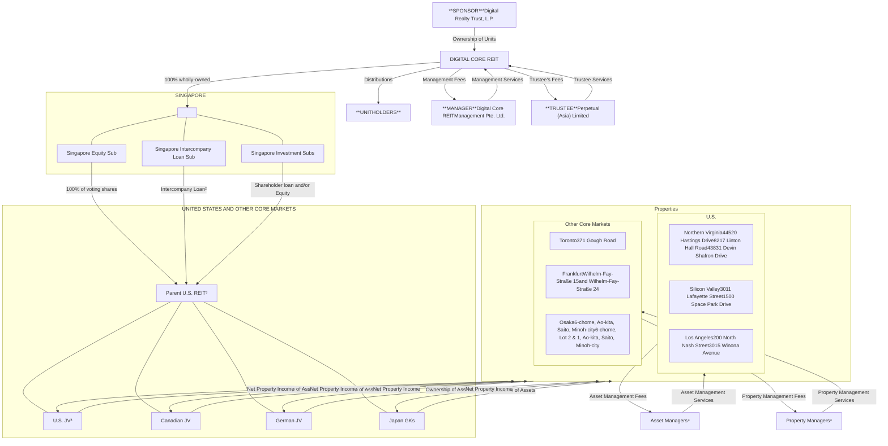
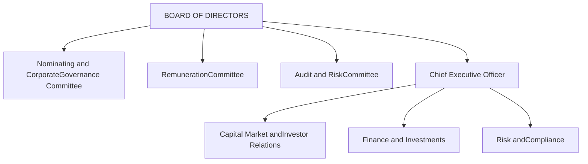
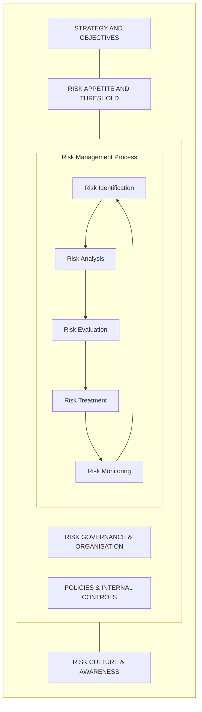
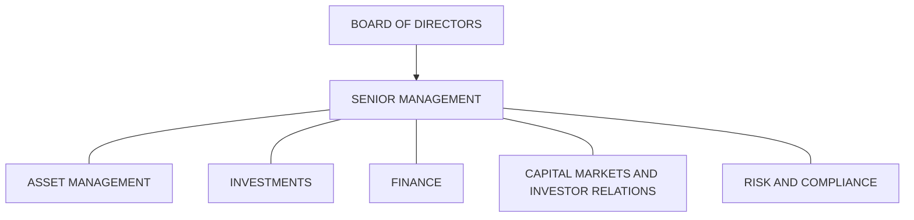
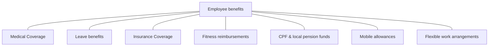

<!-- PAGE 1 -->

DIGITAL CORE REIT logo

ANNUAL REPORT 2025

# POWERING THE FUTURE

<!-- PAGE 2 -->

# POWERING THE FUTURE

2025 was a year of disciplined execution for Digital Core REIT as we focused on driving stable performance while strengthening the foundations that will power the REIT’s future growth. Building on the strategic progress made in 2024, we expanded our international footprint in Osaka through the acquisition of an additional stake in a high-quality data centre and issued our first yen-denominated note under our newly established Euro Medium-Term Note (EMTN) Programme, broadening our access to capital and funding sources. Continued leasing momentum in Los Angeles, Frankfurt and Osaka assets drove positive cash rental reversions, extended our lease maturity profile, and increased occupancy to further strengthen our income stream.

A key focus during the second half of 2025 was the re-leasing of 8217 Linton Hall, a high-quality data centre in Northern Virginia, the largest global data centre market. In January 2026, we announced that we successfully secured a 10-year lease with an investment-grade global cloud provider, securing a 35% increase in net property income compared to the previous rent.

Digital Core REIT Annual Report 2025 cover featuring a data centre building and the title "POWERING THE FUTURE"

By maintaining our discipline and focus, we are confident that today’s execution will leave Digital Core REIT well-positioned to deliver sustainable value for our unitholders and power the future of our platform.

<!-- PAGE 3 -->

# CONTENTS

<table>
  <thead>
    <tr>
<th>Topic</th>
<th>Page</th>
    </tr>
  </thead>
  <tbody>
    <tr>
<td colspan="2"><strong>01 OVERVIEW</strong></td>
    </tr>
    <tr>
<td>Corporate Profile</td>
<td>02</td>
    </tr>
    <tr>
<td>Our Presence</td>
<td>10</td>
    </tr>
    <tr>
<td>Highlights of FY 2025</td>
<td>11</td>
    </tr>
    <tr>
<td>Financial Highlights</td>
<td>12</td>
    </tr>
    <tr>
<td>Sustainability Highlights</td>
<td>14</td>
    </tr>
    <tr>
<td>2025 Key Events</td>
<td>15</td>
    </tr>
    <tr>
<td>Letter to Unitholders</td>
<td>16</td>
    </tr>
    <tr>
<td colspan="2"><strong>02 LEADERSHIP</strong></td>
    </tr>
    <tr>
<td>Board of Directors</td>
<td>18</td>
    </tr>
    <tr>
<td>Management Team</td>
<td>21</td>
    </tr>
    <tr>
<td>Trust and Organisation Structure</td>
<td>24</td>
    </tr>
    <tr>
<td colspan="2"><strong>03 PERFORMANCE</strong></td>
    </tr>
    <tr>
<td>Financial Review</td>
<td>26</td>
    </tr>
    <tr>
<td>Operations Review</td>
<td>32</td>
    </tr>
    <tr>
<td>Investor and Media Relations</td>
<td>36</td>
    </tr>
    <tr>
<td colspan="2"><strong>04 PROPERTIES</strong></td>
    </tr>
    <tr>
<td>Portfolio Overview</td>
<td>40</td>
    </tr>
    <tr>
<td>Property Details</td>
<td>41</td>
    </tr>
    <tr>
<td>Independent Market Research Report</td>
<td>52</td>
    </tr>
    <tr>
<td colspan="2"><strong>05 GOVERNANCE</strong></td>
    </tr>
    <tr>
<td>Risk Management</td>
<td>72</td>
    </tr>
    <tr>
<td>Corporate Governance</td>
<td>75</td>
    </tr>
    <tr>
<td>Sustainability</td>
<td>91</td>
    </tr>
    <tr>
<td colspan="2"><strong>06 OTHER INFORMATION</strong></td>
    </tr>
    <tr>
<td>Financial Statements</td>
<td>145</td>
    </tr>
    <tr>
<td>Additional Information</td>
<td>214</td>
    </tr>
    <tr>
<td>Statistics of Unitholdings</td>
<td>215</td>
    </tr>
    <tr>
<td colspan="2">Corporate Information</td>
    </tr>
  </tbody>
</table>

### Accessibility of Reports

As part of our sustainability efforts, Digital Core REIT will not be printing copies of its Annual Report unless specifically requested. A PDF version of the Annual Report is available for download from the corporate website: https://www.digitalcorereit.com/investorrelations/publications/default.aspx

### Feedback

The Manager strives to continuously improve its business and sustainability practices. Stakeholders are encouraged to share their views, suggestions or feedback, which may be directed to ir@digitalcorereit.com.

Any discrepancies in the tables and charts between the listed figures and totals thereof are due to rounding. Where applicable, figures and percentages are rounded to one decimal place.

<!-- PAGE 4 -->

01 OVERVIEW CORPORATE PROFILE logo

# CORPORATE PROFILE

DIGITAL CORE REIT logo

**Digital Core REIT is a pure-play data centre Singapore Real Estate Investment Trust (S-REIT) sponsored by Digital Realty, a global best-in-class pure-play listed data centre owner and operator.**

Digital Core REIT is an S-REIT established with the principal investment strategy of investing, directly or indirectly, in a diversified portfolio of income-producing real estate assets located globally, which are primarily used for data centre purposes, as well as assets necessary to support the digital economy.

Digital Core REIT owns a portfolio, valued at US$1.8 billion (at share) as at 31 December 2025, of high-quality, mission-critical freehold facilities comprising 11 data centres located across the United States, Canada, Germany and Japan that support the underlying businesses of the world’s leading technology service providers.

Digital Core REIT seeks to create long-term, sustainable value for all stakeholders through ownership and operation of a diversified portfolio of mission-critical data centre facilities concentrated in select global markets.

## Vision

To be the leading data centre S-REIT, powering the digital economy with a globally diversified portfolio of core data centre facilities.

## Mission

To deliver long-term, sustainable value for all stakeholders through investments in a diversified and growing portfolio of mission-critical data centres located in key global markets.

<!-- PAGE 5 -->

# ABOUT DIGITAL CORE REIT

Infographic showing four key pillars of Digital Core REIT: 01 Exclusively Focused on Core Data Centre Assets, 02 High-Quality, Mission-Critical Portfolio, 03 Unmatched Growth Potential, and 04 Exclusive S-REIT. The center features the Digital Core REIT and Digital Realty logos with the text "Dedicated Core Data Centre S-REIT Backed by Digital Realty (the Sponsor)".

**01 Exclusively Focused on Core Data Centre Assets**
Capitalising on robust demand from cloud, digital transformation and artificial intelligence

**02 High-Quality, Mission-Critical Portfolio**
Strategically located in core data centre markets

**Dedicated Core Data Centre S-REIT Backed by Digital Realty (the Sponsor)**

**03 Unmatched Growth Potential**
Global Right of First Refusal provides industry-leading pipeline for expansion

**04 Exclusive S-REIT**
The only S-REIT sponsored by Digital Realty

For more information, visit our website
<u>www.digitalcorereit.com</u>

<!-- PAGE 6 -->

# Powering
# Global Platform

Our expanded presence in Osaka, Japan underscores our commitment to further improving geographical and customer diversification, achieving scale and enhancing portfolio to support durable distributions per unit

**100% Freehold Portfolio with 11 Mission-Critical Data Centres in Core Global Markets**

**US$1.8 Billion of Assets Under Management**

**Unparalleled Access to US$15+ Billion Sponsor Acquisition Pipeline**

<!-- PAGE 7 -->

United States flag icon

Canada flag icon

Germany flag icon

Japan flag icon

NORTHERN VIRGINIA
SILICON VALLEY
LOS ANGELES

TORONTO

FRANKFURT

OSAKA

Aerial view of a large industrial facility or data center

Lot 2-1, 6-Chome, Ao-kita, Saito, Minoh-city, Osaka, Japan

<!-- PAGE 8 -->

Aerial view of a large data center facility at Wilhelm-Fay Straße 15 and 24 in Frankfurt, Germany, showing extensive rooftop cooling infrastructure and adjacent street with parked vehicles.

Wilhelm-Fay Straße 15 and 24,
Frankfurt, Germany

<!-- PAGE 9 -->

Aerial view of a modern data center building

Building icon with lease expiry indicator

**4.6 Years** WEIGHTED AVERAGE LEASE EXPIRY¹

Building and people icon with occupancy indicator **97%** OCCUPANCY RATE¹

ESTABLISHED
# US$750 Million
EURO MEDIUM TERM NOTE PROGRAMME

Balance sheet flexibility icon showing scales and currency

**37.1%** BALANCE SHEET FLEXIBILITY
**Aggregate Leverage²**

1 Reflects in-service portfolio only.
2 As defined under the CIS Code

# Financial and Portfolio Resilience

Delivering Stability through Prudent Capital Structure and Portfolio Strength

<!-- PAGE 10 -->

Photograph of a modern data center building exterior with a clear blue sky

# Riding the Digital Wave: Powering the Future

Poised to capitalise on robust demand driven by AI and cloud, supported by strong fundamentals and Sponsor backing

<!-- PAGE 11 -->

Photograph of a modern building exterior with large windows and a ramp

6-chome, Ao-kita, Saito, Minoh-city, Osaka, Japan

Bar chart icon

Achieved

# 31%

L-shaped arrow icon

CASH RENTAL REVERSION DRIVEN BY OUTSIZED GAINS IN LOS ANGELES AND NORTHERN VIRGINIA

Document and pen icon

Signed

# US$26 Million

L-shaped arrow icon

OF ANNUALISED RENT FROM NEW-AND-RENEWAL LEASES

<!-- PAGE 12 -->

# OUR PRESENCE

Digital Core REIT logo

World map showing data centre locations: Toronto, Northern Virginia, Frankfurt, Osaka, Los Angeles, and Silicon Valley

<table>
  <thead>
    <tr>
        <th>Location</th>
        <th>Data Centres</th>
        <th>Ownership</th>
        <th>Portfolio Value (at Share)¹ in millions</th>
        <th>Net Rentable Square Feet (at Share)</th>
        <th>Customer IT Load (at Share) in kW</th>
        <th>Occupancy Rate</th>
    </tr>
  </thead>
  <tbody>
    <tr>
        <td>Northern Virginia</td>
        <td>2</td>
        <td>90.0%</td>
        <td>US$441.6</td>
        <td>237,663 sq.ft.</td>
        <td>12,510</td>
        <td>100.0%</td>
    </tr>
    <tr>
        <td>Silicon Valley</td>
        <td>2</td>
        <td>90.0%</td>
        <td>US$248.4</td>
        <td>128,156 sq.ft.</td>
        <td>5,400</td>
        <td>100.0%</td>
    </tr>
    <tr>
        <td>Los Angeles</td>
        <td>2</td>
        <td>90.0%</td>
        <td>US$107.1</td>
        <td>176,865 sq.ft.</td>
        <td>3,924</td>
        <td>85.9%</td>
    </tr>
    <tr>
        <td>Toronto²</td>
        <td>1</td>
        <td>90.0%</td>
        <td>US$131.1</td>
        <td>93,877 sq.ft.</td>
        <td>6,089</td>
        <td>100.0%</td>
    </tr>
    <tr>
        <td>Frankfurt²</td>
        <td>1</td>
        <td>65.0%</td>
        <td>US$465.7</td>
        <td>292,205 sq.ft.</td>
        <td>22,100</td>
        <td>99.4%</td>
    </tr>
    <tr>
        <td>Osaka²</td>
        <td>2</td>
        <td>20.0%</td>
        <td>US$203.3</td>
        <td>86,996 sq.ft.</td>
        <td>9,080</td>
        <td>99.0%</td>
    </tr>
    <tr>
        <td><strong>In-Service Portfolio</strong></td>
        <td><strong>10</strong></td>
        <td> </td>
        <td><strong>US$1,597.3</strong></td>
        <td><strong>1,015,761 sq.ft.</strong></td>
        <td><strong>59,103</strong></td>
        <td><strong>97.3%</strong></td>
    </tr>
    <tr>
        <td colspan="7"><strong>Redevelopment</strong></td>
    </tr>
    <tr>
        <td>Northern Virginia³</td>
        <td>1</td>
        <td>90.0%</td>
        <td>US$230.4</td>
        <td>270,002 sq.ft.</td>
        <td>9,720</td>
        <td>100.0%</td>
    </tr>
    <tr>
        <td><strong>Total</strong></td>
        <td> </td>
        <td> </td>
        <td><strong>US$1,827.7</strong></td>
        <td><strong>1,222,763 sq.ft.</strong></td>
        <td><strong>68,823</strong></td>
        <td><strong>97.7%</strong></td>
    </tr>
  </tbody>
</table>

Source: Data as at 31 December 2025

\*1 Portfolio value (at share) is based on appraised value as at 31 December 2025 and does not include any capitalised transaction cost, straight-line rent or property additions.

\*2 Local currency figures converted based on CAD:USD exchange rate of 0.72, EUR:USD exchange rate of 1.17 and JPY:USD exchange rate of 0.006.

\*3 Includes pro forma adjustments for new lease signed, which will commence on 1 December 2026. For further information, please see the 5 January 2026 announcement titled, "Digital Core REIT Announces Linton Hall Lease-Up".

<!-- PAGE 13 -->

# HIGHLIGHTS OF FY 2025

Core icon

## CORE

Maintained
**3.60 U.S. cents**
Distribution Per Unit (DPU)

## US$1.8 billion
Assets under Management

## 11
Data Centres Data centre icon

**97%**
Healthy Portfolio Occupancy¹

**4.6 Years**
Weighted Average Lease Expiry¹ (by annualised rent)

Sustainable icon

## SUSTAINABLE

Strengthened Balance Sheet with
## US$750 million
EMTN Programme

## 3.7 Years
Weighted Average Debt Maturity with no debt maturities until December 2027

Maintained
**85%**
Healthy Level Fixed Rate Debt Fixed rate debt icon

## Generated 13% year over-year AUM growth,
driven by robust leasing and rental rate growth across global portfolio

**AI** expected to support continued digital-economy growth AI icon

Growth icon

## GROWTH

Invested
## US$87 million
in second data centre on Sponsor’s Osaka campus Osaka campus icon

Repurchased
**1.8 million**
units in 2025, delivering 0.1% DPU accretion

**37.1%**
Healthy Aggregate Leverage² Leverage icon

## +US$500 million
Debt Headroom (at 50% Aggregate Leverage)

Source: Data as at 31 December 2025

1 Reflects in-service portfolio only.

2 As defined under the CIS Code.

<!-- PAGE 14 -->

01 OVERVIEW

# FINANCIAL HIGHLIGHTS

<table>
  <thead>
    <tr>
        <th>FINANCIAL HIGHLIGHTS AND RATIOS for the financial year ended 31 December 2025</th>
        <th>Actual FY 2025 US$‘000</th>
        <th>Actual FY 2024 US$‘000</th>
        <th>Change %</th>
    </tr>
  </thead>
  <tbody>
    <tr>
        <td>Gross revenue</td>
        <td>176,152</td>
        <td>102,274</td>
        <td>72.2</td>
    </tr>
    <tr>
        <td>Net property income</td>
        <td>88,739</td>
        <td>61,832</td>
        <td>43.5</td>
    </tr>
    <tr>
        <td>Distributable income attributable to Unitholders¹</td>
        <td>46,846</td>
        <td>45,991</td>
        <td>1.9</td>
    </tr>
    <tr>
        <td>Distribution per Unit (DPU) (US cents)</td>
        <td>3.60</td>
        <td>3.60</td>
        <td>0.0</td>
    </tr>
    <tr>
        <td>Distribution yield (%)²</td>
        <td>7.06</td>
        <td>6.21</td>
        <td>85 bps</td>
    </tr>
    <tr>
        <td>Interest coverage ratio (times)</td>
        <td>3.5</td>
        <td>3.6</td>
        <td>(0.1x)</td>
    </tr>
    <tr>
        <td>Weighted average cost of debt rate (% per annum)³</td>
        <td>3.5%</td>
        <td>4.2%</td>
        <td>(70bps)</td>
    </tr>
  </tbody>
</table>
<table>
  <thead>
    <tr>
        <th>STATEMENT OF FINANCIAL POSITION HIGHLIGHTS as at 31 December 2025</th>
        <th>FY 2025 US$‘000</th>
        <th>FY 2024 US$‘000</th>
    </tr>
  </thead>
  <tbody>
    <tr>
        <td>Investment in real estate⁴</td>
        <td>2,003,926</td>
        <td>1,852,018</td>
    </tr>
    <tr>
        <td>Total assets</td>
        <td>2,245,399</td>
        <td>2,014,669</td>
    </tr>
    <tr>
        <td>Gross borrowings</td>
        <td>670,517</td>
        <td>552,349</td>
    </tr>
    <tr>
        <td>Total liabilities</td>
        <td>909,799</td>
        <td>735,295</td>
    </tr>
    <tr>
        <td>Unitholders’ funds</td>
        <td>1,073,962</td>
        <td>1,044,049</td>
    </tr>
    <tr>
        <td>Units in issue and to be issued as at balance sheet date (’000)</td>
        <td>1,341,032</td>
        <td>1,321,588</td>
    </tr>
    <tr>
        <td>Net asset value (NAV) per Unit (US$)</td>
        <td>0.80</td>
        <td>0.79</td>
    </tr>
    <tr>
        <td>Adjusted NAV per unit, excluding distribution (US$)⁵</td>
        <td>0.78</td>
        <td>0.77</td>
    </tr>
    <tr>
        <td>Unit price as at balance sheet date (US$)</td>
        <td>0.510</td>
        <td>0.580</td>
    </tr>
    <tr>
        <td>Aggregate leverage (%)⁶</td>
        <td>37.1</td>
        <td>34.0</td>
    </tr>
  </tbody>
</table>

1 Distributable income attributable to Unitholders is based on 100% of the taxable income available for distribution to Unitholders.

2 FY 2025 and FY 2024 distribution yields are based on market closing prices of US$0.510 and US$0.580 per Unit as at the last trading day of the respective periods.

3 Does not include amortisation of debt financing fees.

4 Investment in real estate comprised of data centre properties classified as (i) investment properties and (ii) property, plant and equipment

5 Adjusted NAV per Unit as of 31 December 2025 excludes the distributable income of 1.80 US cents per Unit for 2H 2025.

6 As defined under the CIS Code.

<!-- PAGE 15 -->

# GROSS REVENUE

US$ million

<table>
  <thead>
    <tr>
        <th>Period</th>
        <th>FY 2025</th>
        <th>FY 2024</th>
    </tr>
  </thead>
  <tbody>
    <tr>
        <td>Quarter 1</td>
        <td>44.2</td>
        <td>24.6</td>
    </tr>
    <tr>
        <td>Quarter 2</td>
        <td>44.7</td>
        <td>23.7</td>
    </tr>
    <tr>
        <td>Quarter 3</td>
        <td>43.5</td>
        <td>23.7</td>
    </tr>
    <tr>
        <td>Quarter 4</td>
        <td>43.8</td>
        <td>30.3</td>
    </tr>
    <tr>
        <td>Full year</td>
        <td>176.2</td>
        <td>102.3</td>
    </tr>
  </tbody>
</table>

# NET PROPERTY INCOME

US$ million

<table>
  <thead>
    <tr>
        <th>Period</th>
        <th>FY 2025</th>
        <th>FY 2024</th>
    </tr>
  </thead>
  <tbody>
    <tr>
        <td>Quarter 1</td>
        <td>22.4</td>
        <td>15.8</td>
    </tr>
    <tr>
        <td>Quarter 2</td>
        <td>23.9</td>
        <td>14.6</td>
    </tr>
    <tr>
        <td>Quarter 3</td>
        <td>21.4</td>
        <td>14.8</td>
    </tr>
    <tr>
        <td>Quarter 4</td>
        <td>21.0</td>
        <td>16.6</td>
    </tr>
    <tr>
        <td>Full year</td>
        <td>88.7</td>
        <td>61.8</td>
    </tr>
  </tbody>
</table>

# DISTRIBUTABLE INCOME

US$ million

<table>
  <thead>
    <tr>
        <th>Period</th>
        <th>FY 2025</th>
        <th>FY 2024</th>
    </tr>
  </thead>
  <tbody>
    <tr>
        <td>Quarter 1</td>
        <td>11.7</td>
        <td>10.6</td>
    </tr>
    <tr>
        <td>Quarter 2</td>
        <td>11.7</td>
        <td>12.0</td>
    </tr>
    <tr>
        <td>Quarter 3</td>
        <td>11.8</td>
        <td>12.0</td>
    </tr>
    <tr>
        <td>Quarter 4</td>
        <td>11.6</td>
        <td>11.4</td>
    </tr>
    <tr>
        <td>Full year</td>
        <td>46.8</td>
        <td>46.0</td>
    </tr>
  </tbody>
</table>

<!-- PAGE 16 -->

# SUSTAINABILITY HIGHLIGHTS

## DOUBLE MATERIALITY ASSESSMENT

Digital Core REIT conducted its inaugural double materiality assessment, developing an updated list of material topics.

### Material ESG Topics

**ENVIRONMENTAL**
Environmental icon
* Energy Management
* Greenhouse Gas Emissions
* Physical Impacts of Climate Change
* Water Management

**SOCIAL**
Social icon
* Occupational Health and Safety
* Employee Engagement
* Diversity and Inclusion
* Other Work-Related Rights

**GOVERNANCE**
Governance icon
* Business Ethics
* Data Security

## ENVIRONMENTAL HIGHLIGHTS¹

**67%**
ENERGY STAR icon
of US and Canadian assets are ENERGY STAR® certified

**47%**
Water drop icon
reduction of water intensity against 2018 baseline

**100%**
Renewable energy icon
of data centres matched with renewable energy

**Nearly 100%**
CO2 reduction icon
reduction of Scope 1 and 2 emissions intensity against 2018 baseline

**A top five customer**
Green lease icon
and **35%** of new colocation leases in FY 2025 adopted green lease provisions

**ISO certification** across the portfolio:

**ISO 27001**
7 data centres certified

**ISO 14001**
5 data centres certified

**ISO 50001**
ISO 50001 icon
1 data centre certified

**ISO 9001**
5 data centres certified

## SOCIAL HIGHLIGHTS

**20%**
Female representation icon
female representation on the Board

**100%**
Employee engagement icon
response rate on employee engagement survey

Average of
**21 hours**
Training icon
of training per employee achieved, more than double the 10-hour target

**Zero**
Safety icon
incidents resulting in workplace permanent disability or fatality

## GOVERNANCE HIGHLIGHTS

**100%**
Business ethics icon
successful completion of business ethics annual attestation

**Zero**
Anti-corruption icon
incidents of fraud, corruption, bribery and non-compliance with laws and regulations

**100%**
Security training icon
successful completion of Annual Security Awareness Training

**Zero**
Data privacy icon
incidents of non-compliance with data privacy laws

\*1 Environmental highlights are disclosed for assets included in the sustainability reporting scope.

<!-- PAGE 17 -->

# 2025 KEY EVENTS

### FEB

Delivered DPU of **3.60 U.S. cents** for FY 2024, which was nearly **3% better than projected** in 1 November 2023 "Strategically Positioning for the Future" presentation

Appointed **Ms Serene Nah** as Chairman of the Board of the Manager

### MAR

Completed acquisition of **20% interest** in a second data centre in Osaka, Japan

Established **US$750 million** EMTN Programme

### APR

Issued **¥10 billion** of 1.97% fixed rate notes due 2030

Photograph of four people seated at a table during a meeting

Held in-person AGM on 16 April 2025; all resolutions were passed

Reported **US$11.7 million** of Distributable Income for 1Q 2025, which was **9.9% higher year-on-year**

### JUL

Delivered DPU of **1.80 U.S. cents** for 1H 2025 and reported US$23.4 million of Distributed Income which was **3.5% higher year-on-year**

### SEP

Included in the **SGX iEdge Singapore Next 50 Indices** SGX logo

### OCT

Reported **US$35.2 million** of Distributable Income for 3Q 2025, representing a **1.9% year-on-year increase**

### DEC

Completed productive engagements with a diverse set of potential customers for the lease-up of 8217 Linton Hall in Northern Virginia, culminating with the 5 January 2026 announcement of a 10-year agreement with an investment grade cloud service provider to occupy the entire facility

Photograph of the 8217 Linton Hall facility in Northern Virginia

<!-- PAGE 18 -->

# LETTER TO UNITHOLDERS

> Data centre demand continues to outpace supply in core global markets, led by explosive growth in AI workloads, continued cloud migration, and broader digital transformation trends. Despite geopolitical volatility and macroeconomic uncertainty, our business remains largely insulated from rising energy costs and ground rents.

Portrait of John Stewart, Chief Executive Officer and Serene Nah, Chairman

**Dear Unitholders,**

Digital Core REIT delivered strong results in 2025, demonstrating the resiliency of our business, the quality of our portfolio, and the strong support from our Sponsor. We declared a full-year distribution per unit of 3.60 U.S. cents – flat year-over-year despite six months of downtime at our flagship Linton Hall facility in Northern Virginia. We offset the loss of rental income with accretive investment activity, organic growth from lease-up and rent growth across our portfolio as well as interest rate savings from our proactive balance sheet management strategy.

## Operational Highlights and Portfolio Performance

Throughout the year, we executed consistently against our key priorities: proactive leasing, accretive investing, and prudent financing. For the full year, we signed new and renewal leases totalling US$26 million of annualised rent, representing just over 25% of our total annualised revenue as at the start of the year. Leasing was geographically dispersed, providing opportunity to capture a portion of the embedded rent growth within the portfolio. The full-year cash rental reversion was 31%, driven by outsized gains in Los Angeles and Northern Virginia. Given the steady market rent growth across core global markets, we expect to have additional opportunities to capture embedded rent growth in the coming year.

Data centre demand continues to outpace supply in core global markets, led by explosive growth in AI workloads, continued cloud migration, and broader digital transformation trends. Despite geopolitical volatility and macroeconomic uncertainty, our business remains largely insulated from rising energy costs and ground rents. Eighty-five percent of our rental revenue is structured on pass-through agreements, with customers responsible for energy costs, and we own the freehold to 100% of our assets.

## Linton Hall: A Pivotal Transaction

The consistent execution against our proactive leasing strategy throughout 2025 culminated with the lease-up of 8217 Linton Hall in Northern Virginia on the last day of the year. On 30 June 2025, the previous customer’s lease for this facility expired and the customer moved out at expiration. We took the property out of service in the third quarter of 2025 and embarked on a comprehensive refurbishment program.

Alongside the Sponsor’s dedicated data centre sales team, we worked diligently to backfill the facility, ultimately reaching a 10-year agreement with an investment grade global cloud service provider to occupy the entire facility. The agreement will commence on 1 December 2026 and is expected to generate approximately US$14.8 million of annualised net property income, or approximately US$13.3 million at Digital Core REIT’s 90% share, representing roughly a 35% increase relative to the previous net rent. The increase was driven by a positive 20% reversion on a like-for-like basis, in addition to a 13% expansion in the sellable capacity.

This seamless execution is a direct reflection of the quality of our portfolio, the underlying strength of data centre fundamentals in core global markets, and the powerful support of our Sponsor.

## Accretive Investment Activity and Sponsor Support

In 2025, we closed a major strategic acquisition: a 20% interest in a second data centre on the Sponsor’s Osaka campus for ¥13 billion, or approximately US$87 million, generating 180 basis points of DPU accretion, improving geographic diversification, expanding our presence in the Asia Pacific region, and enhancing portfolio quality.

The transaction increased the annualised revenue contribution from Osaka from 7% to 11%, surpassing Los Angeles to become

<!-- PAGE 19 -->

our fourth-largest market. The acquisition also enhanced portfolio quality. The Osaka data centre was purpose-built as a data centre from the ground up and was completed in July 2021. The state-of-the-art facility offers 19.9 megawatts of critical IT load and is situated on the Sponsor’s connected campus in Osaka, servicing a diverse community of leading hyperscale and technology companies. The facility is 100% leased to investment grade customers, primarily leading global cloud providers, with a weighted average lease expiration of nearly eight years.

pre-leased, providing firm support for market rents. Despite these tailwinds, Digital Core REIT units trade at a deep discount to NAV and the peer group. The sector’s defensive, counter-cyclical characteristics and superior growth prospects create a compelling opportunity, further backstopped by strong support from our Sponsor and industry-leading acquisition pipeline.

We also continued to invest in our existing portfolio, repurchasing 1.8 million units at an average price of $0.565 or a 29% discount to NAV – generating 10 basis points of accretion and demonstrating our prioritisation of value creation over AUM growth.

## Long-Term Runway for Growth

We generated 13% year-over-year AUM growth in 2025, primarily driven by the Osaka investment and strong leasing momentum. Same-store values increased 3% year-over-year, driven by healthy leasing and continued market rent growth.

Since our IPO in December 2021, we have closed six acquisitions totalling more than half a billion U.S. dollars. The flexibility to acquire incremental stakes in sizable assets when we otherwise might not be positioned to finance the entire purchase price is a uniquely valuable form of Sponsor support that has enabled us to gradually and consistently enhance scale, diversification, and portfolio quality.

Looking ahead, our priorities remain clear:

* Completing the Linton Hall refurbishment on time and on budget is our top near-term priority.

* Finalising integration and further enhancing returns on the two Los Angeles facilities represent the next most pressing operational opportunities.

* Achieving greater scale and diversification remains a key corporate objective. Specifically, we aim to double the size of our asset base and market capitalisation over the next three to five years to further lower our risk profile and enhance liquidity in the trading of our units.

* Finally, preserving the flexibility of our balance sheet is paramount.

## Strategic Financing and Balance Sheet Strength

In 2025, we reached a significant milestone in the evolution of our balance sheet with the establishment of a Euro Medium-Term Note Programme, opening access to public debt capital markets, reducing reliance on bank debt, and setting the stage for the continued growth of our asset base. In April, we issued our inaugural private placement under the programme, a ¥10 billion series of notes at a 1.97% coupon due 2030 to finance the Osaka investment.

We believe we are uniquely positioned to continue to create durable, long-term value for you, our unitholders, given the strength of the fundamentals underpinning our business and the powerful support of our Sponsor’s global platform. We remain keenly focused on disciplined execution and intend to narrow the valuation gap through consistent delivery and proactive engagement.

Over the course of the year, we achieved a 40-basis point reduction in the weighted average cost of our debt, while keeping leverage in line with our 35%-40% target range. One hundred percent of our debt is unsecured. Eighty-five percent of our debt is hedged against rising rates, and we own the freehold to 100% of our assets. The credit quality of our customer base is exceptional. Nearly 80% of our rent roll is investment grade; over 70% is A-rated or higher. We have US$30 million of cash on our balance sheet plus US$195 million of availability on our line of credit and our weighted average debt maturity is 3.7 years.

Thank you for your continued support of Digital Core REIT. We look forward to sharing further progress in the year ahead and remain committed to generating resilient growth and long-term value for our unitholders.

## Market Backdrop and Valuation

Fundamentals across global core markets remain highly supportive of our business. Market vacancy rates are in the low single digits and new supply is both constrained and largely

Sincerely,

<table>
  <tbody>
    <tr>
<td>Serene Nah</td>
<td>John J. Stewart</td>
    </tr>
    <tr>
<td>Chairman</td>
<td>CEO</td>
    </tr>
    <tr>
<td colspan="2">24 March 2026</td>
    </tr>
  </tbody>
</table>

<!-- PAGE 20 -->

# BOARD OF DIRECTORS

Portrait of Serene Nah

**SERENE NAH, 46**
Chairman and
Non-Independent
Non-Executive Director
of the Manager¹

◼ 1 October 2023 ◼ 2 years 3 months

**Board Committees served in FY 2025:**
Member of Nominating and Corporate Governance Committee
**Principal commitments:**
Digital Realty (Managing Director, Head of Asia-Pacific)

Ms Nah is based in Singapore and has over two decades of experience in Pan-Asia infrastructure real estate and technology investment as well as in capital markets, joint ventures, and financial management. Ms Nah currently serves as Managing Director, Head of Asia Pacific for Digital Realty, where she works with its partners and customers to drive growth and broaden offerings to support the emerging needs of the Asia Pacific region. She joined Digital Realty from Kerry Properties, where she was Executive Director and Chief Financial Officer in charge of finance, corporate development, strategy, and operations. Previously, Ms Nah held increasingly senior leadership roles in the U.S. and across APAC at companies including Silver Lake Partners, where she served as Head of Asia-Portfolio Management, and General Electric, where she served as CFO of GE Capital Greater China.

In addition to her corporate responsibilities, Ms Nah is actively engaged in the industry and currently holds the position of Vice-Chair at the Asia-Pacific Data Centre Association (APDCA).

Ms Nah holds a Bachelor’s degree in Business Studies from Nanyang Technological University, Singapore and has an Executive MBA from Kellogg-HKUST.

***

Portrait of David Lucey

**DAVID LUCEY, 63**
Non-Independent
Non-Executive Director
of the Manager¹

◼ 2 July 2021 ◼ 4 years 6 months

**Board Committees served in FY 2025:**
Member of Nominating and Corporate Governance Committee,
Member of Remuneration Committee
**Principal commitments:**
(Digital Realty Senior Vice President, Program Management – COO Office)

Mr Lucey was recently appointed as Senior Vice President, Program Management – COO Office at Digital Realty. In this role, he works across the organization to guide and support key internal initiatives that underpin Digital Realty’s global operations. He oversees due diligence on new projects and developments and ensures that Digital Realty has the right operational framework to deliver and run its data centres as customer requirements evolve.

Prior to his current role, Mr Lucey served as Senior Vice President, Investments/Government Affairs, at Digital Realty from January 2023 to December 2025. In that role, Mr Lucey focused on acquisitions, dispositions and joint venture transactions, and he oversaw Digital Realty’s Government Affairs program. Mr Lucey was also responsible for leasing and overall financial management of all of Digital Realty’s assets in North America. Mr. Lucey served as Managing Director – APAC for Digital Realty from June 2022 through December 2022. From January 2009 to January 2016, Mr Lucey held various roles in Pembroke Real Estate, Inc., an affiliate of Fidelity Investments, where his last held role was Head of U.S. Operations and Global Risk. He was Managing Director of Fidelity Real Estate Group from February 2008 to January 2009 and from October 1996 to February 2008, Mr Lucey was a member of the Fidelity Investments’ Legal Group, where his last held position was Vice President and Associate General Counsel.

Mr Lucey began his career as a Corporate and Commercial Real Estate Attorney at Ropes & Gray LLP. Mr Lucey holds a Bachelor of Arts (Political Science) from Trinity College, Hartford, Connecticut and a Juris Doctor from the Vanderbilt University School of Law.

¹ With effect from 12 February 2025, Ms Serene Nah succeeded Mr David Lucey as Chairman of the Board of the Manager and has also been appointed as a member of the Nominating & Corporate Governance Committee. Mr Lucey has stepped down from the Nominating & Corporate Governance Committee and continues to serve on the Board as a non-independent director of the Manager.

<!-- PAGE 21 -->

◼ 18 November 2021 ◼ 4 years 2 months

**Board Committees served in FY 2025:**

Chairman of Nominating and Corporate Governance Committee, Member of Audit and Risk Committee, Member of Remuneration Committee

**Principal commitments:**

SpectraTen, LLC (Non-Executive Director)

Mr Herbert has extensive experience in investment banking, lending and investment. He was the Global Head of Real Estate and Hotels at HSBC London from 2010 to 2015 and prior to that, he held the position of Head of EMEA Real Estate and Hotels at Merrill Lynch London from 2005 to 2007 and Citigroup London from 1997 to 2005. Mr Herbert was a Partner at Blackrock Capital Finance from 1994 to 1996, acting on investments in debt securities and real estate. He also provided advice on distressed debt restructuring and sales during his tenure as Principal of Victor Capital Group. Throughout his career, he has been involved in a number of significant sales, mergers and public equity offerings in Asia, North America and Europe and has overseen banking and investment banking operations in over 35 countries worldwide.

Mr Herbert holds a Bachelor of Arts from Duke University and a Master of Business Administration from Harvard Business School.

Portrait of John Herbert

**JOHN HERBERT, 69**
Lead Independent Non-Executive Director of the Manager

***

◼ 18 November 2021 ◼ 4 years 2 months

**Board Committees served in FY 2025:**

Chairman of Audit and Risk Committee, Member of Nominating and Corporate Governance Committee

**Present directorships in listed company:**

Lendlease Global Commercial Trust Management Pte. Ltd. (Non-Executive Director)

Dr Tsui Kai Chong was a Professor of Finance and the Provost of Singapore University of Social Sciences. He is currently an independent non-executive director of Lendlease Global Commercial Trust Management Pte Ltd., the manager of Lendlease Global Commercial REIT. He was Chairman of the Board of Keppel REIT Asia Management Limited and served as a member of the boards of the Intellectual Property Office of Singapore, National Council of Social Service, Keppel Land, Keppel Capital Holdings, Keppel TatLee Bank and Fullerton Fund Management Company Limited.

Dr Tsui holds a BA (Hons) in Business Studies from the Polytechnic of Central London, an MPhil (Finance) and a PhD (Finance) from the Graduate School of Business of New York University. He is also a Chartered Financial Analyst.

Portrait of Tsui Kai Chong

**TSUI KAI CHONG, 70**
Independent Non-Executive Director of the Manager

<!-- PAGE 22 -->

# BOARD OF DIRECTORS

Photo of Tan Jeh Wuan

**TAN JEH WUAN, 60**
Independent Non-Executive
Director of the Manager

◼ 18 November 2021 ◼ 4 years 2 months

**Board Committees served in FY 2025:**
Chairman of Remuneration Committee, Member of Audit and Risk Committee
**Present directorships in listed company:**
Daiwa House Asset Management Pte. Ltd. (Chairman and Non-Executive Director)
**Principal commitments:**
Tower Capital Asia Pte. Ltd. (Non-Executive Director)
SGX Listings Advisory Committee (Deputy Chairman)

Mr Tan was a career investment banker, spending 30 years with DBS Bank from 1989 to 2019. His last position held was as Managing Director & Head of Capital Markets Singapore, where he was responsible for DBS Bank’s equity capital markets business in Singapore. During his career, Mr Tan has been involved in many domestic and international equity fund raisings and financial advisory transactions, including initial public offerings, private placements and rights issues.

Mr Tan also served on various financial sector workgroups and committees in Singapore during his career. He was a member of the Association of Banks in Singapore Corporate Finance Standing Committee (as well as its predecessor Singapore Investment Banking Association Corporate Finance Committee) for several years, including serving as the Chairman of the Committee for two terms. Mr Tan was a member of the SGX Securities Advisory Committee from 2018 to 2019 and was conferred an Institute of Banking & Finance Fellow, Capital Markets in 2019. Mr Tan is also the Chairman and Independent Non-Executive Director of Daiwa House Asset Management Asia Pte Ltd. Mr Tan is currently the Deputy Chairman of SGX’s Listings Advisory Committee, effective March 2023.

Mr Tan holds a Bachelor of Science in Industrial Engineering and Operations Research from the University of California, Berkeley, United States of America.

◼ Date of appointment ◼ Length of service (as at 31 December 2025)

<!-- PAGE 23 -->

The Chief Executive Officer works with the Board to determine the strategy for Digital Core REIT. The Chief Executive Officer also works with the other members of the management team to ensure that Digital Core REIT operates in accordance with the Manager’s stated investment strategy. Additionally, the Chief Executive Officer is responsible for planning the future strategic development of Digital Core REIT. The Chief Executive Officer is also responsible for the overall day-to-day management and operations of Digital Core REIT and working with the Manager’s investment, asset management, financial, legal and compliance personnel to meet the strategic, investment and operational objectives of Digital Core REIT.

Prior to his appointment as Chief Executive Officer of the Manager, Mr Stewart served as Senior Vice President, Investor Relations, Tax & Treasury at Digital Realty. Mr Stewart joined Digital Realty in September 2013. From June 2008 to September 2013, Mr Stewart was a Senior Analyst at Green Street Advisors, where he was responsible for coverage of data centre and industrial REITs. Between June 2006 and January 2008, he was a Senior REIT Analyst at Credit Suisse in New York. He held the role of Vice President, Equity Research at Citigroup Investment Research in New York from June 2004 to June 2006 and at Merrill Lynch, New York from June 2003 to June 2004. He also served as Associate, Equity Research at Salomon Smith Barney in New York between June 2000 and June 2003. Mr Stewart started his career in the corporate finance departments of NationsBank, N.A. in New York and Natexis Banque Populaire in New York where he was in charge of performing credit analysis.

Mr Stewart graduated from Oklahoma State University with a Bachelor of Science in Business Administration. He is also a Chartered Financial Analyst charterholder.

Portraits of John Stewart and David Craft

**JOHN STEWART**
Chief Executive Officer

The Chief Financial Officer of the Manager works with the Chief Executive Officer and the other members of the management team to formulate strategic plans for Digital Core REIT in accordance with the Manager’s stated investment strategy. The Chief Financial Officer is responsible for all financial functions of the Manager, including financial reporting, capital markets, tax, and investor relations as well as financial planning and analysis.

Mr Craft is a seasoned finance leader and versatile real estate and data centre investment professional with extensive global experience executing strategic growth initiatives. He served in roles of increasing seniority at Digital Realty from 2018-2023, most recently as Vice President, Acquisitions and Investments. He has been a key contributor to more than $10 billion of data centre acquisitions, dispositions, and joint venture transactions. Mr Craft spearheaded Digital Realty’s $580 million disposition of a portfolio of 10 data centre in the U.S. and was an integral member of the team responsible for the $8.4 billion merger with InterXion as well as the creation of a $1 billion joint venture with Mapletree. Prior to joining Digital Realty, Mr Craft worked in the Real Estate, Gaming & Lodging Investment Banking Group at Bank of America Merrill Lynch in New York and London as well as the Technology, Media & Telecommunications Investment Banking group at Barclays.

**DAVID CRAFT**
Chief Financial Officer

He began his career as a Financial Analyst at various private and publicly listed companies from 2005-2009 where he performed accounting, SEC reporting, treasury, and financial planning & analysis functions.

Mr Craft holds a Master of Business Administration from the Kenan-Flagler Business School at the University of North Carolina at Chapel Hill where he concentrated in Finance. He also holds a Bachelor of Science in Finance and Accounting from the Leeds School of Business at the University of Colorado at Boulder as well as a Bachelor of Music in Performance from the University of Colorado at Boulder.

<!-- PAGE 24 -->

02 LEADERSHIP logo

# MANAGEMENT TEAM

Portrait of Poo Ce Jin and Tan Shu Fang Mabel

**POO CE JIN**
Senior Corporate
Finance Director

The Senior Director of Corporate Finance of the Manager is involved in corporate finance matters in relation to Digital Core REIT (including capital markets and fundraising activities). This includes financial modelling, corporate budgeting and forecasting, mergers and acquisitions analysis and providing strategic counsel and insights to the senior management team to optimise the capital market strategy of Digital Core REIT.

Mr Poo has over ten years of experience in the investment banking industry and was responsible for strategic advisory, capital raising activities and merger and acquisition transactions in the Real Estate, Telecommunications and Infrastructure sectors. Prior to his appointment to the Manager, Mr Poo was Head of Execution Southeast Asia, Investment Banking at CITIC CLSA Securities, where he provided strategic advisory and execution in private and public capital raises across Singapore and Southeast Asia. Prior to CLSA, Mr Poo was Vice President, Corporate Finance at Haitong International where he was responsible for corporate finance advisory and led merger and acquisition transactions across China and Southeast Asia. Mr Poo began his career as an investment banking manager at CIMB Bank (Singapore).

Mr Poo holds a Bachelor’s degree in Accounting and Finance from London School of Economics and Political Science.

**TAN SHU FANG MABEL**
Director of Capital Markets
& Investor Relations

The Director of Capital Markets & Investor Relations of the Manager is responsible for facilitating communications and liaising with Unitholders and is involved in corporate finance matters in relation to Digital Core REIT (including raising monies through debt and equity). This includes producing annual reports for Unitholders, preparing investor presentations, result briefings and other engagement activities with investors, managing investor queries and developing the investor relations strategy. The Director of Capital Markets & Investor Relations is responsible for maintaining transparent communications with Unitholders and the market.

Prior to her appointment to the Manager, Ms Tan was Senior Treasury Manager at Digital Realty. In her prior position, she was responsible for the management of cash, debt, bank accounts, administration, banking relationships and reporting and analysis for the Asia-Pacific region. From October 2012 to July 2020, Ms Tan was with GLP Pte. Ltd., where she rose to become Senior Treasury Manager and was in charge of managing cash and liquidity, forex and interest rate risk, banking relationships and operations for the group. Ms Tan started her career as a Corporate Banking Officer with MUFG Bank Ltd., Singapore Branch.

Ms Tan graduated with a Bachelor of Science in Applied Mathematics with Merit from the National University of Singapore. She is also a Certified Treasury Professional.

<!-- PAGE 25 -->

The Director of Finance of the Manager is responsible for finance, tax and accounting matters. On a day-to-day basis, the Director of Finance assists the Chief Financial Officer in developing and maintaining appropriate policies, procedures and processes for finance and other operational areas to ensure appropriate internal controls are in place to safeguard Digital Core REIT’s assets, ensure the accuracy and validity of financial information required for management’s decision making and ensuring compliance with the applicable provisions of the relevant legislation pertaining to the operations of Digital Core REIT. In addition, he provides financial support for investment assessments, including structuring, fundraising and post-acquisition processes.

Prior to his appointment to the Manager, Mr Cheo was the Senior Finance Manager at Keppel Pacific Oak US REIT Management Pte. Ltd., the manager of Keppel Pacific Oak US REIT from 2017 to 2021. Prior to that, he was the Finance Manager at Keppel Capital International Pte. Ltd., where he was responsible for the financial and reporting functions. These included group consolidation, management reporting, statutory and financial reporting, annual budgeting and certain compliance matters.

Portrait of Cheo Wei, Director of Finance

**CHEO WEI**
Director of Finance

Mr Cheo started out as an Auditor at Deloitte & Touche LLP in 2008 in the general audit team where he performed audit assurances to various industries including real estate fund management. From 2010 to 2014, he joined DBS Bank Ltd. as an Associate in the finance function of the stockbroking arm, where he led the general ledger accounting team and assisted in various functions including tax, statutory, financial and regulatory reporting. From 2014 to 2017, Mr Cheo was the Senior Manager at Leeden National Oxygen Ltd., where he oversaw the group consolidation and financial reporting function, established finance policies and conducted training for finance staff.

Mr Cheo graduated with a Bachelor of Accountancy, Second Class Honours (Upper Division), from Nanyang Technological University, Singapore in 2008. He is a Chartered Accountant (Singapore) and is a member of the Institute of Singapore Chartered Accountants.

<!-- PAGE 26 -->

# TRUST AND ORGANISATION STRUCTURE

## TRUST STRUCTURE

<!-- PAGE 27 -->

# MANAGER ORGANISATION STRUCTURE

**NOTES ON THE TRUST STRUCTURE:**

1 Digital Realty held a deemed 32.2% stake in Digital Core REIT as at 31 December 2025.

2 Principal repayments are not subject to U.S. withholding taxes. Interest payments that are finally distributed to Unitholders are not subject to U.S. withholding taxes assuming Unitholders qualify for portfolio interest exemption and provide appropriate tax certifications, including an appropriate IRS Form W-8.

3 Parent U.S. REIT holds 90% of each U.S. JV with a wholly-owned subsidiary of the Sponsor holding the other 10% of each U.S. JV.

4 The asset managers and the property managers are either (i) a joint venture or (ii) wholly-owned subsidiares of the Sponsor.

Information as at 31 December 2025. Unitholding in Digital Core REIT is subject to an ownership restriction of 9.8% of the total Units outstanding.

<!-- PAGE 28 -->

# FINANCIAL REVIEW

**Overview**

Digital Core REIT is a leading pure-play data centre Singapore REIT (S-REIT) listed on the Main Board of the Singapore Exchange Securities Trading Limited. Sponsored by Digital Realty, the world’s largest global data centre owner and operator, the REIT is committed to long-term value creation through ownership and management of a diversified portfolio of mission-critical data centres in key global markets.

> **Distributable Income**
> **$46.8m**
> 1.9% higher than FY 2024

Throughout 2025, Digital Core REIT repurchased and cancelled 1.8 million units under the Unit Buy-back mandate, demonstrating the Manager's prioritisation of value creation over AUM growth and generating 10 basis points of accretion, while adding just five basis points to leverage.

In March 2025, Digital Core REIT acquired a 20% equity interest in a second fully-fitted freehold data centre in Osaka, Japan, from Mitsubishi Corporation for ¥13 billion (approximately US$86.7 million). This acquisition was debt-funded.

The REIT’s full-year distribution was 3.60 U.S. cents per unit, unchanged year-on-year despite six months of downtime at the Linton Hall facility in Northern Virginia. The REIT mitigated the impact of lost rental income through accretive investments, organic growth from lease-up and rental growth across the portfolio, as well as interest cost savings from proactive balance sheet management.

In the same month, the REIT achieved a significant milestone in the evolution of its balance sheet with the establishment of a US$750 million Euro Medium Term Note (EMTN) Programme. The EMTN Programme broadens access to the public and private debt capital markets, allows for issuances in a wide variety of currencies, and supports the continued growth of its asset base.

**Distribution Policy**

Digital Core REIT maintains a semi-annual distribution policy and will distribute at least 90% of its annual distributable income for each financial year. The current distribution of 1.80 U.S. cents for the period of 1 July 2025 to 31 December 2025 will be paid on or before 31 March 2026.

In April 2025, Digital Core REIT completed its inaugural issuance of a ¥10 billion 1.97% fixed-rate notes due 2030 to fund the Osaka acquisition.

As at 31 December 2025, Digital Core REIT’s total assets under management (AUM) stood at approximately US$1.8 billion, representing a 13% year-on-year increase. The portfolio comprises mission-critical freehold data centres across the United States, Canada, Germany and Japan.

Digital Core REIT reported FY 2025 distributable income of US$46.8 million, a 1.9% increase from US$46.0 million in FY 2024. This growth was driven by higher contributions from the Frankfurt Facility and Osaka Data Centres, partially offset by lower interest income and higher finance costs.

DISTRIBUTION DETAILS

U.S. cents per Unit

<table>
  <thead>
    <tr>
        <th>Period</th>
        <th>Distribution</th>
    </tr>
  </thead>
  <tbody>
    <tr>
        <td>1H25</td>
        <td>1.80</td>
    </tr>
    <tr>
        <td>2H25</td>
        <td>1.80</td>
    </tr>
    <tr>
        <td>Full-Year 2025 Distribution</td>
        <td>3.60</td>
    </tr>
  </tbody>
</table>

<!-- PAGE 29 -->

<table>
  <thead>
    <tr>
<th>Consolidated Statement of Comprehensive Income</th>
<th>FY 2025</th>
<th>FY 2024</th>
<th>+/(-)%</th>
    </tr>
    <tr>
<th> </th>
<th>US$‘000</th>
<th>US$‘000</th>
<th> </th>
    </tr>
  </thead>
  <tbody>
    <tr>
<td>Rental and colocation income</td>
<td>119,850</td>
<td>70,403</td>
<td>70.2</td>
    </tr>
    <tr>
<td>Utilities reimbursements</td>
<td>36,611</td>
<td>14,641</td>
<td>&gt;100</td>
    </tr>
    <tr>
<td>Other recovery and operating income</td>
<td>19,691</td>
<td>17,230</td>
<td>14.3</td>
    </tr>
    <tr>
<td><strong>Gross Revenue</strong></td>
<td><strong>176,152</strong></td>
<td><strong>102,274</strong></td>
<td><strong>72.2</strong></td>
    </tr>
    <tr>
<td></td>
<td></td>
<td></td>
<td></td>
    </tr>
    <tr>
<td>Utilities</td>
<td>(44,698)</td>
<td>(15,873)</td>
<td>&gt;100</td>
    </tr>
    <tr>
<td>Property taxes and insurance expenses</td>
<td>(7,328)</td>
<td>(6,919)</td>
<td>5.9</td>
    </tr>
    <tr>
<td>Repairs and maintenance</td>
<td>(10,339)</td>
<td>(3,842)</td>
<td>&gt;100</td>
    </tr>
    <tr>
<td>Property management fees</td>
<td>(3,405)</td>
<td>(2,020)</td>
<td>68.6</td>
    </tr>
    <tr>
<td>Other property expenses</td>
<td>(21,643)</td>
<td>(11,788)</td>
<td>83.6</td>
    </tr>
    <tr>
<td><strong>Property expenses</strong></td>
<td><strong>(87,413)</strong></td>
<td><strong>(40,442)</strong></td>
<td><strong>&gt;100</strong></td>
    </tr>
    <tr>
<td></td>
<td></td>
<td></td>
<td></td>
    </tr>
    <tr>
<td><strong>Net Property Income (“NPI”)</strong></td>
<td><strong>88,739</strong></td>
<td><strong>61,832</strong></td>
<td><strong>43.5</strong></td>
    </tr>
    <tr>
<td></td>
<td></td>
<td></td>
<td></td>
    </tr>
    <tr>
<td>Other Income</td>
<td>—</td>
<td>2,056</td>
<td>(100)</td>
    </tr>
    <tr>
<td>Finance income</td>
<td>777</td>
<td>11,107</td>
<td>(93.0)</td>
    </tr>
    <tr>
<td>Finance expenses</td>
<td>(29,394)</td>
<td>(25,122)</td>
<td>17.0</td>
    </tr><tr>
<td>Managerʼs base fee</td>
<td>(8,275)</td>
<td>(4,723)</td>
<td>75.2</td>
</tr><tr>
<td>Managerʼs performance fee</td>
<td>(2,477)</td>
<td>(1,559)</td>
<td>58.9</td>
</tr><tr>
<td>Trusteeʼs fee</td>
<td>(216)</td>
<td>(184)</td>
<td>17.4</td>
</tr><tr>
<td>Other trust expenses</td>
<td>(3,835)</td>
<td>(3,662)</td>
<td>4.7</td>
</tr><tr>
<td>Unrealised foreign exchange</td>
<td>(686)</td>
<td>8,597</td>
<td>NM</td>
</tr><tr>
<td>Profit before tax, fair value changes and share of results</td>
<td>44,633</td>
<td>48,342</td>
<td>(7.7)</td>
</tr><tr>
<td>Share of result of associates</td>
<td>18,866</td>
<td>16,601</td>
<td>13.6</td>
</tr><tr>
<td>Remeasurement loss</td>
<td>(3,687)</td>
<td>(11,144)</td>
<td>(66.9)</td>
</tr><tr>
<td>Fair value change in financial derivatives</td>
<td>28</td>
<td>71</td>
<td>(60.6)</td>
</tr><tr>
<td>Net fair value change in investment properties</td>
<td>22,042</td>
<td>251,601</td>
<td>(91.2)</td>
</tr>
    <tr>
<td><strong>Profit before tax</strong></td>
<td><strong>81,882</strong></td>
<td><strong>305,471</strong></td>
<td><strong>(73.2)</strong></td>
    </tr>
    <tr>
<td>Tax expense</td>
<td>(15,119)</td>
<td>(40,021)</td>
<td>(62.2)</td>
    </tr>
    <tr>
<td><strong>Profit after tax</strong></td>
<td><strong>66,763</strong></td>
<td><strong>265,450</strong></td>
<td><strong>(74.8)</strong></td>
    </tr>
    <tr>
<td></td>
<td></td>
<td></td>
<td></td>
    </tr>
    <tr>
<td colspan="4"><strong>Attributable to:</strong></td>
    </tr>
    <tr>
<td>Unitholders</td>
<td>47,698</td>
<td>205,381</td>
<td>(76.8)</td>
    </tr>
    <tr>
<td>Non-controlling interest</td>
<td>19,065</td>
<td>60,069</td>
<td>(68.3)</td>
    </tr>
    <tr>
<td><strong>Profit after tax</strong></td>
<td><strong>66,763</strong></td>
<td><strong>265,450</strong></td>
<td><strong>(74.8)</strong></td>
    </tr>
    <tr>
<td></td>
<td></td>
<td></td>
<td></td>
    </tr>
    <tr>
<td colspan="4"><u><strong>Distribution Statement</strong></u></td>
    </tr>
    <tr>
<td>Profit after tax attributable to Unitholders</td>
<td>47,698</td>
<td>205,381</td>
<td>(76.8)</td>
    </tr>
    <tr>
<td>Distribution adjustments</td>
<td>(852)</td>
<td>(159,390)</td>
<td>(99.5)</td>
    </tr>
    <tr>
<td><strong>Income available for distribution to Unitholders</strong></td>
<td><strong>46,846</strong></td>
<td><strong>45,991</strong></td>
<td><strong>1.9</strong></td>
    </tr>
  </tbody>
</table>

<!-- PAGE 30 -->

# FINANCIAL REVIEW

**Revenue and Expenses**

FY 2025 rental and colocation income increased by 70.2% compared to FY 2024, driven by higher rental and colocation income from Los Angeles and Canadian assets, as well as additional contribution from the increased stake in the Frankfurt Facility, which was consolidated following the increase in ownership interest to 65.0% in December 2024. This growth was partially offset by six months of downtime at 8217 Linton Hall in Northern Virginia where a customer vacated on 30 June 2025. The facility is anticipated to be under refurbishment throughout most of 2026.

In early January 2026, Digital Core REIT announced the successful lease-up of the Linton Hall facility. For further details, please refer to the SGX announcement dated 5 January 2026, titled "Digital Core REIT Announces Linton Hall Lease-Up".

FY 2025 property expenses increased to US$87.4 million, reflecting higher utilities, leasing commissions, one-time integration costs for the Los Angeles assets, and additional contribution from the Frankfurt Facility, which has been consolidated following the increase in ownership interest to 65.0% in December 2024.

Consequently, FY 2025 net property income increased by 43.5% year-on-year to US$88.7 million.

No other income was recorded in FY 2025, as dividend income from Digital Osaka 2 was accounted for as a reduction in the carrying amount of the investment in associate, whereas in FY 2024, the dividend from Digital Osaka 2 was recognised as other income.

Finance income, which comprises interest from loan to associate and bank deposits, decreased to US$0.8 million in FY 2025, driven by lower fixed deposit placements and reclassification of the Frankfurt Facility from associate to subsidiary following the increase in ownership in December 2024.

Finance expenses increased by US$4.3 million to US$29.4 million in FY 2025, driven by new Japanese Yen-denominated borrowings to fund the investment in Digital Osaka 3 in March 2025, partially offset by a 70bps decrease in the average cost of debt to 3.5%.

Other trust expenses, which include audit, tax, compliance, legal, and professional fees, increased by approximately 5% in FY 2025 due to higher legal and professional fees associated with the establishment of the EMTN and the inaugural ¥10 billion EMTN bond issuance for the investment in Digital Osaka 3.

**Profit attributable to Unitholders**

FY 2025 profit attributable to Unitholders was US$66.8 million, compared to US$265.5 million in FY 2024. The year-on-year decrease was largely due to lower fair value gain on investment properties (FY 2025: US$22.0 million vs. FY 2024: US$251.6 million) despite a 3% increase in overall portfolio appraisal value in FY 2025.

GROSS REVENUE BY ASSET (US$ million)

<table>
  <thead>
    <tr>
        <th>Asset</th>
        <th>As at 31 December 2025</th>
        <th>As at 31 December 2024</th>
    </tr>
  </thead>
  <tbody>
    <tr>
        <td>Wilhelm-Fay-Straße 15 and 24</td>
        <td>70.7</td>
        <td>4.6</td>
    </tr>
    <tr>
        <td>371 Gough Road</td>
        <td>14.1</td>
        <td>11.9</td>
    </tr>
    <tr>
        <td>3015 Winona Avenue</td>
        <td>7.7</td>
        <td>3.9</td>
    </tr>
    <tr>
        <td>200 North Nash Street</td>
        <td>9.5</td>
        <td>5.1</td>
    </tr>
    <tr>
        <td>1500 Space Park Drive</td>
        <td>7.2</td>
        <td>8.8</td>
    </tr>
    <tr>
        <td>3011 Lafayette Street</td>
        <td>21.1</td>
        <td>18.8</td>
    </tr>
    <tr>
        <td>43831 Devin Shafron Drive</td>
        <td>2.6</td>
        <td>2.7</td>
    </tr>
    <tr>
        <td>8217 Linton Hall</td>
        <td>9.1</td>
        <td>18.9</td>
    </tr>
    <tr>
        <td>44520 Hastings Drive</td>
        <td>34.3</td>
        <td>27.5</td>
    </tr>
  </tbody>
</table>

<!-- PAGE 31 -->

FY 2025 tax expense amounted to US$15.1 million, largely comprising non-cash deferred tax, and declined year-on-year in line with the lower net fair value gain on investment properties against the U.S. dollar, in addition to strong data centre market fundamentals.

In 2025, the Frankfurt Facility amended the shareholder loan with the Sponsor, Digital Realty, from a fixed to floating rate loan. As a result of the loan modification, a remeasurement loss was recognized to expense the remaining unamortized loan discount.

AUM, based on Digital Core REIT’s ownership share of the respective assets, stood at US$1.8 billion as at 31 December 2025, up from US$1.6 billion as at 31 December 2024.

Profit before tax, fair value changes, remeasurement loss, and share of results for FY 2025 was US$44.6 million, compared to US$48.3 million in FY 2024.

## Net Asset Value (NAV) per Unit

As at 31 December 2025, NAV per Unit was US$0.80, compared to US$0.79 at 31 December 2024. Excluding the distribution income for 2H2025 of 1.80 U.S. cents (2H2024: 1.80 US cents), the adjusted NAV per Unit was US$0.78 compared to US$0.77 at 31 December 2024.

## Investment in Real Estate and AUM

Investment in real estate comprises data centre properties classified as (i) investment properties and (ii) property, plant and equipment. As at 31 December 2025, the total investment in real estate stood at US$2.0 billion based on appraised values, compared to US$1.9 billion as at 31 December 2024.

## Funding and Borrowings

As at 31 December 2025, the Group’s gross borrowing amounted to US$670.5 million (FY 2024: US$552.3 million). The increase was primarily due to the financing related to the acquisition of a 20% equity interest in Digital Osaka 3, the refurbishment of Linton Hall facility and Los Angeles assets, and the change of foreign exchange rates.

The year-over-year AUM growth was primarily attributable to the investment in the second Osaka data centre as well as positive rental rate reversions, improved occupancy, extended lease tenors at the properties, positive foreign exchange translation effect from the appreciation of the Euro and Canadian dollar

As at 31 December 2025, the Group had US$194.5 million (FY 2024: US$214.9 million) of undrawn capacity available on the revolving credit facility to meet its future obligations.

# ASSET UNDER MANAGEMENT (US$ million)

<table>
  <thead>
    <tr>
        <th>Asset</th>
        <th>As at 31 December 2025</th>
        <th>As at 31 December 2024</th>
    </tr>
  </thead>
  <tbody>
    <tr>
        <td>Total</td>
        <td>1,827.7</td>
        <td>1,624.1</td>
    </tr>
    <tr>
        <td>Digital Osaka 3¹</td>
        <td>90.0</td>
        <td> </td>
    </tr>
    <tr>
        <td>Digital Osaka 2</td>
        <td>113.3</td>
        <td>107.6</td>
    </tr>
    <tr>
        <td>Wilhelm-Fay-Straße 15 and 24</td>
        <td>465.7</td>
        <td>391.0</td>
    </tr>
    <tr>
        <td>371 Gough Road</td>
        <td>131.2</td>
        <td>122.4</td>
    </tr>
    <tr>
        <td>200 North Nash Street</td>
        <td>58.5</td>
        <td>55.0</td>
    </tr>
    <tr>
        <td>3015 Winona Avenue</td>
        <td>48.6</td>
        <td>44.6</td>
    </tr>
    <tr>
        <td>1500 Space Park Drive</td>
        <td>90.9</td>
        <td>101.1</td>
    </tr>
    <tr>
        <td>3011 Lafayette Street</td>
        <td>157.5</td>
        <td>154.8</td>
    </tr>
    <tr>
        <td>43831 Devin Shafron Drive</td>
        <td>57.3</td>
        <td>56.2</td>
    </tr>
    <tr>
        <td>8217 Linton Hall</td>
        <td>230.4</td>
        <td>218.8</td>
    </tr>
    <tr>
        <td>44520 Hastings Drive</td>
        <td>384.3</td>
        <td>372.6</td>
    </tr>
  </tbody>
</table>

\*1 On 26 March 2025, the Manager announced the acquisition of 20% interest in Digital Osaka 3 and completed the acquisition on 25 March 2025. For more information, please refer to the announcement published by Digital Core REIT on 26 March 2025 titled, “Acquisition of a 20% Interest in a Data Centre Located in Osaka, Japan”.

<!-- PAGE 32 -->

# FINANCIAL REVIEW

**KEY STATISTICS**

<table>
  <thead>
    <tr>
        <th>As at</th>
        <th>Aggregate leverage</th>
        <th>% of total assets unencumbered</th>
        <th>Interest coverage ratio</th>
        <th>Cost of debt¹</th>
        <th>Weighted average debt maturity</th>
    </tr>
  </thead>
  <tbody>
    <tr>
        <td>31 December 2025</td>
        <td>37.1%</td>
        <td>100%</td>
        <td>3.5 times</td>
        <td>3.5% p.a.</td>
        <td>3.7 years</td>
    </tr>
    <tr>
        <td>31 December 2024</td>
        <td>34.0%</td>
        <td>100%</td>
        <td>3.6 times</td>
        <td>4.2% p.a.</td>
        <td>4.7 years</td>
    </tr>
  </tbody>
</table>

\*1 Weighted average cost of debt for the full year and excludes amortisation of upfront fees. The weighted average cost of debt for 4Q25 and 4Q24 was 3.5% and 3.9% respectively.

**Sensitivity analysis on the impact of changes in EBITDA¹ and weighted average interest rate on ICR²:**

<table>
  <thead>
    <tr>
        <th> </th>
        <th>ICR</th>
    </tr>
  </thead>
  <tbody>
    <tr>
        <td>As at 31 December 2025</td>
        <td>3.5 times</td>
    </tr>
    <tr>
        <td>10% decrease in EBITDA</td>
        <td>3.1 times</td>
    </tr>
    <tr>
        <td>100 basis point increase in the weighted average interest rate</td>
        <td>2.6 times</td>
    </tr>
  </tbody>
</table>

\*1 EBITDA means earnings before interest, tax, depreciation and amortisation (excluding effects of any fair value changes of derivatives and investment properties, and foreign exchange translation)

\*2 ICR means Interest Coverage Ratio, a ratio that is calculated by dividing the trailing 12 months’ earnings before interest, tax, depreciation and amortisation (excluding effects of any fair value changes of derivatives and investment properties, and foreign exchange translation), by the trailing 12 months’ interest expense, borrowing-related fees and distributions on hybrid securities

## Cash Flows and Liquidity

As at 31 December 2025, Digital Core REIT had cash and cash equivalents of US$29.9 million.

Net cash generated from operating activities for FY 2025 was US$93.7 million, significantly higher than FY 2024 of US$56.0 million, primarily due to contribution from the Frankfurt Facility post-acquisition and consolidation in December 2024, partially offset by the six months of downtime at the Linton Hall Facility.

Net cash used in investing activities was US$104.3 million. This included US$40.6 million of capital expenditures and US$68.3 million deployed for the acquisition of a 20% interest in Digital Osaka 3. These outflows were partially offset by US$3.8 million of dividend income received from Digital Osaka 2, as well as US$0.8 million of interest income received from fixed deposits.

Net cash used in financing activities amounted to US$2.9 million. This included US$80.3 million of net additional new loans, US$3.6 million of capital contribution from non-controlling interests, and was partially offset by US$59.4 million of distribution paid to Unitholders and non-controlling interests, US$26.4 million paid for finance expenses and US$1.0 million used for unit buy-backs pursuant to the unit buy-back mandate previously obtained from unitholders during the annual general meeting held on 18 April 2024.

## Capital Management

The Manager adopts a proactive and prudent approach to capital management and strives to maintain an optimal combination of debt and equity to enhance capital efficiency and maximise returns for Unitholders. A strong capital base is critical to preserve investor confidence, support creditworthiness, and sustain long-term business growth.

Where possible, the Manager aims to diversify its sources of funding from financial institutions and capital markets and monitors externally imposed capital requirements closely and ensures the REIT’s adopted capital structure complies with these requirements. The Manager also maintains strong relationships with reputable banks and has established banking facilities to enhance its financial flexibility and funding diversification.

<!-- PAGE 33 -->

# DEBT MATURITY PROFILE (US$ million)

**3.7 YEARS**
Weighted
Average
Debt Maturity

<table>
  <thead>
    <tr>
<th>Year</th>
<th>Term Loan</th>
<th>Private Placement</th>
<th>Line of Credit¹</th>
<th>Undrawn (Line of Credit)¹</th>
    </tr>
  </thead>
  <tbody>
    <tr>
<td colspan="5">2026</td>
    </tr>
    <tr>
<td>2027</td>
<td>$82</td>
<td> </td>
<td> </td>
<td> </td>
    </tr>
    <tr>
<td colspan="5">2028</td>
    </tr>
    <tr>
<td>2029</td>
<td>$82</td>
<td>$194</td>
<td>$81</td>
<td> </td>
    </tr>
    <tr>
<td>2030</td>
<td>$362</td>
<td> </td>
<td>$64</td>
<td> </td>
    </tr>
    <tr>
<td colspan="5">2031+</td>
    </tr>
  </tbody>
</table>

1 Global revolving credit facility may be extended by one year from 2029 to 2030.

In 2025, the Manager established a US$750 million Euro Medium Term Note Programme (EMTN) to broaden its access to public and private debt capital markets and issued an inaugural ¥10 billion bond under the EMTN.

## Financial Risk Management

The Group is exposed to a variety of financial risks, including credit, liquidity and market (primarily currency and interest rate) risks. The Manager undertakes financial risk management in accordance with its established policies and guidelines while striving to achieve the right balance between the costs of risks occurring and the cost of managing them. Further details on the Group’s financial risk management practices are set out in the financial statements.

The Manager obtained Board and Unitholder approval in 2025 to implement the unit buy-back mandate and has a defined unit buy-back plan to repurchase its own shares on the market. The timing of these purchases is dependent on daily unit trading prices. In 2025, a total of 1,750,000 units were purchased at an average price of US$0.565 and were subsequently cancelled.

The Manager continues to adopt appropriate hedging strategies to manage interest rate and foreign currency exposure. Interest rate exposure has been hedged through interest rate swaps. Where possible, natural hedging is applied by maintaining borrowings in currencies that match the corresponding investment. During the year, the Manager issued a Japanese Yen-denominated note to finance the investment of an additional equity interest in a freehold data centre located in Osaka which generates profits in Japanese Yen. Hedge accounting has been applied and the fair value changes of the interest rate swap derivatives, as well as the effective portion of the foreign exchange movement on the foreign currency loans designated as hedges, are reflected in other comprehensive income. The Manager has also entered into foreign currency forward contracts based on projected distributions in non-functional currencies.

## Debt Management

The weighted average debt maturity was 3.7 years, down from 4.7 years at 31 December 2024, due to the passage of time. There are no debt refinancing requirements until December 2027.

Digital Core REIT manages its interest rate exposure through interest rate swaps. As at 31 December 2025, 85.0% of its borrowings were hedged against rising interest rates. Digital Core REITʼs average cost of debt was 3.5% for FY 2025, down 70 basis points from FY 2024.

## Accounting Policy

The financial statements have been prepared in accordance with the International Financial Reporting Standards (IFRS) issued by the International Accounting Standards Board (IASB), the applicable requirements of the Code on Collective Investment Schemes issued by the Monetary Authority of Singapore, and the provisions of the Trust Deed.

Under Appendix 6 of the Code on Collective Investment Schemes (CIS Code) (Property Funds Appendix), the aggregate leverage should not exceed 50.0% of the Group’s deposited properties. The Group remained well within this requirement, reporting an aggregate leverage of 37.1% and an interest coverage ratio of 3.5 times for the financial year ended 31 December 2025. Compared to FY 2024, the aggregate leverage increased from 34.0% to 37.1% largely due to the incremental Japanese Yen-denominated bond issued to finance the investment in Digital Osaka 3, while interest coverage declined marginally from 3.6 times to 3.5 times. The Manager is of the view that this would not materially impact the risk profile of Digital Core REIT as it is within its 35%-40% target gearing ratio.

Further details on the Group’s accounting policies are available in the financial statements.

To maintain leverage and ICR within acceptable limits, the Manager actively monitors its capital structure.

<!-- PAGE 34 -->

# OPERATIONS REVIEW

As at 31 December 2025, Digital Core REIT’s portfolio comprised 11 high-quality, mission-critical data centres concentrated across top-tier markets in the U.S., Canada, Germany and Japan. The portfolio has an appraisal value of US$3.0 billion and 1.8 million rentable square feet at 100% share, or US$1.8 billion and 1.2 million rentable square feet at Digital Core REIT’s pro rata ownership share. These properties are strategically located in core markets, well-maintained, and positioned to meet the rising demand for institutional quality data centre capacity.

In March 2025, Digital Core REIT, through its wholly-owned subsidiary, Digital CR Singapore 4 Pte. Ltd., acquired a 20.0% interest from a third-party vendor, Mitsubishi Corporation, in a second fully-fitted freehold data centre located at Lot 2-1, 6-Chome, Ao-kita, Saito, Minoh-city, Osaka, Japan (Digital Osaka 3) within the MC Digital Realty connected campus for ¥13,000 million (approximately US$86.7 million).

**Achieving Scale and Diversification**

In March 2025, Digital Core REIT expanded its international footprint in Osaka, a core global data centre market, enhancing portfolio scale, geographic diversification and overall portfolio quality, while solidifying its position as a leading global data centre REIT.

The Manager commissioned Newmark Valuation & Advisory, an independent property valuer, to assess the Osaka Data Centre, which was valued at ¥65,390 million (100% share) as at 15 March 2025. The independent valuer relied on the cost, sales comparison, and income capitalisation methodologies to determine the valuation. This acquisition enhanced the REIT’s customer credit profile, geographic diversification and overall portfolio quality, and is expected to contribute approximately 1.8% DPU accretion.

PORTFOLIO METRICS

<table>
  <thead>
    <tr>
        <th colspan="2">Metro Diversification ¹,²</th>
    </tr>
  </thead>
  <tbody>
    <tr>
        <td>Frankfurt</td>
        <td>33%</td>
    </tr>
    <tr>
        <td>Silicon Valley</td>
        <td>17%</td>
    </tr>
    <tr>
        <td>Northern Virginia</td>
        <td>16%</td>
    </tr>
    <tr>
        <td>Osaka</td>
        <td>13%</td>
    </tr>
    <tr>
        <td>Toronto</td>
        <td>11%</td>
    </tr>
    <tr>
        <td>Los Angeles</td>
        <td>10%</td>
    </tr>
  </tbody>
</table>
<table>
  <thead>
    <tr>
        <th colspan="2">AUM ³</th>
    </tr>
  </thead>
  <tbody>
    <tr>
        <td>United States</td>
        <td>57%</td>
    </tr>
    <tr>
        <td>Canada</td>
        <td>25%</td>
    </tr>
    <tr>
        <td>Germany</td>
        <td>11%</td>
    </tr>
    <tr>
        <td>Japan</td>
        <td>7%</td>
    </tr>
  </tbody>
</table>
<table>
  <thead>
    <tr>
        <th colspan="2">Property Types ¹,²</th>
    </tr>
  </thead>
  <tbody>
    <tr>
        <td>Shell &amp; Core</td>
        <td>84%</td>
    </tr>
    <tr>
        <td>Fully-fitted</td>
        <td>10%</td>
    </tr>
    <tr>
        <td>Colocation</td>
        <td>6%</td>
    </tr>
  </tbody>
</table>

\* 1 Based on annualised rent as at 31 December 2025. Reflects in-service portfolio.
\* 2 Based on respective ownership interests of properties.
\* 3 Based on portfolio valuation at share as at 31 December 2025.

<!-- PAGE 35 -->

# OCCUPANCY

<table>
  <tbody>
    <tr>
        <td>Property</td>
        <td>Occupancy</td>
    </tr>
    <tr>
        <td>371 Gough Road</td>
        <td>100.0%</td>
    </tr>
    <tr>
        <td>1500 Space Park Drive</td>
        <td>100.0%</td>
    </tr>
    <tr>
        <td>3011 Lafayette Street</td>
        <td>100.0%</td>
    </tr>
    <tr>
        <td>43831 Devin Shafron Drive</td>
        <td>100.0%</td>
    </tr>
    <tr>
        <td>44520 Hastings Drive</td>
        <td>100.0%</td>
    </tr>
    <tr>
        <td>Digital Osaka 3</td>
        <td>100.0%</td>
    </tr>
    <tr>
        <td>Wilhelm-Fay Straße 15 and 24</td>
        <td>99.4%</td>
    </tr>
    <tr>
        <td>Digital Osaka 2</td>
        <td>98.3%</td>
    </tr>
    <tr>
        <td>3015 Winona Avenue</td>
        <td>89.2%</td>
    </tr>
    <tr>
        <td>200 North Nash Street</td>
        <td>83.5%</td>
    </tr>
    <tr>
        <td>8217 Linton Hall Road¹</td>
        <td>100.0%</td>
    </tr>
  </tbody>
</table>

\*1 Includes pro forma adjustments for new lease signed, which will commence on 1 December 2026. For further information, please see the 5 January 2026 announcement titled, "Digital Core REIT Announces Linton Hall Lease-Up".

## Proactive Portfolio Management

The in-service portfolio remained more than 97% leased to strategically important customers, many of whom maintain deployments across the Sponsor’s global platform. The existing lease agreements generally incorporate annual contractual rental escalations, typically linked to inflation with a cap and collar of 3% to 5% or ranging between 1% and 5%, contributing to steady organic growth across the portfolio. Additionally, approximately 21% of the portfolio is leased on a triple-net lease structure and 62% is leased on Gross +E(lectricity) structure², providing significant insulation against fluctuations in energy costs.

In Northern Virginia, a customer lease for 8217 Linton Hall expired on 30 June 2025 and the tenant vacated the facility upon lease expiry. The property was subsequently taken out of service and placed under a comprehensive refurbishment programme. On 5 January 2026, the Manager announced it had reached a 10-year agreement with an investment grade global cloud service provider to occupy the entire facility. For more details, please see the 5 January 2026 announcement titled, "Digital Core REIT Announces Linton Hall Lease-Up.

Digital Core REIT sustained positive leasing momentum throughout FY 2025. During the first quarter, the Manager achieved 10 basis points of positive net absorption and leased up substantially all the remaining vacancy in Frankfurt, delivering a 3% positive cash rental reversion driven by inflationary escalations.

In Los Angeles, Digital Core REIT continued to outperform its underwriting since taking over operations of two properties on 1 October 2024. On a year-on-year basis, the Manager recorded a 590-basis point improvement in occupancy, delivering 139% positive cash rental reversion.

In Osaka, Digital Osaka 2 recorded 260 basis point of positive net absorption during the second half of 2025, marking another portfolio highlight. Digital Osaka 2 occupancy improved from 95.7% to 98.3%, supporting overall portfolio occupancy stability.

### CUSTOMER CONTRACT TYPES¹

<table>
  <tbody>
    <tr>
        <td>Contract Type</td>
        <td>Percentage</td>
    </tr>
    <tr>
        <td>Gross + E(lectricity)²</td>
        <td>62%</td>
    </tr>
    <tr>
        <td>Triple Net (NNN)</td>
        <td>21%</td>
    </tr>
    <tr>
        <td>Other</td>
        <td>17%</td>
    </tr>
  </tbody>
</table>

\*1 Based on annualised rent as at 31 December 2025. Reflects in-service portfolio
\*2 Gross + E(lectricity) structure refers to customer contracts in which the customer is responsible for paying a gross rent for the capacity it leases and reimbursing the landlord for 100% of the utility costs related to its capacity.

<!-- PAGE 36 -->

# OPERATIONS REVIEW

## LEASE EXPIRATION SCHEDULE²

**4.6 YEARS**
WEIGHTED AVG. LEASE EXPIRY¹

Legend: Dark blue square for Net Rentable Square Feet, Light blue square for Annualised Rent

<table>
  <thead>
    <tr>
        <th>Year</th>
        <th>Net Rentable Square Feet (%)</th>
        <th>Annualised Rent (%)</th>
    </tr>
  </thead>
  <tbody>
    <tr>
        <td>2026</td>
        <td>19</td>
        <td>9</td>
    </tr>
    <tr>
        <td>2027</td>
        <td>7</td>
        <td>8</td>
    </tr>
    <tr>
        <td>2028</td>
        <td>10</td>
        <td>8</td>
    </tr>
    <tr>
        <td>2029</td>
        <td>4</td>
        <td>7</td>
    </tr>
    <tr>
        <td>2030</td>
        <td>23</td>
        <td>28</td>
    </tr>
    <tr>
        <td>2031</td>
        <td>8</td>
        <td>9</td>
    </tr>
    <tr>
        <td>2032+</td>
        <td>29</td>
        <td>31</td>
    </tr>
  </tbody>
</table>

\*1 Based on annualised rent as at 31 December 2025. Annualised rental income is computed based on the gross rental income for December 2025 multiplied by 12.

\*2 Reflects in-service portfolio.

## TRADE SECTOR AND CREDIT QUALITY²

<table>
  <thead>
    <tr>
        <th colspan="2">Trade Sector¹</th>
    </tr>
  </thead>
  <tbody>
    <tr>
        <td>Hyperscale CSP</td>
        <td>60%</td>
    </tr>
    <tr>
        <td>Social Media / Other</td>
        <td>34%</td>
    </tr>
    <tr>
        <td>Colocation / IT SP</td>
        <td>6%</td>
    </tr>
  </tbody>
</table>
<table>
  <thead>
    <tr>
        <th colspan="2">Credit Quality¹</th>
    </tr>
  </thead>
  <tbody>
    <tr>
        <td>Investment Grade or Equivalent</td>
        <td>79%</td>
    </tr>
    <tr>
        <td>Non-Investment Grade</td>
        <td>21%</td>
    </tr>
  </tbody>
</table>

Note: Portfolio statistics and figures shown at share.

\*1 Based on annualised rent as at 31 December 2025. Annualised rental income is computed based on the gross rental income for December 2025 multiplied by 12.

\*2 Reflects in-service portfolio.

For the full year, the portfolio achieved a weighted average cash rental reversion of 31%, reflecting strong re-leasing spreads in Los Angeles and Northern Virginia and more modest reversions in markets outside the United States. Given the consistent market rent growth across core global markets, we expect further opportunities to capture additional embedded rent growth within the portfolio.

## Lease Expirations

As at 31 December 2025, leases representing approximately 9% of annualised rent were scheduled to expire in 2026 with an additional 8% scheduled to expire in 2027. The portfolio’s weighted average lease expiry (WALE) stood at 4.6 years by annualised rent, providing strong income visibility. During the year, Digital Core REIT executed approximately US$26 million of new and renewal leases, representing roughly 25% of total annualised rent, with a weighted average lease term of 8.3 years.

<!-- PAGE 37 -->

# TOP 10 CUSTOMERS¹

(US$ in thousands)

<table>
  <thead>
    <tr>
        <th>Customer</th>
        <th>Trade Sector</th>
        <th>Credit Rating</th>
        <th>Number of Locations</th>
        <th>Annualised Rent²</th>
        <th>% of Total Annualised Rent</th>
    </tr>
  </thead>
  <tbody>
    <tr>
        <td>1 Fortune 50 Software Company</td>
        <td>Hyperscale CSP</td>
        <td>AAA / Aaa</td>
        <td>4</td>
        <td>$31,027</td>
        <td>30.8%</td>
    </tr>
    <tr>
        <td>2 Fortune 25 Tech Company</td>
        <td>Hyperscale CSP</td>
        <td>AA+ / Aa2</td>
        <td>2</td>
        <td>$15,671</td>
        <td>15.6%</td>
    </tr>
    <tr>
        <td>3 Social Media Platform</td>
        <td>Social Media</td>
        <td>AA- / Aa3</td>
        <td>1</td>
        <td>$12,604</td>
        <td>12.5%</td>
    </tr>
    <tr>
        <td>4 Global Technology Solutions Provider</td>
        <td>Hyperscale CSP</td>
        <td>A- / A3</td>
        <td>2</td>
        <td>$6,761</td>
        <td>6.7%</td>
    </tr>
    <tr>
        <td>5 Global Cloud Provider</td>
        <td>Hyperscale CSP</td>
        <td>AA / A1</td>
        <td>3</td>
        <td>$4,740</td>
        <td>4.7%</td>
    </tr>
    <tr>
        <td>6 Global Colocation Data Centre Provider</td>
        <td>Colocation / IT SP</td>
        <td>Unrated</td>
        <td>1</td>
        <td>$4,394</td>
        <td>4.4%</td>
    </tr>
    <tr>
        <td>7 Next-Generation AI Computing Developer</td>
        <td>Other</td>
        <td>Unrated</td>
        <td>1</td>
        <td>$3,800</td>
        <td>3.8%</td>
    </tr>
    <tr>
        <td>8 Listed Software Developer</td>
        <td>Other</td>
        <td>Unrated</td>
        <td>2</td>
        <td>$2,777</td>
        <td>2.8%</td>
    </tr>
    <tr>
        <td>9 Global Cloud Service Provider</td>
        <td>Hyperscale CSP</td>
        <td>BBB / Baa2</td>
        <td>2</td>
        <td>$2,591</td>
        <td>2.6%</td>
    </tr>
    <tr>
        <td>10 IT Service Provider</td>
        <td>Other</td>
        <td>B- / Caa2</td>
        <td>4</td>
        <td>$2,332</td>
        <td>2.3%</td>
    </tr>
    <tr>
        <td>Others</td>
        <td> </td>
        <td> </td>
        <td>6</td>
        <td>$14,075</td>
        <td>14.0%</td>
    </tr>
    <tr>
        <td colspan="4"><strong>Total / Weighted Average</strong></td>
        <td><strong>$100,733</strong></td>
        <td><strong>100.0%</strong></td>
    </tr>
  </tbody>
</table>

\* 1 Customer statistics shown at share. Reflects in-service portfolio only.

\* 2 Annualised rental income is computed based on gross rental income for December 2025 multiplied by 12.

## Creditworthy Customer Profile

Digital Core REIT has a stable and resilient portfolio with 121 customers as at 31 December 2025. The top customers consist of leading technology and software companies, social media platforms and global cloud service providers. The customer list has a strong credit profile, with investment grade customers contributing 79% of annualised rent as at 31 December 2025.

<!-- PAGE 38 -->

# INVESTOR AND MEDIA RELATIONS

## Proactive Investment Community Engagement

In FY 2025, Digital Core REIT continued to consistently engage with the investment community in a transparent and timely manner. Through a mix of digital platforms, in-person engagements and strategic outreach, senior management and the investor relations team maintained open and consistent dialogue with investors, analysts, and key stakeholders.

The AGM also featured live Q&A sessions, enabling Unitholders to actively engage with management and participate in real-time voting. Ahead of the AGM, the Manager collaborated with the Securities Investors Association (Singapore) to host dedicated dialogue sessions for retail Unitholders. Substantial questions raised during the sessions were addressed in detail, with responses published on SGXNet and the REIT’s website. The Manager ensured transparency by promptly disclosing meeting resolutions and minutes, reinforcing its commitment to transparency and best-in-class investor relations practices.

Throughout the year, Digital Core REIT conducted over 100 engagements, including one-on-one and group meetings, investor luncheons, conferences (both local and overseas), non-deal roadshows, virtual and in-person meetings. Additionally, the investor relations team organized local and overseas property tours, offering investors firsthand insights into Digital Core REIT’s strategy, performance and future outlook.

## Timely and Accurate Disclosures

## Active Engagement through Key Events

Digital Core REIT remains committed to timely, transparent, and accurate disclosures, ensuring stakeholders have access to key developments. All material announcements, press releases and investor presentations were promptly disseminated via SGXNet and made available on the REIT’s website. To enhance accessibility, Unitholders and investors can subscribe to the REITʼs email alert service to receive real-time updates on corporate disclosures.

In April 2025, Digital Core REIT held its third Annual General Meeting (AGM) in a physical format, enabling enhanced interaction between management and Unitholders. The AGM provided comprehensive updates on the REIT’s financial and operational performance, strategic plans, and business outlook. All resolutions at the AGM were successfully passed.

The Investor Relations team maintains open communication channels through a dedicated email address and hotline, facilitating regular engagement with the investment community.

## UNITHOLDING ANALYSIS

### Unitholding by Investor Type ¹
<table>
  <tbody>
    <tr>
        <td>Digital Realty (Sponsor)²</td>
        <td>Institutional</td>
        <td>Retail (Includes unidentified)</td>
    </tr>
    <tr>
        <td>49%</td>
        <td>32%</td>
        <td>19%</td>
    </tr>
  </tbody>
</table>

### Unitholding by Geography ³
<table>
  <tbody>
    <tr>
        <td>North America</td>
        <td>EMEA</td>
        <td>APAC (ex. Singapore)</td>
        <td>Singapore</td>
        <td>Unidentified</td>
    </tr>
    <tr>
        <td>33%</td>
        <td>25%</td>
        <td>13%</td>
        <td>10%</td>
        <td>19%</td>
    </tr>
  </tbody>
</table>

Source: MUFG Corporate Markets IR Pty Ltd

1 As at 31 December 2025.

2 Includes Manager and other company related parties.

3 Excludes units held by the Sponsor.

<!-- PAGE 39 -->

Engagement with Unitholders at Digital Core REIT's AGM SIAS Pre-AGM Virtual Dialogue

Engagement with Unitholders at Digital Core REIT’s AGM on 16 April 2025 (left) and SIAS Pre-AGM Virtual Dialogue on 9 April 2025 (right).

<table>
  <thead>
    <tr>
        <th colspan="4">INVESTOR AND MEDIA RELATIONS CALENDAR FOR 2025</th>
    </tr>
    <tr>
        <th>1ˢᵗ Quarter</th>
        <th>2ⁿᵈ Quarter</th>
        <th>3ʳᵈ Quarter</th>
        <th>4ᵗʰ Quarter</th>
    </tr>
  </thead>
  <tbody>
    <tr>
        <td>DBS Vickers Pulse of Asia Conference 2025, Singapore</td>
        <td>SIAS-Digital Core REIT Dialogue Session (Pre-AGM)</td>
        <td>First-Half 2025 Financial Results Analyst and Media Briefing</td>
        <td>Third-Quarter 2025 Business &amp; Operational Update, Analyst and Media Briefing</td>
    </tr>
    <tr>
        <td>Full-Year 2025 Financial Results Analyst and Media Briefing</td>
        <td>Digital Core REIT physical AGM held on 16 April 2025</td>
        <td>First-Half 2025 Financial Results Investor Luncheon hosted by BofA Securities</td>
        <td>Third-Quarter 2025 Business &amp; Operational Update, Investor Briefing hosted by RBC</td>
    </tr>
    <tr>
        <td>Full-Year 2025 Financial Results Investor Luncheon hosted by Citi Research</td>
        <td>First-Quarter 2025 Business &amp; Operational Update, Analyst and Media Briefing</td>
        <td>Citi-Suite Corporate Day, Singapore</td>
        <td>BofA APAC Virtual Property Week – Fireside chat with Chairman</td>
    </tr>
    <tr>
        <td>Roadshow for Japan Investors hosted by Mizuho Securities</td>
        <td>First-Quarter 2025 Business &amp; Operational Update, Investor Luncheon hosted by DBS</td>
        <td>Fireside chat with Digital Realty’s Chief Technology Officer on Artificial Intelligence</td>
        <td>Citi ASEAN DC Outlook Luncheon, Malaysia – Keynote speaker by Chairman</td>
    </tr>
    <tr>
        <td>Citi 30th Annual Global Property CEO Conference, USA</td>
        <td>Citi 2025 Macro &amp; Pan-Asia Investor Conference, Singapore</td>
        <td>BofA Global Real Estate Conference, USA</td>
        <td>DBS-SGX-REITAS Conference 2025, Thailand</td>
    </tr>
    <tr>
        <td>Goldman Sachs APAC Data Centre Corporate Day - Panel discussion with Chairman</td>
        <td>Morgan Stanley Virtual ASEAN Conference – Panel discussion with CEO</td>
        <td>RBC Global Communications Infrastructure Conference, USA</td>
        <td>BofA ASEAN Conference, Singapore</td>
    </tr>
    <tr>
        <td>Singapore Property Tour</td>
        <td>Citi 2025 Asia-Pacific Property Conference, Hong Kong</td>
        <td>Mizuho Virtual REIT Conference</td>
        <td> </td>
    </tr>
  </tbody>
</table>

## Industry Recognition and Market Engagement

In September 2025, Digital Core REIT was included in the newly launched iEdge Singapore Next 50 Indices by SGX. This significant milestone is expected to not only enhance trading liquidity on SGX but also elevate visibility among global institutional investors, attracting new capital inflows from global index funds. In addition, Digital Core REIT remained a constituent of the MSCI Singapore Small Cap Index and the FTSE EPRA Nareit Global Developed Index. To further promote awareness and market participation, Digital Core REIT actively engaged with investors, industry leaders, and policymakers through seminars and conferences organized by the REIT Association of Singapore (REITAS), supporting greater awareness and investment in Singapore’s REIT sector.

<!-- PAGE 40 -->

03 PERFORMANCE logo

# INVESTOR AND MEDIA RELATIONS

## 2025 TRADING PERFORMANCE

<table>
  <thead>
    <tr>
        <th>Month</th>
        <th>Volume (Million Units)</th>
        <th>Unit Price (US$)</th>
    </tr>
  </thead>
  <tbody>
    <tr>
        <td>Jan-25</td>
        <td>60.9</td>
        <td>0.555</td>
    </tr>
    <tr>
        <td>Feb-25</td>
        <td>74.8</td>
        <td>0.565</td>
    </tr>
    <tr>
        <td>Mar-25</td>
        <td>75.4</td>
        <td>0.530</td>
    </tr>
    <tr>
        <td>Apr-25</td>
        <td>83.6</td>
        <td>0.500</td>
    </tr>
    <tr>
        <td>May-25</td>
        <td>60.6</td>
        <td>0.500</td>
    </tr>
    <tr>
        <td>Jun-25</td>
        <td>54.5</td>
        <td>0.530</td>
    </tr>
    <tr>
        <td>Jul-25</td>
        <td>53.3</td>
        <td>0.525</td>
    </tr>
    <tr>
        <td>Aug-25</td>
        <td>52.4</td>
        <td>0.510</td>
    </tr>
    <tr>
        <td>Sep-25</td>
        <td>88.3</td>
        <td>0.475</td>
    </tr>
    <tr>
        <td>Oct-25</td>
        <td>85.5</td>
        <td>0.515</td>
    </tr>
    <tr>
        <td>Nov-25</td>
        <td>48.5</td>
        <td>0.505</td>
    </tr>
    <tr>
        <td>Dec-25</td>
        <td>47.8</td>
        <td>0.510</td>
    </tr>
  </tbody>
</table>

Source: Factset

<table>
  <thead>
    <tr>
        <th>UNIT PRICE AND TRADING VOLUME</th>
        <th>2025</th>
        <th>2024</th>
    </tr>
  </thead>
  <tbody>
    <tr>
        <td>Opening price on the first trading day of the year (US$)</td>
        <td>0.575</td>
        <td>0.650</td>
    </tr>
    <tr>
        <td>Closing price on the last trading day of the year (US$)</td>
        <td>0.510</td>
        <td>0.580</td>
    </tr>
    <tr>
        <td>Highest price (US$)</td>
        <td>0.585</td>
        <td>0.675</td>
    </tr>
    <tr>
        <td>Lowest price (US$)</td>
        <td>0.460</td>
        <td>0.530</td>
    </tr>
    <tr>
        <td>Average Daily Trading Volume (million Units)</td>
        <td>3.03</td>
        <td>2.93</td>
    </tr>
  </tbody>
</table>

Source: Factset

## UNIT PRICE PERFORMANCE

<table>
  <thead>
    <tr>
        <th>Month</th>
        <th>Digital Core REIT</th>
        <th>STI</th>
        <th>FTSE ST REIT Index</th>
    </tr>
  </thead>
  <tbody>
    <tr>
        <td>Jan-25</td>
        <td>0.58</td>
        <td>0.58</td>
        <td>0.58</td>
    </tr>
    <tr>
        <td>Feb-25</td>
        <td>0.55</td>
        <td>0.60</td>
        <td>0.58</td>
    </tr>
    <tr>
        <td>Mar-25</td>
        <td>0.56</td>
        <td>0.61</td>
        <td>0.59</td>
    </tr>
    <tr>
        <td>Apr-25</td>
        <td>0.48</td>
        <td>0.61</td>
        <td>0.56</td>
    </tr>
    <tr>
        <td>May-25</td>
        <td>0.49</td>
        <td>0.62</td>
        <td>0.57</td>
    </tr>
    <tr>
        <td>Jun-25</td>
        <td>0.49</td>
        <td>0.63</td>
        <td>0.58</td>
    </tr>
    <tr>
        <td>Jul-25</td>
        <td>0.51</td>
        <td>0.65</td>
        <td>0.61</td>
    </tr>
    <tr>
        <td>Aug-25</td>
        <td>0.49</td>
        <td>0.66</td>
        <td>0.63</td>
    </tr>
    <tr>
        <td>Sep-25</td>
        <td>0.47</td>
        <td>0.68</td>
        <td>0.63</td>
    </tr>
    <tr>
        <td>Oct-25</td>
        <td>0.49</td>
        <td>0.69</td>
        <td>0.63</td>
    </tr>
    <tr>
        <td>Nov-25</td>
        <td>0.48</td>
        <td>0.70</td>
        <td>0.63</td>
    </tr>
    <tr>
        <td>Dec-25</td>
        <td>0.50</td>
        <td>0.71</td>
        <td>0.64</td>
    </tr>
  </tbody>
</table>

* **STI**: ▲ 23%
* **FTSE ST REIT Index**: ▲ 11%
* **Digital Core REIT**: ▼ 12%

Source: Factset

<!-- PAGE 41 -->

**COMPARATIVE YIELDS (%)**
As at 31 December 2025

<table>
  <thead>
    <tr>
        <th>Category</th>
        <th>Yield (%)</th>
    </tr>
  </thead>
  <tbody>
    <tr>
        <td>Digital Core REIT Yield¹</td>
        <td>7.06</td>
    </tr>
    <tr>
        <td>FTSE ST REIT Index</td>
        <td>4.73</td>
    </tr>
    <tr>
        <td>Straits Times Index</td>
        <td>4.56</td>
    </tr>
    <tr>
        <td>CPF Ordinary Account</td>
        <td>2.50</td>
    </tr>
    <tr>
        <td>10-Year SG Govt Bond</td>
        <td>2.22</td>
    </tr>
    <tr>
        <td>5-Year SG Govt Bond</td>
        <td>1.84</td>
    </tr>
  </tbody>
</table>

Sources: Bloomberg, Monetary Authority of Singapore and Central Provident Fund.

¹ Based on Digital Core REIT’s total DPU of 3.60 U.S. cents for FY 2025 and the closing price of US$0.51 as at 31 December 2025.

## Analysts Coverage

Digital Core REIT is covered by five equity research houses as at March 2026.

1. Bank of America
2. Citi Research
3. DBS Bank
4. RBC Capital Markets
5. UOB Kay Hian

## Unitholder Inquiries

For more information, please contact:

**Ms Mabel Tan**

Director of Capital Markets and Investor Relations | **Tel:** +65 6505 3948 | **Email:** IR@digitalcorereit.com | **Website:** https://www.digitalcorereit.com

<!-- PAGE 42 -->

04 PROPERTIES PORTFOLIO OVERVIEW logo

# PORTFOLIO OVERVIEW

World map showing property locations in North America, Europe, and Asia

## UNITED STATES

**LOS ANGELES**
* 200 North Nash Street
* 3015 Winona Avenue

**SILICON VALLEY**
* 3011 Lafayette Street
* 1500 Space Park Drive

**NORTHERN VIRGINIA**
* 44520 Hastings Drive
* 8217 Linton Hall Road
* 43831 Devin Shafron Drive

## CANADA

**TORONTO**
* 371 Gough Road

## GERMANY

**FRANKFURT**
* Wilhelm-Fay-Straße 15 and 24

## JAPAN

**OSAKA**
* Digital Osaka 2
* Digital Osaka 3

<!-- PAGE 43 -->

# 04 PROPERTIES
# PORTFOLIO DETAILS

Photograph of the data centre facility at 44520 Hastings Drive, Northern Virginia

The Property is a one-storey data centre facility located within the Sponsor’s Ashburn Corporate Campus in Loudoun County, Virginia—a key hub within Loudoun County’s “Data Centre Alley”, part of the Northern Virginia data centre market. Positioned near the MAE East Internet Exchange Point, the facility benefits from premier connectivity and access to an extensive fiber network.

As part of the Northern Virginia data centre campus, the Property also offers access to the Sponsor’s robust ecosystem through Service Exchange, metro connect, and campus connect availability.

In addition, the Property is in close proximity to (i) major toll roads, such as Dulles Toll Road, (ii) state highways such as Loudoun County Parkway and Route 28, (iii) north of Dulles International Airport and (iv) approximately 30 miles northwest of Washington, D.C. The Property is Energy Star certified.

<table>
  <tbody>
    <tr>
        <td>Address</td>
        <td>44520 Hastings Drive, Ashburn, VA 20147</td>
    </tr>
    <tr>
        <td>Land Lease Title</td>
        <td>Freehold</td>
    </tr>
    <tr>
        <td>Property Type</td>
        <td>Fully-Fitted</td>
    </tr>
    <tr>
        <td>Ownership Interest</td>
        <td>90%</td>
    </tr>
    <tr>
        <td>Net Rentable Square Feet based on ownership interest</td>
        <td>132,299</td>
    </tr>
    <tr>
        <td>Customer IT Load based on ownership interest (kW)</td>
        <td>12,510</td>
    </tr>
    <tr>
        <td>Occupancy (as at 31 December 2025)</td>
        <td>100%</td>
    </tr>
    <tr>
        <td>WALE by Annualised Rent as at 31 December 2025 (years)</td>
        <td>7.4</td>
    </tr>
    <tr>
        <td>Purchase Consideration based on ownership interest (US$ million)</td>
        <td>286.2</td>
    </tr>
    <tr>
        <td>Valuation based on ownership interest as at 31 December 2025 (US$ million)</td>
        <td>384.3</td>
    </tr>
    <tr>
        <td>Rent received in 2025 based on ownership interest (US$ ‘000)</td>
        <td>14,712</td>
    </tr>
  </tbody>
</table>

<!-- PAGE 44 -->

# 04 PROPERTIES
# PORTFOLIO DETAILS

NORTHERN VIRGINIA

Photograph of the 8217 Linton Hall Road data centre facility with flags flying in front

**8217**
**Linton Hall Road**

The Property is currently out of service and undergoing a comprehensive refurbishment program. It is a one-storey data centre facility positioned just east of Linton Hall in a transition area between heavy industrial uses to the east and residential development to the west. It is in close proximity to Dulles International Airport, 20 miles north in Loudoun and Fairfax Counties.

<table>
  <tbody>
    <tr>
        <td>Address</td>
        <td>8217 Linton Hall Rd, Bristow, VA 20136</td>
    </tr>
    <tr>
        <td>Land Lease Title</td>
        <td>Freehold</td>
    </tr>
    <tr>
        <td>Property Type</td>
        <td>Fully-Fitted</td>
    </tr>
    <tr>
        <td>Ownership Interest</td>
        <td>90%</td>
    </tr>
    <tr>
        <td>Net Rentable Square Feet based on ownership interest</td>
        <td>207,002</td>
    </tr>
    <tr>
        <td>Customer IT Load based on ownership interest (kW)</td>
        <td>9,720</td>
    </tr>
    <tr>
        <td>Occupancy (as at 31 December 2025)¹</td>
        <td>100.0%</td>
    </tr>
    <tr>
        <td>WALE by Annualised Rent as at 31 December 2025 (years)¹</td>
        <td>10.0</td>
    </tr>
    <tr>
        <td>Purchase Consideration based on ownership interest (US$ million)</td>
        <td>234.9</td>
    </tr>
    <tr>
        <td>Valuation based on ownership interest as at 31 December 2025 (US$ million)</td>
        <td>230.4</td>
    </tr>
    <tr>
        <td>Rent received in 2025 based on ownership interest (US$ ‘000)</td>
        <td>4,930</td>
    </tr>
  </tbody>
</table>

\*1 Includes pro forma adjustments for new lease signed, which will commence on 1 December 2026. For further information, please see the 5 January 2026 announcement titled, “Digital Core REIT Announces Linton Hall Lease-Up”.

<!-- PAGE 45 -->

Photograph of the data centre facility at 43831 Devin Shafron Drive, Northern Virginia

The Property is a one-storey powered shell data centre facility located within the Ashburn Corporate Campus in the Ashburn area of Loudoun County, Virginia. It is part of the Digital Realty Ashburn Campus, an eight-data centre complex.

Located within Loudoun County’s “Data Centre Alley” and part of the Northern Virginia data centre market in close proximity to the MAE East Internet Exchange Point, the Property provides premier connectivity and access to an extensive fibre network already in place. The Property is in close proximity to major transportation routes, including toll roads and state highways. It is also situated north of Dulles International Airport and approximately 30 miles northwest of Washington, D.C.

<table>
  <tbody>
    <tr>
        <td>Address</td>
        <td>43831 Devin Shafron Drive Bldg. C, Ashburn, VA</td>
    </tr>
    <tr>
        <td>Land Lease Title</td>
        <td>Freehold</td>
    </tr>
    <tr>
        <td>Property Type</td>
        <td>Shell and Core</td>
    </tr>
    <tr>
        <td>Ownership Interest</td>
        <td>90.0%</td>
    </tr>
    <tr>
        <td>Net Rentable Square Feet based on ownership interest</td>
        <td>105,364</td>
    </tr>
    <tr>
        <td>Customer IT Load based on ownership interest (kW)</td>
        <td>-</td>
    </tr>
    <tr>
        <td>Occupancy (as at 31 December 2025)</td>
        <td>100.0%</td>
    </tr>
    <tr>
        <td>WALE by Annualised Rent as at 31 December 2025 (years)</td>
        <td>0.3</td>
    </tr>
    <tr>
        <td>Purchase Consideration based on ownership interest (US$ million)</td>
        <td>45.1</td>
    </tr>
    <tr>
        <td>Valuation based on ownership interest as at 31 December 2025 (US$ million)</td>
        <td>57.3</td>
    </tr>
    <tr>
        <td>Rent received in 2025 based on ownership interest (US$ ‘000)</td>
        <td>1,779</td>
    </tr>
  </tbody>
</table>

<!-- PAGE 46 -->

04 PROPERTIES logo

# PORTFOLIO DETAILS

SILICON VALLEY 3011 Lafayette Street property photo

The Property is a two-storey, carrier-neutral data centre, originally completed in 2000 and subsequently renovated in 2007. Located in the heart of Silicon Valley near Highway 101, it is in close proximity to the Donald Von Raesfield Power Plant. The Property is Energy Star certified.

<table>
  <tbody>
    <tr>
        <td>Address</td>
        <td>3011 Lafayette Street, Santa Clara, CA 95054</td>
    </tr>
    <tr>
        <td>Land Lease Title</td>
        <td>Freehold</td>
    </tr>
    <tr>
        <td>Property Type</td>
        <td>Fully-Fitted</td>
    </tr>
    <tr>
        <td>Ownership Interest</td>
        <td>90.0%</td>
    </tr>
    <tr>
        <td>Net Rentable Square Feet based on ownership interest</td>
        <td>81,702</td>
    </tr>
    <tr>
        <td>Customer IT Load based on ownership interest (kW)</td>
        <td>5,400</td>
    </tr>
    <tr>
        <td>Occupancy (as at 31 December 2025)</td>
        <td>100.0%</td>
    </tr>
    <tr>
        <td>WALE by Annualised Rent as at 31 December 2025 (years)</td>
        <td>4.1</td>
    </tr>
    <tr>
        <td>Purchase Consideration based on ownership interest (US$ million)</td>
        <td>166.5</td>
    </tr>
    <tr>
        <td>Valuation based on ownership interest as at 31 December 2025 (US$ million)</td>
        <td>157.5</td>
    </tr>
    <tr>
        <td>Rent received in 2025 based on ownership interest (US$ ‘000)</td>
        <td>12,672</td>
    </tr>
  </tbody>
</table>

<!-- PAGE 47 -->

Photograph of the 1500 Space Park Drive data centre in Silicon Valley

The Property is a two-storey data centre located in the heart of Silicon Valley. Positioned near Highway 101, it benefits from proximity to three cost-effective substations on the Silicon Valley power grid. The Property is LEED Gold certified.

<table>
  <thead>
    <tr>
      <th>Address</th>
      <th>1500 Space Park Drive, Santa Clara, California 95054</th>
    </tr>
  </thead>
  <tbody>
    <tr>
      <td>Land Lease Title</td>
      <td>Freehold</td>
    </tr>
    <tr>
      <td>Property Type</td>
      <td>Shell and Core</td>
    </tr>
    <tr>
      <td>Ownership Interest</td>
      <td>90.0%</td>
    </tr>
    <tr>
      <td>Net Rentable Square Feet based on ownership interest</td>
      <td>46,454</td>
    </tr>
    <tr>
      <td>Customer IT Load based on ownership interest (kW)</td>
      <td>-</td>
    </tr>
    <tr>
      <td>Occupancy (as at 31 December 2025)</td>
      <td>100.0%</td>
    </tr>
    <tr>
      <td>WALE by Annualised Rent as at 31 December 2025 (years)</td>
      <td>8.7</td>
    </tr>
    <tr>
      <td>Purchase Consideration based on ownership interest (US$ million)</td>
      <td>101.7</td>
    </tr>
    <tr>
      <td>Valuation based on ownership interest as at 31 December 2025 (US$ million)</td>
      <td>90.9</td>
    </tr>
    <tr>
      <td>Rent received in 2025 based on ownership interest (US$ ‘000)</td>
      <td>4,394</td>
    </tr>
  </tbody>
</table>

<table>
  <thead>
    <tr>
      <th>Address</th>
      <th>1500 Space Park Drive, Santa Clara, California 95054</th>
    </tr>
  </thead>
  <tbody>
    <tr>
      <td>Land Lease Title</td>
      <td>Freehold</td>
    </tr>
    <tr>
      <td>Property Type</td>
      <td>Shell and Core</td>
    </tr>
    <tr>
      <td>Ownership Interest</td>
      <td>90.0%</td>
    </tr>
    <tr>
      <td>Net Rentable Square Feet based on ownership interest</td>
      <td>46,454</td>
    </tr>
    <tr>
      <td>Customer IT Load based on ownership interest (kW)</td>
      <td>-</td>
    </tr>
    <tr>
      <td>Occupancy (as at 31 December 2025)</td>
      <td>100.0%</td>
    </tr>
    <tr>
      <td>WALE by Annualised Rent as at 31 December 2025 (years)</td>
      <td>8.7</td>
    </tr>
    <tr>
      <td>Purchase Consideration based on ownership interest (US$ million)</td>
      <td>101.7</td>
    </tr>
    <tr>
      <td>Valuation based on ownership interest as at 31 December 2025 (US$ million)</td>
      <td>90.9</td>
    </tr>
    <tr>
      <td>Rent received in 2025 based on ownership interest (US$ ‘000)</td>
      <td>4,394</td>
    </tr>
  </tbody>
</table>

<!-- PAGE 48 -->

04 PROPERTIES logo

# PORTFOLIO DETAILS

LOS ANGELES

Photograph of 200 North Nash Street property

**200**
**North Nash**
**Street**

The Property is a two-storey colocation facility completed in 1976 and located within the South Bay area of Los Angeles County, in the City of El Segundo. It is in close proximity to Los Angeles International Airport, and major highways such as San Diego (Interstate 405) and Long Beach (Interstate 710). Its last refurbishment was completed in 2000.

<table>
  <thead>
    <tr>
        <th>Address</th>
        <th>200 N. Nash Street, El Segundo, CA 90245</th>
    </tr>
  </thead>
  <tbody>
    <tr>
        <td>Land Lease Title</td>
        <td>Freehold</td>
    </tr>
    <tr>
        <td>Property Type</td>
        <td>Colocation</td>
    </tr>
    <tr>
        <td>Ownership Interest</td>
        <td>90.0%</td>
    </tr>
    <tr>
        <td>Net Rentable Square Feet based on ownership interest</td>
        <td>102,245</td>
    </tr>
    <tr>
        <td>Customer IT Load based on ownership interest (kW)</td>
        <td>2,430</td>
    </tr>
    <tr>
        <td>Occupancy (as at 31 December 2025)</td>
        <td>83.5%</td>
    </tr>
    <tr>
        <td>WALE by Annualised Rent as at 31 December 2025 (years)</td>
        <td>1.1</td>
    </tr>
    <tr>
        <td>Purchase Consideration based on ownership interest (US$ million)</td>
        <td>64.0</td>
    </tr>
    <tr>
        <td>Valuation based on ownership interest as at 31 December 2025 (US$ million)</td>
        <td>58.5</td>
    </tr>
    <tr>
        <td>Rent received in 2025 based on ownership interest (US$ ‘000)</td>
        <td>5,380</td>
    </tr>
  </tbody>
</table>

<!-- PAGE 49 -->

Photograph of the 3015 Winona Avenue property in Burbank, Los Angeles

The Property is a two-storey colocation facility located in Burbank, which is known as the "media capital of the world", and is home to Warner Bros., The Walt Disney Company and Burbank Studios. NBC Universal City and the CBS Studio Centre are also nearby, as is the DreamWorks campus. In addition to being in close proximity to Hollywood Burbank Airport, the Property is well connected to the interstate network by the Golden State Freeway (I-5) as well as the Hollywood Freeway (State Route 170/101) and the Ventura Freeway. The Property is Energy Star certified.

<table>
  <tbody>
    <tr>
        <td>Address</td>
        <td>3015 Winona Ave, Burbank, CA 91504</td>
    </tr>
    <tr>
        <td>Land Lease Title</td>
        <td>Freehold</td>
    </tr>
    <tr>
        <td>Property Type</td>
        <td>Colocation</td>
    </tr>
    <tr>
        <td>Ownership Interest</td>
        <td>90.0%</td>
    </tr>
    <tr>
        <td>Net Rentable Square Feet based on ownership interest</td>
        <td>74,620</td>
    </tr>
    <tr>
        <td>Customer IT Load based on ownership interest (kW)</td>
        <td>1,494</td>
    </tr>
    <tr>
        <td>Occupancy (as at 31 December 2025)</td>
        <td>89.2%</td>
    </tr>
    <tr>
        <td>WALE by Annualised Rent as at 31 December 2025 (years)</td>
        <td>3.1</td>
    </tr>
    <tr>
        <td>Purchase Consideration based on ownership interest (US$ million)</td>
        <td>52.0</td>
    </tr>
    <tr>
        <td>Valuation based on ownership interest as at 31 December 2025 (US$ million)</td>
        <td>48.6</td>
    </tr>
    <tr>
        <td>Rent received in 2025 based on ownership interest (US$ '000)</td>
        <td>4,385</td>
    </tr>
  </tbody>
</table>

<!-- PAGE 50 -->

04 PROPERTIES logo

# PORTFOLIO DETAILS

TORONTO 371 Gough Road

Photograph of 371 Gough Road data centre

The Property is a one-storey data centre facility with a two-storey office area. Completed in 1980, the Property underwent a major renovation in 2014 and 2015 as part of its conversion into a data centre. Strategically located in Markham, Ontario-Canada’s high-tech capital, the Property benefits from a thriving technology ecosystem. It is also approximately 17 miles north of Toronto’s financial district, providing access to key business and financial hubs.

<table>
  <tbody>
    <tr>
        <td>Address</td>
        <td>371 Gough Road, Markham, Ontario, Canada, L3R 4B6</td>
    </tr>
    <tr>
        <td>Land Lease Title</td>
        <td>Freehold</td>
    </tr>
    <tr>
        <td>Property Type</td>
        <td>Fully-Fitted</td>
    </tr>
    <tr>
        <td>Ownership Interest</td>
        <td>90.0%</td>
    </tr>
    <tr>
        <td>Net Rentable Square Feet based on ownership interest</td>
        <td>93,877</td>
    </tr>
    <tr>
        <td>Customer IT Load based on ownership interest (kW)</td>
        <td>6,089</td>
    </tr>
    <tr>
        <td>Occupancy (as at 31 December 2025)</td>
        <td>100.0%</td>
    </tr>
    <tr>
        <td>WALE by Annualised Rent as at 31 December 2025 (years)</td>
        <td>3.6</td>
    </tr>
    <tr>
        <td>Purchase Consideration based on ownership interest (US$ million)</td>
        <td>183.0</td>
    </tr>
    <tr>
        <td>Valuation based on ownership interest as at 31 December 2025 (US$ million)</td>
        <td>131.1</td>
    </tr>
    <tr>
        <td>Rent received in 2025 based on ownership interest (US$ ‘000)</td>
        <td>11,337</td>
    </tr>
  </tbody>
</table>

<!-- PAGE 51 -->

Photograph of a data centre facility in Frankfurt

FRANKFURT

**Wilhelm-Fay Straße 15 and 24**

The Property, a purpose-built three-storey data centre facility, was developed in successive phases to accommodate contiguous customer expansion within the supply-constrained Sossenheim sub-market. It is connected via dark fibre to the Sponsor’s crosstown Hanauer Landstraße campus, one of the world’s leading connectivity hubs, with direct access to more than 700 carriers and internet service providers.

<table>
  <thead>
    <tr>
      <th>Address</th>
      <th>Wilhelm-Fay Straße 15 and 24, Frankfurt, Germany</th>
    </tr>
  </thead>
  <tbody>
    <tr>
      <td>Land Lease Title</td>
      <td>Freehold</td>
    </tr>
    <tr>
      <td>Property Type</td>
      <td>Fully-Fitted</td>
    </tr>
    <tr>
      <td>Ownership Interest</td>
      <td>65.0%</td>
    </tr>
    <tr>
      <td>Net Rentable Square Feet based on ownership interest</td>
      <td>292,205</td>
    </tr>
    <tr>
      <td>Customer IT Load based on ownership interest (kW)</td>
      <td>22,100</td>
    </tr>
    <tr>
      <td>Occupancy (as at 31 December 2025)</td>
      <td>99.4%</td>
    </tr>
    <tr>
      <td>WALE by Annualised Rent as at 31 December 2025 (years)</td>
      <td>4.4</td>
    </tr>
    <tr>
      <td>Purchase Consideration based on ownership interest (US$ million)</td>
      <td>350.0</td>
    </tr>
    <tr>
      <td>Valuation based on ownership interest as at 31 December 2025 (US$ million)</td>
      <td>465.7</td>
    </tr>
    <tr>
      <td>Rent received in 2025 based on ownership interest (US$ ‘000)</td>
      <td>33,521</td>
    </tr>
  </tbody>
</table>

<table>
  <thead>
    <tr>
      <th>Address</th>
      <th>Wilhelm-Fay Straße 15 and 24, Frankfurt, Germany</th>
    </tr>
  </thead>
  <tbody>
    <tr>
      <td>Land Lease Title</td>
      <td>Freehold</td>
    </tr>
    <tr>
      <td>Property Type</td>
      <td>Fully-Fitted</td>
    </tr>
    <tr>
      <td>Ownership Interest</td>
      <td>65.0%</td>
    </tr>
    <tr>
      <td>Net Rentable Square Feet based on ownership interest</td>
      <td>292,205</td>
    </tr>
    <tr>
      <td>Customer IT Load based on ownership interest (kW)</td>
      <td>22,100</td>
    </tr>
    <tr>
      <td>Occupancy (as at 31 December 2025)</td>
      <td>99.4%</td>
    </tr>
    <tr>
      <td>WALE by Annualised Rent as at 31 December 2025 (years)</td>
      <td>4.4</td>
    </tr>
    <tr>
      <td>Purchase Consideration based on ownership interest (US$ million)</td>
      <td>350.0</td>
    </tr>
    <tr>
      <td>Valuation based on ownership interest as at 31 December 2025 (US$ million)</td>
      <td>465.7</td>
    </tr>
    <tr>
      <td>Rent received in 2025 based on ownership interest (US$ ‘000)</td>
      <td>33,521</td>
    </tr>
  </tbody>
</table>

<!-- PAGE 52 -->

04 PROPERTIES logo

# PORTFOLIO DETAILS

Aerial view of Digital Osaka 2 data centre facility in Osaka

The Property is a fully-fitted, freehold, four-storey data centre facility within the Osaka Digital Connected Campus, completed in 2019. Designed to support major hyperscale users, it is anchored by leading global cloud service providers.

<table>
  <thead>
    <tr>
      <th>Address</th>
      <th>6-chome, Ao-kita, Saito, Minoh-city, Osaka, Japan</th>
    </tr>
  </thead>
  <tbody>
    <tr>
      <td>Land Lease Title</td>
      <td>Freehold</td>
    </tr>
    <tr>
      <td>Property Type</td>
      <td>Fully-Fitted</td>
    </tr>
    <tr>
      <td>Ownership Interest</td>
      <td>20.0%</td>
    </tr>
    <tr>
      <td>Net Rentable Square Feet based on ownership interest</td>
      <td>48,289</td>
    </tr>
    <tr>
      <td>Customer IT Load based on ownership interest (kW)</td>
      <td>5,100</td>
    </tr>
    <tr>
      <td>Occupancy (as at 31 December 2025)</td>
      <td>98.3%</td>
    </tr>
    <tr>
      <td>WALE by Annualised Rent as at 31 December 2025 (years)</td>
      <td>2.7</td>
    </tr>
    <tr>
      <td>Purchase Consideration based on ownership interest (US$ million)</td>
      <td>103.0</td>
    </tr>
    <tr>
      <td>Valuation based on ownership interest as at 31 December 2025 (US$ million)</td>
      <td>113.3</td>
    </tr>
    <tr>
      <td>Rent received in 2025 based on ownership interest (US$ ‘000)</td>
      <td>7,439</td>
    </tr>
  </tbody>
</table>

<table>
  <thead>
    <tr>
      <th>Address</th>
      <th>6-chome, Ao-kita, Saito, Minoh-city, Osaka, Japan</th>
    </tr>
  </thead>
  <tbody>
    <tr>
      <td>Land Lease Title</td>
      <td>Freehold</td>
    </tr>
    <tr>
      <td>Property Type</td>
      <td>Fully-Fitted</td>
    </tr>
    <tr>
      <td>Ownership Interest</td>
      <td>20.0%</td>
    </tr>
    <tr>
      <td>Net Rentable Square Feet based on ownership interest</td>
      <td>48,289</td>
    </tr>
    <tr>
      <td>Customer IT Load based on ownership interest (kW)</td>
      <td>5,100</td>
    </tr>
    <tr>
      <td>Occupancy (as at 31 December 2025)</td>
      <td>98.3%</td>
    </tr>
    <tr>
      <td>WALE by Annualised Rent as at 31 December 2025 (years)</td>
      <td>2.7</td>
    </tr>
    <tr>
      <td>Purchase Consideration based on ownership interest (US$ million)</td>
      <td>103.0</td>
    </tr>
    <tr>
      <td>Valuation based on ownership interest as at 31 December 2025 (US$ million)</td>
      <td>113.3</td>
    </tr>
    <tr>
      <td>Rent received in 2025 based on ownership interest (US$ ‘000)</td>
      <td>7,439</td>
    </tr>
  </tbody>
</table>

<!-- PAGE 53 -->

Photograph of Digital Osaka 3 data centre facility with OSAKA vertical text and Digital Osaka 3 label

The Property is a fully-fitted, state-of-the-art freehold data centre facility, part of the Osaka Digital Connected Campus, which was completed in 2021. It services a diverse community of leading hyperscale and technology companies.

<table>
  <thead>
    <tr>
      <th>Address</th>
      <th>Lot 2-1, 6-Chome, Ao-kita, Saito, Minoh-city, Osaka, Japan</th>
    </tr>
  </thead>
  <tbody>
    <tr>
      <td>Land Lease Title</td>
      <td>Freehold</td>
    </tr>
    <tr>
      <td>Property Type</td>
      <td>Fully-Fitted</td>
    </tr>
    <tr>
      <td>Ownership Interest</td>
      <td>20.0%</td>
    </tr>
    <tr>
      <td>Net Rentable Square Feet based on ownership interest</td>
      <td>38,707</td>
    </tr>
    <tr>
      <td>Customer IT Load based on ownership interest (kW)</td>
      <td>3,980</td>
    </tr>
    <tr>
      <td>Occupancy (as at 31 December 2025)</td>
      <td>100%</td>
    </tr>
    <tr>
      <td>WALE by Annualised Rent as at 31 December 2025 (years)</td>
      <td>6.9</td>
    </tr>
    <tr>
      <td>Purchase Consideration based on ownership interest (US$ million)</td>
      <td>86.7</td>
    </tr>
    <tr>
      <td>Valuation based on ownership interest as at 31 December 2025 (US$ million)</td>
      <td>90.0</td>
    </tr>
    <tr>
      <td>Rent received in 2025 based on ownership interest (US$ ‘000)</td>
      <td>5,154</td>
    </tr>
  </tbody>
</table>

<table>
  <thead>
    <tr>
      <th>Address</th>
      <th>Lot 2-1, 6-Chome, Ao-kita, Saito, Minoh-city, Osaka, Japan</th>
    </tr>
  </thead>
  <tbody>
    <tr>
      <td>Land Lease Title</td>
      <td>Freehold</td>
    </tr>
    <tr>
      <td>Property Type</td>
      <td>Fully-Fitted</td>
    </tr>
    <tr>
      <td>Ownership Interest</td>
      <td>20.0%</td>
    </tr>
    <tr>
      <td>Net Rentable Square Feet based on ownership interest</td>
      <td>38,707</td>
    </tr>
    <tr>
      <td>Customer IT Load based on ownership interest (kW)</td>
      <td>3,980</td>
    </tr>
    <tr>
      <td>Occupancy (as at 31 December 2025)</td>
      <td>100%</td>
    </tr>
    <tr>
      <td>WALE by Annualised Rent as at 31 December 2025 (years)</td>
      <td>6.9</td>
    </tr>
    <tr>
      <td>Purchase Consideration based on ownership interest (US$ million)</td>
      <td>86.7</td>
    </tr>
    <tr>
      <td>Valuation based on ownership interest as at 31 December 2025 (US$ million)</td>
      <td>90.0</td>
    </tr>
    <tr>
      <td>Rent received in 2025 based on ownership interest (US$ ‘000)</td>
      <td>5,154</td>
    </tr>
  </tbody>
</table>

<!-- PAGE 54 -->

04 PROPERTIES logo

# INDEPENDENT MARKET RESEARCH REPORT

**Statement of Assumptions and Limitations**

datacenterHawk has assembled this report in good faith for Digital Core REIT Management Pte. Ltd. and Perpetual (Asia) Limited, in its capacity as trustee of Digital Core REIT, and has made every attempt to ensure the accuracy and reliability of the information provided in this report. However, the information is provided without warranty of any kind. datacenterHawk does not accept responsibility or liability for the accuracy, content, completeness, reliability, or legality of the information provided.

# LEADING NORTH AMERICA DATA CENTRE MARKETS

## Multi-Tenant Commissioned Power in MW¹

<table>
  <tbody>
    <tr>
        <td>Market</td>
        <td>Power (MW)</td>
    </tr>
    <tr>
        <td>Northern Virginia</td>
        <td>6,005</td>
    </tr>
    <tr>
        <td>Dallas/ Forth Worth</td>
        <td>2,791</td>
    </tr>
    <tr>
        <td>Atlanta</td>
        <td>2,574</td>
    </tr>
    <tr>
        <td>Phoenix</td>
        <td>2,355</td>
    </tr>
    <tr>
        <td>Chicago</td>
        <td>1,731</td>
    </tr>
    <tr>
        <td>Columbus</td>
        <td>1,143</td>
    </tr>
    <tr>
        <td>Northern California</td>
        <td>890</td>
    </tr>
    <tr>
        <td>Portland</td>
        <td>633</td>
    </tr>
    <tr>
        <td>Toronto</td>
        <td>385</td>
    </tr>
    <tr>
        <td>Northern New Jersey</td>
        <td>380</td>
    </tr>
    <tr>
        <td>Los Angeles</td>
        <td>231</td>
    </tr>
  </tbody>
</table>

1 As at 4Q 2025

# LEADING EUROPE DATA CENTRE MARKETS

## Multi-Tenant Commissioned Power in MW¹

<table>
  <tbody>
    <tr>
        <td>Market</td>
        <td>Power (MW)</td>
    </tr>
    <tr>
        <td>Frankfurt</td>
        <td>1,722</td>
    </tr>
    <tr>
        <td>London</td>
        <td>1,522</td>
    </tr>
    <tr>
        <td>Amsterdam</td>
        <td>907</td>
    </tr>
    <tr>
        <td>Paris</td>
        <td>832</td>
    </tr>
    <tr>
        <td>Dublin</td>
        <td>440</td>
    </tr>
  </tbody>
</table>

1 As at 4Q 2025

<!-- PAGE 55 -->

# NORTHERN VIRGINIA

## Overview

Northern Virginia is the largest data centre market in the United States. This extremely mature and well-connected area traces its roots to the U.S. Government’s experiments in wide area fiber optic networking in the late 1960s. The low-latency connections to the national fiber network backbone along with a relatively business-friendly environment make Northern Virginia the top market for data centres serving the area’s biggest public and private enterprises.

Northern Virginia is the largest data centre market in the United States for the following reasons:

1. **Competitive Colocation/Cloud Environment** – The Northern Virginia market has the largest presence of colocation and cloud providers in the United States, creating a very competitive environment

2. **Strategic Location** – The Northern Virginia market provides a strategic, cost-effective market for companies needing their data centres in the northeastern United States

3. **Relatively Free of Natural Disasters** – Other than occasional high winds and rain from hurricane remnants, the Northern Virginia market is typically very safe

4. **Reasonable Power Cost** – Northern Virginia’s power costs are competitive among major colocation markets and are reasonable considering the total cost of occupancy for long-term requirements

5. **Business Climate** – Despite some economic challenges in Virginia over the past few years, the area’s businesses continue to grow, creating ongoing demand for data centre capacity

The Virginia economy is diverse, with both a strong manufacturing base (producing everything from wood flooring to rocket engines) and information services sector. Over 70 firms with annual revenue over $500 million are headquartered in Virginia with eight of the nineteen of the Fortune 500 companies in Virginia headquartered in the Northern Virginia area.

While the downtown Washington, DC area has several smaller data centres, the bulk of data centre investment occurs outside of the downtown area. Concentrations of colocation, cloud, and enterprise data centres are located in several cities to the northwest corner of the market, including Ashburn, Sterling, and Reston, VA. The Ashburn area (a suburb north of Dulles Airport so dense it is commonly referred to as “Data Centre Alley”) is dominated by a number of large data centre providers.

Digital Realty continues to develop its campus located on Loudoun County Parkway. The site is supported by a dedicated substation capable of producing up to 150 MW of power. Digital Realty also acquired DuPont Fabros, adding six data centres in Ashburn, with room to construct one more based on tenant demand. In addition, Equinix has continually invested in the Northern Virginia market by building fifteen data centres in the area.

Approximately one mile to the southeast is Sterling, an area with a significant number of data centre providers as well. Cloud HQ, CyrusOne, Stack Infrastructure, and Digital Realty are well positioned to be competitive in this area in the near term. Reston continues to grow as well, with significant investments from CoreSite, Digital Realty, and Equinix.

While government agency requirements have increased the data centre demand in Northern Virginia, the majority of the market is made up of other industries that find the market attractive. Aerospace, financial, managed hosting, technology, and telecommunications companies have all established a presence in Northern Virginia’s data centres. Colocation requirements in the Northern Virginia market are typically larger than in most markets. This is due to the nature of the requirements as well as the availability and competitive pricing in the market.

## Power Overview

To meet the voracious demand for data centres, the entire Northern Virginia area has experienced uncommonly rapid growth of new electricity providers. According to published reports, Virginia has the lowest commercial electricity rates in the Mid-Atlantic region. Virginia does not provide a wholly-competitive electricity market, but local regulators enable co-ops such as the Northern Virginia Electric Cooperative (NOVEC) to resell service from monopoly provider Dominion Energy—doing business as “Virginia Electric & Power.” Therefore, the Virginia Electric & Power Company and NOVEC do not compete on price but rather on customer service offerings.

## Hazard Risk Overview

The Northern Virginia market is at low overall risk for natural disasters. Northern Virginia is far enough inland to avoid the full force of hurricanes, but does feel the impact of these storms’ remnants. While not an annual occurrence, large storms (called “nor’easters”) can strike the region with enough rain, snow, and ice to cause power outages and impede traffic. Earthquakes are rare in Virginia, with almost no significant activity in the past 50 years.

<!-- PAGE 56 -->

# INDEPENDENT MARKET RESEARCH REPORT

# NORTHERN VIRGINIA

**Tax Incentives Overview**

Legislation exempting qualified data centre facilities from Virginia’s sales and use taxes went into effect in 2009. To qualify, data centre providers must spend at least $150 million and create between 25-50 new jobs in the area. Revisions in 2012 not only extended those tax benefits to 2020 but also enabled aggregation of the requirements across multiple data centres and their tenants. This reduced the capital investment needed to receive the tax abatement and encouraged providers to build multiple smaller data centres. Records show that the State of Virginia waived an estimated $65 million in state and local sales tax revenue for data centres in 2017 alone. These tax incentives, combined with Virginia’s business-friendly environment, attract data centre investment that would otherwise go to the District of Columbia and Maryland.

**Connectivity Overview**

An astounding 70 percent of the world’s Internet traffic flows through Northern Virginia. The region’s proximity to the headquarters of many federal government agencies obviously plays a role in that world-class network connectivity. As a result, the area’s robust technology and financial businesses grew up around that connectivity. Hundreds of thousands of fiber miles laid by dozens of providers enable robust carrier-neutral broadband connectivity to many of the region’s data centres.

**4Q 2025 Market And Development Activity**

**Record Land Prices Signal Infrastructure Scarcity as Northern Virginia Market Matures**

Northern Virginia’s land market has reached unprecedented price levels, with transactions exceeding $950,000 per acre as infrastructure constraints force developers to compete for sites with secured power and utility access. Amazon’s $700M acquisition of 270 acres in Bristow at $3.7 million per acre, followed by Southern Development Co.’s record-breaking $40M sale of 42 acres in Leesburg at $952,381 per acre, demonstrates how land scarcity has fundamentally altered market economics. As a result, site selection now prioritizes power availability over traditional proximity advantages, with developers securing multi-decade utility commitments to justify premium land investments. Developers are responding to extended power delivery timelines from Dominion Energy by acquiring larger parcels that can accommodate multiple phases and dedicated substations, fundamentally changing the development model from single-facility projects to campus-scale infrastructure. Virginia’s new rate structure for large-load users, requiring 14-year contracts with minimum demand charges and exit fees, further reinforces this shift toward long-term infrastructure commitments. While Northern Virginia has historically attracted development through connectivity advantages, the market now competes primarily on power infrastructure capacity, with land prices reflecting the premium for sites that can deliver immediate utility access in the world’s largest data centre market.

* Spotsylvania County’s Board of Supervisors reduced the recommended data centre setbacks from 1,000 feet to 300 feet (with buffers) to facilitate AI-driven data centre growth in Virginia’s expanding market, though the proposal requires further planning commission review and public hearings

* Amazon acquired a 270-acre Devlin Technology Park site in Prince William County, Virginia, for a record-breaking $700M from Stanley Martin Homes, equating to about $3.7M per acre, following the county’s 2023 rezoning approval for up to 3.5M sqft of data centre space

* A Virginia Court of Appeals ruling on November 17, 2025, halted land disturbance and construction on the Prince William Digital Gateway project. This underscores escalating regulatory hurdles in Northern Virginia’s data centre hotspot, potentially delaying AI infrastructure growth

* Silver District Capital sold 92 acres of land in Leesburg, Virginia, for a record-breaking $152M, or $1.65M per acre, reflecting Northern Virginia’s surging AI infrastructure demand

* Dominion Energy’s proposed 6.5-mile 230kV Hornbaker-Devlin transmission line in Prince William County, designed to boost grid reliability due to surging data centre demand, despite protest from residents

<!-- PAGE 57 -->

# NORTHERN VIRGINIA

## ABSORPTION AND SUPPLY

<table>
  <thead>
    <tr>
        <th>Quarter</th>
        <th>Absorption (MW)</th>
        <th>New Supply (MW)¹</th>
    </tr>
  </thead>
  <tbody>
    <tr>
        <td>1Q24</td>
        <td>450</td>
        <td>450</td>
    </tr>
    <tr>
        <td>2Q24</td>
        <td>200</td>
        <td>200</td>
    </tr>
    <tr>
        <td>3Q24</td>
        <td>220</td>
        <td>210</td>
    </tr>
    <tr>
        <td>4Q24</td>
        <td>580</td>
        <td>560</td>
    </tr>
    <tr>
        <td>1Q25</td>
        <td>140</td>
        <td>140</td>
    </tr>
    <tr>
        <td>2Q25</td>
        <td>10</td>
        <td>15</td>
    </tr>
    <tr>
        <td>3Q25</td>
        <td>320</td>
        <td>320</td>
    </tr>
    <tr>
        <td>4Q25</td>
        <td>80</td>
        <td>75</td>
    </tr>
  </tbody>
</table>

## VACANCY

<table>
  <thead>
    <tr>
        <th>Quarter</th>
        <th>Vacancy Rate (%)</th>
    </tr>
  </thead>
  <tbody>
    <tr>
        <td>4Q24</td>
        <td>0.8</td>
    </tr>
    <tr>
        <td>1Q25</td>
        <td>0.7</td>
    </tr>
    <tr>
        <td>2Q25</td>
        <td>0.8</td>
    </tr>
    <tr>
        <td>3Q25</td>
        <td>0.8</td>
    </tr>
    <tr>
        <td>4Q25</td>
        <td>0.8</td>
    </tr>
  </tbody>
</table>

## PRICING²

Price / kW / Month

<table>
  <thead>
    <tr>
        <th>Year</th>
        <th>Hyperscale Price ($)</th>
        <th>Wholesale Price ($)</th>
    </tr>
  </thead>
  <tbody>
    <tr>
        <td>2023</td>
        <td>95</td>
        <td>190</td>
    </tr>
    <tr>
        <td>2024</td>
        <td>110</td>
        <td>210</td>
    </tr>
    <tr>
        <td>2025</td>
        <td>130</td>
        <td>225</td>
    </tr>
    <tr>
        <td>2026</td>
        <td>130</td>
        <td>235</td>
    </tr>
  </tbody>
</table>

\*1 Calculated based on the change in commissioned power quarter over quarter.

\*2 Wholesale pricing represents deals with a deployment size from 250kW to 4MW and hyperscale pricing represents deals greater than 4MW.

<!-- PAGE 58 -->

# INDEPENDENT MARKET RESEARCH REPORT

# NORTHERN CALIFORNIA

## Overview

Northern California, home to Silicon Valley, is one of the larger data centre markets in the country. Most companies objectively evaluating the market for expansion would likely be deterred by the area’s expensive real estate, power costs, and risk of earthquakes. Despite these factors, consistent activity from large data centre users and colocation/cloud operators over the last five years has been the catalyst for the market’s continued growth.

Growth in the Northern California data centre market has occurred in several cities south of San Francisco, with Santa Clara being home to the majority. One of the key reasons for the large data centre market in Santa Clara is Silicon Valley Power, the city-run electric company, has consistently offered lower power costs to data centre users. Santa Clara boasts over 60 data centres located in a three-and-a-half-square-mile area, an area rivaling “Data Centre Alley” in Northern Virginia, the world’s largest concentration of data centres. In addition, several data centre users and providers have locations in San Jose, directly southeast of Santa Clara.

Data centre requirements in the Northern California market typically originate from companies already located in the area. The Silicon Valley business environment, specifically the technology industry, has fueled much of the growth in the data centre market over the past few years. Employment from technology companies makes up 28% of total employment in the Silicon Valley metro area according to the 2024 Silicon Valley Index released by Silicon Valley’s Institute for Regional Studies. According to U.S. Bureau of Labor Statistics data, unemployment in the combined area of San Jose/Sunnyvale/Santa Clara has slowly risen from 4% at the end of 2023 to 4.4% in the first quarter of 2024. While the Northern California data centre market benefits greatly from tech sector growth, it also heavily depends on it—which has been evident from recent tech layoffs. Other industries consistently active and adding to the data centre growth in Northern California include telecom, healthcare, financial, and retail.

Several years ago, large data centre users like Apple and Facebook relied heavily on wholesale provider infrastructure, creating heavy demand from operators like Digital Realty and CoreSite. A shift in strategy by these companies to build, own, and operate their data centres created several sublease opportunities in the market in 2013, disrupting traditional transaction pricing. Even with these subleases, vacancy in the Northern California market decreased steadily through 2022.

New capacity coming to the market since 1Q 2022 has helped the vacancy rate to rise from a low of 2.8% to 4.9% by 4Q 2023 and remained around that level since.

## Power Overview

Northern California has a reliable and extensive electrical grid. In the Santa Clara/San Jose data centre cluster, power is provided by both Pacific Gas & Electric and Silicon Valley Power. These companies encourage the use of renewable power such as solar, wind, and the more exotic biomass solutions. However, these “green” power sources can often increase a data centre's total cost of ownership. The average power cost throughout Northern California is extremely high. These high costs often factor into the decisions for Northern California-based companies to co-locate in Portland, OR or Seattle, WA, where the typical power cost for data centre users is approximately two times less.

## Tax Incentives Overview

Tax abatement opportunities are not currently available through the State of California. Brook Taylor, a spokesman for the California Governor’s Office of Business and Economic Development, told the Associated Press in 2015 that: “If anything, [data centres] are being built in spite of the fact that we don’t have specific tax credits or incentives for them.” Local tax abatement opportunities do exist in certain markets in Northern California.

## Hazard Risk Overview

The largest natural hazard threat in the Northern California market is earthquakes. According to the United States Geological Survey’s 2014 findings, Northern California market is in one of the areas most likely to be impacted by an earthquake. Because of this, data centre users and providers have invested significant capital in building facilities designed to handle these seismic events.

Another challenge for the Northern California market is the availability of water. Data centres need large amounts of water to cool their facilities, and the multi-year drought in California creates challenges for data centre operators. There is a media-created perception that data centres abuse Northern California’s limited resources. However, the data centre industry as a whole has worked to conserve and use water more efficiently, even before California’s water crisis. As far back as 2005, numerous data centres (including many in Northern California) received Leadership in Energy and Environmental Design (LEED) certifications designed to conserve both water and electricity.

<!-- PAGE 59 -->

# NORTHERN CALIFORNIA

## Connectivity Overview

Legacy carriers AT&T, Cogent (formerly Sprint), and Verizon all run long-haul fiber connections on the west side of San Francisco Bay. These fast connections to the Internet backbone link tech businesses from San Francisco in the north to the concentrations of data centres south of the Bay in Santa Clara and San Jose. Fiber networks from newer carriers Electric Lightwave, Allstream (formerly Integra), Level3 (a part of Lumen Technologies), M Power, Paxio, TPx Communications (formerly TelePacific), and Zayo all follow similar paths but also add connections to east Bay Area-suburbs of Berkeley and Oakland in the north, out to the growing eastern suburbs of Dublin, Pleasanton, and Livermore (home of the famous Jet Propulsion Labs), and circle back southwest to link up to San Jose/Santa Clara. Northern California also has a half-dozen localized fiber providers servicing specific areas. Municipal fiber is available in Palo Alto, San Bruno (just south of San Francisco proper), and San Leandro, while Wilcon and Northern California Fiber serve the data centre-heavy areas in Santa Clara and San Jose.

## 4Q 2025 Market And Development Activity

### Pacific Gas and Electric’s $73 Billion Grid Investment Unlocks Northern California’s Constrained Development Pipeline

PG&E’s $73 billion infrastructure spending plan, extending through 2030, plans to enable up to 10 GW of new capacity development across its territory. The utility investment, which focuses on grid upgrades to accommodate surging data centre demand represents a strategic response to years of development bottlenecks that have limited expansion despite consistent enterprise and cloud provider interest in the Silicon Valley region. The market’s 795 MW planned pipeline may now advance with greater certainty around power delivery timelines as upgrades are completed. Developers have historically faced lengthy interconnection processes and capacity limitations that made Santa Clara’s Silicon Valley Power territory the primary viable option for development. The PG&E commitment addresses these infrastructure gaps by expanding transmission capacity across multiple cities south of San Francisco, extending development opportunities beyond the concentrated Santa Clara corridor that houses over 60 facilities in 3.5 square miles.

For operators, this infrastructure investment signals the opening of previously constrained submarkets and reduces dependence on Silicon Valley Power’s limited territory. The 10 GW target capacity represents more than 10 times the market’s current commissioned footprint, indicating PG&E’s recognition that data centre demand will be a defining load characteristic for the region’s electrical grid over the next decade.

* 400MW Prologis data centre campus chosen as preferred project on city-owned land in San Jose

* Goodman Group announced plans to develop a 97.3 MW data centre campus in Silicon Valley

* Amazon Data Services secured approval to build a new data centre campus on a 56-acre site

* Lambda and ECL deployed the first hydrogen-powered NVIDIA GB300 NVL72 systems at ECL’s Mountain View, California facility

<!-- PAGE 60 -->

04 PROPERTIES logo

# INDEPENDENT MARKET RESEARCH REPORT

## NORTHERN CALIFORNIA

### ABSORPTION AND SUPPLY

<table>
  <thead>
    <tr>
        <th>Quarter</th>
        <th>Absorption (MW)</th>
        <th>New Supply (MW)¹</th>
    </tr>
  </thead>
  <tbody>
    <tr>
        <td>1Q24</td>
        <td>2</td>
        <td>4</td>
    </tr>
    <tr>
        <td>2Q24</td>
        <td>22</td>
        <td>24</td>
    </tr>
    <tr>
        <td>3Q24</td>
        <td>14</td>
        <td>5</td>
    </tr>
    <tr>
        <td>4Q24</td>
        <td>12</td>
        <td>11</td>
    </tr>
    <tr>
        <td>1Q25</td>
        <td>6</td>
        <td>15</td>
    </tr>
    <tr>
        <td>2Q25</td>
        <td>2</td>
        <td>1</td>
    </tr>
    <tr>
        <td>3Q25</td>
        <td>13</td>
        <td>10</td>
    </tr>
    <tr>
        <td>4Q25</td>
        <td>14</td>
        <td>2</td>
    </tr>
  </tbody>
</table>

### VACANCY

<table>
  <thead>
    <tr>
        <th>Quarter</th>
        <th>Vacancy Rate (%)</th>
    </tr>
  </thead>
  <tbody>
    <tr>
        <td>4Q24</td>
        <td>3.6</td>
    </tr>
    <tr>
        <td>1Q25</td>
        <td>4.2</td>
    </tr>
    <tr>
        <td>2Q25</td>
        <td>4.1</td>
    </tr>
    <tr>
        <td>3Q25</td>
        <td>4.0</td>
    </tr>
    <tr>
        <td>4Q25</td>
        <td>3.9</td>
    </tr>
  </tbody>
</table>

### PRICING²

<table>
  <thead>
    <tr>
        <th>Year</th>
        <th>Wholesale ($/kW/Month)</th>
        <th>Hyperscale ($/kW/Month)</th>
    </tr>
  </thead>
  <tbody>
    <tr>
        <td>2023</td>
        <td>$210</td>
        <td>$135</td>
    </tr>
    <tr>
        <td>2024</td>
        <td>$245</td>
        <td>$150</td>
    </tr>
    <tr>
        <td>2025</td>
        <td>$245</td>
        <td>$150</td>
    </tr>
    <tr>
        <td>2026</td>
        <td>$265</td>
        <td>$150</td>
    </tr>
  </tbody>
</table>

\*1 Calculated based on the change in commissioned power quarter over quarter.

\*2 Wholesale pricing represents deals with a deployment size from 250kW to 4MW and hyperscale pricing represents deals greater than 4MW.

<!-- PAGE 61 -->

# TORONTO

## Overview

Toronto is Canada’s largest city (with a population of 2.9 million) and the fourth largest in North America. Additionally, Toronto ranks as the seventh largest metropolitan statistical area (“MSA”) in North America with a population of 6.4 million people. Data centre development typically grows near large population areas, and the growth in Toronto is tied to its market size. Data centre users also find Toronto attractive for the following reasons:

1. **Privacy Issues** – Concerns about data privacy are prompting companies to choose Canada as a home for their data centre requirements. As Canada’s largest city, Toronto becomes a prime location for users

2. **Global Gateway to Canada** – Toronto is Canada’s primary link to the world economy, according to the Globalization and World Cities Research Network. The 2016 think tank listed Toronto among 39 “Alpha” cities that serve as conduits for major regions to the global economy

3. **Central Location** – Toronto is centrally located, providing connectivity to many large cities. Chicago, Indianapolis, Detroit, Cincinnati, Washington D.C., New York, Philadelphia, Boston, Montreal, and Ottawa are all within 500 miles of Toronto

4. **Growing Economy** – Toronto’s economy is primarily driven by large financial institutions in the city, but it also is home to the media, telecom, IT, cloud, and manufacturing industries

Data centres in Toronto are spread throughout both the downtown and surrounding suburbs. Similar to 350 E Cermak (Chicago’s downtown major carrier hotel owned by Digital Realty), a majority of Toronto’s downtown data centre growth has been located around 150 Front Street, Toronto’s carrier hotel. Cologix, Equinix, QTS, Cogeco, DataBank, Priority Colo, 3Z Canada, and Beanfield all have a presence in the building. Outside of downtown, data centre development takes place in the suburbs of Mississauga, Vaughan, Richmond Hill, and Markham. Most suburban data centre activity is in in Mississauga, partly due to the presence of the Toronto Pearson International Airport.

Toronto is the primary economic hub for Canada, with a GDP of $304 billion. Toronto is home to seven of the 11 Fortune 500 companies located in Canada. Five of the seven companies mentioned previously are financial institutions. The financial industry is one of Toronto’s strongest sectors, and provides over 251,000 Canadian jobs. According to the Canadian Trade Commissioner, over 70% of Ontario’s employment is in the finance field. Toronto is home to the five major Canadian banks, all of which compete on a global scale, and the Toronto Stock Exchange. Toronto has also invested heavily in renewable energy, cleantech and life science industries.

Toronto is a maturing data centre market and grew as telecommunications companies began providing colocation to Canadian companies. These retrofit facilities and services were traditionally best suited for companies with smaller infrastructure requirements, which is one of the reasons most Toronto infrastructure requirements remain under 250 kW. Many of the companies here with larger needs have kept their requirements in facilities they own and operate themselves. In recent years, however, data centre providers serving larger customer needs have established a presence in Toronto (Digital Realty, Equinix, Q9, Urbacon, and several others). Both the purpose-built facilities and relationships with existing customers in other markets will drive larger demand to the Toronto area.

Canada catches the eye of different international data centre users because of privacy concerns related to having a North American data centre presence. Despite the maturity of the U.S. data centre market, some companies bypass the U.S. because of the US Patriot Act (an anti-terrorism law enacted by U.S. Congress in 2001 designed to provide greater transparency around information relating to terrorism). As Canada’s largest city, Toronto has received the majority of the data centre demand generated from this.

## Power Overview

Toronto’s primary power company is HydroOne, which provides Toronto with relatively inexpensive power from the abundant hydroelectric plants around Canada. The company was completely owned and operated by the Ontario provincial government, but recently completed the third and final sale of shares, with Ontario keeping 49.9% ownership. In 2009, Ontario passed the Green Energy Act with aims to increase the amount of renewable energy in the province’s fuel mix. While Toronto’s power cost ($.08-$.09/kWh) is reasonably competitive with other major data centre markets, it’s almost double that of Montreal’s power cost ($.03-$.04/kWh), which has played a role in attracting several large cloud provider requirements out of Toronto and into Montreal.

## Tax Incentive Overview

All tax incentives come from the greater Ontario government. Toronto cannot offer tax benefits on its own.

<!-- PAGE 62 -->

# INDEPENDENT MARKET RESEARCH REPORT

## TORONTO

**Hazard Risk Overview**

Toronto is a relatively safe city. The market is far enough inland to avoid damaging winds and flooding from hurricanes. The small number of tornadoes recorded in the Toronto area have all been relatively weak, with most in the F0-F1 category. Even rarer are earthquakes, with only two events ever measuring a magnitude of 5.0.

Disruptive hazards in Toronto, however, include floods and winter storms. Given Toronto is located on the coast of Lake Ontario, a flood risk exists but most major damaging events occur directly around the shore and on Toronto Island. While winter storms are common, occasional and unexpected winter events can still create complications.

**Connectivity Overview**

Toronto’s fiber density is another reason data centre users find the area attractive. The larger providers in Toronto are Canada’s Big Three: BCE, Rogers Communications and TELUS Corp. Toronto also has three carrier hotels that are heavily connected: 151 Front Street, 250 Front Street and 905 King Street, all owned by Allied Properties REIT. The three buildings are interconnected and create a highly interconnected fiber ring downtown. Long-haul fiber lines run through Toronto as well, connecting the city to New York, Northern Virginia, Chicago, Boston, Philadelphia, Montreal, and other major East Coast markets.

**4Q 2025 Market and Development Activity**

**Ontario Bill 40 Introduces Grid Connection Screening That Could Reshape Toronto Data Centre Development**

Ontario’s proposed Bill 40 legislation will fundamentally alter how large data centres access grid connections by requiring ministerial approval for projects above certain MW thresholds, creating new barriers based on size, location, and economic value assessments. The legislation establishes a three-tier screening process evaluating MW capacity, geographic placement in constrained versus surplus grid areas, and strategic economic contribution to the province. As a result, Toronto’s balanced 7% vacancy rate may tighten as developers accelerate pre-approval activities for planned projects. Operators are adapting to the regulatory shift by prioritizing sites in grid surplus areas and strengthening economic impact proposals, particularly for AI and cloud infrastructure that demonstrates higher strategic value. While Toronto has historically attracted development through proximity to financial districts and enterprise customers, future growth will increasingly depend on navigating ministerial approval processes and demonstrating alignment with provincial energy priorities.

The screening framework signals Ontario’s intent to manage data centre growth strategically rather than reactively. For the broader Canadian market, Bill 40 establishes a regulatory model that other provinces may adopt as data centre demand intensifies, making early regulatory compliance and site selection increasingly critical for competitive positioning.

* Ontario government commissioned a feasibility study to establish a new East-West Canadian pipeline

* Beeches Development Inc. proposed 7-story, 87k SF data centre

* Rogers Communications sold a portfolio of 9 data centres to InfraRed Capital Partners and created the entity Qu Data Centres

* Microsoft committed to investing greater than $7.5 billion CAD in Canada

<!-- PAGE 63 -->

# TORONTO

## ABSORPTION AND SUPPLY

<table>
  <thead>
    <tr>
        <th>Quarter</th>
        <th>Absorption (MW)</th>
        <th>New Supply (MW)¹</th>
    </tr>
  </thead>
  <tbody>
    <tr>
        <td>1Q24</td>
        <td>2</td>
        <td>1</td>
    </tr>
    <tr>
        <td>2Q24</td>
        <td>1</td>
        <td>0</td>
    </tr>
    <tr>
        <td>3Q24</td>
        <td>3</td>
        <td>4</td>
    </tr>
    <tr>
        <td>4Q24</td>
        <td>3</td>
        <td>3</td>
    </tr>
    <tr>
        <td>1Q25</td>
        <td>0</td>
        <td>5</td>
    </tr>
    <tr>
        <td>2Q25</td>
        <td>56</td>
        <td>58</td>
    </tr>
    <tr>
        <td>3Q25</td>
        <td>1</td>
        <td>6</td>
    </tr>
    <tr>
        <td>4Q25</td>
        <td>7</td>
        <td>2</td>
    </tr>
  </tbody>
</table>

## VACANCY

<table>
  <thead>
    <tr>
        <th>Quarter</th>
        <th>Vacancy Rate (%)</th>
    </tr>
  </thead>
  <tbody>
    <tr>
        <td>4Q24</td>
        <td>4.5</td>
    </tr>
    <tr>
        <td>1Q25</td>
        <td>7.0</td>
    </tr>
    <tr>
        <td>2Q25</td>
        <td>6.5</td>
    </tr>
    <tr>
        <td>3Q25</td>
        <td>7.5</td>
    </tr>
    <tr>
        <td>4Q25</td>
        <td>6.5</td>
    </tr>
  </tbody>
</table>

## PRICING²

<table>
  <thead>
    <tr>
        <th>Year</th>
        <th>Wholesale Price ($/kW/Month)</th>
        <th>Hyperscale Price ($/kW/Month)</th>
    </tr>
  </thead>
  <tbody>
    <tr>
        <td>2023</td>
        <td>$110</td>
        <td>$185</td>
    </tr>
    <tr>
        <td>2024</td>
        <td>$130</td>
        <td>$220</td>
    </tr>
    <tr>
        <td>2025</td>
        <td>$145</td>
        <td>$220</td>
    </tr>
    <tr>
        <td>2026</td>
        <td>$145</td>
        <td>$225</td>
    </tr>
  </tbody>
</table>

\*1 Calculated based on the change in commissioned power quarter over quarter.

\*2 Wholesale pricing represents deals with a deployment size from 250kW to 4MW and hyperscale pricing represents deals greater than 4MW.

<!-- PAGE 64 -->

# INDEPENDENT MARKET RESEARCH REPORT

## LOS ANGELES

### Overview

Los Angeles is not only one of America’s largest cities, it is also a global hub for commerce and finance. The region has a broad and diverse economy but is most often associated with the entertainment industry. As Hollywood and other entertainment properties such as video games embrace Internet delivery, the Los Angeles data centre market has grown to meet the demand—especially for colocation.

The Los Angeles market typically appeals to users for the following reasons:

**1 Competitive Colocation/Cloud Environment** – While not the most competitive in the United States, the Los Angeles market provides credible options from operators with a large U.S./global footprint

**2 Robust Connectivity** – The Los Angeles market provides data centre users with both national and international connectivity options

**3 Favorable Business Climate** – The size and wealth-creation history of the area means the greater Los Angeles area market has an enduring appeal for entrepreneurs

Overall job growth in the Los Angeles area is up, particularly compared with the steep employment decline caused by the COVID-19 pandemic. Although commercial and residential real estate prices in the Los Angeles market have been far more expensive than the national average for decades, demand of commercial real estate remains strong. Reports from Cushman & Wakefield noted that Los Angeles ranks fourth behind Tokyo, London, and New York City for commercial real estate investments.

The downtown Los Angeles area has a strong presence of data centres. The largest data centre in downtown is One Wilshire, which was sold for $437 million in 2013 by GI Partners. The 30-story, 663,000 SF building was the most expensive building ever sold in downtown Los Angeles and is typically 95-100% occupied. CoreSite (which has a large presence within One Wilshire), Digital Realty, and Equinix all have locations in downtown Los Angeles. While several providers occupy the downtown area, there is also a significant presence south of Los Angeles International Airport in El Segundo. Centersquare, Digital Realty, Equinix, Serverfarm, and Evocative all have capacity in the area and are pricing solutions in an aggressive manner. In addition, the city of Irvine, CA (approximately 30 miles southeast of Los Angeles) has a small data centre presence as well. Centersquare, DataBank, Krypt, and Cushman & Wakefield have invested in or near the Los Angeles suburb of Irvine, CA. Los Angeles has been relatively quieter than other markets recently with only Nautilus Data Centres and Prime adding capacity to the market. Digital Realty is in the process of adding capacity at several locations, as well as a new facility at 727 South Grand Avenue. GI Partners also has additional capacity planned at One Wilshire.

Demand in the Los Angeles market typically comes from companies already located in Southern California. The growing business environment continues to create data centre requirements that remain in the region. In the case of companies evaluating several markets in the southwestern U.S. (Los Angeles, Las Vegas, Phoenix, et cetera), Los Angeles can lose these opportunities due to the high cost of electricity and colocation rates in the market. The seismic threat can also discourage users from choosing Los Angeles as their data centre destination. Transactions completed in the Los Angeles market are usually below 500 kW. Industries active in the Los Angeles data centre market include financial, healthcare, media, technology, and telecommunications.

### Power Overview

Los Angeles’ electrical grid is managed by the publicly-owned utility, Los Angeles Department of Water and Power (LADWP). Electrical transmission lines and substations in Los Angeles proper are plentiful, but in some areas they are decades old. Due to political and market factors that hobble the market’s overall supply, the average electrical rates throughout the City of Los Angeles are extremely high. In the sprawling suburbs outside LADWP coverage area, rates can be a little less expensive but are still higher than most other data centre markets. However, rates that are a few cents per kilowatt-hour less can make a big difference in total electricity costs for a data centre. This is why so many data centres in the Los Angeles market are located in El Segundo and other suburbs where LADWP is not the electricity provider.

<!-- PAGE 65 -->

# LOS ANGELES

## Tax Incentive Overview

While California does not offer specific business incentives to data centre providers, Los Angeles does offer some tax abatement strategies that data centres can leverage. Data centres built in designated “Enterprise Zones” (i.e., areas with high unemployment rates hoping to gentrify using corporate investments) can qualify for tax credits of up to 100% on sales/ use taxes paid for equipment purchases.

## 4Q 2025 Market and Development Activity

## Hazard Risk Overview

Despite the seismic threat on the West Coast, data centre operators and users have grown accustomed to the risk. Data centre providers in Los Angeles build facilities with redundancy and backup strategies in mind.

## Los Angeles Development Shifts to Suburban Markets as City Constraints Drive Geographic Expansion

Data centre development in Los Angeles is increasingly shifting to suburban areas, as limited power, scarce land, and lengthy permitting processes restrict growth within the city. This trend continued in Q4 2025, with Digital Realty purchasing 5.4 acres in Vernon for $48.8 million. Goodman Group broke ground on their development earlier in the year, and DigiCo REIT is advancing plans for a campus in Monterey Park. The development pipeline now reflects a clear move away from downtown and central Los Angeles. Developers are targeting sites in Vernon, Monterey Park, and other nearby municipalities that offer reliable power and more predictable approval processes. While development has historically concentrated within the city to serve the entertainment sector and downtown financial district, most new projects now occur in peripheral markets that balance proximity to demand centres with operational feasibility. This shift represents a strategic recalibration, with operators prioritizing deliverable capacity over urban location premiums. Los Angeles demonstrates how even major metropolitan markets adjust development geography when infrastructure constraints outweigh location advantages, creating suburban corridors that support scalable growth.

## Connectivity Overview

Los Angeles’ demand for high-performance connectivity is driven by several factors, but it’s in no small part to the entertainment industry. AT&T, Lumen, Integra, Level 3, Sprint, and XO all run long-haul fiber connections through the centre of the city. Cogent, Electric Lightwave, Verizon, and Zayo also offer long-haul fiber in the Los Angeles market but do not run through the areas of data centre concentration. Regionally focused fiber networks have been developed by Edison, El Paso Global Networks, M-Power, Spectrum, Syringa, Telepacific, and Wilcon. Municipal fiber available in Burbank, Culver, and Los Angeles serves the data centre-heavy areas.

* Digital Realty purchases a 5.4‑acre site in Vernon

<!-- PAGE 66 -->

# INDEPENDENT MARKET RESEARCH REPORT

## LOS ANGELES

### ABSORPTION AND SUPPLY

<table>
  <thead>
    <tr>
        <th>Quarter</th>
        <th>Absorption (MW)</th>
        <th>New Supply (MW)¹</th>
    </tr>
  </thead>
  <tbody>
    <tr>
        <td>1Q24</td>
        <td>1</td>
        <td>0</td>
    </tr>
    <tr>
        <td>2Q24</td>
        <td>15</td>
        <td>17</td>
    </tr>
    <tr>
        <td>3Q24</td>
        <td>0.5</td>
        <td>1.5</td>
    </tr>
    <tr>
        <td>4Q24</td>
        <td>0.5</td>
        <td>1</td>
    </tr>
    <tr>
        <td>1Q25</td>
        <td>0.2</td>
        <td>0.2</td>
    </tr>
    <tr>
        <td>2Q25</td>
        <td>0.5</td>
        <td>1</td>
    </tr>
    <tr>
        <td>3Q25</td>
        <td>0</td>
        <td>0</td>
    </tr>
    <tr>
        <td>4Q25</td>
        <td>0</td>
        <td>0</td>
    </tr>
  </tbody>
</table>

### VACANCY

<table>
  <thead>
    <tr>
        <th>Quarter</th>
        <th>Vacancy Rate (%)</th>
    </tr>
  </thead>
  <tbody>
    <tr>
        <td>4Q24</td>
        <td>5.5</td>
    </tr>
    <tr>
        <td>1Q25</td>
        <td>5.5</td>
    </tr>
    <tr>
        <td>2Q25</td>
        <td>5.5</td>
    </tr>
    <tr>
        <td>3Q25</td>
        <td>5.5</td>
    </tr>
    <tr>
        <td>4Q25</td>
        <td>5.5</td>
    </tr>
  </tbody>
</table>

### PRICING²

<table>
  <thead>
    <tr>
        <th>Year</th>
        <th>Wholesale (Price / kW / Month)</th>
        <th>Hyperscale (Price / kW / Month)</th>
    </tr>
  </thead>
  <tbody>
    <tr>
        <td>2023</td>
        <td>$225</td>
        <td>$125</td>
    </tr>
    <tr>
        <td>2024</td>
        <td>$245</td>
        <td>$150</td>
    </tr>
    <tr>
        <td>2025</td>
        <td>$245</td>
        <td>$160</td>
    </tr>
    <tr>
        <td>2026</td>
        <td>$250</td>
        <td>$160</td>
    </tr>
  </tbody>
</table>

\*1 Calculated based on the change in commissioned power quarter over quarter.

\*2 Wholesale pricing represents deals with a deployment size from 250kW to 4MW and hyperscale pricing represents deals greater than 4MW.

<!-- PAGE 67 -->

# FRANKFURT (GERMANY)

## Overview

Frankfurt is one of the fastest-growing data centre markets in Europe, leading the industry along with London. Although the London data centre market is more mature, Frankfurt’s characteristics are more accommodating for rapid expansion. Because of this, Frankfurt actually leads London in total capacity. Several characteristics that have contributed to Frankfurt’s growing data centre industry include:

**1 Major Financial Hub** – Frankfurt is home to the Deutsche Bundesbank (German Federal Bank) and the European Central Bank, as well as several other leading commercial financial institutions.

**2 Central Location** – Frankfurt’s location makes the city one of the most central cities in not only Germany, but also Europe

**3 Availability of Land** – Unlike many developed European cities, Frankfurt has ample land suitable for data centre development.

Frankfurt is Germany’s fifth largest city, with a population of approximately 750,000. The city is also the centre for the Frankfurt Rhine-Main metropolitan area, the third largest in Germany with a population near 6 million. As the home of the European Central Bank, Frankfurt holds substantial authority over European economic and currency decisions, making it the financial capital of continental Europe. It is estimated that Frankfurt’s importance as a European financial centre will only increase due to the effects of Brexit. Frankfurt has a healthy economy, with a GDP of €173 billion, among the highest in Europe by GDP per capita. Frankfurt also reports 922 jobs per 1000 inhabitants, giving the area the highest concentration of jobs in Germany.

Frankfurt benefits from something many European markets lack, namely, land able to satisfy hyperscale demand. Increasing enterprise and hyperscale leasing are driving the need for data centre providers to build larger facilities on land capable of supporting multiple buildings. As such, the heaviest investment occurs in areas able to sustain wholesale growth, such as Frankfurt, Amsterdam, Dublin, and London suburbs like Slough. For Frankfurt, however, land is less expensive than other European markets, making it an ideal location for hyperscale users and data centre providers to build.

Data centre demand in Frankfurt comes from a variety of industries, but primarily is driven by the financial and information sectors. Frankfurt is undoubtedly the economic seat of Europe, due to the presence of the European Central Bank and Deutsche Bundesbank headquarters, as well as numerous commercial banks. Financial institutions create ample data centre demand, needing low-latency transactional processing, and storage for highly sensitive information. Frankfurt is also considered the internet capital of Europe, with the German Internet Exchange processing 6.1 terabits of traffic per second in September 2020. As such an important connectivity hub, Frankfurt becomes an essential location for a company’s trans-European operations.

Enterprise demand in Frankfurt comes from both domestic and international companies. Germany is home to many large companies, such as Volkswagen, Mercedes, Siemens, Bosch, Adidas, Porsche, Audi, and SAP, among many others. In general, German companies prefer to have their primary data centre operations in Germany, with much of that demand landing in Frankfurt. Additionally, hyperscale cloud service providers find Frankfurt a highly attractive location due to the city’s location and connectivity.

## Power Overview

Power rates in Germany are among the highest in the EU, partly due to the German Renewable Energy Sources Act introduced in 2000. The act intends to make Germany greenhouse gas neutral by 2050, transitioning from fossils fuels and atomic energy to other renewable sources. To fund the transition, Germany taxes power usage at higher rates than any other EU country. For industrial companies, power usage is taxed at a rate of 45.5%. According to Eurostat, Germany’s industrial power costs averaged €.15/kWh. The base rate without taxes was approximately €.08/kWh, on par with most EU countries, but the high tax rates push Germany’s tax rate to the highest among the EU.

In 3Q 2020, Germany announced its intentions to invest €750 million to improve the power infrastructure in Frankfurt due to the increasing data centre development in the area.

## Tax Incentives Overview

Currently, Germany offers no official data centre tax incentives, although efforts are underway from data centre providers in Germany to obtain similar tax breaks offered to other industries.

## Hazard Risk Overview

Frankfurt is a safe data centre market, from a natural disaster risk perspective. The city’s central location eliminates risk from coastal storms and surges. Seismic and volcanic activity are extremely low, with any earthquake events occurring below 4.0 magnitude. The closest volcano is the Laacher See Volcano, located more than 60 miles NE from Frankfurt. Although the volcano is considered active, current activity levels remain low.

<!-- PAGE 68 -->

# INDEPENDENT MARKET RESEARCH REPORT

## FRANKFURT (GERMANY)

### Connectivity Overview

Frankfurt is one of the most connected cities in Europe, home to the DE-CIX internet exchange. DE-CIX is the world’s largest internet exchange in terms of traffic, processing 6.1 terabits per second, and connecting to over 850 ISPs.

Germany’s fiber infrastructure is somewhat dated, with most data traffic transmitted via copper lines, rather than fiber-optic networks. This leads to low data transfer rates and higher latency. Frankfurt, however, has a much more developed fiber optic cable system, increasing the market’s interconnection strength.

### 4Q 2025 Market And Development Activity

**Frankfurt Hyperscale Investments Accelerate Campus Development Beyond Traditional Data Centre Zones**

Frankfurt’s hyperscale expansion is driving large-scale campus development into new geographic areas as multi-billion-euro commitments reshape the market’s development footprint. Google’s €6.37 billion investment over three years includes a new site in Dietzenbach, while AWS committed €1 billion specifically to the Hesse region, both targeting AI and cloud infrastructure expansion. As a result, the market has maintained its position as Europe’s fastest-growing data centre hub with vacancy remaining below 0.5%. Developers are responding to hyperscaler demand for larger footprints by securing sites beyond Frankfurt’s established core areas, establishing new development corridors that can accommodate the scale requirements of modern AI workloads. The Dietzenbach site represents this geographic expansion, moving development eastward from traditional Frankfurt city centre locations. While hyperscale activity has historically concentrated within Frankfurt’s immediate metropolitan boundaries, the current wave of investments is establishing satellite development zones across the broader Rhine-Main region. This geographic diversification indicates Frankfurt’s evolution from a concentrated financial data centre market to a distributed cloud infrastructure region. The sustained hyperscale commitments position Frankfurt to capture increasing European demand for AI-ready infrastructure while addressing land constraints that have historically limited large campus development.

* Goodman Group and Canada Pension Plan Investment Board formed a 50/50 European data centre development partnership valued at €8 billion. The venture includes an initial €2.2 billion commitment to develop a portfolio of projects across Frankfurt, Amsterdam, and Paris

* NTT’s FRA6 data centre campus in Nierstein was approved. Reports indicate that construction could begin in early 2027, with the campus targeted to enter service in 2029

* Digital Realty has begun construction on FRA20, the next data centre at its expanding Digital Park Fechenheim campus in Frankfurt, Germany. The new facility will be delivered in two phases and is designed to provide approximately 16MW of IT capacity across more than 87,188 sq ft of technical space

* AWS is set to develop new data centres outside Frankfurt in Schöneck and Maintal, both located in the Hesse region of Germany. According to local media, AWS plans to invest “more than €1 billion” in the Schöneck facility alone

* Google announced a €5.5 billion investment to expand its data centre and office footprint in Germany, confirming plans characterized as the company’s largest commitment in the country to date

<!-- PAGE 69 -->

# FRANKFURT (GERMANY)

## ABSORPTION AND SUPPLY

<table>
  <thead>
    <tr>
        <th>Quarter</th>
        <th>Absorption (MW)</th>
        <th>New Supply (MW)¹</th>
    </tr>
  </thead>
  <tbody>
    <tr>
        <td>1Q24</td>
        <td>165</td>
        <td>165</td>
    </tr>
    <tr>
        <td>2Q24</td>
        <td>140</td>
        <td>138</td>
    </tr>
    <tr>
        <td>3Q24</td>
        <td>18</td>
        <td>18</td>
    </tr>
    <tr>
        <td>4Q24</td>
        <td>85</td>
        <td>85</td>
    </tr>
    <tr>
        <td>1Q25</td>
        <td>62</td>
        <td>62</td>
    </tr>
    <tr>
        <td>2Q25</td>
        <td>20</td>
        <td>82</td>
    </tr>
    <tr>
        <td>3Q25</td>
        <td>42</td>
        <td>42</td>
    </tr>
    <tr>
        <td>4Q25</td>
        <td>45</td>
        <td>45</td>
    </tr>
  </tbody>
</table>

## VACANCY

<table>
  <thead>
    <tr>
        <th>Quarter</th>
        <th>Vacancy Rate (%)</th>
    </tr>
  </thead>
  <tbody>
    <tr>
        <td>4Q24</td>
        <td>0.5</td>
    </tr>
    <tr>
        <td>1Q25</td>
        <td>0.5</td>
    </tr>
    <tr>
        <td>2Q25</td>
        <td>0.6</td>
    </tr>
    <tr>
        <td>3Q25</td>
        <td>0.7</td>
    </tr>
    <tr>
        <td>4Q25</td>
        <td>0.7</td>
    </tr>
  </tbody>
</table>

## PRICING²

Price / kW / Month

<table>
  <thead>
    <tr>
        <th>Year</th>
        <th>Wholesale (€)</th>
        <th>Hyperscale (€)</th>
    </tr>
  </thead>
  <tbody>
    <tr>
        <td>2023</td>
        <td>100</td>
        <td>175</td>
    </tr>
    <tr>
        <td>2024</td>
        <td>100</td>
        <td>215</td>
    </tr>
    <tr>
        <td>2025</td>
        <td>115</td>
        <td>215</td>
    </tr>
    <tr>
        <td>2026</td>
        <td>130</td>
        <td>215</td>
    </tr>
  </tbody>
</table>

\*1 Calculated based on the change in commissioned power quarter over quarter.

\*2 Wholesale pricing represents deals with a deployment size from 250kW to 4MW and hyperscale pricing represents deals greater than 4MW.

<!-- PAGE 70 -->

# INDEPENDENT MARKET RESEARCH REPORT

## OSAKA (JAPAN)

## TOP FIVE GLOBAL DATA CENTRE COUNTRIES

### 2025 Total Data Centre Revenue (in US$ Billions)¹

<table>
  <thead>
    <tr>
        <th>Country</th>
        <th>Revenue (US$ Billions)</th>
    </tr>
  </thead>
  <tbody>
    <tr>
        <td>United States</td>
        <td>16.6</td>
    </tr>
    <tr>
        <td>China</td>
        <td>6.2</td>
    </tr>
    <tr>
        <td>Japan</td>
        <td>3.2</td>
    </tr>
    <tr>
        <td>United Kingdom</td>
        <td>2.7</td>
    </tr>
    <tr>
        <td>Germany</td>
        <td>2.5</td>
    </tr>
  </tbody>
</table>

## TOP FIVE APAC DATA CENTRE MARKETS

### Total Data Centre Revenue (2025 to 2029 CAGR)¹

<table>
  <thead>
    <tr>
        <th>City</th>
        <th>CAGR (%)</th>
    </tr>
  </thead>
  <tbody>
    <tr>
        <td>Seoul</td>
        <td>11.6</td>
    </tr>
    <tr>
        <td>Beijing</td>
        <td>11.4</td>
    </tr>
    <tr>
        <td>Shanghai</td>
        <td>10.8</td>
    </tr>
    <tr>
        <td>Osaka</td>
        <td>10.4</td>
    </tr>
    <tr>
        <td>Melbourne</td>
        <td>9.9</td>
    </tr>
    <tr>
        <td>Sydney</td>
        <td>8.0</td>
    </tr>
    <tr>
        <td>Tokyo</td>
        <td>7.0</td>
    </tr>
    <tr>
        <td>Singapore</td>
        <td>7.0</td>
    </tr>
    <tr>
        <td>Hong Kong</td>
        <td>5.6</td>
    </tr>
  </tbody>
</table>

Source: Synergy Report

\* 1. Synergy Research as at 2026

<!-- PAGE 71 -->

# OSAKA (JAPAN)

## Overview

Osaka has rapidly emerged as Japan’s second-largest data centre market, offering scalability, lower operational costs, and a strategic alternative to Tokyo’s constrained environment. With demand surging from hyperscale cloud providers, financial services firms, and regional enterprises, Osaka is increasingly viewed as a critical disaster recovery and high-performance computing (HPC) hub within Japan’s digital infrastructure ecosystem.

Global cloud providers, including AWS, Microsoft Azure, and Google Cloud, have all expanded into Osaka, leveraging its strong fiber infrastructure, relative seismic stability compared to Tokyo, and robust power availability. The city’s role as a major economic and manufacturing hub makes it particularly attractive to enterprises in automotive, e-commerce, and logistics, industries that require low-latency, high-reliability colocation services.

Enterprise demand in Osaka is also bolstered by Japan’s stringent data sovereignty regulations, driving companies to localize workloads within domestic data centres. Additionally, Osaka’s proximity to key subsea cable landing stations in western Japan enhances its appeal for global content delivery networks (CDNs) and international enterprises seeking high-capacity, low-latency connectivity to regional markets like Korea, China, and Southeast Asia.

Government and utility support have played a pivotal role in Osaka’s data centre growth, with infrastructure investments from Kansai Electric Power Company (KEPCO) and regulatory incentives encouraging expansion in designated technology parks and industrial zones. Power reliability and cost efficiency have made Osaka a compelling alternative to Tokyo, where rising land prices and stricter zoning laws have complicated further large-scale data centre development.

Key challenges remain, particularly regarding land availability and sustainability commitments. While Osaka benefits from greater scalability compared to Tokyo, finding suitable large-scale sites for hyperscale deployments remains competitive. Additionally, Japan’s renewable energy adoption goals and corporate ESG mandates are driving data centre operators to integrate solar, wind, and hydrogen-based power solutions, though the transition remains gradual.

Despite these hurdles, Osaka’s data centre market momentum is accelerating, with hyperscalers, colocation providers, and enterprise clients all expanding their footprints. As AI, cloud computing, and 5G services continue to drive digital transformation in Japan, Osaka is set to play an increasingly vital role in the country’s data centre landscape, providing a resilient, scalable, and well-connected alternative to Tokyo’s congested infrastructure.

## Why Osaka is an Attractive Data Centre Market

### 1. Strategic Location for Connectivity

Osaka is Japan’s second-largest business hub, with direct connectivity to major domestic and international markets. The city is well-positioned for cross-border connectivity, offering low-latency access to financial trading hubs, enterprise IT deployments, and global cloud regions

### 2. Competitive Land and Power Availability

Compared to Tokyo’s land-constrained environment, Osaka offers more scalable land options and stable power availability. Kansai Electric Power Company (KEPCO) has been proactive in supporting power allocations for large-scale data centre developments

### 3. Supportive Government Policies and Incentives

The Japanese government and Osaka Prefecture have streamlined approval processes to accelerate hyperscale and colocation developments. Sustainability initiatives, such as renewable energy adoption and energy-efficient cooling, are helping Osaka meet the ESG requirements of global operators

<!-- PAGE 72 -->

04 PROPERTIES logo

# INDEPENDENT MARKET RESEARCH REPORT

# OSAKA (JAPAN)

## Power Overview

Osaka’s power market plays a critical role in supporting the city’s expanding data centre ecosystem, with hyperscalers, colocation operators, and enterprises seeking scalable and reliable energy solutions. As Japan’s second-largest metropolitan area, Osaka benefits from a well-developed power grid, stable energy policies, and ongoing efforts to increase renewable energy adoption. However, grid limitations, power pricing, and sustainability regulations remain key considerations for operators planning large-scale deployments.

## Looking Ahead

Osaka’s data centre ecosystem is on an accelerated growth trajectory, supported by:

* Expanding colocation demand, with a 1,004.4 MW development pipeline ensuring continued scalability

* Strategic positioning as Japan’s key disaster recovery market, attracting financial institutions and multinational corporations

* Rising AI and cloud demand, fueling new hyperscale data centre deployments

* Power grid stability from KEPCO, allowing for long-term investment security

While land constraints and sustainability goals remain challenges, Osaka’s strong connectivity, cost efficiencies, and disaster recovery benefits will continue to position it as a critical data centre hub for Japan’s digital economy.

## 4Q 2025 Market And Development Activity

### Hyperscale Campus Announcements Confirm Market’s Evolution as Regional Infrastructure Anchor

Osaka’s expansion momentum continues with multiple large-scale campus announcements confirming sustained confidence from both hyperscale operators and developers. Recent project announcements ranging from 100 MW to 130 MW demonstrate Osaka’s definitive transition from incremental capacity additions toward hyperscale campus development structured for phased delivery. This approach allows operators to align capital deployment with demand realization while preserving long-term expansion optionality on secured sites. Project timelines extending through the next decade, particularly for large joint venture-led campuses, indicate developers are underwriting long-term structural demand from cloud, AI, and digital services rather than near-term enterprise absorption cycles. This multi-year planning horizon reinforces investor confidence in Japan’s data centre fundamentals and fortifies Osaka’s role as a critical node in the country’s digital infrastructure strategy, providing geographic diversity from Tokyo while offering more favorable development conditions for large campus deployments.

* SC Zeus Data Centres break ground on its first data centre in Japan

* Colt DCS and ESR plan to develop a 130 MW hyperscale data centre campus in Osaka

* AirTrunk expands its Japan footprint with a new Osaka data centre campus

<!-- PAGE 73 -->

# OSAKA (JAPAN)

## ABSORPTION AND SUPPLY

<table>
  <thead>
    <tr>
        <th>Quarter</th>
        <th>Absorption (MW)</th>
        <th>New Supply (MW)¹</th>
    </tr>
  </thead>
  <tbody>
    <tr>
        <td>1Q24</td>
        <td>40</td>
        <td>58</td>
    </tr>
    <tr>
        <td>2Q24</td>
        <td>18</td>
        <td>20</td>
    </tr>
    <tr>
        <td>3Q24</td>
        <td>1</td>
        <td>1</td>
    </tr>
    <tr>
        <td>4Q24</td>
        <td>20</td>
        <td>20</td>
    </tr>
    <tr>
        <td>1Q25</td>
        <td>25</td>
        <td>20</td>
    </tr>
    <tr>
        <td>2Q25</td>
        <td>2</td>
        <td>1</td>
    </tr>
    <tr>
        <td>3Q25</td>
        <td>8</td>
        <td>8</td>
    </tr>
    <tr>
        <td>4Q25</td>
        <td>15</td>
        <td>18</td>
    </tr>
  </tbody>
</table>

## VACANCY

<table>
  <thead>
    <tr>
        <th>Quarter</th>
        <th>Vacancy Rate (%)</th>
    </tr>
  </thead>
  <tbody>
    <tr>
        <td>4Q24</td>
        <td>14.5</td>
    </tr>
    <tr>
        <td>1Q25</td>
        <td>12.0</td>
    </tr>
    <tr>
        <td>2Q25</td>
        <td>11.0</td>
    </tr>
    <tr>
        <td>3Q25</td>
        <td>10.5</td>
    </tr>
    <tr>
        <td>4Q25</td>
        <td>10.5</td>
    </tr>
  </tbody>
</table>

## PRICING²

Price / kW / Month

<table>
  <thead>
    <tr>
        <th>Year</th>
        <th>Wholesale (¥)</th>
        <th>Hyperscale (¥)</th>
    </tr>
  </thead>
  <tbody>
    <tr>
        <td>2023</td>
        <td>24,000</td>
        <td>15,000</td>
    </tr>
    <tr>
        <td>2024</td>
        <td>24,000</td>
        <td>15,000</td>
    </tr>
    <tr>
        <td>2025</td>
        <td>24,000</td>
        <td>15,000</td>
    </tr>
    <tr>
        <td>2026</td>
        <td>24,000</td>
        <td>15,000</td>
    </tr>
  </tbody>
</table>

\*1 Calculated based on the change in commissioned power quarter over quarter.

\*2 Wholesale pricing represents deals with a deployment size from 250kW to 4MW and hyperscale pricing represents deals greater than 4MW.

<!-- PAGE 74 -->

# RISK MANAGEMENT

Risk Management is an integral part of the Manager’s business strategy to deliver sustainable returns. To safeguard and create value for Unitholders, the Manager proactively takes steps to anticipate and manage potential risks and incorporate risk management into its decision-making process. The Manager has established an Enterprise Risk Management (ERM) Framework adapted from the International Organisation for Standardisation (ISO) 31000 Risk Management Standards. The Framework outlines the reporting structure, the relevant risk management processes and tools to identify, assess, respond, monitor and report material risks in a holistic manner.

The Board is responsible for overseeing the overall formulation of the risk management framework and approving the risk appetite and thresholds, which set out the nature and extent of risks that can be taken to achieve the Manager’s business objectives. The Board is supported by the Audit and Risk Committee (ARC) which provides assurance to the Board on the adequacy and effectiveness of the risk management systems.

second line provides oversight of the risk management and compliance practices. The third line of defence reviews the adequacy and effectiveness of the design and implementation of risk management and internal control systems.

The risk management culture involves both top-down oversight and bottom-up engagement across the functional levels. This ensures a holistic approach which integrates business objectives and strategies into operational processes for effectiveness and accountability and builds a culture of risk awareness. The Framework operates within a risk governance structure based on three lines of defence. The first line of defence is responsible for the identification of risks arising from the REIT’s business activities and the design of effective internal controls while the

A Risk Profiling exercise is conducted quarterly to monitor risks, and identify any new and emerging events, as well as mitigating measures that Digital Core REIT puts in place to address the risks and execute upon strategic objectives. The risk report is presented to the ARC during the quarterly ARC meetings highlighting the portfolio risk profile, status of key risk indicators and any risk treatment plans to be implemented for high risks identified. The Manager has identified the following key risks which are relevant to Digital Core REIT, including assessing their likelihood and impact on the business, as well as establishing corresponding mitigating controls.

<!-- PAGE 75 -->

## Strategic Risks

## Economic and Industry

Digital Core REIT is subject to market risks. Any downturn in the economies of the markets in which its properties are located could impact the demand for data centres and place downward pressure on rental rates and valuations, while competition from competitor properties can cause pricing pressure and reduce customer retention. To mitigate these risks, the Manager constantly monitors developments in the data centre industry while existing leases contain built-in rental escalations with lease structures designed to mitigate any increase in operating expenses (e.g., triple-net, Gross + E(lectricity), etc.). The Manager continues to enhance portfolio diversification across core global markets with support from the Sponsor who has a long track record of ensuring customer success and provides operational expertise. The Manager also works with the property managers to employ a proactive leasing strategy to maintain strong occupancy levels and a well-staggered lease expiry profile.

## Investment & Divestment

Digital Core REIT’s investment mandate is to invest in income-producing data centres globally. However, there is a risk that investments may not achieve their intended returns. The Manager carries out comprehensive due diligence on potential acquisitions which includes site inspections, market assessments, detailed financial and valuation reviews, and evaluation of potential investment risks. Investment proposals are deliberated and approved by the Board. Operating performance is actively monitored by the asset managers and reported back to the Board during the reporting cycle. The Manager also continuously monitors the market for capital recycling opportunities. With strong support from the Sponsor, Digital Core REIT is positioned to capitalise on growth in segments such as e-commerce, digital transformation and AI.

## Operational Risks

## Fraud, Bribery & Corruption

Digital Core REIT is committed to conducting its business with zero tolerance for fraud, bribery or corruption. The Manager has in place a whistle-blowing policy that allows employees and stakeholders to raise any serious concerns, malpractices or wrongdoings in the workplace while protecting them from reprisals. The Manager also observes compliance with its Code of Business Conduct and Ethics policy, which sets out the principles of conduct that guide directors and employees in carrying out their duties and responsibilities to the highest standards of personal and corporate integrity when dealing with competitors, customers, suppliers, other employees and key stakeholders. The Manager also has in place an anti-money laundering policy that adopts the regulatory requirements as set out by the Monetary Authority of Singapore (MAS). Employees undergo annual training and policy attestations to raise awareness of fraud, bribery and corruption topics.

## Operations

The Manager, along with the asset and property managers, oversees the overall performance of Digital Core REIT’s portfolio to ensure that property performance is well managed and adheres to the respective service level agreements. The Manager takes a proactive approach to its lease management strategies through engaging with customers regularly and ahead of renewals to minimise rental voids and ensure lease expirations are managed across the portfolio. The Sponsor has a vested interest in Digital Core REIT’s operations and their support is demonstrated through their substantial stake in Digital Core REIT, which aligns the Sponsor with the interests of the REIT. The Sponsor’s processes ensure equal and fair treatment in operational matters, and it does not engage in activities that will result in conflicts of interests with Digital Core REIT.

## Technological, Business Disruption & Continuity

IT-related threats may result in compromised confidentiality and integrity of information systems. The Manager outsources and relies on the Sponsor for technological support. The Sponsor builds a cyber resilience infrastructure through its sound policies and procedures, including data protection policy, vulnerability assessment and penetration testing policy to manage technological and cyber security risks. IT security incident management procedures, are in place to ensure prompt response and timely remediation of cyber security incidents. The Sponsor also rolls out annual training to all employees to build IT security awareness within the Group. The operations team runs the Emergency Response procedures in accordance with the business continuity plan, which aims to minimise any business disruptions and losses at the operational level. Regular business continuity plan drills are conducted to ensure operational resilience. Digital Core REIT procures adequate insurance coverage to protect its asset values from any external threats.

<!-- PAGE 76 -->

# RISK MANAGEMENT

**Human Capital, Health & Safety**

The loss of key management personnel or the inability to attract, grow and retain key talent and management personnel can cause disruptions to business operations. The Manager has a succession plan in place to ensure proper talent management and competitive compensation and benefits to attract and retain talent. The Manager provides opportunities for employees to develop skills through training programmes and also offers programmes that promote employee welfare. The Manager places a high priority on the health and safety of its employees and leverages the Sponsor’s Environmental, Occupational Health and Safety program, which is managed by the operations team. Safety practices have been incorporated into operating procedures, including emergency plans.

**Compliance Risks**

**Regulatory & Compliance**

The Manager identifies applicable laws and regulatory obligations and ensures compliance with these laws and regulations in its day-to-day business processes. As a Capital Markets Services Licence holder, the Manager complies with applicable laws and regulations, including the SGX-ST Listing Rules, Appendix 6 of the Code on Collective Investment Schemes issued by the Monetary Authority of Singapore (**“Property Funds Appendix”**) and conditions of the Capital Markets Services Licence for REIT Management issued by the Monetary Authority of Singapore as well as the Securities and Futures Act. The Manager engages external consultants to advise on and keep up to date with necessary regulatory matters where necessary. Digital Core REIT and the Manager are also subject to internal and external audits to ensure relevant policies and processes are adhered to. The Manager adopts the Sponsor’s anti-corruption and anti-bribery policy and all employees are required to attest to the requirements of the policy annually.

**Financial Risks**

**Financing, Interest Rates & Exchange Rates**

The Manager employs sound capital management strategies and manages its financing risks by maintaining sufficient financial flexibility and liquid reserves to fund its operations. The Manager monitors its debt maturity profile and ensures adequate debt headroom with ready access to various sources of funds from both banks and capital markets for refinancing and acquisition funding. The limit on Digital Core REIT’s aggregate leverage ratio is observed and monitored to ensure compliance with the Property Funds Appendix. Interest rate volatility is managed through the maintenance of an optimal mix of fixed and floating rate debt with the use of interest rate swaps. Natural hedges, such as borrowing in the same currency as revenue generated from investments, are employed to mitigate exchange rate fluctuations. The Manager also uses foreign currency forward contracts to hedge projected distributions in non-functional currencies.

**Emerging Risks**

**Climate change**

Digital Core REIT’s properties could be exposed to physical risks including weather events such as floods, hurricanes, and rising temperatures that can impact operations and cause damages. The Manager ensures adequate insurance is in place and risk assessment is performed on the properties to assess their preparedness for weather events. The Manager is also in the process of enhancing the sustainability of its operations and increasing collaboration with customers to adopt sustainable business practices. Digital Core REIT also faces transition risks, including increasing regulations and greater expectations from stakeholders in terms of adopting more sustainable property operating practices and achieving sustainable building design requirements. The Manager is supported by the Sponsor in keeping up-to-date with sustainability regulatory requirements. In addition, the Manager has a dedicated team that works with consultants to pursue market-based solutions to cost-effectively make progress towards renewable energy targets and oversee energy improvement programs. Digital Core REIT has made strides towards setting out improved targets and also made steady progress towards achieving them. More details can be found in Digital Core REIT’s Sustainability Report.

**Credit & Concentration**

The Manager actively monitors its receivables profile. The financial standing of prospective customers is assessed prior to signing lease agreements. Digital Core REIT has the privilege of leveraging the Sponsor’s well-diversified customer base across multiple locations and geographies as well as its specialised data centre salesforce. The Manager continues to diversify the portfolio across target markets, reducing concentration risk in the process.

<!-- PAGE 77 -->

# CORPORATE GOVERNANCE

Digital Core REIT Management Pte. Ltd., as the manager (Manager) of Digital Core REIT, sets the overall strategic direction for Digital Core REIT and makes recommendations to Perpetual (Asia) Limited, in its capacity as trustee of Digital Core REIT (Trustee), in relation to the operations of the REIT in accordance with the overall strategy. The Manager’s responsibilities include:

* Achieving growth in revenue and net property income, maintaining occupancy levels and facilitating asset enhancement opportunities;

* Achieving portfolio growth through acquisition of quality income-producing properties in line with the investment strategy and catering to population and infrastructure growth;

* Endeavouring to conduct Digital Core REIT’s business in an efficient manner that optimises risk-adjusted returns to Unitholders, and carrying out all transactions on normal commercial terms on an arm’s length basis;

* Ensuring compliance with relevant laws and regulations, including the listing manual of Singapore Exchange Securities Trading Limited (SGX-ST) (Listing Manual), Appendix 6 of the Code on Collective Investment Schemes (CIS Code) (Property Funds Appendix) issued by the Monetary Authority of Singapore (MAS), the Securities and Futures Act 2001 (SFA), the Trust Deed (as defined below), and tax rulings issued by relevant tax authorities. Digital Core REIT has complied with the relevant tax laws and regulations for its relevant subsidiaries or associates to qualify as a real estate investment trust for U.S. federal income tax purposes as at 31 December 2025;

* Managing regular communications with Unitholders; and

* Supervising the property managers who perform day-to-day property management functions (including leasing, accounting, budgeting, property management and maintenance) for Digital Core REIT’s properties.

Digital Core REIT is constituted as a trust and is externally managed by the Manager. The Manager appoints experienced and well-qualified personnel to run its day-to-day operations. All directors and employees of the Manager are remunerated by the Manager, and not by Digital Core REIT. The Manager was appointed in accordance with the terms of the trust deed constituting Digital Core REIT dated 10 November 2021 (as amended) (Trust Deed). The Trust Deed outlines certain circumstances under which the Manager may be removed, including by notice in writing given by the Trustee upon the occurrence of certain events, or by resolution passed by a simple majority of Unitholders present and voting at a meeting of Unitholders duly convened and held in accordance with the provisions of the Trust Deed.

The Manager observes the Code of Corporate Governance 2018 (CG Code) and is committed to upholding respectable standards of governance practices within the Group. The Manager recognises that an effective corporate governance culture is fundamental to delivering success to Digital Core REIT and ensuring Unitholders’ interests are met.

The Manager has complied with the principles of the CG Code, and where there have been deviations from the provisions of the Code, appropriate explanations are provided in this Report.

## BOARD MATTERS

### The Board’s Conduct of Affairs

*Principle 1: The company is headed by an effective Board which is collectively responsible and works with Management for the long-term success of the company.*

### Board’s Duties and Responsibilities

The Board oversees the strategic direction and performance of the Manager and is responsible for the overall management and corporate governance of Digital Core REIT and the Manager.

The Board sets an appropriate tone from the top, ensures proper accountability within the Manager, establishes goals, and works with Management to achieve long-term success for the REIT and deliver sustainable value to Unitholders. Management is responsible for the execution of strategy and the day-to-day operations of the REIT and is accountable to the Board for its performance.

The Board ensures that proper and effective controls are in place to assess and manage business risks and compliance with requirements under the applicable guidelines from SGX-ST, MAS or other relevant authorities and applicable laws. Directors have the duty of ensuring they are equipped with the relevant knowledge to carry out and discharge their duties as directors, including understanding their roles as non-executive and/or independent directors, the business and the environment in which Digital Core REIT operates. Directors are also required to dedicate sufficient time and commitment to their roles as directors, and attend all meetings of the Board.

The Board has adopted a set of internal guidelines which establishes the financial authority limits for investments and divestments, capital expenditures, and treasury activities to be undertaken by the Group, and this is clearly communicated to Management in writing. The Board delegates authority below the Board’s approval limits to the Board Committees and Management to optimise operational efficiency. The Board reserves authority to approve certain matters including:

* Material acquisitions and divestments;

* Annual budgets;

* Material write-offs;

* Equity fund raising;

* Entry into derivative contracts.

<!-- PAGE 78 -->

# CORPORATE GOVERNANCE

The Board has, in the spirit of setting the desired organisational culture, adopted a Board Code of Business Conduct and Ethics which provides that every Director is expected to adhere to the highest standards of ethical conduct. All Directors are fiduciaries who act objectively in the best interests of Digital Core REIT. In line with this, Directors will recuse themselves from discussions and decisions where there is a conflict with their own interests. The Manager has conflict-of-interest procedures in place where Directors shall disclose his or her interests to the Board, recuse himself or herself from deliberations on the matter, and abstain from voting on the matter in which he or she has an interest. of simultaneous communication by electronic, telegraphic or other similar means of communication equipment whereby all persons participating in the meeting are able to hear, see and be seen by all participants.

At each Board meeting, the Board is engaged in discussing:

* Key activities including any proposed acquisitions and divestments;

* Financial performance, budget and capital management matters, including any material variance between any projections in the budget or business plans and the actual results;

* Updates on business and operations, including market developments and trends, strategic planning and setting of long-term and short-term goals;

* Decisions made by the Board Committees;

* ARC recommendations on any risk management issues that impact Digital Core REIT’s operations or financial performance;

* Updates on Unitholder engagement as well as analyst views and market feedback.

## Board Committees

The Board has established various Board Committees to assist it in the discharge of its functions. The Audit & Risk Committee (ARC), Nominating & Corporate Governance Committee (NCGC), and Remuneration Committee (RC) are constituted with their specific terms of reference setting out their composition, authorities and duties in writing. Each of the Board Committees operates under delegated authority from the Board, while the Board retains overall oversight. The decisions and significant matters discussed at the respective Board Committee meetings are reported back to the Board where required. The minutes of the Board Committee meetings, which record the discussions and decisions, are also circulated to the Board for their information.

The composition of each Board Committee is reviewed regularly with a view to ensuring an appropriate diversity of skills and experience. The composition, duties and responsibilities of the Board Committees are set out on pages 79-81 and 82-86 of the Report.

## Meetings of Board and Board Committees

The Board meetings are scheduled to be held at least four times a year, and additionally where there are other business imperatives to be addressed. The Directors also meet from time to time without the presence of Management. The Manager’s constitution permits Board meetings to be held by way of conference via telephone or video conference or other methods Prior to Board meetings as well as on an ongoing basis, Management provides complete, adequate and timely information to the Board on Digital Core REIT’s financial and business affairs and issues that require the Board’s input. This enables the Directors to make informed decisions and discharge their duties and responsibilities. The Directors have separate, independent and unfettered access to Management for any information they may require. At Board and Board Committee meetings, all the Directors actively participate and engage in open discussions with Management on its assumptions and recommendations. A total of four Board meetings and four ARC meetings were held in FY 2025. The key deliberations and decisions taken at Board and Board Committee meetings are minuted. The attendance of the Directors as well as the frequency of such meetings are set out below.

<table>
  <thead>
    <tr>
        <th>Directors</th>
        <th>Board Meetings Attended</th>
        <th>Audit &amp; Risk Committee Meetings Attended</th>
        <th colspan="2">(1) Nominating &amp; Corporate Governance Committee Meetings Attended (2) Remuneration Committee Meetings Attended</th>
    </tr>
  </thead>
  <tbody>
    <tr>
        <td>Ms Serene Nah</td>
        <td>Chairman and Non-Independent Non-Executive Director</td>
        <td>4/4</td>
        <td>4/4¹</td>
        <td>3/4²</td>
    </tr>
    <tr>
        <td>Mr John Herbert</td>
        <td>Lead Independent Non-Executive Director and Chairman of the Nominating and Corporate Governance Committee</td>
        <td>4/4</td>
        <td>4/4</td>
        <td>4/4</td>
    </tr>
    <tr>
        <td>Dr Tsui Kai Chong</td>
        <td>Independent Non-Executive Director and Chairman of the Audit &amp; Risk Committee</td>
        <td>4/4</td>
        <td>4/4</td>
        <td>4/4²</td>
    </tr>
    <tr>
        <td>Mr Tan Jeh Wuan</td>
        <td>Independent Non-Executive Director and Chairman of the Remuneration Committee</td>
        <td>4/4</td>
        <td>4/4</td>
        <td>4/4³</td>
    </tr>
    <tr>
        <td>Mr David Lucey</td>
        <td>Non-Independent Non-Executive Director</td>
        <td>4/4</td>
        <td>4/4¹</td>
        <td>4/4³</td>
    </tr>
  </tbody>
</table>

\*1 Attended ARC meeting by invitation

\*2 Attended NCGC meeting and the RC meeting by invitation

\*3 Attended RC meeting and the NCGC meeting by invitation

<!-- PAGE 79 -->

All Directors will attend the Annual General Meeting on 15 April 2026.

The Directors have separate and independent access to the Company Secretary of the Manager. The Company Secretary assists the Board on corporate secretarial administration matters and advises the Board and Management on corporate governance matters. The Company Secretary attends Board and Board Committee meetings and assists the Chairman in ensuring that procedures are followed. The appointment and removal of the Company Secretary will be reviewed and approved by the Board as a whole.

The Directors are entitled to have access to independent external professional advice where necessary in discharging their responsibilities effectively, at the Manager’s expense.

## Directors’ Development

The Manager recognises that it is essential for Directors to be equipped with a firm understanding of Digital Core REIT’s business as well as of their directorship duties. Directors with no prior experience as a director of an issuer listed on the SGX-ST are provided with training conducted by the Singapore Institute of Directors in accordance with the Listing Manual. The costs of the training are borne by the Manager.

Upon appointment, Directors are provided with formal appointment letters explaining the terms of appointment as well as duties and obligations. Directors can request to undergo an induction programme where they are briefed on Digital Core REIT’s business, strategic direction and policies. After being appointed, Directors are also provided with opportunities (at the Manager’s expense) for continuing education in areas such as directors’ duties and responsibilities, corporate governance, insider trading or other applicable legislation and industry-related matters so that they maintain up-to-date knowledge and skills necessary to discharge their duties and responsibilities. In FY 2025, such training and development opportunities include training on data centre market overview, and on artificial intelligence (AI). Going forward, new Directors who are appointed to the Board from time to time should either have expertise in sustainability matters or be required to undergo further sustainability training as required under Rule 720(7) of the Listing Manual.

## Board Composition and Guidance

Principle 2: The Board has an appropriate level of independence and diversity of thought and background in its composition to enable it to make decisions in the best interests of the company.

The Board has an independent composition with majority of the Board being Independent Directors. The Board comprises five members, all of whom are Non-Executive Directors, and three out of five are Independent Directors.

The NCGC reviews the composition of the Board from time to time, ensuring that the size is appropriate in facilitating effective decision-making and the composition reflects a good balance of independence and diversity in experience. The Board seeks to refresh its membership progressively, in line with its Board diversity policy.

The non-executive directors and/or independent directors meet at least once annually, and may hold additional meetings as needed without the presence of Management, led by the Lead Independent Director. Feedback from the meetings is provided to the Board and/or Chairman and CEO, as and when appropriate. Profiles of the Directors, their respective Board Committee memberships and roles are set out on pages 18-20 of the Annual Report.

## Independence Composition

The NCGC reviews the independence of the Directors annually and assesses their independence in accordance with the requirements of the Listing Manual, the CG Code and the Securities and Futures (Licensing and Conduct of Business) Regulations. The Independent Non-Executive Directors exercise objective judgement over Digital Core REIT’s affairs and are independent from Management. Based on the requirements from the relevant guidelines and regulations, an “independent” director is one who is independent in conduct, character and judgement and:

a) has no relationship with the Manager, its related corporations, its shareholders who hold 5% or more of the voting shares (Substantial Shareholders), Digital Core REIT’s unitholders who have interests in voting units with 5% or more of the total votes attached to all voting Units (Substantial Unitholders), or the Manager’s officers that could interfere, or be reasonably perceived to interfere, with the exercise of the director’s independent business judgement in the best interests of Digital Core REIT;

b) is independent from the management of the Manager and Digital Core REIT, from any business relationship with the Manager and Digital Core REIT, and from every Substantial Shareholder of the Manager and every Substantial Unitholder of Digital Core REIT;

c) is not a Substantial Shareholder of the Manager or a Substantial Unitholder of Digital Core REIT;

d) is not employed and has not been employed by the Manager or Digital Core REIT or their related corporations in the current or any of the past three financial years;

e) does not have an immediate family member who is employed or has been employed by the Manager or Digital Core REIT or their related corporations in the current or any of the past three financial years and whose remuneration is or was determined by the Board;

f) has not served on the Board for a continuous period of nine years or longer.

<!-- PAGE 80 -->

# CORPORATE GOVERNANCE

Each independent director has declared his business interests and confirmed that there are no relationships which interfere with the exercise of his independent business judgement and the declarations have been duly reviewed by the NCGC.

On the basis of the independence declaration, the Board is in accord with the NCGC that the independent directors are independent as defined under the relevant regulations. Each director has recused himself from reviewing his own independence.

Mr John Herbert is the Non-executive Director of SpectraTen LLC, which generates no conflict of interest to his role as Director of the Manager. Mr Herbert does not have any other relevant relationships which may affect his independent judgement, and he has demonstrated independence in character and judgement in the discharge of his duties and responsibilities as a director.

As at the last day of FY 2025 the Board is satisfied that Mr David Lucey and Ms Serene Nah were able to act in the best interests of all the Unitholders as a whole in respect of the period in which they served as directors in FY 2025.

Dr Tsui Kai Chong is the Non-executive Director of Lendlease Global Commercial Trust Management Pte. Ltd., the manager of Lendlease Global Commercial REIT which invests in real estate assets in a different property sector from Digital Core REIT. Accordingly, his relationship with the entity generates no conflict of interest to his role as Director of the Manager. Dr Tsui does not have any other relevant relationships which may affect his independent judgement, and he has demonstrated independence in character and judgement in the discharge of his duties and responsibilities as a director.

## Board Diversity

The Board recognises that diversity in relation to composition of the Board provides a range of perspectives, insights and challenges to support good decision-making, and is committed to ensuring that the Board comprises an appropriate mix of skills, knowledge, experience and age, so as to promote the inclusion of different perspectives and ideas, mitigate against groupthink and foster constructive debate. Therefore, the Board has adopted a Board Diversity Policy, which sets out the Manager’s approach toward achieving diversity on its Board and aims to promote diversity within board of directors where such policy recognizes the importance of having a diverse board to enhance performance quality. The NCGC is responsible for monitoring the implementation of the Board Diversity Policy and will be reviewed periodically for effectiveness.

Mr Tan Jeh Wuan is the Non-executive Director of Tower Capital Asia Pte. Ltd., Daiwa House Asset Management Asia Pte. Ltd., Raffles Health Insurance Pte. Ltd., and the Deputy Chairman of SGX’s Listings Advisory Committee, all of which generate no conflict of interest to his role as Director of the Manager. Mr Tan does not have any other relevant relationships which may affect his independent judgement, and he has demonstrated independence in character and judgement in the discharge of his duties and responsibilities as a director.

The NCGC determines the optimal composition of the Board in its Board renewal process, by identifying possible candidates, making recommendations on board appointments to the Board, and considering diversity factors such as age, gender, education, business and professional backgrounds. The current Board comprises five members whose combination of skills, talents, experience and diversity serves the needs and plans of Digital Core REIT, taking into account the scale, complexity and geographic scope of its business. In terms of core competencies, the Directors possess varied skills and expertise in accounting, banking, finance, investment, real estate, legal, business and general management. Collectively, the Board has significant industry and corporate leadership experience, with members that have served on the boards of publicly listed issuers and have exposure to international and pan-Asian markets and sectors. The Board is of the view that the current size and composition of Directors is optimal in facilitating effective decision-making, provides an appropriate mix of professional knowledge and experience pertinent to the nature and scope of Digital Core REIT’s operations, and allows the Manager to benefit from a diversity in backgrounds, perspectives and talent. In FY 2022, the Board had set a target to achieve gender diversity on its Board with female representation forming 15% of the Board composition by 2025. This target was achieved in 2023 with the appointment of Ms Serene Nah to the Board on 1 October 2023 and currently has a 20% female representation on the Board. The diversity and inclusion targets are set out on pages 99 and 124 of the Report.

Each of the three Directors above (i) has been independent from the management of the Manager and Digital Core REIT, and business relationships with the Manager and Digital Core REIT; (ii) is free of any material business or financial connection with the Manager and Digital Core REIT; (iii) has not been a Substantial Shareholder of the Manager or a Substantial Unitholder of Digital Core REIT; and (iv) has been independent from every Substantial Shareholder of the Manager and Substantial Unitholder of Digital Core REIT.

Mr David Lucey and Ms Serene Nah are not considered independent as they hold positions in Digital Realty, the sponsor of Digital Core REIT (the Sponsor); the Sponsor is a Substantial Unitholder of Digital Core REIT and Substantial Shareholder of the Manager. Mr David Lucey and Ms Serene Nah are not Substantial Shareholders of the Manager nor Substantial Unitholders of Digital Core REIT. None of the Directors have served on the Board for a continuous period of nine years or longer as at the last day of FY 2025.

<!-- PAGE 81 -->

The Manager remains committed to ensuring appropriate diversity in its Board composition and progress towards any future diversity-related targets.

## Chairman and Chief Executive Officer

*Principle 3: There is clear division of responsibilities between leadership of the Board and Management, and no one individual has unfettered powers of decision-making.*

The positions of the Chairman and the Chief Executive Officer (CEO) are held by two separate persons with division of responsibilities between the Board and Management in writing, to ensure an appropriate balance of power, increased accountability and greater capacity of decision-making. The Chairman and CEO are not immediate family members.

The Chairman leads the overall management of the Board and ensures that Directors and Management work together, and also guides the Board in the overall strategic direction, management of assets and governance matters.

The CEO is responsible for running the Manager’s business operations. He has full executive responsibilities over the business and operational decisions of the Group and is responsible for the day-to-day operations of Digital Core REIT.

The Lead Independent Director, Mr John Herbert, is appointed in view that the Chairman of the Board is not independent. As Lead Independent Director, Mr Herbert’s main duties are to facilitate the functioning of, and provide leadership to, the Board if circumstances arise in which the Chairman may be (or is perceived to be) in conflict, and to serve as an independent leadership contact for Unitholders where they have concerns and for which contact through the normal channels of communication with the Chairman or Management are inappropriate or inadequate. The Lead Independent Director also presides over the general meetings where he plays a crucial role in fostering constructive dialogue between the Unitholders, the Board and Management.

## Board Membership

*Principle 4: The Board has a formal and transparent process for the appointment and re-appointment of directors, taking into account the need for progressive renewal of the Board.*

The Board established the NCGC and it comprises three Directors, with Mr John Herbert as the Chairman of the NCGC, and two other members Dr Tsui Kai Chong and Ms Serene Nah, all of whom are non-executive Directors. The majority of members, including the NCGC chairman, who is the Lead Independent Director, are independent Directors.

Under its written terms of reference, the NCGC’s duties include assisting the Board in matters relating to:

* regularly and strategically reviewing the composition of the Board and Board Committees and making recommendations to the Board for the appointment and re-appointment of each director;

* determining on an annual basis and when necessary, the independence of directors in accordance with the Listing Manual, the provisions of the CG Code and the Securities and Futures Licensing and Conduct of Business (SFLCB) Regulations;

* developing the performance evaluation framework and proposing objective performance criteria for the Board, Board Committees and individual Directors;

* reviewing annually the other directorships held by each Director and determining whether the Director is able to adequately carry out his duties as a Director;

* reviewing the training and professional development programmes for the Board;

* making recommendations to the Board on the review of succession plans for the Board Chairman, Directors, CEO and key management personnel;

* keeping up to date with developments in corporate governance initiatives and overseeing corporate governance matters;

* sending of formal appointment letter to newly-appointed Directors which sets out their roles and responsibilities, authority, and the Board’s expectations in respect of their time commitment as Directors.

## Board Composition and Renewal

The NCGC reviews the structure, size and composition of the Board and Board Committees, including the balance and diversity of skills, knowledge, gender, age, qualification and experience which would bring independent and objective perspective to the table and facilitate decision making and make recommendations to the Board for the appointment and re-appointment of each director. The Board has members who have working experience in the data centre sector.

The NCGC has adopted a process for identifying and nominating candidates for appointment as Directors. The NCGC assesses if there are any inadequate representations from the above attributes, in consultation with management. The NCGC considers candidates from a wide range of backgrounds and evaluates their merits against objective criteria such as integrity, independent mindedness, diversity to complement the existing Board, experience in high-performing corporations and financial literacy in relation to the needs of the Board. The NCGC also considers whether the candidates will add diversity, possess core competencies that meet the current needs of the REIT and the Manager and complement the skills

<!-- PAGE 82 -->

# CORPORATE GOVERNANCE

and competencies of the existing Directors on the Board, and whether they are able to commit time and effort to carry out duties and responsibilities effectively. Potential candidates may be identified through channels like recommendations put forth by professional and industry networks or by the Board and the Directors. Where appropriate, the NCGC engages support from external consultants to source and screen potential candidates.

Based on the assessment confirmed by the NCGC, the Board has noted that the Directors are able to adequately carry out their duties and responsibilities as Directors of the Manager.

The Board has in place succession planning which takes into account the Manager’s strategic priorities and the factors affecting the long-term success of the Manager. Different time horizons are considered for succession planning, including long-term, medium-term and contingency planning. Lastly, to maintain an optimal Board composition and set appointment criteria for successors, the NCGC bears in mind the trends affecting Digital Core REIT and the Manager, reviews the skills needed to identify any gaps, and takes steps towards achieving diversity.

No alternate Director has been appointed during FY 2025.

## Board Independence

The NCGC reviews the independence of the Independent Directors annually (and as and when circumstances require) against the requirements of the CG Code (in particular, Provision 2.1 of the CG Code) as well as the SFLCB Regulations set out in Principle 2 above. All Directors are expected to declare their independence annually and disclose any relationships with the Manager, its related corporations, its Substantial Shareholders, its officers or Digital Core REIT’s Substantial Unitholders, if any, which may affect their independence. The Board has taken into consideration the recommendations from the NCGC, and determined that the Board composition has met the optimum level of independence and diversity to make decisions in the best interests of Digital Core REIT.

## Board Performance

*Principle 5: The Board undertakes a formal annual assessment of its effectiveness as a whole, and that of each of its board committees and individual directors.*

## Board Time Commitments

The NCGC reviews annually other appointments and commitments held by each Director and decides whether or not a Director is able to adequately carry out his duties as a Director. The NCGC has not set a limit to the number of listed company board appointments for the Directors; instead, the NCGC assesses holistically whether they are able to adequately carry out their duties, taking into consideration the results of the annual assessment of the effectiveness of each individual Director, as well as each Director’s attendance record at meetings, actual conduct and contributions to the Board. Directors with multiple directorships are expected to ensure that they can devote sufficient time and attention to the affairs of the Manager and Digital Core REIT. The Directors’ listed company directorships and principal commitments are disclosed on pages 18-20 of the Annual Report. For FY 2025, the Directors have achieved good meeting attendance rates and have contributed to the discussions at Board and Board Committee meetings. Based on the above and the self-assessment by the individual directors, the NCGC is satisfied that the Directors are able to adequately carry out their duties as Directors and the number of commitments held by the Directors does not affect their ability to carry out their duties.

The NCGC undertakes a process to evaluate the effectiveness of (i) the Board as a whole; (ii) each of its Board Committees; and; (iii) each individual Director, including the Chairman. The process encompasses the use of confidential questionnaires laying out the objective performance criteria determined by the NCGC and recommended to the Board for approval. These criteria include an evaluation of the Board and Board Committees’ oversight over the performance of Digital Core REIT, the size and composition of the Board and Board committees, the overall governance and risk framework, meeting participation and access to information. The individual Director evaluation includes standards of individual Director’s conduct, independence and upkeep of professional development. The results are aggregated and presented during the NCGC meeting for overall analysis, and where necessary, follow-up actions are taken to enhance the effectiveness of the Board in discharging its duties and responsibilities. The process provides opportunities for the Board to evaluate its effectiveness as well as identify any key strengths and areas for improvement which will drive long-term value creation for Unitholders.

For FY 2025, based on the assessments of the Board, the Board Committees and each individual Director’s performance, the Board is satisfied with the overall result. The Board has also taken feedback from the results of the assessment. The Manager did not engage an external facilitator, in respect of the Board evaluation.

<!-- PAGE 83 -->

# REMUNERATION MATTERS

## Disclosure on Procedures for Developing Remuneration Policies, Level and Mix of Remuneration

*Principle 6: The Board has a formal and transparent procedure for developing policies on director and executive remuneration, and for fixing the remuneration packages of individual directors and key management personnel. No director is involved in deciding his or her own remuneration.*

*Principle 7: The level and structure of remuneration of the Board and key management personnel are appropriate and proportionate to the sustained performance and value creation of the company, taking into account the strategic objectives of the company.*

*Principle 8: The company is transparent on its remuneration policies, level and mix of remuneration, the procedure for setting remuneration, and the relationships between remuneration, performance and value creation.*

The Board established the RC and it comprises three Directors, with Mr Tan Jeh Wuan as the Chairman of the RC, and two other members Mr John Herbert and Mr David Lucey, all of whom are non-executive Directors. The majority of members, including the RC chairman, are independent Directors. Under its written terms of reference, the RC’s duties include assisting the Board in matters relating to:

* ensuring that the level and structure of remuneration of the Board and key management personnel are appropriate to attract, retain and motivate the Directors to provide good stewardship of the Manager and successfully manage the Manager for the long term, and proportionate to the sustained performance and value creation of the Manager, taking into account the strategic objectives of the Manager;

* ensuring the remuneration of non-executive directors is appropriate to the level of contribution, taking into account effort, time spent and responsibilities;

* reviewing the remuneration of employees who are Substantial Shareholders of the Manager, or are immediate family members of a Director, CEO or Substantial Shareholder, if any;

* reviewing the design of all long-term and short-term incentive plans for approval by the Board and setting performance measures and determining targets for any performance-related pay schemes;

* considering all aspects of remuneration, including termination terms, to ensure they are fair.

# Remuneration Framework

The remuneration framework promotes the achievement of the business strategy and the delivering of sustainable returns to Unitholders. The principles governing the remuneration policies of the key management personnel are as follows:

<u>Value Creation</u>

* Total variable compensation is structured taking into consideration the level of performance and value creation attained which is being assessed holistically and determined based on the achievement of a combination of financial and non-financial goals

<u>Competitive and Encourage Retention</u>

* Ensure competitive remuneration is reviewed and benchmarked to external market and internal equity

<u>Long-Term Orientation</u>

* Motivate employees to drive sustainable long-term growth

In assessing the remuneration packages for key management personnel, appropriate compensation benchmarks within the industry are taken into consideration, so as to ensure the packages are competitive, in line with the objective of the remuneration policies, and to retain and motivate key management personnel to successfully manage Digital Core REIT for the long term. The Board, together with the RC, seeks to ensure that the remuneration of the CEO and other key management personnel is linked to achievement of overall performance targets that are set to motivate them to achieve long-term business performance. The RC recommends to the Board for endorsement a framework of remuneration and the specific remuneration packages for each Director and key management personnel.

The Manager appointed Aon Hewitt as the independent remuneration consultant for FY 2025. Aon Hewitt does not have any relationship with the Manager, its controlling shareholders or related entities. Aon Hewitt also has no relationship with Digital Core REIT that affects its independence and objectivity.

The remuneration of the Directors and the employees of the Manager is paid by the Manager and not by Digital Core REIT.

## Remuneration of Key Management Personnel

Remuneration of key management personnel comprises a fixed component, a variable component and employee benefits. The remuneration framework is structured keeping in mind the alignment of the incentives to the long-term interests of Unitholders and overall business and individual performance.

<!-- PAGE 84 -->

# CORPORATE GOVERNANCE

The Manager has a unit-based incentive plan which allows for a portion of the remuneration of key management personnel to be paid in the form of Units. The Units to be granted to the key management personnel under the incentive plan will be taken from Units already owned by the Manager and accordingly, no new Units are or will be issued to satisfy the grant of Units under the incentive plan.

<table>
  <thead>
    <tr>
        <th>Component</th>
        <th>Link to Program Objectives</th>
        <th>Type of Compensation</th>
        <th>Description</th>
    </tr>
  </thead>
  <tbody>
    <tr>
        <td>Base Salary</td>
        <td>Fixed level of cash compensation to attract and retain key executive officers in a competitive market place</td>
        <td>Cash</td>
        <td>Determined based on evaluation of individual’s experience and current performance, internal pay equity and a comparison to salaries of similarly situated executive officers in our peer group</td>
    </tr>
    <tr>
        <td>Annual Incentive Bonus</td>
        <td>Incentive opportunity that encourages executive officers to achieve annual Company and individual goals  Assists attracting, retaining and motivating employees in the near and long-term</td>
        <td>Cash</td>
        <td>Earned based on attainment of both quantitative and qualitative targets: <strong>Financial</strong> – Includes targets relating to profitability and distributions <strong>Value Creation</strong> – Includes targets relating to preserving and enhancing asset value <strong>Returns</strong> – Includes targets relating to total returns generated by the REIT against the benchmark index</td>
    </tr>
    <tr>
        <td>Long-Term Incentive Program</td>
        <td>Focuses executive officers on creating long-term unitholder value and directly aligns with unitholders’ interests  Additional tool for retention</td>
        <td>Equity</td>
        <td><strong>Performance-Based Awards (For Executives only):</strong> Three-year performance period with actual performance vesting of units or RSUs at 0% to 200% of target based entirely on relative total unitholder return over the performance period; 50% of performance-vested units or RSUs time-vest upon the conclusion of the performance period and 50% time-vest one year thereafter  <strong>Time-Based Awards:</strong> 25% of the units or RSUs vest annually over four years</td>
    </tr>
  </tbody>
</table>

## Units-Based Component

The Manager believes that the Unit-based component serves to align the interests of management with those of the Unitholders and Digital Core REIT’s long-term growth and value. The obligation to deliver the Units is satisfied out of the Units held by the Manager. With respect to the long-term incentive plan, the Units are awarded under a time-based scheme for all employees and a performance-based scheme for senior management. The time-based scheme has a vesting period of four years with the objective of long-term employee retention. The performance-based scheme is over a three-year performance measurement period and is conditional on the achievement of predetermined targets with respect to Relative Total Unitholder Return against the FTSE ST REIT Index. The Units are granted when the threshold target is achieved at the end of the qualifying period. The measure is a key barometer of long-term value creation for Unitholders. No Units will be released if the minimum threshold targets are not met at the end of the qualifying performance period. On the other hand, if superior targets are met, more units than the baseline award can be delivered, up to a maximum of 200% of the baseline award.

At the end of the financial year, the RC reviews Digital Core REIT Group’s achievements and determines the overall performance while also taking into consideration factors such as any changes in the industry trends or regulatory landscape. For FY 2025, the RC was satisfied that Management has met Digital Core REIT’s overall strategy and objective. The resulting number of Units to be released will be adjusted accordingly to reflect performance level.

<!-- PAGE 85 -->

<table>
  <thead>
    <tr>
        <th>Name of CEO</th>
        <th>Base/Fixed Salary</th>
        <th>Variable Bonus</th>
        <th>Benefits-in-kind</th>
        <th colspan="2">Unit-based Incentives &amp; Awards²</th>
    </tr>
    <tr>
        <th> </th>
        <th> </th>
        <th> </th>
        <th> </th>
        <th>Performance-based awards</th>
        <th>Time-based awards</th>
    </tr>
    <tr>
        <th colspan="6">Total remuneration: US$1,255,076</th>
    </tr>
  </thead>
  <tbody>
    <tr>
        <td>John Stewart</td>
        <td>29%</td>
        <td>23%</td>
        <td>NM</td>
        <td>24%¹</td>
        <td>24%</td>
    </tr>
  </tbody>
</table>

NM – Not Material

1 The performance-based Restricted Stock Unit (RSUs) Awards for FY 2023 have concluded, with 50% of the earned units vested on 5 March 2026.

2 No stock options have been granted as part of the CEO’s remuneration

The Manager is cognisant of the requirement to disclose (i) the remuneration of at least the top five key management executives (who are not Directors or the CEO), on a named basis, in bands of no wider than S$250,000; (ii) in aggregate the total remuneration paid to these key management personnel; and (iii) any other forms of remuneration and other payments and miscellaneous staff benefits paid to key management executives (who are not Directors or the CEO). The Board has assessed and elected not to disclose the above remuneration for the following reasons:

i) the competition for talent in the REIT management industry is very keen and the Manager has, in the interests of Unitholders, opted not to disclose the remuneration of its top five key management executives (who are not Directors or the CEO) so as to minimise potential staff movement which would cause undue disruptions to the management team of Digital Core REIT;

ii) the confidentiality and sensitivity of staff remuneration matters; and

iii) the Manager has opined that the non-disclosure will not be prejudicial to the interests of Unitholders and there is no misalignment between the remuneration of the key management executives and the interests of the Unitholders as the remuneration is not borne by Digital Core REIT, but paid out from the fees received by the Manager (the quantum and basis of which have been disclosed). Additionally, the RC, which comprises a majority of independent directors, conducted a review of the Manager’s remuneration policies and packages, and the information provided regarding the remuneration framework is sufficient to provide an understanding of the link between the remuneration paid and their performance.

Accordingly, the Manager is of the view that the above practice is consistent with the intent of Principle 8 of the CG Code. In light of the abovementioned reasons, Unitholders’ interests are not prejudiced by the deviations from Provisions 8.1 and 8.3 of the CG Code. There were no employees of the Manager who are Substantial Shareholders of the Manager, Substantial Unitholders of Digital Core REIT, or immediate family members of a Director, the CEO, a Substantial Shareholder of the Manager or a Substantial Unitholder of Digital Core REIT, whose remuneration exceeds S$100,000 during the year.

The Board has assessed that the remuneration of key management personnel is appropriate to attract, retain and motivate the key management personnel to provide good stewardship and successfully manage the Manager and Digital Core REIT for the long term.

## Disclosures Under the AIFMR

The Manager is required under the United Kingdom’s Alternative Investment Fund Managers Regulations 2013 (as amended) (AIFMR) to make quantitative disclosures of remuneration. Disclosures are provided in relation to (a) the staff of the Manager; (b) staff who are senior management; and (c) staff who have the ability to materially affect the risk profile of Digital Core REIT.

All individuals included in the aggregated figures disclosed are rewarded in line with the Manager’s remuneration policies described in this Report.

The aggregate amount of remuneration awarded by the Manager to its staff (including CEO and non-executive Directors) in respect of FY 2025 was approximately US$3.2 million. This figure comprised fixed pay of US$1.4 million, variable pay of US$1.6 million and allowances and benefits-in-kind of US$0.2 million. There was a total of 9 beneficiaries of the remuneration described above. In FY 2025, the aggregate amount of remuneration awarded by the Manager to its senior management (which are also members of staff whose actions have a material impact on the risk profile of Digital Core REIT) was approximately US$2.2 million, comprising two individuals identified having considered, among others, their roles and decision-making powers.

## Remuneration of Non-Executive Directors

The non-executive Directors’ fees are paid by the Manager. The remuneration is divided into basic retainer fees for serving as Director and additional fees for serving on Board Committees. The fee structure takes into account the effort, time spent and demanding responsibilities in light of the scale, complexity and geographic scope of the business, and ensures that remuneration is appropriate to the level of contribution. The non-executive Directors who are employees of the Sponsor do not receive any Directors’ fees. No individual Director is involved in any decision relating to his own remuneration.

<!-- PAGE 86 -->

# CORPORATE GOVERNANCE

The non-executive Directors’ fees are paid entirely in cash and the details of their remuneration are set out below:

<table>
  <thead>
    <tr>
        <th>Directors</th>
        <th>Membership</th>
        <th>Fees Paid for FY 2025</th>
    </tr>
  </thead>
  <tbody>
    <tr>
        <td>Ms Serene Nah</td>
        <td>Chairman and Non-Independent Non-Executive Director</td>
        <td>Nil(1)</td>
    </tr>
    <tr>
        <td>Mr John Herbert</td>
        <td>Lead Independent Non-Executive Director, Chairman of NCGC and Member of ARC and RC</td>
        <td>S$112,000</td>
    </tr>
    <tr>
        <td>Dr Tsui Kai Chong</td>
        <td>Independent Non-Executive Director, Chairman of ARC and Member of NCGC</td>
        <td>S$112,000</td>
    </tr>
    <tr>
        <td>Mr Tan Jeh Wuan</td>
        <td>Independent Non-Executive Director, Chairman of RC and Member of ARC</td>
        <td>S$100,000</td>
    </tr>
    <tr>
        <td>Mr David Lucey</td>
        <td>Non-Independent Non-Executive Director</td>
        <td>Nil(1)</td>
    </tr>
  </tbody>
</table>

Notes:

1 Non-Executive Directors who are employees of the Sponsor do not receive any fees in their capacity as Directors

The Board has assessed that the above remuneration of the Directors is appropriate to attract, retain and motivate the Directors to provide good stewardship to the Manager and Digital Core REIT for the long term.

## ACCOUNTABILITY AND AUDIT

### Risk Management and Internal Controls

Principle 9: The Board is responsible for the governance of risk and ensures that Management maintains a sound system of risk management and internal controls to safeguard the interests of the company and its shareholders

* overseeing the design, implementation and monitoring of the risk management and internal control systems, including recommending areas for improvement and additional risk mitigation; and

* reviewing periodic reports from management on material risk exposures and mitigating controls

The Manager maintains an adequate and effective system of risk management and internal controls (including financial, operational, compliance and information technology (IT) controls).

The Manager adopts an Enterprise Risk Management (ERM) Framework which guides the Manager in the risk management process and the risk profile is reported to the ARC on a quarterly basis. Digital Core REIT operates within the overall guidelines and parameters set by the ARC and Board. The adequacy and effectiveness of the systems of risk management and internal controls are reviewed at least annually by the Manager, the ARC and the Board. More information on the Manager’s ERM Framework including material risks identified can be found in the ERM section on pages 72-74 of the Annual Report.

The Board has overall responsibility for the governance of risk, including overseeing the formulation of the risk management framework and determining risk appetite and risk limits in achieving Digital Core REIT’s strategic objectives and value creation. The Board has established the ARC to assist it in carrying out the Board’s responsibility of overseeing risk reporting and policies for Digital Core REIT and ensuring that the Manager maintains a sound system of risk management and internal controls. Digital Core REIT operates within the overall guidelines and specific parameters set by the Board.

The internal and external auditors conduct reviews of the adequacy and effectiveness of the material internal controls (including financial, operational, compliance and IT controls) and risk management systems. Any material non-compliance or lapses in internal controls together with corrective measures recommended by the internal and external auditors are reported to and reviewed by the ARC. The ARC also reviews the measures taken by management in addressing the recommendations of the internal and external auditors.

The ARC has written terms of reference setting out its scope and authority in performing the functions of a risk committee, which include assisting the Board in matters relating to:

* reviewing and recommending to the Board the REIT’s risk strategy, risk appetite and levels of risk parameters;

The Board has received assurance from the CEO and the CFO of the Manager that the financial records of Digital Core REIT have been properly maintained and the financial statements for FY 2025 give a true and fair view of the Group’s operations and financials. It has also received assurance from the CEO and relevant key management personnel who are responsible,

* reviewing at least annually and reporting to the Board on the adequacy and effectiveness of the Manager and the REIT’s risk management and internal controls in relation to financial reporting and other risks and controls;

<!-- PAGE 87 -->

regarding the adequacy and effectiveness of the risk management and internal control systems. The CEO and CFO have obtained similar assurances from the respective risk and control owners.

The Board is satisfied with the adequacy and effectiveness of Digital Core REIT’s internal controls (including financial, operational, compliance and information technology controls) and risk management systems, taking into account the nature, scale and complexity of the Manager’s operations. The Board arrived at their opinion based on the ERM Framework established, the reviews conducted by the internal auditors and external auditors, together with Management’s confirmation of the adequacy and effectiveness of the internal controls. The ARC concurred with the Board’s assessment. However, the Board also notes that the system of internal controls and risk management provides reasonable, but not absolute, assurance against the occurrence of material errors, poor judgement in decision-making, human error, losses, fraud or other irregularities.

The Board and the ARC are also responsible for (a) monitoring Digital Core REIT’s risk of becoming subject to, or violating, any sanction law; and (b) ensuring timely and accurate disclosures to SGX-ST of any such risks and other relevant authorities. The Manager will inform Unitholders of any sanction-related risks to Digital Core REIT, the impact of such risk on the financials and operations of the Group, if any, and also the cessation of such risk via announcement on SGXNet.

## Audit Committee

Principle 10: The Board has an Audit Committee (AC) which discharges its duties objectively.

The Board established the ARC and it comprises three Directors, with Dr Tsui Kai Chong as the Chairman of the ARC, and two other members Mr John Herbert and Mr Tan Jeh Wuan, all of whom are non-executive Directors. All members, including the ARC chairman, are independent Directors. The Code requires at least two members, including the ARC Chairman, to have recent and relevant accounting or related financial management expertise or experience. Dr Tsui Kai Chong holds a PhD in Finance from the Graduate School of Business Administration of New York University and has experience serving on various audit committees. Mr John Herbert and Mr Tan Jeh Wuan have extensive experience in the financial sector and investment banking. Together, the ARC members bring a wealth of experience in financial management and are appropriately qualified with the necessary expertise and experience to discharge their responsibilities. The ARC does not comprise any former partners of Digital Core REIT’s incumbent external auditors, KPMG LLP (a) within a period of two years

commencing from the date of their ceasing to be partners of KPMG LLP; or (b) having any financial interest in KPMG LLP.

The role of the ARC is to monitor and evaluate the adequacy and effectiveness of the Manager’s internal controls and risk management systems annually. Under its written terms of reference, the ARC’s duties include assisting the Board in matters relating to:

* reviewing the financial reporting issues and judgements so as to ensure the integrity of financial statements, and of announcements on Digital Core REIT’s financial performance;

* reviewing at least annually the adequacy, effectiveness, independence, scope and results of the Manager’s and Digital Core REIT’s internal audit function;

* reviewing the assurance from the CEO and CFO that the financial records and financial statements give a true and fair view of Digital Core REIT’s operations and finances;

* reviewing the adequacy, effectiveness, scope and results of the external audit, and the independence and objectivity of the external audit, and making recommendations to the Board on the proposals to Unitholders on the appointment, reappointment and removal of the external auditors, and its remuneration and terms of engagement;

* deciding on the appointment, termination and remuneration of the internal audit function;

* ensuring that the Manager and Digital Core REIT complies with the requisite laws and regulations;

* ensuring that the Manager has policies in place to manage fraud and reviewing the arrangements for concerns about possible improprieties in financial reporting or other matters to be safely raised, independently investigated and appropriately addressed;

* overseeing the establishment, operation and monitoring of the whistleblowing process;

* reviewing all Interested Party Transactions (IPTs) and Related Party Transactions (RPTs), ensuring they are on normal commercial terms and in compliance with the relevant regulations;

* reviewing the hedging policies and approving the procedures for entry into any hedging transactions; and

* undertaking other functions and duties as may be required by the Board

The ARC holds four scheduled meetings in a year. In FY 2025, all four ARC meetings were attended by all ARC members, the CEO and CFO. The ARC reviewed the full-year and half-year financial statements, and the quarterly business updates, while considering the relevance of the accounting principles adopted and any significant financial reporting issues and recommended to the Board for approval. The ARC has authority to investigate any matter within its terms of reference, full access to and

<!-- PAGE 88 -->

# CORPORATE GOVERNANCE

cooperation by management and full discretion to invite any Director to attend its meetings, and reasonable resources to enable it to discharge its functions properly.

The ARC also meets with the internal and external auditors, in each case without the presence of Management, at least once a year. In FY 2025, the ARC met with the internal and external auditors, in each case without the presence of Management, to discuss the reasonableness of the financial reporting process, the internal controls and risk management systems, and the recommendations by the auditors. Both the internal and external auditors have confirmed that they had unfettered access to all documents and received cooperation and support from Management, with no restrictions on their scope of audit. The ARC reviewed the independence of the external auditors and the non-audit services provided by the auditors and is satisfied that the nature and extent of such services will not affect the independence and objectivity of the external auditors. The aggregate amount of audit and non-audit fees paid/payable to the external auditors for FY 2025 amounted to US$354,000 and US$89,000 respectively. Digital Core REIT has complied with Rule 712 and Rule 715 of the Listing Manual in relation to the appointment of its auditing firms. In particular, the ARC is of the view that KPMG LLP is a suitable auditing firm having regard to the adequacy of the resources and experience of the auditing firm and the audit partner-in-charge assigned to the audit, the size and complexity of Digital Core REIT, and the number and experience of supervisory and professional staff assigned to the audit of Digital Core REIT.

The internal audit function has been outsourced to both Ernst & Young (Property Level) and Deloitte Singapore Assurance Pte. Ltd. (REIT Manager Level) and the internal auditors are independent of Management and have a primary line of reporting to the ARC. The ARC is satisfied that the internal auditors met the standards set by internationally recognised professional bodies including the International Standards for Professional Practice of Internal Auditing set by The Institute of Internal Auditors. The ARC has assessed the adequacy of the internal auditors and is of the view that the internal auditors were independent, effective and had the relevant qualifications, appropriate standing within the Manager and adequate resources to perform their functions effectively. The ARC approved the appointment of and fees to the internal auditors.

The internal auditors submit their internal audit plan to the ARC for approval at the beginning of the audit cycle and the ARC reviews results of the audits based on the approved audit plan. The ARC also reviews reports on Interested Person Transactions reviewed by the internal auditors to confirm that they were on normal commercial terms and not prejudicial to the interests

of Unitholders. The internal auditors have confirmed that they had unfettered access to all documents, records, properties and personnel, including the ARC.

In FY 2025, the ARC has reviewed and assessed the adequacy and effectiveness of the internal controls and risk management systems established by the Manager, and concurred with the Board opinion, taking into consideration the reviews from the internal and external auditors, as well as assurance from the CEO and CFO.

## SHAREHOLDER RIGHTS AND ENGAGEMENT

### Shareholder Rights and Conduct of General Meetings

*Principle 11: The company treats all shareholders fairly and equitably in order to enable them to exercise shareholders’ rights and have the opportunity to communicate their views on matters affecting the company. The company gives shareholders a balanced and understandable assessment of its performance, position and prospects.*

*Principle 12: The company communicates regularly with its shareholders and facilitates the participation of shareholders during general meetings and other forums to allow shareholders to communicate their views on various matters affecting the company.*

The Manager is committed to ensuring timely disclosures and transparent communication with Unitholders, and ensuring that all Unitholders are given the opportunity to communicate their views and are treated fairly and equitably. Announcements on relevant information which would likely have a material effect on the price of the Units are made in a timely manner.

### General Meetings

Unitholders are invited to attend the general meetings of Digital Core REIT and are given the opportunity to participate effectively in and vote at the general meetings. The necessary reports and circulars are made available to Unitholders before the general meetings and the Manager adheres to regulatory timelines in issuing notices of general meetings. The Manager informs Unitholders of the rules governing the general meetings and provides instructions on voting. Unitholders are given the opportunity to communicate their views, ask questions and discuss with the Board and Management on matters affecting Digital Core REIT during the general meetings. Representatives of the Trustee, the Directors (including the chairman of the respective Board Committees), key management personnel and external auditors are present for the entire duration of the annual general meetings to address any queries Unitholders may have. All Directors attended the general meeting held

<!-- PAGE 89 -->

during their tenure in FY 2025. The Directors’ attendance at the general meetings is set out on page 76 of the Annual Report. The Manager tables separate resolutions for each substantially separate issue at general meetings of Unitholders. Each resolution will be voted on by way of electronic polling. Unitholders are also entitled to appoint up to two proxies to attend, speak and vote on their behalf at the general meetings. An independent scrutineer is appointed to validate the vote tabulation and procedures. The Manager will announce the results of the votes cast for and against each resolution and the respective percentages after each resolution is voted on at the general meetings as well as on SGXNet after the meeting. Minutes of the general meetings are also made available on Digital Core REIT’s website as soon as practicable and, where required, on SGXNET. The minutes record substantial and relevant comments and queries from Unitholders relating to the agenda of the general meeting, and responses from the Directors and Management.

Such information includes discussions of the significant factors affecting Digital Core REIT’s interim performance, relevant market trends, and the foreseeable risks and opportunities that may have a material impact on Digital Core REIT’s prospects. The Manager has in place an Investor Relations department which actively engages with Unitholders through analyst briefings and investor roadshows. An Investor Relations policy that promotes regular, effective and fair communication with Unitholders and facilitates an ongoing exchange of views has also been put in place. The Investor Relations policy informs Unitholders how the Manager will engage with them and sets out the mechanism through which Unitholders may contact the Manager with questions and through which the Manager may respond to such questions.

Provision 11.4 of the CG Code requires an issuer’s constitutive documents to allow for absentia voting at general meetings of Unitholders. The Trust Deed currently does not permit Unitholders to vote at general meetings in absentia following careful study from the Manager to ensure that the integrity of information and authentication of the identity of Unitholders through the web are not compromised. The Manager is of the view that despite deviation from Provision 11.4 of the CG Code, Unitholders nevertheless have opportunities to communicate their views on matters affecting Digital Core REIT even when they are not in attendance at general meetings. For example, such opportunities include being allowed to appoint proxies to attend, speak and vote on their behalf at general meetings.

Unitholders are welcome to engage with the Manager beyond general meetings and may contact the Investor Relations department via the Contact Us section on Digital Core REIT’s corporate website, which provides the contact number and email address through which unitholders are able to pose their questions.

The Lead Independent Director is available to all Unitholders via email at <u>jherbert@digitalcorereit.com</u>.

# MANAGING STAKEHOLDERS AND RELATIONSHIPS

## Distribution Policy

Digital Core REIT’s distribution policy is to distribute at least 90% of its Annual Distributable Income on a semi-annual basis.

## Engagement with Stakeholders

*Principle 13: The Board adopts an inclusive approach by considering and balancing the needs and interests of material stakeholders, as part of its overall responsibility to ensure that the best interests of the company are served.*

## Unitholder Engagement

The Manager strives to give Unitholders a balanced and understandable assessment of Digital Core REIT’s performance, position and prospects. The Manager discloses its half-year and full-year financial statements which are reviewed and approved by the Board prior to the release to Unitholders by announcement on SGXNet within the stipulated regulatory timeline. In addition, the Manager also provides quarterly business updates reflecting the performance and any information which would likely materially affect the price of the Units, so as to enable Unitholders to make informed decisions.

The Manager is committed to its sustainability efforts and engagement with its stakeholders and has put together a Sustainability Report which can be found on page 101 of the Annual Report. The Manager incorporates the key principles of environmental and social responsibility and sound corporate governance in Digital Core REIT’s business strategies and operations to achieve sustainable economic growth and to deliver long-term Unitholder value. The Manager has identified material stakeholder groups and engages with these groups from time to time to gather feedback. Such engagement includes the maintenance of Digital Core REIT’s website to keep stakeholders updated with timely, fair and transparent disclosure of information and to facilitate communication with them. Further details of the sustainability approach can be found in the Sustainability Report.

<!-- PAGE 90 -->

# CORPORATE GOVERNANCE

**ADDITIONAL INFORMATION**

**Dealings in Securities**

The Manager has established a Code of Best Practices on Securities Transactions to guide its Directors and employees in respect of dealings in Units. The policy sets out that officers of the Manager should not deal in Units on short-term considerations.

The policy prohibits any person connected to Digital Core REIT or the Manager, including Directors and Officers of the Manager, from dealing in Units:

i) when in possession of material unpublished price sensitive information; and

ii) during "Blackout periods" which is one month before the announcement of Digital Core REIT's half-year and full-year financial statements. Prior to the commencement of each relevant blackout period, an email would be sent to all the relevant persons to inform them of the duration of the blackout period. The Manager also does not deal in the Units during the same blackout period.

Additionally, the connected person must not communicate the information or cause the information to be communicated to another person if the connected person ought reasonably to know that the other person would or would likely deal in any Units or procure a third person to deal in any Units.

Each Director as well as the CEO of the Manager is required to give notice to the Manager of his or her acquisition of Units or of changes in the number of Units in which he or she has an interest within two business days after such acquisition or occurrence of event giving rise to the changes in the number of Units held. Following receipt of such notification by the Manager from the Director or the CEO, the Manager is required to announce such information via SGXNet within one business day. Dealings by the Directors are disclosed in accordance with the requirements in the SFA and the Listing Manual.

**Dealings with Interested Person Transactions**

The Manager has established an internal control system to ensure that all Interested Party Transactions will be undertaken on normal commercial terms and will not be prejudicial to the interests of Digital Core REIT and Unitholders. As a general rule, the Manager shall demonstrate to its ARC that such transactions satisfy the foregoing criteria which entails obtaining quotations from parties unrelated to the Manager or obtaining two or more valuations from independent professional valuers (in compliance with the Property Funds Appendix).

The Manager will maintain a register to record all Interested Party Transactions which are entered into by Digital Core REIT and the bases, including any quotations from unrelated parties and independent valuations, on which they are entered into. The Manager will also incorporate into its internal audit plan a review of all Interested Party Transactions entered into by Digital Core REIT. The ARC shall review the internal audit reports at least twice a year to ascertain that the guidelines and procedures established to monitor the Interested Party Transactions have been complied with. The Trustee will also have the right to review such audit reports to ascertain that the Property Funds Appendix has been complied with. The review will include the examination of the nature of the transactions and its supporting documents or such other data deemed necessary to the ARC. If a member of the ARC has an interest in a transaction, he is to abstain from participating in the review and approval process in relation to that transaction.

The following procedures will be undertaken with respect to Interested Party Transactions:

* any transaction (either individually or as part of a series or if aggregated with other transactions involving the same Interested Party during the same financial year) equal to or exceeding $100,000 in value but less than 3.0% of the value of Digital Core REIT's net tangible assets (based on the latest audited accounts) will be subject to review by the ARC at regular intervals;

* any transaction (either individually or as part of a series or if aggregated with other transactions involving the same Interested Party during the same financial year) equal to or exceeding 3.0% but below 5.0% of the value of Digital Core REIT's net tangible assets (based on the latest audited accounts) will be subject to the review and prior approval of the ARC. Such approval shall only be given if such transaction is on normal commercial terms and not prejudicial to the interests of Digital Core REIT and the Unitholders and is consistent with similar types of transactions made by the Trustee with third parties which are unrelated to the Manager;

* any transaction (either individually or as part of a series or if aggregated with other transactions involving the same Interested Party during the same financial year) equal to or exceeding 5.0% of the value of Digital Core REIT's net tangible assets (based on the latest audited accounts) will be reviewed and approved prior to such transaction being entered into, on the basis described in the preceding paragraph, by the ARC which may, as it deems fit, request advice on the transaction from independent sources or advisers, including the obtaining of valuations from independent professional valuers. Further, under the Listing Manual and the Property Funds Appendix, such transaction would have to be approved by Unitholders at a meeting duly

<!-- PAGE 91 -->

convened and held in accordance with the provisions of the Trust Deed; and

* pursuant to the Listing Manual, transactions with a value below S$100,000 are disregarded for the purpose of announcement and Unitholders’ approval requirements under the Listing Manual. Accordingly, such transactions are excluded from aggregation with other transactions involving the same Interested Parties.¹

Where matters concerning Digital Core REIT relate to transactions entered into or to be entered into by the Trustee for and on behalf of Digital Core REIT with an Interested Party of the Manager or the Trustee, the Trustee is required to consider the terms of such transactions to satisfy itself that such transactions are conducted on normal commercial terms, are not prejudicial to the interests of Digital Core REIT and the Unitholders, and in accordance with all applicable requirements of the Property Funds Appendix and/or the Listing Manual relating to the transaction in question.

Subject to the provisions of the Trust Deed, the Trustee has the discretion under the Trust Deed to decide whether or not to enter into a transaction involving an Interested Party of the Manager or the Trustee. If the Trustee is to sign any contract with an Interested Party of the Manager or the Trustee, the Trustee will review the contract to ensure that it complies with the relevant requirements relating to Interested Party Transactions (as may be amended from time to time) as well as such other guidelines as may from time to time be prescribed by the MAS and the SGX-ST to apply to REITs.

Digital Core REIT will comply with Rule 905 of the Listing Manual by announcing any Interested Person Transaction in accordance with the Listing Manual if such transaction, by itself or when aggregated with other Interested Person Transactions entered into with the same Interested Person (as defined in the Listing Manual) during the same financial year, is 3.0% or more of the value of Digital Core REIT’s latest audited net tangible assets. The aggregate value of all Interested Person Transactions in accordance with the Listing Manual for the financial year, each of at least S$100,000 in value and which are subject to Rules 905 and 906 of the Listing Manual is disclosed in this Annual Report.

## Role of the Audit & Risk Committee for Interested Person Transactions

The ARC will monitor the procedures established to regulate Interested Person Transactions, including reviewing any Interested Person Transactions (equal to or exceeding S$100,000 in value) entered into from time to time and the internal audit reports to ensure compliance with the relevant provisions of the Listing Manual and the Property Funds Appendix.

If a member of the ARC has an interest in a transaction, he is to abstain from participating in the review and approval process in relation to that transaction.

## Dealing with Conflicts of Interest

The Manager has instituted the following procedures to deal with potential conflict of interest issues:

* The Manager will not manage any other real estate investment trust which invests in the same types of properties as Digital Core REIT;

* All executive officers will be working exclusively for the Manager and will not hold other executive positions in other entities (save for any wholly owned subsidiaries of the Manager);

* All resolutions in writing of the directors of the Manager in relation to matters concerning Digital Core REIT must be approved by at least a majority of the Manager’s directors (excluding any interested director), including at least one independent director;

* At least one-third of the Board shall comprise independent directors, provided that where the (i) Chairman of the Board and the CEO is the same person; (ii) Chairman of the Board and the CEO are immediate family members; (iii) Chairman of the Board is part of the management team; (iv) Chairman of the Board is not an independent director or (v) unitholders do not have the right to appoint directors, at least half the Board shall comprise independent directors;

* In respect of matters in which a Director or his associates (as defined in the Listing Manual) has an interest, direct or indirect, such interested director will abstain from voting. In such matters, the quorum must comprise a majority of the Manager’s directors and must exclude such interested director;

* In respect of matters in which the Sponsor and/or its subsidiaries have an interest, direct or indirect, any nominees appointed by the Sponsor and/or its subsidiaries to the Board to represent their interests will abstain from deliberation and voting on such matters. In such matters, the quorum must comprise a majority of the independent directors and must exclude nominee directors of the Sponsor and/or its subsidiaries;

* Save for resolutions relating to the removal of the Manager, the Manager and its associates are prohibited from voting or being counted as part of a quorum for any meeting of the holders of units in Digital Core REIT convened to approve any matter in which the Manager and/or any of its associates has a material interest, and for so long as the Manager is the manager of Digital Core REIT, the controlling shareholders (as defined in the Listing Manual) of the Manager and of any of its associates are prohibited from voting or being counted as part of a quorum for any meeting of the holders of units in

<!-- PAGE 92 -->

# 05 GOVERNANCE

# CORPORATE GOVERNANCE

Digital Core REIT convened to consider a matter in respect of which the relevant controlling shareholders of the Manager and/or of any of its associates have an interest; and
* It is also provided in the Trust Deed that if the Manager is required to decide whether or not to take any action against any person in relation to any breach of any agreement entered into by the Trustee for and on behalf of Digital Core REIT with an Interested Person (as defined in the Listing Manual) and/or, as the case may be, an Interested Party (as defined in the Property Funds Appendix) of the Manager, the Manager shall be obliged to consult with a reputable law firm (acceptable to the Trustee) who shall provide legal advice on the matter. If the said law firm is of the opinion that the Trustee, on behalf of Digital Core REIT, has a prima facie case against the party allegedly in breach under such agreement, the Manager shall be obliged to take appropriate action in relation to such agreement. The Manager’s directors (including the independent directors) will have a duty to ensure that the Manager so complies. Notwithstanding the foregoing, the Manager shall inform the Trustee as soon as it becomes aware of any breach of any agreement entered into by the Trustee for and on behalf of Digital Core REIT with a Related Party of the Manager and the Trustee may take such action as it deems necessary to protect the rights of the holders of units in Digital Core REIT and/or which is in the interests of the holders of units in Digital Core REIT. Any decision by the Manager not to take action against a Related Party of the Manager shall not constitute a waiver of the Trustee’s right to take such action as it deems fit against such Related Party.

**Whistle-Blowing Policy**

The Manager is committed to maintaining a high standard of integrity in its business conduct. In support of its commitment, the Manager has put in place a whistleblowing policy which sets out the procedures which provide a trusted avenue for the Manager’s employees, vendors, customers and other stakeholders to report serious wrongdoing or concerns relating to the Manager and its officers, particularly in relation to fraud, controls or ethics, without fear of reprisals when whistleblowing in good faith and ensure that robust arrangements are in place to facilitate independent investigation of the reported concern and for the appropriate follow-up actions to be taken. The Manager ensures that the identity of the whistle-blower is kept confidential and that the whistle-blower is protected against detrimental or unfair treatment. The ARC is responsible for oversight and monitoring of whistle-blowing, and the ARC reviews all whistle-blowing complaints at its quarterly meetings. In the Chairman’s absence, any other ARC member can take charge of the matter. All concerns raised will be independently assessed to ensure they are fairly and properly considered. No reports were made during the year in review. Details of the whistleblowing policy, including the procedures for raising concerns, are covered and explained in communications to all employees of the Manager.

<!-- PAGE 93 -->

# SUSTAINABILITY

**Corporate Profile**

[GRI 2-1, GRI 2-6]

Digital Core REIT is a pure-play data centre Singapore Real Estate Investment Trust (“S-REIT”) sponsored by Digital Realty, a global best-in-class pure-play listed data centre owner and operator.

Digital Core REIT is an S-REIT established with the principal investment strategy of investing, directly or indirectly, in a diversified portfolio of income-producing real estate assets located globally which are primarily used for data centre purposes, as well as assets essential to support the digital economy.

Digital Core REIT owns a portfolio of high-quality, mission-critical freehold facilities that support the underlying businesses of the world’s leading technology service providers, valued at US$1.8 billion (at share) as at 31 December 2025, comprising 11 data centres located across the United States, Canada, Germany and Japan.

Digital Core REIT seeks to create long-term, sustainable value for all stakeholders through the ownership and operation of a diversified portfolio of mission-critical data centre facilities concentrated in select global markets.

<!-- PAGE 94 -->

# SUSTAINABILITY

Statement from the Chief Executive Officer
[GRI 2-22]

**Dear Stakeholders,**

I am pleased to present Digital Core REIT's FY 2025 Sustainability Report. We look forward to showcasing the progress we have made in our sustainability journey, from strengthening our environmental and social initiatives, to reinforcing sound corporate governance practices.

We have made important progress towards our environmental objectives. Digital Core REIT is committed to achieving its long-term goal of making 100% clean and renewable energy available to customers to reduce the environmental impact of our data centres’ energy consumption. At the same time, we continue to work closely with our Sponsor to explore energy-efficient solutions to reduce energy consumption across our portfolio. We are pleased to share that 100% of the portfolio within our reporting scope are matched with renewable energy, a notable increase from 57% in the previous year.

In 2025, Digital Core REIT achieved meaningful progress towards our ESG targets and further advanced our goal of reducing our environmental impact. Additionally, we refreshed our list of material ESG topics by conducting a double materiality assessment, taking into account the current industry landscape and developments, as we continue to sharpen our focus on key sustainability priorities. As a result of the double materiality assessment, we have added a new material topic on “Other work-related rights” to address our continuing efforts and commitment towards upholding labour rights in our workplace and throughout our value chain.

Furthermore, despite the extension of sustainability reporting timelines for companies by the Singapore Exchange Regulation (“SGX RegCo”), Digital Core REIT remains committed to adopting global reporting standards and best practices. We continued on our journey to enhance our sustainability reporting in alignment with the International Financial Reporting Standards (“IFRS”) S2 Climate-Related Disclosures, staying ahead of industry expectations and regulatory requirements.

Portrait of John J. Stewart, Chief Executive Officer

> This year, Digital Core REIT achieved meaningful progress towards our ESG targets and further advanced our goal towards reducing our environmental impact while transitioning to a low-carbon portfolio.

As artificial intelligence (“AI”) becomes increasingly embedded in our daily operations, data centres are uniquely positioned to both drive and benefit from its transformative potential. While the engineering of AI functions can demand substantial energy consumption, AI has also enabled us to develop innovative solutions to increase operational efficiency. For example, all of our assets in North America have utilised the Nalco Water AI tool to help detect abnormal water consumption, which has improved our water use efficiency.

I am proud of the progress we have made toward our sustainability goals and remain committed to building on these achievements. By leveraging our successes, we aim to strengthen our leadership position in the industry while delivering on our responsibilities to stakeholders by driving meaningful, long-term impact.

We extend our sincere gratitude to all who have supported our sustainability efforts and look forward to sharing further progress on our journey in the future.

**John J. Stewart**

Chief Executive Officer

<!-- PAGE 95 -->

# Board Statement

[GRI 2-22]

Collage showing a wind turbine, solar panels, a woman using a tablet outdoors, and data center server racks

**Dear Stakeholders,**

At Digital Core REIT, we aim to advance sustainable business practices that create long-term value for our stakeholders and the communities we serve. This report reflects our progress, challenges, and commitments as we work towards a future that balances growth with stewardship.

The Board is actively engaged in determining the organisation’s material ESG factors and maintains ultimate oversight of the management and monitoring of these matters. The integration of sustainability and ESG considerations into Digital Core REIT’s business strategies and operations reflects the Board’s conviction that effective stewardship and management drives value-creation for our stakeholders and is key to the long-term success of our business.

During the year, we refreshed our materiality assessment using a double materiality approach to gain a more holistic prioritisation of key ESG topics relevant to Digital Core REIT. Following our engagement with key stakeholders to validate the assessment, we are pleased to present an updated list of material topics in this year’s sustainability report.

In 2025, Digital Realty launched its health and safety strategy, “Safely Powering Progress”, which advocates a culture that empowers employees to maintain a safe and conducive workplace. The response rate to our 2025 Annual Employee Survey was 100%, and we continued to achieve high satisfaction scores from our employees.

AI is reshaping the data centre landscape, enabling smarter and more sustainable operations. Building on the progress from previous years, we continue to work in tandem with our Sponsor to further advance the integration of AI-driven capabilities to improve resource efficiency, streamlining maintenance schedules and strengthening infrastructure performance. These initiatives have significantly lowered Digital Core REIT’s environmental footprint while reinforcing our strategic commitment to innovation and long-term sustainable growth.

Going forward, we remain committed to proactive engagement and transparency with our stakeholders in communicating our sustainability progress. We thank all our employees, partners, customers, and other stakeholders for their continued support on Digital Core REIT’s sustainability journey.

<!-- PAGE 96 -->

05 GOVERNANCE SUSTAINABILITY

# ABOUT THE REPORT [GRI 2-1, GRI 2-2, GRI 2-3, GRI 2-4, GRI 2-5, GRI 2-6]

This sustainability report covers the performance of Digital Core REIT’s portfolio and sustainability strategy in managing key ESG factors for the period from 1 January 2025 to 31 December 2025, unless otherwise specified. Digital Core REIT’s portfolio consists of 11 properties, with seven located in the United States, one in Canada, one in Germany and two in Japan.

Digital Core REIT’s supply chain includes a diverse mix of suppliers, including providers of power, cleaning, landscaping, snow removal, pest control, office supplies, security services, general repair and maintenance, waste disposal and recycling as well as third-party engineering service providers. Downstream entities associated with Digital Core REIT include IT service providers, cloud providers, social media platforms, colocation providers, and technology solution providers.

Digital Core REIT (“the Company”) is externally managed by Digital Core REIT Management Pte. Ltd. (“the Manager”), a wholly owned subsidiary of Digital Realty (“the Sponsor”). The Sponsor, together with its subsidiaries, is referred to as the “Group”. The Manager is responsible for Digital Core REIT’s overall property and portfolio operations. Digital Core REIT has no employees. References to employees within this report refer to the employees of the Manager.

This report has been prepared in accordance with the Global Reporting Initiative (“GRI”) Standards 2021. The GRI Standards were adopted as they are the most widely recognised global framework for businesses for disclosing sustainability matters across comparable criteria. Please refer to the GRI Content Index on pages 136-142 for more detailed information regarding the disclosures included in this report. In developing this report, Digital Core REIT adhered to the Singapore Exchange Securities Trading Limited (“SGX-ST”) Listing Rules 711A and 711B, and the Monetary Authority of Singapore (“MAS”) Guidelines on Environmental Risk Management. Digital Core REIT also references the United Nations Sustainable Development Goals (“SDGs”).

In accordance with the operational control approach as defined by the Greenhouse Gas (“GHG”) Protocol Corporate Standard, properties where Digital Core REIT does not have operational control are excluded from this report. The properties under Digital Core REIT’s operational control and within the reporting scope include:

In FY 2024, the Manager conducted a gap assessment and began incorporating various IFRS S2 Climate-related Disclosures requirements into the FY 2024 Sustainability Report to progressively align with the standards. In 2025, the Manager continued to build on these efforts and further enhanced its disclosures, incorporating the requirements of the IFRS Sustainability Disclosure Standards where possible. Digital Core REIT is dedicated to closely monitoring local regulatory developments in sustainability reporting to ensure continuous compliance with evolving regulations.

<table>
  <thead>
    <tr>
<th>United States</th>
<th>Canada</th>
<th>Germany</th>
    </tr>
  </thead>
  <tbody>
    <tr>
<td colspan="3">3011 Lafayette Street</td>
    </tr>
    <tr>
<td colspan="3">44520 Hastings Drive</td>
    </tr>
    <tr>
<td>8217 Linton Hall Road</td>
<td>371 Gough Road</td>
<td>Wilhelm-Fay-Straße 15 and 24</td>
    </tr>
    <tr>
<td colspan="3">3015 Winona Avenue</td>
    </tr>
    <tr>
<td colspan="3">200 North Nash Street</td>
    </tr>
  </tbody>
</table>

## Internal Review

## Restatements of Information

In accordance with SGX-ST Listing Rule 711B regarding Sustainability Reporting, the Manager has engaged its internal auditors to incorporate a review (in accordance with the International Standards for the Professional Practice of Internal Auditing (or any subsequent framework or standard including the International Professional Practices Framework and the Global Internal Audit Standards replacing such standards) issued by The Institute of Internal Auditors) of the Sustainability Report within the scope and audit plan of the internal audit to ensure their adequacy and effectiveness. Where applicable, this review process also enhances risk management and governance procedures, as well as internal controls and systems.

In the 2025 Sustainability Report, the social data was restated to reflect the accurate number of training hours per employee, by employee category, for FY 2024 (page 119).

> **Feedback** Digital Core REIT welcomes suggestions for improvement and is committed to enhancing transparency in its reports. Should you have comments or specific questions regarding the sustainability report, please contact us at <u>IR@digitalcorereit.com</u> for further clarification.

<!-- PAGE 97 -->

# APPROACH TO SUSTAINABILITY

Sustainability Governance

[GRI 2-9, GRI 2-12, GRI 2-13, GRI 2-14, GRI 2-17, GRI 2-18, GRI 2-23, GRI 2-24]

The Manager’s Board of Directors (“Board”) has ultimate oversight and responsibility for Digital Core REIT’s sustainability strategy and performance. This includes ensuring that climate-related risks and opportunities are integrated into Digital Core REIT’s overall sustainability strategy. The Board also approves Digital Core REIT’s relevant sustainability objectives, policies, frameworks, and the sustainability report, which encompasses material topics along with targets related to sustainability and climate-related risks and opportunities.

Digital Core REIT maintains an Enterprise Risk Management (“ERM”) Framework, a sound and effective system of risk management and internal controls. The ERM framework provides a holistic top-down and bottom-up approach to overall risk management. The framework establishes Digital Core REIT’s reporting structure, risk management processes, monitoring mechanisms, mitigating controls and responsible risk ownership to address and manage key risks. Within the overall ERM Framework, the Board establishes the risk appetite for Digital Core REIT and defines the nature and extent of material risks the organisation is prepared to accept in pursuit of its strategic and business objectives. The Manager has identified environmental risks, including climate-related risks, as a material risk and along with other identified material risks, are regularly tracked, monitored and reported to the Audit and Risk Committee (“ARC”) and Board during the quarterly meetings.

In line with Digital Core REIT’s Sustainability Plan, the REIT has set targets for reducing emissions and increasing the use of clean and renewable energy. It has also committed to achieving key green certifications, including Leadership in Energy and Environmental Design (“LEED”) certification, Energy Star certification and International Standards Organisation (“ISO”) certifications. Sustainability metrics are embedded within the remuneration framework for senior management.

In FY 2025, the Board was briefed on the latest developments in sustainability reporting such as the IFRS Sustainability Disclosure Standards. The Board was also updated on the performance of ESG targets through quarterly Board meetings.

The Board addresses sustainability issues and climate-related risks and opportunities in Board meetings at least twice a year. In FY 2025, sustainability and climate-related matters discussed at these meetings included:

1. A reassessment of the material topics based on the double materiality framework;

2. The refreshment of Digital Core REIT’s sustainability goals and targets; and

3. Evaluation of Digital Core REIT’s current performance.

To ensure the Board is well-equipped with the necessary skills and competencies to manage sustainability and climate-related risks, all new directors are required to undergo training upon onboarding, as prescribed by SGX-ST. Such training focuses on key sustainability topics, including energy management. In addition to this mandatory induction, directors also receive ongoing training and updates on relevant sustainability matters.

## SUSTAINABILITY GOVERNANCE STRUCTURE

<!-- PAGE 98 -->

# SUSTAINABILITY

The Board is also supported by Senior Management who has been delegated to:

1. Identify Digital Core REIT’s material sustainability and climate-related issues and formulate its sustainability strategy;

2. Oversee the establishment of appropriate sustainability and climate-related goals and targets, ensuring relevance and prioritisation of material sustainability issues, as well as assessing the nature and magnitude of associated risks and opportunities;

3. Monitor Digital Core REIT’s progress and performance towards achieving sustainability and climate-related goals and targets through regular updates; and

4. Engage with stakeholders and review sustainability performance data progression.

Digital Core REIT has established various policies that address and reflect its ESG commitments. These policy commitments are approved by the Group CEO.

**Sustainability Commitments**

[GRI 2-12, GRI 2-24]

Digital Core REIT is committed to driving a comprehensive sustainability strategy that balances meeting the needs of its stakeholders with serving a social purpose.

* We seek to deliver leading environmental performance that is sustainable and remain committed to ongoing efforts that benefit the environment and meet the needs of our customers.

* We engage with stakeholders who are key to our business success and reach out to those who may be affected by our business activities to work towards a positive impact.

* We commit to being an active member of our community and giving back to the communities we serve. We encourage and celebrate community involvement and employee engagement.

* We aim to promote health and well-being in the workplace by engaging with and investing in our employees.

* We utilise internal and external resources to remain consistent with the highest standards of business ethics and hold ourselves responsible for displaying organisational integrity, including ethical and lawful behaviour.

**Materiality Assessment**

[GRI 2-12, GRI 2-24, GRI 3-1, GRI 3-2]

In FY 2025, the Manager updated its materiality assessment to refresh some of the material topics and to align with evolving stakeholder expectations. This process entailed a double materiality approach, incorporating the consideration of both impact and financial materiality for a more holistic assessment.

Impact materiality refers to sustainability issues that relate to Digital Core REIT’s actual or potential positive or negative

effects on environment, people and the economy. Financial materiality refers to sustainability issues that could lead to significant financial impacts on Digital Core REIT, creating risks or opportunities that could affect its financial performance.

Digital Core REIT reviewed the full list of 10 European Sustainability Reporting Standards (“ESRS”) topics to be aligned with the Sponsor’s materiality approach, and a total of 37 subtopics were evaluated for their potential impacts, risks and opportunities and scored accordingly.

<!-- PAGE 99 -->

The results of the assessment were further validated through stakeholder engagement, which included interviews with relevant department representatives and a survey of Digital Core REIT’s key stakeholders, addressing both impact and financial materiality and aligning with industry best practices. The results were consolidated and the final list of topics was presented to and approved by the Board.

### STEP 1
Analyse industry standards, frameworks and current sustainability practices across key peers, including an examination of public information about their ESG practices.

Conduct double materiality assessment to identify material topics from both impact and financial lens.

### STEP 2
Engage Digital Core REIT’s stakeholders through interviews and surveys to validate and review material topics and identify any new material topics.

### STEP 3
Finalise the list of material topics based on the results from double materiality assessment, industry analysis and stakeholder engagement process.

Interview stakeholders to understand the substantive influence of the impacts of each material topic on Digital Core REIT and analyse the severity and likelihood of the impacts.

### STEP 4
Refresh the corresponding short-, medium- and long-term sustainability targets for each material topic.

### STEP 5
Board approves material topics and corresponding sustainability targets for each material topic.

## Final list of material ESG topics

<table>
  <thead>
    <tr>
        <th>Environment icon Environment</th>
        <th>Social icon Social</th>
        <th>Governance</th>
    </tr>
  </thead>
  <tbody>
    <tr>
        <td>* Energy Management * Greenhouse Gas Emissions * Physical Impacts of Climate Change * Water Management</td>
        <td>* Occupational Health and Safety * Employee Engagement * Diversity and Inclusion * Other Work-Related Rights</td>
        <td>* Business Ethics * Data Security</td>
    </tr>
  </tbody>
</table>

Due to the correlation between “Energy management”, “Greenhouse gas emissions” and “Physical impacts of climate change”, these topics have been combined into a single overarching topic as “Climate change”. The material topic of “Business Model Resilience” has been removed as a standalone material topic and is now integrated throughout the Sustainability Report.

<!-- PAGE 100 -->

# SUSTAINABILITY

## MATERIAL ESG TOPICS, TARGETS AND PERFORMANCE

This section outlines the targets that have been set and the progress achieved during the year. The table covers Digital Core REIT’s material topics, commitments, and the relevant SDGs.

<table>
  <thead>
    <tr>
        <th>SDGs</th>
        <th>Material Topics</th>
        <th>Targets</th>
        <th>Performance of Target</th>
        <th>Metrics used</th>
    </tr>
    <tr>
        <th colspan="5">ENVIRONMENTAL</th>
    </tr>
  </thead>
  <tbody>
    <tr>
        <td rowspan="4">SDG 7: Affordable and Clean Energy</td>
        <td rowspan="4">Climate change: Energy Management</td>
        <td>Achieve ENERGY STAR® certification for 100% of US and Canadian assets under reporting scope by 2030.</td>
        <td>On Track 67% of US and Canadian assets under reporting scope are ENERGY STAR® certified.</td>
        <td>% of assets certified</td>
    </tr>
    <tr>
        <td>Achieve LEED Silver or equivalent standard certification for 100% of assets under reporting scope by 2030.</td>
        <td>On Track Process of pursuing LEED certification for three assets over the next two years.</td>
        <td>% of assets certified</td>
    </tr>
    <tr>
        <td>Expand the adoption of sustainability-aligned (green) lease provisions to all customer contracts.</td>
        <td>On Track A top-five customer has adopted green lease provisions. 35% of new colocation leases in FY 2025 included green lease provisions.</td>
        <td>% of contracts that have incorporated green lease provisions</td>
    </tr>
    <tr>
        <td>Long-term goal of making 100% clean and renewable energy available to customers for properties under the reporting scope¹.</td>
        <td>On Track 100% of data centres are fully matched with renewable energy².</td>
        <td>% of data centres on clean and renewable energy</td>
    </tr>
    <tr>
        <td>SDG 7: Affordable and Clean Energy, SDG 13: Climate Action</td>
        <td>Climate change: Greenhouse Gas Emissions</td>
        <td>Reduce Scope 1 and 2 GHG emissions intensity by 30% by 2030 (against 2018 baseline) for assets under reporting scope.</td>
        <td>On Track Reduction of Scope 1 and 2 emissions per square foot by nearly 100% in FY 2025 against the 2018 baseline³.</td>
        <td>% reduction in GHG emissions intensity</td>
    </tr>
    <tr>
        <td>SDG 13: Climate Action</td>
        <td>Climate change: Physical Impacts of Climate Change</td>
        <td>Achieve ISO management certification for all assets under reporting scope by 2030.</td>
        <td>On Track ISO 27001 – 7 data centres certified. ISO14001 – 5 data centres certified. ISO50001 – 1 data centre certified. ISO9001 – 5 data centres certified.</td>
        <td>Number of certifications</td>
    </tr>
    <tr>
        <td>SDG 6: Clean Water and Sanitation</td>
        <td>Water Management</td>
        <td>Reduce water intensity per square foot by 12% by 2030 (against 2018 baseline) for assets under reporting scope.</td>
        <td>On Track Reduction of water intensity by 47% in FY 2025 against the 2018 baseline⁴.</td>
        <td>% reduction in water intensity</td>
    </tr>
  </tbody>
</table>

Target performance legend:

Met Met On Track On Track

1 This target has been refined from “Long-term goal of making 100% renewable energy available to customers (against 2023 baseline)” to ensure consistency and alignment with the Group’s renewable energy target.

2 The performance of target disclosed is measured against previously set target, which is “Long-term goal of making 100% renewable energy available to customers.” As of the reporting date, Digital Core REIT is in the process of receiving renewable energy attestations from customers.

3 The GHG emissions intensity target performance is on track to meet the 2030 target, considering that the GHG emissions data includes 8217 Linton Hall which was vacant and not operational for six months in 2025 due to the ongoing refurbishment project.

4 The water intensity target performance is on track to meet the 2030 target, considering that the water data includes 8217 Linton Hall which was vacant and not operational for six months in 2025 due to the ongoing refurbishment project.

<!-- PAGE 101 -->

# MATERIAL ESG TOPICS, TARGETS AND PERFORMANCE

This section outlines the targets that have been set and the progress achieved during the year. Each material topic is mapped to relevant SDGs. The table covers Digital Core REIT’s material topics, commitments, and the relevant SDGs.

<table>
  <thead>
    <tr>
        <th>SDGs</th>
        <th>Material Topics</th>
        <th>Targets</th>
        <th>Performance of Targets</th>
    </tr>
  </thead>
  <tbody>
    <tr>
        <td colspan="4">SOCIAL</td>
    </tr>
    <tr>
        <td rowspan="3">SDG 3 Good Health and Well-being SDG 4 Quality Education SDG 8 Decent Work and Economic Growth</td>
        <td rowspan="3">Employee Engagement</td>
        <td>Maintain at least 10 training hours per employee annually.</td>
        <td>Met Achieved average of 21 hours of training per employee in FY 2025.</td>
    </tr>
    <tr>
        <td> </td>
        <td></td>
    </tr>
    <tr>
        <td> </td>
        <td></td>
    </tr>
    <tr>
        <td rowspan="2">SDG 5 Gender Equality SDG 10 Reduced Inequalities</td>
        <td rowspan="2">Diversity &amp; Inclusion</td>
        <td>Maintain a minimum of 20% female representation on the Board.</td>
        <td>Met Female directors represent 20% of the Board in FY 2025.</td>
    </tr>
    <tr>
        <td>Ensure director appointments are based on merit and contribution they can bring to the Board, while having due regard for the benefits of diversity and needs of the Board.</td>
        <td>Met Digital Core REIT’s Board has five members with diverse professional backgrounds. The Directors have expertise in accounting, banking, finance, investment, real estate, law, business, and management. The Board also includes a mix of different ages and genders.</td>
    </tr>
    <tr>
        <td>SDG 8 Decent Work and Economic Growth</td>
        <td>Occupational Health and Safety</td>
        <td>Ensure a healthy and safe environment by preventing work-related injury or ill health and maintain zero incidents resulting in permanent disability, fatality or high-consequence injury.</td>
        <td>Met Zero incidents resulting in permanent disability, fatality or high consequence injury.</td>
    </tr>
    <tr>
        <td>SDG 8 Decent Work and Economic Growth</td>
        <td>Other Work-related Rights</td>
        <td>Maintain zero instances of child labour and/ or forced labour.</td>
        <td>Not applicable for FY 2025, as this is a new material topic.</td>
    </tr>
  </tbody>
</table>
<table>
  <thead>
    <tr>
        <th>SDGs</th>
        <th>Material Topics</th>
        <th>Targets</th>
        <th>Performance of Targets</th>
    </tr>
  </thead>
  <tbody>
    <tr>
        <td colspan="4">GOVERNANCE</td>
    </tr>
    <tr>
        <td rowspan="2">SDG 16 Peace, Justice and Strong Institutions</td>
        <td rowspan="2">Business Ethics</td>
        <td>Maintain high standards and best practices in ethical business conduct and compliance with zero incidents of fraud, corruption, bribery and non-compliance with laws and regulations.</td>
        <td>Met Zero incidents of fraud, corruption, bribery and non-compliance with laws and regulations.</td>
    </tr>
    <tr>
        <td>Maintain 100% successful completion of business ethics annual attestation among all full-time employees.</td>
        <td>Met Achieved 100% successful completion of business ethics annual attestation among all full-time employees.</td>
    </tr>
    <tr>
        <td rowspan="2">SDG 16 Peace, Justice and Strong Institutions</td>
        <td rowspan="2">Data Security</td>
        <td>Uphold high standards and best practices in cybersecurity and data protection with zero incidents of non-compliance with data privacy laws.</td>
        <td>Met Zero incidents of non-compliance with data privacy laws.</td>
    </tr>
    <tr>
        <td>Maintain 100% successful completion of Annual Security Awareness Training among all full-time employees.</td>
        <td>Met Achieved 100% successful completion of Annual Security Awareness Training among all full-time employees.</td>
    </tr>
  </tbody>
</table>

Target performance legend:

Met icon Met On Track icon On Track

<!-- PAGE 102 -->

# SUSTAINABILITY

## Alignment with the Sustainable Development Goals

The SDGs provide a global framework for collaborative policy development and decision-making at the international level. They help to guide and support the development efforts among 193 nations and territories. The SDGs encourage companies to minimise negative impacts while enhancing their positive contributions to sustainable development objectives.

Digital Core REIT highlights its efforts by mapping its material ESG priorities to nine SDGs most closely aligned with its strategic focus areas. In FY 2025, Digital Core REIT conducted a review and updated its SDGs to reflect the changes in the finalised list of material topics for this year. This ensures the continued relevance of each SDG to its respective material topic.

The following table covers Digital Core REIT’s material topics, the commitments involved, and the relevant SDGs mapped to these material topics.

<table>
  <thead>
    <tr>
        <th>SDG</th>
        <th>Material Topics and Important ESG Factors</th>
        <th>Commitments</th>
    </tr>
  </thead>
  <tbody>
    <tr>
        <td>7 AFFORDABLE AND CLEAN ENERGY</td>
        <td>Climate Change: Energy Management</td>
        <td rowspan="2">Digital Core REIT is actively pursuing opportunities to make 100% clean and renewable energy available to its customers over the long-term, while also pursuing recognised certification for 100% of assets under its reporting scope by 2030. Digital Core REIT endeavours to support the development of sustainable communities by increasing the availability of clean energy sources, implementing energy-efficient technology, and enhancing energy efficiency in the operation of its data centres.</td>
    </tr>
    <tr>
        <td>7 AFFORDABLE AND CLEAN ENERGY 13 CLIMATE ACTION</td>
        <td>Climate Change: GHG Emissions</td>
    </tr>
    <tr>
        <td>13 CLIMATE ACTION</td>
        <td>Climate Change: Physical Impacts of Climate Change</td>
        <td> </td>
    </tr>
    <tr>
        <td>6 CLEAN WATER AND SANITATION</td>
        <td>Water Management</td>
        <td>Digital Core REIT collaborates with its Sponsor on a Global Water Strategy to address water’s strategic role, identify high-risk regions for water quality and scarcity, and develop projects to conserve water and enhance resiliency.</td>
    </tr>
    <tr>
        <td>3 GOOD HEALTH AND WELL-BEING 4 QUALITY EDUCATION 8 DECENT WORK AND ECONOMIC GROWTH</td>
        <td>Employee Engagement</td>
        <td>Digital Core REIT is committed to hiring highly-skilled employees and ensuring that the benefits offered are appropriate to retain the talent and encourage productivity and employee engagement. Digital Core REIT is committed to investing in the development of its people, supporting and enhancing local communities, and having a positive impact on society. Employees are at the forefront of Digital Core REIT’s business and Digital Core REIT does its best to ensure their long-term success, health and well-being.</td>
    </tr>
    <tr>
        <td>5 GENDER EQUALITY 10 REDUCED INEQUALITIES</td>
        <td>Diversity and Inclusion</td>
        <td>Digital Core REIT is committed to ensuring equal and fair employment opportunities for all candidates by promoting accessibility and opportunities for all employees without discrimination on the basis of race, ethnicity, religion, national origin, mental or physical disability, pregnancy, sexual orientation, gender identity or expression, marital status or age. Digital Core REIT is also focused on embodying good governance and high ethical standards and will facilitate a safe workplace that promotes decent work for everyone. The Manager’s employee mix is well diversified, comprising an appropriate mix of skills, knowledge, experience, gender and age, to promote the inclusion of different perspectives and foster constructive debate.</td>
    </tr>
    <tr>
        <td>8 DECENT WORK AND ECONOMIC GROWTH</td>
        <td>Occupational Health and Safety</td>
        <td>Digital Core REIT is committed to safeguarding health and safety by ensuring and maintaining zero work-related ill health or high-consequence injury incidents. Digital Core REIT also values the physical and mental well-being of its employees, which it promotes through well-being initiatives.</td>
    </tr>
  </tbody>
</table>

<!-- PAGE 103 -->

<table>
  <thead>
    <tr>
        <th>SDG</th>
        <th>Material Topics and Important ESG Factors</th>
        <th>Commitments</th>
    </tr>
  </thead>
  <tbody>
    <tr>
        <td>SDG 8: Decent Work and Economic Growth</td>
        <td>Other Work-Related Rights</td>
        <td>Digital Core REIT is committed to cultivating an organisational culture that adheres to internationally recognised human rights standards and actively seeks to prevent complicity in human rights abuses.</td>
    </tr>
    <tr>
        <td>SDG 16: Peace, Justice and Strong Institutions</td>
        <td>Business Ethics</td>
        <td>As part of its business ethics goals, Digital Core REIT aims to maintain high standards and best practices in ethical business conduct and compliance with zero incidents of fraud, corruption, bribery, and non-compliance with laws and regulations.</td>
    </tr>
    <tr>
        <td>SDG 16: Peace, Justice and Strong Institutions</td>
        <td>Data Security</td>
        <td>Digital Core REIT is committed to upholding standards and best practices in cybersecurity and data protection with zero incidents of non-compliance with data privacy laws, and maintaining 100% successful completion of Annual Security Awareness Training among all full-time employees.</td>
    </tr>
  </tbody>
</table>

## Stakeholder Engagement

[GRI 2-29, GRI 3-1, GRI 3-3]

The Manager regularly engages key stakeholders to understand and address material impacts, mitigate negative impacts, and enhance organisational performance in areas of shared importance. This active engagement process ensures that stakeholder perspectives and interests are considered in business decisions, materiality assessments, and efforts to promote transparency and accountability. Stakeholders are kept informed through investor and analyst briefings, various investor relations channels, customer surveys, and routine employee updates.

The Manager engages with key stakeholders with the following objectives and engagement methods:

<table>
  <thead>
    <tr>
        <th>Customers</th>
        <th>Employees</th>
        <th>Investors</th>
        <th>Regulators</th>
        <th>Local Communities</th>
    </tr>
  </thead>
  <tbody>
    <tr>
        <td colspan="5">OBJECTIVES OF ENGAGEMENT</td>
    </tr>
    <tr>
        <td>Building relationships with customers to better understand their requirements</td>
        <td>Up-skilling and retaining skilled talent</td>
        <td>Ensuring timely and accurate disclosure of information</td>
        <td>Working together to achieve mutual interests</td>
        <td>Supporting community needs</td>
    </tr>
    <tr>
        <td colspan="5">ENGAGEMENT PLATFORMS</td>
    </tr>
    <tr>
        <td>Onsite meetings</td>
        <td>Annual engagement surveys</td>
        <td>Annual General Meetings</td>
        <td>In-person meetings</td>
        <td>Community outreach activities and initiatives</td>
    </tr>
    <tr>
        <td>Customer satisfaction surveys</td>
        <td>Annual performance assessments</td>
        <td>Extraordinary General Meetings</td>
        <td>Regulator organised industry sharing sessions</td>
        <td> </td>
    </tr>
    <tr>
        <td> </td>
        <td>Networking and team-building events</td>
        <td>Investor conferences, roadshows and meetings</td>
        <td>Singapore Exchange (“SGX”) Announcements</td>
        <td> </td>
    </tr>
    <tr>
        <td> </td>
        <td> </td>
        <td>Property tours</td>
        <td>Circulars</td>
        <td> </td>
    </tr>
    <tr>
        <td> </td>
        <td> </td>
        <td>Media releases</td>
        <td> </td>
        <td> </td>
    </tr>
    <tr>
        <td> </td>
        <td> </td>
        <td>Financial results and business updates</td>
        <td> </td>
        <td> </td>
    </tr>
    <tr>
        <td> </td>
        <td> </td>
        <td>Corporate website and dedicated investor relations contact</td>
        <td> </td>
        <td> </td>
    </tr>
    <tr>
        <td> </td>
        <td> </td>
        <td>Annual report</td>
        <td> </td>
        <td> </td>
    </tr>
  </tbody>
</table>

<!-- PAGE 104 -->

# SUSTAINABILITY

**External Membership**

[GRI 2-28]

Digital Core REIT actively participates in industry organisations to strengthen relationships with key stakeholders. Digital Core REIT has been a member of the REIT Association of Singapore (“REITAS”)⁵ since 2021. Through REITAS, Digital Core REIT engages with relevant stakeholders, consults with policymakers on REIT-related issues and participates in education, research and professional development initiatives to collectively strengthen and advance the industry. REITAS also offers regular training to keep members informed on the latest developments in the REIT sector.

Digital Core REIT is also a member of the Securities Investors Association (Singapore) (“SIAS”), where it actively supports SIAS in its initiatives to promote investor education, corporate governance, and transparency within Singapore’s investment community.

REITAS logo

SIAS logo

<!-- PAGE 105 -->

# ENVIRONMENT

CLEAN WATER AND SANITATION logo AFFORDABLE AND CLEAN ENERGY logo CLIMATE ACTION logo

Digital Core REIT is dedicated to reducing its environmental impact by optimising energy and water use and pursuing green building certifications. Operating sustainable, energy-efficient data centres is essential to the organisation’s success and helps attract socially responsible customers and investors. This pillar covers two topics: Climate Change and Water Management.

## CLIMATE CHANGE

Given the interconnectedness of the topics on ‘Energy management’, ‘Greenhouse gas emissions’, and the ‘Physical impacts of climate change’, the Company has grouped these topics together under the single overarching topic of ‘Climate Change’.

### Energy Management

[GRI 2-24, GRI 3-3, GRI 302-1, GRI 302-3, GRI 302-4]

<table>
  <tbody>
    <tr>
        <td>By 2030</td>
        <td>Achieve ENERGY STAR® certification for 100% of U.S. and Canadian assets⁶ under reporting scope.</td>
        <td>Achieve LEED Silver or equivalent standard certification for 100% of the assets under reporting scope⁷.</td>
    </tr>
    <tr>
        <td>By 2050</td>
        <td>Expand the adoption of sustainability-aligned (green) lease provisions to all customer contracts.</td>
        <td>Make 100% clean and renewable energy available to customers for properties under the reporting scope.</td>
    </tr>
  </tbody>
</table>

The continuous operation of data centres significantly contributes to energy consumption, which can have environmental impacts related to energy mix management, efficiency and reliance on the power grid. As the data centre industry continues to encounter challenges in expanding its facilities due to power supply constraints, Digital Core REIT remains committed to improving energy efficiency across its portfolio, and is actively exploring opportunities for energy-efficient solutions in collaboration with the Sponsor. The Sponsor’s operations team is focused on identifying ways to enhance Power Usage Effectiveness (“PUE”) throughout the portfolio.

<table>
  <thead>
    <tr>
        <th colspan="4">ENERGY USAGE COMPARISON</th>
    </tr>
    <tr>
        <th>Year</th>
        <th>Energy Consumption (MWh⁸)</th>
        <th>Area (sf⁹)</th>
        <th>Energy Intensity¹⁰(MWh/sf)</th>
    </tr>
  </thead>
  <tbody>
    <tr>
        <td>FY 2018 (Baseline)¹¹</td>
        <td>187,811</td>
        <td>572,088</td>
        <td>0.33</td>
    </tr>
    <tr>
        <td>FY 2023</td>
        <td>327,284</td>
        <td>1,218,151</td>
        <td>0.27</td>
    </tr>
    <tr>
        <td>FY 2024</td>
        <td>303,388</td>
        <td>1,218,151</td>
        <td>0.25</td>
    </tr>
    <tr>
        <td>FY 2025</td>
        <td>355,731</td>
        <td>1,218,151</td>
        <td>0.29</td>
    </tr>
  </tbody>
</table>

\*6 Comprised of six U.S. and Canadian data centres under operational control.

\*7 Comprised of seven data centres under operational control.

\*8 Megawatt hour (“MWh”)

\*9 Square foot (“sf”)

\*10 The type of energy included in the energy intensity ratio is electricity, and the ratio uses energy consumption within the organisation.

\*11 The year 2018 has been selected as the baseline in alignment with the Sponsor.

<!-- PAGE 106 -->

# SUSTAINABILITY

**ENERGY USAGE COMPARISON**

<table>
  <thead>
    <tr>
        <th>Fiscal Year</th>
        <th>Energy Consumption (MWh)</th>
        <th>Energy Intensity (MWh/sf)</th>
    </tr>
  </thead>
  <tbody>
    <tr>
        <td>FY 2018</td>
        <td>187,811</td>
        <td>0.33</td>
    </tr>
    <tr>
        <td>FY 2023</td>
        <td>327,284</td>
        <td>0.27</td>
    </tr>
    <tr>
        <td>FY 2024</td>
        <td>303,388</td>
        <td>0.25</td>
    </tr>
    <tr>
        <td>FY 2025</td>
        <td>355,731</td>
        <td>0.29</td>
    </tr>
  </tbody>
</table>

In FY 2025, the total energy consumption12 of Digital Core REIT’s properties was 355,731 MWh13, representing a 17% increase (52,343 MWh)14 compared to the previous year. This increase was driven by higher occupancy and the move-in of several large customers.

The Sponsor’s energy efficiency team (“EEE team”) oversees the management of energy consumption across North America, Europe and Asia Pacific, identifies energy efficiency opportunities and proposes potential initiatives. As part of these efforts, the EEE team is also reviewing ways to streamline the emergency refuelling process by reducing reliance on refuelling truck availability and improving fuel oil storage and inventory management. Digital Core REIT’s data centre managers are responsible for ensuring compliance with the Global PUE Policy as well as implementing any remedial activity to address areas of non-conformance identified. In situations where anomalies in the reported data are detected, the local management and EEE team will investigate the case.

In FY 2025, 100% of Digital Core REIT’s assets under reporting scope are matched with renewable energy15, primarily consisting of solar and wind energy. Digital Core REIT will also receive customer attestations for coverage of energy consumption of 124,498 MWh sourced from renewable sources such as energy supply contracts, renewable energy certificates and behind-the-meter generation.

Moving forward, Digital Core REIT aims to maintain 100% availability of clean and renewable energy to customers by considering various opportunities, such as off-site Power Purchase Agreements (“PPAs”), retail power contracts and hedges with renewables, utility green tariffs, Renewable Energy Credit (“REC”) purchases, community solar panels and solar farms.

The Manager implements various energy efficiency initiatives, including monitoring temperature settings in data centres to reduce energy waste as well as deploying the Sponsor’s AI-driven energy efficiency solutions across multiple sites to optimise energy use and enhance infrastructure performance. For example, two units at 44520 Hastings Drive were retrofitted with HITEC Unintertuptible Power Supply (“UPS”) systems, resulting in an energy reduction of 1,064 MWh16 for the property.

Where suitable, the infrastructure is connected to local heat networks, enabling the data centre to redirect waste heat to nearby businesses, hospitals and homes. Digital Core REIT also partners with customers to explore additional sustainability measures, such as acquiring renewable energy certificates on their behalf or purchasing commodity renewable energy certificates.

The Manager tracks energy consumption using the Environmental Protection Agency (“EPA”) ENERGY STAR® Portfolio Manager tool and Envizi platform. Upgrades to the metering systems are being implemented to enable automation and integration with building management systems, improving data accuracy and benchmarking. In addition, the Sponsor’s initiative to digitise energy bill collection helps to enhance the tracking and forecasting of energy consumption.

\*12 Energy consumption in FY 2025 was entirely comprised of electricity.

\*13 This is equivalent to 1,280,632 gigajoules (GJ).

\*14 This is equivalent to 188,435 GJ.

\*15 As of the reporting date, Digital Core REIT is in the process of receiving renewable energy attestations from customers.

\*16 This is equivalent to 3,830 GJ.

<!-- PAGE 107 -->

Digital Core REIT will receive customer renewable attestations for three sites: 44520 Hastings Drive, 3011 Lafayette Street and 8217 Linton Hall Road. In addition, renewable energy contracts were successfully procured for 371 Gough Road and 200 North Nash through a renewable energy service provider, covering the sites’ full energy consumption. The facility at Wilhelm-Fay-Straße 15 and 24 in Frankfurt operates on 100% renewable energy under a PPA, sourcing electricity from a solar farm in Germany. In addition, off-site PPAs are in place for 3015 Winona Avenue.

* To ensure the availability of reliable PUE data for commercial and energy product management purposes;

* To support the achievement of budgeted energy cost savings;

* To define and/or replicate energy efficiency best practices globally; and

* To further develop new methods, technologies, and tools for global deployment.

Guided by the Sponsor’s Global Energy Efficiency Policy and Guiding Principles, Digital Core REIT structures its approach to optimising energy performance to reduce its environmental impact and energy costs. The Policy and Guiding Principles are communicated to relevant employees and contractors.

Property managers regularly review and adjust temperature setpoints within Digital Core REIT’s data centres to avoid over-cooling, minimise excessive energy consumption, and ensure that chillers and air-conditioning units operate at optimal efficiency.

The objectives of the Global Energy Efficiency Policy and Guiding Principles are as follows:

The Manager is actively pursuing LEED certification for several facilities with the aim of achieving LEED or equivalent standard certification for 100% of properties under reporting scope by 2030.

* To achieve a globally consistent approach to the measurement and management of energy use to drive continuous improvement in energy performance;

* To determine and define roles and responsibilities with respect to the management of energy reporting and performance across the organisation;

As of 31 December 2025, 44520 Hastings Drive in Northern Virginia, 3011 Lafayette Street in Silicon Valley, 3015 Winona Avenue and 200 North Nash Street in Los Angeles have achieved ENERGY STAR® certification, bringing the total ENERGY STAR® certified properties to 67% of Digital Core REIT’s US and Canada assets under reporting scope.

### Leveraging Artificial Intelligence

The Sponsor’s EEE team is spearheading an energy efficiency project in which multiple AI initiatives are deployed across various platforms to save energy and water, including utilising AI to optimise white space and focus on infrastructure.

<!-- PAGE 108 -->

# SUSTAINABILITY

## Greenhouse Gas Emissions

[GRI 2-24, GRI 3-3, GRI 305-1, GRI 305-2, GRI 305-4, GRI 305-5]

> **By 2030** | **Reduce Scope 1 and 2 GHG emission17 intensity by 30% by 2030 (against 2018 baseline18)19 for assets under reporting scope20.**

GHG emissions are released from electricity, natural gas, and together with its Sponsor, Digital Core REIT seeks to optimise energy consumption across its portfolio by continually exploring energy-efficient solutions as part of its efforts to contribute to GHG emission reductions globally.

<table>
  <thead>
    <tr>
        <th colspan="7">GHG EMISSIONS COMPARISON21</th>
    </tr>
    <tr>
        <th>Year</th>
        <th>Scope 1 (tCO2e)</th>
        <th>Scope 2 Location based (tCO2e)</th>
        <th>Scope 2 Market based (tCO2e)</th>
        <th>Total GHG emissions (tCO2e)22</th>
        <th>Area (sf)</th>
        <th>GHG intensity (tCO2e/sf)23</th>
    </tr>
  </thead>
  <tbody>
    <tr>
        <td>FY 2018 (Baseline)</td>
        <td>1,339</td>
        <td>53,309</td>
        <td>53,309</td>
        <td>54,648</td>
        <td>572,088</td>
        <td>0.09</td>
    </tr>
    <tr>
        <td>FY 2023</td>
        <td>768</td>
        <td>71,092</td>
        <td>47,867</td>
        <td>48,635</td>
        <td>1,218,151</td>
        <td>0.04</td>
    </tr>
    <tr>
        <td>FY 2024</td>
        <td>650</td>
        <td>60,280</td>
        <td>43,177</td>
        <td>43,827</td>
        <td>1,218,151</td>
        <td>0.04</td>
    </tr>
    <tr>
        <td>FY 2025</td>
        <td>494</td>
        <td>174,627</td>
        <td>0</td>
        <td>494</td>
        <td>1,218,151</td>
        <td>0.00</td>
    </tr>
  </tbody>
</table>

### GHG EMISSIONS

<table>
  <tbody>
    <tr>
        <td>Year</td>
        <td>GHG emissions (tCO2e)</td>
        <td>GHG Intensity (tCO2e/sf)</td>
    </tr>
    <tr>
        <td>FY 2018</td>
        <td>54,648</td>
        <td>0.09</td>
    </tr>
    <tr>
        <td>FY 2023</td>
        <td>48,635</td>
        <td>0.04</td>
    </tr>
    <tr>
        <td>FY 2024</td>
        <td>43,827</td>
        <td>0.04</td>
    </tr>
    <tr>
        <td>FY 2025</td>
        <td>494</td>
        <td>0.00</td>
    </tr>
  </tbody>
</table>

In FY 2025, Scope 1 and 2 (market-based) emissions were reduced by 156 tCO2e and 43,177 tCO2e respectively. Total GHG emissions were 494 tCO2e, in 2025, representing a 99% (43,333 tCO2e) reduction compared to FY 2024. This can be attributed to lower Scope 1 emissions, driven by a 38% reduction in diesel usage in FY 2025, and to Scope 2 market-based emissions being reduced to zero, as all properties under the reporting scope were fully matched with renewable energy in FY 2025, in addition to continued implementation of energy efficiency initiatives.

\*17 GHG emissions targets, calculated on a gross basis, include carbon dioxide (CO2), methane (CH4), and nitrous oxide (N2O).
\*18 The year 2018 has been selected as the baseline to align with the Sponsor's commitments in emissions management.
\*19 Neither carbon credits nor a sectoral decarbonisation approach was utilised in the process of target setting.
\*20 Comprised of seven data centres under operational control.
\*21 GHG emissions comprised Scope 1 emissions from diesel consumption for backup generators and natural gas. Scope 2 emissions are primarily electricity use. GHG emissions are calculated in accordance with the operational control approach of the GHG Protocol standard - the most widely accepted international standard for GHG accounting. Gases included in the calculation are carbon dioxide (CO2), methane (CH4), and nitrous oxide (N2O). Conversion factors for Scope 1 and Scope 2 GHG emissions were based on the International Energy Agency ("IEA") emissions factors and eGrid subregions under the EPA Emission Factor Hub website, using the EPA emission calculator tool.
\*22 Total GHG emissions comprised of the sum of Scope 1 and Scope 2 market-based emissions.
\*23 The type of GHG emissions included in the intensity ratio is Scope 1 and Scope 2 market-based emissions.

<!-- PAGE 109 -->

Two workers installing solar panels on a roof with a text overlay: Infrastructure is assessed for resiliency and designed to minimise reliance on diesel, further supporting sustainability objectives.

In collaboration with the Sponsor, Digital Core REIT integrates sustainability goals into its operations by engaging customers to implement energy-efficient solutions, such as procuring renewable energy certificates. Infrastructure is assessed for resiliency and designed to minimise reliance on diesel, further supporting sustainability objectives. Digital Core REIT will receive customer renewable attestations in FY 2025 for three properties24.

Looking ahead, the Manager intends to begin measuring Scope 3 emissions across all relevant categories in preparation for mandatory Scope 3 emissions reporting requirements. With the Sponsor’s efforts in providing direction for the Group through target-setting and providing strong support the Manager aspires to better align its targets with the Sponsor as Digital Core REIT progresses on its ESG journey.

Digital Core REIT remains committed to improving energy efficiency within its portfolio. In 2025, Digital Core REIT reduced its Scope 1 and 2 (market-based) emissions intensity by nearly 100% from both the previous year (FY 2024) and the 2018 baseline.

By aligning with the Sponsor and industry best practices, Digital Core REIT continues to pursue energy-efficient solutions that help to reduce GHG emissions, while also working to optimise energy use across its data centres.

<!-- PAGE 110 -->

# SUSTAINABILITY

## Physical Impacts of Climate Change

[GRI 2-24, GRI 3-3]

> **By 2030** Achieve ISO management certification for all properties under reporting scope²⁵.

Digital Core REIT continues to enhance its portfolio and operational resilience by addressing climate-related risks and opportunities for future value creation. The Manager has set a target for all properties under reporting scope to achieve ISO management certification by 2030. As of FY 2025, Digital Core REIT has made notable progress in securing ISO certifications for its properties, with the respective certification(s) for each facility highlighted below:

Environmental risks, encompassing climate risks, that have been identified as material to the Company are categorised into physical and transition risks. Digital Core REIT works with the Sponsor’s ESG team in identifying climate-related risks and opportunities, while actively seeking energy-efficient solutions to be implemented across the portfolio.

The Manager has begun incorporating ISSB S2 recommendations and the Guidelines on Environmental Risk Management set forth by the MAS to enhance its approach to managing climate-related risks and opportunities.

Climate risks are classified into two categories:

*   **Physical risks:** These arise from climate change and can occur as acute or chronic events, including wildfires, flash floods, freshwater depletion, rising sea levels, and prolonged, intense heat waves.

*   **Transition risks:** Arise from the process of shifts towards a low-carbon economy, which may include regulatory changes, disruptive technological developments and shifts in consumer and investor preferences which could increase the cost of operations.

<table>
  <thead>
    <tr>
        <th>Property Name</th>
        <th>ISO Management Certification</th>
    </tr>
  </thead>
  <tbody>
    <tr>
        <td>44520 Hastings Drive</td>
        <td>ISO27001</td>
    </tr>
    <tr>
        <td>8217 Linton Hall Road</td>
        <td>ISO27001</td>
    </tr>
    <tr>
        <td>3011 Lafayette Street</td>
        <td>ISO27001, ISO14001, ISO9001</td>
    </tr>
    <tr>
        <td>3015 Winona Avenue</td>
        <td>ISO27001, ISO14001, ISO9001</td>
    </tr>
    <tr>
        <td>200 North Nash Street</td>
        <td>ISO27001, ISO14001, ISO9001</td>
    </tr>
    <tr>
        <td>371 Gough Road</td>
        <td>ISO27001, ISO14001, ISO9001</td>
    </tr>
    <tr>
        <td>Wilhelm-Fay-Straße 15 and 24</td>
        <td>ISO27001, ISO14001, ISO9001, ISO50001</td>
    </tr>
  </tbody>
</table>

## Climate related risks and opportunities

The Manager aims to adopt a proactive approach towards adaptation and mitigation of climate-related risks, including physical and transition risks. The following section details Digital Core REIT’s climate-related disclosures based on the four IFRS S2 pillars: Governance, Strategy, Risk Management, and Metrics and Targets. As the topic of Governance has been covered under the ‘Sustainability Governance’ section earlier in the report, the subsequent sections will explore the remaining three pillars: Strategy, Risk Management, and Metrics and Targets.

## Climate Scenario Analysis

During FY 2025, Digital Core REIT refreshed its climate scenario analysis²⁶ for all properties as reflected in the financial statements (classification as guided by the IFRS) to evaluate the resilience of its current strategy and business model against climate-related risks. Using different scenarios from the Intergovernmental Panel on Climate Change (“IPCC”) Representative Concentration Pathway (“RCP”), the analysis reviewed portfolio resilience in the short-term and assessed potential impacts over the medium- and long-term as climate conditions evolve.

### STRATEGY

In 2025, Digital Core REIT conducted its inaugural double materiality assessment and identified material ESG issues deemed most relevant to the business, operations and stakeholders through feedback obtained from stakeholders and peer benchmarking analyses.

Digital Core REIT’s climate scenario analysis looks at how the portfolio may perform under both low-carbon and high-carbon global warming scenarios. It also highlights relative exposure to climate events, helping to prioritise mitigation measures that can minimise potential adverse impacts.

\*25 Comprised of seven data centres under operational control.

\*26 This scenario analysis is neither a forecast nor a prediction, nor does it provide a comprehensive depiction of the future. Instead, it serves as a strategic decision-making tool, enabling the Manager to assess the effectiveness of current strategies and identify measures to enhance portfolio resilience.

<!-- PAGE 111 -->

The scenarios selected for the analysis encompass:

*   **RCP 2.6:** This scenario projects a global temperature increase between 1.5°C and 2°C and is often regarded as the most optimistic pathway for mitigating climate change impacts. Achieving this scenario necessitates significant shifts in climate policies and coordinated global efforts to drastically reduce GHG emissions.

*   **RCP 4.5:** This scenario anticipates a global temperature rise between 3.5°C and 5°C. It assumes the stabilisation of GHG emissions by 2050, followed by a rapid decline over the subsequent 30 years, ultimately plateauing at levels approximately half of those recorded in the year 2000.

*   **RCP 8.5:** Frequently labelled the ‘worst-case scenario,’ this pathway envisions a global temperature increase of 5°C. It forecasts a significant and continuous rise in emissions throughout the century, particularly during its early and middle stages.

The time horizons considered in assessing the anticipated impacts of each climate-related risk and opportunity are as follows:

1. Short-term – within next three years

2. Medium-term – by 2030

3. Long-term – by 2050

The following section outlines how climate‑related risks and opportunities may affect Digital Core REIT’s business, describing the actions taken to manage and reduce both physical and transition risks. These insights help to guide Digital Core REIT’s financial planning and overall decision‑making processes. Looking ahead, the Manager remains committed to updating and improving its approach to maintain long‑term resilience27.

<table>
  <thead>
    <tr>
        <th colspan="7">MATERIAL PHYSICAL RISKS</th>
    </tr>
    <tr>
        <th>RISK TYPE</th>
        <th>PRIMARY RISK DRIVER</th>
        <th>POTENTIAL IMPACTS</th>
        <th>RCP 2.6</th>
        <th>RCP 4.5</th>
        <th>RCP 8.5</th>
        <th>MITIGATING MEASURES</th>
    </tr>
  </thead>
  <tbody>
    <tr>
        <td>Acute Risk Flooding</td>
        <td>Properties situated in areas with a high risk of flooding will be most vulnerable due to rising water levels caused by excessive rainfall or snowmelt.</td>
        <td>• While Digital Core REIT’s properties are not located in high-risk flood zones, flooding events in the longer term could cause property damage and impact operational resilience, resulting in both insured and uninsured losses, as well as increased operational and recovery costs.  • Property damages and operational disruptions affect Digital Core REIT’s customers’ operations, resulting in revenue downtime and recovery expenses.</td>
        <td> </td>
        <td> </td>
        <td> </td>
        <td>• Appropriate levels of insurance are maintained for the portfolio. Insurance provider delivers reports that identify opportunities to enhance protection for each facility and improve loss expectancy values. These reports also measure reductions in value-at-risk achieved through the implementation of recommended measures. According to the analysis conducted by the insurance provider, Digital Core REIT’s data centres are not located in or near coastal environments.  • Each site has mitigation plans tailored to its specific location and exposure to some of the climate risks.</td>
    </tr>
  </tbody>
</table>

Risk Levels: LOW (green), MEDIUM (yellow), HIGH (red)

\*27 Macroeconomic effects of climate change such as changes to consumer demand patterns or distribution of income and industry costs affecting consumer demand are not quantified, given the high uncertainty of the magnitude and timing of these effects.

<!-- PAGE 112 -->

# SUSTAINABILITY

<table>
  <thead>
    <tr>
        <th colspan="7">MATERIAL PHYSICAL RISKS</th>
    </tr>
    <tr>
        <th>RISK TYPE</th>
        <th>PRIMARY RISK DRIVER</th>
        <th>POTENTIAL IMPACTS</th>
        <th>RCP 2.6</th>
        <th>RCP 4.5</th>
        <th>RCP 8.5</th>
        <th>MITIGATING MEASURES</th>
    </tr>
  </thead>
  <tbody>
    <tr>
        <td><strong>Acute Risk</strong> Hurricanes and Cyclones</td>
        <td>Increased frequency of hurricanes and cyclones, characterised by stronger winds and heavier rainfall.</td>
        <td>* Higher insurance premiums, planning costs, and asset enhancement expenses. * Disruptions in the operations of Digital Core REIT’s customers, leading to revenue downtime and additional recovery expenses.</td>
        <td> </td>
        <td> </td>
        <td> </td>
        <td rowspan="3">* The operations team actively implements and refines operating procedures to ensure the safety and resilience of data centres. This includes regular updates to emergency response plans and other measures derived from property-specific risk assessments. * Fuel delivery agreements for backup power systems are on par with those held by the Federal Emergency Management Agency (“FEMA”), ensuring power continuity during extended outages. * Continuous review of potential sustainability projects is undertaken to minimise environmental impact and reduce contributions to global carbon emissions, which contribute to climate-related risks. These efforts include, but are not limited to, supporting the development of new renewable energy sources, acquiring more efficient sustainable data centres, and evaluating energy and water efficiency initiatives for operational sites. The Sponsor leverages AI platforms that enable energy and water conservation, and tracks and improves energy efficiency.</td>
    </tr>
    <tr>
        <td><strong>Acute Risk</strong> Wildfires</td>
        <td>The rise in wildfires is attributed to extremely dry conditions and strong winds.</td>
        <td>* Damage to property and disruptions to operational resilience result in both insured and uninsured losses, leading to increased operational and recovery costs. * Disruptions in the operations of Digital Core REIT’s customers, leading to revenue downtime and additional recovery expenses.</td>
        <td> </td>
        <td> </td>
        <td> </td>
    </tr>
    <tr>
        <td><strong>Chronic Risk</strong> Rising temperature</td>
        <td>Prolonged periods of extreme heat induce thermal stress on outdoor equipment, increases cooling demand, and may overwhelm power grid infrastructure, thereby elevating the risk of physical damage and business interruptions.</td>
        <td>* Higher energy costs. * Potential business disruptions from failing cooling systems. * Increased insurance premiums and additional costs related to adaptation and mitigation.</td>
        <td> </td>
        <td> </td>
        <td> </td>
    </tr>
  </tbody>
</table>

**Risk Levels:**
Risk Levels: LOW (green), MEDIUM (yellow), HIGH (red)

<!-- PAGE 113 -->

Considering the current financial impacts, the Manager does not expect the material physical risks identified to change its financial position.

Given the geographic locations of the properties, the resilient infrastructure, and appropriate levels of insurance in place, the probability and impact to the properties were not assessed to be of critical risk over the medium term.

<table>
  <thead>
    <tr>
        <th colspan="5">MATERIAL TRANSITION RISKS</th>
    </tr>
    <tr>
        <th>RISK TYPE</th>
        <th>PRIMARY RISK DRIVER</th>
        <th>POTENTIAL IMPACTS</th>
        <th>MITIGATING MEASURES</th>
        <th>TIME FRAME</th>
    </tr>
  </thead>
  <tbody>
    <tr>
        <td><strong>Policy and Legal Risk</strong></td>
        <td>Increasing regulatory and reporting requirements including carbon pricing mechanism and building codes.</td>
        <td>Increase in regulatory costs associated with tracking, reporting, reducing or offsetting carbon emissions, including meeting mandatory climate-related disclosures in line with recommendations from the SGX Sustainability Reporting Advisory Committee.  Increase in CapEx and operating costs through direct fees, higher energy and raw material prices.</td>
        <td>* Digital Core REIT seeks to explore achieving the various certifications for its assets as set out in its targets. * Efforts are made to enhance energy efficiency to reduce compliance costs and burdens. Disclosure regulations are adhered to, with ongoing monitoring of evolving requirements. In-house reporting capabilities have been developed to reduce annual reporting expenses. * The data centres have been built to high standards by the Sponsor’s Design and Construction team, exceeding code requirements where applicable.</td>
        <td>Short- to medium-term</td>
    </tr>
    <tr>
        <td><strong>Market Risk</strong></td>
        <td>Rising utility costs.</td>
        <td>Rising operational expenses.  Reduced demand and challenges with customer retention.</td>
        <td>* The Sponsor’s Global Sustainability team actively monitors customer opportunities through direct dialogue, surveys, and various formal and informal feedback mechanisms. Collaborating with third-party consultants, the team concentrates on implementing low- and zero-carbon solutions.</td>
        <td>Short- to medium-term</td>
    </tr>
    <tr>
        <td><strong>Technological Risk</strong></td>
        <td>Equipment obsolescence.</td>
        <td>Increase in direct costs within operations, primarily attributed to equipment used for end-of-life upgrades in operational facilities.</td>
        <td>* The EEE team assesses opportunities for enhancing efficiency within the existing portfolio.</td>
        <td>Short- to medium-term</td>
    </tr>
    <tr>
        <td><strong>Reputational Risk</strong></td>
        <td>Increasing demand for investments in cleaner renewable energy solutions and low carbon technologies.</td>
        <td>Reduced demand and customer retention.</td>
        <td>* Continuous efforts are geared towards enhancing the energy efficiency of operations and expanding access to renewable energy solutions, such as PPAs, green tariffs and REC purchases to minimise community impact. * Initiatives are currently underway to secure a range of certifications, consistent with established goals.</td>
        <td>Short- to medium-term</td>
    </tr>
  </tbody>
</table>

<!-- PAGE 114 -->

# 05 GOVERNANCE
# SUSTAINABILITY

With the increasing demand for renewable energy solutions and Digital Core REIT’s commitment to achieving 100% clean and renewable energy availability for all customers in the long term, the Manager will continuously refine its strategies and explore investment opportunities in regions that prioritise renewable energy and offer easy access to these resources.

<table>
  <thead>
    <tr>
        <th colspan="4">CLIMATE-RELATED OPPORTUNITIES</th>
    </tr>
    <tr>
        <th>OPPORTUNITY TYPE</th>
        <th>OPPORTUNITY DRIVER</th>
        <th>TIME FRAME</th>
        <th>POTENTIAL IMPACTS</th>
    </tr>
  </thead>
  <tbody>
    <tr>
        <td><strong>Resource efficiency</strong></td>
        <td>Enhancement of energy efficiency.</td>
        <td>Medium- to long-term</td>
        <td>With the implementation AI tools such as Apollo AI by the Sponsor, the platform is expected to have 18 gigawatt-hours of savings across the Group, enough energy to power 1,600 homes in the U.S. for a year, reducing overall operating costs and strengthening customer retention.</td>
    </tr>
    <tr>
        <td><strong>Energy source</strong></td>
        <td>Transition to low and zero-emission sources of energy and investing in new clean and renewable solutions.</td>
        <td>Medium- to long-term</td>
        <td>The Sponsor has been actively exploring and expanding the use of clean and renewable energy solutions across its portfolio, lowering operating expenses and reducing data centres’ exposure to potential future carbon regulations, fees, or taxes.</td>
    </tr>
    <tr>
        <td><strong>Markets</strong></td>
        <td>The Sponsor’s diversified portfolio allows for Digital Core REIT to capitalise on a wide array of utility incentives and emerging renewable and low-carbon energy products.</td>
        <td>Short- to medium-term</td>
        <td>Positions the REIT more competitively by aligning with shifting consumer preferences, driving increased revenue.</td>
    </tr>
    <tr>
        <td><strong>Resilience</strong></td>
        <td>Strengthening resilience of Digital Core REIT’s data centres through strategic site selection, climate mitigation, insurance, green building designs, efficiency improvements, and robust data privacy, cybersecurity, and physical security practices.</td>
        <td>Short- to medium-term</td>
        <td>Reduces operational disruptions and operating costs, increases customer satisfaction and retention rates.</td>
    </tr>
  </tbody>
</table>

The quantification of current and anticipated efforts of climate-related risks and opportunities is not disclosed in this year’s report. At present, obtaining the relevant information would require significant expense or effort.

<!-- PAGE 115 -->

The table below shows the qualitative assessment on the current and anticipated financial impacts of the identified climate-related risks and opportunities:

<table>
  <thead>
    <tr>
        <th colspan="4">CURRENT AND ANTICIPATED FINANCIAL IMPACTS</th>
    </tr>
    <tr>
        <th rowspan="2">RISK TYPE</th>
        <th>CURRENT FINANCIAL EFFECTS</th>
        <th colspan="2">ANTICIPATED FINANCIAL EFFECTS</th>
    </tr>
    <tr>
        <th>FY 2025</th>
        <th>BEYOND FY 2025</th>
        <th>TIME FRAME</th>
    </tr>
  </thead>
  <tbody>
    <tr>
        <td>Acute physical risks</td>
        <td>In the current period, no climate change events occurred near Digital Core REIT’s properties that caused any disruptions in operations.</td>
        <td>* Flooding, hurricanes or wildfires, could cause property damage and operational disruptions which could impact property valuations.</td>
        <td>Medium- to long-term</td>
    </tr>
    <tr>
        <td>Chronic physical risks</td>
        <td>There were no disruptions to operations due to chronic physical risk-related events.</td>
        <td>* Chronic climate risk events such as rising temperatures could increase demand for cooling which could increase operating costs for the REIT as well as customers.</td>
        <td>Medium- to long-term</td>
    </tr>
    <tr>
        <td>Transition risks</td>
        <td>There were no fines or penalties arising from climate-related regulations or reporting requirements.</td>
        <td>* Rising regulatory costs related to tracking, reporting in the near term. * Additional consultancy fees and capital expenditures associated with obtaining green certification for data centres.</td>
        <td>Short- to medium-term</td>
    </tr>
    <tr>
        <td>Climate-related opportunities</td>
        <td>Digital Core REIT incurred approximately US$3.3 million of CapEx in FY 2025 in relation to equipment upgrades and efficiency improvement projects.</td>
        <td>* Digital Core REIT is currently assessing the potential financial impacts of generating green rental premiums and adopting energy-efficient technologies. At this time, quantifying these climate-related opportunities is not feasible without incurring undue cost or effort.</td>
        <td>Medium- to long-term</td>
    </tr>
  </tbody>
</table>

As part of its broader sustainability strategy, Digital Core REIT integrates environmental considerations across the entire real estate lifecycle from evaluating sustainability features during the investment stage to adopting low‑carbon technologies and incorporating clean and renewable energy solutions in the operations of the existing portfolio.

To support these initiatives, capital expenditure projects are planned as part of the annual budgeting process and are typically financed through the property’s operational cash flows or borrowings. In some cases, these costs may be passed on to customers.

The Group has established global goals on the path to achieving net zero, by matching 100% electricity used for all operational and managed sites, matching water with sustainable sources and replenishment projects, reaching net zero operational Scope 1 and 2 emissions and achieving zero waste performance for new data centres. The Group also aspires to develop new net zero data centres starting from 2030.

To achieve these global objectives, the Group plans to implement several strategies: launching marketing programs; education and training for customer, investor, and joint venture partner awareness; enhancements to data management and systems for global utility data, PUE & Water Usage Effectiveness (“WUE”) dashboards; policy development; resource development to support stakeholder engagement; undertaking enhancements to operational practices, design standards and underwriting. There will also be a shift in focus from short-term capital expenditure projects to sustainable operating expenditure support and targeted regional programs to decarbonise through green hear reuse initiatives using clean energy.

As part of its clean energy goal, the Group aims to maintain markets with 100% renewable energy coverage. To support these efforts, energy procurement teams will source ‘on-bill’ renewable energy solutions, prioritising cost-effective solutions. The use of clean energy, hydrotreated vegetable oil

<!-- PAGE 116 -->

# SUSTAINABILITY

diesel, lower Global Warming Potential (“GWP”) refrigerants, and decommissioning fossil fuel-using equipment at end-of-life will also address emission reduction. Additionally, properties in Europe are committed to achieve climate neutrality in 2030 as part of the EU Climate Neutral Data Centre Pact. As part of its water-neutral goal, the Group aims to improve overall portfolio WUE and increase the share of water from sustainable sources while also exploring water restoration credit purchases, prioritising high water stress markets. As part of its nature-neutral goal, the Group aims to invest in projects via nationally or locally recognised land trust or conservation organisations within the same EPA Level III ecoregion. For U.S. projects, the land trust must be accredited by the Land Trust Alliance, or equivalent outside the U.S. that maximise community engagement, public access, and ecosystem benefits. Land preservation projects will also support the Group’s LEED certification targets.

impact on net asset value (“NAV”) and liquidity ratios. On the operational front, impacts are determined based on service recovery time, compliance costs, or reputational costs.

Digital Core REIT receives reports from its insurers that identify the potential climate change events occurring near its sites in medium and long term, considering the various RCP scenarios and allocating risk levels accordingly. These reports review sites based on geographical location, and proximity to coastal or wildfire regions that may be vulnerable to flooding and rising sea levels, or conflagration. In addition to the scenario analysis conducted, insurers also review the infrastructure of each site and provide an overall resilience risk score, which reflects the property’s ability to withstand operational disruptions that could be caused by climate change events such as flooding or fire, and the preparedness of operation teams in responding to such events. This score benchmarks the resilience of each site against similar properties within the industry, assisting in target-setting for each respective site as well.

## RISK MANAGEMENT

Digital Core REIT’s ERM framework is structured to systematically identify, assess, and document material impacts, including but not limited to climate-related impacts and risks, along with key controls and mitigating measures. In order to evaluate its resilience to physical impacts of climate change, the Manager employs key indicators and metrics, which include instances of business disruptions due to climate events, revenue loss resulting from such disruptions, insurance claims filed by customers for climate-related impacts on their assets or equipment, repair and maintenance costs incurred from climate-induced damage to properties, and capital expenditures required to enhance buildings and mitigate climate impacts.

In addition to risk assessment, the reports identify opportunities to strengthen facility protection and improve loss expectancy values. They also measure the reductions in value-at-risk achieved through the implementation of these mitigation plans. In FY 2025, Digital Core REIT experienced no business disruptions or revenue loss from climate change events and did not receive any insurance claims from customers for climate change-related impacts on any assets or equipment. Digital Core REIT references the World Resources Institute’s Aqueduct Water Risk Atlas to assess water-stress risks based on geographic location.

Digital Core REIT is supported by the property manager and operations team in monitoring the regulatory requirements on the ground at the sites. The Sponsor’s ESG and EEE team also keep up with developments in energy, water and renewables in ensuring the properties are regularly upgraded to meet energy and water requirements. With the ISO14001 and ISO9001 certifications in place, they serve to monitor transition risks relating to climate regulations via the risk register updates.

Based on the risks identified in the reports, areas classified as higher-risk are prioritised, and targeted mitigation plans are developed and implemented. These measures ensure that the properties situated in these locations have the necessary enhancements to improve infrastructure resilience and minimise the potential impacts occurring from climate change events.

Digital Core REIT’s risk management framework utilises metrics such as impact to revenue, net property income (“NPI”), distribution per unit (“DPU”), as well as the percentage

All final risk ratings are consolidated into a comprehensive risk report. The Manager reviews material risks as part of the risk profile reporting to the ARC and the Board during their quarterly meetings.

<!-- PAGE 117 -->

# METRICS AND TARGETS

Digital Core REIT aligns its sustainability disclosures with globally recognised reporting standards, such as the GRI Universal Standards 2021 and the IFRS Sustainability Disclosure Standards. As part of this commitment, the REIT reports on energy consumption and intensity, Scope 1 and 2 GHG emissions and intensity, and water consumption and intensity. Further details on the performance indicators monitored and reported can be found on page 98.

To support accurate and consistent data management, Digital Core REIT leverages the ENERGY STAR® Portfolio Manager and the Envizi platform to automate the capture and consolidation of hundreds of data points across siloed data sources into a single system of record of robust sustainability data.

In addition, the Manager has integrated sustainability key performance indicators ("KPIs") into the remuneration scorecard for key management personnel with sustainability responsibilities. More information is available on pages 81-82 of the annual report.

Below are some mitigation and decarbonisation strategies which Digital Core REIT intends to employ as part of the climate transition plan.

Infographic showing five mitigation and decarbonisation strategies: 1. AI Platform detects performance variances and prevents leakages, resulting in savings (AI Analytics); 2. Sustainable design and improvements in building performace (Green Certifications); 3. Involvement and collaboration with customers to allow for sustainability upgrades and CapEx (Green Lease Provisions); 4. Explore opportunities to deploy renewable energy solutions (On-Site Renewables); 5. Minimise environmental footprint through conservation, and comply with relevant legal requirements (ISO Certifications).

<!-- PAGE 118 -->

# SUSTAINABILITY

## Water Management

[GRI 2-24, GRI 3-3, GRI 303-1, GRI 303-2, GRI 303-3, GRI 303-5]

<table>
    <tr>
        <th>By 2030</th>
        <th>**Reduce water intensity per square foot by 12% by 2030 (against 2018 baseline) for properties under reporting scope28.**</th>
    </tr>
</table>

In FY 2025, Digital Core REIT's properties recorded total water consumption of 221,767 m3 29, reflecting a slight increase compared with 214,170 m3 in FY 2024. This increase was attributable to higher occupancy levels and the onboarding of large customers.

<table>
  <thead>
    <tr>
        <th colspan="4">WATER USAGE COMPARISON</th>
    </tr>
    <tr>
        <th>Year</th>
        <th>Water Consumption (m³)</th>
        <th>Area (sf)</th>
        <th>Water consumption intensity (m³/sf)</th>
    </tr>
  </thead>
  <tbody>
    <tr>
        <td>FY 2018 (Baseline)</td>
        <td>197,235</td>
        <td>572,088</td>
        <td>0.34</td>
    </tr>
    <tr>
        <td>FY 2023</td>
        <td>219,453</td>
        <td>1,218,151</td>
        <td>0.18</td>
    </tr>
    <tr>
        <td>FY 2024</td>
        <td>214,170</td>
        <td>1,104,545</td>
        <td>0.19</td>
    </tr>
    <tr>
        <td>FY 2025</td>
        <td>221,767</td>
        <td>1,218,151</td>
        <td>0.18</td>
    </tr>
  </tbody>
</table>

### WATER CONSUMPTION
<table>
  <thead>
    <tr>
        <th>Year</th>
        <th>Water Consumption (m³)</th>
        <th>Water Consumption intensity (m³/sf)</th>
    </tr>
  </thead>
  <tbody>
    <tr>
        <td>FY 2018</td>
        <td>197,253</td>
        <td>0.34</td>
    </tr>
    <tr>
        <td>FY 2023</td>
        <td>219,453</td>
        <td>0.18</td>
    </tr>
    <tr>
        <td>FY 2024</td>
        <td>214,170</td>
        <td>0.19</td>
    </tr>
    <tr>
        <td>FY 2025</td>
        <td>221,767</td>
        <td>0.18</td>
    </tr>
  </tbody>
</table>

Data centres rely on water in chillers and cooling towers to maintain optimal operating condition for critical IT equipment and infrastructure. Within Digital Core REIT's portfolio, water consumption is mostly dedicated to evaporative cooling, with secondary applications for landscape irrigation and restroom facilities. Any water not evaporated or utilised for irrigation is subsequently redirected to the local municipal wastewater system. Water use and efficiency vary by region, depending on the local water availability and quality. Water utilised within the portfolio is primarily sourced from municipal water systems, with non-potable water employed where available, mainly in cooling towers and for landscape irrigation.

The Manager is committed to reducing water consumption through its water conservation efforts. Digital Core REIT works closely with its Sponsor to address the strategic role water plays in its operations, identify regions where water quality and scarcity pose the greatest interruption risk to the business, and create a pipeline of projects and opportunities to conserve water and increase resilience throughout its operations. Currently, two sites with evaporative cooling systems use recycled water to reduce impacts on local water supplies and watersheds, with one of these sites currently undergoing an upgrade to improve water conductivity monitoring to enhance water management.

\*28 Comprised of seven data centres over which Digital Core REIT has operational control.

\*29 This is equivalent to 221.767 megaliters ("ML").

<!-- PAGE 119 -->

Water stewardship is a key focus area. Digital Core REIT measures water consumption through direct metering and engages stakeholders, including customers and investors, to discuss water-related initiatives through quarterly business reviews and ad-hoc meetings.

not located in high water-stressed regions, water consumption within these regions totaled 24,625 m³ 30.

The Sponsor sets annual performance targets and drives continuous improvement in water performance. The policy assists in guiding decision-making through balancing between energy and water-saving strategies by measuring water use and WUE, particularly in water-stressed regions. Water meters are integrated into building management systems for better visibility and monitoring. The Manager also utilises the Water Risk Atlas by Aqueduct to assess whether sites are located in water-stressed areas. As most of Digital Core REIT’s properties are

The properties discharge water to local sewer systems and not directly into surface water, groundwater, or seawater bodies. There is typically no need for special treatment, discharge permits, or specific processing of the discharged water.

Digital Core REIT actively monitors water usage using EPA’s ENERGY STAR® Portfolio Manager tool, ensuring consistent performance tracking across reporting periods. As of FY 2025, the Manager has exceeded its water management targets and has achieved a 47% reduction in water intensity against the 2018 baseline.

\*30 This is equivalent to 24.625 ML.

<!-- PAGE 120 -->

# SUSTAINABILITY

SOCIAL logo **SOCIAL**

3 GOOD HEALTH AND WELL-BEING 4 QUALITY EDUCATION 5 GENDER EQUALITY 8 DECENT WORK AND ECONOMIC GROWTH 10 REDUCED INEQUALITIES

Digital Core REIT believes that the well-being of both internal and external stakeholders, including customers, property management teams and employees is vital to business success. The Manager is committed to being an integral part of its communities, actively encouraging employees to engage in initiatives that further Digital Core REIT’s commitment to social responsibility. This pillar covers four topics: Employee engagement, Diversity and inclusion, Occupational health and safety and Other work-related rights.

## Employee Engagement

[GRI 2-24, GRI 3-3, GRI 401-2, GRI 401-3, GRI 404-1, GRI 404-2, GRI 404-3, GRI 403-6]

> **FY 2025** Maintain at least 10 training hours per employee annually.

Digital Core REIT recognises that its employees are essential to the long-term growth of the business, and the Manager is committed to investing in personnel development to ensure the long-term success, health and well-being of Digital Core REIT and its staff. The Manager also aims to support and enhance local communities to achieve a positive impact on society.

## Training and Development

All employees are provided with various training and development opportunities to enhance their skills, stay abreast of industry trends, and contribute to the organisation’s success. All new hires are required to complete mandatory online trainings on Global Data Privacy, Insider Trading, Anti-Bribery and Corruption, as well as Information Security during their onboarding.

Management and Leadership, Risk Management, Sales, Diversity, Equity & Inclusion, Information Security and Privacy, as well as Unconscious Bias training and other workplace diversity and inclusion training programmes.

Digital Core REIT employs talent development initiatives such as career progression discussions and mentoring programs, Digital University, over 16,000 Linkedin courses available for general learning, quarterly Learnit webinars on topics relating to company requirements, and a tuition reimbursement scheme to support learning outside of work. Internal training courses on the Digital University training portal offer training courses to build employees’ knowledge on different business units covering Operations, Legal, Ethics and Compliance,

Employees were also offered opportunities to attend external training courses conducted by REITAS, MAS and SGX in addition to regulatory updates from external legal counsel. To comply with MAS regulations, Capital Markets Service Licensed (“CMSL”) representatives also undergo REIT Management courses on an ongoing basis organised by REITAS, which contributes to Continuing Professional Development (“CPD”) training hours. In FY 2025, employees attended training on sustainability-related topics conducted by REITAS.

At the corporate level, the Group has implemented a leadership building programme that develops managerial capabilities to build high-performing teams and retain employees. In FY 2025, Digital Core REIT implemented comprehensive training plans for employees, emphasising foundational knowledge and expanding understanding of industry, regulatory, and sustainability topics. Digital Core REIT has exceeded its target of an average of 10 training hours per employee and extended training to the Board, covering regulatory and sustainability updates, including climate-related risks and opportunities.

<!-- PAGE 121 -->

AVERAGE HOURS OF TRAINING PER EMPLOYEE

<table>
  <tbody>
    <tr>
        <td>Category</td>
        <td>Hours</td>
    </tr>
    <tr>
        <td>FY 2025</td>
        <td>21</td>
    </tr>
    <tr>
        <td>FY 2024</td>
        <td>23</td>
    </tr>
  </tbody>
</table>

AVERAGE HOURS OF TRAINING PER EMPLOYEE (BY GENDER)

<table>
  <tbody>
    <tr>
        <td>Category</td>
        <td>Female</td>
        <td>Male</td>
    </tr>
    <tr>
        <td>FY 2025</td>
        <td>20</td>
        <td>23</td>
    </tr>
    <tr>
        <td>FY 2024</td>
        <td>29</td>
        <td>17</td>
    </tr>
  </tbody>
</table>
<table>
  <thead>
    <tr>
        <th colspan="4">AVERAGE NUMBER OF TRAINING HOURS PER EMPLOYEE, BY EMPLOYEE CATEGORY</th>
    </tr>
    <tr>
        <th> </th>
        <th>Senior management</th>
        <th>Middle management</th>
        <th>Entry level</th>
    </tr>
  </thead>
  <tbody>
    <tr>
        <td>FY 2025</td>
        <td>15.5</td>
        <td>32</td>
        <td>10.5</td>
    </tr>
    <tr>
        <td>FY 2024³¹</td>
        <td>9</td>
        <td>32.5</td>
        <td>26</td>
    </tr>
  </tbody>
</table>

## Employee Well-being

To create a positive work environment that attracts, inspires and retains talent, the Manager offers all full-time employees competitive remuneration, transparent career development opportunities, and a supportive work environment prioritising employee well-being. This is exemplified with a 100% completion rate of the employee satisfaction survey where Digital Core REIT’s score ranked above the Group’s median score. All full-time employees receive competitive compensation and comprehensive benefits.

Employee benefits at Digital Core REIT include life insurance, healthcare and medical coverage, dental coverage, disability and invalidity coverage, as well as leave entitlements and contributions to the local pension fund, i.e., the Central Provident Fund in Singapore. Healthcare support, including annual health screenings, medical and dental benefits is also extended to employees’ immediate family members. Additional benefits include parental leave, flexible work arrangements, fitness reimbursements, mobile allowances and staff engagement activities that promote personal development, well-being and a work-life balance. These benefits are also provided to employees in other operating location, including the United States, where the CEO and certain assets are based in. Employees are further granted long-term incentives like restricted stock unit plans, remunerating them with REIT units vesting across a four-year period to encourage retention. Digital Core REIT also maintains an open-door policy to promote transparency, allowing employees to share feedback and raise concerns freely.

<!-- PAGE 122 -->

# SUSTAINABILITY

<table>
  <thead>
    <tr>
        <th colspan="3">Total number of employees entitled to parental leave, by gender</th>
    </tr>
    <tr>
        <th> </th>
        <th>Male</th>
        <th>Female</th>
    </tr>
  </thead>
  <tbody>
    <tr>
        <td>FY 2025</td>
        <td>4</td>
        <td>3</td>
    </tr>
    <tr>
        <td>FY 2024</td>
        <td>4</td>
        <td>2</td>
    </tr>
  </tbody>
</table>
<table>
  <thead>
    <tr>
        <th colspan="3">Total number of employees that took parental leave, by gender</th>
    </tr>
    <tr>
        <th> </th>
        <th>Male</th>
        <th>Female</th>
    </tr>
  </thead>
  <tbody>
    <tr>
        <td>FY 2025</td>
        <td>4</td>
        <td>3</td>
    </tr>
    <tr>
        <td>FY 2024</td>
        <td>4</td>
        <td>2</td>
    </tr>
  </tbody>
</table>
<table>
  <thead>
    <tr>
        <th colspan="3">Total number of employees that returned to work after parental leave ended, by gender</th>
    </tr>
    <tr>
        <th> </th>
        <th>Male</th>
        <th>Female</th>
    </tr>
  </thead>
  <tbody>
    <tr>
        <td>FY 2025</td>
        <td>4</td>
        <td>3</td>
    </tr>
    <tr>
        <td>FY 2024</td>
        <td>4</td>
        <td>2</td>
    </tr>
  </tbody>
</table>
<table>
  <thead>
    <tr>
        <th colspan="3">Total number of employees that returned to work after parental leave ended that were still employed 12 months after their return to work, by gender</th>
    </tr>
    <tr>
        <th> </th>
        <th>Male</th>
        <th>Female</th>
    </tr>
  </thead>
  <tbody>
    <tr>
        <td>FY 2025</td>
        <td>4</td>
        <td>3</td>
    </tr>
    <tr>
        <td>FY 2024</td>
        <td>4</td>
        <td>2</td>
    </tr>
  </tbody>
</table>

<!-- PAGE 123 -->

The return-to-work32 and retention rates33 for employees who have taken parental leave have consistently been 100% for both genders in FY 2025.

The Human Resources (“HR”) function is outsourced to the Sponsor, which utilises a performance management framework for regular performance reviews to align individual contributions with the Company’s goals and facilitate career development.

Fostering a healthy work-life balance is a priority at Digital Core REIT. The Group CEO and regional managing directors advocate for a “work smart, not hard” approach, and encourage employees to decline meeting schedules that do not accommodate their time zones. The Group also offers a Fitness Reimbursement Claim to encourage employees to invest in workout classes or fitness equipment and has an Employee Assistance Programme that provides round-the-clock mental wellness support.

In 2025, Digital Realty sponsored two relay teams for the Hyrox competition, providing intensive training for team members across different ages, genders, and business units. In addition, a range of employee well-being activities were organised, including a virtual event “Banishing Burnout” and a Mandala workshop focused on “Letting Go of Perfectionism through Mandala Drawing”. Families of employees and directors were also invited to join a three-day retreat for the second-quarter Board meeting.

### Employee Outreach

To keep employees informed about business and operational updates, company-related changes are primarily communicated through emails, video reels, and business unit town halls, such as the Quarterly Global All Hands and APAC All Hands meetings. Employee surveys are conducted annually to gather valuable feedback and provide managers with insights to enhance workplace satisfaction and engagement.

Management actively addressed concerns by introducing integrated platforms to streamline execution and promoting work-life balance by reducing Friday meetings.

### Talent Management and Succession Planning

Current labour market conditions underscore the importance of attracting new talent and retaining existing skilled employees. Digital Core REIT prioritises talent development at all levels to address the diverse needs of its business.

The Manager has implemented a succession plan to ensure continuity in key management positions. Succession planning is overseen by the Group’s Head of Human Resources who conducts regular reviews of the leadership pipeline. Potential candidates are identified, and tailored training and upskilling plans are established to prepare them for future leadership responsibilities.

Hyrox competition photo

Hyrox competition.

Offsite Board meeting photo

Offsite Board meeting.

\*32 The return-to-work rate is calculated by dividing the total number of employees who returned to work after parental leave by the total number of employees who were due to return after taking parental leave, and then multiplying the result by 100.

\*33 The retention rate is calculated by dividing the total number of employees retained 12 months after returning to work following a period of parental leave by the total number of employees who returned from parental leave in the prior reporting period(s) and then multiplying the result by 100.

<!-- PAGE 124 -->

# SUSTAINABILITY

PERCENTAGE OF EMPLOYEES RECEIVING REGULAR PERFORMANCE AND CAREER DEVELOPMENT REVIEWS, BY EMPLOYEE CATEGORY

<table>
  <thead>
    <tr>
        <th>Fiscal Year</th>
        <th>Senior management (%)</th>
        <th>Middle management (%)</th>
        <th>Entry level (%)</th>
    </tr>
  </thead>
  <tbody>
    <tr>
        <td>FY 2025</td>
        <td>22</td>
        <td>45</td>
        <td>33</td>
    </tr>
    <tr>
        <td>FY 2024</td>
        <td>25</td>
        <td>50</td>
        <td>25</td>
    </tr>
  </tbody>
</table>

Various leadership development programs are implemented to enhance the skills of leaders and people managers, recognising that strong leadership is essential for retaining talent. Digital Core REIT leverages the Group’s resources and talent management platform to enhance leadership and executive development. The HR team employs a robust nine-grid talent assessment to identify high-potential leaders, with findings presented to the Group’s Board for approval, thereby creating a transparent succession pipeline. The Group CEO and the

Head of HR, as part of the executive management team, will identify key candidates prepared to assume leadership roles. Subsequently, training and upskilling plans will be developed for these candidates to ensure they are well equipped for their future responsibilities. The in-house leadership program is designed to empower managers in building high-performing teams, thereby fostering a culture of excellence throughout the organisation. In FY 2025, 100% of employees received regular performance and career development reviews.

<!-- PAGE 125 -->

# Talent Acquisition

Digital Core REIT adopts a comprehensive approach to talent acquisition to build a dynamic and innovative workforce. This strategic and proactive approach to talent acquisition enables Digital Core REIT to identify, attract, and retain top-tier professionals.

Hiring and attracting skilled talent, particularly data centre engineers, remains a global challenge due to competition for experienced data centre professionals. To address this challenge at the data centre operational level, talent pipelines are strengthened by partnering with local educational institutions, including universities, polytechnics, and programs like the Institute of Technical Education (“ITE”) Work Study Programme. This initiative involves financing students’ education and providing on-the-job training, along with structured internship programs. Graduates are then offered full-time positions as Data Centre Engineers.

Job postings are available on LinkedIn and the Group's HR recruitment portals, and employee referral fees are provided to incentivise employees to recommend qualified candidates.

# Rewards and Recognition

At Digital Core REIT, the Manager aims to foster a culture of appreciation and recognition for its employees. The Group’s Employee Recognition Programme allows colleagues to nominate individuals who embody company values, including Customer Focus, Teamwork, and Results-Driven for Manager Spot Awards, Peer-to-Peer High Five Awards, quarterly Going the Extra Mile (“GEM”) awards, and the annual CEO Circle awards.

PERCENTAGE OF TOTAL EMPLOYEES BY GENDER WHO RECEIVED A REGULAR PERFORMANCE AND CAREER DEVELOPMENT REVIEW DURING THE REPORTING PERIOD

<table>
  <thead>
    <tr>
        <th>Gender</th>
        <th>Percentage (%)</th>
    </tr>
  </thead>
  <tbody>
    <tr>
        <td>Male</td>
        <td>44</td>
    </tr>
    <tr>
        <td>Female</td>
        <td>56</td>
    </tr>
  </tbody>
</table>

The Achievers platform facilitates recognition among colleagues for their support in completing tasks, while the Global GEM Awards provide individual and team nominations for outstanding contributions, with winners receiving recognition from executive leaders at the annual CEO Circle Award ceremony. The platform also tracks and acknowledges years of service.

<!-- PAGE 126 -->

# SUSTAINABILITY

**Diversity and Inclusion**

[GRI 2-7, GRI 2-23, GRI 2-24, GRI 3-3, GRI 405-1, GRI 406-1]

<table>
    <tr>
        <td>**FY 2025**</td>
        <td>Maintain minimum of 20% female representation on the Board.</td>
        <td>Ensure director appointments are based on merit and contribution they can bring to the Board, while having due regards for the benefits of diversity and needs of the Board.</td>
    </tr>
</table>

Digital Core REIT is committed to, fostering an environment that embraces diverse backgrounds, experiences, and perspectives. This commitment drives creativity, innovation, and growth, as the various talents of its workforce are essential to success. The Manager strives to create an inclusive workplace that reflects the diversity of the communities served and fosters professional and emotional well-being for all employees. By learning from and listening to the diverse needs of stakeholders, the Manager aims to identify impediments and implement programs and policies that ensure equal opportunities for everyone to foster a more harmonious, equitable, and welcoming workplace.

## CORPORATE EMPLOYEE DEMOGRAPHICS

### Number and percentage of males and females per employee category

<table>
  <thead>
    <tr>
        <th> </th>
        <th colspan="4">FY 2025³⁴</th>
        <th colspan="4">FY 2024</th>
    </tr>
    <tr>
        <th> </th>
        <th colspan="2">Male</th>
        <th colspan="2">Female</th>
        <th colspan="2">Male</th>
        <th colspan="2">Female</th>
    </tr>
    <tr>
        <th> </th>
        <th>Number</th>
        <th>%</th>
        <th>Number</th>
        <th>%</th>
        <th>Number</th>
        <th>%</th>
        <th>Number</th>
        <th>%</th>
    </tr>
  </thead>
  <tbody>
    <tr>
        <td>Board</td>
        <td>4</td>
        <td>80%</td>
        <td>1</td>
        <td>20%</td>
        <td>4</td>
        <td>80%</td>
        <td>1</td>
        <td>20%</td>
    </tr>
    <tr>
        <td>Senior management</td>
        <td>2</td>
        <td>100%</td>
        <td>0</td>
        <td>0%</td>
        <td>2</td>
        <td>100%</td>
        <td>0</td>
        <td>0%</td>
    </tr>
    <tr>
        <td>Non-executive</td>
        <td>2</td>
        <td>29%</td>
        <td>5</td>
        <td>71%</td>
        <td>2</td>
        <td>33%</td>
        <td>4</td>
        <td>67%</td>
    </tr>
  </tbody>
</table>

### Number and percentage of employees by age group per employee category

<table>
  <thead>
    <tr>
        <th> </th>
        <th colspan="6">FY 2025</th>
        <th colspan="6">FY 2024</th>
    </tr>
    <tr>
        <th> </th>
        <th colspan="2">&lt;30 years old</th>
        <th colspan="2">30-50 years old</th>
        <th colspan="2">&gt;50 years old</th>
        <th colspan="2">&lt;30 years old</th>
        <th colspan="2">30-50 years old</th>
        <th colspan="2">&gt;50 years old</th>
    </tr>
    <tr>
        <th> </th>
        <th>Number</th>
        <th>%</th>
        <th>Number</th>
        <th>%</th>
        <th>Number</th>
        <th>%</th>
        <th>Number</th>
        <th>%</th>
        <th>Number</th>
        <th>%</th>
        <th>Number</th>
        <th>%</th>
    </tr>
  </thead>
  <tbody>
    <tr>
        <td>Board</td>
        <td>0</td>
        <td>0%</td>
        <td>1</td>
        <td>20%</td>
        <td>4</td>
        <td>80%</td>
        <td>0</td>
        <td>0%</td>
        <td>1</td>
        <td>20%</td>
        <td>4</td>
        <td>80%</td>
    </tr>
    <tr>
        <td>Senior management</td>
        <td>0</td>
        <td>0%</td>
        <td>2</td>
        <td>100%</td>
        <td>0</td>
        <td>0%</td>
        <td>0</td>
        <td>0%</td>
        <td>2</td>
        <td>100%</td>
        <td>0</td>
        <td>0%</td>
    </tr>
    <tr>
        <td>Non-executive</td>
        <td>1</td>
        <td>0%</td>
        <td>6</td>
        <td>100%</td>
        <td>0</td>
        <td>0%</td>
        <td>2</td>
        <td>33%</td>
        <td>4</td>
        <td>67%</td>
        <td>0</td>
        <td>0%</td>
    </tr>
  </tbody>
</table>

### Total number of employees, by region

<table>
  <thead>
    <tr>
        <th> </th>
        <th>Singapore</th>
        <th>US</th>
    </tr>
  </thead>
  <tbody>
    <tr>
        <td>FY 2025</td>
        <td>8</td>
        <td>1</td>
    </tr>
    <tr>
        <td>FY 2024</td>
        <td>7</td>
        <td>1</td>
    </tr>
  </tbody>
</table>

\*34 As of 31 December 2025, the Manager had a total of nine permanent employees, which consisted of four males and five females. All employees were working on a full-time basis. There were no temporary and non-guaranteed hours employees hired in FY 2025.

<!-- PAGE 127 -->

Recognising the importance of a diverse Board, Digital Core REIT has established a Board Diversity Policy to consider a variety of factors in Board composition, including gender, age, nationality, ethnicity, cultural background, education, experience, skills, knowledge, independence, and length of service. The Nominating and Corporate Governance Committee (“NCGC”) oversees the implementation of the Board Diversity Policy and conducts periodic reviews to maintain its effectiveness. The Board evaluates any proposed changes by the NCGC and reviews the overall Board composition annually.

The hiring process at Digital Core REIT ensures that candidates are evaluated fairly while prioritising talent from diverse backgrounds. In-house hiring managers undergo training focused on unbiased candidate selection, consistent interview questions, and effective assessments. This program equips them with knowledge on the recruitment process, interview techniques, and enhancing the candidate experience, while also addressing and reducing unconscious biases.

In 2022, the Board had set a target of having female representation forming 15% of the Board composition by 2025; this target was achieved in 2023, two years ahead of the timeline. Beyond FY 2025, the Manager is reviewing and considering the appropriate diversity targets for adoption and will provide further details on its selection of diversity targets, plans and timelines in future Annual Reports.

To support DEI efforts, the Digital Realty DEI Council was established to promote accessibility and equal opportunities for all employees, free from discrimination based on race, ethnicity, religion, national origin, mental or physical disability, pregnancy, sexual orientation, gender identity or expression, marital status, or age. Additionally, a report detailing the overall and regional Group employee gender mix percentage is prepared and presented to the Sponsor’s leadership team.

Director appointments are made based on merit and objective criteria that reflect the needs of the Board and promote diversity. When search firms are used for recruitment, they are instructed to include diverse candidates in their searches. These steps ensure that the pool of potential directors remains broad, allowing the Manager to create a group that supports business success and reflects unitholder interests through sound judgement.

In FY 2025, Digital Core REIT reported zero incidents of discrimination and non-compliance with human rights laws and has achieved a gender mix of 44% male and 56% female employees. The Manager has also maintained its targets for diversity and inclusion. The current Board has attained 20% female representation and comprises members who are professionals with varied backgrounds, expertise, and experience in accounting, banking, finance, investment, real estate, legal, business, and general management, ensuring a balance of age and gender diversity.

<!-- PAGE 128 -->

# SUSTAINABILITY

<table>
  <thead>
    <tr>
        <th>FY 2025</th>
        <th>Initiatives</th>
    </tr>
  </thead>
  <tbody>
    <tr>
        <td>September</td>
        <td>Volunteering at Willing Hearts</td>
    </tr>
    <tr>
        <td>September</td>
        <td>Dollar-for-Dollar Match, Donation Drive at Willing Hearts</td>
    </tr>
    <tr>
        <td>October</td>
        <td>Gardening and Volunteering at City Sprouts</td>
    </tr>
  </tbody>
</table>

**Social Initiatives at a Glance**

Digital Core REIT actively supports community development programs that provide meaningful socio-economic benefits and encourages employees to participate in volunteering initiatives, thereby fostering a culture of social responsibility and engagement with the communities it serves.

**Supplier Diversity**

Supplier diversity is integral to the Group’s global supply chain strategy. The Sponsor Group spearheads the “Committed to Supplier Diversity” initiative, which focuses on partnering with certified minority-owned, women-owned, veteran-owned, LGBTQIA+-owned, disabled-owned, and small businesses. This initiative aims to expand engagement with diverse suppliers while developing and mentoring them to strengthen partnerships and enhance capabilities.

Two men gardening at City Sprouts

Gardening and Volunteering at City Sprouts.

Group photo of volunteers at Willing Hearts Event and Donation Drive

Willing Hearts Event and Donation Drive.

<!-- PAGE 129 -->

# Occupational Health and Safety

[GRI 2-24, GRI 3-3, GRI 403-1, GRI 403-2, GRI 403-3, GRI 403-4, GRI 403-5, GRI 403-6, GRI 403-7, GRI 403-8, GRI 403-9, GRI 403-10]

> **FY 2025**: Ensure a healthy and safe environment by preventing injury and ill health and maintain zero incidents resulting in permanent disability, fatality or high-consequence injury. FY 2025 logo

The health and safety of stakeholders within the premises are of utmost importance to Digital Core REIT and essential for the continuity of operations. Digital Core REIT adheres to applicable laws and codes regarding occupational health and safety, maintaining high standards of safety within its premises. In FY 2025, Digital Core REIT reported zero incidents or hazards relating to work-related injuries or ill health.

The Sponsor’s Operations team oversees the Environmental, Occupational Health and Safety (“EOH&S”) programme, which applies to all stakeholders entering the premises and covers all properties. The EOH&S management system is internally audited, and aims to minimise incident risks by identifying and addressing hazards in line with ISO 14001:2004, ISO 45001:2016/ OHSAS 18001:2007 standards. The programme includes a hazard recognition, evaluation, and control process that proactively identifies risks associated with the environment, employees, vendors, equipment, materials, and work processes.

The Group also launched its health and safety strategy, “Safely Powering Progress,” in April 2025, with the vision to foster a culture of care where empowered colleagues are actively engaged in the relentless pursuit of safe work. This strategy aims to align safety practices globally across the Group and is built around four key elements: leadership, competence, process, and engagement. Each element will have defined initiatives and corresponding KPIs.

Digital Core REIT’s commitment to a safe and secure environment for all stakeholders is reinforced through its InSite platform, which provides all employees with a company email account to access and report information. This commitment was further strengthened with the launch of The Safely Powering Process Cards in November 2025. Each card includes a QR code that directs users to the InSite portal for reporting safety observations.

All jobs within the data centres adhere to comprehensive methods of procedures (“MOPs”) and standard operating procedures (“SOPs”). These formal MOPs and SOPs are integral to safety programmes, including energised electrical work, control of hazardous energy and lock-out/tag-out procedures.

Hazards are systematically identified, prioritised, and controlled before work commences. All contractors are required to complete a site induction prior to starting work at the data centre. This involves submitting a risk assessment and the method of procedures for their work. Any reported unsafe behaviour is documented in the InSite system and tracked as part of the contractor’s performance evaluation. Similarly, all reported incidents are logged in the InSite reporting system and must be fully addressed before work can resume. Monthly reports on safety observations from the system are compiled and included in internal performance updates and the number of reported incidents in 2025 will establish a baseline for targets in 2026. For tasks requiring specialised training or certification, such as working at heights or confined space entry, contractors’ certifications are verified before work begins.

During the site induction, contractors are informed of their responsibility to report safety incidents and their authority to stop work if they observe unsafe conditions or abnormalities. They are also provided direct access to data centre engineers to report any safety concerns promptly. This is supported by the Group’s Stop Work Policy which specifies situations where employees can halt work to address hazards or incorporate safe practices before resuming work. Incident risk levels are determined based on factors such as near misses, fatalities, severity of injuries, personal or property damage, and regulatory involvement.

In the event of a workplace incident, site teams follow a detailed Incident Reporting Process where details are reported to the Global Command Centre, which assigns a ticket for tracking and investigation. Following the investigation, root causes will be identified, and corrective and preventive measures will be implemented to reduce the risk of similar incidents in the future. The process is regularly updated, and a revamped system for reporting safety incidents, near misses, and observations has been progressively rolled out across global regions.

<!-- PAGE 130 -->

# SUSTAINABILITY

Leadership site visits and engagement activities are conducted once a month. The Operations team monitors incidents on the premises and reports significant occurrences to the Manager. Data centre managers provide updates on EOH&S concerns during regular calls. The regional EOH&S lead follows up on the action closure tracker to ensure timely responses. As part of corrective and preventive measures, data centres and equipment undergo regular inspections through its corrective actions and assurance mechanisms to ensure optimal operational conditions.

The Operations team maintains a robust Business Continuity Plan to manage operational disruptions and ensure the resilience of data centres. Regular business continuity management exercises are conducted to prepare employees for adverse business interruptions and focus on preventing and mitigating risks through scenario planning and drills for events such as fires, severe weather, and floods. Emergency drills are conducted at least once annually to ensure that the operations team and building occupants are familiar with the appropriate actions to take during an emergency. Each data centre has its own emergency response plan that outlines potential scenarios, response procedures, and the roles and responsibilities of key personnel.

Employees engage in the safety programme and processes through:

* Safety briefings at data centres.

* Active workplace interactions at all levels.

* Communications about safety inspections, injury and illness statistics and other safety-related issues.

* Feedback on developing, reviewing, and improving the safety programme.

* Engagement in informational briefings and active participation in customer interactions.

* Training and education.

* Personal accountability and responding to unsafe acts or conditions at the data centres.

A monthly training program through Digital University was implemented, focusing on different health and safety topics for employees, with a target completion rate of 80%. Completion rates were tracked and reported in the monthly performance updates.

To uphold safety standards in construction, a new Global Construction Safety Standard was launched for General Contractors under Design, Engineering and Construction. Audits are performed against this standard, and the closure of audit observations is systematically tracked to ensure compliance.

Furthermore, a comprehensive safety training programme featuring a blended learning approach is in place to support continuous improvement. This training is mandatory for all engineers, remote-hands technicians, facility engineering managers, data centre managers, critical managers and essential managers.

Customers have multiple channels to report safety concerns or incidents, either by emailing the site team or submitting a Work Order. They receive updates on actions taken to address these issues from the Global Command Centre. Customers also participate in safety induction courses and engage in emergency tabletop exercises and fire drills every six months to ensure preparedness.

All employees, including the asset and property managers, are covered under the Group medical insurance, with the Group ensuring the confidentiality of their personal health-related information.

<!-- PAGE 131 -->

# Other Work-related Rights

[GRI 2-23, GRI 2-24, GRI 3-3, GRI 408-1, GRI 409-1]

> FY 2025 Maintain zero instances of child labour and/ or forced labour.

The world is increasingly leveraging the economic and social value of being connected via the global digital marketplace. Data centres are home to the physical infrastructure powering this transformation. Hence, the industry has a unique opportunity to deliver highly efficient and productive solutions that uphold high standards for organisational culture related to human rights, labour practices, working conditions, and community impact.

Digital Core REIT remains steadfast in cultivating an organisational culture that adheres to internationally recognised human rights standards and actively seeks to prevent complicity in human rights abuses. The Group upholds the principles set forth in the United Nations Guiding Principles on Business and Human Rights, the Universal Declaration of Human Rights, OECD Guidelines for Multinational Enterprises on Responsible Business Conduct, the Global Network Initiative Principles, and the International Labour Organization’s (“ILO”) Declaration on Fundamental Principles and Rights at Work. Digital Core REIT will not utilise forced labour in any form, including prison labour, indentured labour, or bonded labour, in accordance with the ILO Forced Labour Convention (No. 29) and the Abolition of Forced Labour Convention (No. 105). These requirements are also part of the Group’s Supplier Code of Conduct and vendors are expected to acknowledge and commit to upholding these principles.

As part of the Group’s Human Rights Policy, Digital Core REIT is committed to the following:

* **Equal Treatment and Dignity:** All individuals, including employees, agents, and representatives, are selected based on merit and treated equitably, with respect and without discrimination. The Company and its suppliers prohibit the use of any form of forced labour, including prison, indentured, or bonded labour.

* **Protection from Discrimination and Harassment:** All employees, agents, and representatives should be treated with respect and dignity, free from unlawful harassment or discrimination as required by law. Work environments must be free from physical, sexual, psychological, or verbal harassment, intimidation or unfair treatment based on any legally protected characteristic.

* **Voluntary Employment and Appropriate Age:** Employment must be voluntary, with zero tolerance for any forced labour, servitude, slavery, or human trafficking. Suppliers are required to prevent the employment of workers below the minimum legal age for work or compulsory education.

* **Fair Compensation and Reasonable Working Hours:** Representatives, directors, employees, contractors, and agents must receive fair compensation that complies with legal standards or industry norms. Working hours may not exceed the maximum limits established by applicable law.

<!-- PAGE 132 -->

# SUSTAINABILITY

Apart from Digital Core REIT’s internal operations, the Company also considers the individuals and processes in the value chain that contribute to its products and services.

Measures undertaken to mitigate forced or compulsory labour, as well as child labour and the exposure of young workers to hazardous conditions, include the following:

Regions identified in public reports as having a higher risk for forced labour or child labour include parts of South and Southeast Asia, as well as some low- and middle-income countries with limited labour oversight. Public investigations and analyses, including those from financial media and ESG risk reports, have highlighted that battery supply chains and specific manufacturing areas are identified as critical for screening.

* **Supplier Code of Conduct and Contractual Requirements:** Suppliers are required to comply with labour laws, prohibit forced and child labour, and adhere to health and safety regulations, as outlined in Digital Realty’s Supplier Code.

* **Supplier Communication and Policy Alignment:** Expectations for human rights and supplier conduct are conveyed through an active training and communication platform, ensuring suppliers understand and adhere to the Supplier Code.

Digital Core REIT identifies several links in the supply chain as being at risk of incidents of forced or compulsory labour, child labour, and exposure of young workers to hazardous work. These include:

* **High-level Due Diligence and Risk Screening:** Digital Realty conducts risk-based supplier screening, verifying compliance with company standards through mechanisms such as dialogue, audits, assessments, worker surveys, and other assurance methods. Identified non-conformities are actively addressed through corrective action and key performance indicator programs.

* **Battery Manufacturers / Cell Suppliers:** These suppliers often have complex upstream supply chains, which create risks associated with the mining and sourcing of raw materials as well as the manufacturing of components.

* **Whistleblowing and Reporting Channels:** The Group’s Code outlines guidelines for expected business conduct from employees and provides avenues for reporting concerns or violations related to adverse human rights impacts. Suppliers must promptly report any suspected or confirmed breaches of this Code to the Digital Ethics Action Line. The Company will address these reports in accordance with applicable laws and, when appropriate, conduct thorough investigations into the reported conduct.

* **Large Electrical Component Manufacturers (Transformers / Switchgear):** These companies typically operate with extensive global supply networks, making it challenging to monitor labour practices throughout their multi-tier supply bases.

* **Facilities Services (Cleaning, Landscaping, Security):** This sector often relies on low-wage workers, some of whom are subcontracted through labour brokers, increasing the risk of unsafe working conditions and labour violations.

<!-- PAGE 133 -->

# GOVERNANCE logo GOVERNANCE

16 PEACE, JUSTICE AND STRONG INSTITUTIONS logo

Digital Core REIT is committed to upholding good governance and high ethical standards. The Company adheres to the corporate governance detailed in the Code of Corporate Governance issued by the MAS, while seeking best practices from the Sponsor and other industry leaders. The Board comprises a majority of independent members and oversees the management and monitoring of the overall sustainability strategy and performance. Additionally, the Manager is committed to timely and accurate disclosure of material information as well as engagement with the investment community. This pillar covers two topics: Business ethics and Data security.

For more details under the Corporate Governance section, please refer to pages 75-90 of the Annual Report.

## Business Ethics

[GRI 2-23, GRI 2-24, GRI 2-26, GRI 2-27, GRI 3-3, GRI 205-1, GRI 205-2, GRI 205-3]

<table>
  <tbody>
    <tr>
        <td>FY 2025</td>
        <td>Maintain high standards and best practices in ethical business conduct and compliance with zero incidents of fraud, corruption, bribery and non-compliance with laws and regulations.</td>
        <td>Maintain 100% successful completion of business ethics annual attestation among all full-time employees.</td>
    </tr>
  </tbody>
</table>

A strong reputation, built on ethical practices, is essential. Unethical behaviours can significantly harm a company’s reputation, resulting in financial losses and a loss of stakeholder trust. Digital Core REIT is committed to upholding its obligations to unitholders, customers, suppliers, employees, the communities it serves, and its business partners by conducting all business activities with fairness and integrity.

Digital Core REIT aims to conduct its business with high standards of corporate governance and business ethics, with a zero-tolerance policy for corruption, bribery, fraud, and unethical practices.

The Group launched a comprehensive annual attestation and training programme covering topics such as the Anti-Bribery and Anti-Corruption Compliance Policy, the Whistleblower and Confidentiality Reporting Policy, the Code of Business Conduct and Ethics, the Insider Trading Policy, the Global Cyber Resilience Policy, and the Harassment, Discrimination, and Retaliation Prevention Policy. The annual training also includes Cyber Security Awareness, Business Continuity and Risk Management, Data Privacy, Insider Trading, Anti-Bribery and Corruption, and Conflicts of Interest, with all employees expected to complete this training within the financial year.

<!-- PAGE 134 -->

# SUSTAINABILITY

Each year, all employees must attest that they have read and acknowledged the Code of Business Conduct and Ethics, as well as complete training on related ethical topics, including Anti-Bribery and Corruption, Conflicts of Interest, and Insider Trading. In FY 2025, the Group revised its Code of Conduct and Business Ethics to include guidelines for the responsible and ethical use of AI, ensuring compliance with regulatory requirements. All full-time employees are expected to complete the annual business ethics attestation with a 100% success rate.

Every employee plays a vital role in upholding the Company’s reputation by conducting business with integrity, transparency, and accountability. The Code of Business Conduct and Ethics, rolled out at the Group level and implemented at the Manager’s level, must be adhered to by all employees. It serves as a guiding framework for navigating complex business decisions, outlining the principles that define the culture while safeguarding the organisation and supporting long-term growth and sustainability. According to the Code of Business Conduct and Ethics, every employee is expected to disclose any conflicts of interest, protect the privacy of business information, act fairly, declare any gifts or entertainment received, comply with legal requirements, protect the environment, adhere to health and safety procedures, ensure fair employment practices, and respect human rights. Any violations of the Code of Business Conduct and Ethics, including any misconduct or inappropriate behaviours, will be subject to discipline, including possible termination of employment. The Code of Business Conduct and Ethics also allows for confidential reporting of concerns with protections against retaliation, enabling reports to be made anonymously. The policy commitments are communicated to the employees through annual attestation, to business partners via the Supplier Code of Conduct, and are publicly available to other relevant parties.

Digital Core REIT adopts the Group’s Anti-Bribery and Anti-Corruption Compliance Policy, which applies to all activities undertaken by the Company worldwide. All Board of directors, employees and relevant stakeholders must comply with anti-bribery and anti-corruption laws and prohibit all forms of bribery and corruption. Any misconduct or inappropriate behaviours will result in disciplinary action, including possible termination of employment.

The Whistleblowing Policy provides a trusted avenue for employees and relevant stakeholders to report any improprieties related to the Manager and its employees without fear of retaliation. The policy ensures independent investigation and appropriate follow-up actions to address reported concerns and grievances.

The Manager has established a Code of Best Practices on Securities Transactions which sets out the guidelines for dealing in Digital Core REIT’s securities, applicable to all employees and directors. The policy lays out the procedures for the disclosure of interests, blackout periods, restrictions on insider trading, and the liabilities associated with breaches of trust. All employees and directors must refrain from trading in Digital Core REIT’s securities:

a) While in possession of material, unpublished information that could affect the price or trade;

b) For the month immediately preceding and continuing until the Company’s half-year and full-year financial statements are released.

An email reminder is sent out to inform or remind all directors and employees of the duration of each applicable blackout period prior to the start of the relevant period.

In FY 2025, Digital Core REIT reported zero incidents of fraud, corruption, bribery or non-compliance with laws and regulations across all business operations. Furthermore, no significant risks related to corruption were identified as part of the risk assessment for Digital Core REIT. This achievement underscores Digital Core REIT's commitment to maintaining high ethical standards in its business operations. The Manager will continuously monitor for instances of non-compliance through confirmation from various parties, and the whistleblowing channel also alerts the management to any reported cases of bribery or corruption on an ongoing basis. Additionally, 100% of Digital Core REIT’s employees, senior management and middle management completed the business ethics annual attestation.

<!-- PAGE 135 -->

**Total number and percentage of employees that the organisation’s anti-corruption policies and procedures have been communicated to, by region**

<table>
  <thead>
    <tr>
        <th> </th>
        <th>Singapore</th>
        <th>United States</th>
        <th>Total Number</th>
        <th>Singapore</th>
        <th>United States</th>
        <th>Total Percentage</th>
    </tr>
  </thead>
  <tbody>
    <tr>
        <td>FY 2025</td>
        <td>8</td>
        <td>1</td>
        <td>9</td>
        <td>89%</td>
        <td>11%</td>
        <td>100%</td>
    </tr>
    <tr>
        <td>FY 2024</td>
        <td>7</td>
        <td>1</td>
        <td>8</td>
        <td>88%</td>
        <td>12%</td>
        <td>100%</td>
    </tr>
  </tbody>
</table>

**Total number and percentage of employees that the organisation’s anti-corruption policies and procedures have been communicated to, by employee category**

<table>
  <thead>
    <tr>
        <th> </th>
        <th>Senior Management</th>
        <th>Middle Management</th>
        <th>Entry level</th>
        <th>Total Number</th>
        <th>Senior Management</th>
        <th>Middle Management</th>
        <th>Entry level</th>
        <th>Total Percentage</th>
    </tr>
  </thead>
  <tbody>
    <tr>
        <td>FY 2025</td>
        <td>2</td>
        <td>4</td>
        <td>3</td>
        <td>9</td>
        <td>22%</td>
        <td>45%</td>
        <td>33%</td>
        <td>100%</td>
    </tr>
    <tr>
        <td>FY 2024</td>
        <td>2</td>
        <td>4</td>
        <td>2</td>
        <td>8</td>
        <td>25%</td>
        <td>50%</td>
        <td>25%</td>
        <td>100%</td>
    </tr>
  </tbody>
</table>

**Total number and percentage of employees that have received training on anti-corruption, by region**

<table>
  <thead>
    <tr>
        <th> </th>
        <th>Singapore</th>
        <th>United States</th>
        <th>Total Number</th>
        <th>Singapore</th>
        <th>United States</th>
        <th>Total Percentage</th>
    </tr>
  </thead>
  <tbody>
    <tr>
        <td>FY 2025</td>
        <td>8</td>
        <td>1</td>
        <td>9</td>
        <td>89%</td>
        <td>11%</td>
        <td>100%</td>
    </tr>
    <tr>
        <td>FY 2024</td>
        <td>7</td>
        <td>1</td>
        <td>8</td>
        <td>88%</td>
        <td>12%</td>
        <td>100%</td>
    </tr>
  </tbody>
</table>

**Total number and percentage of employees that have received training on anti-corruption, by employee category**

<table>
  <thead>
    <tr>
        <th> </th>
        <th>Senior Management</th>
        <th>Middle Management</th>
        <th>Entry level</th>
        <th>Total Number</th>
        <th>Senior Management</th>
        <th>Middle Management</th>
        <th>Entry level</th>
        <th>Total Percentage</th>
    </tr>
  </thead>
  <tbody>
    <tr>
        <td>FY 2025</td>
        <td>2</td>
        <td>4</td>
        <td>3</td>
        <td>9</td>
        <td>22%</td>
        <td>45%</td>
        <td>33%</td>
        <td>100%</td>
    </tr>
    <tr>
        <td>FY 2024</td>
        <td>2</td>
        <td>4</td>
        <td>2</td>
        <td>8</td>
        <td>25%</td>
        <td>50%</td>
        <td>25%</td>
        <td>100%</td>
    </tr>
  </tbody>
</table>

<!-- PAGE 136 -->

# SUSTAINABILITY

**Data Security**

[GRI 2-24, GRI 3-3, GRI 418-1]

<table>
  <thead>
    <tr>
        <th>FY 2025</th>
        <th>Uphold high standards and best practices in cybersecurity and data protection with zero incidents of non-compliance with data privacy laws.</th>
        <th>Maintain 100% successful completion of Annual Security Awareness Training among all full-time employees.</th>
    </tr>
  </thead>
</table>

Cyber resilience plays a crucial role in safeguarding customer data. The Manager respects and upholds the privacy rights of all individuals it engages with, even when it does not administer, control, or have access to customer servers or data. The Sponsor maintains a Cyber Resilience as a Service (“CRaaS”) programme, supported by a dedicated team and an in-house Security Operations Centre, along with a co-sourced 24/7 managed security services partner. This team addresses advanced threats, conducts intelligence correlation and enrichment, and engages in threat hunting, adversary tracking, and disruptions. Guided by secure-by-design principles, identity-based zero trust, and automation, the “Trusted by Design” strategy focuses on protecting company assets and customer privacy.

The Information Security team collaborates with vendors and partners to enhance the security of their products and services and understand how to securely deploy their projects and services within the organisation. Additionally, customers are educated on the Group’s efforts to safeguard their data and encouraged to provide feedback and advice on security best practices.

The Manager is committed to high standards and best practices in cybersecurity and data protection, achieving zero incidents of non-compliance with data privacy laws and ensuring 100% successful completion of Annual Security Awareness Training among all full-time employees. Annually, all employees are required to undergo training on Global Data Privacy and Information Security. In 2025, Digital Core REIT’s employees were trained in cybersecurity and enhanced their awareness of cyber threats through annual cyber training sessions and review of cyber policy attestations. As of FY 2025, 100% of Digital Core REIT’s employees have completed the Annual Security Awareness Training.

To mitigate cybersecurity risks, the Group has also implemented several actions, including strengthening identity and access controls such as Privilege Access Management (“PAM”) and Identity Governance and Administration (“IGA”), enhancing network segmentation and endpoint protection, and enforcing encryption for data both at rest and in transit. The Incident Response Plan has been updated and tested through Tabletop Exercises, while formalised processes for patching and vulnerability management are consistently maintained. Furthermore, awareness campaigns featuring live hack demonstrations, phishing simulations, and training webinars were conducted during Cybersecurity Month.

The Group’s Information Security team oversees overall data security and manages the enterprise-wide cyber resilience strategy, policies, standards, architecture, and processes. Data protection measures safeguard the Group against cyber threats arising from increased reliance on virtual platforms.

Technological advancements and the increasing use of AI have prompted transformations in the data centre industry. Digital Core REIT is committed to managing infrastructure in a way that addresses the environmental impacts of these trends while expanding the portfolio. The Manager follows the Sponsor’s Global Cyber Resilience and Privacy Policies, which guide private data management and data breach protocols.

The Privacy Policy established by the Sponsor ensures that all employees and individuals contracted directly or indirectly by Digital Core REIT understand their roles and responsibilities in handling and safeguarding personal data on behalf of the Company. The policy details guidelines and definitions related

<!-- PAGE 137 -->

to data security rights, disputes concerning data privacy, data collection, retention, and transfer, as well as security measures and breaches. This demonstrates the Manager’s commitment to protecting personal data and the privacy interests of individuals whose personal data is processed by Digital Core REIT. In FY 2025, there were no known instances of data leaks, thefts, or losses of customer data, and hence, no substantiated complaints regarding breaches of customer privacy were received. Additionally, there were no confirmed data breaches or reported cyber-attacks.

In 2025, the Cyber Resilience Policy and related procedures were updated to keep up with changing laws and guidelines, such as ISO 27001, National Institute of Standards and Technology (“NIST”), and General Data Protection Regulation (“GDPR”)

requirements. Digital Core REIT adheres to Service Level Agreements for vulnerability remediation and has achieved key milestones in readiness for System and Organisation Controls (“SOC”) and ISO audits, maintaining its ISO 27001 certification and SOC 2 compliance with no major findings. These efforts are evaluated through internal audits, SOC/ISO readiness reviews, regular assessments of technical advancements, and a continuous improvement cycle. All regulatory obligations, including GDPR and California Consumer Privacy Act (“CCPA”), were met without incident. This is supported by a structured governance which includes the provision of monthly Security KPIs to the Chief Information Security Officer and Chief Information Officer, along with quarterly updates to executive leadership teams.

<!-- PAGE 138 -->

# SUSTAINABILITY

## GRI CONTENT INDEX

<table>
  <tbody>
    <tr>
        <td>Statement of use</td>
        <td>Digital Core REIT has reported in accordance with the GRI Standards for the period from 1 January 2025 to 31 December 2025</td>
    </tr>
    <tr>
        <td>GRI 1 used</td>
        <td>GRI 1: Foundation 2021</td>
    </tr>
    <tr>
        <td>Applicable GRI Sector Standard(s)</td>
        <td>Not applicable</td>
    </tr>
  </tbody>
</table>
<table>
  <thead>
    <tr>
        <th>GRI Standard</th>
        <th>Disclosure</th>
        <th>Omission/comments</th>
        <th>Section of Report</th>
        <th>Page reference</th>
    </tr>
  </thead>
  <tbody>
    <tr>
        <td rowspan="12">GRI 2: General Disclosures</td>
        <td>2-1 Organisational details</td>
        <td> </td>
        <td>Corporate Profile, About the Report</td>
        <td>91, 94</td>
    </tr>
    <tr>
        <td>2-2 Entities included in the organisation’s sustainability reporting</td>
        <td>Properties where Digital Core REIT does not have operational control over (i.e 43831 Devin Shafron Drive, 1500 Space Park Drive, Digital Osaka 2 (KIX11) and Digital Osaka 3 (KIX12)) are excluded from this report.  Digital Core REIT does not consist of multiple entities.</td>
        <td>About the Report</td>
        <td>94</td>
    </tr>
    <tr>
        <td>2-3 Reporting period, frequency and contact point</td>
        <td>This sustainability report is published alongside Digital Core REIT’s Annual Report, which covers the same financial period from 1 January 2025 to 31 December 2025.</td>
        <td>About the Report: Feedback</td>
        <td>94</td>
    </tr>
    <tr>
        <td>2-4 Restatements of information</td>
        <td> </td>
        <td>About the Report: Restatements of Information</td>
        <td>94</td>
    </tr>
    <tr>
        <td>2-5 External assurance</td>
        <td> </td>
        <td>About the Report: Internal Review</td>
        <td>94</td>
    </tr>
    <tr>
        <td>2-6 Activities, value chain and other business relationships</td>
        <td>Digital Core REIT primarily concentrates its business activities on global investments in data centres.  There were no significant changes to Digital Core REIT’s supply chain and business relationships in FY 2025.</td>
        <td>Corporate Profile, About the Report</td>
        <td>91, 94</td>
    </tr>
    <tr>
        <td>2-7 Employees</td>
        <td>Employee data is compiled based on the headcount as of 31 December 2025. This headcount encompasses all full-time employees, defined as those working a total of 40 hours per week.  There were no significant fluctuations in the number of employees during the reporting period.</td>
        <td>Diversity and Inclusion</td>
        <td>124</td>
    </tr>
    <tr>
        <td>2-8 Workers who are not employees</td>
        <td>The day-to-day operations of the properties are managed by Property Managers who are outsourced to the Sponsor.</td>
        <td>N/A</td>
        <td>N/A</td>
    </tr>
    <tr>
        <td>2-9 Governance structure and composition</td>
        <td> </td>
        <td>Corporate Governance, Sustainability Governance</td>
        <td>75-80, 85-87, 95</td>
    </tr>
    <tr>
        <td>2-10 Nomination and selection of the highest governance body</td>
        <td> </td>
        <td>Corporate Governance</td>
        <td>79-80, 86-87</td>
    </tr>
    <tr>
        <td>2-11 Chair of the highest governance body</td>
        <td> </td>
        <td>Corporate Governance</td>
        <td>79</td>
    </tr>
    <tr>
        <td>2-12 Role of the highest governance body in overseeing the management of impacts</td>
        <td> </td>
        <td>Sustainability Governance, Sustainability Commitments, Materiality Assessment</td>
        <td>95-97</td>
    </tr>
  </tbody>
</table>

<!-- PAGE 139 -->

<table>
  <thead>
    <tr>
        <th>GRI Standard</th>
        <th>Disclosure</th>
        <th>Omission/comments</th>
        <th>Section of Report</th>
        <th>Page reference</th>
    </tr>
  </thead>
  <tbody>
    <tr>
        <td rowspan="11">GRI 2: General Disclosures</td>
        <td>2-13 Delegation of responsibility for managing impacts</td>
        <td> </td>
        <td>Sustainability Governance</td>
        <td>95-96</td>
    </tr>
    <tr>
        <td>2-14 Role of the highest governance body in sustainability reporting</td>
        <td> </td>
        <td>Sustainability Governance</td>
        <td>95</td>
    </tr>
    <tr>
        <td>2-15 Conflicts of interest</td>
        <td> </td>
        <td>Corporate Governance</td>
        <td>76, 89-90</td>
    </tr>
    <tr>
        <td>2-16 Communication of critical concerns</td>
        <td>No critical concerns or whistle-blowing cases were reported during FY 2025.</td>
        <td>Corporate Governance: Whistle-blowing Policy</td>
        <td>90</td>
    </tr>
    <tr>
        <td>2-17 Collective knowledge of the highest governance body</td>
        <td> </td>
        <td>Sustainability Governance</td>
        <td>95</td>
    </tr>
    <tr>
        <td>2-18 Evaluation of the performance of the highest governance body</td>
        <td> </td>
        <td>Corporate Governance, Sustainability Governance</td>
        <td>80, 95</td>
    </tr>
    <tr>
        <td>2-19 Remuneration policies</td>
        <td> </td>
        <td>Corporate Governance</td>
        <td>81-84</td>
    </tr>
    <tr>
        <td>2-20 Process to determine remuneration</td>
        <td> </td>
        <td>Corporate Governance</td>
        <td>81-84</td>
    </tr>
    <tr>
        <td>2-21 Annual total compensation ratio</td>
        <td>The “percentage increase in annual compensation ratio for the organisation’s highest-paid individual” and the “median percentage increase in annual compensation for all employees, excluding the highest-paid individual,” are not disclosed due to confidentiality considerations and to minimise the potential staff movement which could cause undue disruptions in the management team as the competition for talent within the data centre industry is intense. (for more information, please refer to page 83 of the Corporate Governance section)</td>
        <td>N/A</td>
        <td>N/A</td>
    </tr>
    <tr>
        <td>2-22 Statement on sustainable development strategy</td>
        <td> </td>
        <td>Statement from the Chief Executive Officer, Board Statement</td>
        <td>92-93</td>
    </tr>
    <tr>
        <td>2-23 Policy commitments</td>
        <td>For further information, please refer to the Code of Business Conduct and Ethics <u>here</u>. This policy has been approved by the Group CEO.  The Code applies to all employees, officers, directors, and agents of the Company (“Covered Persons”) and establishes a minimum standard of ethical behavior for such Covered Persons. The Company expects its suppliers, contractors, consultants, and other business partners are expected to follow these principles when providing goods or services to the Company or acting on its behalf.</td>
        <td>Sustainability Governance, Diversity and Inclusion, Other Work-Related Rights, Business Ethics</td>
        <td>95-96, 124-125, 129-130, 131-132</td>
    </tr>
  </tbody>
</table>

<!-- PAGE 140 -->

# SUSTAINABILITY

<table>
  <thead>
    <tr>
        <th>GRI Standard</th>
        <th>Disclosure</th>
        <th>Omission/comments</th>
        <th>Section of Report</th>
        <th>Page reference</th>
    </tr>
  </thead>
  <tbody>
    <tr>
        <td rowspan="7">GRI 2: General Disclosures</td>
        <td>2-24 Embedding policy commitments</td>
        <td> </td>
        <td>Sustainability Governance, Sustainability Commitments, Materiality Assessment, All material topics</td>
        <td>95-97, 103-135</td>
    </tr>
    <tr>
        <td>2-25 Processes to remediate negative impacts</td>
        <td>The Manager is committed to cooperate with stakeholders to remediate negative impacts on the economy, environment, and people, including impacts on their human rights.</td>
        <td>Corporate Governance: Whistle-Blowing policy</td>
        <td>90</td>
    </tr>
    <tr>
        <td>2-26 Mechanisms for seeking advice and raising concerns</td>
        <td> </td>
        <td>Corporate Governance: Whistle-Blowing policy, Business Ethics</td>
        <td>90, 132</td>
    </tr>
    <tr>
        <td>2-27 Compliance with laws and regulations</td>
        <td>During the reporting period, there were no instances of non-compliance with laws and regulations, and no fines were incurred.</td>
        <td>Business Ethics</td>
        <td>132</td>
    </tr>
    <tr>
        <td>2-28 Membership associations</td>
        <td> </td>
        <td>External Membership</td>
        <td>102</td>
    </tr>
    <tr>
        <td>2-29 Approach to stakeholder engagement</td>
        <td> </td>
        <td>Stakeholder Engagement</td>
        <td>101</td>
    </tr>
    <tr>
        <td>2-30 Collective bargaining agreements</td>
        <td>Not applicable: None of Digital Core REIT’s employees are covered under collective bargaining agreements. Working conditions and terms of employment are based on legal requirements, local and regional practices, EOH&amp;S standards for safe work, and the Company’s Code of Business Conduct and Ethics.</td>
        <td>N/A</td>
        <td>N/A</td>
    </tr>
    <tr>
        <td rowspan="2">GRI 3: Material Topics</td>
        <td>3-1 Process to determine material topics</td>
        <td> </td>
        <td>Materiality Assessment, Stakeholder Engagement</td>
        <td>96-97, 101</td>
    </tr>
    <tr>
        <td>3-2 List of material topics</td>
        <td> </td>
        <td>Materiality Assessment</td>
        <td>96-97</td>
    </tr>
    <tr>
        <td colspan="5">Climate change: Energy Management</td>
    </tr>
    <tr>
        <td>GRI 3: Material Topics</td>
        <td>3-3 Management of material topics</td>
        <td> </td>
        <td>Stakeholder Engagement, Climate Change: Energy Management</td>
        <td>101, 103-105</td>
    </tr>
    <tr>
        <td rowspan="4">GRI 302: Energy</td>
        <td>302-1 Energy consumption within the organisation</td>
        <td>Digital Core REIT has no energy consumption from non-renewable sources comprised of diesel and natural gas.  For all properties, electricity usage is monitored by Digital Realty and billed to the customer based on their total consumption.  In FY 2025, there was no energy sold by Digital Core REIT.</td>
        <td>Climate Change: Energy Management</td>
        <td>103-105</td>
    </tr>
    <tr>
        <td>302-2 Energy consumption outside of the organisation</td>
        <td>Digital Core REIT does not currently track energy consumption of customers as the assets are not under operating control. Moving forward, the Manager plans to enhance its data collection capabilities related to energy consumption across its value chain as soon as the requisite information becomes accessible.</td>
        <td>N/A</td>
        <td>N/A</td>
    </tr>
    <tr>
        <td>302-3 Energy intensity</td>
        <td>Energy intensity for FY 2025 is calculated based on Digital Core REIT’s consumption of electricity.</td>
        <td>Climate Change: Energy Management</td>
        <td>103-105</td>
    </tr>
    <tr>
        <td>302-4 Reduction of energy consumption</td>
        <td> </td>
        <td>Climate Change: Energy Management</td>
        <td>103-105</td>
    </tr>
  </tbody>
</table>

<!-- PAGE 141 -->

<table>
  <thead>
    <tr>
        <th>GRI Standard</th>
        <th>Disclosure</th>
        <th>Omission/comments</th>
        <th>Section of Report</th>
        <th>Page reference</th>
    </tr>
  </thead>
  <tbody>
    <tr>
        <td colspan="5">Climate change: Greenhouse Gas Emissions</td>
    </tr>
    <tr>
        <td rowspan="2">GRI 3: Material Topics</td>
        <td>3-3 Management of material topics</td>
        <td> </td>
        <td>Stakeholder Engagement, Climate Change: Greenhouse Gas Emissions</td>
        <td>101, 106-107</td>
    </tr>
    <tr>
        <td>305-1 Direct (Scope 1) GHG emissions</td>
        <td>No biogenic carbon emissions.</td>
        <td>Climate Change: Greenhouse Gas Emissions</td>
        <td>106-107</td>
    </tr>
    <tr>
        <td rowspan="4">GRI 305: Emissions</td>
        <td>305-2 Energy indirect (Scope 2) GHG emissions</td>
        <td> </td>
        <td>Climate Change: Greenhouse Gas Emissions</td>
        <td>106-107</td>
    </tr>
    <tr>
        <td>305-3 Other indirect (Scope 3) GHG emissions</td>
        <td>Digital Core REIT currently does not collect Scope 3 emissions data. Digital Core REIT will continue to explore options of possibly developing a credible data capture of Scope 3 emissions in the future.</td>
        <td>N/A</td>
        <td>N/A</td>
    </tr>
    <tr>
        <td>305-4 GHG emissions intensity</td>
        <td> </td>
        <td>Climate Change: Greenhouse Gas Emissions</td>
        <td>106-107</td>
    </tr>
    <tr>
        <td>305-5 Reduction of GHG emissions</td>
        <td> </td>
        <td>Climate Change: Greenhouse Gas Emissions</td>
        <td>106-107</td>
    </tr>
    <tr>
        <td colspan="5">Climate change: Physical Impacts of Climate Change</td>
    </tr>
    <tr>
        <td>GRI 3: Material Topics</td>
        <td>3-3 Management of material topics</td>
        <td> </td>
        <td>Stakeholder Engagement, Climate Change: Physical Impacts of Climate Change</td>
        <td>101, 108-115</td>
    </tr>
    <tr>
        <td colspan="5">Water Management</td>
    </tr>
    <tr>
        <td>GRI 3: Material Topics</td>
        <td>3-3 Management of material topics</td>
        <td> </td>
        <td>Stakeholder Engagement, Water Management</td>
        <td>101, 116-117</td>
    </tr>
    <tr>
        <td rowspan="4">GRI 303: Water and Effluents</td>
        <td>303-1 Interactions with water as a shared resource</td>
        <td> </td>
        <td>Water Management</td>
        <td>116-117</td>
    </tr>
    <tr>
        <td>303-2 Management of water discharge-related impacts</td>
        <td> </td>
        <td>Water Management</td>
        <td>116-117</td>
    </tr>
    <tr>
        <td>303-3 Water withdrawal</td>
        <td>Municipal water systems (third-party water supply) provides the majority of the water required by Digital Core REIT’s operations. Third-party withdrawal sources are not available.</td>
        <td>Water Management</td>
        <td>116-117</td>
    </tr>
    <tr>
        <td>303-5 Water consumption</td>
        <td> </td>
        <td>Water Management</td>
        <td>116-117</td>
    </tr>
    <tr>
        <td colspan="5">Employee Engagement</td>
    </tr>
    <tr>
        <td>GRI 3: Material Topics</td>
        <td>3-3 Management of material topics</td>
        <td> </td>
        <td>Stakeholder Engagement, Employee Engagement</td>
        <td>101, 118-123</td>
    </tr>
    <tr>
        <td rowspan="3">GRI 401: Employment</td>
        <td>401-1 New employee hires and employee turnover</td>
        <td>In FY 2025, a total of two new female employees within the 30-50 age group were hired in the Singapore office. Additionally, one female employee from the 30-50 age group left the Singapore office during the same period35.</td>
        <td>N/A</td>
        <td>N/A</td>
    </tr>
    <tr>
        <td>401-2 Benefits provided to full-time employees that are not provided to temporary or part-time employees</td>
        <td> </td>
        <td>Employee Engagement</td>
        <td>119-121</td>
    </tr>
    <tr>
        <td>401-3 Parental leave</td>
        <td> </td>
        <td>Employee Engagement</td>
        <td>119-121</td>
    </tr>
  </tbody>
</table>

\*35 The rate of new employees hires and the rate of employee turnover is 24% and 12% respectively.

<!-- PAGE 142 -->

# SUSTAINABILITY

<table>
  <thead>
    <tr>
        <th>GRI Standard</th>
        <th>Disclosure</th>
        <th>Omission/comments</th>
        <th>Section of Report</th>
        <th>Page reference</th>
    </tr>
  </thead>
  <tbody>
    <tr>
        <td rowspan="3">GRI 404: Training and education</td>
        <td>404-1 Average hours of training per employee</td>
        <td> </td>
        <td>Employee Engagement</td>
        <td>119</td>
    </tr>
    <tr>
        <td>404-2 Programs for upgrading employee skills and transition assistance programs</td>
        <td>Digital Core REIT currently does not offer any transition assistance programs, but will review where necessary to implement them in the future.</td>
        <td>Employee Engagement</td>
        <td>118, 121-122</td>
    </tr>
    <tr>
        <td>404-3 Percentage of employees receiving regular performance and career development reviews</td>
        <td> </td>
        <td>Employee Engagement</td>
        <td>122</td>
    </tr>
    <tr>
        <td>GRI 403: Occupational health and safety</td>
        <td>403-6 Promotion of worker health</td>
        <td> </td>
        <td>Employee Engagement</td>
        <td>119</td>
    </tr>
    <tr>
        <td colspan="5">Diversity and Inclusion</td>
    </tr>
    <tr>
        <td>GRI 3: Material Topics</td>
        <td>3-3 Management of material topics</td>
        <td> </td>
        <td>Stakeholder Engagement, Diversity and Inclusion</td>
        <td>101, 124-126</td>
    </tr>
    <tr>
        <td>GRI 405: Diversity and equal opportunity</td>
        <td>405-1 Diversity of governance bodies and employees</td>
        <td> </td>
        <td>Diversity and Inclusion</td>
        <td>124-126</td>
    </tr>
    <tr>
        <td>GRI 406: Non-discrimination</td>
        <td>406-1 Incidents of discrimination and corrective actions taken</td>
        <td> </td>
        <td>Diversity and Inclusion</td>
        <td>124-126</td>
    </tr>
    <tr>
        <td colspan="5">Occupational Health and Safety</td>
    </tr>
    <tr>
        <td>GRI 3: Material Topics</td>
        <td>3-3 Management of material topics</td>
        <td> </td>
        <td>Stakeholder Engagement, Occupational Health and Safety</td>
        <td>101, 127-128</td>
    </tr>
    <tr>
        <td rowspan="6">GRI 403: Occupational health and safety</td>
        <td>403-1 Occupational health and safety management system</td>
        <td> </td>
        <td>Occupational Health and Safety</td>
        <td>127-128</td>
    </tr>
    <tr>
        <td>403-2 Hazard identification, risk assessment, and incident investigation</td>
        <td> </td>
        <td>Occupational Health and Safety</td>
        <td>127-128</td>
    </tr>
    <tr>
        <td>403-3 Occupational health services</td>
        <td> </td>
        <td>Occupational Health and Safety</td>
        <td>127-128</td>
    </tr>
    <tr>
        <td>403-4 Worker participation, consultation and communication on occupational health and safety</td>
        <td>Joint committees addressing worker’s health and safety are organised at the Sponsor level.</td>
        <td>Occupational Health and Safety</td>
        <td>127-128</td>
    </tr>
    <tr>
        <td>403-5 Worker training on occupational health and safety</td>
        <td> </td>
        <td>Occupational Health and Safety</td>
        <td>127-128</td>
    </tr>
    <tr>
        <td>403-6 Promotion of worker health</td>
        <td> </td>
        <td>Occupational Health and Safety</td>
        <td>127-128</td>
    </tr>
  </tbody>
</table>

<!-- PAGE 143 -->

<table>
  <thead>
    <tr>
        <th>GRI Standard</th>
        <th>Disclosure</th>
        <th>Omission/comments</th>
        <th>Section of Report</th>
        <th>Page reference</th>
    </tr>
  </thead>
  <tbody>
    <tr>
        <td> </td>
        <td>403-7 Prevention and mitigation of occupational health and safety impacts directly linked by business relationships</td>
        <td> </td>
        <td>Occupational Health and Safety</td>
        <td>127-128</td>
    </tr>
    <tr>
        <td> </td>
        <td>403-8 Workers covered by an occupational health and safety management system</td>
        <td>All 9 employees are covered under the EOH&amp;S programme that has been internally audited, resulting in a 100% coverage.  Digital Core REIT is not able to provide the headcount under the property manager, however, 100% of the headcount of the property manager is covered under the EOH&amp;S programme.</td>
        <td>Occupational Health and Safety</td>
        <td>127-128</td>
    </tr>
    <tr>
        <td> </td>
        <td>403-9 Work-related injuries</td>
        <td>The total number of hours worked by employees is calculated based on a full year, considering employees and non-employees working 8 hours per day, excluding weekends, public holidays, and annual leave, which adds up to a total of 16,272 hours.  Rates have been calculated based on 200,000 hours worked.  Customers and contractors have been excluded from this disclosure. Although the EOH&amp;S procedures apply to them, the Company do not require these stakeholders to report incidents. However, Digital Core REIT will monitor any cases that are reported.  There were no known work-related fatalities, high-consequence injuries, or recordable injuries in FY 2025.</td>
        <td>Occupational Health and Safety</td>
        <td>127-128</td>
    </tr>
    <tr>
        <td> </td>
        <td>403-10 Work-related ill health</td>
        <td>Customers and contractors have been excluded from this disclosure. Although the EOH&amp;S procedures apply to them, the Company does not require these stakeholders to report incidents. However, Digital Core REIT will monitor any cases that are reported.  There were no known work-related fatalities nor work-related ill health in FY 2025.</td>
        <td>Occupational Health and Safety</td>
        <td>127-128</td>
    </tr>
    <tr>
        <td colspan="5">Other Work-related Rights</td>
    </tr>
    <tr>
        <td>GRI 3: Material Topics</td>
        <td>3-3 Management of material topics</td>
        <td> </td>
        <td>Stakeholder Engagement, Other Work-related Rights</td>
        <td>101, 129-130</td>
    </tr>
    <tr>
        <td>GRI 408: Child Labour</td>
        <td>408-1 Operations and suppliers at significant risk for incidents of child labour</td>
        <td>At the operational level, employment will not be offered to individuals under the age of 15 or below the minimum age for compulsory education, whichever is higher, as stipulated by the ILO Minimum Age Convention. Therefore, there is no risk of incidents involving child labour or young workers being exposed to hazardous work.</td>
        <td>Other Work-related Rights</td>
        <td>129-130</td>
    </tr>
    <tr>
        <td>GRI 409: Forced or Compulsory Labour</td>
        <td>409-1 Operations and suppliers at significant risk for incidents of forced or compulsory labour</td>
        <td> </td>
        <td>Other Work-related Rights</td>
        <td>129-130</td>
    </tr>
  </tbody>
</table>

<!-- PAGE 144 -->

# SUSTAINABILITY

<table>
  <thead>
    <tr>
        <th>GRI Standard</th>
        <th>Disclosure</th>
        <th>Omission/comments</th>
        <th>Section of Report</th>
        <th>Page reference</th>
    </tr>
  </thead>
  <tbody>
    <tr>
        <td colspan="5">Business Ethics</td>
    </tr>
    <tr>
        <td rowspan="2">GRI 3: Material Topics</td>
        <td>3-3 Management of material topics</td>
        <td> </td>
        <td>Stakeholder Engagement, Business Ethics</td>
        <td>101, 131-133</td>
    </tr>
    <tr>
        <td>205-1 Operations assessed for risks related to corruption</td>
        <td> </td>
        <td>Business Ethics</td>
        <td>131-133</td>
    </tr>
    <tr>
        <td rowspan="2">GRI 205: Anti-corruption</td>
        <td>205-2 Communication and training about anti-corruption policies and procedures</td>
        <td>Digital Core REIT has communicated all anti-corruption policies and procedures to 100% of their business partners through its Supplier Code of Conduct.  Regarding the sub-indicators 205-2a and 205-2d: Information regarding the communication of anti-corruption policies and procedures to governance body and the training hours related to anti-corruption is currently unavailable and incomplete as Digital Core REIT is not currently monitoring these sub-indicators. However, Digital Core REIT will start monitoring these indicators in the near future.</td>
        <td>Business Ethics</td>
        <td>131-133</td>
    </tr>
    <tr>
        <td>205-3 Confirmed incidents of corruption and actions taken</td>
        <td>There were no confirmed incidents of corruption during the reporting period. Therefore, no employees were dismissed or disciplined for corruption, no business partners were terminated or not renewed due to corruption-related violations, and there were no public legal cases regarding corruption involving the organisation or its employees.</td>
        <td>Business Ethics</td>
        <td>132</td>
    </tr>
    <tr>
        <td colspan="5">Data Security</td>
    </tr>
    <tr>
        <td>GRI 3: Material Topics</td>
        <td>3-3 Management of material topics</td>
        <td> </td>
        <td>Stakeholder Engagement, Data Security</td>
        <td>101, 134-135</td>
    </tr>
    <tr>
        <td>GRI 418: Customer privacy</td>
        <td>418-1 Substantiated complaints concerning breaches of customer privacy and losses of customer data</td>
        <td> </td>
        <td>Data Security</td>
        <td>134-135</td>
    </tr>
  </tbody>
</table>

<!-- PAGE 145 -->

# IFRS INDUSTRY-BASED GUIDANCE ON IMPLEMENTING CLIMATE-RELATED DISCLOSURES (VOLUME 36—REAL ESTATE)

<table>
  <thead>
    <tr>
        <th colspan="4">IFRS Industry-Based Guidance on implementing Climate-Related Disclosures (Volume 36—Real Estate)</th>
    </tr>
    <tr>
        <th>Code</th>
        <th>Metrics</th>
        <th>FY 2025</th>
        <th>FY 2024</th>
    </tr>
  </thead>
  <tbody>
    <tr>
        <td colspan="4">Energy Management</td>
    </tr>
    <tr>
        <td rowspan="2">IF-RE-130a.1</td>
        <td>Energy consumption data coverage as a percentage of total floor area, by property sector (%)</td>
        <td>100%</td>
        <td>87%</td>
    </tr>
    <tr>
        <td>Total energy consumed by portfolio area with data coverage, by property sector (GJ)</td>
        <td>1,280,632 GJ</td>
        <td>1,092,197 GJ</td>
    </tr>
    <tr>
        <td rowspan="2">IF-RE-130a.2</td>
        <td>Total energy consumed by percentage grid electricity, by property sector (%)</td>
        <td>0%</td>
        <td>20.50%</td>
    </tr>
    <tr>
        <td>Total energy consumed by percentage renewable, by property sector (%)</td>
        <td>100%</td>
        <td>79.50%</td>
    </tr>
    <tr>
        <td>IF-RE-130a.3</td>
        <td>Like-for-like percentage change in energy consumption for the portfolio area with data coverage, by property sector (%)</td>
        <td>+17.3%</td>
        <td>-7.30%</td>
    </tr>
    <tr>
        <td rowspan="2">IF-RE-130a.4</td>
        <td>Percentage of eligible portfolio that has an energy rating, by property sector (%)</td>
        <td>35.65%</td>
        <td>30%</td>
    </tr>
    <tr>
        <td>Percentage of eligible portfolio that is certified to ENERGY STAR, by property sector (%)</td>
        <td>56.50%</td>
        <td>30%</td>
    </tr>
    <tr>
        <td>IF-RE-130a.5</td>
        <td>Description of how building energy management considerations are integrated into property investment analysis and operational strategy</td>
        <td>Refer to disclosures under the topic on ‘Climate change’</td>
        <td> </td>
    </tr>
    <tr>
        <td colspan="4">Water Management</td>
    </tr>
    <tr>
        <td rowspan="2">IF-RE-140a.1</td>
        <td>Water withdrawal data coverage as a percentage of total floor area, by property sector (%)</td>
        <td>100%</td>
        <td>87%</td>
    </tr>
    <tr>
        <td>Water withdrawal data coverage as a percentage of floor area in regions with High or Extremely High Baseline Water Stress, by property sector (%)</td>
        <td>100%</td>
        <td>72%</td>
    </tr>
    <tr>
        <td rowspan="2">IF-RE-140a.2</td>
        <td>Total water withdrawn by portfolio area with data coverage, by property sector (thousand m³)</td>
        <td>221.767 thousand m³</td>
        <td>214.170 thousand m³</td>
    </tr>
    <tr>
        <td>Total water withdrawn by percentage in regions with High or Extremely High Baseline Water Stress, by property sector (%)</td>
        <td>+11.1%</td>
        <td>25%</td>
    </tr>
    <tr>
        <td>IF-RE-140a.3</td>
        <td>Like-for-like percentage change in water withdrawn for portfolio area with data coverage, by property sector (%)</td>
        <td>+3.6%</td>
        <td>-2.4%</td>
    </tr>
    <tr>
        <td>IF-RE-140a.4</td>
        <td>Description of water management risks and discussion of strategies and practices to mitigate those risks</td>
        <td>Refer to disclosures under the topic on ‘Water management’</td>
        <td> </td>
    </tr>
    <tr>
        <td colspan="4">Management of Tenant Sustainability Impacts</td>
    </tr>
    <tr>
        <td rowspan="2">IF-RE-410a.1</td>
        <td>Percentage of new leases that contain a cost recovery clause for resource efficiency-related capital improvements, by property subsector (%)</td>
        <td>16%</td>
        <td>13%</td>
    </tr>
    <tr>
        <td>Associated leased floor area, of new leases that contain a cost recovery clause for resource efficiency-related capital improvements, by property sector (m²)</td>
        <td>18,190 m²</td>
        <td>10,132 m²</td>
    </tr>
  </tbody>
</table>

<!-- PAGE 146 -->

# SUSTAINABILITY

<table>
  <thead>
    <tr>
        <th colspan="4">IFRS Industry-based Guidance on implementing Climate-related Disclosures (Volume 36—Real Estate)</th>
    </tr>
    <tr>
        <th>Code</th>
        <th>Metrics</th>
        <th>FY 2025</th>
        <th>FY 2024</th>
    </tr>
  </thead>
  <tbody>
    <tr>
        <td colspan="4">Management of Tenant Sustainability Impacts</td>
    </tr>
    <tr>
        <td rowspan="2">IF-RE-410a.2</td>
        <td>Percentage of tenants that are separately metered or sub-metered for grid electricity consumption, by property sector (%)</td>
        <td colspan="2" rowspan="2">For all properties, electricity and water usage are monitored by Digital Realty and billed to the customer based on their total consumption.</td>
    </tr>
    <tr>
        <td>Percentage of tenants that are separately metered or sub-metered for water withdrawals, by property sector (%)</td>
    </tr>
    <tr>
        <td>IF-RE-410a.3</td>
        <td>Discussion of approach to measuring, incentivising and improving sustainability impacts of tenants</td>
        <td colspan="2">Refer to disclosures under the topic on ‘Climate change’</td>
    </tr>
    <tr>
        <td colspan="4">Climate Change Adaptation</td>
    </tr>
    <tr>
        <td>IF-RE-140a.1</td>
        <td>Area of properties located in 100-year flood zones, by property sector</td>
        <td>N/A</td>
        <td>N/A</td>
    </tr>
    <tr>
        <td>IF-RE-450a.2</td>
        <td>Description of climate change risk exposure analysis, degree of systematic portfolio exposure, and strategies for mitigating risks</td>
        <td colspan="2">Refer to disclosures under the topic on ‘Climate change: Physical impacts of climate change’</td>
    </tr>
    <tr>
        <td colspan="4">Activity Metrics</td>
    </tr>
    <tr>
        <td>IF-RE-000.A</td>
        <td>Number of assets, by property sector</td>
        <td>11</td>
        <td>10</td>
    </tr>
    <tr>
        <td>IF-RE-000.B</td>
        <td>Leasable floor area, by property sector (m²)</td>
        <td>113,598 m²</td>
        <td>107,651 m²</td>
    </tr>
    <tr>
        <td>IF-RE-000.C</td>
        <td>Percentage of indirectly managed assets, by property sector (%)</td>
        <td>36.36%</td>
        <td>30%</td>
    </tr>
    <tr>
        <td>IF-RE-000.D</td>
        <td>Average occupancy rate, by property sector (%)</td>
        <td>97.70%</td>
        <td>96.70%</td>
    </tr>
  </tbody>
</table>

<!-- PAGE 147 -->

# FINANCIAL CONTENTS

<table>
  <tbody>
    <tr>
        <td>Financial Statements</td>
        <td>145</td>
    </tr>
    <tr>
        <td>Report of the Trustee</td>
        <td>146</td>
    </tr>
    <tr>
        <td>Statement by the Manager</td>
        <td>147</td>
    </tr>
    <tr>
        <td>Independent Auditors’ report</td>
        <td>148</td>
    </tr>
    <tr>
        <td>Statements of Financial Position</td>
        <td>152</td>
    </tr>
    <tr>
        <td>Consolidated Statement of Profit or Loss and Other Comprehensive Income</td>
        <td>153</td>
    </tr>
    <tr>
        <td>Distribution Statement</td>
        <td>154</td>
    </tr>
    <tr>
        <td>Consolidated Statement of Changes in Unitholders’ Funds</td>
        <td>155</td>
    </tr>
    <tr>
        <td>Statement of Changes in Unitholders’ Funds</td>
        <td>157</td>
    </tr>
    <tr>
        <td>Consolidated Statement of Cash Flows</td>
        <td>159</td>
    </tr>
    <tr>
        <td>Notes to the Financial Statements</td>
        <td>161</td>
    </tr>
    <tr>
        <td>Additional Information</td>
        <td>214</td>
    </tr>
    <tr>
        <td>Statistics of Unitholdings</td>
        <td>215</td>
    </tr>
  </tbody>
</table>

<!-- PAGE 148 -->

# REPORT OF THE TRUSTEE

Perpetual (Asia) Limited (the “Trustee”) is under a duty to take into custody and hold the assets of Digital Core REIT (the “Trust”) and its subsidiaries (collectively, the “Group”) in trust for the holders of units (“Unitholders”) in the Trust. In accordance with, among other things, the Securities and Futures Act 2001 of Singapore, its subsidiary legislation, the Code on Collective Investment Schemes issued by the Monetary Authority of Singapore and the Listing Manual (collectively referred to as the “laws and regulations”), the Trustee shall monitor the activities of Digital Core REIT Management Pte. Ltd. (the “Manager”) for compliance with the limitations imposed on the investment and borrowing powers as set out in the trust deed dated 10 November 2021 (as amended) (the “Trust Deed”) between the Manager and the Trustee in each annual accounting period and report thereon to Unitholders in an annual report.

To the best knowledge of the Trustee, the Manager has, in all material respects, managed the Trust and its subsidiaries during the period covered by these financial statements, set out on pages 152-213, in accordance with the limitations imposed on the investment and borrowing powers set out in the Trust Deed.

For and on behalf of the Trustee,
**Perpetual (Asia) Limited**

**Sin Li Choo**

*Director*

Singapore

17 March 2026

<!-- PAGE 149 -->

# STATEMENT BY THE MANAGER

In the opinion of the directors of Digital Core REIT Management Pte. Ltd. (the “Manager”), the accompanying financial statements of Digital Core REIT (the “Trust”) and its subsidiaries (collectively, the “Group”) set out on pages 152-213, comprising the Statements of Financial Position of the Group and the Trust as at 31 December 2025, the Consolidated Statement of Profit or Loss and Other Comprehensive Income, the Distribution Statement, the Consolidated Statement of Changes in Unitholders’ Funds and the Consolidated Statement of Cash Flows of the Group and the Statement of Changes in Unitholders’ Funds of the Trust for the year then ended, and the notes to the financial statements are drawn up so as to present fairly, in all material respects, the financial positions of the Group and the Trust as at 31 December 2025, the profit or loss and other comprehensive income, the distributable income, the changes in Unitholders’ funds and the cash flows of the Group and the changes in Unitholders’ funds of the Trust for the year then ended in accordance with the IFRS Accounting Standards as issued by the International Accounting Standards Board (“IFRS Accounting Standards”) and the provisions of the trust deed dated 10 November 2021 (as amended) (the “Trust Deed”) and the relevant requirements of the Code on Collective Investment Schemes issued by the Monetary Authority of Singapore. At the date of this statement, there are reasonable grounds to believe that the Group and the Trust will be able to meet its financial obligations as and when they materialise.

For and on behalf of the Manager,
**Digital Core REIT Management Pte. Ltd.**

Tsui Kai Chong
*Director*

Tan Jeh Wuan
*Director*

Singapore
17 March 2026

<!-- PAGE 150 -->

# INDEPENDENT AUDITORS’ REPORT

Unitholders of Digital Core REIT

(Constituted in the Republic of Singapore pursuant to a Trust Deed dated 10 November 2021 (as amended))

*Opinion*

We have audited the consolidated financial statements of Digital Core REIT (the “Trust”) and its subsidiaries (the “Group”), which comprise the Statements of Financial Position of the Group and the Trust as at 31 December 2025, the Consolidated Statement of Profit or Loss and Other Comprehensive Income, the Distribution Statement, the Consolidated Statement of Changes in Unitholders’ Funds and the Consolidated Statement of Cash Flows of the Group and the Statement of Changes in Unitholders’ Funds of the Trust for the year then ended, and the notes to the financial statements, including material accounting policy information, as set out on pages 147-207.

In our opinion, the accompanying consolidated financial statements of the Group and the Statement of Financial Position and the Statement of Changes in Unitholders’ Funds of the Trust present fairly, in all material respects, the financial positions of the Group and the Trust as at 31 December 2025, the profit or loss and other comprehensive income, the distributable income, the changes in Unitholders’ funds and the cash flows of the Group and the changes in Unitholders’ funds of the Trust for the year then ended in accordance with the IFRS Accounting Standards as issued by the International Accounting Standards Board (“IFRS Accounting Standards”) and provisions of the trust deed dated 10 November 2021 (as amended) (the “Trust Deed”).

*Basis for opinion*

We conducted our audit in accordance with Singapore Standards on Auditing (“SSAs”). Our responsibilities under those standards are further described in the ‘Auditors’ responsibilities for the audit of the financial statements’ section of our report. We are independent of the Group in accordance with the Accounting and Corporate Regulatory Authority *Code of Professional Conduct and Ethics for Public Accountants and Accounting Entities* (“ACRA Code”), as applicable to audits of the financial statements of public interest entities, together with the ethical requirements that are relevant to audits of the financial statements of public interest entities in Singapore. We have also fulfilled our other ethical responsibilities in accordance with these requirements and the ACRA Code. We believe that the audit evidence we have obtained is sufficient and appropriate to provide a basis for our opinion.

*Key audit matters*

Key audit matters are those matters that, in our professional judgement, were of most significance in our audit of the financial statements of the current period. These matters were addressed in the context of our audit of the financial statements as a whole, and in forming our opinion thereon, and we do not provide a separate opinion on these matters.

**Valuation of investment in real estate**

(Refer to Note 6 to the financial statements)

**Risk:**

As of 31 December 2025, the Group owns a portfolio of investments in real estate, comprising income-producing real estate assets located in the United States of America, Germany and Canada which are used primarily for data centre purposes, as well as assets necessary to support the digital economy. Investment properties represent the single largest asset category on the consolidated statement of financial position.

These investments in real estate are stated at their fair values based on the valuations performed by independent professional valuers engaged by the Group. The valuation process involves determining the appropriate valuation methodology to be used and significant judgement in estimating the underlying assumptions to be applied.

<!-- PAGE 151 -->

## Our response:

We assessed the Group’s processes for the selection of the independent professional valuers, the determination of the scope of work of the independent professional valuers, and the review and acceptance of the valuations reported by the independent professional valuers. We evaluated the independence, objectivity and competency of the independent professional valuers and read their terms of engagement to ascertain whether there are matters that might have affected the scope of their work and their objectivity.

We considered the appropriateness of the valuation methodologies applied against those applied by other valuers for similar property types, and the reasonableness of the key assumptions applied by the independent professional valuers by comparing against industry or other relevant data.

## Our findings:

The Group has put in place a process for appointing and instructing independent professional valuers, and in reviewing and accepting their valuation results. The independent professional valuers are members of generally recognised professional bodies for valuers and have considered their own independence in carrying out the work.

In determining the fair values of the Group’s investment in real estate, the independent professional valuers have adopted the discounted cash flows and direct comparison methods. The valuation methodologies used were consistent with the generally accepted market practices.

The key assumptions applied were supportable and/or generally within the range of market data available as at 31 December 2025.

## *Other information*

Digital Core REIT Management Pte. Ltd., the Manager of the Trust (the “Manager”), is responsible for the other information contained in the annual report. Other information is defined as all information in the annual report other than the financial statements and our auditors’ report thereon.

We have obtained all other information prior to the date of this auditors’ report.

Our opinion on the financial statements does not cover the other information and we do not express any form of assurance conclusion thereon.

In connection with our audit of the financial statements, our responsibility is to read the other information and, in doing so, consider whether the other information is materially inconsistent with the financial statements or our knowledge obtained in the audit or otherwise appears to be materially misstated. If, based on the work we have performed, we conclude that there is a material misstatement of this other information, we are required to report that fact. We have nothing to report in this regard.

## *Responsibilities of the Manager for the financial statements*

The Manager is responsible for the preparation and fair presentation of these financial statements in accordance with IFRS Accounting Standards and the provision of the Trust Deed, and for such internal controls as the Manager determines are necessary to enable the preparation of financial statements that are free from material misstatement, whether due to fraud or error.

In preparing the financial statements, the Manager is responsible for assessing the Group’s ability to continue as a going concern, disclosing, as applicable, matters related to going concern and using the going concern basis of accounting unless the Manager either intends to terminate the Group or to cease operations of the Group, or has no realistic alternative but to do so.

The Manager’s responsibilities include overseeing the Group’s financial reporting process.

<!-- PAGE 152 -->

*Auditors’ responsibilities for the audit of the financial statements*

Our objectives are to obtain reasonable assurance about whether the financial statements as a whole are free from material misstatement, whether due to fraud or error, and to issue an auditors’ report that includes our opinion. Reasonable assurance is a high level of assurance, but is not a guarantee that an audit conducted in accordance with SSAs will always detect a material misstatement when it exists. Misstatements can arise from fraud or error and are considered material if, individually or in the aggregate, they could reasonably be expected to influence the economic decisions of users taken on the basis of these financial statements.

As part of an audit in accordance with SSAs, we exercise professional judgement and maintain professional scepticism throughout the audit. We also:

- Identify and assess the risks of material misstatement of the financial statements, whether due to fraud or error, design and perform audit procedures responsive to those risks, and obtain audit evidence that is sufficient and appropriate to provide a basis for our opinion. The risk of not detecting a material misstatement resulting from fraud is higher than for one resulting from error, as fraud may involve collusion, forgery, intentional omissions, misrepresentations, or the override of internal controls.
- Obtain an understanding of internal controls relevant to the audit in order to design audit procedures that are appropriate in the circumstances, but not for the purpose of expressing an opinion on the effectiveness of the Group’s internal controls.
- Evaluate the appropriateness of accounting policies used and the reasonableness of accounting estimates and related disclosures made by the Manager.
- Conclude on the appropriateness of the Manager’s use of the going concern basis of accounting and, based on the audit evidence obtained, whether a material uncertainty exists related to events or conditions that may cast significant doubt on the Group’s ability to continue as a going concern. If we conclude that a material uncertainty exists, we are required to draw attention in our auditors’ report to the related disclosures in the financial statements or, if such disclosures are inadequate, to modify our opinion. Our conclusions are based on the audit evidence obtained up to the date of our auditors’ report. However, future events or conditions may cause the Group to cease to continue as a going concern.
- Evaluate the overall presentation, structure and content of the financial statements, including the disclosures, and whether the financial statements represent the underlying transactions and events in a manner that achieves fair presentation.
- Plan and perform the group audit to obtain sufficient appropriate audit evidence regarding the financial information of the entities or business units within the group as a basis for forming an opinion on the group financial statements. We are responsible for the direction, supervision and review of the audit work performed for purposes of the group audit. We remain solely responsible for our audit opinion.

We communicate with the Manager regarding, among other matters, the planned scope and timing of the audit and significant audit findings, including any significant deficiencies in internal controls that we identify during our audit.

We also provide the Manager with a statement that we have complied with relevant ethical requirements regarding independence, and to communicate with them all relationships and other matters that may reasonably be thought to bear on our independence, and where applicable, related safeguards.

<!-- PAGE 153 -->

# INDEPENDENT AUDITORS’ REPORT

From the matters communicated with the Manager, we determine those matters that were of most significance in the audit of the financial statements of the current period and are therefore the key audit matters. We describe these matters in our auditors’ report unless the law or regulations preclude public disclosure about the matter or when, in extremely rare circumstances, we determine that a matter should not be communicated in our report because the adverse consequences of doing so would reasonably be expected to outweigh the public interest benefits of such communication.

The engagement partner on the audit resulting in this independent auditors’ report is Lee Chin Siang Barry.

**KPMG LLP**
*Public Accountants and*
*Chartered Accountants*

**Singapore**
17 March 2026

<!-- PAGE 154 -->

# STATEMENTS OF FINANCIAL POSITION

As at 31 December 2025

<table>
  <thead>
    <tr>
      <th>Note</th>
      <th>2025</th>
      <th>2024</th>
      <th>2025</th>
      <th>2024</th>
    </tr>
  </thead>
  <tbody>
    <tr>
      <td>US$’000 US$’000 US$’000 US$’000</td>
      <td></td>
      <td></td>
      <td></td>
      <td></td>
    </tr>
    <tr>
      <td>Current assets</td>
      <td></td>
      <td></td>
      <td></td>
      <td></td>
    </tr>
    <tr>
      <td>Cash and cash equivalents</td>
      <td>29,863</td>
      <td>44,115</td>
      <td>3,286</td>
      <td>13,113</td>
    </tr>
    <tr>
      <td>Trade and other receivables 4</td>
      <td>31,542</td>
      <td>18,117</td>
      <td>80,880</td>
      <td>94,367</td>
    </tr>
    <tr>
      <td>Derivative financial assets 5</td>
      <td>130</td>
      <td>71</td>
      <td>130</td>
      <td>71</td>
    </tr>
    <tr>
      <td>Prepaid expenses</td>
      <td>1,086</td>
      <td>756</td>
      <td>107</td>
      <td>111</td>
    </tr>
    <tr>
      <td>Total current assets</td>
      <td>62,621</td>
      <td>63,059</td>
      <td>84,403</td>
      <td>107,662</td>
    </tr>
    <tr>
      <td>Non-current assets</td>
      <td></td>
      <td></td>
      <td></td>
      <td></td>
    </tr>
    <tr>
      <td>Derivative financial assets 5</td>
      <td>583</td>
      <td>779</td>
      <td>583</td>
      <td>779</td>
    </tr>
    <tr>
      <td>Investment in real estate 6 – –</td>
      <td>2,003,926</td>
      <td>1,852,018</td>
      <td></td>
      <td></td>
    </tr>
    <tr>
      <td>Subsidiaries 7 – –</td>
      <td></td>
      <td></td>
      <td>1,552,261</td>
      <td>1,467,515</td>
    </tr>
    <tr>
      <td>Associates 8 – –</td>
      <td>174,541</td>
      <td>94,632</td>
      <td></td>
      <td></td>
    </tr>
    <tr>
      <td>Deferred tax asset 9 – –</td>
      <td>3,728</td>
      <td>4,181</td>
      <td></td>
      <td></td>
    </tr>
    <tr>
      <td>Total non-current assets</td>
      <td>2,182,778</td>
      <td>1,951,610</td>
      <td>1,552,844</td>
      <td>1,468,294</td>
    </tr>
    <tr>
      <td>Total assets</td>
      <td>2,245,399</td>
      <td>2,014,669</td>
      <td>1,637,247</td>
      <td>1,575,956</td>
    </tr>
    <tr>
      <td>Current liabilities</td>
      <td></td>
      <td></td>
      <td></td>
      <td></td>
    </tr>
    <tr>
      <td>Trade and other payables 10</td>
      <td>47,757</td>
      <td>33,617</td>
      <td>5,091</td>
      <td>6,135</td>
    </tr>
    <tr>
      <td>Derivative financial liabilities 5 –  –</td>
      <td>1,774</td>
      <td></td>
      <td>1,774</td>
      <td></td>
    </tr>
    <tr>
      <td>Current tax payable –  – –</td>
      <td>402</td>
      <td></td>
      <td></td>
      <td></td>
    </tr>
    <tr>
      <td>Rent received in advance – –</td>
      <td>11,420</td>
      <td>1,331</td>
      <td></td>
      <td></td>
    </tr>
    <tr>
      <td>Total current liabilities</td>
      <td>61,353</td>
      <td>34,948</td>
      <td>6,865</td>
      <td>6,135</td>
    </tr>
    <tr>
      <td>Non-current liabilities</td>
      <td></td>
      <td></td>
      <td></td>
      <td></td>
    </tr>
    <tr>
      <td>Derivative financial liabilities 5</td>
      <td>995</td>
      <td>2,841</td>
      <td>995</td>
      <td>2,841</td>
    </tr>
    <tr>
      <td>Loans and borrowings 11</td>
      <td>667,746</td>
      <td>548,663</td>
      <td>667,746</td>
      <td>548,663</td>
    </tr>
    <tr>
      <td>Shareholder loan 11 – –</td>
      <td>123,333</td>
      <td>105,174</td>
      <td></td>
      <td></td>
    </tr>
    <tr>
      <td>Preferred units 12 – –</td>
      <td>99</td>
      <td>99</td>
      <td></td>
      <td></td>
    </tr>
    <tr>
      <td>Deferred tax liabilities 9 – –</td>
      <td>56,273</td>
      <td>43,570</td>
      <td></td>
      <td></td>
    </tr>
    <tr>
      <td>Total non-current liabilities</td>
      <td>848,446</td>
      <td>700,347</td>
      <td>668,741</td>
      <td>551,504</td>
    </tr>
    <tr>
      <td>Total liabilities</td>
      <td>909,799</td>
      <td>735,295</td>
      <td>675,606</td>
      <td>557,639</td>
    </tr>
    <tr>
      <td>Net assets</td>
      <td>1,335,600</td>
      <td>1,279,374</td>
      <td>961,641</td>
      <td>1,018,317</td>
    </tr>
    <tr>
      <td>Represented by:</td>
      <td></td>
      <td></td>
      <td></td>
      <td></td>
    </tr>
    <tr>
      <td>Unitholders’ funds</td>
      <td>1,073,962</td>
      <td>1,044,049</td>
      <td>961,641</td>
      <td>1,018,317</td>
    </tr>
    <tr>
      <td>Non-controlling interests 13 – –</td>
      <td>261,638</td>
      <td>235,325</td>
      <td></td>
      <td></td>
    </tr>
    <tr>
      <td></td>
      <td>1,335,600</td>
      <td>1,279,374</td>
      <td>961,641</td>
      <td>1,018,317</td>
    </tr>
    <tr>
      <td>Units in issue and to be issued (‘000) 14</td>
      <td>1,341,032</td>
      <td>1,321,588</td>
      <td>1,341,032</td>
      <td>1,321,588</td>
    </tr>
    <tr>
      <td>Net asset value per Unit (US$) attributable to Unitholders</td>
      <td>0.80</td>
      <td>0.79</td>
      <td>0.72</td>
      <td>0.77</td>
    </tr>
  </tbody>
</table>

<table>
  <thead>
    <tr>
      <th>Note</th>
      <th>2025</th>
      <th>2024</th>
      <th>2025</th>
      <th>2024</th>
    </tr>
  </thead>
  <tbody>
    <tr>
      <td>US$’000 US$’000 US$’000 US$’000</td>
      <td></td>
      <td></td>
      <td></td>
      <td></td>
    </tr>
    <tr>
      <td>Current assets</td>
      <td></td>
      <td></td>
      <td></td>
      <td></td>
    </tr>
    <tr>
      <td>Cash and cash equivalents</td>
      <td>29,863</td>
      <td>44,115</td>
      <td>3,286</td>
      <td>13,113</td>
    </tr>
    <tr>
      <td>Trade and other receivables 4</td>
      <td>31,542</td>
      <td>18,117</td>
      <td>80,880</td>
      <td>94,367</td>
    </tr>
    <tr>
      <td>Derivative financial assets 5</td>
      <td>130</td>
      <td>71</td>
      <td>130</td>
      <td>71</td>
    </tr>
    <tr>
      <td>Prepaid expenses</td>
      <td>1,086</td>
      <td>756</td>
      <td>107</td>
      <td>111</td>
    </tr>
    <tr>
      <td>Total current assets</td>
      <td>62,621</td>
      <td>63,059</td>
      <td>84,403</td>
      <td>107,662</td>
    </tr>
    <tr>
      <td>Non-current assets</td>
      <td></td>
      <td></td>
      <td></td>
      <td></td>
    </tr>
    <tr>
      <td>Derivative financial assets 5</td>
      <td>583</td>
      <td>779</td>
      <td>583</td>
      <td>779</td>
    </tr>
    <tr>
      <td>Investment in real estate 6 – –</td>
      <td>2,003,926</td>
      <td>1,852,018</td>
      <td></td>
      <td></td>
    </tr>
    <tr>
      <td>Subsidiaries 7 – –</td>
      <td></td>
      <td></td>
      <td>1,552,261</td>
      <td>1,467,515</td>
    </tr>
    <tr>
      <td>Associates 8 – –</td>
      <td>174,541</td>
      <td>94,632</td>
      <td></td>
      <td></td>
    </tr>
    <tr>
      <td>Deferred tax asset 9 – –</td>
      <td>3,728</td>
      <td>4,181</td>
      <td></td>
      <td></td>
    </tr>
    <tr>
      <td>Total non-current assets</td>
      <td>2,182,778</td>
      <td>1,951,610</td>
      <td>1,552,844</td>
      <td>1,468,294</td>
    </tr>
    <tr>
      <td>Total assets</td>
      <td>2,245,399</td>
      <td>2,014,669</td>
      <td>1,637,247</td>
      <td>1,575,956</td>
    </tr>
    <tr>
      <td>Current liabilities</td>
      <td></td>
      <td></td>
      <td></td>
      <td></td>
    </tr>
    <tr>
      <td>Trade and other payables 10</td>
      <td>47,757</td>
      <td>33,617</td>
      <td>5,091</td>
      <td>6,135</td>
    </tr>
    <tr>
      <td>Derivative financial liabilities 5 –  –</td>
      <td>1,774</td>
      <td></td>
      <td>1,774</td>
      <td></td>
    </tr>
    <tr>
      <td>Current tax payable –  – –</td>
      <td>402</td>
      <td></td>
      <td></td>
      <td></td>
    </tr>
    <tr>
      <td>Rent received in advance – –</td>
      <td>11,420</td>
      <td>1,331</td>
      <td></td>
      <td></td>
    </tr>
    <tr>
      <td>Total current liabilities</td>
      <td>61,353</td>
      <td>34,948</td>
      <td>6,865</td>
      <td>6,135</td>
    </tr>
    <tr>
      <td>Non-current liabilities</td>
      <td></td>
      <td></td>
      <td></td>
      <td></td>
    </tr>
    <tr>
      <td>Derivative financial liabilities 5</td>
      <td>995</td>
      <td>2,841</td>
      <td>995</td>
      <td>2,841</td>
    </tr>
    <tr>
      <td>Loans and borrowings 11</td>
      <td>667,746</td>
      <td>548,663</td>
      <td>667,746</td>
      <td>548,663</td>
    </tr>
    <tr>
      <td>Shareholder loan 11 – –</td>
      <td>123,333</td>
      <td>105,174</td>
      <td></td>
      <td></td>
    </tr>
    <tr>
      <td>Preferred units 12 – –</td>
      <td>99</td>
      <td>99</td>
      <td></td>
      <td></td>
    </tr>
    <tr>
      <td>Deferred tax liabilities 9 – –</td>
      <td>56,273</td>
      <td>43,570</td>
      <td></td>
      <td></td>
    </tr>
    <tr>
      <td>Total non-current liabilities</td>
      <td>848,446</td>
      <td>700,347</td>
      <td>668,741</td>
      <td>551,504</td>
    </tr>
    <tr>
      <td>Total liabilities</td>
      <td>909,799</td>
      <td>735,295</td>
      <td>675,606</td>
      <td>557,639</td>
    </tr>
    <tr>
      <td>Net assets</td>
      <td>1,335,600</td>
      <td>1,279,374</td>
      <td>961,641</td>
      <td>1,018,317</td>
    </tr>
    <tr>
      <td>Represented by:</td>
      <td></td>
      <td></td>
      <td></td>
      <td></td>
    </tr>
    <tr>
      <td>Unitholders’ funds</td>
      <td>1,073,962</td>
      <td>1,044,049</td>
      <td>961,641</td>
      <td>1,018,317</td>
    </tr>
    <tr>
      <td>Non-controlling interests 13 – –</td>
      <td>261,638</td>
      <td>235,325</td>
      <td></td>
      <td></td>
    </tr>
    <tr>
      <td></td>
      <td>1,335,600</td>
      <td>1,279,374</td>
      <td>961,641</td>
      <td>1,018,317</td>
    </tr>
    <tr>
      <td>Units in issue and to be issued (‘000) 14</td>
      <td>1,341,032</td>
      <td>1,321,588</td>
      <td>1,341,032</td>
      <td>1,321,588</td>
    </tr>
    <tr>
      <td>Net asset value per Unit (US$) attributable to Unitholders</td>
      <td>0.80</td>
      <td>0.79</td>
      <td>0.72</td>
      <td>0.77</td>
    </tr>
  </tbody>
</table>

<!-- PAGE 155 -->

# CONSOLIDATED STATEMENT OF PROFIT OR LOSS AND OTHER COMPREHENSIVE INCOME

Year ended 31 December 2025

**Group**

<table>
  <thead>
    <tr>
      <th>Note</th>
      <th>2025</th>
      <th>2024</th>
    </tr>
  </thead>
  <tbody>
    <tr>
      <td>US$’000 US$’000</td>
      <td></td>
      <td></td>
    </tr>
    <tr>
      <td>Gross revenue 15</td>
      <td>176,152</td>
      <td>102,274</td>
    </tr>
    <tr>
      <td>Property operating expenses 16</td>
      <td>(87,413)</td>
      <td>(40,442)</td>
    </tr>
    <tr>
      <td>Net property income</td>
      <td>88,739</td>
      <td>61,832</td>
    </tr>
    <tr>
      <td>Dividend income –</td>
      <td></td>
      <td>2,056</td>
    </tr>
    <tr>
      <td>Finance income 17</td>
      <td>777</td>
      <td>11,107</td>
    </tr>
    <tr>
      <td>Finance costs 17</td>
      <td>(29,394)</td>
      <td>(25,122)</td>
    </tr>
    <tr>
      <td>Manager’s base fee</td>
      <td>(8,275)</td>
      <td>(4,723)</td>
    </tr>
    <tr>
      <td>Manager’s performance fee</td>
      <td>(2,477)</td>
      <td>(1,559)</td>
    </tr>
    <tr>
      <td>Trustee’s fee</td>
      <td>(216)</td>
      <td>(184)</td>
    </tr>
    <tr>
      <td>Other trust expenses 18</td>
      <td>(3,835)</td>
      <td>(3,662)</td>
    </tr>
    <tr>
      <td>Unrealised foreign exchange</td>
      <td>(686)</td>
      <td>8,597</td>
    </tr>
    <tr>
      <td>Profit before tax, fair value changes and share of results of an associate</td>
      <td>44,633</td>
      <td>48,342</td>
    </tr>
    <tr>
      <td>Share of result of associates 8</td>
      <td>18,866</td>
      <td>16,601</td>
    </tr>
    <tr>
      <td>Remeasurement loss of shareholder loan discount  –</td>
      <td>(3,687)</td>
      <td></td>
    </tr>
    <tr>
      <td>Remeasurement loss of previously held equity interest in an associate –</td>
      <td></td>
      <td>(11,144)</td>
    </tr>
    <tr>
      <td>Fair value change in derivatives</td>
      <td>28</td>
      <td>71</td>
    </tr>
    <tr>
      <td>Net change in fair value of investment properties 6(a)</td>
      <td>22,042</td>
      <td>251,601</td>
    </tr>
    <tr>
      <td>Profit before tax</td>
      <td>81,882</td>
      <td>305,471</td>
    </tr>
    <tr>
      <td>Tax expense 19</td>
      <td>(15,119)</td>
      <td>(40,021)</td>
    </tr>
    <tr>
      <td>Profit after tax</td>
      <td>66,763</td>
      <td>265,450</td>
    </tr>
    <tr>
      <td>Attributable to:</td>
      <td></td>
      <td></td>
    </tr>
    <tr>
      <td>Unitholders</td>
      <td>47,698</td>
      <td>205,381</td>
    </tr>
    <tr>
      <td>Non-controlling interest 13</td>
      <td>19,065</td>
      <td>60,069</td>
    </tr>
    <tr>
      <td></td>
      <td>66,763</td>
      <td>265,450</td>
    </tr>
    <tr>
      <td>Other comprehensive income</td>
      <td></td>
      <td></td>
    </tr>
    <tr>
      <td>Movement in fair value of cash flow hedges</td>
      <td>(92)</td>
      <td>1,286</td>
    </tr>
    <tr>
      <td>Movement in fair value reserves –</td>
      <td></td>
      <td>(1,214)</td>
    </tr>
    <tr>
      <td>Foreign currency translation movement</td>
      <td>35,587</td>
      <td>(22,879)</td>
    </tr>
    <tr>
      <td>Total other comprehensive income for the year</td>
      <td>35,495</td>
      <td>(22,807)</td>
    </tr>
    <tr>
      <td>Total comprehensive income for the year</td>
      <td>102,258</td>
      <td>242,643</td>
    </tr>
    <tr>
      <td>Attributable to:</td>
      <td></td>
      <td></td>
    </tr>
    <tr>
      <td>Unitholders</td>
      <td>66,898</td>
      <td>185,744</td>
    </tr>
    <tr>
      <td>Non-controlling interests</td>
      <td>35,360</td>
      <td>56,899</td>
    </tr>
    <tr>
      <td></td>
      <td>102,258</td>
      <td>242,643</td>
    </tr>
    <tr>
      <td>Earnings per Unit (US cents)</td>
      <td></td>
      <td></td>
    </tr>
    <tr>
      <td>Basic  20</td>
      <td>3.66</td>
      <td>15.79</td>
    </tr>
    <tr>
      <td>Diluted 20</td>
      <td>3.56</td>
      <td>15.54</td>
    </tr>
    <tr>
      <td>ANNUAL REPORT 2025</td>
      <td></td>
      <td>153</td>
    </tr>
  </tbody>
</table>

<table>
  <thead>
    <tr>
      <th>Note</th>
      <th>2025</th>
      <th>2024</th>
    </tr>
  </thead>
  <tbody>
    <tr>
      <td>US$’000 US$’000</td>
      <td></td>
      <td></td>
    </tr>
    <tr>
      <td>Gross revenue 15</td>
      <td>176,152</td>
      <td>102,274</td>
    </tr>
    <tr>
      <td>Property operating expenses 16</td>
      <td>(87,413)</td>
      <td>(40,442)</td>
    </tr>
    <tr>
      <td>Net property income</td>
      <td>88,739</td>
      <td>61,832</td>
    </tr>
    <tr>
      <td>Dividend income –</td>
      <td></td>
      <td>2,056</td>
    </tr>
    <tr>
      <td>Finance income 17</td>
      <td>777</td>
      <td>11,107</td>
    </tr>
    <tr>
      <td>Finance costs 17</td>
      <td>(29,394)</td>
      <td>(25,122)</td>
    </tr>
    <tr>
      <td>Manager’s base fee</td>
      <td>(8,275)</td>
      <td>(4,723)</td>
    </tr>
    <tr>
      <td>Manager’s performance fee</td>
      <td>(2,477)</td>
      <td>(1,559)</td>
    </tr>
    <tr>
      <td>Trustee’s fee</td>
      <td>(216)</td>
      <td>(184)</td>
    </tr>
    <tr>
      <td>Other trust expenses 18</td>
      <td>(3,835)</td>
      <td>(3,662)</td>
    </tr>
    <tr>
      <td>Unrealised foreign exchange</td>
      <td>(686)</td>
      <td>8,597</td>
    </tr>
    <tr>
      <td>Profit before tax, fair value changes and share of results of an associate</td>
      <td>44,633</td>
      <td>48,342</td>
    </tr>
    <tr>
      <td>Share of result of associates 8</td>
      <td>18,866</td>
      <td>16,601</td>
    </tr>
    <tr>
      <td>Remeasurement loss of shareholder loan discount  –</td>
      <td>(3,687)</td>
      <td></td>
    </tr>
    <tr>
      <td>Remeasurement loss of previously held equity interest in an associate –</td>
      <td></td>
      <td>(11,144)</td>
    </tr>
    <tr>
      <td>Fair value change in derivatives</td>
      <td>28</td>
      <td>71</td>
    </tr>
    <tr>
      <td>Net change in fair value of investment properties 6(a)</td>
      <td>22,042</td>
      <td>251,601</td>
    </tr>
    <tr>
      <td>Profit before tax</td>
      <td>81,882</td>
      <td>305,471</td>
    </tr>
    <tr>
      <td>Tax expense 19</td>
      <td>(15,119)</td>
      <td>(40,021)</td>
    </tr>
    <tr>
      <td>Profit after tax</td>
      <td>66,763</td>
      <td>265,450</td>
    </tr>
    <tr>
      <td>Attributable to:</td>
      <td></td>
      <td></td>
    </tr>
    <tr>
      <td>Unitholders</td>
      <td>47,698</td>
      <td>205,381</td>
    </tr>
    <tr>
      <td>Non-controlling interest 13</td>
      <td>19,065</td>
      <td>60,069</td>
    </tr>
    <tr>
      <td></td>
      <td>66,763</td>
      <td>265,450</td>
    </tr>
    <tr>
      <td>Other comprehensive income</td>
      <td></td>
      <td></td>
    </tr>
    <tr>
      <td>Movement in fair value of cash flow hedges</td>
      <td>(92)</td>
      <td>1,286</td>
    </tr>
    <tr>
      <td>Movement in fair value reserves –</td>
      <td></td>
      <td>(1,214)</td>
    </tr>
    <tr>
      <td>Foreign currency translation movement</td>
      <td>35,587</td>
      <td>(22,879)</td>
    </tr>
    <tr>
      <td>Total other comprehensive income for the year</td>
      <td>35,495</td>
      <td>(22,807)</td>
    </tr>
    <tr>
      <td>Total comprehensive income for the year</td>
      <td>102,258</td>
      <td>242,643</td>
    </tr>
    <tr>
      <td>Attributable to:</td>
      <td></td>
      <td></td>
    </tr>
    <tr>
      <td>Unitholders</td>
      <td>66,898</td>
      <td>185,744</td>
    </tr>
    <tr>
      <td>Non-controlling interests</td>
      <td>35,360</td>
      <td>56,899</td>
    </tr>
    <tr>
      <td></td>
      <td>102,258</td>
      <td>242,643</td>
    </tr>
    <tr>
      <td>Earnings per Unit (US cents)</td>
      <td></td>
      <td></td>
    </tr>
    <tr>
      <td>Basic  20</td>
      <td>3.66</td>
      <td>15.79</td>
    </tr>
    <tr>
      <td>Diluted 20</td>
      <td>3.56</td>
      <td>15.54</td>
    </tr>
    <tr>
      <td>ANNUAL REPORT 2025</td>
      <td></td>
      <td>153</td>
    </tr>
  </tbody>
</table>

<!-- PAGE 156 -->

# DISTRIBUTION STATEMENT

Year ended 31 December 2025

<table>
  <thead>
    <tr>
<th> </th>
<th colspan="2">Group</th>
    </tr>
    <tr>
<th> </th>
<th>2025</th>
<th>2024</th>
    </tr>
    <tr>
<th> </th>
<th>US$'000</th>
<th>US$'000</th>
    </tr>
  </thead>
  <tbody>
    <tr>
<td>Amount available for distribution to Unitholders at the beginning of the year</td>
<td>23,405</td>
<td>20,004</td>
    </tr>
    <tr>
<td>Profit after tax attributable to Unitholders</td>
<td>47,698</td>
<td>205,381</td>
    </tr>
    <tr>
<td colspan="3"><strong>Distribution adjustments</strong></td>
    </tr>
    <tr>
<td>Property-related non-cash items (1)</td>
<td>(1,352)</td>
<td>(312)</td>
    </tr>
    <tr>
<td>Manager’s base fee paid/payable in Units</td>
<td>8,275</td>
<td>4,723</td>
    </tr>
    <tr>
<td>Manager’s performance fee paid/payable in Units</td>
<td>2,477</td>
<td>1,559</td>
    </tr>
    <tr>
<td>Trustee’s fee</td>
<td>216</td>
<td>184</td>
    </tr>
    <tr>
<td>Amortisation of upfront debt-related transaction costs (2)</td>
<td>1,145</td>
<td>3,365</td>
    </tr>
    <tr>
<td>Net deferred tax expense/(income)</td>
<td>13,205</td>
<td>38,450</td>
    </tr>
    <tr>
<td>Remeasurement loss of shareholder loan discount</td>
<td>3,687</td>
<td>—</td>
    </tr>
    <tr>
<td>Remeasurement loss of previously held equity interest in an associate</td>
<td>—</td>
<td>11,144</td>
    </tr>
    <tr>
<td>Change in fair value in derivatives</td>
<td>(28)</td>
<td>(71)</td>
    </tr>
    <tr>
<td>Net change in fair value of investment properties</td>
<td>(16,546)</td>
<td>(197,464)</td>
    </tr>
    <tr>
<td>Share of results of an associate</td>
<td>(18,866)</td>
<td>(16,601)</td>
    </tr>
    <tr>
<td>Unrealised foreign exchange (gain)/loss</td>
<td>674</td>
<td>(8,596)</td>
    </tr>
    <tr>
<td>Amortisation of shareholder loan interest expense</td>
<td>1,833</td>
<td>—</td>
    </tr>
    <tr>
<td>Others (3)</td>
<td>4,428</td>
<td>4,229</td>
    </tr>
    <tr>
<td><strong>Net distribution adjustments</strong></td>
<td>(852)</td>
<td>(159,390)</td>
    </tr>
    <tr>
<td><strong>Amount available for distribution to Unitholders</strong></td>
<td>46,846</td>
<td>45,991</td>
    </tr>
    <tr>
<td colspan="3"><strong>Distribution to Unitholders during the year/period</strong></td>
    </tr>
    <tr>
<td>Distribution of 3.60 (2024: 3.58) US cents per unit for the period from 1 July 2024 to 30 June 2025 (2024: 1 July 2023 to 30 June 2024) (4)</td>
<td>(46,779)</td>
<td>(42,590)</td>
    </tr>
    <tr>
<td><strong>Amount available for distribution to Unitholders at end of the year</strong></td>
<td>23,472</td>
<td>23,405</td>
    </tr>
    <tr>
<td><strong>Distribution per Unit (US cents)</strong></td>
<td>3.60</td>
<td>3.60</td>
    </tr>
  </tbody>
</table>

(1) Property-related non-cash items consist primarily of straight-line rent adjustments.

(2) Upfront debt-related transaction costs are amortised over the life of the loans and borrowings.

(3) Includes other non-cash and non-tax-deductible items as well as other adjustments related to timing differences in income and expenses.

(4) Includes the reversal of approximately US$31,000 of distribution brought forward from 2024, relating to units bought back by the Trust prior to the record date in February 2025.

The accompanying notes form an integral part of these financial statements.

<!-- PAGE 157 -->

# CONSOLIDATED STATEMENT OF CHANGES IN UNITHOLDERS’ FUNDS

Year ended 31 December 2025

<table>
  <thead>
    <tr>
<th> </th>
<th colspan="7">Attributable to Unitholders of the Trust</th>
<th> </th>
<th> </th>
    </tr>
    <tr>
<th> </th>
<th>Units in issue</th>
<th>Treasury units</th>
<th>Foreign currency translation reserve</th>
<th>Hedging reserve</th>
<th>Fair value Reserve</th>
<th>Retained earnings</th>
<th>Total Unitholders’ funds</th>
<th>Non-controlling interests</th>
<th>Total</th>
    </tr>
    <tr>
<th> </th>
<th>US$’000</th>
<th>US$’000</th>
<th>US$’000</th>
<th>US$’000</th>
<th>US$’000</th>
<th>US$’000</th>
<th>US$’000</th>
<th>US$’000</th>
<th>US$’000</th>
    </tr>
  </thead>
  <tbody>
    <tr>
<td colspan="10"><strong>Group</strong></td>
    </tr>
    <tr>
<td>At 1 January 2024</td>
<td>943,582</td>
<td>–</td>
<td>(2,842)</td>
<td>(3,348)</td>
<td>(1,341)</td>
<td>(145,576)</td>
<td>790,475</td>
<td>129,156</td>
<td>919,631</td>
    </tr>
    <tr>
<td colspan="10"><strong><u>Total comprehensive income for the year</u></strong></td>
    </tr>
    <tr>
<td>Profit for the year</td>
<td>–</td>
<td>–</td>
<td>–</td>
<td>–</td>
<td>–</td>
<td>205,381</td>
<td>205,381</td>
<td>60,069</td>
<td>265,450</td>
    </tr>
    <tr>
<td colspan="10"><strong>Other comprehensive income for the year</strong></td>
    </tr>
    <tr>
<td>Movement in fair value of cash flow hedges</td>
<td>–</td>
<td>–</td>
<td>–</td>
<td>1,286</td>
<td>–</td>
<td>–</td>
<td>1,286</td>
<td>–</td>
<td>1,286</td>
    </tr>
    <tr>
<td>Movement in fair value reserve</td>
<td>–</td>
<td>–</td>
<td>–</td>
<td>–</td>
<td>(1,214)</td>
<td>–</td>
<td>(1,214)</td>
<td>–</td>
<td>(1,214)</td>
    </tr>
    <tr>
<td>Reclassification of fair value reserve to retained earnings</td>
<td>–</td>
<td>–</td>
<td>–</td>
<td>–</td>
<td>2,555</td>
<td>(2,555)</td>
<td>–</td>
<td>–</td>
<td>–</td>
    </tr>
    <tr>
<td>Foreign currency translation movement</td>
<td>–</td>
<td>–</td>
<td>(29,878)</td>
<td>–</td>
<td>–</td>
<td>–</td>
<td>(29,878)</td>
<td>(3,170)</td>
<td>(33,048)</td>
    </tr>
    <tr>
<td>Recognition of foreign currency translation to profit or loss from step acquisition of a subsidiary</td>
<td>–</td>
<td>–</td>
<td>1,431</td>
<td>–</td>
<td>–</td>
<td>–</td>
<td>1,431</td>
<td>–</td>
<td>1,431</td>
    </tr>
    <tr>
<td>Effective portion of changes in fair value of net investment hedges</td>
<td>–</td>
<td>–</td>
<td>8,738</td>
<td>–</td>
<td>–</td>
<td>–</td>
<td>8,738</td>
<td>–</td>
<td>8,738</td>
    </tr>
    <tr>
<td><strong>Total other comprehensive income for the year</strong></td>
<td>–</td>
<td>–</td>
<td>(19,709)</td>
<td>1,286</td>
<td>1,341</td>
<td>(2,555)</td>
<td>(19,637)</td>
<td>(3,170)</td>
<td>(22,807)</td>
    </tr>
    <tr>
<td><strong>Total comprehensive income for the year</strong></td>
<td>–</td>
<td>–</td>
<td>(19,709)</td>
<td>1,286</td>
<td>1,341</td>
<td>202,826</td>
<td>185,744</td>
<td>56,899</td>
<td>242,643</td>
    </tr>
    <tr>
<td colspan="10"><strong>Transactions with Unitholders, recognised directly in Unitholders’ funds</strong></td>
    </tr>
    <tr>
<td>Equity placement</td>
<td>120,000</td>
<td>–</td>
<td>–</td>
<td>–</td>
<td>–</td>
<td>–</td>
<td>120,000</td>
<td>–</td>
<td>120,000</td>
    </tr>
    <tr>
<td>Issuance costs</td>
<td>(2,319)</td>
<td>–</td>
<td>–</td>
<td>–</td>
<td>–</td>
<td>–</td>
<td>(2,319)</td>
<td>–</td>
<td>(2,319)</td>
    </tr>
    <tr>
<td>Manager’s acquisition fee paid or payable in units</td>
<td>1,998</td>
<td>–</td>
<td>–</td>
<td>–</td>
<td>–</td>
<td>–</td>
<td>1,998</td>
<td>–</td>
<td>1,998</td>
    </tr>
    <tr>
<td>Manager’s base fee paid or payable in units</td>
<td>4,723</td>
<td>–</td>
<td>–</td>
<td>–</td>
<td>–</td>
<td>–</td>
<td>4,723</td>
<td>–</td>
<td>4,723</td>
    </tr>
    <tr>
<td>Manager’s performance fee paid or payable in units</td>
<td>1,559</td>
<td>–</td>
<td>–</td>
<td>–</td>
<td>–</td>
<td>–</td>
<td>1,559</td>
<td>–</td>
<td>1,559</td>
    </tr>
    <tr>
<td>Step acquisition of a subsidiary</td>
<td>–</td>
<td>–</td>
<td>–</td>
<td>–</td>
<td>–</td>
<td>–</td>
<td>–</td>
<td>73,150</td>
<td>73,150</td>
    </tr>
    <tr>
<td>Capital contribution from non-controlling interests</td>
<td>–</td>
<td>–</td>
<td>–</td>
<td>–</td>
<td>–</td>
<td>–</td>
<td>–</td>
<td>254</td>
<td>254</td>
    </tr>
    <tr>
<td>Purchase of units</td>
<td>(15,557)</td>
<td>15,557</td>
<td>–</td>
<td>–</td>
<td>–</td>
<td>–</td>
<td>–</td>
<td>–</td>
<td>–</td>
    </tr>
    <tr>
<td>Cancellation of treasury units</td>
<td>–</td>
<td>(15,557)</td>
<td>–</td>
<td>–</td>
<td>–</td>
<td>–</td>
<td>(15,557)</td>
<td>–</td>
<td>(15,557)</td>
    </tr>
    <tr>
<td>Distribution to Unitholders</td>
<td>(24,933)</td>
<td>–</td>
<td>–</td>
<td>–</td>
<td>–</td>
<td>(17,641)</td>
<td>(42,574)</td>
<td>–</td>
<td>(42,574)</td>
    </tr>
    <tr>
<td>Dividends paid to non-controlling interests</td>
<td>–</td>
<td>–</td>
<td>–</td>
<td>–</td>
<td>–</td>
<td>–</td>
<td>–</td>
<td>(24,134)</td>
<td>(24,134)</td>
    </tr>
    <tr>
<td><strong>Total transactions with Unitholders for the year</strong></td>
<td>85,471</td>
<td>–</td>
<td>–</td>
<td>–</td>
<td>–</td>
<td>(17,641)</td>
<td>67,830</td>
<td>49,270</td>
<td>117,100</td>
    </tr>
    <tr>
<td><strong>At 31 December 2024</strong></td>
<td>1,029,053</td>
<td>–</td>
<td>(22,551)</td>
<td>(2,062)</td>
<td>–</td>
<td>39,609</td>
<td>1,044,049</td>
<td>235,325</td>
<td>1,279,374</td>
    </tr>
  </tbody>
</table>

The accompanying notes form an integral part of these financial statements.

<!-- PAGE 158 -->

# CONSOLIDATED STATEMENT OF CHANGES IN UNITHOLDERS’ FUNDS

Year ended 31 December 2025

<table>
  <thead>
    <tr>
<th> </th>
<th colspan="6">Attributable to Unitholders of the Trust</th>
<th>Non-controlling interests</th>
<th>Total</th>
    </tr>
    <tr>
<th> </th>
<th>Units in issue</th>
<th>Treasury units</th>
<th>Foreign currency translation reserve</th>
<th>Hedging reserve</th>
<th>Retained earnings</th>
<th>Total Unitholders' funds</th>
<th> </th>
<th> </th>
    </tr>
    <tr>
<th> </th>
<th>US$'000</th>
<th>US$'000</th>
<th>US$'000</th>
<th>US$'000</th>
<th>US$'000</th>
<th>US$'000</th>
<th>US$'000</th>
<th>US$'000</th>
    </tr>
  </thead>
  <tbody>
    <tr>
<td colspan="9"><strong>Group</strong></td>
    </tr>
    <tr>
<td><strong>At 1 January 2025</strong></td>
<td>1,029,053</td>
<td>–</td>
<td>(22,551)</td>
<td>(2,062)</td>
<td>39,609</td>
<td>1,044,049</td>
<td>235,325</td>
<td>1,279,374</td>
    </tr>
    <tr>
<td colspan="9"><strong><u>Total comprehensive income</u></strong></td>
    </tr>
    <tr>
<td colspan="9"><strong><u>for the year</u></strong></td>
    </tr>
    <tr>
<td>Profit for the year</td>
<td>–</td>
<td>–</td>
<td>–</td>
<td>–</td>
<td>47,698</td>
<td>47,698</td>
<td>19,065</td>
<td>66,763</td>
    </tr>
    <tr>
<td colspan="9"><strong>Other comprehensive income</strong></td>
    </tr>
    <tr>
<td colspan="9"><strong>for the year</strong></td>
    </tr>
    <tr>
<td>Movement in fair value of cash flow hedges</td>
<td>–</td>
<td>–</td>
<td>–</td>
<td>(92)</td>
<td>–</td>
<td>(92)</td>
<td>–</td>
<td>(92)</td>
    </tr>
    <tr>
<td>Foreign currency translation movement</td>
<td>–</td>
<td>–</td>
<td>56,911</td>
<td>–</td>
<td>–</td>
<td>56,911</td>
<td>16,295</td>
<td>73,206</td>
    </tr>
    <tr>
<td>Effective portion of changes in fair value of net investment hedges</td>
<td>–</td>
<td>–</td>
<td>(37,619)</td>
<td>–</td>
<td>–</td>
<td>(37,619)</td>
<td>–</td>
<td>(37,619)</td>
    </tr>
    <tr>
<td><strong>Total other comprehensive income for the year</strong></td>
<td>–</td>
<td>–</td>
<td>19,292</td>
<td>(92)</td>
<td>–</td>
<td>19,200</td>
<td>16,295</td>
<td>35,495</td>
    </tr>
    <tr>
<td><strong>Total comprehensive income for the year</strong></td>
<td>–</td>
<td>–</td>
<td>19,292</td>
<td>(92)</td>
<td>47,698</td>
<td>66,898</td>
<td>35,360</td>
<td>102,258</td>
    </tr>
    <tr>
<td colspan="9"><strong>Transactions with</strong></td>
    </tr>
    <tr>
<td colspan="9"><strong><u>Unitholders, recognised</u></strong></td>
    </tr>
    <tr>
<td colspan="9"><strong><u>directly in Unitholders' funds</u></strong></td>
    </tr>
    <tr>
<td>Manager's base fee paid or payable in units</td>
<td>8,275</td>
<td>–</td>
<td>–</td>
<td>–</td>
<td>–</td>
<td>8,275</td>
<td>–</td>
<td>8,275</td>
    </tr>
    <tr>
<td>Manager's performance fee paid or payable in units</td>
<td>2,477</td>
<td>–</td>
<td>–</td>
<td>–</td>
<td>–</td>
<td>2,477</td>
<td>–</td>
<td>2,477</td>
    </tr>
    <tr>
<td>Capital contribution from non-controlling interests</td>
<td>–</td>
<td>–</td>
<td>–</td>
<td>–</td>
<td>–</td>
<td>–</td>
<td>3,633</td>
<td>3,633</td>
    </tr>
    <tr>
<td>Purchase of units</td>
<td>(989)</td>
<td>989</td>
<td>–</td>
<td>–</td>
<td>–</td>
<td>–</td>
<td>–</td>
<td>–</td>
    </tr>
    <tr>
<td>Cancellation of treasury units</td>
<td>–</td>
<td>(989)</td>
<td>–</td>
<td>–</td>
<td>–</td>
<td>(989)</td>
<td>–</td>
<td>(989)</td>
    </tr>
    <tr>
<td>Distribution to Unitholders</td>
<td>(37,009)</td>
<td>–</td>
<td>–</td>
<td>–</td>
<td>(9,739)</td>
<td>(46,748)</td>
<td>–</td>
<td>(46,748)</td>
    </tr>
    <tr>
<td>Dividends paid to non-controlling interests</td>
<td>–</td>
<td>–</td>
<td>–</td>
<td>–</td>
<td>–</td>
<td>–</td>
<td>(12,680)</td>
<td>(12,680)</td>
    </tr>
    <tr>
<td><strong>Total transactions with Unitholders for the year</strong></td>
<td>(27,246)</td>
<td>–</td>
<td>–</td>
<td>–</td>
<td>(9,739)</td>
<td>(36,985)</td>
<td>(9,047)</td>
<td>(46,032)</td>
    </tr>
    <tr>
<td><strong>At 31 December 2025</strong></td>
<td>1,001,807</td>
<td>–</td>
<td>(3,259)</td>
<td>(2,154)</td>
<td>77,568</td>
<td>1,073,962</td>
<td>261,638</td>
<td>1,335,600</td>
    </tr>
  </tbody>
</table>

The accompanying notes form an integral part of these financial statements.

<!-- PAGE 159 -->

# STATEMENT OF CHANGES IN UNITHOLDERS’ FUNDS

Year ended 31 December 2025

<table>
  <thead>
    <tr>
<th> </th>
<th colspan="4">Attributable to Unitholders of the Trust</th>
<th>Total</th>
    </tr>
    <tr>
<th> </th>
<th>Units in issue</th>
<th>Treasury units</th>
<th>Hedging reserve</th>
<th>Retained earnings</th>
<th>Unitholders'</th>
    </tr>
    <tr>
<th> </th>
<th>US$'000</th>
<th>US$'000</th>
<th>US$'000</th>
<th>US$'000</th>
<th>funds</th>
    </tr>
    <tr>
<th> </th>
<th> </th>
<th> </th>
<th> </th>
<th> </th>
<th>US$'000</th>
    </tr>
  </thead>
  <tbody>
    <tr>
<td colspan="6"><strong>Trust</strong></td>
    </tr>
    <tr>
<td><strong>At 1 January 2024</strong></td>
<td>943,582</td>
<td>–</td>
<td>(3,348)</td>
<td>(15,876)</td>
<td>924,358</td>
    </tr>
    <tr>
<td colspan="6"><u><strong>Total comprehensive income</strong></u></td>
    </tr>
    <tr>
<td colspan="6"><u><strong>for the year</strong></u></td>
    </tr>
    <tr>
<td>Profit for the year</td>
<td>–</td>
<td>–</td>
<td>–</td>
<td>24,843</td>
<td>24,843</td>
    </tr>
    <tr>
<td colspan="6"><strong>Other comprehensive income</strong></td>
    </tr>
    <tr>
<td colspan="6"><strong>for the year</strong></td>
    </tr>
    <tr>
<td colspan="6">Movement in fair value of</td>
    </tr>
    <tr>
<td>cash flow hedges</td>
<td>–</td>
<td>–</td>
<td>1,286</td>
<td>–</td>
<td>1,286</td>
    </tr>
    <tr>
<td colspan="6"><strong>Total other comprehensive income</strong></td>
    </tr>
    <tr>
<td><strong>for the year</strong></td>
<td>–</td>
<td>–</td>
<td>1,286</td>
<td>–</td>
<td>1,286</td>
    </tr>
    <tr>
<td colspan="6"><strong>Total comprehensive income</strong></td>
    </tr>
    <tr>
<td><strong>for the year</strong></td>
<td>–</td>
<td>–</td>
<td>1,286</td>
<td>24,843</td>
<td>26,129</td>
    </tr>
    <tr>
<td colspan="6"><strong>Transactions with Unitholders,</strong></td>
    </tr>
    <tr>
<td colspan="6"><strong>recognised directly in</strong></td>
    </tr>
    <tr>
<td colspan="6"><strong>Unitholders’ funds</strong></td>
    </tr>
    <tr>
<td>Equity placement</td>
<td>120,000</td>
<td>–</td>
<td>–</td>
<td>–</td>
<td>120,000</td>
    </tr>
    <tr>
<td>Issuance costs</td>
<td>(2,319)</td>
<td>–</td>
<td>–</td>
<td>–</td>
<td>(2,319)</td>
    </tr>
    <tr>
<td colspan="6">Manager’s acquisition fee paid</td>
    </tr>
    <tr>
<td>or payable in units</td>
<td>1,998</td>
<td>–</td>
<td>–</td>
<td>–</td>
<td>1,998</td>
    </tr>
    <tr>
<td colspan="6">Manager’s base fee paid</td>
    </tr>
    <tr>
<td>or payable in units</td>
<td>4,723</td>
<td>–</td>
<td>–</td>
<td>–</td>
<td>4,723</td>
    </tr>
    <tr>
<td colspan="6">Manager’s performance fee paid</td>
    </tr>
    <tr>
<td>or payable in units</td>
<td>1,559</td>
<td>–</td>
<td>–</td>
<td>–</td>
<td>1,559</td>
    </tr>
    <tr>
<td>Purchase of units</td>
<td>(15,557)</td>
<td>15,557</td>
<td>–</td>
<td>–</td>
<td>–</td>
    </tr>
    <tr>
<td>Cancellation of treasury units</td>
<td>–</td>
<td>(15,557)</td>
<td>–</td>
<td>–</td>
<td>(15,557)</td>
    </tr>
    <tr>
<td>Distribution to Unitholders</td>
<td>(24,933)</td>
<td>–</td>
<td>–</td>
<td>(17,641)</td>
<td>(42,574)</td>
    </tr>
    <tr>
<td colspan="6"><strong>Total transactions with</strong></td>
    </tr>
    <tr>
<td><strong>Unitholders for the year</strong></td>
<td>85,471</td>
<td>–</td>
<td>–</td>
<td>(17,641)</td>
<td>67,830</td>
    </tr>
    <tr>
<td><strong>At 31 December 2024</strong></td>
<td>1,029,053</td>
<td>–</td>
<td>(2,062)</td>
<td>(8,674)</td>
<td>1,018,317</td>
    </tr>
  </tbody>
</table>

The accompanying notes form an integral part of these financial statements.

<!-- PAGE 160 -->

# STATEMENT OF CHANGES IN UNITHOLDERS’ FUNDS

Year ended 31 December 2025

<table>
  <thead>
    <tr>
<th> </th>
<th colspan="4">Attributable to Unitholders of the Trust</th>
<th>Total</th>
    </tr>
    <tr>
<th> </th>
<th>Units in</th>
<th>Treasury</th>
<th>Hedging</th>
<th>Retained</th>
<th>Unitholders’</th>
    </tr>
    <tr>
<th> </th>
<th>issue</th>
<th>units</th>
<th>reserve</th>
<th>earnings</th>
<th>funds</th>
    </tr>
    <tr>
<th> </th>
<th>US$’000</th>
<th>US$’000</th>
<th>US$’000</th>
<th>US$’000</th>
<th>US$’000</th>
    </tr>
  </thead>
  <tbody>
    <tr>
<td colspan="6"><strong>Trust</strong></td>
    </tr>
    <tr>
<td>At 1 January 2025</td>
<td>1,029,053</td>
<td>–</td>
<td>(2,062)</td>
<td>(8,674)</td>
<td>1,018,317</td>
    </tr>
    <tr>
<td colspan="6"><u><strong>Total comprehensive income</strong></u></td>
    </tr>
    <tr>
<td colspan="6"><u><strong>for the year</strong></u></td>
    </tr>
    <tr>
<td>Loss for the year</td>
<td>–</td>
<td>–</td>
<td>–</td>
<td>(19,599)</td>
<td>(19,599)</td>
    </tr>
    <tr>
<td colspan="6"><strong>Other comprehensive income</strong></td>
    </tr>
    <tr>
<td colspan="6"><strong>for the year</strong></td>
    </tr>
    <tr>
<td colspan="6">Movement in fair value of</td>
    </tr>
    <tr>
<td>cash flow hedges</td>
<td>–</td>
<td>–</td>
<td>(92)</td>
<td>–</td>
<td>(92)</td>
    </tr>
    <tr>
<td colspan="6"><strong>Total other comprehensive income</strong></td>
    </tr>
    <tr>
<td><strong>for the year</strong></td>
<td>–</td>
<td>–</td>
<td>(92)</td>
<td>–</td>
<td>(92)</td>
    </tr>
    <tr>
<td><strong>Total comprehensive income for the year</strong></td>
<td>–</td>
<td>–</td>
<td>(92)</td>
<td>(19,599)</td>
<td>(19,691)</td>
    </tr>
    <tr>
<td colspan="6"><u><strong>Transactions with Unitholders,</strong></u></td>
    </tr>
    <tr>
<td colspan="6"><u><strong>recognised directly in</strong></u></td>
    </tr>
    <tr>
<td colspan="6"><u><strong>Unitholders’ funds</strong></u></td>
    </tr>
    <tr>
<td colspan="6">Manager’s base fee paid</td>
    </tr>
    <tr>
<td>or payable in units</td>
<td>8,275</td>
<td>–</td>
<td>–</td>
<td>–</td>
<td>8,275</td>
    </tr>
    <tr>
<td colspan="6">Manager’s performance fee paid</td>
    </tr>
    <tr>
<td>or payable in units</td>
<td>2,477</td>
<td>–</td>
<td>–</td>
<td>–</td>
<td>2,477</td>
    </tr>
    <tr>
<td>Purchase of units</td>
<td>(989)</td>
<td>989</td>
<td>–</td>
<td>–</td>
<td>–</td>
    </tr>
    <tr>
<td>Cancellation of treasury units</td>
<td>–</td>
<td>(989)</td>
<td>–</td>
<td>–</td>
<td>(989)</td>
    </tr>
    <tr>
<td>Distribution to Unitholders</td>
<td>(37,009)</td>
<td>–</td>
<td>–</td>
<td>(9,739)</td>
<td>(46,748)</td>
    </tr>
    <tr>
<td colspan="6"><strong>Total transactions with</strong></td>
    </tr>
    <tr>
<td><strong>Unitholders for the year</strong></td>
<td>(27,246)</td>
<td>–</td>
<td>–</td>
<td>(9,739)</td>
<td>(36,985)</td>
    </tr>
    <tr>
<td><strong>At 31 December 2025</strong></td>
<td>1,001,807</td>
<td>–</td>
<td>(2,154)</td>
<td>(38,012)</td>
<td>961,641</td>
    </tr>
  </tbody>
</table>

The accompanying notes form an integral part of these financial statements.

<!-- PAGE 161 -->

# CONSOLIDATED STATEMENT OF CASH FLOWS

Year ended 31 December 2025

---

**Group**

<table>
  <thead>
    <tr>
      <th>Note</th>
      <th>2025</th>
      <th>2024</th>
    </tr>
  </thead>
  <tbody>
    <tr>
      <td>US$’000 US$’000</td>
      <td></td>
      <td></td>
    </tr>
    <tr>
      <td>Cash flows from operating activities</td>
      <td></td>
      <td></td>
    </tr>
    <tr>
      <td>Profit before tax</td>
      <td>81,882</td>
      <td>305,471</td>
    </tr>
    <tr>
      <td>Adjustments for:</td>
      <td></td>
      <td></td>
    </tr>
    <tr>
      <td>Property related non-cash items</td>
      <td>(1,699)</td>
      <td>(347)</td>
    </tr>
    <tr>
      <td>Manager’s fees paid or payable in units</td>
      <td>10,752</td>
      <td>6,282</td>
    </tr>
    <tr>
      <td>Dividend and finance income</td>
      <td>(777)</td>
      <td>(13,163)</td>
    </tr>
    <tr>
      <td>Finance expense</td>
      <td>29,394</td>
      <td>25,122</td>
    </tr>
    <tr>
      <td>Unrealised foreign exchange</td>
      <td>686</td>
      <td>(8,597)</td>
    </tr>
    <tr>
      <td>Remeasurement loss of shareholder loan discount  –</td>
      <td>3,687</td>
      <td></td>
    </tr>
    <tr>
      <td>Remeasurement loss of previously held equity interest in an associate –</td>
      <td></td>
      <td>11,144</td>
    </tr>
    <tr>
      <td>Fair value change in derivatives</td>
      <td>(28)</td>
      <td>(71)</td>
    </tr>
    <tr>
      <td>Share of results of an associate 8</td>
      <td>(18,866)</td>
      <td>(16,601)</td>
    </tr>
    <tr>
      <td>Net change in fair value of investment properties 6</td>
      <td>(22,042)</td>
      <td>(251,601)</td>
    </tr>
    <tr>
      <td>Operating profit before working capital changes</td>
      <td>82,989</td>
      <td>57,639</td>
    </tr>
    <tr>
      <td>Changes in working capital:</td>
      <td></td>
      <td></td>
    </tr>
    <tr>
      <td>Trade and other receivables</td>
      <td>(10,034)</td>
      <td>1,609</td>
    </tr>
    <tr>
      <td>Prepaid expenses</td>
      <td>(218)</td>
      <td>82</td>
    </tr>
    <tr>
      <td>Trade and other payables</td>
      <td>14,307</td>
      <td>3,991</td>
    </tr>
    <tr>
      <td>Rent received in advance</td>
      <td>9,514</td>
      <td>(3,876)</td>
    </tr>
    <tr>
      <td>Net cash generated from operations</td>
      <td>96,558</td>
      <td>59,445</td>
    </tr>
    <tr>
      <td>Tax paid</td>
      <td>(2,902)</td>
      <td>(2,816)</td>
    </tr>
    <tr>
      <td>Net cash from operating activities</td>
      <td>93,656</td>
      <td>56,629</td>
    </tr>
    <tr>
      <td>Cash flows from investing activities</td>
      <td></td>
      <td></td>
    </tr>
    <tr>
      <td>Acquisition of a subsidiary  22 –</td>
      <td></td>
      <td>(55,077)</td>
    </tr>
    <tr>
      <td>Proceeds from divestment of investment properties –</td>
      <td></td>
      <td>178,000</td>
    </tr>
    <tr>
      <td>Additions to investment in real estate 6</td>
      <td>(40,623)</td>
      <td>(10,766)</td>
    </tr>
    <tr>
      <td>Investment in associate</td>
      <td>(68,309)</td>
      <td>(166,159)</td>
    </tr>
    <tr>
      <td>Dividend received from an associate –</td>
      <td>3,813</td>
      <td></td>
    </tr>
    <tr>
      <td>Interest received</td>
      <td>777</td>
      <td>8,333</td>
    </tr>
    <tr>
      <td>Net cash used in investing activities</td>
      <td>(104,342)</td>
      <td>(45,669)</td>
    </tr>
    <tr>
      <td>ANNUAL REPORT 2025</td>
      <td></td>
      <td>159</td>
    </tr>
  </tbody>
</table>

<table>
  <thead>
    <tr>
      <th>Note</th>
      <th>2025</th>
      <th>2024</th>
    </tr>
  </thead>
  <tbody>
    <tr>
      <td>US$’000 US$’000</td>
      <td></td>
      <td></td>
    </tr>
    <tr>
      <td>Cash flows from operating activities</td>
      <td></td>
      <td></td>
    </tr>
    <tr>
      <td>Profit before tax</td>
      <td>81,882</td>
      <td>305,471</td>
    </tr>
    <tr>
      <td>Adjustments for:</td>
      <td></td>
      <td></td>
    </tr>
    <tr>
      <td>Property related non-cash items</td>
      <td>(1,699)</td>
      <td>(347)</td>
    </tr>
    <tr>
      <td>Manager’s fees paid or payable in units</td>
      <td>10,752</td>
      <td>6,282</td>
    </tr>
    <tr>
      <td>Dividend and finance income</td>
      <td>(777)</td>
      <td>(13,163)</td>
    </tr>
    <tr>
      <td>Finance expense</td>
      <td>29,394</td>
      <td>25,122</td>
    </tr>
    <tr>
      <td>Unrealised foreign exchange</td>
      <td>686</td>
      <td>(8,597)</td>
    </tr>
    <tr>
      <td>Remeasurement loss of shareholder loan discount  –</td>
      <td>3,687</td>
      <td></td>
    </tr>
    <tr>
      <td>Remeasurement loss of previously held equity interest in an associate –</td>
      <td></td>
      <td>11,144</td>
    </tr>
    <tr>
      <td>Fair value change in derivatives</td>
      <td>(28)</td>
      <td>(71)</td>
    </tr>
    <tr>
      <td>Share of results of an associate 8</td>
      <td>(18,866)</td>
      <td>(16,601)</td>
    </tr>
    <tr>
      <td>Net change in fair value of investment properties 6</td>
      <td>(22,042)</td>
      <td>(251,601)</td>
    </tr>
    <tr>
      <td>Operating profit before working capital changes</td>
      <td>82,989</td>
      <td>57,639</td>
    </tr>
    <tr>
      <td>Changes in working capital:</td>
      <td></td>
      <td></td>
    </tr>
    <tr>
      <td>Trade and other receivables</td>
      <td>(10,034)</td>
      <td>1,609</td>
    </tr>
    <tr>
      <td>Prepaid expenses</td>
      <td>(218)</td>
      <td>82</td>
    </tr>
    <tr>
      <td>Trade and other payables</td>
      <td>14,307</td>
      <td>3,991</td>
    </tr>
    <tr>
      <td>Rent received in advance</td>
      <td>9,514</td>
      <td>(3,876)</td>
    </tr>
    <tr>
      <td>Net cash generated from operations</td>
      <td>96,558</td>
      <td>59,445</td>
    </tr>
    <tr>
      <td>Tax paid</td>
      <td>(2,902)</td>
      <td>(2,816)</td>
    </tr>
    <tr>
      <td>Net cash from operating activities</td>
      <td>93,656</td>
      <td>56,629</td>
    </tr>
    <tr>
      <td>Cash flows from investing activities</td>
      <td></td>
      <td></td>
    </tr>
    <tr>
      <td>Acquisition of a subsidiary  22 –</td>
      <td></td>
      <td>(55,077)</td>
    </tr>
    <tr>
      <td>Proceeds from divestment of investment properties –</td>
      <td></td>
      <td>178,000</td>
    </tr>
    <tr>
      <td>Additions to investment in real estate 6</td>
      <td>(40,623)</td>
      <td>(10,766)</td>
    </tr>
    <tr>
      <td>Investment in associate</td>
      <td>(68,309)</td>
      <td>(166,159)</td>
    </tr>
    <tr>
      <td>Dividend received from an associate –</td>
      <td>3,813</td>
      <td></td>
    </tr>
    <tr>
      <td>Interest received</td>
      <td>777</td>
      <td>8,333</td>
    </tr>
    <tr>
      <td>Net cash used in investing activities</td>
      <td>(104,342)</td>
      <td>(45,669)</td>
    </tr>
    <tr>
      <td>ANNUAL REPORT 2025</td>
      <td></td>
      <td>159</td>
    </tr>
  </tbody>
</table>

<!-- PAGE 162 -->

# CONSOLIDATED STATEMENT OF CASH FLOWS

Year ended 31 December 2025

<table>
  <thead>
    <tr>
      <th>Note</th>
      <th>2025</th>
      <th>2024</th>
    </tr>
  </thead>
  <tbody>
    <tr>
      <td>US$’000 US$’000</td>
      <td></td>
      <td></td>
    </tr>
    <tr>
      <td>Cash flows from financing activities</td>
      <td></td>
      <td></td>
    </tr>
    <tr>
      <td>Proceeds from issuance of units –</td>
      <td></td>
      <td>120,000</td>
    </tr>
    <tr>
      <td>Payment of transaction costs relating to issuance of units –</td>
      <td></td>
      <td>(2,319)</td>
    </tr>
    <tr>
      <td>Proceeds from loans and borrowings</td>
      <td>86,760</td>
      <td>448,015</td>
    </tr>
    <tr>
      <td>Payment of existing loans and borrowings</td>
      <td>(6,211)</td>
      <td>(438,808)</td>
    </tr>
    <tr>
      <td>Payment of debt-related transaction costs</td>
      <td>(230)</td>
      <td>(3,629)</td>
    </tr>
    <tr>
      <td>Capital contribution from non-controlling interest</td>
      <td>3,633</td>
      <td>254</td>
    </tr>
    <tr>
      <td>Interest paid on loans and borrowings</td>
      <td>(26,401)</td>
      <td>(21,742)</td>
    </tr>
    <tr>
      <td>Interest paid on preferred units</td>
      <td>(15)</td>
      <td>(15)</td>
    </tr>
    <tr>
      <td>Dividends paid to non-controlling interests</td>
      <td>(12,680)</td>
      <td>(24,134)</td>
    </tr>
    <tr>
      <td>Distribution to Unitholders</td>
      <td>(46,748)</td>
      <td>(42,574)</td>
    </tr>
    <tr>
      <td>Purchase of units</td>
      <td>(989)</td>
      <td>(15,557)</td>
    </tr>
    <tr>
      <td>Net cash (used in)/from financing activities</td>
      <td>(2,881)</td>
      <td>19,491</td>
    </tr>
    <tr>
      <td>Net (decrease)/increase in cash and cash equivalents</td>
      <td>(13,567)</td>
      <td>30,451</td>
    </tr>
    <tr>
      <td>Cash and cash equivalents at 1 January</td>
      <td>44,115</td>
      <td>12,101</td>
    </tr>
    <tr>
      <td>Effect of exchange rate fluctuations on cash held in foreign currency</td>
      <td>(685)</td>
      <td>1,563</td>
    </tr>
    <tr>
      <td>Cash and cash equivalents at 31 December</td>
      <td>29,863</td>
      <td>44,115</td>
    </tr>
    <tr>
      <td>Significant non-cash transactions</td>
      <td></td>
      <td></td>
    </tr>
  </tbody>
</table>

<table>
  <thead>
    <tr>
      <th>Note</th>
      <th>2025</th>
      <th>2024</th>
    </tr>
  </thead>
  <tbody>
    <tr>
      <td>US$’000 US$’000</td>
      <td></td>
      <td></td>
    </tr>
    <tr>
      <td>Cash flows from financing activities</td>
      <td></td>
      <td></td>
    </tr>
    <tr>
      <td>Proceeds from issuance of units –</td>
      <td></td>
      <td>120,000</td>
    </tr>
    <tr>
      <td>Payment of transaction costs relating to issuance of units –</td>
      <td></td>
      <td>(2,319)</td>
    </tr>
    <tr>
      <td>Proceeds from loans and borrowings</td>
      <td>86,760</td>
      <td>448,015</td>
    </tr>
    <tr>
      <td>Payment of existing loans and borrowings</td>
      <td>(6,211)</td>
      <td>(438,808)</td>
    </tr>
    <tr>
      <td>Payment of debt-related transaction costs</td>
      <td>(230)</td>
      <td>(3,629)</td>
    </tr>
    <tr>
      <td>Capital contribution from non-controlling interest</td>
      <td>3,633</td>
      <td>254</td>
    </tr>
    <tr>
      <td>Interest paid on loans and borrowings</td>
      <td>(26,401)</td>
      <td>(21,742)</td>
    </tr>
    <tr>
      <td>Interest paid on preferred units</td>
      <td>(15)</td>
      <td>(15)</td>
    </tr>
    <tr>
      <td>Dividends paid to non-controlling interests</td>
      <td>(12,680)</td>
      <td>(24,134)</td>
    </tr>
    <tr>
      <td>Distribution to Unitholders</td>
      <td>(46,748)</td>
      <td>(42,574)</td>
    </tr>
    <tr>
      <td>Purchase of units</td>
      <td>(989)</td>
      <td>(15,557)</td>
    </tr>
    <tr>
      <td>Net cash (used in)/from financing activities</td>
      <td>(2,881)</td>
      <td>19,491</td>
    </tr>
    <tr>
      <td>Net (decrease)/increase in cash and cash equivalents</td>
      <td>(13,567)</td>
      <td>30,451</td>
    </tr>
    <tr>
      <td>Cash and cash equivalents at 1 January</td>
      <td>44,115</td>
      <td>12,101</td>
    </tr>
    <tr>
      <td>Effect of exchange rate fluctuations on cash held in foreign currency</td>
      <td>(685)</td>
      <td>1,563</td>
    </tr>
    <tr>
      <td>Cash and cash equivalents at 31 December</td>
      <td>29,863</td>
      <td>44,115</td>
    </tr>
    <tr>
      <td>Significant non-cash transactions</td>
      <td></td>
      <td></td>
    </tr>
  </tbody>
</table>

<!-- PAGE 163 -->

These notes form an integral part of the financial statements.

The financial statements were authorised for issue by the Manager on 17 March 2026.

## 1 GENERAL

Digital Core REIT (the “Trust”) is a Singapore real estate investment trust constituted pursuant to the trust deed dated 10 November 2021 between Digital Core REIT Management Pte. Ltd. (the “Manager”) and Perpetual (Asia) Limited (the “Trustee”). The Trustee is under a duty to take into custody and hold the assets of the Trust and its subsidiaries in trust for the Unitholders of the Trust.

The Trust was admitted to the Official List of the Singapore Exchange Securities Trading Limited (“SGX-ST”) on 6 December 2021 (“Listing Date”).

The consolidated financial statements relate to the Trust and its subsidiaries (the “Group”) and the Group’s interest in equity-accounted investees.

The Manager’s registered office and principal place of business is 2 Central Boulevard #29-03, IOI Central Boulevard Towers (West Tower), Singapore 018916.

The principal activity of the Trust is investment holding. The principal activities of the Trust’s subsidiaries are to own and invest, directly and indirectly, in a portfolio of income-producing real estate assets located globally which are primarily used for data centre purposes, as well as assets necessary to support the digital economy.

The Trust has entered into several service agreements in relation to the management of the Trust and its property operations. The fee structures of these services are summarised below.

## 1.1 Manager’s management fees

The Manager is entitled under the trust deed dated 10 November 2021 (amended) (the “Trust Deed”) to receive its base fee, performance fee, acquisition and divestment fee and development management fee as follows:

## (i) Base fee

A base fee of 0.5% per annum of the value of all the assets of the Group (“Deposited Property”).

The base fee is payable in the form of cash and/or units as the Manager may elect prior to the end of the financial year.

## (ii) Performance fee

A performance fee of 3.5% per annum of net property income.

The performance fee is payable in the form of cash and/or units as the Manager may elect prior to the end of the financial year.

<!-- PAGE 164 -->

## **1 GENERAL** (cont’d)

## **1.1 Manager’s management fees** (cont’d)

## (iii) Acquisition and divestment fee

The Manager is entitled to receive the following fees:

(a) an acquisition fee at the rate of 1.0% each for the acquisition price of any real estate purchased, the underlying value of real estate which is taken into account when computing the acquisition price payable (purchased) and the acquisition price of investment purchased by the Trust.

(b) a divestment fee at a rate of 0.5% each for the sale price of real estate sold or divested, the underlying value of the real estate which is taken into account when computing the sale price (sold or divested) and the sale price of the investment sold or divested by the Trust.

The acquisition and divestment fees are payable in the form of cash and/or units as the Manager may elect, such election to be made prior to the payment of the fees.

## (iv) Development management fee

The Manager is entitled to receive a development management fee of 3.0% of the total project costs incurred in a development project undertaken and managed by the Manager on behalf of the Trust.

## 1.2 Trustee’s fees

The Trustee’s fees shall be charged at a rate of 0.015% of Deposited Property per annum, with a minimum of S$15,000 per month, excluding out-of-pocket expenses and goods and services tax in accordance with the Trust Deed.

The Trustee’s fee is accrued and payable out of the value of Deposited Property on a monthly basis, in arrears.

## 1.3 Property management fee

Under the property management agreement entered into between each of the property owners and the respective property managers, the property owner is required to pay the property manager a management fee equal to 2.0% of gross revenue.

The property management fee shall be paid quarterly in arrears in cash, subject to the property manager’s right to elect and receive all or a portion of the property management fee in the form of units.

## 1.4 Other management fee

The Manager may appoint, or the Trustee or any entity which is held by the Trust (whether wholly or partially) may, at the recommendation of the Manager, appoint asset managers, investment managers or any other entities to provide asset management services or investment management services in respect of any asset of the Trust from time to time and the Manager’s fees payable to the Manager will be reduced by the amount of any fees payable to such entities for asset management, acquisition, divestment or development management services.

<!-- PAGE 165 -->

## 2 BASIS OF PREPARATION

## 2.1 Statement of compliance

The financial statements have been prepared in accordance with the International Financial Reporting Standards (“IFRS”) Accounting Standards issued by the International Accounting Standards Board (“IFRS Accounting Standards”), and the applicable requirements of the Code on Collective Investment Schemes (the “CIS Code”) issued by the Monetary Authority of Singapore (“MAS”) and the provisions of the Trust Deed. The changes to material accounting policies are described in Note 2.5.

## 2.2 Basis of measurement

The financial statements have been prepared on the historical cost basis, except for investment in real estate, derivative financial instruments and certain financial assets and financial liabilities which are stated at fair value.

## 2.3 Functional and presentation currency

These financial statements are presented in United States dollars (“US$”), which is the functional currency of the Trust. All financial information presented in United States dollars has been rounded to the nearest thousand, unless otherwise stated.

## 2.4 Use of estimates and judgements

The preparation of the financial statements in conformity with IFRS Accounting Standards requires the Manager to make judgements, estimates and assumptions that affect the application of accounting policies and the reported amounts of assets, liabilities, income and expenses. Actual results may differ from these estimates.

Estimates and underlying assumptions are reviewed on an ongoing basis. Revisions to accounting estimates are recognised in the period in which the estimate is revised and in any future periods affected.

Information about critical judgements in applying accounting policies that have the most significant effect on the amounts recognised in the financial statements are described in Note 6 – Investment in real estate.

## Measurement of fair values

A number of the Group’s accounting policies and disclosures require the measurement of fair values for both financial and non-financial assets and liabilities.

The Group has an established control framework for the measurement of fair values. The Manager has the overall responsibility for the appointment of external valuers, where necessary, and all significant fair value measurements and reports directly to the Board of Directors of the Manager.

When measuring the fair value of an asset or a liability, the Manager uses observable market data as far as possible. Fair values are categorised into different levels in a fair value hierarchy based on the inputs used in the valuation techniques as per Note 25.

If the inputs used to measure the fair value of an asset or a liability fall into different levels of the fair value hierarchy, then the fair value measurement is categorised in its entirety in the same level of the fair value hierarchy as the lowest level input that is significant to the entire measurement (with Level 3 being the lowest).

<!-- PAGE 166 -->

# NOTES TO THE FINANCIAL STATEMENTS

Year ended 31 December 2025

## 2 BASIS OF PREPARATION (cont’d)

## 2.4 Use of estimates and judgements (cont’d)

### Measurement of fair values (cont’d)

The Group recognises transfers between levels of the fair value hierarchy as of the end of the reporting period during which the change has occurred.

Further information about the assumptions made in measuring fair values is included in the following notes:

* **Note 5**: Derivative financial instruments;
* **Note 6**: Investment in real estate; and
* **Note 25**: Fair value of assets and liabilities.

## 2.5 Changes in material accounting policies

### New standards and amendments

The Group has applied Amendments to IAS 21 Lack of Exchangeability for the first time for the annual period beginning on 1 January 2025. The application of this amendment to accounting standards does not have a material effect on the financial statements.

## 3 MATERIAL ACCOUNTING POLICIES

The accounting policies set out below have been applied consistently to all periods presented in these financial statements, except as explained in Note 2.5, which addresses changes in material accounting policies.

## 3.1 Basis of consolidation

### (i) Business combinations

The Group accounts for business combinations under the acquisition method when the acquired set of activities and assets meets the definition of a business and is transferred to the Group. In determining whether a particular set of activities and assets is a business, the Group assesses whether the set of assets and activities acquired includes, at a minimum, an input and substantive process and whether the acquired set has the ability to produce outputs.

The Group has the option to apply a ‘concentration test’ that permits a simplified assessment of whether an acquired set of activities and assets is not a business. The optional concentration test is met if substantially all the fair value of the gross assets acquired is concentrated in a single identifiable asset or group of similar identifiable assets.

The consideration transferred in the acquisition is generally measured at fair value, as are the identifiable net assets acquired. Any goodwill that arises is tested annually for impairment. Any gain on bargain purchase is recognised in profit or loss immediately. Transaction costs are expensed as incurred, except if related to the issue of debt or equity securities.

<!-- PAGE 167 -->

## **3.1 Basis of consolidation** (cont’d)

## **(i) Business combinations** (cont’d)

The consideration transferred does not include amounts related to the settlement of pre-existing relationships. Such amounts are generally recognised in profit or loss.

Non-controlling interests (“NCI”) are measured at the NCI’s proportionate share of the recognised amounts of the acquiree’s identifiable net assets, at the date of acquisition.

Changes in the Group’s interest in a subsidiary that do not result in a loss of control are accounted for as equity transactions.

## (ii) Subsidiaries

Subsidiaries are entities controlled by the Group. The Group controls an entity when it is exposed to, or has rights to, variable returns from its involvement with the entity and has the ability to affect those returns through its power over the entity. The financial statements of subsidiaries are included in the consolidated financial statements from the date that control commences until the date that control ceases.

The accounting policies of subsidiaries have been changed when necessary to align them with the policies adopted by the Group. Losses applicable to the NCI in a subsidiary are allocated to the NCI, even if doing so causes the NCI to have a deficit balance.

## (iii) Associates

Associates are those entities in which the Group has significant influence, but not control, over the financial and operating policies of these entities. Significant influence is presumed to exist when the Group holds 20% or more of the voting power of another entity.

Investments in associates are accounted for using the equity method. They are initially recognised at cost, which includes the transaction costs. Subsequent to initial recognition, the consolidated financial statements include the Group’s share of the profit or loss and other comprehensive income of equity accounted investees, after adjustments to align the accounting policies with those of the Group, from the date that significant influence or joint control commences until the date that significant influence or joint control ceases.

When the Group’s share of losses exceeds its investment in an equity-accounted investee, the carrying amount of the investment, together with any long-term interests that form part thereof, is reduced to zero, and the recognition of further losses is discontinued except to the extent that the Group has an obligation to fund the investee’s operations or has made payments on behalf of the investee.

## (iv) Transactions eliminated on consolidation

Intra-group balances and transactions, and any unrealised income and expenses arising from intra-group transactions are eliminated in preparing the consolidated financial statements.

<!-- PAGE 168 -->

# NOTES TO THE FINANCIAL STATEMENTS

Year ended 31 December 2025

---

## 3 MATERIAL ACCOUNTING POLICIES (cont’d)

## 3.1 Basis of consolidation (cont’d)

** (v) Accounting for subsidiaries and associates by the Trust **

Investments in subsidiaries and associates are stated in the Trust’s statement of financial position at cost less accumulated impairment losses.

## 3.2 Foreign currency

** (i) Foreign currency transactions **

Items included in the financial statements of each entity in the Group are measured using the currency that best reflects the economic substance of the underlying events and circumstances relevant to that entity (the “functional currency”).

Transactions in foreign currencies are translated to the functional currency of the Group entities at exchange rates at the dates of the transactions. The functional currencies of the Group entities are United States dollars (“US$”), Canadian dollars (“CAD”), Euro (“EUR”) and Japanese Yen (“JPY”). Monetary assets and liabilities denominated in foreign currencies at the reporting date are translated to the functional currency at the exchange rate at that date. The foreign currency gain or loss on monetary items is the difference between the amortised cost in the functional currency at the beginning of the period, adjusted for effective interest and payments during the period, and the amortised cost in foreign currency translated at the exchange rate at the end of the period.

Non-monetary assets and liabilities denominated in foreign currencies that are measured at fair value are translated to the functional currency at the exchange rate at the date that the fair value was determined. Non-monetary items in a foreign currency that are measured in terms of historical cost are translated using the exchange rate at the date of the transaction. Foreign currency differences arising from translation are generally recognised in profit or loss.

** (ii) Foreign operations **

The assets and liabilities of foreign operations, including goodwill and fair value adjustments arising on acquisition, are translated to US$ at the exchange rates prevailing at the end of the reporting date. The income and expenses of foreign operations are translated to US$ at average exchange rates for the reporting period.

Foreign currency differences are recognised in other comprehensive income (“OCI”) and presented in the foreign currency translation reserve. However, if the foreign operation is a non-wholly owned subsidiary, then the relevant proportionate share of the translation difference is allocated to NCI. When a foreign operation is disposed such that control or significant influence is lost, the cumulative amount in the translation reserve related to that foreign operation is reclassified to profit or loss as part of the gain or loss on disposal. When the Group disposes of only part of its interest in a subsidiary that includes a foreign operation while retaining control, the relevant proportion of the cumulative amount is reattributed to NCI. When the Group disposes of only part of its investment in an associate that includes a foreign operation while retaining significant influence, the relevant proportion of the cumulative amount is reclassified to profit or loss.

<!-- PAGE 169 -->

## 3.3 Investment in real estate

## *Investment property*

Investment property is property held either to earn rental income or for capital appreciation, or both, but not for sale in the ordinary course of business, use in the production or supply of goods or services or for administrative purposes. Investment property is measured at cost on initial recognition and subsequently at fair value with any change therein recognised in profit or loss.

Cost includes expenditures directly attributable to the acquisition of the investment property.

Fair value is determined in accordance with the Trust Deed, which requires an investment property to be valued by independent registered valuers in such manner and frequency as required under the CIS Code issued by MAS.

Any gain or loss on disposal of an investment property (calculated as the difference between the net proceeds from disposal and the carrying amount of the item) is recognised in profit or loss.

When the use of an investment property changes such that it is reclassified as property, plant and equipment, its fair value at the date of reclassification becomes its cost for subsequent accounting periods.

## *Property, plant and equipment*

## (i) Recognition and measurement

Property, plant and equipment is measured initially at cost and subsequently at their revalued amounts, being the fair value at the date of revaluation less subsequent accumulated depreciation and impairment losses.

Cost includes expenditures directly attributable to the acquisition of the property, plant and equipment.

Fair value is determined in accordance with the Trust Deed, which requires a property, plant and equipment to be valued by independent registered valuers in such manner and frequency as required under the CIS Code issued by MAS.

When the revaluation results in an increase in value, it will be credited to other comprehensive income and accumulated in equity under the heading “revaluation surplus” unless it represents the reversal of a revaluation decrease of the same asset previously recognised as an expense, in which case, it should be recognised in profit or loss.

A decrease arising as a result of a revaluation will be recognised as an expense to the extent that it exceeds any amount previously credited to the revaluation surplus relating to the same asset.

When a revalued asset is disposed of, any revaluation surplus is transferred directly to retained earnings or left in equity under the heading revaluation surplus.

## (ii) Subsequent costs

The cost of replacing a component of an item of property, plant and equipment is recognised in the carrying amount of that item if it is probable that the future economic benefits embodied within the component will flow to the Group and its cost can be measured reliably. The carrying amount of the replaced component is derecognised. The costs of the day-to-day servicing of property, plant and equipment are recognised in profit or loss as incurred.

<!-- PAGE 170 -->

## **3.3 Investment in real estate** (cont’d)

## (iii) Depreciation

Depreciation is based on the cost of an asset less its residual value. Significant components of individual assets are assessed and if a component has a useful life that is different from the remainder of that asset, that component is depreciated separately.

Depreciation is recognised as an expense in profit or loss on a straight-line basis over the estimated useful life of each component of an item of property, plant and equipment. Freehold land is not depreciated.

The estimated useful life for the current year is as follows:

- Data centre buildings\*

35 years

\* Including data centre equipment integral to the functioning of the property, plant and equipment with useful lives of up to five years

Depreciation methods, useful lives and residual values are reviewed at the end of each reporting period and adjusted if appropriate.

## 3.4 Financial instruments

## (i) Recognition and initial measurement

## Non-derivative financial assets and financial liabilities

Trade receivables are initially recognised when they are originated. All other financial assets and financial liabilities are initially recognised when the Group becomes a party to the contractual provisions of the instrument.

A financial asset (unless it is a trade receivable without a significant financing component) or financial liability is initially measured at fair value plus, for an item not at fair value through profit or loss (“FVTPL”), transaction costs that are directly attributable to its acquisition. A trade receivable without a significant financing component is initially measured at the transaction price.

## (ii) Classification and subsequent measurement

## Non-derivative financial assets

On initial recognition, a financial asset is classified as measured at amortised cost.

Financial assets are not reclassified subsequent to their initial recognition unless the Group changes its business model for managing financial assets, in which case all affected financial assets are reclassified on the first day of the first reporting period following the change in the business model.

## *Financial assets at amortised cost*

A financial asset is measured at amortised cost if it meets both of the following conditions and is not designated as FVTPL:

- it is held within a business model whose objective is to hold assets to collect contractual cash flows; and
- its contractual terms give rise on specified dates to cash flows that are solely payments of principal and interest on the principal amount outstanding.

<!-- PAGE 171 -->

## **(ii) Classification and subsequent measurement** (cont’d)

## *Financial assets at FVTPL*

All financial assets not classified as measured at amortised cost as described above are measured at FVTPL. On initial recognition, the Group may irrevocably designate a financial asset that otherwise meets the requirements to be measured at amortised cost as at FVTPL if doing so eliminates or significantly reduces an accounting mismatch that would otherwise arise.

## Financial assets: Business model assessment

The Group assesses the objective of the business model in which a financial asset is held at a portfolio level because this best reflects the way the business is managed, and information is provided to the Manager. The information considered includes:

- how the performance of the portfolio is evaluated and reported to the Manager; and
- the risks that affect the performance of the business model (and the financial assets held within that business model) and how those risks are managed.

Transfers of financial assets to third parties in transactions that do not qualify for derecognition are not considered sales for this purpose, consistent with the Group’s continuing recognition of the assets.

## Non-derivative financial assets: Assessment of whether contractual cash flows are solely payments of principal and interest

For purposes of this assessment, ‘principal’ is defined as the fair value of the financial asset on initial recognition. ‘Interest’ is defined as consideration for the time value of money and for the credit risk associated with the principal amount outstanding during a particular period of time and for other basic lending risks and costs (e.g., liquidity risk and administrative costs), as well as a profit margin.

In assessing whether the contractual cash flows are solely payments of principal and interest, the Group considers the contractual terms of the instrument. This includes assessing whether the financial asset contains a contractual term that could change the timing or amount of contractual cash flows such that it would not meet this condition. In making this assessment, the Group considers:

- contingent events that would change the amount or timing of cash flows;
- terms that may adjust the contractual coupon rate, including variable rate features;
- prepayment and extension features; and
- terms that limit the Group’s claim to cash flows from specified assets (e.g., non-recourse features).

A prepayment feature is consistent with the solely payments of principal and interest criterion if the prepayment amount substantially represents unpaid amounts of principal and interest on the principal amount outstanding, which may include reasonable additional compensation for early termination of the contract. Additionally, for a financial asset acquired at a significant discount or premium to its contractual par amount, a feature that permits or requires prepayment at an amount that substantially represents the contractual par amount plus accrued (but unpaid) contractual interest (which may also include reasonable additional compensation for early termination) is treated as consistent with this criterion if the fair value of the prepayment feature is insignificant at initial recognition.

<!-- PAGE 172 -->

## **(ii) Classification and subsequent measurement** (cont’d)

## Non-derivative financial assets: Subsequent measurement and gains and losses

## *Financial assets at amortised cost*

These assets are subsequently measured at amortised cost using the effective interest method. The amortised cost is reduced by impairment losses. Interest income, foreign exchange gains and losses and impairment are recognised in profit or loss. Any gain or loss on derecognition is recognised in profit or loss.

## *Financial assets at FVTPL*

These assets are subsequently measured at fair value. Net gains and losses, including any interest or dividend income, are recognised in profit or loss.

## Non-derivative financial liabilities: Classification, subsequent measurement and gains and losses

Financial liabilities are classified as measured at amortised cost. Financial liabilities are initially measured at fair value less directly attributable transaction costs. They are subsequently measured at amortised cost using the effective interest method. Interest expense and foreign exchange gains and losses are recognised in profit or loss.

## (iii) Derecognition

## Financial assets

The Group derecognises a financial asset when the contractual rights to the cash flows from the financial asset expires, or it transfers the rights to receive the contractual cash flows in a transaction in which substantially all of the risks and rewards of ownership of the financial asset are transferred or in which the Group neither transfers nor retains substantially all the risks and rewards of ownership and it does not retain control of the financial asset.

The Group enters into transactions whereby it transfers assets recognised in its statement of financial position but retains either all or substantially all the risks and rewards of the transferred assets. In these cases, the transferred assets are not derecognised.

## Financial liabilities

The Group derecognises a financial liability when its contractual obligations are discharged, cancelled, or expired. The Group also derecognises a financial liability when its terms are modified and the cash flows of the modified liability are substantially different, in which case a new financial liability based on the modified terms is recognised at fair value.

On derecognition of a financial liability, the difference between the carrying amount extinguished and the consideration paid (including any non-cash assets transferred or liabilities assumed) is recognised in profit or loss.

<!-- PAGE 173 -->

## **NOTES TO THE FINANCIAL STATEMENTS** Year ended 31 December 2025

## **(iii) Derecognition** (cont’d)

## Interest rate benchmark reform

When the basis for determining the contractual cash flows of a financial asset or financial liability measured at amortised cost changes as a result of interest rate benchmark reform, the Group updates the effective interest rate of the financial asset or financial liability to reflect the change required by the reform. No immediate gain or loss is recognised. A change in the basis for determining the contractual cash flows is required by interest rate benchmark reform if the following conditions are met:

– the change is necessary as a direct consequence of the reform; and

– the new basis for determining the contractual cash flows is economically equivalent to the previous basis – i.e., the basis immediately before the change.

When changes are made to a financial asset or financial liability in addition to changes to the basis for determining the contractual cash flows required by interest rate benchmark reform, the Group first updates the effective interest rate of the financial asset or financial liability to reflect the change that is required by interest rate benchmark reform. After that, the Group applies the policies on accounting for modifications to the additional changes.

## (iv) Offsetting

Financial assets and financial liabilities are offset and the net amount presented in the statement of financial position when, and only when, the Group currently has a legally enforceable right to set off the amounts and it intends either to settle them on a net basis or to realise the asset and settle the liability simultaneously.

## (v) Derivative financial instruments and hedge accounting

## *Derivative financial instruments and hedge accounting*

The Group holds derivative financial instruments to hedge its interest rate and foreign exchange risk exposures. Embedded derivatives are separated from the host contract and accounted for separately if the host contract is not a financial asset and certain criteria are met.

Derivatives are initially measured at fair value and any directly attributable transaction costs are recognised in profit or loss as incurred. Subsequent to initial recognition, derivatives are measured at fair value, and changes therein are generally recognised in profit or loss.

The Group designates certain derivatives as hedging instruments in qualifying hedging relationships. At the inception of designated hedging relationships, the Group documents the risk management objective and strategy for undertaking the hedge. The Group also documents the economic relationship between the hedged item and the hedging instrument, including whether the changes in cash flows of the hedged item and the hedging instrument are expected to offset each other.

<!-- PAGE 174 -->

## **(v) Derivative financial instruments and hedge accounting** (cont’d)

## *Cash flow hedges*

The Group designates certain derivatives as hedging instruments to hedge the variability in cash flows associated with highly probable forecast transactions from changes in interest rates.

When a derivative is designated as a cash flow hedging instrument, the effective portion of changes in the fair value of the derivative is recognised in OCI and accumulated in the hedging reserve. The effective portion of changes in the fair value of the derivative that is recognised in OCI is limited to the cumulative change in fair value of the hedged item, determined on a present value basis, from the inception of the hedge. Any ineffective portion of changes in the fair value of the derivative is recognised immediately in profit or loss.

The Group designates only the change in fair value of the spot element of forward exchange contracts as a hedging instrument in cash flow hedging relationships. The change in fair value of the forward element of forward exchange contracts (“forward points”) is separately accounted for as a cost of hedging and recognised in the cost of hedging reserve within equity.

For hedged forecast transactions, the amount accumulated in the hedging reserve and the cost of hedging reserve is reclassified to profit or loss in the same period or periods during which the hedged expected future cash flows affect profit or loss.

If the hedge no longer meets the criteria for hedge accounting or the hedging instrument is sold, expires, is terminated or is exercised, then hedge accounting is discontinued prospectively. When hedge accounting for cash flow hedges is discontinued, the amount that has been accumulated in the hedging reserve and the cost of hedging reserve remain in equity until it is reclassified to profit or loss in the same period or periods as the hedged expected future cash flows affect profit or loss.

If the hedged future cash flows are no longer expected to occur, then the amounts that have been accumulated in the hedging reserve and the cost of the hedging reserve are immediately reclassified to profit or loss.

## *Net investment hedges*

The Group has foreign currency borrowings that qualify as net investment hedges of foreign operations. These hedging instruments are accounted for in a similar manner as cash flow hedges. The currency translation differences on the borrowings relating to the effective portion of the hedge are accumulated in the foreign currency translation reserve and reclassified to profit or loss as part of the gain or loss on disposal of the foreign operations. The currency translation differences relating to the ineffective portion of the hedge are recognised immediately in profit or loss.

## (vi) Unitholders’ funds

Unitholders’ funds represent mainly the Unitholders’ residual interest in the Group’s net assets upon termination and are classified as equity. Incremental costs directly attributable to the issuance, offering and placement of units in the Trust are deducted directly against Unitholders’ funds.

## (vii) Preferred units

Preferred units are classified as financial liabilities, because they are redeemable on a specific date and bear non-discretionary dividends. Non-discretionary dividends thereon are recognised as interest expense in profit or loss as accrued.

<!-- PAGE 175 -->

## 3.5 Leases

At the inception of a contract, the Group assesses whether a contract is, or contains, a lease. A contract is, or contains, a lease if the contract conveys the right to control the use of an identified asset for a period of time in exchange for consideration.

## As a lessor

At inception or on modification of a contract that contains a lease component, the Group allocates the consideration in the contract to each lease component based on their relative standalone prices.

When the Group acts as a lessor, it determines at lease inception whether each lease is a finance lease or an operating lease.

To classify each lease, the Group assesses whether the lease substantially transfers all the risks and rewards incidental to ownership of the underlying asset. If this is the case, then the lease is a finance lease; if not, then it is an operating lease. As part of this assessment, the Group considers certain indicators such as whether the lease is for a major part of the economic life of the asset.

If an arrangement contains lease and non-lease components, then the Group applies IFRS 15 to allocate the consideration in the contract.

The Group leases out its investment in real estate. The Group recognises lease payments received from investment in real estate under operating leases as income on a straight-line basis over the lease term as part of ‘revenue’.

## 3.6 Impairment

## (i) Non-derivative financial assets

The Group recognises loss allowances for expected credit losses (“ECLs”) on financial assets measured at amortised costs.

Loss allowances of the Group are measured on either of the following bases:

- 12-month ECLs: these are ECLs that result from default events that are possible within the 12 months after the reporting date (or for a shorter period if the expected life of the instrument is less than 12 months); or
- Lifetime ECLs: these are ECLs that result from all possible default events over the expected life of a financial instrument.

## *Simplified approach*

The Group applies the simplified approach to provide for ECLs for all trade receivables. The simplified approach requires the loss allowance to be measured at an amount equal to lifetime ECLs.

## *General approach*

The Group applies the general approach to provide for ECLs on all other financial instruments. Under the general approach, the loss allowance is measured at an amount equal to 12-month ECLs at initial recognition.

At each reporting date, the Group assesses whether the credit risk of a financial instrument has increased significantly since initial recognition. When credit risk has increased significantly since initial recognition, loss allowance is measured at an amount equal to lifetime ECLs.

<!-- PAGE 176 -->

## **3.6 Impairment** (cont’d)

## **(i) Non-derivative financial assets** (cont’d)

## ***General approach*** (cont’d)

When determining whether the credit risk of a financial asset has increased significantly since initial recognition and when estimating ECLs, the Group considers reasonable and supportable information that is relevant and available without undue cost or effort. This includes both quantitative and qualitative information and analysis, based on the Group’s historical experience and informed credit assessment and includes forward-looking information.

If credit risk has not increased significantly since initial recognition or if the credit quality of the financial instruments improves such that there is no longer a significant increase in credit risk since initial recognition, loss allowance is measured at an amount equal to 12-month ECLs.

The Group considers a financial asset to be in default when:

- the debtor is unlikely to pay its credit obligations to the Group in full, without recourse by the Group to actions such as realising security (if any is held); or
- the financial asset is more than 90 days past due.

The maximum period considered when estimating ECLs is the maximum contractual period over which the Group is exposed to credit risk.

## *Measurement of ECLs*

ECLs are probability-weighted estimates of credit losses. Credit losses are measured at the present value of all cash shortfalls (i.e., the difference between the cash flows due to the entity in accordance with the contract and the cash flows that the Group expects to receive). ECLs are discounted at the effective interest rate of the financial asset.

## *Credit-impaired financial assets*

At each reporting date, the Group assesses whether financial assets carried at amortised cost are credit-impaired. A financial asset is ‘credit-impaired’ when one or more events that have a detrimental impact on the estimated future cash flows of the financial asset have occurred.

Evidence that a financial asset is credit-impaired includes the following observable data:

- significant financial difficulty of the debtor;
- a breach of contract such as a default or being more than 90 days past due;
- it is probable that the debtor will enter bankruptcy or other financial reorganisation; or
- the disappearance of an active market for a security because of financial difficulties.

## *Presentation of allowance for ECLs in the statement of financial position*

Loss allowances for financial assets measured at amortised cost are deducted from the gross carrying amount of these assets.

<!-- PAGE 177 -->

## **NOTES TO THE FINANCIAL STATEMENTS** Year ended 31 December 2025

## **3.6 Impairment** (cont’d)

## **(i) Non-derivative financial assets** (cont’d)

## *Write-off*

The gross carrying amount of a financial asset is written off (either partially or in full) to the extent that there is no realistic prospect of recovery. This is generally the case when the Group determines that the debtor does not have assets or sources of income that could generate sufficient cash flows to repay the amounts subject to the write-off. However, financial assets that are written off could still be subject to enforcement activities to comply with the Group’s procedures for recovery of amounts due.

## (ii) Non-financial assets

The carrying amounts of the Group’s non-financial assets, other than investment in real estate and deferred tax assets, are reviewed at each reporting date to determine whether there is any indication of impairment. If any such indication exists, then the asset’s recoverable amount is estimated. An impairment loss is recognised if the carrying amount of an asset or its related cash-generating unit (“CGU”) exceeds its estimated recoverable amount.

The recoverable amount of an asset or CGU is the greater of its value in use and its fair value less costs of disposal. In assessing value in use, the estimated future cash flows are discounted to their present value using a pre-tax discount rate that reflects current market assessments of the time value of money and the risks specific to the asset or CGU. For the purpose of impairment testing, assets that cannot be tested individually are grouped together into the smallest group of assets that generates cash inflows from continuing use that are largely independent of the cash inflows of other assets or CGUs.

Impairment losses are recognised in profit or loss. Impairment losses recognised in respect of CGUs are allocated to reduce the carrying amounts of the assets in the CGU (group of CGUs) on a *pro rata* basis.

Impairment losses recognised in prior periods are assessed at each reporting date for any indications that the loss has decreased or no longer exists. An impairment loss is reversed if there has been a change in the estimates used to determine the recoverable amount. An impairment loss is reversed only to the extent that the asset’s carrying amount does not exceed the carrying amount that would have been determined, net of depreciation, if no impairment loss had been recognised.

## 3.7 Revenue

## Rental income from operating leases

Rental income receivable under operating leases is recognised in the statement of profit or loss on a straight-line basis over the term of the lease. Variable rentals are recognised as income in the accounting period in which they are earned, and the amount can be measured reliably.

## Revenue from colocation solutions

Revenue from colocation solutions primarily consists of monthly recurring revenue from provision of cages, suites, racks, cabinets, office space and open area storage areas in addition to ensuring continuous power supply.

Revenue from colocation solutions is recognised over time when such solutions are delivered. Revenue from colocation solutions is typically a fixed amount and billed monthly in advance.

<!-- PAGE 178 -->

## 3.8 Dividend and distribution income

Dividend and distribution income are recognised in profit or loss on the date that the Trust’s right to receive payment is established.

## 3.9 Finance income and finance costs

Finance income comprises interest income on cash and cash equivalents, which is recognised using the effective interest method.

Finance costs comprise interest expense on borrowings, including amortisation of transaction costs, which are recognised in profit or loss using the effective interest method over the period for which the borrowings are granted.

The ‘effective interest rate’ is the rate that exactly discounts estimated future cash payments or receipts through the expected life of the financial instrument to the gross carrying amount of the financial asset or the amortised cost of the financial liability.

## 3.10 Tax expense

Tax expense comprises current and deferred tax. Current tax and deferred tax are recognised in profit or loss except to the extent that it relates to a business combination, or items recognised directly in equity or OCI.

Current tax is the expected tax payable or receivable on the taxable income or loss for the period, measured using tax rates enacted or substantively enacted at the reporting date, and any adjustment to tax payable in respect of previous years. The amount of current tax payable or receivable is the best estimate of the tax amount expected to be paid or received that reflects uncertainty related to income taxes, if any.

Current tax assets and liabilities are offset only if certain criteria are met.

Deferred tax is recognised in respect of temporary differences between the carrying amounts of assets and liabilities for financial reporting purposes and the amounts used for taxation purposes.

Deferred tax is not recognised for:

- temporary differences on the initial recognition of assets or liabilities in a transaction that is not a business combination and that affects neither accounting nor taxable profit or loss; and
- temporary differences related to investments in subsidiaries or associates to the extent that the Group is able to control the timing of the reversal of the temporary differences and it is probable that they will not reverse in the foreseeable future.

The measurement of deferred taxes reflects the tax consequences that would follow the manner in which the Group expects, at the reporting date, to recover or settle the carrying amount of its assets and liabilities. For investment in real estate that is measured at fair value or revalued amount, the carrying amount of the investment in real estate is presumed to be recovered through sale and the Group has not rebutted this presumption. Deferred tax is measured at the tax rates that are expected to be applied to temporary differences when they reverse, based on tax rates and tax laws that have been enacted or substantively enacted by the reporting date, and reflects uncertainty related to income taxes, if any.

Deferred tax assets and liabilities are offset if there is a legally enforceable right to offset current tax liabilities and assets, and they relate to taxes levied by the same tax authority on the same taxable entity, or on different tax entities but they intend to settle current tax liabilities and assets on a net basis, or their tax assets and liabilities will be realised simultaneously.

<!-- PAGE 179 -->

## **3.10 Tax expense** (cont’d)

Deferred tax assets are recognised for unused tax losses, tax credits and deductible temporary differences to the extent that it is probable that future taxable profits will be available against which they can be used. Future taxable profits are determined based on the reversal of relevant taxable temporary differences. If the amount of taxable temporary differences is insufficient to recognise a deferred tax asset in full, then future taxable profits, adjusted for reversals of existing temporary differences, are considered, based on the business plans for individual subsidiaries in the Group. Deferred tax assets are reviewed at each reporting date and are reduced to the extent that it is no longer probable that the related tax benefit will be realised; such reductions are reversed when the probability of future taxable profits improves.

In determining the amount of current and deferred tax, the Group takes into account the impact of uncertain tax positions and whether additional taxes and interest may be due. The Group believes that its accruals for tax liabilities are adequate for all open tax years based on its assessment of many factors, including interpretations of tax law and prior experience. This assessment relies on estimates and assumptions and may involve a series of judgements about future events. New information may become available that causes the Group to change its judgement regarding the adequacy of existing tax liabilities, such changes to tax liabilities will impact tax expense in the period that such a determination is made.

The Group has certain tax rulings or confirmations from the Inland Revenue Authority of Singapore (“IRAS”)/Ministry of Finance (“MoF”) in relation to Singapore income tax treatment of certain income from its properties.

## Foreign-Sourced Income Tax Exemption

Pursuant to the Foreign-Sourced Income Tax Exemption granted by the MoF and subject to the meeting of certain terms and conditions of the tax ruling, the Trust and/or its subsidiaries (Digital CR Singapore 1 Pte. Ltd., Digital CR Singapore 2 Pte. Ltd., Digital CR Singapore 3 Pte. Ltd., Digital CR Singapore 4 Pte. Ltd., Digital CR Singapore 5 Pte. Ltd. and Digital CR Singapore 6 Pte. Ltd. (collectively, the “Singapore Subsidiaries”)), will be exempted from Singapore tax on foreign-sourced dividends and interest income received from overseas entities in United States, Canada, Netherlands/Germany and Japan.

Any distributions made by the Trust to the Unitholders out of tax-exempt income and capital proceeds would be exempted from Singapore income tax in the hands of all Unitholders.

## 3.11 Earnings per Unit

The Group presents basic and diluted earnings per Unit data for its Units. Basic earnings per Unit is calculated by dividing the total return attributable to Unitholders of the Group by the weighted-average number of units outstanding during the year. Diluted earnings per Unit is determined by adjusting the total return attributable to Unitholders and the weighted-average number of units outstanding, for the effects of all dilutive potential Units.

## 3.12 Distribution policy

The Trust’s distribution policy is to distribute at least 90% of its annual distributable income for each financial year. The actual level of distribution will be determined at the Manager’s discretion.

The Trust makes distributions to Unitholders on a semi-annual basis, with the amount calculated as at 30 June and 31 December each year for the six-month period ending on each of the said dates.

<!-- PAGE 180 -->

## 3.13 Segmental reporting

An operating segment is a component of the Group that engages in business activities from which it may earn revenue and incur expenses, including revenue and expenses that relate to transactions with any of the Group’s other components. All operating segments’ operating results are reviewed regularly by the Manager to make decisions about resources to be allocated to the segment and to assess its performance, and for which discrete financial information is available.

Segment results that are reported to the senior management of the Manager include items directly attributable to a segment as well as those that can be allocated on a reasonable basis. Unallocated items comprise mainly corporate assets (primarily the Trust’s head office), head office expenses and tax assets and liabilities.

Segment capital expenditures is the total cost incurred during the year to acquire and fit out investment in real estate.

## 3.14 New standards and amendments not adopted

A number of new standards, interpretations and amendments to standards are effective for annual periods beginning after 1 January 2025 and earlier application is permitted. However, the Group has not early adopted the new or amended accounting standards in preparing these financial statements.

## (i) IFRS 18 Presentation and Disclosure in Financial Statements

IFRS 18 will replace IAS 1 *Presentation of Financial Statements* and applies for annual reporting periods beginning on or after 1 January 2027. The new standard introduces the following key new requirements.

- Entities are required to classify all income and expenses into five categories in the statement of profit or loss, namely the operating, investing, financing, discontinued operations and income tax categories. Entities are also required to present a newly-defined operating profit subtotal. Entities’ net profit will not change.
- Management-defined performance measures (“MPMs”) are disclosed in a single note in the financial statements.
- Enhanced guidance is provided on how to group information in the financial statements.

The Group is still in the process of assessing the impact of the new accounting standard, particularly with respect to the structure of the Group’s consolidated statement of profit or loss and other comprehensive income, the consolidated statement of cash flows and the additional disclosures required for MPMs. The Group is also assessing the impact on how information is grouped in the financial statements.

## (ii) Other accounting standards

The following IFRS Accounting Standards and amendments to IFRS Accounting Standards are not expected to have a significant impact on the Group’s and Trust’s financial statements.

- *Subsidiaries without Public Accountability: Disclosures (IFRS 19);*
- *Classification and Measurement of Financial Instruments (Amendments to IFRS 9 and IFRS 7);*
- *Annual Improvements to IFRS Accounting Standards – Volume 11; and*
- *Contracts Referencing Nature-Dependent Electricity (Amendments to IFRS 9 and IFRS 7)*

<!-- PAGE 181 -->

# NOTES TO THE FINANCIAL STATEMENTS

Year ended 31 December 2025

## 4 TRADE AND OTHER RECEIVABLES

<table>
  <thead>
    <tr>
<th> </th>
<th colspan="2">Group</th>
<th colspan="2">Trust</th>
    </tr>
    <tr>
<th> </th>
<th>2025</th>
<th>2024</th>
<th>2025</th>
<th>2024</th>
    </tr>
    <tr>
<th> </th>
<th>US$’000</th>
<th>US$’000</th>
<th>US$’000</th>
<th>US$’000</th>
    </tr>
  </thead>
  <tbody>
    <tr>
<td>Trade receivables</td>
<td>25,512</td>
<td>13,788</td>
<td>–</td>
<td>–</td>
    </tr>
    <tr>
<td>Allowance for expected credit loss</td>
<td>(294)</td>
<td>(238)</td>
<td>–</td>
<td>–</td>
    </tr>
    <tr>
<td> </td>
<td>25,218</td>
<td>13,550</td>
<td>–</td>
<td>–</td>
    </tr>
    <tr>
<td colspan="5">Amounts due from:</td>
    </tr>
    <tr>
<td>– subsidiaries (non-trade)</td>
<td>–</td>
<td>–</td>
<td>79,313</td>
<td>85,251</td>
    </tr>
    <tr>
<td>– related companies (non-trade)</td>
<td>–</td>
<td>13</td>
<td>–</td>
<td>13</td>
    </tr>
    <tr>
<td>Dividend receivable</td>
<td>–</td>
<td>–</td>
<td>–</td>
<td>7,825</td>
    </tr>
    <tr>
<td>VAT receivables</td>
<td>3,629</td>
<td>1,780</td>
<td>1,183</td>
<td>1,278</td>
    </tr>
    <tr>
<td>Other receivables</td>
<td>2,695</td>
<td>2,774</td>
<td>384</td>
<td>–</td>
    </tr>
    <tr>
<td> </td>
<td>6,324</td>
<td>4,567</td>
<td>80,880</td>
<td>94,367</td>
    </tr>
    <tr>
<td> </td>
<td>31,542</td>
<td>18,117</td>
<td>80,880</td>
<td>94,367</td>
    </tr>
  </tbody>
</table>

The non-trade amounts due from subsidiaries and related companies are recharges and intercompany loans which are unsecured, interest-free and repayable on demand.

The Group’s and Trust’s exposure to credit and currency risks are disclosed in Note 24.

## 5 DERIVATIVE FINANCIAL INSTRUMENTS

<table>
  <thead>
    <tr>
<th> </th>
<th> </th>
<th colspan="2">Group and Trust</th>
    </tr>
    <tr>
<th> </th>
<th>Contract/Nominal Amount</th>
<th>Assets</th>
<th>Liabilities</th>
    </tr>
    <tr>
<th> </th>
<th>US$’000</th>
<th>US$’000</th>
<th>US$’000</th>
    </tr>
  </thead>
  <tbody>
    <tr>
<td colspan="4"><strong>2025</strong></td>
    </tr>
    <tr>
<td colspan="4"><em>Derivatives not designated as hedging instruments</em></td>
    </tr>
    <tr>
<td>Forward exchange contracts</td>
<td>766</td>
<td>99</td>
<td>–</td>
    </tr>
    <tr>
<td colspan="4"><em>Derivatives designated as hedging instruments</em></td>
    </tr>
    <tr>
<td>Interest rate swap</td>
<td>504,048</td>
<td>614</td>
<td>(2,769)</td>
    </tr>
    <tr>
<td>Derivative financial instruments as a percentage of the net assets attributable to Unitholders</td>
<td> </td>
<td> </td>
<td>(0.19%)</td>
    </tr>
    <tr>
<td colspan="4"><strong>2024</strong></td>
    </tr>
    <tr>
<td colspan="4"><em>Derivatives not designated as hedging instruments</em></td>
    </tr>
    <tr>
<td>Forward exchange contracts</td>
<td>3,352</td>
<td>71</td>
<td>–</td>
    </tr>
    <tr>
<td colspan="4"><em>Derivatives designated as hedging instruments</em></td>
    </tr>
    <tr>
<td>Interest rate swap</td>
<td>472,478</td>
<td>779</td>
<td>(2,841)</td>
    </tr>
    <tr>
<td>Derivative financial instruments as a percentage of the net assets attributable to Unitholders</td>
<td> </td>
<td> </td>
<td>(0.19%)</td>
    </tr>
  </tbody>
</table>

<!-- PAGE 182 -->

# NOTES TO THE FINANCIAL STATEMENTS

Year ended 31 December 2025

## 5 DERIVATIVE FINANCIAL INSTRUMENTS (cont’d)

**Foreign currency forward contracts**

The Group uses foreign currency forward contracts to manage its exposure to foreign currency fluctuation by contracting the currency rate forward for expected foreign currency payments or receipts in future.

**Interest rate swaps**

The Group uses interest rate swaps to manage the exposure to interest rate movements on floating rate interest-bearing bank borrowings by hedging the interest expense on a portion of interest-bearing bank borrowings from floating rates to fixed rates.

## 6 INVESTMENT IN REAL ESTATE

The Group’s investment in real estate comprises (i) investment properties and (ii) property, plant and equipment, carried at their respective fair values as follows:

<table>
  <thead>
    <tr>
        <th> </th>
        <th> </th>
        <th colspan="2">Group</th>
    </tr>
    <tr>
        <th> </th>
        <th>Note</th>
        <th>2025 US$’000</th>
        <th>2024 US$’000</th>
    </tr>
  </thead>
  <tbody>
    <tr>
        <td>Investment properties</td>
        <td>6(a)</td>
        <td>1,884,926</td>
        <td>1,852,018</td>
    </tr>
    <tr>
        <td>Property, plant and equipment</td>
        <td>6(b)</td>
        <td>119,000</td>
        <td>–</td>
    </tr>
    <tr>
        <td> </td>
        <td> </td>
        <td>2,003,926</td>
        <td>1,852,018</td>
    </tr>
  </tbody>
</table>

The fair values of investment in real estate held by the Group are set out below:

<table>
  <thead>
    <tr>
<th> </th>
<th> </th>
<th> </th>
<th colspan="2">Group</th>
    </tr>
    <tr>
<th>Description of property</th>
<th>Location</th>
<th>Tenure of land</th>
<th>2025 US$’000</th>
<th>2024 US$’000</th>
    </tr>
  </thead>
  <tbody>
    <tr>
<td colspan="5"><strong>Investment properties</strong></td>
    </tr>
    <tr>
<td>44520 Hastings Drive</td>
<td>Northern Virginia</td>
<td>Freehold</td>
<td>427,000</td>
<td>414,000</td>
    </tr>
    <tr>
<td>8217 Linton Hall Road(1)</td>
<td>Northern Virginia</td>
<td>Freehold</td>
<td>256,000</td>
<td>243,100</td>
    </tr>
    <tr>
<td>43831 Devin Shafron Drive</td>
<td>Northern Virginia</td>
<td>Freehold</td>
<td>63,700</td>
<td>62,400</td>
    </tr>
    <tr>
<td>3011 Lafayette Street</td>
<td>Silicon Valley</td>
<td>Freehold</td>
<td>175,000</td>
<td>172,000</td>
    </tr>
    <tr>
<td>1500 Space Park Drive</td>
<td>Silicon Valley</td>
<td>Freehold</td>
<td>101,000</td>
<td>112,300</td>
    </tr>
    <tr>
<td>371 Gough Road</td>
<td>Toronto</td>
<td>Freehold</td>
<td>145,720</td>
<td>136,051</td>
    </tr>
    <tr>
<td>Wilhelm-Fay-Straße 15 and 24</td>
<td>Frankfurt</td>
<td>Freehold</td>
<td>716,506</td>
<td>601,567</td>
    </tr>
    <tr>
<td>200 North Nash Street(2)</td>
<td>Los Angeles</td>
<td>Freehold</td>
<td>–</td>
<td>61,100</td>
    </tr>
    <tr>
<td>3015 Winona Avenue(2)</td>
<td>Los Angeles</td>
<td>Freehold</td>
<td>–</td>
<td>49,500</td>
    </tr>
    <tr>
<td> </td>
<td> </td>
<td> </td>
<td>1,884,926</td>
<td>1,852,018</td>
    </tr>
    <tr>
<td colspan="5"><strong>Property, plant and equipment</strong></td>
    </tr>
    <tr>
<td>200 North Nash Street(2)</td>
<td>Los Angeles</td>
<td>Freehold</td>
<td>65,000</td>
<td>–</td>
    </tr>
    <tr>
<td>3015 Winona Avenue(2)</td>
<td>Los Angeles</td>
<td>Freehold</td>
<td>54,000</td>
<td>–</td>
    </tr>
    <tr>
<td> </td>
<td> </td>
<td> </td>
<td>119,000</td>
<td>–</td>
    </tr>
    <tr>
<td> </td>
<td> </td>
<td> </td>
<td> </td>
<td> </td>
    </tr>
    <tr>
<td>Total investment in real estate</td>
<td> </td>
<td> </td>
<td>2,003,926</td>
<td>1,852,018</td>
    </tr>
  </tbody>
</table>

\*(1) The fair value of 8217 Linton Hall Road as at 31 December 2025 includes fair value of the excess land amounting to US$45.0 million (31 December 2024: US$27.1 million)

\*(2) On 31 December 2025, the Group reclassified 200 North Nash Street and 3015 Winona Avenue from investment properties to property, plant and equipment as the non-lease income was assessed to be not insignificant.

<!-- PAGE 183 -->

# NOTES TO THE FINANCIAL STATEMENTS

Year ended 31 December 2025

## 6 INVESTMENT IN REAL ESTATE (cont’d)

### (a) Investment properties

Investment properties are held either to earn rental income or for capital appreciation, or both, but not for sale in the ordinary course of business, use in the production or supply of goods or services or for administrative purposes.

<table>
  <thead>
    <tr>
        <th> </th>
        <th> </th>
        <th colspan="2">Group</th>
    </tr>
    <tr>
        <th> </th>
        <th>Note</th>
        <th>2025</th>
        <th>2024</th>
    </tr>
    <tr>
        <th> </th>
        <th> </th>
        <th>US$'000</th>
        <th>US$'000</th>
    </tr>
  </thead>
  <tbody>
    <tr>
        <td>At 1 January</td>
        <td> </td>
        <td>1,852,018</td>
        <td>1,114,887</td>
    </tr>
    <tr>
        <td>Acquisition of real estate investment properties (including acquisition costs) (Note 22)</td>
        <td> </td>
        <td>–</td>
        <td>497,542</td>
    </tr>
    <tr>
        <td>Capital expenditures and capitalised leasing commissions</td>
        <td> </td>
        <td>40,313</td>
        <td>10,766</td>
    </tr>
    <tr>
        <td>Currency translation difference</td>
        <td> </td>
        <td>87,854</td>
        <td>(23,125)</td>
    </tr>
    <tr>
        <td>Net change in fair value of investment properties</td>
        <td> </td>
        <td>23,741</td>
        <td>251,948</td>
    </tr>
    <tr>
        <td>Reclassification to property, plant and equipment</td>
        <td>6(b)</td>
        <td>(119,000)</td>
        <td>–</td>
    </tr>
    <tr>
        <td>At 31 December</td>
        <td> </td>
        <td>1,884,926</td>
        <td>1,852,018</td>
    </tr>
  </tbody>
</table>
<table>
  <thead>
    <tr>
<th> </th>
<th colspan="2">Group</th>
    </tr>
    <tr>
<th> </th>
<th>2025</th>
<th>2024</th>
    </tr>
    <tr>
<th> </th>
<th>US$'000</th>
<th>US$'000</th>
    </tr>
  </thead>
  <tbody>
    <tr>
<td colspan="3"><strong>Consolidated Statement of Profit or Loss and Other Comprehensive Income</strong></td>
    </tr>
    <tr>
<td>Net change in fair value of investment properties</td>
<td>23,741</td>
<td>251,948</td>
    </tr>
    <tr>
<td>Effect of straight-lining</td>
<td>(1,699)</td>
<td>(347)</td>
    </tr>
    <tr>
<td>Net fair value change recognised in Consolidated Statement of Profit or Loss and Other Comprehensive Income</td>
<td>22,042</td>
<td>251,601</td>
    </tr>
  </tbody>
</table>

<!-- PAGE 184 -->

# NOTES TO THE FINANCIAL STATEMENTS

Year ended 31 December 2025

## 6 INVESTMENT IN REAL ESTATE (cont’d)

** (b) Property, plant and equipment **

Property, plant and equipment comprises colocation facilities and miscellaneous other types of real estate leased to external customers for the purpose of delivering colocation and interconnection solutions.

<table>
  <thead>
    <tr>
        <th> </th>
        <th>Note</th>
        <th>Freehold land</th>
        <th>Data centre buildings(1)</th>
        <th>Total</th>
    </tr>
    <tr>
        <th> </th>
        <th> </th>
        <th>US$’000</th>
        <th>US$’000</th>
        <th>US$’000</th>
    </tr>
  </thead>
  <tbody>
    <tr>
        <td colspan="5"><strong>Group</strong></td>
    </tr>
    <tr>
        <td colspan="5"><strong>Valuation</strong></td>
    </tr>
    <tr>
        <td>At 1 January 2024 and 31 December 2024</td>
        <td> </td>
        <td>–</td>
        <td>–</td>
        <td>–</td>
    </tr>
    <tr>
        <td>Reclassification from investment properties</td>
        <td>6(a)</td>
        <td>55,600</td>
        <td>63,400</td>
        <td>119,000</td>
    </tr>
    <tr>
        <td>At 31 December 2025</td>
        <td> </td>
        <td>55,600</td>
        <td>63,400</td>
        <td>119,000</td>
    </tr>
    <tr>
        <td colspan="5"><strong>Accumulated depreciation</strong></td>
    </tr>
    <tr>
        <td>At 1 January 2024, 31 December 2024 and 31 December 2025</td>
        <td> </td>
        <td>–</td>
        <td>–</td>
        <td>–</td>
    </tr>
    <tr>
        <td colspan="5"><strong>Carrying amounts</strong></td>
    </tr>
    <tr>
        <td>At 1 January 2024 and 31 December 2024</td>
        <td> </td>
        <td>–</td>
        <td>–</td>
        <td>–</td>
    </tr>
    <tr>
        <td>At 31 December 2025</td>
        <td> </td>
        <td>55,600</td>
        <td>63,400</td>
        <td>119,000</td>
    </tr>
  </tbody>
</table>

\* (1) Includes integral data centre equipment with a carrying value of US$0.3 million as at 31 December 2025 (2024: nil) which approximates its fair value.

**Measurement of fair value**

** (i) Fair value hierarchy **

Investment properties and property, plant and equipment are stated at fair value as at 31 December 2025 and 2024 based on the valuations performed by the independent professional valuers, Cushman & Wakefield (2024: CBRE Valuation and Advisory Services and Newmark Valuation and Advisory Services).

The fair values of investment properties and property, plant and equipment have been categorised as Level 3 fair value measurements based on the inputs to the valuation techniques used.

<!-- PAGE 185 -->

# NOTES TO THE FINANCIAL STATEMENTS

Year ended 31 December 2025

## 6 INVESTMENT IN REAL ESTATE (cont’d)

### (b) Property, plant and equipment (cont’d)

**Measurement of fair value (cont’d)**

**(ii) Valuation techniques**

The fair values take into consideration the market values of the properties, being the estimated amount for which a property could be exchanged on the date of the valuation between a willing buyer and a willing seller in an arm’s length transaction after proper marketing wherein the parties have each acted knowledgeably, prudently and without compulsion. The specific condition and characteristics inherent in each of the properties are taken into consideration in arriving at the fair values of the respective properties.

The valuation and revaluation methods used in determining fair value involve certain estimates including those relating to discount rate, terminal capitalisation rate and comparable sales, which are unobservable. In relying on the valuation reports, the Manager has exercised its judgement and is satisfied that the valuation and revaluation methods and estimates used are reflective of current market conditions.

The fair values were estimated using the income and sales comparison approach.

For the income approach, the Group adopted the discounted cash flows method. Discounted cash flows method calculates the present values of future cash flows over a specified time period, including the potential proceeds of a deemed disposal, to determine the fair value. Discounted cash flows method converts the earnings of a property into an estimate of value.

For the sales comparison approach, the direct comparison method involves the analysis of comparable sales of similar properties and adjusting the sales prices to that reflective of the investment in real estate.

**(iii) Key unobservable inputs**

The following table shows the range of key unobservable inputs used in the valuation reports:

<table>
  <thead>
    <tr>
        <th>Property classification</th>
        <th>Valuation technique</th>
        <th>Key unobservable inputs</th>
        <th>Inter-relationship between key unobservable inputs and fair value measurement</th>
    </tr>
  </thead>
  <tbody>
    <tr>
        <td rowspan="3">Investment properties</td>
        <td rowspan="2">Discounted cash flows analysis</td>
        <td>* Discount rates of 6.50% to 8.00% (2024: 6.25% to 8.50%)</td>
        <td>The estimated fair value would increase (decrease) if discount rate was lower (higher).</td>
    </tr>
    <tr>
        <td>* Terminal capitalisation rates of 5.50% to 6.50% (2024: 5.25% to 6.75%)</td>
        <td>The estimated fair value would increase (decrease) if terminal capitalisation rate was lower (higher).</td>
    </tr>
    <tr>
        <td>Comparable sales analysis</td>
        <td>* Sales prices of US$4.5 million (2024: US$3.6 million) per acre</td>
        <td>The estimated fair value would increase (decrease) if sales price increase (decrease).</td>
    </tr>
    <tr>
        <td rowspan="3">Property, plant and equipment</td>
        <td rowspan="2">Discounted cash flows analysis</td>
        <td>* Discount rates of 8.25% (2024: N/A)</td>
        <td>The estimated fair value would increase (decrease) if discount rate was lower (higher).</td>
    </tr>
    <tr>
        <td>* Terminal capitalisation rates of 6.25% (2024: N/A)</td>
        <td>The estimated fair value would increase (decrease) if terminal capitalisation rate was lower (higher).</td>
    </tr>
    <tr>
        <td>Comparable sales analysis</td>
        <td>* Sales prices of US$7.8 million to US$8.0 million (2024: N/A) per acre</td>
        <td>The estimated fair value would increase (decrease) if sales price increase (decrease).</td>
    </tr>
  </tbody>
</table>

<!-- PAGE 186 -->

# NOTES TO THE FINANCIAL STATEMENTS

Year ended 31 December 2025

## 7 SUBSIDIARIES

<table>
  <thead>
    <tr>
        <th> </th>
        <th colspan="2">Trust</th>
    </tr>
    <tr>
        <th> </th>
        <th>2025</th>
        <th>2024</th>
    </tr>
    <tr>
        <th> </th>
        <th>US$’000</th>
        <th>US$’000</th>
    </tr>
  </thead>
  <tbody>
    <tr>
        <td>Unquoted equity, at cost</td>
        <td>1,552,261</td>
        <td>1,467,515</td>
    </tr>
  </tbody>
</table>
<table>
  <thead>
    <tr>
<th rowspan="3">Name of subsidiaries</th>
<th rowspan="3">Principal activities</th>
<th>Principal place</th>
<th colspan="2">Effective interest</th>
    </tr>
    <tr>
<th>of business / Country</th>
<th>2025</th>
<th>2024</th>
    </tr>
    <tr>
<th>of incorporation</th>
<th>%</th>
<th>%</th>
    </tr>
  </thead>
  <tbody>
    <tr>
<td colspan="5"><strong>Direct subsidiaries:</strong></td>
    </tr>
    <tr>
<td>Digital CR Singapore 1 Pte. Ltd. (1)</td>
<td>Investment holding</td>
<td>Singapore</td>
<td>100</td>
<td>100</td>
    </tr>
    <tr>
<td>Digital CR Singapore 2 Pte. Ltd. (1)</td>
<td>Investment holding</td>
<td>Singapore</td>
<td>100</td>
<td>100</td>
    </tr>
    <tr>
<td>Digital CR Singapore 3 Pte. Ltd. (1)</td>
<td>Investment holding</td>
<td>Singapore</td>
<td>100</td>
<td>100</td>
    </tr>
    <tr>
<td>Digital CR Singapore 4 Pte. Ltd. (1)</td>
<td>Investment holding</td>
<td>Singapore</td>
<td>100</td>
<td>100</td>
    </tr>
    <tr>
<td>Digital CR Singapore 5 Pte. Ltd. (1)</td>
<td>Investment holding</td>
<td>Singapore</td>
<td>100</td>
<td>100</td>
    </tr>
    <tr>
<td>Digital CR Singapore 6 Pte. Ltd. (1), (2)</td>
<td>Investment holding</td>
<td>Singapore</td>
<td>100</td>
<td>100</td>
    </tr>
    <tr>
<td> </td>
<td> </td>
<td> </td>
<td> </td>
<td> </td>
    </tr>
    <tr>
<td colspan="5"><strong>Indirect subsidiaries:</strong></td>
    </tr>
    <tr>
<td>Digital Gough, LLC (3), (5)</td>
<td>Investment holding</td>
<td>Canada</td>
<td>90</td>
<td>90</td>
    </tr>
    <tr>
<td>Digital Porpoise JV, LLC (3), (4)</td>
<td>Investment holding</td>
<td>United States</td>
<td>90</td>
<td>90</td>
    </tr>
    <tr>
<td>Digital Quill JV, LLC (3), (4)</td>
<td>Investment holding</td>
<td>United States</td>
<td>90</td>
<td>90</td>
    </tr>
    <tr>
<td>Digital Stoughton JV, LLC (3), (4)</td>
<td>Investment holding</td>
<td>United States</td>
<td>90</td>
<td>90</td>
    </tr>
    <tr>
<td>Digital Nash JV, LLC (3), (4)</td>
<td>Investment holding</td>
<td>United States</td>
<td>90</td>
<td>90</td>
    </tr>
    <tr>
<td>Digital Walsh 1 JV, LLC (3), (4)</td>
<td>Investment holding</td>
<td>United States</td>
<td>90</td>
<td>90</td>
    </tr>
    <tr>
<td>Digital Walsh 2 JV, LLC (3), (4)</td>
<td>Investment holding</td>
<td>United States</td>
<td>90</td>
<td>90</td>
    </tr>
    <tr>
<td>Digital Winona JV, LLC (3), (4)</td>
<td>Investment holding</td>
<td>United States</td>
<td>90</td>
<td>90</td>
    </tr>
    <tr>
<td>Digital Lafayette 2 JV, LLC (3), (4)</td>
<td>Investment holding</td>
<td>United States</td>
<td>90</td>
<td>90</td>
    </tr>
    <tr>
<td>Digital Space Park JV, LLC (3), (4)</td>
<td>Investment holding</td>
<td>United States</td>
<td>90</td>
<td>90</td>
    </tr>
    <tr>
<td>Digital Greenfield B.V. (6), (7)</td>
<td>Investment holding</td>
<td>Germany/ Netherlands</td>
<td>65</td>
<td>65</td>
    </tr>
  </tbody>
</table>

\*(1) Audited by KPMG LLP Singapore

\*(2) Dormant as of 31 December 2025 and 2024

\*(3) Not required to be audited by laws of country of incorporation

\*(4) Indirectly held by Digital CR Singapore 1 Pte. Ltd.

\*(5) Indirectly held by Digital CR Singapore 3 Pte. Ltd.

\*(6) Indirectly held by Digital CR Singapore 5 Pte. Ltd.

\*(7) Audited by Grant Thornton Accountants en Adviseurs B.V., The Netherlands

## 8 ASSOCIATES

<table>
  <thead>
    <tr>
        <th> </th>
        <th colspan="2">Group</th>
    </tr>
    <tr>
        <th> </th>
        <th>2025</th>
        <th>2024</th>
    </tr>
    <tr>
        <th> </th>
        <th>US$’000</th>
        <th>US$’000</th>
    </tr>
  </thead>
  <tbody>
    <tr>
        <td>Unquoted equity, at cost</td>
        <td>145,549</td>
        <td>82,737</td>
    </tr>
    <tr>
        <td>Share of post-acquisition reserves</td>
        <td>28,992</td>
        <td>11,895</td>
    </tr>
    <tr>
        <td> </td>
        <td>174,541</td>
        <td>94,632</td>
    </tr>
  </tbody>
</table>

On 26 March 2025, the Group completed the acquisition of a 20.0% equity interest in Digital Osaka 3 TMK.

The balances are denominated in Japanese Yen with a carrying value of ¥27,383,000,000. The U.S. dollar balance includes movement translation difference from Japanese Yen to U.S. dollars.

<!-- PAGE 187 -->

# NOTES TO THE FINANCIAL STATEMENTS

Year ended 31 December 2025

## 8 ASSOCIATES (cont’d)

The following are the associates of the Group.

<table>
  <thead>
    <tr>
        <th rowspan="2">Name of associate</th>
        <th rowspan="2">Principal place of business / Country of incorporation</th>
        <th colspan="2">Effective interest</th>
    </tr>
    <tr>
        <th>2025 %</th>
        <th>2024 %</th>
    </tr>
  </thead>
  <tbody>
    <tr>
        <td>Digital Osaka 2 TMK (1)</td>
        <td>Japan</td>
        <td>20</td>
        <td>20</td>
    </tr>
    <tr>
        <td>Digital Osaka 3 TMK (1)</td>
        <td>Japan</td>
        <td>20</td>
        <td>–</td>
    </tr>
  </tbody>
</table>

(1) Audited by KPMG AZSA LLC Japan

The following summarises the financial information of the Group’s material associates based on the financial statements prepared in accordance with IFRS Accounting Standards.

<table>
  <thead>
    <tr>
        <th> </th>
        <th>Digital Osaka 2 TMK</th>
        <th>Digital Osaka 3 TMK</th>
        <th>Total</th>
    </tr>
    <tr>
        <th> </th>
        <th>US$’000</th>
        <th>US$’000</th>
        <th>US$’000</th>
    </tr>
  </thead>
  <tbody>
    <tr>
        <td colspan="4"><strong>31 December 2025</strong></td>
    </tr>
    <tr>
        <td>Revenue for the year</td>
        <td>57,754</td>
        <td>29,848</td>
        <td> </td>
    </tr>
    <tr>
        <td>Profit excluding change in fair value of investment properties and other adjustments</td>
        <td>20,680</td>
        <td>11,180</td>
        <td> </td>
    </tr>
    <tr>
        <td>Change in fair value of investment properties</td>
        <td>26,585</td>
        <td>33,285</td>
        <td> </td>
    </tr>
    <tr>
        <td>Other movement in reserves</td>
        <td>1,486</td>
        <td>–</td>
        <td> </td>
    </tr>
    <tr>
        <td><strong>Total comprehensive income</strong></td>
        <td><strong>48,751</strong></td>
        <td><strong>44,465</strong></td>
        <td> </td>
    </tr>
    <tr>
        <td>Attributable to investee’s shareholders</td>
        <td>39,001</td>
        <td>35,572</td>
        <td> </td>
    </tr>
    <tr>
        <td>Attributable to the Group</td>
        <td>9,750</td>
        <td>8,893</td>
        <td> </td>
    </tr>
    <tr>
        <td>Profit attributable to the Group</td>
        <td>9,750</td>
        <td>8,893</td>
        <td> </td>
    </tr>
    <tr>
        <td>Translation differences</td>
        <td>(297)</td>
        <td>520</td>
        <td> </td>
    </tr>
    <tr>
        <td><strong>Share of profit</strong></td>
        <td><strong>9,453</strong></td>
        <td><strong>9,413</strong></td>
        <td> </td>
    </tr>
    <tr>
        <td>Non-current assets</td>
        <td>566,352</td>
        <td>449,975</td>
        <td> </td>
    </tr>
    <tr>
        <td>Current assets</td>
        <td>66,039</td>
        <td>42,367</td>
        <td> </td>
    </tr>
    <tr>
        <td>Non-current liabilities</td>
        <td>(114,858)</td>
        <td>(114,858)</td>
        <td> </td>
    </tr>
    <tr>
        <td>Current liabilities</td>
        <td>(14,719)</td>
        <td>(7,592)</td>
        <td> </td>
    </tr>
    <tr>
        <td><strong>Net assets</strong></td>
        <td><strong>502,814</strong></td>
        <td><strong>369,892</strong></td>
        <td> </td>
    </tr>
    <tr>
        <td>Attributable to investee’s shareholders</td>
        <td>402,251</td>
        <td>295,913</td>
        <td> </td>
    </tr>
    <tr>
        <td>Attributable to the Group</td>
        <td>100,563</td>
        <td>73,978</td>
        <td> </td>
    </tr>
    <tr>
        <td><strong>Group’s interest in net assets of the investee at 1 January</strong></td>
        <td>94,632</td>
        <td>–</td>
        <td>94,632</td>
    </tr>
    <tr>
        <td>Acquisition during the year</td>
        <td>–</td>
        <td>65,085</td>
        <td>65,085</td>
    </tr>
    <tr>
        <td>Dividend received</td>
        <td>(3,819)</td>
        <td>–</td>
        <td>(3,819)</td>
    </tr>
    <tr>
        <td>Translation and other adjustments</td>
        <td>297</td>
        <td>(520)</td>
        <td>(223)</td>
    </tr>
    <tr>
        <td>Group’s share of profit</td>
        <td>9,453</td>
        <td>9,413</td>
        <td>18,866</td>
    </tr>
    <tr>
        <td><strong>Carrying amount of interest in the investee at end of the year</strong></td>
        <td><strong>100,563</strong></td>
        <td><strong>73,978</strong></td>
        <td><strong>174,541</strong></td>
    </tr>
  </tbody>
</table>

<!-- PAGE 188 -->

# NOTES TO THE FINANCIAL STATEMENTS

Year ended 31 December 2025

## 8 ASSOCIATES (cont’d)

<table>
  <thead>
    <tr>
<th> </th>
<th>Digital Osaka</th>
    </tr>
    <tr>
<th> </th>
<th>2 TMK</th>
    </tr>
    <tr>
<th> </th>
<th>US$’000</th>
    </tr>
  </thead>
  <tbody>
    <tr>
<td colspan="2"><strong>31 December 2024</strong></td>
    </tr>
    <tr>
<td>Revenue for the year</td>
<td>50,803</td>
    </tr>
    <tr>
<td> </td>
<td> </td>
    </tr>
    <tr>
<td colspan="2">Profit excluding change in fair value of investment properties</td>
    </tr>
    <tr>
<td>and other adjustments</td>
<td>25,437</td>
    </tr>
    <tr>
<td>Change in fair value of investment properties</td>
<td>36,903</td>
    </tr>
    <tr>
<td>Other movement in reserves</td>
<td>(2,866)</td>
    </tr>
    <tr>
<td><strong>Total comprehensive income</strong></td>
<td>59,474</td>
    </tr>
    <tr>
<td>Attributable to investee’s shareholders</td>
<td>47,579</td>
    </tr>
    <tr>
<td>Attributable to the Group</td>
<td>11,895</td>
    </tr>
    <tr>
<td> </td>
<td> </td>
    </tr>
    <tr>
<td>Profit attributable to the Group</td>
<td>11,895</td>
    </tr>
    <tr>
<td>Intragroup loss on disposal added back as share of profit (1)</td>
<td>2,524</td>
    </tr>
    <tr>
<td>Translation differences</td>
<td>(864)</td>
    </tr>
    <tr>
<td><strong>Share of profit</strong></td>
<td><strong>13,555</strong></td>
    </tr>
    <tr>
<td> </td>
<td> </td>
    </tr>
    <tr>
<td>Non-current assets</td>
<td>538,141</td>
    </tr>
    <tr>
<td>Current assets</td>
<td>62,586</td>
    </tr>
    <tr>
<td>Non-current liabilities</td>
<td>(114,498)</td>
    </tr>
    <tr>
<td>Current liabilities</td>
<td>(13,070)</td>
    </tr>
    <tr>
<td><strong>Net assets</strong></td>
<td>473,159</td>
    </tr>
    <tr>
<td>Attributable to investee’s shareholders</td>
<td>378,527</td>
    </tr>
    <tr>
<td>Attributable to the Group</td>
<td>94,632</td>
    </tr>
    <tr>
<td> </td>
<td> </td>
    </tr>
    <tr>
<td><strong>Group’s interest in net assets of the investee at 1 January</strong></td>
<td>45,555</td>
    </tr>
    <tr>
<td>Acquisition during the year</td>
<td>40,662</td>
    </tr>
    <tr>
<td>Dividend received</td>
<td>(2,056)</td>
    </tr>
    <tr>
<td>Translation and other adjustments</td>
<td>(3,084)</td>
    </tr>
    <tr>
<td>Group’s share of profit</td>
<td>13,555</td>
    </tr>
    <tr>
<td><strong>Carrying amount of interest in the investee at end of the year</strong></td>
<td><strong>94,632</strong></td>
    </tr>
  </tbody>
</table>

(1) Due to an internal restructuring, the preferred shares of Digital Osaka 2 TMK have been transferred from Digital CR 4 Japan Branch to Osaka 2 GK based on a fair value transfer price. This resulted in an intragroup loss on disposal which was eliminated at group level.

<!-- PAGE 189 -->

# NOTES TO THE FINANCIAL STATEMENTS

Year ended 31 December 2025

## 9 DEFERRED TAXATION

Deferred tax assets and liabilities are attributable to the following:

<table>
  <thead>
    <tr>
        <th> </th>
        <th colspan="4">Group</th>
    </tr>
    <tr>
        <th> </th>
        <th colspan="2">Assets</th>
        <th colspan="2">Liabilities</th>
    </tr>
    <tr>
        <th> </th>
        <th>2025</th>
        <th>2024</th>
        <th>2025</th>
        <th>2024</th>
    </tr>
    <tr>
        <th> </th>
        <th>US$’000</th>
        <th>US$’000</th>
        <th>US$’000</th>
        <th>US$’000</th>
    </tr>
  </thead>
  <tbody>
    <tr>
        <td>Investment in real estate</td>
        <td>3,728</td>
        <td>4,181</td>
        <td>(56,273)</td>
        <td>(43,570)</td>
    </tr>
  </tbody>
</table>

The deferred tax assets and liabilities are not offset as they relate to taxes from different tax authorities (U.S., Canada and Japan) with no legal enforceability to offset.

<table>
  <thead>
    <tr>
        <th> </th>
        <th>At</th>
        <th>Recognised in</th>
        <th> </th>
        <th>At</th>
    </tr>
    <tr>
        <th> </th>
        <th>1 January</th>
        <th>profit or loss</th>
        <th> </th>
        <th>31 December</th>
    </tr>
    <tr>
        <th> </th>
        <th>2024</th>
        <th>(Note 19)</th>
        <th> </th>
        <th>2024</th>
    </tr>
    <tr>
        <th> </th>
        <th>US$’000</th>
        <th>US$’000</th>
        <th> </th>
        <th>US$’000</th>
    </tr>
  </thead>
  <tbody>
    <tr>
        <td colspan="5"><strong>Deferred tax assets</strong></td>
    </tr>
    <tr>
        <td>Investment in real estate</td>
        <td>5,578</td>
        <td>(1,397)</td>
        <td> </td>
        <td>4,181</td>
    </tr>
    <tr>
        <td colspan="5"><strong>Deferred tax liabilities</strong></td>
    </tr>
    <tr>
        <td>Investment in real estate</td>
        <td>(6,517)</td>
        <td>(37,053)</td>
        <td> </td>
        <td>(43,570)</td>
    </tr>
    <tr>
        <th> </th>
        <th>At</th>
        <th>Recognised in</th>
        <th> </th>
        <th>At</th>
    </tr>
    <tr>
        <th> </th>
        <th>1 January</th>
        <th>profit or loss</th>
        <th>Translation</th>
        <th>31 December</th>
    </tr>
    <tr>
        <th> </th>
        <th>2025</th>
        <th>(Note 19)</th>
        <th>differences</th>
        <th>2025</th>
    </tr>
    <tr>
        <th> </th>
        <th>US$’000</th>
        <th>US$’000</th>
        <th>US$’000</th>
        <th>US$’000</th>
    </tr>
    <tr>
        <td colspan="5"><strong>Deferred tax assets</strong></td>
    </tr>
    <tr>
        <td>Investment in real estate</td>
        <td>4,181</td>
        <td>(453)</td>
        <td>–</td>
        <td>3,728</td>
    </tr>
    <tr>
        <td colspan="5"><strong>Deferred tax liabilities</strong></td>
    </tr>
    <tr>
        <td>Investment in real estate</td>
        <td>(43,570)</td>
        <td>(12,752)</td>
        <td>49</td>
        <td>(56,273)</td>
    </tr>
  </tbody>
</table>

## 10 TRADE AND OTHER PAYABLES

<table>
  <thead>
    <tr>
        <th> </th>
        <th colspan="2">Group</th>
        <th colspan="2">Trust</th>
    </tr>
    <tr>
        <th> </th>
        <th>2025</th>
        <th>2024</th>
        <th>2025</th>
        <th>2024</th>
    </tr>
    <tr>
        <th> </th>
        <th>US$’000</th>
        <th>US$’000</th>
        <th>US$’000</th>
        <th>US$’000</th>
    </tr>
  </thead>
  <tbody>
    <tr>
        <td>Trade payables</td>
        <td>11,078</td>
        <td>3,710</td>
        <td>–</td>
        <td>–</td>
    </tr>
    <tr>
        <td>Amount due to related companies (non-trade)</td>
        <td>10,712</td>
        <td>9,473</td>
        <td>2,101</td>
        <td>3,150</td>
    </tr>
    <tr>
        <td>Accrued expenses</td>
        <td>11,896</td>
        <td>7,649</td>
        <td>993</td>
        <td>1,320</td>
    </tr>
    <tr>
        <td>Interest payable</td>
        <td>1,788</td>
        <td>1,548</td>
        <td>1,788</td>
        <td>1,548</td>
    </tr>
    <tr>
        <td>Other payables</td>
        <td>12,283</td>
        <td>11,237</td>
        <td>209</td>
        <td>117</td>
    </tr>
    <tr>
        <td>TOTAL</td>
        <td>47,757</td>
        <td>33,617</td>
        <td>5,091</td>
        <td>6,135</td>
    </tr>
  </tbody>
</table>

The non-trade amounts due to related companies are unsecured, interest-free and repayable on demand.

<!-- PAGE 190 -->

# NOTES TO THE FINANCIAL STATEMENTS

Year ended 31 December 2025

## 11 LOANS AND BORROWINGS

<table>
  <thead>
    <tr>
<th> </th>
<th colspan="2">Group and Trust</th>
    </tr>
    <tr>
<th> </th>
<th>2025</th>
<th>2024</th>
    </tr>
    <tr>
<th> </th>
<th>US$'000</th>
<th>US$'000</th>
    </tr>
  </thead>
  <tbody>
    <tr>
<td colspan="3"><u>Non-current</u></td>
    </tr>
    <tr>
<td colspan="3"><strong>Bank Loan</strong></td>
    </tr>
    <tr>
<td>Unsecured interest-bearing bank borrowings</td>
<td>670,517</td>
<td>552,349</td>
    </tr>
    <tr>
<td>Less: Unamortised upfront debt-related transaction costs</td>
<td>(2,771)</td>
<td>(3,686)</td>
    </tr>
    <tr>
<td> </td>
<td>667,746</td>
<td>548,663</td>
    </tr>
    <tr>
<td colspan="3"><strong>Shareholder loan</strong></td>
    </tr>
    <tr>
<td>Amount due to Digital Euro Finco L.P.</td>
<td>123,333</td>
<td>105,174</td>
    </tr>
  </tbody>
</table>

The shareholder loan due to Digital Euro Finco L.P., a wholly-owned subsidiary of Digital Realty Trust Inc. (“Sponsor of the Group”) is unsecured, on a twelve-month floating Euro Interbank Offered Rate (“EURIBOR”) plus an applicable margin and matures on 1 July 2030.

As at 31 December 2025, the Group has US$194.5 million (2024: US$214.9 million) of undrawn capacity on the Revolving Credit Facility available to meet its future obligations.

### Terms and debt repayment schedule

Terms and conditions of the outstanding loans and borrowings are as follows:

<table>
  <thead>
    <tr>
<th> </th>
<th> </th>
<th> </th>
<th>Group</th>
    </tr>
    <tr>
<th> </th>
<th> </th>
<th> </th>
<th>and Trust</th>
    </tr>
    <tr>
<th> </th>
<th> </th>
<th>Financial year</th>
<th>Carrying</th>
    </tr>
    <tr>
<th> </th>
<th>Nominal interest rate</th>
<th>of maturity</th>
<th>amount</th>
    </tr>
    <tr>
<th> </th>
<th>%</th>
<th> </th>
<th>US$'000</th>
    </tr>
  </thead>
  <tbody>
    <tr>
<td colspan="4"><strong>2025</strong></td>
    </tr>
    <tr>
<td>USD floating rate bank borrowings</td>
<td>SOFR (1) + margin</td>
<td>2030</td>
<td>171,001</td>
    </tr>
    <tr>
<td>EUR floating rate bank borrowings</td>
<td>EURIBOR (2) + margin</td>
<td>2027 – 2030</td>
<td>349,188</td>
    </tr>
    <tr>
<td>JPY floating rate bank borrowings</td>
<td>TONAR (3) + margin</td>
<td>2030</td>
<td>83,747</td>
    </tr>
    <tr>
<td>JPY fixed rate bond</td>
<td>1.97%</td>
<td>2030</td>
<td>63,810</td>
    </tr>
    <tr>
<td> </td>
<td> </td>
<td> </td>
<td>667,746</td>
    </tr>
    <tr>
<td colspan="4"><strong>2024</strong></td>
    </tr>
    <tr>
<td>USD floating rate bank borrowings</td>
<td>SOFR (1) + margin</td>
<td>2030</td>
<td>158,753</td>
    </tr>
    <tr>
<td>EUR floating rate bank borrowings</td>
<td>EURIBOR (2) + margin</td>
<td>2027 – 2030</td>
<td>308,461</td>
    </tr>
    <tr>
<td>JPY floating rate bank borrowings</td>
<td>TONAR (3) + margin</td>
<td>2030</td>
<td>81,449</td>
    </tr>
    <tr>
<td> </td>
<td> </td>
<td> </td>
<td>548,663</td>
    </tr>
  </tbody>
</table>

(1) Secured Overnight Financing Rate

(2) Euro Interbank Offered Rate

(3) Tokyo Overnight Average Rate

<!-- PAGE 191 -->

# NOTES TO THE FINANCIAL STATEMENTS

Year ended 31 December 2025

## 11 LOANS AND BORROWINGS (cont’d)

**Reconciliation of changes in liabilities arising from financing activities**

<table>
  <thead>
    <tr>
        <th> </th>
        <th colspan="3">Financing cash flows</th>
        <th colspan="3">Non-cash changes</th>
    </tr>
    <tr>
        <th> </th>
        <th>At 1 January</th>
        <th> </th>
        <th> </th>
        <th>Borrowing</th>
        <th>Foreign</th>
        <th>At</th>
    </tr>
    <tr>
        <th> </th>
        <th>2025</th>
        <th>Proceeds</th>
        <th>Payment</th>
        <th>costs</th>
        <th>exchange</th>
        <th>31 December</th>
    </tr>
    <tr>
        <th> </th>
        <th>US$’000</th>
        <th>US$’000</th>
        <th>US$’000</th>
        <th>expensed</th>
        <th>movement</th>
        <th>2025</th>
    </tr>
    <tr>
        <th> </th>
        <th> </th>
        <th> </th>
        <th> </th>
        <th>US$’000</th>
        <th>US$’000</th>
        <th>US$’000</th>
    </tr>
  </thead>
  <tbody>
    <tr>
        <td>Unsecured interest-bearing term loans</td>
        <td>548,663</td>
        <td>86,760</td>
        <td>(6,441)</td>
        <td>1,145</td>
        <td>37,619</td>
        <td>667,746</td>
    </tr>
    <tr>
        <td>Interest payable</td>
        <td>1,548</td>
        <td>–</td>
        <td>(22,751)</td>
        <td>22,751</td>
        <td>240</td>
        <td>1,788</td>
    </tr>
    <tr>
        <td> </td>
        <td>550,211</td>
        <td>86,760</td>
        <td>(29,192)</td>
        <td>23,896</td>
        <td>37,859</td>
        <td>669,534</td>
    </tr>
  </tbody>
</table>
<table>
  <thead>
    <tr>
        <th> </th>
        <th colspan="3">Financing cash flows</th>
        <th colspan="3">Non-cash changes</th>
    </tr>
    <tr>
        <th> </th>
        <th>At 1 January</th>
        <th> </th>
        <th> </th>
        <th>Borrowing</th>
        <th>Foreign</th>
        <th>At</th>
    </tr>
    <tr>
        <th> </th>
        <th>2024</th>
        <th>Proceeds</th>
        <th>Payment</th>
        <th>cost</th>
        <th>exchange</th>
        <th>31 December</th>
    </tr>
    <tr>
        <th> </th>
        <th>US$’000</th>
        <th>US$’000</th>
        <th>US$’000</th>
        <th>s expensed</th>
        <th>movement</th>
        <th>2024</th>
    </tr>
    <tr>
        <th> </th>
        <th> </th>
        <th> </th>
        <th> </th>
        <th>US$’000</th>
        <th>US$’000</th>
        <th>US$’000</th>
    </tr>
  </thead>
  <tbody>
    <tr>
        <td>Unsecured interest-bearing term loans</td>
        <td>555,493</td>
        <td>448,015</td>
        <td>(442,437)</td>
        <td>3,365</td>
        <td>(15,773)</td>
        <td>548,663</td>
    </tr>
    <tr>
        <td>Interest payable</td>
        <td>1,582</td>
        <td>–</td>
        <td>(21,742)</td>
        <td>21,742</td>
        <td>(34)</td>
        <td>1,548</td>
    </tr>
    <tr>
        <td> </td>
        <td>557,075</td>
        <td>448,015</td>
        <td>(464,179)</td>
        <td>25,107</td>
        <td>(15,807)</td>
        <td>550,211</td>
    </tr>
  </tbody>
</table>

## 12 PREFERRED UNITS

<table>
  <thead>
    <tr>
        <th> </th>
        <th colspan="2">Group</th>
    </tr>
    <tr>
        <th> </th>
        <th>2025</th>
        <th>2024</th>
    </tr>
    <tr>
        <th> </th>
        <th>US$’000</th>
        <th>US$’000</th>
    </tr>
  </thead>
  <tbody>
    <tr>
        <td>At 1 January and 31 December</td>
        <td>99</td>
        <td>99</td>
    </tr>
  </tbody>
</table>

As at 31 December 2025 and 2024, an indirect subsidiary of the Trust had 125 preferred units issued with a par value of US$1,000 per preferred unit.

The preferred units rank senior to all units of the indirect subsidiary. Each holder of the preferred units is entitled to receive cumulative preferential cash dividends (recorded as finance expense) at a rate of 12.0% per annum on the subscription price of US$1,000 per unit plus all accrued and unpaid dividends which is payable annually in arrears.

The preferred units are not convertible or exchangeable for any other properties or securities of the subsidiaries. The Board of Directors of the subsidiary may, in its sole and absolute discretion, cause the subsidiary to redeem units of the preferred units at US$1,000 per unit plus all accrued and unpaid dividends.

The preferred units have been classified as financial liabilities in accordance with IFRS 9.

<!-- PAGE 192 -->

# NOTES TO THE FINANCIAL STATEMENTS

Year ended 31 December 2025

## 13 NON-CONTROLLING INTERESTS

Non-controlling interests relate to the indirect 10% and 35% interest held by Digital Realty Trust, L.P. (“Sponsor of the Group”), in the Trust’s indirect subsidiaries that hold the investment in real estate in the United States, Canada and Germany respectively.

The following table summarises the financial information of the Group’s subsidiaries with material NCI based on their respective financial statements prepared in accordance with IFRS Accounting Standards.

<table>
  <thead>
    <tr>
<th> </th>
<th>Digital Space Park JV, LLC</th>
<th>Digital Lafayette 2 JV, LLC</th>
<th>Digital Winona JV, LLC</th>
<th>Digital Walsh 2 JV, LLC</th>
<th>Digital Walsh 1 JV, LLC</th>
<th>Digital Nash JV, LLC</th>
<th>Digital Stoughton JV, LLC</th>
<th>Digital Quill JV, LLC</th>
<th>Digital Porpoise JV, LLC</th>
<th>Digital Gough, LLC</th>
<th>Digital Greenfield B.V.</th>
<th>Total</th>
    </tr>
    <tr>
<th> </th>
<th>US$'000</th>
<th>US$'000</th>
<th>US$'000</th>
<th>US$'000</th>
<th>US$'000</th>
<th>US$'000</th>
<th>US$'000</th>
<th>US$'000</th>
<th>US$'000</th>
<th>US$'000</th>
<th>US$'000</th>
<th>US$'000</th>
    </tr>
  </thead>
  <tbody>
    <tr>
<td colspan="13"><strong>2025</strong></td>
    </tr>
    <tr>
<td>Revenue</td>
<td>7,152</td>
<td>21,065</td>
<td>7,730</td>
<td>–</td>
<td>–</td>
<td>9,457</td>
<td>2,638</td>
<td>34,271</td>
<td>9,098</td>
<td>14,056</td>
<td>70,658</td>
<td>176,125</td>
    </tr>
    <tr>
<td>Profit/(loss) after tax</td>
<td>(5,475)</td>
<td>9,567</td>
<td>317</td>
<td>2</td>
<td>7</td>
<td>(7,247)</td>
<td>3,060</td>
<td>24,951</td>
<td>9,131</td>
<td>6,432</td>
<td>42,829</td>
<td>83,574</td>
    </tr>
    <tr>
<td>Profit/(loss) attributable to NCI</td>
<td>(548)</td>
<td>957</td>
<td>32</td>
<td>–</td>
<td>1</td>
<td>(725)</td>
<td>306</td>
<td>2,495</td>
<td>913</td>
<td>643</td>
<td>14,990</td>
<td>19,064</td>
    </tr>
    <tr>
<td>Non-current assets</td>
<td>101,000</td>
<td>175,000</td>
<td>54,000</td>
<td>–</td>
<td>–</td>
<td>65,000</td>
<td>63,700</td>
<td>427,000</td>
<td>256,000</td>
<td>145,720</td>
<td>716,506</td>
<td>2,003,926</td>
    </tr>
    <tr>
<td>Current assets</td>
<td>992</td>
<td>3,658</td>
<td>519</td>
<td>59</td>
<td>54</td>
<td>784</td>
<td>344</td>
<td>2,692</td>
<td>740</td>
<td>3,694</td>
<td>40,979</td>
<td>54,515</td>
    </tr>
    <tr>
<td>Non-current liabilities</td>
<td>–</td>
<td>–</td>
<td>–</td>
<td>–</td>
<td>–</td>
<td>–</td>
<td>–</td>
<td>–</td>
<td>–</td>
<td>–</td>
<td>(352,380)</td>
<td>(352,380)</td>
    </tr>
    <tr>
<td>Current liabilities</td>
<td>(283)</td>
<td>(4,088)</td>
<td>(3,753)</td>
<td>(23)</td>
<td>(27)</td>
<td>(6,470)</td>
<td>(273)</td>
<td>(7,151)</td>
<td>(5,843)</td>
<td>(1,974)</td>
<td>(22,172)</td>
<td>(52,057)</td>
    </tr>
    <tr>
<td>Net assets</td>
<td>101,709</td>
<td>174,570</td>
<td>50,766</td>
<td>36</td>
<td>27</td>
<td>59,314</td>
<td>63,771</td>
<td>422,541</td>
<td>250,897</td>
<td>147,440</td>
<td>382,933</td>
<td>1,654,004</td>
    </tr>
    <tr>
<td>Net assets attributable to NCI</td>
<td>10,171</td>
<td>17,457</td>
<td>5,077</td>
<td>4</td>
<td>3</td>
<td>5,931</td>
<td>6,377</td>
<td>42,254</td>
<td>25,090</td>
<td>14,744</td>
<td>134,027</td>
<td>261,135</td>
    </tr>
    <tr>
<td>Cash flows from operating activities</td>
<td>5,526</td>
<td>11,247</td>
<td>7,755</td>
<td>(798)</td>
<td>(1,002)</td>
<td>12,759</td>
<td>1,920</td>
<td>24,787</td>
<td>10,683</td>
<td>10,510</td>
<td>27,397</td>
<td> </td>
    </tr>
    <tr>
<td>Cash flows used in investing activities</td>
<td>(18)</td>
<td>(2,207)</td>
<td>(5,214)</td>
<td>–</td>
<td>–</td>
<td>(11,151)</td>
<td>–</td>
<td>(5,725)</td>
<td>(6,932)</td>
<td>(4,080)</td>
<td>(4,262)</td>
<td> </td>
    </tr>
    <tr>
<td>Cash flows used in financing activities</td>
<td>(7,600)</td>
<td>(11,750)</td>
<td>(1,950)</td>
<td>–</td>
<td>–</td>
<td>(2,100)</td>
<td>(2,200)</td>
<td>(17,350)</td>
<td>(5,200)</td>
<td>(7,915)</td>
<td>(20,209)</td>
<td> </td>
    </tr>
    <tr>
<td>Increase/ (decrease) in cash and cash equivalents</td>
<td>(2,092)</td>
<td>(2,710)</td>
<td>591</td>
<td>(798)</td>
<td>(1,002)</td>
<td>(492)</td>
<td>(280)</td>
<td>1,712</td>
<td>(1,449)</td>
<td>(1,485)</td>
<td>2,926</td>
<td> </td>
    </tr>
  </tbody>
</table>

<!-- PAGE 193 -->

# NOTES TO THE FINANCIAL STATEMENTS

Year ended 31 December 2025

## 13 NON-CONTROLLING INTERESTS (cont’d)

<table>
  <thead>
    <tr>
<th></th>
<th>Digital Space Park JV, LLC</th>
<th>Digital Lafayette 2 JV, LLC</th>
<th>Digital Winona JV, LLC</th>
<th>Digital Walsh 2 JV, LLC</th>
<th>Digital Walsh 1 JV, LLC</th>
<th>Digital Nash JV, LLC</th>
<th>Digital Stoughton JV, LLC</th>
<th>Digital Quill JV, LLC</th>
<th>Digital Porpoise JV, LLC</th>
<th>Digital Gough, LLC</th>
<th>Digital Greenfield B.V.</th>
<th>Total</th>
    </tr>
    <tr>
<th></th>
<th>US$’000</th>
<th>US$’000</th>
<th>US$’000</th>
<th>US$’000</th>
<th>US$’000</th>
<th>US$’000</th>
<th>US$’000</th>
<th>US$’000</th>
<th>US$’000</th>
<th>US$’000</th>
<th>US$’000</th>
<th>US$’000</th>
    </tr>
  </thead>
  <tbody>
    <tr>
<td colspan="13"><strong>2024</strong></td>
    </tr>
    <tr>
<td>Revenue</td>
<td>8,819</td>
<td>18,827</td>
<td>3,886</td>
<td>39</td>
<td>9</td>
<td>5,073</td>
<td>2,684</td>
<td>27,544</td>
<td>18,862</td>
<td>11,931</td>
<td>4,591</td>
<td>102,265</td>
    </tr>
    <tr>
<td>Profit/(loss) after tax</td>
<td>16,915</td>
<td>14,528</td>
<td>11,194</td>
<td>(89)</td>
<td>(200)</td>
<td>(2,284)</td>
<td>8,221</td>
<td>102,867</td>
<td>24,236</td>
<td>13,202</td>
<td>117,743</td>
<td>306,333</td>
    </tr>
    <tr>
<td>Profit/(loss) attributable to NCI</td>
<td>1,691</td>
<td>1,453</td>
<td>1,119</td>
<td>(9)</td>
<td>(20)</td>
<td>(228)</td>
<td>822</td>
<td>10,287</td>
<td>2,424</td>
<td>1,320</td>
<td>41,210</td>
<td>60,069</td>
    </tr>
    <tr>
<td>Non-current assets</td>
<td>112,300</td>
<td>172,000</td>
<td>49,500</td>
<td>–</td>
<td>–</td>
<td>61,100</td>
<td>62,400</td>
<td>414,000</td>
<td>243,100</td>
<td>136,051</td>
<td>601,567</td>
<td>1,852,018</td>
    </tr>
    <tr>
<td>Current assets</td>
<td>3,605</td>
<td>3,896</td>
<td>1,585</td>
<td>857</td>
<td>1,056</td>
<td>2,064</td>
<td>622</td>
<td>273</td>
<td>2,258</td>
<td>3,252</td>
<td>25,705</td>
<td>45,173</td>
    </tr>
    <tr>
<td>Non-current liabilities</td>
<td>–</td>
<td>–</td>
<td>–</td>
<td>–</td>
<td>–</td>
<td>–</td>
<td>–</td>
<td>–</td>
<td>–</td>
<td>–</td>
<td>(300,496)</td>
<td>(300,496)</td>
    </tr>
    <tr>
<td>Current liabilities</td>
<td>(1,122)</td>
<td>(1,943)</td>
<td>(1,585)</td>
<td>(24)</td>
<td>(36)</td>
<td>(2,604)</td>
<td>(111)</td>
<td>(2,334)</td>
<td>(2,891)</td>
<td>(571)</td>
<td>(13,472)</td>
<td>(26,693)</td>
    </tr>
    <tr>
<td>Net assets</td>
<td>114,783</td>
<td>173,953</td>
<td>49,500</td>
<td>833</td>
<td>1,020</td>
<td>60,560</td>
<td>62,911</td>
<td>411,939</td>
<td>242,467</td>
<td>138,732</td>
<td>313,304</td>
<td>1,570,002</td>
    </tr>
    <tr>
<td>Net assets attributable to NCI</td>
<td>11,478</td>
<td>17,395</td>
<td>4,950</td>
<td>83</td>
<td>102</td>
<td>6,056</td>
<td>6,291</td>
<td>41,194</td>
<td>24,247</td>
<td>13,873</td>
<td>109,656</td>
<td>235,325</td>
    </tr>
    <tr>
<td>Cash flows from operating activities</td>
<td>6,900</td>
<td>7,568</td>
<td>2,135</td>
<td>786</td>
<td>953</td>
<td>3,260</td>
<td>1,222</td>
<td>12,015</td>
<td>9,798</td>
<td>6,372</td>
<td>25,727</td>
<td> </td>
    </tr>
    <tr>
<td>Cash flows used in investing activities</td>
<td>(1)</td>
<td>(287)</td>
<td>(660)</td>
<td>–</td>
<td>–</td>
<td>(824)</td>
<td>–</td>
<td>(5,286)</td>
<td>(2,089)</td>
<td>(1,297)</td>
<td>(323)</td>
<td> </td>
    </tr>
    <tr>
<td>Cash flows used in financing activities</td>
<td>(4,096)</td>
<td>(6,715)</td>
<td>(1,342)</td>
<td>–</td>
<td>–</td>
<td>(1,622)</td>
<td>(1,152)</td>
<td>(8,789)</td>
<td>(7,786)</td>
<td>(4,019)</td>
<td>(8,326)</td>
<td> </td>
    </tr>
    <tr>
<td>Increase/ (decrease) in cash and cash equivalents</td>
<td>2,803</td>
<td>566</td>
<td>133</td>
<td>786</td>
<td>953</td>
<td>814</td>
<td>70</td>
<td>(2,060)</td>
<td>(77)</td>
<td>1,056</td>
<td>17,078</td>
<td> </td>
    </tr>
  </tbody>
</table>

<!-- PAGE 194 -->

# NOTES TO THE FINANCIAL STATEMENTS

Year ended 31 December 2025

## 14 UNITS IN ISSUE

<table>
  <thead>
    <tr>
<th> </th>
<th colspan="5">Group and Trust</th>
    </tr>
    <tr>
<th> </th>
<th colspan="2">No. of units</th>
<th colspan="3">Amount</th>
    </tr>
    <tr>
<th>Note</th>
<th>Units in issue</th>
<th>Treasury units</th>
<th>Units in issue</th>
<th colspan="2">Treasury units</th>
    </tr>
    <tr>
<th> </th>
<th>‘000</th>
<th>‘000</th>
<th>US$’000</th>
<th colspan="2">US$’000</th>
    </tr>
  </thead>
  <tbody>
    <tr>
<td colspan="6"><strong>Units issued:</strong></td>
    </tr>
    <tr>
<td>Units issued at 1 January 2025</td>
<td> </td>
<td>1,300,293</td>
<td>–</td>
<td>1,016,484</td>
<td>–</td>
    </tr>
    <tr>
<td colspan="6"><em>Issue of new units:</em></td>
    </tr>
    <tr>
<td colspan="6">Units issued as payment for</td>
    </tr>
    <tr>
<td>Manager’s base fee</td>
<td>(a)</td>
<td>5,467</td>
<td>–</td>
<td>3,170</td>
<td>–</td>
    </tr>
    <tr>
<td>Capital distribution</td>
<td> </td>
<td>–</td>
<td>–</td>
<td>(37,009)</td>
<td>–</td>
    </tr>
    <tr>
<td>Purchase of units</td>
<td>(b)</td>
<td>(1,750)</td>
<td>1,750</td>
<td>(989)</td>
<td>989</td>
    </tr>
    <tr>
<td>Cancellation of treasury units</td>
<td>(b)</td>
<td>–</td>
<td>(1,750)</td>
<td>–</td>
<td>(989)</td>
    </tr>
    <tr>
<td><strong>At 31 December 2025</strong></td>
<td> </td>
<td><strong>1,304,010</strong></td>
<td><strong>–</strong></td>
<td><strong>981,656</strong></td>
<td><strong>–</strong></td>
    </tr>
    <tr>
<td> </td>
<td> </td>
<td> </td>
<td> </td>
<td> </td>
<td> </td>
    </tr>
    <tr>
<td colspan="6"><strong>Units to be issued:</strong></td>
    </tr>
    <tr>
<td>Manager’s base fees</td>
<td>(c)</td>
<td>25,697</td>
<td>–</td>
<td>13,824</td>
<td>–</td>
    </tr>
    <tr>
<td>Manager’s performance fees</td>
<td>(c)</td>
<td>11,325</td>
<td>–</td>
<td>6,327</td>
<td>–</td>
    </tr>
    <tr>
<td colspan="6"><strong>Issued and issuable units at</strong></td>
    </tr>
    <tr>
<td><strong>31 December 2025</strong></td>
<td> </td>
<td><strong>1,341,032</strong></td>
<td><strong>–</strong></td>
<td><strong>1,001,807</strong></td>
<td><strong>–</strong></td>
    </tr>
  </tbody>
</table>

(a) During the financial year ended 31 December 2025, 5,466,196 units were issued at issue prices of US$0.5791-US$0.6076 per unit as payment for the base fee of the management fees incurred for the period from 1 July 2023 to 31 December 2023.

(b) During the financial year ended 31 December 2025, 1,750,000 units were repurchased at an average price of US$0.565 on the open market and subsequently cancelled.

(c) 25,696,841 units to be issued for base management fees for the period from 1 January 2024 to 31 December 2025 based on the volume weighted average price for the last 10 business days prior to each quarter-end (31 March 2024, 30 June 2024, 30 September 2024, 31 December 2024, 31 March 2025, 30 June 2025, 30 September 2025 and 31 December 2025) respectively.

11,325,147 units to be issued for performance management fees paid in units for the financial years ended on 31 December 2023, 31 December 2024, and 31 December 2025, based on the volume weighted average price for the last 10 business days prior to 31 December 2023, 31 December 2024, and 31 December 2025, respectively.

<!-- PAGE 195 -->

# NOTES TO THE FINANCIAL STATEMENTS

Year ended 31 December 2025

## 14 UNITS IN ISSUE (cont’d)

<table>
  <thead>
    <tr>
<th> </th>
<th> </th>
<th colspan="4">Group and Trust</th>
    </tr>
    <tr>
<th> </th>
<th> </th>
<th colspan="2">No. of units</th>
<th colspan="2">Amount</th>
    </tr>
    <tr>
<th> </th>
<th>Note</th>
<th>Units in issue</th>
<th>Treasury units</th>
<th>Units in issue</th>
<th>Treasury units</th>
    </tr>
    <tr>
<th> </th>
<th> </th>
<th>‘000</th>
<th>‘000</th>
<th>US$’000</th>
<th>US$’000</th>
    </tr>
  </thead>
  <tbody>
    <tr>
<td colspan="6"><strong>Units issued:</strong></td>
    </tr>
    <tr>
<td>Units issued at 1 January 2024</td>
<td> </td>
<td>1,123,853</td>
<td>—</td>
<td>933,604</td>
<td>—</td>
    </tr>
    <tr>
<td colspan="6"><em>Issue of new units:</em></td>
    </tr>
    <tr>
<td colspan="6">Units issued as payment for</td>
    </tr>
    <tr>
<td>Manager’s acquisition fee</td>
<td>(a)</td>
<td>4,160</td>
<td>—</td>
<td>2,429</td>
<td>—</td>
    </tr>
    <tr>
<td colspan="6">Units issued as payment for</td>
    </tr>
    <tr>
<td>Manager’s base fee</td>
<td>(a)</td>
<td>7,251</td>
<td>—</td>
<td>3,260</td>
<td>—</td>
    </tr>
    <tr>
<td>Private placement</td>
<td>(b)</td>
<td>192,000</td>
<td>—</td>
<td>120,000</td>
<td>—</td>
    </tr>
    <tr>
<td>Issuance cost</td>
<td> </td>
<td>—</td>
<td>—</td>
<td>(2,319)</td>
<td>—</td>
    </tr>
    <tr>
<td>Capital distribution</td>
<td> </td>
<td>—</td>
<td>—</td>
<td>(24,933)</td>
<td>—</td>
    </tr>
    <tr>
<td>Purchase of units</td>
<td>(c)</td>
<td>(26,971)</td>
<td>26,971</td>
<td>(15,557)</td>
<td>15,557</td>
    </tr>
    <tr>
<td>Cancellation of treasury units</td>
<td>(c)</td>
<td>—</td>
<td>(26,971)</td>
<td>—</td>
<td>(15,557)</td>
    </tr>
    <tr>
<td><strong>At 31 December 2024</strong></td>
<td> </td>
<td>1,300,293</td>
<td>—</td>
<td>1,016,484</td>
<td>—</td>
    </tr>
    <tr>
<td> </td>
<td> </td>
<td> </td>
<td> </td>
<td> </td>
<td> </td>
    </tr>
    <tr>
<td colspan="6"><strong>Units to be issued:</strong></td>
    </tr>
    <tr>
<td>Manager’s base fees</td>
<td>(d)</td>
<td>14,965</td>
<td>—</td>
<td>8,719</td>
<td>—</td>
    </tr>
    <tr>
<td>Manager’s performance fees</td>
<td>(d)</td>
<td>6,330</td>
<td>—</td>
<td>3,850</td>
<td>—</td>
    </tr>
    <tr>
<td colspan="6"><strong>Issued and issuable units at</strong></td>
    </tr>
    <tr>
<td><strong>31 December 2024</strong></td>
<td> </td>
<td>1,321,588</td>
<td>—</td>
<td>1,029,053</td>
<td>—</td>
    </tr>
  </tbody>
</table>

(a) During the financial year ended 31 December 2024, there were the following issuances of units to the Manager:

* (i) 4,160,250 units were issued at issue prices of US$0.5027 and US$0.6107 per unit in connection with the acquisition of the 40% interest in Digital Greenfield B.V. and 10% interest in Digital Osaka 2 TMK.

* (ii) 7,250,987 units were issued at issue prices of US$0.4276-US$0.4736 per unit as payment for the base fee of the Manager’s management fees incurred for the period from 1 January 2023 to 30 June 2023.

(b) On 20 February 2024, the Trust issued 192,000,000 new units at US$0.625 per unit via a private placement which raised gross proceeds of US$120 million to acquire additional interests in Digital Greenfield B.V.

(c) During the financial year ended 31 December 2024, 26,971,000 units were purchased at an average price of US$0.576 on the open market and subsequently cancelled.

<!-- PAGE 196 -->

(d) 14,965,341 units to be issued for base management fees for the period from 1 July 2023 to 31 December 2024 based on the volume weighted average price for the last 10 business days prior to each quarter-end (30 September 2023, 31 December 2023, 31 March 2024, 30 June 2024, 30 September 2024 and 31 December 2024) respectively.

6,329,199 units to be issued for performance management fees paid in units for the financial years ended on 31 December 2023 and 31 December 2024, based on the volume weighted average price for the last 10 business days prior to 31 December 2023 and 31 December 2024.

## Units of the Trust

Each unit in the Trust represents an undivided interest in the Trust. The rights and interests of Unitholders are contained in the Trust Deed and include the right to:

- Receive income and other distributions attributable to the units held;
- Participate in the termination of the Trust by receiving a share of all net cash proceeds derived from the realisation of the assets of the Trust less any liabilities, in accordance with their proportionate interests in the Trust; and
- Have the right to receive notice of, attend and one vote per unit at any meeting of Unitholders.

The Unitholders are entitled to receive all distributions declared and paid by the Trust. Upon winding up, the Unitholders are entitled to a return of capital based on the asset value per unit of the Trust.

The restrictions on Unitholders include the following:

- A Unitholder’s right is limited to the right to acquire due administration of the Trust in accordance with the provisions of the Trust Deed; and
- A Unitholder has no right to request the Manager to redeem his units while the units are listed on SGX-ST.

A Unitholder’s liability is limited to the amount paid or payable for any Units. The provision of the Trust Deed provides that no Unitholders will be personally liable to indemnify the Trustee or any creditor of the Trustee in the event that liabilities of the Trust exceed its assets.

Issue costs comprise professional, advisory and underwriting fees and other costs related to the issuance of units for the Listing.

<!-- PAGE 197 -->

# NOTES TO THE FINANCIAL STATEMENTS

Year ended 31 December 2025

## 15 GROSS REVENUE

<table>
  <thead>
    <tr>
        <th> </th>
        <th colspan="2">Group</th>
    </tr>
    <tr>
        <th> </th>
        <th>2025</th>
        <th>2024</th>
    </tr>
    <tr>
        <th> </th>
        <th>US$’000</th>
        <th>US$’000</th>
    </tr>
  </thead>
  <tbody>
    <tr>
        <td>Rental income</td>
        <td>110,312</td>
        <td>70,403</td>
    </tr>
    <tr>
        <td>Colocation solutions revenue</td>
        <td>9,538</td>
        <td>–</td>
    </tr>
    <tr>
        <td>Utilities reimbursements</td>
        <td>36,611</td>
        <td>14,641</td>
    </tr>
    <tr>
        <td>Other recovery and operating income</td>
        <td>19,691</td>
        <td>17,230</td>
    </tr>
    <tr>
        <td> </td>
        <td>176,152</td>
        <td>102,274</td>
    </tr>
  </tbody>
</table>

Recovery income includes, amongst others, charges to customers for reimbursements of certain operating costs and real estate taxes and is estimated in accordance with the individual tenant leases. These recoveries are recognised as revenue in the period when the applicable expenses are incurred.

The following table provides information about the nature and timing of the satisfaction of performance obligations in contracts with customers, including significant payment terms, and the related revenue recognition policies:

<table>
  <tbody>
    <tr>
        <td><strong>Nature of goods or services</strong></td>
        <td>Monthly recurring colocation revenue from the provision of cages, suites, racks, cabinets, office space, open area storage space and ensuring continuous power supply.</td>
    </tr>
    <tr>
        <td><strong>When revenue is recognised</strong></td>
        <td>Colocation solutions revenue is recognised over time when such solutions are delivered.</td>
    </tr>
    <tr>
        <td><strong>Significant payment terms</strong></td>
        <td>Colocation solutions revenue is typically a fixed amount and billed monthly in advance.</td>
    </tr>
  </tbody>
</table>
<table>
  <thead>
    <tr>
      <th>16 PROPERTY OPERATING EXPENSES</th>
      <th></th>
      <th></th>
    </tr>
  </thead>
  <tbody>
    <tr>
      <td>Group</td>
      <td></td>
      <td></td>
    </tr>
    <tr>
      <td></td>
      <td>2025</td>
      <td>2024</td>
    </tr>
    <tr>
      <td>US$’000 US$’000</td>
      <td></td>
      <td></td>
    </tr>
    <tr>
      <td>Utilities</td>
      <td>44,698</td>
      <td>15,873</td>
    </tr>
    <tr>
      <td>Property taxes and insurance expenses</td>
      <td>7,328</td>
      <td>6,919</td>
    </tr>
    <tr>
      <td>Repairs and maintenance</td>
      <td>10,339</td>
      <td>3,842</td>
    </tr>
    <tr>
      <td>Property management fees</td>
      <td>3,405</td>
      <td>2,020</td>
    </tr>
    <tr>
      <td>Other property expenses</td>
      <td>21,643</td>
      <td>11,788</td>
    </tr>
    <tr>
      <td></td>
      <td>87,413</td>
      <td>40,442</td>
    </tr>
    <tr>
      <td>ANNUAL REPORT 2025</td>
      <td></td>
      <td>195</td>
    </tr>
  </tbody>
</table>

<table>
  <thead>
    <tr>
      <th>16 PROPERTY OPERATING EXPENSES</th>
      <th></th>
      <th></th>
    </tr>
  </thead>
  <tbody>
    <tr>
      <td>Group</td>
      <td></td>
      <td></td>
    </tr>
    <tr>
      <td></td>
      <td>2025</td>
      <td>2024</td>
    </tr>
    <tr>
      <td>US$’000 US$’000</td>
      <td></td>
      <td></td>
    </tr>
    <tr>
      <td>Utilities</td>
      <td>44,698</td>
      <td>15,873</td>
    </tr>
    <tr>
      <td>Property taxes and insurance expenses</td>
      <td>7,328</td>
      <td>6,919</td>
    </tr>
    <tr>
      <td>Repairs and maintenance</td>
      <td>10,339</td>
      <td>3,842</td>
    </tr>
    <tr>
      <td>Property management fees</td>
      <td>3,405</td>
      <td>2,020</td>
    </tr>
    <tr>
      <td>Other property expenses</td>
      <td>21,643</td>
      <td>11,788</td>
    </tr>
    <tr>
      <td></td>
      <td>87,413</td>
      <td>40,442</td>
    </tr>
    <tr>
      <td>ANNUAL REPORT 2025</td>
      <td></td>
      <td>195</td>
    </tr>
  </tbody>
</table>

<!-- PAGE 198 -->

# NOTES TO THE FINANCIAL STATEMENTS

Year ended 31 December 2025

---

<table>
  <thead>
    <tr>
      <th>17 FINANCE INCOME AND FINANCE COSTS</th>
      <th></th>
      <th></th>
    </tr>
  </thead>
  <tbody>
    <tr>
      <td>Group</td>
      <td></td>
      <td></td>
    </tr>
    <tr>
      <td></td>
      <td>2025</td>
      <td>2024</td>
    </tr>
    <tr>
      <td>US$’000 US$’000</td>
      <td></td>
      <td></td>
    </tr>
    <tr>
      <td>Finance income</td>
      <td></td>
      <td></td>
    </tr>
    <tr>
      <td>Interest income from:</td>
      <td></td>
      <td></td>
    </tr>
    <tr>
      <td>– advance to an associate –</td>
      <td></td>
      <td>8,619</td>
    </tr>
    <tr>
      <td>– cash and cash equivalents</td>
      <td>777</td>
      <td>2,488</td>
    </tr>
    <tr>
      <td></td>
      <td>777</td>
      <td>11,107</td>
    </tr>
    <tr>
      <td>Finance costs</td>
      <td></td>
      <td></td>
    </tr>
    <tr>
      <td>Interest expense on loans and borrowings</td>
      <td>(22,751)</td>
      <td>(21,499)</td>
    </tr>
    <tr>
      <td>Amortisation of debt-related transaction costs</td>
      <td>(1,145)</td>
      <td>(3,365)</td>
    </tr>
    <tr>
      <td>Interest expense on shareholder loan</td>
      <td>(3,650)</td>
      <td>(243)</td>
    </tr>
    <tr>
      <td>Amortisation of shareholder loan –</td>
      <td>(1,833)</td>
      <td></td>
    </tr>
    <tr>
      <td>Dividends on preferred units</td>
      <td>(15)</td>
      <td>(15)</td>
    </tr>
    <tr>
      <td></td>
      <td>(29,394)</td>
      <td>(25,122)</td>
    </tr>
    <tr>
      <td>18 OTHER TRUST EXPENSES</td>
      <td></td>
      <td></td>
    </tr>
    <tr>
      <td>Group</td>
      <td></td>
      <td></td>
    </tr>
    <tr>
      <td></td>
      <td>2025</td>
      <td>2024</td>
    </tr>
    <tr>
      <td>US$’000 US$’000</td>
      <td></td>
      <td></td>
    </tr>
    <tr>
      <td>Audit fees paid to:</td>
      <td></td>
      <td></td>
    </tr>
    <tr>
      <td>KPMG International Limited</td>
      <td>293</td>
      <td>443</td>
    </tr>
    <tr>
      <td>– other auditors –</td>
      <td>61</td>
      <td></td>
    </tr>
    <tr>
      <td>other firms affiliated with KPMG International Limited –</td>
      <td>89</td>
      <td></td>
    </tr>
    <tr>
      <td>Tax compliance fees</td>
      <td>560</td>
      <td>466</td>
    </tr>
    <tr>
      <td>Legal and professional fees</td>
      <td>1,103</td>
      <td>755</td>
    </tr>
    <tr>
      <td>Valuation fees(1)</td>
      <td>(38)</td>
      <td>398</td>
    </tr>
    <tr>
      <td>Statutory and unit registrar</td>
      <td>445</td>
      <td>595</td>
    </tr>
    <tr>
      <td>Other expenses</td>
      <td>1,322</td>
      <td>1,005</td>
    </tr>
    <tr>
      <td></td>
      <td>3,835</td>
      <td>3,662</td>
    </tr>
  </tbody>
</table>

<table>
  <thead>
    <tr>
      <th>17 FINANCE INCOME AND FINANCE COSTS</th>
      <th></th>
      <th></th>
    </tr>
  </thead>
  <tbody>
    <tr>
      <td>Group</td>
      <td></td>
      <td></td>
    </tr>
    <tr>
      <td></td>
      <td>2025</td>
      <td>2024</td>
    </tr>
    <tr>
      <td>US$’000 US$’000</td>
      <td></td>
      <td></td>
    </tr>
    <tr>
      <td>Finance income</td>
      <td></td>
      <td></td>
    </tr>
    <tr>
      <td>Interest income from:</td>
      <td></td>
      <td></td>
    </tr>
    <tr>
      <td>– advance to an associate –</td>
      <td></td>
      <td>8,619</td>
    </tr>
    <tr>
      <td>– cash and cash equivalents</td>
      <td>777</td>
      <td>2,488</td>
    </tr>
    <tr>
      <td></td>
      <td>777</td>
      <td>11,107</td>
    </tr>
    <tr>
      <td>Finance costs</td>
      <td></td>
      <td></td>
    </tr>
    <tr>
      <td>Interest expense on loans and borrowings</td>
      <td>(22,751)</td>
      <td>(21,499)</td>
    </tr>
    <tr>
      <td>Amortisation of debt-related transaction costs</td>
      <td>(1,145)</td>
      <td>(3,365)</td>
    </tr>
    <tr>
      <td>Interest expense on shareholder loan</td>
      <td>(3,650)</td>
      <td>(243)</td>
    </tr>
    <tr>
      <td>Amortisation of shareholder loan –</td>
      <td>(1,833)</td>
      <td></td>
    </tr>
    <tr>
      <td>Dividends on preferred units</td>
      <td>(15)</td>
      <td>(15)</td>
    </tr>
    <tr>
      <td></td>
      <td>(29,394)</td>
      <td>(25,122)</td>
    </tr>
    <tr>
      <td>18 OTHER TRUST EXPENSES</td>
      <td></td>
      <td></td>
    </tr>
    <tr>
      <td>Group</td>
      <td></td>
      <td></td>
    </tr>
    <tr>
      <td></td>
      <td>2025</td>
      <td>2024</td>
    </tr>
    <tr>
      <td>US$’000 US$’000</td>
      <td></td>
      <td></td>
    </tr>
    <tr>
      <td>Audit fees paid to:</td>
      <td></td>
      <td></td>
    </tr>
    <tr>
      <td>KPMG International Limited</td>
      <td>293</td>
      <td>443</td>
    </tr>
    <tr>
      <td>– other auditors –</td>
      <td>61</td>
      <td></td>
    </tr>
    <tr>
      <td>other firms affiliated with KPMG International Limited –</td>
      <td>89</td>
      <td></td>
    </tr>
    <tr>
      <td>Tax compliance fees</td>
      <td>560</td>
      <td>466</td>
    </tr>
    <tr>
      <td>Legal and professional fees</td>
      <td>1,103</td>
      <td>755</td>
    </tr>
    <tr>
      <td>Valuation fees(1)</td>
      <td>(38)</td>
      <td>398</td>
    </tr>
    <tr>
      <td>Statutory and unit registrar</td>
      <td>445</td>
      <td>595</td>
    </tr>
    <tr>
      <td>Other expenses</td>
      <td>1,322</td>
      <td>1,005</td>
    </tr>
    <tr>
      <td></td>
      <td>3,835</td>
      <td>3,662</td>
    </tr>
  </tbody>
</table>

<!-- PAGE 199 -->

# NOTES TO THE FINANCIAL STATEMENTS

Year ended 31 December 2025

## 19 TAX EXPENSE

<table>
  <thead>
    <tr>
<th> </th>
<th colspan="2">Group</th>
    </tr>
    <tr>
<th> </th>
<th>2025</th>
<th>2024</th>
    </tr>
    <tr>
<th> </th>
<th>US$’000</th>
<th>US$’000</th>
    </tr>
  </thead>
  <tbody>
    <tr>
<td colspan="3"><strong>Current tax expense</strong></td>
    </tr>
    <tr>
<td>Income tax</td>
<td>1,497</td>
<td>1,124</td>
    </tr>
    <tr>
<td>Withholding tax</td>
<td>417</td>
<td>447</td>
    </tr>
    <tr>
<td> </td>
<td>1,914</td>
<td>1,571</td>
    </tr>
    <tr>
<td colspan="3"><strong>Deferred tax expense</strong></td>
    </tr>
    <tr>
<td>Movement in temporary differences</td>
<td>13,205</td>
<td>38,450</td>
    </tr>
    <tr>
<td>Total tax expense</td>
<td>15,119</td>
<td>40,021</td>
    </tr>
    <tr>
<td colspan="3"><strong>Reconciliation of effective tax rate</strong></td>
    </tr>
    <tr>
<td>Profit before tax</td>
<td>81,882</td>
<td>305,471</td>
    </tr>
    <tr>
<td>Add/(Less): Share of results of associates</td>
<td>(18,866)</td>
<td>(16,601)</td>
    </tr>
    <tr>
<td>Profit before share of results of associates and tax</td>
<td>63,016</td>
<td>288,870</td>
    </tr>
    <tr>
<td>Tax calculated using Singapore tax rate of 17% (2024: 17%)</td>
<td>10,713</td>
<td>49,108</td>
    </tr>
    <tr>
<td>Effect of different tax rates arising from foreign jurisdiction</td>
<td>7,344</td>
<td>9,030</td>
    </tr>
    <tr>
<td>Expenses not deductible for tax purposes</td>
<td>2,649</td>
<td>3,534</td>
    </tr>
    <tr>
<td>Tax-exempt income</td>
<td>(5,587)</td>
<td>(21,651)</td>
    </tr>
    <tr>
<td> </td>
<td>15,119</td>
<td>40,021</td>
    </tr>
  </tbody>
</table>

## 20 EARNINGS PER UNIT

<table>
  <thead>
    <tr>
<th> </th>
<th colspan="2">Group</th>
    </tr>
    <tr>
<th> </th>
<th>2025</th>
<th>2024</th>
    </tr>
    <tr>
<th> </th>
<th>US$’000</th>
<th>US$’000</th>
    </tr>
  </thead>
  <tbody>
    <tr>
<td>Profit after tax attributable to Unitholders</td>
<td>47,698</td>
<td>205,381</td>
    </tr>
    <tr>
<td colspan="3"><strong>Basic EPU</strong></td>
    </tr>
    <tr>
<td>Weighted average number of units at end of the financial year (‘000) (1)</td>
<td>1,304,111</td>
<td>1,300,343</td>
    </tr>
    <tr>
<td>Basic earnings per unit (US cents)</td>
<td>3.66</td>
<td>15.79</td>
    </tr>
    <tr>
<td colspan="3"><strong>Diluted EPU</strong></td>
    </tr>
    <tr>
<td>Weighted average number of units at end of the financial year (‘000) (2)</td>
<td>1,341,032</td>
<td>1,321,588</td>
    </tr>
    <tr>
<td>Diluted earnings per unit (US cents)</td>
<td>3.56</td>
<td>15.54</td>
    </tr>
  </tbody>
</table>

(1) Based on the weighted average number of units issued and issuable as at the end of the financial year.

(2) Based on the weighted average number of units issued and issuable as at the end of the financial year, adjusted on the basis that the management fee units were issued at the beginning of the year.

<!-- PAGE 200 -->

# NOTES TO THE FINANCIAL STATEMENTS

Year ended 31 December 2025

## 21 LEASES

**Leases as lessor**

The Group leases out its investment properties to customers with lease tenures of 1-13 years, with certain leases containing options to renew. The Group also derives income from its property, plant and equipment, comprising data centre interconnection and other types of real estate leased to customers for the purpose of interconnection solutions (see Note 6).

The Group has classified these leases as operating leases, because they do not transfer substantially all of the risks and rewards incidental to ownership of the assets.

Cash rental and colocation solutions revenue from its investment in real estate recognised by the Group during financial year was US$140,114,000 (2024: US$70,056,000).

The following table sets out a maturity analysis of lease payments, showing the undiscounted lease payments to be received after the reporting date.

<table>
  <thead>
    <tr>
<th> </th>
<th colspan="2">Group</th>
    </tr>
    <tr>
<th> </th>
<th>2025</th>
<th>2024</th>
    </tr>
    <tr>
<th> </th>
<th>US$’000</th>
<th>US$’000</th>
    </tr>
  </thead>
  <tbody>
    <tr>
<td colspan="3">Operating leases under IFRS 16</td>
    </tr>
    <tr>
<td>Less than one year</td>
<td>164,588</td>
<td>53,903</td>
    </tr>
    <tr>
<td>One to two years</td>
<td>154,364</td>
<td>45,965</td>
    </tr>
    <tr>
<td>Two to three years</td>
<td>152,983</td>
<td>44,346</td>
    </tr>
    <tr>
<td>Three to four years</td>
<td>151,809</td>
<td>44,227</td>
    </tr>
    <tr>
<td>Four to five years</td>
<td>137,372</td>
<td>43,492</td>
    </tr>
    <tr>
<td>More than five years</td>
<td>68,287</td>
<td>94,396</td>
    </tr>
    <tr>
<td>Total</td>
<td>829,403</td>
<td>326,329</td>
    </tr>
  </tbody>
</table>

## 22 ACQUISITION OF A SUBSIDIARY

On 19 April 2024, the Group acquired a 24.9% equity interest in the Frankfurt Facility for a total consideration of US$128.7 million, increasing its ownership interest in the associate from 25.0% to 49.9%.

On 5 December 2024, the Group further acquired an additional 15.1% equity interest in the Frankfurt Facility, increasing its ownership interest from 49.9% to 65.0%. This resulted in a change in control of the Frankfurt Facility from associate to subsidiary.

This acquisition was accounted for as an acquisition of assets.

<!-- PAGE 201 -->

# NOTES TO THE FINANCIAL STATEMENTS

Year ended 31 December 2025

## 22 ACQUISITION OF A SUBSIDIARY (cont’d)

### Effects of acquisition

The following table summarises the recognised amounts of assets acquired, liabilities assumed and effect of cash flows at the date of acquisition:

<table>
  <thead>
    <tr>
<th> </th>
<th>US$’000</th>
    </tr>
  </thead>
  <tbody>
    <tr>
<td>Investment properties</td>
<td>497,542</td>
    </tr>
    <tr>
<td>Trade and other receivables</td>
<td>11,074</td>
    </tr>
    <tr>
<td>Cash and cash equivalents</td>
<td>22,820</td>
    </tr>
    <tr>
<td>Prepaid expenses</td>
<td>541</td>
    </tr>
    <tr>
<td>Trade and other payables</td>
<td>(15,751)</td>
    </tr>
    <tr>
<td>Shareholder loans</td>
<td>(307,229)</td>
    </tr>
    <tr>
<td><strong>Total identifiable net assets</strong></td>
<td><strong>208,997</strong></td>
    </tr>
    <tr>
<td>Less: Non-controlling interest</td>
<td>(73,150)</td>
    </tr>
    <tr>
<td><strong>Identifiable net assets acquired</strong></td>
<td><strong>135,847</strong></td>
    </tr>
    <tr>
<td>Less: Carrying value of investee at the date of acquisition</td>
<td>(106,405)</td>
    </tr>
    <tr>
<td><strong>Purchase consideration on equity interest</strong></td>
<td><strong>29,442</strong></td>
    </tr>
    <tr>
<td> </td>
<td> </td>
    </tr>
    <tr>
<td colspan="2"><u><strong>Effect of the acquisition on cash flows</strong></u></td>
    </tr>
    <tr>
<td>Purchase consideration on equity interest</td>
<td>29,442</td>
    </tr>
    <tr>
<td>Purchase consideration on shareholder loan acquired</td>
<td>47,955</td>
    </tr>
    <tr>
<td><strong>Total purchase consideration</strong></td>
<td><strong>77,397</strong></td>
    </tr>
    <tr>
<td>Less: Cash of a subsidiary acquired</td>
<td>(22,320)</td>
    </tr>
    <tr>
<td><strong>Cash outflow on acquisition of a subsidiary</strong></td>
<td><strong>55,077</strong></td>
    </tr>
  </tbody>
</table>

## 23 SIGNIFICANT RELATED PARTY TRANSACTIONS

For the purpose of these financial statements, parties are considered to be related to the Group if the Group has the ability, directly or indirectly, to control the party or exercise significant influence over the party in making financial and operating decisions, or vice versa, or where the Group and the party are subject to common significant influence. Related parties may be individuals or other entities.

In the normal course of its business, the Group carried out transactions with related parties on terms agreed with the parties. During the financial year, other than those disclosed elsewhere in the financial statements, the following significant related party transactions were carried out on terms agreed with related parties:

<table>
  <thead>
    <tr>
        <th> </th>
        <th colspan="2">Group</th>
    </tr>
    <tr>
        <th> </th>
        <th>2025</th>
        <th>2024</th>
    </tr>
    <tr>
        <th> </th>
        <th>US$’000</th>
        <th>US$’000</th>
    </tr>
  </thead>
  <tbody>
    <tr>
        <td>Acquisition fee paid/payable to the Manager</td>
        <td>(867)</td>
        <td>(2,590)</td>
    </tr>
    <tr>
        <td>Manager’s management fees paid/payable to the Manager</td>
        <td>(10,752)</td>
        <td>(6,282)</td>
    </tr>
    <tr>
        <td>Property management fees paid/payable to property managers</td>
        <td>(3,364)</td>
        <td>(1,940)</td>
    </tr>
    <tr>
        <td>Other property related reimbursement costs to property managers</td>
        <td>(18,382)</td>
        <td>(8,045)</td>
    </tr>
    <tr>
        <td>Interest income from advance to an associate</td>
        <td>–</td>
        <td>4,241</td>
    </tr>
    <tr>
        <td>Interest expense paid/payable to a related party</td>
        <td>(3,650)</td>
        <td>(243)</td>
    </tr>
    <tr>
        <td>Trustee fees paid/payable</td>
        <td>(216)</td>
        <td>(184)</td>
    </tr>
    <tr>
        <td>Loan from a related party under the cashflow support agreement</td>
        <td>–</td>
        <td>600</td>
    </tr>
  </tbody>
</table>

<!-- PAGE 202 -->

# NOTES TO THE FINANCIAL STATEMENTS

Year ended 31 December 2025

## 24 FINANCIAL RISK MANAGEMENT

**Overview**

The Group’s activities expose it to credit risk, liquidity risk, market risk and interest rate risk in the normal course of its business. The Group’s overall risk management strategy seeks to minimise adverse effects from the unpredictability of financial markets on the Group’s financial performance.

The Board of Directors (“BOD”) of the Manager is responsible for setting the objectives and underlying principles of financial risk management of the Group. This is supported by comprehensive internal processes and procedures which are formalised in the Manager’s organisational and reporting structure, operating manuals and delegation of authority guidelines.

As at 31 December 2025, the Group’s aggregate leverage was 37.1% (2024: 34.0%) with an interest coverage ratio (“ICR”) of 3.5 times (2024: 3.6 times) in accordance with the Appendix 6 of the CIS Code issued by MAS (the “Property Funds Appendix”). The Group has complied with the aggregate leverage limit during the financial period.

Sensitivity analysis on the impact of changes in EBITDA(1) and weighted average interest rate on ICR (2):

<table>
  <thead>
    <tr>
        <th> </th>
        <th>ICR</th>
    </tr>
  </thead>
  <tbody>
    <tr>
        <td>For the financial year ended 31 December 2025</td>
        <td>3.5 times</td>
    </tr>
    <tr>
        <td>10% decrease in EBITDA</td>
        <td>3.1 times</td>
    </tr>
    <tr>
        <td>100 basis point increase in the weighted average interest rate</td>
        <td>2.6 times</td>
    </tr>
  </tbody>
</table>

(1) EBITDA means earnings before interest, taxes, depreciation and amortisation (excluding effects of any fair value changes of derivatives and investment properties, and foreign exchange translation).

(2) ICR means Interest Coverage Ratio, a ratio that is calculated by dividing the trailing 12 months’ earnings before interest, taxes, depreciation and amortisation (excluding effects of any fair value changes of derivatives and investment properties, and foreign exchange translation), by the trailing 12 months’ interest expense, borrowing-related fees and distributions on hybrid securities.

**Credit risk**

Credit risk is the risk of financial loss to the Group resulting from the failure of a customer or counterparty to settle its financial and contractual obligations to the Group, as and when they become due.

**Trade receivables**

Credit evaluations are performed by the Manager on all customers prior to entering into lease agreements. Rental deposits as a multiple of monthly rent are received to reduce credit risk. The Manager also monitors the amount receivable from customers on an ongoing basis.

**Cash and cash equivalents**

Cash and cash equivalents are placed with regulated financial institutions.

Impairment on cash and cash equivalents has been measured on the 12-month expected loss basis and reflects the short maturities of the exposures. The Group considers that its cash and cash equivalents have low credit risk based on the external credit ratings of the counterparties. The ECL on cash and cash equivalents is negligible.

**Derivative financial instruments**

Transactions involving derivative financial instruments are entered into only with counterparties that are regulated.

The Group believes there is little credit risk inherent in the Group’s loans and receivables, based on historical payment behaviours and the security deposits held. The maximum exposure to credit risk is represented by the carrying amount of each financial asset in the statements of financial position.

<!-- PAGE 203 -->

# NOTES TO THE FINANCIAL STATEMENTS

Year ended 31 December 2025

## 24 FINANCIAL RISK MANAGEMENT (cont’d)

**Liquidity risk**

Liquidity risk is the risk that the Group will encounter difficulty in meeting the obligations associated with its financial liabilities that are settled by delivering cash or another financial asset.

The Manager monitors the liquidity risk of the Group and maintains a level of cash deemed adequate by the Manager to finance the Group’s operations and to mitigate the effects of fluctuations in cash flows.

The Manager also monitors and observes the CIS Code issued by the MAS concerning limits on total borrowings.

**Analysis of financial instruments by remaining contractual maturities**

The table below summarises the maturity profile of the Group’s financial liabilities and derivative financial instruments at the end of the reporting period based on contractual undiscounted repayment obligations.

<table>
  <thead>
    <tr>
<th> </th>
<th>Carrying</th>
<th colspan="4">Contractual cash flows</th>
    </tr>
    <tr>
<th> </th>
<th>amount</th>
<th>Total</th>
<th>Not later</th>
<th>Between</th>
<th>More than</th>
    </tr>
    <tr>
<th> </th>
<th>US$’000</th>
<th>US$’000</th>
<th>than 1 year</th>
<th>1 and 5 years</th>
<th>5 years</th>
    </tr>
    <tr>
<th> </th>
<th> </th>
<th> </th>
<th>US$’000</th>
<th>US$’000</th>
<th>US$’000</th>
    </tr>
  </thead>
  <tbody>
    <tr>
<td colspan="6"><strong>Group</strong></td>
    </tr>
    <tr>
<td colspan="6"><strong>31 December 2025</strong></td>
    </tr>
    <tr>
<td colspan="6"><strong>Non-derivative financial liabilities</strong></td>
    </tr>
    <tr>
<td>Loans and borrowings</td>
<td>667,746</td>
<td>749,176</td>
<td>21,023</td>
<td>728,153</td>
<td>–</td>
    </tr>
    <tr>
<td>Shareholder loan</td>
<td>123,333</td>
<td>140,422</td>
<td>3,799</td>
<td>136,623</td>
<td>–</td>
    </tr>
    <tr>
<td>Trade and other payables</td>
<td>47,757</td>
<td>47,757</td>
<td>47,757</td>
<td>–</td>
<td>–</td>
    </tr>
    <tr>
<td>Preferred units</td>
<td>99</td>
<td>200</td>
<td>15</td>
<td>60</td>
<td>125</td>
    </tr>
    <tr>
<td> </td>
<td>838,935</td>
<td>937,555</td>
<td>72,594</td>
<td>864,836</td>
<td>125</td>
    </tr>
    <tr>
<td colspan="6"><strong>Derivative financial instruments</strong></td>
    </tr>
    <tr>
<td>Interest rate swaps used for hedging</td>
<td>2,769</td>
<td>4,140</td>
<td>2,070</td>
<td>2,003</td>
<td>67</td>
    </tr>
    <tr>
<td> </td>
<td>841,704</td>
<td>941,695</td>
<td>74,664</td>
<td>866,839</td>
<td>192</td>
    </tr>
    <tr>
<td colspan="6"><strong>31 December 2024</strong></td>
    </tr>
    <tr>
<td colspan="6"><strong>Non-derivative financial liabilities</strong></td>
    </tr>
    <tr>
<td>Loans and borrowings</td>
<td>548,663</td>
<td>652,599</td>
<td>21,480</td>
<td>222,385</td>
<td>408,734</td>
    </tr>
    <tr>
<td>Shareholder loan</td>
<td>105,174</td>
<td>113,042</td>
<td>3,262</td>
<td>109,780</td>
<td>–</td>
    </tr>
    <tr>
<td>Trade and other payables</td>
<td>33,617</td>
<td>33,617</td>
<td>33,617</td>
<td>–</td>
<td>–</td>
    </tr>
    <tr>
<td>Preferred units</td>
<td>99</td>
<td>200</td>
<td>15</td>
<td>60</td>
<td>125</td>
    </tr>
    <tr>
<td> </td>
<td>687,553</td>
<td>799,458</td>
<td>58,374</td>
<td>332,225</td>
<td>408,859</td>
    </tr>
    <tr>
<td colspan="6"><strong>Derivative financial instruments</strong></td>
    </tr>
    <tr>
<td>Interest rate swaps used for hedging</td>
<td>2,841</td>
<td>600</td>
<td>300</td>
<td>156</td>
<td>144</td>
    </tr>
    <tr>
<td> </td>
<td>690,394</td>
<td>800,058</td>
<td>58,674</td>
<td>332,381</td>
<td>409,003</td>
    </tr>
  </tbody>
</table>

<!-- PAGE 204 -->

# NOTES TO THE FINANCIAL STATEMENTS

Year ended 31 December 2025

## 24 FINANCIAL RISK MANAGEMENT (cont’d)

<table>
  <thead>
    <tr>
        <th> </th>
        <th> </th>
        <th colspan="4">Contractual cash flows</th>
    </tr>
    <tr>
        <th> </th>
        <th>Carrying amount</th>
        <th>Total</th>
        <th>Not later than 1 year</th>
        <th>Between 1 and 5 years</th>
        <th>More than 5 years</th>
    </tr>
    <tr>
        <th> </th>
        <th>US$’000</th>
        <th>US$’000</th>
        <th>US$’000</th>
        <th>US$’000</th>
        <th>US$’000</th>
    </tr>
  </thead>
  <tbody>
    <tr>
        <td colspan="6"><strong>Trust</strong></td>
    </tr>
    <tr>
        <td colspan="6"><strong>31 December 2025</strong></td>
    </tr>
    <tr>
        <td colspan="6">Non-derivative financial liabilities</td>
    </tr>
    <tr>
        <td>Loans and borrowings</td>
        <td>667,746</td>
        <td>749,176</td>
        <td>21,023</td>
        <td>728,153</td>
        <td>–</td>
    </tr>
    <tr>
        <td>Trade and other payables</td>
        <td>5,091</td>
        <td>5,091</td>
        <td>5,091</td>
        <td>–</td>
        <td>–</td>
    </tr>
    <tr>
        <td> </td>
        <td>672,837</td>
        <td>754,267</td>
        <td>26,114</td>
        <td>728,153</td>
        <td>–</td>
    </tr>
    <tr>
        <td colspan="6">Derivative financial instruments</td>
    </tr>
    <tr>
        <td>Interest rate swaps used for hedging</td>
        <td>2,769</td>
        <td>4,140</td>
        <td>2,070</td>
        <td>2,003</td>
        <td>67</td>
    </tr>
    <tr>
        <td> </td>
        <td>675,606</td>
        <td>758,407</td>
        <td>28,184</td>
        <td>730,156</td>
        <td>67</td>
    </tr>
    <tr>
        <td colspan="6"><strong>31 December 2024</strong></td>
    </tr>
    <tr>
        <td colspan="6">Non-derivative financial liabilities</td>
    </tr>
    <tr>
        <td>Loans and borrowings</td>
        <td>548,663</td>
        <td>652,599</td>
        <td>21,480</td>
        <td>222,385</td>
        <td>408,734</td>
    </tr>
    <tr>
        <td>Trade and other payables</td>
        <td>6,135</td>
        <td>6,135</td>
        <td>6,135</td>
        <td>–</td>
        <td>–</td>
    </tr>
    <tr>
        <td> </td>
        <td>554,798</td>
        <td>658,734</td>
        <td>27,615</td>
        <td>222,385</td>
        <td>408,734</td>
    </tr>
    <tr>
        <td colspan="6">Derivative financial instruments</td>
    </tr>
    <tr>
        <td>Interest rate swaps used for hedging</td>
        <td>2,841</td>
        <td>600</td>
        <td>300</td>
        <td>156</td>
        <td>144</td>
    </tr>
    <tr>
        <td> </td>
        <td>557,639</td>
        <td>659,334</td>
        <td>27,915</td>
        <td>222,541</td>
        <td>408,878</td>
    </tr>
  </tbody>
</table>

**Market risk**

Market risk is the risk that changes in market prices, such as interest rates and foreign exchange rates, will affect the Group’s income or the value of financial instruments. The objective of market risk management is to manage and control market risk exposure within acceptable parameters, while optimising the return on risk.

<!-- PAGE 205 -->

# NOTES TO THE FINANCIAL STATEMENTS

Year ended 31 December 2025

---

## 24 FINANCIAL RISK MANAGEMENT (cont’d)

**Interest rate risk**

The Group’s exposure to changes in interest rates relates primarily to its interest-bearing financial liabilities. The Manager manages the Group’s interest rate exposure through hedging via floating-to-fixed interest rate swaps. The Manager actively reviews the Group’s debt portfolio, taking into account the investment holding period and the nature of its assets.

**Sensitivity analysis**

The Group does not account for any fixed rate instruments at fair value through profit or loss, and the Group does not designate derivatives as hedging instruments under a fair value hedge accounting model. Therefore, in respect of the fixed rate instruments, a change in interest rates at the reporting date would not affect profit or loss.

**Cash flow sensitivity analysis for variable rate instruments**

A 100 basis point (“bps”) movement in interest rate at the reporting date would have increased (decreased) profit or loss by the amounts shown below. This analysis assumes that all other variables, in particular foreign currency exchange rates, remain constant.

<table>
  <thead>
    <tr>
        <th> </th>
        <th colspan="2">Group and Trust</th>
    </tr>
    <tr>
        <th> </th>
        <th>2025</th>
        <th>2024</th>
    </tr>
    <tr>
        <th> </th>
        <th>US$’000</th>
        <th>US$’000</th>
    </tr>
  </thead>
  <tbody>
    <tr>
        <td>100 bps increase</td>
        <td>(1,027)</td>
        <td>(799)</td>
    </tr>
    <tr>
        <td>100 bps decrease</td>
        <td>1,027</td>
        <td>799</td>
    </tr>
  </tbody>
</table>

**Foreign currency risk**

The Group’s exposure to foreign currency risk relates to its investments in foreign operations. The Group’s business is exposed to foreign currency risk on loans and borrowings and its operations in foreign countries that were denominated in a currency other than the respective functional currencies of the Group entities. The currencies giving rise to this risk are Singapore Dollars (“SGD”), Canadian Dollars (“CAD”), Euros (“EUR”) and Japanese Yen (“JPY”). The Group maintains a natural hedge by borrowing in Euros and Japanese Yen to hedge against the foreign currency risk arising from the Group’s net investments in foreign currency.

**Net investment hedge**

The Group designates the loan to hedge the changes in the value of the net investment that is attributable to changes in the EUR/USD and JPY/USD spot rates. The Group’s policy is to hedge the net investment only to the extent of the debt principal. The Group determines the existence of an economic relationship between the hedging instrument and hedged item based on the currency and amount. The Group assesses the effectiveness of each hedging relationship by comparing changes in the carrying amount of the debt that is due to a change in the spot rate with changes in the investment in the foreign operation due to movements in the spot rate (the offset method).

<!-- PAGE 206 -->

# NOTES TO THE FINANCIAL STATEMENTS

Year ended 31 December 2025

## 24 FINANCIAL RISK MANAGEMENT (cont’d)

**Foreign currency risk (cont’d)**

As at the reporting date, the Group’s exposure to foreign currency risk is as follows:

<table>
  <thead>
    <tr>
<th> </th>
<th colspan="2">Group</th>
    </tr>
    <tr>
<th> </th>
<th>€</th>
<th>¥</th>
    </tr>
    <tr>
<th> </th>
<th>US$’000</th>
<th>US$’000</th>
    </tr>
  </thead>
  <tbody>
    <tr>
<td colspan="3"><strong>31 December 2025</strong></td>
    </tr>
    <tr>
<td>Loans and borrowings</td>
<td>(351,972)</td>
<td>(82,347)</td>
    </tr>
    <tr>
<td>Loans designated as net investment hedge</td>
<td>351,972</td>
<td>82,347</td>
    </tr>
    <tr>
<td>Net exposure</td>
<td>–</td>
<td>–</td>
    </tr>
    <tr>
<td> </td>
<td> </td>
<td> </td>
    </tr>
    <tr>
<td colspan="3"><strong>31 December 2024</strong></td>
    </tr>
    <tr>
<td>Loans and borrowings</td>
<td>(310,261)</td>
<td>(82,089)</td>
    </tr>
    <tr>
<td>Loans designated as net investment hedge</td>
<td>203,648</td>
<td>82,089</td>
    </tr>
    <tr>
<td>Net exposure</td>
<td>(106,613)</td>
<td>–</td>
    </tr>
  </tbody>
</table>

**Sensitivity analysis**

At the reporting date, a 5% weakening of the U.S. dollar, as indicated below, against the foreign currencies would have decreased profit or loss by the amounts shown below. The analysis assumes that all other variables, in particular interest rates, remain constant.

<table>
  <thead>
    <tr>
        <th> </th>
        <th colspan="2">Profit or loss</th>
    </tr>
    <tr>
        <th> </th>
        <th>2025</th>
        <th>2024</th>
    </tr>
    <tr>
        <th> </th>
        <th>US$’000</th>
        <th>US$’000</th>
    </tr>
  </thead>
  <tbody>
    <tr>
        <td>Euro</td>
        <td>–</td>
        <td>(5,331)</td>
    </tr>
  </tbody>
</table>

A 5% strengthening of the U.S. dollar against the above currencies would have had an opposite effect of similar quantum on the above currencies to the amounts shown above, on the basis that all other variables remain constant.

<!-- PAGE 207 -->

# NOTES TO THE FINANCIAL STATEMENTS

Year ended 31 December 2025

## 25 FAIR VALUE OF ASSETS AND LIABILITIES

### (i) Accounting classifications and fair value

The carrying amounts and fair values of financial assets and financial liabilities, including their levels in the fair value hierarchy, are shown in the table below. The table does not include fair value information for financial assets and financial liabilities not measured at fair value if the carrying amount is a reasonable approximation of fair value.

<table>
  <thead>
    <tr>
<th> </th>
<th colspan="4">Carrying amount</th>
<th>Fair value</th>
    </tr>
    <tr>
<th> </th>
<th>At amortised cost</th>
<th>FVTPL</th>
<th>Other financial liabilities</th>
<th>Total carrying amount</th>
<th>Total fair value</th>
    </tr>
    <tr>
<th> </th>
<th>US$'000</th>
<th>US$'000</th>
<th>US$'000</th>
<th>US$'000</th>
<th>US$'000</th>
    </tr>
  </thead>
  <tbody>
    <tr>
<td colspan="6"><strong>Group</strong></td>
    </tr>
    <tr>
<td colspan="6"><strong>31 December 2025</strong></td>
    </tr>
    <tr>
<td colspan="6"><strong>Financial assets measured at fair value</strong></td>
    </tr>
    <tr>
<td>Derivative financial assets</td>
<td>–</td>
<td>713</td>
<td>–</td>
<td>713</td>
<td>713</td>
    </tr>
    <tr>
<td> </td>
<td> </td>
<td> </td>
<td> </td>
<td> </td>
<td> </td>
    </tr>
    <tr>
<td colspan="6"><strong>Financial assets not measured at fair value</strong></td>
    </tr>
    <tr>
<td>Cash and cash equivalents</td>
<td>29,863</td>
<td>–</td>
<td>–</td>
<td>29,863</td>
<td> </td>
    </tr>
    <tr>
<td>Trade and other receivables (1)</td>
<td>27,913</td>
<td>–</td>
<td>–</td>
<td>27,913</td>
<td> </td>
    </tr>
    <tr>
<td> </td>
<td>57,776</td>
<td>–</td>
<td>–</td>
<td>57,776</td>
<td> </td>
    </tr>
    <tr>
<td> </td>
<td> </td>
<td> </td>
<td> </td>
<td> </td>
<td> </td>
    </tr>
    <tr>
<td colspan="6"><strong>Financial liabilities measured at fair value</strong></td>
    </tr>
    <tr>
<td>Derivative financial liabilities</td>
<td>–</td>
<td>(2,769)</td>
<td>–</td>
<td>(2,769)</td>
<td>(2,769)</td>
    </tr>
    <tr>
<td> </td>
<td> </td>
<td> </td>
<td> </td>
<td> </td>
<td> </td>
    </tr>
    <tr>
<td colspan="6"><strong>Financial liabilities not measured at fair value</strong></td>
    </tr>
    <tr>
<td>Trade and other payables</td>
<td>–</td>
<td>–</td>
<td>(47,757)</td>
<td>(47,757)</td>
<td> </td>
    </tr>
    <tr>
<td>Loans and borrowings</td>
<td>–</td>
<td>–</td>
<td>(667,746)</td>
<td>(667,746)</td>
<td>(667,746)</td>
    </tr>
    <tr>
<td>Shareholder loan</td>
<td>–</td>
<td>–</td>
<td>(123,333)</td>
<td>(123,333)</td>
<td>(123,333)</td>
    </tr>
    <tr>
<td>Preferred units</td>
<td>–</td>
<td>–</td>
<td>(99)</td>
<td>(99)</td>
<td> </td>
    </tr>
    <tr>
<td> </td>
<td>–</td>
<td>–</td>
<td>(838,935)</td>
<td>(838,935)</td>
<td> </td>
    </tr>
  </tbody>
</table>

(1) Excludes VAT receivables

<!-- PAGE 208 -->

# NOTES TO THE FINANCIAL STATEMENTS

Year ended 31 December 2025

## 25 FAIR VALUE OF ASSETS AND LIABILITIES (cont’d)

### (i) Accounting classifications and fair value (cont’d)

<table>
  <thead>
    <tr>
        <th> </th>
        <th colspan="4">Carrying amount</th>
        <th>Fair value</th>
    </tr>
    <tr>
        <th> </th>
        <th>At amortised cost</th>
        <th>FVTPL</th>
        <th>Other financial liabilities</th>
        <th>Total carrying amount</th>
        <th>Total fair value</th>
    </tr>
    <tr>
        <th> </th>
        <th>US$’000</th>
        <th>US$’000</th>
        <th>US$’000</th>
        <th>US$’000</th>
        <th>US$’000</th>
    </tr>
  </thead>
  <tbody>
    <tr>
        <td colspan="6"><strong>Group</strong></td>
    </tr>
    <tr>
        <td colspan="6"><strong>31 December 2024</strong></td>
    </tr>
    <tr>
        <td colspan="6"><strong>Financial assets measured at fair value</strong></td>
    </tr>
    <tr>
        <td>Derivative financial assets</td>
        <td>–</td>
        <td>850</td>
        <td>–</td>
        <td>850</td>
        <td>850</td>
    </tr>
    <tr>
        <td colspan="6"><strong>Financial assets not measured at fair value</strong></td>
    </tr>
    <tr>
        <td>Cash and cash equivalents</td>
        <td>44,115</td>
        <td>–</td>
        <td>–</td>
        <td>44,115</td>
        <td> </td>
    </tr>
    <tr>
        <td>Trade and other receivables (1)</td>
        <td>16,338</td>
        <td>–</td>
        <td>–</td>
        <td>16,338</td>
        <td> </td>
    </tr>
    <tr>
        <td> </td>
        <td>60,453</td>
        <td>–</td>
        <td>–</td>
        <td>60,453</td>
        <td> </td>
    </tr>
    <tr>
        <td colspan="6"><strong>Financial liabilities measured at fair value</strong></td>
    </tr>
    <tr>
        <td>Derivative financial liabilities</td>
        <td>–</td>
        <td>(2,841)</td>
        <td>–</td>
        <td>(2,841)</td>
        <td>(2,841)</td>
    </tr>
    <tr>
        <td colspan="6"><strong>Financial liabilities not measured at fair value</strong></td>
    </tr>
    <tr>
        <td>Trade and other payables</td>
        <td>–</td>
        <td>–</td>
        <td>(33,617)</td>
        <td>(33,617)</td>
        <td> </td>
    </tr>
    <tr>
        <td>Loans and borrowings</td>
        <td>–</td>
        <td>–</td>
        <td>(548,663)</td>
        <td>(548,663)</td>
        <td>(548,663)</td>
    </tr>
    <tr>
        <td>Shareholder loan</td>
        <td>–</td>
        <td>–</td>
        <td>(105,174)</td>
        <td>(105,174)</td>
        <td>(105,174)</td>
    </tr>
    <tr>
        <td>Preferred units</td>
        <td>–</td>
        <td>–</td>
        <td>(99)</td>
        <td>(99)</td>
        <td> </td>
    </tr>
    <tr>
        <td> </td>
        <td>–</td>
        <td>–</td>
        <td>(687,553)</td>
        <td>(687,553)</td>
        <td> </td>
    </tr>
  </tbody>
</table>

(1) Excludes VAT receivables

<!-- PAGE 209 -->

## 25 FAIR VALUE OF ASSETS AND LIABILITIES (cont’d)

### (i) Accounting classifications and fair value (cont’d)

<table>
  <thead>
    <tr>
        <th> </th>
        <th colspan="4">Carrying amount</th>
        <th>Fair value</th>
    </tr>
    <tr>
        <th> </th>
        <th>At amortised cost</th>
        <th>FVTPL</th>
        <th>Other financial liabilities</th>
        <th>Total carrying amount</th>
        <th>Total fair value</th>
    </tr>
    <tr>
        <th> </th>
        <th>US$’000</th>
        <th>US$’000</th>
        <th>US$’000</th>
        <th>US$’000</th>
        <th>US$’000</th>
    </tr>
  </thead>
  <tbody>
    <tr>
        <td colspan="6"><strong>Trust</strong></td>
    </tr>
    <tr>
        <td colspan="6"><strong>31 December 2025</strong></td>
    </tr>
    <tr>
        <td colspan="6"><strong>Financial assets measured at fair value</strong></td>
    </tr>
    <tr>
        <td>Derivative financial assets</td>
        <td>–</td>
        <td>713</td>
        <td>–</td>
        <td>713</td>
        <td>713</td>
    </tr>
    <tr>
        <td colspan="6"><strong>Financial assets not measured at fair value</strong></td>
    </tr>
    <tr>
        <td>Cash and cash equivalents</td>
        <td>3,286</td>
        <td>–</td>
        <td>–</td>
        <td>3,286</td>
        <td> </td>
    </tr>
    <tr>
        <td>Trade and other receivables (1)</td>
        <td>79,697</td>
        <td>–</td>
        <td>–</td>
        <td>79,697</td>
        <td> </td>
    </tr>
    <tr>
        <td> </td>
        <td>82,983</td>
        <td>–</td>
        <td>–</td>
        <td>82,983</td>
        <td> </td>
    </tr>
    <tr>
        <td colspan="6"><strong>Financial liabilities measured at fair value</strong></td>
    </tr>
    <tr>
        <td>Derivative financial liabilities</td>
        <td>–</td>
        <td>(2,769)</td>
        <td>–</td>
        <td>(2,769)</td>
        <td>(2,769)</td>
    </tr>
    <tr>
        <td colspan="6"><strong>Financial liabilities not measured at fair value</strong></td>
    </tr>
    <tr>
        <td>Trade and other payables</td>
        <td>–</td>
        <td>–</td>
        <td>(5,091)</td>
        <td>(5,091)</td>
        <td> </td>
    </tr>
    <tr>
        <td>Loans and borrowings</td>
        <td>–</td>
        <td>–</td>
        <td>(667,746)</td>
        <td>(667,746)</td>
        <td>(667,746)</td>
    </tr>
    <tr>
        <td> </td>
        <td>–</td>
        <td>–</td>
        <td>(672,837)</td>
        <td>(672,837)</td>
        <td> </td>
    </tr>
  </tbody>
</table>

(1) Excludes VAT receivables

<!-- PAGE 210 -->

# NOTES TO THE FINANCIAL STATEMENTS

Year ended 31 December 2025

## 25 FAIR VALUE OF ASSETS AND LIABILITIES (cont’d)

** (i) Accounting classifications and fair value (cont’d) **

<table>
  <thead>
    <tr>
        <th colspan="4">Carrying amount</th>
        <th colspan="2">Fair value</th>
    </tr>
    <tr>
        <th>At amortised cost</th>
        <th>FVTPL</th>
        <th>Other financial liabilities</th>
        <th>Total carrying amount</th>
        <th colspan="2">Total fair value</th>
    </tr>
    <tr>
        <th>US$’000</th>
        <th>US$’000</th>
        <th>US$’000</th>
        <th>US$’000</th>
        <th colspan="2">US$’000</th>
    </tr>
  </thead>
  <tbody>
    <tr>
        <td colspan="6">Trust</td>
    </tr>
    <tr>
        <td colspan="6">31 December 2024</td>
    </tr>
    <tr>
        <td colspan="6">Financial assets measured at fair value</td>
    </tr>
    <tr>
        <td>Derivative financial assets</td>
        <td>–</td>
        <td>850</td>
        <td>–</td>
        <td>850</td>
        <td>850</td>
    </tr>
    <tr>
        <td colspan="6">Financial assets not measured at fair value</td>
    </tr>
    <tr>
        <td>Cash and cash equivalents</td>
        <td>13,113</td>
        <td>–</td>
        <td>–</td>
        <td>13,113</td>
        <td> </td>
    </tr>
    <tr>
        <td>Trade and other receivables (1)</td>
        <td>93,089</td>
        <td>–</td>
        <td>–</td>
        <td>93,089</td>
        <td> </td>
    </tr>
    <tr>
        <td> </td>
        <td>106,202</td>
        <td>–</td>
        <td>–</td>
        <td>106,202</td>
        <td> </td>
    </tr>
    <tr>
        <td colspan="6">Financial liabilities measured at fair value</td>
    </tr>
    <tr>
        <td>Derivative financial liabilities</td>
        <td>–</td>
        <td>(2,841)</td>
        <td>–</td>
        <td>(2,841)</td>
        <td>(2,841)</td>
    </tr>
    <tr>
        <td colspan="6">Financial liabilities not measured at fair value</td>
    </tr>
    <tr>
        <td>Trade and other payables</td>
        <td>–</td>
        <td>–</td>
        <td>(6,135)</td>
        <td>(6,135)</td>
        <td> </td>
    </tr>
    <tr>
        <td>Loans and borrowings</td>
        <td>–</td>
        <td>–</td>
        <td>(548,663)</td>
        <td>(548,663)</td>
        <td>(548,663)</td>
    </tr>
    <tr>
        <td> </td>
        <td>–</td>
        <td>–</td>
        <td>(554,798)</td>
        <td>(554,798)</td>
        <td> </td>
    </tr>
  </tbody>
</table>

(1) Excludes VAT receivables

<!-- PAGE 211 -->

# 25 FAIR VALUE OF ASSETS AND LIABILITIES (cont’d)

## (i) Accounting classifications and fair value (cont’d)

The following table shows an analysis of each class of assets and liabilities measured at fair value at the end of the reporting period.

<table>
  <thead>
    <tr>
<th rowspan="2"> </th>
<th>Quoted prices in active markets for identical instruments (Level 1)</th>
<th>Significant unobservable inputs other than quoted prices (Level 2)</th>
<th>Significant unobservable inputs (Level 3)</th>
<th>Total</th>
    </tr>
    <tr>
<th>US$’000</th>
<th>US$’000</th>
<th>US$’000</th>
<th>US$’000</th>
    </tr>
  </thead>
  <tbody>
    <tr>
<td colspan="5"><strong>Group</strong></td>
    </tr>
    <tr>
<td colspan="5"><strong>31 December 2025</strong></td>
    </tr>
    <tr>
<td colspan="5"><strong>Non-financial assets</strong></td>
    </tr>
    <tr>
<td>Investment properties</td>
<td>–</td>
<td>–</td>
<td>1,884,926</td>
<td>1,884,926</td>
    </tr>
    <tr>
<td>Property, plant and equipment</td>
<td>–</td>
<td>–</td>
<td>119,000</td>
<td>119,000</td>
    </tr>
    <tr>
<td><strong>Total non-financial assets</strong></td>
<td>–</td>
<td>–</td>
<td>2,003,926</td>
<td>2,003,926</td>
    </tr>
    <tr>
<td> </td>
<td> </td>
<td> </td>
<td> </td>
<td> </td>
    </tr>
    <tr>
<td colspan="5"><strong>Financial assets</strong></td>
    </tr>
    <tr>
<td>Derivative financial assets</td>
<td>–</td>
<td>713</td>
<td>–</td>
<td>713</td>
    </tr>
    <tr>
<td><strong>Total financial assets</strong></td>
<td>–</td>
<td>713</td>
<td>–</td>
<td>713</td>
    </tr>
    <tr>
<td> </td>
<td> </td>
<td> </td>
<td> </td>
<td> </td>
    </tr>
    <tr>
<td colspan="5"><strong>Financial liabilities</strong></td>
    </tr>
    <tr>
<td>Derivative financial liabilities</td>
<td>–</td>
<td>(2,769)</td>
<td>–</td>
<td>(2,769)</td>
    </tr>
    <tr>
<td><strong>Total financial liabilities</strong></td>
<td>–</td>
<td>(2,769)</td>
<td>–</td>
<td>(2,769)</td>
    </tr>
    <tr>
<td> </td>
<td> </td>
<td> </td>
<td> </td>
<td> </td>
    </tr>
    <tr>
<td colspan="5"><strong>31 December 2024</strong></td>
    </tr>
    <tr>
<td colspan="5"><strong>Non-financial assets</strong></td>
    </tr>
    <tr>
<td>Investment properties</td>
<td>–</td>
<td>–</td>
<td>1,852,018</td>
<td>1,852,018</td>
    </tr>
    <tr>
<td><strong>Total non-financial assets</strong></td>
<td>–</td>
<td>–</td>
<td>1,852,018</td>
<td>1,852,018</td>
    </tr>
    <tr>
<td> </td>
<td> </td>
<td> </td>
<td> </td>
<td> </td>
    </tr>
    <tr>
<td colspan="5"><strong>Financial assets</strong></td>
    </tr>
    <tr>
<td>Derivative financial assets</td>
<td>–</td>
<td>850</td>
<td>–</td>
<td>850</td>
    </tr>
    <tr>
<td><strong>Total financial assets</strong></td>
<td>–</td>
<td>850</td>
<td>–</td>
<td>850</td>
    </tr>
    <tr>
<td> </td>
<td> </td>
<td> </td>
<td> </td>
<td> </td>
    </tr>
    <tr>
<td colspan="5"><strong>Financial liabilities</strong></td>
    </tr>
    <tr>
<td>Derivative financial liabilities</td>
<td>–</td>
<td>(2,841)</td>
<td>–</td>
<td>(2,841)</td>
    </tr>
    <tr>
<td><strong>Total financial liabilities</strong></td>
<td>–</td>
<td>(2,841)</td>
<td>–</td>
<td>(2,841)</td>
    </tr>
  </tbody>
</table>

<!-- PAGE 212 -->

## **NOTES TO THE FINANCIAL STATEMENTS** Year ended 31 December 2025

## *(ii) Level 2 fair value measurements*

The fair value of interest rate swaps is based on valuations provided by the financial institutions that are the counterparties to the transactions. These quotes are tested for reasonableness by discounting estimated future cash flows based on the terms and maturity of each contract and using market interest rates for a similar instrument at the reporting date.

## *(iii) Level 3 fair value measurements*

## *Investment properties*

The Group carries its investment properties at fair value with changes in fair value being recognised in profit or loss, determined annually by independent professional valuers based on open market values, being the estimated amount for which a property could be exchanged on the date of the valuation between a willing buyer and a willing seller in an arm’s length transaction after proper marketing wherein the parties had acted knowledgeably, prudently and without compulsion.

The valuation techniques and key unobservable inputs used in determining the fair values of investment properties are categorised under Level 3 of the fair value hierarchy are disclosed in Note 6.

## *Property, plant and equipment*

The Group carries its property, plant and equipment at fair value under the revaluation model, with changes in fair value being recognised as revaluation gains or losses in other comprehensive income. The fair values of property, plant and equipment are determined annually by independent professional valuers based on open market values, being the estimated amount for which a property could be exchanged on the date of the valuation between a willing buyer and a willing seller in an arm’s length transaction after proper marketing wherein the parties had acted knowledgeably, prudently and without compulsion.

The valuation techniques and key unobservable inputs used in determining the fair value of property, plant and equipment are categorised under Level 3 of the fair value hierarchy as disclosed in Note 6.

## *Other financial assets and liabilities*

The carrying amounts of other financial assets and liabilities approximate their fair values. The carrying amounts of loans and borrowings approximate their fair value as these loans and borrowings bear interest at floating rates and reprice at an interval of one to twelve months. Other financial assets and liabilities include cash and cash equivalents, trade and other receivables, trade and other payables and preferred units, all of which approximate their fair values because they are either short-term in nature or the effect of discounting is immaterial.

<!-- PAGE 213 -->

# NOTES TO THE FINANCIAL STATEMENTS

Year ended 31 December 2025

## 26 OPERATING SEGMENT

For segment reporting purposes, the primary segment is by geography, and it comprises North America (U.S. and Canada) EMEA (Europe, the Middle East and Africa) and APAC (Asia Pacific). Segment information is presented in respect of the Group’s geographical segments. The operations of each of the Group’s geographical segments are separately managed due to the disparate economic and regulatory environments in which they operate.

<table>
  <thead>
    <tr>
        <th> </th>
        <th>North America</th>
        <th>EMEA</th>
        <th>APAC</th>
        <th>Total</th>
    </tr>
    <tr>
        <th> </th>
        <th>US$’000</th>
        <th>US$’000</th>
        <th>US$’000</th>
        <th>US$’000</th>
    </tr>
  </thead>
  <tbody>
    <tr>
        <td colspan="5">For the year ended 31 December 2025</td>
    </tr>
    <tr>
        <td>Gross revenue</td>
        <td>105,494</td>
        <td>70,658</td>
        <td>–</td>
        <td>176,152</td>
    </tr>
    <tr>
        <td>Property operating expenses</td>
        <td>(53,130)</td>
        <td>(34,283)</td>
        <td>–</td>
        <td>(87,413)</td>
    </tr>
    <tr>
        <td><strong>Total segment net property income</strong></td>
        <td>52,364</td>
        <td>36,375</td>
        <td>–</td>
        <td>88,739</td>
    </tr>
    <tr>
        <td>Manager’s base fee</td>
        <td>(3,906)</td>
        <td>–</td>
        <td>–</td>
        <td>(3,906)</td>
    </tr>
    <tr>
        <td>Net change in fair value of investment properties</td>
        <td>(7,011)</td>
        <td>29,053</td>
        <td>–</td>
        <td>22,042</td>
    </tr>
    <tr>
        <td>Share of result of associates</td>
        <td>–</td>
        <td>–</td>
        <td>18,866</td>
        <td>18,866</td>
    </tr>
    <tr>
        <td><strong>Reportable segment profit before tax</strong></td>
        <td>41,447</td>
        <td>65,428</td>
        <td>18,866</td>
        <td>125,741</td>
    </tr>
    <tr>
        <td colspan="5">Unallocated items:</td>
    </tr>
    <tr>
        <td>Finance income</td>
        <td> </td>
        <td> </td>
        <td> </td>
        <td>777</td>
    </tr>
    <tr>
        <td>Finance costs</td>
        <td> </td>
        <td> </td>
        <td> </td>
        <td>(29,394)</td>
    </tr>
    <tr>
        <td>Manager’s base fee</td>
        <td> </td>
        <td> </td>
        <td> </td>
        <td>(4,369)</td>
    </tr>
    <tr>
        <td>Manager’s performance fee</td>
        <td> </td>
        <td> </td>
        <td> </td>
        <td>(2,477)</td>
    </tr>
    <tr>
        <td>Trustee’s fees</td>
        <td> </td>
        <td> </td>
        <td> </td>
        <td>(216)</td>
    </tr>
    <tr>
        <td>Other trust expenses</td>
        <td> </td>
        <td> </td>
        <td> </td>
        <td>(3,835)</td>
    </tr>
    <tr>
        <td>Unrealised foreign exchange</td>
        <td> </td>
        <td> </td>
        <td> </td>
        <td>(686)</td>
    </tr>
    <tr>
        <td>Remeasurement loss of shareholder loan discount</td>
        <td> </td>
        <td> </td>
        <td> </td>
        <td>(3,687)</td>
    </tr>
    <tr>
        <td>Fair value change in derivatives</td>
        <td> </td>
        <td> </td>
        <td> </td>
        <td>28</td>
    </tr>
    <tr>
        <td><strong>Profit before tax</strong></td>
        <td> </td>
        <td> </td>
        <td> </td>
        <td>81,882</td>
    </tr>
    <tr>
        <td><strong>Segment assets</strong></td>
        <td>1,300,956</td>
        <td>759,276</td>
        <td>174,541</td>
        <td>2,234,773</td>
    </tr>
    <tr>
        <td>Other unallocated amounts</td>
        <td> </td>
        <td> </td>
        <td> </td>
        <td>10,626</td>
    </tr>
    <tr>
        <td><strong>Consolidated assets</strong></td>
        <td> </td>
        <td> </td>
        <td> </td>
        <td>2,245,399</td>
    </tr>
    <tr>
        <td><strong>Segment liabilities</strong></td>
        <td>31,207</td>
        <td>376,342</td>
        <td>–</td>
        <td>407,549</td>
    </tr>
    <tr>
        <td>Other unallocated amounts</td>
        <td> </td>
        <td> </td>
        <td> </td>
        <td>502,250</td>
    </tr>
    <tr>
        <td><strong>Consolidated liabilities</strong></td>
        <td> </td>
        <td> </td>
        <td> </td>
        <td>909,799</td>
    </tr>
    <tr>
        <td colspan="5">Other segment items:</td>
    </tr>
    <tr>
        <td>Capital expenditures</td>
        <td>35,328</td>
        <td>4,262</td>
        <td>390</td>
        <td>39,980</td>
    </tr>
  </tbody>
</table>

<!-- PAGE 214 -->

# NOTES TO THE FINANCIAL STATEMENTS

Year ended 31 December 2025

## 26 OPERATING SEGMENT (cont’d)

<table>
  <thead>
    <tr>
<th> </th>
<th>North America</th>
<th>EMEA</th>
<th>APAC</th>
<th>Total</th>
    </tr>
    <tr>
<th> </th>
<th>US$’000</th>
<th>US$’000</th>
<th>US$’000</th>
<th>US$’000</th>
    </tr>
  </thead>
  <tbody>
    <tr>
<td colspan="5"><strong>For the year ended 31 December 2024</strong></td>
    </tr>
    <tr>
<td>Gross revenue</td>
<td>97,683</td>
<td>4,591</td>
<td>–</td>
<td>102,274</td>
    </tr>
    <tr>
<td>Property operating expenses</td>
<td>(38,512)</td>
<td>(1,930)</td>
<td>–</td>
<td>(40,442)</td>
    </tr>
    <tr>
<td><strong>Total segment net property income</strong></td>
<td>59,171</td>
<td>2,661</td>
<td>–</td>
<td>61,832</td>
    </tr>
    <tr>
<td>Manager’s base fee</td>
<td>(4,500)</td>
<td>–</td>
<td>–</td>
<td>(4,500)</td>
    </tr>
    <tr>
<td>Net change in fair value of investment properties</td>
<td>135,695</td>
<td>115,906</td>
<td>–</td>
<td>251,601</td>
    </tr>
    <tr>
<td>Share of results of an associate</td>
<td>–</td>
<td>3,046</td>
<td>13,555</td>
<td>16,601</td>
    </tr>
    <tr>
<td><strong>Reportable segment profit before tax</strong></td>
<td>190,366</td>
<td>121,613</td>
<td>13,555</td>
<td>325,534</td>
    </tr>
    <tr>
<td colspan="5"><em>Unallocated items:</em></td>
    </tr>
    <tr>
<td>Dividend income</td>
<td> </td>
<td> </td>
<td> </td>
<td>2,056</td>
    </tr>
    <tr>
<td>Finance income</td>
<td> </td>
<td> </td>
<td> </td>
<td>11,107</td>
    </tr>
    <tr>
<td>Finance costs</td>
<td> </td>
<td> </td>
<td> </td>
<td>(25,122)</td>
    </tr>
    <tr>
<td>Manager’s base fee</td>
<td> </td>
<td> </td>
<td> </td>
<td>(223)</td>
    </tr>
    <tr>
<td>Manager’s performance fee</td>
<td> </td>
<td> </td>
<td> </td>
<td>(1,559)</td>
    </tr>
    <tr>
<td>Trustee’s fees</td>
<td> </td>
<td> </td>
<td> </td>
<td>(184)</td>
    </tr>
    <tr>
<td>Other trust expenses</td>
<td> </td>
<td> </td>
<td> </td>
<td>(3,662)</td>
    </tr>
    <tr>
<td>Unrealised foreign exchange</td>
<td> </td>
<td> </td>
<td> </td>
<td>8,597</td>
    </tr>
    <tr>
<td>Remeasurement loss of previously held equity interest in an associate</td>
<td> </td>
<td> </td>
<td> </td>
<td>(11,144)</td>
    </tr>
    <tr>
<td>Fair value change in derivatives</td>
<td> </td>
<td> </td>
<td> </td>
<td>71</td>
    </tr>
    <tr>
<td><strong>Profit before tax</strong></td>
<td> </td>
<td> </td>
<td> </td>
<td>305,471</td>
    </tr>
    <tr>
<td><strong>Segment assets</strong></td>
<td>1,224,745</td>
<td>627,273</td>
<td>94,632</td>
<td>1,946,650</td>
    </tr>
    <tr>
<td>Other unallocated amounts</td>
<td> </td>
<td> </td>
<td> </td>
<td>68,019</td>
    </tr>
    <tr>
<td><strong>Consolidated assets</strong></td>
<td> </td>
<td> </td>
<td> </td>
<td>2,014,669</td>
    </tr>
    <tr>
<td><strong>Segment liabilities</strong></td>
<td>13,222</td>
<td>313,968</td>
<td>–</td>
<td>327,190</td>
    </tr>
    <tr>
<td>Other unallocated amounts</td>
<td> </td>
<td> </td>
<td> </td>
<td>408,105</td>
    </tr>
    <tr>
<td><strong>Consolidated liabilities</strong></td>
<td> </td>
<td> </td>
<td> </td>
<td>735,295</td>
    </tr>
    <tr>
<td colspan="5"><em>Other segment items:</em></td>
    </tr>
    <tr>
<td>Capital expenditures</td>
<td>8,297</td>
<td>276</td>
<td>99</td>
<td>8,672</td>
    </tr>
  </tbody>
</table>

<!-- PAGE 215 -->

# NOTES TO THE FINANCIAL STATEMENTS

Year ended 31 December 2025

## 27 FINANCIAL RATIOS

<table>
  <thead>
    <tr>
<th> </th>
<th colspan="2">Group</th>
    </tr>
    <tr>
<th> </th>
<th>2025 %</th>
<th>2024 %</th>
    </tr>
  </thead>
  <tbody>
    <tr>
<td colspan="3">Expenses to weighted average net assets (1)</td>
    </tr>
    <tr>
<td>– Expense ratio excluding performance-related fee</td>
<td>1.14</td>
<td>0.90</td>
    </tr>
    <tr>
<td>– Expense ratio including performance-related fee</td>
<td>1.37</td>
<td>1.07</td>
    </tr>
    <tr>
<td>Ratio of expenses to net assets (2)</td>
<td>9.49</td>
<td>4.81</td>
    </tr>
    <tr>
<td>Portfolio turnover rate (3)</td>
<td>–</td>
<td>17.05</td>
    </tr>
  </tbody>
</table>

(1) The annualised ratio is computed in accordance with the guidelines of Investment Management Association of Singapore. The expenses used in the computation relate to expenses of the Group, excluding property expenses, finance expenses, changes in fair value of derivatives and investment properties, foreign exchange gains/(losses), tax expenses as well as remeasurement loss of shareholder loan discount and previously held equity interest in an associate.

(2) The ratio is computed based on total operating expenses, including property expenses and all fees and charges paid to the Manager and interested parties for the financial year, as a percentage of net asset value as at the end of the financial year.

(3) The annualised ratio is computed based on the lesser of purchases or sales of underlying investment properties or property, plant and equipment of the Group expressed as a percentage of weighted average net asset value.

## 28 SUBSEQUENT EVENTS

On 4 February 2026, the Manager announced a distribution of 1.80 US cents per Unit for the period from 1 July 2025 to 31 December 2025.

<!-- PAGE 216 -->

# ADDITIONAL INFORMATION

**INTERESTED PERSON TRANSACTIONS**

The aggregate value of the transactions entered into with interested persons during the financial year under review which fall within the Listing Manual of the SGX-ST and the Property Funds Appendix of the CIS Code (excluding transactions of less than S$100,000 each) are as follows:

<table>
  <thead>
    <tr>
        <th>Name of Interested Person</th>
        <th>Nature of relationship</th>
        <th>Aggregate value of all interested person transactions during the financial year under review (excluding transactions less than S$100,000 and transactions conducted under Unitholders’ mandate pursuant to Rule 920) US$’000</th>
        <th>Aggregate value of all interested person transactions conducted under Unitholders’ mandate pursuant to Rule 920 (excluding transactions less than S$100,000) US$’000</th>
    </tr>
  </thead>
  <tbody>
    <tr>
        <td><strong>Digital Realty and its subsidiaries</strong></td>
        <td>Digital Realty is a “controlling Unitholder” of Digital Core REIT and a “controlling shareholder” of the Manager</td>
        <td> </td>
        <td> </td>
    </tr>
    <tr>
        <td>– Acquisition fees</td>
        <td> </td>
        <td>867</td>
        <td>N/A</td>
    </tr>
    <tr>
        <td>– Management fees</td>
        <td> </td>
        <td>10,752</td>
        <td>N/A</td>
    </tr>
    <tr>
        <td>– Property management fees</td>
        <td> </td>
        <td>3,364</td>
        <td>N/A</td>
    </tr>
    <tr>
        <td>– Other property-related reimbursement costs</td>
        <td> </td>
        <td>18,382</td>
        <td>N/A</td>
    </tr>
    <tr>
        <td>– Interest expense paid</td>
        <td> </td>
        <td>3,650</td>
        <td>N/A</td>
    </tr>
    <tr>
        <td> </td>
        <td> </td>
        <td> </td>
        <td> </td>
    </tr>
    <tr>
        <td><strong>Perpetual (Asia) Ltd</strong></td>
        <td>Trustee of the REIT</td>
        <td> </td>
        <td> </td>
    </tr>
    <tr>
        <td>– Trustee fees</td>
        <td> </td>
        <td>216</td>
        <td>N/A</td>
    </tr>
  </tbody>
</table>

Certain other interested person transactions outlined in the Prospectus dated 10 November 2021 are deemed to have been approved by Unitholders and are therefore not subject to Rules 905 and 906 of the Listing Manual to the extent that specific information on these agreements have been disclosed in the Prospectus and there is no subsequent change to the rates and/or bases of fees charged thereunder which will adversely affect Digital Core REIT.

Digital Core REIT has not obtained a general mandate from Unitholders for interested person transactions for the financial year under review.

Save as disclosed above, there were no other interested person transactions (excluding transactions of less than $100,000 each) entered into during the financial year under review nor any material contracts entered into by Digital Core REIT or any of its subsidiaries that involved the interests of the Chief Executive Officer, any Director or any controlling Unitholder of Digital Core REIT, either still subsisting at the end of the financial year under review or entered into since the end of the previous financial year. Please also see significant related party transactions on Note 23 in the financial statements.

**SUBSCRIPTION OF DIGITAL CORE REIT UNITS**

During the financial year ended 31 December 2025, Digital Core REIT issued 5,466,196 new Units as payment of management base fees to the Manager.

<!-- PAGE 217 -->

# STATISTICS OF UNITHOLDING

(As at 11 March 2026)

## ISSUED AND FULLY PAID UNITS

1,304,009,914 units (voting rights: 1 vote per unit)

Market Capitalisation of US$652,004,957 (based on the closing unit price of US$0.50 on 11 March 2026)

## DISTRIBUTION OF UNITHOLDINGS

<table>
  <thead>
    <tr>
        <th>Size of Unitholdings</th>
        <th>No. of Unitholders</th>
        <th>%</th>
        <th>No. of Units</th>
        <th>%</th>
    </tr>
  </thead>
  <tbody>
    <tr>
        <td>1 – 99</td>
        <td>9</td>
        <td>0.14</td>
        <td>272</td>
        <td>0.00</td>
    </tr>
    <tr>
        <td>100 – 1,000</td>
        <td>1,164</td>
        <td>17.78</td>
        <td>1,100,619</td>
        <td>0.08</td>
    </tr>
    <tr>
        <td>1,001 – 10,000</td>
        <td>3,980</td>
        <td>60.81</td>
        <td>16,024,231</td>
        <td>1.23</td>
    </tr>
    <tr>
        <td>10,001 – 1,000,000</td>
        <td>1,365</td>
        <td>20.86</td>
        <td>65,454,884</td>
        <td>5.02</td>
    </tr>
    <tr>
        <td>1,000,001 AND ABOVE</td>
        <td>27</td>
        <td>0.41</td>
        <td>1,221,429,908</td>
        <td>93.67</td>
    </tr>
    <tr>
        <td>TOTAL</td>
        <td>6,545</td>
        <td>100.00</td>
        <td>1,304,009,914</td>
        <td>100.00</td>
    </tr>
  </tbody>
</table>

## LOCATION OF UNITHOLDERS

<table>
  <thead>
    <tr>
        <th>Country</th>
        <th>No. of Unitholders</th>
        <th>%</th>
        <th>No. of Units</th>
        <th>%</th>
    </tr>
  </thead>
  <tbody>
    <tr>
        <td>SINGAPORE</td>
        <td>6,470</td>
        <td>98.85</td>
        <td>1,301,905,014</td>
        <td>99.84</td>
    </tr>
    <tr>
        <td>MALAYSIA</td>
        <td>52</td>
        <td>0.80</td>
        <td>1,506,900</td>
        <td>0.11</td>
    </tr>
    <tr>
        <td>OTHERS</td>
        <td>23</td>
        <td>0.35</td>
        <td>598,000</td>
        <td>0.05</td>
    </tr>
    <tr>
        <td>TOTAL</td>
        <td>6,545</td>
        <td>100.00</td>
        <td>1,304,009,914</td>
        <td>100.00</td>
    </tr>
  </tbody>
</table>

## TWENTY LARGEST UNITHOLDERS

<table>
  <thead>
    <tr>
        <th>NO.</th>
        <th>NAME</th>
        <th>NO. OF UNITS</th>
        <th>%</th>
    </tr>
  </thead>
  <tbody>
    <tr>
        <td>1</td>
        <td>CITIBANK NOMINEES SINGAPORE PTE LTD</td>
        <td>651,335,919</td>
        <td>49.95</td>
    </tr>
    <tr>
        <td>2</td>
        <td>DBS NOMINEES (PRIVATE) LIMITED</td>
        <td>118,797,882</td>
        <td>9.11</td>
    </tr>
    <tr>
        <td>3</td>
        <td>HSBC (SINGAPORE) NOMINEES PTE LTD</td>
        <td>112,358,391</td>
        <td>8.62</td>
    </tr>
    <tr>
        <td>4</td>
        <td>DBSN SERVICES PTE. LTD.</td>
        <td>110,099,647</td>
        <td>8.44</td>
    </tr>
    <tr>
        <td>5</td>
        <td>BPSS NOMINEES SINGAPORE (PTE.) LTD.</td>
        <td>55,606,613</td>
        <td>4.26</td>
    </tr>
    <tr>
        <td>6</td>
        <td>RAFFLES NOMINEES (PTE.) LIMITED</td>
        <td>55,351,036</td>
        <td>4.24</td>
    </tr>
    <tr>
        <td>7</td>
        <td>OCBC SECURITIES PRIVATE LIMITED</td>
        <td>24,305,050</td>
        <td>1.86</td>
    </tr>
    <tr>
        <td>8</td>
        <td>DIGITAL CORE REIT MANAGEMENT PTE. LTD.</td>
        <td>15,458,214</td>
        <td>1.19</td>
    </tr>
    <tr>
        <td>9</td>
        <td>PHILLIP SECURITIES PTE LTD</td>
        <td>15,015,431</td>
        <td>1.15</td>
    </tr>
    <tr>
        <td>10</td>
        <td>IFAST FINANCIAL PTE. LTD.</td>
        <td>11,855,557</td>
        <td>0.91</td>
    </tr>
    <tr>
        <td>11</td>
        <td>ABN AMRO CLEARING BANK N.V.</td>
        <td>8,119,500</td>
        <td>0.62</td>
    </tr>
    <tr>
        <td>12</td>
        <td>MOOMOO FINANCIAL SINGAPORE PTE. LTD.</td>
        <td>7,846,891</td>
        <td>0.60</td>
    </tr>
    <tr>
        <td>13</td>
        <td>CGS INTERNATIONAL SECURITIES SINGAPORE PTE. LTD.</td>
        <td>5,272,636</td>
        <td>0.40</td>
    </tr>
    <tr>
        <td>14</td>
        <td>MAYBANK SECURITIES PTE. LTD.</td>
        <td>3,665,500</td>
        <td>0.28</td>
    </tr>
    <tr>
        <td>15</td>
        <td>TIGER BROKERS (SINGAPORE) PTE. LTD.</td>
        <td>3,540,400</td>
        <td>0.27</td>
    </tr>
    <tr>
        <td>16</td>
        <td>NOMURA SINGAPORE LIMITED</td>
        <td>3,325,000</td>
        <td>0.25</td>
    </tr>
    <tr>
        <td>17</td>
        <td>MORGAN STANLEY ASIA (SINGAPORE) SECURITIES PTE LTD</td>
        <td>3,242,291</td>
        <td>0.25</td>
    </tr>
    <tr>
        <td>18</td>
        <td>UNITED OVERSEAS BANK NOMINEES (PRIVATE) LIMITED</td>
        <td>2,497,900</td>
        <td>0.19</td>
    </tr>
    <tr>
        <td>19</td>
        <td>UOB KAY HIAN PRIVATE LIMITED</td>
        <td>2,204,000</td>
        <td>0.17</td>
    </tr>
    <tr>
        <td>20</td>
        <td>FUJI TSANG DAVID</td>
        <td>1,850,000</td>
        <td>0.14</td>
    </tr>
    <tr>
        <td colspan="2">TOTAL</td>
        <td>1,211,747,858</td>
        <td>92.90</td>
    </tr>
  </tbody>
</table>

<!-- PAGE 218 -->

# STATISTICS OF UNITHOLDING

(As at 11 March 2026)

## THE MANAGER’S DIRECTORS’ UNITHOLDINGS

Based on the Register of Directors’ Unitholdings maintained by the Manager as at 21 January 2026, the direct and deemed interests of each Director of Digital Core REIT Management Pte. Ltd. in the Units in Digital Core REIT are as follows:

<table>
  <thead>
    <tr>
        <th rowspan="2">Name of Directors</th>
        <th colspan="2">Direct Interest</th>
        <th colspan="2">Deemed Interest</th>
        <th colspan="2">Total</th>
    </tr>
    <tr>
        <th>No. of Units</th>
        <th>%</th>
        <th>No. of Units</th>
        <th>%</th>
        <th>No. of Units held</th>
        <th>%</th>
    </tr>
  </thead>
  <tbody>
    <tr>
        <td>Serene Nah</td>
        <td>–</td>
        <td>–</td>
        <td>–</td>
        <td>–</td>
        <td>–</td>
        <td>–</td>
    </tr>
    <tr>
        <td>David Lucey</td>
        <td>–</td>
        <td>–</td>
        <td>–</td>
        <td>–</td>
        <td>–</td>
        <td>–</td>
    </tr>
    <tr>
        <td>John Herbert</td>
        <td>250,000</td>
        <td>0.02</td>
        <td>–</td>
        <td>–</td>
        <td>250,000</td>
        <td>0.02</td>
    </tr>
    <tr>
        <td>Tan Jeh Wuan</td>
        <td>300,000</td>
        <td>0.02</td>
        <td>–</td>
        <td>–</td>
        <td>300,000</td>
        <td>0.02</td>
    </tr>
    <tr>
        <td>Tsui Kai Chong</td>
        <td>–</td>
        <td>–</td>
        <td>–</td>
        <td>–</td>
        <td>–</td>
        <td>–</td>
    </tr>
  </tbody>
</table>

## SUBSTANTIAL UNITHOLDERS’ UNITHOLDINGS

Based on the Register of Substantial Unitholders’ Unitholdings maintained by the Manager as at 11 March 2026, the Substantial Unitholders of Digital Core REIT and their interests in the Units in Digital Core REIT are as follows:

<table>
  <thead>
    <tr>
        <th rowspan="2">Name of Substantial Unitholder</th>
        <th colspan="2">Direct Interest</th>
        <th colspan="2">Deemed Interest</th>
        <th rowspan="2">Total No. of Units held</th>
        <th rowspan="2">%</th>
    </tr>
    <tr>
        <th>No. of Units</th>
        <th>%</th>
        <th>No. of Units</th>
        <th>%</th>
    </tr>
  </thead>
  <tbody>
    <tr>
        <td>Digital Realty Trust, Inc.(1)</td>
        <td>–</td>
        <td>–</td>
        <td>420,208,417</td>
        <td>32.22 (2)</td>
        <td>420,208,417</td>
        <td>32.22</td>
    </tr>
    <tr>
        <td>Digital Realty Trust, L.P. (1)</td>
        <td>–</td>
        <td>–</td>
        <td>420,208,417</td>
        <td>32.22 (2)</td>
        <td>420,208,417</td>
        <td>32.22</td>
    </tr>
    <tr>
        <td>Digital CR Singapore Holding, LLC</td>
        <td>375,400,001</td>
        <td>28.51 (3) (7)</td>
        <td>–</td>
        <td>–</td>
        <td>375,400,001</td>
        <td>28.51</td>
    </tr>
    <tr>
        <td>Cohen &amp; Steers, Inc. (4)</td>
        <td>–</td>
        <td>–</td>
        <td>115,999,741</td>
        <td>8.90 (5)</td>
        <td>115,999,741</td>
        <td>8.90</td>
    </tr>
    <tr>
        <td>Cohen &amp; Steers Capital Management, Inc. (4)</td>
        <td>–</td>
        <td>–</td>
        <td>104,203,946</td>
        <td>8.03 (6) (7)</td>
        <td>104,203,946</td>
        <td>8.03</td>
    </tr>
  </tbody>
</table>

**Notes:**

(1) Digital CR Singapore Holding, LLC is wholly-owned by Digital Realty Trust, L.P., and Digital Realty Trust, Inc., is the sole general partner of Digital Realty Trust, L.P. By extension, each of Digital Realty Trust, L.P. and Digital Realty Trust, Inc. has a deemed interest in all the Units which Digital CR Singapore Holding, LLC holds. In addition, Digital Core REIT Management Pte. Ltd. and Digital Realty Property Manager, LLC, the property manager, are wholly-owned, indirectly or directly, by Digital Realty Trust, L.P. By extension, each of Digital Realty Trust, L.P. and Digital Realty Trust, Inc. has a deemed interest in the Units which Digital Core REIT Management Pte. Ltd. and Digital Realty Property Manager, LLC hold.

(2) The percentage shown was based on Form 3 received on 22 August 2025.

(3) The percentage shown was based on Form 3 received on 23 February 2024.

(4) Cohen & Steers Capital Management, Inc. is wholly-owned by Cohen & Steers, Inc.

(5) The percentage shown was based on Form 3 received on 24 December 2025.

(6) The percentage shown was based on Form 3 received on 5 November 2024.

(7) As the total number of issued units has changed since the receipt of the Form 3 (due to the issuance of additional units and/or the cancellation of repurchased units), the actual percentage may differ.

## PUBLIC UNITHOLDERS

Based on the Register of Substantial Unitholders’ Unitholdings and information available to the Manager as at 11 March 2026, approximately 58.7% of the issued Units in Digital Core REIT is held by the public. Rules 1207(9)(e) and 723 of the SGX Listing Manual have been complied with.

## TREASURY UNITS

As at 11 March 2026, there are no treasury units held by Digital Core REIT or the Manager.

<!-- PAGE 219 -->

# CORPORATE INFORMATION

**REGISTERED ADDRESS OF THE MANAGER**

**Digital Core REIT Management Pte. Ltd.**

2 Central Boulevard, #29-03
West Tower, IOI Central Boulevard
Singapore 018916

Tel: +65 6505 3948
Website: www.digitalcorereit.com
Email¹: IR@digitalcorereit.com

**UNIT REGISTRAR**

**Boardroom Corporate & Advisory Services Pte. Ltd.**

1 Harbourfront Avenue
Keppel Bay Tower #14-03/07
Singapore 098632

For updates or change of mailing address, please contact:

**The Central Depository (Pte) Ltd**

Tel: (65) 6535 7511
Email: asksgx@sgx.com
Website: www.sgx.com/cdp

**TRUSTEE**

**Perpetual (Asia) Limited**

8 Marina Boulevard
#05-02 Marina Bay Financial Centre
Singapore 018981

**COMPANY SECRETARIES**

Lee Tiong Hock
Shim Gek Nii

**AUDITOR**

**KPMG LLP**

12 Marina View
#15-01 Asia Square Tower 2
Singapore 018961

**COUNTER NAME**

DigiCore Reit

**STOCK CODE**

DCRU

**AUDIT PARTNER-IN-CHARGE**

Lee Chin Siang Barry
(with effect from the financial period from
10 November 2021 (date of constitution)
to 31 December 2025)

<!-- PAGE 220 -->

DIGITAL CORE REIT logo

**Digital Core REIT Management Pte. Ltd.**
2 Central Boulevard, #29-03
West Tower, IOI Central Boulevard
Singapore 018916

www.digitalcorereit.com

FSC Mix Paper logo