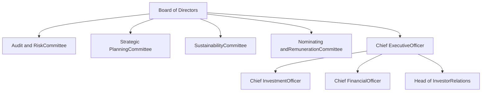
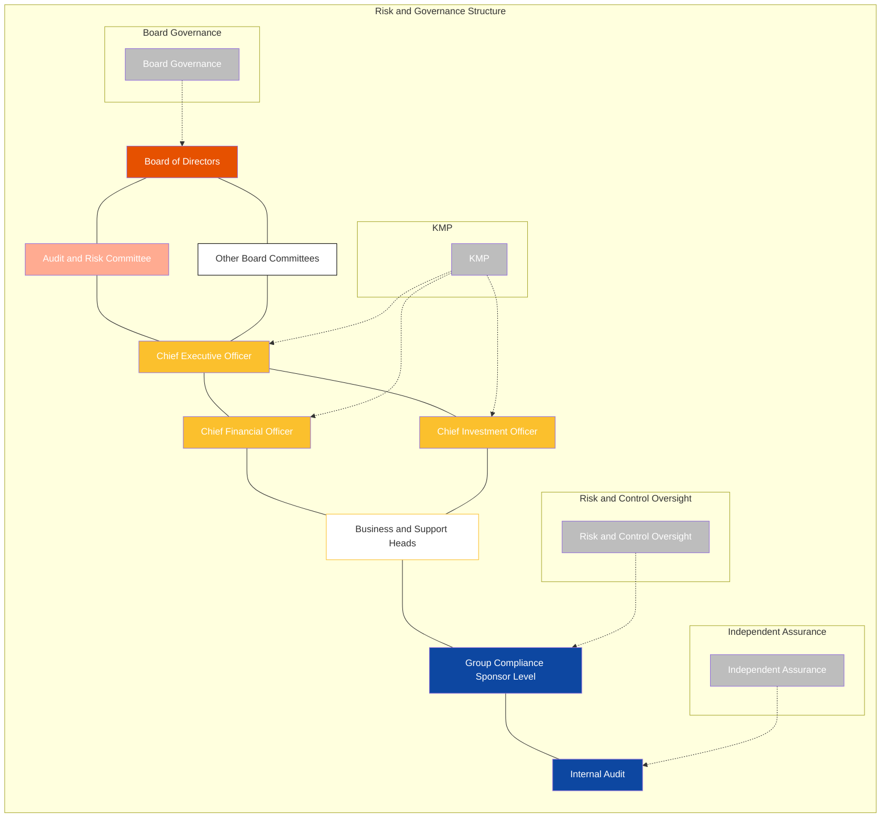
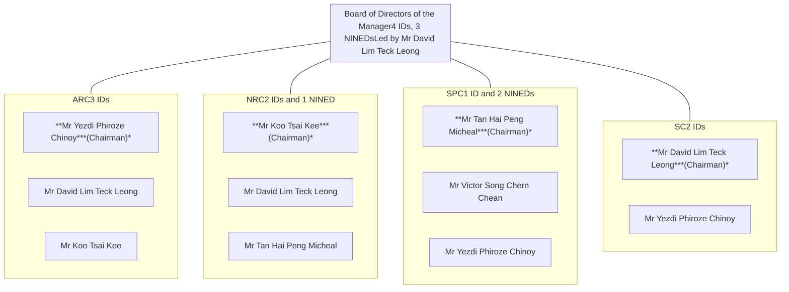
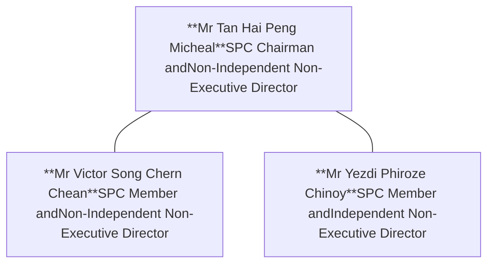
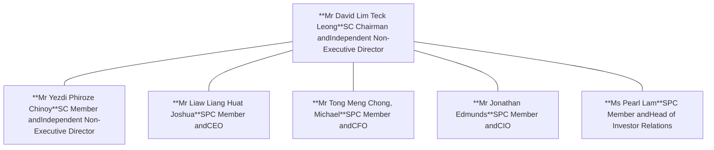

<!-- PAGE 1 -->

ELITE UK REIT logo

Illustrations of various commercial buildings

# MISSION
# CRITICAL

ANNUAL
REPORT
**2025**

<!-- PAGE 2 -->

# A UK REIT listed in Singapore

Elite UK REIT (“英利英国房地产信托”), is a UK REIT listed on the Singapore Exchange and managed by Singapore-headquartered Elite UK REIT Management Pte. Ltd. (the “**Manager**”). Elite UK REIT (“**Elite REIT**” (“**英利房托**”))’s mission-critical portfolio has a total asset value of £424.7 million as at 31 December 2025. With its portfolio, Elite REIT provides Unitholders with a secure income stream mainly from the Department for Work and Pensions and various United Kingdom (“**UK**”) government departments.

The portfolio has 148 properties which are mostly freehold or virtually freehold, geographically diversified across the UK and strategically located in town centres, near amenities and transportation nodes. The Manager is also capitalising on sectors exhibiting strong growth potential in the UK, such as purpose-built student accommodation and built-to-rent residential assets. With a long and diversified lease expiry profile and prudent capital management, Elite REIT is positioned for sustainable stability and growth from government-leased properties and the living sector.

Elite REIT’s Sponsors are Ho Lee Group Pte. Ltd. (“**Ho Lee**”) and Elite Partners Holdings Pte. Ltd. (“**EPH**”). Ho Lee is a real estate and construction conglomerate with deep expertise across the full real-estate value chain, spanning general building construction, industrial projects and residential development. EPH is an alternative investment and asset manager that has assets under management of more than S$2 billion in UK and Europe.

Elite UK REIT Mission Critical Annual Report 2025 cover

QR code to view Annual Report online

**Scan QR code to view Elite UK REIT’s**
**Annual Report 2025 online or visit**
https://investor.eliteukreit.com/ar.html

**SGX Trading Names | Trading Codes**
EliteUKREIT GBP | MXNU
EliteUKREIT SGD | MENU

<!-- PAGE 3 -->

# Mission Critical

Every asset we hold serves a purpose that matters. From government offices to border security and customs administration, our properties support essential services that are mission critical. Our portfolio reflects our commitment to investing in what endures – assets built for stability, relevance and long-term performance.

# Contents

## OVERVIEW

**IFC** Corporate Profile

**2** At a Glance

**3** Key Financial Highlights

**4** Portfolio Overview

**5** Value Creation Strategy

**6** Corporate Milestones

**10** Chairman and CEO’s Letter to Unitholders

**13** REIT and Organisation Structure

**14** Board of Directors

**18** Management

## PERFORMANCE

**20** Financial Review and Capital Management

**23** Investment and Asset Management

**26** Investor Relations

## OPERATIONS REVIEW

**30** Top Properties by Valuation

**34** Portfolio Profiles

**56** Market Review

## SUSTAINABILITY & GOVERNANCE

**61** Sustainability Report

**91** Enterprise Risk Management

**97** Corporate Governance Report

## FINANCIALS

**125** Financial Statements

## OTHERS

**171** Statistics of Unitholdings

**174** Notice of Annual General Meeting and Proxy Form

**183** Corporate Information

**184** Glossary

Illustration of a modern building with a grid-like facade and a blue central section

<!-- PAGE 4 -->

# At a Glance

> Our vision is to be Singapore’s leading UK-focused real estate investment trust focused on government-leased properties.

**UK REIT**
listed in
Singapore

> 99% icon
**> 99%**
Gross rental income from the UK Government

Rental income backed by
# AA-rated
UK sovereign credit

~ 100% icon
**~ 100%**
Freehold and virtual freehold assets

148 Assets icon
# 148
Assets

<table>
  <thead>
    <tr>
        <th colspan="2">Number of Assets</th>
    </tr>
  </thead>
  <tbody>
    <tr>
        <td>Scotland</td>
        <td>25</td>
    </tr>
    <tr>
        <td>North West</td>
        <td>23</td>
    </tr>
    <tr>
        <td>North East</td>
        <td>11</td>
    </tr>
    <tr>
        <td>Yorkshire &amp; Humber</td>
        <td>10</td>
    </tr>
    <tr>
        <td>Wales</td>
        <td>20</td>
    </tr>
    <tr>
        <td>Midlands</td>
        <td>16</td>
    </tr>
    <tr>
        <td>South West</td>
        <td>11</td>
    </tr>
    <tr>
        <td>East</td>
        <td>9</td>
    </tr>
    <tr>
        <td>London</td>
        <td>10</td>
    </tr>
    <tr>
        <td>South East</td>
        <td>13</td>
    </tr>
  </tbody>
</table>

Map of the UK showing asset distribution by region

## KEY INVESTMENT MERITS
Key Investment Merits icon

### Stable and Diversified Portfolio

Geographically Diversified icon
**Geographically Diversified**
Network of assets across the UK covering regional cities and major centres of population

Strategically Located icon
**Strategically Located**
Town centres and CBD-focused, close to key transportation nodes and amenities

Mission-critical Public Infrastructure icon
**Mission-critical Public Infrastructure**
Elite REIT is one of the largest providers of mission-critical social infrastructure to the UK Government for the delivery of essential and mission-critical government services

**Government-backed¹ Income Stream**
100% rent collection three months in advance, backed by AA-rated sovereign credit strength

### Prudent Capital Management

Tax Efficient icon
**Tax Efficient**
Highly optimised tax structure, on par with UK-listed REITs

Natural Hedge icon
**Natural Hedge**
Assets, debts and distributions are naturally hedged in Pound sterling

Multiple Funding Sources icon
**Multiple Funding Sources**
Diversified funding sources and opportunistic divestments used for capital recycling

Growth Potential icon
**Growth Potential**
Capitalising on lease renewals, asset repositioning and acquisitions

<!-- PAGE 5 -->

# Key Financial Highlights

* Revenue icon
**Revenue¹**
**£38.0m**
FY2024: £37.5m

* Net Property Income icon
**Net Property Income¹**
**£36.0m**
FY2024: £37.4m

* DPU icon
**Distribution per Unit (“DPU”)²**
**3.03 pence**
FY2024: 2.87 pence

* NAV icon
**Net Asset Value per Unit**
**£0.40**
31 Dec 2024: £0.41

* Distributable Income icon
**Distributable Income**
**£19.3m**
FY2024: £18.5m

* Distribution Yield icon
**Distribution Yield**
**8.4%**
As at 31 Dec 2025

* Total Return icon
**Total Return**
**34.2%**
FY2025

* Borrowing Cost icon
**Borrowing Cost**
**4.7%**
31 Dec 2024: 4.9%

* Interest Coverage Ratio icon
**Interest Coverage Ratio**
**2.6x**
31 Dec 2024: 2.5x

* Fixed Rate Debt icon
**Fixed Rate Debt**
**85%**
As at 31 Dec 2025

* Net Gearing icon
**Net Gearing³**
**40.7%**
31 Dec 2024: 42.5%

* Debt Headroom icon
**Debt Headroom**
**£62.6m**
31 Dec 2024: £57.7m

1 Excludes effect of straight-line rent adjustments.

2 At 100% payout ratio, the DPU for FY2025 and FY2024 would be 3.19 pence and 3.11 pence respectively.

3 Net gearing is calculated as aggregate debt less cash over total assets less cash. Aggregate Leverage calculated as per the Property Funds Appendix would be 42.8% and 43.4% as of 31 December 2025 and 31 December 2024, respectively.

**Note:**

<!-- PAGE 6 -->

# Portfolio Overview

Portfolio Value icon

**Portfolio Value¹**

**£424.7 m**

31 Dec 2024: £416.2m

Number of Tenants icon

**Number of Tenants²**

**11**

31 Dec 2024: 11

Occupancy Rate icon

**Occupancy Rate³**

**98.6%**

31 Dec 2024: 95.8%

Weighted Average Lease Expiry icon

**Weighted Average Lease Expiry**

**7.2 years⁴**

FY2024: 3.3 years

Net Internal Area icon

**Net Internal Area**

**3.7m sq ft**

31 Dec 2024: 3.7m sq ft

Gross Rental Income icon

**Gross Rental Income From UK Government**

**99.2%**

FY2024: 99.1%

## By Net Internal (“NIA”)
<table>
  <tbody>
    <tr>
        <td>North West</td>
        <td>24%</td>
    </tr>
    <tr>
        <td>Scotland</td>
        <td>20%</td>
    </tr>
    <tr>
        <td>South East</td>
        <td>10%</td>
    </tr>
    <tr>
        <td>Wales</td>
        <td>9%</td>
    </tr>
    <tr>
        <td>Midlands</td>
        <td>8%</td>
    </tr>
    <tr>
        <td>South West</td>
        <td>7%</td>
    </tr>
    <tr>
        <td>East</td>
        <td>7%</td>
    </tr>
    <tr>
        <td>London</td>
        <td>5%</td>
    </tr>
    <tr>
        <td>North East</td>
        <td>5%</td>
    </tr>
    <tr>
        <td>Yorkshire &amp; Humber</td>
        <td>5%</td>
    </tr>
  </tbody>
</table>

## By Valuation
<table>
  <tbody>
    <tr>
        <td>North West</td>
        <td>23%</td>
    </tr>
    <tr>
        <td>Scotland</td>
        <td>15%</td>
    </tr>
    <tr>
        <td>London</td>
        <td>15%</td>
    </tr>
    <tr>
        <td>South East</td>
        <td>13%</td>
    </tr>
    <tr>
        <td>South West</td>
        <td>7%</td>
    </tr>
    <tr>
        <td>Midlands</td>
        <td>7%</td>
    </tr>
    <tr>
        <td>East</td>
        <td>7%</td>
    </tr>
    <tr>
        <td>Wales</td>
        <td>7%</td>
    </tr>
    <tr>
        <td>North East</td>
        <td>3%</td>
    </tr>
    <tr>
        <td>Yorkshire &amp; Humber</td>
        <td>3%</td>
    </tr>
  </tbody>
</table>

## By Gross Rental (“GRI”)
<table>
  <tbody>
    <tr>
        <td>North West</td>
        <td>22%</td>
    </tr>
    <tr>
        <td>Scotland</td>
        <td>18%</td>
    </tr>
    <tr>
        <td>South East</td>
        <td>12%</td>
    </tr>
    <tr>
        <td>London</td>
        <td>11%</td>
    </tr>
    <tr>
        <td>Midlands</td>
        <td>8%</td>
    </tr>
    <tr>
        <td>South West</td>
        <td>8%</td>
    </tr>
    <tr>
        <td>Wales</td>
        <td>7%</td>
    </tr>
    <tr>
        <td>East</td>
        <td>7%</td>
    </tr>
    <tr>
        <td>North East</td>
        <td>4%</td>
    </tr>
    <tr>
        <td>Yorkshire &amp; Humber</td>
        <td>3%</td>
    </tr>
  </tbody>
</table>

1 Comprising 148 properties as at 31 December 2025.

2 Nearly all leases are signed with the Ministry of Housing, Communities and Local Government, which is a Crown Body.

3 Operational assets excluding Lindsay House, Dundee and Cambria House, Cardiff which are undergoing asset repositioning.

4 Weighted Average Lease Expiry (“WALE”) is weighted by gross rental income. On a pro forma basis post lease regear, WALE is 7.2 years as at 31 December 2025, one of the highest amongst Singapore REITs. Before lease regear, WALE would have been 2.4 years as at 31 December 2025.

<!-- PAGE 7 -->

# Value Creation Strategy

## OUR VALUE CREATION PATHWAYS

Elite UK REIT’s mission is to offer a differentiated investment gateway to income-producing UK real estate and provide attractive and stable returns to our Unitholders. Our dual-sector and focused market exposure to the UK provides cashflow underpinned by secure government leases and positions the REIT to capitalise on the sustained growth of the living sector. Various potential alternative uses are available for the assets, depending on the real estate market conditions and economic dynamics of submarkets. Our repositioning considerations include: market viability, strategy alignment, scale of opportunity, and risk & returns.

Diagram of Value Creation Pathways showing the cycle of Acquire, Review, Relet, Reposition, and Recycle between Government-leased Properties (Jobcentres, Government Workspaces) and Living Sector Assets (Student Housing, Built-to-Rent Residential)

## KEY COMPETITIVE STRENGTHS

Icon representing Specialist Asset & Lease Features

### 1. SPECIALIST ASSET & LEASE FEATURES

(a) Strategically located in town centres, near amenities & transport nodes

(b) More than 99% leased to the UK government, with Department for Work & Pensions as key occupier

(c) Full Repairing and Insuring (**“FRI”**) leases

(d) Advance rent collection

Icon representing Unique Capital Structure

### 2. UNIQUE CAPITAL STRUCTURE

(a) UK Government-backed cashflow, AA-rated sovereign credit strength

(b) Highly optimised tax structure on par with UK-listed REITs

(c) Naturally hedged: assets, debts, and distributions in Pound sterling

(d) Advance rent collection used to reduce debt and optimise financial costs

Icon representing Aligned & Experienced Leadership

### 3. ALIGNED & EXPERIENCED LEADERSHIP

(a) Best-in-class manager fee structure based on distributable income & DPU growth

(b) Seasoned team based in London and Singapore with strong track record in REITs, fund management, real estate and corporate finance

(c) Top leadership variable remuneration substantially in deferred units

(d) Sponsors & substantial unitholders hold 42% of Elite REIT units

<!-- PAGE 8 -->

# Corporate Milestones

KEY ACHIEVEMENTS IN FY2025

## Proactive Portfolio Management

Portfolio valuation increased 2.0% year-on-year (“**yoy**”) to £424.7 million as at 31 December 2025, underpinned by ongoing value creation initiatives and an acquisition of three government-leased properties.

## Optimising Capital and Tax Structure

Effective capital and treasury management measures lowered borrowing costs by 20 basis points to 4.7% from a year ago and net gearing ratio improved 180 basis points to 40.7%¹ as at 31 December 2025.

### Jan 2025

**Asset repositioning:**

Offered a total of 120 MVA power supply for a potential hyperscale and artificial intelligence-enabled capacity data centre located next to existing buildings occupied by the Department for Work and Pensions (“**DWP**”) *Peel Park, Blackpool*

Peel Park, Blackpool

Peel Park, Blackpool

### Feb 2025

**FY2024 Results:**

Declared FY2024 DPU of 2.87 pence, 5.0%² higher yoy, underpinned by strategic capital management, interest rate optimisation and proactive asset management

<!-- PAGE 9 -->

# Mar 2025

**Asset recycling:**

Completed divestment of *Crown Buildings, Caerphilly*

**Lease regear with key occupier:**

Formally commenced dialogue with the DWP on early lease renewals

**Contributing to positive social impact:**

Volunteered at a business planning clinic organised by Aidha Singapore, which provides financial literacy education to domestic workers and lower-income women in Singapore

Illustration of a modern building facade

# Apr 2025

**5ᵗʰ Annual General Meeting:**

All resolutions, including inaugural share buyback mandate, put to vote by poll and duly passed by the Unitholders of Elite UK REIT

**1Q 2025 Business Update:**

Achieved 10.2% yoy growth in distributable income to £4.8 million, supported by interest and tax savings

**Asset repositioning:**

Submitted a planning application for *Lindsay House, Dundee* in Scotland to be transformed into a 170-bed purpose-built student accommodation ("PBSA")

Photograph of Lindsay House, Dundee

Lindsay House, Dundee

# May 2025

**Asset recycling:**

Completed divestment of *Hilden House, Warrington*

<!-- PAGE 10 -->

# Corporate Milestones

## Jun 2025

**Acquisition of three government leased properties:**

Strengthened lease expiry profile and tenant mix with a £9.2 million acquisition of *Priory Court, Dover*; *Custom House, Felixstowe*; and *Merlin House, Carmarthen*

**Successful private placement:**

Partially funded acquisition with private placement of £4.0 million, which was oversubscribed with strong participation from long-only funds, multi-strategy funds and private bank clients

Photograph of Priory Court, Dover

Priory Court, Dover

Photograph of Custom House, Felixstowe

Custom House, Felixstowe

Photograph of Merlin House, Carmarthen

Merlin House, Carmarthen

## Jul 2025

**1H 2025 Results:**

Elite UK REIT’s 1H 2025 DPU up 5.5%³ yoy to 1.54 pence from counter-cyclical portfolio, prudent capital and treasury management initiatives

**Asset repositioning:**

Received planning approval from local council for the conversion of *Lindsay House, Dundee* to a 170-bed PBSA

**Asset recycling:**

Completed divestments of *St Paul’s House, Chippenham* and *Victoria Road, Kirkcaldy*

Illustration of a modern building

<!-- PAGE 11 -->

# Nov 2025

**3Q 2025 Business Update:**

Distributable Income rose 6.2% yoy to £14.8 million, supported by interest savings from capital management initiatives and interest rate optimisation

**Asset repositioning:**

Completed positive pre-planning consultation for conversion of *Cambria House, Cardiff* into 348-bed PBSA

Photograph of Cambria House, Cardiff

Cambria House, Cardiff

**Contributing to positive social impact:**

Fundraised and volunteered in Singapore and in London for *StandOut*, a social enterprise based in the UK which helps people leaving prisons in the UK to prepare for and build confidence for job interviews

Illustration of a building and a person

# Dec 2025

**Total Return of 34% in FY2025 and a 25% improvement**

in market capitalisation to £217.1 million, an improvement in trading velocity by two times, with extensive coverage by sell-side and independent analysts

**Sustained Portfolio Valuation increase since 2023**

rising by 2% yoy to £424.7 million as at 31 December 2025. In addition, asset repositioning initiatives at *Peel Park*, *Lindsay House*, and *Cambria House* resulted in a total uplift of £7.9 million in FY2025

# Strong FY2025 Results

In February 2026, FY2025 DPU rose 4.5%<sup>4</sup> yoy to 3.03 pence from lower borrowing costs and contributions from new acquisitions in June 2025.

The REIT also completed an early lease regear for a substantial part of DWP-occupied portfolio, extending portfolio WALE from 2.4 years to 7.2 years.

<!-- PAGE 12 -->

# Chairman and CEO’s Letter to Unitholders

Photograph of David Lim and Joshua Liaw

> In FY2025, portfolio valuation increased 2.0% to £424.7 million from the acquisition of three government-leased properties and ongoing value enhancement initiatives. Government-leased remains a core strategic focus; however, we are actively exploring repositioning opportunities within the existing portfolio.

Dear Unitholders,

We are pleased to present the annual report for the financial year ended 31 December 2025 (**“FY2025”**). Over the past year, Elite REIT delivered one of the strongest performance amongst Singapore-listed REITs, with market capitalisation increasing by 25.4% and total unitholder return reaching 34.2%. This performance reflects continued investor demand for non-discretionary and counter-cyclical rental income in the UK.

The UK economy¹ is estimated to have also expanded by 1.3% year-on-year in 2025 and unemployment rate remained at 5.1% at end 2025. With the REIT’s key occupier being the UK’s Department for Work and Pensions (**“DWP”**), which is responsible for welfare, pensions and child maintenance policy, Elite REIT’s revenue increased 1.3% year-on-year to £38.0 million, distribution per unit rose 4.5%² year-on-year to 3.03 pence in FY2025.

**David Lim**
Chairman and Independent
Non-Executive Director

**Joshua Liaw**
Chief Executive Officer

\*1 Office for National Statistics (ONS), released 12 February 2026, ONS website, statistical bulletin, GDP first quarterly estimate, UK: October to December 2025

\*2 FY2024 DPU adjusted based on enlarged equity base for units issued during 2025 and 95% payout ratio. On an unadjusted basis, FY2025 DPU increased 5.6% year-on-year.

<!-- PAGE 13 -->

# RECONSTITUTING A MISSION CRITICAL PORTFOLIO

Through a combination of accretive acquisitions and tactical divestments, Elite UK REIT Management Pte. Ltd. (**“Manager”**) further strengthened the resilience of Elite REIT’s mission critical portfolio. In June 2025, the Manager completed its first acquisition after the COVID-19 pandemic, acquiring three properties for £9.2 million, representing a 7.6% discount to the average of independent valuations³ and at an attractive yield of 9.2%, higher than the portfolio’s prevailing yield of 9.0%. On a pro forma basis⁴, the acquisition was DPU accretive and resulted in improved gearing.

The acquisition was partially funded by a £4.0 million private placement to institutional, accredited and other investors, alongside existing debt facilities, acquisition fee in units and net divestment proceeds from Hilden House, Warrington. In addition to Hilden House, Warrington, the Manager divested three other vacant assets to third parties. Collectively, the four properties were divested at an average 5% premium. Proceeds from these divestments were used to finance the June 2025 acquisition and reduce debt. Following the portfolio reconstitution, portfolio occupancy⁵ increased from 93.9% the year before to 98.6% in FY2025 and another government department was added to our occupier mix: Department for Environment, Food and Rural Affairs, which is responsible for improving and protecting the natural environment and supporting UK’s food and farming sectors.

# ASSET REPOSITIONING FOR VALUE CREATION

In FY2025, portfolio valuation increased 2.0% to £424.7 million from the acquisition of three government-leased properties and ongoing value enhancement initiatives. Government-leased remains a core strategic focus; however, we are actively exploring repositioning opportunities within the existing portfolio. In line with our expanded investment mandate launched in 2024, we are also assessing selective opportunities in the Living Sector, which includes purpose-built student accommodation (**“PBSA”**) and built-to-rent (**“BTR”**) residential assets. Two assets with latent potential for PBSA have since been identified, given their favourable locations and positive market dynamics.

The first, Lindsay House, Dundee, received planning approval approximately three months after submission to convert the asset into a PBSA facility. Redevelopment has commenced and remain on track for an opening aligned with the academic year starting September 2027. The REIT is working closely with a development manager and PBSA operator⁶ to maintain strict cost discipline and delivery timetable. The second property, Cambria House, Cardiff, has also received positive feedback in its pre-planning stage.

Elsewhere, Peel Park in Blackpool – which also hosts government office buildings – has been identified as a potential strategic repositioning opportunity for data centre use. Supported by its well-connected location and favourable policy developments, the site is adjacent to the M55 motorway with convenient access to Manchester and Liverpool. It also benefits from strong digital connectivity and proximity to subsea fibre-optic infrastructure and offshore windfarms. Together, these attributes position the site to capture growing demand for secure and resilient data capacity driven by cloud computing, artificial intelligence and expanding digital services.

The Manager had submitted a planning application to convert the portion of the land not occupied by the existing office buildings to data centre use, together with offers of a significant 120 MVA power supply suitable for potential hyperscale and artificial intelligence-enabled capacity. Planning consent was received in February 2026, and we are actively exploring the potential monetisation options for the site with the objective of maximising value for Unitholders.

# EARLY LEASE RENEWALS MITIGATES 2028 RISK

Proactive tenant engagement ahead of the 2028 lease expiries has enabled the REIT to conclude negotiations and enter into new lease agreements with The Secretary of State for Housing, Communities and Local Government of the United Kingdom for properties occupied by the DWP (**“New Lease Agreements”**).

Aggregate rent under the New Lease Agreements, prior to subsequent CPI-linked rent reviews⁷ amounts to £24.3 million annually, with no lease breaks. The DWP also has options to renew for (i) a further five years for new leases of five years or more from 1 April 2028; and (ii) a further three years for new leases of three years or less from 1 April 2028 (**“Option Leases”**).

These lease renewals significantly enhance the REIT’s lease expiry profile, which is now amongst the longest within the Singapore REIT sector. Lease expiry exposure in 2028 has been materially reduced from 95.7% of gross rental income to 32.0%. Portfolio’s WALE also improves to 7.2 years on a pro forma basis as at 31 December 2025. Importantly, investors will continue to benefit from secure, government-backed income with sustainable growth from mission-critical assets for an extended period.

Completing negotiations early for a substantial portion of our portfolio underscores the depth of our tenant relationships. Discussions for remaining DWP-occupied properties are ongoing.

<!-- PAGE 14 -->

# Chairman and CEO’s Letter to Unitholders

## SAFEGUARDING RETURNS WITH TREASURY MANAGEMENT

Two years ago, Elite REIT’s net gearing ratio was at 47.5%, near a regulatory limit of 50.0%. To strengthen the REIT’s financial position, proceeds from dilapidation settlements, divestments of vacant assets, and the REIT’s first equity fundraising<sup>8</sup> were deployed to reduce borrowings.

With 100% of the REIT’s borrowings also sustainability-linked, the REIT was also able to achieve a margin reduction by meeting portfolio sustainability targets. As a result of these efforts, borrowing cost also fell 50 basis points from 5.2% as at end-2023 to 4.7% at end-2025. Over the same period, net gearing ratio has significantly reduced from 47.5% to 40.7%, progressing toward our guidance of a gearing below 40.0%.

### Borrowing Costs

<table>
  <thead>
    <tr>
        <th>Fiscal Year</th>
        <th>Borrowing Cost (%)</th>
    </tr>
  </thead>
  <tbody>
    <tr>
        <td>FY2023</td>
        <td>5.2</td>
    </tr>
    <tr>
        <td>FY2024</td>
        <td>4.9</td>
    </tr>
    <tr>
        <td>FY2025</td>
        <td>4.7</td>
    </tr>
  </tbody>
</table>

### Net Gearing

<table>
  <thead>
    <tr>
        <th>Fiscal Year</th>
        <th>Net Gearing (%)</th>
    </tr>
  </thead>
  <tbody>
    <tr>
        <td>FY2023</td>
        <td>47.5</td>
    </tr>
    <tr>
        <td>FY2024</td>
        <td>42.5</td>
    </tr>
    <tr>
        <td>FY2025</td>
        <td>40.7</td>
    </tr>
  </tbody>
</table>

## NAVIGATING THE UK MARKET

According to independent valuer, Colliers International Property Consultants Limited, the UK economy is expected to grow by approximately 1.0% in 2026, which is below its estimated potential rate of 1.5%. Previously, CPI was also forecasted to hit the 2.0% target by late 2026 and the 10-year gilt yield is projected to fall to approximately 4.25%. However, an evolving conflict in the Middle East has led to higher energy costs in March 2026, and the impact on inflation, interest rates and growth is uncertain.

In order to remain positioned for sustainable stability and growth, the Manager will continue in the near term to focus on concluding remaining DWP lease renewals, pursuing accretive opportunities through portfolio reconstitution, advancing asset repositioning for Lindsay House, Cambria House and Peel Park, and optimising the REIT’s capital structure through a disciplined and diversified funding approach.

Our Sponsors – Ho Lee Group Pte. Ltd. and Elite Partners Holdings Pte. Ltd. – and our substantial investors together hold 42% of Elite REIT’s Units, demonstrating strong alignment with Unitholders. Alongside support from our Sponsors as well as the hard work and commitment to excellence from our management, FY2025 has been an outstanding year and we would like to extend our sincere appreciation to the entire team.

The Board also wishes to thank Datin Paduka Sarena Cheah and Mr Tan Chin Hwee, who stepped down as Non-Independent Non-Executive Director and as Independent Non-Executive Director respectively.

Finally, we thank our Unitholders for your steadfast support as we continue to build a defensive yet growth-oriented portfolio anchored by resilient and enduring income streams from mission-critical assets.

**David Lim**
Chairman and Independent
Non-Executive Director

**Joshua Liaw**
Chief Executive Officer

<!-- PAGE 15 -->

# REIT and Organisation Structure

## Trust Structure

```mermaid
graph TD
    Unitholders --> EliteREIT[Elite REIT(Singapore)]
    
    EliteUK[Elite UK REITManagement Pte. Ltd.(Manager)] -- "Provides managementservices to Elite REIT" --- EliteREIT
    
    Perpetual[Perpetual (Asia) Limited(Trustee)] -- "Acts on behalfof Unitholders" --- EliteREIT
    
    EliteREIT --> EliteHoldings[Elite REITHoldings Limited(UK)]
    
    EliteHoldings --> Properties[148Properties]
```

## Manager Structure



<!-- PAGE 16 -->

# Board of Directors

> Elite REIT is anchored by strong corporate governance, led by a majority independent Board, with diverse expertise in areas like legal, audit and risk, real estate and compliance, to drive sustainable performance.

Portrait of David Lim Teck Leong

**DAVID LIM TECK LEONG**
Chairman and Independent Non-Executive Director
Sustainability Committee (Chairman)
Audit and Risk Committee (Member)
Nominating and Remuneration Committee (Member)

**Date of first appointment as a Director:**
8 January 2020

**Length of service as a Director (as at 31 December 2025):**
Five Years 11 Months

**Academic and professional qualifications:**

* Bachelor of Laws, King’s College London

* Barrister-at-Law, Gray’s Inn, London (1981)

**Present other principal commitments:**

* David Lim & Partners LLP (Founder and Managing Partner)

* Allium Healthcare (Singapore) Pte. Ltd., a subsidiary of G.K. Goh Holdings Pte. Ltd. (Non-Executive Chairman)

* PT Eastern Logistics (President Commissioner)

**Past directorships in other listed companies held over the preceding three years:**

* G.K. Goh Holdings Limited (now known as G.K. Goh Holdings Pte. Ltd.) (Independent and Non-Executive Director)

**Background and working experience:**

Mr Lim is the founder and Managing Partner of David Lim & Partners LLP and has been the Managing Partner since 1990. Mr Lim began his career at Rodyk & Davidson (now known as Dentons Rodyk & Davidson LLP) in 1982 with a focus in commercial litigation, corporate finance, restructuring, and mergers and acquisitions up till 1989. He has represented multiple multinational corporations and corporations from a myriad of sectors including finance and banking, fund management, private equity, oil and gas, logistics, healthcare, construction, information technology and telecommunications, property development, hospitality and shipping.

He also sits on the boards of private companies in Singapore, Indonesia and Thailand in non-executive and independent capacities. He was also the Chairman and Non-Executive Director of Croesus Retail Asset Management Pte. Ltd. from 2012 to 2017. Mr Lim is an honorary legal advisor (for David Lim & Partners LLP) of the Singapore Physiotherapy Association and a Fellow of the Singapore Institute of Directors. He was also appointed by the Monetary Authority of Singapore to be a Member of the Corporate Governance Council from 2017 to 2018.

<!-- PAGE 17 -->

YEZDI PHIROZE CHINOY

**YEZDI PHIROZE CHINOY**
**Independent Non-Executive Director**
Audit and Risk Committee (Chairman)
Sustainability Committee (Member)
Strategic Planning Committee (Member)

**Date of first appointment as a Director:**

1 July 2021

**Length of service as a Director (as at 31 December 2025):**

Four Years Six Months

**Academic and professional qualifications:**

* Bachelor of Commerce and a Bachelor of Laws, University of Mumbai

* The Institute of Company Secretaries of India and The Chartered Governance Institute UK & Ireland

* International Compliance Association

* Certified Anti-Money Laundering Specialist

* Financial Industry Certified Professional

* Senior Accredited Director (Singapore Institute of Directors)

**Present other directorships (listed companies):**

* Nil

**Present other principal commitments:**

* Nil

**Past directorship in other listed companies held over the preceding three years:**

* Nil

**Background and working experience:**

Mr Chinoy is a financial services professional with over three decades of experience in multiple roles and responsibilities spanning the banking and financial services industry across business lines and geographies.

Mr Chinoy was recently with Assicurazioni Generali S.p.A, one of the largest global insurance and asset management groups, as its Regional Chief Investment Officer for Asia from 2015 to 2022. In his role, Mr Chinoy oversaw investment strategies and was responsible for optimising investment performance of Generali's insurance operations in Asia. Mr Chinoy was also the Chief Executive Officer of Generali Investments Asia Ltd., a role he held concurrently between 2014 and 2018. Mr Chinoy also provided leadership as a director on the Board of Directors of several Generali Group Companies and Joint Ventures in China, Hong Kong and Singapore. Mr Chinoy has spent several years with other global financial institutions in Corporate Legal, Compliance and risk roles covering multiple businesses and jurisdictions.

KOO TSAI KEE

**KOO TSAI KEE**
**Independent Non-Executive Director**
Nominating and Remuneration Committee (Chairman)
Audit and Risk Committee (Member)

**Date of first appointment as a Director:**

8 January 2020

**Length of service as a Director (as at 31 December 2025):**

Five Years 11 Months

**Academic and professional qualifications:**

* Bachelor of Surveying (Hons), University of New South Wales, Australia

* Master of Science (Dist), University College London, UK

* Master of Philosophy, University of London, UK

**Present other directorships (listed companies):**

* Sanli Environmental Ltd.

**Present other principal commitments:**

* Nil

**Past directorship in other listed companies held over the preceding three years:**

* Nil

**Background and working experience:**

Mr Koo is currently the Advisory Director of Temasek International Advisors Pte. Ltd. He joined Temasek International Pte. Ltd. in 2011 as a managing director, specialising in strategic relations, and subsequently moved to Temasek International Advisors Pte. Ltd. in 2016. He is also a Non-Executive Director of Temasek Foundation and Temasek Foundation IPC. He spends time in grassroots work serving as 2nd Advisor of Tanjong Pagar GRC and Chairman of Audit Committee for the Tanjong Pagar Town Council. He was past Chairman of the Tanjong Pagar Town Council from 2006 to 2011. In addition, he is a Patron at RHT G.R.A.C.E Institute.

Before joining Temasek, Mr Koo served in various ministries of the Singapore Government with his last appointment as the Minister of State for Defence.

<!-- PAGE 18 -->

# Board of Directors

Portrait of Nicholas David Ashmore

**NICHOLAS DAVID ASHMORE**
Independent Non-Executive Director

**Date of first appointment as a Director:**

8 January 2020

**Length of service as a Director (as at 31 December 2025):**

Five Years 11 Months

**Academic and professional qualifications:**

* Bachelor of Arts (Hons), Degree in History and English, Northumbria University, UK

**Present other directorships (listed companies):**

* Nil

**Present other principal commitments:**

* Ratho Consulting Ltd. (Founder and Executive Director)

* Equilibrium Gulf Ltd. (Executive Director)

**Past directorship in other listed companies held over the preceding three years:**

* Nil

**Background and working experience:**

Major General (Retired) Ashmore founded Ratho Consulting Ltd. in 2018, which specialises in providing management consultancy services in the business strategy, defence, and property and infrastructure sectors. From 2017 to 2018, he was an Operations Director with Carillion Plc, where he was responsible for facilities management contracts with the UK Government.

Major General (Retired) Ashmore served in the British Army for more than 30 years, joining in 1984 and leaving in 2017 with the rank of Major General. He served at Regimental Duty with the Royal Regiment of Artillery, including on operations around the world, and also served in the UK's Ministry of Defence, where he specialised in defence resources and plans, property and infrastructure, and human resources. He was also responsible for UK Defence Estate strategy when he served as the Director of Strategy and Plans in the Defence Infrastructure Organisation from 2011 to 2015. He was a member of the UK Defence Infrastructure Board and the UK Government Construction Board.

Portrait of Tan Hai Peng Micheal

**TAN HAI PENG MICHEAL**
Non-Independent Non-Executive Director
Strategic Planning Committee (Chairman)
Nominating and Remuneration Committee (Member)

**Date of first appointment as a Director:**

8 January 2020

**Length of service as a Director (as at 31 December 2025):**

Five Years 11 Months

**Academic and professional qualifications:**

* Bachelor of Science in Computer Engineering (Highest Hon.), Florida Institute of Technology, United States

* Master of Business Administration (for Senior Executives), National University of Singapore

**Present other directorships (listed companies):**

* Marco Polo Marine Limited (Independent Non-Executive Chairman)

**Present other principal commitments:**

* Elite Partners Capital Pte. Ltd. (Executive Chairman)

* Elite Partners Holdings Pte. Ltd. (Non-Executive Director)

* Ho Lee Group Pte. Ltd. (Executive Director)

* Teck Lee Holdings Pte. Ltd. (Executive Director)

* TPSC Asia Pte. Ltd. (Managing Director)

**Past directorship in other listed companies held over the preceding three years:**

* Nil

**Background and working experience:**

Mr Tan has extensive experience in management and business development in the real estate sector. He is currently the Executive Chairman of Elite Partners Capital Pte. Ltd., where he provides leadership in forging strategic business relationships and broadening business outreach, as well as offering advice and guidance to the senior management. He is also an Executive Director of Ho Lee Group Pte. Ltd. and is responsible for the general and strategic management of the group. He previously served on the Board of two SGX-ST-listed companies.

**Awards:**

* The Public Administration Medal (Bronze) (Military) in 2020 and The Commendation Medal (Military) in 2013 for his contributions to the Singapore Armed Forces.

* The Public Service Star and The Public Service Medal in 2017 and 2011 respectively for his contributions to community service as the Chairman of Sembawang Community Club Management Committee.

<!-- PAGE 19 -->

Portrait of Victor Song Chern Chean

**VICTOR SONG CHERN CHEAN**
Non-Independent Non-Executive Director
Strategic Planning Committee (Member)

**Date of first appointment as a Director:**

2 August 2019

**Length of service as a Director (as at 31 December 2025):**

Six Years Four Months

**Academic and professional qualifications:**

* Bachelor of Business (Business Administration), Royal Melbourne Institute of Technology

* Certificate of Real Estate Valuation, International Management Academy

* Certificate of Real Estate Investment Finance, Asia Pacific Real Estate Association

**Present other directorships (listed companies):**

* Nil

**Present other principal commitments:**

* Elite Partners Holdings Pte. Ltd. (Executive Director)

* Elite Partners Capital Pte. Ltd. (Managing Director)

**Past directorship in other listed companies held over the preceding three years:**

* Nil

**Background and working experience:**

Mr Song has wide-ranging experience across the entire real estate investment value chain in leasing, asset management and advisory, build-to-suit activities, acquisitions, investment and divestment.

He is one of the founding shareholders of Elite Partners Holdings Pte. Ltd. and the Managing Director of Elite Partners Capital Pte. Ltd. (**"Elite Partners Capital"**). He is responsible for Elite Partners Capital's management and operations, investment strategies of the various funds under management, as well as investment activities, capital markets, asset management and build-to-suit project management.

He is one of the founding members of two REITs – Viva Industrial Trust (**"VIT"**) and Elite REIT. During his tenure at VIT's manager, Viva Industrial Trust Management Pte. Ltd. as Head of Asset Management and Investment Director, VIT's total assets under management grew steadily to over S$1 billion. VIT has since merged with ESR REIT (now known as ESR-LOGOS REIT).

Mr Song also formulated investment strategies and executed investment transactions as part of the investment team at SGX-ST-listed Cambridge Industrial Trust (also now known as ESR REIT) and provided management and advisory services on real estate-related contracts as a consultant, and was an Operation and Marketing Manager at Lyman Group.

Portrait of Tan Dah Ching

**TAN DAH CHING**
Non-Independent Non-Executive Director

**Date of first appointment as a Director:**

2 August 2019

**Length of service as a Director (as at 31 December 2025):**

Six Years Four Months

**Academic and professional qualifications:**

* Bachelor of Engineering (Chemical Engineering), National University of Singapore

**Present other directorships (listed companies):**

* Nil

**Present other principal commitments:**

* Jin Leng Investments Pte. Ltd. (Executive Director)

**Past directorship in other listed companies held over the preceding three years:**

* TSH Corporation Limited (listed on the SGX Catalist Board) (Independent and Non-Executive Director)

**Background and working experience:**

Mr Tan was Head of Capital Markets for Elite Partners Capital, where he managed the capital markets and fundraising functions. Mr Tan has about 20 years of experience in corporate finance. Prior to joining Elite Partners Capital, he was managing his own portfolio of investments. From 2008 to 2013, he was a Business Development Manager at Swissco Holdings Limited, where he oversaw the corporate finance activities. Prior to that, he was an Investment Manager at Kim Seng Holdings Pte. Ltd. from 2006 to 2008 and an Associate at Genesis Capital Pte. Ltd. from 2003 to 2006, where he was involved in initial public offerings and financial advisory.

<!-- PAGE 20 -->

# Management

Portrait of Joshua Liaw

**JOSHUA LIAW**
Chief Executive Officer

Portrait of Michael Tong

**MICHAEL TONG**
Chief Financial Officer

Mr Joshua Liaw was appointed the Chief Executive Officer of the Manager on 17 June 2023 and works with the Board to determine the strategy for Elite REIT and with the management team to ensure that Elite REIT operates in accordance with the Manager’s investment strategy.

Mr Michael Tong was appointed the Chief Financial Officer of the Manager on 23 November 2023 and works with the Chief Executive Officer and the other members of the management team to formulate strategic plans for Elite REIT, in accordance with the Manager’s stated investment strategy.

Mr Liaw has more than two decades of experience in real estate finance and fund management across the banking and real estate investment trust management sectors.

Mr Tong has more than 10 years of experience in financial reporting, financial planning and analysis, project finance, consolidation, taxation, and compliance.

Prior to his current role, Mr Liaw was Executive General Manager, Finance at the manager of Lendlease Global Commercial REIT (Lendlease REIT), where he led Lendlease REIT’s investment and capital management strategy as the Chief Financial Officer. Mr Liaw was part of the team that oversaw the initial public offering of Lendlease REIT in 2019 and the acquisition of Jem in 2022.

Prior to joining Elite REIT, Mr Tong was employed with Lendlease and was the General Manager Finance, Asia, where his core responsibilities included regional reporting, financial accounting, compliance, annual budgeting, and quarterly forecasting. Prior to joining Lendlease in 2012, he was from PwC, where he was involved in the audit of Singapore-listed corporations and multinational companies across various industries including real estate and initial public offerings.

Earlier, he held roles within Lendlease including General Manager, Finance, where he was responsible for the overall finance functions across Lendlease’s operations in Singapore, as well as Head of Treasury, Asia, where he was responsible for all debt capital management and treasury activities for Lendlease across Asia.

Mr Tong holds a Bachelor of Accountancy from Nanyang Technological University. He is a Chartered Accountant (Singapore) and a member of the Institute of Singapore Chartered Accountants.

Mr Liaw started his career in banking, where he held various roles in Standard Chartered Bank and Citi covering real estate funds, sovereign wealth funds, real estate investment trusts and corporate developer clients in Southeast Asia.

Mr Liaw holds a Bachelor of Science in Economics (Summa cum Laude) from the Singapore Management University and a Bachelor of Business (Transport & Logistics Management) with Distinction from the Royal Melbourne Institute of Technology. He was also a recipient of the Japanese Chamber of Commerce and Industry Singapore Foundation scholarship under which he undertook studies at Waseda University.

<!-- PAGE 21 -->

Portrait of Jonathan Edmunds

**JONATHAN EDMUNDS**
**Chief Investment Officer**

Portrait of Pearl Lam

**PEARL LAM**
**Head of Investor Relations**

Mr Jonathan Edmunds is the Chief Investment Officer of the Manager.

Ms Pearl Lam joined the Manager in August 2024. She stewards the investor relations programme at Elite REIT and works with the Chief Executive Officer and the other members of the management to drive engagement with the investment community.

Mr Edmunds has about 20 years of experience in the real estate industry, focusing on real estate investment and management across various sectors globally. Previously, he was the Investment and Asset Management Director of Elite UK Commercial Fund.

Ms Lam has been providing strategic financial communications counsel to listed and non-listed corporates in Singapore since 2011. At public relations agencies, she assisted companies from the property, offshore and marine, and financials sectors. She supported her clients in capital market activities such as initial public offerings, rights issues, mergers & acquisitions, and in crisis communications. Ms Lam was also an in-house investor relations representative for large-cap financial institutions, and for Singapore’s first healthcare real estate investment trust.

Preceding that, Mr Edmunds was the Director of the Real Estate department of AEP Investment Management Pte. Ltd., where he was responsible for the strategic investment and transaction management for their UK, Australia and Singapore mandates. He was also a lead manager of Basil Property Trust and was responsible for investments, fund acquisitions and structuring.

Ms Lam graduated from the Singapore Management University with a Master of Science in Wealth Management, the University of London with a Bachelor of Science in Banking and Finance, and Ngee Ann Polytechnic with a Diploma in Mass Communication.

Mr Edmunds had previously worked in the UK and Switzerland. He was the Vice President of the Real Estate department in Beaumont Partners where he was responsible for fund raising, acquisitions, structuring, reporting, and managing the Global Student Housing and Multi-Family investment strategy. He also completed the analysis, structuring and closing of acquisitions for the company’s European and North American credit income strategies.

Prior to that, Mr Edmunds served as the Director of the Real Estate department of WW Advisors Ltd, managing a US$250 million equity mandate to acquire income-producing assets in the UK and Europe. He originated and managed the acquisition of a portfolio of assets as well as structured and arranged the debt capital, implemented interest rate hedges and managed asset performance for the portfolio.

Earlier in his career, Mr Edmunds was an associate at Lazard, a Corporate Finance Advisory firm in the UK. He started off as an Associate of Deutsche Bank AG’s Real Estate Debt Markets department. Mr Edmunds graduated from University of the West of England with a BA (Hons) Business Studies.

He also holds a Master of Arts in Property Valuation and Law from City, University of London, UK.

<!-- PAGE 22 -->

# Financial Review and Capital Management

**The REIT continued to strengthen its balance sheet and optimise capital structure, preserving value with treasury management in order to safeguard returns for Unitholders.**

> Net gearing ratio icon **Net gearing ratio**
> # 40.7 %
> Progressing towards management guidance of ≤40% in the long term

> Borrowing cost icon **Borrowing cost**
> # 4.7 %
> 20 basis points improvement yoy

Elite UK REIT’s revenue¹ increased 1.3% year-on-year (“yoy”) to £37.5 million in FY2025. The revenue growth was driven by rental reversions as well as new rental contributions from properties acquired in June 2025: Priory Court, Dover, Custom House, Felixstowe, and Merlin House, Carmarthen. In addition, assets which recorded rental uplifts in FY2024 contributed a full period of higher rents in FY2025.

Distributable income increased 4.6% yoy to £19.3 million in FY2025, underpinned by higher revenue and lower interest and tax expenses. Distribution per Unit (“**DPU**”) increased 5.6% yoy to 3.03 pence in FY2025. Tax expenses also declined 16.9% to £2.1 million, mainly due to reversal of prior-year tax provisions.

Other property income declined because majority of the dilapidation settlements for vacant properties were concluded in prior years. Property operating expenses rose primarily because of non-recurring asset repositioning expenditures that are expected to deliver long-term value to Unitholders. Excluding non-recurring revenue items such as dilapidation settlements and lease termination premiums, net property income saw a marginal 1.4% yoy decrease. After accounting for these one-off items and excluding the effect of straight-line rent adjustments, the reported net property income was down 3.7% yoy to £36.0 million in FY2025.

Our distribution policy is to distribute at least 90.0% of its annual distributable income for each financial year, with distributions being made to the Unitholders on a semi-annual basis. With multiple risk factors mitigated in the second half of 2024, the Manager has maintained a distribution payout ratio of 95% for FY2025.

Net finance cost was £14.0 million in FY2025. Excluding fair value adjustment on financial derivatives, net finance cost reduced by 11.8% yoy mainly due to proactive capital management to reduce leverage through capital recycling and debt repayments using advance rental collections, as well as a 20-basis-points decline in borrowing costs to 4.7% in FY2025. The net gearing ratio improved by 180 basis points yoy to 40.7% and interest coverage ratio strengthened to 2.6 times in FY2025 from 2.5 times in FY2024.

Based on independent valuations provided by Colliers International Property Consultants Limited, the market value of the investment properties stood at £424.7 million as at 31 December 2025, up 2.0% from £416.2 million a year ago. The increase was primarily driven by asset repositioning initiatives and the acquisition of three government-leased properties. The valuation uplift also reflected advanced progress in lease regearing discussions for DWP-occupied properties, with the valuer factoring in the improved visibility and greater certainty of lease extensions with longer committed terms.

<!-- PAGE 23 -->

<table>
  <thead>
    <tr>
        <th>(£’000)</th>
        <th>FY2025</th>
        <th>FY2024</th>
        <th>YoY Change</th>
    </tr>
  </thead>
  <tbody>
    <tr>
        <td><strong>Revenue</strong></td>
        <td><strong>36,590</strong></td>
        <td><strong>36,472</strong></td>
        <td>▲ 0.3%</td>
    </tr>
    <tr>
        <td>Other property income</td>
        <td>1,715</td>
        <td>2,604</td>
        <td>▼ 34.1%</td>
    </tr>
    <tr>
        <td>Property operating expenses</td>
        <td>(3,682)</td>
        <td>(2,734)</td>
        <td>▲ 34.7%</td>
    </tr>
    <tr>
        <td><strong>Net property income</strong></td>
        <td><strong>34,623</strong></td>
        <td><strong>36,342</strong></td>
        <td>▼ 4.7%</td>
    </tr>
    <tr>
        <td>Manager’s base management fee</td>
        <td>(1,988)</td>
        <td>(1,845)</td>
        <td>▲ 7.8%</td>
    </tr>
    <tr>
        <td>Trustee’s fee</td>
        <td>(106)</td>
        <td>(106)</td>
        <td>–</td>
    </tr>
    <tr>
        <td>Other trust expenses</td>
        <td>(2,317)</td>
        <td>(2,313)</td>
        <td>▲ 0.2%</td>
    </tr>
    <tr>
        <td>Net finance costs</td>
        <td>(11,404)</td>
        <td>(12,935)</td>
        <td>▲ 11.8%</td>
    </tr>
    <tr>
        <td>Net change in fair value of financial derivatives</td>
        <td>(2,546)</td>
        <td>1,146</td>
        <td>N.M.</td>
    </tr>
    <tr>
        <td>(Loss)/Gain on divestment of investment properties</td>
        <td>(80)</td>
        <td>321</td>
        <td>N.M.</td>
    </tr>
    <tr>
        <td>Net change in fair value of investment properties</td>
        <td>(188)</td>
        <td>2,442</td>
        <td>N.M.</td>
    </tr>
    <tr>
        <td><strong>Profit before tax</strong></td>
        <td><strong>15,994</strong></td>
        <td><strong>23,052</strong></td>
        <td>▼ 30.6%</td>
    </tr>
    <tr>
        <td>Tax expense</td>
        <td>(2,125)</td>
        <td>(2,557)</td>
        <td>▼ 16.9%</td>
    </tr>
    <tr>
        <td><strong>Profit for the year</strong></td>
        <td><strong>13,869</strong></td>
        <td><strong>20,495</strong></td>
        <td>▼ 32.3%</td>
    </tr>
    <tr>
        <td><strong>Distributable income to Unitholders</strong></td>
        <td><strong>19,303</strong></td>
        <td><strong>18,454</strong></td>
        <td>▲ 4.6%</td>
    </tr>
    <tr>
        <td><strong>Distribution per Unit (pence)²</strong></td>
        <td><strong>3.03</strong></td>
        <td><strong>2.87</strong></td>
        <td>▲ 5.6%</td>
    </tr>
    <tr>
        <th>Excluding effect of straight line rent adjustments (£’000)</th>
        <th>FY2025</th>
        <th>FY2024</th>
        <th>YoY Change</th>
    </tr>
    <tr>
        <td>Revenue</td>
        <td>37,973</td>
        <td>37,503</td>
        <td>▲ 1.3%</td>
    </tr>
    <tr>
        <td>Net property income</td>
        <td>36,006</td>
        <td>37,373</td>
        <td>▼ 3.7%</td>
    </tr>
    <tr>
        <td>Adjusted net property income³</td>
        <td>34,381</td>
        <td>34,878</td>
        <td>▼ 1.4%</td>
    </tr>
  </tbody>
</table>

## Optimising Capital Structure

<table>
  <thead>
    <tr>
        <th>Key Financial Indicators</th>
        <th>As at 31 Dec 2025</th>
        <th>As at 31 Dec 2024</th>
    </tr>
  </thead>
  <tbody>
    <tr>
        <td>Total gross borrowings</td>
        <td>£189.6m</td>
        <td>£190.5m</td>
    </tr>
    <tr>
        <td>Total assets</td>
        <td>£444.0m</td>
        <td>£440.3m</td>
    </tr>
    <tr>
        <td>Aggregate leverage</td>
        <td>42.8%</td>
        <td>43.4%</td>
    </tr>
    <tr>
        <td>Net gearing ratio⁴</td>
        <td>40.7%</td>
        <td>42.5%</td>
    </tr>
    <tr>
        <td>Interest coverage ratio</td>
        <td>2.6x</td>
        <td>2.5x</td>
    </tr>
    <tr>
        <td>Weighted average debt maturity</td>
        <td>1.8 years</td>
        <td>2.8 years</td>
    </tr>
    <tr>
        <td>Proportion of fixed interest rate</td>
        <td>85%</td>
        <td>86%</td>
    </tr>
    <tr>
        <td>Borrowing cost</td>
        <td>4.7%</td>
        <td>4.9%</td>
    </tr>
    <tr>
        <td>Net asset value per unit</td>
        <td>£0.40</td>
        <td>£0.41</td>
    </tr>
  </tbody>
</table>

More than 99% of Elite UK REIT’s rental income is from the UK government, and rents are paid three months in advance. In FY2025, the Manager continued to deploy the rents received in advance towards paying down the REIT’s revolving credit facilities. The REIT also continues to meet its Sustainability Performance Targets⁵, which contributed to a margin reduction during the year.

As at 31 December 2025, the REIT achieved a net gearing of 40.7% with a debt headroom of £79.4 million. This is a 680-basis points improvement from a net gearing ratio of 47.5% two years ago and a 180-basis points improvement from 42.5% a year ago.

<!-- PAGE 24 -->

# Financial Review and Capital Management

## Debt maturity profile (£’m)

<table>
  <thead>
    <tr>
<th>Year</th>
<th>Undrawn facilities</th>
<th>Revolving Credit Facilities</th>
<th>Term Loan Facilities</th>
    </tr>
  </thead>
  <tbody>
    <tr>
<td colspan="4">2026</td>
    </tr>
    <tr>
<td>2027</td>
<td>21.2</td>
<td>28.8</td>
<td>160.8</td>
    </tr>
    <tr>
<td colspan="4">2028</td>
    </tr>
    <tr>
<td>2029</td>
<td> </td>
<td>50.0</td>
<td>160.8</td>
    </tr>
  </tbody>
</table>

All of Elite UK REIT’s debt is denominated in Pound sterling terms, creating a natural hedge. As such, the REIT is unaffected by fluctuations in foreign currency. The REIT also does not have refinancing requirements until 2027, with built-in two-year extension options providing additional runway. With tailwinds expected from a gradual easing of interest rates, the Manager will continue to seek opportunities to optimise its capital structure.

## Use of proceeds from equity fundraising

In FY2024, the REIT raised approximately £28.0 million successfully through a preferential offering (“Preferential Offering”) of 103,354,690 new units to improve its financial flexibility through repayment of the REIT’s borrowings. The balance of gross proceeds of £0.6 million has been disbursed in full during the year for payment of fees and expenses in connection with the Preferential Offering. Such use of the proceeds is in accordance with the stated use and percentage allocated to such use, as set out in the announcement dated 18 December 2023.

In FY2025, the REIT completed a DPU-accretive acquisition of three government properties in June 2025. The acquisition was partially funded by a private placement (“Private Placement”) that raised gross proceeds of approximately £4.0 million through the issuance of 13,560,000 Units at an issue price of £0.295 per unit, with the remaining funding from divestment proceeds and external bank borrowings.

Gross proceeds from the £4.0 million Private Placement launched on 10 June 2025 have been fully utilised and contributed to the improvement in gearing and financial flexibility.

<table>
  <thead>
    <tr>
        <th>Interest Rate Sensitivity</th>
        <th>+ 100 bps in Floating Rates Only</th>
        <th>+ 100 bps in Floating Rates + Fixed Rates</th>
    </tr>
  </thead>
  <tbody>
    <tr>
        <td>Impact to Distributable Income (£’m)</td>
        <td>0.2</td>
        <td>1.4</td>
    </tr>
    <tr>
        <td>Impact to DPU (%)</td>
        <td>0.9%</td>
        <td>7.3%</td>
    </tr>
    <tr>
        <td>Interest Coverage Ratio</td>
        <td>2.6x</td>
        <td>2.3x</td>
    </tr>
    <tr>
        <th>EBITDA Sensitivity</th>
        <th>5% decrease in EBITDA</th>
        <th>10% decrease in EBITDA</th>
    </tr>
    <tr>
        <td>Interest Coverage Ratio</td>
        <td>2.5x</td>
        <td>2.4x</td>
    </tr>
  </tbody>
</table>
<table>
  <thead>
    <tr>
        <th>Private Placement</th>
        <th>£’m</th>
    </tr>
  </thead>
  <tbody>
    <tr>
        <td>Gross proceeds</td>
        <td>4.0</td>
    </tr>
    <tr>
        <td>Use of gross proceeds to part finance the above acquisition and associated costs</td>
        <td>(4.0)</td>
    </tr>
    <tr>
        <th>Balance of gross proceeds</th>
        <th>–</th>
    </tr>
  </tbody>
</table>

<!-- PAGE 25 -->

# Investment and Asset Management

**Through accretive acquisitions, tactical divestments, active tenant engagement and ongoing asset repositioning initiatives, the Manager has enhanced the resilience of the REIT’s mission-critical portfolio of 148 properties across the UK.**

Uplift from asset repositioning icon

**Uplift from asset repositioning**
**£7.9 m**
Peel Park, Blackpool
Lindsay House, Dundee
Cambria House, Cardiff

Gross capital receipts icon

**Gross capital receipts generated to date¹**
**£21.9 m**
Fully closed out and collected

According to Colliers, the UK office sector recorded a meaningful rebound in performance in the year under review. Monetary policy was supportive, investment volumes strong, and vacancy rates declined. Amidst these tailwinds, Elite REIT’s portfolio grew in resilience from portfolio reconstitution and asset repositioning. Overall, Elite REIT’s valuation increased 2.0% year-on-year to £424.7 million as at 31 December 2025. The improvement in portfolio valuation was underpinned by an accretive acquisition of three government-leased properties along with asset repositioning for its first student accommodation property in Scotland and a potential data centre development site in Blackpool.

Elite Phoenix Limited³ for £9.2 million in June 2025. The three properties in aggregate had a long WALE of 7.4 years⁴ as at 31 March 2025, more than double the REIT’s portfolio WALE then. The properties also had an attractive gross rental income yield of 9.2%, higher than the REIT’s yield before the acquisition. Following the acquisition, the gross rental income contribution from non-DWP government tenants increased 1.5x.

## PORTFOLIO RECONSTITUTION

The REIT, through its wholly-owned subsidiary, Elite Dram Limited, completed an accretive² acquisition of three freehold or virtual freehold government-leased properties from

In 2025, the Manager successfully divested vacant assets to third parties at an average 5% premium in aggregate. Apart from reducing holding costs, these tactical divestments and their dilapidation settlements helped to reduce the REIT’s financing costs and acquisition costs for the acquisition of three government-leased properties in June 2025. The divestments contributed to an improvement in the REIT’s occupancy, which rose almost three percentage points to 98.6%⁵ as at 31 December 2025 from 95.8% the year before.

### Acquisitions

<table>
  <thead>
    <tr>
        <th>No.</th>
        <th>Property Name</th>
        <th>Property Address</th>
        <th>Region</th>
        <th>Tenant</th>
        <th>Purchase Price (£’m)</th>
        <th>Valuation⁶ (£’m)</th>
        <th>Completion Date</th>
    </tr>
  </thead>
  <tbody>
    <tr>
        <td>1</td>
        <td>Custom House, Felixstowe</td>
        <td>Custom House, View Point Road, Felixstowe, IP11 3RF</td>
        <td>East</td>
        <td>Home Office</td>
        <td>3.4</td>
        <td>3.7</td>
        <td>20 Jun 25</td>
    </tr>
    <tr>
        <td>2</td>
        <td>Merlin House, Carmarthen</td>
        <td>Parc Pensarn, Carmarthen, SA31 2NF</td>
        <td>Wales</td>
        <td>DEFRA</td>
        <td>1.8</td>
        <td>2.3</td>
        <td>20 Jun 25</td>
    </tr>
    <tr>
        <td>3</td>
        <td>Priory Court, Dover</td>
        <td>Priory Court, St Johns Road, Dover, CT17 9SH</td>
        <td>South East</td>
        <td>Home Office</td>
        <td>4.0</td>
        <td>4.7</td>
        <td>20 Jun 25</td>
    </tr>
    <tr>
        <td colspan="5">Total</td>
        <td>9.2</td>
        <td>10.7</td>
        <td> </td>
    </tr>
  </tbody>
</table>

\*1 As at 31 Dec 2025.

\*2 On a pro forma basis as at 31 December 2024, the New Properties were 0.6% DPU accretive.

\*3 A wholly-owned subsidiary of Elite UK Commercial Fund III.

\*4 By gross rental income.

\*5 Excluding development assets: Lindsay House, Dundee, and Cambria House, Cardiff.

\*6 Based on independent valuation by Colliers International Property Consultants Limited as at 31 December 2025.

<!-- PAGE 26 -->

# Investment and Asset Management

## Divestments

<table>
  <thead>
    <tr>
        <th>No.</th>
        <th>Property Name</th>
        <th>Property Address</th>
        <th>Region</th>
        <th>Purchaser</th>
        <th colspan="3">Divestment</th>
    </tr>
    <tr>
        <th> </th>
        <th> </th>
        <th> </th>
        <th> </th>
        <th> </th>
        <th>Price (£’m)</th>
        <th>Valuation (£’m)</th>
        <th>Completion Date</th>
    </tr>
  </thead>
  <tbody>
    <tr>
        <td>1</td>
        <td>Crown Buildings, Caerphilly</td>
        <td>Claude Road, Caerphilly, CF83 1WT</td>
        <td>Wales</td>
        <td>Trivallis Ltd</td>
        <td>0.7</td>
        <td>0.6⁷</td>
        <td>3 Mar 25</td>
    </tr>
    <tr>
        <td>2</td>
        <td>Hilden House, Warrington</td>
        <td>Winmarleigh Street, Warrington, WA1 1LA</td>
        <td>North West Developments Ltd</td>
        <td>Caro</td>
        <td>3.3</td>
        <td>3.1⁸</td>
        <td>14 May 25</td>
    </tr>
    <tr>
        <td>3</td>
        <td>St Paul’s House</td>
        <td>Marshfield Road, Chippenham, SN15 1LA</td>
        <td>South West</td>
        <td>Abode &amp; Co Holdings Limited</td>
        <td>1.6</td>
        <td>1.4⁸</td>
        <td>18 Jul 25</td>
    </tr>
    <tr>
        <td>4</td>
        <td>Victoria Road, Kirkcaldy</td>
        <td>26 Victoria Road, Kirkcaldy, Fife, KY1 1EA</td>
        <td>Scotland</td>
        <td>Alex Penman</td>
        <td>0.3</td>
        <td>0.5⁷</td>
        <td>29 Jul 25</td>
    </tr>
    <tr>
        <td colspan="5">Total</td>
        <td>5.9</td>
        <td>5.6</td>
        <td> </td>
    </tr>
  </tbody>
</table>

**REPOSITIONING TO UNLOCK LATENT VALUE**

The REIT’s investment strategy is dual-sector focused: Government-leased and Living Sector. In 2025, the REIT proactively sought to unlock value for strategically located assets that have potential for alternative use. This approach not only expands the REIT’s growth opportunities but also enables organic portfolio growth by enhancing existing asset value. Through asset repositioning, the REIT achieved a valuation uplift of £7.9 million⁹.

During the year, the Manager secured the required planning approval for its first PBSA conversion. The property, Lindsay House, is in Dundee where the demand for quality PBSA far exceeds current supply. Soft strip out works have commenced and the conversion is slated

for completion before the start of 2027 academic year. The conversion is also expected to lead to a reduction in embodied carbon emissions and an improvement in energy performance. Building on this momentum, the Manager has completed positive pre-planning consultation for Cambria House, Cardiff.

The Manager has also identified Peel Park, Blackpool as an asset with significant potential to be converted into a cutting-edge data centre. In view of its potential, the Manager submitted a planning application and has been offered 120 MVA power on a single feed. Through this process, the valuation of Peel Park, Blackpool has improved 22.1% yoy to £40 million as at 31 December 2025. Pending planning approvals, the Manager is seeking a strategic divestment of Peel Park, Blackpool to maximise value for Unitholders.

## Asset repositioning

<table>
  <thead>
    <tr>
        <th>No.</th>
        <th>Property Name</th>
        <th>Property Address</th>
        <th>Region</th>
        <th>Current Use</th>
        <th>New Use</th>
        <th>Status</th>
    </tr>
  </thead>
  <tbody>
    <tr>
        <td>1</td>
        <td>Cambria House, Cardiff</td>
        <td>Ty Cambria, 29 Newport Road, Cardiff, CF24 0TP</td>
        <td>Wales</td>
        <td>Commercial (Office)</td>
        <td>Commercial (PBSA)</td>
        <td>Ongoing Discussion</td>
    </tr>
    <tr>
        <td>2</td>
        <td>Lindsay House, Dundee</td>
        <td>Lindsay House, 18-30 Ward Road, Dundee, DD1 1NE</td>
        <td>Scotland</td>
        <td>Commercial (Office)</td>
        <td>Commercial (PBSA)</td>
        <td>Planning Approval Received</td>
    </tr>
    <tr>
        <td>3</td>
        <td>Peel Park, Blackpool</td>
        <td>Brunel Way, Blackpool, FY4 5ES</td>
        <td>North West</td>
        <td>Commercial (Office)</td>
        <td>Data Centre</td>
        <td>Planning Approval Received¹⁰</td>
    </tr>
  </tbody>
</table>

\*7 Based on an independent valuation conducted by CBRE Limited as at 31 December 2024.

\*8 Based on an independent valuation conducted by CBRE Limited as at 30 June 2024.

\*9 Comprising £7.2m from Peel Park, Blackpool, £0.6m from Lindsay House, Dundee and £0.07m from Cambria House, Cardiff.

\*10 In February 2026

<!-- PAGE 27 -->

# TENANT ENGAGEMENT FOR SECURE INCOME

In our portfolio, the proportion of lease expiries<sup>11</sup> in 2028 was 95.7%. In 2025, the Manager began negotiations on leases for properties occupied by the DWP and on 5 February 2026 the REIT entered into new lease agreements with The Secretary of State for Housing, Communities and Local Government of the United Kingdom for £24.3 million of new lease agreements, extending leases by up to ten years from March 2028 and resulting in a up to 12-year income expiry profile. This represents approximately 69% of all existing lease income received from properties occupied by the DWP.

Following the New Lease Agreements, expiries in 2028 are materially derisked and lowered from 95.7% of gross rental income to 32.0%. The REIT’s portfolio’s WALE also improves to 7.2 years on a pro forma basis as at 31 December 2025. Unlike the previous lease agreements, there are no lease breaks in the New Lease Agreements.

Being able to complete negotiations early for a substantial portion of our portfolio underscores the depth of our tenant relationships. As we continue to engage our tenants for the rest of our portfolio and carry out other asset repositioning and value creation initiatives, we are confident that Elite UK REIT will remain positioned to yield long-term value for Unitholders.

<table>
  <thead>
    <tr>
        <th>Tenants (#)</th>
        <th>% of Gross Rental Income¹</th>
    </tr>
  </thead>
  <tbody>
    <tr>
        <td><strong>Government (6)</strong></td>
        <td><strong>99.2%</strong></td>
    </tr>
    <tr>
        <td>DWP</td>
        <td>92.3%</td>
    </tr>
    <tr>
        <td>MOD</td>
        <td>2.4%</td>
    </tr>
    <tr>
        <td>Home Office</td>
        <td>2.1%</td>
    </tr>
    <tr>
        <td>HM Courts &amp; Tribunals Service</td>
        <td>1.4%</td>
    </tr>
    <tr>
        <td>DEFRA</td>
        <td>0.7%</td>
    </tr>
    <tr>
        <td>Environment Agency</td>
        <td>0.3%</td>
    </tr>
    <tr>
        <td><strong>Others (5)</strong></td>
        <td><strong>0.8%</strong></td>
    </tr>
    <tr>
        <td>Commercial (1)</td>
        <td>0.3%</td>
    </tr>
    <tr>
        <td>Healthcare (1)</td>
        <td>0.3%</td>
    </tr>
    <tr>
        <td>Retail (3)</td>
        <td>0.2%</td>
    </tr>
    <tr>
        <td><strong>Total (11)</strong></td>
        <td><strong>100.0%</strong></td>
    </tr>
  </tbody>
</table>

(1) Based on annualised gross rental income as of 31 December 2025

## Before Lease Regears

**WALE 2.4 years**
* Tower of lease expiries in FY2028 with 95.7% of gross rental income
* Lease breaks exist in lease agreements but were removed in 2023

<table>
  <tbody>
    <tr>
<td>Year</td>
<td>% of Gross Rental Income</td>
    </tr>
    <tr>
<td colspan="2">2026</td>
    </tr>
    <tr>
<td colspan="2">2027</td>
    </tr>
    <tr>
<td>2028</td>
<td>95.7</td>
    </tr>
    <tr>
<td>2029</td>
<td>0.7</td>
    </tr>
    <tr>
<td>2030</td>
<td>1.2</td>
    </tr>
    <tr>
<td>2031</td>
<td>1.1</td>
    </tr>
    <tr>
<td>2032 and beyond</td>
<td>1.2</td>
    </tr>
  </tbody>
</table>

## After Lease Regears

**WALE 7.2 years**
* Smoother lease maturity profile with reduced concentration in any one financial year
* 2028 expiry exposure materially derisked and lowered to 32.0%
* Improved cash-flow visibility through elimination of lease breaks

<table>
  <tbody>
    <tr>
<td>Year</td>
<td>% of Gross Rental Income</td>
    </tr>
    <tr>
<td colspan="2">2026</td>
    </tr>
    <tr>
<td colspan="2">2027</td>
    </tr>
    <tr>
<td>2028</td>
<td>32.0</td>
    </tr>
    <tr>
<td>2029</td>
<td>1.0</td>
    </tr>
    <tr>
<td>2030</td>
<td>1.2</td>
    </tr>
    <tr>
<td>2031</td>
<td>19.8</td>
    </tr>
    <tr>
<td>2032 and beyond</td>
<td>46.1</td>
    </tr>
  </tbody>
</table>

<!-- PAGE 28 -->

# Investor Relations

Total Return icon

Total Return in FY2025

+34.2%

Market Capitalisation icon

Market Capitalisation

+25.4% yoy

Distribution Yield icon

Distribution Yield

8.4%

In FY2025, Elite REIT continued to deliver one of the top performances amongst Singapore REITs. The REIT’s market capitalisation increased 25.4% yoy to £217.1 million. Average daily trading volume in units rose 64.7% yoy and average daily trading value doubled yoy.

Unitholders received a total return of 34.2% in FY2025, including a distribution yield of 8.4%. With the REIT’s acquisition of three government-leased properties in June 2025, partially funded by a private placement, the REIT’s investor base also saw an increase in long-only funds, multi-strategy funds, and high-quality private bank clients.

## Monthly Trading Performance in FY2025

<table>
  <thead>
    <tr>
        <th>Month</th>
        <th>Jan</th>
        <th>Feb</th>
        <th>Mar</th>
        <th>Apr</th>
        <th>May</th>
        <th>Jun</th>
        <th>Jul</th>
        <th>Aug</th>
        <th>Sep</th>
        <th>Oct</th>
        <th>Nov</th>
        <th>Dec</th>
    </tr>
  </thead>
  <tbody>
    <tr>
        <td>Elite UK REIT Volume (million units)</td>
        <td>3.2</td>
        <td>3.3</td>
        <td>3.0</td>
        <td>6.7</td>
        <td>3.5</td>
        <td>6.0</td>
        <td>5.4</td>
        <td>7.6</td>
        <td>9.8</td>
        <td>9.1</td>
        <td>5.9</td>
        <td>4.4</td>
    </tr>
    <tr>
        <td>Elite UK REIT Total Unitholder Return (%)</td>
        <td>100</td>
        <td>102</td>
        <td>108</td>
        <td>95</td>
        <td>110</td>
        <td>115</td>
        <td>112</td>
        <td>128</td>
        <td>132</td>
        <td>130</td>
        <td>132</td>
        <td>133</td>
    </tr>
    <tr>
        <td>FSTREI Index Total Unitholder Return (%)</td>
        <td>100</td>
        <td>100</td>
        <td>98</td>
        <td>98</td>
        <td>100</td>
        <td>102</td>
        <td>104</td>
        <td>106</td>
        <td>108</td>
        <td>112</td>
        <td>110</td>
        <td>108</td>
    </tr>
  </tbody>
</table>
<table>
  <thead>
    <tr>
        <th>Overview¹</th>
        <th>FY2025</th>
        <th>FY2024</th>
    </tr>
  </thead>
  <tbody>
    <tr>
        <td>Opening Price</td>
        <td>£0.295</td>
        <td>£0.280</td>
    </tr>
    <tr>
        <td>Closing Price</td>
        <td>£0.360</td>
        <td>£0.295</td>
    </tr>
    <tr>
        <td>Highest Price</td>
        <td>£0.365</td>
        <td>£0.320</td>
    </tr>
    <tr>
        <td>Lowest Price</td>
        <td>£0.265</td>
        <td>£0.220</td>
    </tr>
    <tr>
        <td>Total Trading Volume (units)</td>
        <td>68.1m</td>
        <td>41.3m</td>
    </tr>
    <tr>
        <td>Average Daily Trading Volume (units)</td>
        <td>269.6k</td>
        <td>165.0k</td>
    </tr>
    <tr>
        <td>Market Capitalisation</td>
        <td>£217.1m</td>
        <td>£173.2m</td>
    </tr>
    <tr>
        <td>Total Return (assuming dividends are reinvested)</td>
        <td>34.2%</td>
        <td>17.1%</td>
    </tr>
    <tr>
        <td>Distribution yield for the period</td>
        <td>8.4%²</td>
        <td>9.7%³</td>
    </tr>
    <tr>
        <td>Discount to NAV</td>
        <td>10.0%²</td>
        <td>28.1%³</td>
    </tr>
  </tbody>
</table>

<!-- PAGE 29 -->

# COMMUNICATION WITH THE INVESTMENT COMMUNITY

## Unitholdings by Geography<sup>4</sup>

<table>
  <thead>
    <tr>
        <th>Geography</th>
        <th>Percentage</th>
    </tr>
  </thead>
  <tbody>
    <tr>
        <td>Singapore</td>
        <td>61</td>
    </tr>
    <tr>
        <td>Europe and the UK</td>
        <td>21</td>
    </tr>
    <tr>
        <td>Hong Kong</td>
        <td>7</td>
    </tr>
    <tr>
        <td>Malaysia</td>
        <td>3</td>
    </tr>
    <tr>
        <td>Rest of Asia Pacific</td>
        <td>1</td>
    </tr>
    <tr>
        <td>Others</td>
        <td>7</td>
    </tr>
  </tbody>
</table>

## Unitholdings by Investor Type<sup>4</sup>

<table>
  <thead>
    <tr>
        <th>Investor Type</th>
        <th>Percentage</th>
    </tr>
  </thead>
  <tbody>
    <tr>
        <td>Family offices, corporations and high net worth individuals</td>
        <td>59</td>
    </tr>
    <tr>
        <td>Institutional</td>
        <td>25</td>
    </tr>
    <tr>
        <td>Sponsors, the Manager, Management and Directors</td>
        <td>9</td>
    </tr>
    <tr>
        <td>Retail and others</td>
        <td>7</td>
    </tr>
  </tbody>
</table>

A dedicated investor relations team plans and drives engagement with Unitholders, investors, analysts, and the media to foster a strong and growing investment community around Elite REIT.

The Manager practises regular, timely, and transparent disclosures to give Unitholders and investors a balanced and comprehensive assessment of the REIT’s performance, position and prospects, and to facilitate a continuous exchange of perspectives.

In FY2025, the Manager held its AGM on 30 April 2025, and it provided an effective platform for in-person interactions and engagements between Unitholders, the Board of Directors, and the Management. All resolutions were put to vote by poll and duly passed by the Unitholders, including an inaugural share buyback mandate.

Following the AGM, minutes of the meetings were promptly posted on Elite REIT’s corporate website. The minutes record substantial and relevant comments or queries from Unitholders relating to the agenda of the general meeting, along with responses from the Board and Management. There were no EGMs held in FY2025.

Photograph of an Annual General Meeting in progress with a panel of directors on stage and an audience in a lecture hall

The REIT is a member of REITAS and SGListCos and the Management regularly participated in investor engagement events organised by REITAS and SGListCos which provided Unitholders with various channels to communicate their views on various matters affecting Elite REIT.

As a member of REITAS and SGListCos, the Manager endeavours to foster stronger relations and greater awareness amongst the investment community via thought leadership. The management regularly participated in investor engagement events, including those organised by REITAS and SGListCos, which provided Unitholders various channels to communicate their views on various matters affecting Elite REIT.

A yearly Annual General Meeting (“**AGM**”) is held and serves as the principal communication channel with Unitholders; Elite REIT engages with Unitholders via the AGM and ad-hoc Extraordinary General Meetings (“**EGM**”) when required.

In order to strengthen and build connections with institutional investors, the Manager participates in roadshows, organised internally or in partnership with banks or with REITAS and SGX. Such roadshows provide a platform for the Manager to raise visibility of the REIT’s corporate developments and strategy. In FY2025, the Manager participated in investor roadshows in Singapore, Kuala Lumpur, Bangkok, Hong Kong and in Dubai, as well as in investor calls hosted by the banks.

<!-- PAGE 30 -->

# Investor Relations

**Unitholders and Investors**

The Manager practises timely and transparent disclosures, in line with its commitment to keep Unitholders and the investment community well-informed of significant factors that affect Elite REIT’s performance and the foreseeable risks and opportunities that may have a material impact on Elite REIT’s prospects.

Such information will provide Unitholders with a better understanding of Elite REIT’s performance in the context of the current business environment. This includes key events, corporate developments, and the performance of Elite REIT, as well as industry developments in the UK where its assets are located.

Material information is disseminated to the public in a timely and transparent manner via SGXNET in the form of SGX announcements such as press releases, presentation slides, circulars, annual reports and sustainability reports⁵.

In addition to SGXNET, Elite REIT’s corporate website (www.eliteukreit.com) is refreshed regularly, and investors can subscribe to email alerts or follow Elite REIT’s corporate LinkedIn page and Whatsapp channel to be notified of Elite REIT’s latest developments.

**Analysts and Key Opinion Leaders**

The Manager updates analysts and key opinion leaders on Elite REIT’s results, business updates, or significant developments through briefings. Throughout the year, seven research houses maintained their BUY calls on Elite REIT and continued to publish regular analyses. As at 31 December 2025, consensus target price increased from £0.35 to £0.41, reflecting the market’s positive sentiment about the REIT’s value creation initiatives.

The Manager organises site visits and outreach events for analysts and key opinion leaders to have a first-hand experience of how the buildings in the REIT’s portfolio are being utilised by the occupiers to enable them to serve the local communities where they are located.

In FY2025, a site visit to Scotland was organised and participants had the opportunity to speak directly with centre managers and experts such as valuers and city councils to gain insights into Elite REIT’s investment case. The Manager also partnered with the development manager of the conversion of Lindsay House, Dundee into a 170-bed PBSA to organise a teach-in session in Singapore about the UK student housing market.

<table>
  <thead>
    <tr>
        <th>Research House</th>
        <th>Analyst</th>
        <th>Email</th>
    </tr>
  </thead>
  <tbody>
    <tr>
        <td>Beansprout</td>
        <td>Gerald Wong</td>
        <td>gerald@growbeansprout.com</td>
    </tr>
    <tr>
        <td rowspan="2">CGS International</td>
        <td>Lock Mun Yee</td>
        <td>munyee.lock@cgsi.com</td>
    </tr>
    <tr>
        <td>Li Jialin</td>
        <td>jialin.li@cgsi.com</td>
    </tr>
    <tr>
        <td rowspan="2">DBS Group Research</td>
        <td>Derek Tan</td>
        <td>derektan@dbs.com</td>
    </tr>
    <tr>
        <td>Tabitha Foo</td>
        <td>tabithafoo@dbs.com</td>
    </tr>
    <tr>
        <td>KGI Securities</td>
        <td>Alyssa Tee</td>
        <td>alyssa.tee@kgi.com</td>
    </tr>
    <tr>
        <td rowspan="3">Phillip Securities</td>
        <td>Paul Chew</td>
        <td>paulchewkl@phillip.com.sg</td>
    </tr>
    <tr>
        <td>Hashim Osman Bin Jamsheed</td>
        <td>hashimobj@phillip.com.sg</td>
    </tr>
    <tr>
        <td>Darren Chan</td>
        <td>darrenchanrx@phillip.com.sg</td>
    </tr>
    <tr>
        <td>RHB Research</td>
        <td>Vijay Natarajan</td>
        <td>vijay.natarajan@rhbgroup.com</td>
    </tr>
    <tr>
        <td>UOB Kay Hian</td>
        <td>Jonathan Koh</td>
        <td>jonathankoh@uobkayhian.com</td>
    </tr>
  </tbody>
</table>

The Manager continued its momentum to engage investors through post-results and business updates briefings, group virtual conferences, one-on-one meetings, non-deal roadshows, investor webinars, conferences, and public outreach events. Through these events, the Manager reaches out to existing and potential investors, research analysts, trading representatives, the media, financial bloggers and members of the public. In FY2025, the Manager participated in over 40 events, engaging over 2,200 investors.

Elite REIT has a dedicated investor relations team which is well-acquainted with issues concerning investors. Unitholders, investors, analysts, fund managers, the media and members of the public may reach out to our investor relations team for more information on Elite REIT. The investor relations team provides the directors with regular updates on investor feedback.

<!-- PAGE 31 -->

The Manager firmly believes that effective investor relations stems from a high level of transparency and good governance. The Manager continues to value investors as fundamental stakeholders and endeavours to continue improving its engagement with Unitholders to strengthen their understanding of Elite REIT’s performance and growth strategies in the year ahead. For more information about Elite REIT’s Investor Relations Policy, please visit our corporate website (www.eliteukreit.com).

**Investor Relations Contact**
Pearl Lam

**E:** pearl.lam@eliteukreit.com
**T:** (65) 6955 9999

**Financial and Distribution Calendar**

<table>
  <thead>
    <tr>
        <th>Event</th>
        <th>FY2025</th>
        <th>FY2026 (Provisional)*</th>
    </tr>
  </thead>
  <tbody>
    <tr>
        <td>First Quarter Business Update Announcement</td>
        <td>30 April 2025</td>
        <td>April / May 2026</td>
    </tr>
    <tr>
        <td>Payment of Advanced Distribution⁶ to Unitholders</td>
        <td>25 July 2025</td>
        <td>–</td>
    </tr>
    <tr>
        <td>First Half Financial Results Announcement</td>
        <td>31 July 2025</td>
        <td>August 2026</td>
    </tr>
    <tr>
        <td>Payment of Distribution⁷ to Unitholders</td>
        <td>18 September 2025</td>
        <td>September 2026</td>
    </tr>
    <tr>
        <td>Nine-month Business Update Announcement</td>
        <td>4 November 2025</td>
        <td>November 2026</td>
    </tr>
    <tr>
        <td>Full Year Financial Results Announcement</td>
        <td>9 February 2026</td>
        <td>February 2027</td>
    </tr>
    <tr>
        <td>Payment of Distribution⁸ to Unitholders</td>
        <td>30 March 2026</td>
        <td>March 2027</td>
    </tr>
    <tr>
        <td>Annual General Meeting</td>
        <td>23 April 2026</td>
        <td>April 2027</td>
    </tr>
  </tbody>
</table>

LinkedIn QR Code
LinkedIn:
https://www.linkedin.com/company/eliteukreit

Mailing list QR Code
Register for our mailing list:
https://investor.eliteukreit.com/email_alerts.html

<!-- PAGE 32 -->

# Top Properties by Valuation

As at 31 December 2025

## 01

**PEEL PARK, BLACKPOOL**
**NORTH WEST**
Brunel Way, Blackpool, FY4 5ES

Photograph of Peel Park, Blackpool

Map showing location of Peel Park near Blackpool Airport

**Net Internal Area**

156,542 sq ft

**Annualised Gross Rental Income**

£2.0 million

**Valuation**

£40.0 million

**Occupier**

DWP

**Land Tenure**

Freehold

**Highlights**

* Technology Hub for the DWP

* 5km to Blackpool town centre & 1 hour to Liverpool and Manchester via major motorways

* Benefits from subsea cables that connects Blackpool to Dublin and extending to Europe and the US

## 02

**GLASGOW BENEFITS CENTRE, GLASGOW**

**SCOTLAND**

Northgate, 96 Milton Street, Glasgow, G4 0DX

Photograph of Glasgow Benefits Centre

Map showing location of Glasgow Benefits Centre near Glasgow Caledonian University

**Net Internal Area**

137,287 sq ft

**Annualised Gross Rental Income**

£2.2 million

**Valuation**

£16.0 million

**Occupier**

DWP

**Land Tenure**

Freehold*

**Highlights**

* The only Passport Office in Scotland for 1 day or fast track services

* Key administration centre for Universal Credit, DWP’s benefits payment programme

* Well serviced by public transport links with bus, metro and railway stations all within a 15 minutes’ walk

* In close proximity to Glasgow Caledonian University, University of Strathclyde as well as student and residential accommodation

<!-- PAGE 33 -->

# 03

# SPRING GARDENS HOUSE, SWINDON

## SOUTH WEST

Princes Street, Swindon, SN1 2HY

Photograph of Spring Gardens House, Swindon

Map showing location of Spring Gardens House in Swindon

**Net Internal Area**

47,918 sq ft

**Annualised Gross Rental Income**

£0.7 million

**Valuation**

£8.6 million

**Occupier**

DWP

**Land Tenure**

Freehold

**Highlights**

* 9-storey building

* Surrounded by leisure and retail areas

* Less than 10 minutes’ walk from Swindon railway station and well serviced by local bus routes

# 04

# CROWN HOUSE, ROMFORD

## LONDON

Crown House, 30 Main Road, Romford, RM1 3HH

Photograph of Crown House, Romford

Map showing location of Crown House in Romford

**Net Internal Area**

35,119 sq ft

**Annualised Gross Rental Income**

£0.6 million

**Valuation**

£8.6 million

**Occupier**

DWP

**Land Tenure**

Freehold

**Highlights**

* 3-storey building

* 15 minutes’ walk from Romford station, serviced by the Elizabeth Line

<!-- PAGE 34 -->

# Top Properties by Valuation

As at 31 December 2025

# 05

# NUTWOOD HOUSE, CANTERBURY

## SOUTH EAST

Chaucer Road, Canterbury, CT1 1ZZ

Photograph of Nutwood House in Canterbury

Map showing the location of Nutwood House in Canterbury

## Net Internal Area

27,172 sq ft

## Annualised Gross Rental Income

£0.6 million

## Valuation

£8.4 million

## Occupier

DWP

## Land Tenure

Freehold

## Highlights

* 2-storey building

* 5 minutes’ drive from Canterbury West train station and well serviced by local bus routes from Law Courts bus station

* In proximity to Canterbury Christ Church University

# 06

# PARKLANDS, FALKIRK

## SCOTLAND

Callendar Boulevard, Falkirk, FK1 1XT

Photograph of Parklands in Falkirk

Map showing the location of Parklands in Falkirk

## Net Internal Area

81,350 sq ft

## Annualised Gross Rental Income

£0.8 million

## Valuation

£8.0 million

## Occupier

DWP

## Land Tenure

Freehold*

## Highlights

* 3-storey building

* Forms part of Callendar Business Park

* Well placed for access to Junctions 4 and 5 of the M9 motorway

# 07

# BROADWAY HOUSE, EALING

## LONDON

Broadway House, 86-92 Uxbridge Road, Ealing, London, W13 8RA

Photograph of Broadway House in Ealing

Map showing the location of Broadway House in Ealing

## Net Internal Area

17,303 sq ft

## Annualised Gross Rental Income

£0.5 million

## Valuation

£7.6 million

## Occupier

DWP

## Land Tenure

Freehold

## Highlights

* Located in the central area of Ealing

* 15 minutes’ walk from Ealing Broadway Station and serviced by bus routes

* Also houses the Ealing Assessment Centre, which conducts Work Capability Assessments for individuals claiming University Credit and Employment and Support Allowance

<!-- PAGE 35 -->

# 08

# PECKHAM HIGH STREET

## LONDON

24-26 Peckham High Street, SE15 5DS

Photograph of 24-26 Peckham High Street building

Map showing location of Peckham High Street property near Peckham Rye station

**Net Internal Area**
17,470 sq ft

**Annualised Gross Rental Income**
£0.5 million

**Valuation**
£7.2 million

**Occupier**
DWP

**Land Tenure**
Freehold

**Highlights**

* 3-storey building

* 5 minutes’ drive from Peckham Rye train station

# 09

# OATES HOUSE, STRATFORD

## LONDON

Oates House, 1 Tramway Avenue, London, E15 4PN

Photograph of Oates House building in Stratford

Map showing location of Oates House near Stratford station

**Net Internal Area**
14,424 sq ft

**Annualised Gross Rental Income**
£0.4 million

**Valuation**
£7.0 million

**Occupier**
DWP

**Land Tenure**
Freehold

**Highlights**

* 3-storey building and basement

* 8 minutes’ walk from Stratford station, served by Elizabeth Line, London Underground Jubilee, Central, DLR, Overground and TfL Rail, and National Rail services

# 10

# ST CROSS HOUSE, SOUTHAMPTON

## SOUTH EAST

St Cross House, 18 Bernard Street, Southampton, SO14 3PJ

Photograph of St Cross House building in Southampton

Map showing location of St Cross House in Southampton near Queens Park

**Net Internal Area**
42,700 sq ft

**Annualised Gross Rental Income**
£0.6 million

**Valuation**
£6.9 million

**Occupier**
DWP

**Land Tenure**
Freehold

**Highlights**

* 7-storey building

* 8 minutes’ drive from the Port of Southampton

* 12 minutes’ drive from University of Southampton

<!-- PAGE 36 -->

# Portfolio Profiles

# NORTH WEST

Map of North West region showing 23 properties with legend for DWP JobCentre Plus, DWP Back Office, Home Office, and Ministry of Defence

Photograph of property 1

Photograph of property 2

Photograph of property 3

Photograph of property 4

Photograph of property 5

Photograph of property 6

Photograph of property 7

Photograph of property 8

<!-- PAGE 37 -->

# NORTH WEST

Building 9

Building 10

Building 11

Building 12

Building 13

Building 14

Building 15

Building 16

Building 17

Building 18

Building 19

Building 20

Building 21

Building 22

Building 23

<!-- PAGE 38 -->

# Portfolio Profiles

## NORTH WEST

<table>
  <thead>
    <tr>
        <th>No.</th>
        <th>Name of Property</th>
        <th>Location</th>
        <th>Valuation as at 31 Dec 2025 (£’m)</th>
        <th>Annualised Gross Rental Income in FY2025 (£’m)</th>
        <th>Actual Rental Received in FY2025 (£’m)¹</th>
        <th>Purchase Price (£’m)</th>
        <th>Net Internal Area (sq ft)²</th>
    </tr>
  </thead>
  <tbody>
    <tr>
        <td>1 1</td>
        <td>Peel Park, Blackpool</td>
        <td>Brunel Way, Blackpool, FY4 5ES</td>
        <td>40.0</td>
        <td>2.0</td>
        <td>2.0</td>
        <td>28.2</td>
        <td>156,542</td>
    </tr>
    <tr>
        <td>2 2</td>
        <td>Chantry House, Chester</td>
        <td>Chantry House, 55-59 City Road and Crew Street, Chester, CH1 3AQ</td>
        <td>5.7</td>
        <td>0.5</td>
        <td>0.5</td>
        <td>5.3</td>
        <td>34,561</td>
    </tr>
    <tr>
        <td>3 3</td>
        <td>Tomlinson House, Blackpool Norcross Lane</td>
        <td>Tomlinson House, Norcross, Thornton Cleveleys, Blackpool, FY5 3WP</td>
        <td>5.7</td>
        <td>0.9</td>
        <td>0.9</td>
        <td>10.5</td>
        <td>93,502</td>
    </tr>
    <tr>
        <td>4 4</td>
        <td>Great Western House, Birkenhead</td>
        <td>Great Western House, Woodside, Birkenhead, CH41 6DA</td>
        <td>5.6</td>
        <td>0.8</td>
        <td>0.8</td>
        <td>9.1</td>
        <td>80,141</td>
    </tr>
    <tr>
        <td>5 5</td>
        <td>Mitre House, Lancaster</td>
        <td>Church Street, Lancaster, LA1 1EQ</td>
        <td>5.3</td>
        <td>0.5</td>
        <td>0.5</td>
        <td>4.7</td>
        <td>64,597</td>
    </tr>
    <tr>
        <td>6 6</td>
        <td>Blackburn Road, Burnley</td>
        <td>Blackburn Road, Burnley, BB12 7NQ</td>
        <td>5.2</td>
        <td>0.5</td>
        <td>0.5</td>
        <td>6.0</td>
        <td>47,591</td>
    </tr>
    <tr>
        <td>7 7</td>
        <td>Heron House, Stockport</td>
        <td>Wellington Street, Stockport, SK1 3BE</td>
        <td>4.2</td>
        <td>0.4</td>
        <td>0.4</td>
        <td>4.0</td>
        <td>43,271</td>
    </tr>
    <tr>
        <td>8 8</td>
        <td>Wilmslow Road, Manchester</td>
        <td>96 Wilmslow Road, Manchester, M14 5BJ</td>
        <td>2.9</td>
        <td>0.2</td>
        <td>0.2</td>
        <td>2.5</td>
        <td>22,553</td>
    </tr>
    <tr>
        <td>9 9</td>
        <td>St Martin’s House, Bootle</td>
        <td>Stanley Road, Bootle, L69 9BN</td>
        <td>2.8</td>
        <td>0.4</td>
        <td>0.4</td>
        <td>4.0</td>
        <td>86,418</td>
    </tr>
    <tr>
        <td>10 10</td>
        <td>Duchy House, Preston³</td>
        <td>96 Lancaster Road, Preston, PR1 1NS</td>
        <td>2.8</td>
        <td>0.3</td>
        <td>0.3</td>
        <td>4.2</td>
        <td>43,217</td>
    </tr>
    <tr>
        <td>11 11</td>
        <td>Units 1-2 Dallas Court, Salford⁴</td>
        <td>Units 1-2, Dallas Court, Salford, M50 2GF</td>
        <td>2.6</td>
        <td>0.2</td>
        <td>0.2</td>
        <td>1.5</td>
        <td>16,044</td>
    </tr>
    <tr>
        <td>12 12</td>
        <td>Palatine House, Preston³</td>
        <td>Lancaster Road, Preston, PR1 1NS</td>
        <td>2.3</td>
        <td>0.2</td>
        <td>0.2</td>
        <td>3.5</td>
        <td>36,522</td>
    </tr>
    <tr>
        <td>13 13</td>
        <td>Lee-Moran House, Burnley</td>
        <td>Victoria Street, Burnley, BB11 1DD</td>
        <td>2.2</td>
        <td>0.2</td>
        <td>0.2</td>
        <td>2.2</td>
        <td>17,886</td>
    </tr>
    <tr>
        <td>14 14</td>
        <td>Beech House, Hyde</td>
        <td>Clarendon Street, Hyde, SK14 2LP</td>
        <td>2.0</td>
        <td>0.3</td>
        <td>0.3</td>
        <td>2.5</td>
        <td>39,550</td>
    </tr>
    <tr>
        <td>15 15</td>
        <td>Brunswick House, Birkenhead</td>
        <td>Brunswick House, 17-21 Price Street, Birkenhead, CH41 6JN</td>
        <td>1.9</td>
        <td>0.2</td>
        <td>0.2</td>
        <td>2.1</td>
        <td>27,956</td>
    </tr>
    <tr>
        <td>16 16</td>
        <td>Roydale House, Leigh</td>
        <td>2-10 Windermere Road, Leigh, WN7 1UT</td>
        <td>1.4</td>
        <td>0.1</td>
        <td>0.1</td>
        <td>1.3</td>
        <td>21,022</td>
    </tr>
    <tr>
        <td>17 17</td>
        <td>Silver Street, Bury</td>
        <td>Silver Street, Bury, BL9 0DP</td>
        <td>1.1</td>
        <td>0.1</td>
        <td>0.1</td>
        <td>1.0</td>
        <td>9,352</td>
    </tr>
    <tr>
        <td>18 18</td>
        <td>Springfield House, Liverpool</td>
        <td>416 Eaton Road, Liverpool, L12 3HT</td>
        <td>1.0</td>
        <td>0.1</td>
        <td>0.1</td>
        <td>1.1</td>
        <td>10,534</td>
    </tr>
    <tr>
        <td>19 19</td>
        <td>Hougoumont House, Liverpool</td>
        <td>29 Hougoumont Avenue, Waterloo, Liverpool, L22 0PB</td>
        <td>1.0</td>
        <td>0.1</td>
        <td>0.1</td>
        <td>1.3</td>
        <td>17,082</td>
    </tr>
    <tr>
        <td>20 20</td>
        <td>Great Moor Street, Bolton</td>
        <td>Jobcentre Plus, Great Moor Street, Bolton, BL3 6DT</td>
        <td>1.0</td>
        <td>0.1</td>
        <td>0.1</td>
        <td>1.3</td>
        <td>13,842</td>
    </tr>
    <tr>
        <td>21 21</td>
        <td>Premier House, Liverpool</td>
        <td>Premier House, 95 Breckfield Road North, Liverpool, L5 4QY</td>
        <td>0.7</td>
        <td>0.1</td>
        <td>0.1</td>
        <td>0.8</td>
        <td>9,475</td>
    </tr>
    <tr>
        <td>22 22</td>
        <td>Speke Road, Liverpool</td>
        <td>Jobcentre Plus, Speke Road, Garston, Liverpool, L19 2JZ</td>
        <td>0.7</td>
        <td>0.1</td>
        <td>0.1</td>
        <td>0.7</td>
        <td>8,317</td>
    </tr>
    <tr>
        <td>23 23</td>
        <td>Roskell House, Fleetwood</td>
        <td>11-27 Kemp Street, Fleetwood, FY7 6JX</td>
        <td>0.6</td>
        <td>0.1</td>
        <td>0.1</td>
        <td>0.5</td>
        <td>5,863</td>
    </tr>
    <tr>
        <td colspan="3">Total</td>
        <td>98.7</td>
        <td>8.4</td>
        <td>8.4</td>
        <td>98.3</td>
        <td>905,838</td>
    </tr>
  </tbody>
</table>

1 The occupancy rate for all properties in the North West is 100%.

2 The tenure for properties in North West is freehold, excluding Units 1-2 Dallas Court, Salford.

3 Duchy House, Preston and Palatine House, Preston are in proximity and share the same postcode.

4 Units 1-2 Dallas Court, Salford has a 99-year tenure from 24 June 1987 and the remaining tenure is 60.5 years as at 31 December 2025.

<!-- PAGE 39 -->

# SCOTLAND

Building icon

# 25
**PROPERTIES¹**

Map of Scotland showing property locations numbered 1 through 25

* DWP JobCentre Plus
* DWP Back Office
* Ladywell Medical Centre
* Vacant

Photograph of property 1

Photograph of property 2

Photograph of property 3

Photograph of property 4

Photograph of property 5

Photograph of property 6

Photograph of property 7

Photograph of property 8

<!-- PAGE 40 -->

# Portfolio Profiles

## SCOTLAND

Photograph of property 9

Photograph of property 10

Photograph of property 11

Photograph of property 12

Photograph of property 13

Photograph of property 14

Photograph of property 15

Photograph of property 16

Photograph of property 17

Photograph of property 18

Photograph of property 19

Photograph of property 20

Photograph of property 21

Photograph of property 22

Photograph of property 23

Photograph of property 24

Photograph of property 25

<!-- PAGE 41 -->

# SCOTLAND

<table>
  <thead>
    <tr>
        <th rowspan="2">No.</th>
        <th rowspan="2">Name of Property</th>
        <th rowspan="2">Location</th>
        <th rowspan="2">Valuation<br/>as at<br/>31 Dec 2025<br/>(£’m)</th>
        <th>Annualised<br/>Gross<br/>Rental<br/>Income in<br/>FY2025<br/>(£’m)</th>
        <th>Actual<br/>Rental<br/>Received in<br/>FY2025<br/>(£’m)¹</th>
        <th rowspan="2">Purchase<br/>Price<br/>(£’m)</th>
        <th rowspan="2">Net<br/>Internal<br/>Area<br/>(sq ft)²</th>
    </tr>
    <tr>
        <th> </th>
        <th></th>
    </tr>
  </thead>
  <tbody>
    <tr>
        <td>1</td>
        <td>Glasgow Benefits Centre, Glasgow</td>
        <td>Northgate, 96 Milton Street, Glasgow, G4 0DX</td>
        <td>16.0</td>
        <td>2.2</td>
        <td>2.2</td>
        <td>31.8</td>
        <td>137,287</td>
    </tr>
    <tr>
        <td>2</td>
        <td>Parklands, Falkirk</td>
        <td>Callendar Boulevard, Falkirk, FK1 1XT</td>
        <td>8.0</td>
        <td>0.8</td>
        <td>0.8</td>
        <td>7.4</td>
        <td>81,350</td>
    </tr>
    <tr>
        <td>3</td>
        <td>Coustonholm Road, Glasgow</td>
        <td>8 Coustonholm Road, Glasgow, G43 1SS</td>
        <td>3.8</td>
        <td>0.3</td>
        <td>0.3</td>
        <td>3.6</td>
        <td>36,124</td>
    </tr>
    <tr>
        <td>4</td>
        <td>Wallacetoun House, Ayr</td>
        <td>John Street, Ayr, KA8 0BX</td>
        <td>3.3</td>
        <td>0.3</td>
        <td>0.3</td>
        <td>3.0</td>
        <td>29,207</td>
    </tr>
    <tr>
        <td>5</td>
        <td>Ladywell House, Edinburgh³</td>
        <td>Ladywell House, Edinburgh EH12 7TF</td>
        <td>3.0</td>
        <td>0.1</td>
        <td>0.1</td>
        <td>7.4</td>
        <td>54,622</td>
    </tr>
    <tr>
        <td>6</td>
        <td>Crown Building, Kilmarnock</td>
        <td>12 and 14 Woodstock Street, Kilmarnock, KA1 2BN</td>
        <td>3.0</td>
        <td>0.3</td>
        <td>0.3</td>
        <td>3.4</td>
        <td>39,181</td>
    </tr>
    <tr>
        <td>7</td>
        <td>Bowling Green Street, Bellshill</td>
        <td>417 Main Street, Bellshill, ML4 1HT</td>
        <td>2.9</td>
        <td>0.3</td>
        <td>0.3</td>
        <td>2.8</td>
        <td>21,679</td>
    </tr>
    <tr>
        <td>8</td>
        <td>Flemington House, Motherwell</td>
        <td>600 Windmillhill Street, Motherwell, ML1 2HN</td>
        <td>2.9</td>
        <td>0.3</td>
        <td>0.3</td>
        <td>2.8</td>
        <td>29,268</td>
    </tr>
    <tr>
        <td>9</td>
        <td>Heron House, Falkirk</td>
        <td>Wellside Place, Falkirk, FK1 5SE</td>
        <td>2.9</td>
        <td>0.3</td>
        <td>0.3</td>
        <td>2.6</td>
        <td>25,454</td>
    </tr>
    <tr>
        <td>10</td>
        <td>Claverhouse Industrial Park, Dundee</td>
        <td>6 Jack Martin Way, Dundee, DD4 9FF</td>
        <td>2.3</td>
        <td>0.3</td>
        <td>0.3</td>
        <td>3.4</td>
        <td>45,740</td>
    </tr>
    <tr>
        <td>11</td>
        <td>New Reiver House, Galashiels</td>
        <td>New Reiver House, Roxburgh Street, Galashiels, TD1 1PD</td>
        <td>2.2</td>
        <td>0.3</td>
        <td>0.3</td>
        <td>2.8</td>
        <td>21,216</td>
    </tr>
    <tr>
        <td>12</td>
        <td>Lindsay House, Dundee⁴</td>
        <td>Lindsay House, 18-30 Ward Road, Dundee, DD1 1NE</td>
        <td>2.1</td>
        <td>0.0</td>
        <td>0.0</td>
        <td>4.7</td>
        <td>39,264</td>
    </tr>
    <tr>
        <td>13</td>
        <td>Atlas Road, Glasgow</td>
        <td>200 Atlas Road, Glasgow, G21 4DL</td>
        <td>2.0</td>
        <td>0.2</td>
        <td>0.2</td>
        <td>4.5</td>
        <td>49,788</td>
    </tr>
    <tr>
        <td>14</td>
        <td>Pollokshaws Road, Glasgow</td>
        <td>159-181 Pollokshaws Road, Glasgow, G41 1PU</td>
        <td>1.7</td>
        <td>0.2</td>
        <td>0.2</td>
        <td>2.0</td>
        <td>15,812</td>
    </tr>
    <tr>
        <td>15</td>
        <td>Trinity Road, Elgin</td>
        <td>13-21 Trinity Road, Elgin, IV30 1RJ</td>
        <td>1.5</td>
        <td>0.2</td>
        <td>0.2</td>
        <td>1.5</td>
        <td>17,427</td>
    </tr>
    <tr>
        <td>16</td>
        <td>Irish Street, Dumfries</td>
        <td>67-75 Irish Street, Dumfries, DG1 2NU</td>
        <td>1.2</td>
        <td>0.1</td>
        <td>0.1</td>
        <td>1.4</td>
        <td>12,303</td>
    </tr>
    <tr>
        <td>17</td>
        <td>Whitburn Road, Bathgate</td>
        <td>31-33 Whitburn Road, Bathgate, EH48 1HG</td>
        <td>1.2</td>
        <td>0.2</td>
        <td>0.2</td>
        <td>2.8</td>
        <td>31,484</td>
    </tr>
    <tr>
        <td>18</td>
        <td>Discovery House, Stornoway</td>
        <td>2 Castle Street, Stornoway, HS1 2BA</td>
        <td>0.9</td>
        <td>0.1</td>
        <td>0.1</td>
        <td>1.1</td>
        <td>7,276</td>
    </tr>
    <tr>
        <td>19</td>
        <td>South Muirhead Road, Glasgow</td>
        <td>3 South Muirhead Road, Cumbernauld, Glasgow, G67 1AX</td>
        <td>0.9</td>
        <td>0.1</td>
        <td>0.1</td>
        <td>0.9</td>
        <td>9,097</td>
    </tr>
    <tr>
        <td>20</td>
        <td>Hall Street, Campbeltown</td>
        <td>40 Hall Street, Campbeltown, PA28 6BZ</td>
        <td>0.7</td>
        <td>0.1</td>
        <td>0.1</td>
        <td>0.6</td>
        <td>8,288</td>
    </tr>
    <tr>
        <td>21</td>
        <td>St John Street, Stranraer</td>
        <td>12 St John Street, Stranraer, DG9 7EL</td>
        <td>0.6</td>
        <td>0.1</td>
        <td>0.1</td>
        <td>0.7</td>
        <td>6,402</td>
    </tr>
    <tr>
        <td>22</td>
        <td>Castlestead House, Montrose</td>
        <td>4 Castle Place, Montrose, DD10 8AL</td>
        <td>0.3</td>
        <td>#</td>
        <td>0.1</td>
        <td>0.4</td>
        <td>4,246</td>
    </tr>
    <tr>
        <td>23</td>
        <td>High Street, Dingwall</td>
        <td>3 High Street, Dingwall, IV15 9HL</td>
        <td>0.3</td>
        <td>#</td>
        <td>#</td>
        <td>0.3</td>
        <td>3,438</td>
    </tr>
    <tr>
        <td>24</td>
        <td>Waggon Road, Leven</td>
        <td>9 Waggon Road, Leven, KY8 4PT</td>
        <td>0.3</td>
        <td>#</td>
        <td>#</td>
        <td>0.3</td>
        <td>4,901</td>
    </tr>
    <tr>
        <td>25</td>
        <td>Bayfield Road, Portree</td>
        <td>Bayfield Road, Portree, Isle of Skye, IV51 9EN</td>
        <td>0.2</td>
        <td>#</td>
        <td>#</td>
        <td>0.3</td>
        <td>1,943</td>
    </tr>
    <tr>
        <td colspan="3"><strong>Total</strong></td>
        <td><strong>64.2</strong></td>
        <td><strong>6.8</strong></td>
        <td><strong>6.9</strong></td>
        <td><strong>92.5</strong></td>
        <td><strong>732,797</strong></td>
    </tr>
  </tbody>
</table>

\# Amount under £50,000

1 The occupancy rate for all properties in Scotland is 100%, excluding Lindsay House, Dundee and Ladywell House, Edinburgh.

2 The tenure for all properties in Scotland is “heritable” interest, the equivalent to “freehold” in Scotland.

3 Ladywell House, Edinburgh is partially occupied and undergoing asset management review.

4 Lindsay House, Dundee is a vacant property being converted into a purpose-built student accommodation asset.

<!-- PAGE 42 -->

# Portfolio Profiles

## SOUTH EAST

Map of South East region showing 13 properties. Legend: Orange dot for DWP JobCentre Plus, Brown dot for Home Office.

Property 1

Property 2

Property 3

Property 4

Property 5

Property 6

Property 7

Property 8

Property 9

Property 10

Property 11

Property 12

Property 13

<!-- PAGE 43 -->

# SOUTH EAST

<table>
  <thead>
    <tr>
        <th colspan="3"> </th>
        <th>Valuation as at</th>
        <th>Annualised Gross Rental Income in</th>
        <th>Actual Rental Received in</th>
        <th>Purchase Price</th>
        <th>Net Internal Area</th>
    </tr>
    <tr>
        <th>No.</th>
        <th>Name of Property</th>
        <th>Location</th>
        <th>31 Dec 2025 (£’m)</th>
        <th>FY2025 (£’m)</th>
        <th>FY2025 (£’m)¹</th>
        <th>(£’m)</th>
        <th>(sq ft)²</th>
    </tr>
  </thead>
  <tbody>
    <tr>
        <td>1 1</td>
        <td>Nutwood House, Canterbury</td>
        <td>Chaucer Road, Canterbury, CT1 1ZZ</td>
        <td>8.4</td>
        <td>0.6</td>
        <td>0.6</td>
        <td>9.6</td>
        <td>27,172</td>
    </tr>
    <tr>
        <td>2 2</td>
        <td>St Cross House, Southampton</td>
        <td>St Cross House, 18 Bernard Street, Southampton, SO14 3PJ</td>
        <td>6.9</td>
        <td>0.6</td>
        <td>0.6</td>
        <td>5.5</td>
        <td>42,700</td>
    </tr>
    <tr>
        <td>3 3</td>
        <td>Crown House, Chatham</td>
        <td>The Brook, Chatham, ME4 4LQ</td>
        <td>4.8</td>
        <td>0.5</td>
        <td>0.5</td>
        <td>6.7</td>
        <td>30,088</td>
    </tr>
    <tr>
        <td>4 4</td>
        <td>Priory Court, Dover</td>
        <td>Priory Court, St Johns Road, Dover, CT17 9SH</td>
        <td>4.7</td>
        <td>0.3</td>
        <td>0.3</td>
        <td>4.0</td>
        <td>72,052</td>
    </tr>
    <tr>
        <td>5 5</td>
        <td>Broadlands House, Newport</td>
        <td>Staplers Road, Newport, Isle of Wight, PO30 2HX</td>
        <td>4.5</td>
        <td>0.5</td>
        <td>0.5</td>
        <td>8.4</td>
        <td>31,930</td>
    </tr>
    <tr>
        <td>6 6</td>
        <td>Palting House, Folkestone</td>
        <td>Trinity Road, Folkestone, CT20 2RH</td>
        <td>4.1</td>
        <td>0.3</td>
        <td>0.3</td>
        <td>4.8</td>
        <td>35,968</td>
    </tr>
    <tr>
        <td>7 7</td>
        <td>Crown Building, Banbury</td>
        <td>Southam Road, Banbury, OX16 2EX</td>
        <td>3.8</td>
        <td>0.3</td>
        <td>0.3</td>
        <td>4.1</td>
        <td>25,051</td>
    </tr>
    <tr>
        <td>8 8</td>
        <td>Medwyn House, Lewes</td>
        <td>Medwyn House, Mountfield Road, Lewes, BN7 2XR</td>
        <td>3.8</td>
        <td>0.4</td>
        <td>0.4</td>
        <td>6.0</td>
        <td>24,440</td>
    </tr>
    <tr>
        <td>9 9</td>
        <td>Crown House, Worthing</td>
        <td>High Street, Worthing, BN11 1NG</td>
        <td>3.6</td>
        <td>0.4</td>
        <td>0.4</td>
        <td>6.1</td>
        <td>31,503</td>
    </tr>
    <tr>
        <td>10 10</td>
        <td>Gloucester House, Bognor Regis</td>
        <td>High Street, Bognor Regis, PO21 1HH</td>
        <td>2.5</td>
        <td>0.2</td>
        <td>0.2</td>
        <td>3.0</td>
        <td>21,318</td>
    </tr>
    <tr>
        <td>11 11</td>
        <td>South Western House, Aldershot</td>
        <td>Station Road, Aldershot, GU11 1HP</td>
        <td>2.5</td>
        <td>0.2</td>
        <td>0.2</td>
        <td>2.2</td>
        <td>19,924</td>
    </tr>
    <tr>
        <td>12 12</td>
        <td>East Street, Epsom</td>
        <td>50 East Street, Epsom, KT17 1HQ</td>
        <td>2.4</td>
        <td>0.2</td>
        <td>0.2</td>
        <td>2.6</td>
        <td>8,687</td>
    </tr>
    <tr>
        <td>13 13</td>
        <td>Crown Buildings, Tonbridge</td>
        <td>Crown Buildings, Bradford Street, Tonbridge, TN9 1DU</td>
        <td>2.3</td>
        <td>0.2</td>
        <td>0.2</td>
        <td>3.0</td>
        <td>11,480</td>
    </tr>
    <tr>
        <td><strong>Total</strong></td>
        <td> </td>
        <td> </td>
        <td><strong>54.3</strong></td>
        <td><strong>4.7</strong></td>
        <td><strong>4.7</strong></td>
        <td><strong>66.0</strong></td>
        <td><strong>382,313</strong></td>
    </tr>
  </tbody>
</table>

<!-- PAGE 44 -->

# Portfolio Profiles

Map of 10 DWP JobCentre Plus properties in London

Photograph of DWP JobCentre Plus property 1

Photograph of DWP JobCentre Plus property 2

Photograph of DWP JobCentre Plus property 3

Photograph of DWP JobCentre Plus property 4

Photograph of DWP JobCentre Plus property 5

Photograph of DWP JobCentre Plus property 6

Photograph of DWP JobCentre Plus property 7

Photograph of DWP JobCentre Plus property 8

Photograph of DWP JobCentre Plus property 9

Photograph of DWP JobCentre Plus property 10

<!-- PAGE 45 -->

# LONDON

<table>
  <thead>
    <tr>
        <th>No.</th>
        <th>Name of Property</th>
        <th>Location</th>
        <th>Valuation as at 31 Dec 2025 (£’m)</th>
        <th>Annualised Gross Rental Income in FY2025 (£’m)</th>
        <th>Actual Rental Received in FY2025 (£’m)¹</th>
        <th>Purchase Price (£’m)</th>
        <th>Net Internal Area (sq ft)²</th>
    </tr>
  </thead>
  <tbody>
    <tr>
        <td>1</td>
        <td>Crown House, Romford</td>
        <td>Crown House, 30 Main Road, Romford, RM1 3HH</td>
        <td>8.6</td>
        <td>0.6</td>
        <td>0.6</td>
        <td>12.2</td>
        <td>35,119</td>
    </tr>
    <tr>
        <td>2</td>
        <td>Broadway House, Ealing</td>
        <td>Broadway House, 86-92 Uxbridge Road, Ealing, London, W13 8RA</td>
        <td>7.6</td>
        <td>0.5</td>
        <td>0.5</td>
        <td>10.9</td>
        <td>17,303</td>
    </tr>
    <tr>
        <td>3</td>
        <td>Peckham High Street</td>
        <td>24-26 Peckham High Street, SE15 5DS</td>
        <td>7.2</td>
        <td>0.5</td>
        <td>0.5</td>
        <td>9.6</td>
        <td>17,470</td>
    </tr>
    <tr>
        <td>4</td>
        <td>Oates House, Stratford</td>
        <td>Oates House, 1 Tramway Avenue, London, E15 4PN</td>
        <td>7.0</td>
        <td>0.4</td>
        <td>0.4</td>
        <td>8.6</td>
        <td>14,424</td>
    </tr>
    <tr>
        <td>5</td>
        <td>Raydean House, Barnet</td>
        <td>Raydean House, 15 Western Parade, Barnet, EN5 1AH</td>
        <td>6.8</td>
        <td>0.4</td>
        <td>0.4</td>
        <td>8.3</td>
        <td>28,716</td>
    </tr>
    <tr>
        <td>6</td>
        <td>Collyer Court, Peckham</td>
        <td>Collyer Court, Collyer Place, Peckham, SE15 5DL</td>
        <td>6.8</td>
        <td>0.4</td>
        <td>0.4</td>
        <td>8.4</td>
        <td>16,786</td>
    </tr>
    <tr>
        <td>7</td>
        <td>High Road, Ilford</td>
        <td>564-570 High Road, Ilford, IG3 8EJ</td>
        <td>6.4</td>
        <td>0.4</td>
        <td>0.4</td>
        <td>5.8</td>
        <td>18,741</td>
    </tr>
    <tr>
        <td>8</td>
        <td>Kilner House, Canning Town</td>
        <td>Kilner House, 197 Freemasons Road, London, E16 3PD</td>
        <td>5.0</td>
        <td>0.3</td>
        <td>0.3</td>
        <td>6.3</td>
        <td>13,276</td>
    </tr>
    <tr>
        <td>9</td>
        <td>Finchley Lane, Hendon</td>
        <td>Crown Building, 10 Finchley Lane, Hendon, London, NW4 1DP</td>
        <td>4.5</td>
        <td>0.3</td>
        <td>0.3</td>
        <td>5.6</td>
        <td>15,987</td>
    </tr>
    <tr>
        <td>10</td>
        <td>Medina Road, Finsbury Park</td>
        <td>52-53 Medina Road, Finsbury Park, London, N7 7JX</td>
        <td>4.5</td>
        <td>0.3</td>
        <td>0.3</td>
        <td>6.4</td>
        <td>15,710</td>
    </tr>
    <tr>
        <td><strong>Total</strong></td>
        <td> </td>
        <td> </td>
        <td><strong>64.4</strong></td>
        <td><strong>4.1</strong></td>
        <td><strong>4.1</strong></td>
        <td><strong>82.1</strong></td>
        <td><strong>193,532</strong></td>
    </tr>
  </tbody>
</table>

<!-- PAGE 46 -->

# Portfolio Profiles

# SOUTH WEST

Map of South West region showing 11 properties with legend: DWP JobCentre Plus, DWP Back Office, DWP Others

Property 1

Property 2

Property 3

Property 4

Property 5

Property 6

Property 7

Property 8

Property 9

Property 10

Property 11

<!-- PAGE 47 -->

# SOUTH WEST

<table>
  <thead>
    <tr>
        <th>No.</th>
        <th>Name of Property</th>
        <th>Location</th>
        <th>Valuation<br/>as at<br/>31 Dec 2025<br/>(£’m)</th>
        <th>Annualised<br/>Gross<br/>Rental<br/>Income in<br/>FY2025<br/>(£’m)</th>
        <th>Actual<br/>Rental<br/>Received in<br/>FY2025<br/>(£’m)¹</th>
        <th>Purchase<br/>Price<br/>(£’m)</th>
        <th>Net<br/>Internal<br/>Area<br/>(sq ft)²</th>
    </tr>
  </thead>
  <tbody>
    <tr>
        <td>1 1</td>
        <td>Spring Gardens House, Swindon</td>
        <td>Princes Street, Swindon, SN1 2HY</td>
        <td>8.6</td>
        <td>0.7</td>
        <td>0.7</td>
        <td>7.8</td>
        <td>47,918</td>
    </tr>
    <tr>
        <td>2 2</td>
        <td>Brendon House, Taunton</td>
        <td>Upper High Street, Taunton, TA1 3RL</td>
        <td>4.4</td>
        <td>0.4</td>
        <td>0.4</td>
        <td>5.6</td>
        <td>41,750</td>
    </tr>
    <tr>
        <td>3 3</td>
        <td>Lodge House, Bristol</td>
        <td>Fishponds Road, Bristol, BS16 3HZ</td>
        <td>4.3</td>
        <td>0.4</td>
        <td>0.4</td>
        <td>4.0</td>
        <td>25,979</td>
    </tr>
    <tr>
        <td>4 4</td>
        <td>Regent House,<br/>Weston Super Mare</td>
        <td>High Street, Weston Super Mare,<br/>BS23 1JH</td>
        <td>2.5</td>
        <td>0.2</td>
        <td>0.2</td>
        <td>2.7</td>
        <td>21,704</td>
    </tr>
    <tr>
        <td>5 5</td>
        <td>Summerlock House, Salisbury</td>
        <td>Summerlock Approach, Salisbury,<br/>SP2 7RW</td>
        <td>2.4</td>
        <td>0.2</td>
        <td>0.2</td>
        <td>2.7</td>
        <td>17,136</td>
    </tr>
    <tr>
        <td>6 6</td>
        <td>Hanover House, Bridgwater</td>
        <td>Hanover House, Northgate, Bridgwater,<br/>TA6 3HG</td>
        <td>2.4</td>
        <td>0.2</td>
        <td>0.2</td>
        <td>2.1</td>
        <td>21,598</td>
    </tr>
    <tr>
        <td>7 7</td>
        <td>Cyppa Court, Chippenham</td>
        <td>Cyppa Court, Chippenham, SN15 3LH</td>
        <td>2.2</td>
        <td>0.2</td>
        <td>0.2</td>
        <td>2.1</td>
        <td>12,299</td>
    </tr>
    <tr>
        <td>8 8</td>
        <td>Cotswold House, Torquay</td>
        <td>Warren Road, Torquay, TQ2 5UX</td>
        <td>1.8</td>
        <td>0.2</td>
        <td>0.2</td>
        <td>3.3</td>
        <td>22,260</td>
    </tr>
    <tr>
        <td>9 9</td>
        <td>Monks Park Avenue, Bristol</td>
        <td>1 Monks Park Avenue, Horfield, Bristol,<br/>BS7 0UD</td>
        <td>1.7</td>
        <td>0.1</td>
        <td>0.1</td>
        <td>2.2</td>
        <td>10,183</td>
    </tr>
    <tr>
        <td>10 10</td>
        <td>Queens House, Plymouth</td>
        <td>Queens House, St Levan Road,<br/>Plymouth, PL2 3BD</td>
        <td>1.0</td>
        <td>0.1</td>
        <td>0.1</td>
        <td>1.4</td>
        <td>14,094</td>
    </tr>
    <tr>
        <td>11 11</td>
        <td>Kent Street, Bristol</td>
        <td>17-19 Kent Street, Bedminster, Bristol,<br/>BS3 3NW</td>
        <td>1.0</td>
        <td>0.1</td>
        <td>0.1</td>
        <td>1.0</td>
        <td>6,339</td>
    </tr>
    <tr>
        <td><strong>Total</strong></td>
        <td> </td>
        <td> </td>
        <td><strong>32.3</strong></td>
        <td><strong>2.8</strong></td>
        <td><strong>2.8</strong></td>
        <td><strong>34.9</strong></td>
        <td><strong>241,260</strong></td>
    </tr>
  </tbody>
</table>

Map of South West properties

<!-- PAGE 48 -->

# Portfolio Profiles

# MIDLANDS

Map of Midlands region showing 16 property locations

16 PROPERTIES icon

*   DWP JobCentre Plus
*   DWP Back Office
*   HM Courts and Tribunals Service

Property 1

Property 2

Property 3

Property 4

Property 5

Property 6

Property 7

Property 8

Property 9

Property 10

Property 11

Property 12

Property 13

Property 14

Property 15

Property 16

<!-- PAGE 49 -->

# MIDLANDS

<table>
  <thead>
    <tr>
        <th>No.</th>
        <th>Name of Property</th>
        <th>Location</th>
        <th>Valuation as at 31 Dec 2025 (£’m)</th>
        <th>Annualised Gross Rental Income in FY2025 (£’m)</th>
        <th>Actual Rental Received in FY2025 (£’m)¹</th>
        <th>Purchase Price (£’m)</th>
        <th>Net Internal Area (sq ft)²</th>
    </tr>
  </thead>
  <tbody>
    <tr>
        <td>1</td>
        <td>Holborn House, Derby</td>
        <td>Wyvern Business Park, Stanier Way, Derby, DE21 6BF</td>
        <td>4.1</td>
        <td>0.5</td>
        <td>0.5</td>
        <td>6.4</td>
        <td>35,120</td>
    </tr>
    <tr>
        <td>2</td>
        <td>Bristol Road South, Birmingham</td>
        <td>1300 Bristol Road South, Northfield, Birmingham, B31 2TQ</td>
        <td>3.6</td>
        <td>0.3</td>
        <td>0.3</td>
        <td>4.3</td>
        <td>18,996</td>
    </tr>
    <tr>
        <td>3</td>
        <td>Temple House, Wolverhampton</td>
        <td>Temple House, Wolverhampton, WV2 4AU</td>
        <td>2.7</td>
        <td>0.3</td>
        <td>0.3</td>
        <td>3.0</td>
        <td>27,523</td>
    </tr>
    <tr>
        <td>4</td>
        <td>Upper Huntbach Street, Stoke-On-Trent</td>
        <td>91 Upper Huntbach Street, Hanley, Stoke on Trent, ST1 2BX</td>
        <td>2.6</td>
        <td>0.2</td>
        <td>0.2</td>
        <td>2.7</td>
        <td>21,540</td>
    </tr>
    <tr>
        <td>5</td>
        <td>Lothersdale House, Wellingborough</td>
        <td>West Villa Road, Wellingborough, NN8 4TA</td>
        <td>2.5</td>
        <td>0.2</td>
        <td>0.2</td>
        <td>4.0</td>
        <td>32,313</td>
    </tr>
    <tr>
        <td>6</td>
        <td>St Katherine’s House, Northampton</td>
        <td>St Katherine’s House, 21-27 St Katherine’s Street, Northampton, NN1 1RS</td>
        <td>1.9</td>
        <td>0.2</td>
        <td>0.2</td>
        <td>2.1</td>
        <td>27,745</td>
    </tr>
    <tr>
        <td>7</td>
        <td>Crown House, Grantham</td>
        <td>49A Castlegate, Grantham, NG31 6SY</td>
        <td>1.6</td>
        <td>0.2</td>
        <td>0.2</td>
        <td>2.7</td>
        <td>24,962</td>
    </tr>
    <tr>
        <td>8</td>
        <td>Scotland House, Stourbridge</td>
        <td>Scotland House, 169 Lower High Street, Stourbridge, DY8 1ES</td>
        <td>1.5</td>
        <td>0.1</td>
        <td>0.1</td>
        <td>1.8</td>
        <td>12,452</td>
    </tr>
    <tr>
        <td>9</td>
        <td>Beecroft Road, Cannock</td>
        <td>Beecroft Road, Cannock, WS11 1JR</td>
        <td>1.4</td>
        <td>0.1</td>
        <td>0.1</td>
        <td>1.8</td>
        <td>31,517</td>
    </tr>
    <tr>
        <td>10</td>
        <td>High Street, Bilston</td>
        <td>Jobcentre Plus, 14 High Street, Bilston, WV14 0DB</td>
        <td>1.1</td>
        <td>0.1</td>
        <td>0.1</td>
        <td>1.7</td>
        <td>10,779</td>
    </tr>
    <tr>
        <td>11</td>
        <td>George Street, Corby</td>
        <td>Thoroughsale House, George Street, Corby, NN17 1PH</td>
        <td>1.1</td>
        <td>0.1</td>
        <td>0.1</td>
        <td>1.3</td>
        <td>8,847</td>
    </tr>
    <tr>
        <td>12</td>
        <td>Saxon Mill Lane, Tamworth</td>
        <td>Jobcentre Plus, 90 Saxon Mill Lane, Tamworth, B79 7JJ</td>
        <td>1.1</td>
        <td>0.1</td>
        <td>0.1</td>
        <td>1.4</td>
        <td>10,698</td>
    </tr>
    <tr>
        <td>13</td>
        <td>Crown Buildings, Ilkeston</td>
        <td>58 South Street, Ilkeston, DE7 8TU</td>
        <td>1.0</td>
        <td>0.1</td>
        <td>0.1</td>
        <td>1.4</td>
        <td>18,352</td>
    </tr>
    <tr>
        <td>14</td>
        <td>Tannery House, Alfreton</td>
        <td>King Street, Alfreton, DE55 7AF</td>
        <td>1.0</td>
        <td>0.1</td>
        <td>0.1</td>
        <td>1.2</td>
        <td>10,226</td>
    </tr>
    <tr>
        <td>15</td>
        <td>Washwood Heath Road, Birmingham</td>
        <td>Jobcentre Plus, 295 Washwood Heath Road, Birmingham, B8 2XX</td>
        <td>0.9</td>
        <td>0.1</td>
        <td>0.1</td>
        <td>1.0</td>
        <td>14,922</td>
    </tr>
    <tr>
        <td>16</td>
        <td>Acacia Walk, Nottingham</td>
        <td>3 Acacia Walk, Beeston, Nottingham, NG9 2LW</td>
        <td>0.7</td>
        <td>0.1</td>
        <td>0.1</td>
        <td>0.8</td>
        <td>4,306</td>
    </tr>
    <tr>
        <td><strong>Total</strong></td>
        <td> </td>
        <td> </td>
        <td><strong>28.8</strong></td>
        <td><strong>2.8</strong></td>
        <td><strong>2.8</strong></td>
        <td><strong>37.6</strong></td>
        <td><strong>310,298</strong></td>
    </tr>
  </tbody>
</table>

\*1 The occupancy rate for all properties in the Midlands is 100%.

\*2 The tenure for all properties in the Midlands is freehold.

<!-- PAGE 50 -->

# Portfolio Profiles

# WALES

Infographic showing 20 properties in Wales with a map and legend

Map of Wales showing property locations

**20 PROPERTIES¹**

* DWP JobCentre Plus
* DWP Back Office
* DEFRA
* Vacant

Property 1 Property 2 Property 3 Property 4
Property 5 Property 6 Property 7 Property 8
Property 9 Property 10 Property 11 Property 12
Property 13 Property 14 Property 15 Property 16

<!-- PAGE 51 -->

# WALES

Photograph of Parc Menai, Bangor

Photograph of Crown Buildings, Bridgend

Photograph of Cambria House, Cardiff

Photograph of Merlin House, Carmarthen

<table>
  <thead>
    <tr>
        <th>No.</th>
        <th>Name of Property</th>
        <th>Location</th>
        <th>Valuation as at 31 Dec 2025 (£’m)</th>
        <th>Annualised Gross Rental Income in FY2025 (£’m)</th>
        <th>Actual Rental Received in FY2025 (£’m)¹</th>
        <th>Purchase Price (£’m)</th>
        <th>Net Internal Area (sq ft)²</th>
    </tr>
  </thead>
  <tbody>
    <tr>
        <td>1</td>
        <td>1 Parc Menai, Bangor³</td>
        <td>Parc Menai, Bangor, LL57 4FD</td>
        <td>4.4</td>
        <td>0.4</td>
        <td>0.4</td>
        <td>4.0</td>
        <td>32,583</td>
    </tr>
    <tr>
        <td>2</td>
        <td>2 Crown Buildings, Bridgend</td>
        <td>Angel Street, Bridgend, CF31 4AA</td>
        <td>3.8</td>
        <td>0.4</td>
        <td>0.4</td>
        <td>4.3</td>
        <td>46,058</td>
    </tr>
    <tr>
        <td>3</td>
        <td>3 Cambria House, Cardiff⁴</td>
        <td>Ty Cambria, 29 Newport Road, Cardiff, CF24 0TP</td>
        <td>3.5</td>
        <td>0.0</td>
        <td>0.0</td>
        <td>4.9</td>
        <td>33,749</td>
    </tr>
    <tr>
        <td>4</td>
        <td>5 Merlin House, Carmarthen⁵</td>
        <td>Ty Merlin, Parc Pensarn, Carmarthen, SA31 2NF</td>
        <td>2.3</td>
        <td>0.3</td>
        <td>0.3</td>
        <td>1.8</td>
        <td>15,337</td>
    </tr>
    <tr>
        <td>5</td>
        <td>6 Charles Street, Newport</td>
        <td>2-6 Charles Street, Newport, NP20 1JR</td>
        <td>2.0</td>
        <td>0.2</td>
        <td>0.2</td>
        <td>2.2</td>
        <td>18,334</td>
    </tr>
    <tr>
        <td>6</td>
        <td>7 High Street, Swansea</td>
        <td>37-38 High Street, Swansea, SA1 1LS</td>
        <td>1.9</td>
        <td>0.2</td>
        <td>0.2</td>
        <td>2.2</td>
        <td>19,609</td>
    </tr>
    <tr>
        <td>7</td>
        <td>8 Afon House, Newtown</td>
        <td>Afron House, The Park, Newtown, SY16 2PZ</td>
        <td>1.6</td>
        <td>0.2</td>
        <td>0.2</td>
        <td>1.7</td>
        <td>19,160</td>
    </tr>
    <tr>
        <td>8</td>
        <td>9 Windsor Road, Neath</td>
        <td>1 Windsor Road, Neath, SA11 1LY</td>
        <td>1.4</td>
        <td>0.1</td>
        <td>0.1</td>
        <td>1.5</td>
        <td>15,816</td>
    </tr>
    <tr>
        <td>9</td>
        <td>10 Cleddau Bridge Business Park, Pembroke Dock</td>
        <td>Pembroke Dock, SA72 6UP</td>
        <td>1.3</td>
        <td>0.1</td>
        <td>0.1</td>
        <td>1.4</td>
        <td>19,418</td>
    </tr>
    <tr>
        <td>10</td>
        <td>11 Crown Buildings, Aberdare</td>
        <td>Greenbach Street, Aberdare, CF44 7HU</td>
        <td>1.0</td>
        <td>0.1</td>
        <td>0.1</td>
        <td>1.3</td>
        <td>24,290</td>
    </tr>
    <tr>
        <td>11</td>
        <td>12 Quay Street, Haverfordwest</td>
        <td>16-20 Quay Street, Haverfordwest, SA61 1BH</td>
        <td>0.9</td>
        <td>0.1</td>
        <td>0.1</td>
        <td>0.8</td>
        <td>8,603</td>
    </tr>
    <tr>
        <td>12</td>
        <td>13 Thistle House, Tonypandy</td>
        <td>Llwynypia Road, Tonypandy, CF40 2EP</td>
        <td>0.9</td>
        <td>0.1</td>
        <td>0.1</td>
        <td>1.2</td>
        <td>14,650</td>
    </tr>
    <tr>
        <td>13</td>
        <td>14 Oldway House, Swansea</td>
        <td>Clase Road, Morriston, Swansea, SA6 8BT</td>
        <td>0.8</td>
        <td>0.1</td>
        <td>0.1</td>
        <td>1.3</td>
        <td>14,575</td>
    </tr>
    <tr>
        <td>14</td>
        <td>15 High Street, Rhyl</td>
        <td>Jobcentre Plus, 80 High Street, Rhyl, LL18 1UB</td>
        <td>0.8</td>
        <td>0.1</td>
        <td>0.1</td>
        <td>0.9</td>
        <td>9,452</td>
    </tr>
    <tr>
        <td>15</td>
        <td>16 Station Road, Port Talbot</td>
        <td>64-66 Station Road, Port Talbot, SA13 1LX</td>
        <td>0.8</td>
        <td>0.1</td>
        <td>0.1</td>
        <td>0.8</td>
        <td>8,793</td>
    </tr>
    <tr>
        <td>16</td>
        <td>17 Hannah Street, Porth</td>
        <td>35 Hannah Street, Porth, CF39 9RB</td>
        <td>0.7</td>
        <td>0.1</td>
        <td>0.1</td>
        <td>0.7</td>
        <td>7,018</td>
    </tr>
    <tr>
        <td>17</td>
        <td>18 Bridge Street, Llangefni</td>
        <td>Bridge Street, Llangefni, LL77 7YJ</td>
        <td>0.5</td>
        <td>0.1</td>
        <td>0.1</td>
        <td>0.8</td>
        <td>9,601</td>
    </tr>
    <tr>
        <td>18</td>
        <td>19 Crown Buildings, Abertillery</td>
        <td>Portland Street, Abertillery, NP13 1YF</td>
        <td>0.4</td>
        <td>#</td>
        <td>#</td>
        <td>0.4</td>
        <td>9,159</td>
    </tr>
    <tr>
        <td>19</td>
        <td>20 Dock Street, Porthcawl</td>
        <td>Dock Street, Porthcawl, CF36 3BL</td>
        <td>0.3</td>
        <td>#</td>
        <td>#</td>
        <td>0.3</td>
        <td>3,023</td>
    </tr>
    <tr>
        <td>20</td>
        <td>EMPTY Maengwyn Street, Machynlleth</td>
        <td>43-45 Maengwyn, Machynlleth, SY20 8EB</td>
        <td>0.1</td>
        <td>#</td>
        <td>#</td>
        <td>0.2</td>
        <td>3,655</td>
    </tr>
    <tr>
        <td colspan="3"><strong>Total</strong></td>
        <td><strong>29.4</strong></td>
        <td><strong>2.7</strong></td>
        <td><strong>2.7</strong></td>
        <td><strong>32.7</strong></td>
        <td><strong>332,883</strong></td>
    </tr>
  </tbody>
</table>

\# Amount under £50,000

1 The occupancy rate for properties in Wales is 100%, excluding Newport Road, Cardiff.

2 The tenure for properties in Wales is freehold, excluding Parc Menai, Bangor and Merlin House, Carmarthen.

3 Parc Menai, Bangor has a 250-year tenure from 20 May 2005 and the remaining tenure is 229.4 years as at 31 December 2025.

4 Newport Road, Cardiff is vacant and the Manager has completed a positive pre planning consultation aimed at exploring its redevelopment into purpose-built student accommodation.

5 Merlin House, Carmarthen has a virtual freehold tenure of 999 years from March 2005 and the remaining tenure is 978 years and 3 months as at 31 December 2025.

<!-- PAGE 52 -->

# Portfolio Profiles

Map of East region showing 9 properties across Norfolk, Cambridgeshire, Suffolk, Bedford, Hertfordshire, and Essex. Legend: Orange dot for DWP JobCentre Plus, Red dot for DWP Back Office, Brown dot for Home Office, Blue dot for Others.

Photograph of property 1

Photograph of property 2

Photograph of property 3

Photograph of property 4

Photograph of property 5

Photograph of property 6

Photograph of property 7

Photograph of property 8

Photograph of property 9

<!-- PAGE 53 -->

# EAST

<table>
  <thead>
    <tr>
        <th>No.</th>
        <th>Name of Property</th>
        <th>Location</th>
        <th>Valuation as at 31 Dec 2025 (£’m)</th>
        <th>Annualised Gross Rental Income in FY2025 (£’m)</th>
        <th>Actual Rental Received in FY2025 (£’m)¹</th>
        <th>Purchase Price (£’m)</th>
        <th>Net Internal Area (sq ft)²</th>
    </tr>
  </thead>
  <tbody>
    <tr>
        <td>1 1</td>
        <td>Beaufort House, Harlow</td>
        <td>Crown Gate, Harlow, CM20 1NA</td>
        <td>6.1</td>
        <td>0.5</td>
        <td>0.5</td>
        <td>6.4</td>
        <td>28,170</td>
    </tr>
    <tr>
        <td>2 2</td>
        <td>Great Oaks House, Basildon³</td>
        <td>Great Oaks House, Great Oaks, Basildon, SS14 1JE</td>
        <td>5.5</td>
        <td>0.7</td>
        <td>0.7</td>
        <td>9.0</td>
        <td>54,432</td>
    </tr>
    <tr>
        <td>3 3</td>
        <td>Custom House, Felixstowe</td>
        <td>Custom House, View Point Road, Felixstowe, IP11 3RF</td>
        <td>3.7</td>
        <td>0.3</td>
        <td>0.3</td>
        <td>3.4</td>
        <td>52,578</td>
    </tr>
    <tr>
        <td>4 4</td>
        <td>The Forum, Stevenage</td>
        <td>Stevenage, SG1 1EZ</td>
        <td>3.6</td>
        <td>0.3</td>
        <td>0.3</td>
        <td>4.8</td>
        <td>18,473</td>
    </tr>
    <tr>
        <td>5 5</td>
        <td>Crown Buildings, Colchester</td>
        <td>40 Chapel Street South, Colchester, CO2 7AZ</td>
        <td>2.9</td>
        <td>0.2</td>
        <td>0.2</td>
        <td>3.8</td>
        <td>19,152</td>
    </tr>
    <tr>
        <td>6 6</td>
        <td>Wyvern House, Bedford</td>
        <td>53-57 Bromham Road, Bedford, MK40 2EH</td>
        <td>2.7</td>
        <td>0.2</td>
        <td>0.2</td>
        <td>3.2</td>
        <td>23,799</td>
    </tr>
    <tr>
        <td>7 7</td>
        <td>St Andrew’s House, Bury St Edmunds</td>
        <td>St Andrew’s Street North, Bury St Edmunds, IP33 1TT</td>
        <td>2.5</td>
        <td>0.2</td>
        <td>0.2</td>
        <td>3.3</td>
        <td>28,863</td>
    </tr>
    <tr>
        <td>8 8</td>
        <td>Rishton House, Lowestoft</td>
        <td>Clapham Road South, Lowestoft, NR32 1RW</td>
        <td>1.4</td>
        <td>0.1</td>
        <td>0.1</td>
        <td>2.7</td>
        <td>41,656</td>
    </tr>
    <tr>
        <td>9 9</td>
        <td>Blackburn House, Norwich⁴</td>
        <td>Blackburn House, 1 Theatre Street, NR2 1RG</td>
        <td>0.8</td>
        <td>0.2</td>
        <td>0.2</td>
        <td>1.5</td>
        <td>9,302</td>
    </tr>
    <tr>
        <td><strong>Total</strong></td>
        <td> </td>
        <td> </td>
        <td><strong>29.2</strong></td>
        <td><strong>2.7</strong></td>
        <td><strong>2.7</strong></td>
        <td><strong>38.1</strong></td>
        <td><strong>276,425</strong></td>
    </tr>
  </tbody>
</table>

<!-- PAGE 54 -->

# Portfolio Profiles

## YORKSHIRE & HUMBER

Map of Yorkshire & Humber showing 10 properties with a legend for DWP JobCentre Plus, DWP Others, Environment Agency, and HM Courts and Tribunals Service.

Photograph of property 1

Photograph of property 2

Photograph of property 3

Photograph of property 4

Photograph of property 5

Photograph of property 6

Photograph of property 7

Photograph of property 8

Photograph of property 9

Photograph of property 10

<!-- PAGE 55 -->

# YORKSHIRE & HUMBER

<table>
  <thead>
    <tr>
        <th>No.</th>
        <th>Name of Property</th>
        <th>Location</th>
        <th>Valuation as at 31 Dec 2025 (£’m)</th>
        <th>Annualised Gross Rental Income in FY2025 (£’m)</th>
        <th>Actual Rental Received in FY2025 (£’m)¹</th>
        <th>Purchase Price (£’m)</th>
        <th>Net Internal Area (sq ft)²</th>
    </tr>
  </thead>
  <tbody>
    <tr>
        <td>1 1</td>
        <td>Phoenix House, Bradford</td>
        <td>Phoenix House, Rushton Avenue, Leeds Old Road, Bradford, BD3 7BH</td>
        <td>2.7</td>
        <td>0.3</td>
        <td>0.3</td>
        <td>4.5</td>
        <td>37,649</td>
    </tr>
    <tr>
        <td>2 2</td>
        <td>Castle House, Huddersfield³</td>
        <td>Jobcentre Plus, 8 Market Street, Huddersfield, HD1 2NE</td>
        <td>2.2</td>
        <td>0.2</td>
        <td>0.2</td>
        <td>2.7</td>
        <td>20,389</td>
    </tr>
    <tr>
        <td>3 3</td>
        <td>Chantry House, Rotherham</td>
        <td>Chantry House, Douglas Street, Rotherham, S60 2DL</td>
        <td>1.6</td>
        <td>0.1</td>
        <td>0.1</td>
        <td>1.6</td>
        <td>20,618</td>
    </tr>
    <tr>
        <td>4 4</td>
        <td>Bradmarsh Business Park, Rotherham</td>
        <td>Bradmarsh Business Park, Bow Bridge, Rotherham, S60 1BX</td>
        <td>1.1</td>
        <td>0.1</td>
        <td>0.1</td>
        <td>1.2</td>
        <td>12,054</td>
    </tr>
    <tr>
        <td>5 5</td>
        <td>Centurion House, Castleford</td>
        <td>Centurion House, Bank Street, Castleford, WF10 1HY</td>
        <td>0.8</td>
        <td>0.1</td>
        <td>0.1</td>
        <td>1.0</td>
        <td>11,238</td>
    </tr>
    <tr>
        <td>6 6</td>
        <td>Bridge House, Castleford</td>
        <td>Bridge House, 28 Wheldon Road, Castleford, WF10 2JD</td>
        <td>0.7</td>
        <td>0.1</td>
        <td>0.1</td>
        <td>1.0</td>
        <td>12,949</td>
    </tr>
    <tr>
        <td>7 7</td>
        <td>Crown Buildings, Mexborough</td>
        <td>Adwick Road, Mexborough, S64 0BD</td>
        <td>0.7</td>
        <td>0.1</td>
        <td>0.1</td>
        <td>0.7</td>
        <td>14,994</td>
    </tr>
    <tr>
        <td>8 8</td>
        <td>Elder House, Northallerton</td>
        <td>East Road, Northallerton, DL6 1NU</td>
        <td>0.7</td>
        <td>0.1</td>
        <td>0.1</td>
        <td>1.0</td>
        <td>14,517</td>
    </tr>
    <tr>
        <td>9 9</td>
        <td>Low Hall, Pontefract</td>
        <td>Market Street, Hemsworth, Pontefract, WF9 4HP</td>
        <td>0.6</td>
        <td>0.1</td>
        <td>0.1</td>
        <td>0.9</td>
        <td>14,208</td>
    </tr>
    <tr>
        <td>10 10</td>
        <td>Mulberry House, Goole</td>
        <td>North Street, Goole, DN14 5RA</td>
        <td>0.4</td>
        <td>#</td>
        <td>#</td>
        <td>0.4</td>
        <td>6,202</td>
    </tr>
    <tr>
        <td colspan="3"><strong>Total</strong></td>
        <td><strong>11.5</strong></td>
        <td><strong>1.2</strong></td>
        <td><strong>1.2</strong></td>
        <td><strong>15.0</strong></td>
        <td><strong>164,818</strong></td>
    </tr>
  </tbody>
</table>

<!-- PAGE 56 -->

# Portfolio Profiles

# NORTH EAST

11 PROPERTIES¹ icon
Map of North East region showing 11 property locations

* DWP JobCentre Plus

Property 1
Property 2
Property 3
Property 4

Property 5
Property 6
Property 7
Property 8

Property 9
Property 10
Property 11

<!-- PAGE 57 -->

# NORTH EAST

<table>
  <thead>
    <tr>
        <th colspan="3"> </th>
        <th>Valuation as at</th>
        <th>Annualised Gross Rental Income in</th>
        <th>Actual Rental Received in</th>
        <th>Purchase Price</th>
        <th>Net Internal Area</th>
    </tr>
    <tr>
        <th>No.</th>
        <th>Name of Property</th>
        <th>Location</th>
        <th>31 Dec 2025 (£’m)</th>
        <th>FY2025 (£’m)</th>
        <th>FY2025 (£’m)¹</th>
        <th>(£’m)</th>
        <th>(sq ft)²</th>
    </tr>
  </thead>
  <tbody>
    <tr>
        <td>1</td>
        <td>St Andrew’s House, Hexham</td>
        <td>Haugh Lane, Hexham, NE46 3RB</td>
        <td>2.5</td>
        <td>0.3</td>
        <td>0.3</td>
        <td>3.1</td>
        <td>21,451</td>
    </tr>
    <tr>
        <td>2</td>
        <td>Ward Jackson House, Hartlepool</td>
        <td>Wesley Square, Hartlepool, TS24 8EZ</td>
        <td>2.3</td>
        <td>0.2</td>
        <td>0.2</td>
        <td>2.3</td>
        <td>20,451</td>
    </tr>
    <tr>
        <td>3</td>
        <td>Hadrian House, Eston</td>
        <td>81 High Street, Eston, Middlesbrough, TS6 9EH</td>
        <td>1.4</td>
        <td>0.2</td>
        <td>0.2</td>
        <td>1.5</td>
        <td>24,219</td>
    </tr>
    <tr>
        <td>4</td>
        <td>Broadway House, Houghton Le Spring</td>
        <td>Frederick Place, Houghton Le Spring, DH4 4AH</td>
        <td>1.2</td>
        <td>0.2</td>
        <td>0.2</td>
        <td>1.6</td>
        <td>20,075</td>
    </tr>
    <tr>
        <td>5</td>
        <td>Reiverdale House, Ashington</td>
        <td>Reiverdale Road, Ashington, NE63 9YU</td>
        <td>1.1</td>
        <td>0.1</td>
        <td>0.1</td>
        <td>1.2</td>
        <td>23,702</td>
    </tr>
    <tr>
        <td>6</td>
        <td>Hatfield House, Peterlee</td>
        <td>St Cuthberts Road, Peterlee, SR8 1PB</td>
        <td>1.1</td>
        <td>0.1</td>
        <td>0.1</td>
        <td>1.1</td>
        <td>19,889</td>
    </tr>
    <tr>
        <td>7</td>
        <td>Portland House, Redcar</td>
        <td>Portland House, West Dyke Road, Redcar, TS10 1DH</td>
        <td>0.7</td>
        <td>0.1</td>
        <td>0.1</td>
        <td>0.9</td>
        <td>9,559</td>
    </tr>
    <tr>
        <td>8</td>
        <td>Crown Buildings, Chester Le Street</td>
        <td>Crown Buildings, Station Road, Chester Le Street, DH3 3AB</td>
        <td>0.6</td>
        <td>0.1</td>
        <td>0.1</td>
        <td>0.9</td>
        <td>10,490</td>
    </tr>
    <tr>
        <td>9</td>
        <td>Theatre Buildings, Billingham</td>
        <td>Theatre Buildings, Billingham, TS23 2NA</td>
        <td>0.5</td>
        <td>0.1</td>
        <td>0.1</td>
        <td>0.7</td>
        <td>7,261</td>
    </tr>
    <tr>
        <td>10</td>
        <td>St John’s Square, Seaham</td>
        <td>St John’s Square, Seaham, SR7 7JE</td>
        <td>0.5</td>
        <td>0.1</td>
        <td>0.1</td>
        <td>0.7</td>
        <td>6,658</td>
    </tr>
    <tr>
        <td>11</td>
        <td>Norham House, Berwick Upon Tweed</td>
        <td>15 Walkergate, Berwick Upon Tweed, TD15 1DS</td>
        <td>0.4</td>
        <td>#</td>
        <td>#</td>
        <td>0.4</td>
        <td>7,766</td>
    </tr>
    <tr>
        <td colspan="3"><strong>Total</strong></td>
        <td><strong>12.3</strong></td>
        <td><strong>1.5</strong></td>
        <td><strong>1.5</strong></td>
        <td><strong>14.4</strong></td>
        <td><strong>171,521</strong></td>
    </tr>
  </tbody>
</table>

<!-- PAGE 58 -->

# Market Review

By Colliers International Property Consultants Limited

## ECONOMIC OVERVIEW

The UK economy expanded by 1.3% year-on-year in 2025, following growth of 1.1% in 2024. Economic momentum improved modestly towards the end of last year, but the underlying picture remains one of weak and uneven growth. After October’s unexpected 0.1% month-on-month contraction, real GDP rebounded by 0.3% month-on-month in November, the strongest monthly increase in five months and well above consensus expectations. This lifted three-month-on-three-month growth slightly from 0.0% to 0.1%, suggesting the economy entered 2026 with a little more momentum than previously thought.

Part of November’s strength reflected temporary factors. A ramp-up in production at Jaguar Land Rover following September’s cyber-attack drove surge in motor vehicle manufacturing, contributing to a 2.1% rise in manufacturing output and adding around 0.1 percentage points to GDP growth. However, the rebound was not confined to manufacturing. Services output rose by 0.3% month-on-month, despite the Office for National Statistics (“**ONS**”) noting that Budget-related uncertainty continued to weigh on activity across a range of sectors.

Construction output fell sharply by 1.3% month-on-month in November, though this was likely exacerbated by unseasonably wet weather. More favourable conditions in December, alongside a modest rise in the construction PMI, suggest some recovery thereafter.

Labour market conditions continue to soften. Payroll employment fell by a further 43,000 in December and has declined by over 220,000 since the rise in employer National Insurance Contributions was announced in October 2024. The unemployment rate has risen steadily and is expected to peak at around 5.2% in early 2026. While private sector pay growth is easing, overall wage growth remains elevated due to strong public sector pay increases, contributing to persistent services inflation pressures.

Consumer spending remains constrained. Although retail sales volumes rose unexpectedly in December, sales still declined by 0.3% quarter-on-quarter in Q4, marking a seventh consecutive “Golden Quarter” contraction.

Consumer confidence has largely moved sideways for over a year, and softer employment growth alongside slowing real income growth is likely to keep household spending subdued through 2026.

The late-year pickup in activity is unlikely to mark a turning point. November’s strength is largely seen as a rebound from earlier weakness rather than evidence of a materially stronger underlying economy. Lingering drags from high interest rates, higher business taxes and weak overseas demand are expected to cap growth.

The economy was expected to grow by around 1.0% in 2026 and recover modestly to 1.2% in 2027, both below the economy’s estimated potential rate of 1.5%. Consumer Price Index (“**CPI**”) inflation was expected to fall from 3.6% in late 2025 to reach the 2.0% target by the end of 2026. However, any positivity in this outlook for early 2026 has been dealt a blow by US-Middle East conflict, rising oil prices and renewed expectations of higher inflation and higher-for-longer interest rates.

Previously in late 2021, the Bank of England began raising interest rates to counter supply-side driven commodity inflation. The rate rises were ineffectual in slowing imported inflation, especially as pressure was added by the interruption of gas supplies from Russia in 2022, but the rate rises may have moderated second-round inflationary effects from developing into a sustained wage-price spiral crisis. Given the Bank’s primary aim of controlling inflation, the latest unfolding energy supply shock is likely to be greeted with a slowing of rate cuts at best. Given the Bank’s recent history, further increases in energy price could plausibly result in a rate rise. Mitigating factors related to general economic performance though are increasingly evident.

<!-- PAGE 59 -->

# THE GILT MARKET

Gilt yields have been relatively stable since the Budget, with the 10-year yield in the 4.3-4.5% range. This outperformance relative to other G7 bond markets appears to reflect a combination of easing UK interest rate expectations and an improving supply-demand balance in the gilt market. Part of the decline may also reflect growing confidence that the Bank of England will cut rates more aggressively as inflation returns to target.

The 10-year gilt yield is expected to fall modestly to approximately 4.25% by the end of 2026. However, the scope for further declines may be limited by fiscal risks. Political pressure to loosen fiscal policy, particularly in the face of weak growth and poor polling, could lead to higher borrowing than currently planned and slow the pace of yield declines. While such slippage would be unlikely to trigger a sudden loss of market confidence, it would raise the risk of a gradual upward drift in yields over the medium term.

# CAPITAL MARKETS

Quarterly investment volumes reached a one-year high of £15 billion in Q4, up from under £10 billion in the previous quarter. While the latest figure was 12% above the five-year quarterly average, it was down slightly on the 4Q 2024 total of £16.2 billion. The 2025 total of £46 billion is slightly below the 2024 figure of £48 billion. However, ongoing revisions to the data may result in final 2025 volumes being closer to £50 billion. In 2025, offices and industrial accounted for a 24% of all investment sales each, followed by retail (18%) and residential including student housing (14%). Overseas capital accounted for 46% of all investment into commercial real estate, a lower share than the ten-year average of 50%. The fourth quarter was dominated by large portfolio sales, including TriTax Big Box, British Airways, and Clipstone buying large industrial portfolios. The largest single-asset transaction was the £280 million sale of the Holiday Inn – Kensington High Street. Net initial retail yields have generally been stable across most sectors and scope for yield compression in 2026 will be limited.

# UK OFFICES OCCUPATIONAL MARKET

* In 2025, demand was broadly stable but polarised. Overall take-up in line with long-term averages, with activity overwhelmingly concentrated in Grade A, ESG-compliant space; secondary stock continues to experience elevated void periods.

* “Flight to quality” is now the norm. Occupiers prioritising amenity-rich, well-located buildings supporting collaboration and sustainability, despite hybrid working remaining structural.

* Big Six regional cities showing resilient occupational performance, underpinned by financial/professional services and tech demand.

* Grade A supply is constrained in all major conurbations. Limited development pipelines and low prime vacancy, supporting occupancy levels and tenant competition for best space.

* Overall vacancy elevated due to secondary oversupply. While London is starting to see absorption of second-hand space, regional centres still see high overall availability, exacerbated by obsolete stock rather than any inherent weakness in demand.

* Prime rental growth; rental separation widening. Prime/ headline rents grew across all major markets in 2025, while rental differential with secondary space continues to grow.

* Regulation accelerating obsolescence. Energy Performance Certificate (“**EPC**”) and sustainability requirements are forcing refurbishment, repurposing or exit of older offices from the occupational market. New developments increasingly targeting National Australian Built Environment Rating System (“**NABERS**”) 4+ classification. Increasingly a minimum requirement for large corporates, professional services firms and UK Government.

<!-- PAGE 60 -->

# Market Review

By Colliers International Property Consultants Limited

## Office Take-up (sq ft)

<table>
  <thead>
    <tr>
        <th>Region</th>
        <th>City/Centre</th>
        <th>Grade</th>
        <th>2024</th>
        <th>2025</th>
        <th>% Change</th>
    </tr>
  </thead>
  <tbody>
    <tr>
        <td rowspan="2">South West</td>
        <td rowspan="2">Bristol</td>
        <td>All Grade</td>
        <td>440,562</td>
        <td>604,119</td>
        <td>+37%</td>
    </tr>
    <tr>
        <td>All Grade A</td>
        <td>160,955</td>
        <td>288,156</td>
        <td>+79%</td>
    </tr>
    <tr>
        <td rowspan="2">Midlands</td>
        <td rowspan="2">Birmingham</td>
        <td>All Grade</td>
        <td>861,645</td>
        <td>651,507</td>
        <td>-24%</td>
    </tr>
    <tr>
        <td>All Grade A</td>
        <td>540,911</td>
        <td>359,560</td>
        <td>-34%</td>
    </tr>
    <tr>
        <td rowspan="2">Yorkshire &amp; Humber</td>
        <td rowspan="2">Leeds</td>
        <td>All Grade</td>
        <td>653,411</td>
        <td>632,997</td>
        <td>-3%</td>
    </tr>
    <tr>
        <td>All Grade A</td>
        <td>287,833</td>
        <td>254,203</td>
        <td>-12%</td>
    </tr>
    <tr>
        <td rowspan="2">North West</td>
        <td rowspan="2">Manchester</td>
        <td>All Grade</td>
        <td>1,224,102</td>
        <td>1,062,902</td>
        <td>-13%</td>
    </tr>
    <tr>
        <td>All Grade A</td>
        <td>644,712</td>
        <td>449,510</td>
        <td>-30%</td>
    </tr>
    <tr>
        <td rowspan="2">South East</td>
        <td rowspan="2">M25 centres</td>
        <td>All Grade</td>
        <td>2,823,264</td>
        <td>2,439,627</td>
        <td>-14%</td>
    </tr>
    <tr>
        <td>All Grade A</td>
        <td>2,101,751</td>
        <td>2,030,145</td>
        <td>-4%</td>
    </tr>
  </tbody>
</table>

All Grade A

## REGIONAL FOCUS

### South East

2025 take-up across the South East reached 2.4 million sq ft, which was 14% down year-on-year. The final quarter of 2025 disappointed in terms of leasing activity (457,802 sq ft), making it the lowest level of take-up for five years. A shortage of lettings of scale in the Thames Valley, was the major reason for a subdued end to 2025.

Demand for Grade A fell marginally, down by 4% year-on-year, but still accounted for 83% of all space leased. New Grade A space only accounted for 13% of take-up, underlining the acute shortages that the majority of M25 centres are experiencing. Regardless of below trend demand, vacancy across the region only experienced a minor increase in the fourth quarter. That said, the Thames Valley saw overall vacancy climb back to 14%, having fallen to its lowest level (13.3%) for nearly three years, in 3Q 2025.

1.7 million sq ft of new developments completed in 2025, which is consistent with the 2024 figure of 1.8 million sq ft. 26% of that space (445,000 sq ft) was pre-let prior to practical completion.

### Midlands

In the Midlands, Birmingham office take-up reached 651,507 sq ft in 2025. In spite of a strong figure in the second half (468,173 sq ft), mirroring 2024, annual take-up ended below the 10-year quarterly average (-10%). Nevertheless, at 290,059 sq ft, 4Q 2025 transaction numbers were the highest quarterly total since 3Q 2024.

Financial and legal/professional services have dominated demand in Birmingham in 2025. 57% of take-up was derived from these business sectors, with the likes of EY, Deloitte, Squire Patton Boggs and Forvis Mazars, all acquiring. Additional news in 4Q suggests that Goldman Sachs, occupant of 88,000 sq ft at One Centenary Way, intends to expand its local workforce by up to 500 people in 2026.

While availability remained flat year-on-year in 2025 (1.9 million sq ft), new Grade A vacancy continued its downward trend. New Grade A vacancy fell to 0.9% (Jan 2026) from 1.7% (Jan 2025). This figure is the lowest amongst the big four English cities. Just 170,000 sq ft of Grade A availability is classed as new-build, with 587,000 sq ft designated refurbished or second-hand.

The prime rent now stands at £45.50 per sq ft based on lettings at Three Chamberlain Square. There is a space in negotiation which is set to push the prime rents to more than £50 per sq ft plus before the end of the year.

<!-- PAGE 61 -->

## South West

In the South West, Bristol recorded a strong year in 2025, achieving 604,119 sq ft of take up. 3Q was the standout quarter, supported by Hargreaves Lansdown’s 90,000 sq ft commitment at The Welcome Building. 2025 deal levels were 37% up year-on-year, the highest take-up since 2022.

Professional services, engineering consultancies, and the flexible workspace sector dominated 4Q take up. However, for 2025, the balanced demand across all sectors was marked. ‘Other’, which accounted for 11%, included healthcare, charity, manufacturing, public sector and transport/logistics.

All Grade availability continued its downward trajectory in 4Q, aided by minimal new supply and above average take-up. All Grade vacancy stood at a 15-month low at 9.6%. All Grade A availability was down by 25% year-on-year.

Rents continued their upward trend driven by the ‘best-in-class’. While stable at £50 per sq ft at the year-end, we anticipate further uplift in 1H 2026. Guiding rents at One Friary are £55-60 per sq ft. Colliers forecasts Grade A rents to be at £60 per sq ft by 2028.

## Yorkshire & Humber

In Yorkshire & Humber, Leeds saw 2025 annual take-up (632,997 sq ft) marginally below transaction numbers recorded in 2023 and 2024. Average quarterly take-up in 2025 matched the 10-year average exactly, although the annual figure was 1% below the 10-year annual figure. In terms of Grade A demand, 2025 saw a total of 254,203 sq ft of take-up. Again, this was down in 2023 and 2024 and on the 10-year average (352,849 sq ft).

Absorption of Grade A space in 2025 has been strong across Leeds. Grade A vacancy has fallen sharply, as minimal new supply has been compounded by steady demand for new product. Grade A availability, which started 2025 at 410,000 sq ft has fallen to 153,000 sq ft as of January 2026. This represents a reduction of over 60% and is the largest annual fall in Grade A availability for at least 15 years. Average annual Grade A availability in Leeds, since 2011, stands at 275,000 sq ft, putting the 2025 figure 44% below the long-term trend.

Grade A rents rose steadily throughout 2025 with the annual average achieved rent at £38.67 per sq ft versus £35.35 per sq ft in 2024. Prime rents ended the year at £46.00 per sq ft which represents annual uplift of 8.2%. That compares to an average of 3.4% across the Big Six UK centres.

## North West

In the North West, Manchester take-up (289,632 sq ft) in 4Q 2025 rebounded from below trend in 3Q. This enabled the 2025 figure to match the 5-year quarterly average. The 4Q 2025 total was the highest for three quarters and 5% above the 5-year quarterly average. Average deals size fell slightly in 2025 to 5,341 sq ft from 6,120 sq ft in 2024.

Legal and professional services firms were the largest active sector in 2025, in terms of demand. The majority of that was to legal occupiers, which accounted for 60% (145,000 sq ft) of professional services take-up. Average legal sector deal size at 13,081 sq ft was significantly above the wider market norm in 2025.

Improved transactional activity in Q4 meant that quarterly availability fell by the largest amount (-138,225 sq ft) since Q3 2024. All Grade vacancy, at 9.4%, is now firmly below the longer-term averages, both 5-year (10.3%) and 10-year (10.0%). While new Grade A vacancy is marginally up year, at 1.2%, compared to 0.9% in 2024, there has still been healthy absorption of development space in 2025.

The Manchester prime rent was unchanged at £45.00 per sq ft but while expectations were that we would see uplift in 4Q, we anticipate a shift in pricing now coming in 1Q 2026.

## Vacancy Rates (%)

<table>
  <thead>
    <tr>
        <th>City</th>
        <th>Grade A 2024</th>
        <th>Grade A 2025</th>
        <th>Grade A Prime 2024</th>
        <th>Grade A Prime 2025</th>
        <th>All Grade 2024</th>
        <th>All Grade 2025</th>
    </tr>
  </thead>
  <tbody>
    <tr>
        <td>Bristol</td>
        <td>3.4</td>
        <td>1.8</td>
        <td>2.7</td>
        <td>1.1</td>
        <td>11.2</td>
        <td>9.6</td>
    </tr>
    <tr>
        <td>Birmingham</td>
        <td>3.7</td>
        <td>4.0</td>
        <td>1.7</td>
        <td>0.9</td>
        <td>10.3</td>
        <td>10.5</td>
    </tr>
    <tr>
        <td>Leeds</td>
        <td>3.6</td>
        <td>1.1</td>
        <td>1.9</td>
        <td>0.8</td>
        <td>9.3</td>
        <td>8.9</td>
    </tr>
    <tr>
        <td>Manchester</td>
        <td>2.9</td>
        <td>2.9</td>
        <td>0.9</td>
        <td>1.2</td>
        <td>9.1</td>
        <td>9.4</td>
    </tr>
  </tbody>
</table>

<!-- PAGE 62 -->

# Market Review

By Colliers International Property Consultants Limited

## INVESTMENT MARKET

In summary, investment volumes are recovering but below long-term averages. Transaction activity improved through 2025, with annual volumes exceeding 2024 totals, but still materially below 5- and 10-year norms.

There is a clear “flight to quality” dominating capital allocation. Investor demand is focused on prime, ESG-compliant Grade A offices in core locations; and secondary stock continues to suffer from weak liquidity and pricing pressure. There is pricing stabilisation and early signs of yield compression for core assets.

Development pipeline supporting long-term fundamentals is limited. Severely constrained new-build supply, particularly outside London, is underpinning prime rents and investment demand for modern stock.

Prime yields broadly stabilised across 2025, with modest early compression evident in M25 centres and selective regional markets as confidence improved and rate expectations soften.

With institutional investors currently favouring alternative sectors and exiting many office holdings, market dynamics remain favourable for proactive investors to pick up good quality assets at attractive pricing.

These dynamics have been helped by a reduced buyer pool which has seen office pricing become some of the most attractive across all commercial user classes in the market today.

The current market has been dominated by opportunistic Private Investors, although going into 2026 we expect Private Investors, Private Equity and some REITs to be active.

The Bank of England Base Rate fell 100bps across 2025 and currently stands at 3.75%. With further reductions expected across 2026, pricing for offices looks particularly attractive today. We anticipate that office pricing and yields will begin to strengthen as the year progresses, particularly as and when the cost of debt softens.

We expect the market to remain split on their views of offices. Town centre offices with genuine value-add plays are likely to remain popular, particularly given prime best-in-class rents have grown 25% ahead of their previous ceilings.

Out-of-Town offices will require dynamic pricing to garner good levels of interest, although investors will continue to target them particularly where alternative uses and redevelopment are viable.

<!-- PAGE 63 -->

# Sustainability Report

## Contents

62 About This Report

63 Board Statement

64 FY2025 Highlights

65 Stakeholder Engagement

68 Material Topics

70 A Holistic Governance Approach

74 Enabling Positive Social Impact: People, Community, Our Portfolio

77 Supporting a Sustainable Environment

86 TCFD and SASB Disclosure Index

86 GRI Content Index

88 SGX Core ESG Metrics Index

<!-- PAGE 64 -->

# Sustainability Report

## About This Report

This is the fifth annual sustainability report for Elite UK REIT (**“Elite REIT”**). The report provides a detailed overview of Elite REIT’s environmental, social and governance (**“ESG”**) performance for the financial year spanning 1 January 2025 to 31 December 2025 (**“FY2025”**, **“reporting year”**). The report is presented by the REIT manager, Elite UK REIT Management Pte. Ltd. (the **“Manager”**).

## STANDARDS AND FRAMEWORKS

The report has been prepared with reference to the Global Reporting Initiative (**“GRI”**) Standards, chosen for their global recognition and focus on managing material economic, environmental, and social impacts. It aligns with the Sustainability Accounting Standards Board (**“SASB”**) Real Estate Sustainability Accounting Standard to address financially material ESG metrics for investors and complies with the Singapore Exchange (**“SGX-ST”**) Listing Rules 711A and 711B for sustainability reporting.

A progressive approach to transition to International Sustainability Standards Board (**“ISSB”**) frameworks is underway, building on existing adherence to the Taskforce on Climate-Related Financial Disclosures (**“TCFD”**) framework and the Guidelines on Environmental Risk Management (**“EnvRM”**) for Asset Managers, issued by the Monetary Authority of Singapore (**“MAS”**). This report, prepared in alignment with the standards and frameworks in the table below, forms the foundation for disclosure required under ISSB’s frameworks.

The report also highlights Elite REIT’s contributions to the United Nations Sustainable Development Goals (**“UN SDGs”**).

<table>
  <thead>
    <tr>
        <th>Standard and Frameworks Referenced</th>
    </tr>
  </thead>
  <tbody>
    <tr>
        <td>* GRI Standards 2021</td>
    </tr>
    <tr>
        <td>* SASB Standards: Real Estate Sustainability Accounting Standard</td>
    </tr>
    <tr>
        <td>* TCFD Recommendations</td>
    </tr>
    <tr>
        <td>* ISSB IFRS S2 Climate-related Disclosures</td>
    </tr>
    <tr>
        <td>* MAS EnvRM Guidelines</td>
    </tr>
    <tr>
        <td>* SGX-ST Listing Rules (711A and 711B) – Sustainability Reporting</td>
    </tr>
    <tr>
        <td>* UN SDGs</td>
    </tr>
    <tr>
        <td>* UN Ten Principles</td>
    </tr>
  </tbody>
</table>

## REPORTING PRINCIPLES

This report has been prepared in alignment with the principles outlined in the GRI Standards (Universal Standards 2021): Accuracy, Balance, Clarity, Comparability, Completeness, Sustainability Context, Timeliness, and Verifiability. These principles serve as the foundation for producing a high-quality sustainability report.

## REPORTING SCOPE

This report covers the Manager’s operations as well as the property portfolio held in the REIT. As of 31 December 2025, the portfolio comprised 148 properties in the United Kingdom (**“UK”**), primarily leased to the UK Government on a full repairing and insuring (**“FRI”**) basis. Given the structure of these leases, the Manager does not exercise operational nor management control over the day-to-day management or utilities consumption of the properties. However, the Manager actively engages its tenants on asset management-related sustainability issues.

Elite REIT has 11 tenants, of which the Department for Work and Pensions (**“DWP”**) contributes 92.3% of the REIT’s gross rental income. In prior years, the reporting scope covered only data from properties occupied by the DWP. Following efforts in 2025 to expand data collation, electricity consumption data from the Singapore office and properties occupied by the remaining 10 tenants that contribute 7.7% of Elite REIT’s gross rental income have also been included in this report.

<table>
  <thead>
    <tr>
        <th>Assets/ Facilities¹</th>
        <th>Location</th>
        <th>Net Internal Area</th>
        <th>Description</th>
    </tr>
  </thead>
  <tbody>
    <tr>
        <td>Headquarters office (leased)</td>
        <td>Singapore</td>
        <td>4,069 sq ft</td>
        <td>Utilities, energy, and GHG emissions data partially available from April 2025</td>
    </tr>
    <tr>
        <td>148 Property assets</td>
        <td>UK</td>
        <td>3,711,685 sq ft</td>
        <td>Utilities, energy, and GHG emissions data from tenants constituting 100% of portfolio</td>
    </tr>
  </tbody>
</table>

With the data received, the Manager is able to incorporate sustainability factors in its business strategy and mitigate portfolio impacts while enhancing the quality and transparency of sustainability reporting. FY2023 and FY2024 energy consumption and GHG emission numbers for tenants (Scope 3) have been restated for enhanced accuracy.

<!-- PAGE 65 -->

# INTERNAL REVIEW AND EXTERNAL ASSURANCE

Our leases operate on an FRI basis hence the Manager relies on occupiers to provide energy consumption data that are extracted from the latest meter reads. Elite REIT adopts internal controls and internal review to ensure data accuracy. An internal review of the sustainability reporting process was conducted in 2025 by the internal audit function, in accordance with the International Standards for the Professional Practice of Internal Auditing issued by The Institute of Internal Auditors.

This review builds upon the Manager’s established governance framework, supported by robust internal controls and risk management systems. Processes relating to sustainability reporting have been incorporated into the internal audit plan, which covers key aspects of this Sustainability Report over a multi-year audit cycle based on risk-based planning approved by the Audit and Risk Committee.

The option of obtaining external assurance for future reports remains under consideration. As data quality, systems and controls continue to mature over the next reporting cycles, Elite REIT intends to adopt limited external assurance, initially on priority indicators such as greenhouse gas emissions and energy consumption, in consideration of evolving regulatory requirements and stakeholder expectations.

# FEEDBACK

We welcome feedback and suggestions from our stakeholders. For any questions about this report, please contact

**Elite UK REIT Management Pte. Ltd.**
T: (65) 6955 9999
E: sustainability@eliteukreit.com
Contact Person: Pearl Lam

## Board Statement

As the global economy and industry continues to navigate an evolving landscape of environmental responsibility, regulatory changes, and stakeholder expectations, the Board recognises that effective sustainability stewardship is integral to sound governance and long-term organisational resilience.

The Board and the Manager are committed to embedding sustainability across strategy, operations, and risk management to deliver long-term value for Unitholders and stakeholders. This commitment extends to upholding high standards of corporate governance, ethical conduct, risk management and responsible business practices, while encouraging environmental stewardship, social responsibility and diversity throughout the organisation.

Sustainability considerations have been integrated into the company’s strategic and operational decision-making, with the Manager of Elite REIT identifying and prioritising material ESG and climate-related factors that are then reviewed and approved by the Board. The Manager periodically updates the Board on sustainability matters, and the Board is able to have oversight of the effective management and ongoing performance monitoring of material ESG and climate-related factors. Risks and opportunities across short, medium, and long-term horizons are integrated into Elite REIT’s sustainability and business strategies.

The Manager is responsible for implementing Elite REIT’s sustainability strategy and ensuring that material ESG factors are effectively managed in alignment with the ISSB’s principles. This includes ongoing monitoring and managing of ESG risks and opportunities, integration of sustainability considerations into business operations and investment decisions, and regular reporting to the Board. In particular, focus is placed on investing in what endures – assets built for stability, relevance, and long-term performance.

In FY2025, Elite REIT, through its Manager, joined the United Nations Global Compact in support of the international Ten Principles of the UN Global Compact. In addition, Elite REIT ranked 16th in the 2025 Singapore Governance and Transparency Index under the REIT and Business Trust category.

As we move into FY2026 and beyond, we will continue our efforts to meet our sustainability objectives, enhance our resilience to climate and market dynamics, and remain a reliable business partner. We are committed to setting clear, measurable targets, pursuing continuous improvement, and reflecting on our performance with integrity and transparency.

**Board of Directors**

<!-- PAGE 66 -->

# Sustainability Report

## FY2025 Highlights

Environmental sustainability icon

### Championing Environmental Sustainability

#### Meeting Sustainability Performance Targets

# 34.9%

of portfolio with EPC rating of at least C

# 8.6%

of portfolio with EPC rating of at least B

#### Reducing Embodied Carbon Emissions

# Over 60%

savings in the redevelopment of Lindsay House Dundee

Corporate governance icon

### Robust Corporate Governance

* Maintained zero incidents of non-compliance and corruption.

* 2025 Singapore Governance and Transparency Index (**"SGTI"**) ranking: 16th in the REIT and Business Trust category.

* Four independent Board of Directors, including an independent Non-Executive Chairman.

Community empowerment icon

### Empowering Communities

#### Supporting initiatives that align with primary occupier DWP’s mission.

* Supporting second-chance opportunities after prison through coaching and fundraising with London-based charity, StandOut

* Mentoring vulnerable migrant workers in Asia to enable entrepreneurship and long-term livelihood with Singapore-based social enterprise, Aidha

#### Conferred a Company of Good – 3 Hearts by Singapore’s National Volunteer and Philanthropy Centre.

* A recognition of significant contributions in five impact areas: People, Society, Governance, Environment and Economic

Singapore Company of Good 2024 to 2026 NVPC logo

#### Joined United Nations Global Compact in support of the Ten Principles of the Global Compact (“UN Ten Principles”)

**WE SUPPORT**

UN Global Compact logo

<!-- PAGE 67 -->

# Stakeholder Engagement

Strong and trusted relationships with stakeholders form the foundation of long-term business success. We seek to engage with openness, transparency, and accountability, ensuring that dialogue remains constructive and mutually beneficial. Through regular, structured, formal and informal interactions, Elite REIT works closely with identified stakeholders who have a significant influence on, or are affected by, the Manager’s activities. Feedback gathered from these engagements is systematically reviewed and integrated into our decision-making processes, helping us align business strategies with stakeholder expectations and enhance overall value creation. Engagement activities leverage both periodic and ongoing interactions, ensuring responsive communication tailored to stakeholder needs and evolving priorities.

An overview of our key stakeholders and how we engage with them is illustrated in the table below:

<table>
  <thead>
    <tr>
        <th>Stakeholders</th>
        <th>Engagement Method</th>
        <th>Purpose of Engagement</th>
        <th>Stakeholders’ Expectations</th>
        <th>Our Response</th>
        <th>Engagement Examples in FY2025</th>
    </tr>
  </thead>
  <tbody>
    <tr>
        <td colspan="6">Internal Stakeholders</td>
    </tr>
    <tr>
        <td><strong>Directors</strong></td>
        <td>* Meetings and calls<br/>* Quarterly Board Meetings<br/>* Regular engagements with committees delegated by the Board<br/>* Ad hoc Board Meetings (when required)</td>
        <td>* To comply with regulatory requirements<br/>* Best practices for good corporate governance<br/>* For the interest of unitholders<br/>* For strategic guidance</td>
        <td>* Regular and timely updates on Elite REIT’s and the Manager’s operations and performance</td>
        <td>* Terms of Reference for each Board committee are laid out and executed<br/>* Clear agenda setting for all Board Meetings<br/>* All matters arising are addressed in a timely manner<br/>* Promote productive engagements between senior management and the Board members<br/>* Providing regular, timely and accurate updates on Elite REIT’s operations and performance</td>
        <td>* Regular Board Meetings<br/>* Directors attended trainings on a range of topics including climate change, corporate governance and compliance<br/>* Performance of Board and Board committees are reviewed annually</td>
    </tr>
    <tr>
        <td><strong>Employees</strong></td>
        <td>* Face-to-face meetings<br/>* Regular conference calls<br/>* E-mails<br/>* Health and wellbeing activities<br/>* Employee satisfaction survey</td>
        <td>* To build a cohesive team with high productivity<br/>* To ensure the well-being of employees<br/>* To provide an inclusive environment that is conducive for working<br/>* To attract future and potential employees with a sustainability mindset</td>
        <td>* Competitive remuneration and benefits for talent retention<br/>* Good personal growth and development opportunities<br/>* Career progression<br/>* Attentive and supportive managers<br/>* Fair treatment<br/>* A respectful and conducive working environment<br/>* Work-life balance</td>
        <td>* People-friendly human resources (“<strong>HR</strong>”) policies and practices<br/>* Regular open communications<br/>* Training and development opportunities<br/>* Regular employee engagements and performance reviews<br/>* Whistleblowing channels for malpractice and compliance concerns</td>
        <td>* Open communications<br/>* Team lunch gatherings<br/>* Running together to fundraise for StandOut, a charity in the UK</td>
    </tr>
  </tbody>
</table>

<!-- PAGE 68 -->

# Sustainability Report

<table>
  <thead>
    <tr>
        <th>Stakeholders</th>
        <th>Engagement Method</th>
        <th>Purpose of Engagement</th>
        <th>Stakeholders' Expectations</th>
        <th>Our Response</th>
        <th>Engagement Examples in FY2025</th>
    </tr>
  </thead>
  <tbody>
    <tr>
        <td colspan="6">External Stakeholders</td>
    </tr>
    <tr>
        <td>Investors<br/>(Retail and<br/>institutional)</td>
        <td>* One-on-one and group investor meetings and conference calls<br/>* Local and overseas non-deal roadshows<br/>* Public outreach events, such as the participation in virtual investment conferences, webinars, panel discussions and industry forums<br/>* Corporate website with dedicated investor relations contact details<br/>* Social media<br/>* Annual General Meetings<br/>* Extraordinary General Meetings when required<br/>* Regular announcements and updates<br/>* Results briefings</td>
        <td>* To keep all unitholders, investors and stakeholders informed on the financial and portfolio performance of Elite REIT and material information that could affect the price or value of Elite REIT's units</td>
        <td>* Stable and growing returns from their investments<br/>* Sustainable financial and portfolio performance<br/>* Timely and accurate information for their investment decisions<br/>* Good corporate governance<br/>* Prudent risk management<br/>* Unitholder interests are aligned with the management and the Board</td>
        <td>* Timely and accurate Disclosures of material information<br/>* Majority independent Board with competent Board members providing quality corporate governance<br/>* Experienced management with ground presence in the UK<br/>* Engage competent consultants on remuneration matters, controls and governance<br/>* Necessary disclosure under corporate governance in the Annual Report</td>
        <td>* AGM<br/>* Annual Report and Sustainability Report<br/>* Broker-organised investor calls<br/>* Corporate LinkedIn page<br/>* Corporate WhatsApp channel<br/>* Non-deal roadshows<br/>* REITs Symposium<br/>* SIAS-SGX Corporate Connect<br/>* Trading representative and retail investor teach-in sessions</td>
    </tr>
    <tr>
        <td>Investment community<br/>(Analysts, the media and financial bloggers)</td>
        <td>* Regular analysts and media briefings<br/>* Face-to-face and virtual meetings<br/>* Conference calls, e-mails and phone calls<br/>* Media interviews</td>
        <td>* To keep the market informed on the financial and portfolio performance of Elite REIT and material information that could affect the price or value of the units</td>
        <td>* Good corporate governance<br/>* Prudent risk management<br/>* Unitholder interests are aligned with the management and the Board<br/>* Access to senior management</td>
        <td>* Timely, transparent and accurate disclosures of material information<br/>* Necessary disclosures under corporate governance in the Annual Report</td>
        <td>* Research reports by our covering analysts<br/>* Site Visits<br/>* Gathering of feedback from analysts and Unitholders</td>
    </tr>
    <tr>
        <td>Primary Occupier and Other Tenants/ Occupiers</td>
        <td>* Periodical engagement to ensure they are satisfied with our buildings<br/>* Collection of environmental performance data</td>
        <td>* To engage on energy efficiency measures<br/>* Get buildings improved for lease longevity<br/>* To ensure regulatory compliance for energy performance certifications and other regulatory requirements</td>
        <td>* Higher energy performance rating for buildings<br/>* Ensuring occupiers comply with regulation by ensuring building accessibility to end users</td>
        <td>* Ongoing engagement on sustainability issues such as energy, emissions and water<br/>* Negotiations and discussions for co-investments to improve buildings' energy efficiency</td>
        <td>* Discussions with primary occupier and agents on a regular basis<br/>* Engagements to obtain energy performance data</td>
    </tr>
    <tr>
        <td>Property Management</td>
        <td>* Meetings, emails, calls</td>
        <td>* To keep updated on the operational aspects of our assets</td>
        <td>* Communication of business plans and strategy</td>
        <td>* Regular and open communication and engagements<br/>* Engagements on ESG matters</td>
        <td>* Engagements and dialogues to keep an ear to the ground</td>
    </tr>
  </tbody>
</table>

<!-- PAGE 69 -->

<table>
  <thead>
    <tr>
        <th>Stakeholders</th>
        <th>Engagement Method</th>
        <th>Purpose of Engagement</th>
        <th>Stakeholders’ Expectations</th>
        <th>Our Response</th>
        <th>Engagement Examples in FY2025</th>
    </tr>
  </thead>
  <tbody>
    <tr>
        <td colspan="6"><strong>External Stakeholders</strong></td>
    </tr>
    <tr>
        <td>Trustee</td>
        <td>* Meetings, emails, calls</td>
        <td>* To keep the trustee updated on the financial, operational and portfolio performance of the REIT</td>
        <td>* Transparent, honest and accurate information</td>
        <td>* Regular, timely and accurate updates on business and sustainability plans<br/>* Regular dialogues</td>
        <td>* Regular meetings and engagements</td>
    </tr>
    <tr>
        <td>Banks</td>
        <td>* Meetings, emails and calls<br/>* Ongoing compliance to loan covenants<br/>* Dialogues on sustainability issues</td>
        <td>* For funding and advisory needs</td>
        <td>* Transparent and accurate information<br/>* Asset package, compliance, business plan<br/>* Manage sustainability risk, timely interest and maturity payments</td>
        <td>* Timely interest and maturity payments<br/>* Continuous engagements as added confidence for loan disbursements<br/>* Regular updates on business and sustainability plans<br/>* Regular dialogues<br/>* Asset package</td>
        <td>* Underwriting due diligence<br/>* Yearly credit update call<br/>* Year-end bank calls<br/>* Attend webinars organised by banks</td>
    </tr>
    <tr>
        <td>Regulators</td>
        <td>* Ad hoc and periodic survey submissions<br/>* Regulatory applications and clarifications as appropriate<br/>* Timely regulatory filings<br/>* SGX announcements<br/>* Circulars<br/>* Website, AGM/EGM, Annual Report, Sustainability Report</td>
        <td>* To comply with the regulatory requirements in all countries of operations</td>
        <td>* Timely and transparent information<br/>* Adequate resources devoted to compliance<br/>* Setting compliance culture across all staff<br/>* Good corporate governance<br/>* Compliance with policies, rules and regulations</td>
        <td>* Stay updated on all regulatory requirements<br/>* Establish comprehensive policies, procedures and controls<br/>* Independent review by third-party internal and external auditors<br/>* Accountability of senior management and the Board<br/>* Active membership in industry associations<br/>* Maintenance of zero tolerance approach towards fraud, corruption, bribery and unethical practices across the business<br/>* Regular communications with regulators and governing bodies</td>
        <td>* Attend trainings prescribed by SGX<br/>* Contribute inputs to consultation and industry feedback via REITAS</td>
    </tr>
    <tr>
        <td>Auditors</td>
        <td>* Planning of audit schedule and scope<br/>* Participating in audit exercises (internal and external</td>
        <td>* To comply with regulatory requirements in all countries of operations</td>
        <td>* Timely and transparent information<br/>* Compliance with policies, rules and regulations</td>
        <td>* Stay updated on all regulatory requirements<br/>* Establish comprehensive policies, procedures and controls<br/>* Unfettered access to information</td>
        <td>* Annual internal and external audit exercises</td>
    </tr>
  </tbody>
</table>

<!-- PAGE 70 -->

# Sustainability Report

## Material Topics

Through materiality assessments, we establish which ESG impacts, risks, and opportunities are most significant to our business activities. It further captures stakeholder priorities and examines sustainability-related risks over near-, mid-, and long-term periods.

The assessment evaluated a range of factors such as the actual and potential impacts of our operations, climate-related risks and opportunities, financial considerations, stakeholder expectations, tenant relationships, sector-specific sustainability challenges and ability to control day-to-day operations in our assets. It also accounts for reporting compliance requirements from the SGX and MAS, alongside evolving regulatory developments in Singapore and the UK. The materiality process aligns with internationally recognised standards and frameworks, such as the GRI Standards, SASB Real Estate Sustainability Accounting Standard, TCFD Recommendations, and the UN SDGs, ensuring a robust approach to identifying and prioritising ESG topics for reporting.

Building on a comprehensive assessment completed in FY2021 and subsequent yearly updates, a review of our material sustainability topics was conducted in FY2025. This review was based on a peer benchmarking exercise, as well as insights from continuous engagement with key stakeholder groups, including unitholders, investors, analysts, trustees, sponsors, industry associations, business partners, and employees. All our material topics have been validated by the Board.

Our materiality process is illustrated below.

Establish Context icon

Identify Impacts icon

Assess Impacts icon

Prioritise and Approve icon

### 1. ESTABLISH CONTEXT

* Consider Elite REIT's purpose, principles and values
* Elite REIT's portfolio
* Consider sustainability challenges relevant to the real estate sector
* Refer to SASB Standards – Real Estate Sector Sustainability Accounting Standard and metrics
* Refer to GRI Standards, UN SDGs, TCFD Recommendations, and IFRS S2
* Study reporting by peers

### 2. IDENTIFY IMPACTS

* Identify actual and potential, positive and negative ESG impacts of business activities including climate-related risks and opportunities
* Identify financially material ESG issues
* Map out key stakeholders and their concerns
* Similar issues are clustered together

### 3. ASSESS IMPACTS

* Assess the significance of ESG impacts
* Consider stakeholder concerns and expectations
* External review of material topics by a sustainability expert

### 4. PRIORITISE AND APPROVE

* Internal review of material topics by the management
* Review and approval of material topics by the Sustainability Committee
* Review and approval of material topics by the Board for reporting

<table>
  <thead>
    <tr><th>Material Topics</th></tr>
  </thead>
  <tbody>
    <tr>
        <td rowspan="2">Governance</td>
        <td>Regulatory Compliance</td>
    </tr>
    <tr>
        <td>Anti-corruption</td>
    </tr>
    <tr>
        <td rowspan="3">Social</td>
        <td>Attracting and Retaining Talent</td>
    </tr>
    <tr>
        <td>Employee Development</td>
    </tr>
    <tr>
        <td>Diversity and Inclusion</td>
    </tr>
    <tr>
        <td rowspan="3">Environment</td>
        <td>Climate-related Risks and Opportunities</td>
    </tr>
    <tr>
        <td>Energy and Greenhouse Gas (“GHG”) Emissions</td>
    </tr>
    <tr>
        <td>Tenant Engagement</td>
    </tr>
  </tbody>
</table>

<!-- PAGE 71 -->

# SUPPORTING THE UN SDGS

The United Nations Sustainable Development Goals (“UN SDGs”) provide an overarching framework that informs our sustainability priorities. As a UN Global Compact member, we have mapped our existing material topics and initiatives against the SDGs, we have identified where our actions have the most meaningful contribution to support progress towards the UN SDGs.

<table>
  <thead>
    <tr>
<th>Material ESG Topic</th>
<th colspan="2">SDG Targets Supported</th>
    </tr>
  </thead>
  <tbody>
    <tr>
<td colspan="3"><strong>Environment</strong></td>
    </tr>
    <tr>
<td rowspan="3">• Climate-related Risks and Opportunities<br/>• GHG Emissions<br/>• Energy<br/>• Tenant Engagement</td>
<td>SDG 7 Affordable and Clean Energy</td>
<td>SDG Target 7.2. By 2030, increase substantially the share of renewable energy in the global energy mix<br/><br/>SDG Target 7.3. By 2030, double the global rate of improvement in energy efficiency</td>
    </tr>
    <tr>
<td>SDG 9 Industry, Innovation and Infrastructure</td>
<td>SDG Target 9.4. By 2030, upgrade infrastructure and retrofit industries to make them sustainable, with increased resource-use efficiency and greater adoption of clean and environmentally sound technologies and industrial processes, with all countries taking action in accordance with their respective capabilities</td>
    </tr>
    <tr>
<td>SDG 13 Climate Action</td>
<td>SDG Target 13.1. Strengthen resilience and adaptive capacity to climate-related hazards and natural disasters<br/><br/>SDG Target 13.3. Improve education, awareness-raising and human and institutional capacity on climate change mitigation, adaptation, impact reduction and early warning</td>
    </tr>
    <tr>
<td colspan="3"><strong>Social</strong></td>
    </tr>
    <tr>
<td rowspan="4">• Attracting and Retaining Talent<br/>• Employee Development<br/>• Diversity and Inclusion</td>
<td>SDG 3 Good Health and Well-being</td>
<td>SDG Target 5.5. Ensure women’s full and effective participation and equal opportunities for leadership at all levels of decision making in political, economic and public life</td>
    </tr>
    <tr>
<td>SDG 5 Gender Equality</td>
<td>SDG Target 8.5. By 2030, achieve full and productive employment and decent work for all women and men, including young people and persons with disabilities, and equal pay for work of equal value</td>
    </tr>
    <tr>
<td colspan="2">SDG 8 Decent Work and Economic Growth</td>
    </tr>
    <tr>
<td colspan="2">SDG 10 Reduced Inequalities</td>
    </tr>
    <tr>
<td colspan="3"><strong>Governance</strong></td>
    </tr>
    <tr>
<td>• Regulatory Compliance<br/>• Anti-corruption</td>
<td>SDG 16 Peace, Justice and Strong Institutions</td>
<td>SDG Target 16.5. Substantially reduce corruption and bribery in all forms</td>
    </tr>
  </tbody>
</table>

<!-- PAGE 72 -->

# Sustainability Report

## A Holistic Governance Approach

Strong governance is the foundation of responsible and effective management across the whole organisation. Our approach is anchored in clear accountability, transparent decision-making, and robust oversight mechanisms that ensure sustainability considerations are embedded in business strategy and risk management. The governance framework defines the roles and responsibilities of the Board, Management, and supporting committees in overseeing financial, operational, and sustainability performance. Through this structure, we seek to uphold integrity, compliance with regulatory standards, and alignment with the expectations of our investors, tenants, and broader stakeholders.

Sustainability themed image showing a plant growing with various ESG icons

## SUSTAINABILITY GOVERNANCE STRUCTURE

Oversight of material ESG topics, which include climate-related matters, is embedded within the company’s corporate governance structure, with the Board of Directors (the **“Board”**) providing strategic direction and supervision.

In fulfilling its role, the Board reviews, endorses, and approves Elite REIT’s material ESG factors for disclosure. It considers climate-related risks and opportunities, tracks ESG performance, and retains ultimate accountability for the accuracy and integrity of sustainability reporting. This report has been formally reviewed and approved by the Board. To strengthen strategic insight, risk assessment capabilities, and decision-making, all directors are required to undergo sustainability and climate-related training. Additional information is available on page 101.

A Sustainability Committee (**“SC”**) has been formed under the purview of the Board, chaired by the Independent Board Chairman. The SC includes representation from the Board and management, comprising an Independent Director, the Chief Executive Officer (**“CEO”**), Chief Investment Officer (**“CIO”**), Chief Financial Officer (**“CFO”**), and Head of Investor Relations. The Committee is tasked with formulating and executing the Elite REIT’s sustainability strategy, ensuring that material ESG risks and opportunities are effectively identified, managed, and monitored to support long-term stakeholder value. In carrying out its responsibilities, the SC considers stakeholder feedback and expectations in shaping sustainability priorities and initiatives.

A cross-functional Sustainability Working Team (**“SWT”**) supports the Sustainability Committee (**“SC”**) in carrying out the ESG agenda. The SWT draws expertise from key functions, including Investor Relations, Asset Management, Finance, and Compliance, ensuring a coordinated approach to sustainability management. Its responsibilities include the implementation and management of ESG initiatives, monitoring material ESG issues and targets, and consolidating performance data from internal stakeholders for reporting and disclosure. Regular updates are provided to the Board to ensure transparency and alignment with strategic sustainability objectives.

The SC convenes semi-annually to assess progress and performance in sustainability, and to receive updates from the SWT. Additionally, the SC undergoes an annual review of its sustainability performance and effectiveness.


\* Members include representatives from across the business: Investor Relations, Asset Management, Finance and Compliance

<!-- PAGE 73 -->

# POLICIES AND PRACTICES

A robust suite of policies and processes have been approved by the Board to guide the Manager in implementing its sustainability strategy. These provide the Manager and its subsidiaries a framework for consistent ESG management across operations and a unified approach to sustainable business practices.

## A snapshot of key Sustainability-related policies

<table>
  <thead>
    <tr>
        <th>Sustainability Policy icon</th>
        <th>Code of Conduct and Ethics Policy icon</th>
        <th>Anti-Bribery and Corruption Policy icon</th>
        <th>Whistleblowing Policy icon</th>
    </tr>
    <tr>
        <th>Sustainability<br/>Policy</th>
        <th>Code of Conduct and<br/>Ethics Policy</th>
        <th>Anti-Bribery and<br/>Corruption Policy</th>
        <th>Whistleblowing<br/>Policy</th>
    </tr>
  </thead>
  <tbody>
    <tr>
        <td>Establish group-wide guidelines for managing material environmental, social and governance impacts, risks and opportunities, and promoting responsible and sustainable business practices.</td>
        <td>Sets out guidance for all directors, managers, and employees to perform their scope of duties with proper conduct and ethics, such as managing situations involving the giving or receiving of gifts (monetary or otherwise), kickbacks, concessionary offers, entertainment, and business dealings that might create actual or perceived conflicts of interest.</td>
        <td>Provide a principled approach for all directors, managers, and employees to perform their scope of duties without contravening any applicable anti-corruption laws.</td>
        <td>Whistleblowing channels are put in place for our business partners, customers, suppliers, other stakeholders, and any third party to report actual or suspected corruption, dishonesty, fraud, negligence, any other forms of illegal, inappropriate, unethical or unprofessional behaviour or conduct (collectively <strong>“Serious Breaches”</strong>).<br/><br/>For more information, please visit https://www.eliteukreit.com/whistleblowingstatement.html</td>
    </tr>
    <tr>
        <th>Anti-Money Laundering policy icon</th>
        <th>Data Protection and Privacy Policy icon</th>
        <th>Third-Party Agent and Outsourcing Policy icon</th>
        <th>Sustainable and Sustainability-Linked Finance Framework icon</th>
    </tr>
    <tr>
        <th>Anti-Money Laundering (“AML”), Countering the Financing of Terrorism (“CFT”), and Countering Proliferation Financing (“CPF”) policy</th>
        <th>Data Protection and<br/>Privacy Policy</th>
        <th>Third-Party Agent and<br/>Outsourcing Policy</th>
        <th>Sustainable and<br/>Sustainability-Linked Finance<br/>Framework</th>
    </tr>
    <tr>
        <td>Provide guidance on ensuring compliance with AML/CFT/CPF laws, regulations, and notices. The policy also mandates prompt identification, escalation, and reporting of any suspicious or unacceptable transactions, reinforcing the Manager’s zero-tolerance stance towards financial crime.</td>
        <td>Singapore’s Personal Data Protection Act 2012 (<strong>“PDPA”</strong>) was passed in October 2012 and PDPA has established provisions for Do Not Call registry.<br/><br/>The Company’s PDPA policy establishes guidance on ensuring compliance with Singapore’s PDPA and applicable data privacy laws globally.<br/><br/>For more information, please visit https://www.eliteukreit.com/pdpa.html</td>
        <td>Requires a supply chain corruption risk assessment for all service providers and provides guidance for ensuring compliance with regulations on outsourcing of functions. Policies and training materials are disseminated through emails, contractual agreements, and the corporate website to reinforce understanding and compliance.</td>
        <td>Establishes how Elite REIT conducts its financing activities that have integrated the Manager’s ESG objectives.</td>
    </tr>
  </tbody>
</table>

## Ethical Conduct

Elite REIT’s comprehensive, Group-wide Code of Conduct and Ethics Policy establishes clear principles and expectations for directors, management, and employees to act responsibly and in accordance with the highest standards of professionalism. This policy sets out the Manager’s commitments across key areas such as legal and regulatory compliance, data privacy, confidentiality, insider trading, anti-money laundering, counter-terrorism financing, proliferation financing and the prevention of bribery and corruption. It also reinforces our obligations towards human rights, social responsibility, environmental stewardship, and transparent whistleblowing practices. Any breach of this policy may result in appropriate disciplinary measures.

<!-- PAGE 74 -->

# Sustainability Report

## Anti-Bribery and Corruption

Bribery and corruption pose significant risks, including legal repercussions, reputational harm, and erosion of stakeholder confidence. The Manager upholds a strict zero-tolerance stance towards all forms of unethical behaviour such as fraud, bribery, and corruption, thus reinforcing its commitment to strong governance and the highest ethical standards. All directors, employees, business partners including third-party representatives such as agents, supply chain partners are expected to comply with Elite REIT’s Code of Conduct and Ethics Policy, Third-Party Agent and Outsourcing Policy and Anti-Bribery and Corruption Policy. The policies are communicated to the respective parties regularly. More information on these can be found on page 124.

The Group-wide Code of Conduct and Ethics Policy strictly prohibits the giving or receiving of bribes, improper benefits, or any form of undue influence, and sets out clear procedures for addressing business situations that could give rise to actual or perceived conflicts of interest. There were no incidents of corruption reported during the period.

## Anti-Competition

We maintain a firm stance against anti-competitive conduct, anti-trust violations, and monopolistic practices. All employees are expressly prohibited from participating in activities such as price fixing, market allocation, or any form of behaviour that could undermine fair competition. There were no incidents of non-compliance with anti-competitive behaviour, anti-trust laws, or monopoly regulations reported in FY2025.

## Anti-Money Laundering

Elite REIT is committed to full compliance with all relevant laws and regulations relating to anti-money laundering (**“AML”**), countering the financing of terrorism (**“CFT”**) and countering-proliferation financing (**“CPF”**). An Anti-Money Laundering, Countering the Financing of Terrorism and Countering Proliferation Financing Policy establishes clear governance standards and procedures to manage such risks. All employees are required to adopt a risk-based approach when conducting Know Your Customer (**“KYC”**) due diligence, ensuring that client and transaction assessments are carried out with rigour and consistency. More information about Elite REIT’s Anti-Money Laundering, Countering the Financing of Terrorism and Countering Proliferation Financing measures can be found on pages 120-121.

## Board Diversity

A Board diversity policy has been adopted to promote an appropriate balance of backgrounds and capabilities within its membership. When evaluating the Board’s composition and making recommendations for new appointments, the Nominating and Remuneration Committee (**“NRC”**) considers a broad range of factors including gender to ensure that the Board has a robust range of professional credentials, sector and regional experience, competencies, tenure, age, and gender to support the evolving needs of the organisation. Elite REIT has established a target for women to represent no less than 30% of the Board by 2029 as vacancies arise or the Board expands.

## Data Protection and Cyber Security

The Manager places strong emphasis on safeguarding the personal data of its employees, customers, and stakeholders obtained in the course of business operations. Measures are in place to uphold privacy and ensure compliance with applicable data protection regulations across all jurisdictions of operation. In Singapore, Elite REIT adheres to Singapore’s Personal Data Protection Act 2012 (“PDPA”) as well as the UK’s Data Protection Act 2018.

Information technology (“IT”) risk management and cybersecurity form is managed as part of the broader enterprise risk management framework. A structured governance system with stringent controls has been implemented to protect IT infrastructure, mitigate cyber threats, and minimise the risk of data loss. Learn more about our data protection measures at https://www.eliteukreit.com/pdpa.html. No confirmed incidents or substantiated complaints relating to personal data breaches were recorded during the reporting period.

## Regulatory Compliance

Adhering to legal and regulatory requirements is key to safeguard Elite REIT’s reputation, minimise risk of financial penalties, and maintain smooth operational performance. We are committed to complying with all relevant legal and regulatory requirements in 1) the UK where our portfolio is located and where we have a representative office; and 2) Singapore where the head office is located and listed on the SGX-ST. These include, but are not limited to, business and commercial laws, governance codes, environmental regulations, and employment laws. More information on how such risks are managed can be found in the Enterprise Risk Management chapter. There were no instances of non-compliance with applicable laws or regulations during the reporting or preceding period.

## Whistleblowing Policy

A Whistleblowing Policy and confidential channel have been established for internal and external stakeholders to report suspected fraud, corruption, unlawful conduct, human rights or grievances regarding potential negative impacts on stakeholders. More information on our protocols to protect the anonymity of the reporter and ensure non-retaliation can be found on page 120 and on our website: https://www.eliteukreit.com/whistleblowing-statement.html. During FY2025, the Group received one whistleblowing report. The matter was investigated and concluded in accordance with the Group’s whistleblowing policy and internal procedures. Upon completion of the review, the report was assessed to be non-financial in nature and did not have any impact on the Group’s financial statements for FY2025.

## Political Contributions

Elite REIT’s policy prohibits making any contributions to political campaigns. As such, no political contributions were made in the reported period.

<!-- PAGE 75 -->

# Supply Chain

Our supply chain largely consists of providers of professional services ranging from property management, corporate secretary, human resource consultancy, IT, auditing, valuation, and specialised services such as unit registrars, tax agents, insurance brokers, valuers and surveyors. A Group-wide Third-Party Agent and Outsourcing Policy is in place to govern these relationships, setting rigorous evaluation standards to address risks such as corruption and outsourcing vulnerabilities. Service providers classified as high-risk are required to certify their compliance with relevant laws, including anti-corruption regulations, on an annual basis. Prior to the appointment of key suppliers, the Manager conducts comprehensive due diligence to verify that their practices align with the Group’s ethical and governance principles.

# Sustainable Finance Framework

This sub-framework ensures that our projects contribute to sustainable growth while aligning with broader environmental and social goals. Focused on allocating proceeds to eligible green and/or social projects, it enables Elite REIT to issue SFIs to fund or refinance, either fully or partially, new or existing projects that fall within the eligible green and social categories. Additionally, it allows for the refinancing of projects initiated up to 24 months before the issuance of an SFI.

# SUSTAINABLE AND SUSTAINABILITY-LINKED FINANCE FRAMEWORK

A key component of Elite REIT’s net-zero carbon emissions by 2050 goal, a Sustainable and Sustainability-Linked Finance Framework (the **“Framework”**) was launched in November 2022. The Framework underpins the Manager’s project financing initiatives that propel positive environmental, social, and sustainability outcomes, both now and in the future. As at 31 December 2025, all of our loans are sustainability-linked and sustainability performance targets agreed with the lender have been met, resulting in lower finance costs. The Framework introduces Sustainable Finance Instruments (**“SFIs”**) under two distinct sub-frameworks:

# Sustainability-Linked Finance Framework

This sub-framework provides Elite REIT with the operational flexibility to issue financing instruments for general corporate purposes, while holding us accountable to measurable and ambitious sustainability targets. A key highlight is that the financial characteristics of these instruments are tied to selected sustainability Key Performance Indicators (**“KPIs”**) and their corresponding Sustainability Performance Targets (**“SPTs”**). These KPIs and SPTs are integral to our business, ambitious, and measurable.

The Framework was developed with strict adherence to internationally recognised principles and standards. DNV Business Assurance Singapore Pte. Ltd., as an Independent Second Party Opinion Provider, has reviewed the Framework.

QR code for Sustainable and Sustainability-Linked Finance Framework

More information about Elite REIT’s Sustainable and Sustainability-Linked Finance Framework on the website: www.eliteukreit.com/pdf/Green-Finance-Framework.pdf

# TARGETS AND PERFORMANCE

<table>
  <thead>
    <tr>
        <th>ESG TOPIC</th>
        <th>TARGET</th>
        <th>FY2025 PERFORMANCE</th>
    </tr>
  </thead>
  <tbody>
    <tr>
        <td>Regulatory Compliance</td>
        <td><strong>Ongoing</strong><br/>\* Zero incidents of significant non-compliance with environmental and socioeconomic regulations</td>
        <td>– No confirmed incidents</td>
    </tr>
    <tr>
        <td>Anti-Corruption</td>
        <td><strong>Ongoing</strong><br/>\* Zero incidents of corruption and bribery<br/>\* Annual training on anti-corruption and anti-money laundering policies</td>
        <td>– No incidents<br/>– 100% of Board and eligible staff completed the annual training</td>
    </tr>
  </tbody>
</table>

Person pointing at a document with a green circular diagram

<!-- PAGE 76 -->

# Sustainability Report

## Enabling Positive Social Impact: People, Community, Our Portfolio

Elite REIT strives to create an inclusive, supportive, and empowering workplace where every employee can reach their full potential. This commitment forms the foundation of our approach to attracting, developing, and retaining exceptional talent. Our workplace policies are built on principles of open communication, mutual trust, respect, and collaboration, supported by policies that encourage active engagement and continuous personal and professional development.

We aim to cultivate a workplace culture where every individual feels valued, respected, and empowered to contribute meaningfully. As at 31 December 2025, 43% of our employees were female and 57% male; 86% of our employees were between 30-50 years in age; and 14% were below the age of 30. 100% of senior management and 25% of executives are male; 75% of executives are female.

# People

In fostering an inclusive and welcoming workplace that respects diversity, we marked the Anti-Bullying Week in the UK and encouraged staff to wear their most fun, bold, colourful and wonderfully mismatched socks. This was a small but meaningful reminder that our differences are something to celebrate, and that everyone should feel comfortable being themselves.

**EMPLOYEES**

As at 31 December 2025, there were seven full time employees on permanent contracts, of which three are senior management and four are executives. Four are based in our Singapore office and three are based in our UK office. One joined the Manager in FY2025. There were no turnover, temporary or part-time employees in the reported period.

**Talent Recruitment, Engagement and Management**

Attracting and retaining highly qualified employees is essential to delivering quality services to our primary occupiers and tenants and ensuring sustainable returns for unitholders. Fostering an engaged and motivated workforce is central to our talent management approach. Our strategy centres on cultivating a fair, inclusive, and performance-driven culture that supports the attraction, development, and retention of exceptional talent. We champion employee engagement, continuous learning, diversity and inclusion, collaboration, work-life balance, and a transparent performance management framework that ensures equitable recognition and rewards.

**POLICIES AND PRACTICES**

**Human Rights and Discrimination**

Forced or bonded labour, child labour, and human trafficking are severe violations of fundamental human rights. The Manager aims to uphold and embed internationally recognised human rights principles across our business and supply chains,

Our hiring practices emphasise merit, diversity, and equal opportunity, while retention efforts focus on fostering a positive work environment, career growth, and employee engagement. Hiring and turnover rates are monitored regularly, with regular updates provided to management to guide workforce planning and continuous improvement.

Taking reference from the UN Declaration of Human Rights, the International Labour Organization’s core labour standards and the UN Global Compact’s Ten Principles, Elite REIT’s Human Rights Policy cultivates a workplace built on mutual respect, trust, and dignity, where all individuals are treated fairly and protected from human rights infringements.

A range of engagement platforms are leveraged, which include regular meetings, cross-functional collaboration, and continuous interaction. We respect employees’ rights to freedom of association and collective bargaining, although at present no employees are covered under such agreements. As a lean organisation, the Human Resource department maintains an open door policy to communicate for employees and suppliers to raise any issues of concern.

The policy is robustly developed to prohibit any form of discrimination or harassment based on race, ethnicity, family status, age, disability, religion, gender, or marital status. The Manager is committed to prompt investigation and taking or supporting remedial actions when it has caused or contributed to adverse human rights impacts, including discrimination or harassment. In FY2025, there were no reported incidents of discrimination.

A whistleblowing channel additionally allows internal and stakeholders to raise concerns or grievances in confidence. Read more about our Whistleblowing Policy on page 120 and on our website: https://www.eliteukreit.com/whistleblowing-statement.html.

**Diversity, Equality and Inclusion**

We recognise that a diverse workforce strengthens decision-making, enhances market competitiveness, attracts and retains talent, and bolsters our corporate reputation. Our commitment to equal opportunities and recognition based on merit is embedded in our policies and practices.

Complementing these efforts, we employ formal engagement tools such as annual performance appraisals and individual development goals for all our employees to strengthen alignment with the organisation’s overall objectives.

<!-- PAGE 77 -->

## Employee Development

Developing our people is fundamental to building a skilled and resilient team capable of advancing the company’s strategic goals. We are committed to ensuring opportunities for ongoing learning and development, fostering a culture where employees continuously build the skills and knowledge essential for lasting success.

In response to a rapidly evolving business landscape, our employees are equipped to address emerging priorities such as climate-related risks and opportunities, regulatory developments in energy, emissions, and water management, ESG due diligence, green building certification, and sustainability reporting.

We maintain an ongoing target of at least 20 training hours per employee annually, including a minimum of one hour focused on ESG topics. Progress is monitored and reported through average training hours per employee. Overall, employees achieved 29.2 hours of training on average; Male employees completed 31.2 hours while female employees completed 16.7 hours.

## Employee Well-being

Employee health and well-being are integral to fostering a resilient, engaged, and high-performing workforce that supports long-term value creation and sustainable business performance.

Employees have access to medical insurance, clinical and hospitalisation coverage. A variety of programmes encourage active lifestyles and nurture stronger connections among colleagues. Activities such as walking, jogging, badminton, and cycling contribute to overall wellness while fostering collaboration, cohesion, and team spirit across the organisation.

## Performance Management

A fair, transparent, and merit-based performance management framework is in place to integrate employees’ development goals with Elite REIT’s strategic business priorities.

The annual performance evaluation process includes self-assessment, performance discussions, the identification of training and development needs, and joint review of key performance indicators to drive employee growth and motivation. Employees take part in setting and reviewing individual and team goals, ensuring clear alignment between performance expectations and compensation.

In FY2025, all employees participated in annual performance and career development reviews, achieving a 100% participation rate.

## Health and Safety

Prioritising health and safety of employees, tenants, occupiers, customers, and visitors is a core component of Elite REIT’s sustainability commitment. Close collaboration with primary occupiers and tenants helps ensure that appropriate safety measures are in place to prevent workplace accidents and injuries throughout our portfolio, in alignment with all applicable health and safety compliance requirements.

Health and safety practices within an office environment are guided by a commitment to providing a secure, comfortable, and well-managed workspace for all employees. Robust measures are in place to ensure potential risks are proactively identified and effectively managed. Information on our approach to employee health can be found in the Employee Well-being section.

There were no incidents of reportable injuries in our workplaces in FY2025.

## Community

Most of Elite REIT’s physical spaces are operated by our primary occupier, DWP, whose mission is focused on maximising employment and supporting in-work progression. The Manager is aligned with its primary occupier’s mission of improving lives and fostering economic prosperity and we collaborate with other institutions including our Sponsors as part of a broader effort to create secure and prosperous futures. Our key community engagement programmes in FY2025 are summarised below:

*   Elite REIT supports Singapore-based **Aidha’s** mission to help migrant domestic workers and low-income women achieve economic independence through financial education, wealth creation and entrepreneurship. Volunteers from Elite REIT actively take part in the charity’s Business Planning Clinics to speak and provide advice to participants

Elite REIT volunteers participating in Aidha's Business Planning Clinic

<!-- PAGE 78 -->

# Sustainability Report

* We partner with social enterprises for event catering and refreshments to direct our procurement spend towards organisations that create meaningful employment opportunities for individuals from underserved and underrepresented communities. By working with organisations such as Singapore’s **Project Dignity**, **Bettr Coffee** and the **Yellow Ribbon bakery**, we aim to support an ecosystem which enables ex-offenders, women seeking empowerment, at-risk youth, and persons with disabilities.

Group of women at a Project Dignity event

Staff members and a marathon runner supporting StandOut charity

* In the UK, we support **StandOut**, which is a charity focused on helping individuals make positive change, realise their potential, and rebuild their lives after prison. In addition to volunteering at coaching events, staff raised funds for the organisation by participating in the London Marathon.

**TARGETS AND PERFORMANCE**

<table>
  <thead>
    <tr>
        <th>ESG TOPIC</th>
        <th>TARGET</th>
        <th>FY2025 PERFORMANCE</th>
    </tr>
  </thead>
  <tbody>
    <tr>
        <td><strong>Attracting and retaining talent</strong></td>
        <td><strong>Ongoing</strong><br/>• To improve net promoter score of employee satisfaction survey</td>
        <td>– Relatively stable score<br/>– Proportion of both Promoters and Detractors increased</td>
    </tr>
    <tr>
        <td><strong>Employee Development</strong></td>
        <td><strong>Ongoing</strong><br/>• Average 20 hours of training per employee<br/>• At least one hour of compulsory ESG training for all employees</td>
        <td>– Achieved average 29.2 hours of training per employee<br/>– 86% of employees received at least one hour of ESG-related training</td>
    </tr>
    <tr>
        <td><strong>Diversity</strong></td>
        <td><strong>Ongoing</strong><br/>• Introduction of gender diversity at the Board level<br/>• Achieve 30% female representation on the Board by 2029</td>
        <td>– Refer to Board Diversity section on page 102<br/>– Female representation on the Board in progress</td>
    </tr>
  </tbody>
</table>

# Enabling Positive Social Impact: Portfolio

Elite REIT’s investment strategy is focused on government-leased properties and living sector assets, enabling our portfolio to generate meaningful and lasting positive social impact.

The DWP, the UK’s largest public service department, plays a key role in supporting the UK’s social fabric by managing welfare, pensions, employment and disability support, and child maintenance policies. In its latest reported financial year 2024-2025, the DWP was responsible for over £287 billion in benefits distribution².

Its network of JobCentre Plus centres provides services to over 20 million people, and include activities such as training programmes, job fairs and Sector-Based Work Academy Programmes (“SWAPs”). JobCentre Plus serves as a vital pillar in the UK Government’s mission to reduce poverty and promote social progress through the enablement of fair employment opportunities.

Approximately 88% of DWP-occupied assets in Elite REIT’s fit-for-purpose portfolio are used as public-facing JobCentre Plus centres. These centres serve local communities and individuals by providing financial assistance and employment services to rejoin the workforce.

<!-- PAGE 79 -->

# Supporting a Sustainable Environment

Elite REIT is committed to developing an environmentally responsible and resilient portfolio by managing related risks and opportunities, working to reduce GHG emissions, and improving energy efficiency in partnership with tenants. Our approach includes continuous evaluation and improvement of our portfolio’s climate resilience, as well as integrating climate-related risks and opportunities into acquisition decisions. We continue to strengthen our approach to climate resilience by continuously assessing portfolio exposure and integrating climate-related risks and opportunities into investment and acquisition decisions.

The majority of the portfolio operates under full repairing and insuring (“FRI”) leases, and the Manager has limited to no direct control over day-to-day energy, water, and waste management. We therefore work on the basis of close collaboration and engagement with tenants to support their efforts while championing our own environmental goals.

The environmental strategy centres on three key priorities:

1. Mitigating climate-related physical and transition risks to safeguard long-term asset value,

2. Upgrading assets to meet the increasing demand for low-carbon, sustainable spaces,

3. Collaborating with the primary occupier to monitor and enhance environmental performance.

**POLICIES AND PRACTICES**

**Tenant Engagement**

Proactive and regular engagement of our primary occupier and tenants are undertaken for a range of environmental matters, including energy performance and efficiency.

Regular dialogues and an on-the-ground presence in the UK allow Elite REIT to thoroughly assess occupier behaviour and develop a more informed view of our primary occupier and tenants priorities. We collaborate closely with our stakeholders to implement provisions, which are essential for advancing sustainability and environmental responsibility within our properties.

Such clauses are instrumental in Elite REIT’s efforts to establish structured and consistent sharing of environmental performance data from our occupiers, strengthening transparency and enabling more targeted resource management. Through enhanced information and direction for improvement, we aim to explore opportunities for coordinated sustainability planning, drive occupier behavioural optimisation, and establish a more rigorous framework for measuring performance against portfolio-level environmental targets.

Aerial view of a building with solar panels and green surroundings

In FY2025, Elite REIT successfully expanded portfolio energy and emissions disclosure beyond its principal occupier, the DWP. Working together with a third-party consultant to engage our non-DWP tenants, portfolio coverage has increased to 100% in the reporting year compared to 91% in FY2024.

**Improving Energy Efficiency**

Energy management efforts focus on improving efficiency across the portfolio to lower overall consumption and reduce carbon emissions. Collaboration initiatives with tenants and occupiers support the implementation of energy-saving measures such as LED lighting, high-efficiency Heating, Ventilation and Air-Conditioning (“HVAC”) systems, and smart building technologies. Older assets will progressively undergo energy-efficient upgrades and retrofits, alongside the exploration of renewable solutions including rooftop solar installations.

Maintaining strong green building and energy certification standards forms an integral part of this approach. Supported by ongoing awareness-building to promote energy-conscious behaviours, Elite REIT and stakeholders continue to explore opportunities for renewable energy integration such as solar installations as well as other emerging technologies and industry best practice.

**Reducing GHG Emissions**

Reducing greenhouse gas emissions remains a priority as we turn the focus on sustainable operations. Collaboration with tenants and occupiers continues to play a central role by encouraging shared responsibility for emission-reduction efforts and the uptake of sustainable behaviours. To reinforce transparency and accountability, GHG emissions associated with the properties are jointly monitored and reported in line with stakeholder expectations and relevant climate frameworks.

<!-- PAGE 80 -->

# Sustainability Report

**TARGETS AND PERFORMANCE**

Majority of our portfolio (92%) is leased to primary occupants such as the DWP, closely aligning our commitments with the UK’s national climate agenda. As a Singapore-listed entity, we also align to the Singapore Green Plan 2030, a roadmap for sustainable development.

<table>
  <thead>
    <tr>
        <th>ESG TOPIC</th>
        <th>TARGET</th>
        <th>FY2025 PERFORMANCE</th>
    </tr>
  </thead>
  <tbody>
    <tr>
        <td><strong>Climate-related Risks and Opportunities</strong></td>
        <td><strong>Ongoing</strong><br/>\* Integrate climate-related risks and opportunities into our due diligence process when considering new asset investments</td>
        <td>– With reference to the Environmental Risk Management Framework, a climate due diligence was implemented for three new acquisitions in June 2025.</td>
    </tr>
    <tr>
        <td><strong>Energy and GHG Emissions</strong></td>
        <td><strong>Ongoing</strong><br/>\* Achieve more than 25% of portfolio with an EPC rating of C and above based on floor area by 2027<br/>\* More than 3% of portfolio with an EPC rating of B and above based on floor area by 2027</td>
        <td>– 34.9%<br/>(vs 23.1% from FY2024)<br/><br/>– 8.6%<br/>(vs 3.5% from FY2024)</td>
    </tr>
    <tr>
        <td><strong>Tenant Engagement</strong></td>
        <td><strong>Ongoing</strong><br/>\* Maintain regular engagements with the primary occupier on periodic and regular sharing of environmental data for performance tracking<br/>\* Regular engagements with the primary occupier are maintained on periodic and regular sharing of environmental data for performance tracking</td>
        <td>– Regular engagements with DWP undertaken in reporting period<br/><br/>– Environmental data shared annually<br/><br/>Example of works completed and in planning under Sustainability Capex:<br/>– Replacement of lighting with LED throughout, including for all emergency lighting, controls and wiring as required<br/>– Roofing replacement project – replace roof coverings and insulation and replace with new part l compliant roof<br/>– Replacement of gas/oil-fuelled boilers with new high efficiency air source heat pumps or non-carbon-based heating system solution<br/>– Replacement of air-conditioned system across ground and first floor offices with VRV system<br/>– Replacement of air handling unit (<strong>“AHU”</strong>), direct expansion cooling systems, modifications to existing ductwork and building management system (<strong>“BMS”</strong>) replacements</td>
    </tr>
  </tbody>
</table>

**TCFD REPORT**

**Strategy**

This is Elite REIT’s fifth TCFD Report, prepared in line with TCFD Recommendations, to provide stakeholders with insights into climate-related risks and opportunities relevant to Elite REIT and our approach to addressing them. The report is organised around four key areas: governance, strategy, risk management, and metrics and targets.

The Paris Agreement, which seeks to limit global temperature rise to well below 2°C above pre-industrial levels, and the United Kingdom’s legally binding target to achieve net-zero greenhouse gas emissions by 2050 play key roles in shaping the green transition of the real estate sector. These frameworks serve as key reference points in understanding potential market, policy, and physical changes that may shape the built environment. Both transition and physical risks may influence asset performance, operational resilience, and long-term portfolio value. In line with the recommendations of the TCFD, we evaluate how these risks and opportunities could affect our business strategy and investment approach over the short, medium, and long term.

**Governance**

A robust governance framework has been established where the Board oversees climate-related issues and the Management of Elite REIT is responsible for directing, implementing and monitoring climate strategies. Information on Board and Management responsibility has been detailed on page 70.

The Manager continues to monitor evolving climate policies, carbon pricing mechanisms, and industry expectations, while assessing their potential implications for asset value, financing,

<!-- PAGE 81 -->

and tenant operations. Scenario-based considerations are used to explore how varying climate pathways and regulatory developments could influence the resilience and long-term performance of our portfolio. Through engagement with tenants, property managers, and other stakeholders, we aim to enhance data availability and identify opportunities to improve the climate resilience and efficiency of our assets, consistent with broader market trends and investor expectations.

As Elite REIT’s portfolio is based in the UK, the Manager is guided by the UK Government’s net-zero strategy for the real estate sector. The demand for energy-efficient, low-carbon buildings is expected to continue increasing. The Manager regularly assesses climate-related risks and opportunities across the portfolio and implements mitigation and adaptation measures to support the transition toward a lower-carbon economy.

# Our Strategic Approach

Our strategy considers potential climate-related financial impacts over short-, medium-, and long-term horizons, defined as:

## Short-Term (0-5 years)

Key priorities centre on enhancing portfolio energy efficiency and mitigating physical climate risks such as flooding and sea-level rise. Given that most assets operate under FRI leases, collaboration with tenants and occupiers is essential to monitoring and improving environmental performance. All leases with the primary occupier already include clauses that facilitate environmental data sharing and performance tracking, and similar provisions will be extended to other tenants as part of our broader climate risk management strategy.

The Manager is also refining our framework for evaluating climate-related risks and opportunities in new acquisitions. Key assessment criteria include exposure to physical climate hazards and asset-level sustainability indicators, such as energy efficiency, carbon intensity, and water consumption.

By 2027, the Manager targets for more than 25% of portfolio with an EPC rating of C and above based on floor area and for more than 3% of portfolio with an EPC rating of B and above based on floor area. Concurrently, engagement with occupiers is being strengthened to improve data collection on energy and emissions, alongside exploring strategic partnerships to enhance overall portfolio performance.

## Mid-Term (6-10 years)

Our mid-term strategy focuses on ongoing collaboration with our primary occupier, other occupiers, and tenants, as well as targeted investments in our property portfolio to comply with the UK Government’s Minimum Energy Efficiency Standards.

## Long-term (over 10 years)

The long-term objective is to ensure that the portfolio assets remain tenantable and resilient under a range of climate scenarios. Continued investment in mitigation and adaptation measures will strengthen the resilience of existing assets, supporting their ability to withstand evolving climate-related

challenges. Climate risks and opportunities will become a core component of the due diligence process for new acquisitions, encompassing assessments of physical climate risks and carbon appraisals to understand transition requirements associated with a net-zero carbon pathway.

# Risk Management

## Scenarios Applied

The Manager continues to strengthen its understanding of climate-related risks and opportunities through ongoing climate scenario analysis, first undertaken in 2021. Two scenarios have been selected to consider global temperature rise of 2°C and 4°C, which is based on the Representative Concentration Pathways (“RCPs”) developed by the Intergovernmental Panel on Climate Change (“IPCC”). Under the 2°C scenario, aligned with the IPCC’s RCP2.6 pathway, both transition risk, physical risk as well as potential opportunities are evaluated. The 4°C scenario, referencing the higher-emission RCP8.5 pathway, focuses on the assessment of physical risks to the portfolio.

## Holistic Management of Risks and Opportunities

Applying the TCFD Recommendations and the MAS Guidelines on Environmental Risk Management, these climate-related risks have been integrated into the Manager’s Enterprise Risk Management framework.

Climate-related considerations which include water stress and biodiversity are embedded in investment research, portfolio construction, risk management and stewardship practices across different asset classes and investment strategies.

An internal escalation process is in place to ensure that material environmental risk exposures are regularly reviewed by management and the Board for the need to develop action plans and allocate adequate resources and expertise.

The ARC supports the Board in reviewing the adequacy and effectiveness of internal control policies and procedures. More information can be found on pages 91-96 and 113.

## Assessment of Climate-related Risks

### Physical Risk

Climate change and severe weather phenomena present substantial physical risks to societies, economies, and businesses. These can be broadly classified as acute or chronic. Acute risks arise from event-driven occurrences such as floods and cyclones, while chronic risks emerge from long-term climatic shifts, including rising temperatures, sea-level rise, and prolonged heatwaves. Both forms of risk have the potential to affect asset conditions, disrupt tenant operations, and, in severe circumstances, compromise the usability or how leasable our properties are.

A comprehensive assessment of physical climate risks was carried out across the portfolio of 148 UK properties using the Met Office’s UK Climate Projections 2018 (“UKCP18”). The projections for the UK suggest that the UK is expected to experience warmer, wetter winters and hotter, drier summers

<!-- PAGE 82 -->

# Sustainability Report

throughout the 21st century as a result of anthropogenic global warming. Under a high-emission scenario, average summer temperatures throughout the UK could increase by 0.9°C to 5.4°C, while winter temperatures may rise by 0.7°C to 4.2°C by 2070. Rainfall patterns are also projected to shift, with summer precipitation potentially decreasing by up to 47% and winter rainfall increasing by as much as 35%.

The frequency and severity of extreme weather events are also projected to increase. Intense summer downpours and increased heatwaves are particularly expected to occur across Southeast England. Sea levels around the UK have already risen by approximately 17 centimetres since the 20th century and are expected to continue rising. Under a high-emission scenario, London could see sea levels increase by between 0.53 and 1.15 metres by 2100, relative to the baseline period of 1981–2000.

## UK Weather in 2025

The Manager regularly monitors weather trends and forecasts to strengthen our understanding and management of climate-related risks and opportunities on local conditions. In 2025, several notable weather events were recorded across the United Kingdom, as reported by the UK Met Office and various media sources.

## Temperatures continue to rise

The past two decades have accounted for all ten of the warmest years on record in the UK. In 2025, England and Scotland experienced their warmest year since 1884, while Wales and Northern Ireland recorded their second warmest year.

Persistent high-pressure systems in 2025 largely led to the year’s warmth, sunny conditions, and reduced rainfall. This saw several parts of the country declaring official drought status, particularly in the spring and summer seasons. Conversely, September, November, and December observed higher-than-average rainfall which allowed the counties to recover.

The Met Office continues to anticipate that human-driven climate change will increasingly intensify extreme weather conditions across the UK.

## Unusually warmer sea surface

The Met Office 2025 report noted unprecedented high surrounding sea temperatures for the year. The marine heatwave affected the land’s natural cooling functions, contributing to higher temperatures and drier soil conditions. We continue to monitor the situation to further understand if this is an anomaly, or a factor that could potentially accelerate land temperature forecasts in the short to mid-term.

## Biggest windstorm a decade

There were four named storms in 2025 compared to nine in 2024. Storm Éowyn which arrived in January was the most severe windstorm in over ten years, with speeds largely in the 81 mph and 92 mph range and recorded a high of

100 mph at Drumalbin, Lanarkshire in Scotland. It caused widespread power and transport disruption particularly in Northern Ireland and Scotland’s Central Belt. Storm Floris was also notable for its unexpected strength during the summer season, producing gusts of up to 82 mph in northern Scotland.

## Flood Risk

With expected increase in precipitation and sea level rise, coupled with continued urban development, different regions in the UK will likely experience a range of flooding events. Low-lying areas and urban areas with inadequate drainage may experience flash floods, while coastal properties may see storm surges. Elite REIT employs a range of monitoring tools to identify and monitor assets in our portfolio, particularly those that appear in national climate models’ higher flood-risk areas.

As flood risk is inherently influenced by hyperlocal factors, the Manager is committed to maintaining ongoing surveillance of site-specific conditions while embedding comprehensive flood-risk management practices within our asset management approach.

## Water Impact

Majority of the portfolio are in low to moderate baseline water risk regions. An annual review of water-stress exposure utilising World Resources Institute’s Aqueduct tool across our UK portfolio places 9% of our portfolio as at 31 December 2025 in areas with high baseline water stress³.

We continue to monitor and manage potential exposure points and integrate this into our strategic approach to long-term asset management. This safeguards long-term asset value by ensuring buildings remain resilient, attractive to tenants, and mitigate potential cost and supply risks as a result of constrained water availability as well as evolving environmental and regulatory expectations.

## Insurance

The insurance sector is undergoing a transition where climate and weather impacts are increasingly considered in underwriting assessments. Consistent with perspectives from industry bodies such as the Association of British Insurers (“ABI”), the Manager continues to monitor the evolving physical climate considerations.

## Transition Risk

The transition towards a lower-carbon or net-zero economy presents potential risks for the portfolio, driven by evolving policies, regulations, legal requirements, technologies, and market dynamics aimed at supporting climate change mitigation and adaptation. At the same time, these shifts also create opportunities, which include but are not limited to enhancing resource efficiency and reducing costs, adopting low-carbon energy solutions, developing sustainable products and services, entering new markets, and strengthening supply chain resilience.

<!-- PAGE 83 -->

# Climate-related Risks

<table>
  <thead>
    <tr>
        <th>Risk Type</th>
        <th>Risk Type</th>
        <th>Risk Description</th>
        <th>Potential Financial Impacts</th>
        <th>Mitigation or Adaptation Measures</th>
    </tr>
  </thead>
  <tbody>
    <tr>
        <td rowspan="2">Physical Risk</td>
        <td>Increased severity of extreme weather events such as floods and flash floods</td>
        <td>* Properties located in high flood-risk areas</td>
        <td>* Asset valuation<br/>* Inability to rent or sell the asset<br/>* Increase in insurance costs<br/>* Physical damage or impairment of assets<br/>* Cost of pre-emptive mitigation measures</td>
        <td>* Undertake a further study to assess local town councils’ preparedness and plans in areas where there is a high risk of river, coastal and surface water flooding<br/>* Engage with the local councils and the tenant and/or occupier</td>
    </tr>
    <tr>
        <td>Rising mean temperatures</td>
        <td>* Properties located in high water-stressed or heat-stressed areas</td>
        <td>* Asset valuation<br/>* Inability to rent or sell the asset<br/>* Higher energy costs for tenants and/or occupiers due to increased cooling/demand</td>
        <td>* Prioritise water efficiency measures in collaboration with tenants and occupiers in properties identified to be in high water-stress risk areas</td>
    </tr>
    <tr>
        <td rowspan="3">Transition Risk</td>
        <td>Policy and Legal</td>
        <td>* Stricter building energy efficiency and water efficiency regulations<br/>* For example, the Energy Efficiency (Private Rented Property) (England and Wales) Regulations 2015 stipulated that from 1 April 2023, landlords of privately rented property in England or Wales must ensure that their properties reach at least an EPC rating of E before the non-domestic properties can be rented out⁴<br/>* From 15 June 2022, new commercial buildings in England are required to emit 27% less carbon in comparison to current standards. Other improvements include increasing ventilation, boosting air quality and cutting transmission risks of airborne viruses<br/>* In addition, from 15 June 2022, existing non-residential, non mixed-use buildings undergoing major renovation (more than 25% of the surface area of the whole building envelope) will be required to have at least one electric vehicle (“EV”) charging point for every 10 car parking spaces⁵<br/>* Pricing on carbon emissions</td>
        <td>* Cost of asset enhancements to meet high energy efficiency regulations<br/>* Cost of asset enhancements to improve water efficiency<br/>* Loss of revenue from the inability to lease non-compliant buildings<br/>* Higher compliance cost<br/>* Increased cost of operations due to carbon tax and carbon offsets</td>
        <td>* More than 25% of portfolio⁶ with an EPC rating of C and above by 2027<br/>* More than 3% of portfolio⁶ with an EPC rating of B and above by 2027</td>
    </tr>
    <tr>
        <td>Market</td>
        <td>* Reduced demand for carbon efficient buildings due to changing customer preferences<br/>* Increasing demand for climate related and ESG disclosures</td>
        <td>* Repricing of assets<br/>* Lower rental yield<br/>* Inability to rent or sell the assets<br/>* Lower ESG ratings could affect asset valuation</td>
        <td>* More than 25% of portfolio⁶ with an EPC rating of C and above by 2027<br/>* More than 3% of portfolio⁶ with an EPC rating of B and above by 2027</td>
    </tr>
    <tr>
        <td>Reputation</td>
        <td>* New reporting requirements: Market regulators may require adoption of the newly launched IFRS Sustainability Disclosure Standards (S1 and S2). S2 Standard relates to climate risk reporting</td>
        <td>* Inability to comply with emerging reporting requirements may affect our reputation, including intangible assets such as brand equity<br/>* Increased cost of compliance</td>
        <td>* We closely monitor for gaps and emerging regulations to plan timely implementation</td>
    </tr>
  </tbody>
</table>

<!-- PAGE 84 -->

# Sustainability Report

## Climate-related Opportunities

<table>
  <thead>
    <tr>
        <th>Category</th>
        <th>Opportunity</th>
        <th>Description</th>
        <th>Potential Financial Impacts</th>
        <th>Management Approach</th>
    </tr>
  </thead>
  <tbody>
    <tr>
        <td>Resource Efficiency</td>
        <td>Higher demand for energy-efficient buildings</td>
        <td>* Improve energy efficiency of buildings</td>
        <td>* Rental premium<br/>* Asset valuation<br/>* Energy and operational cost savings for tenants and occupiers<br/>* Lease longevity</td>
        <td>* More than 25% of portfolio⁶ with an EPC rating of C and above by 2027<br/>* More than 3% of portfolio⁶ with an EPC rating of B and above by 2027</td>
    </tr>
    <tr>
        <td>Energy Source</td>
        <td>Use of renewable energy to lower carbon emissions</td>
        <td>* Installation of photovoltaic ("PV") solar panels on our assets</td>
        <td>* On-site PV solar panel installations could generate renewable energy to offset carbon emissions and lower carbon tax<br/>* Surplus from on-site PV solar panel installations could generate additional sources of revenue<br/>* Asset valuation<br/>* Rental premium<br/>* Lease longevity</td>
        <td>* Explore opportunities to collaborate with tenants and occupiers to improve properties' sustainability performance, including the feasibility of on-site PV solar panel installations</td>
    </tr>
    <tr>
        <td rowspan="2">Products and Services</td>
        <td>Higher demand for energy-efficient and green-certified buildings</td>
        <td>* Improve energy efficiency of buildings<br/>* Obtain green building certification</td>
        <td>* Rental premium<br/>* Asset valuation<br/>* Energy and operational cost savings for tenants and occupiers<br/>* Lease longevity</td>
        <td>* More than 25% of portfolio⁶ with an EPC rating of C and above by 2027<br/>* More than 3% of portfolio⁶ with an EPC rating of B and above by 2027</td>
    </tr>
    <tr>
        <td>Green finance</td>
        <td>* Green finance for asset enhancements</td>
        <td>* Lower interest cost on green loans</td>
        <td>* Continued commitment to accelerate and amplify instrument(s) to support net zero portfolio by 2050<br/>* As at 31 December 2025, the total amount of sustainability contribution by Elite UK REIT is £14.7 million</td>
    </tr>
  </tbody>
</table>

## Metrics and Targets

While the environmental footprint of our own operations is relatively limited, the Manager recognises that the portfolio's assets and capital financing represent key levers for driving long-term value through improved energy efficiency, reduced carbon intensity, and enhanced climate resilience. Accordingly, our reporting and targets incorporate key industry benchmarks and standards such as the SASB Real Estate Sustainability Accounting Standard for property subsector Office (N742) to ensure comparability, transparency, and alignment with market expectations. All ESG performances are regularly monitored and reviewed internally.

## Portfolio energy and emissions

Elite REIT does not retain operational or management control of its portfolio assets due to the full repairing and insuring basis of all our leases. We currently focus on collaborating closely with our primary occupier(s) to disclose the performance data as they represent the most material impacts for Elite REIT.

As part of our efforts to enhance reporting, a third-party data collection platform arbnco was engaged to collate metered electricity consumption data from our remaining tenants. This information has been newly included in our portfolio's energy and emissions disclosure.

## Organisational energy and emissions

In April 2025, Elite REIT relocated its Singapore office and begun work with the new landlord to measure its energy consumption for disclosure. From April to December 2025, the Singapore office's electricity consumption was 21.3 GJ, equivalent to carbon emissions of 2.4 tCO₂e⁷.

The data presented in this section have been restated to reflect energy performance from the 148 properties in the REIT's portfolio as at 31 December 2025.

<!-- PAGE 85 -->

# TCFD Metrics and Targets

<table>
  <thead>
    <tr><th colspan="4">Climate-related Opportunities</th></tr>
    <tr>
        <th>Topic</th>
        <th>Metric</th>
        <th>FY2023</th>
        <th>FY2024</th>
        <th>FY2025</th>
    </tr>
  </thead>
  <tbody>
    <tr>
        <td rowspan="4">Products and services</td>
        <td>Percentage of portfolio with an EPC rating of A or B (floor area)</td>
        <td>1.9%</td>
        <td>3.5%</td>
        <td>8.6%</td>
    </tr>
    <tr>
        <td>Percentage of portfolio with an EPC rating of A or B<br/>(gross rental income)</td>
        <td>1.3%</td>
        <td>3.2%</td>
        <td>10.4%</td>
    </tr>
    <tr>
        <td>Percentage of portfolio with an EPC rating of C (floor area)</td>
        <td>25.4%</td>
        <td>19.6%</td>
        <td>26.3%</td>
    </tr>
    <tr>
        <td>Percentage of portfolio with an EPC rating of C (gross rental income)</td>
        <td>30.7%</td>
        <td>24.5%</td>
        <td>27.5%</td>
    </tr>
  </tbody>
</table>
<table>
  <thead>
    <tr>
        <th colspan="5">Climate-related Risks</th>
    </tr>
    <tr>
        <th>Topic</th>
        <th>Metric</th>
        <th>FY2023</th>
        <th>FY2024</th>
        <th>FY2025</th>
    </tr>
  </thead>
  <tbody>
    <tr>
        <td>Policy and legal</td>
        <td>Percentage of portfolio with an EPC rating of D and below<br/>(by floor area)</td>
        <td>72.7%</td>
        <td>76.9%</td>
        <td>65.1%</td>
    </tr>
    <tr>
        <td rowspan="2">Extreme weather</td>
        <td>Percentage of portfolio exposed to high risk of inland, coastal and<br/>flash flooding (by floor area)</td>
        <td>34.4%</td>
        <td>20.7%</td>
        <td>15.9%</td>
    </tr>
    <tr>
        <td>Percentage of portfolio exposed to high risk of inland, coastal and<br/>flash flooding (by value)</td>
        <td>32.7%</td>
        <td>21.6%</td>
        <td>13.6%</td>
    </tr>
    <tr>
        <td rowspan="2">Resource supply</td>
        <td>Percentage of portfolio located at high and extremely high baseline<br/>water stress area (by floor area)</td>
        <td>15.9%</td>
        <td>9.2%</td>
        <td>9.2%</td>
    </tr>
    <tr>
        <td>Percentage of portfolio located at high and extremely high baseline<br/>water stress area (by value)</td>
        <td>30.4%</td>
        <td>21.3%</td>
        <td>21.5%</td>
    </tr>
  </tbody>
</table>
<table>
  <thead>
    <tr>
        <th colspan="5">REIT Manager’s Performance</th>
    </tr>
    <tr>
        <th>Topic</th>
        <th>Metric</th>
        <th>FY2023⁸</th>
        <th>FY2024⁸</th>
        <th>FY2025⁸</th>
    </tr>
  </thead>
  <tbody>
    <tr>
        <td>Energy Consumption</td>
        <td>Energy consumption in Singapore headquarters (GJ)</td>
        <td> </td>
        <td> </td>
        <td>21.3</td>
    </tr>
    <tr>
        <td rowspan="2">GHG Scope 1 Emissions</td>
        <td>GHG emissions (tCO₂e)</td>
        <td colspan="2" rowspan="2">Data Not Available</td>
        <td>0</td>
    </tr>
    <tr>
        <td>GHG emissions intensity by floor area (kgCO₂e/sq ft)</td>
        <td>0</td>
    </tr>
    <tr>
        <td rowspan="2">GHG Scope 2 Emissions⁸</td>
        <td>GHG emissions (tCO₂e)⁷</td>
        <td> </td>
        <td> </td>
        <td>2.4</td>
    </tr>
    <tr>
        <td>GHG emissions intensity by floor area (kgCO₂e/sq ft)</td>
        <td> </td>
        <td> </td>
        <td>0.6</td>
    </tr>
  </tbody>
</table>

\*8 FY2025 data available only from April 2025 onwards due to relocation of Singapore office and cooperation with the new landlord. Data not available for FY2023 and FY2024.

<!-- PAGE 86 -->

# Sustainability Report

<table>
  <thead>
    <tr><th colspan="4">Tenant's Performance</th></tr>
    <tr>
        <th>Topic</th>
        <th>Metric</th>
        <th>FY2023^9</th>
        <th>FY2024^9</th>
        <th>FY2025^10</th>
    </tr>
  </thead>
  <tbody>
    <tr>
        <td rowspan="4">Energy Consumption</td>
        <td>Total energy consumption (GJ)</td>
        <td>224,401.4</td>
        <td>207,676.9</td>
        <td>213,394.0</td>
    </tr>
    <tr>
        <td>Total electricity consumption (GJ)</td>
        <td>81,182.8</td>
        <td>79,940.6</td>
        <td>83,762.4</td>
    </tr>
    <tr>
        <td>Total fuel consumption (e.g. gas) (GJ)</td>
        <td>143,218.6</td>
        <td>127,736.3</td>
        <td>129,631.6</td>
    </tr>
    <tr>
        <td>Total energy intensity by floor area (MJ/sq ft)</td>
        <td>69.2</td>
        <td>64.1</td>
        <td>57.5</td>
    </tr>
    <tr>
        <td rowspan="2">GHG Scope 3 Emissions:<br/>Category 13<br/>(Downstream Leased Assets)</td>
        <td>Total GHG emissions (tCO<sub>2</sub>e)<sup>10</sup></td>
        <td>12,036.3</td>
        <td>11,113.3</td>
        <td>11,404.9</td>
    </tr>
    <tr>
        <td>Total GHG emissions intensity by floor area (kgCO<sub>2</sub>e/sq ft)</td>
        <td>3.7</td>
        <td>3.4</td>
        <td>3.1</td>
    </tr>
  </tbody>
</table>

The Manager's Energy Consumption (GJ)
<table>
  <tbody>
    <tr>
        <td>Category</td>
        <td>Value</td>
    </tr>
    <tr>
        <td>Electricity</td>
        <td>20.6</td>
    </tr>
    <tr>
        <td>Chilled Water</td>
        <td>0.7</td>
    </tr>
  </tbody>
</table>

The Manager's Scope 1 & 2 GHG Emissions (tCO<sub>2</sub>e)
<table>
  <tbody>
    <tr>
        <td>Category</td>
        <td>Value</td>
    </tr>
    <tr>
        <td>Scope 1</td>
        <td>2.4</td>
    </tr>
    <tr>
        <td>Scope 2</td>
        <td>0</td>
    </tr>
  </tbody>
</table>

Tenant's Energy Consumption (GJ)
<table>
  <tbody>
    <tr>
        <td>Year</td>
        <td>Consumption</td>
    </tr>
    <tr>
        <td>FY2023</td>
        <td>224,401.4</td>
    </tr>
    <tr>
        <td>FY2024</td>
        <td>207,676.9</td>
    </tr>
    <tr>
        <td>FY2025</td>
        <td>213,394.0</td>
    </tr>
  </tbody>
</table>

Tenant's GHG Emissions (tCO<sub>2</sub>e)
<table>
  <tbody>
    <tr>
        <td>Year</td>
        <td>Emissions</td>
    </tr>
    <tr>
        <td>FY2023</td>
        <td>12,036.3</td>
    </tr>
    <tr>
        <td>FY2024</td>
        <td>11,113.3</td>
    </tr>
    <tr>
        <td>FY2025</td>
        <td>11,404.9</td>
    </tr>
  </tbody>
</table>

\* 9 FY2023 and FY2024 energy consumption data have been restated based on new information, Scope 3 GHG emissions have likewise been adjusted as a result. The data for both FY2023 and FY2024 are based on DWP assets only.

10 UK Government GHG Conversion Factors for Company reporting 2025, full set (DEFRA)

(i) Electricity : UK Electricity (Scope 2)

(ii) Natural Gas : Fuels (Scope 1, Net CV)

(iii) Oil : Heat and Steam (Scope 2)

<!-- PAGE 87 -->

# SASB Standards

<table>
  <thead>
    <tr>
        <th colspan="4">SASB Standards Activity Metrics for property subsector Office (N742)</th>
    </tr>
    <tr>
        <th>Activity Metric</th>
        <th>FY2023</th>
        <th>FY2024</th>
        <th>FY2025</th>
    </tr>
  </thead>
  <tbody>
    <tr>
        <td>Number of assets, by property subsector (IF-RE-000.A)</td>
        <td>150</td>
        <td>149</td>
        <td>148</td>
    </tr>
    <tr>
        <td>Leasable floor area, by property subsector (IF-RE-000.B)</td>
        <td>3,773,433 sq ft</td>
        <td>3,708,435 sq ft</td>
        <td>3,711,685 sq ft</td>
    </tr>
    <tr>
        <td>Percentage of indirectly managed assets, by property subsector (IF-RE-000.C)</td>
        <td>100.0%</td>
        <td>100.0%</td>
        <td>100.0%</td>
    </tr>
    <tr>
        <td>Average occupancy rate, by property subsector (IF-RE-000.D)¹¹</td>
        <td>92.3%</td>
        <td>93.9%</td>
        <td>98.6%</td>
    </tr>
  </tbody>
</table>
<table>
  <thead>
    <tr>
        <th>Topic</th>
        <th>Activity Metric</th>
        <th>FY2023</th>
        <th>FY2024</th>
        <th>FY2025</th>
    </tr>
  </thead>
  <tbody>
    <tr>
        <td rowspan="5">Energy Management</td>
        <td>Energy consumption data coverage as a percentage of total floor area (%) (IF-RE-130a.1)</td>
        <td>85.9%</td>
        <td>87.4%</td>
        <td>100%</td>
    </tr>
    <tr>
        <td>(1) Total energy consumed by portfolio area with data coverage, (2) percentage grid electricity (%), and (3) percentage renewable, by property subsector (IF-RE-130a.2)¹²</td>
        <td>224,401.4 GJ<br/>36.2%<br/>0.0%</td>
        <td>207,676.9 GJ<br/>38.5%<br/>0.0%</td>
        <td>213,394.0 GJ<br/>39.3%<br/>0.0%</td>
    </tr>
    <tr>
        <td>Like-for-like percentage change in energy consumption for the portfolio area with data coverage, by property subsector (IF-RE-130a.3)¹²</td>
        <td>-11.4%</td>
        <td>-7.5%</td>
        <td>2.8%</td>
    </tr>
    <tr>
        <td>Percentage of eligible portfolio that (1) has an energy rating and (2) is certified to ENERGY STAR, by property subsector (IF-RE-130a.4)</td>
        <td>100%</td>
        <td>100%</td>
        <td>100%</td>
    </tr>
    <tr>
        <td>Description of how building energy management considerations are integrated into property investment analysis and operational strategy (IF-RE-130a.5)</td>
        <td colspan="3">Pages 79-82</td>
    </tr>
    <tr>
        <td rowspan="4">Water Management</td>
        <td>Water withdrawal data coverage as a percentage of (1) total floor area and (2) floor area in regions with High or Extremely High Baseline Water Stress, by property subsector (IF-RE-140a.1)</td>
        <td>85.9%<br/>9.1%</td>
        <td>87.4%<br/>9.2%</td>
        <td>87.3%<br/>9.3%</td>
    </tr>
    <tr>
        <td>(1) Total water withdrawn by portfolio area with data coverage and (2) percentage in regions with High or Extremely High Baseline Water Stress, by property subsector (IF-RE-140a.2)¹²</td>
        <td>82.0 ML<br/>14.7%</td>
        <td>80.1 ML<br/>11.5%</td>
        <td>116.7 ML<br/>8.9%</td>
    </tr>
    <tr>
        <td>Like-for-like percentage change in water withdrawn for portfolio area with data coverage, by property subsector (IF-RE-140a.3)¹²</td>
        <td>-16.5%</td>
        <td>-2.3%</td>
        <td>45.8%</td>
    </tr>
    <tr>
        <td>Description of water management risks and discussion of strategies and practices to mitigate those risks (IF-RE-140a.4)</td>
        <td colspan="3">Page 82</td>
    </tr>
    <tr>
        <td rowspan="3">Management of Tenant Sustainability Impacts</td>
        <td>(1) Percentage of new leases that contain a cost recovery clause for resource efficiency-related capital improvements and (2) associated leased floor area, by property subsector (IF-RE-410a.1)</td>
        <td>0%<br/>0</td>
        <td>0%<br/>0</td>
        <td>0%<br/>0</td>
    </tr>
    <tr>
        <td>Percentage of tenants that are separately metered or submetered for (1) grid electricity consumption and (2) water withdrawals, by property subsector (IF-RE-410a.2)</td>
        <td colspan="3">Not applicable</td>
    </tr>
    <tr>
        <td>Discussion of approach to measuring, incentivising, and improving sustainability impacts of tenants (IF-RE-410a.3)</td>
        <td colspan="3">Page 78</td>
    </tr>
    <tr>
        <td rowspan="2">Climate Change Adaptation</td>
        <td>Area of properties located in 100-year flood zones, by property subsector (IF-RE-450a.1)¹³</td>
        <td>781,966 sq ft</td>
        <td>1,000,679 sq ft</td>
        <td>1,101,647 sq ft</td>
    </tr>
    <tr>
        <td>Description of climate change risk exposure analysis, degree of systematic portfolio exposure, and strategies for mitigating risks (IF-RE-450a.2)</td>
        <td colspan="3">Pages 80 to 84</td>
    </tr>
  </tbody>
</table>

11 As at 31 December of the respective years.

12 FY2023 and FY2024 data have been restated to reflect new information.

13 Properties with High (>3.3% chance a year) and Medium (1% - 3.3% chance a year) risk of river, sea and surface water flooding in Wales, High (10% chance each year) and Medium risk (0.5% chance each year) of river, coastal and surface water flooding in Scotland, and High Probability (1% or greater chance each year) of river and coastal flooding in England.

<!-- PAGE 88 -->

# Sustainability Report

## TCFD and SASB Disclosure Index

<table>
  <thead>
    <tr>
        <th>Recommended Disclosures</th>
        <th>Location</th>
    </tr>
  </thead>
  <tbody>
    <tr>
        <td>Governance</td>
        <td>Page 70</td>
    </tr>
    <tr>
        <td>Strategy</td>
        <td>Page 78</td>
    </tr>
    <tr>
        <td>Risk Management</td>
        <td>Page 79</td>
    </tr>
    <tr>
        <td>Metrics and Targets</td>
        <td>Pages 82-83</td>
    </tr>
    <tr>
        <td>SASB Real Estate Sustainability Accounting Standard Industry Standard v2023-06<br/>IFRS S2 Industry-based Guidance Vol. 36 Real Estate<br/>(Applicable to Property Sector: Office N742)</td>
        <td>Page 85</td>
    </tr>
  </tbody>
</table>

## GRI Content Index

<table>
  <tbody>
    <tr>
        <td>Statement of use</td>
        <td>Elite UK Reit has reported the information cited in this GRI content index for the period 1 January 2025 to 31 December 2025 with reference to the GRI Standards.</td>
    </tr>
    <tr>
        <td>GRI 1 used</td>
        <td>GRI 1: Foundation 2021</td>
    </tr>
  </tbody>
</table>
<table>
  <thead>
    <tr><th>GRI Standard</th><th>Disclosure</th><th>Location</th></tr>
  </thead>
  <tbody>
    <tr>
        <td rowspan="25">GRI 2:<br/>General<br/>Disclosures 2021</td>
        <td>2-1</td>
        <td>Organisational details</td>
        <td>Page 62</td>
    </tr>
    <tr>
        <td>2-2</td>
        <td>Entities included in the organisation’s sustainability reporting</td>
        <td>Page 62</td>
    </tr>
    <tr>
        <td>2-3</td>
        <td>Reporting period, frequency and contact point</td>
        <td>Page 62</td>
    </tr>
    <tr>
        <td>2-4</td>
        <td>Restatements of information</td>
        <td>Pages 83, 85</td>
    </tr>
    <tr>
        <td>2-5</td>
        <td>External assurance</td>
        <td>Page 63</td>
    </tr>
    <tr>
        <td>2-6</td>
        <td>Activities, value chain and other business relationships</td>
        <td>Page 62</td>
    </tr>
    <tr>
        <td>2-7</td>
        <td>Employees</td>
        <td>Page 74</td>
    </tr>
    <tr>
        <td>2-8</td>
        <td>Workers who are not employees</td>
        <td>Not applicable</td>
    </tr>
    <tr>
        <td>2-9</td>
        <td>Governance structure and composition</td>
        <td>Page 70</td>
    </tr>
    <tr>
        <td>2-10</td>
        <td>Nomination and selection of the highest governance body</td>
        <td>Pages 105-108</td>
    </tr>
    <tr>
        <td>2-11</td>
        <td>Chair of the highest governance body</td>
        <td>Page 105</td>
    </tr>
    <tr>
        <td>2-12</td>
        <td>Role of the highest governance body in overseeing the management of impacts</td>
        <td>Page 105</td>
    </tr>
    <tr>
        <td>2-13</td>
        <td>Delegation of responsibility for managing impacts</td>
        <td>Pages 98-100</td>
    </tr>
    <tr>
        <td>2-14</td>
        <td>Role of the highest governance body in sustainability reporting</td>
        <td>Page 70</td>
    </tr>
    <tr>
        <td>2-15</td>
        <td>Conflicts of interest</td>
        <td>Page 100, 113-114</td>
    </tr>
    <tr>
        <td>2-16</td>
        <td>Communication of critical concerns</td>
        <td>Page 72</td>
    </tr>
    <tr>
        <td>2-17</td>
        <td>Collective knowledge of the highest governance body</td>
        <td>Pages 101-103</td>
    </tr>
    <tr>
        <td>2-18</td>
        <td>Evaluation of the performance of the highest governance body</td>
        <td>Page 108</td>
    </tr>
    <tr>
        <td>2-19</td>
        <td>Remuneration policies</td>
        <td>Pages 109-112</td>
    </tr>
    <tr>
        <td>2-20</td>
        <td>Process to determine remuneration</td>
        <td>Pages 109-112</td>
    </tr>
    <tr>
        <td>2-22</td>
        <td>Statement on sustainable development strategy</td>
        <td>Page 63</td>
    </tr>
    <tr>
        <td>2-23</td>
        <td>Policy commitments</td>
        <td>Page 71, and in respective chapters</td>
    </tr>
    <tr>
        <td>2-24</td>
        <td>Embedding policy commitments</td>
        <td rowspan="2">Described in respective chapters</td>
    </tr>
    <tr>
        <td>2-25</td>
        <td>Processes to remediate negative impacts</td>
    </tr>
    <tr>
        <td>2-26</td>
        <td>Mechanisms for seeking advice and raising concerns</td>
        <td>Page 72</td>
    </tr>
  </tbody>
</table>

<!-- PAGE 89 -->

<table>
  <thead>
    <tr><th>GRI Standard</th><th>Disclosure</th><th>Location</th></tr>
  </thead>
  <tbody>
    <tr>
        <td rowspan="4">GRI 2:<br/>General<br/>Disclosures 2021</td>
        <td>2-27</td>
        <td>Compliance with laws and regulations</td>
        <td>Page 72</td>
    </tr>
    <tr>
        <td>2-28</td>
        <td>Membership associations</td>
        <td>REIT Association of Singapore, RICS, UN Global Compact Network Singapore, Singapore Business Federation</td>
    </tr>
    <tr>
        <td>2-29</td>
        <td>Approach to stakeholder engagement</td>
        <td>Page 65</td>
    </tr>
    <tr>
        <td>2-30</td>
        <td>Collective bargaining agreements</td>
        <td>Page 74</td>
    </tr>
    <tr>
        <td rowspan="3">GRI 3:<br/>Material Topics<br/>2021</td>
        <td>3-1</td>
        <td>Process to determine material topics</td>
        <td>Page 65</td>
    </tr>
    <tr>
        <td>3-2</td>
        <td>List of material topics</td>
        <td>Page 68</td>
    </tr>
    <tr>
        <td>3-3</td>
        <td>Management of material topics</td>
        <td>Page 68</td>
    </tr>
    <tr>
        <td rowspan="3">GRI 205:<br/>Anti-corruption<br/>2016</td>
        <td>205-1</td>
        <td>Operations assessed for risks related to corruption</td>
        <td>Page 72</td>
    </tr>
    <tr>
        <td>205-2</td>
        <td>Communication and training about anti-corruption policies and procedures</td>
        <td>Page 72</td>
    </tr>
    <tr>
        <td>205-3</td>
        <td>Confirmed incidents of corruption and actions taken</td>
        <td>Page 72</td>
    </tr>
    <tr>
        <td>GRI 206:<br/>Anti-competitive<br/>Behavior 2016</td>
        <td>206-1</td>
        <td>Legal actions for anti-competitive behavior, anti-trust, and monopoly practices</td>
        <td>Page 72</td>
    </tr>
    <tr>
        <td rowspan="3">GRI 302:<br/>Energy 2016</td>
        <td>302-1</td>
        <td>Energy consumption within the organisation</td>
        <td>Page 83</td>
    </tr>
    <tr>
        <td>302-2</td>
        <td>Energy consumption outside of the organisation</td>
        <td>Page 83</td>
    </tr>
    <tr>
        <td>302-3</td>
        <td>Energy intensity</td>
        <td>Page 83</td>
    </tr>
    <tr>
        <td rowspan="2">GRI 303:<br/>Water and<br/>Effluents 2018</td>
        <td>303-1</td>
        <td>Interactions with water as a shared resource</td>
        <td>Page 80</td>
    </tr>
    <tr>
        <td>303-3</td>
        <td>Water withdrawal</td>
        <td>Page 85</td>
    </tr>
    <tr>
        <td rowspan="4">GRI 305:<br/>Emissions 2016</td>
        <td>305-1</td>
        <td>Direct (Scope 1) GHG emissions</td>
        <td>Pages 83-84</td>
    </tr>
    <tr>
        <td>305-2</td>
        <td>Energy indirect (Scope 2) GHG emissions</td>
        <td>Pages 83-84</td>
    </tr>
    <tr>
        <td>305-3</td>
        <td>Other indirect (Scope 3) GHG emissions</td>
        <td>Pages 83-84</td>
    </tr>
    <tr>
        <td>305-4</td>
        <td>GHG emissions intensity</td>
        <td>Page 83</td>
    </tr>
    <tr>
        <td rowspan="2">GRI 401:<br/>Employment 2016</td>
        <td>401-1</td>
        <td>New employee hires and employee turnover</td>
        <td>Page 74</td>
    </tr>
    <tr>
        <td>401-2</td>
        <td>Benefits provided to full-time employees that are not provided to temporary or part-time employees</td>
        <td>Page 75</td>
    </tr>
    <tr>
        <td rowspan="10">GRI 403:<br/>Occupational<br/>Health and Safety<br/>2018</td>
        <td>403-1</td>
        <td>Occupational health and safety management system</td>
        <td>Page 75</td>
    </tr>
    <tr>
        <td>403-2</td>
        <td>Hazard identification, risk assessment, and incident investigation</td>
        <td>Page 75</td>
    </tr>
    <tr>
        <td>403-3</td>
        <td>Occupational health services</td>
        <td>Page 75</td>
    </tr>
    <tr>
        <td>403-4</td>
        <td>Worker participation, consultation, and communication on occupational health and safety</td>
        <td>Page 75</td>
    </tr>
    <tr>
        <td>403-5</td>
        <td>Worker training on occupational health and safety</td>
        <td>Page 75</td>
    </tr>
    <tr>
        <td>403-6</td>
        <td>Promotion of worker health</td>
        <td>Page 75</td>
    </tr>
    <tr>
        <td>403-7</td>
        <td>Prevention and mitigation of occupational health and safety impacts directly linked by business relationships</td>
        <td>Page 75</td>
    </tr>
    <tr>
        <td>403-8</td>
        <td>Workers covered by an occupational health and safety management system</td>
        <td>Page 75</td>
    </tr>
    <tr>
        <td>403-9</td>
        <td>Work-related injuries</td>
        <td>Page 75</td>
    </tr>
    <tr>
        <td>403-10</td>
        <td>Work-related ill health</td>
        <td>Not applicable</td>
    </tr>
  </tbody>
</table>

<!-- PAGE 90 -->

# Sustainability Report

<table>
  <thead>
    <tr>
        <th>GRI Standard</th>
        <th>Disclosure</th>
        <th>Location</th>
    </tr>
  </thead>
  <tbody>
    <tr>
        <td rowspan="3"><strong>GRI 404:<br/>Training and<br/>Education 2016</strong></td>
        <td>404-1 Average hours of training per year per employee</td>
        <td>Page 75</td>
    </tr>
    <tr>
        <td>404-2 Programs for upgrading employee skills and transition assistance programmes</td>
        <td>Page 75</td>
    </tr>
    <tr>
        <td>404-3 Percentage of employees receiving regular performance and career development reviews</td>
        <td>Page 75</td>
    </tr>
    <tr>
        <td><strong>GRI 405:<br/>Diversity and Equal<br/>Opportunity 2016</strong></td>
        <td>405-1 Diversity of governance bodies and employees</td>
        <td>Pages 72, 74</td>
    </tr>
    <tr>
        <td><strong>GRI 406:<br/>Non-discrimination<br/>2016</strong></td>
        <td>406-1 Incidents of discrimination and corrective actions taken</td>
        <td>Page 74</td>
    </tr>
    <tr>
        <td rowspan="2"><strong>GRI 413:<br/>Local Communities<br/>2016</strong></td>
        <td>413-1 Operations with local community engagement, impact assessments, and development programs</td>
        <td>Pages 82, 74</td>
    </tr>
    <tr>
        <td>413-2 Operations with significant actual and potential negative impacts on local communities</td>
        <td>Page 81</td>
    </tr>
    <tr>
        <td><strong>GRI 415:<br/>Public Policy 2016</strong></td>
        <td>415-1 Political contributions</td>
        <td>Page 72</td>
    </tr>
    <tr>
        <td><strong>GRI 418:<br/>Customer Privacy<br/>2016</strong></td>
        <td>418-1 Substantiated complaints concerning breaches of customer privacy and losses of customer data</td>
        <td>Page 72</td>
    </tr>
  </tbody>
</table>
<table>
  <thead>
    <tr>
        <th>Non-GRI<br/>Material Topics</th>
        <th>Disclosure</th>
        <th>Location</th>
    </tr>
  </thead>
  <tbody>
    <tr>
        <td rowspan="3"><strong>GRI 3:<br/>Material Topics<br/>2021</strong></td>
        <td>3-1 Process to determine material topics</td>
        <td>Page 65</td>
    </tr>
    <tr>
        <td>3-2 List of material topics</td>
        <td>Page 68</td>
    </tr>
    <tr>
        <td>3-3 Management of material topics</td>
        <td>Page 68</td>
    </tr>
    <tr>
        <td><strong>Tenant<br/>Engagement</strong></td>
        <td>Refer to the SASB Index<br/>(Metric: Management of Tenant Sustainability Impacts)</td>
        <td>Page 85</td>
    </tr>
  </tbody>
</table>

## SGX Core ESG Metrics Index

<table>
  <thead>
    <tr>
        <th>Topic</th>
        <th>Metric</th>
        <th>Unit</th>
        <th>Framework Alignment</th>
        <th>Reference</th>
    </tr>
  </thead>
  <tbody>
    <tr>
        <td colspan="5"><strong>Environmental</strong></td>
    </tr>
    <tr>
        <td rowspan="2">Greenhouse gas emissions (“GHG”)</td>
        <td>Absolute Emissions by:<br/>(a) Total; (b) Scope 1, Scope 2; and (c) Scope 3, if appropriate</td>
        <td>tCO₂e</td>
        <td>GRI 305-1, GRI 305-2, GRI 305-3, TCFD, SASB 110, WEF core metrics</td>
        <td>Page 83</td>
    </tr>
    <tr>
        <td>Emission Intensities by:<br/>(a) Total; (b) Scope 1, Scope 2; and (c) Scope 3, if appropriate</td>
        <td>tCO₂e/organisation specific metrics</td>
        <td>GRI 305-4, TCFD, SASB 110</td>
        <td>Page 83</td>
    </tr>
    <tr>
        <td rowspan="2">Energy consumption</td>
        <td>Total energy consumption</td>
        <td>MWhs or GJ</td>
        <td>GRI 302-1, TCFD, SASB 130</td>
        <td>Page 83, 84</td>
    </tr>
    <tr>
        <td>Energy consumption intensity</td>
        <td>MWhs or GJ/organisation specific metrics</td>
        <td>GRI 302-3, TCFD</td>
        <td>Page 84</td>
    </tr>
    <tr>
        <td rowspan="2">Water consumption</td>
        <td>Total water consumption</td>
        <td>ML or m³</td>
        <td>GRI 303-5, SASB 140, TCFD, WEF core metrics</td>
        <td>Page 85</td>
    </tr>
    <tr>
        <td>Water consumption intensity</td>
        <td>ML or m³/organisation specific metrics</td>
        <td>TCFD, SASB IF-RE-140a.1</td>
        <td>Page 85</td>
    </tr>
  </tbody>
</table>

<!-- PAGE 91 -->

<table>
  <thead>
    <tr>
        <th>Topic</th>
        <th>Metric</th>
        <th>Unit</th>
        <th>Framework Alignment</th>
        <th>Reference</th>
    </tr>
  </thead>
  <tbody>
    <tr>
        <td colspan="5"><strong>Social</strong></td>
    </tr>
    <tr>
        <td rowspan="2">Gender diversity</td>
        <td>Current employees<br/>by gender</td>
        <td>Percentage (%)</td>
        <td>GRI 405-1</td>
        <td>Page 74</td>
    </tr>
    <tr>
        <td>New hires and turnover<br/>by gender</td>
        <td>Percentage (%)</td>
        <td>GRI 401-1</td>
        <td>Page 74</td>
    </tr>
    <tr>
        <td rowspan="2">Age-based diversity</td>
        <td>Current employees by age</td>
        <td>Percentage (%)</td>
        <td>GRI 405-1</td>
        <td>Page 74</td>
    </tr>
    <tr>
        <td>New hires and turnover<br/>by age groups</td>
        <td>Percentage (%)</td>
        <td>GRI 401-1</td>
        <td>Page 74</td>
    </tr>
    <tr>
        <td rowspan="2">Employment</td>
        <td>Total turnover</td>
        <td>Number and<br/>percentage (%)</td>
        <td>GRI 401-1</td>
        <td>Page 74</td>
    </tr>
    <tr>
        <td>Total number of employees</td>
        <td>Number</td>
        <td>GRI 2-7</td>
        <td>Page 74</td>
    </tr>
    <tr>
        <td rowspan="2">Development and<br/>training</td>
        <td>Average training hours<br/>per employee</td>
        <td>Hours/number of<br/>employees</td>
        <td>GRI 404-1</td>
        <td>Page 75</td>
    </tr>
    <tr>
        <td>Average training hours<br/>per employee by gender</td>
        <td>Hours/number of<br/>employees</td>
        <td>GRI 404-1</td>
        <td>Page 75</td>
    </tr>
    <tr>
        <td rowspan="4">Occupational<br/>health and safety</td>
        <td>Fatalities</td>
        <td>Number of cases</td>
        <td>GRI 403-9, MOM</td>
        <td>Page 75</td>
    </tr>
    <tr>
        <td>High-consequence injuries</td>
        <td>Number of cases</td>
        <td>GRI 403-9, MOM</td>
        <td>Page 75</td>
    </tr>
    <tr>
        <td>Recordable injuries</td>
        <td>Number of cases</td>
        <td>GRI 403-9, MOM</td>
        <td>Page 75</td>
    </tr>
    <tr>
        <td>Recordable work-related ill<br/>health cases</td>
        <td>Number of cases</td>
        <td>GRI 403-9, MOM</td>
        <td>Page 75</td>
    </tr>
    <tr>
        <td colspan="5"><strong>Governance</strong></td>
    </tr>
    <tr>
        <td rowspan="2">Board Composition</td>
        <td>Board Independence</td>
        <td>Percentage (%)</td>
        <td>GRI 2-9</td>
        <td>Page 103</td>
    </tr>
    <tr>
        <td>Women on the board</td>
        <td>Percentage (%)</td>
        <td>GRI 2-9, GRI 405-1</td>
        <td>Page 103</td>
    </tr>
    <tr>
        <td>Management<br/>Diversity</td>
        <td>Women in the<br/>management team</td>
        <td>Percentage (%)</td>
        <td>GRI 2-9, GRI 405-1</td>
        <td>Pages 18-19</td>
    </tr>
    <tr>
        <td>Ethical Behaviour</td>
        <td>Anti-corruption disclosures</td>
        <td>Discussion<br/>and number of<br/>standards</td>
        <td>GRI 205-1, GRI 205-2,<br/>GRI 205-3</td>
        <td>Pages 71-73</td>
    </tr>
    <tr>
        <td>Certifications</td>
        <td>List of relevant<br/>certifications</td>
        <td>List</td>
        <td>Commonly reported<br/>metric by SGX Issuers</td>
        <td>Page 64</td>
    </tr>
    <tr>
        <td>Alignment with<br/>frameworks</td>
        <td>Alignment with<br/>frameworks and disclosure<br/>practices</td>
        <td>GRI/TCFD/SASB/<br/>SDGs/others</td>
        <td>GRI 2-5, SGX-ST Listing<br/>Rules (Mainboard)<br/>711A and 711B, Practice<br/>Note 7.; SGX-ST Listing<br/>Rules (Catalist) 711A and<br/>711B, Practice Note 7F,<br/>EnvRM</td>
        <td>Page 62</td>
    </tr>
    <tr>
        <td>Assurance</td>
        <td>Assurance of sustainability<br/>report</td>
        <td>Internal/external/<br/>none</td>
        <td>GRI 2-5, SGX-ST Listing<br/>Rules (Mainboard) 711A<br/>and 711B, Practice Note<br/>7.6; SGX-ST Listing<br/>Rules (Catalist) 711A and<br/>711B, Practice Note 7F</td>
        <td>Page 63</td>
    </tr>
  </tbody>
</table>

<!-- PAGE 92 -->

# Sustainability Report

## Feedback Survey

**ELITE REIT SUSTAINABILITY REPORT 2025: STAKEHOLDER FEEDBACK**

Thank you for your time in reading our Sustainability Report. Elite REIT welcomes any feedback or suggestions and will take your comments into due consideration for our next report. You may e-mail the completed form to <u>sustainability@eliteukreit.com</u>

1.  **Which of the following best describes you?**
    *   Employee [ ]
    *   Non-governmental organisation (NGO) [ ]
    *   Supplier [ ]
    *   Community [ ]
    *   Investor [ ]
    *   Customer [ ]
    *   Financial Institutions [ ]
    *   Government [ ]
    *   Contractor [ ]
    *   Business Partner [ ]
    *   Others [ ]

2.  **In which region do you reside?**
    *   Asia [ ]
    *   UK [ ]
    *   South America [ ]
    *   Others [ ]
    *   Europe [ ]
    *   North America [ ]
    *   Middle East [ ]

3.  **How did you hear about this report?**
    *   Company Website [ ]
    *   Word of Mouth [ ]
    *   Others [ ]
    *   Annual General Meeting (AGM) [ ]
    *   Social Media [ ]

4.  **Please rank the material topics according to your interest in them, with the highest being of greatest interest and the lowest being not interested at all**

<table>
  <thead>
    <tr>
        <th> </th>
        <th colspan="3">Not at all interested</th>
        <th colspan="2">Extremely interested</th>
    </tr>
    <tr>
        <th> </th>
        <th>1</th>
        <th>2</th>
        <th>3</th>
        <th>4</th>
        <th>5</th>
    </tr>
  </thead>
  <tbody>
    <tr>
        <td>Climate-Related Risk and Opportunities</td>
        <td>1</td>
        <td>2</td>
        <td>3</td>
        <td>4</td>
        <td>5</td>
    </tr>
    <tr>
        <td>Energy and GHG emissions</td>
        <td>1</td>
        <td>2</td>
        <td>3</td>
        <td>4</td>
        <td>5</td>
    </tr>
    <tr>
        <td>Tenant Engagement</td>
        <td>1</td>
        <td>2</td>
        <td>3</td>
        <td>4</td>
        <td>5</td>
    </tr>
    <tr>
        <td>Regulatory Compliance</td>
        <td>1</td>
        <td>2</td>
        <td>3</td>
        <td>4</td>
        <td>5</td>
    </tr>
    <tr>
        <td>Anti-Corruption</td>
        <td>1</td>
        <td>2</td>
        <td>3</td>
        <td>4</td>
        <td>5</td>
    </tr>
    <tr>
        <td>Attracting and Retaining Talent</td>
        <td>1</td>
        <td>2</td>
        <td>3</td>
        <td>4</td>
        <td>5</td>
    </tr>
    <tr>
        <td>Employee Development</td>
        <td>1</td>
        <td>2</td>
        <td>3</td>
        <td>4</td>
        <td>5</td>
    </tr>
    <tr>
        <td>Diversity and Inclusion</td>
        <td>1</td>
        <td>2</td>
        <td>3</td>
        <td>4</td>
        <td>5</td>
    </tr>
  </tbody>
</table>

5.  **Why did you choose to read this report?**
    *   For Research and Education [ ]
    *   For an Investment Decision [ ]
    *   For Greater Understanding of Elite REIT's Business [ ]

6.  **In your opinion, does the report cover all material topics in a fair manner?**
    *   Yes [ ]
    *   No [ ]
    *   Partially [ ]

7.  **Please rate your satisfaction with the report design (1 star = unsatisfied and 5 stars = totally satisfied).**
    *   1 1
    *   2 2
    *   3 3
    *   4 4
    *   5 5

8.  **Please rate your satisfaction with the clarity of the content (1 star = unsatisfied and 5 stars = totally satisfied).**
    *   1 1
    *   2 2
    *   3 3
    *   4 4
    *   5 5

9.  **Please rate your satisfaction with the balance and the credibility of the content (1 star = unsatisfied and 5 stars = totally satisfied).**
    *   1 1
    *   2 2
    *   3 3
    *   4 4
    *   5 5

10. **Any additional topics that Elite REIT should consider for our next report?**

<!-- PAGE 93 -->

# Enterprise Risk Management

Enterprise Risk Management (“ERM”) is an integral part of the business strategy for Elite UK REIT (“Elite REIT”). Elite UK REIT Management Pte. Ltd. (the “**Manager**”) reviews risk and opportunity on a scale of balance, with appropriate calibration to maximise outcomes on the strategic and operational levels. The objective is not merely centred on risk minimisation, but rather the optimisation of opportunities within the known and agreed risk appetite levels determined by the Board of Directors (the “**Board**”). All businesses carry inherent risks; therefore, the Manager will consider the corresponding risks in relation to Elite REIT’s strategy and business objectives. This approach enables the Manager to manage risks in a systematic and consistent manner to support its business objectives and strategy, thereby creating sustainable value for all stakeholders. business objectives. The Board also reviews Elite REIT’s risk oversight structure to ensure appropriate accountability by risk owners. Additionally, material risks are regularly and properly monitored to detect deviation. This ensures that the risk management framework and policies are adequate and effective. For these purposes, the Board is supported by the Audit and Risk Committee (the “**ARC**”), which assists the Board in discharging risk management oversight responsibility by ensuring the establishment, review, and assessment of Elite REIT’s policies, risk management systems and internal controls.

## RISK MANAGEMENT GOVERNANCE STRUCTURE

The Board has overall responsibility for the governance of risk. The Board is responsible for the oversight of Elite REIT’s risk appetite and risk tolerance limits in relation to its strategic business objectives. The Board also reviews Elite REIT’s risk oversight structure to ensure appropriate accountability by risk owners. Additionally, material risks are regularly and properly monitored to detect deviation. This ensures that the risk management framework and policies are adequate and effective. For these purposes, the Board is supported by the Audit and Risk Committee (the “**ARC**”), which assists the Board in discharging risk management oversight responsibility by ensuring the establishment, review, and assessment of Elite REIT’s policies, risk management systems and internal controls.

The ARC, which is made up of three independent Board members, meets on a regular basis. The meetings are attended by the Chief Executive Officer (“**CEO**”), Chief Financial Officer (“**CFO**”) and Chief Investment Officer (“**CIO**”) (collectively, the Key Management Personnel (“**KMP**”). The KMP is responsible for directing and monitoring the development, improvement, implementation, and practice of ERM for Elite REIT.



<!-- PAGE 94 -->

# Enterprise Risk Management

Enterprise Risk Management Framework diagram

The Manager’s ERM Framework is based on the principles and guidelines of the International Organisation for Standardization¹ (“ISO”) 31000 on Risk Management and the Committee of Sponsoring Organizations of the Treadway Commission² (“COSO”) ERM Integrated Framework. The ERM Framework is reviewed and approved by the Board annually.

A robust internal control system and an independent review process underpin Elite REIT’s ERM Framework. While the KMP is responsible for the design and implementation of effective internal controls using a risk-based approach, the Internal Audit function, which is outsourced to an independent professional firm, reviews such design and implementation to provide reasonable assurance to the ARC on the adequacy and effectiveness of risk management and internal control systems.

Elite REIT’s ERM Framework is based on fostering the right risk culture. Regular risk workshops are conducted to enhance risk management knowledge and promote a culture of risk awareness. Risk management principles are embedded in all decision-making and business processes. Material risks and their associated controls are consolidated and reviewed by the Management before being presented to the ARC and the Board.

<!-- PAGE 95 -->

# MANAGING MATERIAL RISKS

The Manager undertakes a comprehensive approach in identifying, managing, monitoring, and reporting of material risks across Elite REIT. In FY2025, the Management, alongside the wider working group, reviewed and considered the top material risks to the business. Accordingly, the material risks are summarised as follows:

<table>
  <thead>
    <tr>
        <th>Risk Pillars</th>
        <th>Material Risks</th>
        <th>Details</th>
        <th>Key Mitigating Measures</th>
    </tr>
  </thead>
  <tbody>
    <tr>
        <td rowspan="2"><strong>Governance</strong></td>
        <td><strong>Licence, Regulatory and Compliance Risk</strong></td>
        <td>• Changes in property-related regulations and other events in Singapore and the UK.<br/>• Continuous compliance with the licencing conditions of the MAS and listing rules from the Singapore Exchange.<br/>• Any forms of fraud, bribery, and corruption that could be perpetrated by employees, third parties, or collusion between employees and third parties.</td>
        <td>• Active monitoring of developments in the laws and regulations governing Singapore and the UK.<br/>• Periodic review and update of policies and procedures to ensure relevance.<br/>• Provision of regular training for all employees to promote a strong compliance culture.<br/>• Maintaining a zero-tolerance approach towards fraud, corruption, bribery and unethical practices in the conduct of business. A Group-wide Code of Conduct and Ethics Policy sets out the behaviour and conduct expected of all employees.<br/>• Providing an accessible communication channel to ARC through a Whistleblowing Policy.</td>
    </tr>
    <tr>
        <td><strong>Political Risk</strong></td>
        <td>• The concentration of Elite REIT’s assets in the UK exposes Elite REIT to political risks from the UK. Doubts over real estate valuations may erode investors’ interests in UK REITs or REITs with high exposure in the UK.<br/>• Policy decisions will have an impact on the global perception of the UK and its government, including but not limited to their credit rating, currency, political stability and foreign affairs relations. The worst case scenario may include sanctions and exclusions from regional or world trade.</td>
        <td>• Political developments in the UK are outside the Manager’s control but the Manager is able to mitigate its impacts to Elite REIT’s business through prudent treasury management, debt management, and assuring its investors that the fundamentals of Elite REIT’s business remains sound and that rental income will continue to remain secured by the AA-credit rated UK Government despite certain developments.<br/>• The current policy is to use similar currency loan facilities and to fix majority of interest rate exposure via interest rate swaps. Distributions are declared in Pound sterling as well.<br/>• To maintain constant dialogue with the DWP and other government tenants to understand their space requirements and calibrate our real estate to meet their needs, with the goal to be the preferred landlord for their operations.</td>
    </tr>
  </tbody>
</table>

<!-- PAGE 96 -->

# Enterprise Risk Management

<table>
  <thead>
    <tr>
        <th>Risk Pillars</th>
        <th>Material Risks</th>
        <th>Details</th>
        <th>Key Mitigating Measures</th>
    </tr>
  </thead>
  <tbody>
    <tr>
        <td rowspan="2">Operational</td>
        <td><strong>Information Technology, Cybersecurity and Data Protection Risk</strong></td>
        <td>* Material failure on information technology (“IT”) infrastructure that the Manager relies on may inadvertently cause compromise on the confidentiality, integrity and availability of the information assets and/or systems of Elite REIT and/or the Manager. This may have a negative impact on financials and/or regulatory compliance.<br/>* Fraudulent transactions and hacking attempts (including internal sabotage) will adversely affect the Manager.<br/>* Any breach in data protection may undermine investors’ confidence which may result in litigation from customers or fines and penalties from regulators.</td>
        <td>* The Manager has engaged a reputable and reliable professional third-party service provider to perform IT support services. The Manager’s due diligence process for the service provider incorporates selection criteria such as the service provider’s credentials, cybersecurity plan, firewall and incident management process.<br/>* The Manager continuously monitors and reviews the adequacy of the IT infrastructure against existing and emerging IT and cyber risks.<br/>* The Manager has developed a comprehensive Group-wide IT and Cyber Security policy. Ongoing staff’s IT and Cyber Security Training to address human factors in cyber security is also being rolled out.<br/>* Conducting regular Disaster Recovery exercises to ensure timely recoverability of business-critical IT systems.<br/>* Conducting awareness training to ensure that employees who directly/indirectly handle personal data in the course of their work are cognisant of data protection principles and are equipped with the right knowledge to carry out good data protection practices in their day-to-day activities.</td>
    </tr>
    <tr>
        <td rowspan="2">Economic</td>
        <td><strong>Financial Risk Management Risk</strong></td>
        <td>* Elite REIT may not be able to meet all of its debt obligations or repay future borrowings through its cash flow from operations. Additional debt or equity financing may be required and there is no assurance that such financing will be available on acceptable terms or at all.<br/>* Tax rulings in Singapore and the UK may be amended with either prospective or retrospective effect. This may affect the overall tax liabilities of the Singapore and/or UK entities.<br/>* Changes to the International Financial Reporting Standards (“IFRS”) may affect the ability of Elite REIT to make distributions to Unitholders.</td>
        <td>* The Manager shall keep abreast of changes in accounting and tax policies in the SG and UK, via the support of the Audit and Tax teams. The advisory teams are managed by reputable firms, which are familiar with local conditions and cultures.<br/>* Actively monitoring Elite REIT’s debt maturity profile, operating cash flows and availability of funding to ensure that there are sufficient liquid reserves, in the form of cash and banking facilities to meet capital, refinancing and operational needs.<br/>* Elite REIT has a Distribution Reinvestment Plan (“DRP”) in place to support unitholders who wish to accumulate scrip in Elite REIT, which also aids the management of its working capital.</td>
    </tr>
    <tr>
        <td><strong>Market and Valuation Risk</strong></td>
        <td>* Movement in domestic and international securities markets, economic conditions and interest rates may affect the market price and demand of the units of the REIT.<br/>* Economic downturns can lead to decreased demand for rental properties, resulting in lower occupancy rates and rental income.<br/>* The valuation of any of the properties does not guarantee a sale price at that value at present or in the future.</td>
        <td>* The Manager is in regular dialogue with our third-party property manager, Jones Lang Lasalle (“JLL”). JLL inspects the assets periodically to provide the Manager updates on the conditions of the assets.<br/>* Proactive engagement with DWP and other government tenants to understand their space requirements and calibrate our real estate to meet their needs, with the goal of becoming the preferred landlord for their operation.<br/>* Regularly assess the exposure to changing market conditions.</td>
    </tr>
  </tbody>
</table>

<!-- PAGE 97 -->

<table>
  <thead>
    <tr>
        <th>Risk Pillars</th>
        <th>Material Risks</th>
        <th>Details</th>
        <th>Key Mitigating Measures</th>
    </tr>
  </thead>
  <tbody>
    <tr>
        <td><strong>Economic</strong></td>
        <td><strong>Strategic, Investment and Divestment Risk</strong></td>
        <td>* Inability to successfully implement its expanded investment strategy for Elite REIT or make acquisitions or divestment of investments on favourable terms or within the desired time frame due to internal or external events.<br/>* Inability to manage the operations with the right expertise and skillsets.</td>
        <td>* Conduct comprehensive independent risk evaluation and due diligence reviews and obtain independent valuations for all related party transactions and investments.<br/>* All investment proposals should be objectively evaluated against Elite REIT’s business strategy and investment criteria.</td>
    </tr>
    <tr>
        <td><strong>Environment</strong></td>
        <td><strong>Sustainability and Climate Risk</strong></td>
        <td>* Includes physical risks such as rising sea levels, violent storms, prolonged heat waves, flash floods, water stress risk, etc.<br/>* Transitional risks such as increased and more stringent regulations and increased expectations from stakeholders.<br/>* A lack of holistic understanding, identification, and prioritisation of sustainability risk factors would be detrimental to Elite REIT’s competitiveness and longevity.<br/>* For example, a property with a Poor EPC rating or energy performance is likely to be subjected to obsolescence risk.</td>
        <td>* The Manager has set up a Sustainability Committee, chaired by the Board Chairman to ensure that sustainability is a key pillar to Elite REIT’s business objectives and strategies.<br/>* Acquisition considerations will include energy performance and technical due diligence outcomes on the assets.<br/>* Close partnership with Elite REIT’s primary occupier through the landmark Sustainability Collaboration, where the Manager engages the DWP in regular dialogues on the progress of sustainability enhancement works.<br/>* Minimising environmental impact by deploying renewable and low-carbon intensive energy where possible and upgrading energy-intensive equipment through ongoing asset enhancement collaboration with the DWP.<br/>* Regular meetings with Strategic Planning Committee to ensure key director representatives have been kept abreast of the dealings of Elite REIT.<br/>* Keeping abreast of the latest regulations, requirements, guidelines as well as reporting and disclosure requirements pertaining to sustainability and ESG in Singapore and in the UK.<br/>* Equipping the Board, Management and employees with the latest developments in sustainability and climate change, compliance as well as disclosure requirements through regular trainings for the Board, Management and employees.</td>
    </tr>
  </tbody>
</table>

<!-- PAGE 98 -->

# Enterprise Risk Management

<table>
  <thead>
    <tr>
        <th>Risk Pillars</th>
        <th>Material Risks</th>
        <th>Details</th>
        <th>Key Mitigating Measures</th>
    </tr>
  </thead>
  <tbody>
    <tr>
        <td rowspan="2">Social</td>
        <td><strong>Stakeholder Risk (Internal)</strong></td>
        <td>* Inability to appropriately manage human capital needs and human resource-related costs appropriately in relation to the business environment.<br/>* High attrition rates and shortage of talent.</td>
        <td>* Building an inclusive and nurturing workplace culture with a focus to develop its employees, such as through continuous learning and development.<br/>* Regular communication from management on overall employees' well-being.<br/>* Regular review of remuneration packages and retention strategies.<br/>* Regular meetings with Strategic Planning Committee to ensure key director representatives have been kept abreast of the dealings of Elite REIT.</td>
    </tr>
    <tr>
        <td><strong>Stakeholder Risk (External)</strong></td>
        <td>* Tenant-customer relations; Investors and media relations; Singapore and UK Government relations.</td>
        <td>* Regular communication with regulators and governing bodies (as appropriate, depending on nature of engagement).<br/>* Remain guided by the Code of Corporate Governance and strive to maintain the high standards of corporate governance to ensure that Elite REIT continues to instill stakeholder confidence.<br/>* Maintaining proactive investor relations and media outreach plan.<br/>* Participating actively in relevant industry associations and building on existing community partnerships<br/>* Conducting yearly engagement surveys with tenants.</td>
    </tr>
  </tbody>
</table>

<!-- PAGE 99 -->

# Corporate Governance Report

Elite REIT is a real estate investment trust constituted by the trust deed dated 7 June 2018 (and as may be amended, varied or supplemented from time to time) (the "**Trust Deed**"), and entered into between Elite UK REIT Management Pte. Ltd. (in its capacity as the manager of Elite REIT) (the "**Manager**") and Perpetual (Asia) Limited (in its capacity as the trustee of Elite REIT) (the "**Trustee**").

The Manager was issued a capital markets services licence by the Monetary Authority of Singapore ("**MAS**") for REIT management ("**CMS Licence**") pursuant to the Securities and Futures Act 2001 of Singapore (the "**SFA**") on 22 January 2020.

## The Manager's Role

The primary role of the Manager is to manage Elite REIT's assets for the benefit of unitholders of Elite REIT (the "**Unitholders**") and set the strategic direction of Elite REIT in accordance with its mandate, and make recommendations to the Trustee on any investment or divestment opportunities for Elite REIT and the enhancement of the assets of Elite REIT, in accordance with the stated investment strategy for Elite REIT. The research, evaluation and analyses required for this purpose are coordinated and carried out by the Manager.

Other functions and responsibilities of the Manager include but are not limited to the following:

(a) using its best endeavours to conduct Elite REIT's business in a proper and efficient manner;

(b) preparing annual business plans for review by the directors of the Manager (the "**Directors**"), including forecasts on revenue, net income, and capital expenditure, explanations on major variances to previous years' financial results;

(c) preparing written commentaries on key issues and underlying assumptions on rental rates, operating expenses and any other relevant assumptions;

(d) attending to communications with the Unitholders; and

(e) supervising and overseeing the management of real estate (including but not limited to lease audit, systems control, data management and business plan implementation) in accordance with the provisions of the Trust Deed.

Elite REIT is externally managed by the Manager. The Manager has general powers of management over the assets of Elite REIT. The Manager appoints experienced and well-qualified personnel to run the day-to-day operations.

The Manager has developed, and on an ongoing basis, maintains, sound and transparent policies and practices to meet the specific business needs of Elite REIT and to provide a firm foundation for trusted and respected business enterprise.

The Board of Directors (the "**Board**") and management of the Manager ("**Management**") aspire to meet the highest standards of corporate governance, corporate transparency, and sustainability. The Manager focuses on complying with the substance and spirit of the principles of the Code of Corporate Governance 2018 while achieving operational excellence and delivering Elite REIT's long term strategic objectives. It is fully committed to continuous improvement of its corporate governance practices as it firmly believes those are essential in protecting the interests of the Unitholders.

## Elite REIT and Corporate Governance

The framework of relevant legislation and guidelines governing Elite REIT include:

(i) the SFA;

(ii) the Code on Collective Investment Schemes (including Appendix 6 thereon on property funds) (the "**CIS Code**", and Appendix 6 of the CIS Code, the "**Property Funds Appendix**");

(iii) the listing manual (the "**Listing Manual**") issued by Singapore Exchange Securities Trading Limited ("**SGX-ST**" or the "**Exchange**");

(iv) the Code of Corporate Governance 2018 (the "**Code**");

(v) the Trust Deed; and

(vi) written directions, notices, codes and other guidelines that may be issued, modified or updated by the MAS from time to time.

The Manager is fully dedicated to upholding the highest standards of corporate governance, business integrity and professionalism in all its activities. The Manager believes that its sound corporate governance policies and practices reflect its focus on strong leadership, effective internal controls and risk management, a robust corporate culture, accountability to the Unitholders, and engagement with stakeholders.

This corporate governance report ("**CG Report**") sets out Elite REIT's corporate governance framework and practices with specific reference to the principles and the provisions of the Code, in accordance with Rule 710 of the Listing Manual, and where applicable, other relevant rules and provisions in the Listing Manual and the Companies Act 1967 of Singapore.

For the financial year ended 31 December 2025 ("**FY2025**"), save as stated in the CG Report, Elite REIT has complied with the core principles of corporate governance laid down by the Code and also, in all material respects, with the provisions that underpin the principles of the Code.

Where the Manager's practices vary from any provisions of the Code, it has provided appropriate explanations, which include the reason for the respective variations, as well as the practices adopted to be consistent with the intent and philosophy of the relevant principle in question.

Elite REIT has been included by the SGX-ST in the SGX Fast Track Programme list. The scheme recognises listed companies that have high corporate governance standards and have maintained a good compliance track record, and accords prioritised response on selected corporate action submissions to SGX Exchange Regulation.

<!-- PAGE 100 -->

# Corporate Governance Report

## (A) BOARD MATTERS

## The Board’s Conduct of Affairs, Duties and Responsibilities

**Principle 1:**

The Manager is headed by an effective Board which is collectively responsible and works with Management for the long-term success of Elite REIT.

**Role of The Board**

The Board is entrusted with the overall leadership and oversight of both Elite REIT’s and the Manager’s business, financial, investment and material operational affairs and performance objectives and their long-term success.

The key roles and responsibilities of the Board are to:

* set strategic objectives and direction, and provide guidance to the Management in executing those objectives;

* approve the business plans in relation to Elite REIT’s properties;

* ensure that Management discharges its duties with integrity and accountability, and demonstrate the highest level of skill and professionalism;

* establish a framework of prudent and effective controls which enables risks to be assessed and managed to safeguard the interests of the Unitholders and the assets of Elite REIT;

* consider sustainability issues such as environmental issues as part of its strategic formulation;

* ensure that Management maintains sound measures relating to corporate governance, financial regulation and internal policies including the Group-wide Code of Conduct and Ethics Policy (“Code of Conduct”); and

* consider the perceptions of stakeholders that would affect Elite REIT’s reputation.

The Board has approved a list of matters reserved for the Board’s decision-making. This sets clear directions for Management on matters that must be approved by the Board. The Board decides on these matters and clearly communicates this to Management in writing.

The list of matters reserved for the Board’s approval includes, but is not limited to:

* long-term strategy and objectives of Elite REIT;

* annual budget and business plans in relation to Elite REIT’s properties;

* policies to safeguard the interests of the Unitholders and the assets of Elite REIT;

* distribution policy;

* announcements and press releases concerning Elite REIT;

* Board membership and other appointments;

* Key Management Personnel (“KMP”) appointment; and

* appointment and removal of the company secretary of the Manager (“Company Secretary”).

In fulfilling its responsibilities to Elite REIT, the Board has approved a set of financial controls which sets out approval limits for operating expenditures, capital expenditures, procurements, general and administrative expenses, as well as arrangements in relation to bank signatories. Appropriate delegation of authority and approval sub-limits are also provided at Management level to facilitate operational efficiency.

**Culture**

The Directors are to discharge their duties and responsibilities objectively as fiduciaries in the best interests of Elite REIT at all times and hold Management accountable for performance.

The Manager has in place a Code of Conduct which sets out general principles and standards of behaviour that the Manager expects from its employees in their dealings with fellow employees, customers, suppliers and business partners. This sets an appropriate tone from the top and desired organisational culture, and ensures proper accountability.

The Manager’s Code of Conduct requires the Directors to observe the following key principles:

* Directors must carry out their responsibilities in compliance with all the applicable laws, rules and regulations and the Manager’s policies and procedures.

* Directors are to exercise due care and maintain the confidentiality of information entrusted to them. The Directors’ obligation to protect the confidential information continues after leaving the Manager.

* Directors must not trade in the securities of Elite REIT if, at the relevant time, they are in possession of non-public material price-sensitive or trade sensitive information.

* Directors are committed to fully complying with all anti-money laundering and countering the financing of terrorism laws throughout the world.

**Board Composition and Board Committees**

The Manager has seven Directors, four of whom (including the Chairman of the Board) are Independent Non-Executive Directors (**“IDs”**). The NRC reviews, on an annual basis, the structure, size and composition of the Board and Board Committees, taking into account the Code and Regulations 13D to 13H of the Securities and Futures (Licensing and Conduct of Business) Regulations (the **“SF(LCB)R”**). The NRC has assessed that the current structure, size and composition of the Board and Board Committees are appropriate for the scope and nature of Elite REIT’s and the Manager’s operations.

The Manager did not appoint a lead independent Director as the Chairman of the Board is not conflicted and is independent. No individual or group dominates the Board’s decision-making process or has unfettered powers of decision-making.

The Board has established four board committees to assist it in the discharge of its functions. These committees are the Audit and Risk Committee (**“ARC”**), the Nominating and Remuneration Committee (**“NRC”**), the Strategic Planning Committee (**“SPC”**) and the Sustainability Committee (**“SC”**) (collectively known as **“Board Committees”**). The ARC, NRC and SC are chaired by IDs while the SPC is chaired by a Non-Independent Non-Executive Director (**“NINED”**).

<!-- PAGE 101 -->

Membership in the various Board Committees is managed to ensure an equitable distribution of responsibilities amongst Board members, to maximise the effectiveness of the Board and to foster active participation and contribution from Board members. Diversity of experience and appropriate skills are considered in determining the composition of the respective Board Committees.

the Board retains ultimate responsibility for all decisions made by the Board as a whole. Information on the ARC and NRC can be found in the **"Accountability and Audit"**; **"Board Membership"** and **"Board Performance"**; and **"Remuneration Matters"** sections of this CG Report, respectively. Terms of reference of the respective Board Committees, as well as other relevant information on the Board Committees, are disclosed in pages 98 to 106, 111, 116 to 120 of this CG Report.

Each of the Board Committees has its own clear written terms of reference, setting out their compositions, authorities and duties, including reporting back to the Board, and operates under delegated authority from the Board. The terms of reference sets out their compositions, authorities and duties, including reporting back to the Board. Notwithstanding that,

Minutes of all Board Committees' meetings are circulated to the Board so that all Directors are aware of and kept updated as to proceedings, matters discussed and decisions made during such meetings, and to enable the Directors to weigh in on any key points under consideration.

The current composition of the Board and Board Committees is as follows<sup>1,2</sup>:



**Board Meetings and Activities**

Directors attend and actively participate in Board and Board Committees' meetings. The Board meets regularly, at least once every quarter, and as required by business imperatives or particular circumstances, to discuss and review business strategies and policies, including any significant acquisition and/or divestment, portfolio performance, business outlook, movement in Unitholdings, deliberate growth opportunities of Elite REIT, and approve the release of half-year and full-year financial results, and quarterly business updates. Board and Board Committee meetings are scheduled prior to the start of each financial year in consultation with the Directors. Board meetings may be called at short notice to deal with matters as the need arises.

or Board Committee meeting via audio or video conference. If a Director is unable to attend a Board or Board Committee meeting, he may provide his input to the Chairman of the Board or the relevant Board Committee, as the case may be, and raise queries on the agenda items ahead of the meeting. These comments are taken into consideration for deliberations. The Board and Board Committees may also make decisions by way of passing written resolutions.

As a general rule, Board and Board Committees' meeting notices and papers are required to be sent to the Directors and members of Board Committees, with ample time ahead of the meetings to review the papers. Where exigencies prevent a Director from attending a meeting in person, the constitution of the Manager allows the Director to participate in such Board

Board papers are detailed and give the background, explanatory information, justification, risks and mitigation measures for each agenda item and mandate sought by Management, including, where applicable, relevant budgets, business plans, forecasts and projections. Directors can ask for additional information as needed to make informed decisions. However, papers containing price sensitive information may be tabled at the meetings themselves or discussed without any papers being distributed. All Board and Board Committees' papers are kept and disseminated via an electronic board portal, which has proven to be an effective, secure and sustainable form of communication.

<!-- PAGE 102 -->

# Corporate Governance Report

External consultants or advisers who can provide additional insights into the relevant matters at hand may be invited to attend the meetings. These parties will not participate in any decision-making process.

decisions. The Directors, either individually or as a group, may at the Manager’s expense, seek independent professional advice where appropriate, to discharge his/her/their duties effectively.

The Management recognises that an on-going flow of information in an accurate, complete, adequate, and timely manner prior to meetings and on an on-going basis is critical to enable the Board to make informed decisions and be effective in discharging its duties and responsibilities.

The Company Secretary and/or her representative attends the Board and Board Committees’ meetings and is responsible for ensuring that Board procedures are observed and that applicable rules and regulations are complied with. The Company Secretary also periodically updates the Board on relevant changes to the listing rules affecting Elite REIT. The appointment and removal of the Company Secretary is a matter for the Board as a whole.

At the Board and ARC meetings, Directors are updated on developments, challenges and changes in the operating environment, including changes in accounting standards, changes in laws and regulations governing the REIT industry, and other changes that have bearing on Elite REIT. Written updates on Elite REIT’s operating and financial performance, strategic plans, regulatory and compliance updates and other matters will also be provided to facilitate discussions. On a quarterly basis, Management also provides the Board with an update on the operating performance of Elite REIT, as well as a set of management accounts and analysis, to enable the Board to exercise effective oversight over Elite REIT.

In each meeting where matters requiring the Board’s approval are to be considered, all members of the Board present participate in the discussions and deliberations; and resolutions in writing are circulated to all Directors for their consideration and approval. The exception is where a Director has a conflict of interest in a particular matter in which case, he/she will be required to recuse himself/herself from the discussions and deliberations, and abstain from voting on the matter. This principle of collective decisions adopted by the Board ensures that no individual influences or dominates the decision making process.

The Board is responsible for providing a balanced and understandable assessment of Elite REIT’s performance, position and prospects.

The Board’s responsiveness allowed Management to manage Elite REIT’s business and operations effectively in an increasingly competitive business environment. Individual Directors make themselves available and accessible to Management for discussion and consultation outside the formal framework of the Board and Board Committees’ meetings.

The Directors have separate and independent access to Management, the Company Secretary and external advisors at all times, and they are entitled to request from Management additional information to make informed

The number of Board and Board Committees’ meetings and general meetings held during FY2025, as well as the attendance of every Director and the Chief Executive Officer (“CEO”) at these meetings are set out in the table below:

## FY2025 Attendance Table

<table>
  <thead>
    <tr>
        <th>Meeting</th>
        <th>Board</th>
        <th>ARC</th>
        <th>NRC</th>
        <th>SPC</th>
        <th>SC</th>
        <th colspan="7">Annual General Meeting³</th>
    </tr>
    <tr>
        <th>No. of meetings held</th>
        <th>4</th>
        <th>4</th>
        <th>1</th>
        <th>13</th>
        <th>2</th>
        <th colspan="7">1</th>
    </tr>
  </thead>
  <tbody>
    <tr>
        <td colspan="7"><strong>Directors</strong></td>
        <td colspan="6"><strong>No. of Meetings Attended</strong></td>
    </tr>
    <tr>
        <td>Mr David Lim Teck Leong</td>
        <td>4</td>
        <td>4</td>
        <td>1</td>
        <td> </td>
        <td>2</td>
        <td>1</td>
        <td colspan="6"></td>
    </tr>
    <tr>
        <td>Mr Koo Tsai Kee</td>
        <td>4</td>
        <td>4</td>
        <td>1</td>
        <td> </td>
        <td> </td>
        <td>1</td>
        <td colspan="6"></td>
    </tr>
    <tr>
        <td>Mr Nicholas David Ashmore</td>
        <td>4</td>
        <td> </td>
        <td> </td>
        <td> </td>
        <td> </td>
        <td>1</td>
        <td colspan="6"></td>
    </tr>
    <tr>
        <td>Mr Yezdi Phiroze Chinoy</td>
        <td>4</td>
        <td>4</td>
        <td> </td>
        <td>13</td>
        <td>2</td>
        <td>1</td>
        <td colspan="6"></td>
    </tr>
    <tr>
        <td>Mr Tan Hai Peng Micheal</td>
        <td>4</td>
        <td> </td>
        <td>1</td>
        <td>13</td>
        <td> </td>
        <td>1</td>
        <td colspan="6"></td>
    </tr>
    <tr>
        <td>Mr Victor Song Chern Chean</td>
        <td>4</td>
        <td> </td>
        <td>1</td>
        <td>9</td>
        <td> </td>
        <td>1</td>
        <td colspan="6"></td>
    </tr>
    <tr>
        <td>Mr Tan Dah Ching</td>
        <td>4</td>
        <td> </td>
        <td> </td>
        <td> </td>
        <td> </td>
        <td>1</td>
        <td colspan="6"></td>
    </tr>
    <tr>
        <td>Datin Paduka Sarena Cheah⁴</td>
        <td>3</td>
        <td> </td>
        <td> </td>
        <td>3</td>
        <td>2</td>
        <td>1</td>
        <td colspan="6"></td>
    </tr>
    <tr>
        <td>Mr Tan Chin Hwee⁵</td>
        <td>3</td>
        <td> </td>
        <td> </td>
        <td> </td>
        <td> </td>
        <td>1</td>
        <td colspan="6"></td>
    </tr>
    <tr>
        <td colspan="13"><strong>CEO</strong></td>
    </tr>
    <tr>
        <td>Mr Liaw Liang Huat Joshua</td>
        <td>4</td>
        <td>4</td>
        <td>1</td>
        <td>13</td>
        <td>2</td>
        <td>1</td>
        <td colspan="6"></td>
    </tr>
  </tbody>
</table>

\*3 Annual General Meeting was held on 30 April 2025.

\*4 Datin Paduka Sarena Cheah stepped down as a NINED of the Manager on 8 August 2025. Accordingly, she also ceased as a member of the SPC and SC respectively on the same date.

\*5 Mr Tan Chin Hwee stepped down as ID of the Manager on 8 August 2025.

<!-- PAGE 103 -->

Directors with multiple board representations ensure that sufficient time and attention are given to the affairs of the Manager and Elite REIT. As disclosed on page 107 the NRC is satisfied that all Directors gave sufficient time and attention to the affairs of the Manager and were able to and have adequately carried out their duties as a director of the Manager in FY2025.

## Orientation for Directors

The NRC exercises oversight on the orientation, training and professional development of Directors, in order to ensure that they understand Elite REIT’s business as well as their directorship duties (including their roles as executive, non-executive and independent directors, as the case may be).

Upon the appointment of each new Director, he/she is issued a formal letter of appointment setting out his/her duties, responsibilities and obligations.

The Board has a comprehensive and structured orientation framework. Newly appointed Directors will have to attend a familiarisation exercise whereby they undergo a tailored programme to enable them to have a good understanding of Elite REIT. The appropriate induction, and orientation sessions will be conducted to orientate the Directors in acting as a director of a manager of a publicly listed REIT.

The orientation exercise consists of management presentations on Elite REIT’s strategic objectives, business, operations, responsibilities of key management personnel, and financial and governance practices, and site visits to Elite REIT’s properties.

The orientation exercise allows new Directors to get acquainted with Management and helps pave the way for Board interaction and direct access to Management.

The NRC also ensures that new Directors are aware of their duties and obligations, the Manager’s policies relating to restrictions on dealings in Elite REIT’s securities and disclosure of price-sensitive and trade-sensitive information.

In addition to the above, copies of the minutes of the latest Board and Board Committees’ meetings will be made available to newly appointed Directors. They are also provided with other materials relating to the Board and Board Committees, including the terms of reference of the various Board Committees on which they are appointed as well as relevant guidelines and policies.

Any new Director appointed to the Board who has had no prior experience as director of a SGX-ST’s listed issuer must undergo mandatory training on his or her roles and responsibilities as prescribed by the SGX-ST. There were no new Directors appointed during FY2025.

## Training for Directors

The Board also recognises the importance of continual training and development for the Directors so that they can perform their roles on the Board and Board Committees to the best of their abilities. The NRC is tasked with identifying important training topics for Directors and recommending them to the Board.

Directors are encouraged to participate in industry conferences, seminars, courses and training programmes which are relevant to their duties. Training programmes include those organised by the Singapore Institute of Directors (“SID”) on corporate governance, leadership and industry-related subjects. The Manager funds the training and development programmes for the Board members.

In FY2025, various Directors attended training sessions relating to anti-money laundering and countering the financing of terrorism and anti-bribery, anti-corruption. The Manager believes that the provision of continuing education opportunities to Directors will keep them updated on matters relevant to their appointments and responsibilities. A training register is maintained with respect to the courses/ seminars attended by the Directors and such register is also tabled to the NRC for information at its meeting. All Directors have undergone training on sustainability matters as required under Rule 720(7) of the Listing Manual.

The Board is regularly updated on new developments in laws and regulations or changes in regulatory requirements, tax matters or financial reporting standards which are relevant to or may affect Elite REIT or the Manager either during Board meetings or at specially convened meetings (with the attendance of professional advisers, consultants, auditors and Management) or disseminated by way of handouts. Management also provides the Board with timely information through regular updates on financial results, relevant market, and business developments.

## Board Composition and Guidance

**Principle 2:**

The Board has an appropriate level of independence and diversity of thought and background in its composition to enable it to make decisions in the best interests of Elite REIT.

The Board reviews the size and composition of the Board annually, to ensure that the Board is of an appropriate size and has the appropriate mix of expertise, experience and other aspects of diversity. The Board works to avoid groupthink, and foster constructive debate, with a view to ensure effective decision making by taking into account the scope and nature of the operations of Elite REIT.

Profiles of the Directors are provided on pages 14 to 17 of this Annual Report. Key information on the Directors is also available on Elite REIT’s website at www.eliteukreit.com.

<!-- PAGE 104 -->

# Corporate Governance Report

## Review of Directors’ Independence

The Board presently comprises seven Directors, four of whom are IDs. All the Directors are non-executive directors. The composition of the Board complies with Provision 2.3 of the Code which requires a majority of the board to be made up of non-executive directors. In addition to the Chairman of the Board being independent and non-executive, IDs make up the majority of the Board. This enables Management to benefit from their external, diverse and objective perspectives on issues that are brought before the Board. It would also enable the Board to interact and work with Management through a robust exchange of ideas and views to help shape the strategic process. This, together with a clear separation of the roles of the Chairman of the Board and the CEO, provide a healthy professional relationship between the Board and Management, with clarity of roles and robust oversight as they deliberate on the business activities of the Manager.

The NRC reviewed and assessed the independence of each ID in relation to the Code and SF(LCB)R. Pursuant to the Code and Regulation 13E of the SF(LCB)R, the Board and NRC ascertained the following for FY2025:

(a) each ID had been independent from Management of the Manager and Elite REIT;

(b) each ID had been independent from any business relationship with the Manager and Elite REIT;

(c) each ID had been independent from every substantial shareholder of the Manager, and every substantial Unitholder of Elite REIT;

(d) none of the IDs was a substantial shareholder of the Manager or a substantial Unitholder of Elite REIT; and

(e) none of the IDs has served as a director of the Manager for a continuous period of nine years or longer.

Each of the IDs had recused himself from the deliberations of the NRC and Board on his independence.

## Board Diversity

The Manager embraces diversity, and believes that a balanced Board can provide diversity of viewpoints and insights that will enhance decision-making. The Board has established a Board Diversity Policy that seeks to have an appropriate level of size as well as diversity in its composition, including the dimensions of skills, knowledge and industry experiences, gender, age and tenure.

The NRC is responsible for:

(a) reviewing the Board Diversity Policy;

(b) setting qualitative and measurable quantitative objectives (where appropriate) for achieving board diversity;

(c) monitoring and implementing the Board Diversity Policy, and taking the principles of the Board Diversity Policy into consideration when determining the optimal composition of the Board and/or Board Committees, and recommending any proposed changes to complement Elite REIT’s objectives and strategies; and

(d) reviewing the Manager’s progress towards achieving the objectives under the Board Diversity Policy.

The Board will set certain measurable objectives and diversity targets (each a “Target”) based on the NRC’s recommendation in order to achieve an optimal Board composition. The Targets will be reviewed by the NRC annually to ensure their appropriateness. The NRC will endeavour to ensure that the Targets are taken into consideration when assessing candidates for new Board appointments.

## Tenure

Elite REIT was listed on 6 February 2020. Most of the IDs were appointed on the same date prior to listing and their nine-year term will also expire on the same date. Not counting Mr Yezdi Phiroze Chinoy (ID) the average tenure of existing board members is about six years.

The Board believes diversity of tenure and progressive renewal of the Board are important so that there is continuity of experienced directors as well as the onboarding of new directors to provide fresh perspectives on an ongoing basis.

All director appointments will be based on merit, having due regard to the overall balance and effectiveness of the Board. The NRC and the Board will continue to review the tenure of the Board members and plan for renewal gradually.

## Skills and Expertise

Currently, the Board and its Board Committees comprise Directors with an appropriate balance and diversity of skills and expertise. The Directors have diverse backgrounds in audit and accounting, business advisory, corporate finance, corporate governance, investment and fund management, construction, real estate and property development, management consulting and commercial litigation. The diversity of skills and expertise enrich the discussions and deliberations of the Board as the members bring their broad range of views, perspectives and breadth of experience to the table. Therefore, the Directors are well-equipped to engage in open and constructive debate, and regularly challenge the Management on its assumptions and proposals. This facilitates the effective oversight of the Management.

When considering new directors for appointment to the Board, candidates who have relevant skills, expertise and/or experience which would complement those already on the Board would be prioritised.

<!-- PAGE 105 -->

As of 31 December 2025, the Target for Skills and Expertise was met. Please refer to the Experience/Skills Matrix of the Directors below.

# Director Experience/Skills Matrix FY2025

<table>
  <thead>
    <tr>
        <th> </th>
        <th>Real Estate Industry Experience</th>
        <th>Strategic Planning</th>
        <th>Senior Management</th>
        <th>Legal</th>
        <th>Risk Management</th>
        <th>Banking and Corporate Finance</th>
        <th>Investment &amp; Fund Management</th>
        <th>Asset Management</th>
        <th>Facilities Management</th>
        <th>Operations Management</th>
        <th>Capital Markets &amp; Fundraising</th>
        <th>Business Development</th>
        <th>Human Resources</th>
    </tr>
  </thead>
  <tbody>
    <tr>
        <td>Mr David Lim Teck Leong</td>
        <td>[yes]</td>
        <td>[yes]</td>
        <td>[yes]</td>
        <td>[yes]</td>
        <td>[yes]</td>
        <td> </td>
        <td> </td>
        <td> </td>
        <td> </td>
        <td> </td>
        <td> </td>
        <td> </td>
        <td>[yes]</td>
    </tr>
    <tr>
        <td>Mr Koo Tsai Kee</td>
        <td>[yes]</td>
        <td>[yes]</td>
        <td>[yes]</td>
        <td> </td>
        <td>[yes]</td>
        <td> </td>
        <td> </td>
        <td> </td>
        <td> </td>
        <td> </td>
        <td> </td>
        <td> </td>
        <td>[yes]</td>
    </tr>
    <tr>
        <td>Mr Nicholas David Ashmore</td>
        <td>[yes]</td>
        <td>[yes]</td>
        <td>[yes]</td>
        <td> </td>
        <td> </td>
        <td> </td>
        <td> </td>
        <td> </td>
        <td>[yes]</td>
        <td> </td>
        <td> </td>
        <td> </td>
        <td>[yes]</td>
    </tr>
    <tr>
        <td>Mr Yezdi Phiroze Chinoy</td>
        <td>[yes]</td>
        <td>[yes]</td>
        <td>[yes]</td>
        <td>[yes]</td>
        <td>[yes]</td>
        <td>[yes]</td>
        <td>[yes]</td>
        <td> </td>
        <td> </td>
        <td> </td>
        <td>[yes]</td>
        <td> </td>
        <td> </td>
    </tr>
    <tr>
        <td>Mr Tan Hai Peng Micheal</td>
        <td>[yes]</td>
        <td>[yes]</td>
        <td>[yes]</td>
        <td> </td>
        <td> </td>
        <td> </td>
        <td> </td>
        <td> </td>
        <td> </td>
        <td> </td>
        <td>[yes]</td>
        <td>[yes]</td>
        <td>[yes]</td>
    </tr>
    <tr>
        <td>Mr Victor Song Chern Chean</td>
        <td>[yes]</td>
        <td>[yes]</td>
        <td>[yes]</td>
        <td> </td>
        <td> </td>
        <td> </td>
        <td>[yes]</td>
        <td>[yes]</td>
        <td>[yes]</td>
        <td>[yes]</td>
        <td>[yes]</td>
        <td>[yes]</td>
        <td>[yes]</td>
    </tr>
    <tr>
        <td>Mr Tan Dah Ching</td>
        <td>[yes]</td>
        <td>[yes]</td>
        <td>[yes]</td>
        <td> </td>
        <td> </td>
        <td>[yes]</td>
        <td>[yes]</td>
        <td> </td>
        <td> </td>
        <td> </td>
        <td>[yes]</td>
        <td> </td>
        <td> </td>
    </tr>
  </tbody>
</table>

## Gender Representation

The NRC, the Board, together with the Sustainability Committee have agreed that it will be a medium to long term Target for the Board to achieve and maintain a 30% minimum representation of each gender on the Board by 2029. The Board is committed to the Target and has included the Target in its Board Diversity Policy.

The Board is of the view that gender is an important aspect of diversity and will strive to ensure that:

(a) when seeking to identify a new Director for appointment, the NRC will request for female candidates to be fielded for consideration. If external search consultants are engaged, their recruitment brief will include this specific requirement; and

(b) at least one female Director is appointed; and there is significant and appropriate female representation on the Board.

## Age Diversity

The Board comprises Directors falling within at least two out of three age groups, being:

(i) 61-70
(ii) 51-60
(iii) 41-50

As of 31 December 2025, the ages of the Board members range from 47 to 71. The Target for age diversity was met. Please refer to the chart below.

The Manager believes the age diversity would contribute beneficially to the Board’s deliberations.

## Diverse Board Nationalities

The Board comprises Directors of different nationalities. Coupled with their diverse backgrounds and competencies, this adds value to the Board’s capacity for strategic thinking and problem solving.

Please refer to the charts below.

## Composition of the Board in FY2025

Age Group
<table>
  <thead>
    <tr>
        <th>Category</th>
        <th>Percentage</th>
    </tr>
  </thead>
  <tbody>
    <tr>
        <td>&lt; 30 years old</td>
        <td>0</td>
    </tr>
    <tr>
        <td>30 – 50 years old</td>
        <td>33</td>
    </tr>
    <tr>
        <td>50 years old</td>
        <td>67</td>
    </tr>
  </tbody>
</table>

Independence
<table>
  <thead>
    <tr>
        <th>Category</th>
        <th>Percentage</th>
    </tr>
  </thead>
  <tbody>
    <tr>
        <td>Independent</td>
        <td>56</td>
    </tr>
    <tr>
        <td>Non-Independent</td>
        <td>44</td>
    </tr>
  </tbody>
</table>

Directors' Citizenship
<table>
  <thead>
    <tr>
        <th>Category</th>
        <th>Percentage</th>
    </tr>
  </thead>
  <tbody>
    <tr>
        <td>Singapore Citizen</td>
        <td>67</td>
    </tr>
    <tr>
        <td>Foreigner</td>
        <td>33</td>
    </tr>
  </tbody>
</table>

Directors' Citizenship donut chart

<!-- PAGE 106 -->

# Corporate Governance Report

The Board continues to seek to introduce greater diversity as it progressively reviews the composition of the Board and its Board Committees. As of 31 December 2025, the Board and Board Committees are of an appropriate size, and comprise Directors who as a group provide the appropriate balance and mix of skills, knowledge, experience, and other aspects of diversity such as gender and age, so as to avoid groupthink and foster constructive debate.

Following the resignation of Datin Paduka Sarena Cheah from the Board on 8 August 2025, the Board remains committed to meeting its gender diversity objectives over the longer term.

## Meetings of Directors Without Management

The IDs, led by the Independent Chairman of the Board, regularly meet to discuss matters both formally and informally without the presence of the Management and the non-independent Directors.

The Audit and Risk Committee, which comprises three IDs, also meets with the external auditor and the internal auditor at least annually and without the presence of Management.

The Independent Chairman of the Board provides feedback and recommendations to the Board as appropriate.

## Chairman and Chief Executive Officer

**Principle 3:**

> There is a clear division of responsibilities between the leadership of the Board and Management, and no one individual has unfettered powers of decision-making.

The positions of Chairman of the Board and CEO of the Manager are held by two different individuals to maintain effective segregation of duties, ensure an appropriate balance of power and authority, increased accountability, and to maintain effective checks and balances, and for more independent decision making. The Chairman of the Board is Mr David Lim Teck Leong, and the CEO of the Manager is Mr Joshua Liaw. In accordance with Regulation 13D(1) of the SF(LCB)R, the Chairman is a non-executive director and not a member of immediate family of the CEO. The Chairman leads the Board to ensure its effectiveness in all aspects of its role. He ensures that adequate time is given for discussion of all items at the Board meeting, in particular strategic issues. He also facilitates effective contribution of the Directors and encourages a culture of openness and debate at Board meetings. The Chairman also ensures that the Board works together with integrity and competency, and that the Board engages the Management in constructive debate on strategy, business operations, enterprise risk and other plans.

The Chairman also has the discretion to hold meetings with the other IDs without the presence of the Management as he deems appropriate or necessary, and provides feedback and recommendations to the Board as appropriate. The Chairman presides over the Annual General Meeting (**“AGM”**) each year and other general meetings of the Unitholders. The Chairman addresses, and/or requests the CEO and the CFO of the Manager to address the Unitholders’ queries, and ensures that there is clear and open dialogue between all stakeholders.

The Management is led by the CEO. The CEO is principally responsible for execution of the strategies and policies approved by the Board and conduct of the business of the Manager. He has full executive responsibilities over the business direction and operational decisions in managing Elite REIT. The CEO is accountable to the Board for the conduct and performance of Management.

The CEO also makes sure that the information that is shared with the Board is timely, appropriate and of the requisite quality so that the Board can discharge its duties and responsibilities effectively.

The Manager adopted terms of reference for the Chairman and the CEO which set out clearly their respective duties. The Chairman leads the Board and ensures the effectiveness of all aspects of its role. His responsibilities include, inter alia:

(a) constructively determining and approving, with the full Board, the Manager’s strategy;

(b) ensuring that the Board is properly organised, functioning effectively, and meeting its obligations and responsibilities;

(c) setting the agenda and ensuring adequate time is available for discussion of all agenda items, in particular, strategic issues;

(d) fostering effective communication and constructive relations amongst the Directors, within Board Committees, between Unitholders, between the Directors and the Management;

(e) encouraging the constructive exchange of views within the Board and between Board members and the Management;

(f) facilitating the effective contributions of all Directors;

(g) promoting a culture of openness and debate at the Board level and promoting high standards of corporate governance; and

(h) establishing a relationship of trust with the CEO.

The CEO leads the Management and his responsibilities include, inter alia:

(a) day-to-day running of the Manager’s and Elite REIT’s business in accordance with the business plans approved by the Board;

(b) meeting or communicating with the Chairman on a regular basis to review key developments, issues, opportunities and concerns;

(c) developing and proposing the Manager’s strategies and policies for the Board’s consideration;

(d) implementing the strategies and policies approved;

(e) assessing risks to the Manager and Elite REIT;

(f) maintaining regular dialogue with the Chairman on important and strategic issues faced by the Manager and Elite REIT;

(g) providing to the Board timely reports which contain relevant, accurate, timely and clear information necessary for the Board to fulfil its duties;

(h) ensuring the Board is alerted to forthcoming complex, contentious or sensitive issues affecting the Manager and Elite REIT which it might otherwise not be aware;

<!-- PAGE 107 -->

(i) overseeing the affairs of the Manager and Elite REIT in accordance with the practices and procedures adopted by the Board and promoting the highest standards of integrity, probity and corporate governance within the Manager and Elite REIT; and

(j) communicating, on behalf of the Manager, with the Unitholders, government entities and the public.

Provision 3.3 of the Code recommends the appointment of an Independent Director to be the lead independent director, to provide leadership in situations where the Chairman is conflicted, and especially when the Chairman is not independent. As the Chairman, Mr David Lim Teck Leong, is independent, and most of the Board Committees are chaired by and comprise at least a majority of IDs, the Board is of the view that it is not necessary, for the time being, to appoint a lead independent director. In addition, the Group-wide Whistleblowing Policy provides an independent mechanism for employees and other persons to raise any concerns where normal channels of communication with the Chairman or Management are inappropriate or inadequate, and matters under the policy are reported directly to the ARC Chairman, who is also an ID of the Manager.

## Relationships between the Board and the CEO

The members of the Board and CEO are not related to one another, and none of the members of the Board has any business relationship with the CEO or vice versa.

## Board Membership

**Principle 4:**

The Board has a formal and transparent process for the appointment and re-appointment of Directors, taking into account the need for progressive renewal of the Board.

The Board has a formal process in place to evaluate the effectiveness of the Board and its Board Committees on an annual basis.

## Nominating and Remuneration Committee

The NRC members are appointed by the Board from among its members, and comprise three Directors, two of whom (including the NRC Chairman) are IDs. The members of the NRC are:

> **Mr Koo Tsai Kee**
> NRC Chairman and
> Independent Non-Executive Director

> **Mr David Lim Teck Leong**
> NRC Member and
> Independent Non-Executive Director

> **Mr Tan Hai Peng Micheal**
> NRC Member and
> Non-Independent Non-Executive Director

## Roles and Responsibilities of the NRC (in Relation to Nomination Matters)

The NRC has written terms of reference setting out its scope and authority in performing the functions of a nominating and remuneration committee, including assisting the Board in matters relating to:

**Nomination**

* reviewing and recommending to the Board a general framework of remuneration and succession plans for each director and executive officer, in particular the appointment and/or replacement of the Chairman, the CEO and KMPs;

* developing the process and criteria for evaluation of the performance of the Board as a whole and each of its Board Committees and Directors;

* reviewing the training and professional development programmes for the Board;

* establishing a formal and transparent process for the appointment and re-appointment of Directors (including alternate directors, if applicable), having regard to the composition and progressive renewal of the Board and each Director’s competencies, commitment, contribution and performance, including, if applicable, as an ID;

* determining annually, and as and when circumstances require, if a Director is independent, having regard to the circumstances set forth in Provisions 2.1 and 2.2 of the Code and Rule 210 (5)(d) of the SGX-ST’s Listing Manual;

* ensuring that new Directors are apprised of their duties and obligations;

* deciding if a Director is able to and has been adequately carrying out his/her duties as a director, taking into consideration the Director’s other principal commitments and other listed company directorships;

* reviewing Elite REIT’s obligations arising in the event of termination of Directors’ and KMP’s contracts of service and ensuring that such contracts of service contain fair and reasonable termination clauses which are not overly generous;

* implementation and monitoring of the Board Diversity Policy, and making recommendations to the Board on the diversity of skills, experience, gender, age, knowledge, size and composition of the Board; and

* such other duties as provided in the Code.

Note:

The roles and responsibilities of the NRC with regard to remuneration matters are detailed in the section under REMUNERATION MATTERS.

The NRC administers nominations to the Board, reviews the structure, size and composition of the Board and reviews the performance and independence of the Directors.

The NRC is of the view that the members of the Board provide an appropriate balance and diversity of skills and commercial experience. The NRC believes that a director’s eligibility for selection, appointment and re-appointment goes beyond his or

<!-- PAGE 108 -->

# Corporate Governance Report

her attendance at meetings. The NRC takes into consideration a director’s competencies, commitment, contribution and performance, and is committed to ensuring an appropriate balance and diversity of skills, experience and knowledge in the Board.

## Review of Directors’ Independence by the NRC

The NRC formally assesses the independence of each Director in accordance with the circumstances set forth in the Code and the accompanying Practice Guidance, the Listing Manual and the CIS Code (collectively, the “Relevant Regulations”) on an annual basis. Under the Code, an ID is one who is independent in conduct, character and judgement, and has no relationship with the Manager, its related corporations, its substantial shareholders or its officers, or Elite REIT’s substantial unitholders that could interfere, or be reasonably perceived to interfere, with the exercise of his/her independent business judgement in the best interests of Elite REIT.

Rule 210(5)(d) of the Listing Manual of the SGX-ST also sets out circumstances under which a director will not be independent:

(i) if he/she is employed or has been employed by the Manager or Elite REIT or any of its related corporations in the current or any of the past three financial years;

(ii) if he/she has an immediate family member who is employed or has been employed by the Manager or Elite REIT or any of its related corporations in the current or any of the past three financial years, and whose remuneration is or was determined by the remuneration committee of the Manager; or

(iii) if he/she has been a director of the Manager for an aggregate period of more than nine years (whether before or after listing). Such director may continue to be considered independent until the conclusion of the next annual general meeting of Elite REIT.

There is currently no ID who has served on the Board for more than nine years.

The Board through the NRC assesses annually the independence of each ID based on his/her declaration of independence provided to the NRC/Board, taking into account the requirements and/or guidance set out in the Relevant Regulations.

As part of the rigorous process to evaluate the independence of each ID:

(a) each ID provides information on his/her business interests and confirms that there are no relationships with the Manager, its related corporations, its substantial shareholders or its officers, Elite REIT’s substantial unitholders which interfere with the exercise of his/ her independent business judgement in the best interest of Unitholders as a whole. Such information is then reviewed by the NRC and the Board; and

(b) the Board through NRC reflects on the respective IDs’ conduct and contributions at Board and Board Committee meetings, and considers whether the relevant ID exercises independent judgement in discharging his/her duties and responsibilities.

The Board has considered the views of the NRC, and determined that Mr David Lim Teck Leong, Mr Koo Tsai Kee, Mr Nicholas David Ashmore and Mr Yezdi Phiroze Chinoy have demonstrated independence in character and judgement in the discharge of their responsibilities as Directors in FY2025, and is satisfied that each of them has acted with independent judgement. The Board has also assessed the relationships or circumstances which are likely to affect, or could appear to affect, the Directors’ judgement.

Mr Nicholas David Ashmore acts as a resident director of the following subsidiaries of Elite REIT and the Manager incorporated in the UK:

(a) Elite REIT Holdings Limited (“ERHL”). ERHL is listed on The International Stock Exchange;

(b) Elite Kist Limited;

(c) Elite UK Commercial Limited;

(d) Elite Gemstones Properties Limited;

(e) Elite Amphora Limited;

(f) Elite Cask Limited;

(g) Elite Dram Limited; and

(h) Elite Commercial REIT Management (UK) Limited.

The appointment of Mr Ashmore in the above entities is to satisfy the resident director requirement in the UK and he does not play any executive role in the above entities. The NRC, with the concurrence of the Board, is of the view that the appointment of Mr Ashmore as director of the above entities does not impede his independence as an ID. As at the last day of FY2025, the Board was satisfied and Mr Ashmore was able to act in the best interests of all the Unitholders as a whole despite not being independent under Regulation 13E(b)(i)(B). As at the last day of FY2025, Mr Ashmore was able to act in the best interest of the Unitholders as a whole.

In FY2025, based on the annual review of the Directors’ independence conducted by the NRC, and the declarations by the IDs of their independence, the NRC and the Board are satisfied that Mr David Lim Teck Leong, Mr Koo Tsai Kee, Mr Nicholas David Ashmore, and Mr Yezdi Phiroze Chinoy are independent.

Except as disclosed above, none of the IDs had any management or business relationship with the Manager, its related companies, its substantial shareholders or its officers, as well as with Elite REIT and its substantial Unitholders that could interfere, or be reasonably perceived to interfere, with the exercise of the Director’s independent business judgement in the best interests of Elite REIT.

During FY2025, each of the IDs had been independent from the management of the Manager and Elite REIT, as well as from every substantial shareholder of the Manager, and every substantial Unitholder of Elite REIT. None of the IDs were a substantial shareholder of the Manager or a substantial unitholder of Elite REIT. These disclosures are made in accordance with Regulation 13E(b) (i) of the SF(LCB)R.

<!-- PAGE 109 -->

Each ID is also required to recuse himself from deliberating on his own independence. An ID is required to report to the Manager when there is any change of circumstances which may affect his independence. As and when circumstances require, the NRC and the Board will review the independence of an ID of the Manager.

## Review of Directors’ Time Commitments

The Non-Independent Non-Executive Directors – Mr Tan Hai Peng Micheal, Mr Victor Song Chern Chean and Mr Tan Dah Ching – are representatives of the Manager’s shareholders. The Board is satisfied that as at the last day of FY2025, the Non-Independent Non-Executive Directors were able to act in the best interests of all Unitholders as a whole.

All Directors are required to commit sufficient time and attention to the affairs of Elite REIT and the Manager. The NRC will annually, and as required, assess the major commitments of the Directors, including their employment and listed company directorships, and whether the Director has and can suitably fulfill his or her duties as a director of the Manager. All the Directors are required to notify the Board of any changes in their directorships.

Provision 4.5 of the Code requires listed companies to disclose the number of listed company directorships and principal commitments of each director in the Annual Report and where a director holds a significant number of such directorships and commitments, it provides the Board a reasoned assessment of the ability of the director to diligently discharge his or her duties.

The Board believes that it is not practicable to impose a limit on the maximum number of listed company board representations each Director may hold or stipulate the amount of time that each Director should devote to the affairs of Elite REIT and the Manager. The effectiveness of the Board and contributions of each Director cannot be assessed solely on a quantitative basis. The number of listed company directorships and principal commitments of each Director, such as whether he or she is in full-time employment and the nature of his or her other responsibilities, are considered on a case-by-case basis and taken into account in the NRC’s and the Board’s assessment of the ability of each Director to diligently discharge his or her duties as a director of the Manager, without any potential or actual conflict of interest.

A Director with multiple directorships and significant commitments is expected to ensure that sufficient attention can be given to the affairs of Elite REIT and the Manager. A Director’s capacity is determined by metrics such as his/her attendance (including preparedness and productive participation) at Board and Board Committee meetings and contributions to the effective supervision of Elite REIT.

Each Director is or has been a senior executive, and has knowledge about and/or experience in serving as a director of listed companies. Further, each Director confirms that he/she is able to devote sufficient time to discharge his/her duties as a director of the Manager. Directors who hold more than five listed company directorships are required to provide the NRC and/or the Board additional assurance and representation in writing on how he/she is able to allocate sufficient time to properly discharge his/her duties.

Based on every Director’s attendance record for Board and Board Committees’ meetings (set out in page 100) and contributions outside of formal Board and Board Committees’ meetings, the NRC is satisfied that all Directors have committed sufficient time and discharged their duties adequately for FY2025, and can commit sufficient time and discharge their duties adequately.

Key information regarding the Directors such as academic and professional qualifications, committee membership, date of appointment, other principal commitments and details about the present and past directorships of each Director are set out in pages 14 to 17 of this Annual Report. The Directors’ unitholdings in Elite REIT are set out in page 173.

## Selection and Appointment of New Directors

The NRC will regularly review the existing attributes and competencies of the Board in order to determine the desired experience or expertise required to strengthen or supplement the Board. The NRC is in charge of making recommendations to the Board regarding the identification and selection of Directors for appointment and re-appointment.

In identifying candidates for appointment to the Board as part of the Board’s renewal process, the following principles are applied by the NRC:

* the Board should comprise directors with a broad range of commercial and professional experience, including expertise in business management, real estate, finance, investments, risk management and legal matters;

* the Board should have diversity in terms of gender, age and relevant skillsets;

* a majority of the Board should comprise IDs if the Chairman is not an ID; and

* the candidate is fit and proper in accordance with MAS’ fit and proper guidelines, taking into account his or her experience, skills, track record, capabilities and such other relevant experience as may be determined by the Board.

To ensure the continuity of experienced Directors alongside new Director appointments, the NRC will continue its efforts to progressively refresh Board membership in an orderly manner. The Manager believes that Board renewal is a necessary and continual process, for good governance and ensuring that the Board has the skills, expertise and experience which are relevant to the evolving needs of Elite REIT’s business; renewal or replacement of a Director therefore does not necessarily reflect his/her performance or contributions to date.

<!-- PAGE 110 -->

# Corporate Governance Report

The Manager has a policy which sets out a detailed process on the search, selection, nomination and appointment of Directors.

The NRC will take the lead in identifying, evaluating and selecting suitable candidates for new directorships based on selection criteria provided, taking into account, among other things, the scope and nature of the operations, business requirements. Potential candidates would be sourced from different channels, including existing networks of contacts and recommendations of Board members and business associates, director associations, advertisements, and from conducting an external search for candidates.

The NRC will then shortlist and interview the candidates. Shortlisted candidates are evaluated by the NRC on his/her skills, competencies and experience as well as the ability to contribute productively to discussions, deliberations and activities of the Board and Board Committees with an understanding of Elite REIT’s and the Manager’s business, industry, finance and other factors relevant to the success of Elite REIT. Once a candidate is selected for the Board, the NRC will conduct due diligence through reference checks before putting the appointment of such candidate up to the Board for approval.

The process for selection and appointment of IDs also takes into account the relevant requirements under the Listing Manual and SF(LCB)R.

## Succession Planning of the Board Chairman and Key Management Personnel

The NRC is cognisant of succession planning for key positions in the Manager and has in mind Elite REIT’s strategic priorities and the factors affecting the long-term success of Elite REIT. The Board seeks to refresh its membership progressively and in an orderly manner, whilst ensuring continuity and sustainability of corporate governance. The NRC aims to maintain an optimal board composition by considering the trends affecting Elite REIT, reviewing the skills needed and identifying gaps, including considering whether there is an appropriate level of diversity of thought. The NRC considers different time horizons for purposes of succession planning. The NRC evaluates the Board’s competencies on a long-term basis and identifies competencies needed to achieve Elite REIT’s strategy and objectives. As part of medium-term planning, the NRC seeks to refresh the membership of the Board in an orderly manner. The NRC also considers contingency planning to prepare for sudden and unforeseen changes.

Board succession planning is carried out through the annual review of Board composition as well as when an existing Director gives notice of his/her intention to retire or resign. The outcome of such review will then be reported to the Board.

As part of contingent leadership planning, the NRC has identified one of the board members capable to take on the role of the acting CEO in the event circumstances call for it. For the other KMP’s succession, the CEO will cover their duties in the interim while looking for a replacement.

The Manager is mindful of identifying and developing the potential next-in-line for succession of the respective KMP roles. For Board Chairman’s succession, the NRC will identify one of the Board members to undertake the role if the circumstances so require.

## Board Performance

## Principle 5:

The Board undertakes a formal annual assessment of its effectiveness as a whole, and that of each of its board committees and individual directors.

The NRC assesses and discusses the performance of the Board as a whole and its Board Committees on an annual basis. The NRC has in place a process to evaluate the effectiveness of the Board and its Board Committees, as well as the contributions of the Chairman and each individual Director. The review allows each Director to individually express his/her personal and confidential assessment of the Board’s overall effectiveness in discharging its duties and responsibilities. It provides insights into the functioning of the Board and its Board Committees, whilst identifying areas that need strengthening or improvement.

## Board and Board Committees

On an annual basis, the Directors are required to complete evaluation questionnaires on the Board and its Board Committees. The individual Director’s performance is assessed based on the Director’s duties and performance, knowledge and interactive skills. The scope of evaluation in the evaluation questionnaires for the Board for FY2025 included (1) Board composition, (2) Board processes, (3) Internal control and risk management, (4) Board access to information, (5) Board accountability and committee effectiveness; and (6) Environmental, Social and Governance (**“ESG”**) policy implementation. The evaluation questionnaires on the Board also required the Board to consider whether the creation of value for the Unitholders has been taken into consideration in its decision-making process.

If need be, the NRC recommends for the Board’s approval the objective performance criteria and process for the evaluation of the effectiveness of the Board as a whole, and of each Board Committee separately, as well as the contribution by the Chairman and each Director to the Board.

The scope of evaluation for the Board committees is mainly based on the understanding of the respective terms of reference and areas of expertise relevant to the respective Committees.

Each Director is given sufficient opportunity to bring to the Board his/her perspective to enable balanced and well-considered decisions to be made.

<!-- PAGE 111 -->

**Individual Directors**

Each Director is required to complete an individual director self-assessment questionnaire. The questionnaire aims to assess whether each Director is willing and able to constructively challenge and contribute effectively to the Board, and demonstrates commitment to his/her roles on the Board and Board Committees.

The evaluation categories covered in the questionnaire include the Director’s initiative, knowledge, skills, participation in constructive debate/discussion, declaration of conflicts of interest and disclosure of interested person transactions.

For FY2025, individual Directors, the Board, ARC, NRC, SPC and SC completed their respective evaluation forms and returned them to the Company Secretary for compilation of the summary of results of the evaluation.

The results of the evaluation questionnaires are first reviewed by the NRC and subsequently presented to the Board. All necessary follow-up actions will be undertaken with a view to enhance the effectiveness of the Board and Board Committees in the discharge of its duties and responsibilities.

The Board, in consultation with the NRC, was satisfied with the Board, ARC, NRC, SPC and SC’s performance evaluation results for FY2025, which indicated that each and every Director had demonstrated commitment and contributed to the effective functioning of the Board, ARC, NRC, SPC and SC. The formal annual assessment is conducted entirely by the NRC and does not rely on any external facilitator.

**Roles and Responsibilities of the NRC (in Relation to Remuneration Matters)**

The NRC plays an important role in ensuring the attraction, recruitment, motivation, and retention of talents through competitive remuneration and progressive policies so as to achieve Elite REIT’s goals, and to deliver sustainable Unitholder value, distribution income, as well as growth in total returns. Terms of reference setting out the scope and authority in performing the function of the NRC have been put in place, and these include assisting the Board in matters relating to:

**Remuneration**

* establishing a formal and transparent procedure for developing policies on Director and executive remuneration, and for fixing the remuneration packages of individual Directors and KMP;

* considering all aspects of remuneration, including termination terms, to ensure they are fair;

* reviewing and recommending the Directors’ fees to the Board, for endorsement by the Board;

* reviewing and recommending a framework of remuneration for the Board and KMP (no member of the Board is involved in any decision of the Board relating to his or her own remuneration). The framework covers all aspects of remuneration, including fees, salaries, allowances, bonuses, award of Units and benefits in kind, as well as termination terms;

* reviewing and recommending specific remuneration packages for each Director and KMP;

* consulting independent professional consultancy firms where necessary in determining remuneration packages; and

* considering the various disclosure requirements on Directors’ remuneration and ensuring that there is adequate disclosure in the financial statements to ensure and enhance transparency between Elite REIT and relevant interested parties.

**REMUNERATION MATTERS**

**Procedures for Developing Remuneration Policies**

***Principle 6:***

> The Board has a formal and transparent procedure for developing policies on director and executive remuneration, and for fixing the remuneration packages of individual directors and key management personnel. No director is involved in deciding his or her own remuneration.

**Level and Mix of Remuneration**

***Principle 7:***

> The level and structure of remuneration of the Board and key management personnel are appropriate and proportionate to the sustained performance and value creation of Elite REIT, taking into account the strategic objectives of Elite REIT.

The NRC seeks to ensure that a significant and appropriate proportion of executive Directors’ (if any) and KMP’s remuneration is structured so as to link rewards to the achievement of Elite REIT and individual performance targets. The Board sets performance targets with the purpose of motivating a high degree of business performance with emphasis on both short- and long-term quantifiable goals. The corporate and individual performance-related elements of remuneration have been established to align the interests of KMP with those of the Unitholders and other stakeholders with the aim of providing for the long-term interests of the Unitholders and to promote the long-term success of Elite REIT.

**Disclosure on Remuneration**

***Principle 8:***

> The Manager is transparent on its remuneration policies, level and mix of remuneration, the procedure for setting remuneration, and the relationships between remuneration, performance and value creation.

In addition, the NRC reviews the achievements of Elite REIT against the targets set to determine the overall performance taking into consideration qualitative factors such as the business environment, regulatory landscape and industry trends and approves a bonus pool that is commensurate with the performance achieved. The framework of remuneration is aligned with the interests of the Unitholders. The remuneration packages are also appropriately structured to attract, retain

<!-- PAGE 112 -->

# Corporate Governance Report

and motivate the Directors to provide good stewardship of the Manager and KMP to successfully manage Elite REIT for the long term.

The remuneration of the Directors, KMP (including the CEO) and employees of the Manager is not paid out of the deposited property of Elite REIT, but paid by the Manager.

## Remuneration Framework of Key Management Personnel

The remuneration of KMP is structured to take into account:

* the strategic objectives and goals of Elite REIT; and

* corporate and individual performance, both in terms of financial and non-financial performance of Elite REIT through the incorporation of appropriate key performance indicators (**"KPIs"**) that are specific, measurable and result-oriented.

The KPIs used to determine the remuneration of the CEO and other KMP for FY2025, take into consideration, inter alia:

* Elite REIT's income available for distribution (and distribution per Unit);

* total Unitholders' return;

* investor relations management;

* asset enhancement initiatives; and

* other strategic initiatives as determined from time to time

These performance indicators are appropriate and meaningful measures which assess the Management's performance, whilst taking into account the risk policies of Elite REIT. Structuring the level of remuneration such that it aligns the interests of KMP with those of the Unitholders and other stakeholders and fosters the long-term success of Elite REIT. After the end of each financial year, the NRC reviews Elite REIT's achievements against the KPIs set for the KMP and determines the overall performance, taking into account factors such as the assets under management, the Unit price, the quality of earnings, the regulatory landscape and industry needs.

When determining the quantum of the variable component of remuneration for each KMP, the NRC will consider the overall business performance of Elite REIT and the Manager, individual performance as well as affordability of the variable component payout. The remuneration of the CEO and each of the KMP is reviewed by the NRC, which will then make recommendations to the Board for approval. Please refer to Variable Remuneration on page 111 for more details.

## Non-Executive Directors' Remuneration and Fee Structure

The NRC also ensures that the remuneration of Non-Executive Directors is appropriate for their respective levels of contribution, taking into account factors such as effort, time spent, and their responsibilities. The NRC ensures that the IDs are not over-compensated to the extent that their independence may be compromised. None of the Directors has any service contracts with the Manager.

The structure of Directors' fees takes into account the following:

* Directors' responsibilities and contributions; and

* industry practices and norms on remuneration, including the guidelines set out in the Statement of Good Practice issued by the SID.

For FY2025, Directors' fees for Non-Executive Directors comprise an annual base fee of S$40,000 for serving as a Director and additional fee for serving as Chairman of the Board, ARC or NRC, as the case may be. The additional fee for chairmanship of the Board, ARC and NRC, as the case may be, is as set out below:

<table>
  <thead>
    <tr>
        <th>Chairmanship</th>
        <th>Fee</th>
    </tr>
  </thead>
  <tbody>
    <tr>
        <td>Board</td>
        <td>S$45,000</td>
    </tr>
    <tr>
        <td>Audit and Risk Committee</td>
        <td>S$25,000</td>
    </tr>
    <tr>
        <td>Nominating and Remuneration Committee</td>
        <td>S$15,000</td>
    </tr>
  </tbody>
</table>

As set out below in Disclosure of Remuneration table, the Directors' fees for FY2025 were paid only in the form of cash and Directors' fees were reviewed and endorsed by the NRC.

## Industry Benchmarking and Engagement of Consultant

In determining the remuneration of its Directors and KMP, the Manager may engage an independent remuneration consultant to advise on compensation benchmarks and provide views on market practices and trends. The independent remuneration consultant will not be related to the Manager, its controlling shareholder, its related companies or any of its Directors. The Board has access to independent remuneration consultants for advice on remuneration matters as required.

The Manager applies the principle that remuneration matters are to be sufficiently structured and benchmarked to good market practices in order to attract suitably qualified talent, and to grow and manage Elite REIT. The Manager applies the principle that the remuneration for the Board and KMP should be viewed in totality.

In determining the mix of different forms of remuneration, the Board and NRC have reviewed and ensured that the level and structure of remuneration for the KMP and Non-Executive Directors are in alignment with the long-term interests and risk management policies of Elite REIT.

The Board and NRC seek to ensure that the level and mix of fixed and performance-related remuneration are competitive, relevant and appropriate.

No external remuneration consultant was engaged for FY2025.

<!-- PAGE 113 -->

# Disclosure of Remuneration

## Directors’ Fees

The fees paid to the Directors for FY2025 are as follows:

<table>
  <thead>
    <tr>
        <th>Board Members</th>
        <th>Membership</th>
        <th>Fees Paid for FY2025⁶</th>
    </tr>
  </thead>
  <tbody>
    <tr>
        <td>Mr David Lim Teck Leong</td>
        <td>Independent Non-Executive Chairman</td>
        <td>S$85,000</td>
    </tr>
    <tr>
        <td>Mr Koo Tsai Kee</td>
        <td>Independent Non-Executive Director and Chairman of the NRC</td>
        <td>S$55,000</td>
    </tr>
    <tr>
        <td>Mr Yezdi Phiroze Chinoy</td>
        <td>Independent Non-Executive Director and Chairman of the ARC</td>
        <td>S$65,000</td>
    </tr>
    <tr>
        <td>Mr Nicholas David Ashmore⁷</td>
        <td>Independent Non-Executive Director</td>
        <td>S$40,000</td>
    </tr>
    <tr>
        <td>Mr Tan Chin Hwee⁸</td>
        <td>Independent Non-Executive Director</td>
        <td>S$24,239</td>
    </tr>
    <tr>
        <td>Datin Paduka Sarena Cheah⁸</td>
        <td>Non-Independent Non-Executive Director</td>
        <td>S$24,239</td>
    </tr>
    <tr>
        <td>Mr Victor Song Chern Chean</td>
        <td>Non-Independent Non-Executive Director</td>
        <td>S$40,000</td>
    </tr>
    <tr>
        <td>Mr Tan Dah Ching</td>
        <td>Non-Independent Non-Executive Director</td>
        <td>S$40,000</td>
    </tr>
    <tr>
        <td>Mr Tan Hai Peng Micheal</td>
        <td>Non-Independent Non-Executive Director and Chairman of the SPC</td>
        <td>S$40,000</td>
    </tr>
  </tbody>
</table>

# Level and Mix of Remuneration of the CEO and Other Key Management Personnel

The Manager has adopted a performance-based remuneration system and has KPIs in place to measure the performance and value creation in determining the remuneration of the CEO and KMP. The Manager has established a long term incentive programme which will be included as part of the variable component.

The variable component is derived from the Variable Pay Plan (“VPP”). It is linked to the evaluation of the achievement of each Management’s annual performance targets as set in the scorecard.

The remuneration of the CEO and KMP of the Manager comprises fixed and variable components:

Under the scorecard design framework, Elite REIT’s strategy and goals are translated to performance outcomes comprising both quantitative and qualitative targets in the areas of Elite REIT’s performance, the Manager Performance, People, Sustainability, Risk and Compliance.

## Fixed Remuneration

The fixed remuneration in the Manager’s remuneration framework comprises base salary, fixed allowances and applicable statutory employer contribution to an employee’s Central Provident Fund or other social security system. The fixed remuneration is to remunerate employees for the roles they perform.

The scorecard targets are reviewed and approved by the NRC and Board. After the close of the financial year, the NRC reviews the Group’s achievements against the targets set in the scorecard and determines the overall performance taking into consideration qualitative factors such as the quality of earnings, operating environment and industry trends. In determining the potential payout quantum under the VPP, the NRC considers the overall business and individual performance as well as financial conditions of the Manager.

## Variable Remuneration

The variable remuneration is structured to align financial compensation to corporate and individual performance. The variable incentives are based on quantitative and qualitative targets, and overall performance will be determined at the end of the financial year and approved by the NRC.

The VPP is delivered only in a combination of cash and deferred Units. Staff in the Executive and Management job grades will have cash and deferred Units components under the VPP, with Executive staff receiving a greater proportion of their VPP payout in deferred Units. These time-based Units are awarded pursuant to the Manager’s Unit Incentive Plan. Once the Units are granted to Executive staff, the Units will vest in two tranches. The second tranche is dependent on the Total Unitholder Return of achieving a targeted level.

<!-- PAGE 114 -->

# Corporate Governance Report

The following factors are considered when the NRC and Board decide whether to grant Units in Elite REIT as part of the discretionary bonuses to staff of the Group.

* Group performance metrics;

* Achievement by the individual staff of goals set under the scorecard for the financial year; and

* The individual’s overall and relative performance.

* Recipients will receive fully paid Units, or their equivalent cash value, at no cost. These Units awards ensure ongoing alignment between remuneration and sustainable business performance.

The Manager will continue to be guided by the objective of delivering long-term sustainable returns to Unitholders while the remuneration of Management will continue to be aligned with the goal of value creation for Unitholders.

All fixed and variable remuneration are entirely paid by the Manager and are not an additional expense imposed on Elite REIT.

KMP remuneration bands of S$250,000, together with a breakdown of their respective remuneration components in percentage terms, are set out in the remuneration table below:

<table>
  <thead>
    <tr>
<th>Remuneration Band and KMP Name</th>
<th>Fixed Remuneration</th>
<th>Variable Remuneration⁹</th>
<th>Total</th>
    </tr>
  </thead>
  <tbody>
    <tr>
<td colspan="4"><strong>$250,000 to $500,000</strong></td>
    </tr>
    <tr>
<td>Tong Meng Chong, Michael (CFO)</td>
<td>68%</td>
<td>32%</td>
<td>100%</td>
    </tr>
    <tr>
<td>Jonathan Edmunds (CIO)</td>
<td>81%</td>
<td>19%</td>
<td>100%</td>
    </tr>
  </tbody>
</table>

## CEO’s remuneration

Pursuant to Listing Rule 1207(10D), the CEO’s remuneration in FY2025 was S$669,153, comprising 63% remuneration and 37% variable remuneration. The CEO’s variable remuneration comprises 60% cash bonus and 40% in granted units in 2025.

The Manager is cognisant of the requirements outlined in Principle 8 of the Code and the “Notice to All Holders of a Capital Markets Services License for Real Estate Investment Trust Management” (the “Notice”) to disclose:

(i) the remuneration of its CEO and each individual Director on a named basis;

(ii) the remuneration of at least the top five executive officers (who are neither Directors nor the CEO), on a named basis in bands of S$250,000; and

(iii) in aggregate the total remuneration paid to its top five KMP (who are not Directors or the CEO).

(iv) due to the confidentiality and sensitivity of staff remuneration matters, the Manager is of the view that such disclosures could be prejudicial to the interests of the Unitholders;

(v) the Manager is of the view that such non-disclosure will not be prejudicial to the interests of the Unitholders as the information provided regarding the Manager’s remuneration policies is sufficient to enable Unitholders to understand the link between remuneration and performance; and

(vi) there is no misalignment between the remuneration of the CEO and KMP and the interests of the Unitholders as their remuneration is paid out from the fees the Manager receives from Elite REIT, rather than borne by Elite REIT.

The Manager had two KMP in FY2025. The KMP were remunerated wholly in cash for their fixed remuneration for FY2025. Their variable remuneration comprises a portion in cash and a portion in deferred Units, if applicable. For the CEO’s and KMPs’ remunerations, there are no benefits in kind, and stock options granted.

The Board is accordingly of the view that its practice is consistent with Principle 8 of the Code and the Notice as a whole.

The Board has assessed and elected not to disclose the aggregate remuneration paid to its two KMP (who are not Directors or the CEO) for the following reasons:

(i) competition for talent in the REIT management industry is very keen;

(ii) important to minimise potential staff movement which would cause undue disruptions;

(iii) important to retain competent and committed staff to ensure stability and continuity of business and operations;

There is no employee of the Manager who is a substantial shareholder of the Manager or a substantial Unitholder of Elite REIT, or an immediate family member of a Director, the CEO of the Manager, a substantial shareholder of the Manager or a substantial Unitholder of Elite REIT, and whose remuneration exceeded S$100,000 during FY2025. According to the Listing Manual, **“immediate family”** refers to spouse, child, adopted child, step-child, brother, sister and parent.

The NRC has reviewed the Manager’s remuneration framework and is satisfied that there is reasonable mitigation of any potential misalignment of interests of the Unitholders, taking into account (a) the NRC’s discretion to determine whether the remuneration payable is in line with the remuneration framework, and (b) the substantial emphasis placed on the performance of Elite REIT which has been included as part of the KPIs. There are no termination, retirement or post employment benefits that are granted over and above what have been disclosed.

<!-- PAGE 115 -->

# (B) ACCOUNTABILITY AND AUDIT

## Risk Management and Internal Controls

**Principle 9:**

The Board is responsible for the governance of risk and ensures that Management maintains a sound system of risk management and internal controls, to safeguard the interests of Elite REIT and its Unitholders.

## Role of the Board and ARC in Ensuring Effective Risk Management and Internal Controls

The Board recognises the importance of a sound system of risk management and internal controls to safeguard the Unitholders’ interests and Elite REIT’s assets. The Board affirms its responsibility for Elite REIT’s system of risk management and internal controls, and for reviewing the adequacy and effectiveness of Elite REIT’s risk management and internal control systems, including financial, operational, compliance and IT controls on an annual basis. The Board, with the support of the ARC, determines the nature and extent of the significant risks which Elite REIT is both willing and able to take in order to achieve strategic objectives and value creation. This involves the design, implementation and monitoring of risk policies, risk appetite and risk tolerances for Elite REIT.

The ARC assists the Board in examining the adequacy and effectiveness of internal controls policies and procedures to ensure that a robust risk management framework and internal control system is maintained while the Board reviews the adequacy and effectiveness of the risk management and internal control system.

## Formulation of Risk Management Framework and Internal Control System

In setting up the Enterprise Risk Management (“ERM”) framework, the extent of risk tolerance and the key risk indicators based on Elite REIT’s current operations and risk appetite have been set and approved by the ARC and the Board after taking into consideration Elite REIT’s strategic objectives. The key risk indicators guide Management in managing the risks of Elite REIT and these key risk indicators will remain unchanged for as long as there is no change in Elite REIT’s operating profile. The ERM framework enables the Manager to manage risks in a systematic, integrated and consistent manner. The ERM framework is reviewed by the ARC annually.

The ARC guides Management in the formulation of risk policies and processes in identifying, evaluating and managing key risks while the ownership of risk management lies with the CEO and he is supported by the respective managers. The nature and extent of risks are assessed regularly by Management and internal auditors, and reports are submitted to the ARC for review. The Management reports to the ARC on material findings and makes recommendations or seeks guidance from the ARC/Board in respect of any material risk issues.

Any findings on material non-compliance or weaknesses in internal controls and risk management by the internal auditors are reported to the ARC. The recommendations to further improve the internal control system and risk management system are reported to the ARC and actions are taken by Management.

## Assessment and Management of Material Risks

**Business Risk**

In managing business risk, the Board considers the economic environment, asset-specific risks such as tenant lease break notices, capital management risks such as financing and refinancing requirements, and risks that are relevant to the UK’s commercial real estate industry.

**IT Risk**

In addressing information technology risk, Management, with the assistance of its IT vendor, has put in place a framework and processes to implement control measures for each IT system.

**Conflicts of Interest Risk**

In managing conflicts of interest risk, the Manager has instituted the following:

(i) The Manager will not manage any other REIT which invests in the same type of properties as Elite REIT.

(ii) All KMP will be working exclusively for the Manager and will not hold other executive positions in other entities, save in any wholly owned subsidiaries of the Manager.

(iii) All resolutions in writing of the Directors in relation to matters concerning Elite REIT must be approved by at least a majority of the Directors (excluding any interested Director), including at least one ID.

(iv) At least one-third of the Board shall comprise Independent Directors, provided that where (1) the Chairman of the Board and the CEO are the same person, (2) the Chairman of the Board and the CEO are immediate family members, (3) the Chairman of the Board is part of the management team, or (4) the Chairman of the Board is not an ID, at least half the Board shall comprise IDs.

(v) In respect of matters in which a Director or his associates (as defined in the Listing Manual) have an interest, direct or indirect, such Director will abstain from voting. In respect of matters in which the Sponsors and/or their subsidiaries have an interest, direct or indirect, for example, in matters relating to:

\* potential acquisitions of additional properties or property-related investments by Elite REIT in competition with the Sponsors and/or their subsidiaries;

\* competition for tenants between properties owned by Elite REIT and properties owned by the Sponsors and/or their subsidiaries; or

\* any nominees appointed by the Sponsors and/or their subsidiaries to the Board to represent their interests will abstain from deliberating and voting on such matters.

<!-- PAGE 116 -->

# Corporate Governance Report

(vi) Save as to resolutions relating to the removal of the Manager, the Manager and its associates are prohibited from voting or being counted as part of a quorum for any meeting of the Unitholders convened to approve any matter in which the Manager and/or any of its associates has a material interest.

(vii) It is also provided in the Trust Deed that if the Manager is required to decide whether or not to take any action against any person in relation to any breach of any agreement entered into by the Trustee for and on behalf of Elite REIT with a Related Party (as defined herein) of the Manager, the Manager shall be obliged to consult with a reputable law firm (acceptable to the Trustee) who shall provide legal advice on the matter. If the said law firm is of the opinion that the Trustee, on behalf of Elite REIT, has a prima facie case against the party allegedly in breach under such agreement, the Manager shall be obliged to take appropriate action in relation to such agreement. The Directors (including the IDs) will have a duty to ensure that the Manager so complies. Notwithstanding the foregoing, the Manager shall inform the Trustee as soon as it becomes aware of any breach of any agreement entered into by the Trustee for and on behalf of Elite REIT with a Related Party of the Manager, and the Trustee may take such action as it deems necessary to protect the rights of the Unitholders and/or which is in the interests of the Unitholders. Any decision by the Manager not to take action against a Related Party of the Manager shall not constitute a waiver of the Trustee’s right to take such action as it deems fit against such Related Party.

The ARC will monitor the procedures established to regulate IPT, including reviewing any IPT entered into from time to time, to ascertain that the guidelines and procedures established to monitor IPT have been complied with (including relevant provisions of the Listing Manual and Property Funds Appendix). If a member of the ARC has an interest in a transaction, he is to abstain from participating in the review and approval process in relation to that transaction. The ARC will commission an independent review for IPT with an aggregate value equal to, or more than, 3.0% of Elite REIT’s latest audited net tangible assets and which are more than S$100,000 (other than those approved by the Unitholders and the Exempted Agreements). “Exempted Agreements” means the related party transactions for which fees and charges are payable by Elite REIT as set out in the Trust Deed (including pursuant to the Internal Asset Management Agreement) and the Lease Management Agreement (including the individual lease management agreement(s)).

In addition, the ARC will also have the right to review such audit reports to ascertain that the Property Funds Appendix has been complied with. The review will include the examination of the nature of the transaction and its supporting documents, or such other data deemed necessary to the ARC.

Further, the following will be adhered to:

* Transactions (either individually or as part of a series or if aggregated with other transactions involving the same interested party during the same financial year) equal to or exceeding S$100,000 in value but less than 3.0% of the value of Elite REIT’s net tangible assets will be subject to review by the ARC at regular intervals.

* Transactions (either individually or as part of a series or if aggregated with other transactions involving the same interested party during the same financial year) equal to or exceeding 3.0% but below 5.0% of the value of Elite REIT’s net tangible assets will be subject to the review and prior approval of the ARC. Such approval shall only be given if such transaction is conducted on an arm’s length basis, on normal commercial terms and consistent with similar types of transactions made with third parties which are not interested parties.

* Transactions (either individually or as part of a series or if aggregated with other transactions involving the same interested party during the same financial year) equal to or exceeding 5.0% of the value of Elite REIT’s net tangible assets will be reviewed and approved prior to such transaction being entered into, on the basis described in the preceding paragraph, by the ARC which may, as it deems fit, request advice on the transaction from independent sources or advisers, including the obtaining of valuations from independent professional valuers.

* Further, under the Listing Manual and the Property Funds Appendix, such transaction would have to be approved by Elite REIT’s Unitholders at a meeting duly convened and held in accordance with the provisions of the Trust Deed.

More information on the ERM framework of the Manager can be found in pages 91 to 96 of this Annual Report.

## Internal Control System for Related Party and Interested Person Transactions

The Manager has established an internal control system to ensure that all Related Party Transactions, Interested Party Transactions (as defined in the Property Fund Appendix) and Interested Person Transactions (as defined in the Listing Manual) (collectively, “IPT”):

* will be undertaken on an arm’s length basis and on normal commercial terms; and

* will not be prejudicial to the interests of Elite REIT and its Unitholders.

IPT have been disclosed in the financial statements of this Annual Report. As a general rule, the Manager must demonstrate to the ARC that such transactions satisfy the foregoing criteria, which may entail obtaining (where practicable) quotations from parties unrelated to the Manager, or obtaining valuations from independent professional valuers (in accordance with the Property Funds Appendix).

The Manager maintains a register to record all IPT which are entered into by Elite REIT and the bases, including any quotations from unrelated parties and independent valuations obtained, on which they were entered into.

<!-- PAGE 117 -->

Where matters concerning Elite REIT relate to transactions entered into or to be entered into by the Trustee for and on behalf of Elite REIT with an interested party (which would include relevant associates thereof), the Trustee is required to ensure that such transactions are conducted on normal commercial terms, are not prejudicial to the interests of Elite REIT and the Unitholders, and are in accordance with all applicable requirements of the Property Funds Appendix and/or the Listing Manual relating to the transaction in question. Further, the Trustee has the ultimate discretion under the Trust Deed to decide whether or not to enter into a transaction involving an interested party. If the Trustee is to sign any contract with an interested party, the Trustee will review the contract to ensure that it complies with the requirements relating to IPT in the Property Funds Appendix (as may be amended from time to time) and the provisions of the Listing Manual relating to IPT (as may be amended from time to time) as well as guidance prescribed by the MAS and SGX-ST.

**Offering” and “Exempted Agreements”** in the Initial Public Offering (“IPO”) Prospectus, Elite REIT will comply with Rule 905 of the Listing Manual by announcing any Interested Person Transaction in accordance with the Listing Manual if such transaction, by itself or when aggregated with other Interested Person Transactions entered into with the same Interested Person (as defined in the Listing Manual) during the same financial year, is 3.0% or more of the value of Elite REIT’s net tangible assets.

Elite REIT has not obtained a Unitholders’ mandate pursuant to Rule 920 of the Listing Manual for IPT.

There were no material contracts entered into by Elite REIT and/or its subsidiaries including the interests of the CEO, any Director or controlling Unitholder, either still subsisting at the end of FY2025 or entered into since the end of FY2024.

The Trustee has the ultimate discretion under the Trust Deed to decide whether or not to enter into a transaction involving a Related Party of the Manager or the Trustee.

Save for the IPT described under **“Related Party Transactions in Connection with the Setting Up of Elite REIT and the**

<table>
  <thead>
    <tr>
        <th> </th>
        <th> </th>
        <th>Aggregate value of all IPT during the financial year under review (excluding transactions less than S$100,000 and transactions conducted under Unitholders’ Mandate pursuant to Rule 920)</th>
        <th>Aggregate value of all IPT, conducted under Unitholders’ Mandate pursuant to Rule 920 (excluding transactions less than S$100,000)</th>
    </tr>
    <tr>
        <th>Name of the Interested Person</th>
        <th>Nature of Relationship</th>
        <th>£’000</th>
        <th>£’000</th>
    </tr>
  </thead>
  <tbody>
    <tr>
        <td><strong>Elite UK REIT Management Pte. Ltd.</strong></td>
        <td><strong>The Manager of Elite REIT</strong></td>
        <td> </td>
        <td> </td>
    </tr>
    <tr>
        <td>Management fee paid and payable</td>
        <td> </td>
        <td>1,988</td>
        <td>–</td>
    </tr>
    <tr>
        <td>Lease management fee paid and payable</td>
        <td> </td>
        <td>246</td>
        <td>–</td>
    </tr>
    <tr>
        <td>Performance fee paid and payable</td>
        <td> </td>
        <td>283</td>
        <td>–</td>
    </tr>
    <tr>
        <td>Acquisition fee paid and payable</td>
        <td> </td>
        <td>92</td>
        <td>–</td>
    </tr>
    <tr>
        <td><strong>Elite Real Estate Services UK Limited</strong></td>
        <td><strong>Related corporation of the Manager</strong></td>
        <td> </td>
        <td> </td>
    </tr>
    <tr>
        <td>Property management fee</td>
        <td> </td>
        <td>230</td>
        <td>–</td>
    </tr>
    <tr>
        <td><strong>Elite Phoenix Limited</strong></td>
        <td><strong>Related corporation of the Manager</strong></td>
        <td> </td>
        <td> </td>
    </tr>
    <tr>
        <td>Acquisition of investment properties</td>
        <td> </td>
        <td>9,200</td>
        <td>–</td>
    </tr>
    <tr>
        <td><strong>Perpetual (Asia) Limited</strong></td>
        <td><strong>Trustee of Elite REIT</strong></td>
        <td> </td>
        <td> </td>
    </tr>
    <tr>
        <td>Trustee fees paid and payable</td>
        <td> </td>
        <td>106</td>
        <td>–</td>
    </tr>
  </tbody>
</table>

### Exempted Agreements

In the case of external managers for REITs, Related Party Transactions mostly relate to management fees and property management fees, leasing fees, development management fees and project management fees. These are paid annually in accordance with the terms disclosed in the IPO Prospectus and reported each year in the financial statements.

The entry into and the fees and charges payable by Elite REIT under the Trust Deed, the License Agreement and the leases set out in the section **“Other Related Party Transactions”** in the IPO Prospectus and/or Circular, to the extent that details of these have been specifically disclosed in the IPO Prospectus and/or Circular are deemed to have been approved by Unitholders upon purchase of the Units and/or in the relevant Extraordinary General Meeting and

<!-- PAGE 118 -->

# Corporate Governance Report

are therefore not subject to Rules 905 and 906 of the Listing Manual to the extent that there is no subsequent change to the rates and/or bases of the fees charged thereunder which will adversely affect Elite REIT.

All Related Party Transactions are regulated by Chapter 9 of the Listing Manual and the Property Funds Appendix. All Related Party Transactions are undertaken on normal commercial terms and are not prejudicial to the interests of Elite REIT and the Unitholders.

**Board’s Comment on Internal Controls and Risk Management**

The Board has received half-year and full-year written assurance from the CEO, CFO and CIO of the Manager, which assure that to the best of their knowledge, the accounting records have been properly maintained and the financial statements for FY2025 are drawn up so as to give a true and fair view of Elite REIT’s operations and finances and that they are prepared in accordance with accounting standards.

The CEO, CFO and CIO of the Manager, also provided a written of assurance to the Board that Elite REIT’s risk management and internal control systems, to the extent that they address the financial, operational, compliance and IT risks faced by Elite REIT in its current business environment, have been adequately designed and are operating effectively in all material aspects.

Based on the risk management and internal control systems established and adhered to by Elite REIT, the assurance received from the CEO, CFO and CIO, work performed by the internal auditor, external auditor and compliance manager, and reviews conducted by Management and various Board Committees, the Board is of the view that Elite REIT’s internal controls (including financial, operational, compliance and information technology controls) and risk management system have been adequately designed and are operating effectively in all material aspects as at 31 December 2025. Accordingly, Elite REIT complies with Rule 1207(10) of the Listing Manual.

The Board noted that the internal controls and risk management system established provides reasonable though not absolute assurance against material misstatement of loss and that Elite REIT will not be adversely affected by any event that could be reasonably foreseen as it strives to achieve its business objectives. The Board accepts that the internal control systems contain inherent limitations and notes that no system can provide absolute assurance against the occurrence of material errors, poor judgment in decision making, human errors, fraud and other irregularities.

The ARC concurs with the Board’s comments above on the internal controls and risk management system of Elite REIT.

**Role and Duties of Compliance Manager**

The Manager has outsourced the compliance function to EPH, which has a centralised compliance function, and reports to the CEO, the ARC and the Board on matters pertaining to Elite REIT and the Manager.

The Manager is of the view that EPH’s compliance team possesses the necessary skill and experience required to advise Elite REIT on its compliance matters.

The cost of such outsourcing of the role of compliance officer is borne by the Manager out of its own funds and not borne by Elite REIT.

The duties under the compliance function include:

* assisting the Manager in all matters concerning compliance with the SFA, the CIS Code (including Property Funds Appendix), the Listing Manual and all applicable laws, regulations and guidelines including notices issued by the MAS;

* ensuring all employees of the Manager are regularly apprised of the ongoing compliance requirements under the SFA, the CIS Code (including the Property Funds Appendix), the Listing Manual and relevant Singapore laws, regulations and guidelines;

* ensuring all employees of the Manager have fulfilled their regulatory obligations;

* ensuring the Manager has prepared returns and other documents accurately for submission to the MAS as required under the SFA; and

* highlighting any deficiencies or making recommendations with respect to the Manager’s compliance processes; and assisting in the application process for the appointment of new directors to the Board.

**Audit and Risk Committee**

**Principle 10:**

The Board has an Audit and Risk Committee which discharges its duties objectively.

The ARC comprises three Directors, all of whom (including the Chairman of the ARC) are IDs. The members of the ARC are:

Audit and Risk Committee Members: Mr Yezdi Phiroze Chinoy (ARC Chairman and Independent Non-Executive Director), Mr David Lim Teck Leong (ARC Member and Independent Non-Executive Director), and Mr Koo Tsai Kee (ARC Member and Independent Non-Executive Director)

The Board is of the view that the members of the ARC bring with them valuable and relevant managerial and professional expertise in accounting and related financial management domains to discharge their responsibilities. The Chairman of the ARC, Mr Yezdi Phiroze Chinoy, is a financial services professional with over three decades of experience in multiple roles and responsibilities spanning the banking and financial services industry across business

<!-- PAGE 119 -->

lines and geographies. He is a member of the International Compliance Association, a Certified Anti-Money Laundering Specialist and a certified professional in the financial industry, among other professional affiliations. The Board considers Mr David Lim Teck Leong and Mr Koo Tsai Kee as having sufficient recent and relevant accounting or related financial management knowledge, expertise or experience to discharge their responsibilities as members of the ARC.

None of the ARC members are former partners or directors of KPMG LLP, (a) within a period of two years commencing on the date of their ceasing to be a partner or director of KPMG LLP; and in any case, (b) for as long as they have any financial interest in KPMG LLP.

## Key Responsibilities and Activities of the ARC

The ARC’s responsibilities include:

(i) reviewing the significant financial reporting and judgements so as to ensure the integrity of the financial statements of the Manager and Elite REIT and any formal announcements relating to Elite REIT’s and/or the Manager’s financial performance;

(ii) reviewing the assurance from the CEO and the CFO on the financial records and financial statements;

(iii) monitoring the procedures established to regulate IPT, including ensuring compliance with the provisions of the Listing Manual relating to IPT and the provisions of the Property Funds Appendix relating to IPT and reviewing transactions constituting IPT;

(iv) deliberating on conflict of interest situations involving Elite REIT, including situations where the Manager is required to decide whether or not to take any action against any person in relation to any breach of any agreement entered into by the Trustee for and on behalf of Elite REIT with an Interested Person of the Manager and where the Directors, controlling shareholder(s) of the Manager, controlling Unitholder(s) and/or Associates are involved in the management of or have shareholding interests in similar or related business as the Manager, and in such situations, the ARC will monitor the investments by these individuals in Elite REIT’s competitors, if any, and will make an assessment whether there is any potential conflict of interest;

(v) reviewing at least annually the adequacy and effectiveness of Elite REIT’s internal controls and risk management systems and reviewing the statements included in Elite REIT’s annual report on its internal controls and risk management framework;

(vi) reviewing, on a regular basis, Elite REIT’s lease concentration risks and if 20.0% of the leases (by Gross Rental Income) which are expiring within 12 months have not been renewed, to direct that timely announcements on SGX-ST are to be made;

(vii) monitoring the procedures in place to ensure compliance with the SFA, the CIS Code (including the Property Funds Appendix), the Listing Manual and all applicable legislation, regulations and guidelines including notices issued by the MAS;

(viii) monitoring the tax regimes applicable to Elite REIT (including the UK’s CIR (as defined below) rules and anti hybrid rules);

(ix) reviewing at least annually the adequacy and effectiveness of Elite REIT’s system of internal controls, including financial, operational, compliance and IT controls and risk management processes;

(x) reviewing the quarterly or, as the case may be, semi-annual and annual financial statements and the auditor’s report on the annual financial statements before they are submitted to the Board for approval;

(xi) reviewing external and internal audit reports to ensure that where deficiencies in internal controls have been identified, appropriate and prompt remedial action is taken by the Management;

(xii) advising the Board if changes are needed to improve the quality of future interim financial statements or financial updates;

(xiii) reviewing internal audit reports at least once a year which will be commissioned for IPT with an aggregate value equal to, or more than 3.0% of Elite REIT’s latest audited net tangible assets and which are more than S$100,000 (other than those approved by the Unitholders or the Exempted Agreements) to ascertain that the guidelines and procedures established to monitor IPT have been complied with;

(xiv) ensuring that the internal audit, accounting and compliance functions are adequately resourced and has appropriate standing with Elite REIT;

(xv) reviewing the adequacy, effectiveness, independence, scope and results of the external audit and the internal audit function;

(xvi) reviewing arrangements by which staff and external parties may, in confidence, raise probable improprieties in matters of financial reporting or other matters, with the objective that arrangements are in place for the independent investigation of such matters and for appropriate follow-up action;

(xvii) the appointment, re-appointment or removal of internal auditors (including the review of their fees and scope of work);

(xviii) making recommendations to the Board on the proposals to Unitholders to appoint, re-appoint or remove external auditors, and on the remuneration and terms of engagement of the external auditors;

(xix) reviewing the nature and extent of non-audit services performed by external auditors;

(xx) reviewing and providing their views on all hedging policies and instruments to be implemented by Elite REIT to the Board;

(xxi) meeting with external and internal auditors, without the presence of the executive officers, at least on an annual basis;

(xxii) investigating any matters within the ARC’s terms of reference, whenever it deems necessary; and

(xxiii) reporting to the Board on material matters, findings and recommendations.

The ARC has explicit authority to investigate any matter within its terms of reference. The ARC has full access to and co-operation by Management and the internal and external auditors, and has full discretion to invite executive officers of the Manager and the Sponsors, external consultants or advisers to attend its meetings. The internal and external auditors have unrestricted access to the ARC.

<!-- PAGE 120 -->

# Corporate Governance Report

During the year under review, four ARC meetings were held. The ARC has met separately with the internal auditor and external auditor, without the presence of the Management, at least annually, to discuss issues and to confirm that they had full access to and received co-operation and support from Management.

## ARC’s Commentary on Significant Financial Reporting Matters

### <u>Valuation of Investment Properties</u>

The ARC has conducted a review of all audit and non-audit services provided by KPMG LLP, the external auditor, during the year under review. The audit fees paid and payable to KPMG LLP were £323,000. There were no non-audit services provided for FY2025.

The ARC reviewed the independence and competency of the external valuer and the appropriateness of the valuation methodology applied by the valuer in arriving at the fair value of the investment properties based on their existing use.

The ARC, having regard to the nature and performance of the work by KPMG LLP, is of the view that the auditor’s independence and objectivity are not impaired or threatened.

The ARC also reviewed the valuation reports of Elite REIT’s investment properties and held discussions with the Management, the external auditors and the independent professional valuer, focusing on significant changes in fair value measurements and key drivers of changes.

In reviewing the nomination of KPMG LLP for appointment for the financial year ending 31 December 2026 (**“FY2026”**), the ARC had taken into consideration the Audit Quality Indicators Framework introduced by the Accounting and Corporate Regulatory Authority. The ARC also considered the adequacy and experience of the professional staff and audit engagement partner assigned, KPMG LLP’s experience in the REIT sector and the size and complexity of the audit. The ARC is satisfied with the independence and work of the external auditors and has recommended to the Board the re-appointment of KPMG LLP as the external auditors of Elite REIT at the forthcoming annual general meeting. KPMG LLP had also provided confirmation of their independence to the ARC.

The ARC noted that the valuation report has been prepared in accordance with the Royal Institution of Chartered Surveyors (**“RICS”**)’s Valuation – Global Standards (incorporating the International Valuation Standards).

### <u>Applicable Tax Regimes</u>

The Board confirms that Elite REIT complies with the requirements of Rule 712 and Rule 715 of the Listing Manual in respect of the suitability of the auditing firm for Elite REIT.

The ARC also monitors the tax regimes applicable to Elite REIT (including the UK’s Corporate Interest Restriction (**“CIR”**) and anti-hybrid rule) annually.

## Reviews Conducted by the ARC

ERHL, a wholly owned subsidiary of Elite REIT has been listed on The International Stock Exchange (the **“TISE”**) since 26 August 2021. With the admission of ERHL on TISE, ERHL and its subsidiaries qualified as a UK REIT group and enjoy UK corporation tax exemption for its UK property rental business income and gains under the UK REIT regime. The listing of ERHL on TISE is a technical listing and 100% of the shares in ERHL are held by Elite REIT.

The ARC reviewed and approved the audit plan and scope of the external auditors on the audit of the full-year financial statements. The ARC also reviewed the internal audit plan, including the scope of the internal auditor’s work, and results of the internal audit procedures. In addition, the ARC reviewed the IPT to ensure compliance with the Listing Manual and the Property Funds Appendix.

### <u>Role and Duties of Internal Auditors</u>

During the year under review, the ARC performed independent reviews of the half-year and full-year financial results; and business updates for the first and third quarters of Elite REIT before recommending to the Board for approval the release of the financial statements and SGX announcements relating to Elite REIT’s financial statements.

The role of the internal auditors is to assist the ARC to ensure that the Manager maintains a sound system of internal controls by regularly monitoring key controls and procedures and ensuring their effectiveness, undertaking investigations as directed by the ARC, and conducting regular in depth audits of business critical areas.

In the process, the ARC reviewed the significant financial reporting issues and judgements, including the appropriateness of the material accounting policies and the quality and completeness of disclosure to ensure the integrity of the financial statements. The ARC also reviewed, among other matters, the following significant financial reporting matters in relation to the financial statements for FY2025.

The ARC approves the hiring, removal, evaluation and compensation of the internal auditor, or the accounting/ auditing firm or company to which the internal audit function is outsourced. Elite REIT and the Manager have engaged Ernst & Young Advisory Pte. Ltd. (**“EY”**) as the internal auditor. EY adopts the Standards for the Professional Practice of Internal Auditing set by the Institute of Internal Auditors. The internal auditor is independent of management and reports directly to the ARC.

The internal auditor plans the internal audit schedules in consultation with, but independent of the Manager. The audit plan is submitted to the ARC for approval prior to the commencement of the internal audit work.

<!-- PAGE 121 -->

The internal auditor has unfettered access to all the Manager’s documents, records, properties and personnel, including access to the ARC, and has appropriate standing within the Manager. The ARC reviews the internal audit report and monitors the implementation of the improvements required on internal control weaknesses identified.

The findings and recommendations of the internal auditors, Management’s responses and implementations have been reviewed and approved by the ARC.

For the year under review, the ARC was of the view that the internal audit function was adequately resourced and had appropriate standing within the Manager. The ARC has reviewed and is satisfied with the adequacy, independence and effectiveness of the internal audit function.

The ARC had recommended, and the Board had accepted the re-appointment of EY as the internal auditors of the Manager, led by a different partner, based on the rationale as follows:

(i) engaging the same internal auditor will witness the continuous improvement journey of Elite REIT and the Manager; and

(ii) the benefits of continuity from engaging the same firm in terms of the internal auditors’ familiarity with the business of Elite REIT and the Manager.

## Strategic Planning Committee

To support Management in aligning the interests of stakeholders and enable faster decision making, the SPC was set up as a platform for Management and the Directors to discuss and set objectives for Elite REIT. The SPC also tracks the execution of the objectives set.

SPC helps the Board with its oversight responsibilities by:

* conceptualising and evaluating major strategic initiatives, including mergers and acquisitions or divestments, investments and management of property portfolio, asset enhancement initiatives and recommending proposals to the Board which help to achieve the objectives of long-term value creation; and

* providing direction and guidance to the Management on strategic planning and matters of strategic implementation and monitoring the progress of such initiatives.

The SPC has written terms of reference setting out its duties and responsibilities, including:

(i) providing guidance for the overall management of Elite REIT and the Manager based on the strategic plan set by the Board in accordance with the financial authority limits delegated to the SPC;

(ii) reviewing the long-term objectives of Elite REIT and the Manager;

(iii) reviewing and recommending any proposed mergers or acquisitions, divestments or investments to the Board;

(iv) reviewing and recommending for adoption of the Board, annual budgets and long-term business plans to achieve the objectives of Elite REIT or the Manager;

(v) providing guidance and advisory support to the Management at all stages of the strategic planning process upon request; and

(vi) such other duties or functions as may be delegated by the Board or required by regulatory authorities.

The SPC comprises:



## Sustainability Committee

The SC provides strategic oversight and direction for identifying, managing and implementing material ESG factors, including environmental issues concerning climate-related risks and opportunities.

The SC comprises two IDs, and four Executive Officers. The members of the SC are:



<!-- PAGE 122 -->

# Corporate Governance Report

The SC’s responsibilities include:

(i) establishing ESG governance for the effective management of ESG issues;

(ii) overseeing the management and implementation of strategy, policies and practices relating to material ESG factors;

(iii) determining Elite REIT’s material ESG factors, including climate-related environmental risks;

(iv) reviewing and approving the environmental risk management framework for associated policies to manage the environmental risks of the assets’ portfolio;

(v) considering ESG factors and environmental risks and opportunities in the formulation of business strategy;

(vi) considering key stakeholders’ ESG expectations and concerns in developing strategy;

(vii) ensuring Directors have an adequate understanding of environmental risks and the Manager is

(viii) equipped with the essential expertise for managing environmental risks;

(ix) reviewing and approving Elite REIT’s sustainability reporting and climate-related performance disclosure; and

(x) reviewing the effectiveness of the Board in managing the material ESG factors, including the management of climate-related environmental risks.

To the extent that is lawful, and the investigative process allows, all reports received, including the identity of the whistleblower, will be handled in strict confidence. Whistleblowers are given the option to remain anonymous and may report via the email address: whistleblow@eliteukreit.com, or post to Elite REIT’s office, addressing it to the Manager’s Chairman of the Board, ARC Chairman or the CEO (collectively known as **“Designated Information Recipients”**). Establishing these processes reflects the Manager’s commitment to conduct its business within a framework that fosters the highest ethical standards.

The ARC is responsible for oversight and monitoring of whistleblowing. Whistleblowing reports made to the Designated Information Recipients will be reviewed by a Review Committee, the composition of which will be determined by the ARC Chairman. This is to ensure that the whistleblower’s concern is being reviewed in a fair, consistent and timely manner. Regardless of the significance of allegations or the outcome, all whistleblowing reports will be tabled and discussed at Review Committee meetings.

## Whistleblowing Policy

The Manager has adopted Group-wide Whistleblowing Policy for which relevant employees and Directors of the Manager as well as external parties may, in confidence, raise concerns about possible improprieties in matters of financial reporting or other matters in good faith, with the confidence that the relevant persons making the reports will be treated fairly and be protected from reprisal. The objective of the Whistleblowing Policy is to ensure that arrangements are in place for such concerns to be raised and independently investigated, and for appropriate follow-up action to be taken. The Whistleblowing Policy deals with defalcation, impropriety, or wrongdoing by employees in situations including but not limited to suspected fraud, corruption, and unlawful or dishonest conduct (collectively, **“Serious Breaches”**).

All qualifying disclosures shall be protected against any retaliation and victimisation in accordance with the Whistleblowing Policy. Whistleblowers acting in good faith and who have not themselves engaged in such concerns shall be protected from any form of discrimination, harassment, or reprisals. Any acts of retaliation and victimisation shall be reported to the ARC Chairman. The Manager will not tolerate retaliation against or victimisation of anyone who, in good faith, discloses any actual or suspected violations or participates in an investigation.

Investigations of actual or suspected Serious Breaches will be carried out in an objective manner by an independent party who may or may not be within the Elite Partners Group. Where a Serious Breach is established following an investigation, appropriate disciplinary actions will be taken, up to and including termination of employment or contract. If the matter is substantiated, it will be referred to the Singapore Police Force, the Corrupt Practices Investigation Bureau, or other law enforcement agencies, as deemed appropriate. The Manager recognises that there will be times when a person makes a report in good faith which later proves to be unsubstantiated. However, the Manager will take action against those who intentionally or maliciously give false or misleading information against someone else.

The Whistleblowing Policy is made available to all new employees when they join the Manager, and they are briefed on this together with the Code of Conduct.

The Whistleblowing Policy is also publicly disclosed on Elite REIT’s website. One whistleblowing incident or complaint was reported or submitted in FY2025.

## Anti-Money Laundering, Countering the Financing of Terrorism and Countering Proliferation Financing Measures

As a holder of a capital markets services licence issued by the MAS, the Manager abides by the MAS’ notices and guidelines on the prevention of money laundering, countering the financing of terrorism, and countering proliferation financing. Under these guidelines, the main obligations of the Manager are:

(a) evaluation of risk;

(b) customer due diligence;

(c) suspicious transaction reporting;

(d) record keeping;

(e) employee screening and representative screening; and

(f) training.

<!-- PAGE 123 -->

The Manager has developed and implemented a policy on the prevention of money laundering, terrorist financing and proliferation financing and is alert at all times to suspicious transactions. Where there is a suspicion of money laundering, terrorist financing or proliferation financing, the Manager performs due diligence checks on its counterparties in order to ensure that it does not enter into business transactions with terrorist suspects or other high-risk persons or entities. Suspicious transactions will also be reported to the Suspicious Transaction Reporting Office of the Commercial Affairs Department.

Under this policy, the Manager must retain all relevant records or documents relating to business relations with its customers or transactions entered into for a period of at least five years following the termination of such business relations or the completion of such transactions.

All prospective representatives of the Manager are screened against various lists of terrorist suspects issued by the MAS. Periodic training is provided to its Directors, employees and representatives to ensure that they are updated and aware of applicable anti-money laundering, terrorist financing, and proliferation financing regulations, the prevailing techniques and trends in money laundering, terrorist financing and proliferation financing and the measures adopted by the Manager to combat money laundering, terrorist financing and proliferation financing.

**General Meetings**

The fifth Annual General Meeting (“**AGM 2025**”) of Elite REIT was held on Wednesday, 30 April 2025 in a wholly physical format at SMU Administration Building, Mochtar Riady Auditorium (Level 5), 81 Victoria Street, Singapore 188065. In the conduct of AGM 2025, Management also took into account any guidance, where applicable, on the conduct of general meetings (the “**Guidance**”).

An electronic copy of the Annual Report for FY2025 was published on the Manager’s website at the URL https://investor.eliteukreit.com/ar.html and made available on the SGXNET website at the URL https://www.sgx.com/securities/company-announcements. Pursuant to the Guidance, the Annual Report, Notice of AGM and Proxy Form were made available to the Unitholders by electronic means via publication on Elite REIT’s website and on SGXNET. For ease of reference by the Unitholders, A5 booklets containing a cover letter to the Unitholders with instructions on how to download the full Annual Report, the Notice of AGM, Proxy Form and Letter from Chairman and CEO were mailed out to the Unitholders. Unitholders who wished to have a printed copy of the Annual Report were informed that they could submit a request via email to Elite REIT’s Unit Registrar.

**(C) UNITHOLDER RIGHTS AND ENGAGEMENT**

**Unitholder Rights and Conduct of General Meetings**

***Principle 11:***

The Manager treats all Unitholders fairly and equitably in order to enable them to exercise Unitholders’ rights and have the opportunity to communicate their views on matters affecting the Manager. The Manager gives Unitholders a balanced and understandable assessment of Elite REIT’s performance, position and prospects.

The Unitholders are informed of AGMs or any other general meetings through notices and/or proxy forms mailed to Unitholders. The announcements and electronic copies of these materials are also issued via SGXNET and on Elite REIT’s corporate website. The Board encourages active Unitholders’ participation at the general meetings and the opportunity is given to every Unitholder to interact with the Directors and the Management, to communicate his/her views and ask questions on matters affecting Elite REIT. Prior to voting at an AGM or any other general meeting, the voting procedures will be made known to the Unitholders to facilitate their exercising of their votes. If any Unitholder is unable to attend, he/she is allowed to appoint up to two proxies to vote on his/her behalf at the meetings through proxy forms sent in advance.

**Engagement with Unitholders**

***Principle 12:***

The Manager communicates regularly with Unitholders and facilitates the participation of Unitholders during general meetings and other dialogues to allow Unitholders to communicate their views on various matters affecting Elite REIT.

Proxy forms must be deposited at the office of Boardroom Corporate & Advisory Services Pte. Ltd., the Unit Registrar of Elite REIT, not less than 72 hours before the time appointed for holding the general meetings.

**Managing Stakeholder Relationships Engagement with Stakeholders**

***Principle 13:***

The Board adopts an inclusive approach by considering and balancing the needs and interests of material stakeholders, as part of its overall responsibility to ensure that the best interests of Elite REIT are served.

Each distinct issue is proposed as a separate resolution at the general meetings and the reasons and material implications are explained. Where there are issues which are interdependent, they may be linked so as to form one significant proposal. Where the resolutions are “bundled”, the Manager will explain the reasons and material implications in the notice of meeting. This enables Unitholders to exercise their votes on an informed basis. All the resolutions at the general meetings are moved by voting by poll.

<!-- PAGE 124 -->

# Corporate Governance Report

Each Unit is entitled to one vote. In support of greater transparency and to allow for a more efficient voting process, Elite REIT conducts electronic poll voting in respect of all resolutions tabled at the AGM. The voting and vote tabulation procedures are declared before the voting commences, and an independent scrutineer is appointed for the electronic poll voting process. It is the role of the scrutineer to review the proxies and the electronic poll system, as well as attend to the proxy verification process, to ensure that the poll voting information is compiled correctly. The voting results, showing the number of votes cast for and against each resolution and the respective percentages, are disclosed at the general meetings right after the votes are casted.

All Directors, KMP, and representatives of the Trustee are normally present to address the Unitholders’ queries at the AGMs and EGMs, unless they are unable to attend due to exigencies. The external auditor will also be present to answer Unitholders’ questions about the conduct of audit and the content of the auditors’ report. All Directors attended the AGM 2025 as disclosed in page 100.

At AGMs, a presentation is made to Unitholders to update them on Elite REIT’s performance, position and prospects. The presentation materials, together with the voting results, will be made available to the Unitholders on the SGXNET and Elite REIT’s website.

The Manager publishes minutes of general meetings of Unitholders on SGXNET and its corporate website, as soon as practicable and within one month from the date of the meeting. The minutes of Unitholders’ meetings will capture the attendance of Board members at the meetings, matters approved by the Unitholders, voting results as well as substantial and relevant comments or queries from the Unitholders relating to the agenda of the meetings, together with responses from the Board and Management.

The upcoming AGM to be held on 23 April 2026 (**“AGM 2026”**) will be convened in a wholly physical format.

Unitholders may submit questions in advance or raise them at the AGM 2026. A Unitholder who wishes to exercise his/her/its voting rights at the AGM 2026 may vote at the AGM 2026 in person or appoint proxy(ies) to vote on his/her/its behalf at the AGM 2026.

Elite REIT encourages Unitholders’ participation and voting at general meetings.

## Absentia Voting

Provision 11.4 of the Code provides that Elite REIT’s constitution (or other constitutive documents) allows for absentia voting at general meetings of Unitholders. Principle 11 of the Code provides, inter alia, that the Manager treats all Unitholders fairly and equitably in order to enable them to exercise Unitholders’ rights and have the opportunity to communicate their views on matters affecting Elite REIT. Voting in absentia by email, mail or fax is not implemented currently, which constitutes a variation from Provision 11.4 of the Code. Having considered that the Unitholders who are unable to attend in person may vote by proxy or by attorney, or in the case of a corporation, by a representative, the Manager has decided, for the time being, to refrain from implementing absentia voting until security, integrity, and other pertinent issues are satisfactorily resolved.

## Distribution Policy

Elite REIT’s distribution policy is to distribute at least 90.0% of its Annual Distributable Income (as defined in Elite REIT’s IPO Prospectus dated 28 January 2020) on a semi-annual basis. The actual level of distribution will be determined at the Manager’s discretion and may be greater than 90.0% of its Annual Distributable Income for each financial year. The actual proportion of Annual Distributable Income distributed to the Unitholders may be greater than 90.0% to the extent that the Manager believes it to be appropriate, having regard to Elite REIT’s funding requirements, other capital management considerations and the overall stability of distributions.

The Manager also has the discretion to distribute any additional amounts (including capital). In determining whether to distribute additional amounts (including capital), the Manager will consider a range of factors including but not limited to Elite REIT’s funding requirements, its financial position, its growth strategy, compliance with relevant laws, regulations and covenants, other capital management considerations, the overall suitability of distributions and prevailing industry practice.

Elite REIT had on 28 June 2021 announced the establishment of a distribution reinvestment plan (**“DRP”**) pursuant to which Unitholders may elect to receive fully paid new Units (**“New Units”**) in respect of the cash amount of any distribution to which the DRP applies. The DRP may be applied from time to time to any distribution declared by Elite REIT as the Manager may determine in its absolute discretion. Participation in the DRP is optional.

Distributions are generally paid within the same calendar quarter of the relevant record date. Distributions will be declared in Pound sterling (£). Unitholders are provided the choice of receiving the distribution in either Pound sterling, Singapore Dollars or in fully paid new Units under the DRP at each period. Each Unitholder will receive his distribution in Singapore Dollars equivalent of the Pound sterling distribution declared, unless he elects to receive the relevant distribution in Pound sterling or receive New Units by submitting a **“Distribution Election Notice”** before the relevant cut-off date.

For the portion of the distributions to be paid in Singapore Dollars, the Manager will make the necessary arrangements to convert the distributions in Pound sterling into Singapore Dollars, at such exchange rate as the Manager may determine, taking into consideration any premium or discount that may be relevant to the cost of exchange.

<!-- PAGE 125 -->

The Central Depository (Pte) Limited, the Manager or Elite REIT shall not be liable for any loss arising from the conversion of distributions payable to the Unitholders from Pound sterling into Singapore Dollars. Save for approved depository agents (acting as nominees of their customers), each Unitholder may elect to receive his entire distribution in Singapore Dollars or Pound sterling and shall not be able to elect to receive distributions in a combination of Singapore Dollars and Pound sterling.

The Board has approved the application of DRP for Unitholders to participate in FY2025's distributions. The number of Units to be issued in lieu of receiving cash is based on the Unit price calculated at a 2.0% discount of the 10-day volume weighted average price as adjusted for any confirmed distribution in the cum distribution period.

For every distribution declaration made, the Unitholders will be notified via an announcement made through SGXNET.

## Timely Disclosure of Information

The Manager is committed to keeping all Unitholders, other stakeholders, analysts and the media informed of Elite REIT's performance and any changes in Elite REIT or its business which would likely materially affect the price or value of the Units.

For FY2025, the Manager provided Unitholders with full unaudited half-year and full-year financial statements within the relevant periods prescribed by the Listing Manual. These half-year and full-year financial statements were reviewed and approved by the Board prior to release to Unitholders via announcements on SGXNET. The release of half-year and full-year financial statements were accompanied by news releases issued to the media, which were also made available on SGXNET. In presenting the half-year and full-year financial statements to the Unitholders, the Board sought to provide Unitholders with a balanced, clear and comprehensible assessment of Elite REIT's performance, position and prospects.

In addition to the announcement of half-year and full-year financial statements in FY2025, in keeping with the Manager's commitment to provide its Unitholders with information promptly, the Manager also provided the Unitholders, on a voluntary basis, with business updates in between the announcement of half-yearly financial statements (i.e., first quarter and third quarter). Such business updates contain, among other things, information on Elite REIT's key operating and financial metrics. In addition to the release of financial statements and business updates, the Manager also keeps the Unitholders, stakeholders and analysts informed of the performance and/or changes in Elite REIT or its business which would likely materially affect the price or value of the Units on a timely and consistent basis, to assist the Unitholders in their investment decisions.

Elite REIT has in place an investor relations policy which allows for an ongoing exchange of views so as to actively engage and promote regular, effective and fair communication with Unitholders. For more information on the avenues of communication provided by the Manager between the Board and all Unitholders as well as the strategy and key areas of focus in relation to the management of stakeholder relationships, please refer to the Investor Relations section, set out on pages 26 to 29.

## (D) ADDITIONAL INFORMATION

### Dealing In Units

Each Director and the CEO of the Manager is to give notice to the Manager of any acquisition of Units or of changes in the number of Units which he/she holds or in which he/she has an interest, within two business days after such acquisition or the occurrence of the events giving rise to changes in the number of Units which he/ she holds or in which he/she has an interest. All dealings in Units by the Directors and CEO of the Manager will be announced via SGXNET.

The Directors and employees of the Manager and EPH are encouraged, as a matter of internal policy, to hold Units but are prohibited from dealing in the Units:

*   in the period commencing one month before the public announcement of Elite REIT's half year and full year financial results and property valuations, in a prescribed embargo period immediately preceding, and up to the time of, each public announcement of Elite REIT's financial results and property valuations during a financial year; or

*   at any time while in possession of price-sensitive information.

The Directors and employees of the Manager and EPH are also prohibited from communicating price sensitive information to any person. Under this policy, Directors and employees of the Manager and EPH are also discouraged from trading on short-term or speculative considerations.

The Manager has complied with the Code of Best Practices on Securities Dealings in FY2025.

Pursuant to Section 137ZC of the SFA, the Manager is required to, inter alia, announce to SGX-ST the particulars of any acquisition or disposal of interest in Units by the Manager as soon as practicable, and in any case no later than the end of the business day following the day on which the Manager became aware of the acquisition or disposal.

<!-- PAGE 126 -->

# Corporate Governance Report

## (E) ANTI-BRIBERY AND CORRUPTION POLICY

The Manager adopts a zero-tolerance position towards bribery and corruption. There are detailed guidelines and procedures listed in the Code of Conduct with regard to the giving and receiving of gifts (monetary or otherwise), kickbacks, concessionary offers, entertainment, and business dealings that may place the employee under any real or apparent obligation or indebtedness to any party. The Manager’s zero tolerance policy towards bribery and corruption extends to its business dealings with third parties, hence the Manager requires that certain agreements incorporate anti-bribery and anti-corruption provisions.

In FY2025, to the best of its knowledge, the Manager (i) has received zero significant monetary fines or non-monetary sanctions incurred for non-compliance with environmental laws and regulations, (ii) has zero non-compliance with laws and regulations in the social and economic area, (iii) has received zero fines for non-compliance concerning product and service information labelling and (iv) has zero incidents of non-compliance concerning health and safety impacts of products and services, (v) has zero incidents of reported corruption, (vi) has zero legal actions against it for anti-competitive behaviour and anti-trust of monopoly practices. (v) has zero incidents of reported corruption, (vi) has zero legal actions against it for anti-competitive behaviour and anti-trust of monopoly practices.

The Manager has adopted a Group-wide Third-Party Agent & Outsourcing Policy which provides guidance to address outsourcing and corruption risks arising from the engagement of third-party agents. Where there is a greater level of bribery or corruption risk attached to any particular area of business, or when working with a third-party agent, due diligence checks and processes are in place to adequately address and mitigate the risk(s). In FY2025, all of the Manager’s employees received mandatory communication and training on anti-bribery and anti-corruption policies and procedures.

## (F) IT AND CYBER SECURITY POLICY

The technology landscape of financial sector is transforming at a rapid pace and the underlying IT infrastructure supporting financial services has grown in scope and complexity over the years. Many financial institutions, including Elite REIT, are riding the wave of digitalisation to increase operational efficiency and to deliver better services to customers. While digital transformation brings significant benefits to the financial ecosystem, it also increases Elite REIT’s exposure to technology risks, including cyber risk and security risks (e.g. viruses, hacks and etc.).

The Manager has adopted a Group-wide IT and Cyber Security Policy to ensure sound and robust practices for the management of technology risk to achieve security, reliability and resilience of its information technology operating environment. A sound risk culture and cyber resilience would protect Elite REIT’s confidential information.

## (G) BUSINESS CONTINUITY MANAGEMENT POLICY

The Manager has implemented a Business Continuity Management (“BCM”) programme that puts in place measures to prevent, detect, mitigate and respond to adverse business interruptions or unforeseen events on Elite REIT’s operations. Management has identified the critical business services and functions and put in place a Business Continuity Plan (“BCP”) that details the actions Management and employees should take if such an event occurs. As part of the BCP, simulation testing on different scenarios and tabletop testing are carried out to stress-test the effectiveness of the processes, procedures and escalation protocols. This holistic approach serves to ensure organisational and staff preparedness and readiness to deal with adverse business disruptions such as cyber-attacks, data breaches and epidemics. This approach aims to minimise financial loss to Elite REIT, allow the Manager to continue to function as the manager of Elite REIT and mitigate any negative effects that the disruptions could have on the Manager’s reputation, operations and ability to remain in compliance with relevant laws and regulations.

<!-- PAGE 127 -->

# Financial
# Statements

## Contents

**126** Report of the Trustee

**127** Statement by the Manager

**128** Independent Auditors’ Report

**131** Statements of Financial Position

**132** Consolidated Statement of Comprehensive Income

**133** Statement of Movements in Unitholders’ Funds

**134** Consolidated Statement of Cash Flows

**135** Notes to the Financial Statements

Stylized illustration of a building behind a field of flowers

<!-- PAGE 128 -->

# Report of the Trustee

Perpetual (Asia) Limited (the “Trustee”) is under a duty to take into custody and hold the assets of Elite UK REIT (the “Trust”) held by it or through its subsidiaries (collectively, the “Group”) in trust for the unitholders. In accordance with the Securities and Futures Act 2001 of Singapore, its subsidiary legislation, the Code on Collective Investment Schemes and the Listing Manual (collectively referred to as the “Regulations”), the Trustee shall monitor the activities of Elite UK REIT Management Pte. Ltd. (the “Manager”) for compliance with the limitations imposed on the investment and borrowing powers as set out in the trust deed dated 7 June 2018 (as amended) (the “Trust Deed”) between the Manager and the Trustee in each annual accounting period and report thereon to unitholders in an annual report.

To the best knowledge of the Trustee, the Manager has, in all material respects, managed the Group during the year covered by these financial statements, set out on pages 131 to 170 in accordance with the limitations imposed on the investment and borrowing powers as set out in the Trust Deed.

**For and on behalf of the Trustee,**
**Perpetual (Asia) Limited**

**Sin Li Choo**

*Director*

**Singapore**

24 March 2026

<!-- PAGE 129 -->

# Statement by the Manager

In the opinion of the directors of Elite UK REIT Management Pte. Ltd. (the “Manager”), the manager of Elite UK REIT (the “Trust”), the accompanying consolidated financial statements set out on pages 131 to 170, comprising the consolidated statement of financial position of the Group and statement of financial position of the Trust as at 31 December 2025, the consolidated statement of comprehensive income, consolidated statement of movements in unitholders’ funds and consolidated statement of cash flows of the Group for the year then ended, and notes to the financial statements are drawn up so as to present fairly, in all material respects, the consolidated financial position of the Group and the financial position of the Trust as at 31 December 2025, and the consolidated financial performance, consolidated movements in unitholders’ funds and consolidated cash flows of the Group for the financial year ended on that date in accordance with International Financial Reporting Standards as issued by the International Accounting Standards Board and the provisions of the Trust Deed.

At the date of this statement, there are reasonable grounds to believe that the Group will be able to meet its financial obligations as and when they materialise.

**For and on behalf of the Manager,**
**Elite UK REIT Management Pte. Ltd.**

**Tan Hai Peng Micheal**

*Director*

**Singapore**

24 March 2026

<!-- PAGE 130 -->

# Independent Auditors’ Report

Unitholders of Elite UK REIT
(Constituted under a Trust Deed dated 7 June 2018 (as amended))

## REPORT ON THE AUDIT OF THE FINANCIAL STATEMENTS

### Opinion

We have audited the financial statements of Elite UK REIT (the “Trust”) and its subsidiaries (the “Group”), which comprise the consolidated statement of financial position of the Group and statement of financial position of the Trust as at 31 December 2025, the consolidated statement of comprehensive income, consolidated statement of movements in unitholders’ funds and consolidated statement of cash flows of the Group for the year then ended, and notes to the financial statements, including material accounting policy information, as set out on pages 131 to 170.

In our opinion, the accompanying consolidated financial statements of the Group and the statement of financial position of the Trust present fairly, in all material respects, the consolidated financial position of the Group and the financial position of the Trust as at 31 December 2025 and the consolidated financial performance, consolidated movements in unitholders’ funds and consolidated cash flows of the Group for the year ended on that date in accordance with the International Financial Reporting Standards as issued by the International Accounting Standards Board (“IFRS Accounting Standards”).

### Basis for opinion

We conducted our audit in accordance with International Standards on Auditing (“ISAs”). Our responsibilities under those standards are further described in the ‘Auditors’ responsibilities for the audit of the financial statements’ section of our report. We are independent of the Group in accordance with the International Ethics Standards Board for Accountants International Code of Ethics for Professional Accountants (including International Independence Standards) (‘IESBA Code’) and Accounting and Corporate Regulatory Authority Code of Professional Conduct and Ethics for Public Accountants and Accounting Entities (“ACRA Code”) together with the ethical requirements that are relevant to our audit of the financial statements in Singapore, as applicable to audits of financial statements of public interest entities, together with the ethical requirements that are relevant to audits of the financial statements of public interest entities in Singapore. We have also fulfilled our other ethical responsibilities in accordance with these requirements, the IESBA Code, and the ACRA Code. We believe that the audit evidence we have obtained is sufficient and appropriate to provide a basis for our opinion.

### Key audit matters

Key audit matters are those matters that, in our professional judgement, were of most significance in our audit of the financial statements of the current period. These matters were addressed in the context of our audit of the financial statements as a whole, and in forming our opinion thereon, and we do not provide a separate opinion on these matters.

### Valuation of investment properties (refer to Note 4 of the financial statements)

### Risk

As of 31 December 2025, the Group owns a portfolio of investment properties in United Kingdom and measures them at their fair values. The property valuation was conducted by an independent valuation expert using the income capitalisation method as the primary approach.

The yield rates assumed by the valuation expert are a key determinant of property valuation under the income capitalisation method. The yield rates also incorporated the probability of lease renewal for certain properties that were subject to formal agreement as at the balance sheet date (the “risk adjustment factor”). Any inappropriate rate used that does not reflect the prevailing property market conditions or risk adjustment factor could render the valuation inaccurate.

### Our response

We evaluated the competence and objectivity of the valuation expert. We considered the valuation technique used against those applied by other valuers for similar property types. We evaluated the appropriateness of the equivalent yield rates used in the valuations by comparing them to available industry and market data. We assessed the relevance of risk adjustment factor that was applied towards the yield rates.

### Our findings

The valuation expert is a member of a recognised professional association of valuers in the United Kingdom, who had considered his independence and freedom from conflicts prior to performing the property valuation work. The income capitalisation method applied is in line with generally accepted market practices. The equivalent yield rates used, after incorporating the risk adjustment factor, were comparable with observable market data and transactions.

<!-- PAGE 131 -->

## Other information

Elite UK REIT Management Pte. Ltd., the Manager of the Trust (“the Manager”), is responsible for the other information contained in the annual report. Other information is defined as all information in the annual report other than the financial statements and our auditors’ report thereon.

We have obtained all other information prior to the date of this auditors’ report.

Our opinion on the financial statements does not cover the other information and we do not express any form of assurance conclusion.

In connection with our audit of the financial statements, our responsibility is to read the other information and, in doing so, consider whether the other information is materially inconsistent with the financial statements or our knowledge obtained in the audit or otherwise appears to be materially misstated. If, based on the work we have performed, we conclude that there is a material misstatement of this other information, we are required to report that fact. We have nothing to report in this regard.

## Responsibilities of the Manager for the financial statements

The Manager is responsible for the preparation and fair presentation of these financial statements in accordance with IFRS Accounting Standards, and for such internal controls as the Manager determines is necessary to enable the preparation of financial statements that are free from material misstatement, whether due to fraud or error.

In preparing the financial statements, the Manager is responsible for assessing the Group’s ability to continue as a going concern, disclosing, as applicable, matters related to going concern and using the going concern basis of accounting unless the Manager either intends to terminate the Group or to cease operations of the Group, or has no realistic alternative but to do so.

The Manager’s responsibilities include overseeing the Group’s financial reporting process.

## Auditors’ responsibilities for the audit of the financial statements

Our objectives are to obtain reasonable assurance about whether the financial statements as a whole are free from material misstatement, whether due to fraud or error, and to issue an auditors’ report that includes our opinion. Reasonable assurance is a high level of assurance, but is not a guarantee that an audit conducted in accordance with SSAs will always detect a material misstatement when it exists. Misstatements can arise from fraud or error and are considered material if, individually or in the aggregate, they could reasonably be expected to influence the economic decisions of users taken on the basis of these financial statements.

As part of an audit in accordance with SSAs, we exercise professional judgement and maintain professional scepticism throughout the audit. We also:

* Identify and assess the risks of material misstatement of the financial statements, whether due to fraud or error, design and perform audit procedures responsive to those risks, and obtain audit evidence that is sufficient and appropriate to provide a basis for our opinion. The risk of not detecting a material misstatement resulting from fraud is higher than for one resulting from error, as fraud may involve collusion, forgery, intentional omissions, misrepresentations, or the override of internal controls.

* Obtain an understanding of internal controls relevant to the audit in order to design audit procedures that are appropriate in the circumstances, but not for the purpose of expressing an opinion on the effectiveness of the Group’s internal controls.

* Evaluate the appropriateness of accounting policies used and the reasonableness of accounting estimates and related disclosures made by the Manager.

* Conclude on the appropriateness of the use of the going concern basis of accounting by the Manager and, based on the audit evidence obtained, whether a material uncertainty exists related to events or conditions that may cast significant doubt on the Group’s ability to continue as a going concern. If we conclude that a material uncertainty exists, we are required to draw attention in our auditors’ report to the related disclosures in the financial statements or, if such disclosures are inadequate, to modify our opinion. Our conclusions are based on the audit evidence obtained up to the date of our auditors’ report. However, future events or conditions may cause the Group to cease to continue as a going concern.

<!-- PAGE 132 -->

## Independent Auditors’ Report

Unitholders of Elite UK REIT

(Constituted under a Trust Deed dated 7 June 2018 (as amended))

- Evaluate the overall presentation, structure and content of the financial statements, including the disclosures, and whether the financial statements represent the underlying transactions and events in a manner that achieves fair presentation.
- Plan and perform the group audit to obtain sufficient appropriate audit evidence regarding the financial information of the entities or business units within the group as a basis for forming an opinion on the group financial statements. We are responsible for the direction, supervision and review of the audit work performed for purposes of the group audit. We remain solely responsible for our audit opinion.

We communicate with the Manager regarding, among other matters, the planned scope and timing of the audit and significant audit findings, including any significant deficiencies in internal controls that we identify during our audit.

We also provide the Manager with a statement that we have complied with relevant ethical requirements regarding independence, and communicate with them all relationships and other matters that may reasonably be thought to bear on our independence, and where applicable, related safeguards.

From the matters communicated with the Manager, we determine those matters that were of most significance in the audit of the financial statements of the current period and are therefore the key audit matters. We describe these matters in our auditors’ report unless the law or regulations preclude public disclosure about the matter or when, in extremely rare circumstances, we determine that a matter should not be communicated in our report because the adverse consequences of doing so would reasonably be expected to outweigh the public interest benefits of such communication.

The engagement partner on the audit resulting in this independent auditors’ report is Lim Pang Yew, Victor.

## KPMG LLP

*Public Accountants and Chartered Accountants*

## Singapore

24 March 2026

<!-- PAGE 133 -->

# Statements of Financial Position

As at 31 December 2025

<table>
  <thead>
    <tr>
<th> </th>
<th> </th>
<th colspan="2">Group</th>
<th colspan="2">Trust</th>
    </tr>
    <tr>
<th> </th>
<th>Note</th>
<th>2025</th>
<th>2024</th>
<th>2025</th>
<th>2024</th>
    </tr>
    <tr>
<th> </th>
<th> </th>
<th>£’000</th>
<th>£’000</th>
<th>£’000</th>
<th>£’000</th>
    </tr>
  </thead>
  <tbody>
    <tr>
<td colspan="6"><strong>Non-current assets</strong></td>
    </tr>
    <tr>
<td>Investment properties</td>
<td>4</td>
<td><strong>425,873</strong></td>
<td>412,791</td>
<td>–</td>
<td>–</td>
    </tr>
    <tr>
<td>Investments in subsidiaries</td>
<td>5</td>
<td>–</td>
<td>–</td>
<td><strong>9,536</strong></td>
<td>14,746</td>
    </tr>
    <tr>
<td>Financial derivatives</td>
<td>6</td>
<td>–</td>
<td>1,629</td>
<td>–</td>
<td>1,110</td>
    </tr>
    <tr>
<td>Notes receivable</td>
<td>7</td>
<td>–</td>
<td>–</td>
<td><strong>201,133</strong></td>
<td>–</td>
    </tr>
    <tr>
<td> </td>
<td> </td>
<td><strong>425,873</strong></td>
<td>414,420</td>
<td><strong>210,669</strong></td>
<td>15,856</td>
    </tr>
    <tr>
<td> </td>
<td> </td>
<td> </td>
<td> </td>
<td> </td>
<td> </td>
    </tr>
    <tr>
<td colspan="6"><strong>Current assets</strong></td>
    </tr>
    <tr>
<td>Notes receivable</td>
<td>7</td>
<td>–</td>
<td>–</td>
<td>–</td>
<td>201,133</td>
    </tr>
    <tr>
<td>Prepayment for capital expenditure</td>
<td>4</td>
<td>–</td>
<td>6,609</td>
<td>–</td>
<td>–</td>
    </tr>
    <tr>
<td>Trade and other receivables</td>
<td>8</td>
<td><strong>2,107</strong></td>
<td>7,993</td>
<td><strong>30,462</strong></td>
<td>19,746</td>
    </tr>
    <tr>
<td>Cash and cash equivalents</td>
<td>9</td>
<td><strong>16,025</strong></td>
<td>6,626</td>
<td><strong>172</strong></td>
<td>572</td>
    </tr>
    <tr>
<td> </td>
<td> </td>
<td><strong>18,132</strong></td>
<td>21,228</td>
<td><strong>30,634</strong></td>
<td>221,451</td>
    </tr>
    <tr>
<td>Assets held for sale</td>
<td>4</td>
<td>–</td>
<td>4,650</td>
<td>–</td>
<td>–</td>
    </tr>
    <tr>
<td> </td>
<td> </td>
<td><strong>18,132</strong></td>
<td>25,878</td>
<td><strong>30,634</strong></td>
<td>221,451</td>
    </tr>
    <tr>
<td><strong>Total assets</strong></td>
<td> </td>
<td><strong>444,005</strong></td>
<td>440,298</td>
<td><strong>241,303</strong></td>
<td>237,307</td>
    </tr>
    <tr>
<td> </td>
<td> </td>
<td> </td>
<td> </td>
<td> </td>
<td> </td>
    </tr>
    <tr>
<td colspan="6"><strong>Non-current liabilities</strong></td>
    </tr>
    <tr>
<td>Loans and borrowings</td>
<td>10</td>
<td><strong>185,010</strong></td>
<td>183,334</td>
<td>–</td>
<td>–</td>
    </tr>
    <tr>
<td>Lease liabilities</td>
<td>11</td>
<td><strong>1,205</strong></td>
<td>1,213</td>
<td>–</td>
<td>–</td>
    </tr>
    <tr>
<td>Financial derivatives</td>
<td>6</td>
<td><strong>917</strong></td>
<td>–</td>
<td><strong>654</strong></td>
<td>–</td>
    </tr>
    <tr>
<td> </td>
<td> </td>
<td><strong>187,132</strong></td>
<td>184,547</td>
<td><strong>654</strong></td>
<td>–</td>
    </tr>
    <tr>
<td> </td>
<td> </td>
<td> </td>
<td> </td>
<td> </td>
<td> </td>
    </tr>
    <tr>
<td colspan="6"><strong>Current liabilities</strong></td>
    </tr>
    <tr>
<td>Lease liabilities</td>
<td>11</td>
<td><strong>8</strong></td>
<td>8</td>
<td>–</td>
<td>–</td>
    </tr>
    <tr>
<td>Trade and other payables</td>
<td>12</td>
<td><strong>3,192</strong></td>
<td>3,143</td>
<td><strong>624</strong></td>
<td>710</td>
    </tr>
    <tr>
<td>Deferred income</td>
<td>13</td>
<td><strong>9,018</strong></td>
<td>8,874</td>
<td>–</td>
<td>–</td>
    </tr>
    <tr>
<td>Current tax liabilities</td>
<td> </td>
<td><strong>2,957</strong></td>
<td>2,555</td>
<td><strong>223</strong></td>
<td>–</td>
    </tr>
    <tr>
<td> </td>
<td> </td>
<td><strong>15,175</strong></td>
<td>14,580</td>
<td><strong>847</strong></td>
<td>710</td>
    </tr>
    <tr>
<td><strong>Total liabilities</strong></td>
<td> </td>
<td><strong>202,307</strong></td>
<td>199,127</td>
<td><strong>1,501</strong></td>
<td>710</td>
    </tr>
    <tr>
<td> </td>
<td> </td>
<td> </td>
<td> </td>
<td> </td>
<td> </td>
    </tr>
    <tr>
<td><strong>Net assets</strong></td>
<td> </td>
<td><strong>241,698</strong></td>
<td>241,171</td>
<td><strong>239,802</strong></td>
<td>236,597</td>
    </tr>
    <tr>
<td> </td>
<td> </td>
<td> </td>
<td> </td>
<td> </td>
<td> </td>
    </tr>
    <tr>
<td colspan="6">Represented by:</td>
    </tr>
    <tr>
<td> </td>
<td> </td>
<td> </td>
<td> </td>
<td> </td>
<td> </td>
    </tr>
    <tr>
<td colspan="6"><strong>Unitholders’ funds</strong></td>
    </tr>
    <tr>
<td>Units in issue</td>
<td>14</td>
<td><strong>342,989</strong></td>
<td>338,215</td>
<td><strong>342,989</strong></td>
<td>338,215</td>
    </tr>
    <tr>
<td>Unit issue costs</td>
<td>15</td>
<td><strong>(6,513)</strong></td>
<td>(6,330)</td>
<td><strong>(6,513)</strong></td>
<td>(6,330)</td>
    </tr>
    <tr>
<td>Accumulated losses</td>
<td> </td>
<td><strong>(94,778)</strong></td>
<td>(90,714)</td>
<td><strong>(96,674)</strong></td>
<td>(95,288)</td>
    </tr>
    <tr>
<td> </td>
<td> </td>
<td><strong>241,698</strong></td>
<td>241,171</td>
<td><strong>239,802</strong></td>
<td>236,597</td>
    </tr>
    <tr>
<td> </td>
<td> </td>
<td> </td>
<td> </td>
<td> </td>
<td> </td>
    </tr>
    <tr>
<td><strong>Number of Units in issue (’000)</strong></td>
<td>14</td>
<td><strong>610,286</strong></td>
<td>594,194</td>
<td><strong>610,286</strong></td>
<td>594,194</td>
    </tr>
    <tr>
<td> </td>
<td> </td>
<td> </td>
<td> </td>
<td> </td>
<td> </td>
    </tr>
    <tr>
<td><strong>Net asset value per Unit attributable to unitholders (£)</strong></td>
<td>16</td>
<td><strong>0.40</strong></td>
<td>0.41</td>
<td><strong>0.39</strong></td>
<td>0.40</td>
    </tr>
  </tbody>
</table>

The accompanying notes form an integral part of these financial statements.

<!-- PAGE 134 -->

# Consolidated Statement of Comprehensive Income

Year ended 31 December 2025

<table>
  <thead>
    <tr>
<th> </th>
<th>Note</th>
<th>2025</th>
<th>2024</th>
    </tr>
    <tr>
<th> </th>
<th> </th>
<th>£’000</th>
<th>£’000</th>
    </tr>
  </thead>
  <tbody>
    <tr>
<td>Revenue</td>
<td>17</td>
<td>36,590</td>
<td>36,472</td>
    </tr>
    <tr>
<td>Other property income</td>
<td>18</td>
<td>1,715</td>
<td>2,604</td>
    </tr>
    <tr>
<td>Property operating expenses</td>
<td>19</td>
<td>(3,682)</td>
<td>(2,734)</td>
    </tr>
    <tr>
<td><strong>Net property income</strong></td>
<td> </td>
<td><strong>34,623</strong></td>
<td><strong>36,342</strong></td>
    </tr>
    <tr>
<td> </td>
<td> </td>
<td> </td>
<td> </td>
    </tr>
    <tr>
<td>Manager’s base management fees</td>
<td> </td>
<td>(1,988)</td>
<td>(1,845)</td>
    </tr>
    <tr>
<td>Trustee’s fee</td>
<td> </td>
<td>(106)</td>
<td>(106)</td>
    </tr>
    <tr>
<td>Other trust expenses</td>
<td>20</td>
<td>(2,317)</td>
<td>(2,313)</td>
    </tr>
    <tr>
<td>Finance income</td>
<td>21</td>
<td>153</td>
<td>1,338</td>
    </tr>
    <tr>
<td>Finance costs</td>
<td>21</td>
<td>(14,103)</td>
<td>(13,127)</td>
    </tr>
    <tr>
<td><strong>Net finance costs</strong></td>
<td> </td>
<td><strong>(13,950)</strong></td>
<td><strong>(11,789)</strong></td>
    </tr>
    <tr>
<td>(Loss)/Gain on divestment of investment properties</td>
<td> </td>
<td>(80)</td>
<td>321</td>
    </tr>
    <tr>
<td>Net change in fair value of investment properties</td>
<td>4</td>
<td>(188)</td>
<td>2,442</td>
    </tr>
    <tr>
<td><strong>Profit before tax</strong></td>
<td> </td>
<td><strong>15,994</strong></td>
<td><strong>23,052</strong></td>
    </tr>
    <tr>
<td>Tax expense</td>
<td>22</td>
<td>(2,125)</td>
<td>(2,557)</td>
    </tr>
    <tr>
<td><strong>Profit for the year</strong></td>
<td> </td>
<td><strong>13,869</strong></td>
<td><strong>20,495</strong></td>
    </tr>
    <tr>
<td> </td>
<td> </td>
<td> </td>
<td> </td>
    </tr>
    <tr>
<td colspan="4"><strong>Earnings per Unit (pence)</strong></td>
    </tr>
    <tr>
<td>Basic</td>
<td>24</td>
<td><strong>2.30</strong></td>
<td>3.51</td>
    </tr>
    <tr>
<td>Diluted</td>
<td>24</td>
<td><strong>2.30</strong></td>
<td>3.51</td>
    </tr>
  </tbody>
</table>

The accompanying notes form an integral part of these financial statements.

<!-- PAGE 135 -->

# Statement of Movements in Unitholders’ Funds

Year ended 31 December 2025

<table>
  <thead>
    <tr>
<th> </th>
<th>Units in issue</th>
<th>Unit issue costs</th>
<th>Accumulated losses</th>
<th>Total</th>
    </tr>
    <tr>
<th> </th>
<th>£’000</th>
<th>£’000</th>
<th>£’000</th>
<th>£’000</th>
    </tr>
  </thead>
  <tbody>
    <tr>
<td colspan="5"><strong>Group</strong></td>
    </tr>
    <tr>
<td>At 1 January 2024</td>
<td>308,337</td>
<td>(5,903)</td>
<td>(95,192)</td>
<td>207,242</td>
    </tr>
    <tr>
<td colspan="5"><strong>Total comprehensive income for the year</strong></td>
    </tr>
    <tr>
<td>Profit for the year</td>
<td>–</td>
<td>–</td>
<td>20,495</td>
<td>20,495</td>
    </tr>
    <tr>
<td><strong>Total comprehensive income for the year</strong></td>
<td>–</td>
<td>–</td>
<td>20,495</td>
<td>20,495</td>
    </tr>
    <tr>
<td colspan="5"><strong>Transactions with unitholders, recognised directly in unitholders’ funds</strong></td>
    </tr>
    <tr>
<td>Units issued under preferential offering</td>
<td>27,906</td>
<td>–</td>
<td>–</td>
<td>27,906</td>
    </tr>
    <tr>
<td>Unit issue costs</td>
<td>–</td>
<td>(427)</td>
<td>–</td>
<td>(427)</td>
    </tr>
    <tr>
<td>Units issued under distribution reinvestment plan</td>
<td>1,972</td>
<td>–</td>
<td>–</td>
<td>1,972</td>
    </tr>
    <tr>
<td>Distribution to unitholders</td>
<td>–</td>
<td>–</td>
<td>(16,017)</td>
<td>(16,017)</td>
    </tr>
    <tr>
<td><strong>Total transactions with unitholders for the year</strong></td>
<td>29,878</td>
<td>(427)</td>
<td>(16,017)</td>
<td>13,434</td>
    </tr>
    <tr>
<td><strong>At 31 December 2024</strong></td>
<td>338,215</td>
<td>(6,330)</td>
<td>(90,714)</td>
<td>241,171</td>
    </tr>
    <tr>
<td><strong>At 1 January 2025</strong></td>
<td>338,215</td>
<td>(6,330)</td>
<td>(90,714)</td>
<td>241,171</td>
    </tr>
    <tr>
<td colspan="5"><strong>Total comprehensive income for the year</strong></td>
    </tr>
    <tr>
<td>Profit for the year</td>
<td>–</td>
<td>–</td>
<td>13,869</td>
<td>13,869</td>
    </tr>
    <tr>
<td><strong>Total comprehensive income for the year</strong></td>
<td>–</td>
<td>–</td>
<td>13,869</td>
<td>13,869</td>
    </tr>
    <tr>
<td colspan="5"><strong>Transactions with unitholders, recognised directly in unitholders’ funds</strong></td>
    </tr>
    <tr>
<td>Units issued under private placement</td>
<td>4,000</td>
<td>–</td>
<td>–</td>
<td>4,000</td>
    </tr>
    <tr>
<td>Unit issue costs</td>
<td>–</td>
<td>(183)</td>
<td>–</td>
<td>(183)</td>
    </tr>
    <tr>
<td>Units issued under distribution reinvestment plan</td>
<td>682</td>
<td>–</td>
<td>–</td>
<td>682</td>
    </tr>
    <tr>
<td>Acquisition fee paid in units</td>
<td>92</td>
<td>–</td>
<td>–</td>
<td>92</td>
    </tr>
    <tr>
<td>Distribution to unitholders</td>
<td>–</td>
<td>–</td>
<td>(17,933)</td>
<td>(17,933)</td>
    </tr>
    <tr>
<td><strong>Total transactions with unitholders for the year</strong></td>
<td>4,774</td>
<td>(183)</td>
<td>(17,933)</td>
<td>(13,342)</td>
    </tr>
    <tr>
<td><strong>At 31 December 2025</strong></td>
<td>342,989</td>
<td>(6,513)</td>
<td>(94,778)</td>
<td>241,698</td>
    </tr>
  </tbody>
</table>

<!-- PAGE 136 -->

<table>
  <thead>
    <tr>
      <th>134 ELITE UK REIT</th>
      <th></th>
      <th></th>
    </tr>
  </thead>
  <tbody>
    <tr>
      <td>Consolidated Statement of Cash Flows</td>
      <td></td>
      <td></td>
    </tr>
    <tr>
      <td>Year ended 31 December 2025</td>
      <td></td>
      <td></td>
    </tr>
    <tr>
      <td>Note</td>
      <td>2025</td>
      <td>2024</td>
    </tr>
    <tr>
      <td>£’000 £’000</td>
      <td></td>
      <td></td>
    </tr>
    <tr>
      <td>Cash flows from operating activities</td>
      <td></td>
      <td></td>
    </tr>
    <tr>
      <td>Profit before tax</td>
      <td>15,994</td>
      <td>23,052</td>
    </tr>
    <tr>
      <td>Adjustments for:</td>
      <td></td>
      <td></td>
    </tr>
    <tr>
      <td>Effect of recognising rental income on a straight-line basis over the lease term</td>
      <td>1,383</td>
      <td>1,031</td>
    </tr>
    <tr>
      <td>Finance income</td>
      <td>(153)</td>
      <td>(1,338)</td>
    </tr>
    <tr>
      <td>Finance costs</td>
      <td>14,103</td>
      <td>13,127</td>
    </tr>
    <tr>
      <td>Loss/(Gain) on divestment of investment properties</td>
      <td>80</td>
      <td>(321)</td>
    </tr>
    <tr>
      <td>Net change in fair value of investment properties</td>
      <td>188</td>
      <td>(2,442)</td>
    </tr>
    <tr>
      <td>Acquisition fee paid in units –</td>
      <td>92</td>
      <td></td>
    </tr>
    <tr>
      <td>Unrealised foreign exchange gain –</td>
      <td>(1)</td>
      <td></td>
    </tr>
    <tr>
      <td>Operating income before working capital changes</td>
      <td>31,686</td>
      <td>33,109</td>
    </tr>
    <tr>
      <td>Changes in:</td>
      <td></td>
      <td></td>
    </tr>
    <tr>
      <td>Trade and other receivables</td>
      <td>5,893</td>
      <td>(5,120)</td>
    </tr>
    <tr>
      <td>Trade and other payables</td>
      <td>44</td>
      <td>(176)</td>
    </tr>
    <tr>
      <td>Deferred income</td>
      <td>144</td>
      <td>14</td>
    </tr>
    <tr>
      <td>Cash generated from operating activities</td>
      <td>37,767</td>
      <td>27,827</td>
    </tr>
    <tr>
      <td>Tax paid</td>
      <td>(1,230)</td>
      <td>(1,644)</td>
    </tr>
    <tr>
      <td>Interest received</td>
      <td>153</td>
      <td>192</td>
    </tr>
    <tr>
      <td>Net cash generated from operating activities</td>
      <td>36,690</td>
      <td>26,375</td>
    </tr>
    <tr>
      <td>Cash flows from investing activities</td>
      <td></td>
      <td></td>
    </tr>
    <tr>
      <td>Prepayment for capital expenditure on investment properties –</td>
      <td></td>
      <td>(3,668)</td>
    </tr>
    <tr>
      <td>Proceeds from divestment of investment properties, net</td>
      <td>5,670</td>
      <td>1,221</td>
    </tr>
    <tr>
      <td>Acquisition of investment properties 4 –</td>
      <td>(9,644)</td>
      <td></td>
    </tr>
    <tr>
      <td>Net cash used in investing activities</td>
      <td>(3,974)</td>
      <td>(2,447)</td>
    </tr>
    <tr>
      <td>Cash flows from financing activities</td>
      <td></td>
      <td></td>
    </tr>
    <tr>
      <td>Net proceeds from units issued under preferential offering –</td>
      <td></td>
      <td>27,479</td>
    </tr>
    <tr>
      <td>Net proceeds from units issued under private placement –</td>
      <td>3,817</td>
      <td></td>
    </tr>
    <tr>
      <td>Interest paid</td>
      <td>(9,014)</td>
      <td>(11,489)</td>
    </tr>
    <tr>
      <td>Proceeds from bank loans, net of transaction costs</td>
      <td>34,780</td>
      <td>198,600</td>
    </tr>
    <tr>
      <td>Repayment of bank loans</td>
      <td>(35,612)</td>
      <td>(236,440)</td>
    </tr>
    <tr>
      <td>Distribution to unitholders</td>
      <td>(17,251)</td>
      <td>(14,045)</td>
    </tr>
    <tr>
      <td>Payment of transaction costs related to loans and borrowings</td>
      <td>(29)</td>
      <td>(2,215)</td>
    </tr>
    <tr>
      <td>Payment of lease liabilities</td>
      <td>(8)</td>
      <td>(8)</td>
    </tr>
    <tr>
      <td>Decrease in restricted cash –</td>
      <td></td>
      <td>5,206</td>
    </tr>
    <tr>
      <td>Net cash used in financing activities</td>
      <td>(23,317)</td>
      <td>(32,912)</td>
    </tr>
    <tr>
      <td>Net increase/(decrease) in cash and cash equivalents</td>
      <td>9,399</td>
      <td>(8,984)</td>
    </tr>
    <tr>
      <td>Cash and cash equivalents at 1 January</td>
      <td>6,626</td>
      <td>15,610</td>
    </tr>
    <tr>
      <td>Cash and cash equivalents at 31 December 9</td>
      <td>16,025</td>
      <td>6,626</td>
    </tr>
    <tr>
      <td>Significant non-cash transactions</td>
      <td></td>
      <td></td>
    </tr>
  </tbody>
</table>

<table>
  <thead>
    <tr>
      <th>134 ELITE UK REIT</th>
      <th></th>
      <th></th>
    </tr>
  </thead>
  <tbody>
    <tr>
      <td>Consolidated Statement of Cash Flows</td>
      <td></td>
      <td></td>
    </tr>
    <tr>
      <td>Year ended 31 December 2025</td>
      <td></td>
      <td></td>
    </tr>
    <tr>
      <td>Note</td>
      <td>2025</td>
      <td>2024</td>
    </tr>
    <tr>
      <td>£’000 £’000</td>
      <td></td>
      <td></td>
    </tr>
    <tr>
      <td>Cash flows from operating activities</td>
      <td></td>
      <td></td>
    </tr>
    <tr>
      <td>Profit before tax</td>
      <td>15,994</td>
      <td>23,052</td>
    </tr>
    <tr>
      <td>Adjustments for:</td>
      <td></td>
      <td></td>
    </tr>
    <tr>
      <td>Effect of recognising rental income on a straight-line basis over the lease term</td>
      <td>1,383</td>
      <td>1,031</td>
    </tr>
    <tr>
      <td>Finance income</td>
      <td>(153)</td>
      <td>(1,338)</td>
    </tr>
    <tr>
      <td>Finance costs</td>
      <td>14,103</td>
      <td>13,127</td>
    </tr>
    <tr>
      <td>Loss/(Gain) on divestment of investment properties</td>
      <td>80</td>
      <td>(321)</td>
    </tr>
    <tr>
      <td>Net change in fair value of investment properties</td>
      <td>188</td>
      <td>(2,442)</td>
    </tr>
    <tr>
      <td>Acquisition fee paid in units –</td>
      <td>92</td>
      <td></td>
    </tr>
    <tr>
      <td>Unrealised foreign exchange gain –</td>
      <td>(1)</td>
      <td></td>
    </tr>
    <tr>
      <td>Operating income before working capital changes</td>
      <td>31,686</td>
      <td>33,109</td>
    </tr>
    <tr>
      <td>Changes in:</td>
      <td></td>
      <td></td>
    </tr>
    <tr>
      <td>Trade and other receivables</td>
      <td>5,893</td>
      <td>(5,120)</td>
    </tr>
    <tr>
      <td>Trade and other payables</td>
      <td>44</td>
      <td>(176)</td>
    </tr>
    <tr>
      <td>Deferred income</td>
      <td>144</td>
      <td>14</td>
    </tr>
    <tr>
      <td>Cash generated from operating activities</td>
      <td>37,767</td>
      <td>27,827</td>
    </tr>
    <tr>
      <td>Tax paid</td>
      <td>(1,230)</td>
      <td>(1,644)</td>
    </tr>
    <tr>
      <td>Interest received</td>
      <td>153</td>
      <td>192</td>
    </tr>
    <tr>
      <td>Net cash generated from operating activities</td>
      <td>36,690</td>
      <td>26,375</td>
    </tr>
    <tr>
      <td>Cash flows from investing activities</td>
      <td></td>
      <td></td>
    </tr>
    <tr>
      <td>Prepayment for capital expenditure on investment properties –</td>
      <td></td>
      <td>(3,668)</td>
    </tr>
    <tr>
      <td>Proceeds from divestment of investment properties, net</td>
      <td>5,670</td>
      <td>1,221</td>
    </tr>
    <tr>
      <td>Acquisition of investment properties 4 –</td>
      <td>(9,644)</td>
      <td></td>
    </tr>
    <tr>
      <td>Net cash used in investing activities</td>
      <td>(3,974)</td>
      <td>(2,447)</td>
    </tr>
    <tr>
      <td>Cash flows from financing activities</td>
      <td></td>
      <td></td>
    </tr>
    <tr>
      <td>Net proceeds from units issued under preferential offering –</td>
      <td></td>
      <td>27,479</td>
    </tr>
    <tr>
      <td>Net proceeds from units issued under private placement –</td>
      <td>3,817</td>
      <td></td>
    </tr>
    <tr>
      <td>Interest paid</td>
      <td>(9,014)</td>
      <td>(11,489)</td>
    </tr>
    <tr>
      <td>Proceeds from bank loans, net of transaction costs</td>
      <td>34,780</td>
      <td>198,600</td>
    </tr>
    <tr>
      <td>Repayment of bank loans</td>
      <td>(35,612)</td>
      <td>(236,440)</td>
    </tr>
    <tr>
      <td>Distribution to unitholders</td>
      <td>(17,251)</td>
      <td>(14,045)</td>
    </tr>
    <tr>
      <td>Payment of transaction costs related to loans and borrowings</td>
      <td>(29)</td>
      <td>(2,215)</td>
    </tr>
    <tr>
      <td>Payment of lease liabilities</td>
      <td>(8)</td>
      <td>(8)</td>
    </tr>
    <tr>
      <td>Decrease in restricted cash –</td>
      <td></td>
      <td>5,206</td>
    </tr>
    <tr>
      <td>Net cash used in financing activities</td>
      <td>(23,317)</td>
      <td>(32,912)</td>
    </tr>
    <tr>
      <td>Net increase/(decrease) in cash and cash equivalents</td>
      <td>9,399</td>
      <td>(8,984)</td>
    </tr>
    <tr>
      <td>Cash and cash equivalents at 1 January</td>
      <td>6,626</td>
      <td>15,610</td>
    </tr>
    <tr>
      <td>Cash and cash equivalents at 31 December 9</td>
      <td>16,025</td>
      <td>6,626</td>
    </tr>
    <tr>
      <td>Significant non-cash transactions</td>
      <td></td>
      <td></td>
    </tr>
  </tbody>
</table>

<!-- PAGE 137 -->

# Notes to the Financial Statements

These notes form an integral part of the financial statements.

The financial statements were authorised for issue by the Manager on 24 March 2026.

## 1. GENERAL

The Trust is a Singapore–domiciled unit trust constituted pursuant to the trust deed dated 7 June 2018 (as amended) (the “Trust Deed”) between Elite UK REIT Management Pte. Ltd. (the “Manager”) and Perpetual (Asia) Limited (the “Trustee”). The Trust Deed is governed by the laws of the Republic of Singapore. The Trustee is under a duty to take into custody and hold the assets of the Trust held by it or through its subsidiaries in trust for the holders of units (“Units”) in the Trust.

On 26 August 2021, a wholly-owned subsidiary of the Trust, Elite REIT Holdings Limited (“ERHL”), was admitted to The International Stock Exchange (“TISE”), enabling ERHL and its subsidiaries to qualify as a UK REIT Group.

The principal activity of the Trust and its subsidiaries (the “Group”) is to invest in a diversified portfolio of income-producing properties located primarily in the United Kingdom (“UK”) and used primarily for commercial purposes.

The consolidated financial statements relate to the Trust and its subsidiaries. A list of the subsidiaries is set out in Note 5.

The Group has entered into several service agreements in relation to the management of the Trust and its property operations. The fee structures for these services are as follows:

### (i) Manager’s management fees

Pursuant to the Trust Deed, the Manager is entitled to the following:

* Management fees comprising a base fee of 10.0% per annum (or such lower percentage as may be determined by the Manager in its absolute discretion) of the Annual Distributable Income (as defined in the Trust Deed) of the Group in the relevant financial year (calculated before accounting for the base fee and performance fee) and a performance fee of 25.0% per annum of the increase in the Distribution Per Unit (“DPU”) (as defined in the Trust Deed) in a financial year over the DPU in the preceding year (calculated before accounting for the performance fee but after accounting for the base fee in the financial year) multiplied by the weighted average number of Units in issue for such financial year.

  The management fee is payable in the form of cash and/or Units as the Manager may elect. The portion of the management fee payable in the form of Units is payable quarterly in arrears and the portion of the management fee payable in cash is payable monthly in arrears.

* An acquisition fee of 1.0% (or such lower percentage as may be determined by the Manager in its absolute discretion) of the acquisition price on all future acquisitions of properties or investments.

  The acquisition fee is payable in the form of cash and/or Units as the Manager may elect.

* A divestment fee of 0.5% (or such lower percentage as may be determined by the Manager in its absolute discretion) of the sale price on all future disposals of properties or investments.

  The divestment fee is payable in the form of cash and/or Units as the Manager may elect.

* A development management fee of 3.0% of the Total Project Costs (as defined in the Trust Deed) incurred in a Development Project (as defined in the Trust Deed) undertaken by the Manager on behalf of the Trust.

  The development management fee is payable in equal monthly instalments over the construction period of each Development Project based on the Manager’s best estimate of the Total Project Costs and construction period and, if necessary, a final payment of the balance amount when the Total Project Costs is finalised.

<!-- PAGE 138 -->

## **1. GENERAL** (cont’d)

## (ii) Property management fees

Under the property management agreement in respect of each property within the Trust’s initial portfolio of 92 properties (2024: 95 properties) (“Initial Portfolio”), the property manager (“Property Manager”) will provide, amongst others, tenant liaison, rental and insurance collections, accounts monitoring and reporting services.

The property management fee payable to the Property Manager for the management of the portfolio shall reduce the management fee payable to the Manager. The Property Manager shall be entitled to receive out of the Deposited Assets (as defined in the Trust Deed) a fee for its services to be paid either directly (by the Trustee) or indirectly (by the entity which is held by the Trust).

The Property Manager is entitled to a fixed annual fee to be paid in the form of cash quarterly in advance.

Under the property management agreement in respect of each property within the Trust’s new portfolio of 56 properties (2024: 54 properties) (“New Portfolio”), the property manager (“New Property Manager”), a related corporation of the Manager, will provide, amongst others, tenancy management, tenant liaison, building management, administrative and financial management services.

The New Property Manager is entitled to a property management fee of 2.0% per annum of the Gross Revenue (as defined the property management agreement) of each property. Where the New Property Manager has sub-contracted any of the property management services to another property manager (“Other Property Manager”), the fees paid to the New Property Manager will be reduced by an amount equal to the fees paid to the Other Property Manager in respect of the property.

The property management fee is payable in the form of cash and/or Units as agreed between the Manager and the New Property Manager. The fees are payable quarterly in arrears.

## (iii) Lease management fees

Under the lease management agreement in respect of each property within the Trust’s Initial Portfolio, the Manager is entitled to a lease management fee of 1.0% per annum of Revenue (as defined in the lease management agreement) of each property.

For securing a new lease or renewal of an existing tenancy, the Manager is entitled to the following lease commissions:

- 0.5 month’s gross rent, for securing a tenancy of fewer than three years; or
- one month’s gross rent, for securing a tenancy of three years or more; or
- 0.25 month’s gross rent, for securing a tenancy of any number of years, if there is a third party agent involved.

For the avoidance of doubt, any fees payable to third party agent(s) will be paid on a cost recovery basis.

The lease management fee and commissions are payable in the form of cash or Units or a combination of cash and Units as the Manager may elect.

Under the property management agreement in respect of each property within the Trust’s New Portfolio, the New Property Manager will also provide lease management services, including space management and leasing supervision and rental collections.

The New Property Manager is entitled to a lease management fee of 1.0% per annum of the Gross Revenue (as defined the property management agreement) of each property.

<!-- PAGE 139 -->

# 1. GENERAL (cont’d)

## (iii) Lease management fees (cont’d)

For securing a new lease or renewal of an existing tenancy, the New Property Manager is entitled to the following lease commissions:

* one month’s gross effective rent for securing a new tenancy of three years or less, or 1.2 month’s gross effective rent if there is a third party agent involved;

* 2.0 month’s gross effective rent for securing a new tenancy exceeding three years, or 2.4 month’s gross effective rent if there is a third party agent involved;

* 0.5 month’s gross effective rent for the renewal of an existing tenancy for three years or less; and

* 1.0 month’s gross effective rent for the renewal of an existing tenancy for more than three years.

The lease management fee and commissions are payable in the form of cash and/or Units as agreed between the Manager and the New Property Manager. The fees are payable quarterly in arrears.

## (iv) Trustee’s fee

Pursuant to the Trust Deed, the Trustee’s fee shall not exceed 0.015% per annum of the value of the Deposited Property (as defined in the Trust Deed) subject to a minimum amount of S$15,000 per month, excluding out-of-pocket expenses and GST. The Trustee’s fee is payable monthly in arrears.

# 2. BASIS OF ACCOUNTING

## 2.1 Statement of compliance

The financial statements have been prepared in accordance with IFRS Accounting Standards and the provisions of the Trust Deed.

## 2.2 Basis of measurement

The financial statements have been prepared on the historical cost basis except as otherwise described in the notes below.

## 2.3 Functional and presentation currency

Items included in the financial statements of each entity in the Group are measured using the currency that best reflects the economic substance of the underlying events and circumstances relevant to that entity (the “functional currency”). The financial statements of the Group are presented in Pound Sterling (£), which is the functional currency of the Trust. All financial information presented in Pound Sterling has been rounded to the nearest thousand, unless otherwise stated.

## 2.4 Use of estimates and judgements

The preparation of financial statements in conformity with IFRS Accounting Standards requires the Manager to make judgements, estimates and assumptions about the future, including climate-related risks and opportunities, that affect the application of accounting policies and the reported amounts of assets, liabilities, income and expenses. Actual results may differ from these estimates.

Estimates and underlying assumptions are reviewed on an ongoing basis and are consistent with the Group’s risk management and climate-related commitments where appropriate. Revisions to accounting estimates are recognised in the period in which the estimates are revised and any future periods affected.

Information about critical judgements in applying accounting policies and assumptions and estimation uncertainties that have the most significant effect on the amounts recognised in the financial statements are described in Note 4 – Valuation of investment properties.

## Measurement of fair values

A number of the Group’s accounting policies and disclosures require the measurement of fair values, for both financial and non-financial assets and liabilities.

The Group has an established control framework with respect to the measurement of fair values.

<!-- PAGE 140 -->

# Notes to the Financial Statements

## 2. BASIS OF ACCOUNTING (cont’d)

## 2.4 Use of estimates and judgements (cont’d)

**Measurement of fair values (cont’d)**

The Manager regularly reviews significant unobservable inputs and valuation adjustments. If third party information is used to measure fair values, the Manager assesses and documents the evidence obtained from the third parties to support the conclusion that these valuations meet the requirements of IFRS Accounting Standards. Significant valuation issues are reported to the Manager’s Audit and Risk Committee.

When measuring the fair value of an asset or a liability, the Group uses observable market data as far as possible. Fair values are categorised into different levels in a fair value hierarchy based on the inputs used in the valuation techniques as follows:

* Level 1: quoted prices (unadjusted) in active markets for identical assets or liabilities.

* Level 2: inputs other than quoted prices included within Level 1 that are observable for the asset or liability, either directly (i.e. as prices) or indirectly (i.e. derived from prices).

* Level 3: inputs for the asset or liability that are not based on observable market data (unobservable inputs).

If the inputs used to measure the fair value of an asset or a liability fall into different levels of the fair value hierarchy, then the fair value measurement is categorised in its entirety in the same level of the fair value hierarchy as the lowest level input that is significant to the entire measurement (with Level 3 being the lowest).

The Group recognises transfers between levels of the fair value hierarchy as of the end of the reporting period during which the change has occurred.

Further information about the assumptions made in measuring fair values is included in the following notes:

* Note 4 – Valuation of investment properties

* Note 27 – Valuation of financial instruments

## 2.5 Change in material accounting policies

**New accounting standards and amendments**

The Group has applied various IFRS Accounting Standards, amendments to and interpretations of IFRS Accounting Standards for the first time for the annual period beginning on 1 January 2025. The application of these amendments to accounting standards and interpretations does not have a material effect on the financial statements.

## 3. MATERIAL ACCOUNTING POLICIES

The accounting policies set out below have been applied consistently to all periods presented in these financial statements and have been applied consistently by Group entities.

## 3.1 Basis of consolidation

**(i) Subsidiaries**

Subsidiaries are entities controlled by the Group. The Group controls an entity when it is exposed to, or has rights to, variable returns from its involvement with the entity and has the ability to affect those returns through its power over the entity. The financial statements of subsidiaries are included in the consolidated financial statements from the date that control commences until the date that control ceases.

The accounting policies of subsidiaries have been aligned with the policies adopted by the Group.

**(ii) Transactions eliminated on consolidation**

Intra-group balances and transactions, and any unrealised income and expenses arising from intra-group transactions, are eliminated in preparing the consolidated financial statements.

**(iii) Accounting for subsidiaries by the Trust**

Investment in subsidiaries are stated in the Trust’s statement of financial position at cost less accumulated impairment losses.

<!-- PAGE 141 -->

# 3. MATERIAL ACCOUNTING POLICIES (cont’d)

## 3.2 Financial instruments

### (i) Recognition and initial measurement

**Non-derivative financial assets and financial liabilities**

Trade receivables are initially recognised when they are originated. All other financial assets and financial liabilities are initially recognised when the Group becomes a party to the contractual provisions of the instrument.

A financial asset (unless it is a trade receivable without a significant financing component) or financial liability is initially measured at fair value plus or minus, for an item not at fair value through profit or loss, transaction costs that are directly attributable to its acquisition or issue. A trade receivable without a significant financing component is initially measured at the transaction price.

### (ii) Classification and subsequent measurement

**Non-derivative financial assets**

On initial recognition, a financial asset is classified as measured at: amortised cost or fair value through profit or loss (“FVTPL”).

Financial assets are not reclassified subsequent to their initial recognition unless the Group changes its business model for managing financial assets, in which case all affected financial assets are reclassified on the first day of the first reporting period following the change in the business model.

**Financial assets at amortised cost**

A financial asset is measured at amortised cost if it meets both of the following conditions and is not designated as at fair value through profit or loss:

* it is held within a business model whose objective is to hold assets to collect contractual cash flows; and

* its contractual terms give rise on specified dates to cash flows that are solely payments of principal and interest on the principal amount outstanding.

These assets are subsequently measured at amortised cost under the effective interest method. The amortised cost is reduced by impairment losses. Interest income, foreign exchange gains and losses and impairment are recognised in statement of comprehensive income. Any gain or loss on derecognition is recognised in the statement of comprehensive income.

**Financial assets at FVTPL**

All financial assets not classified as measured at amortised cost or FVOCI are measured at FVTPL. On initial recognition, the Group may irrevocably designate a financial asset that otherwise meets the requirements to be measured at amortised cost or at FVOCI as at FVTPL if doing so eliminates or significantly reduces an accounting mismatch that would otherwise arise.

These assets are subsequently measured at fair value. Net gains and losses, including any interest or dividend income, are recognised in profit or loss.

**Financial assets: Business model assessment**

The Group makes an assessment of the objective of the business model in which a financial asset is held at a portfolio level because this best reflects the way the business is managed and information is provided to management.

Transfers of financial assets to third parties in transactions that do not qualify for derecognition are not considered sales for this purpose, consistent with the Group’s continuing recognition of the assets.

<!-- PAGE 142 -->

## **3.2 Financial instruments** (cont’d)

## **(ii) Classification and subsequent measurement** (cont’d)

## *Non-derivative financial assets: Assessment whether contractual cash flows are solely payments of principal and interest*

For the purposes of this assessment, ‘principal’ is defined as the fair value of the financial asset on initial recognition. ‘Interest’ is defined as consideration for the time value of money and for the credit risk associated with the principal amount outstanding during a particular period of time and for other basic lending risks and costs (e.g. liquidity risk and administrative costs), as well as a profit margin.

In assessing whether the contractual cash flows are solely payments of principal and interest, the Group considers the contractual terms of the instrument. This includes assessing whether the financial asset contains a contractual term that could change the timing or amount of contractual cash flows such that it would not meet this condition. In making this assessment, the Group considers:

- contingent events that would change the amount or timing of cash flows;
- terms that may adjust the contractual coupon rate, including variable rate features;
- prepayment and extension features; and
- terms that limit the Group’s claim to cash flows from specified assets (e.g. non-recourse features).

A prepayment feature is consistent with the solely payments of principal and interest criterion if the prepayment amount substantially represents unpaid amounts of principal and interest on the principal amount outstanding, which may include reasonable additional compensation for early termination of the contract. Additionally, for a financial asset acquired at a significant discount or premium to its contractual par amount, a feature that permits or requires prepayment at an amount that substantially represents the contractual par amount plus accrued (but unpaid) contractual interest (which may also include reasonable additional compensation for early termination) is treated as consistent with this criterion if the fair value of the prepayment feature is insignificant at initial recognition.

## *Non-derivative financial liabilities: Classification, subsequent measurement and gains and losses*

Financial liabilities are initially measured at fair value less directly attributable transaction costs. They are subsequently measured at amortised cost using the effective interest method. Interest expense and foreign exchange gains and losses are recognised in profit or loss.

## (iii) Derecognition

## *Financial assets*

The Group derecognises a financial asset when:

- the contractual rights to the cash flows from the financial asset expire; or
- it transfers the rights to receive the contractual cash flows in a transaction in which either:

– substantially all of the risks and rewards of ownership of the financial asset are transferred; or

– the Group neither transfers nor retains substantially all of the risks and rewards of ownership and it does not retain control of the financial asset.

Transferred assets are not derecognised when the Group enters into transactions whereby it transfers assets recognised in its statement of financial position, but retains either all or substantially all of the risks and rewards of the transferred assets.

## *Financial liabilities*

The Group derecognises a financial liability when its contractual obligations are discharged or cancelled, or expire. The Group also derecognises a financial liability when its terms are modified and the cash flows of the modified liability are substantially different, in which case a new financial liability based on the modified terms is recognised at fair value.

On derecognition of a financial liability, the difference between the carrying amount extinguished and the consideration paid (including any non-cash assets transferred or liabilities assumed) is recognised in profit or loss.

<!-- PAGE 143 -->

# 3. MATERIAL ACCOUNTING POLICIES (cont’d)

## 3.2 Financial instruments (cont’d)

** (iv) Offsetting **

Financial assets and financial liabilities are offset and the net amount presented in the statement of financial position when, and only when, the Group currently has a legally enforceable right to set off the amounts and it intends either to settle them on a net basis or to realise the asset and settle the liability simultaneously.

** (v) Cash and cash equivalents **

Cash and cash equivalents comprise cash balances at banks. For the purpose of the statement of cash flows, restricted cash is excluded.

** (vi) Derivative financial instruments **

The Group holds derivative financial instruments to hedge its interest rate risk exposure. Embedded derivatives are separated from the host contract and accounted for separately if the host contract is not a financial asset and certain criteria are met.

Derivatives are initially measured at fair value and any directly attributable transaction costs are recognised in profit or loss as incurred. Subsequent to initial recognition, derivatives are measured at fair value, and changes therein are generally recognised in profit or loss.

** (vii) Intra-group financial guarantees in the separate financial statements **

Financial guarantees are financial instruments issued by the Trust that require the Trust to make specified payments to reimburse the holder for the loss it incurs because a specified debtor fails to meet payment when due in accordance with the original or modified terms of a debt instrument.

Financial guarantees are initially measured at fair value. Subsequently, they are measured at the higher of the loss allowance determined in accordance with IFRS 9 *Financial Instruments* and the amount initially recognised less, when appropriate, the cumulative amount of income recognised in accordance with the principles of IFRS 15 *Revenue from Contracts with Customers*.

Expected credit losses (“ECLs”) are a probability-weighted estimate of credit losses. ECLs are measured for financial guarantees issued as the expected payments to reimburse the holder less any amounts that the Trust expects to recover.

Liabilities arising from financial guarantees are included within ‘loans and borrowings’.

## 3.3 Investment properties

Investment properties are properties held either to earn rental income or for capital appreciation or for both, but not for sale in the ordinary course of business, use in the production or supply of goods or services or for administrative purposes. Investment properties are measured at cost on initial recognition and subsequently at fair value with any change therein recognised in the statement of comprehensive income.

The cost of a purchased property comprises its purchase price and any directly attributable expenditure including transaction costs.

Any gain or loss on disposal of an investment property (calculated as the difference between the net proceeds from disposal and the carrying amount of the item) is recognised in the statement of comprehensive income.

The properties are subject to continued maintenance and regularly revalued on the basis set out above. For taxation purposes, the Group may claim capital allowances on assets that qualify as plant and machinery under UK tax laws.

<!-- PAGE 144 -->

## 3.4 Leases

At inception of a contract, the Group assesses whether a contract is, or contains, a lease. A contract is, or contains, a lease if the contract conveys the right to control the use of an identified asset for a period of time in exchange for consideration.

## *As a lessor*

At inception or on modification of a contract that contains a lease component, the Group allocates the consideration in the contract to each lease component on the basis of their relative stand-alone prices.

When the Group acts as a lessor, it determines at lease inception whether each lease is a finance lease or an operating lease.

To classify each lease, the Group makes an overall assessment of whether the lease transfers substantially all of the risks and rewards incidental to ownership of the underlying asset. If this is the case, then the lease is a finance lease; if not, then it is an operating lease. As part of this assessment, the Group considers certain indicators such as whether the lease is for the major part of the economic life of the asset.

When the Group is an intermediate lessor, it accounts for its interests in the head lease and the sub-lease separately. It assesses the lease classification of a sub-lease with reference to the right-of-use asset arising from the head lease, not with reference to the underlying asset.

If an arrangement contains lease and non-lease components, then the Group applies IFRS 15 to allocate the consideration in the contract.

## 3.5 Impairment

## (i) Non-derivative financial assets

The Group recognises loss allowances for ECLs on financial assets measured at amortised cost.

Loss allowances of the Group are measured on either of the following bases:

- 12-month ECLs: these are ECLs that result from default events that are possible within the 12 months after the reporting date (or for a shorter period if the expected life of the instrument is less than 12 months); or
- Lifetime ECLs: these are ECLs that result from all possible default events over the expected life of a financial instrument.

## *Simplified approach*

The Group applies the simplified approach to provide for ECLs for all trade receivables. The simplified approach requires the loss allowance to be measured at an amount equal to lifetime ECLs.

## *General approach*

The Group applies the general approach to provide for ECLs on all other financial instruments and intra-group financial guarantee contracts. Under the general approach, the loss allowance is measured at an amount equal to 12-month ECLs at initial recognition.

At each reporting date, the Group assesses whether the credit risk of a financial instrument has increased significantly since initial recognition. When credit risk has increased significantly since initial recognition, loss allowance is measured at an amount equal to lifetime ECLs.

When determining whether the credit risk of a financial asset has increased significantly since initial recognition and when estimating ECLs, the Group considers reasonable and supportable information that is relevant and available without undue cost or effort. This includes both quantitative and qualitative information and analysis, based on the Group’s historical experience and informed credit assessment and includes forward-looking information.

If credit risk has not increased significantly since initial recognition or if the credit quality of the financial instruments improves such that there is no longer a significant increase in credit risk since initial recognition, loss allowance is measured at an amount equal to 12-month ECLs.

The Group considers a financial asset to be in default when the borrower is unlikely to pay its credit obligations to the Group in full, without recourse by the Group to actions such as realising security (if any is held).

<!-- PAGE 145 -->

# 3. MATERIAL ACCOUNTING POLICIES (cont’d)

## 3.5 Impairment (cont’d)

### (i) Non-derivative financial assets (cont’d)

**General approach (cont’d)**

The Trust considers an intra-group financial guarantee contract to be in default when the debtor of the loan is unlikely to pay its credit obligations to the creditor and the Trust in full, without recourse by the Trust to actions such as realising security (if any is held).

The maximum period considered when estimating ECLs is the maximum contractual period over which the Group is exposed to credit risk.

**Measurement of ECLs**

ECLs are probability-weighted estimates of credit losses. Credit losses are measured at the present value of all cash shortfalls (i.e. the difference between the cash flows due to the entity in accordance with the contract and the cash flows that the Group expects to receive). ECLs are discounted at the effective interest rate of the financial asset.

**Credit-impaired financial assets**

At each reporting date, the Group assesses whether financial assets carried at amortised cost are credit-impaired. A financial asset is ‘credit-impaired’ when one or more events that have a detrimental impact on the estimated future cash flows of the financial asset have occurred.

Evidence that a financial asset is credit-impaired includes the following observable data:

*   significant financial difficulty of the borrower or issuer;
*   a breach of contract such as a default;
*   the restructuring of a loan or advance by the Group on terms that the Group would not consider otherwise;
*   it is probable that the borrower will enter bankruptcy or other financial reorganisation; or
*   the disappearance of an active market for a security because of financial difficulties.

**Presentation of allowance for ECLs in the statement of financial position**

Loss allowances for financial assets measured at amortised cost are deducted from the gross carrying amount of these assets.

Loss allowances for intra-group financial guarantee contracts are recognised as a financial liability to the extent that they exceed the initial carrying amount of the financial guarantee contract less the cumulative income recognised.

**Write-off**

The gross carrying amount of a financial asset is written off (either partially or in full) to the extent that there is no realistic prospect of recovery. This is generally the case when the Group determines that the debtor does not have assets or sources of income that could generate sufficient cash flows to repay the amounts subject to the write-off. However, financial assets that are written off could still be subject to enforcement activities in order to comply with the Group’s procedures for recovery of amounts due.

### (ii) Non-financial assets

The carrying amounts of the Group’s non-financial assets, other than investment properties, are reviewed at each reporting date to determine whether there is any indication of impairment. If any such indication exists, then the asset’s recoverable amount is estimated. An impairment loss is recognised if the carrying amount of an asset or its cash-generating unit (“CGU”) exceeds its estimated recoverable amount.

The recoverable amount of an asset or CGU is the greater of its value in use and its fair value less costs of disposal. In assessing value in use, the estimated future cash flows are discounted to their present value using a pre-tax discount rate that reflects current market assessments of the time value of money and the risks specific to the asset or CGU. For the purpose of impairment testing, assets that cannot be tested individually are grouped together into the smallest group of assets that generates cash inflows from continuing use that are largely independent of the cash inflows of other assets or CGUs.

<!-- PAGE 146 -->

## **3.5 Impairment** (cont’d)

## **(ii) Non-financial assets** (cont’d)

Impairment losses are recognised in the statement of comprehensive income. Impairment losses recognised in prior periods are assessed at each reporting date for any indications that the loss has decreased or no longer exists. An impairment loss is reversed if there has been a change in the estimates used to determine the recoverable amount. An impairment loss is reversed only to the extent that the asset’s carrying amount does not exceed the carrying amount that would have been determined, net of depreciation or amortisation, if no impairment loss had been recognised.

## 3.6 Units in issue

Units issued by the Trust are classified as equity.

Issue costs relate to expenses incurred in connection with issuance of Units. The expenses are deducted directly against unitholders’ funds.

## 3.7 Revenue recognition

## *Rental income*

Rental income receivable under operating leases is recognised in the statement of comprehensive income on a straight-line basis over the term of the lease. Lease incentives granted are recognised as an integral part of the total rental to be received.

## 3.8 Finance income and finance costs

Finance income comprises interest income and gain on financial derivatives.

Finance costs comprise interest expense on loans and borrowings and lease liabilities, amortisation of debt-related transaction costs and loss on financial derivatives.

Interest income or expense is recognised using the effective interest method. The ‘effective interest rate’ is the rate that exactly discounts estimated future cash payments or receipts through the expected life of the financial instrument to the gross carrying amount of the financial asset, or the amortised cost of the financial liability.

## 3.9 Taxation

Tax expense comprises current and deferred tax. Current tax and deferred tax are recognised in the statement of comprehensive income except to the extent that it relates to items recognised directly in unitholders’ fund.

The Group has determined that interest and penalties related to income taxes, including uncertain tax treatments, do not meet the definition of income taxes, and therefore accounted for them under IAS 37 *Provisions, Contingent Liabilities and Contingent Assets* .

Current tax is the expected tax payable or receivable on the taxable income for the year, measured using tax rates enacted or substantively enacted at the reporting date and any adjustment to tax payable in respect of previous years. The amount of current tax payable or receivable is the best estimate of the tax amount expected to be paid or received that reflects uncertainty related to income taxes, if any. Current tax also includes any tax arising from dividends.

Current tax assets and liabilities are offset only if certain criteria are met.

Deferred tax is recognised in respect of temporary differences between the carrying amounts of assets and liabilities for financial reporting purposes and the amounts used for taxation purposes.

Deferred tax is not recognised for:

- temporary differences on the initial recognition of assets or liabilities in a transaction that is not a business combination and, at the time of the transaction, that affects neither accounting nor taxable profit; and
- temporary differences relating to investments in subsidiaries to the extent that the timing of the reversal of the temporary differences can be controlled by the Group and it is probable that the temporary differences will not reverse in the foreseeable future.

<!-- PAGE 147 -->

# 3. MATERIAL ACCOUNTING POLICIES (cont’d)

## 3.9 Taxation (cont’d)

The measurement of deferred taxes reflects the tax consequences that would follow at the reporting date, to recover or settle the carrying amount of its assets and liabilities. For an investment property that is measured at fair value, the carrying amount of the investment property is presumed to be recovered through sale, and the Group has not rebutted this presumption. Deferred tax is measured at the tax rates that are expected to be applied to temporary differences when they reverse, based on tax rates and tax laws that have been enacted or substantively enacted by the reporting date, and reflects uncertainty related to income taxes, if any.

Deferred tax assets and liabilities are offset if there is a legally enforceable right to offset current tax liabilities and assets, and they relate to taxes levied by the same tax authority on the same taxable entity, or on different tax entities, but they intend to settle current tax liabilities and assets on a net basis or their tax assets and liabilities will be realised simultaneously.

Deferred tax assets are recognised for unused tax losses, unused tax credits and deductible temporary differences to the extent that it is probable that future taxable profits will be available against which they can be used. Future taxable profits are determined based on the reversal of relevant taxable temporary differences. If the amount of taxable temporary differences is insufficient to recognise a deferred tax asset in full, then future taxable profits, adjusted for reversals of existing temporary differences, are considered, based on the business plans for individual subsidiaries in the Group. Deferred tax assets are reviewed at each reporting date and are reduced to the extent that it is no longer probable that the related tax benefit will be realised; such reductions are reversed when the probability of future taxable profits improves.

Unrecognised deferred tax assets are reassessed at each reporting date and recognised to the extent that it has become probable that future taxable profits will be available against which they can be used.

## 3.10 New standards and interpretations not adopted

A number of new accounting standards and amendments to standards are effective for annual periods beginning after 1 January 2025 and earlier application is permitted. However, the Group has not early adopted the new or amended accounting standards in preparing these financial statements.

### (i) IFRS 18 Presentation and Disclosure in Financial Statements

IFRS 18 will replace IAS 1 Presentation of Financial Statements and applies for annual reporting periods beginning on or after 1 January 2027. The new standard introduces the following key new requirements.

* Entities are required to classify all income and expenses into five categories in the statement of profit or loss, namely the operating, investing, financing, discontinued operations and income tax categories. Entities are also required to present a newly-defined operating profit subtotal. Entities’ net profit will not change.

* Management-defined performance measures (MPMs) are disclosed in a single note in the financial statements.

* Enhanced guidance is provided on how to group information in the financial statements.

The Group is still in the process of assessing the impact of the new accounting standard, particularly with respect to the structure of the Group’s statement of comprehensive income, the statement of cash flows and the additional disclosures required for MPMs. The Group is also assessing the impact on how information is grouped in the financial statements, including for items currently labelled as ‘other’.

### (ii) Other accounting standards

The following amendments to IFRS Accounting Standards are not expected to have a significant impact on the Group’s consolidated financial statements and the Company’s statement of financial position.

* Classification and Measurement of Financial Instruments (Amendments to IFRS(I) 9 and IFRS(I) 7);

* Annual Improvements to IFRS(I)s—Volume 11;

* Contracts Referencing Nature-dependent Electricity (Amendments to IFRS(I) 9 and IFRS(I) 7); and

* IFRS(I) 19: Subsidiaries without Public Accountability: Disclosures.

<!-- PAGE 148 -->

# Notes to the Financial Statements

## 4. INVESTMENT PROPERTIES

<table>
  <thead>
    <tr>
        <th> </th>
        <th colspan="2">Group</th>
    </tr>
    <tr>
        <th> </th>
        <th>2025</th>
        <th>2024</th>
    </tr>
    <tr>
        <th> </th>
        <th>£’000</th>
        <th>£’000</th>
    </tr>
  </thead>
  <tbody>
    <tr>
        <td>At 1 January</td>
        <td>412,791</td>
        <td>413,719</td>
    </tr>
    <tr>
        <td>Divestments during the year</td>
        <td>(1,100)</td>
        <td>(900)</td>
    </tr>
    <tr>
        <td>Acquisition during the year</td>
        <td>9,644</td>
        <td>–</td>
    </tr>
    <tr>
        <td>Reclassification to assets held for sale</td>
        <td>–</td>
        <td>(4,650)</td>
    </tr>
    <tr>
        <td>Capital expenditure</td>
        <td>6,109</td>
        <td>3,211</td>
    </tr>
    <tr>
        <td>Effect of recognising rental income on a straight-line basis over the lease term</td>
        <td>(1,383)</td>
        <td>(1,031)</td>
    </tr>
    <tr>
        <td>Net change in fair value recognised in statement of comprehensive income</td>
        <td>(188)</td>
        <td>2,442</td>
    </tr>
    <tr>
        <td>At 31 December</td>
        <td>425,873</td>
        <td>412,791</td>
    </tr>
  </tbody>
</table>

As at 31 December 2025, the Group owned 100% (2024: 100%) interests in its investment properties, comprising 142 (2024: 144) freehold and 6 (2024: 5) leasehold commercial properties situated throughout England, Scotland and Wales. The investment properties are mainly leased to the UK Government via various government agencies, which include The Secretary of State for Housing, Communities and Local Government (with the Department of Works and Pensions (“DWP”) occupying each property under a group sharing arrangement), and arranged under operating leases with a weighted remaining periods towards lease expiry of 2.4 (2024: 3.3) years at the reporting date.

**Security**

As at 31 December 2025, 145 (2024: 149) properties including those classified as assets held for sale with a total carrying value of £415,249,000 (2024: £417,441,000) were pledged as security for credit facilities granted to the Group (Note 10).

**Measurement of fair value**

The carrying values of the investment properties as at 31 December 2025 and 31 December 2024 were based on an independent professional valuation undertaken by Colliers International Property Consultants Limited (“Colliers”) and CBRE Limited, respectively. The independent valuers have appropriate recognised professional qualifications and recent experience to value properties that are of similar category and situate in comparable locations.

On 13 November 2025, the Group entered into a Memorandum of Understanding (“MOU”) with the Department for Work & Pensions (“DWP”) to renew the leases of 99 properties for additional terms of up to ten years from the existing lease expiry on 31 March 2028. Colliers has considered the signed MOU, along with other factors, in determining the yield rate and assessed the probability of DWP renewing the leases. The signed MOU provides an element of certainty that majority of these leases will be renewed with a term certain of more than 5 years.

The fair values of the investment properties as at 31 December 2025 and 31 December 2024 were based primarily on the income capitalisation method. In a couple of properties in the portfolio where there are redevelopment plans, the fair values of these investment properties were based on the residual valuation method. These are exceptions in the overall valuation methodology, representing less than 2% of the portfolio.

The income capitalisation method involves certain estimates including the market rents and yield rates. The specific risks inherent in each of the properties are taken into consideration in arriving at the property valuation. In relying on the valuation report, the Manager has exercised its judgment and is satisfied that the valuation method and estimates used are reflective of market conditions prevailing at the end of the financial year.

<!-- PAGE 149 -->

# 4. INVESTMENT PROPERTIES (cont’d)

## (i) Fair value hierarchy

The fair value measurement for investment properties has been categorised as a Level 3 fair value based on the inputs to the valuation technique used (see Note 2.4).

<table>
  <thead>
    <tr>
        <th> </th>
        <th colspan="2">Group</th>
    </tr>
    <tr>
        <th> </th>
        <th>2025</th>
        <th>2024</th>
    </tr>
    <tr>
        <th> </th>
        <th>£’000</th>
        <th>£’000</th>
    </tr>
  </thead>
  <tbody>
    <tr>
        <td>Fair value of investment properties (based on valuation reports)</td>
        <td>424,660</td>
        <td>416,220</td>
    </tr>
    <tr>
        <td>Less: Reclassification to assets held for sale</td>
        <td>–</td>
        <td>(4,650)</td>
    </tr>
    <tr>
        <td>Add: Carrying amount of lease liabilities</td>
        <td>1,213</td>
        <td>1,221</td>
    </tr>
    <tr>
        <td>Carrying amount of investment properties</td>
        <td>425,873</td>
        <td>412,791</td>
    </tr>
  </tbody>
</table>

## (ii) Valuation technique and significant unobservable inputs

The following table shows the significant unobservable inputs used in the valuation model:

<table>
  <thead>
    <tr>
        <th>Valuation method</th>
        <th>Significant unobservable inputs</th>
        <th>Inter-relationship between significant unobservable inputs and fair value measurement</th>
    </tr>
  </thead>
  <tbody>
    <tr>
        <td>Income capitalisation method</td>
        <td>Equivalent yield rate*: <br/>2025: 3.51% to 13.74% <br/>2024: 4.95% to 12.96%</td>
        <td>The estimated fair value would increase (decrease) if the yield rate is lower (higher).</td>
    </tr>
  </tbody>
</table>

\* The equivalent yield rate (nominal equivalent yield) reflects the weighted average of the initial yield and reversionary yield (being the anticipated yield, which the initial yield will rise to once the rent reaches the estimated rental value and when the property is fully let) and represents the return a property will produce based upon the timing of the income received, assuming that rents are received annually in arrears.

**Assets held for sale**

On 26 November 2024 and 19 December 2024 respectively, the Group entered into contracts for conditional sale of two vacant properties. Accordingly, the carrying amount of the two properties are presented as assets held for sale as at 31 December 2024 and measured them at their fair values. The divestment of these properties were completed on 14 May 2025 and 18 July 2025, respectively.

**Prepayment for capital expenditure**

In 2022, the Group entered into Agreement for Sustainability Contribution to make a £14.7 million sustainability contribution to its tenants, the Department for Work and Pensions and UK Government’s Ministry of Defence. As at 31 December 2025, the Group has disbursed a total sustainability contribution of £14.7 million (2024: £14.7 million), of which £14.3 million (2024: £8.2 million) has been incurred as capital expenditure. Amounts incurred are capitalised and included in the carrying value of investment properties and the remaining amount of £0.4 million (2024: Nil) is recoverable from a related party. The related party refers to Elite Phoenix Limited, who is under the common management of a group that also acts as the manager and a unitholder of the REIT. As at 31 December 2024, the prepayment related to the amount disbursed by the Group which has not been utilised yet.

<!-- PAGE 150 -->

# Notes to the Financial Statements

## 5. INVESTMENTS IN SUBSIDIARIES

<table>
  <thead>
    <tr>
<th> </th>
<th colspan="2">Trust</th>
    </tr>
    <tr>
<th> </th>
<th>2025</th>
<th>2024</th>
    </tr>
    <tr>
<th> </th>
<th>£’000</th>
<th>£’000</th>
    </tr>
  </thead>
  <tbody>
    <tr>
<td colspan="3">Equity investments, at cost</td>
    </tr>
    <tr>
<td>At 1 January</td>
<td>115,806</td>
<td>88,900</td>
    </tr>
    <tr>
<td>Capitalisation of loan advances to subsidiaries</td>
<td>–</td>
<td>26,906</td>
    </tr>
    <tr>
<td>At 31 December</td>
<td>115,806</td>
<td>115,806</td>
    </tr>
    <tr>
<td> </td>
<td> </td>
<td> </td>
    </tr>
    <tr>
<td colspan="3">Less: Accumulated impairment losses</td>
    </tr>
    <tr>
<td>At 1 January</td>
<td>(101,060)</td>
<td>(88,900)</td>
    </tr>
    <tr>
<td>Impairment losses recognised</td>
<td>(5,210)</td>
<td>(12,160)</td>
    </tr>
    <tr>
<td>At 31 December</td>
<td>(106,270)</td>
<td>(101,060)</td>
    </tr>
    <tr>
<td> </td>
<td> </td>
<td> </td>
    </tr>
    <tr>
<td> </td>
<td>9,536</td>
<td>14,746</td>
    </tr>
  </tbody>
</table>

Details of the subsidiaries are as follows:

<table>
  <thead>
    <tr>
<th> </th>
<th> </th>
<th colspan="2">Equity interests</th>
    </tr>
    <tr>
<th> </th>
<th>Place of</th>
<th colspan="2">held by the Group</th>
    </tr>
    <tr>
<th>Name of subsidiaries</th>
<th>constitution/business</th>
<th>2025</th>
<th>2024</th>
    </tr>
    <tr>
<th> </th>
<th> </th>
<th>%</th>
<th>%</th>
    </tr>
  </thead>
  <tbody>
    <tr>
<td colspan="4"><strong><u>Direct subsidiaries</u></strong></td>
    </tr>
    <tr>
<td>Elite REIT Holdings Limited (“ERHL”)²</td>
<td>United Kingdom</td>
<td>100</td>
<td>100</td>
    </tr>
    <tr>
<td> </td>
<td> </td>
<td> </td>
<td> </td>
    </tr>
    <tr>
<td colspan="4"><strong><u>Indirect subsidiaries</u></strong></td>
    </tr>
    <tr>
<td>Elite Kist Limited¹</td>
<td>United Kingdom</td>
<td>100</td>
<td>100</td>
    </tr>
    <tr>
<td>Elite UK Commercial Limited¹</td>
<td>United Kingdom</td>
<td>100</td>
<td>100</td>
    </tr>
    <tr>
<td>Elite Dram Limited²</td>
<td>United Kingdom</td>
<td>100</td>
<td>100</td>
    </tr>
    <tr>
<td>Elite Gemstones Properties Limited²</td>
<td>United Kingdom</td>
<td>100</td>
<td>100</td>
    </tr>
    <tr>
<td>Elite Amphora Limited²</td>
<td>United Kingdom</td>
<td>100</td>
<td>100</td>
    </tr>
    <tr>
<td>Elite Cask Limited²</td>
<td>United Kingdom</td>
<td>100</td>
<td>100</td>
    </tr>
  </tbody>
</table>

1 Not required to be audited under the laws of the country of incorporation

2 Audited by other member firms of KPMG International

As at the reporting date, the shares of Elite Gemstones Properties Limited, Elite Amphora Limited and Elite Cask Limited, have been pledged as security for credit facilities granted to the Group (Note 10).

On 19 December 2024, the Trust converted loan advances extended to subsidiary into additional £26,905,766 of ordinary shares in ERHL at a consideration of £1 per ordinary share. ERHL remains a wholly-owned subsidiary of the Trust.

During the year, the Trust undertook an assessment of impairment indicators for its investments in subsidiaries. The recoverable amount was determined using the fair value less costs to sell approach, taking into consideration the fair values of the underlying assets and fair values of the liabilities to be settled. The fair value measurement was categorised as a Level 3 fair value based on the inputs to the valuation technique used. On this basis, the Trust recognised an additional impairment loss of £5.2 million (2024: £12.2 million) in profit or loss.

<!-- PAGE 151 -->

# 6. FINANCIAL DERIVATIVES

<table>
  <thead>
    <tr>
<th> </th>
<th colspan="2">Group</th>
<th colspan="2">Trust</th>
    </tr>
    <tr>
<th> </th>
<th>2025</th>
<th>2024</th>
<th>2025</th>
<th>2024</th>
    </tr>
    <tr>
<th> </th>
<th>£’000</th>
<th>£’000</th>
<th>£’000</th>
<th>£’000</th>
    </tr>
  </thead>
  <tbody>
    <tr>
<td colspan="5"><strong>Interest rate swap at FVTPL</strong></td>
    </tr>
    <tr>
<td>Derivative assets</td>
<td>–</td>
<td>1,629</td>
<td>–</td>
<td>1,110</td>
    </tr>
    <tr>
<td>Derivative liabilities</td>
<td>(917)</td>
<td>–</td>
<td>(654)</td>
<td>–</td>
    </tr>
    <tr>
<td>Notional amount of interest rate swaps</td>
<td>165,000</td>
<td>163,775</td>
<td>50,000</td>
<td>50,000</td>
    </tr>
    <tr>
<td>Percentage of derivative investment of total fund size</td>
<td>38.9%</td>
<td>39.3%</td>
<td>–</td>
<td>–</td>
    </tr>
    <tr>
<td>Derivative financial instruments as a percentage of net assets attributable to unitholders</td>
<td>(0.4%)</td>
<td>0.7%</td>
<td>(0.3%)</td>
<td>0.5%</td>
    </tr>
  </tbody>
</table>

# 7. NOTES RECEIVABLE

<table>
  <thead>
    <tr>
<th> </th>
<th colspan="2">Trust</th>
    </tr>
    <tr>
<th> </th>
<th>2025</th>
<th>2024</th>
    </tr>
    <tr>
<th> </th>
<th>£’000</th>
<th>£’000</th>
    </tr>
  </thead>
  <tbody>
    <tr>
<td>Notes receivable</td>
<td>201,133</td>
<td>201,133</td>
    </tr>
    <tr>
<td colspan="3">Accumulated impairment loss</td>
    </tr>
    <tr>
<td>At 1 January</td>
<td>–</td>
<td>(9,104)</td>
    </tr>
    <tr>
<td>Impairment loss reversed</td>
<td>–</td>
<td>9,104</td>
    </tr>
    <tr>
<td>At 31 December</td>
<td>–</td>
<td>–</td>
    </tr>
    <tr>
<td> </td>
<td>201,133</td>
<td>201,133</td>
    </tr>
    <tr>
<td>Current</td>
<td>–</td>
<td>201,133</td>
    </tr>
    <tr>
<td>Non-current</td>
<td>201,133</td>
<td>–</td>
    </tr>
    <tr>
<td> </td>
<td>201,133</td>
<td>201,133</td>
    </tr>
  </tbody>
</table>

Notes receivable relates to loan notes issued by a subsidiary, ERHL, subscribed by the Trust.

As at 31 December 2024, the notes were due to mature on 25 October 2025. On 10 October 2025, the Trust entered into an Amendment and Restatement Agreement to extend the maturity of the notes to 25 October 2030. The notes are unsecured and carry interest at a fixed interest rate of 5.0% per annum.

As at 31 December 2024, an impairment loss of £9.1 million was reversed on the notes receivable.

Since the last financial year end, there has been no significant change in the credit risk of the notes receivable after considering both quantitative and qualitative factors, including the financial and liquidity positions of the subsidiary at the reporting date. Under this general 12-month ECL approach, no impairment loss is required on the notes receivable at the reporting date.

<!-- PAGE 152 -->

# Notes to the Financial Statements

## 8. TRADE AND OTHER RECEIVABLES

<table>
  <thead>
    <tr>
        <th> </th>
        <th colspan="2">Group</th>
        <th colspan="2">Trust</th>
    </tr>
    <tr>
        <th> </th>
        <th>2025</th>
        <th>2024</th>
        <th>2025</th>
        <th>2024</th>
    </tr>
    <tr>
        <th> </th>
        <th>£’000</th>
        <th>£’000</th>
        <th>£’000</th>
        <th>£’000</th>
    </tr>
  </thead>
  <tbody>
    <tr>
        <td>Trade receivables</td>
        <td>1,069</td>
        <td>6,299</td>
        <td>–</td>
        <td>–</td>
    </tr>
    <tr>
        <td>Other receivables</td>
        <td>592</td>
        <td>610</td>
        <td>55</td>
        <td>548</td>
    </tr>
    <tr>
        <td>Amount due from a subsidiary</td>
        <td>–</td>
        <td>–</td>
        <td>30,201</td>
        <td>18,998</td>
    </tr>
    <tr>
        <td> </td>
        <td><strong>1,661</strong></td>
        <td><strong>6,909</strong></td>
        <td><strong>30,256</strong></td>
        <td><strong>19,546</strong></td>
    </tr>
    <tr>
        <td>VAT &amp; GST receivables</td>
        <td>69</td>
        <td>29</td>
        <td>30</td>
        <td>25</td>
    </tr>
    <tr>
        <td>Prepayments</td>
        <td>377</td>
        <td>1,055</td>
        <td>176</td>
        <td>175</td>
    </tr>
    <tr>
        <td> </td>
        <td><strong>2,107</strong></td>
        <td><strong>7,993</strong></td>
        <td><strong>30,462</strong></td>
        <td><strong>19,746</strong></td>
    </tr>
  </tbody>
</table>

Trade receivables of the Group as at the reporting date relate mainly to receivables from the property manager in respect of advance rental collected by the property manager on behalf of the Group from tenants.

Of the prepayments, approximately £170,000 (2024: £170,000) relate to transaction costs incurred by the Trust on its multicurrency debt issuance programme set up in 2022 (Note 10) and property expenses of £84,000 (2024: £860,000) prepaid by the Group in relation to the vacant properties. This type of property expense was previously borne by the tenant when the properties were leased out.

As at 31 December 2025, amount due from a subsidiary includes dividend receivable from the subsidiary of approximately £12.3 million (2024: £6.7 million), interest receivable on the notes issued by the subsidiary of approximately £9.2 million (2024: £4.2 million) and £8.7 million (2024: £8.1 million) loans advanced to the subsidiary. The loans advanced to the subsidiary are meant for working capital requirements, unsecured, interest-free and repayable on demand.

## 9. CASH AND CASH EQUIVALENTS

<table>
  <thead>
    <tr>
        <th> </th>
        <th colspan="2">Group</th>
        <th colspan="2">Trust</th>
    </tr>
    <tr>
        <th> </th>
        <th>2025</th>
        <th>2024</th>
        <th>2025</th>
        <th>2024</th>
    </tr>
    <tr>
        <th> </th>
        <th>£’000</th>
        <th>£’000</th>
        <th>£’000</th>
        <th>£’000</th>
    </tr>
  </thead>
  <tbody>
    <tr>
        <td>Cash at banks</td>
        <td><strong>16,025</strong></td>
        <td>6,626</td>
        <td><strong>172</strong></td>
        <td>572</td>
    </tr>
  </tbody>
</table>

<!-- PAGE 153 -->

# 10. LOANS AND BORROWINGS

<table>
  <thead>
    <tr>
        <th> </th>
        <th colspan="2">Group</th>
    </tr>
    <tr>
        <th> </th>
        <th>2025</th>
        <th>2024</th>
    </tr>
    <tr>
        <th> </th>
        <th>£’000</th>
        <th>£’000</th>
    </tr>
  </thead>
  <tbody>
    <tr>
        <td>Secured bank loans</td>
        <td>189,631</td>
        <td>190,463</td>
    </tr>
    <tr>
        <td>Less: Unamortised transaction costs</td>
        <td>(4,621)</td>
        <td>(7,129)</td>
    </tr>
    <tr>
        <td> </td>
        <td>185,010</td>
        <td>183,334</td>
    </tr>
  </tbody>
</table>

On 15 July 2024 and 23 July 2024, the Group entered into credit facilities agreements with financial institutions for 3.25-year term and revolving facilities to refinance its debts and for working capital requirement. The terms of the facilities are as follows:

<u>£135.0 million term loan and revolving credit facilities</u>

- A £100.0 million secured term loan facility. At the reporting date, £97.3 million (2024: £100.0 million) was drawn down and is due for repayment in October 2027.

- A £35.0 million revolving credit facility. At the reporting date, £18.3 million (2024: £12.3 million) was drawn down and is due for repayment in October 2027.

The shares of a subsidiary, Elite Gemstones Properties Limited, and the 92 (2024: 95) properties held by the subsidiary with carrying values of £263.1 million (2024: £263.4 million) as at 31 December 2025, were pledged and a corporate guarantee from the Trust was provided to secure the facilities (Notes 4 and 5).

<u>£80.0 million term loan and revolving credit facilities</u>

- A £65.0 million secured term loan facility. At the reporting date, £63.5 million (2024: £63.8 million) was drawn down and is due for repayment in October 2027.

- A £15.0 million revolving credit facility. At the reporting date, £10.5 million (2024: £14.4 million) was drawn down and is due for repayment in October 2027.

The shares of two subsidiaries, Elite Amphora Limited and Elite Cask Limited, and the 53 (2024: 54) properties held by these subsidiaries with carrying values of £152.2 million (2024: £154.0 million) as at 31 December 2025, were pledged and a corporate guarantee from the Trust was provided to secure the facilities (Notes 4 and 5).

In September 2024, the Group entered into interest rate swap arrangements with financial institutions for a total notional amount of £165.0 million to hedge its interest rate exposure.

<u>S$300.0 million multicurrency debt issuance programme</u>

- The Trust has in place a S$300.0 million multicurrency debt issuance programme (the ‘Programme’), which was set up in October 2022 for the issuance of notes and/or perpetual securities. At the reporting date, there were no issuances made under this Programme.

<!-- PAGE 154 -->

# Notes to the Financial Statements

## 10. LOANS AND BORROWINGS (cont’d)

**Terms and debt repayment schedule**

Terms and conditions of the outstanding loans and borrowings at the reporting date are as follows:

<table>
  <thead>
    <tr>
<th> </th>
<th>Nominal interest rate per annum %</th>
<th>Year of maturity</th>
<th>Face value £’000</th>
<th>Carrying amount £’000</th>
    </tr>
  </thead>
  <tbody>
    <tr>
<td colspan="5"><strong>Group</strong></td>
    </tr>
    <tr>
<td colspan="5"><strong>2025</strong></td>
    </tr>
    <tr>
<td>Secured term loans</td>
<td>SONIA^ + margin</td>
<td>2027</td>
<td>160,785</td>
<td>156,867</td>
    </tr>
    <tr>
<td>Secured revolving facilities</td>
<td>SONIA^ + margin</td>
<td>2027</td>
<td>28,846</td>
<td>28,143</td>
    </tr>
    <tr>
<td> </td>
<td> </td>
<td> </td>
<td>189,631</td>
<td>185,010</td>
    </tr>
    <tr>
<td colspan="5"><strong>2024</strong></td>
    </tr>
    <tr>
<td>Secured term loans</td>
<td>SONIA^ + margin</td>
<td>2027</td>
<td>163,775</td>
<td>157,631</td>
    </tr>
    <tr>
<td>Secured revolving facilities</td>
<td>SONIA^ + margin</td>
<td>2027</td>
<td>26,688</td>
<td>25,703</td>
    </tr>
    <tr>
<td> </td>
<td> </td>
<td> </td>
<td>190,463</td>
<td>183,334</td>
    </tr>
  </tbody>
</table>

\* Sterling Overnight Index Average

**Reconciliation of movements of liabilities to cash flows arising from financing activities**

<table>
  <thead>
    <tr>
<th> </th>
<th colspan="3">Liabilities</th>
<th> </th>
    </tr>
    <tr>
<th> </th>
<th>Loans and borrowings £’000</th>
<th>Lease liabilities (Note 11) £’000</th>
<th>Interest payable (Note 12) £’000</th>
<th>Total £’000</th>
    </tr>
  </thead>
  <tbody>
    <tr>
<td>Balance at 1 January 2024</td>
<td>220,312</td>
<td>1,229</td>
<td>1,430</td>
<td>222,971</td>
    </tr>
    <tr>
<td colspan="5"><strong>Changes from financing cash flows</strong></td>
    </tr>
    <tr>
<td>Gross proceeds from bank loans</td>
<td>205,588</td>
<td>–</td>
<td>–</td>
<td>205,588</td>
    </tr>
    <tr>
<td>Upfront fee deducted directly by bank</td>
<td>(6,988)</td>
<td>–</td>
<td>–</td>
<td>(6,988)</td>
    </tr>
    <tr>
<td>Proceeds from bank loans, net</td>
<td>198,600</td>
<td>–</td>
<td>–</td>
<td>198,600</td>
    </tr>
    <tr>
<td>Repayment of bank loans</td>
<td>(236,440)</td>
<td>–</td>
<td>–</td>
<td>(236,440)</td>
    </tr>
    <tr>
<td>Payment of transaction costs related to loans and borrowings</td>
<td>(2,215)</td>
<td>–</td>
<td>–</td>
<td>(2,215)</td>
    </tr>
    <tr>
<td>Payment of lease liabilities</td>
<td>–</td>
<td>(8)</td>
<td>–</td>
<td>(8)</td>
    </tr>
    <tr>
<td>Interest paid</td>
<td>–</td>
<td>(38)</td>
<td>(11,451)</td>
<td>(11,489)</td>
    </tr>
    <tr>
<td>Total changes from financing cash flows</td>
<td>(40,055)</td>
<td>(46)</td>
<td>(11,451)</td>
<td>(51,552)</td>
    </tr>
    <tr>
<td colspan="5"><strong>Other non-cash changes</strong></td>
    </tr>
    <tr>
<td>Amortisation of transaction costs related to loans and borrowings</td>
<td>3,077</td>
<td>–</td>
<td>–</td>
<td>3,077</td>
    </tr>
    <tr>
<td>Interest expense</td>
<td>–</td>
<td>38</td>
<td>10,036</td>
<td>10,074</td>
    </tr>
    <tr>
<td>Total other non-cash changes</td>
<td>3,077</td>
<td>38</td>
<td>10,036</td>
<td>13,151</td>
    </tr>
    <tr>
<td>Balance at 31 December 2024</td>
<td>183,334</td>
<td>1,221</td>
<td>15</td>
<td>184,570</td>
    </tr>
  </tbody>
</table>

<!-- PAGE 155 -->

# 10. LOANS AND BORROWINGS (cont’d)

Reconciliation of movements of liabilities to cash flows arising from financing activities (cont’d)

<table>
  <thead>
    <tr>
<th> </th>
<th colspan="3">Liabilities</th>
<th> </th>
    </tr>
    <tr>
<th> </th>
<th>Loans and borrowings</th>
<th>Lease liabilities (Note 11)</th>
<th>Interest payable (Note 12)</th>
<th>Total</th>
    </tr>
    <tr>
<th> </th>
<th>£’000</th>
<th>£’000</th>
<th>£’000</th>
<th>£’000</th>
    </tr>
  </thead>
  <tbody>
    <tr>
<td><strong>Balance at 1 January 2025</strong></td>
<td><strong>183,334</strong></td>
<td><strong>1,221</strong></td>
<td><strong>15</strong></td>
<td><strong>184,570</strong></td>
    </tr>
    <tr>
<td> </td>
<td> </td>
<td> </td>
<td> </td>
<td> </td>
    </tr>
    <tr>
<td colspan="5"><strong>Changes from financing cash flows</strong></td>
    </tr>
    <tr>
<td>Proceeds from bank loans, net</td>
<td>34,780</td>
<td>–</td>
<td>–</td>
<td>34,780</td>
    </tr>
    <tr>
<td>Repayment of bank loans</td>
<td>(35,612)</td>
<td>–</td>
<td>–</td>
<td>(35,612)</td>
    </tr>
    <tr>
<td>Payment of transaction costs related to loans<br/>and borrowings</td>
<td>(29)</td>
<td>–</td>
<td>–</td>
<td>(29)</td>
    </tr>
    <tr>
<td>Payment of lease liabilities</td>
<td>–</td>
<td>(8)</td>
<td>–</td>
<td>(8)</td>
    </tr>
    <tr>
<td>Interest paid</td>
<td>–</td>
<td>(38)</td>
<td>(8,976)</td>
<td>(9,014)</td>
    </tr>
    <tr>
<td><strong>Total changes from financing cash flows</strong></td>
<td><strong>(861)</strong></td>
<td><strong>(46)</strong></td>
<td><strong>(8,976)</strong></td>
<td><strong>(9,883)</strong></td>
    </tr>
    <tr>
<td> </td>
<td> </td>
<td> </td>
<td> </td>
<td> </td>
    </tr>
    <tr>
<td colspan="5"><strong>Other non-cash changes</strong></td>
    </tr>
    <tr>
<td>Amortisation of transaction costs related to loans<br/>and borrowings</td>
<td>2,537</td>
<td>–</td>
<td>–</td>
<td>2,537</td>
    </tr>
    <tr>
<td>Interest expense</td>
<td>–</td>
<td>38</td>
<td>8,982</td>
<td>9,020</td>
    </tr>
    <tr>
<td><strong>Total other non-cash changes</strong></td>
<td><strong>2,537</strong></td>
<td><strong>38</strong></td>
<td><strong>8,982</strong></td>
<td><strong>11,557</strong></td>
    </tr>
    <tr>
<td> </td>
<td> </td>
<td> </td>
<td> </td>
<td> </td>
    </tr>
    <tr>
<td><strong>Balance at 31 December 2025</strong></td>
<td><strong>185,010</strong></td>
<td><strong>1,213</strong></td>
<td><strong>21</strong></td>
<td><strong>186,244</strong></td>
    </tr>
  </tbody>
</table>

# 11. LEASE LIABILITIES

<table>
  <thead>
    <tr>
        <th> </th>
        <th colspan="2">Group</th>
    </tr>
    <tr>
        <th> </th>
        <th>2025</th>
        <th>2024</th>
    </tr>
    <tr>
        <th> </th>
        <th>£’000</th>
        <th>£’000</th>
    </tr>
  </thead>
  <tbody>
    <tr>
        <td>Lease liabilities</td>
        <td><strong>1,213</strong></td>
        <td>1,221</td>
    </tr>
    <tr>
        <td> </td>
        <td> </td>
        <td> </td>
    </tr>
    <tr>
        <td>Current</td>
        <td><strong>8</strong></td>
        <td>8</td>
    </tr>
    <tr>
        <td>Non-current</td>
        <td><strong>1,205</strong></td>
        <td>1,213</td>
    </tr>
    <tr>
        <td> </td>
        <td><strong>1,213</strong></td>
        <td>1,221</td>
    </tr>
  </tbody>
</table>

The incremental borrowing rates of the Group’s lease liabilities range from 3.06% to 3.11% (2024: 3.06% to 3.11%) per annum.

<!-- PAGE 156 -->

# Notes to the Financial Statements

## 12. TRADE AND OTHER PAYABLES

<table>
  <thead>
    <tr>
        <th> </th>
        <th colspan="2">Group</th>
        <th colspan="2">Trust</th>
    </tr>
    <tr>
        <th> </th>
        <th>2025</th>
        <th>2024</th>
        <th>2025</th>
        <th>2024</th>
    </tr>
    <tr>
        <th> </th>
        <th>£’000</th>
        <th>£’000</th>
        <th>£’000</th>
        <th>£’000</th>
    </tr>
  </thead>
  <tbody>
    <tr>
        <td>Trade payables</td>
        <td>287</td>
        <td>264</td>
        <td>–</td>
        <td>–</td>
    </tr>
    <tr>
        <td>Interest payable</td>
        <td>21</td>
        <td>15</td>
        <td>–</td>
        <td>–</td>
    </tr>
    <tr>
        <td>Accrued operating expenses</td>
        <td>1,755</td>
        <td>1,500</td>
        <td>540</td>
        <td>710</td>
    </tr>
    <tr>
        <td>Other payables</td>
        <td>1,129</td>
        <td>1,364</td>
        <td>84</td>
        <td>–</td>
    </tr>
    <tr>
        <td><strong>3,192</strong></td>
        <td><strong>3,143</strong></td>
        <td><strong>624</strong></td>
        <td><strong>710</strong></td>
        <td></td>
    </tr>
  </tbody>
</table>

Trade payables comprise mainly property expenses on the vacant units during the year.

Other payables of the Group comprise mainly Value Added Tax (“VAT”) payable to Her Majesty’s Revenue and Customs (“HMRC”), predominantly on the Group’s rental receipts.

## 13. DEFERRED INCOME

Deferred income relates to advance rental received from tenants.

## 14. UNITS IN ISSUE

<table>
  <thead>
    <tr>
<th colspan="5">Group and Trust</th>
    </tr>
    <tr>
<th> </th>
<th colspan="2">2025</th>
<th colspan="2">2024</th>
    </tr>
    <tr>
<th> </th>
<th>Number of Units</th>
<th> </th>
<th>Number of Units</th>
<th> </th>
    </tr>
    <tr>
<th> </th>
<th>’000</th>
<th>£’000</th>
<th>’000</th>
<th>£’000</th>
    </tr>
  </thead>
  <tbody>
    <tr>
<td colspan="5"><strong>Units issued</strong></td>
    </tr>
    <tr>
<td>At beginning of the year</td>
<td>594,194</td>
<td>338,215</td>
<td>482,966</td>
<td>308,337</td>
    </tr>
    <tr>
<td colspan="5">Issue of new Units:</td>
    </tr>
    <tr>
<td>– Preferential offering</td>
<td>–</td>
<td>–</td>
<td>103,355</td>
<td>27,906</td>
    </tr>
    <tr>
<td>– Private placement</td>
<td>13,560</td>
<td>4,000</td>
<td>–</td>
<td>–</td>
    </tr>
    <tr>
<td>– Distribution reinvestment plan</td>
<td>2,267</td>
<td>682</td>
<td>7,873</td>
<td>1,972</td>
    </tr>
    <tr>
<td>– Acquisition fee paid in units</td>
<td>265</td>
<td>92</td>
<td>–</td>
<td>–</td>
    </tr>
    <tr>
<td>At end of the year</td>
<td>610,286</td>
<td>342,989</td>
<td>594,194</td>
<td>338,215</td>
    </tr>
  </tbody>
</table>

During the year, there were the following movements in the Units in issue:

<u>Year ended 31 December 2025</u>

* Approximately 2,267,000 Units were issued at £0.29 to £0.34 per Unit, valued at £682,000, under the distribution reinvestment plan.

* The Trust launched a private placement of new units (“Private Placement Units”) and raised gross proceeds of approximately £4.0 million through private placement of 13,560,000 units at an issue price of £0.295 per Private Placement Unit. The Private Placement Units were issued and listed on the Mainboard of SGX-ST on 19 June 2025. The Private Placement Units issued rank pari passu in all respects with the existing Units in issue on the day immediately prior to the date on which the Private Placement Units were issued, including the right to any distributions out of the Group’s distributable income from the date of issuance, as well as all distributions thereafter.

* Approximately 265,000 Units were issued at £0.35 per Unit, amounting to approximately £92,000, to the Manager as satisfaction of the acquisition fee for investment properties acquired during the year.

<!-- PAGE 157 -->

# 14. UNITS IN ISSUE (cont’d)

<u>Year ended 31 December 2024</u>

* Approximately 7,873,000 Units were issued at £0.25 to £0.26 per Unit, valued at £1,972,000, under the distribution reinvestment plan.

* The Trust launched a preferential offering of new units (“Preferential Offering Units”) and raised gross proceeds of approximately £27.9 million by way of a fully underwritten pro rata and non-renounceable preferential offering of 103,355,000 new Units on the basis of 214 Preferential Offering Units for every 1,000 existing Units at an issue price of £0.27 per Preferential Offering Unit. The Preferential Offering Units were fully subscribed, issued and listed on the Mainboard of SGX-ST on 18 January 2024. The Preferential Offering Units issued rank pari passu in all respects with the existing Units in issue on the day immediately prior to the date on which the Preferential Offering Units were issued, including the right to any distributions out of the Group’s distributable income from the date of issuance, as well as all distributions thereafter.

Each Unit in the Trust represents an undivided interest in the Trust. The rights and interests of unitholders are contained in the Trust Deed and include the right to:

* one vote per Unit;

* receive income and other distributions attributable to the Units held;

* participate in the termination of the Trust by receiving a share of all net cash proceeds derived from the realisation of the assets of the Trust less any liabilities, in accordance with their proportionate interests in the Trust. However, a unitholder has no equitable or proprietary interest in the underlying assets of the Trust and is not entitled to the transfer of any assets (or part thereof) or any estate or interest in any asset (or part thereof) of the Trust; and

* attend all unitholders’ meetings. The Trustee or the Manager may (and the Manager shall at the request in writing of one or more unitholders) at any time convene a meeting of unitholders in accordance with the provisions of the Trust Deed.

The restrictions of a unitholder include the following:

* a unitholder’s right is limited to the right to require due administration of the Trust in accordance with the provisions of the Trust Deed; and

* a unitholder has no right to request the Manager to redeem his Units.

A unitholder’s liability is limited to the amount paid or payable for any Unit in the Trust. The provisions of the Trust Deed provide that no unitholder will be personally liable to indemnify the Trustee or any creditor of the Trustee in the event that the liabilities of the Trust exceed its assets.

# 15. UNIT ISSUE COSTS

<table>
  <thead>
    <tr>
        <th> </th>
        <th colspan="2">Group and Trust</th>
    </tr>
    <tr>
        <th> </th>
        <th>2025</th>
        <th>2024</th>
    </tr>
    <tr>
        <th> </th>
        <th>£’000</th>
        <th>£’000</th>
    </tr>
  </thead>
  <tbody>
    <tr>
        <td>Unit issue costs capitalised in unitholders’ funds</td>
        <td>6,513</td>
        <td>6,330</td>
    </tr>
  </tbody>
</table>

<!-- PAGE 158 -->

# Notes to the Financial Statements

## 16. NET ASSET VALUE PER UNIT

<table>
  <thead>
    <tr>
<th> </th>
<th colspan="2">Group</th>
<th colspan="2">Trust</th>
    </tr>
    <tr>
<th> </th>
<th>2025</th>
<th>2024</th>
<th>2025</th>
<th>2024</th>
    </tr>
    <tr>
<th> </th>
<th>£’000</th>
<th>£’000</th>
<th>£’000</th>
<th>£’000</th>
    </tr>
  </thead>
  <tbody>
    <tr>
<td colspan="5">Net asset value per Unit is based on:</td>
    </tr>
    <tr>
<td>Net assets attributable to unitholders</td>
<td>241,698</td>
<td>241,171</td>
<td>239,802</td>
<td>236,597</td>
    </tr>
    <tr>
<td>Total issued Units as at 31 December (‘000) (Note 14)</td>
<td>610,286</td>
<td>594,194</td>
<td>610,286</td>
<td>594,194</td>
    </tr>
    <tr>
<td>Net asset value per Unit (£)</td>
<td>0.40</td>
<td>0.41</td>
<td>0.39</td>
<td>0.40</td>
    </tr>
  </tbody>
</table>

## 17. REVENUE

Revenue mainly relates to rental income derived from leasing of the Group’s investment properties recognised on straight-line basis over the lease terms.

Over 99% (2024: 99%) of the contracted rental income under the current leases is derived from the UK Government via various government agencies which includes The Secretary of State for Housing, Communities and Local Government (with the Department of Works and Pensions (“DWP”) occupying each property under a group sharing arrangement).

## 18. OTHER PROPERTY INCOME

<table>
  <thead>
    <tr>
        <th> </th>
        <th colspan="2">Group</th>
    </tr>
    <tr>
        <th> </th>
        <th>2025</th>
        <th>2024</th>
    </tr>
    <tr>
        <th> </th>
        <th>£’000</th>
        <th>£’000</th>
    </tr>
  </thead>
  <tbody>
    <tr>
        <td>Dilapidation income and lease surrender premium</td>
        <td>1,625</td>
        <td>2,495</td>
    </tr>
    <tr>
        <td>Other property income</td>
        <td>90</td>
        <td>109</td>
    </tr>
    <tr>
        <td> </td>
        <td><strong>1,715</strong></td>
        <td><strong>2,604</strong></td>
    </tr>
  </tbody>
</table>

Dilapidation income relates to dilapidation settlements paid and payable by tenants upon the surrender of certain leases of vacant assets.

<!-- PAGE 159 -->

<table>
  <thead>
    <tr>
      <th>19. PROPERTY OPERATING EXPENSES</th>
      <th></th>
      <th></th>
    </tr>
  </thead>
  <tbody>
    <tr>
      <td>Group</td>
      <td></td>
      <td></td>
    </tr>
    <tr>
      <td></td>
      <td>2025</td>
      <td>2024</td>
    </tr>
    <tr>
      <td>£’000 £’000</td>
      <td></td>
      <td></td>
    </tr>
    <tr>
      <td>Property management fee paid/payable to a non-related corporation of the Manager</td>
      <td>470</td>
      <td>457</td>
    </tr>
    <tr>
      <td>Property management fee paid/payable to a related corporation of the Manager</td>
      <td>230</td>
      <td>229</td>
    </tr>
    <tr>
      <td>Property insurance</td>
      <td>249</td>
      <td>246</td>
    </tr>
    <tr>
      <td>Lease management fee paid/payable to the Manager</td>
      <td>246</td>
      <td>244</td>
    </tr>
    <tr>
      <td>Other property expenses</td>
      <td>2,487</td>
      <td>1,558</td>
    </tr>
    <tr>
      <td></td>
      <td>3,682</td>
      <td>2,734</td>
    </tr>
    <tr>
      <td>Property operating expenses</td>
      <td>3,682</td>
      <td>2,734</td>
    </tr>
    <tr>
      <td>Manager’s management fees</td>
      <td>1,988</td>
      <td>1,845</td>
    </tr>
    <tr>
      <td>Manager’s performance fees –</td>
      <td>283</td>
      <td></td>
    </tr>
    <tr>
      <td>Trustee’s fees</td>
      <td>106</td>
      <td>106</td>
    </tr>
    <tr>
      <td>Total operating expenses</td>
      <td>6,059</td>
      <td>4,685</td>
    </tr>
    <tr>
      <td>Total operating expenses as a percentage of net assets attributable to unitholders</td>
      <td>2.5%</td>
      <td>1.9%</td>
    </tr>
    <tr>
      <td>those property expenses were borne by tenants.</td>
      <td></td>
      <td></td>
    </tr>
    <tr>
      <td>20. OTHER TRUST EXPENSES</td>
      <td></td>
      <td></td>
    </tr>
    <tr>
      <td>Group</td>
      <td></td>
      <td></td>
    </tr>
    <tr>
      <td></td>
      <td>2025</td>
      <td>2024</td>
    </tr>
    <tr>
      <td>£’000 £’000</td>
      <td></td>
      <td></td>
    </tr>
    <tr>
      <td>KPMG International Limited</td>
      <td>323</td>
      <td>287</td>
    </tr>
    <tr>
      <td>Valuation fees paid/payable to professional valuers</td>
      <td>208</td>
      <td>276</td>
    </tr>
  </tbody>
</table>

<table>
  <thead>
    <tr>
      <th>19. PROPERTY OPERATING EXPENSES</th>
      <th></th>
      <th></th>
    </tr>
  </thead>
  <tbody>
    <tr>
      <td>Group</td>
      <td></td>
      <td></td>
    </tr>
    <tr>
      <td></td>
      <td>2025</td>
      <td>2024</td>
    </tr>
    <tr>
      <td>£’000 £’000</td>
      <td></td>
      <td></td>
    </tr>
    <tr>
      <td>Property management fee paid/payable to a non-related corporation of the Manager</td>
      <td>470</td>
      <td>457</td>
    </tr>
    <tr>
      <td>Property management fee paid/payable to a related corporation of the Manager</td>
      <td>230</td>
      <td>229</td>
    </tr>
    <tr>
      <td>Property insurance</td>
      <td>249</td>
      <td>246</td>
    </tr>
    <tr>
      <td>Lease management fee paid/payable to the Manager</td>
      <td>246</td>
      <td>244</td>
    </tr>
    <tr>
      <td>Other property expenses</td>
      <td>2,487</td>
      <td>1,558</td>
    </tr>
    <tr>
      <td></td>
      <td>3,682</td>
      <td>2,734</td>
    </tr>
    <tr>
      <td>Property operating expenses</td>
      <td>3,682</td>
      <td>2,734</td>
    </tr>
    <tr>
      <td>Manager’s management fees</td>
      <td>1,988</td>
      <td>1,845</td>
    </tr>
    <tr>
      <td>Manager’s performance fees –</td>
      <td>283</td>
      <td></td>
    </tr>
    <tr>
      <td>Trustee’s fees</td>
      <td>106</td>
      <td>106</td>
    </tr>
    <tr>
      <td>Total operating expenses</td>
      <td>6,059</td>
      <td>4,685</td>
    </tr>
    <tr>
      <td>Total operating expenses as a percentage of net assets attributable to unitholders</td>
      <td>2.5%</td>
      <td>1.9%</td>
    </tr>
    <tr>
      <td>those property expenses were borne by tenants.</td>
      <td></td>
      <td></td>
    </tr>
    <tr>
      <td>20. OTHER TRUST EXPENSES</td>
      <td></td>
      <td></td>
    </tr>
    <tr>
      <td>Group</td>
      <td></td>
      <td></td>
    </tr>
    <tr>
      <td></td>
      <td>2025</td>
      <td>2024</td>
    </tr>
    <tr>
      <td>£’000 £’000</td>
      <td></td>
      <td></td>
    </tr>
    <tr>
      <td>KPMG International Limited</td>
      <td>323</td>
      <td>287</td>
    </tr>
    <tr>
      <td>Valuation fees paid/payable to professional valuers</td>
      <td>208</td>
      <td>276</td>
    </tr>
  </tbody>
</table>

<!-- PAGE 160 -->

<table>
  <thead>
    <tr>
      <th>158 ELITE UK REIT</th>
      <th></th>
      <th></th>
    </tr>
  </thead>
  <tbody>
    <tr>
      <td>Notes to the Financial Statements</td>
      <td></td>
      <td></td>
    </tr>
    <tr>
      <td>21. FINANCE INCOME AND FINANCE COSTS</td>
      <td></td>
      <td></td>
    </tr>
    <tr>
      <td>Group</td>
      <td></td>
      <td></td>
    </tr>
    <tr>
      <td></td>
      <td>2025</td>
      <td>2024</td>
    </tr>
    <tr>
      <td>£’000 £’000</td>
      <td></td>
      <td></td>
    </tr>
    <tr>
      <td>Finance income</td>
      <td></td>
      <td></td>
    </tr>
    <tr>
      <td>Interest income</td>
      <td>153</td>
      <td>192</td>
    </tr>
    <tr>
      <td>Fair value gain on financial derivatives  –</td>
      <td></td>
      <td>1,146</td>
    </tr>
    <tr>
      <td></td>
      <td>153</td>
      <td>1,338</td>
    </tr>
    <tr>
      <td>Finance costs</td>
      <td></td>
      <td></td>
    </tr>
    <tr>
      <td>Fair value loss on financial derivatives –</td>
      <td>(2,546)</td>
      <td></td>
    </tr>
    <tr>
      <td>Amortisation of transaction costs relating to loans and borrowings</td>
      <td>(2,537)</td>
      <td>(3,077)</td>
    </tr>
    <tr>
      <td>Reversal of accrued commitment fee no longer required –</td>
      <td></td>
      <td>24</td>
    </tr>
    <tr>
      <td>Interest expense on:</td>
      <td></td>
      <td></td>
    </tr>
    <tr>
      <td>– loans and borrowings</td>
      <td>(8,982)</td>
      <td>(10,036)</td>
    </tr>
    <tr>
      <td>– lease liabilities</td>
      <td>(38)</td>
      <td>(38)</td>
    </tr>
    <tr>
      <td></td>
      <td>(14,103)</td>
      <td>(13,127)</td>
    </tr>
    <tr>
      <td>Net finance costs recognised in statement of comprehensive income</td>
      <td>(13,950)</td>
      <td>(11,789)</td>
    </tr>
    <tr>
      <td>22. TAX EXPENSE</td>
      <td></td>
      <td></td>
    </tr>
    <tr>
      <td>Group</td>
      <td></td>
      <td></td>
    </tr>
    <tr>
      <td></td>
      <td>2025</td>
      <td>2024</td>
    </tr>
    <tr>
      <td>£’000 £’000</td>
      <td></td>
      <td></td>
    </tr>
    <tr>
      <td>Current tax</td>
      <td></td>
      <td></td>
    </tr>
    <tr>
      <td>– Current year –</td>
      <td>3</td>
      <td></td>
    </tr>
    <tr>
      <td>– Prior year –</td>
      <td>15</td>
      <td></td>
    </tr>
    <tr>
      <td>–</td>
      <td>18</td>
      <td></td>
    </tr>
    <tr>
      <td>Withholding tax</td>
      <td></td>
      <td></td>
    </tr>
    <tr>
      <td>– Current year</td>
      <td>2,735</td>
      <td>2,557</td>
    </tr>
    <tr>
      <td>– Prior year –</td>
      <td>(628)</td>
      <td></td>
    </tr>
    <tr>
      <td></td>
      <td>2,107</td>
      <td>2,557</td>
    </tr>
    <tr>
      <td>Income tax expense</td>
      <td>2,125</td>
      <td>2,557</td>
    </tr>
  </tbody>
</table>

<table>
  <thead>
    <tr>
      <th>158 ELITE UK REIT</th>
      <th></th>
      <th></th>
    </tr>
  </thead>
  <tbody>
    <tr>
      <td>Notes to the Financial Statements</td>
      <td></td>
      <td></td>
    </tr>
    <tr>
      <td>21. FINANCE INCOME AND FINANCE COSTS</td>
      <td></td>
      <td></td>
    </tr>
    <tr>
      <td>Group</td>
      <td></td>
      <td></td>
    </tr>
    <tr>
      <td></td>
      <td>2025</td>
      <td>2024</td>
    </tr>
    <tr>
      <td>£’000 £’000</td>
      <td></td>
      <td></td>
    </tr>
    <tr>
      <td>Finance income</td>
      <td></td>
      <td></td>
    </tr>
    <tr>
      <td>Interest income</td>
      <td>153</td>
      <td>192</td>
    </tr>
    <tr>
      <td>Fair value gain on financial derivatives  –</td>
      <td></td>
      <td>1,146</td>
    </tr>
    <tr>
      <td></td>
      <td>153</td>
      <td>1,338</td>
    </tr>
    <tr>
      <td>Finance costs</td>
      <td></td>
      <td></td>
    </tr>
    <tr>
      <td>Fair value loss on financial derivatives –</td>
      <td>(2,546)</td>
      <td></td>
    </tr>
    <tr>
      <td>Amortisation of transaction costs relating to loans and borrowings</td>
      <td>(2,537)</td>
      <td>(3,077)</td>
    </tr>
    <tr>
      <td>Reversal of accrued commitment fee no longer required –</td>
      <td></td>
      <td>24</td>
    </tr>
    <tr>
      <td>Interest expense on:</td>
      <td></td>
      <td></td>
    </tr>
    <tr>
      <td>– loans and borrowings</td>
      <td>(8,982)</td>
      <td>(10,036)</td>
    </tr>
    <tr>
      <td>– lease liabilities</td>
      <td>(38)</td>
      <td>(38)</td>
    </tr>
    <tr>
      <td></td>
      <td>(14,103)</td>
      <td>(13,127)</td>
    </tr>
    <tr>
      <td>Net finance costs recognised in statement of comprehensive income</td>
      <td>(13,950)</td>
      <td>(11,789)</td>
    </tr>
    <tr>
      <td>22. TAX EXPENSE</td>
      <td></td>
      <td></td>
    </tr>
    <tr>
      <td>Group</td>
      <td></td>
      <td></td>
    </tr>
    <tr>
      <td></td>
      <td>2025</td>
      <td>2024</td>
    </tr>
    <tr>
      <td>£’000 £’000</td>
      <td></td>
      <td></td>
    </tr>
    <tr>
      <td>Current tax</td>
      <td></td>
      <td></td>
    </tr>
    <tr>
      <td>– Current year –</td>
      <td>3</td>
      <td></td>
    </tr>
    <tr>
      <td>– Prior year –</td>
      <td>15</td>
      <td></td>
    </tr>
    <tr>
      <td>–</td>
      <td>18</td>
      <td></td>
    </tr>
    <tr>
      <td>Withholding tax</td>
      <td></td>
      <td></td>
    </tr>
    <tr>
      <td>– Current year</td>
      <td>2,735</td>
      <td>2,557</td>
    </tr>
    <tr>
      <td>– Prior year –</td>
      <td>(628)</td>
      <td></td>
    </tr>
    <tr>
      <td></td>
      <td>2,107</td>
      <td>2,557</td>
    </tr>
    <tr>
      <td>Income tax expense</td>
      <td>2,125</td>
      <td>2,557</td>
    </tr>
  </tbody>
</table>

<!-- PAGE 161 -->

<table>
  <thead>
    <tr>
      <th>22. TAX EXPENSE (cont’d)</th>
      <th></th>
      <th></th>
    </tr>
  </thead>
  <tbody>
    <tr>
      <td>Group</td>
      <td></td>
      <td></td>
    </tr>
    <tr>
      <td></td>
      <td>2025</td>
      <td>2024</td>
    </tr>
    <tr>
      <td>£’000 £’000</td>
      <td></td>
      <td></td>
    </tr>
    <tr>
      <td>Reconciliation of effective tax rate</td>
      <td></td>
      <td></td>
    </tr>
    <tr>
      <td>Profit before tax</td>
      <td>15,994</td>
      <td>23,052</td>
    </tr>
    <tr>
      <td>Tax calculated using Singapore tax rate of 17% (2024: 17%)</td>
      <td>2,719</td>
      <td>3,919</td>
    </tr>
    <tr>
      <td>Effect of different tax rates in foreign jurisdictions</td>
      <td>750</td>
      <td>1,125</td>
    </tr>
    <tr>
      <td>Income not subject to tax</td>
      <td>(4,447)</td>
      <td>(5,140)</td>
    </tr>
    <tr>
      <td>Expenses not deductible for tax purposes</td>
      <td>981</td>
      <td>96</td>
    </tr>
    <tr>
      <td>Withholding tax</td>
      <td>2,735</td>
      <td>2,557</td>
    </tr>
    <tr>
      <td>Over provision in prior year –</td>
      <td>(613)</td>
      <td></td>
    </tr>
    <tr>
      <td></td>
      <td>2,125</td>
      <td>2,557</td>
    </tr>
  </tbody>
</table>

The Group is not expected to be within scope of the jurisdictional adoption of the Pillar Two Model Rules published by the Organisation for Economic Co-operation and Development (OECD), as the Group’s consolidated revenue is less than EUR750 million per year. As a result, no recognition and disclosure in relation to Pillar Two Model had been made.

# 23. AMOUNT AVAILABLE FOR DISTRIBUTION

<table>
  <thead>
    <tr>
<th> </th>
<th colspan="2">Group</th>
    </tr>
    <tr>
<th> </th>
<th>2025</th>
<th>2024</th>
    </tr>
    <tr>
<th> </th>
<th>£’000</th>
<th>£’000</th>
    </tr>
  </thead>
  <tbody>
    <tr>
<td>Amount available for distribution to unitholders at beginning of the year</td>
<td>8,936</td>
<td>7,881</td>
    </tr>
    <tr>
<td>Profit for the year</td>
<td>13,869</td>
<td>20,495</td>
    </tr>
    <tr>
<td>Distribution adjustments (Note A)</td>
<td>5,434</td>
<td>(2,041)</td>
    </tr>
    <tr>
<td> </td>
<td>19,303</td>
<td>18,454</td>
    </tr>
    <tr>
<td>Less: Amount retained for general corporate and working capital (“Retention”)</td>
<td>(965)</td>
<td>(1,382)</td>
    </tr>
    <tr>
<td><strong>Amount available for distribution to unitholders</strong></td>
<td><strong>27,274</strong></td>
<td><strong>24,953</strong></td>
    </tr>
    <tr>
<td> </td>
<td> </td>
<td> </td>
    </tr>
    <tr>
<td colspan="3">Distribution to unitholders:</td>
    </tr>
    <tr>
<td> </td>
<td> </td>
<td> </td>
    </tr>
    <tr>
<td>Distribution of GBP 1.33 pence for the period from 1 July 2023 to 31 December 2023</td>
<td>–</td>
<td>(7,798)</td>
    </tr>
    <tr>
<td>Distribution of GBP 1.40 pence for the period from 1 January 2024 to 30 June 2024</td>
<td>–</td>
<td>(8,219)</td>
    </tr>
    <tr>
<td>Distribution of GBP 1.47 pence for the period from 1 July 2024 to 31 December 2024</td>
<td>(8,735)</td>
<td>–</td>
    </tr>
    <tr>
<td>Distribution of GBP 1.43 pence for the period from 1 January 2025 to 18 June 2025</td>
<td>(8,527)</td>
<td>–</td>
    </tr>
    <tr>
<td>Distribution of GBP 0.11 pence for the period from 19 June 2025 to 30 June 2025</td>
<td>(671)</td>
<td>–</td>
    </tr>
    <tr>
<td> </td>
<td>(17,933)</td>
<td>(16,017)</td>
    </tr>
    <tr>
<td> </td>
<td> </td>
<td> </td>
    </tr>
    <tr>
<td><strong>Amount available for distribution to unitholders at end of the year</strong></td>
<td><strong>9,341</strong></td>
<td><strong>8,936</strong></td>
    </tr>
  </tbody>
</table>

<table>
  <thead>
    <tr>
      <th>22. TAX EXPENSE (cont’d)</th>
      <th></th>
      <th></th>
    </tr>
  </thead>
  <tbody>
    <tr>
      <td>Group</td>
      <td></td>
      <td></td>
    </tr>
    <tr>
      <td></td>
      <td>2025</td>
      <td>2024</td>
    </tr>
    <tr>
      <td>£’000 £’000</td>
      <td></td>
      <td></td>
    </tr>
    <tr>
      <td>Reconciliation of effective tax rate</td>
      <td></td>
      <td></td>
    </tr>
    <tr>
      <td>Profit before tax</td>
      <td>15,994</td>
      <td>23,052</td>
    </tr>
    <tr>
      <td>Tax calculated using Singapore tax rate of 17% (2024: 17%)</td>
      <td>2,719</td>
      <td>3,919</td>
    </tr>
    <tr>
      <td>Effect of different tax rates in foreign jurisdictions</td>
      <td>750</td>
      <td>1,125</td>
    </tr>
    <tr>
      <td>Income not subject to tax</td>
      <td>(4,447)</td>
      <td>(5,140)</td>
    </tr>
    <tr>
      <td>Expenses not deductible for tax purposes</td>
      <td>981</td>
      <td>96</td>
    </tr>
    <tr>
      <td>Withholding tax</td>
      <td>2,735</td>
      <td>2,557</td>
    </tr>
    <tr>
      <td>Over provision in prior year –</td>
      <td>(613)</td>
      <td></td>
    </tr>
    <tr>
      <td></td>
      <td>2,125</td>
      <td>2,557</td>
    </tr>
  </tbody>
</table>

<!-- PAGE 162 -->

<table>
  <thead>
    <tr>
      <th>160 ELITE UK REIT</th>
      <th></th>
      <th></th>
    </tr>
  </thead>
  <tbody>
    <tr>
      <td>Notes to the Financial Statements</td>
      <td></td>
      <td></td>
    </tr>
    <tr>
      <td>23. AMOUNT AVAILABLE FOR DISTRIBUTION (cont’d)</td>
      <td></td>
      <td></td>
    </tr>
    <tr>
      <td>Group</td>
      <td></td>
      <td></td>
    </tr>
    <tr>
      <td></td>
      <td>2025</td>
      <td>2024</td>
    </tr>
    <tr>
      <td>£’000 £’000</td>
      <td></td>
      <td></td>
    </tr>
    <tr>
      <td>Distribution per Unit before Retention (pence)</td>
      <td>3.19</td>
      <td>3.11</td>
    </tr>
    <tr>
      <td>Distribution per Unit after Retention (pence)</td>
      <td>3.03</td>
      <td>2.87</td>
    </tr>
    <tr>
      <td>Note A</td>
      <td></td>
      <td></td>
    </tr>
    <tr>
      <td>Acquisition fee paid in Units –</td>
      <td>92</td>
      <td></td>
    </tr>
    <tr>
      <td>Amortisation of debt-related upfront fee and transaction costs</td>
      <td>2,537</td>
      <td>3,077</td>
    </tr>
    <tr>
      <td>Dilapidation settlements and lease surrender premium, net</td>
      <td>(1,489)</td>
      <td>(2,338)</td>
    </tr>
    <tr>
      <td>Fair value loss/(gain) on financial derivatives</td>
      <td>2,546</td>
      <td>(1,146)</td>
    </tr>
    <tr>
      <td>Loss/(Gain) on divestment of investment properties</td>
      <td>80</td>
      <td>(321)</td>
    </tr>
    <tr>
      <td>Net change in fair value of investment properties</td>
      <td>188</td>
      <td>(2,442)</td>
    </tr>
    <tr>
      <td>Effect of recognising rental income on straight-line basis over the lease term</td>
      <td>1,383</td>
      <td>1,031</td>
    </tr>
    <tr>
      <td>Trustee’s fee</td>
      <td>106</td>
      <td>106</td>
    </tr>
    <tr>
      <td>Others</td>
      <td>(9)</td>
      <td>(8)</td>
    </tr>
    <tr>
      <td>Distribution adjustments</td>
      <td>5,434</td>
      <td>(2,041)</td>
    </tr>
    <tr>
      <td>24. EARNINGS PER UNIT</td>
      <td></td>
      <td></td>
    </tr>
    <tr>
      <td>Basic earnings per Unit</td>
      <td></td>
      <td></td>
    </tr>
  </tbody>
</table>

## Earnings per Unit

### Basic earnings per Unit

The calculation of basic earnings per Unit is based on the profit attributable to unitholders and the weighted average number of Units outstanding.

<table>
  <thead>
    <tr>
<th> </th>
<th colspan="2">Group</th>
    </tr>
    <tr>
<th> </th>
<th>2025</th>
<th>2024</th>
    </tr>
    <tr>
<th> </th>
<th>£’000</th>
<th>£’000</th>
    </tr>
  </thead>
  <tbody>
    <tr>
<td>Profit for the year attributable to unitholders</td>
<td>13,869</td>
<td>20,495</td>
    </tr>
    <tr>
<td> </td>
<td> </td>
<td> </td>
    </tr>
    <tr>
<td colspan="3">Weighted average number of Units:</td>
    </tr>
    <tr>
<td>- Units issued at the beginning of the year</td>
<td>594,194</td>
<td>482,966</td>
    </tr>
    <tr>
<td>- Effect of Units issued under preferential offering</td>
<td>-</td>
<td>98,554</td>
    </tr>
    <tr>
<td>- Effect of Units issued under private placement</td>
<td>7,282</td>
<td>-</td>
    </tr>
    <tr>
<td>- Effect of Units issued under distribution reinvestment plan</td>
<td>1,661</td>
<td>2,525</td>
    </tr>
    <tr>
<td>- Effect of acquisition fee paid in Units</td>
<td>104</td>
<td>-</td>
    </tr>
    <tr>
<td>Weighted average number of Units</td>
<td>603,241</td>
<td>584,045</td>
    </tr>
  </tbody>
</table>

### Diluted earnings per Unit

The calculation of diluted earnings per Unit is based on the profit attributable to unitholders and the weighted average number of Units outstanding after adjustment for the effects of all dilutive potential Units.

For the years ended 31 December 2025 and 31 December 2024, the diluted earnings per Unit is the same as the basic earnings per Unit as there were no outstanding anti-dilutive Units at the end of the reporting periods.

<table>
  <thead>
    <tr>
      <th>160 ELITE UK REIT</th>
      <th></th>
      <th></th>
    </tr>
  </thead>
  <tbody>
    <tr>
      <td>Notes to the Financial Statements</td>
      <td></td>
      <td></td>
    </tr>
    <tr>
      <td>23. AMOUNT AVAILABLE FOR DISTRIBUTION (cont’d)</td>
      <td></td>
      <td></td>
    </tr>
    <tr>
      <td>Group</td>
      <td></td>
      <td></td>
    </tr>
    <tr>
      <td></td>
      <td>2025</td>
      <td>2024</td>
    </tr>
    <tr>
      <td>£’000 £’000</td>
      <td></td>
      <td></td>
    </tr>
    <tr>
      <td>Distribution per Unit before Retention (pence)</td>
      <td>3.19</td>
      <td>3.11</td>
    </tr>
    <tr>
      <td>Distribution per Unit after Retention (pence)</td>
      <td>3.03</td>
      <td>2.87</td>
    </tr>
    <tr>
      <td>Note A</td>
      <td></td>
      <td></td>
    </tr>
    <tr>
      <td>Acquisition fee paid in Units –</td>
      <td>92</td>
      <td></td>
    </tr>
    <tr>
      <td>Amortisation of debt-related upfront fee and transaction costs</td>
      <td>2,537</td>
      <td>3,077</td>
    </tr>
    <tr>
      <td>Dilapidation settlements and lease surrender premium, net</td>
      <td>(1,489)</td>
      <td>(2,338)</td>
    </tr>
    <tr>
      <td>Fair value loss/(gain) on financial derivatives</td>
      <td>2,546</td>
      <td>(1,146)</td>
    </tr>
    <tr>
      <td>Loss/(Gain) on divestment of investment properties</td>
      <td>80</td>
      <td>(321)</td>
    </tr>
    <tr>
      <td>Net change in fair value of investment properties</td>
      <td>188</td>
      <td>(2,442)</td>
    </tr>
    <tr>
      <td>Effect of recognising rental income on straight-line basis over the lease term</td>
      <td>1,383</td>
      <td>1,031</td>
    </tr>
    <tr>
      <td>Trustee’s fee</td>
      <td>106</td>
      <td>106</td>
    </tr>
    <tr>
      <td>Others</td>
      <td>(9)</td>
      <td>(8)</td>
    </tr>
    <tr>
      <td>Distribution adjustments</td>
      <td>5,434</td>
      <td>(2,041)</td>
    </tr>
    <tr>
      <td>24. EARNINGS PER UNIT</td>
      <td></td>
      <td></td>
    </tr>
    <tr>
      <td>Basic earnings per Unit</td>
      <td></td>
      <td></td>
    </tr>
  </tbody>
</table>

<!-- PAGE 163 -->

# 25. SEGMENT INFORMATION

Segment information has not been presented as all the Group’s investment properties are commercial properties and are located in the United Kingdom.

# 26. RELATED PARTY TRANSACTIONS

In the normal course of the operations of the Trust, the Manager’s management fee and the Trustee’s fee have been paid or are payable to the Manager and Trustee, respectively.

Other than as disclosed elsewhere in the financial statements, there were the following significant related party transactions during the period.

<table>
  <thead>
    <tr>
        <th rowspan="3"> </th>
        <th colspan="2">Group</th>
    </tr>
    <tr>
        <th>2025</th>
        <th>2024</th>
    </tr>
    <tr>
        <th>£’000</th>
        <th>£’000</th>
    </tr>
  </thead>
  <tbody>
    <tr>
        <td>Leasing commission paid/payable to a related corporation of the Manager</td>
        <td>-</td>
        <td>33</td>
    </tr>
    <tr>
        <td>Divestment fee paid/payable to the Manager</td>
        <td>30</td>
        <td>4</td>
    </tr>
    <tr>
        <td>Acquisition fee paid/payable to the Manager</td>
        <td>92</td>
        <td>-</td>
    </tr>
    <tr>
        <td>Acquisition of investment properties from a related party</td>
        <td>9,200</td>
        <td>-</td>
    </tr>
    <tr>
        <td>Performance fee paid/payable to the Manager</td>
        <td>283</td>
        <td>-</td>
    </tr>
  </tbody>
</table>

On 10 June 2025, a subsidiary of the Group, Elite Dram Limited (“Elite Dram”) entered into a Sale and Purchase Agreement with a related party, Elite Phoenix Limited (the “Vendor”) to acquire three freehold or virtual freehold government infrastructure and workspaces in the United Kingdom for a purchase consideration of £9.2 million (the “acquisition transaction”). The acquisition transaction was completed on 20 June 2025. Refer to Note 4 for the disclosure of relationship between Elite Phoenix Limited and Elite UK REIT.

Following completion of the above acquisition transaction, Elite Dram entered into a new property management agreement with the Manager and Elite Real Estate UK Ltd (the “Property Manager”, the “New Property Management Agreement”). The New Property Management Agreement is effective from the date of completion of the above acquisition transaction for a period of 5 years and will expire on 19 June 2030.

The Vendor and the Property Manager are considered an “interested person”, an “interested party” and a “related party” under Chapter 9 of the Listing Manual, the Appendix 6 of the Code on Collective Investment Schemes issued by the Monetary Authority of Singapore (the “Property Funds Appendix”) and IAS 24 Related Party Disclosures (“IAS 24”), respectively. Accordingly, the transactions between the Group and the Vendor and the Property Manager will constitute an “interested party transaction” under Chapter 9 of the Listing Manual, an “interested party transaction” under the Property Funds Appendix and a “related party transaction” under IAS 24.

# 27. FINANCIAL RISK MANAGEMENT

## Capital management

The Manager proactively reviews the Group’s capital and debt management and financing policy regularly so as to optimise the Group’s funding structure. Capital consists of net assets attributable to unitholders. The Manager also monitors the Group’s exposure to various risk elements and externally imposed requirements by closely adhering to clearly established management policies and procedures.

The Manager’s objectives are to provide unitholders of the Group with regular and stable distributions and to achieve long-term growth in distribution per Unit and net asset value per Unit, while maintaining an appropriate capital structure.

The Manager will endeavour to employ an appropriate mix of debt and equity in financing acquisitions and asset enhancement and will seek to optimise its cost of debt financing, in order to minimise exposure to market volatility and maximise risk-adjusted returns to unitholders.

The Group is in compliance with all externally imposed capital requirements for the financial years ended 31 December 2024 and 31 December 2025. There were no substantial changes in the Group’s approach to capital management during the year.

<!-- PAGE 164 -->

## **Capital management** (cont’d)

As at 31 December 2025, the Group’s aggregate leverage was 42.8% (2024: 43.4%) with an interest coverage ratio of 2.6 times (2024: 2.5 times).

The aggregate leverage is calculated as gross borrowings divided by total assets. Lease liabilities and right-of-use assets are excluded when deriving gross borrowings and total assets, respectively. The interest coverage ratio is computed based on financial information for the financial years, by dividing earnings before interest, tax, depreciation and amortisation (excluding effects of any fair value changes of derivatives and investment properties and foreign exchange translation) (“EBITDA”), by interest expenses and borrowing related fees (excluding interest expense on lease liabilities). Interest expense on lease liabilities is excluded as it does not reflect the serviceability of loans and does not have any impact on the Group’s debt servicing ability.

The Group has complied with the guidelines prescribed under the Property Fund Guidelines of the Code of Collective Investment Scheme issued by Monetary Authority of Singapore (“CIS Code”) during both financial periods.

## Financial risk management

## Overview

The Group’s returns are primarily from net operating income and capital appreciation of its assets. However, these returns are exposed to financial risks including credit, liquidity and interest rate risks.

Financial risk management is integral to the whole business of the Group. The Group adopts an integrated approach to manage the financial risks arising in the normal course of the Group’s business to ensure that an appropriate balance between risk and control is achieved. Risk management policies and processes are reviewed regularly to reflect changes in market conditions and the Group’s activities.

## Credit risk

Credit risk is the risk of financial loss to the Group if a customer or counterparty to a financial instrument fails to meet its contractual obligations, and arises principally from the Group’s receivables from customers and notes receivable from a subsidiary.

The carrying amounts of financial assets represent the maximum exposure of the Group and the Trust to credit risk, before taking into account any collateral held. The Group and the Trust do not require any collateral in respect of their financial assets.

## *Trade receivables*

## *Exposure to credit risk*

While it is necessary to assume a certain level of tenant credit risk to remain competitive in the UK, the Group has established credit limits for tenants and monitors their balances on an ongoing basis. Appropriate risk mitigating actions are in place to manage trade receivables.

Over 99% (2024: 99%) of the Group’s revenue is derived from leases to the UK Government via various government agencies, which includes The Secretary of State for Housing, Communities and Local Government (with the Department of Works and Pensions (“DWP”) occupying each property under a group sharing arrangement).

## *Expected credit loss assessment*

At 31 December 2025 and 31 December 2024, the Group’s trade receivables were not past due.

The Group establishes allowances for impairment that represent its estimates of the ECL and specific loss component in respect of its trade receivables. ECL is estimated taking into consideration past due status of the trade receivables, adjusted as appropriate to reflect current condition and estimates of future economic conditions. Based on the assessment, the impairment allowance on trade receivables is negligible.

<!-- PAGE 165 -->

# 27. FINANCIAL RISK MANAGEMENT (cont’d)

## Financial risk management (cont’d)

## Credit risk (cont’d)

### Other receivables and notes receivable

The Group assesses on a forward-looking basis the expected credit loss associated with financial assets at amortised cost. The impairment methodology applied depends on whether there has been a significant increase in credit risk.

The Group considers the amount of the allowance on other receivables to be negligible.

As at 31 December 2024, the Trust recorded a reversal of impairment loss of £9.1 million on notes receivable from a subsidiary as a result of the decrease in the subsidiary’s credit risk due to the improvement in the subsidiary’s financial and liquidity positions. There is no impairment loss recognised on the notes receivable in the current financial year.

### Derivatives

The derivatives were entered into with banks with sound credit ratings.

### Cash and cash equivalents

Cash is placed with financial institutions which are regulated.

At the reporting date, the Group held cash and cash equivalents of £16.0 million (2024: £6.6 million). The cash and cash equivalents are held with banks and financial institution counterparties with sound credit ratings.

Impairment on cash and cash equivalents has been measured on the 12-month expected loss basis and reflects the short maturities of the exposures. The Group considers that its cash and cash equivalents have low credit risk based on the external credit ratings of the counterparties. The amount of the allowance on cash and cash equivalents is negligible.

### Intra-group financial guarantees

As at the reporting date, the Trust has issued a guarantee to certain banks in respect of credit facilities granted to subsidiaries (Note 10). These guarantees are subject to impairment assessment under IFRS 9. The Trust has assessed that the subsidiaries have sufficient financial capacity to meet the contractual cash flow obligations in the near future and hence, does not expect significant credit losses from the guarantees. The Trust’s assessment is based on qualitative and quantitative factors that are indicative of the risk of default, including an assessment of financial and liquidity positions of the subsidiaries together with their expected economic performance and expected cash flows.

<!-- PAGE 166 -->

# Notes to the Financial Statements

## 27. FINANCIAL RISK MANAGEMENT (cont’d)

## Financial risk management (cont’d)

### Liquidity risk

The Group monitors its liquidity risk and maintains a level of cash and cash equivalents deemed adequate by management to finance the Group’s operations and to mitigate the effects of fluctuations in cash flows. Typically, the Group ensures that it has sufficient cash on demand to meet expected operational expenses for a reasonable period, including the servicing of financial obligations.

The Group is cognisant that its loan agreements require compliance with financial covenants for which the key risks that may affect compliance are those relating to interest coverage ratio and loan-to-valuation ratio.

The following are the contractual maturities of financial liabilities, including estimated interest payments and excluding the impact of netting agreements:

<table>
  <thead>
    <tr>
<th> </th>
<th>Carrying amount</th>
<th>Contractual cash flows</th>
<th>Within 1 year</th>
<th>After 1 year but within 5 years</th>
<th>More than 5 years</th>
    </tr>
    <tr>
<th> </th>
<th>£’000</th>
<th>£’000</th>
<th>£’000</th>
<th>£’000</th>
<th>£’000</th>
    </tr>
  </thead>
  <tbody>
    <tr>
<td colspan="6"><strong>Group</strong></td>
    </tr>
    <tr>
<td> </td>
<td> </td>
<td> </td>
<td> </td>
<td> </td>
<td> </td>
    </tr>
    <tr>
<td colspan="6"><strong>31 December 2025</strong></td>
    </tr>
    <tr>
<td colspan="6"><strong>Non-derivative financial liabilities</strong></td>
    </tr>
    <tr>
<td>Loans and borrowings</td>
<td>(185,010)</td>
<td>(205,875)</td>
<td>(8,867)</td>
<td>(197,008)</td>
<td>–</td>
    </tr>
    <tr>
<td>Lease liabilities</td>
<td>(1,213)</td>
<td>(2,546)</td>
<td>(46)</td>
<td>(183)</td>
<td>(2,317)</td>
    </tr>
    <tr>
<td>Trade and other payables^</td>
<td>(2,047)</td>
<td>(2,047)</td>
<td>(2,047)</td>
<td>–</td>
<td>–</td>
    </tr>
    <tr>
<td> </td>
<td>(188,270)</td>
<td>(210,468)</td>
<td>(10,960)</td>
<td>(197,191)</td>
<td>(2,317)</td>
    </tr>
    <tr>
<td> </td>
<td> </td>
<td> </td>
<td> </td>
<td> </td>
<td> </td>
    </tr>
    <tr>
<td colspan="6"><strong>Derivative financial instruments</strong></td>
    </tr>
    <tr>
<td>Financial derivatives</td>
<td>(917)</td>
<td>(168)</td>
<td>(96)</td>
<td>(72)</td>
<td>–</td>
    </tr>
    <tr>
<td> </td>
<td>(189,187)</td>
<td>(210,636)</td>
<td>(11,056)</td>
<td>(197,263)</td>
<td>(2,317)</td>
    </tr>
    <tr>
<td> </td>
<td> </td>
<td> </td>
<td> </td>
<td> </td>
<td> </td>
    </tr>
    <tr>
<td colspan="6"><strong>31 December 2024</strong></td>
    </tr>
    <tr>
<td colspan="6"><strong>Non-derivative financial liabilities</strong></td>
    </tr>
    <tr>
<td>Loans and borrowings</td>
<td>(183,334)</td>
<td>(221,911)</td>
<td>(11,105)</td>
<td>(210,806)</td>
<td>–</td>
    </tr>
    <tr>
<td>Lease liabilities</td>
<td>(1,221)</td>
<td>(2,592)</td>
<td>(46)</td>
<td>(183)</td>
<td>(2,363)</td>
    </tr>
    <tr>
<td>Trade and other payables^</td>
<td>(1,808)</td>
<td>(1,808)</td>
<td>(1,808)</td>
<td>–</td>
<td>–</td>
    </tr>
    <tr>
<td> </td>
<td>(186,363)</td>
<td>(226,311)</td>
<td>(12,959)</td>
<td>(210,989)</td>
<td>(2,363)</td>
    </tr>
    <tr>
<td> </td>
<td> </td>
<td> </td>
<td> </td>
<td> </td>
<td> </td>
    </tr>
    <tr>
<td colspan="6"><strong>Derivative financial instruments</strong></td>
    </tr>
    <tr>
<td>Financial derivatives</td>
<td>1,629</td>
<td>4,804</td>
<td>1,748</td>
<td>3,056</td>
<td>–</td>
    </tr>
    <tr>
<td> </td>
<td>(184,734)</td>
<td>(221,507)</td>
<td>(11,211)</td>
<td>(207,933)</td>
<td>(2,363)</td>
    </tr>
  </tbody>
</table>

^ Excluding VAT payables

<!-- PAGE 167 -->

# 27. FINANCIAL RISK MANAGEMENT (cont’d)

## Financial risk management (cont’d)

### Liquidity risk (cont’d)

<table>
  <thead>
    <tr>
<th> </th>
<th>Carrying amount</th>
<th>Contractual cash flows</th>
<th>Within 1 year</th>
<th>After 1 year but within 5 years</th>
<th>More than 5 years</th>
    </tr>
    <tr>
<th> </th>
<th>£’000</th>
<th>£’000</th>
<th>£’000</th>
<th>£’000</th>
<th>£’000</th>
    </tr>
  </thead>
  <tbody>
    <tr>
<td colspan="6"><strong>Trust</strong></td>
    </tr>
    <tr>
<td> </td>
<td> </td>
<td> </td>
<td> </td>
<td> </td>
<td> </td>
    </tr>
    <tr>
<td colspan="6"><strong>31 December 2025</strong></td>
    </tr>
    <tr>
<td colspan="6"><strong>Non-derivative financial liabilities</strong></td>
    </tr>
    <tr>
<td>Trade and other payables</td>
<td>(624)</td>
<td>(624)</td>
<td>(624)</td>
<td>–</td>
<td>–</td>
    </tr>
    <tr>
<td>Financial guarantees\*</td>
<td>–</td>
<td>(189,631)</td>
<td>(189,631)</td>
<td>–</td>
<td>–</td>
    </tr>
    <tr>
<td> </td>
<td>(624)</td>
<td>(190,255)</td>
<td>(190,255)</td>
<td>–</td>
<td>–</td>
    </tr>
    <tr>
<td> </td>
<td> </td>
<td> </td>
<td> </td>
<td> </td>
<td> </td>
    </tr>
    <tr>
<td colspan="6"><strong>Derivative financial instruments</strong></td>
    </tr>
    <tr>
<td>Financial derivatives</td>
<td>(654)</td>
<td>(39)</td>
<td>(22)</td>
<td>(17)</td>
<td>–</td>
    </tr>
    <tr>
<td> </td>
<td>(1,278)</td>
<td>(190,294)</td>
<td>(190,277)</td>
<td>(17)</td>
<td>–</td>
    </tr>
    <tr>
<td> </td>
<td> </td>
<td> </td>
<td> </td>
<td> </td>
<td> </td>
    </tr>
    <tr>
<td colspan="6"><strong>31 December 2024</strong></td>
    </tr>
    <tr>
<td colspan="6"><strong>Non-derivative financial liabilities</strong></td>
    </tr>
    <tr>
<td>Trade and other payables</td>
<td>(710)</td>
<td>(710)</td>
<td>(710)</td>
<td>–</td>
<td>–</td>
    </tr>
    <tr>
<td>Financial guarantees\*</td>
<td>–</td>
<td>(190,463)</td>
<td>(190,463)</td>
<td>–</td>
<td>–</td>
    </tr>
    <tr>
<td> </td>
<td>(710)</td>
<td>(191,173)</td>
<td>(191,173)</td>
<td>–</td>
<td>–</td>
    </tr>
    <tr>
<td> </td>
<td> </td>
<td> </td>
<td> </td>
<td> </td>
<td> </td>
    </tr>
    <tr>
<td colspan="6"><strong>Derivative financial instruments</strong></td>
    </tr>
    <tr>
<td>Financial derivatives</td>
<td>1,110</td>
<td>1,486</td>
<td>541</td>
<td>945</td>
<td>–</td>
    </tr>
    <tr>
<td> </td>
<td>400</td>
<td>(189,687)</td>
<td>(190,632)</td>
<td>945</td>
<td>–</td>
    </tr>
  </tbody>
</table>

\* As at 31 December 2025 and 31 December 2024, the maximum exposure of the Trust in respect of the intragroup financial guarantee (Note 10) based on facilities drawn down by the subsidiaries is £189.6 million (2024: £190.5 million). The Trust does not consider it probable that a claim will be made against the Trust under the intra-group financial guarantee as the assets of the subsidiary are pledged as security for the credit facilities.

### Interest rate risk

The Manager adopts a proactive interest rate management policy to manage the risk associated with changes in interest rates on the Group’s loan facilities while also seeking to ensure that the ongoing cost of debt remains competitive.

At the reporting date, the bank loans are subject to floating rates. The floating rate loans are contractually repriced at intervals of one to three months, or when notified by banks.

As at 31 December 2025, the Group entered into interest rate swaps with a total notional amount of £165.0 million (2024: £165.0 million) whereby the Group agreed with the counterparties to exchange, at specified intervals, the difference between floating rate and fixed rate interest amounts calculated by reference to the agreed notional principal amounts of secured term loans. Under the interest rate swap contracts, the Group receives floating interest on the principal amount and pays fixed interest.

<!-- PAGE 168 -->

# Notes to the Financial Statements

## 27. FINANCIAL RISK MANAGEMENT (cont’d)

**Financial risk management (cont’d)**

**Interest rate risk (cont’d)**

**Exposure to interest rate risk**

At the reporting date, the interest rate profile of interest-bearing financial instruments, as reported to the management, was as follows:

<table>
  <thead>
    <tr>
<th> </th>
<th colspan="2">Group</th>
<th colspan="2">Trust</th>
    </tr>
    <tr>
<th> </th>
<th colspan="2">Nominal amount</th>
<th colspan="2">Nominal amount</th>
    </tr>
    <tr>
<th> </th>
<th>2025</th>
<th>2024</th>
<th>2025</th>
<th>2024</th>
    </tr>
    <tr>
<th> </th>
<th>£’000</th>
<th>£’000</th>
<th>£’000</th>
<th>£’000</th>
    </tr>
  </thead>
  <tbody>
    <tr>
<td colspan="5"><strong>Fixed rate instruments</strong></td>
    </tr>
    <tr>
<td>Financial assets</td>
<td>–</td>
<td>–</td>
<td>201,133</td>
<td>201,133</td>
    </tr>
    <tr>
<td>Effect of interest rate swaps</td>
<td>(165,000)</td>
<td>(163,775)</td>
<td>(50,000)</td>
<td>(50,000)</td>
    </tr>
    <tr>
<td> </td>
<td>(165,000)</td>
<td>(163,775)</td>
<td>151,133</td>
<td>151,133</td>
    </tr>
    <tr>
<td> </td>
<td> </td>
<td> </td>
<td> </td>
<td> </td>
    </tr>
    <tr>
<td colspan="5"><strong>Variable rate instruments</strong></td>
    </tr>
    <tr>
<td>Financial liabilities</td>
<td>(189,631)</td>
<td>(190,463)</td>
<td>–</td>
<td>–</td>
    </tr>
    <tr>
<td>Effect of interest rate swaps</td>
<td>165,000</td>
<td>163,775</td>
<td>50,000</td>
<td>50,000</td>
    </tr>
    <tr>
<td> </td>
<td>(24,631)</td>
<td>(26,688)</td>
<td>50,000</td>
<td>50,000</td>
    </tr>
  </tbody>
</table>

**Fair value sensitivity analysis for fixed rate instruments**

The Group does not account for any fixed rate financial assets and liabilities at FVTPL. The derivatives (interest rate swaps) were, however, dealt with at FVTPL, but not as economic hedging instruments under any accounting hedges. Therefore, in respect of the fixed rate instruments, a change in interest rates at the reporting date would not affect profit or loss. Only changes in fair value of interest rate swaps affects the profit or loss.

**Cash flow sensitivity analysis for variable rate instruments**

A 100 basis point (“bp”)\* movement in interest rate at the reporting date would increase/(decrease) profit or loss (before any tax effect) by the amounts shown below. This analysis assumes that all other variables, in particular foreign currency exchange rates, remain constant.

\* 100 basis point is equivalent to 1 percentage point

<table>
  <thead>
    <tr>
<th> </th>
<th colspan="2">2025</th>
<th colspan="2">2024</th>
    </tr>
    <tr>
<th> </th>
<th>100 bp</th>
<th>100 bp</th>
<th>100 bp</th>
<th>100 bp</th>
    </tr>
    <tr>
<th> </th>
<th>increase</th>
<th>decrease</th>
<th>increase</th>
<th>decrease</th>
    </tr>
    <tr>
<th> </th>
<th>£’000</th>
<th>£’000</th>
<th>£’000</th>
<th>£’000</th>
    </tr>
  </thead>
  <tbody>
    <tr>
<td colspan="5"><strong>Group</strong></td>
    </tr>
    <tr>
<td>Variable rate instruments</td>
<td>(1,896)</td>
<td>1,896</td>
<td>(1,905)</td>
<td>1,905</td>
    </tr>
    <tr>
<td>Interest rate swaps</td>
<td>1,650</td>
<td>(1,650)</td>
<td>1,638</td>
<td>(1,638)</td>
    </tr>
    <tr>
<td>Cash flow sensitivity (net)</td>
<td>(246)</td>
<td>246</td>
<td>(267)</td>
<td>267</td>
    </tr>
    <tr>
<td> </td>
<td> </td>
<td> </td>
<td> </td>
<td> </td>
    </tr>
    <tr>
<td colspan="5"><strong>Trust</strong></td>
    </tr>
    <tr>
<td>Variable rate instruments</td>
<td>–</td>
<td>–</td>
<td>–</td>
<td>–</td>
    </tr>
    <tr>
<td>Interest rate swaps</td>
<td>500</td>
<td>(500)</td>
<td>500</td>
<td>(500)</td>
    </tr>
    <tr>
<td>Cash flow sensitivity (net)</td>
<td>500</td>
<td>(500)</td>
<td>500</td>
<td>(500)</td>
    </tr>
  </tbody>
</table>

<!-- PAGE 169 -->

# 27. FINANCIAL RISK MANAGEMENT (cont’d)

**Financial risk management (cont’d)**

**Interest rate risk (cont’d)**

**Accounting classifications and fair values**

The carrying amounts and fair values of financial assets and liabilities, including their levels in the fair value hierarchy are set out below. It does not include fair value information for financial assets and liabilities not measured at fair value if the carrying amount is a reasonable approximation of fair value. The fair value disclosure of lease liabilities is also not required.

<table>
  <thead>
    <tr>
<th rowspan="3"> </th>
<th colspan="4">Carrying amount</th>
<th colspan="4">Fair value</th>
    </tr>
    <tr>
<th>Financial assets at amortised cost</th>
<th>At FVTPL</th>
<th>Other financial liabilities</th>
<th>Total carrying amount</th>
<th>Level 1</th>
<th>Level 2</th>
<th>Level 3</th>
<th>Total</th>
    </tr>
    <tr>
<th>£’000</th>
<th>£’000</th>
<th>£’000</th>
<th>£’000</th>
<th>£’000</th>
<th>£’000</th>
<th>£’000</th>
<th>£’000</th>
    </tr>
  </thead>
  <tbody>
    <tr>
<td colspan="9"><strong>Group</strong></td>
    </tr>
    <tr>
<td colspan="9"><strong>31 December 2025</strong></td>
    </tr>
    <tr>
<td colspan="9"><strong>Financial liabilities measured at fair value</strong></td>
    </tr>
    <tr>
<td>Financial derivatives</td>
<td>–</td>
<td>(917)</td>
<td>–</td>
<td>(917)</td>
<td>–</td>
<td>(917)</td>
<td>–</td>
<td>(917)</td>
    </tr>
    <tr>
<td colspan="9"><strong>Financial assets not measured at fair value</strong></td>
    </tr>
    <tr>
<td>Trade and other receivables\*</td>
<td>1,661</td>
<td>–</td>
<td>–</td>
<td>1,661</td>
<td> </td>
<td> </td>
<td> </td>
<td> </td>
    </tr>
    <tr>
<td>Cash and cash equivalents</td>
<td>16,025</td>
<td>–</td>
<td>–</td>
<td>16,025</td>
<td> </td>
<td> </td>
<td> </td>
<td> </td>
    </tr>
    <tr>
<td> </td>
<td>17,686</td>
<td>–</td>
<td>–</td>
<td>17,686</td>
<td> </td>
<td> </td>
<td> </td>
<td> </td>
    </tr>
    <tr>
<td colspan="9"><strong>Financial liabilities not measured at fair value</strong></td>
    </tr>
    <tr>
<td>Trade and other payables^</td>
<td>–</td>
<td>–</td>
<td>(2,047)</td>
<td>(2,047)</td>
<td> </td>
<td> </td>
<td> </td>
<td> </td>
    </tr>
    <tr>
<td>Loans and borrowings</td>
<td>–</td>
<td>–</td>
<td>(185,010)</td>
<td>(185,010)</td>
<td>–</td>
<td>(189,631)</td>
<td>–</td>
<td>(189,631)</td>
    </tr>
    <tr>
<td> </td>
<td>–</td>
<td>–</td>
<td>(187,057)</td>
<td>(187,057)</td>
<td> </td>
<td> </td>
<td> </td>
<td> </td>
    </tr>
    <tr>
<td colspan="9"><strong>31 December 2024</strong></td>
    </tr>
    <tr>
<td colspan="9"><strong>Financial asset measured at fair value</strong></td>
    </tr>
    <tr>
<td>Financial derivatives</td>
<td>–</td>
<td>1,629</td>
<td>–</td>
<td>1,629</td>
<td>–</td>
<td>1,629</td>
<td>–</td>
<td>1,629</td>
    </tr>
    <tr>
<td colspan="9"><strong>Financial assets not measured at fair value</strong></td>
    </tr>
    <tr>
<td>Trade and other receivables\*</td>
<td>6,909</td>
<td>–</td>
<td>–</td>
<td>6,909</td>
<td> </td>
<td> </td>
<td> </td>
<td> </td>
    </tr>
    <tr>
<td>Cash and cash equivalents</td>
<td>6,626</td>
<td>–</td>
<td>–</td>
<td>6,626</td>
<td> </td>
<td> </td>
<td> </td>
<td> </td>
    </tr>
    <tr>
<td> </td>
<td>13,535</td>
<td>–</td>
<td>–</td>
<td>13,535</td>
<td> </td>
<td> </td>
<td> </td>
<td> </td>
    </tr>
    <tr>
<td colspan="9"><strong>Financial liabilities not measured at fair value</strong></td>
    </tr>
    <tr>
<td>Trade and other payables^</td>
<td>–</td>
<td>–</td>
<td>(1,808)</td>
<td>(1,808)</td>
<td> </td>
<td> </td>
<td> </td>
<td> </td>
    </tr>
    <tr>
<td>Loans and borrowings</td>
<td>–</td>
<td>–</td>
<td>(183,334)</td>
<td>(183,334)</td>
<td>–</td>
<td>(190,463)</td>
<td>–</td>
<td>(190,463)</td>
    </tr>
    <tr>
<td> </td>
<td>–</td>
<td>–</td>
<td>(185,142)</td>
<td>(185,142)</td>
<td> </td>
<td> </td>
<td> </td>
<td> </td>
    </tr>
  </tbody>
</table>

\* Excluding VAT & GST receivables, prepayments and tax receivables

^ Excluding VAT payables

<!-- PAGE 170 -->

# Notes to the Financial Statements

## 27. FINANCIAL RISK MANAGEMENT (cont’d)

## Financial risk management (cont’d)

## Interest rate risk (cont’d)

## Accounting classifications and fair values (cont’d)

<table>
  <thead>
    <tr>
<th> </th>
<th colspan="4">Carrying amount</th>
<th colspan="4">Fair value</th>
    </tr>
    <tr>
<th> </th>
<th>Financial assets at amortised cost £’000</th>
<th>At FVTPL £’000</th>
<th>Other financial liabilities £’000</th>
<th>Total carrying amount £’000</th>
<th>Level 1 £’000</th>
<th>Level 2 £’000</th>
<th>Level 3 £’000</th>
<th>Total £’000</th>
    </tr>
  </thead>
  <tbody>
    <tr>
<td colspan="9"><strong>Trust</strong></td>
    </tr>
    <tr>
<td colspan="9"><strong>31 December 2025</strong></td>
    </tr>
    <tr>
<td colspan="9"><strong>Financial liabilities measured at fair value</strong></td>
    </tr>
    <tr>
<td>Financial derivatives</td>
<td>–</td>
<td>(654)</td>
<td>–</td>
<td>(654)</td>
<td>–</td>
<td>(654)</td>
<td>–</td>
<td>(654)</td>
    </tr>
    <tr>
<td colspan="9"><strong>Financial assets not measured at fair value</strong></td>
    </tr>
    <tr>
<td>Notes receivable</td>
<td>201,133</td>
<td>–</td>
<td>–</td>
<td>201,133</td>
<td>–</td>
<td>172,907</td>
<td>–</td>
<td>172,907</td>
    </tr>
    <tr>
<td>Trade and other receivables\*</td>
<td>30,256</td>
<td>–</td>
<td>–</td>
<td>30,256</td>
<td> </td>
<td> </td>
<td> </td>
<td> </td>
    </tr>
    <tr>
<td>Cash and cash equivalents</td>
<td>172</td>
<td>–</td>
<td>–</td>
<td>172</td>
<td> </td>
<td> </td>
<td> </td>
<td> </td>
    </tr>
    <tr>
<td> </td>
<td>231,561</td>
<td>–</td>
<td>–</td>
<td>231,561</td>
<td> </td>
<td> </td>
<td> </td>
<td> </td>
    </tr>
    <tr>
<td colspan="9"><strong>Financial liabilities not measured at fair value</strong></td>
    </tr>
    <tr>
<td>Trade and other payables</td>
<td>–</td>
<td>–</td>
<td>(624)</td>
<td>(624)</td>
<td> </td>
<td> </td>
<td> </td>
<td> </td>
    </tr>
    <tr>
<td colspan="9"><strong>31 December 2024</strong></td>
    </tr>
    <tr>
<td colspan="9"><strong>Financial asset measured at fair value</strong></td>
    </tr>
    <tr>
<td>Financial derivatives</td>
<td>–</td>
<td>1,110</td>
<td>–</td>
<td>1,110</td>
<td>–</td>
<td>1,110</td>
<td>–</td>
<td>1,110</td>
    </tr>
    <tr>
<td colspan="9"><strong>Financial assets not measured at fair value</strong></td>
    </tr>
    <tr>
<td>Notes receivable</td>
<td>201,133</td>
<td>–</td>
<td>–</td>
<td>201,133</td>
<td> </td>
<td> </td>
<td> </td>
<td> </td>
    </tr>
    <tr>
<td>Trade and other receivables\*</td>
<td>19,546</td>
<td>–</td>
<td>–</td>
<td>19,546</td>
<td> </td>
<td> </td>
<td> </td>
<td> </td>
    </tr>
    <tr>
<td>Cash and cash equivalents</td>
<td>572</td>
<td>–</td>
<td>–</td>
<td>572</td>
<td> </td>
<td> </td>
<td> </td>
<td> </td>
    </tr>
    <tr>
<td> </td>
<td>221,251</td>
<td>–</td>
<td>–</td>
<td>221,251</td>
<td> </td>
<td> </td>
<td> </td>
<td> </td>
    </tr>
    <tr>
<td colspan="9"><strong>Financial liabilities not measured at fair value</strong></td>
    </tr>
    <tr>
<td>Trade and other payables</td>
<td>–</td>
<td>–</td>
<td>(710)</td>
<td>(710)</td>
<td> </td>
<td> </td>
<td> </td>
<td> </td>
    </tr>
  </tbody>
</table>

\* Excluding prepayments, tax receivables and VAT & GST receivables

<!-- PAGE 171 -->

# 27. FINANCIAL RISK MANAGEMENT (cont’d)

## Financial risk management (cont’d)

### Interest rate risk (cont’d)

### Measurement of fair values

### (i) Valuation techniques

The following table shows the valuation techniques used in measuring Level 2 values, as well as the significant unobservable inputs used.

<table>
  <thead>
    <tr>
        <th>Type</th>
        <th>Valuation technique and significant unobservable inputs</th>
    </tr>
  </thead>
  <tbody>
    <tr>
        <td>Loans and borrowings, and Notes receivable</td>
        <td>Discounted cash flows: The fair value is based on present value of future payments, discounted at the market rate of interest at the measurement date.</td>
    </tr>
    <tr>
        <td>Financial derivatives – interest rate swaps</td>
        <td>Market comparison technique: The fair values are based on bank quotes. Similar contracts are traded in an active market and the quotes reflect the actual transactions in similar instruments.</td>
    </tr>
  </tbody>
</table>

# 28. LEASES

## Leases as lessee

Some of the investment properties of the Group are under operating leases. The leases run for periods with expiry dates between 2077 and 2086. Lease payments are re-negotiated every five years, and there is an option to renew the leases after the expiry date, for a further term of 26 years.

Information about leases for which the Group are lessees is presented as below:

## Right-of-use (“ROU”) assets

ROU assets relate to the Group’s investment properties and are presented as investment properties.

## Amounts recognised in statement of comprehensive income

Interest on lease liabilities of £38,000 (2024: £38,000) was recognised in the statement of comprehensive income during the year.

## Amounts recognised in statement of cash flows

<table>
  <thead>
    <tr>
        <th> </th>
        <th colspan="2">Group</th>
    </tr>
    <tr>
        <th> </th>
        <th>2025</th>
        <th>2024</th>
    </tr>
    <tr>
        <th> </th>
        <th>£’000</th>
        <th>£’000</th>
    </tr>
  </thead>
  <tbody>
    <tr>
        <td>Payment of lease liabilities</td>
        <td>(8)</td>
        <td>(8)</td>
    </tr>
    <tr>
        <td>Interest expense</td>
        <td>(38)</td>
        <td>(38)</td>
    </tr>
    <tr>
        <td>Total cash outflow for leases</td>
        <td>(46)</td>
        <td>(46)</td>
    </tr>
  </tbody>
</table>

<!-- PAGE 172 -->

# Notes to the Financial Statements

## 28. LEASES (cont’d)

**Leases as lessor**

The Group leases out its investment properties. The Group has classified these leases as operating leases because they do not transfer substantially all of the risks and rewards incidental to the ownership of the assets.

Rental income from investment properties recognised by the Group during 2025 was £36.6 million (2024: £36.5 million).

The following table sets out a maturity analysis of lease payments, showing the undiscounted lease payments to be received after the reporting date:

<table>
  <thead>
    <tr>
        <th> </th>
        <th colspan="2">Group</th>
    </tr>
    <tr>
        <th> </th>
        <th>2025</th>
        <th>2024</th>
    </tr>
    <tr>
        <th> </th>
        <th>£’000</th>
        <th>£’000</th>
    </tr>
  </thead>
  <tbody>
    <tr>
        <td>Less than one year</td>
        <td>38,175</td>
        <td>37,397</td>
    </tr>
    <tr>
        <td>One to two years</td>
        <td>38,217</td>
        <td>37,348</td>
    </tr>
    <tr>
        <td>Two to three years</td>
        <td>10,795</td>
        <td>37,348</td>
    </tr>
    <tr>
        <td>Three to four years</td>
        <td>1,408</td>
        <td>9,955</td>
    </tr>
    <tr>
        <td>Four to five years</td>
        <td>1,171</td>
        <td>569</td>
    </tr>
    <tr>
        <td>More than five years</td>
        <td>924</td>
        <td>1,099</td>
    </tr>
    <tr>
        <td> </td>
        <td>90,690</td>
        <td>123,716</td>
    </tr>
  </tbody>
</table>

## 29. FINANCIAL RATIOS

<table>
  <thead>
    <tr>
        <th> </th>
        <th>2025</th>
        <th>2024</th>
    </tr>
  </thead>
  <tbody>
    <tr>
        <td>Expenses to weighted average net assets<sup>(1)</sup></td>
        <td>1.86%</td>
        <td>1.80%</td>
    </tr>
    <tr>
        <td>Portfolio turnover ratio<sup>(2)</sup></td>
        <td>2.39%</td>
        <td>–</td>
    </tr>
  </tbody>
</table>

<sup>(1)</sup> The annualised ratios are computed in accordance with the guidelines of the Investment Management Association of Singapore. The expenses used in the computation relate to the expenses of the Group, excluding property expenses, interest expense, foreign exchange gains and losses, Unit issue costs and income tax expense of the Group.

<sup>(2)</sup> The annualised ratios are computed in accordance with the formula stated in the Code on Collective Investment Schemes. The calculation of the portfolio turnover ratio is based on the lower of the total value of purchases or sales of underlying investment properties of the Group expressed as a percentage of average daily net asset value.

## 30. SUBSEQUENT EVENTS

On 5 February 2026, the Group entered into new lease agreements with The Secretary of State of Housing, Communities and Local Government of the United Kingdom for properties that are occupied by the Department for Work and Pensions (“DWP”) (“New Lease Agreements”). The New Lease Agreements provide for additional terms of up to ten years from the existing lease expiry on 31 March 2028, with the aggregate rent remaining at £24.3 million per annum. For leases that are more than five years from 1 April 2028, there will be a rent review on 1 April 2033, the fifth anniversary of the lease, that is based on the UK Consumer Price Index and subject to an minimum increase of 1.0% per year and maximum of 5.0% per year compounded. The leases also include options to renew for a further term of three to five years.

On 5 February 2026, the Group also entered into an Agreement for Capital Incentives with The Secretary of State of Housing, Communities and Local Government of the United Kingdom for a one-time contribution of £9.5 million payable in three tranches over a period of three years. The contribution is expected to be deployed at properties undergoing major asset enhancement initiatives led by the DWP.

<!-- PAGE 173 -->

# Statistics of Unitholdings

As at 2 March 2026

## ISSUED AND FULLY PAID UNITS

Issued and Fully Paid-Up Units: 610,285,983 units (voting rights: one vote per unit)

There is only one class of Units in Elite UK REIT.

## DISTRIBUTION OF UNITHOLDINGS

<table>
  <thead>
    <tr>
        <th>Size of Unitholdings</th>
        <th>Number of Unitholders</th>
        <th>%</th>
        <th>Number of Units</th>
        <th>%</th>
    </tr>
  </thead>
  <tbody>
    <tr>
        <td>1 – 99</td>
        <td>50</td>
        <td>1.42</td>
        <td>2,213</td>
        <td>0.00</td>
    </tr>
    <tr>
        <td>100 – 1,000</td>
        <td>887</td>
        <td>25.13</td>
        <td>841,363</td>
        <td>0.14</td>
    </tr>
    <tr>
        <td>1,001 – 10,000</td>
        <td>1,741</td>
        <td>49.32</td>
        <td>6,311,653</td>
        <td>1.03</td>
    </tr>
    <tr>
        <td>10,001 – 1,000,000</td>
        <td>830</td>
        <td>23.51</td>
        <td>46,845,764</td>
        <td>7.68</td>
    </tr>
    <tr>
        <td>1,000,001 and above</td>
        <td>22</td>
        <td>0.62</td>
        <td>556,284,990</td>
        <td>91.15</td>
    </tr>
    <tr>
        <td><strong>Total</strong></td>
        <td><strong>3,530</strong></td>
        <td><strong>100.00</strong></td>
        <td><strong>610,285,983</strong></td>
        <td><strong>100.00</strong></td>
    </tr>
  </tbody>
</table>

## TWENTY LARGEST UNITHOLDERS

<table>
  <thead>
    <tr>
        <th>No.</th>
        <th>Name of Unitholders</th>
        <th>Number of Units</th>
        <th>%</th>
    </tr>
  </thead>
  <tbody>
    <tr>
        <td>1.</td>
        <td>DBSN Services Pte. Ltd.</td>
        <td>136,028,183</td>
        <td>22.29</td>
    </tr>
    <tr>
        <td>2.</td>
        <td>Citibank Nominees Singapore Pte Ltd</td>
        <td>134,220,526</td>
        <td>21.99</td>
    </tr>
    <tr>
        <td>3.</td>
        <td>DBS Nominees (Private) Limited</td>
        <td>81,402,691</td>
        <td>13.34</td>
    </tr><tr>
<td>4.</td>
<td>DB Nominees (Singapore) Pte Ltd</td>
<td>47,999,759</td>
<td>7.87</td>
</tr><tr>
<td>5.</td>
<td>CGS International Securities Singapore Pte. Ltd.</td>
<td>35,141,111</td>
<td>5.76</td>
</tr><tr>
<td>6.</td>
<td>Sunway RE Capital Pte Ltd</td>
<td>34,285,892</td>
<td>5.62</td>
</tr><tr>
<td>7.</td>
<td>HSBC (Singapore) Nominees Pte Ltd</td>
<td>14,982,740</td>
<td>2.46</td>
</tr><tr>
<td>8.</td>
<td>Raffles Nominees (Pte.) Limited</td>
<td>11,535,389</td>
<td>1.89</td>
</tr><tr>
<td>9.</td>
<td>OCBC Securities Private Limited</td>
<td>10,332,033</td>
<td>1.69</td>
</tr><tr>
<td>10.</td>
<td>ABN AMRO Clearing Bank N.v.</td>
<td>8,503,594</td>
<td>1.39</td>
</tr><tr>
<td>11.</td>
<td>Phillip Securities Pte Ltd</td>
<td>6,507,678</td>
<td>1.07</td>
</tr><tr>
<td>12.</td>
<td>United Overseas Bank Nominees (Private) Limited</td>
<td>6,082,185</td>
<td>1.00</td>
</tr><tr>
<td>13.</td>
<td>Ng Poh Cheng</td>
<td>5,997,710</td>
<td>0.98</td>
</tr><tr>
<td>14.</td>
<td>BNP Paribas Nominees Singapore Pte. Ltd.</td>
<td>5,427,320</td>
<td>0.89</td>
</tr><tr>
<td>15.</td>
<td>UOB Kay Hian Private Limited</td>
<td>3,513,364</td>
<td>0.58</td>
</tr><tr>
<td>16.</td>
<td>Maybank Securities Pte. Ltd.</td>
<td>3,117,544</td>
<td>0.51</td>
</tr><tr>
<td>17.</td>
<td>Chin Phak Lin</td>
<td>2,725,130</td>
<td>0.45</td>
</tr>
    <tr>
        <td>4.</td>
        <td>DB Nominees (Singapore) Pte Ltd</td>
        <td>47,999,759</td>
        <td>7.87</td>
    </tr>
    <tr>
        <td>5.</td>
        <td>HSBC (Singapore) Nominees Pte Ltd</td>
        <td>34,444,000</td>
        <td>5.64</td>
    </tr>
    <tr>
        <td>6.</td>
        <td>Elite Strategic Investments Pte. Ltd.</td>
        <td>24,110,400</td>
        <td>3.95</td>
    </tr>
    <tr>
        <td>7.</td>
        <td>Raffles Nominees (Pte.) Limited</td>
        <td>21,444,444</td>
        <td>3.51</td>
    </tr>
    <tr>
        <td>8.</td>
        <td>Sunway Developments Pte. Ltd.</td>
        <td>18,518,518</td>
        <td>3.03</td>
    </tr>
    <tr>
        <td>9.</td>
        <td>Ho Lee Group Pte. Ltd.</td>
        <td>18,518,518</td>
        <td>3.03</td>
    </tr>
    <tr>
        <td>10.</td>
        <td>Phillip Securities Pte. Ltd.</td>
        <td>10,144,400</td>
        <td>1.66</td>
    </tr>
    <tr>
        <td>11.</td>
        <td>OCBC Securities Private Limited</td>
        <td>5,444,444</td>
        <td>0.89</td>
    </tr>
    <tr>
        <td>12.</td>
        <td>UOB Kay Hian Private Limited</td>
        <td>4,444,444</td>
        <td>0.73</td>
    </tr>
    <tr>
        <td>13.</td>
        <td>Maybank Securities Pte. Ltd.</td>
        <td>4,111,111</td>
        <td>0.67</td>
    </tr>
    <tr>
        <td>14.</td>
        <td>CGS International Securities Singapore Pte. Ltd.</td>
        <td>3,444,444</td>
        <td>0.56</td>
    </tr>
    <tr>
        <td>15.</td>
        <td>United Overseas Bank Nominees (Private) Limited</td>
        <td>3,222,222</td>
        <td>0.53</td>
    </tr>
    <tr>
        <td>16.</td>
        <td>KGI Securities (Singapore) Pte. Ltd.</td>
        <td>3,117,544</td>
        <td>0.51</td>
    </tr>
    <tr>
        <td>17.</td>
        <td>Chin Phak Lin</td>
        <td>2,725,130</td>
        <td>0.45</td>
    </tr>
    <tr>
        <td>18.</td>
        <td>iFAST Financial Pte. Ltd.</td>
        <td>2,601,586</td>
        <td>0.43</td>
    </tr>
    <tr>
        <td>19.</td>
        <td>BPSS Nominees Singapore (Pte.) Ltd.</td>
        <td>2,507,320</td>
        <td>0.41</td>
    </tr>
    <tr>
        <td>20.</td>
        <td>Tiger Brokers (Singapore) Pte. Ltd.</td>
        <td>1,225,707</td>
        <td>0.20</td>
    </tr>
    <tr>
        <td></td>
        <td><strong>Total</strong></td>
        <td><strong>554,137,462</strong></td>
        <td><strong>90.82</strong></td>
    </tr>
  </tbody>
</table>

<!-- PAGE 174 -->

# Statistics of Unitholdings

As at 2 March 2026

## SUBSTANTIAL UNITHOLDERS’ UNITHOLDINGS AS AT 2 MARCH 2026

(As recorded in the Register of Substantial Unitholders’ Unitholdings)

<table>
  <thead>
    <tr>
        <th>Name of Substantial Unitholders</th>
        <th colspan="2">No. of Units</th>
    </tr>
    <tr>
        <th> </th>
        <th>Direct Interest</th>
        <th>Deemed Interest</th>
    </tr>
  </thead>
  <tbody>
    <tr>
        <td>HLGT VCC (Acting for the Purpose of Diversified Portfolio)</td>
        <td>44,729,446</td>
        <td>–</td>
    </tr>
    <tr>
        <td>Tan Hai Seng Benjamin and Tan Hai Peng Micheal (in Joint Names)</td>
        <td>–</td>
        <td>44,729,446<sup>(1)</sup></td>
    </tr>
    <tr>
        <td>Tan Hai Peng Micheal</td>
        <td>183,361</td>
        <td>54,937,079<sup>(2)</sup></td>
    </tr>
    <tr>
        <td>Tan Hai Seng Benjamin</td>
        <td>–</td>
        <td>54,661,986<sup>(3)</sup></td>
    </tr>
    <tr>
        <td>Tan Yong Hiang Priscilla</td>
        <td>–</td>
        <td>44,729,446<sup>(4)</sup></td>
    </tr>
    <tr>
        <td>Seow Whye Pheng</td>
        <td>–</td>
        <td>44,729,446<sup>(4)</sup></td>
    </tr>
    <tr>
        <td>Seow Hywe Min</td>
        <td>–</td>
        <td>44,729,446<sup>(4)</sup></td>
    </tr>
    <tr>
        <td>Seow Whye Teck</td>
        <td>–</td>
        <td>44,729,446<sup>(4)</sup></td>
    </tr>
    <tr>
        <td>Seow Hwye Tiong</td>
        <td>–</td>
        <td>44,729,446<sup>(4)</sup></td>
    </tr>
    <tr>
        <td>Sunway RE Capital Pte. Ltd.</td>
        <td>69,168,696</td>
        <td>–</td>
    </tr>
    <tr>
        <td>Sunway City Sdn. Bhd.</td>
        <td>–</td>
        <td>69,168,696<sup>(5)</sup></td>
    </tr>
    <tr>
        <td>Sunway Berhad</td>
        <td>–</td>
        <td>69,168,696<sup>(5)</sup></td>
    </tr>
    <tr>
        <td>Sungei Way Corporation Sdn. Bhd.</td>
        <td>–</td>
        <td>69,168,696<sup>(5)</sup></td>
    </tr>
    <tr>
        <td>Active Equity Sdn. Bhd.</td>
        <td>–</td>
        <td>69,168,696<sup>(5)</sup></td>
    </tr>
    <tr>
        <td>Tan Sri Sir Dr Jeffrey Cheah Fook Ling KBE AO</td>
        <td>–</td>
        <td>69,168,696<sup>(5)</sup></td>
    </tr>
    <tr>
        <td>Partner Reinsurance Asia Pte. Ltd.</td>
        <td>34,813,235</td>
        <td>–</td>
    </tr>
    <tr>
        <td>Partner Reinsurance Company Ltd.</td>
        <td>46,614,861</td>
        <td>–</td>
    </tr>
    <tr>
        <td>Partner Reinsurance Europe SE</td>
        <td>50,988,000</td>
        <td>–</td>
    </tr>
    <tr>
        <td>PartnerRe Holdings SA</td>
        <td>–</td>
        <td>50,988,000<sup>(6)</sup></td>
    </tr>
    <tr>
        <td>PartnerRe Holdings Europe Limited</td>
        <td>–</td>
        <td>50,988,000<sup>(6)</sup></td>
    </tr>
    <tr>
        <td>PartnerRe Ltd.</td>
        <td>–</td>
        <td>132,416,096<sup>(6)</sup></td>
    </tr>
    <tr>
        <td>Covéa Cooperations S.A.</td>
        <td>–</td>
        <td>132,416,096<sup>(7)</sup></td>
    </tr>
    <tr>
        <td>Covéa</td>
        <td>–</td>
        <td>132,416,096<sup>(7)</sup></td>
    </tr>
    <tr>
        <td>MMA IARD Assurances Mutuelles</td>
        <td>–</td>
        <td>132,416,096<sup>(7)</sup></td>
    </tr>
    <tr>
        <td>MMA Vie Assurances Mutuelles</td>
        <td>–</td>
        <td>132,416,096<sup>(7)</sup></td>
    </tr>
    <tr>
        <td>AM-GMF</td>
        <td>–</td>
        <td>132,416,096<sup>(7)</sup></td>
    </tr>
    <tr>
        <td>MAAF Assurances</td>
        <td>–</td>
        <td>132,416,096<sup>(7)</sup></td>
    </tr>
    <tr>
        <td>MMAF Santé</td>
        <td>–</td>
        <td>132,416,096<sup>(7)</sup></td>
    </tr>
  </tbody>
</table>

Notes:

(1) Mr Tan Hai Seng Benjamin and Mr Tan Hai Peng Micheal are the joint executors of the estate of Mr Tan Thuan Teck (“Estate”). The Estate is a member of HLGT VCC and is therefore, deemed to be interested in the 44,729,446 Units held by HLGT VCC.

(2) Tan Hai Peng Micheal (“Micheal”) holds 46.63% of the share capital of Teck Lee Holdings Pte. Ltd. (“TLH”). TLH holds 82.49% of the share capital of Ho Lee Group Pte. Ltd. (“HLG”). HLG holds 50% of the share capital of Elite Partners Holdings Pte. Ltd. (“EPH”), which holds 5,924,795 Units in Elite UK REIT. EPH holds 83% of the share capital of Elite UK REIT Management Pte. Ltd. (the “Manager”), which holds 4,007,745 Units in Elite UK REIT. Therefore, Micheal is deemed to be interested in 9,932,540 Units held by EPH and the Manager.

HLGT VCC holds 44,729,446 Units. Micheal is a member of HLGT VCC and is therefore deemed to be interested in the 44,729,446 Units held by HLGT VCC.

Micheal is also deemed interested in the 275,093 Units held by his wife, Kan Phui Lin.

(3) Mr Tan Hai Seng Benjamin holds 46.63% of the share capital of TLH. TLH holds 82.49% of the share capital of HLG. HLG holds 50% of the share capital of EPH, which holds 5,924,795 Units in Elite UK REIT. EPH holds 83% of the share capital of the Manager, which holds 4,007,745 Units in Elite UK REIT. Therefore, Mr Tan Hai Seng Benjamin is deemed to be interested in 9,932,540 Units held by EPH and the Manager.

HLGT VCC holds 44,729,446 Units. Tan Hai Seng Benjamin is a member of HLGT VCC and is therefore, deemed to be interested in the 44,729,446 Units held by HLGT VCC.

(4) Ms Tan Yong Hiang Priscilla, Mr Seow Whye Pheng, Mr Seow Hwye Min, Mr Seow Whye Teck and Seow Hwye Tiong are members of HLGT VCC. Accordingly, each of Ms Tan Yong Hiang Priscilla, Mr Seow Whye Pheng, Mr Seow Hwye Min, Mr Seow Whye Teck and Seow Hwye Tiong are deemed to be interested in the Units held by HLGT VCC.

<!-- PAGE 175 -->

(5) Sunway RE Capital Pte. Ltd. (“Sunway RE”) is 100% owned by Sunway City Sdn. Bhd. (“SCSB”). SCSB is 100% owned by Sunway Berhad. Active Equity Sdn. Bhd. (“AESB”) and its wholly-owned subsidiary, Sungei Way Corporation Sdn. Bhd. (“SWCSB”) hold a total shareholding of 50.29% in the Company as at 31 December 2025.

Tan Sri Dato’ Seri Dr. Jeffrey Cheah Fook Ling holds 60% interest each in AESB.

SCSB, Sunway Berhad, SWCSB, AESB and Tan Sri Dato’ Seri Dr Jeffrey Cheah Fook Ling are therefore deemed interested in the Units held by Sunway RE by virtue of Section 4 of the Securities and Futures Act 2001 of Singapore.

(6) Partner Reinsurance Company Ltd. (“PRCL”) and Partner Reinsurance Asia Pte. Ltd. (“PRA”) hold 46,614,861 and 34,813,235 units in the REIT respectively. PRCL and PRA are wholly-owned subsidiaries of PartnerRe Ltd. (“PR”).

Partner Reinsurance Europe SE is wholly owned by PartnerRe Holdings SA (“PRH”). PRH is wholly owned by PartnerRe Holdings Europe Limited (“PRHE”). PRHE is wholly owned by PR.

(7) Covéa Cooperations S.A. (“Covéa Cooperations”) owns 100% PR. Covéa is the ultimate holding company of Covéa Cooperations through the following entities:

(a) MMA IARD Assurances Mutuelles holds 21.528% of the voting rights of Covéa Coopérations and, together with MMA Vie Assurances Mutuelles (with which it acts in concert), holds 33.3% of the voting rights of Covéa Coopérations.

(b) MMA Vie Assurances Mutuelles holds 11.805% of the voting rights of Covéa Coopérations and, together with MMA IARD Assurances Mutuelles (with which it acts in concert), holds 33.3% of the voting rights of Covéa Coopérations.

(c) AM-GMF holds 33.3% of the voting rights of Covéa Coopérations.

(d) MAAF Santé holds 0.173% of the voting rights of Covéa Coopérations and, together with MAAF Assurances (with which it acts in concert), holds 33.3% of the voting rights of Covéa Coopérations.

(e) MAAF Assurances holds 33.161% of the voting rights of Covéa Coopérations and, together with MAAF Santé (with which it acts in concert), holds 33.3% of the voting rights of Covéa Coopérations.

# UNITHOLDINGS OF DIRECTORS OF THE MANAGER AS AT 21 JANUARY 2026

(As recorded in the Register of Directors’ Unitholdings)

<table>
  <thead>
    <tr>
        <th>Name of Directors</th>
        <th colspan="2">No. of Units</th>
    </tr>
    <tr>
        <th> </th>
        <th>Direct Interest</th>
        <th>Deemed Interest</th>
    </tr>
  </thead>
  <tbody>
    <tr>
        <td>David Lim Teck Leong</td>
        <td>770,566</td>
        <td>–</td>
    </tr>
    <tr>
        <td>Tan Hai Peng Micheal</td>
        <td>183,361</td>
        <td>54,937,079 <sup>(1)</sup></td>
    </tr>
    <tr>
        <td>Victor Song Chern Chean</td>
        <td>–</td>
        <td>9,932,540<sup>(2)</sup></td>
    </tr>
    <tr>
        <td>Tan Dah Ching</td>
        <td>43,181</td>
        <td>1,112,371<sup>(3)</sup></td>
    </tr>
    <tr>
        <td>Yezdi Phiroze Chinoy</td>
        <td>32,146</td>
        <td>–</td>
    </tr>
    <tr>
        <td>Nicholas David Ashmore</td>
        <td>–</td>
        <td>–</td>
    </tr>
    <tr>
        <td>Koo Tsai Kee</td>
        <td>–</td>
        <td>–</td>
    </tr>
  </tbody>
</table>

Notes:

(1) Tan Hai Peng Micheal (“Micheal”) holds 46.63% of the share capital of Teck Lee Holdings Pte. Ltd. (“TLH”). TLH holds 82.49% of the share capital of Ho Lee Group Pte. Ltd. (“HLG”). HLG holds 50% of the share capital of Elite Partners Holdings Pte. Ltd. (“EPH”), which holds 5,924,795 Units in Elite UK REIT. EPH holds 83% of the share capital of Elite UK REIT Management Pte. Ltd. (the “Manager”), which holds 4,007,745 Units in Elite UK REIT. Therefore, Micheal is deemed to be interested in 9,932,540 Units held by EPH and the Manager.

HLGT VCC holds 44,729,446 Units. Micheal is a member of HLGT VCC and is therefore deemed to be interested in the 44,729,446 Units held by HLGT VCC.

Micheal is also deemed interested in the 275,093 Units held by his wife, Kan Phui Lin.

(2) Victor Song Chern Chean holds 22.5% of the share capital of EPH, which holds 5,924,795 Units in Elite UK REIT. EPH holds 83% of the share capital of the Manager, which holds 4,007,745 Units in Elite UK REIT. Therefore, Victor Song Chern Chean is deemed to be interested in 9,932,540 Units held by EPH and the Manager.

(3) Tan Dah Ching holds 50% of the share capital of Jin Leng Investments Pte. Ltd. (“JLI”), which holds 1,112,371 Units in Elite UK REIT. Therefore, Tan Dah Ching is deemed to be interested in 1,112,371 Units held by JLI.

# FREE FLOAT

## Disclosure pursuant to Rule 1207(9)(e) of the SGX-ST Listing Manual

Based on information available to the Manager as at 2 March 2026, approximately 57.6% of the Units in Elite UK REIT are held in public hands. Accordingly, Rule 723 of the SGX-ST Listing Manual has been complied with.

<!-- PAGE 176 -->

# Notice of Annual General Meeting

**ELITE UK REIT**

(a real estate investment trust constituted on 7 June 2018 under the laws of the Republic of Singapore)
(Managed by Elite UK REIT Management Pte. Ltd.)

NOTICE IS HEREBY GIVEN that the Annual General Meeting ("**AGM**" or "**Meeting**") of the holders of units of Elite UK REIT (the "**Unitholders**") will be convened and held in a wholly physical format at Rendezvous Hotel Singapore, 9 Bras Basah Road, Singapore 189559 on Thursday, 23 April 2026 at 10.30 a.m. (Singapore time) to transact the following business:

## (A) AS ORDINARY BUSINESS

1. To receive and adopt the Report of Perpetual (Asia) Limited, as trustee of Elite UK REIT (the "**Trustee**"), the Statement by Elite UK REIT Management Pte. Ltd., as manager of Elite UK REIT (the "**Manager**") and the Audited Financial Statements of Elite UK REIT for the financial year ended 31 December 2025 together with the Auditors' Report thereon. **(Ordinary Resolution 1)**

2. To re-appoint KPMG LLP as Auditors of Elite UK REIT and to hold office until the conclusion of the next AGM and to authorise the Manager to fix their remuneration. **(Ordinary Resolution 2)**

## (B) AS SPECIAL BUSINESS

To consider and if thought fit, to pass, with or without any modifications, the following resolutions as Ordinary Resolutions:

### 3. General Mandate for the Issue of New Units and/or Convertible Securities (Ordinary Resolution 3)

That authority be given to the Manager to:

(a) (i) issue units in Elite UK REIT ("**Units**") whether by way of rights, bonus or otherwise; and/or

(ii) make or grant offers, agreements or options (collectively, "**Instruments**") that might or would require Units to be issued, including but not limited to the creation and issue of (as well as adjustments to) securities, options, warrants, debentures or other instruments convertible into Units,

at any time and upon such terms and conditions and for such purposes and to such persons as the Manager may in its absolute discretion deem fit; and

(b) issue Units in pursuance of any Instrument made or granted by the Manager while this Resolution was in force (notwithstanding that the authority conferred by this Resolution may have ceased to be in force at the time such Units are issued),

provided that:

(1) the aggregate number of Units to be issued pursuant to this Resolution (including Units to be issued in pursuance of the Instruments made or granted pursuant to this Resolution) shall not exceed fifty per cent (50.0%) of the total number of issued Units (excluding treasury Units, if any) (as calculated in accordance with sub-paragraph (2) below), of which the aggregate number of Units to be issued other than on a pro rata basis to existing Unitholders (including Units to be issued in pursuance of Instruments to be made or granted pursuant to this Resolution) shall not exceed twenty per cent (20.0%) of the total number of issued Units (excluding treasury Units, if any) (as calculated in accordance with sub-paragraph (2) below);

(2) subject to such manner of calculation as may be prescribed by the Singapore Exchange Securities Trading Limited (the "**SGX-ST**"), for the purpose of determining the aggregate number of Units and Instruments that may be issued under sub-paragraph (1) above, the total number of issued Units and Instruments shall be based on the total number of issued Units (excluding treasury Units, if any) at the time of the passing of this Resolution, after adjusting for:

(a) any new Units arising from the conversion or exercise of the Instruments; and

(b) any subsequent bonus issue, consolidation or subdivision of Units;

<!-- PAGE 177 -->

(3) in exercising the authority conferred by this Resolution, the Manager shall comply with the provisions of the Listing Manual of the SGX-ST (the "**Listing Manual**") for the time being in force (unless such compliance has been waived by the SGX-ST) and the Trust Deed constituting Elite UK REIT (as amended) ("**Trust Deed**") for the time being in force (unless otherwise exempted or waived by the Monetary Authority of Singapore);

(4) unless revoked or varied by Unitholders in a general meeting of Elite UK REIT, the authority conferred by this Resolution shall continue in force (i) until (a) the conclusion of the next AGM of Elite UK REIT or (b) the date by which the next AGM of Elite UK REIT is required by the applicable laws and regulations or the Trust Deed to be held, whichever is earlier or (ii) in the case of Units to be issued in pursuance of the Instruments, made or granted pursuant to this Resolution, until the issuance of such Units in accordance with the terms of the Instruments;

(5) where the terms of the issue of the Instruments provide for adjustment to the number of Instruments or Units into which the Instruments may be converted in the event of rights, bonus or other capitalisation issues or any other events, the Manager is authorised to issue additional Instruments or Units pursuant to such adjustment notwithstanding that the authority conferred by this Resolution may have ceased to be in force at the time the Instruments or Units are issued; and

(6) the Manager and the Trustee be and are hereby severally authorised to complete and do all such acts and things (including executing all such documents as may be required) as the Manager or, as the case may be, the Trustee may consider expedient or necessary or in the interest of Elite UK REIT to give effect to the authority conferred by this Resolution.

(Please see Explanatory Note)

## 4. Unit Buy-Back Mandate (Ordinary Resolution 4)

That:

(a) the exercise of all the powers of the Manager to repurchase issued Units for and on behalf of Elite UK REIT not exceeding in aggregate the Maximum Limit (as hereafter defined), at such price or prices as may be determined by the Manager from time to time up to the Maximum Price (as hereafter defined), whether by way of:

* (i) market repurchase(s) on the SGX-ST and/or, as the case may be, such other stock exchange for the time being on which the Units may be listed and quoted; and/or

* (ii) off-market repurchase(s) (which are not market repurchase(s)) in accordance with any equal access scheme(s) as may be determined or formulated by the Manager as it considers fit in accordance with the Trust Deed,

and otherwise in accordance with all the applicable laws and regulations, including but not limited to the Trust Deed and the Listing Manual as may for the time be applicable, be and is hereby authorised and approved generally and unconditionally (the "**Unit Buy-Back Mandate**");

(b) (unless revoked or varied by the Unitholders in a general meeting) the authority conferred on the Manager pursuant to the Unit Buy-Back Mandate may be exercised by the Manager at any time and from time to time during the period commencing from the date of the passing of this Resolution and expiring on the earliest of:

* (i) the date on which the next annual general meeting of Elite UK REIT is held;

* (ii) the date by which the next annual general meeting of Elite UK REIT is required by applicable laws and regulations or the provisions of the Trust Deed to be held; or

* (iii) the date on which repurchases of Units by the Manager pursuant to the Unit Buy-Back Mandate are carried out to the full extent mandated;

<!-- PAGE 178 -->

# Notice of Annual General Meeting

(c) in this Resolution:

**“Average Closing Price”** means the average of the closing market prices of the Units over the last five Market Days, on which transactions in the Units were recorded, immediately preceding the date of the market repurchase or, as the case may be, the date of the making of the offer pursuant to the off-market repurchase, and deemed to be adjusted for any corporate action that occurs during the relevant five Market Days and on the date of the market repurchase;

**“date of the making of the offer”** means the date on which the Manager makes an offer for an off-market repurchase, stating therein the repurchase price (which shall not be more than the Maximum Price for an off-market repurchase) for each Unit and the relevant terms of the equal access scheme for effecting the off-market repurchase;

**“Market Day”** means a day on which the SGX-ST and/or, as the case may be, such other stock exchange for the time being on which the Units may be listed and quoted, is open for trading in securities;

**“Maximum Limit”** means the number of Units representing 10.0% of the total number of issued Units as at the date of the passing of this Resolution; and

**“Maximum Price”** in relation to a Unit to be repurchased, means the repurchase price (excluding brokerage, stamp duty, commission, applicable goods and services tax and other related expenses) which shall not exceed 105.0% of the Average Closing Price of the Units for both a market repurchase and an off-market repurchase;

(d) the Manager and the Trustee be and are hereby severally authorised to complete and do all such acts and things (including executing all such documents as may be required) as the Manager, such Director or, as the case may be, the Trustee may consider expedient or necessary or in the interests of Elite UK REIT to give effect to the transactions contemplated and/or authorised by this Resolution.

(Please see Explanatory Note)

BY ORDER OF THE BOARD OF DIRECTORS

**ELITE UK REIT MANAGEMENT PTE. LTD.**

as manager of Elite UK REIT
(Company Registration No. 201925309R)

Josephine Toh
Company Secretary

Singapore
25 March 2026

<!-- PAGE 179 -->

**Explanatory Notes:**

**Ordinary Resolution 3**

The Ordinary Resolution 3 above, if passed, will empower the Manager from the date of this AGM until (i) the conclusion of the next AGM of the Unitholders of Elite UK REIT, or (ii) the date by which the next AGM of the Unitholders of Elite UK REIT is required by the applicable laws and regulations or the Trust Deed to be held, or (iii) such authority is varied or revoked by the Unitholders in a general meeting, whichever is the earliest, to issue Units, make or grant Instruments and to issue Units pursuant to such Instruments, up to a number not exceeding, in total, fifty per cent (50.0%) of the total number of issued Units (excluding treasury Units, if any), with a sub-limit of twenty per cent (20.0%) for issues other than on a pro rata basis to Unitholders.

For the purpose of determining the aggregate number of Units that may be issued, the total number of issued Units will be calculated based on the total number of issued Units (excluding treasury Units, if any) at the time this Ordinary Resolution 3 is passed, after adjusting for new Units arising from the conversion and any subsequent bonus issue, consolidation or subdivision of Units.

**Ordinary Resolution 4**

Ordinary Resolution 4, if passed, will empower the Manager from the date of the AGM of Elite UK REIT until (i) the date on which the next annual general meeting of Elite UK REIT is held, (ii) the date by which the next annual general meeting of Elite UK REIT is required by applicable laws and regulations or the provisions of the Trust Deed to be held, or (iii) the date on which the repurchases of Units pursuant to the Unit Buy-Back Mandate are carried out to the full extent mandated, whichever is the earliest, to exercise all the powers to repurchase issued Units for and on behalf of Elite UK REIT not exceeding in aggregate 10.0% of the total number of Units as at the date of the passing of Ordinary Resolution 4, whether by way of market repurchase(s) or off-market repurchase(s), on the terms of the Unit Buy-Back Mandate set out in the Letter to Unitholders dated 25 March 2026 (in relation to the proposed Unit Buy-Back Mandate), unless such authority is revoked or varied by the Unitholders in a general meeting.

**Important Notice:**

1. A Unitholder who is not a relevant intermediary (as defined in paragraph 2 below) and entitled to attend and vote at the AGM is entitled to appoint one or two proxies to attend and vote in his/her/its stead. A proxy need not be a Unitholder. Where a Unitholder appoints more than one proxy, the appointments shall be invalid unless he/she/it specifies the proportion of his/her/its unitholding (expressed as a percentage of the whole) to be represented by each proxy.

Completion and return of the instrument appointing a proxy(ies) (the "**Proxy Form**") by a Unitholder will not prevent him/her from attending, speaking and voting at the AGM if he/she so wishes. The appointment of the proxy(ies) for the AGM will be deemed to be revoked if the Unitholder attends the AGM in person and, in such event, the Manager reserves the right to refuse to admit any person or persons appointed under the relevant Proxy Form to the AGM.

2. A Unitholder who is a relevant intermediary and entitled to attend and vote at the AGM is entitled to appoint more than two proxies to attend and vote instead of the Unitholder, but each proxy must be appointed to exercise the rights attached to a different Unit or Units held by such Unitholder. Where such Unitholder appoints more than one proxy, the appointments shall be invalid unless the Unitholder specifies the number of Units in relation to which each proxy has been appointed in the Proxy Form.

**"Relevant intermediary"** means:

(i) a banking corporation licensed under the Banking Act 1970 or a wholly owned subsidiary of such a banking corporation, whose business includes the provision of nominee services and who holds Units in that capacity; or

(ii) a person holding a capital markets services licence to provide custodial services for securities under the Securities and Futures Act 2001 and who holds Units in that capacity.

3. The AGM will be held in a wholly physical format at Rendezvous Hotel Singapore, 9 Bras Basah Road, Singapore 189559 on **Thursday, 23 April 2026 at 10.30 a.m. (Singapore time).** <u>**There will be no option to participate virtually.**</u> Printed copies of this Notice of AGM dated 25 March 2026 (the "**Notice of AGM**") and the Proxy Form will be sent to Unitholders. This Notice of AGM and Proxy Form will also be made available on Elite UK REIT's website at the URL https://investor.eliteukreit.com/agm_egm.html and on SGXNET at the URL https://www.sgx.com/securities/company-announcements.

<!-- PAGE 180 -->

## 4. **Arrangements for conduct of the AGM**

Arrangements relating to the conduct of the AGM, including:

(a) attending the AGM in person;

(b) submitting questions related to the resolutions to be tabled for approval at the AGM, in advance of the AGM or at the AGM itself; and/or

(c) voting at the AGM by the Unitholder (a) in person or (b) by his/her/its duly appointed proxy(ies),

are set out in this Notice of AGM. Any reference to a time of day is made by reference to Singapore time. Unitholders, including Supplementary Retirement Scheme (“ **SRS** ”) investors, or, where applicable, their appointed proxy(ies) who will be attending the AGM in person should bring along their NRIC/passport so as to enable the verification of their identity on the day of the AGM. Registration will commence at **9.30 a.m. (Singapore time) on Thursday, 23 April 2026** .

## 5. **Question and answer and AGM minutes**

Unitholders, including SRS investors, or, where applicable, their appointed proxy(ies) will be able to submit questions related to the resolutions to be tabled for approval at the AGM to the Chairman of the AGM, at the AGM.

Unitholders, including SRS investors, may also submit questions related to the resolutions to be tabled for approval at the AGM, in advance of the AGM. To do so, all questions must be submitted in the following manner by **8 April 2026** :

(a) if submitted by post, be deposited at the office of the Unit Registrar, Boardroom Corporate & Advisory Services Pte. Ltd., at 1 Harbourfront Avenue, #14-07 Keppel Bay Tower, Singapore 098632; or

(b) if submitted electronically, via email to the Manager at EliteREIT@boardroomlimited.com

Unitholders, including SRS investors, who submit questions by post to the Unit Registrar or via email to the Manager must provide the following information:

(1) the Unitholder’s full name;

(2) the Unitholder’s address; and

(3) the manner in which the Unitholder holds Units in Elite UK REIT (e.g., via CDP or SRS).

Unitholders are strongly encouraged to submit their questions via email.

The Manager will endeavour to address all substantial and relevant questions received by it in the manner set out above by publishing the responses to such questions on Elite UK REIT’s website at the URL https://investor.eliteukreit.com/ agm\_egm.html and on SGXNET at the URL https://www.sgx.com/securities/company-announcements prior to the AGM by **17 April 2026** . Where substantially similar questions are received, the Manager will consolidate such questions and consequently not all questions may be individually addressed.

Any subsequent clarifications sought, or substantial and relevant follow-up questions (which are related to the resolutions to be tabled for approval at the AGM) received after the 8 April 2026 submission deadline which have not already been addressed prior to the AGM, as well as those substantial and relevant questions received at the AGM itself, will be addressed during the AGM. Where substantially similar questions are received, the Manager will consolidate such questions and consequently, not all questions may be individually addressed.

The Manager will publish the minutes of the AGM on Elite UK REIT’s website and on SGXNET within one month from the date of the AGM, and the minutes will include the responses to the substantial and relevant questions received from Unitholders which are addressed during the AGM.

<!-- PAGE 181 -->

## 6. Voting, or appointing proxy(ies) to vote, at the AGM

A Unitholder who wishes to exercise his/her/its voting rights at the AGM may: (a) vote at the AGM in person or (b) appoint proxy(ies) to vote on his/her/its behalf at the AGM. Upon their registration at the AGM venue, Unitholders will be provided with a handheld device for electronic voting at the AGM.

A Unitholder who wishes to submit a Proxy Form must complete the accompanying Proxy Form, before submitting it in the manner set out below. Printed copies of the Proxy Form will be sent to Unitholders. The Proxy Form may also be accessed at Elite UK REIT’s website at the URL https://investor.eliteukreit.com/agm_egm.html, and will also be made available on SGXNET at the URL https://www.sgx.com/ securities/company-announcements.

Where a Unitholder appoints proxy(ies), he/she/it may give specific instructions as to voting, or abstentions from voting, in respect of the resolutions in the Proxy Form, failing which the proxy(ies) will vote or abstain from voting at his/her/their discretion, as he/she/they may on any other matter arising at the AGM.

7. The Proxy Form must be submitted to the Manager c/o Elite UK REIT’s Unit Registrar, Boardroom Corporate & Advisory Services Pte. Ltd., in the following manner:

(a) if submitted by post, by completing and signing the Proxy Form, and lodging the same at the Unit Registrar’s office at Boardroom Corporate & Advisory Services Pte. Ltd. at 1 Harbourfront Avenue, #14-07 Keppel Bay Tower, Singapore 098632; or

(b) if submitted electronically, by completing and signing the Proxy Form, and attaching and sending a clear PDF copy of the same via email to the Unit Registrar at EliteREIT@boardroomlimited.com,

in either case, by **10.30 a.m. (Singapore time) on Monday, 20 April 2026**, being 72 hours before the time fixed for holding the AGM.

## 8. Relevant intermediaries

Persons who hold Units through relevant intermediaries, other than SRS investors, and who wish to participate in the AGM should contact the relevant intermediary through which they hold such Units as soon as possible. Persons who hold Units through relevant intermediaries, other than SRS investors, may (i) vote at the AGM if they are appointed as proxies by their respective relevant intermediaries; or (ii) specify their voting instructions to their respective SRS Operators / arrange for their votes to be submitted with their respective relevant intermediaries, and should contact their respective relevant intermediaries as soon as possible in order for the necessary arrangements to be made.

In addition, SRS investors may (a) vote at the AGM if they are appointed as proxies by their respective SRS Operators, and should contact their respective SRS Operators if they have any queries regarding their appointment as proxies; or (b) specify their voting instructions to their respective SRS Operators / arrange for their votes to be submitted with their respective SRS Operators, and should approach their respective SRS Operators by **10.30 a.m. (Singapore time) on Monday, 13 April 2026**, being at least seven working days before the date of the AGM, to ensure their votes are submitted.

9. The Annual Report for the financial year ended 31 December 2025 (the **“Annual Report 2025”**) and the Letter to Unitholders dated 25 March 2026 (in relation to the proposed Unit Buy-Back Mandate) (the “UBB Letter”) have been uploaded on SGXNET on 25 March 2026 at the URL https://www.sgx.com/securities/company-announcements and may be accessed at Elite UK REIT’s website at the URL https://investor.eliteukreit.com/agm_egm.html. Printed copies of the Annual Report 2025 and the UBB Letter will not be sent to Unitholders unless requested for by a Unitholder submitting a request via email to Elite UK REIT’s Unit Registrar at EliteREIT@boardroomlimited.com or by post to the Unit Registrar’s office by **8 April 2026**. The following information must be provided:

(a) the Unitholder’s full name; and

(b) the Unitholder’s address

A printed copy of the Annual Report 2025 and/or UBB Letter will then be sent to the address specified by the Unitholder at his/her/its own risk.

## 10. Important reminder:

Unitholders should check Elite UK REIT’s website at the URL https://investor.eliteukreit.com/agm_egm.html and SGXNET at the URL https://www.sgx.com/securities/company-announcements for the latest updates on the status of the AGM.

<!-- PAGE 182 -->

By either (a) attending the AGM or (b) submitting an instrument appointing proxy(ies) to attend, speak and vote at the AGM and/or any adjournment thereof; and/or (c) submitting any question in advance of, or at, the AGM, a Unitholder:

(i) consents to the collection, use and disclosure of the Unitholder’s personal data by Elite UK REIT, the Manager and the Trustee (or their respective agents or service providers) for the following purposes:

(1) the processing, administration and analysis by Elite UK REIT, the Manager and the Trustee (or their respective agents or service providers) of instruments appointing proxy(ies) for the AGM (including any adjournment thereof);

(2) the addressing of questions received from Unitholders in advance of or at the AGM and, if necessary, the following up with the relevant Unitholders in relation to such questions;

(3) the preparation and compilation of the attendance lists, proxy lists, minutes and other documents relating to the AGM (including any adjournment thereof); and

(4) in order for Elite UK REIT, the Manager and the Trustee (or their respective agents or service providers) to comply with any applicable laws, listing rules, take-over rules, regulations and/or guidelines,

(collectively, the “ **Purposes** ”);

(ii) warrants that where the Unitholder discloses the personal data of the Unitholder’s proxy(ies) and/or representative(s) to Elite UK REIT, the Manager and the Trustee (or their respective agents or service providers), the Unitholder has obtained the prior consent of such proxy(ies) and/or representative(s) for the collection, use and disclosure by Elite UK REIT, the Manager and the Trustee (or their respective agents or service providers) of the personal data of such proxy(ies) and/or representative(s) for the Purposes;

(iii) agrees to provide the Manager and the Trustee with written evidence of such prior consent upon reasonable request;

(iv) agrees that the Unitholder will indemnify Elite UK REIT, the Manager and the Trustee in respect of any penalties, liabilities, claims, demands, losses and damages as a result of the Unitholder’s breach of warranty; and

(v) agrees and consents to such photographic, sound and/or video recordings of the AGM as may be made by Elite UK REIT, the Manager and the Trustee (or their respective agents or service providers) for record keeping and to ensure the accuracy of the minutes prepared of the AGM. Accordingly, the personal data of the Unitholder (such as his/her name, his/her presence at the AGM and any questions he/she may raise or motions he/she may propose/second) may be recorded by Elite UK REIT, the Manager and the Trustee (or their respective agents or service providers) for such purpose.

<!-- PAGE 183 -->

# Proxy Form

## ANNUAL GENERAL MEETING

(Please see notes overleaf before completing this Form)

## ELITE UK REIT

(a real estate investment trust constituted on 7 June 2018 under the laws of the Republic of Singapore)

> **Note**
> This instrument appointing proxy(ies) (“**Proxy Form**”) has been made available on SGXNET at the URL https://www.sgx.com/securities/company-announcements and may be accessed at Elite UK REIT’s website at the URL https://investor.eliteukreit.com/agm_egm.html. Printed copies of this Proxy Form will be sent to Unitholders of Elite UK REIT (“**Unitholders**”).
>
> **Personal data privacy**
> By submitting an instrument appointing a proxy(ies), Unitholders accepts and agrees to the personal data privacy terms set out in the Notice of Annual General Meeting dated 25 March 2026 (“**Notice of AGM**”).

**IMPORTANT**

1. The Annual General Meeting (“**AGM**”) will be held in a wholly physical format at Rendezvous Hotel Singapore, 9 Bras Basah Road, Singapore 189559. <u>There will be no option for Unitholders to participate virtually.</u> The Notice of AGM and the Proxy Form will be available through electronic means via publication on Elite UK REIT’s website at the URL https://investor.eliteukreit.com/agm_egm.html and on the SGXNET at the URL https://www.sgx.com/securities/company-announcements. Printed copies of the Notice of AGM and the Proxy Form will be sent to Unitholders. However, printed copies of the Annual Report 2025 will <u>not</u> be sent to Unitholders. Any Unitholder who wishes to receive printed copies of the Annual Report 2025 should submit his/her/its request via the request form or via email to the Unit Registrar by 8 April 2026. **Please refer to the Notice of AGM for details of the arrangements relating to the conduct of the AGM.**

2. This Proxy Form is for use by Unitholders wishing to appoint a proxy(ies) for the AGM. Please read the notes overleaf which contain instructions on, inter alia, the appointment of a proxy(ies).

3. This Proxy Form is not valid for use and shall be ineffective for all intents and purposes if used or purported to be used by investors holding Units through a relevant intermediary and SRS investors who hold Units through SRS Operators. Unitholders holding Units through relevant intermediaries who wish to participate / vote in the AGM should contact their respective relevant intermediary as soon as possible in order for the necessary arrangements to be made for their participation in the AGM. SRS investors (a) may vote at the AGM if they are appointed as proxies by their respective SRS Operators, and should contact their respective SRS Operators as soon as practicable if they have any queries regarding their appointment as proxies; or (b) may specify their voting instructions to their respective SRS Operators / arrange for their votes to be submitted with their respective SRS Operators, and should approach their respective SRS Operators by **10.30 a.m. (Singapore time) on Monday, 13 April 2026**, being seven (7) working days before the date of the AGM, to ensure their votes are submitted.

4. Capitalised terms not otherwise defined herein shall have the meanings ascribed to them in the Notice of AGM.


**I/We**,      (Name)
     (NRIC/Passport Number/Company Registration Number)
**of**      (Address)
being a Unitholder/Unitholders of Elite UK REIT, hereby appoint the following person(s):

<table>
  <thead>
    <tr>
<th rowspan="2">Name</th>
<th rowspan="2">NRIC/Passport No.</th>
<th rowspan="2">Email address</th>
<th colspan="2">Proportion of Unitholdings</th>
    </tr>
    <tr>
<th>No. of Units</th>
<th>%</th>
    </tr>
  </thead>
  <tbody>
    <tr>
<td> </td>
<td> </td>
<td> </td>
<td> </td>
<td> </td>
    </tr>
    <tr>
<td colspan="5">Address:</td>
    </tr>
  </tbody>
</table>

\* and/or

<table>
  <thead>
    <tr>
<th rowspan="2">Name</th>
<th rowspan="2">NRIC/Passport No.</th>
<th rowspan="2">Email address</th>
<th colspan="2">Proportion of Unitholdings</th>
    </tr>
    <tr>
<th>No. of Units</th>
<th>%</th>
    </tr>
  </thead>
  <tbody>
    <tr>
<td> </td>
<td> </td>
<td> </td>
<td> </td>
<td> </td>
    </tr>
    <tr>
<td colspan="5">Address:</td>
    </tr>
  </tbody>
</table>

or, both of whom failing, the Chairman of the AGM, as \*my/our \*proxy/proxies to attend, speak and vote for \*me/us on \*my/our behalf at the AGM of Elite UK REIT to be held in a wholly physical format at Rendezvous Hotel Singapore, 9 Bras Basah Road, Singapore 189559, on **Thursday, 23 April 2026 at 10.30 a.m. (Singapore time)** and at any adjournment thereof.

\*I/We direct \*my/our \*proxy/proxies to vote for or against, or abstain from voting on, the resolutions to be proposed at the AGM as indicated hereunder. If no specific direction as to voting is given, or in the event of any other matter arising at the AGM and at any adjournment thereof, \*my/our \*proxy/proxies will vote or abstain from voting at \*his/her/their discretion.

TABLE_PLACE_PLACEHOLDER_TOP_LEFT_0

\* Delete where inapplicable

\*\* Voting will be conducted by poll. If you wish to exercise all your votes “For” or “Against” the resolutions, please tick (✓) within the “For” or “Against” box provided. Alternatively, if you wish to exercise your votes both “For” and “Against” the resolutions, please indicate the number of votes “For” or “Against” in the relevant boxes provided. If you wish your proxy(ies) to abstain from voting on the resolutions, please tick (✓) within the “Abstain” box provided. Alternatively, please indicate the number of Units that your proxy(ies) is directed to vote “For” or “Against”, or “Abstain” in the relevant boxes provided.

Dated this      day of      2026

<table>
    <tr>
        <th>Total Number of Units Held</th>
    </tr>
    <tr>
        <td>    </td>
    </tr>
</table>

[signature]
Signature(s) of Unitholder(s)/Common Seal of Corporate Unitholder


<table>
  <thead>
    <tr>
      <th>No.</th>
      <th>Ordinary Resolutions</th>
      <th>For**</th>
      <th>Against**</th>
      <th>Abstain**</th>
    </tr>
  </thead>
  <tbody>
    <tr>
      <td colspan="5">ORDINARY BUSINESS</td>
    </tr>
    <tr>
      <td>1.</td>
      <td>To receive and adopt the Report of the Trustee, the Statement by the Manager, and the 
receive and adopt the Report of the Trustee, the Statement by the Manager, and the 
Audited Financial Statements of Elite UK REIT for the financial year ended 31 December 2025 
together with the Auditors’ Report thereon.</td>
      <td></td>
      <td></td>
      <td></td>
    </tr>
    <tr>
      <td>2.</td>
      <td>To re-appoint KPMG LLP as Auditors of Elite UK REIT and to hold office until the conclusion 
of the next AGM and to authorise the Manager to fix their remuneration.</td>
      <td></td>
      <td></td>
      <td></td>
    </tr>
    <tr>
      <td colspan="5">SPECIAL BUSINESS</td>
    </tr>
    <tr>
      <td>3.</td>
      <td>To authorise the Manager to issue new Units and to make or grant convertible instruments.</td>
      <td></td>
      <td></td>
      <td></td>
    </tr>
    <tr>
      <td>4.</td>
      <td>To approve the Unit Buy-Back Mandate.</td>
      <td></td>
      <td></td>
      <td></td>
    </tr>
  </tbody>
</table>

<!-- PAGE 184 -->

First fold here

Glue all sides firmly. Stapling and spot sealing are disallowed.

Postage will be paid by addressee. For posting in Singapore only.

# BUSINESS REPLY SERVICE PERMIT NO. 09568

barcode

**ELITE UK REIT MANAGEMENT PTE. LTD.**

(as manager of Elite UK REIT)
c/o Boardroom Corporate & Advisory Services Pte. Ltd.
1 Harbourfront Avenue,
#14-07 Keppel Bay Tower,
Singapore 098632

Second fold here

**IMPORTANT: PLEASE READ THE NOTES TO PROXY FORM BELOW**

**Notes to the Proxy Form:**

1. A Unitholder who is not a relevant intermediary (as defined herein) is entitled to appoint not more than two proxies to attend, speak and vote at the AGM. Where such Unitholder’s instrument appointing a proxy(ies) appoints more than one proxy, the proportion of the unitholding concerned to be represented by each proxy shall be specified in the instrument appointing a proxy(ies).

2. A Unitholder who is a relevant intermediary is entitled to appoint more than two proxies to attend, speak and vote at the AGM, but each proxy must be appointed to exercise the rights attached to a different unit in Elite UK REIT (“Unit”) or Units held by such Unitholder. Where such Unitholder’s instrument appointing a proxy(ies) appoints more than two proxies, the number of Units held in relation to which each proxy has been appointed shall be specified in the instrument appointing a proxy(ies).

“Relevant intermediary” means:

(i) a banking corporation licensed under the Banking Act 1970, or a wholly owned subsidiary of such a banking corporation, whose business includes the provision of nominee services and who holds Units in that capacity; or

(ii) a person holding a capital markets services licence to provide custodial services for securities under the Securities and Futures Act 2001, and who holds Units in that capacity.

3. This Proxy Form may be accessed at Elite UK REIT’s website at the URL https://investor.eliteukreit.com/agm_egm.html, and will also be made available on the SGXNET at the URL https://www.sgx.com/securities/company-announcements. Where a Unitholder appoints proxy(ies), he/she/it may give specific instructions as to voting, or abstentions from voting, in respect of a resolution in the Proxy Form, failing which the proxy(ies) will vote or abstain from voting at his/her/their discretion, as he/she/they may on any other matter arising at the AGM and at any adjournment thereof.

4. A proxy need not be a Unitholder.

5. A Unitholder who wishes to submit an instrument of proxy must do so in the following manner:

(a) if submitted by post, by completing and signing the Proxy Form, before lodging it at the office of Elite UK REIT’s Unit Registrar’s office at **Boardroom Corporate & Advisory Services Pte. Ltd. at 1 Harbourfront Avenue, Keppel Bay Tower #14-07, Singapore 098632**; or

(b) if submitted electronically via email, by completing and signing the Proxy Form, before attaching and sending a clear PDF copy of the same via email to Elite UK REIT’s Unit Registrar at EliteREIT@boardroomlimited.com

in either case, by **10.30 a.m. (Singapore time) on Monday, 20 April 2026**, being 72 hours before the time fixed for holding the AGM.

**Unitholders are strongly encouraged to submit completed instruments appointing a proxy(ies) electronically via email.**

Third fold here

6. A Unitholder should insert the total number of Units held in the Proxy Form. If the Unitholder has Units entered against his/her/its name in the Depository Register maintained by The Central Depository (Pte) Limited, he/she/it should insert that number of Units. If the Unitholder has Units registered in his/her/its name in the Register of Unitholders of Elite UK REIT, he/she/it should insert that number of Units. If the Unitholder has Units entered against his/her/its name in the said Depository Register and registered in his/her/its name in the Register of Unitholders, he/she/it should insert the aggregate number of Units. If no number is inserted, the Proxy Form will be deemed to relate to all the Units held by the Unitholder.

7. The Proxy Form must be executed under the hand of the appointor or of his/her attorney duly authorised in writing. Where the Proxy Form is executed by a corporation, it must be executed either under its common seal or under the hand of its attorney or a duly authorised officer.

8. Completion and return of the instrument appointing a proxy(ies) by a Unitholder will not prevent him/her from attending, speaking and voting at the AGM if he/she so wishes. The appointment of the proxy(ies) for the AGM will be deemed to be revoked if the Unitholder attends the AGM in person and, in such event, the Manager reserves the right to refuse to admit any person or persons appointed under the relevant instrument appointing a proxy(ies) to the AGM.

9. Where the Proxy Form is signed on behalf of the appointor by an attorney, the power of attorney or other authority under which it is signed (if applicable) or a duly certified copy thereof must (failing previous registration with the Manager), if the Proxy Form is submitted by post, be lodged with the Proxy Form, or, if the Proxy Form is submitted via email, be emailed with the Proxy Form, failing which the Proxy Form may be treated as invalid.

10. Any reference to a time of day is made by reference to Singapore time.

11. All Unitholders will be bound by the outcome of the AGM regardless of whether they have attended or voted at the AGM.

12. On a poll, every Unitholder who is present in person or by proxy shall have one vote for every Unit of which he/she is the Unitholder. There shall be no division of votes between a Unitholder who is present in person and voting at the AGM and his/her proxy(ies). A person entitled to more than one vote need not use all his/her votes or cast them the same way.

**GENERAL**

The Manager shall be entitled to reject this Proxy Form if it is incomplete, improperly completed or illegible or where the true intention of the appointor is not ascertainable from the instruction of the appointor specified in the Proxy Form. In the case of Unitholders whose Units are entered against their names in the Depository Register, the Manager may reject any Proxy Form lodged if such Unitholders are not shown to have the corresponding number of Units in Elite UK REIT entered against his/her/its name in the Depository Register not less than 72 hours before the time appointed for holding the AGM, as certified by CDP to the Manager.

<!-- PAGE 185 -->

# Corporate Information

## THE TRUSTEE

Perpetual (Asia) Limited
8 Marina Boulevard
#05-02 Marina Bay Financial Centre
Singapore 018981
Telephone No.: (65) 6908 8203

## MANAGER

Elite UK REIT Management Pte. Ltd.
3 Church Street #09-03 Samsung Hub
Singapore 049483
Telephone No.: (65) 6955 9999
Email¹: enquiry@eliteukreit.com

## BOARD OF DIRECTORS

*Chairman and Independent Non-Executive Director*
Mr David Lim Teck Leong

*Independent Non-Executive Directors*
Mr Yezdi Phiroze Chinoy
Mr Koo Tsai Kee
Mr Nicholas David Ashmore

*Non-Independent Non-Executive Directors*
Mr Tan Hai Peng Micheal
Mr Victor Song Chern Chean
Mr Tan Dah Ching

## AUDIT AND RISK COMMITTEE

*Chairman*
Mr Yezdi Phiroze Chinoy

*Members*
Mr David Lim Teck Leong
Mr Koo Tsai Kee

## NOMINATING AND REMUNERATION COMMITTEE

*Chairman*
Mr Koo Tsai Kee

*Members*
Mr David Lim Teck Leong
Mr Tan Hai Peng Micheal

## SUSTAINABILITY COMMITTEE

*Chairman*
Mr David Lim Teck Leong

*Members*
Mr Yezdi Phiroze Chinoy
Mr Joshua Liaw
Mr Michael Tong
Mr Jonathan Edmunds
Ms Pearl Lam

## STRATEGIC PLANNING COMMITTEE

*Chairman*
Mr Tan Hai Peng Micheal

*Members*
Mr Victor Song Chern Chean
Mr Yezdi Phiroze Chinoy

## MANAGEMENT

*Chief Executive Officer*
Mr Joshua Liaw

*Chief Financial Officer*
Mr Michael Tong

*Chief Investment Officer*
Mr Jonathan Edmunds

*Head of Investor Relations*
Ms Pearl Lam

## COMPANY SECRETARY

Ms Josephine Toh. ACS, ACG

## AUDITOR

KPMG LLP
12 Marina View
#15-01 Asia Square Tower 2
Singapore 018961
Telephone No.: (65) 6213 3388

*Partner-in-charge:*
Mr Lim Pang Yew, Victor²

## UNIT REGISTRAR

Boardroom Corporate & Advisory Services Pte. Ltd.
1 Harbourfront Avenue
#14-07 Keppel Bay Tower
Singapore 098632
Telephone No.: (65) 6536 5355

<!-- PAGE 186 -->

# Glossary

# section icon

**°C**

Degree Celsius

A section icon

**ABI**

Association of British Insurers

**Aggregate Leverage Limit**

The leverage limit stipulated by the Code on Collective Investment Schemes governed by the MAS. From 28 November 2024, the aggregate leverage limit should not exceed 50% of the fund’s deposited property and a minimum interest coverage ratio of 1.5 times

**AGM**

Annual General Meetings

**AHUs**

Air Handling Units

**AML**

Anti-Money Laundering

**ARC**

Audit and Risk Committee

**B**

**Bank**

Bank of England

**BCM**

Business Continuity Management

**BCP**

Business Continuity Plan

**BMS**

Building Management System

**Board**

Board of Directors of the REIT Manager

**Board Committees**

ARC, NRC, SPC, and SC

**British Pound/Pound Sterling (£)/GBP**

The official currency of the United Kingdom

**BTR**

Built-to-Rent

C section icon

**CEO**

Chief Executive Officer

**CFO**

Chief Financial Officer

**CFT**

Countering the Financing of Terrorism

**CG Report**

Corporate Governance Report

**CIO**

Chief Investment Officer

**CIR**

Corporate Interest Restriction

**CIS Code**

The Code on Collective Investment Schemes

**CMS License**

Capital Markets Services licence issued by the Monetary Authority of Singapore

**Code**

The Code of Corporate Governance 2018

**Code of Conduct**

Group-wide Code of Conduct and Ethics Policy

**Companies Act**

Companies Act 1967 of Singapore

**Company Secretary**

Company Secretary of the REIT Manager

**COSO**

Committee of Sponsoring Organizations of the Treadway Commission

**CPF**

Counter-proliferation Financing

**CPI**

Consumer Price Index

**D**

**DEFRA**

Department for Environment, Food, and Rural Affairs, which is a ministerial department responsible for improving and protecting the natural environment and supporting UK’s food and farming sectors.

**Directors**

The directors of the Manager

**DPU**

Distribution Per Unit

**DRP**

Distribution Reinvestment Plan

**DWP**

Department for Work and Pensions

E section icon

**EBITDA**

Earnings before interest, taxes, depreciation, and amortization

**EGM**

Extraordinary General Meetings

**Elite Partners Capital**

Elite Partners Capital Pte. Ltd.

**Elite REIT**

Elite UK REIT

**EnvRM**

Guidelines on Environmental Risk Management

**EPC**

Energy Performance Certificate

**EPH**

Elite Partners Holdings Pte. Ltd.

**ERHL**

Elite REIT Holdings Limited

**ERM**

Enterprise Risk Management

**ESG**

Environmental, Social and Governance

**EV**

Electric Vehicle

**Exempted Agreements**

The related party transactions for which fees and charges are payable by Elite Commercial REIT as set out in the Trust Deed (including pursuant to the Internal Asset Management Agreement) and the Lease Management Agreement (including the individual lease management agreement(s))

**EY**

Ernst & Young Advisory Pte. Ltd.

<!-- PAGE 187 -->

F

**Framework**

Sustainable and Sustainability-Linked Finance Framework

**Freehold**

A property with a freehold title can be held by its owner indefinitely

**FRI**

Full Repair and Insuring

**FSTREI Index**

FTSE ST REIT Index, a free-float, market capitalisation-weighted index that measures the performance of stocks operating within the REIT sector

**FY2023**

Financial year ended 31 December 2023

**FY2024**

Financial year ended 31 December 2024

**FY2025**

Financial year ended 31 December 2025

G

**GDP**

Gross Domestic Product

**GHG**

Greenhouse Gas

**GRI**

Global Reporting Initiative

**Group**

Refers to Elite UK REIT Group

**Group-wide**

Refers to Elite Partners Group-wide

H

**HLGT**

Ho Lee Group Trust

**HM Courts and Tribunal**

Executive agency of the UK Ministry of Justice responsible for the administration of criminal, civil and family courts, and tribunals.

**Ho Lee**

Ho Lee Group Ltd.

**Home Office**

British Government department dealing with domestic affairs

**HR**

Human Resources

**HVAC**

Heading, Ventilation, and Air-Conditioning

I

**ICR**

Interest Coverage Ratio

**IDs**

Independent Non-Executive directors

**IFC**

Inside Front Cover

**IFRS**

International Financial Reporting Standards

**IPCC**

Intergovernmental Panel on Climate Change

**IPO**

Initial Public Offering

**IPTs**

Interested Person Transactions

**ISO**

International Organization for Standardization

**ISSB**

International Sustainability Standards Board

**IT**

Information technology

J

**JLL**

Jones Lang Lasalle

**JobCentre Plus**

A UK Government-funded employment agency and social security office

K

**Kg**

Kilogram

**kg CO₂e**

Kilograms of carbon dioxide equivalent

**KMP**

Key Management Personnel, which shall mean the CEO and other persons having authority and responsibility for planning, directing and controlling the activities of the Manager

**KPIs**

Key Performance Indicators

**kWh**

Kilowatt hour

**KYC**

Know Your Customer

L

**Listing Manual**

The Listing Manual issued by SGX

**Living Sector**

Student Housing and Built-to-Rent Residential properties

M

**m²**

Square metre

**m³**

Cubic metre

**Management**

CEO as well as other management personnel of the Manager

**Manager**

Elite UK REIT Management Pte. Ltd.

**Market Day**

A day (other than a Saturday, Sunday or gazetted public holiday) on which commercial banks are open for business in Singapore and the SGX-ST is open for trading in securities

**MAS**

Monetary Authority of Singapore

**MOD**

Ministry of Defence

N

**NABERS**

National Australian Built Environment Rating System

**NAV**

Net Asset Value

**Net Gearing**

Aggregate debt less cash over total assets less cash

**NIA**

Net Internal Area

**NINED**

Non-Independent Non-Executive Director

**NRC**

Nominating and Remuneration Committee

<!-- PAGE 188 -->

# Glossary

O

**ONS**

Office for National Statistics

P

**PartnerRE Entities**

Partner Reinsurance Asia Pte. Ltd., Partner Reinsurance Company Ltd. and Partner Reinsurance Europe SE

**PBSA**

Purpose-built student accomodation

**PDPA**

Personal Data Protection Act 2012 of Singapore

**PMI**

Purchasing Managers’ Index

**Portfolio**

The REIT’s portfolio comprising 148 properties as at 31 December 2025 (As at 31 December 2024: 149 properties)

**Preferential Offering**

The new Units issued under the Preferential Offering

**Property Funds Appendix**

Appendix 6 of the CIS Code

**PV**

Photovoltaic

R

**RCPs**

Representative Concentration Pathways

**RICS**

Royal Institution of Chartered Surveyors

S

**S$**

Singapore Dollars

**SASB**

Sustainability Accounting Standards Board

**SC**

Sustainability Committee

**Serious Breaches**

Whistleblowing channels are put in place for our business partners, customers, suppliers, other stakeholders, and any third party to report actual or suspected corruption, dishonesty, fraud, negligence, any other forms of illegal, inappropriate, unethical or unprofessional behaviour or conduct

**SFA**

Securities and Futures Act 2001 of Singapore

**SFIs**

Sustainable Finance Instruments

**SF (LCB)R**

Securities and Futures (Licensing and Conduct of Business) Regulations

**SGTI**

Singapore Governance and Transparency Index

**SGX-ST**

Singapore Exchange

**SID**

Singapore Institute of Directors

**SPC**

Strategic Planning Committee

**Sponsors**

Sponsors of the REIT

**SPTs**

Sustainability Performance Targets

**Sq ft**

Square feet

**Substantial Unitholder**

Any Unitholder with an interest in such number of Units constituting not less than 5.0% of all Units in issue

**SWT**

Sustainability Working Team

T

**TCFD**

Taskforce on Climate-Related Financial Disclosures

**tCO₂e**

Tonnes of carbon dioxide equivalent

**TISE**

The International Stock Exchange

**Trust Deed**

The trust deed dated 7 June 2018 constituting Elite UK REIT (as amended)

**Trustee**

Perpetual (Asia) Limited in its capacity as the trustee of Elite REIT

U

**UK**

United Kingdom

**UKCP18**

UK Climate Projections 2018

**Unitholder(s)**

A depositor whose Securities Account with CDP is credited with Unit(s) or the registered holder for the time being of Units

**Unit Registrar**

Boardroom Corporate & Advisory Services Pte. Ltd.

**Unit(s)**

An undivided interest in Elite UK REIT as provided for in the Trust Deed

**UN SDGs**

United Nations Sustainable Development Goals

V

**Virtual Freehold**

Long-term leasehold interest that functions like freehold ownership

**VPP**

Variable Pay Plan

W

**WALE**

Weighted Average Lease Expiry. The weighted average lease expiry by headline rent based on the final termination date of the agreement

Y

**YOY**

Year-on-Year

**Others**

**英利英国房地产信托**

Elite UK REIT

**英利房托**

Elite REIT

<!-- PAGE 189 -->

*This page has been intentionally left blank.*

<!-- PAGE 190 -->

*This page has been intentionally left blank.*

<!-- PAGE 191 -->


<!-- PAGE 192 -->

ELITE UK REIT logo

**ELITE UK REIT MANAGEMENT PTE. LTD.**

3 Church Street #09-03 Samsung Hub
Singapore 049483
www.eliteukreit.com

FSC MIX Paper logo