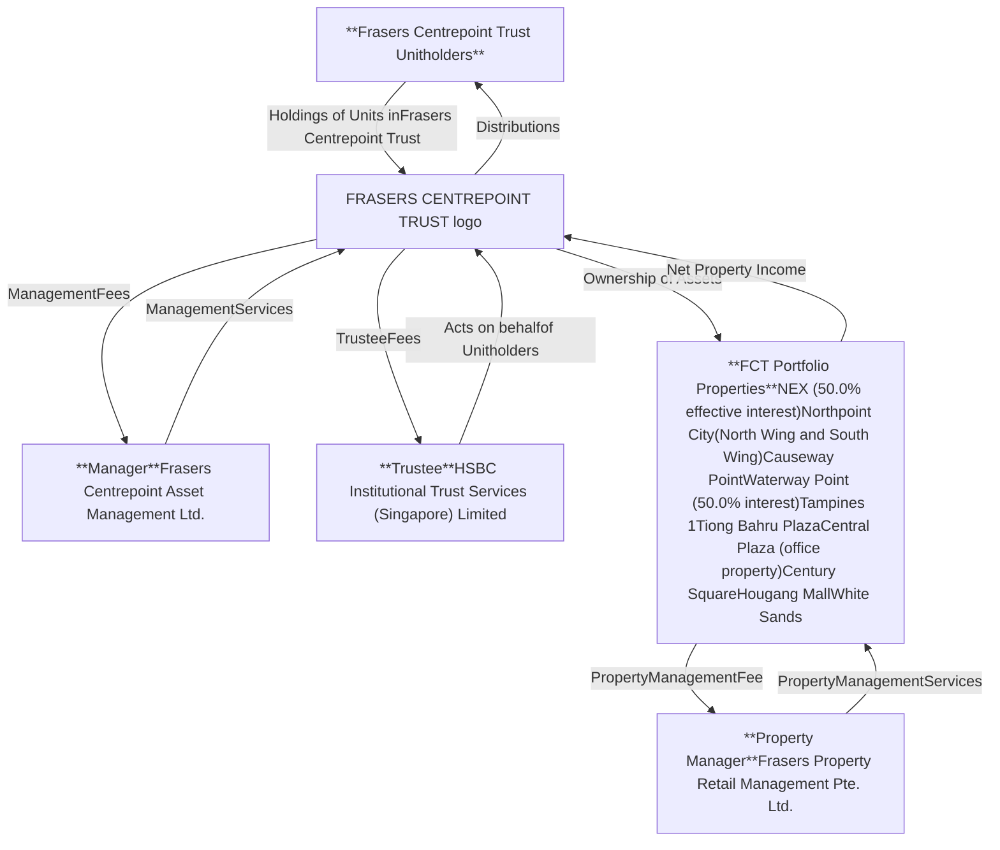
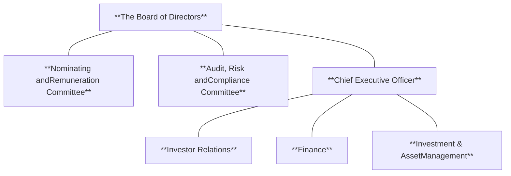

<!-- PAGE 1 -->

Annual Report 2025

# Shaping
# Resilient Value

<!-- PAGE 2 -->

# Contents Glossary

## Overview

2 About Frasers Centrepoint Trust
3 Structure of FCT and Organisation
Structure of the Manager
4 Business objectives and growth strategies
5 FY25 performance highlights
6 Key events
8 5-year performance at a glance
10 Unit price performance
12 Letter to Unitholders
16 Board of directors
19 Trust management team
21 Investor relations

## Business review

23 Operations review
30 Financial review
36 Capital resources
38 Retail property market overview

## Asset portfolio

66 Portfolio overview
68 NEX
70 Northpoint City
72 Causeway Point
74 Waterway Point
76 Tampines 1
78 Tiong Bahru Plaza
80 Central Plaza
82 Century Square
84 Hougang Mall
86 White Sands
88 Property directory

## Enterprise risk management and ESG highlights

89 Enterprise risk management
93 ESG highlights

## Corporate governance report

95 Corporate governance report

## Financial & additional information

136 Financial statements
214 Statistics of unitholdings
217 Additional information
Corporate information

For ease of reading, this glossary provides definitions of abbreviations that are frequently used throughout this report:

All information are presented in Singapore dollars unless otherwise stated.

**AEI**: Asset Enhancement Initiative
**AGM**: Annual General Meeting
**ARCC**: Audit, Risk and Compliance Committee
**AUM**: Asset under management
**CIS**: Collective Investment Scheme
**COVID-19**: Coronavirus disease
**CSFS**: Community/Sports Facilities Scheme
**DPU**: Distribution per Unit
**Essential Services**: The groupings of essential and non-essential services based on Ministry of Trade and Industry's press release on 21 April 2020
**FCAM**: Frasers Centrepoint Asset Management Ltd., the Manager of FCT
**FCT**: Frasers Centrepoint Trust
**Frasers Property**: Frasers Property Limited
**FY**: FCT's financial year ending 30 September
**GFA**: Gross Floor Area
**GHG**: Greenhouse gas
**GRESB**: Global Real Estate Sustainability Benchmark
**GRI**: Gross Rental Income
**GRPL**: Gold Ridge Pte. Ltd. which holds NEX; it is a joint venture of FCT. FCT owns an effective 50.0% interest in GRPL
**GST**: Goods and Services Tax
**Moody's**: Moody's Ratings (credit rating agency)
**MTN**: Medium Term Notes
**NAV**: Net Asset Value
**NLA**: Net Lettable Area
**NPI**: Net Property Income
**NRC**: Nominating and Remuneration Committee
**NTA**: Net Tangible Asset
**q-o-q**: quarter-on-quarter, refers to the comparison with the previous quarter
**REIT**: Real Estate Investment Trust
**Retail Portfolio**: Includes all retail malls in FCT's investment portfolio, and includes Waterway Point (50.0%-owned by FCT) and NEX (50.0%-owned by FCT), but excludes Central Plaza which is an office property
**Sponsor**: Refers to Frasers Property Limited, as sponsor of FCT
**sf**: Square feet
**sqm**: Square meter
**SST**: Sapphire Star Trust, which holds Waterway Point; it is a joint venture of FCT; FCT holds an effective 50.0% interest in SST
**Unitholders**: Unitholders of FCT
**WALE**: Weighted Average Lease Expiry
**y-o-y**: year-on-year, refers to the comparison with the same period in the previous year
**1H**: FCT's first half financial year ending 30 September
**2H**: FCT's second half financial year ending 30 September

<!-- PAGE 3 -->

# Shaping
# Resilient Value

At Frasers Centrepoint Trust, we are making steady progress in sustainable value creation. With strong foundations built over the years, our focus is on shaping value that lasts for our stakeholders.

Our strategy is anchored on three pillars – creating, sustaining and unlocking value. These guide us to stay resilient, navigate changing market conditions and deliver long-term returns.

Leveraging our proactive asset management strategy and OneFrasers operating model, we strengthen core capabilities and unlock value across our portfolio. This helps us manage risks, capture opportunities and maintain operational excellence across our portfolio of suburban retail malls in Singapore.

Guided by our Purpose – *Inspiring experiences, creating places for good.* – we remain focused on shaping resilient value. Through disciplined execution and a long-term perspective, we deliver enduring benefits for our shoppers, tenants, Unitholders, communities and the environment.

Our complete annual reporting suite can be accessed online, featuring the Annual Report and ESG Report:

Scan the QR Code to visit our website

QR Code to visit website

Annual Report icon Annual Report

ESG Report icon ESG Report

<!-- PAGE 4 -->

Frasers Centrepoint Trust
Annual Report 2025

# About Frasers Centrepoint Trust

Frasers Centrepoint Trust (“FCT”) is a leading developer-sponsored retail real estate investment trust (“REIT”) and the largest suburban retail mall owner in Singapore with assets under management of approximately $8.3 billion¹. FCT’s property portfolio comprises nine retail malls and an office building located in the suburban regions of Singapore, near homes and within minutes to transportation amenities. The retail portfolio has approximately 3.0 million sf² of net lettable area with approximately 1,900 leases with a strong focus on providing for non-discretionary spending. shopper footfall supported by commuter traffic and residential population in their catchment areas.

FCT, which is sponsored by Frasers Property, is an index constituent of several benchmark indices including the FTSE EPRA/NAREIT Global Real Estate Index Series (Global Developed Index), the Straits Times Index (“STI”), the FTSE ST Real Estate Investment Trust Index, MSCI Singapore Small Cap Index and SGX iEdge S-REIT Leaders Index.

The portfolio comprises NEX (50.0% effective interest), Northpoint City, Causeway Point, Waterway Point (50.0% interest), Tampines 1, Tiong Bahru Plaza, Central Plaza (office property), Century Square, Hougang Mall and White Sands. FCT malls enjoy stable and recurring listed on the Main Board of the Singapore Exchange Securities Trading Limited since 5 July 2006, FCT is managed by Frasers Centrepoint Asset Management Ltd. (“FCAM”), a real estate management company and a wholly-owned subsidiary of Frasers Property Limited.

<table>
    <tr>
        <th>**Accessibility**</th>
        <th>**Convenience**</th>
        <th>**Geographic coverage**</th>
    </tr>
    <tr>
        <td>FCT malls are strategically located next to or near MRT stations with stable and recurring shopper footfall</td>
        <td>FCT malls are well-connected and near homes, convenient for click-and-collect services, last-mile delivery and as social hubs</td>
        <td>FCT malls are located in densely populated areas, serving approximately 3 million shoppers in their catchment areas³</td>
    </tr>
</table>

Map of Singapore showing FCT mall locations and MRT lines

\*1 Total assets of FCT’s investment portfolio (including Central Plaza), including proportionate share of its JVs’ total assets as at 30 September 2025.

\*2 Includes area currently used as Community Sports Facilities Scheme space.

\*3 Aggregate catchment population within 3km of each property in the portfolio.

<!-- PAGE 5 -->

Contents **Overview** Business review Asset portfolio Enterprise risk management ESG highlights Corporate governance Financial & other information

# Structure of Frasers Centrepoint Trust



# Organisation structure of the Manager

**The Manager**
**Frasers Centrepoint Asset Management Ltd.**



<!-- PAGE 6 -->

# Business objectives and growth strategies

FCT is a real estate investment trust set up to own and invest in income-producing properties or properties that could be developed or re-developed into income-producing properties, used primarily for retail purposes in Singapore and overseas.

FCT’s objectives are to deliver regular and stable distributions to its Unitholders and to achieve long-term growth in its net asset value, so as to provide Unitholders with a competitive rate of return for their investments.

FCAM, the Manager of FCT, sets the strategic direction for FCT and this includes making recommendations to HSBC Institutional Trust Services (Singapore) Limited, as the Trustee of FCT, on acquisitions, divestments and enhancement of assets.

FCAM also oversees the overall management of FCT’s portfolio of investment properties, including capital management and risk management.

FCT’s growth strategies comprise three growth drivers – acquisition growth, enhancement growth and organic growth.

## Acquisition growth

Identifying and pursuing growth opportunities via acquiring income-producing properties and properties that could be developed or redeveloped into income-producing properties. The acquisitions should meet FCT’s investment objectives to enhance yields and returns for Unitholders while improving portfolio diversification. The acquisition opportunities include Sponsor’s pipeline assets and third-party assets in Singapore.

## Enhancement growth

This includes reconfiguration of properties to achieve better asset yields and sustainable income growth, and to achieve value creation through AEI to improve the income-producing capability of the properties.

## Organic growth

Active lease management to achieve positive rental reversions and a healthy portfolio occupancy to provide steady rental growth. FCAM adopts prudent capital and risk management strategies in its course of business.

## Capital management

FCAM continues to maintain a prudent financial structure and adequate financial flexibility to ensure that it has access to capital resources at competitive cost.

FCAM proactively manages FCT’s cash flows, financial position, debt maturity profile, cost of capital, interest rate exposure and overall liquidity position.

## Risk management

Effective risk management is a fundamental part of FCT’s business management and to protect Unitholders’ interests. Key risks, mitigating measures and management actions are continually identified, reviewed and monitored by management as part of FCAM’s enterprise-wide risk management framework.

<!-- PAGE 7 -->

# FY25 performance highlights

### Financial performance

* **Gross Revenue**: $389.6 million ▲ 10.8% y-o-y

* **Net Property Income**: $278.0 million ▲ 9.7% y-o-y

* **Distribution per Unit**: 12.113 cents ▲ 0.6% y-o-y

* **Net Asset Value per Unit**: $2.23 ▼ 2.6% y-o-y

### Portfolio performance

* **Total Portfolio Property Value¹**: $8.2 billion ▲ 16.8% y-o-y

* **Retail Portfolio Occupancy²**: 98.1% ▼ 1.6%-point (30 September 2024: 99.7%)

### Capital management

* **Aggregate Leverage³**: 39.6% ▲ 1.1%-point (30 September 2024: 38.5%)

* **Average Cost of Debt**: 3.8% ▼ 0.3%-point y-o-y

* **Credit Rating**: Baa2 (Stable) by Moody’s

### Environment, Social & Governance (ESG) highlights

* **Scope 1 & 2 emissions⁴**: 23.1 ktCO₂e ▼ 6.0% y-o-y

* **Renewable energy generated**: 1,497 MWh⁵ ▲ 376.8% y-o-y

* **Green-certified buildings**: 100%

### Awards & recognition

**2025 GRESB Real Estate Assessment**
Awarded the Regional Sector Leader (Listed) in the Asia, Retail category and maintained its 5-Star rating with a total score of 93 points (2024: 91)

MSCI ESG RATINGS AA

**Singapore Governance & Transparency Index (SGTI) 2025**
Ranked 6ᵗʰ with an overall score of 102.9 in the REIT & Business Trust category

<!-- PAGE 8 -->

# Key events

**October 2024**

* FCT announced its FY24 full year financial results on 25 October 2024. DPU for FY24 was 12.042 cents. Gross revenue and net property income for FY24 was $351.7 million and $253.4 million respectively.

* FCT maintained its 5-Star rating in the 2024 GRESB Real Estate Assessment for the fourth consecutive year.

* FCT announced on the same day, the launch of an equity fund raising by way of a private placement and a preferential offering to raise total gross proceeds of no less than $400 million.

* The private placement, for which the issue price was $2.09 per unit, was upsized from $200 million to $220 million. It was approximately 4.0 times covered, reflecting strong participation from new and existing institutional, accredited and other investors. The preferential offering, for which the issue price was $2.05 per unit, received valid and excess applications for 124.8% of the number of units available under the preferential offering.

**November 2024**

* FCT was named the Overall Sector Winner of the REIT sector at The Edge Singapore Billion Dollar Club Awards 2024.

**January 2025**

* FCT convened and held its 16ᵗʰ AGM on 14 January 2025. All resolutions proposed were duly passed. The minutes of the AGM were published on 13 February 2025.

* With Unitholders’ approval at the AGM, the trust deed was amended to provide for the repurchase and redemption of units of FCT as part of the Unit Buy-Back Supplement.

* FCT released its 1Q FY25 Business Update on 22 January 2025. FCT reported robust operational performance in 1Q FY25. Retail portfolio committed occupancy remained strong at 99.5%; Tenants’ sales and shopper traffic for the quarter increased 2.5% and 2.7% respectively, compared to the same period a year ago.

**March 2025**

* FCT issued $80 million of green notes due 2032 at 3.30% under its $3 billion Multicurrency Debt Issuance Programme to provide funding for sustainable projects and/or assets as part of the FCT Sustainable Finance Framework.

* FCT announced the proposed acquisition of Northpoint City South Wing for a total of $1.17 billion on 25 March 2025. The strategic increase in exposure to Northpoint City, the largest mall in the North of Singapore, consolidates FCT’s position as Singapore’s leading suburban retail space owner. The acquisition will further improve its overall retail portfolio performance, which supports FCT’s objective to deliver regular and stable distributions to its Unitholders.

**April 2025**

* 105,264,000 new units in connection with the private placement were issued and listed on the Main Board of the Singapore Exchange on 4 April 2025. 98,185,673 new units in connection with the preferential offering were issued and listed on the Main Board of the Singapore Exchange on 25 April 2025.

* Total gross proceeds of $421.3 million were raised from the private placement and preferential offering. Net proceeds after issuance expenses were used to repay existing debts, pending the use of part of such amount to fund the proposed acquisition of Northpoint City South Wing.

* FCT released its 1H FY25 interim financial statements for the six-month period ended 31 March 2025 on 29 April 2025. FCT achieved a robust set of results for 1H FY25 with a higher DPU of 6.054 cents. Operating performance remained healthy, with retail portfolio committed occupancy at 99.5% and higher rental reversion. Aggregate leverage remained healthy at 38.6%, with a lower average cost of debt at 3.8% for the quarter.

* Hougang Mall AEI works commenced in April 2025.

**May 2025**

* FCT convened and held its EGM on 23 May 2025 to seek Unitholders’ approval for the proposed acquisition of Northpoint City South Wing as an interested party transaction. The resolution was duly passed. The minutes of the EGM were published on 22 June 2025.

* FCT completed the acquisition of Northpoint City South Wing on 26 May 2025.

<!-- PAGE 9 -->

**June 2025**

* FCT priced $200 million in perpetual securities at 3.98% under its $3 billion Multicurrency Debt Issuance Programme.

**July 2025**

* The $200 million perpetual securities priced at 3.98% were issued and listed on the Main Board of the Singapore Exchange on 3 July 2025.

* The property management agreement for Northpoint City South Wing was renewed with its existing property manager, Frasers Property Retail Management Pte. Ltd., for another 12 months commencing from 14 July 2025.

* FCT released its 3Q FY25 Business Update on 24 July 2025. Retail portfolio committed occupancy remained strong at 99.9%; Tenants’ sales and shopper traffic for the quarter increased 4.4% and 2.1% respectively, compared to the same period a year ago.

**August 2025**

* FCT announced the proposed divestment of Yishun 10 Retail Podium for $34.5 million to its Sponsor, Frasers Property, as part of its portfolio reconstitution strategy. The divestment proceeds will be used to repay debt.

**September 2025**

* FCT completed the divestment of Yishun 10 Retail Podium on 23 September 2025.

# Subsequent events

**October 2025**

* FCT announced its FY25 full year financial results on 23 October 2025. FY25 Gross revenue increased 10.8% y-o-y to $389.6 million and net property income rose 9.7% y-o-y to $278.0 million. DPU for FY25 increased 0.6% y-o-y to 12.113 cents. Aggregate leverage was 39.6%, with a lower average cost of debt at 3.5% for the quarter.

* FCT was awarded Regional Sector Leader (Listed) in the Asia, Retail category in the 2025 GRESB Real Estate Assessment, maintaining its 5-Star rating for the fifth consecutive year.

<!-- PAGE 10 -->

# 5-year performance at a glance

Revenue ($ million) ▲ 10.8%

<table>
  <tbody>
    <tr>
        <td>Financial Year</td>
        <td>Revenue ($ million)</td>
    </tr>
    <tr>
        <td>FY21</td>
        <td>341.1</td>
    </tr>
    <tr>
        <td>FY22</td>
        <td>356.9</td>
    </tr>
    <tr>
        <td>FY23</td>
        <td>369.7</td>
    </tr>
    <tr>
        <td>FY24</td>
        <td>351.7</td>
    </tr>
    <tr>
        <td>FY25</td>
        <td>389.6</td>
    </tr>
  </tbody>
</table>

Net property income ($ million) ▲ 9.7%

<table>
  <tbody>
    <tr>
        <td>Financial Year</td>
        <td>Net property income ($ million)</td>
    </tr>
    <tr>
        <td>FY21</td>
        <td>246.6</td>
    </tr>
    <tr>
        <td>FY22</td>
        <td>258.6</td>
    </tr>
    <tr>
        <td>FY23</td>
        <td>265.6</td>
    </tr>
    <tr>
        <td>FY24</td>
        <td>253.4</td>
    </tr>
    <tr>
        <td>FY25</td>
        <td>278.0</td>
    </tr>
  </tbody>
</table>

Distribution per Unit (cents) ▲ 0.6%

<table>
  <tbody>
    <tr>
        <td>Financial Year</td>
        <td>Distribution per Unit (cents)</td>
    </tr>
    <tr>
        <td>FY21</td>
        <td>12.085</td>
    </tr>
    <tr>
        <td>FY22</td>
        <td>12.227</td>
    </tr>
    <tr>
        <td>FY23</td>
        <td>12.150</td>
    </tr>
    <tr>
        <td>FY24</td>
        <td>12.042</td>
    </tr>
    <tr>
        <td>FY25</td>
        <td>12.113</td>
    </tr>
  </tbody>
</table>

Net asset value per Unit ($) ▼ 2.6%

<table>
  <tbody>
    <tr>
        <td>Financial Year</td>
        <td>Net asset value per Unit ($)</td>
    </tr>
    <tr>
        <td>FY21</td>
        <td>2.30</td>
    </tr>
    <tr>
        <td>FY22</td>
        <td>2.33</td>
    </tr>
    <tr>
        <td>FY23</td>
        <td>2.32</td>
    </tr>
    <tr>
        <td>FY24</td>
        <td>2.29</td>
    </tr>
    <tr>
        <td>FY25</td>
        <td>2.23</td>
    </tr>
  </tbody>
</table>

Total assets ($ million) ▲ 19.3%

<table>
  <tbody>
    <tr>
        <td>Financial Year</td>
        <td>Total assets ($ million)</td>
    </tr>
    <tr>
        <td>FY21</td>
        <td>5,898.8</td>
    </tr>
    <tr>
        <td>FY22</td>
        <td>5,941.4</td>
    </tr>
    <tr>
        <td>FY23</td>
        <td>6,375.2</td>
    </tr>
    <tr>
        <td>FY24</td>
        <td>6,378.9</td>
    </tr>
    <tr>
        <td>FY25</td>
        <td>7,612.2</td>
    </tr>
  </tbody>
</table>

Aggregate leverage (%) ▲ 1.1%-points

<table>
  <tbody>
    <tr>
        <td>Financial Year</td>
        <td>Aggregate leverage (%)</td>
    </tr>
    <tr>
        <td>FY21</td>
        <td>33.3</td>
    </tr>
    <tr>
        <td>FY22</td>
        <td>33.0</td>
    </tr>
    <tr>
        <td>FY23</td>
        <td>39.3</td>
    </tr>
    <tr>
        <td>FY24</td>
        <td>38.5</td>
    </tr>
    <tr>
        <td>FY25</td>
        <td>39.6</td>
    </tr>
  </tbody>
</table>

<!-- PAGE 11 -->

# Distribution per Unit by financial reporting periods (cents)

<table>
  <thead>
    <tr>
        <th>Financial Year</th>
        <th>1H (cents)</th>
        <th>2H (cents)</th>
        <th>Total DPU (cents)</th>
    </tr>
  </thead>
  <tbody>
    <tr>
        <td>FY21</td>
        <td>5.996</td>
        <td>6.089</td>
        <td>12.085</td>
    </tr>
    <tr>
        <td>FY22</td>
        <td>6.136</td>
        <td>6.091</td>
        <td>12.227</td>
    </tr>
    <tr>
        <td>FY23</td>
        <td>6.130</td>
        <td>6.020</td>
        <td>12.150</td>
    </tr>
    <tr>
        <td>FY24</td>
        <td>6.022</td>
        <td>6.020</td>
        <td>12.042</td>
    </tr>
    <tr>
        <td>FY25</td>
        <td>6.054</td>
        <td>6.059</td>
        <td>12.113</td>
    </tr>
  </tbody>
</table>
<table>
  <thead>
    <tr>
        <th colspan="6">FCT and its subsidiaries (“FCT Group”)</th>
    </tr>
    <tr>
        <th>For the Financial Year ended 30 September</th>
        <th>FY21</th>
        <th>FY22</th>
        <th>FY23</th>
        <th>FY24</th>
        <th>FY25</th>
    </tr>
  </thead>
  <tbody>
    <tr>
        <td colspan="6"><strong>Selected income statement and distribution information ($’000)</strong></td>
    </tr>
    <tr>
        <td>Gross Revenue</td>
        <td>341,149</td>
        <td>356,931</td>
        <td>369,723</td>
        <td>351,733</td>
        <td><strong>389,603</strong></td>
    </tr>
    <tr>
        <td>Net Property Income</td>
        <td>246,567</td>
        <td>258,597</td>
        <td>265,586</td>
        <td>253,386</td>
        <td><strong>277,980</strong></td>
    </tr>
    <tr>
        <td>Distributions to Unitholders</td>
        <td>204,674</td>
        <td>208,190</td>
        <td>207,745</td>
        <td>214,313</td>
        <td><strong>233,166</strong></td>
    </tr>
    <tr>
        <td colspan="6"><strong>Selected balance sheet information ($ million)</strong></td>
    </tr>
    <tr>
        <td>Total Assets</td>
        <td>5,898.8</td>
        <td>5,941.4</td>
        <td>6,375.2</td>
        <td>6,378.9</td>
        <td><strong>7,612.2</strong></td>
    </tr>
    <tr>
        <td>Total Borrowings¹</td>
        <td>1,815.0</td>
        <td>1,815.0</td>
        <td>2,212.1</td>
        <td>2,043.8</td>
        <td><strong>2,612.0</strong></td>
    </tr>
    <tr>
        <td>Net Assets</td>
        <td>3,918.8</td>
        <td>3,964.1</td>
        <td>3,973.2</td>
        <td>4,160.7</td>
        <td><strong>4,741.9</strong></td>
    </tr>
    <tr>
        <td>Value of Portfolio Properties</td>
        <td>5,506.5</td>
        <td>5,516.0</td>
        <td>5,220.5</td>
        <td>5,283.0²</td>
        <td><strong>6,449.0³</strong></td>
    </tr>
    <tr>
        <td colspan="6"><strong>Other financial indicators</strong></td>
    </tr>
    <tr>
        <td>Distribution per Unit (cents)⁴</td>
        <td>12.085</td>
        <td>12.227</td>
        <td>12.150</td>
        <td>12.042</td>
        <td><strong>12.113</strong></td>
    </tr>
    <tr>
        <td>Net Asset Value per Unit ($)⁴</td>
        <td>2.30</td>
        <td>2.33</td>
        <td>2.32</td>
        <td>2.29</td>
        <td><strong>2.23</strong></td>
    </tr>
    <tr>
        <td>Aggregate Leverage⁵</td>
        <td>33.3%</td>
        <td>33.0%</td>
        <td>39.3%</td>
        <td>38.5%</td>
        <td><strong>39.6%</strong></td>
    </tr>
    <tr>
        <td>Interest Coverage Ratio (times)⁶</td>
        <td>4.77</td>
        <td>5.19</td>
        <td>3.47</td>
        <td>3.41</td>
        <td><strong>3.46</strong></td>
    </tr>
    <tr>
        <td>Market Capitalisation ($ million)⁷</td>
        <td>3,857.3</td>
        <td>3,693.5</td>
        <td>3,741.5</td>
        <td>4,166.8</td>
        <td><strong>4,708.0</strong></td>
    </tr>
  </tbody>
</table>

<!-- PAGE 12 -->

# Unit price performance

## Unit price trading performance in FY25

In FY25, investor sentiment toward Singapore REITs was generally positive, supported by rate compression in the Singapore 10-year bond yields and declining 1-month and 3-month Singapore Overnight Rate Average ("SORA"). The US Federal Reserve continued to cut interest rates this year, after three rounds of reduction in 2024.

Please refer to the chart below on FCT’s unit price performance versus the FTSE ST All-share Real Estate Investment Trust Index (“FTSE REIT Index”) and the FTSE Straits Times Index (“STI Index”) for the one-year period ending 30 September 2025.

## 1-Year FCT unit price performance versus STI Index and FTSE REIT Index

<table>
  <thead>
    <tr>
        <th>Month</th>
        <th>FTSE REIT Index</th>
        <th>STI Index</th>
        <th>FCT SP equity</th>
    </tr>
  </thead>
  <tbody>
    <tr>
        <td>Oct-24</td>
        <td>100.0</td>
        <td>100.0</td>
        <td>100.0</td>
    </tr>
    <tr>
        <td>Nov-24</td>
        <td>90.0</td>
        <td>98.0</td>
        <td>92.0</td>
    </tr>
    <tr>
        <td>Dec-24</td>
        <td>88.0</td>
        <td>105.0</td>
        <td>91.0</td>
    </tr>
    <tr>
        <td>Jan-25</td>
        <td>87.0</td>
        <td>103.0</td>
        <td>92.0</td>
    </tr>
    <tr>
        <td>Feb-25</td>
        <td>88.0</td>
        <td>107.0</td>
        <td>90.0</td>
    </tr>
    <tr>
        <td>Mar-25</td>
        <td>95.0</td>
        <td>108.0</td>
        <td>90.0</td>
    </tr>
    <tr>
        <td>Apr-25</td>
        <td>95.0</td>
        <td>106.0</td>
        <td>98.0</td>
    </tr>
    <tr>
        <td>May-25</td>
        <td>94.0</td>
        <td>108.0</td>
        <td>95.0</td>
    </tr>
    <tr>
        <td>Jun-25</td>
        <td>94.0</td>
        <td>108.0</td>
        <td>95.0</td>
    </tr>
    <tr>
        <td>Jul-25</td>
        <td>94.0</td>
        <td>118.0</td>
        <td>97.0</td>
    </tr>
    <tr>
        <td>Aug-25</td>
        <td>100.0</td>
        <td>118.0</td>
        <td>102.0</td>
    </tr>
    <tr>
        <td>Sep-25</td>
        <td>97.9</td>
        <td>119.9</td>
        <td>100.9</td>
    </tr>
  </tbody>
</table>

## Total unitholder return

FCT’s unit price closed at $2.32 on 30 September 2025. For the one-year period ended 30 September 2025, FCT registered a unit price increase of 1.1% and a total return of 6.4%. For the same period, the FTSE REIT Index registered -2.1% in index change and a total return of 2.6%; the STI Index was up 19.9% with a total return of 25.4%.

Over the three-year period, FCT registered 7.1% in unit price change and a total return of 24.3%, compared with -5.0% and 11.3%, respectively, for the FTSE REIT Index. Over a five-year period, FCT’s unit price change and total return stood were -2.5% and 23.2% respectively, outperforming the FTSE REIT Index at -16.4% and 9.2%, respectively.

FCT achieved a total return of approximately 342.3% since its inception, and outperformed both the FTSE REIT Index and the STI Index, as shown in the table below:

<table>
  <thead>
    <tr>
        <th> </th>
        <th colspan="2">1 Year</th>
        <th colspan="2">3 Year</th>
        <th colspan="2">5 Year</th>
        <th colspan="2">Since inception</th>
    </tr>
    <tr>
        <th> </th>
        <th colspan="2">1 October 2024 to<br/>30 September 2025</th>
        <th colspan="2">1 October 2022 to<br/>30 September 2025</th>
        <th colspan="2">1 October 2020 to<br/>30 September 2025</th>
        <th colspan="2">5 July 2006 to<br/>30 September 2025</th>
    </tr>
    <tr>
        <th> </th>
        <th>Price</th>
        <th>Total</th>
        <th>Price</th>
        <th>Total</th>
        <th>Price</th>
        <th>Total</th>
        <th>Price</th>
        <th>Total</th>
    </tr>
    <tr>
        <th> </th>
        <th>Change¹</th>
        <th>Return²</th>
        <th>Change¹</th>
        <th>Return²</th>
        <th>Change¹</th>
        <th>Return²</th>
        <th>Change¹</th>
        <th>Return²</th>
    </tr>
  </thead>
  <tbody>
    <tr>
        <td>FCT</td>
        <td>1.1%</td>
        <td>6.4%</td>
        <td>7.1%</td>
        <td>24.3%</td>
        <td>-2.5%</td>
        <td>23.2%</td>
        <td>126.4%</td>
        <td>342.3%</td>
    </tr>
    <tr>
        <td>FTSE REIT Index</td>
        <td>-2.1%</td>
        <td>2.6%</td>
        <td>-5.0%</td>
        <td>11.3%</td>
        <td>-16.4%</td>
        <td>9.2%</td>
        <td>3.8%</td>
        <td>136.5%</td>
    </tr>
    <tr>
        <td>Straits Times Index</td>
        <td>19.9%</td>
        <td>25.4%</td>
        <td>37.4%</td>
        <td>54.7%</td>
        <td>74.3%</td>
        <td>106.3%</td>
        <td>78.3%</td>
        <td>174.4%</td>
    </tr>
  </tbody>
</table>

Source: Bloomberg

<!-- PAGE 13 -->

Contents | **Overview** | Business review | Asset portfolio | Enterprise risk management | ESG highlights | Corporate governance | Financial & other information

# Monthly trading performance in FY25

FCT's trading volume and the unit closing price for each month in FY25 are illustrated in the chart below. The average daily trading volume (the "ADTV") in FY25 was 4.70 million units (FY24: 3.28 million units).

<table>
  <thead>
    <tr>
        <th>Month</th>
        <th>Total volume traded in the month (million of units)</th>
        <th>Closing price as at the last trading day of the month ($)</th>
    </tr>
  </thead>
  <tbody>
    <tr>
        <td>Oct-24</td>
        <td>93.0</td>
        <td>2.24</td>
    </tr>
    <tr>
        <td>Nov-24</td>
        <td>98.6</td>
        <td>2.13</td>
    </tr>
    <tr>
        <td>Dec-24</td>
        <td>46.4</td>
        <td>2.11</td>
    </tr>
    <tr>
        <td>Jan-25</td>
        <td>57.5</td>
        <td>2.14</td>
    </tr>
    <tr>
        <td>Feb-25</td>
        <td>88.7</td>
        <td>2.05</td>
    </tr>
    <tr>
        <td>Mar-25</td>
        <td>96.3</td>
        <td>2.18</td>
    </tr>
    <tr>
        <td>Apr-25</td>
        <td>198.7</td>
        <td>2.26</td>
    </tr>
    <tr>
        <td>May-25</td>
        <td>78.2</td>
        <td>2.20</td>
    </tr>
    <tr>
        <td>Jun-25</td>
        <td>93.5</td>
        <td>2.28</td>
    </tr>
    <tr>
        <td>Jul-25</td>
        <td>147.4</td>
        <td>2.22</td>
    </tr>
    <tr>
        <td>Aug-25</td>
        <td>109.3</td>
        <td>2.33</td>
    </tr>
    <tr>
        <td>Sep-25</td>
        <td>72.1</td>
        <td>2.32</td>
    </tr>
  </tbody>
</table>

# Unit price trading performance in the past five financial years

The table below shows the historical trading information of FCT units in the past five financial years. The market capitalisation of FCT stood at approximately $4.7 billion as at 30 September 2025:

<table>
  <thead>
    <tr>
        <th> </th>
        <th>FY21</th>
        <th>FY22</th>
        <th>FY23</th>
        <th>FY24</th>
        <th>FY25</th>
    </tr>
  </thead>
  <tbody>
    <tr>
        <td>Opening price ($)</td>
        <td>2.39</td>
        <td>2.26</td>
        <td>2.15</td>
        <td>2.18</td>
        <td>2.31</td>
    </tr>
    <tr>
        <td>Closing price ($)</td>
        <td>2.27</td>
        <td>2.17</td>
        <td>2.19</td>
        <td>2.30</td>
        <td>2.32</td>
    </tr>
    <tr>
        <td>Highest closing price ($)</td>
        <td>2.64</td>
        <td>2.48</td>
        <td>2.35</td>
        <td>2.41</td>
        <td>2.38</td>
    </tr>
    <tr>
        <td>Lowest closing price ($)</td>
        <td>2.08</td>
        <td>2.13</td>
        <td>1.92</td>
        <td>2.04</td>
        <td>2.05</td>
    </tr>
    <tr>
        <td>Total volume traded (million Units)</td>
        <td>1,006.5</td>
        <td>769.2</td>
        <td>694.5</td>
        <td>819.4</td>
        <td>1,179.7</td>
    </tr>
    <tr>
        <td>Average daily trading volume (million Units)</td>
        <td>3.98</td>
        <td>3.05</td>
        <td>2.79</td>
        <td>3.28</td>
        <td>4.70</td>
    </tr>
    <tr>
        <td>Market capitalisation ($ billion)</td>
        <td>3.86</td>
        <td>3.69</td>
        <td>3.74</td>
        <td>4.17</td>
        <td>4.71</td>
    </tr>
  </tbody>
</table>

<!-- PAGE 14 -->

Letter to Unitholders

**Dear Unitholders,**

**We are pleased to present FCT’s Annual Report for the financial year 2025. Despite an uncertain operating environment, FY25 was a defining year for FCT, marked by notable accomplishments and strategic initiatives that strengthened the trust’s portfolio and reinforced its financial stability, positioning it for sustained long-term growth.**

## Review of FY25 performance

**A strong set of results driven by the acquisition of Northpoint City South Wing and resilient operating performance**

FCT delivered a strong set of results for FY25. Gross revenue rose 10.8% y-o-y to $389.6 million and NPI increased 9.7% to $278.0 million. The solid performance was underpinned by contributions from Northpoint City South Wing, following its acquisition in May 2025 and from Tampines 1, which completed its AEI in August 2024. The portfolio also saw broad-based improvements in both revenue and NPI. Distributions from investments, arising from FCT’s 50.0% interest in each of Waterway Point and NEX, grew 37.1% y-o-y. Correspondingly, total distributions to Unitholders increased 8.8% to $233.2 million. This translated to a DPU of 12.113 cents for FY25, up 0.6% from 12.042 cents for FY24, accounting for a larger unit base.

FCT maintained a healthy financial position with aggregate leverage at 39.6% as at 30 September 2025. The interest coverage ratio remained strong at 3.46 times, underscoring FCT’s prudent capital management. The average cost of borrowing in 4Q25 declined to 3.5%

<!-- PAGE 15 -->

from 4.0% in 1Q25, bringing the full-year average cost of borrowing to 3.8%, down from 4.1% in FY24. The trust also has sufficient financial facilities to repay borrowings maturing in FY26, demonstrating continued balance sheet resilience.

ownership of both the North Wing and South Wing of Northpoint City. The consolidation of our ownership in the mall unlocks multiple value creation opportunities through AEIs, optimised tenant mix strategies and operational efficiencies. Today, FCT owns or jointly owns four of Singapore’s top ten largest suburban malls – NEX, Northpoint City, Causeway Point and Waterway Point – further anchoring its leadership in the suburban retail space.

The aggregate appraised value of FCT’s portfolio saw a 16.8%¹ uplift to approximately $8.2 billion due to the addition of Northpoint City South Wing and stronger performance across most malls. Excluding Northpoint City South Wing which was acquired in May 2025 and Yishun 10 Retail Podium which was divested in September 2025, on a like-for-like basis, the portfolio valuation increased by approximately 1.0% or $78 million.

To fund the acquisition, FCT raised approximately $421.3 million from an equity fund raising via private placement and preferential offering and issued $200 million in perpetual securities during the year. The private placement was four times subscribed, reflecting strong confidence and participation from new and existing institutional, accredited and other investors.

**Robust operating metrics underpinned by strong rental reversions and tenants’ sales**

**Divestment of Yishun 10 Retail Podium**

In FY25, FCT’s portfolio registered a robust set of operating performance. The portfolio achieved a positive average rental reversion of 7.8%² for FY25 on an average-to-average basis. Shopper traffic in FY25 grew 1.6%² y-o-y, while tenants’ sales rose 3.7%² y-o-y. Committed occupancy eased slightly to 98.1% as at 30 September 2025 from 99.7% as at 30 September 2024 due to the exit of Cathay Cineplexes at Causeway Point and Century Square. Excluding Cathay Cineplexes, portfolio committed occupancy would have remained strong at 99.9%.

As part of our proactive portfolio reconstitution strategy, FCT divested Yishun 10 Retail Podium for $34.5 million, which was successfully completed on 23 September 2025. Net proceeds were used to pare down debt, reducing aggregate leverage and strengthening FCT’s financial position.

**Building on our ESG momentum to drive long-term value creation**

Supported by a sustained leasing momentum, FCT continued to enhance its tenant mix and curate placemaking initiatives to excite shoppers, attract footfall and boost tenants’ sales. A total of 76 new-to-FCT brands, including both local and global brands, opened at our malls during the year. With improved tenants’ sales, the retail portfolio’s average occupancy cost remained healthy at 16.1% in FY25, providing headroom for future rental growth.

**Industry recognition for ESG progress**

Building on our sustainability momentum, FCT was awarded the Regional Sector Leader (Listed) in the Asia, Retail category in the 2025 GRESB Real Estate Assessment, maintaining its 5-Star rating for the fifth consecutive year with an improved score compared to last year. FCT also maintained its “AA” rating from MSCI ESG Ratings. On the governance front, we are pleased to share that FCT was ranked 6ᵗʰ in the REIT & Business Trust category in the Singapore Governance & Transparency Index 2025.

**FY25 achievements**

FY25 has been a fruitful year, both on the acquisition front as well as portfolio enhancement and organic growth opportunities.

**Acquisition of Northpoint City South Wing cements FCT’s position as the largest owner of suburban retail malls in Singapore**

The implementation of Singapore’s first circular economy food waste solution, the WasteMaster food waste valorisation system, across five of FCT’s malls reduced approximately 258,000 kilograms of food waste in FY25, equivalent to over 1.6 tonnes of carbon emissions avoidance. FCT’s solarisation programme atop eight malls generated 1,497 MWh³ of renewable energy in FY25, which can power about 348 four-room HDB flats for a year, representing an increase of over four times from FY24. All of FCT’s properties are also green-certified.

The successful acquisition of Northpoint City South Wing on 26 May 2025 marked a significant milestone that reinforced FCT’s position as Singapore’s largest suburban retail space owner and granted the trust full

<!-- PAGE 16 -->

# Letter to Unitholders

**Stepping up our green financing efforts**

In FY25, FCT expanded its sustainable financing efforts, aligning capital management with environmental objectives. During the year, it secured $694 million in green loans and green club loan facilities, and issued $80 million fixed-rate green notes due 2032 under the Sustainable Finance Framework, with proceeds earmarked for eligible sustainable projects and assets. With these initiatives in place, the proportion of green loans³ in FCT’s borrowings increased to 90.1% as at 30 September 2025, up from 82.8% the same period last year.

**On track for Hougang Mall AEI**

The $51 million AEI at Hougang Mall, which commenced in April 2025, is progressing well and on track for completion by September 2026, with a 7% target return on investment. The AEI, which will add an additional 11,000 square feet of net lettable area approximately, aims to elevate the retail experience through new retail concepts and space optimisation. We are excited to share that more than 80% of overall AEI spaces have been pre-committed to date⁴ with 40% new-to-Hougang concepts.

**Enhancing our social impact through active community engagement**

FCT continues to promote inclusivity and community engagement through various initiatives and collaborations with retail partners. Frasers Property Singapore’s Inclusion Champions Programme has expanded to 81 stores offering ‘calm hours’ to support persons with sensory needs, with 110 designated dementia go-to points. As part of the “Our Love Letter to Singapore” SG60 community campaign during the year, a total of $200,000 was raised across the Group and donated in support of Caregivers Alliance and SG Enable through Community Chest. Shoppers and tenants were also actively rallied during the campaign, fostering a strong sense of shared purpose and community spirit.

**Causeway Point and Northpoint City to benefit from transformative growth in Northern Singapore**

The Urban Redevelopment Authority (URA) Master Plan 2025⁵ has outlined exciting redevelopment plans for Singapore’s northern region, including new housing, commercial developments, and green community spaces. The region is also poised to benefit from the Johor-Singapore Special Economic Zone (JS-SEZ) which is expected to drive cross-border growth and investment, creating new employment opportunities. To support the projected population growth in the northern region of Singapore, more than 50,000 residential units are expected to be completed over the next 10 to 15 years⁶.

This year, we have published our sustainability report online and we invite you to explore the progress we have made on our ESG journey over the years.

In addition, new infrastructure developments, including the 21.5 km North-South Corridor, a fully integrated transport artery that will directly connect Singapore's northern towns to the city centre and a new interchange station at Sungei Kadut connecting the North-South and Downtown MRT lines, bode well for our malls in Singapore’s northern region, Causeway Point and Northpoint City. These infrastructural, commercial and residential developments are expected to underpin growth in footfall and tenants' sales over time.

<mark>**Abundant growth opportunities**</mark>

Looking ahead, we see multiple opportunities to unlock further value within FCT’s portfolio, leveraging our strong asset management and disciplined execution expertise.

The Johor Bahru-Singapore Rapid Transit System (RTS) is scheduled to commence end-2026, potentially reducing travel time from Singapore to Johor Bahru. Despite concerns about potential retail spending shifts towards Johor Bahru, we are confident that the opportunities from the upcoming developments in the northern region, supported by a growing working population and residential catchment and FCT’s proactive tenant mix strategy, will outweigh the potential competition.

<!-- PAGE 17 -->

In particular, Causeway Point is strategically located a stone’s throw away from Woodlands MRT Station, a key interchange for the North-South line and Thomson-East Coast line, and a regional bus hub. With the upcoming RTS link linked to Woodlands North Station on the Thomson-East Coast Line just one stop away, we expect increased footfall with higher residential and commuter traffic. This presents a compelling opportunity to enhance our retail and F&B offerings at Causeway Point, which is well-positioned to be the connection hub in the Woodlands region.

## Looking ahead

The Singapore retail sector is expected to stay resilient, underpinned by population growth, rising household incomes, supportive government schemes and a limited supply of new retail space in Singapore. Anchored by Singapore’s resilient suburban retail landscape, FCT is well-positioned to continue delivering consistent performance and long-term value for our Unitholders.

## Celebrating 20 years of listing

In July 2026, FCT will celebrate its 20^th year of listing on the Singapore Exchange, a significant milestone for the trust. Since its IPO, FCT has grown from strength to strength, expanding from an initial portfolio of three malls worth under $1 billion, to 9 malls worth over $8 billion today. This growth has translated to a total return exceeding 340%^7, surpassing the total returns from both the FTSE REIT Index and STI for the same period. FCT’s market capitalisation has also increased from $615 million at its IPO to over $4.7 billion^8 today.

The achievements this year mark a defining point in FCT’s journey – one that stands as the culmination of two decades of disciplined execution, strategic foresight, and a steadfast commitment to value creation for our Unitholders. They also set a strong foundation and clear direction for years to come.

With a solid track record, robust financial position and a forward-looking approach to portfolio enhancement and acquisition growth, FCT is well-positioned to navigate Singapore’s evolving retail landscape. We are confident that the next chapter of our growth will build on the same principles that have underpinned our success thus far.

## Acknowledgements

As we reflect on the past year, we extend our sincere appreciation to our shoppers, tenants, Unitholders and partners for their continued trust and support. We are deeply grateful to our dedicated colleagues whose commitment and diligence drive our business forward, and to our Board for their steadfast guidance. Most importantly, we want to thank our Unitholders for their unwavering confidence in our mission and strategic direction, as we continue to drive long-term growth for FCT.

Together, we remain steadfast in our vision and disciplined in our execution to create, sustain and unlock long-term value for our stakeholders.

**Koh Choon Fah**
Chairman

**Richard Ng**
Chief Executive Officer

<!-- PAGE 18 -->

# Board of directors

Portrait of Koh Choon Fah

**Koh Choon Fah, 67**
Chairman, Non-Executive and Independent Director

**Date of appointment as Director**
1 October 2019

**Length of service as Director (as at 30 September 2025)**
6 years

**Board committees served on**

* Audit, Risk and Compliance Committee (Member)

* Nominating and Remuneration Committee (Member)

**Academic & Professional Qualifications**

* Bachelor of Science (Estate Management) (Honours), National University of Singapore

* Master of Arts (Business Administration), University of Georgia (Athens) / USA

* Fellow, Royal Institute of Chartered Surveyors

* Fellow, Singapore Institute of Surveyors & Valuers

**Present Directorships in other companies (as at 30 September 2025)**
**Listed companies**

* Nil

**Listed REITs/Trusts**

* Nil

**Others**

* Prime Property Fund Asia GP Pte. Limited

* New Horizons Holdings Pte. Ltd.

* Maxwell Chambers Pte. Ltd.

**Major appointments (other than Directorships)**

* Global Governing Trustee, Urban Land Institute, USA

* Council Member and Chairperson of Professional Development Committee, Council for Estate Agencies, Singapore

* Adjunct Professor in Dean’s Office, College of Design & Engineering, National University of Singapore

**Past Directorships in listed companies held over the preceding 3 years (from 1 October 2022 to 30 September 2025)**

* Nil

**Past major appointments**

* Chief Executive Officer, Edmund Tie & Company (SEA) Pte. Ltd.

* Chief Operating Officer, DTZ Debenham Tie Leung (SEA) Pte. Ltd. (now known as Edmund Tie & Company (SEA) Pte. Ltd.)

* Chairperson of Nominations Committee, Executive Committee Member and Chairperson, Urban Land Institute Singapore Council, Singapore

* Management Board Member, Institute of Real Estate and Urban Studies, National University of Singapore

***

Portrait of Ho Chai Seng

**Ho Chai Seng, 65**
Non-Executive and Independent Director

**Date of appointment as Director**
30 June 2017

**Length of service as Director (as at 30 September 2025)**
8 years and 3 months

**Board committees served on**

* Nominating and Remuneration Committee (Chairman)

* Audit, Risk and Compliance Committee (Member)

**Academic & Professional Qualifications**

* Bachelor of Commerce, University of Windsor, Canada

* Member, Singapore Institute of Directors

* Member, International Bankers Association of Japan

**Present Directorships in other companies (as at 30 September 2025)**
**Listed companies**

* Nil

**Listed REITs/Trusts**

* Nil

**Others**

* Nil

**Major appointments (other than Directorships)**

* Executive Director and Country Manager, United Overseas Bank Limited, Tokyo Branch

**Past Directorships in listed companies held over the preceding 3 years (from 1 October 2022 to 30 September 2025)**

* Nil

**Past major appointments**

* Vice President, BHF-Bank, New York Branch

* Assistant General Manager, BHF-Bank, Singapore Branch

* General Manager, DBS Bank Ltd., London Branch

* General Manager, United Overseas Bank Limited, London Branch

* Executive Director, United Overseas Bank Limited, Singapore

<!-- PAGE 19 -->

Ho Chee Hwee, Simon

**Ho Chee Hwee, Simon, 64**
Non-Executive and Non-Independent Director

**Date of appointment as Director**
9 February 2017

**Length of service as Director (as at 30 September 2025)**
8 years and 7 months

**Board committees served on**

* Audit, Risk and Compliance Committee (Member)

* Nominating and Remuneration Committee (Member)

**Academic & Professional Qualifications**

* Bachelor of Science (Estate Management) (Honours), National University of Singapore

* Master of Real Estate, National University of Singapore

**Present Directorships in other companies (as at 30 September 2025)**
**Listed companies**

* Nil

**Listed REITs/Trusts**

* Nil

**Others**

* Nil

**Major appointments (other than Directorships)**

* Nil

**Past Directorships in listed companies held over the preceding 3 years (from 1 October 2022 to 30 September 2025)**
* Nil

**Past major appointments**

* ALPS Pte. Ltd. (formerly known as Agency for Healthcare Supply Chain Pte. Ltd.)

* Frasers Hospitality International Pte. Ltd.

* Frasers Property (Singapore) Pte. Ltd.

* Chief Executive Officer of the manager of CapitaLand Mall Trust (formerly known as CapitaMall Trust)

* Deputy Chief Executive Officer, CapitaLand Mall Asia Limited (formerly known as CapitaMalls Asia Limited)

**Others**

* Previously on the Board of Directors of the managers of CapitaLand Mall Trust (listed on the Singapore Exchange Securities Trading Limited) and CapitaLand Malaysia Mall Trust (listed on Bursa Malaysia).

***

Ho Kin San

**Ho Kin San, 63**
Non-Executive and Independent Director

**Date of appointment as Director**
18 July 2023

**Length of service as Director (as at 30 September 2025)**
2 years and 2 months

**Board committees served on**

* Audit, Risk and Compliance Committee (Member)

* Nominating and Remuneration Committee (Member)

**Academic & Professional Qualifications**

* Bachelor of Laws (Hons), National University of Singapore

* Master of Laws (Commercial and Corporate Law), King’s College London

* Postgraduate Practical Course in Law, Board of Legal Education

**Present Directorships in other companies (as at 30 September 2025)**
**Listed companies**

* Nil

**Listed REITs/Trusts**

* Nil

**Others**

* Nil

**Major appointments (other than Directorships)**

* Partner, Allen & Gledhill LLP

**Past Directorships in listed companies held over the preceding 3 years (from 1 October 2022 to 30 September 2025)**

* Nil

**Past major appointments**

* Nil

<!-- PAGE 20 -->

# Board of directors

Soon Su Lin portrait

**Soon Su Lin, 65**
Non-Executive and Non-Independent Director

**Date of appointment as Director**
1 March 2022

**Length of service as Director (as at 30 September 2025)**
3 years and 7 months

**Board committees served on**

* Nil

**Academic & Professional Qualifications**

* Bachelor of Science – Estate Management (Honours), National University of Singapore

* Master of Business Administration, National University of Singapore

**Present Directorships in other companies (as at 30 September 2025)**
**Listed companies**

* Nil

**Listed REITs/Trusts**

* Nil

**Others**

* Director, One Bangkok Co., Ltd.

**Major appointments (other than Directorships)**

* Chief Executive Officer, Frasers Property Singapore

* Member of the Integrated Development Council, Urban Land Institute, Singapore

* Management Committee Member of Real Estate Developers’ Association of Singapore (REDAS)

* Chairman of REDAS’ Green / Sustainable Sub-Committee

* Member of the Design Advisory Committee, Urban Redevelopment Authority, Singapore

**Past Directorships in listed companies held over the preceding 3 years (from 1 October 2022 to 30 September 2025)**

* Nil

**Past major appointments**

* Chief Executive Officer (Development), Frasers Property Holdings (Thailand) Co., Ltd.

* Chief Executive Officer (Development), TCC Assets (Thailand) Co., Ltd.

* Chief Executive Officer, Orchard Turn Developments Pte. Ltd.

***

Tan Siew Peng (Darren) portrait

**Tan Siew Peng (Darren), 54**
Non-Executive and Independent Director

**Date of appointment as Director**
26 September 2023

**Length of service as Director (as at 30 September 2025)**
2 years

**Board committees served on**

* Audit, Risk and Compliance Committee (Chairman)

* Nominating and Remuneration Committee (Member)

**Academic & Professional Qualifications**

* Bachelor of Accountancy (First Class Honours), Nanyang Technological University – Accountancy

* Stanford Executive Program, Stanford Business School, Stanford University, Palo Alto, California, USA

* Chartered Financial Analyst, Association of Investment Management and Research

**Present Directorships in other companies (as at 30 September 2025)**
**Listed companies**

* Nil

**Listed REITs/Trusts**

* Nil

**Major appointments (other than Directorships)**

* Chief Finance and Risk Officer, The United Nations’ Green Climate Fund

**Past Directorships in listed companies held over the preceding 3 years (from 1 October 2022 to 30 September 2025)**
* Director, Bank of Ningbo Co., Ltd.

**Past major appointments**

* Chief Investment Officer, Raffles Medical Group Ltd.

* Chief Financial Officer, Oversea-Chinese Banking Corporation Limited

* Council Member and Chairman of Investment Committee, Institute of Singapore Chartered Accountants

* Member, Alumni Advisory Board, Nanyang Technological University, Nanyang Business School

* Adjunct Professor, Nanyang Technological University, Nanyang Business School

* Director, Tax Academy of Singapore, Inland Revenue Authority of Singapore

* Director, Singapore Management University, School of Accountancy Advisory Board

* Director, OCBC Property Services Private Limited

* Director, OCBC Overseas Investments Pte. Ltd.

* Director, OCBC Wing Hang Bank (China) Limited

* Director, OCBC Bank (Malaysia) Berhad

* Director, Lion Global Investors Limited

* Director, MaxWealth Asset Management Limited

* Board Member, Inland Revenue Authority of Singapore

<!-- PAGE 21 -->

# Trust management team

Portrait of Richard Ng and Annie Khung

## Richard Ng

Chief Executive Officer

Richard is responsible for the overall business direction, investment strategies and operations of FCT. He leads the FCAM management team to ensure that FCT’s finance, investment, asset management, investor relations and other plans and initiatives are executed successfully.

Richard has over 30 years of experience in the Singapore and regional property markets, spanning the areas of marketing, investment, asset and REIT management. Prior to joining Frasers Property, he was Executive Director, Asset Management, at PGIM (Singapore) Pte. Ltd. where he oversaw the portfolio asset management comprising retail and commercial properties in Singapore and Malaysia. Richard has held senior management appointments during his 14 years at the CapitaLand Group, including 10 years at CapitaLand Mall Trust (CMT) where he was part of the team that oversaw the initial public offering of CMT in 2002. At CMT, Richard was the Head of Asset Management, responsible for the overall performance of CMT’s assets.

Richard holds a Master of Science degree in Real Estate and a Bachelor of Science (Honours) degree in Estate Management, both from the National University of Singapore.

## Annie Khung

Chief Financial Officer

Annie is responsible for the overall finances of FCT and FCAM that includes overseeing the financial, taxation, treasury and compliance functions. She also works with the Board and management team to provide support for the execution of FCT’s strategy and be responsible for its financial performance.

A Chartered Accountant, Annie has more than 20 years of experience in financial and management reporting, corporate finance, consolidation, taxation, treasury, capital management, compliance and audit.

Prior to joining FCAM, Annie was Head of Finance at Frasers Logistics & Commercial Asset Management Pte. Ltd., the manager of Frasers Logistics & Commercial Trust. She was formerly with Far East Hospitality Trust and Keppel Infrastructure Trust and she has expertise in managing and leading finance teams for REITs. Annie started her career as an auditor with Ernst & Young.

Annie graduated from the University of Adelaide, South Australia, with a Bachelor of Commerce (Accounting) and a Bachelor of Finance and is a Chartered Accountant of the Institute of Singapore Chartered Accountants and a member of CPA, Australia.

<!-- PAGE 22 -->

# Trust management team

Portrait of Pauline Lim and Judy Tan

**Pauline Lim**

Managing Director, Investment & Asset Management

**Judy Tan**

Head, Investor Relations

Pauline is responsible for the management of FCT’s portfolio of retail assets in Singapore. She has over 20 years of real estate experience. Prior to joining FCAM, she was the Executive Director at PGIM Real Estate (“PGIM”) and was responsible for the portfolio management of PGIM Real Estate AsiaRetail Fund and another private equity co-investment which together own several malls in Singapore and Malaysia. Before PGIM, Pauline was Vice President, Investment Management of GIC Real Estate (GIC RE), where she was responsible for investment and asset management in the office, retail and residential sectors in various Asia Pacific markets and supported GIC RE senior management in global portfolio reporting, asset strategy and planning. Prior to GIC RE, she held various roles at DBS and Jones Lang LaSalle in Singapore and Hong Kong.

Judy is responsible for investor communications and forging relations between FCT and its Unitholders, the investment community, and the media. She also oversees the sustainability reporting for FCT.

Judy has over 15 years of experience in the field of investor relations and corporate communications. Prior to joining FCAM, she was Head of Investor Relations and Corporate Communications at various SGX-listed companies, including Seatrium and Venture Corporation.

Pauline holds a Master of Business Administration degree from the University of Western Australia and a Bachelor’s degree in Business Administration from the National University of Singapore.

Judy holds a Master of Finance from Judge Business School, University of Cambridge and a Bachelor’s degree in Business Administration (First Class Honours) from the National University of Singapore.

<!-- PAGE 23 -->

# Investor relations

## Open and transparent communication with unitholders

The Manager of FCT is committed to maintaining open and transparent communication with its Unitholders and the investment community. FCT’s Investor Relations Policy, available on its corporate website, outlines its practices and processes which facilitate regular, timely, accurate and fair communication of information.

## Annual General Meeting (AGM) and Extraordinary General Meeting (EGM) held in FY25

The AGM and EGM are important communication platforms between the board of directors, the management of FCAM and the Unitholders.

FCT convened its 16ᵗʰ AGM on 14 January 2025 at the Intercontinental Singapore. All resolutions tabled at the AGM were duly passed, with the results of the poll announced on SGX-ST and FCT’s website on the same day of the AGM. The minutes of the AGM were published on 13 February 2025.

FCT convened an EGM on 23 May 2025 to seek Unitholders’ approval for the proposed acquisition of Northpoint City South Wing as an interested party transaction. The resolution was duly passed, and the result of the poll was published on the same day. The minutes of the EGM were published on 22 June 2025.

## Proactive investor engagement

The Manager proactively engages investors and research analysts through various channels to extend its outreach and raise the profile of FCT among investors. It participated in multiple major investor conferences, investor outreach events and post-results meetings organised by banks and securities brokerage firms, engaging with close to 390 institutional and retail investors in FY25.

During the year, FCT participated in the 'REITs on the Move' initiative organised by Securities Investors Association (Singapore) (SIAS) and supported by SGX, REIT Association of Singapore, and the Securities Association of Singapore. The guided site visits to FCT’s Northpoint City offered retail investors and trading representatives deeper insights into FCT, its portfolio strategies and mall operations.

## Coverage by equity research houses

17 equity research firms currently provide research coverage on FCT:

1. BofA Securities

2. CGS-CIMB Securities (Singapore)

3. Citi Research

4. CLSA

5. DBS Bank

6. Goldman Sachs (Singapore)

7. HSBC

8. J.P. Morgan Securities Singapore

9. Macquarie Capital

10. Maybank Research

11. Morgan Stanley Asia (Singapore)

12. Morningstar Equity Research

13. OCBC / Bank of Singapore

14. Phillip Securities Research (Singapore)

15. RHB Singapore

16. UBS Securities

17. UOB Kay Hian

The table below shows the list of investor relations events and activities during FY25:

<table>
  <thead>
    <tr>
        <th>Time frame</th>
        <th>Key investor engagement events</th>
    </tr>
  </thead>
  <tbody>
    <tr>
        <td rowspan="6">1H FY25</td>
        <td>logo FCT 2H FY24 post financial results analysts’ briefing on 25 October 2024</td>
    </tr>
    <tr>
        <td>logo FCT 2H FY24 post financial results investors’ call hosted by Citi Research on 25 October 2024</td>
    </tr>
    <tr>
        <td>logo Frasers Day Bangkok on 28 November 2024</td>
    </tr>
    <tr>
        <td>logo DBS Vickers Pulse of Asia Conference 2025 on 9 January 2025</td>
    </tr>
    <tr>
        <td>logo FCT 1Q FY25 post business updates analysts’ briefing call on 23 January 2025</td>
    </tr>
    <tr>
        <td>logo FCT 1Q FY25 post financial results investors’ call hosted by Macquarie Capital on 23 January 2025</td>
    </tr>
    <tr>
        <td rowspan="6">2H FY25</td>
        <td>logo FCT 1H FY25 post results analysts’ briefing call on 29 April 2025</td>
    </tr>
    <tr>
        <td>logo FCT 1H FY25 post results investors’ call hosted by BofA Securities on 29 April 2025</td>
    </tr>
    <tr>
        <td>logo Citigroup 2025 Macro &amp; Pan-Asia Investor Conference on 28 May 2025</td>
    </tr>
    <tr>
        <td>logo FCT 3Q FY25 post business updates analysts’ briefing call on 25 July 2025</td>
    </tr>
    <tr>
        <td>logo FCT 3Q FY25 post business updates investors’ call hosted by Maybank on 25 July 2025</td>
    </tr>
    <tr>
        <td>logo “REITs on the Move” retail investor site visits on 30 August 2025 and 13 September 2025</td>
    </tr>
  </tbody>
</table>

<!-- PAGE 24 -->

# Investor relations

## Financial calendar

<table>
  <thead>
    <tr>
        <th colspan="2">FY26</th>
    </tr>
  </thead>
  <tbody>
    <tr>
        <td>17ᵗʰ Annual General Meeting</td>
        <td>23 January 2026</td>
    </tr>
    <tr>
        <td>1Q FY26 Business Update (period ending 31 December 2025)</td>
        <td>January 2026*</td>
    </tr>
    <tr>
        <td>1H FY26 Financial Results announcement (period ending 31 March 2026)</td>
        <td>April 2026*</td>
    </tr>
    <tr>
        <td>Distribution payment for period 1 October 2025 to 31 March 2026</td>
        <td>May 2026*</td>
    </tr>
    <tr>
        <td>3Q FY26 Business Update (period ending 30 June 2026)</td>
        <td>July 2026*</td>
    </tr>
    <tr>
        <td>2H and Full Year FY26 Financial Results announcement (period ending 30 September 2026)</td>
        <td>October 2026*</td>
    </tr>
    <tr>
        <td>Distribution payment for period 1 April 2026 to 30 September 2026</td>
        <td>November 2026*</td>
    </tr>
  </tbody>
</table>

\*Subject to changes

FCT participated in the "REITs on the Move" initiative, providing retail investors and trading representatives with deeper insights into the REIT

FCT participated in the “REITs on the Move” initiative, providing retail investors and trading representatives with deeper insights into the REIT

## Investor relations | Unit registrar

**Judy Tan** | **Boardroom Corporate & Advisory Services Pte. Ltd.**
Head of Investor Relations | 1 HarbourFront Avenue

**Frasers Centrepoint Asset Management Ltd.** | #14-07 Keppel Bay Tower
438 Alexandra Road | Singapore 098632

#21-00 Alexandra Point | Phone: (65) 6536 5355
Singapore 119958 | Fax: (65) 6536 1360

Phone: (65) 6276 4882
Email: ir@fraserscentrepointtrust.com

<!-- PAGE 25 -->

# Operations review

Photograph of a busy shopping mall interior featuring a Food Republic food court entrance and people using an escalator.

NEX, Singapore

<!-- PAGE 26 -->

# Operations review

## Lease renewals and rental reversion

A total of 439 leases in the Retail Portfolio¹ and six leases at Central Plaza were renewed or newly leased in FY25. The retail leases accounted for 451,031 sf or 16.6% of Retail Portfolio¹ NLA. The NLA of the six reversionary leases at Central Plaza in FY25 represented 7.4% of its NLA.

This demand was underpinned by the properties’ strategic locations in populous residential catchments and their direct connectivity to public transport including buses and MRT services.

## Positive rental reversion for retail portfolio in FY25

The Retail Portfolio¹ achieved an average-to-average rental reversion² of 7.8%, comparable to the 7.7% recorded in FY24. All malls recorded positive reversions ranging from 3.4% to 10.3%, driven by active asset and property management as well as strong leasing demand.

Leasing demand for suburban retail malls remained robust in FY25, particularly from Food & Beverage, Beauty & Healthcare, and Fashion & Accessories tenants. Despite broader economic headwinds, retailers displayed measured optimism towards the physical retail market as reflected in the introduction of 76 new-to-portfolio brands during this financial year. These included new-to-Singapore concepts launched by both local and overseas retailers, underscoring the sustained appeal of well-located suburban malls.

Summary of lease renewals and rental reversion in FY25
(Excluding newly created and reconfigured area)

<table>
  <thead>
    <tr>
        <th>Property</th>
        <th>Number of renewals /<br/>new leases</th>
        <th>Area in sf</th>
        <th>As % of NLA of property</th>
        <th>FY25 rental reversion²</th>
    </tr>
  </thead>
  <tbody>
    <tr>
        <td>NEX</td>
        <td>105</td>
        <td>121,193</td>
        <td>19.6%</td>
        <td>7.6%</td>
    </tr>
    <tr>
        <td>Northpoint City (North Wing and South Wing)</td>
        <td>51</td>
        <td>43,881</td>
        <td>8.9%</td>
        <td>6.5%</td>
    </tr>
    <tr>
        <td>Causeway Point</td>
        <td>65</td>
        <td>77,011</td>
        <td>18.3%</td>
        <td>8.9%</td>
    </tr><tr>
<td>Waterway Point</td>
<td>84</td>
<td>83,507</td>
<td>22.4%</td>
<td>8.5%</td>
</tr><tr>
<td>Tampines 1</td>
<td>24</td>
<td>37,945</td>
<td>14.0%</td>
<td>10.0%</td>
</tr><tr>
<td>Tiong Bahru Plaza</td>
<td>45</td>
<td>36,542</td>
<td>17.0%</td>
<td>5.7%</td>
</tr><tr>
<td>Century Square</td>
<td>28</td>
<td>28,345</td>
<td>14.0%</td>
<td>10.3%</td>
</tr>
    <tr>
        <td>White Sands</td>
        <td>37</td>
        <td>22,607</td>
        <td>17.6%</td>
        <td>3.4%</td>
    </tr>
    <tr>
        <td><strong>Retail Portfolio¹</strong></td>
        <td><strong>439</strong></td>
        <td><strong>451,031</strong></td>
        <td><strong>16.6%</strong></td>
        <td><strong>7.8%</strong></td>
    </tr>
    <tr>
        <td>Central Plaza</td>
        <td>6</td>
        <td>10,592</td>
        <td>7.4%</td>
        <td>8.6%</td>
    </tr>
  </tbody>
</table>

Photograph of the interior of Waterway Point mall showing shoppers and storefronts like Innisfree and Scoop Wholefoods

| Waterway Point, Singapore

\*1 Excludes Hougang Mall due to ongoing AEI works.

\*2 Rental reversion is calculated based on the variance between the average rent of the incoming lease and the average rent of the outgoing lease (“average-to-average”). Rental reversion excludes: (i) reconfigured units (ii) units whose previous tenant was re-entered/pre-terminated (iii) when the previous full-term lease expired more than 18 months ago; and (iv) restructured leases.

<!-- PAGE 27 -->

# Lease expiry profile

## Well-spread lease expiry profile

The portfolio lease expiry from FY26 to FY30 and beyond, and the lease expiry by property in FY26 are presented in the tables below. The lease duration is typically three years, although certain key or anchor tenancies may have longer tenures.

The Retail Portfolio³ has a well-spread portfolio lease expiry profile with low concentration risk in any particular financial year. The leases expiring across FY26 and FY27 account for 26.0% and 32.6% of the Retail Portfolio's³ gross rental income (GRI), respectively. As at 30 September 2025, the WALE⁴ of the Retail Portfolio³ stood at 1.8 years (FY24: 2.1 years) by NLA and 1.8 years (FY24: 2.0 years) by GRI.

The WALE (by GRI) of the retail leases³ commenced in FY25, based on duration to lease expiry as at 30 September 2025 was 2.6 years (FY24: 2.6 years). The WALE (by NLA) of these leases is 2.6 years (FY24: 2.7 years). These new leases account for 29.3% (FY24: 33.6%) of the total GRI of the Retail Portfolio³ as at 30 September 2025.

### Retail portfolio³ lease expiry as at 30 September 2025

<table>
  <thead>
    <tr>
        <th>Lease expiry as at 30 September 2025</th>
        <th>FY26</th>
        <th>FY27</th>
        <th>FY28</th>
        <th>FY29</th>
        <th>FY30 &amp; beyond</th>
        <th>Total</th>
    </tr>
  </thead>
  <tbody>
    <tr>
        <td>Number of expiring leases</td>
        <td>495</td>
        <td>624</td>
        <td>564</td>
        <td>117</td>
        <td>7</td>
        <td>1,807</td>
    </tr>
    <tr>
        <td>NLA of expiring leases (sf)</td>
        <td>708,098</td>
        <td>822,662</td>
        <td>841,579</td>
        <td>251,815</td>
        <td>41,054</td>
        <td>2,665,208</td>
    </tr>
    <tr>
        <td>Expiries as % of total leased area</td>
        <td>26.6%</td>
        <td>30.9%</td>
        <td>31.6%</td>
        <td>9.4%</td>
        <td>1.5%</td>
        <td>100.0%</td>
    </tr>
    <tr>
        <td>Expiries as % of GRI</td>
        <td>26.0%</td>
        <td>32.6%</td>
        <td>31.2%</td>
        <td>8.7%</td>
        <td>1.5%</td>
        <td>100.0%</td>
    </tr>
  </tbody>
</table>

Calculation based on committed leases as at 30 September 2025; vacant floor area is excluded.

### Leases expiring in FY26 as at 30 September 2025

<table>
  <thead>
    <tr>
        <th>Property</th>
        <th>Number of expiring leases</th>
        <th>NLA of expiring leases in sf</th>
        <th>As % of leased area of property</th>
        <th>As % of total GRI of property</th>
    </tr>
  </thead>
  <tbody>
    <tr>
        <td>NEX</td>
        <td>97</td>
        <td>160,680</td>
        <td>26.0%</td>
        <td>28.2%</td>
    </tr>
    <tr>
        <td>Northpoint City (North Wing and South Wing)</td>
        <td>109</td>
        <td>119,464</td>
        <td>24.3%</td>
        <td>24.3%</td>
    </tr>
    <tr>
        <td>Causeway Point</td>
        <td>67</td>
        <td>86,334</td>
        <td>22.3%</td>
        <td>24.5%</td>
    </tr><tr>
<td>Waterway Point</td>
<td>64</td>
<td>131,165</td>
<td>35.2%</td>
<td>32.5%</td>
</tr><tr>
<td>Tampines 1</td>
<td>29</td>
<td>33,854</td>
<td>12.6%</td>
<td>11.7%</td>
</tr><tr>
<td>Tiong Bahru Plaza</td>
<td>41</td>
<td>69,790</td>
<td>32.8%</td>
<td>26.5%</td>
</tr><tr>
<td>Century Square</td>
<td>49</td>
<td>66,947</td>
<td>36.0%</td>
<td>30.3%</td>
</tr>
    <tr>
        <td>White Sands</td>
        <td>39</td>
        <td>39,864</td>
        <td>31.0%</td>
        <td>28.8%</td>
    </tr>
    <tr>
        <td><strong>Retail Portfolio³</strong></td>
        <td><strong>495</strong></td>
        <td><strong>708,098</strong></td>
        <td><strong>26.6%</strong></td>
        <td><strong>26.0%</strong></td>
    </tr>
    <tr>
        <td>Central Plaza</td>
        <td>11</td>
        <td>40,526</td>
        <td>30.0%</td>
        <td>32.1%</td>
    </tr>
  </tbody>
</table>

Calculation based on committed leases as at 30 September 2025; vacant floor area is excluded.

Photograph of a FairPrice Finest supermarket interior at Causeway Point, Singapore

<!-- PAGE 28 -->

# Operations review

## Tenants’ sales

**Tenants’ sales improved by 3.7% year-on-year**

The total tenants’ sales of the Retail Portfolio⁵ in FY25 stood at $3.4 billion, representing a 3.7% year-on-year increase. Brick-and-mortar retail stores continued to demonstrate resilience, supported by sustained consumer spending and the continuous refreshing of the tenant mix to keep malls vibrant and relevant.

### Retail Portfolio⁵ tenants’ sales
Percentage indicates year-on-year variance over FY24

<table>
  <thead>
    <tr>
        <th>Month</th>
        <th>FY24 ($'millions)</th>
        <th>FY25 ($'millions)</th>
        <th>YoY Variance (%)</th>
    </tr>
  </thead>
  <tbody>
    <tr>
        <td>October</td>
        <td>260.0</td>
        <td>274.0</td>
        <td>5.4%</td>
    </tr>
    <tr>
        <td>November</td>
        <td>265.0</td>
        <td>278.8</td>
        <td>5.2%</td>
    </tr>
    <tr>
        <td>December</td>
        <td>315.0</td>
        <td>309.0</td>
        <td>-1.9%</td>
    </tr>
    <tr>
        <td>January</td>
        <td>260.0</td>
        <td>290.9</td>
        <td>11.9%</td>
    </tr>
    <tr>
        <td>February</td>
        <td>245.0</td>
        <td>233.2</td>
        <td>-4.8%</td>
    </tr>
    <tr>
        <td>March</td>
        <td>265.0</td>
        <td>276.7</td>
        <td>4.4%</td>
    </tr>
    <tr>
        <td>April</td>
        <td>260.0</td>
        <td>270.7</td>
        <td>4.1%</td>
    </tr>
    <tr>
        <td>May</td>
        <td>275.0</td>
        <td>292.3</td>
        <td>6.3%</td>
    </tr>
    <tr>
        <td>June</td>
        <td>270.0</td>
        <td>277.6</td>
        <td>2.8%</td>
    </tr>
    <tr>
        <td>July</td>
        <td>270.0</td>
        <td>284.0</td>
        <td>5.2%</td>
    </tr>
    <tr>
        <td>August</td>
        <td>275.0</td>
        <td>291.2</td>
        <td>5.9%</td>
    </tr>
    <tr>
        <td>September</td>
        <td>270.0</td>
        <td>271.6</td>
        <td>0.6%</td>
    </tr>
  </tbody>
</table>

## Occupancy cost

**Occupancy cost remained within a healthy and sustainable range**

Occupancy cost refers to the ratio of gross rental (including turnover rent) paid by the tenants to the tenant’s sales turnover (excluding GST). The average occupancy cost of the Retail Portfolio is presented in the chart below.

The average occupancy cost of the Retail Portfolio⁵ of 16.1% in FY25 remains within a healthy and sustainable range for suburban retail malls, supported by healthy sales growth and notwithstanding higher rental reversion.

### Retail Portfolio occupancy cost

<table>
  <thead>
    <tr>
        <th>Fiscal Year</th>
        <th>Occupancy cost (%)</th>
    </tr>
  </thead>
  <tbody>
    <tr>
        <td>FY19</td>
        <td>17.0%</td>
    </tr>
    <tr>
        <td>FY20 (Affected by COVID-19)</td>
        <td>19.2%</td>
    </tr>
    <tr>
        <td>FY21</td>
        <td>17.5%</td>
    </tr>
    <tr>
        <td>FY22</td>
        <td>16.2%</td>
    </tr>
    <tr>
        <td>FY23⁶</td>
        <td>15.6%</td>
    </tr>
    <tr>
        <td>FY24⁶</td>
        <td>16.0%</td>
    </tr>
    <tr>
        <td>FY25⁵</td>
        <td>16.1%</td>
    </tr>
  </tbody>
</table>

<!-- PAGE 29 -->

# Committed occupancy

The Retail Portfolio<sup>7</sup> stood at 98.1% as at 30 September 2025, lower than the previous year due to the exit of Cathay Cineplexes at Causeway Point and Century Square. Excluding Cathay Cineplexes, portfolio committed occupancy held constant at 99.9%.

The committed occupancy by property is tabulated in the table below:

<table>
  <thead>
    <tr>
        <th>Property</th>
        <th>As at 30 September 2025</th>
        <th>As at 30 September 2024</th>
    </tr>
  </thead>
  <tbody>
    <tr>
        <td>NEX</td>
        <td>100.0%</td>
        <td>100.0%</td>
    </tr>
    <tr>
        <td>Northpoint City (North Wing and South Wing)</td>
        <td>100.0%</td>
        <td>100.0%<sup>8</sup></td>
    </tr>
    <tr>
        <td>Causeway Point</td>
        <td>92.3%</td>
        <td>99.8%</td>
    </tr>
    <tr>
        <td>Waterway Point</td>
        <td>100.0%</td>
        <td>99.7%</td>
    </tr>
    <tr>
        <td>Tampines 1</td>
        <td>99.8%</td>
        <td>100.0%</td>
    </tr>
    <tr>
        <td>Tiong Bahru Plaza</td>
        <td>99.2%</td>
        <td>98.3%</td>
    </tr>
    <tr>
        <td>Century Square</td>
        <td>91.8%</td>
        <td>100.0%</td>
    </tr>
    <tr>
        <td>White Sands</td>
        <td>100.0%</td>
        <td>99.4%</td>
    </tr>
    <tr>
        <td><strong>Retail Portfolio</strong></td>
        <td><strong>98.1%<sup>7</sup></strong></td>
        <td><strong>99.7%</strong></td>
    </tr>
    <tr>
        <td>Central Plaza</td>
        <td>94.6%</td>
        <td>95.0%</td>
    </tr>
    <tr>
        <td colspan="3">Calculation based on committed leases as at 30 September 2025</td>
    </tr>
  </tbody>
</table>

Photograph of a busy interior of Tampines 1 mall in Singapore, showing people dining and walking near a decorative display of dried grass.

I Tampines 1, Singapore

<!-- PAGE 30 -->

# Operations review

## Shopper traffic

Shopper traffic of the Retail Portfolio⁹ continued to grow in FY25 and improved by 1.6% year-on-year, supported by a strong line-up of marketing campaigns, seasonal events and community engagement activities. These initiatives not only enhanced dwell time and spending but also reinforced each mall’s position as a vibrant social and lifestyle hub within its catchment.

<table>
  <thead>
    <tr>
        <th>Shopper Traffic by Property (million)</th>
        <th>FY25</th>
        <th>FY24</th>
        <th>Increase/ (Decrease)</th>
    </tr>
  </thead>
  <tbody>
    <tr>
        <td>NEX</td>
        <td>37.9</td>
        <td>36.9</td>
        <td>2.7%</td>
    </tr>
    <tr>
        <td>Northpoint City (North Wing and South Wing)</td>
        <td>58.6</td>
        <td>58.7</td>
        <td>(0.2%)</td>
    </tr>
    <tr>
        <td>Causeway Point</td>
        <td>27.3</td>
        <td>27.1</td>
        <td>0.7%</td>
    </tr>
    <tr>
        <td>Waterway Point</td>
        <td>25.5</td>
        <td>25.4</td>
        <td>0.4%</td>
    </tr>
    <tr>
        <td>Tampines 1</td>
        <td>17.0</td>
        <td>13.8</td>
        <td>23.2%</td>
    </tr>
    <tr>
        <td>Tiong Bahru Plaza</td>
        <td>16.6</td>
        <td>17.0</td>
        <td>(2.4%)</td>
    </tr>
    <tr>
        <td>Century Square</td>
        <td>14.5</td>
        <td>14.9</td>
        <td>(2.7%)</td>
    </tr>
    <tr>
        <td>White Sands</td>
        <td>10.3</td>
        <td>10.6</td>
        <td>(2.8%)</td>
    </tr>
    <tr>
        <td><strong>Retail Portfolio⁹</strong></td>
        <td><strong>207.8</strong></td>
        <td><strong>204.5</strong></td>
        <td><strong>1.6%</strong></td>
    </tr>
  </tbody>
</table>

Any discrepancies between the listed figures, the aggregate or the variance in percentage is due to rounding.

## Retail Portfolio⁹ shopper traffic

Percentage indicates year-on-year variance over FY24

<table>
  <thead>
    <tr>
        <th>Month</th>
        <th>FY24 (millions)</th>
        <th>FY25 (millions)</th>
        <th>Variance (%)</th>
    </tr>
  </thead>
  <tbody>
    <tr>
        <td>October</td>
        <td>14.5</td>
        <td>15.0</td>
        <td>3.2%</td>
    </tr>
    <tr>
        <td>November</td>
        <td>14.2</td>
        <td>15.1</td>
        <td>6.2%</td>
    </tr>
    <tr>
        <td>December</td>
        <td>15.2</td>
        <td>15.5</td>
        <td>2.0%</td>
    </tr>
    <tr>
        <td>January</td>
        <td>15.3</td>
        <td>15.5</td>
        <td>1.0%</td>
    </tr>
    <tr>
        <td>February</td>
        <td>14.0</td>
        <td>13.5</td>
        <td>-3.6%</td>
    </tr>
    <tr>
        <td>March</td>
        <td>14.8</td>
        <td>14.8</td>
        <td>0.1%</td>
    </tr>
    <tr>
        <td>April</td>
        <td>14.2</td>
        <td>14.4</td>
        <td>1.5%</td>
    </tr>
    <tr>
        <td>May</td>
        <td>14.8</td>
        <td>15.3</td>
        <td>3.1%</td>
    </tr>
    <tr>
        <td>June</td>
        <td>14.4</td>
        <td>14.6</td>
        <td>1.6%</td>
    </tr>
    <tr>
        <td>July</td>
        <td>14.8</td>
        <td>15.2</td>
        <td>2.4%</td>
    </tr>
    <tr>
        <td>August</td>
        <td>15.2</td>
        <td>15.5</td>
        <td>1.8%</td>
    </tr>
    <tr>
        <td>September</td>
        <td>14.3</td>
        <td>14.3</td>
        <td>0.3%</td>
    </tr>
  </tbody>
</table>

Interior view of Northpoint City mall showing shoppers and storefronts like Aone and Beutea

Northpoint City, Singapore

<!-- PAGE 31 -->

# Trade mix

Food & Beverage is the largest trade category accounting for 38.7% (FY24: 37.6%) of total GRI. The second and third largest trade categories by GRI are Beauty & Healthcare at 15.6% (FY24: 15.6%) and Fashion & Accessories at 11.5% (FY24: 11.0%).

## Trade mix as at 30 September 2025

<table>
  <thead>
    <tr>
        <th>Trade Category (by descending order of GRI)</th>
        <th>As % of total GRI</th>
        <th>As % of total NLA</th>
    </tr>
  </thead>
  <tbody>
    <tr>
        <td>Food &amp; Beverage</td>
        <td>38.7%</td>
        <td>30.9%</td>
    </tr>
    <tr>
        <td>Beauty &amp; Healthcare</td>
        <td>15.6%</td>
        <td>11.9%</td>
    </tr>
    <tr>
        <td>Fashion &amp; Accessories</td>
        <td>11.5%</td>
        <td>11.0%</td>
    </tr>
    <tr>
        <td>Sundry &amp; Services</td>
        <td>7.5%</td>
        <td>5.7%</td>
    </tr>
    <tr>
        <td>Supermarket &amp; Grocers</td>
        <td>6.2%</td>
        <td>10.7%</td>
    </tr>
    <tr>
        <td>Electrical &amp; Electronics</td>
        <td>3.2%</td>
        <td>4.2%</td>
    </tr>
    <tr>
        <td>Homeware &amp; Furnishing</td>
        <td>3.0%</td>
        <td>3.2%</td>
    </tr>
    <tr>
        <td>Books, Music, Arts &amp; Craft, Hobbies</td>
        <td>2.8%</td>
        <td>4.3%</td>
    </tr>
    <tr>
        <td>Information &amp; Technology</td>
        <td>2.4%</td>
        <td>2.2%</td>
    </tr>
    <tr>
        <td>Jewellery &amp; Watches</td>
        <td>2.4%</td>
        <td>0.9%</td>
    </tr>
    <tr>
        <td>Education</td>
        <td>1.9%</td>
        <td>2.7%</td>
    </tr>
    <tr>
        <td>Leisure &amp; Entertainment</td>
        <td>1.9%</td>
        <td>4.9%</td>
    </tr>
    <tr>
        <td>Department Store</td>
        <td>1.8%</td>
        <td>4.2%</td>
    </tr>
    <tr>
        <td>Sports Apparel &amp; Equipment</td>
        <td>1.1%</td>
        <td>1.3%</td>
    </tr>
    <tr>
        <td>Vacant</td>
        <td>0.0%</td>
        <td>1.9%</td>
    </tr>
    <tr>
        <td><strong>Retail Portfolio<sup>10</sup></strong></td>
        <td><strong>100.0%</strong></td>
        <td><strong>100.0%</strong></td>
    </tr>
  </tbody>
</table>

# Top 10 tenants

The top ten tenants collectively accounted for 18.9% (FY24: 19.3%) of the total GRI<sup>10</sup> as at 30 September 2025. Our largest tenant NTUC FairPrice, the operator of FairPrice supermarkets, Kopitiam food courts, Unity Pharmacy and various food and beverage establishments in FCT malls, accounted for 6.0% (FY24: 5.6%) of the portfolio GRI.

## Top 10 tenants by GRI as at 30 September 2025

<table>
  <thead>
    <tr>
        <th>Tenants</th>
        <th>Trade Category</th>
        <th>As % of total GRI</th>
        <th>As % of total NLA</th>
    </tr>
  </thead>
  <tbody>
    <tr>
        <td>NTUC FairPrice¹</td>
        <td>Supermarket &amp; Grocers, Food &amp; Beverage, Beauty &amp; Healthcare</td>
        <td>6.0%</td>
        <td>9.1%</td>
    </tr>
    <tr>
        <td>BreadTalk Group²</td>
        <td>Food &amp; Beverage</td>
        <td>3.2%</td>
        <td>3.0%</td>
    </tr>
    <tr>
        <td>Dairy Farm Group³</td>
        <td>Supermarket &amp; Grocers, Beauty &amp; Healthcare</td>
        <td>1.8%</td>
        <td>1.7%</td>
    </tr>
    <tr>
        <td>Courts (Singapore) Pte. Ltd.</td>
        <td>Electrical &amp; Electronics</td>
        <td>1.3%</td>
        <td>1.9%</td>
    </tr>
    <tr>
        <td>Metro (Private) Limited⁴</td>
        <td>Department Store, Beauty &amp; Healthcare</td>
        <td>1.3%</td>
        <td>2.3%</td>
    </tr>
    <tr>
        <td>Uniqlo (Singapore) Pte. Ltd.</td>
        <td>Fashion &amp; Accessories</td>
        <td>1.2%</td>
        <td>2.0%</td>
    </tr>
    <tr>
        <td>Beauty One International⁵</td>
        <td>Beauty &amp; Healthcare</td>
        <td>1.1%</td>
        <td>0.9%</td>
    </tr>
    <tr>
        <td>Hanbaobao Pte. Ltd.⁶</td>
        <td>Food &amp; Beverage</td>
        <td>1.0%</td>
        <td>0.7%</td>
    </tr>
    <tr>
        <td>Oversea-Chinese Banking Corporation Limited</td>
        <td>Sundry &amp; Services</td>
        <td>1.0%</td>
        <td>0.7%</td>
    </tr>
    <tr>
        <td>Koufu Group⁷</td>
        <td>Food &amp; Beverage</td>
        <td>1.0%</td>
        <td>0.9%</td>
    </tr>
    <tr>
        <td><strong>Total for Top 10</strong></td>
        <td> </td>
        <td><strong>18.9%</strong></td>
        <td><strong>23.2%</strong></td>
    </tr>
  </tbody>
</table>

1 Includes FairPrice supermarkets (FairPrice, FairPrice Finest and FairPrice Xtra), Kopitiam food courts (Kopitiam and Cantine by Kopitiam), Unity Pharmacy, Crave, Pezzo and Cheers.

2 Includes Food Republic, Food Junction, The Food Market, BreadTalk, Toast Box, BreadTalk Family and Din Tai Fung.

3 Includes Cold Storage, Guardian Health & Beauty and 7-Eleven.

4 Includes Metro and Clinique.

5 Includes Dorra Slimming, London Weight Management, New York Skin Solutions, Shakura Pigmentation Beauty, Victoria Facelift and Yun Nam Hair Care.

6 Operator of McDonald’s.

7 Includes Cookhouse by Koufu, Nine Fresh and Dough Culture.

<!-- PAGE 32 -->

# Financial review

Photograph of a busy shopping mall corridor in Tiong Bahru Plaza, Singapore, featuring a Sushi-GO outlet with customers in line and an Eng Hiang store in the background.

<!-- PAGE 33 -->

# Financial review

## Investment property portfolio

As part of proactive portfolio reconstitution, FCT has completed the acquisition of 100.0% interest in North Gem Trust, a private trust which owns Northpoint City South Wing on 26 May 2025 with a total acquisition outlay of approximately $393.2 million (including transaction costs and completion adjustments). The agreed property value for North Point City South Wing, which was negotiated on a willing-buyer and willing seller basis with reference to the independent valuations by Colliers International Consultancy & Valuation (Singapore) Pte Ltd (“Colliers”) and Savills Valuation and Professional Services (S) Pte Ltd (“Savills”), is $1,133.0 million.¹

FCT has completed the divestment of Yishun 10 Retail Podium on 23 September 2025 for a consideration of $34.5 million.

Consequently, the investment property portfolio of FCT Group as at 30 September 2025 comprises Causeway Point, Northpoint City (North Wing and South Wing), Tampines 1, Tiong Bahru Plaza, Century Square, Hougang Mall, White Sands and Central Plaza.

The properties are strategically located in suburban regions of Singapore and have a diversified tenant base covering a wide variety of trade sectors.

## Investments held in joint ventures

### Sapphire Star Trust

FCT owns 50.0% interest in the ownership and voting rights in Sapphire Star Trust (“SST”), a private trust that owns Waterway Point, a suburban shopping mall located in Punggol. FCT jointly controls the venture with another joint venture partner and unanimous consent is required for all decisions over the relevant activities.

### Gold Ridge Pte. Ltd.

FCT owns an effective interest of 50.0% in the ownership and voting rights in Gold Ridge Pte. Ltd. (“GRPL”) which holds NEX, a suburban shopping mall located in Serangoon Central. FCT jointly controls the venture with another joint venture partner and unanimous consent is required for all decisions over the relevant activities.

<!-- PAGE 34 -->

# Financial review

## Financial performance of investment property portfolio

The tables presented below show the gross revenue, property expenses and net property income for FCT Group’s investment property portfolio for the Financial Year ended 30 September 2025 (“FY25”) and Financial Year ended 30 September 2024 (“FY24”).

<table>
  <thead>
    <tr>
<th> </th>
<th>FY25</th>
<th>FY24</th>
<th> </th>
    </tr>
    <tr>
<th> </th>
<th>1 October 2024 -<br/>30 September 2025</th>
<th>1 October 2023 -<br/>30 September 2024</th>
<th>Increase / (Decrease)</th>
    </tr>
  </thead>
  <tbody>
    <tr>
<td colspan="4"><strong>Gross Revenue $’000</strong></td>
    </tr>
    <tr>
<td>Causeway Point</td>
<td>97,704</td>
<td>95,047</td>
<td>2.8%</td>
    </tr>
    <tr>
<td>Northpoint City¹</td>
<td>85,573</td>
<td>59,654</td>
<td>43.4%</td>
    </tr>
    <tr>
<td>Tampines 1</td>
<td>54,990</td>
<td>40,900</td>
<td>34.4%</td>
    </tr><tr>
<td>Tiong Bahru Plaza</td>
<td>44,502</td>
<td>43,010</td>
<td>3.5%</td>
</tr><tr>
<td>Century Square</td>
<td>35,886</td>
<td>34,817</td>
<td>3.1%</td>
</tr><tr>
<td>Hougang Mall</td>
<td>27,124</td>
<td>32,531</td>
<td>(16.6%)</td>
</tr><tr>
<td>White Sands</td>
<td>31,635</td>
<td>31,666</td>
<td>(0.1%)</td>
</tr>
    <tr>
<td>Tiong Bahru Plaza</td>
<td>44,504</td>
<td>43,112</td>
<td>3.2%</td>
    </tr>
    <tr>
<td>Century Square</td>
<td>36,545</td>
<td>36,845</td>
<td>(0.8%)</td>
    </tr>
    <tr>
<td>Hougang Mall</td>
<td>24,545</td>
<td>31,167</td>
<td>(21.2%)</td>
    </tr>
    <tr>
<td>White Sands</td>
<td>33,553</td>
<td>31,000</td>
<td>8.2%</td>
    </tr>
    <tr>
<td>Central Plaza</td>
<td>12,147</td>
<td>11,442</td>
<td>6.2%</td>
    </tr>
    <tr>
<td>Changi City Point²</td>
<td>42</td>
<td>2,666</td>
<td>(98.4%)</td>
    </tr>
    <tr>
<td><strong>Total</strong></td>
<td><strong>389,603</strong></td>
<td><strong>351,733</strong></td>
<td><strong>10.8%</strong></td>
    </tr>
    <tr>
<td colspan="4"><strong>Property Expenses $’000</strong></td>
    </tr>
    <tr>
<td>Causeway Point</td>
<td>27,773</td>
<td>25,154</td>
<td>10.4%</td>
    </tr>
    <tr>
<td>Northpoint City¹</td>
<td>23,309</td>
<td>15,399</td>
<td>51.4%</td>
    </tr>
    <tr>
<td>Tampines 1</td>
<td>16,058</td>
<td>14,360</td>
<td>11.8%</td>
    </tr><tr>
<td>Tiong Bahru Plaza</td>
<td>11,167</td>
<td>10,977</td>
<td>1.7%</td>
</tr><tr>
<td>Century Square</td>
<td>9,811</td>
<td>8,377</td>
<td>17.1%</td>
</tr><tr>
<td>Hougang Mall</td>
<td>10,006</td>
<td>10,024</td>
<td>(0.2%)</td>
</tr><tr>
<td>White Sands</td>
<td>9,920</td>
<td>10,943</td>
<td>(9.3%)</td>
</tr>
    <tr>
<td>Tiong Bahru Plaza</td>
<td>11,169</td>
<td>11,079</td>
<td>0.8%</td>
    </tr>
    <tr>
<td>Century Square</td>
<td>10,470</td>
<td>10,405</td>
<td>0.6%</td>
    </tr>
    <tr>
<td>Hougang Mall</td>
<td>7,427</td>
<td>8,660</td>
<td>(14.2%)</td>
    </tr>
    <tr>
<td>White Sands</td>
<td>11,838</td>
<td>10,277</td>
<td>15.2%</td>
    </tr>
    <tr>
<td>Central Plaza</td>
<td>3,789</td>
<td>3,581</td>
<td>5.8%</td>
    </tr>
    <tr>
<td>Changi City Point²</td>
<td>(210)</td>
<td>(468)</td>
<td>(55.1%)</td>
    </tr>
    <tr>
<td><strong>Total</strong></td>
<td><strong>111,623</strong></td>
<td><strong>98,347</strong></td>
<td><strong>13.5%</strong></td>
    </tr>
    <tr>
<td colspan="4"><strong>Net Property Income $’000</strong></td>
    </tr>
    <tr>
<td>Causeway Point</td>
<td>69,931</td>
<td>69,893</td>
<td>0.1%</td>
    </tr>
    <tr>
<td>Northpoint City¹</td>
<td>62,264</td>
<td>44,255</td>
<td>40.7%</td>
    </tr>
    <tr>
<td>Tampines 1</td>
<td>38,932</td>
<td>26,540</td>
<td>46.7%</td>
    </tr><tr>
<td>Tiong Bahru Plaza</td>
<td>33,335</td>
<td>32,033</td>
<td>4.1%</td>
</tr><tr>
<td>Century Square</td>
<td>26,075</td>
<td>26,440</td>
<td>(1.4%)</td>
</tr><tr>
<td>Hougang Mall</td>
<td>17,118</td>
<td>22,507</td>
<td>(23.9%)</td>
</tr><tr>
<td>White Sands</td>
<td>21,715</td>
<td>20,723</td>
<td>4.8%</td>
</tr>
    <tr>
<td>Tiong Bahru Plaza</td>
<td>33,335</td>
<td>32,033</td>
<td>4.1%</td>
    </tr>
    <tr>
<td>Century Square</td>
<td>26,075</td>
<td>26,440</td>
<td>(1.4%)</td>
    </tr>
    <tr>
<td>Hougang Mall</td>
<td>17,118</td>
<td>22,507</td>
<td>(23.9%)</td>
    </tr>
    <tr>
<td>White Sands</td>
<td>21,715</td>
<td>20,723</td>
<td>4.8%</td>
    </tr>
    <tr>
<td>Central Plaza</td>
<td>8,358</td>
<td>7,861</td>
<td>6.3%</td>
    </tr>
    <tr>
<td>Changi City Point²</td>
<td>252</td>
<td>3,134</td>
<td>(92.0%)</td>
    </tr>
    <tr>
<td><strong>Total</strong></td>
<td><strong>277,980</strong></td>
<td><strong>253,386</strong></td>
<td><strong>9.7%</strong></td>
    </tr>
  </tbody>
</table>

1 Includes Northpoint City North Wing, Northpoint City South Wing and Yishun 10 Retail Podium. Northpoint City South Wing was included following the completion of its acquisition on 26 May 2025, while the divestment of Yishun 10 Retail Podium was completed on 23 September 2025.

2 The divestment of Changi City Point was completed on 31 October 2023. Figures for FY25 arose due to adjustments made.

<!-- PAGE 35 -->

# Performance comparison between FY25 and FY24

Gross revenue for FY25 was $389.6 million, an increase of $37.9 million or 10.8% from FY24. The increase was mainly due to the acquisition of Northpoint City South Wing on 26 May 2025, completion of AEI at Tampines 1 in August 2024, partially offset by lower contribution from Hougang Mall due to commencement of AEI in April 2025 and divestment of Changi City Point on 31 October 2023. Excluding Northpoint City South Wing, Tampines 1, Hougang Mall and Changi City Point, gross revenue for FY25 was $282.4 million, an increase of $6.7 million or 2.4% from FY24. The increase was mainly due to higher passing rents across most malls.

Property expenses for FY25 was $111.6 million, an increase of $13.3 million or 13.5% compared to FY24 mainly due to the acquisition of Northpoint City South Wing, higher property tax, maintenance and utilities and marketing expenses. Excluding Northpoint City South Wing, Tampines 1, Hougang Mall and Changi City Point, property expenses for FY25 was $77.9 million, an increase of $3.5 million or 4.7% from FY24. The increase was mainly due to higher property tax, marketing, maintenance and utilities expenses and higher net allowance for doubtful receivables.

Net property income for FY25 was therefore higher at $278.0 million, being $24.6 million or 9.7% higher than FY24.

Excluding Northpoint City South Wing, Tampines 1, Hougang Mall and Changi City Point, net property income for FY25 was higher at $204.5 million, being $3.2 million or 1.6% higher than FY24.

Net non-property expenses of $130.1 million was $5.8 million or 4.7% higher than FY24 mainly due to:

* Higher finance costs of $2.0 million mainly due to additional loans following the acquisition of Northpoint City South Wing, full year impact from loans drawn to finance the acquisition of 24.5% effective interest in NEX ("NEX Acquisition") and additional loans for HM AEI. This was partially offset by repayment of loans using proceeds from Equity Fund Raising ("EFR") and issuance of perpetual securities and lower cost of borrowings.

* Higher asset management fees of $4.3 million mainly due to higher net property income and total assets following the completion of NEX Acquisition on 26 March 2024 and acquistion of Northpoint City South Wing on 26 May 2025.

Total return included:

* Share of results of joint ventures of $62.6 million was $3.6 million lower than FY24 mainly due to absence of one-off gain of $7.4 million recognised upon the completion of NEX Acquisition, partially offset by full year contribution of share of profits from NEX Acquisition.

* Gain on divestment of $0.1 million with the completion of divestment of Y10 on 23 September 2025. This is compared to $11.3 million in the corresponding period last year relating to the divestment of Changi City Point (including the interest in CCCO LLP) on 31 October 2023.

* Absence of loss on divestment of investment in associate of $24.6 million attributable to the realisation of translation reserve of $23.6 million, transaction costs of $0.3 million and realised foreign exchange loss of $0.7 million for the receipt of the divestment proceeds.

* Net change in fair value of investment properties of $11.1 million.

* Except for taxable interest income, no provision had been made for tax at the Trust level, as well as for certain subsidiaries as it was assumed that 100% of the taxable income available for distribution to unitholders in the next financial year will be distributed. The Tax Ruling grants tax transparency to FCT, Tiong Bahru Plaza Trust 1, White Sands Trust 1, Hougang Mall Trust 1, Tampines 1 Trust 1, Century Square Trust 1, Century Square Trust 2 and Central Plaza Trust 1 on their taxable income that is distributed to unitholders such that the aforementioned entities would not be taxed on such taxable income. The Group's tax credit of $0.4 million mainly arose from over-provision of prior year tax expenses of certain subsidiaries within the Group.

<!-- PAGE 36 -->

# Financial review

## Distributions

Distributions to Unitholders for FY25 was $233.2 million which was $18.9 million, or 8.8%, higher compared to FY24.

The breakdown and comparison of the Distribution per Unit (“DPU”) for FY25 and FY24 are presented below:

<table>
  <thead>
    <tr>
<th> </th>
<th>FY25</th>
<th>FY24</th>
<th> </th>
    </tr>
    <tr>
<th> </th>
<th>1 October 2024 -<br/>30 September 2025</th>
<th>1 October 2023 -<br/>30 September 2024</th>
<th>Increase / (Decrease)</th>
    </tr>
  </thead>
  <tbody>
    <tr>
<td colspan="4"><strong>DPU (cents)</strong></td>
    </tr>
    <tr>
<td>First half (1 October – 31 March)</td>
<td>6.054</td>
<td>6.022²</td>
<td>0.5%</td>
    </tr>
    <tr>
<td>Second half (1 April – 30 September)</td>
<td>6.059¹</td>
<td>6.020</td>
<td>0.6%</td>
    </tr>
    <tr>
<td><strong>Full Year (1 October – 30 September)</strong></td>
<td><strong>12.113</strong></td>
<td><strong>12.042</strong></td>
<td><strong>0.6%</strong></td>
    </tr>
  </tbody>
</table>

1 2H FY25 DPU comprises 0.096 cents and 5.963 cents declared for the period from 1 April 2025 to 3 April 2025 and 4 April 2025 to 30 September 2025 respectively.

2 In determining the distribution relating to 1H FY24, FCT released $1.1 million of its tax-exempt income available for distribution to Unitholders which had been retained in 2H FY23.
1H FY24 DPU comprises 4.250 cents and 1.772 cents declared for the period from 1 October 2023 to 4 February 2024 and 5 February 2024 to 31 March 2024 respectively.

## Total assets, net asset value per unit and net tangible asset per unit

As at 30 September 2025, the total assets stood at $7,612.2 million, an increase of $1,233.3 million from $6,378.9 million a year ago.

The increase in total assets was mainly attributed to the acquisition of Northpoint City South Wing.

FCT Group’s net assets attributable to Unitholders stood at $4,543.5 million as at 30 September 2025, an increase of $382.8 million compared with $4,160.7 million a year ago.

The Net Asset Value (“NAV”) and the Net Tangible Asset (“NTA”) attributable to Unitholders of FCT Group decreased to $2.23 per Unit from $2.29 per Unit a year ago, primarily due to larger base of total issued and issuable units following the EFR and fair value adjustments arising from the mark-to-market of derivative financial instruments.

The NAV and NTA per Unit attributable to Unitholders are calculated based on the following:

<table>
  <thead>
    <tr>
        <th> </th>
        <th>30 September 2025</th>
        <th>30 September 2024</th>
    </tr>
  </thead>
  <tbody>
    <tr>
        <td>NAV/NTA attributable to Unitholders ($’000)</td>
        <td>4,543,451</td>
        <td>4,160,666</td>
    </tr>
    <tr>
        <td>Total issued and issuable Units (‘000)</td>
        <td>2,034,953</td>
        <td>1,817,523</td>
    </tr>
    <tr>
        <td>NAV/NTA per Unit attributable to Unitholders ($)</td>
        <td>2.23</td>
        <td>2.29</td>
    </tr>
  </tbody>
</table>

<!-- PAGE 37 -->

# Appraised value of properties

Independent valuations of the investment properties, including investment properties held through joint ventures were undertaken by Jones Lang LaSalle Property Consultants Pte Ltd, Savills and CBRE Pte. Ltd. The Manager believes that these independent valuers possess appropriate professional qualifications and relevant experience in the location and category of the investment properties being valued. Valuation methods used for the investment properties include the capitalisation approach and discounted cash flow analysis in determining the fair values of the properties.

Annual valuations are required by the Code on Collective Investment Schemes.

The total appraised value of FCT Group’s investment property portfolio as at 30 September 2025 stood at $6,449.0 million, an increase of 22.1% compared with $5,283.0 million a year ago mainly due to the acquisition of Northpoint City South Wing. The capitalisation rates remain unchanged at between 3.75% and 4.75% for FY25.

<table>
  <thead>
    <tr>
        <th> </th>
        <th>As at 30 September 2025</th>
        <th>As at 30 September 2024</th>
    </tr>
    <tr>
        <th>Investment properties in Singapore</th>
        <th>Appraised Value<br/>($ million)</th>
        <th>Appraised Value<br/>($ million)</th>
    </tr>
  </thead>
  <tbody>
    <tr>
        <td>Causeway Point</td>
        <td>1,354.0</td>
        <td>1,342.0</td>
    </tr>
    <tr>
        <td>Northpoint City North Wing</td>
        <td>800.0</td>
        <td>788.0</td>
    </tr>
    <tr>
        <td>Northpoint City South Wing¹</td>
        <td>1,133.0</td>
        <td>-</td>
    </tr>
    <tr>
        <td>Yishun 10 Retail Podium²</td>
        <td>-</td>
        <td>34.0</td>
    </tr>
    <tr>
        <td>Tampines 1</td>
        <td>817.0</td>
        <td>808.0</td>
    </tr>
    <tr>
        <td>Tiong Bahru Plaza</td>
        <td>665.0</td>
        <td>660.0</td>
    </tr>
    <tr>
        <td>Century Square</td>
        <td>563.0</td>
        <td>563.0</td>
    </tr>
    <tr>
        <td>Hougang Mall</td>
        <td>467.0</td>
        <td>439.0</td>
    </tr>
    <tr>
        <td>White Sands</td>
        <td>431.0</td>
        <td>430.0</td>
    </tr>
    <tr>
        <td>Central Plaza</td>
        <td>219.0</td>
        <td>219.0</td>
    </tr>
    <tr>
        <td><strong>Sub-total</strong></td>
        <td><strong>6,449.0</strong></td>
        <td><strong>5,283.0</strong></td>
    </tr>
    <tr>
        <td colspan="3">Investment properties held through joint ventures</td>
    </tr>
    <tr>
        <td>NEX³</td>
        <td>2,141.0</td>
        <td>2,130.0</td>
    </tr>
    <tr>
        <td>Waterway Point⁴</td>
        <td>1,331.0</td>
        <td>1,320.0</td>
    </tr>
  </tbody>
</table>

1 The acquisition of Northpoint City South Wing was completed on 26 May 2025.

2 Yishun 10 Retail Podium comprises ten strata units at Yishun 10 Cinema Complex and was divested to Lion (Singapore) Pte. Limited. for a total consideration of $34.5 million which was negotiated on a willing-buyer and willing-seller basis after taking into account the average of two independent valuations of $34.0 million and $35.0 million as at 31 May 2025. The divestment was completed on 23 September 2025.

3 As at 30 September 2025, FCT owns an effective interest of 50.0% of GRPL which holds NEX. The value reflected in this table is the total value of the property and FCT’s 50.0% interest amounts to $1,070.5 million.

4 As at 30 September 2025, FCT owns 50.0% of SST which holds Waterway Point. The value reflected in this table is the total value of the retail property and FCT’s 50.0% interest amounts to $665.5 million.

<!-- PAGE 38 -->

# Capital resources

**Overview**

FCT maintains a prudent financial structure with diversified sources of funding and adequate financial flexibility to ensure financial resilience in a fluid economic landscape with variable interest rate environment. The Manager proactively manages and monitors FCT Group’s cash flow position, debt maturity profile, funding costs, interest rates and overall liquidity position to stay competitive and to mitigate the impact of interest rate fluctuations.

Group are Citibank, N.A., Singapore Branch, Credit Industriel et Commercial, Singapore Branch, DBS Bank Ltd., Malayan Banking Berhad, Singapore Branch, Oversea-Chinese Banking Corporation Limited and United Overseas Bank Limited.

During the year, FCT launched an EFR by way of a private placement and preferential offering to raise gross proceeds of no less than $400 million in April 2025 to repay existing debts and fund the acquisition of the 100.0% interest in North Gem Trust and the 100.0% interest in its Trustee-Manager.

**Credit rating**

FCT has a corporate credit rating of “Baa2” with a stable outlook from Moody's.

In July 2025, FCT issued $200 million fixed-rate subordinated perpetual securities at a rate of 3.98% per annum.

**Sources of funding**

FCT Group taps on the debt and equity market for its funding needs. The Manager maintains active relationship with local and foreign banks which are located in Singapore. The principal bankers of FCT

As at 30 September 2025, FCT Group has in place a total capacity of $7,420.7 million of credit facilities.

The following table summarises the capacity and the amount utilised for each of the sources of funding:

<table>
  <thead>
    <tr>
        <th>Sources of Funding</th>
        <th>Type</th>
        <th>Capacity ($’million)</th>
        <th>Amount Utilised ($’million)</th>
    </tr>
  </thead>
  <tbody>
    <tr>
        <td>Revolving credit facilities</td>
        <td>Unsecured</td>
        <td>1,422.1</td>
        <td>616.3</td>
    </tr>
    <tr>
        <td>Revolving credit facilities</td>
        <td>Secured</td>
        <td>344.0</td>
        <td>261.1</td>
    </tr>
    <tr>
        <td>Medium term note programme</td>
        <td>Unsecured</td>
        <td>1,000.0</td>
        <td>0.0</td>
    </tr>
    <tr>
        <td>Bank borrowings</td>
        <td>Unsecured</td>
        <td>936.9</td>
        <td>936.9</td>
    </tr>
    <tr>
        <td>Bank borrowings</td>
        <td>Secured</td>
        <td>717.7</td>
        <td>717.7</td>
    </tr>
    <tr>
        <td>Multicurrency debt issuance programme</td>
        <td>Unsecured</td>
        <td>3,000.0</td>
        <td>280.0¹</td>
    </tr>
    <tr>
        <td colspan="2">Total</td>
        <td>7,420.7</td>
        <td>2,812.0</td>
    </tr>
  </tbody>
</table>

1 Including perpetual securities of $200 million.

**Sustainable financing**

In December 2021, FCT set up a sustainable finance framework to demonstrate its commitment towards responsible investment by improving its portfolio’s ESG performance. In FY25, the Trust secured two green loans and one green bond totalling approximately $774.0 million. As at 30 September 2025, the percentage of green loans² increased to 90.1% from 82.8% in FY24.

**Debt profile**

In FY25, FCT Group entered into new bank facilities totalling $694.0 million to re-finance the borrowings and to fund acquisitions. To mitigate interest rate risk, interest rate swaps of notional $130.0 million were executed. As at 30 September 2025, 83.4% of the total borrowings are on fixed interest rates.

On 30 September 2025, FCT Group’s total debt stood at $2,612.0 million comprising $978.8 million secured bank borrowings, $1,553.2 million unsecured bank borrowings and $80.0 million unsecured notes. The Interest Coverage Ratio (“ICR”) for the year ended was 3.46 times and FCT Group’s aggregate leverage stood at 39.6%. While the aggregate leverage increased by 1.1%-point y-o-y, FCT’s financial position remained healthy, supported by its strong interest coverage ratio, unutilised credit facilities and stable credit profile.

<!-- PAGE 39 -->

Contents Overview **Business review** Asset portfolio Enterprise risk management ESG highlights Corporate governance Financial & other information

# Key financial metrics

<table>
  <thead>
    <tr>
        <th> </th>
        <th>30 September 2025</th>
        <th>30 September 2024</th>
    </tr>
  </thead>
  <tbody>
    <tr>
        <td>Total borrowings¹</td>
        <td>$2,612.0 million</td>
        <td>$2,043.8 million</td>
    </tr>
    <tr>
        <td>Aggregate leverage²</td>
        <td>39.6%</td>
        <td>38.5%</td>
    </tr>
    <tr>
        <td>Interest coverage ratio³</td>
        <td>3.46 times</td>
        <td>3.41 times</td>
    </tr>
    <tr>
        <td>% of debt hedged to fixed rate interest</td>
        <td>83.4%</td>
        <td>71.4%</td>
    </tr>
    <tr>
        <td>Average all-in cost of debt⁴</td>
        <td>3.8%</td>
        <td>4.1%</td>
    </tr>
    <tr>
        <td>Average debt maturity</td>
        <td>3.2 years</td>
        <td>2.6 years</td>
    </tr>
  </tbody>
</table>

1 Excludes proportionate share of borrowings of SST and GRPL and includes approximate A$238.1 million floating rate loans swapped to $220.0 million fixed rate loans.

2 In accordance with Property Funds Appendix, the aggregate leverage included proportionate share of borrowings as well as deposited property values of its joint ventures.

3 Ratio is calculated by dividing the trailing 12 months earnings before interest, tax, depreciation and amortisation (excluding effects of any fair value changes of derivatives and investment properties, and foreign exchange translation), by the trailing 12 months interest expense and borrowing-related fees and distributions on hybrid securities as defined in the Code on Collective Investment Schemes issued by the Monetary Authority of Singapore.

4 Based on year-to-date cost of debt.

FCT Group holds derivative financial instruments to hedge its interest rate risk exposure. The fair value of derivative for FY25 as net financial derivative liabilities was $87.5 million (2024: $24.0 million) as disclosed in the Financial Statements.

**Debt maturity profile**

As at 30 September 2025

<table>
  <thead>
    <tr>
        <th> </th>
        <th>Amount ($’million)</th>
        <th>As % of total borrowings</th>
    </tr>
  </thead>
  <tbody>
    <tr>
        <td>&lt; 1 year</td>
        <td>421.3</td>
        <td>16.1%</td>
    </tr>
    <tr>
        <td>1 to 2 years</td>
        <td>91.4</td>
        <td>3.5%</td>
    </tr>
    <tr>
        <td>2 to 3 years</td>
        <td>223.8</td>
        <td>8.6%</td>
    </tr>
    <tr>
        <td>3 to 4 years</td>
        <td>1,078.2</td>
        <td>41.3%</td>
    </tr>
    <tr>
        <td>4 to 5 years</td>
        <td>717.3</td>
        <td>27.5%</td>
    </tr>
    <tr>
        <td>5 years</td>
        <td>80.0</td>
        <td>3.0%</td>
    </tr>
    <tr>
        <td><strong>Total Borrowings</strong></td>
        <td><strong>2,612.0</strong></td>
        <td><strong>100.0%</strong></td>
    </tr>
  </tbody>
</table>
<table>
  <thead>
    <tr>
        <th>Maturity</th>
        <th>Amount ($ million)</th>
        <th>Percentage of total borrowings (%)</th>
    </tr>
  </thead>
  <tbody>
    <tr>
        <td>&lt; 1 year</td>
        <td>421.3</td>
        <td>16.1</td>
    </tr>
    <tr>
        <td>1 to 2 years</td>
        <td>91.4</td>
        <td>3.5</td>
    </tr>
    <tr>
        <td>2 to 3 years</td>
        <td>223.8</td>
        <td>8.6</td>
    </tr>
    <tr>
        <td>3 to 4 years</td>
        <td>1,078.2</td>
        <td>41.3</td>
    </tr>
    <tr>
        <td>4 to 5 years</td>
        <td>717.3</td>
        <td>27.5</td>
    </tr>
    <tr>
        <td>5 years</td>
        <td>80.0</td>
        <td>3.0</td>
    </tr>
  </tbody>
</table>

<!-- PAGE 40 -->

# Retail property market overview

**Legal notice and disclaimer**

This independent Market Report (the “Report”) has been prepared by CBRE Pte. Ltd. (“CBRE”) exclusively for HSBC Institutional Trust Services (Singapore) Limited As Trustee of Frasers Centrepoint Trust c/o Frasers Centrepoint Asset Management Ltd as Manager of Frasers Centrepoint Trust (the “Client” or “Instructing Party”).

The Report is confidential to the Client and may not be disclosed or reproduced, in whole or in part, without prior written approval of CBRE. This Report can be relied upon by the Client only. If you are not the Client then you are viewing this Report on a non-reliance basis and for informational purposes only. You may not rely on the Report for any purpose whatsoever and CBRE shall not be liable for any loss or damage you may suffer (whether direct, indirect or consequential) as a result of unauthorised use of or reliance on this Report. CBRE’s maximum aggregate liability to any Party authorised by CBRE to rely on the Report, in connection with or pursuant to this Report and/or the Agreement together, whether in contract, tort, negligence or otherwise shall be limited to the total fees received by CBRE under the Agreement.

Information included within the Report is relevant as at the report date, based on information known to CBRE at this date. Information, including Information collated by CBRE, can be updated, reclassified and revised as new Information is known and available, which may cause both historic data and forecasts to change. CBRE gives no undertaking to provide any additional information or correct any inaccuracies in the Report based on future changes in information.

Forecasts, estimates and other forward-looking statements contained in the Report are inherently uncertain. Changes in factors underlying their assumptions, or events or a combination of events that cannot be reasonably foreseen can have a significant impact on the actual results, and future events could differ materially from such forecasts, estimates, or other forward-looking statements.

For the avoidance of doubt, nothing in our Report will constitute any recommendation, investment advice or an offer or solicitation for the purpose of or for sale of any securities, financial instrument or products or other services. Any investors should make their own investment decisions in relation to any investments. If you do not understand this legal notice, then it is recommended that you seek independent legal advice.

<!-- PAGE 41 -->

# Singapore retail market overview

## Economic conditions

**Current situation & near-term outlook**

The International Monetary Fund (IMF) projects global growth to slow to 3.2% in 2025 (from 3.3% in 2024), a deceleration driven by heightened uncertainty, rising protectionism and restrictive immigration policies impacting labour inflows in advanced economies. While tariff impacts are less severe than feared, the slowdown reflects these headwinds. Advanced economies face a moderate slowdown, with inflation stabilizing above central bank targets. Emerging markets, including Asia, show resilience due to strong policy frameworks, though external demand is curbed by tariffs. China’s growth is expected to decline modestly, offset by a depreciating currency and fiscal expansion.

The Ministry of Trade and Industry (MTI) reported that the Singapore economy grew by 4.2% year-on-year (y-o-y) in 3Q 2025, extending the 4.7% y-o-y growth observed in 2Q 2025. The growth was mainly driven by the Manufacturing (5.0% y-o-y), Finance & Insurance (4.6%), and Wholesale Trade (3.9%) sectors, with Arts, Entertainment & Recreation (26.1%), Health & Social Services (5.7%), Accommodation (4.9%), and Information & Communications (4.7%) also experiencing high growth on a y-o-y basis.

MTI forecasts a growth of approximately 4.0% for 2025. The growth rate was revised upwards in November 2025, following the release of the 3Q 2025 economic update, with an upgrade from 1.5% to 2.5% in August 2025. This reflects the better-than-expected performance of the Singapore economy in the first three quarters of 2025. For 2026, Singapore’s GDP growth is projected by MTI to come in at 1.0% to 3.0%.

Chart 1: Full year GDP growth

<table>
  <thead>
    <tr>
        <th>Year</th>
        <th>GDP Growth (%)</th>
    </tr>
  </thead>
  <tbody>
    <tr>
        <td colspan="2">10 Yr Average GDP Growth (2015 – 2024): 3.2%</td>
    </tr>
    <tr>
        <td>2015</td>
        <td>3.0</td>
    </tr>
    <tr>
        <td>2016</td>
        <td>3.7</td>
    </tr>
    <tr>
        <td>2017</td>
        <td>4.5</td>
    </tr>
    <tr>
        <td>2018</td>
        <td>3.5</td>
    </tr>
    <tr>
        <td>2019</td>
        <td>1.3</td>
    </tr>
    <tr>
        <td>2020</td>
        <td>-3.8</td>
    </tr>
    <tr>
        <td>2021</td>
        <td>9.8</td>
    </tr>
    <tr>
        <td>2022</td>
        <td>4.1</td>
    </tr>
    <tr>
        <td>2023</td>
        <td>1.8</td>
    </tr>
    <tr>
        <td>2024</td>
        <td>4.4</td>
    </tr>
    <tr>
        <td>2025F</td>
        <td>4.0</td>
    </tr>
  </tbody>
</table>

<!-- PAGE 42 -->

# Retail property market overview

## Medium-term outlook

Beyond 2025 and 2026, several key factors are likely to continue to influence Singapore’s economy in the mid- to-long term.

The medium-term outlook is uncertain, with global growth prospects hindered by a fragmented economy, aging population and low productivity growth. Advanced economies face lower growth and increased policy uncertainty. The growth of economies in emerging markets will moderate, with low-income countries facing a larger downward revision due to changing trade and aid landscapes. Fiscal vulnerabilities and financial fragilities are rising, with increased borrowing costs and rollover risks.

In October 2025, the Federal Open Market Committee (FOMC) lowered the federal funds rate by 25 basis points to a 3.75%-4.00% target range, in light of an economic outlook that remains uncertain. While job growth has slowed and unemployment ticked up, inflation has moved up since earlier in the year and has remained elevated. The FOMC noted that downside risk to employment have increased, influencing its commitment to balancing its dual mandate of maximum employment and 2% inflation. The FOMC has also decided to conclude the reduction of its holdings of Treasury securities and agency debt on 1 December 2025. This adjustment may impact global financial markets, including Singapore, where it may influence interest rates and, consequently, affect investment and consumption patterns.

Singapore, however, continues to demonstrate resilience in navigating medium-term global economic uncertainties, supported by strong macroeconomic fundamentals including prudent fiscal management, a stable financial system, and a diversified economic base. Regional cooperation, particularly through the Johor-Singapore Special Economic Zone (JS-SEZ), is set to enhance cross-border connectivity, labour mobility, and industrial integration, reinforcing Singapore’s strategic position within Southeast Asia. Domestically, initiatives such as the Punggol Digital District, Tuas Mega Port and continued investment in digitalisation and workforce transformation are designed to capture emerging growth opportunities. These efforts, alongside active engagement in ASEAN economic frameworks and free trade agreements, enable Singapore to mitigate external risks and sustain long-term competitiveness in an evolving global landscape.

## Long-term outlook

In the long term, Singapore is poised for sustained growth. While not immune to global economic uncertainties, particularly those stemming from political instability and the potential impact of US-imposed tariffs on global trade, the country benefits from robust governance and business-friendly policies that attract foreign investment. Its advantageous geographical location and exceptional connectivity make Singapore an ideal hub for global and Asia-Pacific operations.

The government’s strategic vision, outlined in initiatives such as the “Singapore Economy 2030” plan, demonstrates a clear commitment to innovation in sectors like fintech, biotechnology and advanced manufacturing. This is complemented by strategic investments in infrastructure and the development of JS-SEZ. By focusing on sustainability, regional cooperation and talent development, Singapore is well-positioned to navigate future uncertainties and maintain its competitive edge in the global economy.

<!-- PAGE 43 -->

# Inflation

Inflation in Singapore has shown signs of moderation, with the Monetary Authority of Singapore (MAS) reporting a decrease in core inflation to 0.4% y-o-y in 3Q 2025, down from 0.6% in the previous quarter. Inflation slowed across most goods and services due to government subsidies for long-term care and easing import and domestic cost pressures. Lower import costs for oil, capital, and other goods, along with slower wage growth and higher productivity, contributed to reduced consumer prices and slower unit labour cost growth.

The Consumer Price Index (CPI) for all items further eased to 0.6% y-o-y in 3Q 2025, down from 0.8% in 2Q 2025. This reduction can be largely credited to lower private transport costs, particularly in relation to Certificate of Entitlement (COE) prices compared to the same period last year. With global producer prices experiencing only modest increases and a downward trend in global crude oil prices, the outlook for inflation appears stable. The 10-year average inflation for CPI-All Items from 2015 to 2024 stands at 1.6%, underscoring the current inflationary pressures as a deviation from this longer-term trend. As domestic labour market tightness dissipates and productivity is expected to improve, the MAS anticipates a continued moderation in inflationary pressures.

The Singapore government has introduced strategies to focus on alleviating financial pressures on its citizens. Building on prior initiatives, the government introduced measures targeting direct financial relief, particularly for lower- to middle-income families and seniors. Key components included the distribution of $800 in Community Development Council (CDC) vouchers to every household, along with continued support through the Goods and Services Tax (GST) Voucher scheme. Further, families with children and teenagers received top-ups to their education-related accounts, while seniors continued to benefit from the Assurance Package Seniors’ Bonus.

Concurrently, MAS maintained its policy of a modest and gradual appreciation of the Singapore dollar. This was undertaken amidst moderating cost pressures and softening demand. As a result of these conditions, MAS projected core inflation to average 0.5% and CPI-All Items inflation to range between 0.5% and 1.0% for the full year of 2025. These forecasts anticipated easing accommodation and private transport inflation, contributing to the overall moderation in price increases.

Chart 2: Consumer price index

<table>
  <thead>
    <tr>
        <th>Year</th>
        <th>Inflation (%)</th>
        <th>10 Yr Average Inflation (2015 - 2024) (%)</th>
    </tr>
  </thead>
  <tbody>
    <tr>
        <td>2015</td>
        <td>-0.5</td>
        <td>1.6</td>
    </tr>
    <tr>
        <td>2016</td>
        <td>-0.5</td>
        <td>1.6</td>
    </tr>
    <tr>
        <td>2017</td>
        <td>0.6</td>
        <td>1.6</td>
    </tr>
    <tr>
        <td>2018</td>
        <td>0.4</td>
        <td>1.6</td>
    </tr>
    <tr>
        <td>2019</td>
        <td>0.6</td>
        <td>1.6</td>
    </tr>
    <tr>
        <td>2020</td>
        <td>-0.2</td>
        <td>1.6</td>
    </tr>
    <tr>
        <td>2021</td>
        <td>2.3</td>
        <td>1.6</td>
    </tr>
    <tr>
        <td>2022</td>
        <td>6.1</td>
        <td>1.6</td>
    </tr>
    <tr>
        <td>2023</td>
        <td>4.8</td>
        <td>1.6</td>
    </tr>
    <tr>
        <td>2024</td>
        <td>2.4</td>
        <td>1.6</td>
    </tr>
    <tr>
        <td>2025F</td>
        <td>0.8</td>
        <td>1.6</td>
    </tr>
  </tbody>
</table>

<!-- PAGE 44 -->

# Retail property market overview

## Population growth and trends

As of June 2025, Singapore’s total population reached approximately 6.11 million, representing a growth of 1.2% y-o-y. This increase was primarily driven by a 2.7% y-o-y rise in the non-resident population, mainly from Work Permit Holders and Migrant Domestic Workers. The growth in population in 2025 exceeds the historical 10-year average growth rate of 1.0% recorded from 2015 to 2024.

Chart 3: Total population growth¹

<table>
  <thead>
    <tr>
        <th>Year</th>
        <th>Population growth (%)</th>
    </tr>
  </thead>
  <tbody>
    <tr>
        <td>2015</td>
        <td>1.2%</td>
    </tr>
    <tr>
        <td>2016</td>
        <td>1.3%</td>
    </tr>
    <tr>
        <td>2017</td>
        <td>0.1%</td>
    </tr>
    <tr>
        <td>2018</td>
        <td>0.5%</td>
    </tr>
    <tr>
        <td>2019</td>
        <td>1.2%</td>
    </tr>
    <tr>
        <td>2020</td>
        <td>-0.3%</td>
    </tr>
    <tr>
        <td>2021</td>
        <td>-4.1%</td>
    </tr>
    <tr>
        <td>2022</td>
        <td>3.4%</td>
    </tr>
    <tr>
        <td>2023</td>
        <td>5.0%</td>
    </tr>
    <tr>
        <td>2024</td>
        <td>2.0%</td>
    </tr>
    <tr>
        <td>2025</td>
        <td>1.2%</td>
    </tr>
  </tbody>
</table>

\* 10 Yr average population growth (2015 - 2024) 1.0%

Source: Singstat, CBRE as at 31 October 2025

Singapore’s citizen population grew by 0.7% y-o-y to 3.66 million. While citizen births increased to 29,237 in 2024, the total fertility rate remained low at 0.97. Marriages in 2024 (22,955) were higher than pre-COVID 19 levels but down 5.7% from 2023. In response to these demographic challenges, the Singapore government has implemented several policies to support population growth and family formation. The Budget 2025 introduced the Large Families Scheme, which provides significant financial assistance to families with three or more children. A key component of this scheme is an additional $16,000 in support for each third and subsequent child born from 18 February 2025. This support is distributed through various grants, including the Child Development Account (CDA) First Step Grant, the Large Family Medisave Grant, and Large Family LifeSG Credits.

Furthermore, the government has announced broader financial relief for all families with children. This includes a one-time $500 top-up to the Edusave Account for children aged 13 to 16, and a $500 top-up to the Post-Secondary Education Account for those aged 17 to 20. To help families cope with the rising cost of living, enhanced support measures have also been put in place. Eligible households will receive an improved relief payment of up to $300 in Community Development Council (CDC) vouchers, and eligible Singaporeans will receive a GST Voucher of up to $850.

Underscoring its commitment to these initiatives, the government announced a significant increase in its budget for marriage and parenthood. Spending in this area is projected to reach nearly $7 billion in the 2026 financial year, a substantial rise from the $4 billion spent in 2020.

As of 3Q 2025, approximately 138,000² housing units are planned or under construction over the next 6-7 years, based on published data. Government-led Built-to-Order (BTO) projects account for 69.8% of the pipeline. The Central Region leads supply with 59,125 units, including the most private units 22,838. The West, North and East regions will also add substantial housing: 28,744, 20,275 and 16,369 units, respectively.

<!-- PAGE 45 -->

Contents | Overview | **Business review** | Asset portfolio | Enterprise risk management | ESG highlights | Corporate governance | Financial & other information
---|---|---|---|---|---|---|---

Map 1: Launched public and private housing units (Planned or under construction)³

<table>
  <thead>
    <tr>
        <th>Region</th>
        <th>Public</th>
        <th>Private</th>
    </tr>
  </thead>
  <tbody>
    <tr>
        <td>North Region</td>
        <td>17,994</td>
        <td>2,281</td>
    </tr>
    <tr>
        <td>North East Region</td>
        <td>7,702</td>
        <td>5,832</td>
    </tr>
    <tr>
        <td>East Region</td>
        <td>11,530</td>
        <td>4,839</td>
    </tr>
    <tr>
        <td>Central Region</td>
        <td>36,287</td>
        <td>22,838</td>
    </tr>
    <tr>
        <td>West Region</td>
        <td>22,888</td>
        <td>5,856</td>
    </tr>
  </tbody>
</table>

Source: HDB, REALIS, CBRE as at 30 September 2025.

Population in the North Region will grow significantly in the next 10-15 years. In the 2025 National Day rally speech, Prime Minister Lawrence Wong laid out a comprehensive vision for Singapore's public housing, with an emphasis on affordability, accessibility, and the rejuvenation of established estates.

A significant highlight was the major redevelopment planned for North Region, where Woodlands North and Kranji are set to be transformed into vibrant, modern living spaces. This initiative includes the “Housing by the Woods” estate near Admiralty Park, which will offer approximately 4,000 Housing & Development Board (HDB) flats, and the redevelopment of the former Singapore Racecourse in Kranji, which will introduce approximately 14,000 new public and private homes.

<!-- PAGE 46 -->

Frasers Centrepoint Trust
Annual Report 2025

# Retail property market overview

## Household income growth

In 2024, Singapore’s median household income<sup>4</sup> from work grew by 3.9% in nominal terms, increasing from $10,869 in 2023 to $11,297 per month. After adjusting for inflation, the real growth was 1.4%. In addition, the real median income of full-time employed residents grew 4.3% in 2025<sup>5</sup>.

Government support remains significant, with resident households receiving an average of $7,825 per household member in 2024, up from $6,418 in 2023, due to measures addressing the cost of living, retirement, and healthcare. This support was particularly impactful for lower-income households, with those in one- and two-room HDB flats receiving over double the average amount ($16,805 per member).

According to the Singapore Census of Population 2020, the median monthly household income was $9,189. While the Central Region had the highest absolute number of households exceeding this median (approximately 138,000), the East Region demonstrated the highest proportion of households surpassing this income level (42.1%). Conversely, the North Region showed a lower number and a smaller proportion of households with incomes above the national median.

Chart 4: Median monthly income household proportion by region

<table>
  <thead>
    <tr>
        <th>Region</th>
        <th>&lt;$9,000</th>
        <th>$9,000 - $9,999</th>
        <th>&gt;$9,999 (%)</th>
    </tr>
  </thead>
  <tbody>
    <tr>
        <td>Central Region</td>
        <td>190,000</td>
        <td>5,000</td>
        <td>138,000 (40.8%)</td>
    </tr>
    <tr>
        <td>East Region</td>
        <td>120,000</td>
        <td>5,000</td>
        <td>90,000 (42.1%)</td>
    </tr>
    <tr>
        <td>North Region</td>
        <td>115,000</td>
        <td>5,000</td>
        <td>60,000 (34.4%)</td>
    </tr>
    <tr>
        <td>North-East Region</td>
        <td>175,000</td>
        <td>5,000</td>
        <td>125,000 (40.9%)</td>
    </tr>
    <tr>
        <td>West Region</td>
        <td>175,000</td>
        <td>5,000</td>
        <td>115,000 (39.1%)</td>
    </tr>
  </tbody>
</table>

Source: Singapore Census of Population 2020.

<!-- PAGE 47 -->

**Map 2: Proportion of households above median income⁶**

Map of Singapore showing proportion of households above median income by region and locations of FCT Malls.

Source: Singapore Census of Population 2020.

A key long-term strategy to support incomes for lower-wage workers is the Progressive Wage Model (PWM), which links pay increases to skills development. Implemented since 2014, the PWM now covers over 155,000 workers across nine sectors, including cleaning, security, and retail. The policy ensure sustained wage increases for over 53,000 retail workers from September 2025 to August 2028. For example, a typical cleaner's monthly wages are expected to nearly double from $1,312 in 2023 to $2,420 in 2029. In a similar way, salaries for other entry level positions, such as security officers, retail assistants, and lift and escalator specialists, are projected to grow by 7% to 8% annually.

<!-- PAGE 48 -->

# Retail property market overview

A key feature of the PWM is its pre-determined, multi-year schedule of wage increases. This provides certainty for both businesses, who can factor the costs into their contracts, and for workers, who can see a clear path to higher earnings. Wages are expected to almost double from 2023 to 2029 across many of the affected sectors. The tripartite partners of the government, unions, and employers will continue to review and issue new multi-year wage schedules. The core objective will remain the same: to ensure continued wage growth that systematically closes the gap with the national median income. Therefore, it is expected that the wages for this group will continue on an upward trajectory over the next four to five years and potentially into the next decade. The continual growth of household income and the implementation of the PWM will likely bolster the disposable income of Singapore residents, stimulating growth in the retail and services industry. This will be more evident in heartland and suburban areas, particularly in regions such as the North, where a large proportion of households earn below the national median income.

Table 1: PWM wage table

<table>
  <thead>
    <tr>
        <th>Year</th>
        <th>Security Officer</th>
        <th>Security Supervisor</th>
        <th>General Cleaner</th>
        <th>Restroom Cleaner / Dishwasher</th>
        <th>Retail assistant</th>
        <th>Lift &amp; Escalator Specialist</th>
        <th>Waste Collection Crew</th>
    </tr>
  </thead>
  <tbody>
    <tr>
        <td>2023</td>
        <td>$1,650</td>
        <td>$2,040</td>
        <td>$1,312</td>
        <td>$1,530</td>
        <td> </td>
        <td>$2,075</td>
        <td> </td>
    </tr>
    <tr>
        <td>2024</td>
        <td>$2,650</td>
        <td>$3,250</td>
        <td>$1,570</td>
        <td>$1,795</td>
        <td>$2,175</td>
        <td>$2,300</td>
        <td>$2,420</td>
    </tr>
    <tr>
        <td>2025</td>
        <td>$2,870</td>
        <td>$3,470</td>
        <td>$1,740</td>
        <td>$2,060</td>
        <td>$2,305</td>
        <td>$2,525</td>
        <td>$2,630</td>
    </tr>
    <tr>
        <td>2026</td>
        <td>$3,090</td>
        <td>$3,690</td>
        <td>$1,910</td>
        <td>$2,325</td>
        <td>$2,435</td>
        <td>$2,750</td>
        <td>$2,840</td>
    </tr>
    <tr>
        <td>2027</td>
        <td>$3,310</td>
        <td>$3,910</td>
        <td>$2,080</td>
        <td>$2,495</td>
        <td>$2,565</td>
        <td>$2,915</td>
        <td>$3,050</td>
    </tr>
    <tr>
        <td>2028</td>
        <td>$3,530</td>
        <td>$4,130</td>
        <td>$2,250</td>
        <td>$2,665</td>
        <td> </td>
        <td>$3,080</td>
        <td>$3,260</td>
    </tr>
    <tr>
        <td>2029</td>
        <td> </td>
        <td> </td>
        <td>$2,420</td>
        <td>$2,835</td>
        <td> </td>
        <td> </td>
        <td> </td>
    </tr>
  </tbody>
</table>

Source: Ministry of Manpower as at 31 October 2025

## Tourism trends

Singapore’s tourism sector showed a strong recovery between January and September 2025, with 12.9 million visitor arrivals, a 2.3% increase year-on-year, though still 10.1% below 2019 levels. This rebound was bolstered by major MICE (Meetings, Incentives, Conventions, and Exhibitions) events and concerts by artists such as Lady Gaga and Mayday. Singapore's ecotourism appeal is further enhanced by the March 2025 opening of Rainforest Wild Asia, the fifth wildlife park from the Mandai Wildlife Group.

The Singapore Tourism Board (STB) projects full-year 2025 visitor arrivals to reach between 17.0 and 18.5 million and tourism receipts to be between $29.0 and $30.5 billion. Singapore’s status as a business and transit hub continues to attract travellers, with notable events like Waterbomb Singapore and the Asia Aquatic Championships attracting 40,000 international visitors and generating about $60 million in projected tourism revenues. This growth was partially supported by a $300 million funding injection announced last year for developing new attractions, rejuvenating offerings, and upskilling the workforce.

In STB’s Tourism 2040 strategy, STB projects that tourism receipts will reach between $47 and $50 billion, growing at a faster pace than international visitor arrivals.

<!-- PAGE 49 -->

Chart 5: Visitor trends⁷

<table>
  <thead>
    <tr>
        <th>Year</th>
        <th>2015</th>
        <th>2016</th>
        <th>2017</th>
        <th>2018</th>
        <th>2019</th>
        <th>2020</th>
        <th>2021</th>
        <th>2022</th>
        <th>2023</th>
        <th>2024</th>
        <th>2025F</th>
        <th>2024*</th>
        <th>2025*</th>
    </tr>
  </thead>
  <tbody>
    <tr>
        <td>Number of Visitor Arrivals (millions)</td>
        <td>15.2</td>
        <td>16.4</td>
        <td>17.4</td>
        <td>18.5</td>
        <td>19.1</td>
        <td>2.7</td>
        <td>0.3</td>
        <td>6.3</td>
        <td>13.6</td>
        <td>16.5</td>
        <td>18.5</td>
        <td>12.6</td>
        <td>12.9</td>
    </tr>
    <tr>
        <td>Y-o-y Growth (%)</td>
        <td>0.0</td>
        <td>0.0</td>
        <td>0.0</td>
        <td>0.0</td>
        <td>0.0</td>
        <td>-85.7</td>
        <td>-88.9</td>
        <td>2000.0</td>
        <td>115.9</td>
        <td>21.3</td>
        <td>11.9%</td>
        <td> </td>
        <td> </td>
    </tr>
  </tbody>
</table>

Source: STB, CBRE as at 7 November 2025

## Retail sales and net formation of retail business

Total retail sales (excluding motor vehicles) have demonstrated a variable performance, with external events such as prevailing economic conditions and the COVID-19 pandemic driving the market's performance. With the onset of the pandemic, the total retail sales value decreased by 13.3% in 2020 on a y-o-y basis, before recording a recovery of 11.7% in 2021 and a further growth of 14.8% in 2022. As of September 2025, the year-to-date total retail sales (excluding motor vehicles) were 1.2% higher on a y-o-y comparison with the same period in 2024.

Chart 6: Retail sales growth

<table>
  <thead>
    <tr>
        <th>Year</th>
        <th>2019</th>
        <th>2020</th>
        <th>2021</th>
        <th>2022</th>
        <th>2023</th>
        <th>2024</th>
        <th>YTD2025</th>
    </tr>
  </thead>
  <tbody>
    <tr>
        <td>Retail sales value ($million)</td>
        <td>38,034</td>
        <td>32,989</td>
        <td>36,841</td>
        <td>42,284</td>
        <td>43,069</td>
        <td>42,725</td>
        <td>31,759</td>
    </tr>
    <tr>
        <td>Y-o-y growth (%)</td>
        <td> </td>
        <td>-13.3%</td>
        <td>11.7%</td>
        <td>14.8%</td>
        <td>1.9%</td>
        <td>-0.8%</td>
        <td> </td>
    </tr>
  </tbody>
</table>

Source: Singstat, CBRE
Retail Sales Value (Based On 2017=100 Index) - Estimated as at 7 November 2025

<!-- PAGE 50 -->

# Retail property market overview

Online sales in Singapore, particularly in retail and F&B, remain significantly higher than pre-pandemic levels, despite a slight decline from pandemic peaks. In September 2025, online sales reached 17.6% in retail and 26.3% in F&B, reflecting a lasting shift in consumer behaviour and the importance of online channels. The most traded categories online is Computer & Telecommunications Equipment, with more than 50% (55.1 % in September 2025) of the sales made being online sales. To remain competitive, it is therefore essential for physical retailers to integrate an omni-channel strategy to capture this market.<sup>8</sup>

Chart 7: Online sales<sup>8</sup>

<table>
  <thead>
    <tr>
        <th>Year</th>
        <th>Retail sales (excluding motor vehicles)</th>
        <th>Supermarkets &amp; hypermarkets</th>
        <th>Computer &amp; telecommunications equipment</th>
        <th>Furniture &amp; household equipment</th>
        <th>Food &amp; beverage sales</th>
    </tr>
  </thead>
  <tbody>
    <tr>
        <td>2020</td>
        <td>21.9</td>
        <td>11.5</td>
        <td>49.2</td>
        <td>13.5</td>
        <td>24.6</td>
    </tr>
    <tr>
        <td>2021</td>
        <td>18.0</td>
        <td>14.8</td>
        <td>54.1</td>
        <td>31.0</td>
        <td>34.1</td>
    </tr>
    <tr>
        <td>2022</td>
        <td>15.6</td>
        <td>14.1</td>
        <td>50.9</td>
        <td>24.2</td>
        <td>30.2</td>
    </tr>
    <tr>
        <td>2023</td>
        <td>15.5</td>
        <td>12.8</td>
        <td>49.4</td>
        <td>23.0</td>
        <td>33.2</td>
    </tr>
    <tr>
        <td>2024</td>
        <td>16.2</td>
        <td>13.3</td>
        <td>51.3</td>
        <td>24.3</td>
        <td>33.1</td>
    </tr>
    <tr>
        <td>2025</td>
        <td>17.6</td>
        <td>12.2</td>
        <td>55.1</td>
        <td>26.3</td>
        <td>35.4</td>
    </tr>
  </tbody>
</table>

Source: Singstat, CBRE
Online Retail Sales Proportion, Monthly, Online F&B Sales Proportion, Monthly, as at 7 November 2025

Comparing 2024 to 2019, various categories show significant growth, indicating a strong rebound in consumer spending. Notably, the sales of Watches & Jewellery surged by 34.1%, while Computer & Telecommunication Equipment experienced an increase of 32.4%. Similarly, Hypermarkets & Supermarkets sales had a growth of 25.1%.

Conversely, changing consumer behaviour and expectations have led to a decline in department store sales, which fell by 19.6%. Over the years, “one-stop-shop” concept of department stores have lost its draw as consumers turn to specialised online retailers and larger e-commerce platforms. Similarly, sales of optical goods and books also decreased by 19.1%.

<!-- PAGE 51 -->

Chart 8: Retail sales growth (2024 vs 2019)⁹

<table>
  <thead>
    <tr>
        <th>Category</th>
        <th>Growth (%)</th>
    </tr>
  </thead>
  <tbody>
    <tr>
        <td>Watches &amp; jewellery</td>
        <td>34.1</td>
    </tr>
    <tr>
        <td>Computer &amp; telecommunications equipment</td>
        <td>32.4</td>
    </tr>
    <tr>
        <td>Supermarkets &amp; hypermarkets</td>
        <td>25.1</td>
    </tr>
    <tr>
        <td>Food &amp; alcohol</td>
        <td>21.4</td>
    </tr>
    <tr>
        <td>Furniture &amp; household equipment</td>
        <td>18.2</td>
    </tr>
    <tr>
        <td>Wearing apparel &amp; footwear</td>
        <td>15.0</td>
    </tr>
    <tr>
        <td>Recreational goods</td>
        <td>12.0</td>
    </tr>
    <tr>
        <td>Petrol service stations</td>
        <td>8.4</td>
    </tr>
    <tr>
        <td>Cosmetics, toiletries &amp; medical goods</td>
        <td>-5.6</td>
    </tr>
    <tr>
        <td>Mini-marts &amp; convenience stores</td>
        <td>-6.7</td>
    </tr>
    <tr>
        <td>Others</td>
        <td>-9.9</td>
    </tr>
    <tr>
        <td>Optical goods &amp; books</td>
        <td>-19.1</td>
    </tr>
    <tr>
        <td>Department stores</td>
        <td>-19.6</td>
    </tr>
  </tbody>
</table>

Source: Singstat, CBRE as at 7 November 2025

While Singapore’s retail sector has shown a notable rebound from the pandemic, the YTD data from January to September 2025 compared to the same period in 2024 reveals a mixed picture of growth and decline across various categories. However, overall the total retail sales (excluding motor vehicles) experienced growth of 1.3% y-o-y.

Among all subcategories, Watches & Jewellery, Computer & Telecommunications Equipment and Cosmetics, Toiletries & Medical goods recorded significant y-o-y growth with increases of 9.5%, 7.4%, and 4.9% respectively. The growth in some categories is likely attributable to the SG60 Vouchers, a government initiative celebrating the nation’s 60 years of nation-building. Valued at up to $800, these vouchers are redeemable at more than 23,000 hawkers, heartland merchants, and eight supermarket chains. This targeted redemption scheme is designed to channel consumer spending directly into the local economy.

<!-- PAGE 52 -->

Frasers Centrepoint Trust
Annual Report 2025

# Retail property market overview

Chart 9: Retail sales YTD growth (2025 vs 2024)¹⁰

<table>
  <thead>
    <tr>
        <th>Category</th>
        <th>Growth (%)</th>
    </tr>
  </thead>
  <tbody>
    <tr>
        <td>Watches &amp; Jewellery</td>
        <td>9.5%</td>
    </tr>
    <tr>
        <td>Computer &amp; Telecommunications Equipment</td>
        <td>7.4%</td>
    </tr>
    <tr>
        <td>Cosmetics, Toiletries &amp; Medical Goods</td>
        <td>4.9%</td>
    </tr>
    <tr>
        <td>Recreational Goods</td>
        <td>4.3%</td>
    </tr>
    <tr>
        <td>Optical Goods &amp; Books</td>
        <td>3.9%</td>
    </tr>
    <tr>
        <td>Supermarkets &amp; Hypermarkets</td>
        <td>3.7%</td>
    </tr>
    <tr>
        <td>Furniture &amp; Household Equipment</td>
        <td>0.6%</td>
    </tr>
    <tr>
        <td>Mini-Marts &amp; Convenience Stores</td>
        <td>-1.3%</td>
    </tr>
    <tr>
        <td>Department Stores</td>
        <td>-2.4%</td>
    </tr>
    <tr>
        <td>Food &amp; Alcohol</td>
        <td>-2.5%</td>
    </tr>
    <tr>
        <td>Others</td>
        <td>-4.5%</td>
    </tr>
    <tr>
        <td>Wearing Apparel &amp; Footwear</td>
        <td>-4.9%</td>
    </tr>
    <tr>
        <td>Petrol Service Stations</td>
        <td>-7.7%</td>
    </tr>
  </tbody>
</table>

Source: Singstat, CBRE as at 7 November 2025

The net formation of retail businesses has remained healthy in 2025, with the Food and Beverage (F&B) industry consistently outperforming the Retail Trade sector. Both F&B Services and Retail Trade have recorded positive net formation to date (January to October 2025). The F&B sector demonstrated considerable vibrancy and resilience, with openings outnumbering closures by 652. This net growth was driven by the entry of new international brands and the expansion of existing operators.

Notable new entrants include Modu at Mandarin Gallery and Firebird by Suetomi at Mondrian Singapore Duxton. Other innovative dining concepts launched included The Coach Restaurant at Jewel Changi Airport, which blends high fashion with dining. A number of concepts also expanded into suburban areas and malls. Noteworthy expansions include Lao Ma Ban Mian at West Mall, and Jason Penang Cuisine, a Michelin Bib Gourmand Stall, in Hawkers’ Street at Tampines 1.

## Retail real estate market

### Supply

Retail stock islandwide expanded quarter-on-quarter (q-o-q) by 0.1% to 69.0 million sf in 2Q 2025, an increase of 1.2% y-o-y. This was largely attributed to the completion of retail developments such as City Square Mall AEI (19,500 sf) and Weave at Resorts World Sentosa AEI (30,000 sf) in the previous quarter, as well as Punggol Coast Mall (217,400 sf) over the past twelve months. Overall, approximately 74.0% of total retail stock in Singapore is privately owned. Across the submarkets, the Fringe and Suburban markets cumulatively comprise more than 50% of the total private stock at 13.6 million sf (26.7%) and 13.2 million sf (25.9%) respectively. The rest of the private retail stock is distributed among Rest of Central (18.7%), Downtown Core (14.9%) and Orchard Road (13.8%).

The private retail supply pipeline from 4Q 2025 to 2028 is estimated to be 1.2 million sf. Including the YTD 2025 completions, this translates to approximately 0.4 million sf per annum from 2025 to 2028. In comparison, the annual completions in the last five years (2020 to 2024) averaged 0.4 million sf per annum. By area, the largest pipeline supply will be in the Fringe (473,400 sf) (38.9%), followed by the Suburban, Rest of Central and Downtown Core at 343,200 sf (28.2%), 174,100 sf (14.3%) and 155,400 sf (12.8%) respectively. The Orchard submarket currently has one retail development in the pipeline from 2025 to 2028, with the Comcentre redevelopment introducing 71,200 sf (5.8%) of retail NLA.

<!-- PAGE 53 -->

Despite making up 28.2% of the total retail pipeline, the upcoming 343,200 sf of private retail space will only increase the private suburban retail stock by a modest 2.6% over the next three years. The limited retail pipeline, coupled with cautiously optimistic consumer sentiments, will likely aid the recovery of the overall retail market since the COVID-19 pandemic.

Chart 10: Future supply¹¹

<table>
  <thead>
    <tr>
        <th>Year</th>
        <th>Orchard</th>
        <th>Downtown Core</th>
        <th>Fringe</th>
        <th>Rest of Central</th>
        <th>Suburban</th>
    </tr>
  </thead>
  <tbody>
    <tr>
        <td>2025</td>
        <td> </td>
        <td> </td>
        <td>99,800</td>
        <td> </td>
        <td> </td>
    </tr>
    <tr>
        <td>2026</td>
        <td> </td>
        <td> </td>
        <td>200,200</td>
        <td>81,600</td>
        <td>165,000</td>
    </tr>
    <tr>
        <td>2027</td>
        <td> </td>
        <td>118,300</td>
        <td> </td>
        <td> </td>
        <td>270,700</td>
    </tr>
    <tr>
        <td>2028</td>
        <td>71,200</td>
        <td>37,100</td>
        <td>173,400</td>
        <td> </td>
        <td> </td>
    </tr>
  </tbody>
</table>

Source: CBRE as at 31 October 2025

Table 2: Future supply

<table>
  <thead>
    <tr><th colspan="5">Major future retail supply (4Q 2025 – 2028)</th></tr>
    <tr>
        <th>Expected Completion</th>
        <th>Proposed Retail Projects</th>
        <th>Location</th>
        <th>Micro-market</th>
        <th>Est. NLA (sf)</th>
        <th>Total NLA (sf)</th>
    </tr>
  </thead>
  <tbody>
    <tr>
        <td>2025</td>
        <td>Marine Parade Underground Mall</td>
        <td>Marine Parade Road</td>
        <td>Fringe</td>
        <td>99,800</td>
        <td>99,800</td>
    </tr>
    <tr>
        <td>2026</td>
        <td>Tanjong Katong Complex (A/A) – Phase 1</td>
        <td>845 Geylang Road</td>
        <td>Fringe</td>
        <td>180,000</td>
        <td rowspan="5">446,800</td>
    </tr>
    <tr>
        <td>2026</td>
        <td>Lentor Modern Mall</td>
        <td>Lentor Central</td>
        <td>OCR</td>
        <td>90,000</td>
    </tr>
    <tr>
        <td>2026</td>
        <td>Piccadilly Galleria</td>
        <td>Northumberland Road</td>
        <td>Fringe</td>
        <td>20,200</td>
    </tr>
    <tr>
        <td>2026</td>
        <td>Parc Point Neighbourhood Centre</td>
        <td>Tengah Park Avenue</td>
        <td>OCR</td>
        <td>75,000</td>
    </tr>
    <tr>
        <td>2026</td>
        <td>CanningHill Square (Liang Court Redevelopment)</td>
        <td>River Valley Road</td>
        <td>Rest of Central</td>
        <td>81,600</td>
    </tr>
    <tr>
        <td>2027</td>
        <td>TMW Maxwell (Maxwell House Redevelopment)</td>
        <td>20 Maxwell Road</td>
        <td>Downtown Core</td>
        <td>34,700</td>
        <td rowspan="6">389,000</td>
    </tr>
    <tr>
        <td>2027</td>
        <td>Chill @ Chong Pang</td>
        <td>Yishun Ring Road</td>
        <td>OCR</td>
        <td>56,900</td>
    </tr>
    <tr>
        <td>2027</td>
        <td>Jurong Gateway Hub</td>
        <td>Jurong Gateway</td>
        <td>OCR</td>
        <td>40,400</td>
    </tr>
    <tr>
        <td>2027</td>
        <td>Mövenpick Singapore and Mövenpick Living Singapore (Tower 15 Redevelopment)</td>
        <td>15 Hoe Chiang Road</td>
        <td>Downtown Core</td>
        <td>29,300</td>
    </tr>
    <tr>
        <td>2027</td>
        <td>The Skywaters (AXA Tower Redevelopment)</td>
        <td>Shenton Way</td>
        <td>Downtown Core</td>
        <td>54,300</td>
    </tr>
    <tr>
        <td>2027</td>
        <td>Bukit V</td>
        <td>Jalan Anak Bukit</td>
        <td>Fringe</td>
        <td>173,400</td>
    </tr>
    <tr>
        <td>2028</td>
        <td>Union Square Central (Central Mall/ Central Square Redevelopment)</td>
        <td>20 Havelock Road (Keng Cheow Street/ Magazine Road)</td>
        <td>Rest of Central</td>
        <td>56,700</td>
        <td rowspan="5">281,700</td>
    </tr>
    <tr>
        <td>2028</td>
        <td>Clifford Centre Redevelopment</td>
        <td>Raffles Place</td>
        <td>Downtown Core</td>
        <td>37,100</td>
    </tr>
    <tr>
        <td>2028</td>
        <td>Comcentre Redevelopment</td>
        <td>31 Exeter Road</td>
        <td>Orchard</td>
        <td>71,200</td>
    </tr>
    <tr>
        <td>2028</td>
        <td>Parktown Tampines</td>
        <td>Tampines Avenue 11</td>
        <td>OCR</td>
        <td>80,900</td>
    </tr>
    <tr>
        <td>2028</td>
        <td>Robertson Walk Redevelopment</td>
        <td>Unity Road</td>
        <td>Rest of Central</td>
        <td>35,800</td>
    </tr>
  </tbody>
</table>

Source: CBRE as at 31 October 2025

<!-- PAGE 54 -->

# Retail property market overview

In addition, new retail spaces can be expected from sites sold in the Government Land Sales Program. Notably, the site at Chencharu Close will add some 135,600 sf of retail GFA to the North. The site was awarded to a consortium comprising Evia Real Estate, Gamuda and Ho Lee Group on 26 September 2025. Another two sites with potential for significant retail supply include a Confirmed List site at Hougang Central with a maximum of 429,900 sf of commercial GFA and a Reserved List site at Woodlands Avenue 2 with approximately 355,000 sf.

Table 3: Upcoming government land sales sites (mixed-use and white sites)

<table>
  <thead>
    <tr>
        <th>Site</th>
        <th>Site Area (ha)</th>
        <th>Proposed Gross Plot Ratio</th>
        <th>Statutory Board</th>
        <th>Status</th>
        <th>List</th>
        <th>Max Commercial GFA (sf)</th>
    </tr>
  </thead>
  <tbody>
    <tr>
        <td>Marina Gardens Crescent</td>
        <td>1.73</td>
        <td>4.2</td>
        <td>URA</td>
        <td>Available for Application</td>
        <td>Reserved List</td>
        <td>64,600</td>
    </tr>
    <tr>
        <td>Woodlands Avenue 2</td>
        <td>2.75</td>
        <td>4.2</td>
        <td>URA</td>
        <td>Available for Application</td>
        <td>Reserved List</td>
        <td>355,200</td>
    </tr>
    <tr>
        <td>Jurong Lake District</td>
        <td>6.47</td>
        <td>–</td>
        <td>URA</td>
        <td>Available for Application</td>
        <td>Reserved List</td>
        <td>–</td>
    </tr>
    <tr>
        <td>Punggol Walk</td>
        <td>1.00</td>
        <td>1.4</td>
        <td>URA</td>
        <td>Available for Application</td>
        <td>Reserved List</td>
        <td>60,500</td>
    </tr>
    <tr>
        <td>Hougang Central</td>
        <td>4.68</td>
        <td>2.5</td>
        <td>HDB</td>
        <td>Open for Tender</td>
        <td>Confirmed List</td>
        <td>Maximum 429,900</td>
    </tr>
  </tbody>
</table>

Source: CBRE, HDB, URA as at 31 October 2025

## Retail floorspace per capita

Singapore’s total private retail floorspace currently stands at 8.4<sup>12</sup> sf per capita, which remains consistent with the figure in 2024. It remains on the lower end compared to key cities including Los Angeles, Kuala Lumpur and Hong Kong.

While floorspace per capita may indicate the quantity of a city's retail offerings, it is not an accurate measure of their quality. The true strength of Singapore’s retail market lies not in its volume but in the exceptional standard of its offerings. The nation’s shopping malls, particularly in suburban areas, are characterised by meticulous maintenance and effective management. This approach results in thoughtfully curated retail mixes and consistently high occupancy rates. Furthermore, active placemaking and complementary events transform these malls from traditional retail spaces into vibrant social hubs and lifestyle destinations. Therefore, despite having a lower floorspace per capita than some markets, Singapore comprehensively meets shoppers’ needs through a diverse range of shopping, dining, and entertainment options.

Chart 11: Retail floorspace per capita (sf)

<table>
  <thead>
    <tr>
        <th>City</th>
        <th>Retail Floorspace per Capita (sf)</th>
    </tr>
  </thead>
  <tbody>
    <tr>
        <td>Greater Los Angeles</td>
        <td>21.4</td>
    </tr>
    <tr>
        <td>Kuala Lumpur</td>
        <td>17.7</td>
    </tr>
    <tr>
        <td>Hong Kong</td>
        <td>17.6</td>
    </tr>
    <tr>
        <td>London</td>
        <td>16.8</td>
    </tr>
    <tr>
        <td>Bangkok</td>
        <td>14.3</td>
    </tr>
    <tr>
        <td>Shanghai</td>
        <td>13.2</td>
    </tr>
    <tr>
        <td>Greater Sydney</td>
        <td>9.3</td>
    </tr>
    <tr>
        <td>Johor Bahru</td>
        <td>8.4</td>
    </tr>
    <tr>
        <td>Singapore</td>
        <td>8.4</td>
    </tr>
  </tbody>
</table>

Source: CBRE, Various government databases as at 31 October 2025

<!-- PAGE 55 -->

# FCT’s population catchment and retail floorspace per capita

As of 2025, FCT’s portfolio serves a population catchment of about 3 million people¹³, which is approximately half of Singapore’s total population, mainly from the North Region, North East Region, East Region and some in the Central Region.

In terms of retail floorspace per capita, the Central Region boasts the highest private retail space per capita, concentrated in Orchard Road and the Downtown Core. Conversely, the North-East (2.4 per sf) and North (2.7 sf) regions have the lowest retail floorspace per capita and are below the national average.

Looking ahead, with limited new supply expected between 2025 and 2028, the retail floorspace per capita within FCT’s catchment is expected to remain stable.

Beyond 2028 and over the next 10–15 years, several precincts, particularly across the North Region, where Causeway Point and Northpoint City are located, will see a significant influx of residential developments, leading to a substantial population increase. This includes areas such as Chencharu, Woodlands North, Sembawang North, and Kranji. Additionally, the development of Punggol Digital District in the North-East Region (where Hougang Mall, NEX, and Waterway Point are located) could potentially contribute to an increase in the working population within that precinct. With the limited pipeline supply and increase in population, all the regions (except North-East) will see a decrease in retail floor space per capita, creating growth potential for retail landlords in the regions.

Map 3: Projected retail floorspace (sf) per capita (2025 to 2028)¹⁴

<table>
  <thead>
    <tr>
        <th>Region</th>
        <th>2025 (sf)</th>
        <th>2028 (sf)</th>
        <th>Change (sf)</th>
    </tr>
  </thead>
  <tbody>
    <tr>
        <td>NORTH REGION</td>
        <td>2.7</td>
        <td>2.6</td>
        <td>-0.1</td>
    </tr>
    <tr>
        <td>NORTH-EAST REGION</td>
        <td>2.4</td>
        <td>2.5</td>
        <td>+0.1</td>
    </tr>
    <tr>
        <td>WEST REGION</td>
        <td>3.7</td>
        <td>3.6</td>
        <td>-0.1</td>
    </tr>
    <tr>
        <td>CENTRAL REGION</td>
        <td>35.4</td>
        <td>32.6</td>
        <td>-2.8</td>
    </tr>
    <tr>
        <td>EAST REGION</td>
        <td>6.6</td>
        <td>6.4</td>
        <td>-0.2</td>
    </tr>
  </tbody>
</table>

**FCT Malls**
1. Causeway Point
2. Northpoint City
3. Waterway Point
4. Century Square
5. Tampines 1
6. White Sands
7. Hougang Mall
8. NEX
9. Tiong Bahru Plaza

Source: CBRE, URA, Singstat as at 31 October 2025

<!-- PAGE 56 -->

# Retail property market overview

## Market share of private shopping centres

As of October 2025, FCT leads the suburban retail market with a 10.2% share, following the acquisition of Northpoint City South Wing. Northpoint City is the largest mall in the North, now fully owned by FCT. This underscores FCT's focus and expertise in the suburban retail sector.

Chart 12: Market share of private retail space by NLA (suburban malls) by owner

<table>
  <thead>
    <tr>
        <th>Owner</th>
        <th>% of Suburban private retail floorspace (NLA)</th>
    </tr>
  </thead>
  <tbody>
    <tr>
        <td>Frasers Centrepoint Trust</td>
        <td>10.2%</td>
    </tr>
    <tr>
        <td>CapitaLand Integrated Commercial Trust</td>
        <td>8.5%</td>
    </tr>
    <tr>
        <td>Far East Organization</td>
        <td>4.9%</td>
    </tr>
    <tr>
        <td>Cogent Land Capital Pte Ltd</td>
        <td>4.0%</td>
    </tr>
    <tr>
        <td>Lendlease Global Commercial REIT</td>
        <td>3.6%</td>
    </tr>
    <tr>
        <td>Link REIT</td>
        <td>3.4%</td>
    </tr>
    <tr>
        <td>City Developments Limited</td>
        <td>3.1%</td>
    </tr>
    <tr>
        <td>Allgreen Properties</td>
        <td>3.0%</td>
    </tr>
    <tr>
        <td>Elegant Group</td>
        <td>2.2%</td>
    </tr>
    <tr>
        <td>Asia Pacific Investment Company II</td>
        <td>2.1%</td>
    </tr>
  </tbody>
</table>

Source: CBRE as at 7 November 2025

## Retail rents and occupancy

Despite the positive net new supply, Singapore's private retail market recorded negative net absorption of 269,100 sf from 1Q to 3Q 2025. This trend was prevalent across most submarkets, with the notable exception of the Downtown Core, which posted a positive absorption of 10,760 sf.

The Suburban market registered a negative absorption of 161,460 sf. This suggests that while retailers value the area's stable customer base, escalating rents have driven some retailers to seek alternative spaces. The Orchard Road submarket also saw a negative absorption of 96,880 sf, although this was primarily attributed to the removal of existing retail stock. Rest of Central (-10,670 sf) and Fringe (-10,670 sf) also contributed to the overall market decline.

Chart 13: Retail net absorption<sup>15</sup>

<table>
  <thead>
    <tr>
        <th>Year</th>
        <th>Orchard</th>
        <th>Downtown core</th>
        <th>Fringe</th>
        <th>Rest of central</th>
        <th>Suburban</th>
        <th>5-year historical average (2020-2024)</th>
    </tr>
  </thead>
  <tbody>
    <tr>
        <td>2020</td>
        <td>-0.7</td>
        <td>-0.4</td>
        <td>-0.3</td>
        <td>-0.1</td>
        <td>-0.5</td>
        <td>0.44</td>
    </tr>
    <tr>
        <td>2021</td>
        <td>0.1</td>
        <td>0.1</td>
        <td>0.2</td>
        <td>0.1</td>
        <td>0.4</td>
        <td>0.44</td>
    </tr>
    <tr>
        <td>2022</td>
        <td>0.1</td>
        <td>0.1</td>
        <td>0.3</td>
        <td>0.1</td>
        <td>0.3</td>
        <td>0.44</td>
    </tr>
    <tr>
        <td>2023</td>
        <td>0.1</td>
        <td>0.1</td>
        <td>0.4</td>
        <td>0.1</td>
        <td>0.2</td>
        <td>0.44</td>
    </tr>
    <tr>
        <td>2024</td>
        <td>0.2</td>
        <td>0.1</td>
        <td>0.1</td>
        <td>0.2</td>
        <td>0.4</td>
        <td>0.44</td>
    </tr>
    <tr>
        <td>2025*</td>
        <td>-0.1</td>
        <td>0.01</td>
        <td>-0.01</td>
        <td>-0.01</td>
        <td>-0.16</td>
        <td> </td>
    </tr>
  </tbody>
</table>

Source: CBRE as at 31 October 2025

<!-- PAGE 57 -->

Retail space demand in Singapore continued to moderate in 3Q 2025. As a result, occupancy rates fell for all the submarkets. Despite the overall contraction, the Suburban market maintained the highest occupancy levels at 94.1%, demonstrating resilience. This strength is attributed to the Suburban market’s focus on serving local residents, leading to consistent footfall traffic and occupancy rates averaging 95.0% over 4Q 2019 – 4Q 2024.

While the wider market has experienced negative net absorption and a consequent decline in occupancy rates across both islandwide and suburban areas, FCT’s portfolio has outperformed the sector. FCT’s asset and leasing management has stayed resilient, with a retail portfolio committed occupancy of 98.1% as of September 2025.

**Chart 14: Retail occupancy rates**

<table>
  <thead>
    <tr>
        <th>Period</th>
        <th>Orchard</th>
        <th>Downtown core</th>
        <th>Fringe</th>
        <th>Rest of central</th>
        <th>Suburban</th>
    </tr>
  </thead>
  <tbody>
    <tr>
        <td>4Q 2019</td>
        <td>92.5</td>
        <td>92.5</td>
        <td>90.0</td>
        <td>90.5</td>
        <td>92.5</td>
    </tr>
    <tr>
        <td>4Q 2020</td>
        <td>89.0</td>
        <td>89.5</td>
        <td>89.5</td>
        <td>88.5</td>
        <td>93.0</td>
    </tr>
    <tr>
        <td>4Q 2021</td>
        <td>88.5</td>
        <td>91.5</td>
        <td>90.5</td>
        <td>88.0</td>
        <td>95.5</td>
    </tr>
    <tr>
        <td>4Q 2022</td>
        <td>91.0</td>
        <td>91.0</td>
        <td>91.0</td>
        <td>90.5</td>
        <td>96.0</td>
    </tr>
    <tr>
        <td>4Q 2023</td>
        <td>93.5</td>
        <td>91.5</td>
        <td>93.5</td>
        <td>91.5</td>
        <td>96.0</td>
    </tr>
    <tr>
        <td>4Q 2024</td>
        <td>94.5</td>
        <td>92.5</td>
        <td>92.5</td>
        <td>92.5</td>
        <td>96.5</td>
    </tr>
    <tr>
        <td>3Q 2025</td>
        <td>93.8</td>
        <td>92.9</td>
        <td>92.4</td>
        <td>90.9</td>
        <td>94.1</td>
    </tr>
  </tbody>
</table>

Source: URA, CBRE as at 31 October 2025

The Suburban market was the most resilient market during the COVID-19 pandemic, with the 5-year Compound Annual Growth Rate (CAGR) of rental growth between 4Q 2019 and 4Q 2024, standing at 1.7% compared with Orchard Road, which stood at -0.5%.

Rents across all submarkets increased in 2025. The most significant growth was in the City Hall/Marina Centre area, driven by sustained demand for prime retail spaces. This was fuelled by retailers’ confidence in tourism recovery and the office crowd catchment.

The year-to-date growth in Suburban market rents for 2025 has moderated to 1.2%, compared to 1.6% for Orchard Road. Consequently, the rental premium of Orchard Road over the Suburban markets began to widen in 1Q 2023 and has continued to do so, although it remains significantly lower than pre-pandemic levels. Looking ahead, CBRE anticipates that retail rents will continue their upward trajectory from 2026 to 2028.

<!-- PAGE 58 -->

# Retail property market overview

Chart 15: Rental growth in prime locations

<table>
  <thead>
    <tr>
<th>Year</th>
<th>Islandwide</th>
<th>Orchard Road</th>
<th>City Hall/Marina centre</th>
<th>Other city/city fringe</th>
<th>Suburban</th>
    </tr>
  </thead>
  <tbody>
    <tr>
<td colspan="6">2019</td>
    </tr>
    <tr>
<td colspan="6">2020</td>
    </tr>
    <tr>
<td colspan="6">2021</td>
    </tr>
    <tr>
<td colspan="6">2022</td>
    </tr>
    <tr>
<td colspan="6">2023</td>
    </tr>
    <tr>
<td colspan="6">2024</td>
    </tr>
    <tr>
<td>2025*</td>
<td>27.64</td>
<td>38.35</td>
<td>21.55</td>
<td>18.00</td>
<td>32.65</td>
    </tr>
    <tr>
<td colspan="6">2026F</td>
    </tr>
    <tr>
<td colspan="6">2027F</td>
    </tr>
    <tr>
<td colspan="6">2029F</td>
    </tr>
  </tbody>
</table>

Source: CBRE as at 31 October 2025
\*2025 refers to 3Q 2025 prime rents

## Retail trends in Singapore

### Wave of Chinese brands

Singapore’s retail landscape is evolving as Chinese brands expand beyond the initial ‘Mala’ trend into diverse regional cuisines, innovative beverage concepts, and lifestyle retail. This wave spans F&B, beauty, fashion, and collectibles, with brands such as CHAGEE, Luckin Coffee, Pop Mart, Urban Revivo, MINISO, and Joocyee gaining traction among younger consumers through aesthetic appeal, value, and experiential shopping.

FCT has also been attracting a range of Chinese brands, including the first lifestyle chain store KKV in Tiong Bahru Plaza in May 2025, as well as the Chengdu hotpot chain Shu Da Xia Hotpot in Tampines 1.

### Rise in collectibles

Singapore’s retail scene is witnessing a surge in collectibles, with consumer demand for toys and limited-edition items extending beyond specialised stores like Pop Mart. F&B brands are capitalising on this trend through collaborations with toy makers and artists to launch exclusive collectibles that often sell out within a day, driven by the “kidult” phenomenon where adults embrace nostalgic, playful products. Notable examples include KFC’s partnership with Japanese brand Mofusand, featuring cat-themed plushies, and Milo’s 75th-anniversary release of plushies inspired by iconic Singaporean breakfast items, both of which sparked overwhelming demand.

### Lifestyle concepts

A major retail trend in Singapore is the rise of “Lifestyle Concepts,” where brands create immersive experiences by pairing core offerings with F&B or wellness services to encourage deeper engagement. Examples include Lululemon’s Ngee Ann City outlet featuring a studio for yoga and Pilates in collaboration with mindfulness studio Within, and luxury watchmaker Audemars Piguet’s AP House at Raffles Hotel, which hosts the world’s first AP Café operated with Burnt Ends. Homegrown brand PAZZION integrates cafés into its stores, while the automotive sector has embraced similar concepts where Hyundai’s Innovation Centre houses Na Oh, a Korean restaurant by Michelin-starred chef Corey Lee, and Audi’s House of Progress features an Audi X Burnt Ends Bakery offering German-inspired pastries.

### Experiential retail and pop-ups

Singapore malls are evolving from traditional retail spaces into dynamic destinations for entertainment and engagement, driven by a consistent calendar of experiential events and pop-ups in high-traffic atrium spaces. These activations are designed to generate buzz, encourage social media sharing, and provide compelling reasons for physical visits over online shopping. In 2025, the trend spans luxury brands like Louis Vuitton x Murakami and tech players like Dyson with immersive pop-ups, as well as entertainment concepts such as Play Nation and Jumptopia Lite transforming malls into interactive playgrounds. Landlords are responding by refreshing tenant mixes, prioritising vendors and concepts that deliver distinctive, memorable experiences.

<!-- PAGE 59 -->

## Sustainability and wellness

Sustainability and wellness have emerged as defining themes in Singapore’s retail landscape. Large-scale initiatives like Frasers Property’s Environment Month, featuring campaigns such as “Save the Ocean,” have successfully integrated eco-conscious practices into mall experiences and loyalty frameworks. Parallel to this, wellness has matured into a major experiential category, exemplified by the Glow Festival at Marina Bay Sands, which drew crowds with yoga sessions, sound bath healing, and mental resilience workshops. The rise of wellness-focused retailers such as Nowhere Baths and Ice Bath Club further underscores strong consumer demand for immersive, health-centric experiences within retail environments.

## Aging population and the silver generation

By 2025, Singapore has reached a significant demographic turning point, with the proportion of citizens aged 65 and above exceeding 20%, marking a rapid acceleration from 13.1% in 2015. This cohort, which includes a 60% increase in those aged 80 and above, is notably more affluent, educated, and digitally connected than previous generations, demanding services that move beyond basic needs toward aspirational and wellness-oriented goals. Consequently, Singapore's malls are strategically solidifying their role as community wellness hubs. This pivot is demonstrated through ongoing collaborations with the Health Promotion Board (HPB) under the Health Promoting Mall Programme and a major new social partnership between DBS Foundation and Frasers Property. The latter initiative directly leverages mall networks to provide social impact programs, such as the 'Nutrition and Social Connection Programme,' which delivers twice-weekly nutritious meals to 6,000 vulnerable seniors across 12 towns.

## Cinemas as multi-functional venues

The Singaporean cinema industry is executing a vital strategic adaptation to mitigate severe financial pressures stemming from a 54.5% decline in attendance between 2019 and 2024, intensified by streaming competition and regional rivals. This reality, underscored by the recent closures of major operators, necessitates a pivot toward multi-functional venue utilization and enhanced consumer experience. Cinema operators are now generating crucial off-peak revenue by leasing large-format halls for corporate, conference, and religious services, exemplified by the consistent Sunday rentals to congregations like New Creation Church. Concurrently, significant investment in technological upgrades, such as laser projectors at Shaw Theatres Lido, and the introduction of exclusive content (e.g., K-pop events) aim to create unique communal value that home entertainment cannot replicate, thereby ensuring the commercial viability of their physical assets.

<!-- PAGE 60 -->

# Retail property market overview

**Johor Bahru retail market**

**Population and income**

As of September 2025, the population of Johor Bahru (JB) was estimated at 1.82 million, reflecting a CAGR of 1.3% since 2020. The city has a young and growing population, with a strong labour force in the 20-34 age group. However, this figure is still 3.4 times smaller than the total population of Singapore.

Furthermore, while JB’s average monthly household income reached RM9,869 in 2022 and is likely to exceed RM10,500 by 2025, this remains approximately 3.3 to 3.5 times lower than the median household income in Singapore.

The establishment of the JS-SEZ is a significant regional development that will further contribute to this rising purchasing power, potentially increasing demand for premium retail offerings. Spanning over 3,500 sq. km., the SEZ is set to attract a substantial number of projects. The Malaysian and Singapore governments have committed to attracting 100 projects in 10 years to the economic zone, with the intent of creating 20,000 skilled job opportunities.

Despite these developments, the overall population of JB, along with the potential job and resulting income growth from the JS-SEZ, remains relatively modest in comparison to the population and income levels of Singapore. Therefore, it is difficult for these factors alone to be the significant source of support for the retail market in JB, particularly in the city centre.

Consequently, the JB City Centre retail market remains reliant on cross-border tourism spend from Singapore residents.

**Key infrastructure and transportation plans between Johor Bahru and Singapore**

JB is undergoing a range of infrastructure and transportation developments which are intended to improve the movement of goods in and out of the city. Projects such as the Elevated Autonomous Rapid Transit (ART) (under planning), Gemas–Johor Bahru Electrified Double-Track Rail (EDTP) and road upgrading works at the North South Expressway Phase 1 (Senai–Sedenak) will improve the movement of people and goods within JB and to other parts of Malaysia. Meanwhile key infrastructure such as the JB-Singapore Rapid Transit System Link (RTS Link) and the Expanded Woodlands Checkpoint will improve the connectivity to Singapore.

1. **RTS Link:** The upcoming JB-Singapore RTS Link, targeted for completion by end-December 2026, is a 4km bilateral infrastructure project connecting Bukit Chagar in JB to the Woodlands North MRT station in Singapore. The system is projected to carry up to 10,000 passengers per hour in each direction and operate approximately 19 hours daily, potentially moving up to 190,000 passengers daily, each way. It is expected to have a peak-hour frequency of 3.6 minutes. A key feature is the co-located immigration facility at each station, allowing travellers to clear Singapore and Malaysian customs, immigration, and quarantine (CIQ) at their point of departure, enabling an approximate five-minute train ride across the strait.

2. **Expanded Woodlands Checkpoint:** The Woodlands Checkpoint is scheduled to undergo an extensive, phased redevelopment and extension over the next 10 to 15 years, implemented as a long-term solution to address chronic congestion. The project was set to begin its first phase in the 3Q 2025. Upon full completion by 2040, the redeveloped Woodlands Checkpoint will be approximately five times its current size, utilizing automation as a core strategy to substantially reduce peak-period clearance times and manage projected cross-border traffic growth. The initial stage comprises an extension at the Old Woodlands Town Centre and Bukit Timah Expressway, which is targeted to be completed progressively by 2028. Thereafter, the Old Woodlands Checkpoint will be demolished and integrated with the extension. This phase of the project is aiming for full operation by 2032 and is designed specifically to significantly increase car and cargo clearance capacity.

The Woodlands Checkpoint currently handles approximately 300,000 – 350,000 daily travellers, and is expected to rise to 400,000 by 2050. The successful completion of the full redevelopment is projected to provide a necessary enhancement in logistical efficiency; reducing the average peak-hour clearance time from the current average of one hour to a target of approximately 15 minutes.

**Retail spending patterns**

According to a survey conducted by CBRE with visitors to Causeway Point in September 2025, various malls and precincts are popular with Singapore residents for different reasons:

- Johor Premium Outlets for the discounted pricing on high-end Fashion & Accessories and sports apparel;

- Malls located within JB Sentral, such as JB City Square and KSL City Mall, due to the proximity to the Causeway;

- Austin Heights / Mount Austin are popular for F&B offerings; and

- Midvalley Southkey and Paradigm Mall, which are large scale malls, are destinational in nature.

<!-- PAGE 61 -->

While various malls and precincts across JB are popular with cross-border visitors from Singapore, the total private retail stock in Singapore remains approximately 3.4 times larger than that of JB. Consequently, the depth and variety of offerings in Singapore’s retail market are significantly greater than those in JB.

Although retail, F&B, and services in JB that appeal to Singapore shoppers may provide a sense of leisure and value, they do not replace the role that suburban retail malls in Singapore play within their respective catchments. Furthermore, survey respondents broadly indicated a willingness to spend more on a mix of new brands and international concepts across F&B and fashion and accessories, as well as to engage in community activities. This further underscores the importance for landlords of Singapore suburban mall such as FCT to curate their tenant mix to serve local communities and remain the primary source for meeting shoppers’ needs.

Recent findings indicate that Singapore residents travel to JB on short trips and prioritize value in F&B experiences, services and certain retail categories. According to UOB, 80% of trips to Johor by its Singapore-issued cardholders in 1H 2025 were day trips, with each cardholder spending more than $100 on average. In addition, dining was the biggest category of spending, accounting for 15% of all billings, followed by Groceries (10%) and Apparel (9%). This broadly aligns with a survey CBRE conducted in September 2025, where respondents visiting Causeway Point indicated that they seek F&B experiences, alongside spending on Beauty & Healthcare and Electrical & Electronics, while weekly visitors to JB also shopped at Supermarkets & Groceries.

Therefore, cross-border spending in JB is primarily focused on value-driven purchases and experiences. Singaporean shoppers are likely to continue seeking value-for-money options and unique experiences in JB, in contrast to the generally higher-value spending retained in Singapore. Furthermore, products in Singapore are valued for their quality and reliability. The survey findings on Causeway Point suggest that fundamental factors such as safety, cleanliness, convenience, and a range of international brands are the reasons that shoppers prefer to shop in Singapore over JB. These factors could potentially also be significant considerations for suburban retail in Singapore to remain the main source of day-to-day retailing for Singapore shoppers over retail in JB.

On the other hand, the increased cross-border tourism and spending in JB have led to an increase in prices. Inflation in the state of Johor increased by 2.0% on a y-o-y basis in September 2025, the fastest rate in comparison to other states in Malaysia. While price differentials remain between Singapore and JB in selected categories such as Beauty & Health, Entertainment, and F&B, prices for some retail brands have narrowed. This will further influence the role that JB plays for Singapore visitors; which is primarily for leisure and different experiences, rather than as the main source of retail to serve the day-to-day needs.

### Strategic growth areas in Singapore

Singapore’s dynamic development landscape, encompassing significant domestic plans like the Urban Redevelopment Authority's (URA) Master Plan 2025 (setting out goals for the next 10–15 years) and border infrastructure and retail growth in JB, presents numerous considerations and opportunities for key retail stakeholders, such as retailers and landlords like FCT.

Singapore’s urban development is guided by a coordinated effort among key government agencies, each with distinct yet complementary roles:

*   URA serves as the national land-use planning and conservation agency responsible for shaping long-term land use and development strategies. Its Master Plan 2025 charts the nation’s developmental trajectory over the next 10 to 15 years. This includes the push for decentralisation with the creation of major new housing and employment hubs away from the central region, a strong emphasis on integrated and mixed-use developments, and the continued rejuvenation of mature estates to enhance their vibrancy and liveability.

*   HDB plays a pivotal role in public housing and community infrastructure, ensuring that residential developments are well-integrated with amenities and social spaces.

*   JTC Corporation (JTC) drives economic development by planning and managing industrial estates and innovation districts that cater to evolving business needs and support Singapore’s position as a global hub for advanced industries.

FCT portfolio includes properties across the North, North-East, East, and Central regions, strategically located in key residential and business hubs slated for development under the Master Plan 2025. In particular, strategic infrastructural developments planned for the North Region (where Causeway Point is located) will drive substantial growth in both resident population and employment, significantly expanding Causeway Point’s shopper base.

<!-- PAGE 62 -->

Frasers Centrepoint Trust
Annual Report 2025

# Retail property market overview

Map 4: Potential Population Growth by Region (2025 to 2028)<sup>16</sup>

Map of Singapore showing potential population growth by region from 2025 to 2028 and locations of FCT Malls

<table>
  <thead>
    <tr>
        <th>Region</th>
        <th>2025 Population</th>
        <th>2028 Population</th>
        <th>Growth (%)</th>
    </tr>
  </thead>
  <tbody>
    <tr>
        <td>NORTH REGION</td>
        <td>599k</td>
        <td>636k</td>
        <td>6.1%</td>
    </tr>
    <tr>
        <td>NORTH-EAST REGION</td>
        <td>975k</td>
        <td>1,002k</td>
        <td>2.8%</td>
    </tr>
    <tr>
        <td>WEST REGION</td>
        <td>945k</td>
        <td>1,008k</td>
        <td>6.6%</td>
    </tr>
    <tr>
        <td>CENTRAL REGION</td>
        <td>975k</td>
        <td>1,088k</td>
        <td>11.6%</td>
    </tr>
    <tr>
        <td>EAST REGION</td>
        <td>711k</td>
        <td>748k</td>
        <td>5.2%</td>
    </tr>
  </tbody>
</table>

**FCT Malls Legend**
1. Causeway Point
2. Northpoint City
3. Waterway Point
4. Century Square
5. Tampines 1
6. White Sands
7. Hougang Mall
8. NEX
9. Tiong Bahru Plaza

Source: CBRE, REALIS, Singstat as at 31 October 2025

## North-East Region

The North-East Region will also see infrastructural, residential and economic development which will positively contribute to the catchment of FCT’s malls in the North-East Region.

### Infrastructure

* The Cross Island Line (CRL), with its first two phases due for completion by 2032, will run from Jurong Lake District to Changi Terminal 5 as well as with an extension to Punggol, stretching over 50km. The route will include a new interchange at Hougang MRT Station, where Hougang Mall is located within proximity, which will connect with the existing East Line and boost connectivity within the East Region.

### Residential and commercial

* HDB will introduce new housing options in established towns such as Punggol, Hougang and Ang Mo Kio to cater to the diverse needs of Singaporeans.

* The Punggol Digital District, master-planned by JTC, is Singapore's first Enterprise District and a smart, mixed-use hub designed for the digital economy, focusing on industries like cybersecurity, FinTech, AI, and robotics. Complementing this, the existing Defu Industrial Estate is being redeveloped into the modern Defu Industrial Park, a green and sustainable zone for clean and hi-tech industries. In addition, the upcoming Lorong Halus Industrial Park is designated for light and clean industries, including the food, logistics, and lifestyle sectors while the Seletar Aerospace Park is still undergoing an expansion as a leading high-tech aerospace centre.

<!-- PAGE 63 -->

# Implications on FCT’s portfolio in the North-East Region

The upcoming infrastructure and economic developments in the North-East Region are poised to significantly boost the commercial viability of its key malls. The new CRL interchange at Hougang MRT Station will directly benefit Hougang Mall by dramatically increasing footfall and attracting spending from workers in the redeveloped Defu and Lorong Halus Industrial Parks. Meanwhile, Waterway Point will also benefit from the CRL and also capitalize on a higher-income consumer base from the Punggol Digital District’s (PDD). NEX will continue to benefit as the largest retail mall in the North-East region, connected to the Serangoon MRT Interchange. Collectively, the malls in the North-East region will benefit from the region’s overall growth in population and affluence.

# East Region

The East Region will see various infrastructure, residential and economic developments in the next 10-15 years. The developments which could potentially benefit FCT’s Portfolio in the East Region (Tampines 1, Century Square and White Sands) include:

## Infrastructure

* The CRL will have direct connections to Pasir Ris MRT Station, making it an interchange with the East-West Line, as well as with Pasir Ris East, Loyang and Elias MRT Stations. This will significantly improve connectivity within Pasir Ris as well as with the North-East Region and other parts of Singapore.

* A new MRT station along CRL, Tampines North, will boost Tampines’s connectivity to Pasir Ris and the North-East Region.

## Residential and commercial

* In Tampines, beginning with its first BTO launch in 2014, Tampines North has been developed as an extension of the town, focusing on new housing supported by a major future Integrated Transport Hub (ITH) that will combine a bus interchange, shopping mall, hawker centre, and community club. The ongoing development of Tampines South, which started around 2018, similarly introduces new residential estates complemented by neighbourhood centres and amenities near the Tampines West MRT Station.

* The opening of the Pasir Ris Integrated Transport Hub ensures direct access to two major MRT lines. In addition, future plans for Pasir Ris also include a new neighbourhood near Sungei Loyang that is under study for the addition of homes, commercial, and community facilities, all integrated with a linear park.

* The relocation of Paya Lebar Air Base from the 2030s onwards will create opportunities for more homes and jobs within a new mixed-use district. The 800-hectare space could potentially support 150,000 homes. This next-generation town is envisioned as a self-sustaining area with community-centric neighbourhoods, which will be integrated with neighbouring communities through transport, green, and blue networks. The redevelopment also presents a unique opportunity to create a distinctive job node, further decentralizing employment and enhancing the economic vibrancy of the entire eastern corridor.

# Implications on FCT’s Portfolio in the East Region

In the next five to ten years, the development of residential projects in Tampines North and Tampines South, along with a potential new neighbourhood in Sungei Loyang and the future Cross Island Line (CRL), will collectively increase the catchment area and retail demand for FCT’s malls in the East Region, especially with the improved connection from the North-East Region to Tampines North and Pasir Ris. In the longer term, the development in Paya Lebar could also potentially connect Hougang with Tampines, potentially increasing the catchment area of FCT’s malls in both Planning Areas.

# Central Region

While the Central Region of Singapore is well established, certain precincts will also get to benefit from new Master Plan initiatives, such as the Greater Southern Waterfront, Marina South, Bukit Timah Turf City, Bishan, Mount Pleasant and Kallang Alive.

# Implications on FCT’s portfolio in the Central Region

Tiong Bahru Plaza could potentially benefit from the development of Pearl’s Hill, which will be home to 6,000 new public and private residential units in a car-lite, hillside setting. A network of ground-level and elevated connections will link residents conveniently to Pearl’s Hill City Park as well as the surrounding precincts, including Tiong Bahru. This significant increase in the immediate residential population, coupled with enhanced pedestrian and public transport links to the area, will directly expand the customer base and drive increased shopper traffic to Tiong Bahru Plaza.

# North Region

The North Region will see a host of infrastructural, residential and commercial developments which will substantially contribute growth to the region’s residential and working population.

## Infrastructure

In addition to the Rapid Transit System (RTS) Link and the expansion of the Woodlands Checkpoint, which will significantly increase connectivity between Singapore

<!-- PAGE 64 -->

# Retail property market overview

and JB, the North-South Corridor (NSC) is another major project in the North Region. It is a 21.5km integrated transport artery that will directly connect Singapore’s northern towns, including Woodlands, Sembawang, and Yishun, to the city centre. This multi-modal project, featuring both a viaduct and a tunnel, is designed to significantly alleviate traffic congestion on the Central Expressway (CTE) and is expected to open in phases from 2027 to 2029. Its innovative design includes continuous dedicated bus lanes and a cycling trunk route, which will cut bus travel times from the North to the city by up to 30 minutes. By diverting vehicular traffic underground and onto the viaduct, the NSC will repurpose surface streets for wider footpaths, cycling paths, greenery, and new community spaces, supporting the broader development of the North Region under Singapore's "car-lite" vision.

## Residential and commercial

Within the North Region, there are approximately 38,000 residential units across four announced precincts as well as other commercial and support amenities planned for the next 10-15 years:

* 10,000 new homes in Chencharu, located within Yishun, with at least 80% designated for public housing and approximately 20% for private housing. The precinct will also have an integrated development comprising a hawker centre, bus interchange, shops and residential units as well as an educational institution and residential units.

* 10,000 new homes in Sembawang, comprising 8,000 public housing flats and 2,000 private housing units when fully developed across 53 hectares. There will also be a new neighbourhood centre which will serve the residents in the area.

* 4,000 new homes in Woodlands North Coast when fully developed, across 21 hectares.

* 14,000 new homes across 130 hectares across the former Kranji Turf Club, including a new neighbourhood centre.

* In addition, there are another 13,000 residential units expected to be completed across the North Region in the next six to seven years. In total, accounting for ongoing developments within new precincts, there are estimated to be 20,000 units to be completed in the next six to seven years and an estimated total of more than 50,000 residential units over a 10 - 15 year timeframe.

These residential developments in the North Region is expected to contribute to a potential increase in population of about 150,000 – 160,000 residents, representing a 25% – 27% increase over the next 10 – 15 years.

Singapore’s North Region, particularly the areas in and surrounding Woodlands Planning Area is poised to become a major employment and commercial hub.

* The Woodlands Regional Centre, comprising the 30 ha Woodlands Central and 70 ha Woodlands North Coast is anticipated to create approximately 100,000 jobs, with about 100 ha of land set aside for future development.

* For Woodlands North Coast, JTC is aiming to develop a vibrant, mixed-use economic hub and northern gateway, offering innovative, flexible industrial spaces that allow companies to dedicate up to 70% of floor area to ancillary, service-oriented activities like R&D. The design prioritises liveability and efficiency by moving commercial traffic to an underground network, creating a pleasant, car-lite surface environment that includes the North Coast Vista and public spaces. The precinct is strategically positioned and connected to the RTS Link between Woodlands North MRT and Bukit Chagar Station at JB, enhancing its role as a highly accessible and sustainable regional business location and further complementing the developments at the JS-SEZ.

* The Mandai Wildlife Reserve’s substantial development of a Mandai Eco-Tourism Hub has established it as a key tourist destination in the North Region. Since its opening in May 2023, Bird Paradise has attracted over 600,000 visitors, with its average daily attendance being 50% higher than that of the former Jurong Bird Park. The hub's appeal is enhanced further in 2025 with the addition of Rainforest Wild Asia and the 338-room Mandai Rainforest Resort by Banyan Tree.

With this potential for increased tourism, landlords of malls strategically located at MRT stations or interchanges could provide shuttle bus services and promotions to attract visitors for retailing, F&B, and transit to the Mandai Wildlife Reserve. In the case of FCT, Causeway Point could be a provider of such service, given its location next to the Woodlands MRT Interchange, one stop away from Woodlands North MRT and the RTS Link, as well as its drive time proximity of approximately 10–15 minutes to the attraction.

* The Sembawang Shipyard operations are scheduled to wind down and relocate to Tuas from 2028, freeing up the site for transformation into a mixed-use waterfront lifestyle district with a focus on preserving its rich maritime heritage. The plan envisions new waterfront homes, dining, retail, and community spaces, with key historic structures like the King George VI Dry Dock being repurposed for public use.

<!-- PAGE 65 -->

Map 5: Map of North Region residential and commercial development plans

Map of North Region residential and commercial development plans showing key residential units, job centers, and transportation lines.

Source: CBRE, URA as at 31 October 2025

## Implications on FCT’s portfolio in the North Region

The North Region’s substantial infrastructure and residential pipeline will be a net positive for Northpoint City and Causeway Point, as approximately 50,000 new homes will be added across the North Region in the next 10 – 15 years, significantly expand their core local consumer base. The RTS Link creates a dynamic shift: it provides the potential benefit of expanding the cross-border shopper catchment for JB, while balanced by the potential for Malaysian and Singapore workers to commute more easily to employment hubs in Woodlands North Coast and other parts of the North Region and Singapore. This is further facilitated by Woodlands MRT serving as an interchange on the Thomson-East Coast and North-South MRT lines. Consequently, while facing some demand dispersion from new neighbourhood centres, both of its malls, Causeway Point and Northpoint City, are expected to retain their position as being retail hubs in the North Region due to the growth in population and shopper volume.

<!-- PAGE 66 -->

# Retail property market overview

## Overall impact of RTS and market potential for suburban malls in the North Region

### The RTS link: challenges and opportunities

**Potential of some retail leakage**

One of the primary concerns arising from the enhanced connectivity between JB and Singapore is the potential for increased consumer leakage as Singaporeans gain easier and faster access to value-focused retail and leisure options in JB, particularly at malls within the City Centre (e.g. JB City Square, KSL City Mall) and at destinational malls (e.g. Mid Valley Southkey, Paradigm Mall). This could potentially present a significant competitive challenge for North Region suburban malls, such as Causeway Point, since a portion of discretionary spending could likely be diverted towards cross-border F&B, beauty and health services, entertainment, and potentially weekly grocery purchases by frequent commuters.

However, as of 3Q 2025, considering the overall growth of retail sales, CBRE expect the impact of the RTS to be minimal, with retail sales leakage from Singapore to JB estimated to rise from its current level of 3% - 4% to approximately 5% by 2032.

**Expanded labour pool**

The RTS Link will facilitate the increase of cross-border workers coming from JB to Singapore. This potential influx of manpower can help to address the persistent labour shortages faced by the retail and F&B sectors in Singapore, strengthening the operational viability of tenants within Causeway Point and potentially leading to more consistent staffing levels and service quality.

**Growth in tourists footprint**

Between January and September 2025, there were approximately 931,850 visitors from Malaysia to Singapore, representing a 6.5% year-on-year increase for the same period in 2024. The RTS Link may lead to more day-trippers to Singapore. Attractions such as the Mandai Wildlife Reserve could potentially present opportunities for North Region. Malls near the attraction, such as Causeway Point can offer unique retail options and shuttle services to attract visitors, given the mall’s strategic location beside the Woodlands MRT Interchange Station and its proximity (a 10–15 minute drive) to the attraction. This opportunity could potentially contribute to increasing footfall from Singaporeans and tourists to Causeway Point and other North Region malls.

**Market potential in the north region**

The infrastructural, residential, and economic growth drivers planned within the North Region will play a major role in outweighing any potential sales leakage that the RTS could cause.

**Domestic growth drivers**

The potential consumer leakage driven by the RTS could be outweighed by the domestic growth and development planned in the North Region, contributing in particular to Causeway Point’s catchment area. These include:

*   Population Expansion: The estimated 25-27% population growth provides a substantial, permanent increase in live-in population and will serve as the main source of catchment for Causeway Point.

*   Job Creation: The Woodlands Regional Centre, encompassing Woodlands Central and Woodlands North Coast, transformation into a commercial and economic hub will generate a high-quality working catchment who require daily F&B, services, and retail convenience in the immediate vicinity.

*   Infrastructural: The completion of the North-South Corridor further integrates Woodlands with the Downtown Core, while the increasing significance of Woodlands MRT Station as a critical interchange and transport hub solidifies Causeway Point’s role as the commercial hub of the region. These infrastructure developments will help to increase the ease of convenience for Causeway Point’s current catchment area while facilitating the expansion of the catchment area to newer areas within Singapore and with JB, with potentially reduced travel time over further distances.

## Strategies for suburban retail landlords such as FCT

Given the developing dynamics within Singapore and across the border, coupled with an evolving consumer landscape, suburban landlords such as FCT are well-positioned to strategically plan and curate their tenant mix. This could be achieved by leveraging the increased resident and worker catchment through enhancing premium F&B, lifestyle services, and experiences that are differentiated from the value offerings in JB.

This targeted curation ensures the mall remains an important daily destination for its respective catchment. Curating a unique and catchment-aligned tenant mix provides a sense of community and a convenient, high-quality retail destination for its patrons.

<!-- PAGE 67 -->

With these considerations and opportunities, Singapore retailers would need to explore differentiating their offerings from the value-driven options in JB, as well as remain aligned with the changing taste of customers by curating a mix of:

* Further building on an enhancing the quality of international and local products and services;

* Providing unique retail and Food & Beverage (F&B) experiences, which further adds to a sense of place and exclusivity for the catchment;

* Introducing new-to-market brands; including brands that are popular in Malaysia to Singapore (e.g., attracting expanding Malaysian F&B operators like Oriental Kopi in NEX and Hai Kar Lang to open in Singapore); and

* Addressing the everyday needs of the local community through essential services, such as supermarkets, pharmacies, and clinics.

In addition, malls can further enhance their position as essential community hubs, serving their expanded local catchments with more activities, events and placemaking elements.

## Singapore retail market outlook

Although retailers continue to face macroeconomic headwinds, such as manpower shortages, rising operating costs, and geopolitical uncertainties, they remain cautiously optimistic. Growth in household income, supplemented by the PWM scheme, is forecast to increase disposable income and potentially boost consumer expenditure. Concurrently, with consumer preferences constantly evolving and driving the rise of e-commerce, landlords must proactively manage their portfolios to differentiate their offerings and compete effectively with online retail.

Malls with superior connectivity and a strong catchment area, particularly those integrated with transport nodes, are expected to continue exhibiting stronger performance than the wider market. As these integrated malls are typically managed by larger landlords, they possess the resources to curate their properties effectively, creating a comprehensive retail experience and trade mix that attracts consistent footfall and sustains high occupancy rates. FCT’s portfolio of retail malls, characterised by strong connectivity to transport nodes and locations within regional or town centres, achieves occupancy rates above the suburban average. The Singapore retail market presents a generally positive outlook, supported by the ongoing recovery in tourism and a limited supply pipeline. Therefore, central locations such as Orchard Road and the City Hall/Marina Centre area, are expected to benefit from increased tourist spending and the return of international events, with prime retail rents in these markets projected to return to pre-COVID-19 levels by the end of 2025.

Suburban rents have demonstrated considerable resilience throughout the pandemic, increasing 10.1% since 4Q 2019. Going forward, the Suburban market is anticipated to remain resilient, driven by local demand and community needs, although growth may be more moderate. This positive trajectory is reinforced by the limited new supply, which should help to maintain healthy occupancy levels and mitigate the risk of oversupply. In the longer term, while the RTS Link will increase connectivity to JB, Singapore’s suburban malls and regional malls like Causeway Point will continue to play a fundamental role in serving the needs and conveniences of residents’ day-to-day necessity-based retail, services, and casual dining, offering convenience and one-stop shopping experience in the proximity of their homes and workplaces.

<!-- PAGE 68 -->

# Portfolio overview

NEX and Northpoint City exterior Causeway Point, Waterway Point, and Tampines 1 exterior

<table>
  <thead>
    <tr>
        <th> </th>
        <th>NEX¹</th>
        <th>Northpoint City North Wing</th>
        <th>Northpoint City South Wing</th>
        <th>Causeway Point</th>
        <th>Waterway Point²</th>
        <th>Tampines 1</th>
        <th>Tiong Bahru Plaza</th>
        <th>Central Plaza (Office Property)</th>
        <th>Century Square</th>
        <th>Hougang Mall³</th>
        <th>White Sands</th>
    </tr>
  </thead>
  <tbody>
    <tr>
        <td>GFA</td>
        <td>960,450 sf<br/>89,228 sqm</td>
        <td colspan="2">850,378 sf<br/>79,002 sqm</td>
        <td>629,167 sf<br/>58,451 sqm</td>
        <td>560,234 sf<br/>52,047 sqm</td>
        <td>391,551 sf<br/>36,376 sqm</td>
        <td>519,202 sf<br/>48,235 sqm</td>
        <td> </td>
        <td>327,226 sf<br/>30,400 sqm</td>
        <td>232,782 sf<br/>21,626 sqm</td>
        <td>240,371 sf<br/>22,331 sqm</td>
    </tr>
    <tr>
        <td>NLA</td>
        <td>634,631 sf⁴<br/>58,959 sqm</td>
        <td>531,529 sf⁵<br/>49,380 sqm</td>
        <td>419,782 sf<br/>38,999 sqm</td>
        <td>390,445 sf⁶<br/>36,273 sqm</td>
        <td>278,059 sf⁷<br/>25,832 sqm</td>
        <td>214,505 sf<br/>19,928 sqm</td>
        <td>171,136 sf⁸<br/>15,899 sqm</td>
        <td>211,278 sf⁹<br/>19,628 sqm</td>
        <td>165,765 sf¹⁰<br/>15,400 sqm</td>
        <td>150,352 sf¹¹<br/>13,968 sqm</td>
        <td></td>
    </tr>
    <tr>
        <td>Number of leases</td>
        <td>324</td>
        <td>400</td>
        <td>226</td>
        <td>225</td>
        <td>188</td>
        <td>150</td>
        <td>35</td>
        <td>151</td>
        <td>92</td>
        <td>143</td>
        <td></td>
    </tr>
    <tr>
        <td>Number of tenants</td>
        <td>293</td>
        <td>375</td>
        <td>200</td>
        <td>201</td>
        <td>172</td>
        <td>134</td>
        <td>33</td>
        <td>147</td>
        <td>86</td>
        <td>132</td>
        <td></td>
    </tr>
    <tr>
        <td>Term of Lease</td>
        <td>99-year leasehold commencing 26 June 2008</td>
        <td>99-year leasehold commencing 1 April 1990</td>
        <td>99-year leasehold commencing 19 March 2015</td>
        <td>99-year leasehold commencing 30 October 1995</td>
        <td>99-year leasehold commencing 18 May 2011</td>
        <td>99-year leasehold commencing 1 April 1990</td>
        <td>99-year leasehold commencing 1 September 1991</td>
        <td>99-year leasehold commencing 1 September 1991</td>
        <td>99-year leasehold commencing 1 September 1992</td>
        <td>99-year leasehold commencing 1 May 1994</td>
        <td>99-year leasehold commencing 1 May 1993</td>
    </tr>
    <tr>
        <td>Year purchased</td>
        <td>25.5% in 2023;<br/>Additional 24.5% in 2024</td>
        <td>Northpoint 1: 2006<br/>Northpoint 2: 2010</td>
        <td>2025</td>
        <td>2006</td>
        <td>40.0% in 2019;<br/>Additional 10.0% in 2023</td>
        <td>2020</td>
        <td>2020</td>
        <td>2020</td>
        <td>2020</td>
        <td>2020</td>
        <td>2020</td>
    </tr>
    <tr>
        <td>Purchase price</td>
        <td>$529.8 million for 25.5% interest<br/>$521.1 million for additional 24.5% interest</td>
        <td>Northpoint 1: $249.3 million<br/>Northpoint 2: $164.6 million</td>
        <td>$1,133.0 million</td>
        <td>$606.2 million</td>
        <td>$520.0 million for 40.0% interest;<br/>$131.3 million for additional 10.0% interest</td>
        <td>$762.0 million</td>
        <td>$654.0 million</td>
        <td>$215.0 million</td>
        <td>$574.0 million</td>
        <td>$432.0 million</td>
        <td>$428.0 million</td>
    </tr>
    <tr>
        <td>Valuation</td>
        <td>$2,141.0 million</td>
        <td>$800.0 million</td>
        <td>$1,133.0 million</td>
        <td>$1,354.0 million</td>
        <td>$1,331.0 million</td>
        <td>$817.0 million</td>
        <td>$665.0 million</td>
        <td>$219.0 million</td>
        <td>$563.0 million</td>
        <td>$467.0 million</td>
        <td>$431.0 million</td>
    </tr>
    <tr>
        <td>As % of total portfolio appraised value¹²</td>
        <td>13.1%</td>
        <td colspan="2">23.6%</td>
        <td>16.5%</td>
        <td>8.1%</td>
        <td>10.0%</td>
        <td>8.1%</td>
        <td>2.7%</td>
        <td>6.9%</td>
        <td>5.7%</td>
        <td>5.3%</td>
    </tr>
    <tr>
        <td>FY25 Gross revenue (’000)</td>
        <td>$133,701¹³</td>
        <td colspan="2">$85,573¹⁴</td>
        <td>$97,704</td>
        <td>$86,183¹³</td>
        <td>$54,990</td>
        <td>$44,502</td>
        <td>$12,147</td>
        <td>$35,886</td>
        <td>$27,124³</td>
        <td>$31,635</td>
    </tr>
    <tr>
        <td>FY25 NPI (’000)</td>
        <td>$102,252¹³</td>
        <td colspan="2">$62,264¹⁴</td>
        <td>$69,931</td>
        <td>$64,484¹³</td>
        <td>$38,932</td>
        <td>$33,335</td>
        <td>$8,358</td>
        <td>$26,075</td>
        <td>$17,118³</td>
        <td>$21,715</td>
    </tr>
    <tr>
        <td>Committed occupancy</td>
        <td>100.0%</td>
        <td colspan="2">100.0%</td>
        <td>92.3%</td>
        <td>100.0%</td>
        <td>99.8%</td>
        <td>99.2%</td>
        <td>94.6%</td>
        <td>91.8%</td>
        <td>73.5%</td>
        <td>100.0%</td>
    </tr>
    <tr>
        <td>Annual shopper traffic</td>
        <td>37.9 million</td>
        <td colspan="2">58.6 million</td>
        <td>27.3 million</td>
        <td>25.5 million</td>
        <td>17.0 million</td>
        <td>16.6 million</td>
        <td>Not applicable</td>
        <td>14.5 million</td>
        <td>10.9 million</td>
        <td>10.3 million</td>
    </tr>
    <tr>
        <td>Connection to public transport</td>
        <td>Serangoon MRT Station (North East Line and Circle Line) and Serangoon Bus Interchange</td>
        <td colspan="2">Yishun MRT Station (North-South Line) and Yishun Bus Interchange</td>
        <td>Woodlands MRT Station (North-South Line and Thomson-East Coast Line) and Woodlands Bus Interchange</td>
        <td>Punggol MRT Station (North East Line and the future Cross Island Line), Punggol LRT and Punggol Bus Interchange</td>
        <td>Tampines MRT Station (East-West Line and Downtown Line) and Tampines Bus Interchange</td>
        <td>Tiong Bahru MRT Station (East-West Line)</td>
        <td>Tiong Bahru MRT Station (East-West Line)</td>
        <td>Tampines MRT Station (East-West Line and Downtown Line) and Tampines Bus Interchange</td>
        <td>Hougang MRT Station (North East Line and the future Cross Island Line) and Hougang Central Bus Interchange</td>
        <td>Pasir Ris MRT Station (East-West Line and the future Cross Island Line) and Pasir Ris Bus Interchange</td>
    </tr>
  </tbody>
</table>

<!-- PAGE 69 -->

Tiong Bahru Plaza and Central Plaza
Northpoint City
Century Square
Hougang Mall
White Sands

<table>
  <thead>
    <tr>
        <th> </th>
        <th>NEX¹</th>
        <th>Northpoint City North Wing</th>
        <th>Northpoint City South Wing</th>
        <th>Causeway Point</th>
        <th>Waterway Point²</th>
        <th>Tampines 1</th>
        <th>Tiong Bahru Plaza</th>
        <th>Central Plaza (Office Property)</th>
        <th>Century Square</th>
        <th>Hougang Mall³</th>
        <th>White Sands</th>
    </tr>
  </thead>
  <tbody>
    <tr>
        <td>GFA</td>
        <td>960,450 sf<br/>89,228 sqm</td>
        <td colspan="2">850,378 sf<br/>79,002 sqm</td>
        <td>629,167 sf<br/>58,451 sqm</td>
        <td>560,234 sf<br/>52,047 sqm</td>
        <td>391,551 sf<br/>36,376 sqm</td>
        <td>519,202 sf<br/>48,235 sqm</td>
        <td> </td>
        <td>327,226 sf<br/>30,400 sqm</td>
        <td>232,782 sf<br/>21,626 sqm</td>
        <td>240,371 sf<br/>22,331 sqm</td>
    </tr>
    <tr>
        <td>NLA</td>
        <td>634,631 sf⁴<br/>58,959 sqm</td>
        <td>531,529 sf⁵<br/>49,380 sqm</td>
        <td> </td>
        <td>419,782 sf<br/>38,999 sqm</td>
        <td>390,445 sf⁶<br/>36,273 sqm</td>
        <td>278,059 sf⁷<br/>25,832 sqm</td>
        <td>214,505 sf<br/>19,928 sqm</td>
        <td>171,136 sf⁸<br/>15,899 sqm</td>
        <td>211,278 sf⁹<br/>19,628 sqm</td>
        <td>165,765 sf¹⁰<br/>15,400 sqm</td>
        <td>150,352 sf¹¹<br/>13,968 sqm</td>
    </tr>
    <tr>
        <td>Number of leases</td>
        <td>324</td>
        <td>400</td>
        <td> </td>
        <td>226</td>
        <td>225</td>
        <td>188</td>
        <td>150</td>
        <td>35</td>
        <td>151</td>
        <td>92</td>
        <td>143</td>
    </tr>
    <tr>
        <td>Number of tenants</td>
        <td>293</td>
        <td>375</td>
        <td> </td>
        <td>200</td>
        <td>201</td>
        <td>172</td>
        <td>134</td>
        <td>33</td>
        <td>147</td>
        <td>86</td>
        <td>132</td>
    </tr>
    <tr>
        <td>Term of Lease</td>
        <td>99-year leasehold commencing 26 June 2008</td>
        <td>99-year leasehold commencing 1 April 1990</td>
        <td>99-year leasehold commencing 19 March 2015</td>
        <td>99-year leasehold commencing 30 October 1995</td>
        <td>99-year leasehold commencing 18 May 2011</td>
        <td>99-year leasehold commencing 1 April 1990</td>
        <td>99-year leasehold commencing 1 September 1991</td>
        <td>99-year leasehold commencing 1 September 1991</td>
        <td>99-year leasehold commencing 1 September 1992</td>
        <td>99-year leasehold commencing 1 May 1994</td>
        <td>99-year leasehold commencing 1 May 1993</td>
    </tr>
    <tr>
        <td>Year purchased</td>
        <td>25.5% in 2023; Additional 24.5% in 2024</td>
        <td>Northpoint 1: 2006<br/>Northpoint 2: 2010</td>
        <td>2025</td>
        <td>2006</td>
        <td>40.0% in 2019; Additional 10.0% in 2023</td>
        <td>2020</td>
        <td>2020</td>
        <td>2020</td>
        <td>2020</td>
        <td>2020</td>
        <td>2020</td>
    </tr>
    <tr>
        <td>Purchase price</td>
        <td>$529.8 million for 25.5% interest<br/>$521.1 million for additional 24.5% interest</td>
        <td>Northpoint 1: $249.3 million<br/>Northpoint 2: $164.6 million</td>
        <td>$1,133.0 million</td>
        <td>$606.2 million</td>
        <td>$520.0 million for 40.0% interest; $131.3 million for additional 10.0% interest</td>
        <td>$762.0 million</td>
        <td>$654.0 million</td>
        <td>$215.0 million</td>
        <td>$574.0 million</td>
        <td>$432.0 million</td>
        <td>$428.0 million</td>
    </tr>
    <tr>
        <td>Valuation</td>
        <td>$2,141.0 million</td>
        <td>$800.0 million</td>
        <td>$1,133.0 million</td>
        <td>$1,354.0 million</td>
        <td>$1,331.0 million</td>
        <td>$817.0 million</td>
        <td>$665.0 million</td>
        <td>$219.0 million</td>
        <td>$563.0 million</td>
        <td>$467.0 million</td>
        <td>$431.0 million</td>
    </tr>
    <tr>
        <td>As % of total portfolio appraised value¹²</td>
        <td>13.1%</td>
        <td>23.6%</td>
        <td> </td>
        <td>16.5%</td>
        <td>8.1%</td>
        <td>10.0%</td>
        <td>8.1%</td>
        <td>2.7%</td>
        <td>6.9%</td>
        <td>5.7%</td>
        <td>5.3%</td>
    </tr>
    <tr>
        <td>FY25 Gross revenue (’000)</td>
        <td>$133,701¹³</td>
        <td>$85,573¹⁴</td>
        <td> </td>
        <td>$97,704</td>
        <td>$86,183¹³</td>
        <td>$54,990</td>
        <td>$44,502</td>
        <td>$12,147</td>
        <td>$35,886</td>
        <td>$27,124³</td>
        <td>$31,635</td>
    </tr>
    <tr>
        <td>FY25 NPI (’000)</td>
        <td>$102,252¹³</td>
        <td>$62,264¹⁴</td>
        <td> </td>
        <td>$69,931</td>
        <td>$64,484¹³</td>
        <td>$38,932</td>
        <td>$33,335</td>
        <td>$8,358</td>
        <td>$26,075</td>
        <td>$17,118³</td>
        <td>$21,715</td>
    </tr>
    <tr>
        <td>Committed occupancy</td>
        <td>100.0%</td>
        <td>100.0%</td>
        <td> </td>
        <td>92.3%</td>
        <td>100.0%</td>
        <td>99.8%</td>
        <td>99.2%</td>
        <td>94.6%</td>
        <td>91.8%</td>
        <td>73.5%</td>
        <td>100.0%</td>
    </tr>
    <tr>
        <td>Annual shopper traffic</td>
        <td>37.9 million</td>
        <td>58.6 million</td>
        <td> </td>
        <td>27.3 million</td>
        <td>25.5 million</td>
        <td>17.0 million</td>
        <td>16.6 million</td>
        <td>Not applicable</td>
        <td>14.5 million</td>
        <td>10.9 million</td>
        <td>10.3 million</td>
    </tr>
    <tr>
        <td>Connection to public transport</td>
        <td>Serangoon MRT Station (North East Line and Circle Line) and Serangoon Bus Interchange</td>
        <td>Yishun MRT Station (North-South Line) and Yishun Bus Interchange</td>
        <td> </td>
        <td>Woodlands MRT Station (North South Line and Thomson-East Coast Line) and Woodlands Bus Interchange</td>
        <td>Punggol MRT Station (North East Line and the future Cross Island Line), and Punggol LRT and Punggol Bus Interchange</td>
        <td>Tampines MRT Station (East-West Line and Downtown Line) and Tampines Bus Interchange</td>
        <td>Tiong Bahru MRT Station (East-West Line)</td>
        <td>Tiong Bahru MRT Station (East-West Line)</td>
        <td>Tampines MRT Station (East-West Line and Downtown Line) and Tampines Bus Interchange</td>
        <td>Hougang MRT Station (North East Line and the future Cross Island Line) and Hougang Central Bus Interchange</td>
        <td>Pasir Ris MRT Station (East-West Line and the future Cross Island Line) and Pasir Ris Bus Interchange</td>
    </tr>
  </tbody>
</table>

1 FCT owns 50.0% effective interest in GRPL which holds NEX.
2 FCT owns 50.0% interest in SST, a private trust that owns the interest in Waterway Point.
3 Affected by ongoing AEI works from April 2025.
4 The NLA includes 1,632 sqm (17,562 sf) currently used as Community/ Sports Facilities Scheme (“CSFS”) space.
5 The NLA includes 3,739 sqm (40,245 sf) currently used as CSFS space.
6 The NLA includes 1,668 sqm (17,954 sf) currently used as CSFS space.
7 The NLA includes 729 sqm (7,845 sf) currently used as CSFS space.
8 The NLA includes 2,634 sqm (28,355 sf) currently used as CSFS space.
9 The NLA includes 794 sqm (8,547 sf) currently used as CSFS space.
10 The NLA includes 1,465 sqm (15,767 sf) currently used as CSFS space.
11 The NLA includes 2,020 sqm (21,744 sf) currently used as CSFS space.
12 Based on FCT’s 50.0% interest in SST and 50.0% effective interest in GRPL which holds NEX.
13 Revenue and NPI are on 100.0% basis.
14 Includes Northpoint City North Wing, South Wing and Yishun 10 Retail Podium. Northpoint City South Wing was included following the completion of its acquisition on 26 May 2025, while the divestment of Yishun 10 Retail Podium was completed on 23 September 2025.

<!-- PAGE 70 -->

# Portfolio profiles

# NEX

NEX is the largest suburban retail mall in Northeast Singapore and the second largest suburban retail mall in Singapore with a total net lettable area of 634,631 sf spread over seven retail levels. Notable brands among its over 300 stores include FairPrice Xtra, Isetan, Food Junction, H&M, Courts, Popular Bookstore and Shaw Theatres.

NEX is easily accessible via the integrated Serangoon Bus Interchange and Serangoon MRT Station which connects to the North East Line and Circle Line of the MRT network, making it a convenient destination for the surrounding residential population and commuters. The upcoming Serangoon Polyclinic, which will be the largest polyclinic in Singapore, will be built across the road from NEX and is scheduled to open end-2025.

Photograph of NEX shopping mall exterior at dusk

<table>
  <tbody>
    <tr>
        <td>Description:</td>
        <td>Shopping mall comprising 5 storeys and 2 basement levels</td>
    </tr>
    <tr>
        <td>Valuation²:</td>
        <td>$2,141.0 million (100.0% basis)</td>
    </tr>
    <tr>
        <td>Address:</td>
        <td>23 Serangoon Central, Singapore 556083</td>
    </tr>
    <tr>
        <td>Green Building Certification:</td>
        <td>BCA Green Mark Gold (GM: 2021 In Operation)</td>
    </tr>
    <tr>
        <td>Gross Floor Area:</td>
        <td>89,228 sqm (960,450 sf)</td>
    </tr>
    <tr>
        <td>FY25 Shopper Traffic:</td>
        <td>37.9 million</td>
    </tr>
    <tr>
        <td>Net Lettable Area¹:</td>
        <td>58,959 sqm (634,631 sf)</td>
    </tr>
    <tr>
        <td>Key Tenants:</td>
        <td>FairPrice Xtra, Isetan, Food Junction, H&amp;M, Courts, Popular Bookstore and Shaw Theatres</td>
    </tr>
    <tr>
        <td>Car Park Lots:</td>
        <td>400</td>
    </tr>
    <tr>
        <td>Term of Lease:</td>
        <td>99-year leasehold commencing 26 June 2008</td>
    </tr>
    <tr>
        <td>Year Acquired by FCT:</td>
        <td>FCT owns an effective 50.0% interest in GRPL, which holds NEX. The dates of acquisition are as follows:<br/>• 25.5% acquired on 6 February 2023<br/>• 24.5% acquired on 26 March 2024</td>
    </tr>
  </tbody>
</table>

<!-- PAGE 71 -->

# Mall performance highlights

<table>
  <thead>
    <tr>
        <th>Financial Year ended 30 September</th>
        <th>FY25</th>
        <th>FY24</th>
        <th>Increase/ (Decrease)</th>
    </tr>
  </thead>
  <tbody>
    <tr>
        <td>Gross Revenue ($’000)³</td>
        <td>133,701</td>
        <td>131,203</td>
        <td>1.9%</td>
    </tr>
    <tr>
        <td>Property Expenses ($’000)³</td>
        <td>31,449</td>
        <td>30,946</td>
        <td>1.6%</td>
    </tr>
    <tr>
        <td>Net Property Income ($’000)³</td>
        <td>102,252</td>
        <td>100,257</td>
        <td>2.0%</td>
    </tr>
    <tr>
        <td>Committed Occupancy</td>
        <td>100.0%</td>
        <td>100.0%</td>
        <td>-</td>
    </tr>
    <tr>
        <td>Annual Shopper Traffic (million)</td>
        <td>37.9</td>
        <td>36.9</td>
        <td>2.7%</td>
    </tr>
  </tbody>
</table>

## Top 10 tenants

## Trade mix

NEX has a total of 324 leases (FY24: 327) and 293 tenants (FY24: 295), excluding vacancy. The top 10 tenants contributed 27.4% (FY24: 27.3%) of the mall’s total GRI.

Food & Beverage contributed 35.6% (FY24: 34.8%) of the mall’s GRI, followed by Beauty & Healthcare at 16.8% (FY24: 15.9%) and Fashion & Accessories at 13.0% (FY24: 13.1%). The three trades accounted for 65.4% of the mall’s GRI. The breakdown of the trade category by GRI and NLA is presented below.

<table>
  <thead>
    <tr>
        <th>Top 10 Tenants</th>
        <th>% of Asset's GRI</th>
    </tr>
  </thead>
  <tbody>
    <tr>
        <td>BreadTalk Group⁴</td>
        <td>6.3%</td>
    </tr>
    <tr>
        <td>NTUC FairPrice⁵</td>
        <td>4.5%</td>
    </tr>
    <tr>
        <td>Isetan</td>
        <td>4.0%</td>
    </tr>
    <tr>
        <td>Dairy Farm Group⁶</td>
        <td>2.5%</td>
    </tr>
    <tr>
        <td>H&amp;M Group⁷</td>
        <td>2.4%</td>
    </tr>
    <tr>
        <td>Shaw Theatres</td>
        <td>2.2%</td>
    </tr>
    <tr>
        <td>R E &amp; S Enterprises Pte. Ltd.⁸</td>
        <td>1.5%</td>
    </tr>
    <tr>
        <td>Courts (Singapore) Pte. Ltd.</td>
        <td>1.4%</td>
    </tr>
    <tr>
        <td>Aspial Corporation⁹</td>
        <td>1.3%</td>
    </tr>
    <tr>
        <td>Paradise Group¹⁰</td>
        <td>1.3%</td>
    </tr>
    <tr>
        <td><strong>Total</strong></td>
        <td><strong>27.4%</strong></td>
    </tr>
  </tbody>
</table>
<table>
  <thead>
    <tr>
        <th>Trade Category (in descending order of GRI)</th>
        <th>By GRI¹¹</th>
        <th>By NLA</th>
    </tr>
  </thead>
  <tbody>
    <tr>
        <td>Food &amp; beverage</td>
        <td>35.6%</td>
        <td>27.6%</td>
    </tr>
    <tr>
        <td>Beauty &amp; healthcare</td>
        <td>16.8%</td>
        <td>11.1%</td>
    </tr>
    <tr>
        <td>Fashion &amp; accessories</td>
        <td>13.0%</td>
        <td>11.6%</td>
    </tr>
    <tr>
        <td>Sundry &amp; services</td>
        <td>6.3%</td>
        <td>4.6%</td>
    </tr>
    <tr>
        <td>Supermarket &amp; grocers</td>
        <td>6.3%</td>
        <td>12.8%</td>
    </tr>
    <tr>
        <td>Information &amp; technology</td>
        <td>3.9%</td>
        <td>2.9%</td>
    </tr>
    <tr>
        <td>Leisure &amp; entertainment</td>
        <td>2.9%</td>
        <td>7.2%</td>
    </tr>
    <tr>
        <td>Books, music, arts &amp; craft, hobbies</td>
        <td>2.9%</td>
        <td>4.0%</td>
    </tr>
    <tr>
        <td>Department store</td>
        <td>2.6%</td>
        <td>8.6%</td>
    </tr>
    <tr>
        <td>Homeware &amp; furnishing</td>
        <td>2.6%</td>
        <td>2.8%</td>
    </tr>
    <tr>
        <td>Jewellery &amp; watches</td>
        <td>2.4%</td>
        <td>0.9%</td>
    </tr>
    <tr>
        <td>Electrical &amp; electronics</td>
        <td>2.0%</td>
        <td>2.8%</td>
    </tr>
    <tr>
        <td>Sports apparel &amp; equipment</td>
        <td>1.6%</td>
        <td>1.7%</td>
    </tr>
    <tr>
        <td>Education</td>
        <td>1.1%</td>
        <td>1.4%</td>
    </tr>
    <tr>
        <td>Vacant</td>
        <td>0.0%</td>
        <td>0.0%</td>
    </tr>
    <tr>
        <td><strong>Total</strong></td>
        <td><strong>100.0%</strong></td>
        <td><strong>100.0%</strong></td>
    </tr>
  </tbody>
</table>

## Lease expiry profile¹²

<table>
  <thead>
    <tr>
        <th>As at 30 September 2025</th>
        <th>FY26</th>
        <th>FY27</th>
        <th>FY28</th>
        <th>FY29</th>
        <th>FY30 and beyond</th>
        <th>Total</th>
    </tr>
  </thead>
  <tbody>
    <tr>
        <td>Number of expiring leases</td>
        <td>97</td>
        <td>92</td>
        <td>96</td>
        <td>38</td>
        <td>1</td>
        <td>324</td>
    </tr>
    <tr>
        <td>NLA of expiring leases (sf)</td>
        <td>160,680</td>
        <td>170,238</td>
        <td>228,085</td>
        <td>41,034</td>
        <td>17,032</td>
        <td>617,069</td>
    </tr>
    <tr>
        <td>Expiries as % of mall’s total leased area</td>
        <td>26.0%</td>
        <td>27.6%</td>
        <td>37.0%</td>
        <td>6.6%</td>
        <td>2.8%</td>
        <td>100.0%</td>
    </tr>
    <tr>
        <td>Expiries as % of mall’s total GRI</td>
        <td>28.2%</td>
        <td>27.6%</td>
        <td>31.9%</td>
        <td>9.4%</td>
        <td>2.9%</td>
        <td>100.0%</td>
    </tr>
  </tbody>
</table>

<!-- PAGE 72 -->

# Property profiles

## NORTHPOINT CITY

Northpoint City, comprising Northpoint City North Wing and South Wing, is the largest mall in the North Region and one of the top ten largest suburban retail malls in Singapore with over 400 retail stores and food and beverage outlets spread over more than 500,000 sf of space.

The mall enjoys high shopper traffic flow from the surrounding residential estates, schools and commuters from Yishun MRT Station and Yishun Bus Interchange which are connected to the mall. This catchment will increase further with the new Chencharu estate yielding approximately 10,000 new homes by 2040.

Photograph of Northpoint City entrance at night with colorful lighting

**NORTHPOINT CITY**

**Description:**
Shopping mall comprising 4 storeys and 3 basement levels

**Gross Floor Area:**
79,002 sqm (850,378 sf)

**Net Lettable Area¹:**
49,380 sqm (531,529 sf)

**Car Park Lots:**
740

**FY25 Shopper Traffic:**
58.6 million

**Key Tenants:**
FairPrice, Harvey Norman, Kopitiam, Don Don Donki and Uniqlo

**NORTHPOINT CITY NORTH WING** | **NORTHPOINT CITY SOUTH WING**
---|---

**Address:**930 Yishun Avenue 2, Singapore 769098 | **Address:**1 Northpoint Drive, Singapore 768019

**Term of Lease:**99-year leasehold commencing1 April 1990 | **Term of Lease:**99-year leasehold commencing19 March 2015

**Year Acquired by FCT:**2006 (Northpoint 1) l 2010 (Northpoint 2) | **Year Acquired by FCT:**2025

**Valuation²:**$800.0 million | **Valuation²:**$1,133.0 million

**Green Building Certification:**BCA Green Mark Gold(GM: 2021 In Operation) | **Green Building Certification:**BCA Green Mark Gold(GM: 2021 In Operation)

<!-- PAGE 73 -->

Contents | Overview | Business review | **Asset portfolio** | Enterprise risk management | ESG highlights | Corporate governance | Financial & other information
--- | --- | --- | --- | --- | --- | --- | ---

# Mall performance highlights

<table>
  <thead>
    <tr>
        <th>Financial Year ended 30 September</th>
        <th>FY25</th>
        <th>FY24</th>
        <th>Increase/ (Decrease)</th>
    </tr>
  </thead>
  <tbody>
    <tr>
        <td>Gross Revenue ($’000)</td>
        <td>85,573³</td>
        <td>59,654</td>
        <td>43.4%</td>
    </tr>
    <tr>
        <td>Property Expenses ($’000)</td>
        <td>23,309³</td>
        <td>15,399</td>
        <td>51.4%</td>
    </tr>
    <tr>
        <td>Net Property Income ($’000)</td>
        <td>62,264³</td>
        <td>44,255</td>
        <td>40.7%</td>
    </tr>
    <tr>
        <td>Committed Occupancy</td>
        <td>100.0%</td>
        <td>100.0%⁴</td>
        <td>-</td>
    </tr>
    <tr>
        <td>Annual Shopper Traffic (million)</td>
        <td>58.6</td>
        <td>58.7</td>
        <td>(0.2%)</td>
    </tr>
  </tbody>
</table>

## Top 10 tenants

## Trade mix

Northpoint City has a total of 400 leases (FY24: 401) and 375 tenants (FY24: 375), excluding vacancy. The top 10 tenants contributed 24.3% (FY24: 24.7%) of the total GRI.

Food & Beverage contributed 41.3% (FY24: 41.4%) of the mall’s GRI, followed by Beauty & Healthcare at 13.7% (FY24: 13.5%) and Fashion & Accessories at 10.6% (FY24: 10.4%). These three trades accounted for 65.6% of the mall’s GRI. The breakdown of the trade category by GRI and NLA is presented below.

<table>
  <thead>
    <tr>
        <th>Top 10 Tenants</th>
        <th>% of Asset's GRI</th>
    </tr>
  </thead>
  <tbody>
    <tr>
        <td>NTUC FairPrice⁵</td>
        <td>8.9%</td>
    </tr>
    <tr>
        <td>Pertama Merchandising Pte. Ltd.⁶</td>
        <td>4.4%</td>
    </tr>
    <tr>
        <td>Fei Siong Group⁷</td>
        <td>1.7%</td>
    </tr>
    <tr>
        <td>Pan Pacific Retail Management (Singapore) Pte. Ltd.⁸</td>
        <td>1.7%</td>
    </tr>
    <tr>
        <td>Breadtalk Group⁹</td>
        <td>1.4%</td>
    </tr>
    <tr>
        <td>Soo Kee Group¹⁰</td>
        <td>1.4%</td>
    </tr>
    <tr>
        <td>Oversea-Chinese Banking Corporation Limited</td>
        <td>1.3%</td>
    </tr>
    <tr>
        <td>Minor Group¹¹</td>
        <td>1.3%</td>
    </tr>
    <tr>
        <td>United Overseas Bank Limited</td>
        <td>1.1%</td>
    </tr>
    <tr>
        <td>Uniqlo (Singapore) Pte. Ltd.</td>
        <td>1.1%</td>
    </tr>
    <tr>
        <td><strong>Total</strong></td>
        <td><strong>24.3%</strong></td>
    </tr>
  </tbody>
</table>
<table>
  <thead>
    <tr>
        <th>Trade Category (in descending order of GRI)</th>
        <th>By GRI¹²</th>
        <th>By NLA</th>
    </tr>
  </thead>
  <tbody>
    <tr>
        <td>Food &amp; beverage</td>
        <td>41.3%</td>
        <td>36.3%</td>
    </tr>
    <tr>
        <td>Beauty &amp; healthcare</td>
        <td>13.7%</td>
        <td>11.9%</td>
    </tr>
    <tr>
        <td>Fashion &amp; accessories</td>
        <td>10.6%</td>
        <td>11.0%</td>
    </tr>
    <tr>
        <td>Sundry &amp; services</td>
        <td>7.2%</td>
        <td>5.2%</td>
    </tr>
    <tr>
        <td>Supermarket &amp; grocers</td>
        <td>6.6%</td>
        <td>10.5%</td>
    </tr>
    <tr>
        <td>Electrical &amp; electronics</td>
        <td>5.3%</td>
        <td>7.5%</td>
    </tr>
    <tr>
        <td>Jewellery &amp; watches</td>
        <td>3.6%</td>
        <td>1.6%</td>
    </tr>
    <tr>
        <td>Homeware &amp; furnishing</td>
        <td>2.9%</td>
        <td>2.7%</td>
    </tr>
    <tr>
        <td>Education</td>
        <td>2.6%</td>
        <td>4.2%</td>
    </tr>
    <tr>
        <td>Books, music, arts &amp; craft, hobbies</td>
        <td>2.5%</td>
        <td>3.9%</td>
    </tr>
    <tr>
        <td>Information &amp; technology</td>
        <td>1.7%</td>
        <td>1.8%</td>
    </tr>
    <tr>
        <td>Sports apparel &amp; equipment</td>
        <td>1.1%</td>
        <td>1.6%</td>
    </tr>
    <tr>
        <td>Leisure &amp; entertainment</td>
        <td>0.9%</td>
        <td>1.8%</td>
    </tr>
    <tr>
        <td>Vacant</td>
        <td>0.0%</td>
        <td>0.0%</td>
    </tr>
    <tr>
        <td><strong>Total</strong></td>
        <td><strong>100.0%</strong></td>
        <td><strong>100.0%</strong></td>
    </tr>
  </tbody>
</table>

## Lease expiry profile¹³

<table>
  <thead>
    <tr>
        <th>As at 30 September 2025</th>
        <th>FY26</th>
        <th>FY27</th>
        <th>FY28</th>
        <th>FY29</th>
        <th>FY30 and beyond</th>
        <th>Total</th>
    </tr>
  </thead>
  <tbody>
    <tr>
        <td>Number of expiring leases</td>
        <td>109</td>
        <td>140</td>
        <td>128</td>
        <td>22</td>
        <td>1</td>
        <td>400</td>
    </tr>
    <tr>
        <td>NLA of expiring leases (sf)</td>
        <td>119,464</td>
        <td>127,165</td>
        <td>166,966</td>
        <td>74,018</td>
        <td>3,671</td>
        <td>491,284</td>
    </tr>
    <tr>
        <td>Expiries as % of mall’s total leased area</td>
        <td>24.3%</td>
        <td>25.9%</td>
        <td>34.0%</td>
        <td>15.1%</td>
        <td>0.7%</td>
        <td>100.0%</td>
    </tr>
    <tr>
        <td>Expiries as % of mall’s total GRI</td>
        <td>24.3%</td>
        <td>30.5%</td>
        <td>31.9%</td>
        <td>12.8%</td>
        <td>0.5%</td>
        <td>100.0%</td>
    </tr>
  </tbody>
</table>

1 The NLA includes 3,739 sqm (40,245 sf) currently used as CSFS space.

2 Valuation done by Jones Lang LaSalle Property Consultants Pte. Ltd. as at 30 September 2025.

3 Includes Northpoint City North Wing, South Wing and Yishun 10 Retail Podium. Northpoint City South Wing was included following the completion of its acquisition on 26 May 2025, while the divestment of Yishun 10 Retail Podium was completed on 23 September 2025.

4 Refers to the committed occupancy of Northpoint City North Wing and Yishun 10 Retail Podium. The divestment of Yishun 10 Retail Podium was completed on 23 September 2025.

5 Includes FairPrice, Kopitiam, Cantine by Kopitiam, Cheers, Pezzo and Crave.

6 Operator of Harvey Norman.

7 Includes Popeyes, Encik Tan, EAT., Malaysia Boleh!, Nam Kee Pau and Hong Kong Egglet.

8 Operator of Don Don Donki.

9 Includes Din Tai Fung, BreadTalk and Toast Box

10 Includes SK Gold, SK Treasures, SK Jewellery and Love & Co.

11 Includes Xin Wang Hong Kong Café, Sanook Kitchen and Riverside Canton Claypot Cuisine.

12 Excludes gross turnover rent.

13 Based on committed leases; vacancy and CSFS space are excluded.

<!-- PAGE 74 -->

# Property profiles

# CAUSEWAY POINT

Causeway Point is amongst the top ten largest suburban retail malls in Singapore and the largest mall in Woodlands. It is in the heart of the Woodlands Regional Centre and is seamlessly connected to Woodlands Regional Bus Interchange and Woodlands MRT Station, which serves as an interchange for the North-South Line and Thomson-East Coast Line.

Woodlands is one of Singapore’s most populous residential estates. It is expected to expand further with 10,000 new homes over the next five years. HDB also recently announced plans to develop a new housing area, Woodlands North Coast, which will offer about 4,000 new homes. Other key developments in the region include the opening of Woodlands Health Campus in 2024 and the development of 100-hectare commercial hub over the next 15 years.

The mall offers a one-stop shopping and dining experience with over 200 retail and food & beverage outlets.

Photograph of Causeway Point mall exterior with tenant logos including Frasers Property, Kiddy Palace, Popular, and Timezone

**Description:**
Shopping mall comprising 7 storeys and 3 basement levels

**Address:**
1 Woodlands Square, Singapore 738099

**Gross Floor Area:**
58,451 sqm (629,167 sf)

**Net Lettable Area:**
38,999 sqm (419,782 sf)

**Car Park Lots:**
735

**Term of Lease:**
99-year leasehold commencing 30 October 1995

**Year Acquired by FCT:**
2006

**Valuation¹:**
$1,354.0 million

**Green Building Certification:**
BCA Green Mark Gold (GM: 2021 In Operation)

**FY25 Shopper Traffic:**
27.3 million

**Key Tenants:**
Metro, Courts, FairPrice Finest, Food Republic, Uniqlo and Kiddy Palace

<!-- PAGE 75 -->

## Mall performance highlights

<table>
  <thead>
    <tr>
        <th>Financial Year ended 30 September</th>
        <th>FY25</th>
        <th>FY24</th>
        <th>Increase/ (Decrease)</th>
    </tr>
  </thead>
  <tbody>
    <tr>
        <td>Gross Revenue ($’000)</td>
        <td>97,704</td>
        <td>95,047</td>
        <td>2.8%</td>
    </tr>
    <tr>
        <td>Property Expenses ($’000)</td>
        <td>27,773</td>
        <td>25,154</td>
        <td>10.4%</td>
    </tr>
    <tr>
        <td>Net Property Income ($’000)</td>
        <td>69,931</td>
        <td>69,893</td>
        <td>0.1%</td>
    </tr>
    <tr>
        <td>Committed Occupancy</td>
        <td>92.3%</td>
        <td>99.8%</td>
        <td>(7.5%-points)</td>
    </tr>
    <tr>
        <td>Annual Shopper Traffic (million)</td>
        <td>27.3</td>
        <td>27.1</td>
        <td>0.7%</td>
    </tr>
  </tbody>
</table>

## Top 10 tenants

Causeway Point has a total of 226 leases (FY24: 225) and 201 tenants (FY24: 200), excluding vacancy. The top 10 tenants contributed collectively 35.4% (FY24: 36.1%) of the mall’s total GRI.

## Trade mix

Food & Beverage contributed 34.6% (FY24: 32.4%) of the mall’s GRI, followed by Beauty & Healthcare at 13.4% (FY24: 13.1%) and Fashion & Accessories at 12.3% (FY24: 11.4%). These three trades accounted for 60.3% of the mall’s GRI. The breakdown of the trade category by GRI and NLA is presented below.

<table>
  <thead>
    <tr>
        <th>Top 10 Tenants</th>
        <th>% of Asset's GRI</th>
    </tr>
  </thead>
  <tbody>
    <tr>
        <td>Metro (Private) Limited²</td>
        <td>8.3%</td>
    </tr>
    <tr>
        <td>Courts (Singapore) Pte. Ltd.</td>
        <td>6.6%</td>
    </tr>
    <tr>
        <td>NTUC FairPrice³</td>
        <td>5.9%</td>
    </tr>
    <tr>
        <td>BreadTalk Group⁴</td>
        <td>4.7%</td>
    </tr>
    <tr>
        <td>Uniqlo (Singapore) Pte. Ltd.</td>
        <td>2.2%</td>
    </tr>
    <tr>
        <td>Hanbaobao Pte. Ltd.⁵</td>
        <td>1.8%</td>
    </tr>
    <tr>
        <td>Dairy Farm Group⁶</td>
        <td>1.8%</td>
    </tr>
    <tr>
        <td>Skechers Singapore Pte. Ltd.</td>
        <td>1.6%</td>
    </tr>
    <tr>
        <td>Singtel</td>
        <td>1.3%</td>
    </tr>
    <tr>
        <td>Soo Kee Group⁷</td>
        <td>1.2%</td>
    </tr>
    <tr>
        <td><strong>Total</strong></td>
        <td><strong>35.4%</strong></td>
    </tr>
  </tbody>
</table>
<table>
  <thead>
    <tr>
        <th>Trade Category<br/>(in descending order of GRI)</th>
        <th>By GRI⁸</th>
        <th>By NLA</th>
    </tr>
  </thead>
  <tbody>
    <tr>
        <td>Food &amp; beverage</td>
        <td>34.6%</td>
        <td>25.8%</td>
    </tr>
    <tr>
        <td>Beauty &amp; healthcare</td>
        <td>13.4%</td>
        <td>8.5%</td>
    </tr>
    <tr>
        <td>Fashion &amp; accessories</td>
        <td>12.3%</td>
        <td>11.4%</td>
    </tr>
    <tr>
        <td>Department store</td>
        <td>8.1%</td>
        <td>14.3%</td>
    </tr>
    <tr>
        <td>Electrical &amp; electronics</td>
        <td>7.1%</td>
        <td>9.0%</td>
    </tr>
    <tr>
        <td>Sundry &amp; services</td>
        <td>5.7%</td>
        <td>3.7%</td>
    </tr>
    <tr>
        <td>Information &amp; technology</td>
        <td>4.1%</td>
        <td>3.2%</td>
    </tr>
    <tr>
        <td>Supermarket &amp; grocers</td>
        <td>3.8%</td>
        <td>5.8%</td>
    </tr>
    <tr>
        <td>Jewellery &amp; watches</td>
        <td>3.4%</td>
        <td>1.1%</td>
    </tr>
    <tr>
        <td>Homeware &amp; furnishing</td>
        <td>2.9%</td>
        <td>2.2%</td>
    </tr>
    <tr>
        <td>Books, music, arts &amp; craft, hobbies</td>
        <td>2.2%</td>
        <td>4.0%</td>
    </tr>
    <tr>
        <td>Leisure &amp; entertainment</td>
        <td>1.1%</td>
        <td>1.7%</td>
    </tr>
    <tr>
        <td>Education</td>
        <td>0.9%</td>
        <td>1.1%</td>
    </tr>
    <tr>
        <td>Sports apparel &amp; equipment</td>
        <td>0.4%</td>
        <td>0.5%</td>
    </tr>
    <tr>
        <td>Vacant</td>
        <td>0.0%</td>
        <td>7.7%</td>
    </tr>
    <tr>
        <td><strong>Total</strong></td>
        <td><strong>100.0%</strong></td>
        <td><strong>100.0%</strong></td>
    </tr>
  </tbody>
</table>

## Lease expiry profile⁹

<table>
  <thead>
    <tr>
        <th>As at 30 September 2025</th>
        <th>FY26</th>
        <th>FY27</th>
        <th>FY28</th>
        <th>FY29</th>
        <th>FY30 and beyond</th>
        <th>Total</th>
    </tr>
  </thead>
  <tbody>
    <tr>
        <td>Number of expiring leases</td>
        <td>67</td>
        <td>77</td>
        <td>73</td>
        <td>8</td>
        <td>1</td>
        <td>226</td>
    </tr>
    <tr>
        <td>NLA of expiring leases (sf)</td>
        <td>86,334</td>
        <td>194,054</td>
        <td>94,117</td>
        <td>7,958</td>
        <td>4,822</td>
        <td>387,285</td>
    </tr>
    <tr>
        <td>Expiries as % of mall’s total leased area</td>
        <td>22.3%</td>
        <td>50.1%</td>
        <td>24.3%</td>
        <td>2.1%</td>
        <td>1.2%</td>
        <td>100.0%</td>
    </tr>
    <tr>
        <td>Expiries as % of mall’s total GRI</td>
        <td>24.5%</td>
        <td>43.5%</td>
        <td>27.1%</td>
        <td>3.3%</td>
        <td>1.6%</td>
        <td>100.0%</td>
    </tr>
  </tbody>
</table>

<!-- PAGE 76 -->

# Property profiles

# WATERWAY POINT

Photograph of Waterway Point shopping mall at night with the "WATERWAYPOINT" sign visible

Waterway Point is amongst the top ten largest suburban retail malls in Singapore. Located at the heart of Singapore’s first waterfront eco-town, Punggol, the mall enjoys direct connectivity to public transportation system including Punggol MRT Station, Punggol LRT Station and Punggol Bus Interchange. It is also served by major expressways including Tampines Expressway (TPE) and Seletar Expressway (SLE) which provide vehicular accessibility to other parts of Singapore.

The Punggol catchment has further expanded with the progressive opening of the Punggol Digital District (PDD) from 2024 onwards. PDD is Singapore’s first smart and sustainable district housing the Singapore Institute of Technology’s campus and JTC’s Business Park spaces.

The mall offers shoppers a diverse range of shopping, dining and entertainment experiences, catering to their necessity and convenience shopping as well as their leisure needs. Notable retailers and restaurants at the mall include a 24-hour FairPrice Finest, Cookhouse by Koufu, Uniqlo, Best Denki, Toys “R” Us and Don Don Donki. The mall also has a cineplex operated by Shaw Theatres that features 11 screens, including an IMAX theatre.

<table>
  <tbody>
    <tr>
        <td>Description:</td>
        <td>Shopping mall comprising 2 storeys and 2 basement levels</td>
    </tr>
    <tr>
        <td>Address:</td>
        <td>83 Punggol Central, Singapore 828761</td>
    </tr>
    <tr>
        <td>Gross Floor Area:</td>
        <td>52,047 sqm (560,234 sf)</td>
    </tr>
    <tr>
        <td>Net Lettable Area¹:</td>
        <td>36,273 sqm (390,445 sf)</td>
    </tr>
    <tr>
        <td>Car Park Lots:</td>
        <td>622</td>
    </tr>
    <tr>
        <td>Term of Lease:</td>
        <td>99-year leasehold commencing 18 May 2011</td>
    </tr>
    <tr>
        <td>Year Acquired by FCT:</td>
        <td>FCT owns 50.0% stake in SST, a private trust that owns Waterway Point. The dates of acquisition are as follows:<br/>• 33.3% acquired on 11 July 2019<br/>• 6.7% acquired on 18 September 2019<br/>• 10.0% acquired on 8 February 2023</td>
    </tr>
    <tr>
        <td>Valuation²:</td>
        <td>$1,331.0 million (100.0% basis)</td>
    </tr>
    <tr>
        <td>Green Building Certification:</td>
        <td>BCA Green Mark Goldᴾˡᵘˢ</td>
    </tr>
    <tr>
        <td>FY25 Shopper Traffic:</td>
        <td>25.5 million</td>
    </tr>
    <tr>
        <td>Key Tenants:</td>
        <td>FairPrice Finest, Cookhouse by Koufu, Uniqlo, Best Denki, Toys“R”Us, Don Don Donki and Shaw Theatres</td>
    </tr>
  </tbody>
</table>

<!-- PAGE 77 -->

Contents Overview Business review **Asset portfolio** Enterprise risk management ESG highlights Corporate governance Financial & other information

# Mall performance highlights

<table>
  <thead>
    <tr>
        <th>Financial Year ended 30 September</th>
        <th>FY25</th>
        <th>FY24</th>
        <th>Increase/ (Decrease)</th>
    </tr>
  </thead>
  <tbody>
    <tr>
        <td>Gross Revenue ($’000)³</td>
        <td>86,183</td>
        <td>83,443</td>
        <td>3.3%</td>
    </tr>
    <tr>
        <td>Property Expenses ($’000)³</td>
        <td>21,699</td>
        <td>20,946</td>
        <td>3.6%</td>
    </tr>
    <tr>
        <td>Net Property Income ($’000)³</td>
        <td>64,484</td>
        <td>62,497</td>
        <td>3.2%</td>
    </tr>
    <tr>
        <td>Committed Occupancy</td>
        <td>100.0%</td>
        <td>99.7%</td>
        <td>0.3%-points</td>
    </tr>
    <tr>
        <td>Annual Shopper Traffic (million)</td>
        <td>25.5</td>
        <td>25.4</td>
        <td>0.4%</td>
    </tr>
  </tbody>
</table>

## Top 10 tenants

Waterway Point has a total of 225 leases (FY24: 223) and 202 tenants (FY24: 200), excluding vacancy. The top 10 tenants contributed 25.5% (FY24: 25.9%) of the mall’s total GRI.

## Trade mix

Food & Beverage contributed 38.7% (FY24: 38.6%) of the mall’s GRI, followed by Beauty & Healthcare at 12.2% (FY24: 12.5%) and Fashion & Accessories at 11.5% (FY24: 10.6%). These three trades accounted for 62.4% of the mall’s GRI. The breakdown of the trade category by GRI and NLA is presented below.

<table>
  <thead>
    <tr>
        <th>Top 10 Tenants</th>
        <th>% of Asset's GRI</th>
    </tr>
  </thead>
  <tbody>
    <tr>
        <td>NTUC FairPrice⁴</td>
        <td>6.8%</td>
    </tr>
    <tr>
        <td>Koufu Group⁵</td>
        <td>4.1%</td>
    </tr>
    <tr>
        <td>Shaw Theatres Pte. Ltd.</td>
        <td>3.2%</td>
    </tr>
    <tr>
        <td>Jollibee Group⁶</td>
        <td>2.0%</td>
    </tr>
    <tr>
        <td>BreadTalk Group⁷</td>
        <td>1.9%</td>
    </tr>
    <tr>
        <td>Best Denki (Singapore) Pte. Ltd.</td>
        <td>1.8%</td>
    </tr>
    <tr>
        <td>Uniqlo (Singapore) Pte. Ltd.</td>
        <td>1.5%</td>
    </tr>
    <tr>
        <td>United Overseas Bank Limited</td>
        <td>1.5%</td>
    </tr>
    <tr>
        <td>R E &amp; S Enterprises Pte. Ltd.⁸</td>
        <td>1.4%</td>
    </tr>
    <tr>
        <td>Pan Pacific Retail Management (Singapore) Pte. Ltd.⁹</td>
        <td>1.3%</td>
    </tr>
    <tr>
        <td><strong>Total</strong></td>
        <td><strong>25.5%</strong></td>
    </tr>
  </tbody>
</table>
<table>
  <thead>
    <tr>
        <th>Trade Category (in descending order of GRI)</th>
        <th>By GRI¹⁰</th>
        <th>By NLA</th>
    </tr>
  </thead>
  <tbody>
    <tr>
        <td>Food &amp; beverage</td>
        <td>38.7%</td>
        <td>30.3%</td>
    </tr>
    <tr>
        <td>Beauty &amp; healthcare</td>
        <td>12.2%</td>
        <td>8.1%</td>
    </tr>
    <tr>
        <td>Fashion &amp; accessories</td>
        <td>11.5%</td>
        <td>11.9%</td>
    </tr>
    <tr>
        <td>Sundry &amp; services</td>
        <td>9.9%</td>
        <td>7.3%</td>
    </tr>
    <tr>
        <td>Supermarket &amp; grocers</td>
        <td>7.5%</td>
        <td>11.4%</td>
    </tr>
    <tr>
        <td>Leisure &amp; entertainment</td>
        <td>4.4%</td>
        <td>11.1%</td>
    </tr>
    <tr>
        <td>Books, music, arts &amp; craft, hobbies</td>
        <td>3.6%</td>
        <td>6.6%</td>
    </tr>
    <tr>
        <td>Education</td>
        <td>2.9%</td>
        <td>3.7%</td>
    </tr>
    <tr>
        <td>Homeware &amp; furnishing</td>
        <td>2.5%</td>
        <td>1.9%</td>
    </tr>
    <tr>
        <td>Sports apparel &amp; equipment</td>
        <td>2.2%</td>
        <td>2.5%</td>
    </tr>
    <tr>
        <td>Electrical &amp; electronics</td>
        <td>2.1%</td>
        <td>3.5%</td>
    </tr>
    <tr>
        <td>Information &amp; technology</td>
        <td>1.6%</td>
        <td>1.3%</td>
    </tr>
    <tr>
        <td>Jewellery &amp; watches</td>
        <td>0.9%</td>
        <td>0.4%</td>
    </tr>
    <tr>
        <td>Vacant</td>
        <td>0.0%</td>
        <td>0.0%</td>
    </tr>
    <tr>
        <td><strong>Total</strong></td>
        <td><strong>100.0%</strong></td>
        <td><strong>100.0%</strong></td>
    </tr>
  </tbody>
</table>

## Lease expiry profile¹¹

<table>
  <thead>
    <tr>
        <th>As at 30 September 2025</th>
        <th>FY26</th>
        <th>FY27</th>
        <th>FY28</th>
        <th>FY29</th>
        <th>FY30 and beyond</th>
        <th>Total</th>
    </tr>
  </thead>
  <tbody>
    <tr>
        <td>Number of expiring leases</td>
        <td>64</td>
        <td>76</td>
        <td>75</td>
        <td>8</td>
        <td>2</td>
        <td>225</td>
    </tr>
    <tr>
        <td>NLA of expiring leases (sf)</td>
        <td>131,165</td>
        <td>88,972</td>
        <td>110,883</td>
        <td>33,564</td>
        <td>7,907</td>
        <td>372,491</td>
    </tr>
    <tr>
        <td>Expiries as % of mall’s total leased area</td>
        <td>35.2%</td>
        <td>23.9%</td>
        <td>29.8%</td>
        <td>9.0%</td>
        <td>2.1%</td>
        <td>100.0%</td>
    </tr>
    <tr>
        <td>Expiries as % of mall’s total GRI</td>
        <td>32.5%</td>
        <td>27.2%</td>
        <td>30.8%</td>
        <td>7.6%</td>
        <td>1.9%</td>
        <td>100.0%</td>
    </tr>
  </tbody>
</table>

<!-- PAGE 78 -->

Frasers Centrepoint Trust
Annual Report 2025

# Property profiles

## TAMPINES 1

Tampines 1 is located in the heart of Tampines, next to Tampines MRT interchange and Tampines Bus Interchange. The mall draws its crowd from the populous residential catchment, commuter traffic and working population in the East region.

Tampines 1 offers shoppers a wide selection of food and beverage, beauty, fashion, and lifestyle brands including Cold Storage, Don Don Donki, Muji, Gain City and Hawkers’ Street.

The mall completed its asset enhancement works in August 2024 and the rejuvenated mall has a strong focus on homegrown Singapore brands. The mall offers a rich mix of close to 200 local and international fashion, lifestyle and dining options, enhancing the retail scene in the heart of Tampines town. This brought the mall’s total mix of local and international fashion, lifestyle, and dining options to nearly 200, enhancing the retail scene in the heartland of Singapore’s Tampines town.

Photograph of Tampines 1 shopping mall exterior at dusk

<table>
  <tbody>
    <tr>
        <td>Description:</td>
        <td>Shopping mall comprising 5 storeys and 2 basement levels</td>
    </tr>
    <tr>
        <td>Valuation²:</td>
        <td>$817.0 million</td>
    </tr>
    <tr>
        <td>Address:</td>
        <td>10 Tampines Central 1, Singapore 529536</td>
    </tr>
    <tr>
        <td>Green Building Certification:</td>
        <td>BCA Green Mark Goldᴾˡᵘˢ</td>
    </tr>
    <tr>
        <td>Gross Floor Area:</td>
        <td>36,376 sqm (391,551 sf)</td>
    </tr>
    <tr>
        <td>FY25 Shopper Traffic:</td>
        <td>17.0 million</td>
    </tr>
    <tr>
        <td>Net Lettable Area¹:</td>
        <td>25,832 sqm (278,059 sf)</td>
    </tr>
    <tr>
        <td>Key Tenants:</td>
        <td>Cold Storage, Don Don Donki, Muji, Gain City and Hawkers’ Street</td>
    </tr>
    <tr>
        <td>Car Park Lots:</td>
        <td>206</td>
    </tr>
    <tr>
        <td>Term of Lease:</td>
        <td>99-year leasehold commencing 1 April 1990</td>
    </tr>
    <tr>
        <td>Year Acquired by FCT:</td>
        <td>2020</td>
    </tr>
  </tbody>
</table>

<!-- PAGE 79 -->

# Mall performance highlights

<table>
  <thead>
    <tr>
        <th>Financial Year ended 30 September</th>
        <th>FY25</th>
        <th>FY24</th>
        <th>Increase/ (Decrease)</th>
    </tr>
  </thead>
  <tbody>
    <tr>
        <td>Gross Revenue ($’000)</td>
        <td>54,990</td>
        <td>40,900</td>
        <td>34.4%</td>
    </tr>
    <tr>
        <td>Property Expenses ($’000)</td>
        <td>16,058</td>
        <td>14,360</td>
        <td>11.8%</td>
    </tr>
    <tr>
        <td>Net Property Income ($’000)</td>
        <td>38,932</td>
        <td>26,540</td>
        <td>46.7%</td>
    </tr>
    <tr>
        <td>Committed Occupancy</td>
        <td>99.8%</td>
        <td>100.0%</td>
        <td>(0.2%-points)</td>
    </tr>
    <tr>
        <td>Annual Shopper Traffic (million)</td>
        <td>17.0</td>
        <td>13.8</td>
        <td>23.2%</td>
    </tr>
  </tbody>
</table>

## Top 10 tenants

## Trade mix

Tampines 1 has a total of 188 leases (FY24: 190) leases and 172 tenants (FY24: 172). The top 10 tenants contributed 21.1% (FY24: 20.9%) of the mall’s total GRI.

Food & Beverage contributed 41.3% (FY24: 41.3%) of the mall’s GRI followed by Beauty & Healthcare at 20.7% (FY24: 20.9%) and Fashion & Accessories at 10.8% (FY24: 9.8%). These three trades accounted for 72.8% of the mall’s GRI. The breakdown of the trade category by GRI and NLA is presented below.

<table>
  <thead>
    <tr>
        <th>Top 10 Tenants</th>
        <th>% of Asset's GRI</th>
    </tr>
  </thead>
  <tbody>
    <tr>
        <td>Dairy Farm Group³</td>
        <td>3.8%</td>
    </tr>
    <tr>
        <td>Jollibee Group⁴</td>
        <td>2.7%</td>
    </tr>
    <tr>
        <td>Pan Pacific Retail Management (Singapore) Pte. Ltd.⁵</td>
        <td>2.3%</td>
    </tr>
    <tr>
        <td>Fei Siong Group⁶</td>
        <td>1.9%</td>
    </tr>
    <tr>
        <td>Beauty One International⁷</td>
        <td>1.8%</td>
    </tr>
    <tr>
        <td>Muji (Singapore) Pte. Ltd.</td>
        <td>1.8%</td>
    </tr>
    <tr>
        <td>Gain City</td>
        <td>1.7%</td>
    </tr>
    <tr>
        <td>Blue Origin Group⁸</td>
        <td>1.7%</td>
    </tr>
    <tr>
        <td>Select Group⁹</td>
        <td>1.7%</td>
    </tr>
    <tr>
        <td>Raffles Medical Group¹⁰</td>
        <td>1.7%</td>
    </tr>
    <tr>
        <td><strong>Total</strong></td>
        <td><strong>21.1%</strong></td>
    </tr>
  </tbody>
</table>
<table>
  <thead>
    <tr>
        <th>Trade Category<br/>(in descending order of GRI)</th>
        <th>By GRI¹¹</th>
        <th>By NLA</th>
    </tr>
  </thead>
  <tbody>
    <tr>
        <td>Food &amp; beverage</td>
        <td>41.3%</td>
        <td>35.0%</td>
    </tr>
    <tr>
        <td>Beauty &amp; healthcare</td>
        <td>20.7%</td>
        <td>19.3%</td>
    </tr>
    <tr>
        <td>Fashion &amp; accessories</td>
        <td>10.8%</td>
        <td>10.1%</td>
    </tr>
    <tr>
        <td>Supermarket &amp; grocers</td>
        <td>7.3%</td>
        <td>11.5%</td>
    </tr>
    <tr>
        <td>Homeware &amp; furnishing</td>
        <td>6.0%</td>
        <td>9.3%</td>
    </tr>
    <tr>
        <td>Sundry &amp; services</td>
        <td>5.5%</td>
        <td>4.8%</td>
    </tr>
    <tr>
        <td>Books, music, arts &amp; craft, hobbies</td>
        <td>3.3%</td>
        <td>3.3%</td>
    </tr>
    <tr>
        <td>Information &amp; technology</td>
        <td>1.7%</td>
        <td>2.6%</td>
    </tr>
    <tr>
        <td>Electrical &amp; electronics</td>
        <td>1.7%</td>
        <td>2.7%</td>
    </tr>
    <tr>
        <td>Jewellery &amp; watches</td>
        <td>1.1%</td>
        <td>0.6%</td>
    </tr>
    <tr>
        <td>Sports apparel &amp; equipment</td>
        <td>0.6%</td>
        <td>0.6%</td>
    </tr>
    <tr>
        <td>Vacant</td>
        <td>0.0%</td>
        <td>0.2%</td>
    </tr>
    <tr>
        <td><strong>Total</strong></td>
        <td><strong>100.0%</strong></td>
        <td><strong>100.0%</strong></td>
    </tr>
  </tbody>
</table>

## Lease expiry profile¹²

<table>
  <thead>
    <tr>
        <th>As at 30 September 2025</th>
        <th>FY26</th>
        <th>FY27</th>
        <th>FY28</th>
        <th>FY29</th>
        <th>FY30 and beyond</th>
        <th>Total</th>
    </tr>
  </thead>
  <tbody>
    <tr>
        <td>Number of expiring leases</td>
        <td>29</td>
        <td>93</td>
        <td>54</td>
        <td>11</td>
        <td>1</td>
        <td>188</td>
    </tr>
    <tr>
        <td>NLA of expiring leases (sf)</td>
        <td>33,854</td>
        <td>100,817</td>
        <td>97,403</td>
        <td>34,329</td>
        <td>3,197</td>
        <td>269,600</td>
    </tr>
    <tr>
        <td>Expiries as % of mall’s total leased area</td>
        <td>12.6%</td>
        <td>37.4%</td>
        <td>36.1%</td>
        <td>12.7%</td>
        <td>1.2%</td>
        <td>100.0%</td>
    </tr>
    <tr>
        <td>Expiries as % of mall’s total GRI</td>
        <td>11.7%</td>
        <td>40.9%</td>
        <td>35.6%</td>
        <td>10.7%</td>
        <td>1.1%</td>
        <td>100.0%</td>
    </tr>
  </tbody>
</table>

<!-- PAGE 80 -->

# Property profiles

# TIONG BAHRU PLAZA

Tiong Bahru Plaza is located in the charming and heritage-rich Tiong Bahru estate, near the city centre. Conveniently connected to the Tiong Bahru MRT Station on the East-West Line, the mall is easily accessible via public transport.

Offering a diverse mix of retail, grocery, entertainment and dining options, the mall attracts shoppers from the surrounding Tiong Bahru and Bukit Merah residential areas, as well as working professionals and students from nearby offices and educational institutions, including the adjacent Central Plaza.

Photograph of Tiong Bahru Plaza at night with illuminated signage and street traffic

**Description:**
Shopping mall comprising 4 storeys and 3 basement levels

**Address:**
302 Tiong Bahru Road, Singapore 168732

**Gross Floor Area¹:**
48,235 sqm (519,202 sf)

**Net Lettable Area:**
19,928 sqm (214,505 sf)

**Car Park Lots:**
338 carpark lots are shared between Tiong Bahru Plaza and Central Plaza

**Term of Lease:**
99-year leasehold commencing 1 September 1991

**Year Acquired by FCT:**
2020

**Valuation²:**
$665.0 million

**Green Building Certification:**
BCA Green Mark Gold (GM: 2021 In Operation)

**FY25 Shopper Traffic:**
16.6 million

**Key Tenants:**
FairPrice Finest, Don Don Donki, Uniqlo, Kopitiam, KKV and Golden Village

<!-- PAGE 81 -->

## Mall performance highlights

<table>
  <thead>
    <tr>
        <th>Financial Year ended 30 September</th>
        <th>FY25</th>
        <th>FY24</th>
        <th>Increase/ (Decrease)</th>
    </tr>
  </thead>
  <tbody>
    <tr>
        <td>Gross Revenue ($’000)</td>
        <td>44,502</td>
        <td>43,010</td>
        <td>3.5%</td>
    </tr>
    <tr>
        <td>Property Expenses ($’000)</td>
        <td>11,167</td>
        <td>10,977</td>
        <td>1.7%</td>
    </tr>
    <tr>
        <td>Net Property Income ($’000)</td>
        <td>33,335</td>
        <td>32,033</td>
        <td>4.1%</td>
    </tr>
    <tr>
        <td>Committed Occupancy</td>
        <td>99.2%</td>
        <td>98.3%</td>
        <td>0.9%-points</td>
    </tr>
    <tr>
        <td>Annual Shopper Traffic (million)</td>
        <td>16.6</td>
        <td>17.0</td>
        <td>(2.4%)</td>
    </tr>
  </tbody>
</table>

## Top 10 tenants

Tiong Bahru Plaza has a total of 150 leases (FY24: 152) and 134 tenants (FY24: 134), excluding vacancy. The top 10 tenants contributed collectively 27.5% (FY24: 27.9%) of the total GRI.

## Trade mix

Food & Beverage contributed 40.5% (FY24: 38.8%) of the mall’s GRI, followed by Beauty & Healthcare at 19.8% (FY24: 21.7%) and Sundry & Services at 12.0% (FY24: 12.1%). These three trades accounted for 72.3% of the mall’s GRI. The breakdown of the trade category by GRI and NLA is presented below.

<table>
  <thead>
    <tr>
        <th>Top 10 Tenants</th>
        <th>% of Asset's GRI</th>
    </tr>
  </thead>
  <tbody>
    <tr>
        <td>NTUC FairPrice³</td>
        <td>7.8%</td>
    </tr>
    <tr>
        <td>Beauty One International⁴</td>
        <td>3.9%</td>
    </tr>
    <tr>
        <td>United Overseas Bank Limited</td>
        <td>2.3%</td>
    </tr>
    <tr>
        <td>Hanbaobao Pte. Ltd.⁵</td>
        <td>2.2%</td>
    </tr>
    <tr>
        <td>DBS Bank Ltd</td>
        <td>2.1%</td>
    </tr>
    <tr>
        <td>Oversea-Chinese Banking Corporation Limited</td>
        <td>2.0%</td>
    </tr>
    <tr>
        <td>Jean Yip Salon Pte. Ltd.⁶</td>
        <td>2.0%</td>
    </tr>
    <tr>
        <td>Uniqlo (Singapore) Pte. Ltd.</td>
        <td>1.8%</td>
    </tr>
    <tr>
        <td>Watson’s Personal Care Stores Pte. Ltd.</td>
        <td>1.8%</td>
    </tr>
    <tr>
        <td>Pan Pacific Retail Management (Singapore) Pte. Ltd.⁷</td>
        <td>1.6%</td>
    </tr>
    <tr>
        <td><strong>Total</strong></td>
        <td><strong>27.5%</strong></td>
    </tr>
  </tbody>
</table>
<table>
  <thead>
    <tr>
        <th>Trade Category<br/>(in descending order of GRI)</th>
        <th>By GRI⁸</th>
        <th>By NLA</th>
    </tr>
  </thead>
  <tbody>
    <tr>
        <td>Food &amp; beverage</td>
        <td>40.5%</td>
        <td>30.4%</td>
    </tr>
    <tr>
        <td>Beauty &amp; healthcare</td>
        <td>19.8%</td>
        <td>15.5%</td>
    </tr>
    <tr>
        <td>Sundry &amp; services</td>
        <td>12.0%</td>
        <td>9.3%</td>
    </tr>
    <tr>
        <td>Fashion &amp; accessories</td>
        <td>8.0%</td>
        <td>9.1%</td>
    </tr>
    <tr>
        <td>Supermarket &amp; grocers</td>
        <td>6.6%</td>
        <td>12.5%</td>
    </tr>
    <tr>
        <td>Books, music, arts &amp; craft, hobbies</td>
        <td>3.3%</td>
        <td>5.4%</td>
    </tr>
    <tr>
        <td>Jewellery &amp; watches</td>
        <td>3.0%</td>
        <td>1.3%</td>
    </tr>
    <tr>
        <td>Education</td>
        <td>2.2%</td>
        <td>3.6%</td>
    </tr>
    <tr>
        <td>Information &amp; technology</td>
        <td>2.0%</td>
        <td>2.6%</td>
    </tr>
    <tr>
        <td>Leisure &amp; entertainment</td>
        <td>1.2%</td>
        <td>8.3%</td>
    </tr>
    <tr>
        <td>Homeware &amp; furnishing</td>
        <td>1.0%</td>
        <td>0.9%</td>
    </tr>
    <tr>
        <td>Sports apparel &amp; equipment</td>
        <td>0.4%</td>
        <td>0.3%</td>
    </tr>
    <tr>
        <td>Vacant</td>
        <td>0.0%</td>
        <td>0.8%</td>
    </tr>
    <tr>
        <td><strong>Total</strong></td>
        <td><strong>100.0%</strong></td>
        <td><strong>100.0%</strong></td>
    </tr>
  </tbody>
</table>

## Lease expiry profile⁹

<table>
  <thead>
    <tr>
        <th colspan="7">Lease expiry as at 30 Sept 2025</th>
    </tr>
    <tr>
        <th> </th>
        <th>FY26</th>
        <th>FY27</th>
        <th>FY28</th>
        <th>FY29</th>
        <th>FY30 and beyond</th>
        <th>Total</th>
    </tr>
  </thead>
  <tbody>
    <tr>
        <td>Number of expiring leases</td>
        <td>41</td>
        <td>48</td>
        <td>54</td>
        <td>7</td>
        <td>-</td>
        <td>150</td>
    </tr>
    <tr>
        <td>NLA of expiring leases (sf)</td>
        <td>69,790</td>
        <td>53,316</td>
        <td>70,763</td>
        <td>18,816</td>
        <td>-</td>
        <td>212,685</td>
    </tr>
    <tr>
        <td>Expiries as % of mall’s total leased area</td>
        <td>32.8%</td>
        <td>25.1%</td>
        <td>33.3%</td>
        <td>8.8%</td>
        <td>-</td>
        <td>100.0%</td>
    </tr>
    <tr>
        <td>Expiries as % of mall’s total GRI</td>
        <td>26.5%</td>
        <td>29.5%</td>
        <td>38.4%</td>
        <td>5.6%</td>
        <td>-</td>
        <td>100.0%</td>
    </tr>
  </tbody>
</table>

<!-- PAGE 82 -->

# Property profiles

# CENTRAL PLAZA

Central Plaza is a 20-storey office building forming part of a mixed-use development that includes Tiong Bahru Plaza. The two developments are seamlessly connected and share a common car park with 338 parking lots.

Strategically located near the Central Business District, Central Plaza enjoys excellent connectivity through the public transport network and the convenience of direct access to a wide range of amenities offered by the adjacent Tiong Bahru Plaza.

Photograph of Central Plaza office building

**Description:** Office building comprising 20 storeys and 3 basement levels
**Address:** 298 Tiong Bahru Road, Singapore 168730
**Gross Floor Area¹:** 48,235 sqm (519,202 sf)
**Net Lettable Area²:** 15,899 sqm (171,136 sf)
**Car Park Lots:** 338 carpark lots are shared between Tiong Bahru Plaza and Central Plaza
**Term of Lease:** 99-year leasehold commencing 1 September 1991
**Year Acquired by FCT:** 2020
**Valuation³:** $219.0 million
**Green Building Certification:** BCA Green Mark Gold (GM: 2021 In Operation)
**FY25 Shopper Traffic:** Not applicable
**Key Tenants:** JustCo, National Council of Social Service, Nippon Steel Engineering, Kyocera Asia Pacific and Ennovi Precision Technology

<!-- PAGE 83 -->

## Office performance highlights

<table>
  <thead>
    <tr>
        <th>Financial Year ended 30 September</th>
        <th>FY25</th>
        <th>FY24</th>
        <th>Increase/ (Decrease)</th>
    </tr>
  </thead>
  <tbody>
    <tr>
        <td>Gross Revenue ($’000)</td>
        <td>12,147</td>
        <td>11,442</td>
        <td>6.2%</td>
    </tr>
    <tr>
        <td>Property Expenses ($’000)</td>
        <td>3,789</td>
        <td>3,581</td>
        <td>5.8%</td>
    </tr>
    <tr>
        <td>Net Property Income ($’000)</td>
        <td>8,358</td>
        <td>7,861</td>
        <td>6.3%</td>
    </tr>
    <tr>
        <td>Committed Occupancy</td>
        <td>94.6%</td>
        <td>95.0%</td>
        <td>(0.4%-points)</td>
    </tr>
  </tbody>
</table>

## Top 10 tenants

Central Plaza has a total of 35 leases (FY24: 34) and 33 tenants (FY24: 33), excluding vacancy. The top 10 tenants contributed 60.5% (FY24: 63.9%) of the total GRI.

<table>
  <thead>
    <tr>
        <th>Top 10 Tenants</th>
        <th>% of Asset's GRI</th>
    </tr>
  </thead>
  <tbody>
    <tr>
        <td>JustCo (Singapore) Pte. Ltd.</td>
        <td>8.9%</td>
    </tr>
    <tr>
        <td>National Council of Social Service</td>
        <td>8.4%</td>
    </tr>
    <tr>
        <td>Nippon Steel Engineering Co., Ltd.</td>
        <td>8.1%</td>
    </tr>
    <tr>
        <td>Kyocera Asia Pacific Pte. Ltd.</td>
        <td>7.5%</td>
    </tr>
    <tr>
        <td>Ennovi Precision Technology (Singapore) Pte. Ltd.</td>
        <td>6.9%</td>
    </tr>
    <tr>
        <td>Molnlycke Health Care Asia-Pacific Pte. Ltd.</td>
        <td>5.3%</td>
    </tr>
    <tr>
        <td>Firstcom Academy Pte. Ltd.</td>
        <td>4.9%</td>
    </tr>
    <tr>
        <td>MC Academy @ Central Plaza Pte. Ltd.</td>
        <td>4.6%</td>
    </tr>
    <tr>
        <td>BGC Group Pte. Ltd.</td>
        <td>3.0%</td>
    </tr>
    <tr>
        <td>LNZ Investment Pte. Ltd.</td>
        <td>2.9%</td>
    </tr>
    <tr>
        <td><strong>Total</strong></td>
        <td><strong>60.5%</strong></td>
    </tr>
  </tbody>
</table>

## Lease expiry profile⁴

<table>
  <thead>
    <tr>
        <th>As at 30 September 2025</th>
        <th>FY26</th>
        <th>FY27</th>
        <th>FY28</th>
        <th>FY29</th>
        <th>FY30 and beyond</th>
        <th>Total</th>
    </tr>
  </thead>
  <tbody>
    <tr>
        <td>Number of expiring leases</td>
        <td>11</td>
        <td>14</td>
        <td>7</td>
        <td>1</td>
        <td>2</td>
        <td>35</td>
    </tr>
    <tr>
        <td>NLA of expiring leases (sf)</td>
        <td>40,526</td>
        <td>35,759</td>
        <td>29,806</td>
        <td>1,550</td>
        <td>27,416</td>
        <td>135,057</td>
    </tr>
    <tr>
        <td>Expiries as % of mall’s total leased area</td>
        <td>30.0%</td>
        <td>26.5%</td>
        <td>22.1%</td>
        <td>1.1%</td>
        <td>20.3%</td>
        <td>100.0%</td>
    </tr>
    <tr>
        <td>Expiries as % of mall’s total GRI</td>
        <td>32.1%</td>
        <td>29.0%</td>
        <td>23.7%</td>
        <td>1.4%</td>
        <td>13.8%</td>
        <td>100.0%</td>
    </tr>
  </tbody>
</table>

<!-- PAGE 84 -->

# Property profiles

# CENTURY SQUARE

Photograph of the Century Square shopping mall exterior at dusk with visible tenant logos like DBS, The Learning Lab, and Haidilao Hotpot.

Century Square is strategically located in the heart of Tampines Central, within close proximity to the Tampines MRT Interchange and Tampines Bus Interchange. The mall attracts strong shopper traffic from the large residential catchment in the East, as well as from daily commuters and the working population in the vicinity.

Key tenants include FairPrice Finest, The Food Market, Haidilao Hotpot, Kiddy Palace and Cow Play Cow Moo. The mall underwent extensive asset enhancement and refurbishment works in 2018, enhancing its retail offerings and shopper experience.

**Description:**
Shopping mall comprising 5 storeys and 3 basement levels

**Valuation²:**
$563.0 million

**Address:**
2 Tampines Central 5, Singapore 529509

**Green Building Certification:**
BCA Green Mark Platinum (GM: 2021 in Operation)

**Gross Floor Area:**
30,400 sqm (327,226 sf)

**FY25 Shopper Traffic:**
14.5 million

**Net Lettable Area¹:**
19,628 sqm (211,278 sf)

**Key Tenants:**
FairPrice Finest, The Food Market, Haidilao Hotpot, Kiddy Palace, Cow Play Cow, DBS Bank and The Learning Lab

**Car Park Lots:**
298

**Term of Lease:**
99-year leasehold commencing 1 September 1992

**Year Acquired by FCT:**
2020

<!-- PAGE 85 -->

# Mall performance highlights

<table>
  <thead>
    <tr>
        <th>Financial Year ended 30 September</th>
        <th>FY25</th>
        <th>FY24</th>
        <th>Increase/ (Decrease)</th>
    </tr>
  </thead>
  <tbody>
    <tr>
        <td>Gross Revenue ($’000)</td>
        <td>35,886</td>
        <td>34,817</td>
        <td>3.1%</td>
    </tr>
    <tr>
        <td>Property Expenses ($’000)</td>
        <td>9,811</td>
        <td>8,377</td>
        <td>17.1%</td>
    </tr>
    <tr>
        <td>Net Property Income ($’000)</td>
        <td>26,075</td>
        <td>26,440</td>
        <td>(1.4%)</td>
    </tr>
    <tr>
        <td>Committed Occupancy</td>
        <td>91.8%</td>
        <td>100.0%</td>
        <td>(8.2%-point)</td>
    </tr>
    <tr>
        <td>Annual Shopper Traffic (million)</td>
        <td>14.5</td>
        <td>14.9</td>
        <td>(2.7%)</td>
    </tr>
  </tbody>
</table>

## Top 10 tenants

Century Square has a total of 151 leases (FY24: 152) and 147 tenants (FY24: 145). The top 10 tenants contributed collectively 24.1% (FY24: 25.7%) of the mall’s total GRI.

## Trade mix

Food & Beverage contributed 42.4% (FY24: 41.5%) of the mall’s GRI, followed by Beauty & Healthcare at 15.6% (FY24: 15.5%) and Fashion & Accessories at 14.0% (FY24: 11.8%). These three trades accounted for 72.0% of the mall’s GRI. The breakdown of the trade category by GRI and NLA is presented below.

<table>
  <thead>
    <tr>
        <th>Top 10 Tenants</th>
        <th>% of Asset's GRI</th>
    </tr>
  </thead>
  <tbody>
    <tr>
        <td>BreadTalk Group³</td>
        <td>5.8%</td>
    </tr>
    <tr>
        <td>Singapore Hai Di Lao Dining Pte. Ltd.</td>
        <td>2.7%</td>
    </tr>
    <tr>
        <td>NTUC FairPrice⁴</td>
        <td>2.5%</td>
    </tr>
    <tr>
        <td>Sketchers Singapore Pte. Ltd.</td>
        <td>2.4%</td>
    </tr>
    <tr>
        <td>DBS Bank Ltd</td>
        <td>2.1%</td>
    </tr>
    <tr>
        <td>Maxim Group⁵</td>
        <td>2.0%</td>
    </tr>
    <tr>
        <td>Soup Restaurant Singapore Pte. Ltd.</td>
        <td>1.8%</td>
    </tr>
    <tr>
        <td>CPCM Amusements Pte. Ltd.⁶</td>
        <td>1.6%</td>
    </tr>
    <tr>
        <td>Jean Yip Group⁷</td>
        <td>1.6%</td>
    </tr>
    <tr>
        <td>Kiddy Palace Pte. Ltd.</td>
        <td>1.6%</td>
    </tr>
    <tr>
        <td><strong>Total</strong></td>
        <td><strong>24.1%</strong></td>
    </tr>
  </tbody>
</table>
<table>
  <thead>
    <tr>
        <th>Trade Category (in descending order of GRI)</th>
        <th>By GRI⁸</th>
        <th>By NLA</th>
    </tr>
  </thead>
  <tbody>
    <tr>
        <td>Food &amp; beverage</td>
        <td>42.4%</td>
        <td>32.0%</td>
    </tr>
    <tr>
        <td>Beauty &amp; healthcare</td>
        <td>15.6%</td>
        <td>12.0%</td>
    </tr>
    <tr>
        <td>Fashion &amp; accessories</td>
        <td>14.0%</td>
        <td>11.9%</td>
    </tr>
    <tr>
        <td>Sundry &amp; services</td>
        <td>5.7%</td>
        <td>6.2%</td>
    </tr>
    <tr>
        <td>Homeware &amp; furnishing</td>
        <td>4.7%</td>
        <td>4.1%</td>
    </tr>
    <tr>
        <td>Supermarket &amp; grocers</td>
        <td>4.4%</td>
        <td>9.2%</td>
    </tr>
    <tr>
        <td>Education</td>
        <td>4.0%</td>
        <td>5.5%</td>
    </tr>
    <tr>
        <td>Books, music, arts &amp; craft, hobbies</td>
        <td>2.8%</td>
        <td>3.4%</td>
    </tr>
    <tr>
        <td>Leisure &amp; entertainment</td>
        <td>2.5%</td>
        <td>5.1%</td>
    </tr>
    <tr>
        <td>Jewellery &amp; watches</td>
        <td>2.1%</td>
        <td>0.8%</td>
    </tr>
    <tr>
        <td>Electrical &amp; electronics</td>
        <td>1.0%</td>
        <td>1.1%</td>
    </tr>
    <tr>
        <td>Information &amp; technology</td>
        <td>0.5%</td>
        <td>0.3%</td>
    </tr>
    <tr>
        <td>Sports apparel &amp; equipment</td>
        <td>0.3%</td>
        <td>0.2%</td>
    </tr>
    <tr>
        <td>Vacant</td>
        <td>0.0%</td>
        <td>8.2%</td>
    </tr>
    <tr>
        <td><strong>Total</strong></td>
        <td><strong>100.0%</strong></td>
        <td><strong>100.0%</strong></td>
    </tr>
  </tbody>
</table>

## Lease expiry profile⁹

<table>
  <thead>
    <tr>
        <th>As at 30 September 2025</th>
        <th>FY26</th>
        <th>FY27</th>
        <th>FY28</th>
        <th>FY29</th>
        <th>FY30 and beyond</th>
        <th>Total</th>
    </tr>
  </thead>
  <tbody>
    <tr>
        <td>Number of expiring leases</td>
        <td>49</td>
        <td>51</td>
        <td>42</td>
        <td>8</td>
        <td>1</td>
        <td>151</td>
    </tr>
    <tr>
        <td>NLA of expiring leases (sf)</td>
        <td>66,947</td>
        <td>43,629</td>
        <td>41,592</td>
        <td>29,593</td>
        <td>4,425</td>
        <td>186,186</td>
    </tr>
    <tr>
        <td>Expiries as % of mall’s total leased area</td>
        <td>36.0%</td>
        <td>23.4%</td>
        <td>22.3%</td>
        <td>15.9%</td>
        <td>2.4%</td>
        <td>100.0%</td>
    </tr>
    <tr>
        <td>Expiries as % of mall’s total GRI</td>
        <td>30.3%</td>
        <td>30.8%</td>
        <td>27.6%</td>
        <td>8.9%</td>
        <td>2.4%</td>
        <td>100.0%</td>
    </tr>
  </tbody>
</table>

<!-- PAGE 86 -->

# Property profiles

# HOUGANG MALL

Hougang Mall is a suburban retail development conveniently located near Hougang MRT Station and Hougang Central Bus Interchange. The mall enjoys strong patronage from residents and communities in Hougang and Kovan, as well as neighbouring estates such as Sengkang and Buangkok.

The mall features a comprehensive mix of daily necessities and essential services, including a supermarket, food court, home furnishing retailers and medical clinics. Key tenants include FairPrice, Foodies’ Garden, Harvey Norman and Popular Bookstore.

Hougang Mall is undergoing asset enhancement works which is expected to complete by September 2026, which will further enhance the mall’s offerings and shopper experience.

Photograph of Hougang Mall exterior

**Description:**
Shopping mall comprising 5 storeys and 2 basement levels

**Address:**
90 Hougang Avenue 10, Singapore 538766

**Gross Floor Area:**
21,626 sqm (232,782 sf)

**Net Lettable Area¹:**
15,400 sqm (165,765 sf)

**Car Park Lots:**
152

**Term of Lease:**
99-year leasehold commencing 1 May 1994

**Year Acquired by FCT:**
2020

**Valuation²:**
$467.0 million

**Green Building Certification:**
BCA Green Mark Platinum

**FY25 Shopper Traffic:**
10.9 million

**Key Tenants:**
FairPrice, Foodies’ Garden, Harvey Norman and Popular Bookstore

<!-- PAGE 87 -->

## Mall performance highlights

<table>
  <thead>
    <tr>
        <th>Financial Year ended 30 September</th>
        <th>FY25³</th>
        <th>FY24</th>
        <th>Increase/ (Decrease)</th>
    </tr>
  </thead>
  <tbody>
    <tr>
        <td>Gross Revenue ($’000)</td>
        <td>27,124</td>
        <td>32,531</td>
        <td>(16.6%)</td>
    </tr>
    <tr>
        <td>Property Expenses ($’000)</td>
        <td>10,006</td>
        <td>10,024</td>
        <td>(0.2%)</td>
    </tr>
    <tr>
        <td>Net Property Income ($’000)</td>
        <td>17,118</td>
        <td>22,507</td>
        <td>(23.9%)</td>
    </tr>
    <tr>
        <td>Committed Occupancy</td>
        <td>73.5%</td>
        <td>99.3%</td>
        <td>(25.8%-points)</td>
    </tr>
    <tr>
        <td>Annual Shopper Traffic (million)</td>
        <td>10.9</td>
        <td>13.3</td>
        <td>(18.0%)</td>
    </tr>
  </tbody>
</table>

## Top 10 tenants

Hougang Mall has a total of 92 leases (FY24: 130) and 86 tenants (FY24: 123), excluding vacancy. The top 10 tenants contributed collectively 43.5% (FY24: 34.5%) of the mall’s total GRI.

## Trade mix

Food & Beverage contributed 33.5% (FY24: 37.5%) of the mall’s GRI, followed by Beauty and Healthcare at 18.0% (FY24: 14.0%) and Supermarket & Grocers at 13.4% (FY24: 9.5%). These three trades accounted for 64.9% of the mall’s GRI. The breakdown of the trade category by GRI and NLA is presented below.

<table>
  <thead>
    <tr>
        <th>Top 10 Tenants³</th>
        <th>% of Asset's GRI</th>
    </tr>
  </thead>
  <tbody>
    <tr>
        <td>NTUC FairPrice⁴</td>
        <td>13.0%</td>
    </tr>
    <tr>
        <td>Collin’s Group⁵</td>
        <td>7.7%</td>
    </tr>
    <tr>
        <td>Pertama Merchandising Pte. Ltd.⁶</td>
        <td>4.6%</td>
    </tr>
    <tr>
        <td>R E &amp; S Enterprises Pte. Ltd.⁷</td>
        <td>4.2%</td>
    </tr>
    <tr>
        <td>Oversea-Chinese Banking Corporation Ltd</td>
        <td>3.4%</td>
    </tr>
    <tr>
        <td>United Overseas Bank Limited</td>
        <td>2.7%</td>
    </tr>
    <tr>
        <td>Minoshe⁸</td>
        <td>2.2%</td>
    </tr>
    <tr>
        <td>Hockhua</td>
        <td>2.0%</td>
    </tr>
    <tr>
        <td>Popular Book Company (Pte) Ltd</td>
        <td>1.9%</td>
    </tr>
    <tr>
        <td>Watson’s Personal Care Stores Pte. Ltd.</td>
        <td>1.8%</td>
    </tr>
    <tr>
        <td><strong>Total</strong></td>
        <td><strong>43.5%</strong></td>
    </tr>
  </tbody>
</table>
<table>
  <thead>
    <tr>
        <th>Trade Category³ (in descending order of GRI)</th>
        <th>By GRI⁹</th>
        <th>By NLA</th>
    </tr>
  </thead>
  <tbody>
    <tr>
        <td>Food &amp; beverage</td>
        <td>33.5%</td>
        <td>21.0%</td>
    </tr>
    <tr>
        <td>Beauty &amp; healthcare</td>
        <td>18.0%</td>
        <td>10.1%</td>
    </tr>
    <tr>
        <td>Supermarket &amp; grocers</td>
        <td>13.4%</td>
        <td>15.5%</td>
    </tr>
    <tr>
        <td>Sundry &amp; services</td>
        <td>12.5%</td>
        <td>7.1%</td>
    </tr>
    <tr>
        <td>Fashion &amp; accessories</td>
        <td>9.7%</td>
        <td>5.8%</td>
    </tr>
    <tr>
        <td>Electrical &amp; electronics</td>
        <td>5.0%</td>
        <td>5.8%</td>
    </tr>
    <tr>
        <td>Books, music, arts &amp; craft, hobbies</td>
        <td>4.4%</td>
        <td>5.9%</td>
    </tr>
    <tr>
        <td>Homeware &amp; furnishing</td>
        <td>2.2%</td>
        <td>1.9%</td>
    </tr>
    <tr>
        <td>Jewellery &amp; watches</td>
        <td>1.3%</td>
        <td>0.4%</td>
    </tr>
    <tr>
        <td>Vacant</td>
        <td>0.0%</td>
        <td>26.5%</td>
    </tr>
    <tr>
        <td><strong>Total</strong></td>
        <td><strong>100.0%</strong></td>
        <td><strong>100.0%</strong></td>
    </tr>
  </tbody>
</table>

## Lease expiry profile<sup>3,10</sup>

<table>
  <thead>
    <tr>
        <th>As at 30 September 2025</th>
        <th>FY26</th>
        <th>FY27</th>
        <th>FY28</th>
        <th>FY29</th>
        <th>FY30 and beyond</th>
        <th>Total</th>
    </tr>
  </thead>
  <tbody>
    <tr>
        <td>Number of expiring leases</td>
        <td>47</td>
        <td>21</td>
        <td>22</td>
        <td>2</td>
        <td>-</td>
        <td>92</td>
    </tr>
    <tr>
        <td>NLA of expiring leases (sf)</td>
        <td>45,799</td>
        <td>34,911</td>
        <td>27,949</td>
        <td>1,550</td>
        <td>-</td>
        <td>110,209</td>
    </tr>
    <tr>
        <td>Expiries as % of mall’s total leased area</td>
        <td>41.6%</td>
        <td>31.7%</td>
        <td>25.3%</td>
        <td>1.4%</td>
        <td>-</td>
        <td>100.0%</td>
    </tr>
    <tr>
        <td>Expiries as % of mall’s total GRI</td>
        <td>42.9%</td>
        <td>28.0%</td>
        <td>27.1%</td>
        <td>2.0%</td>
        <td>-</td>
        <td>100.0%</td>
    </tr>
  </tbody>
</table>

<!-- PAGE 88 -->

# Property profiles

## WHITE SANDS

White Sands is a suburban retail mall located in Pasir Ris, a residential estate in the eastern region of Singapore. The mall enjoys excellent connectivity being directly adjacent to the Pasir Ris MRT Station and Pasir Ris Bus Interchange. The surrounding residential catchment is set to expand with the completion of several new public housing and executive condominium projects, including Pasir Ris 8, collectively adding over 3,000 new homes to the vicinity.

Serving as a convenient one-stop destination, White Sands offers a comprehensive range of retail, dining, and essential services catering to the daily needs and lifestyles of residents. Key tenants include FairPrice, Cookhouse by Koufu, McDonald’s and Popular Bookstore, while the Pasir Ris Public Library is also located within the mall.

Photograph of White Sands shopping mall exterior

**Description:**
Shopping mall comprising 5 storeys and 3 basement levels

**Address:**
1 Pasir Ris Central Street 3, Singapore 518457

**Gross Floor Area:**
22,331 sqm (240,371 sf)

**Net Lettable Area¹:**
13,968 sqm (150,352 sf)

**Car Park Lots:**
187

**Term of Lease:**
99-year leasehold commencing 1 May 1993

**Year Acquired by FCT:**
2020

**Valuation²:**
$431.0 million

**Green Building Certification:**
BCA Green Mark Gold (GM: 2021 in Operation)

**FY25 Shopper Traffic:**
10.3 million

**Key Tenants:**
FairPrice, Cookhouse by Koufu, McDonald’s and Popular Bookstore

<!-- PAGE 89 -->

Contents Overview Business review **Asset portfolio** Enterprise risk management ESG highlights Corporate governance Financial & other information

# Mall performance highlights

<table>
  <thead>
    <tr>
        <th>Financial Year ended 30 September</th>
        <th>FY25</th>
        <th>FY24</th>
        <th>Increase/ (Decrease)</th>
    </tr>
  </thead>
  <tbody>
    <tr>
        <td>Gross Revenue ($’000)</td>
        <td>31,635</td>
        <td>31,666</td>
        <td>(0.1%)</td>
    </tr>
    <tr>
        <td>Property Expenses ($’000)</td>
        <td>9,920</td>
        <td>10,943</td>
        <td>(9.3%)</td>
    </tr>
    <tr>
        <td>Net Property Income ($’000)</td>
        <td>21,715</td>
        <td>20,723</td>
        <td>4.8%</td>
    </tr>
    <tr>
        <td>Committed Occupancy</td>
        <td>100.0%</td>
        <td>99.4%</td>
        <td>0.6%-points</td>
    </tr>
    <tr>
        <td>Annual Shopper Traffic (million)</td>
        <td>10.3</td>
        <td>10.6</td>
        <td>(2.8%)</td>
    </tr>
  </tbody>
</table>

## Top 10 tenants

White Sands has a total of 143 leases (FY24: 141) and 132 tenants (FY24: 127), excluding vacancy. The top 10 tenants contributed collectively 31.9% (FY24: 33.9%) of the mall’s total GRI.

## Trade mix

Food & Beverage contributed 42.3% (FY24: 42.3%) of the mall’s GRI, followed by Beauty & Healthcare at 18.3% (FY24: 19.7%) and Sundry & Services at 11.8% (FY24: 10.9%). These three trades accounted for 72.4% of the mall’s GRI. The breakdown of the trade category by GRI and NLA is presented below.

<table>
  <thead>
    <tr>
        <th>Top 10 Tenants</th>
        <th>% of Asset's GRI</th>
    </tr>
  </thead>
  <tbody>
    <tr>
        <td>NTUC FairPrice³</td>
        <td>9.0%</td>
    </tr>
    <tr>
        <td>Koufu Group⁴</td>
        <td>4.4%</td>
    </tr>
    <tr>
        <td>Hanbaobao Pte. Ltd.⁵</td>
        <td>3.1%</td>
    </tr>
    <tr>
        <td>Beauty One International⁶</td>
        <td>2.5%</td>
    </tr>
    <tr>
        <td>Oversea-Chinese Banking Corporation Limited</td>
        <td>2.4%</td>
    </tr>
    <tr>
        <td>Minor Group⁷</td>
        <td>2.4%</td>
    </tr>
    <tr>
        <td>Dairy Farm Group⁸</td>
        <td>2.1%</td>
    </tr>
    <tr>
        <td>Zensho Group⁹</td>
        <td>2.0%</td>
    </tr>
    <tr>
        <td>Watson's Personal Care Stores Pte Ltd</td>
        <td>2.0%</td>
    </tr>
    <tr>
        <td>DBS Bank Ltd.</td>
        <td>2.0%</td>
    </tr>
    <tr>
        <td><strong>Total</strong></td>
        <td><strong>31.9%</strong></td>
    </tr>
  </tbody>
</table>
<table>
  <thead>
    <tr>
        <th>Trade Category (in descending order of GRI)</th>
        <th>By GRI¹⁰</th>
        <th>By NLA</th>
    </tr>
  </thead>
  <tbody>
    <tr>
        <td>Food &amp; beverage</td>
        <td>42.3%</td>
        <td>36.3%</td>
    </tr>
    <tr>
        <td>Beauty &amp; healthcare</td>
        <td>18.3%</td>
        <td>15.1%</td>
    </tr>
    <tr>
        <td>Sundry &amp; services</td>
        <td>11.8%</td>
        <td>10.7%</td>
    </tr>
    <tr>
        <td>Fashion &amp; accessories</td>
        <td>8.4%</td>
        <td>7.8%</td>
    </tr>
    <tr>
        <td>Supermarket &amp; grocers</td>
        <td>7.7%</td>
        <td>13.5%</td>
    </tr>
    <tr>
        <td>Education</td>
        <td>3.6%</td>
        <td>5.3%</td>
    </tr>
    <tr>
        <td>Homeware &amp; furnishing</td>
        <td>2.6%</td>
        <td>3.0%</td>
    </tr>
    <tr>
        <td>Books, music, arts &amp; craft, hobbies</td>
        <td>1.6%</td>
        <td>3.2%</td>
    </tr>
    <tr>
        <td>Sports apparel &amp; equipment</td>
        <td>1.1%</td>
        <td>1.2%</td>
    </tr>
    <tr>
        <td>Information &amp; technology</td>
        <td>1.1%</td>
        <td>1.4%</td>
    </tr>
    <tr>
        <td>Leisure &amp; entertainment</td>
        <td>0.9%</td>
        <td>2.2%</td>
    </tr>
    <tr>
        <td>Electrical &amp; electronics</td>
        <td>0.3%</td>
        <td>0.1%</td>
    </tr>
    <tr>
        <td>Jewellery &amp; watches</td>
        <td>0.3%</td>
        <td>0.2%</td>
    </tr>
    <tr>
        <td>Vacant</td>
        <td>0.0%</td>
        <td>0.0%</td>
    </tr>
    <tr>
        <td><strong>Total</strong></td>
        <td><strong>100.0%</strong></td>
        <td><strong>100.0%</strong></td>
    </tr>
  </tbody>
</table>

## Lease expiry profile¹¹

<table>
  <thead>
    <tr>
        <th>As at 30 September 2025</th>
        <th>FY26</th>
        <th>FY27</th>
        <th>FY28</th>
        <th>FY29</th>
        <th>FY30 and beyond</th>
        <th>Total</th>
    </tr>
  </thead>
  <tbody>
    <tr>
        <td>Number of expiring leases</td>
        <td>39</td>
        <td>47</td>
        <td>42</td>
        <td>15</td>
        <td>-</td>
        <td>143</td>
    </tr>
    <tr>
        <td>NLA of expiring leases (sf)</td>
        <td>39,864</td>
        <td>44,471</td>
        <td>31,770</td>
        <td>12,503</td>
        <td>-</td>
        <td>128,608</td>
    </tr>
    <tr>
        <td>Expiries as % of mall’s total leased area</td>
        <td>31.0%</td>
        <td>34.6%</td>
        <td>24.7%</td>
        <td>9.7%</td>
        <td>-</td>
        <td>100.0%</td>
    </tr>
    <tr>
        <td>Expiries as % of mall’s total GRI</td>
        <td>28.8%</td>
        <td>36.2%</td>
        <td>24.6%</td>
        <td>10.4%</td>
        <td>-</td>
        <td>100.0%</td>
    </tr>
  </tbody>
</table>

1 Includes 2,020 sqm (21,744 sf) currently used as CSFS space.

2 Valuation done by Savills Valuation And Professional Services (S) Pte Ltd as at 30 September 2025.

3 Includes FairPrice, Unity Pharmacy and Pezzo.

4 Includes Cookhouse by Koufu and Dough Culture.

5 Operator of McDonald’s.

6 Includes New York Skin Solutions and Victoria Facelift.

7 Includes Xin Wang Hong Kong Café and ThaiExpress.

8 Includes Guardian Health & Beauty and 7-Eleven.

9 Includes Sukiya and Long John Silver's.

10 Excludes gross turnover rent.

11 Based on committed leases; vacancy and CSFS space are excluded.

<!-- PAGE 90 -->

# Property directory

**Causeway Point**

**Address:**
1 Woodlands Square,
Singapore 738099

**Telephone:**
(65) 6894 2237

**Mall website:**
https://www.causewaypoint.com.sg

**Century Square**

**Address:**
2 Tampines Central 5,
Singapore 529509

**Telephone:**
(65) 6789 6261

**Mall website:**
https://www.centurysquare.com.sg

**Hougang Mall**

**Address:**
90 Hougang Avenue 10,
Singapore 538766

**Telephone:**
(65) 6488 9617

**Mall website:**
https://www.hougangmall.com.sg

**NEX**

**Address:**
23 Serangoon Central,
Singapore 556083

**Telephone:**
(65) 6416 6366

**Mall website:**
https://www.nex.com.sg

**Northpoint City (North Wing and South Wing)**

**Address:**
930 Yishun Avenue 2,
Singapore 769098

**Telephone:**
(65) 6754 2300

**Mall website:**
https://www.northpointcity.com.sg

**Tampines 1**

**Address:**
10 Tampines Central 1,
Singapore 529536

**Telephone:**
(65) 6572 5522

**Mall website:**
https://www.tampines1.com.sg

**Tiong Bahru Plaza**

**Address:**
302 Tiong Bahru Road,
Singapore 168732

**Telephone:**
(65) 6276 4686

**Mall website:**
https://www.tiongbahruplaza.com.sg

**Central Plaza¹**

**Address:**
298 Tiong Bahru Road,
Singapore 168730

**Waterway Point**

**Address:**
83 Punggol Central,
Singapore 828761

**Telephone:**
(65) 6812 7300

**Mall website:**
https://www.waterwaypoint.com.sg

**White Sands**

**Address:**
1 Pasir Ris Central Street 3,
Singapore 518457

**Telephone:**
(65) 6585 0606

**Mall website:**
https://www.whitesands.com.sg

<!-- PAGE 91 -->

# Enterprise risk management

Enterprise risk management (“ERM”) is a fundamental part of Frasers Centrepoint Trust and its subsidiaries’ (“FCT Group”) business strategy, enabling risk-based decision making for sustainable enterprise value and business resilience. To this end, FCT maintains an ERM framework that sets out a structured, robust and consistent approach to managing risks in support of business objectives and strategies.

Designed to drive long-term value and competitive advantage, the ERM framework integrates risk management, sustainability and strategy to ensure material risks and sustainability factors are considered at all levels of decision-making. Key elements of the framework include a clear governance structure to oversee risk and sustainability issues, a comprehensive risk universe encompassing relevant risk factors, defined risk tolerance limits, and a structured risk management process that supports proactive identification, assessment, management, monitoring and reporting of risks.

Recognising and managing risks are central to the business and for protecting Unitholders’ interests.

## Governance and oversight

The Board of Directors of the Manager (the “Board”) is responsible for overall governance and oversight of the effectiveness of the ERM framework. The Audit, Risk and Compliance Committee (the “ARCC”) assists the Board in this regard, providing oversight and guidance to the management of the Manager (the “Management”) in the execution of its risk management responsibilities. The ARCC reports to the Board on the adequacy and effectiveness of the Manager’s controls, including financial, compliance, operational and information technology controls, and risk management procedures and systems, taking into consideration the recommendations of both internal and external auditors.

FCT’s governance structure incorporates the three lines of defence model for effective risk management. The first line of defence, the Manager, establishes a sound system of risk management and internal controls comprising procedures and processes to safeguard FCT Group’s assets and the interests of FCT and its Unitholders. The second line of defence, comprising risk and compliance functions, monitor and oversee risk management and compliance, ensuring alignment with the ERM framework and regulatory requirements. Lastly, the third line of defence, the internal audit function, provides independent assurance on the adequacy and effectiveness of FCT’s internal controls, risk management and governance processes.

## Risk management process

<table>
  <thead>
    <tr>
        <th>Risk identification</th>
        <th>Risk assessment</th>
        <th>Risk treatment</th>
        <th>Risk monitoring</th>
        <th>Risk reporting</th>
    </tr>
  </thead>
  <tbody>
    <tr>
        <td>* Risk categories and risk factors<br/>- Macro environmental<br/>- Strategic<br/>- Financial<br/>- Operational<br/>* Mapping to ESG factors</td>
        <td>* Risk heatmap<br/>* Risk assessment parameters (impact/likelihood)<br/>* Gross/net risk (before and after mitigation)<br/>* Risk prioritisation</td>
        <td>* Accept<br/>* Avoid<br/>* Reduce<br/>* Transfer</td>
        <td>* Risk tolerance<br/>* Key risk indicators</td>
        <td>* Annual and mid-term risk review<br/>* Half yearly reporting on material risk areas<br/>* Half yearly risk tolerance compliance reporting<br/>* Annual management assurance representation<br/>* Major incident reporting</td>
    </tr>
  </tbody>
</table>

<!-- PAGE 92 -->

# Enterprise risk management

As part of the risk management process, Management is responsible for identifying, assessing, managing, monitoring and reporting risks, and ensuring the adequacy and effectiveness of the ERM framework to provide assurance to the ARCC and the Board. This includes regular risk reviews and monitoring compliance with approved risk tolerance limits. A comfort matrix of key risks, by which relevant material financial, compliance and operational (including information technology) risks of FCT and the Manager have been documented to assist the Board to assess the adequacy and effectiveness of the existing internal controls. The comfort matrix is prepared with reference to the strategies, policies, processes, systems and reporting processes connected with the management of such key risks to support the annual management assurance representation from the CEO and CFO to the Board and ARCC. Regular stakeholder engagement and periodic training are performed to promote awareness and a risk management culture throughout the organisation.

The Manager actively monitors these macroeconomic trends, geopolitical developments, policies, regulatory changes and retail market trends, and continuously seeks to strengthen FCT Group’s competitiveness through active lease management and asset enhancement works, thereby improving operational performance and preserving property valuation. The Manager also reviews expert opinions and market indicators, staying abreast of changes to ensure the crisis-preparedness of our properties.

## Key risks

Some of the key risks that the Manager has been actively monitoring in FY25 include:

## Macroeconomic and geopolitical risks

While FCT Group’s portfolio is limited to Singapore, global macroeconomic, geopolitical and inflationary developments can impact the domestic economy, such as global economic headwinds and high borrowing costs resulting in lower rental growth, elevated cap rates, downward pressures on property valuations and increased operational expenses. Trade policy uncertainty resulting from changes in the tariff regimes, geopolitical tensions and ongoing conflicts, have also disrupted trade, technology, security, supply chain, commodity, financial and property markets.

The domestic retail market is further affected by demographic shifts with a rapidly ageing population and an increase in housing supply, alongside significant policy shifts by the government that include looking after elderly, families and lower-income households while improving work productivity through encouraging upskilling and retraining. The resulting impact on shoppers’ preferences and behaviours, coupled with the evolving retailers’ requirements due to e-commerce, influence retail sales and retail space demand.

## Competition risk

FCT faces competition risk in attracting and retaining tenants, impacting occupancy rates and rental income. To mitigate these risks, market and competition dynamics are closely monitored, with asset management strategies regularly reviewed and adapted. Properties are maintained to high standards, while the Manager fosters strong tenant relationships through active engagement to secure lease renewals.

## Investment and divestment risk

Our investment and divestment decisions are guided by the objective to enhance yields and returns for Unitholders while improving portfolio diversification. As FCT Group grows its investment portfolio via the acquisition of new properties and other forms of permitted investments, all investment opportunities are subject to a disciplined and rigorous appraisal process. All investment proposals are evaluated based on a comprehensive set of investment criteria including alignment with FCT’s investment mandate, asset quality, expected returns, sustainability of asset performance, asset sustainability attributes, environmental impact metrics and future growth potential, having due regard to market conditions and outlook. For divestments, considerations include maintaining a sustainable, resilient and high performing portfolio, considering macroeconomic conditions that may affect the ability to invest or divest according to plan.

## Interest rate risk

High interest rates and the cost of capital can impact the profitability of FCT Group and the distributable income available to Unitholders.

Interest rate risk is proactively managed by the Manager with the primary objective of limiting the extent to which net interest expense could be affected by adverse movements in interest rates. The Manager closely monitors the interest rate environment with support from Frasers Property Group Treasury to manage financing costs and utilises derivative financial instruments when required.

<!-- PAGE 93 -->

## Liquidity risk

Capital and liquidity management are an integral part of FCT’s business to achieve its objectives. Insufficient liquidity will result in FCT Group’s inability to meet its debt obligations.

In ensuring a prudent capital structure for FCT Group, the Manager adheres closely to the covenants in the loan agreements and Appendix 6 (Investment: Property Funds) of the Code on Collective Investment Schemes (the “CIS”) issued by Monetary Authority of Singapore. The Manager also proactively manages FCT Group’s cashflow position and liquidity requirements, considering the maturity profile of debt facilities and diversifying the sources of funding. FCT Group’s liquidity is supported by its long-term banking relationships and track record of strong access to the debt capital market. Please refer to page 36 under Capital Resources section for more details.

## Credit risk

Credit risk arising from uncollectible debts of tenants affects FCT Group’s cashflow and profitability. The Manager monitors debt levels on an ongoing basis and remains vigilant in its debt collection procedures. Credit evaluations are performed before lease agreements and entered into with tenants or before lease terms with existing tenants are extended. Credit risk is also mitigated by collecting rental deposits via cash or banker’s guarantee from tenants.

## Human capital risk

A competent management team is a key factor in achieving FCT’s business objectives. The Manager faces the risk of loss of key management personnel and the continued need to attract / retain talent and groom successors for its management team.

The Manager has in place a performance management framework and development system for its staff and conducts regular remuneration and benefits benchmarking to attract and retain appropriate talent for the business. There is also an annual talent review process to identify key leadership and business critical positions, ensuring a strong talent pipeline for leadership succession. Regular training sessions and development opportunities are also provided to upskill and develop the workforce to future-proof the organisation.

## Regulatory and compliance risk

FCT Group is subject to relevant laws and regulations including the Listing Manual of the Singapore Exchange Securities Trading Limited, the CIS, the tax rulings issued by the Inland Revenue Authority of Singapore and the Lease Agreements for Retail Premises Act 2023. Any changes to these regulations may affect FCT Group’s operations and results. The Manager has in place policies and procedures to facilitate compliance with applicable laws and regulations. Management keeps abreast of latest developments in relevant laws and regulations through training and attending industry briefings.

## Fraud and corruption risk

To safeguard FCT Group’s assets and FCT’s and its Unitholders’ interests, the Manager adopts zero-tolerance for fraud, corruption or bribery. The Manager adheres to the various policies and guidelines established by Frasers Property Limited, including the Code of Business Conduct, Anti-Bribery & Corruption Policy and the Responsible Sourcing Policy, to guide employees, vendors, suppliers and contractors of the ethical business practices, standards and conduct expected of them.

A Whistleblowing Policy is also in place to provide a secure and confidential channel for employees and third parties to report both suspected and actual misconduct and improprieties in confidence and in good faith, without fear of reprisal. The ARCC reviews and ensures that independent investigations and appropriate follow-up actions are carried out. More details can be found in the Corporate Governance section of this Annual Report on pages 95 to 135.

## Information technology, data privacy and cybersecurity risk

Cybersecurity incidents or system failures can lead to business disruptions, financial loss and / or regulatory penalties. Such incidents may also involve data privacy breaches.

Digital disruption and the future of work that are enabled by digital technology offer new opportunities and challenges for our business. Frasers Property, of which the Manager is part of, continues to build digital capabilities and invest in new technologies to ensure that the FCT Group’s business is future-ready. Group-wide policies, standards and procedures and security technology solutions have been put in place to ensure the confidentiality, availability, and integrity of Information Technology (“IT”) systems, as well as to ensure that cybersecurity threats are managed. Disaster recovery plans and incident management procedures have been developed and are tested regularly. Measures

<!-- PAGE 94 -->

# Enterprise risk management

have also been taken to enable effective privileged access monitoring, patch management, data security, data protection and safeguard against prolonged service unavailability of critical IT systems.

Periodic IT security training sessions are conducted for new and existing employees to raise IT security awareness on the evolving threats landscape. External professional service providers are engaged to conduct independent vulnerability assessment and penetration tests to further strengthen the IT systems. Phishing simulation exercises are conducted regularly to heighten employees’ awareness on the possibility of loss, theft or manipulation of personal data or sensitive financial information. Security standards will also be further enhanced to mitigate emerging risks from artificial intelligence and external partners.

The appointed Chief Information Officer and Chief Information Security Officer assist the Manager in managing the technology risks of FCT Group. The Manager monitors the compliance with applicable regulations on an ongoing basis, using the toolkits and quarterly compliance checklists created for periodic reporting.

## Climate change and sustainability risk

Climate change, extreme weather events and evolving regulatory disclosure requirements may expose FCT Group to climate-related physical and transition risks, which could impact our operations. The Manager’s strategies for addressing these risks focus on enhancing asset resilience and value through:

*   Improving asset quality: Attaining recognised green building certifications such as the BCA Green Mark to mitigate obsolescence risk and enhance tenant appeal.

*   Access to green financing: Securing green and sustainable financing to diversify funding sources in a market that increasingly favours sustainable assets.

*   Driving performance and managing risk: Benchmarking against GRESB annually to identify performance gaps and guide asset improvement plans.

Organisational capacity is strengthened through targeted training and workplace bulletins to align operational objectives with FCT Group’s strategic direction.

Leveraging our Sponsor's Climate Value at Risk ("CVaR") platform, FCT has modelled its climate risks under the climate change scenarios Shared Socioeconomic Pathway ("SSP") 1-2.6, 2-4.5 and 3-7.0 for the timescales 2030, 2050 and 2070. For more details on FCT’s management of climate change and sustainability risk as well as its sustainability performance, please refer to its ESG Report.

## Business disruption risk

Any unanticipated significant disruption to the operations of the properties will impact business continuity and profitability.

The Manager has established a set of standard operating procedures designed to identify, monitor, report and manage the operational risks associated with day-to-day management and maintenance of the properties. These procedures cover various areas such as workplace safety, security as well as procurement and vendor management. These procedures and guidelines are regularly reviewed and benchmarked against industry best practices to ensure relevance and effectiveness. The Manager remains vigilant towards ensuring the properties are safe and secure for tenants, customers, vendors, employees and any other third parties.

In our approach towards business continuity management (“BCM”), the Manager identifies and maps end-to-end dependencies that support critical business services, prioritising the recovery of business services, functions and respective IT systems based on their criticality to minimise disruption, safeguard lives, Unitholders’ interests and maintain the safety and soundness of FCT’s business operations. The Manager has in place crisis management and business continuity plans, with clear protocols of activation in the event of an incident or emergency, alongside BCM training sessions for the Crisis Management Team and Manager’s employees to enhance BCM awareness. FCT Group also conducts regular and comprehensive business continuity and / or disaster recovery plan testing, exercises (tabletop or simulated) and drills, simulating different scenarios, to ensure response and recovery arrangements are robust and operable. In addition, insurance policies are in place to mitigate claims and / or financial losses resulting from unforeseen events.

<!-- PAGE 95 -->

Contents Overview Business review Asset portfolio Risk management **ESG highlights** Corporate governance Financial & other information

# ESG highlights

## Sustainability at FCT

At FCT, sustainability lies at the heart of how we deliver long-term value across our nine retail malls in Singapore. Anchored by our Purpose and ESG Framework, we are advancing toward our ESG goals, supported by robust governance and transparent disclosures aligned with the Global Reporting Initiative ("GRI"), Task Force on Climate-related Financial Disclosures ("TCFD"), and Singapore Exchange ("SGX") sustainability reporting requirements.

## ESG Framework

ESG Framework diagram showing Our Purpose: Inspiring experiences, creating places for good, surrounded by Environmental, Social, and Governance pillars, enabled by Stakeholder Engagement.

## Environmental

**Climate action**
Reduce GHG emissions and strengthen resilience to climate impacts.

**Nature stewardship**
Minimise impact on ecosystems across land, water, and air environments.

**Resource management**
Optimise energy, waste and materials use through responsible design and operations.

## Social

**Inclusive community**
Uphold equitable employment practices and create places that foster social inclusion, enabling people to connect, belong, work and live in harmony.

**Holistic well-being**
Promote health, well-being and resilience to enhance the quality of life for people.

**Enabling opportunity**
Promote learning and growth development opportunities for our people and communities.

## Governance

**Governance and business resilience**
Trusted, transparent and ethical business with effective risk management.

**Supply chain engagement**
Advance responsible practices to ensure accountability within the value chain.

**Sustainable financing and investment**
Embed ESG within investment and financing decisions.

## FY25 ESG highlights

**23.1 ktCO₂e¹**
Scope 1 & 2 emissions
▼ 6.0% y-o-y

**1,497 MWh²**
Renewable energy generated
▲ 376.8% y-o-y

**100%**
Green-certified buildings

**90.1%³**
in green financing

**30**
learning hours per employee

\*1 Scopes 1 and 2 emissions for FY24 have been restated to incorporate the replacement of previous estimates with actual data, the application of updated emission factors and the transition to a new ESG data management platform with revised estimation methodologies.

\*2 The total renewable energy generated in FY25 across all FCT properties, regardless of operational control. The FY24 figure has been restated to reflect the replacement of prior estimates with actual data, as well as the transition to a new ESG data management platform and revised estimation methodologies.

\*3 The green loans and total borrowings includes FCT’s proportionate share of borrowings of its joint ventures.

QR code to visit corporate website

## Read more in our ESG Report 2025

FCT’s 11ᵗʰ ESG Report 2025 provides further detail on our performance against our material focus areas and goals. To provide stakeholders with greater transparency on our ESG disclosures, our ESG Report is supplemented by an ESG Databook which will be published on our website in 2026.

Scan the QR code to visit our corporate website to access the ESG Report online.

<!-- PAGE 96 -->

# ESG highlights

## Corporate governance highlights

At FCT, we are committed to upholding the highest standards of corporate governance. Our Board comprises 100% non-executive directors with a majority of independent directors, supported by the board committees, and policies aligned with the Code of Corporate Governance and SGX-ST requirements.

## Board composition

<table>
  <thead>
    <tr>
        <th>Category</th>
        <th>Series</th>
        <th>Percentage (%)</th>
    </tr>
  </thead>
  <tbody>
    <tr>
        <td>Independence</td>
        <td>Non-executive and Independent Directors</td>
        <td>66.7</td>
    </tr>
    <tr>
        <td>Independence</td>
        <td>Non-executive and Non-Independent Directors</td>
        <td>33.3</td>
    </tr>
    <tr>
        <td>Age profile</td>
        <td>51-60 years old</td>
        <td>16.7</td>
    </tr>
    <tr>
        <td>Age profile</td>
        <td>61-70 years old</td>
        <td>83.3</td>
    </tr>
    <tr>
        <td>Gender</td>
        <td>Female</td>
        <td>33.3</td>
    </tr>
    <tr>
        <td>Gender</td>
        <td>Male</td>
        <td>66.7</td>
    </tr>
    <tr>
        <td>Tenure</td>
        <td>0-3 years</td>
        <td>33.3</td>
    </tr>
    <tr>
        <td>Tenure</td>
        <td>3-6 years</td>
        <td>33.3</td>
    </tr>
    <tr>
        <td>Tenure</td>
        <td>&gt;6 years</td>
        <td>33.3</td>
    </tr>
  </tbody>
</table>

4 Independent directors icon
**4 Independent**

2 Non-independent directors icon
**2 Non-independent**

## Board committee composition

**Audit, Risk and Compliance Committee**

Audit, Risk and Compliance Committee members icon

**5 members;**

Majority independent (4 out of 5 members)

**Nominating and Remuneration Committee**

Nominating and Remuneration Committee members icon

**5 members;**

Majority independent (4 out of 5 members)

Board Meetings icon

**100%**

**10 Board Meetings**

ARCC meetings icon

**100%**

**4 Audit, Risk & Compliance Committee ("ARCC") meetings**

NRC Meetings icon

**100%**

**2 Nominating and Remuneration Committee ("NRC") Meetings**

## Compliance with the Corporate Governance Code

In line with the listing manual of the SGX-ST (the "SGX-ST Listing Manual") and its obligations under the Guidelines to All Holders of a Capital Markets Services Licence for Real Estate Investment Trust Management (Guideline No: SFA04–G07) issued by the Monetary Authority of Singapore ("MAS"), the REIT Manager complies with the principles of the Code of Corporate Governance 2018 (the "CG Code").

Please refer to our Corporate Governance Report from pages 95 to 135 in this annual report for more details.

<table>
  <thead>
    <tr>
        <th> </th>
        <th> </th>
        <th>Page Reference</th>
    </tr>
  </thead>
  <tbody>
    <tr>
        <td colspan="2">Board matters</td>
        <td>96 to 116</td>
    </tr>
    <tr>
        <td colspan="2">Remuneration matters</td>
        <td>116 to 123</td>
    </tr>
    <tr>
        <td colspan="2">Unitholder matters</td>
        <td>128 to 130</td>
    </tr>
    <tr>
        <td rowspan="4">Policies</td>
        <td>- Board diversity policy</td>
        <td>94 and 108 to 110</td>
    </tr>
    <tr>
        <td>- Remuneration policy</td>
        <td>116 to 123</td>
    </tr>
    <tr>
        <td>- Policy on dealing in securities</td>
        <td>132</td>
    </tr>
    <tr>
        <td>- Whistleblowing policy</td>
        <td>127 to 128</td>
    </tr>
  </tbody>
</table>

<!-- PAGE 97 -->

# Corporate governance report

## Introduction

Frasers Centrepoint Trust (“**FCT**”) is a real estate investment trust (“**REIT**”) listed on the Main Board of the Singapore Exchange Securities Trading Limited (the “**SGX-ST**”). FCT is managed by Frasers Centrepoint Asset Management Ltd. (the “**Manager**”), a wholly-owned subsidiary of Frasers Property Limited (“**FPL**” or the “**Sponsor**” and together with its subsidiaries, “**FPL Group**”).

In line with the listing manual of the SGX-ST (the “**SGX-ST Listing Manual**”) and its obligations under the Guidelines to All Holders of a Capital Markets Services Licence for Real Estate Investment Trust Management (Guideline No: SFA04–G07) issued by the Monetary Authority of Singapore (“**MAS**”), the Manager complies with the principles of the Code of Corporate Governance 2018 (the “**CG Code**”).

The practices and activities of the board of directors of the Manager (the “**Board**”) and the management of the Manager (the “**Management**”) adhere closely to the provisions under the CG Code.

The Manager is also guided by the Practice Guidance which accompanies the CG Code and which sets out best practices for listed issuers, as this will build investor and stakeholder confidence in FCT and the Manager. A summary of compliance with the express disclosure requirements under the provisions of the CG Code is set out on pages 134 to 135 of this Annual Report.

## The Manager

The Manager has general powers of management over the assets of FCT. As a manager of a REIT, the Manager holds a Capital Markets Services Licence issued by the MAS to carry out REIT management activities.

The Manager’s main responsibility is to manage FCT’s assets and liabilities for the benefit of the Unitholders of FCT (the “**Unitholders**”). To this end, the Manager is able to set the strategic direction of FCT and make recommendations to HSBC Institutional Trust Services (Singapore) Limited, in its capacity as trustee of FCT (the “**Trustee**”), on acquisitions, divestments and enhancement of the assets of FCT. It also supervises the property manager, Frasers Property Retail Management Pte. Ltd. in its day-to-day management of certain properties within FCT’s portfolio, namely, Northpoint City, Causeway Point, Waterway Point (50.0% interest), Tampines 1, Tiong Bahru Plaza, Century Square, Hougang Mall, White Sands and Central Plaza pursuant to property management agreements entered into for each property. The role of the Manager includes the pursuit of a business model that sustains the growth and enhances the value of FCT and is focused on delivering regular and stable distributions to Unitholders. Other functions and responsibilities of the Manager include preparing annual asset plans and undertaking regular individual asset performance analysis and market research analysis and managing finance functions relating to FCT (which includes financial and tax reporting, capital management, treasury and preparation of consolidated budgets).

## The Values of the Manager

1. Commitment to upholding and maintaining high standards of corporate governance, corporate transparency and sustainability.

2. Maintaining a robust and sound governance framework, which is an essential foundation to build, evolve and innovate a business which is sustainable over the long-term and one which is resilient in a dynamic, fast-changing environment.

3. Adhering to corporate policies, business practices and systems of risk management and internal controls, which are designed to ensure that consistently high standards of integrity, accountability and governance are consistently maintained.

4. Ensuring that the business and practices of FCT are carried out in a manner that complies with applicable laws, rules and regulations, including the Securities and Futures Act 2001 of Singapore (the “**SFA**”), the SGX-ST Listing Manual, the CG Code, the Code on Collective Investment Schemes (the “**CIS Code**”) issued by the MAS (including Appendix 6 of the CIS Code, the “**Property Funds Appendix**”), the trust deed constituting FCT between the Manager and the Trustee dated 5 June 2006 (as amended, restated and supplemented) (“**Trust Deed**”), as well as the written directions, notices, codes and other guidelines that the MAS and other regulators may issue from time to time.

5. Pursuing growth and enhancement of performance and value sustainably, thereby safeguarding the assets of FCT, in the interests of the Unitholders and other stakeholders.

<!-- PAGE 98 -->

The Board works with Management to ensure that these values underpin its leadership of the Manager.

The Manager is staffed by an experienced and well-qualified team who manage the operational matters of FCT. The Manager is a wholly-owned subsidiary of FPL, whose multinational businesses operate across five asset classes, namely, commercial & business parks, hospitality, industrial & logistics, residential and retail. The FPL Group has businesses in Southeast Asia, Australia, the EU, the UK and China, and its well-established hospitality business owns and/or operates serviced apartments and hotels in over 20 countries across Asia, Australia, Europe, the Middle East and Africa.

As the Sponsor holds a substantial ownership stake of approximately 37.9%1 in FCT, there is an alignment of interests between the Sponsor, the Manager and the Unitholders. The Manager is able to benefit from and leverage on its association with the Sponsor in the management of FCT in various ways, including tapping on the Sponsor’s extensive experience in development and management of real estate assets, sourcing for talent and experienced personnel within the Sponsor pool of employees, including those who may be considered for appointment to the Board, access to the FPL Group’s network of lenders for debt financing, and negotiating for favourable terms with external suppliers and vendors on a group basis.

The Manager is appointed in accordance with the terms of the Trust Deed. The Manager can be removed by notice in writing given by the Trustee in favour of a corporation appointed by the Trustee under certain circumstances outlined in the Trust Deed, including where Unitholders, by a resolution duly passed by a simple majority of Unitholders present and voting (with no Unitholder being disenfranchised) at a Unitholders’ meeting, decide that the Manager is to be removed.

## Board matters

## The Board

The Board:

(a) is responsible for the overall leadership and oversight of both FCT’s and the Manager’s business, financial, investment and material operational affairs and performance objectives, and its long-term success;

(b) sets the strategic direction of FCT and the Manager on various matters, (including value creation, innovation and sustainability), and works with Management to ensure that necessary resources are in place for FCT and the Manager to meet its strategic objective;

(c) determines the Manager’s approach to corporate governance, including setting appropriate tone-from-the-top and the desired organisational culture, values and ethical standards of conduct, and works with Management on its implementation across FCT and the Manager;

Through the Enterprise Risk Management (“ **ERM** ”) framework of FCT and its subsidiaries (the “ **Group** ”), the Board establishes and maintains a sound risk management system to effectively monitor and manage risks and to achieve an appropriate balance between risks and returns and in turn the Group’s performance. The Board:

(a) puts in place policies, structures and mechanisms to ensure compliance with legislative and regulatory requirements;

(b) which comprises directors who are fiduciaries and who act objectively in the best interests of the Manager and the Group, constructively challenges Management and reviews its performance, and holds Management accountable for performance; and

(c) oversees Management to ensure transparency and accountability to key stakeholder groups.

<!-- PAGE 99 -->

## Contents

## Overview

## The Chairman

The chairman of the Board (the “ **Chairman** ”) provides leadership to the Board by:

(a) setting the right ethical and behavioural tone and desired organisational culture;

(b) ensuring the Board’s effectiveness by, among other things, promoting and maintaining high standards of corporate governance and transparency;

(c) encouraging active and effective participation by all directors of the Manager (the “ **Directors** ”) and facilitating constructive and appropriate relations among and between them and Management; and

(d) setting the agenda for each Board meeting, taking into account strategic and other key issues pertinent to the business and operations of the Group and the Manager and promoting a culture of openness and debate at Board meetings, leading to better decision-making and enhanced business performance.

The Chairman ensures effective communication with Unitholders, financial analysts and the media on critical issues that could significantly affect the reputation and standing of the Manager and FCT. In addition, the Chairman (supported by Management and the Company Secretary of the Manager (the “ **Company Secretary** ”)), ensures the Directors receive accurate, clear, complete and timely information to facilitate effective contributions and enable informed decisions to be made.

The Chairman also presides over the Annual General Meeting each year and any other general meetings of the Unitholders. The Chairman addresses, and/or requests the Chief Executive Officer (the “ **CEO** ”) of the Manager, to address the Unitholders’ queries and ensures that there is clear and open dialogue between all stakeholders.

## Role of the CEO and Management

The Management is led by the CEO. The CEO is responsible and accountable to the Board for the conduct and performance of Management. With the support of the Management, the CEO’s core responsibilities include:

(a) executing the Manager’s strategies and policies as approved by the Board;

(b) the planning, direction, control, conduct and performance of the business operations of the Manager;

(c) seeking business opportunities and driving new initiatives;

(d) the operational performance of the Group; and

(e) building and maintaining strong relationships with stakeholders of the Group.

## Division of responsibilities between the Chairman and the CEO

The Chairman and the CEO are separate persons and the division of responsibilities between the Chairman and the CEO is clearly demarcated. This avoids concentration of power and ensures a degree of checks and balances, an increased accountability, and greater capacity of the Board for independent decision-making. Such separation of roles between the Chairman and CEO further promotes robust deliberations by the Board and Management on the business activities of FCT.

## Relationships between the CEO and Board

None of the members of the Board and the CEO are related to one another, and none of them has any business relationships among them.

<!-- PAGE 100 -->

# Corporate governance report

## Board Committees

The Board has formed committees of the Board (the **"Board Committees"**) to oversee specific areas, for greater efficiency and has delegated authority and duties to such Board Committees based on written and clearly defined terms of reference. The terms of reference of the Board Committees set out their compositions, authorities and duties, including reporting back to the Board. There are two Board Committees, namely, the Audit, Risk and Compliance Committee (**"ARCC"**), and the Nominating and Remuneration Committee (**"NRC"**).

Minutes of all Board Committee meetings are circulated to the Board so that Directors are aware of and kept updated as to the proceedings, matters discussed and decisions made during such meetings, and to enable the Directors to weigh in on any key points under consideration.

<table>
  <thead>
    <tr>
        <th colspan="2">Audit, Risk and Compliance Committee (1)</th>
    </tr>
    <tr>
        <th>Membership</th>
        <th>Key Objectives</th>
    </tr>
  </thead>
  <tbody>
    <tr>
        <td>Mr Tan Siew Peng (Darren), <em>Chairman</em><br/>Ms Koh Choon Fah, <em>Member</em><br/>Mr Ho Chai Seng, <em>Member</em><br/>Mr Ho Chee Hwee Simon, <em>Member</em><br/>Mr Ho Kin San, <em>Member</em></td>
        <td>\* Assist the Board in fulfilling responsibility for overseeing the quality and integrity of the accounting, auditing and financial practices, internal audit, internal controls, risk management and sustainability practices of the Manager</td>
    </tr>
  </tbody>
</table>

**Notes:**

(1) Unless otherwise stated, the information provided herein is as at 30 September 2025.

As at 30 September 2025, the ARCC comprises non-executive Directors, the majority of whom, including the chairman of the ARCC, are independent Directors. All members of the ARCC, including the chairman of the ARCC, are appropriately qualified and have recent and/or relevant accounting and related financial management expertise or experience. This enables them to discharge their responsibilities competently.

Under the terms of reference of the ARCC, a former partner or director of FCT’s existing auditing firm or auditing corporation shall not act as a member of the ARCC:

(a) within a period of two years commencing on the date of his ceasing to be a partner of the auditing firm or a director of the auditing corporation; and

(b) in any case, for so long as he has any financial interest in the auditing firm or auditing corporation.

None of the members of the ARCC is a former partner of FCT’s external auditors, KPMG LLP, within a period of two years prior to their appointment as members of the ARCC, and none of the members of the ARCC has any financial interest in FCT’s external auditors, KPMG LLP.

## Audit Functions

The terms of reference of the ARCC provide that some of the key responsibilities of the ARCC include:

* **External Auditors:** making recommendations to the Board on: (i) the proposals to the Unitholders (or the shareholders of the Manager, as the case may be) on the appointment, re-appointment and removal of the external auditors each year, and (ii) the remuneration and terms of engagement of the external auditors;

* **External Audit Process:** reviewing and reporting to the Board the scope, quality, results and performance of the external audit(s), its cost effectiveness and the independence and objectivity of the external auditors taking into consideration, *inter alia*, the Audit Quality Indicators Disclosure Framework published by the Accounting and Corporate Regulatory Authority of Singapore (**"ACRA"**). It also reviews the nature and extent of non-audit services performed by external auditors;

<!-- PAGE 101 -->

## Contents

- Internal Audit: establishing an effective internal audit function which shall be adequately qualified to perform an effective role, adequately resourced, independent of the activities which it audits and able to discharge its duties objectively, and to approve the hiring, removal, evaluation and compensation of the head of the internal audit function, or the accounting/auditing firm or corporation to which the internal audit function is outsourced2;
- Financial Reporting: reviewing and reporting to the Board, the significant financial reporting issues and judgements so as to ensure the integrity of the financial statements of FCT and the Manager and any announcements relating to FCT’s and the Manager’s financial performance, and to review the assurance provided by the CEO and the Chief Financial Officer of the Manager (the “ **CFO** ”, and together with the CEO, the “ **Key Management Personnel** ”) that the financial records have been properly maintained and the financial statements give a true and fair view of FCT’s and/or the Manager’s operations and finances;
- Internal Controls and Risk Management: reviewing and reporting to the Board at least annually, its assessment of the adequacy and effectiveness of the Manager’s internal controls for FCT and the Manager, including financial, operational, compliance and information technology controls (including those relating to compliance with existing legislation and regulations), and risk management policies and systems established by Management;
- Interested Person Transactions: reviewing interested person transactions (as defined in the SGX-ST Listing Manual) and interested party transactions (as defined in the Property Funds Appendix) (both such types of transactions constituting “ **Related/Interested Person Transactions** ”) entered into from time to time and the internal audit reports to ensure compliance with applicable legislation, the SGX-ST Listing Manual and the Property Funds Appendix;
- Conflicts of Interests: deliberating on resolutions relating to conflicts of interest situations involving FCT;
- Whistleblowing: reviewing the policy and arrangements by which staff of the Manager, FCT and any other persons may, in confidence, safely raise concerns about possible improprieties in matters of financial reporting or other matters and ensure that arrangements are in place for such concerns to be raised and independently investigated and for appropriate follow-up action to be taken; and
- Investigations: reviewing the findings of internal investigations into any suspected fraud or irregularity, or suspected infringement of any Singapore laws or regulations or rules of the SGX-ST or any other regulatory authority in Singapore, which the ARCC becomes aware of, and which has or is likely to have a material impact on FCT’s operating results or financial position.

Where the external auditors, in their review or audit of FCT’s year-end financial statements, raise any significant issues which have a material impact on the interim financial statements or business updates previously announced by FCT or the Manager, the ARCC will:

(a) bring this to the Board’s attention immediately so that the Board can consider whether an immediate announcement is required under the SGX-ST Listing Manual; and

(b) advise the Board if changes are needed to improve the quality of future interim financial statements or business updates – such changes (if any) will be disclosed in FCT’s annual report.

In carrying out its role, the ARCC is empowered to investigate any matter within its terms of reference, with full access to, and cooperation by Management, to seek information it may require from any Director and/or employee of the Manager. The ARCC also has full discretion to invite any Director or executive officer to attend its meetings, and obtain reasonable resources to enable it to discharge its functions properly. The ARCC meets with internal auditors and external auditors without the presence of Management at least once a year to review various audit matters and the assistance given by Management to the internal and external auditors. In carrying out its function, the ARCC may also obtain independent or external legal or other professional advice or appoint external consultants as it considers necessary at the Manager’s cost.

Periodic updates on changes in accounting standards and treatment are prepared by external auditors and circulated to members of the ARCC so that they are kept abreast of such changes and their corresponding impact on the financial statements, if any.

<!-- PAGE 102 -->

# Corporate governance report

## Sustainability

The ARCC also assists the Board in carrying out its responsibility in determining environmental, social and governance (**“ESG”**) factors identified as material to the business, monitoring and managing ESG factors and overseeing standards, management processes and strategies to achieve sustainability practices. The ARCC has oversight of sustainability practices, and assists the Board in ensuring that Management establishes and maintains a sound system of sustainability governance and a sustainability framework which assists Management in integrating ESG aspects and considerations in its strategic decision making, risk management and in the Manager’s ESG disclosures. This enhances operational responses to ESG-related risks and opportunities.

## Risk Management

The ARCC:

(a) reviews the framework and processes established by Management to achieve compliance with applicable laws, regulations, standards, best practice guidelines and the Manager’s policies and procedures;

(b) assists the Board in ensuring that Management maintains a sound system of risk management and internal controls to safeguard the interests of the Manager or the interests of Unitholders (as the case may be) and the assets of the Manager and the assets of FCT; and

(c) assists the Board in its determination of the nature and extent of significant risks which the Board is willing to take in achieving the Manager’s strategic objectives and the overall levels of risk tolerance and risk policies, including reviewing technology risks faced by the Manager.

Further information on the key activities conducted by the ARCC can be found in the sections titled “Financial Performance, Reporting and Audit” on pages 123 to 124 and “Governance of Risk and Internal Controls” on pages 124 to 128.

<table>
  <thead>
    <tr>
        <th colspan="2">Nominating and Remuneration Committee (1)</th>
    </tr>
    <tr>
        <th>Membership</th>
        <th>Key Objectives</th>
    </tr>
  </thead>
  <tbody>
    <tr>
        <td>Mr Ho Chai Seng, <em>Chairman</em><br/>Mr Ho Chee Hwee Simon, <em>Member</em><br/>Mr Ho Kin San, <em>Member</em><br/>Ms Koh Choon Fah, <em>Member</em><br/>Mr Tan Siew Peng (Darren), <em>Member</em></td>
        <td>* Establish a formal and transparent process for appointment and reappointment of Directors, taking into account the need for progressive renewal of the Board<br/>* Develop a process for evaluation of the performance and annual assessment of the effectiveness of the Board as a whole and each of its Board Committees, and individual Directors<br/>* Review succession plans<br/>* Assist the Board in establishing a formal and transparent process for developing policies on Director and executive remuneration, and for fixing the remuneration packages of individual Directors and Key Management Personnel<br/>* Review and recommend to the Board a general framework of remuneration for the Board and Key Management Personnel and specific remuneration packages for each Director and Key Management Personnel</td>
    </tr>
  </tbody>
</table>

**Notes:**

\* (1) Unless otherwise stated, the information provided herein is as at 30 September 2025.

As at 30 September 2025, all the members of the NRC are non-executive and the majority of whom, including the chairman of the NRC, are independent.

<!-- PAGE 103 -->

# Corporate governance report

The NRC is guided by written terms of reference approved by the Board which set out the duties and responsibilities of the NRC. The NRC’s responsibilities, in relation to its functions as a nominating committee, include:

(a) reviewing the structure, size and composition and independence of the Board and its Board Committees;

(b) reviewing and making recommendations to the Board on the succession plans for Directors, the Chairman and Key Management Personnel;

(c) making recommendations to the Board on all appointments and re-appointments of Directors (including alternate Directors, if any); and

(d) determining the independence of Directors.

The NRC also proposes for the Board’s approval, the objective performance criteria and process for the evaluation of the effectiveness of the Board, the Board Committees and each Director, and ensures that proper disclosures of such process are made. The NRC is also responsible for reviewing and making recommendations to the Board on training and professional development programmes for the Board and the Directors.

Further information on the main activities of the NRC, in relation to its functions as a nominating committee, are outlined in the following sections:

* “Training and Development of Directors” on pages 104 to 105

* “Board Composition” on pages 105 to 106

* “Directors’ Independence” on pages 110 to 115

* “Board Performance Evaluation” on pages 115 to 116

The NRC’s responsibilities, in reviewing remuneration matters, include:

(a) reviewing and recommending to the Board, a framework of remuneration for the Board and Key Management Personnel;

(b) ensuring that the remuneration of executive Directors (if any) shall not be linked in any way to FCT’s gross revenue;

(c) on an annual basis, reviewing and recommending, for the Board’s approval, the Manager’s remuneration and benefits policies and practices (including long-term incentive schemes);

(d) on an annual basis, reviewing and recommending, the performance and specific remuneration packages for each Director and Key Management Personnel, in accordance with the approved remuneration policies and processes;

(e) proposing, for the Board’s approval, criteria to assist in the evaluation of the performance of Key Management Personnel;

(f) (where applicable) reviewing the obligations of the Manager arising in the event of the termination of the service agreements of Key Management Personnel to ensure that such contracts of service contain fair and reasonable termination clauses; and

(g) administering and approving awards under long-term incentive schemes to senior employees of the Manager.

In carrying out its review on remuneration matters, the NRC shall consider all aspects of remuneration, including Directors’ fees, special remuneration to Directors who render special or extra services to the Manager, salaries, allowances, bonuses, options, Unit-based incentives and awards, benefits-in-kind and termination payments, and shall aim to be fair and to avoid rewarding poor performance.

If necessary, the NRC can seek expert advice on remuneration within FPL Group or from external sources. Where such advice is obtained from external sources, the NRC ensures that existing relationships, if any, between the Manager and the appointed remuneration consultants will not affect the independence and objectivity of the remuneration consultants.

<!-- PAGE 104 -->

# Corporate governance report

## Delegation of authority framework

Day-to-day operations of the business are delegated to Management. In order to facilitate the Board’s exercise of its leadership and oversight of FCT, FCT has adopted a framework of delegated authorisations in its Manual of Authorities (the “**MOA**”), which is approved by the Board. The MOA:

(a) contains a schedule of matters specifically reserved for approval by the Board which are clearly communicated to Management in writing. These include approval of annual budgets, financial plans, material transactions, namely, major acquisitions and divestments, funding and investment proposals and asset enhancement initiatives;

(b) defines the procedures and levels of authorisation required for specified transactions; and

(c) sets out approval limits for operating and capital expenditure, treasury transactions as well as investments, divestments and asset enhancement initiatives.

## Meetings of the Board and Board Committees

The Board meets regularly, at least once every quarter, and also as required by business needs or if their members deem it necessary or appropriate to do so.

The following table summarises the number of meetings of the Board and Board Committees and general meetings held and attended by the Directors in the financial year ended 30 September 2025 (“**FY25**”):

## Meetings held in FY25

<table>
  <thead>
    <tr>
        <th> </th>
        <th>Board Meetings</th>
        <th>Audit, Risk and Compliance Committee Meetings</th>
        <th>Nominating and Remuneration Committee Meetings</th>
        <th>Annual General Meeting</th>
        <th>Extraordinary General Meeting</th>
    </tr>
  </thead>
  <tbody>
    <tr>
        <td><strong>Number of meetings held in FY25</strong></td>
        <td>10</td>
        <td>4</td>
        <td>2</td>
        <td>1</td>
        <td>1</td>
    </tr>
    <tr>
        <td>Ms Koh Choon Fah</td>
        <td>10/10 (C) <sup>(1)</sup></td>
        <td>4/4</td>
        <td>2/2</td>
        <td>1/1(C) <sup>(1)</sup></td>
        <td>1/1(C) <sup>(1)</sup></td>
    </tr>
    <tr>
        <td>Mr Ho Chai Seng</td>
        <td>10/10</td>
        <td>4/4</td>
        <td>2/2 (C) <sup>(1)</sup></td>
        <td>1/1</td>
        <td>1/1</td>
    </tr>
    <tr>
        <td>Mr Ho Chee Hwee Simon</td>
        <td>10/10</td>
        <td>4/4</td>
        <td>2/2</td>
        <td>1/1</td>
        <td>1/1</td>
    </tr>
    <tr>
        <td>Mr Ho Kin San</td>
        <td>10/10</td>
        <td>4/4</td>
        <td>2/2</td>
        <td>1/1</td>
        <td>1/1</td>
    </tr>
    <tr>
        <td>Mr Tan Siew Peng (Darren)</td>
        <td>10/10</td>
        <td>4/4 (C) <sup>(1)</sup></td>
        <td>2/2</td>
        <td>1/1</td>
        <td>1/1</td>
    </tr>
    <tr>
        <td>Ms Soon Su Lin</td>
        <td>10/10</td>
        <td>N.A.</td>
        <td>N.A.</td>
        <td>1/1</td>
        <td>1/1</td>
    </tr>
  </tbody>
</table>

**Notes:**

\* (1) (C) refers to Chairman.

Board and Board Committee meetings are scheduled, in consultation with the Directors, a year in advance. Ad-hoc meetings are also held when necessary.

The Manager’s Constitution provides for Board members who are unable to attend physical meetings to participate through telephone conference, video conference or similar communications equipment.

Management provides the Directors with Board papers setting out complete and timely information on the agenda items to be discussed at Board and Board Committee meetings around a week in advance of the meeting (save in cases of urgency). This gives Directors sufficient time to prepare, review and consider the matters being tabled so that discussions are more meaningful and productive and Directors have the necessary information to make sound, informed decisions.

<!-- PAGE 105 -->

Contents Overview Business review Asset portfolio Enterprise risk management ESG highlights **Corporate governance** Financial & other information

# Corporate governance report

Senior members of the Management attend Board meetings, and where necessary, Board Committee meetings, to present to the Directors, provide input and insight into matters being discussed, respond to queries and take any follow-up instructions from the Directors. If required, time is set aside after scheduled Board meetings for discussions amongst the Board without the presence of Management. The independent Chairman and other independent Directors also have the discretion to hold meetings with the non-executive Directors and/or independent Directors without the presence of Management as he or she deems appropriate or necessary and to provide feedback to the Board and/ or Chairman after such meetings.

Where required by the Directors, external advisors may also be present or available whether at Board and Board Committee meetings or otherwise, and at the Manager’s expense where applicable, to brief the Directors and provide their expert advice.

<table>
  <thead>
    <tr>
        <th colspan="6">Matters discussed by Board and Board Committees in FY25</th>
    </tr>
    <tr>
        <th colspan="6">Board</th>
    </tr>
  </thead>
  <tbody>
    <tr>
        <td>* Strategy<br/>* Business and Operations<br/>* Sustainability<br/>* Compliance with relevant Legislation and Regulations</td>
        <td>* Financial Performance<br/>* Governance<br/>* Technology and Cyber Security<br/>* Risk Review and Assessment</td>
        <td>* Feedback from Board Committees<br/>* Proposals on Acquisitions and Divestments<br/>* Technology Risk Management<br/>* Asset Enhancement Initiatives</td>
        <td colspan="3"></td>
    </tr>
    <tr>
        <th colspan="3">Audit, Risk and Compliance Committee</th>
        <th colspan="3">Nominating and Remuneration Committee</th>
    </tr>
    <tr>
        <td>* External and Internal Audit<br/>* Financial Reporting<br/>* Treasury, Debt and Capital Management<br/>* Internal Controls and Risk Management<br/>* Related/Interested Person Transactions<br/>* Conflicts of Interest<br/>* Technology Risk Management<br/>* Sustainability<br/>* Tax Updates and Planning<br/>* Risk Review and Assessment<br/>* Workplace Health and Safety</td>
        <td>* Board Composition and Renewal<br/>* Board Diversity<br/>* Board Evaluation Framework<br/>* Directors’ Independence<br/>* Directors’ Fees<br/>* Training and Development<br/>* Remuneration Policies and Framework<br/>* Succession Planning</td>
        <td> </td>
        <td colspan="3"></td>
    </tr>
  </tbody>
</table>

## Board Oversight

Management provides Directors with all relevant information on an ongoing and timely basis to enable them to discharge their duties and responsibilities, including but not limited to complete and accurate reports on:

(a) major operational matters;

(b) business development activities;

(c) financial performance;

(d) potential investment(s), divestment(s) and capital recycling opportunities; and

(e) budgets on a periodic basis. Any material variance between the projections and actual results in respect of budgets are disclosed and explained in the relevant periodic report.

Directors have separate and independent access to Management, and are entitled to request for additional information as needed to make informed decisions, which Management will provide in a timely manner. Where required or requested by Directors, site visits are also arranged for Directors to better understand key business operations of each division and to promote active engagement with Management.

<!-- PAGE 106 -->

Directors are provided with complete, adequate and timely information prior to meetings and on an on-going basis to enable them to prepare adequately for Board and Board Committee meetings and make informed decisions and discharge their duties and responsibilities.

Directors (including those who hold multiple board representations and other principal commitments) also devote sufficient time and attention to the affairs of FCT and the Manager. At Board and Board Committee meetings, the Directors attend and actively participate, discuss, deliberate and appraise matters requiring their attention and decision. Where necessary for the proper discharge of their duties, the Directors may seek and obtain independent professional advice at the Manager’s expense.

In addition to the scheduled Board meetings, Management also provides regular updates on the financial performance, investment and asset management and investor relations matters of FCT to the Chairman and ARCC Chairman during monthly meetings.

## The Company Secretary

The Board is supported by the Company Secretary, who is legally trained and familiar with company secretarial practices. The Directors have separate and independent access to the Company Secretary, whose responsibilities include supporting and advising the Board on corporate and administrative matters. The appointment and removal of the Company Secretary is subject to the approval of the Board as a whole.

The Company Secretary’s responsibilities include:

(a) administering and executing Board and Board Committee procedures in compliance with the Companies Act 1967 of Singapore, the Manager’s Constitution, the Trust Deed and applicable law;

(b) providing advice and guidance on relevant guidelines, notices, rules and regulations, including disclosure requirements under the SFA, applicable MAS guidelines and notices, the CIS Code and the SGX-ST Listing Manual, as well as corporate governance practices and processes;

(c) attending all Board and Board Committee meetings and drafting and reviewing the minutes of proceedings;

(d) facilitating and acting as a channel of communication for the smooth flow of information to and within the Board and its various Board Committees, as well as between and with senior Management;

(e) soliciting and consolidating Directors’ feedback and evaluation, facilitating induction and orientation programmes for new Directors, and assisting with Directors’ professional development; and

(f) acting as the Manager’s primary channel of communication with the SGX-ST.

## Training and Development of Directors

The NRC is tasked with identifying and developing training programmes for the Board and Board Committees for the Board’s approval and ensuring that Directors have the opportunity to develop their skills and knowledge.

The Directors are continually and regularly updated on FCT’s business and the regulatory and industry-specific environments in which the entities of the Group operate. Updates on relevant legal, regulatory and technical developments may be:

(a) in writing by of presentations and/or handouts; and/or

(b) by way of briefings held by the Manager’s lawyers, external consultants and external auditors.

During FY25, the Directors attended briefings and training programmes on, among others, (i) ESG capacity building sessions with topics such as ESG in investments, the future of property, Beyond Green Buildings – Nature, Cities & Systems and Internal Carbon Pricing strategies; (ii) workplace health and safety; (iii) generative artificial intelligence; (iv) double materiality assessment in sustainability; (v) retail trends; and (vi) key updates and guidance in areas such as disclosure obligations, disclosure of interest and conflicts of interest.

<!-- PAGE 107 -->

# Corporate governance report

To ensure the Directors have opportunities to develop their skills and knowledge and to continually improve the performance of the Board, all Directors are encouraged to:

(a) undergo continual professional development during the term of their appointment, and provided with opportunities to develop and maintain their skills and knowledge at the Manager’s expense.

(b) be members of the Singapore Institute of Directors (**“SID”**) and for them to receive updates and training from SID to stay abreast of relevant developments in financial, legal and regulatory requirements, and relevant business trends.

Upon appointment, each new Director is issued a formal letter of appointment setting out his or her roles, duties, responsibilities and obligations, including his or her responsibilities as fiduciaries and on the policies relating to conflicts of interest, as well as the expectations of the Manager.

A comprehensive orientation programme is also conducted to familiarise new Directors with the business activities, strategic direction, policies and corporate governance practices of the Manager, as well as their statutory and other duties and responsibilities as Directors. This programme allows new Directors to acquaint with Management, foster rapport and facilitates communication with Management.

A new Director without prior experience as a director of an issuer listed on the SGX-ST must also undergo mandatory training in his or her roles and responsibilities as prescribed by the SGX-ST (including training on sustainability matters), unless the NRC is of the view that training is not required because he or she has other relevant experience, in which case the basis of its assessment will be disclosed.

## Board Composition

The following table shows the composition of the Board and the Board Committees <sup>(1)</sup>:

<table>
  <thead>
    <tr>
        <th> </th>
        <th> </th>
        <th>Audit, Risk and Compliance Committee</th>
        <th>Nominating and Remuneration Committee</th>
    </tr>
  </thead>
  <tbody>
    <tr>
        <td>Ms Koh Choon Fah</td>
        <td>Chairman, Non-Executive<br/>(Independent) Director</td>
        <td>[yes]</td>
        <td>[yes]</td>
    </tr>
    <tr>
        <td>Mr Ho Chai Seng</td>
        <td>Non-Executive<br/>(Independent) Director</td>
        <td>[yes]</td>
        <td>●<br/>(Chairman)</td>
    </tr>
    <tr>
        <td>Mr Ho Chee Hwee Simon</td>
        <td>Non-Executive<br/>(Non-Independent) Director</td>
        <td>[yes]</td>
        <td>[yes]</td>
    </tr>
    <tr>
        <td>Mr Ho Kin San</td>
        <td>Non-Executive<br/>(Independent) Director</td>
        <td>[yes]</td>
        <td>[yes]</td>
    </tr>
    <tr>
        <td>Ms Soon Su Lin</td>
        <td>Non-Executive<br/>(Non-Independent) Director</td>
        <td> </td>
        <td> </td>
    </tr>
    <tr>
        <td>Mr Tan Siew Peng (Darren)</td>
        <td>Non-Executive<br/>(Independent) Director</td>
        <td>●<br/>(Chairman)</td>
        <td>[yes]</td>
    </tr>
  </tbody>
</table>

**Notes:**

(1) Unless otherwise stated, the information provided herein is as of 30 September 2025.

The profiles of each of the Directors can be found on pages 16 to 18.

As at 30 September 2025, all of the Directors are non-executive and the Board comprises a majority of independent Directors.

No alternate directors have been appointed on the Board for FY25. Alternate directors will only be appointed in exceptional circumstances. As the Chairman, Ms Koh Choon Fah, is a non-executive independent Director, no lead independent director has been appointed for FY25.

<!-- PAGE 108 -->

# Corporate governance report

The NRC reviews, on an annual basis, the structure, size and composition of the Board and Board Committees, taking into account the CG Code and the Securities and Futures (Licensing and Conduct of Business) Regulations (**“SFLCB Regulations”**). The NRC has assessed that:

(a) the structure, size and composition of the Board and Board Committees are appropriate for the scope and nature of FCT’s and the Manager’s operations as at 30 September 2025; and

(b) no individual or group dominates the Board’s decision-making process or has unfettered powers of decision-making.

The NRC is of the opinion that the Directors with their diverse backgrounds and competencies³ provide the appropriate balance and mix of skills, knowledge, experience and other aspects of diversity such as gender and age that avoids groupthink and fosters constructive debate and ensures the effectiveness of the Board and its Board Committees.

The Board concurs with the views of the NRC.

In the event any Director steps down from the Board, a cessation announcement providing detailed reason(s) for the cessation will be released on SGXNet in compliance with the requirements of the SGX-ST Listing Manual.

**Board Composition in terms of Age Group, Independence, Gender and Tenure**

(as at 30 September 2025)

<table>
  <thead>
    <tr>
        <th>Age Group</th>
        <th>Percentage (%)</th>
    </tr>
  </thead>
  <tbody>
    <tr>
        <td>51-60 years old</td>
        <td>16.7</td>
    </tr>
    <tr>
        <td>61-70 years old</td>
        <td>83.3</td>
    </tr>
  </tbody>
</table>
<table>
  <thead>
    <tr>
        <th>Independence</th>
        <th>Percentage (%)</th>
    </tr>
  </thead>
  <tbody>
    <tr>
        <td>Non-executive and Independent Directors</td>
        <td>66.7</td>
    </tr>
    <tr>
        <td>Non-executive and Non-Independent Directors</td>
        <td>33.3</td>
    </tr>
  </tbody>
</table>
<table>
  <thead>
    <tr>
        <th>Gender</th>
        <th>Percentage (%)</th>
    </tr>
  </thead>
  <tbody>
    <tr>
        <td>Female</td>
        <td>33.3</td>
    </tr>
    <tr>
        <td>Male</td>
        <td>66.7</td>
    </tr>
  </tbody>
</table>
<table>
  <thead>
    <tr>
        <th>Tenure</th>
        <th>Percentage (%)</th>
    </tr>
  </thead>
  <tbody>
    <tr>
        <td>0-3 years</td>
        <td>33.3</td>
    </tr>
    <tr>
        <td>3-6 years</td>
        <td>33.3</td>
    </tr>
    <tr>
        <td>6 years</td>
        <td>33.3</td>
    </tr>
  </tbody>
</table>

<!-- PAGE 109 -->

## Contents

## Overview

## Selection, Appointment and Re-appointment of Directors

Under the Terms of Reference of the NRC, the NRC is tasked with making recommendations to the Board on all Board appointments and re-appointments.

The process for the selection, appointment and re-appointment of Directors also takes into account the composition and progressive renewal of the Board and Board Committees, the Board Diversity Policy, the succession plans for Directors and the balance of skills, knowledge and experience required for the Board to discharge its responsibilities effectively.

The NRC will also take into consideration the following factors:

(a) for existing Directors (including Directors to be recommended for re-appointment): their competencies, commitment, contribution and performance (e.g. attendance, preparedness, participation and candour);

(b) for Directors who hold multiple board representations and other principal commitments: whether they are able to effectively discharge their duties as Directors; and

(c) In the case of a potential new Director:

(i) the candidate’s experience, education, expertise, judgement, skillset, personal qualities and general and sector specific knowledge in relation to the needs of the Board and the Group’s business;

(ii) whether the candidates will add diversity to the Board;

(iii) whether they are likely to have adequate time to discharge their duties, including attendance at all Board meetings; and

(iv) whether a candidate had previously served on the boards of companies with adverse track records or a history of irregularities, and assess whether such past appointments would affect his/ her ability to act as a Director of the Manager.

The NRC considers a range of different channels to source and screen both internal and external candidates for Board appointments and taps on its existing networks of contacts and recommendations. External consultants may be retained to assist in sourcing, assessing and selecting a broader range of potential internal and external candidates beyond the Board’s existing network of contacts. Suitable candidates are carefully evaluated by the NRC so that recommendations made on proposed candidates are objective, well supported and satisfy the requirements of FCT and the Manager.

Annually, the NRC reviews the directorships and principal commitments of each Director, and a Board evaluation framework to be conducted to determine effectiveness of the Board. These allow the NRC to assess whether Board members have been able to:

(a) effectively manage their directorships and principal commitments and make the substantial time commitment required to contribute to the Board;

(b) carry out their duties adequately; and

(c) fulfil their responsibilities and duties to the Manager.

<!-- PAGE 110 -->

The NRC does not prescribe a maximum number of directorships and/or other principal commitments that each Director may have. Instead the NRC adopts a holistic assessment of each Director’s individual capacity and circumstances to carry out his or her duties, and considers factors such as:

(a) the number of other board and other principal commitments held by each Director;

(b) the nature and complexity of such commitments;

(c) the Directors’ commitment, conduct and contributions (such as meaningful participation, candour and rigorous decision making) at Board meetings; and

(d) whether the Director’s engagement with Management is adequate and effective.

Further details on the Board evaluation exercise are set out under the section “Board Performance Evaluation” on pages 115 to 116.

In respect of FY25, the NRC is of the view that each Director, including Directors who hold multiple board representation, has been able to diligently discharge his or her duties as a Director of the Manager.

Directors are not subject to periodic retirement by rotation. Under its Terms of Reference, the NRC is tasked with reviewing the succession plans for Directors, the Chairman and Key Management Personnel.

## Board Diversity Policy, Targets, Timelines and Progress

The Manager embraces diversity and has in place a Board Diversity Policy which addresses various aspects of diversity such as gender, skills and expertise and age.

The NRC is responsible for:

(a) the Board Diversity Policy which has been adopted by the Board;

(b) setting qualitative and measurable quantitative objectives (where appropriate) for achieving board diversity;

(c) monitoring and implementing the Board Diversity Policy, and taking the principles of the Board Diversity Policy into consideration when determining the optimal composition of the Board and recommending any proposed changes to the Board; and

(d) reviewing the Manager’s progress towards achieving the objectives under the Board Diversity Policy.

Upon the NRC’s recommendation, the Board will set certain measurable objectives and specific diversity targets (each a “ **Target** ”) in order to achieve an optimal Board composition. These Targets will be reviewed by the NRC annually to ensure their appropriateness. The NRC will endeavour to ensure that the Targets are taken into consideration when assessing the suitability of candidates for new Board appointments, and together with the Board, will work towards meeting the Targets as set by the Board. The Board will strive to ensure, with a view to meeting the Targets, that:

(a) any brief to external search consultants for potential appointments to the Board will include a requirement to fulfil one or more Targets; and

(b) candidates fulfilling one or more of the Target(s) are included for consideration by the NRC whenever it seeks to identify a new Director for appointment to the Board.

<!-- PAGE 111 -->

# Corporate governance report

The Board composition reflects the Manager’s commitment to Board diversity, especially in terms of gender, skills and expertise and age. The Manager’s diversity Targets for the Board, its plans and timelines for achieving the Targets, and its progress towards achieving the Targets, are described below.

<table>
  <thead>
    <tr>
        <th>Target</th>
        <th>Progress and plans towards achieving Target</th>
    </tr>
  </thead>
  <tbody>
    <tr>
        <td rowspan="2"><strong>1. Gender representation</strong><br/>Maintain at least 25% female representation on the Board.<br/><br/>The Manager believes that achieving an optimum mix of gender representation on the Board would provide different approaches and perspectives on the Board. The push for greater gender diversity would also provide the Manager with access to a broader talent pool and improve its capacity for strategic thinking and problem solving.</td>
        <td><strong>Achieved</strong> – As at 30 September 2025, female representation on the Board is approximately 33% and is therefore above the target.</td>
    </tr>
    <tr>
        <td><strong>Gender</strong></td>
    </tr>
  </tbody>
</table>
tsv
Category	Percentage
Female	33.3%
Male	66.7%
```
```
**2. Skills and expertise**The Board to comprise Directors who, as a group, possess a variety of qualifications and competencies, including skillsets, expertise and/or experience in at least a majority of the identified core competencies of:(i) real estate industry experience/knowledge;(ii) business management;(iii) strategy development;(iv) investments/mergers and acquisitions (including fund management and/or investment banking);(v) audit/accounting and finance;(vi) risk management;(vii) legal/corporate governance;(viii) digital and technology (including AI);(ix) sustainability; and(x) human resource management.The Manager believes that diversity in skills and expertise would support the work of the Board and its committees, help FCT and the Manager achieve their strategic objectives and provide effective guidance and oversight of Management and the operations of FCT and FCAM.	**Achieved** – As at September 2025, the Directors as a group possess a variety of qualifications and competencies, including in a majority of the identified core competencies.When considering new Directors for appointment to the Board, candidates who have relevant skills, expertise and/or experience which would complement those already on the Board would be prioritised.

**Skills & Expertise**
<table>
  <tbody>
    <tr>
        <td>Competency</td>
        <td>Number of Directors</td>
    </tr>
    <tr>
        <td>Real estate industry experience/knowledge</td>
        <td>5</td>
    </tr>
    <tr>
        <td>Business management</td>
        <td>6</td>
    </tr>
    <tr>
        <td>Strategy development</td>
        <td>5</td>
    </tr>
    <tr>
        <td>Investments/mergers and acquisitions (including fund management and/or investment banking)</td>
        <td>6</td>
    </tr>
    <tr>
        <td>Audit/account and finance</td>
        <td>4</td>
    </tr>
    <tr>
        <td>Risk management</td>
        <td>5</td>
    </tr>
    <tr>
        <td>Legal/corporate governance</td>
        <td>3</td>
    </tr>
    <tr>
        <td>Digital and technology (including AI)</td>
        <td>0</td>
    </tr>
    <tr>
        <td>Sustainability</td>
        <td>1</td>
    </tr>
    <tr>
        <td>Human resource management</td>
        <td>6</td>
    </tr>
  </tbody>
</table>
<table>
  <tbody>
    <tr>
        <td rowspan="2"><strong>3. Age diversity</strong><br/>The Board to comprise directors falling within at least two out of three age groups, being (i) 50 and below; (ii) 51 to 60; and (iii) 61 and above.<br/><br/>The Manager believes that age diversity would introduce fresh perspectives and broaden debates within the Board, and avoid the risk of groupthink, while ensuring the Board’s decisions and/or strategies stay relevant as markets evolve.</td>
        <td><strong>Achieved</strong> – As at 30 September 2025, the ages of the Directors of the Board fall within two different age groups, representing diversity in the age ranges of the Directors on the Board.</td>
    </tr>
    <tr>
        <td><strong>Age Group</strong></td>
    </tr>
  </tbody>
</table>
tsv
Age Group	Percentage
51-60 years old	16.7%
61-70 years old	83.3%
```
```
```

<!-- PAGE 112 -->

# Corporate governance report

The Manager’s target is to maintain the above levels of diversity in gender representation, skills and expertise, and age annually.

The Board views Board diversity as an essential element for driving value in decision-making and proactively seeks as part of its Board Diversity Policy, to maintain an appropriate balance of expertise, skills and attributes among the Directors. This is reflected in the diversity of gender, skills and expertise and age of the Directors. The Board, taking into account the views of the NRC, considers that diversity of the Board will contribute to the quality of its decision-making process and serve the needs and plans of the Group.

(a) **Gender representation** – Achieving an optimum mix of gender representation on the Board to provides different approaches and perspectives. The push for greater gender diversity would also provide the Manager with access to a broader talent pool and improve its capacity for strategic thinking and problem solving;

(b) **Skills and expertise** – Diversity in skills and expertise would support the work of the Board and Board Committees and the needs of the Manager. This benefits the Manager and Management as decisions by, and discussions with, the Board would be enriched by the broad range of views and perspectives and the breadth of experience of the Directors. In addition, this would facilitate the effective oversight of management and the Group’s businesses and would also help shape the Manager’s strategic objectives; and

(c) **Age diversity** – Age diversity contributes beneficially to the Board’s deliberations and avoid the risk of groupthink, while ensuring the Board’s decisions and/or strategies stay relevant as markets evolve.

The Board composition as at 30 September 2025 reflects an appropriate diversity of age, independence, backgrounds and competencies of the Directors. As at 30 September 2025, the ages of the Board members range from 54 to 67 years.

## Directors’ Independence

The NRC determines the independence of each Director annually, and as and when circumstances require, if a Director is independent based on the rules, guidelines and/or circumstances on director independence as set out in Rule 210(5)(d) of the SGX-ST Listing Manual, Provision 2.1 of the CG Code and the accompanying Practice Guidance, the MAS Guidelines No. SFA04-G07 “Guidelines to all Holders of a Capital Markets Services Licence for Real Estate Investment Trust Management” dated 1 January 2016 and Regulations 13D to 13H of the SFLCB Regulations (collectively, the **“Relevant Regulations”**). The NRC provides its views to the Board for the Board’s consideration. Directors are expected to disclose to the Board any relationships with the Manager, its related corporations, its substantial shareholders, its officers or the substantial Unitholders of FCT, if any, which may affect their independence, as and when they arise.

Each of the Independent Directors complete a declaration of independence annually which is then reviewed by the NRC. Based on the declarations of independence of these Directors, and having regard to the rules, guidelines and circumstances set forth in the Relevant Regulations, the NRC and the Board have determined that as at 30 September 2025, there are four independent Directors on the Board, namely Ms Koh Choon Fah, Mr Ho Chai Seng, Mr Ho Kin San, and Mr Tan Siew Peng (Darren).

## Ms Koh Choon Fah

As at 30 September 2025, Ms Koh Choon Fah is a director of the following companies:

* New Horizon Holdings Pte. Ltd.;

* Maxwell Chambers Pte. Ltd.; and

* Prime Property Fund Asia GP Pte. Limited.

She has confirmed, *inter alia*, that she:

(a) is not connected¹ to any substantial shareholder² of the Manager or substantial Unitholder² of FCT and, save as set out in note (1) on page 113, does not have any relationship with the Manager, its related corporations, its substantial shareholders, its officers or the substantial Unitholders of FCT which could interfere with the exercise of her independent judgement as a Director;

<!-- PAGE 113 -->

## Contents

## Overview

(b) (i) is not employed by the Manager, any of its related corporations or the Trustee for FY25 or any of the past three financial years, and (ii) does not have any immediate family member3 who has been employed by the Manager or any of its related corporations, FCT or any of its related corporations or the Trustee, as an executive officer in any of the past three financial years; and

(c) in FY25 or the immediate past financial year, (i) has not, and does not have any immediate family member who, received significant payments4 or material services from the Manager or any of its subsidiaries, FCT or any of its subsidiaries and/or the Trustee and (ii) was not, and does not have any immediate family member who was (A) a substantial shareholder or substantial Unitholder of, or (B) a partner in (with 5% or more stake), or (C) an executive officer of, or (D) a director of, any organisation to or from which the Manager or any of its subsidiaries, FCT or any of its subsidiaries or the Trustee made, or received significant payments5 or material services (other than Directors’ fees).

Having considered the declaration of independence and the Relevant Regulations, the NRC had determined that, notwithstanding the circumstances set out in note (1) on page 113, Ms Koh Choon Fah is an independent director as at 30 September 2025.

## Mr Ho Chai Seng

As at 30 September 2025, Mr Ho Chai Seng is the Executive Director and Country Manager of United Overseas Bank, Tokyo Branch. He has confirmed, *inter alia* , that he:

(a) is not connected1 to any substantial shareholder2 of the Manager or substantial Unitholder2 of FCT and, save as set out in note (2) on page 113, does not have any relationship with the Manager, its related corporations, its substantial shareholders, its officers or the substantial Unitholders of FCT which could interfere with the exercise of his independent judgement as a Director;

(b) (i) is not employed by the Manager, any of its related corporations or the Trustee for FY25 or any of the past three financial years, and (ii) does not have any immediate family member3 who has been employed by the Manager or any of its related corporations, FCT or any of its related corporations or the Trustee, as an executive officer in any of the past three financial years; and

(c) in FY25 or the immediate past financial year, (i) has not, and does not have any immediate family member who, received significant payments4 or material services from the Manager or any of its subsidiaries, FCT or any of its subsidiaries and/or the Trustee and (ii) was not, and does not have any immediate family member who was (A) a substantial shareholder or substantial Unitholder of, or (B) a partner in (with 5% or more stake), or (C) an executive officer of, or (D) a director of, any organisation to or from which the Manager or any of its subsidiaries, FCT or any of its subsidiaries or the Trustee made, or received significant payments5 or material services (other than Directors’ fees).

Having considered the declaration of independence and the Relevant Regulations, the NRC has determined that, notwithstanding the circumstances set out in note (2) on page 113, Mr Ho Chai Seng is an independent director as at 30 September 2025.

## Mr Ho Kin San

As at 30 September 2025, Mr Ho Kin San is a partner of Allen & Gledhill LLP. He has confirmed, *inter alia* , that he:

(a) is not connected1 to any substantial shareholder2 of the Manager or substantial Unitholder2 of FCT and, save as set out in note (4) on page 114, does not have any relationship with the Manager, its related corporations, its substantial shareholders, its officers or the substantial Unitholders of FCT which could interfere with the exercise of his independent judgement as a Director;

(b) (i) is not employed by the Manager, any of its related corporations or the Trustee for FY25 or any of the past three financial years, and (ii) does not have any immediate family member3 who has been employed by the Manager or any of its related corporations, FCT or any of its related corporations or the Trustee, as an executive officer in any of the past three financial years; and

<!-- PAGE 114 -->

(c) in FY25 or the immediate past financial year, (i) has not, and does not have any immediate family member who, received significant payments4 or material services from the Manager or any of its subsidiaries, FCT or any of its subsidiaries and/or the Trustee and (ii) was not, and does not have any immediate family member who was (A) a substantial shareholder or substantial Unitholder of, or (B) a partner in (with 5% or more stake), or (C) an executive officer of, or (D) a director of, any organisation to or from which the Manager or any of its subsidiaries, FCT or any of its subsidiaries or the Trustee made, or received significant payments5 or material services (other than Directors’ fees).

Having considered the declaration of independence and the Relevant Regulations, the NRC has determined that notwithstanding the circumstances set out in note (4) on page 114, Mr Ho Kin San is an independent director as at 30 September 2025.

## Mr Tan Siew Peng (Darren)

Mr Tan Siew Peng (Darren) is the Chief Finance and Risk Officer of The United Nations’ Green Climate Fund. He has confirmed, *inter alia* , that he:

(a) is not connected1 to any substantial shareholder2 of the Manager or substantial Unitholder2 of FCT and save as set out in note (6) on page 114, does not have any relationship with the Manager, its related corporations, its substantial shareholders, its officers or the substantial Unitholders of FCT which could interfere with the exercise of his independent judgement as a Director;

(b) (i) is not employed by the Manager, any of its related corporations or the Trustee for FY25 or any of the past three financial years, and (ii) does not have any immediate family member3 who has been employed by the Manager or any of its related corporations, FCT or any of its related corporations or the Trustee, as an executive officer in any of the past three financial years; and

(c) in FY25 or the immediate past financial year, save as set out in note (6) on page 114, (i) has not, and does not have any immediate family member who, received significant payments4 or material services from the Manager or any of its subsidiaries, FCT or any of its subsidiaries and/or the Trustee and (ii) was not, and does not have any immediate family member who was (A) a substantial shareholder or substantial Unitholder of, or (B) a partner in (with 5% or more stake), or (C) an executive officer of, or (D) a director of, any organisation to or from which the Manager or any of its subsidiaries, FCT or any of its subsidiaries or the Trustee made, or received significant payments5 or material services (other than Directors’ fees).

Having considered the declaration of independence and the Relevant Regulations, the NRC has determined that notwithstanding the circumstances set out in note (6) on page 114, Mr Tan Siew Peng (Darren) is an independent director as at 30 September 2025.

## Notes:

(1) A Director is “ **connected** ” to a substantial shareholder of the Manager or substantial Unitholder if:

(a) in the case where the substantial shareholder or substantial Unitholder is an individual, he/she is:

(i) a member of the immediate family of the substantial shareholder or substantial Unitholder;

(ii) employed by the substantial shareholder or substantial Unitholder;

(iii) a partner of a firm or a limited liability partnership of which the substantial shareholder or substantial Unitholder is also a partner; or

(iv) accustomed or under an obligation, whether formal or informal, to act in accordance with the directions, instructions or wishes of the substantial shareholder or substantial Unitholder; or

(b) in the case where the substantial shareholder or substantial Unitholder is a corporation, he/she is:

(i) employed by the substantial shareholder or substantial Unitholder;

(ii) employed by a related corporation or associated corporation of the substantial shareholder or substantial Unitholder;

(iii) a director of the substantial shareholder or substantial Unitholder;

(iv) a director of a related corporation or associated corporation of the substantial shareholder or substantial Unitholder;

(v) a partner of a firm or a limited liability partnership of which the substantial shareholder or substantial Unitholder is also a partner; or

(vi) accustomed or under an obligation, whether formal or informal, to act in accordance with the directions, instructions or wishes of the substantial shareholder or substantial Unitholder.

(2) “ **substantial shareholder** ” and “ **substantial Unitholder** ” refers to a shareholder or Unitholder holding not less than 5% of the total votes or units attached to all voting shares or units in the Manager or FCT, respectively.

(3) “ **immediate family** ” in relation to an individual, means the individual’s spouse, child, adopted child, step-child, sibling, or parent.

(4) As a guide, payments aggregated over any financial year in excess of $50,000 would generally be deemed as significant. The amount and nature of the service, and whether it is provided on a one-off or recurring basis, are relevant in determining whether the service provided is material.

(5) As a guide, payments aggregated over any financial year in excess of $200,000 would generally be deemed as significant irrespective of whether they constitute a significant portion of the revenue of the organisation in question. The amount and nature of the service, and whether it is provided on a one-off or recurring basis, are relevant in determining whether the service provided is material.

<!-- PAGE 115 -->

# Corporate governance report

The Board has considered the relevant requirements under the SFLCB Regulations and its views in respect of the independence of each Director for FY25 are as follows:

<table>
  <thead>
    <tr>
<th>The Director:</th>
<th>Ms Koh Choon Fah <sup>(1)</sup></th>
<th>Mr Ho Chai Seng <sup>(2)</sup></th>
<th>Mr Ho Chee Hwee Simon <sup>(3)</sup></th>
<th>Mr Ho Kin San <sup>(4)</sup></th>
<th>Ms Soon Su Lin <sup>(5)</sup></th>
<th>Mr Tan Siew Peng (Darren) <sup>(6)</sup></th>
    </tr>
  </thead>
  <tbody>
    <tr>
<td>(i) had been independent from the management of the Manager and FCT during FY25</td>
<td>[yes]</td>
<td>[yes]</td>
<td>[yes]</td>
<td>[yes]</td>
<td> </td>
<td>[yes]</td>
    </tr>
    <tr>
<td colspan="7">(ii) had been independent from any business relationship with the Manager and FCT during FY25</td>
    </tr>
    <tr>
<td>(iii) had been independent from every substantial shareholder of the Manager and every substantial Unitholder during FY25</td>
<td>[yes]</td>
<td>[yes]</td>
<td> </td>
<td>[yes]</td>
<td> </td>
<td>[yes]</td>
    </tr>
    <tr>
<td>(iv) had not been a substantial shareholder of the Manager or a substantial Unitholder during FY25</td>
<td>[yes]</td>
<td>[yes]</td>
<td>[yes]</td>
<td>[yes]</td>
<td>[yes]</td>
<td>[yes]</td>
    </tr>
    <tr>
<td>(v) has not served as a director of the Manager for a continuous period of 9 years or longer as at the last day of FY25</td>
<td>[yes]</td>
<td>[yes]</td>
<td>[yes]</td>
<td>[yes]</td>
<td>[yes]</td>
<td>[yes]</td>
    </tr>
  </tbody>
</table>

**Notes:**

(1) Ms Koh Choon Fah is a director and a shareholder of New Horizon Holdings Pte. Ltd. (**"New Horizon"**), holding a 20% shareholding interest in New Horizon. New Horizon holds 28.68% of Edmund Tie Holdings Pte. Ltd., which in turn holds 100% of Edmund Tie & Company (SEA) Pte. Ltd. (**"ETCSEA"**). On 29 November 2024, New Horizon sold its shares in Edmund Tie Holdings Pte. Ltd. and is therefore no longer a shareholder of Edmund Tie Holdings Pte. Ltd. with effect from 29 November 2024. Prior to this, Ms Koh had an approximate effective shareholding interest of 5.736% in ETCSEA and with effect from 29 November 2024, Ms Koh no longer has an interest in ETCSEA. Ms Koh was the executive director and chief executive officer of ETCSEA (the **"ETCSEA Appointments"**) until 31 March 2021 and 30 June 2021 respectively.

ETCSEA has been appointed by related corporations of the Manager, being other entities within the FPL Group in FY25 and the immediately preceding financial year, to provide real estate related services, and received fees therefor (the **"ETCSEA Fees"**). These services fall within the categories of business relationships set out in Regulation 13G of the SFLCB Regulations. Pursuant to the SFLCB Regulations, during FY25, Ms Koh Choon Fah is deemed to have a business relationship with the Manager and FCT.

Nonetheless, taking into consideration that (i) the fees paid previously to ETCSEA have been made on an arm's length basis following assessment and determination carried out independently by the management teams of the relevant FPL Group entities based on objective criteria, including competence, service level and/or competitiveness of pricing and (ii) the declaration of independence by Ms Koh Choon Fah, the Board of the Manager is satisfied that the appointment of ETCSEA by entities of the FPL Group and the payment of ETCSEA Fees in respect therefor do not affect her continued ability to exercise strong objective judgement and be independent in conduct and character (in particular, in the expression of her views and in her participation in the deliberations and decision-making of the Board and Board Committees of which she is a member), acting in the best interests of all Unitholders as a whole.

As a measure by the Manager to mitigate potential conflicts of interest, FCT will not consider ETCSEA for the provision of valuation services for any acquisition or disposal of retail assets by FCT or for any existing assets of FCT. For all other services, if ETCSEA is assessed and determined to be the most suitable based on objective criteria, including competence, service level and/or competitiveness of pricing, and FCT is considering engaging ETCSEA, Ms Koh Choon Fah will abstain from voting on any proposal for such engagement. Following the cessation of the ETCSEA Appointments, Ms Koh is no longer involved in the running of the business of, or the provision of services by, ETCSEA.

The Board of the Manager is satisfied that, as at 30 September 2025, Ms Koh Choon Fah was able to act in the best interests of all Unitholders as a whole. As at 30 September 2025, Ms Koh Choon Fah was able to act in the best interests of all Unitholders as a whole.

(2) Mr Ho Chai Seng is the Executive Director and Country Manager of United Overseas Bank, Tokyo Branch (**"UOB Tokyo"**) which has no existing business relationship with FCT, the Manager, FPL or their related corporations, save that Kobe Excellence TMK (**"KETMK"**), an indirect subsidiary of Frasers Hospitality Real Estate Investment Trust (**"FH-REIT"**), which had issued TMK bonds with a scheduled maturity date in March 2027 to UOB Tokyo in connection with the acquisition of ANA Crowne Plaza Kobe, a property indirectly owned by FH-REIT in Japan, and for working capital purposes (the **"Issue of TMK Bonds"**)

Subsidiaries of FH-REIT (including KETMK) were not related corporations of the Manager up until 30 September 2025, the date of completion of the privatisation of Frasers Hospitality Trust (**"FHT"**). Following the privatisation of FHT by way of a trust scheme of arrangement, FH-REIT is majority held by Frasers Property Hospitality Trust Holdings Pte. Ltd., a subsidiary of FPL, and subsidiaries of FH-REIT are related corporations of the Manager with effect from 30 September 2025. In view that KETMK is a related corporation of the Manager, the Issue of TMK Bonds falls within the categories of business relationships set out in Regulation 13G of the SFLCB Regulations with effect from 30 September 2025.

Taking into consideration that (i) the entry into the bond purchase agreement with UOB Tokyo in relation to the Issue of TMK Bonds has been made on an arm's length basis following assessment and determination carried out independently by the management teams of the relevant FPL Group entities based on objective criteria, (ii) UOB Tokyo was the existing bondholder and (iii) the declaration of independence by Mr Ho Chai Seng, the Board of the Manager is satisfied that Mr Ho Chai Seng's business interests as the Executive Director and Country Manager of UOB Tokyo do not affect his continued ability to exercise strong objective judgement and be independent in conduct and character (in particular, in the expression of his views and in his participation in the deliberations and decision-making of the Board and Board Committees of which he is a member), acting in the best interests of all Unitholders as a whole.

As a measure by the Manager to mitigate potential conflicts of interest, in the event the engagement of UOB Tokyo for the provision of facilities or services to FCT and/or the Manager is being considered, Mr Ho will abstain from voting on any decisions relating to such engagements. Mr Ho will not be involved in any engagements in relation to the provision of facilities or services by UOB Tokyo to FH-REIT and other entities in the FPL Group (in addition to the Manager and FCT).

<!-- PAGE 116 -->

# Corporate governance report

(3) Mr Ho Chee Hwee Simon was appointed as an advisor to FPL (the "**Prior Appointment**") on 16 July 2018.

The total fees that Mr Ho Chee Hwee Simon will be receiving in connection with the Prior Appointment for FY25 amounts to S$150,887.77.

FPL wholly-owns the Manager and is a substantial Unitholder. Pursuant to the SFLCB Regulations, during FY25, Mr Ho Chee Hwee Simon is deemed to (i) have a business relationship with the Manager and FCT; and (ii) be connected to a substantial shareholder of the Manager and a substantial Unitholder.

The Board of the Manager is satisfied that, as at 30 September 2025, Mr Ho Chee Hwee Simon was able to act in the best interests of all Unitholders as a whole. As at 30 September 2025, Mr Ho Chee Hwee Simon was able to act in the best interests of all Unitholders as a whole.

(4) Mr Ho Kin San is a partner of Allen & Gledhill LLP ("**A&G**").

A&G has been appointed by the Manager and/or its related corporations, being other entities within the FPL group ("**FPL Group**") in FY25 and the immediately preceding financial year, to provide legal services (the "**A&G Appointments**") and fees have been paid or are payable pursuant to such appointments ("**A&G Fees**"). These services fall within the categories of business relationships set out in Regulation 13G of the SFLCB Regulations. Pursuant to the SFLCB Regulations, during FY25, Mr Ho Kin San is deemed to have a business relationship with the Manager and FCT.

Nonetheless, taking into consideration that (i) Mr Ho Kin San acts in his professional capacity as a partner of A&G and is subject to professional rules and ethics including those relating to conflicts of interests, (ii) the A&G Appointments have been made on an arm's length basis following assessment and determination carried out independently by the management teams of the relevant FPL Group entities based on objective criteria, including competence, service level and/or competitiveness of pricing and (iii) the declaration of independence by Mr Ho Kin San, the Board of the Manager is satisfied that the A&G Appointments and the payment of A&G Fees in respect therefor do not affect his continued ability to exercise strong objective judgement and be independent in conduct and character (in particular, in the expression of his views and in his participation in the deliberations and decision-making of the Board and Board Committees of which he is a member), acting in the best interests of all Unitholders as a whole.

As a measure by the Manager to mitigate potential conflicts of interest, Mr Ho Kin San will abstain from any decision relating to the engagement of A&G for the provision of services to the Manager or FCT. He will not be involved in (a) any of the services provided by A&G to the Manager or FCT, and (b) any services provided by A&G to other entities in the FPL Group if FCT is the counterparty to the transaction.

The Board of the Manager is satisfied that, as at 30 September 2025, Mr Ho Kin San was able to act in the best interests of all Unitholders as a whole. As at 30 September 2025, Mr Ho Kin San was able to act in the best interests of all Unitholders as a whole.

(5) Ms Soon Su Lin is employed by a related corporation of the Manager and is a director of various subsidiaries/associated companies of FPL, which have entered into intra-group transactions with the Manager and FCT and received fees therefor. FPL wholly owns the Manager and is a substantial Unitholder. As such, during FY25, she is deemed (i) to have a management relationship with the Manager and FCT; (ii) to have a business relationship with the Manager and FCT; and (iii) connected to a substantial shareholder of the Manager and substantial Unitholder. The Board of the Manager is satisfied that, as at 30 September 2025, Ms Soon Su Lin was able to act in the best interests of all Unitholders as a whole. As at 30 September 2025, Ms Soon Su Lin was able to act in the best interests of all Unitholders as a whole.

(6) Mr Tan Siew Peng (Darren) was employed as the Chief Investment Officer of Raffles Medical Group Ltd. ("**RMG**") up till 27 September 2024. RMG currently leases and may potentially lease premises in properties owned by the Group and in properties owned or managed by related corporations of the Manager, being other entities of the FPL Group in the immediately preceding financial year, and rental (and/or other similar fees) ("**RMG Payments**") have been paid or are payable pursuant to such leases ("**RMG Leases**"). These leasing arrangements fall within the categories of business relationships set out in Regulation 13G of the SFLCB Regulations. Pursuant to the SFLCB Regulations, during FY25, Mr Tan Siew Peng (Darren) is deemed to have a business relationship with the Manager and FCT.

Nonetheless, taking into consideration that (i) the RMG Leases are made on an arm's length basis following assessment and determination carried out independently by the relevant property manager, the asset management teams of the Manager and/or the relevant FPL Group entities based on objective criteria, including tenant trade mix, rental rates and/or lease tenure, (ii) Mr Tan Siew Peng (Darren) has confirmed that his role as the Chief Investment Officer of RMG did not require him to be involved in matters relating to RMG's leasing of premises, and in any RMG Leases and (iii) the declaration of independence by Mr Tan Siew Peng (Darren), the Board of the Manager is satisfied that the RMG Leases and the RMG Payments do not affect his continued ability to exercise strong objective judgement and be independent in conduct and character (in particular, in the expression of his views and in his participation in the deliberations and decision-making of the Board and Board Committees of which he is a member), acting in the best interests of all Unitholders as a whole.

As a measure by the Manager to mitigate potential conflicts of interest, in the event RMG leases or proposes to lease premises in properties owned by FCT and/or in properties owned or managed by related corporations of the Manager, being other entities of the FPL Group, Mr Tan Siew Peng (Darren) was required to abstain on any decision relating any such leases. Mr Tan Siew Peng (Darren) is no longer involved in RMG's business, having left its employment on 27 September 2024.

The Board of the Manager is satisfied that, as at 30 September 2025, Mr Tan Siew Peng (Darren) was able to act in the best interests of all Unitholders as a whole. As at 30 September 2025, Mr Tan Siew Peng (Darren) was able to act in the best interests of all Unitholders as a whole.

The independent Directors lead the way in upholding good corporate governance at the Board level and their presence facilitates the exercise of objective independent judgement on corporate affairs. Their participation and input also ensure that key issues and strategies are critically reviewed, constructively challenged, fully discussed and thoroughly examined, taking into account the long-term interests of FCT and its Unitholders. As of 30 September 2025, none of the independent Directors have served on the Board for a continuous period of nine years or longer. Board renewal is a continuing process where the appropriate composition of the Board is continually under review.

In this regard, the tenure of each independent Director is monitored so that the process for board renewal is commenced ahead of any independent Director reaching the nine-year mark to facilitate a smooth transition and to ensure that the Board continues to have an appropriate balance of independence. To this end, the NRC is tasked with undertaking the process of reviewing, considering and recommending any changes to the composition of the Board, where appropriate, taking into account the requirements to be met by independent Directors including the SFLCB Regulations.

As the majority of the Board comprises independent Directors, the Manager will not be subjecting any appointment or re-appointment of Directors to voting by Unitholders under Regulation 13D of the SFLCB Regulations. The Chairman is presently an independent Director.

<!-- PAGE 117 -->

# Corporate governance report

**Conflicts of Interest**

The Board has in place clear procedures for dealing with conflicts of interest. To address and manage possible conflicts of interest (including in relation to Directors, officers and employees) that may arise in managing FCT, the Manager has put in place procedures which, among other things, specify that:

(a) the Manager shall be dedicated to the management of FCT and will not directly or indirectly manage other REITs;

(b) all executive officers of the Manager will be employed by the Manager;

(c) all resolutions in writing of the Directors in relation to matters concerning FCT must be approved by a majority of the Directors, including at least one independent Director;

(d) at least one-third of the Board shall comprise independent Directors;

(e) on matters where FPL and/or its subsidiaries have an interest (directly or indirectly), Directors nominated by FPL and/or its subsidiaries shall abstain from voting. On such matters, the quorum must comprise a majority of independent Directors and must exclude nominee Directors of FPL and/ or its subsidiaries; and

(f) an interested Director is required to disclose his/her interest in any proposed transaction with FCT, to recuse himself or herself from meetings and/or discussions (or relevant segments thereof), and is required to abstain from voting on resolutions approving the transaction.

**Board Performance Evaluation**

The NRC is tasked with making recommendations to the Board on the process and objective performance criteria for evaluation of the performance of the Board as a whole, the Board Committees and the individual Directors.

The Board, with the recommendation of the NRC, has approved the objective performance criteria and implemented a formal process for assessing on an annual basis:

(a) the effectiveness of the Board as a whole and its Board Committees separately; and

(b) the contribution by the Chairman and each individual Director to the effectiveness of the Board.

The objective performance criteria covered in the Board evaluation exercise relate to the following key segments:

(a) Board composition (balance of skills, experience, independence, knowledge of FCT and the Manager, and diversity);

(b) management of information flow;

(c) Board processes (including Board practices and conduct);

(d) Board’s consideration of ESG aspects;

(e) Board strategy and priorities;

(f) Board’s value add to, and management of the performance of FCT and the Manager;

(g) development and succession planning of executives;

(h) development and training of Directors;

(i) oversight of risk management and internal controls; and

(j) the effectiveness of the Board Committees.

<!-- PAGE 118 -->

# Corporate governance report

Each Director is required to complete a Board evaluation questionnaire, a Board Committee evaluation questionnaire and an individual Director self-evaluation questionnaire (the “**Questionnaires**”). The Questionnaires are designed to evaluate the current effectiveness of the Board, and help the Chairman and the Board to proactively consider ways to enhance the readiness of the Board to address emerging strategic priorities for FCT as a whole. In particular, the individual Director self-evaluation questionnaire aims to assess the willingness and ability of each Director to constructively challenge and contribute effectively to the Board and demonstrate commitment to his or her roles on the Board and Board Committees (if any). One-to-one interviews are conducted selectively on a rotational basis, to obtain Directors’ feedback.

The responses to the Questionnaires and interview(s), if any for that particular financial year, will be collated and a report on the findings and analysis of the results will be submitted to the NRC. The report would be taken into consideration and any necessary follow-up actions would be undertaken with a view to improving the overall effectiveness of the Board in fulfilling its role and meeting its responsibilities to Unitholders. The Chairman will, where necessary, provide feedback to the Directors with a view to improving Board performance and, where appropriate, propose changes to the composition of the Board.

The results of the Board evaluation exercise indicate that the Board and the various Board Committees continue to perform effectively and each Director is contributing to the overall effectiveness of the Board.

The NRC and the Board intend to engage an independent consultant to refresh and facilitate the Board evaluation once every three years.

## Remuneration matters

The remuneration of the staff of the Manager and Directors’ fees are paid by the Manager from the management fees it receives from FCT, and not by FCT. With the recommendations of the NRC, the Board has put in place a formal and transparent procedure for developing the framework and policies on Director and Key Management Personnel and to review and approve the remuneration packages of individual Directors and Key Management Personnel.

### Compensation Philosophy

The Manager seeks to incentivise and reward consistent and sustained performance through market competitive, internally equitable and performance-orientated programmes which are aligned with Unitholders’ interests. This compensation philosophy is the foundation of the Manager’s remuneration framework and seeks to (a) align the aspirations and interests of its employees with the interests of FCT and its Unitholders, resulting in the sharing of rewards for both employees and Unitholders on a sustained basis and (b) attract, retain and motivate employees. The Manager aims to connect employees’ desire to develop and fulfil their aspirations with the growth opportunities afforded by the Manager’s strategic vision and corporate initiatives.

### Compensation Principles

All compensation programme design, determination and administration are guided by the following principles:

(a) Pay-for-Performance

The Manager’s Pay-for-Performance principle encourages excellence, in a manner consistent with the Manager’s core values. The Manager takes a total compensation approach, which recognises the value and responsibility of each role, and differentiates and rewards performance through its incentive plans.

(b) Unitholder Returns

Performance measures for incentives are established to drive initiatives and activities that are aligned with both short-term value creation and long-term Unitholder wealth creation, thus ensuring a focus on delivering Unitholder returns.

(c) Sustainable Performance

The Manager believes sustained success depends on the balanced pursuit and consistent achievement of short-term and long-term goals. Hence, variable incentives incorporate a significant pay-at-risk element for Key Management Personnel to align employees with sustainable performance for the Manager.

<!-- PAGE 119 -->

## Contents

## Overview

## Enterprise risk management

## (d) Market Competitiveness

The Manager aims to be market competitive by benchmarking its compensation levels with relevant comparators accordingly. However, the Manager embraces a holistic view of employee engagement that extends beyond monetary rewards. Recognising each individual as unique, the Manager seeks to motivate and develop employees through all the available levers through its comprehensive human capital platform, including:

(i) culture and engagement building;

(ii) a holistic benefits and wellbeing framework;

(iii) leadership development;

(iv) learning and development; and

(v) career advancement through vertical, lateral and diagonal moves within the Group.

## Engagement of External Consultants

The NRC may from time to time, and where necessary or required, engage external consultants in framing the remuneration policy and determining the level and mix of remuneration for Directors and Management. Among other things, this helps the Manager to stay competitive in its remuneration packages. During FY25, Willis Towers Watson Consulting (Singapore) Pte Ltd was appointed as the Manager’s remuneration consultant. The remuneration consultants do not have any relationship with FCT, the Manager, its controlling shareholders, its related entities and/or its Directors which would affect their independence and objectivity.

## Remuneration Framework

The NRC reviews and makes recommendations to the Board on the remuneration framework for the independent Directors and other non-executive Directors and the Key Management Personnel. The remuneration framework is endorsed by the Board.

The remuneration framework:

(a) covers all aspects of remuneration including salaries, allowances, performance bonuses, benefits-in-kind, termination terms and payments, grant of awards of units of FCT (“ **Units** ”) and incentives for the Key Management Personnel and fees for the independent Directors and other non-executive Directors. The NRC considers all such aspects of remuneration to ensure they are fair and avoid rewarding poor performance; and

(b) is tailored to the specific role and circumstances of each Director and Key Management Personnel, to ensure an appropriate remuneration level and mix that recognises the performance, potential and responsibilities of these individuals, as applicable.

## *Remuneration Policy in respect of Management and other employees*

The NRC takes into account all aspects of remuneration, including termination terms, to ensure that they are fair. The NRC reviews the level, structure and mix of remuneration and benefits policies and practices (where appropriate) of the Manager and takes into account the strategic objectives of FCT and the Manager to ensure that they are:

(a) appropriate and proportionate to the sustained performance and value creation of FCT and the Manager; and

(b) designed to attract, retain and motivate the Key Management Personnel to successfully manage FCT and the Manager for the long term.

<!-- PAGE 120 -->

# Corporate governance report

The remuneration framework comprises fixed and variable components, which include short-term and long-term incentives. When conducting its review of the remuneration framework, the NRC takes into account:

(a) the performance of FCT, which is measured based on pre-determined financial and non-financial indicators;

(b) individual performance, which is measured via the employee’s annual performance review based on indicators such as core values, behaviours (including leadership, as applicable), competencies and key performance indicators; and

(c) the market benchmarks and industry remuneration data to ensure that the Manager’s remuneration framework remains competitive and effective in attracting and retaining talent, while balancing cost considerations and stakeholder interests.

## Fixed Component

The fixed component in the Manager’s remuneration framework is structured to remunerate employees for the roles they perform, and is benchmarked against relevant and role industry market data. It comprises base salary, fixed allowances and applicable statutory contribution. The base salary and fixed allowances for Key Management Personnel are reviewed annually by the NRC and approved by the Board.

## Variable Component

A significant and appropriate proportion of the Key Management Personnel’s remuneration comprises a variable component which is structured to link rewards to corporate and individual performance and incentivise sustained performance in both the short and long term. The variable incentives are based on quantitative and qualitative targets, and overall performance will be determined at the end of the year and approved by the NRC. The performance targets are measurable, appropriate and meaningful so that they incentivise the right behaviour in a manner consistent with the Manager’s core values. For individuals in control functions, performance targets are principally based on the achievement of the objectives of their functions.

## 1. Short-Term Incentive Plans

The short-term incentive plans aim to incentivise short term performance excellence. The Key Management Personnel is assessed through either a balanced scorecard or annual performance review with pre-agreed key performance indicators (“**KPIs**”) which are established at the beginning of each financial year. The KPIs consist of:

(a) financial KPIs based on the performance of FCT;

(b) non-financial KPIs which may include measures on Organisation Transformation, Process/Operational Excellence, People & Culture and ESG related KPIs.

At the end of the financial year, the achievements are measured against the pre-agreed targets and the short-term incentives of each Key Management Personnel are determined.

The NRC recommends the final short-term incentives that are awarded to Key Management Personnel for the Board’s approval, taking into consideration any other relevant circumstances.

## 2. Long-Term Incentive Plans

The NRC administers the Manager’s long-term incentive (“**LTI**”) plans, namely, the Restricted Unit Plan (“**RUP**”), the Deferred Incentive Scheme (“**DIS**”) and Performance Unit Plan (“**PUP**”). These LTI plans are governed by the same rules governing the RUP, which was approved by the Board and subsequently adopted on 8 December 2017. Starting from FY25, the Manager transitioned from the RUP to the DIS and the PUP. Through the LTI plans, the Manager seeks to foster a greater ownership culture within the Manager by aligning more directly the interests of senior employees (including the CEO) with the interests of Unitholders, and for such employees to participate and share in FCT’s growth and success. This ensures alignment with sustainable and long-term value creation for Unitholders.

<!-- PAGE 121 -->

## Contents

## Overview

## **<u>Restricted Unit Plan (RUP)</u>** (not granted since 1 October 2024)

The RUP is available to eligible participants of the Manager. Its objectives are to increase the Manager’s flexibility and effectiveness in attracting, motivating and retaining talented senior employees and in rewarding these employees for the future performance of FCT and the Manager.

Under the RUP, the Manager grants Unit-based awards (“ **Initial Awards** ”) with pre-determined performance targets being set at the beginning of the performance period. The NRC recommends the Initial Awards granted to Key Management Personnel to the Board for approval, taking into consideration the Key Management Personnel’s individual performance. The performance period for the RUP is one year. The pre-set targets are net property income and distribution per Unit. Such performance conditions are generally performance indicators that are key drivers of business performance, Unitholder value creation and aligned to FCT’s business objectives.

The RUP awards represent the right to receive fully paid Units, their equivalent cash value or a combination thereof, free of charge, provided certain prescribed performance conditions are met. The final number of Units to be released (“ **Final Awards** ”) will depend on the achievement of the pre-determined targets at the end of the performance period. If such targets are exceeded, more Units than the Initial Awards may be delivered, subject to a maximum multiplier of the Initial Awards. The Final Awards will vest to the participants in three tranches, after the one-year performance period, at or around the 1st, 2nd and 3rd anniversary of the grant date of the Initial Awards. The obligation to deliver the Units is expected to be satisfied out of the Units held by the Manager.

## <u>Deferred Incentive Scheme (DIS)</u>

Under the DIS, Initial Awards are granted to eligible participants of the Manager based on pre-determined performance measures set for a one-year performance period. The Initial Awards for Key Management Personnel are recommended by the NRC and approved by the Board, having regard to role, seniority, individual performance, and target remuneration levels.

The awards confer a conditional right to receive fully paid Units, their equivalent cash value or a combination thereof, free of charge, subject to the achievement of financial and non-financial KPIs. The Final Awards are determined based on performance against these KPIs, with the potential to increase up to a maximum of 150% of the Initial Award where results exceed expectations.

The financial KPIs include Net Property Income (“ **NPI** ”), Net Asset Value per Unit and NPI Yield, while the non-financial KPIs encompass Organisation Transformation, People and Culture, and ESG. Following the one-year performance period, the awards vest in three equal tranches over the subsequent three years.

The NRC has full discretion to adjust the Final Awards in light of overall business performance and individual circumstances, and to ensure outcomes are aligned with Unitholder interests.

## <u>Performance Unit Plan (PUP)</u>

Under the PUP, Initial Awards are granted to Key Management Personnel based on pre-determined FCT performance targets established at the commencement of a three-year performance period. The Initial Awards are recommended by the NRC and approved by the Board, having regard to role, seniority, individual performance, and target remuneration levels.

The awards confer a conditional right to receive fully paid Units, their equivalent cash value or a combination thereof, free of charge, subject to the fulfilment of prescribed performance conditions. The Final Awards are determined based on the extent of achievement against the performance targets. Where performance exceeds targets, the awards may be increased, subject to a maximum of 200% of the Initial Award.

The PUP is designed to strengthen the alignment of Key Management Personnel with long-term unitholder value creation. The performance measures comprise Relative Total Unitholder Return and Sustainability targets, which are assessed cumulatively over a three-year performance cycle. Vesting occurs 100% after the three-year performance period.

The NRC retains discretion to adjust the Final Awards in light of overall business performance and individual circumstances, and to ensure outcomes are aligned with Unitholder interests.

<!-- PAGE 122 -->

## *Approach to Remuneration of Key Management Personnel*

The Manager advocates a performance-based remuneration system that is highly flexible and responsive to the market, and that is structured so as to link a significant and appropriate proportion of remuneration to FCT’s performance and that of the individual.

In designing the compensation structure, the NRC seeks to ensure that the level and mix of remuneration is competitive, relevant and appropriate in finding a balance between current versus long-term compensation and between cash versus equity incentive compensation.

Executives who have a greater ability to influence outcomes within the Manager have a greater proportion of overall reward at risk. The NRC exercises broad discretion and independent judgement in ensuring that the amount and mix of compensation are aligned with interests of Unitholders and promote the long-term success of FCT, and appropriate to attract, retain and motivate Key Management Personnel to successfully manage FCT for the long term.

## *Performance Indicators for Key Management Personnel*

As set out above, the Manager’s variable remuneration comprises short-term and long-term incentives, taking into account both FCT’s and individual performance. This is to ensure employee remuneration is linked to performance. In determining the short-term incentives, both FCT’s financial and non-financial performance as per the balanced scorecard are taken into consideration. The performance targets align the interests of the Key Management Personnel with the long-term growth and performance of FCT.

The majority of the performance indicators relate directly to FCT’s performance and strategic objectives, and a component of the Key Management Personnel’s remuneration comprise long-term incentives, pursuant to which the Key Management Personnel receive Units, which incentivises the Key Management Personnel to take actions which are beneficial to the Unitholders and to grow FCT’s value.

For FY25, the pre-determined target performance levels for the DIS grant were partially met.

Both the DIS and PUP incorporate claw-back provisions which permit the Manager to recover or withhold incentive payments in cases of exceptional circumstances, including misstatement of financial results or misconduct. Further, the NRC may forfeit incentives in instances of conduct detrimental to the Manager.

## *Remuneration Packages of Key Management Personnel*

The NRC reviews and makes recommendations on the specific remuneration packages and service terms for the Key Management Personnel for approval by the Board. The NRC will review the short-term and long-term incentives in the Key Management Personnel’s remuneration package to ensure its compliance with the substance and spirit of the directions and guidelines from the MAS.

No Director or Key Management Personnel is involved in deciding his or her remuneration.

The NRC aligns the CEO’s leadership and performance, through appropriate remuneration and benefit policies, with FCT’s and the Manager’s strategic objectives and key challenges. Performance targets are also set for the CEO and his performance is evaluated yearly.

<!-- PAGE 123 -->

# Corporate governance report

## Remuneration Policy in respect of Non-Executive Directors

The remuneration of non-executive Directors has been designed to be appropriate to the level of contribution, taking into account factors such as effort, time spent, and responsibilities, on the Board and Board Committees, and to attract, retain and motivate the Directors to provide good stewardship of FCT to successfully manage FCT for the long term.

Non-executive Directors do not receive bonuses, options or Unit-based incentives and awards. Directors’ fees are paid in cash and not in the form of Units.

The Manager engages consultants to review Directors’ fees by benchmarking such fees against the amounts paid by listed industry peers. Each non-executive Director’s remuneration comprises a basic fee and attendance fees for attending Board and Board Committee meetings. In addition, non-executive Directors who perform additional services in Board Committees are paid an additional fee for such services. The chairman of each Board Committee is also paid a higher fee compared with the members of the respective Board Committees in view of the greater responsibility carried by that office.

The Manager’s Board fee structure during FY25 is set out below.

<table>
  <thead>
    <tr>
        <th> </th>
        <th> </th>
        <th>Attendance Fee per meeting (for attendance in person in Singapore) ($)</th>
        <th>Attendance Fee per trip (for attendance in person outside Singapore) ($)</th>
        <th>Attendance Fee per meeting (for attendance via tele/video conference) ($)</th>
    </tr>
    <tr>
        <th> </th>
        <th>Basic Fee per annum ($)</th>
        <th>($)</th>
        <th>($)</th>
        <th>($)</th>
    </tr>
  </thead>
  <tbody>
    <tr>
        <td colspan="5">Board</td>
    </tr>
    <tr>
        <td>– Chairman</td>
        <td>90,000</td>
        <td>3,000</td>
        <td>4,500</td>
        <td>1,000</td>
    </tr>
    <tr>
        <td>– Member</td>
        <td>45,000</td>
        <td>1,500</td>
        <td>4,500</td>
        <td>1,000</td>
    </tr>
    <tr>
        <td colspan="5">Audit, Risk and Compliance Committee</td>
    </tr>
    <tr>
        <td>– Chairman</td>
        <td>40,000</td>
        <td>3,000</td>
        <td>4,500</td>
        <td>1,000</td>
    </tr>
    <tr>
        <td>– Member</td>
        <td>20,000</td>
        <td>1,500</td>
        <td>4,500</td>
        <td>1,000</td>
    </tr>
    <tr>
        <td colspan="5">Nominating and Remuneration Committee</td>
    </tr>
    <tr>
        <td>– Chairman</td>
        <td>12,000</td>
        <td>3,000</td>
        <td>4,500</td>
        <td>1,000</td>
    </tr>
    <tr>
        <td>– Member</td>
        <td>6,000</td>
        <td>1,500</td>
        <td>4,500</td>
        <td>1,000</td>
    </tr>
  </tbody>
</table>

## Disclosure of Remuneration of Directors and Key Executives of the Manager

Information on the remuneration of Directors and Key Executives of the Manager for FY25 is set out below.

<table>
  <thead>
    <tr>
        <th>Directors of the Manager</th>
        <th>Total Remuneration (in the form of Director's fees) ($) (1)</th>
    </tr>
  </thead>
  <tbody>
    <tr>
        <td>Ms Koh Choon Fah, Chairman</td>
        <td>143,000.00</td>
    </tr>
    <tr>
        <td>Mr Ho Chai Seng</td>
        <td>101,000.00</td>
    </tr>
    <tr>
        <td>Mr Ho Chee Hwee Simon</td>
        <td>92,000.00 (2)</td>
    </tr>
    <tr>
        <td>Mr Ho Kin San</td>
        <td>92,000.00</td>
    </tr>
    <tr>
        <td>Ms Soon Su Lin (3)</td>
        <td>56,500.00</td>
    </tr>
    <tr>
        <td>Mr Tan Siew Peng (Darren)</td>
        <td>115,000.00</td>
    </tr>
  </tbody>
</table>

**Notes:**

(1) 100% of the remuneration paid to the Non-Executive Directors is in cash.

(2) Excludes $150,887.77 being payment of advisor’s fees for the Prior Appointment from FPL Group (excluding the Manager).

(3) Director’s fees for Ms Soon Su Lin are paid or payable to Frasers Property Singapore Corporate Management Pte. Ltd.

<!-- PAGE 124 -->

# Corporate governance report

<table>
  <thead>
    <tr>
        <th>Remuneration of CEO for FY25</th>
        <th>Salary and Allowances inclusive of employer's CPF</th>
        <th>Cash bonus inclusive of employer's CPF</th>
        <th>Benefits in Kind</th>
        <th>Long-Term Incentives (1)</th>
        <th>Total</th>
    </tr>
    <tr>
        <th> </th>
        <th>%</th>
        <th>%</th>
        <th>%</th>
        <th>%</th>
        <th>($)</th>
    </tr>
  </thead>
  <tbody>
    <tr>
        <td>Mr Richard Ng</td>
        <td>51</td>
        <td>25</td>
        <td>0 (2)</td>
        <td>24</td>
        <td>1,133,985</td>
    </tr>
  </tbody>
</table>
<table>
  <thead>
    <tr>
<th>Remuneration of key executives of the Manager (3)(4) (excluding CEO) for FY25</th>
<th>Salary and Allowances inclusive of employer's CPF</th>
<th>Cash bonus inclusive of employer's CPF</th>
<th>Benefits in Kind</th>
<th>Long-Term Incentives (1)</th>
<th>Total</th>
    </tr>
    <tr>
<th> </th>
<th>%</th>
<th>%</th>
<th>%</th>
<th>%</th>
<th>%</th>
    </tr>
  </thead>
  <tbody>
    <tr>
<td>Ms Annie Khung Shyang Lee</td>
<td>62</td>
<td>19</td>
<td>2</td>
<td>17</td>
<td>100</td>
    </tr>
    <tr>
<td colspan="6">Ms Pauline Lim</td>
    </tr>
    <tr>
<td colspan="6">Mr Chen Fung Leng (5)</td>
    </tr>
    <tr>
<td colspan="6">Ms Judy Tan (6)</td>
    </tr>
    <tr>
<td colspan="5"><strong>Aggregate Total Remuneration (excluding CEO)</strong></td>
<td><strong>$1,598,743</strong></td>
    </tr>
  </tbody>
</table>

**Notes:**

(1) The value of long-term incentives is based on the initial awards granted. It does not include the vesting of past long-term incentives granted.

(2) 0% is shown due to rounding.

(3) As at the end of FY25, the Manager has three key executives (excluding the CEO). They are the CFO and the division heads of the Manager and they are listed in this table.

(4) Percentage breakdowns are derived based on the aggregation of the respective remuneration components of each of the key executives of the Manager (excluding the CEO) and represented as percentages against the total remuneration for these key executives.

(5) Calculated from 1 October 2024 to 31 March 2025. Mr Chen Fung Leng resigned as Vice President, Investor Relations of the Manager with effect from 31 March 2025.

(6) Calculated from 16 June 2025 to 30 September 2025. Ms Judy Tan joined the Manager as its Head of Investor Relations with effect from 16 June 2025.

There are no existing or proposed service agreements entered into or to be entered into by the Manager or any of its subsidiaries with Directors or Key Management Personnel which provide for compensation in the form of stock options, or pension, retirement or other similar benefits, or other benefits, upon termination of employment.

Pursuant to the MAS Notice to All Holders of a Capital Markets Services Licence for Real Estate Investment Trust Management (Notice No: SFA04-N14), REIT managers are required to disclose (a) the remuneration of the CEO and each individual Director on a named basis, and (b) the remuneration of at least the top five executive officers (which shall not include the CEO and executive officers who are Directors), on a named basis, in bands of $250,000. The REIT manager may provide an explanation if it does not wish to or is unable to comply with the requirement in sub-paragraph (b). The Manager is not disclosing exact details of the remuneration of the other Key Executives of the Manager in bands of $250,000, and is instead disclosing the aggregate remuneration of all key executives of the Manager (excluding the CEO), for the following reasons:

(i) given the competitive business environment which FCT operates in, the Manager faces significant competition for talent in the REIT management sector and the Manager has not disclosed the exact remuneration of the Key Executives (excluding the CEO) so as to minimise potential staff movement and undue disruption to its management team which would be prejudicial to the interests of Unitholders;

(ii) to ensure the continuity of business and operations of FCT, it is important that the Manager continues to retain its team of competent and committed staff;

(iii) it is important for the Manager to ensure stability and continuity of its business by retaining a competent and experienced management team and being able to attract talented staff and disclosure of the remuneration of each of the other Key Executives in bands of $250,000 could make it difficult to attract and retain talented staff on a long-term basis;

<!-- PAGE 125 -->

# Corporate governance report

(iv) due to the confidentiality and sensitivity of staff remuneration matters, the Manager is of the view that such disclosure could be prejudicial to the interests of Unitholders; and

(v) the remuneration of the other Key Executives of the Manager are paid by the Manager and there is full disclosure of the total amount of fees paid to the Manager as set out at pages 144, 187 and 217 to 218 of this Annual Report.

While Provision 8.1(b) of the CG Code requires the disclosure of the remuneration of each of the top five key management personnel (who are not Directors or the CEO) in bands no wider than S$250,000, taking into account the reasons why such disclosure would be prejudicial to the interests of Unitholders and that the Manager has disclosed the remuneration policies, composition of remuneration, appraisal process and performance metrics which go towards determination of the performance bonus of the other key executives and/or key management personnel, the Board has determined that despite the partial deviation from Provision 8.1 of the CG Code, there is sufficient transparency on the Manager’s remuneration policies, level and mix of remuneration, the procedure for setting remuneration and the relationships between remuneration, performance and value creation which are consistent with the intent of Principle 8 of the CG Code.

As at 30 September 2025, there are no employees within the Manager who is a substantial Unitholder or who is an immediate family member of a Director, the CEO or a substantial Unitholder.

The Manager is required under the United Kingdom’s Alternative Investment Fund Managers Regulations 2013 to make quantitative disclosures of remuneration. Disclosures are provided in relation to (a) the employees of the Manager; (b) employees who are senior management; and (c) employees who have the ability to materially affect the risk profile of FCT.

The aggregate amount of remuneration awarded by the Manager to its staff in respect of the Manager’s financial year ended 30 September 2025 was $7.7 million. This figure comprised fixed pay of $5.5 million and variable pay of $2.2 million. There were a total of 34 beneficiaries of the remuneration described above. Remuneration awarded by the Manager to senior management comprising the CEO, the CFO and the division heads of the Manager (which are also employees who have the ability to materially affect the risk profile of FCT) are disclosed in the tables on page 122.

## Financial Performance, Reporting and Audit

The Board, with the support of Management, is responsible for providing a balanced and understandable assessment of FCT’s performance, position and prospects. Financial reports are provided to the Board on a quarterly basis and monthly accounts are made available to the Directors on request.

The Manager prepares the financial statements of FCT in accordance with the recommendations of the Statement of Recommended Accounting Practice 7 “Reporting Framework for Investment Funds” issued by the Institute of Singapore Chartered Accountants, the applicable requirements of the CIS Code issued by the MAS, SGX-ST Listing Manual, Singapore Financial Reporting Standards (International), and the provisions of the Trust Deed.

The Board releases FCT’s half-yearly and full year financial results. The Manager also provides business updates to Unitholders for the first and third quarter performance of FCT. The Board also provides Unitholders with relevant business updates, other price or trade sensitive information and material corporate developments through announcements to the SGX-ST and FCT’s website.

## External Audit

The ARCC conducts an assessment of the external auditors, and recommends its appointment, re-appointment or removal to the Board. The assessment is based on factors such as the performance and quality of its audit, the cost effectiveness and the independence and objectivity of the external auditors. The ARCC also makes recommendations to the Board on the remuneration and terms of engagement of the external auditors.

At the annual general meeting (“**AGM**”) held on 14 January 2025, KPMG LLP was re-appointed by Unitholders as the external auditors of FCT until the conclusion of the next AGM. Pursuant to the requirements of the SGX-ST, an audit partner may only be in charge of a maximum of five consecutive annual audits and may then return after two years. The KPMG LLP audit partner in charge of the annual audit for the Group for FY25 is in charge of the annual audit for FCT for the fifth time.

<!-- PAGE 126 -->

# Corporate governance report

During FY25, the ARCC conducted a review of the scope, quality, results and performance of audit by the external auditors and its cost effectiveness, as well as the independence and objectivity of the external auditors. It also reviewed all non-audit services provided by the external auditors during the financial year, and the aggregate amount of fees paid to them for such services. Details of fees paid or payable to the external auditors in respect of audit and non-audit services for FY25 are set out in the table below:

<table>
  <thead>
    <tr>
<th colspan="2">Fees relating to external auditors for FY25</th>
<th>$'000</th>
    </tr>
  </thead>
  <tbody>
    <tr>
<td>For audit services</td>
<td></td>
<td>345.1</td>
    </tr>
    <tr>
<td colspan="3">For non-audit services</td>
    </tr>
    <tr>
<td>– audit-related services</td>
<td></td>
<td>112.2</td>
    </tr>
    <tr>
<td>– others</td>
<td></td>
<td>21.0</td>
    </tr>
    <tr>
<td><strong>Total</strong></td>
<td></td>
<td><strong>478.3</strong></td>
    </tr>
  </tbody>
</table>

The ARCC has conducted a review of all non-audit services provided by KPMG LLP during the financial year. The ARCC is satisfied that given the nature and extent of non-audit services provided and the fees for such services, neither the independence nor the objectivity of KPMG LLP is put at risk. KPMG LLP attended the ARCC meetings held every quarter for FY25, and where appropriate, has met with the ARCC without the presence of Management to discuss their findings, if any.

The Manager, on behalf of FCT, confirms that FCT has complied with Rule 712 of the SGX-ST Listing Manual which requires, amongst others, that a suitable auditing firm should be appointed by FCT having regard to certain factors. FCT has also complied with Rule 715 (subject to Rule 716) of the SGX-ST Listing Manual which requires that the same auditing firm of FCT based in Singapore audits its Singapore-incorporated subsidiaries and significant associated companies, and that a suitable auditing firm be engaged for its significant foreign-incorporated subsidiaries and associated companies. In compliance with Rule 716 of the SGX-ST Listing Manual, where a different auditing firm was appointed for any of FCT’s Singapore-incorporated subsidiaries or significant associated companies, the Board and ARCC are satisfied that the appointment would not compromise the standard and effectiveness of the audit of FCT.

In the review of the financial statements for FY25, the ARCC discussed the following key audit matters identified by the external auditors with Management:

<table>
  <thead>
    <tr>
        <th>Key Audit Matters</th>
        <th>How this issue was addressed by the ARCC</th>
    </tr>
  </thead>
  <tbody>
    <tr>
        <td>Valuation of investment properties</td>
        <td>The ARCC considered the methodologies and key assumptions applied by the valuers in arriving at the valuation of the properties.<br/><br/>The ARCC reviewed the outputs from the financial year-end valuation process of the Group’s investment properties and discussed the details of the valuation with Management, focusing on significant changes in fair value measurements and key drivers of the changes.<br/><br/>The ARCC was satisfied with the valuation process, the methodologies used and the valuation for investment properties as adopted as at 30 September 2025.</td>
    </tr>
  </tbody>
</table>

## Governance of Risk and Internal Controls

The Board is responsible for the governance of risk and ensures that Management maintains a sound system of risk management and internal controls.

## Enterprise Risk Management and Risk Tolerance

The Manager has established a sound system of risk management and internal controls comprising procedures and processes to safeguard FCT’s assets and the interests of FCT and its Unitholders. The ARCC reviews and reports to the Board on the adequacy and effectiveness of such controls, including financial, operational, compliance and information technology controls, and risk management procedures and systems, taking into consideration the recommendations of both internal and external auditors.

<!-- PAGE 127 -->

# Corporate governance report

## Internal Controls

The ARCC, with the assistance of internal and external auditors, reviews and reports to the Board on the adequacy and effectiveness of the Manager’s system of internal controls, including financial, operational, compliance and information technology controls. In assessing the effectiveness of internal controls, the ARCC ensures primarily that key objectives are met, material assets are properly safeguarded, fraud or errors (if any) in the accounting records are prevented or detected, accounting records are accurate and complete, and reliable financial information is prepared in compliance with applicable internal policies, laws and regulations.

The ARCC and the Board have been monitoring the rising interest rates, cost inflation pressures and global geopolitical tensions, which have an impact on FCT’s financials and are working closely with Management on an ongoing basis. The ARCC and the Board are updated by Management regularly on the results of various scenario planning and stress testing to assess and track the possible impact on FCT’s financials. Capital and liquidity management remain priorities for the Manager and FCT.

## Risk Management

The Board, through the ARCC, reviews the adequacy and effectiveness of the Manager’s risk management framework to ensure that robust risk management and mitigating controls are in place. The Manager has adopted an ERM framework to enhance its risk management capabilities. Key risks, control measures and management actions are continually identified, reviewed and monitored as part of the ERM process. Financial and operational key risk indicators are in place to track key risk exposures. Apart from the ERM process, key business risks are thoroughly assessed by Management and each significant transaction is analysed comprehensively so that Management understands the risks and that appropriate mitigation strategies can be undertaken. An outline of the Manager’s ERM framework and progress report is set out on pages 89 to 92.

Periodic updates are provided to the ARCC on FCT’s and the Manager’s risk profiles. These updates would involve an assessment of FCT’s and the Manager’s key risks by risk categories, current status, the effectiveness of any mitigating measures taken, and the action plans undertaken by Management to manage such risks.

In addition to the ERM framework, a comfort matrix of key risks, by which relevant material financial, compliance and operational (including information technology) risks of FCT and the Manager have been documented to assist the Board to assess the adequacy and effectiveness of the existing internal controls. The comfort matrix is prepared with reference to the strategies, policies, processes, systems and reporting processes connected with the management of such key risks to support the annual management assurance representation to the Board and ARCC. Risk tolerance statements setting out the nature and extent of significant risks which the Manager is willing to take in achieving its strategic objectives and value creation have been formalised and adopted.

The Board has received assurance from the CEO and the CFO that as at 30 September 2025:

(a) the financial records of FCT have been properly maintained and the financial statements for FY25 give a true and fair view of FCT’s operations and finances;

(b) the system of internal controls in place for FCT is adequate and effective to address financial, operational, compliance and information technology risks which the Manager considers relevant and material to FCT’s operations; and

(c) the risk management system in place for FCT is adequate and effective to address risks which the Manager considers relevant and material to FCT’s operations.

## Board’s Comment on Internal Controls and Risk Management Framework

Based on the internal controls established and maintained by the Manager, work performed by internal and external auditors, reviews performed by Management and the ARCC and assurance from the CEO and the CFO, the Board is of the view that the internal controls in place for FCT were adequate and effective as at 30 September 2025 to address financial, operational, compliance and information technology risks, which the Manager considers relevant and material to FCT’s operations.

Based on the risk management framework established and adopted by the Manager, review performed by Management and assurance from the CEO and the CFO, the Board is of the view that the risk management system in place for FCT was adequate and effective as at 30 September 2025 to address risks which the Manager considers relevant and material to FCT’s operations.

<!-- PAGE 128 -->

The Board notes that the system of internal controls and risk management provides reasonable, but not absolute, assurance that FCT will not be adversely affected by any event that could be reasonably foreseen as the Manager works to achieve its business objectives for FCT.

In this regard, the Board also notes that no system of internal controls and risk management can provide absolute assurance against the occurrence of material errors, poor judgement in decision-making, human error, losses, fraud or other irregularities.

The ARCC concurs with the Board’s view that as at 30 September 2025, the internal controls of FCT (including financial, operational, compliance and information technology controls) and risk management systems in place for FCT were adequate and effective to address risks which the Manager considers relevant and material to FCT’s operations.

## Internal Audit

The internal audit function of the Manager is performed by FPL Group’s internal audit department (“ **FPL Group IA** ”). FPL Group IA is responsible for conducting objective and independent assessments on the adequacy and effectiveness of the Manager’s system of internal controls, risk management and governance practices. The Head of FPL Group IA reports directly to the ARCC and administratively, to FPL’s Group Chief Financial Officer. The appointment and removal of FPL Group IA as the service provider of the Manager’s internal audit function requires the approval of the ARCC.

The ARCC:

(a) ensures that FPL Group IA complies with the standards set by nationally or internationally recognised professional bodies. In this regard, in performing internal audit services, FPL Group IA has adopted and complies with the Global Internal Audit Standards under the International Professional Practices Framework set by The Institute of Internal Auditors, Inc.; and

(b) is responsible for ensuring that the internal audit function is independent (including in respect of the activities it audits) and adequately resourced and staffed with auditors with the relevant qualifications and experience. As at 30 September 2025:

(i) FPL Group IA comprised 20 professional staff members;

(ii) the Head of FPL Group IA and the Singapore-based FPL Group IA staff are members of The Institute of Internal Auditors, Singapore Chapter;

(iii) FPL Group IA employs suitably qualified audit professionals with the requisite skills and experience to ensure that the internal audit activities are effectively performed; and

(iv) FPL Group IA staff members are given relevant training and development opportunities to update their technical knowledge and auditing skills. This includes attending relevant technical workshops and seminars organised by The Institute of Internal Auditors, The Association of Certified Fraud Examiners and other professional bodies.

FPL Group IA operates within the framework of a set of terms of reference as contained in the Internal Audit Charter approved by the ARCC. FPL Group IA:

(a) adopts a risk-based audit methodology to develop its audit plan, and its activities are aligned with the key strategies of FCT. Risk assessments are carried out on all key business processes, the results of which are used to determine the extent and the frequencies of the reviews to be performed. Higher-risk areas are subject to more extensive and frequent reviews;

(b) conducts its reviews based on the internal audit plan (which shall cover, inter alia, review of FCT’s and the Manager’s sustainability reporting process) approved by the ARCC. All audit reports detailing audit findings and recommendations are provided to Management, who would respond with the actions to be taken;

(c) has unfettered access to FCT’s and the Manager’s documents, records, properties and personnel, including the ARCC members; and

(d) has appropriate standing with FCT and the Manager.

<!-- PAGE 129 -->

# Corporate governance report

Each quarter, FPL Group IA submits reports to the ARCC on (a) the status of completion of the audit plan, (b) audit findings noted from reviews performed, and (c) Management’s action plans to address such findings, including the status of and implementation of the audit recommendations. The ARCC is satisfied that for FY25, the internal audit function is independent and effective and that FPL Group IA has adequate resources, and appropriate standing within FCT and the Manager to perform its functions effectively. Quality assurance reviews on FPL Group’s internal audit function are conducted regularly by senior staff members of FPL Group IA and periodically, by qualified professionals from an external organisation. The last external review was performed between September 2022 and October 2022. Where required, the ARCC will make recommendations to the Board to ensure that FPL Group IA remains an adequate, effective and independent internal audit function.

**Related/Interested Person Transactions**

The Manager has established internal processes such that the Board, with the assistance of the ARCC, is required to be satisfied that all Related/Interested Person Transactions are undertaken on normal commercial terms, and are not prejudicial to the interests of FCT and the Unitholders. This may entail obtaining (where practicable) quotations from parties unrelated to the Manager, or obtaining one or more valuations from independent professional valuers (in accordance with the Property Funds Appendix). Directors who are interested in any proposed Related/Interested Person Transaction to be entered into by FCT are required to abstain from any deliberations or decisions in relation to that Related/Interested Person Transaction.

All Related/Interested Person Transactions are entered in a register maintained by the Manager. FCT and the Manager’s annual internal audit plan will incorporate a review of the Interested Person Transactions recorded in the register to ascertain that internal procedures and requirements of the SGX-ST Listing Manual and Property Funds Appendix have been complied with. The ARCC reviews the internal audit reports at least twice a year to ascertain that the guidelines and procedures established to monitor Interested Person Transactions have been complied with. The review includes the examination of the nature of the Interested Person Transactions and its supporting documents or such other data deemed necessary by the ARCC. In addition, the Trustee also has the right to review any such relevant internal audit reports to ascertain that the Property Funds Appendix has been complied with.

Any Interested Person Transaction proposed to be entered into between FCT and an interested person, would require the Trustee to satisfy itself that such Interested Person Transaction is conducted on normal commercial terms, is not prejudicial to the interests of FCT and its Unitholders, and is in accordance with all applicable requirements of the CIS Code and the SGX-ST Listing Manual.

**Whistleblowing Policy**

The Manager has put in place a whistleblowing policy (the “Whistleblowing Policy”) which provides an independent feedback channel through which matters of concern about:

(a) misconduct or wrongdoing relating to FCT, the Manager and its officers in matters of financial reporting;

(b) possible improprieties, including suspected fraud and corruption; or

(c) other matters may be raised by employees and any other persons in confidence and in good faith, without fear of reprisal.

Whistleblowers may report any matters of concern by mail, email or by calling a hotline, details of which are provided in the Whistleblowing Policy, which is available on FCT’s website. Any report submitted through this channel would be received by the Head of the internal audit function and the Manager has designated FPL Group IA, an independent function, to investigate all whistleblowing reports made in good faith. The Manager is committed to ensuring that whistleblowers will be treated fairly, and protected from reprisal actions or any otherwise detrimental or unfair treatment for whistleblowing in good faith. Appropriate action will also be taken by the Manager against those who take reprisal actions. The Manager will treat all information received confidentially and protect the identity of all whistleblowers.

The improprieties, misconduct or wrongdoing that are reportable under the Whistleblowing Policy include:

(a) financial or professional misconduct, including concerns about accounting, internal controls or auditing matters;

(b) improper conduct, dishonest, fraudulent or unethical behaviour;

<!-- PAGE 130 -->

(c) criminal offence, regulatory breach, irregularity or non-compliance with laws, regulations or the Manager’s policies and procedures, and/or internal controls;

(d) workplace violence, hazards or violations of health and safety;

(e) corruption or bribery;

(f) conflicts of interest without proper disclosure;

(g) deliberate attempts to cover up and/or conceal misconduct; and

(h) any other improprieties or matters that may adversely affect Unitholders’/shareholders’ interests in, and the assets of, FCT/the Manager and their reputation.

The Whistleblowing Policy, including the procedures for raising concerns, is accessible by all staff on the Manager’s intranet and is covered in a mandatory e-learning module. All whistleblowing complaints raised are investigated and if appropriate, an independent investigation committee will be constituted. The outcome of each investigation and any action taken is reported to the ARCC. The ARCC, which is responsible for oversight and monitoring of whistleblowing, reviews and ensures that independent investigations and any appropriate follow-up actions are carried out (including reporting to the Board of any significant matters raised through the whistleblowing channel).

## Unitholder matters

The Manager is committed to treating all Unitholders fairly and equitably and to enable them to exercise their Unitholders’ rights and have the opportunity to communicate their views on matters affecting FCT. The Manager strives to provide Unitholders with a balanced and understandable assessment of FCT’s performance, position and prospects through periodic announcements. The Manager also facilitates the participation of Unitholders during general meetings and dialogue sessions to allow Unitholders to communicate their views on various matters affecting FCT.

## Investor Relations

The Manager strives to uphold high standards of disclosure and corporate transparency. The Manager aims to provide fair, relevant, comprehensive and timely information regarding FCT’s performance and progress and matters concerning FCT and its business which are:

(a) likely to materially affect the price or value of the Units; or

(b) likely to influence persons who commonly invest in securities in deciding whether or not to subscribe for, or buy or sell the Units, to Unitholders and the investment community, to enable them to make informed investment decisions. All material or price-sensitive information will be released via SGXNet and on FCT’s corporate website at <u>https://www.frasersproperty.com/reits/fct</u> .

The Manager has a dedicated Investor Relations (“ **IR** ”) manager to facilitate communications between FCT and its Unitholders, as well as with the investment community. FCT has an IR Policy outlining practices and processes which promote regular, effective and fair communication with Unitholders. The IR policy, which is also available on FCT’s corporate website, sets out its practices and processes, and the mechanism through which Unitholders may contact the Manager with questions and through which the Manager may respond to such questions.

Further details of the IR activities during the year can be found in the Investor Relations section of this Annual Report on pages 21 to 22.

The contact details of the IR manager for Unitholders, investors and other stakeholders to channel their comments and queries can be found on FCT’s website, as well as in the IR section on page 22.

An electronic copy of this Annual Report has been uploaded on FCT’s website. Unitholders can access this Annual Report (printed copies are available upon request) at <u>https://fct.frasersproperty.com/publications.html</u> .

The Trust Deed is also available for inspection upon request at the Manager’s office4.

4 Prior appointment with the Manager is appreciated.

<!-- PAGE 131 -->

# Corporate governance report

## Conduct of general meetings

The forthcoming 17ᵗʰ Annual General Meeting (“**AGM 2026**”) will be held in a wholly physical format on 23 January 2026 and Unitholders (themselves or through duly appointed proxies) will be able to vote and ask questions in person at AGM 2026.

The Board supports and encourages active Unitholder participation at AGMs as it believes that general meetings serve as an opportune forum for Unitholders to meet and interact with the Directors and senior Management. The Manager tries its best not to schedule AGMs during peak periods when these might coincide with the AGMs of other listed companies. To encourage participation, FCT’s general meetings (including AGMs) are held at convenient locations.

At the AGM, the Manager will make a presentation to update Unitholders on FCT’s financial and operational performance for the financial year. The presentation materials are made available on SGXNET and FCT’s website before the commencement of the AGM for the benefit of Unitholders.

The Manager generally provides Unitholders with longer than the minimum notice period required for general meetings (including AGMs). As and when an extraordinary general meeting is convened, a circular, containing details of the matters proposed for Unitholders’ consideration and approval, is sent to Unitholders. Through the notice or general meeting or circular, Unitholders are provided with the necessary information on each resolution so as to enable them to exercise their votes on an informed basis.

To safeguard Unitholders’ interests and rights, the Manager tables separate resolutions at general meetings on each substantially separate issue unless the issues are interdependent and linked so as to form one significant proposal. If resolutions are bundled together, the Manager will explain the reasons and material implications in the relevant notice of meeting. Unitholders are given the opportunity to raise questions and clarify any questions that they may have relating to the resolutions tabled.

Unitholders are given the opportunity to participate effectively in and vote at FCT’s general meetings, where relevant rules and procedures governing general meetings (for instance, how to vote) are clearly communicated prior to the start of the meeting. Unitholders such as nominee companies which provide custodial services for securities are not constrained by the two proxy limitation, and are able to appoint more than two proxies to attend, speak and vote at general meetings of FCT. At FCT’s general meetings, Unitholders are also given opportunities to ask questions or give feedback to the Manager.

For greater transparency, the Manager has implemented electronic poll voting at general meetings where Unitholders are invited to vote on each of the resolutions by poll, using an electronic voting system (instead of voting by hands). This allows all Unitholders present or represented at the meeting to vote on a one Unit, one vote basis. The voting results of all votes cast for, against, or abstaining from each resolution is then screened at the meeting and announced via SGXNET after the meeting. An independent external party is appointed as scrutineer for the electronic voting process to count and validate the votes at general meetings.

Although Provision 11.4 of the CG Code provides for an issuer’s constitution to allow for absentia voting at general meetings of Unitholders, the Trust Deed currently does not, however, permit Unitholders to vote at general meetings in absentia (such as via mail, email or fax). As the authentication of Unitholder identity and other related security and integrity issues remain a concern, the Manager has decided for the time being, not to implement absentia voting methods. Notwithstanding this deviation from Provision 11.4, and in line with Principle 11 of the CG Code, all Unitholders nevertheless have the opportunity to participate effectively and communicate their views on matters affecting FCT even when they are not in attendance at general meetings. In addition to allowing for the appointment of proxies to vote on their behalf, Unitholders are also invited to submit questions they may have on the motions to be debated and decided upon. Responses to all substantial and relevant questions submitted by Unitholders within the deadline set prior to the meetings are uploaded to SGXNet and FCT’s website prior to the meeting. In addition, the Manager will respond to substantial and relevant questions or follow-up questions submitted after the deadline either within a reasonable timeframe before the AGM or at the AGM itself.

Board members and senior Management are present at each general meeting to respond to questions from Unitholders, unless they are unable to attend due to exigencies. FCT’s external auditors are also present to address queries about the conduct of audit and the preparation and content of the auditors’ report.

The Chairman of the meeting is tasked with facilitating constructive dialogue between Unitholders and the Board, Management and the external auditors. Where appropriate, the Chairman allows specific Directors, such as the respective Board Committee chairmen, to answer queries on matters related to their Board Committees.

<!-- PAGE 132 -->

The Manager prepares the minutes of general meetings which include (a) the attendance of Board members at the meetings, (b) matters approved by Unitholders, (c) voting results and (d) substantial and relevant comments or queries from Unitholders relating to the agenda of the general meeting together with responses from the Board and Management. These minutes are published on FCT’s website within one month from the date of the meeting.

FCT’s distribution policy is to distribute at least 90.0% of its taxable income, comprising substantially its income from the letting of its properties and related property maintenance services income after deduction of allowable expenses and such distributions are typically paid on a half-yearly basis. For FY25, the distribution for (a) the first half-year (for the period from 1 October 2024 to 31 March 2025) and (b) the advanced distribution for the period from 1 April 2025 to 3 April 20255 was made on 30 May 2025. The distribution for the second half-year (for the period from 4 April 2025 to 30 September 2025 (excluding the advance distribution for the period from 1 April 2025 to 3 April 2025)) was made on 28 November 2025.

## Stakeholder engagement

The Board adopts an inclusive approach by considering and balancing the needs and interests of key stakeholders, as part of its overall responsibility to ensure that the best interests of FCT are served. Stakeholders are parties who may be affected by FCT’s or the Manager’s activities, or whose actions can affect the ability of FCT or the Manager to conduct its activities.

## Sustainability

The Manager has prioritised material ESG factors to be addressed, in order to bolster business resilience and foster long-term stakeholder value. The FPL Group’s ESG Framework, comprising Environmental, Social and Governance pillars, underpin FCT’s and the Manager’s interconnected focus areas.

The Manager identifies and engages with stakeholders, including employees, customers, contractors and suppliers, regulators and investors to gather feedback on the ESG issues most important to them. An FPL Group-wide double materiality assessment was conducted which included considering stakeholder input in surfacing topics most important to FCT and the Manager from impact and financial materiality perspectives.

Please refer to the ESG Report 2025 which can be found on FCT’s corporate website at <u>https://fct.frasersproperty.com/publications.html</u> , which outlines the Manager’s identification of and engagement with key stakeholder groups, as well as FCT’s ESG strategy and its priorities for managing stakeholder relationships in FY25.

## Responsible sourcing

The Manager has put in place a Responsible Sourcing Policy which sets out the expectations of contractors and suppliers across four key areas of sustainable procurement, namely (1) environmental management; (2) human rights and labour management; (3) health, safety, and well-being; and (4) business ethics and integrity. The policy is informed by the UN Global Compact Principles and the UN Universal Declaration of Human Rights reinforcing the Manager's and FCT's commitment to ethical and sustainable procurement.

## Code of Business Conduct

The conduct of employees of the Manager is governed by the FPL Code of Business Conduct. The FPL Group’s business practices are governed by integrity, honesty, fair dealing and compliance with applicable laws. To guide FPL Group’s employees across its multi-national network to uphold these values, FPL has established the FPL Code of Business Conduct to provide clear guidelines on ethics and relationships to safeguard the interests and reputation of the FPL Group, including the Manager, as well as its stakeholders.

The FPL Code of Business Conduct covers key aspects such as:

(a) avoiding conflicts of interest;

(b) working with external stakeholders (including customers, suppliers, business partners, governments and regulatory officials);

> 5 The advance distribution per Unit of 0.096 Singapore cents for the period from 1 April 2025 to 3 April 2025 accrued prior to the issuance of new Units on 4 April 2025 pursuant to an equity fund raising launched on 25 March 2025.

<!-- PAGE 133 -->

# Corporate governance report

(c) protecting company’s assets;

(d) upholding laws in countries where the FPL Group has geographical presence;

(e) diversity and inclusion; and

(f) workplace health and safety.

The FPL Code of Business Conduct also emphasises the importance of upholding FPL’s core values to build a culture that is collaborative, respectful, progressive and real. For example, employees are encouraged to be respectful to the elements that make people similar or different from one another, including background, views, experiences, capabilities, values, beliefs, physical differences, ethnicity and culture, gender, age, thinking styles, preferences and behaviours.

The FPL Code of Business Conduct outlines policies and procedures on: conflicts of interests, social media conduct, record-keeping and reporting, personal data protection, and whistleblowing.

It includes specific requirements such as:

(a) maintaining accurate and detailed accounting records for financial transactions for internal and external reporting;

(b) upholding ethical standards in business relationships and personal business undertakings and their obligations to the FPL Group;

(c) protecting confidential information and intellectual property; and

(d) enforcing a zero tolerance stance on bribery and corruption.

Where applicable/appropriate, the FPL Code of Business Conduct is also shared with external stakeholders such as agents, suppliers, business associates and customers to promote consistent standards of conduct across the value chain.

## Anti-Money Laundering and Countering the Financing of Terrorism Measures

The Manager has implemented procedures to comply with applicable anti-money laundering, counter-terrorism financing laws and regulations, including the notice and guidelines issued by the MAS to capital intermediaries on the prevention of money laundering and countering the financing of terrorism. The Manager’s policy and procedures include, but are not limited to, risk assessment and mitigation, customer due diligence, reporting of suspicious transactions, and record keeping. Training on anti-money laundering, counter-terrorism financing laws and regulations are also conducted for employees, officers and representatives periodically and as and when needed.

## Business Continuity Management

FCT has in place a Group Business Continuity Management (“BCM”) Policy. The policy sets the directives and guides the Manager in implementing and maintaining a BCM programme to protect against, reduce the likelihood of the occurrence of, prepare for, respond to and recover from disruptions when they arise.

The Manager’s BCM programme has boosted its resilience and capability in responding, managing, and recovering from adverse business disruptions and unforeseen catastrophic events. Under the programme, critical business functions, key processes, resource requirements, service recovery time objectives and business recovery strategies are identified. Management has identified and mapped end-to-end dependencies covering people, processes, technology and other resources (including third parties and intragroup) that support each critical business service. Management has put in place a robust and effective incident management programme to manage incidents to recover the critical business services and functions to prepare itself within the stipulated recovery time objectives. A Crisis Management Team has been established to oversee the Manager’s crisis management activities. Group Internal Audit (as an independent and qualified party) has been engaged to establish a comprehensive BCM audit plan and conduct an audit of the BCM framework and the BCM of each critical business service at least once every three years.

Annual tests, exercises (tabletop or simulated) and drills, simulating different scenarios, will be carried out to assess the effectiveness of the abovementioned plans. The Manager’s Crisis Management Team and staff are trained periodically, and the plans under the BCM are updated regularly. The BCM programme ensures FCT stays resilient in the face of a crisis. It is a holistic approach to minimise adverse business impact and to safeguard FCT’s reputation and business operations, while adhering to MAS BCM Guidelines.

The FPL Code of Business Conduct, the BCM Policy and the other policies mentioned above, are accessible to all employees.

<!-- PAGE 134 -->

# Corporate governance report

## Policy on dealings in securities

The Manager has established a dealing policy on securities trading (**"Dealing Policy"**) setting out the procedure for dealings in FCT's securities by its Directors, officers and employees. In compliance with Rule 1207(19) of the SGX-ST Listing Manual on best practices on dealing in securities, the Group issues reminders to its Directors, officers and employees on the restrictions in dealings in listed securities of the Group during the period commencing (a) two weeks prior to the announcement of the interim business updates of the first and third quarters of the financial year, and (b) one month before the announcement of the half-year and full year results, and ending on the date of such announcements (the **"Prohibition Period"**). Directors, officers and employees are also reminded not to trade in listed securities of FCT at any time while in possession of unpublished price sensitive information and to refrain from dealing in FCT's securities on short-term considerations. Pursuant to the SFA, Directors and the CEO are also required to report their dealings in FCT's securities within two business days.

Every quarter, each Director, officer and employee is required to complete and submit a declaration form to the designated compliance officer to report any trades he/she made in Units in the previous quarter and confirm that no trades were made during the Prohibition Period. A quarterly report will be provided to the ARCC. Any non-compliance with the Dealing Policy will be reported to the ARCC for its review and instructions.

In compliance with the Dealing Policy in relation to the Manager, prior approval from the Board is required before the Manager deals or trades in Units. The Manager has undertaken that it will not deal in Units:

(i) during the Prohibition Period; or

(ii) whenever it is in possession of unpublished price sensitive information/material in relation to those securities.

## Additional disclosure on fees payable to the Manager

Pursuant to the Trust Deed, the Manager is entitled to receive the following fees:

<table>
  <thead>
    <tr>
        <th>Type of Fee</th>
        <th>Computation and Form of Payment</th>
        <th>Rationale and Purpose</th>
    </tr>
  </thead>
  <tbody>
    <tr>
        <td>Base Fee</td>
        <td>Pursuant to Clause 15.1.1 of the Trust Deed, the Manager is entitled to receive a Base Fee not exceeding the rate of 0.3% per annum of the Value of FCT’s Deposited Property.<br/><br/>The Base Fee is payable quarterly in the form of cash and/or Units as the Manager may elect.</td>
        <td>The Base Fee compensates the Manager for the costs incurred in managing FCT, which includes overheads, day-to-day operational costs, compliance, monitoring and reporting costs as well as administrative expenses.<br/><br/>The Base Fee is calculated at a fixed percentage of asset value as the scope of the Manager’s duties is commensurate with the size of FCT’s asset portfolio.</td>
    </tr>
    <tr>
        <td>Performance Fee</td>
        <td>Pursuant to Clause 15.1.2 of the Trust Deed, the Manager is entitled to receive a Performance Fee equal to a rate of 5.0% per annum of the Net Property Income of FCT (calculated before accounting for the Performance Fee in that financial year) or (as the case may be) Special Purpose Vehicles for each Financial Year accrued to the Manager and remaining unpaid.<br/><br/>The Performance Fee is payable in the form of cash and/or Units as the Manager may elect.<br/><br/>With effect from 1 October 2016, the Performance Fee shall be paid annually, in compliance with the Property Funds Appendix.</td>
        <td>The Performance Fee, which is based on Net Property Income, aligns the interests of the Manager with Unitholders as the Manager is incentivised to proactively focus on improving rentals and optimising the operating costs and expenses of FCT’s properties. Linking the Performance Fee to Net Property Income will also motivate the Manager to ensure the long-term sustainability of the assets instead of taking on excessive short-term risks to the detriment of Unitholders.</td>
    </tr>
  </tbody>
</table>

<!-- PAGE 135 -->

# Corporate governance report

<table>
  <thead>
    <tr>
        <th>Type of Fee</th>
        <th>Computation and Form of Payment</th>
        <th colspan="2">Rationale and Purpose</th>
    </tr>
  </thead>
  <tbody>
    <tr>
        <td rowspan="2">Acquisition Fee</td>
        <td>Pursuant to Clause 15.2.1(i) of the Trust Deed, the Manager is entitled to receive an Acquisition Fee not exceeding the rate of 1.0% of the acquisition price upon the completion of an acquisition.<br/><br/>Subject to the Property Funds Appendix, the Acquisition Fee is payable as soon as practicable after completion of the acquisition in the form of cash and/or Units as the Manager may elect.</td>
        <td rowspan="2">The Acquisition Fee and Divestment Fee seek to motivate and compensate the Manager for the time, cost and effort spent (in the case of an acquisition) in sourcing, evaluating and executing potential opportunities to acquire new properties to further grow FCT’s asset portfolio or, (in the case of a divestment) in rebalancing and unlocking the underlying value of the existing properties.<br/><br/>The Manager provides these services over and above the provision of ongoing management services with the aim of enhancing long-term returns, income sustainability and achieving the investment objectives of FCT.<br/><br/>The Acquisition Fee is higher than the Divestment Fee because there is additional work required to be undertaken in terms of sourcing, evaluating and conducting due diligence for an acquisition, as compared to a divestment.</td>
        <td></td>
    </tr>
    <tr>
        <td>Divestment Fee</td>
        <td>Pursuant to Clause 15.2.1(ii) of the Trust Deed, the Manager is entitled to receive a Divestment Fee not exceeding the rate of 0.5% of the sale price upon the completion of a sale or disposal.<br/><br/>Subject to the Property Funds Appendix, the Divestment Fee is payable as soon as practicable after completion of the sale or disposal in the form of cash and/or Units as the Manager may elect.</td>
    </tr>
  </tbody>
</table>

**Note:**

Capitalised terms used in this section shall have the same meanings ascribed to them in the Trust Deed.

<!-- PAGE 136 -->

# Corporate governance report

**Summary of compliance with express disclosure requirements in principles and provisions of CG code**

<table>
  <thead>
    <tr>
        <th colspan="2">PRINCIPLES AND PROVISIONS OF THE 2018 CODE OF CORPORATE GOVERNANCE</th>
        <th>PAGE REFERENCE OF<br/>ANNUAL REPORT<br/>2025</th>
    </tr>
  </thead>
  <tbody>
    <tr>
        <td colspan="3"><strong>BOARD’S CONDUCT OF AFFAIRS</strong></td>
    </tr>
    <tr>
        <td>Provision 1.2</td>
        <td>Induction, training and development provided to new and existing Directors</td>
        <td>104 to 105</td>
    </tr>
    <tr>
        <td>Provision 1.3</td>
        <td>Matters requiring Board approval</td>
        <td>102 to 104</td>
    </tr>
    <tr>
        <td>Provision 1.4</td>
        <td>Names of Board Committee members, terms of reference of Board Committees, any delegation of Board’s authority to make decisions and a summary of each Board Committee’s activities</td>
        <td>98 to 104</td>
    </tr>
    <tr>
        <td>Provision 1.5</td>
        <td>Number of Board and Board Committee meetings and each individual Directors’ attendances at such meeting</td>
        <td>94 and 102</td>
    </tr>
    <tr>
        <td colspan="3"><strong>BOARD COMPOSITION AND GUIDANCE</strong></td>
    </tr>
    <tr>
        <td>Provision 2.2</td>
        <td>The Board diversity policy and progress made towards implementation of the policy, including objectives</td>
        <td>94 and 108 to 110</td>
    </tr>
    <tr>
        <td colspan="3"><strong>BOARD MEMBERSHIP</strong></td>
    </tr>
    <tr>
        <td>Provision 4.3</td>
        <td>Process for the selection, appointment and re-appointment of Directors to the Board, including the criteria used to identify and evaluate potential new Directors and channels used in searching for appropriate candidates</td>
        <td>100 to 101 and<br/>107 to 108</td>
    </tr>
    <tr>
        <td>Provision 4.4</td>
        <td>Relationships that independent Directors have with FCT, its related corporations, its substantial Unitholders or its officers, if any, which may affect their independence, and the reasons why the Board, having taken into account the views of the NRC, has determined that such Directors are still independent</td>
        <td>110 to 114</td>
    </tr>
    <tr>
        <td>Provision 4.5</td>
        <td>Listed company directorships and principal commitments of each Director, and where a Director holds a significant number of such directorships and commitments, the NRC’s and Board’s reasoned assessment of the ability of the Director to diligently discharge his or her duties</td>
        <td>16 to 18 and<br/>110 to 114</td>
    </tr>
    <tr>
        <td colspan="3"><strong>BOARD PERFORMANCE</strong></td>
    </tr>
    <tr>
        <td>Provision 5.2</td>
        <td>How the assessments of the Board, its Board Committees and each Director have been conducted, including the identity of any external facilitator and its connection, if any, with the Manager or any of its Directors</td>
        <td>115 to 116</td>
    </tr>
  </tbody>
</table>

<!-- PAGE 137 -->

# Corporate governance report

<table>
  <thead>
    <tr>
        <th colspan="2">PRINCIPLES AND PROVISIONS OF THE 2018 CODE OF CORPORATE GOVERNANCE</th>
        <th rowspan="2">PAGE REFERENCE OF<br/>ANNUAL REPORT<br/>2025</th>
    </tr>
    <tr>
        <th> </th>
        <th> </th>
    </tr>
  </thead>
  <tbody>
    <tr>
        <td colspan="3"><strong>PROCEDURES FOR DEVELOPING REMUNERATION POLICIES</strong></td>
    </tr>
    <tr>
        <td>Provision 6.4</td>
        <td>Engagement of any remuneration consultants and their independence</td>
        <td>117 and 121</td>
    </tr>
    <tr>
        <td colspan="3"><strong>DISCLOSURE ON REMUNERATION</strong></td>
    </tr>
    <tr>
        <td>Provision 8.1</td>
        <td>Policy and criteria for setting remuneration, as well as names, amounts and breakdown of remuneration of:<br/>(a) each individual Director and the CEO; and<br/>(b) at least the top five key management personnel (who are not Directors or the CEO) in bands no wider than $250,000 and in aggregate the total remuneration paid to these key management personnel</td>
        <td>116 to 123</td>
    </tr>
    <tr>
        <td>Provision 8.2</td>
        <td>Names and remuneration of employees who are substantial shareholders of the Manager or substantial Unitholders, or are immediate family members of a Director, the CEO or such a substantial shareholder or substantial Unitholder, and whose remuneration exceeds $100,000 during the year, in bands no wider than $100,000. The employee’s relationship with the relevant Director or the CEO or substantial shareholder or substantial Unitholder should also be stated.</td>
        <td>123</td>
    </tr>
    <tr>
        <td>Provision 8.3</td>
        <td>All forms of remuneration and other payments and benefits, paid by the Manager and its subsidiaries to Directors and Key Management Personnel</td>
        <td>116 to 123</td>
    </tr>
    <tr>
        <td colspan="3"><strong>RISK MANAGEMENT AND INTERNAL CONTROLS</strong></td>
    </tr>
    <tr>
        <td>Provision 9.2</td>
        <td>Board’s assurance from:<br/>(a) the CEO and the CFO that the financial records have been properly maintained and the financial statements give a true and fair view of the REIT’s operations and finances; and<br/>(b) the CEO and other key management personnel who are responsible, regarding the adequacy and effectiveness of the REIT’s risk management and internal control systems.</td>
        <td>125</td>
    </tr>
    <tr>
        <td colspan="3"><strong>UNITHOLDER RIGHTS AND ENGAGEMENT</strong></td>
    </tr>
    <tr>
        <td colspan="3"><strong>UNITHOLDER RIGHTS AND CONDUCT OF GENERAL MEETINGS</strong></td>
    </tr>
    <tr>
        <td>Provision 11.3</td>
        <td>Directors’ attendance at general meetings of Unitholders held during the financial year</td>
        <td>130</td>
    </tr>
    <tr>
        <td colspan="3"><strong>ENGAGEMENT WITH UNITHOLDERS</strong></td>
    </tr>
    <tr>
        <td>Provision 12.1</td>
        <td>Steps taken by the Manager to solicit and understand the views of Unitholders</td>
        <td>128 to 130</td>
    </tr>
    <tr>
        <td colspan="3"><strong>ENGAGEMENT WITH STAKEHOLDERS</strong></td>
    </tr>
    <tr>
        <td>Provision 13.2</td>
        <td>The Manager’s strategy and key areas of focus in relation to the management of stakeholder relationships during the reporting period</td>
        <td>128 to 131</td>
    </tr>
  </tbody>
</table>

<!-- PAGE 138 -->

Frasers Centrepoint Trust
Annual Report 2025

# Financial statements

137 Report of the Trustee
138 Statement by the Manager
139 Independent auditors’ report
143 Statements of financial position
144 Statement of total return
145 Distribution statement
146 Statements of movements in Unitholders’ funds
147 Portfolio statement
149 Statement of cash flows
151 Notes to the financial statements

<!-- PAGE 139 -->

# Report of the Trustee

HSBC Institutional Trust Services (Singapore) Limited (the “Trustee”) is under a duty to take into custody and hold the assets of Frasers Centrepoint Trust (the “Trust”) and its subsidiaries (collectively, the “Group”) in trust for the holders (“Unitholders”) of units in the Trust (the “Units”). In accordance with the Securities and Futures Act 2001 of Singapore, its subsidiary legislation and the Code on Collective Investment Schemes, the Trustee shall monitor the activities of Frasers Centrepoint Asset Management Ltd. (the “Manager”) for compliance with the limitations imposed on the investment and borrowing powers as set out in the trust deed dated 5 June 2006 (as amended by a first supplemental deed dated 4 October 2006, a first amending and restating deed dated 7 May 2009, a second supplemental deed dated 22 January 2010, a third supplemental deed dated 17 December 2015, a fourth supplemental deed dated 19 January 2017, a fifth supplemental deed dated 24 January 2018 and a sixth supplemental deed dated 17 January 2025) (the “Trust Deed”) between the Manager and the Trustee in each annual accounting period and report thereon to Unitholders in an annual report.

To the best knowledge of the Trustee, the Manager has, in all material respects, managed the Trust during the financial year covered by these financial statements set out on pages 143 to 213, in accordance with the limitations imposed on the investment and borrowing powers set out in the Trust Deed.

For and on behalf of the Trustee,
**HSBC Institutional Trust Services (Singapore) Limited**

*Authorised Signatory*

**Singapore**
20 November 2025

<!-- PAGE 140 -->

# Statement by the Manager

In the opinion of the directors of Frasers Centrepoint Asset Management Ltd., the accompanying financial statements set out on pages 143 to 213, comprising the consolidated statement of financial position and consolidated portfolio statement of the Group and the statement of financial position of the Trust as at 30 September 2025, and the consolidated statement of total return, consolidated distribution statement, consolidated statement of movements in Unitholders’ funds and consolidated statement of cash flows of the Group and the statement of movements in Unitholders’ funds of the Trust for the financial year then ended, and notes to the financial statements, including material accounting policy information are drawn up so as to present fairly, in all material respects, the consolidated financial position and the consolidated portfolio holdings of the Group and the financial position of the Trust as at 30 September 2025, the consolidated total return, consolidated distributable income, consolidated movements in Unitholders’ funds and consolidated cash flows of the Group and the movements in Unitholders’ funds of the Trust for the financial year then ended, in accordance with the recommendations of Statement of Recommended Accounting Practice 7 *Reporting Framework for Investment Funds* issued by the Institute of Singapore Chartered Accountants and the provisions of the Trust Deed. At the date of this statement, there are reasonable grounds to believe that the Group and the Trust will be able to meet their financial obligations as and when they materialise.

For and on behalf of the Manager,
**Frasers Centrepoint Asset Management Ltd.**

**Koh Choon Fah**
Director

**Soon Su Lin**
Director

**Singapore**
20 November 2025

<!-- PAGE 141 -->

# Independent auditors’ report

To the Unitholders
Frasers Centrepoint Trust
(Constituted under a Trust Deed (as amended, restated and supplemented) in the Republic of Singapore)

## Report on the audit of the financial statements

### Opinion

We have audited the financial statements of Frasers Centrepoint Trust (the “Trust”) and its subsidiaries (the “Group”), which comprise the consolidated statement of financial position and consolidated portfolio statement of the Group and the statement of financial position of the Trust as at 30 September 2025, the consolidated statement of total return, consolidated distribution statement, consolidated statement of movements in Unitholders’ funds and consolidated statement of cash flows of the Group and the statement of movements in Unitholders’ funds of the Trust for the financial year then ended, and notes to the financial statements, including material accounting policy information, as set out on pages 143 to 213.

In our opinion, the accompanying consolidated financial statements of the Group and the statement of financial position and statement of movements in Unitholders’ funds of the Trust present fairly, in all material respects, the consolidated financial position and the consolidated portfolio holdings of the Group and the financial position of the Trust as at 30 September 2025 and the consolidated total return, consolidated distributable income, consolidated movements in Unitholders’ funds and consolidated cash flows of the Group and the movements in Unitholders’ funds of the Trust for the financial year ended on that date in accordance with the recommendations of Statement of Recommended Accounting Practice 7 (“RAP 7”) *Reporting Framework for Investment Funds* issued by the Institute of Singapore Chartered Accountants (“ISCA”).

### Basis for opinion

We conducted our audit in accordance with Singapore Standards on Auditing (“SSAs”). Our responsibilities under those standards are further described in the ‘Auditors’ responsibilities for the audit of the financial statements’ section of our report. We are independent of the Group in accordance with the Accounting and Corporate Regulatory Authority (“ACRA”) *Code of Professional Conduct and Ethics for Public Accountants and Accounting Entities* (“ACRA Code”) together with the ethical requirements that are relevant to our audit of the financial statements in Singapore, and we have fulfilled our other ethical responsibilities in accordance with these requirements and the ACRA Code. We believe that the audit evidence we have obtained is sufficient and appropriate to provide a basis for our opinion.

### Key audit matters

Key audit matters are those matters that, in our professional judgement, were of most significance in our audit of the financial statements of the current period. These matters were addressed in the context of our audit of the financial statements as a whole, and in forming our opinion thereon, and we do not provide a separate opinion on these matters.

<!-- PAGE 142 -->

# Independent auditors’ report

To the Unitholders
Frasers Centrepoint Trust
(Constituted under a Trust Deed (as amended, restated and supplemented) in the Republic of Singapore)

<u>Valuation of investment properties</u>
(Refer to Portfolio Statement and Note 4 to the financial statements)

**Risk**

The Group owns retail malls and an office building located in Singapore that are mainly leased to third parties under operating leases. As at 30 September 2025, the investment properties with carrying amount of $6.45 billion (2024: $5.28 billion) represent the single largest asset category on the consolidated statement of financial position of the Group. The Group also has a 50.0% interest each in two investment properties which are held through the joint ventures of the Group.

The investment properties (including those held through the joint ventures) are stated at their fair values based on independent external valuations. The valuation of investment properties is considered a key audit matter because it involves significant judgement in determining the appropriate valuation methodology to be used, and in estimating the underlying assumptions to be applied. The valuations are sensitive to key assumptions applied and a change in the assumptions may have a significant impact on the valuations.

**Our response**

We evaluated the qualifications and competence of the external valuers. We considered the valuation methodologies used against those applied by other valuers for similar property types. We evaluated the appropriateness of the key assumptions used in the valuations by comparing them against available industry data, taking into consideration comparability and market factors. Where the assumptions were outside the expected range, we undertook further procedures to understand the effect of additional factors taken into account in the valuations.

**Our findings**

The external valuers are members of generally-recognised professional bodies for valuers and have considered their own independence in carrying out their work. The valuation methodologies used were in line with generally accepted market practices and the key assumptions used were generally comparable to available market data. Where the assumptions were outside the expected range, the additional factors considered by the external valuers were consistent with other corroborative evidence.

**Other information**

Frasers Centrepoint Asset Management Ltd., the Manager of the Trust (the “Manager”), is responsible for the other information contained in the annual report. Other information is defined as all information in the annual report other than the financial statements and our auditors’ report thereon.

We have obtained all other information prior to the date of this auditors’ report except for the Statistics of Unitholdings which are expected to be made available to us after that date.

Our opinion on the financial statements does not cover the other information and we do not and will not express any form of assurance conclusion thereon.

In connection with our audit of the financial statements, our responsibility is to read the other information identified above and, in doing so, consider whether the other information is materially inconsistent with the financial statements or our knowledge obtained in the audit, or otherwise appears to be materially misstated.

If, based on the work we have performed on the other information that we obtained prior to the date of this auditors’ report, we conclude that there is a material misstatement of this other information, we are required to report that fact. We have nothing to report in this regard.

When we read the Statistics of Unitholdings, if we conclude that there is a material misstatement therein, we are required to communicate the matter to the Manager and take appropriate actions in accordance with SSAs.

<!-- PAGE 143 -->

## Contents

## Overview

Frasers Centrepoint Trust

## *Responsibilities of the Manager for the financial statements*

The Manager is responsible for the preparation and fair presentation of these financial statements in accordance with the recommendations of RAP 7 issued by ISCA, and for such internal control as the Manager determines is necessary to enable the preparation of financial statements that are free from material misstatement, whether due to fraud or error.

In preparing the financial statements, the Manager is responsible for assessing the Group’s ability to continue as a going concern, disclosing, as applicable, matters related to going concern and using the going concern basis of accounting unless the Manager either intends to terminate the Group or to cease operations of the Group, or has no realistic alternative but to do so.

The Manager’s responsibilities include overseeing the Group’s financial reporting process.

## *Auditors’ responsibilities for the audit of the financial statements*

Our objectives are to obtain reasonable assurance about whether the financial statements as a whole are free from material misstatement, whether due to fraud or error, and to issue an auditors’ report that includes our opinion. Reasonable assurance is a high level of assurance, but is not a guarantee that an audit conducted in accordance with SSAs will always detect a material misstatement when it exists. Misstatements can arise from fraud or error and are considered material if, individually or in the aggregate, they could reasonably be expected to influence the economic decisions of users taken on the basis of these financial statements.

As part of an audit in accordance with SSAs, we exercise professional judgement and maintain professional scepticism throughout the audit. We also:

- Identify and assess the risks of material misstatement of the financial statements, whether due to fraud or error, design and perform audit procedures responsive to those risks, and obtain audit evidence that is sufficient and appropriate to provide a basis for our opinion. The risk of not detecting a material misstatement resulting from fraud is higher than for one resulting from error, as fraud may involve collusion, forgery, intentional omissions, misrepresentations, or the override of internal controls.
- Obtain an understanding of internal controls relevant to the audit in order to design audit procedures that are appropriate in the circumstances, but not for the purpose of expressing an opinion on the effectiveness of the Group’s internal controls.
- Evaluate the appropriateness of accounting policies used and the reasonableness of accounting estimates and related disclosures made by the Manager.
- Conclude on the appropriateness of the Manager’s use of the going concern basis of accounting and, based on the audit evidence obtained, whether a material uncertainty exists related to events or conditions that may cast significant doubt on the Group’s ability to continue as a going concern. If we conclude that a material uncertainty exists, we are required to draw attention in our auditors’ report to the related disclosures in the financial statements or, if such disclosures are inadequate, to modify our opinion. Our conclusions are based on the audit evidence obtained up to the date of our auditors’ report. However, future events or conditions may cause the Group to cease to continue as a going concern.
- Evaluate the overall presentation, structure and content of the financial statements, including the disclosures, and whether the financial statements represent the underlying transactions and events in a manner that achieves fair presentation.
- Plan and perform the group audit to obtain sufficient appropriate audit evidence regarding the financial information of the entities or business units within the Group as a basis for forming an opinion on the group financial statements. We are responsible for the direction, supervision and review of the audit work performed for purposes of the group audit. We remain solely responsible for our audit opinion.

<!-- PAGE 144 -->

# Independent auditors’ report

To the Unitholders
Frasers Centrepoint Trust
(Constituted under a Trust Deed (as amended, restated and supplemented) in the Republic of Singapore)

We communicate with the Manager regarding, among other matters, the planned scope and timing of the audit and significant audit findings, including any significant deficiencies in internal controls that we identify during our audit.

We also provide the Manager with a statement that we have complied with relevant ethical requirements regarding independence, and communicate with them all relationships and other matters that may reasonably be thought to bear on our independence, and where applicable, related safeguards.

From the matters communicated with the Manager, we determine those matters that were of most significance in the audit of the financial statements of the current period and are therefore the key audit matters. We describe these matters in our auditors’ report unless law or regulation precludes public disclosure about the matter or when, in extremely rare circumstances, we determine that a matter should not be communicated in our report because the adverse consequences of doing so would reasonably be expected to outweigh the public interest benefits of such communication.

The engagement partner on the audit resulting in this independent auditors’ report is Sarina Lee.

**KPMG LLP**

Public Accountants and
Chartered Accountants

**Singapore**

20 November 2025

<!-- PAGE 145 -->

# Statements of financial position

As at 30 September 2025

<table>
  <thead>
    <tr>
<th> </th>
<th> </th>
<th colspan="2">Group</th>
<th colspan="2">Trust</th>
    </tr>
    <tr>
<th> </th>
<th>Note</th>
<th>2025</th>
<th>2024</th>
<th>2025</th>
<th>2024</th>
    </tr>
    <tr>
<th> </th>
<th> </th>
<th>$’000</th>
<th>$’000</th>
<th>$’000</th>
<th>$’000</th>
    </tr>
  </thead>
  <tbody>
    <tr>
<td colspan="6"><strong>Non-current assets</strong></td>
    </tr>
    <tr>
<td>Investment properties</td>
<td>4</td>
<td>6,449,000</td>
<td>5,283,000</td>
<td>2,154,000</td>
<td>2,164,000</td>
    </tr>
    <tr>
<td>Fixed assets</td>
<td> </td>
<td>13</td>
<td>40</td>
<td>–</td>
<td>20</td>
    </tr>
    <tr>
<td>Investment in subsidiaries</td>
<td>5</td>
<td>–</td>
<td>–</td>
<td>3,646,641</td>
<td>2,865,913</td>
    </tr>
    <tr>
<td>Investment in joint ventures</td>
<td>6</td>
<td>1,042,638</td>
<td>1,057,036</td>
<td>361,778</td>
<td>361,778</td>
    </tr>
    <tr>
<td>Derivative financial instruments</td>
<td>8</td>
<td>–</td>
<td>2,301</td>
<td>19,203</td>
<td>10,078</td>
    </tr>
    <tr>
<td> </td>
<td> </td>
<td>7,491,651</td>
<td>6,342,377</td>
<td>6,181,622</td>
<td>5,401,789</td>
    </tr>
    <tr>
<td> </td>
<td> </td>
<td> </td>
<td> </td>
<td> </td>
<td> </td>
    </tr>
    <tr>
<td colspan="6"><strong>Current assets</strong></td>
    </tr>
    <tr>
<td>Trade and other receivables</td>
<td>9</td>
<td>13,051</td>
<td>9,683</td>
<td>3,332</td>
<td>3,681</td>
    </tr>
    <tr>
<td>Derivative financial instruments</td>
<td>8</td>
<td>–</td>
<td>–</td>
<td>260</td>
<td>40</td>
    </tr>
    <tr>
<td>Cash and cash equivalents</td>
<td>10</td>
<td>107,530</td>
<td>26,811</td>
<td>10,778</td>
<td>7,771</td>
    </tr>
    <tr>
<td> </td>
<td> </td>
<td>120,581</td>
<td>36,494</td>
<td>14,370</td>
<td>11,492</td>
    </tr>
    <tr>
<td> </td>
<td> </td>
<td> </td>
<td> </td>
<td> </td>
<td> </td>
    </tr>
    <tr>
<td><strong>Total assets</strong></td>
<td> </td>
<td>7,612,232</td>
<td>6,378,871</td>
<td>6,195,992</td>
<td>5,413,281</td>
    </tr>
    <tr>
<td> </td>
<td> </td>
<td> </td>
<td> </td>
<td> </td>
<td> </td>
    </tr>
    <tr>
<td colspan="6"><strong>Current liabilities</strong></td>
    </tr>
    <tr>
<td>Trade and other payables</td>
<td>11</td>
<td>85,787</td>
<td>69,281</td>
<td>196,397</td>
<td>190,402</td>
    </tr>
    <tr>
<td>Current portion of security deposits</td>
<td> </td>
<td>44,913</td>
<td>39,264</td>
<td>13,567</td>
<td>13,706</td>
    </tr>
    <tr>
<td>Derivative financial instruments</td>
<td>8</td>
<td>19,022</td>
<td>40</td>
<td>19,022</td>
<td>40</td>
    </tr>
    <tr>
<td>Provision for taxation</td>
<td> </td>
<td>283</td>
<td>404</td>
<td>36</td>
<td>–</td>
    </tr>
    <tr>
<td>Interest-bearing borrowings</td>
<td>12</td>
<td>404,350</td>
<td>319,752</td>
<td>309,904</td>
<td>69,998</td>
    </tr>
    <tr>
<td> </td>
<td> </td>
<td>554,355</td>
<td>428,741</td>
<td>538,926</td>
<td>274,146</td>
    </tr>
    <tr>
<td> </td>
<td> </td>
<td> </td>
<td> </td>
<td> </td>
<td> </td>
    </tr>
    <tr>
<td colspan="6"><strong>Non-current liabilities</strong></td>
    </tr>
    <tr>
<td>Non-current portion of security deposits</td>
<td> </td>
<td>66,127</td>
<td>54,783</td>
<td>22,092</td>
<td>22,710</td>
    </tr>
    <tr>
<td>Derivative financial instruments</td>
<td>8</td>
<td>68,467</td>
<td>26,263</td>
<td>38,248</td>
<td>26,958</td>
    </tr>
    <tr>
<td>Interest-bearing borrowings</td>
<td>12</td>
<td>2,181,414</td>
<td>1,708,418</td>
<td>930,788</td>
<td>1,052,511</td>
    </tr>
    <tr>
<td> </td>
<td> </td>
<td>2,316,008</td>
<td>1,789,464</td>
<td>991,128</td>
<td>1,102,179</td>
    </tr>
    <tr>
<td> </td>
<td> </td>
<td> </td>
<td> </td>
<td> </td>
<td> </td>
    </tr>
    <tr>
<td><strong>Total liabilities</strong></td>
<td> </td>
<td>2,870,363</td>
<td>2,218,205</td>
<td>1,530,054</td>
<td>1,376,325</td>
    </tr>
    <tr>
<td> </td>
<td> </td>
<td> </td>
<td> </td>
<td> </td>
<td> </td>
    </tr>
    <tr>
<td><strong>Net assets</strong></td>
<td> </td>
<td>4,741,869</td>
<td>4,160,666</td>
<td>4,665,938</td>
<td>4,036,956</td>
    </tr>
    <tr>
<td> </td>
<td> </td>
<td> </td>
<td> </td>
<td> </td>
<td> </td>
    </tr>
    <tr>
<td colspan="6">Represented by:</td>
    </tr>
    <tr>
<td>Unitholders’ funds</td>
<td> </td>
<td>4,543,451</td>
<td>4,160,666</td>
<td>4,467,520</td>
<td>4,036,956</td>
    </tr>
    <tr>
<td>Perpetual securities</td>
<td>13</td>
<td>198,418</td>
<td>–</td>
<td>198,418</td>
<td>–</td>
    </tr>
    <tr>
<td> </td>
<td> </td>
<td>4,741,869</td>
<td>4,160,666</td>
<td>4,665,938</td>
<td>4,036,956</td>
    </tr>
    <tr>
<td> </td>
<td> </td>
<td> </td>
<td> </td>
<td> </td>
<td> </td>
    </tr>
    <tr>
<td><strong>Units in issue (’000)</strong></td>
<td>14</td>
<td>2,029,316</td>
<td>1,811,673</td>
<td>2,029,316</td>
<td>1,811,673</td>
    </tr>
    <tr>
<td> </td>
<td> </td>
<td> </td>
<td> </td>
<td> </td>
<td> </td>
    </tr>
    <tr>
<td><strong>Net asset value/Net tangible asset per Unit attributable to Unitholders ($)</strong></td>
<td>15</td>
<td>2.23</td>
<td>2.29</td>
<td>2.20</td>
<td>2.22</td>
    </tr>
  </tbody>
</table>

<!-- PAGE 146 -->

# Statement of total return

For the financial year ended 30 September 2025

<table>
  <thead>
    <tr>
        <th> </th>
        <th>Note</th>
        <th colspan="2">Group</th>
    </tr>
    <tr>
        <th> </th>
        <th> </th>
        <th>2025</th>
        <th>2024</th>
    </tr>
    <tr>
        <th> </th>
        <th> </th>
        <th>$’000</th>
        <th>$’000</th>
    </tr>
  </thead>
  <tbody>
    <tr>
        <td>Gross revenue</td>
        <td>16</td>
        <td>389,603</td>
        <td>351,733</td>
    </tr>
    <tr>
        <td>Property expenses</td>
        <td>17</td>
        <td>(111,623)</td>
        <td>(98,347)</td>
    </tr>
    <tr>
        <td>Net property income</td>
        <td> </td>
        <td>277,980</td>
        <td>253,386</td>
    </tr>
    <tr>
        <td> </td>
        <td> </td>
        <td> </td>
        <td> </td>
    </tr>
    <tr>
        <td>Finance income</td>
        <td> </td>
        <td>624</td>
        <td>464</td>
    </tr>
    <tr>
        <td>Finance costs</td>
        <td>18</td>
        <td>(86,163)</td>
        <td>(84,168)</td>
    </tr>
    <tr>
        <td>Asset management fees</td>
        <td>19</td>
        <td>(41,187)</td>
        <td>(36,901)</td>
    </tr>
    <tr>
        <td>Valuation fees</td>
        <td> </td>
        <td>(148)</td>
        <td>(147)</td>
    </tr>
    <tr>
        <td>Trustee’s fees</td>
        <td> </td>
        <td>(1,132)</td>
        <td>(1,045)</td>
    </tr>
    <tr>
        <td>Audit fees</td>
        <td> </td>
        <td>(312)</td>
        <td>(280)</td>
    </tr>
    <tr>
        <td>Professional fees</td>
        <td> </td>
        <td>(1,058)</td>
        <td>(1,517)</td>
    </tr>
    <tr>
        <td>Other charges</td>
        <td> </td>
        <td>(769)</td>
        <td>(754)</td>
    </tr>
    <tr>
        <td>Net income</td>
        <td> </td>
        <td>147,835</td>
        <td>129,038</td>
    </tr>
    <tr>
        <td>Share of results of joint ventures</td>
        <td>6</td>
        <td>62,645</td>
        <td>66,224</td>
    </tr>
    <tr>
        <td>Gain on divestment of investment property and investment in joint venture</td>
        <td> </td>
        <td>128</td>
        <td>11,272</td>
    </tr>
    <tr>
        <td>Loss on divestment of investment in associate</td>
        <td> </td>
        <td>–</td>
        <td>(24,644)</td>
    </tr>
    <tr>
        <td>Net change in fair value of investment properties</td>
        <td>4</td>
        <td>(11,130)</td>
        <td>14,661</td>
    </tr>
    <tr>
        <td>Net foreign exchange loss</td>
        <td> </td>
        <td>(3)</td>
        <td>(87)</td>
    </tr>
    <tr>
        <td>Total return before tax</td>
        <td>20</td>
        <td>199,475</td>
        <td>196,464</td>
    </tr>
    <tr>
        <td>Taxation</td>
        <td>21</td>
        <td>387</td>
        <td>1,082</td>
    </tr>
    <tr>
        <td><strong>Total return for the financial year</strong></td>
        <td> </td>
        <td>199,862</td>
        <td>197,546</td>
    </tr>
    <tr>
        <td> </td>
        <td> </td>
        <td> </td>
        <td> </td>
    </tr>
    <tr>
        <td><strong>Earnings per Unit (cents)</strong></td>
        <td>22</td>
        <td> </td>
        <td> </td>
    </tr>
    <tr>
        <td> </td>
        <td> </td>
        <td> </td>
        <td> </td>
    </tr>
    <tr>
        <td>Basic</td>
        <td> </td>
        <td>10.44</td>
        <td>11.12</td>
    </tr>
    <tr>
        <td> </td>
        <td> </td>
        <td> </td>
        <td> </td>
    </tr>
    <tr>
        <td>Diluted</td>
        <td> </td>
        <td>10.40</td>
        <td>11.07</td>
    </tr>
  </tbody>
</table>

<!-- PAGE 147 -->

# Distribution statement

For the financial year ended 30 September 2025

<table>
  <thead>
    <tr>
<th> </th>
<th colspan="2">Group</th>
    </tr>
    <tr>
<th> </th>
<th>2025</th>
<th>2024</th>
    </tr>
    <tr>
<th> </th>
<th>$’000</th>
<th>$’000</th>
    </tr>
  </thead>
  <tbody>
    <tr>
<td colspan="3">Income available for distribution to Unitholders</td>
    </tr>
    <tr>
<td>at beginning of the financial year</td>
<td>109,407</td>
<td>104,157</td>
    </tr>
    <tr>
<td>Net income</td>
<td>147,835</td>
<td>129,038</td>
    </tr>
    <tr>
<td>Net tax and other adjustments (Note A)</td>
<td>17,811</td>
<td>38,751</td>
    </tr>
    <tr>
<td>Distributions from joint ventures</td>
<td>67,534</td>
<td>45,432</td>
    </tr>
    <tr>
<td>Distributable income for the financial year</td>
<td>233,180</td>
<td>213,221</td>
    </tr>
    <tr>
<td>Income available for distribution to Unitholders</td>
<td>342,587</td>
<td>317,378</td>
    </tr>
    <tr>
<td> </td>
<td> </td>
<td> </td>
    </tr>
    <tr>
<td colspan="3">Distributions to Unitholders:</td>
    </tr>
    <tr>
<td colspan="3">Distribution of 6.020 cents per Unit for period</td>
    </tr>
    <tr>
<td>from 1/4/2023 to 30/9/2023</td>
<td>–</td>
<td>103,065</td>
    </tr>
    <tr>
<td colspan="3">Distribution of 4.250 cents per Unit for period</td>
    </tr>
    <tr>
<td>from 1/10/2023 to 4/2/2024</td>
<td>–</td>
<td>72,834</td>
    </tr>
    <tr>
<td colspan="3">Distribution of 1.772 cents per Unit for period</td>
    </tr>
    <tr>
<td>from 5/2/2024 to 31/3/2024</td>
<td>–</td>
<td>32,072</td>
    </tr>
    <tr>
<td colspan="3">Distribution of 6.020 cents per Unit for period</td>
    </tr>
    <tr>
<td>from 1/4/2024 to 30/9/2024</td>
<td>109,415</td>
<td>–</td>
    </tr>
    <tr>
<td colspan="3">Distribution of 6.054 cents per Unit for period</td>
    </tr>
    <tr>
<td>from 1/10/2024 to 31/3/2025</td>
<td>110,077</td>
<td>–</td>
    </tr>
    <tr>
<td colspan="3">Distribution of 0.096 cents per Unit for period</td>
    </tr>
    <tr>
<td>from 1/4/2025 to 3/4/2025</td>
<td>1,745</td>
<td>–</td>
    </tr>
    <tr>
<td> </td>
<td>221,237</td>
<td>207,971</td>
    </tr>
    <tr>
<td> </td>
<td> </td>
<td> </td>
    </tr>
    <tr>
<td colspan="3">Income available for distribution to Unitholders</td>
    </tr>
    <tr>
<td>at end of the financial year</td>
<td>121,350</td>
<td>109,407</td>
    </tr>
    <tr>
<td>Distributions to Unitholders</td>
<td>233,166 <sup>(2)</sup></td>
<td>214,313 <sup>(1)</sup></td>
    </tr>
    <tr>
<td>Distribution per Unit for the financial year (cents)</td>
<td>12.113 <sup>(2)</sup></td>
<td>12.042 <sup>(1)</sup></td>
    </tr>
    <tr>
<td> </td>
<td> </td>
<td> </td>
    </tr>
    <tr>
<td colspan="3">Note A – Net tax and other adjustments relate to the following items:</td>
    </tr>
    <tr>
<td>– Asset management fees paid/payable in Units</td>
<td>19,411</td>
<td>25,604</td>
    </tr>
    <tr>
<td>– Amortisation of transaction costs</td>
<td>4,464</td>
<td>3,347</td>
    </tr>
    <tr>
<td>– Amortisation of lease incentives</td>
<td>1,910</td>
<td>(2,853)</td>
    </tr>
    <tr>
<td>– Other items</td>
<td>(7,974)</td>
<td>12,653 <sup>(3),(4)</sup></td>
    </tr>
    <tr>
<td>Net tax and other adjustments</td>
<td>17,811</td>
<td>38,751</td>
    </tr>
  </tbody>
</table>

(1) In determining the distributions relating to FY24, FCT released $1,092,000 of its tax-exempt income available for distribution to Unitholders which had been retained in FY23.

(2) The distribution relating to period from 4 April 2025 to 30 September 2025 will be paid on 28 November 2025.

(3) Include tax-exempt dividend declared by FCT Holdings (Sigma) Pte. Ltd. of $7,100,000 in FY24.

(4) Include distribution of $3,825,000 from NEX Partners Trust (“NP Trust”) after it is a subsidiary of the Group on 26 March 2024.

<!-- PAGE 148 -->

# Statements of movements in Unitholders’ funds

For the financial year ended 30 September 2025

<table>
  <thead>
    <tr>
<th rowspan="3"> </th>
<th colspan="2">Group</th>
<th colspan="2">Trust</th>
    </tr>
    <tr>
<th>2025</th>
<th>2024</th>
<th>2025</th>
<th>2024</th>
    </tr>
    <tr>
<th>$’000</th>
<th>$’000</th>
<th>$’000</th>
<th>$’000</th>
    </tr>
  </thead>
  <tbody>
    <tr>
<td colspan="5"><u><strong>Unitholders’ funds attributable to Unitholders</strong></u></td>
    </tr>
    <tr>
<td><strong>Balance at beginning of the financial year</strong></td>
<td>4,160,666</td>
<td>3,973,235</td>
<td>4,036,956</td>
<td>3,832,744</td>
    </tr>
    <tr>
<td> </td>
<td> </td>
<td> </td>
<td> </td>
<td> </td>
    </tr>
    <tr>
<td colspan="5"><strong>Operations</strong></td>
    </tr>
    <tr>
<td>Total return for the financial year</td>
<td>199,862</td>
<td>197,546</td>
<td>217,673</td>
<td>206,469</td>
    </tr>
    <tr>
<td> </td>
<td> </td>
<td> </td>
<td> </td>
<td> </td>
    </tr>
    <tr>
<td colspan="5"><strong>Unitholders’ transactions</strong></td>
    </tr>
    <tr>
<td colspan="5">Creation of Units</td>
    </tr>
    <tr>
<td>– equity fund raising</td>
<td>421,282</td>
<td>200,002</td>
<td>421,282</td>
<td>200,002</td>
    </tr>
    <tr>
<td colspan="5">– issued/issuable as satisfaction of</td>
    </tr>
    <tr>
<td>asset management fees</td>
<td>19,411</td>
<td>25,604</td>
<td>19,411</td>
<td>25,604</td>
    </tr>
    <tr>
<td colspan="5">– issued/issuable as satisfaction of</td>
    </tr>
    <tr>
<td>acquisition and divestment fees</td>
<td>11,503</td>
<td>5,211</td>
<td>11,503</td>
<td>5,211</td>
    </tr>
    <tr>
<td>Issue expenses</td>
<td>(5,520)</td>
<td>(3,334)</td>
<td>(5,520)</td>
<td>(3,334)</td>
    </tr>
    <tr>
<td>Distributions to Unitholders</td>
<td>(221,237)</td>
<td>(207,971)</td>
<td>(221,237)</td>
<td>(207,971)</td>
    </tr>
    <tr>
<td colspan="5">Net increase in net assets resulting</td>
    </tr>
    <tr>
<td>from Unitholders’ transactions</td>
<td>225,439</td>
<td>19,512</td>
<td>225,439</td>
<td>19,512</td>
    </tr>
    <tr>
<td> </td>
<td> </td>
<td> </td>
<td> </td>
<td> </td>
    </tr>
    <tr>
<td colspan="5"><strong>Hedging reserve</strong></td>
    </tr>
    <tr>
<td colspan="5">Effective portion of change in fair value of</td>
    </tr>
    <tr>
<td>cash flow hedges</td>
<td>(40,926)</td>
<td>(33,255)</td>
<td>(20,927)</td>
<td>(19,460)</td>
    </tr>
    <tr>
<td colspan="5">Net change in fair value of cash flow hedges</td>
    </tr>
    <tr>
<td>reclassified to statement of total return</td>
<td>8,379</td>
<td>(2,309)</td>
<td>8,379</td>
<td>(2,309)</td>
    </tr>
    <tr>
<td colspan="5">Share of movement in hedging reserve of</td>
    </tr>
    <tr>
<td>joint ventures</td>
<td>(9,969)</td>
<td>(17,767)</td>
<td>–</td>
<td>–</td>
    </tr>
    <tr>
<td colspan="5">Net decrease in net assets resulting from</td>
    </tr>
    <tr>
<td>hedging reserve</td>
<td>(42,516)</td>
<td>(53,331)</td>
<td>(12,548)</td>
<td>(21,769)</td>
    </tr>
    <tr>
<td> </td>
<td> </td>
<td> </td>
<td> </td>
<td> </td>
    </tr>
    <tr>
<td colspan="5"><strong>Translation reserve</strong></td>
    </tr>
    <tr>
<td colspan="5">Realisation of translation reserve arising from</td>
    </tr>
    <tr>
<td>the liquidation of investment in subsidiary</td>
<td>–</td>
<td>57</td>
<td>–</td>
<td>–</td>
    </tr>
    <tr>
<td colspan="5">Realisation of translation reserve arising from</td>
    </tr>
    <tr>
<td>the divestment of investment in associate</td>
<td>–</td>
<td>23,644</td>
<td>–</td>
<td>–</td>
    </tr>
    <tr>
<td colspan="5">Net effect of exchange gain arising from translation</td>
    </tr>
    <tr>
<td>of financial statements of subsidiaries</td>
<td>–</td>
<td>3</td>
<td>–</td>
<td>–</td>
    </tr>
    <tr>
<td colspan="5">Net increase in net assets resulting from</td>
    </tr>
    <tr>
<td>translation reserve</td>
<td>–</td>
<td>23,704</td>
<td>–</td>
<td>–</td>
    </tr>
    <tr>
<td> </td>
<td> </td>
<td> </td>
<td> </td>
<td> </td>
    </tr>
    <tr>
<td><strong>Balance at end of the financial year</strong></td>
<td>4,543,451</td>
<td>4,160,666</td>
<td>4,467,520</td>
<td>4,036,956</td>
    </tr>
    <tr>
<td> </td>
<td> </td>
<td> </td>
<td> </td>
<td> </td>
    </tr>
    <tr>
<td colspan="5"><u><strong>Perpetual securities</strong></u></td>
    </tr>
    <tr>
<td><strong>Balance at beginning of the financial year</strong></td>
<td>–</td>
<td>–</td>
<td>–</td>
<td>–</td>
    </tr>
    <tr>
<td> </td>
<td> </td>
<td> </td>
<td> </td>
<td> </td>
    </tr>
    <tr>
<td>Proceeds from issuance of perpetual securities</td>
<td>200,000</td>
<td>–</td>
<td>200,000</td>
<td>–</td>
    </tr>
    <tr>
<td>Issue expenses</td>
<td>(1,582)</td>
<td>–</td>
<td>(1,582)</td>
<td>–</td>
    </tr>
    <tr>
<td> </td>
<td> </td>
<td> </td>
<td> </td>
<td> </td>
    </tr>
    <tr>
<td><strong>Balance at end of the financial year</strong></td>
<td>198,418</td>
<td>–</td>
<td>198,418</td>
<td>–</td>
    </tr>
  </tbody>
</table>

<!-- PAGE 149 -->

# Portfolio statement

As at 30 September 2025

## Group

<table>
  <thead>
    <tr>
        <th rowspan="2">Description of Property</th>
        <th rowspan="2">Term of Lease</th>
        <th rowspan="2">Location</th>
        <th rowspan="2">Existing Use</th>
        <th colspan="2">Carrying Value</th>
        <th colspan="2">Percentage of Net Assets (1)</th>
    </tr>
    <tr>
        <th>2025<br/>$'000</th>
        <th>2024<br/>$'000</th>
        <th>2025<br/>%</th>
        <th>2024<br/>%</th>
    </tr>
  </thead>
  <tbody>
    <tr>
        <td colspan="8"><strong>Investment properties in Singapore</strong></td>
    </tr>
    <tr>
        <td>Causeway Point</td>
        <td>99-year leasehold from 30 October 1995</td>
        <td>1 Woodlands Square</td>
        <td>Commercial</td>
        <td>1,354,000</td>
        <td>1,342,000</td>
        <td>29.8</td>
        <td>32.3</td>
    </tr>
    <tr>
        <td>Northpoint City North Wing</td>
        <td>99-year leasehold from 1 April 1990</td>
        <td>930 Yishun Avenue 2</td>
        <td>Commercial</td>
        <td>800,000</td>
        <td>788,000</td>
        <td>17.6</td>
        <td>18.9</td>
    </tr>
    <tr>
        <td>Northpoint City South Wing (2)</td>
        <td>99-year leasehold from 19 March 2015</td>
        <td>1 Northpoint Drive</td>
        <td>Commercial</td>
        <td>1,133,000</td>
        <td>–</td>
        <td>24.9</td>
        <td>–</td>
    </tr>
    <tr>
        <td>Yishun 10 Retail Podium (3)</td>
        <td>99-year leasehold from 1 April 1990</td>
        <td>51 Yishun Central 1</td>
        <td>Commercial</td>
        <td>–</td>
        <td>34,000</td>
        <td>–</td>
        <td>0.8</td>
    </tr>
    <tr>
        <td>Tampines 1</td>
        <td>99-year leasehold from 1 April 1990</td>
        <td>10 Tampines Central 1</td>
        <td>Commercial</td>
        <td>817,000</td>
        <td>808,000</td>
        <td>18.0</td>
        <td>19.4</td>
    </tr>
    <tr>
        <td>Tiong Bahru Plaza</td>
        <td>99-year leasehold from 1 September 1991</td>
        <td>302 Tiong Bahru Road</td>
        <td>Commercial</td>
        <td>665,000</td>
        <td>660,000</td>
        <td>14.6</td>
        <td>15.9</td>
    </tr>
    <tr>
        <td>Century Square</td>
        <td>99-year leasehold from 1 September 1992</td>
        <td>2 Tampines Central 5</td>
        <td>Commercial</td>
        <td>563,000</td>
        <td>563,000</td>
        <td>12.4</td>
        <td>13.5</td>
    </tr>
    <tr>
        <td>Hougang Mall</td>
        <td>99-year leasehold from 1 May 1994</td>
        <td>90 Hougang Avenue 10</td>
        <td>Commercial</td>
        <td>467,000</td>
        <td>439,000</td>
        <td>10.3</td>
        <td>10.6</td>
    </tr>
    <tr>
        <td>White Sands</td>
        <td>99-year leasehold from 1 May 1993</td>
        <td>1 Pasir Ris Central Street 3</td>
        <td>Commercial</td>
        <td>431,000</td>
        <td>430,000</td>
        <td>9.5</td>
        <td>10.3</td>
    </tr>
    <tr>
        <td>Central Plaza</td>
        <td>99-year leasehold from 1 September 1991</td>
        <td>298 Tiong Bahru Road</td>
        <td>Commercial</td>
        <td>219,000</td>
        <td>219,000</td>
        <td>4.8</td>
        <td>5.3</td>
    </tr>
    <tr>
        <td colspan="4">Investment properties, at valuation</td>
        <td>6,449,000</td>
        <td>5,283,000</td>
        <td>141.9</td>
        <td>127.0</td>
    </tr>
    <tr>
        <td colspan="4">Investment in joint ventures (Note 6)</td>
        <td>1,042,638</td>
        <td>1,057,036</td>
        <td>23.0</td>
        <td>25.4</td>
    </tr>
    <tr>
        <td colspan="4"> </td>
        <td>7,491,638</td>
        <td>6,340,036</td>
        <td>164.9</td>
        <td>152.4</td>
    </tr>
    <tr>
        <td colspan="4">Other assets and liabilities (net)</td>
        <td>(2,749,769)</td>
        <td>(2,179,370)</td>
        <td>(60.5)</td>
        <td>(52.4)</td>
    </tr>
    <tr>
        <td colspan="4">Net assets</td>
        <td>4,741,869</td>
        <td>4,160,666</td>
        <td>104.4</td>
        <td>100.0</td>
    </tr>
    <tr>
        <td colspan="4">Less: Perpetual securities</td>
        <td>(198,418)</td>
        <td>–</td>
        <td>(4.4)</td>
        <td>–</td>
    </tr>
    <tr>
        <td colspan="4">Net assets attributable to Unitholders</td>
        <td>4,543,451</td>
        <td>4,160,666</td>
        <td>100.0</td>
        <td>100.0</td>
    </tr>
  </tbody>
</table>

(1) Net assets attributable to Unitholders.

(2) The acquisition of Northpoint City South Wing (“NPCSW”) was completed on 26 May 2025.

(3) The divestment of Yishun 10 Retail Podium (“Y10”) was completed on 23 September 2025.

<!-- PAGE 150 -->

# Portfolio statement

As at 30 September 2025

Independent valuations of the investment properties were undertaken by Jones Lang LaSalle Property Consultants Pte Ltd (“JLL”) and Savills Valuation and Professional Services (S) Pte Ltd (“Savills”) (2024: JLL and Savills). The Manager believes that these independent valuers possess appropriate professional qualifications and relevant experience in the location and category of the investment properties being valued. The valuations were performed based on the following methods:

<table>
  <thead>
    <tr>
        <th rowspan="2">Description of Property</th>
        <th>Valuer</th>
        <th>Valuation Method</th>
        <th colspan="2">Carrying Value</th>
    </tr>
    <tr>
        <th> </th>
        <th>2025<br/>$'000</th>
        <th colspan="2">2024<br/>$'000</th>
    </tr>
  </thead>
  <tbody>
    <tr>
        <td colspan="5"><strong>Investment properties in Singapore</strong></td>
    </tr>
    <tr>
        <td>Causeway Point</td>
        <td>JLL<br/>(2024: JLL)</td>
        <td>Capitalisation approach and discounted cash flow analysis (2024: Capitalisation approach and discounted cash flow analysis)</td>
        <td>1,354,000</td>
        <td>1,342,000</td>
    </tr>
    <tr>
        <td>Northpoint City North Wing</td>
        <td>JLL<br/>(2024: JLL)</td>
        <td>Capitalisation approach and discounted cash flow analysis (2024: Capitalisation approach and discounted cash flow analysis)</td>
        <td>800,000</td>
        <td>788,000</td>
    </tr>
    <tr>
        <td>Northpoint City South Wing <sup>(1)</sup></td>
        <td>JLL<br/>(2024: Not applicable)</td>
        <td>Capitalisation approach and discounted cash flow analysis (2024: Not applicable)</td>
        <td>1,133,000</td>
        <td>–</td>
    </tr>
    <tr>
        <td>Yishun 10 Retail Podium <sup>(2)</sup></td>
        <td>Not applicable<br/>(2024: JLL)</td>
        <td>Not applicable (2024: Capitalisation approach and discounted cash flow analysis)</td>
        <td>–</td>
        <td>34,000</td>
    </tr>
    <tr>
        <td>Tampines 1</td>
        <td>Savills<br/>(2024: Savills)</td>
        <td>Capitalisation approach and discounted cash flow analysis (2024: Capitalisation approach and discounted cash flow analysis)</td>
        <td>817,000</td>
        <td>808,000</td>
    </tr>
    <tr>
        <td>Tiong Bahru Plaza</td>
        <td>Savills<br/>(2024: Savills)</td>
        <td>Capitalisation approach and discounted cash flow analysis (2024: Capitalisation approach and discounted cash flow analysis)</td>
        <td>665,000</td>
        <td>660,000</td>
    </tr>
    <tr>
        <td>Century Square</td>
        <td>Savills<br/>(2024: Savills)</td>
        <td>Capitalisation approach and discounted cash flow analysis (2024: Capitalisation approach and discounted cash flow analysis)</td>
        <td>563,000</td>
        <td>563,000</td>
    </tr>
    <tr>
        <td>Hougang Mall</td>
        <td>Savills<br/>(2024: Savills)</td>
        <td>Capitalisation approach and discounted cash flow analysis (2024: Capitalisation approach and discounted cash flow analysis)</td>
        <td>467,000</td>
        <td>439,000</td>
    </tr>
    <tr>
        <td>White Sands</td>
        <td>Savills<br/>(2024: Savills)</td>
        <td>Capitalisation approach and discounted cash flow analysis (2024: Capitalisation approach and discounted cash flow analysis)</td>
        <td>431,000</td>
        <td>430,000</td>
    </tr>
    <tr>
        <td>Central Plaza</td>
        <td>Savills<br/>(2024: Savills)</td>
        <td>Capitalisation approach and discounted cash flow analysis (2024: Capitalisation approach and discounted cash flow analysis)</td>
        <td>219,000</td>
        <td>219,000</td>
    </tr>
  </tbody>
</table>

(1) The acquisition of NPCSW was completed on 26 May 2025.

(2) The divestment of Y10 was completed on 23 September 2025.

The net change in fair value of these investment properties have been recognised in the statement of total return in accordance with the Group’s accounting policies.

The investment properties are mainly leased to third party tenants. Generally, these leases contain an initial non-cancellable period of three years. Subsequent renewals are negotiated with individual lessees. Contingent rent, which comprises gross turnover rental income, recognised in the statement of total return of the Group for the financial year ended 30 September 2025 amounted to $15,779,000 (2024: $15,725,000) (Note 16).

<!-- PAGE 151 -->

# Statement of cash flows

For the financial year ended 30 September 2025

<table>
  <thead>
    <tr>
<th> </th>
<th>Note</th>
<th colspan="2">Group</th>
    </tr>
    <tr>
<th> </th>
<th> </th>
<th>2025</th>
<th>2024</th>
    </tr>
    <tr>
<th> </th>
<th> </th>
<th>$’000</th>
<th>$’000</th>
    </tr>
  </thead>
  <tbody>
    <tr>
<td colspan="4"><strong>Operating activities</strong></td>
    </tr>
    <tr>
<td>Total return before tax</td>
<td> </td>
<td>199,475</td>
<td>196,464</td>
    </tr>
    <tr>
<td colspan="4">Adjustments for:</td>
    </tr>
    <tr>
<td>- Net allowance for doubtful receivables</td>
<td>17</td>
<td>1,864</td>
<td>1,235</td>
    </tr>
    <tr>
<td>- Bad debts written off</td>
<td>17</td>
<td>1</td>
<td>46</td>
    </tr>
    <tr>
<td>- Finance costs</td>
<td>18</td>
<td>86,163</td>
<td>84,168</td>
    </tr>
    <tr>
<td>- Asset management paid/payable in Units</td>
<td> </td>
<td>19,411</td>
<td>25,604</td>
    </tr>
    <tr>
<td>- Finance income</td>
<td> </td>
<td>(624)</td>
<td>(464)</td>
    </tr>
    <tr>
<td>- Depreciation of fixed assets</td>
<td>17</td>
<td>29</td>
<td>29</td>
    </tr>
    <tr>
<td>- Share of results of joint ventures</td>
<td>6</td>
<td>(62,645)</td>
<td>(66,224)</td>
    </tr>
    <tr>
<td>- Gain on divestment of investment property and investment in joint venture</td>
<td> </td>
<td>(128)</td>
<td>(11,272)</td>
    </tr>
    <tr>
<td>- Loss on divestment of investment in associate</td>
<td> </td>
<td>–</td>
<td>24,644</td>
    </tr>
    <tr>
<td>- Net change in fair value of investment properties</td>
<td> </td>
<td>11,130</td>
<td>(14,661)</td>
    </tr>
    <tr>
<td>- Amortisation of lease incentives</td>
<td> </td>
<td>1,910</td>
<td>(2,853)</td>
    </tr>
    <tr>
<td>- Fixed assets written off</td>
<td>17</td>
<td>10</td>
<td>–</td>
    </tr>
    <tr>
<td><strong>Operating income before working capital changes</strong></td>
<td> </td>
<td><strong>256,596</strong></td>
<td><strong>236,716</strong></td>
    </tr>
    <tr>
<td colspan="4">Changes in working capital:</td>
    </tr>
    <tr>
<td>- Trade and other receivables</td>
<td> </td>
<td>(2,436)</td>
<td>(3,143)</td>
    </tr>
    <tr>
<td>- Trade and other payables</td>
<td> </td>
<td>1,722</td>
<td>(17,576)</td>
    </tr>
    <tr>
<td>- Security deposits</td>
<td> </td>
<td>776</td>
<td>(1,434)</td>
    </tr>
    <tr>
<td><strong>Cash flows generated from operating activities</strong></td>
<td> </td>
<td><strong>256,658</strong></td>
<td><strong>214,563</strong></td>
    </tr>
    <tr>
<td>Income tax refunds</td>
<td> </td>
<td>20</td>
<td>1,104</td>
    </tr>
    <tr>
<td><strong>Net cash flows generated from operating activities</strong></td>
<td> </td>
<td><strong>256,678</strong></td>
<td><strong>215,667</strong></td>
    </tr>
    <tr>
<td> </td>
<td> </td>
<td> </td>
<td> </td>
    </tr>
    <tr>
<td colspan="4"><strong>Investing activities</strong></td>
    </tr>
    <tr>
<td>Acquisition of subsidiaries, net of cash and cash equivalents acquired</td>
<td>7</td>
<td>(329,487)</td>
<td>(317,686)</td>
    </tr>
    <tr>
<td>Adjustment of consideration paid for investment in joint venture</td>
<td>6</td>
<td>–</td>
<td>(41)</td>
    </tr>
    <tr>
<td>Net proceeds from divestment of investment property and investment in joint venture</td>
<td> </td>
<td>34,500</td>
<td>319,230</td>
    </tr>
    <tr>
<td>Net proceeds from divestment of investment in associate</td>
<td> </td>
<td>–</td>
<td>38,319</td>
    </tr>
    <tr>
<td>Distribution received from associate</td>
<td> </td>
<td>–</td>
<td>1,070</td>
    </tr>
    <tr>
<td>Distributions received from joint ventures</td>
<td> </td>
<td>67,074</td>
<td>45,488</td>
    </tr>
    <tr>
<td>Finance income received</td>
<td> </td>
<td>636</td>
<td>464</td>
    </tr>
    <tr>
<td>Capital and other expenditure on investment properties</td>
<td> </td>
<td>(33,033)</td>
<td>(41,630)</td>
    </tr>
    <tr>
<td>Acquisition of fixed assets</td>
<td> </td>
<td>–</td>
<td>(21)</td>
    </tr>
    <tr>
<td><strong>Cash flows (used in)/generated from investing activities</strong></td>
<td> </td>
<td><strong>(260,310)</strong></td>
<td><strong>45,193</strong></td>
    </tr>
  </tbody>
</table>

<!-- PAGE 152 -->

# Statement of cash flows

For the financial year ended 30 September 2025

<table>
  <thead>
    <tr>
<th> </th>
<th> </th>
<th colspan="2">Group</th>
    </tr>
    <tr>
<th> </th>
<th>Note</th>
<th>2025</th>
<th>2024</th>
    </tr>
    <tr>
<th> </th>
<th> </th>
<th>$’000</th>
<th>$’000</th>
    </tr>
  </thead>
  <tbody>
    <tr>
<td colspan="4"><strong>Financing activities</strong></td>
    </tr>
    <tr>
<td>Proceeds from borrowings</td>
<td>12</td>
<td>1,050,645</td>
<td>874,697</td>
    </tr>
    <tr>
<td>Repayment of borrowings</td>
<td>12</td>
<td>(1,267,397)</td>
<td>(1,043,000)</td>
    </tr>
    <tr>
<td>Interest expense paid</td>
<td>12</td>
<td>(87,425)</td>
<td>(82,766)</td>
    </tr>
    <tr>
<td>Proceeds from issue of new units</td>
<td>14</td>
<td>421,282</td>
<td>200,002</td>
    </tr>
    <tr>
<td>Proceeds from issue of perpetual securities</td>
<td>13</td>
<td>200,000</td>
<td>–</td>
    </tr>
    <tr>
<td>Distributions to Unitholders</td>
<td> </td>
<td>(221,237)</td>
<td>(207,971)</td>
    </tr>
    <tr>
<td>Payment of transaction costs</td>
<td>12</td>
<td>(4,590)</td>
<td>(3,883)</td>
    </tr>
    <tr>
<td>Payment of issue expenses for equity fund raising</td>
<td> </td>
<td>(5,360)</td>
<td>(3,334)</td>
    </tr>
    <tr>
<td>Payment of issue expenses for perpetual securities</td>
<td> </td>
<td>(1,567)</td>
<td>–</td>
    </tr>
    <tr>
<td><strong>Cash flows generated from/(used in) financing activities</strong></td>
<td> </td>
<td><strong>84,351</strong></td>
<td><strong>(266,255)</strong></td>
    </tr>
    <tr>
<td> </td>
<td> </td>
<td> </td>
<td> </td>
    </tr>
    <tr>
<td><strong>Net increase/(decrease) in cash and cash equivalents</strong></td>
<td> </td>
<td><strong>80,719</strong></td>
<td><strong>(5,395)</strong></td>
    </tr>
    <tr>
<td>Cash and cash equivalents at beginning of the financial year</td>
<td> </td>
<td>26,811</td>
<td>32,206</td>
    </tr>
    <tr>
<td><strong>Cash and cash equivalents at end of the financial year</strong></td>
<td>10</td>
<td><strong>107,530</strong></td>
<td><strong>26,811</strong></td>
    </tr>
  </tbody>
</table>

## Significant Non-Cash Transactions

During the financial year, 8,485,413 (2024: 11,349,312) Units were issued and issuable in satisfaction of asset management fees payable in Units, amounting to a value of $19,411,000 (2024: $25,604,000).

On 2 June 2025, 5,421,052 Units were issued in satisfaction of the acquisition fee of $11,330,000 in connection with the acquisition of the entire 100.0% interest in North Gem Trust (“NG Trust”) and its trustee-manager, Frasers Property North Gem Trustee Pte. Ltd. (“NG Trustee-Manager”).

On 1 October 2025, 73,806 Units were issued in satisfaction of the divestment fee of $173,000 in connection with the divestment of Y10.

On 1 April 2024, 2,390,435 Units were issued in satisfaction of the acquisition fee of $5,211,000 in connection with the acquisition of all the ordinary shares in the capital of FCL Emerald (1) Pte. Ltd. (“FCL Emerald”), which holds a 49.0% interest in each of NP Trust and Frasers Property Coral Pte. Ltd. (“FP Coral”), the trustee-manager of NP Trust (“NEX Acquisition”).

<!-- PAGE 153 -->

## Contents

## Overview

## Business review

## Enterprise risk management

The following notes form an integral part of the financial statements.

The financial statements were authorised for issue by the Manager and the Trustee on 20 November 2025.

## 1. General

Frasers Centrepoint Trust (the “Trust” or “FCT”) is a Singapore-domiciled unit trust constituted pursuant to a trust deed dated 5 June 2006, and any amendment or modification thereof (the “Trust Deed”), between Frasers Centrepoint Asset Management Ltd. (the “Manager”) and HSBC Institutional Trust Services (Singapore) Limited (the “Trustee”). The Trust Deed is governed by the laws of the Republic of Singapore. The Trustee is under a duty to take into custody and hold the assets of the Trust and its subsidiaries (collectively, the “Group” and individually as “Group entities”) and the Group’s interest in equity-accounted investees in trust for the holders (“Unitholders”) of units in the Trust (the “Units”).

The Trust was formally admitted to the Official List of the Singapore Exchange Securities Trading Limited (“SGX-ST”) on 5 July 2006 and was included in the Central Provident Fund Investment Scheme (“CPFIS”) on 5 July 2006.

The principal activity of the Trust is to invest in income-producing properties used primarily for retail purposes, in Singapore and overseas, with the primary objective of delivering regular and stable distributions to Unitholders and to achieve long-term capital growth.

The principal activity of the significant subsidiaries is set out in Note 5.

For financial reporting purposes, the Trust is regarded as a subsidiary of Frasers Property Limited (“FPL”), a Singapore-domiciled company. The ultimate holding company is TCC Assets Limited.

The Group has entered into several service agreements in relation to management of the Group and its property operations. The fee structures of these services are as follows:

## 1.1 Property management fees

Under the property management agreements, the fees charged for all properties within the portfolio, excluding Central Plaza, are as follows:

(i) 2.0% per annum of the gross revenue of the properties;

(ii) 2.0% per annum of the net property income of the properties (calculated before accounting for the property management fees); and

(iii) 0.5% per annum of the net property income of the properties (calculated before accounting for the property management fees), in lieu of leasing commissions, otherwise payable to the Property Manager and/or third party agents.

For Central Plaza, property management fees are charged based on 3.0% per annum of the net property income of the property.

The property management fees are payable monthly in arrears.

<!-- PAGE 154 -->

## **1. General** (cont’d)

## 1.2 Asset management fees

Pursuant to the Trust Deed, asset management fees comprise the following:

(i) a base fee not exceeding 0.3% per annum of the value of Deposited Property (being all assets, as stipulated in the Trust Deed) of the Trust and any Special Purpose Vehicles of the Group; and

(ii) an annual performance fee equal to a rate of 5.0% per annum of the Net Property Income (as defined in the Trust Deed) of the Trust and any Special Purpose Vehicles of the Group (as defined in the Trust Deed) for each financial year.

Any increase in the rate or any change in the structure of the asset management fees must be approved by an Extraordinary Resolution of Unitholders passed at a Unitholders’ meeting duly convened and held in accordance with the provisions of the Trust Deed.

The Manager may elect to receive the fees in cash or Units or a combination of cash and Units (as it may in its sole discretion determine). For the financial year ended 30 September 2025, the Manager has opted to receive an average of 47.0% (2024: 70.4%) of the asset management fees in the form of Units with the balance in cash. The portion of the base management fees is payable on a quarterly basis in arrears and the portion of the performance management fees is payable on an annual basis in arrears.

The Manager is also entitled to receive acquisition fee not exceeding the rate of 1.0% of the acquisition price on all acquisitions and divestment fee not exceeding the rate of 0.5% of the sale price on all disposals of properties or investments.

## 1.3 Trustee’s fees

Pursuant to the Trust Deed, the Trustee’s fees payable by the Trust shall not exceed 0.1% per annum of the value of Deposited Property of the Trust, subject to a minimum of $9,000 per month, excluding out-of-pocket expenses and goods and services tax (“GST”). The Trustee’s fees payable by the sub-trusts shall not exceed 0.0135% per annum of the respective proportionate share of the value of Deposited Property, subject to a minimum of $6,000 per month, excluding out-of-pocket expenses and GST.

Any increase in the maximum permitted or any change in the structure of the Trustee’s fee must be approved by an Extraordinary Resolution of Unitholders passed at a Unitholders’ meeting duly convened and held in accordance with the provisions of the Trust Deed.

The Trustee’s fees are payable monthly in arrears.

## 2. Basis of preparation

## 2.1 Basis of preparation

The financial statements have been prepared in accordance with the recommendations of Statement of Recommended Accounting Practice 7 (“RAP 7”) *Reporting Framework for Investment Funds* issued by the Institute of Singapore Chartered Accountants (“ISCA”), the applicable requirements of the Code on Collective Investment Schemes (the “CIS Code”) issued by the Monetary Authority of Singapore (“MAS”) and the provisions of the Trust Deed. RAP 7 requires the accounting policies to generally comply with the principles relating to recognition and measurement under the Financial Reporting Standards in Singapore (“FRSs”).

The financial statements have been prepared on the historical cost basis except as otherwise described in the notes below.

These financial statements are presented in Singapore dollars, which is the Trust’s functional currency. All financial information presented in Singapore dollars have been rounded to the nearest thousand, unless otherwise stated.

<!-- PAGE 155 -->

## Contents

## Overview

## Business review

## **2. Basis of preparation** (cont’d)

## **2.1 Basis of preparation** (cont’d)

The preparation of the financial statements in conformity with RAP 7 requires the Manager to make judgements, estimates and assumptions that affect the application of accounting policies and the reported amounts of assets, liabilities, income and expenses. Actual results may differ from these estimates.

Estimates and underlying assumptions are reviewed on an ongoing basis. Revisions to accounting estimates are recognised prospectively.

The Manager is of the opinion that there are no critical judgements made in applying the Group’s accounting policies that have the most significant effect on the amounts recognised in the financial statements.

Information about assumptions and estimation uncertainties that have a significant risk of resulting in a material adjustment to the carrying amount of assets and liabilities within the next financial year are included in Note 4 – Valuation of investment properties.

## Measurement of fair values

A number of the Group’s accounting policies and disclosures require the measurement of fair values, for both financial and non-financial assets and liabilities. When measuring the fair value of an asset or a liability, the Group uses observable market data as far as possible. Fair values are categorised into different levels in a fair value hierarchy based on the inputs used in the valuation techniques as follows:

Level 1: quoted prices (unadjusted) in active markets for identical assets or liabilities that the Group can access at the measurement date;

Level 2: inputs other than quoted prices included within Level 1 that are observable for the asset or liability, either directly (i.e., as prices) or indirectly (i.e., derived from prices); and

Level 3: inputs for the asset or liability that are not based on observable market data (unobservable inputs).

If the inputs used to measure the fair value of an asset or a liability fall into different levels of the fair value hierarchy, then the fair value measurement is categorised in its entirety in the same level of the fair value hierarchy as the lowest level input that is significant to the entire measurement (with Level 3 being the lowest).

The Group recognises transfers between levels of the fair value hierarchy as at the end of the reporting period during which the change has occurred.

## 2.2 Changes in material accounting policies

## New accounting standards and amendments

The Group has applied the following amendments to FRSs for the first time for the annual period beginning on 1 October 2024:

- Amendments to FRS 1 *Classification of Liabilities as Current or Non-current* and Amendments to FRS 1 *Non-current Liabilities with Covenants*
- Amendments to FRS 116 *Lease Liability in a Sale and Leaseback*
- Amendments to FRS 7 and FRS 107 *Supplier Finance Arrangements*

The application of these amendments to accounting standards does not have a material effect on the financial statements.

<!-- PAGE 156 -->

## 3. Material accounting policies

The accounting policies set out below have been applied by the Group entities consistently to all the periods presented in these financial statements, except as explained in Note 2.2, which addresses changes in accounting policies arising from the adoption of new standards.

## 3.1 Basis of consolidation

## (i) Business combinations

The Group accounts for business combinations using the acquisition method when the acquired set of activities and assets meets the definition of a business and control is transferred to the Group. In determining whether a particular set of activities and assets is a business, the Group assesses whether the set of assets and activities acquired includes, at a minimum, an input and substantive process and whether the acquired set has the ability to produce outputs.

The Group has an option to apply a ‘concentration test’ that permits a simplified assessment of whether an acquired set of activities and assets is not a business. The optional concentration test is met if substantially all of the fair value of the gross assets acquired is concentrated in a single identifiable asset or group of similar identifiable assets.

The Group measures goodwill at the date of acquisition as:

- the fair value of the consideration transferred; plus
- the recognised amount of any non-controlling interest (“NCI”) in the acquiree; plus
- if the business combination is achieved in stages, the fair value of the pre-existing equity interest in the acquiree,

over the net recognised amount (generally fair value) of the identifiable assets acquired and liabilities assumed. Any goodwill that arises is tested annually for impairment.

When the excess is negative, a bargain purchase gain is recognised immediately in the statement of total return.

The consideration transferred does not include amounts related to the settlement of pre-existing relationships. Such amounts are generally recognised in the statement of total return.

Any contingent consideration payable is recognised at fair value at the date of acquisition and included in the consideration transferred. If the contingent consideration that meets the definition of a financial instrument is classified as equity, it is not remeasured and settlement is accounted for within Unitholders’ funds. Otherwise, other contingent consideration is remeasured at fair value at each reporting date and subsequent changes to the fair value of the contingent consideration are recognised in the statement of total return.

NCI (if any) that are present ownership interests and entitle their holders to a proportionate share of the acquiree’s net assets in the event of liquidation are measured either at fair value or at the NCI’s proportionate share of the recognised amounts of the acquiree’s identifiable net assets, at the date of acquisition. The measurement basis taken is elected on a transaction-by-transaction basis. All other NCI are measured at acquisition-date fair value, unless another measurement basis is required by FRSs.

Costs related to the acquisition, other than those associated with the issue of debt or equity investments, that the Group incurs in connection with a business combination are expensed as incurred.

Changes in the Group’s interest in a subsidiary that do not result in a loss of control are accounted for as equity transactions.

<!-- PAGE 157 -->

## Contents

## Overview

## **3.1 Basis of consolidation** (cont’d)

## (ii) Subsidiaries

A subsidiary is an entity controlled by the Group. The Group controls an entity when it is exposed to, or has rights to, variable returns from its involvement with the entity and has the ability to affect those returns through its power over the entity. The financial statements of a subsidiary are included in the consolidated financial statements from the date that control commences until the date that control ceases.

The accounting policies of subsidiaries have been changed when necessary to align them with the policies adopted by the Group. Losses applicable to the NCI in a subsidiary are allocated to the NCI even if doing so causes the NCI to have a deficit balance.

In the Trust’s statement of financial position, investment in subsidiary is accounted for at cost less any accumulated impairment losses.

When the Group loses control over a subsidiary, it derecognises the assets and liabilities of the subsidiary, and any related NCI and other components of equity. Any resulting gain or loss is recognised in the statement of total return. Any interest retained in the former subsidiary is measured at fair value when control is lost.

## (iii) Investments in associate and joint ventures (equity-accounted investees)

An associate is an entity over which the Group has significant influence over the financial and operating policy decisions of the investee but does not have control or joint control of those policies. Significant influence is presumed to exist when the Group has 20% or more of the voting power of another entity.

A joint venture is an arrangement in which the Group has joint control, whereby the Group has rights to the net assets of the arrangement, rather than rights to its assets and obligations for its liabilities.

Investments in associate and joint ventures are accounted for using the equity method. They are recognised initially at cost, which includes transaction costs. Subsequent to initial recognition, the consolidated financial statements include the Group’s share of the profit or loss and other comprehensive income (“OCI”) of equity-accounted investees, after adjustments to align the accounting policies with those of the Group, from the date that significant influence or joint control commences until the date that significant influence or joint control ceases.

When the Group’s share of losses exceeds its investment in equity-accounted investee, the carrying amount of the investment, together with any long-term interests that form part thereof, is reduced to zero, and the recognition of further losses is discontinued except to the extent that the Group has an obligation to fund the investee’s operations or has made payments on behalf of the investee.

The financial statements of the associate and joint ventures are prepared as the same reporting date as the Trust. Where necessary, adjustments are made to bring the accounting policies in line with those of the Group.

In the Trust’s separate financial statements, interests in joint ventures and associate are carried at cost less accumulated impairment losses.

A list of the joint ventures is shown in Note 6.

## (iv) Transactions eliminated on consolidation

Intra-group balances and transactions, and any unrealised income and expenses arising from intra-group transactions, are eliminated in preparing the consolidated financial statements. Unrealised gains arising from transactions with equity-accounted investees are eliminated against the investment to the extent of the Group’s interest in the investee. Unrealised losses are eliminated in the same way as unrealised gains, but only to the extent that there is no evidence of impairment.

<!-- PAGE 158 -->

## **3.1 Basis of consolidation** (cont’d)

## (v) Property acquisitions and business combinations

Where property is acquired, via corporate acquisitions or otherwise, the Manager considers the substance of the assets and activities of the acquired entity in determining whether the acquisition represents the acquisition of a business or the acquisition of an asset. The Group accounts for an acquisition as a business combination where an integrated set of activities is acquired in addition to the property. More specifically, consideration is made of the extent to which significant processes are acquired and, in particular, the extent of services provided by the subsidiary.

When the acquisition does not represent a business, it is accounted for as an acquisition of a group of assets and liabilities. The cost of the acquisition is allocated to the assets and liabilities acquired based upon their relative fair values, and no goodwill or deferred tax is recognised.

## 3.2 Earnings per Unit

The Group presents basic and diluted earnings per Unit data for its Units. Basic earnings per Unit is calculated by dividing the total return attributable to Unitholders of the Group by the weighted-average number of units outstanding during the financial year. Diluted earnings per Unit is determined by adjusting the total return attributable to Unitholders and the weighted-average number of units outstanding, for the effects of all dilutive potential Units.

## 3.3 Expenses

## (i) Property expenses

Property expenses are recognised on an accrual basis. Included in property expenses are property management fees which are based on the applicable formula stipulated in Note 1.1.

## (ii) Asset management fees

Asset management fees are recognised on an accrual basis based on the applicable formula stipulated in Note 1.2.

## (iii) Trustee’s fees

Trustee’s fees are recognised on an accrual basis based on the applicable formula stipulated in Note 1.3.

## 3.4 Financial instruments

## (i) Recognition and initial measurement

## Non-derivative financial assets and financial liabilities

Trade receivables are initially recognised when they are originated. All other financial assets and financial liabilities are initially recognised when the Group becomes a party to the contractual provisions of the instrument.

A financial asset (unless it is a trade receivable without a significant financing component) or financial liability is initially measured at fair value less, for an item not at fair value through profit or loss (“FVTPL”), transaction costs that are directly attributable to its acquisition or issue. A trade receivable without a significant financing component is initially measured at the transaction price.

<!-- PAGE 159 -->

## Contents

## Overview

## (ii) Classification and subsequent measurement

## Non-derivative financial assets

On initial recognition, a financial asset is classified as measured at amortised cost.

The classification depends on the Group’s business model for managing the financial assets as well as the contractual terms of the cash flows of the financial asset.

Financial assets with embedded derivatives are considered in their entirety when determining whether their cash flows are solely payments of principal and interest.

Financial assets are not reclassified subsequent to their initial recognition unless the Group changes its business model for managing financial assets, in which case all affected financial assets are reclassified on the first day of the first reporting period following the change in the business model.

## *Financial assets at amortised cost*

A financial asset is measured at amortised cost if it meets both of the following conditions and is not designated as at FVTPL:

- it is held within a business model whose objective is to hold assets to collect contractual cash flows; and
- its contractual terms give rise on specified dates to cash flows that are solely payments of principal and interest on the principal amount outstanding.

## Financial assets: Business model assessment

The Group makes an assessment of the objective of the business model in which a financial asset is held at a portfolio level because this best reflects the way the business is managed and information is provided to management. The information considered includes:

- the stated policies and objectives for the portfolio and the operation of those policies in practice. These include whether management’s strategy focuses on earning contractual interest income, maintaining a particular interest rate profile, matching the duration of the financial assets to the duration of any related liabilities or expected cash outflows or realising cash flows through the sale of the assets;
- how the performance of the portfolio is evaluated and reported to the Group’s management;
- the risks that affect the performance of the business model (and the financial assets held within that business model) and how those risks are managed; and
- the frequency, volume and timing of sales of financial assets in prior periods, the reasons for such sales and expectations about future sales activity.

Transfers of financial assets to third parties in transactions that do not qualify for derecognition are not considered sales for this purpose, consistent with the Group’s continuing recognition of the assets.

<!-- PAGE 160 -->

# Notes to the financial statements

For the financial year ended 30 September 2025

## 3 Material accounting policies (cont’d)

## 3.4 Financial instruments (cont’d)

## (ii) Classification and subsequent measurement (cont’d)

**Non-derivative financial assets: Assessment whether contractual cash flows are solely payments of principal and interest**

For the purposes of this assessment, ‘principal’ is defined as the fair value of the financial asset on initial recognition. ‘Interest’ is defined as consideration for the time value of money and for the credit risk associated with the principal amount outstanding during a particular period of time and for other basic lending risks and costs (e.g. liquidity risk and administrative costs), as well as a profit margin.

In assessing whether the contractual cash flows are solely payments of principal and interest, the Group considers the contractual terms of the instrument. This includes assessing whether the financial asset contains a contractual term that could change the timing or amount of contractual cash flows such that it would not meet this condition. In making this assessment, the Group considers:

*   contingent events that would change the amount or timing of cash flows;

*   terms that may adjust the contractual coupon rate, including variable rate features;

*   prepayment and extension features; and

*   terms that limit the Group’s claim to cash flows from specified assets (e.g. non-recourse features).

A prepayment feature is consistent with the solely payments of principal and interest criterion if the prepayment amount substantially represents unpaid amounts of principal and interest on the principal amount outstanding, which may include reasonable compensation for early termination of the contract. Additionally, for a financial asset acquired at a significant discount or premium to its contractual par amount, a feature that permits or requires prepayment at an amount that substantially represents the contractual par amount plus accrued (but unpaid) contractual interest (which may also include reasonable compensation for early termination) is treated as consistent with this criterion if the fair value of the prepayment feature is insignificant at initial recognition.

The Group had no financial assets held outside trading business models that failed the solely payments of principal and interest assessment.

**Non-derivative financial assets: Subsequent measurement and gains and losses**

**Financial assets at amortised cost**

These assets are subsequently measured at amortised cost using the effective interest method. The amortised cost is reduced by impairment losses. Interest income, foreign exchange gains and losses and impairment are recognised in the statement of total return. Any gain or loss on derecognition is recognised in the statement of total return.

**Non-derivative financial liabilities: Classification, subsequent measurement and gains and losses**

Financial liabilities are classified as measured at amortised cost. Directly attributable transaction costs are recognised in the statement of total return as incurred.

Other financial liabilities are initially measured at fair value plus any directly attributable transaction costs. They are subsequently measured at amortised cost using the effective interest method. Interest expense and foreign exchange gains and losses are recognised in the statement of total return.

<!-- PAGE 161 -->

## Contents

## Overview

## (iii) Derecognition

## Financial assets

The Group derecognises a financial asset when the contractual rights to the cash flows from the financial asset expire, or it transfers the rights to receive the contractual cash flows in a transaction in which substantially all of the risks and rewards of ownership of the financial asset are transferred or in which the Group neither transfers nor retains substantially all of the risks and rewards of ownership and it does not retain control of the financial asset.

The Group enters into transactions whereby it transfers assets recognised in its statements of financial position but retains either all or substantially all of the risks and rewards of the transferred assets. In these cases, the transferred assets are not derecognised.

## Financial liabilities

The Group derecognises a financial liability when its contractual obligations are discharged or cancelled, or expire. The Group also derecognises a financial liability when its terms are modified and the cash flows of the modified liability are substantially different, in which case a new financial liability based on the modified terms is recognised at fair value.

On derecognition of a financial liability, the difference between the carrying amount extinguished and the consideration paid (including any non-cash assets transferred or liabilities assumed) is recognised in the statement of total return.

## (iv) Offsetting

Financial assets and financial liabilities are offset and the net amount presented in the statements of financial position when, and only when, the Group currently has a legally enforceable right to set off the amounts and it intends either to settle them on a net basis or to realise the asset and settle the liability simultaneously.

## (v) Cash and cash equivalents

Cash and cash equivalents comprise cash balances and short-term bank deposits with maturities of three months or less from the date of acquisition that are subject to an insignificant risk of changes in their fair value, and are used by the Group in the management of its short-term commitments.

## (vi) Derivative financial instruments and hedge accounting

The Group holds derivative financial instruments to hedge its foreign currency and interest rate risk exposures. Embedded derivatives are separated from the host contract and accounted for separately if the host contract is not a financial asset and certain criteria are met.

Derivatives are initially measured at fair value and any directly attributable transaction costs are recognised in the statement of total return as incurred. Subsequent to initial recognition, derivatives are measured at fair value, and changes therein are generally recognised in the statement of total return.

The Group designates certain derivatives and non-derivative financial instruments as hedging instruments in qualifying hedging relationships. At inception of designated hedging relationships, the Group documents the risk management objective and strategy for undertaking the hedge. The Group also documents the economic relationship between the hedged item and the hedging instrument, including whether the changes in cash flows of the hedged item and hedging instrument are expected to offset each other.

<!-- PAGE 162 -->

## **(vi) Derivative financial instruments and hedge accounting** *(* cont’d *)*

## Cash flow hedges

The Group designates certain derivatives as hedging instruments to hedge the variability in cash flows associated with highly probable forecast transactions arising from changes in foreign exchange rates and interest rates.

When a derivative is designated as a cash flow hedging instrument, the effective portion of changes in the fair value of the derivative is recognised in Unitholders’ funds and accumulated in the hedging reserve. The effective portion of changes in the fair value of the derivative that is recognised in Unitholders’ funds is limited to the cumulative change in fair value of the hedged item, determined on a present value basis, from inception of the hedge. Any ineffective portion of changes in the fair value of the derivative is recognised immediately in the statement of total return.

For all hedged forecast transactions, the amount accumulated in the hedging reserve is reclassified to the statement of total return in the same period or periods during which the hedged expected future cash flows affect the statement of total return.

If the hedge no longer meets the criteria for hedge accounting or the hedging instrument is sold, expires, is terminated or is exercised, then hedge accounting is discontinued prospectively. When hedge accounting for cash flow hedges is discontinued, the amount that has been accumulated in the hedging reserve remains in Unitholders’ funds until it is reclassified to the statement of total return in the same period or periods as the hedged expected future cash flows affect the statement of total return.

If the hedged future cash flows are no longer expected to occur, then the amounts that have been accumulated in the hedging reserve are immediately reclassified to the statement of total return.

## 3.5 Foreign currency

## (i) Foreign currency transactions

Transactions in foreign currencies are measured and recorded on initial recognition in Singapore dollars, the functional currency of the Group entities, at exchange rates at the dates of transaction. Monetary assets and liabilities denominated in foreign currencies at the reporting date are translated at the exchange rate at that date.

Non-monetary assets and liabilities denominated in foreign currencies that are measured at fair value are translated to the functional currency at the exchange rate at the date that the fair value was determined. Non-monetary items in a foreign currency that are measured in terms of historical cost are translated using the exchange rate at the date of the transaction. Foreign currency differences arising on translation are generally recognised in statement of total return. However, foreign currency differences arising from the translation of the following items are recognised in Unitholders’ fund:

- an equity investment designated as at fair value through other comprehensive income (“FVOCI”);
- a financial liability designated as a hedge of the net investment in a foreign operation to the extent that the hedge is effective; and
- qualifying cash flow hedges to the extent that the hedges are effective.

<!-- PAGE 163 -->

## Contents

## Overview

## Business review

## 3.6 Leases

At inception of a contract, the Group assesses whether a contract is, or contains, a lease. A contract is, or contains, a lease if the contract conveys the right to control the use of an identified asset for a period of time in exchange for consideration.

## As a lessor

At inception or on modification of a contract that contains a lease component, the Group allocates the consideration in the contract to each lease component on the basis of their relative stand-alone prices.

When the Group acts as a lessor, it determines at lease inception whether each lease is a finance lease or an operating lease.

To classify each lease, the Group makes an overall assessment of whether the lease transfers substantially all of the risks and rewards incidental to ownership of the underlying asset. If this is the case, then the lease is a finance lease; if not, then it is an operating lease. As part of this assessment, the Group considers certain indicators such as whether the lease is for the major part of the economic life of the asset.

If an arrangement contains lease and non-lease components, then the Group applies FRS 115 to allocate the consideration in the contract.

The Group recognises lease payments received from investment property under operating leases as income on a straight-line basis over the lease term as part of ‘gross revenue’.

## 3.7 Impairment

## (i) Non-derivative financial assets

The Group recognises loss allowances for expected credit losses (“ECLs”) on financial assets measured at amortised cost.

Loss allowances of the Group are measured on either of the following bases:

- 12-month ECLs: these are ECLs that result from default events that are possible within the 12 months after the reporting date (or for a shorter period if the expected life of the instrument is less than 12 months); or
- Lifetime ECLs: these are ECLs that result from all possible default events over the expected life of a financial instrument.

## Simplified approach

The Group applies the simplified approach to provide for ECLs for all trade receivables (including lease receivables). The simplified approach requires the loss allowance to be measured at an amount equal to lifetime ECLs.

## General approach

The Group applies the general approach to provide for ECLs on all other financial instruments. Under the general approach, the loss allowance is measured at an amount equal to 12-month ECLs at initial recognition.

At each reporting date, the Group assesses whether the credit risk of a financial instrument has increased significantly since initial recognition. When credit risk has increased significantly since initial recognition, loss allowance is measured at an amount equal to lifetime ECLs.

When determining whether the credit risk of a financial asset has increased significantly since initial recognition and when estimating ECLs, the Group considers reasonable and supportable information that is relevant and available without undue cost or effort. This includes both quantitative and qualitative information and analysis, based on the Group’s historical experience and informed credit assessment and includes forward-looking information.

<!-- PAGE 164 -->

## **3.7 Impairment** (cont’d)

## **(i) Non-derivative financial assets** *(* cont’d *)*

## General approach (cont’d)

If credit risk has not increased significantly since initial recognition or if the credit quality of the financial instruments improves such that there is no longer a significant increase in credit risk since initial recognition, loss allowance is measured at an amount equal to 12-month ECLs.

The Group considers a financial asset to be in default when the debtor is unlikely to pay its credit obligations to the Group in full, without recourse by the Group to actions such as realising security (if any is held), or when the financial asset is more than 90 days past due.

The maximum period considered when estimating ECLs is the maximum contractual period over which the Group is exposed to credit risk.

## Measurement of ECLs

ECLs are probability-weighted estimates of credit losses. Credit losses are measured at the present value of all cash shortfalls (i.e. the difference between the cash flows due to the entity in accordance with the contract and the cash flows that the Group expects to receive). ECLs are discounted at the effective interest rate of the financial asset.

## Credit-impaired financial assets

At each reporting date, the Group assesses whether financial assets carried at amortised cost are credit-impaired. A financial asset is ‘credit-impaired’ when one or more events that have a detrimental impact on the estimated future cash flows of the financial asset have occurred.

Evidence that a financial asset is credit-impaired includes the following observable data:

- significant financial difficulty of the debtor;
- a breach of contract such as a default or being more than 90 days past due;
- the restructuring of a loan or advance by the Group on terms that the Group would not consider otherwise;
- it is probable that the debtor will enter bankruptcy or other financial reorganisation; or
- the disappearance of an active market for a security because of financial difficulties.

## Presentation of allowance for ECLs in the statements of financial position

Loss allowances for financial assets measured at amortised cost are deducted from the gross carrying amount of these assets.

## Write-off

The gross carrying amount of a financial asset is written off (either partially or in full) to the extent that there is no realistic prospect of recovery. This is generally the case when the Group determines that the debtor does not have assets or sources of income that could generate sufficient cash flows to repay the amounts subject to the write-off. However, financial assets that are written off could still be subject to enforcement activities in order to comply with the Group’s procedures for recovery of amounts due.

<!-- PAGE 165 -->

## Contents

## Overview

## **3.7 Impairment** (cont’d)

## (ii) Non-financial assets

The carrying amounts of the Group’s non-financial assets, other than investment properties, are reviewed at each reporting date to determine whether there is any indication of impairment. If any such indication exists, then the assets’ recoverable amounts are estimated. An impairment loss is recognised if the carrying amount of an asset or its cash-generating unit (“CGU”) exceeds its estimated recoverable amount. Impairment losses are recognised in the statement of total return.

The recoverable amount of an asset or CGU is the greater of its value in use and its fair value less costs of disposal. In assessing value in use, the estimated future cash flows are discounted to their present value using a pre-tax discount rate that reflects current market assessments of the time value of money and the risks specific to the asset or CGU. For the purpose of impairment testing, assets that cannot be tested individually are grouped together into the smallest group of assets that generates cash inflows from continuing use that are largely independent of the cash inflows of other assets or CGU.

Impairment losses recognised in prior periods are assessed at each reporting date for any indications that the loss has decreased or no longer exists. An impairment loss is reversed if there has been a change in the estimates used to determine the recoverable amount. An impairment loss is reversed only to the extent that the asset’s carrying amount does not exceed the carrying amount that would have been determined, net of depreciation or amortisation, if no impairment loss had been recognised.

An impairment loss in respect of an associate or joint venture is measured by comparing the recoverable amount of the investment with its carrying amount in accordance with the requirements for non-financial assets. An impairment loss is recognised in the statement of total return. An impairment loss is reversed if there has been a favourable change in the estimates used to determine the recoverable amount and only to the extent that the recoverable amount increases.

Goodwill that forms part of the carrying amount of an investment in associate or joint venture is not recognised separately, and therefore is not tested for impairment separately. Instead, the entire amount of the investment in associate or joint venture is tested for impairment as a single asset when there is objective evidence that the investment in associate or joint venture may be impaired.

## 3.8 Finance income and finance costs

The Group’s finance income and finance costs include:

- interest income;
- interest expense;
- hedge ineffectiveness in statement of total return; and
- amortisation of transaction costs.

Interest income or expense is recognised using the effective interest method.

<!-- PAGE 166 -->

## **3.8 Finance income and finance costs** (cont’d)

The ‘effective interest rate’ is the rate that exactly discounts estimated future cash payments or receipts through the expected life of the financial instrument to:

- the gross carrying amount of the financial asset; or
- the amortised cost of the financial liability.

In calculating interest income and expense, the effective interest rate is applied to the gross carrying amount of the asset (when the asset is not credit-impaired) or to the amortised cost of the liability. However, for financial assets that have become credit-impaired subsequent to initial recognition, interest income is calculated by applying the effective interest rate to the amortised cost of the financial asset. If the asset is no longer credit-impaired, then the calculation of interest income reverts to the gross basis.

Finance costs that are not directly attributable to the acquisition, construction or production of a qualifying asset are recognised in statement of total return using the effective interest method.

## 3.9 Investment properties

Investment properties are properties held either to earn rental income or for capital appreciation or for both, but not for sale in the ordinary course of business, use in production or supply of goods or services or for administrative purposes. Investment properties are measured at cost on initial recognition and subsequently at fair value with any change therein recognised in the statement of total return. Valuation is determined in accordance with the Trust Deed, which requires the investment properties to be valued by independent registered valuers.

- In such manner and frequency required under the CIS Code issued by the MAS; and
- At least in each period of 12 months following the acquisition of each parcel of real estate property.

Any increase or decrease on revaluation is credited or charged to the statement of total return as a net change in fair value of the investment properties.

Cost includes expenditure that is directly attributable to the acquisition of the investment property. Any gain or loss on disposal of an investment property (calculated as the difference between the net proceeds from disposal and the carrying amount of the item) is recognised in the statement of total return.

Investment properties are not depreciated. Investment properties are subject to continual maintenance and regularly revalued on the basis set out above. For taxation purposes, the Group entities may claim capital allowances on assets that qualify as plant and machinery under the Singapore Income Tax Act.

## 3.10 Provisions

A provision is recognised if, as a result of a past event, the Group has a present legal or constructive obligation that can be estimated reliably, and it is probable that an outflow of economic benefits will be required to settle the obligation. Provisions are determined by discounting the expected future cash flows at a pre-tax rate that reflects current market assessments of the time value of money and the risks specific to the liability. The unwinding of the discount is recognised as finance costs.

<!-- PAGE 167 -->

## Contents

## Overview

## 3.11 Revenue recognition

## Gross rental income

Gross rental income, which include lease incentives, is recognised on a straight-line basis over the lease term commencing on the date from which the lessee is entitled to exercise its right to use the leased asset.

## Gross turnover rental income

Contingent rentals, which include gross turnover rental income, are recognised as income in the accounting period in which it is earned and the amount can be reliably measured.

## Car park income

Car park income consists of season and hourly parking income. Season parking income is recognised on a straight-line basis over the non-cancellable lease term. Hourly parking income is recognised at a point of time upon the utilisation of car parking facilities.

## 3.12 Security deposits

Security deposits mainly comprise rental deposits and utility deposits received from tenants at the Group’s investment properties. The accounting policy for security deposits as financial liabilities is set out in Note 3.4.

## 3.13 Segment reporting

An operating segment is a component of the Group that engages in business activities from which it may earn revenues and incur expenses, including revenues and expenses that relate to transactions with any of the Group’s other components. All operating segments’ operating results are reviewed regularly by the Board of Directors of the Manager to make decisions about resources to be allocated to the segment and to assess its performance, and for which discrete financial information is available.

Segment results that are reported to the Board of Directors of the Manager include items directly attributable to a segment as well as those that can be allocated on a reasonable basis. Unallocated items comprise mainly finance costs and asset management fees.

Segment capital expenditure is the total cost incurred to acquire investment properties and fixed assets.

## 3.14 Taxation

Tax expense comprises current and deferred tax. Current tax and deferred tax expense are recognised in the statement of total return except to the extent that it relates to an item recognised directly in Unitholders’ funds.

The Group has determined that interest and penalties related to income taxes, including uncertain tax treatments, do not meet the definition of income taxes, and therefore accounted for them under FRS 37 *Provisions, Contingent Liabilities and Contingent Assets* .

Current tax is the expected tax payable or receivable on the taxable income or loss for the financial year, using tax rates enacted or substantively enacted at the reporting date, and any adjustment to tax payable in respect of previous financial years. The amount of current tax payable or receivable is the best estimate of the tax amount expected to be paid or received that reflects uncertainty related to income taxes, if any. Current tax also includes any tax arising from dividends.

Current tax assets and liabilities are offset only if certain criteria are met.

Deferred tax is recognised in respect of temporary differences between the carrying amounts of assets and liabilities for financial reporting purposes and the amounts used for taxation purposes.

<!-- PAGE 168 -->

# Notes to the financial statements

For the financial year ended 30 September 2025

## 3 Material accounting policies (cont’d)

### 3.14 Taxation (cont’d)

Deferred tax is not recognised for temporary differences that:

* temporary differences on the initial recognition of assets or liabilities in a transaction that is not a business combination and at the time of the transaction (i) affects neither accounting nor taxable profit or loss and (ii) does not give rise to equal taxable and deductible temporary differences;

* temporary differences related to investments in subsidiaries, associates and joint ventures to the extent that the Group is able to control the timing of the reversal of the temporary difference and it is probable that they will not reverse in the foreseeable future; and

* taxable temporary differences arising on the initial recognition of goodwill.

The measurement of deferred taxes reflects the tax consequences that would follow the manner in which the Group expects, at the reporting date, to recover or settle the carrying amount of its assets and liabilities. For investment property that is measured at fair value, the presumption that the carrying amount of the investment property will be recovered through sale has not been rebutted.

Deferred tax assets and liabilities are offset only if certain criteria are met.

Deferred tax assets are recognised for unused tax losses, unused tax credits and deductible temporary differences to the extent that it is probable that future taxable profits will be available against which they can be used. Future taxable profits are determined based on the reversal of relevant taxable temporary differences. If the amount of taxable temporary differences is insufficient to recognise a deferred tax asset in full, then future taxable profits, adjusted for reversals of existing temporary differences, are considered, based on the business plans for individual subsidiaries in the Group. Deferred tax assets are reviewed at each reporting date and are reduced to the extent that it is no longer probable that the related tax benefit will be realised; such reductions are reversed when the probability of future taxable profits improves.

**Tax transparency**

The Inland Revenue Authority of Singapore (“IRAS”) has issued a tax ruling on the income tax treatment of the Trust. Subject to meeting the terms and conditions of the tax ruling which includes a distribution of at least 90% of the taxable income of the Trust, the Trustee will not be assessed to tax on the taxable income of the Trust. Instead, the distributions made by the Trust out of such taxable income are subject to tax in the hands of Unitholders, unless they are exempt from tax on the Trust’s distributions (the “tax transparency ruling”). Accordingly, the Trustee and the Manager will deduct income tax at the prevailing corporate tax rate from the distributions made to Unitholders that are made out of the taxable income of the Trust, except:

* where the beneficial owners are individuals and the Units are not held through a partnership in Singapore or qualifying Unitholders, who are not acting in the capacity of a trustee, the Trustee and the Manager will make the distributions to such Unitholders without deducting any income tax; and

* where the beneficial owners are qualifying non-resident non-individual Unitholders or qualifying non-resident fund or where the Units are held by nominee Unitholders who can demonstrate that the Units are held for beneficial owners who are qualifying non-resident non-individual Unitholders or qualifying non-resident fund, the Trustee and the Manager will deduct/withhold tax at a reduced rate of 10% from the distributions.

A qualifying Unitholder is a Unitholders who is:

(i) an individual (including those who purchased units in the Trust through agent banks or Supplementary Retirement Scheme (“SRS”) operators which act as a nominee under the CPF Investment Scheme or the SRS respectively);

(ii) a company incorporated and tax resident in Singapore;

(iii) a Singapore branch of a company incorporated outside Singapore;

<!-- PAGE 169 -->

## Contents

## Overview

## **3.14 Taxation** (cont’d)

## Tax transparency (cont’d)

(iv) a body of persons (excluding companies or partnerships) incorporated or registered in Singapore, including charities registered under Charities Act 1994 or established by any written law, town councils, statutory boards, co-operative societies registered under the Co-operatives Societies Act 1979 or trade unions registered under the Trade Unions Act 1940;

(v) an international organisation that is exempt from tax on such distributions by reason of an order made under the International Organisations (Immunities and Privileges) Act 1948; or

(vi) real estate investment trust exchange-traded funds (“REIT ETFs”) which have been accorded the tax transparency treatment.

A qualifying non-resident fund is a non-resident fund that qualifies for tax exemption under Section 13D, 13OA (with effect from 1 January 2025), 13U or 13V of the Income Tax Act 1947 and who:

(i) does not have a permanent establishment in Singapore (other than a fund manager in Singapore); or

(ii) carries on any operation through a permanent establishment in Singapore (other than a fund manager in Singapore), where the funds used by that qualifying fund to acquire the units in the REIT are not obtained from that operation.

The above tax transparency ruling does not apply to gains from the sale of real properties. Such gains, when determined by the IRAS to be trading gains, are assessable to tax on the Trustee. Where the gains are capital gains, the Trustee will not be assessed to tax and may distribute the capital gains without tax being deducted at source.

A qualifying non-resident non-individual Unitholder is one who:

(i) does not have any permanent establishment in Singapore; or

(ii) carries on any operation through a permanent establishment in Singapore, where the funds used by that person to acquire the units in the REIT are not obtained from that operation.

## 3.15 Unitholders’ funds

Unitholders’ funds represent the Unitholders’ residual interest in the Group’s net assets upon termination and are classified as equity. Incremental costs directly attributable to the issuance of Units are deducted against Unitholders’ funds.

## 3.16 Perpetual securities

The perpetual securities may be redeemed at the option of the Trust. Distributions to the perpetual securities holders are on a discretionary basis and will be non-cumulative. Accordingly, the perpetual securities are recognised as equity in Unitholders’ funds and incidental costs directly attributable to the issuance of perpetual securities are deducted against the proceeds from the issue.

## 3.17 New standards and interpretations not adopted

A number of new accounting standards and amendments to standards are effective for annual periods beginning after 1 October 2024 and earlier application is permitted. The Group is in the process of assessing the impact of the new accounting standards and amendments to standards on its financial statements.

<!-- PAGE 170 -->

# Notes to the financial statements

For the financial year ended 30 September 2025

## 4. Investment properties

<table>
  <thead>
    <tr>
        <th> </th>
        <th colspan="2">Group</th>
        <th colspan="2">Trust</th>
    </tr>
    <tr>
        <th> </th>
        <th>2025</th>
        <th>2024</th>
        <th>2025</th>
        <th>2024</th>
    </tr>
    <tr>
        <th> </th>
        <th>$’000</th>
        <th>$’000</th>
        <th>$’000</th>
        <th>$’000</th>
    </tr>
  </thead>
  <tbody>
    <tr>
        <td>At beginning of the financial year</td>
        <td>5,283,000</td>
        <td>5,220,500</td>
        <td>2,164,000</td>
        <td>2,152,000</td>
    </tr>
    <tr>
        <td>Capital expenditure</td>
        <td>38,170</td>
        <td>44,786</td>
        <td>2,191</td>
        <td>1,473</td>
    </tr>
    <tr>
        <td>Effects of lease incentives and amortisation</td>
        <td>(1,856)</td>
        <td>3,053</td>
        <td>(384)</td>
        <td>783</td>
    </tr>
    <tr>
        <td>Acquisition of subsidiaries</td>
        <td>1,174,816</td>
        <td>–</td>
        <td>–</td>
        <td>–</td>
    </tr>
    <tr>
        <td>Net change in fair value of investment properties</td>
        <td>(11,130)</td>
        <td>14,661</td>
        <td>22,193</td>
        <td>9,744</td>
    </tr>
    <tr>
        <td>Disposal</td>
        <td>(34,000)</td>
        <td>–</td>
        <td>(34,000)</td>
        <td>–</td>
    </tr>
    <tr>
        <td>At end of the financial year</td>
        <td>6,449,000</td>
        <td>5,283,000</td>
        <td>2,154,000</td>
        <td>2,164,000</td>
    </tr>
  </tbody>
</table>

The investment properties owned by the Group are set out in the Portfolio Statement on pages 147 to 148.

Certain investment properties of the Group with an aggregate carrying value of $2,127,000,000 (2024: $993,000,000) are pledged as securities to banks for banking facilities granted (Note 12).

On 23 September 2025, the Trust divested Y10 for a consideration of $34,500,000 to Lion (Singapore) Pte. Limited, a wholly-owned subsidiary of FPL, with a net gain on divestment of $128,000.

<u>Valuation processes</u>

Investment properties and investment properties held through joint ventures, are stated at fair value based on valuations performed by external independent valuers who possess appropriate recognised professional qualifications and relevant experience in the location and category of the investment properties being valued. In accordance with the CIS code, the Group rotates the independent valuers every two years.

In determining the fair value, the valuers have used valuation methods which involve certain estimates. The key assumptions used to determine the fair value of investment properties and investment properties held through joint ventures, include market-corroborated capitalisation rates, discount rates and terminal yields. The Manager reviews the appropriateness of the valuation methodologies, assumptions and estimates adopted and is of the view that they are reflective of the market conditions as at 30 September 2025.

The fair value measurement for investment properties and investment properties held through joint ventures, for the Group and Trust have been categorised as Level 3 fair values based on the inputs to the valuation techniques used.

<!-- PAGE 171 -->

# Notes to the financial statements

For the financial year ended 30 September 2025

## 4. Investment properties (cont’d)

<u>Valuation techniques and significant unobservable inputs</u>

The following table shows the valuation techniques and significant unobservable inputs used in measuring level 3 fair values of investment properties and investment properties held through joint ventures:

<table>
  <thead>
    <tr>
        <th>Valuation techniques</th>
        <th>Significant unobservable inputs</th>
        <th>Range of unobservable inputs</th>
        <th>Relationship of unobservable inputs to fair value</th>
    </tr>
  </thead>
  <tbody>
    <tr>
        <td>Capitalisation approach</td>
        <td>Capitalisation rate</td>
        <td>3.75% – 4.75%<br/>(2024: 3.75% – 4.75%)</td>
        <td>The higher the rate, the lower the fair value.</td>
    </tr>
    <tr>
        <td>Discounted cash flow analysis</td>
        <td>Discount rate</td>
        <td>6.50% – 7.25%<br/>(2024: 6.25% – 7.25%)</td>
        <td>The higher the rate, the lower the fair value.</td>
    </tr>
    <tr>
        <td> </td>
        <td>Terminal yield</td>
        <td>4.00% – 5.00%<br/>(2024: 4.00% – 5.00%)</td>
        <td>The higher the rate, the lower the fair value.</td>
    </tr>
  </tbody>
</table>

The significant unobservable inputs correspond to:

*   discount rate, based on the risk-free rate for 10-year bonds issued by the Government of Singapore, adjusted for a risk premium to reflect the risk of investing in the asset class;

*   terminal yield which reflects the uncertainty, functional/economic obsolescence and the risk associated with the investment properties; and

*   capitalisation rate which corresponds to a rate of return on investment properties based on the expected income that the property will generate.

## 5. Investment in subsidiaries

<table>
  <thead>
    <tr>
        <th> </th>
        <th colspan="2">Trust</th>
    </tr>
    <tr>
        <th> </th>
        <th>2025</th>
        <th>2024</th>
    </tr>
    <tr>
        <th> </th>
        <th>$’000</th>
        <th>$’000</th>
    </tr>
  </thead>
  <tbody>
    <tr>
        <td>Unquoted equity investments, at cost</td>
        <td>3,646,641</td>
        <td>2,865,913</td>
    </tr>
  </tbody>
</table>

Details of the significant subsidiaries are as follows:

<table>
  <thead>
    <tr>
        <th rowspan="3">Name of subsidiary</th>
        <th rowspan="3">Place of incorporation/ business</th>
        <th rowspan="3">Principal activity</th>
        <th colspan="2">Effective equity interest held by the Trust</th>
    </tr>
    <tr>
        <th>2025</th>
        <th>2024</th>
    </tr>
    <tr>
        <th>%</th>
        <th>%</th>
    </tr>
  </thead>
  <tbody>
    <tr>
        <td>FCT MTN Pte. Ltd. <sup>(1)</sup></td>
        <td>Singapore</td>
        <td>Provision of treasury services</td>
        <td>100.0</td>
        <td>100.0</td>
    </tr>
    <tr>
        <td>FCT Holdings (Sigma) Pte. Ltd. <sup>(1)</sup></td>
        <td>Singapore</td>
        <td>Investment holding</td>
        <td>100.0</td>
        <td>100.0</td>
    </tr>
    <tr>
        <td>Tiong Bahru Plaza LLP <sup>(1), (2)</sup></td>
        <td>Singapore</td>
        <td>Property investment</td>
        <td>100.0</td>
        <td>100.0</td>
    </tr>
    <tr>
        <td>White Sands LLP <sup>(1), (2)</sup></td>
        <td>Singapore</td>
        <td>Property investment</td>
        <td>100.0</td>
        <td>100.0</td>
    </tr>
    <tr>
        <td>Hougang Mall LLP <sup>(1), (2)</sup></td>
        <td>Singapore</td>
        <td>Property investment</td>
        <td>100.0</td>
        <td>100.0</td>
    </tr>
  </tbody>
</table>

<!-- PAGE 172 -->

# Notes to the financial statements

For the financial year ended 30 September 2025

## 5. Investment in subsidiaries (cont’d)

Details of the significant subsidiaries are as follows (cont’d):

<table>
  <thead>
    <tr>
        <th>Name of subsidiary</th>
        <th>Place of incorporation/business</th>
        <th>Principal activity</th>
        <th colspan="2">Effective equity interest held by the Trust</th>
    </tr>
    <tr>
        <th> </th>
        <th> </th>
        <th> </th>
        <th>2025</th>
        <th>2024</th>
    </tr>
    <tr>
        <th> </th>
        <th> </th>
        <th> </th>
        <th>%</th>
        <th>%</th>
    </tr>
  </thead>
  <tbody>
    <tr>
        <td>Tampines 1 LLP (1), (2)</td>
        <td>Singapore</td>
        <td>Property investment</td>
        <td>100.0</td>
        <td>100.0</td>
    </tr>
    <tr>
        <td>Central Plaza LLP (1), (2)</td>
        <td>Singapore</td>
        <td>Property investment</td>
        <td>100.0</td>
        <td>100.0</td>
    </tr>
    <tr>
        <td>Century Square LLP (1), (2)</td>
        <td>Singapore</td>
        <td>Property investment</td>
        <td>100.0</td>
        <td>100.0</td>
    </tr>
    <tr>
        <td>North Gem Trust (1)</td>
        <td>Singapore</td>
        <td>Property investment</td>
        <td>100.0</td>
        <td>–</td>
    </tr>
    <tr>
        <td>NEX Partners Trust (1), (3)</td>
        <td>Singapore</td>
        <td>Investment holding</td>
        <td>100.0</td>
        <td>100.0</td>
    </tr>
    <tr>
        <td>FCL Emerald (1) Pte. Ltd. (1)</td>
        <td>Singapore</td>
        <td>Investment holding</td>
        <td>100.0</td>
        <td>100.0</td>
    </tr>
    <tr>
        <td>Tiong Bahru Plaza Trust 1 (1)</td>
        <td>Singapore</td>
        <td>Investment holding</td>
        <td>100.0</td>
        <td>100.0</td>
    </tr><tr>
<td>Tiong Bahru Plaza Trust 2 (1), (2)</td>
<td>Singapore</td>
<td>Investment holding</td>
<td>100.0</td>
<td>100.0</td>
</tr><tr>
<td>White Sands Trust 1 (1)</td>
<td>Singapore</td>
<td>Investment holding</td>
<td>100.0</td>
<td>100.0</td>
</tr><tr>
<td>White Sands Trust 2 (1), (2)</td>
<td>Singapore</td>
<td>Investment holding</td>
<td>100.0</td>
<td>100.0</td>
</tr><tr>
<td>Hougang Mall Trust 1 (1)</td>
<td>Singapore</td>
<td>Investment holding</td>
<td>100.0</td>
<td>100.0</td>
</tr><tr>
<td>Hougang Mall Trust 2 (1), (2)</td>
<td>Singapore</td>
<td>Investment holding</td>
<td>100.0</td>
<td>100.0</td>
</tr><tr>
<td>Tampines 1 Trust 1 (1)</td>
<td>Singapore</td>
<td>Investment holding</td>
<td>100.0</td>
<td>100.0</td>
</tr><tr>
<td>Tampines 1 Trust 2 (1), (2)</td>
<td>Singapore</td>
<td>Investment holding</td>
<td>100.0</td>
<td>100.0</td>
</tr><tr>
<td>Central Plaza Trust 1 (1)</td>
<td>Singapore</td>
<td>Investment holding</td>
<td>100.0</td>
<td>100.0</td>
</tr>
    <tr>
        <td>Central Plaza Trust 2 (1), (2)</td>
        <td>Singapore</td>
        <td>Investment holding</td>
        <td>100.0</td>
        <td>100.0</td>
    </tr>
    <tr>
        <td>Century Square Trust 1 (1)</td>
        <td>Singapore</td>
        <td>Investment holding</td>
        <td>100.0</td>
        <td>100.0</td>
    </tr>
    <tr>
        <td>Century Square Trust 2 (1)</td>
        <td>Singapore</td>
        <td>Investment holding</td>
        <td>100.0</td>
        <td>100.0</td>
    </tr>
    <tr>
        <td>The Management Corporation<br/>Strata Title Plan No. 2634 (1), (2)</td>
        <td>Singapore</td>
        <td>Management and<br/>maintenance of property</td>
        <td>100.0</td>
        <td>100.0</td>
    </tr>
  </tbody>
</table>

\* (1) Audited by KPMG LLP, Singapore.

\* (2) Indirectly held by the Trust.

\* (3) Held by the Trust and FCL Emerald (1) Pte. Ltd. in shareholdings of 51.0% and 49.0% respectively.

<!-- PAGE 173 -->

# Notes to the financial statements

For the financial year ended 30 September 2025

## 6. Investment in joint ventures

<table>
  <thead>
    <tr>
        <th> </th>
        <th colspan="2">Group</th>
        <th colspan="2">Trust</th>
    </tr>
    <tr>
        <th> </th>
        <th>2025</th>
        <th>2024</th>
        <th>2025</th>
        <th>2024</th>
    </tr>
    <tr>
        <th> </th>
        <th>$’000</th>
        <th>$’000</th>
        <th>$’000</th>
        <th>$’000</th>
    </tr>
  </thead>
  <tbody>
    <tr>
        <td>Investment in joint ventures</td>
        <td>1,043,770</td>
        <td>1,058,168</td>
        <td>362,910</td>
        <td>362,910</td>
    </tr>
    <tr>
        <td>Allowance for impairment</td>
        <td>(1,132)</td>
        <td>(1,132)</td>
        <td>(1,132)</td>
        <td>(1,132)</td>
    </tr>
    <tr>
        <td> </td>
        <td>1,042,638</td>
        <td>1,057,036</td>
        <td>361,778</td>
        <td>361,778</td>
    </tr>
  </tbody>
</table>

Details of the joint ventures are as follows:

<table>
  <thead>
    <tr>
        <th rowspan="3">Name of joint ventures</th>
        <th rowspan="3">Place of incorporation/ business</th>
        <th colspan="2">Effective equity interest held by the Group and Trust</th>
    </tr>
    <tr>
        <th>2025</th>
        <th>2024</th>
    </tr>
    <tr>
        <th>%</th>
        <th>%</th>
    </tr>
  </thead>
  <tbody>
    <tr>
        <td>Sapphire Star Trust (1)</td>
        <td>Singapore</td>
        <td>50.0</td>
        <td>50.0</td>
    </tr>
    <tr>
        <td>FC Retail Trustee Pte. Ltd. (1)</td>
        <td>Singapore</td>
        <td>50.0</td>
        <td>50.0</td>
    </tr>
    <tr>
        <td>Gold Ridge Pte. Ltd. (1)</td>
        <td>Singapore</td>
        <td>50.0</td>
        <td>50.0</td>
    </tr>
  </tbody>
</table>

\* (1) Audited by KPMG LLP, Singapore.

The Group holds an interest and voting rights in the following joint ventures: (i) Sapphire Star Trust (“SST”), a private trust that owns Waterway Point, a suburban shopping mall located in Punggol and (ii) FC Retail Trustee Pte. Ltd., which is the Trustee-Manager of SST. The Group jointly controls the joint ventures with another joint venture partner and unanimous consent is required for all decisions over the relevant activities.

On 25 January 2024, the Trust entered into a share purchase agreement with FPL to acquire all the ordinary shares in the capital of FCL Emerald (“NEX Acquisition”), which holds a 49.0% interest in each of NP Trust and FP Coral. The NEX Acquisition was completed on 26 March 2024 with a total acquisition outlay (including transaction costs and completion adjustments) of approximately $331,011,000.

Consequently, the Group’s equity interest in each of NP Trust and FP Coral increased from 51.0% to 100.0%, making them wholly-owned subsidiaries. Accordingly, the Group’s investment in NP Trust and FP Coral were reclassified from “Investment in joint ventures” to “Investment in subsidiaries”. See Note 7 for acquisition of subsidiaries.

The NEX Acquisition resulted in an increase in the Group’s effective equity interest in Gold Ridge Pte. Ltd. (“GRPL”), which owns the retail mall known as “NEX” in Serangoon, from 25.5% to 50.0%. The Group jointly controls GRPL with another joint venture partner and unanimous consent is required for all decisions over the relevant activities.

No disclosure of fair value is made for the joint ventures as they are not quoted on any market.

The following table summarises the financial information of the Group’s material joint ventures based on their respective unaudited management accounts prepared in accordance with FRS, modified for fair value adjustments on acquisition and differences in the Group’s accounting policies, if any. The table also analyses, in aggregate, the carrying amount and share of profit and OCI of the remaining individually immaterial joint ventures.

<!-- PAGE 174 -->

# Notes to the financial statements

For the financial year ended 30 September 2025

## 6. Investment in joint ventures (cont’d)

<table>
  <thead>
    <tr>
<th>2025</th>
<th>SST</th>
<th>GRPL</th>
<th>Immaterial<br/>joint ventures</th>
<th>Total</th>
    </tr>
    <tr>
<th> </th>
<th>$’000</th>
<th>$’000</th>
<th>$’000</th>
<th>$’000</th>
    </tr>
  </thead>
  <tbody>
    <tr>
<td colspan="5"><strong>Results</strong></td>
    </tr>
    <tr>
<td>Revenue</td>
<td>86,183</td>
<td>133,701</td>
<td> </td>
<td> </td>
    </tr>
    <tr>
<td>Expenses <sup>(a)</sup></td>
<td>(33,734)</td>
<td>(53,370)</td>
<td> </td>
<td> </td>
    </tr>
    <tr>
<td>Net change in fair value of investment properties</td>
<td>7,617</td>
<td>6,826</td>
<td> </td>
<td> </td>
    </tr>
    <tr>
<td>Tax expense</td>
<td>(3,858)</td>
<td>(14,374)</td>
<td> </td>
<td> </td>
    </tr>
    <tr>
<td>Profit after taxation</td>
<td>56,208</td>
<td>72,783</td>
<td> </td>
<td> </td>
    </tr>
    <tr>
<td> </td>
<td> </td>
<td> </td>
<td> </td>
<td> </td>
    </tr>
    <tr>
<td colspan="5">(a) Includes:</td>
    </tr>
    <tr>
<td>- Depreciation</td>
<td>(3)</td>
<td>(73)</td>
<td> </td>
<td> </td>
    </tr>
    <tr>
<td>- Finance income</td>
<td>649</td>
<td>309</td>
<td> </td>
<td> </td>
    </tr>
    <tr>
<td>- Finance costs</td>
<td>(12,541)</td>
<td>(21,895)</td>
<td> </td>
<td> </td>
    </tr>
    <tr>
<td> </td>
<td> </td>
<td> </td>
<td> </td>
<td> </td>
    </tr>
    <tr>
<td colspan="5"><strong>Assets and liabilities</strong></td>
    </tr>
    <tr>
<td>Non-current assets</td>
<td>1,331,000</td>
<td>2,141,181</td>
<td> </td>
<td> </td>
    </tr>
    <tr>
<td>Current assets <sup>(b)</sup></td>
<td>48,436</td>
<td>19,830</td>
<td> </td>
<td> </td>
    </tr>
    <tr>
<td>Total assets</td>
<td><u>1,379,436</u></td>
<td>2,161,011</td>
<td> </td>
<td> </td>
    </tr>
    <tr>
<td> </td>
<td> </td>
<td> </td>
<td> </td>
<td> </td>
    </tr>
    <tr>
<td>Current liabilities <sup>(c)</sup></td>
<td>608,784</td>
<td>33,173</td>
<td> </td>
<td> </td>
    </tr>
    <tr>
<td>Non-current liabilities <sup>(d)</sup></td>
<td>15,994</td>
<td>844,248</td>
<td> </td>
<td> </td>
    </tr>
    <tr>
<td>Total liabilities</td>
<td>624,778</td>
<td>877,421</td>
<td> </td>
<td> </td>
    </tr>
    <tr>
<td> </td>
<td> </td>
<td> </td>
<td> </td>
<td> </td>
    </tr>
    <tr>
<td>(b) Includes cash and cash equivalents</td>
<td>43,944</td>
<td>17,277</td>
<td> </td>
<td> </td>
    </tr>
    <tr>
<td colspan="5">(c) Includes current financial liabilities</td>
    </tr>
    <tr>
<td>(excluding trade and other payables)</td>
<td>572,820</td>
<td>-</td>
<td> </td>
<td> </td>
    </tr>
    <tr>
<td colspan="5">(d) Includes non-current financial liabilities</td>
    </tr>
    <tr>
<td>(excluding trade and other payables)</td>
<td>-</td>
<td>815,854</td>
<td> </td>
<td> </td>
    </tr>
    <tr>
<td> </td>
<td> </td>
<td> </td>
<td> </td>
<td> </td>
    </tr>
    <tr>
<td colspan="5"><strong>Group’s interest in joint ventures</strong></td>
    </tr>
    <tr>
<td><strong>At beginning of the financial year</strong></td>
<td>381,273</td>
<td>675,744</td>
<td>19</td>
<td>1,057,036</td>
    </tr>
    <tr>
<td colspan="5">Group’s share of:</td>
    </tr>
    <tr>
<td>- Profit after taxation</td>
<td>30,033</td>
<td>32,610</td>
<td>2</td>
<td>62,645</td>
    </tr>
    <tr>
<td>- Other comprehensive income</td>
<td>(4,821)</td>
<td>(5,148)</td>
<td>-</td>
<td>(9,969)</td>
    </tr>
    <tr>
<td>Total comprehensive income</td>
<td>25,212</td>
<td>27,462</td>
<td>2</td>
<td>52,676</td>
    </tr>
    <tr>
<td>Dividends received</td>
<td>(25,424)</td>
<td>(41,650)</td>
<td>-</td>
<td>(67,074)</td>
    </tr>
    <tr>
<td><strong>At end of the financial year</strong></td>
<td>381,061</td>
<td>661,556</td>
<td>21</td>
<td>1,042,638</td>
    </tr>
  </tbody>
</table>

<!-- PAGE 175 -->

# Notes to the financial statements

For the financial year ended 30 September 2025

## 6. Investment in joint ventures (cont’d)

<table>
  <thead>
    <tr>
<th>2024</th>
<th>SST</th>
<th>GRPL (1), (2)</th>
<th>NP Trust (1), (2)</th>
<th>Immaterial joint ventures</th>
<th>Total</th>
    </tr>
    <tr>
<th> </th>
<th>$’000</th>
<th>$’000</th>
<th>$’000</th>
<th>$’000</th>
<th>$’000</th>
    </tr>
  </thead>
  <tbody>
    <tr>
<td colspan="6"><strong>Results</strong></td>
    </tr>
    <tr>
<td>Revenue</td>
<td>83,443</td>
<td>67,269</td>
<td>–</td>
<td> </td>
<td> </td>
    </tr>
    <tr>
<td>Expenses <sup>(a)</sup></td>
<td>(34,642)</td>
<td>(28,335)</td>
<td>(247)</td>
<td> </td>
<td> </td>
    </tr>
    <tr>
<td>Share of results of joint venture</td>
<td>–</td>
<td>–</td>
<td>28,878</td>
<td> </td>
<td> </td>
    </tr>
    <tr>
<td>Net change in fair value of investment properties</td>
<td>4,987</td>
<td>17,461</td>
<td>–</td>
<td> </td>
<td> </td>
    </tr>
    <tr>
<td>Tax expense</td>
<td>(3,492)</td>
<td>(6,941)</td>
<td>–</td>
<td> </td>
<td> </td>
    </tr>
    <tr>
<td>Profit after taxation</td>
<td>50,296</td>
<td>49,454</td>
<td>28,631</td>
<td> </td>
<td> </td>
    </tr>
    <tr>
<td> </td>
<td> </td>
<td> </td>
<td> </td>
<td> </td>
<td> </td>
    </tr>
    <tr>
<td colspan="6">(a) Includes:</td>
    </tr>
    <tr>
<td>- Depreciation</td>
<td>(6)</td>
<td>(63)</td>
<td>–</td>
<td> </td>
<td> </td>
    </tr>
    <tr>
<td>- Finance income</td>
<td>1,064</td>
<td>439</td>
<td>–</td>
<td> </td>
<td> </td>
    </tr>
    <tr>
<td>- Finance costs</td>
<td>(15,063)</td>
<td>(12,366)</td>
<td>–</td>
<td> </td>
<td> </td>
    </tr>
    <tr>
<td> </td>
<td> </td>
<td> </td>
<td> </td>
<td> </td>
<td> </td>
    </tr>
    <tr>
<td colspan="6"><strong>Assets and liabilities</strong></td>
    </tr>
    <tr>
<td>Non-current assets</td>
<td>1,330,782</td>
<td>2,135,378</td>
<td>–</td>
<td> </td>
<td> </td>
    </tr>
    <tr>
<td>Current assets <sup>(b)</sup></td>
<td>44,524</td>
<td>40,242</td>
<td>–</td>
<td> </td>
<td> </td>
    </tr>
    <tr>
<td>Total assets</td>
<td>1,375,306</td>
<td>2,175,620</td>
<td>–</td>
<td> </td>
<td> </td>
    </tr>
    <tr>
<td> </td>
<td> </td>
<td> </td>
<td> </td>
<td> </td>
<td> </td>
    </tr>
    <tr>
<td>Current liabilities</td>
<td>31,188</td>
<td>30,916</td>
<td>–</td>
<td> </td>
<td> </td>
    </tr>
    <tr>
<td>Non-current liabilities <sup>(c)</sup></td>
<td>589,338</td>
<td>832,739</td>
<td>–</td>
<td> </td>
<td> </td>
    </tr>
    <tr>
<td>Total liabilities</td>
<td>620,526</td>
<td>863,655</td>
<td>–</td>
<td> </td>
<td> </td>
    </tr>
    <tr>
<td> </td>
<td> </td>
<td> </td>
<td> </td>
<td> </td>
<td> </td>
    </tr>
    <tr>
<td>(b) Includes cash and cash equivalents</td>
<td>41,385</td>
<td>37,293</td>
<td>–</td>
<td> </td>
<td> </td>
    </tr>
    <tr>
<td>(c) Includes non-current financial liabilities (excluding trade and other payables)</td>
<td>572,534</td>
<td>803,135</td>
<td>–</td>
<td> </td>
<td> </td>
    </tr>
    <tr>
<td> </td>
<td> </td>
<td> </td>
<td> </td>
<td> </td>
<td> </td>
    </tr>
    <tr>
<td><strong>Group’s interest in joint ventures</strong></td>
<td>388,006</td>
<td>–</td>
<td>342,737</td>
<td>23</td>
<td>730,766</td>
    </tr>
    <tr>
<td colspan="6"><strong>At beginning of the financial year</strong></td>
    </tr>
    <tr>
<td colspan="6">Group’s share of:</td>
    </tr>
    <tr>
<td>- Profit after taxation</td>
<td>26,894</td>
<td>24,727 <sup>(3)</sup></td>
<td>14,603</td>
<td>–</td>
<td>66,224</td>
    </tr>
    <tr>
<td>- Other comprehensive income</td>
<td>(9,063)</td>
<td>(6,877)</td>
<td>(1,827)</td>
<td>–</td>
<td>(17,767)</td>
    </tr>
    <tr>
<td>Total comprehensive income</td>
<td>17,831</td>
<td>17,850</td>
<td>12,776</td>
<td>–</td>
<td>48,457</td>
    </tr>
    <tr>
<td>Adjustment of consideration paid for investment in joint venture</td>
<td>41</td>
<td>–</td>
<td>–</td>
<td>–</td>
<td>41</td>
    </tr>
    <tr>
<td>Reclassification to investment in subsidiaries (Note 7)</td>
<td>–</td>
<td>–</td>
<td>(351,433)</td>
<td>(4)</td>
<td>(351,437)</td>
    </tr>
    <tr>
<td>Through acquisition of subsidiaries (Note 7)</td>
<td>–</td>
<td>674,444</td>
<td>–</td>
<td>–</td>
<td>674,444</td>
    </tr>
    <tr>
<td>Dividends received</td>
<td>(24,605)</td>
<td>(16,550)</td>
<td>(4,080)</td>
<td>–</td>
<td>(45,235)</td>
    </tr>
    <tr>
<td><strong>At end of the financial year</strong></td>
<td>381,273</td>
<td>675,744</td>
<td>–</td>
<td>19</td>
<td>1,057,036</td>
    </tr>
  </tbody>
</table>

(1) The “Results” are based on the unaudited management accounts for the financial period from 1 October 2023 to 26 March 2024 for NP Trust and financial period from 27 March 2024 to 30 September 2024 for GRPL.

(2) The “Assets and liabilities” are based on the unaudited management accounts as at 30 September 2024 for GRPL. As at 30 September 2024, NP Trust has been reclassified to investment in subsidiaries.

(3) Includes a one-off gain of $7,444,000 recognised upon the completion of NEX Acquisition.

<!-- PAGE 176 -->

# Notes to the financial statements

For the financial year ended 30 September 2025

## 7. Acquisition of subsidiaries

(a) On 25 March 2025, the Trust entered into:

i. a unit purchase agreement (“FCL Amber UPA”) with FCL Amber Pte. Ltd. (“FCL Amber”), a wholly owned subsidiary of FPL, to acquire all of the units in NG Trust held by FCL Amber which shall represent 50.0% of the total number of issued Units in NG Trust as at completion (the “FCL Amber Units Acquisition”);

ii. a unit purchase agreement (the “Bright Bloom UPA”) with Bright Bloom Capital Limited (“Bright Bloom”), being a wholly-owned subsidiary of TCC Prosperity Limited, a related party, to acquire all of the units in NG Trust held by Bright Bloom which shall represent 50.0% of the total number of issued Units in NG Trust as at completion, (the “Bright Bloom Units Acquisition”, and together with the FCL Amber Units Acquisition, the “NG Trust Units Acquisition”) and

iii. a share purchase agreement (the “SPA”, and together with the FCL Amber UPA and the Bright Bloom UPA, the “Acquisition Agreements”) with FPL to acquire all the issued share capital of NG Trustee-Manager (the “Sale Shares”), (the “Share Acquisition”, and together with the NG Trust Units Acquisition, collectively the “NPCSW Acquisition”).

On 26 May 2025, the Group completed NPCSW Acqusition with a total acquisition outlay of approximately $393,238,000 (including transaction costs and completion adjustments) comprising:

* the purchase consideration of $380,660,000;

* acquisition fee payable to the Manager for NPCSW Acquisition of $11,330,000 which was settled in the form of Units and capitalised as part of investment properties (Note 4 and 14); and

* transaction costs of approximately $1,248,000 capitalised as part of investment properties (Note 4).

The Group now holds 100.0% interest in each of NG Trust, which owns the retail mall known as “Northpoint City South Wing” located in Yishun, and NG Trustee-Manager.

The acquisition was accounted for as an acquisition of a group of assets and liabilities.

The following table summarises the recognised amounts of assets acquired and liabilities assumed at the acquisition date:

<table>
  <thead>
    <tr>
        <th> </th>
        <th>2025<br/>$'000</th>
    </tr>
  </thead>
  <tbody>
    <tr>
        <td>Investment property (including acquisition costs)</td>
        <td>1,174,816</td>
    </tr>
    <tr>
        <td>Fixed assets</td>
        <td>12</td>
    </tr>
    <tr>
        <td>Trade and other receivables</td>
        <td>2,850</td>
    </tr>
    <tr>
        <td>Cash and cash equivalents</td>
        <td>51,369</td>
    </tr>
    <tr>
        <td>Trade and other payables</td>
        <td>(14,934)</td>
    </tr>
    <tr>
        <td>Security deposits</td>
        <td>(16,217)</td>
    </tr>
    <tr>
        <td>Provision for taxation</td>
        <td>(246)</td>
    </tr>
    <tr>
        <td>Interest-bearing borrowings</td>
        <td>(781,851)</td>
    </tr>
    <tr>
        <td>Derivative financial instruments</td>
        <td>(22,561)</td>
    </tr>
    <tr>
        <td>Net identifiable assets acquired</td>
        <td>393,238</td>
    </tr>
    <tr>
        <td>Consideration to be paid</td>
        <td>380,660</td>
    </tr>
    <tr>
        <td>Add: acquisition costs incurred (1)</td>
        <td>12,578</td>
    </tr>
    <tr>
        <td> </td>
        <td>393,238</td>
    </tr>
    <tr>
        <td>Less: acquisition fee paid to Manager in Units</td>
        <td>(11,330)</td>
    </tr>
    <tr>
        <td>Less: outstanding settlement to be made subsequent to year end</td>
        <td>(1,052)</td>
    </tr>
    <tr>
        <td>Less: cash and cash equivalents of subsidiaries acquired</td>
        <td>(51,369)</td>
    </tr>
    <tr>
        <td>Net cash outflow on acquisition of subsidiaries, net of cash and cash equivalents acquired</td>
        <td>329,487</td>
    </tr>
  </tbody>
</table>

(1) Capitalised as part of investment properties which were subsequently re-measured at fair value (Note 4).

<!-- PAGE 177 -->

# Notes to the financial statements

For the financial year ended 30 September 2025

## 7. Acquisition of subsidiaries (cont’d)

(b) On 26 March 2024, the Group completed NEX Acquisition with a total acquisition outlay of approximately $331,011,000 (including transaction costs and completion adjustments) comprising:

* the purchase consideration of approximately $10,996,000;

* funding FCL Emerald by way of an increase of share capital with an amount of approximately $314,126,000 to repay the total amount owing by FCL Emerald to FPL and Frasers Property Treasury Pte. Ltd. (a wholly-owned subsidiary of FPL) pursuant to intercompany loan(s) (including any accrued interest) and other amounts owing by FCL Emerald to FPL (“intercompany balances”);

* acquisition fee payable to the Manager for NEX Acquisition of approximately $5,211,000 which was settled in the form of units on 1 April 2024 (Note 14); and

* transaction costs of approximately $678,000, which was capitalised in the cost of investment in joint venture.

Consequently, the Group’s equity interest in each of NP Trust and FP Coral increased from 51.0% to 100.0%, making them wholly-owned subsidiaries. The acquisition was accounted for as an acquisition of a group of assets and liabilities.

The following table summarises the recognised amounts of assets acquired and liabilities assumed at the acquisition date:

<table>
  <thead>
    <tr>
        <th colspan="2">2024</th>
    </tr>
    <tr>
        <th> </th>
        <th>$’000</th>
    </tr>
  </thead>
  <tbody>
    <tr>
        <td>Investment in joint venture</td>
        <td>674,444</td>
    </tr>
    <tr>
        <td>Cash and cash equivalents</td>
        <td>8,114</td>
    </tr>
    <tr>
        <td>Trade and other payables</td>
        <td>(314,236)</td>
    </tr>
    <tr>
        <td>Net identifiable assets acquired</td>
        <td>368,322</td>
    </tr>
    <tr>
        <td>Less: amounts previously accounted for as investment in joint ventures (Note 6)</td>
        <td>(351,437)</td>
    </tr>
    <tr>
        <td>Less: acquisition fee paid to Manager in Units</td>
        <td>(5,211)</td>
    </tr>
    <tr>
        <td>Add: payment to FCL Emerald for the settlement of intercompany balances</td>
        <td>314,126</td>
    </tr>
    <tr>
        <td>Consideration paid in cash</td>
        <td>325,800</td>
    </tr>
    <tr>
        <td>Less: cash and cash equivalents of subsidiaries acquired</td>
        <td>(8,114)</td>
    </tr>
    <tr>
        <td><u>Net cash outflow on acquisition of subsidiaries, net of cash and cash equivalents acquired</u></td>
        <td><u>317,686</u></td>
    </tr>
  </tbody>
</table>

<!-- PAGE 178 -->

# Notes to the financial statements

For the financial year ended 30 September 2025

## 8. Derivative financial instruments

<table>
  <thead>
    <tr>
<th> </th>
<th colspan="2">Group</th>
<th colspan="2">Trust</th>
    </tr>
    <tr>
<th> </th>
<th>2025</th>
<th>2024</th>
<th>2025</th>
<th>2024</th>
    </tr>
    <tr>
<th> </th>
<th>$’000</th>
<th>$’000</th>
<th>$’000</th>
<th>$’000</th>
    </tr>
  </thead>
  <tbody>
    <tr>
<td colspan="5"><strong>Derivative financial assets</strong></td>
    </tr>
    <tr>
<td>Interest rate swaps</td>
<td>–</td>
<td>2,301</td>
<td>19,463</td>
<td>10,118</td>
    </tr>
    <tr>
<td colspan="5">Classified as:</td>
    </tr>
    <tr>
<td>– Current</td>
<td>–</td>
<td>–</td>
<td>260</td>
<td>40</td>
    </tr>
    <tr>
<td>– Non-current</td>
<td>–</td>
<td>2,301</td>
<td>19,203</td>
<td>10,078</td>
    </tr>
    <tr>
<td> </td>
<td>–</td>
<td>2,301</td>
<td>19,463</td>
<td>10,118</td>
    </tr>
    <tr>
<td colspan="5"><strong>Derivative financial liabilities</strong></td>
    </tr>
    <tr>
<td>Interest rate swaps</td>
<td>(69,369)</td>
<td>(15,959)</td>
<td>(39,150)</td>
<td>(16,654)</td>
    </tr>
    <tr>
<td>Cross-currency interest rate swaps</td>
<td>(18,120)</td>
<td>(10,344)</td>
<td>(18,120)</td>
<td>(10,344)</td>
    </tr>
    <tr>
<td> </td>
<td>(87,489)</td>
<td>(26,303)</td>
<td>(57,270)</td>
<td>(26,998)</td>
    </tr>
    <tr>
<td colspan="5">Classified as:</td>
    </tr>
    <tr>
<td>– Current</td>
<td>(19,022)</td>
<td>(40)</td>
<td>(19,022)</td>
<td>(40)</td>
    </tr>
    <tr>
<td>– Non-current</td>
<td>(68,467)</td>
<td>(26,263)</td>
<td>(38,248)</td>
<td>(26,958)</td>
    </tr>
    <tr>
<td> </td>
<td>(87,489)</td>
<td>(26,303)</td>
<td>(57,270)</td>
<td>(26,998)</td>
    </tr>
    <tr>
<td colspan="5">Net derivative financial liabilities</td>
    </tr>
    <tr>
<td>as a percentage of net assets</td>
<td>(1.85%)</td>
<td>(0.58%)</td>
<td>(0.81%)</td>
<td>(0.42%)</td>
    </tr>
  </tbody>
</table>

### (a) Interest rate swaps used for hedging

Interest rate swaps are designated by the Group as cash flow hedges to hedge its exposure to interest rate risk associated with movements in interest rates on the borrowings of the Group. The Trust has entered into interest rate swap arrangements on behalf of entities within the Group.

The Group and the Trust have interest rate swap arrangements in place for the following amounts:

<table>
  <thead>
    <tr>
<th> </th>
<th colspan="2">Group</th>
<th colspan="2">Trust</th>
    </tr>
    <tr>
<th> </th>
<th>2025</th>
<th>2024</th>
<th>2025</th>
<th>2024</th>
    </tr>
    <tr>
<th> </th>
<th>$’000</th>
<th>$’000</th>
<th>$’000</th>
<th>$’000</th>
    </tr>
  </thead>
  <tbody>
    <tr>
<td colspan="5"><strong>Notional amounts:</strong></td>
    </tr>
    <tr>
<td>Within one year</td>
<td>194,000</td>
<td>50,000</td>
<td>284,000</td>
<td>100,000</td>
    </tr>
    <tr>
<td>Between one to five years</td>
<td>1,683,750</td>
<td>1,119,000</td>
<td>1,595,000</td>
<td>1,529,000</td>
    </tr>
    <tr>
<td>More than five years</td>
<td>–</td>
<td>40,000</td>
<td>–</td>
<td>80,000</td>
    </tr>
    <tr>
<td> </td>
<td>1,877,750</td>
<td>1,209,000</td>
<td>1,879,000</td>
<td>1,709,000</td>
    </tr>
  </tbody>
</table>

As at 30 September 2025, the fixed interest rates of the outstanding interest rate swaps range between 1.600% to 3.548% (2024: 1.600% to 3.740%) per annum.

<!-- PAGE 179 -->

# Notes to the financial statements

For the financial year ended 30 September 2025

## 8. Derivative financial instruments (cont’d)

### (b) Cross-currency interest rate swaps used for hedging

Cross-currency interest rate swaps are used by the Group to hedge its exposure to foreign currency and interest rate risks on borrowings denominated in Australian dollars.

The Group and the Trust have cross-currency interest rate swap arrangements in place for the following amounts:

<table>
  <thead>
    <tr>
<th> </th>
<th colspan="2">Group and Trust</th>
    </tr>
    <tr>
<th> </th>
<th>2025</th>
<th>2024</th>
    </tr>
    <tr>
<th> </th>
<th>$’000</th>
<th>$’000</th>
    </tr>
  </thead>
  <tbody>
    <tr>
<td colspan="3"><strong>Notional amounts:</strong></td>
    </tr>
    <tr>
<td>Within one year</td>
<td>203,121</td>
<td>–</td>
    </tr>
    <tr>
<td>Between one to five years</td>
<td>–</td>
<td>211,500</td>
    </tr>
    <tr>
<td></td>
<td>203,121</td>
<td>211,500</td>
    </tr>
  </tbody>
</table>

The fair value of the interest rate swaps and cross-currency interest rate swaps is determined using the valuation technique as disclosed in Note 24(b).

## 9. Trade and other receivables

<table>
  <thead>
    <tr>
        <th> </th>
        <th colspan="2">Group</th>
        <th colspan="2">Trust</th>
    </tr>
    <tr>
        <th> </th>
        <th>2025</th>
        <th>2024</th>
        <th>2025</th>
        <th>2024</th>
    </tr>
    <tr>
        <th> </th>
        <th>$’000</th>
        <th>$’000</th>
        <th>$’000</th>
        <th>$’000</th>
    </tr>
  </thead>
  <tbody>
    <tr>
        <td>Trade receivables</td>
        <td>7,376</td>
        <td>6,609</td>
        <td>3,946</td>
        <td>3,361</td>
    </tr>
    <tr>
        <td>Allowance for doubtful receivables</td>
        <td>(2,995)</td>
        <td>(1,182)</td>
        <td>(2,440)</td>
        <td>(1,084)</td>
    </tr>
    <tr>
        <td>Net trade receivables</td>
        <td>4,381</td>
        <td>5,427</td>
        <td>1,506</td>
        <td>2,277</td>
    </tr><tr>
<td>Accrued receivables</td>
<td>4,668</td>
<td>2,469</td>
<td>1,233</td>
<td>995</td>
</tr><tr>
<td>Deposits</td>
<td>1,106</td>
<td>149</td>
<td>48</td>
<td>44</td>
</tr><tr>
<td>Amount due from related party (trade)</td>
<td>99</td>
<td>44</td>
<td>6</td>
<td>–</td>
</tr><tr>
<td>Amounts due from subsidiaries (non-trade)</td>
<td>–</td>
<td>–</td>
<td>192</td>
<td>262</td>
</tr><tr>
<td>Amounts due from related parties (non-trade)</td>
<td>3</td>
<td>11</td>
<td>3</td>
<td>11</td>
</tr>
    <tr>
        <td>Other receivables</td>
        <td>169</td>
        <td>71</td>
        <td>28</td>
        <td>10</td>
    </tr>
    <tr>
        <td></td>
        <td>10,426</td>
        <td>8,171</td>
        <td>3,016</td>
        <td>3,599</td>
    </tr>
    <tr>
        <td>Prepayments</td>
        <td>1,886</td>
        <td>1,512</td>
        <td>316</td>
        <td>82</td>
    </tr>
    <tr>
        <td>GST receivables</td>
        <td>739</td>
        <td>–</td>
        <td>–</td>
        <td>–</td>
    </tr>
    <tr>
        <td></td>
        <td>13,051</td>
        <td>9,683</td>
        <td>3,332</td>
        <td>3,681</td>
    </tr>
  </tbody>
</table>

Trade receivables are recognised at their original invoiced amounts which represent their fair values on initial recognition.

Non-trade amounts due from subsidiaries and related parties are unsecured, interest-free and repayable on demand.

<!-- PAGE 180 -->

# Notes to the financial statements

For the financial year ended 30 September 2025

## 10. Cash and cash equivalents

<table>
  <thead>
    <tr>
        <th> </th>
        <th colspan="2">Group</th>
        <th colspan="2">Trust</th>
    </tr>
    <tr>
        <th> </th>
        <th>2025</th>
        <th>2024</th>
        <th>2025</th>
        <th>2024</th>
    </tr>
    <tr>
        <th> </th>
        <th>$’000</th>
        <th>$’000</th>
        <th>$’000</th>
        <th>$’000</th>
    </tr>
  </thead>
  <tbody>
    <tr>
        <td>Cash at bank</td>
        <td>64,518</td>
        <td>26,811</td>
        <td>10,778</td>
        <td>7,771</td>
    </tr>
    <tr>
        <td>Fixed deposits</td>
        <td>43,012</td>
        <td>–</td>
        <td>–</td>
        <td>–</td>
    </tr>
    <tr>
        <td> </td>
        <td>107,530</td>
        <td>26,811</td>
        <td>10,778</td>
        <td>7,771</td>
    </tr>
  </tbody>
</table>

The interest rates of the fixed deposits for the Group range between 1.20% to 3.34% (2024: 3.30% to 3.83%) per annum.

## 11. Trade and other payables

<table>
  <thead>
    <tr>
        <th> </th>
        <th colspan="2">Group</th>
        <th colspan="2">Trust</th>
    </tr>
    <tr>
        <th> </th>
        <th>2025</th>
        <th>2024</th>
        <th>2025</th>
        <th>2024</th>
    </tr>
    <tr>
        <th> </th>
        <th>$’000</th>
        <th>$’000</th>
        <th>$’000</th>
        <th>$’000</th>
    </tr>
  </thead>
  <tbody>
    <tr>
        <td>Trade payables and accrued operating expenses</td>
        <td>34,595</td>
        <td>31,584</td>
        <td>13,968</td>
        <td>12,962</td>
    </tr>
    <tr>
        <td>Accrued capital expenditure for<br/>investment properties</td>
        <td>17,137</td>
        <td>11,209</td>
        <td>1,401</td>
        <td>1,841</td>
    </tr>
    <tr>
        <td>Amounts due to related parties (trade)</td>
        <td>17,690</td>
        <td>13,427</td>
        <td>13,979</td>
        <td>10,436</td>
    </tr>
    <tr>
        <td>Amounts due to subsidiaries (non-trade)</td>
        <td>–</td>
        <td>–</td>
        <td>159,418</td>
        <td>158,376</td>
    </tr>
    <tr>
        <td>Amounts due to subsidiaries (trade)</td>
        <td>–</td>
        <td>–</td>
        <td>584</td>
        <td>–</td>
    </tr>
    <tr>
        <td>Interest payable</td>
        <td>8,465</td>
        <td>7,521</td>
        <td>4,538</td>
        <td>4,395</td>
    </tr>
    <tr>
        <td>Other payables</td>
        <td>48</td>
        <td>235</td>
        <td>48</td>
        <td>235</td>
    </tr>
    <tr>
        <td> </td>
        <td>77,935</td>
        <td>63,976</td>
        <td>193,936</td>
        <td>188,245</td>
    </tr>
    <tr>
        <td>GST payables</td>
        <td>6,143</td>
        <td>4,417</td>
        <td>2,054</td>
        <td>1,886</td>
    </tr>
    <tr>
        <td>Advanced rent received</td>
        <td>1,709</td>
        <td>888</td>
        <td>407</td>
        <td>271</td>
    </tr>
    <tr>
        <td> </td>
        <td>85,787</td>
        <td>69,281</td>
        <td>196,397</td>
        <td>190,402</td>
    </tr>
  </tbody>
</table>

Included in trade payables and accrued operating expenses is an amount due to the Trustee of $312,000 (2024: $277,000).

Included in amounts due to related parties are amounts due to the Manager of $11,552,000 (2024: $8,059,000) and the Property Manager of $5,448,000 (2024: $5,072,000) respectively. The amounts due to related parties are unsecured, interest free and repayable on demand.

<!-- PAGE 181 -->

# Notes to the financial statements

For the financial year ended 30 September 2025

## 12. Interest-bearing borrowings

<table>
  <thead>
    <tr>
<th> </th>
<th colspan="2">Group</th>
<th colspan="2">Trust</th>
    </tr>
    <tr>
<th> </th>
<th>2025</th>
<th>2024</th>
<th>2025</th>
<th>2024</th>
    </tr>
    <tr>
<th> </th>
<th>$’000</th>
<th>$’000</th>
<th>$’000</th>
<th>$’000</th>
    </tr>
  </thead>
  <tbody>
    <tr>
<td colspan="5"><strong>Current liabilities</strong></td>
    </tr>
    <tr>
<td>Bank loans (secured)</td>
<td>–</td>
<td>249,900</td>
<td>–</td>
<td>–</td>
    </tr>
    <tr>
<td>Bank loans (unsecured)</td>
<td>404,531</td>
<td>–</td>
<td>310,031</td>
<td>–</td>
    </tr>
    <tr>
<td>Medium Term Note (unsecured)</td>
<td>–</td>
<td>70,000</td>
<td>–</td>
<td>–</td>
    </tr>
    <tr>
<td>Loan from subsidiary (unsecured)</td>
<td>–</td>
<td>–</td>
<td>–</td>
<td>70,000</td>
    </tr>
    <tr>
<td>Less: Unamortised transaction costs</td>
<td>(181)</td>
<td>(148)</td>
<td>(127)</td>
<td>(2)</td>
    </tr>
    <tr>
<td> </td>
<td>404,350</td>
<td>319,752</td>
<td>309,904</td>
<td>69,998</td>
    </tr>
    <tr>
<td> </td>
<td> </td>
<td> </td>
<td> </td>
<td> </td>
    </tr>
    <tr>
<td colspan="5"><strong>Non-current liabilities</strong></td>
    </tr>
    <tr>
<td>Bank loans (secured)</td>
<td>978,760</td>
<td>–</td>
<td>70,000</td>
<td>–</td>
    </tr>
    <tr>
<td>Bank loans (unsecured)</td>
<td>1,131,840</td>
<td>1,715,362</td>
<td>785,036</td>
<td>1,056,723</td>
    </tr>
    <tr>
<td>Medium Term Note (unsecured)</td>
<td>80,000</td>
<td>–</td>
<td>–</td>
<td>–</td>
    </tr>
    <tr>
<td>Loan from subsidiary (unsecured)</td>
<td>–</td>
<td>–</td>
<td>80,000</td>
<td>–</td>
    </tr>
    <tr>
<td>Less: Unamortised transaction costs</td>
<td>(9,186)</td>
<td>(6,944)</td>
<td>(4,248)</td>
<td>(4,212)</td>
    </tr>
    <tr>
<td> </td>
<td>2,181,414</td>
<td>1,708,418</td>
<td>930,788</td>
<td>1,052,511</td>
    </tr>
  </tbody>
</table>

As at 30 September 2025, secured bank loans and certain bank facilities are secured on the following:

* a mortgage over Century Square (“CS”) and White Sands (“WS”) and NPCSW (2024: CS and WS);

* an assignment of the rights, benefits, title and interest of the respective entities in, under and arising out of the insurances effected in respect of CS, WS and NPCSW (2024: CS and WS);

* an assignment and charge of the rights, benefits, title and interest of the respective entities in, under and arising out of the tenancy agreements and the bank accounts arising from, relating to or in connection with CS, WS and NPCSW (2024: CS and WS); and

* a first fixed charge over all present and future assets of the respective entities in connection with CS, WS and NPCSW (2024: CS and WS).

Undrawn facilities as at 30 September 2025 amounted to $888,654,000 (2024: $786,053,000).

As at 30 September 2025, the Group has borrowings which require the Group to comply with covenants principally those relating to balance sheet ratios, including requirements to maintain aggregate leverage, ratio of total loans to total security value, and other financial covenants on an ongoing basis. The Group has complied with these covenants throughout the financial year.

### Medium Term Notes (unsecured) Programme

On 7 May 2009, the Group through its subsidiary, FCT MTN Pte. Ltd. (“FCT”), established a $500 million Multicurrency Medium Term Note Programme (“FCT MTN Programme”). With effect from 14 August 2013, the maximum aggregate principal amount of notes that may be issued under the FCT MTN Programme was increased from $500 million to $1 billion. Under the FCT MTN Programme, FCT MTN may, subject to compliance with all relevant laws, regulations and directives, from time to time issue notes (the ”Notes”) in Singapore dollars or any other currency. The Notes may be issued in various amounts and tenors, and may bear interest at fixed, floating, hybrid or variable rates of interest. Hybrid notes or zero-coupon notes may also be issued under the FCT MTN Programme.

The Notes shall constitute direct, unconditional, unsubordinated and unsecured obligations of FCT MTN ranking pari passu, without any preference or priority among themselves, and pari passu with all other present and future unsecured obligations (other than subordinated obligations and priorities created by law) of FCT MTN. All sums payable in respect of the Notes are unconditionally and irrevocably guaranteed by the Trustee, in its capacity as trustee of the Trust.

As at 30 September 2025, there are no outstanding (2024: $70,000,000) Notes issued by the Group under the FCT MTN Programme.

<!-- PAGE 182 -->

# Notes to the financial statements

For the financial year ended 30 September 2025

## 12. Interest-bearing borrowings (cont’d)

**Multicurrency Debt (unsecured) Issuance Programme**

On 8 February 2017, the Group established a $3 billion Multicurrency Debt Issuance Programme (“Debt Issuance Programme”). Under the Debt Issuance Programme, the Issuers may, subject to compliance with all relevant laws, regulations and directives from time to time, issue notes (the ”Notes”) and perpetual securities (the “Perpetual Securities”, and together with the Notes, collectively the “Securities”) in Singapore dollars or any other currency as may be agreed between the relevant dealers of the Programme and the Issuers.

Each series or tranche of Notes may be issued in various amounts and tenors, and may bear interest at fixed, floating, hybrid or variable rates as may be agreed between the relevant dealers of the Debt Issuance Programme and the relevant Issuer or may not bear interest. The Notes and the coupons of all series shall constitute direct, unconditional, unsubordinated and unsecured obligations of the relevant Issuer and shall at all times rank pari passu, without any preference or priority among themselves, and pari passu with all other present and future unsecured obligations (other than subordinated obligations and priorities created by law) of the relevant Issuer.

As at 30 September 2025, $80,000,000 (2024: $Nil) of Notes issued by the Group under the Debt Issuance Programme mature in March 2032 and bear a fixed interest rate of 3.30% per annum payable semi-annually in arrears.

**Terms and debt repayment schedule**

<table>
  <thead>
    <tr>
<th> </th>
<th> </th>
<th> </th>
<th colspan="2">Group</th>
<th colspan="2">Trust</th>
    </tr>
    <tr>
<th> </th>
<th>Currency</th>
<th>Year of maturity</th>
<th>Face value</th>
<th>Carrying value</th>
<th>Face value</th>
<th>Carrying value</th>
    </tr>
    <tr>
<th> </th>
<th> </th>
<th> </th>
<th>$’000</th>
<th>$’000</th>
<th>$’000</th>
<th>$’000</th>
    </tr>
  </thead>
  <tbody>
    <tr>
<td colspan="7"><strong>2025</strong></td>
    </tr>
    <tr>
<td>Bank loans</td>
<td>SGD</td>
<td>2025 – 2030</td>
<td>2,312,010</td>
<td>2,302,826</td>
<td>961,946</td>
<td>957,754</td>
    </tr>
    <tr>
<td>Bank loan</td>
<td>AUD</td>
<td>2026</td>
<td>203,121</td>
<td>203,048</td>
<td>203,121</td>
<td>203,048</td>
    </tr>
    <tr>
<td>Medium Term Note</td>
<td>SGD</td>
<td>2032</td>
<td>80,000</td>
<td>79,890</td>
<td>–</td>
<td>–</td>
    </tr>
    <tr>
<td>Loan from subsidiary</td>
<td>SGD</td>
<td>2032</td>
<td>–</td>
<td>–</td>
<td>80,000</td>
<td>79,890</td>
    </tr>
    <tr>
<td> </td>
<td> </td>
<td> </td>
<td>2,595,131</td>
<td>2,585,764</td>
<td>1,245,067</td>
<td>1,240,692</td>
    </tr>
    <tr>
<td colspan="7"><strong>2024</strong></td>
    </tr>
    <tr>
<td>Bank loans</td>
<td>SGD</td>
<td>2024 – 2029</td>
<td>1,753,762</td>
<td>1,747,006</td>
<td>845,223</td>
<td>841,345</td>
    </tr>
    <tr>
<td>Bank loan</td>
<td>AUD</td>
<td>2026</td>
<td>211,500</td>
<td>211,166</td>
<td>211,500</td>
<td>211,166</td>
    </tr>
    <tr>
<td>Medium Term Note</td>
<td>SGD</td>
<td>2024</td>
<td>70,000</td>
<td>69,998</td>
<td>–</td>
<td>–</td>
    </tr>
    <tr>
<td>Loan from subsidiary</td>
<td>SGD</td>
<td>2024</td>
<td>–</td>
<td>–</td>
<td>70,000</td>
<td>69,998</td>
    </tr>
    <tr>
<td> </td>
<td> </td>
<td> </td>
<td>2,035,262</td>
<td>2,028,170</td>
<td>1,126,723</td>
<td>1,122,509</td>
    </tr>
  </tbody>
</table>

<!-- PAGE 183 -->

# Notes to the financial statements

For the financial year ended 30 September 2025

## 12. Interest-bearing borrowings (cont’d)

<u>Reconciliation of movements of liabilities to cash flows arising from financing activities</u>

<table>
  <thead>
    <tr>
<th> </th>
<th colspan="3">Liabilities</th>
<th>Derivative financial instruments<br/>held to hedge borrowings</th>
<th> </th>
    </tr>
    <tr>
<th>Group</th>
<th>Interest-bearing borrowings</th>
<th>Interest payable (Note 11)</th>
<th>Accrued transaction costs</th>
<th>Derivative (assets)/liabilities (Note 8)</th>
<th>Total</th>
    </tr>
    <tr>
<th> </th>
<th>$’000</th>
<th>$’000</th>
<th>$’000</th>
<th>$’000</th>
<th>$’000</th>
    </tr>
  </thead>
  <tbody>
    <tr>
<td><strong>At 1 October 2023</strong></td>
<td>2,195,408</td>
<td>9,466</td>
<td>292</td>
<td>(9,253)</td>
<td>2,195,913</td>
    </tr>
    <tr>
<td colspan="6"><strong>Changes from financing cash flows</strong></td>
    </tr>
    <tr>
<td>Proceeds from borrowings</td>
<td>874,697</td>
<td>–</td>
<td>–</td>
<td>–</td>
<td>874,697</td>
    </tr>
    <tr>
<td>Repayment of borrowings</td>
<td>(1,043,000)</td>
<td>–</td>
<td>–</td>
<td>–</td>
<td>(1,043,000)</td>
    </tr>
    <tr>
<td>Interest expense paid</td>
<td>–</td>
<td>(82,766)</td>
<td>–</td>
<td>–</td>
<td>(82,766)</td>
    </tr>
    <tr>
<td>Payment of transaction costs</td>
<td>(3,591)</td>
<td>–</td>
<td>(292)</td>
<td>–</td>
<td>(3,883)</td>
    </tr>
    <tr>
<td><strong>Total changes from financing cash flows</strong></td>
<td>(171,894)</td>
<td>(82,766)</td>
<td>(292)</td>
<td>–</td>
<td>(254,952)</td>
    </tr>
    <tr>
<td><strong>Change in fair value</strong></td>
<td>–</td>
<td>–</td>
<td>–</td>
<td>33,255</td>
<td>33,255</td>
    </tr>
    <tr>
<td colspan="6"><strong>Other changes</strong></td>
    </tr>
    <tr>
<td>Interest expense (Note 18)</td>
<td>–</td>
<td>80,821</td>
<td>–</td>
<td>–</td>
<td>80,821</td>
    </tr>
    <tr>
<td>Accrual of transaction costs</td>
<td>(1,000)</td>
<td>–</td>
<td>1,000</td>
<td>–</td>
<td>–</td>
    </tr>
    <tr>
<td>Amortisation of transaction costs (Note 18)</td>
<td>3,347</td>
<td>–</td>
<td>–</td>
<td>–</td>
<td>3,347</td>
    </tr>
    <tr>
<td>Effect of changes in foreign exchange rates</td>
<td>2,309</td>
<td>–</td>
<td>–</td>
<td>–</td>
<td>2,309</td>
    </tr>
    <tr>
<td><strong>Total other changes</strong></td>
<td>4,656</td>
<td>80,821</td>
<td>1,000</td>
<td>–</td>
<td>86,477</td>
    </tr>
    <tr>
<td><strong>At 30 September 2024</strong></td>
<td>2,028,170</td>
<td>7,521</td>
<td>1,000</td>
<td>24,002</td>
<td>2,060,693</td>
    </tr>
    <tr>
<td> </td>
<td> </td>
<td> </td>
<td> </td>
<td> </td>
<td> </td>
    </tr>
    <tr>
<td><strong>At 1 October 2024</strong></td>
<td>2,028,170</td>
<td>7,521</td>
<td>1,000</td>
<td>24,002</td>
<td>2,060,693</td>
    </tr>
    <tr>
<td colspan="6"><strong>Changes from financing cash flows</strong></td>
    </tr>
    <tr>
<td>Proceeds from borrowings</td>
<td>1,050,645</td>
<td>–</td>
<td>–</td>
<td>–</td>
<td>1,050,645</td>
    </tr>
    <tr>
<td>Repayment of borrowings</td>
<td>(1,267,397)</td>
<td>–</td>
<td>–</td>
<td>–</td>
<td>(1,267,397)</td>
    </tr>
    <tr>
<td>Interest expense paid</td>
<td>–</td>
<td>(87,425)</td>
<td>–</td>
<td>–</td>
<td>(87,425)</td>
    </tr>
    <tr>
<td>Payment of transaction costs</td>
<td>(3,590)</td>
<td>–</td>
<td>(1,000)</td>
<td>–</td>
<td>(4,590)</td>
    </tr>
    <tr>
<td><strong>Total changes from financing cash flows</strong></td>
<td>(220,342)</td>
<td>(87,425)</td>
<td>(1,000)</td>
<td>–</td>
<td>(308,767)</td>
    </tr>
    <tr>
<td><strong>Change in fair value</strong></td>
<td>–</td>
<td>–</td>
<td>–</td>
<td>40,926</td>
<td>40,926</td>
    </tr>
    <tr>
<td colspan="6"><strong>Other changes</strong></td>
    </tr>
    <tr>
<td>Acquisition of subsidiaries (Note 7)</td>
<td>781,851</td>
<td>6,670</td>
<td>–</td>
<td>22,561</td>
<td>811,082</td>
    </tr>
    <tr>
<td>Interest expense (Note 18)</td>
<td>–</td>
<td>81,699</td>
<td>–</td>
<td>–</td>
<td>81,699</td>
    </tr>
    <tr>
<td>Amortisation of transaction costs (Note 18)</td>
<td>4,464</td>
<td>–</td>
<td>–</td>
<td>–</td>
<td>4,464</td>
    </tr>
    <tr>
<td>Effect of changes in foreign exchange rates</td>
<td>(8,379)</td>
<td>–</td>
<td>–</td>
<td>–</td>
<td>(8,379)</td>
    </tr>
    <tr>
<td><strong>Total other changes</strong></td>
<td>777,936</td>
<td>88,369</td>
<td>–</td>
<td>22,561</td>
<td>888,866</td>
    </tr>
    <tr>
<td><strong>At 30 September 2025</strong></td>
<td>2,585,764</td>
<td>8,465</td>
<td>–</td>
<td>87,489</td>
<td>2,681,718</td>
    </tr>
  </tbody>
</table>

<!-- PAGE 184 -->

# Notes to the financial statements

For the financial year ended 30 September 2025

## 13. Perpetual securities

On 2 July 2025, the Trust issued $200,000,000 in aggregate principal amount of 3.98% subordinated perpetual securities with the first distribution rate reset falling on 2 July 2030 and subsequent resets occurring every five years (the “Series 003 Securities”) under the Debt Issuance Programme (Note 12).

The Series 003 Securities constitute direct, unconditional, subordinated and unsecured obligations of the Trust and shall at all times rank pari passu, without any preference or priority among themselves and pari passu with any Parity Obligations of the Trust.

The perpetual securities have no fixed redemption date and redemption is at the option of the Trust in accordance with the terms of issue of the securities. The distribution is payable semi-annually at the discretion of the Trust and is non-cumulative.

Accordingly, the perpetual securities are recognised as equity in Unitholders’ funds and incidental costs directly attributable to the issuance of perpetual securities of $1,582,000 are deducted against the proceeds from the issue.

## 14. Units in issue

<table>
  <thead>
    <tr>
<th colspan="3">Group and Trust</th>
    </tr>
    <tr>
<th> </th>
<th>2025</th>
<th>2024</th>
    </tr>
    <tr>
<th> </th>
<th>No. of Units</th>
<th>No. of Units</th>
    </tr>
    <tr>
<th> </th>
<th>’000</th>
<th>’000</th>
    </tr>
  </thead>
  <tbody>
    <tr>
<td colspan="3"><strong>Units in issue</strong></td>
    </tr>
    <tr>
<td>At beginning of the financial year</td>
<td>1,811,673</td>
<td>1,708,459</td>
    </tr>
    <tr>
<td colspan="3"><strong>Issue of Units</strong></td>
    </tr>
    <tr>
<td>– equity fund raising</td>
<td>203,450</td>
<td>91,744</td>
    </tr>
    <tr>
<td>– issued as satisfaction of asset management fees</td>
<td>8,772</td>
<td>9,080</td>
    </tr>
    <tr>
<td>– issued as satisfaction of acquisition fee</td>
<td>5,421</td>
<td>2,390</td>
    </tr>
    <tr>
<td>At end of the financial year</td>
<td>2,029,316</td>
<td>1,811,673</td>
    </tr>
    <tr>
<td> </td>
<td> </td>
<td> </td>
    </tr>
    <tr>
<td colspan="3"><strong>Units to be issued</strong></td>
    </tr>
    <tr>
<td>– asset management fees payable in Units</td>
<td>5,563</td>
<td>5,850</td>
    </tr>
    <tr>
<td>– divestment fees payable in Units</td>
<td>74</td>
<td>–</td>
    </tr>
    <tr>
<td>Total issued and issuable Units at end of the financial year</td>
<td>2,034,953</td>
<td>1,817,523</td>
    </tr>
  </tbody>
</table>

**Units issued during the financial year were as follows:**

**<u>2025</u>**

**Equity fund raising**

On 4 April 2025 and 25 April 2025, 105,264,000 Units were issued through a private placement at $2.09 per Unit and 98,185,673 Units were issued through a preferential offering at $2.05 per Unit respectively.

**Asset management fees**

8,772,340 Units were issued at issue price of $2.1044 to $2.3251 per Unit as payment of the base fee component of the Manager’s management fees for the financial period from 1 July 2024 to 30 June 2025 and performance fee component for the financial year ended 30 September 2024 to the Manager.

**Acquisition fees**

On 2 June 2025, 5,421,052 Units were issued at an issue price of $2.09 per Unit in satisfaction of the acquisition fee of $11,330,000 in connection with NPCSW Acquisition.

<!-- PAGE 185 -->

## Contents

## Overview

## **14. Units in issue** (cont’d)

**<u>2024</u>**

*Equity fund raising*

On 5 February 2024, 91,744,000 Units were issued through a private placement at $2.18 per Unit.

*Asset management fees*

9,079,689 Units were issued at issue price of $2.1370 to $2.2216 per Unit as payment of the base fee component of the Manager’s management fees for the financial period from 1 July 2023 to 30 June 2024 and performance fee component for the financial year ended 30 September 2023 to the Manager.

*Acquisition fees*

On 1 April 2024, 2,390,435 Units were issued at an issue price of $2.18 per Unit in satisfaction of the acquisition fee of $5,211,000 in connection with NEX Acquisition.

Each Unit represents an undivided interest in the Trust. The rights and interests of Unitholders are contained in the Trust Deed and include the rights to:

- receive income and other distributions attributable to the Units held;
- participate in the termination of the Trust by receiving a share of all net cash proceeds derived from the realisation of the assets of the Trust less any liabilities, in accordance with their proportionate interests in the Trust. However, a Unitholder has no equitable or proprietary interest in the underlying assets of the Trust and is not entitled to the transfer to it of any assets (or part thereof) or of any estate or interest in any assets (or part thereof) of the Trust;
- attend all Unitholders’ meetings. The Trustee or the Manager may (and the Manager shall at the request in writing of not less than 50 Unitholders or one-tenth number of the Unitholders, whichever is lesser) at any time convene a meeting of Unitholders in accordance with the provisions of the Trust Deed; and
- one vote per Unit.

The restrictions of a Unitholder include the following:

- a Unitholder’s right is limited to the right to require due administration of the Trust in accordance with the provisions of the Trust Deed; and
- a Unitholder has no right to request the Manager to redeem his Units while the Units are listed on SGX-ST.

A Unitholder’s liability is limited to the amount paid or payable for any Units in the Trust. The provisions of the Trust Deed provide that no Unitholders will be personally liable to indemnify the Trustee or any creditor of the Trustee in the event that liabilities of the Trust exceed its assets.

<!-- PAGE 186 -->

# Notes to the financial statements

For the financial year ended 30 September 2025

## 15. Net asset value/net tangible asset per unit

<table>
  <thead>
    <tr>
<th> </th>
<th colspan="2">Group</th>
<th colspan="2">Trust</th>
    </tr>
    <tr>
<th> </th>
<th>2025</th>
<th>2024</th>
<th>2025</th>
<th>2024</th>
    </tr>
  </thead>
  <tbody>
    <tr>
<td colspan="5">Net asset value/Net tangible asset attributable to Unitholders per Unit is based on:</td>
    </tr>
    <tr>
<td>Net assets/Net tangible assets attributable to Unitholders ($’000)</td>
<td>4,543,451</td>
<td>4,160,666</td>
<td>4,467,520</td>
<td>4,036,956</td>
    </tr>
    <tr>
<td>Total issued and issuable Units (‘000) (Note 14)</td>
<td>2,034,953</td>
<td>1,817,523</td>
<td>2,034,953</td>
<td>1,817,523</td>
    </tr>
  </tbody>
</table>

## 16. Gross revenue

<table>
  <thead>
    <tr>
        <th> </th>
        <th colspan="2">Group</th>
    </tr>
    <tr>
        <th> </th>
        <th>2025</th>
        <th>2024</th>
    </tr>
    <tr>
        <th> </th>
        <th>$’000</th>
        <th>$’000</th>
    </tr>
  </thead>
  <tbody>
    <tr>
        <td>Gross rental income</td>
        <td>351,360</td>
        <td>316,427</td>
    </tr>
    <tr>
        <td>Gross turnover rental income</td>
        <td>15,779</td>
        <td>15,725</td>
    </tr>
    <tr>
        <td>Car park income</td>
        <td>7,880</td>
        <td>7,166</td>
    </tr>
    <tr>
        <td>Others</td>
        <td>14,584</td>
        <td>12,415</td>
    </tr>
    <tr>
        <td> </td>
        <td>389,603</td>
        <td>351,733</td>
    </tr>
  </tbody>
</table>

## 17. Property expenses

<table>
  <thead>
    <tr>
        <th> </th>
        <th colspan="2">Group</th>
    </tr>
    <tr>
        <th> </th>
        <th>2025</th>
        <th>2024</th>
    </tr>
    <tr>
        <th> </th>
        <th>$’000</th>
        <th>$’000</th>
    </tr>
  </thead>
  <tbody>
    <tr>
        <td>Property tax</td>
        <td>33,736</td>
        <td>29,532</td>
    </tr>
    <tr>
        <td>Maintenance and utilities</td>
        <td>35,490</td>
        <td>31,278</td>
    </tr>
    <tr>
        <td>Property management fees</td>
        <td>14,903</td>
        <td>13,563</td>
    </tr>
    <tr>
        <td>Property management reimbursements (1)</td>
        <td>15,495</td>
        <td>14,885</td>
    </tr>
    <tr>
        <td>Marketing (2)</td>
        <td>6,306</td>
        <td>4,847</td>
    </tr>
    <tr>
        <td>Net allowance for doubtful receivables</td>
        <td>1,864</td>
        <td>1,235</td>
    </tr>
    <tr>
        <td>Bad debts written off</td>
        <td>1</td>
        <td>46</td>
    </tr>
    <tr>
        <td>Bad debts recovered</td>
        <td>(3)</td>
        <td>(4)</td>
    </tr>
    <tr>
        <td>Depreciation of fixed assets</td>
        <td>29</td>
        <td>29</td>
    </tr>
    <tr>
        <td>Fixed assets written off</td>
        <td>10</td>
        <td>–</td>
    </tr>
    <tr>
        <td>Others</td>
        <td>3,792</td>
        <td>2,936</td>
    </tr>
    <tr>
        <td> </td>
        <td>111,623</td>
        <td>98,347</td>
    </tr>
  </tbody>
</table>

(1) Relates to reimbursement of staff costs paid/payable under the respective property management agreements to Frasers Property Retail Management Pte. Ltd.

(2) Include amortisation of leasing fee of $130,000 (2024: $91,000).

<!-- PAGE 187 -->

# Notes to the financial statements

For the financial year ended 30 September 2025

## 18. Finance costs

<table>
  <thead>
    <tr>
        <th rowspan="3"> </th>
        <th colspan="2">Group</th>
    </tr>
    <tr>
        <th>2025</th>
        <th>2024</th>
    </tr>
    <tr>
        <th>$’000</th>
        <th>$’000</th>
    </tr>
  </thead>
  <tbody>
    <tr>
        <td>Interest expense</td>
        <td>81,699</td>
        <td>80,821</td>
    </tr>
    <tr>
        <td>Amortisation of transaction costs</td>
        <td>4,464</td>
        <td>3,347</td>
    </tr>
    <tr>
        <td> </td>
        <td>86,163</td>
        <td>84,168</td>
    </tr>
  </tbody>
</table>

## 19. Asset management fees

Asset management fees include $22,370,000 (2024: $20,399,000) of base fee and $18,067,000 (2024: $16,137,000) of performance fee paid or payable to the Manager, computed in accordance with the fee structure under the Trust Deed as disclosed in Note 1.2 to the financial statements.

An aggregate of 8,485,413 (2024: 11,349,312) Units were issued or are issuable to the Manager as satisfaction of the asset management fees payable for the financial year ended 30 September 2025.

## 20. Total return before tax

Total return before tax include the following items:

<table>
  <thead>
    <tr>
<th rowspan="3"> </th>
<th colspan="2">Group</th>
    </tr>
    <tr>
<th>2025</th>
<th>2024</th>
    </tr>
    <tr>
<th>$’000</th>
<th>$’000</th>
    </tr>
  </thead>
  <tbody>
    <tr>
<td colspan="3">Audit fees paid/payable to:</td>
    </tr>
    <tr>
<td>– auditors of the Trust and other network firms</td>
<td>312</td>
<td>280</td>
    </tr>
    <tr>
<td colspan="3">Non-audit fees paid/payable to <sup>(1), (2), (3)</sup>:</td>
    </tr>
    <tr>
<td>– auditors of the Trust and other network firms</td>
<td>33</td>
<td>30</td>
    </tr>
  </tbody>
</table>

<sup>(1)</sup> Include audit-related services of $12,190 (2024: $5,400).

<sup>(2)</sup> Exclude audit-related services of $65,000 that was part of the transaction costs for NEX Acquisition, capitalised in the cost of investment in joint venture in FY24 (Note 6).

<sup>(3)</sup> Exclude audit-related services of $100,000 that was part of the transaction costs for NPCSW Acquisition capitalised in the investment property in FY25 (Note 4).

<!-- PAGE 188 -->

# Notes to the financial statements

For the financial year ended 30 September 2025

## 21. Taxation

<table>
  <thead>
    <tr>
        <th> </th>
        <th colspan="2">Group</th>
    </tr>
    <tr>
        <th> </th>
        <th>2025</th>
        <th>2024</th>
    </tr>
    <tr>
        <th> </th>
        <th>$’000</th>
        <th>$’000</th>
    </tr>
  </thead>
  <tbody>
    <tr>
        <td>Current tax expense</td>
        <td>12</td>
        <td>*</td>
    </tr>
    <tr>
        <td>Overprovision in prior financial years</td>
        <td>(399)</td>
        <td>(1,082)</td>
    </tr>
    <tr>
        <td>Total taxation</td>
        <td>(387)</td>
        <td>(1,082)</td>
    </tr>
    <tr>
        <td colspan="3"><strong>Reconciliation of effective tax</strong></td>
    </tr>
    <tr>
        <td>Total return before tax</td>
        <td>199,475</td>
        <td>196,464</td>
    </tr>
    <tr>
        <td>Income tax using Singapore tax rate of 17% (2024: 17%)</td>
        <td>33,911</td>
        <td>33,399</td>
    </tr>
    <tr>
        <td>Effects of results of equity-accounted investees presented net of tax</td>
        <td>(10,650)</td>
        <td>(11,258)</td>
    </tr>
    <tr>
        <td>Expenses not deductible</td>
        <td>4,936</td>
        <td>5,071</td>
    </tr>
    <tr>
        <td>Income not subject to tax</td>
        <td>(22)</td>
        <td>(1,630)</td>
    </tr>
    <tr>
        <td>Tax effect of net change in fair value of investment properties</td>
        <td>1,892</td>
        <td>(2,492)</td>
    </tr>
    <tr>
        <td>Tax transparency</td>
        <td>(28,828)</td>
        <td>(22,381)</td>
    </tr>
    <tr>
        <td>Overprovision in prior financial years</td>
        <td>(399)</td>
        <td>(1,082)</td>
    </tr>
    <tr>
        <td>Others</td>
        <td>(1,227)</td>
        <td>(709)</td>
    </tr>
    <tr>
        <td> </td>
        <td>(387)</td>
        <td>(1,082)</td>
    </tr>
  </tbody>
</table>

\* Amount less than $1,000.

## 22. Earnings per unit

### (i) Basic earnings per Unit

The calculation of basic earnings per Unit is based on the weighted average number of Units during the financial year and total return for the financial year.

<table>
  <thead>
    <tr>
        <th> </th>
        <th colspan="2">Group</th>
    </tr>
    <tr>
        <th> </th>
        <th>2025</th>
        <th>2024</th>
    </tr>
    <tr>
        <th> </th>
        <th>$’000</th>
        <th>$’000</th>
    </tr>
  </thead>
  <tbody>
    <tr>
        <td>Total return for the financial year ($’000)</td>
        <td>199,862</td>
        <td>197,546</td>
    </tr>
    <tr>
        <td>Weighted average number of Units in issue (’000)</td>
        <td>1,915,296</td>
        <td>1,775,918</td>
    </tr>
  </tbody>
</table>

### (ii) Diluted earnings per Unit

In calculating diluted earnings per Unit, the total return for the financial year and weighted average number of Units outstanding are adjusted for the effect of all dilutive potential units, as set out below:

<table>
  <thead>
    <tr>
        <th> </th>
        <th colspan="2">Group</th>
    </tr>
    <tr>
        <th> </th>
        <th>2025</th>
        <th>2024</th>
    </tr>
    <tr>
        <th> </th>
        <th>$’000</th>
        <th>$’000</th>
    </tr>
  </thead>
  <tbody>
    <tr>
        <td>Total return for the financial year ($’000)</td>
        <td>199,862</td>
        <td>197,546</td>
    </tr>
    <tr>
        <td>Weighted average number of Units in issue in arriving at<br/>basic earnings per Unit (’000)</td>
        <td>1,915,296</td>
        <td>1,775,918</td>
    </tr>
    <tr>
        <td>Effect of Units to be issued as payment of asset<br/>management fees in Units (’000)</td>
        <td>7,192</td>
        <td>8,575</td>
    </tr>
    <tr>
        <td>Weighted average number of Units in issue (diluted) (’000)</td>
        <td>1,922,488</td>
        <td>1,784,493</td>
    </tr>
  </tbody>
</table>

<!-- PAGE 189 -->

# Notes to the financial statements

For the financial year ended 30 September 2025

## 23. Significant related party transactions

During the financial year, other than the transactions disclosed in the financial statements, the following related party transactions were carried out in the normal course of business on arm’s length commercial terms:

<table>
  <thead>
    <tr>
<th> </th>
<th colspan="2">Group</th>
    </tr>
    <tr>
<th> </th>
<th>2025</th>
<th>2024</th>
    </tr>
    <tr>
<th> </th>
<th>$’000</th>
<th>$’000</th>
    </tr>
  </thead>
  <tbody>
    <tr>
<td colspan="3"><strong>Related Corporations</strong></td>
    </tr>
    <tr>
<td>Property management fees, project management fee, service fees and<br/>reimbursement of expenses paid/payable to the Property Manager <sup>(1)</sup></td>
<td>38,756</td>
<td>39,041</td>
    </tr>
    <tr>
<td>Acquisition fees paid to the Manager</td>
<td>11,330</td>
<td>5,211</td>
    </tr>
    <tr>
<td>Divestment fees paid to the Manager</td>
<td>173</td>
<td>1,883</td>
    </tr>
    <tr>
<td>Reimbursement of expenses paid/payable to the Manager</td>
<td>259</td>
<td>85</td>
    </tr>
    <tr>
<td>Reimbursement of expenses/capital expenditure paid/payable to<br/>related companies</td>
<td>60</td>
<td>160</td>
    </tr>
    <tr>
<td>Recovery of expenses paid on behalf of a related company</td>
<td>(32)</td>
<td>(76)</td>
    </tr>
    <tr>
<td>Income from related companies</td>
<td>(2,059)</td>
<td>(2,010)</td>
    </tr>
    <tr>
<td>Purchase of services from related companies</td>
<td>347</td>
<td>354</td>
    </tr>
    <tr>
<td>Reimbursement of car park income received on behalf of a related company</td>
<td>1,524</td>
<td>2,342</td>
    </tr>
    <tr>
<td>Reimbursement of advertising space income received on<br/>behalf of a related company</td>
<td>2</td>
<td>7</td>
    </tr>
    <tr>
<td>Car park expenses paid/payable to a joint venture</td>
<td>–</td>
<td>7</td>
    </tr>
  </tbody>
</table>

(1) In accordance with service agreements in relation to management of the Trust and its property operations.

<!-- PAGE 190 -->

# Notes to the financial statements

For the financial year ended 30 September 2025

## 24. Fair value of assets and liabilities

### (a) Classifications and fair values

The carrying amounts and fair values of financial assets and liabilities, including their levels in the fair value hierarchy are as follows. It does not include fair value information for financial assets and financial liabilities not measured at fair value if the carrying amount is a reasonable approximation of fair value.

<table>
  <thead>
    <tr>
<th rowspan="2"> </th>
<th colspan="5">Carrying amount</th>
<th colspan="4">Fair value</th>
    </tr>
    <tr>
<th>Note</th>
<th>Fair value - hedging instruments</th>
<th>Financial assets at amortised cost</th>
<th>Other financial liabilities</th>
<th>Total</th>
<th>Level 1</th>
<th>Level 2</th>
<th>Level 3</th>
<th>Total</th>
    </tr>
    <tr>
<th> </th>
<th> </th>
<th>$’000</th>
<th>$’000</th>
<th>$’000</th>
<th>$’000</th>
<th>$’000</th>
<th>$’000</th>
<th>$’000</th>
<th>$’000</th>
    </tr>
  </thead>
  <tbody>
    <tr>
<td colspan="10"><strong>Group</strong></td>
    </tr>
    <tr>
<td colspan="10"><strong>30 September 2025</strong></td>
    </tr>
    <tr>
<td colspan="10"><em>Financial assets not measured at fair value</em></td>
    </tr>
    <tr>
<td>Trade and other receivables\*</td>
<td>9</td>
<td>–</td>
<td>10,426</td>
<td>–</td>
<td>10,426</td>
<td> </td>
<td> </td>
<td> </td>
<td> </td>
    </tr>
    <tr>
<td>Cash and cash equivalents</td>
<td>10</td>
<td>–</td>
<td>107,530</td>
<td>–</td>
<td>107,530</td>
<td> </td>
<td> </td>
<td> </td>
<td> </td>
    </tr>
    <tr>
<td> </td>
<td> </td>
<td>–</td>
<td>117,956</td>
<td>–</td>
<td>117,956</td>
<td> </td>
<td> </td>
<td> </td>
<td> </td>
    </tr>
    <tr>
<td> </td>
<td> </td>
<td> </td>
<td> </td>
<td> </td>
<td> </td>
<td> </td>
<td> </td>
<td> </td>
<td> </td>
    </tr>
    <tr>
<td colspan="10"><em>Financial liabilities measured at fair value</em></td>
    </tr>
    <tr>
<td>Interest rate swaps</td>
<td>8</td>
<td>(69,369)</td>
<td>–</td>
<td>–</td>
<td>(69,369)</td>
<td>–</td>
<td>(69,369)</td>
<td>–</td>
<td>(69,369)</td>
    </tr>
    <tr>
<td>Cross-currency interest rate swaps</td>
<td>8</td>
<td>(18,120)</td>
<td>–</td>
<td>–</td>
<td>(18,120)</td>
<td>–</td>
<td>(18,120)</td>
<td>–</td>
<td>(18,120)</td>
    </tr>
    <tr>
<td> </td>
<td> </td>
<td>(87,489)</td>
<td>–</td>
<td>–</td>
<td>(87,489)</td>
<td> </td>
<td> </td>
<td> </td>
<td> </td>
    </tr>
    <tr>
<td> </td>
<td> </td>
<td> </td>
<td> </td>
<td> </td>
<td> </td>
<td> </td>
<td> </td>
<td> </td>
<td> </td>
    </tr>
    <tr>
<td colspan="10"><em>Financial liabilities not measured at fair value</em></td>
    </tr>
    <tr>
<td>Trade and other payables \*\*</td>
<td>11</td>
<td>–</td>
<td>–</td>
<td>(77,935)</td>
<td>(77,935)</td>
<td> </td>
<td> </td>
<td> </td>
<td> </td>
    </tr>
    <tr>
<td>Security deposits (current)</td>
<td> </td>
<td>–</td>
<td>–</td>
<td>(44,913)</td>
<td>(44,913)</td>
<td> </td>
<td> </td>
<td> </td>
<td> </td>
    </tr>
    <tr>
<td>Security deposits (non-current)</td>
<td> </td>
<td>–</td>
<td>–</td>
<td>(66,127)</td>
<td>(66,127)</td>
<td>–</td>
<td>(63,830)</td>
<td>–</td>
<td>(63,830)</td>
    </tr>
    <tr>
<td>Interest-bearing borrowings (current)</td>
<td>12</td>
<td>–</td>
<td>–</td>
<td>(404,350)</td>
<td>(404,350)</td>
<td> </td>
<td> </td>
<td> </td>
<td> </td>
    </tr>
    <tr>
<td>Interest-bearing borrowings (non-current)</td>
<td>12</td>
<td>–</td>
<td>–</td>
<td>(2,181,414)</td>
<td>(2,181,414)</td>
<td>(82,746)</td>
<td>(2,101,524)</td>
<td>–</td>
<td>(2,184,270)</td>
    </tr>
    <tr>
<td> </td>
<td> </td>
<td>–</td>
<td>–</td>
<td>(2,774,739)</td>
<td>(2,774,739)</td>
<td> </td>
<td> </td>
<td> </td>
<td> </td>
    </tr>
  </tbody>
</table>

\* Excludes GST receivables and prepayments.

\*\* Excludes GST payables and advanced rent received.

<!-- PAGE 191 -->

# Notes to the financial statements

For the financial year ended 30 September 2025

## 24. Fair value of assets and liabilities (cont’d)

### (a) Classifications and fair values (cont’d)

<table>
  <thead>
    <tr>
<th colspan="2"> </th>
<th colspan="4">Carrying amount</th>
<th colspan="4">Fair value</th>
    </tr>
    <tr>
<th> </th>
<th>Note</th>
<th>Fair value - hedging instruments</th>
<th>Financial assets at amortised cost</th>
<th>Other financial liabilities</th>
<th>Total</th>
<th>Level 1</th>
<th>Level 2</th>
<th>Level 3</th>
<th>Total</th>
    </tr>
    <tr>
<th> </th>
<th> </th>
<th>$’000</th>
<th>$’000</th>
<th>$’000</th>
<th>$’000</th>
<th>$’000</th>
<th>$’000</th>
<th>$’000</th>
<th>$’000</th>
    </tr>
  </thead>
  <tbody>
    <tr>
<td colspan="10"><strong>Group</strong></td>
    </tr>
    <tr>
<td colspan="10"><strong>30 September 2024</strong></td>
    </tr>
    <tr>
<td colspan="10">Financial assets measured at fair value</td>
    </tr>
    <tr>
<td>Interest rate swaps</td>
<td>8</td>
<td>2,301</td>
<td>–</td>
<td>–</td>
<td>2,301</td>
<td>–</td>
<td>2,301</td>
<td>–</td>
<td>2,301</td>
    </tr>
    <tr>
<td colspan="10">Financial assets not measured at fair value</td>
    </tr>
    <tr>
<td>Trade and other receivables \*</td>
<td>9</td>
<td>–</td>
<td>8,171</td>
<td>–</td>
<td>8,171</td>
<td> </td>
<td> </td>
<td> </td>
<td> </td>
    </tr>
    <tr>
<td>Cash and cash equivalents</td>
<td>10</td>
<td>–</td>
<td>26,811</td>
<td>–</td>
<td>26,811</td>
<td> </td>
<td> </td>
<td> </td>
<td> </td>
    </tr>
    <tr>
<td> </td>
<td> </td>
<td>–</td>
<td>34,982</td>
<td>–</td>
<td>34,982</td>
<td> </td>
<td> </td>
<td> </td>
<td> </td>
    </tr>
    <tr>
<td colspan="10">Financial liabilities measured at fair value</td>
    </tr>
    <tr>
<td>Interest rate swaps</td>
<td>8</td>
<td>(15,959)</td>
<td>–</td>
<td>–</td>
<td>(15,959)</td>
<td>–</td>
<td>(15,959)</td>
<td>–</td>
<td>(15,959)</td>
    </tr>
    <tr>
<td>Cross-currency interest rate swaps</td>
<td>8</td>
<td>(10,344)</td>
<td>–</td>
<td>–</td>
<td>(10,344)</td>
<td>–</td>
<td>(10,344)</td>
<td>–</td>
<td>(10,344)</td>
    </tr>
    <tr>
<td> </td>
<td> </td>
<td>(26,303)</td>
<td>–</td>
<td>–</td>
<td>(26,303)</td>
<td> </td>
<td> </td>
<td> </td>
<td> </td>
    </tr>
    <tr>
<td colspan="10">Financial liabilities not measured at fair value</td>
    </tr>
    <tr>
<td>Trade and other payables \*\*</td>
<td>11</td>
<td>–</td>
<td>–</td>
<td>(63,976)</td>
<td>(63,976)</td>
<td> </td>
<td> </td>
<td> </td>
<td> </td>
    </tr>
    <tr>
<td>Security deposits (current)</td>
<td> </td>
<td>–</td>
<td>–</td>
<td>(39,264)</td>
<td>(39,264)</td>
<td> </td>
<td> </td>
<td> </td>
<td> </td>
    </tr>
    <tr>
<td>Security deposits (non-current)</td>
<td> </td>
<td>–</td>
<td>–</td>
<td>(54,783)</td>
<td>(54,783)</td>
<td>–</td>
<td>(51,142)</td>
<td>–</td>
<td>(51,142)</td>
    </tr>
    <tr>
<td>Interest-bearing borrowings (current)</td>
<td>12</td>
<td>–</td>
<td>–</td>
<td>(319,752)</td>
<td>(319,752)</td>
<td> </td>
<td> </td>
<td> </td>
<td> </td>
    </tr>
    <tr>
<td>Interest-bearing borrowings (non-current)</td>
<td>12</td>
<td>–</td>
<td>–</td>
<td>(1,708,418)</td>
<td>(1,708,418)</td>
<td>–</td>
<td>(1,708,418)</td>
<td>–</td>
<td>(1,708,418)</td>
    </tr>
    <tr>
<td> </td>
<td> </td>
<td>–</td>
<td>–</td>
<td>(2,186,193)</td>
<td>(2,186,193)</td>
<td> </td>
<td> </td>
<td> </td>
<td> </td>
    </tr>
  </tbody>
</table>

\* Excludes GST receivables and prepayments.

\*\* Excludes GST payables and advanced rent received.

<!-- PAGE 192 -->

# Notes to the financial statements

For the financial year ended 30 September 2025

## 24. Fair value of assets and liabilities (cont’d)

## (a) Classifications and fair values (cont’d)

<table>
  <thead>
    <tr>
<th> </th>
<th colspan="5">Carrying amount</th>
<th colspan="4">Fair value</th>
    </tr>
    <tr>
<th> </th>
<th>Note</th>
<th>Fair value - hedging instruments<br/>$'000</th>
<th>Financial assets at amortised cost<br/>$'000</th>
<th>Other financial liabilities<br/>$'000</th>
<th>Total<br/>$'000</th>
<th>Level 1<br/>$'000</th>
<th>Level 2<br/>$'000</th>
<th>Level 3<br/>$'000</th>
<th>Total<br/>$'000</th>
    </tr>
  </thead>
  <tbody>
    <tr>
<td colspan="10"><strong>Trust</strong></td>
    </tr>
    <tr>
<td colspan="10"><strong>30 September 2025</strong></td>
    </tr>
    <tr>
<td colspan="10"><em>Financial assets measured at fair value</em></td>
    </tr>
    <tr>
<td>Interest rate swaps</td>
<td>8</td>
<td>19,463</td>
<td>–</td>
<td>–</td>
<td>19,463</td>
<td>–</td>
<td>19,463</td>
<td>–</td>
<td>19,463</td>
    </tr>
    <tr>
<td> </td>
<td> </td>
<td> </td>
<td> </td>
<td> </td>
<td> </td>
<td> </td>
<td> </td>
<td> </td>
<td> </td>
    </tr>
    <tr>
<td colspan="10"><em>Financial assets not measured at fair value</em></td>
    </tr>
    <tr>
<td>Trade and other receivables\*</td>
<td>9</td>
<td>–</td>
<td>3,016</td>
<td>–</td>
<td>3,016</td>
<td> </td>
<td> </td>
<td> </td>
<td> </td>
    </tr>
    <tr>
<td>Cash and cash equivalents</td>
<td>10</td>
<td>–</td>
<td>10,778</td>
<td>–</td>
<td>10,778</td>
<td> </td>
<td> </td>
<td> </td>
<td> </td>
    </tr>
    <tr>
<td> </td>
<td> </td>
<td>–</td>
<td>13,794</td>
<td>–</td>
<td>13,794</td>
<td> </td>
<td> </td>
<td> </td>
<td> </td>
    </tr>
    <tr>
<td> </td>
<td> </td>
<td> </td>
<td> </td>
<td> </td>
<td> </td>
<td> </td>
<td> </td>
<td> </td>
<td> </td>
    </tr>
    <tr>
<td colspan="10"><em>Financial liabilities measured at fair value</em></td>
    </tr>
    <tr>
<td>Interest rate swaps</td>
<td>8</td>
<td>(39,150)</td>
<td>–</td>
<td>–</td>
<td>(39,150)</td>
<td>–</td>
<td>(39,150)</td>
<td>–</td>
<td>(39,150)</td>
    </tr>
    <tr>
<td>Cross-currency interest rate swaps</td>
<td>8</td>
<td>(18,120)</td>
<td>–</td>
<td>–</td>
<td>(18,120)</td>
<td>–</td>
<td>(18,120)</td>
<td>–</td>
<td>(18,120)</td>
    </tr>
    <tr>
<td> </td>
<td> </td>
<td>(57,270)</td>
<td>–</td>
<td>–</td>
<td>(57,270)</td>
<td> </td>
<td> </td>
<td> </td>
<td> </td>
    </tr>
    <tr>
<td> </td>
<td> </td>
<td> </td>
<td> </td>
<td> </td>
<td> </td>
<td> </td>
<td> </td>
<td> </td>
<td> </td>
    </tr>
    <tr>
<td colspan="10"><em>Financial liabilities not measured at fair value</em></td>
    </tr>
    <tr>
<td>Trade and other payables \*\*</td>
<td>11</td>
<td>–</td>
<td>–</td>
<td>(193,936)</td>
<td>(193,936)</td>
<td> </td>
<td> </td>
<td> </td>
<td> </td>
    </tr>
    <tr>
<td>Security deposits (current)</td>
<td> </td>
<td>–</td>
<td>–</td>
<td>(13,567)</td>
<td>(13,567)</td>
<td> </td>
<td> </td>
<td> </td>
<td> </td>
    </tr>
    <tr>
<td>Security deposits (non-current)</td>
<td> </td>
<td>–</td>
<td>–</td>
<td>(22,092)</td>
<td>(22,092)</td>
<td>–</td>
<td>(21,383)</td>
<td>–</td>
<td>(21,383)</td>
    </tr>
    <tr>
<td>Interest-bearing borrowings (current)</td>
<td>12</td>
<td>–</td>
<td>–</td>
<td>(309,904)</td>
<td>(309,904)</td>
<td> </td>
<td> </td>
<td> </td>
<td> </td>
    </tr>
    <tr>
<td>Interest-bearing borrowings (non-current)</td>
<td>12</td>
<td>–</td>
<td>–</td>
<td>(930,788)</td>
<td>(930,788)</td>
<td>(82,746)</td>
<td>(850,898)</td>
<td>–</td>
<td>(933,644)</td>
    </tr>
    <tr>
<td> </td>
<td> </td>
<td>–</td>
<td>–</td>
<td>(1,470,287)</td>
<td>(1,470,287)</td>
<td> </td>
<td> </td>
<td> </td>
<td> </td>
    </tr>
  </tbody>
</table>

\* Excludes GST receivables and prepayments.

\*\* Excludes GST payables and advanced rent received.

<!-- PAGE 193 -->

# Notes to the financial statements

For the financial year ended 30 September 2025

## 24. Fair value of assets and liabilities (cont’d)

### (a) Classifications and fair values (cont’d)

<table>
  <thead>
    <tr>
        <th colspan="2"> </th>
        <th colspan="4">Carrying amount</th>
        <th colspan="4">Fair value</th>
    </tr>
    <tr>
        <th> </th>
        <th>Note</th>
        <th>Fair value - hedging instruments</th>
        <th>Financial assets at amortised cost</th>
        <th>Other financial liabilities</th>
        <th>Total</th>
        <th>Level 1</th>
        <th>Level 2</th>
        <th>Level 3</th>
        <th>Total</th>
    </tr>
    <tr>
        <th> </th>
        <th> </th>
        <th>$’000</th>
        <th>$’000</th>
        <th>$’000</th>
        <th>$’000</th>
        <th>$’000</th>
        <th>$’000</th>
        <th>$’000</th>
        <th>$’000</th>
    </tr>
  </thead>
  <tbody>
    <tr>
        <td colspan="10"><strong>Trust</strong></td>
    </tr>
    <tr>
        <td colspan="10"><strong>30 September 2024</strong></td>
    </tr>
    <tr>
        <td colspan="10">Financial assets measured at fair value</td>
    </tr>
    <tr>
        <td>Interest rate swaps</td>
        <td>8</td>
        <td>10,118</td>
        <td>–</td>
        <td>–</td>
        <td>10,118</td>
        <td>–</td>
        <td>10,118</td>
        <td>–</td>
        <td>10,118</td>
    </tr>
    <tr>
        <td colspan="10">Financial assets not measured at fair value</td>
    </tr>
    <tr>
        <td>Trade and other receivables \*</td>
        <td>9</td>
        <td>–</td>
        <td>3,599</td>
        <td>–</td>
        <td>3,599</td>
        <td> </td>
        <td> </td>
        <td> </td>
        <td> </td>
    </tr>
    <tr>
        <td>Cash and cash equivalents</td>
        <td>10</td>
        <td>–</td>
        <td>7,771</td>
        <td>–</td>
        <td>7,771</td>
        <td> </td>
        <td> </td>
        <td> </td>
        <td> </td>
    </tr>
    <tr>
        <td> </td>
        <td> </td>
        <td>–</td>
        <td>11,370</td>
        <td>–</td>
        <td>11,370</td>
        <td> </td>
        <td> </td>
        <td> </td>
        <td> </td>
    </tr>
    <tr>
        <td colspan="10">Financial liabilities measured at fair value</td>
    </tr>
    <tr>
        <td>Interest rate swaps</td>
        <td>8</td>
        <td>(16,654)</td>
        <td>–</td>
        <td>–</td>
        <td>(16,654)</td>
        <td>–</td>
        <td>(16,654)</td>
        <td>–</td>
        <td>(16,654)</td>
    </tr>
    <tr>
        <td>Cross-currency interest rate swaps</td>
        <td>8</td>
        <td>(10,344)</td>
        <td>–</td>
        <td>–</td>
        <td>(10,344)</td>
        <td>–</td>
        <td>(10,344)</td>
        <td>–</td>
        <td>(10,344)</td>
    </tr>
    <tr>
        <td> </td>
        <td> </td>
        <td>(26,998)</td>
        <td>–</td>
        <td>–</td>
        <td>(26,998)</td>
        <td> </td>
        <td> </td>
        <td> </td>
        <td> </td>
    </tr>
    <tr>
        <td colspan="10">Financial liabilities not measured at fair value</td>
    </tr>
    <tr>
        <td>Trade and other payables \*\*</td>
        <td>11</td>
        <td>–</td>
        <td>–</td>
        <td>(188,245)</td>
        <td>(188,245)</td>
        <td> </td>
        <td> </td>
        <td> </td>
        <td> </td>
    </tr>
    <tr>
        <td>Security deposits (current)</td>
        <td> </td>
        <td>–</td>
        <td>–</td>
        <td>(13,706)</td>
        <td>(13,706)</td>
        <td> </td>
        <td> </td>
        <td> </td>
        <td> </td>
    </tr>
    <tr>
        <td>Security deposits (non-current)</td>
        <td> </td>
        <td>–</td>
        <td>–</td>
        <td>(22,710)</td>
        <td>(22,710)</td>
        <td>–</td>
        <td>(21,228)</td>
        <td>–</td>
        <td>(21,228)</td>
    </tr>
    <tr>
        <td>Interest-bearing borrowings (current)</td>
        <td>12</td>
        <td>–</td>
        <td>–</td>
        <td>(69,998)</td>
        <td>(69,998)</td>
        <td> </td>
        <td> </td>
        <td> </td>
        <td> </td>
    </tr>
    <tr>
        <td>Interest-bearing borrowings (non-current)</td>
        <td>12</td>
        <td>–</td>
        <td>–</td>
        <td>(1,052,511)</td>
        <td>(1,052,511)</td>
        <td>–</td>
        <td>(1,052,511)</td>
        <td>–</td>
        <td>(1,052,511)</td>
    </tr>
    <tr>
        <td> </td>
        <td> </td>
        <td>–</td>
        <td>–</td>
        <td>(1,347,170)</td>
        <td>(1,347,170)</td>
        <td> </td>
        <td> </td>
        <td> </td>
        <td> </td>
    </tr>
  </tbody>
</table>

\* Excludes GST receivables and prepayments.

\*\* Excludes GST payables and advanced rent received.

<!-- PAGE 194 -->

# Notes to the financial statements

For the financial year ended 30 September 2025

## 24. Fair value of assets and liabilities (cont’d)

### (b) Determination of fair values

The following valuation methods and assumptions are used to estimate the fair values of the following significant classes of assets and liabilities:

(i) *Financial instruments measured at fair value*

Interest rate swaps and cross-currency interest rate swaps are valued using present value calculations by applying market observable inputs existing at each reporting date into swap models. The models incorporate various inputs including interest rate curves and foreign exchange spot rates.

(ii) *Fair value of financial liabilities that are not carried at fair value and whose carrying amounts are not reasonable approximation of fair values*

Non-current fixed rate interest-bearing borrowings and security deposits are estimated by discounting expected future cash flows at market incremental lending rates for similar types of lending or borrowing arrangements at the reporting date.

(iii) *Fair value of financial assets and liabilities that are not carried at fair value and whose carrying amounts are reasonable approximation of fair values*

The carrying amounts of financial assets and liabilities with maturity of less than one year (including trade and other receivables, cash and cash equivalents, trade and other payables, current portion of security deposits and current portion of interest-bearing borrowings) and non-current floating rate interest-bearing borrowings are reasonable approximation of fair values, either due to their short-term nature or that they are floating rate instruments that are re-priced to market interest rates on or near the reporting date.

During the financial years ended 30 September 2025 and 30 September 2024, there have been no transfers between the levels of the fair value hierarchy.

## 25. Financial risk management

### (a) Capital risk management

The primary objective of the Group’s capital management is to ensure that it maintains a strong and healthy capital structure in order to support its business and maximise Unitholder value.

The Group is subject to the aggregate leverage limit as defined in the Property Fund Guidelines of the CIS Code. With effect from 28 November 2024, the CIS Code stipulates that the total borrowings and deferred payments (the “Aggregate Leverage”) of a property fund should not exceed 50.0% of the fund’s deposited property and the property fund should have a minimum interest coverage ratio of 1.5 times. Prior to 28 November 2024, the CIS Code stipulates that Aggregate Leverage of a property fund should not exceed 45.0% of the fund’s deposited property. The aggregate leverage of a property fund may exceed 45.0% of the fund’s deposited property (up to a maximum of 50.0%) only if the property fund has a minimum adjusted interest coverage ratio of 2.5 times after taking into account the interest payment obligations arising from the new borrowings.

As at 30 September 2025, the Group’s Aggregate Leverage stood at 39.6% (2024: 38.5%) of its deposited property, which is within the limit set by the Property Fund Guidelines and externally imposed capital requirements.

<!-- PAGE 195 -->

# Notes to the financial statements

For the financial year ended 30 September 2025

## 25. Financial risk management (cont’d)

### (a) Capital risk management (cont’d )

The Group’s interest coverage ratio (“ICR”) <sup>(1)</sup> for the trailing twelve-month period ended 30 September 2025 was 3.46 times (2024: 3.41 times).

Sensitivity analysis <sup>(2)</sup> on the impact of changes in EBITDA and interest rates on interest coverage ratio:

<table>
  <thead>
    <tr>
        <th> </th>
        <th>Group<br/>2025<br/>Interest<br/>coverage ratio<br/>(times)</th>
    </tr>
  </thead>
  <tbody>
    <tr>
        <td>10% decrease in EBITDA</td>
        <td>3.11</td>
    </tr>
    <tr>
        <td>100 basis point increase in weighted average interest rate</td>
        <td>2.74</td>
    </tr>
  </tbody>
</table>

\* (1) ICR is calculated by dividing the trailing 12 months’ earnings before interest, tax, depreciation and amortisation (excluding effects of any fair value changes of derivatives and investment properties, and foreign exchange translation) (“EBITDA”), by the trailing 12 months’ interest expense, borrowing-related fees and distributions on hybrid securities as defined in the Code on Collective Investment Schemes issued by the MAS. The comparative (30 September 2024) includes the gain on divestment of investment property and investment in joint venture and excludes the realised foreign exchange loss and the realisation of translation reserve arising from the divestment of investment in associate.

\* (2) Based on MAS Code on Collective Investment Schemes dated 28 November 2024.

### (b) Financial risk management objectives and policies

Exposure to credit, foreign currency, interest rate and liquidity risks arises in the normal course of the Group’s business. The Manager continually monitors the Group’s exposure to the above risks. There has been no change to the Group’s exposure to these financial risks or the manner in which it manages and measures risks.

#### (i) Credit risk

Credit risk is the potential financial loss resulting from the failure of a debtor to settle its financial and contractual obligations to the Group as and when they fall due.

The Group’s objective is to seek continual revenue growth while minimising losses incurred due to increased credit risk exposure. The Manager has established credit limits for tenants and monitors their balances on an ongoing basis. Credit evaluations are performed by the Manager before lease agreements are entered into with tenants. Credit risk is also mitigated by the security deposits held for each of the tenants. In addition, receivables are monitored on an ongoing basis with the result that the Group’s exposure to bad debts is not significant.

**Trade receivables**

The Manager has established an allowance account for doubtful receivables that represents its estimate of losses in respect of trade receivables due from specific debtors. Subsequently when the Group is satisfied that no recovery of such losses is possible, the financial asset is considered irrecoverable and the amount charged to the allowance account is written off against the carrying amount of the impaired financial asset.

The maximum exposure to credit risk is represented by the carrying value of each financial asset on the statements of financial position. As at 30 September 2025, approximately 47.4% (2024: 39.0%) of the Group’s trade receivables were due from 5 tenants which are reputable companies located in Singapore.

<!-- PAGE 196 -->

# Notes to the financial statements

For the financial year ended 30 September 2025

## 25. Financial risk management (cont’d)

### (b) Financial risk management objectives and policies (cont’d)

#### (i) Credit risk (cont’d)

**Expected credit loss assessment for individual tenants**

In measuring the expected credit losses of trade receivables from individual tenants, which comprise a very large number of tenants, the Group has analysed the historical collection and payment trends for each tenant. Impairment allowances have been recorded for receivables balances that exceed the security deposits held for each of the tenants.

The following table provides information about the exposure to credit risk and ECLs for trade receivables at the reporting date:

<table>
  <thead>
    <tr>
        <th> </th>
        <th colspan="2">2025</th>
        <th colspan="2">2024</th>
    </tr>
    <tr>
        <th> </th>
        <th>Gross carrying amount</th>
        <th>Allowance for doubtful receivables</th>
        <th>Gross carrying amount</th>
        <th>Allowance for doubtful receivables</th>
    </tr>
    <tr>
        <th> </th>
        <th>$’000</th>
        <th>$’000</th>
        <th>$’000</th>
        <th>$’000</th>
    </tr>
  </thead>
  <tbody>
    <tr>
        <td colspan="5"><strong>Group</strong></td>
    </tr>
    <tr>
        <td>Less than 30 days</td>
        <td>3,405</td>
        <td>(77)</td>
        <td>4,224</td>
        <td>–</td>
    </tr>
    <tr>
        <td>31 to 60 days</td>
        <td>669</td>
        <td>(338)</td>
        <td>465</td>
        <td>–</td>
    </tr>
    <tr>
        <td>61 to 90 days</td>
        <td>86</td>
        <td>(26)</td>
        <td>46</td>
        <td>–</td>
    </tr>
    <tr>
        <td>More than 90 days</td>
        <td>3,216</td>
        <td>(2,554)</td>
        <td>1,874</td>
        <td>(1,182)</td>
    </tr>
    <tr>
        <td> </td>
        <td>7,376</td>
        <td>(2,995)</td>
        <td>6,609</td>
        <td>(1,182)</td>
    </tr>
    <tr>
        <td colspan="5"><strong>Trust</strong></td>
    </tr>
    <tr>
        <td>Less than 30 days</td>
        <td>1,280</td>
        <td>(53)</td>
        <td>1,763</td>
        <td>–</td>
    </tr>
    <tr>
        <td>31 to 60 days</td>
        <td>341</td>
        <td>(240)</td>
        <td>296</td>
        <td>–</td>
    </tr>
    <tr>
        <td>61 to 90 days</td>
        <td>52</td>
        <td>(22)</td>
        <td>39</td>
        <td>–</td>
    </tr>
    <tr>
        <td>More than 90 days</td>
        <td>2,273</td>
        <td>(2,125)</td>
        <td>1,263</td>
        <td>(1,084)</td>
    </tr>
    <tr>
        <td> </td>
        <td>3,946</td>
        <td>(2,440)</td>
        <td>3,361</td>
        <td>(1,084)</td>
    </tr>
  </tbody>
</table>

The movement in the allowance for doubtful receivables during the financial year was as follows:

<table>
  <thead>
    <tr>
        <th> </th>
        <th colspan="2">Group</th>
        <th colspan="2">Trust</th>
    </tr>
    <tr>
        <th> </th>
        <th>2025</th>
        <th>2024</th>
        <th>2025</th>
        <th>2024</th>
    </tr>
    <tr>
        <th> </th>
        <th>$’000</th>
        <th>$’000</th>
        <th>$’000</th>
        <th>$’000</th>
    </tr>
  </thead>
  <tbody>
    <tr>
        <td>At beginning of the financial year</td>
        <td>1,182</td>
        <td>143</td>
        <td>1,084</td>
        <td>79</td>
    </tr>
    <tr>
        <td>Acquisition of subsidiaries</td>
        <td>1</td>
        <td>–</td>
        <td>–</td>
        <td>–</td>
    </tr>
    <tr>
        <td>Net allowance for doubtful receivables</td>
        <td>1,864</td>
        <td>1,235</td>
        <td>1,373</td>
        <td>1,005</td>
    </tr>
    <tr>
        <td>Write-off of trade receivables against allowance</td>
        <td>(52)</td>
        <td>(196)</td>
        <td>(17)</td>
        <td>–</td>
    </tr>
    <tr>
        <td>At end of the financial year</td>
        <td>2,995</td>
        <td>1,182</td>
        <td>2,440</td>
        <td>1,084</td>
    </tr>
  </tbody>
</table>

Trade receivables that are individually determined to be impaired at the reporting date relate to debtors that are in significant difficulties and have defaulted on payments. As at 30 September 2025, included in the allowance for doubtful receivables for the Group and Trust is an amount of $2,965,000 and $2,439,000 respectively, relating to amounts owing by a debtor which the Group assessed to be credit-impaired. The Group assessed the lifetime ECL to be recognised, taking into consideration prevailing market conditions and available information on the debtor. Based on the assessment undertaken, the amounts owing by the debtor was fully impaired as at 30 September 2025.

Based on the Group’s historical experience of the collection of trade receivables, the Manager believes that there is no additional credit risk beyond those which have been provided for.

<!-- PAGE 197 -->

## Contents

## Overview

*(i) Credit risk (cont’d)*

## *Deposits and other receivables*

Impairment on these balances has been measured on the 12-month expected loss basis which reflects the short maturity and low credit risks of the exposure. The amount of the allowance on these balances is insignificant.

## *Amounts due from related parties and subsidiaries*

ECL is assessed from estimated cash flows recoverable from the related parties and subsidiaries based on the review of their financial strength at the reporting date. There is no allowance for doubtful receivables arising from these outstanding balances as the ECL is insignificant.

## *Cash and cash equivalents*

Cash is placed with financial institutions which are regulated. The maximum exposure to credit risk is represented by the carrying value on the statements of financial position. Impairment on cash and cash equivalents has been measured on the 12-month expected loss basis and reflects the short maturities of the exposure. The Group considers that its cash and cash equivalents have low credit risk based on the external credit ratings of the counterparties. The amount of the allowance on cash and cash equivalents is insignificant.

## *(ii) Foreign currency risk*

The Group’s foreign currency risk relates mainly to the borrowings, that are denominated in Australian dollars (“AUD”).

The Manager monitors the Group’s foreign currency exposure on an ongoing basis and limits its exposure to fluctuations in foreign currency exchange rates by using derivative financial instruments or other suitable financial products, where appropriate.

The Group uses cross-currency interest rate swaps to hedge its foreign currency risk. The Group determines the existence of an economic relationship between the hedging instrument and hedged item based on the currency and amount of their respective cash flows.

The Group assesses whether the derivative designated in each hedging relationship is expected to be and has been effective in offsetting changes in cash flows of the hedged item using the critical terms match method and hypothetical derivative method.

As at 30 September 2025, the Group has AUD denominated borrowings of AUD238,069,000 (equivalent to $203,121,000) (2024: equivalent to $211,500,000) and entered into cross-currency interest rate swaps to fully hedge against the foreign currency risk, and accordingly, there is no net currency exposure arising from these borrowings.

<!-- PAGE 198 -->

## *(iii) Interest rate risk*

Interest rate risk is the risk that the fair value or future cash flows of the Group’s financial instruments will fluctuate because of changes in market interest rates. The Group’s exposure to interest rate risk is in respect of debt obligations with financial institutions.

The Group manages its interest rate exposure by maintaining a mix of fixed and floating rate debts with varying tenors. The Group actively reviews its debt portfolio, taking into account the investment holding period and nature of its assets. To manage this mix in a cost-efficient manner, the Group uses hedging instruments such as interest rate swaps and cross-currency interest rate swaps to minimise its exposure to interest rate volatility.

The Group determines the existence of an economic relationship between the hedging instrument and hedged item based on the reference interest rates, tenors, repricing dates and maturities and the notional or par amounts.

The Group assesses whether the derivative designated in each hedge relationship is expected to be effective in offsetting changes in cash flows of the hedged item using the critical terms method, dollar offset method or regression method.

Hedge ineffectiveness may occur due to changes in the critical terms of either the interest rate swaps, cross-currency interest rate swaps or borrowings.

## *Hedge accounting*

The Group’s hedged items and hedging instruments at the reporting date are indexed to Singapore Overnight Rate Average (“SORA”).

## *Sensitivity analysis for interest rate risk*

It is estimated that every 100 basis points increase in interest rate at the reporting date, with all other variables held constant, would increase the Group’s Unitholders’ funds by approximately $51,693,000 (2024: $34,884,000) and every 100 basis points decrease in interest rate, with all other variables held constant, would decrease the Group’s Unitholders’ funds by approximately $53,363,000 (2024: $36,118,000), arising mainly as a result of change in the fair value of derivative financial instruments.

On outstanding borrowings not covered by derivative financial instruments at the reporting date, it is estimated that every 100 basis points increase in interest rate, with all other variables held constant, would decrease the Group’s total return for the financial year by approximately $4,343,000 (2024: $5,848,000) and every 100 basis points decrease in interest rate, with all other variables held constant, would increase the Group’s total return for the financial year by approximately $4,343,000 (2024: $5,848,000), arising mainly as a result of higher/lower interest expense on floating rate loans and borrowings. The assumed movement in basis points for interest rate sensitivity analysis is based on current observable market environment.

<!-- PAGE 199 -->

# Notes to the financial statements

For the financial year ended 30 September 2025

## 25. Financial risk management (cont’d)

## (b) Financial risk management objectives and policies (cont’d)

(iii) Interest rate risk (cont’d)

**Hedge accounting (cont’d)**

The amounts relating to items designated as hedging instruments were as follows. There are no hedge ineffectiveness recognised during the financial year.

<table>
  <thead>
    <tr>
        <th> </th>
        <th colspan="4">2025</th>
        <th colspan="3">During the financial year - 2025</th>
    </tr>
    <tr>
        <th> </th>
        <th>Notional amount $’000</th>
        <th>Carrying amount - assets $’000</th>
        <th>Carrying amount - liabilities $’000</th>
        <th>Line item in the statement of financial position where the hedging instrument is included</th>
        <th>Changes in fair value of the hedging instrument recognised in OCI $’000</th>
        <th>Net change in fair value reclassified from hedging reserve to statement of total return $’000</th>
        <th>Line item in statement of total return affected by the reclassification</th>
    </tr>
  </thead>
  <tbody>
    <tr>
        <td colspan="8"><strong>Group</strong></td>
    </tr>
    <tr>
        <td colspan="8"><strong>Cash flow hedges</strong></td>
    </tr>
    <tr>
        <td colspan="8">Interest rate risk and foreign currency risk</td>
    </tr>
    <tr>
        <td>– Cross-currency interest rate swaps to hedge foreign currency floating rate borrowings</td>
        <td>203,121 <sup>(1)</sup></td>
        <td>–</td>
        <td>(18,120)</td>
        <td>Derivative financial instruments</td>
        <td>(16,867)</td>
        <td>8,379</td>
        <td>Net foreign exchange loss</td>
    </tr>
    <tr>
        <td colspan="8">Interest rate risk</td>
    </tr>
    <tr>
        <td>– Interest rate swaps to hedge floating rate borrowings</td>
        <td>1,877,750</td>
        <td>–</td>
        <td>(69,369)</td>
        <td>Derivative financial instruments</td>
        <td>(24,059)</td>
        <td>–</td>
        <td>–</td>
    </tr>
  </tbody>
</table>

<sup>(1)</sup> The Group and the Trust entered into cross-currency interest rate swaps to swap AUD238,069,000 floating rate borrowings to $220,000,000 fixed rate borrowings.

<!-- PAGE 200 -->

# Notes to the financial statements

For the financial year ended 30 September 2025

## 25. Financial risk management (cont’d)

## (b) Financial risk management objectives and policies (cont’d)

(iii) Interest rate risk (cont’d)

### Hedge accounting (cont’d)

<table>
  <thead>
    <tr>
        <th colspan="4">2024</th>
        <th colspan="4">During the financial year – 2024</th>
    </tr>
    <tr>
        <th> </th>
        <th> </th>
        <th> </th>
        <th rowspan="2">Line item in the statement of financial position where the hedging instrument is included $’000</th>
        <th rowspan="2">Changes in fair value of the hedging instrument recognised in OCI $’000</th>
        <th rowspan="2">Net change in fair value reclassified from hedging reserve to statement of total return $’000</th>
        <th colspan="2" rowspan="2">Line item in statement of total return affected by the reclassification $’000</th>
    </tr>
    <tr>
        <th>Notional amount $’000</th>
        <th>Carrying amount - assets $’000</th>
        <th colspan="2">Carrying amount - liabilities $’000</th>
    </tr>
  </thead>
  <tbody>
    <tr>
        <td colspan="8">Group</td>
    </tr>
    <tr>
        <td colspan="8">Cash flow hedges</td>
    </tr>
    <tr>
        <td colspan="8">Interest rate risk and foreign currency risk</td>
    </tr>
    <tr>
        <td>– Cross-currency interest rate swaps to hedge foreign currency floating rate borrowings</td>
        <td>211,500 <sup>(1)</sup></td>
        <td>–</td>
        <td>(10,344)</td>
        <td>Derivative financial instruments</td>
        <td>(1,253)</td>
        <td>(2,309)</td>
        <td>Net foreign exchange loss</td>
    </tr>
    <tr>
        <td colspan="8">Interest rate risk</td>
    </tr>
    <tr>
        <td>– Interest rate swaps to hedge floating rate borrowings</td>
        <td>1,209,000</td>
        <td>2,301</td>
        <td>(15,959)</td>
        <td>Derivative financial instruments</td>
        <td>(32,002)</td>
        <td>–</td>
        <td>–</td>
    </tr>
  </tbody>
</table>

\* (1) The Group and the Trust entered into cross-currency interest rate swaps to swap AUD238,069,000 floating rate borrowings to $220,000,000 fixed rate borrowings.

<!-- PAGE 201 -->

<table>
    <tr>
        <th>Contents</th>
        <th>Overview</th>
        <th>Business review</th>
        <th>Asset portfolio</th>
        <th>Enterprise risk management</th>
        <th>ESG highlights</th>
        <th>Corporate governance</th>
        <th>**Financial &amp; other information**</th>
    </tr>
</table>

# Notes to the financial statements

For the financial year ended 30 September 2025

## 25. Financial risk management (cont’d)

### (b) Financial risk management objectives and policies (cont’d)

(iii) Interest rate risk (cont’d)

**Hedge accounting (cont’d)**

<table>
  <thead>
    <tr>
<th rowspan="3"> </th>
<th colspan="4">2025</th>
<th colspan="3">During the financial year – 2025</th>
    </tr>
    <tr>
<th> </th>
<th> </th>
<th rowspan="2">Line item in the statement of financial position where the hedging instrument is included $’000</th>
<th rowspan="2">Changes in fair value of the hedging instrument recognised in OCI $’000</th>
<th rowspan="2">Net change in fair value reclassified from hedging reserve to statement of total return $’000</th>
<th colspan="2" rowspan="2">Line item in statement of total return affected by the reclassification</th>
    </tr>
    <tr>
<th>Notional amount $’000</th>
<th>Carrying amount - assets $’000</th>
<th>Carrying amount - liabilities $’000</th>
    </tr>
  </thead>
  <tbody>
    <tr>
<td colspan="8"><strong>Trust</strong></td>
    </tr>
    <tr>
<td colspan="8"><strong>Cash flow hedges</strong></td>
    </tr>
    <tr>
<td colspan="8">Interest rate risk and foreign currency risk</td>
    </tr>
    <tr>
<td>- Cross-currency interest rate swaps to hedge foreign currency floating rate borrowings</td>
<td>203,121 <sup>(1)</sup></td>
<td>–</td>
<td>(18,120)</td>
<td>Derivative financial instruments</td>
<td>(16,867)</td>
<td>8,379</td>
<td>Net foreign exchange loss</td>
    </tr>
    <tr>
<td colspan="8">Interest rate risk</td>
    </tr>
    <tr>
<td>- Interest rate swaps to hedge floating rate borrowings</td>
<td>1,879,000</td>
<td>19,463</td>
<td>(39,150)</td>
<td>Derivative financial instruments</td>
<td>(4,060)</td>
<td>–</td>
<td>–</td>
    </tr>
  </tbody>
</table>

\* (1) The Group and the Trust entered into cross-currency interest rate swaps to swap AUD238,069,000 floating rate borrowings to $220,000,000 fixed rate borrowings.

<!-- PAGE 202 -->

# Notes to the financial statements

For the financial year ended 30 September 2025

## 25. Financial risk management (cont’d)

## (b) Financial risk management objectives and policies (cont’d)

(iii) Interest rate risk (cont’d)

### Hedge accounting (cont’d)

<table>
  <thead>
    <tr>
        <th colspan="4">2024</th>
        <th colspan="4">During the financial year – 2024</th>
    </tr>
    <tr>
        <th> </th>
        <th> </th>
        <th> </th>
        <th rowspan="2">Line item in the statement of financial position where the hedging instrument is included $’000</th>
        <th rowspan="2">Changes in fair value of the hedging instrument recognised in OCI $’000</th>
        <th rowspan="2">Net change in fair value reclassified from hedging reserve to statement of total return $’000</th>
        <th colspan="2" rowspan="2">Line item in statement of total return affected by the reclassification $’000</th>
    </tr>
    <tr>
        <th>Notional amount $’000</th>
        <th>Carrying amount - assets $’000</th>
        <th colspan="2">Carrying amount - liabilities $’000</th>
    </tr>
  </thead>
  <tbody>
    <tr>
        <td colspan="8"><strong>Trust</strong></td>
    </tr>
    <tr>
        <td colspan="8"><strong>Cash flow hedges</strong></td>
    </tr>
    <tr>
        <td>Interest rate risk and foreign currency risk – Cross-currency interest rate swaps to hedge foreign currency floating rate borrowings</td>
        <td>211,500 ⁽¹⁾</td>
        <td>–</td>
        <td>(10,344)</td>
        <td>Derivative financial instruments</td>
        <td>(1,253)</td>
        <td>(2,309)</td>
        <td>Net foreign exchange loss</td>
    </tr>
    <tr>
        <td>Interest rate risk – Interest rate swaps to hedge floating rate borrowings</td>
        <td>1,709,000</td>
        <td>10,118</td>
        <td>(16,654)</td>
        <td>Derivative financial instruments</td>
        <td>(18,207)</td>
        <td>–</td>
        <td>–</td>
    </tr>
  </tbody>
</table>

\* (1) The Group and the Trust entered into cross-currency interest rate swaps to swap AUD238,069,000 floating rate borrowings to $220,000,000 fixed rate borrowings.

<!-- PAGE 203 -->

# Notes to the financial statements

For the financial year ended 30 September 2025

## 25. Financial risk management (cont’d)

### (b) Financial risk management objectives and policies (cont’d)

#### (iv) Liquidity risk

Liquidity risk is the risk that the Group will encounter difficulty in meeting financial obligations due to shortage of funds. The Group’s objective is to maintain sufficient cash on demand to meet expected operational expenses for a reasonable period, including the servicing of financial obligations. The Manager monitors and maintains a level of cash and cash equivalents deemed adequate to finance the Group’s operations and to mitigate the effects of fluctuations in cash flows. In addition, the Manager monitors and observes the CIS Code issued by the MAS concerning limits on total borrowings.

The following are the expected contractual undiscounted cash flows of the Group’s and Trust’s non-derivative financial liabilities and derivative financial instruments including interest payments:

<table>
  <thead>
    <tr>
<th> </th>
<th>Carrying amount</th>
<th>Contractual cash flows</th>
<th colspan="3">Cash flows</th>
    </tr>
    <tr>
<th> </th>
<th>$’000</th>
<th>$’000</th>
<th>Within 1 year $’000</th>
<th>1 to 5 years $’000</th>
<th>More than 5 years $’000</th>
    </tr>
  </thead>
  <tbody>
    <tr>
<td colspan="6"><strong>Group</strong></td>
    </tr>
    <tr>
<td colspan="6"><strong>As at 30 September 2025</strong></td>
    </tr>
    <tr>
<td colspan="6"><strong>Derivative financial instruments</strong></td>
    </tr>
    <tr>
<td>Interest rate swaps (net-settled)</td>
<td>(69,369)</td>
<td>(70,889)</td>
<td>(24,394)</td>
<td>(46,495)</td>
<td>–</td>
    </tr>
    <tr>
<td>Cross-currency interest rate swaps (gross-settled)</td>
<td>(18,120)</td>
<td>–</td>
<td>–</td>
<td>–</td>
<td>–</td>
    </tr>
    <tr>
<td>– outflow</td>
<td>–</td>
<td>(223,039)</td>
<td>(223,039)</td>
<td>–</td>
<td>–</td>
    </tr>
    <tr>
<td>– inflow</td>
<td>–</td>
<td>206,407</td>
<td>206,407</td>
<td>–</td>
<td>–</td>
    </tr>
    <tr>
<td> </td>
<td>(87,489)</td>
<td>(87,521)</td>
<td>(41,026)</td>
<td>(46,495)</td>
<td>–</td>
    </tr>
    <tr>
<td colspan="6"><strong>Non-derivative financial liabilities</strong></td>
    </tr>
    <tr>
<td>Trade and other payables ⁽¹⁾</td>
<td>(77,935)</td>
<td>(77,935)</td>
<td>(77,935)</td>
<td>–</td>
<td>–</td>
    </tr>
    <tr>
<td>Security deposits</td>
<td>(111,040)</td>
<td>(111,040)</td>
<td>(44,913)</td>
<td>(65,927)</td>
<td>(200)</td>
    </tr>
    <tr>
<td>Interest-bearing borrowings</td>
<td>(2,585,764)</td>
<td>(2,783,946)</td>
<td>(451,529)</td>
<td>(2,248,461)</td>
<td>(83,956)</td>
    </tr>
    <tr>
<td> </td>
<td>(2,774,739)</td>
<td>(2,972,921)</td>
<td>(574,377)</td>
<td>(2,314,388)</td>
<td>(84,156)</td>
    </tr>
    <tr>
<td> </td>
<td> </td>
<td> </td>
<td> </td>
<td> </td>
<td> </td>
    </tr>
    <tr>
<td colspan="6"><strong>As at 30 September 2024</strong></td>
    </tr>
    <tr>
<td colspan="6"><strong>Derivative financial instruments</strong></td>
    </tr>
    <tr>
<td>Interest rate swaps (net-settled)</td>
<td>(13,658)</td>
<td>(14,377)</td>
<td>(1,503)</td>
<td>(12,891)</td>
<td>17</td>
    </tr>
    <tr>
<td>Cross-currency interest rate swaps (gross-settled)</td>
<td>(10,344)</td>
<td>–</td>
<td>–</td>
<td>–</td>
<td>–</td>
    </tr>
    <tr>
<td>– outflow</td>
<td>–</td>
<td>(232,208)</td>
<td>(7,611)</td>
<td>(224,597)</td>
<td>–</td>
    </tr>
    <tr>
<td>– inflow</td>
<td>–</td>
<td>226,111</td>
<td>9,641</td>
<td>216,470</td>
<td>–</td>
    </tr>
    <tr>
<td> </td>
<td>(24,002)</td>
<td>(20,474)</td>
<td>527</td>
<td>(21,018)</td>
<td>17</td>
    </tr>
    <tr>
<td colspan="6"><strong>Non-derivative financial liabilities</strong></td>
    </tr>
    <tr>
<td>Trade and other payables ⁽¹⁾</td>
<td>(63,976)</td>
<td>(63,976)</td>
<td>(63,976)</td>
<td>–</td>
<td>–</td>
    </tr>
    <tr>
<td>Security deposits</td>
<td>(94,047)</td>
<td>(94,047)</td>
<td>(39,264)</td>
<td>(54,052)</td>
<td>(731)</td>
    </tr>
    <tr>
<td>Interest-bearing borrowings</td>
<td>(2,028,170)</td>
<td>(2,214,314)</td>
<td>(382,202)</td>
<td>(1,832,112)</td>
<td>–</td>
    </tr>
    <tr>
<td> </td>
<td>(2,186,193)</td>
<td>(2,372,337)</td>
<td>(485,442)</td>
<td>(1,886,164)</td>
<td>(731)</td>
    </tr>
  </tbody>
</table>

\* (1) Excludes advance rent received and GST payables.

<!-- PAGE 204 -->

# Notes to the financial statements

For the financial year ended 30 September 2025

## 25. Financial risk management (cont’d)

## (b) Financial risk management objectives and policies (cont’d)

### (iv) Liquidity risk (cont’d)

<table>
  <thead>
    <tr>
<th> </th>
<th> </th>
<th> </th>
<th colspan="3">Cash flows</th>
    </tr>
    <tr>
<th> </th>
<th>Carrying amount</th>
<th>Contractual cash flows</th>
<th>Within 1 year</th>
<th>1 to 5 years</th>
<th>More than 5 years</th>
    </tr>
    <tr>
<th> </th>
<th>$’000</th>
<th>$’000</th>
<th>$’000</th>
<th>$’000</th>
<th>$’000</th>
    </tr>
  </thead>
  <tbody>
    <tr>
<td colspan="6"><strong>Trust</strong></td>
    </tr>
    <tr>
<td colspan="6"><strong>As at 30 September 2025</strong></td>
    </tr>
    <tr>
<td colspan="6"><strong>Derivative financial instruments</strong></td>
    </tr>
    <tr>
<td>Interest rate swaps (net-settled)</td>
<td>(19,687)</td>
<td>(20,079)</td>
<td>(7,637)</td>
<td>(12,442)</td>
<td>–</td>
    </tr>
    <tr>
<td>Cross-currency interest rate swaps (gross-settled)</td>
<td>(18,120)</td>
<td>–</td>
<td>–</td>
<td>–</td>
<td>–</td>
    </tr>
    <tr>
<td>– outflow</td>
<td>–</td>
<td>(223,039)</td>
<td>(223,039)</td>
<td>–</td>
<td>–</td>
    </tr>
    <tr>
<td>– inflow</td>
<td>–</td>
<td>206,407</td>
<td>206,407</td>
<td>–</td>
<td>–</td>
    </tr>
    <tr>
<td> </td>
<td>(37,807)</td>
<td>(36,711)</td>
<td>(24,269)</td>
<td>(12,442)</td>
<td>–</td>
    </tr>
    <tr>
<td colspan="6"><strong>Non-derivative financial liabilities</strong></td>
    </tr>
    <tr>
<td>Trade and other payables <sup>(1)</sup></td>
<td>(193,936)</td>
<td>(193,936)</td>
<td>(193,936)</td>
<td>–</td>
<td>–</td>
    </tr>
    <tr>
<td>Security deposits</td>
<td>(35,659)</td>
<td>(35,659)</td>
<td>(13,567)</td>
<td>(22,092)</td>
<td>–</td>
    </tr>
    <tr>
<td>Interest-bearing borrowings</td>
<td>(1,240,692)</td>
<td>(1,335,439)</td>
<td>(331,803)</td>
<td>(919,680)</td>
<td>(83,956)</td>
    </tr>
    <tr>
<td> </td>
<td>(1,470,287)</td>
<td>(1,565,034)</td>
<td>(539,306)</td>
<td>(941,772)</td>
<td>(83,956)</td>
    </tr>
    <tr>
<td> </td>
<td> </td>
<td> </td>
<td> </td>
<td> </td>
<td> </td>
    </tr>
    <tr>
<td colspan="6"><strong>As at 30 September 2024</strong></td>
    </tr>
    <tr>
<td colspan="6"><strong>Derivative financial instruments</strong></td>
    </tr>
    <tr>
<td>Interest rate swaps (net-settled)</td>
<td>(6,536)</td>
<td>(6,890)</td>
<td>(500)</td>
<td>(6,390)</td>
<td>–</td>
    </tr>
    <tr>
<td>Cross-currency interest rate swaps (gross-settled)</td>
<td>(10,344)</td>
<td>–</td>
<td>–</td>
<td>–</td>
<td>–</td>
    </tr>
    <tr>
<td>– outflow</td>
<td>–</td>
<td>(232,208)</td>
<td>(7,611)</td>
<td>(224,597)</td>
<td>–</td>
    </tr>
    <tr>
<td>– inflow</td>
<td>–</td>
<td>226,111</td>
<td>9,641</td>
<td>216,470</td>
<td>–</td>
    </tr>
    <tr>
<td> </td>
<td>(16,880)</td>
<td>(12,987)</td>
<td>1,530</td>
<td>(14,517)</td>
<td>–</td>
    </tr>
    <tr>
<td colspan="6"><strong>Non-derivative financial liabilities</strong></td>
    </tr>
    <tr>
<td>Trade and other payables <sup>(1)</sup></td>
<td>(188,245)</td>
<td>(188,245)</td>
<td>(188,245)</td>
<td>–</td>
<td>–</td>
    </tr>
    <tr>
<td>Security deposits</td>
<td>(36,416)</td>
<td>(36,416)</td>
<td>(13,706)</td>
<td>(22,353)</td>
<td>(357)</td>
    </tr>
    <tr>
<td>Interest-bearing borrowings</td>
<td>(1,122,509)</td>
<td>(1,232,033)</td>
<td>(106,794)</td>
<td>(1,125,239)</td>
<td>–</td>
    </tr>
    <tr>
<td> </td>
<td>(1,347,170)</td>
<td>(1,456,694)</td>
<td>(308,745)</td>
<td>(1,147,592)</td>
<td>(357)</td>
    </tr>
  </tbody>
</table>

(1) Excludes advance rent received and GST payables.

<!-- PAGE 205 -->

## Contents

## Overview

## 26. Segment reporting

*Business segments*

The Group is in the business of investing in retail malls and an office building, which are considered to be the main business segments.

Following completion of NPCSW Acquisition on 26 May 2025 and divestment of Y10 on 23 September 2025, the Group’s portfolio as of 30 September 2025 comprises:

1. Causeway Point;

2. Northpoint City (includes both Northpoint City North Wing and NPCSW);

3. Tampines 1;

4. Tiong Bahru Plaza;

5. Century Square;

6. Hougang Mall;

7. White Sands; and

8. Central Plaza.

The Manager monitors the operating results of the business segments separately for the purpose of making decisions about resource allocation and performance assessment. Segment information is presented in respect of the Group’s business segments, based on its management and internal reporting structure.

Segment results, assets and liabilities include items directly attributable to a segment as well as those that can be allocated on a reasonable basis.

Segment capital expenditure is the total costs incurred during the financial year to acquire segment assets that are expected to be used for more than one financial year.

## *Geographical segments*

The Group’s operations are primarily in Singapore.

<!-- PAGE 206 -->

# Notes to the financial statements

For the financial year ended 30 September 2025

## 26. Segment reporting (cont’d)

<table>
  <thead>
    <tr>
<th> </th>
<th>Causeway Point</th>
<th>Northpoint City and Y10 (1), (2)</th>
<th>Tampines 1</th>
<th>Tiong Bahru Plaza</th>
<th>Century Square</th>
<th>Hougang Mall</th>
<th>White Sands</th>
<th>Central Plaza</th>
<th>Other investment property(3)</th>
<th>Group</th>
    </tr>
    <tr>
<th> </th>
<th>$’000</th>
<th>$’000</th>
<th>$’000</th>
<th>$’000</th>
<th>$’000</th>
<th>$’000</th>
<th>$’000</th>
<th>$’000</th>
<th>$’000</th>
<th>$’000</th>
    </tr>
  </thead>
  <tbody>
    <tr>
<td colspan="11"><strong>Financial year ended 30 September 2025</strong></td>
    </tr>
    <tr>
<td colspan="11"><em>Revenue and expenses</em></td>
    </tr>
    <tr>
<td>Gross rental income</td>
<td>86,798</td>
<td>76,631</td>
<td>49,281</td>
<td>40,628</td>
<td>34,120</td>
<td>23,894</td>
<td>27,865</td>
<td>12,143</td>
<td>–</td>
<td>351,360</td>
    </tr>
    <tr>
<td>Others</td>
<td>10,906</td>
<td>8,942</td>
<td>5,709</td>
<td>3,874</td>
<td>1,766</td>
<td>3,230</td>
<td>3,770</td>
<td>4</td>
<td>42</td>
<td>38,243</td>
    </tr>
    <tr>
<td>Gross revenue</td>
<td>97,704</td>
<td>85,573</td>
<td>54,990</td>
<td>44,502</td>
<td>35,886</td>
<td>27,124</td>
<td>31,635</td>
<td>12,147</td>
<td>42</td>
<td>389,603</td>
    </tr>
    <tr>
<td>Segment net property income</td>
<td>69,931</td>
<td>62,264</td>
<td>38,932</td>
<td>33,335</td>
<td>26,075</td>
<td>17,118</td>
<td>21,715</td>
<td>8,358</td>
<td>252</td>
<td>277,980</td>
    </tr>
    <tr>
<td>Finance income</td>
<td> </td>
<td> </td>
<td> </td>
<td> </td>
<td> </td>
<td> </td>
<td> </td>
<td> </td>
<td> </td>
<td>624</td>
    </tr>
    <tr>
<td>Finance costs</td>
<td> </td>
<td> </td>
<td> </td>
<td> </td>
<td> </td>
<td> </td>
<td> </td>
<td> </td>
<td> </td>
<td>(86,163)</td>
    </tr>
    <tr>
<td>Non-property expenses</td>
<td> </td>
<td> </td>
<td> </td>
<td> </td>
<td> </td>
<td> </td>
<td> </td>
<td> </td>
<td> </td>
<td>(44,606)</td>
    </tr>
    <tr>
<td>Net income</td>
<td> </td>
<td> </td>
<td> </td>
<td> </td>
<td> </td>
<td> </td>
<td> </td>
<td> </td>
<td> </td>
<td>147,835</td>
    </tr>
    <tr>
<td>Share of results of joint ventures</td>
<td> </td>
<td> </td>
<td> </td>
<td> </td>
<td> </td>
<td> </td>
<td> </td>
<td> </td>
<td> </td>
<td>62,645</td>
    </tr>
    <tr>
<td>Gain on divestment of investment property and investment in joint venture</td>
<td> </td>
<td> </td>
<td> </td>
<td> </td>
<td> </td>
<td> </td>
<td> </td>
<td> </td>
<td> </td>
<td>128</td>
    </tr>
    <tr>
<td>Net change in fair value of investment properties</td>
<td>11,212</td>
<td>(31,240)</td>
<td>4,656</td>
<td>3,595</td>
<td>(1,855)</td>
<td>1,292</td>
<td>682</td>
<td>528</td>
<td>–</td>
<td>(11,130)</td>
    </tr>
    <tr>
<td>Net foreign exchange loss</td>
<td> </td>
<td> </td>
<td> </td>
<td> </td>
<td> </td>
<td> </td>
<td> </td>
<td> </td>
<td> </td>
<td>(3)</td>
    </tr>
    <tr>
<td>Total return before tax</td>
<td> </td>
<td> </td>
<td> </td>
<td> </td>
<td> </td>
<td> </td>
<td> </td>
<td> </td>
<td> </td>
<td>199,475</td>
    </tr>
    <tr>
<td>Taxation</td>
<td>–</td>
<td>–</td>
<td>64</td>
<td>82</td>
<td>28</td>
<td>62</td>
<td>51</td>
<td>25</td>
<td>–</td>
<td>312</td>
    </tr>
    <tr>
<td>Unallocated taxation</td>
<td> </td>
<td> </td>
<td> </td>
<td> </td>
<td> </td>
<td> </td>
<td> </td>
<td> </td>
<td> </td>
<td>75</td>
    </tr>
    <tr>
<td>Total return for the financial year</td>
<td> </td>
<td> </td>
<td> </td>
<td> </td>
<td> </td>
<td> </td>
<td> </td>
<td> </td>
<td> </td>
<td>199,862</td>
    </tr>
  </tbody>
</table>

\* (1) NPCSW was included in the Group’s portfolio following the completion of NPCSW Acquisition on 26 May 2025.

\* (2) The divestment of Y10 was completed on 23 September 2025.

\* (3) The amounts mainly relate to adjustments made after the divestment of CCP on 31 October 2023.

<!-- PAGE 207 -->

<table>
    <tr>
        <th>Contents</th>
        <th>Overview</th>
        <th>Business review</th>
        <th>Asset portfolio</th>
        <th>Enterprise risk management</th>
        <th>ESG highlights</th>
        <th>Corporate governance</th>
        <th>**Financial &amp; other information**</th>
    </tr>
</table>

# Notes to the financial statements

For the financial year ended 30 September 2025

## 26. Segment reporting (cont’d)

<table>
  <thead>
    <tr>
<th> </th>
<th>Causeway Point</th>
<th>Northpoint City and Y10 (1), (2)</th>
<th>Tampines 1</th>
<th>Tiong Bahru Plaza</th>
<th>Century Square</th>
<th>Hougang Mall</th>
<th>White Sands</th>
<th>Central Plaza</th>
<th>Other investment property (3)</th>
<th>Group</th>
    </tr>
    <tr>
<th> </th>
<th>$’000</th>
<th>$’000</th>
<th>$’000</th>
<th>$’000</th>
<th>$’000</th>
<th>$’000</th>
<th>$’000</th>
<th>$’000</th>
<th>$’000</th>
<th>$’000</th>
    </tr>
  </thead>
  <tbody>
    <tr>
<td colspan="11">Financial year ended 30 September 2025</td>
    </tr>
    <tr>
<td colspan="11">Revenue and expenses</td>
    </tr>
    <tr>
<td>Gross rental income</td>
<td>86,798</td>
<td>76,631</td>
<td>49,281</td>
<td>40,628</td>
<td>34,120</td>
<td>23,894</td>
<td>27,865</td>
<td>12,143</td>
<td>–</td>
<td>351,360</td>
    </tr>
    <tr>
<td>Others</td>
<td>10,906</td>
<td>8,942</td>
<td>5,709</td>
<td>3,874</td>
<td>1,766</td>
<td>3,230</td>
<td>3,770</td>
<td>4</td>
<td>42</td>
<td>38,243</td>
    </tr>
    <tr>
<td>Gross revenue</td>
<td>97,704</td>
<td>85,573</td>
<td>54,990</td>
<td>44,502</td>
<td>35,886</td>
<td>27,124</td>
<td>31,635</td>
<td>12,147</td>
<td>42</td>
<td>389,603</td>
    </tr>
    <tr>
<td>Segment net property income</td>
<td>69,931</td>
<td>62,264</td>
<td>38,932</td>
<td>33,335</td>
<td>26,075</td>
<td>17,118</td>
<td>21,715</td>
<td>8,358</td>
<td>252</td>
<td>277,980</td>
    </tr>
    <tr>
<td>Finance income</td>
<td> </td>
<td> </td>
<td> </td>
<td> </td>
<td> </td>
<td> </td>
<td> </td>
<td> </td>
<td> </td>
<td>624</td>
    </tr>
    <tr>
<td>Finance costs</td>
<td> </td>
<td> </td>
<td> </td>
<td> </td>
<td> </td>
<td> </td>
<td> </td>
<td> </td>
<td> </td>
<td>(86,163)</td>
    </tr>
    <tr>
<td>Non-property expenses</td>
<td> </td>
<td> </td>
<td> </td>
<td> </td>
<td> </td>
<td> </td>
<td> </td>
<td> </td>
<td> </td>
<td>(44,606)</td>
    </tr>
    <tr>
<td>Net income</td>
<td> </td>
<td> </td>
<td> </td>
<td> </td>
<td> </td>
<td> </td>
<td> </td>
<td> </td>
<td> </td>
<td>147,835</td>
    </tr>
    <tr>
<td>Share of results of joint ventures</td>
<td> </td>
<td> </td>
<td> </td>
<td> </td>
<td> </td>
<td> </td>
<td> </td>
<td> </td>
<td> </td>
<td>62,645</td>
    </tr>
    <tr>
<td>Gain on divestment of investment property and investment in joint venture</td>
<td> </td>
<td> </td>
<td> </td>
<td> </td>
<td> </td>
<td> </td>
<td> </td>
<td> </td>
<td> </td>
<td>128</td>
    </tr>
    <tr>
<td>Net change in fair value of investment properties</td>
<td>11,212</td>
<td>(31,240)</td>
<td>4,656</td>
<td>3,595</td>
<td>(1,855)</td>
<td>1,292</td>
<td>682</td>
<td>528</td>
<td>–</td>
<td>(11,130)</td>
    </tr>
    <tr>
<td>Net foreign exchange loss</td>
<td> </td>
<td> </td>
<td> </td>
<td> </td>
<td> </td>
<td> </td>
<td> </td>
<td> </td>
<td> </td>
<td>(3)</td>
    </tr>
    <tr>
<td>Total return before tax</td>
<td> </td>
<td> </td>
<td> </td>
<td> </td>
<td> </td>
<td> </td>
<td> </td>
<td> </td>
<td> </td>
<td>199,475</td>
    </tr>
    <tr>
<td>Taxation</td>
<td>–</td>
<td>–</td>
<td>64</td>
<td>82</td>
<td>28</td>
<td>62</td>
<td>51</td>
<td>25</td>
<td>–</td>
<td>312</td>
    </tr>
    <tr>
<td>Unallocated taxation</td>
<td> </td>
<td> </td>
<td> </td>
<td> </td>
<td> </td>
<td> </td>
<td> </td>
<td> </td>
<td> </td>
<td>75</td>
    </tr>
    <tr>
<td>Total return for the financial year</td>
<td> </td>
<td> </td>
<td> </td>
<td> </td>
<td> </td>
<td> </td>
<td> </td>
<td> </td>
<td> </td>
<td>199,862</td>
    </tr>
  </tbody>
</table>

(1) NPCSW was included in the Group’s portfolio following the completion of NPCSW Acquisition on 26 May 2025.
(2) The divestment of Y10 was completed on 23 September 2025.
(3) The amounts mainly relate to adjustments made after the divestment of CCP on 31 October 2023.

<!-- PAGE 208 -->

# Notes to the financial statements

For the financial year ended 30 September 2025

## 26. Segment reporting (cont’d)

<table>
  <thead>
    <tr>
<th> </th>
<th>Causeway Point</th>
<th>Northpoint City and Y10 <sup>(1), (2)</sup></th>
<th>Tampines 1</th>
<th>Tiong Bahru Plaza</th>
<th>Century Square</th>
<th>Hougang Mall</th>
<th>White Sands</th>
<th>Central Plaza</th>
<th>Other investment property <sup>(3)</sup></th>
<th>Group</th>
    </tr>
    <tr>
<th> </th>
<th>$’000</th>
<th>$’000</th>
<th>$’000</th>
<th>$’000</th>
<th>$’000</th>
<th>$’000</th>
<th>$’000</th>
<th>$’000</th>
<th>$’000</th>
<th>$’000</th>
    </tr>
  </thead>
  <tbody>
    <tr>
<td colspan="11"><strong>Financial year ended 30 September 2024</strong></td>
    </tr>
    <tr>
<td colspan="11"><em>Revenue and expenses</em></td>
    </tr>
    <tr>
<td>Gross rental income</td>
<td>84,724</td>
<td>53,050</td>
<td>37,434</td>
<td>39,301</td>
<td>33,085</td>
<td>27,913</td>
<td>27,275</td>
<td>11,436</td>
<td>2,209</td>
<td>316,427</td>
    </tr>
    <tr>
<td>Others</td>
<td>10,323</td>
<td>6,604</td>
<td>3,466</td>
<td>3,709</td>
<td>1,732</td>
<td>4,618</td>
<td>4,391</td>
<td>6</td>
<td>457</td>
<td>35,306</td>
    </tr>
    <tr>
<td>Gross revenue</td>
<td>95,047</td>
<td>59,654</td>
<td>40,900</td>
<td>43,010</td>
<td>34,817</td>
<td>32,531</td>
<td>31,666</td>
<td>11,442</td>
<td>2,666</td>
<td>351,733</td>
    </tr>
    <tr>
<td>Segment net property income</td>
<td>69,893</td>
<td>44,255</td>
<td>26,540</td>
<td>32,033</td>
<td>26,440</td>
<td>22,507</td>
<td>20,723</td>
<td>7,861</td>
<td>3,134</td>
<td>253,386</td>
    </tr>
    <tr>
<td>Finance income</td>
<td> </td>
<td> </td>
<td> </td>
<td> </td>
<td> </td>
<td> </td>
<td> </td>
<td> </td>
<td> </td>
<td>464</td>
    </tr>
    <tr>
<td>Finance costs</td>
<td> </td>
<td> </td>
<td> </td>
<td> </td>
<td> </td>
<td> </td>
<td> </td>
<td> </td>
<td> </td>
<td>(84,168)</td>
    </tr>
    <tr>
<td>Non-property expenses</td>
<td> </td>
<td> </td>
<td> </td>
<td> </td>
<td> </td>
<td> </td>
<td> </td>
<td> </td>
<td> </td>
<td>(40,644)</td>
    </tr>
    <tr>
<td>Net income</td>
<td> </td>
<td> </td>
<td> </td>
<td> </td>
<td> </td>
<td> </td>
<td> </td>
<td> </td>
<td> </td>
<td>129,038</td>
    </tr>
    <tr>
<td>Share of results of joint ventures</td>
<td> </td>
<td> </td>
<td> </td>
<td> </td>
<td> </td>
<td> </td>
<td> </td>
<td> </td>
<td> </td>
<td>66,224</td>
    </tr>
    <tr>
<td>Gain on divestment of investment property and investment in joint venture</td>
<td> </td>
<td> </td>
<td> </td>
<td> </td>
<td> </td>
<td> </td>
<td> </td>
<td> </td>
<td> </td>
<td>11,272</td>
    </tr>
    <tr>
<td>Loss on divestment of investment in associate</td>
<td> </td>
<td> </td>
<td> </td>
<td> </td>
<td> </td>
<td> </td>
<td> </td>
<td> </td>
<td> </td>
<td>(24,644)</td>
    </tr>
    <tr>
<td>Net change in fair value of investment properties</td>
<td>5,169</td>
<td>4,575</td>
<td>744</td>
<td>2,470</td>
<td>1,599</td>
<td>(1,039)</td>
<td>(533)</td>
<td>1,676</td>
<td>–</td>
<td>14,661</td>
    </tr>
    <tr>
<td>Net foreign exchange loss</td>
<td> </td>
<td> </td>
<td> </td>
<td> </td>
<td> </td>
<td> </td>
<td> </td>
<td> </td>
<td> </td>
<td>(87)</td>
    </tr>
    <tr>
<td>Total return before tax</td>
<td> </td>
<td> </td>
<td> </td>
<td> </td>
<td> </td>
<td> </td>
<td> </td>
<td> </td>
<td> </td>
<td>196,464</td>
    </tr>
    <tr>
<td>Taxation</td>
<td>–</td>
<td>–</td>
<td>517</td>
<td>160</td>
<td>264</td>
<td>–</td>
<td>133</td>
<td>–</td>
<td>–</td>
<td>1,074</td>
    </tr>
    <tr>
<td>Unallocated taxation</td>
<td> </td>
<td> </td>
<td> </td>
<td> </td>
<td> </td>
<td> </td>
<td> </td>
<td> </td>
<td> </td>
<td>8</td>
    </tr>
    <tr>
<td>Total return for the financial year</td>
<td> </td>
<td> </td>
<td> </td>
<td> </td>
<td> </td>
<td> </td>
<td> </td>
<td> </td>
<td> </td>
<td>197,546</td>
    </tr>
  </tbody>
</table>

(1) NPCSW was included in the Group’s portfolio following the completion of NPCSW Acquisition on 26 May 2025.

(2) The divestment of Y10 was completed on 23 September 2025.

(3) The divestment of CCP was completed on 31 October 2023.

<!-- PAGE 209 -->

# Notes to the financial statements

For the financial year ended 30 September 2025

26. Segment reporting (cont’d)

<table>
  <thead>
    <tr>
        <th> </th>
        <th>Causeway Point</th>
        <th>Northpoint City and Y10 (1), (2)</th>
        <th>Tampines 1</th>
        <th>Tiong Bahru Plaza</th>
        <th>Century Square</th>
        <th>Hougang Mall</th>
        <th>White Sands</th>
        <th>Central Plaza</th>
        <th>Other investment property (3)</th>
        <th>Group</th>
    </tr>
    <tr>
        <th> </th>
        <th>$’000</th>
        <th>$’000</th>
        <th>$’000</th>
        <th>$’000</th>
        <th>$’000</th>
        <th>$’000</th>
        <th>$’000</th>
        <th>$’000</th>
        <th>$’000</th>
        <th>$’000</th>
    </tr>
  </thead>
  <tbody>
    <tr>
        <td colspan="11">Financial year ended 30 September 2024</td>
    </tr>
    <tr>
        <td colspan="11">Revenue and expenses</td>
    </tr>
    <tr>
        <td>Gross rental income</td>
        <td>84,724</td>
        <td>53,050</td>
        <td>37,434</td>
        <td>39,301</td>
        <td>33,085</td>
        <td>27,913</td>
        <td>27,275</td>
        <td>11,436</td>
        <td>2,209</td>
        <td>316,427</td>
    </tr>
    <tr>
        <td>Others</td>
        <td>10,323</td>
        <td>6,604</td>
        <td>3,466</td>
        <td>3,709</td>
        <td>1,732</td>
        <td>4,618</td>
        <td>4,391</td>
        <td>6</td>
        <td>457</td>
        <td>35,306</td>
    </tr>
    <tr>
        <td>Gross revenue</td>
        <td>95,047</td>
        <td>59,654</td>
        <td>40,900</td>
        <td>43,010</td>
        <td>34,817</td>
        <td>32,531</td>
        <td>31,666</td>
        <td>11,442</td>
        <td>2,666</td>
        <td>351,733</td>
    </tr>
    <tr>
        <td>Segment net property income</td>
        <td>69,893</td>
        <td>44,255</td>
        <td>26,540</td>
        <td>32,033</td>
        <td>26,440</td>
        <td>22,507</td>
        <td>20,723</td>
        <td>7,861</td>
        <td>3,134</td>
        <td>253,386</td>
    </tr>
    <tr>
        <td colspan="10">Finance income</td>
        <td>464</td>
    </tr>
    <tr>
        <td colspan="10">Finance costs</td>
        <td>(84,168)</td>
    </tr>
    <tr>
        <td colspan="10">Non-property expenses</td>
        <td>(40,644)</td>
    </tr>
    <tr>
        <td colspan="10">Net income</td>
        <td>129,038</td>
    </tr>
    <tr>
        <td colspan="10">Share of results of joint ventures</td>
        <td>66,224</td>
    </tr>
    <tr>
        <td colspan="10">Gain on divestment of investment property and investment in joint venture</td>
        <td>11,272</td>
    </tr>
    <tr>
        <td colspan="10">Loss on divestment of investment in associate</td>
        <td>(24,644)</td>
    </tr>
    <tr>
        <td>Net change in fair value of investment properties</td>
        <td>5,169</td>
        <td>4,575</td>
        <td>744</td>
        <td>2,470</td>
        <td>1,599</td>
        <td>(1,039)</td>
        <td>(533)</td>
        <td>1,676</td>
        <td>–</td>
        <td>14,661</td>
    </tr>
    <tr>
        <td colspan="10">Net foreign exchange loss</td>
        <td>(87)</td>
    </tr>
    <tr>
        <td colspan="10">Total return before tax</td>
        <td>196,464</td>
    </tr>
    <tr>
        <td>Taxation</td>
        <td>–</td>
        <td>–</td>
        <td>517</td>
        <td>160</td>
        <td>264</td>
        <td>–</td>
        <td>133</td>
        <td>–</td>
        <td>–</td>
        <td>1,074</td>
    </tr>
    <tr>
        <td colspan="10">Unallocated taxation</td>
        <td>8</td>
    </tr>
    <tr>
        <td colspan="10">Total return for the financial year</td>
        <td>197,546</td>
    </tr>
  </tbody>
</table>

(1) NPCSW was included in the Group’s portfolio following the completion of NPCSW Acquisition on 26 May 2025.
(2) The divestment of Y10 was completed on 23 September 2025.
(3) The divestment of CCP was completed on 31 October 2023.

<!-- PAGE 210 -->

# Notes to the financial statements

For the financial year ended 30 September 2025

## 26. Segment reporting (cont’d)

<table>
  <thead>
    <tr>
<th> </th>
<th>Causeway Point</th>
<th>Northpoint City and Y10 (1), (2)</th>
<th>Tampines 1</th>
<th>Tiong Bahru Plaza</th>
<th>Century Square</th>
<th>Hougang Mall</th>
<th>White Sands</th>
<th>Central Plaza</th>
<th>Other investment property (3)</th>
<th>Group</th>
    </tr>
    <tr>
<th> </th>
<th>$’000</th>
<th>$’000</th>
<th>$’000</th>
<th>$’000</th>
<th>$’000</th>
<th>$’000</th>
<th>$’000</th>
<th>$’000</th>
<th>$’000</th>
<th>$’000</th>
    </tr>
  </thead>
  <tbody>
    <tr>
<td colspan="11"><strong>As at 30 September 2025</strong></td>
    </tr>
    <tr>
<td colspan="11"><strong>Assets and liabilities</strong></td>
    </tr>
    <tr>
<td>Segment assets</td>
<td>1,357,686</td>
<td>1,994,970</td>
<td>825,112</td>
<td>676,099</td>
<td>573,701</td>
<td>470,447</td>
<td>437,179</td>
<td>223,369</td>
<td>1,596</td>
<td>6,560,159</td>
    </tr>
    <tr>
<td>Investment in joint ventures</td>
<td> </td>
<td> </td>
<td> </td>
<td> </td>
<td> </td>
<td> </td>
<td> </td>
<td> </td>
<td> </td>
<td>1,042,638</td>
    </tr>
    <tr>
<td colspan="11">Unallocated assets</td>
    </tr>
    <tr>
<td>– Others</td>
<td> </td>
<td> </td>
<td> </td>
<td> </td>
<td> </td>
<td> </td>
<td> </td>
<td> </td>
<td> </td>
<td>9,435</td>
    </tr>
    <tr>
<td><strong>Total assets</strong></td>
<td> </td>
<td> </td>
<td> </td>
<td> </td>
<td> </td>
<td> </td>
<td> </td>
<td> </td>
<td> </td>
<td><strong>7,612,232</strong></td>
    </tr>
    <tr>
<td> </td>
<td> </td>
<td> </td>
<td> </td>
<td> </td>
<td> </td>
<td> </td>
<td> </td>
<td> </td>
<td> </td>
<td> </td>
    </tr>
    <tr>
<td>Segment liabilities</td>
<td>32,058</td>
<td>47,414</td>
<td>28,365</td>
<td>15,474</td>
<td>13,979</td>
<td>23,383</td>
<td>12,367</td>
<td>4,408</td>
<td>483</td>
<td>177,931</td>
    </tr>
    <tr>
<td colspan="11">Unallocated liabilities</td>
    </tr>
    <tr>
<td>– Interest-bearing borrowings</td>
<td> </td>
<td> </td>
<td> </td>
<td> </td>
<td> </td>
<td> </td>
<td> </td>
<td> </td>
<td> </td>
<td>2,585,764</td>
    </tr>
    <tr>
<td>– Derivative financial instruments</td>
<td> </td>
<td> </td>
<td> </td>
<td> </td>
<td> </td>
<td> </td>
<td> </td>
<td> </td>
<td> </td>
<td>87,489</td>
    </tr>
    <tr>
<td>– Others</td>
<td> </td>
<td> </td>
<td> </td>
<td> </td>
<td> </td>
<td> </td>
<td> </td>
<td> </td>
<td> </td>
<td>19,179</td>
    </tr>
    <tr>
<td><strong>Total liabilities</strong></td>
<td> </td>
<td> </td>
<td> </td>
<td> </td>
<td> </td>
<td> </td>
<td> </td>
<td> </td>
<td> </td>
<td><strong>2,870,363</strong></td>
    </tr>
    <tr>
<td> </td>
<td> </td>
<td> </td>
<td> </td>
<td> </td>
<td> </td>
<td> </td>
<td> </td>
<td> </td>
<td> </td>
<td> </td>
    </tr>
    <tr>
<td colspan="11"><strong>Financial year ended 30 September 2025</strong></td>
    </tr>
    <tr>
<td colspan="11"><strong>Other segmental information</strong></td>
    </tr>
    <tr>
<td>Net allowance/(written back) for doubtful receivables</td>
<td>1,373</td>
<td>22</td>
<td>(38)</td>
<td>–</td>
<td>504</td>
<td>–</td>
<td>3</td>
<td>–</td>
<td>–</td>
<td>1,864</td>
    </tr>
    <tr>
<td>Bad debts written off</td>
<td>–</td>
<td>–</td>
<td>–</td>
<td>–</td>
<td>–</td>
<td>–</td>
<td>1</td>
<td>–</td>
<td>–</td>
<td>1</td>
    </tr>
    <tr>
<td>Bad debts recovered</td>
<td>–</td>
<td>–</td>
<td>(2)</td>
<td>(1)</td>
<td>–</td>
<td>–</td>
<td>–</td>
<td>–</td>
<td>–</td>
<td>(3)</td>
    </tr>
    <tr>
<td>Amortisation of lease incentives</td>
<td>166</td>
<td>232</td>
<td>389</td>
<td>(254)</td>
<td>583</td>
<td>136</td>
<td>(60)</td>
<td>718</td>
<td>–</td>
<td>1,910</td>
    </tr>
    <tr>
<td>Depreciation of fixed assets</td>
<td>16</td>
<td>7</td>
<td>3</td>
<td>–</td>
<td>1</td>
<td>1</td>
<td>1</td>
<td>–</td>
<td>–</td>
<td>29</td>
    </tr>
    <tr>
<td>Fixed assets written off</td>
<td>–</td>
<td>10</td>
<td>–</td>
<td>–</td>
<td>–</td>
<td>–</td>
<td>–</td>
<td>–</td>
<td>–</td>
<td>10</td>
    </tr>
    <tr>
<td> </td>
<td> </td>
<td> </td>
<td> </td>
<td> </td>
<td> </td>
<td> </td>
<td> </td>
<td> </td>
<td> </td>
<td> </td>
    </tr>
    <tr>
<td colspan="11"><strong>Capital expenditure</strong></td>
    </tr>
    <tr>
<td>– Investment properties</td>
<td>953</td>
<td>1,656</td>
<td>4,734</td>
<td>1,151</td>
<td>2,439</td>
<td>26,843</td>
<td>257</td>
<td>137</td>
<td>–</td>
<td>38,170</td>
    </tr>
  </tbody>
</table>

(1) NPCSW was included in the Group’s portfolio following the completion of NPCSW Acquisition on 26 May 2025.

(2) The divestment of Y10 was completed on 23 September 2025.

(3) The divestment of CCP was completed on 31 October 2023.

<!-- PAGE 211 -->

# Notes to the financial statements

For the financial year ended 30 September 2025

## 26. Segment reporting (cont’d)

<table>
  <thead>
    <tr>
<th> </th>
<th>Causeway Point</th>
<th>Northpoint City and Y10 (1), (2)</th>
<th>Tampines 1</th>
<th>Tiong Bahru Plaza</th>
<th>Century Square</th>
<th>Hougang Mall</th>
<th>White Sands</th>
<th>Central Plaza</th>
<th>Other investment property (3)</th>
<th>Group</th>
    </tr>
    <tr>
<th> </th>
<th>$’000</th>
<th>$’000</th>
<th>$’000</th>
<th>$’000</th>
<th>$’000</th>
<th>$’000</th>
<th>$’000</th>
<th>$’000</th>
<th>$’000</th>
<th>$’000</th>
    </tr>
  </thead>
  <tbody>
    <tr>
<td colspan="11"><strong>As at 30 September 2025</strong></td>
    </tr>
    <tr>
<td colspan="11"><strong>Assets and liabilities</strong></td>
    </tr>
    <tr>
<td>Segment assets</td>
<td>1,357,686</td>
<td>1,994,970</td>
<td>825,112</td>
<td>676,099</td>
<td>573,701</td>
<td>470,447</td>
<td>437,179</td>
<td>223,369</td>
<td>1,596</td>
<td>6,560,159</td>
    </tr>
    <tr>
<td>Investment in joint ventures</td>
<td> </td>
<td> </td>
<td> </td>
<td> </td>
<td> </td>
<td> </td>
<td> </td>
<td> </td>
<td> </td>
<td>1,042,638</td>
    </tr>
    <tr>
<td colspan="11">Unallocated assets</td>
    </tr>
    <tr>
<td>– Others</td>
<td> </td>
<td> </td>
<td> </td>
<td> </td>
<td> </td>
<td> </td>
<td> </td>
<td> </td>
<td> </td>
<td>9,435</td>
    </tr>
    <tr>
<td>Total assets</td>
<td> </td>
<td> </td>
<td> </td>
<td> </td>
<td> </td>
<td> </td>
<td> </td>
<td> </td>
<td> </td>
<td>7,612,232</td>
    </tr>
    <tr>
<td>Segment liabilities</td>
<td>32,058</td>
<td>47,414</td>
<td>28,365</td>
<td>15,474</td>
<td>13,979</td>
<td>23,383</td>
<td>12,367</td>
<td>4,408</td>
<td>483</td>
<td>177,931</td>
    </tr>
    <tr>
<td colspan="11">Unallocated liabilities</td>
    </tr>
    <tr>
<td>– Interest-bearing borrowings</td>
<td> </td>
<td> </td>
<td> </td>
<td> </td>
<td> </td>
<td> </td>
<td> </td>
<td> </td>
<td> </td>
<td>2,585,764</td>
    </tr>
    <tr>
<td>– Derivative financial instruments</td>
<td> </td>
<td> </td>
<td> </td>
<td> </td>
<td> </td>
<td> </td>
<td> </td>
<td> </td>
<td> </td>
<td>87,489</td>
    </tr>
    <tr>
<td>– Others</td>
<td> </td>
<td> </td>
<td> </td>
<td> </td>
<td> </td>
<td> </td>
<td> </td>
<td> </td>
<td> </td>
<td>19,179</td>
    </tr>
    <tr>
<td>Total liabilities</td>
<td> </td>
<td> </td>
<td> </td>
<td> </td>
<td> </td>
<td> </td>
<td> </td>
<td> </td>
<td> </td>
<td>2,870,363</td>
    </tr>
    <tr>
<td colspan="11"><strong>Financial year ended 30 September 2025</strong></td>
    </tr>
    <tr>
<td colspan="11"><strong>Other segmental information</strong></td>
    </tr>
    <tr>
<td>Net allowance/(written back) for doubtful receivables</td>
<td>1,373</td>
<td>22</td>
<td>(38)</td>
<td>–</td>
<td>504</td>
<td>–</td>
<td>3</td>
<td>–</td>
<td>–</td>
<td>1,864</td>
    </tr>
    <tr>
<td>Bad debts written off</td>
<td>–</td>
<td>–</td>
<td>–</td>
<td>–</td>
<td>–</td>
<td>–</td>
<td>1</td>
<td>–</td>
<td>–</td>
<td>1</td>
    </tr>
    <tr>
<td>Bad debts recovered</td>
<td>–</td>
<td>–</td>
<td>(2)</td>
<td>(1)</td>
<td>–</td>
<td>–</td>
<td>–</td>
<td>–</td>
<td>–</td>
<td>(3)</td>
    </tr>
    <tr>
<td>Amortisation of lease incentives</td>
<td>166</td>
<td>232</td>
<td>389</td>
<td>(254)</td>
<td>583</td>
<td>136</td>
<td>(60)</td>
<td>718</td>
<td>–</td>
<td>1,910</td>
    </tr>
    <tr>
<td>Depreciation of fixed assets</td>
<td>16</td>
<td>7</td>
<td>3</td>
<td>–</td>
<td>1</td>
<td>1</td>
<td>1</td>
<td>–</td>
<td>–</td>
<td>29</td>
    </tr>
    <tr>
<td>Fixed assets written off</td>
<td>–</td>
<td>10</td>
<td>–</td>
<td>–</td>
<td>–</td>
<td>–</td>
<td>–</td>
<td>–</td>
<td>–</td>
<td>10</td>
    </tr>
    <tr>
<td colspan="11">Capital expenditure</td>
    </tr>
    <tr>
<td>– Investment properties</td>
<td>1,151</td>
<td>2,439</td>
<td>26,843</td>
<td>953</td>
<td>1,656</td>
<td>257</td>
<td>137</td>
<td>4,734</td>
<td>–</td>
<td>38,170</td>
    </tr>
  </tbody>
</table>

(1) NPCSW was included in the Group’s portfolio following the completion of NPCSW Acquisition on 26 May 2025.
(2) The divestment of Y10 was completed on 23 September 2025.
(3) The divestment of CCP was completed on 31 October 2023.

<!-- PAGE 212 -->

# Notes to the financial statements

For the financial year ended 30 September 2025

## 26. Segment reporting (cont’d)

<table>
  <thead>
    <tr>
<th> </th>
<th>Causeway Point</th>
<th>Northpoint City and Y10 (1), (2)</th>
<th>Tampines 1</th>
<th>Tiong Bahru Plaza</th>
<th>Century Square</th>
<th>Hougang Mall</th>
<th>White Sands</th>
<th>Central Plaza</th>
<th>Other investment property(3)</th>
<th>Group</th>
    </tr>
    <tr>
<th> </th>
<th>$’000</th>
<th>$’000</th>
<th>$’000</th>
<th>$’000</th>
<th>$’000</th>
<th>$’000</th>
<th>$’000</th>
<th>$’000</th>
<th>$’000</th>
<th>$’000</th>
    </tr>
  </thead>
  <tbody>
    <tr>
<td colspan="11"><strong>As at 30 September 2024</strong></td>
    </tr>
    <tr>
<td colspan="11"><em>Assets and liabilities</em></td>
    </tr>
    <tr>
<td>Segment assets</td>
<td>1,344,645</td>
<td>823,862</td>
<td>812,594</td>
<td>665,276</td>
<td>566,928</td>
<td>442,760</td>
<td>432,843</td>
<td>222,300</td>
<td>1,453</td>
<td>5,312,661</td>
    </tr>
    <tr>
<td>Investment in joint ventures</td>
<td> </td>
<td> </td>
<td> </td>
<td> </td>
<td> </td>
<td> </td>
<td> </td>
<td> </td>
<td> </td>
<td>1,057,036</td>
    </tr>
    <tr>
<td colspan="11">Unallocated assets</td>
    </tr>
    <tr>
<td>– Derivative financial instruments</td>
<td> </td>
<td> </td>
<td> </td>
<td> </td>
<td> </td>
<td> </td>
<td> </td>
<td> </td>
<td> </td>
<td>2,301</td>
    </tr>
    <tr>
<td>– Others</td>
<td> </td>
<td> </td>
<td> </td>
<td> </td>
<td> </td>
<td> </td>
<td> </td>
<td> </td>
<td> </td>
<td>6,873</td>
    </tr>
    <tr>
<td>Total assets</td>
<td> </td>
<td> </td>
<td> </td>
<td> </td>
<td> </td>
<td> </td>
<td> </td>
<td> </td>
<td> </td>
<td>6,378,871</td>
    </tr>
    <tr>
<td> </td>
<td> </td>
<td> </td>
<td> </td>
<td> </td>
<td> </td>
<td> </td>
<td> </td>
<td> </td>
<td> </td>
<td> </td>
    </tr>
    <tr>
<td>Segment liabilities</td>
<td>32,331</td>
<td>21,458</td>
<td>31,985</td>
<td>15,723</td>
<td>15,448</td>
<td>13,758</td>
<td>12,970</td>
<td>4,168</td>
<td>834</td>
<td>148,675</td>
    </tr>
    <tr>
<td colspan="11">Unallocated liabilities</td>
    </tr>
    <tr>
<td>– Interest-bearing borrowings</td>
<td> </td>
<td> </td>
<td> </td>
<td> </td>
<td> </td>
<td> </td>
<td> </td>
<td> </td>
<td> </td>
<td>2,028,170</td>
    </tr>
    <tr>
<td>– Derivative financial instruments</td>
<td> </td>
<td> </td>
<td> </td>
<td> </td>
<td> </td>
<td> </td>
<td> </td>
<td> </td>
<td> </td>
<td>26,303</td>
    </tr>
    <tr>
<td>– Others</td>
<td> </td>
<td> </td>
<td> </td>
<td> </td>
<td> </td>
<td> </td>
<td> </td>
<td> </td>
<td> </td>
<td>15,057</td>
    </tr>
    <tr>
<td>Total liabilities</td>
<td> </td>
<td> </td>
<td> </td>
<td> </td>
<td> </td>
<td> </td>
<td> </td>
<td> </td>
<td> </td>
<td>2,218,205</td>
    </tr>
    <tr>
<td> </td>
<td> </td>
<td> </td>
<td> </td>
<td> </td>
<td> </td>
<td> </td>
<td> </td>
<td> </td>
<td> </td>
<td> </td>
    </tr>
    <tr>
<td colspan="11"><strong>Financial year ended 30 September 2024</strong></td>
    </tr>
    <tr>
<td colspan="11"><em>Other segmental information</em></td>
    </tr>
    <tr>
<td>Net allowance/(written back) for doubtful receivables</td>
<td>1,062</td>
<td>(1)</td>
<td>33</td>
<td>(3)</td>
<td>200</td>
<td>–</td>
<td>–</td>
<td>–</td>
<td>(56)</td>
<td>1,235</td>
    </tr>
    <tr>
<td>Bad debts written off</td>
<td>–</td>
<td>–</td>
<td>–</td>
<td>–</td>
<td>46</td>
<td>–</td>
<td>–</td>
<td>–</td>
<td>–</td>
<td>46</td>
    </tr>
    <tr>
<td>Bad debts recovered</td>
<td>–</td>
<td>–</td>
<td>(1)</td>
<td>(3)</td>
<td>–</td>
<td>–</td>
<td>–</td>
<td>–</td>
<td>–</td>
<td>(4)</td>
    </tr>
    <tr>
<td>Amortisation of lease incentives</td>
<td>(85)</td>
<td>(698)</td>
<td>(2,480)</td>
<td>59</td>
<td>(76)</td>
<td>37</td>
<td>(87)</td>
<td>477</td>
<td>–</td>
<td>(2,853)</td>
    </tr>
    <tr>
<td>Depreciation of fixed assets</td>
<td>20</td>
<td>8</td>
<td>1</td>
<td>–</td>
<td>–</td>
<td>–</td>
<td>–</td>
<td>–</td>
<td>–</td>
<td>29</td>
    </tr>
    <tr>
<td> </td>
<td> </td>
<td> </td>
<td> </td>
<td> </td>
<td> </td>
<td> </td>
<td> </td>
<td> </td>
<td> </td>
<td> </td>
    </tr>
    <tr>
<td colspan="11">Capital expenditure</td>
    </tr>
    <tr>
<td>– Investment properties</td>
<td>746</td>
<td>727</td>
<td>33,776</td>
<td>589</td>
<td>2,325</td>
<td>5,076</td>
<td>1,446</td>
<td>101</td>
<td>–</td>
<td>44,786</td>
    </tr>
    <tr>
<td>– Fixed assets</td>
<td>–</td>
<td>–</td>
<td>9</td>
<td>–</td>
<td>4</td>
<td>4</td>
<td>4</td>
<td>–</td>
<td>–</td>
<td>21</td>
    </tr>
  </tbody>
</table>

(1) NPCSW was included in the Group’s portfolio following the completion of NPCSW Acquisition on 26 May 2025.

(2) The divestment of Y10 was completed on 23 September 2025.

(3) The divestment of CCP was completed on 31 October 2023.

<!-- PAGE 213 -->

# Notes to the financial statements

For the financial year ended 30 September 2025

26. Segment reporting (cont’d)

<table>
  <thead>
    <tr>
<th> </th>
<th>Causeway Point</th>
<th>Northpoint City and Y10 (1), (2)</th>
<th>Tampines 1</th>
<th>Tiong Bahru Plaza</th>
<th>Century Square</th>
<th>Hougang Mall</th>
<th>White Sands</th>
<th>Central Plaza</th>
<th>Other investment property (3)</th>
<th>Group</th>
    </tr>
    <tr>
<th> </th>
<th>$’000</th>
<th>$’000</th>
<th>$’000</th>
<th>$’000</th>
<th>$’000</th>
<th>$’000</th>
<th>$’000</th>
<th>$’000</th>
<th>$’000</th>
<th>$’000</th>
    </tr>
  </thead>
  <tbody>
    <tr>
<td colspan="11"><strong>As at 30 September 2024</strong></td>
    </tr>
    <tr>
<td colspan="11"><strong>Assets and liabilities</strong></td>
    </tr>
    <tr>
<td>Segment assets</td>
<td>1,344,645</td>
<td>823,862</td>
<td>812,594</td>
<td>665,276</td>
<td>566,928</td>
<td>442,760</td>
<td>432,843</td>
<td>222,300</td>
<td>1,453</td>
<td>5,312,661</td>
    </tr>
    <tr>
<td>Investment in joint ventures</td>
<td>–</td>
<td>–</td>
<td>–</td>
<td>–</td>
<td>–</td>
<td>–</td>
<td>–</td>
<td>–</td>
<td>–</td>
<td>1,057,036</td>
    </tr>
    <tr>
<td colspan="11">Unallocated assets</td>
    </tr>
    <tr>
<td>– Derivative financial instruments</td>
<td> </td>
<td> </td>
<td> </td>
<td> </td>
<td> </td>
<td> </td>
<td> </td>
<td> </td>
<td> </td>
<td>2,301</td>
    </tr>
    <tr>
<td>– Others</td>
<td> </td>
<td> </td>
<td> </td>
<td> </td>
<td> </td>
<td> </td>
<td> </td>
<td> </td>
<td> </td>
<td>6,873</td>
    </tr>
    <tr>
<td>Total assets</td>
<td> </td>
<td> </td>
<td> </td>
<td> </td>
<td> </td>
<td> </td>
<td> </td>
<td> </td>
<td> </td>
<td>6,378,871</td>
    </tr>
    <tr>
<td>Segment liabilities</td>
<td>32,331</td>
<td>21,458</td>
<td>31,985</td>
<td>15,723</td>
<td>15,448</td>
<td>13,758</td>
<td>12,970</td>
<td>4,168</td>
<td>834</td>
<td>148,675</td>
    </tr>
    <tr>
<td colspan="11">Unallocated liabilities</td>
    </tr>
    <tr>
<td>– Interest-bearing borrowings</td>
<td> </td>
<td> </td>
<td> </td>
<td> </td>
<td> </td>
<td> </td>
<td> </td>
<td> </td>
<td> </td>
<td>2,028,170</td>
    </tr>
    <tr>
<td>– Derivative financial instruments</td>
<td> </td>
<td> </td>
<td> </td>
<td> </td>
<td> </td>
<td> </td>
<td> </td>
<td> </td>
<td> </td>
<td>26,303</td>
    </tr>
    <tr>
<td>– Others</td>
<td> </td>
<td> </td>
<td> </td>
<td> </td>
<td> </td>
<td> </td>
<td> </td>
<td> </td>
<td> </td>
<td>15,057</td>
    </tr>
    <tr>
<td>Total liabilities</td>
<td> </td>
<td> </td>
<td> </td>
<td> </td>
<td> </td>
<td> </td>
<td> </td>
<td> </td>
<td> </td>
<td>2,218,205</td>
    </tr>
    <tr>
<td colspan="11"><strong>Financial year ended 30 September 2024</strong></td>
    </tr>
    <tr>
<td colspan="11"><strong>Other segmental information</strong></td>
    </tr>
    <tr>
<td>Net allowance/(written back) for doubtful receivables</td>
<td>1,062</td>
<td>(1)</td>
<td>33</td>
<td>(3)</td>
<td>200</td>
<td>–</td>
<td>–</td>
<td>–</td>
<td>(56)</td>
<td>1,235</td>
    </tr>
    <tr>
<td>Bad debts written off</td>
<td>–</td>
<td>–</td>
<td>–</td>
<td>–</td>
<td>46</td>
<td>–</td>
<td>–</td>
<td>–</td>
<td>–</td>
<td>46</td>
    </tr>
    <tr>
<td>Bad debts recovered</td>
<td>–</td>
<td>–</td>
<td>–</td>
<td>(3)</td>
<td>–</td>
<td>–</td>
<td>–</td>
<td>–</td>
<td>–</td>
<td>(4)</td>
    </tr>
    <tr>
<td>Amortisation of lease incentives</td>
<td>(85)</td>
<td>59</td>
<td>(698)</td>
<td>(76)</td>
<td>(2,480)</td>
<td>37</td>
<td>(87)</td>
<td>477</td>
<td>–</td>
<td>(2,853)</td>
    </tr>
    <tr>
<td>Depreciation of fixed assets</td>
<td>20</td>
<td>8</td>
<td>1</td>
<td>–</td>
<td>–</td>
<td>–</td>
<td>–</td>
<td>–</td>
<td>–</td>
<td>29</td>
    </tr>
    <tr>
<td colspan="11">Capital expenditure</td>
    </tr>
    <tr>
<td>– Investment properties</td>
<td>589</td>
<td>2,325</td>
<td>5,076</td>
<td>1,446</td>
<td>101</td>
<td>–</td>
<td>–</td>
<td>–</td>
<td>–</td>
<td>44,786</td>
    </tr>
    <tr>
<td>– Fixed assets</td>
<td>–</td>
<td>–</td>
<td>4</td>
<td>4</td>
<td>9</td>
<td>4</td>
<td>–</td>
<td>–</td>
<td>–</td>
<td>21</td>
    </tr>
  </tbody>
</table>

(1) NPCSW was included in the Group’s portfolio following the completion of NPCSW Acquisition on 26 May 2025.
(2) The divestment of Y10 was completed on 23 September 2025.
(3) The divestment of CCP was completed on 31 October 2023.

<!-- PAGE 214 -->

# Notes to the financial statements

For the financial year ended 30 September 2025

## 27. Commitments

<table>
  <thead>
    <tr>
<th> </th>
<th colspan="2">Group</th>
<th colspan="2">Trust</th>
    </tr>
    <tr>
<th> </th>
<th>2025</th>
<th>2024</th>
<th>2025</th>
<th>2024</th>
    </tr>
    <tr>
<th> </th>
<th>$’000</th>
<th>$’000</th>
<th>$’000</th>
<th>$’000</th>
    </tr>
  </thead>
  <tbody>
    <tr>
<td colspan="5">Commitments in respect of contracts entered but not provided for:</td>
    </tr>
    <tr>
<td>– Capital expenditure for investment properties</td>
<td>24,938</td>
<td>3,881</td>
<td>2,181</td>
<td>–</td>
    </tr>
    <tr>
<td>– Share of joint venture’s capital expenditure for investment property</td>
<td>4,863</td>
<td>1,365</td>
<td>–</td>
<td>–</td>
    </tr>
  </tbody>
</table>

## 28. Leases

**Leases as lessor**

The Group leases out its investment property consisting of its owned retail malls and an office building (Note 4). All leases are classified as operating leases from a lessor perspective.

**Operating lease**

The Group leases out its investment properties. The Group has classified these leases as operating leases, because they do not transfer substantially all of the risks and rewards incidental to the ownership of the assets. Portfolio Statement sets out information about the operating leases of investment property.

Gross rental income from investment properties recognised by the Group for the financial year ended 30 September 2025 was $351,360,000 (2024: $316,427,000) (Note 16).

The following table sets out a maturity analysis of lease payments, showing the undiscounted lease payments to be received after the reporting date.

<table>
  <thead>
    <tr>
        <th> </th>
        <th colspan="2">Group</th>
    </tr>
    <tr>
        <th> </th>
        <th>2025</th>
        <th>2024</th>
    </tr>
    <tr>
        <th> </th>
        <th>$’000</th>
        <th>$’000</th>
    </tr>
  </thead>
  <tbody>
    <tr>
        <td>Less than one year</td>
        <td>363,721</td>
        <td>308,066</td>
    </tr>
    <tr>
        <td>One to two years</td>
        <td>248,894</td>
        <td>229,305</td>
    </tr>
    <tr>
        <td>Two to three years</td>
        <td>111,100</td>
        <td>130,472</td>
    </tr>
    <tr>
        <td>Three to four years</td>
        <td>22,896</td>
        <td>35,460</td>
    </tr>
    <tr>
        <td>Four to five years</td>
        <td>6,878</td>
        <td>9,362</td>
    </tr>
    <tr>
        <td>More than five years</td>
        <td>8,909</td>
        <td>2,567</td>
    </tr>
    <tr>
        <td><strong>Total</strong></td>
        <td><strong>762,398</strong></td>
        <td><strong>715,232</strong></td>
    </tr>
  </tbody>
</table>

<!-- PAGE 215 -->

# Notes to the financial statements

For the financial year ended 30 September 2025

## 29. Financial ratios

<table>
  <thead>
    <tr>
<th> </th>
<th colspan="2">Group</th>
    </tr>
    <tr>
<th> </th>
<th>2025</th>
<th>2024</th>
    </tr>
    <tr>
<th> </th>
<th>%</th>
<th>%</th>
    </tr>
  </thead>
  <tbody>
    <tr>
<td colspan="3">Expenses to weighted average net assets ⁽¹⁾</td>
    </tr>
    <tr>
<td>– including performance component of asset management fees</td>
<td>1.03</td>
<td>1.00</td>
    </tr>
    <tr>
<td>– excluding performance component of asset management fees</td>
<td>0.61</td>
<td>0.60</td>
    </tr>
    <tr>
<td>Total operating expenses to net asset value ⁽²⁾</td>
<td>4.2</td>
<td>3.9</td>
    </tr>
    <tr>
<td>Portfolio turnover rate ⁽³⁾</td>
<td>0.79</td>
<td>8.01</td>
    </tr>
  </tbody>
</table>

\* (1) The expense ratios are computed in accordance with the guidelines of Investment Management Association of Singapore. The expenses used in the computation relate to expenses of the Group, excluding property expenses, interest expense, foreign exchange gains and losses and tax expense of the Group.

\* (2) The expense ratios are computed based on total operating expense, including property expenses and all fees and charges paid/payable to the Managers and the interested parties as well as FCT’s proportionate share of the operating expenses incurred by its joint ventures and associate of $190,228,000 (2024: $162,743,000) as a percentage of net asset value as at the end of the financial year.

\* (3) The portfolio turnover ratios are computed based on the lesser of purchases or sales of underlying investment properties of the Group expressed as a percentage of weighted average net asset value.

## 30. Subsequent events

On 1 October 2025, 73,806 Units were issued at an issue price of $2.3372 per Unit in satisfaction of the divestment fee of $173,000 in connection with the divestment of Y10.

On 23 October 2025, the Manager declared a distribution of $121,344,000 (or 5.963 cents per Unit) to Unitholders in respect of the period from 4 April 2025 to 30 September 2025.

On 27 October 2025, the Trust has issued 5,562,764 new Units issued at a price of $2.3372 per Unit as payment of the following:

* 20% of the performance fee component of its management fee for the period from 1 October 2024 to 31 December 2024 ⁽¹⁾;

* 20% of the performance fee component of its management fee for the period from 1 January 2025 to 31 March 2025 ⁽¹⁾;

* 51% of the performance fee component of its management fee for the period from 1 April 2025 to 30 June 2025 ⁽¹⁾;

* 66% of the base fee component and performance fee component of its management fee for the period from 1 July 2025 to 30 September 2025 ⁽²⁾;

* 100% of the performance fee component of its management fee in relation to FCT’s 50.0% effective interest in GRPL for the period from 1 October 2024 to 30 June 2025; and

* 100% of the base fee component and performance fee component of its management fee in relation to FCT’s 50.0% effective interest in GRPL for the period from 1 July 2025 to 30 September 2025.

\* (1) The management fee excludes the performance fee component of the management fee in relation to FCT’s 50.0% effective interest in GRPL for the period from 1 October 2024 to 30 June 2025.

\* (2) The management fee excludes the base fee component and performance fee component of the management fee in relation to FCT’s 50.0% effective interest in GRPL for the period from 1 July 2025 to 30 September 2025.

<!-- PAGE 216 -->

# Statistics of Unitholdings

## Issued and fully paid-up Units

There were 2,034,952,990 Units (voting rights: one vote per Unit) outstanding as at 25 November 2025. There is only one class of Units.

The market capitalisation was approximately $4,578.6 million based on closing unit price of $2.25 on 25 November 2025.

## Distribution of Holdings

<table>
  <thead>
    <tr>
        <th>Size of Holdings</th>
        <th>No. of Unitholders</th>
        <th>%</th>
        <th>No. of Units</th>
        <th>%</th>
    </tr>
  </thead>
  <tbody>
    <tr>
        <td>1 to 99</td>
        <td>127</td>
        <td>0.72</td>
        <td>5,562</td>
        <td>0.00</td>
    </tr>
    <tr>
        <td>100 to 1,000</td>
        <td>2,262</td>
        <td>12.77</td>
        <td>1,604,240</td>
        <td>0.08</td>
    </tr>
    <tr>
        <td>1,001 to 10,000</td>
        <td>10,888</td>
        <td>61.47</td>
        <td>51,314,977</td>
        <td>2.52</td>
    </tr>
    <tr>
        <td>10,001 to 1,000,000</td>
        <td>4,409</td>
        <td>24.89</td>
        <td>156,365,439</td>
        <td>7.68</td>
    </tr>
    <tr>
        <td>1,000,001 and above</td>
        <td>27</td>
        <td>0.15</td>
        <td>1,825,662,772</td>
        <td>89.72</td>
    </tr>
    <tr>
        <td><strong>Total</strong></td>
        <td><strong>17,713</strong></td>
        <td><strong>100.00</strong></td>
        <td><strong>2,034,952,990</strong></td>
        <td><strong>100.00</strong></td>
    </tr>
  </tbody>
</table>

## Location of Unitholders

<table>
  <thead>
    <tr>
        <th>Country</th>
        <th>No. of Unitholders</th>
        <th>%</th>
        <th>No. of Units</th>
        <th>%</th>
    </tr>
  </thead>
  <tbody>
    <tr>
        <td>Singapore</td>
        <td>17,190</td>
        <td>97.05</td>
        <td>2,027,884,421</td>
        <td>99.65</td>
    </tr>
    <tr>
        <td>Malaysia</td>
        <td>393</td>
        <td>2.22</td>
        <td>5,154,364</td>
        <td>0.25</td>
    </tr>
    <tr>
        <td>Others</td>
        <td>130</td>
        <td>0.73</td>
        <td>1,914,205</td>
        <td>0.10</td>
    </tr>
    <tr>
        <td><strong>Total</strong></td>
        <td><strong>17,713</strong></td>
        <td><strong>100.00</strong></td>
        <td><strong>2,034,952,990</strong></td>
        <td><strong>100.00</strong></td>
    </tr>
  </tbody>
</table>

## Twenty Largest Unitholders

<table>
  <thead>
    <tr>
        <th>No</th>
        <th>Name</th>
        <th>No. of Units</th>
        <th>%</th>
    </tr>
  </thead>
  <tbody>
    <tr>
        <td>1.</td>
        <td>FRASERS PROPERTY RETAIL TRUST HOLDINGS PTE LTD</td>
        <td>658,417,517</td>
        <td>32.36</td>
    </tr>
    <tr>
        <td>2.</td>
        <td>CITIBANK NOMINEES SINGAPORE PTE LTD</td>
        <td>336,826,721</td>
        <td>16.55</td>
    </tr><tr>
<td>3.</td>
<td>DBS NOMINEES (PRIVATE) LIMITED</td>
<td>207,444,183</td>
<td>10.19</td>
</tr><tr>
<td>4.</td>
<td>HSBC (SINGAPORE) NOMINEES PTE LTD</td>
<td>169,359,346</td>
<td>8.32</td>
</tr><tr>
<td>5.</td>
<td>FRASERS CENTREPOINT ASSET MANAGEMENT LTD</td>
<td>117,093,850</td>
<td>5.75</td>
</tr><tr>
<td>6.</td>
<td>DBSN SERVICES PTE. LTD.</td>
<td>109,154,954</td>
<td>5.36</td>
</tr><tr>
<td>7.</td>
<td>RAFFLES NOMINEES (PTE.) LIMITED</td>
<td>68,798,397</td>
<td>3.38</td>
</tr><tr>
<td>8.</td>
<td>BPSS NOMINEES SINGAPORE (PTE.) LTD.</td>
<td>24,905,966</td>
<td>1.22</td>
</tr><tr>
<td>9.</td>
<td>ABN AMRO CLEARING BANK N.V.</td>
<td>19,160,686</td>
<td>0.94</td>
</tr><tr>
<td>10.</td>
<td>PHILLIP SECURITIES PTE LTD</td>
<td>15,242,256</td>
<td>0.75</td>
</tr><tr>
<td>11.</td>
<td>IFAST FINANCIAL PTE. LTD.</td>
<td>14,432,986</td>
<td>0.71</td>
</tr><tr>
<td>12.</td>
<td>UNITED OVERSEAS BANK NOMINEES (PRIVATE) LIMITED</td>
<td>12,114,146</td>
<td>0.60</td>
</tr><tr>
<td>13.</td>
<td>MOOMOO FINANCIAL SINGAPORE PTE. LTD.</td>
<td>11,195,342</td>
<td>0.55</td>
</tr><tr>
<td>14.</td>
<td>CGS INTERNATIONAL SECURITIES SINGAPORE PTE. LTD.</td>
<td>9,482,023</td>
<td>0.47</td>
</tr><tr>
<td>15.</td>
<td>OCBC NOMINEES SINGAPORE PRIVATE LIMITED</td>
<td>9,184,417</td>
<td>0.45</td>
</tr><tr>
<td>16.</td>
<td>DB NOMINEES (SINGAPORE) PTE LTD</td>
<td>9,023,259</td>
<td>0.44</td>
</tr><tr>
<td>17.</td>
<td>OCBC SECURITIES PRIVATE LIMITED</td>
<td>6,326,524</td>
<td>0.31</td>
</tr>
    <tr>
        <td>18.</td>
        <td>TIGER BROKERS (SINGAPORE) PTE. LTD.</td>
        <td>5,093,866</td>
        <td>0.25</td>
    </tr>
    <tr>
        <td>19.</td>
        <td>BNP PARIBAS NOMINEES SINGAPORE PTE. LTD.</td>
        <td>5,033,159</td>
        <td>0.25</td>
    </tr>
    <tr>
        <td>20.</td>
        <td>PAP COMMUNITY FOUNDATION</td>
        <td>5,000,000</td>
        <td>0.25</td>
    </tr>
    <tr>
        <td></td>
        <td><strong>Total</strong></td>
        <td><strong>1,813,289,598</strong></td>
        <td><strong>89.10</strong></td>
    </tr>
  </tbody>
</table>

<!-- PAGE 217 -->

# Statistics of Unitholdings

## Free float

Based on information made available to the Manager as at 25 November 2025, approximately 61.9 % of the Units are held in the hands of the public. Rule 723 of the Listing Manual of the Singapore Exchange Securities Trading Limited has accordingly been complied with.

## Unitholdings of directors of the Manager

As at 21 October 2025

<table>
  <thead>
    <tr>
        <th rowspan="2">Name of Director</th>
        <th colspan="2">FCT Units held</th>
    </tr>
    <tr>
        <th>Direct Interest</th>
        <th>Deemed Interest</th>
    </tr>
  </thead>
  <tbody>
    <tr>
        <td>Mr Ho Chee Hwee Simon</td>
        <td>–</td>
        <td>210,800</td>
    </tr>
  </tbody>
</table>

## Substantial Unitholders

As at 25 November 2025

<table>
  <thead>
    <tr>
        <th rowspan="3">Name of Substantial Unitholder</th>
        <th colspan="2">Direct Interest</th>
        <th colspan="2">Deemed Interest</th>
        <th> </th>
        <th> </th>
    </tr>
    <tr>
        <th colspan="2">No. of</th>
        <th colspan="2">No. of</th>
        <th rowspan="2">Total No. of Units held</th>
        <th rowspan="2">%</th>
    </tr>
    <tr>
        <th>Units held</th>
        <th>%</th>
        <th>Units held</th>
        <th>%</th>
    </tr>
  </thead>
  <tbody>
    <tr>
        <td>Frasers Centrepoint Asset Management Ltd.</td>
        <td>117,093,850</td>
        <td>5.75</td>
        <td>–</td>
        <td>–</td>
        <td>117,093,850</td>
        <td>5.75</td>
    </tr>
    <tr>
        <td>Frasers Property Retail Trust Holdings Pte. Ltd.</td>
        <td>658,417,517</td>
        <td>32.36</td>
        <td>–</td>
        <td>–</td>
        <td>658,417,517</td>
        <td>32.36</td>
    </tr>
    <tr>
        <td>Frasers Property Limited <sup>(1)</sup></td>
        <td>–</td>
        <td>–</td>
        <td>775,511,367</td>
        <td>38.11</td>
        <td>775,511,367</td>
        <td>38.11</td>
    </tr>
    <tr>
        <td>TCC Assets Limited <sup>(2)</sup></td>
        <td>–</td>
        <td>–</td>
        <td>775,511,367</td>
        <td>38.11</td>
        <td>775,511,367</td>
        <td>38.11</td>
    </tr>
    <tr>
        <td>Charoen Sirivadhanabhakdi <sup>(3)</sup></td>
        <td>–</td>
        <td>–</td>
        <td>775,511,367</td>
        <td>38.11</td>
        <td>775,511,367</td>
        <td>38.11</td>
    </tr>
    <tr>
        <td>The estate of the late Khunying Wanna Sirivadhanabhakdi <sup>(4)</sup></td>
        <td>–</td>
        <td>–</td>
        <td>775,511,367</td>
        <td>38.11</td>
        <td>775,511,367</td>
        <td>38.11</td>
    </tr>
  </tbody>
</table>

**Notes:**

(1) Frasers Property Limited ("**FPL**") holds a 100% direct interest in each of Frasers Centrepoint Asset Management Ltd ("**FCAM**") and FPRTH; and each of FCAM and FPRTH directly holds units in FCT. FPL therefore has a deemed interest in the units in FCT in which each of FCAM and FPRTH has an interest, by virtue of Section 4 of the Securities and Futures Act, 2001 of Singapore (the "**SFA**").

(2) TCC Assets Limited ("**TCCA**") holds a majority interest in FPL;

* FPL holds a 100% direct interest in each of FCAM and FPRTH; and

* each of FCAM and FPRTH directly holds units in FCT.

TCCA therefore has a deemed interest in the units in FCT in which FPL has an interest, by virtue of Section 4 of the SFA.

(3) Charoen Sirivadhanabhakdi and the estate of the late Khunying Wanna Sirivadhanabhakdi, each owns 50.0% of the issued and paid-up share capital of TCCA;

* TCCA holds a majority interest in FPL;

* FPL holds a 100% direct interest in each of FCAM and FPRTH; and

* each of FCAM and FPRTH directly hold units in FCT.

Charoen Sirivadhanabhakdi therefore has a deemed interest in the units in FCT in which FPL has an interest, by virtue of Section 4 of the SFA.

(4) The estate of the late Khunying Wanna Sirivadhanabhakdi and Charoen Sirivadhanabhakdi, each owns 50.0% of the issued and paid-up share capital of TCCA;

* TCCA holds a majority interest in FPL;

* FPL holds a 100% direct interest in each of FCAM and FPRTH; and

* each of FCAM and FPRTH directly holds units in FCT.

The estate of the late Khunying Wanna Sirivadhanabhakdi therefore has a deemed interest in the units in FCT in which FPL has an interest, by virtue of Section 4 of the SFA.

<!-- PAGE 218 -->

# Use of proceeds from the Equity Fund Raising

Specific use of the proceeds from the private placement of 105,264,000 Units and preferential offering of 98,185,673 units in the Trust (“Equity Fund Raising”) completed on 4 April 2025 and 25 April 2025, respectively as follows:

<table>
  <thead>
    <tr>
        <th> </th>
        <th>Amount<br/>$’million</th>
    </tr>
  </thead>
  <tbody>
    <tr>
        <td>Gross proceeds from Equity Fund Raising</td>
        <td>421.3</td>
    </tr>
    <tr>
        <td>Use of gross proceeds to repay existing debts, pending the use of part of such amount to fund the acquisition of the 100.0% interest in the private trust known as North Gem Trust and the 100.0% interest in North Gem Trust’s trustee manager, Frasers Property North Gem Trustee Pte. Ltd. (collectively, the “NPCSW Acquisition”) <sup>(1)</sup></td>
        <td>(415.8)</td>
    </tr>
    <tr>
        <td>Use of gross proceeds to pay/earmarked to pay underwriting fees, professional and other fees and expenses in connection with Equity Fund Raising</td>
        <td>(5.5)</td>
    </tr>
    <tr>
        <td><strong>Balance of gross proceeds</strong></td>
        <td>–</td>
    </tr>
  </tbody>
</table>

<sup>(1)</sup> On 26 May 2025, FCT had drawn down loans from a new facility to fund NPCSW Acquisition.

The use of proceeds from Equity Fund Raising is in accordance with the stated use of proceeds previously disclosed in the Trust’s announcement dated 28 April 2025 titled “Use of Proceeds from the Equity Fund Raising”. The professional and other fees and expenses incurred in connection with the Equity Fund Raising is $0.6 million lower than previously disclosed.

<!-- PAGE 219 -->

# Additional information

## Interested person transactions

For the financial year ended 30 September 2025

The transactions entered into with interested persons during the financial year under review, which fall within the Listing Manual of the Singapore Exchange Securities Trading Limited (“SGX-ST”) and the Property Funds Appendix of the Code on Collective Investment Schemes (excluding transactions of less than $100,000 each) are as follows:

<table>
  <thead>
    <tr>
<th>Name of Interested Person</th>
<th>Nature of relationship</th>
<th>Aggregate value of all Interested Person Transactions during the financial year under review (excluding transactions less than $100,000 and transactions conducted under shareholders’ mandate pursuant to Rule 920) $’000</th>
<th>Aggregate value of all Interested Person Transactions during the financial year under review under shareholders’ mandate pursuant to Rule 920 (excluding transactions less than $100,000) $’000</th>
    </tr>
  </thead>
  <tbody>
    <tr><td><strong>Frasers Property Limited and its subsidiaries or associates</strong></td><td rowspan="14">Associates of controlling shareholder of Manager and controlling Unitholder of FCT</td><td> </td></tr>
    <tr>
<td>– Asset management fees <sup>(1)</sup></td>
<td>40,437</td>
<td>–</td>
    </tr>
    <tr>
<td>– Acquisition fee <sup>(2)</sup></td>
<td>11,330</td>
<td>–</td>
    </tr>
    <tr>
<td>– Divestment fee <sup>(3)</sup></td>
<td>173</td>
<td>–</td>
    </tr>
    <tr>
<td>– Property management, project management and service fees <sup>(1) (4) (5) (6)</sup></td>
<td>17,139</td>
<td>–</td>
    </tr>
    <tr>
<td>– Reimbursement of expenses <sup>(1) (4) (5) (6)</sup></td>
<td>26,038</td>
<td>–</td>
    </tr>
    <tr>
<td>– Recovery of expenses <sup>(1)</sup></td>
<td>28</td>
<td>–</td>
    </tr>
    <tr>
<td>– Divestment of Yishun 10 Retail Podium</td>
<td>34,500</td>
<td>–</td>
    </tr>
    <tr>
<td>– Acquisition of North Gem Trust and Frasers Property North Gem Trustee <sup>(7)</sup></td>
<td>190,349</td>
<td>–</td>
    </tr>
    <tr>
<td>– Purchase of services <sup>(1)</sup></td>
<td>131</td>
<td>–</td>
    </tr>
    <tr>
<td>– Advertising space and car park income <sup>(1)</sup></td>
<td>167</td>
<td>–</td>
    </tr>
    <tr>
<td colspan="3"><strong>Fraser &amp; Neave Group and its subsidiaries or associates</strong></td>
    </tr>
    <tr>
<td>– Rental income and license fee <sup>(1)</sup></td>
<td>51</td>
<td>–</td>
    </tr>
    <tr>
<td>– Purchase of services <sup>(1)</sup></td>
<td>270</td>
<td>–</td>
    </tr>
    <tr>
<td colspan="4"><strong>TCC Group and its subsidiaries or associates</strong></td>
    </tr>
    <tr>
<td>– Acquisition of North Gem Trust <sup>(8)</sup></td>
<td> </td>
<td>190,312</td>
<td>–</td>
    </tr>
    <tr><td><strong>HSBC Institutional Trust Services (Singapore) Limited</strong></td><td rowspan="2">Trustee</td><td> </td></tr>
    <tr>
<td>Trustee’s fees</td>
<td>1,132</td>
<td>–</td>
    </tr>
  </tbody>
</table>

\* (1) Includes FCT’s interest in joint ventures.

\* (2) Relates to the acquisition fee for acquisition of 100.0% interest in North Gem Trust, a private trust which owns Northpoint City South Wing.

\* (3) Relates to the divestment fee for the divestment of Yishun 10 Retail Podium.

\* (4) During the financial year, the property management agreement (“PMA”) with Frasers Property Retail Management Pte. Ltd. (the “Property Manager”) for Northpoint City South Wing has been automatically renewed for a further 12 months commencing from 14 July 2025. The total fees payable and expenses reimbursable to the Property Manager pursuant to the PMA are estimated at $7.0 million.

\* (5) During the financial year, the managing agent agreement with Frasers Property Retail Management Pte. Ltd. (the “Managing Agent”) for The Management Corporation Strata Title Plan No. 4682 in respect of Waterway Point has been renewed for a tenure of three years. FCT’s share of the managing agent fees payable and expenses reimbursable to the Managing Agent are estimated at $0.5 million (50.0% interest).

\* (6) During the financial year, the managing agent agreement with the Managing Agent for The Management Corporation Strata Title Plan No. 2634 in respect of Central Plaza and Tiong Bahru Plaza has been renewed for a tenure of three years. The managing agent fees payable and expenses reimbursable to the Managing Agent are estimated at $5.7 million.

\* (7) Relates to the acquisition of 50.0% of the issued units in North Gem Trust, a private trust which owns Northpoint City South Wing, and 100.0% of the ordinary shares in the capital of Frasers Property North Gem Trustee, being the trustee-manager of North Gem Trust, including completion adjustments.

\* (8) Relates to the acquisition of 50.0% of the issued units in North Gem Trust, a private trust which owns Northpoint City South Wing, including completion adjustments.

<!-- PAGE 220 -->

# Additional information

## Interested person transactions (cont’d)

For the financial year ended 30 September 2025

Saved as disclosed above, there were no additional interested person transactions (excluding transactions of less than $100,000 each) entered into during the financial year under review nor any material contracts entered into by the Trust that involved the interests of the CEO, any Director or any controlling shareholder of the Trust.

Please refer to **Note 23 Significant Related Party Transactions** to the Financial Statements.

Fees payable to the Manager and the Property Manager on the basis of, and in accordance with, the terms and conditions set out in the Trust deed dated 5 June 2006 (as amended, restated and supplemented) and/or the prospectus dated 27 June 2006 are not subject to Rules 905 and 906 of the SGX-ST’s Listing Manual. Accordingly, such fees are not subject to aggregation and other requirements under Rules 905 and 906 of the SGX-ST’s Listing Manual.

## Manager’s Asset Management and Acquisition Fees Paid and Payable in Units

A summary of Units issued for payment of the Manager’s management fees, acquisition fee and divestment fee in respect of the financial year are as follows:-

<table>
  <thead>
    <tr>
        <th> </th>
        <th>Issue Date</th>
        <th>Units Issued</th>
        <th>Issue Price</th>
    </tr>
  </thead>
  <tbody>
    <tr>
        <td colspan="4"><strong>Manager’s Base Fee Component</strong></td>
    </tr>
    <tr>
        <td>1 October to 31 December 2024</td>
        <td>27 January 2025</td>
        <td>730,174</td>
        <td>$2.1044 ⁽¹⁾</td>
    </tr>
    <tr>
        <td>1 January to 31 March 2025</td>
        <td>30 April 2025</td>
        <td>686,457</td>
        <td>$2.1918 ⁽¹⁾</td>
    </tr>
    <tr>
        <td>1 April to 30 June 2025</td>
        <td>29 July 2025</td>
        <td>1,506,018</td>
        <td>$2.2367 ⁽¹⁾</td>
    </tr>
    <tr>
        <td>1 July to 30 September 2025</td>
        <td>27 October 2025</td>
        <td>1,817,646</td>
        <td>$2.3372 ⁽¹⁾</td>
    </tr>
    <tr>
        <td colspan="4"><strong>Manager’s Performance Fee Component</strong></td>
    </tr>
    <tr>
        <td>1 October 2024 to 30 September 2025</td>
        <td>27 October 2025</td>
        <td>3,745,118</td>
        <td>$2.3372 ⁽²⁾</td>
    </tr>
    <tr>
        <td colspan="4"><strong>Acquisition Fee</strong></td>
    </tr>
    <tr>
        <td>In respect of the acquisition of 100.0% interest in North Gem Trust on 26 May 2025</td>
        <td>2 June 2025</td>
        <td>5,421,052</td>
        <td>$2.0900 ⁽³⁾</td>
    </tr>
    <tr>
        <td colspan="4"><strong>Divestment Fee</strong></td>
    </tr>
    <tr>
        <td>In respect of the divestment of Yishun 10 Retail Podium on 23 September 2025</td>
        <td>1 October 2025</td>
        <td>73,806</td>
        <td>$2.3372 ⁽⁴⁾</td>
    </tr>
  </tbody>
</table>

\* (1) Based on the volume weighted average traded price of a Unit in the ordinary course of trading on the SGX-ST for the last 10 business days of the relevant period in which the management fees were accrued.

\* (2) Based on the volume weighted average traded price of a Unit in the ordinary course of trading on the SGX-ST for the last 10 business days immediately preceding the end date of the financial year ended 30 September 2025.

\* (3) Based on the issue price of the Units issued to finance the Acquisition in respect of which the Acquisition Fee is payable.

\* (4) Based on the volume weighted average traded price of a Unit in the ordinary course of trading on the SGX-ST for the last 10 business days immediately preceding the date of issue of the Units.

## Subscription of FCT units

For the financial year ended 30 September 2025, an aggregate of 217,643,065 Units were issued and as at 30 September 2025, 2,029,316,420 Units were in issue. On 1 October 2025, the Trust issued 73,806 new Units to the Manager for payment of divestment fees in respect of the divestment of Yishun 10 Retail Podium. On 27 October 2025, the Trust issued 5,562,764 new Units to the Manager as payment of the base fee component of the Manager’s management fees for the quarter ended 30 September 2025 and the performance fee component of the Manager’s management fees for the financial year ended 30 September 2025.

## Non-deal roadshow expenses

Non-deal roadshow expenses of $2,750 (2024: $41,596) were incurred during the financial year ended 30 September 2025.

<!-- PAGE 221 -->

# Corporate information

**Frasers Centrepoint Trust**

**Trustee’s Registered Address**

HSBC Institutional Trust Services (Singapore) Limited
10 Marina Boulevard
Marina Bay Financial Centre Tower 2 #48-01
Singapore 018983

**Website and email address:**

www.frasersproperty.com/reits/fct
ir@fraserscentrepointtrust.com

SGX Stock code: J69U
Bloomberg Stock code: FCT SP

**Trustee’s mailing address**

**HSBC Institutional Trust Services (Singapore) Limited**
10 Marina Boulevard
Marina Bay Financial Centre Tower 2 #45-01
Singapore 018983

**Auditor**

**KPMG LLP**

12 Marina View, #15-01 Asia Square Tower 2
Singapore 018961

Partner-in-charge: Sarina Lee
(With effect from financial year ended
30 September 2021)

Phone: (65) 6213 3388

Fax: (65) 6225 0984

**Bankers**

Citibank, N.A., Singapore Branch
Credit Industriel et Commercial, Singapore Branch
DBS Bank Ltd.
Malayan Banking Berhad, Singapore Branch
Oversea-Chinese Banking Corporation Limited
Standard Chartered Bank
United Overseas Bank Limited.

**Unit registrar**

**Boardroom Corporate & Advisory Services Pte. Ltd.**

1 HarbourFront Avenue
#14-07 Keppel Bay Tower
Singapore 098632

Phone: (65) 6536 5355

Fax: (65) 6536 1360

For updates or change of mailing address, please contact:

**The Central Depository (Pte) Ltd**

Phone: (65) 6535 7511

Email address: asksgx@sgx.com

Website: https://investors.sgx.com/

**The Manager**

Registered Address
Frasers Centrepoint Asset Management Ltd.
438 Alexandra Road, #21-00 Alexandra Point
Singapore 119958

Phone: (65) 6276 4882

Fax: (65) 6272 8776

**Directors of The Manager**

**Koh Choon Fah (Chairman)**

Non-Executive and Independent Director

**Ho Chai Seng**

Non-Executive and Independent Director

**Ho Chee Hwee Simon**

Non-Executive and Non-Independent Director

**Ho Kin San**

Non-Executive and Independent Director

**Soon Su Lin**

Non-Executive and Non-Independent Director

**Tan Siew Peng (Darren)**

Non-Executive and Independent Director

**Audit, Risk and Compliance Committee**

Tan Siew Peng (Darren) (Chairman)

Ho Chai Seng

Ho Chee Hwee Simon

Ho Kin San

Koh Choon Fah

**Nominating and Remuneration Committee**

Ho Chai Seng (Chairman)

Ho Chee Hwee Simon

Ho Kin San

Koh Choon Fah

Tan Siew Peng (Darren)

**Company secretary**

Catherine Yeo

<!-- PAGE 222 -->

**FRASERS CENTREPOINT ASSET MANAGEMENT LTD.**

As Manager of Frasers Centrepoint Trust
Company Registration Number 200601347G

438 Alexandra Road
#21-00 Alexandra Point
Singapore 119958

**Phone:** +65 6276 4882
**Fax:** +65 6272 8776
**Email:** ir@fraserscentrepointtrust.com

<u>frasersproperty.com/reits/fct</u>

FSC Mix Paper logo