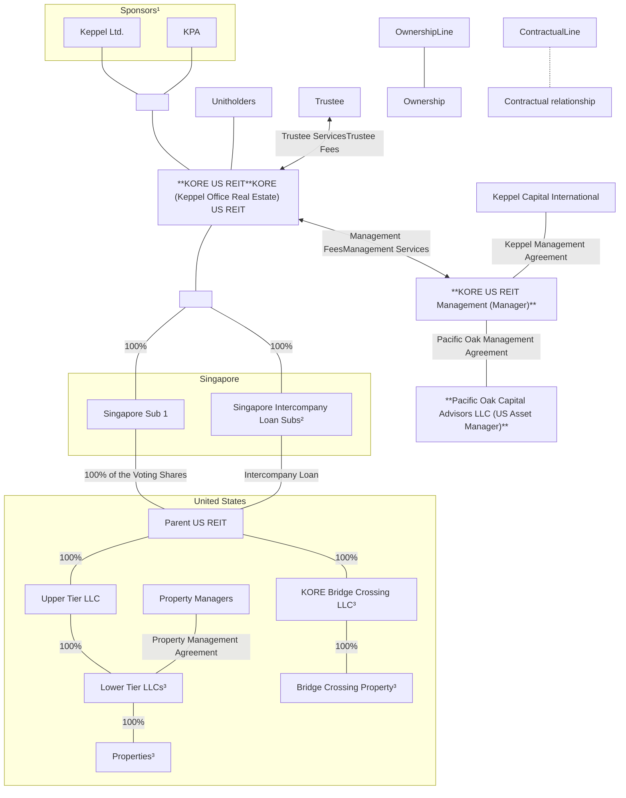
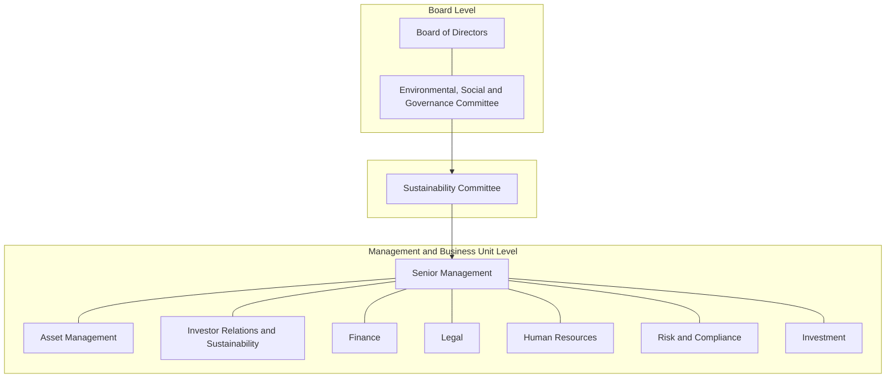
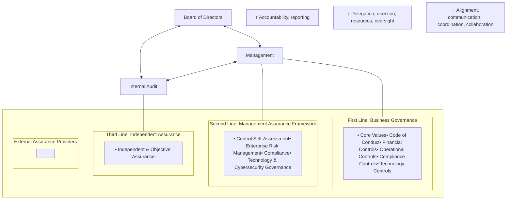

<!-- PAGE 1 -->

KORE US REIT logo

# Momentum

Annual Report 2025

<!-- PAGE 2 -->

# VISION

To be the preferred real estate investment trust offering Unitholders the opportunity to invest in a distinctive portfolio of office properties in the United States.

# MISSION

To deliver sustainable distributions and strong total returns to our Unitholders through investments in high-quality office buildings with a strategic focus on key growth markets in the United States.

## OVERVIEW
<table>
  <tbody>
    <tr>
        <td>Key Highlights</td>
        <td>2</td>
    </tr>
    <tr>
        <td>Corporate Profile and Strategic Direction</td>
        <td>3</td>
    </tr>
    <tr>
        <td>Quality Portfolio in Key Growth Markets</td>
        <td>4</td>
    </tr>
    <tr>
        <td>Financial Highlights and Quarterly Results</td>
        <td>6</td>
    </tr>
    <tr>
        <td>Strategic Asset Enhancements for Long-term Value</td>
        <td>7</td>
    </tr>
    <tr>
        <td>Chairman’s Statement</td>
        <td>8</td>
    </tr>
    <tr>
        <td>Corporate Governance at a Glance</td>
        <td>12</td>
    </tr>
    <tr>
        <td>Board of Directors</td>
        <td>14</td>
    </tr>
    <tr>
        <td>The Manager</td>
        <td>16</td>
    </tr>
    <tr>
        <td>Trust Structure</td>
        <td>17</td>
    </tr>
    <tr>
        <td>Investor Relations</td>
        <td>18</td>
    </tr>
  </tbody>
</table>

## OPERATIONS REVIEW
<table>
  <tbody>
    <tr>
        <td>Portfolio Review</td>
        <td>20</td>
    </tr>
    <tr>
        <td>— At a Glance</td>
        <td>24</td>
    </tr>
    <tr>
        <td>* The Plaza Buildings, Bellevue, Washington</td>
        <td>27</td>
    </tr>
    <tr>
        <td>* Bellevue Technology Center, Bellevue, Washington</td>
        <td>28</td>
    </tr>
    <tr>
        <td>* The Westpark Portfolio, Redmond, Washington</td>
        <td>29</td>
    </tr>
    <tr>
        <td>* Great Hills Plaza, Austin, Texas</td>
        <td>30</td>
    </tr>
    <tr>
        <td>* Westech 360, Austin, Texas</td>
        <td>31</td>
    </tr>
    <tr>
        <td>* Westmoor Center, Denver, Colorado</td>
        <td>32</td>
    </tr>
    <tr>
        <td>* 105 Edgeview, Denver, Colorado</td>
        <td>33</td>
    </tr>
    <tr>
        <td>* Bridge Crossing, Nashville, Tennessee</td>
        <td>34</td>
    </tr>
    <tr>
        <td>* 1800 West Loop South, Houston, Texas</td>
        <td>35</td>
    </tr>
    <tr>
        <td>* Bellaire Park, Houston, Texas</td>
        <td>36</td>
    </tr>
    <tr>
        <td>* One Twenty Five, Dallas, Texas</td>
        <td>37</td>
    </tr>
    <tr>
        <td>* Maitland Promenade I &amp; II, Orlando, Florida</td>
        <td>38</td>
    </tr>
    <tr>
        <td>* Iron Point, Sacramento, California</td>
        <td>39</td>
    </tr>
    <tr>
        <td>Financial Review</td>
        <td>40</td>
    </tr>
  </tbody>
</table>

## SUSTAINABILITY REPORT
<table>
  <tbody>
    <tr>
        <td>Sustainability Framework and Highlights for 2025</td>
        <td>47</td>
    </tr>
    <tr>
        <td>Letter to Stakeholders</td>
        <td>48</td>
    </tr>
    <tr>
        <td>About This Report</td>
        <td>50</td>
    </tr>
    <tr>
        <td>Approach to Sustainability</td>
        <td>51</td>
    </tr>
    <tr>
        <td>Environmental Stewardship</td>
        <td>59</td>
    </tr>
    <tr>
        <td>Responsible Business</td>
        <td>66</td>
    </tr>
    <tr>
        <td>People and Community</td>
        <td>70</td>
    </tr>
    <tr>
        <td>GRI Content Index</td>
        <td>78</td>
    </tr>
    <tr>
        <td>IFRS S2 Content Index</td>
        <td>80</td>
    </tr>
  </tbody>
</table>

## FINANCIAL STATEMENTS
<table>
  <tbody>
    <tr>
        <td>Report of the Trustee</td>
        <td>86</td>
    </tr>
    <tr>
        <td>Statement by the Manager</td>
        <td>87</td>
    </tr>
    <tr>
        <td>Independent Auditor’s Report</td>
        <td>88</td>
    </tr>
    <tr>
        <td>Statements of Financial Position</td>
        <td>91</td>
    </tr>
    <tr>
        <td>Consolidated Statement of Comprehensive Income</td>
        <td>92</td>
    </tr>
    <tr>
        <td>Consolidated Distribution Statement</td>
        <td>93</td>
    </tr>
    <tr>
        <td>Statements of Changes in Unitholders’ Funds</td>
        <td>94</td>
    </tr>
    <tr>
        <td>Consolidated Statement of Cash Flows</td>
        <td>96</td>
    </tr>
    <tr>
        <td>Consolidated Portfolio Statement</td>
        <td>97</td>
    </tr>
    <tr>
        <td>Notes to the Financial Statements</td>
        <td>98</td>
    </tr>
  </tbody>
</table>

## GOVERNANCE
<table>
  <tbody>
    <tr>
        <td>Corporate Governance</td>
        <td>126</td>
    </tr>
    <tr>
        <td>Risk Management</td>
        <td>153</td>
    </tr>
  </tbody>
</table>

## OTHER INFORMATION
<table>
  <tbody>
    <tr>
        <td>Additional Information</td>
        <td>156</td>
    </tr>
    <tr>
        <td>Unit Price Performance</td>
        <td>157</td>
    </tr>
    <tr>
        <td>Statistics of Unitholdings</td>
        <td>158</td>
    </tr>
    <tr>
        <td>Corporate Information</td>
        <td>160</td>
    </tr>
    <tr>
        <td>Notice of Annual General Meeting</td>
        <td>161</td>
    </tr>
  </tbody>
</table>

Proxy Form

<!-- PAGE 3 -->

# Momentum

Through the careful selection of assets in vibrant lifestyle markets and proactive asset management, KORE US REIT upholds a portfolio of high‑quality, well‑amenitised properties that address the needs of tenants and communities. Amid an evolving environment, we are building steady momentum—strengthening our foundations, sharpening our focus and positioning the portfolio to deliver long‑term, sustainable value for our stakeholders.

<!-- PAGE 4 -->

# Key Highlights

# Corporate Profile and Strategic Direction

**PORTFOLIO VALUATION**

# US$1.3b

Portfolio valuation was stable year-on-year (y-o-y). After accounting for capital expenditures and tenant improvements of US$39.5 million spent in FY 2025, there was a fair value loss of US$40.5 million.

**RENTAL REVERSION**

# 6.8%

Achieved positive rent reversion underpinned by robust leasing momentum and sustained demand for well-amenitised properties.

**PORTFOLIO COMMITTED OCCUPANCY**

# 87.2%

Leased 622,029 sf of office space in 2025, equivalent to 13.0% of the portfolio net lettable area (NLA).

**AGGREGATE LEVERAGE**

# 44.1%¹

All-in average cost of debt was 4.66% per annum, with interest coverage ratio (ICR)² at 2.5 times. 100% unsecured debt provides financial flexibility.

**FY 2025 INCOME AVAILABLE FOR DISTRIBUTION**

# US$43.0m

Income available for distribution of US$43.0 million for FY 2025 was 9.6% lower than FY 2024. The amount distributable to Unitholders was US$2.6 million.

**DISTRIBUTION PER UNIT**

# 0.25 US cents

Early resumption of distributions in 2H 2025, ahead of the initial distribution timeline of 1H 2026, marking the completion of the Recapitalisation Plan³.

KORE US REIT (KORE), formerly known as Keppel Pacific Oak US REIT, is a distinctive US office REIT listed on the Main Board of the Singapore Exchange Securities Trading Limited (SGX-ST) on 9 November 2017. The name “KORE” stands for Keppel Office Real Estate. KORE US REIT aims to be the first-choice US office S-REIT, delivering sustainable distributions and strong total returns to Unitholders.

KORE invests in a diversified mix of income-producing commercial and real estate-related assets in key growth markets across the US, characterised by strong economic fundamentals and attractive lifestyle attributes, including the Super Sun Belt, 18-Hour Cities and Supernovas.

The portfolio is anchored by tenants in the fast-growing and defensive sectors, including technology, advertising, media and information (TAMI), as well as medical and healthcare.

As at 31 December 2025, KORE’s portfolio comprised 13 freehold office buildings and business campuses across eight key growth markets in the US, with a combined asset value of approximately US$1.3 billion and a total net lettable area of 4.8 million sf.

KORE is managed by KORE US REIT Management Pte. Ltd., formerly known as Keppel Pacific Oak US REIT Management Pte. Ltd., which is jointly owned by two Sponsors, Keppel and KORE Pacific Advisors.

KORE US REIT seeks to be the first choice US office S-REIT offering Unitholders the opportunity to invest in a distinctive portfolio of office properties in key growth markets across the US.

OCCUPANCY RATE (%)
<table>
  <tbody>
    <tr>
        <td>Year</td>
        <td>Occupancy Rate (%)</td>
    </tr>
    <tr>
        <td>2021</td>
        <td>91.9</td>
    </tr>
    <tr>
        <td>2022</td>
        <td>92.6</td>
    </tr>
    <tr>
        <td>2023</td>
        <td>90.3</td>
    </tr>
    <tr>
        <td>2024</td>
        <td>90.0</td>
    </tr>
    <tr>
        <td>2025</td>
        <td>87.2</td>
    </tr>
  </tbody>
</table>

LEASING VOLUME ('000 sf)
<table>
  <tbody>
    <tr>
        <td>Year</td>
        <td>Leasing Volume ('000 sf)</td>
    </tr>
    <tr>
        <td>2021</td>
        <td>731</td>
    </tr>
    <tr>
        <td>2022</td>
        <td>651</td>
    </tr>
    <tr>
        <td>2023</td>
        <td>704</td>
    </tr>
    <tr>
        <td>2024</td>
        <td>939</td>
    </tr>
    <tr>
        <td>2025</td>
        <td>622</td>
    </tr>
  </tbody>
</table>

ADJUSTED NET PROPERTY INCOME⁴ (US$’000)
<table>
  <tbody>
    <tr>
        <td>Year</td>
        <td>Adjusted Net Property Income (US$'000)</td>
    </tr>
    <tr>
        <td>2021</td>
        <td>83,552</td>
    </tr>
    <tr>
        <td>2022</td>
        <td>85,493</td>
    </tr>
    <tr>
        <td>2023</td>
        <td>87,591</td>
    </tr>
    <tr>
        <td>2024</td>
        <td>83,442</td>
    </tr>
    <tr>
        <td>2025</td>
        <td>83,652</td>
    </tr>
  </tbody>
</table>

Strategic pillars diagram showing Portfolio Optimisation, Sustainability, Prudent Capital Management, and Value Accretive Investments

**PORTFOLIO OPTIMISATION**
* Maintain high occupancy and optimise rental rates through a focused leasing strategy
* Maximise asset potential and drive long-term returns
* Future-proof assets in line with evolving real estate trends and tenants’ preferences

**VALUE ACCRETIVE INVESTMENTS**
* Pursue growth opportunities to create long-term growth value
* Focus on key growth markets with strong macroeconomic growth indicators and positive office fundamentals

**PRUDENT CAPITAL MANAGEMENT**
* Proactively manage refinancing risks to enhance financial flexibility
* Fortify balance sheet and maintain an optimal capital structure

\*1 Aggregate leverage is computed based on gross borrowings over total deposited properties (the Group’s total assets) as stipulated in the Property Funds Appendix in the Code on Collective Investment Schemes (CIS Code) issued by the Monetary Authority of Singapore (MAS).

\*2 Defined in the CIS Code issued by the MAS as trailing 12 months earnings before interest, tax, depreciation and amortisation (excluding effects of any fair value changes of derivatives and investment properties, and foreign exchange translation differences), over trailing 12 months interest expense, borrowing-related fees and distributions on hybrid securities.

\*3 Pursuant to the Recapitalisation Plan announced on 15 February 2024, KORE temporarily suspended distributions for the period starting 2H 2023 through to the 2H 2025 distribution that would otherwise be paid in 1H 2026.

\*4 Excludes non-cash straight-line rent, lease incentives and amortisation of leasing commissions.

<!-- PAGE 5 -->

# Quality Portfolio in Key Growth Markets

Distinctive portfolio of 13 quality freehold office buildings and business campuses in key growth markets with vibrant lifestyle offerings across the US.

Map of the United States showing property locations in Bellevue/Redmond, Denver, Sacramento, Dallas, Austin, Houston, Nashville, and Orlando.

**BELLEVUE/ REDMOND, WASHINGTON**

* The Plaza Buildings
* Bellevue Technology Center
* The Westpark Portfolio

22 ranking icon

**DENVER, COLORADO**

* Westmoor Center
* 105 Edgeview

18 ranking icon

**SACRAMENTO, CALIFORNIA**

* Iron Point

**DALLAS, TEXAS**

* One Twenty Five

**AUSTIN, TEXAS**

* Great Hills Plaza
* Westech 360

**HOUSTON, TEXAS**

* 1800 West Loop South
* Bellaire Park

**NASHVILLE, TENNESSEE**

* Bridge Crossing

**ORLANDO, FLORIDA**

* Maitland Promenade I & II

## Portfolio Characteristics

* Building icon Key growth markets with positive economic fundamentals and vibrant lifestyle offerings

* Graduation cap icon Proximity to prestigious universities and educated talent pools

* Scales icon High-quality lease and financing structures that offer stability

* Location pin icon Attractive location and on-site amenities that decision-makers and talent desire

* Checklist icon Exposure to the fast-growing TAMI, medical and healthcare sectors

* Train icon Accessibility to alternative transit options

As at 31 December 2025

<table>
    <tr>
        <th>COMMITTED PORTFOLIO OCCUPANCY</th>
        <th>NET LETTABLE AREA</th>
        <th>ASSETS UNDER MANAGEMENT</th>
    </tr>
    <tr>
        <td>87.2%</td>
        <td>4.8m sf</td>
        <td>US$1.3b</td>
    </tr>
</table>

Magnet Cities icon Magnet Cities¹

Super Sun Belt Cities icon Super Sun Belt Cities¹

Supernovas icon Supernovas¹

Multitalented Producers icon Multitalented Producers¹

18-Hour Cities icon 18-Hour Cities

Markets to Watch 2026 icon Markets to Watch 2026²

¹ Emerging Trends in Real Estate 2025 by PwC and the Urban Land Institute (ULI).

² Emerging Trends in Real Estate 2026 by PwC and the ULI. Ranking based on overall real estate propsects.

<!-- PAGE 6 -->

# Financial Highlights and Quarterly Results

## RESULTS HIGHLIGHTS AND RATIOS

for the financial year ended 31 December

<table>
  <thead>
    <tr>
        <th> </th>
        <th>2025</th>
        <th>2024</th>
        <th>Change</th>
    </tr>
    <tr>
        <th> </th>
        <th>US$’000</th>
        <th>US$’000</th>
        <th>%</th>
    </tr>
  </thead>
  <tbody>
    <tr>
        <td>Gross revenue</td>
        <td>150,165</td>
        <td>146,437</td>
        <td>2.5</td>
    </tr>
    <tr>
        <td>Net property income</td>
        <td>80,656</td>
        <td>78,290</td>
        <td>3.0</td>
    </tr>
    <tr>
        <td>Income available for distribution to Unitholders</td>
        <td>43,032</td>
        <td>47,627</td>
        <td>(9.6)</td>
    </tr>
    <tr>
        <td>Distribution to Unitholders¹</td>
        <td>2,611</td>
        <td>–</td>
        <td>100.0</td>
    </tr>
    <tr>
        <td>Distribution per Unit (DPU) (US cents)¹'²</td>
        <td>0.25</td>
        <td>–</td>
        <td>100.0</td>
    </tr>
    <tr>
        <td>Weighted average all-in interest rate (% per annum)³</td>
        <td>4.66</td>
        <td>4.45</td>
        <td>21 bps</td>
    </tr>
    <tr>
        <td>Interest coverage ratio (times)⁴</td>
        <td>2.50</td>
        <td>2.60</td>
        <td>(3.8)</td>
    </tr>
  </tbody>
</table>

## BALANCE SHEET HIGHLIGHTS AND RATIOS

as at 31 December

<table>
  <thead>
    <tr>
        <th> </th>
        <th>2025</th>
        <th>2024</th>
        <th>Change</th>
    </tr>
    <tr>
        <th> </th>
        <th>US$’000</th>
        <th>US$’000</th>
        <th>%</th>
    </tr>
  </thead>
  <tbody>
    <tr>
        <td>Investment properties</td>
        <td>1,325,370</td>
        <td>1,326,410</td>
        <td>(0.1)</td>
    </tr>
    <tr>
        <td>Total assets⁵</td>
        <td>1,389,738</td>
        <td>1,387,973</td>
        <td>0.1</td>
    </tr><tr>
<td></td>
<td></td>
<td></td>
<td></td>
</tr><tr>
<td></td>
<td></td>
<td></td>
<td></td>
</tr><tr>
<td></td>
<td></td>
<td></td>
<td></td>
</tr><tr>
<td></td>
<td></td>
<td></td>
<td></td>
</tr>
    <tr>
        <td>Gross borrowings⁵'⁶</td>
        <td>612,720</td>
        <td>607,220</td>
        <td>0.9</td>
    </tr>
    <tr>
        <td>Adjusted NAV per Unit, excluding distribution declared (US$)¹</td>
        <td>0.68</td>
        <td>0.69</td>
        <td>(1.4)</td>
    </tr>
    <tr>
        <td>Unit price as at balance sheet date (US$)</td>
        <td>0.235</td>
        <td>0.205</td>
        <td>14.6</td>
    </tr>
    <tr>
        <td>Discount to NAV (%)⁷</td>
        <td>(65.4)</td>
        <td>(70.3)</td>
        <td>4.9 pp</td>
    </tr>
    <tr>
        <td>Aggregate leverage (%)⁵</td>
        <td>44.1</td>
        <td>43.7</td>
        <td>40 bps</td>
    </tr>
  </tbody>
</table>
<table>
  <thead>
    <tr>
        <th> </th>
        <th colspan="2">Quarter 1</th>
        <th colspan="2">Quarter 2</th>
        <th colspan="2">Quarter 3</th>
        <th colspan="2">Quarter 4</th>
        <th>Total</th>
    </tr>
    <tr>
        <th> </th>
        <th>US$’000</th>
        <th>%</th>
        <th>US$’000</th>
        <th>%</th>
        <th>US$’000</th>
        <th>%</th>
        <th>US$’000</th>
        <th>%</th>
        <th>US$’000</th>
    </tr>
  </thead>
  <tbody>
    <tr>
        <td colspan="10"><strong>Gross revenue</strong></td>
    </tr>
    <tr>
        <td>2025</td>
        <td>36,860</td>
        <td>24.5</td>
        <td>37,696</td>
        <td>25.1</td>
        <td>37,535</td>
        <td>25.0</td>
        <td>38,074</td>
        <td>25.4</td>
        <td>150,165</td>
    </tr>
    <tr>
        <td>2024</td>
        <td>37,082</td>
        <td>25.3</td>
        <td>37,290</td>
        <td>25.5</td>
        <td>37,600</td>
        <td>25.7</td>
        <td>34,465</td>
        <td>23.5</td>
        <td>146,437</td>
    </tr>
    <tr>
        <td colspan="10"><strong>Net property income</strong></td>
    </tr>
    <tr>
        <td>2025</td>
        <td>19,651</td>
        <td>24.4</td>
        <td>21,005</td>
        <td>26.0</td>
        <td>20,615</td>
        <td>25.6</td>
        <td>19,385</td>
        <td>24.0</td>
        <td>80,656</td>
    </tr>
    <tr>
        <td>2024</td>
        <td>20,984</td>
        <td>26.8</td>
        <td>21,031</td>
        <td>26.9</td>
        <td>20,128</td>
        <td>25.7</td>
        <td>16,147</td>
        <td>20.6</td>
        <td>78,290</td>
    </tr>
    <tr>
        <td colspan="10"><strong>Income available for distribution to Unitholders</strong></td>
    </tr>
    <tr>
        <td>2025⁸</td>
        <td>9,609</td>
        <td>22.3</td>
        <td>10,339</td>
        <td>24.0</td>
        <td>10,445</td>
        <td>24.3</td>
        <td>12,639</td>
        <td>29.4</td>
        <td>43,032</td>
    </tr>
    <tr>
        <td>2024⁹</td>
        <td>11,905</td>
        <td>25.0</td>
        <td>11,909</td>
        <td>25.0</td>
        <td>11,907</td>
        <td>25.0</td>
        <td>11,906</td>
        <td>25.0</td>
        <td>47,627</td>
    </tr>
  </tbody>
</table>

\*1 Early resumption of distributions in 2H 2025. Distributions had been suspended starting with those related to 2H 2023 up till 1H 2025 under KORE’s Recapitalisation Plan announced on 15 February 2024.

\*2 DPU for 2H 2025 was calculated based on 1,044,450,254 issued Units as at 31 December 2025.

\*3 Weighted average all-in interest rate includes amortisation of upfront debt financing costs.

\*4 Defined in the CIS Code issued by the MAS as trailing 12 months earnings before interest, tax, depreciation and amortisation (excluding effects of any fair value changes of derivatives and investment properties, and foreign exchange translation differences), over trailing 12 months interest expenses, borrowing-related fees and distributions on hybrid securities.

\*5 Aggregate leverage is computed based on gross borrowings over total deposited properties (the Group’s total assets) as stipulated in the Property Funds Appendix in the CIS Code issued by MAS.

\*6 Gross borrowings relates to bank borrowings drawn down from loan facilities.

\*7 Based on NAV as at 31 December 2025 and 31 December 2024.

\*8 The Manager has elected to receive 100% of its base fee for the financial year 2025 amounting to US$4,781,261 in cash.

\*9 The Manager has elected to receive 100% of its base fee for the financial year 2024 amounting to US$5,291,881 in cash.

<!-- PAGE 7 -->

OVERVIEW Strategic Asset Enhancements for Long-term Value

A vibrant common amenity area at The Greenhouse, 10900 The Plaza Building, designed to enhance tenant experience.

# COMPLETED ASSET ENHANCEMENT INITIATIVES IN FY 2025

<table>
  <thead>
    <tr>
        <th>Property</th>
        <th> </th>
    </tr>
  </thead>
  <tbody>
    <tr>
        <td>The Plaza Buildings</td>
        <td>• The Greenhouse spec suite floor with shared amenities • Pickleball court</td>
    </tr>
    <tr>
        <td>The Westpark Portfolio</td>
        <td>• Tenant Dote To-Go started providing an on-site coffee and pastry bar at the newly constructed tenant lounge</td>
    </tr>
    <tr>
        <td>Westmoor Center</td>
        <td>• Lobby upgrade of Building 5 • New cafe operator</td>
    </tr>
    <tr>
        <td>Bellaire Park</td>
        <td>• Lobby upgrade</td>
    </tr>
    <tr>
        <td>Maitland Promenade I &amp; II</td>
        <td>• Expanded cafe seating area</td>
    </tr>
  </tbody>
</table>

Refreshed lift lobby at Bellaire Park with signage for Elevators and Restrooms

Refreshed lift lobby at Bellaire Park, creating a welcoming arrival experience.

Modern spec suite interior with glass walls and wooden cabinetry

Modern spec suite at The Greenhouse, 10900 The Plaza Building, offering flexible space for tenants.

## SPEC SUITES STRATEGY

**Smartly programmed move-in-ready tenant spaces**

* Full floor spec suites at Iron Point, 1800 West Loop South and 10900 The Plaza Building with common amenity hub

* Individual spec suites in appropriate sizes will continue to be planned and built at selected properties where there is expected demand

Icon showing a downward arrow with a dollar sign

**LOWER**

Long-term capital expenditure requirements

Icon showing a stopwatch

**FASTER**

Lease-up times

Icon showing arrows pointing in multiple directions

**FLEXIBLE**

Modular design, typically <7,500 sf, enables suites to be combined for larger space requirements

**» Read more on Iron Point on page 22.**

<!-- PAGE 8 -->

# Momentum

Portrait of Peter McMillan III, Chairman

> "Through our steadfast focus on operational performance and the strategic enhancement of our portfolio, we advanced the quality and competitiveness of our assets, while prudent capital management, in parallel, further strengthened our financial position."

**PETER MCMILLAN III**, Chairman

**DEAR UNITHOLDERS,**

2025 was a pivotal year for KORE US REIT (KORE), formerly known as Keppel Pacific Oak US REIT. Despite a prolonged period of market volatility – characterised by elevated interest rates, evolving office demand patterns and a challenging US capital market environment – we remained focused on strengthening our portfolio fundamentals and positioning the REIT for long-term resilience and growth. Through our steadfast focus on operational performance and the strategic enhancement of our portfolio, we advanced the quality and competitiveness of our assets, while prudent capital management, in parallel, further strengthened our financial position. As a result, we were able to resume distributions ahead of schedule, marking the conclusion of KORE’s Recapitalisation Plan¹.

Subsequent to the financial year end, we also announced² that we are in late-stage negotiations with a third-party US asset manager to enter into a new asset management outsourcing arrangement. To better reflect the REIT’s operations going forward, we effected a name change for both the REIT and its Manager on 5 February 2026. Keppel Pacific Oak US REIT has been renamed KORE US REIT, and Keppel Pacific Oak US REIT Management Pte. Ltd. has been renamed KORE US REIT Management Pte. Ltd. The new names also signify a refreshed chapter for KORE as the REIT emerges from a challenging period.

**YEAR IN REVIEW**

The US economy remained steady through the year, supported by strong consumer spending and robust technology investments, particularly in artificial intelligence and data infrastructure. Despite lingering inflationary pressures, the Federal

Reserve delivered three rate cuts totalling 75 basis points, while steady labour-market conditions helped sustain economic momentum amid global uncertainties.

Meanwhile, the office market continued adjusting to evolving demand dynamics and underwent structural shifts that reshaped occupier behaviour. Market volatility was compounded by broader macroeconomic pressures, including the resurgence of trade tariffs. Nonetheless, the recovery gained traction as return-to-office activity accelerated and a federal order ended remote work across government agencies. By the end of 2025, leasing activity in the office market had reached a post-pandemic high, with annual volumes rising y-o-y. This improvement reflected strengthening supply-demand dynamics as tenants gravitated towards a limited pool of high-quality, well-amenitised assets in lifestyle-oriented markets.

**FOCUSING ON STRATEGIC PORTFOLIO ENHANCEMENTS**

Against this backdrop, we continued to strengthen the long-term competitiveness of our portfolio. We advanced our asset enhancement strategy, delivering initiatives such as spec suite rollouts, amenity upgrades and reconfigured activation spaces. Key asset enhancement initiatives in 2025 included a spec suite floor with shared amenity space at The Greenhouse in 10900 The Plaza Building and lobby upgrades at Bellaire Park and Building 5 of Westmoor Center.

The implementation of our spec suites strategy enhances asset competitiveness by providing move-in-ready spaces that accelerate occupancy and rental commencement while offering adaptable finishes that reduce

## Early Resumption of Distributions

0.25 US CENTS PER UNIT CONCLUDES KORE’S RECAPITALISATION PLAN

## Marking A Refreshed Chapter

KEPPEL PACIFIC OAK US REIT HAS BEEN RENAMED KEPPEL OFFICE REAL ESTATE (KORE) US REIT

# KORE US REIT

\*1 Pursuant to the Recapitalisation Plan announced on 15 February 2024, KORE temporarily suspended distributions for the period starting from 2H 2023 through to the 2H 2025 distribution that would otherwise be paid in 1H 2026.

\*2 KORE US REIT’s SGX announcement, “Updates on Certain Developments Relating to US Asset Manager and a Substantial Unitholder”, dated 3 February 2026.

<!-- PAGE 9 -->

**The early resumption of distributions reflects our confidence in the portfolio’s underlying fundamentals and represents an important step towards rebuilding long-term distribution stability.**

longer-term capital requirements. Notably, the full-floor spec suite at Iron Point was fully leased shortly after completion, reflecting strong demand for well-designed, move-in-ready spaces. Building on this positive traction, we will continue delivering appropriately sized spec suites in line with anticipated tenant demand, including a full-floor spec suite at 10800 The Plaza Building in 2026 following a tenant departure.

towards rebuilding long-term distribution stability. We have adopted a conservative payout ratio with the intention of progressively increasing distributions to a higher, sustainable level aligned with long-term portfolio performance.

On the capital management front, we have successfully addressed all term loan maturities¹ for 2025 and 2026. This has strengthened our financial position and enabled the early resumption of distributions. As at 31 December 2025, aggregate leverage stood at 44.1% with an ICR of 2.5 times.

KORE also maintains a highly diversified tenant base. No single tenant dominates the portfolio, with the top 10 collectively contributing only 29.5% of cash rental income from a base of over 390³ tenants. Approximately 51% of NLA is occupied by established tenants from growing and defensive sectors such as TAMI, as well as medical and healthcare, providing a well-balanced and stable income profile.

Active asset enhancement strategies continued to support positive leasing outcomes and healthy occupancy. As at end-2025, KORE achieved portfolio occupancy of 87.2%, outperforming both the US office market average of 85.9% and the 83.1% benchmark across gateway cities. This performance was underpinned by strong leasing momentum, with 622,029 sf of new leases secured – equivalent to 13.0% of the portfolio’s NLA for FY 2025. Rental reversion for the year was positive at 6.8%, underscoring the continued appeal of our prime, well-located assets.

**WELL-POSITIONED IN VIBRANT LIFESTYLE MARKETS**

Amid shifting market dynamics, KORE’s focus on high quality, lifestyle-oriented markets set our portfolio apart. These vibrant, mixed-use ecosystems – where work, leisure, and social experiences converge – remain highly attractive to both occupiers and investors and have demonstrated strong leasing performance and firm rental rates².

**COMMITMENT TO SUSTAINABILITY**

KORE continues to be guided by our three sustainability pillars of Environmental Stewardship, Responsible Business, as well as People and Community.

In 2025, we achieved a 12.5% reduction in Scope 1 and 2 greenhouse gas emissions compared to our 2019 baseline. To deepen our understanding of sustainability risks and opportunities, we assessed nature and biodiversity impacts in line with Taskforce on Nature-Related Financial Disclosures (TNFD) recommendations. This builds on our 2024 climate risk review and underscores our commitment to making informed decisions and ensuring portfolio resilience.

**ENHANCING FINANCIAL STABILITY**

Supported by disciplined operational execution, KORE closed FY 2025 with net property income (NPI) of US$80.7 million, a 3.0% y-o-y increase. Income available for distribution for the year was US$43.0 million. Following careful assessment of our cash flow, capital commitments and overall liquidity needs, we have declared a distribution of 0.25 US cents per Unit for the period from 1 July to 31 December 2025. While modest, this early resumption of distributions reflects our confidence in the portfolio’s underlying fundamentals and represents an important step

These trends validate KORE’s early strategic investments in lifestyle markets which offer dynamic economies, deep talent pool and comparatively lower living costs. Our portfolio is concentrated in 18-hour cities, markets that offer vibrant entertainment, outdoor recreation, and a strong sense of community. Our positioning in these locations provides a competitive edge, supported by demographic momentum, post-pandemic urban vibrancy and heightened perceptions of safety, all of which are contributing to office demand today.

Reflecting our continued progress in sustainability and governance excellence, KORE advanced to 11th position in the Singapore Governance and Transparency Index under the REIT and Business Trust category, up from 16th in 2024.

We believe that integrating sustainability into our operations and capital management supports long-term value creation and enhances risk management. Further details on our sustainability initiatives can be found in our Sustainability Report on pages 46 to 84.

The Hub at Bellevue Technology Center, Eastside Bellevue

The Hub at Bellevue Technology Center, Eastside Bellevue, is a freestanding amenity building within the campus.

**OUTLOOK AND ACKNOWLEDGEMENTS**

As we enter FY 2026, we are optimistic that our strengthened financial position and continued focus on enhancing the portfolio have placed KORE in a good position to navigate risks and capture opportunities as the US office market recovery gains momentum. Our investment proposition remains intact—anchored by assets in key growth markets and vibrant lifestyle hubs, supported by resilient fundamentals and strong operational execution. With healthy liquidity and a diversified tenant base, we are committed to delivering sustainable long-term growth, driving portfolio performance, and maintaining disciplined capital management.

in navigating market headwinds and driving progress.

On behalf of the Board and management, I would like to extend our appreciation to Mr Andy Gwee, who stepped down as KORE’s Chief Financial Officer in June 2025 to assume a new role in Keppel Ltd., for his significant contributions to the REIT. We are also pleased to welcome Ms See Ai Lin, who was appointed Head of Finance with effect from 16 June 2025, succeeding Mr Gwee.

Finally, I would like to thank our Unitholders, valued tenants and business partners for your continued trust and support, which remain fundamental to KORE’s progress and resilience.

I would also like to express my sincere appreciation to the management team, staff, asset managers, leasing teams and Trustee for their commitment and dedication

Yours sincerely,

Signature of Peter McMillan III

**PETER MCMILLAN III**
Chairman
27 February 2026

<!-- PAGE 10 -->

# Corporate Governance at a Glance

The Board and management of KORE US REIT Management Pte. Ltd., as manager of KORE US REIT, are fully committed to upholding good corporate governance standards.

### BOARD HIGHLIGHTS

Board Highlights icon

**Lead Independent Director role implemented since February 2021**

Audit and Risk Committee icon

**Audit and Risk Committee comprises four Independent Directors**

Board Competencies icon

**Board Competencies**

* Accounting
* Finance
* Real Estate Industry Knowledge
* Risk Management
* Sustainability and Renewable Energy
* Digital Technology
* Mergers & Acquisitions
* Business Development
* Corporate Finance
* International & Regional Strategic Planning
* Human Resource
* Legal
* Corporate Governance

**CORPORATE GOVERNANCE POLICIES**

The Manager adopts the Code of Corporate Governance 2018 issued by the Monetary Authority of Singapore on 6 August 2018, as amended from time to time (the "CG Code") as its benchmark for corporate governance policies and practices. The Manager is pleased to share that KORE US REIT has complied with the principles of the CG Code and complied in all material aspects with the provisions and practices in the CG Code. Where there are deviations from the provisions of the CG Code, appropriate explanations have been provided in this Annual Report. Please refer to pages 126 to 152 for more information on KORE US REIT and the Manager's governance policies.

**RISK MANAGEMENT AND INTERNAL CONTROLS**

Identifying and managing risks is central to the business of KORE US REIT and to protecting Unitholders' interests and value. KORE US REIT operates within overall guidelines and specific parameters set by the Board. Responsibility for managing risks lies with the Manager, working within the overall strategy outlined by the Board. The Manager has appointed experienced and well-qualified management to handle its day-to-day operations.

**HOW KORE US REIT COMPLIES WITH THE CG CODE**

<table>
  <thead>
    <tr>
<th> </th>
<th>Page</th>
    </tr>
  </thead>
  <tbody>
    <tr>
<td>1. Board Matters</td>
<td>127</td>
    </tr>
    <tr>
<td>2. Remuneration Report</td>
<td>134</td>
    </tr>
    <tr>
<td>3. Accountability and Audit</td>
<td>137</td>
    </tr>
    <tr>
<td>4. Unitholder Rights, Conduct of Unitholder Meetings and Engagement with Unitholders and Stakeholders</td>
<td>140</td>
    </tr>
    <tr>
<td colspan="2">5. Policies</td>
    </tr>
    <tr>
<td>Directors’ and Key Management Personnel Remuneration Policy</td>
<td>134</td>
    </tr>
    <tr>
<td>Insider Trading and Dealing in Securities Policies</td>
<td>141</td>
    </tr>
    <tr>
<td>Whistle-Blower Policy</td>
<td>147</td>
    </tr>
  </tbody>
</table>

## BOARD COMPOSITION DASHBOARD

**TENURE**

Tenure <3 years icon <3 years
Tenure 3-6 years icon 3-6 years
Tenure >6 years icon >6 years

**BOARD GENDER DIVERSITY**

Female icon Female

Male icon Male

**INDEPENDENCE**

Independent Directors icon Independent Directors

Non-Independent Directors icon Non-Independent Directors

**AGE PROFILE**

Age Profile 50-59 years icon 50-59 years

Age Profile 60-69 years icon 60-69 years

**ATTENDANCE TABLE**

<table>
  <thead>
    <tr>
        <th> </th>
        <th>Board Meetings Attended</th>
        <th>Audit and Risk Committee Meetings Attended</th>
        <th>Nominating and Remuneration Committee Meetings Attended</th>
        <th>Environmental, Social and Governance Committee Meetings Attended</th>
        <th>Unitholders’ Meetings Attended</th>
    </tr>
  </thead>
  <tbody>
    <tr>
        <td>Mr Peter McMillan III</td>
        <td>4</td>
        <td>4</td>
        <td>2</td>
        <td>2</td>
        <td>2</td>
    </tr>
    <tr>
        <td>Mr Lawrence David Sperling</td>
        <td>4</td>
        <td>4</td>
        <td>2</td>
        <td>2</td>
        <td>2</td>
    </tr>
    <tr>
        <td>Mr Roger Tay Puay Cheng</td>
        <td>4</td>
        <td>4</td>
        <td>–</td>
        <td>2</td>
        <td>2</td>
    </tr>
    <tr>
        <td>Mr Kenneth Tan Jhu Hwa</td>
        <td>4</td>
        <td>4</td>
        <td>2</td>
        <td>2</td>
        <td>2</td>
    </tr>
    <tr>
        <td>Ms Sharon Riley Wortmann</td>
        <td>4</td>
        <td>4</td>
        <td>2</td>
        <td>2</td>
        <td>2</td>
    </tr>
    <tr>
        <td>Ms Bridget Lee Siow Pei</td>
        <td>4</td>
        <td>4</td>
        <td>2</td>
        <td>2</td>
        <td>2</td>
    </tr>
    <tr>
        <td>No. of Meetings held in FY 2025</td>
        <td>4</td>
        <td>4</td>
        <td>2</td>
        <td>2</td>
        <td>2</td>
    </tr>
  </tbody>
</table>

<!-- PAGE 11 -->

# Board of Directors

Portrait of Peter McMillan III

**PETER MCMILLAN III, 68**

Chairman and
Non-Executive Director

**Date of first appointment:**

19 October 2017

**Date of last endorsement:**

17 April 2025

**Length of service (as at 31 December 2025):**

8 years 2 months

**Board Committee(s) served on:**

Nil

**Academic & Professional Qualification(s):**

Bachelor of Arts (Honours) in Economics, Clark University; Master of Business Administration, Wharton Graduate School of Business, University of Pennsylvania

**Present Directorships (as at 1 January 2026):**

*Listed companies*

TCW Strategic Income Fund, Inc.; TCW Private Asset Income Fund

*Other principal directorships*

Pacific Oak Strategic Opportunity REIT, Inc; TCW Funds, Inc, TCW Metropolitan West Funds and TCW ETF Trust

**Major Appointments (other than directorships):**

Co-founder, Pacific Oak Capital Advisors LLC; Co-founder and Managing Partner, Willowbrook Capital Group, LLC

**Past Directorships held over the preceding 5 years (from 1 January 2021 to 31 December 2025):**

Pacific Oak Strategic Opportunity REIT II, Inc

**Others:**

Nil

Portrait of Lawrence David Sperling

**LAWRENCE DAVID SPERLING, 66** Environmental, Social and Governance Committee icon Audit and Risk Committee icon Nominating and Remuneration Committee icon

Lead Independent Director

**Date of first appointment:**

30 June 2022

**Date of last endorsement:**

19 April 2023

**Length of service (as at 31 December 2025):**

3 years 6 months

**Board Committee(s) served on:**

Chairman of Environmental, Social and Governance Committee; Member of Audit and Risk Committee; Member of Nominating and Remuneration Committee

**Academic & Professional Qualification(s):**

Juris Doctor and Master of Business Administration Degrees, University of North Carolina at Chapel Hill; Bachelor of Arts Degree in History, University of Virginia; Licensed Attorney, The North Carolina State Bar

**Present Directorships (as at 1 January 2026):**

*Listed companies*
Nil

*Other principal directorships*
Meadpoint Pte Ltd.

**Major Appointments (other than directorships):**
Nil

**Past Directorships held over the preceding 5 years (from 1 January 2021 to 31 December 2025):**
Nil

**Others:**

Nil

Portrait of Roger Tay Puay Cheng

**ROGER TAY PUAY CHENG, 57** Audit and Risk Committee icon

Independent Director

**Date of first appointment:**

15 November 2024

**Date of last endorsement:**

17 April 2025

**Length of service (as at 31 December 2025):**

1 year 1 month

**Board Committee(s) served on:**

Chairman of Audit and Risk Committee

**Academic & Professional Qualification(s):**

Bachelor of Accountancy (Hons), National University of Singapore; Fellow, Institute of Singapore Chartered Accountants; Fellow, Insolvency Practitioners Association of Singapore

**Present Directorships (as at 1 January 2026):**

*Listed companies*
Nil

*Other principal directorships*
Roger Tay Advisory Pte. Ltd.

**Major Appointments (other than directorships):**

RTMHAKC Investment Holdings Pte. Ltd.
Aura Ventures Private Limited

**Past Directorships held over the preceding 5 years (from 1 January 2021 to 31 December 2025):**
Nil

**Others:**

Nil

**Board Committees**

Audit and Risk Committee icon Audit and Risk Committee

Nominating and Remuneration Committee icon Nominating and Remuneration Committee

Environmental, Social and Governance Committee icon Environmental, Social and Governance Committee

<!-- PAGE 12 -->

Portrait of Kenneth Tan Jhu Hwa

Portrait of Sharon Riley Wortmann

Portrait of Bridget Lee Siow Pei

**KENNETH TAN JHU HWA**, 52 N A E
Independent Director

**SHARON RILEY WORTMANN**, 64 A N E
Independent Director

**BRIDGET LEE SIOW PEI**, 54 N
Non-Executive Director

**Date of first appointment:**
19 October 2017
**Date of first appointment:**
20 April 2021
**Date of first appointment:**
20 October 2021

**Date of last endorsement:**
19 April 2023
**Date of last endorsement:**
17 April 2024
**Date of last endorsement:**
17 April 2024

**Length of service (as at 31 December 2025):**
8 years 2 months
**Length of service (as at 31 December 2025):**
4 years 8 months
**Length of service (as at 31 December 2025):**
4 years 2 months

**Board Committee(s) served on:**
Chairman of Nominating and Remuneration Committee; Member of Audit and Risk Committee; Member of Environmental, Social and Governance Committee
**Board Committee(s) served on:**
Member of Audit and Risk Committee; Member of Nominating and Remuneration Committee; Member of Environmental, Social and Governance Committee
**Board Committee(s) served on:**
Member of Nominating and Remuneration Committee

**Academic & Professional Qualification(s):**
Bachelor of Arts in Economics (First Class Honours), Cambridge University
**Academic & Professional Qualification(s):**
Bachelor of Business Administration (Major in Real Estate Finance & Urban Development, Minor in International Business), Georgia State University
**Academic & Professional Qualification(s):**
Master of Management, JL Kellogg Graduate School of Management, Northwestern University; Bachelor of Accountancy, Nanyang Technological University

**Present Directorships (as at 1 January 2026):**
**Present Directorships (as at 1 January 2026):**
**Present Directorships (as at 1 January 2026):**

*Listed companies*
Nil
*Listed companies*
Nil
*Listed companies*
Nil

**Other principal directorships**
Southern Capital Group Private Limited
**Other principal directorships**
NAIOP Inland Empire Chapter; AIR CRE
**Other principal directorships**
Keppel Credit Fund Management Pte. Ltd.

**Major Appointments (other than directorships):**
Chief Executive Officer, Southern Capital Group Private Limited
**Major Appointments (other than directorships):**
Managing Director, JLL Industrial Services Group; Chairman, Community Service, ICON Conference Committee and CONVERGE Conference Committee of NAIOP Inland Empire Chapter
**Major Appointments (other than directorships):**
Chief Investment Officer, Real Estate, Keppel Ltd.

**Past Directorships held over the preceding 5 years (from 1 January 2021 to 31 December 2025):**
Nil
**Past Directorships held over the preceding 5 years (from 1 January 2021 to 31 December 2025):**
Nil
**Past Directorships held over the preceding 5 years (from 1 January 2021 to 31 December 2025):**
KCIF Investments Pte. Ltd.; Keppel Core Infra Fund GP Pte. Ltd.; Keppel Infrastructure Holdings Pte Ltd; Keppel Capital Alternative Asset Pte. Ltd.

**Others:**
Nil
**Others:**
Nil
**Others:**
Nil

<!-- PAGE 13 -->

# The Manager

Portrait of David Snyder

**DAVID SNYDER**, 55
Chief Executive Officer and Chief Investment Officer

Mr Snyder was part of the management team that led the successful listing of KORE US REIT (formerly known as Keppel Pacific Oak US REIT) and has been the Chief Executive Officer and Chief Investment Officer since its listing on 9 November 2017.

Prior to his current appointment, Mr Snyder was a consultant to KBS Capital Advisors where he managed the AFRT portfolio.

From 2008 to 2015, Mr Snyder was the Chief Financial Officer (CFO) of KBS Capital Advisors and five of its non-traded REITs. In addition to his CFO responsibilities, he led the negotiation for the transfer of the AFRT portfolio comprising over 800 properties valued at over US$1.7 billion. He subsequently managed that portfolio for KBS Real Estate Investment Trust.

From 1998 to 2008, Mr Snyder was the Financial Controller for Nationwide Health Properties, a publicly traded healthcare REIT. Prior to that, he was the Director of Financial Reporting for Regency Health Services.

He started his career as an auditor at Arthur Andersen LLP after graduating from Biola University with a Bachelor of Science in Business Administration.

**Present Directorships (as at 1 January 2026):**
KORE US REIT Management, Inc;
Various subsidiaries of KORE US REIT

**Past Directorships held over the preceding 5 years (from 1 January 2021 to 31 December 2025):**

Nil

Portrait of See Ai Lin

**SEE AI LIN**, 36
Head of Finance

Ms See has more than 14 years of experience in the accounting, finance and auditing industry. She has been with the Manager since 2018, shortly after the listing of KORE, overseeing financial and statutory reporting, management reporting, compliance, taxation and the annual budgeting process.

Prior to her appointment to the Manager in 2018, Ms See was an Assistant Manager at Keppel REIT Management Pte. Ltd., the Manager of Keppel REIT, where she was responsible for the financial and management reporting functions.

From 2011 to 2016, she was an Assistant Audit Manager with PricewaterhouseCoopers LLP where she was involved in the audits of local listed groups and multinational companies in sectors including real estate, hospitality and construction.

Ms See graduated with a Bachelor of Commerce (Accounting) from The University of Queensland and holds a professional qualification from CPA Australia.

**Present Directorships (as at 1 January 2026):**
KORE US REIT Management, Inc;
Various subsidiaries of KORE US REIT

**Past Directorships held over the preceding 5 years (from 1 January 2021 to 31 December 2025):**

Nil

Portrait of Low Mei Xian

**LOW MEI XIAN**, 34
Senior Manager, Finance

Ms Low has more than 10 years of experience in the accounting, finance and auditing industry, specialising in the real estate and construction sectors.

Before her appointment to the Manager, she was a Senior Audit Manager at Ernst & Young LLP, where she served as the engagement manager for audits of SGX-listed companies and real estate investment trusts (REITs), as well as engagements involving a Singapore statutory board, property developers and construction companies.

Ms Low holds a Bachelor of Science in Accounting and Finance (First Class Honours) from the University of London – SIM Global Education. She is a Certified Practising Accountant (CPA) and a member of CPA Australia.

**Present Directorships (as at 1 January 2026):**
Nil

**Past Directorships held over the preceding 5 years (from 1 January 2021 to 31 December 2025):**
Nil

<!-- PAGE 14 -->

# Trust Structure

\*1 Keppel Ltd., through Keppel Capital Investment Holdings Pte. Ltd., holds a deemed 6.98% stake in KORE US REIT (KORE). Pacific Oak Strategic Opportunity REIT, Inc. (KPA entity) holds a 6.14% stake in KORE. KPA holds a deemed interest of 0.84% in KORE, for a total of 6.98%.

\*2 There are four wholly-owned Singapore Intercompany Loan Subsidiaries extending intercompany loans to the Parent US REIT.

\*3 Bridge Crossing Property is held under KORE Bridge Crossing LLC, which in turn is held directly under Parent US REIT. The other properties in the portfolio are held under the various Lower Tier LLCs respectively.

Information as at 31 December 2025. Unitholding in KORE is subject to an ownership restriction of 9.8% of the total Units outstanding.

<!-- PAGE 15 -->

# Investor Relations

**KORE utilises a variety of platforms and communication channels to provide prompt disclosure of its business developments and relevant corporate affairs.**

UNITHOLDING BY INVESTOR TYPE (%)
as at 9 February 2026

<table>
  <thead>
    <tr>
        <th>Investor Type</th>
        <th>Percentage (%)</th>
    </tr>
  </thead>
  <tbody>
    <tr>
        <td>Sponsors and related parties</td>
        <td>13.5</td>
    </tr>
    <tr>
        <td>Institutional</td>
        <td>19.7</td>
    </tr>
    <tr>
        <td>Retail</td>
        <td>66.8</td>
    </tr>
    <tr>
        <td>Total</td>
        <td>100.0</td>
    </tr>
  </tbody>
</table>

## TIMELY ENGAGEMENT AND TRANSPARENT COMMUNICATION

KORE adopts a multi-channel approach to provide the financial community with accurate, timely, and comprehensive updates on its strategic direction, corporate developments, financial performance, and industry outlook. All communication materials, including media releases, announcements, half-year and full-year financial statements, key business and operational updates and presentations are published on SGXNet and KORE’s website (www.koreusreit.com). Additionally, interested parties can subscribe to email alerts via KORE’s website to stay informed.

KORE regularly conducts financial results presentations and discussions led by senior management to keep investors informed on business strategy, operations and performance. These include half-yearly live audio webcasts, providing the investment community with an opportunity to engage directly with management. In addition, analyst teleconferences are held following the release of KORE’s quarterly business and operational updates. KORE also strengthens its reach and engagement through its LinkedIn platform.

The Manager provides investor packs and updates that include instructions and the necessary tax forms to help both new and existing investors understand their tax obligations as KORE Unitholders. In addition, tax-related information is available on KORE’s website, along with a dedicated hotline and email address for investor queries.

UNITHOLDING BY GEOGRAPHY¹ (%)
as at 9 February 2026

<table>
  <thead>
    <tr>
        <th>Geography</th>
        <th>Percentage (%)</th>
    </tr>
  </thead>
  <tbody>
    <tr>
        <td>Singapore</td>
        <td>36.3</td>
    </tr>
    <tr>
        <td>North America</td>
        <td>6.4</td>
    </tr>
    <tr>
        <td>Asia (excluding Singapore)</td>
        <td>4.0</td>
    </tr>
    <tr>
        <td>UK</td>
        <td>0.2</td>
    </tr>
    <tr>
        <td>Others²</td>
        <td>53.1</td>
    </tr>
    <tr>
        <td>Total</td>
        <td>100.0</td>
    </tr>
  </tbody>
</table>

Unitholding in KORE is subject to an ownership restriction of 9.8% of the total Units outstanding.

\*1 Excluding sponsors and related parties.

\*2 Others comprises the rest of the world, as well as unidentified holdings and holdings below the analysis threshold.

## ENHANCING STAKEHOLDER ENGAGEMENT

The Manager is committed to cultivating strong and sustainable relationships with both external and internal stakeholders. KORE’s investor engagement is conducted year-round through a mix of in-person and virtual meetings, ensuring stakeholders receive regular updates on KORE’s business operations.

During the financial year, KORE engaged more than 500 investors and analysts across multiple platforms, including non-deal roadshows, bank conferences and individual investor updates. KORE also participated in the annual Keppel REITs and Trusts Investor Day in Bangkok, where senior management took the opportunity to connect with institutional investors through one-on-one and group meetings. These sessions provided a platform to share insights into KORE’s latest results, portfolio updates, strategic growth plans and how the REIT is navigating the market environment.

To further enhance engagement, KORE improved its investor collaterals by incorporating videos that showcase asset enhancement initiatives, providing stakeholders with a more dynamic and visual understanding of its efforts to create long-term value.

In addition, the senior management and investor relations team actively engaged retail investors through large-scale events, such as webinars hosted by the Securities Investors Association (Singapore) and Phillip Securities. For example, in May 2025, KORE participated in the REITs Symposium in Singapore, which attracted over 1,200 retail investors.

The Annual General Meeting (AGM) serves as a key platform for the Board of Directors and senior management to engage with Unitholders, share KORE’s latest developments and long-term strategies, and address any concerns.

<!-- PAGE 16 -->

KORE’s seventh AGM was held in-person on 17 April 2025. To promote transparency and encourage participation, Unitholders were invited to submit questions in advance, and responses to relevant and substantial queries were published on SGXNet. All AGM resolutions were voted on electronically, with an independent scrutineer appointed to verify and validate the results. All resolutions were duly passed. Following the AGM, the AGM results, minutes, and presentation slides were made available on SGXNet and KORE’s website.

ANNUAL & EXTRAORDINARY GENERAL MEETING 17 APRIL 2025

As at 31 December 2025, three research houses cover KORE. They are DBS, RHB and UOB Kay Hian.

KORE’s Board of Directors and management engaging with Unitholders at the seventh AGM.

## INVESTOR RELATIONS CALENDAR

Financial Year Ended 31 December 2025

<table>
  <thead>
    <tr>
        <th>1Q</th>
        <th>2Q</th>
        <th>3Q</th>
        <th>4Q</th>
    </tr>
  </thead>
  <tbody>
    <tr>
        <td>Announced FY 2024 results and convened a ‘live’ audio webcast Participated in a corporate webinar hosted by Phillip Securities for retail investors and trading representatives Held FY 2024 post-results investor engagements Held FY 2024 post-results non-deal roadshow in Bangkok hosted by DBS</td>
        <td>Participated in a webinar hosted by Phillip Securities for retail investors and trading representatives Participated in SIAS Dialogue Session with retail investors Announced 1Q 2025 key business and operational updates and convened analysts’ teleconference Held 1Q 2025 post-updates investor engagement hosted by RHB Convened KORE’s seventh AGM Participated in the 2025 REITs Symposium</td>
        <td>Announced 1H 2025 results and convened a ‘live’ audio webcast Held 1H 2025 post-results investor engagement hosted by DBS Participated in a webinar hosted by Phillip Securities for retail investors and trading representatives Participated in Keppel’s REITs and Trust Investor Day in Bangkok hosted by DBS Held 1H 2025 post-results non-deal roadshow in Kuala Lumpur hosted by RHB</td>
        <td>Announced 3Q 2025 key business and operational updates and convened analysts’ teleconference Held 3Q 2025 post-updates investor engagement hosted by RHB Participated in a webinar hosted by UOB Kay Hian for trading representatives Held 3Q 2025 post-results updates investor engagements</td>
    </tr>
  </tbody>
</table>

## Unitholder Enquiries

For more information, please contact the investor relations team at:

<table>
  <thead>
    <tr>
        <th>Telephone</th>
        <th>Email</th>
        <th>Website</th>
    </tr>
  </thead>
  <tbody>
    <tr>
        <td>(65) 6803 1643</td>
        <td>enquiries@koreusreit.com</td>
        <td>www.koreusreit.com</td>
    </tr>
  </tbody>
</table>

<!-- PAGE 17 -->

OPERATIONS REVIEW Portfolio Review

# Portfolio Review

**COMMITTED LEASES**

## 622,029 sf

Robust leasing equivalent to 13.0% of KORE’s portfolio by NLA.

**PORTFOLIO SECTOR FOCUS**

## 51.1% of Committed NLA

Focused on the growing and defensive sectors of TAMI, as well as medical and healthcare.

## US OFFICE MARKET OVERVIEW

Recovery in the office market gained momentum with net absorption posting a second consecutive quarter of gains in 4Q 2025 and totalling 6.4 million sf for 2025. Leasing activity hit a post-pandemic high in the last quarter of 2025, and annual leasing was up 5.2% y-o-y, led by demand for newer, highly amenitised assets in lifestyle-oriented markets. Office attendance also rose, with 97% of Fortune 100 employees now under hybrid or full-time office requirements¹.

Demand in the office market continues to favour high-quality, amenity-rich properties, with lifestyle-oriented markets showing strong leasing momentum and pricing resilience². Move-in-ready spaces are increasingly attractive to tenants seeking flexibility and faster occupancy, particularly in vibrant, amenity-dense locations.

Supply continues to contract as construction levels fell to more than 20% below the historic lows from 2011, with conversions and redevelopments expected to keep inventory growth negative beyond 2026. Capital markets strengthened, with office transaction volumes rising for the seventh consecutive quarter and up 35% in 2025¹.

While softer labour conditions may temper momentum, steady demand, improving liquidity, and limited availability of high-quality, well-amenitised assets support a cautiously optimistic outlook for 2026.

## HIGH QUALITY PORTFOLIO IN KEY GROWTH MARKETS

KORE’s competitive edge lies in its strategic focus in key growth markets across the US and vibrant lifestyle cities that combine liveability, affordability, and access to skilled talent. These markets continue to benefit from labour migration and corporate relocations, sustaining leasing demand.

As at 31 December 2025, KORE’s portfolio comprised 13 freehold properties in eight key growth markets across the US and vibrant lifestyle hubs, providing 4.8 million sf of quality office spaces with a total portfolio value of US$1.3 billion.

\*1 “Q4 2025 US Office Market Dynamics”, JLL, January 2026.

\*2 “Lifestyle Office Markets 2025”, JLL, September 2025.

<!-- PAGE 18 -->

For FY 2025, approximately 66.6% of KORE’s NPI was derived from the technology hubs of Seattle – Bellevue/Redmond, Austin and Denver. Properties in these markets are The Plaza Buildings, Bellevue Technology Center and The Westpark Portfolio in Bellevue and Redmond, Washington; Great Hills Plaza and Westech 360 in Austin, Texas; as well as Westmoor Center and 105 Edgeview in Denver, Colorado.

The remainder of the portfolio is located in the key growth markets of Nashville, Houston, Dallas, Orlando and Sacramento. The properties are Bridge Crossing in Nashville, Tennessee; 1800 West Loop South and Bellaire Park in Houston, Texas; One Twenty Five in Dallas, Texas; Maitland Promenade I & II in Orlando, Florida; as well as Iron Point in Sacramento, California.

# CREATING VALUE THROUGH ASSET ENHANCEMENTS

As part of KORE’s ongoing strategy to enhance the appeal and competitiveness of its properties, a series of targeted upgrades were completed across select assets during the year. At The Plaza Buildings, works included a newly added pickleball court and a fully fitted spec suite floor, The Greenhouse, offering six diverse suites with shared amenity spaces designed to foster collaboration and wellness. Across Bellaire Park, all lobbies were upgraded to create a more modern and welcoming arrival experience, with similar lobby enhancements completed at Building 5 of Westmoor Center. Within The Westpark Portfolio, the introduction of Dote To-Go – an in-house coffee bar offering pastries – marks the campus’ first food amenity in several years and has been well received by tenants. Additional amenity improvements include an expanded cafe seating at Maitland Promenade I & II.

These asset enhancement initiatives (AEIs) underscore our commitment to maintaining high-quality, amenity-rich assets that attract and retain tenants. To-date, across KORE’s portfolio, 85% of properties offer tenant lounges, conference rooms and fitness centres; 77% provide food and beverage options (including 39% with full deli or food service and 38% with substantial grab-and-go markets); and all properties feature outdoor spaces.

PORTFOLIO BY VALUATION (%)
as at 31 December 2025

<table>
  <thead>
    <tr>
        <th>Property</th>
        <th>%</th>
    </tr>
  </thead>
  <tbody>
    <tr>
        <td>The Plaza Buildings</td>
        <td>21.7</td>
    </tr>
    <tr>
        <td>Bellevue Technology Center</td>
        <td>10.8</td>
    </tr>
    <tr>
        <td>The Westpark Portfolio</td>
        <td>17.3</td>
    </tr>
    <tr>
        <td>Great Hills Plaza</td>
        <td>3.5</td>
    </tr>
    <tr>
        <td>Westech 360</td>
        <td>4.0</td>
    </tr>
    <tr>
        <td>Westmoor Center</td>
        <td>7.3</td>
    </tr>
    <tr>
        <td>105 Edgeview</td>
        <td>3.8</td>
    </tr>
    <tr>
        <td>Bridge Crossing</td>
        <td>3.3</td>
    </tr>
    <tr>
        <td>1800 West Loop South</td>
        <td>5.5</td>
    </tr>
    <tr>
        <td>Bellaire Park</td>
        <td>3.9</td>
    </tr>
    <tr>
        <td>One Twenty Five</td>
        <td>8.6</td>
    </tr>
    <tr>
        <td>Maitland Promenade I &amp; II</td>
        <td>7.4</td>
    </tr>
    <tr>
        <td>Iron Point</td>
        <td>2.9</td>
    </tr>
    <tr>
        <td><strong>Total</strong></td>
        <td><strong>100.0</strong></td>
    </tr>
  </tbody>
</table>

PORTFOLIO BY GROSS REVENUE (%)
as at 31 December 2025

<table>
  <thead>
    <tr>
        <th>Property</th>
        <th>%</th>
    </tr>
  </thead>
  <tbody>
    <tr>
        <td>The Plaza Buildings</td>
        <td>17.0</td>
    </tr>
    <tr>
        <td>Bellevue Technology Center</td>
        <td>8.4</td>
    </tr>
    <tr>
        <td>The Westpark Portfolio</td>
        <td>14.9</td>
    </tr>
    <tr>
        <td>Great Hills Plaza</td>
        <td>3.3</td>
    </tr>
    <tr>
        <td>Westech 360</td>
        <td>4.1</td>
    </tr>
    <tr>
        <td>Westmoor Center</td>
        <td>10.0</td>
    </tr>
    <tr>
        <td>105 Edgeview</td>
        <td>4.5</td>
    </tr>
    <tr>
        <td>Bridge Crossing</td>
        <td>4.0</td>
    </tr>
    <tr>
        <td>1800 West Loop South</td>
        <td>7.2</td>
    </tr>
    <tr>
        <td>Bellaire Park</td>
        <td>5.6</td>
    </tr>
    <tr>
        <td>One Twenty Five</td>
        <td>9.8</td>
    </tr>
    <tr>
        <td>Maitland Promenade I &amp; II</td>
        <td>8.6</td>
    </tr>
    <tr>
        <td>Iron Point</td>
        <td>2.6</td>
    </tr>
    <tr>
        <td><strong>Total</strong></td>
        <td><strong>100.0</strong></td>
    </tr>
  </tbody>
</table>

PORTFOLIO TRADE SECTOR BREAKDOWN BY CRI (%)
as at 31 December 2025

<table>
  <thead>
    <tr>
        <th>Trade Sector</th>
        <th>%</th>
    </tr>
  </thead>
  <tbody>
    <tr>
        <td>TAMI</td>
        <td>41.6</td>
    </tr>
    <tr>
        <td>Professional Services</td>
        <td>22.6</td>
    </tr>
    <tr>
        <td>Finance and Insurance</td>
        <td>15.0</td>
    </tr>
    <tr>
        <td>Medical and Healthcare</td>
        <td>9.3</td>
    </tr>
    <tr>
        <td>Others</td>
        <td>11.5</td>
    </tr>
    <tr>
        <td><strong>Total</strong></td>
        <td><strong>100.0</strong></td>
    </tr>
  </tbody>
</table>

PORTFOLIO TRADE SECTOR BREAKDOWN BY COMMITTED NLA (%)
as at 31 December 2025

<table>
  <thead>
    <tr>
        <th>Trade Sector</th>
        <th>%</th>
    </tr>
  </thead>
  <tbody>
    <tr>
        <td>TAMI</td>
        <td>42.6</td>
    </tr>
    <tr>
        <td>Professional Services</td>
        <td>22.4</td>
    </tr>
    <tr>
        <td>Finance and Insurance</td>
        <td>14.0</td>
    </tr>
    <tr>
        <td>Medical and Healthcare</td>
        <td>8.5</td>
    </tr>
    <tr>
        <td>Others</td>
        <td>12.5</td>
    </tr>
    <tr>
        <td><strong>Total</strong></td>
        <td><strong>100.0</strong></td>
    </tr>
  </tbody>
</table>

<!-- PAGE 19 -->

## Portfolio Review

# Reinventing Spaces at 1150 Iron Point

When a long-term tenant vacated 1150 Iron Point, a single-storey office building within a five-building suburban campus, KORE seized the opportunity to strategically redesign the property into a modern workplace destination. The redesign focused on creating a dynamic environment that blends amenitisation with functionality, catering to the evolving needs of a hybrid workforce.

The enhancement works were completed in November 2024 and delivered strong leasing outcomes in 2025, reinforcing the property’s appeal as a quality and highly amenitised office. A full-floor spec suite was developed, comprising suites below 5,000 sf, which were identified as the optimal size for tenants seeking flexible and collaborative workspace solutions. All four spec suites achieved full leasing upon completion, reflecting healthy demand for well-designed, move-in-ready premises.

The building now features diverse meeting spaces that encourage active and flexible use, along with integrated quiet zones for focused work. An expanded grab-and-go market provides daily convenience and supports tenant-hosted events. A new cardio and training studio further promotes wellness, while thoughtful design elements such as acoustical control, custom signages and improved wayfinding enhance usability and elevate the overall tenant experience.

The development of speculative suites has proven effective in meeting demand from smaller tenants seeking ready-to-occupy spaces. These suites generally have lower long-term capex requirements and achieve faster lease-up times. Typically under 7,500 sf, their flexible modular design also allows suites to be combined to meet larger space requirements.

In the near term, the Manager is focused on backfilling vacancies and known vacates to grow occupancy. Strategies include exploring spec suite conversions and targeted upgrades to enhance leasing appeal. Ongoing AEIs in 2026 include completing the first-floor repositioning and building of a full-floor spec suite at 10800 The Plaza Building, the refresh of outdoor spaces at Great Hills Plaza, Westech 360 and Iron Point, as well as upgrading of tenant amenity spaces at Westech 360 and Bridge Crossing.

## STEADY OCCUPANCY UNDERPINNED BY ROBUST LEASING MOMENTUM

KORE leased a total of 622,029 sf of office space in FY 2025, representing approximately 13.0% its total portfolio by NLA. As at 31 December 2025, KORE’s committed portfolio occupancy stood at 87.2%. This strong performance reflects the success of targeted marketing campaigns, proactive lease renewals, and selective capital

People exercising in a modern gym facility at 1150 Iron Point

**SUCCESSFULLY LEASED**

All four speculative suites.

**IMPROVED SPACES**

Increase in open spaces including multi-room conference spaces; a cardio and training studio; self-service snacks and beverages at the main lobby.

**HIGHER OCCUPANCY**

Meaningful increase in occupancy to 80.4% as at 31 December 2025 from 68.9% as at end-2024.

<table>
  <thead>
    <tr>
        <th colspan="2">PORTFOLIO COMMITTED OCCUPANCY BY NLA (%)</th>
    </tr>
    <tr>
        <th colspan="2">as at 31 December 2025</th>
    </tr>
  </thead>
  <tbody>
    <tr>
        <td>Portfolio</td>
        <td>87.2</td>
    </tr>
    <tr>
        <td>The Plaza Buildings</td>
        <td>76.7</td>
    </tr>
    <tr>
        <td>Bellevue Technology Center</td>
        <td>94.3</td>
    </tr>
    <tr>
        <td>The Westpark Portfolio</td>
        <td>90.9</td>
    </tr>
    <tr>
        <td>Great Hills Plaza</td>
        <td>85.8</td>
    </tr>
    <tr>
        <td>Westech 360</td>
        <td>86.5</td>
    </tr>
    <tr>
        <td>Westmoor Center</td>
        <td>81.0</td>
    </tr>
    <tr>
        <td>105 Edgeview</td>
        <td>88.9</td>
    </tr>
    <tr>
        <td>Bridge Crossing</td>
        <td>100.0</td>
    </tr>
    <tr>
        <td>1800 West Loop South</td>
        <td>82.0</td>
    </tr>
    <tr>
        <td>Bellaire Park</td>
        <td>81.7</td>
    </tr>
    <tr>
        <td>One Twenty Five</td>
        <td>96.9</td>
    </tr>
    <tr>
        <td>Maitland Promenade I &amp; II</td>
        <td>91.4</td>
    </tr>
    <tr>
        <td>Iron Point</td>
        <td>80.4</td>
    </tr>
  </tbody>
</table>

<!-- PAGE 20 -->

<table>
  <thead>
    <tr>
        <th>TOP 10 TENANTS BY CRI AND NLA</th>
        <th>Sector</th>
        <th>Asset</th>
        <th>% of Portfolio by CRI</th>
        <th>% of Portfolio by NLA</th>
    </tr>
  </thead>
  <tbody>
    <tr>
        <td>Comdata, Inc.</td>
        <td>TAMI</td>
        <td>Bridge Crossing</td>
        <td>4.0</td>
        <td>3.9</td>
    </tr>
    <tr>
        <td>BAE Systems</td>
        <td>TAMI</td>
        <td>Westmoor Center/ The Westpark Portfolio</td>
        <td>3.9</td>
        <td>4.7</td>
    </tr>
    <tr>
        <td>TerraPower</td>
        <td>TAMI</td>
        <td>Bellevue Technology Center</td>
        <td>3.7</td>
        <td>2.7</td>
    </tr>
    <tr>
        <td>Spectrum</td>
        <td>TAMI</td>
        <td>Maitland Promenade I &amp; II</td>
        <td>3.5</td>
        <td>2.4</td>
    </tr>
    <tr>
        <td>Gogo Business Aviation</td>
        <td>TAMI</td>
        <td>105 Edgeview</td>
        <td>3.1</td>
        <td>2.5</td>
    </tr>
    <tr>
        <td>Lear Corporation</td>
        <td>TAMI</td>
        <td>The Plaza Buildings</td>
        <td>3.1</td>
        <td>1.3</td>
    </tr>
    <tr>
        <td>Highridge Medical</td>
        <td>TAMI</td>
        <td>Westmoor Center</td>
        <td>2.3</td>
        <td>2.2</td>
    </tr>
    <tr>
        <td>USA – Homeland Security</td>
        <td>Others</td>
        <td>One Twenty Five</td>
        <td>2.2</td>
        <td>1.9</td>
    </tr>
    <tr>
        <td>United Capital Financial Advisor</td>
        <td>Finance &amp; Insurance</td>
        <td>One Twenty Five</td>
        <td>1.9</td>
        <td>1.1</td>
    </tr>
    <tr>
        <td>Bio-Medical Applications of Texas</td>
        <td>Medical &amp; Healthcare</td>
        <td>One Twenty Five</td>
        <td>1.8</td>
        <td>1.1</td>
    </tr>
    <tr>
        <td><strong>Portfolio</strong></td>
        <td> </td>
        <td> </td>
        <td><strong>29.5</strong></td>
        <td><strong>23.8</strong></td>
    </tr>
    <tr>
        <td><strong>WALE</strong></td>
        <td> </td>
        <td> </td>
        <td><strong>3.3 years</strong></td>
        <td><strong>3.3 years</strong></td>
    </tr>
  </tbody>
</table>

enhancements that revitalised spaces and strengthened their appeal to tenants.

Properties that saw notable y-o-y improvement in occupancy included Iron Point and Westech 360, which saw committed occupancy at 80.4% and 86.5% respectively as at end of 2025. This is up from 68.9% and 78.3% at the end of 2024. The improved occupancies were driven by targeted AEIs that refreshed common areas and upgraded building amenities, enhancing tenant experience and attracting new leases.

Rental reversion for the year was strong at positive 6.8%, mainly driven by renewals at One Twenty Five, Great Hills Plaza and The Plaza Buildings. With a built-in average annual rental escalation of 2.6%, as well as current rents being on average the same as KORE’s asking rents, organic growth will continue

to remain as one of the key drivers of value creation for Unitholders.

The Manager will continue its proactive, tenant-focused leasing and asset management strategy to safeguard portfolio stability and drive sustainable long-term growth.

## WELL-DIVERSIFIED TENANT BASE

KORE’s portfolio has an extensive tenant base of over 390 tenants¹ across diversified sectors. The majority of the tenants are from the TAMI, professional services, as well as finance and insurance sectors, which contributed approximately 41.6%, 22.6% and 15.0% of cash rental income (CRI) respectively as at end-2025. Of KORE’s top 10 tenants, majority are firms from the TAMI sector.

KORE’s portfolio benefits from low tenant concentration risk with the top 10 tenants contributing only 29.5% of the portfolio’s CRI and no single tenant accounting for more than 4.0% of total CRI. Furthermore, the average leased area per tenant is approximately 10,299 sf of space. This high proportion of smaller tenancies reduces vulnerability of the departure of any single tenant and enables quicker replacement of vacated spaces.

## WELL SPREAD LEASE EXPIRY PROFILE

As of 31 December 2025, KORE maintained a well-spread lease expiry profile, with no more than 19.2% of total committed leases by CRI expiring in any single year over the next five years. In 2026, 12.5% and 14.0% of the leases by CRI and NLA will expire. Prior to the end of 2025, KORE had successfully early renewed approximately 60,173 sf of leases due to expire in 2026. KORE will continue to proactively engage tenants with leases expiring within the next six to 12 months to understand their requirements, with a strong focus on tenant retention.

PORTFOLIO LEASE EXPIRY PROFILE BY CRI AND NLA (%)
as at 31 December 2025

<table>
  <thead>
    <tr>
        <th>Year</th>
        <th>CRI (%)</th>
        <th>NLA (%)</th>
    </tr>
  </thead>
  <tbody>
    <tr>
        <td>2026</td>
        <td>12.5</td>
        <td>14.0</td>
    </tr>
    <tr>
        <td>2027</td>
        <td>17.1</td>
        <td>19.4</td>
    </tr>
    <tr>
        <td>2028</td>
        <td>15.1</td>
        <td>14.1</td>
    </tr>
    <tr>
        <td>2029</td>
        <td>13.6</td>
        <td>12.0</td>
    </tr>
    <tr>
        <td>2030</td>
        <td>19.2</td>
        <td>19.5</td>
    </tr>
    <tr>
        <td>2031 &amp; beyond</td>
        <td>22.5</td>
        <td>21.0</td>
    </tr>
  </tbody>
</table>

## HEALTHY WEIGHTED AVERAGE LEASE EXPIRY (WALE)

As at 31 December 2025, KORE’s WALE (by CRI) was 3.8 years for its portfolio and 3.3 years for its top 10 tenants. WALE for leases committed in 2025 was approximately 5.9 years by NLA and constituted 16.8% of KORE’s average monthly rental in 2025.

\* 1 Tenants located in more than one property are accounted as one tenant when computing the total number of tenants.

<!-- PAGE 21 -->

# Portfolio Review

At A Glance

<table>
    <tr>
        <th>BELLEVUE/REDMOND, WASHINGTON</th>
        <th>AUSTIN, TEXAS</th>
        <th>DENVER, COLORADO</th>
        <th>NASHVILLE, TENNESSEE</th>
    </tr>
</table>
<table>
    <tr>
        <th>The Plaza Buildings</th>
        <th>Bellevue Technology Center</th>
        <th>The Westpark Portfolio</th>
        <th>Great Hills Plaza</th>
        <th>Westech 360</th>
        <th>Westmoor Center</th>
        <th>105 Edgeview</th>
        <th>Bridge Crossing</th>
    </tr>
</table>
<table>
    <tr>
        <th>The Plaza Buildings</th>
        <th>Bellevue Technology Center</th>
        <th>The Westpark Portfolio</th>
        <th>Great Hills Plaza</th>
        <th>Westech 360</th>
        <th>Westmoor Center</th>
        <th>105 Edgeview</th>
        <th>Bridge Crossing</th>
    </tr>
</table>
<table>
    <tr>
        <th>**Location**</th>
        <th>EMPTY</th>
        <th>EMPTY</th>
        <th>EMPTY</th>
        <th>**Location**</th>
        <th>EMPTY</th>
        <th>EMPTY</th>
        <th>EMPTY</th>
    </tr>
    <tr>
        <td>10800 and 10900 NE 8th Street, Bellevue, King County, Washington</td>
        <td>15805 NE 24th Street, Bellevue, King County, Washington</td>
        <td>8200-8644 154th Avenue NE, Redmond, Washington</td>
        <td>9600 Great Hills Trail, Austin, Texas</td>
        <td>8911 N Capital of Texas Hwy, Austin, Texas</td>
        <td>10055-10385 Westmoor Drive, Westminster, Colorado</td>
        <td>105 Edgeview Drive, Broomfield, Colorado</td>
        <td>5301 Maryland Way, Brentwood, Tennessee</td>
    </tr>
</table>
<table>
  <thead>
    <tr>
        <th colspan="4">Latest Valuation by Kroll, LLC as at 31 December 2025¹ (US$ million)</th>
    </tr>
  </thead>
  <tbody>
    <tr>
        <td>287.5²</td>
        <td>142.9³</td>
        <td>229.4</td>
        <td>46.4</td>
    </tr>
    <tr>
        <th colspan="4">Purchase Price (US$ million)</th>
    </tr>
    <tr>
        <td>240.0</td>
        <td>131.2</td>
        <td>169.4</td>
        <td>33.1</td>
    </tr>
    <tr>
        <th colspan="4">Land Tenure</th>
    </tr>
    <tr>
        <td>Freehold</td>
        <td>Freehold</td>
        <td>Freehold</td>
        <td>Freehold</td>
    </tr>
    <tr>
        <th colspan="4">Ownership Interest</th>
    </tr>
    <tr>
        <td>100%</td>
        <td>100%</td>
        <td>100%</td>
        <td>100%</td>
    </tr>
    <tr>
        <th colspan="4">Acquisition Date</th>
    </tr>
    <tr>
        <td>9 November 2017</td>
        <td>9 November 2017</td>
        <td>30 November 2018</td>
        <td>9 November 2017</td>
    </tr>
    <tr>
        <th colspan="4">Net Lettable Area (sf)</th>
    </tr>
    <tr>
        <td>486,870</td>
        <td>334,336</td>
        <td>787,852</td>
        <td>140,748</td>
    </tr>
    <tr>
        <th colspan="4">Committed Occupancy</th>
    </tr>
    <tr>
        <td>76.7%</td>
        <td>94.3%</td>
        <td>90.9%</td>
        <td>85.8%</td>
    </tr>
    <tr>
        <th colspan="4">Number of Tenants⁴</th>
    </tr>
    <tr>
        <td>52</td>
        <td>16</td>
        <td>81</td>
        <td>8</td>
    </tr>
    <tr>
        <th colspan="4">Principal Tenants</th>
    </tr>
    <tr>
        <td>Lear Corporation, US Bank National Association, HNN Associates</td>
        <td>TerraPower, Regus, Trane U.S.</td>
        <td>MicroSurgical Technology, Digital Intelligence Systems, Wildlife Computers</td>
        <td>Ferrovial, Regus, Pattern Bioscience</td>
    </tr>
  </tbody>
</table>
<table>
  <thead>
    <tr>
        <th colspan="4">Latest Valuation by Kroll, LLC as at 31 December 2025¹ (US$ million)</th>
    </tr>
  </thead>
  <tbody>
    <tr>
        <td>52.7</td>
        <td>96.4</td>
        <td>50.9</td>
        <td>43.3</td>
    </tr>
    <tr>
        <th colspan="4">Purchase Price (US$ million)</th>
    </tr>
    <tr>
        <td>41.8</td>
        <td>117.1</td>
        <td>59.1</td>
        <td>46.0</td>
    </tr>
    <tr>
        <th colspan="4">Land Tenure</th>
    </tr>
    <tr>
        <td>Freehold</td>
        <td>Freehold</td>
        <td>Freehold</td>
        <td>Freehold</td>
    </tr>
    <tr>
        <th colspan="4">Ownership Interest</th>
    </tr>
    <tr>
        <td>100%</td>
        <td>100%</td>
        <td>100%</td>
        <td>100%</td>
    </tr>
    <tr>
        <th colspan="4">Acquisition Date</th>
    </tr>
    <tr>
        <td>9 November 2017</td>
        <td>9 November 2017</td>
        <td>20 August 2021</td>
        <td>20 August 2021</td>
    </tr>
    <tr>
        <th colspan="4">Net Lettable Area (sf)</th>
    </tr>
    <tr>
        <td>178,421</td>
        <td>612,890</td>
        <td>186,231</td>
        <td>199,194</td>
    </tr>
    <tr>
        <th colspan="4">Committed Occupancy</th>
    </tr>
    <tr>
        <td>86.5%</td>
        <td>81.0%</td>
        <td>88.9%</td>
        <td>100%</td>
    </tr>
    <tr>
        <th colspan="4">Number of Tenants⁴</th>
    </tr>
    <tr>
        <td>30</td>
        <td>15</td>
        <td>5</td>
        <td>2</td>
    </tr>
    <tr>
        <th colspan="4">Principal Tenants</th>
    </tr>
    <tr>
        <td>Evernote Corporation, Spearfish Investments, Texas Property &amp; Casualty Insurance Guaranty Association</td>
        <td>BAE Systems Space &amp; Mission, Highridge Medical, CesiumAstro</td>
        <td>Gogo Business Aviation, Also Energy, Blue Spruce Capital Corp</td>
        <td>Comdata, Cognizant Technology</td>
    </tr>
  </tbody>
</table>

All Information as at 31 December 2025.

\*1 Valuations were based on the sales comparison, direct capitalisation and discounted cash flow methods.

\*2 The valuation of The Plaza Buildings takes into account the value of the development air rights, which may be utilised.

\*3 The valuation of Bellevue Technology Center takes into account the value of the excess parcels which may be developed as the property has unutilised plot ratio.

\*4 Total number of distinct tenants as at 31 December 2025 was 395. Tenants located in more than one property are accounted as one tenant when computing the total number of tenants.

<!-- PAGE 22 -->

# Portfolio Review
At A Glance

<table>
    <tr>
        <th>HOUSTON, TEXAS</th>
        <th>DALLAS, TEXAS</th>
        <th>ORLANDO, FLORIDA</th>
        <th>SACRAMENTO, CALIFORNIA</th>
    </tr>
</table>
<table>
    <tr>
        <th>1800 West Loop South</th>
        <th>Bellaire Park</th>
        <th>One Twenty Five</th>
        <th>Maitland Promenade I &amp; II</th>
        <th>Iron Point</th>
    </tr>
</table>
<table>
    <tr>
        <th>1800 West Loop South building</th>
        <th>Bellaire Park building</th>
        <th>One Twenty Five building</th>
        <th>Maitland Promenade I &amp; II building</th>
        <th>Iron Point building</th>
    </tr>
</table>
<table>
  <thead>
    <tr>
        <th> </th>
        <th>1800 West Loop South</th>
        <th>Bellaire Park</th>
        <th>One Twenty Five</th>
        <th>Maitland Promenade I &amp; II</th>
        <th>Iron Point</th>
    </tr>
  </thead>
  <tbody>
    <tr>
        <td><strong>Location</strong></td>
        <td>1800 West Loop South, Houston, Harris County, Texas</td>
        <td>6565 and 6575 West Loop South, Bellaire, Harris County, Texas</td>
        <td>125 East John Carpenter Freeway, Irving, Dallas County, Texas</td>
        <td>485 and 495 N Keller Road, Maitland, Orange County, Florida</td>
        <td>1110-1180 Iron Point Road, Folsom, Sacramento County, California</td>
    </tr>
    <tr>
        <td><strong>Latest Valuation by Kroll, LLC as at 31 December 2025¹ (US$ million)</strong></td>
        <td>73.2</td>
        <td>51.6</td>
        <td>114.4</td>
        <td>98.2</td>
        <td>38.5</td>
    </tr>
    <tr>
        <td><strong>Purchase Price (US$ million)</strong></td>
        <td>78.6</td>
        <td>46.3</td>
        <td>101.5</td>
        <td>88.7</td>
        <td>36.7</td>
    </tr>
    <tr>
        <td><strong>Land Tenure</strong></td>
        <td>Freehold</td>
        <td>Freehold</td>
        <td>Freehold</td>
        <td>Freehold</td>
        <td>Freehold</td>
    </tr>
    <tr>
        <td><strong>Ownership Interest</strong></td>
        <td>100%</td>
        <td>100%</td>
        <td>100%</td>
        <td>100%</td>
        <td>100%</td>
    </tr>
    <tr>
        <td><strong>Acquisition Date</strong></td>
        <td>9 November 2017</td>
        <td>9 November 2017</td>
        <td>1 November 2019</td>
        <td>9 November 2017 and 16 January 2019²</td>
        <td>9 November 2017</td>
    </tr>
    <tr>
        <td><strong>Net Lettable Area (sf)</strong></td>
        <td>408,893</td>
        <td>316,545</td>
        <td>470,456</td>
        <td>466,868</td>
        <td>211,974</td>
    </tr>
    <tr>
        <td><strong>Committed Occupancy</strong></td>
        <td>82.0%</td>
        <td>81.7%</td>
        <td>96.9%</td>
        <td>91.4%</td>
        <td>80.4%</td>
    </tr>
    <tr>
        <td><strong>Number of Tenants³</strong></td>
        <td>56</td>
        <td>60</td>
        <td>25</td>
        <td>22</td>
        <td>29</td>
    </tr>
    <tr>
        <td><strong>Principal Tenants</strong></td>
        <td>Health Care Service Corp, Endo1 Partners, Third Coast Bank SSB</td>
        <td>Eyesouth Eye Care Services, Resource Environmental Solutions, SCP Eye Care Services</td>
        <td>U.S. Homeland Security, United Capital Financial Advisor, Bio Medical Applications of Texas</td>
        <td>Spectrum Sunshine State, LLC, AssistRx, Burns &amp; McDonnell</td>
        <td>Woodside Homes, Advanced Micro Devices, FPI Management</td>
    </tr>
  </tbody>
</table>

All Information as at 31 December 2025.

\*1 Valuations were based on the sales comparison, direct capitalisation and discounted cash flow methods.

\*2 Maitland Promenade I & II were acquired on 16 January 2019 and 9 November 2017 respectively.

\*3 Total number of distinct tenants as at 31 December 2025 was 395. Tenants located in more than one property are accounted as one tenant when computing the total number of tenants.

<!-- PAGE 23 -->

# The Plaza Buildings, Bellevue, Washington

Located in Bellevue’s CBD, the development consists of two office buildings – 10800 and 10900. Both buildings feature full-block frontage along NE 8th Street, the primary east-west thoroughfare in downtown Bellevue, benefitting from recent streetfront activation and nearby food and beverage options. The development is in proximity to The Bravern, offering luxury shopping, dining, entertainment and residential options, as well as parks and recreational destinations. To cater to the needs of diverse and high-quality tenants, the development includes an amenity centre with local craft chocolate and coffee joint, library-themed meeting spaces, seasonal pickleball courts and multiple conference rooms.

The development holds a LEED gold certification from the US Green Building Council.

**TRADE SECTOR BREAKDOWN BY COMMITTED NLA (%)**
as at 31 December 2025

<table>
  <tbody>
    <tr>
        <td>TAMI</td>
        <td>49.8</td>
    </tr>
    <tr>
        <td>Finance and Insurance</td>
        <td>26.5</td>
    </tr>
    <tr>
        <td>Professional Services</td>
        <td>19.9</td>
    </tr>
    <tr>
        <td>Medical and Healthcare</td>
        <td>1.2</td>
    </tr>
    <tr>
        <td>Others</td>
        <td>2.6</td>
    </tr>
    <tr>
        <td><strong>Total</strong></td>
        <td><strong>100.0</strong></td>
    </tr>
  </tbody>
</table>

Interior view of a library-themed meeting space with a large wooden table and leather chairs

**TOP THREE TENANTS BY CRI**
as at 31 December 2025

<table>
  <thead>
    <tr>
        <th> </th>
        <th>Sector</th>
        <th>CRI (%)</th>
    </tr>
  </thead>
  <tbody>
    <tr>
        <td>Lear Corporation</td>
        <td>TAMI</td>
        <td>19.8</td>
    </tr>
    <tr>
        <td>US Bank National Association</td>
        <td>Finance and Insurance</td>
        <td>7.3</td>
    </tr>
    <tr>
        <td>HNN Associates</td>
        <td>Professional Services</td>
        <td>6.1</td>
    </tr>
  </tbody>
</table>

Interior view of a modern lobby area with seating and elevator bank

**LEASE EXPIRY PROFILE (%)**
as at 31 December 2025

<table>
  <thead>
    <tr>
        <th>Year</th>
        <th>By CRI</th>
        <th>By Committed NLA</th>
    </tr>
  </thead>
  <tbody>
    <tr>
        <td>2026</td>
        <td>8.6</td>
        <td>10.5</td>
    </tr>
    <tr>
        <td>2027</td>
        <td>3.1</td>
        <td>3.5</td>
    </tr>
    <tr>
        <td>2028</td>
        <td>33.0</td>
        <td>31.2</td>
    </tr>
    <tr>
        <td>2029</td>
        <td>26.7</td>
        <td>26.9</td>
    </tr>
    <tr>
        <td>2030</td>
        <td>12.0</td>
        <td>11.6</td>
    </tr>
    <tr>
        <td>2031 &amp; beyond</td>
        <td>16.6</td>
        <td>16.3</td>
    </tr>
  </tbody>
</table>

<!-- PAGE 24 -->

# Portfolio Review

## Bellevue Technology Center, Bellevue, Washington

Bellevue Technology Center comprises nine office buildings strategically positioned in Seattle’s Eastside office market, set across 46 wooded acres. Its proximity to Microsoft’s headquarters makes it an attractive business address for companies in related sectors. The campus is also well-connected via Interstate Route 520, offering convenient transit options for commuting across the greater Seattle region. The campus offers a variety of amenities, including a cardio fitness studio, media and meeting rooms, coffee and kombucha on tap, a convenience market, and a fireplace-equipped indoor/outdoor lounge that tenants can enjoy all year-round.

**The Westpark Portfolio, Redmond, Washington**
Sitting on 41 acres of park-like landscape along the Sammamish River, The Westpark Portfolio is a business campus comprising 19 freehold office buildings and two freehold industrial buildings in Seattle’s Eastside. The property accommodates a diverse mix of tenants, including tech and industrial start-ups, as well as established companies such as Meta and Pokémon. Adjacent to downtown Redmond, the campus offers convenient access to major transit routes including State Route 520, Interstate 405 and the Redmond Transit Center, enabling companies to recruit talent from across the greater Puget Sound region. Amenities include a modern lounge, conference facilities and a fitness centre, complemented by scenic walking paths along the river. The latest tenant amenities include the launch of “Dote To-Go”, an in-house coffee and pastry bar designed exclusively for tenants.

**TRADE SECTOR BREAKDOWN BY COMMITTED NLA (%)**
as at 31 December 2025

<table>
  <thead>
    <tr>
        <th>Sector</th>
        <th>Percentage (%)</th>
    </tr>
  </thead>
  <tbody>
    <tr>
        <td>TAMI</td>
        <td>62.9</td>
    </tr>
    <tr>
        <td>Professional Services</td>
        <td>33.4</td>
    </tr>
    <tr>
        <td>Finance and Insurance</td>
        <td>2.2</td>
    </tr>
    <tr>
        <td>Medical and Healthcare</td>
        <td>1.5</td>
    </tr>
    <tr>
        <th>Total</th>
        <th>100.0</th>
    </tr>
  </tbody>
</table>
<table>
  <thead>
    <tr>
        <th>Sector</th>
        <th>Percentage (%)</th>
    </tr>
  </thead>
  <tbody>
    <tr>
        <td>TAMI</td>
        <td>62.9</td>
    </tr>
    <tr>
        <td>Professional Services</td>
        <td>33.4</td>
    </tr>
    <tr>
        <td>Finance and Insurance</td>
        <td>2.2</td>
    </tr>
    <tr>
        <td>Medical and Healthcare</td>
        <td>1.5</td>
    </tr>
    <tr>
        <th>Total</th>
        <th>100.0</th>
    </tr>
  </tbody>
</table>

**TOP THREE TENANTS BY CRI**
as at 31 December 2025

<table>
  <thead>
    <tr>
        <th> </th>
        <th>Sector</th>
        <th>CRI (%)</th>
    </tr>
  </thead>
  <tbody>
    <tr>
        <td>TerraPower</td>
        <td>TAMI</td>
        <td>47.1</td>
    </tr>
    <tr>
        <td>Regus</td>
        <td>Professional Services</td>
        <td>10.7</td>
    </tr>
    <tr>
        <td>Trane U.S.</td>
        <td>Professional Services</td>
        <td>9.7</td>
    </tr>
  </tbody>
</table>

Photograph of a modern lounge area with seating and a fireplace, titled THE HUB @ BTC

**LEASE EXPIRY PROFILE (%)**
as at 31 December 2025

<table>
  <thead>
    <tr>
        <th>Year</th>
        <th>By CRI (%)</th>
        <th>By Committed NLA (%)</th>
    </tr>
  </thead>
  <tbody>
    <tr>
        <td>2026</td>
        <td>7.7</td>
        <td>6.8</td>
    </tr>
    <tr>
        <td>2027</td>
        <td>0.6</td>
        <td>0.5</td>
    </tr>
    <tr>
        <td>2028</td>
        <td>3.7</td>
        <td>3.2</td>
    </tr>
    <tr>
        <td>2029</td>
        <td>4.9</td>
        <td>4.6</td>
    </tr>
    <tr>
        <td>2030</td>
        <td>22.7</td>
        <td>23.9</td>
    </tr>
    <tr>
        <td>2031 &amp; beyond</td>
        <td>60.4</td>
        <td>61.0</td>
    </tr>
  </tbody>
</table>

Photograph of a modern office building interior hallway with wood paneling and artwork

<!-- PAGE 25 -->

# The Westpark Portfolio, Redmond, Washington

Sitting on 41 acres of park-like landscape along the Sammamish River, The Westpark Portfolio is a business campus comprising 19 freehold office buildings and two freehold industrial buildings in Seattle’s Eastside. The property accommodates a diverse mix of tenants, including tech and industrial start-ups, as well as established companies such as Meta and Pokémon. Adjacent to downtown Redmond, the campus offers convenient access to major transit routes including State Route 520, Interstate 405 and the Redmond Transit Center, enabling companies to recruit talent from across the greater Puget Sound region. Amenities include a modern lounge, conference facilities and a fitness centre, complemented by scenic walking paths along the river. The latest tenant amenities include the launch of “Dote To-Go”, an in-house coffee and pastry bar designed exclusively for tenants.

**TRADE SECTOR BREAKDOWN BY COMMITTED NLA (%)**
as at 31 December 2025

<table>
  <thead>
    <tr>
        <th>Sector</th>
        <th>Percentage (%)</th>
    </tr>
  </thead>
  <tbody>
    <tr>
        <td>TAMI</td>
        <td>46.3</td>
    </tr>
    <tr>
        <td>Professional Services</td>
        <td>27.2</td>
    </tr>
    <tr>
        <td>Medical and Healthcare</td>
        <td>9.5</td>
    </tr>
    <tr>
        <td>Finance and Insurance</td>
        <td>0.4</td>
    </tr>
    <tr>
        <td>Others</td>
        <td>16.6</td>
    </tr>
    <tr>
        <th>Total</th>
        <th>100.0</th>
    </tr>
  </tbody>
</table>
<table>
  <thead>
    <tr>
        <th>Sector</th>
        <th>Percentage (%)</th>
    </tr>
  </thead>
  <tbody>
    <tr>
        <td>TAMI</td>
        <td>46.3</td>
    </tr>
    <tr>
        <td>Professional Services</td>
        <td>27.2</td>
    </tr>
    <tr>
        <td>Medical and Healthcare</td>
        <td>9.5</td>
    </tr>
    <tr>
        <td>Finance and Insurance</td>
        <td>0.4</td>
    </tr>
    <tr>
        <td>Others</td>
        <td>16.6</td>
    </tr>
    <tr>
        <th>Total</th>
        <th>100.0</th>
    </tr>
  </tbody>
</table>

Photograph of a modern office lounge area with people working and playing games

**TOP THREE TENANTS BY CRI**
as at 31 December 2025

<table>
  <thead>
    <tr>
        <th> </th>
        <th>Sector</th>
        <th>CRI (%)</th>
    </tr>
  </thead>
  <tbody>
    <tr>
        <td>MicroSurgical Technology</td>
        <td>Medical and Healthcare</td>
        <td>7.8</td>
    </tr>
    <tr>
        <td>Digital Intelligence Systems</td>
        <td>Professional Services</td>
        <td>5.1</td>
    </tr>
    <tr>
        <td>Wildlife Computers</td>
        <td>TAMI</td>
        <td>4.4</td>
    </tr>
  </tbody>
</table>

**LEASE EXPIRY PROFILE (%)**
as at 31 December 2025

<table>
  <thead>
    <tr>
        <th>Year</th>
        <th>By CRI (%)</th>
        <th>By Committed NLA (%)</th>
    </tr>
  </thead>
  <tbody>
    <tr>
        <td>2026</td>
        <td>37.8</td>
        <td>39.0</td>
    </tr>
    <tr>
        <td>2027</td>
        <td>27.7</td>
        <td>27.1</td>
    </tr>
    <tr>
        <td>2028</td>
        <td>12.2</td>
        <td>12.9</td>
    </tr>
    <tr>
        <td>2029</td>
        <td>7.0</td>
        <td>6.5</td>
    </tr>
    <tr>
        <td>2030</td>
        <td>7.5</td>
        <td>7.0</td>
    </tr>
    <tr>
        <td>2031 &amp; beyond</td>
        <td>7.8</td>
        <td>7.5</td>
    </tr>
  </tbody>
</table>

Photograph of a modern fitness centre with treadmills and gym equipment

<!-- PAGE 26 -->

# Portfolio Review

## Great Hills Plaza, Austin, Texas

Great Hills Plaza is a three-storey, fully glass-fronted office building in Northwest Austin. The development is positioned near established neighbourhoods and retail destinations, including The Arboretum and The Domain. Conveniently situated just off Loop 360 and US Highway 183, the development provides tenants with excellent connectivity to both central Austin and surrounding suburban areas, with Austin-Bergstrom International Airport only a short drive away. The renovated lobby and second-floor breezeway feature collaborative common areas designed for tenants to enjoy.

Interior view of Great Hills Plaza lobby with modern seating and large windows

Interior view of a modern office hallway with glass walls and carpeted floor

## Westech 360, Austin, Texas

Located in Northwest Austin, Westech 360 is a business campus comprising four three-storey office buildings set within a park-like environment. Conveniently positioned just off Loop 360, the property enjoys excellent accessibility to Austin’s key business hubs and is close to residential neighbourhoods and retail destinations such as The Arboretum and The Domain. The campus offers a range of on-site amenities, including modern atrium lobbies which were recently upgraded, structured parking and a shaded outdoor common space. Its shared amenity programme includes a cardio fitness studio and conference centre, while its spec suite programme provides move-in ready spaces to accommodate a variety of size requirements.

**TRADE SECTOR BREAKDOWN BY COMMITTED NLA (%)**
as at 31 December 2025

<table>
  <thead>
    <tr>
        <th>Sector</th>
        <th>Percentage (%)</th>
    </tr>
  </thead>
  <tbody>
    <tr>
        <td>Professional Services</td>
        <td>58.2</td>
    </tr>
    <tr>
        <td>Medical and Healthcare</td>
        <td>14.4</td>
    </tr>
    <tr>
        <td>TAMI</td>
        <td>3.2</td>
    </tr>
    <tr>
        <td>Others</td>
        <td>24.2</td>
    </tr>
    <tr>
        <th>Total</th>
        <th>100.0</th>
    </tr>
  </tbody>
</table>

**TOP THREE TENANTS BY CRI**
as at 31 December 2025

<table>
  <thead>
    <tr>
        <th>Tenant</th>
        <th>Sector</th>
        <th>CRI (%)</th>
    </tr>
  </thead>
  <tbody>
    <tr>
        <td>Ferrovial</td>
        <td>Others</td>
        <td>29.9</td>
    </tr>
    <tr>
        <td>Regus</td>
        <td>Professional Services</td>
        <td>17.3</td>
    </tr>
    <tr>
        <td>Pattern Bioscience</td>
        <td>Medical and Healthcare</td>
        <td>16.8</td>
    </tr>
  </tbody>
</table>

**LEASE EXPIRY PROFILE (%)**
as at 31 December 2025

<table>
  <thead>
    <tr>
        <th>Year</th>
        <th>By CRI (%)</th>
        <th>By Committed NLA (%)</th>
    </tr>
  </thead>
  <tbody>
    <tr>
        <td>2026</td>
        <td>7.8</td>
        <td>8.4</td>
    </tr>
    <tr>
        <td>2027</td>
        <td>21.5</td>
        <td>22.9</td>
    </tr>
    <tr>
        <td>2028</td>
        <td>11.8</td>
        <td>15.0</td>
    </tr>
    <tr>
        <td>2029</td>
        <td>16.8</td>
        <td>14.4</td>
    </tr>
    <tr>
        <td>2030</td>
        <td>33.0</td>
        <td>33.7</td>
    </tr>
    <tr>
        <td>2031 &amp; beyond</td>
        <td>9.1</td>
        <td>5.6</td>
    </tr>
  </tbody>
</table>

<!-- PAGE 27 -->

# Westech 360, Austin, Texas

Located in Northwest Austin, Westech 360 is a business campus comprising four three-storey office buildings set within a park-like environment. Conveniently positioned just off Loop 360, the property enjoys excellent accessibility to Austin’s key business hubs and is close to residential neighbourhoods and retail destinations such as The Arboretum and The Domain. The campus offers a range of on-site amenities, including modern atrium lobbies which were recently upgraded, structured parking and a shaded outdoor common space. Its shared amenity programme includes a cardio fitness studio and conference centre, while its spec suite programme provides move-in ready spaces to accommodate a variety of size requirements.

**TRADE SECTOR BREAKDOWN BY COMMITTED NLA (%)**
as at 31 December 2025

<table>
  <tbody>
    <tr>
        <td>Category</td>
        <td>Value</td>
    </tr>
    <tr>
        <td>Professional Services</td>
        <td>49.2</td>
    </tr>
    <tr>
        <td>Finance and Insurance</td>
        <td>31.3</td>
    </tr>
    <tr>
        <td>TAMI</td>
        <td>11.0</td>
    </tr>
    <tr>
        <td>Medical and Healthcare</td>
        <td>4.7</td>
    </tr>
    <tr>
        <td>Others</td>
        <td>3.8</td>
    </tr>
  </tbody>
</table>
<table>
  <tbody>
    <tr>
        <td>Professional Services</td>
        <td>49.2</td>
    </tr>
    <tr>
        <td>Finance and Insurance</td>
        <td>31.3</td>
    </tr>
    <tr>
        <td>TAMI</td>
        <td>11.0</td>
    </tr>
    <tr>
        <td>Medical and Healthcare</td>
        <td>4.7</td>
    </tr>
    <tr>
        <td>Others</td>
        <td>3.8</td>
    </tr>
    <tr>
        <td><strong>Total</strong></td>
        <td><strong>100.0</strong></td>
    </tr>
  </tbody>
</table>

Modern office lobby with seating area and staircase

**TOP THREE TENANTS BY CRI**
as at 31 December 2025

<table>
  <thead>
    <tr>
        <th> </th>
        <th>Sector</th>
        <th>CRI (%)</th>
    </tr>
  </thead>
  <tbody>
    <tr>
        <td>Evernote Corporation</td>
        <td>TAMI</td>
        <td>8.3</td>
    </tr>
    <tr>
        <td>Spearfish Investments</td>
        <td>Professional Services</td>
        <td>8.0</td>
    </tr>
    <tr>
        <td>Texas Property &amp; Casualty Insurance Guaranty Association</td>
        <td>Finance and Insurance</td>
        <td>7.8</td>
    </tr>
  </tbody>
</table>

**LEASE EXPIRY PROFILE (%)**
as at 31 December 2025

Modern office kitchen area with dark cabinetry and marble backsplash

<table>
  <tbody>
    <tr>
        <td>Year</td>
        <td>By CRI</td>
        <td>By Committed NLA</td>
    </tr>
    <tr>
        <td>2026</td>
        <td>17.5</td>
        <td>19.0</td>
    </tr>
    <tr>
        <td>2027</td>
        <td>23.5</td>
        <td>22.8</td>
    </tr>
    <tr>
        <td>2028</td>
        <td>8.3</td>
        <td>8.4</td>
    </tr>
    <tr>
        <td>2029</td>
        <td>11.9</td>
        <td>11.1</td>
    </tr>
    <tr>
        <td>2030</td>
        <td>22.9</td>
        <td>23.2</td>
    </tr>
    <tr>
        <td>2031 &amp; beyond</td>
        <td>15.9</td>
        <td>15.5</td>
    </tr>
  </tbody>
</table>

<!-- PAGE 28 -->

# Portfolio Review

## Westmoor Center, Denver, Colorado

Situated in Northwest Denver, Westmoor Center is a business campus positioned between the key talent hubs of downtown Denver and Boulder, comprising six office buildings. The campus is designed to accommodate a diverse mix of tech, research and biotech companies offering pristine workspaces and substantial ground-floor areas for fabrication, testing, and technology demonstrations. On-site amenities include a cardio fitness club with a dedicated personal trainer to support employee wellness, a full-service all-day cafe with a connected patio and an expansive multi-space conference centre.

The campus holds a LEED gold certification for four of the buildings and a LEED silver certification for two of the buildings from the US Green Building Council.

**105 Edgeview, Denver, Colorado**
105 Edgeview is a four-storey office building located in Broomfield, Denver’s prominent research and development hub. Positioned directly off US Highway 36, the property offers excellent connectivity to both downtown Denver and Boulder, making it a highly attractive location for tenants. Beyond its prime location, 105 Edgeview stands out as an eco-friendly building, featuring rooftop solar panels, electric vehicle charging stations, and a lobby finished with sustainable wood, underscoring its strong commitment to environmental responsibility. The property holds a LEED gold certification from the US Green Building Council.

**TRADE SECTOR BREAKDOWN BY COMMITTED NLA (%)**
as at 31 December 2025

<table>
  <thead>
    <tr>
        <th>Sector</th>
        <th>Percentage (%)</th>
    </tr>
  </thead>
  <tbody>
    <tr>
        <td>TAMI</td>
        <td>86.4</td>
    </tr>
    <tr>
        <td>Finance and Insurance</td>
        <td>6.7</td>
    </tr>
    <tr>
        <td>Medical and Healthcare</td>
        <td>1.1</td>
    </tr>
    <tr>
        <td>Professional Services</td>
        <td>1.0</td>
    </tr>
    <tr>
        <td>Others</td>
        <td>4.8</td>
    </tr>
    <tr>
        <td><strong>Total</strong></td>
        <td><strong>100.0</strong></td>
    </tr>
  </tbody>
</table>
<table>
  <thead>
    <tr>
        <th>Sector</th>
        <th>Percentage (%)</th>
    </tr>
  </thead>
  <tbody>
    <tr>
        <td>TAMI</td>
        <td>86.4</td>
    </tr>
    <tr>
        <td>Finance and Insurance</td>
        <td>6.7</td>
    </tr>
    <tr>
        <td>Medical and Healthcare</td>
        <td>1.1</td>
    </tr>
    <tr>
        <td>Professional Services</td>
        <td>1.0</td>
    </tr>
    <tr>
        <td>Others</td>
        <td>4.8</td>
    </tr>
    <tr>
        <td><strong>Total</strong></td>
        <td><strong>100.0</strong></td>
    </tr>
  </tbody>
</table>

Interior view of a modern office building lobby with a large staircase and people walking

**TOP THREE TENANTS BY CRI**
as at 31 December 2025

<table>
  <thead>
    <tr>
        <th> </th>
        <th>Sector</th>
        <th>CRI (%)</th>
    </tr>
  </thead>
  <tbody>
    <tr>
        <td>BAE Systems Space &amp; Mission</td>
        <td>TAMI</td>
        <td>46.5</td>
    </tr>
    <tr>
        <td>Highridge Medical</td>
        <td>TAMI</td>
        <td>28.4</td>
    </tr>
    <tr>
        <td>CesiumAstro</td>
        <td>TAMI</td>
        <td>7.9</td>
    </tr>
  </tbody>
</table>

**LEASE EXPIRY PROFILE (%)**
as at 31 December 2025

Interior view of a conference room with a large wooden table and "WESTMOOR CENTER" logo on the wall

<table>
  <thead>
    <tr>
        <th>Year</th>
        <th>By CRI (%)</th>
        <th>By Committed NLA (%)</th>
    </tr>
  </thead>
  <tbody>
    <tr>
        <td>2026</td>
        <td>0.9</td>
        <td>1.0</td>
    </tr>
    <tr>
        <td>2027</td>
        <td>29.8</td>
        <td>28.0</td>
    </tr>
    <tr>
        <td>2028</td>
        <td>19.0</td>
        <td>19.7</td>
    </tr>
    <tr>
        <td>2029</td>
        <td>2.6</td>
        <td>2.7</td>
    </tr>
    <tr>
        <td>2030</td>
        <td>28.4</td>
        <td>30.2</td>
    </tr>
    <tr>
        <td>2031 &amp; beyond</td>
        <td>19.3</td>
        <td>18.4</td>
    </tr>
  </tbody>
</table>

<!-- PAGE 29 -->

# 105 Edgeview, Denver, Colorado

105 Edgeview is a four-storey office building located in Broomfield, Denver’s prominent research and development hub. Positioned directly off US Highway 36, the property offers excellent connectivity to both downtown Denver and Boulder, making it a highly attractive location for tenants. Beyond its prime location, 105 Edgeview stands out as an eco-friendly building, featuring rooftop solar panels, electric vehicle charging stations, and a lobby finished with sustainable wood, underscoring its strong commitment to environmental responsibility.

The property holds a LEED gold certification from the US Green Building Council.

**TRADE SECTOR BREAKDOWN BY COMMITTED NLA (%)**
as at 31 December 2025

<table>
  <thead>
    <tr>
        <th>Sector</th>
        <th>Percentage (%)</th>
    </tr>
  </thead>
  <tbody>
    <tr>
        <td>TAMI</td>
        <td>77.3</td>
    </tr>
    <tr>
        <td>Finance and Insurance</td>
        <td>7.3</td>
    </tr>
    <tr>
        <td>Others</td>
        <td>15.4</td>
    </tr>
    <tr>
        <td>Total</td>
        <td>100.0</td>
    </tr>
  </tbody>
</table>
<table>
  <thead>
    <tr>
        <th>Sector</th>
        <th>Percentage (%)</th>
    </tr>
  </thead>
  <tbody>
    <tr>
        <td>TAMI</td>
        <td>77.3</td>
    </tr>
    <tr>
        <td>Finance and Insurance</td>
        <td>7.3</td>
    </tr>
    <tr>
        <td>Others</td>
        <td>15.4</td>
    </tr>
    <tr>
        <td>Total</td>
        <td>100.0</td>
    </tr>
  </tbody>
</table>

**TOP THREE TENANTS BY CRI**
as at 31 December 2025

<table>
  <thead>
    <tr>
        <th> </th>
        <th>Sector</th>
        <th>CRI (%)</th>
    </tr>
  </thead>
  <tbody>
    <tr>
        <td>Gogo Business Aviation</td>
        <td>TAMI</td>
        <td>74.6</td>
    </tr>
    <tr>
        <td>Also Energy</td>
        <td>Others</td>
        <td>8.2</td>
    </tr>
    <tr>
        <td>Blue Spruce Capital Corp</td>
        <td>Finance and Insurance</td>
        <td>7.3</td>
    </tr>
  </tbody>
</table>

**LEASE EXPIRY PROFILE (%)**
as at 31 December 2025

<table>
  <thead>
    <tr>
        <th>Year</th>
        <th>By CRI</th>
        <th>By Committed NLA</th>
    </tr>
  </thead>
  <tbody>
    <tr>
        <td>2026</td>
        <td>–</td>
        <td>–</td>
    </tr>
    <tr>
        <td>2027</td>
        <td>6.8</td>
        <td>7.2</td>
    </tr>
    <tr>
        <td>2028</td>
        <td>10.0</td>
        <td>9.9</td>
    </tr>
    <tr>
        <td>2029</td>
        <td>75.4</td>
        <td>74.6</td>
    </tr>
    <tr>
        <td>2030</td>
        <td>7.8</td>
        <td>8.3</td>
    </tr>
    <tr>
        <td>2031 &amp; beyond</td>
        <td>–</td>
        <td>–</td>
    </tr>
  </tbody>
</table>

Photograph of the modern lobby at 105 Edgeview with wood paneling and seating areas

Photograph of the fitness center at 105 Edgeview featuring treadmills and rowing machines

<!-- PAGE 30 -->

# Portfolio Review

## Bridge Crossing, Nashville, Tennessee

Bridge Crossing is a three-storey office building located in the Brentwood submarket. Positioned within Nashville’s affluent Maryland Farm neighbourhood, it is well-served by nearby retail, dining, and entertainment destinations such as Hill Center Brentwood and Brentwood Place Shopping Center. With convenient access to Interstate 65 and major traffic arteries, the property offers seamless connectivity between Brentwood and other submarkets. Today, the development serves primarily as a Nashville corporate location for its anchor tenant, Comdata, which is a subsidiary of Fleetcor – a Fortune 1000 company that operates in the financial data services sector.

**TRADE SECTOR BREAKDOWN BY COMMITTED NLA (%)**
as at 31 December 2025

<table>
  <thead>
    <tr>
        <th>Sector</th>
        <th>Percentage (%)</th>
    </tr>
  </thead>
  <tbody>
    <tr>
        <td>TAMI</td>
        <td>100.0</td>
    </tr>
  </tbody>
</table>
<table>
  <thead>
    <tr>
        <th>Sector</th>
        <th>Percentage (%)</th>
    </tr>
  </thead>
  <tbody>
    <tr>
        <td>TAMI</td>
        <td>100.0</td>
    </tr>
    <tr>
        <td><strong>Total</strong></td>
        <td><strong>100.0</strong></td>
    </tr>
  </tbody>
</table>

**TOP THREE TENANTS BY CRI**
as at 31 December 2025

<table>
  <thead>
    <tr>
        <th> </th>
        <th>Sector</th>
        <th>CRI (%)</th>
    </tr>
  </thead>
  <tbody>
    <tr>
        <td>Comdata</td>
        <td>TAMI</td>
        <td>95.7</td>
    </tr>
    <tr>
        <td>Cognizant Technology</td>
        <td>TAMI</td>
        <td>4.3</td>
    </tr>
  </tbody>
</table>

**LEASE EXPIRY PROFILE (%)**
as at 31 December 2025

<table>
  <thead>
    <tr>
        <th>Year</th>
        <th>By CRI (%)</th>
        <th>By Committed NLA (%)</th>
    </tr>
  </thead>
  <tbody>
    <tr>
        <td>2026</td>
        <td>9.7</td>
        <td>6.8</td>
    </tr>
    <tr>
        <td>2027</td>
        <td>90.3</td>
        <td>93.2</td>
    </tr>
    <tr>
        <td>2028</td>
        <td>–</td>
        <td>–</td>
    </tr>
    <tr>
        <td>2029</td>
        <td>–</td>
        <td>–</td>
    </tr>
    <tr>
        <td>2030</td>
        <td>–</td>
        <td>–</td>
    </tr>
    <tr>
        <td>2031 &amp; beyond</td>
        <td>–</td>
        <td>–</td>
    </tr>
  </tbody>
</table>

Interior view of an office space with a person walking through a glass-walled corridor

Office breakout area with people playing table tennis on Killerspin tables

<!-- PAGE 31 -->

# 1800 West Loop South, Houston, Texas

1800 West Loop South is a 21-storey office tower located in Houston’s Galleria submarket. Home to a diverse mix of professional services and tech companies, the building sets itself apart from surrounding developments through strategic asset enhancements focused on employee attraction and retention. Onsite amenities include a cardio-focused fitness studio with a private training room, a multifunctional hub with convenience vending, multi-space conferencing, and a reservable lounge, all designed to provide a competitive edge. The penthouse floor, branded as ‘Ventuno,’ is thoughtfully designed with seven fully fitted spec suites, offering exclusive upscale features such as meeting and breakout spaces, a host bar and panoramic city views.

The development holds a LEED gold certification from the US Green Building Council.

**TRADE SECTOR BREAKDOWN BY COMMITTED NLA (%)**
as at 31 December 2025

<table>
  <tbody>
    <tr>
        <td>Finance and Insurance</td>
        <td>40.4</td>
    </tr>
    <tr>
        <td>Professional Services</td>
        <td>32.6</td>
    </tr>
    <tr>
        <td>Medical and Healthcare</td>
        <td>8.4</td>
    </tr>
    <tr>
        <td>TAMI</td>
        <td>1.0</td>
    </tr>
    <tr>
        <td>Others</td>
        <td>17.6</td>
    </tr>
    <tr>
        <td>Total</td>
        <td>100.0</td>
    </tr>
  </tbody>
</table>
<table>
  <tbody>
    <tr>
        <td>Finance and Insurance</td>
        <td>40.4</td>
    </tr>
    <tr>
        <td>Professional Services</td>
        <td>32.6</td>
    </tr>
    <tr>
        <td>Medical and Healthcare</td>
        <td>8.4</td>
    </tr>
    <tr>
        <td>TAMI</td>
        <td>1.0</td>
    </tr>
    <tr>
        <td>Others</td>
        <td>17.6</td>
    </tr>
    <tr>
        <td><strong>Total</strong></td>
        <td><strong>100.0</strong></td>
    </tr>
  </tbody>
</table>

Interior view of a modern office lounge area with comfortable seating and people working

**TOP THREE TENANTS BY CRI**
as at 31 December 2025

<table>
  <thead>
    <tr>
        <th> </th>
        <th>Sector</th>
        <th>CRI (%)</th>
    </tr>
  </thead>
  <tbody>
    <tr>
        <td>Health Care Service Corporation</td>
        <td>Finance and Insurance</td>
        <td>17.0</td>
    </tr>
    <tr>
        <td>Endo1 Partners</td>
        <td>Medical and Healthcare</td>
        <td>7.9</td>
    </tr>
    <tr>
        <td>Third Coast Bank SSB</td>
        <td>Finance and Insurance</td>
        <td>6.2</td>
    </tr>
  </tbody>
</table>

**LEASE EXPIRY PROFILE (%)**
as at 31 December 2025

<table>
  <thead>
    <tr>
        <th>Year</th>
        <th>By CRI</th>
        <th>By Committed NLA</th>
    </tr>
  </thead>
  <tbody>
    <tr>
        <td>2026</td>
        <td>27.6</td>
        <td>27.9</td>
    </tr>
    <tr>
        <td>2027</td>
        <td>8.3</td>
        <td>9.2</td>
    </tr>
    <tr>
        <td>2028</td>
        <td>25.2</td>
        <td>25.2</td>
    </tr>
    <tr>
        <td>2029</td>
        <td>5.5</td>
        <td>5.8</td>
    </tr>
    <tr>
        <td>2030</td>
        <td>9.0</td>
        <td>8.9</td>
    </tr>
    <tr>
        <td>2031 &amp; beyond</td>
        <td>24.4</td>
        <td>23.0</td>
    </tr>
  </tbody>
</table>

Interior view of a modern office hallway with artwork and people walking

<!-- PAGE 32 -->

# Portfolio Review

## Bellaire Park, Houston, Texas

Bellaire Park comprises two office buildings located in Bellaire, an affluent residential suburb. Its proximity to the Texas Medical Center, Houston’s largest employment centre outside of the CBD and the largest medical centre in the US, has contributed to its strong concentration of healthcare tenants. Conveniently positioned near major thoroughfares and public transportation nodes, the property offers easy accessibility to the Houston CBD. Bellaire Park features recently renovated lobbies, seamlessly connected indoor and outdoor common areas, a convenience market, a private tenant lounge and a fully equipped conference centre.

## One Twenty Five, Dallas, Texas

One Twenty Five is an office complex consisting of two buildings in the heart of the Las Colinas urban core, a master planned mixed-use business and residential community surrounding Lake Carolyn. Within walking distance to Water Street’s chef-driven restaurants, upscale hotels and the Toyota Music Factory’s experiential retail and dining scene, the complex provides a well-rounded environment for work, lifestyle and entertainment, with excellent connectivity via Highway 114. First-floor amenities include a cardio fitness studio, a shared community lounge, and a large conference centre with an adjacent convenience kitchen. Outdoor covered access to structured parking and a tree-lined canopy overlooking the canal enhance both vehicular and pedestrian connectivity. The property’s spec suites feature a distinctive design, flexible layouts and move-in convenience, making them highly appealing to a broad range of tenants.

**TRADE SECTOR BREAKDOWN BY COMMITTED NLA (%)**
as at 31 December 2025

<table>
  <tbody>
    <tr>
        <td>Medical and Healthcare</td>
        <td>58.4</td>
    </tr>
    <tr>
        <td>Professional Services</td>
        <td>26.9</td>
    </tr>
    <tr>
        <td>Finance and Insurance</td>
        <td>3.6</td>
    </tr>
    <tr>
        <td>Others</td>
        <td>11.1</td>
    </tr>
    <tr>
        <td><strong>Total</strong></td>
        <td><strong>100.0</strong></td>
    </tr>
  </tbody>
</table>
<table>
  <thead>
    <tr>
        <th>Sector</th>
        <th>Percentage</th>
    </tr>
  </thead>
  <tbody>
    <tr>
        <td>Medical and Healthcare</td>
        <td>58.4</td>
    </tr>
    <tr>
        <td>Professional Services</td>
        <td>26.9</td>
    </tr>
    <tr>
        <td>Finance and Insurance</td>
        <td>3.6</td>
    </tr>
    <tr>
        <td>Others</td>
        <td>11.1</td>
    </tr>
    <tr>
        <td><strong>Total</strong></td>
        <td><strong>100.0</strong></td>
    </tr>
  </tbody>
</table>

**TOP THREE TENANTS BY CRI**
as at 31 December 2025

<table>
  <thead>
    <tr>
        <th> </th>
        <th>Sector</th>
        <th>CRI (%)</th>
    </tr>
  </thead>
  <tbody>
    <tr>
        <td>Eyesouth Eye Care Services</td>
        <td>Medical and Healthcare</td>
        <td>10.5</td>
    </tr>
    <tr>
        <td>Resource Environmental Solutions</td>
        <td>Professional Services</td>
        <td>9.3</td>
    </tr>
    <tr>
        <td>SCP Eye Care Services</td>
        <td>Medical and Healthcare</td>
        <td>5.1</td>
    </tr>
  </tbody>
</table>

**LEASE EXPIRY PROFILE (%)**
as at 31 December 2025

<table>
  <thead>
    <tr>
        <th>Year</th>
        <th>By CRI</th>
        <th>By Committed NLA</th>
    </tr>
  </thead>
  <tbody>
    <tr>
        <td>2026</td>
        <td>17.0</td>
        <td>19.1</td>
    </tr>
    <tr>
        <td>2027</td>
        <td>15.4</td>
        <td>13.4</td>
    </tr>
    <tr>
        <td>2028</td>
        <td>9.2</td>
        <td>9.9</td>
    </tr>
    <tr>
        <td>2029</td>
        <td>12.8</td>
        <td>14.4</td>
    </tr>
    <tr>
        <td>2030</td>
        <td>9.6</td>
        <td>9.5</td>
    </tr>
    <tr>
        <td>2031 &amp; beyond</td>
        <td>36.0</td>
        <td>33.7</td>
    </tr>
  </tbody>
</table>

Interior view of an office lobby with elevators and restrooms signage

Interior view of a modern office breakroom area with a "Pay Snacks" kiosk and a person working at a counter

<!-- PAGE 33 -->

# One Twenty Five, Dallas, Texas

One Twenty Five is an office complex consisting of two buildings in the heart of the Las Colinas urban core, a master planned mixed-use business and residential community surrounding Lake Carolyn. Within walking distance to Water Street’s chef-driven restaurants, upscale hotels and the Toyota Music Factory’s experiential retail and dining scene, the complex provides a well-rounded environment for work, lifestyle and entertainment, with excellent connectivity via Highway 114. First-floor amenities include a cardio fitness studio, a shared community lounge, and a large conference centre with an adjacent convenience kitchen. Outdoor covered access to structured parking and a tree-lined canopy overlooking the canal enhance both vehicular and pedestrian connectivity. The property’s spec suites feature a distinctive design, flexible layouts and move-in convenience, making them highly appealing to a broad range of tenants.

**TRADE SECTOR BREAKDOWN BY COMMITTED NLA (%)**
as at 31 December 2025

<table>
  <thead>
    <tr>
        <th>Sector</th>
        <th>Percentage (%)</th>
    </tr>
  </thead>
  <tbody>
    <tr>
        <td>Finance and Insurance</td>
        <td>19.1</td>
    </tr>
    <tr>
        <td>Professional Services</td>
        <td>16.7</td>
    </tr>
    <tr>
        <td>Medical and Healthcare</td>
        <td>14.6</td>
    </tr>
    <tr>
        <td>TAMI</td>
        <td>5.5</td>
    </tr>
    <tr>
        <td>Others</td>
        <td>44.1</td>
    </tr>
    <tr>
        <td>Total</td>
        <td>100.0</td>
    </tr>
  </tbody>
</table>
<table>
  <thead>
    <tr>
        <th>Sector</th>
        <th>Percentage (%)</th>
    </tr>
  </thead>
  <tbody>
    <tr>
        <td>Finance and Insurance</td>
        <td>19.1</td>
    </tr>
    <tr>
        <td>Professional Services</td>
        <td>16.7</td>
    </tr>
    <tr>
        <td>Medical and Healthcare</td>
        <td>14.6</td>
    </tr>
    <tr>
        <td>TAMI</td>
        <td>5.5</td>
    </tr>
    <tr>
        <td>Others</td>
        <td>44.1</td>
    </tr>
    <tr>
        <td><strong>Total</strong></td>
        <td><strong>100.0</strong></td>
    </tr>
  </tbody>
</table>

Photograph of a modern office lounge area with people working at a long table

**TOP THREE TENANTS BY CRI**
as at 31 December 2025

<table>
  <thead>
    <tr>
        <th>Tenant</th>
        <th>Sector</th>
        <th>CRI (%)</th>
    </tr>
  </thead>
  <tbody>
    <tr>
        <td>U.S. Homeland Security</td>
        <td>Others</td>
        <td>19.6</td>
    </tr>
    <tr>
        <td>United Capital Financial Advisor</td>
        <td>Finance and Insurance</td>
        <td>16.9</td>
    </tr>
    <tr>
        <td>Bio Medical Applications of Texas</td>
        <td>Medical and Healthcare</td>
        <td>15.9</td>
    </tr>
  </tbody>
</table>

**LEASE EXPIRY PROFILE (%)**
as at 31 December 2025

<table>
  <thead>
    <tr>
        <th>Year</th>
        <th>By CRI (%)</th>
        <th>By Committed NLA (%)</th>
    </tr>
  </thead>
  <tbody>
    <tr>
        <td>2026</td>
        <td>3.1</td>
        <td>4.8</td>
    </tr>
    <tr>
        <td>2027</td>
        <td>24.3</td>
        <td>25.1</td>
    </tr>
    <tr>
        <td>2028</td>
        <td>18.5</td>
        <td>14.5</td>
    </tr>
    <tr>
        <td>2029</td>
        <td>17.8</td>
        <td>15.5</td>
    </tr>
    <tr>
        <td>2030</td>
        <td>23.8</td>
        <td>27.1</td>
    </tr>
    <tr>
        <td>2031 &amp; beyond</td>
        <td>12.5</td>
        <td>13.0</td>
    </tr>
  </tbody>
</table>

Photograph of a large conference room with a long table and many chairs, featuring a screen with "125 EAST JOHN CARPENTER FREEWAY" logo

<!-- PAGE 34 -->

# Portfolio Review

## Maitland Promenade I & II, Orlando, Florida

Located in the heart of Maitland Center, one of Orlando’s largest office submarkets, Maitland Promenade I & II is an office campus comprising two adjacent five-storey buildings. The property features modern building systems and flexible floor plates, accommodating the needs of both large and small tenants. With convenient access to Interstate 4, the campus is only a short drive from nearby residential neighbourhoods and offers excellent connectivity to Orlando International Airport and downtown Orlando. On-site amenities include multiple conference spaces, a fully equipped fitness centre with a private training studio, a café, and two three-storey parking decks, a rare feature in this submarket.

Maitland Promenade I holds a LEED gold certification from the US Green Building Council.

**Iron Point, Sacramento, California**
Iron Point comprises five office buildings centrally located in Folsom, Sacramento. Folsom and its surrounding areas are a preferred residential choice for many of Sacramento’s higher-income executives, positioning Iron Point as a premier business address. The property offers excellent access via US Highway 50 and is close to a variety of retail and service establishments, including the Folsom Premium Outlets and Century Theatre. Notably, it sits directly across from Intel Corporation’s Folsom Campus, one of Intel’s four major US sites. As part of the spec suite programme, Iron Point provides flexible, move-in ready spaces tailored to a wide range of business needs.

**TRADE SECTOR BREAKDOWN BY COMMITTED NLA (%)**

as at 31 December 2025

<table>
  <tbody>
    <tr>
        <td>TAMI icon</td>
        <td>TAMI</td>
        <td>52.0</td>
    </tr>
    <tr>
        <td>Finance and Insurance icon</td>
        <td>Finance and Insurance</td>
        <td>26.9</td>
    </tr>
    <tr>
        <td>Professional Services icon</td>
        <td>Professional Services</td>
        <td>21.1</td>
    </tr>
    <tr>
        <td> </td>
        <td><strong>Total</strong></td>
        <td><strong>100.0</strong></td>
    </tr>
  </tbody>
</table>

**TOP THREE TENANTS BY CRI**

as at 31 December 2025

<table>
  <thead>
    <tr>
        <th>Tenant</th>
        <th>Sector</th>
        <th>CRI (%)</th>
    </tr>
  </thead>
  <tbody>
    <tr>
        <td>Spectrum Sunshine State</td>
        <td>TAMI</td>
        <td>29.1</td>
    </tr>
    <tr>
        <td>AssistRx</td>
        <td>TAMI</td>
        <td>14.8</td>
    </tr>
    <tr>
        <td>Burns &amp; McDonnell</td>
        <td>Professional Services</td>
        <td>11.3</td>
    </tr>
  </tbody>
</table>

**LEASE EXPIRY PROFILE (%)**

as at 31 December 2025

<table>
  <thead>
    <tr>
        <th>Year</th>
        <th>By CRI</th>
        <th>By Committed NLA</th>
    </tr>
  </thead>
  <tbody>
    <tr>
        <td>2026</td>
        <td>3.3</td>
        <td>3.6</td>
    </tr>
    <tr>
        <td>2027</td>
        <td>3.5</td>
        <td>3.6</td>
    </tr>
    <tr>
        <td>2028</td>
        <td>4.6</td>
        <td>4.7</td>
    </tr>
    <tr>
        <td>2029</td>
        <td>5.9</td>
        <td>5.9</td>
    </tr>
    <tr>
        <td>2030</td>
        <td>45.5</td>
        <td>46.6</td>
    </tr>
    <tr>
        <td>2031 &amp; beyond</td>
        <td>37.2</td>
        <td>35.6</td>
    </tr>
  </tbody>
</table>

Interior view of Maitland Promenade lobby with seating area

Interior view of a modern conference room with large screens

<!-- PAGE 35 -->

# Iron Point, Sacramento, California

Iron Point comprises five office buildings centrally located in Folsom, Sacramento. Folsom and its surrounding areas are a preferred residential choice for many of Sacramento’s higher-income executives, positioning Iron Point as a premier business address. The property offers excellent access via US Highway 50 and is close to a variety of retail and service establishments, including the Folsom Premium Outlets and Century Theatre. Notably, it sits directly across from Intel Corporation’s Folsom Campus, one of Intel’s four major US sites. As part of the spec suite programme, Iron Point provides flexible, move-in ready spaces tailored to a wide range of business needs.

Interior view of a modern office kitchen and lounge area at Iron Point

Interior view of a stylish office lounge with comfortable seating and decorative wall art at Iron Point

TRADE SECTOR BREAKDOWN BY COMMITTED NLA (%)
as at 31 December 2025

<table>
  <thead>
    <tr>
        <th>Sector</th>
        <th>Percentage (%)</th>
    </tr>
  </thead>
  <tbody>
    <tr>
        <td>Professional Services</td>
        <td>41.4</td>
    </tr>
    <tr>
        <td>Finance and Insurance</td>
        <td>22.9</td>
    </tr>
    <tr>
        <td>TAMI</td>
        <td>18.6</td>
    </tr>
    <tr>
        <td>Medical and Healthcare</td>
        <td>1.8</td>
    </tr>
    <tr>
        <td>Others</td>
        <td>15.3</td>
    </tr>
    <tr>
        <td><strong>Total</strong></td>
        <td><strong>100.0</strong></td>
    </tr>
  </tbody>
</table>

TOP THREE TENANTS BY CRI
as at 31 December 2025

<table>
  <thead>
    <tr>
        <th>Tenant</th>
        <th>Sector</th>
        <th>CRI (%)</th>
    </tr>
  </thead>
  <tbody>
    <tr>
        <td>Woodside Homes</td>
        <td>Others</td>
        <td>12.7</td>
    </tr>
    <tr>
        <td>Advanced Micro Devices</td>
        <td>TAMI</td>
        <td>12.4</td>
    </tr>
    <tr>
        <td>FPI Management</td>
        <td>Professional Services</td>
        <td>10.5</td>
    </tr>
  </tbody>
</table>

LEASE EXPIRY PROFILE (%)
as at 31 December 2025

<table>
  <thead>
    <tr>
        <th>Year</th>
        <th>By CRI (%)</th>
        <th>By Committed NLA (%)</th>
    </tr>
  </thead>
  <tbody>
    <tr>
        <td>2026</td>
        <td>4.1</td>
        <td>3.8</td>
    </tr>
    <tr>
        <td>2027</td>
        <td>5.8</td>
        <td>5.7</td>
    </tr>
    <tr>
        <td>2028</td>
        <td>19.7</td>
        <td>19.3</td>
    </tr>
    <tr>
        <td>2029</td>
        <td>7.2</td>
        <td>7.0</td>
    </tr>
    <tr>
        <td>2030</td>
        <td>21.4</td>
        <td>19.9</td>
    </tr>
    <tr>
        <td>2031 &amp; beyond</td>
        <td>41.8</td>
        <td>44.3</td>
    </tr>
  </tbody>
</table>

<!-- PAGE 36 -->

Interior office space with a green moss wall and yellow chairlift seating featuring a neon sign that reads "THE HUB @BTC"

# Financial Review

**OVERVIEW**

<table>
  <thead>
    <tr>
      <th></th>
      <th>2025</th>
      <th>2024</th>
      <th></th>
    </tr>
  </thead>
  <tbody>
    <tr>
      <td>US$’000 US$’000 +/(-) %</td>
      <td></td>
      <td></td>
      <td></td>
    </tr>
    <tr>
      <td>Rental income</td>
      <td>103,208</td>
      <td>101,515</td>
      <td>1.7</td>
    </tr>
    <tr>
      <td>Recoveries income</td>
      <td>42,040</td>
      <td>41,100</td>
      <td>2.3</td>
    </tr>
    <tr>
      <td>Other operating income</td>
      <td>4,917</td>
      <td>3,822</td>
      <td>28.6</td>
    </tr>
    <tr>
      <td>Gross revenue</td>
      <td>150,165</td>
      <td>146,437</td>
      <td>2.5</td>
    </tr>
    <tr>
      <td>Utilities</td>
      <td>(10,214)</td>
      <td>(9,801)</td>
      <td>4.2</td>
    </tr>
    <tr>
      <td>Repairs and maintenance</td>
      <td>(14,838)</td>
      <td>(14,692)</td>
      <td>1.0</td>
    </tr>
    <tr>
      <td>Property management fees</td>
      <td>(8,884)</td>
      <td>(8,480)</td>
      <td>4.8</td>
    </tr>
    <tr>
      <td>Property taxes</td>
      <td>(15,492)</td>
      <td>(16,447)</td>
      <td>(5.8)</td>
    </tr>
    <tr>
      <td>Other property expenses</td>
      <td>(20,081)</td>
      <td>(18,727)</td>
      <td>7.2</td>
    </tr>
    <tr>
      <td>Property expenses</td>
      <td>(69,509)</td>
      <td>(68,147)</td>
      <td>2.0</td>
    </tr>
    <tr>
      <td>Net property income</td>
      <td>80,656</td>
      <td>78,290</td>
      <td>3.0</td>
    </tr>
    <tr>
      <td>Finance income</td>
      <td>1,378</td>
      <td>1,315</td>
      <td>4.8</td>
    </tr>
    <tr>
      <td>Finance expenses</td>
      <td>(29,062)</td>
      <td>(27,571)</td>
      <td>5.4</td>
    </tr>
    <tr>
      <td>Manager’s base fee</td>
      <td>(4,781)</td>
      <td>(5,292)</td>
      <td>(9.7)</td>
    </tr>
    <tr>
      <td>Trustee’s fee –</td>
      <td>(180)</td>
      <td>(180)</td>
      <td></td>
    </tr>
    <tr>
      <td>Fair value change in derivatives</td>
      <td>(9,449)</td>
      <td>(7,234)</td>
      <td>30.6</td>
    </tr>
    <tr>
      <td>Other trust expenses</td>
      <td>(3,943)</td>
      <td>(3,560)</td>
      <td>10.8</td>
    </tr>
    <tr>
      <td>Net income for the year before net fair value change in investment properties</td>
      <td>34,619</td>
      <td>35,768</td>
      <td>(3.2)</td>
    </tr>
    <tr>
      <td>Net fair value change in investment properties</td>
      <td>(40,458)</td>
      <td>(46,663)</td>
      <td>(13.3)</td>
    </tr>
    <tr>
      <td>Net loss for the year before tax</td>
      <td>(5,839)</td>
      <td>(10,895)</td>
      <td>(46.4)</td>
    </tr>
    <tr>
      <td>Tax credit</td>
      <td>1,764</td>
      <td>4,001</td>
      <td>(55.9)</td>
    </tr>
    <tr>
      <td>Net loss for the year</td>
      <td>(4,075)</td>
      <td>(6,894)</td>
      <td>(40.9)</td>
    </tr>
    <tr>
      <td>Distribution adjustments</td>
      <td>47,107</td>
      <td>54,521</td>
      <td>(13.6)</td>
    </tr>
    <tr>
      <td>Income available for distribution to Unitholders</td>
      <td>43,032</td>
      <td>47,627</td>
      <td>(9.6)</td>
    </tr>
    <tr>
      <td>40 KORE US REIT</td>
      <td></td>
      <td></td>
      <td></td>
    </tr>
  </tbody>
</table>

<table>
  <thead>
    <tr>
      <th></th>
      <th>2025</th>
      <th>2024</th>
      <th></th>
    </tr>
  </thead>
  <tbody>
    <tr>
      <td>US$’000 US$’000 +/(-) %</td>
      <td></td>
      <td></td>
      <td></td>
    </tr>
    <tr>
      <td>Rental income</td>
      <td>103,208</td>
      <td>101,515</td>
      <td>1.7</td>
    </tr>
    <tr>
      <td>Recoveries income</td>
      <td>42,040</td>
      <td>41,100</td>
      <td>2.3</td>
    </tr>
    <tr>
      <td>Other operating income</td>
      <td>4,917</td>
      <td>3,822</td>
      <td>28.6</td>
    </tr>
    <tr>
      <td>Gross revenue</td>
      <td>150,165</td>
      <td>146,437</td>
      <td>2.5</td>
    </tr>
    <tr>
      <td>Utilities</td>
      <td>(10,214)</td>
      <td>(9,801)</td>
      <td>4.2</td>
    </tr>
    <tr>
      <td>Repairs and maintenance</td>
      <td>(14,838)</td>
      <td>(14,692)</td>
      <td>1.0</td>
    </tr>
    <tr>
      <td>Property management fees</td>
      <td>(8,884)</td>
      <td>(8,480)</td>
      <td>4.8</td>
    </tr>
    <tr>
      <td>Property taxes</td>
      <td>(15,492)</td>
      <td>(16,447)</td>
      <td>(5.8)</td>
    </tr>
    <tr>
      <td>Other property expenses</td>
      <td>(20,081)</td>
      <td>(18,727)</td>
      <td>7.2</td>
    </tr>
    <tr>
      <td>Property expenses</td>
      <td>(69,509)</td>
      <td>(68,147)</td>
      <td>2.0</td>
    </tr>
    <tr>
      <td>Net property income</td>
      <td>80,656</td>
      <td>78,290</td>
      <td>3.0</td>
    </tr>
    <tr>
      <td>Finance income</td>
      <td>1,378</td>
      <td>1,315</td>
      <td>4.8</td>
    </tr>
    <tr>
      <td>Finance expenses</td>
      <td>(29,062)</td>
      <td>(27,571)</td>
      <td>5.4</td>
    </tr>
    <tr>
      <td>Manager’s base fee</td>
      <td>(4,781)</td>
      <td>(5,292)</td>
      <td>(9.7)</td>
    </tr>
    <tr>
      <td>Trustee’s fee –</td>
      <td>(180)</td>
      <td>(180)</td>
      <td></td>
    </tr>
    <tr>
      <td>Fair value change in derivatives</td>
      <td>(9,449)</td>
      <td>(7,234)</td>
      <td>30.6</td>
    </tr>
    <tr>
      <td>Other trust expenses</td>
      <td>(3,943)</td>
      <td>(3,560)</td>
      <td>10.8</td>
    </tr>
    <tr>
      <td>Net income for the year before net fair value change in investment properties</td>
      <td>34,619</td>
      <td>35,768</td>
      <td>(3.2)</td>
    </tr>
    <tr>
      <td>Net fair value change in investment properties</td>
      <td>(40,458)</td>
      <td>(46,663)</td>
      <td>(13.3)</td>
    </tr>
    <tr>
      <td>Net loss for the year before tax</td>
      <td>(5,839)</td>
      <td>(10,895)</td>
      <td>(46.4)</td>
    </tr>
    <tr>
      <td>Tax credit</td>
      <td>1,764</td>
      <td>4,001</td>
      <td>(55.9)</td>
    </tr>
    <tr>
      <td>Net loss for the year</td>
      <td>(4,075)</td>
      <td>(6,894)</td>
      <td>(40.9)</td>
    </tr>
    <tr>
      <td>Distribution adjustments</td>
      <td>47,107</td>
      <td>54,521</td>
      <td>(13.6)</td>
    </tr>
    <tr>
      <td>Income available for distribution to Unitholders</td>
      <td>43,032</td>
      <td>47,627</td>
      <td>(9.6)</td>
    </tr>
    <tr>
      <td>40 KORE US REIT</td>
      <td></td>
      <td></td>
      <td></td>
    </tr>
  </tbody>
</table>

<!-- PAGE 37 -->

KORE is a Singapore real estate investment trust constituted by the Trust Deed dated 22 September 2017 (as amended) between KORE US REIT Management Pte. Ltd. as the Manager of KORE, and Perpetual (Asia) Limited, as the Trustee of KORE. KORE is a distinctive office REIT listed on the mainboard of the Singapore Exchange Securities Trading Limited (SGX-ST) on 9 November 2017.

KORE’s portfolio comprises 13 freehold office buildings and business campuses across eight key growth markets with a strong focus on the fast-growing TAMI, as well as medical and healthcare sectors in the US. KORE’s investment strategy is to principally invest in a diversified portfolio of income-producing commercial assets and real estate-related assets in key growth markets characterised by positive economic and office fundamentals that generally outpace the US national average and the average of gateway cities. KORE’s attractive freehold office buildings and business campuses are popular especially among tenants in the technology hubs of Bellevue/Redmond, Austin and Denver. Approximately 66.6% of the portfolio’s NPI is derived from assets located in these key technology hubs.

KORE’s unique value propositions include its highly diversified tenant base with low tenant concentration risks, with the majority of the top 10 tenants from the growing and defensive sectors of TAMI, as well as medical and healthcare, which will continue to support and bolster growth for KORE.

As at 31 December 2025, the assets have a combined value of US$1.3 billion with an aggregate net lettable area of 4.8 million sf.

**INCOME AVAILABLE FOR DISTRIBUTION**

KORE recorded income available for distribution of US$43.0 million in FY 2025, a decline of 9.6% as compared against US$47.6 million in FY 2024. The decline was mainly due to higher other trust expenses and higher financing costs, which is primarily attributable to the expiration of interest rate swaps that had lower rates, partially offset by the impact of lower floating interest rates throughout the year.

The Manager has elected to receive 100% of its base fee in the form of cash for both FY 2025 and FY 2024.

Pursuant to the Recapitalisation Plan announced on 15 February 2024, KORE temporarily suspended distributions for the period starting from 2H 2023 through to the 2H 2025 distribution that would otherwise be paid in 1H 2026. This allowed KORE to address its capital needs and leverage concerns over the two-year period.

Although distributions were originally expected to remain suspended through 2H 2025 under KORE’s Recapitalisation Plan, the Manager has resumed distributions ahead of

**GROSS REVENUE**

# US$150.2m

Gross revenue of US$150.2 million for FY 2025 was 2.5% higher than FY 2024.

**NET PROPERTY INCOME**

# US$80.7m

Net property income of US$80.7 million for FY 2025 was 3.0% higher than FY 2024.

GROSS REVENUE BY ASSET (US$m)
for the financial year ended 31 December

<table>
  <thead>
    <tr>
        <th>Asset</th>
        <th>2025</th>
        <th>2024</th>
    </tr>
  </thead>
  <tbody>
    <tr>
        <td>The Plaza Buildings</td>
        <td>25.5</td>
        <td>25.0</td>
    </tr>
    <tr>
        <td>Bellevue Technology Center</td>
        <td>12.6</td>
        <td>12.6</td>
    </tr>
    <tr>
        <td>The Westpark Portfolio</td>
        <td>22.3</td>
        <td>20.7</td>
    </tr>
    <tr>
        <td>Great Hills Plaza</td>
        <td>5.0</td>
        <td>5.1</td>
    </tr>
    <tr>
        <td>Westech 360</td>
        <td>6.1</td>
        <td>5.4</td>
    </tr>
    <tr>
        <td>Westmoor Center</td>
        <td>15.1</td>
        <td>15.8</td>
    </tr>
    <tr>
        <td>105 Edgeview</td>
        <td>6.8</td>
        <td>7.2</td>
    </tr>
    <tr>
        <td>Bridge Crossing</td>
        <td>6.1</td>
        <td>5.8</td>
    </tr>
    <tr>
        <td>1800 West Loop South</td>
        <td>10.8</td>
        <td>10.5</td>
    </tr>
    <tr>
        <td>Bellaire Park</td>
        <td>8.4</td>
        <td>8.9</td>
    </tr>
    <tr>
        <td>One Twenty Five</td>
        <td>14.8</td>
        <td>14.7</td>
    </tr>
    <tr>
        <td>Maitland Promenade I &amp; II</td>
        <td>12.9</td>
        <td>11.0</td>
    </tr>
    <tr>
        <td>Iron Point</td>
        <td>3.8</td>
        <td>3.7</td>
    </tr>
  </tbody>
</table>

<!-- PAGE 38 -->

# Financial Review

schedule after securing term loan facilities to address all of its 2025 and 2026 term loan maturities. The Manager has carefully considered its cash flow position, capital commitments, and liquidity needs and has declared a DPU of 0.25 US cents for the period from 1 July to 31 December 2025. The Manager plans to start with a conservative payout ratio with the aim of increasing it to a sustainable level aligned with long-term portfolio performance.

DPU for 2H 2025 was 0.25 US cents, which is approximately 11.3% of the income available for distribution in 2H 2025. The remaining income available for distribution of approximately US$40.4 million was retained by the Manager to fund future capital expenditures and tenant improvements.

## GROSS REVENUE

KORE achieved gross revenue of US$150.2 million for FY 2025, an increase of 2.5% as compared to US$146.4 million in FY 2024, mainly driven by The Plaza Buildings, The Westpark Portfolio, Westech 360, Bridge Crossing, 1800 West Loop South and Maitland Promenade I & II.

The increase in gross revenue was mainly due to the higher non-cash amortisation of straight-line rent and lease incentives resulting from timing differences in leases completed for the respective periods.

Additionally, the increase was also contributed by higher recoveries income due to the increase in recoverable property expenses in FY 2025, and higher other operating income as a result of the recognition of restoration fee received. This was partially offset by the lower cash rental income as a result of higher free rents due to timing differences in leases completed for the respective periods.

## NET PROPERTY INCOME

KORE delivered NPI of US$80.7 million in FY 2025, an increase of 3.0% as compared to US$78.3 million in FY 2024. The increase was mainly due to the higher gross revenue arising from the factors discussed prior, partially offset by the increase in y-o-y property expenses.

Property expenses of US$69.5 million for FY 2025 was 2.0% higher than FY 2024. The increase was mainly due to higher y-o-y costs associated with utilities, repairs and maintenance and property management fees. In addition, within other property expenses, the amortisation of leasing commissions increased as a result of the leasing activities completed in FY 2025. These were partially offset by the reduction in property taxes.

The increase in NPI was primarily due to The Plaza Buildings, The Westpark Portfolio, Great Hills Plaza, Westech 360 and Maitland Promenade I & II. Excluding non-cash adjustments such as straight-line rent, lease incentives and amortisation of leasing commission, which have no impact on the income available for distribution, the adjusted NPI was up marginally by 0.3% y-o-y.

## NET LOSS

Finance expenses of US$29.1 million for FY 2025 was 5.4% higher than FY 2024. This was mainly due to the expiration of interest rate swaps that had lower rates, refinancing of loans at higher margins in 2H 2024

NET PROPERTY INCOME CONTRIBUTION BY ASSET (US$m)
for the financial year ended 31 December

<table>
  <thead>
    <tr>
        <th>Asset</th>
        <th>2025</th>
        <th>2024</th>
    </tr>
  </thead>
  <tbody>
    <tr>
        <td>The Plaza Buildings</td>
        <td>17.4</td>
        <td>16.8</td>
    </tr>
    <tr>
        <td>Bellevue Technology Center</td>
        <td>6.0</td>
        <td>6.5</td>
    </tr>
    <tr>
        <td>The Westpark Portfolio</td>
        <td>15.0</td>
        <td>13.8</td>
    </tr>
    <tr>
        <td>Great Hills Plaza</td>
        <td>2.7</td>
        <td>2.6</td>
    </tr>
    <tr>
        <td>Westech 360</td>
        <td>3.1</td>
        <td>2.1</td>
    </tr>
    <tr>
        <td>Westmoor Center</td>
        <td>5.8</td>
        <td>6.3</td>
    </tr>
    <tr>
        <td>105 Edgeview</td>
        <td>3.7</td>
        <td>3.9</td>
    </tr>
    <tr>
        <td>Bridge Crossing</td>
        <td>4.0</td>
        <td>4.0</td>
    </tr>
    <tr>
        <td>1800 West Loop South</td>
        <td>4.7</td>
        <td>4.7</td>
    </tr>
    <tr>
        <td>Bellaire Park</td>
        <td>3.1</td>
        <td>3.9</td>
    </tr>
    <tr>
        <td>One Twenty Five</td>
        <td>7.8</td>
        <td>8.0</td>
    </tr>
    <tr>
        <td>Maitland Promenade I &amp; II</td>
        <td>6.2</td>
        <td>4.5</td>
    </tr>
    <tr>
        <td>Iron Point</td>
        <td>1.2</td>
        <td>1.2</td>
    </tr>
  </tbody>
</table>

<!-- PAGE 39 -->

as well as the draw down of revolving committed facility (RCF) to fund capital expenditures and tenant improvements in FY 2025. The increase was partially offset by the impact of lower floating interest rates during the year.

Other trust expenses of US$3.9 million for FY 2025 was 10.8% higher than FY 2024. This was mainly due to higher professional fees and accrued withholding tax resulting from the suspension of distribution, based on the proportion of Unitholders who fail to submit a valid US tax form.

In FY 2025, mark-to-market interest rate swaps recorded a net loss in derivatives amounting to US$9.4 million as compared to a net fair value loss of US$7.2 million in FY 2024 due to the movements in market interest rates for the respective periods.

The net fair value loss in investment properties for FY 2025 was US$40.5 million, after taking into consideration capital expenditures and tenant improvements of US$39.5 million incurred in FY 2025.

A tax credit of US$1.8 million was recognised in FY 2025, mainly due to deferred tax asset recognised on the fair value loss in investment properties in FY 2025. This was partially offset by the deferred taxes recognised from tax depreciation on capital allowance claimed on the investment properties.

Due to the net effects of the above, KORE recorded a net loss of US$4.1 million for FY 2025, lower than the net loss of US$6.9 million recorded for FY 2024.

# INVESTMENT PROPERTIES

As at 31 December 2025, the value of KORE’s portfolio was approximately US$1.3 billion.

Based on independent valuations performed, the portfolio valuation for FY 2025 declined marginally by 0.1% compared to FY 2024. As KORE had capital expenditures and tenant improvements spending of US$39.5 million capitalised in FY 2025, a net fair value loss of US$40.5 million was recognised for FY 2025. The decline was mainly attributable to The Plaza Buildings, Westmoor Center, 105 Edgeview, 1800 West Loop South and Maitland Promenade I & II, primarily due to higher discount rates and higher vacancy assumed.

Given the volatile macroeconomic environments as well as the operational risks at the property level, there is a material uncertainty in the estimation to the valuations

<table>
  <thead>
    <tr>
        <th colspan="2">PORTFOLIO VALUATION</th>
    </tr>
    <tr>
        <th> </th>
        <th>US$ million</th>
    </tr>
  </thead>
  <tbody>
    <tr>
        <td>Property valuation as at 31 December 2024</td>
        <td>1,326.4</td>
    </tr>
    <tr>
        <td>Capital expenditures and tenant improvements for 2025</td>
        <td>39.5</td>
    </tr>
    <tr>
        <td>Book value before revaluation</td>
        <td>1,365.9</td>
    </tr>
    <tr>
        <td>Property valuation as at 31 December 2025</td>
        <td>1,325.4</td>
    </tr>
    <tr>
        <td>Net fair value loss</td>
        <td>(40.5)</td>
    </tr>
  </tbody>
</table>

# INVESTMENT PROPERTIES (US$m)
as at 31 December

<table>
  <thead>
    <tr>
        <th>Property</th>
        <th>2025</th>
        <th>2024</th>
    </tr>
  </thead>
  <tbody>
    <tr>
        <td>The Plaza Buildings</td>
        <td>287.5</td>
        <td>299.7</td>
    </tr>
    <tr>
        <td>Bellevue Technology Center</td>
        <td>142.9</td>
        <td>139.6</td>
    </tr>
    <tr>
        <td>The Westpark Portfolio</td>
        <td>229.4</td>
        <td>227.0</td>
    </tr>
    <tr>
        <td>Great Hills Plaza</td>
        <td>46.4</td>
        <td>45.0</td>
    </tr>
    <tr>
        <td>Westech 360</td>
        <td>52.7</td>
        <td>48.5</td>
    </tr>
    <tr>
        <td>Westmoor Center</td>
        <td>96.4</td>
        <td>103.0</td>
    </tr>
    <tr>
        <td>105 Edgeview</td>
        <td>50.9</td>
        <td>55.9</td>
    </tr>
    <tr>
        <td>Bridge Crossing</td>
        <td>43.3</td>
        <td>41.4</td>
    </tr>
    <tr>
        <td>1800 West Loop South</td>
        <td>73.2</td>
        <td>74.3</td>
    </tr>
    <tr>
        <td>Bellaire Park</td>
        <td>51.6</td>
        <td>47.3</td>
    </tr>
    <tr>
        <td>One Twenty Five</td>
        <td>114.4</td>
        <td>105.0</td>
    </tr>
    <tr>
        <td>Maitland Promenade I &amp; II</td>
        <td>98.2</td>
        <td>101.6</td>
    </tr>
    <tr>
        <td>Iron Point</td>
        <td>38.5</td>
        <td>38.1</td>
    </tr>
  </tbody>
</table>

<!-- PAGE 40 -->

# Financial Review

DEBT MATURITY PROFILE (%)

<table>
  <tbody>
    <tr>
        <td>Year</td>
        <td>Percentage (%)</td>
    </tr>
    <tr>
        <td>2026</td>
        <td>31.7</td>
    </tr>
    <tr>
        <td>2027</td>
        <td>30.7</td>
    </tr>
    <tr>
        <td>2028</td>
        <td>29.4</td>
    </tr>
    <tr>
        <td>2029</td>
        <td>4.9</td>
    </tr>
    <tr>
        <td>2030</td>
        <td>3.3</td>
    </tr>
  </tbody>
</table>

of the investment properties as compared to a standard market condition.

## NET ASSET VALUE PER UNIT

As at 31 December 2025, NAV was US$0.68 per Unit (31 December 2024: US$0.69 per Unit).

## FUNDING AND BORROWINGS

As at 31 December 2025, KORE’s gross borrowings amounted to US$612.7 million (31 December 2024: US$607.2 million), with uncommitted unutilised credit facilities of US$55.5 million (31 December 2024: US$61.0 million) and a committed unutilised credit facility of US$36.8 million (31 December 2024: US$36.8 million) to meet its future obligations.

FY 2025 was a pivotal year for KORE in terms of refinancing following successful negotiations with lenders for its borrowings due in 2025 and the completion of its term loan refinancing requirements for 2026. During the year, KORE refinanced loan facilities totalling US$59.0 million previously due in FY 2025 and obtained term loan facilities of US$115.0 million and US$37.5 million on 30 December 2025 and 6 January 2026 respectively. Proceeds from the term loan facilities will be used to refinance existing loans due in FY 2026. Following the execution of these term loan facilities, KORE has no term loan maturities until FY 2027.

All of KORE’s borrowings are US dollar-denominated, providing a natural hedge for its US investments and income, as well as 100% unsecured, providing KORE with funding flexibility. As at 31 December 2025, approximately 64.4%¹ (31 December 2024: 70.5%) of KORE’s borrowings had been hedged from floating-to-fixed rates.

As at 31 December 2025, the weighted average term to maturity of its debt was 1.5 years (31 December 2024: 2.4 years). Weighted average all-in interest rate was 4.66% per annum (FY 2024: 4.45% per annum) and ICR was 2.5 times (FY 2024: 2.6 times).

Sensitivity analysis on the impact of changes in EBITDA² and weighted average interest rate on KORE’s ICR are illustrated below.

The Manager is committed to maintaining financial stability by strategically managing leverage and interest coverage ratios. This involves diversifying funding sources and optimising the capital structure by implementing appropriate debt-equity levels. Both aggregate leverage and the interest coverage ratio are regularly monitored and reviewed by management and the Board of Directors of the Manager on at least a quarterly basis.

KORE’s aggregate leverage was 44.1% as at 31 December 2025, as compared to 43.7% as at

<table>
  <thead>
    <tr>
<th colspan="3">INTEREST COVERAGE RATIO (times)</th>
    </tr>
    <tr>
<th> </th>
<th colspan="2">GROUP</th>
    </tr>
    <tr>
<th> </th>
<th>2025</th>
<th>2024</th>
    </tr>
  </thead>
  <tbody>
    <tr>
<td>For the year ended 31 December</td>
<td>2.5</td>
<td>2.6</td>
    </tr>
    <tr>
<td colspan="3">Scenario 1:</td>
    </tr>
    <tr>
<td>100 basis point increase in the weighted average interest rate</td>
<td>2.1</td>
<td>2.1</td>
    </tr>
    <tr>
<td colspan="3">Scenario 2:</td>
    </tr>
    <tr>
<td>10% decrease in the EBITDA</td>
<td>2.3</td>
<td>2.3</td>
    </tr>
  </tbody>
</table>

\*1 Excludes uncommitted revolving credit facilities.

\*2 EBITDA is computed as the trailing 12 months earnings before interest, tax, depreciation and amortisation (excluding effects of any fair value changes of derivatives and investment properties, and foreign exchange translation differences) as defined in Appendix 6 of the CIS Code revised on 28 November 2024.

<!-- PAGE 41 -->

31 December 2024. Despite the y-o-y increase in aggregate leverage of approximately 40 basis points, there is no significant impact on KORE’s risk profile as both KORE’s aggregate leverage and ICR remain well within the prescribed limits.

## CASH FLOWS AND LIQUIDITY

As at 31 December 2025, KORE’s cash and cash equivalents were US$56.3 million (31 December 2024: US$44.2 million).

Net cash generated from operating activities for FY 2025 was US$76.9 million. This was mainly due to higher operational cash inflow and lower working capital requirements.

Net cash used in investing activities for FY 2025 was US$44.0 million. This was largely due to US$45.3 million of net cash utilised for capital expenditures and tenant improvements.

Net cash used in financing activities was US$20.9 million. This comprised mainly financing expenses paid to external banks amounting to US$26.9 million offset by net borrowings of US$5.5 million.

## CAPITAL MANAGEMENT

The Manager continues to adopt a prudent approach towards capital management by regularly assessing and evaluating KORE’s expense requirements and potential funding needs. Additionally, the Manager also monitors KORE’s cash flow position, capital commitments and liquidity needs closely to ensure that there are adequate reserves, including cash and available credit facilities, to meet short- to medium-term obligations.

KORE’s ability to secure financing is susceptible to factors such as the cyclical nature of the property market and risks associated with market disruptions, potentially impacting liquidity, interest rates and the overall availability of funding sources.

<table>
  <thead>
    <tr>
        <th colspan="3">KEY STATISTICS</th>
    </tr>
    <tr>
        <th> </th>
        <th>2025</th>
        <th>2024</th>
    </tr>
  </thead>
  <tbody>
    <tr>
        <td>Aggregate leverage¹</td>
        <td>44.1%</td>
        <td>43.7%</td>
    </tr>
    <tr>
        <td>Weighted average all-in interest rate²</td>
        <td>4.66% p.a.</td>
        <td>4.45% p.a.</td>
    </tr>
    <tr>
        <td>Interest Coverage Ratio³</td>
        <td>2.5 times</td>
        <td>2.6 times</td>
    </tr>
    <tr>
        <td>Weighted average term to maturity</td>
        <td>1.5 years</td>
        <td>2.4 years</td>
    </tr>
  </tbody>
</table>

1 Aggregate leverage is computed based on gross borrowings over total deposited properties (the Group’s total assets) as stipulated in the Property Funds Appendix in the CIS Code issued by the MAS.

2 Weighted average all-in interest rate includes amortisation of upfront debt financing costs.

3 Defined in the CIS Code issued by the MAS as trailing 12 months earnings before interest, tax, depreciation and amortisation (excluding effects of any fair value changes of derivatives and investment properties, and foreign exchange translation differences), over trailing 12 months interest expense, borrowing-related fees and distributions on hybrid securities.

While KORE may face challenges with its future borrowing capacity to fund working capital, capital expenditures and refinancing existing debt obligations, the Manager continues to adopt a prudent and proactive approach towards capital management.

The Manager’s objective when managing capital is to optimise KORE’s capital structure within the borrowing limits as set out in the CIS Code issued by MAS to fund future acquisitions and asset enhancement projects at KORE’s properties. To maintain and achieve an optimal capital structure, the Manager may explore various options including issuing new Units, sourcing additional borrowings, and withholding distributions.

KORE has a policy to maintain a strong capital base so as to maintain investor, creditor and market confidence and to sustain the future development of the business. The Manager monitors the yield, which is defined as the net property income from the property divided by the latest valuation of the property, on the properties acquired. The Manager also monitors the level of distribution to Unitholders.

Under the Property Funds Appendix of the CIS Code issued by the MAS, the aggregate leverage should not exceed 50.0% of KORE’s deposited properties. KORE has complied with this requirement for FY 2025.

## FINANCIAL RISK MANAGEMENT

KORE is exposed to a variety of financial risks, including tax, credit, liquidity, market (mainly interest rate), climate change and capital management risks. The Manager carries out financial risk management in accordance with its established policies and guidelines while achieving a balance between the costs of risks occurring and the costs of managing them. KORE’s financial risk management is discussed in more detail in the notes to the financial statements.

The Manager continues to adopt appropriate hedging strategies to manage interest rate exposure for KORE. Interest rate swaps have been entered into to hedge interest rate exposure of the long-term loans.

## ACCOUNTING POLICY

The financial statements have been prepared in accordance with the IFRS Accounting Standards issued by the International Accounting Standards Board, the applicable requirements of the CIS Code issued by the MAS and the provisions of the Trust Deed.

KORE’s material accounting policy information are discussed in more detail in the notes to the financial statements.

<!-- PAGE 42 -->

Sustainability Report background image

# Sustainability Report

**KORE US REIT is committed to building a future-ready business that delivers long-term value for stakeholders, anchored by the three pillars of Environmental Stewardship, Responsible Business and People and Community.**

# Sustainability Framework and Highlights for 2025

<table>
  <thead>
    <tr>
        <th>ENVIRONMENTAL STEWARDSHIP Environmental Stewardship icon</th>
        <th>RESPONSIBLE BUSINESS Responsible Business icon</th>
        <th>PEOPLE AND COMMUNITY People and Community icon</th>
    </tr>
    <tr>
        <th>KORE is committed to optimising resource efficiency, enhancing environmental performance and supporting global efforts to combat climate change.</th>
        <th>An effective Board, robust governance practices and strong risk management secure the long-term sustainability of KORE’s business.</th>
        <th>KORE places people and communities at its core, fostering a safe and inclusive workplace, investing in employee development and uplifting the communities in which it operates.</th>
    </tr>
    <tr>
        <th>» For more information, refer to pages 59 to 65</th>
        <th>» For more information, refer to pages 66 to 69</th>
        <th>» For more information, refer to pages 70 to 77</th>
    </tr>
  </thead>
  <tbody>
    <tr>
        <td colspan="3"></td>
    </tr>
    <tr>
        <td>ADDRESSING CLIMATE CHANGE RISKS</td>
        <td>SGTI 2025</td>
        <td>EMPLOYEE ENGAGEMENT</td>
    </tr>
    <tr>
        <td>Scenario analysis and integration</td>
        <td>Ranked 11th</td>
        <td>&gt;80%</td>
    </tr>
    <tr>
        <td>Conducted an analysis of nature and biodiversity impacts and dependencies, taking reference from the recommendations of the Taskforce on Nature-Related Financial Disclosures.</td>
        <td>In the Singapore Governance and Transparency Index (SGTI) under the REIT and Business Trust category, improving from 16th in 2024.</td>
        <td>Maintained a strong employee engagement score at above 80%.</td>
    </tr>
    <tr>
        <td colspan="3"></td>
    </tr>
    <tr>
        <td>GREENHOUSE GAS EMISSIONS</td>
        <td>ETHICS AND COMPLIANCE</td>
        <td>TRAINING AND DEVELOPMENT</td>
    </tr>
    <tr>
        <td>12.5% reduction</td>
        <td>Zero incidents</td>
        <td>30 hrs</td>
    </tr>
    <tr>
        <td>In Scope 1 and Scope 2 emissions against 2019 levels.</td>
        <td>Of corruption, bribery, fraud or non-compliance with laws or regulations.</td>
        <td>Of training on average per employee, surpassing the target of 20 hours per employee.</td>
    </tr>
    <tr>
        <td colspan="3"></td>
    </tr>
    <tr>
        <td>GREEN BUILDINGS</td>
        <td>BOARD GENDER DIVERSITY</td>
        <td>VOLUNTEERISM</td>
    </tr>
    <tr>
        <td>Five properties</td>
        <td>1/3</td>
        <td>&gt;1,300 hrs</td>
    </tr>
    <tr>
        <td>Are green-certified.</td>
        <td>Female board representation.</td>
        <td>Volunteering hours dedicated, together with Keppel’s Fund Management and Investment (Keppel FM&amp;I) platforms.</td>
    </tr>
  </tbody>
</table>

<!-- PAGE 43 -->

# Driving Sustainable Growth and Value

> **"Our focus is on building a future-ready portfolio that supports the global transition to a low-carbon economy while delivering long-term value for stakeholders."**

**DAVID SNYDER**, Chief Executive Officer

Portrait of David Snyder, Chief Executive Officer

**DEAR STAKEHOLDERS,**

In 2025, we continued our proactive approach to asset management while integrating sustainability considerations into our business strategy. Our focus is on building a future-ready portfolio that supports the global transition to a low-carbon economy while delivering long-term value for stakeholders.

We continue to strengthen our sustainability practices and disclosures to enhance transparency and accountability in climate-related risk management and resilience. In this year’s Sustainability Report, I am pleased to share updates on the advancement of KORE’s climate-related disclosures and environmental, social and governance (ESG) initiatives. These disclosures support our progressive incorporation of information relating to the climate-relevant provisions of the IFRS Sustainability Disclosure Standards, demonstrating our proactive approach to upcoming regulatory requirements.

**UPHOLDING ENVIRONMENTAL STEWARDSHIP**

As part of ongoing efforts to deepen our understanding of sustainability-related risks and opportunities, KORE completed an analysis of nature and biodiversity impacts and dependencies in 2025, referencing recommendations from the Taskforce on Nature-Related Financial Disclosures (TNFD). This builds on our assessment of climate-related risks and opportunities, supporting informed decision-making and organisational resilience.

In 2025, KORE achieved a 2.7% year-on-year reduction in Scope 1 and 2 greenhouse gas emissions. This brings our cumulative reduction to 12.5% against our 2030 target of 30%, based on a 2019 baseline. Key initiatives include the upgrade of heating, ventilation and air conditioning (HVAC) controls, the replacement of less efficient HVAC systems and the adoption of LED lighting across the portfolio.

As a testament to our commitment to sustainable building practices, five properties within our portfolio have achieved Leadership in Energy and Environmental Design (LEED) certifications, awarded by the U.S. Green Building Council. In addition, three properties within the portfolio have achieved ENERGY STAR® scores above 75, indicating strong operational energy performance relative to peer buildings nationwide. We continue to seek innovative methods to improve the energy efficiency of our buildings.

**CONDUCTING OUR BUSINESS RESPONSIBLY**

Robust corporate governance is a cornerstone of our organisation. We are committed to upholding ethical practices, fostering accountability, and ensuring transparency across all our operations. KORE has integrated strong risk management processes into its operations, including the consideration of sustainability-related risks. This is reinforced by

a suite of policies which ensure high standards of integrity in our interactions and business transactions with stakeholders.

In 2025, KORE reported zero instances of corruption, bribery, fraud, or breaches of laws and regulations. In addition, KORE improved its standing in the SGTI 2025, advancing to the 11th position from 16th in 2024, under the REIT and Business Trust category. These reflect our commitment to upholding high corporate governance standards.

**CHAMPIONING OUR PEOPLE AND COMMUNITIES**

At KORE, we strive to create an inclusive, safe and supportive workplace that benefits employees, tenants and the communities where we operate. We continue to engage our workforce through a merit-based system, offering competitive compensation and comprehensive benefits. In 2025, we maintained our employee engagement score at above 80%

as a result of strong employee engagement efforts. Reflecting our focus on workplace safety, no fatalities, work-related injuries, or safety incidents were reported in 2025.

We recognise that equipping our people with the relevant skills is essential for sustaining long-term success. To this end, we continue to invest in talent development through a wide range of learning opportunities. In 2025, training per employee averaged 30 hours, surpassing the target of 20 hours per employee.

Beyond the workplace, we actively contributed to the communities around us. Together with Keppel FM&I, KORE dedicated over 1,300 hours to community outreach in 2025, surpassing Keppel FM&I’s annual target of 800 volunteering hours. Some of the initiatives include the outing to Singapore Oceanarium Aquarium, outing to Rainforest Wild ASIA

and “Bearbrick” painting workshop with the Muscular Dystrophy Association (Singapore).

**SHAPING TOMORROW’S WORKSPACES RESPONSIBLY**

Looking ahead, we remain steadfast in advancing our sustainability practices and building a future-ready portfolio. We would like to express our heartfelt appreciation to our employees, tenants, investors, business partners and other stakeholders for their support in our sustainability journey.

Yours sincerely,

[signature: David Snyder]

**DAVID SNYDER**
Chief Executive Officer
27 February 2026

<!-- PAGE 44 -->

# About This Report

**REPORTING PERIOD AND SCOPE**

KORE is pleased to present its eighth annual Sustainability Report (the Report). The Report outlines the Manager’s strategic approach to sustainability and summarises KORE’s performance and progress in managing ESG factors.

This Report covers the financial year from 1 January to 31 December 2025, in alignment with KORE’s financial reporting. Certain data in the Report is based on estimates due to factors such as timing of reporting and, where applicable, these estimates have been clearly indicated.

Where relevant, exclusions of data have been specified under the respective topic sections. Environmental performance data is provided for the same reporting entities as KORE’s related consolidated financial statements. Social and Governance performance data primarily covers the Manager and the Manager’s employees.

**REPORTING STANDARDS**

This Report has been prepared in accordance with the latest Global Reporting Initiative (GRI) Standards 2021 which was selected for its widely recognised reporting principles that support consistent and transparent disclosures. These principles include Accuracy, Balance, Clarity, Comparability, Completeness, Sustainability Context, Timeliness and Verifiability. A comprehensive list of disclosed information can be found in the GRI Content Index on pages 78 to 80.

This Report is prepared in compliance with Singapore Exchange (SGX) Listing Rules 711A and 711B. While KORE is only required to disclose climate-related disclosures beyond Scope 1 and 2 greenhouse gas emissions based on the IFRS Sustainability Disclosure Standards from FY 2028, reflective of the Manager’s commitment to transparency and accountability, this Report progressively incorporates information on climate-related disclosures based on the climate-relevant provisions in S1 General Requirements for Disclosure of Sustainability-related Financial Information and S2 Climate-related Disclosures. These voluntary efforts are outlined in the IFRS S2 Content Index on pages 80 to 83 and the IFRS S2 Industry-based Guidance Metrics on page 84.

**INTERNAL REVIEW**

The data presented in this Report has undergone thorough examination. The Manager established an internal review process in 2022, involving internal auditors, to assess sustainability reporting procedures, processes, and controls, and this process continues to guide KORE’s reporting practices. Although KORE has not sought external assurance for the data in this Report, the Manager remains committed to continuously evaluate the need for such assurance as part of its ongoing efforts to enhance sustainability reporting practices.

**Contact**

The Manager welcomes feedback from stakeholders to enhance its sustainability approach and communication of its efforts.

Please contact us at: enquiries@koreusreit.com

**ASSETS IN REPORTING SCOPE**

The scope of this Report covers the following assets:

**Bellevue/Redmond, Washington**

* The Plaza Buildings

* Bellevue Technology Center

* The Westpark Portfolio

**Austin, Texas**

* Great Hills Plaza

* Westech 360

**Denver, Colorado**

* Westmoor Center

* 105 Edgeview

**Nashville, Tennessee**

* Bridge Crossing

**Houston, Texas**

* 1800 West Loop South

* Bellaire Park

**Dallas, Texas**

* One Twenty Five

**Orlando, Florida**

* Maitland Promenade I & II

**Sacramento, California**

* Iron Point

KORE has 100% ownership in the listed assets.

Photograph of Westech 360 building with landscaped green spaces and a walkway

Westech 360 in Austin, Texas, features landscaped green spaces that enhance workplace well-being and support the property’s natural surroundings.

<!-- PAGE 45 -->

# Approach to Sustainability

KORE strives to meet stakeholder expectations by continuously improving its sustainability governance and performance and by actively integrating ESG factors in its operations and strategy. The Manager has set ESG targets and monitors progress towards the targets as part of its commitment to sustainability. Furthermore, the Manager aligns its sustainability management framework with Keppel Ltd. (Keppel) where relevant, and references Keppel’s policies to guide its handling of ESG topics.

**BOARD STATEMENT**

> “As part of its strategic oversight, the Board has reviewed, considered and approved KORE’s material ESG factors. The Board incorporates consideration of these factors, alongside other sustainability matters, into its strategy formulation and business decisions. The Board will continue to oversee the management and monitoring of KORE’s ESG factors periodically. Whilst the Board holds ultimate responsibility for the governance of sustainability, management oversight is delegated to the Board ESG Committee and Sustainability Committee.”

**SUSTAINABILITY GOVERNANCE**

**Board of Directors**

KORE’s Board is ultimately responsible for governing sustainability-related issues, in addition to KORE’s sustainability strategy, policies, processes and initiatives. The Board receives updates on sustainability matters at least twice a year, including performance against targets, sustainability and climate-related risk assessments and recommendations for follow-up actions. This information is considered during the Board’s deliberation of strategic decisions, as well as any potential trade-offs. Critical concerns are communicated to the Board through emails and meetings as required. In 2025, there were no critical concerns brought forward. All Directors undergo the required sustainability training, as prescribed by SGX. From time to time, the Board is notified of relevant courses, trainings and events, including those relating to climate-related risks and opportunities and,

SUSTAINABILITY GOVERNANCE STRUCTURE diagram showing Board Level, Sustainability Committee, and Management and Business Unit Level hierarchy.

<!-- PAGE 46 -->

# Approach to Sustainability

where relevant, receives presentations from external consultants on ESG matters. In addition, the Nominating and Remuneration Committee (NRC) evaluates the collective skills and competencies required of the Board to address climate-related risks and opportunities during the appointment of new Directors and succession planning.

## Board ESG Committee

The Board ESG Committee oversees sustainability initiatives across KORE’s operations, ensuring compliance with sustainability-related legal and regulatory requirements. This oversight includes, but is not limited to, the setting, disclosure and achievement of ESG targets, reviewing the effectiveness of the sustainability risk management framework (including climate-related risks and opportunities). The Board ESG Committee also advises the Manager’s Sustainability Committee as needed.

## Sustainability Committee

The Manager’s Sustainability Committee comprises senior management and staff from various business units and is responsible for measuring and monitoring KORE’s ESG performance.

To ensure accountability for sustainability, ESG-related performance metrics such as climate reporting and Scope 3 emissions disclosure are incorporated as part of the corporate scorecard. In 2025, corporate social responsibility and ESG (combined) targets made up approximately 5% of the overall corporate scorecard. For information on KORE’s sustainability governance structure, please refer to page 51.

## SUSTAINABILITY FRAMEWORK

The Manager’s sustainability approach is structured around three pillars: Environmental Stewardship, Responsible Business, and People and Community. These pillars form the foundation of KORE’s commitment to reducing environmental impact, upholding high corporate governance standards,

<table>
  <thead>
    <tr>
        <th colspan="2">SUSTAINABILITY COMMITTEE</th>
    </tr>
    <tr>
        <th>Teams</th>
        <th>Responsibilities</th>
    </tr>
  </thead>
  <tbody>
    <tr>
        <td>Senior Management</td>
        <td>· Provide oversight to departments and executive decision-making regarding all ESG-related considerations.</td>
    </tr>
    <tr>
        <td>Asset Management</td>
        <td>· Set overall direction and goals related to sustainability, climate change and asset management, including the identification and assessment of climate and sustainability-related risks. · Implement climate-related mitigation and adaptation initiatives and the management of ESG data across assets.</td>
    </tr>
    <tr>
        <td>Finance</td>
        <td>· Assess financial implications of climate-related risks and opportunities and integration of climate-related risks into financial reporting.</td>
    </tr>
    <tr>
        <td>Human Resources</td>
        <td>· Develop strategies related to talent management, capacity building and engagement in relation to climate initiatives.</td>
    </tr>
    <tr>
        <td>Investment</td>
        <td>· Integrate ESG-related considerations into investment decisions and potential future assets.</td>
    </tr>
    <tr>
        <td>Investor Relations and Sustainability</td>
        <td>· Articulate the REIT’s ESG strategy, achievements and progress. · Understand investors’ ESG requirements and work with asset management to incorporate them into the portfolio, as relevant.</td>
    </tr>
    <tr>
        <td>Legal</td>
        <td>· Ensure strategies and disclosures are in full compliance with relevant laws and the management of legal and regulatory risks.</td>
    </tr>
    <tr>
        <td>Risk and Compliance</td>
        <td>· Advise and guide senior management on enterprise risk management and the development of risk mitigation strategies.</td>
    </tr>
  </tbody>
</table>

and creating value for stakeholders, including the local communities where it operates.

Material ESG factors identified through a materiality assessment and stakeholder consultations are grouped under these pillars, ensuring that KORE’s sustainability strategy is focused, measurable and aligned with stakeholder priorities. These considerations play an important role in the Board’s strategic planning and oversight of business operations.

## Policies and Commitments

The Manager upholds responsible business conduct through a robust set of policies, including:

* Keppel Global Anti-Bribery Policy;

* Whistle-Blower Policy;

* Insider Trading Policy;

* Dealing in Securities Policy;

* Keppel Competition Law Compliance Manual;

* Health, Safety and Environmental Policy;

* Keppel Human Rights Policy;

* Keppel Diversity, Equity and Inclusion Policy;

* Keppel Artificial Intelligence Guidelines; and

* Keppel Cyber Security Policy

To ensure these policies are effectively implemented, the Manager conducts necessary due diligence and applies the precautionary principle to mitigate risks of non-compliance or unintended harm.

All employees are expected to be familiar with these policies, which are reinforced annually through mandatory online training and declarations of adherence.

Where applicable, Keppel’s policies undergo review and approval by the Keppel Board, its Board Committees or the relevant senior management. In a similar manner, KORE’s policies are assessed and endorsed by either the KORE’s Board or the CEO to ensure they remain current and well-informed. KORE’s Audit and Risk Committee (ARC) is responsible for reviewing and approving KORE’s Whistle-Blower Policy.

For further details, please refer to pages 68 to 69.

<!-- PAGE 47 -->

# MATERIALITY ASSESSMENT

Recognising the need to keep sustainability focus areas relevant amid an evolving business landscape and shifting stakeholder expectations, the Manager conducted a double materiality assessment in 2024 to review and refresh its material topics.

The assessment incorporated two dimensions of materiality, financial and impact. Financial materiality considered the impact of ESG factors on KORE’s cash flows, access to financing, and cost of capital. Impact materiality assessed KORE’s influence on the economy, environment and community. The assessment also included a review of KORE’s existing list of material ESG factors, supplemented by research on macro ESG and industry-relevant trends. Material topics were subsequently identified with input from consultations with KORE’s internal and external stakeholders.

This exercise then informed KORE’s sustainability strategy and management approach, ensuring that the Manager remains adaptable amidst an evolving sustainability landscape and shifting expectations for business.

## Materiality Assessment Process

<table>
  <thead>
    <tr>
        <th>Understand Context</th>
        <th>Identify Topics</th>
        <th>Assessment of ESG Factors</th>
        <th>Determination of Material ESG Factors</th>
    </tr>
  </thead>
  <tbody>
    <tr>
        <td>• Reviewed KORE’s operations, including upstream and downstream value chain • Identified key stakeholders for engagement</td>
        <td>• Reviewed and updated the list of ESG factors, using sectoral guidance, external standards and peer research • Identified risks and opportunities as well as assessed the actual and potential impact pertinent to KORE</td>
        <td>• Engaged internal and external stakeholders to assess the importance of each ESG factor for KORE • Conducted interviews with key stakeholders to understand their perspectives on the sustainability context of the industry and their priorities</td>
        <td>• Analysed quantitative and qualitative findings to prioritise material ESG factors • List of material ESG factors reviewed by the management team • Final list of material ESG factors validated and approved by the Board</td>
    </tr>
  </tbody>
</table>

# PRIORITISATION OF ESG FACTORS

The chart below represents KORE’s prioritised ESG factors, categorised into two groups based on their materiality as determined through the double materiality assessment.

<table>
  <thead>
    <tr>
        <th>ESG Factor Category</th>
        <th>Impact Materiality</th>
        <th>Financial Materiality</th>
    </tr>
  </thead>
  <tbody>
    <tr>
        <td>Material ESG Factors</td>
        <td>High</td>
        <td>High</td>
    </tr>
    <tr>
        <td>Important ESG Factors</td>
        <td>Medium</td>
        <td>Medium</td>
    </tr>
  </tbody>
</table>

Matrix chart showing prioritisation of ESG factors based on Financial Materiality and Impact Materiality. Material ESG Factors are in the high-high quadrant, while Important ESG Factors are in the center.

## Material ESG Factors

Factors determined to be of the highest importance to KORE and its key stakeholders from both an impact and financial perspective form the core of sustainability strategies and reporting. The Manager aims to disclose goals, targets and performance for each identified material topic.

* Building and Service Quality
* Climate Action and Energy Management
* Corporate Governance
* Human Capital Management

## Important ESG Factors

Factors determined to be moderately to highly important to KORE and its key stakeholders from both an impact and financial perspective are actively monitored and managed. The Manager includes them in external reports as relevant for sustainability context and for stakeholder interest.

* Community Development and Engagement
* Employee Health and Wellbeing
* Sustainable Supply Chain Management
* Waste Management
* Water Management

\* Note: The factors within each tier are in alphabetical order.

<!-- PAGE 48 -->

# Approach to Sustainability

## ESG TARGETS AND COMMITMENTS

KORE has established short-term (2026), medium-term (2030), and long-term targets to drive progress and ensure accountability for its material ESG factors and to measure, track and report its performance progress.

Aligned with the United Nations Sustainable Development Goals (SDGs) and the 2030 Agenda for Sustainable Development, the Manager has identified nine SDGs most relevant to KORE’s business activities and is committed to making meaningful contributions to these goals through collaboration and action. For ease of reference, the material ESG factors, their targets, and progress are grouped according to KORE’s three key sustainability pillars.

<table>
  <thead>
    <tr>
        <th>ESG Factors</th>
        <th>UN SDGs</th>
        <th>Time Horizon</th>
        <th>Targets/Commitments</th>
        <th>FY 2025 Performance</th>
        <th>Page Number</th>
    </tr>
  </thead>
  <tbody>
    <tr>
        <td colspan="6"><strong>Environmental Stewardship</strong></td>
    </tr>
    <tr>
        <td>Climate Action and Energy Management</td>
        <td rowspan="2">SDG 11: Sustainable Cities and Communities SDG 13: Climate Action</td>
        <td>[yes]</td>
        <td>• Align reporting with the climate-related disclosure requirements of the IFRS Sustainability Disclosure Standards. • Implement energy-saving initiatives by adopting energy-efficient equipment and technologies.</td>
        <td>• The Manager is working to progressively incorporate the climate-related disclosure requirements of the IFRS Sustainability Disclosure Standards. • The Manager continued to implement and explore energy optimisation initiatives. • The Manager continued to roll out Building Automation Systems at applicable properties to optimise energy management.</td>
        <td>60 to 61</td>
    </tr>
    <tr>
        <td> </td>
        <td>[yes]</td>
        <td>• Achieve 30% reduction for the Scope 1 and 2 emissions by 2030, from the 2019 baseline.</td>
        <td>• As at end-2025, the Manager reduced Scope 1 and 2 emissions by 12.5% compared to the 2019 baseline. • Three properties within the portfolio achieved ENERGY STAR® scores above 75, indicating strong operational energy performance. Five properties are LEED-certified.</td>
        <td> </td>
    </tr>
    <tr>
        <td>Waste Management</td>
        <td>SDG 12: Responsible Consumption and Production</td>
        <td>● ●</td>
        <td>• Increase the waste recycling rate across the portfolio. • Continue to work with tenants to promote recycling and responsible waste management.</td>
        <td>• Approximately 21% of total waste generated was recycled or composted.</td>
        <td>64</td>
    </tr>
    <tr>
        <td>Water Management</td>
        <td>SDG 6: Clean Water and Sanitation</td>
        <td>● ●</td>
        <td>• Continue to monitor water consumption and undertake measures to reduce consumption through water conservation efforts and water-efficient fittings.</td>
        <td>• In 2025, total water withdrawal amounted to 327.3 ML, representing a 3.3% increase from 2024.</td>
        <td>64 to 65</td>
    </tr>
    <tr>
        <td colspan="6"><strong>Responsible Business</strong></td>
    </tr>
    <tr>
        <td>Building and Service Quality</td>
        <td>SDG 3: Good Health and Well-being SDG 9: Industry, Innovation and Infrastructure SDG 11: Sustainable Cities and Communities</td>
        <td>● ●</td>
        <td>• Zero incidents of non-compliance with laws, regulations and voluntary codes pertaining to the provision, use, health and safety of its products and services, providing a safe and healthy environment for tenants.</td>
        <td>• There were no incidents of non-compliance with laws, regulations and voluntary codes pertaining to the provision, use, health and safety of KORE’s products and services.</td>
        <td>66 to 67</td>
    </tr>
    <tr>
        <td>Corporate Governance</td>
        <td>SDG 16: Peace, Justice and Strong Institutions</td>
        <td>● ●</td>
        <td>• Uphold strong corporate governance, robust risk management, as well as timely and transparent communication with stakeholders. • Maintain high standards of ethical business conduct and compliance best practices, with zero incidents of fraud, corruption, bribery and non-compliance with laws and regulations. • Uphold high standards of cybersecurity and data protection best practices through the Keppel Technology and Cybersecurity governance structure, with zero incidents of data breaches and non-compliance with data privacy laws.</td>
        <td>• The Manager continues to uphold strong corporate governance and risk management practices. • There were no incidents relating to corruption, bribery or fraud and no instances of non-compliance with laws or regulations. • There were no complaints received concerning breaches of customer privacy, nor any leaks, thefts, or losses of customer data identified. • Keppel conducted a series of mandatory annual cybersecurity training and awareness sessions for all employees, including KORE’s directors and staff.</td>
        <td>67 to 69</td>
    </tr>
    <tr>
        <td>Sustainable Supply Chain Management</td>
        <td>SDG 12: Responsible Consumption and Production</td>
        <td>● ●</td>
        <td>• Encourage the adoption of sustainability principles throughout the supply chain.</td>
        <td>• There were no known instances of non-compliance with any applicable regulations regarding human rights and labour practices throughout KORE’s supply chain. • There were no known operations or suppliers with significant risks of forced or compulsory labour practices.</td>
        <td>69</td>
    </tr>
  </tbody>
</table>

**Targets and Time Horizon**
● 2026 targets/commitments    ● Medium and long-term targets/commitments

<!-- PAGE 49 -->

<table>
  <thead>
    <tr>
        <th>ESG Factors</th>
        <th>UN SDGs</th>
        <th>Time Horizon</th>
        <th>Targets/Commitments</th>
        <th>FY 2025 Performance</th>
        <th>Page Number</th>
    </tr>
  </thead>
  <tbody>
    <tr>
        <td colspan="6"><strong>People and Community</strong></td>
    </tr>
    <tr>
        <td rowspan="2">Human Capital Management</td>
        <td rowspan="2">SDG 8: Decent Work and Economic Growth</td>
        <td>[yes]</td>
        <td>• Maintain approximately 30% female representation on the Board. • Achieve at least an average of 20 training hours per employee in 2026. • Achieve at least 75% in employee engagement score in 2026.</td>
        <td>• As of end-2025, the Manager continued to maintain at least one-third female representation on the Board. • The Manager achieved an average of 30 hours of training per employee. • The engagement score was maintained above 80%.</td>
        <td>70 to 74</td>
    </tr>
    <tr>
        <td>[yes]</td>
        <td>• Build an agile and highly-trained workforce through a proactive learning culture and grow digital readiness, including enhancing AI competence. • Continue to deepen staff engagement and promote an inclusive and harmonious workplace.</td>
        <td> </td>
        <td> </td>
    </tr>
    <tr>
        <td>Employee Health and Wellbeing</td>
        <td>SDG 3: Good Health and Well-being</td>
        <td>● ●</td>
        <td>• Provide a safe and healthy environment for employees, adopting the Keppel Zero Fatality Strategy to achieve a zero-fatality workplace.</td>
        <td>• There were no fatalities, work-related injuries or safety incidents.</td>
        <td>74 to 75</td>
    </tr>
    <tr>
        <td rowspan="2">Community Development and Engagement</td>
        <td rowspan="2">SDG 17: Partnerships for the Goals</td>
        <td>[yes]</td>
        <td>• Engage with local communities and contribute to Keppel FM&amp;I’s target of 800 hours of staff volunteerism.</td>
        <td>• The Manager, together with Keppel FM&amp;I, dedicated more than 1,300 volunteer hours in 2025.</td>
        <td>76 to 77</td>
    </tr>
    <tr>
        <td>[yes]</td>
        <td>• Drive collaboration with organisations that share Keppel’s commitment to have a positive impact on our communities. • Contribute positively and meaningfully to the community through engagement and development activities.</td>
        <td> </td>
        <td> </td>
    </tr>
  </tbody>
</table>

## EXTERNAL MEMBERSHIPS, INITIATIVES AND CERTIFICATIONS

The Manager extends its sustainability efforts beyond its own operations by actively engaging with industry associations and initiatives, as well as achieving and maintaining green certifications and award schemes for its buildings.

KORE is a member of key industry associations and participates regularly in industry initiatives. The Manager, through Keppel, is a participant of the UN Global Compact and is committed to the Global Compact’s Ten Principles, which include human rights, labour, environment and anti-corruption.

Five of KORE’s properties are LEED-certified by the U.S. Green Building Council. In 2025, three properties within the portfolio also achieved ENERGY STAR® scores above 75 from the U.S. Environmental Protection Agency. For a detailed list of sustainability certifications, please refer to page 66.

## EXTERNAL MEMBERSHIPS AND INDUSTRY AFFILIATIONS

<table>
  <thead>
    <tr>
        <th>Organisation</th>
        <th>Description</th>
    </tr>
  </thead>
  <tbody>
    <tr>
        <td>Signatory of PRI - Principles for Responsible Investment</td>
        <td>The Manager, through Keppel FM&amp;I, is a signatory of the UN-supported Principles for Responsible Investment (PRI) and is committed to adopting the PRI’s six Principles, where feasible.</td>
    </tr>
    <tr>
        <td>REITAS - REIT Association of Singapore</td>
        <td>KORE is a member of the REIT Association of Singapore (REITAS), an organisation dedicated to collaboratively enhancing and advancing the Singapore REIT industry through initiatives in education, research and professional development.</td>
    </tr>
    <tr>
        <td>SIAS - Securities Investors Association (Singapore)</td>
        <td>Through Keppel, the Manager supports the Securities Investors Association (Singapore) in its mission to empower the investment community by providing continuous investor education.</td>
    </tr>
  </tbody>
</table>

Photograph of Westmoor Center building

Westmoor Center, LEED Gold Status

<!-- PAGE 50 -->

# Approach to Sustainability

## STAKEHOLDER ENGAGEMENT

KORE values the perspectives of our stakeholders and engages with them regularly to inform its sustainability strategy. These stakeholders are identified based on how significantly they may be affected by the Manager’s operations and ESG performance. Channels have been established to gather feedback from stakeholder groups to encourage meaningful participation. The table below outlines KORE’s key stakeholders, their engagement topics and engagement methods.

<table>
  <thead>
    <tr>
        <th>EMPLOYEES Employees icon</th>
        <th>TENANTS Tenants icon</th>
        <th>INVESTORS Investors icon</th>
    </tr>
  </thead>
  <tbody>
    <tr>
        <td><strong>Objectives of Engagement</strong> Upskill talent pool through continuous investments in training and development, as well as employee welfare.</td>
        <td><strong>Objectives of Engagement</strong> Grow tenant base, deepen relationships with existing and prospective tenants and obtain feedback.</td>
        <td><strong>Objectives of Engagement</strong> Ensure timely and accurate disclosure of information.</td>
    </tr>
    <tr>
        <td><strong>Modes of Engagement</strong> Dialogue sessions with senior leaders, annual employee engagement survey, appreciation month, physical, mental and financial wellbeing months, staff communication sessions, leadership programmes, team building activities and involvement in different employees’ interest groups.</td>
        <td><strong>Modes of Engagement</strong> Meetings and feedback sessions, tenant engagement activities and satisfaction surveys.</td>
        <td><strong>Modes of Engagement</strong> General meetings, media releases, investor presentations, SGX announcements, annual reports, results briefings, conference calls, non-deal roadshows and conferences.</td>
    </tr>
    <tr>
        <td><strong>Key Topics</strong> Providing platforms for employees to contribute and share ideas, building a culture of recognition and appreciation, enhancing careers through self-directed learning, inspiring others through leading by example.</td>
        <td><strong>Key Topics</strong> Building and service quality, as well as health, safety and environmental matters.</td>
        <td><strong>Key Topics</strong> Business strategy and corporate developments, financial and portfolio performance, ESG strategy and performance.</td>
    </tr>
    <tr>
        <th>BUSINESS PARTNERS Business Partners icon</th>
        <th>REGULATORY AUTHORITIES Regulatory Authorities icon</th>
        <th>LOCAL COMMUNITIES Local Communities icon</th>
    </tr>
    <tr>
        <td><strong>Objectives of Engagement</strong> Align practices for better planning, responsive vendor support and mutually beneficial relationships.</td>
        <td><strong>Objectives of Engagement</strong> Engage and work alongside on topics of mutual interest.</td>
        <td><strong>Objectives of Engagement</strong> Impact communities positively.</td>
    </tr>
    <tr>
        <td><strong>Modes of Engagement</strong> Dialogue sessions, regular meetings with business partners including external property managers, leasing agents, key subcontractors and suppliers, as well as networking events.</td>
        <td><strong>Modes of Engagement</strong> Visits and meetings.</td>
        <td><strong>Modes of Engagement</strong> Community outreach activities, promoting and organising community-related activities, as well as participation in industry events and/or talks.</td>
    </tr>
    <tr>
        <td><strong>Key Topics</strong> Compliance, collaboration, as well as health, safety and environmental matters.</td>
        <td><strong>Key Topics</strong> Adherence to rules and regulations, consultation on policies regarding the REIT sector, as well as communication on industry or sector trends, including sustainability.</td>
        <td><strong>Key Topics</strong> Community engagement, as well as sharing of industry insights and knowledge.</td>
    </tr>
  </tbody>
</table>

<!-- PAGE 51 -->

## RISK MANAGEMENT

KORE’s approach to risk management is governed by its Enterprise Risk Management (ERM) Framework. More information can be found on pages 153 to 155 of the Annual Report. The Manager also adheres to the Guidelines on Environmental Risk Management set out by the Monetary Authority of Singapore.

The Manager’s ERM processes identify, assess, treat, monitor and report on key risks including climate-related risks. These climate-related risks are analysed alongside other risk factors using the same risk rating matrix that considers the likelihood and magnitude of the risk impact to evaluate and prioritise. KORE’s vulnerability to these climate-related risks is also assessed by taking hazard exposure, sensitivity and adaptive capacity into account.

A quarterly review of the risk register is conducted to ensure the relevance and currency of all risks and mitigation actions. The Board receives updates on sustainability matters, including climate-related risks, at least twice a year.

The processes to identify, assess, treat, monitor and report climate-related risks and opportunities remained consistent with previous reporting periods.

## Overview of Scenario Analysis
Material climate-related risks and opportunities across KORE’s portfolio have been identified and assessed using scenario analysis.

<table>
  <thead>
    <tr>
        <th>External Data</th>
        <th>Internal Data</th>
    </tr>
    <tr>
        <th colspan="2">Data Sources</th>
    </tr>
  </thead>
  <tbody>
    <tr>
        <td>* Data from ClimSystems’ Climate Insights, comprising Global Climate Models (GCMs) of the coupled model intercomparison project (CMIP6), covering 2005 to 2030 for selected scenarios * Country/location-specific historical climate and weather data</td>
        <td>* Building characteristics (e.g. building types and materials) * Building asset value¹</td>
    </tr>
  </tbody>
</table>
<table>
  <thead>
    <tr>
        <th>Key Assumptions</th>
    </tr>
  </thead>
  <tbody>
    <tr>
        <td>The model considers the following assumptions: * No changes in portfolio of assets * No implementation of mitigation</td>
    </tr>
  </tbody>
</table>
<table>
  <thead>
    <tr>
        <th>Limitations</th>
    </tr>
  </thead>
  <tbody>
    <tr>
        <td>The assessment includes current assets and does not contain assets that were still under development or were acquired only after the point of assessment</td>
    </tr>
  </tbody>
</table>

\* Asset value is inclusive of the land value.

## SELECTED INTERGOVERNMENTAL PANEL ON CLIMATE CHANGE (IPCC) SHARED SOCIOECONOMIC PATHWAYS (SSPs)

<table>
  <thead>
    <tr>
        <th>Scenario</th>
        <th>Socioeconomic Challenges to Adaptation</th>
        <th>Socioeconomic Challenges to Mitigation</th>
    </tr>
  </thead>
  <tbody>
    <tr>
        <td>SSP5-8.5</td>
        <td>Low</td>
        <td>High</td>
    </tr>
    <tr>
        <td>SSP2-4.5</td>
        <td>Medium</td>
        <td>Medium</td>
    </tr>
    <tr>
        <td>SSP1-2.6</td>
        <td>Low</td>
        <td>Low</td>
    </tr>
  </tbody>
</table>

A scatter plot showing three Shared Socioeconomic Pathways (SSPs) mapped against challenges to adaptation and mitigation. SSP5-8.5 is high mitigation/low adaptation challenge. SSP2-4.5 is medium/medium. SSP1-2.6 is low/low.

<table>
  <thead>
    <tr>
        <th>SSP5-8.5</th>
    </tr>
  </thead>
  <tbody>
    <tr>
        <td>* Current CO₂ emissions projected to double by 2050</td>
    </tr>
    <tr>
        <td>* Fossil-fuelled development</td>
    </tr>
    <tr>
        <td>* Temperature increase of 4.4°C by 2100</td>
    </tr>
    <tr>
        <td>* Technological progress drives development and economic growth</td>
    </tr>
    <tr>
        <td>* Adoption of resource- and energy-intensive lifestyles</td>
    </tr>
    <tr>
        <td>* Strong convergence of interregional income distribution and decline in income inequality within regions</td>
    </tr>
  </tbody>
</table>
<table>
  <thead>
    <tr>
        <th>SSP2-4.5</th>
    </tr>
  </thead>
  <tbody>
    <tr>
        <td>* Delayed emissions reduction</td>
    </tr>
    <tr>
        <td>* Slow transition towards economic development</td>
    </tr>
    <tr>
        <td>* Temperature increase of 2.7°C by 2100</td>
    </tr>
    <tr>
        <td>* Technological trends are consistent with historical patterns</td>
    </tr>
    <tr>
        <td>* Uneven development and income growth</td>
    </tr>
    <tr>
        <td>* Decline in intensity of resource and energy use</td>
    </tr>
  </tbody>
</table>
<table>
  <thead>
    <tr>
        <th colspan="2">SSP1-2.6</th>
    </tr>
  </thead>
  <tbody>
    <tr>
        <td colspan="2">* Severe emissions reduction</td>
    </tr>
    <tr>
        <td colspan="2">* Inclusive development that respects environmental boundaries</td>
    </tr>
    <tr>
        <td>* Limited temperature increase</td>
        <td>below 2°C by 2100</td>
    </tr>
    <tr>
        <td colspan="2">* Rapid technological development</td>
    </tr>
    <tr>
        <td colspan="2">* Inequality is reduced within countries and across countries</td>
    </tr>
    <tr>
        <td colspan="2">* Lower resource intensity and energy intensity</td>
    </tr>
  </tbody>
</table>

<!-- PAGE 52 -->

# Approach to Sustainability

While scenario analysis serves as a helpful tool, it is not an exact forecast or prediction. There are limitations given the level of uncertainties involved, particularly when longer timeframes are applied. Inherent to each scenario is a set of assumptions about the future. The Manager also made further assumptions, such as no changes in its portfolio of assets, and relied on the use of historical data. Despite these limitations, the scenario analysis conducted has supported the Manager in understanding the resiliency of the portfolio and leveraging potential opportunities.

towards quantifying the potential financial impact from physical risks. 11 separate chronic and acute variables were identified using three SSPs from the IPCC Sixth Assessment Report (AR6). The scenarios used align with the TCFD Recommendations to include a maximum 2°C scenario, in addition to another scenario with greater physical risks. The analysis considered a period up to 2030 and additionally evaluated potential impacts beyond this timeframe. The assessment outcomes are presented on pages 61 to 62.

were chosen following guidance from the TCFD Recommendations, while indicators and projections from the IPCC and NGFS databases were used. In 2024, a quantitative assessment was performed to evaluate the impacts of carbon taxes and the downstream implications of higher electricity prices. The assessment outcomes are presented on pages 62 to 64.

## Physical Risk Assessment Methodology

In 2022, KORE conducted a qualitative physical risk assessment for 10 assets¹. Building on these efforts, in 2023, the Manager has progressed

## Transition Risk Assessment Methodology

In 2022, the Manager also conducted a qualitative assessment for 10 assets to identify material transition risks and opportunities. Three Network for Greening the Financial System (NGFS) scenarios

## Methodology to Assess Opportunities

Climate-related opportunities were identified and assessed based on opportunity size and ability to execute. Opportunity size took into consideration market size, competition, profit margin and savings or efficiency gains. Ability to execute was assessed in terms of alignment to the existing business model, the solutions available, as well as execution cost. The assessment outcomes are presented on page 64.

## SELECTED NGFS SCENARIOS

**Disorderly**

**Delayed transition**

* Divergent introduction of climate policies across nations

* Varied implementation of clean technology

* Warming unlikely to remain below 2°C without strong policies

**Orderly**

**Net Zero 2050**

* Limit global warming to 1.5°C

* Immediate introduction of climate policy with medium variation in regional policy

* Rapid innovation in clean technology

* Coordinated action

**Hot House World**

**Current policies**

* Limited climate policies introduced globally with low variation in regional policy

* Slow technology change

* Significant global warming

* High sea level rise and exposure to physical risks

<table>
  <thead>
    <tr>
        <th>Transition Risks</th>
        <th>Physical Risks</th>
        <th>Scenario</th>
    </tr>
  </thead>
  <tbody>
    <tr>
        <td>High</td>
        <td>Low</td>
        <td>Disorderly</td>
    </tr>
    <tr>
        <td>Low</td>
        <td>Low</td>
        <td>Orderly</td>
    </tr>
    <tr>
        <td>Low</td>
        <td>High</td>
        <td>Hot House World</td>
    </tr>
  </tbody>
</table>

\* 1 The 10 assets were selected based on their Net Property Income (NPI) contribution which accounts for the majority of KORE’s portfolio NPI in 2022.

<!-- PAGE 53 -->

Environmental Stewardship hero image

# Environmental Stewardship

KORE is committed to operating its business sustainably and improving its environmental performance.

The Environmental Stewardship pillar of KORE’s sustainability approach guides efforts to enhance asset performance and minimise environmental impact.

## TOTAL SCOPE 1 AND 2 GHG EMISSIONS1,2,3 (tCO₂e)

<table>
  <thead>
    <tr>
        <th> </th>
        <th>2019⁴</th>
        <th>2023</th>
        <th>2024</th>
        <th>2025⁵</th>
    </tr>
  </thead>
  <tbody>
    <tr>
        <td>Scope 1 (Direct Emissions)⁶ (tCO₂e)</td>
        <td>1,243</td>
        <td>1,383</td>
        <td>1,506</td>
        <td>1,469</td>
    </tr>
    <tr>
        <td>Scope 2 (Indirect Emissions from Electricity) (location-based)⁷ (tCO₂e)</td>
        <td>4,259</td>
        <td>3,494</td>
        <td>3,444</td>
        <td>3,346</td>
    </tr>
    <tr>
        <td><strong>Total Emissions (tCO₂e)</strong></td>
        <td><strong>5,502</strong></td>
        <td><strong>4,877</strong></td>
        <td><strong>4,950</strong></td>
        <td><strong>4,815</strong></td>
    </tr>
    <tr>
        <td>GHG Intensity⁸ (tCO₂e/m²)</td>
        <td>0.091</td>
        <td>0.083</td>
        <td>0.085</td>
        <td>0.083</td>
    </tr>
  </tbody>
</table>

1 GHG emissions are calculated in accordance with the operational control approach of the GHG Protocol Standard – the most widely accepted international standard for GHG accounting. Gases included in the calculation are carbon dioxide (CO₂), methane (CH₄) and nitrous oxide (N₂O), with totals expressed in units of tonnes of carbon dioxide equivalent (tCO₂e). Biogenic emissions are not included.

2 2019, 2023, and 2024 emissions restated to include emissions from the majority of buildings in the Westpark Portfolio for all three years given improvements in data availability, and also to reflect the use of updated EPA emissions factors for 2023 and 2024 to ensure greater accuracy. This has resulted in the following outcomes:

* 2019, 2023 and 2024 Scope 1 GHG emissions are 65.5% higher, 127.1% higher and 151.0% higher respectively, compared to the emissions previously reported.

* 2019, 2023 and 2024 Scope 2 GHG emissions are 2.2% higher, 1.2% lower and 0.7% higher respectively, compared to the emissions previously reported.

* 2019, 2023 and 2024 total emissions are 11.9% higher, 17.6% higher and 23.1% higher respectively, compared to the emissions previously reported.

* 2019, 2023 and 2024 GHG intensity are 3.4% higher, 7.8% higher and 13.3% higher respectively, compared to the emissions previously reported.

3 Emission factors for Scope 1 and 2 (location-based) GHG emissions are set by the Energy Star Portfolio Manager platform, which KORE uses in its GHG emissions data collection. The methodology for calculating GHG emissions in Energy Star Portfolio Manager platform is consistent with the GHG Protocol developed by the World Resources Institute and World Business Council for Sustainable Development and is compatible with the accounting, inventory and reporting requirements of EPA’s Center for Corporate Climate Leadership, as well as other state and NGO registry and reporting programmes. The emission factors set by the platform are referenced from the United States Environmental Protection Agency: www.epa.gov. KORE will continue to update emissions from prior years based on changes to EPA emission factors.

4 The selection of 2019 as the baseline for Scope 1 and Scope 2 GHG emissions was made as 2019 is a year with a normalised usage that was unaffected by COVID-19.

5 Part of 2025 Scope 1 and Scope 2 emissions data has been estimated due to the Manager’s limitations in the collation of utility-related information. The use of estimates is based on the assumption that emissions data is comparable year-on-year. KORE acknowledges that this assumption does not account for unique factors which may impact the estimated months’ data. The estimate is derived using the following technique: For months with available data, KORE calculates the ratio of the current year’s emissions to the prior year’s emissions. This ratio is then applied to the prior year’s data for months with missing information.

6 Scope 1 GHG emissions are solely attributable to the on-site combustion of natural gas.

7 Scope 2 emissions are derived by pro-rating the total Scope 2 GHG emissions of each individual building using a common area factor.

8 GHG intensity calculation includes Scope 1 and 2 emissions and is based on landlord-controlled gross floor area in square metres.

<!-- PAGE 54 -->

# Environmental Stewardship

**ENERGY OPTIMISATION INITIATIVES** Energy icon

* Introduction of smart building automation systems to improve energy management

* Upgrades and replacement of HVAC units to energy-saving models

* Energy-efficient LED lighting

<table>
  <thead>
    <tr>
        <th colspan="4">Scope 3 GHG Emissions by Category (tCO₂e)¹'²</th>
    </tr>
    <tr>
        <th> </th>
        <th>2023</th>
        <th>2024</th>
        <th>2025</th>
    </tr>
  </thead>
  <tbody>
    <tr>
        <td>Category 1: Purchased goods &amp; services</td>
        <td>6,594</td>
        <td>6,558</td>
        <td>5,745</td>
    </tr>
    <tr>
        <td>Category 2: Capital goods</td>
        <td>10,731</td>
        <td>9,479</td>
        <td>7,204</td>
    </tr>
    <tr>
        <td>Category 3: Fuel- and energy-related activities not included in Scope 1 &amp; Scope 2</td>
        <td>1,563</td>
        <td>1,514</td>
        <td>1,497</td>
    </tr>
    <tr>
        <td>Category 4: Upstream transportation and distribution</td>
        <td>500</td>
        <td>330</td>
        <td>263</td>
    </tr>
    <tr>
        <td>Category 5: Waste generated in operations</td>
        <td>836</td>
        <td>1,028</td>
        <td>1,159</td>
    </tr>
    <tr>
        <td>Category 6: Business travel</td>
        <td>421</td>
        <td>287</td>
        <td>74</td>
    </tr>
    <tr>
        <td>Category 7: Employee commuting</td>
        <td>4</td>
        <td>3</td>
        <td>5</td>
    </tr>
    <tr>
        <td>Category 13: Downstream leased assets</td>
        <td>21,134</td>
        <td>21,331</td>
        <td>21,041</td>
    </tr>
    <tr>
        <td>Total Scope 3 Emissions</td>
        <td>41,783</td>
        <td>40,530</td>
        <td>36,988</td>
    </tr>
  </tbody>
</table>

¹ Scope 3 emission factors are referenced from the UK Department for Energy Security & Net Zero and Department for Business, Energy & Industrial Strategy (BEIS) and International Energy Agency (IEA) for fuel and energy and from the International Civil Aviation Organisation for business air travel. Employee commuting emissions are estimated based on the Singapore Census of Population 2020 survey with emission factors provided by Singapore Emission Factors Registry. Gases included in the calculation are carbon dioxide (CO₂), methane (CH₄) and nitrous oxide (N₂O), with totals expressed in units of tonnes of carbon dioxide equivalent (tCO₂e). Biogenic emissions are not included.

² 2023 and 2024 Scope 3 Category 1, 2, 3, 5 and 13 emissions have been restated to reflect improved accuracy of data sets, resulting in the following outcomes compared to figures previously reported:

* 2023 and 2024 Scope 3 Category 1 emissions are 13.7% and 11.6% higher respectively.

* 2023 and 2024 Scope 3 Category 2 emissions are 75.9% and 141.5% higher respectively.

* 2023 and 2024 Scope 3 Category 3 emissions are 12.9% and 17.5% higher respectively.

* 2023 and 2024 Scope 3 Category 5 emissions are 6.0% and 1.7% higher respectively.

* 2023 and 2024 Scope 13 Category 13 emissions are 2.8% lower and 5.3% higher respectively.

Under this pillar, the Manager’s strategy is primarily focused on Climate Action and Energy Management, Waste Management and Water Management. While biodiversity was not identified as a material topic in KORE’s double materiality assessment, the Manager acknowledges the growing importance of considering biodiversity and the potential risks and opportunities it presents. As such, in 2025, the Manager conducted an analysis of nature and biodiversity impacts and dependencies, taking reference from the recommendations of the TNFD.

## CLIMATE ACTION AND ENERGY MANAGEMENT

### Management Approach

The Manager targets to achieve a 30% reduction in gross Scope 1 and 2 emissions by 2030, against a 2019 baseline¹. This target reflects KORE’s commitment to decarbonisation and to supporting the global transition to a low-carbon economy as expressed by the goals of the Paris Agreement. The target is approved by the Board and reviewed periodically.

The Manager stays informed on global climate developments and emerging best practices. This helps shape any potential adjustments to emissions targets, including considerations such as independent validation or sectoral decarbonisation approaches.

The Manager is committed to optimising the energy consumption of the buildings in its portfolio. This includes undertaking operational improvements such as incorporating energy-efficient equipment and technologies, integrating sustainability elements into building designs and materials and adopting renewable energy solutions where possible.

### TOTAL ENERGY CONSUMPTION¹'²'³ (GJ)

<table>
  <thead>
    <tr>
        <th>Year</th>
        <th>Electricity Consumption (GJ)</th>
        <th>Heating Consumption (GJ)</th>
        <th>Total Energy Consumption within the Organisation (GJ)</th>
        <th>Tenant Consumption (GJ)</th>
        <th>Energy Intensity (GJ/m²)⁵'⁶</th>
    </tr>
  </thead>
  <tbody>
    <tr>
        <td>2023</td>
        <td>35,889</td>
        <td>27,481</td>
        <td>63,370</td>
        <td>216,893</td>
        <td>0.62</td>
    </tr>
    <tr>
        <td>2024</td>
        <td>35,225</td>
        <td>29,921</td>
        <td>65,146</td>
        <td>218,828</td>
        <td>0.63</td>
    </tr>
    <tr>
        <td>2025⁴</td>
        <td>34,381</td>
        <td>29,192</td>
        <td>63,573</td>
        <td>216,617</td>
        <td>0.62</td>
    </tr>
  </tbody>
</table>

¹ Energy consumption refers to the aggregate of natural gas consumption and electricity usage.
² 2023, and 2024 emissions restated to include emissions from the majority of buildings in the Westpark Portfolio for all three years given improvements in data availability, and also to reflect the use of updated EPA emissions factors for 2023 and 2024 to ensure greater accuracy. This has resulted in the following outcomes compared to figures previously reported:

* 2023 and 2024 electricity consumption are 3.9% and 6.2% higher respectively.

* 2023 and 2024 heating consumption are 127.2% and 150.6% higher respectively.

* 2023 and 2024 total energy consumption within the organisation are 35.8% and 44.4% higher respectively.

* 2023 and 2024 tenant consumption are 9.2% and 12.3% higher respectively.

* 2023 and 2024 energy intensity are 4.6% and 1.6% lower respectively.

³ Conversion factors were referenced from the Energy Star Portfolio Manager platform which take reference from the United States Environmental Protection Agency: www.epa.gov.

⁴ Part of 2025 energy consumption data has been estimated due to the Manager’s limitations in the collation of utility-related information. The use of estimates is based on the assumption that energy consumption data is comparable year-on-year. KORE acknowledges that this assumption does not account for unique factors which may impact the estimated months’ data. The estimate is derived using the following technique: For months with available data, KORE calculates the ratio of the current year’s energy consumption to the prior year’s energy consumption. This ratio is then applied to the prior year’s data for months with missing information.

⁵ Energy intensity calculation includes total portfolio energy consumption in gigajoules (GJ) and is based on total portfolio gross floor area in square metres.

⁶ Electricity and natural gas consumption within the organisation is included in the intensity ratio.

<!-- PAGE 55 -->

The Manager does not currently apply an internal carbon price in pursuit of its Climate Action and Energy Management goals. KORE will continue to evaluate the possibility of utilising this tool in the future.

In addition, while the Manager has no existing plans to purchase carbon credits to offset emissions, different types of carbon credits may be explored in the future to address residual emissions as part of KORE’s decarbonisation strategy. In the case that carbon credits are used, KORE will select offset projects that adhere to standards from widely recognised organisations to ensure quality and legitimacy.

<table>
  <thead>
    <tr>
        <th>Region</th>
        <th>Property</th>
        <th>Energy Optimisation Initiatives</th>
    </tr>
  </thead>
  <tbody>
    <tr>
        <td rowspan="3">Bellevue/ Redmond, Washington</td>
        <td>The Westpark Portfolio</td>
        <td>• Replaced three HVAC rooftop units with more efficient models • Upgraded 24 exterior parking lot light pole heads • Completed the replacement of 131 exterior window units to decrease energy consumption over time</td>
    </tr>
    <tr>
        <td>Bellevue Technology Center</td>
        <td>• Installed four EV charging stations in the surface parking lot • In the process of replacing fluorescent lighting with LEDs</td>
    </tr>
    <tr>
        <td>The Plaza Buildings</td>
        <td>• Upgraded LED lighting on several tenant improvement projects</td>
    </tr>
    <tr>
        <td rowspan="2">Austin, Texas</td>
        <td>Great Hills Plaza</td>
        <td>• Upgraded the HVAC system</td>
    </tr>
    <tr>
        <td>Westech 360</td>
        <td>• Added direct digital controls to HVAC equipment • Installed new LED overhead lighting</td>
    </tr>
    <tr>
        <td>Dallas, Texas</td>
        <td>One Twenty Five</td>
        <td>• In the process of retrofitting with LED lighting, with replacement underway across all electrical and janitorial closets</td>
    </tr>
    <tr>
        <td>Orlando, Florida</td>
        <td>Maitland Promenade I &amp; II</td>
        <td>• Lighting upgrades with new LED fixtures</td>
    </tr>
  </tbody>
</table>

# Performance and Progress

## Emissions

KORE’s greenhouse gas (GHG) emissions include Scope 1 emissions from on-site natural gas usage, Scope 2 emissions from purchased electricity, and Scope 3 emissions across eight identified value chain categories. Since 2022, the Manager has engaged an external consultant to support the tracking of sustainability data and provide guidance on progress toward emissions reduction targets.

In 2025, KORE’s total GHG emissions amounted to 41,803 tonnes of carbon dioxide equivalent (tCO₂e), with Scope 3 emissions accounting for 88.5% of the total. Combined Scope 1 and 2 emissions totalled 4,815 tCO₂e, reflecting a 2.7% reduction compared to 2024. As the attributable floor area across assets remained relatively stable, GHG emissions intensity declined to 0.083 tCO₂e/m².

## Energy

KORE’s total energy consumption in 2025 amounted to 280,190 gigajoules (GJ), comprising a combination of direct energy from primary sources consumed on-site and indirect energy in the form of electricity purchased from external suppliers. This reflects a 1.3% reduction compared to 2024.

Following the restatement of prior year energy intensity figures to incorporate The Westpark Portfolio’s consumption and gross floor area, attributable floor area across assets remained comparable y-o-y. Energy intensity declined by 1.6%, from 0.63 GJ/m² in 2024 to 0.62 GJ/m² in 2025. With electricity accounting for 89.6% of total energy consumption, the Manager continued to focus on enhancing energy efficiency to reduce emissions.

## CLIMATE-RELATED RISKS AND OPPORTUNITIES

Climate-related risks and opportunities have been identified and assessed through scenario analysis. When necessary, the Manager implements adaptation and mitigation measures to manage these risks and opportunities, funded through operating cash flow, credit facilities or divestment proceeds. To ensure adequate resources for these initiatives, the Manager maintains a healthy cash flow position and prudent working capital management.

As part of these efforts, the Manager strengthens asset durability and resilience through regular maintenance, repairs and upgrades where required. ESG factors, including climate-related risks and opportunities, are considered as part of portfolio composition decisions to ensure long-term value creation and risk mitigation.

## Qualitative Physical Risk Assessment Results

Through the risk assessment described on pages 57 to 58, the Manager identified key physical risks across the short term (present to 2030), medium term (2031 to 2040) and long term (2041 to 2050). These time horizons align with the Manager’s 2022 climate scenario analysis and capture the risks that are material to KORE’s activities.

## Quantitative Physical Risk Assessment Results

In 2023, KORE calculated the estimated percentage of potential average annual incremental value at risk from damages (VaRD) due to the identified material physical risks from 2023 to 2030 for in-scope assets². Applied to 2025 asset values, the VaRD ranges from US$1.2 million to US$1.4 million, representing approximately 0.10% to 0.12% of the total 2025 asset value. This estimation is for the period 2023 to 2030 and is based on asset values consistent with those in the financial statements. KORE’s current portfolio remains resilient across all potential climate scenarios.

The VaRD calculation assumed a consistent portfolio and did not factor in mitigation measures such as maintenance or upgrades. These results are not intended as a financial forecast, but as a means of providing an understanding of the potential financial risks associated with climate change.

\*1 This target applies across KORE’s portfolio and covers carbon dioxide (CO₂), methane (CH₄) and nitrous oxide (N₂O).

\*2 Assets were selected based on their NPI contribution and these in aggregate account for the majority of KORE’s portfolio NPI in 2022.

<!-- PAGE 56 -->

# QUALITATIVE PHYSICAL RISK ASSESSMENT

<table>
  <thead>
    <tr>
        <th>Risk Description¹</th>
        <th>Time Horizon</th>
        <th>Potential Business Impact</th>
        <th colspan="2">Business Response</th>
    </tr>
  </thead>
  <tbody>
    <tr>
        <td>Extreme precipitation icon <strong>Extreme precipitation</strong> Exposure of assets to substantial exceedance in the amount of rainfall delivered</td>
        <td>Short term [x] Medium term [x] Long term [x]</td>
        <td rowspan="2">Destruction of the built environment, including the physical structure of buildings, surrounding infrastructure and natural environment. Reduced accessibility may impact productivity for employees and tenants leading to financial loss.</td>
        <td rowspan="2">KORE regularly assesses potential mitigation options to retrofit and improve existing assets (e.g. installation/ enhancement of drainage systems, water level sensors, building elevation and usage of anti-slip materials). The Manager also reviews the resiliency of potential investments to physical climate risks.</td>
        <td></td>
    </tr>
    <tr>
        <td>Extreme water level icon <strong>Extreme water level</strong> Coastal extreme sea-level elevations occurring with a confluence of events such as storms, high tides and sea-level change</td>
        <td>Short term [ ] Medium term [x] Long term [x]</td>
        <td></td>
    </tr>
    <tr>
        <td>Extreme temperature icon <strong>Extreme temperature</strong> Unexpected severe temperature variations above or below normal conditions</td>
        <td>Short term [ ] Medium term [ ] Long term [x]</td>
        <td rowspan="2">Exposure to extreme temperature changes may lead to reduced durability of building materials and affect the indoor climate of buildings. Prolonged exposure to excessive heat can also pose health and safety risks to employees, impact productivity and incur higher operational costs to cool buildings.</td>
        <td rowspan="2">KORE implements a variety of adaptation measures (e.g. installation of smart indoor temperature sensors and monitors to control HVAC systems) and actively assesses the durability of existing assets and future investments.</td>
        <td></td>
    </tr>
    <tr>
        <td>Heat wave days icon <strong>Heat wave days</strong> Persistent period of high temperatures</td>
        <td>Short term [x] Medium term [x] Long term [x]</td>
        <td>Provision of cooling measures, such as more shade or additional air-conditioning. The establishment of protocols to adjust business operations in the event of heat waves to reduce exposure will be considered.</td>
    </tr>
    <tr>
        <td>Fire risk icon <strong>Fire risk</strong> Increased potential and frequency of fire-related risks associated with warmer and low moisture conditions due to climate change</td>
        <td>Short term [ ] Medium term [x] Long term [x]</td>
        <td>Increased potential of fire risks can lead to the destruction of property and the surrounding natural environment resulting in economic losses to rebuild or replace property.</td>
        <td>The installation of fire-retardant materials as well as fire prevention and monitoring systems ensure assets are well protected. Business continuity plans are regularly updated and communicated to relevant stakeholders to reduce the impact of business interruptions.</td>
        <td></td>
    </tr>
  </tbody>
</table>

## Qualitative Transition Risks and Opportunities Assessment Results

The Manager also identified key transition risks and opportunities across the same time horizons as those used for physical risks, and followed the process outlined on pages 57 to 58.

# QUALITATIVE TRANSITION RISK ASSESSMENT

<table>
  <thead>
    <tr>
        <th>Risk Description²</th>
        <th>Time Horizon</th>
        <th>Potential Business Impact</th>
        <th>Business Response</th>
    </tr>
  </thead>
  <tbody>
    <tr>
        <td colspan="4"><strong>Regulatory</strong></td>
    </tr>
    <tr>
        <td>Increasing price of carbon icon <strong>Increasing price of carbon</strong> Direct and indirect exposure to carbon tax in the US due to explicit carbon prices from emissions trading systems (ETS) permit prices, net effective carbon rates, fuel excise taxes and further potential legislations</td>
        <td>Short term [ ] Medium term [ ] Long term [x]</td>
        <td>Increase in operating costs as businesses account for both direct and indirect carbon taxes through business activities including energy consumption and purchased goods and services. KORE is currently not directly exposed to carbon tax across its assets.</td>
        <td>KORE continues to invest in emissions reduction and energy efficiency technology and initiatives. KORE consistently tracks and monitors its emissions.</td>
    </tr>
    <tr>
        <td>Enhanced reporting obligations icon <strong>Enhanced reporting obligations</strong> Singapore’s SGX RegCo has mandated listed issuers to report against the climate-related disclosure requirements of the IFRS Sustainability Disclosure Standards in line with a phased timeline</td>
        <td>Short term [x] Medium term [ ] Long term [ ]</td>
        <td>Additional costs to ensure sufficient internal capacity and capabilities. Companies may also face potential financial penalties for non-compliance and costs related to reputational damage.</td>
        <td>KORE is fully compliant with current reporting obligations from regulators and reports in accordance with GRI reporting standards. KORE actively monitors the development of future potential regulations and is progressively integrating climate-related disclosures that apply the requirements of the IFRS Sustainability Disclosure Standards.</td>
    </tr>
    <tr>
        <td>Stricter building/sector regulations icon <strong>Stricter building/sector regulations</strong> US regulations and performance standards have progressively increased, becoming more stringent over time (e.g. energy efficiency)</td>
        <td>Short term [ ] Medium term [x] Long term [x]</td>
        <td>Businesses are required to upgrade existing buildings to meet evolving sustainability standards and requirements, leading to an increase in operational costs to retrofit and invest in capital expenditure related to clean technology. Non-compliance may lead to financial penalties and reputational damage.</td>
        <td>KORE is fully compliant with all current building sector regulations and continues to monitor evolving developments. KORE continues to maintain LEED certification at five properties and has achieved ENERGY STAR® scores above 75 across three properties.</td>
    </tr>
  </tbody>
</table>

**Time Horizon**

Short term icon Short term Medium term icon Medium term ● Long term

¹ Adopting the most conservative approach, time horizons are based on SSP5-8.5, the scenario with the most severe consequences.

² Adopting the most conservative approach, time horizons are based on Orderly – Net Zero 2050, the scenario that represents current ambitions to achieve net zero by 2050.

<!-- PAGE 57 -->

<table>
  <thead>
    <tr>
        <th colspan="4">Market</th>
    </tr>
  </thead>
  <tbody>
    <tr>
        <td>Market icon <strong>Increase in cost of materials and consumables</strong> As the building and construction industry comes under pressure to decarbonise, building prices may increase due to more stringent requirements demanding low-carbon alternatives</td>
        <td>● ●</td>
        <td>Increased capital expenditure when purchasing materials and/or new buildings.</td>
        <td>

KORE factors in rising building material costs that affect capital expenditures, tenant fit-outs, reinstatement and asset enhancement works.</td>
    </tr>
    <tr>
        <td>Energy icon <strong>Increase in costs of energy and fuel</strong> Expected increase in electricity costs, particularly in the short term</td>
        <td>[yes]</td>
        <td>Higher energy costs may lead to higher operational costs of buildings within the portfolio.</td>
        <td>

KORE continues to invest in emissions reduction and energy efficiency technology and initiatives.</td>
    </tr>
    <tr>
        <th colspan="4">Technology</th>
    </tr>
    <tr>
        <td>Technology icon <strong>Unsuccessful investment in/deployment of new technology</strong> Investment in low-carbon technologies replaced by a lower cost, lower carbon and higher efficiency solution that may be adopted by competitors</td>
        <td>[yes]</td>
        <td>With rapid technological advancements, prior investments are likely to see relatively lower return on investments as they may rely on less efficient technologies and incur higher costs compared to newer innovations.</td>
        <td>

KORE evaluates the cost-benefit of potential technological investments for portfolio-wide implementation and reviews the available options.</td>
    </tr>
    <tr>
        <th colspan="4">Reputation</th>
    </tr>
    <tr>
        <td>Reputation icon <strong>Change in stakeholder (customers and investors) expectations</strong> Demand for low-carbon buildings or office spaces may increase to align investors’ climate ambitions with the Paris Agreement</td>
        <td>● ●</td>
        <td>Failure to meet stakeholder expectations can lead to reduced capital availability from investors/lenders. As more tenants opt for low-carbon real estate, this may lead to a decrease in revenue.</td>
        <td>

KORE continues to maintain LEED certification at five properties, and has achieved ENERGY STAR® scores above 75 across three properties to achieve its environmental goals. KORE regularly tracks its emissions and energy performance, as well as implements various emissions reduction and energy efficiency initiatives.</td>
    </tr>
  </tbody>
</table>

## OPPORTUNITIES

<table>
  <thead>
    <tr>
        <th>Risk Description²</th>
        <th>Time Horizon</th>
        <th>Potential Business Impact</th>
        <th>Business Response</th>
    </tr>
  </thead>
  <tbody>
    <tr>
        <td>Resource efficiency icon <strong>Resource efficiency and energy source</strong> Improving energy efficiency can reduce operating costs and attract tenants in the medium to long term as new technologies are introduced in the transition towards net zero</td>
        <td>● ● ●</td>
        <td>Increased cost savings and reduced variability of energy costs. Attracting sustainability-conscious investors and tenants can lead to an increase in capital availability and revenue.</td>
        <td>Continue to explore and invest in energy-efficient technologies and initiatives.</td>
    </tr>
    <tr>
        <td>Access to capital icon <strong>Increased access to incentives and capital</strong> Greater capital availability and diversification of funding sources from ESG-focused investors/lenders, as well as reputational gains of offering sustainable office solutions</td>
        <td>● ● ●</td>
        <td>KORE may be able to increase its access to financing to fund the acquisition of green buildings, redevelopment of existing buildings, implementation of energy efficient initiatives and expansion of renewable energy use.</td>
        <td>Explore potential opportunities to access financing to implement energy-efficient initiatives and green building acquisitions.</td>
    </tr>
    <tr>
        <td>Diversification icon <strong>Diversification of business</strong> KORE may diversify its business through low-carbon offerings and capitalising on renewable energy as a potential source of revenue</td>
        <td>[yes]</td>
        <td>Increased revenue from low carbon/net zero building offerings and the sale of renewable energy back to the grid.</td>
        <td>KORE continues to maintain LEED certification at five properties, and has achieved ENERGY STAR® scores above 75 across three properties.</td>
    </tr>
    <tr>
        <td>Stakeholder expectations icon <strong>Shift in stakeholder (tenant and investor) expectations</strong> As market demand shifts toward low-carbon assets, KORE can improve market competitiveness through upgrading its sustainability and energy efficiency initiatives</td>
        <td>● ● ●</td>
        <td>Increased revenue by capitalising on tenant demand and enhancing reputation.</td>
        <td>Actively implement energy-saving initiatives through reducing the use of energy-intensive equipment, retrofitting and increasing the usage of renewable energy, where feasible.</td>
    </tr>
  </tbody>
</table>

**Time Horizon**

Short term dot Short term Medium term dot Medium term ● Long term

<!-- PAGE 58 -->

# Environmental Stewardship

## Quantification of Transition Risks and Opportunities Results

In 2024, KORE conducted a quantitative analysis of climate-related transition risks and opportunities for the 13 assets in its portfolio as at end-2023. The assessment examined the potential impact of carbon taxes and downstream implications of higher electricity prices, using the NGFS Current Policies and NGFS Net Zero 2050 climate scenarios for the 2024–2030 timeframe. The analysis also considered that commercial buildings are not typically classified as heavy emitters and have relatively low energy requirements.

Carbon tax is not currently applied at the national level in the US, and though several states have cap-and-trade programmes, KORE is not directly exposed to carbon pricing at present. Electricity costs across the portfolio generally account for less than 15% of operating expenditures, limiting KORE’s exposure to potential increases in electricity prices.

Nonetheless, the Manager actively mitigates these risks by continuing to deploy energy-efficient infrastructure and equipment, incorporating sustainable building designs and materials where feasible, and maintaining LEED certifications and ENERGY STAR® scores above 75 across several properties. The Manager also evaluates the impact of rising building material costs when assessing investment opportunities and considers long-term trends in electricity prices when reviewing lease contracts.

In quantifying transition risks and opportunities, the Manager made several assumptions and estimates which may increase the degree of uncertainty in the results. In addition, the effects of transition risks currently cannot be separately identified from other factors which impact operating costs. The Manager will continue to refine its model as more reliable data becomes available.

## Financial Effects of Climate-related Risks and Opportunities

In 2025, the Manager incurred costs, and correspondingly deployed capital, to maintain green certificates as part of KORE’s business response to stricter building and sector regulations, as well as shifts in stakeholder expectations which present both risks and opportunities.

The Manager has not identified any significant risk of a material adjustment within the next annual reporting period to the carrying amount of assets and liabilities reported in the related financial statements, in connection with climate-related risks and opportunities.

As at the date of the financial statements, the Manager does not anticipate any material changes to its financial position or financial performance arising from climate change.

## WASTE MANAGEMENT

### Management Approach

Effective waste management remains a key pillar of KORE’s sustainability efforts. Across its properties, the majority of waste originates from tenant business operations.

To foster responsible practices, KORE actively collaborates with tenants and advocates the principles of Reduce, Reuse, and Recycle. Complementary initiatives include the provision of recycling bins throughout its properties and hosting awareness events aimed at boosting recycling rates, particularly for electronic waste. Waste generated on-site is handled by third-party operators in accordance with contractual agreements.

### Performance and Progress

In 2025, KORE’s properties generated a total of 2,209 tonnes of non-hazardous waste, marking a 12.5% increase compared to 2024. Of this, 1,740 tonnes were sent to landfill, while 469 tonnes which accounted for approximately 21% of total waste, were diverted through recycling or composting initiatives. There was no hazardous waste generated during the year.

During the year, KORE reinforced its commitment to responsible waste management through a series of initiatives, including Earth Day observance, e-waste recycling drive, and tenant engagement campaigns. These efforts aimed to raise awareness, reduce waste, and promote sustainable practices across our properties.

## WATER MANAGEMENT

### Management Approach

In addition to actively monitoring water consumption, the Manager adopts sustainable landscape management practices, favouring drought-tolerant plants for their lower water requirements. Other measures include the use of non-potable water for irrigation, remote monitoring of irrigation system controllers, and the installation of water-efficient fittings and fixtures.

### TOTAL WASTE GENERATED1,2

<table>
  <thead>
    <tr>
        <th> </th>
        <th>2023</th>
        <th>2024</th>
        <th>2025³</th>
    </tr>
  </thead>
  <tbody>
    <tr>
        <td>Waste Generated (tonne)</td>
        <td>1,850</td>
        <td>1,964</td>
        <td>2,209</td>
    </tr>
    <tr>
        <td>Waste Intensity (tonne/m²)</td>
        <td>0.0041</td>
        <td>0.0043</td>
        <td>0.0049</td>
    </tr>
  </tbody>
</table>

1 Part of the waste data has been extrapolated through an estimation due to the Manager’s limitations in the collation of waste-related information.

2 KORE’s waste data is obtained from its third-party waste collectors or estimated based on the weight of its bins and their frequency of collection.

3 Part of 2025 waste generated data has been estimated due to the Manager’s limitations in the collation of utility-related information. The use of estimates is based on the assumption that waste generated data is comparable year-on-year. KORE acknowledges that this assumption does not account for unique factors which may impact the estimated months’ data. The estimate is derived using the following technique: For months with available data, KORE calculates the ratio of the current year’s waste generated to the prior year’s waste generated. This ratio is then applied to the prior year’s data for months with missing information.

<!-- PAGE 59 -->

## Performance and Progress

KORE monitors water consumption across its portfolio through direct metering, which tracks the volume of municipal supply used by each asset. Discharged water is disposed of via municipal sewage systems in accordance with local standards. In 2025, total water consumption amounted to 327.3 megalitres (ML), primarily driven by tenant usage and landscape irrigation. This reflects a 3.3% increase compared to 2024, attributed to increased consumption across several properties. Consequently, water usage intensity increased from 0.00070 ML/m² in 2024 to 0.00072 ML/m² in 2025.

Water efficiency and management initiatives implemented during the year include irrigation repairs at 1800 West Loop South, replacement of irrigation main lines and heads at The Westpark Portfolio, and continued hydrotech upgrades along with plumbing replacements at Maitland Promenade I & II.

## CLIMATE TRANSITION PLANNING

With climate transition planning becoming increasingly strategic for organisations, KORE has embarked on its transition planning journey, guided by a review of internationally recognised frameworks. For more information on KORE’s approach to transition planning, please refer to pages 84 to 85 of the KORE US REIT Sustainability Report 2024.

## NATURE AND BIODIVERSITY

The Manager recognises that nature and biodiversity loss are emerging environmental risks and can impact both communities and supply chains associated with real estate operations. In line with Keppel’s Environmental Sustainability Policy, the Manager is committed to responsible stewardship of the natural environment, including the protection of biodiversity and the avoidance of deforestation.

In 2025, the Manager completed a study, supported by an external consultant, to establish a nature and biodiversity baseline across all properties in the FY 2024 portfolio. The assessment adopted the LEAP (Locate, Evaluate, Assess, Prepare) approach recommended by TNFD.

All of KORE’s properties have low to medium biodiversity and water risks. None are located within or near key biodiversity areas or protected areas, and all sites are situated in regions with low or medium baseline water stress and low STAR (Species Threat Abatement and Restoration) ratings.

At a sectoral level, real estate operations’ impacts and dependencies on nature are generally lower as most environmental impacts and dependencies are concentrated in the construction phase of the real estate value chain. In addition, KORE primarily invests in commercial buildings within urban areas, with five of KORE’s properties holding LEED certifications and three properties within the portfolio achieving ENERGY STAR® scores above 75, indicating strong operational energy performance.

The Manager will continue to deepen its understanding of nature-related risks and opportunities and keep abreast of evolving regulations and best practices to enhance its policies and disclosures.

**TOTAL WATER CONSUMPTION¹**

<table>
  <thead>
    <tr>
        <th> </th>
        <th>2023</th>
        <th>2024</th>
        <th>2025²</th>
    </tr>
  </thead>
  <tbody>
    <tr>
        <td>Water Consumption (ML)</td>
        <td>351.2</td>
        <td>316.8</td>
        <td>327.3</td>
    </tr>
    <tr>
        <td>Water Intensity (ML/m²)</td>
        <td>0.00078</td>
        <td>0.00070</td>
        <td>0.00072</td>
    </tr>
  </tbody>
</table>

\*1 Water consumption figures are consolidated using data from utility invoices which is provided by municipal facilities.

\*2 Part of 2025 water consumption data has been estimated due to the Manager’s limitations in the collation of utility-related information. The use of estimates is based on the assumption that water consumption data is comparable year-on-year. KORE acknowledges that this assumption does not account for unique factors which may impact the estimated months’ data. The estimate is derived using the following technique: For months with available data, KORE calculates the ratio of the current year’s water consumption to the prior year’s water consumption. This ratio is then applied to the prior year’s data for months with missing information.

<table>
  <thead>
    <tr>
        <th>Locate</th>
        <th>Evaluate</th>
        <th>Assess</th>
        <th>Prepare</th>
    </tr>
    <tr>
        <th>The interface with nature</th>
        <th>Dependencies and impacts</th>
        <th>Risks and opportunities</th>
        <th>To respond and report</th>
    </tr>
  </thead>
  <tbody>
    <tr>
        <td>Map KORE’s assets using geospatial tools to identify assets with higher biodiversity value and water risk.</td>
        <td>Identify nature-related dependencies and impacts of relevance to the sector and assets.</td>
        <td>Assess relevant nature-related risks and opportunities through impact and dependency pathways.</td>
        <td>Develop and refine policies, operations, and disclosures, where necessary.</td>
    </tr>
    <tr>
        <td><strong>Key external sources used</strong> • Integrated Biodiversity Assessment Tool (IBAT) • World Resources Institute (WRI) Aqueduct Water Risk Atlas</td>
        <td><strong>Key external sources used</strong> • Exploring Natural Capital Opportunities, Risks and Exposure (ENCORE)</td>
        <td> </td>
        <td> </td>
    </tr>
  </tbody>
</table>

<!-- PAGE 60 -->

SUSTAINABILITY REPORT Responsible Business

# Responsible Business

The Manager upholds ethical principles and responsible business practices as the foundation of its operations. To safeguard long-term stakeholder value, KORE maintains high standards of building and service quality, enforces robust corporate governance, and integrates sustainable practices across its value chain.

Responsible business practices also include the protection of human rights, a key focus for KORE. Throughout its operations and supply chain, the Manager enforces a strict zero-tolerance stance against unethical labour practices such as child labour, forced labour, modern slavery and human trafficking. To learn more about KORE’s approach to human rights across its business and value chain, please see pages 72 to 74.

## SUSTAINABILITY CERTIFICATIONS AND AWARDS

<table>
  <thead>
    <tr>
        <th>Property</th>
        <th>Certification/Award</th>
    </tr>
  </thead>
  <tbody>
    <tr>
        <td>The Plaza Buildings (Bellevue, Washington)</td>
        <td>LEED Gold Status 2023</td>
    </tr>
    <tr>
        <td>Westmoor Center (Denver, Colorado)</td>
        <td>LEED Gold Status 2022</td>
    </tr>
    <tr>
        <td>105 Edgeview (Denver, Colorado)</td>
        <td>LEED Gold Status renewed in 2025</td>
    </tr>
    <tr>
        <td>1800 West Loop South (Houston, Texas)</td>
        <td>LEED Gold Status 2024</td>
    </tr>
    <tr>
        <td>Maitland Promenade I (Orlando, Florida)</td>
        <td>LEED Gold Status 2023</td>
    </tr>
  </tbody>
</table>

## BUILDING AND SERVICE QUALITY
**Management Approach**

The Manager prioritises strong building and service quality to attract and retain a diverse and established tenant base, and sustain high occupancy rates across its portfolio. Property managers at each asset are responsible for ensuring the physical integrity of buildings and addressing tenant feedback and concerns. This approach ensures that existing tenants receive quality service while reinforcing strong property management standards.

To future-proof buildings against potential climate-related impacts, the Manager has implemented a combination of mitigation and adaptation measures, detailed on pages 62 to 63.

**Performance and Progress**

Amenities upgrades during the year included a new pickleball court and shared amenity space at The Plaza Buildings, and the launch of Dote To-Go, an in-house coffee and pastry bar at The Westpark Portfolio. These efforts demonstrate KORE’s commitment to maintaining high-quality amenitised assets that continue to attract and retain tenants.

In addition, following changes in property management teams at 105 Edgeview and Westmoor Center, KORE conducted in-person interviews with all tenants to facilitate a smooth transition and maintain service continuity. These changes, informed by tenant feedback and operational considerations, were supported by direct engagement to address

<!-- PAGE 61 -->

concerns, clarify expectations and strengthen relationships during the handover.

Other feedback channels also include regular tenant engagement events which help to enhance and cultivate a strong tenant community. In 2025, events included coffee mornings, festive celebrations to mark cultural holidays, as well as barbeques and food trucks with local vendors. Beyond social activities, tenants were also invited to participate in community initiatives, including local park and trail clean-up efforts, blood donation drives, food and supply drives, back-to-school supply collections and socks drives to support local charities.

In line with its focus on tenant wellbeing, KORE continued to focus on health and safety across its portfolio throughout 2025. Comprehensive audits were conducted at selected properties, complemented by routine safety measures such as fire drills, evacuation exercises, fire warden trainings, hazard mitigation and active shooter preparedness sessions to ensure tenants and staff are equipped for

emergency situations. Several assets also offered wellness programmes, including vaccine clinics, health screenings, fitness classes and regular health newsletters.

Reflecting this proactive approach, KORE is pleased to report zero violations of applicable laws, regulations, or voluntary codes related to tenant health and safety during the year.

KORE is future-proofing its buildings against climate-related risks and evolving sustainability requirements through several enhancements and upgrades implemented during the year. Examples include the installation of electric vehicle (EV) charging stations across several assets, completion of emergency power systems and refrigerant monitoring expansion at 1800 West Loop South. At The Westpark Portfolio, irrigation mainlines and failed exterior windows were replaced to reduce water and energy wastage.

To strengthen resilience against physical climate-related risks, KORE integrates sustainability principles into building design and operations. For example, drought and sun

tolerant landscaping was installed at The Westpark Portfolio and Great Hills Plaza to reduce water consumption and withstand extreme weather conditions.

KORE’s commitment to sustainable building practices is reflected in the numerous certifications and energy ratings earned by several assets, including those aligned with internationally recognised standards.

CORPORATE GOVERNANCE

**Management Approach**

Strong corporate governance forms the foundation of responsible and transparent business conduct. At KORE, this commitment goes beyond regulatory compliance as integrity, transparency and ethical values are central to building lasting trust with stakeholders.

The Manager aligns with the Code of Corporate Governance 2018 (the “Code”) issued by the Monetary Authority of Singapore, which serves as a benchmark for corporate governance standards. By adhering to the Code’s principles, KORE upholds high levels of accountability, fairness and

# Tenant Engagement Events

Tenant engagement events are regularly organised across KORE’s properties to build community, enhance workplace experience and support tenant wellbeing. These initiatives encourage interaction, learning and shared experiences within KORE’s portfolio.

For example, at Great Hills Plaza, tenants participated in *The Wonders of Beeswax: Make Your Own Candles*, an interactive workshop hosted by Alvéole Urban Beekeeping. The session explored the history and uses of beeswax while giving participants hands-on experience in creating their own beeswax candles. As part of Alvéole’s broader educational and sustainability programme, the workshop also provided insights into the vital role of bees in ecosystems and urban environments.

Tenants participating in a workshop

Food truck event for tenants

Tenants gathered at an event

Event table with "Enjoy a Slice of Gratitude with Us" sign

<!-- PAGE 62 -->

# Responsible Business

transparency. For further details on KORE’s governance framework and risk management practices, please refer to pages 126 to 155.

## Anti-Corruption, Ethics and Integrity; and Compliance with Laws and Regulation, including Sustainability-related Regulations

To reinforce its governance standards, the Manager has instituted a set of policies. These include a zero-tolerance stance on corruption, bribery, fraud and unethical conduct, as outlined in the Keppel Code of Conduct and the Global Anti-Bribery Policy. All employees are required to comply with these policies, which define ethical expectations around conflicts of interest, gifts, hospitality and promotional spending. Employees must disclose and avoid any potential conflicts in dealings with suppliers, customers or third parties. Under Keppel’s Dealing with Third Party Associate’s Due Diligence Policy (TPA), applicable third-party associates, including joint venture partners, are also expected to acknowledge Keppel’s anti-bribery and anti-corruption requirements.

The ARC plays a key role in overseeing regulatory compliance and ensuring governance mechanisms are effectively implemented. These policies are reinforced annually through mandatory online training and declarations of adherence.

Keppel’s Insider Trading Policy provides clear guidance to directors and employees on the risks and responsibilities associated with insider trading. Additionally, the Manager also implements a Dealing in Securities Policy, applicable to all Directors, officers and employees of the Manager. Further information on this policy may be found on page 141 of the Annual Report.

The Competition Law Compliance Manual helps the Manager and its staff avoid anti-competitive practices.

The Whistle-Blower Policy encourages employees, customers, suppliers and other stakeholders to report in good faith of suspected reportable conduct by establishing clearly defined processes and reporting channels through which such reports may be made with confidence that employees and other persons making such reports will be treated fairly and to the extent possible, protected from reprisal. Reports can be made through an independent third party and directed to the ARC Chairman. The ARC reviews this policy annually to ensure proper handling of reported incidents.

The Manager also maintains a grievance handling process that enables employees to raise concerns confidentially and without reprisal. Grievances may relate to workplace issues, employment terms, interpersonal conflicts, or health and safety matters, and can be submitted through multiple channels. The policy is accessible via the organisation’s intranet. The Manager ensures that every grievance is treated with seriousness and a structured escalation process ensures timely resolution.

Where an employee is found responsible for causing grievance, disciplinary actions, ranging from counselling and training to suspension or termination, are applied as appropriate.

## Stakeholder Engagement

Stakeholder engagement is another cornerstone of KORE’s governance approach. The Manager actively cultivates relationships to better understand stakeholder perspectives and integrate their interests into decision-making. For more information on KORE’s stakeholder engagement efforts, see page 56.

## Data Privacy and Cybersecurity

Data privacy and cybersecurity are fundamental to maintaining trust, ensuring compliance and safeguarding against evolving cyber threats. Robust measures are essential to protect the integrity and continuity of KORE’s operations by preventing data breaches, fraud and other cyber incidents.

The Manager adopts Keppel’s comprehensive approach to managing cybersecurity risks and building resilience.

Keppel’s Cyber Security Centre (KCSC) drives the enterprise vision, strategy and programme to ensure technology assets are protected from cyber threats. It also maintains cyber policies aligned with industry standards and local regulatory requirements to manage cybersecurity risks effectively.

To reinforce this framework, a dedicated Business Information Security Officer (BISO) partners with the Manager to reinforce cyber risk management and strengthen resilience.

KCSC further safeguards organisational resilience by overseeing cyber incident management, conducting threat analyses, enabling proactive threat detection and improving preparedness to ensure effective responses to cyber attacks.

Employees receive regular cybersecurity advisories and participate in phishing simulation exercises as part of a long-term Cyber Safe Culture Programme, which aims to instil a cyber-safe mindset throughout the organisation.

In 2025, Keppel continued to implement cybersecurity awareness initiatives for all employees, including the Manager’s staff. These reinforced vigilance against common cyber threats and emphasised the importance of timely reporting and resolution of potential security incidents to enhance organisational resilience.

## Performance and Progress

All new employees receive training on anti-corruption policies and procedures during their onboarding. To maintain ongoing compliance, refresher courses are held annually for all staff. The risk and compliance department also sends out regular alerts and emails to reinforce the Manager’s strong position against corruption. For easy access, Keppel’s anti-corruption policies and procedures are available to all employees through an internal portal.

In 2025, there were zero reported cases of corruption, bribery, or fraud,

<!-- PAGE 63 -->

and no breaches of laws or regulations, including those related to sustainability.

There were also zero known instances of legal actions involving anti-competitive conduct, violations of anti-trust laws, or breaches of monopoly regulations.

In 2025, zero verified complaints were received concerning breaches of customer privacy. Additionally, there were no cases of data leaks, theft or loss.

# SUSTAINABLE SUPPLY CHAIN MANAGEMENT

## Management Approach

KORE’s supply chain encompasses a range of partners, from electricity retailers to professional service consultants, all of whom perform essential business services. With operations primarily in the US, approximately 90% of KORE’s procurement budget (excluding non-cash and interest expenses incurred on bank borrowings and preference shares) is spent on domestic suppliers.

To uphold compliance and integrity, major suppliers are screened through “World Check”, a global database that identifies politically exposed persons and entities with heightened risk profiles, for the identification of any potential violations of regulations. Relevant suppliers must comply with Keppel’s Anti-Money Laundering and Sanction policies. Any significant incidents or legal non-compliance by suppliers are reported to the Board on a quarterly basis or as required.

The Manager promotes sustainability across the supply chain, guided by the Keppel Supplier Code of Conduct, which advocates responsible business practices. Suppliers are also expected to comply with all applicable local regulations. At present, KORE does not perform active screening of suppliers based on environmental or social criteria.

## Performance and Progress

In 2025, KORE did not encounter any instances of material non-compliance with regulations related to human rights and labour practices. Furthermore, there were zero identified cases of operations or suppliers posing significant risks of forced or compulsory labour.

People sitting at an outdoor table with a striped umbrella at Bellaire Park

Outdoor amenity pads at Bellaire Park enhance tenant wellbeing and encourage the use of shared green spaces.

<!-- PAGE 64 -->

# People and Community

The Manager recognises that people are its greatest asset and places strong emphasis on fostering an inclusive, engaging and supportive workplace for all employees. At the same time, KORE remains committed to creating a positive impact beyond its business operations by actively engaging with the communities where it operates, building trust and shared value for long-term sustainability.

## HUMAN CAPITAL MANAGEMENT

### Management Approach

The Manager is dedicated to attracting, developing and retaining talent that is skilled and aligned with KORE’s strategic objectives. This commitment is supported through ample learning and development opportunities that are designed to empower employees and enhance their capabilities. By investing in employee growth, the Manager strengthens organisational capabilities, foster engagement and enhance job satisfaction, which are all key drivers of sustained performance and value creation.

KORE’s overall human capital management strategy is supported by five key areas as shown in the table on the left.

<table>
  <thead>
    <tr>
        <th colspan="2">FIVE KEY AREAS FOR BUILDING HUMAN CAPITAL</th>
    </tr>
  </thead>
  <tbody>
    <tr>
        <td colspan="2"><strong>Making a Difference</strong> Provide platforms for employees to contribute to communities</td>
    </tr>
    <tr>
        <td colspan="2"><strong>Having a Voice</strong> Encourage employees to engage in company conversations and sharing of ideas for improvement</td>
    </tr>
    <tr>
        <td><strong>Feeling Valued</strong> Foster a culture of recognition</td>
        <td>appreciation and emphasis on employee wellbeing</td>
    </tr>
    <tr>
        <td colspan="2"><strong>Growing a Career</strong> Enhance career development by providing pathways for skills acquisition and mentorship</td>
    </tr>
    <tr>
        <td colspan="2"><strong>Inspiring Growth</strong> Provide platforms for leadership development and encouraging employees to lead by example</td>
    </tr>
  </tbody>
</table>

## Performance and Progress

### Employee Profile

In the US, the Manager is supported by a third-party asset manager in the areas of investment and asset management. In Singapore, Keppel FM&I provides centralised support functions, including but not limited to investor relations and sustainability, risk and compliance, human resources, information technology, as well as legal and corporate secretarial. More information on the Manager’s Board of Directors and management team is available on pages 14 to 16.

Employees are governed by Keppel’s policies for terms of employment. These policies, reinforced by the Keppel Code of Conduct, reflect the Manager’s commitment to foster an inclusive workplace that upholds diversity and no discrimination.

### Investing in Talent

The Manager strongly believes in investing in its workforce. A diverse and motivated workforce comprising capable employees is pivotal to the long-term success of KORE.

When hiring, the Manager assesses candidates based on their abilities and suitability for the role, while also ensuring that diversity is considered in the selection process. This combination brings diverse perspectives and expertise, enabling the Manager to address potential skill gaps and strengthen organisational capability.

<!-- PAGE 65 -->

Keppel’s centralised Talent Management unit coordinates efforts across all divisions to optimise human capital management. This includes talent development programmes such as the Keppel Associate Programme (KAP) which aims to build an early career pipeline by providing outstanding fresh graduates accelerated growth opportunities through job rotations and structured learning. Upon completion, high-performing participants may be invited to the Keppel Young Leaders (KYL) programme, which is also open to other employees who demonstrate strong leadership potential.

To ensure robust succession planning, Keppel uses a Leadership Potential Assessment Framework to identify and develop existing talent. Through biannual reviews, this framework helps strengthen the company’s leadership bench. The Career Review Committee, comprising senior management from Keppel, regularly reviews and discusses the career development plans of high-potential employees, offering them developmental support such as executive education, executive coaching and engagement sessions with top management.

At KORE, our people strategy is centred on building a strong workforce capable of driving sustained organisational performance. We focus on developing leadership capabilities, strengthening succession pipeline, and fostering a culture that supports high performance and continuous growth. To accelerate these efforts, KORE leverages Keppel’s centralised Talent Management unit, enabling access to Group-wide resources, expertise, and development platforms. In 2025, a group of high-potential leaders across Keppel attended the in-house Advanced Leaders Programme designed to sharpen their leadership skills and knowledge to drive Keppel’s growth as a global asset manager and operator. It was designed in partnership with IMD Business School and delivered by the school’s resident faculty.

To support employees’ career ambitions and development goals, internal mobility opportunities are also available at KORE. Identified individuals are offered opportunities for job rotation, broadening their skill sets and increasing exposure to different functions. This experience provides in-depth knowledge of KORE’s operations and prepares employees with the relevant skills for future leadership positions. A culture of internal mobility is reinforced through regular coaching from line managers, which strengthens engagement and improves talent retention.

Beyond career development, the Manager strives to retain its talent by offering full-time and part-time employees a competitive compensation package. Benefits include:

* Group term life insurance

* Group living care insurance

* Group personal accident insurance

* Outpatient medical benefits for employees and their dependants

* Annual health screening benefit

* Annual, medical and parental leave entitlements

* Contributions to the local pension fund, i.e. the Central Provident Fund in Singapore

* Flexible Spending Account

Temporary employees are eligible for a separate suite of benefits that is aligned with market practice.

To foster a culture of openness and knowledge sharing, senior leaders regularly interact with employees, creating opportunities for employees to develop a deeper understanding of KORE’s strategic direction and operational considerations.

On a yearly basis, the Manager engages an external, independent survey provider to conduct an Employee Engagement Survey (EES). The EES assesses employee engagement and sentiments relating to leadership, execution, collaboration and agility, growth and development, psychological safety, engagement and job satisfaction. Employee feedback is considered when the Manager develops action plans. Where areas for improvement are identified, focus group discussions are organised to gather detailed feedback which are then incorporated into action plans. Progress on these plans are communicated to employees during townhall meetings.

To promote a culture of open dialogue and empowerment, the Manager provides avenues for employee engagement with senior leadership. Employees can submit questions and suggestions on an ongoing basis through a dedicated online platform. This is complemented by the annual Global Keppelites Forum, a company-wide townhall. At the 2025 event, Keppel’s CEO, Mr Loh Chin Hua, outlined the company’s strategic direction and the senior management team responded to employee questions during a question-and-answer session.

In all locations of operations, the Manager adheres to local labour regulations, including minimum wage laws, where such laws apply.

### Developing Our People

The Manager is committed to providing employees with opportunities for learning and development. In doing so, employees are equipped with the relevant skillsets to help them succeed in a rapidly changing business environment. This mindset is aligned with Keppel’s philosophy of “One Keppel, Many Careers”.

The Manager empowers its employees by offering diverse training programmes, courses, initiatives and workshops. These learning opportunities provide employees with the essential knowledge and skills to perform their roles effectively.

At KORE, all employees undergo regular performance reviews, during which supervisors are trained to discuss career goals, development opportunities and satisfaction at work. These discussions also cover non-financial targets such as health, safety, employee wellbeing, environmental issues and governance.

Beyond workplace development, the Manager recognises that employees may opt to pursue higher professional certification to strengthen their credentials. Under the Employee Development Scheme, employees receive financial support for approved courses and programmes. In addition, Keppel provides examination leave of up to seven working days per year as a benefit to

<!-- PAGE 66 -->

# People and Community

staff, which can be used for sitting examinations, including those related to approved development schemes. Employees who attend eligible personal development or enrichment courses may also have their expenses reimbursed under the Flexible Benefits Programme.

To cater to different learning styles and needs, bite-sized on-demand learning is made available to all KORE employees. Courses cover a wide range of topics including risk management, digital transformation, compliance, health and safety, as well as sustainability. Employees can also leverage LinkedIn Learning to participate in online courses. Through Keppel’s partnership with the United Nations Global Compact (UNGC), employees are also given access to the UNGC Academy. Courses on ESG principles and their application in the real estate sector are available for employees.

In the event of significant operational changes, the Manager ensures that employees are well-informed of the changes. Where relevant, outplacement services, including job search support, skills development and counselling services, are made available to affected employees.

As an Equal Employment Opportunity advocate employer, the Manager is determined to provide equal opportunities to all employees regardless of race, gender, religion, disability, marital status or age. This includes opportunities relating to hiring, career development, promotions and remuneration. Recruitment is solely based on merit and equal opportunity. Continuous efforts are made to promote greater awareness amongst managers about potential unconscious biases when hiring.

Guided by the Tripartite Guidelines on Fair Employment Practices (TAFEP), the Manager upholds the Employers’ Pledge of Fair Employment Practices, which includes:

1. Recruiting based on merit, regardless of age, race, gender, religion, marital status, family responsibilities or disability;

2. Treating employees fairly and respectfully, using progressive HR management systems;

3. Providing fair opportunities for training and development to help employees reach their full potential;

4. Rewarding employees based on ability, performance, contribution and experience; and

5. Complying with labour laws and adopting the Tripartite Guidelines on Fair Employment Practices.

The Manager’s strong stance on anti-discrimination is supported by the Keppel Code of Conduct, Keppel’s Human Rights Policy and Keppel’s Diversity, Equity and Inclusion Policy.

To ensure that all employees feel safe and supported in reporting any concerns, the Manager has established strong procedures for reporting incidents of discrimination. These processes ensure a prompt and thorough response to all submissions and the effective remediation of reported incidents.

## Diversity and Inclusion

The Manager adopts a strong, zero-tolerance policy for discrimination.

## Human Rights

The Manager conducts human rights due diligence as part of its decision making and risk management processes. This includes identifying, preventing, mitigating and accounting for adverse impacts on human rights, including child labour.

KORE adopts the Keppel Human Rights Policy, which supports the principles set out in the Universal Declaration of Human Rights by the United Nations (UN) and the Fundamental Principles and Rights at Work Declaration of the International Labour Organisation (ILO). Additionally, the Manager leverages the UN Guiding Principles on Business and Human Rights for guidance to support its position on human rights.

### PERCENTAGE BY MALES AND FEMALES PER EMPLOYEE CATEGORY (%)

<table>
  <thead>
    <tr>
        <th> </th>
        <th colspan="2">2025</th>
        <th colspan="2">2024</th>
        <th colspan="2">2023</th>
    </tr>
    <tr>
        <th> </th>
        <th>Male</th>
        <th>Female</th>
        <th>Male</th>
        <th>Female</th>
        <th>Male</th>
        <th>Female</th>
    </tr>
  </thead>
  <tbody>
    <tr>
        <td>Board</td>
        <td>66.7</td>
        <td>33.3</td>
        <td>66.7</td>
        <td>33.3</td>
        <td>66.7</td>
        <td>33.3</td>
    </tr>
    <tr>
        <td>Managerial¹</td>
        <td>50.0</td>
        <td>50.0</td>
        <td>100.0</td>
        <td>0</td>
        <td>100.0</td>
        <td>0</td>
    </tr>
    <tr>
        <td>Executive</td>
        <td>50.0</td>
        <td>50.0</td>
        <td>40.0</td>
        <td>60.0</td>
        <td>40.0</td>
        <td>60.0</td>
    </tr>
    <tr>
        <td>Non-Executive</td>
        <td>0</td>
        <td>100.0</td>
        <td>0</td>
        <td>100.0</td>
        <td>0</td>
        <td>100.0</td>
    </tr>
  </tbody>
</table>

### PERCENTAGE BY AGE GROUP PER EMPLOYEE CATEGORY (%)

<table>
  <thead>
    <tr>
        <th> </th>
        <th colspan="3">2025</th>
        <th colspan="3">2024</th>
        <th colspan="3">2023</th>
    </tr>
    <tr>
        <th> </th>
        <th>&lt;30 years old</th>
        <th>30 to 50 years old</th>
        <th>50 years old &amp; above</th>
        <th>&lt;30 years old</th>
        <th>30 to 50 years old</th>
        <th>50 years old &amp; above</th>
        <th>&lt;30 years old</th>
        <th>30 to 50 years old</th>
        <th>50 years old &amp; above</th>
    </tr>
  </thead>
  <tbody>
    <tr>
        <td>Board</td>
        <td>0</td>
        <td>0</td>
        <td>100.0</td>
        <td>0</td>
        <td>0</td>
        <td>100.0</td>
        <td>0</td>
        <td>16.7</td>
        <td>83.3</td>
    </tr>
    <tr>
        <td>Managerial¹</td>
        <td>0</td>
        <td>50.0</td>
        <td>50.0</td>
        <td>0</td>
        <td>50.0</td>
        <td>50.0</td>
        <td>0</td>
        <td>50.0</td>
        <td>50.0</td>
    </tr>
    <tr>
        <td>Executive</td>
        <td>16.7</td>
        <td>83.3</td>
        <td>0</td>
        <td>20.0</td>
        <td>80.0</td>
        <td>0</td>
        <td>20.0</td>
        <td>80.0</td>
        <td>0</td>
    </tr>
    <tr>
        <td>Non-Executive</td>
        <td>0</td>
        <td>0</td>
        <td>100.0</td>
        <td>0</td>
        <td>0</td>
        <td>100.0</td>
        <td>0</td>
        <td>0</td>
        <td>100.0</td>
    </tr>
  </tbody>
</table>

1 Managerial includes senior management and Heads of Department.

<!-- PAGE 67 -->

Iron Point’s Refuel Bar provides a vibrant communal area designed to encourage breaks, collaboration, and a healthier workplace experience.

Iron Point’s Refuel Bar provides a vibrant communal area designed to encourage breaks, collaboration, and a healthier workplace experience.

Business partners and suppliers of KORE are also guided by the Keppel Supplier Code of Conduct. Suppliers are required to respect the rights of their employees to associate freely and participate in collective bargaining activities, to the extent that it is legally applicable.

The Whistle-Blower Policy encourages employees to report incidents of suspected reportable conduct, including incidents relating to human rights violations.

The employee engagement score for 2025 remains above 80%. The Manager will continue to build on its positive momentum and will focus on priority areas including strengthening leadership visibility, fostering a culture of shared purpose and creating opportunities for staff to actively contribute to the company’s long-term goals, so that high engagement levels are maintained.

**Performance and Progress**

<mark>Investing in Talent</mark>

As at end-2025, the Manager’s workforce comprised nine permanent full time employees. Of the total workforce, there are four male and five female employees. Eight employees are based in Singapore and one employee is based in the US. Employment remained stable with no turnovers in 2025. None of the Manager’s employees is currently covered under any collective bargaining agreements. In 2025, all eligible employees received performance reviews.

<mark>Developing Our People</mark>

In 2025, Keppel held its annual Global Learning Festival, themed “Sharpen, Speed Up, Soar”. The festival’s programmes include virtual learning programmes for staff, covering topics such as asset management, sustainability, digitalisation and resilience.

As artificial intelligence (AI) reshapes the workplace, employees continue to leverage tools such as Copilot, alongside Keppel’s proprietary generative AI operating system, Keppel AI (KAI), and generative AI applications such as Alpha Core and Duet, to name a few.

**AVERAGE TRAINING HOURS PER EMPLOYEE BY GENDER**

<table>
  <tbody>
    <tr>
        <td>Female</td>
        <td>35.8</td>
    </tr>
    <tr>
        <td>Male</td>
        <td>22.9</td>
    </tr>
    <tr>
        <td>Average Employee</td>
        <td>30.0</td>
    </tr>
  </tbody>
</table>

**AVERAGE TRAINING HOURS PER EMPLOYEE BY EMPLOYEE CATEGORY**

<table>
  <tbody>
    <tr>
        <td>Managerial¹</td>
        <td>27.6</td>
    </tr>
    <tr>
        <td>Executive</td>
        <td>35.2</td>
    </tr>
    <tr>
        <td>Non-Executive</td>
        <td>12.2</td>
    </tr>
  </tbody>
</table>

¹ Managerial includes senior management and Heads of Department.

<!-- PAGE 68 -->

# People and Community

Engagement sessions to support training, onboarding, and feedback for KAI and applications were conducted.

Keppel’s flagship innovation forum, Keppel NEXT, was held in September 2025. The event brought together an international audience of investors, thought leaders, and technology experts to explore emerging trends and technologies shaping the future of investment and enterprise. Highlighting innovations from agentic AI to quantum-safe networks, the forum underscored how these advancements address real-world challenges and unlock new investment opportunities, while showcasing Keppel’s transformation into a technology-enabled global asset manager and operator through keynote presentations, panel discussions and interactive exhibits. Employees were encouraged to attend the conference and explore the exhibition booths, which showcased innovative technology use cases being implemented across business teams.

In 2025, KORE employees attended an average of 30 hours of training per person, surpassing the target of 20 hours.

## Diversity and Inclusion

In 2025, there were zero incidents of discrimination reported. Females represented one-third of the Board of Directors, in line with KORE’s target.

Two employees were eligible for parental leave, and both utilised this staff benefit.

Training programmes on unconscious bias and inclusive leadership were also conducted. The effectiveness of these training programmes was evaluated through participant feedback and improvements in workplace inclusivity metrics. Keppel’s Annual Global Inclusion Festival was held in October 2025, where employees engaged in discussions on building an inclusive workplace and how to create fairness at the workplace.

## Human Rights

In 2025, there were no known instances of non-compliance with the relevant human rights policies.

# EMPLOYEE HEALTH AND WELLBEING

## Management Approach

The health, safety and wellbeing of employees is a top priority for the Manager. To ensure a safe and healthy work environment, the Manager implements comprehensive measures to identify and minimise hazards and manage risks. This approach is underpinned by the Keppel Zero Fatality Strategy.

All employees are required to comply with the Health, Safety and Environmental (HSE) Policy and the Keppel Code of Conduct. Should they identify a safety issue, they are empowered to remove themselves from the situation and report it without fear of reprisal.

To ensure safety standards are met and continuously improved, KORE performs annual health and safety audits at various properties. These audits lead to direct policy updates and corrective actions where needed. Furthermore, KORE fosters a conducive learning environment through participation in yearly events like the Keppel Safety Convention and Global Safety Time-Out, where employees can share best practices and experiences to collectively strengthen safety performance.

In alignment with Keppel, the Manager has committed to:

* Adopt the HSE Policy statement in all its business operations where it has a controlling influence, including when working with contractors.
* Involve workers in the development and implementation of strategies to improve HSE culture and performance.
* Comply with the requirements of statutory legislation of the countries in which it operates.
* Promote wellbeing and maintain a safe and healthy working environment for all stakeholders.
* Provide adequate resources and training to ensure that the workforce is competent.
* Adopt a systematic approach in the HSE management system that enables continuous performance improvement.
* Report and investigate all accidents, incidents and near misses and ensure lessons learned are disseminated to prevent recurrence.

<table>
  <thead>
    <tr>
        <th>KEPPEL ZERO FATALITY STRATEGY Keppel Zero Fatality Strategy icon</th>
    </tr>
  </thead>
  <tbody>
    <tr>
        <td>Build a high-performance safety culture</td>
    </tr>
    <tr>
        <td>Adopt a proactive approach to safety management</td>
    </tr>
    <tr>
        <td>Leverage technology to mitigate safety risks</td>
    </tr>
    <tr>
        <td>Harmonise global safety practices and competency</td>
    </tr>
    <tr>
        <td>Streamline learning from incidents</td>
    </tr>
  </tbody>
</table>

<!-- PAGE 69 -->

The Manager’s employees, contractors and visitors across all operations are covered by Keppel’s Occupational Health and Safety Management System. Beyond physical health and safety, the Manager prioritises holistic employee wellbeing through a multi-faceted approach. Direct support is available through an Employee Assistance Programme for confidential counselling. To promote physical health and work-life balance, the Manager offers employees corporate gym memberships, regular health screenings, flexible work arrangements, and staggered working hours.

Furthermore, the Manager allocates a dedicated budget for team-bonding activities and organises regular wellbeing programmes addressing career, financial, physical, and mental health. Participation levels are monitored to guide future initiatives. The Manager’s commitment to employees’ wellbeing is embedded at the highest level, with the achievement of wellbeing objectives included in the performance evaluations of senior management.

## Performance and Progress

Reflecting our focus on workplace safety, no fatalities, work-related injuries, or safety incidents were reported in 2025.

During the year, the Manager designated specific months to spotlight employee wellbeing. In March, the focus was on Financial Wellbeing, with a range of events and activities organised to help employees strengthen their financial literacy. These included webinars on CPF and retirement planning, as well as sessions on building financial resilience.

Physical Wellbeing was highlighted in June, during which KORE employees were encouraged to Be Empowered to Live Well, through activities such as cycling challenges, hiking and talks on diabetes prevention.

In 2025, employees of the Manager participated in the Sotong Games organised by Keppel FM&I. The event brought employees together for a day of camaraderie and collaboration, reinforcing the Manager’s commitment to be an engaged and inclusive workplace. Beyond the friendly competition, the participation of senior leaders – who stepped in to serve lunch – highlighted the value placed on shared experiences, mutual support and appreciation for staff. In addition, senior leaders connected with staff through an engagement series known as Kopi and Tea Sessions, providing opportunities for open dialogue and meaningful exchanges.

To foster collaboration and strengthen team spirit, the Manager organised regular bonding sessions for its employees throughout the year. These included casual get-together meals that encouraged open conversations and camaraderie, as well as a unique mini indoor mystery golf challenge. The golf activity combined fun with problem-solving, requiring team members to work together to unravel clues and complete the course, promoting teamwork in an engaging and memorable way.

The Manager and Keppel FM&I employees at the 2025 Sotong Games, strengthening collaboration and team spirit.

The Manager and Keppel FM&I employees at the 2025 Sotong Games, strengthening collaboration and team spirit.

<!-- PAGE 70 -->

# People and Community

> “I always look forward to the games at The Mind Cafe, a nice afternoon spent playing games and chit chatting! Keppel’s events are special to me because they are more than just events – they are like gatherings with friends, both from MDAS and Keppel. Thanks for always having us and taking time to create all these special moments!”

**LIM KAY CHOONG**, MDAS member

## COMMUNITY DEVELOPMENT AND ENGAGEMENT

### Management Approach

KORE is committed to making a positive impact on local communities through engagement initiatives, community development activities and charitable contributions. To encourage employee participation, each staff member is granted two days of paid volunteer leave annually to give back to society and support meaningful causes.

The Manager’s employees and Keppel volunteers with MDAS beneficiaries enjoying an afternoon of interactive activities at The Mind Cafe.

The Manager’s employees and Keppel volunteers with MDAS beneficiaries enjoying an afternoon of interactive activities at The Mind Cafe.

The Manager also fosters strong connections with tenants and stakeholders by promoting community wellbeing and sustainability. Initiatives include charity fundraisers, food and supply collections, blood donation campaigns, as well as environmental programmes such as e-waste recycling, waste clean-ups and Earth Day activities. Additionally, themed community gatherings during festive occasions help create vibrant, inclusive spaces and strengthen tenant relationships.

### Performance and Progress

Together with Keppel FM&I, the Manager dedicated more than 1,300 volunteering hours in 2025. This surpassed the target established in 2024 to reach 800 volunteering hours annually.

Nine volunteering activities were organised, seven of which were held in collaboration with Keppel FM&I’s longstanding partner, Muscular Dystrophy Association (Singapore) (MDAS). This included an outing to Rainforest Wild ASIA, part of Mandai Wildlife Reserve, as well as a Gardens by the Bay tour, supported by Keppel Care Foundation’s pledge of S$300,000 to the Nature & Sustainability Tours programme at Gardens by the Bay. For the third consecutive year, Keppel FM&I held a game show with MDAS at

The Mind Café where volunteers and MDAS beneficiaries enjoyed an afternoon of interactive, game show-style activities.

Building on the success of Keppel FM&I’s inaugural partnership event in 2024 with SASCO Senior Citizens’ Home, a second engagement, Prawning with SASCO, was organised in 2025. Volunteers spent a meaningful morning connecting with seniors and creating memories while enjoying a fun prawning activity together.

As part of the Keppel Care Foundation’s support of Singapore’s National Parks Board (NParks) OneMillionTrees Movement, volunteers were invited to plant trees at West Coast Park, contributing to a nationwide effort to plant one million trees by 2030 as part of Singapore’s vision to become a City in Nature.

Additionally, beehives at Maitland Promenade I & II, which were recognised for producing the highest volume of honey among Florida corporate apiaries, continued to support biodiversity.

Left: Honey harvested from Maitland Promenade I & II’s beehives. Right: Beehives at Maitland Promenade I & II. Beehives at Maitland Promenade I & II

Left: Honey harvested from Maitland Promenade I & II’s beehives, which received an award for highest production among Florida corporate apiaries. Right: Beehives at Maitland Promenade I & II, supporting local biodiversity and urban pollinator habitats.

<!-- PAGE 71 -->

# Community Engagement Activities in 2025

**Outing to Singapore Oceanarium Aquarium with MDAS**

Our volunteers accompanied MDAS beneficiaries on two enriching excursions in 2025. The first was to the Singapore Oceanarium, which opened in July 2025 following its transformation from the former S.E.A. Aquarium. Beneficiaries explored captivating marine exhibits showcasing dolphins, jellyfish, seahorses, and other aquatic species, fostering learning and joy through shared experiences.

Volunteers and MDAS beneficiaries at the Singapore Oceanarium

**Outing to Rainforest Wild ASIA**

Volunteers also accompanied MDAS beneficiaries to the Rainforest Wild Asia, a newly opened attraction featuring over 30 animal species and immersive zones inspired by different layers of the rainforest. This adventure offered beneficiaries a unique opportunity to experience nature up close in an inclusive setting.

Volunteers and MDAS beneficiaries at Rainforest Wild Asia

> “I would like to thank Keppel volunteers for organising the ‘Bearbrick’ painting workshop. Mixing the paints with help from the volunteers added a spirit of teamwork and joy, with everyone sharing ideas and inspiring one another. I was delighted to see the final product.”

**GOH KEM SIONG**, MDAS member

Volunteers and MDAS beneficiaries participating in a Bearbrick painting workshop

**“Bearbrick” Painting Workshop with MDAS**

Volunteers joined MDAS beneficiaries in creative “Bearbrick” Painting Workshop. The session provided an opportunity for participants to express their creativity, bond over art and create personalised designs.

Volunteers participating in a tree-planting event

**Tree-planting with National Parks Board (NParks)**

As part of Keppel Care Foundation’s ongoing support for NParks’ OneMillionTrees Movement, the Manager, together with Keppel, organised a tree-planting event to contribute to the planting of 10,000 trees in Singapore’s parks and nature reserves.

<!-- PAGE 72 -->

# GRI Content Index

<table>
  <tbody>
    <tr>
        <td>Statement of Use</td>
        <td>KORE US REIT has reported in accordance with the GRI Standards from the period of 1 January 2025 to 31 December 2025.</td>
    </tr>
    <tr>
        <td>GRI 1 Used</td>
        <td>GRI 1: Foundation 2021</td>
    </tr>
    <tr>
        <td>Applicable GRI Sector Standard(s)</td>
        <td>Not applicable</td>
    </tr>
  </tbody>
</table>
<table>
  <thead>
    <tr>
        <th>GRI Standard</th>
        <th>GRI Disclosure</th>
        <th>Page Number, References and Remarks (i.e. details, reason for omission, exclusions, etc.)</th>
    </tr>
  </thead>
  <tbody>
    <tr>
        <td colspan="3">General Disclosure 2021</td>
    </tr>
    <tr>
        <td> </td>
        <td><strong>The Organisation and its Reporting Practices</strong></td>
        <td> </td>
    </tr>
    <tr>
        <td>GRI 2-1</td>
        <td>Organisational details</td>
        <td>3, 17, 50</td>
    </tr>
    <tr>
        <td>GRI 2-2</td>
        <td>Entities included in the organisation’s sustainability reporting</td>
        <td>50</td>
    </tr>
    <tr>
        <td>GRI 2-3</td>
        <td>Reporting period, frequency and contact point</td>
        <td>50</td>
    </tr>
    <tr>
        <td>GRI 2-4</td>
        <td>Restatements of information</td>
        <td>59 to 60</td>
    </tr>
    <tr>
        <td>GRI 2-5</td>
        <td>External assurance</td>
        <td>50</td>
    </tr>
    <tr>
        <td> </td>
        <td><strong>Activities and Workers</strong></td>
        <td> </td>
    </tr>
    <tr>
        <td>GRI 2-6</td>
        <td>Activities, value chain and other business relationships</td>
        <td>3, 56</td>
    </tr>
    <tr>
        <td>GRI 2-7</td>
        <td>Employees</td>
        <td>73</td>
    </tr>
    <tr>
        <td>GRI 2-8</td>
        <td>Workers who are not employees</td>
        <td>73 Nature of engagement is described in the report.</td>
    </tr>
    <tr>
        <td> </td>
        <td><strong>Governance</strong></td>
        <td> </td>
    </tr>
    <tr>
        <td>GRI 2-9</td>
        <td>Governance structure and composition</td>
        <td>12 to 16, 51 to 52</td>
    </tr>
    <tr>
        <td>GRI 2-10</td>
        <td>Nomination and selection of the highest governance body</td>
        <td>51 to 52, 145 to 146</td>
    </tr>
    <tr>
        <td>GRI 2-11</td>
        <td>Chair of the highest governance body</td>
        <td>14</td>
    </tr>
    <tr>
        <td>GRI 2-12</td>
        <td>Role of the highest governance body in overseeing the management of impacts</td>
        <td>51 to 53</td>
    </tr>
    <tr>
        <td>GRI 2-13</td>
        <td>Delegation of responsibility for managing impacts</td>
        <td>51 to 52</td>
    </tr>
    <tr>
        <td>GRI 2-14</td>
        <td>Role of the highest governance body in sustainability reporting</td>
        <td>51 to 53</td>
    </tr>
    <tr>
        <td>GRI 2-15</td>
        <td>Conflicts of interest</td>
        <td>68, 127, 141 to 142</td>
    </tr>
    <tr>
        <td>GRI 2-16</td>
        <td>Communication of critical concerns</td>
        <td>51</td>
    </tr>
    <tr>
        <td>GRI 2-17</td>
        <td>Collective knowledge of the highest governance body</td>
        <td>51 to 52</td>
    </tr>
    <tr>
        <td>GRI 2-18</td>
        <td>Evaluation of the performance of the highest governance body</td>
        <td>51 to 52, 146 to 147</td>
    </tr>
    <tr>
        <td>GRI 2-19</td>
        <td>Remuneration policies</td>
        <td>52, 134 to 136</td>
    </tr>
    <tr>
        <td>GRI 2-20</td>
        <td>Process to determine remuneration</td>
        <td>52, 134 to 136</td>
    </tr>
    <tr>
        <td>GRI 2-21</td>
        <td>Annual total compensation ratio</td>
        <td>Confidentiality constraints. Due to the highly competitive conditions in the industry, the Manager is not able to disclose this information. For more details on our remuneration policy and structure, please refer to pages 134 to 136.</td>
    </tr>
    <tr>
        <td> </td>
        <td><strong>Strategy, Policies and Practices</strong></td>
        <td> </td>
    </tr>
    <tr>
        <td>GRI 2-22</td>
        <td>Statement on sustainable development strategy</td>
        <td>48 to 49</td>
    </tr>
    <tr>
        <td>GRI 2-23</td>
        <td>Policy commitments</td>
        <td>52, 68 to 69, 72 to 74</td>
    </tr>
    <tr>
        <td>GRI 2-24</td>
        <td>Embedding policy commitments</td>
        <td>52, 68 to 69, 72 to 74</td>
    </tr>
    <tr>
        <td>GRI 2-25</td>
        <td>Processes to remediate negative impacts</td>
        <td>68 to 69</td>
    </tr>
    <tr>
        <td>GRI 2-26</td>
        <td>Mechanisms for seeking advice and raising concerns</td>
        <td>56, 68, 73</td>
    </tr>
    <tr>
        <td>GRI 2-27</td>
        <td>Compliance with laws and regulations</td>
        <td>68 to 69</td>
    </tr>
    <tr>
        <td>GRI 2-28</td>
        <td>Membership associations</td>
        <td>55</td>
    </tr>
    <tr>
        <td> </td>
        <td><strong>Stakeholder Engagement</strong></td>
        <td> </td>
    </tr>
    <tr>
        <td>GRI 2-29</td>
        <td>Approach to stakeholder engagement</td>
        <td>56</td>
    </tr>
    <tr>
        <td>GRI 2-30</td>
        <td>Collective bargaining agreements</td>
        <td>70, 73</td>
    </tr>
    <tr>
        <td colspan="3">Material Topic Disclosures</td>
    </tr>
    <tr>
        <td> </td>
        <td><strong>Material Topics 2021</strong></td>
        <td> </td>
    </tr>
    <tr>
        <td>GRI 3-1</td>
        <td>Process to determine material topics</td>
        <td>53</td>
    </tr>
    <tr>
        <td>GRI 3-2</td>
        <td>List of material topics</td>
        <td>53</td>
    </tr>
  </tbody>
</table>

<!-- PAGE 73 -->

<table>
  <thead>
    <tr>
        <th>GRI Standard</th>
        <th>GRI Disclosure</th>
        <th>Page Number, References and Remarks (i.e. details, reason for omission, exclusions, etc.)</th>
    </tr>
  </thead>
  <tbody>
    <tr>
        <td colspan="3"><strong>Environmental Stewardship</strong></td>
    </tr>
    <tr>
        <td colspan="3"><strong>Climate Action and Energy Management</strong></td>
    </tr>
    <tr>
        <td>GRI 3-3</td>
        <td>Management of material topics</td>
        <td>60 to 61</td>
    </tr>
    <tr>
        <td>GRI 302-1</td>
        <td>Energy consumption within the organisation</td>
        <td>60 to 61</td>
    </tr>
    <tr>
        <td>GRI 302-2</td>
        <td>Energy consumption outside the organisation</td>
        <td>60 to 61</td>
    </tr>
    <tr>
        <td>GRI 302-3</td>
        <td>Energy intensity</td>
        <td>60 to 61</td>
    </tr>
    <tr>
        <td>GRI 305-1</td>
        <td>Direct (Scope 1) GHG emissions</td>
        <td>59, 61</td>
    </tr>
    <tr>
        <td>GRI 305-2</td>
        <td>Energy indirect (Scope 2) GHG emissions</td>
        <td>59, 61</td>
    </tr>
    <tr>
        <td>GRI 305-3</td>
        <td>Other indirect (Scope 3) GHG emissions</td>
        <td>60 to 61</td>
    </tr>
    <tr>
        <td>GRI 305-4</td>
        <td>GHG emissions intensity</td>
        <td>59, 61</td>
    </tr>
    <tr>
        <td colspan="3"><strong>Waste Management</strong></td>
    </tr>
    <tr>
        <td>GRI 3-3</td>
        <td>Management of material topics</td>
        <td>64</td>
    </tr>
    <tr>
        <td>GRI 306-1</td>
        <td>Waste generation and significant waste-related impacts</td>
        <td>64</td>
    </tr>
    <tr>
        <td>GRI 306-2</td>
        <td>Management of significant waste-related impacts</td>
        <td>64</td>
    </tr>
    <tr>
        <td>GRI 306-3</td>
        <td>Waste generated</td>
        <td>64</td>
    </tr>
    <tr>
        <td>GRI 306-4</td>
        <td>Waste diverted from disposal</td>
        <td>64</td>
    </tr>
    <tr>
        <td>GRI 306-5</td>
        <td>Waste directed to disposal</td>
        <td>64</td>
    </tr>
    <tr>
        <td colspan="3"><strong>Water Management</strong></td>
    </tr>
    <tr>
        <td>GRI 3-3</td>
        <td>Management of material topics</td>
        <td>64</td>
    </tr>
    <tr>
        <td>GRI 303-1</td>
        <td>Interactions with water as a shared resource</td>
        <td>64 to 65</td>
    </tr>
    <tr>
        <td>GRI 303-2</td>
        <td>Management of water discharge-related impacts</td>
        <td>64 to 65</td>
    </tr>
    <tr>
        <td>GRI 303-3</td>
        <td>Water withdrawal</td>
        <td>65</td>
    </tr>
    <tr>
        <td>GRI 303-5</td>
        <td>Water consumption</td>
        <td>65</td>
    </tr>
    <tr>
        <td colspan="3"><strong>Responsible Business</strong></td>
    </tr>
    <tr>
        <td colspan="3"><strong>Building and Service Quality</strong></td>
    </tr>
    <tr>
        <td>GRI 3-3</td>
        <td>Management of material topics</td>
        <td>66</td>
    </tr>
    <tr>
        <td>GRI 416-1</td>
        <td>Assessment of the health and safety impacts of product and service categories</td>
        <td>67</td>
    </tr>
    <tr>
        <td>GRI 416-2</td>
        <td>Incidents of non-compliance concerning the health and safety impacts of products and services</td>
        <td>67</td>
    </tr>
    <tr>
        <td colspan="3"><strong>Corporate Governance</strong></td>
    </tr>
    <tr>
        <td>GRI 3-3</td>
        <td>Management of material topics</td>
        <td>67 to 68</td>
    </tr>
    <tr>
        <td>GRI 205-1</td>
        <td>Related to corruption</td>
        <td>68</td>
    </tr>
    <tr>
        <td>GRI 205-2</td>
        <td>Communication and training about anti-corruption policies and procedures</td>
        <td>68</td>
    </tr>
    <tr>
        <td>GRI 205-3</td>
        <td>Confirmed incidents of corruption and actions taken</td>
        <td>68</td>
    </tr>
    <tr>
        <td>GRI 206-1</td>
        <td>Legal actions for anti-competitive behaviour, anti-trust and monopoly practices</td>
        <td>68 to 69</td>
    </tr>
    <tr>
        <td>GRI 418-1</td>
        <td>Substantiated complaints concerning breaches of customer privacy and losses of customer data</td>
        <td>69</td>
    </tr>
    <tr>
        <td colspan="3"><strong>Sustainable Supply Chain Management</strong></td>
    </tr>
    <tr>
        <td>GRI 3-3</td>
        <td>Management of material topics</td>
        <td>69</td>
    </tr>
    <tr>
        <td>GRI 204-1</td>
        <td>Proportion of spending on local suppliers</td>
        <td>69</td>
    </tr>
    <tr>
        <td>GRI 308-1</td>
        <td>New suppliers that were screened using environmental criteria</td>
        <td>69</td>
    </tr>
    <tr>
        <td>GRI 414-1</td>
        <td>New suppliers that were screened using social criteria</td>
        <td>69</td>
    </tr>
    <tr>
        <td colspan="3"><strong>People and Community</strong></td>
    </tr>
    <tr>
        <td colspan="3"><strong>Human Capital Management</strong></td>
    </tr>
    <tr>
        <td>GRI 3-3</td>
        <td>Management of material topics</td>
        <td>70</td>
    </tr>
    <tr>
        <td>GRI 401-1</td>
        <td>New employee hires and employee turnover</td>
        <td>73</td>
    </tr>
    <tr>
        <td>GRI 401-2</td>
        <td>Benefits provided to full-time employees that are not provided to temporary or part-time employees</td>
        <td>71</td>
    </tr>
    <tr>
        <td>GRI 401-3</td>
        <td>Parental leave</td>
        <td>74</td>
    </tr>
    <tr>
        <td>GRI 402-1</td>
        <td>Minimum notice periods regarding operational changes</td>
        <td>72</td>
    </tr>
    <tr>
        <td>GRI 404-1</td>
        <td>Average hours of training per year per employee</td>
        <td>73</td>
    </tr>
    <tr>
        <td>GRI 404-2</td>
        <td>Programmes for upgrading employee skills and transition assistance programmes</td>
        <td>70 to 74</td>
    </tr>
    <tr>
        <td>GRI 404-3</td>
        <td>Percentage of employees receiving regular performance and career development reviews</td>
        <td>71</td>
    </tr>
  </tbody>
</table>

<!-- PAGE 74 -->

# GRI and IFRS S2 Content Index

<table>
  <thead>
    <tr>
        <th>GRI Standard</th>
        <th>GRI Disclosure</th>
        <th>Page Number, References and Remarks (i.e. details, reason for omission, exclusions, etc.)</th>
    </tr>
  </thead>
  <tbody>
    <tr>
        <td colspan="3">People and Community</td>
    </tr>
    <tr>
        <td>GRI 405-1</td>
        <td>Diversity of governance bodies and employees</td>
        <td>72</td>
    </tr>
    <tr>
        <td>GRI 406-1</td>
        <td>Incidents of discrimination and corrective actions taken</td>
        <td>74</td>
    </tr>
    <tr>
        <td>GRI 407-1</td>
        <td>Operations and suppliers in which the right to freedom of association and collective bargaining may be at risk</td>
        <td>73</td>
    </tr>
    <tr>
        <td>GRI 408-1</td>
        <td>Operations and suppliers at significant risk for incidents of child labour</td>
        <td>69, 72 to 74</td>
    </tr>
    <tr>
        <td>GRI 409-1</td>
        <td>Operations and suppliers at significant risk for incidents of forced or compulsory labour</td>
        <td>69, 72 to 74</td>
    </tr>
    <tr>
        <td colspan="3">Employee Health and Wellbeing</td>
    </tr>
    <tr>
        <td>GRI 3-3</td>
        <td>Management of material topics</td>
        <td>74 to 75</td>
    </tr>
    <tr>
        <td>GRI 403-1</td>
        <td>Occupational health and safety management system</td>
        <td>74 to 75</td>
    </tr>
    <tr>
        <td>GRI 403-2</td>
        <td>Hazard identification, risk assessment, and incident investigation</td>
        <td>74</td>
    </tr>
    <tr>
        <td>GRI 403-3</td>
        <td>Occupational health services</td>
        <td>74 to 75</td>
    </tr>
    <tr>
        <td>GRI 403-4</td>
        <td>Worker participation, consultation and communication on occupational health and safety</td>
        <td>74</td>
    </tr>
    <tr>
        <td>GRI 403-5</td>
        <td>Worker training on occupational health and safety</td>
        <td>74</td>
    </tr>
    <tr>
        <td>GRI 403-6</td>
        <td>Promotion of worker health</td>
        <td>74 to 75</td>
    </tr>
    <tr>
        <td>GRI 403-7</td>
        <td>Prevention and mitigation of occupational health and safety impacts directly linked by business relationships</td>
        <td>74</td>
    </tr>
    <tr>
        <td>GRI 403-8</td>
        <td>Workers covered by an occupational health and safety management system</td>
        <td>75</td>
    </tr>
    <tr>
        <td>GRI 403-9</td>
        <td>Work-related injuries</td>
        <td>75</td>
    </tr>
    <tr>
        <td colspan="3">Community Development and Engagement</td>
    </tr>
    <tr>
        <td>GRI 3-3</td>
        <td>Management of material topics</td>
        <td>76</td>
    </tr>
  </tbody>
</table>

## IFRS S2 CONTENT INDEX

<table>
  <thead>
    <tr>
        <th>IFRS S2</th>
        <th>Disclosure Requirement</th>
        <th>Page Number</th>
    </tr>
  </thead>
  <tbody>
    <tr>
        <td colspan="3">Governance</td>
    </tr>
    <tr>
        <td rowspan="6">6 (a)</td>
        <td>the governance body(s) (which can include a board, committee or equivalent body charged with governance) or individual(s) responsible for oversight of climate-related risks and opportunities. Specifically, the entity shall identify that body(s) or individual(s) and disclose information about:</td>
        <td> </td>
    </tr>
    <tr>
        <td>(i) how responsibilities for climate-related risks and opportunities are reflected in the entity’s terms of reference, mandates, role descriptions and other related policies applicable to that body or individuals;</td>
        <td>51 to 52</td>
    </tr>
    <tr>
        <td>(ii) how the body(s) or individual(s) determines whether appropriate skills and competencies are available or will be developed to oversee strategies designed to respond to climate-related risks and opportunities;</td>
        <td>51 to 52</td>
    </tr>
    <tr>
        <td>(iii) how and how often the body(s) or individual(s) is informed about climate-related risks and opportunities;</td>
        <td>51</td>
    </tr>
    <tr>
        <td>(iv) how the body(s) or individual(s) takes into account climate-related risks and opportunities when overseeing the entity’s strategy, its decisions on major transactions, and its risk management processes and related policies, including whether the body(s) or individual(s) has considered trade-offs associated with those risks and opportunities; and</td>
        <td>51</td>
    </tr>
    <tr>
        <td>(v) how the body(s) or individual(s) oversees the setting of targets related to significant climate-related risks and opportunities, and monitor progress towards them (see paragraphs 33-36), including whether and how related performance metrics are included in remuneration policies (see paragraph 29(g)).</td>
        <td>52</td>
    </tr>
    <tr>
        <td rowspan="3">6 (b)</td>
        <td>management’s role in the governance processes, controls and procedures used to monitor, manage and oversee climate-related risks and opportunities, including information about:</td>
        <td> </td>
    </tr>
    <tr>
        <td>(i) whether the role is delegated to a specific management-level position or management-level committee and how oversight is exercised over that position or committee; and</td>
        <td>51 to 52</td>
    </tr>
    <tr>
        <td>(ii) whether management uses controls and procedures to support the oversight of climate-related risks and opportunities and, if so, how these controls and procedures are integrated with other internal functions.</td>
        <td>52</td>
    </tr>
    <tr>
        <td colspan="3">Strategy</td>
    </tr>
    <tr>
        <td colspan="3">Climate-related Risks and Opportunities</td>
    </tr>
    <tr>
        <td>10 (a)</td>
        <td>describe climate-related risks and opportunities that could reasonably be expected to affect the entity’s prospects;</td>
        <td>62 to 63</td>
    </tr>
    <tr>
        <td>10 (b)</td>
        <td>explain, for each climate-related risk the entity has identified, whether the entity considers the risk to be a climate-related physical risk or climate-related transition risk;</td>
        <td>62 to 63</td>
    </tr>
    <tr>
        <td>10 (c)</td>
        <td>specify, for each climate-related risk and opportunity the entity has identified, over which time horizons – short, medium or long term – the effects of each climate-related risk and opportunity could reasonably be expected to occur; and</td>
        <td>62 to 63</td>
    </tr>
    <tr>
        <td>10 (d)</td>
        <td>explain how the entity defines ‘short term’, ‘medium term’ and ‘long term’ and how these definitions are linked to the planning horizons used by the entity for strategic decision-making.</td>
        <td>61 to 62</td>
    </tr>
  </tbody>
</table>

<!-- PAGE 75 -->

<table>
  <thead>
    <tr>
        <th>IFRS S2</th>
        <th>Disclosure Requirement</th>
        <th>Page Number</th>
    </tr>
  </thead>
  <tbody>
    <tr>
        <td colspan="3">Business Model and Value Chain</td>
    </tr>
    <tr>
        <td>13 (a)</td>
        <td>a description of the current and anticipated effects of climate-related risks and opportunities on the entity’s business model and value chain; and</td>
        <td>62 to 63</td>
    </tr>
    <tr>
        <td>13 (b)</td>
        <td>a description of where in the entity’s business model and value chain climate-related risks and opportunities are concentrated (for example, geographical areas, facilities and types of assets).</td>
        <td>62 to 63</td>
    </tr>
    <tr>
        <td colspan="3">Strategy and Decision-making</td>
    </tr>
    <tr>
        <td>14 (a)</td>
        <td>information about how the entity has responded to, and plans to respond to, climate-related risks and opportunities in its strategy and decision-making, including how the entity plans to achieve any climate-related targets it has set and any targets it is required to meet by law or regulation. Specifically, the entity shall disclose information about:</td>
        <td> </td>
    </tr>
    <tr>
        <td> </td>
        <td>(i) current and anticipated changes to the entity’s business model, including its resource allocation, to address climate-related risks and opportunities (for example, these changes could include plans to manage or decommission carbon-, energy- or water-intensive operations; resource allocations resulting from demand or supply-chain changes; resource allocations arising from business development through capital expenditure or additional expenditure on research and development; and acquisitions or divestments);</td>
        <td>\*</td>
    </tr>
    <tr>
        <td> </td>
        <td>(ii) current and anticipated direct mitigation and adaptation efforts (for example, through changes in production processes or equipment, relocation of facilities, workforce adjustments, and changes in product specifications);</td>
        <td>62 to 63</td>
    </tr>
    <tr>
        <td> </td>
        <td>(iii) current and anticipated indirect mitigation and adaptation efforts (for example, through working with customers and supply chains);</td>
        <td>\*</td>
    </tr>
    <tr>
        <td> </td>
        <td>(iv) any climate-related transition plan the entity has, including information about key assumptions used in developing its transition plan, and dependencies on which the entity’s transition plan relies; and</td>
        <td>65</td>
    </tr>
    <tr>
        <td> </td>
        <td>(v) how the entity plans to achieve any climate-related targets, including any greenhouse gas emissions targets, described in accordance with paragraphs 33-36.</td>
        <td>60 to 61</td>
    </tr>
    <tr>
        <td>14 (b)</td>
        <td>information about how the entity is resourcing, and plans to resource, the activities disclosed in accordance with paragraph 14(a).</td>
        <td>61</td>
    </tr>
    <tr>
        <td>14 (c)</td>
        <td>quantitative and qualitative information about the progress of plans disclosed in previous reporting periods in accordance with paragraph 14(a).</td>
        <td>59 to 61</td>
    </tr>
    <tr>
        <td colspan="3">Financial Position, Financial Performance and Cash Flows</td>
    </tr>
    <tr>
        <td>16 (a)</td>
        <td>how climate-related risks and opportunities have affected its financial position, financial performance and cash flows for the reporting period;</td>
        <td>64¹</td>
    </tr>
    <tr>
        <td>16 (b)</td>
        <td>the climate-related risks and opportunities identified in paragraph 16(a) for which there is a significant risk of a material adjustment within the next annual reporting period to the carrying amounts of assets and liabilities reported in the related financial statements;</td>
        <td>64</td>
    </tr>
    <tr>
        <td>16 (c)</td>
        <td>how the entity expects its financial position to change over the short, medium and long-term, given its strategy to manage climate-related risks and opportunities, taking into consideration:</td>
        <td>64</td>
    </tr>
    <tr>
        <td> </td>
        <td>(i) its investment and disposal plans (for example, plans for capital expenditure, major acquisitions and divestments, joint ventures, business transformation, innovation, new business areas and asset retirements) including plans the entity is not contractually committed to; and</td>
        <td> </td>
    </tr>
    <tr>
        <td> </td>
        <td>(ii) its planned sources of funding to implement its strategy; and</td>
        <td> </td>
    </tr>
    <tr>
        <td>16 (d)</td>
        <td>how the entity expects its financial performance to change over time, given its strategy to address significant climate-related risks and opportunities (for example, increased revenue from or costs of products and services aligned with a lower-carbon economy, consistent with the latest international agreement on climate change; physical damage to assets from climate events; and the costs of climate adaptation or mitigation).</td>
        <td>64</td>
    </tr>
    <tr>
        <td colspan="3">Climate Resilience</td>
    </tr>
    <tr>
        <td>22 (a)</td>
        <td>the entity’s assessment of its climate resilience as at the reporting date, which shall enable users of general purpose financial reports to understand:</td>
        <td> </td>
    </tr>
    <tr>
        <td> </td>
        <td>(i) the implications, if any, of the entity’s assessment for its strategy and business model, including how the entity would need to respond to the effects identified in the climate-related scenario analysis;</td>
        <td>61, 64</td>
    </tr>
    <tr>
        <td> </td>
        <td>(ii) the significant areas of uncertainty considered in the entity’s assessment of its climate resilience;</td>
        <td>58</td>
    </tr>
    <tr>
        <td> </td>
        <td>(iii) the entity’s capacity to adjust or adapt its strategy and business model to climate change over the short, medium and long term, including;</td>
        <td>61</td>
    </tr>
    <tr>
        <td> </td>
        <td>(1) the availability of, and flexibility in, the entity’s existing financial resources to respond to the effects identified in the climate-related scenario analysis, including to address climate-related risks and to take advantage of climate-related opportunities;</td>
        <td> </td>
    </tr>
    <tr>
        <td> </td>
        <td>(2) the entity’s ability to redeploy, repurpose, upgrade or decommission existing assets; and</td>
        <td> </td>
    </tr>
    <tr>
        <td> </td>
        <td>(3) the effect of the entity’s current and planned investments in climate-related mitigation, adaptation and opportunities for climate resilience; and</td>
        <td> </td>
    </tr>
  </tbody>
</table>

\* No current and anticipated changes to the business model have been identified.

1 The Manager has disclosed current financial effects qualitatively, and will endeavour to disclose quantitative information in the future, where material.

<!-- PAGE 76 -->

# IFRS S2 Content Index

<table>
  <thead>
    <tr>
        <th>IFRS S2</th>
        <th>Disclosure Requirement</th>
        <th>Page Number</th>
    </tr>
  </thead>
  <tbody>
    <tr>
        <td>22 (b)</td>
        <td>how and when the climate-related scenario analysis was carried out, including: (i) information about the inputs the entity used, including: (1) which climate-related scenarios the entity used for the analysis and the sources of those scenarios; (2) whether the analysis included a diverse range of climate-related scenarios; (3) whether the climate-related scenarios used for the analysis are associated with climate-related transition risks or climate-related physical risks; (4) whether the entity used, among its scenarios, a climate-related scenario aligned with the latest international agreement on climate change; (5) why the entity decided that its chosen climate-related scenarios are relevant to assessing its resilience to climate-related changes, developments or uncertainties; (6) the time horizons the entity used in the analysis; and (7) what scope of operations the entity used in the analysis (for example, the operating locations and business units used in the analysis);</td>
        <td>57 to 58, 64</td>
    </tr>
    <tr>
        <td> </td>
        <td>(ii) the key assumptions the entity made in the analysis, including assumptions about: (1) climate-related policies in the jurisdictions in which the entity operates; (2) macroeconomic trends; (3) national- or regional-level variables (for example, local weather patterns, demographics, land use, infrastructure and availability of natural resources); (4) energy usage and mix; and (5) developments in technology; and</td>
        <td>57 to 58</td>
    </tr>
    <tr>
        <td> </td>
        <td>(iii) the reporting period in which the climate-related scenario analysis was carried out.</td>
        <td>58</td>
    </tr>
    <tr>
        <td colspan="3">Risk Management</td>
    </tr>
    <tr>
        <td>25 (a)</td>
        <td>the processes and related policies the entity uses to identify, assess, prioritise and monitor climate-related risks, including information about: (i) the inputs and parameters the entity uses (for example, information about data sources and the scope of operations covered in the processes);</td>
        <td>57 to 58</td>
    </tr>
    <tr>
        <td> </td>
        <td>(ii) whether and how the entity uses climate-related scenario analysis to inform its identification of climate-related risks;</td>
        <td>61</td>
    </tr>
    <tr>
        <td> </td>
        <td>(iii) how the entity assesses the nature, likelihood and magnitude of the effects of those risks (for example, whether the entity considers qualitative factors, quantitative thresholds or other criteria);</td>
        <td>57 to 58</td>
    </tr>
    <tr>
        <td> </td>
        <td>(iv) whether and how the entity prioritises climate-related risks relative to other types of risk;</td>
        <td>57</td>
    </tr>
    <tr>
        <td> </td>
        <td>(v) how the entity monitors climate-related risks; and</td>
        <td>57</td>
    </tr>
    <tr>
        <td> </td>
        <td>(vi) whether and how the entity has changed the processes it uses compared with the previous reporting period;</td>
        <td>57</td>
    </tr>
    <tr>
        <td>25 (b)</td>
        <td>the processes the entity uses to identify, assess, prioritise and monitor climate-related opportunities, including information about whether and how the entity uses climate-related scenario analysis to inform its identification of climate-related opportunities; and</td>
        <td>58</td>
    </tr>
    <tr>
        <td>25 (c)</td>
        <td>the extent to which, and how, the processes for identifying, assessing, prioritising and monitoring climate-related risks and opportunities are integrated into and inform the entity’s overall risk management process.</td>
        <td>57</td>
    </tr>
    <tr>
        <td colspan="3">Metrics and Targets</td>
    </tr>
    <tr>
        <td colspan="3">Climate-related Metrics</td>
    </tr>
    <tr>
        <td>29 (a)</td>
        <td>greenhouse gases – the entity shall: (i) disclose its absolute gross greenhouse gas emissions generated during the reporting period, expressed as metric tonnes of CO₂ equivalent (see paragraphs B19-B22), classified as: (1) Scope 1 emissions; (2) Scope 2 emissions; (3) Scope 3 emissions;</td>
        <td>59 to 60</td>
    </tr>
    <tr>
        <td> </td>
        <td>(ii) measure its greenhouse gas emissions in accordance with the Greenhouse Gas Protocol: A Corporate Accounting and Reporting Standard (2004) unless required by a jurisdictional authority or an exchange on which the entity is listed to use a different method for measuring its greenhouse gas emissions (see paragraphs B23-B25);</td>
        <td>59 to 60</td>
    </tr>
    <tr>
        <td> </td>
        <td>(iii) disclose the approach it uses to measure its greenhouse gas emissions (see paragraphs B26-B29) including: (1) the measurement approach, inputs and assumptions the entity uses to measure its greenhouse gas emissions; (2) the reason why the entity has chosen the measurement approach, inputs and assumptions it uses to measure its greenhouse gas emissions; and (3) any changes the entity made to the measurement approach, inputs and assumptions during the reporting period and the reasons for those changes;</td>
        <td>59 to 60</td>
    </tr>
    <tr>
        <td> </td>
        <td>(iv) for Scope 1 and Scope 2 greenhouse gas emissions disclosed in accordance with paragraph 29(a)(i)(1)-(2), disaggregate emissions between: (1) the consolidated accounting group (for example, for an entity applying IFRS Accounting Standards, this group would comprise the parent and its consolidated subsidiaries); and (2) other investees excluded from paragraph 29(a)(iv)(1) (for example, for an entity applying IFRS Accounting Standards, these investees would include associates, joint ventures and unconsolidated subsidiaries);</td>
        <td>NA</td>
    </tr>
    <tr>
        <td> </td>
        <td>(v) for Scope 2 greenhouse gas emissions disclosed in accordance with paragraph 29(a)(i)(2), disclose its location-based Scope 2 greenhouse gas emissions, and provide information about any contractual instruments that is necessary to inform users’ understanding of the entity’s Scope 2 greenhouse gas emissions (see paragraphs B30-B31); and</td>
        <td>59</td>
    </tr>
  </tbody>
</table>

<!-- PAGE 77 -->

<table>
  <thead>
    <tr>
        <th>IFRS S2</th>
        <th>Disclosure Requirement</th>
        <th>Page Number</th>
    </tr>
  </thead>
  <tbody>
    <tr>
        <td> </td>
        <td>(vi) for Scope 3 greenhouse gas emissions disclosed in accordance with paragraph 29(a)(i)(3), and with reference to paragraphs B32-B57, disclose: (1) the categories included within the entity’s measure of Scope 3 greenhouse gas emissions, in accordance with the Scope 3 categories described in the Greenhouse Gas Protocol Corporate Value Chain (Scope 3) Accounting and Reporting Standard (2011); and (2) additional information about the entity’s Category 15 greenhouse gas emissions or those associated with its investments (financed emissions), if the entity’s activities include asset management, commercial banking or insurance (see paragraphs B58-B63);</td>
        <td>60</td>
    </tr>
    <tr>
        <td>29 (b)</td>
        <td>climate-related transition risks – the amount and percentage of assets or business activities vulnerable to climate-related transition risks;</td>
        <td>#</td>
    </tr>
    <tr>
        <td>29 (c)</td>
        <td>climate-related physical risks – the amount and percentage of assets or business activities vulnerable to climate-related physical risks;</td>
        <td>61</td>
    </tr>
    <tr>
        <td>29 (d)</td>
        <td>climate-related opportunities – the amount and percentage of assets or business activities aligned with climate-related opportunities;</td>
        <td>#</td>
    </tr>
    <tr>
        <td>29 (e)</td>
        <td>capital deployment – the amount of capital expenditure, financing or investment deployed towards climate-related risks and opportunities;</td>
        <td>64¹</td>
    </tr>
    <tr>
        <td>29 (f)</td>
        <td>internal carbon prices – the entity shall disclose: (i) an explanation of whether and how the entity is applying a carbon price in decision-making (for example, investment decisions, transfer pricing and scenario analysis); and (ii) the price for each metric tonne of greenhouse gas emissions the entity uses to assess the costs of its greenhouse gas emissions;</td>
        <td>61</td>
    </tr>
    <tr>
        <td>29 (g)</td>
        <td>remuneration – the entity shall disclose: (i) a description of whether and how climate-related considerations are factored into executive remuneration (see also paragraph 6(a)(v)); and (ii) the percentage of executive management remuneration recognised in the current period that is linked to climate related considerations.</td>
        <td>52</td>
    </tr>
    <tr>
        <td colspan="3">Climate-related Targets</td>
    </tr>
    <tr>
        <td>33 (a)</td>
        <td>the metric used to set the target (see paragraphs B66-B67);</td>
        <td>60</td>
    </tr>
    <tr>
        <td>33 (b)</td>
        <td>the objective of the target (for example, mitigation, adaptation or conformance with science-based initiatives);</td>
        <td>60</td>
    </tr>
    <tr>
        <td>33 (c)</td>
        <td>the part of the entity to which the target applies (for example, whether the target applies to the entity in its entirety or only a part of the entity, such as a specific business unit or specific geographical region);</td>
        <td>60</td>
    </tr>
    <tr>
        <td>33 (d)</td>
        <td>the period over which the target applies;</td>
        <td>60</td>
    </tr>
    <tr>
        <td>33 (e)</td>
        <td>the base period from which progress is measured;</td>
        <td>60</td>
    </tr>
    <tr>
        <td>33 (f)</td>
        <td>any milestones or interim targets;</td>
        <td>60</td>
    </tr>
    <tr>
        <td>33 (g)</td>
        <td>if the target is quantitative, whether it is an absolute target or an intensity target; and</td>
        <td>60</td>
    </tr>
    <tr>
        <td>33 (h)</td>
        <td>how the latest international agreement on climate change, including jurisdictional commitments that arise from that agreement, has informed the target.</td>
        <td>60</td>
    </tr>
    <tr>
        <td>34 (a)</td>
        <td>whether the target and the methodology for setting the target has been validated by a third party;</td>
        <td>60</td>
    </tr>
    <tr>
        <td>34 (b)</td>
        <td>the entity’s processes for reviewing the target;</td>
        <td>60</td>
    </tr>
    <tr>
        <td>34 (c)</td>
        <td>the metrics used to monitor progress towards reaching the target; and</td>
        <td>59 to 60</td>
    </tr>
    <tr>
        <td>34 (d)</td>
        <td>any revisions to the target and an explanation for those revisions.</td>
        <td>NA</td>
    </tr>
    <tr>
        <td>35</td>
        <td>An entity shall disclose information about its performance against each climate-related target and an analysis of trends or changes in the entity’s performance.</td>
        <td>59 to 61</td>
    </tr>
    <tr>
        <td>36 (a)</td>
        <td>which greenhouse gases are covered by the target.</td>
        <td>60</td>
    </tr>
    <tr>
        <td>36 (b)</td>
        <td>whether Scope 1, Scope 2 or Scope 3 greenhouse gas emissions are covered by the target.</td>
        <td>60</td>
    </tr>
    <tr>
        <td>36 (c)</td>
        <td>whether the target is a gross greenhouse gas emissions target or net greenhouse gas emissions target. If the entity discloses a net greenhouse gas emissions target, the entity is also required to separately disclose its associated gross greenhouse gas emissions target (see paragraphs B68-B69).</td>
        <td>60</td>
    </tr>
    <tr>
        <td>36 (d)</td>
        <td>whether the target was derived using a sectoral decarbonisation approach.</td>
        <td>60</td>
    </tr>
    <tr>
        <td>36 (e)</td>
        <td>the entity’s planned use of carbon credits to offset greenhouse gas emissions to achieve any net greenhouse gas emissions target. In explaining its planned use of carbon credits the entity shall disclose information including, and with reference to paragraphs B70-B71: (i) the extent to which, and how, achieving any net greenhouse gas emissions target relies on the use of carbon credits; (ii) which third-party scheme(s) will verify or certify the carbon credits; (iii) the type of carbon credit, including whether the underlying offset will be nature-based or based on technological carbon removals, and whether the underlying offset is achieved through carbon reduction or removal; and (iv) any other factors necessary for users of general purpose financial reports to understand the credibility and integrity of the carbon credits the entity plans to use (for example, assumptions regarding the permanence of the carbon offset).</td>
        <td>61</td>
    </tr>
  </tbody>
</table>

\# The effects of transitions risks and opportunities currently cannot be separately identified. The Manager will continue to refine its disclosure as more reliable data becomes available.

¹ The Manager has disclosed current financial effects qualitatively, and will endeavour to disclose quantitative information in the future, where material.

<!-- PAGE 78 -->

# IFRS S2 Content Index

## IFRS S2 INDUSTRY-BASED GUIDANCE METRICS

<table>
  <thead>
    <tr>
        <th>Topic</th>
        <th>Metric</th>
        <th>KORE US REIT Data¹</th>
    </tr>
    <tr><th colspan="2">Volume 36 – Real Estate</th></tr>
  </thead>
  <tbody>
    <tr>
        <td rowspan="5">Energy Management</td>
        <td>Energy consumption data coverage as a percentage of total floor area, by property sector</td>
        <td>93.9%²</td>
    </tr>
    <tr>
        <td>(1) Total energy consumed by portfolio area with data coverage, (2) percentage grid electricity and (3) percentage renewable, by property sector</td>
        <td>(1) 280,190 GJ (2) 100% (3) NA</td>
    </tr>
    <tr>
        <td>Like-for-like percentage change in energy consumption for the portfolio area with data coverage, by property sector</td>
        <td>1.3% reduction</td>
    </tr>
    <tr>
        <td>Percentage of eligible portfolio that (1) has an energy rating and (2) is certified to ENERGY STAR, by property sector</td>
        <td>(1) 23% of eligible portfolio has achieved an ENERGY STAR rating of 75 or higher. (2) 0%³</td>
    </tr>
    <tr>
        <td>Description of how building energy management considerations are integrated into property investment analysis and operational strategy</td>
        <td>Refer to pages 66 to 67</td>
    </tr>
    <tr>
        <td rowspan="4">Water Management</td>
        <td>Water withdrawal data coverage as a percentage of (1) total floor area and (2) floor area in regions with High or Extremely High Baseline Water Stress, by property sector</td>
        <td>(1) 100% (2) 36.2%</td>
    </tr>
    <tr>
        <td>(1) Total water withdrawn by portfolio area with data coverage and (2) percentage in regions with High or Extremely High Baseline Water Stress, by property sector</td>
        <td>(1) 327.3 ML (2) 36.2%</td>
    </tr>
    <tr>
        <td>Like-for-like percentage change in water withdrawn for portfolio area with data coverage, by property sector</td>
        <td>3.3% increase</td>
    </tr>
    <tr>
        <td>Description of water management risks and discussion of strategies and practices to mitigate those risks</td>
        <td>NA⁴</td>
    </tr>
    <tr>
        <td rowspan="3">Management of Client Sustainability Impacts</td>
        <td>(1) Percentage of new leases that contain a cost recovery clause for resource efficiency-related capital improvements and (2) associated leased floor area, by property sector</td>
        <td>NA</td>
    </tr>
    <tr>
        <td>Percentage of tenants that are separately metered or submetered for (1) grid electricity consumption and (2) water withdrawals, by property sector</td>
        <td>NA⁵</td>
    </tr>
    <tr>
        <td>Discussion of approach to measuring, incentivising and improving sustainability impacts of tenants</td>
        <td>Refer to pages 66 to 67</td>
    </tr>
    <tr>
        <td rowspan="2">Climate Change Adaptation</td>
        <td>Area of properties located in 100-year flood zones, by property sector</td>
        <td>1,100,662 sf (102,255 m²)</td>
    </tr>
    <tr>
        <td>Description of climate change risk exposure analysis, degree of systematic portfolio exposure, and strategies for mitigating risks</td>
        <td>Refer to pages 61 to 64</td>
    </tr>
    <tr>
        <td rowspan="4">Activity Metrics</td>
        <td>Number of assets, by property sector</td>
        <td>13</td>
    </tr>
    <tr>
        <td>Leasable floor area, by property sector</td>
        <td>4,802,774 sf (446,140 m²)</td>
    </tr>
    <tr>
        <td>Percentage of indirectly managed assets, by property sector</td>
        <td>NA⁶</td>
    </tr>
    <tr>
        <td>Average occupancy rate, by property sector</td>
        <td>87.2%</td>
    </tr>
  </tbody>
</table>

\*1 All properties are classified into the Office Sector according to FTSE EPRA Nareit Global Real Estate Index property sector classification system.

\*2 Electricity data has been provided for 18 of the 21 buildings in the Westpark Portfolio, and natural gas data has been provided for 15 of the 21 buildings in the Westpark Portfolio.

\*3 For information on KORE’s ENERGY STAR® scores, please refer to page 64 to 65.

\*4 No material information to be disclosed.

\*5 Consumption of electricity and water are tracked at the building level.

\*6 No assets are indirectly managed.

<!-- PAGE 79 -->

<table>
  <thead>
    <tr>
<th colspan="2">FINANCIAL STATEMENTS</th>
    </tr>
  </thead>
  <tbody>
    <tr>
<td>Report of the Trustee</td>
<td>86</td>
    </tr>
    <tr>
<td>Statement by the Manager</td>
<td>87</td>
    </tr>
    <tr>
<td>Independent Auditor’s Report</td>
<td>88</td>
    </tr>
    <tr>
<td>Statements of Financial Position</td>
<td>91</td>
    </tr>
    <tr>
<td>Consolidated Statement of Comprehensive Income</td>
<td>92</td>
    </tr>
    <tr>
<td>Consolidated Distribution Statement</td>
<td>93</td>
    </tr>
    <tr>
<td>Statements of Changes in Unitholders’ Funds</td>
<td>94</td>
    </tr>
    <tr>
<td>Consolidated Statement of Cash Flows</td>
<td>96</td>
    </tr>
    <tr>
<td>Consolidated Portfolio Statement</td>
<td>97</td>
    </tr>
    <tr>
<td>Notes to the Financial Statements</td>
<td>98</td>
    </tr>
    <tr>
<th colspan="2">GOVERNANCE</th>
    </tr>
    <tr>
<td>Corporate Governance</td>
<td>126</td>
    </tr>
    <tr>
<td>Risk Management</td>
<td>153</td>
    </tr>
    <tr>
<th colspan="2">OTHER INFORMATION</th>
    </tr>
    <tr>
<td>Additional Information</td>
<td>156</td>
    </tr>
    <tr>
<td>Unit Price Performance</td>
<td>157</td>
    </tr>
    <tr>
<td>Statistics of Unitholdings</td>
<td>158</td>
    </tr>
    <tr>
<td>Corporate Information</td>
<td>160</td>
    </tr>
    <tr>
<td>Notice of Annual General Meeting</td>
<td>161</td>
    </tr>
    <tr>
<td colspan="2">Proxy Form</td>
    </tr>
  </tbody>
</table>

<!-- PAGE 80 -->

# Report of the Trustee

For the financial year ended 31 December 2025

Perpetual (Asia) Limited (the “Trustee”) is under a duty to take into custody and hold the assets of KORE US REIT (formerly known as Keppel Pacific Oak US REIT) (the “Trust”) held by it or through its subsidiaries (collectively, the “Group”) in trust for the holders of the units (“Unitholders”) in the Trust. In accordance with the Securities and Futures Act 2001 of Singapore, its subsidiary legislation and the Code on Collective Investment Schemes, the Trustee shall monitor the activities of KORE US REIT Management Pte. Ltd. (formerly known as Keppel Pacific Oak US REIT Management Pte. Ltd.) (the “Manager”) for compliance with the limitations imposed on the investment and borrowing powers as set out in the trust deed dated 22 September 2017 (as amended) (the “Trust Deed”) between the Manager and the Trustee in each annual accounting period and report thereon to Unitholders in an annual report.

To the best knowledge of the Trustee, the Manager has, in all material respects, managed the Trust and its subsidiaries during the year covered by these financial statements, set out on pages 91 to 125, in accordance with the limitations imposed on the investment and borrowing powers set out in the Trust Deed.

For and on behalf of the Trustee,
**Perpetual (Asia) Limited**

[signature: Sin Li Choo]

**Sin Li Choo**
Director

Singapore
27 February 2026

<!-- PAGE 81 -->

# Statement by the Manager

For the financial year ended 31 December 2025

In the opinion of the directors of KORE US REIT Management Pte. Ltd. (formerly known as Keppel Pacific Oak US REIT Management Pte. Ltd.) (the "Manager"), the Manager of KORE US REIT (formerly known as Keppel Pacific Oak US REIT) (the "Trust"), the accompanying financial statements set out on pages 91 to 125 comprising the Statements of Financial Position of the Trust and its subsidiaries (collectively, the "Group") and the Trust as at 31 December 2025, the Consolidated Statement of Comprehensive Income, Consolidated Distribution Statement, Consolidated Statement of Changes in Unitholders' Funds, Consolidated Statement of Cash Flows, Statement of Changes in Unitholders' Funds of the Trust for the financial year ended 31 December 2025, Consolidated Portfolio Statement of the Group as at 31 December 2025 and notes to the financial statements are drawn up so as to present fairly, in all material respects, the consolidated financial position of the Group, the financial position of the Trust and the consolidated portfolio holdings of the Group as at 31 December 2025, the consolidated comprehensive income, consolidated distributable income, consolidated changes in unitholders' funds, consolidated cash flows and changes in unitholders' funds of the Trust for the financial year ended 31 December 2025, are in accordance with the IFRS Accounting Standards and the relevant provisions of the Trust Deed between Perpetual (Asia) Limited and the Manager dated 22 September 2017 (as amended) and relevant requirements of the Code on Collective Investment Schemes issued by the Monetary Authority of Singapore. At the date of this statement, there are reasonable grounds to believe that the Group and the Trust will be able to meet their financial obligations as and when they materialise.

For and on behalf of the Manager,

**KORE US REIT Management Pte. Ltd.**

(formerly known as Keppel Pacific Oak US REIT Management Pte. Ltd.)

signature

**Tay Puay Cheng**
Director

Singapore
27 February 2026

<!-- PAGE 82 -->

## **Independent Auditor’s Report to the Unitholders of KORE US REIT** (formerly known as Keppel Pacific Oak US REIT)

## REPORT ON THE AUDIT OF THE FINANCIAL STATEMENTS

## Opinion

We have audited the financial statements of KORE US REIT (formerly known as Keppel Pacific Oak US REIT) (the “Trust”) and its subsidiaries (collectively, the “Group”), which comprise the Statements of Financial Position of the Group and the Trust as at 31 December 2025, the Consolidated Statement of Comprehensive Income, Consolidated Distribution Statement, Consolidated Statement of Changes in Unitholders’ Funds, Consolidated Statement of Cash Flows, Statement of Changes in Unitholders’ Funds of the Trust for the financial year ended 31 December 2025, Consolidated Portfolio Statement of the Group as at 31 December 2025 and notes to the financial statements, including material accounting policy information.

In our opinion, the accompanying consolidated financial statements of the Group, the Statement of Financial Position and the Changes in Unitholders’ Funds of the Trust are properly drawn up in accordance with the IFRS Accounting Standards, relevant provisions of the Trust Deed and relevant requirements of the Code on Collective Investment Schemes (the “CIS Code”) issued by the Monetary Authority of Singapore (“MAS”), so as to present fairly, in all material respects, the consolidated financial position of the Group, the financial position of the Trust and the consolidated portfolio holdings of the Group as at 31 December 2025, the consolidated comprehensive income, consolidated distributable income, consolidated changes in unitholders’ funds, consolidated cash flows, and changes in unitholders’ funds of the Trust for the year then ended.

## Basis for Opinion

We conducted our audit in accordance with Singapore Standards on Auditing (“SSAs”). Our responsibilities under those standards are further described in the *Auditor’s Responsibilities for the Audit of the Financial Statements* section of our report. We are independent of the Group in accordance with the Accounting and Corporate Regulatory Authority (“ACRA”) *Code of Professional Conduct and Ethics for Public Accountants and Accounting Entities* (“ACRA Code”), as applicable to audits of financial statements of public interest entities, together with the ethical requirements that are relevant to audits of the financial statements of public interest entities in Singapore. We have also fulfilled our other ethical responsibilities in accordance with these requirements and the ACRA Code. We believe that the audit evidence we have obtained is sufficient and appropriate to provide a basis for our opinion.

## Key Audit Matters

Key audit matters are those matters that, in our professional judgement, were of most significance in our audit of the financial statements of the current period. These matters were addressed in the context of our audit of the financial statements as a whole, and in forming our opinion thereon, and we do not provide a separate opinion on these matters. For each matter below, our description of how our audit addressed the matter is provided in that context.

We have fulfilled our responsibilities described in the Auditor’s Responsibilities for the Audit of the Financial Statements section of our report, including in relation to these matters. Accordingly, our audit included the performance of procedures designed to respond to our assessment of the risks of material misstatement of the financial statements. The results of our audit procedures, including the procedures performed to address the matters below, provide the basis for our audit opinion on the accompanying financial statements.

## Valuation of investment properties

As at 31 December 2025, the carrying amount of investment properties was US$1,325.4 million which accounted for 95.4% of total assets. The valuation of the investment properties is significant to our audit due to the magnitude and the complexity of the valuation which is highly dependent on a range of assumptions and estimates made by the external valuers engaged by the Manager.

As disclosed in Note 24(d) to the financial statements, valuations of investment properties are sensitive to changes in the significant unobservable inputs, particularly those relating to market rents, discount rates, capitalisation rates and terminal yield rates. This is exacerbated by an increase in the level of estimation uncertainty and judgement required arising from the rapid changes in market and economic conditions. Accordingly, we have identified this as a key audit matter.

The Manager uses external valuers to support its determination of the individual fair value of the investment properties. Our audit procedures included, amongst others, an assessment of the Group’s process relating to the selection of the external valuers, the determination of the scope of work of the valuers, and a review of the valuation reports issued by the external valuers. We evaluated the objectivity, independence and expertise of the external valuers and read their terms of engagement to ascertain whether there are matters that might have affected the scope of their work and their objectivity.

We involved our internal real estate and valuation specialists to assist us in assessing the reasonableness of the valuation model and the reasonableness of the significant assumptions and estimates by reference to historical rates and market data. Our procedures also included checking the reliability of property related data used by the external valuers, assessing the appropriateness of the valuation techniques and basis for the significant assumptions and estimates used, including key valuation adjustments made by the external valuers, in response to the changes in market and economic conditions. We assessed the overall reasonableness of the movements in fair value of the investment properties and the associated deferred tax consequences. We also assessed the adequacy of disclosures relating to investment properties in the notes to the financial statements.

<!-- PAGE 83 -->

The Manager is responsible for the other information. The other information comprises the information included in the annual report, but does not include the financial statements and our auditor’s report thereon.

Our opinion on the financial statements does not cover the other information and we do not express any form of assurance conclusion thereon.

In connection with our audit of the financial statements, our responsibility is to read the other information and, in doing so, consider whether the other information is materially inconsistent with the financial statements or our knowledge obtained in the audit, or otherwise appears to be materially misstated. If, based on the work we have performed, we conclude that there is a material misstatement of this other information, we are required to report that fact. We have nothing to report in this regard.

## Responsibilities of the Manager for the Financial Statements

The Manager is responsible for the preparation and fair presentation of these financial statements in accordance with the IFRS Accounting Standards, relevant provisions of the Trust Deed and relevant requirements of the CIS Code issued by the MAS, and for such internal control as the Manager determines is necessary to enable the preparation of financial statements that are free from material misstatement, whether due to fraud or error.

In preparing the financial statements, the Manager is responsible for assessing the Group’s ability to continue as a going concern, disclosing, as applicable, matters related to going concern and using the going concern basis of accounting unless the Manager either intends to liquidate the Group or to cease operations, or has no realistic alternative but to do so.

The responsibilities of the Manager include overseeing the Group’s financial reporting process.

## Auditor’s Responsibilities for the Audit of the Financial Statements

Our objectives are to obtain reasonable assurance about whether the financial statements as a whole are free from material misstatement, whether due to fraud or error, and to issue an auditor’s report that includes our opinion. Reasonable assurance is a high level of assurance, but is not a guarantee that an audit conducted in accordance with SSAs will always detect a material misstatement when it exists. Misstatements can arise from fraud or error and are considered material if, individually or in the aggregate, they could reasonably be expected to influence the economic decisions of users taken on the basis of these financial statements.

As part of an audit in accordance with SSAs, we exercise professional judgement and maintain professional scepticism throughout the audit. We also:

- Identify and assess the risks of material misstatement of the financial statements, whether due to fraud or error, design and perform audit procedures responsive to those risks, and obtain audit evidence that is sufficient and appropriate to provide a basis for our opinion. The risk of not detecting a material misstatement resulting from fraud is higher than for one resulting from error, as fraud may involve collusion, forgery, intentional omissions, misrepresentations, or the override of internal control.
- Obtain an understanding of internal control relevant to the audit in order to design audit procedures that are appropriate in the circumstances, but not for the purpose of expressing an opinion on the effectiveness of the Group’s internal control.
- Evaluate the appropriateness of accounting policies used and the reasonableness of accounting estimates and related disclosures made by the Manager.
- Conclude on the appropriateness of the Manager’s use of the going concern basis of accounting and, based on the audit evidence obtained, whether a material uncertainty exists related to events or conditions that may cast significant doubt on the Group’s ability to continue as a going concern. If we conclude that a material uncertainty exists, we are required to draw attention in our auditor’s report to the related disclosures in the financial statements or, if such disclosures are inadequate, to modify our opinion. Our conclusions are based on the audit evidence obtained up to the date of our auditor’s report. However, future events or conditions may cause the Group to cease to continue as a going concern.
- Evaluate the overall presentation, structure and content of the financial statements, including the disclosures, and whether the financial statements represent the underlying transactions and events in a manner that achieves fair presentation.
- Plan and perform the group audit to obtain sufficient appropriate audit evidence regarding the financial information of the entities or business units within the group as a basis for forming an opinion on the group financial statements. We are responsible for the direction, supervision and review of the audit work performed for purposes of the group audit. We remain solely responsible for our audit opinion.

<!-- PAGE 84 -->

# Independent Auditor’s Report to the Unitholders of KORE US REIT (formerly known as Keppel Pacific Oak US REIT)

For the financial year ended 31 December 2025

### Auditor’s Responsibilities for the Audit of the Financial Statements (continued)

We communicate with the Manager regarding, among other matters, the planned scope and timing of the audit and significant audit findings, including any significant deficiencies in internal control that we identify during our audit.

We also provide the Manager with a statement that we have complied with relevant ethical requirements regarding independence, and to communicate with them all relationships and other matters that may reasonably be thought to bear on our independence, and where applicable, related safeguards.

From the matters communicated with the Manager, we determine those matters that were of most significance in the audit of the financial statements of the current period and are therefore the key audit matters. We describe these matters in our auditor’s report unless law or regulation precludes public disclosure about the matter or when, in extremely rare circumstances, we determine that a matter should not be communicated in our report because the adverse consequences of doing so would reasonably be expected to outweigh the public interest benefits of such communication.

The engagement partner on the audit resulting in this independent auditor’s report is Low Yen Mei.

[signature: Ernst & Young LLP]

**Ernst & Young LLP**
Public Accountants and
Chartered Accountants

Singapore
27 February 2026

<!-- PAGE 85 -->

# Statements of Financial Position

As at 31 December 2025

<table>
  <thead>
    <tr>
      <th>Note</th>
      <th>2025</th>
      <th>2024</th>
      <th>2025</th>
      <th>2024</th>
    </tr>
  </thead>
  <tbody>
    <tr>
      <td>US$’000 US$’000 US$’000 US$’000</td>
      <td></td>
      <td></td>
      <td></td>
      <td></td>
    </tr>
    <tr>
      <td>Current assets</td>
      <td></td>
      <td></td>
      <td></td>
      <td></td>
    </tr>
    <tr>
      <td>Cash and cash equivalents 4</td>
      <td>56,286</td>
      <td>44,193</td>
      <td>24,835</td>
      <td>11,670</td>
    </tr>
    <tr>
      <td>Trade and other receivables 5</td>
      <td>4,867</td>
      <td>5,369</td>
      <td>17,108</td>
      <td>18,606</td>
    </tr>
    <tr>
      <td>Prepaid expenses</td>
      <td>537</td>
      <td>602</td>
      <td>235</td>
      <td>469</td>
    </tr>
    <tr>
      <td>Derivative assets 6</td>
      <td>75</td>
      <td>2,536</td>
      <td>75</td>
      <td>2,536</td>
    </tr>
    <tr>
      <td></td>
      <td>61,765</td>
      <td>52,700</td>
      <td>42,253</td>
      <td>33,281</td>
    </tr>
    <tr>
      <td>Non-current assets</td>
      <td></td>
      <td></td>
      <td></td>
      <td></td>
    </tr>
    <tr>
      <td>Derivative assets 6</td>
      <td>2,603</td>
      <td>8,863</td>
      <td>2,603</td>
      <td>8,863</td>
    </tr>
    <tr>
      <td>Investment properties 7 – –</td>
      <td>1,325,370</td>
      <td>1,326,410</td>
      <td></td>
      <td></td>
    </tr>
    <tr>
      <td>Investments in subsidiaries 8 – –</td>
      <td></td>
      <td></td>
      <td>1,285,527</td>
      <td>1,281,859</td>
    </tr>
    <tr>
      <td></td>
      <td>1,327,973</td>
      <td>1,335,273</td>
      <td>1,288,130</td>
      <td>1,290,722</td>
    </tr>
    <tr>
      <td>Total assets</td>
      <td>1,389,738</td>
      <td>1,387,973</td>
      <td>1,330,383</td>
      <td>1,324,003</td>
    </tr>
    <tr>
      <td>Current liabilities</td>
      <td></td>
      <td></td>
      <td></td>
      <td></td>
    </tr>
    <tr>
      <td>Trade and other payables 9</td>
      <td>33,019</td>
      <td>32,644</td>
      <td>6,484</td>
      <td>4,838</td>
    </tr>
    <tr>
      <td>Loans and borrowings 10</td>
      <td>194,465</td>
      <td>58,977</td>
      <td>194,465</td>
      <td>58,977</td>
    </tr>
    <tr>
      <td>Rental security deposits – –</td>
      <td>1,367</td>
      <td>1,257</td>
      <td></td>
      <td></td>
    </tr>
    <tr>
      <td>Rent received in advance – –</td>
      <td>6,296</td>
      <td>7,301</td>
      <td></td>
      <td></td>
    </tr>
    <tr>
      <td></td>
      <td>235,147</td>
      <td>100,179</td>
      <td>200,949</td>
      <td>63,815</td>
    </tr>
    <tr>
      <td>Non-current liabilities</td>
      <td></td>
      <td></td>
      <td></td>
      <td></td>
    </tr>
    <tr>
      <td>Loans and borrowings  10</td>
      <td>416,619</td>
      <td>545,846</td>
      <td>416,619</td>
      <td>545,846</td>
    </tr>
    <tr>
      <td>Rental security deposits – –</td>
      <td>5,629</td>
      <td>5,216</td>
      <td></td>
      <td></td>
    </tr>
    <tr>
      <td>Derivative liabilities 6 – –</td>
      <td>728</td>
      <td></td>
      <td>728</td>
      <td></td>
    </tr>
    <tr>
      <td>Preferred units 11 – –</td>
      <td>1,850</td>
      <td>1,124</td>
      <td></td>
      <td></td>
    </tr>
    <tr>
      <td>Deferred tax liabilities 12 – –</td>
      <td>17,530</td>
      <td>19,298</td>
      <td></td>
      <td></td>
    </tr>
    <tr>
      <td></td>
      <td>442,356</td>
      <td>571,484</td>
      <td>417,347</td>
      <td>545,846</td>
    </tr>
    <tr>
      <td>Total liabilities</td>
      <td>677,503</td>
      <td>671,663</td>
      <td>618,296</td>
      <td>609,661</td>
    </tr>
    <tr>
      <td>Net assets attributable to Unitholders</td>
      <td>712,235</td>
      <td>716,310</td>
      <td>712,087</td>
      <td>714,342</td>
    </tr>
    <tr>
      <td>Represented by:</td>
      <td></td>
      <td></td>
      <td></td>
      <td></td>
    </tr>
    <tr>
      <td>Unitholders’ funds</td>
      <td>712,235</td>
      <td>716,310</td>
      <td>712,087</td>
      <td>714,342</td>
    </tr>
    <tr>
      <td>Units in issue (’000) 13</td>
      <td>1,044,450</td>
      <td>1,044,450</td>
      <td>1,044,450</td>
      <td>1,044,450</td>
    </tr>
    <tr>
      <td>Net asset value per unit (US$) attributable to Unitholders 14</td>
      <td>0.68</td>
      <td>0.69</td>
      <td>0.68</td>
      <td>0.68</td>
    </tr>
    <tr>
      <td>ANNUAL REPORT 2025 91</td>
      <td></td>
      <td></td>
      <td></td>
      <td></td>
    </tr>
  </tbody>
</table>

<table>
  <thead>
    <tr>
      <th>Note</th>
      <th>2025</th>
      <th>2024</th>
      <th>2025</th>
      <th>2024</th>
    </tr>
  </thead>
  <tbody>
    <tr>
      <td>US$’000 US$’000 US$’000 US$’000</td>
      <td></td>
      <td></td>
      <td></td>
      <td></td>
    </tr>
    <tr>
      <td>Current assets</td>
      <td></td>
      <td></td>
      <td></td>
      <td></td>
    </tr>
    <tr>
      <td>Cash and cash equivalents 4</td>
      <td>56,286</td>
      <td>44,193</td>
      <td>24,835</td>
      <td>11,670</td>
    </tr>
    <tr>
      <td>Trade and other receivables 5</td>
      <td>4,867</td>
      <td>5,369</td>
      <td>17,108</td>
      <td>18,606</td>
    </tr>
    <tr>
      <td>Prepaid expenses</td>
      <td>537</td>
      <td>602</td>
      <td>235</td>
      <td>469</td>
    </tr>
    <tr>
      <td>Derivative assets 6</td>
      <td>75</td>
      <td>2,536</td>
      <td>75</td>
      <td>2,536</td>
    </tr>
    <tr>
      <td></td>
      <td>61,765</td>
      <td>52,700</td>
      <td>42,253</td>
      <td>33,281</td>
    </tr>
    <tr>
      <td>Non-current assets</td>
      <td></td>
      <td></td>
      <td></td>
      <td></td>
    </tr>
    <tr>
      <td>Derivative assets 6</td>
      <td>2,603</td>
      <td>8,863</td>
      <td>2,603</td>
      <td>8,863</td>
    </tr>
    <tr>
      <td>Investment properties 7 – –</td>
      <td>1,325,370</td>
      <td>1,326,410</td>
      <td></td>
      <td></td>
    </tr>
    <tr>
      <td>Investments in subsidiaries 8 – –</td>
      <td></td>
      <td></td>
      <td>1,285,527</td>
      <td>1,281,859</td>
    </tr>
    <tr>
      <td></td>
      <td>1,327,973</td>
      <td>1,335,273</td>
      <td>1,288,130</td>
      <td>1,290,722</td>
    </tr>
    <tr>
      <td>Total assets</td>
      <td>1,389,738</td>
      <td>1,387,973</td>
      <td>1,330,383</td>
      <td>1,324,003</td>
    </tr>
    <tr>
      <td>Current liabilities</td>
      <td></td>
      <td></td>
      <td></td>
      <td></td>
    </tr>
    <tr>
      <td>Trade and other payables 9</td>
      <td>33,019</td>
      <td>32,644</td>
      <td>6,484</td>
      <td>4,838</td>
    </tr>
    <tr>
      <td>Loans and borrowings 10</td>
      <td>194,465</td>
      <td>58,977</td>
      <td>194,465</td>
      <td>58,977</td>
    </tr>
    <tr>
      <td>Rental security deposits – –</td>
      <td>1,367</td>
      <td>1,257</td>
      <td></td>
      <td></td>
    </tr>
    <tr>
      <td>Rent received in advance – –</td>
      <td>6,296</td>
      <td>7,301</td>
      <td></td>
      <td></td>
    </tr>
    <tr>
      <td></td>
      <td>235,147</td>
      <td>100,179</td>
      <td>200,949</td>
      <td>63,815</td>
    </tr>
    <tr>
      <td>Non-current liabilities</td>
      <td></td>
      <td></td>
      <td></td>
      <td></td>
    </tr>
    <tr>
      <td>Loans and borrowings  10</td>
      <td>416,619</td>
      <td>545,846</td>
      <td>416,619</td>
      <td>545,846</td>
    </tr>
    <tr>
      <td>Rental security deposits – –</td>
      <td>5,629</td>
      <td>5,216</td>
      <td></td>
      <td></td>
    </tr>
    <tr>
      <td>Derivative liabilities 6 – –</td>
      <td>728</td>
      <td></td>
      <td>728</td>
      <td></td>
    </tr>
    <tr>
      <td>Preferred units 11 – –</td>
      <td>1,850</td>
      <td>1,124</td>
      <td></td>
      <td></td>
    </tr>
    <tr>
      <td>Deferred tax liabilities 12 – –</td>
      <td>17,530</td>
      <td>19,298</td>
      <td></td>
      <td></td>
    </tr>
    <tr>
      <td></td>
      <td>442,356</td>
      <td>571,484</td>
      <td>417,347</td>
      <td>545,846</td>
    </tr>
    <tr>
      <td>Total liabilities</td>
      <td>677,503</td>
      <td>671,663</td>
      <td>618,296</td>
      <td>609,661</td>
    </tr>
    <tr>
      <td>Net assets attributable to Unitholders</td>
      <td>712,235</td>
      <td>716,310</td>
      <td>712,087</td>
      <td>714,342</td>
    </tr>
    <tr>
      <td>Represented by:</td>
      <td></td>
      <td></td>
      <td></td>
      <td></td>
    </tr>
    <tr>
      <td>Unitholders’ funds</td>
      <td>712,235</td>
      <td>716,310</td>
      <td>712,087</td>
      <td>714,342</td>
    </tr>
    <tr>
      <td>Units in issue (’000) 13</td>
      <td>1,044,450</td>
      <td>1,044,450</td>
      <td>1,044,450</td>
      <td>1,044,450</td>
    </tr>
    <tr>
      <td>Net asset value per unit (US$) attributable to Unitholders 14</td>
      <td>0.68</td>
      <td>0.69</td>
      <td>0.68</td>
      <td>0.68</td>
    </tr>
    <tr>
      <td>ANNUAL REPORT 2025 91</td>
      <td></td>
      <td></td>
      <td></td>
      <td></td>
    </tr>
  </tbody>
</table>

<!-- PAGE 86 -->

# Consolidated Statement of Comprehensive Income

For the financial year ended 31 December 2025

<table>
  <thead>
    <tr>
<th> </th>
<th> </th>
<th colspan="2">GROUP</th>
    </tr>
    <tr>
<th> </th>
<th>Note</th>
<th>2025</th>
<th>2024</th>
    </tr>
    <tr>
<th> </th>
<th> </th>
<th>US$’000</th>
<th>US$’000</th>
    </tr>
  </thead>
  <tbody>
    <tr>
<td>Gross revenue</td>
<td>15</td>
<td>150,165</td>
<td>146,437</td>
    </tr>
    <tr>
<td>Property expenses</td>
<td>16</td>
<td>(69,509)</td>
<td>(68,147)</td>
    </tr>
    <tr>
<td><strong>Net property income</strong></td>
<td> </td>
<td><strong>80,656</strong></td>
<td><strong>78,290</strong></td>
    </tr>
    <tr>
<td> </td>
<td> </td>
<td> </td>
<td> </td>
    </tr>
    <tr>
<td>Finance income</td>
<td> </td>
<td>1,378</td>
<td>1,315</td>
    </tr>
    <tr>
<td>Finance expenses</td>
<td>17</td>
<td>(29,062)</td>
<td>(27,571)</td>
    </tr>
    <tr>
<td>Manager’s base fees</td>
<td> </td>
<td>(4,781)</td>
<td>(5,292)</td>
    </tr>
    <tr>
<td>Trustee’s fee</td>
<td> </td>
<td>(180)</td>
<td>(180)</td>
    </tr>
    <tr>
<td>Fair value change in derivatives</td>
<td> </td>
<td>(9,449)</td>
<td>(7,234)</td>
    </tr>
    <tr>
<td>Other trust expenses</td>
<td>18</td>
<td>(3,943)</td>
<td>(3,560)</td>
    </tr>
    <tr>
<td><strong>Net income for the year before net fair value change in investment properties</strong></td>
<td> </td>
<td><strong>34,619</strong></td>
<td><strong>35,768</strong></td>
    </tr>
    <tr>
<td>Net change in fair value of investment properties</td>
<td>7</td>
<td>(40,458)</td>
<td>(46,663)</td>
    </tr>
    <tr>
<td><strong>Net loss for the year before tax</strong></td>
<td> </td>
<td><strong>(5,839)</strong></td>
<td><strong>(10,895)</strong></td>
    </tr>
    <tr>
<td>Tax credit</td>
<td>19</td>
<td>1,764</td>
<td>4,001</td>
    </tr>
    <tr>
<td><strong>Net loss for the year attributable to Unitholders</strong></td>
<td> </td>
<td><strong>(4,075)</strong></td>
<td><strong>(6,894)</strong></td>
    </tr>
    <tr>
<td> </td>
<td> </td>
<td> </td>
<td> </td>
    </tr>
    <tr>
<td colspan="4"><strong>Earnings per unit (US cents)</strong></td>
    </tr>
    <tr>
<td>Basic and diluted</td>
<td>20</td>
<td>(0.39)</td>
<td>(0.66)</td>
    </tr>
  </tbody>
</table>

The accompanying notes form an integral part of the financial statements.

<!-- PAGE 87 -->

# Consolidated Distribution Statement

For the financial year ended 31 December 2025

<table>
  <thead>
    <tr>
<th> </th>
<th colspan="2">GROUP</th>
    </tr>
    <tr>
<th> </th>
<th>2025</th>
<th>2024</th>
    </tr>
    <tr>
<th> </th>
<th>US$’000</th>
<th>US$’000</th>
    </tr>
  </thead>
  <tbody>
    <tr>
<td>Income available for distribution to Unitholders at the beginning of the year</td>
<td>–</td>
<td>–</td>
    </tr>
    <tr>
<td>Net loss for the year</td>
<td>(4,075)</td>
<td>(6,894)</td>
    </tr>
    <tr>
<td>Distribution adjustments (Note A)</td>
<td>47,107</td>
<td>54,521</td>
    </tr>
    <tr>
<td>Income available for distribution to Unitholders</td>
<td>43,032</td>
<td>47,627</td>
    </tr>
    <tr>
<td colspan="3"><u>Distribution withheld during the year:</u></td>
    </tr>
    <tr>
<td>– Distribution withheld for the financial year from 1 January 2024 to 31 December 2024¹</td>
<td>–</td>
<td>(47,627)</td>
    </tr>
    <tr>
<td>– Distribution withheld for the financial year from 1 January 2025 to 31 December 2025¹</td>
<td>(40,421)</td>
<td>–</td>
    </tr>
    <tr>
<td>Income available for distribution to Unitholders at the end of the year¹</td>
<td>2,611</td>
<td>–</td>
    </tr>
    <tr>
<td>Distribution per Unit (DPU) (US cents)¹</td>
<td>0.25</td>
<td>–</td>
    </tr>
    <tr>
<td colspan="3"><strong>Note A – Distribution adjustments comprise:</strong></td>
    </tr>
    <tr>
<td>Property related non-cash items²</td>
<td>2,996</td>
<td>5,152</td>
    </tr>
    <tr>
<td>Trustee's fee</td>
<td>180</td>
<td>180</td>
    </tr>
    <tr>
<td>Amortisation of upfront debt-related transaction costs³</td>
<td>799</td>
<td>727</td>
    </tr>
    <tr>
<td>Deferred tax income</td>
<td>(1,768)</td>
<td>(4,001)</td>
    </tr>
    <tr>
<td>Fair value change in derivatives</td>
<td>9,449</td>
<td>7,234</td>
    </tr>
    <tr>
<td>Net change in fair value of investment properties</td>
<td>40,458</td>
<td>46,663</td>
    </tr>
    <tr>
<td>Others⁴</td>
<td>(5,007)</td>
<td>(1,434)</td>
    </tr>
    <tr>
<td>Net distribution adjustments</td>
<td>47,107</td>
<td>54,521</td>
    </tr>
  </tbody>
</table>

¹ Early resumption of distributions for the period from 1 July 2025 to 31 December 2025 (“2H 2025”). Distributions had been suspended starting with those related to the period from 1 July 2023 to 31 December 2023 (“2H 2023”) up till the period from 1 January 2025 to 30 June 2025 (“1H 2025”) under KORE US REIT’s (formerly known as Keppel Pacific Oak US REIT) (“KORE”) recapitalisation plan announced on 15 February 2024 (the “Recapitalisation Plan”).

² This mainly comprise straight-line rent adjustments and amortisation of lease incentives.

³ Upfront debt-related transaction costs are amortised over the life of the borrowings.

⁴ This includes non tax-deductible items and other adjustments.

The accompanying notes form an integral part of the financial statements.

<!-- PAGE 88 -->

# Statements of Changes in Unitholders’ Funds

For the financial year ended 31 December 2025

<table>
  <thead>
    <tr>
<th> </th>
<th> </th>
<th colspan="3">Attributable to Unitholders</th>
    </tr>
    <tr>
<th> </th>
<th>Note</th>
<th>Units in issue and to be issued US$’000</th>
<th>Retained earnings US$’000</th>
<th>Total US$’000</th>
    </tr>
  </thead>
  <tbody>
    <tr>
<td colspan="5"><strong>GROUP</strong></td>
    </tr>
    <tr>
<td> </td>
<td> </td>
<td> </td>
<td> </td>
<td> </td>
    </tr>
    <tr>
<td><strong>At 1 January 2025</strong></td>
<td> </td>
<td>687,002</td>
<td>29,308</td>
<td>716,310</td>
    </tr>
    <tr>
<td> </td>
<td> </td>
<td> </td>
<td> </td>
<td> </td>
    </tr>
    <tr>
<td>Net loss for the year</td>
<td> </td>
<td>–</td>
<td>(4,075)</td>
<td>(4,075)</td>
    </tr>
    <tr>
<td> </td>
<td> </td>
<td> </td>
<td> </td>
<td> </td>
    </tr>
    <tr>
<td><strong>Net decrease in net assets resulting from operations</strong></td>
<td> </td>
<td>–</td>
<td>(4,075)</td>
<td>(4,075)</td>
    </tr>
    <tr>
<td> </td>
<td> </td>
<td> </td>
<td> </td>
<td> </td>
    </tr>
    <tr>
<td colspan="5"><strong>Unitholders' transactions</strong></td>
    </tr>
    <tr>
<td>Distribution to Unitholders¹</td>
<td>13</td>
<td>–</td>
<td>–</td>
<td>–</td>
    </tr>
    <tr>
<td> </td>
<td> </td>
<td> </td>
<td> </td>
<td> </td>
    </tr>
    <tr>
<td><strong>Net decrease in net assets resulting from Unitholders' transactions</strong></td>
<td> </td>
<td>–</td>
<td>–</td>
<td>–</td>
    </tr>
    <tr>
<td> </td>
<td> </td>
<td> </td>
<td> </td>
<td> </td>
    </tr>
    <tr>
<td><strong>At 31 December 2025</strong></td>
<td> </td>
<td>687,002</td>
<td>25,233</td>
<td>712,235</td>
    </tr>
    <tr>
<td> </td>
<td> </td>
<td> </td>
<td> </td>
<td> </td>
    </tr>
    <tr>
<td><strong>At 1 January 2024</strong></td>
<td> </td>
<td>687,002</td>
<td>36,202</td>
<td>723,204</td>
    </tr>
    <tr>
<td> </td>
<td> </td>
<td> </td>
<td> </td>
<td> </td>
    </tr>
    <tr>
<td>Net loss for the year</td>
<td> </td>
<td>–</td>
<td>(6,894)</td>
<td>(6,894)</td>
    </tr>
    <tr>
<td> </td>
<td> </td>
<td> </td>
<td> </td>
<td> </td>
    </tr>
    <tr>
<td><strong>Net decrease in net assets resulting from operations</strong></td>
<td> </td>
<td>–</td>
<td>(6,894)</td>
<td>(6,894)</td>
    </tr>
    <tr>
<td> </td>
<td> </td>
<td> </td>
<td> </td>
<td> </td>
    </tr>
    <tr>
<td colspan="5"><strong>Unitholders' transactions</strong></td>
    </tr>
    <tr>
<td>Distribution to Unitholders¹</td>
<td>13</td>
<td>–</td>
<td>–</td>
<td>–</td>
    </tr>
    <tr>
<td> </td>
<td> </td>
<td> </td>
<td> </td>
<td> </td>
    </tr>
    <tr>
<td><strong>Net decrease in net assets resulting from Unitholders' transactions</strong></td>
<td> </td>
<td>–</td>
<td>–</td>
<td>–</td>
    </tr>
    <tr>
<td> </td>
<td> </td>
<td> </td>
<td> </td>
<td> </td>
    </tr>
    <tr>
<td><strong>At 31 December 2024</strong></td>
<td> </td>
<td>687,002</td>
<td>29,308</td>
<td>716,310</td>
    </tr>
  </tbody>
</table>

\*¹ Distributions have been suspended for the period starting from 2H 2023. For more details, please refer to Note 3.10 Distribution policy.

The accompanying notes form an integral part of the financial statements.

<!-- PAGE 89 -->

<table>
  <thead>
    <tr>
<th> </th>
<th> </th>
<th colspan="3">Attributable to Unitholders</th>
    </tr>
    <tr>
<th> </th>
<th>Note</th>
<th>Units in issue and to be issued US$’000</th>
<th>Retained earnings US$’000</th>
<th>Total US$’000</th>
    </tr>
  </thead>
  <tbody>
    <tr>
<td colspan="5"><strong>TRUST</strong></td>
    </tr>
    <tr>
<td>At 1 January 2025</td>
<td> </td>
<td>687,002</td>
<td>27,340</td>
<td>714,342</td>
    </tr>
    <tr>
<td>Net loss for the year</td>
<td> </td>
<td>–</td>
<td>(2,255)</td>
<td>(2,255)</td>
    </tr>
    <tr>
<td>Net decrease in net assets resulting from operations</td>
<td> </td>
<td>–</td>
<td>(2,255)</td>
<td>(2,255)</td>
    </tr>
    <tr>
<td colspan="5"><strong>Unitholders' transactions</strong></td>
    </tr>
    <tr>
<td>Distribution to Unitholders¹</td>
<td>13</td>
<td>–</td>
<td>–</td>
<td>–</td>
    </tr>
    <tr>
<td>Net decrease in net assets resulting from Unitholders' transactions</td>
<td> </td>
<td>–</td>
<td>–</td>
<td>–</td>
    </tr>
    <tr>
<td>At 31 December 2025</td>
<td> </td>
<td>687,002</td>
<td>25,085</td>
<td>712,087</td>
    </tr>
    <tr>
<td>At 1 January 2024</td>
<td> </td>
<td>687,002</td>
<td>4,737</td>
<td>691,739</td>
    </tr>
    <tr>
<td>Net income for the year</td>
<td> </td>
<td>–</td>
<td>22,603</td>
<td>22,603</td>
    </tr>
    <tr>
<td>Net increase in net assets resulting from operations</td>
<td> </td>
<td>–</td>
<td>22,603</td>
<td>22,603</td>
    </tr>
    <tr>
<td colspan="5"><strong>Unitholders' transactions</strong></td>
    </tr>
    <tr>
<td>Distribution to Unitholders¹</td>
<td>13</td>
<td>–</td>
<td>–</td>
<td>–</td>
    </tr>
    <tr>
<td>Net decrease in net assets resulting from Unitholders' transactions</td>
<td> </td>
<td>–</td>
<td>–</td>
<td>–</td>
    </tr>
    <tr>
<td>At 31 December 2024</td>
<td> </td>
<td>687,002</td>
<td>27,340</td>
<td>714,342</td>
    </tr>
  </tbody>
</table>

\*¹ Distributions have been suspended for the period starting from 2H 2023. For more details, please refer to Note 3.10 Distribution policy.

The accompanying notes form an integral part of the financial statements.

<!-- PAGE 90 -->

# Consolidated Statement of Cash Flows

For the financial year ended 31 December 2025

**GROUP**

<table>
  <thead>
    <tr>
      <th>Note</th>
      <th>2025</th>
      <th>2024</th>
    </tr>
  </thead>
  <tbody>
    <tr>
      <td>US$’000 US$’000</td>
      <td></td>
      <td></td>
    </tr>
    <tr>
      <td>Operating activities</td>
      <td></td>
      <td></td>
    </tr>
    <tr>
      <td>Net loss before tax</td>
      <td>(5,839)</td>
      <td>(10,895)</td>
    </tr>
    <tr>
      <td>Adjustments for:</td>
      <td></td>
      <td></td>
    </tr>
    <tr>
      <td>Property related non-cash items</td>
      <td>2,996</td>
      <td>5,152</td>
    </tr>
    <tr>
      <td>Finance income</td>
      <td>(1,378)</td>
      <td>(1,315)</td>
    </tr>
    <tr>
      <td>Allowance for expected credit losses 5</td>
      <td>886</td>
      <td>501</td>
    </tr>
    <tr>
      <td>Finance expenses 17</td>
      <td>29,062</td>
      <td>27,571</td>
    </tr>
    <tr>
      <td>Fair value change in derivatives</td>
      <td>9,449</td>
      <td>7,234</td>
    </tr>
    <tr>
      <td>Net fair value change in investment properties 7</td>
      <td>40,458</td>
      <td>46,663</td>
    </tr>
    <tr>
      <td></td>
      <td>75,634</td>
      <td>74,911</td>
    </tr>
    <tr>
      <td>Changes in working capital</td>
      <td></td>
      <td></td>
    </tr>
    <tr>
      <td>Trade and other receivables</td>
      <td>(384)</td>
      <td>(1,595)</td>
    </tr>
    <tr>
      <td>Trade and other payables</td>
      <td>2,102</td>
      <td>1,756</td>
    </tr>
    <tr>
      <td>Prepaid expenses</td>
      <td>65</td>
      <td>(259)</td>
    </tr>
    <tr>
      <td>Rental security deposits</td>
      <td>523</td>
      <td>308</td>
    </tr>
    <tr>
      <td>Rental received in advance</td>
      <td>(1,005)</td>
      <td>581</td>
    </tr>
    <tr>
      <td>Cash generated from operations</td>
      <td>76,935</td>
      <td>75,702</td>
    </tr>
    <tr>
      <td>Tax paid –</td>
      <td>(4)</td>
      <td></td>
    </tr>
    <tr>
      <td>Net cash generated from operating activities</td>
      <td>76,931</td>
      <td>75,702</td>
    </tr>
    <tr>
      <td>Cash flows from investing activities</td>
      <td></td>
      <td></td>
    </tr>
    <tr>
      <td>Payment for capital expenditure relating to investment properties</td>
      <td>(45,333)</td>
      <td>(53,630)</td>
    </tr>
    <tr>
      <td>Interest received</td>
      <td>1,378</td>
      <td>1,315</td>
    </tr>
    <tr>
      <td>Net cash used in investing activities</td>
      <td>(43,955)</td>
      <td>(52,315)</td>
    </tr>
    <tr>
      <td>Cash flows from financing activities</td>
      <td></td>
      <td></td>
    </tr>
    <tr>
      <td>Proceeds from issuance of preferred units 11 –</td>
      <td>726</td>
      <td></td>
    </tr>
    <tr>
      <td>Proceeds from new loans</td>
      <td>39,500</td>
      <td>144,300</td>
    </tr>
    <tr>
      <td>Repayment of loans</td>
      <td>(34,000)</td>
      <td>(139,000)</td>
    </tr>
    <tr>
      <td>Payment of debt related transaction costs</td>
      <td>(38)</td>
      <td>(771)</td>
    </tr>
    <tr>
      <td>Financing expense paid on loans and borrowings</td>
      <td>(26,899)</td>
      <td>(27,365)</td>
    </tr>
    <tr>
      <td>Financing expense paid on preferred units</td>
      <td>(172)</td>
      <td>(135)</td>
    </tr>
    <tr>
      <td>Net cash used in financing activities</td>
      <td>(20,883)</td>
      <td>(22,971)</td>
    </tr>
    <tr>
      <td>Net increase in cash and cash equivalents</td>
      <td>12,093</td>
      <td>416</td>
    </tr>
    <tr>
      <td>Cash and cash equivalents at beginning of the year</td>
      <td>44,193</td>
      <td>43,777</td>
    </tr>
    <tr>
      <td>Cash and cash equivalents at end of the year 4</td>
      <td>56,286</td>
      <td>44,193</td>
    </tr>
    <tr>
      <td>96 KORE US REIT</td>
      <td></td>
      <td></td>
    </tr>
  </tbody>
</table>

<table>
  <thead>
    <tr>
      <th>Note</th>
      <th>2025</th>
      <th>2024</th>
    </tr>
  </thead>
  <tbody>
    <tr>
      <td>US$’000 US$’000</td>
      <td></td>
      <td></td>
    </tr>
    <tr>
      <td>Operating activities</td>
      <td></td>
      <td></td>
    </tr>
    <tr>
      <td>Net loss before tax</td>
      <td>(5,839)</td>
      <td>(10,895)</td>
    </tr>
    <tr>
      <td>Adjustments for:</td>
      <td></td>
      <td></td>
    </tr>
    <tr>
      <td>Property related non-cash items</td>
      <td>2,996</td>
      <td>5,152</td>
    </tr>
    <tr>
      <td>Finance income</td>
      <td>(1,378)</td>
      <td>(1,315)</td>
    </tr>
    <tr>
      <td>Allowance for expected credit losses 5</td>
      <td>886</td>
      <td>501</td>
    </tr>
    <tr>
      <td>Finance expenses 17</td>
      <td>29,062</td>
      <td>27,571</td>
    </tr>
    <tr>
      <td>Fair value change in derivatives</td>
      <td>9,449</td>
      <td>7,234</td>
    </tr>
    <tr>
      <td>Net fair value change in investment properties 7</td>
      <td>40,458</td>
      <td>46,663</td>
    </tr>
    <tr>
      <td></td>
      <td>75,634</td>
      <td>74,911</td>
    </tr>
    <tr>
      <td>Changes in working capital</td>
      <td></td>
      <td></td>
    </tr>
    <tr>
      <td>Trade and other receivables</td>
      <td>(384)</td>
      <td>(1,595)</td>
    </tr>
    <tr>
      <td>Trade and other payables</td>
      <td>2,102</td>
      <td>1,756</td>
    </tr>
    <tr>
      <td>Prepaid expenses</td>
      <td>65</td>
      <td>(259)</td>
    </tr>
    <tr>
      <td>Rental security deposits</td>
      <td>523</td>
      <td>308</td>
    </tr>
    <tr>
      <td>Rental received in advance</td>
      <td>(1,005)</td>
      <td>581</td>
    </tr>
    <tr>
      <td>Cash generated from operations</td>
      <td>76,935</td>
      <td>75,702</td>
    </tr>
    <tr>
      <td>Tax paid –</td>
      <td>(4)</td>
      <td></td>
    </tr>
    <tr>
      <td>Net cash generated from operating activities</td>
      <td>76,931</td>
      <td>75,702</td>
    </tr>
    <tr>
      <td>Cash flows from investing activities</td>
      <td></td>
      <td></td>
    </tr>
    <tr>
      <td>Payment for capital expenditure relating to investment properties</td>
      <td>(45,333)</td>
      <td>(53,630)</td>
    </tr>
    <tr>
      <td>Interest received</td>
      <td>1,378</td>
      <td>1,315</td>
    </tr>
    <tr>
      <td>Net cash used in investing activities</td>
      <td>(43,955)</td>
      <td>(52,315)</td>
    </tr>
    <tr>
      <td>Cash flows from financing activities</td>
      <td></td>
      <td></td>
    </tr>
    <tr>
      <td>Proceeds from issuance of preferred units 11 –</td>
      <td>726</td>
      <td></td>
    </tr>
    <tr>
      <td>Proceeds from new loans</td>
      <td>39,500</td>
      <td>144,300</td>
    </tr>
    <tr>
      <td>Repayment of loans</td>
      <td>(34,000)</td>
      <td>(139,000)</td>
    </tr>
    <tr>
      <td>Payment of debt related transaction costs</td>
      <td>(38)</td>
      <td>(771)</td>
    </tr>
    <tr>
      <td>Financing expense paid on loans and borrowings</td>
      <td>(26,899)</td>
      <td>(27,365)</td>
    </tr>
    <tr>
      <td>Financing expense paid on preferred units</td>
      <td>(172)</td>
      <td>(135)</td>
    </tr>
    <tr>
      <td>Net cash used in financing activities</td>
      <td>(20,883)</td>
      <td>(22,971)</td>
    </tr>
    <tr>
      <td>Net increase in cash and cash equivalents</td>
      <td>12,093</td>
      <td>416</td>
    </tr>
    <tr>
      <td>Cash and cash equivalents at beginning of the year</td>
      <td>44,193</td>
      <td>43,777</td>
    </tr>
    <tr>
      <td>Cash and cash equivalents at end of the year 4</td>
      <td>56,286</td>
      <td>44,193</td>
    </tr>
    <tr>
      <td>96 KORE US REIT</td>
      <td></td>
      <td></td>
    </tr>
  </tbody>
</table>

<!-- PAGE 91 -->

# Consolidated Portfolio Statement

As at 31 December 2025

<table>
  <thead>
    <tr>
        <th>Description of property</th>
        <th>Location</th>
        <th>Tenure of land</th>
        <th>Fair value as at 31 December 2025 US$’000</th>
        <th>Fair value as at 31 December 2024 US$’000</th>
        <th>Percentage of total net assets as at 31 December 2025 %</th>
        <th>Percentage of total net assets as at 31 December 2024 %</th>
    </tr>
  </thead>
  <tbody>
    <tr>
        <td>The Plaza Buildings</td>
        <td>Bellevue, Washington, US</td>
        <td>Freehold</td>
        <td>287,520</td>
        <td>299,700</td>
        <td>40.4</td>
        <td>41.8</td>
    </tr>
    <tr>
        <td>Bellevue Technology Center</td>
        <td>Bellevue, Washington, US</td>
        <td>Freehold</td>
        <td>142,900</td>
        <td>139,600</td>
        <td>20.1</td>
        <td>19.5</td>
    </tr>
    <tr>
        <td>The Westpark Portfolio</td>
        <td>Redmond, Washington, US</td>
        <td>Freehold</td>
        <td>229,400</td>
        <td>227,000</td>
        <td>32.2</td>
        <td>31.7</td>
    </tr>
    <tr>
        <td>Great Hills Plaza</td>
        <td>Austin, Texas, US</td>
        <td>Freehold</td>
        <td>46,390</td>
        <td>45,000</td>
        <td>6.5</td>
        <td>6.3</td>
    </tr>
    <tr>
        <td>Westech 360</td>
        <td>Austin, Texas, US</td>
        <td>Freehold</td>
        <td>52,730</td>
        <td>48,500</td>
        <td>7.4</td>
        <td>6.7</td>
    </tr>
    <tr>
        <td>Westmoor Center</td>
        <td>Denver, Colorado, US</td>
        <td>Freehold</td>
        <td>96,400</td>
        <td>103,000</td>
        <td>13.5</td>
        <td>14.4</td>
    </tr>
    <tr>
        <td>105 Edgeview</td>
        <td>Denver, Colorado, US</td>
        <td>Freehold</td>
        <td>50,860</td>
        <td>55,910</td>
        <td>7.1</td>
        <td>7.8</td>
    </tr>
    <tr>
        <td>Bridge Crossing</td>
        <td>Nashville, Tennessee, US</td>
        <td>Freehold</td>
        <td>43,300</td>
        <td>41,400</td>
        <td>6.1</td>
        <td>5.8</td>
    </tr>
    <tr>
        <td>1800 West Loop South</td>
        <td>Houston, Texas, US</td>
        <td>Freehold</td>
        <td>73,180</td>
        <td>74,300</td>
        <td>10.3</td>
        <td>10.4</td>
    </tr>
    <tr>
        <td>Bellaire Park</td>
        <td>Houston, Texas, US</td>
        <td>Freehold</td>
        <td>51,640</td>
        <td>47,300</td>
        <td>7.3</td>
        <td>6.6</td>
    </tr>
    <tr>
        <td>One Twenty Five</td>
        <td>Dallas, Texas, US</td>
        <td>Freehold</td>
        <td>114,350</td>
        <td>105,000</td>
        <td>16.1</td>
        <td>14.7</td>
    </tr>
    <tr>
        <td>Maitland Promenade I &amp; II</td>
        <td>Orlando, Florida, US</td>
        <td>Freehold</td>
        <td>98,200</td>
        <td>101,600</td>
        <td>13.8</td>
        <td>14.2</td>
    </tr>
    <tr>
        <td>Iron Point</td>
        <td>Sacramento, California, US</td>
        <td>Freehold</td>
        <td>38,500</td>
        <td>38,100</td>
        <td>5.3</td>
        <td>5.3</td>
    </tr>
    <tr>
        <td><strong>Total investment properties</strong></td>
        <td> </td>
        <td> </td>
        <td><strong>1,325,370</strong></td>
        <td>1,326,410</td>
        <td><strong>186.1</strong></td>
        <td>185.2</td>
    </tr>
    <tr>
        <td>Other assets and liabilities (net)</td>
        <td> </td>
        <td> </td>
        <td><strong>(613,135)</strong></td>
        <td>(610,100)</td>
        <td><strong>(86.1)</strong></td>
        <td>(85.2)</td>
    </tr>
    <tr>
        <td><strong>Net assets</strong></td>
        <td> </td>
        <td> </td>
        <td><strong>712,235</strong></td>
        <td>716,310</td>
        <td><strong>100.0</strong></td>
        <td>100.0</td>
    </tr>
  </tbody>
</table>

The accompanying notes form an integral part of the financial statements.

<!-- PAGE 92 -->

## 1. GENERAL

KORE US REIT (formerly known as Keppel Pacific Oak US REIT) (the “Trust” or “KORE”) is a Singapore real estate investment trust constituted pursuant to the trust deed (the “Trust Deed”) dated 22 September 2017 (as amended) between KORE US REIT Management Pte. Ltd. (formerly known as Keppel Pacific Oak US REIT Management Pte. Ltd.) (the “Manager”) and Perpetual (Asia) Limited (the “Trustee”). The Trustee is under a duty to take into custody and hold the assets of the Trust and its subsidiaries in trust for the Unitholders of the Trust.

The Trust was admitted to the Official List of the Singapore Exchange Securities Trading Limited (“SGX-ST”) on 9 November 2017.

With effect from 5 February 2026, the name of the Trust was changed from Keppel Pacific Oak US REIT to KORE US REIT.

The registered office and principal place of business of the Trustee is located at 38 Beach Road, #23-11 South Beach Tower, Singapore 189767 and 16 Collyer Quay, #07-01, Singapore 049318 respectively.

The principal activity of the Trust is investment holding. The principal activities of the Trust’s subsidiaries are to own and invest, directly or indirectly, in a portfolio of income-producing office real estate in major markets in the United States, as well as real estate-related assets.

The Trust has entered into several service agreements in relation to the management of the Trust and its property operations.

The fees structures of these services are as follows:

## a. Manager’s fees

The Manager is entitled under the Trust Deed to receive the following remuneration for the provision of asset management services:

## Base fee

Pursuant to the Trust Deed, the Manager is entitled to a base fee of 10.0% per annum of the Trust’s annual distributable income (calculated before accounting for the base fee and performance fee, if any). The base fee is payable in the form of cash or Units as the Manager may elect, in such proportions as may be determined by the Manager.

For the financial years ended 31 December 2025 and 31 December 2024, the Manager has elected to receive 100.0% of its base fee in the form of cash.

The base fee, payable either in the form of cash or Units, is payable quarterly in arrears. Where the base fee is payable in Units, the Units will be issued based on the volume weighted average price for a Unit for all trades transacted on SGX-ST in the ordinary course of trading for a period of 10 business days (as defined in the Trust Deed) immediately preceding the relevant business day.

## Performance fee

Pursuant to the Trust Deed, the Manager is entitled to an annual performance fee of 25.0% per annum of the difference in Distribution Per Unit (“DPU”) in a period with the DPU in the preceding period (calculated before accounting for performance fee but after accounting for the base fee in each period) multiplied by the weighted average number of Units in issue for such period. The performance fee is payable if the DPU in any period exceeds the DPU in the preceding period, notwithstanding that the DPU in the period where the performance fee is payable may be less than the DPU in any preceding period.

The performance fee is payable in the form of cash or Units as the Manager may elect, in such proportions as may be determined by the Manager.

No performance fee was recorded for the financial years ended 31 December 2025 and 31 December 2024.

## Acquisition fee

Pursuant to the Trust Deed, the Manager is entitled to an acquisition fee of 1.0% of the purchase price of investment property acquired, whether directly or indirectly through one or more subsidiaries or such lower percentage as may be determined by the Manager in its absolute discretion. The acquisition fee is payable to the Manager in the form of cash or Units as the Manager may elect, in such proportions as may be determined by the Manager.

## Divestment fee

Pursuant to the Trust Deed, the Manager is entitled to a divestment fee of 0.5% of the sale price of investment property sold or divested, whether directly or indirectly through one or more subsidiaries or such lower percentage as may be determined by the Manager in its absolute discretion.

<!-- PAGE 93 -->

The divestment fee is payable to the Manager in the form of cash or Units as the Manager may elect, in such proportions as may be determined by the Manager. Any payment to third party agents or brokers in connection with the disposal of any assets shall be paid to such persons out of the deposited property, and not out of the divestment fee received or to be received by the Manager.

**b. Trustee’s fees**

The Trustee fees are charged on a scaled basis of up to 0.015% per annum of the value of all the gross assets of the Group (“Deposited Property”), excluding out-of-pocket expenses and GST. The actual fee payable will be determined between the Manager and the Trustee from time to time.

**c. Development management fee**

Pursuant to the Trust Deed, the Manager is entitled to a development management fee, not exceeding 3.0% of the total project cost incurred in development projects undertaken by the Manager on behalf of the Trust. When the estimated total project costs are above US$100.0 million, the Manager will be entitled to receive a development fee equivalent to 3.0% for the first US$100.0 million. For the remaining total project costs in excess of US$100.0 million, the independent directors will first review and approve the quantum of the remaining development management fee, whereupon the Manager may be directed by the independent directors to reduce the remaining development management fee. The development management fee is payable to the Manager in the form of cash or Units as the Manager may elect, in such proportions as may be determined by the Manager.

**d. Property management fees**

The property manager is entitled to a monthly property management fee equal to a certain percentage of rent or gross revenues, as more specifically defined in each property management agreement. All the property managers are unrelated to the Sponsors.

The property management fees are assessed on a monthly basis and payable in arrears. The property management fees for the portfolio are charged based on gross revenue income and ranges from 1.0% to 2.5% of the gross revenue income. The specific percentages of the property management fees are set out in each of the Property Management Agreements.

Notwithstanding that under the Property Management Agreements, the property management fee is payable in cash and not Units, the Trust Deed allows for the payment of property management fee in the form of cash and/or Units. The Trust may, in the future, enter into new property management agreements that provide for the payment of property management fee in Units.

Any increase in the rate or any change in the structure of the Manager’s fees must be approved by an Extraordinary Resolution of Unitholders passed at a Unitholders’ meeting duly convened and held in accordance with the provisions of the Trust Deed.

# 2. BASIS OF PREPARATION

## 2.1 Statement of compliance

The financial statements have been prepared in accordance with the IFRS Accounting Standards issued by the International Accounting Standards Board (“IASB”), the applicable requirements of the Code on Collective Investment Schemes (the “CIS Code”) issued by the Monetary Authority of Singapore (“MAS”) and the relevant provisions of the Trust Deed.

## 2.2 Basis of measurement

The financial statements have been prepared on the historical cost basis, except as disclosed in the accounting policies below.

As at 31 December 2025, the Group and the Trust’s current liabilities exceeded their current assets by US$173.4 million (2024: US$47.5 million) and US$158.7 million (2024: US$30.5 million) respectively, which is largely attributed to loans and borrowings of US$155.0 million maturing in 2026.

Notwithstanding the above, the Manager has prepared the Group’s financial statements on a going concern basis as the Group had obtained term loan facilities of US$115.0 million and US$37.5 million on 30 December 2025 and 6 January 2026 respectively. Proceeds from the term loan facilities will be used to refinance existing loans. The Group also has access to undrawn committed credit facility of US$36.8 million. Based on the above, the Manager is of the view that the Group and the Trust will be able to refinance the loans and borrowings maturing in 2026 and meet its current obligations as and when they fall due.

## 2.3 Functional and presentation currency

The financial statements are presented in United States dollars (“US$”), which is the functional currency of the Trust. All financial information presented in United States dollars has been rounded to the nearest thousand (US$’000), unless otherwise stated.

<!-- PAGE 94 -->

# Notes to the Financial Statements

For the financial year ended 31 December 2025

## 2. BASIS OF PREPARATION (continued)

## 2.4 Use of estimates and judgements

The preparation of financial statements requires management to make judgements, estimates and assumptions that affect the application of accounting policies and reported amounts of assets, liabilities, income and expenses at the end of each reporting period. Actual results may defer from these estimates.

Estimates and underlying assumptions are reviewed on an ongoing basis. Revisions to accounting estimates are recognised in the period in which the estimate is revised, and in any future periods affected.

There are no critical judgments made in applying accounting policies that have the most significant effect on the amounts recognised in the financial information.

The key assumptions concerning the future and other key sources of estimation uncertainty at the end of the reporting period are disclosed in Note 24(c) (Derivatives) and Note 24(d) (Valuation of investment properties).

**Measurement of fair values**

A number of the Group’s accounting policies and disclosures require the measurement of fair values, for both financial and non-financial assets and liabilities.

The Group uses third party appraisal firms to perform valuations. The Manager assesses and documents the evidence obtained from the third parties to support the conclusion that such valuations meet the requirements of IFRS Accounting Standards, including the level in the fair value hierarchy in which such valuations should be classified.

When measuring the fair value of an asset or a liability, the Group uses market observable data as far as possible. Fair values are categorised into different levels in a fair value hierarchy based on the inputs used in the valuation techniques as per Note 24(a).

If inputs of different levels are used to measure an asset’s or liability’s fair value, the classification within the hierarchy is based on the lowest level input that is significant to the fair value measurement.

## 3. MATERIAL ACCOUNTING POLICY INFORMATION

The accounting policies set out below have been applied by the Group consistently to the year presented in these financial statements.

## 3.1 Basis of consolidation

**Business combinations**

Business combinations are accounted for using the acquisition method as at acquisition date, which is the date on which control is transferred to the Group. Identifiable assets acquired and liabilities assumed in a business combination are measured initially at their fair values as at acquisition date. Any contingent consideration to be transferred by the acquirer will be recognised at fair value at acquisition date. Subsequent changes to the fair value of the contingent consideration which is deemed to be an asset or liability, will be recognised in profit or loss. Any excess of the sum of fair value of the consideration transferred in the business combination, the amount of non-controlling interest in the acquiree (if any), and the fair value of the Group’s previously held equity interest in the acquiree (if any), over the net fair value of the acquiree’s identifiable assets and liabilities is recorded as goodwill. Any goodwill that arises is tested annually for impairment.

When the excess is negative, a bargain purchase gain is recognised immediately in profit or loss.

The consideration transferred does not include amounts related to the settlement of pre-existing relationships. Such amounts are generally recognised in profit or loss.

Costs related to the acquisition, other than those associated with the issue of debt or equity securities, that the Group incurs in connection with the business combination are expensed as a fair value adjustment to investment properties as incurred.

When the acquisition of an investment property does not represent a business, it is accounted for as an acquisition of a group of assets and liabilities. The cost of the acquisition is allocated to the assets and liabilities acquired based on their relative fair values at the date of purchase.

Acquisition-related costs are capitalised to the investment property at the time the acquisition is completed.

<!-- PAGE 95 -->

## Subsidiaries

Subsidiaries are entities controlled by the Group. The Group controls an entity when it is exposed to, or has rights to, variable returns from its involvement with the entity and has the ability to affect these returns through its power over the entity.

The financial statements of the subsidiaries are prepared as the same reporting date as the Trust. Where necessary, adjustments are made to bring the accounting policies in line with those of the Group.

## Transactions eliminated on consolidation

Intra-group balances and transactions, and any unrealised income or expenses arising from intra-group transactions, are eliminated in preparing the consolidated financial statements.

## Accounting for subsidiaries by the Trust

Investments in subsidiaries are stated in the Trust’s statement of financial position at cost less accumulated impairment losses.

## 3.2 Foreign currency

## Foreign currency transactions and balances

Items included in the financial statements of each entity in the Group are measured using the currency that best reflects the economic substance of the underlying events and circumstances relevant to that entity (the “functional currency”). The Manager has determined the currency of the primary economic environment in which the Group operates, i.e. the functional currency, to be the US$.

Transactions in foreign currencies are translated to the respective functional currencies of the Group entities at the exchange rates at the dates of the transactions. Monetary assets and liabilities denominated in foreign currencies at the end of the reporting period are translated to the functional currency at the exchange rate at that date. The foreign currency gain or loss on monetary items is the difference between amortised cost in the functional currency at the beginning of the year, adjusted for effective interest and payments during the year, and the amortised cost in foreign currency translated at the exchange rate at the end of the year.

Non-monetary assets and liabilities denominated in foreign currencies that are measured at fair value are translated to the functional currency at the exchange rate at the date on which the fair value was determined. Non-monetary items in a foreign currency that are measured in terms of historical costs are translated using the exchange rate at the date of the transaction. Foreign currency differences arising on translation are recognised in profit or loss.

## Foreign operations

The assets and liabilities of foreign operations, including fair value adjustments arising on acquisition, are translated to functional currency at exchange rates prevailing at the reporting date. The income and expenses of foreign operations are translated to functional currency at exchange rates at the dates of the transactions.

When a foreign operation is disposed of such that control, significant influence or joint control is lost, the cumulative amount in the translation reserve related to that foreign operation is transferred to profit or loss as part of the gain or loss on disposal. When the Group disposes of only part of its interest in a subsidiary that includes a foreign operation while retaining control, the relevant proportion of the cumulative amount is reattributed to non-controlling interests.

When the settlement of a monetary item receivable from or payable to a foreign operation is neither planned nor likely in the foreseeable future, foreign exchange gains and losses arising from such a monetary item are considered to form part of a net investment in a foreign operation. These are recognised in the translation reserve in Unitholders’ funds.

## 3.3 Investment properties

Investment properties are properties that are held to earn rental income or for capital appreciation, or for both, rather than for use in the production or supply of goods or services, or for administrative purposes, or in the ordinary course of business.

Investment properties are accounted for as non-current assets and are initially stated at cost, including transaction costs, and are measured at fair value thereafter, with any change therein recognised in profit or loss. Fair values are determined in accordance with the Trust Deed, which requires the investment properties to be valued by independent registered valuers in such manner and frequency required under the CIS Code issued by MAS.

Investment properties are subject to renovations or improvements at regular intervals. The costs of major renovations and improvements are capitalised when it is probable that future economic benefits, in excess of the originally assessed standard of performance of the existing assets, will flow to the Group.

Any gain or loss on disposal of an investment property (calculated as the difference between the net proceeds from disposal and its carrying amount) is recognised in profit or loss.

<!-- PAGE 96 -->

## **Notes to the Financial Statements** For the financial year ended 31 December 2025

## 3.4 Financial instruments

## Non-derivative financial assets

Financial assets are recognised when, and only when, the Group becomes a party to the contractual provisions of the financial instrument. The Group determines the classification of its financial assets at initial recognition. The classification of financial assets at initial recognition depends on the financial asset’s contractual cash flow characteristics and the Group’s business model for managing them.

The Group’s non-derivative financial assets comprise cash and cash equivalents and trade and other receivables, which are classified in the amortised cost measurement category.

At initial recognition, the Group measures a financial asset at its fair value plus, in the case of a financial asset not at fair value through profit or loss, transaction costs that are directly attributable to the acquisition of the financial asset.

Trade receivables are measured at the amount of consideration to which the Group expects to be entitled in exchange for transferring promised goods or services to a customer, excluding amounts collected on behalf of third party, if the trade receivables do not contain a significant financing component at initial recognition.

## Amortised cost

Financial assets that are held for the collection of contractual cash flows where those cash flows represent solely payments of principal and interest are measured at amortised cost using the effective interest method and are subject to impairment. Financial assets measured at amortised cost are recognised in profit or loss when the assets are derecognised or impaired, and through amortisation process.

The Group derecognises a financial asset when the contractual rights to the cash flows from the asset expire, or it transfers the rights to receive the contractual cash flows on the financial asset in a transaction in which substantially all the risks and rewards of ownership of the financial asset are transferred. On derecognition of a financial asset in its entirety, the difference between the carrying amount and the sum of the consideration received is recognised in profit or loss.

## Non-derivative financial liabilities

Financial liabilities are recognised when, and only when, the Group becomes a party to the contractual provisions of the financial instrument. The Group determines the classification of its financial liabilities at initial recognition.

The Group derecognises financial liabilities when its contractual obligations are discharged, cancelled or expired. On derecognition, the difference between the carrying amounts extinguished and the sum of the consideration paid is recognised in profit or loss.

Financial assets and liabilities are offset and the net amount presented in the Statements of Financial Position when, and only when, the Group currently has a legally enforceable right to set off the recognised amounts and intends either to settle on a net basis or to realise the asset and settle the liability simultaneously.

The Group classifies non-derivative financial liabilities as financial liabilities measured at amortised cost. Such financial liabilities are recognised initially at fair value and any directly attributable transaction costs. Subsequent to initial recognition, these financial liabilities are measured at amortised cost using the effective interest method. Gains and losses are recognised in profit or loss when the liabilities are derecognised, and through the amortisation process.

Other financial liabilities comprise trade and other payables, rental security deposits and loans and borrowings.

## Preferred units

Preferred units are classified as financial liabilities if they are redeemable on a specific date or at the option of the holders of such units, or if dividend payments are not discretionary. Non-discretionary dividends thereon are recognised as finance expenses in profit or loss as accrued.

## Derivative financial instruments

The Group holds derivative financial instruments to hedge its interest rate risk exposures. The Group elects not to adopt hedge accounting.

Derivative financial instruments are recognised initially at fair value; any directly attributable transaction costs are recognised in profit or loss when incurred. Subsequent to initial recognition, derivatives are measured at fair value, and changes in its fair value are recognised in profit or loss.

<!-- PAGE 97 -->

## 3.5 Impairment of financial assets

## Non-derivative financial assets

The Group recognises an allowance for expected credit losses (“ECLs”) for all trade and other receivables. ECLs are based on the difference between the contractual cash flows due in accordance with the contract and all the cash flows that the Group expects to receive, discounted at an approximation of the original effective interest rate. The expected cash flows will include cash flows from the sale of collateral held or other credit enhancements that are integral to the contractual terms.

The Group applies a simplified approach in calculating ECLs. Therefore, the Group does not track changes in credit risk, but instead recognises a loss allowance based on lifetime ECLs at each reporting date. The Group has established a provision matrix that is based on its historical credit loss experience, adjusted for forward-looking factors specific to the debtors and the economic environment.

In certain cases, the Group may consider a financial asset to be in default when internal or external information indicates that the Group is unlikely to receive the outstanding contractual amounts in full before taking into account any credit enhancements held by the Group. A financial asset is written off when there is no reasonable expectation of recovering the contractual cash flows.

## Non-financial assets

The carrying amounts of the Group’s non-financial assets, other than investment properties, are reviewed at each reporting date to determine whether there is any indication of impairment. If any such indication exists, then the asset’s recoverable amount is estimated.

The recoverable amount of an asset or cash generating units (“CGU”) is the greater of its value in use and its fair value less costs to sell. In assessing value in use, the estimated future cash flows are discounted to their present value using a pre-tax discount rate that reflects current market assessments of the time value of money and the risks specific to the asset or CGU. For the purpose of impairment testing, assets that cannot be tested individually are grouped together into the smallest group of assets that generates cash inflows from continuing use that are largely independent of the cash inflows of other assets or CGUs.

An impairment loss is recognised if the carrying amount of an asset or its CGU exceeds its estimated recoverable amount. Impairment losses are recognised in the profit or loss.

Impairment losses recognised in prior periods are assessed at each reporting date for any indications that a prior loss should be reversed. An impairment loss is reversed if there has been a change in the estimates used to determine the recoverable amount. An impairment loss is reversed only to the extent that the asset’s carrying amount does not exceed the carrying amount that would have been determined, if no impairment loss had been recognised.

## 3.6 Unitholders’ funds

Unitholders’ funds are classified as equity. Issue costs relate to expenses incurred in connection with the issue of Units. These expenses are deducted directly against Unitholders’ funds.

## 3.7 Revenue recognition

Revenue is recognised when the Group satisfies a performance obligation by transferring a promised good or service to the customer, which is when the customer obtains control of the good or service. A performance obligation may be satisfied at a point in time or over time. The amount of revenue recognised is the amount allocated to the satisfied performance obligation.

## Rental income from operating leases

Rental income arising from operating leases on investment properties is accounted for on a straight-line basis over the lease terms and is included in revenue in the Consolidated Statement of Comprehensive Income due to its operating nature. The difference between revenue recognised and the contractual cash received is included in the carrying amount of the investment property and subsequently adjusted to fair value change in investment properties recognised in profit or loss. Tenant lease incentives are added to the carrying amount of the investment property and recognised as a reduction of rental revenue on a straight-line basis over the term of the lease.

Lease termination fees are recognised as revenue on a straight-line basis over the remaining term of the lease once an agreement is reached with the tenant to terminate the lease and the collectability is reasonably assured.

<!-- PAGE 98 -->

# Notes to the Financial Statements

For the financial year ended 31 December 2025

## 3. MATERIAL ACCOUNTING POLICY INFORMATION (continued)

## 3.7 Revenue recognition (continued)

**Recoveries income**

Recoveries from tenants are recognised as revenue in the period in which the applicable costs are incurred. The operating lease agreements include certain services to tenants comprising the overall property management, including common area maintenance services (such as cleaning, security, landscaping, utilities, and repairs and maintenance) as well as other administrative and support services. These services are specified in the lease agreements and separately invoiced. The Group has determined that these services constitute distinct non-lease components and are within the scope of IFRS 15 Revenue from Contracts with Customers. The Group has allocated the consideration in the contract to the separate lease and non-lease components on a relative basis. These services, which are provided to tenant in exchange for operating cost recoveries, are considered to be a single performance obligation delivered to tenants over time. Under IFRS 15, service component within leasing contracts is accounted for separately from rental income. The pattern of revenue recognition has however remained unchanged.

**Other operating income**

Other operating income comprise car park income and other non-rental income recognised as earned. Car park income consists of contractual and transient car park income, which is recognised upon utilisation of parking facilities. In addition, car park income paid by tenants represents the right to park in pre-determined parking stalls on certain tenant leases.

**Finance income**

Interest income is recognised as it accrues, using the effective interest method.

## 3.8 Finance expenses

Finance expenses comprise interest expense on borrowings, amortisation of borrowing-related transaction costs and commitment fees incurred on the borrowings and dividends on preferred units that are recognised in profit or loss. Borrowing costs are recognised in profit or loss using the effective interest method.

## 3.9 Taxes

**a. Current income tax**

Current income tax assets and liabilities for the current and prior periods are measured at the amount expected to be recovered from or paid to the taxation authorities. The tax rates and tax laws used to compute the amount are those that are enacted or substantively enacted at the end of the reporting period, in the countries where the Group operates and generates taxable income.

Current income taxes are recognised in profit or loss except to the extent that the tax relates to items recognised outside profit or loss, either in other comprehensive income or directly in equity. Management periodically evaluates positions taken in the tax returns with respect to situations in which applicable tax regulations are subject to interpretation and establishes provisions where appropriate.

**b. Deferred tax**

Deferred tax is provided using the liability method on temporary differences at the end of the reporting period between the tax bases of assets and liabilities and their carrying amounts for financial reporting purposes.

The measurement of deferred taxes reflects the tax consequences that would follow the manner in which the Group expects, at the end of the reporting period, to recover or settle the carrying amount of its assets and liabilities. For investment properties that are measured at fair value in the United States, the presumption that the carrying amounts will be recovered through sale has not been rebutted. Deferred tax is measured at the tax rates that are expected to be applied to temporary differences when they reverse, based on the laws that have been enacted or substantively enacted by the reporting date.

Deferred tax liabilities are recognised for all temporary differences, except:

* When the deferred tax liability arises from the initial recognition of goodwill or an asset or liability in a transaction that is not a business combination and, at the time of the transaction, affects neither the accounting profit nor taxable profit or loss and does not give rise to equal taxable and deductible temporary differences; and

* In respect of taxable temporary differences associated with investments in subsidiaries, associates and interests in joint ventures, where the timing of the reversal of the temporary differences can be controlled and it is probable that the temporary differences will not reverse in the foreseeable future.

<!-- PAGE 99 -->

Deferred tax assets are recognised for all deductible temporary differences, the carry forward of unused tax credits and unused tax losses, to the extent that it is probable that taxable profit will be available against which the deductible temporary differences, and the carry forward of unused tax credits and unused tax losses can be utilised except:

- When the deferred tax asset relating to the deductible temporary difference arises from the initial recognition of an asset or liability in a transaction that is not a business combination and, at the time of the transaction, affects neither the accounting profit nor taxable profit or loss and does not give rise to equal taxable and deductible temporary differences; and
- In respect of deductible temporary differences associated with investments in subsidiaries, associates and interests in joint ventures, deferred tax assets are recognised only to the extent that it is probable that the temporary differences will reverse in the foreseeable future and taxable profit will be available against which the temporary differences can be utilised.

The carrying amount of deferred tax assets is reviewed at the end of each reporting period and reduced to the extent that it is no longer probable that sufficient taxable profit will be available to allow all or part of the deferred tax asset to be utilised. Unrecognised deferred tax assets are reassessed at the end of each reporting period and are recognised to the extent that it has become probable that future taxable profit will allow the deferred tax asset to be recovered.

Deferred tax assets and liabilities are measured at the tax rates that are expected to apply in the year when the asset is realised or the liability is settled, based on tax rates (and tax laws) that have been enacted or substantively enacted at the end of each reporting period.

Deferred tax relating to items recognised outside profit or loss is recognised outside profit or loss. Deferred tax items are recognised in correlation to the underlying transaction either in other comprehensive income or directly in equity. Deferred tax arising from a business combination is adjusted against goodwill on acquisition.

## 3.10 Distribution policy

The Group’s distribution policy is to consider the interest of the Unitholders (including, but not limited to, whether the Trust has funds surplus to its business requirements) when determining the amount of distributions (if any). The Trust may at its discretion declare distributions of Annual Distributable Income to Holders at such intervals as the Manager shall decide in its absolute discretion, which may range from 0% to 100% of the Distributable Income for that relevant distribution period.

This distribution policy is also subject to the conditions as stipulated in Appendix 6 to the CIS Code, in that, if KORE were to declare a distribution in excess of profits, the Manager should be able to certify, in consultation with the Trustee, that it is able to satisfy on reasonable grounds that, immediately after making the distribution, KORE will be able to fulfil, from the deposited property of KORE, the liabilities of KORE as and when they fall due.

Although distributions were originally expected to remain suspended through 2H 2025 under KORE’s Recapitalisation Plan, the Manager has resumed distributions ahead of schedule. The Manager plans to start with a conservative payout ratio with the aim of increasing it to a sustainable level aligned with long-term portfolio performance.

## 3.11 Leases – as lessor

Leases in which the Group does not transfer substantially all the risks and rewards of ownership of the assets are classified as operating leases. Initial direct costs incurred in negotiating and arranging an operating lease are added to the carrying amount of the investment property and recognised over the lease term on the same basis as rental income. The accounting policy for rental income is set out in Note 3.7.

Although the Group is exposed to changes in the residual value at the end of the current leases, the Group typically enters into new operating leases and therefore will not immediately realise any reduction in residual value at the end of these leases. Expectations about the future residual values are reflected in the fair value of the investment properties.

## 3.12 Cash and cash equivalents

Cash and cash equivalents comprise cash at bank and short-term highly liquid deposits with a maturity of three months or less, are held for the purpose of meeting short-term cash commitments and are readily convertible to a known amount of cash which are subject to an insignificant risk of changes in value.

<!-- PAGE 100 -->

# Notes to the Financial Statements

For the financial year ended 31 December 2025

## 3. MATERIAL ACCOUNTING POLICY INFORMATION (continued)

### 3.13 Loans and borrowings

Loans and borrowings are presented as current liabilities unless, at the end of the reporting period, the Group has the right to defer settlement of the liability for at least 12 months after the reporting period, in which case they are presented as non-current liabilities.

Covenants that the Group is required to comply with on or before the end of the reporting period are considered in classifying loan arrangements with covenants as current or non-current. Covenants that the Group is required to comply with after the reporting period do not affect the classification at the reporting date.

Borrowings are initially recognised at fair value (net of transaction costs) and subsequently carried at amortised cost. Any difference between the proceeds (net of transactions costs) and the redemption value is recognised in profit or loss over the period of the borrowings using the effective interest method.

### 3.14 Segment reporting

An operating segment is a component of the Group that engages in business activities from which it may earn revenue and incur expenses, including revenue and expenses that relate to transactions with any of the Group’s other components. The Group’s investment properties are primarily commercial office properties and are located in the United States. Therefore, the directors have considered that the Group operates within a single business segment and within a single geographical segment in the United States. Accordingly, no segment information has been presented in the financial statements.

### 3.15 Adoption of new and amended standards and interpretations

The accounting policies adopted are consistent with those previously applied under IFRS Accounting Standards except that in the current financial year, the Group has adopted all the IFRS Accounting Standards which are effective for annual financial period beginning on or after 1 January 2025. The adoption of these standards did not have any material effect on the financial performance or position of the Group.

### 3.16 New standards issued but not yet effective

The Group has not adopted the following new standards and amendments to standards that have been issued but not yet effective:

<table>
  <thead>
    <tr>
        <th>Description</th>
        <th>Effective for annual periods beginning on or after</th>
    </tr>
  </thead>
  <tbody>
    <tr>
        <td>Amendments to IFRS 9 and IFRS 7: Amendments to the Classification and Measurement of Financial Instruments</td>
        <td>1 January 2026</td>
    </tr>
    <tr>
        <td>Annual Improvements to IFRSs – Volume 11</td>
        <td>1 January 2026</td>
    </tr>
    <tr>
        <td>IFRS 18: Presentation and Disclosure in Financial Statements</td>
        <td>1 January 2027</td>
    </tr>
    <tr>
        <td>IFRS 19: Subsidiaries without Public Accountability: Disclosures</td>
        <td>1 January 2027</td>
    </tr>
    <tr>
        <td>Amendments to IFRS 19: Subsidiaries without Public Accountability: Disclosures</td>
        <td>1 January 2027</td>
    </tr>
    <tr>
        <td>Amendments to IFRS 10 and IAS 28 Sale or Contribution of Assets between an Investor and its Associate or Joint Venture</td>
        <td>Date to be determined</td>
    </tr>
  </tbody>
</table>

The Group expects that the adoption of the standards above will have no material impact on the financial statements in the year of initial application.

## 4. CASH AND CASH EQUIVALENTS

<table>
  <thead>
    <tr>
        <th> </th>
        <th colspan="2">GROUP</th>
        <th colspan="2">TRUST</th>
    </tr>
    <tr>
        <th> </th>
        <th>2025</th>
        <th>2024</th>
        <th>2025</th>
        <th>2024</th>
    </tr>
    <tr>
        <th> </th>
        <th>US$’000</th>
        <th>US$’000</th>
        <th>US$’000</th>
        <th>US$’000</th>
    </tr>
  </thead>
  <tbody>
    <tr>
        <td>Cash at bank</td>
        <td>56,286</td>
        <td>37,193</td>
        <td>24,835</td>
        <td>4,670</td>
    </tr>
    <tr>
        <td>Short-term deposits</td>
        <td>–</td>
        <td>7,000</td>
        <td>–</td>
        <td>7,000</td>
    </tr>
    <tr>
        <td> </td>
        <td>56,286</td>
        <td>44,193</td>
        <td>24,835</td>
        <td>11,670</td>
    </tr>
  </tbody>
</table>

Cash at bank earns interest at floating rates based on daily bank deposit rates.

Short-term deposits are for varying periods of between 14 to 91 days (2024: 33 to 62 days), depending on the immediate cash requirements of the Group and the Trust, and earns interest at interest rates ranging from 4.10% to 4.78% (2024: 4.78% to 5.55%) per annum.

<!-- PAGE 101 -->

Cash at bank denominated in foreign currency are as follows:

<table>
  <thead>
    <tr>
        <th> </th>
        <th colspan="2">GROUP AND TRUST</th>
    </tr>
    <tr>
        <th> </th>
        <th>2025</th>
        <th>2024</th>
    </tr>
    <tr>
        <th> </th>
        <th>US$'000</th>
        <th>US$'000</th>
    </tr>
  </thead>
  <tbody>
    <tr>
        <td>Singapore Dollar</td>
        <td>284</td>
        <td>24</td>
    </tr>
  </tbody>
</table>

# 5. TRADE AND OTHER RECEIVABLES

<table>
  <thead>
    <tr>
        <th> </th>
        <th colspan="2">GROUP</th>
        <th colspan="2">TRUST</th>
    </tr>
    <tr>
        <th> </th>
        <th>2025</th>
        <th>2024</th>
        <th>2025</th>
        <th>2024</th>
    </tr>
    <tr>
        <th> </th>
        <th>US$'000</th>
        <th>US$'000</th>
        <th>US$'000</th>
        <th>US$'000</th>
    </tr>
  </thead>
  <tbody>
    <tr>
        <td>Trade receivables</td>
        <td>4,201</td>
        <td>4,414</td>
        <td>–</td>
        <td>–</td>
    </tr>
    <tr>
        <td>Less: Allowance for impairment of receivables</td>
        <td>(986)</td>
        <td>(502)</td>
        <td>–</td>
        <td>–</td>
    </tr>
    <tr>
        <td>Trade receivables – Net</td>
        <td>3,215</td>
        <td>3,912</td>
        <td>–</td>
        <td>–</td>
    </tr>
    <tr>
        <td>Other receivables</td>
        <td>1,652</td>
        <td>1,457</td>
        <td>1,639</td>
        <td>1,414</td>
    </tr>
    <tr>
        <td>Amounts due from subsidiaries</td>
        <td>–</td>
        <td>–</td>
        <td>15,469</td>
        <td>17,192</td>
    </tr>
    <tr>
        <td><strong>Total trade and other receivables</strong></td>
        <td><strong>4,867</strong></td>
        <td><strong>5,369</strong></td>
        <td><strong>17,108</strong></td>
        <td><strong>18,606</strong></td>
    </tr>
    <tr>
        <td> </td>
        <td> </td>
        <td> </td>
        <td> </td>
        <td> </td>
    </tr>
    <tr>
        <td>Add: Cash and cash equivalents (Note 4)</td>
        <td>56,286</td>
        <td>44,193</td>
        <td>24,835</td>
        <td>11,670</td>
    </tr>
    <tr>
        <td>Less: GST receivables</td>
        <td>(1,637)</td>
        <td>(1,403)</td>
        <td>(1,625)</td>
        <td>(1,396)</td>
    </tr>
    <tr>
        <td><strong>Total financial assets carried at amortised cost</strong></td>
        <td><strong>59,516</strong></td>
        <td><strong>48,159</strong></td>
        <td><strong>40,318</strong></td>
        <td><strong>28,880</strong></td>
    </tr>
  </tbody>
</table>

Amounts due from subsidiaries are non-trade related, unsecured, interest-free, repayable on demand and are to be settled in cash.

## <u>Receivables that are past due but not impaired</u>

The Group has trade receivables amounting to US$0.4 million as at 31 December 2025 (2024: US$1.2 million) that are past due at the end of the reporting period but not impaired. The analysis of their aging at the end of the reporting period is as follows:

<table>
  <thead>
    <tr>
        <th> </th>
        <th colspan="2">GROUP</th>
    </tr>
    <tr>
        <th> </th>
        <th>2025</th>
        <th>2024</th>
    </tr>
    <tr>
        <th> </th>
        <th>US$'000</th>
        <th>US$'000</th>
    </tr>
  </thead>
  <tbody>
    <tr>
        <td>Past due 0 to 1 month</td>
        <td>303</td>
        <td>851</td>
    </tr>
    <tr>
        <td>Past due 1 to 3 months</td>
        <td>52</td>
        <td>283</td>
    </tr>
    <tr>
        <td>Past due 3 to 6 months</td>
        <td>82</td>
        <td>88</td>
    </tr>
    <tr>
        <td> </td>
        <td><strong>437</strong></td>
        <td><strong>1,222</strong></td>
    </tr>
  </tbody>
</table>

The Manager assessed the expected credit loss for these trade receivables by considering the tenants’ good payment records and the sufficiency of security deposits placed with the Group in the form of bankers’ guarantee, insurance bonds or cash security deposits.

## Expected credit loss

The movements in allowance for expected credit losses of trade receivables computed based on lifetime ECL is as follows:

<table>
  <thead>
    <tr>
<th> </th>
<th colspan="2">GROUP</th>
    </tr>
    <tr>
<th> </th>
<th>2025</th>
<th>2024</th>
    </tr>
    <tr>
<th> </th>
<th>US$'000</th>
<th>US$'000</th>
    </tr>
  </thead>
  <tbody>
    <tr>
<td colspan="3">Movements in allowance accounts</td>
    </tr>
    <tr>
<td>At 1 January</td>
<td>502</td>
<td>74</td>
    </tr>
    <tr>
<td>Charge for the year</td>
<td>886</td>
<td>501</td>
    </tr>
    <tr>
<td>Written off</td>
<td>(402)</td>
<td>(73)</td>
    </tr>
    <tr>
<td><strong>At 31 December</strong></td>
<td><strong>986</strong></td>
<td><strong>502</strong></td>
    </tr>
  </tbody>
</table>

<!-- PAGE 102 -->

# Notes to the Financial Statements

For the financial year ended 31 December 2025

## 6. DERIVATIVE FINANCIAL INSTRUMENTS

<table>
  <thead>
    <tr>
<th> </th>
<th colspan="3">GROUP AND TRUST</th>
    </tr>
    <tr>
<th> </th>
<th>Contract/Nominal amount US$’000</th>
<th>Assets US$’000</th>
<th>Liabilities US$’000</th>
    </tr>
  </thead>
  <tbody>
    <tr>
<td colspan="4"><strong>2025</strong></td>
    </tr>
    <tr>
<td colspan="4"><strong>Current</strong></td>
    </tr>
    <tr>
<td>Interest rate swaps</td>
<td>40,000</td>
<td>75</td>
<td>–</td>
    </tr>
    <tr>
<td colspan="4"><strong>Non-current</strong></td>
    </tr>
    <tr>
<td>Interest rate swaps</td>
<td>329,200</td>
<td>2,603</td>
<td>(728)</td>
    </tr>
    <tr>
<td>Derivative financial instruments as a percentage of the Group’s net assets</td>
<td> </td>
<td> </td>
<td>0.27%</td>
    </tr>
    <tr>
<td>Derivative financial instruments as a percentage of the Trust’s net assets</td>
<td> </td>
<td> </td>
<td>0.27%</td>
    </tr>
    <tr>
<td> </td>
<td> </td>
<td> </td>
<td> </td>
    </tr>
    <tr>
<td colspan="4"><strong>2024</strong></td>
    </tr>
    <tr>
<td colspan="4"><strong>Current</strong></td>
    </tr>
    <tr>
<td>Interest rate swaps</td>
<td>155,000</td>
<td>2,536</td>
<td>–</td>
    </tr>
    <tr>
<td colspan="4"><strong>Non-current</strong></td>
    </tr>
    <tr>
<td>Interest rate swaps</td>
<td>249,200</td>
<td>8,863</td>
<td>–</td>
    </tr>
    <tr>
<td>Derivative financial instruments as a percentage of the Group’s net assets</td>
<td> </td>
<td> </td>
<td>1.59%</td>
    </tr>
    <tr>
<td>Derivative financial instruments as a percentage of the Trust’s net assets</td>
<td> </td>
<td> </td>
<td>1.60%</td>
    </tr>
  </tbody>
</table>

The Group enters into interest rate swaps to manage its exposure to interest rate movements on its floating rate interest-bearing borrowings by swapping the interest rates on these borrowings from floating rates to fixed rates.

The Group held interest rate swaps to provide fixed rate funding for remaining terms of 1 to 2 years (2024: 1 to 3 years).

The changes in fair value of the interest rate swaps are recognised in the profit or loss.

## 7. INVESTMENT PROPERTIES

<table>
  <thead>
    <tr>
<th> </th>
<th colspan="2">GROUP</th>
    </tr>
    <tr>
<th> </th>
<th>2025 US$’000</th>
<th>2024 US$’000</th>
    </tr>
  </thead>
  <tbody>
    <tr>
<td colspan="3"><strong>Consolidated Statement of Financial Position</strong></td>
    </tr>
    <tr>
<td>As at 1 January</td>
<td>1,326,410</td>
<td>1,326,310</td>
    </tr>
    <tr>
<td>Capital expenditure capitalised</td>
<td>42,414</td>
<td>51,915</td>
    </tr>
    <tr>
<td>Fair value changes in investment properties</td>
<td>(43,454)</td>
<td>(51,815)</td>
    </tr>
    <tr>
<td><strong>As at 31 December</strong></td>
<td><strong>1,325,370</strong></td>
<td><strong>1,326,410</strong></td>
    </tr>
    <tr>
<td> </td>
<td> </td>
<td> </td>
    </tr>
    <tr>
<td colspan="3"><strong>Consolidated Statement of Comprehensive Income</strong></td>
    </tr>
    <tr>
<td>Fair value changes in investment properties</td>
<td>(43,454)</td>
<td>(51,815)</td>
    </tr>
    <tr>
<td>Net effect of amortisation and straight lining¹</td>
<td>2,996</td>
<td>5,152</td>
    </tr>
    <tr>
<td><strong>Net fair value change recognised in the Consolidated Statement of Comprehensive Income</strong></td>
<td><strong>(40,458)</strong></td>
<td><strong>(46,663)</strong></td>
    </tr>
  </tbody>
</table>

¹ Arising from accounting for rental income on a straight-line basis, the difference between revenue recognised and the contractual cash flow is included in the carrying amounts of the investment properties and subsequently adjusted to the fair value changes in investment properties recognised in profit or loss.

Investment properties comprise commercial office properties which are leased to external tenants.

<!-- PAGE 103 -->

<u>Valuation of investment properties</u>

Investment properties are stated at fair value, which has been determined based on valuations performed as at 31 December 2025. The valuations were performed by Kroll, LLC for all properties. The independent valuers have the relevant professional qualification and recent experience in the location and category of the properties being valued. Details of valuation techniques and inputs are disclosed in Note 24(d).

Independent valuations for the year ended 31 December 2024 were performed by Jones Lang LaSalle for all properties.

# 8. INVESTMENTS IN SUBSIDIARIES

<table>
  <thead>
    <tr>
<th> </th>
<th colspan="2">TRUST</th>
    </tr>
    <tr>
<th> </th>
<th>2025</th>
<th>2024</th>
    </tr>
    <tr>
<th> </th>
<th>US$'000</th>
<th>US$'000</th>
    </tr>
  </thead>
  <tbody>
    <tr>
<td colspan="3">Unquoted equity investment at cost</td>
    </tr>
    <tr>
<td>At 1 January</td>
<td>1,281,859</td>
<td>1,238,559</td>
    </tr>
    <tr>
<td>Incorporation of subsidiary</td>
<td>135,510</td>
<td>83,737</td>
    </tr>
    <tr>
<td>Capital reduction</td>
<td>(110,294)</td>
<td>(40,437)</td>
    </tr>
    <tr>
<td>Allowance for impairment losses</td>
<td>(21,548)</td>
<td>–</td>
    </tr>
    <tr>
<td>At 31 December</td>
<td>1,285,527</td>
<td>1,281,859</td>
    </tr>
  </tbody>
</table>

During the year, the Trust has assessed the carrying amount of the investments in subsidiaries following indicators of impairment mainly from a decrease in fair value of investment properties held by subsidiaries and recognised an impairment loss of US$21.5 million (2024: Nil) on its investments in subsidiaries. The recoverable amounts of the subsidiaries were assessed based on the net assets of the subsidiaries which approximates their fair values as at the reporting date. The fair value measurement was categorised as Level 3 on the fair value hierarchy, and the information on the fair value of the investment properties held by the subsidiaries that the recoverable amounts are based on is provided in Note 7 and Note 24(d).

Details of the subsidiaries of the Trust are as follows:

<table>
  <thead>
    <tr>
        <th>Name of subsidiaries</th>
        <th>Principal activities</th>
        <th>Country of incorporation</th>
        <th colspan="2">Effective equity held by the Trust</th>
    </tr>
    <tr>
        <th> </th>
        <th> </th>
        <th> </th>
        <th>2025</th>
        <th>2024</th>
    </tr>
    <tr>
        <th> </th>
        <th> </th>
        <th> </th>
        <th>%</th>
        <th>%</th>
    </tr>
  </thead>
  <tbody>
    <tr>
        <td colspan="5"><strong>Direct subsidiaries:</strong></td>
    </tr>
    <tr>
        <td>KORE S1 Pte Ltd*</td>
        <td>Investment holding</td>
        <td>Singapore</td>
        <td>100</td>
        <td>100</td>
    </tr>
    <tr>
        <td>KORE S2 Pte Ltd*</td>
        <td>Investment holding</td>
        <td>Singapore</td>
        <td>100</td>
        <td>100</td>
    </tr>
    <tr>
        <td>KORE S3 Pte Ltd*</td>
        <td>Investment holding</td>
        <td>Singapore</td>
        <td>100</td>
        <td>100</td>
    </tr>
    <tr>
        <td>KORE S4 Pte Ltd*</td>
        <td>Investment holding</td>
        <td>Singapore</td>
        <td>100</td>
        <td>100</td>
    </tr>
    <tr>
        <td>KORE S5 Pte Ltd*</td>
        <td>Investment holding</td>
        <td>Singapore</td>
        <td>100</td>
        <td>100</td>
    </tr>
    <tr>
        <td>KORE S6 Pte Ltd*</td>
        <td>Investment holding</td>
        <td>Singapore</td>
        <td>100</td>
        <td>100</td>
    </tr>
    <tr>
        <td>KORE S7 Pte Ltd*</td>
        <td>Investment holding</td>
        <td>Singapore</td>
        <td>100</td>
        <td>100</td>
    </tr>
    <tr>
        <td>KORE S8 Pte Ltd@</td>
        <td>Investment holding</td>
        <td>Singapore</td>
        <td>100</td>
        <td>–</td>
    </tr>
    <tr>
        <td> </td>
        <td> </td>
        <td> </td>
        <td> </td>
        <td> </td>
    </tr>
    <tr>
        <td colspan="5"><strong>Indirect subsidiaries:</strong></td>
    </tr>
    <tr>
        <td>KORE US Parent REIT, INC^</td>
        <td>Investment holding</td>
        <td>United States</td>
        <td>100</td>
        <td>100</td>
    </tr>
    <tr>
        <td>KORE US Properties REIT, INC^</td>
        <td>Investment holding</td>
        <td>United States</td>
        <td>100</td>
        <td>100</td>
    </tr>
    <tr>
        <td>KORE Bellevue Technology Center, INC^</td>
        <td>Investment in real estate properties</td>
        <td>United States</td>
        <td>100</td>
        <td>100</td>
    </tr>
    <tr>
        <td>KORE Plaza Buildings, INC^</td>
        <td>Investment in real estate properties</td>
        <td>United States</td>
        <td>100</td>
        <td>100</td>
    </tr>
    <tr>
        <td>KORE Iron Point, INC^</td>
        <td>Investment in real estate properties</td>
        <td>United States</td>
        <td>100</td>
        <td>100</td>
    </tr>
  </tbody>
</table>

\* Audited by Ernst & Young LLP Singapore

^ Audited by Ernst & Young United States for group consolidation purpose

@ Incorporated during the financial year

<!-- PAGE 104 -->

# Notes to the Financial Statements

For the financial year ended 31 December 2025

## 8. INVESTMENTS IN SUBSIDIARIES (continued)

<table>
  <thead>
    <tr>
        <th>Name of subsidiaries</th>
        <th>Principal activities</th>
        <th>Country of incorporation</th>
        <th colspan="2">Effective equity held by the Trust</th>
    </tr>
    <tr>
        <th> </th>
        <th> </th>
        <th> </th>
        <th>2025 %</th>
        <th>2024 %</th>
    </tr>
  </thead>
  <tbody>
    <tr>
        <td>KORE Westmoor Center, INC^</td>
        <td>Investment in real estate properties</td>
        <td>United States</td>
        <td>100</td>
        <td>100</td>
    </tr>
    <tr>
        <td>KORE Great Hills Plaza, INC^</td>
        <td>Investment in real estate properties</td>
        <td>United States</td>
        <td>100</td>
        <td>100</td>
    </tr>
    <tr>
        <td>KORE Westech 360, INC^</td>
        <td>Investment in real estate properties</td>
        <td>United States</td>
        <td>100</td>
        <td>100</td>
    </tr><tr>
<td>KORE 1800 West Loop, INC^</td>
<td>Investment in real estate properties</td>
<td>United States</td>
<td>100</td>
<td>100</td>
</tr><tr>
<td>KORE West Loop I and II, INC^</td>
<td>Investment in real estate properties</td>
<td>United States</td>
<td>100</td>
<td>100</td>
</tr><tr>
<td>KORE Powers Ferry Landing, INC^</td>
<td>Investment in real estate properties</td>
<td>United States</td>
<td>100</td>
<td>100</td>
</tr><tr>
<td>KORE Northridge Center, INC^</td>
<td>Investment in real estate properties</td>
<td>United States</td>
<td>100</td>
<td>100</td>
</tr><tr>
<td>KORE Maitland Promenade, INC^</td>
<td>Investment in real estate properties</td>
<td>United States</td>
<td>100</td>
<td>100</td>
</tr><tr>
<td>KORE Westpark, LLC^</td>
<td>Investment in real estate properties</td>
<td>United States</td>
<td>100</td>
<td>100</td>
</tr><tr>
<td>KORE Maitland Promenade I, LLC^</td>
<td>Investment in real estate properties</td>
<td>United States</td>
<td>100</td>
<td>100</td>
</tr><tr>
<td>KORE 125 John Carpenter, LLC^</td>
<td>Investment in real estate properties</td>
<td>United States</td>
<td>100</td>
<td>100</td>
</tr><tr>
<td>KORE 105 Edgeview, LLC^</td>
<td>Investment in real estate properties</td>
<td>United States</td>
<td>100</td>
<td>100</td>
</tr><tr>
<td>KORE Bridge Crossing, LLC^</td>
<td>Investment in real estate properties</td>
<td>United States</td>
<td>100</td>
<td>100</td>
</tr>
    <tr>
        <td>KORE Bellevue Plaza Apartments, LLC^</td>
        <td>Investment in real estate properties</td>
        <td>United States</td>
        <td>100</td>
        <td>100</td>
    </tr>
    <tr>
        <td>KORE US TRS, LLC^</td>
        <td>Provision of non-customary property services</td>
        <td>United States</td>
        <td>100</td>
        <td>100</td>
    </tr>
    <tr>
        <td>Keppel-KBS US REIT B1 SRL⁺</td>
        <td>Dormant</td>
        <td>Barbados</td>
        <td>–</td>
        <td>100</td>
    </tr>
  </tbody>
</table>

^ Audited by Ernst & Young United States for group consolidation purpose

⁺ Liquidated during the financial year

## 9. TRADE AND OTHER PAYABLES

<table>
  <thead>
    <tr>
<th> </th>
<th colspan="2">GROUP</th>
<th colspan="2">TRUST</th>
    </tr>
    <tr>
<th> </th>
<th>2025 US$’000</th>
<th>2024 US$’000</th>
<th>2025 US$’000</th>
<th>2024 US$’000</th>
    </tr>
  </thead>
  <tbody>
    <tr>
<td>Trade payables</td>
<td>2</td>
<td>3</td>
<td>–</td>
<td>–</td>
    </tr>
    <tr>
<td>Other payables</td>
<td>2,427</td>
<td>24</td>
<td>89</td>
<td>21</td>
    </tr>
    <tr>
<td>Interest payable</td>
<td>2,278</td>
<td>1,086</td>
<td>2,278</td>
<td>1,086</td>
    </tr>
    <tr>
<td>Capital expenditures payables</td>
<td>9,819</td>
<td>12,738</td>
<td>–</td>
<td>–</td>
    </tr>
    <tr>
<td>Property tax payable</td>
<td>10,002</td>
<td>10,198</td>
<td>–</td>
<td>–</td>
    </tr>
    <tr>
<td>Amounts due to related company</td>
<td>1,404</td>
<td>1,382</td>
<td>1,404</td>
<td>1,382</td>
    </tr>
    <tr>
<td>Accrued expenses</td>
<td>7,087</td>
<td>7,213</td>
<td>2,713</td>
<td>2,349</td>
    </tr>
    <tr>
<td><strong>Total trade and other payables</strong></td>
<td><strong>33,019</strong></td>
<td><strong>32,644</strong></td>
<td><strong>6,484</strong></td>
<td><strong>4,838</strong></td>
    </tr>
    <tr>
<td></td>
<td></td>
<td></td>
<td></td>
<td></td>
    </tr>
    <tr>
<td colspan="5">Add:</td>
    </tr>
    <tr>
<td>– Loans and borrowings (Note 10)</td>
<td>611,084</td>
<td>604,823</td>
<td>611,084</td>
<td>604,823</td>
    </tr>
    <tr>
<td>– Rental security deposits</td>
<td>6,996</td>
<td>6,473</td>
<td>–</td>
<td>–</td>
    </tr>
    <tr>
<td>– Preferred units (Note 11)</td>
<td>1,850</td>
<td>1,124</td>
<td>–</td>
<td>–</td>
    </tr>
    <tr>
<td><strong>Total financial liabilities carried at amortised cost</strong></td>
<td><strong>652,949</strong></td>
<td><strong>645,064</strong></td>
<td><strong>617,568</strong></td>
<td><strong>609,661</strong></td>
    </tr>
  </tbody>
</table>

Amounts due to related company are non-trade related, unsecured, interest-free, repayable on demand and are to be settled in cash.

<!-- PAGE 105 -->

# 10. LOANS AND BORROWINGS

<table>
  <thead>
    <tr>
<th> </th>
<th> </th>
<th colspan="2">GROUP AND TRUST</th>
    </tr>
    <tr>
<th> </th>
<th>Maturity</th>
<th>2025 US$’000</th>
<th>2024 US$’000</th>
    </tr>
  </thead>
  <tbody>
    <tr>
<td colspan="4"><strong>Current</strong></td>
    </tr>
    <tr>
<td>USD term loan at SOFR + 1.66% (unsecured)</td>
<td>2026</td>
<td>115,000</td>
<td>–</td>
    </tr>
    <tr>
<td>USD term loan at SOFR + 1.65% (unsecured)</td>
<td>2026</td>
<td>40,000</td>
<td>–</td>
    </tr>
    <tr>
<td>Revolving credit facility (unsecured)</td>
<td>2026</td>
<td>39,500</td>
<td>–</td>
    </tr>
    <tr>
<td>Revolving credit facility (unsecured)</td>
<td>2025</td>
<td>–</td>
<td>59,000</td>
    </tr>
    <tr>
<td> </td>
<td> </td>
<td>194,500</td>
<td>59,000</td>
    </tr>
    <tr>
<td>Less: Unamortised transaction costs</td>
<td> </td>
<td>(35)</td>
<td>(23)</td>
    </tr>
    <tr>
<td><strong>Total current loans and borrowings</strong></td>
<td> </td>
<td><strong>194,465</strong></td>
<td>58,977</td>
    </tr>
    <tr>
<td> </td>
<td> </td>
<td> </td>
<td> </td>
    </tr>
    <tr>
<td colspan="4"><strong>Non-current</strong></td>
    </tr>
    <tr>
<td>USD term loan at SOFR + 1.66% (unsecured)</td>
<td>2026</td>
<td>–</td>
<td>115,000</td>
    </tr>
    <tr>
<td>USD term loan at SOFR + 1.65% (unsecured)</td>
<td>2026</td>
<td>–</td>
<td>40,000</td>
    </tr>
    <tr>
<td>USD term loan at SOFR + 1.60% (unsecured)</td>
<td>2027</td>
<td>120,000</td>
<td>120,000</td>
    </tr>
    <tr>
<td>USD term loan at SOFR + 1.50% (unsecured)</td>
<td>2028</td>
<td>180,000</td>
<td>180,000</td>
    </tr>
    <tr>
<td>USD term loan at SOFR + 1.43% (unsecured)</td>
<td>2029</td>
<td>30,000</td>
<td>30,000</td>
    </tr>
    <tr>
<td>USD term loan at SOFR + 1.53% (unsecured)</td>
<td>2030</td>
<td>20,000</td>
<td>20,000</td>
    </tr>
    <tr>
<td>Revolving credit facility (unsecured)</td>
<td>2027</td>
<td>68,220</td>
<td>43,220</td>
    </tr>
    <tr>
<td> </td>
<td> </td>
<td>418,220</td>
<td>548,220</td>
    </tr>
    <tr>
<td>Less: Unamortised transaction costs</td>
<td> </td>
<td>(1,601)</td>
<td>(2,374)</td>
    </tr>
    <tr>
<td><strong>Total non-current loans and borrowings</strong></td>
<td> </td>
<td><strong>416,619</strong></td>
<td>545,846</td>
    </tr>
    <tr>
<td> </td>
<td> </td>
<td> </td>
<td> </td>
    </tr>
    <tr>
<td><strong>Total loans and borrowings</strong></td>
<td> </td>
<td><strong>611,084</strong></td>
<td>604,823</td>
    </tr>
    <tr>
<td> </td>
<td> </td>
<td> </td>
<td> </td>
    </tr>
    <tr>
<td>Percentage of total borrowings to Group’s net assets</td>
<td> </td>
<td><strong>85.8%</strong></td>
<td>84.4%</td>
    </tr>
    <tr>
<td> </td>
<td> </td>
<td> </td>
<td> </td>
    </tr>
    <tr>
<td>Percentage of total borrowings to Trust’s net assets</td>
<td> </td>
<td><strong>85.8%</strong></td>
<td>84.7%</td>
    </tr>
  </tbody>
</table>

As at 31 December 2025, the Group has US$92.3 million (2024: US$97.8 million) of unutilised credit facilities to meet its future obligations.

## a. Loan covenants

The Group has unsecured bank loans of US$612.7 million (2024: US$607.2 million) of bank loans, comprising unsecured term loans and revolving credit facilities. The Group is required to comply with the following financial covenants at all times:

* the aggregate leverage ratio does not exceed 50% as prescribed by the MAS in the Property Funds Appendix, and

* maintain an interest coverage ratio (ICR)¹ of at least 1.5 times.

The Group has complied with these covenants throughout the reporting period. As at 31 December 2025, the Group’s aggregate leverage is 44.1% (2024: 43.7%) and ICR is 2.5 times (2024: 2.6 times).

\*¹ Defined in the CIS Code issued by the MAS as trailing 12 months earnings before interest, tax, depreciation and amortisation (excluding effects of any fair value changes of derivatives and investment properties, and foreign exchange translation differences), over trailing 12 months interest expense, borrowing-related fees and distributions on hybrid securities.

<!-- PAGE 106 -->

# Notes to the Financial Statements

For the financial year ended 31 December 2025

## 10. LOANS AND BORROWINGS (continued)

### b. Reconciliation of liabilities arising from the financing activities:

<table>
  <thead>
    <tr>
        <th> </th>
        <th colspan="3">Cash flows</th>
        <th>Non-cash changes</th>
        <th> </th>
    </tr>
    <tr>
        <th> </th>
        <th> </th>
        <th> </th>
        <th>Upfront payment of transaction costs</th>
        <th>Amortisation of upfront debt-related transaction costs</th>
        <th> </th>
    </tr>
    <tr>
        <th> </th>
        <th>1 January US$’000</th>
        <th>Net proceeds US$’000</th>
        <th>US$’000</th>
        <th>US$’000</th>
        <th>31 December US$’000</th>
    </tr>
  </thead>
  <tbody>
    <tr>
        <td colspan="6">GROUP</td>
    </tr>
    <tr>
        <td colspan="6">2025</td>
    </tr>
    <tr>
        <td>Loans and borrowings</td>
        <td>604,823</td>
        <td>5,500</td>
        <td>(38)</td>
        <td>799</td>
        <td>611,084</td>
    </tr>
    <tr>
        <td>Preferred units</td>
        <td>1,124</td>
        <td>726</td>
        <td>–</td>
        <td>–</td>
        <td>1,850</td>
    </tr>
    <tr>
        <td colspan="6">2024</td>
    </tr>
    <tr>
        <td>Loans and borrowings</td>
        <td>599,567</td>
        <td>5,300</td>
        <td>(771)</td>
        <td>727</td>
        <td>604,823</td>
    </tr>
    <tr>
        <td>Preferred units</td>
        <td>1,124</td>
        <td>–</td>
        <td>–</td>
        <td>–</td>
        <td>1,124</td>
    </tr>
    <tr>
        <td colspan="6">TRUST</td>
    </tr>
    <tr>
        <td colspan="6">2025</td>
    </tr>
    <tr>
        <td>Loans and borrowings</td>
        <td>604,823</td>
        <td>5,500</td>
        <td>(38)</td>
        <td>799</td>
        <td>611,084</td>
    </tr>
    <tr>
        <td colspan="6">2024</td>
    </tr>
    <tr>
        <td>Loans and borrowings</td>
        <td>599,567</td>
        <td>5,300</td>
        <td>(771)</td>
        <td>727</td>
        <td>604,823</td>
    </tr>
  </tbody>
</table>

### c. Sensitivity on Interest Coverage Ratio

Pursuant to MAS’s revision to rationalise leverage requirements for the REIT sector, a minimum ICR of 1.5 times and a single aggregate leverage limit of 50% will be applied to all REITs.

The Manager is committed to maintaining financial stability by strategically managing leverage and ICRs. This involves diversifying funding sources and optimising the capital structure by implementing appropriate debt-equity levels.

Both aggregate leverage and the ICR are regularly monitored and reviewed by management and the Board of Directors of the Manager on at least a quarterly basis. For additional information on how the Manager oversees and manages the Group’s aggregate leverage and ICR, please refer to Note 23 (Financial risk management objectives and policies).

Sensitivity analysis on the impact of changes in EBITDA² and weighted average interest rate on the Group’s ICR:

<table>
  <thead>
    <tr>
        <th> </th>
        <th colspan="2">GROUP</th>
    </tr>
    <tr>
        <th> </th>
        <th>2025 ICR (times)</th>
        <th>2024 ICR (times)</th>
    </tr>
  </thead>
  <tbody>
    <tr>
        <td>For the year ended 31 December</td>
        <td>2.5</td>
        <td>2.6</td>
    </tr>
    <tr>
        <td><strong>Scenario 1:</strong> 100 basis point increase in the weighted average interest rate</td>
        <td>2.1</td>
        <td>2.1</td>
    </tr>
    <tr>
        <td><strong>Scenario 2:</strong> 10% decrease in the EBITDA</td>
        <td>2.3</td>
        <td>2.3</td>
    </tr>
  </tbody>
</table>

\*² EBITDA is computed as the trailing 12 months earnings before interest, tax, depreciation and amortisation (excluding effects of any fair value changes of derivatives and investment properties, and foreign exchange translation differences) as defined in Appendix 6 of the CIS Code revised on 28 November 2024.

<!-- PAGE 107 -->

# 11. PREFERRED UNITS

<table>
  <thead>
    <tr>
        <th> </th>
        <th colspan="2">GROUP</th>
    </tr>
    <tr>
        <th> </th>
        <th>2025</th>
        <th>2024</th>
    </tr>
    <tr>
        <th> </th>
        <th>US$’000</th>
        <th>US$’000</th>
    </tr>
  </thead>
  <tbody>
    <tr>
        <td>At 1 January</td>
        <td>1,124</td>
        <td>1,124</td>
    </tr>
    <tr>
        <td>Issuance of preferred units</td>
        <td>726</td>
        <td>–</td>
    </tr>
    <tr>
        <td>At 31 December</td>
        <td>1,850</td>
        <td>1,124</td>
    </tr>
  </tbody>
</table>

The preferred units rank senior to all units of the indirect subsidiaries. Each holder of the preferred units is entitled to receive cumulative non-discretionary preferential cash dividends (recorded as finance expense) at a rate of 12.0% – 12.5% (2024: 12.0% - 12.5%) per annum on the subscription price of US$1,000 per Unit plus all accrued and unpaid dividends which is payable annually in arrears.

The preferred units are not convertible or exchangeable for any other property or securities of the subsidiaries. The Board of Directors of the subsidiaries may, in its sole and absolute discretion, cause the subsidiaries to redeem units of the preferred units at US$1,000 per Unit plus all accrued and unpaid dividends. The preferred units have been classified as financial liabilities in accordance with IFRS 9.

# 12. DEFERRED TAX LIABILITIES

Deferred tax liabilities as at 31 December relate to the following:

<table>
  <thead>
    <tr>
        <th> </th>
        <th colspan="2">GROUP</th>
    </tr>
    <tr>
        <th> </th>
        <th>2025</th>
        <th>2024</th>
    </tr>
    <tr>
        <th> </th>
        <th>US$’000</th>
        <th>US$’000</th>
    </tr>
  </thead>
  <tbody>
    <tr>
        <td>Investment properties</td>
        <td>17,530</td>
        <td>19,298</td>
    </tr>
  </tbody>
</table>

Movements in deferred tax liabilities of the Group during the year are as follows:

<table>
  <thead>
    <tr>
<th> </th>
<th> </th>
<th>Statement of Comprehensive</th>
<th> </th>
<th>Statement of Comprehensive</th>
<th> </th>
    </tr>
    <tr>
<th> </th>
<th>At</th>
<th>Income</th>
<th>At</th>
<th>Income</th>
<th>At</th>
    </tr>
    <tr>
<th> </th>
<th>1 January</th>
<th>(Note 19)</th>
<th>31 December</th>
<th>(Note 19)</th>
<th>31 December</th>
    </tr>
    <tr>
<th> </th>
<th>2024</th>
<th> </th>
<th>2024</th>
<th> </th>
<th>2025</th>
    </tr>
    <tr>
<th> </th>
<th>US$’000</th>
<th>US$’000</th>
<th>US$’000</th>
<th>US$’000</th>
<th>US$’000</th>
    </tr>
  </thead>
  <tbody>
    <tr>
<td colspan="6"><strong>Deferred tax liabilities</strong></td>
    </tr>
    <tr>
<td>Investment properties</td>
<td> </td>
<td> </td>
<td> </td>
<td>(11,227)</td>
<td>(42,766)</td>
    </tr>
    <tr>
<td>– Change in fair values of investment properties</td>
<td>(18,590)</td>
<td>(12,949)</td>
<td>(31,539)</td>
<td>9,459</td>
<td>60,296</td>
    </tr>
    <tr>
<td>– Tax depreciation</td>
<td>41,889</td>
<td>8,948</td>
<td>50,837</td>
<td>(1,768)</td>
<td>17,530</td>
    </tr>
    <tr>
<td> </td>
<td>23,299</td>
<td>(4,001)</td>
<td>19,298</td>
<td>(1,768)</td>
<td>17,530</td>
    </tr>
  </tbody>
</table>

<!-- PAGE 108 -->

# Notes to the Financial Statements

For the financial year ended 31 December 2025

## 13. UNITS IN ISSUE

<table>
  <thead>
    <tr>
<th> </th>
<th colspan="4">GROUP AND TRUST</th>
    </tr>
    <tr>
<th> </th>
<th colspan="2">2025</th>
<th colspan="2">2024</th>
    </tr>
    <tr>
<th> </th>
<th>No. of Units '000</th>
<th>US$'000</th>
<th>No. of Units '000</th>
<th>US$'000</th>
    </tr>
  </thead>
  <tbody>
    <tr>
<td colspan="5">Units issued</td>
    </tr>
    <tr>
<td>As at 1 January / 31 December</td>
<td>1,044,450</td>
<td>687,002</td>
<td>1,044,450</td>
<td>687,002</td>
    </tr>
  </tbody>
</table>

Each Unit in the Trust represents an undivided interest in the Trust. The rights and interests of Unitholders are contained in the Trust Deed and include the right to:

* Receive income and other distributions attributable to the Units held;

* Participate in the termination of the Trust by receiving a share of all net cash proceeds derived from the realisation of the assets of the Trust less any liabilities, in accordance with their proportionate interests in the Trust; and

* Have the right to receive notice of, attend and one vote per Unit at any meeting of the Unitholders.

The Unitholders are entitled to receive all distributions declared and paid by the Trust. Upon winding up, the Unitholders are entitled to a return of capital based on the asset value per Unit of the Trust.

The restriction on Unitholders includes the following:

* A Unitholder’s right is limited to the right to require due administration of the Trust in accordance with the provisions of the Trust Deed; and

* A Unitholder has no right to request the Manager to redeem his Units while the Units are listed on SGX-ST.

A Unitholder’s liability is limited to the amount paid or payable for any Units. The provision of the Trust Deed provides that no Unitholders will be personally liable to indemnify the Trustee or any creditor of the Trustee in the event that liabilities of the Trust exceed its assets.

## 14. NET ASSET VALUE PER UNIT

<table>
  <thead>
    <tr>
<th colspan="2"> </th>
<th colspan="2">GROUP</th>
<th colspan="2">TRUST</th>
    </tr>
    <tr>
<th> </th>
<th>Note</th>
<th>2025</th>
<th>2024</th>
<th>2025</th>
<th>2024</th>
    </tr>
  </thead>
  <tbody>
    <tr>
<td colspan="6">Net asset value per Unit is based on:</td>
    </tr>
    <tr>
<td>– Net assets (US$'000)</td>
<td> </td>
<td>712,235</td>
<td>716,310</td>
<td>712,087</td>
<td>714,342</td>
    </tr>
    <tr>
<td>– Total Units issued at 31 December ('000)</td>
<td>13</td>
<td>1,044,450</td>
<td>1,044,450</td>
<td>1,044,450</td>
<td>1,044,450</td>
    </tr>
  </tbody>
</table>

<!-- PAGE 109 -->

# 15. GROSS REVENUE

<table>
  <thead>
    <tr>
        <th> </th>
        <th colspan="2">GROUP</th>
    </tr>
    <tr>
        <th> </th>
        <th>2025</th>
        <th>2024</th>
    </tr>
    <tr>
        <th> </th>
        <th>US$'000</th>
        <th>US$'000</th>
    </tr>
  </thead>
  <tbody>
    <tr>
        <td>Rental income</td>
        <td>103,208</td>
        <td>101,515</td>
    </tr>
    <tr>
        <td>Recoveries income</td>
        <td>42,040</td>
        <td>41,100</td>
    </tr>
    <tr>
        <td>Other operating income</td>
        <td>4,917</td>
        <td>3,822</td>
    </tr>
    <tr>
        <td> </td>
        <td>150,165</td>
        <td>146,437</td>
    </tr>
  </tbody>
</table>

Recoveries income includes, amongst others, charges to tenants for reimbursements of certain operating costs and real estate taxes and is estimated in accordance with the individual tenant leases.

# 16. PROPERTY EXPENSES

<table>
  <thead>
    <tr>
        <th> </th>
        <th colspan="2">GROUP</th>
    </tr>
    <tr>
        <th> </th>
        <th>2025</th>
        <th>2024</th>
    </tr>
    <tr>
        <th> </th>
        <th>US$'000</th>
        <th>US$'000</th>
    </tr>
  </thead>
  <tbody>
    <tr>
        <td>Utilities</td>
        <td>10,214</td>
        <td>9,801</td>
    </tr>
    <tr>
        <td>Repair and maintenance expenses</td>
        <td>14,838</td>
        <td>14,692</td>
    </tr>
    <tr>
        <td>Property management fees</td>
        <td>8,884</td>
        <td>8,480</td>
    </tr>
    <tr>
        <td>Property taxes</td>
        <td>15,492</td>
        <td>16,447</td>
    </tr>
    <tr>
        <td>Other property expenses</td>
        <td>20,081</td>
        <td>18,727</td>
    </tr>
    <tr>
        <td> </td>
        <td>69,509</td>
        <td>68,147</td>
    </tr>
  </tbody>
</table>

Other property expenses include, amongst others, US$0.9 million (2024: US$0.5 million) of net impairment loss on trade receivables due to movements in allowance for expected credit losses.

# 17. FINANCE EXPENSES

<table>
  <thead>
    <tr>
        <th> </th>
        <th colspan="2">GROUP</th>
    </tr>
    <tr>
        <th> </th>
        <th>2025</th>
        <th>2024</th>
    </tr>
    <tr>
        <th> </th>
        <th>US$'000</th>
        <th>US$'000</th>
    </tr>
  </thead>
  <tbody>
    <tr>
        <td>Effective interest expense on loans and borrowings</td>
        <td>28,812</td>
        <td>27,409</td>
    </tr>
    <tr>
        <td>Dividends on preferred units</td>
        <td>171</td>
        <td>135</td>
    </tr>
    <tr>
        <td>Commitment fees</td>
        <td>79</td>
        <td>27</td>
    </tr>
    <tr>
        <td> </td>
        <td>29,062</td>
        <td>27,571</td>
    </tr>
  </tbody>
</table>

# 18. OTHER TRUST EXPENSES

Included in other trust expenses are the following:

<table>
  <thead>
    <tr>
        <th> </th>
        <th colspan="2">GROUP</th>
    </tr>
    <tr>
        <th> </th>
        <th>2025</th>
        <th>2024</th>
    </tr>
    <tr>
        <th> </th>
        <th>US$'000</th>
        <th>US$'000</th>
    </tr>
  </thead>
  <tbody>
    <tr>
        <td>Audit fees paid/payable to auditors of the Group for the financial year</td>
        <td>614</td>
        <td>596</td>
    </tr>
    <tr>
        <td>Non-audit fees paid/payable to auditors of the Group</td>
        <td>536</td>
        <td>550</td>
    </tr>
    <tr>
        <td>Internal audit fees paid to a related company</td>
        <td>22</td>
        <td>31</td>
    </tr>
    <tr>
        <td>Valuation fees</td>
        <td>128</td>
        <td>77</td>
    </tr>
    <tr>
        <td>Other expenses</td>
        <td>2,643</td>
        <td>2,306</td>
    </tr>
    <tr>
        <td> </td>
        <td>3,943</td>
        <td>3,560</td>
    </tr>
  </tbody>
</table>

Other expenses include legal fees, investor relations and miscellaneous expenses.

<!-- PAGE 110 -->

# Notes to the Financial Statements

For the financial year ended 31 December 2025

## 19. TAX CREDIT

The major components of tax credit for the years ended 31 December 2025 and 31 December 2024 are:

<table>
  <thead>
    <tr>
<th> </th>
<th colspan="2">GROUP</th>
    </tr>
    <tr>
<th> </th>
<th>2025 US$’000</th>
<th>2024 US$’000</th>
    </tr>
  </thead>
  <tbody>
    <tr>
<td colspan="3"><strong>Current tax expense</strong></td>
    </tr>
    <tr>
<td>Income tax</td>
<td>4</td>
<td>–</td>
    </tr>
    <tr>
<td> </td>
<td> </td>
<td> </td>
    </tr>
    <tr>
<td colspan="3"><strong>Deferred tax credit</strong></td>
    </tr>
    <tr>
<td>Movements in temporary differences</td>
<td>(1,768)</td>
<td>(4,001)</td>
    </tr>
    <tr>
<td> </td>
<td> </td>
<td> </td>
    </tr>
    <tr>
<td><strong>Tax credit</strong></td>
<td><strong>(1,764)</strong></td>
<td><strong>(4,001)</strong></td>
    </tr>
    <tr>
<td> </td>
<td> </td>
<td> </td>
    </tr>
    <tr>
<td colspan="3"><strong>Reconciliation of effective tax rate</strong></td>
    </tr>
    <tr>
<td>Net loss for the year before tax</td>
<td>(5,839)</td>
<td>(10,895)</td>
    </tr>
    <tr>
<td> </td>
<td> </td>
<td> </td>
    </tr>
    <tr>
<td>Tax calculated using Singapore tax rate of 17% (2024: 17%)</td>
<td>(993)</td>
<td>(1,852)</td>
    </tr>
    <tr>
<td> </td>
<td> </td>
<td> </td>
    </tr>
    <tr>
<td colspan="3">Effects of:</td>
    </tr>
    <tr>
<td>– Income not subject to taxation</td>
<td>(5,885)</td>
<td>(6,081)</td>
    </tr>
    <tr>
<td>– Change in unrecognised temporary differences</td>
<td>9,459</td>
<td>8,948</td>
    </tr>
    <tr>
<td>– Different tax rate in foreign jurisdictions</td>
<td>(4,345)</td>
<td>(5,016)</td>
    </tr>
    <tr>
<td> </td>
<td><strong>(1,764)</strong></td>
<td><strong>(4,001)</strong></td>
    </tr>
  </tbody>
</table>

## 20. EARNINGS PER UNIT

Basic earnings per Unit is based on:

<table>
  <thead>
    <tr>
        <th> </th>
        <th colspan="2">GROUP</th>
    </tr>
    <tr>
        <th> </th>
        <th>2025 US$’000</th>
        <th>2024 US$’000</th>
    </tr>
  </thead>
  <tbody>
    <tr>
        <td>Net loss for the year</td>
        <td>(4,075)</td>
        <td>(6,894)</td>
    </tr>
  </tbody>
</table>
<table>
  <thead>
    <tr>
        <th> </th>
        <th colspan="2">GROUP</th>
    </tr>
    <tr>
        <th> </th>
        <th>2025 No. of Units ’000</th>
        <th>2024 No. of Units ’000</th>
    </tr>
  </thead>
  <tbody>
    <tr>
        <td>Weighted average number of Units</td>
        <td>1,044,450</td>
        <td>1,044,450</td>
    </tr>
  </tbody>
</table>

Basic earnings per Unit is calculated based on the weighted average number of Units for the year. This comprises:

i. The weighted average number of Units in issue for the year; and

ii. The estimated weighted average number of Units to be issued as payment of Manager’s base fees for the year.

Diluted earnings per Unit is equivalent to the basic earnings per Unit as there were no dilutive instruments in issue during the year.

<!-- PAGE 111 -->

# 21. SIGNIFICANT RELATED PARTY TRANSACTIONS

For the purposes of these financial statements, parties are considered to be related to the Group if the Group has the direct and indirect ability to control the party, jointly control or exercise significant influence over the party in making financial and operating decisions, or vice versa, or where the Group and the party are subject to common significant influence. Related parties may be individuals or other entities.

In the normal course of its business, the Group carried out transactions with related parties on terms agreed between the parties. During the year, in addition to those disclosed elsewhere in the financial statements, the following significant related party transactions took place at terms agreed between the parties:

<table>
  <thead>
    <tr>
        <th> </th>
        <th colspan="2">GROUP</th>
    </tr>
    <tr>
        <th> </th>
        <th>2025</th>
        <th>2024</th>
    </tr>
    <tr>
        <th> </th>
        <th>US$'000</th>
        <th>US$'000</th>
    </tr>
  </thead>
  <tbody>
    <tr>
        <td>Manager’s base fees paid/payable to the Manager</td>
        <td>4,781</td>
        <td>5,292</td>
    </tr>
    <tr>
        <td>Trustee fees paid/payable</td>
        <td>180</td>
        <td>180</td>
    </tr>
  </tbody>
</table>

# 22. FINANCIAL RATIOS

<table>
  <thead>
    <tr>
<th> </th>
<th colspan="2">GROUP</th>
    </tr>
    <tr>
<th> </th>
<th>2025</th>
<th>2024</th>
    </tr>
    <tr>
<th> </th>
<th>%</th>
<th>%</th>
    </tr>
  </thead>
  <tbody>
    <tr>
<td colspan="3">Ratio of expenses to weighted average net assets¹</td>
    </tr>
    <tr>
<td>– Including performance component of the Manager’s management fees</td>
<td>1.23</td>
<td>1.23</td>
    </tr>
    <tr>
<td>– Excluding performance component of the Manager’s management fees</td>
<td>1.23</td>
<td>1.23</td>
    </tr>
    <tr>
<td> </td>
<td> </td>
<td> </td>
    </tr>
    <tr>
<td>Portfolio turnover rate²</td>
<td>–</td>
<td>–</td>
    </tr>
  </tbody>
</table>

1 The annualised ratio is computed in accordance with guidelines of the Investment Management Association of Singapore (“IMAS”). The expenses used in the computation relate to expenses at the Group level, excluding property related expenses, finance expenses, net foreign exchange differences and income tax expense. The Group did not pay any performance fee for the financial years ended 31 December 2025 and 31 December 2024.

2 The annualised ratio is computed based on the lesser of purchases or sales of underlying investment properties of the Group expressed as a percentage of weighted average net asset value in accordance with the formula stated in the CIS Code.

# 23. FINANCIAL RISK MANAGEMENT OBJECTIVES AND POLICIES

The Group’s activities expose it to tax risk, operational risk, market risk, interest rate risk, credit risk, liquidity risk, capital management risk and climate change risk in the normal course of its business. The Group’s overall risk management strategy seeks to minimise adverse effects from the unpredictability of financial markets on the Group’s financial performance.

The Board of Directors of the Manager is responsible for setting the objectives and underlying principles of financial risk management for the Group. This is supported by comprehensive internal processes and procedures which are formalised in the Manager’s organisational and reporting structure, operating manuals and delegation of authority guidelines.

The following sections provide details regarding the Group’s exposure to the above-mentioned financial risks and the objectives, policies and processes for the management of these risks.

**Tax risk**

Changes in taxation legislation, administrative guidance or regulations, and/or any disagreement as to the interpretation thereof, may adversely affect the Group.

Any change in the tax status of the Group, or change in taxation legislation, administrative guidance, or regulation (or any disagreement as to the interpretation thereof) that applies to the Group, could adversely affect the distribution paid by the Group.

In addition, any such tax changes could adversely affect the value of the Group’s investments, and/or increase the U.S. and non-U.S. tax liabilities of the Group and/or affect the Group’s ability to achieve its investment objectives. Such changes could have a significant negative impact on the Group and its unitholders.

<!-- PAGE 112 -->

# Notes to the Financial Statements

For the financial year ended 31 December 2025

## 23. FINANCIAL RISK MANAGEMENT OBJECTIVES AND POLICIES (continued)

**Tax risk (continued)**

For example, in late 2017, the enactment of Section 267A of the United States Internal Revenue Code potentially affected the deductibility of certain interest expenses for taxable years beginning after 31 December 2017. As a result, the Group restructured certain subsidiaries (the “Barbados Restructuring”) on 1 January 2018 to comply specifically with the interpretations of Section 267A enacted then.

On 20 December 2018, the United States Department of the Treasury released proposed regulations under Section 267A (the “Proposed 267A Regulations”) and subsequently on 7 April 2020, the final regulations under Section 267A (the “Final Regulations”) were released. Pursuant to the Final Regulations, the Manager had completed the restructuring of the Group on 16 April 2020 to a structure which does not involve the Barbados entities, largely following the structure which the Group used when it was initially listed, and which was disclosed in its Prospectus dated 2 November 2017.

**Operational risk**

The Manager oversees an active asset management program that has been put in place to oversee leasing, capital projects and the operations at the properties, including managing expenses, monitoring rental payments from tenants and evaluating the Group’s counter-parties on an ongoing basis. Measures have been put in place to manage expenses, actively monitor rental payments from tenants and evaluate the Group’s counter-parties on an ongoing basis. The Manager also performs an annual review of the adequacy and appropriateness of insurance coverage, reviews disaster and pandemic business continuity plans, and updates and modifies them regularly.

**Market risk**

**Currency risk**

Currency risk arises from future commercial transactions, recognised assets and liabilities and net investments in foreign operations. The Group’s business is not exposed to significant currency risk as the portfolio of properties are located in the U.S. and the cash flows from the operations of the properties are denominated in US$. The Group also borrows in the same currency as the assets in order to manage the foreign currency risk. The Trust will receive US$ distributions from the investment properties which will be passed to the Unitholders, either in US$ or converted to Singapore Dollar (“S$”) at the spot foreign exchange rate. The Trust is exposed to fluctuations in the cross-currency rates of the US$ and S$ for operating expenses incurred in Singapore, which are not material. Where appropriate, based on the prevailing market conditions, the Group may adopt suitable hedging strategies to minimise any foreign exchange risk. The Group has not been exposed to significant currency risk.

**Interest rate risk**

The Group’s exposure to changes in interest rates relates primarily to interest-bearing financial liabilities. The Manager will actively monitor and manage the Group’s net exposure to interest rate risk through the use of interest rate hedging instruments and/or fixed rate borrowings, where applicable.

As at 31 December 2025, the Group had US$369.2 million (2024: US$404.2 million) of gross variable rate interest borrowings which are hedged with interest rate swaps, and US$243.5 million (2024: US$203.0 million) of gross unhedged variable rate interest loans and borrowings. The Group has not been exposed to significant interest rate risk.

**Sensitivity analysis for interest rate risk**

At the reporting date, if the interest rates of borrowings had been 1.0% (2024: 1.0%) per annum higher/lower with all other variables constant, the Group’s net profit before tax would have been US$2.4 million (2024: US$2.0 million) lower/higher, arising mainly as a result of higher/lower interest expense on floating rate borrowings that are not hedged.

**Credit risk**

Credit risk is the risk of financial loss to the Group if a customer or counterparty to a financial instrument fails to meet its contractual obligations and arises principally from the Group’s receivables from customers. In addition, tenants may experience financial difficulty and are unable to fulfil their lease commitments or tenants may fail to occupy and pay rent in accordance with lease agreements.

The Group mitigates credit risk through staggered lease maturities, diversification of revenue sources by ensuring no individual tenant contributes too significant a percentage of the Group’s gross revenue and obtaining security deposits or letter of credits from the tenants, where applicable. At the end of the reporting period, approximately 53.0% (2024: 51.2%) of the Group’s trade receivables were due from 5 (2024: 5) major tenants.

<!-- PAGE 113 -->

In measuring the lifetime expected credit loss allowance for trade and other receivables, debtors are grouped based on shared credit risk characteristics and days past due. In calculating the expected credit loss rates, the Group considers historical loss rates for each category of customers and adjusts to reflect current and forward-looking macroeconomic factors affecting the ability of the debtor to settle the receivables. Impaired receivables (net of security deposits and bank guarantees) are provided for when there is no reasonable expectation of recovery, such as a debtor failing to engage in a repayment plan with the Group. Where such receivables are provided for, the Manager continues to engage in enforcement activity to attempt to recover these receivables due. Where recoveries are made, these are recognised in profit or loss.

Cash and cash equivalents are placed and derivative instruments are entered into with banks and financial institution counterparties which are of good ratings.

As at the reporting date, the Group believes that there is insignificant credit risk inherent in the Group’s trade and other receivables, based on historical payment behaviours and the security deposits held. The maximum exposure to credit risk is represented by the carrying amount of each financial asset in the Statements of Financial Position.

There were no significant trade and other receivables that are past due but not impaired.

## Liquidity risk

Liquidity risk is the risk that the Group will encounter difficulty in meeting financial obligations with its financial liabilities that are settled by delivering cash or another financial asset. The Manager monitors the liquidity risk of the Group and maintains a level of cash deemed adequate to finance its operations and to mitigate the effects of fluctuations in cash flows. The Manager also monitors and observes the CIS Code issued by the MAS concerning limits on total borrowings.

The following are the contractual maturities of financial liabilities, including estimated interest payments:

<table>
  <thead>
    <tr>
        <th> </th>
        <th> </th>
        <th> </th>
        <th colspan="3">Cash flows</th>
    </tr>
    <tr>
        <th> </th>
        <th>Carrying amount US$’000</th>
        <th>Contractual cash flows US$’000</th>
        <th>Within 1 year US$’000</th>
        <th>After 1 year but within 5 years US$’000</th>
        <th>After 5 years US$’000</th>
    </tr>
  </thead>
  <tbody>
    <tr>
        <td colspan="6">GROUP</td>
    </tr>
    <tr>
        <td colspan="6"> </td>
    </tr>
    <tr>
        <td colspan="6">2025</td>
    </tr>
    <tr>
        <td colspan="6">Non-derivative financial liabilities</td>
    </tr>
    <tr>
        <td>Trade and other payables</td>
        <td>33,019</td>
        <td>33,019</td>
        <td>33,019</td>
        <td>–</td>
        <td>–</td>
    </tr>
    <tr>
        <td>Loans and borrowings</td>
        <td>611,084</td>
        <td>662,828</td>
        <td>222,437</td>
        <td>440,391</td>
        <td>–</td>
    </tr>
    <tr>
        <td>Rental security deposits</td>
        <td>6,996</td>
        <td>6,996</td>
        <td>1,367</td>
        <td>4,141</td>
        <td>1,488</td>
    </tr>
    <tr>
        <td>Preferred units</td>
        <td>1,850</td>
        <td>2,963</td>
        <td>223</td>
        <td>890</td>
        <td>1,850</td>
    </tr>
    <tr>
        <td> </td>
        <td>652,949</td>
        <td>705,806</td>
        <td>257,046</td>
        <td>445,422</td>
        <td>3,338</td>
    </tr>
    <tr>
        <td colspan="6"> </td>
    </tr>
    <tr>
        <td colspan="6">Derivative financial liabilities</td>
    </tr>
    <tr>
        <td>Interest rate swaps</td>
        <td>728</td>
        <td>1,182</td>
        <td>616</td>
        <td>566</td>
        <td>–</td>
    </tr>
    <tr>
        <td colspan="6"> </td>
    </tr>
    <tr>
        <td colspan="6">2024</td>
    </tr>
    <tr>
        <td colspan="6">Non-derivative financial liabilities</td>
    </tr>
    <tr>
        <td>Trade and other payables</td>
        <td>32,644</td>
        <td>32,644</td>
        <td>32,644</td>
        <td>–</td>
        <td>–</td>
    </tr>
    <tr>
        <td>Loans and borrowings</td>
        <td>604,823</td>
        <td>698,797</td>
        <td>96,606</td>
        <td>581,639</td>
        <td>20,552</td>
    </tr>
    <tr>
        <td>Rental security deposits</td>
        <td>6,473</td>
        <td>6,473</td>
        <td>1,257</td>
        <td>3,992</td>
        <td>1,224</td>
    </tr>
    <tr>
        <td>Preferred units</td>
        <td>1,124</td>
        <td>1,803</td>
        <td>136</td>
        <td>543</td>
        <td>1,124</td>
    </tr>
    <tr>
        <td> </td>
        <td>645,064</td>
        <td>739,717</td>
        <td>130,643</td>
        <td>586,174</td>
        <td>22,900</td>
    </tr>
  </tbody>
</table>

<!-- PAGE 114 -->

# 23. FINANCIAL RISK MANAGEMENT OBJECTIVES AND POLICIES (continued)

Market risk (continued)

Liquidity risk (continued)

The following are the contractual maturities of financial liabilities, including estimated interest payments (continued):

<table>
  <thead>
    <tr>
        <th> </th>
        <th> </th>
        <th> </th>
        <th colspan="3">Cash flows</th>
    </tr>
    <tr>
        <th> </th>
        <th>Carrying amount</th>
        <th>Contractual cash flows</th>
        <th>Within 1 year</th>
        <th>After 1 year but within 5 years</th>
        <th>After 5 years</th>
    </tr>
    <tr>
        <th> </th>
        <th>US$’000</th>
        <th>US$’000</th>
        <th>US$’000</th>
        <th>US$’000</th>
        <th>US$’000</th>
    </tr>
  </thead>
  <tbody>
    <tr>
        <td colspan="6">TRUST</td>
    </tr>
    <tr>
        <td colspan="6">2025</td>
    </tr>
    <tr>
        <td colspan="6">Non-derivative financial liabilities</td>
    </tr>
    <tr>
        <td>Trade and other payables</td>
        <td>6,484</td>
        <td>6,484</td>
        <td>6,484</td>
        <td>–</td>
        <td>–</td>
    </tr>
    <tr>
        <td>Loans and borrowings</td>
        <td>611,084</td>
        <td>662,828</td>
        <td>222,437</td>
        <td>440,391</td>
        <td>–</td>
    </tr>
    <tr>
        <td> </td>
        <td>617,568</td>
        <td>669,312</td>
        <td>228,921</td>
        <td>440,391</td>
        <td>–</td>
    </tr>
    <tr>
        <td colspan="6"> </td>
    </tr>
    <tr>
        <td colspan="6">Derivative financial liabilities</td>
    </tr>
    <tr>
        <td>Interest rate swaps</td>
        <td>728</td>
        <td>1,182</td>
        <td>616</td>
        <td>566</td>
        <td>–</td>
    </tr>
    <tr>
        <td colspan="6"> </td>
    </tr>
    <tr>
        <td colspan="6">2024</td>
    </tr>
    <tr>
        <td colspan="6">Non-derivative financial liabilities</td>
    </tr>
    <tr>
        <td>Trade and other payables</td>
        <td>4,838</td>
        <td>4,838</td>
        <td>4,838</td>
        <td>–</td>
        <td>–</td>
    </tr>
    <tr>
        <td>Loans and borrowings</td>
        <td>604,823</td>
        <td>698,797</td>
        <td>96,606</td>
        <td>581,639</td>
        <td>20,552</td>
    </tr>
    <tr>
        <td> </td>
        <td>609,661</td>
        <td>703,635</td>
        <td>101,444</td>
        <td>581,639</td>
        <td>20,552</td>
    </tr>
  </tbody>
</table>

## Capital management risk

The Group’s ability to secure financing is dependent on factors such as the cyclical nature of the property market and risks associated with market disruptions, potentially impacting liquidity, interest rates and the overall availability of funding sources. While the Group may face challenges with its future borrowing capacity to fund working capital, capital expenditure and refinancing existing debt obligations, the Manager continues to adopt a prudent and proactive approach towards capital management.

The Manager’s objective when managing capital is to optimise the Group’s capital structure within the borrowing limits as set out in the CIS Code issued by the MAS to fund future acquisitions and asset enhancement projects at the Group’s properties. To maintain and achieve an optimal capital structure, the Manager may issue new units or source additional borrowings from both financial institutions and capital markets.

The Group has a policy to maintain a strong capital base so as to maintain investor, creditor and market confidence and to sustain future development of the business. The Manager monitors the yield, which is defined as the net property income from the property divided by the latest valuation of the property, on the properties acquired. The Manager also monitors the level of distribution to Unitholders.

<!-- PAGE 115 -->

The Group is subjected to the aggregate leverage limits as defined in the Property Funds Appendix. The Property Funds Appendix stipulates that the total borrowings and deferred payments (collectively the “Aggregate Leverage”) of a property fund shall not exceed 50.0% of the fund’s deposited property.

The Manager actively monitors the term of each loan facility, the weighted average cost of debt, and variable debt as a proportion of overall debt outstanding. The Manager also monitors the debt covenants on an ongoing basis and ensures there is sufficient cash available to make the payments under the loan agreements.

The aggregate leverage ratio is calculated as the total borrowings and deferred payments divided by the total assets. The aggregate leverage ratio is 44.1% as at 31 December 2025 (2024: 43.7%). The Group has complied with the Aggregate Leverage limit of 50% (2024: 50%) during the financial year.

**Climate change risk**

The effects of climate change are increasingly apparent globally and gaining attention from countries to corporates. Understanding and addressing climate-related impacts is crucial to ensuring the business remains sustainable and resilient. In this regard, the Group is focused on strengthening the portfolio and operational capabilities against climate change risks, as well as assessing potential opportunities the Group can capitalise on as the world endeavours to transit to a low-carbon economy.

The Taskforce on Climate-related Financial Disclosures (“TCFD”) has classified climate-related risks into two categories – physical risks and transition risks. Firstly, physical risks that arise from changes in the climate can be event driven or can emerge as a result of longer-term shifts. The Manager continues to maintain appropriate level of insurance and schedule regular maintenance to ensure the resilience and durability of the building and equipment, in response to risks such as extreme precipitation and weather. Secondly, transition risks are business-related risks that follow societal and economic shifts in market preferences, norms and technology towards a low-carbon and more climate-sensitive economy. Governments globally have been taking steps such as increasing price of carbon and stricter building regulations. Examples of mitigating responses include optimising building energy consumption through the adoption of energy-efficient equipment, technologies and sustainable building designs, as well as be fully compliant with current regulations.

To bolster the resilience of the Group’s portfolio and operations, the Manager continues to evolve its approach to ensure resilience over such climate-related risks. The Manager with the support and guidance of the Environmental, Social and Governance (“ESG”) Board Committee, reviews the ESG strategy, roadmaps and targets, which includes climate-related targets on emissions and energy, as well as climate change adaptation. The Manager will continue to consider and integrate ESG factors in the Group’s strategy formulation and business operations and growth.

# 24. FAIR VALUE OF ASSETS AND LIABILITIES

## a. Fair value hierarchy

The Group categorises fair value measurements using a fair value hierarchy that is dependent on the valuation inputs used as follows:

* Level 1: Quoted prices (unadjusted) in active market for identical assets or liabilities that the Group can access at the measurement date,

* Level 2: Inputs other than quoted prices included within Level 1 that are observable for the asset or liability, either directly or indirectly, and

* Level 3: Unobservable inputs for the asset or liability.

Fair value measurements that use inputs of different hierarchy levels are categorised in its entirety in the same level of the fair value hierarchy as the lowest level input that is significant to the entire measurement.

<!-- PAGE 116 -->

## 24. FAIR VALUE OF ASSETS AND LIABILITIES (continued)

### b. Assets and liabilities measured at fair value

The following table shows an analysis of each class of assets and liabilities measured at fair value at the end of the financial year:

<table>
  <thead>
    <tr>
<th colspan="5">2025 US$’000</th>
    </tr>
    <tr>
<th> </th>
<th colspan="3">Fair value measured at the end of the financial year using</th>
<th> </th>
    </tr>
    <tr>
<th> </th>
<th>Quoted prices in active markets for identical instruments (Level 1)</th>
<th>Significant observable inputs other than quoted prices (Level 2)</th>
<th>Significant unobservable inputs (Level 3)</th>
<th>Total</th>
    </tr>
  </thead>
  <tbody>
    <tr>
<td colspan="5"><strong>GROUP</strong></td>
    </tr>
    <tr>
<td colspan="5">Assets measured at fair value</td>
    </tr>
    <tr>
<td colspan="5">Financial assets</td>
    </tr>
    <tr>
<td colspan="5">Derivative assets</td>
    </tr>
    <tr>
<td>– <em>Interest rate swaps</em></td>
<td>–</td>
<td>2,678</td>
<td>–</td>
<td>2,678</td>
    </tr>
    <tr>
<td><strong>Total financial assets</strong></td>
<td>–</td>
<td>2,678</td>
<td>–</td>
<td>2,678</td>
    </tr>
    <tr>
<td> </td>
<td> </td>
<td> </td>
<td> </td>
<td> </td>
    </tr>
    <tr>
<td colspan="5">Non-financial assets</td>
    </tr>
    <tr>
<td colspan="5">Investment properties</td>
    </tr>
    <tr>
<td>– <em>Commercial</em></td>
<td>–</td>
<td>–</td>
<td>1,325,370</td>
<td>1,325,370</td>
    </tr>
    <tr>
<td><strong>Total non-financial assets</strong></td>
<td>–</td>
<td>–</td>
<td>1,325,370</td>
<td>1,325,370</td>
    </tr>
    <tr>
<td> </td>
<td> </td>
<td> </td>
<td> </td>
<td> </td>
    </tr>
    <tr>
<td colspan="5">Liabilities measured at fair value</td>
    </tr>
    <tr>
<td colspan="5">Financial liabilities</td>
    </tr>
    <tr>
<td colspan="5">Derivative liabilities</td>
    </tr>
    <tr>
<td>– <em>Interest rate swaps</em></td>
<td>–</td>
<td>728</td>
<td>–</td>
<td>728</td>
    </tr>
    <tr>
<td><strong>Total financial liabilities</strong></td>
<td>–</td>
<td>728</td>
<td>–</td>
<td>728</td>
    </tr>
    <tr>
<td> </td>
<td> </td>
<td> </td>
<td> </td>
<td> </td>
    </tr>
    <tr>
<td colspan="5"><strong>TRUST</strong></td>
    </tr>
    <tr>
<td colspan="5">Assets measured at fair value</td>
    </tr>
    <tr>
<td colspan="5">Financial assets</td>
    </tr>
    <tr>
<td colspan="5">Derivative assets</td>
    </tr>
    <tr>
<td>– <em>Interest rate swaps</em></td>
<td>–</td>
<td>2,678</td>
<td>–</td>
<td>2,678</td>
    </tr>
    <tr>
<td><strong>Total financial assets</strong></td>
<td>–</td>
<td>2,678</td>
<td>–</td>
<td>2,678</td>
    </tr>
    <tr>
<td> </td>
<td> </td>
<td> </td>
<td> </td>
<td> </td>
    </tr>
    <tr>
<td colspan="5">Liabilities measured at fair value</td>
    </tr>
    <tr>
<td colspan="5">Financial liabilities</td>
    </tr>
    <tr>
<td colspan="5">Derivative liabilities</td>
    </tr>
    <tr>
<td>– <em>Interest rate swaps</em></td>
<td>–</td>
<td>728</td>
<td>–</td>
<td>728</td>
    </tr>
    <tr>
<td><strong>Total financial liabilities</strong></td>
<td>–</td>
<td>728</td>
<td>–</td>
<td>728</td>
    </tr>
  </tbody>
</table>

<!-- PAGE 117 -->

<table>
  <thead>
    <tr>
<th colspan="5">2024 US$’000</th>
    </tr>
    <tr>
<th> </th>
<th colspan="4">Fair value measured at the end of the financial year using</th>
    </tr>
    <tr>
<th> </th>
<th>Quoted prices in active markets for identical instruments (Level 1)</th>
<th>Significant observable inputs other than quoted prices (Level 2)</th>
<th>Significant unobservable inputs (Level 3)</th>
<th>Total</th>
    </tr>
  </thead>
  <tbody>
    <tr>
<td colspan="5"><strong>GROUP</strong></td>
    </tr>
    <tr>
<td colspan="5"><strong>Assets measured at fair value</strong></td>
    </tr>
    <tr>
<td colspan="5"><strong>Financial assets</strong></td>
    </tr>
    <tr>
<td colspan="5">Derivative assets</td>
    </tr>
    <tr>
<td>– <em>Interest rate swaps</em></td>
<td>–</td>
<td>11,399</td>
<td>–</td>
<td>11,399</td>
    </tr>
    <tr>
<td><strong>Total financial assets</strong></td>
<td>–</td>
<td>11,399</td>
<td>–</td>
<td>11,399</td>
    </tr>
    <tr>
<td> </td>
<td> </td>
<td> </td>
<td> </td>
<td> </td>
    </tr>
    <tr>
<td colspan="5"><strong>Non-financial assets</strong></td>
    </tr>
    <tr>
<td colspan="5">Investment properties</td>
    </tr>
    <tr>
<td>– <em>Commercial</em></td>
<td>–</td>
<td>–</td>
<td>1,326,410</td>
<td>1,326,410</td>
    </tr>
    <tr>
<td><strong>Total non-financial assets</strong></td>
<td>–</td>
<td>–</td>
<td>1,326,410</td>
<td>1,326,410</td>
    </tr>
    <tr>
<td> </td>
<td> </td>
<td> </td>
<td> </td>
<td> </td>
    </tr>
    <tr>
<td colspan="5"><strong>TRUST</strong></td>
    </tr>
    <tr>
<td> </td>
<td> </td>
<td> </td>
<td> </td>
<td> </td>
    </tr>
    <tr>
<td colspan="5"><strong>Assets measured at fair value</strong></td>
    </tr>
    <tr>
<td colspan="5"><strong>Financial assets</strong></td>
    </tr>
    <tr>
<td colspan="5">Derivative assets</td>
    </tr>
    <tr>
<td>– <em>Interest rate swaps</em></td>
<td>–</td>
<td>11,399</td>
<td>–</td>
<td>11,399</td>
    </tr>
    <tr>
<td><strong>Total financial assets</strong></td>
<td>–</td>
<td>11,399</td>
<td>–</td>
<td>11,399</td>
    </tr>
  </tbody>
</table>

## c. Level 2 fair value measurements

The following is a description of the valuation techniques and inputs used in the fair value measurement for assets and liabilities that are categorised within Level 2 of the fair value hierarchy:

**Derivatives**

The fair value of interest rate swaps is based on valuations provided by the financial institutions that are the counterparties of the transactions. These quotes are tested for reasonableness by discounting estimated future cash flows based on the terms and maturity of each contract and using market interest rates for a similar instrument at the reporting date.

## d. Level 3 fair value measurements

### i. Information about significant unobservable inputs used in Level 3 fair value measurement

***Investment properties***

Investment properties are stated at fair value based on valuations by independent professional valuers. The independent professional valuers have appropriate recognised professional qualifications and recent experience in the location and category of the properties being valued.

The fair values are based on open market values, being the estimated amount for which a property could be exchanged on the date of the valuation between a willing buyer and a willing seller in an arm’s length transaction after proper marketing wherein the parties had each acted knowledgeably, prudently and without compulsion.

<!-- PAGE 118 -->

# Notes to the Financial Statements

For the financial year ended 31 December 2025

## 24. FAIR VALUE OF ASSETS AND LIABILITIES (continued)

### d. Level 3 fair value measurements (continued)

#### i. Information about significant unobservable inputs used in Level 3 fair value measurement (continued)

**Investment properties (continued)**

The independent professional valuers have considered valuation techniques including direct comparison method, capitalisation method and discounted cash flow method in arriving at the open market value as at the reporting date. These valuation techniques involve certain estimates. The Manager has exercised its judgement and is satisfied that the valuation methods and estimates are reflective of the current market conditions.

The direct comparison method involves the analysis of comparable sales of similar properties and adjusting the sale prices to that reflective of the investment properties. The capitalisation method capitalises an income stream into a present value using a market-corroborated capitalisation rate. The discounted cash flow method involves the estimation of an income stream over a period and discounting the income stream with an expected internal rate of return and terminal yield.

The fair value of investment properties of the Group was US$1,325.4 million as at 31 December 2025 (2024: US$1,326.4 million).

The above fair value has been classified under Level 3 of the fair value hierarchy based on the inputs to the valuation techniques used.

The following table shows the Group’s valuation techniques used in measuring the fair value of investment properties, as well as the key unobservable inputs used:

<table>
  <thead>
    <tr>
        <th>Valuation technique</th>
        <th>Key unobservable inputs</th>
        <th>Inter–relationship between key unobservable inputs and fair value measurements</th>
    </tr>
  </thead>
  <tbody>
    <tr>
        <td>Discounted cash flow method</td>
        <td>• Rental rates per square foot per year of US$13.50 to US$45.00 (2024: US$10.00 to US$46.00)  • Discount rate of 8.25% to 9.25% (2024: 8.00% to 9.50%)  • Terminal yield of 7.00% to 8.00% (2024: 7.00% to 8.00%)</td>
        <td>Higher rental rate would result in a higher fair value, while lower rate would result in a lower fair value.  Higher discount rate or terminal yield would result in a lower fair value, while lower rate would result in a higher fair value.</td>
    </tr>
    <tr>
        <td>Direct capitalisation method</td>
        <td>• Rental rates per square foot per year of US$13.50 to US$45.00 (2024: US$10.00 to US$46.00)  • Capitalisation rate of 6.50% to 8.00% (2024: 6.75% to 8.50%)</td>
        <td>Higher rental rate would result in a higher fair value, while lower rate would result in a lower fair value.  Higher capitalisation rate would result in a lower fair value, while lower rate would result in a higher fair value.</td>
    </tr>
    <tr>
        <td>Direct comparison method</td>
        <td>• Price per square foot of US$160.00 to US$550.00 (2024: US$149.91 to US$553.98)</td>
        <td>Higher price per square foot would result in a higher fair value, while lower price would result in a lower fair value.</td>
    </tr>
  </tbody>
</table>

#### ii. Movements in Level 3 assets and liabilities measured at fair value

The reconciliation for investment properties measured at fair value based on significant unobservable inputs (Level 3) is disclosed in Note 7.

#### iii. Valuation policies and procedures

The Group’s Chief Executive Officer, who is assisted by the Head of Finance and Senior Investment Analyst, oversees the Group’s valuation process and is responsible for setting the Group’s valuation policies and procedures.

For all significant valuations using valuation models and significant unobservable inputs, it is the Group’s policy to engage external valuation experts who possess the relevant credentials and knowledge on the subject of valuation, valuation methodologies and IFRS 13 fair value measurement guidance to perform the valuation.

For valuations performed by external valuation experts, the appropriateness of the valuation methodologies and assumptions adopted are reviewed along with the appropriateness and reliability of the inputs (including those developed internally by the Group) used in the valuations.

<!-- PAGE 119 -->

In selecting the appropriate valuation models and inputs to be adopted for each valuation that uses significant non-observable inputs, external valuation experts are requested to calibrate the valuation models and inputs to actual market transactions (which may include transactions entered into by the Group with third parties as appropriate) that are relevant to the valuation if such information are reasonably available. For valuations that are sensitive to the unobservable inputs used, external valuation experts are required, to the extent practicable to use up to two valuation methods to allow for cross-checks.

Significant changes in fair value measurements from period to period are evaluated for reasonableness. Key drivers of the changes are identified and assessed for reasonableness against relevant information from independent sources, or internal sources if necessary and appropriate.

Given the volatile macroeconomic environments as well as the operational risks at property level, there is a material uncertainty in the estimation to the valuations of the investment properties as compared to a standard market condition.

**e. Fair value of financial instruments by classes that are not carried at fair value and whose amounts are reasonable approximation of fair value**

The carrying amount of the Group and the Trust’s current financial assets and liabilities approximate their fair value. The fair value of the Group and the Trust’s non-current loans and borrowings with a floating interest rate approximate their fair value.

# 25. COMMITMENTS

**a. Operating lease commitments – as lessor**

The Group has entered into commercial property leases on its investment properties. These non-cancellable leases have remaining lease terms of up to fifteen years (2024: fifteen years).

Future minimum payments receivable under non-cancellable operating leases at the end of the financial year are as follows:

<table>
  <thead>
    <tr>
        <th> </th>
        <th colspan="2">GROUP</th>
    </tr>
    <tr>
        <th> </th>
        <th>2025</th>
        <th>2024</th>
    </tr>
    <tr>
        <th> </th>
        <th>US$’000</th>
        <th>US$’000</th>
    </tr>
  </thead>
  <tbody>
    <tr>
        <td>Not later than one year</td>
        <td>96,778</td>
        <td>95,828</td>
    </tr>
    <tr>
        <td>Later than one year but not later than five years</td>
        <td>226,539</td>
        <td>230,128</td>
    </tr>
    <tr>
        <td>Later than five years</td>
        <td>48,883</td>
        <td>41,910</td>
    </tr>
    <tr>
        <td> </td>
        <td>372,200</td>
        <td>367,866</td>
    </tr>
  </tbody>
</table>

The above operating lease receivable are based on the rent receivable under the lease agreements, adjusted for increases in rent where such increases have been provided for under the lease agreements.

**b. Capital commitments**

Capital expenditure contracted for as at the end of the reporting period but not recognised in the financial statements are as follows:

<table>
  <thead>
    <tr>
        <th> </th>
        <th colspan="2">GROUP</th>
    </tr>
    <tr>
        <th> </th>
        <th>2025</th>
        <th>2024</th>
    </tr>
    <tr>
        <th> </th>
        <th>US$’000</th>
        <th>US$’000</th>
    </tr>
  </thead>
  <tbody>
    <tr>
        <td>Capital commitments in respect of investment properties</td>
        <td>19,379</td>
        <td>19,190</td>
    </tr>
  </tbody>
</table>

# 26. SUBSEQUENT EVENTS

**Loans and borrowings**

On 6 January 2026, the Group obtained a term loan facility of US$37.5 million. Proceeds from the loan will be used to refinance existing loans.

**Distribution**

On 3 February 2026, the Manager announced a distribution of 0.25 US cents per Unit for the period from 1 July 2025 to 31 December 2025.

# 27. AUTHORISATION OF FINANCIAL STATEMENTS FOR ISSUE

The financial statements were authorised for issue by the Manager on 27 February 2026.

<!-- PAGE 120 -->

# Corporate Governance

The Board of Directors (the “Board”) and management of KORE US REIT Management Pte. Ltd. (the “Manager”), the manager of KORE US REIT (“KORE”), are fully committed to good corporate governance as they firmly believe that it is essential in protecting the interests of the unitholders of KORE (“Unitholders”). Good corporate governance is also critical to the performance and success of the Manager.

The Manager adopts the Code of Corporate Governance 2018 (as amended from time to time)¹ (the “2018 Code”) issued by the Monetary Authority of Singapore (“MAS”) as its benchmark for corporate governance policies and practices. The following sections describe the Manager’s main corporate governance policies and practices, with specific reference to the 2018 Code and its accompanying Practice Guidance. The Manager is pleased to share that KORE has complied with the principles of the 2018 Code as well as complied in all material aspects with the provisions and practices in the 2018 Code. Where there are deviations from the provisions of the 2018 Code, appropriate explanations have been provided in this Annual Report.

## THE MANAGER OF KORE

The Manager has general powers of management over the assets of KORE. The Manager’s main responsibility is to manage the assets and liabilities of KORE for the benefit of Unitholders. The Manager manages the assets of KORE with a focus on delivering sustainable distributions and creating long-term value for Unitholders.

The primary role of the Manager is to set the strategic direction of KORE and make recommendations to Perpetual (Asia) Limited as trustee of KORE (the “Trustee”) on the acquisitions to, and divestments from, KORE’s portfolio of assets, as well as enhancement of the assets of KORE, in accordance with its investment strategy. The research, analysis and evaluation required to achieve this is carried out by the Manager. The Manager is also responsible for the risk management of KORE.

The Manager uses its best endeavours to carry on and conduct its business in a proper and efficient manner and to conduct all transactions with, or for KORE, at arm’s length.

Other functions and responsibilities of the Manager include:

1. developing a business plan for KORE with a view to delivering sustainable distributions;

2. acquiring, selling, leasing, licensing or otherwise dealing with any real estate in furtherance of the prevailing investment policy and investment strategy that the Manager has for KORE;

3. supervising and overseeing the management of KORE’s properties (including lease management, systems control, data management and business plan implementation);

4. undertaking regular individual asset performance analysis and market research analysis;

5. managing the finances of KORE, including accounts preparation, capital management, co-ordination of the budget process, forecast modelling, performance analysis and reporting, corporate treasury functions and ongoing financial market analysis;

6. ensuring compliance with the applicable provisions of relevant legislation pertaining to the operations of KORE, the Securities and Futures Act and all other relevant legislation, the Listing Manual of the Singapore Exchange Securities Trading Limited (“SGX”) (“Listing Manual”), the Code on Collective Investment Schemes (including the Property Funds Appendix) issued by the MAS, and applicable tax rulings including those issued by the Inland Revenue Authority of Singapore on taxation of KORE and its Unitholders. In this regard, the Manager confirms that it continues to maintain measures to ensure that KORE US Parent REIT, Inc. continues to qualify as a US REIT;

7. managing regular communications with Unitholders;

8. managing sustainability risks (including environmental, social and governance factors) as part of its decision-making process; and

9. supervising the property managers who perform day-to-day property management functions (including leasing, accounting, budgeting, marketing, promotion, property management, maintenance and administration) for KORE’s properties, pursuant to the property management agreements signed for the respective properties.

KORE, constituted as a trust, is externally managed by the Manager.

The Manager is jointly owned by Keppel Capital Holdings Pte. Ltd. (a wholly-owned subsidiary of Keppel Ltd.) (“Keppel Capital”) and KORE Pacific Advisors Pte. Ltd. (“KPA”). Keppel Ltd. holds a substantial deemed unitholding interest in KORE of 6.98%, and KPA holds a substantial deemed unitholding interest in KORE of 6.98%. Both Keppel Capital and KPA are aligned with Unitholders with regard to the long-term performance of KORE. As a result, the appointment of the Manager and its association with Keppel Ltd. and KPA has, among others, the following benefits for KORE:

a. access to deep and specialised knowledge on the US commercial real estate market, real estate structuring and investments;

b. leverage on Keppel Ltd. and KPA for strategic growth opportunities;

c. ability to tap on Keppel Ltd. and KPA’s external networks, including banks, debt and capital markets, as well as Keppel Ltd. and KPA’s support for fund raising;

d. access to Keppel Ltd. and KPA’s internal resources and shared functions such as human resources, information technology, investor relations and sustainability, legal and corporate secretariat, risk and compliance and treasury; and

e. support from and access to a bench of experienced management talent.

\*1 The Code of Corporate Governance 2018 issued by the MAS on 6 August 2018, as amended from time to time.

\*2 The Trust Deed is available for inspection by Unitholders at the registered office of the Manager during usual business hours and Unitholders should make an appointment with the Manager if they wish to do so.

<!-- PAGE 121 -->

To run the day-to-day operations of KORE, the Manager appoints an experienced and well-qualified management team. All directors (the "Directors") and employees of the Manager are remunerated by the Manager, and not by KORE.

The Manager is appointed in accordance with the terms of the Trust Deed dated 22 September 2017 as amended and supplemented by a First Supplemental Deed dated 5 September 2019, a Second Supplemental Deed dated 7 April 2020, a Third Supplemental Deed dated 17 April 2025 and a Fourth Supplemental Deed dated 3 February 2026 (the "Trust Deed")2. The Trust Deed outlines certain circumstances under which the Manager can be removed by notice in writing given by the Trustee in favour of a corporation appointed by the Trustee, upon the occurrence of certain events, including if the Unitholders by a resolution duly proposed and passed by a simple majority of Unitholders present and voting at a meeting of Unitholders, with no Unitholder (including the Manager and its related parties) being disenfranchised, vote to remove the Manager.

# BOARD MATTERS:
# THE BOARD'S CONDUCT OF AFFAIRS

## Principle 1:

*The company is headed by an effective Board which is collectively responsible and works with Management for the long-term success of the company*

## Principle 3:

*There is a clear division of responsibilities between the leadership of the Board and Management, and no one individual has unfettered powers of decision-making*

The Board is responsible for the overall management and the corporate governance of KORE and the Manager, including establishing goals for management and monitoring the achievement of these goals. The Board puts in place a code of conduct and ethics, sets appropriate tone-from-the-top and desired organisational culture, and ensures proper accountability within the Manager and KORE US REIT.

**Role:** The principal functions of the Board are to:

* provide entrepreneurial leadership and decide on matters in relation to KORE's and the Manager's activities of a significant nature, including decisions on strategic direction, guidelines and the approval of periodic plans and major investments and divestments;

* oversee the business and affairs of KORE and the Manager, establish, with management, the strategies and financial objectives (including appropriate focus on value creation, innovation and sustainability) to be implemented by management, and monitor the performance of management and ensure that the Manager has necessary resources to meet its strategic objectives;

* hold management accountable for performance and ensure proper accountability within KORE and the Manager;

* oversee processes for evaluating the adequacy and effectiveness of internal controls, risk management, financial reporting and compliance, and satisfy itself as to the adequacy and effectiveness of such processes;

* be responsible for the governance of risk and ensure that management maintains a sound system of risk management and internal controls, to safeguard the interests of KORE and its stakeholders; and

* assume responsibility for corporate governance and ensure transparency and accountability to key stakeholder groups.

**Internal Limits of Authority:** The Manager has adopted a set of internal guidelines which sets out the level of authorisation and financial authority limits for investment/business acquisition and divestment, operating/capital expenditure, capital management, leasing, divestments and write-off of assets and corporate matters. Transactions and matters which require the approval of the Board are clearly set out in the internal guidelines and clearly communicated to management in writing. Appropriate delegations of authority and approval sub-limits are also provided at management level to facilitate operational efficiency.

The Board has reserved authority to approve certain matters including:

* material acquisitions, investments and divestments;

* issuance of new units in KORE US REIT ("Units");

* income distributions and other returns to Unitholders; and

* matters which involve a conflict of interest for a controlling Unitholder or a Director.

**Independent Judgement:** All Directors are fiduciaries who are expected to act objectively and exercise independent judgement in the best interests of KORE and hold management accountable for performance. When reviewing management's proposals or decisions, the Directors bring their objective independent judgement to bear on business activities and transactions involving conflicts of interest and other complexities. All Directors have discharged this duty consistently well.

**Conflicts of Interest:** All Directors are required to promptly disclose any conflict of interest, whether direct or indirect, in relation to a transaction or proposed transaction with KORE or the Manager as soon as is practicable after the relevant facts have come to his or her knowledge, and recuse themselves when the conflict-related matter is discussed unless the Board is of the opinion that his or her presence and participation is necessary to enhance the efficacy of, and not prejudicial to such discussion, and abstain from voting in relation to conflict-related matters. On an annual basis, each Director is also required to submit details of his or her associates for the purpose of monitoring interested persons transactions.

**Board Committees:** To assist the Board in the discharge of its oversight function, the Audit and Risk Committee ("ARC"), the Nominating and Remuneration Committee ("NRC") and the Environmental, Social and Governance Committee ("ESGC") have been constituted with clear written terms of reference setting out their compositions, authorities and duties, including reporting back to the Board, and play important roles in ensuring good corporate governance. The responsibilities of the Board committees are disclosed in the Appendix hereto.

**Meetings:** The Board meets at least four times a year and as warranted by particular circumstances to discuss and review the Manager's key activities, including its business strategies and policies for KORE, proposed acquisitions and divestments, the annual budget, the performance of the business and

<!-- PAGE 122 -->

# Corporate Governance

The number of Board and Board committee meetings held in FY 2025, as well as the attendance of each Board member at these meetings, are disclosed in the following table:

<table>
  <thead>
    <tr>
        <th>Director</th>
        <th>Board Meetings Attended</th>
        <th>ARC Meetings Attended</th>
        <th>NRC Meetings Attended</th>
        <th>ESGC Meetings Attended</th>
    </tr>
  </thead>
  <tbody>
    <tr>
        <td>Mr Peter McMillan III</td>
        <td>4</td>
        <td>4</td>
        <td>2</td>
        <td>2</td>
    </tr>
    <tr>
        <td>Mr Lawrence David Sperling</td>
        <td>4</td>
        <td>4</td>
        <td>2</td>
        <td>2</td>
    </tr>
    <tr>
        <td>Mr Roger Tay Puay Cheng</td>
        <td>4</td>
        <td>4</td>
        <td>–</td>
        <td>2</td>
    </tr>
    <tr>
        <td>Mr Kenneth Tan Jhu Hwa</td>
        <td>4</td>
        <td>4</td>
        <td>2</td>
        <td>2</td>
    </tr>
    <tr>
        <td>Ms Sharon Riley Wortmann</td>
        <td>4</td>
        <td>4</td>
        <td>2</td>
        <td>2</td>
    </tr>
    <tr>
        <td>Ms Bridget Lee Siow Pei</td>
        <td>4</td>
        <td>4</td>
        <td>2</td>
        <td>2</td>
    </tr>
    <tr>
        <td>No. of Meetings held in FY 2025</td>
        <td>4</td>
        <td>4</td>
        <td>2</td>
        <td>2</td>
    </tr>
  </tbody>
</table>

the financial performance of KORE and the Manager. The Board also reviews and approves the release of the financial results. In addition, the Board reviews the risks to the assets of KORE and acts upon any comments from the internal and external auditors of KORE and the Manager. Board meetings are scheduled in advance and the scheduled dates are circulated to the Directors prior to the start of the financial year to allow Directors to plan ahead to attend such meetings, so as to maximise participation.

The Manager’s constitution permits Board meetings to be held by way of conference via telephone or any other electronic means of communication by which all persons participating are able, contemporaneously, to hear and be heard by all other participants.

If a Director is unable to attend a Board or Board committee meeting, he or she still receives all the papers and materials for discussion at that meeting. The Director will review them and will advise the Chairman or Board committee Chairman of his or her views and comments on the matters to be discussed so that they can be conveyed to other members at the meeting.

**Closed Door Directors’ Meetings:** Time is also set aside at the end of each scheduled quarterly Board meeting, and as and when required, for closed door discussions without the presence of management to discuss matters such as board processes, corporate governance initiatives, succession planning, and performance management and remuneration matters.

**Company Secretaries:** The Company Secretaries administer, attend and prepare minutes of Board proceedings. They assist the Chairman to ensure that Board procedures (including but not limited to assisting the Chairman to ensure timely and good information flow to the Board and its Board committees, and between management and the Directors) are followed and regularly reviewed to ensure effective functioning of the Board and that the Manager’s Constitution and relevant rules and regulations are complied with. They also assist the Chairman and the Board to implement corporate governance practices and processes with a view to enhancing long-term Unitholder value. They are also the primary channel of communication between KORE and the SGX. The appointment and removal of the Company Secretaries is subject to the approval of the Board.

**Access to Information:** The Board and management fully appreciate that fundamental to good corporate governance is an effective and robust Board whose members engage in open and constructive debate and challenge management on its assumptions and proposals and that for this to happen, the Board must be kept well informed of KORE’s businesses and affairs and be knowledgeable about the industry in which the businesses operate.

Management provides the Board with complete, adequate, relevant and accurate information in a timely manner relating to matters to be brought before the Board, prior to Board meetings and on an ongoing basis to enable the Board to make informed decisions and discharge its duties and responsibilities. The information provided to the Board includes management controls, management accounts, financial results, market and business developments, and business and operational information. Such reports keep the Board informed, on a balanced and understandable

basis, of KORE’s business, performance, business and financial environment, risk and prospects on a regular basis. The financial results are also compared against the respective budgets, together with explanations given for significant variances for the reporting period. Management also surfaces key risk issues for discussion and confers with the ARC and the Board regularly.

As a general rule, Board papers are required to be distributed to Directors at least seven days before the Board meeting so that the Directors may better understand the matters prior to the Board meeting and discussions may be focused on questions that the Directors may have. Directors are provided with tablet devices to facilitate their access to and review of Board materials. However, sensitive matters may be tabled at the meeting itself or discussed without any papers being distributed. Managers who can provide additional insight into the matters at hand would be present at the relevant time during the Board meeting. The Directors also have separate and independent access to management and the Company Secretaries, and are also provided with the names and contact details of key management and the Company Secretaries to facilitate direct access to key management and the Company Secretaries. The Directors are entitled to request from management, and would be provided with, such additional information as may be needed from time to time in order to make informed decisions. In addition, Directors also have separate and independent access to external advisers (where necessary).

Subject to the approval of the Chairman, the Directors, whether as a group or individually, may seek and obtain independent professional advice

<!-- PAGE 123 -->

to assist them in their duties, at the expense of KORE or the Manager, as appropriate.

The Board reviews the budgets on an annual basis, and any material variance between the projections and actual results would be disclosed and explained. The Board holds in-depth discussions on strategic issues and direction of KORE at Board meetings, or as required, to give the Directors a better understanding of KORE and its businesses, and to provide an opportunity for the Directors to familiarise themselves with the management team so as to facilitate the Board’s review of KORE’s succession planning.

**Director Orientation:** A formal letter is sent to newly-appointed Directors upon their appointment explaining their roles, duties, obligations and responsibilities as a Director. All newly-appointed Directors undergo a comprehensive orientation programme which includes management presentations on the businesses and strategic plans and objectives of KORE. Site visits are organised by management periodically for Directors and other employees.

**Training:** Changes to laws, regulations, policies, accounting and financial reporting standards and industry-related matters are monitored closely. Where the changes have an important and significant bearing on KORE and its disclosure obligations, the Directors are briefed either during Board meetings, at specially convened sessions or via the circulation of Board papers and updates. The Directors are also provided with opportunities to develop and maintain their skills and knowledge through continuing education in areas such as directors’ duties and responsibilities, corporate governance, changes in financial reporting standards, insider trading, changes in the Companies Act or other applicable legislation and industry-related matters, so as to update and refresh them on matters that affect or may enhance their performance as Board or Board committee members.

Directors who are appointed to the Board from time to time either have prior experience as a director of an issuer listed on the SGX or will undergo the training required under Rule 210(5) (a) of the Listing Manual. Rule 720(7) of the Listing Manual requires all directors of an issuer to undergo training on sustainability matters as prescribed by the SGX. All directors have undergone the required sustainability training prescribed by the SGX.

**Chairman and CEO:** The positions of Chairman and Chief Executive Officer (“CEO”) are held by two separate persons to ensure an appropriate balance of power, increased accountability and greater capacity of the Board for independent decision making. The Chairman and CEO are not immediate family members.

The Chairman, with the assistance of the Company Secretaries, schedules meetings and prepares meeting agenda to enable the Board to perform its duties responsibly having regard to the flow of KORE’s operations.

The Chairman sets guidelines on and monitors the flow of information from management to the Board to ensure that all material information is provided in a timely manner to the Board for the Board to make good decisions. The Chairman also encourages constructive relations between the Board and management. At Board meetings, the Chairman encourages a full and frank exchange of views, drawing out contributions from all Directors so that the debate benefits from the full diversity of views, in a robust yet collegiate setting.

At annual general meetings (“AGM”) and other Unitholders’ meetings, the Chairman ensures constructive dialogue between Unitholders, the Board and management. The Chairman sets the right ethical and behavioural tone and takes a leading role in KORE’s drive to achieve and maintain a high standard of corporate governance with the full support of the Directors, Company Secretaries and management.

The CEO, assisted by management, makes strategic proposals to the Board and after robust and constructive Board discussion, executes the agreed strategy, manages and develops KORE’s businesses and implements the Board’s decisions.

The clear separation of roles and division of responsibilities between the Chairman and CEO provides a healthy professional relationship between the Board and management with clarity of roles and robust deliberations on the business activities of KORE.

# BOARD MATTERS: BOARD COMPOSITION AND GUIDANCE

## Principle 2:

The Board has an appropriate level of independence and diversity of thought and background in its composition to enable it to make decisions in the best interests of the company

## Principle 4:

The Board has a formal and transparent process for the appointment and re-appointment of directors, taking into account the need for progressive renewal of the Board

# NOMINATING AND REMUNERATION COMMITTEE

The Manager has established the NRC to, among other things, make recommendations to the Board on all Board appointments and oversee the Board and key management’s succession plans. The NRC conducts regular, and at least annual, reviews of board diversity, board size, board independence, directors’ tenure, core competencies and directors’ commitment. In particular, the NRC convenes for additional discussions to deliberate on potential candidates for board renewal as and when necessary. The NRC comprises four Directors (including the lead independent Director, Mr Lawrence D. Sperling (“Lead Independent Director”)), the majority of whom, including the Chairman of the NRC, are independent.

The composition of the NRC is as follows:

<table>
  <tbody>
    <tr>
        <td>Mr Kenneth Tan (Independent Director)</td>
        <td>Chairman</td>
    </tr>
    <tr>
        <td>Mr Lawrence D. Sperling¹ (Lead Independent Director)</td>
        <td>Member</td>
    </tr>
    <tr>
        <td>Ms Sharon Wortmann (Independent Director)</td>
        <td>Member</td>
    </tr>
    <tr>
        <td>Ms Bridget Lee (Non-Executive Director)</td>
        <td>Member</td>
    </tr>
  </tbody>
</table>

\*1 Appointed as Lead Independent Director on 15 November 2024.

The NRC has its written terms of reference setting out its scope and authority in performing the functions of the NRC. The responsibilities of the NRC are disclosed in the Appendix hereto.

In addition, Provision 3.3 of the 2018 Code recommends appointing an independent director to be the lead independent director in certain circumstances, including where the Chairman is not independent. Mr Lawrence D. Sperling was appointed

<!-- PAGE 124 -->

# Corporate Governance

as Lead Independent Director on 15 November 2024, following Mr Soong Hee Sang’s stepping down from the Board.

Mr Lawrence D. Sperling as the Lead Independent Director provides leadership among the Directors in a way that enhances the objectivity and independence of the Board and he acts as an additional conduit to the Board for communicating Unitholder concerns when the normal channels are not able to resolve the matter or when the result is not appropriate or adequate. Questions or feedback may be submitted via email to the Lead Independent Director at enquiries@koreusreit.com. The Lead Independent Director may also arrange and chair periodic meetings with other independent Directors as and when required, without the presence of management and provides feedback to the Chairman.

## Process for Appointment of New Directors and Succession Planning for the Board

The NRC is responsible for reviewing the succession plans for the Board (in particular, the Chairman). In this regard, it has put in place a formal process for the renewal of the Board and the selection of new Directors. The NRC leads the process and makes recommendations to the Board as follows:

a. the NRC reviews annually the balance and diversity of skills, talents, experience, gender, age and knowledge required by the Board and the size of the Board which would facilitate decision-making;

b. in light of such review and in consultation with management, the NRC assesses if there are any inadequate representation in respect of those attributes and if so, prepares a description of the role and the essential and desirable competencies for a particular appointment;

c. external help (for example, the Singapore Institute of Directors, external search consultants, open advertisement) may be used to source for potential candidates if need be. Directors and management may also make suggestions;

d. the NRC meets with the shortlisted candidates to assess suitability and to ensure that the candidate(s) is/are aware of the expectations and the level of commitment required; and

e. the NRC makes recommendations to the Board for approval.

The Board believes that orderly succession and renewal is achieved as a result of careful planning, where the appropriate composition of the Board is continually under review.

## Criteria for Appointment of New Directors

All new appointments are subject to the recommendations of the NRC based on the following objective criteria:

1. Integrity;

2. Independent mindedness;

3. Diversity – possess core competencies that meet the current needs of KORE and the Manager and complement the skills, talents and competencies of the existing Directors on the Board;

4. Able to commit time and effort to carry out duties and responsibilities effectively;

5. Track record of making good decisions;

6. Experience in high-performing corporations or property funds;

7. Financially literate; and

8. Fit and proper person in accordance with the guidelines issued by the MAS.

## Endorsement by Unitholders of Appointment of Directors

Keppel Capital and KPA had on March 2022 provided an undertaking to the Trustee (the “Undertaking”) to provide Unitholders with the right to endorse the appointment of each of the Directors by way of an ordinary resolution at the AGM. Pursuant to the Undertaking, each of Keppel Capital and KPA undertakes to the Trustee:

a. to procure the Manager to seek Unitholders’ endorsement for the appointment of the persons who are Directors as at the date of the Undertaking no later than the AGM of KORE held in 2024, provided that the Manager shall seek Unitholders’ endorsement for at least one-third of the existing Directors (or if their number is not a multiple of three then the number nearest to one-third) at each of the annual general meetings held in 2022 and 2023;

b. to procure the Manager to seek Unitholders’ re-endorsement for the appointment of each Director no later than every third AGM after the relevant general meeting at which such Director’s appointment was last endorsed or re-endorsed, as the case may be;

c. (where a person is appointed as Director, either to fill a vacancy or as an addition to the existing Directors, at any time) to procure the Manager to seek Unitholders’ endorsement for his or her appointment as a Director at the next AGM immediately following his or her appointment; and

d. to procure any person whose appointment as a Director has not been endorsed or re-endorsed (as the case may be) by the Unitholders at the relevant general meeting where the endorsement or re-endorsement (as the case may be) for his or her appointment was sought, to resign or otherwise be removed from the Board either (i) within 21 days from the date of the relevant general meeting or (ii) in the event that the Board determines that a replacement Director has to be appointed, no later than the date when such replacement Director is appointed, and the regulatory approval for such appointment (if any) has been obtained.

The endorsement or re-endorsement from Unitholders of any appointment of any person as a Director shall be by way of an ordinary resolution passed at the relevant general meeting.

The Undertaking shall not restrict the Manager, Keppel Capital or KPA from appointing any Director from time to time in accordance with applicable laws and regulations (including any applicable rules of the SGX) and the constitution of the Manager.

The Undertaking shall remain in force for so long as:

a. Keppel Capital and KPA continue to hold shares in the Manager; and

b. KORE US REIT Management Pte. Ltd. remains as the manager of KORE US REIT.

The appointments of Mr Peter McMillan III and Mr Roger Tay Puay Cheng were endorsed by Unitholders at the AGM held in 2025. The Manager is seeking the re-endorsement of the appointments of Mr Lawrence D. Sperling and Mr Kenneth Tan Jhu Hwa at the AGM

<!-- PAGE 125 -->

to be held in 2026. Pursuant to the endorsements, the Board will comprise of a majority of independent directors (being Mr Lawrence D. Sperling, Mr Roger Tay Puay Cheng, Mr Kenneth Tan Jhu Hwa and Ms Sharon Wortmann), with Mr Lawrence D. Sperling as the Lead Independent Director.

The NRC recommends the endorsement and re-endorsement of Directors to the Board, having regard to each Director’s skills, talents, experience, profile, contribution and performance (such as attendance, preparedness, knowledge, participation and candour), with reference to the results of the assessment of the performance of the individual Director.

### Alternate Director

The Manager has no alternate Directors on the Board.

### Board Diversity

The Manager recognises that diversity in relation to composition of the Board provides a range of perspectives, insights and challenge needed to support good decision-making for the benefit of KORE, and is committed to ensuring that the Board comprises Directors who, as a group, provide an appropriate balance and mix of skills, talents, knowledge, experience, and other aspects of diversity (such as gender and age) so as to promote the inclusion of different perspectives and ideas, mitigate against groupthink, foster constructive debate and ensure that KORE has the opportunity to benefit from all available talent.

It is paramount that the Manager continues to maintain the appropriate balance and mix of skills, talents, knowledge and experience on the Board to support the needs and long-term sustainability of KORE’s and the Manager’s businesses. When assessing Board composition or identifying suitable candidates for appointment or re-endorsement to the Board, the Manager will consider candidates on merit against objective criteria set by the Board after having given due regard to the benefits of diversity and the needs of the Board.

The Manager has in place a Board Diversity Policy that sets out the framework and approach for the Board to set its qualitative and measurable quantitative objectives for achieving diversity, and to annually assess the progress in achieving these objectives.

The Board will, taking into consideration the recommendations of the NRC, review and agree annually the qualitative and measurable quantitative objectives for achieving diversity on the Board. At the recommendation of the NRC, the Board has committed to the following diversity objective in recognition of the merits of gender diversity and to take into account the need of KORE’s business.

### Annual Review of Board Size and Composition

The Board consists of six members, four of whom are non-executive independent Directors, in compliance with Provisions 2.2 and 2.3 of the 2018 Code.

The NRC is of the view that, taking into account the nature and scope of KORE’s operations, the present Board size is appropriate and facilitates effective decision making.

The nature of the Directors’ appointments on the Board and details of their Board committee membership are set out in the Appendix hereto.

The NRC has recently conducted its assessment in January 2026 and is satisfied that the Board and the Board committees comprise Directors who as a group provide an appropriate balance and mix of skills, talents, knowledge, experience, and other aspects of diversity such as gender and age, so as to avoid groupthink and foster constructive debate. The NRC is also satisfied that the Directors, as a group, possess core competencies including accounting, finance, business, entrepreneurship, management experience, risk management, sustainability, digital/technology, renewable energy, public policy, economics, mergers and acquisitions, corporate finance, banking and finance management, human resource, legal, industry knowledge in real estate, asset/fund/REIT management, connectivity and data centres, infrastructure, strategic planning experience, customer-based experience or knowledge, international perspective, regional experience, transformation and corporate governance, required for the Board and the Board committees to be effective.

The composition of the Board is also determined using the following principles:

i. The Chairman should be a non-executive Director of the Manager;

ii. The Board comprises Directors with a broad range of commercial experience including expertise in fund management, audit and accounting and the real estate industry; and

iii. At least one-third of the Board comprises independent Directors.

<table>
  <thead>
    <tr>
        <th>Objective</th>
        <th>Progress</th>
    </tr>
  </thead>
  <tbody>
    <tr>
        <td colspan="2">Skills and Experience</td>
    </tr>
    <tr>
        <td>To ensure that the Board, collectively, possesses an appropriate range of skills, talents and expertise, including core competencies, domain knowledge and relevant experience.</td>
        <td>The NRC, together with the Board, continued to assess and consider potential candidates with the relevant skills to support the needs and long-term sustainability of KORE’s and the Manager’s businesses.</td>
    </tr>
    <tr>
        <td>The Manager is of the view that diversity in skills and experience enhances the effectiveness of the Board and the Board Committees and enables the Board to provide robust guidance and oversight.</td>
        <td>As at the end of FY 2025, the Board collectively possesses the identified core skills and experience. The Directors bring diversity through their collective expertise across the identified core competencies as well as academic backgrounds, and collectively have extensive board level and leadership experience across regional and international markets.</td>
    </tr>
    <tr>
        <td colspan="2">Gender</td>
    </tr>
    <tr>
        <td>In identifying suitable candidates for new appointment to the Board, to ensure that female candidates are included for consideration so that gender diversity is maintained with at least one-third of the Board comprising of female directors, in line with recommendations of Singapore’s Council for Board Diversity.</td>
        <td>As at 31 December 2025, there were two female Directors out of a total of six Directors on the Board and accordingly, this target has been met.</td>
    </tr>
  </tbody>
</table>

<!-- PAGE 126 -->

# Corporate Governance

Further, in accordance with Provision 2.2 of the 2018 Code, independent Directors make up a majority of the Board as the Chairman is not an independent Director.

The composition is reviewed regularly to ensure that the Board has the appropriate mix of expertise and experience.

## Board Independence

The Board determines on an annual basis, taking into account the views of the NRC, whether or not a Director is independent, bearing in mind the 2018 Code’s definition of an “independent director” and guidance as to relationships the existence of which would deem a Director not to be independent, as well as the independence criteria under the Securities and Futures (Licensing and Conduct of Business) Regulations (“SF(LCB) Regulations”)

Under the 2018 Code, a Director who is independent in conduct, character and judgement, and has no relationship with the Manager, its related corporations, its substantial shareholders or its officers that could interfere, or be reasonably perceived to interfere, with the exercise of the Director’s independent business judgement in the best interests of KORE, is considered to be independent. In addition, under the SF(LCB) Regulations, an independent Director is one who:

i. is independent from the management of the Manager and KORE;

ii. is independent from any business relationship with the Manager and KORE;

iii. is independent from every substantial shareholder of the Manager, and every substantial Unitholder of KORE;

iv. is not a substantial shareholder of the Manager, or a substantial Unitholder of KORE; and

v. has not served as a director of the Manager for a continuous period of nine years or longer.

Taking into account the views of the NRC, the Board has determined that:

i. each of Mr Lawrence D. Sperling, Mr Roger Tay Puay Cheng, Mr Kenneth Tan Jhu Hwa, and Ms Sharon Wortmann (1) has been independent from management and business relationships with the Manager and KORE, (2) has not been a substantial shareholder of the Manager or a substantial Unitholder of KORE, and (3) has been independent from every substantial shareholder of the Manager and substantial Unitholder of KORE;

ii. Mr Peter McMillan III is not considered independent from KORE Pacific Advisors Pte. Ltd. which is a substantial shareholder of the Manager. Mr McMillan holds about 49% of the voting shares in KORE Pacific Advisors Pte. Ltd., which in turns holds 50% of the voting shares in the Manager. As at 31 December 2025, Mr McMillan is also not considered independent from Pacific Oak Strategic Opportunity REIT, Inc which is a substantial Unitholder of KORE as he is a director of Pacific Oak Strategic Opportunity REIT, Inc.; and

iii. Ms Bridget Lee is not considered independent from Keppel Capital which is a substantial shareholder of the Manager and a substantial Unitholder of KORE US REIT. Ms Lee is the Chief Investment Officer, Real Estate, Keppel Ltd., which are related corporations of Keppel Capital.

As at 31 December 2025, none of the Directors served on the Board for a continuous period of nine years or longer.

The Chairman and CEO are separate persons. The independent Directors currently comprise a majority of the Board, and the Board committees are chaired by and comprise at least a majority of independent Directors. As there are no executive Directors, all non-executive and independent Directors contribute to the Board process by monitoring and reviewing management’s performance against goals and objectives. The views and opinions of the non-executive and independent Directors provide alternative perspective to KORE’s business and enable the Board to make informed and balanced decisions. This also enables the Board to interact and work with management to help shape the strategic process. In addition to the foregoing, Mr Lawrence D. Sperling serves as Lead Independent Director to diligently maintain the high standards of corporate governance. If the Chairman is conflicted, the Lead Independent Director will lead the Board. In addition, the Whistle-Blower Policy provides an independent mechanism for employees and other persons to raise any concerns, and matters under the policy are reported directly to the Chairman of the ARC (the “ARC Chairman”).

In addition, the current Board comprises individuals who are business leaders and/or have professional backgrounds. The Board as a group possesses core competencies including accounting, finance, business, entrepreneurship, management experience, risk management, sustainability, digital/technology, renewable energy, public policy, economics, mergers and acquisitions, corporate finance, banking and finance management, human resource, legal, industry knowledge in real estate, asset/fund/REIT management, connectivity and data centres, infrastructure, strategic planning experience, customer-based experience or knowledge, international perspective, regional experience, transformation, corporate governance as well as age and gender. In addition, there are Directors with the following backgrounds, fields of expertise and skill sets: Accountancy; Arts (including history); Audit; Business Administration (including real estate finance and urban development); Economics; Management; and Law. Together, the Board as a group provides an appropriate balance and diversity of skills with core competencies, age and gender (two female Directors), and experience. Their varied backgrounds enable management to benefit from their diverse expertise and experience to further the interests of KORE and its Unitholders.

Taking into account the strong independent character and diversity of the Board, the NRC is of the view that the Board has an appropriate level of independence and diversity of thought and background in its composition to enable it to make decisions in the best interests of KORE.

## Annual Review of Directors’ Time Commitments

The NRC assesses annually whether a Director is able to and has been adequately carrying out his or her duties as a Director. Instead of fixing a maximum number of listed company board representation and/or other principal commitments that a Director may have, the NRC assesses holistically whether a Director is able to and has been adequately carrying out his or her duties as a Director, taking into account the results of the assessment of the effectiveness of the individual Director, the level of commitment required of the Director’s listed company board representations and/or other principal commitments, and the Director’s actual conduct and participation on the Board and Board committees, including availability and

<!-- PAGE 127 -->

attendance at regular scheduled meetings and ad-hoc meetings. The NRC is of the view that such an assessment is sufficiently robust to detect and address, on a timely basis, any time commitment issues that may hinder the effectiveness of the Directors.

Taking into account the abovementioned factors, the NRC is of the view that each Director has given sufficient time and attention to the affairs of KORE and the Manager and has been able to discharge his or her duties as Director effectively.

## ESG Committee

The Board constituted the ESG Committee for the primary purpose of, among others developing and articulating KORE’s ESG strategy, as well as providing oversight on KORE’s sustainability efforts across its business operations. As of the date of this Annual Report, the ESG Committee comprised three independent Directors:

<table>
  <tbody>
    <tr>
        <td>Mr Lawrence D. Sperling (Lead Independent Director)</td>
        <td>Chairman</td>
    </tr>
    <tr>
        <td>Ms Sharon Wortmann (Independent Director)</td>
        <td>Member</td>
    </tr>
    <tr>
        <td>Mr Kenneth Tan (Independent Director)</td>
        <td>Member</td>
    </tr>
  </tbody>
</table>

The detailed responsibilities of the ESG Committee are disclosed on page 146.

## Key Information regarding Directors
The following key information regarding Directors are set out in the following pages of this Annual Report:

Pages 12 to 13: Corporate governance at a glance, setting out key metrics of the Board such as the level of independence, age profile, tenure and gender diversity;

Pages 14 to 16: Academic and professional qualifications, Board committee served on (as a member or Chairman), date of first appointment, date of last endorsement or re-endorsement, length of service listed company directorships and other principal commitments both present and past held over the preceding five years and other major appointments, whether appointment is executive or non-executive, whether considered by the Board to be independent;

Pages 149 to 151: The information required under Rule 720(6) read with Appendix 7.4.1 of the Listing Manual in respect of Directors whom the Manager is seeking endorsement and re-endorsement by Unitholders at the annual general meeting; and

Page 158: Unitholdings in KORE as at 27 February 2026.

## BOARD MATTERS: BOARD PERFORMANCE

### Principle 5:

*The Board undertakes a formal annual assessment of its effectiveness as a whole, and that of each of its board committees and individual directors*

The Board has implemented formal processes for assessing the effectiveness of the Board as a whole and each of its Board committees separately, the contribution by the Chairman and each individual Director to the effectiveness of the Board, as well as the effectiveness of the Chairman.

**Independent Coordinator:** To ensure that the assessments are done promptly and fairly, the Board has appointed an independent¹ third party (the “Independent Co-ordinator”) to assist in collating and analysing the responses of the Board members. Ernst & Young Advisory Pte. Ltd. (“EY”), was appointed for this role.

**Formal Process and Performance Criteria:** The evaluation processes and performance criteria are set out in the Appendix hereto.

**Evaluation Results:** For FY 2025, the outcomes of the evaluations of the Board and Board Committees, individual Directors and the Chairman were satisfactory and the Directors as a whole provided affirmative ratings across all the performance criteria.

**Objectives and Benefits:** The Board assessment exercise provided an opportunity to obtain constructive feedback from each Director on whether the Board’s procedures and processes allow him or her to discharge his or her duties effectively and the changes which should be made to enhance the effectiveness of the Board and/or Board committees. The assessment exercise also helped the Directors to focus on their key responsibilities. The individual Director assessment exercise allowed for peer review with a view to raising the quality of Board members. It also assisted the Board in evaluating the skills required by the Board, the size and the effectiveness of the Board as a whole.

## REMUNERATION MATTERS
### Principle 6:

*The Board has a formal and transparent procedure for developing policies on director and executive remuneration, and for fixing the remuneration packages of individual directors and key management personnel. No director is involved in deciding his or her own remuneration*

### Principle 7:

*The level and structure of remuneration of the Board and key management personnel are appropriate and proportionate to the sustained performance and value creation of the company, taking into account the strategic objectives of the company*

### Principle 8:

*The company is transparent on its remuneration policies, level and mix of remuneration, the procedure for setting remuneration, and the relationships between remuneration, performance and value creation*

The composition of the NRC has been set out at the section “Board Matters: Board Composition and Guidance” on page 129. The NRC comprises entirely non-executive Directors, a majority of whom are independent Directors and includes the Lead Independent Director.

The NRC is responsible for ensuring a formal and transparent procedure for developing policy on executive remuneration and for determining the remuneration packages of individual Directors and key management personnel. The NRC assists the Board to ensure that remuneration policies and practices are sound in that they are able to attract, retain and motivate without being excessive, and thereby grow Unitholder value. The NRC recommends to the Board for endorsement a framework of remuneration (which covers all aspects of remuneration including Directors’ fees, salaries, allowances, bonuses, Unit grants and termination terms) and the specific remuneration packages for each Director and the key management personnel. The NRC also reviews the

\*1 While EY and Ernst & Young LLP (the auditor of KORE and the Manager) are both member firms of Ernst & Young global network of firms, EY is a separate entity that provides, among others, consulting services that are independent and unrelated to the audit services that Ernst & Young LLP provide to KORE and the Manager.

<!-- PAGE 128 -->

remuneration of the key management personnel of the Manager and administers the Manager’s Unit-based incentive plans. In addition, the NRC reviews the Manager’s obligations arising in the event of termination of key management personnel’s contract of service, to ensure that such contracts of service contain fair and reasonable termination clauses which are not overly generous.

The NRC has access to expert advice from external remuneration consultant where required. In FY 2025, the NRC sought views from external remuneration consultant, Willis Towers Watson, on market practice and trends, as well as benchmarks against comparable organisations. The NRC undertook a review of the independence and objectivity of the external remuneration consultant through discussions with the external remuneration consultant. The NRC has confirmed that the external remuneration consultant had no relationships with the Manager which would affect their independence and objectivity.

# ANNUAL REMUNERATION REPORT

Although the remuneration of the Directors and employees of the Manager is paid by the Manager, and not by KORE, the Manager is disclosing the following information on the remuneration of its Directors, CEO and key management personnel.

## Policy in Respect of Directors’ Remuneration

The remuneration of Directors is appropriate to the level of contribution, taking into account factors such as effort, time spent and responsibilities. Each Director is paid a basic fee and an additional fee for services performed on Board committees. The Chairman of the Board and of each Board committee are paid a higher fee compared with members of the Board and of such Board committee in view of the greater responsibility carried by that office.

In FY 2025, the NRC, in consultation with Willis Towers Watson, conducted a review of the non-executive Directors’ fee

structure. The review took into account a variety of factors, including prevailing market practices and referencing Directors’ fees against comparable benchmarks, as well as the roles and responsibilities of the Board and Board committees. Recognising that Directors have ongoing oversight responsibilities towards the Manager, the Director’s fee include a payment of fees in Units to Directors. The equity component in the total remuneration of the Directors is intended to align the interests of the Directors with those of Unitholders and the long-term interests of KORE.

Each of the Directors will receive 70% of his or her total Director’s fees in cash and the balance 30% in the form of Units. The incorporation of an equity component in the total remuneration of the Directors ensures the alignment of the interests of the Directors with those of Unitholders and the long-term interests of KORE. The Director’s fees for Ms Bridget Lee will be paid in cash to Keppel.

For FY 2025, the actual number of Units to the Directors will be determined based on the volume-weighted average price of a Unit over the 10 trading days post 30 April 2026. A Director is also required to hold Units in the Company worth at least one year of the basic fee for a Director (currently S$50,000) or the total number of Units awarded, whichever is lower, at all times during his or her Board tenure.

## Remuneration Policy in Respect of Key Management Personnel

The Manager advocates a performance-based remuneration system that is highly flexible and responsive to the market corporate and individual performance.

In designing the remuneration structure, the NRC seeks to ensure that the level and mix of remuneration is competitive, relevant and appropriate in achieving a balance between current versus long-term remuneration and between cash versus equity incentive remuneration, to attract, retain and

motivate key management personnel for the longer term.

The current total remuneration structure reflects four key objectives:

a. **Unitholder Alignment:** To incorporate performance measures that are aligned to Unitholder’s interests

b. **Long-term orientation:** To motivate employees to drive sustainable long-term growth

c. **Simplicity:** To ensure that the remuneration structure is easy to understand and communicate to stakeholders

d. **Synergy:** To facilitate talent mobility and enhance collaboration across businesses

The total remuneration structure comprises three components – annual fixed pay, annual performance bonus and long-term incentive. The annual fixed pay component comprises the annual basic salary plus any other fixed allowances which the Manager benchmarks against the relevant industry market data. The size of the Manager’s annual performance bonus pot is determined by KORE’s financial and non-financial performance, and is distributed to employees based on their individual performance.

The long-term incentive is in the form of two Unit plans, being the Restricted Unit Plan (“RUP”) and the Performance Unit Plan (“PUP”). A portion of the annual performance bonus is granted in the form of deferred Units that are awarded under the RUP. The PUP comprises performance targets determined on an annual basis and which vest over a longer term horizon.

Executives who have greater ability to influence strategic outcomes have a greater proportion of their overall remuneration at risk. The Manager performs regular benchmarking reviews on employees’ total remuneration to

The framework for determining the Directors’ fees is shown in the table below:

<table>
  <thead>
    <tr>
        <th> </th>
        <th>Chairman</th>
        <th>Lead Independent Director</th>
        <th>Member</th>
    </tr>
  </thead>
  <tbody>
    <tr>
        <td>Main Board</td>
        <td>S$80,000 per annum</td>
        <td>S$60,000 per annum</td>
        <td>S$50,000 per annum</td>
    </tr>
    <tr>
        <td>Audit and Risk Committee</td>
        <td>S$25,000 per annum</td>
        <td>–</td>
        <td>S$16,000 per annum</td>
    </tr>
    <tr>
        <td>Nominating and Remuneration Committee</td>
        <td>S$15,000 per annum</td>
        <td>–</td>
        <td>S$8,000 per annum</td>
    </tr>
    <tr>
        <td>Environmental, Social and Governance Committee</td>
        <td>S$12,000 per annum</td>
        <td>–</td>
        <td>S$6,000 per annum</td>
    </tr>
  </tbody>
</table>

<!-- PAGE 129 -->

ensure market competitiveness. Eligible employees of the Manager are granted existing Units in KORE already owned by the Manager. Therefore, no new Units are or will be issued by KORE to satisfy the grant of the Units under the RUP and/or the PUP as the Units that are granted under these plans will be taken from the Units which are already owned by the Manager.

Taking advice from an external independent remuneration consultant, the NRC exercises broad discretion and independent judgement in ensuring that the amount and mix of remuneration are aligned with the interests of Unitholders and promote the long-term success of KORE. The mix of fixed and variable reward is considered appropriate for the Manager and for each individual role.

The remuneration structure is directly linked to corporate and individual performance, both in terms of financial and non-financial performances. This link is achieved in the following ways:

1. By placing a significant portion of executive’s remuneration at risk (“at-risk component”) and in some cases, subject to a vesting schedule;

2. By incorporating appropriate key performance indicators (“KPIs”) for awarding of annual cash incentives:

a. There are four scorecard areas that the Manager has identified as key to measuring its performance:

i. Financial;

ii. Process;

iii. Stakeholders; and

iv. People.

Some of the key sub-targets within each of the scorecard areas include key financial indicators, safety goals, risk management, compliance and controls measures, corporate social responsibility activities, sustainability efforts, employee engagement, talent development and succession planning;

b. The four scorecard areas have been chosen because they support how the Manager achieves its strategic objectives. The framework provides a link for employees in understanding how they contribute to each area of the scorecard, and therefore to the Manager’s overall strategic goals. The NRC reviews and approves the scorecard annually;

3. By selecting performance conditions for the KORE PUP such as Net Asset Value Growth, Distributable Income and absolute Total Unitholder Return that are aligned with Unitholders’ interests;

4. By requiring those KPIs or conditions to be met in order for the at-risk components of remuneration to be awarded or to vest; and

5. Forfeiture of the at-risk components of remuneration when those KPIs or conditions are not met at a satisfactory level.

The NRC also recognises the need for a reasonable alignment between risk and remuneration to discourage excessive risk taking. Therefore, in reviewing the remuneration structure,

the NRC had taken into account the risk policies and risk tolerance of KORE and the Manager as well as the time horizon of risks, and incorporated risks-adjustments into the remuneration structure through several initiatives, including but not limited to:

1. Prudent funding of annual performance bonus;

2. Granting a portion of the annual performance bonus in the form of deferred Units, to be awarded under the RUP;

3. Vesting of contingent Unit awards under the PUP being subjected to KPIs and/or performance conditions being met;

4. Potential forfeiture of variable incentives in any year due to misconduct;

5. Requiring the CEO and eligible key management personnel to hold a minimum number of units under the unit ownership guideline; and

6. Exercising discretion to ensure that remuneration decisions are aligned to the Manager’s long-term strategy and performance and discourage excessive risk taking.

The NRC is of the view that the overall level of remuneration is not considered to be at a level which is likely to promote behaviours contrary to the Manager’s risk profile.

In determining the actual quantum of the variable component of remuneration, the NRC took into

The level and mix of each of the Directors’ remuneration for FY 2025 are set out below:

# LEVEL AND MIX OF REMUNERATION OF DIRECTORS AND KEY MANAGEMENT PERSONNEL FOR THE YEAR ENDED 31 DECEMBER 2025

<table>
  <thead>
    <tr>
        <th>Name of Director</th>
        <th>Base/ Fixed Salary (S$)</th>
        <th>Variable or Performance-related Income/Bonuses (S$)</th>
        <th>Directors' Fees¹ (S$)</th>
        <th>Benefits-in-kind (S$)</th>
    </tr>
  </thead>
  <tbody>
    <tr>
        <td>Mr Peter McMillan III</td>
        <td>–</td>
        <td>–</td>
        <td>80,000</td>
        <td>–</td>
    </tr>
    <tr>
        <td>Mr Lawrence David Sperling²</td>
        <td>–</td>
        <td>–</td>
        <td>96,000</td>
        <td>–</td>
    </tr>
    <tr>
        <td>Mr Roger Tay Puay Cheng</td>
        <td>–</td>
        <td>–</td>
        <td>75,000</td>
        <td>–</td>
    </tr>
    <tr>
        <td>Mr Kenneth Tan Jhu Hwa</td>
        <td>–</td>
        <td>–</td>
        <td>87,000</td>
        <td>–</td>
    </tr>
    <tr>
        <td>Ms Sharon Riley Wortmann</td>
        <td>–</td>
        <td>–</td>
        <td>80,000</td>
        <td>–</td>
    </tr>
    <tr>
        <td>Ms Bridget Lee Siow Pei³</td>
        <td>–</td>
        <td>–</td>
        <td>58,000</td>
        <td>–</td>
    </tr>
  </tbody>
</table>

Notes:

1 Unless otherwise stated, each of the Directors will receive 70% of his/her total Director’s fee in cash and the balance 30% in the form of Units.

2 Mr Lawrence David Sperling’s director fee includes a lead independence fee for his appointment as Lead Independent Director.

3 Ms Bridget Lee Siow Pei’s director’s fee will be paid 100% in cash to Keppel Capital International Pte. Ltd.

<!-- PAGE 130 -->

# Corporate Governance

The level and mix of the remuneration of the CEO and each of the other key management personnel are set out below:

<table>
  <thead>
    <tr>
        <th> </th>
        <th> </th>
        <th> </th>
        <th> </th>
        <th colspan="2">Contingent Award of Cash/Shares</th>
    </tr>
    <tr>
        <th>Remuneration Band and Names of CEO and Key Management Personnel¹</th>
        <th>Base/Fixed Salary</th>
        <th>Variable or Performance-related Income/Bonuses²</th>
        <th>Benefits-in-kind</th>
        <th>PUP³</th>
        <th>RUP³</th>
    </tr>
  </thead>
  <tbody>
    <tr>
        <td colspan="6">Total remuneration: S$971,163</td>
    </tr>
    <tr>
        <td>David Eric Snyder</td>
        <td>45%</td>
        <td>20%</td>
        <td>n.m.⁴</td>
        <td>17%</td>
        <td>18%</td>
    </tr>
    <tr>
        <td colspan="6">Below S$250,000</td>
    </tr>
    <tr>
        <td>Andy Gwee⁵</td>
        <td>55%</td>
        <td>28%</td>
        <td>n.m.⁴</td>
        <td>8%</td>
        <td>9%</td>
    </tr>
    <tr>
        <td>See Ai Lin⁶</td>
        <td>52%</td>
        <td>36%</td>
        <td>n.m.⁴</td>
        <td>–</td>
        <td>12%</td>
    </tr>
  </tbody>
</table>

Notes:

1 The Manager has less than five key management personnel other than the CEO as at 31 December 2025.

2 The NRC is satisfied that the quantum of performance-related bonuses earned by the CEO and key management personnel of the Manager was fair and appropriate taking into account the extent to which their KPIs for FY 2025 were met.

3 Units awarded under the PUP are subject to pre-determined performance targets set over a three-year performance period. As at 30 April 2025 (being the grant date), the estimated fair value of each unit granted in respect of the contingent awards under the PUP was S$0.21. As at 20 March 2026 (being the grant date for the contingent deferred units under the RUP), the volume-weighted average unit price granted in respect of the contingent awards under the RUP was S$0.28. For the PUP, the figures were based on the value of the PUP units at 100% of the award and the figures may not be indicative of the actual value at vesting which can range from 0% to 150% of the award.

4 n.m. = not material

5 The cessation of Mr Gwee as Chief Financial Officer was effective on 16 June 2025.

6 The appointment of Ms See as Head of Finance was effective on 16 June 2025.

account the extent to which the performance conditions, as set out above, had been met. The NRC is of the view that remuneration is aligned to performance during FY 2025.

In order to align the interests of the CEO and key management personnel with those of the Unitholders, the CEO and key management personnel are remunerated partially in the form of Units owned by the Manager and are encouraged to hold such Units while they remain in the employment of the Manager. Under the unit ownership guideline, the CEO and key management personnel are required to hold at least zero point seven five times to one time of their annual fixed pay in the form of Units, granted to them under PUP and RUP, so as to maintain a beneficial ownership stake, thus aligning interests with Unitholders.

The Directors, the CEO and the key management personnel (who are not Directors or the CEO) are remunerated on an earned basis and there are no termination, retirement and post-employment benefits that are granted over and above what have been disclosed.

In order not to hamper the Manager’s efforts to retain and nurture its talent pool and given the highly competitive conditions in the REIT industry where poaching of key management is commonplace, the Manager is disclosing the remuneration of the key management personnel (who are not directors or the CEO) in bands of S$250,000, but is not disclosing the

aggregate total remuneration paid to the top five key management personnel (who are not directors or the CEO). While non-disclosure of the aggregate total remuneration paid is a deviation from Provision 8.1 of the 2018 Code, the Manager is of the view that such disclosure or non-disclosure (as the case may be) is consistent with the intent of Principle 8 of the 2018 Code and will not be prejudicial to the interests of Unitholders as (i) the NRC, which comprises entirely of independent directors, conducted reviews of the Manager’s remuneration policies and packages; and (ii) sufficient information is provided on the Manager’s remuneration framework to enable Unitholders to understand the link between the remuneration paid to its key management personnel, and performance as set out on pages 134 to 136.

## Long-term Incentive Plans – KORE Unit Plans

The RUP and the PUP (the “KORE Unit Plans”) are long-term incentive schemes implemented by the Manager since 2019. No employee share option schemes or share schemes have been implemented by KORE.

KORE Unit Plans are put in place to increase the Manager’s flexibility and effectiveness in its continuing efforts to reward, retain and motivate employees to achieve superior performance and to motivate them to continue to strive for long-term Unitholder value. KORE Unit Plans also aim to strengthen the Manager’s competitiveness in attracting and

retaining talented key management personnel and employees. The RUP applies to a broader base of employees while the PUP applies to a selected group of key management personnel. The range of performance targets to be set under the PUP emphasises stretched or strategic targets aimed at sustaining longer-term growth.

The NRC has the discretion not to award variable incentives in any year if an executive is directly involved in a material restatement of financial statements or in misconduct resulting in restatement of financial statements or financial losses to KORE or the Manager. Outstanding performance bonuses under the KORE Unit Plans are also subject to the NRC’s discretion before further payment or vesting can occur.

## Remuneration of Employees who are Substantial Shareholders/Unitholders or Immediate Family Members of a Director, the Chief Executive Officer or a Substantial Shareholder/Unitholder

No employee of the Manager was a substantial shareholder of the Manager or a substantial Unitholder of KORE or an immediate family member of a Director, the CEO, a substantial shareholder of the Manager or a substantial Unitholder of KORE and whose remuneration exceeded S$100,000 during the financial year ended 31 December 2025. “Immediate family member” refers to the spouse, child, adopted child, step-child, brother, sister and parent.

<!-- PAGE 131 -->

# ACCOUNTABILITY AND AUDIT: AUDIT COMMITTEE

## Principle 10:

*The Board has an Audit Committee which discharges its duties objectively*

## AUDIT AND RISK COMMITTEE

The ARC has been appointed by the Board from among the Directors of the Manager and comprises four non-executive Directors, all of whom (including the Chairman of the ARC) are independent Directors. The Chairman of the ARC is Mr Roger Tay Puay Cheng, and the members are Mr Kenneth Tan Jhu Hwa, Ms Sharon Wortmann and Mr Lawrence D. Sperling.

None of the ARC members were former partners or directors of KORE’s external auditors within a period of two years commencing on the date of their ceasing to be a partner or director of the external auditors nor holding any financial interest in the external auditor.

All the members of the ARC have accounting or related financial management expertise or experience. Thus, the Board is of the view that all members of the ARC are suitably qualified to assist the Board in areas of internal controls, financial and accounting matters, compliance and risk management, including oversight over management in the design, implementation and monitoring of risk management and internal control systems.

The ARC’s role includes assisting the Board to ensure the integrity of financial reporting and that a sound internal control and risk management system is in place. The responsibilities of the ARC are disclosed in the Appendix hereto.

The ARC has authority to investigate any matter within its terms of reference, full access to and co-operation by management and full discretion to invite any Director or executive officer to attend its meetings, and reasonable resources to enable it to discharge its functions properly. KORE and the Manager’s internal audit function has been outsourced to Keppel Ltd.’s Internal Audit department (“Internal Audit”) and Protiviti Inc.. Internal Audit, together with the external auditor, report their findings and recommendations independently to the ARC.

A total of four ARC meetings were held in FY 2025. In addition, the ARC met with the external auditor and the internal auditor at least once during FY 2025, in each case without the presence of management.

During FY 2025, the ARC performed independent reviews for KORE before the announcement of KORE’s key business and operational updates in the first and third quarter, and half-year and full-year results. In the process, the ARC reviewed the key areas of management judgement applied for adequate provisioning and disclosure, critical accounting policies and any significant changes made that would have a significant impact on the financials.

The ARC also reviewed and approved both the internal auditor’s and external auditor’s plans to ensure that the plans covered sufficiently in terms of audit scope in reviewing the significant internal controls of KORE and the Manager. Such significant controls comprise financial, operational, compliance and technology controls. All significant audit findings and recommendations reported by the internal and external auditors were forwarded to the ARC. Significant issues were discussed at the ARC meetings.

In addition, the ARC undertook a review of the independence and objectivity of the external auditor through discussions with the external auditor as well as reviewing the non-audit services provided by them and the corresponding fees paid to them, and has confirmed that the non-audit services performed by the external auditor would not affect their independence.

For FY 2025, an aggregate amount of US$1,150,000, comprising non-audit service fees of US$536,000 and audit service fees of US$614,000, was paid/ payable to the external auditor of KORE and its subsidiaries.

Cognisant that the external auditor should be free from any business or other relationships with KORE that could materially interfere with its ability to act with integrity and objectivity, the ARC undertook a review of the independence of the external auditor and gave careful consideration to KORE’s relationships with them during FY 2025. In determining the independence of the external auditor, the ARC reviewed all aspects of KORE’s relationships with it including the processes, policies and safeguards adopted by KORE and the external auditor relating to auditor independence. The ARC also considered the nature of the provision of non-audit services in FY 2025 and the corresponding fees and ensured that the fees for such non-audit services did not impair or threaten auditor independence. Based on the review, the ARC is of the opinion that the external auditor is, and is perceived to be, independent for the purpose of KORE’s statutory financial audit. KORE has complied with Rule 712 and Rule 715 read with Rule 716 of the Listing Manual in relation to its appointment of audit firms.

The ARC also reviewed the independence and performance of the internal audit function and Protiviti Inc. and was satisfied that the internal audit team was independent, effective, and adequately resourced to perform its functions and had appropriate standing within KORE and the Manager.

The ARC reviewed the Whistle-Blower Policy which provides for the mechanisms by which employees and other persons may, in confidence, raise concerns about possible improprieties in financial reporting or other matters, and was satisfied that arrangements are in place for the independent investigation of such matters and for appropriate follow-up action. To facilitate the management of incidences of alleged fraud or other misconduct, the ARC follows a set of guidelines to ensure proper conduct of investigations and appropriate closure actions following completion of the investigations, including administrative, disciplinary, civil and/or criminal actions, and remediation of any control weaknesses that perpetrated the fraud or misconduct so as to prevent a recurrence.

In addition, the ARC reviews the Whistle-Blower Policy annually to ensure that it remains current. The details of the Policy are set out on pages 147 to 148 herein.

The ARC members are kept updated whenever there are changes to the financial reporting standards or issues that may have an impact on the financial statements of KORE.

# ACCOUNTABILITY AND AUDIT: RISK MANAGEMENT AND INTERNAL CONTROLS

## Principle 9:

*The Board is responsible for the governance of risk and ensures that Management maintains a sound system of risk management and internal controls, to safeguard the interests of the company and its shareholders*

<!-- PAGE 132 -->

# Corporate Governance

The ARC assists the Board in examining the adequacy and effectiveness of KORE and the Manager’s risk management system to ensure that it remains robust. The ARC also reviews and guides management in the formulation of risk policies and processes to effectively identify, evaluate and manage significant risks, in order to safeguard Unitholders’ interests and KORE’s assets. The ARC reports to the Board any critical risk issues, material matters, findings and recommendations in respect of significant risk matters. The responsibilities of the ARC are disclosed in the Appendix hereto.

## Independent Review of Internal Controls

KORE and the Manager’s internal auditor conducts an annual risk-based review of the adequacy and effectiveness of KORE and the Manager’s significant internal controls, including financial, operational, compliance and information technology (“IT”) controls and risk management systems, and emerging risks. Any material non-compliance or failures in internal controls and recommendations for improvements are reported to the ARC. The ARC also reviews the effectiveness of the actions taken by management on the recommendations made by the internal auditor in this respect.

Under the Second Line, Management Assurance Frameworks are established to enable oversight and governance over operations and activities undertaken by management under the First Line.

## Risk Assessment and Management of Business Risk

Identifying and managing risks is central to the business of KORE and to protecting Unitholders’ interests and value. KORE operates within overall guidelines and specific parameters set by the Board. Responsibility for managing risks lies with the Manager, working within the overall strategy outlined by the Board. The Manager has appointed experienced and well-qualified management to handle its day-to-day operations.

KORE and the Manager also have in place the KORE’s System of Management Controls Framework outlining KORE and the Manager’s internal control and risk management processes and procedures. The Management Controls Framework comprises the Three Lines Model to ensure the adequacy and effectiveness of KORE and the Manager’s system of internal controls and risk management.

KORE and the Manager are required to conduct a control self-assessment exercise (“CSA”) to assess the status of their respective internal controls on an annual basis. The CSA Framework, overseen by the Control Assurance function, aims to assess whether the existing internal controls provide reasonable assurance that key controls are adequately designed and effectively implemented to address the key risks identified by management. Remedial actions are implemented to address all control gaps identified during the annual CSA exercise.

The Board met four times in FY 2025. Management surfaces key risk issues for discussion and confers with the ARC and the Board regularly.

Under the First Line of Business Governance, management, supported by their respective line functions, are responsible for the identification and mitigation of risks (including financial, operational, compliance and technology risks) facing KORE and the Manager in the course of running their business. Appropriate policies, procedures and controls are implemented and operationalised in line with KORE’s and the Manager’s risk appetite to address such risks. Employees are also guided by the Manager’s core values and expected to comply strictly with the Keppel Code of Conduct.

Under KORE’s Enterprise Management Framework (“ERM”) Framework, significant risk areas are also identified and assessed, with systems, policies and processes put in place to manage and mitigate the identified risks.

In addition, the Manager has adopted, among others, the Whistle-Blower Policy, Insider Trading Policy and Dealing in Securities Policies which reflect the management’s commitment to conduct its business within a framework that fosters the highest ethical and legal standards.

Compliance works alongside business management to ensure relevant policies, processes and controls are effectively designed, implemented and managed to mitigate compliance risks that KORE and the Manager face in the course of their business.

The Technology Governance Framework (“Framework”), overseen by Keppel Information Technology, aims to align technology strategy to enterprise vision, whilst strengthening technology controls and security, and managing

## KORE’S SYSTEM OF MANAGEMENT CONTROLS (KSMC)

<!-- PAGE 133 -->

technology risks for the Manager. The Framework consists of a uniform framework structure and methodology to enable the Manager to monitor and manage technology risks better and more effectively, as well as to ensure that activities associated with technology are aligned with the overall business objectives through the establishment of the three (3) pillars in Technology Governance (i.e. Policy, Technology Risk Management and Compliance). The Framework also covers the use of all technology systems used by the Manager, including third party service providers. Additionally, the Data Governance Framework, overseen by Keppel Data and Digital, aims to establish a common minimum level of data governance maturity and seeks to create a consistent and proper management of data assets.

The Cyber Security function drives Keppel’s enterprise cyber vision, strategy and programme to ensure technology assets are adequately protected against cyber threats. Cyber policies are aligned with industry standards and applicable local regulatory requirements to ensure effective management of cybersecurity risks, and assurance and compliance programmes are executed to ensure that developed processes and controls are effective and operating as intended.

The Third Line comprises independent assurance, including internal and external audit. Internal audit provides the Board and management with independent assurance over the adequacy and effectiveness of the system of internal controls, risk management and governance, while external audit considers the internal controls relevant to KORE’s and the Manager’s preparation of financial statements and performs tests on such internal controls where they are assessed to be necessary, in support of the audit opinion issued on the financial statements of KORE and the Manager.

The CEO and Chief Financial Officer or equivalent (“CFO”) are required to provide KORE and the Manager with written attestation as to the adequacy and effectiveness of their system of internal controls and risk management.

The Board, supported by the ARC, oversees KORE and the Manager’s system of internal controls and risk management. The Board has received

assurance from the CEO and the CFO (being the other key management personnel responsible regarding the adequacy and effectiveness of KORE and the Manager’s risk management and internal control systems), that, among others:

a. that the financial records of KORE and the Manager have been properly maintained and the financial statements for the year ended 31 December 2025 give a true and fair view of KORE’s and the Manager’s operations and finances; and

b. together with other key management personnel responsible for risk management and internal control systems that, as at 31 December 2025, KORE and the Manager’s internal controls (including financial, operational, compliance and IT controls) and risk management systems were adequate and effective to address the risks which KORE and the Manager considers relevant and material to its operations.

Based on the internal controls and risk management framework maintained by KORE and the Manager, attestations received from internal and external auditors, as well as reviews performed by the ARC, the Board is of the view that, as at 31 December 2025, KORE and the Manager’s internal controls (including financial, operational, compliance and IT controls) and risk management systems were adequate and effective to address the risks which KORE and the Manager considers relevant and material to its current business scope, operations and environment.

The Board notes that the system of internal controls and risk management established by KORE and the Manager provides reasonable, but not absolute, assurance that KORE and the Manager will not be adversely affected by any event that could be reasonably foreseen as it strives to achieve its business objectives. In this regard, the Board also notes that no system of internal controls and risk management can provide absolute assurance against the occurrence of material errors, poor judgement in decision-making, human error, losses, fraud and other irregularities.

The ARC concurs with the Board’s view that, as at 31 December 2025, KORE and the Manager’s internal controls

(including financial, operational, compliance and IT controls) and risk management systems were adequate and effective to address the risks which KORE and the Manager considers relevant and material to its current business scope, operations and environment.

# INTERNAL AUDIT

The role of the internal auditor is to assist the ARC to ensure that KORE and the Manager maintain a sound system of internal controls by conducting risk-based reviews of key controls and procedures and their effectiveness, undertaking investigations as directed by the ARC, and conducting regular in-depth audits of high-risk areas. The ARC approves the evaluation of the internal auditor, or the accounting or auditing firm or corporation to which the internal audit function is outsourced. KORE and the Manager’s internal audit function is performed by Keppel Ltd.’s Internal Audit and Protiviti Inc..

Both the Internal Audit and Protiviti Inc. are guided by the International Professional Practices Framework established by the Institute of Internal Auditors (“IIA”). External quality assessment reviews are carried out at least once every five years by qualified professionals, with the last assessment conducted in 2021 for Keppel Internal Audit. The results reaffirmed that the internal audit activity generally conforms to the International Standards for the Professional Practice of Internal Auditing. The professional competence of Internal Audit and third party service provider are maintained through its continuing professional development programme for its staff which includes sending auditors to attend professional courses conducted by external accredited organisations to ensure that their technical knowledge and skill sets remain current and relevant.

The internal auditors are independent of management and report directly to the ARC Chairman. The internal auditors have unfettered access to all of KORE’s and the Manager’s documents, records, properties and personnel, including access to the ARC. The ARC decides on the appointment, termination, evaluation and remuneration of Internal Audit and Protiviti Inc., as an outsourced function.

Internal Audit and Protiviti Inc. adopts a risk-based approach to audit planning and execution, that focuses on key risks, including financial, operational, compliance

<!-- PAGE 134 -->

# Corporate Governance

and technology risks. An annual audit plan is developed based on a structured risk and control assessment framework. This plan is reviewed and approved by the ARC, who are also apprised on material changes to the plan regularly prior to the commencement of the internal audit work.

Internal Audit and Protiviti Inc. reports are submitted to the ARC for deliberation with copies of these reports extended to the relevant key management personnel. In addition, significant audit findings and recommendations are discussed at the ARC meetings. To ensure timely and proper closure of audit findings, the status of the implementation of the actions agreed by management is tracked and reported to the ARC. The ARC also reviews the effectiveness of the actions taken by management on the recommendations made by Internal Audit and Protiviti Inc..

The ARC reviewed the adequacy and effectiveness of Internal Audit and Protiviti Inc. and is satisfied that the team is independent, effective and adequately resourced with persons with relevant qualifications and experience and has appropriate standing within KORE and the Manager.

## UNITHOLDER RIGHTS, CONDUCT OF UNITHOLDER MEETINGS AND ENGAGEMENT WITH UNITHOLDERS AND STAKEHOLDERS

**Principle 11:**

The company treats all shareholders fairly and equitably in order to enable them to exercise shareholders' rights and have the opportunity to communicate their views on matters affecting the company. The company gives shareholders a balanced and understandable assessment of its performance, position and prospects

**Principle 12:**

The company communicates regularly with its shareholders and facilitates the participation of shareholders during general meetings and other dialogues to allow shareholders to communicate their views on various matters affecting the company

**Principle 13:**

The Board adopts an inclusive approach by considering and balancing the needs and interests of material stakeholders, as part of its overall responsibility to ensure that the best interests of the company are served

The Board is responsible for providing a balanced and understandable assessment of KORE's performance, position and prospects, including interim and other price-sensitive public reports, and reports to regulators, if required.

The Board has embraced openness and transparency in the conduct of the Manager's affairs, whilst preserving the commercial interests of KORE. Financial reports and other price sensitive information are disseminated to Unitholders through announcements via SGXNet, media releases, as well as KORE's corporate website. The Manager maintains regular and two-way communication with Unitholders to share views and address any queries on KORE's business strategies and operating performance.

In addition, the Manager regularly communicates with Unitholders and responds promptly to their queries and concerns. The Manager employs various platforms to enhance its outreach to Unitholders, with an emphasis on timely, accurate, fair and transparent disclosure of information. The Manager has arrangements in place to identify and engage with its key stakeholder groups, including employees, clients, regulatory authorities, business partners, investors and local communities, to gather feedback on the sustainability matters which have significant impact to the business and operations of KORE and to manage its relationships with such groups in order to review and assess the material factors relevant to KORE's business activities. Please refer to Sustainability Report on pages 46 to 84 of this Annual Report, which sets out information on KORE's arrangements to identify and engage with its material stakeholder groups and to manage its relationships with such groups, and KORE's strategy and key areas of focus to the management of stakeholder relationships during FY 2025.

In FY 2025, the Manager engaged with more than 500 investors and analysts through a mix of in-person and virtual investor conferences, roadshows, and teleconferences.

More details on the Manager's investor relations activities are found on pages 18 to 19 of this Annual Report.

The Manager actively engages with Unitholders with a view to solicit and understand their views. The Manager has in place an Investor Relations Policy

which sets out the principles and best practices that the Manager applies when providing Unitholders and prospective investors with information necessary to make well-informed investment decisions and to ensure a level playing field. The Manager's Investor Relations Policy allows for an ongoing exchange of views so as to actively engage and promote regular, effective and fair communication with Unitholders. The Investor Relations Policy is published on KORE's website at https://www.koreusreit.com/, which also serves as a platform to communicate and engage with stakeholders.

Material information is disclosed in a comprehensive, accurate and timely manner via SGXNet and/or media releases. The Manager ensures that unpublished price sensitive information and trade-sensitive information is not selectively disclosed, and if on the rare occasion when such information is inadvertently disclosed, this would be immediately released to the public via SGXNet and/or media releases.

Unitholders are also kept abreast of the latest announcements and updates regarding KORE via the corporate website. Unitholders and members of the public can post questions via the feedback and general enquiries email, or to the investor relations contact available on the REIT's website, through which they are able to ask questions and receive responses in a timely manner. Interested parties may also opt-in for email alerts via the website.

The Manager ensures that Unitholders have the opportunity to participate effectively and vote at Unitholders' meetings. Unitholders are informed of Unitholders' meetings and rules governing such meetings through notices published via SGXNet and KORE's website and in newspapers, as well as reports or circulars sent to all Unitholders. Unitholders are invited to such meetings to put forth any questions they may have on the motions to be debated and decided upon. If any Unitholder is unable to attend, he or she is allowed to appoint up to two proxies to vote on his or her behalf at the meeting through proxy forms sent in advance. Where a Unitholder is a relevant intermediary (including but not limited to, a nominee company, a custodian bank or a CPF agent bank), such Unitholder may appoint more than one proxy to vote on its behalf at the meeting through proxy forms sent in advance, provided that each proxy must be appointed to exercise the rights attached to a different

<!-- PAGE 135 -->

Unit or Units held by it (which number of Units and class shall be specified). The Manager tables separate resolutions at Unitholders’ meetings on each substantially separate issue unless the issues are interdependent and linked so as to form one significant proposal. Where the resolutions are “bundled”, the Manager explains the reasons and material implications in the notice of meeting.

The Trust Deed allows for absentia voting at general meetings by way of proxy. While the Manager has implemented absentia voting by way of proxy through the proxy forms disseminated to Unitholders, the Manager has not implemented other absentia voting methods such as voting via mail, e-mail or fax, until security, integrity and other pertinent issues are satisfactorily resolved.

implications of insider trading and guidance on such dealings. The policy has been distributed to the Manager’s Directors, officers and employees. It has also adopted the best practices on securities dealings issued by the SGX. In FY 2025, the Manager issues notices informing that the Manager and its officers must not deal in listed securities of KORE if they are in possession of unpublished price-sensitive information and during the period commencing one month before the release of the half-year and full-year results and ending on the date of the announcement of the relevant results, this being consistent with Rule 1207(19) of the Listing Manual. The Manager’s Directors, officers and employees are also informed that they should not deal in KORE’s securities on short-term considerations.

KORE’s Annual General Meeting (“AGM”) was convened in a wholly physical format on 17 April 2025. At the meeting, the Board and key management reported on KORE’s performance for FY 2024, and addressed questions and comments from Unitholders. An Extraordinary General Meeting (“EGM”) was held on 17 April 2025, immediately after the AGM, in connection with the proposed amendment of the Trust Deed. Unitholders were also invited to submit their questions to the Manager prior to the AGM and EGM, for the Manager to respond to substantial and relevant questions before the AGM and EGM.

The Company Secretaries of the Manager prepares minutes of Unitholders’ meetings, which incorporate comments or queries from Unitholders and responses from the Board and management. These minutes are published on SGXNet and KORE’s website.

## Protection of Creditors’ Rights

To protect creditors’ rights, the Manager monitors compliance with various loan covenants as well as applicable laws and regulations, including leverage limits set out in the Property Funds Appendix. The Manager strives to diversify sources of funding, achieve a well-spread debt maturity profile to reduce concentration risks, as well as implements appropriate hedging strategies to manage interest rate exposure for KORE. In addition, the Manager endeavours to secure favourable credit facilities and terms to fund capital and operational needs as well as monitor risk exposure to ensure effectiveness of its prudent capital management strategy against evolving market conditions.

## Dealing in Securities Policy

In addition to the Insider Trading Policy, the Manager has a Dealing in Securities Policy, which applies to all employees and the securities accounts that employees have a beneficial interest. Pursuant to this policy, the trading of rights and the subscription of excess rights of KORE’s Units are subject to trade clearance/restrictions. In general, a list of securities which employees are not allowed to trade without pre-clearance is maintained. All employees must check if the intended securities are listed on this restricted list before trading. The restricted list is broadcasted to all employees at the beginning of each week and as and when it is updated. In addition, the policy also states that all employees should not trade on short-term considerations.

All AGM and EGM resolutions were polled with an independent scrutineer appointed to count and validate the votes. Results of the AGM and EGM were announced during the meeting, as well as published on SGXNet and KORE’s website. Minutes of the meeting, presentation slides as well as responses to relevant and substantial questions from Unitholders were published on SGXNet and KORE’s website.

## SECURITIES TRANSACTIONS

The Securities and Futures Act requires Directors and the CEO to report their dealings in Units. In addition, any changes to the Manager’s holdings in Units are also reported. All dealings in Units by the Directors, CEO and the Manager are announced on SGXNet.

## CONFLICTS OF INTERESTS

The Manager has instituted the following procedures to deal with potential conflicts of interests issues:

## Insider Trading Policy

Where possible, all Directors will attend Unitholders’ meetings. In particular, the Chairman of the Board and the Board committees as well as the Lead Independent Director are required to be present to address questions at general meetings. The external auditor is also present at such meetings to assist the Directors to address Unitholders’ queries, if necessary. The number of Unitholders’ meetings held in FY 2025, as well as the attendance of each Board member, are disclosed below.

The Manager has a formal Insider Trading Policy on dealings in the securities of KORE, which sets out the

1. The Manager will not manage any other real estate investment trust which invests in the same type of properties as KORE.

<table>
  <thead>
    <tr>
        <th>Director</th>
        <th>Unitholders Meetings Attended</th>
    </tr>
  </thead>
  <tbody>
    <tr>
        <td>Mr Peter McMillan III</td>
        <td>2</td>
    </tr>
    <tr>
        <td>Mr Lawrence David Sperling</td>
        <td>2</td>
    </tr>
    <tr>
        <td>Mr Roger Tay Puay Cheng</td>
        <td>2</td>
    </tr>
    <tr>
        <td>Mr Kenneth Tan Jhu Hwa</td>
        <td>2</td>
    </tr>
    <tr>
        <td>Ms Sharon Riley Wortmann</td>
        <td>2</td>
    </tr>
    <tr>
        <td>Ms Bridget Lee Siow Pei</td>
        <td>2</td>
    </tr>
    <tr>
        <td><strong>No. of Meetings held in FY 2025</strong></td>
        <td><strong>2</strong></td>
    </tr>
  </tbody>
</table>

<!-- PAGE 136 -->

# Corporate Governance

2. All resolutions in writing of the Directors in relation to matters concerning KORE must be approved by at least a majority of the Directors, including at least one independent Director.

3. At least one-third of the Board shall comprise independent Directors.

4. In respect of matters in which Pacific Oak Capital Advisors LLC and/or its subsidiaries have an interest, direct or indirect, any nominees appointed by KPA and/or its subsidiaries to the Board to represent their interests will abstain from deliberation and voting on such matters. For such matters, the quorum must comprise a majority of the independent Directors and must exclude nominee directors of KPA and/or its subsidiaries.

5. In respect of matters in which Keppel and/or its subsidiaries have an interest, direct or indirect, any nominees appointed by Keppel and/or its subsidiaries to the Board to represent their interests will abstain from deliberation and voting on such matters. For such matters, the quorum must comprise a majority of the independent Directors and must exclude nominee Directors of Keppel and/or its subsidiaries.

It is also provided in the Trust Deed that if the Manager is required to decide whether or not to take any action against any person in relation to any breach of any agreement entered into by the Trustee for and on behalf of KORE with a Related Party (meaning any "interested person" as defined in the Listing Manual and/or, as the case may be, an "interested party" as defined in the Property Funds Appendix) of the Manager, the Manager shall be obliged to consult with a reputable law firm (acceptable to the Trustee) which shall provide legal advice on the matter.

If the said law firm is of the opinion that the Trustee, on behalf of KORE, has a prima facie case against the party allegedly in breach under such agreement, the Manager shall be obliged to take appropriate action in relation to such agreement. The Directors (including its independent Directors) will have a duty to ensure that the Manager so complies. Notwithstanding the foregoing, the Manager shall inform the Trustee as soon as it becomes aware of any breach of any agreement entered into by the Trustee for and on behalf of KORE with a Related Party of the Manager and the Trustee may take such action as it deems fit against such Related Party. Any decision by the Manager not to take action against a Related Party of the Manager shall not constitute a waiver of the Trustee's right to take such action as it deems fit against such Related Party.

**KEPPEL CODE OF CONDUCT**

The Manager has in place a code of conduct which establishes a culture of high integrity as well as reinforces ethical business practices.

This code sets out important principles to guide employees in executing their duties and responsibilities to the highest standards of business integrity, as well as issues of workplace harassment. The code encompasses topics ranging from conduct in the workplace to business conduct, including clear provisions on prohibitions against bribery and corruption, the offering and receiving of gifts, hospitality and promotional expenditures as well as conflicts of interests amongst others. The code also requires all staff to avoid any conflict between their own interests and the interests of the Manager in dealing with its suppliers, customers and other third parties.

The code requires the business to be conducted with integrity, fairly, impartially, in an ethical and proper manner, and in compliance with all applicable laws and regulations. Relevant anti-corruption rules are also spelt out to protect the business, resources and reputation of KORE and the Manager. Employees must not offer or authorise the giving, directly or indirectly, or through third parties, of any bribe, kickback, illicit payment, or any benefit-in-kind or any other advantage to any government official or government entity, private sector customer, supplier, contractor or any other person or entity, as an inducement or reward for an improper performance or non-performance of a function or activity. Similarly, employees must not solicit or accept, directly or indirectly, any bribe, kickback, illicit payment, benefit in kind or any other advantage from any government official or government entity, customer, supplier, contractor or any other person or entity that is intended to induce or reward an improper performance or non-performance of a function or activity.

The code of conduct is published on the intranet which is accessible by all employees of the Manager. New employees are briefed on the code when they join the Manager. Subsequently, all employees are required to acknowledge and comply with the policy annually to ensure awareness.

**RELATED PARTY TRANSACTIONS**
**The Manager's Internal Control System**

The Manager has established an internal control system to ensure that all Related Party transactions:

* will be undertaken on normal commercial terms; and

* will not be prejudicial to the interests of KORE and the Unitholders.

As a general rule, the Manager must demonstrate to the ARC that such transactions satisfy the foregoing criteria. This may entail:

* obtaining (where practicable) quotations from parties unrelated to the Manager; or

* obtaining two or more valuations from independent professional valuers (in compliance with the Property Funds Appendix), with one of the valuers commissioned independently by the Trustee. Each of those assets must be acquired from the Related Party at a price not more than the higher of the two assessed values, or sold to the Related Party at a price not less than the lower of the two assessed values. The ARC may further choose to appoint an independent financial adviser to evaluate and provide an opinion that the transaction is on normal

<!-- PAGE 137 -->

commercial terms and is not prejudicial to the interests of KORE and the Unitholders.

The Manager maintains a register to record all Related Party transactions which are entered into by KORE and the bases used for evaluation, including any quotations from unrelated parties and independent valuations, on which they are entered into. The Manager also incorporates into its internal audit plan a review of all Related Party transactions entered into by KORE. The ARC reviews the internal audit reports at least twice a year to ascertain that the guidelines and procedures established to monitor Related Party transactions have been complied with.

The following procedures are undertaken:

* transactions (either individually or as part of a series or if aggregated with other transactions involving the same Related Party during the same financial year) equal to or exceeding S$100,000 in value but below 3.0% of the value of KORE's net tangible assets will be subject to review by the ARC at regular intervals;

* transactions (either individually or as part of a series or if aggregated with other transactions involving the same Related Party during the same financial year) equal to or exceeding 3.0% but below 5.0% of the value of KORE's net tangible assets will be subject to the review and prior approval of the ARC. Such approval shall only be given if the transactions are on normal commercial terms and not prejudicial to the interests of KORE and its Unitholders and are consistent with similar types of transactions made by the Trustee with third parties which are unrelated to the Manager; and

* transactions (either individually or as part of a series or if aggregated with other transactions involving the same Related Party during the same financial year) equal to or exceeding 5.0% of the value of KORE's net tangible assets will be reviewed and approved prior to such transactions being entered into, on the basis described in the preceding paragraph, by the ARC which may, as it deems fit, request advice on the transaction from independent sources or advisers, including the obtaining of valuations from independent professional valuers. Furthermore, under the Listing Manual and the Property Funds Appendix, such transactions would have to be approved by the Unitholders at a meeting of Unitholders duly convened and held in accordance with the provisions of the Trust Deed.

Where matters concerning KORE relate to transactions entered into or to be entered into by the Trustee for and on behalf of KORE with a Related Party of KORE or the Manager, the Trustee is required to consider the terms of such transactions to satisfy itself that such transactions are conducted:

* on normal commercial terms;

* are not prejudicial to the interests of KORE and the Unitholders; and

* are in accordance with all applicable requirements of the Property Funds Appendix and/or the Listing Manual relating to the transaction in question.

The Trustee has the discretion under the Trust Deed to decide whether or not to enter into a transaction involving a Related Party of KORE or the Manager. If the Trustee is to sign any contract with a Related Party of KORE or the Manager, the Trustee will review the contract to ensure that it complies with the requirements relating to interested party transactions in the Property Funds Appendix (as may be amended from time to time) and the provisions of the Listing Manual relating to interested person transactions (as may be amended from time to time) as well as such other guidelines as may from time to time be prescribed by the MAS and the SGX to apply to REITs.

KORE will, in compliance with Rule 905 of the Listing Manual, announce any interested person transaction in accordance with the Listing Manual if such transaction, by itself or when aggregated with other interested person transactions entered into with the same interested person during the same financial year, is 3.0% or more of KORE's latest audited net tangible assets.

The aggregate value of all Related Party transactions which are subject to Rules 905 and 906 of the Listing Manual in a particular financial year will be disclosed in KORE's annual report for that financial year. The disclosure will include the fees paid to the Manager by KORE in accordance with the Trust Deed and the details are set out on page 117 herein.

## Role of the Audit and Risk Committee for Related Party Transactions

The Manager's internal control procedures are intended to ensure that Related Party transactions are conducted at arm's length and on normal commercial terms and are not prejudicial to Unitholders.

On a half-yearly basis, management reports to the ARC the Related Party transactions entered into by KORE. The Related Party transactions are also reviewed by Internal Audit and all findings, if any, are reported during the ARC meetings.

The ARC reviews all Related Party transactions to ensure compliance with the internal control procedures and with the relevant provisions of the Listing Manual and the Property Funds Appendix. The review includes the examination of the nature of the transaction and if necessary, its supporting documents or such other data deemed necessary by the ARC. In addition, the Trustee will review such internal audit reports to ascertain that the requirements of the Property Funds Appendix have been complied with.

If a member of the ARC has an interest in a transaction, he or she is to abstain from participating in the review and approval process in relation to that transaction.

<!-- PAGE 138 -->

# Corporate Governance

### APPENDIX
### BOARD COMMITTEES – RESPONSIBILITIES

**A. Audit and Risk Committee**

1. Reviewing financial statements and formal announcements relating to financial performance, and review significant financial reporting issues and judgements contained in them, for better assurance of the integrity of such statements and announcements.

2. Reviewing and reporting to the Board at least annually the adequacy and effectiveness of the Manager and KORE’s risk management and internal controls, including financial, operational, compliance (including processes to mitigate conflicts of interests in respect of the sourcing of potential acquisitions) and information technology controls (such review can be carried out internally or with the assistance of any competent third parties).

3. a. Review the Board’s comments on the adequacy and effectiveness of the Manager and KORE’s risk management and internal controls systems, and state whether it concurs with the Board’s comments.

    b. Where there are material weaknesses identified in the Manager and KORE’s risk management and internal control systems, to consider and recommend the necessary steps to be taken to address them¹.

4. Review the assurance from the CEO and CFO on the financial records and financial statements² and the assurance and steps taken by the CEO and other key management personnel who are responsible, regarding the adequacy and effectiveness of the Manager and KORE’s risk management and internal controls systems¹.

5. Reviewing the scope, audit plans and reports of the external auditor and internal auditors, and considering the effectiveness of actions or policies taken by management on the recommendations and observations annually.

6. Meeting with external auditor (without the presence of management and internal auditors) and internal auditors (without the presence of management and external auditor)³, at least annually.

7. Making recommendations to the Board on the proposals to Unitholders on the appointment, re-appointment and removal of the external auditor, and approving the remuneration and terms of engagement of the external auditor.

8. Reviewing the adequacy, effectiveness, independence and objectivity of the Manager and KORE’s external audit function and internal audit function, at least annually, and report the Committee’s assessment to the Board⁴.

9. Reviewing the nature and extent of non-audit services performed by the external auditor.

10. Reviewing the scope and results of the external audit function and internal audit function, at least annually.

11. Ensuring at least annually that the internal audit function is adequately resourced and staffed with persons with the relevant qualifications and experience⁵, and has appropriate standing within the Manager and KORE.

12. Approving the accounting/auditing firm or corporation to which the internal audit function is outsourced.

13. Reviewing the policy and arrangements (such as Whistle-blower policy) by which employees of the Manager and any other persons may, in confidence, raise concerns about possible improprieties in matters of financial reporting or other matters, to ensure that arrangements are in place for such concerns to be raised and independently investigated, and for appropriate follow up action to be taken.

14. Reporting significant matters raised through the whistle-blowing channel to the Board.

15. Monitoring the procedures in place to ensure compliance with applicable legislation, the Listing Manual and the Code on Collective Investment Schemes (including the Property Funds Appendix).

16. Reviewing related party transactions, including ensuring compliance with the provisions of the Listing Manual relating to “interested person transaction” (“Interested Person Transactions”) and the provisions of the Property Funds Appendix relating to “interested party transactions” (“Interested Party Transactions”, and together with Interested Person Transactions, “Related Party Transactions”).

17. Investigating any matters within the Audit and Risk Committee’s purview, whenever it deems necessary.

18. Reviewing and monitoring of hedging policies and instruments to be implemented by KORE.

19. Reviewing and recommending to the Board hedging policies and monitoring the implementation of such policies.

20. Obtaining recommendations on risk tolerance and strategy from management, and where appropriate, reporting and recommending to the Board for its determination:

    i. the nature and extent of significant risks which the Manager and KORE may take in achieving its strategic objectives; and

    ii. overall levels of risk tolerance, risk parameters and risk policies.

21. Reviewing and discussing, as and when appropriate, with management on the Manager and KORE’s risk governance structure and framework including risk policies, risk strategy,

<!-- PAGE 139 -->

risk culture, risk assessment, risk mitigation and monitoring processes and procedures.

22. Reviewing the Information Technology (IT) governance and cybersecurity framework to ascertain alignment with business strategy and risk tolerance including monitoring the adequacy of IT capability and capacity to ensure business objectives are well-supported with adequate measures to safeguard corporate information, operating assets, and effectively monitor the performance, quality and integrity of IT service delivery.

23. Receiving and reviewing at least quarterly reports from management on the Manager and KORE’s risk profile and major risk exposures, and the steps taken to monitor, control and mitigate such risks, to ensure that such risks are managed within acceptable levels⁷.

24. Reviewing the Manager’s risk management capabilities including capacity, resourcing, systems, training, communication channels as well as competencies in identifying and managing new risk types.

25. Receiving and reviewing updates from management to assess the adequacy and effectiveness of the Manager’s compliance framework in line with relevant laws, regulations and best practices.

26. Through interactions with the Risk and Compliance Director supporting the Manager who has a direct reporting line to the Committee, reviewing and overseeing performance of the Manager’s implementation of compliance programmes.

27. Reviewing and monitoring the Manager’s approach to ensuring compliance with regulatory commitments, including progress of remedial actions where applicable.

28. Reviewing the adequacy, effectiveness and independence of the Manager’s Risk and Compliance function, at least annually, and report the Committee’s assessment to the Board⁸.

29. Reviewing and monitoring management’s responsiveness to the critical risks, compliance issues and material matters identified and recommendations of the Risk and Compliance function.

30. Providing timely input to the Board on critical risk and compliance issues, material matters, findings and recommendations.

31. Ensuring that the Risk and Compliance Director supporting the Manager has direct and unrestricted access to the Chairman of the Committee⁹.

32. Review the Audit and Risk Committee terms of reference annually and recommend any proposed changes to the Board.

33. Perform such other functions as the Board may determine from time to time.

34. Sub-delegate any of its powers within its terms of reference as listed above, from time to time, as this Committee may deem fit.

35. Assess the Manager and KORE’s exposure or nexus to sanctions-related risks on an ongoing basis and monitor the Manager and KORE’s risk of becoming subject to, or violating, any sanctions-related laws and regulations.

36. Ensure adequate and effective control measures have been implemented to protect the Manager and KORE’s interests in relation to any sanctions risks.

37. Where the Manager and KORE have exposure or nexus to sanctions-related risks, to review and assess on an annual basis, whether there has been a material change in the Manager and KORE’s risk of being subject to any sanctions laws.

38. Assess the need to obtain independent legal advice or appoint a compliance adviser in relation to sanctions-related risks applicable to the Manager and KORE.

39. Ensure timely and accurate disclosures to Unitholders, SGX and other relevant authorities.

## B. Nominating and Remuneration Committee

1. Recommend to the Board the appointment and re-appointment of Directors (including alternate directors, if any).

2. Annual review of the structure and size of the Board and Board committees, and the balance and mix of skills, talents, knowledge, experience and other aspects of diversity such as gender and age.

3. Recommend to the Board a Board Diversity Policy (including the qualitative, and measurable quantitative, objectives (as appropriate) for achieving board diversity), and conduct an annual review of the progress towards achieving these objectives.

4. Annual review of the independence of each Director, and to ensure that the Board comprises (i) majority non-executive Directors, and (ii) at least one-third, or (if Chairman is not independent) a majority of, independent Directors.

5. Assess, where a Director has other listed company board representation and/or other principal commitments, whether the Director is able to and has been adequately carrying out his duties as Director of the Manager.

6. Recommend to the Board the process for the evaluation of the performance of the Board, the Board committees and individual Directors, and propose objective performance criteria to assess the effectiveness of the Board as a whole, the Board committees and the contribution of the Chairman and each Director.

7. Annual assessment of the effectiveness of the Board as a whole, the Board committees and the contribution of the Chairman and individual Directors.

8. Review the succession plans for the Board (in particular, the Chairman) and key management personnel.

\*7 Amendments from sample terms of reference from Board Risk Committee Guide (“BRC Guide”) issued by SID.

\*8 Reference taken from sample terms of reference from BRC Guide issued by SID.

\*9 Extracted from sample terms of reference from BRC Guide issued by SID.

<!-- PAGE 140 -->

# Corporate Governance

9. Review talent development plans.

10. Review the training and professional development programmes for Board members. The NRC has noted that all Directors must undergo training on sustainability matters as prescribed by the SGX, and that if the NRC is of the view that training is not required because the Director has expertise in sustainability matters, the basis of its assessment must be disclosed.

11. Review and recommend to the Board a framework of remuneration for Board members and key management personnel, and the specific remuneration packages for each Director as well as the key management personnel, including review of all long-term and short-term incentive plans, with a view to aligning the level and structure of remuneration to the Manager’s long-term strategy and performance.

12. Consider all aspects of remuneration to ensure that they are fair and review the Manager’s obligations arising in the event of termination of the executive directors’ and key management personnel’s contracts of service, to ensure that such clauses are fair and reasonable and not overly generous.

13. Consider whether Directors should be eligible for benefits under long-term incentive schemes (including weighing the use of share schemes against the other types of long-term incentive scheme).

14. Review the ongoing appropriateness and relevance of the remuneration policy to ensure that the level and structure of the remuneration are appropriate and proportionate to the sustained performance and value creation of the Manager, taking into account the strategic objectives of the Manager.

15. Review the level and structure of remuneration for Directors and key management personnel relative to the internal and external peers and competitors to ensure that the remuneration is appropriate to attract, retain and motivate the Directors to provide good stewardship of the Manager and key management personnel to successfully manage the Manager for the long term.

16. Set performance measures and determine targets for any performance-related pay schemes.

17. Administer the Manager’s long-term incentive schemes in accordance with the rules of such schemes.

18. Report to the Board on material matters and recommendations.

19. Review the Nominating and Remuneration Committee’s terms of reference annually and recommend any proposed changes to the Board for approval.

20. Perform such other functions as the Board may determine.

21. Sub-delegate any of its powers within its terms of reference as listed above, from time to time, as this Committee may deem fit.

**C. Environmental, Social and Governance Committee**

1. Developing and articulating KORE’s Environmental, Social and Governance strategy.

2. Providing an oversight of sustainability initiatives across KORE’s business operations. This includes, but is not limited to, the setting, disclosure and achievement of ESG targets, reviewing the effectiveness of the sustainability risk management framework (including climate related risk and opportunities), people development and community involvement, as well as where needed, provide oversight of and advice to the Manager’s sustainability committee (which for the avoidance of doubt is a working level committee involving all relevant functions including asset management, finance, investment, investor relations, legal portfolio management and risk and compliance).

3. Recommending the management’s proposals to the Board, including policies, strategies, workplans and targets pertaining to sustainability and ESG matters (collectively, “ESG Framework”) and reviewing the effectiveness of the ESG Framework benchmarked against global and local ESG trends and best practices, as well as the implementation and integration of the ESG Framework. KORE’s ESG Framework, which will form an integral part of KORE’s strategies and core competencies, will drive long-term value creation.

4. Providing an oversight over the Manager’s compliance with sustainability-related legal and regulatory requirements imposed on the Manager under applicable law and regulation, including but not limited to the SGX’s Listing Rules and other disclosure requirements.

5. Reviewing the adequacy of resources allocated to achieving compliance as well as strategies, workplans and targets pertaining to the ESG Framework.

6. Reporting to the Board on sustainability and ESG performance, incidents, rectifications, risk management and other material matters.

7. Performing such other functions as the Environmental, Social and Governance committee may determine.

## BOARD ASSESSMENT
### Evaluation Processes

**Board and Board Committees**
Each Board member is required to complete a Board Evaluation Questionnaire and send the completed Questionnaire directly to the Independent Co-ordinator. An “Explanatory Note” is attached to the Questionnaire to clarify the background, rationale and objectives of the various performance criteria used in the Board Evaluation Questionnaire with the aim of achieving consistency in the understanding and interpretation of the questions. Based on the responses from each of the Directors, the Independent Co-ordinator prepares a consolidated report and briefs the NRC Chairman and Chairman on the report. Thereafter, the Independent Co-ordinator or the NRC Chairman will present the report to the Board for discussion on the changes which should be made to help the Board discharge its duties more effectively.

### Individual Directors

In the assessment of the performance of the non-executive Directors, each Director is required to complete the non-executive Directors’ assessment form and send the completed form directly to the Independent Co-ordinator. Each non-executive Director is also required to perform a self-

<!-- PAGE 141 -->

assessment in addition to a peer assessment. Based on the responses, the Independent Co-ordinator prepares a consolidated report and briefs the NRC Chairman and the Chairman. Thereafter, the report is presented to the NRC. Following the meeting and if necessary, the NRC Chairman will meet with non-executive Directors individually to provide feedback on their respective performance with a view to improving their board performance.

**Chairman**

The Chairman Evaluation Form is completed by each non-executive Director (other than the Chairman) and sent directly to the Independent Co-ordinator. Based on the responses from each of the non-executive Directors, the Independent Co-ordinator prepares a consolidated report and briefs the NRC Chairman and the Chairman on the report.

**Performance Criteria**

The performance criteria for the Board evaluation are in respect of, among others, Board Size and composition, Board independence, Board processes, Board information and accountability, Board performance in relation to discharging its principal functions and Board committee performance in relation to discharging its responsibilities set out in its terms of reference. Based on the responses received, the Board continues to perform and fulfil its duties, responsibilities and performance objectives in accordance with the established Board processes of the Manager.

The individual Director’s performance criteria are categorised into five segments; namely, (1) interactive skills (under which factors as to whether the Director works well with other Directors, and participates actively, are taken into account); (2) knowledge (under which factors as to the Director’s industry and business knowledge, functional expertise, whether he or she provides valuable inputs, his or her ability to analyse, communicate and contribute to the productivity of meetings, and his or her understanding of finance and accounts, are taken into consideration); (3) Director’s duties (under which factors as to the Director’s Board committee work contribution, whether the Director takes his or her role of Director seriously and works to further improve his own performance, whether he or she listens and discusses objectively and exercises independent judgement, and meeting preparation, are taken into consideration); (4) availability (under which the Director’s attendance at Board and Board committee meetings, whether he or she is available when needed, and his or her informal contribution via e-mail, telephone, written notes etc are considered); and (5) overall contribution, bearing in mind that each Director was appointed for his or her strength in certain areas which, taken together with the skill sets of the other Directors, provides the Board with the required mix of skills, talents, knowledge, experience and competencies. The assessment of the Chairman is based on his ability to lead, whether he established proper procedures to ensure the effective functioning of the Board, whether he ensured that the time devoted to Board meetings was appropriate (in terms of number of meetings held a year and duration of each board meeting) for effective discussion and decision making by the Board, whether he ensured that information provided to the Board was adequate (in terms of adequacy and timeliness) for the Board to make informed and considered decisions, whether he guides discussions effectively so that there is timely resolution of issues, whether he ensured that meetings are conducted in a manner that facilitates open communication and meaningful participation, and whether he ensured that Board committees are formed where appropriate, with clear terms of reference, to assist the Board in the discharge of its duties and responsibilities.

**WHISTLE-BLOWER POLICY**

The Whistle-Blower Policy (the “Policy”) was established and has been put in place to encourage reporting in good faith of suspected Reportable Conduct (as defined below) by establishing clearly defined processes and reporting channels through which such reports may be made with confidence that employees of the Manager and other persons making such reports will be treated fairly and, to the extent possible, protected from reprisal.

Reportable Conduct refers to any act or omission by a Director, officer, employee or Third Party Associate of KORE, the Manager, or any of its subsidiary or associated companies (“Group”, and each a “Group Company”), which occurred in the course of his or her work (whether or not the act is within the scope of his or her employment) which in the view of a Whistle-Blower acting in good faith, is:

a. Dishonest, including but not limited to theft or misuse of the Group resources;

b. Fraudulent;

c. Corrupt;

d. Illegal;

e. Other serious improper conduct;

f. An unsafe work practice; or

**NATURE OF CURRENT DIRECTORS’ APPOINTMENTS AND MEMBERSHIP ON BOARD COMMITTEES**

<table>
  <thead>
    <tr>
        <th> </th>
        <th> </th>
        <th>Audit and Risk Committee Membership</th>
        <th>Nominating and Remuneration Committee Membership</th>
        <th>Environmental, Social and Governance Committee Membership</th>
    </tr>
    <tr>
        <th> </th>
        <th>Board Membership</th>
        <th>Membership</th>
        <th>Membership</th>
        <th>Membership</th>
    </tr>
  </thead>
  <tbody>
    <tr>
        <td>Mr Peter McMillan III</td>
        <td>Chairman and Non-Executive Director</td>
        <td>–</td>
        <td>–</td>
        <td>–</td>
    </tr>
    <tr>
        <td>Mr Lawrence David Sperling¹</td>
        <td>Lead Independent Director</td>
        <td>Member</td>
        <td>Member</td>
        <td>Chairman</td>
    </tr>
    <tr>
        <td>Mr Roger Tay Puay Cheng²</td>
        <td>Independent Director</td>
        <td>Chairman</td>
        <td>–</td>
        <td>–</td>
    </tr>
    <tr>
        <td>Mr Kenneth Tan Jhu Hwa</td>
        <td>Independent Director</td>
        <td>Member</td>
        <td>Chairman</td>
        <td>Member</td>
    </tr>
    <tr>
        <td>Ms Sharon Riley Wortmann</td>
        <td>Independent Director</td>
        <td>Member</td>
        <td>Member</td>
        <td>Member</td>
    </tr>
    <tr>
        <td>Ms Bridget Lee Siow Pei</td>
        <td>Non-Executive Director</td>
        <td>–</td>
        <td>Member</td>
        <td>–</td>
    </tr>
  </tbody>
</table>

\*1 Mr Lawrence David Sperling was appointed as the Lead Independent Director on 15 November 2024.

\*2 Mr Roger Tay Puay Cheng was appointed to the Board and appointed as ARC Chairman on 15 November 2024.

<!-- PAGE 142 -->

# Corporate Governance

g. Any other conduct which may cause financial or non-financial loss to the Group Company or damage to the Group Company’s reputation.

A person who files a report or provides evidence which he or she knows to be false, or without a reasonable belief in the truth and accuracy of such information, will not be protected by the Policy and may be subject to administrative and/or disciplinary measure, including but not limited to termination of employment or contract. Similarly, a person may be subject to administrative and disciplinary measures, including but not limited to termination of employment or contract if he or she subjects (i) a person who has made or intends to make a Protected Report in accordance with the Policy, or (ii) a person who was called or who may be called as a witness, to any form of reprisal which would not have occurred if he or she did not intend to, or had not made the Protected Report or be a witness.

The Head of Internal Audit is the Receiving Officer for the purposes of the Policy, and is responsible for the administration, implementation and overseeing ongoing compliance with the Policy. The Head of Internal Audit reports directly to the ARC Chairman.

## Reporting Mechanism

The Whistle-Blower’s role is as a reporting party. Whistle-Blowers are not investigators or finders of fact, nor do they determine the appropriate corrective or remedial actions that may be warranted.

Whistle-Blowers may make a Protected Report in relation to suspected Reportable Conduct to either the Receiving Officer or the ARC Chairman via the established reporting channel.

Employees of the Manager are also encouraged to make a Protected Report in relation to a suspected Reportable Conduct to their respective supervisors who are responsible for promptly informing the Receiving Officer, who in turn is required to promptly inform the ARC Chairman, of any such report. The supervisor shall not, upon receiving or becoming aware of any Protected Report, take any independent action or start any investigation in connection with such Protected Report unless otherwise directed by the ARC Chairman or the Receiving Officer. If the employee prefers not to disclose the matter to his or her supervisor and/or Receiving Officer (as the case may be), he or she may make the report directly to the ARC Chairman, via the established reporting channel.

A Protected Report may be made orally or in writing. However, such reports should preferably be in writing so as to ensure a clear understanding of the matters raised. Oral reports should be documented by the Receiving Officer. All communications relating to the allegations made in a Protected Report should also be in writing. The information disclosed should be as precise as possible so as to allow for proper assessment of the nature, extent and urgency of preliminary investigative procedures to be undertaken.

## Investigation

Every Protected Report received (whether oral or written, and anonymous or otherwise) will be assessed by the Receiving Officer, who will review the information disclosed, interview the Whistle-Blower(s) when required and if contactable, and make recommendations to the ARC Chairman as to whether the circumstances warrant an investigation. If the ARC Chairman or, if the ARC Chairman consults the ARC, the ARC, determines that an investigation should be carried out, the ARC Chairman or, as the case may be, the ARC, shall determine the appropriate investigative process to be employed.

The ARC Chairman will use his best endeavours to ensure there is no conflict of interests on the part of any party involved in any way in the investigations. The ARC Chairman will also require the matter to be reported to the authorities if a crime is involved, and/or to the relevant insurance company in accordance with the terms of the applicable insurance policies.

All employees of the Manager have a duty to cooperate with investigations initiated under the Policy. An employee may be placed on an administrative leave or investigatory leave when it is determined by the ARC Chairman (whether in the exercise of his own discretion or in consultation with the ARC), that such a leave would be in the best interests of the employee, KORE or the Manager or both. Such leave is not to be interpreted as an accusation or a conclusion of guilt or innocence of any employee, including the employee on leave. All persons who are interviewed, asked to provide information or otherwise participate in an investigation must refrain from discussing or disclosing the investigation or their testimony with anyone, other than such persons from Keppel Internal Audit or third parties conducting the investigation. In no circumstance should such persons discuss with the Investigation Subject(s) the nature of the evidence requested or provided or testimony given to the investigators unless agreed by the investigators.

Confidentiality of the identity of Whistle-Blowers, investigation subject(s) and persons who participate (or who intend to participate) in investigations initiated under the Policy will, to the extent possible, be maintained.

## Protection from Reprisal

Except in the circumstances stated below, no person shall be subject to any reprisal for having made a Protected Report in accordance with the Policy. The protection from Reprisal also extends to persons who may have been called as witnesses or otherwise participated in the investigation arising from a Protected Report. A reprisal means personal disadvantage by:

a. Dismissal;

b. Demotion;

c. Suspension;

d. Termination of employment or contract;

e. Any form of harassment or threatened harassment;

f. Discrimination; or

g. Current or future bias.

A Whistle-Blower or any person who participated or intends to participate in an investigation arising from a Protected Report, who believes that he or she is subject to reprisal and that the Protected Report is a contributing factor to the reprisal may complain to the Receiving Officer (who shall refer the matter to the ARC Chairman) or the ARC Chairman. The ARC Chairman shall review the matter and determine the actions to be taken. The protection from reprisal does not extend to situations where the Whistle-Blower or witness has committed or abetted the Reportable Conduct that is the subject of the allegations contained in the Protected Report. However, the ARC Chairman will take into account the fact that he or she has cooperated as a Whistle-Blower or a witness pursuant to the Policy in determining whether, and to what extent, disciplinary measures are to be taken against him or her.

<!-- PAGE 143 -->

# Rule 720(6) of the Listing Manual of the SGX-ST

The information required under Rule 720(6) read with Appendix 7.4.1 of the Listing Manual in respect of Directors whom the Manager is seeking endorsement by Unitholders at the annual general meeting to be held in 2026 is set out below.

<table>
  <thead>
    <tr>
        <th>Name of Director</th>
        <th>Mr Lawrence D. Sperling</th>
        <th>Mr Kenneth Tan Jhu Hwa</th>
    </tr>
  </thead>
  <tbody>
    <tr>
        <td>Date of Appointment</td>
        <td>30 June 2022</td>
        <td>19 October 2017</td>
    </tr>
    <tr>
        <td>Date of last re-appointment (if applicable)</td>
        <td>19 April 2023</td>
        <td>19 April 2023</td>
    </tr>
    <tr>
        <td>Age</td>
        <td>66</td>
        <td>52</td>
    </tr>
    <tr>
        <td>Country of principal residence</td>
        <td>United States of America</td>
        <td>Singapore</td>
    </tr>
    <tr>
        <td>The Board’s comments on this appointment (including rationale, selection criteria, and the search and nomination process)</td>
        <td>The process for succession planning for the Board, appointment of directors, and the seeking of endorsement or re-endorsement of Directors to the Board, is set out in page 130 of this Annual Report.</td>
        <td>The process for succession planning for the Board, appointment of directors, and the seeking of endorsement or re-endorsement of Directors to the Board, is set out in page 130 of this Annual Report.</td>
    </tr>
    <tr>
        <td>Whether the appointment is executive, and if so, the area of responsibility</td>
        <td>Non-executive</td>
        <td>Non-executive</td>
    </tr>
    <tr>
        <td>Job Title (e.g. Lead ID, AC Chairman, AC Member etc.)</td>
        <td>Lead Independent Director; Chairman of Board ESG Committee; Member of Nominating and Remuneration Committee; and Member of Audit and Risk Committee</td>
        <td>Independent Director; Chairman of Nominating and Remuneration Committee; Member of Audit and Risk Committee; and Member of Board ESG Committee</td>
    </tr>
    <tr>
        <td>Professional qualifications</td>
        <td>Juris Doctor and Master of Business Administration Degrees, University of North Carolina at Chapel Hill; Bachelor of Arts Degree, University of Virginia; Licensed Attorney, The North Carolina State Bar</td>
        <td>Bachelor of Arts in Economics (First Class Honours), Cambridge University</td>
    </tr>
    <tr>
        <td>Working experience and occupation(s) during the past 10 years</td>
        <td>Founder, Meadpoint Pte Ltd, a company incorporated and based in Singapore.</td>
        <td>Chief Executive Officer, Southern Capital Group Private Limited</td>
    </tr>
    <tr>
        <td>Shareholding interest in the listed issuer and its subsidiaries</td>
        <td>568,086 units in KORE US REIT</td>
        <td>722,776 units in KORE US REIT 250,000 units in KORE US REIT (Deemed Interests)</td>
    </tr>
    <tr>
        <td>Any relationship (including immediate family relationships) with any existing director, existing executive officer, the issuer and/or substantial shareholder of the listed issuer or of any of its principal subsidiaries</td>
        <td>No</td>
        <td>No</td>
    </tr>
    <tr>
        <td>Conflict of interest (including any competing business)</td>
        <td>No</td>
        <td>No</td>
    </tr>
    <tr>
        <td>Undertaking (in the format set out in Appendix 7.7) under Rule 720(1) has been submitted to the listed issuer</td>
        <td>Yes</td>
        <td>Yes</td>
    </tr>
    <tr>
        <td>Other Principal Commitments including Directorships – Past (for the last 5 years)</td>
        <td>Nil</td>
        <td>Nil</td>
    </tr>
    <tr>
        <td>Other Principal Commitments including Directorships – Present</td>
        <td>Meadpoint Pte Ltd</td>
        <td>Southern Capital Group Private Limited</td>
    </tr>
    <tr>
        <td>a. Whether at any time during the last 10 years, an application or a petition under any bankruptcy law of any jurisdiction was filed against him or against a partnership of which he was a partner at the time when he was a partner or at any time within 2 years from the date he ceased to be a partner?</td>
        <td>No</td>
        <td>No</td>
    </tr>
  </tbody>
</table>

<!-- PAGE 144 -->

# Corporate Governance

<table>
  <thead>
    <tr>
        <th>Name of Director</th>
        <th>Mr Lawrence D. Sperling</th>
        <th>Mr Kenneth Tan Jhu Hwa</th>
    </tr>
  </thead>
  <tbody>
    <tr>
        <td>b. Whether at any time during the last 10 years, an application or a petition under any law of any jurisdiction was filed against an entity (not being a partnership) of which he was a director or an equivalent person or a key executive, at the time when he was a director or an equivalent person or a key executive of that entity or at any time within 2 years from the date he ceased to be a director or an equivalent person or a key executive of that entity, for the winding up or dissolution of that entity or, where that entity is the trustee of a business trust, that business trust, on the ground of insolvency?</td>
        <td>No</td>
        <td>No</td>
    </tr>
    <tr>
        <td>c. Whether there is any unsatisfied judgment against him?</td>
        <td>No</td>
        <td>No</td>
    </tr>
    <tr>
        <td>d. Whether he has ever been convicted of any offence, in Singapore or elsewhere, involving fraud or dishonesty which is punishable with imprisonment, or has been the subject of any criminal proceedings (including any pending criminal proceedings of which he is aware) for such purpose?</td>
        <td>No</td>
        <td>No</td>
    </tr>
    <tr>
        <td>e. Whether he has ever been convicted of any offence, in Singapore or elsewhere, involving a breach of any law or regulatory requirement that relates to the securities or futures industry in Singapore or elsewhere, or has been the subject of any criminal proceedings (including any pending criminal proceedings of which he is aware) for such breach?</td>
        <td>No</td>
        <td>No</td>
    </tr>
    <tr>
        <td>f. Whether at any time during the last 10 years, judgment has been entered against him in any civil proceedings in Singapore or elsewhere involving a breach of any law or regulatory requirement that relates to the securities or futures industry in Singapore or elsewhere, or a finding of fraud, misrepresentation or dishonesty on his part, or he has been the subject of any civil proceedings (including any pending civil proceedings of which he is aware) involving an allegation of fraud, misrepresentation or dishonesty on his part?</td>
        <td>No</td>
        <td>No</td>
    </tr>
    <tr>
        <td>g. Whether he has ever been convicted in Singapore or elsewhere of any offence in connection with the formation or management of any entity or business trust?</td>
        <td>No</td>
        <td>No</td>
    </tr>
    <tr>
        <td>h. Whether he has ever been disqualified from acting as a director or an equivalent person of any entity (including the trustee of a business trust), or from taking part directly or indirectly in the management of any entity or business trust?</td>
        <td>No</td>
        <td>No</td>
    </tr>
    <tr>
        <td>i. Whether he has ever been the subject of any order, judgment or ruling of any court, tribunal or governmental body, permanently or temporarily enjoining him from engaging in any type of business practice or activity?</td>
        <td>No</td>
        <td>No</td>
    </tr>
    <tr>
        <td>j. Whether he has ever, to his knowledge, been concerned with the management or conduct, in Singapore or elsewhere, of the affairs of:</td>
        <td>–</td>
        <td>–</td>
    </tr>
    <tr>
        <td>i. any corporation which has been investigated for a breach of any law or regulatory requirement governing corporations in Singapore or elsewhere; or</td>
        <td>No</td>
        <td>No</td>
    </tr>
    <tr>
        <td>ii. any entity (not being a corporation) which has been investigated for a breach of any law or regulatory requirement governing such entities in Singapore or elsewhere; or</td>
        <td>No</td>
        <td>No</td>
    </tr>
  </tbody>
</table>

<!-- PAGE 145 -->

<table>
  <thead>
    <tr>
<th>Name of Director</th>
<th>Mr Lawrence D. Sperling</th>
<th>Mr Kenneth Tan Jhu Hwa</th>
    </tr>
  </thead>
  <tbody>
    <tr>
<td>iii. any business trust which has been investigated for a breach of any law or regulatory requirement governing business trusts in Singapore or elsewhere; or</td>
<td>No</td>
<td>No</td>
    </tr>
    <tr>
<td>iv. any entity or business trust which has been investigated for a breach of any law or regulatory requirement that relates to the securities or futures industry in Singapore or elsewhere, in connection with any matter occurring or arising during that period when he was so concerned with the entity or business trust?</td>
<td>No</td>
<td>No</td>
    </tr>
    <tr>
<td>k. Whether he has been the subject of any current or past investigation or disciplinary proceedings, or has been reprimanded or issued any warning, by the Monetary Authority of Singapore or any other regulatory authority, exchange, professional body or government agency, whether in Singapore or elsewhere?</td>
<td>No</td>
<td>No</td>
    </tr>
    <tr>
<td>Any prior experience as a director of an issuer listed on the Exchange?</td>
<td>Yes</td>
<td>Yes</td>
    </tr>
    <tr>
<td>If yes, please provide details of prior experience</td>
<td>KORE US REIT Management Pte. Ltd. (the manager of KORE US REIT)</td>
<td>KORE US REIT Management Pte. Ltd. (the manager of KORE US REIT)</td>
    </tr>
    <tr>
<td>If no, please state if the director has attended or will be attending training on the roles and responsibilities of a director of a listed issuer as prescribed by the Exchange.</td>
<td>N.A.</td>
<td>N.A.</td>
    </tr>
    <tr>
<td colspan="3">Please provide details of relevant experience and the nominating committee's reasons for not requiring the director to undergo training as prescribed by the Exchange (if applicable).</td>
    </tr>
  </tbody>
</table>

<!-- PAGE 146 -->

# Corporate Governance

**Summary of Disclosures of 2018 Code**

Rule 710 of the SGX Listing Manual requires Singapore listed companies to describe their corporate governance practices with specific reference to the 2018 Code in their annual reports for financial years commencing on or after 1 January 2019. This summary of disclosures describes our corporate governance practices with specific reference to the disclosure requirement under the 2018 Code.

<table>
  <thead>
    <tr>
        <th>Principles</th>
        <th>Page Reference in this Report</th>
    </tr>
  </thead>
  <tbody>
    <tr>
        <td colspan="2">BOARD MATTERS</td>
    </tr>
    <tr>
        <td colspan="2">The Board’s Conduct of Affairs</td>
    </tr>
    <tr>
        <td colspan="2">Principle 1</td>
    </tr>
    <tr>
        <td>Provision 1.1</td>
        <td>Pages 127, 141 to 142</td>
    </tr>
    <tr>
        <td>Provision 1.2</td>
        <td>Pages 126 to 129</td>
    </tr>
    <tr>
        <td>Provision 1.3</td>
        <td>Page 127</td>
    </tr>
    <tr>
        <td>Provision 1.4</td>
        <td>Pages 129 to 133, 137, 144 to 147</td>
    </tr>
    <tr>
        <td>Provision 1.5</td>
        <td>Pages 128, 132</td>
    </tr>
    <tr>
        <td>Provision 1.6</td>
        <td>Pages 127 to 129</td>
    </tr>
    <tr>
        <td>Provision 1.7</td>
        <td>Page 128</td>
    </tr>
    <tr>
        <td colspan="2">Board Composition and Guidance</td>
    </tr>
    <tr>
        <td colspan="2">Principle 2</td>
    </tr>
    <tr>
        <td>Provision 2.1</td>
        <td>Page 132</td>
    </tr>
    <tr>
        <td>Provision 2.2</td>
        <td>Pages 131 to 132</td>
    </tr>
    <tr>
        <td>Provision 2.3</td>
        <td>Pages 131 to 132</td>
    </tr>
    <tr>
        <td>Provision 2.4</td>
        <td>Pages 131 to 132</td>
    </tr>
    <tr>
        <td>Provision 2.5</td>
        <td>Pages 128, 130, 137</td>
    </tr>
    <tr>
        <td colspan="2">Chairman and Chief Executive Officer</td>
    </tr>
    <tr>
        <td colspan="2">Principle 3</td>
    </tr>
    <tr>
        <td>Provision 3.1</td>
        <td>Pages 129, 132</td>
    </tr>
    <tr>
        <td>Provision 3.2</td>
        <td>Pages 127, 129</td>
    </tr>
    <tr>
        <td>Provision 3.3</td>
        <td>Pages 129 to 130, 132</td>
    </tr>
    <tr>
        <td colspan="2">Board Membership</td>
    </tr>
    <tr>
        <td colspan="2">Principle 4</td>
    </tr>
    <tr>
        <td>Provision 4.1</td>
        <td>Pages 129 to 132</td>
    </tr>
    <tr>
        <td>Provision 4.2</td>
        <td>Page 129</td>
    </tr>
    <tr>
        <td>Provision 4.3</td>
        <td>Page 130</td>
    </tr>
    <tr>
        <td>Provision 4.4</td>
        <td>Page 132</td>
    </tr>
    <tr>
        <td>Provision 4.5</td>
        <td>Pages 14 to 15, 129 to 132</td>
    </tr>
    <tr>
        <td colspan="2">Board Performance</td>
    </tr>
    <tr>
        <td colspan="2">Principle 5</td>
    </tr>
    <tr>
        <td>Provision 5.1</td>
        <td>Pages 133, 146 to 147</td>
    </tr>
    <tr>
        <td>Provision 5.2</td>
        <td>Pages 131, 133, 146 to 147</td>
    </tr>
    <tr>
        <td colspan="2">REMUNERATION MATTERS</td>
    </tr>
    <tr>
        <td colspan="2">Procedures for Developing Remuneration Policies</td>
    </tr>
    <tr>
        <td colspan="2">Principle 6</td>
    </tr>
    <tr>
        <td>Provision 6.1</td>
        <td>Pages 129, 133 to 136</td>
    </tr>
    <tr>
        <td>Provision 6.2</td>
        <td>Page 129</td>
    </tr>
    <tr>
        <td>Provision 6.3</td>
        <td>Pages 133 to 136</td>
    </tr>
    <tr>
        <td>Provision 6.4</td>
        <td>Page 134</td>
    </tr>
    <tr>
        <td colspan="2">Level and Mix of Remuneration</td>
    </tr>
    <tr>
        <td colspan="2">Principle 7</td>
    </tr>
    <tr>
        <td>Provision 7.1</td>
        <td>Pages 133 to 136</td>
    </tr>
    <tr>
        <td>Provision 7.2</td>
        <td>Pages 133 to 136</td>
    </tr>
    <tr>
        <td>Provision 7.3</td>
        <td>Pages 133 to 136</td>
    </tr>
    <tr>
        <td colspan="2">Disclosure on Remuneration</td>
    </tr>
    <tr>
        <td colspan="2">Principle 8</td>
    </tr>
    <tr>
        <td>Provision 8.1</td>
        <td>Pages 133 to 136</td>
    </tr>
    <tr>
        <td>Provision 8.2</td>
        <td>Page 136</td>
    </tr>
    <tr>
        <td>Provision 8.3</td>
        <td>Pages 133 to 136</td>
    </tr>
  </tbody>
</table>
<table>
  <thead>
    <tr>
        <th>Principles</th>
        <th>Page Reference in this Report</th>
    </tr>
  </thead>
  <tbody>
    <tr>
        <td colspan="2">ACCOUNTABILITY AND AUDIT</td>
    </tr>
    <tr>
        <td colspan="2">Risk Management and Internal Controls</td>
    </tr>
    <tr>
        <td colspan="2">Principle 9</td>
    </tr>
    <tr>
        <td>Provision 9.1</td>
        <td>Pages 137 to 140</td>
    </tr>
    <tr>
        <td>Provision 9.2</td>
        <td>Page 139</td>
    </tr>
    <tr>
        <td colspan="2">Audit Committee</td>
    </tr>
    <tr>
        <td colspan="2">Principle 10</td>
    </tr>
    <tr>
        <td>Provision 10.1</td>
        <td>Pages 137 to 140, 144 to 145, 147 to 148</td>
    </tr>
    <tr>
        <td>Provision 10.2</td>
        <td>Page 137</td>
    </tr>
    <tr>
        <td>Provision 10.3</td>
        <td>Page 137</td>
    </tr>
    <tr>
        <td>Provision 10.4</td>
        <td>Pages 139 to 140</td>
    </tr>
    <tr>
        <td>Provision 10.5</td>
        <td>Page 137</td>
    </tr>
    <tr>
        <td colspan="2">SHAREHOLDER RIGHTS AND RESPONSIBILITIES</td>
    </tr>
    <tr>
        <td colspan="2">Shareholder Rights and Conduct of General Meetings</td>
    </tr>
    <tr>
        <td colspan="2">Principle 11</td>
    </tr>
    <tr>
        <td>Provision 11.1</td>
        <td>Pages 140 to 141</td>
    </tr>
    <tr>
        <td>Provision 11.2</td>
        <td>Page 141</td>
    </tr>
    <tr>
        <td>Provision 11.3</td>
        <td>Pages 12, 141</td>
    </tr>
    <tr>
        <td>Provision 11.4</td>
        <td>Page 141</td>
    </tr>
    <tr>
        <td>Provision 11.5</td>
        <td>Pages 140 to 141</td>
    </tr>
    <tr>
        <td>Provision 11.6</td>
        <td>Page 105</td>
    </tr>
    <tr>
        <td colspan="2">Engagement with Shareholders</td>
    </tr>
    <tr>
        <td colspan="2">Principle 12</td>
    </tr>
    <tr>
        <td>Provision 12.1</td>
        <td>Pages 140 to 141</td>
    </tr>
    <tr>
        <td>Provision 12.2</td>
        <td>Page 140</td>
    </tr>
    <tr>
        <td>Provision 12.3</td>
        <td>Pages 140 to 141</td>
    </tr>
    <tr>
        <td colspan="2">MANAGING STAKEHOLDERS RELATIONSHIP</td>
    </tr>
    <tr>
        <td colspan="2">Engagement with Stakeholders</td>
    </tr>
    <tr>
        <td colspan="2">Principle 13</td>
    </tr>
    <tr>
        <td>Provision 13.1</td>
        <td>Pages 140 to 141</td>
    </tr>
    <tr>
        <td>Provision 13.2</td>
        <td>Pages 140 to 141</td>
    </tr>
    <tr>
        <td>Provision 13.3</td>
        <td>Pages 140 to 141</td>
    </tr>
  </tbody>
</table>

<!-- PAGE 147 -->

# Risk Management

**ROBUST ENTERPRISE RISK MANAGEMENT FRAMEWORK**

KORE US REIT Management Pte. Ltd. (the “Manager”) has in place a Enterprise Risk Management (“ERM”) Framework that is adapted from the International Standards Organisation (ISO) 31000 International Risk Management Standards. It embeds a holistic and structured approach to risk management, enabling the identification, assessment, treatment, monitoring and reporting of significant risk areas across the Manager and KORE and lays out the key operating principles for a sound system of risk management and internal controls. The ERM Framework is also benchmarked against other best practices and guidelines and is reviewed regularly to ensure its relevance and practicality.

and respond promptly and effectively in the constantly evolving business landscape.

The Manager’s ERM framework, a component of KORE’s System of Management Controls, articulates the key objectives and purposes of ERM within KORE. It institutes a risk governance structure, establishes the roles and responsibilities of key stakeholders, provides an overview of the key components of the ERM framework, promotes a common risk language and consistent understanding of risk management, as well as establishes the risk management processes, risk identification, assessment, treatment, monitoring and reporting. A robust ERM framework enables the Manager and KORE to manage risks systematically

**RISK GOVERNANCE**

The Board of Directors (the “Board”), supported by the Audit and Risk Committee (“ARC”) is responsible for the governance of risks and ensures that the Manager maintains a sound risk management system and internal controls to safeguard Unitholders’ interests and KORE’s business and assets. The Terms of Reference of the ARC are disclosed on pages 144 to 145 of this Report. The Manager recognises risk management as an integral part of its business strategy to deliver regular and steady distributions. To safeguard and create value for Unitholders, the Manager proactively manages risks and embeds the risk management process into the planning and decision-making process. The Manager’s risk governance process is detailed on pages 153 to 155 of this Report.

The Board, supported by the ARC, approves the risk appetite which determines the nature and extent of the material risk the Manager and KORE are willing to take to achieve their strategic objectives. The Manager and KORE adheres to three Risk Tolerance Guiding Principles as follows:

1. Risks taken should be carefully evaluated, commensurate with rewards, and aligned with the Manager and KORE’s core strengths and strategic objectives;

2. No risk arising from a single area of operation, investment or undertaking should be so significant and material as to endanger the Manager and KORE;

3. The Manager does not condone safety breaches or lapses, non-compliance with laws and regulations, and acts such as fraud, bribery and corruption.

The Manager directs and implements the conduct of the risk management processes, including identifying emerging risks, assessing their likelihood and impact on the business, establishing mitigating controls considering the cost-benefit trade-off, and formulating key risk indicators as early warning signals. This information is maintained in a risk register that is reviewed, updated and reported to the ARC regularly. The risk register keeps the ARC apprised of the Manager and KORE’s risk profile, key risks and mitigating strategies.

The Board and management of the Manager meet quarterly, or more frequently, when necessary, to review the Manager and KORE’s performance; assess its current and emerging risks; as well as respond to feedback from the risk and compliance manager and auditors.

**RISK-CENTRIC CULTURE**

Having the risk culture and people with the right attitude and values are fundamental to the success of the ERM framework. It involves developing the right behaviors and skill sets necessary to identify and respond to risks. The Manager and KORE foster a “risk-centric” culture which embeds prudent risk-taking in decision-making and business processes.

<table>
    <tr>
        <th>**Leadership &amp; Governance**</th>
        <th>**Training, Competency &amp; Communications**</th>
        <th>**Framework**</th>
        <th>**Process &amp; Methods**</th>
    </tr>
    <tr>
        <td>Board and management set the tone at the top and encourages prudent risk-taking in decision-making.</td>
        <td>Risk management is regularly reinforced as a discipline and developed through training, awareness and practice.</td>
        <td>We are guided by the ERM Framework to manage effectively the risks and opportunities arising from our businesses.</td>
        <td>A key part of the process is the identification and assessment of key risks, guided by our Risk Appetite Statements, and monitored through Key Risk Indicators.</td>
    </tr>
    <tr>
        <td>EMPTY</td>
        <td>**Transparency**</td>
        <td>**Ownership &amp; Accountability**</td>
        <td>EMPTY</td>
    </tr>
    <tr>
        <td>EMPTY</td>
        <td>We promote transparency in information sharing and escalating risk-related matters, incidents, near-misses or events of interest.</td>
        <td>Our risk processes provide clarity and accountability in executing our roles and responsibilities and emphasize on having clear owners for major risk areas.</td>
        <td>EMPTY</td>
    </tr>
    <tr>
        <td>**Risk-Centric Culture**</td>
    </tr>
</table>

<!-- PAGE 148 -->

# Risk Management

In FY 2025, the Board, with the concurrence of the ARC, assessed and deemed the Manager and KORE’s risk management system to be adequate and effective in addressing the key risks identified below:

* Insurance coverage is reviewed annually to ensure that the Manager’s and KORE’s assets are adequately and appropriately insured.

### 4. Exposure to Financial Markets Risks

* The Manager constantly monitors exposure to interest rates. It utilises various financial instruments, where appropriate, to hedge against such risks.

* In FY 2025, KORE was not exposed to significant foreign currency risk as its functional currency was in USD and the cash flows from the operations of its properties were denominated in USD. KORE also borrows in USD to provide a partial natural hedge to the properties.

### 1. Operational Risks

* All operations are aligned with the Manager and KORE’s focus on delivering sustainable distributions and creating long-term value for Unitholders.

* The Manager works closely with the property managers to optimise asset performance and manage property expenses. The Manager oversees an active asset management program that has been put in place to oversee leasing, capital projects and operations at the properties.

* Measures include prompt lease renewals to reduce rental voids, active monitoring of rental payments from tenants to minimise rental arrears and bad debts, controlling property expenses to maximise net property income and evaluating counterparties on an ongoing basis.

* Through the property managers and leasing agents, the Manager actively engages and fosters close relationships with tenants to manage a well-spread lease expiry profile.

* Business continuity plans are updated and tested periodically to ensure the Manager and KORE are able to respond effectively to disruptions resulting from internal and external events, while continuing its critical business functions and minimising impact on its people, operations and assets.

* KORE’s assets undergo regular audits to review the operational property management processes of the buildings, as well as ensure safety standards and security processes are in line with the latest local requirements.

* Asset enhancement works are conducted, when applicable, to ensure that the properties remain competitive.

### 2. Economic and Taxation Risks

* KORE may be adversely affected by economic and real estate market conditions in the US as well as changes in taxation legislation, administrative guidance or regulations. The Manager manages this by closely monitoring the US political environment, economic developments and tax regime. The Manager also works closely with tax agents and advisors to anticipate and evaluate the impact of any changes in taxation, legislation, administrative guidance and regulations on the business of KORE and its Unitholders.

### 3. Capital Management, Liquidity, and Financing Risks

* The Group’s ability to secure financing is dependent on factors such as the cyclical nature of the property market and risks associated with market disruptions. While the Group may face challenges with its future borrowing capacity to fund working capital, capital expenditure and refinancing existing debt obligations, the Manager continues to adopt a prudent and proactive approach towards capital management.

* Liquidity and financing risks are managed in accordance with established guidelines and policies. The Manager proactively monitors its cash flow, debt maturity profile, gearing and liquidity positions, including diversifying its funding sources and managing the tenure of borrowings, to ensure a well-staggered debt maturity profile.

* The Manager maintains an appropriate working capital to ensure there are adequate liquid reserves to meet financial obligations. Steps have also been taken to plan for capital and expense requirements to manage the cash position at any point in time.

### 5. Credit Risks

* The Manager mitigates credit risk through staggered lease maturities and diversification of revenue sources, while actively monitoring the tenant mix to ensure a resilient portfolio with low tenant concentration risk and no single tenant contributing a significant percentage of KORE’s gross revenue.

* Credit risk assessments of tenants are carried out prior to signing of lease arrangements. Credit risks are further mitigated through the upfront collection of security deposits, where applicable.

* Systematic rental collection procedures are implemented to ensure regular collection of rents, thereby preventing rental arrears.

### 6. Investment Risks

* Comprehensive due diligence is conducted prior to any proposed transaction to assess and evaluate potential investment risks. All investment proposals are evaluated objectively based on the Manager’s investment criteria, as well as the target asset’s specifications, location, expected returns, yield accretion, growth potential and performance sustainability, taking into account the prevailing economic climate, market conditions and ESG considerations.

* The Board reviews and approves all investment proposals after evaluating the benefits and risks involved.

<!-- PAGE 149 -->

* Considered risks are taken in a controlled manner, exercising the spirit of enterprise as well as prudence to earn the optimal risk-adjusted returns on invested capital.

## 7. Regulatory Compliance Risks

* As a Capital Markets Services License holder, the Manager complies with applicable laws and regulations, including the SGX-ST Listing Rules, the Code of Corporate Governance, the Code on Collective Investment Schemes, Property Funds Appendix and conditions of the Capital Markets Services License for REIT Management issued by the Monetary Authority of Singapore under the Securities and Futures Act, as well as tax rulings in the relevant jurisdictions in which it operates.

* The Manager also monitors changes in legislation and regulations, as well as new developments in its operating environment.

* The Manager and KORE undergo regular internal and external audits to ensure adherence to relevant policies and processes.

* Recognising that non-compliance with laws and regulations can have significant reputational and financial impact, the Manager places significant emphasis on regulatory compliance in its business operations.

* The Manager adopts a strong anti-corruption and anti-bribery stance and regularly communicates key policy requirements to all employees, ensuring relevant policies, processes and controls are effectively designed, managed and implemented, so that compliance risks and controls are effectively managed.

## 8. Climate Change Risk

* The Manager and KORE’s climate change risk forms part of the material environmental, social and governance issues addressed by the Board and the Manager. The Manager and KORE support the Task Force on Climate-related Financial Disclosures and has incorporated its recommendations in their reporting framework.

* Sustainability is at the core of the Manager and KORE’s strategy with climate change risk reviewed and assessed within their ERM framework. This ERM framework guides the Manager and KORE on the processes and methods applied in identifying, assessing and managing sustainability-related risks.

* As part of climate change risk management, the Manager has embarked on assessing both physical and transition risks for KORE and strengthening its organisational capabilities in response. In 2023, KORE commenced a climate change physical risk financial impact assessment as well as a qualitative assessment of climate-related transition risks. More details are provided in KORE’s Sustainability Report 2025.

## 9. Information Technology and Cybersecurity Risks

* The Manager, in its role as manager of KORE, recognises the criticality of global cyber threats and has established robust information technology and cyber governance structures, frameworks and controls, to address key areas including business disruption, theft/loss of confidential data and data integrity. Throughout the year, various initiatives such as cybersecurity training, regular awareness communications and phishing exercises are conducted to raise awareness of information security and cyber threats. These efforts foster a cyber safety culture and enhance employees’ ability to recognise and respond to information technology and cybersecurity risks. Monitors its information technology and cybersecurity risks to ensure the ongoing effectiveness and relevance of its controls and frameworks.

## 10. Emerging Risks

* Evolving or emerging risks are closely monitored by the Manager and KORE. When such risks are identified, they are assessed accordingly, and actions are taken to treat the risks as necessary.

<!-- PAGE 150 -->

# Additional Information

**INTERESTED PERSON TRANSACTIONS**

The transactions entered into with interested persons during the financial year which fall under the Listing Manual of the SGX-ST and the Property Funds Appendix of the CIS Code are as follows:

<table>
  <thead>
    <tr>
        <th>Name of Interested Person</th>
        <th>Nature of relationship</th>
        <th>Aggregate value of all interested person transactions during the financial year under review (excluding transactions less than S$100,000)</th>
        <th>Aggregate value of all interested person transactions conducted under Unitholders' mandate pursuant to Rule 920 (excluding transactions less than S$100,000)</th>
    </tr>
    <tr>
        <th> </th>
        <th> </th>
        <th>FY 2025 US$'000</th>
        <th>FY 2025 US$'000</th>
    </tr>
  </thead>
  <tbody>
    <tr>
        <td><strong>KORE US REIT Management Pte. Ltd.</strong> – Manager's base fees</td>
        <td>Manager of the REIT</td>
        <td>4,781</td>
        <td>Nil</td>
    </tr>
    <tr>
        <td><strong>Perpetual (Asia) Ltd</strong> – Trustee fees</td>
        <td>Trustee of the REIT</td>
        <td>180</td>
        <td>Nil</td>
    </tr>
  </tbody>
</table>

Certain other interested person transactions outlined in the Prospectus dated 02 November 2017 are deemed to have been approved by the Unitholders and are therefore not subjected to Rules 905 and 906 of the Listing Manual to the extent that specific information on these agreements have been disclosed in the Prospectus and there is no subsequent change to the rates and/or bases of fees charged thereunder which will adversely affect KORE US REIT.

KORE US REIT has not obtained a general mandate from Unitholders for interested person transactions for the financial year under review.

Save as disclosed above, there were no other interested person transactions (excluding transactions of less than S$100,000 each) entered into during the financial year under review nor any material contracts entered into by KORE US REIT that involved the interest of the Chief Executive Officer, any Director or controlling Unitholder of KORE US REIT.

Please also see significant related party transactions on Note 21 in the financial statements.

<!-- PAGE 151 -->

# Unit Price Performance

KORE closed at US$0.235 per Unit on 31 December 2025, as compared to US$0.205 a year ago. Approximately 270.5 million KORE Units were traded for the whole of 2025. Total Unitholder return in 2025 was 14.6%.

## 2025 MONTHLY TRADING PERFORMANCE

<table>
  <thead>
    <tr>
        <th>Month</th>
        <th>Jan 2025</th>
        <th>Feb 2025</th>
        <th>Mar 2025</th>
        <th>Apr 2025</th>
        <th>May 2025</th>
        <th>Jun 2025</th>
        <th>Jul 2025</th>
        <th>Aug 2025</th>
        <th>Sep 2025</th>
        <th>Oct 2025</th>
        <th>Nov 2025</th>
        <th>Dec 2025</th>
    </tr>
  </thead>
  <tbody>
    <tr>
        <td>Monthly trading volume (million Units)</td>
        <td>22.37</td>
        <td>20.71</td>
        <td>30.25</td>
        <td>28.09</td>
        <td>13.80</td>
        <td>21.29</td>
        <td>23.09</td>
        <td>19.90</td>
        <td>45.31</td>
        <td>20.30</td>
        <td>15.29</td>
        <td>10.06</td>
    </tr>
    <tr>
        <td>Month-end closing Unit price (US$ per Unit)</td>
        <td>0.240</td>
        <td>0.210</td>
        <td>0.205</td>
        <td>0.199</td>
        <td>0.189</td>
        <td>0.220</td>
        <td>0.210</td>
        <td>0.220</td>
        <td>0.230</td>
        <td>0.230</td>
        <td>0.240</td>
        <td>0.235</td>
    </tr>
  </tbody>
</table>

## UNIT PRICE PERFORMANCE

<table>
  <thead>
    <tr>
        <th> </th>
        <th>2025</th>
        <th>2024</th>
    </tr>
  </thead>
  <tbody>
    <tr>
        <td>Highest closing price (US$ per Unit)</td>
        <td>0.260</td>
        <td>0.375</td>
    </tr>
    <tr>
        <td>Lowest closing price (US$ per Unit)</td>
        <td>0.169</td>
        <td>0.123</td>
    </tr>
    <tr>
        <td>Average closing price (US$ per Unit)</td>
        <td>0.216</td>
        <td>0.204</td>
    </tr>
    <tr>
        <td>Closing price on last trading day (US$ per Unit)</td>
        <td>0.235</td>
        <td>0.205</td>
    </tr>
    <tr>
        <td>Trading volume (million Units)</td>
        <td>270.5</td>
        <td>1,023.81</td>
    </tr>
  </tbody>
</table>

## UNIT PRICE PERFORMANCE AGAINST INDICES (%)

for the period from 1 January 2025 to 31 December 2025

<table>
  <thead>
    <tr>
        <th>Index</th>
        <th>% Change</th>
    </tr>
  </thead>
  <tbody>
    <tr>
        <td>STI</td>
        <td>22.7%</td>
    </tr>
    <tr>
        <td>FTSE ST RE Index</td>
        <td>16.9%</td>
    </tr>
    <tr>
        <td>FTSE ST REIT Index</td>
        <td>11.3%</td>
    </tr>
    <tr>
        <td>KORE</td>
        <td>14.6%</td>
    </tr>
  </tbody>
</table>

Source: Bloomberg

<!-- PAGE 152 -->

# Statistics of Unitholdings

As at 27 February 2026

**ISSUED AND FULLY PAID UNITS**

1,044,450,254 Units (Voting rights: 1 vote per Unit)

There is only one class of Units in KORE US REIT.

Market capitalisation of US$224,556,805 based on market closing price of US$0.215 per Unit on 27 February 2026.

**DISTRIBUTION OF UNITHOLDINGS**

<table>
  <thead>
    <tr>
        <th>Size of Unitholdings</th>
        <th>No. of Unitholders</th>
        <th>%</th>
        <th>No. of Units</th>
        <th>%</th>
    </tr>
  </thead>
  <tbody>
    <tr>
        <td>1 – 99</td>
        <td>71</td>
        <td>1.19</td>
        <td>3,859</td>
        <td>0.00</td>
    </tr>
    <tr>
        <td>100 – 1,000</td>
        <td>375</td>
        <td>6.28</td>
        <td>313,525</td>
        <td>0.03</td>
    </tr>
    <tr>
        <td>1,001 – 10,000</td>
        <td>2,774</td>
        <td>46.43</td>
        <td>16,488,202</td>
        <td>1.58</td>
    </tr>
    <tr>
        <td>10,001 – 1,000,000</td>
        <td>2,714</td>
        <td>45.43</td>
        <td>172,876,254</td>
        <td>16.55</td>
    </tr>
    <tr>
        <td>1,000,001 and above</td>
        <td>40</td>
        <td>0.67</td>
        <td>854,768,414</td>
        <td>81.84</td>
    </tr>
    <tr>
        <td>Total</td>
        <td>5,974</td>
        <td>100.00</td>
        <td>1,044,450,254</td>
        <td>100.00</td>
    </tr>
  </tbody>
</table>

**TWENTY LARGEST UNITHOLDERS**

<table>
  <thead>
    <tr>
        <th>No.</th>
        <th>Name</th>
        <th>No. of Units</th>
        <th>%</th>
    </tr>
  </thead>
  <tbody>
    <tr>
        <td>1.</td>
        <td>DBS Nominees (Private) Limited</td>
        <td>355,388,667</td>
        <td>34.03</td>
    </tr>
    <tr>
        <td>2.</td>
        <td>Citibank Nominees Singapore Pte Ltd</td>
        <td>99,498,057</td>
        <td>9.53</td>
    </tr><tr>
<td>3.</td>
<td>Keppel Capital Investment Holdings Pte Ltd</td>
<td>64,165,352</td>
<td>6.14</td>
</tr><tr>
<td>4.</td>
<td>Phillip Securities Pte Ltd</td>
<td>56,080,458</td>
<td>5.37</td>
</tr><tr>
<td>5.</td>
<td>DBSN Services Pte. Ltd.</td>
<td>38,901,984</td>
<td>3.72</td>
</tr><tr>
<td>6.</td>
<td>Raffles Nominees (Pte.) Limited</td>
<td>27,206,605</td>
<td>2.60</td>
</tr><tr>
<td>7.</td>
<td>OCBC Securities Private Limited</td>
<td>26,694,099</td>
<td>2.56</td>
</tr><tr>
<td>8.</td>
<td>Toh Ong Tiam</td>
<td>15,665,900</td>
<td>1.50</td>
</tr><tr>
<td>9.</td>
<td>ABN AMRO Clearing Bank N.V.</td>
<td>14,499,552</td>
<td>1.39</td>
</tr><tr>
<td>10.</td>
<td>Moomoo Financial Singapore Pte. Ltd.</td>
<td>13,135,067</td>
<td>1.26</td>
</tr><tr>
<td>11.</td>
<td>DBS Vickers Securities (Singapore) Pte Ltd</td>
<td>12,647,200</td>
<td>1.21</td>
</tr><tr>
<td>12.</td>
<td>Maybank Securities Pte. Ltd.</td>
<td>12,070,507</td>
<td>1.16</td>
</tr>
    <tr>
        <td>13.</td>
        <td>iFAST Financial Pte. Ltd.</td>
        <td>11,372,740</td>
        <td>1.09</td>
    </tr>
    <tr>
        <td>14.</td>
        <td>DB Nominees (Singapore) Pte Ltd</td>
        <td>10,998,681</td>
        <td>1.05</td>
    </tr>
    <tr>
        <td>15.</td>
        <td>UOB Kay Hian Private Limited</td>
        <td>10,456,850</td>
        <td>1.00</td>
    </tr>
    <tr>
        <td>16.</td>
        <td>Keppel Pacific Oak US REIT Management Pte. Ltd. (currently known as KORE US REIT Management Pte. Ltd.)</td>
        <td>8,799,384</td>
        <td>0.84</td>
    </tr>
    <tr>
        <td>17.</td>
        <td>HSBC (Singapore) Nominees Pte Ltd</td>
        <td>7,496,427</td>
        <td>0.72</td>
    </tr>
    <tr>
        <td>18.</td>
        <td>Quek Leng Chye</td>
        <td>6,821,000</td>
        <td>0.65</td>
    </tr>
    <tr>
        <td>19.</td>
        <td>United Overseas Bank Nominees (Private) Limited</td>
        <td>6,593,333</td>
        <td>0.63</td>
    </tr>
    <tr>
        <td>20.</td>
        <td>Goi Seng Hui</td>
        <td>6,391,529</td>
        <td>0.61</td>
    </tr>
    <tr>
        <td></td>
        <td>Total</td>
        <td>804,883,392</td>
        <td>77.06</td>
    </tr>
  </tbody>
</table>

<!-- PAGE 153 -->

# THE MANAGER’S DIRECTORS’ UNITHOLDINGS

Based on the Register of Directors’ Unitholdings maintained by the Manager, as at 21 January 2026, the direct and deemed interests of each Director in the Units¹ in KORE US REIT are as follows:

<table>
  <thead>
    <tr>
        <th>Name of Director</th>
        <th>No. of Units</th>
    </tr>
  </thead>
  <tbody>
    <tr>
        <td rowspan="2">Mr Peter McMillan III</td>
        <td>256,367 (Direct)</td>
    </tr>
    <tr>
        <td>8,799,384 (Deemed)²</td>
    </tr>
    <tr>
        <td>Mr Lawrence David Sperling</td>
        <td>568,086 (Direct)</td>
    </tr>
    <tr>
        <td rowspan="2">Mr Roger Tay Puay Cheng</td>
        <td>230,507 (Direct)</td>
    </tr>
    <tr>
        <td>10,000 (Deemed)³</td>
    </tr>
    <tr>
        <td rowspan="2">Mr Kenneth Tan Jhu Hwa</td>
        <td>722,776 (Direct)</td>
    </tr>
    <tr>
        <td>250,000 (Deemed)⁴</td>
    </tr>
    <tr>
        <td>Ms Sharon Riley Wortmann</td>
        <td>242,815 (Direct)</td>
    </tr>
    <tr>
        <td>Ms Bridget Lee Siow Pei</td>
        <td>25,000 (Direct)</td>
    </tr>
  </tbody>
</table>

**Notes:**

1 As at 21 January 2026, there are no convertible securities in KORE US REIT.

2 Mr Peter McMillan III’s deemed interest arises from his shareholdings in KORE Pacific Advisors Pte. Ltd., which in turn is deemed to have interest in the units held by KORE US REIT Management Pte. Ltd., a 50:50 joint-venture of Keppel Capital Holdings Pte. Ltd. and KORE Pacific Advisors Pte. Ltd.

3 Mr Roger Tay Puay Cheng has a deemed interest in Units held by his spouse.

4 Mr Kenneth Tan Jhu Hwa has a deemed interest in Units held by his spouse.

# SUBSTANTIAL UNITHOLDERS

Based on the Register of Substantial Unitholders’ Unitholdings maintained by the Manager, as at 27 February 2026, the Substantial Unitholders of KORE US REIT and their interests in the Units in KORE US REIT are as follows:

<table>
  <thead>
    <tr>
        <th>Name</th>
        <th>No. of Units</th>
        <th>%</th>
    </tr>
  </thead>
  <tbody>
    <tr>
        <td>Temasek Holdings (Private) Limited</td>
        <td>72,964,736 (Deemed)¹</td>
        <td>6.98</td>
    </tr>
    <tr>
        <td>Keppel Ltd.</td>
        <td>72,964,736 (Deemed)²</td>
        <td>6.98</td>
    </tr>
    <tr>
        <td>Keppel Capital Holdings Pte. Ltd.</td>
        <td>72,964,736 (Deemed)³</td>
        <td>6.98</td>
    </tr>
    <tr>
        <td>Keppel Capital Investment Holdings Pte. Ltd.</td>
        <td>64,165,352 (Direct)</td>
        <td>6.14</td>
    </tr>
    <tr>
        <td>Pacific Oak Strategic Opportunity REIT, Inc.</td>
        <td>64,165,352 (Deemed)⁴</td>
        <td>6.14</td>
    </tr>
    <tr>
        <td>Pacific Oak Strategic Opportunity Limited Partnership</td>
        <td>64,165,352 (Deemed)⁵</td>
        <td>6.14</td>
    </tr>
    <tr>
        <td>Pacific Oak SOR (BVI) Holdings Ltd</td>
        <td>64,165,352 (Deemed)⁶</td>
        <td>6.14</td>
    </tr>
    <tr>
        <td>Pacific Oak SOR Properties LLC</td>
        <td>64,165,352 (Direct)</td>
        <td>6.14</td>
    </tr>
    <tr>
        <td>Hillsboro Capital, Ltd.</td>
        <td>93,808,569 (Direct)</td>
        <td>8.98</td>
    </tr>
  </tbody>
</table>

**Notes:**

1 Temasek Holdings (Private) Limited’s deemed interest arises from the deemed interest held by Keppel Ltd.

2 Keppel Ltd.’s deemed interest arises from its shareholdings in (i) Keppel Capital Investment Holdings Pte. Ltd., a wholly-owned subsidiary of Keppel Capital Holdings Pte. Ltd., which is in turn a wholly-owned subsidiary of Keppel Ltd.; and (ii) KORE US REIT Management Pte. Ltd., a 50:50 joint-venture of Keppel Capital Holdings Pte. Ltd. and KORE Pacific Advisors Pte. Ltd.

3 Keppel Capital Holdings Pte. Ltd.’s deemed interest arises from its shareholdings in (i) Keppel Capital Investment Holdings Pte. Ltd., a wholly-owned subsidiary of Keppel Capital Holdings Pte. Ltd.; and (ii) KORE US REIT Management Pte. Ltd., a 50:50 joint-venture of Keppel Capital Holdings Pte. Ltd. and KORE Pacific Advisors Pte. Ltd.

4 Pacific Oak Strategic Opportunity REIT, Inc.’s deemed interest arises from its shareholdings in Pacific Oak SOR Properties LLC, a wholly-owned subsidiary of Pacific Oak SOR (BVI) Holdings Ltd, which is in turn a wholly-owned subsidiary of Pacific Oak Strategic Opportunity Limited Partnership. Pacific Oak Strategic Opportunity Limited Partnership is a wholly-owned subsidiary of Pacific Oak Strategic Opportunity REIT, Inc.

5 Pacific Oak Strategic Opportunity Limited Partnership’s deemed interest arises from its shareholdings in Pacific Oak SOR Properties LLC, a wholly-owned subsidiary of Pacific Oak SOR (BVI) Holdings Ltd, which is in turn a wholly-owned subsidiary of Pacific Oak Strategic Opportunity Limited Partnership.

6 Pacific Oak SOR (BVI) Holdings Ltd’s deemed interest arises from its shareholdings in Pacific Oak SOR Properties LLC, a wholly-owned subsidiary of Pacific Oak SOR (BVI) Holdings Ltd.

# PUBLIC UNITHOLDERS

Based on the information available to the Manager as at 27 February 2026, approximately 77.52% of the issued Units in KORE US REIT is held by the public and therefore, pursuant to Rules 1207 and 723 of the Listing Manual of the Singapore Exchange Securities Trading Limited, it is confirmed that at least 10% of the issued Units in KORE US REIT is at all times held by the public.

# TREASURY UNITS

As at 27 February 2026, there are no treasury units held by KORE US REIT or the Manager.

<!-- PAGE 154 -->

# Corporate Information

## TRUSTEE

**Perpetual (Asia) Limited**

*Registered Address*
38 Beach Road #23-11
South Beach Tower
Singapore 189767

Phone: (65) 6908 8203
Fax: (65) 6438 0255

*Principal Business Address*

16 Collyer Quay
#07-01
Singapore 049318

## EXTERNAL AUDITOR

**Ernst & Young LLP**

One Raffles Quay
North Tower, Level 18
Singapore 048583
Phone: (65) 6535 7777
Fax: (65) 6532 7662
Partner-in-charge: Ms Low Yen Mei
(With effect for the financial year ended 31 December 2023)

## INTERNAL AUDITOR

**Ms Magdalene Tan**
Head of Internal Audit

## THE MANAGER

**KORE US REIT Management Pte. Ltd.**

*Registered Address*
1 HarbourFront Avenue
#18-01 Keppel Bay Tower
Singapore 098632

Phone: (65) 6803 1818
Website: www.koreusreit.com

*Principal Business Address*

1 HarbourFront Avenue
Level 2 Keppel Bay Tower
Singapore 098632

*Investor Relations Contact*

Phone: (65) 6803 1643
Email: enquiries@koreusreit.com

## UNIT REGISTRAR AND UNIT TRANSFER OFFICE

**Boardroom Corporate & Advisory Services Pte. Ltd.**

1 HarbourFront Avenue
#14-07 Keppel Bay Tower
Singapore 098632
Phone: (65) 6536 5355

For updates or change of mailing address, please contact

**The Central Depository (Pte) Limited**

Phone: (65) 6535 7511
Email: asksgx@sgx.com
Website: www2.sgx.com/securities/retail-investor

## COMPANY SECRETARIES

Ms Lee Yingqi

Mr Tan Wei Ming, Darren

## DIRECTORS OF THE MANAGER

**Mr Peter McMillan III**

Chairman and Non-Executive Director

**Mr Lawrence David Sperling**
Lead Independent Director

**Mr Roger Tay Puay Cheng**
Independent Director

**Mr Kenneth Tan Jhu Hwa**
Independent Director

**Ms Sharon Riley Wortmann**
Independent Director

**Ms Bridget Lee Siow Pei**
Non-Executive Director

## AUDIT AND RISK COMMITTEE

**Mr Roger Tay Puay Cheng**
Chairman

Mr Kenneth Tan Jhu Hwa

Ms Sharon Riley Wortmann

Mr Lawrence David Sperling

## NOMINATING AND REMUNERATION COMMITTEE

**Mr Kenneth Tan Jhu Hwa**
Chairman

Mr Lawrence David Sperling

Ms Sharon Riley Wortmann

Ms Bridget Lee Siow Pei

## ENVIRONMENTAL, SOCIAL AND GOVERNANCE COMMITTEE

**Mr Lawrence David Sperling**
Chairman

Mr Kenneth Tan Jhu Hwa

Ms Sharon Riley Wortmann

<!-- PAGE 155 -->

# Notice of Annual General Meeting

# KORE US REIT

(a real estate investment trust constituted on 22 September 2017 (as amended) under the laws of the Republic of Singapore)

**NOTICE IS HEREBY GIVEN** that the Annual General Meeting (“AGM”) of the holders of units of KORE US REIT (the “Unitholders”) will be held at Marina Bay Sands Expo and Convention Centre, Level 3, Begonia Ballroom, 10 Bayfront Avenue, Singapore 018956 (see Explanatory Notes 1 to 12) on Thursday, 16 April 2026 at 10.00 a.m. (Singapore time) to transact the following business:

## A. AS ORDINARY BUSINESS

1. To receive and adopt the Report of Perpetual (Asia) Limited, as trustee of KORE US REIT (the “Trustee”), the Statement by KORE US REIT Management Pte. Ltd., as manager of KORE US REIT (the “Manager”), and the Audited Financial Statements of KORE US REIT for the financial year ended 31 December 2025 and the Auditor’s Report thereon. **Ordinary Resolution 1**

2. To re-appoint Messrs Ernst & Young LLP as the Auditor of KORE US REIT to hold office until the conclusion of the next AGM of KORE US REIT, and to authorise the Manager to fix their remuneration. **Ordinary Resolution 2**

3. To endorse the appointments of the following directors of the Manager (“Directors”), pursuant to the undertaking on March 2022 provided by Keppel Capital Holdings Pte. Ltd. (“Keppel Capital”) and KORE Pacific Advisors Pte. Ltd. (“KPA”) to the Trustee:

* a. Mr Lawrence David Sperling; and **Ordinary Resolution 3**

* b. Mr Kenneth Tan Jhu Hwa. **Ordinary Resolution 4**

(Please see Explanatory Note 10)

## B. AS SPECIAL BUSINESS

To consider and, if thought fit, to pass with or without any modifications, the following resolutions:

4. That authority be and is hereby given to the Manager to: **Ordinary Resolution 5**

* a. i. issue units in KORE US REIT (“Units”) whether by way of rights, bonus or otherwise and including any capitalisation of any sum for the time being standing to the credit of any of KORE US REIT’s reserve accounts or any sum standing to the credit of the profit and loss account or otherwise available for distribution; and/or

* ii. make or grant offers, agreements or options (collectively, “Instruments”) that would or might require Units to be issued, including but not limited to the creation and issue of (as well as adjustments to) options, securities, warrants, debentures or other instruments convertible into Units,

at any time and upon such terms and conditions and for such purposes and to such persons as the Manager may in its absolute discretion deem fit; and

* b. (notwithstanding that the authority conferred by this Resolution may have ceased to be in force at the time such Units are issued) issue Units in pursuance of any Instrument made or granted by the Manager while this Resolution was in force,

provided that:

1. the aggregate number of Units to be issued pursuant to this Resolution (including Units to be issued in pursuance of Instruments made or granted pursuant to this Resolution and any adjustment effected under any relevant Instrument) shall not exceed fifty per cent (50%) of the total number of issued Units (excluding treasury Units and subsidiary holdings, if any) in each class (as calculated in accordance with sub-paragraph (2) below), of which the aggregate number of Units to be issued other than on a *pro rata* basis to Unitholders (including Units to be issued in pursuance of Instruments made or granted pursuant to this Resolution and any adjustment effected under any relevant Instrument) shall not exceed twenty per cent (20%) of the total number of issued Units (excluding treasury Units and subsidiary holdings, if any) in each class (as calculated in accordance with sub-paragraph (2) below);

<!-- PAGE 156 -->

# Notice of Annual General Meeting

2. subject to such manner of calculation as may be prescribed by Singapore Exchange Securities Trading Limited (the "**SGX-ST**") for the purpose of determining the aggregate number of Units that may be issued under sub-paragraph (1) above, the total number of issued Units (excluding treasury Units and subsidiary holdings, if any) shall be calculated based on the total number of issued Units (excluding treasury Units and subsidiary holdings, if any) at the time this Resolution is passed, after adjusting for:

    a. any new Units arising from the conversion or exercise of any Instruments which were issued and are outstanding or subsisting at the time this Resolution is passed; and

    b. any subsequent bonus issue, consolidation or subdivision of Units;

3. in exercising the authority conferred by this Resolution, the Manager shall comply with the provisions of the Listing Manual of the SGX-ST for the time being in force (the "**Listing Manual**") (unless such compliance has been waived by the SGX-ST) and the trust deed dated 22 September 2017 (as amended) constituting KORE US REIT (the "**Trust Deed**") (unless otherwise exempted or waived by the Monetary Authority of Singapore);

4. (unless revoked or varied by the Unitholders in a general meeting) the authority conferred by this Resolution shall continue in force until (i) the conclusion of the next AGM of KORE US REIT or (ii) the date by which the next AGM of KORE US REIT is required by law or applicable regulations to be held, whichever is earlier;

5. where the terms of the issue of the Instruments provide for adjustment to the number of Instruments or Units into which the Instruments may be converted in the event of rights, bonus or other capitalisation issues or any other events, the Manager is authorised to issue additional Instruments or Units pursuant to such adjustment notwithstanding that the authority conferred by this Resolution may have ceased to be in force at the time the Instruments or Units are issued; and

6. the Manager and the Trustee be and are hereby severally authorised to complete and do all such acts and things (including executing, as the case may be, all such documents as may be required) as the Manager or, as the case may be, the Trustee may consider necessary, expedient, incidental or in the interest of KORE US REIT to give effect to the authority conferred by this Resolution.

(Please see Explanatory Note 11)

5. That: **Ordinary Resolution 6**

    a. the exercise of all the powers of the Manager to repurchase issued Units for and on behalf of KORE US REIT not exceeding in aggregate the Maximum Limit (as hereafter defined), at such price or prices as may be determined by the Manager from time to time up to the Maximum Price (as hereafter defined), whether by way of:

        i. market repurchase(s) on the SGX-ST and/or, as the case may be, such other stock exchange for the time being on which the Units may be listed and quoted; and/or

        ii. off-market repurchase(s) in accordance with any equal access scheme(s) as may be determined or formulated by the Manager as it considers fit in accordance with the Trust Deed,

        and otherwise in accordance with all applicable laws and regulations including the rules of the SGX-ST or, as the case may be, such other stock exchange for the time being on which the Units may be listed and quoted, be and is hereby authorised and approved generally and unconditionally (the "**Unit Buy-Back Mandate**");

    b. (unless revoked or varied by the Unitholders in a general meeting) the authority conferred on the Manager pursuant to the Unit Buy-Back Mandate may be exercised by the Manager at any time and from time to time during the period commencing from the date of the passing of this Resolution and expiring on the earliest of:

        i. the date on which the next AGM of KORE US REIT is held;

        ii. the date by which the next AGM of KORE US REIT is required by applicable laws and regulations or the Trust Deed to be held; or

        iii. the date on which repurchases of Units pursuant to the Unit Buy-Back Mandate are carried out to the full extent mandated;

<!-- PAGE 157 -->

c. in this Resolution:

**“Average Closing Price”** means the average of the closing market prices of the Units over the last five Market Days, on which transactions in the Units were recorded, immediately preceding the date of the market repurchase or, as the case may be, the date of the making of the offer pursuant to the off-market repurchase, and deemed to be adjusted for any corporate action that occurs during the relevant five-day period and the day on which the market purchase or, as the case may be, the date on which the offer pursuant to the off-market purchase, is made;

**“date of the making of the offer”** means the date on which the Manager makes an offer for an off-market repurchase, stating therein the repurchase price (which shall not be more than the Maximum Price for an off-market repurchase) for each Unit and the relevant terms of the equal access scheme for effecting the off-market repurchase;

**“Market Day”** means a day on which the SGX-ST and/or, as the case may be, such other stock exchange for the time being on which the Units may be listed and quoted, is open for trading in securities;

**“Maximum Limit”** means that number of Units representing 10% of the total number of issued Units (excluding treasury Units and subsidiary holdings, if any) as at the date of the passing of this Resolution; and

**“Maximum Price”** in relation to a Unit to be repurchased, means the repurchase price (excluding brokerage, stamp duty, commission, applicable goods and services tax, clearing charges, and other related expenses) which shall not exceed:

i. in the case of a market repurchase of a Unit, 105% of the Average Closing Price of the Units; and

ii. in the case of an off-market repurchase of a Unit, 110% of the Average Closing Price of the Units; and

d. the Manager and the Trustee be and are hereby severally authorised to complete and do all such acts and things (including executing all such documents as may be required) as the Manager or, as the case may be, the Trustee may consider expedient or necessary or in the interests of KORE US REIT to give effect to the transactions contemplated and/or authorised by this Resolution.

(Please see Explanatory Note 12)

# C. AS OTHER BUSINESS

6. To transact such other business as may be transacted at an AGM.

**Unitholders are invited to send in their questions relating to the resolutions above to the Manager by 10.00 a.m. on 2 April 2026. Please see Explanatory Note 7 of this Notice of AGM on how Unitholders may submit their questions.**

BY ORDER OF THE BOARD
**KORE US REIT Management Pte. Ltd.**
(UEN 201719652G)
As Manager of KORE US REIT

signature: Lee Yingqi

signature: Darren Tan

**Lee Yingqi/Darren Tan**
Company Secretaries

Singapore
25 March 2026

<!-- PAGE 158 -->

# Notice of Annual General Meeting

**Explanatory Notes:**

1. This AGM is being convened and will be held in a wholly physical format, at Marina Bay Sands Expo and Convention Centre, Level 3, Begonia Ballroom, 10 Bayfront Avenue, Singapore 018956 on Thursday, 16 April 2026 at 10.00 a.m.. There will be no option for Unitholders to participate virtually. In addition to printed copies of this Notice of AGM that will be sent to Unitholders, Unitholders can also access this Notice of AGM and the accompanying Proxy Form on KORE US REIT’s website at https://www.koreusreit.com/investor-relations/agm-egm/ and SGXNet.

2. Investors holding Units through relevant intermediaries (“Investors”) (other than investors holding Units through the Supplementary Retirement Scheme (“SRS”) (“SRS investors”)) and who wish to participate in the AGM by (i) attending the AGM in person; (ii) submitting questions to the Manager in advance of, or at, the AGM; and/or (iii) voting at the AGM (A) themselves; or (B) by appointing the Chairman as proxy in respect of the Units held by such relevant intermediary on their behalf, should contact the relevant intermediary through which they hold such Units as soon as possible in order for the necessary arrangements to be made for their participation in the AGM.

In this Notice of AGM, a “relevant intermediary” means:

i. a banking corporation licensed under the Banking Act 1970, or a wholly-owned subsidiary of such a banking corporation, whose business includes the provision of nominee services and who holds Units in that capacity; or

ii. a person holding a capital markets services licence to provide custodial services for securities under the Securities and Futures Act 2001, and who holds Units in that capacity.

3. Arrangements relating to:

a. attendance at the AGM by Unitholders, including SRS investors; or

b. submission of questions to the Manager in advance of, or at, the AGM, and addressing of substantial and relevant questions in advance of, or at, the AGM; and

c. voting at the AGM by Unitholders, including SRS Investors, or (where applicable) their duly appointed proxy,

are set out in the accompanying announcement dated 25 March 2026. This announcement may be accessed at KORE US REIT’s website at https://www.koreusreit.com/investor-relations/agm-egm/ and SGXNet.

4. A proxy need not be a Unitholder. A Unitholder can appoint the Chairman as his/her/its proxy, but this is not mandatory.

The instrument for the appointment of proxy (“Proxy Form”) will be sent to Unitholders and may be accessed at KORE US REIT’s website at https://www.koreusreit.com/investor-relations/agm-egm/ and SGXNet. Where a Unitholder (whether individual or corporate) appoints the Chairman as his/her/its proxy, he/she/it must give specific instructions as to voting, or abstentions from voting, in respect of a resolution in the Proxy Form, failing which the appointment of the Chairman as proxy for that resolution will be treated as invalid.

A Unitholder who is not a relevant intermediary is entitled to appoint not more than two proxies to attend, speak and vote on his/her/its behalf at the AGM. A Unitholder who is a relevant intermediary may appoint more than two proxies to exercise all or any of its rights to attend, speak and vote at every meeting. In any case where a Proxy Form appoints more than one proxy, the proportion of the holding of Units concerned to be represented by each proxy shall be specified in the Proxy Form. If no proportion is specified, the Manager shall be entitled to treat the first named proxy as representing the entire Unitholding and any second named proxy as an alternate to the first named or at the Manager’s option to treat this Proxy Form as invalid.

5. **The Proxy Form must be submitted in the following manner:**

a. if submitted by post, be lodged with the Unit Registrar, Boardroom Corporate & Advisory Services Pte Ltd, at 1 HarbourFront Avenue, #14-07 Keppel Bay Tower, Singapore 098632; or

b. if submitted electronically, be submitted via email to **srs.proxy@boardroomlimited.com**,

in either case, by **10.00 a.m. on 13 April 2026**, being **72 hours before the time appointed for holding the AGM**.

A Unitholder who wishes to submit the Proxy Form must complete and sign the Proxy Form, before submitting it by post to the address provided above, or before scanning and sending it by email to the email address provided above.

Completion and submission of the Proxy Form by a Unitholder will not prevent him/her from attending, speaking and voting at the AGM if he/she so wishes. The appointment of the proxy(ies) for the AGM shall be deemed to be revoked if the Unitholder attends the AGM in person, and in such event, the Manager reserves the right to refuse to admit any person or persons appointed under the Proxy Form to the AGM.

6. The Proxy Form is not valid for use by Investors (including SRS investors) and shall be ineffective for all intents and purposes if used or purported to be used by them.

SRS investors may appoint Chairman as proxy to vote on his/her behalf at the AGM, in which case he/she should approach his/her respective SRS operator to specify his/her voting instructions by 5.00 p.m. on 6 April 2026, being 7 working days before the date of the AGM.

An Investor (other than a SRS investor) who wishes to vote should instead approach his/her/its relevant intermediary as soon as possible, and by no later than 5.00 p.m. on 6 April 2026 to specify his/her/its voting instructions, including but not limited to, whether he/she/it wishes to vote at the AGM.

7. **All Unitholders and Investors may also submit questions relating to the business of the AGM no later than 10.00 a.m. on 2 April 2026:**

a. by email to **enquiries@koreusreit.com**; or

b. by post to the Unit Registrar, Boardroom Corporate & Advisory Services Pte Ltd, at 1 HarbourFront Avenue, #14-07 Keppel Bay Tower, Singapore 098632.

Unitholders, including SRS investors, who submit questions by post or via email must provide the following information for authentication:

a. the Unitholder’s full name;

b. the Unitholder’s address; and

c. the manner in which the Unitholder holds Units in KORE US REIT (e.g., via SRS).

The Manager will answer all substantial and relevant questions received prior to 10.00 a.m. on 2 April 2026 through the publication of its responses on KORE US REIT’s website and on SGXNet prior to the AGM. Substantial and relevant questions received after the foregoing submission deadline which have not already been addressed prior to the AGM, as well as those substantial and relevant questions received at the AGM itself, will be addressed during the AGM. Where substantially similar questions are received, the Manager will consolidate such questions and consequently, not all questions may be individually addressed.

The Manager will publish the minutes of the AGM on KORE US REIT’s website and on the SGX website, and the minutes will include the responses to the substantial and relevant questions which are addressed during the AGM.

<!-- PAGE 159 -->

8. All documents (including KORE US REIT’s Report to Unitholders 2025, the updated unitholding statistics as at 27 February 2026, Proxy Form, this Notice of AGM and the Appendix in relation to the proposed Unit Buy-Back Mandate) and information relating to the business of the AGM have been, or will be, published on SGXNet and/ or KORE US REIT’s website at https://www.koreusreit.com/investor-relations/agm-egm/. **Printed copies of KORE US REIT’s Report to Unitholders 2025 will not be despatched to Unitholders.** Printed copies of the Notice of AGM, the instrument appointing proxy(ies) and the request form for a printed copy of the KORE US REIT’s Report to Unitholders 2025 (“Request Form”) have been despatched to Unitholders. Any Unitholder who wishes to receive a printed copy of the KORE US REIT’s Report to Unitholders 2025 should submit his/her/its request via the physical copy or via enquiries@koreusreit.com no later than **5.00 p.m. on Monday, 6 April 2026.** Unitholders and Investors are advised to check SGXNet and/or KORE US REIT’s website regularly for updates.

9. Any reference to a time of day is made by reference to Singapore time.

## 10. Ordinary Resolutions 3 and 4

Keppel Capital and KPA had on March 2022 provided an undertaking (the “**Undertaking**”) to the Trustee:

* to procure the Manager to seek Unitholders’ endorsement for the appointment of the existing Director no later than the AGM of KORE US REIT to be held in 2024, provided that the Manager shall seek Unitholders’ endorsement for at least one-third of the existing Directors (or if their number is not a multiple of three then the number nearest to one-third) at each of the AGMs to be held in 2022 and 2023;

* to procure the Manager to seek Unitholders’ endorsement for the appointment of each Director no later than every third AGM of KORE US REIT after the relevant general meeting at which such Director’s appointment was last endorsed or re-endorsed, as the case may be;

* (where a person is appointed as Director, either to fill a vacancy or as an addition to the existing Directors, at any time) to procure the Manager to seek Unitholders’ endorsement for his or her appointment as a Director at the next AGM of KORE US REIT immediately following his or her appointment; and

* to procure any person whose appointment as a Director has not been endorsed or re-endorsed (as the case may be) by the Unitholders at the relevant general meeting of KORE US REIT where the endorsement or re-endorsement (as the case may be) for his or her appointment was sought, to resign or otherwise be removed from the Board of Directors of the Manager either (i) within 21 days from the date of the relevant general meeting or (ii) in the event that the Board of Directors of the Manager determines that a replacement Director has to be appointed, no later than the date when such replacement Director is appointed, and the regulatory approval for such appointment (if any) has been obtained.

The endorsement or re-endorsement from Unitholders of any appointment of any person as a Director shall be by way of an ordinary resolution passed at the relevant general meeting. The Undertaking shall not restrict the Manager, Keppel Capital or KPA from appointing any Director from time to time in accordance with applicable laws and regulations (including any applicable rules of the SGX-ST) and the Constitution of the Manager.

The Undertaking shall remain in force for so long as:

* Keppel Capital and KPA continue to hold shares in the Manager; and

* KORE US REIT Management Pte. Ltd. remains as the manager of KORE US REIT.

The Manager is seeking the re-endorsement of the appointments of Mr Lawrence David Sperling and Mr Kenneth Tan Jhu Hwa at the AGM to be held in 2026.

Detailed information on Mr Lawrence David Sperling and Mr Kenneth Tan Jhu Hwa can be found in the “Board of Directors” section in KORE US REIT’s Report to Unitholders 2025.

Mr Lawrence David Sperling will, upon re-endorsement, continue to serve as the Lead Independent Director, Chairman of the Environmental, Social and Governance Committee, as well as a member of the Audit and Risk Committee and Nominating and Remuneration Committee. Mr Kenneth Tan Jhu Hwa will, upon re-endorsement, continue to serve as the Chairman of the Nominating and Remuneration Committee, as well as a member of the Audit and Risk Committee and the Environmental, Social and Governance Committee.

## 11. Ordinary Resolution 5

The Ordinary Resolution 5 above, if passed, will empower the Manager from the date of this AGM until (i) the conclusion of the next AGM of KORE US REIT; (ii) the date on which the next AGM of KORE US REIT is required by applicable regulations to be held, or (iii) the date on which such authority is revoked or varied by the Unitholders in a general meeting, whichever is the earliest (the “**Mandated Period**”), to issue Units, to make or grant Instruments and to issue Units pursuant to such Instruments, up to a number not exceeding 50% of the total number of issued Units (excluding treasury Units and subsidiary holdings, if any) in each class, of which up to 20% may be issued other than on a pro rata basis to Unitholders.

The Ordinary Resolution 5 above, if passed, will empower the Manager to issue Units, during the Mandated Period, as either full or partial payment of fees which the Manager is entitled to receive for its own account pursuant to the Trust Deed.

To determine the aggregate number of Units that may be issued, the percentage of issued Units will be calculated based on the total number of issued Units (excluding treasury Units and subsidiary holdings, if any) at the time the Ordinary Resolution 5 above is passed, after adjusting for new Units arising from the conversion or exercise of any convertible securities or options which were issued and are outstanding or subsisting at the time the Ordinary Resolution 5 is passed and any subsequent bonus issue, consolidation or subdivision of Units.

Fund raising by issuance of new Units may be required in instances of property acquisitions or debt repayments. In any event, if the approval of Unitholders is required under the Listing Manual, the Trust Deed or any applicable laws and regulations in such instances, the Manager will then obtain the approval of Unitholders accordingly.

## 12. Ordinary Resolution 6

The Ordinary Resolution 6 above, if passed, will empower the Manager from the date of the AGM of KORE US REIT until (i) the date on which the next AGM of KORE US REIT is held, (ii) the date by which the next AGM of KORE US REIT is required by applicable laws and regulations or the Trust Deed to be held, or (iii) the date on which the repurchases of Units pursuant to the Unit Buy-Back Mandate are carried out to the full extent mandated, whichever is the earliest, to exercise all the powers to repurchase issued Units for and on behalf of KORE US REIT not exceeding in aggregate 10% of the total number of Units (excluding treasury Units and subsidiary holdings, if any) as at the date of the passing of this Resolution, whether by way of market repurchase(s) or off-market repurchase(s), on the terms of the Unit Buy-Back Mandate set out in the Appendix unless such authority is revoked or varied by the Unitholders in a general meeting.

(See the Appendix in relation to the proposed Unit Buy-Back Mandate for further details.)

**Personal Data Privacy:**

By (i) submitting any question prior to or at the AGM; and/or (ii) submitting a Proxy Form appointing a proxy(ies) and/or a representative(s) to attend, speak and vote at the AGM and/or any adjournment thereof, a Unitholder (A) consents to the collection, use and disclosure of the Unitholder’s personal data by the Manager and the Trustee (or their agents or service providers) for the purpose of the processing, administration and analysis by the Manager and the Trustee (or their agents or service providers) of proxies and representatives appointed for the AGM (including any adjournment thereof) and the preparation and compilation of the attendance lists, minutes and other documents relating to the AGM (including any adjournment thereof), and in order for the Manager and the Trustee (or their agents or service providers) to comply with any applicable laws, listing rules, takeover rules, regulations and/or guidelines (collectively, the “**Purposes**”), (B) warrants that where the Unitholder discloses the personal data of the Unitholder’s proxy(ies) and/or representative(s) to the Manager and the Trustee (or its agents or service providers), the Unitholder has obtained the prior consent of such proxy(ies) and/or representative(s) for the collection, use and disclosure by the Manager and the Trustee (or its agents or service providers) of the personal data of such proxy(ies) and/or representative(s) for the Purposes, and (C) agrees to provide the Manager and the Trustee with written evidence of such prior consent upon reasonable request.

<!-- PAGE 160 -->

<!-- PAGE 161 -->

# Proxy Form
# KORE US REIT

(a real estate investment trust constituted on 22 September 2017 (as amended) under the laws of the Republic of Singapore)

> **IMPORTANT**
> 1. The AGM (as defined below) will be held, in a wholly physical format, at Marina Bay Sands Expo and Convention Centre, Level 3, Begonia Ballroom, 10 Bayfront Avenue, Singapore 018956 on Thursday, 16 April 2026 at 10.00 a.m. **There will be no option for unitholders of KORE US REIT ("Unitholders") to participate virtually.** In addition to printed copies of the Notice of AGM and this Proxy Form that will be sent to Unitholders, Unitholders can also access the Notice of AGM and this Proxy Form on KORE US REIT's website at https://www.koreusreit.com/investor-relations/agm-egm/ and SGXNet.
> 2. Arrangements relating to attendance at the AGM by Unitholders (including investors holding Units through Supplementary Retirement Scheme ("SRS") ("SRS investors")), submission of questions to the Manager in advance of, or at, the AGM, addressing of substantial and relevant questions in advance of, or at, the AGM and voting at the AGM by Unitholders (including SRS investors) or, where applicable, their duly appointed proxy, are set out in the Notice of AGM and the accompanying announcement dated 25 March 2026. This announcement may be accessed at KORE US REIT's website at https://www.koreusreit.com/investor-relations/agm-egm/ and SGXNet.
> 3. This Proxy Form is not valid for use by investors holding units in KORE US REIT ("Units") through relevant intermediaries ("Investors") (including SRS investors) and shall be ineffective for all intents and purposes if used or purported to be used by them. Such Investors (including SRS investors) should refer instead to the instructions set out in the Notice of AGM and the accompanying announcement dated 25 March 2026. An Investor (other than a SRS investor) who wishes to vote should instead approach his/her/its relevant intermediary as soon as possible, and no later than 5.00 p.m. on 6 April 2026 to make the necessary arrangements.
> 4. **Personal Data Privacy:** By submitting this Proxy Form, a Unitholder accepts and agrees to the personal data terms set out in the Notice of AGM dated 25 March 2026.
> 5. Please read the notes overleaf which contain instructions on, inter alia, the appointment of proxy(ies) to vote on his/her/its behalf at the AGM.

## ANNUAL GENERAL MEETING

**I/We**      (Name(s))
     (NRIC/Passport/Company Registration Number(s))
     (Address)

being a Unitholder/Unitholders of KORE US REIT, hereby appoint:

<table>
  <thead>
    <tr>
        <th>Name</th>
        <th>Address</th>
        <th>NRIC/ Passport Number</th>
        <th colspan="2">Proportion of the holding of Units</th>
    </tr>
    <tr>
        <th> </th>
        <th> </th>
        <th> </th>
        <th>No. of Units</th>
        <th>%</th>
    </tr>
  </thead>
  <tbody>
    <tr>
        <td> </td>
        <td> </td>
        <td> </td>
        <td> </td>
        <td> </td>
    </tr>
  </tbody>
</table>

and/or (delete as appropriate)

<table>
  <thead>
    <tr>
        <th>Name</th>
        <th>Address</th>
        <th>NRIC/ Passport Number</th>
        <th colspan="2">Proportion of the holding of Units</th>
    </tr>
    <tr>
        <th> </th>
        <th> </th>
        <th> </th>
        <th>No. of Units</th>
        <th>%</th>
    </tr>
  </thead>
  <tbody>
    <tr>
        <td> </td>
        <td> </td>
        <td> </td>
        <td> </td>
        <td> </td>
    </tr>
  </tbody>
</table>

or failing him/her, or if no persons are named above, the Chairman of the Annual General Meeting (the "**Chairman**"), as my/our proxy/proxies to attend, speak and vote on my/our behalf at the Annual General Meeting of KORE US REIT ("**AGM**") to be convened and held at Marina Bay Sands Expo and Convention Centre, Level 3, Begonia Ballroom, 10 Bayfront Avenue, Singapore 018956 on Thursday, 16 April 2026 at 10.00 a.m. and at any adjournment thereof. I/We direct my/our proxy/proxies to vote or abstain from voting on the resolutions to be proposed at the AGM as indicated hereunder. If no specific direction as to voting is given, the proxy/proxies (other than the Chairman) will vote or abstain from voting at his/her/their discretion, as he/she/they may determine on any other matter arising at the AGM. In the absence of specific directions in respect of a resolution, any appointment of the Chairman as proxy for that resolution will be treated as invalid.

<table>
  <thead>
    <tr>
      <th>No.</th>
      <th>Resolution</th>
      <th>For*</th>
      <th>Against*</th>
      <th>Abstain*</th>
    </tr>
  </thead>
  <tbody>
    <tr>
      <td colspan="5">Ordinary Business</td>
    </tr>
    <tr>
      <td>1.</td>
      <td>To receive and adopt the Trustee’s Report, the Manager’s Statement, the 
Audited Financial Statements of KORE US REIT for the financial year ended 
31 December 2025 and the Auditor’s Report thereon.</td>
      <td></td>
      <td></td>
      <td></td>
    </tr>
    <tr>
      <td>2.</td>
      <td>To re-appoint Messrs Ernst & Young LLP as the Auditor of KORE US REIT and 
authorise the Manager to fix the Auditor’s remuneration.</td>
      <td></td>
      <td></td>
      <td></td>
    </tr>
    <tr>
      <td>3.</td>
      <td>To re-endorse the appointment of Mr Lawrence David Sperling as Director.</td>
      <td></td>
      <td></td>
      <td></td>
    </tr>
    <tr>
      <td>4.</td>
      <td>To re-endorse the appointment of Mr Kenneth Tan Jhu Hwa as Director.</td>
      <td></td>
      <td></td>
      <td></td>
    </tr>
    <tr>
      <td colspan="5">Special Business</td>
    </tr>
    <tr>
      <td>5.</td>
      <td>To authorise the Manager to issue Units and to make or grant 
convertible instruments.</td>
      <td></td>
      <td></td>
      <td></td>
    </tr>
    <tr>
      <td>6.</td>
      <td>To approve the renewal of the Unit Buy-Back Mandate.</td>
      <td></td>
      <td></td>
      <td></td>
    </tr>
  </tbody>
</table>

\* If you wish to exercise all your votes "For" or "Against" the relevant Resolution, please mark with an "X" within the relevant box provided. Alternatively, if you wish to exercise your votes for both "For" and "Against" the relevant Resolution, please indicate the number of Units in the boxes provided. If you wish to abstain from voting on a resolution, please mark with an "X" within the relevant box provided. Alternatively, please indicate the number of Units which you wish to abstain from voting in the box provided.

Dated this      day of      2026

<table>
    <tr>
        <th>Total Number of Units Held</th>
        <th>    </th>
    </tr>
</table>

Signature(s) of Unitholder(s)/Common Seal of Corporate Unitholder

**IMPORTANT: Please read the notes overleaf before completing this Proxy Form**

<table>
  <thead>
    <tr>
      <th>No.</th>
      <th>Resolution</th>
      <th>For*</th>
      <th>Against*</th>
      <th>Abstain*</th>
    </tr>
  </thead>
  <tbody>
    <tr>
      <td colspan="5">Ordinary Business</td>
    </tr>
    <tr>
      <td>1.</td>
      <td>To receive and adopt the Trustee’s Report, the Manager’s Statement, the 
Audited Financial Statements of KORE US REIT for the financial year ended 
31 December 2025 and the Auditor’s Report thereon.</td>
      <td></td>
      <td></td>
      <td></td>
    </tr>
    <tr>
      <td>2.</td>
      <td>To re-appoint Messrs Ernst & Young LLP as the Auditor of KORE US REIT and 
authorise the Manager to fix the Auditor’s remuneration.</td>
      <td></td>
      <td></td>
      <td></td>
    </tr>
    <tr>
      <td>3.</td>
      <td>To re-endorse the appointment of Mr Lawrence David Sperling as Director.</td>
      <td></td>
      <td></td>
      <td></td>
    </tr>
    <tr>
      <td>4.</td>
      <td>To re-endorse the appointment of Mr Kenneth Tan Jhu Hwa as Director.</td>
      <td></td>
      <td></td>
      <td></td>
    </tr>
    <tr>
      <td colspan="5">Special Business</td>
    </tr>
    <tr>
      <td>5.</td>
      <td>To authorise the Manager to issue Units and to make or grant 
convertible instruments.</td>
      <td></td>
      <td></td>
      <td></td>
    </tr>
    <tr>
      <td>6.</td>
      <td>To approve the renewal of the Unit Buy-Back Mandate.</td>
      <td></td>
      <td></td>
      <td></td>
    </tr>
  </tbody>
</table>

<!-- PAGE 162 -->

**Notes to the Proxy Form:**

1. A Unitholder should insert the total number of Units held in the Proxy Form. If the Unitholder has Units entered against his or her name in the Depository Register (as defined in Section 81SF of the Securities and Futures Act 2001 and maintained by The Central Depository (Pte) Limited ("**CDP**")), he/she should insert that number of Units. If the Unitholder has Units registered in his/her name in the Register of Unitholders of KORE US REIT, he/she should insert that number of Units. If the Unitholder has Units entered against his/her name in the said Depository Register and registered in his/her name in the Register of Unitholders, he/she should insert the aggregate number of Units. If no number is inserted, this Proxy Form will be deemed to relate to all the Units held by the Unitholder.

2. A proxy need not be a Unitholder. A Unitholder can appoint the Chairman as his/her/its proxy. Where a Unitholder (whether individual or corporate) appoints the Chairman as his/her/its proxy, he/she/it must give specific instructions as to voting, or abstentions from voting, in respect of a resolution in the Proxy Form, failing which the appointment of the Chairman as proxy for that resolution will be treated as invalid.

3. The Proxy Form is not valid for use by Investors (including SRS investors) and shall be ineffective for all intents and purposes if used or purported to be used by them. SRS investors may appoint the Chairman as proxy to vote on his/her behalf at the AGM, in which case he/she should approach his/her SRS operator to specify his/her voting instructions by 5.00 p.m. on 6 April 2026, being 7 working days before the date of the AGM. An Investor (other than SRS investors) who wishes to vote should instead approach his/her/its relevant intermediary as soon as possible, and by no later than 5.00 p.m. on 6 April 2026 to specify his/her/its voting instructions, including but not limited to, whether he/she/it wishes to vote at the AGM.

4. The Proxy Form must be submitted in the following manner:

* a. if submitted by post, be lodged with the Unit Registrar, Boardroom Corporate & Advisory Services Pte Ltd, at 1 HarbourFront Avenue, #14-07 Keppel Bay Tower, Singapore 098632; or

* b. if submitted electronically, be submitted via email to **srs.proxy@boardroomlimited.com**,

in either case, by **10.00 a.m. on 13 April 2026**, being **72 hours before the time appointed for holding the AGM**.

Fold along this line (1)

---

# KORE US REIT

Postage will be paid by addressee. For posting in Singapore only.

**BUSINESS REPLY SERVICE**
**PERMIT No. 09501**

barcode

**KORE US REIT Management Pte. Ltd.**

(as manager of KORE US REIT)
c/o Boardroom Corporate & Advisory Services Pte. Ltd.
1 HarbourFront Avenue
#14-07 Keppel Bay Tower
Singapore 098632

---

Fold along this line (2)

5. A Unitholder who wishes to submit the Proxy Form must complete and sign the Proxy Form, before submitting it by post to the address provided above, or before scanning and sending it by email to the email address provided above.

6. Completion and return of the Proxy Form shall not preclude a Unitholder from attending and voting at the AGM. Any appointment of a proxy shall be deemed to be revoked if a Unitholder attends the AGM.

7. The Proxy Form shall be in writing, under the hand of the appointor or of his/her attorney duly authorised in writing or if the appointor is a corporation either under the common seal or under the hand of an officer or attorney so authorised. The Manager and the Trustee shall have the right to reject a Proxy Form which has not been properly completed. In determining the rights to vote and other matters in respect of a completed Proxy Form submitted to it, the Manager and the Trustee shall have regard to any instructions and/or notes set out in the Proxy Form.

8. Where the Proxy Form is signed on behalf of the appointor by an attorney or a duly authorised officer, the power of attorney or other authority (if any) under which it is signed, or a notarially certified copy of such power of attorney, must (failing previous registration with the Manager) be lodged with the Proxy Form, failing which the Proxy Form may be treated as invalid.

9. The Proxy Form and the power of attorney or other authority (if any) under which it is signed or a notarially certified copy of such power or authority shall be deposited at such place as the Manager may in the notice convening the meeting direct, or if no such place is appointed, then at the registered office of the Manager not less than 72 hours before the time appointed for holding the meeting or adjourned meeting (or in the case of a poll before the time appointed for the taking of the poll) at which the person named in the Proxy Form proposes to vote and in default the Proxy Form shall not be treated as valid. No Proxy Form shall be valid after the expiration of 12 months from the date named in it as the date of its execution.

10. Any reference to a time of day is made by reference to Singapore time.

**General:**

The Manager and the Trustee shall be entitled to reject the Proxy Form if it is incomplete, improperly completed or illegible or where the true intentions of the appointor are not ascertainable from the instructions of the appointor specified in the Proxy Form. In addition, in the case of Units entered in the Depository Register, the Manager may reject any Proxy Form if the Unitholder, being the appointor, is not shown to have Units entered against his/her name in the Depository Register as at 72 hours before the time appointed for holding the AGM, as certified by the CDP to the Manager.

<!-- PAGE 163 -->

**KORE US REIT Management Pte. Ltd.**
1 HarbourFront Avenue
Level 2 Keppel Bay Tower
Singapore 098632

Tel: (65) 6803 1818
Fax: (65) 6251 4710
www.koreusreit.com

UEN 201719652G