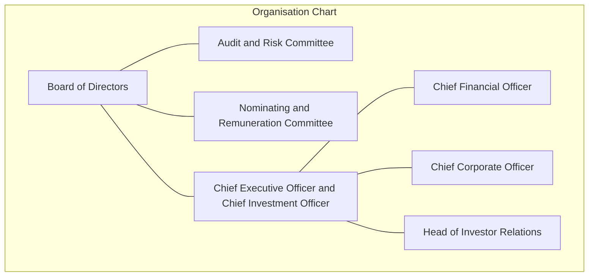
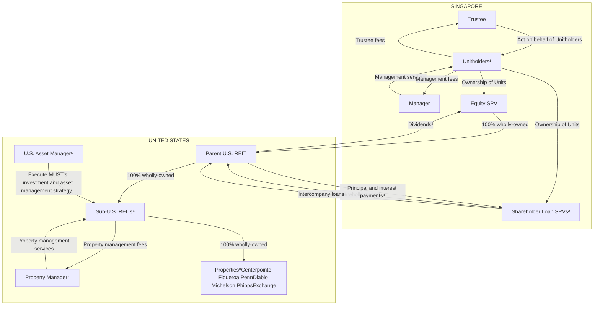
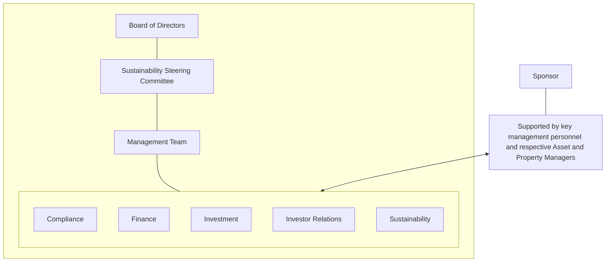

<!-- PAGE 1 -->

# Manulife US REIT

# Expanding Horizons

ANNUAL REPORT 2025

<!-- PAGE 2 -->

# ABOUT
# <mark>MUST</mark>

**Manulife US Real Estate Investment Trust (MUST or the REIT) is a Singapore real estate investment trust (REIT) listed on the Singapore Exchange Securities Trading Limited (SGX-ST) since 20 May 2016.**

Its investment strategy is to principally invest, directly or indirectly, in income-producing real estate in the United States (U.S.) and Canada, as well as real estate-related assets. As at 31 December 2025, MUST’s portfolio comprised seven freehold office properties in Arizona, California, Georgia, New Jersey, Virginia and the Washington, D.C. metropolitan statistical area, with assets under management of US$0.9 billion.

The REIT is managed by Manulife US Real Estate Management Pte. Ltd. (the Manager) which is wholly-owned by the Sponsor, The Manufacturers Life Insurance Company (Manulife), part of the Manulife Group. The Sponsor’s parent company, Manulife Financial Corporation (MFC), is a leading international financial services provider that helps people make their decisions easier and lives better. It operates as John Hancock in the U.S., and Manulife elsewhere, providing financial advice, insurance and wealth and asset management solutions for individuals, groups and institutions.

Vision icon

## Vision

To create long-term value for stakeholders by building a resilient and diversified U.S. real estate portfolio

## Mission

To provide Unitholders with sustainable distributions and risk-adjusted total returns

<!-- PAGE 3 -->

# Contents

<table>
  <tbody>
    <tr>
        <td>6</td>
        <td>FY2025 Financial &amp; Portfolio Highlights</td>
    </tr>
    <tr>
        <td>8</td>
        <td>Chairman’s Message</td>
    </tr>
    <tr>
        <td>9</td>
        <td>In Conversation with Management</td>
    </tr>
    <tr>
        <td>12</td>
        <td>Key Events</td>
    </tr>
    <tr>
        <td>14</td>
        <td>Board of Directors</td>
    </tr>
    <tr>
        <td>17</td>
        <td>Organisation Chart/Trust and Tax Structure</td>
    </tr>
    <tr>
        <td>18</td>
        <td>Management Team</td>
    </tr>
    <tr>
        <td>20</td>
        <td>Financial Review</td>
    </tr>
    <tr>
        <td>23</td>
        <td>Operational Review</td>
    </tr>
    <tr>
        <td>26</td>
        <td>Portfolio Overview</td>
    </tr>
    <tr>
        <td>35</td>
        <td>Independent Market Report</td>
    </tr>
    <tr>
        <td>50</td>
        <td>Investor and Media Relations</td>
    </tr>
    <tr>
        <td>54</td>
        <td>Enterprise Risk Management</td>
    </tr>
    <tr>
        <td>60</td>
        <td>Sustainability Overview</td>
    </tr>
    <tr>
        <td>64</td>
        <td>Corporate Governance</td>
    </tr>
    <tr>
        <td>90</td>
        <td>Interested Person Transactions</td>
    </tr>
    <tr>
        <td>91</td>
        <td>Statistics of Unitholdings</td>
    </tr>
    <tr>
        <td>93</td>
        <td>Financial Statements</td>
    </tr>
  </tbody>
</table>

<!-- PAGE 4 -->

Three hikers with large red backpacks climbing a rocky mountain ridge under a blue sky.

<!-- PAGE 5 -->

Hikers climbing a rocky mountain peak at sunrise with the text "Path to Recovery" overlaid

# Path to Recovery

<!-- PAGE 6 -->

# Value-driven strategy

EXPANDING HORIZONS

<!-- PAGE 7 -->

A top-down view of a wooden table covered with outdoor gear, including a map being marked with a pen, a compass, a metal mug, sunglasses, a headlamp, a coffee cup, and trekking pole handles.

<!-- PAGE 8 -->

# FY2025 FINANCIAL & PORTFOLIO HIGHLIGHTS

**Net Property Income (NPI)**
**(US$ million)** **53.2**

<table>
  <tbody>
    <tr>
        <td>FY25</td>
        <td>53.2</td>
    </tr>
    <tr>
        <td>FY24</td>
        <td>79.9</td>
    </tr>
    <tr>
        <td>FY23</td>
        <td>114.6</td>
    </tr>
    <tr>
        <td>FY22</td>
        <td>113.2</td>
    </tr>
    <tr>
        <td>FY21</td>
        <td>109.5</td>
    </tr>
  </tbody>
</table>

**Income Available for Distribution**
**(US$ million)** **25.5**

<table>
  <tbody>
    <tr>
        <td>FY25</td>
        <td>25.5</td>
    </tr>
    <tr>
        <td>FY24</td>
        <td>38.3</td>
    </tr>
    <tr>
        <td>FY23</td>
        <td>74.3</td>
    </tr>
    <tr>
        <td>FY22</td>
        <td>87.9¹</td>
    </tr>
    <tr>
        <td>FY21</td>
        <td>85.6</td>
    </tr>
  </tbody>
</table>

**Income Available for Distribution/Distribution per Unit²**
**(US cents)** **1.44³**

<table>
  <tbody>
    <tr>
        <td>FY25</td>
        <td>1.44³</td>
    </tr>
    <tr>
        <td>FY24</td>
        <td>2.15³</td>
    </tr>
    <tr>
        <td>FY23</td>
        <td>4.18³</td>
    </tr>
    <tr>
        <td>FY22</td>
        <td>4.75⁴</td>
    </tr>
    <tr>
        <td>FY21</td>
        <td>5.33⁴</td>
    </tr>
  </tbody>
</table>

**Aggregate Leverage**
**(%)** **58.4**

<table>
  <tbody>
    <tr>
        <td>FY25</td>
        <td>58.4</td>
    </tr>
    <tr>
        <td>FY24</td>
        <td>60.8</td>
    </tr>
    <tr>
        <td>FY23</td>
        <td>58.3</td>
    </tr>
    <tr>
        <td>FY22</td>
        <td>48.8</td>
    </tr>
    <tr>
        <td>FY21</td>
        <td>42.8</td>
    </tr>
  </tbody>
</table>

**Occupancy Rate**
**(%)** **67.7**

<table>
  <tbody>
    <tr>
        <td>FY25</td>
        <td>67.7</td>
    </tr>
    <tr>
        <td>FY24</td>
        <td>73.6</td>
    </tr>
    <tr>
        <td>FY23</td>
        <td>84.4</td>
    </tr>
    <tr>
        <td>FY22</td>
        <td>88.0</td>
    </tr>
    <tr>
        <td>FY21</td>
        <td>92.3</td>
    </tr>
  </tbody>
</table>

**Weighted Average Lease Expiry (WALE) by net lettable area (NLA)**
**(years)** **4.5**

<table>
  <tbody>
    <tr>
        <td>FY25</td>
        <td>4.5</td>
    </tr>
    <tr>
        <td>FY24</td>
        <td>5.0</td>
    </tr>
    <tr>
        <td>FY23</td>
        <td>5.0</td>
    </tr>
    <tr>
        <td>FY22</td>
        <td>4.7</td>
    </tr>
    <tr>
        <td>FY21</td>
        <td>5.1</td>
    </tr>
  </tbody>
</table>
<table>
  <thead>
    <tr>
        <th>Key Financial Indicators</th>
        <th>FY2025</th>
        <th>FY2024</th>
        <th>FY2023</th>
        <th>FY2022</th>
        <th>FY2021</th>
    </tr>
  </thead>
  <tbody>
    <tr>
        <td>Gross borrowings (US$ million)</td>
        <td>559.0</td>
        <td>745.0</td>
        <td>925.7</td>
        <td>1,032.7</td>
        <td>975.0</td>
    </tr>
    <tr>
        <td>Aggregate leverage (%)</td>
        <td>58.4</td>
        <td>60.8</td>
        <td>58.3</td>
        <td>48.8</td>
        <td>42.8</td>
    </tr>
    <tr>
        <td>Weighted average cost of debt (%)</td>
        <td>4.58⁵</td>
        <td>4.53⁵</td>
        <td>4.15</td>
        <td>3.74</td>
        <td>2.82</td>
    </tr>
    <tr>
        <td>Weighted average debt maturity (years)</td>
        <td>2.3</td>
        <td>2.9</td>
        <td>3.3</td>
        <td>2.8</td>
        <td>2.4</td>
    </tr>
    <tr>
        <td>Interest coverage ratio (ICR) (times)</td>
        <td>1.7</td>
        <td>1.7</td>
        <td>2.4</td>
        <td>3.1</td>
        <td>3.4</td>
    </tr>
    <tr>
        <td>Market capitalisation (US$ million)</td>
        <td>126.1</td>
        <td>158.1</td>
        <td>142.1</td>
        <td>533.0</td>
        <td>1,175.3</td>
    </tr>
    <tr>
        <th>Portfolio</th>
        <th>FY2025</th>
        <th>FY2024</th>
        <th>FY2023</th>
        <th>FY2022</th>
        <th>FY2021</th>
    </tr>
    <tr>
        <td>Assets under Management (AUM) (US$ billion)</td>
        <td>0.9</td>
        <td>1.1</td>
        <td>1.4</td>
        <td>1.9</td>
        <td>2.2</td>
    </tr>
    <tr>
        <td>Occupancy rate (%)</td>
        <td>67.7</td>
        <td>73.6</td>
        <td>84.4</td>
        <td>88.0</td>
        <td>92.3</td>
    </tr>
  </tbody>
</table>

## Distribution Halt

Manulife US REIT’s distribution policy is to distribute at least 90.0% of its annual distributable income on a semi-annual basis. Pursuant to the recapitalisation plan set out in the circular to Unitholders dated 29 November 2023 (Recapitalisation Plan) and the entry into the master restructuring agreement (Master Restructuring Agreement or MRA), Manulife US REIT halted distributions to Unitholders since 2023. On 23 December 2025, the lenders of the existing facilities granted certain concessions which include an extension of the disposal deadline and an extension of the temporary relaxation of the financial covenants (collectively, the MRA Concessions). Further to the granting of the MRA Concessions, the lenders have required Manulife US REIT to keep half-yearly distributions to Unitholders suspended until the later of the achievement of the Reinstatement Conditions⁶ and the period during which the bank interest coverage ratio (Bank ICR) relaxation remains in effect.

1 US$3.8 million was retained for general corporate and working capital purposes in 2H2022 and the distribution amount to Unitholders of MUST (Unitholders) for FY2022 was US$84.1 million.

2 MUST has halted distributions to Unitholders since 2023 pursuant to the Recapitalisation Plan, MRA and MRA Concessions. For more information on the MRA Concessions and the Growth and Value Up Plan, please refer to the circular to Unitholders dated 1 December 2025, as well as the announcements dated 11 December 2025, 15 December 2025 and 24 December 2025, respectively.

3 Based on income available for distribution divided by the number of units in issue as at end of each year.

4 Based on DPU paid.

5 Excluding the Sponsor-lender loan exit premium. Including the Sponsor-lender loan exit premium, the weighted average cost of debt would be approximately 5.25% for FY2025 (FY2024: 5.03%).

6 Reinstatement Conditions are as follows: (i) consolidated total liabilities to consolidated deposited properties (as defined in the MRA) being no more than 50%; (ii) minimum interest coverage ratio of 1.5 times; and (iii) there being no default continuing for at least one full financial quarter after Manulife US REIT delivers its financial statement, evidencing compliance with (i) and (ii).

<!-- PAGE 9 -->

Unit Price Performance infographic showing key metrics: Number of Units in Issue (1,776.6 m units), Market Capitalisation (US$126.1 m), Total Trading Volume in FY2025 (1,119.9 m units), Open on 2 January 2025 (US$0.089), Close on 31 December 2025 (US$0.071), High on 22 January 2025 (US$0.102), Low on 9 April 2025 (US$0.053), and Average Daily Trading Volume in FY2025 (4.5 m units).

## Relative Price Performance in 2025 (%)

<table>
  <thead>
    <tr>
<th>Month</th>
<th>MUST (%)</th>
<th>FTSE ST REIT Index (%)</th>
<th>Straits Times Index (%)</th>
    </tr>
  </thead>
  <tbody>
    <tr>
<td colspan="4">Jan</td>
    </tr>
    <tr>
<td colspan="4">Feb</td>
    </tr>
    <tr>
<td colspan="4">Mar</td>
    </tr>
    <tr>
<td colspan="4">Apr</td>
    </tr>
    <tr>
<td colspan="4">May</td>
    </tr>
    <tr>
<td colspan="4">Jun</td>
    </tr>
    <tr>
<td colspan="4">Jul</td>
    </tr>
    <tr>
<td colspan="4">Aug</td>
    </tr>
    <tr>
<td colspan="4">Sep</td>
    </tr>
    <tr>
<td colspan="4">Oct</td>
    </tr>
    <tr>
<td colspan="4">Nov</td>
    </tr>
    <tr>
<td>Dec</td>
<td>-20.2</td>
<td>11.3</td>
<td>22.7</td>
    </tr>
  </tbody>
</table>

## Monthly Trading Performance in 2025

<table>
  <thead>
    <tr>
        <th>Month</th>
        <th>Total Trading Volume (million units)</th>
        <th>Unit Price at the end of each month (US$)</th>
    </tr>
  </thead>
  <tbody>
    <tr>
        <td>Jan</td>
        <td>89.8</td>
        <td>0.095</td>
    </tr>
    <tr>
        <td>Feb</td>
        <td>71.7</td>
        <td>0.073</td>
    </tr>
    <tr>
        <td>Mar</td>
        <td>124.1</td>
        <td>0.072</td>
    </tr>
    <tr>
        <td>Apr</td>
        <td>121.4</td>
        <td>0.063</td>
    </tr>
    <tr>
        <td>May</td>
        <td>46.6</td>
        <td>0.063</td>
    </tr>
    <tr>
        <td>Jun</td>
        <td>91.0</td>
        <td>0.068</td>
    </tr>
    <tr>
        <td>Jul</td>
        <td>139.5</td>
        <td>0.066</td>
    </tr>
    <tr>
        <td>Aug</td>
        <td>119.9</td>
        <td>0.076</td>
    </tr>
    <tr>
        <td>Sep</td>
        <td>153.9</td>
        <td>0.076</td>
    </tr>
    <tr>
        <td>Oct</td>
        <td>60.9</td>
        <td>0.072</td>
    </tr>
    <tr>
        <td>Nov</td>
        <td>51.1</td>
        <td>0.076</td>
    </tr>
    <tr>
        <td>Dec</td>
        <td>50.1</td>
        <td>0.071</td>
    </tr>
  </tbody>
</table>

<!-- PAGE 10 -->

# CHAIRMAN’S MESSAGE

Marc Feliciano, Chairman

**Dear Unitholders,**

In 2025, we came within striking distance of achieving the Minimum Sale Target¹ under the MRA, with the disposition of Plaza and Peachtree. This was despite persistent headwinds and the slow recovery in the U.S. office market. Historically, peak-to-trough recovery periods in the U.S. office sector have spanned approximately two years, but the current cycle since COVID-19 has exceeded that timeframe, reflecting larger market forces that may be slowing the recovery.

Having made substantial progress through three asset disposals and repaid US$317 million of debt since the Recapitalisation Plan was announced in late 2023, the Manager in December 2025 announced its Growth and Value Up Plan, designed to revitalise MUST’s portfolio to improve its diversification and long-term value creation for Unitholders.

This is not a new plan. Since the MRA took effect at the end of 2023, the strategy has always been to guide MUST through the phases of Stabilisation, Recovery and Growth. The MRA was intended as the first step, with the Growth and Value Up Plan constituting the next phase of the strategy. This is because focusing solely on debt repayment will not create value for Unitholders. Our objective has always been to transition to growth. Once the Minimum Sale Target is achieved, we must move beyond divesting to grow the REIT.

## Recapitalisation Plan Progress

Since late 2023, we have adopted a four-pillar strategic framework focused on risk management, capital markets, asset level strategy and portfolio optimisation. Our primary focus has been on risk management, as MUST remains under the MRA and needs to meet the Minimum Sale Target. The sale of the two properties in 2025, along with Capitol in October 2024, has enabled us to achieve approximately 83% of the target, leaving us with a balance of US$55.6 million.

Under capital markets, we are constantly considering movements in the debt and equity markets, as well as liquidity in office transactions, so as to extract the maximum value from properties that we sell. Under asset level strategy, we have been focused on strengthening asset performance with strategic leasing that maximises the REIT’s liquidity and optimises its capital. In terms of portfolio optimisation, we are focused on pursuing quality assets with higher yields versus simply paying off debt, and look forward to going on the offence as we selectively sell properties and/or invest in attractive opportunities. While we are working towards exiting the MRA, we have also presented and Unitholders have approved the Growth and Value Up Plan, which will lay the groundwork for a sustainable recovery and growth.

## Building for Sustainable Growth

With a broadened investment mandate, we will take advantage of the cyclical nature of and dislocations in the market to actively consider diversification opportunities beyond office, especially within the industrial, living and retail sectors in the U.S. and Canada. We have a mandate to sell up to US$350 million of office assets to fund these acquisitions, as well as to repay debt and fund capital expenditure (Capex). These subsectors have historically generated higher yields and required lower Capex than office.

In 2026, the Growth and Value Up Plan will strengthen our competitive edge as both a seller and buyer, while enabling a strategic pivot into more resilient asset classes that will enhance Unitholder value. We will work closely with our Sponsor, Manulife, to source for quality acquisitions through its global real estate platform and expertise. The Sponsor has both expertise and experience in the U.S. and Canada, including investment and asset management teams to source for acquisitions and manage the assets thereafter. The management team, comprising John and Mushtaque, also bring a combined 60 years of experience across the industrial, office, retail and living sectors, spanning acquisition, asset management and financial management.

## Appreciation

I would like to thank our Unitholders for their patience and continued support, including their approval of the Growth and Value Up Plan. I am also grateful to our Board, management team and employees for their dedication, and to our Lenders and Sponsor for their steadfast support.

While challenges remain, MUST is making steady progress from Stabilisation towards Recovery and Growth. With a clear strategic direction, disciplined execution, and the continued support of our stakeholders, we target to be able to resume income distribution, so as to return value to our Unitholders in a sustainable manner.

Sincerely,
**Marc Feliciano**
Chairman

<!-- PAGE 11 -->

Management team photo with sunset background

# IN CONVERSATION WITH MANAGEMENT

FROM LEFT

**MUSHTAQUE ALI**

Chief Financial Officer

**JOHN CASASANTE**

Chief Executive Officer and
Chief Investment Officer

Q1 icon

## What are some of MUST’s significant achievements in 2025?

A icon

**John:** Our key priority was to meet the obligations of the MRA. Despite tariff-driven uncertainty and continued challenges in the U.S. office sector which hampered our progress along the way, we completed the sale of two properties – Plaza in February and Peachtree in May. Coupled with the sale of Capitol in October 2024, we raised a total of US$273.1 million. This enabled us to meet 83% of the Minimum Sale Target of US$328.7 million under the MRA, leaving a balance of US$55.6 million. Using net proceeds and cash retained on our balance sheet, we repaid approximately US$317 million of debt. We have announced the potential sale of another asset, Figueroa, in March 2026, and anticipate completion of the sale by 2Q2026¹.

In the second half of 2025, we spent a considerable amount of time and energy putting together the Growth and Value Up Plan and negotiating with lenders on the MRA Concessions. We are grateful that our Unitholders have voted in favour of the Disposition and Acquisition Mandates, and lenders have also approved the MRA Concessions – namely a six-month extension of the asset disposal deadline as well as an extension of the temporary relaxation of the unencumbered gearing and Bank ICR covenants. The mandates will enable us to diversify our portfolio beyond the U.S. office sector into assets such as industrial, living sector and retail, both in the U.S. and Canada, while the concessions granted by lenders will give us more time to achieve the Minimum Sale Target.

<!-- PAGE 12 -->

# IN CONVERSATION
# WITH MANAGEMENT

Our same-store portfolio valuation dipped 1.6% to US$913.8 million as at 31 December 2025, compared to US$928.9 million as at 31 December 2024. This reflects overall stabilisation and improvement across select U.S. office submarkets, and hopefully signals stronger performance going forward. Excluding Figueroa in Downtown Los Angeles which has been reclassified as an asset held for sale, portfolio valuation stayed relatively flat at US$815.7 million, compared to US$811.9 million a year ago.

Q2 icon

**Why does MUST need the Growth and Value Up Plan? Why can't the Manager work on simply improving the existing portfolio?**

A icon

**John:** Asset level strategy remains one of the four key pillars of our strategy to growth, so we will continue to actively and strategically manage our existing portfolio to improve its returns alongside the Growth and Value Up Plan. For instance, we have continued to execute strategic leases at our portfolio to optimise the return on our capital. This strategy has enabled us to secure new leases at Phipps, Exchange, Figueroa and Centerpointe at tenant improvement (TI) allowances that are significantly below market. In fact, for leases signed with TIs in FY2025, their TI allowances averaged approximately US$43 psf, around 30% below prevailing market levels, underscoring the effectiveness of our leasing approach.

However, structural challenges remain. Some office submarkets still face challenges such as high tenant concessions, while opportunities to reposition other assets can be capital intensive and complex. We have evaluated options such as converting Diablo into a data centre or industrial asset, as well as converting office properties to residential use. We continue to explore such opportunities to convert and repurpose our assets.

The Growth and Value Up Plan is necessary to pave the way for us to exit the MRA and to provide a future runway for growth. The Plan, together with the MRA Concessions, gives us more time and flexibility to dispose of assets to plug the gap in the Minimum Sale Target as well as to acquire higher yielding real estate with lower Capex needs to create long-term value for Unitholders. A diversified portfolio with stronger yields will also improve our refinancing prospects.

A plan comprising solely of disposing assets would not have been viable without growth and would have resulted in unintended liquidation for MUST. The Growth and Value Up Plan also helps MUST to improve its cashflows and credit profile as it acquires properties at lower leverage ratios.

Quotation marks and rope graphic

> **The Growth and Value Up Plan is necessary to pave the way for us to exit the MRA and to provide a future runway for growth. The Plan, together with the MRA Concessions, gives us more time and flexibility to dispose of assets to plug the gap in the Minimum Sale Target as well as to acquire higher yielding real estate with lower Capex needs to create long-term value for Unitholders.**

This will enable us to resume sustainable cash distributions to Unitholders, underpinned by a more resilient portfolio and cash position.

Q3 icon

**What is your capital management strategy in view of the upcoming debt maturities and the uncertain interest rate environment in 2026?**

A icon

**Mushtaque:** In 2025, we repaid approximately US$186 million of debts, leaving approximately US$35.6 million of loans maturing in July 2026, with the remaining loans maturing between 2027 and 2029. We expect to fully repay this outstanding amount with divestment proceeds by 30 June 2026. Any further divestments under the Disposition Mandate will provide additional flexibility to further

<!-- PAGE 13 -->

pare down outstanding debt to lower our aggregate leverage and strengthen our overall balance sheet.

The interest rate outlook remains uncertain due to persistent inflationary and geopolitical pressures surrounding U.S. monetary policy. U.S. Treasury yields rose significantly in early March 2026, driven by surging oil prices and heightened inflation fears amidst the Middle East conflict.

As at 31 December 2025, 74.6% of our total borrowings are fixed rate or hedged loans. We will continue to closely monitor the interest rate landscape, taking into account loan maturities and debt repayments, to determine the most appropriate hedging strategy.

We will also maintain our focus on strengthening portfolio quality through disciplined capital allocation. Capital will be selectively redeployed into new acquisitions and/or investment into existing assets, where the opportunities provide higher risk-adjusted returns, with the goal of creating long-term value for Unitholders.

meaningful progress in our environmental performance, achieving significant reductions in energy intensity and greenhouse gas (GHG) emissions intensity compared to our 2018 baseline. In addition, we reached an important milestone by publishing our first disclosure of Scope 3 GHG emissions, reflecting our progress toward more comprehensive environmental reporting.

Going forward, we will continue to work on deepening our understanding of our environmental impact. Our efforts will position us for long-term resilience and sustainable growth as we diversify beyond the U.S. office sector to include other property sectors in the U.S. and Canada.

Q4 icon

## What sustainability milestones did MUST achieve in 2025, and what are the plans for the year ahead?

A icon

**John:** Sustainability remains a cornerstone of our strategy and continues to guide our decision-making across the portfolio. In 2025, MUST earned a 5 Star rating in the GRESB Real Estate Assessment for the eighth consecutive year and achieved an 'A' grade in public disclosure, ranking second among 10 U.S. office peers. We were also ranked 13ᵗʰ out of 42 REITs and business trusts in the 2025 Singapore Governance and Transparency Index, underscoring strong governance practices.

This year, we strengthened the transparency of our sustainability reporting by aligning our disclosures with the International Sustainability Standards Board (ISSB) framework and SGX RegCo's Roadmap for Mandatory Climate Reporting. These enhancements reinforce our commitment to operating in accordance with global best practices and regulatory expectations. We delivered

Q5 icon

## What are your key priorities in 2026?

A icon

**Mushtaque:** Our immediate priority is to meet the Minimum Sale Target under the MRA by 30 June 2026. With the approval of the Growth and Value Up Plan by our Unitholders, we do have greater flexibility to dispose of up to US$350 million of existing properties under the Disposition Mandate. We will optimise the allocation of divestment proceeds, either to repay debt, to fund investments under the Acquisition Mandate, or for capital expenditures, tenant incentives and leasing costs.

Once we are able to exit the MRA, we will prioritise resuming distributions at a sustainable level¹. Another of our key priorities in 2026 is to strengthen our cash flows and credit profile through strategic diversification into industrial, living sector and retail assets. We will target acquisitions funded with the capital structure of no more than 40% debt, so as to gradually lower the REIT's aggregate leverage. We will also tap on our Sponsor's platform and expertise to source for the best acquisition opportunities for MUST.

Embarking on our portfolio diversification into higher yielding, less capital intensive assets will enable MUST to pivot to the Recovery and Growth phases, which was always the objective of the Recapitalisation Plan from the onset. This, alongside continuing to improve the performance of our existing portfolio through strategic leasing, will constitute our strategy for 2026.

<!-- PAGE 14 -->

# KEY
# EVENTS

Peachtree building in Atlanta

Peachtree

**During the year, the Manager completed the sale of two properties— Plaza in New Jersey and Peachtree in Atlanta.**

<table>
  <tbody>
    <tr>
        <td>Stabilisation</td>
        <td>Recovery</td>
        <td>Growth</td>
    </tr>
  </tbody>
</table>

The Manager’s foremost focus in 2025 was fulfilling the requirements of its MRA with lenders, while charting a forward path for the REIT towards recovery and growth. Beyond maximising returns from property dispositions, this also includes broadening its investment mandate to target yielding assets in the industrial, living and retail sectors that require lower Capex than office and offer more resilient growth prospects.

During the year, the Manager completed the sale of two properties, Plaza in New Jersey and Peachtree in Atlanta, for aggregate net proceeds of US$163.6 million combined. This, along with US$25.0 million of cash, was used to repay debt, leaving only US$35.6 million of loans maturing in 2026, with the remaining loans due from 2027 to 2029.

The Manager received Unitholders’ approval for two key mandates at the Extraordinary General Meeting (EGM) on 16 December 2025. These mandates were the Disposition Mandate, which allows the sale of up to three existing properties to raise no more than US$350 million, and the Acquisition Mandate, which permits the purchase of one or more properties and investments outside the office sector, capped at US$600 million¹.

At the same time, lenders granted MUST the MRA Concessions, namely, a six-month extension of the deadline to meet the Minimum Sale Target of US$328.7 million until 30 June 2026, and a temporary relaxation of the unencumbered gearing covenant and bank interest coverage ratio covenant. This, together with the approved mandates, will not only provide MUST time and flexibility to meet the MRA requirements, but will also enable the Manager to calibrate a diversified portfolio that enhances cash flow stability against market volatility and increases long-term returns for Unitholders. Acquisitions at lower leverage ratios will also enable MUST to reduce its aggregate leverage, while improving its cash flows and credit profile.

Scenic landscape with mountains and forest

<!-- PAGE 15 -->

# 2026

## March 2026

* Income available for distribution of US$25.5 million for FY2025 mainly due to divestments of Capitol, Plaza and Peachtree, as well as higher vacancies and lower lease termination income
* Portfolio valuation declined 1.6% to US$913.8 million, but was relatively flat at US$815.7 million without Figueroa which is held for sale

## December 2025

* Tabled two resolutions at the EGM for the Disposition Mandate and Acquisition Mandate, and obtained strong support from Unitholders for both resolutions

## November 2025

* Announced 24-month lease renewal signed with US Treasury at Penn, starting August 2025¹

## October 2025

* Announced 11-year new lease with Banc of California to take 40,000 sq ft at Figueroa with signage rights

* Retained highest rating and recognition in GRESB²:
    - Real Estate Assessment: 5 Star for the eighth year
    - Public Disclosure: ‘A’ grade, 2ⁿᵈ out of 10 U.S. office peers

## August 2025

* Income available for distribution of US$14.9 million for 1H2025 mainly due to loss of income from the sale of Capitol, Plaza and Peachtree

* Ranked 13ᵗʰ among 42 REITs and Business Trusts in the Singapore Governance and Transparency Index (SGTI) 2025

## June - July 2025

* Partially paid down debts due in 2026, 2027 and 2028 with net proceeds from Peachtree sale and US$25.0 million of cash

## May 2025

* Sold Peachtree for net proceeds of US$123.6 million
* Secured lenders’ approval to extend deadline for the disposal of assets by six months to 31 December 2025

## April 2025

* Held in-person Annual General Meeting (AGM) on 30 April 2025

## March 2025

* Paid down US$40.0 million of MUST’s 2026 debts

## February 2025

* Income available for distribution of US$38.3 million for FY2024 mainly due to lower rental and recoveries income from higher vacancies, lower lease termination income, and divestments of Tanasbourne, Park Place and Capitol
* Sold Plaza for net proceeds of US$40.0 million

# 2025

## January 2025

* Announced portfolio valuation decline of 9.3% in FY2024 with signs of stabilisation in some submarkets, while other submarkets continued to face leasing challenges

<!-- PAGE 16 -->

EXPANDING HORIZONS

# BOARD OF DIRECTORS

Portrait of Marc Lawrence Feliciano

Portrait of Director 02

Portrait of Director 03

Portrait of Director 04

Portrait of Director 05

01

## Marc Lawrence Feliciano, 55

Chairman
Non-Executive Director

**Academic and Professional Qualifications**
Bachelor in Business Administration (with concentration in Taxation and Finance) and Master in Professional Accounting, University of Texas at Austin, U.S.

**Date of First Appointment as a Director**
18 September 2023

**Date of Last Reappointment as a Director**
20 June 2025

**Length of Service as a Director (as at 31 December 2025)**
2 years 3 months

**Board Committee Served on**
Nominating and Remuneration Committee (Member)

**Present Directorships in other Listed Companies**
NIL

**Present other Principal Commitments**
Global Head of Real Estate, Private Markets, Manulife Investment Management

**Past Directorships or Principal Commitments held over the Preceding Three Years**
NIL

**Experience**
Over 30 years in public and private real estate investment management in the U.S., which includes significant workout experience

<!-- PAGE 17 -->

02

# Koh Cher Chiew Francis, 74

Independent Non-Executive Director
Lead Independent Director

## Academic and Professional Qualifications

* Doctor of Philosophy, University of New South Wales, Australia

* Master of Business Administration, University of British Columbia, Canada

* Bachelor of Business Administration with Honours (Second Class Honours Upper Division), University of Singapore

* CGMA, Chartered Global Management Accountant (U.K., U.S.)

* FCMA, Chartered Institute of Management Accountants (U.K.)

* CA, Institute of Singapore Chartered Accountants

**Date of First Appointment as a Director**

21 October 2019

**Date of Last Reappointment as a Director**

25 June 2024

**Length of Service as a Director (as at 31 December 2025)**

6 years and 2 months

**Board Committee Served on**

* Audit and Risk Committee (Chairman)

* Nominating and Remuneration Committee (Member)

**Present Directorships in other Listed Companies**
NIL

**Present other Principal Commitments**

* Singapore Management University (SMU) (Emeritus Professor of Finance)

* Drs Koh & Partners Pte. Ltd. (Secretary, Director)

* The Singapore Chinese Girls’ School (Director)

**Past Directorships or Principal Commitments held over the Preceding Three Years**
China Taiping Insurance (Singapore) Pte. Ltd. (Director)

**Experience**

* Over 40 years of experience in investment, consulting, executive development and public service

* Previously Deputy Director of Government of Singapore Investment Corporation, involved in direct investments in various countries in Asia

03

# Veronica Julia McCann, 65

Non-Independent
Non-Executive Director

## Academic and Professional Qualifications

* CIMA, University of Central London

* Chartered Institute of Management Accountants, Fellow Member

* Chartered Global Management Accountants, Member

**Date of First Appointment as a Director**
17 June 2015

**Date of Last Reappointment as a Director**
25 June 2024

**Length of Service as a Director (as at 31 December 2025)**

10 years and 6 months

**Board Committee Served on**

Audit and Risk Committee (Member)

**Present Directorships in other Listed Companies**
NIL

**Present other Principal Commitments**

Advanced MedTech Holdings Pte. Ltd. (Director)

**Past Directorships or Principal Commitments held over the Preceding Three Years**
NIL

**Experience**

* Over 30 years of experience in banking and finance

* Previously Chief Financial Officer Asia and Deputy Chief Executive, Singapore at Commerzbank AG

<!-- PAGE 18 -->

# BOARD OF DIRECTORS

04

## Choo Kian Koon, 74

Independent
Non-Executive Director

### Academic and Professional Qualifications

* Bachelor of Science in Estate Management, University of Singapore

* Master of Philosophy in Environmental Planning, University of Nottingham

* Doctor of Philosophy (Urban Planning) with Certificate of Achievement in Urban Design, University of Washington, U.S.

* Singapore Institute of Planners, Affiliate Member

* Singapore Institute of Surveyors and Valuers, Fellow

**Date of First Appointment as a Director**
9 June 2017

**Date of Last Reappointment as a Director**
20 June 2025

**Length of Service as a Director (as at 31 December 2025)**
8 years and 6 months

**Board Committee Served on**
Nominating and Remuneration Committee (Member)

**Present Directorships in other Listed Companies**
NIL

**Present other Principal Commitments**

* VestAsia Group Pte. Ltd. (Chairman and Director)

* Department of Real Estate, National University of Singapore (Adjunct Associate Professor)

**Past Directorships or Principal Commitments held over the Preceding Three Years**
Pan Hong Holdings Group Ltd. (Director)

**Experience**

* Over 40 years of experience in property industry

* Previously Senior Vice President at CapitaLand and supervised the establishment of CapitaLand Mall Trust and CapitaLand Commercial Trust

05

## Karen Tay Koh, 65

Independent
Non-Executive Director

### Academic and Professional Qualifications

* Bachelor of Arts, Economics, University of Cambridge, U.K.

* Master of Arts, University of Cambridge, U.K.

* Masters in Public Administration and International Tax Program (Certificate) Harvard University, U.S. Kennedy School & Law School

**Date of First Appointment as a Director**
10 November 2020

**Date of Last Reappointment as a Director**
20 June 2025

**Length of Service as a Director (as at 31 December 2025)**

5 years and 1 month

**Board Committee Served on**

* Nominating and Remuneration Committee (Chairman)

* Audit and Risk Committee (Member)

**Present Directorships in other Listed Companies**
Banyan Tree Holdings Limited (Director)

**Present other Principal Commitments**

* Butterfield Trust (Asia) Limited (Director)

* LaSalle College of the Arts (Director)

* Lernen Midco 2 Limited (Director)

* K3 Venture Partners Pte. Ltd. (Director)

* HSBC Bank (Singapore) Limited (Director)

* BC Platforms AG (Director)

* D’Amore Mckim College of Business, Northeastern University (Member of Advisor Board, Centre for Emerging Markets)

* HealthCura Pte. Ltd. (Director)

* Nutmeg Management Pte. Ltd. (Director)

**Past Directorships or Principal Commitments held over the Preceding Three Years**
The Red Pencil Singapore (Director and Deputy Chairman)

**Experience**

* Over 30 years of experience in public and private sector organisations, particularly in finance, healthcare, education and private equity

* 19 years at the Singapore Ministry of Finance, including postings at the Inland Revenue Authority of Singapore and Monetary Authority of Singapore

* Previously Deputy CEO at SingHealth and Deputy CEO at Singapore General Hospital

<!-- PAGE 19 -->

# ORGANISATION CHART/
# TRUST AND TAX STRUCTURE

## Trust and Tax Structure

1 No single investor to hold more than 9.8% (including the Sponsor) - ‘Widely Held’ (No more than 50% of shares can be owned by five or fewer individuals) rule for REITs in U.S.

2 Each shareholder loan SPV has extended an intercompany loan to the Parent U.S. REIT.

3 Subject to 30% withholding tax.

4 Principal repayments are not subject to U.S. withholding taxes. Interest payments are not subject to U.S. withholding taxes, assuming Unitholders qualify for portfolio interest exemption and provide appropriate tax certifications, including an appropriate IRS Form W-8.

5 The U.S. Asset Manager is a subsidiary of the Sponsor.

6 Each Sub-U.S. REIT holds an individual property.

7 The Property Manager has entered into a master property management agreement with the Parent U.S. REIT and a property management agreement with each Sub-U.S. REIT.

8 As at 31 December 2025.

<!-- PAGE 20 -->

MANAGEMENT TEAM: JOHN CASASANTE and MUSHTAQUE ALI

## Chief Executive Officer and Chief Investment Officer

## Chief Financial Officer

In his dual role as CEO and CIO, **Mr John Casasante** works with the Board to determine the strategy for MUST as well as with other members of the management team to execute MUST’s strategy, oversee the day-to-day management and operations of MUST, and work with the Manager’s financial, legal and compliance personnel in meeting the strategic, investment and operational objectives. He is also responsible for the design and execution of the portfolio investment strategy, as well as overseeing the U.S. asset and property management functions.

**Mr Mushtaque Ali** is the Chief Financial Officer (CFO) of MUST. He is responsible for shaping and executing MUST’s financial strategies, overseeing capital and funding management, financial risk management, and leading the treasury, tax, and finance operations.

With over 27 years of experience in finance and accounting, primarily within the investment management industry, Mr Ali specialises in financial management and oversight of real estate portfolios across diverse asset classes, including office, industrial, retail and multifamily.

Mr Casasante has over 30 years of commercial real estate experience in industrial, office, retail and multifamily. Before joining Manulife, he worked at DWS as the Regional Director, Real Estate Asset Management Alternatives and Real Estate Assets, responsible for the Western US real estate portfolio with a NAV of US$15 billion, across industrial, office and retail. He has also held senior roles at Cushman & Wakefield, and Lincoln Property Company, encompassing, asset management, leasing, acquisitions and development.

Before joining MUST, Mr Ali served as Head of Finance, Singapore and Southeast Asia, at Manulife Investment Management. Prior to relocating to Singapore from Canada, he held global leadership roles within Manulife’s Private Markets business, including as the Head of Fund & Asset Management Finance and as Head of Private Assets Financial Reporting & Advisory, where he had financial oversight for third-party real estate, infrastructure, and other private asset funds and separately managed accounts across the U.S. and Canada.

He holds a Bachelor of Science degree in Business Administration, Entrepreneur Emphasis, from the University of Southern California – Los Angeles, California.

Mr Ali holds a Master of Finance from the University of Toronto. He is a Certified Public Accountant from Ontario, Canada, Chartered Accountant of Singapore as well as a Fellow of the Institute of Chartered Accountants of England & Wales.

<!-- PAGE 21 -->

DAPHNE CHUA, CHOONG CHIA YEE, and WYLYN LIU portraits

**Chief Corporate Officer**

**Head of Finance**

**Head of Investor Relations**

**Ms Daphne Chua** is the Chief Corporate Officer and Company Secretary of the Manager. She oversees compliance, corporate secretarial and business administration matters. As the key liaison with the regulators, she is responsible for overseeing and managing regulatory filings on behalf of MUST and assisting MUST in complying with the applicable provisions of the Securities and Futures Act (SFA) and all other relevant legislations.

Ms Chua has over 20 years of experience in the field of compliance working for a variety of global financial institutions with operations in Singapore. She has worked closely with various boards of directors and senior management, both in Singapore and internationally, in ensuring compliance with relevant laws and regulations, internal policies and procedures.

Prior to joining the Manager in July 2015, Ms Chua held a number of compliance positions including those for J.P. Morgan Asset Management, Manulife Investment Management, Credit Suisse Private Banking and Morgan Stanley. Ms Chua holds a Bachelor of Accountancy (with a Minor in Banking & Finance) (Honours) from Nanyang Technological University, Singapore.

**Mr Choong Chia Yee** is the Head of Finance. He is responsible for financial and management reporting, enterprise risk management, as well as the day-to-day running of finance operations.

Mr Choong has over 25 years of experience in accounting, finance, strategic planning, budgeting, tax, initial public offering, audit, regulatory reporting and compliance. Prior to joining the Manager in November 2016, Mr Choong was Vice President, Finance at Mapletree Logistics Trust and he held several senior managerial positions in CapitaLand Mall Asia. He has extensive experience with corporate entities that have widespread international operations.

Mr Choong holds a professional qualification from the Chartered Institute of Management Accountants, U.K., where he is also a fellow member. He also holds the designations of Chartered Global Management Accountant, Fellow Chartered Accountant of Singapore and Chartered Accountant of Malaysia.

**Ms Wylyn Liu** leads the investor relations (IR) and corporate communications strategy for MUST, ensuring transparent and effective dialogue between management and the investment community. She is responsible for managing relationships and fostering meaningful engagement with analysts, institutional and retail investors and the media, and also oversees the sustainability strategy for MUST.

Ms Liu has over 15 years of IR experience in both large and small-cap companies across diverse industries. Prior to joining the Manager in 2022, Ms Liu was Assistant Vice President at the Manager of CapitaLand Ascendas REIT where she developed and implemented the REIT’s IR programme. She previously held IR roles at other SGX-listed companies in the shipping and media industries.

Ms Liu holds a Bachelor of Business Administration (Honours) degree from the National University of Singapore.

<!-- PAGE 22 -->

# FINANCIAL REVIEW

<table>
  <thead>
    <tr>
        <th> </th>
        <th>FY2025</th>
        <th>FY2024</th>
        <th>Change</th>
    </tr>
    <tr>
        <th> </th>
        <th>US$'000</th>
        <th>US$'000</th>
        <th>%</th>
    </tr>
  </thead>
  <tbody>
    <tr>
        <td><strong>Gross revenue</strong></td>
        <td>113,914</td>
        <td>167,582</td>
        <td>(32.0)</td>
    </tr>
    <tr>
        <td>Property operating expenses</td>
        <td>(60,736)</td>
        <td>(87,708)</td>
        <td>(30.8)</td>
    </tr>
    <tr>
        <td><strong>Net property income</strong></td>
        <td><strong>53,178</strong></td>
        <td><strong>79,874</strong></td>
        <td><strong>(33.4)</strong></td>
    </tr>
    <tr>
        <td> </td>
        <td> </td>
        <td> </td>
        <td> </td>
    </tr>
    <tr>
        <td>Interest income</td>
        <td>1,385</td>
        <td>3,277</td>
        <td>(57.7)</td>
    </tr>
    <tr>
        <td>Manager’s base fee</td>
        <td>(2,838)</td>
        <td>(4,251)</td>
        <td>(33.2)</td>
    </tr>
    <tr>
        <td>Trustee’s fee</td>
        <td>(180)</td>
        <td>(226)</td>
        <td>(20.4)</td>
    </tr>
    <tr>
        <td>Other trust expenses</td>
        <td>(2,008)</td>
        <td>(2,546)</td>
        <td>(21.1)</td>
    </tr>
    <tr>
        <td>Finance expenses</td>
        <td>(34,608)</td>
        <td>(48,099)</td>
        <td>(28.0)</td>
    </tr>
    <tr>
        <td><strong>Net income before tax and fair value changes</strong></td>
        <td><strong>14,929</strong></td>
        <td><strong>28,029</strong></td>
        <td><strong>(46.7)</strong></td>
    </tr>
    <tr>
        <td> </td>
        <td> </td>
        <td> </td>
        <td> </td>
    </tr>
    <tr>
        <td>Net fair value change in derivatives</td>
        <td>(11,666)</td>
        <td>(16,577)</td>
        <td>(29.6)</td>
    </tr>
    <tr>
        <td>Net fair value change in investment properties</td>
        <td>(83,515)</td>
        <td>(187,936)</td>
        <td>(55.6)</td>
    </tr>
    <tr>
        <td>Loss on disposal of investment properties</td>
        <td>(3,323)</td>
        <td>(1,618)</td>
        <td>&gt;100</td>
    </tr>
    <tr>
        <td><strong>Net loss before tax</strong></td>
        <td><strong>(83,575)</strong></td>
        <td><strong>(178,102)</strong></td>
        <td><strong>(53.1)</strong></td>
    </tr>
    <tr>
        <td> </td>
        <td> </td>
        <td> </td>
        <td> </td>
    </tr>
    <tr>
        <td>Tax (expense)/income</td>
        <td>(4,078)</td>
        <td>99</td>
        <td>N.M.</td>
    </tr>
    <tr>
        <td><strong>Net loss attributable to Unitholders</strong></td>
        <td><strong>(87,653)</strong></td>
        <td><strong>(178,003)</strong></td>
        <td><strong>(50.8)</strong></td>
    </tr>
    <tr>
        <td> </td>
        <td> </td>
        <td> </td>
        <td> </td>
    </tr>
    <tr>
        <td><strong>Income available for distribution to Unitholders ("DI")</strong></td>
        <td><strong>25,542</strong></td>
        <td><strong>38,260</strong></td>
        <td><strong>(33.2)</strong></td>
    </tr>
    <tr>
        <td> </td>
        <td> </td>
        <td> </td>
        <td> </td>
    </tr>
    <tr>
        <td><strong>DI per Unit¹</strong></td>
        <td><strong>1.44</strong></td>
        <td><strong>2.15</strong></td>
        <td><strong>(33.0)</strong></td>
    </tr>
    <tr>
        <td> </td>
        <td> </td>
        <td> </td>
        <td> </td>
    </tr>
    <tr>
        <th> </th>
        <th>FY2025</th>
        <th>FY2024</th>
        <th> </th>
    </tr>
    <tr>
        <th> </th>
        <th>US$'000</th>
        <th>US$'000</th>
        <th> </th>
    </tr>
    <tr>
        <td>Total operating expenses² (US$’000)</td>
        <td>65,791</td>
        <td>94,660</td>
        <td> </td>
    </tr>
    <tr>
        <td>Net assets³ (US$’000)</td>
        <td>342,979</td>
        <td>430,632</td>
        <td> </td>
    </tr>
    <tr>
        <td>Total operating expenses as percentage of net asset value as at the end of the financial year (%)</td>
        <td>19.2</td>
        <td>22.0</td>
        <td> </td>
    </tr>
  </tbody>
</table>

## Net Property Income

Gross revenue for FY2025 decreased 32.0% from FY2024, mainly due to the divestment of Capitol in October 2024, Plaza in February 2025 and Peachtree in May 2025. In addition, revenue decreased due to higher vacancies, mainly at Diablo and Figueroa, lower recoveries income on the back of a reduction in property tax expense at Figueroa and Michelson, lower termination income, partially offset by higher revenue contributed by higher occupancy in Phipps. reduction in current and prior years’ property tax at Figueroa and Michelson as a result of successful tax appeals.

As a result, the net property income for FY2025 was US$53.2 million, a decrease of 33.4% from FY2024. Excluding the impact of divestments, the net property income for same-store properties was US$49.3 million, approximately 13.7% lower than FY2024.

## Net Loss

Property operating expenses for FY2025 decreased 30.8% from FY2024 mainly due to the divestments, in addition to a Interest income was 57.7% lower than FY2024 mainly due to lower interest rates on interest-bearing accounts and lower balances in short-term deposits.

<!-- PAGE 23 -->

Finance expenses were lower by 28.0% mainly due to loan repayments using divestment proceeds and existing cash across FY2024 and FY2025, with total debt repayment at approximately US$316.7 million since October 2024. The absence of the one-off fee of US$2.3 million incurred in December 2024 in relation to the MRA further contributed to the year-on-year improvement.

Manager's base fee decreased by 33.2% in line with the decrease in income available for distribution, while other trust expenses for FY2025 decreased 21.1% mainly from tax and legal-related expenses in addition to miscellaneous expenses.

## Income Available For Distribution

After adjusting for net fair value changes and other distribution adjustments, income available for distribution to Unitholders for FY2025 was US$25.5 million, 33.2% lower than FY2024. Pursuant to the Recapitalisation Plan and the entry into the Master Restructuring Agreement, Manulife US REIT has halted distributions to Unitholders since 2023. Further to the granting of the MRA Concessions, the Lenders have required Manulife US REIT to keep half-yearly distributions to Unitholders suspended until the later of the achievement of the Reinstatement Conditions and the period during which the Bank ICR relaxation remains in effect.

The Group recorded a net fair value loss on derivatives of US$11.7 million as a result of the movement in fair values of the interest rate swaps entered into to hedge against interest rate exposures.

## Portfolio And Net Asset Value (NAV)

The Manager announced the proposed divestment of Figueroa on 30 March 2026, and the property was reclassified to held for sale at the estimated net sale consideration as at 31 December 2025. Excluding Plaza and Peachtree which were divested in 2025, as well as Figueroa which was reclassified to held for sale, the valuation of the same-store properties held steady at US$815.7 million from US$811.9 million as at 31 December 2024. This was mainly due to a decrease for Exchange as a result of the lack of new leasing activity and limited comparable transactions, offset by an increase for Michelson and Phipps, where strong leasing activity, favourable economics of executed leases and proposals led to lower discount and termination capitalisation rates, higher market growth and lower static vacancy rate assumptions.

Net fair value loss of US$83.5 million was mainly due to a net decrease in appraised fair value of same-store properties after taking into consideration the Capex and leasing costs during the financial year, fair value loss recognised to reflect Figueroa's carrying amount at the estimated net consideration as well as the divestments of Plaza and Peachtree in 1H 2025. The loss on disposal of investment property arose from the divestments of Plaza and Peachtree as a result of the transaction costs incurred.

The NAV and NAV per Unit decreased by 20.4% from US$430.6 million and US$0.23 as at 1 January 2025 to US$343.0 million and US$0.19 as at 31 December 2025, mainly as a result of the net fair value loss on investment properties after factoring in Capex incurred during the year.

Tax expense for FY2025 was US$4.1 million, mainly comprising deferred tax expense arising from the fair value gain and tax depreciation for Phipps, as well as withholding tax expense incurred in relation to the halting of distributions.

Due to the effects of the above, MUST recorded a net loss of US$87.7 million, compared to the net loss of US$178.0 million in FY2024.

<table>
  <thead>
    <tr>
        <th> </th>
        <th colspan="2">As at</th>
    </tr>
    <tr>
        <th>Key Financial Indicators</th>
        <th>31 December 2025</th>
        <th>31 December 2024</th>
    </tr>
  </thead>
  <tbody>
    <tr>
        <td>Gross borrowings (US$ m)</td>
        <td>559.0</td>
        <td>745.0</td>
    </tr>
    <tr>
        <td>Aggregate leverage¹(%)</td>
        <td>58.4</td>
        <td>60.8</td>
    </tr>
    <tr>
        <td>Weighted average cost of debt² (%)</td>
        <td>4.58</td>
        <td>4.53</td>
    </tr>
    <tr>
        <td>Weighted average debt maturity (years)</td>
        <td>2.3</td>
        <td>2.9</td>
    </tr>
    <tr>
        <td>Interest coverage ratio³ (times)</td>
        <td>1.7</td>
        <td>1.7</td>
    </tr>
    <tr>
        <td>Unencumbered properties as % of total portfolio (%)</td>
        <td>100.0</td>
        <td>100.0</td>
    </tr>
  </tbody>
</table>

<!-- PAGE 24 -->

# FINANCIAL
# REVIEW

## Capital Management

The Manager continues to maintain a proactive and prudent capital management approach, limiting Capex to essential spending while working on executing its Recapitalisation Plan.

MUST completed the divestments of Plaza and Peachtree in 2025, bringing the cumulative net proceeds raised from divestments since 2024 to US$273.1 million, approximately 83% of the Minimum Sale Target under the MRA. Utilising the net proceeds from divestments and available cash, the REIT repaid US$186.0 million of debt during the year.

On 23 December 2025, the following concessions (MRA Concessions) were granted by MUST’s lenders:

(i) an extension of the disposal deadline from 31 December 2025 to 30 June 2026 (Disposal Deadline); and

(ii) an extension of the temporary relaxation of the financial covenants as follows: (a) the Unencumbered Gearing being not more than 80% (compared to 60%) from 31 December 2025 to 30 June 2026 and (b) the Bank ICR being no less than 1.5 times (compared to 2.0 times) from 31 December 2025 to 31 December 2026

Further to the granting of the MRA Concessions, the lenders have required MUST to keep half-yearly distributions to Unitholders suspended until the later of the achievement of the Reinstatement Conditions and the period during which the Bank ICR relaxation remains in effect. Looking ahead, the Manager will remain focused on executing further asset divestments under the Disposition Mandate to meet the Minimum Sale Target by the Disposal Deadline, as well as acquisitions in line with the Acquisition Mandate, both of which will enable MUST to deleverage on a going forward basis.

## Debt Maturity Profile

As at 31 December 2025, the total gross outstanding debt of MUST was US$559.0 million with an aggregate leverage of 58.4%, a decrease from 60.8% as at 31 December 2024, mainly due to the impact of debt repayments during the year with net divestment proceeds and available cash.

The Property Funds Appendix states that the aggregate leverage limit is not considered to be breached if exceeding the limit is due to circumstances beyond the control of the Manager. As a decline in the valuation of investment properties has resulted in the aggregate leverage of MUST exceeding 50.0%, there is no breach of the aggregate leverage limit as defined by the Property Funds Appendix. However, the Manager will not be able to incur additional¹ indebtedness. Accordingly, MUST would have to fund Capex, TI allowances and leasing costs with available cash, cash from operations and through proceeds from further dispositions.

MUST’s debt maturity profile remains well-staggered with a weighted average debt maturity of approximately 2.3 years as at 31 December 2025. The next upcoming debt maturity of US$35.6 million is due in July 2026, and this will be repaid with net proceeds from further divestments.

As at 31 December 2025, 74.6% of the gross borrowings have fixed rates or have been hedged with derivative financial instruments, which reduces short-term interest rate risk. MUST targets to maintain an optimal hedge ratio of 50% to 80% as it repays debt with proceeds from the expected sale of assets in line with the Recapitalisation Plan. Over the next four years, there is no more than 38.7% of debt maturing in any year. The fair value of the derivatives represents 0.9% of the net assets of MUST as at 31 December 2025.

Debt Maturity Profile as at 31 December 2025
(US$ m)

<table>
  <thead>
    <tr>
        <th>Year</th>
        <th>Trust-level term loan (US$ m)</th>
        <th>Sponsor-lender loan (US$ m)</th>
        <th>Total (US$ m)</th>
        <th>% of total debt</th>
    </tr>
  </thead>
  <tbody>
    <tr>
        <td>2026</td>
        <td>35.6</td>
        <td>0</td>
        <td>35.6</td>
        <td>6.4%</td>
    </tr>
    <tr>
        <td>2027</td>
        <td>170.3</td>
        <td>0</td>
        <td>170.3</td>
        <td>30.5%</td>
    </tr>
    <tr>
        <td>2028</td>
        <td>216.2</td>
        <td>0</td>
        <td>216.2</td>
        <td>38.7%</td>
    </tr>
    <tr>
        <td>2029</td>
        <td>0</td>
        <td>137.0</td>
        <td>137.0</td>
        <td>24.5%</td>
    </tr>
  </tbody>
</table>

Note: Percentages may not sum to 100% due to rounding

<!-- PAGE 25 -->

# OPERATIONAL
# REVIEW

As at 31 December 2025, Manulife US REIT's portfolio comprised seven office buildings with an NLA of 3.5 million sq ft, a long WALE of 4.5 years and an occupancy rate of 67.7%. The Manager completed the divestment of Plaza in Secaucus, New Jersey in February 2025 and Peachtree in Atlanta, Georgia in May 2025. MUST's assets now span across Arizona, California, Georgia, New Jersey, Virginia and Washington, D.C.

acquisition opportunities under the Growth and Value Up Plan, leveraging its broadened investment mandate to acquire assets that improve its portfolio diversification and create long-term value.

MUST's same-store occupancy declined YoY to 67.7%, from 73.4% as at 31 December 2024, as a result of the tenant-favourable leasing environment as landlords in the market continue to offer tenants high concessions.

## U.S. Office Fundamentals Continue to Improve

For the second consecutive year, the U.S. office sector reached a new post-pandemic high in its quarterly leasing volume in 4Q2025, marking a significant growth of 4.4% QoQ to 55.1 million sq ft. This increase contributed to an impressive year-end total of 207 million sq ft, reflecting a 5.2% rise over 2024¹. In 2025, larger markets continued to outperform, with gateway markets experiencing a 15% YoY increase in leasing volume compared to a 3.5% and 3.3% growth in secondary and tertiary markets, respectively.

## Strategic Asset Management to Optimise Capital

In 2025, the Manager continued to focus on strategic asset management to optimise its capital. In the current tenant's market, many leasing deals come with significant tenant concessions, resulting in long payback periods without providing any meaningful uplift to valuations. The Manager is therefore strategically prioritising leases where it has a competitive advantage. Rather than solely pursuing occupancy, it is focused on structuring leases that are accretive to MUST.

Capital market liquidity also improved in 2025. Over the past seven quarters, investment volumes have increased YoY. Total transaction activity grew by 35% in 2025 to US$47.9 billion. The improvement in liquidity is anticipated to facilitate the transition of some distressed assets to healthier ownership, which typically precedes a surge in new development activity within 12 to 18 months.

## MUST: Paving the Way for Recovery and Growth

Under MUST's Recapitalisation Plan, the Manager made progress with its asset dispositions in 2025, completing the sale of Plaza for US$40.0 million in net proceeds in February and Peachtree for US$123.6 million in net proceeds in May. Proceeds from these transactions, together with additional cash from MUST's balance sheet, were used to fully repay 2025 debt maturities and substantially reduce 2026 obligations, leaving only US$35.6 million outstanding in 2026.

Some examples of such strategic leases secured include a new ~40,000 sq ft lease signed with Banc of California at Figueroa at above market rent and low TI allowance compared to the market, leveraging on the tenant's need for building signage for the Los Angeles 2028 Olympics. At Phipps, the Manager signed two new leases with a real estate tenant and administrative and support services tenant at TIs significantly below market rates. At Exchange, the Manager also renewed a 2026 expiring tenant for more than seven years at favourable terms, with TIs more than 50% below market, and also leased full-floor space to large movie studios to help generate revenue while the space continues to be marketed for long-term lease.

As at 31 December 2025, the Manager achieved approximately 83% of the Minimum Sale Target of US$328.7 million and repaid about US$317 million of debt. Going forward, it will continue its disposition efforts while pursuing

In all, the Manager executed ~407k sq ft of leases in 2025, mainly from the Public Administration, Real Estate, and Administrative and Support Services sectors. The executed leases represent 11.5% of its portfolio NLA. Average rent reversion came in at -6.1% for leases signed for the year. It also maintained a well-spread lease expiry profile. 4.4% of the leases based on NLA are expiring in 2026.

## Divestments

<table>
  <thead>
    <tr>
        <th>Property</th>
        <th>City, State</th>
        <th>Net Consideration² (US$ million)</th>
        <th>Valuation (US$ million)</th>
        <th>Buyer</th>
        <th>Completion Date (U.S. time)</th>
    </tr>
  </thead>
  <tbody>
    <tr>
        <td>Plaza</td>
        <td>Secaucus, New Jersey</td>
        <td>40³</td>
        <td>43.7</td>
        <td>500 Plaza Ground Lessor LLC</td>
        <td>25 February 2025</td>
    </tr>
    <tr>
        <td>Peachtree</td>
        <td>Atlanta, Georgia</td>
        <td>121⁴</td>
        <td>133.4</td>
        <td>SSC VII INVESTOR, LLC</td>
        <td>27 May 2025</td>
    </tr>
    <tr>
        <td colspan="2">Total</td>
        <td>161</td>
        <td> </td>
        <td> </td>
        <td> </td>
    </tr>
  </tbody>
</table>

1 JLL U.S. Office Outlook 4Q2025.

2 Based on the respective purchase and sale agreements, and subjected to closing adjustments.

3 The divestment consideration took into account the independent valuation of the property. Using the income capitalisation approach, which consists of the discounted cash flow method, Cushman & Wakefield of New Jersey, LLC valued the property at US$43.7 million as at 31 December 2024.

<!-- PAGE 26 -->

# OPERATIONAL REVIEW

## Passing Rent and Portfolio Rental Escalations by GRI

The portfolio's average passing rent as at 31 December 2025 and expiring rents in 2026 are US$47.56 psf and US$42.60 psf, respectively.

Lease Expiry Profile as at 31 Dec 2025 (%)

<table>
  <thead>
    <tr>
        <th>Year</th>
        <th>Net lettable area (NLA)</th>
        <th>Gross rental income (GRI)</th>
    </tr>
  </thead>
  <tbody>
    <tr>
        <td>2026</td>
        <td>4.4</td>
        <td>3.9</td>
    </tr>
    <tr>
        <td>2027</td>
        <td>15.4</td>
        <td>14.0</td>
    </tr>
    <tr>
        <td>2028</td>
        <td>18.3</td>
        <td>20.5</td>
    </tr>
    <tr>
        <td>2029</td>
        <td>14.3</td>
        <td>13.9</td>
    </tr>
    <tr>
        <td>2030</td>
        <td>17.8</td>
        <td>20.1</td>
    </tr>
    <tr>
        <td>2031 and beyond</td>
        <td>29.8</td>
        <td>27.5</td>
    </tr>
  </tbody>
</table>

Note: 2026 lease expiries include leases that expired on 1 Jan 2026.

Average Annual Rent Escalation

**Avg 2.3% p.a.**

<table>
  <thead>
    <tr>
        <th>Escalation Type</th>
        <th>Percentage (%)</th>
    </tr>
  </thead>
  <tbody>
    <tr>
        <td>No escalations (96% govt leases)</td>
        <td>5.6</td>
    </tr>
    <tr>
        <td>Mid-term/periodic escalations</td>
        <td>20.3</td>
    </tr>
    <tr>
        <td>Annual escalations of 2.6% p.a.</td>
        <td>74.2</td>
    </tr>
  </tbody>
</table>

## Well-Diversified Tenant Mix

The portfolio continues to enjoy a well-diversified tenant roster with approximately 20 trade sectors represented. The top three largest trades - Finance & Insurance, Legal, and Retail Trade - made up approximately 43.3% of the portfolio's GRI as at 31 December 2025.

## Trade Sectors of Leases Signed in 2025

Of the leases signed during 2025, more than five different trade sectors were represented, mainly from Public Administration, Real Estate and Administrative and Support Services. The new leases, renewals and tenant expansions executed in FY2025 had a WALE by NLA of 3.6 years and accounted for 16.3% of GRI. For the leases executed and commenced in FY2025, totalling ~275,000 sq ft, the WALE by NLA was 3.0 years.

Trade Sector by GRI (%)

<table>
  <thead>
    <tr>
      <th>Finance and Insurance</th>
      <th>18.3</th>
      <th></th>
    </tr>
  </thead>
  <tbody>
    <tr>
      <td>Legal</td>
      <td>15.3</td>
      <td></td>
    </tr>
    <tr>
      <td>Retail Trade Public Administration</td>
      <td>9.6</td>
      <td>31.0</td>
    </tr>
    <tr>
      <td>Real Estate Real Estate</td>
      <td>8.9</td>
      <td>22.8</td>
    </tr>
    <tr>
      <td>Public Administration Administrative and Support Services</td>
      <td>7.7</td>
      <td>18.7</td>
    </tr>
    <tr>
      <td>Administrative and Support Services Finance and Insurance</td>
      <td>6.5</td>
      <td>14.1</td>
    </tr>
    <tr>
      <td>Grant Giving Manufacturing</td>
      <td>5.9</td>
      <td>6.0</td>
    </tr>
    <tr>
      <td>Information Arts,Entertainment, and Recreation</td>
      <td>5.4</td>
      <td>5.2</td>
    </tr>
    <tr>
      <td>Transportation and Warehousing Legal</td>
      <td>4.4</td>
      <td>1.8</td>
    </tr>
    <tr>
      <td>Other Accommodation and Food Services</td>
      <td>17.9</td>
      <td>0.4</td>
    </tr>
    <tr>
      <td>Other -</td>
      <td></td>
      <td></td>
    </tr>
    <tr>
      <td>three largest trades due to rounding.</td>
      <td></td>
      <td></td>
    </tr>
  </tbody>
</table>

Note: Figures may not add up due to rounding.

2025 Leasing Trade Sector by GRI (%)

<table>
  <thead>
    <tr>
        <th>Trade Sector</th>
        <th>Percentage (%)</th>
    </tr>
  </thead>
  <tbody>
    <tr>
        <td>Public Administration</td>
        <td>34.4</td>
    </tr>
    <tr>
        <td>Real Estate</td>
        <td>21.4</td>
    </tr>
    <tr>
        <td>Administrative and Support Services</td>
        <td>15.3</td>
    </tr>
    <tr>
        <td>Finance &amp; Insurance</td>
        <td>11.1</td>
    </tr>
    <tr>
        <td>Professional, Scientific and Technical Services</td>
        <td>10.1</td>
    </tr>
    <tr>
        <td>Others</td>
        <td>7.7</td>
    </tr>
    <tr>
        <td>Total</td>
        <td>100.0</td>
    </tr>
  </tbody>
</table>

<table>
  <thead>
    <tr>
      <th>Finance and Insurance</th>
      <th>18.3</th>
      <th></th>
    </tr>
  </thead>
  <tbody>
    <tr>
      <td>Legal</td>
      <td>15.3</td>
      <td></td>
    </tr>
    <tr>
      <td>Retail Trade Public Administration</td>
      <td>9.6</td>
      <td>31.0</td>
    </tr>
    <tr>
      <td>Real Estate Real Estate</td>
      <td>8.9</td>
      <td>22.8</td>
    </tr>
    <tr>
      <td>Public Administration Administrative and Support Services</td>
      <td>7.7</td>
      <td>18.7</td>
    </tr>
    <tr>
      <td>Administrative and Support Services Finance and Insurance</td>
      <td>6.5</td>
      <td>14.1</td>
    </tr>
    <tr>
      <td>Grant Giving Manufacturing</td>
      <td>5.9</td>
      <td>6.0</td>
    </tr>
    <tr>
      <td>Information Arts,Entertainment, and Recreation</td>
      <td>5.4</td>
      <td>5.2</td>
    </tr>
    <tr>
      <td>Transportation and Warehousing Legal</td>
      <td>4.4</td>
      <td>1.8</td>
    </tr>
    <tr>
      <td>Other Accommodation and Food Services</td>
      <td>17.9</td>
      <td>0.4</td>
    </tr>
    <tr>
      <td>Other -</td>
      <td></td>
      <td></td>
    </tr>
    <tr>
      <td>three largest trades due to rounding.</td>
      <td></td>
      <td></td>
    </tr>
  </tbody>
</table>

<!-- PAGE 27 -->

## Top 10 Tenants by GRI (%)

The portfolio’s top 10 tenants have a long WALE of 4.4 years by GRI. Most of these anchor tenants include headquarters, listed companies as well as government agencies. This reflects the portfolio’s high quality and stability. As at 31 December 2025, the total number of tenants was 96, and no tenant contributed more than 8.4% of MUST's GRI.

## Portfolio Valuation Signals Stabilisation and Recovery in Most Submarkets

MUST's portfolio valuation declined marginally by 1.6% to US$913.8 million as at 31 December 2025, compared to US$928.9 million a year ago. Compared to 2024, there was nominal change in portfolio weighted average discount rates (-12 basis points) and weighted average terminal capitalisation rates (+4 basis points), reflecting improved fundamentals across certain submarkets. Across MUST’s portfolio, four properties saw valuation gains while three recorded losses.

<table>
  <thead>
    <tr>
        <th>Tenant</th>
        <th colspan="2">% of Portfolio GRI</th>
    </tr>
  </thead>
  <tbody>
    <tr>
        <td>1</td>
        <td>The William Carter Co.</td>
        <td>8.4</td>
    </tr>
    <tr>
        <td>2</td>
        <td>Hyundai Capital</td>
        <td>7.4</td>
    </tr>
    <tr>
        <td>3</td>
        <td>United Nations</td>
        <td>5.9</td>
    </tr>
    <tr>
        <td>4</td>
        <td>ACE</td>
        <td>5.4</td>
    </tr>
    <tr>
        <td>5</td>
        <td>US Treasury</td>
        <td>5.3</td>
    </tr>
    <tr>
        <td>6</td>
        <td>Gibson, Dunn &amp; Crutcher, LLP</td>
        <td>4.5</td>
    </tr>
    <tr>
        <td>7</td>
        <td>Amazon</td>
        <td>4.3</td>
    </tr>
    <tr>
        <td>8</td>
        <td>Kuehne + Nagel</td>
        <td>3.6</td>
    </tr>
    <tr>
        <td>9</td>
        <td>Quinn Emanuel</td>
        <td>3.3</td>
    </tr>
    <tr>
        <td>10</td>
        <td>CoStar Group</td>
        <td>3.3</td>
    </tr>
    <tr>
        <td><strong>Total % of Portfolio GRI</strong></td>
        <td><strong>51.4</strong></td>
        <td></td>
    </tr>
  </tbody>
</table>

Excluding Figueroa which has been classified as an asset held for sale at the estimated net sale consideration, portfolio valuation stayed relatively flat at US$815.7 million, compared to US$811.9 million a year ago.

Note: Amounts may not sum to 51.4% for top 10 tenants table due to rounding.

Phipps and Michelson recorded the largest valuation improvements of 6.8% and 5.0% respectively. For Phipps, new leases executed led the appraiser to assume lower discount and terminal capitalisation rates, increased market rent growth, lower static vacancy rates, and higher market rents. Michelson also saw an increase in interest by potential and existing tenants, and favourable economics of the lease proposals led the appraiser to lower the discount rate, increase market rent and reduce the free rent.

<table>
  <thead>
    <tr>
        <th colspan="5">Valuation</th>
    </tr>
    <tr>
        <th>Property, Location</th>
        <th>31 December 2025¹ (US$ m)</th>
        <th>31 December 2024¹ (US$ m)</th>
        <th>Change (%)</th>
        <th>Change by Tranche²</th>
    </tr>
  </thead>
  <tbody>
    <tr>
        <td>Phipps, Atlanta</td>
        <td>192.5</td>
        <td>180.2</td>
        <td>6.8</td>
        <td rowspan="2">Tranche 3 (+5.8%)</td>
    </tr>
    <tr>
        <td>Michelson, Irvine</td>
        <td>230.4</td>
        <td>219.5</td>
        <td>5.0</td>
    </tr>
    <tr>
        <td>Exchange, New Jersey</td>
        <td>191.4</td>
        <td>211.6</td>
        <td>-9.5</td>
        <td>Tranche 2 (-9.5%)</td>
    </tr>
    <tr>
        <td>Centerpointe, Washington, D.C.</td>
        <td>76.7</td>
        <td>75.9</td>
        <td>1.1</td>
        <td rowspan="3">Tranche 1 (-5.7%)</td>
    </tr>
    <tr>
        <td>Penn, Washington, D.C.</td>
        <td>79.8</td>
        <td>79.1</td>
        <td>0.9</td>
    </tr>
    <tr>
        <td>Diablo, Tempe</td>
        <td>44.9</td>
        <td>45.6</td>
        <td>-1.5</td>
    </tr>
    <tr>
        <td>Figueroa, Los Angeles</td>
        <td>98.1</td>
        <td>117.0</td>
        <td>-16.2</td>
        <td> </td>
    </tr>
    <tr>
        <td><strong>Total</strong></td>
        <td><strong>913.8</strong></td>
        <td><strong>928.9</strong></td>
        <td><strong>-1.6</strong></td>
        <td> </td>
    </tr>
    <tr>
        <td><strong>Total excluding Figueroa</strong></td>
        <td><strong>815.7</strong></td>
        <td><strong>811.9</strong></td>
        <td><strong>+0.5</strong></td>
        <td> </td>
    </tr>
  </tbody>
</table>

## MUST’s Growth and Value Up Plan

With Unitholders’ support secured for MUST’s Growth and Value Up Plan, the Manager will focus on property dispositions to meet the Minimum Sale Target as well as to recycle proceeds into acquisitions for growth. Under the Disposition Mandate, the Manager is authorised to sell up to three existing properties, raising no more than US$350 million by April 2027. Proceeds will be allocated to portfolio revitalisation, debt repayment, and funding Capex, TIs and leasing costs.

Under the Acquisition Mandate, the Manager may acquire one or more properties or investments outside the office sector, with a cap of US$600 million, until April 2027. It will prioritise identifying opportunities in the industrial, living, and retail sectors in the U.S. and Canada which offer higher yields, lower Capex, and more resilient growth prospects. These sectors are better aligned with evolving market dynamics, enabling the REIT to enhance Unitholder value and establish a growth trajectory moving forward.

<!-- PAGE 28 -->

Map of the United States showing portfolio locations: California (Figueroa, Michelson, Diablo), Arizona, Virginia (Centerpointe), Washington, D.C. (Penn), New Jersey (Exchange), and Georgia (Phipps).

# PORTFOLIO OVERVIEW

Photograph of Centerpointe building

## Centerpointe

**Location**
4000 & 4050 Legato Road,
Fairfax, VA

**NLA**
422,138 sq ft

**Occupancy**
75.1%

**WALE by NLA**
5.0 years

**Latest Valuation**
US$76.7 million

Photograph of Diablo building and parking area

## Diablo

**Location**
2900 South Diablo Way,
Tempe, AZ

**NLA**
355,385 sq ft

**Occupancy**
37.8%

**WALE by NLA**
3.3 years

**Latest Valuation**
US$44.9 million

<!-- PAGE 29 -->

Topographic map background with footprints

Exchange building

# Exchange

**Location**

10 Exchange Place, Jersey City, NJ

**NLA**

741,535 sq ft

**Occupancy**

72.5%

**WALE by NLA**

3.7 years

**Latest Valuation**

US$191.4 million

Figueroa building

# Figueroa¹

**Location**

865 South Figueroa Street, Los Angeles, CA

**NLA**

718,993 sq ft

**Occupancy**

45.6%

**WALE by NLA**

4.9 years

**Latest Valuation**

US$98.1 million

Michelson building

# Michelson

**Location**

3161 Michelson Drive, Irvine, CA

**NLA**

535,175 sq ft

**Occupancy**

81.4%

**WALE by NLA**

3.8 years

**Latest Valuation**

US$230.4 million

Penn building

# Penn

**Location**

1750 Pennsylvania Avenue NW, Washington, D.C.

**NLA**

278,063 sq ft

**Occupancy**

84.9%

**WALE by NLA**

2.3 years

**Latest Valuation**

US$79.8 million

Phipps building

# Phipps

**Location**

3438 Peachtree Road NE, Atlanta, GA

**NLA**

478,151 sq ft

**Occupancy**

83.7%

**WALE by NLA**

7.6 years

**Latest Valuation**

US$192.5 million

<!-- PAGE 30 -->

# PORTFOLIO
# OVERVIEW

Photograph of Centerpointe office building with cherry blossoms in the foreground and property details overlaid on a rock texture background.

**Centerpointe** is a two-tower, 11-storey freehold Class A office building located in Fairfax Center, a submarket within Fairfax County, Virginia, in the Washington, D.C. metro area. Centerpointe is located within 10 minutes from the Vienna/Fairfax-GMU Metrorail station, providing direct access to Arlington and downtown Washington, D.C. via the Metrorail Orange line. The property is approximately 15 minutes from Dulles International Airport and 30 minutes from Reagan National Airport.

<table>
  <thead>
    <tr>
        <th>Occupancy</th>
        <th>Valuation</th>
    </tr>
  </thead>
  <tbody>
    <tr>
        <td>75.1 %</td>
        <td>US$76.7 m</td>
    </tr>
  </tbody>
</table>

**NLA**
**422,138 SQ FT**

Class A logo LEED Silver logo Energy Star logo WiredScore Silver logo UL Verified Healthy Building logo 1 UL Verified Healthy Building logo 2

<table>
  <thead>
    <tr>
        <th colspan="2">Gross Revenue (US$ million)</th>
        <th colspan="2">NPI (US$ million)</th>
    </tr>
  </thead>
  <tbody>
    <tr>
        <td>2023</td>
        <td>13.1</td>
        <td>2023</td>
        <td>8.5</td>
    </tr>
    <tr>
        <td>2024</td>
        <td>10.1</td>
        <td>2024</td>
        <td>5.6</td>
    </tr>
    <tr>
        <td>2025</td>
        <td>9.8</td>
        <td>2025</td>
        <td>4.9</td>
    </tr>
  </tbody>
</table>

**Lease Expiry Profile by NLA (%)**
<table>
  <thead>
    <tr>
        <th>Year</th>
        <th>Percentage (%)</th>
    </tr>
  </thead>
  <tbody>
    <tr>
        <td>2026</td>
        <td>1.6</td>
    </tr>
    <tr>
        <td>2027</td>
        <td>37.3</td>
    </tr>
    <tr>
        <td>2028</td>
        <td>7.4</td>
    </tr>
    <tr>
        <td>2029</td>
        <td>15.2</td>
    </tr>
    <tr>
        <td>2030</td>
        <td>0.0</td>
    </tr>
    <tr>
        <td>2031 &amp; Beyond</td>
        <td>38.5</td>
    </tr>
  </tbody>
</table>

**Top Three Tenants by GRI (%)**

<table>
  <thead>
    <tr>
        <th>Tenant</th>
        <th>GRI (%)</th>
    </tr>
  </thead>
  <tbody>
    <tr>
        <td>ASM Research</td>
        <td>30.9</td>
    </tr>
    <tr>
        <td>Board of Supervisors for Fairfax County</td>
        <td>20.0</td>
    </tr>
    <tr>
        <td>Salient Federal Solutions</td>
        <td>10.7</td>
    </tr>
  </tbody>
</table>

<!-- PAGE 31 -->

**Diablo** is a five-building collaborative office campus in Tempe, Phoenix that caters to the expanding creative, technology, education and healthcare tenants in the broader Phoenix market. The property features large, flexible floorplates, an on-site café and fitness centre, indoor and outdoor amenity areas, ample parking, and excellent visibility and frontage along the I-10 freeway.

<table>
  <tbody>
    <tr>
        <td>Occupancy</td>
        <td>Valuation</td>
    </tr>
    <tr>
        <td>37.8 %</td>
        <td>US$44.9 m</td>
    </tr>
  </tbody>
</table>

NLA
**355,385 SQ FT**

Class B logo

Infographic for Diablo property at 2900 South Diablo Way, Tempe, AZ, including property details, land tenure, building completion, acquisition date, purchase price, WALE, number of tenants, and top three tenants by GRI.

Gross Revenue (US$ million)

<table>
  <tbody>
    <tr>
        <td>Year</td>
        <td>Gross Revenue (US$ million)</td>
    </tr>
    <tr>
        <td>2023</td>
        <td>8.0</td>
    </tr>
    <tr>
        <td>2024</td>
        <td>9.3</td>
    </tr>
    <tr>
        <td>2025</td>
        <td>3.5</td>
    </tr>
  </tbody>
</table>

NPI (US$ million)

<table>
  <tbody>
    <tr>
        <td>Year</td>
        <td>NPI (US$ million)</td>
    </tr>
    <tr>
        <td>2023</td>
        <td>5.5</td>
    </tr>
    <tr>
        <td>2024</td>
        <td>6.8</td>
    </tr>
    <tr>
        <td>2025</td>
        <td>1.1</td>
    </tr>
  </tbody>
</table>

Lease Expiry Profile by NLA (%)

<table>
  <tbody>
    <tr>
        <td>Year</td>
        <td>Lease Expiry Profile by NLA (%)</td>
    </tr>
    <tr>
        <td>2026</td>
        <td>27.2</td>
    </tr>
    <tr>
        <td>2027</td>
        <td>18.6</td>
    </tr>
    <tr>
        <td>2028</td>
        <td>0.0</td>
    </tr>
    <tr>
        <td>2029</td>
        <td>15.9</td>
    </tr>
    <tr>
        <td>2030</td>
        <td>19.7</td>
    </tr>
    <tr>
        <td>2031 &amp; Beyond</td>
        <td>18.6</td>
    </tr>
  </tbody>
</table>

<!-- PAGE 32 -->

# PORTFOLIO OVERVIEW

Exchange building at 10 Exchange Place, Jersey City, NJ with property details and top tenants

**Exchange** is a 30-storey Class A office building located along the Hudson River in Jersey City, New Jersey. The property offers unobstructed views of the Manhattan skyline, convenient access to New York City via an adjacent subway station and nearby water ferry terminal, and an attached car park with 467 lots.

Occupancy
**72.5 %**

Valuation
**US$191.4 m**

NLA
**741,535 SQ FT**

Class A logo

LEED Gold logo

Energy Star logo

WiredScore Gold logo

Fitwel logo

Gross Revenue
(US$ million)
<table>
  <tbody>
    <tr>
        <td>2023</td>
        <td>39.0</td>
    </tr>
    <tr>
        <td>2024</td>
        <td>27.0</td>
    </tr>
    <tr>
        <td>2025</td>
        <td>25.4</td>
    </tr>
  </tbody>
</table>

NPI
(US$ million)
<table>
  <tbody>
    <tr>
        <td>2023</td>
        <td>24.8</td>
    </tr>
    <tr>
        <td>2024</td>
        <td>12.2</td>
    </tr>
    <tr>
        <td>2025</td>
        <td>10.5</td>
    </tr>
  </tbody>
</table>

Lease Expiry Profile by NLA
(%)
<table>
  <tbody>
    <tr>
        <td>2026</td>
        <td>6.3</td>
    </tr>
    <tr>
        <td>2027</td>
        <td>9.7</td>
    </tr>
    <tr>
        <td>2028</td>
        <td>32.4</td>
    </tr>
    <tr>
        <td>2029</td>
        <td>23.7</td>
    </tr>
    <tr>
        <td>2030</td>
        <td>4.2</td>
    </tr>
    <tr>
        <td>2031 &amp; Beyond</td>
        <td>23.7</td>
    </tr>
  </tbody>
</table>

<!-- PAGE 33 -->

**Figueroa** is a 35-storey Class A office building located in the South Park district of Downtown Los Angeles, two blocks away from a variety of entertainment venues. The property offers ample amenities, which include a restaurant, a coffee shop, an adjacent car park with 841 lots and a courtesy shuttle service which travels throughout the surrounding downtown area.

Occupancy
**45.6 %**

Valuation
**US$98.1 m**

NLA
**718,993 SQ FT**

Class A logo

LEED Gold logo

SMARTSCORE SILVER 2023 logo

fitwel logo

Photograph of Figueroa building and property details

Gross Revenue
(US$ million)

<table>
  <tbody>
    <tr>
        <td>Year</td>
        <td>Gross Revenue (US$ million)</td>
    </tr>
    <tr>
        <td>2023</td>
        <td>24.8</td>
    </tr>
    <tr>
        <td>2024</td>
        <td>17.1</td>
    </tr>
    <tr>
        <td>2025</td>
        <td>11.7</td>
    </tr>
  </tbody>
</table>

NPI
(US$ million)

<table>
  <tbody>
    <tr>
        <td>Year</td>
        <td>NPI (US$ million)</td>
    </tr>
    <tr>
        <td>2023</td>
        <td>8.2</td>
    </tr>
    <tr>
        <td>2024</td>
        <td>2.0</td>
    </tr>
    <tr>
        <td>2025</td>
        <td>0.5</td>
    </tr>
  </tbody>
</table>

Lease Expiry Profile by NLA
(%)

<table>
  <tbody>
    <tr>
        <td>Year</td>
        <td>Lease Expiry Profile by NLA (%)</td>
    </tr>
    <tr>
        <td>2026</td>
        <td>1.3</td>
    </tr>
    <tr>
        <td>2027</td>
        <td>4.7</td>
    </tr>
    <tr>
        <td>2028</td>
        <td>2.5</td>
    </tr>
    <tr>
        <td>2029</td>
        <td>34.4</td>
    </tr>
    <tr>
        <td>2030</td>
        <td>25.8</td>
    </tr>
    <tr>
        <td>2031 &amp; Beyond</td>
        <td>31.3</td>
    </tr>
  </tbody>
</table>

# Figueroa
**865 South Figueroa Street, Los Angeles, CA**

<table>
    <tr>
        <td>**Land Tenure**</td>
        <td>**Freehold**</td>
    </tr>
    <tr>
        <td>**Building Completion**</td>
        <td>**1991**</td>
    </tr>
    <tr>
        <td>**Acquisition Date**</td>
        <td>**19 May 2016**</td>
    </tr>
    <tr>
        <td>**Purchase Price**</td>
        <td>**US$284.7 million (US$410 psf)**</td>
    </tr>
    <tr>
        <td>**WALE by NLA**</td>
        <td>**4.9 years**</td>
    </tr>
    <tr>
        <td>**No. of Tenants**</td>
        <td>**18**</td>
    </tr>
</table>

Top Three Tenants by GRI (%)

<table>
  <tbody>
    <tr>
        <td>Tenant</td>
        <td>GRI (%)</td>
    </tr>
    <tr>
        <td>Quinn Emanuel Trial Lawyers</td>
        <td>26.4</td>
    </tr>
    <tr>
        <td>Allen Matkins</td>
        <td>24.8</td>
    </tr>
    <tr>
        <td>LA County Metro Transit Authority</td>
        <td>15.1</td>
    </tr>
  </tbody>
</table>

<!-- PAGE 34 -->

# PORTFOLIO OVERVIEW

Michelson building and property details

**Michelson** is a 19-storey Trophy-quality office building located in Irvine, Orange County, California, within a mile of John Wayne International Airport. The property is surrounded by hotels, high-end residential properties, restaurants and other retail offerings. On-site amenities include a café, penthouse sky garden and a large car park with 2,744 lots.

**Occupancy**
**81.4 %**

**Valuation**
**US$ 230.4 m**

**NLA**
**535,175 SQ FT**

Trophy logo

LEED Platinum logo

ENERGY STAR logo

Fitwel logo

Fitwel 2-star rating

**Gross Revenue**
(US$ million)

<table>
  <tbody>
    <tr>
        <td>Year</td>
        <td>Gross Revenue (US$ million)</td>
    </tr>
    <tr>
        <td>2023</td>
        <td>23.8</td>
    </tr>
    <tr>
        <td>2024</td>
        <td>23.9</td>
    </tr>
    <tr>
        <td>2025</td>
        <td>22.4</td>
    </tr>
  </tbody>
</table>

**NPI**
(US$ million)

<table>
  <tbody>
    <tr>
        <td>Year</td>
        <td>NPI (US$ million)</td>
    </tr>
    <tr>
        <td>2023</td>
        <td>12.8</td>
    </tr>
    <tr>
        <td>2024</td>
        <td>12.6</td>
    </tr>
    <tr>
        <td>2025</td>
        <td>13.6</td>
    </tr>
  </tbody>
</table>

**Lease Expiry Profile by NLA**
(%)

<table>
  <tbody>
    <tr>
        <td>Year</td>
        <td>Lease Expiry (%)</td>
    </tr>
    <tr>
        <td>2026</td>
        <td>5.4</td>
    </tr>
    <tr>
        <td>2027</td>
        <td>5.3</td>
    </tr>
    <tr>
        <td>2028</td>
        <td>19.7</td>
    </tr>
    <tr>
        <td>2029</td>
        <td>8.6</td>
    </tr>
    <tr>
        <td>2030</td>
        <td>46.3</td>
    </tr>
    <tr>
        <td>2031 &amp; Beyond</td>
        <td>14.7</td>
    </tr>
  </tbody>
</table>

<!-- PAGE 35 -->

**Penn** is a 13-storey Class A office building located a block away from the White House in Washington, D.C., and in close proximity to the International Monetary Fund, the World Bank and the Federal Reserve. The property is located within a highly amenitised mixed-use location that is walking distance away from multiple Metrorail stations and provides easy access to highways for suburban car commuters.

<table>
  <tbody>
    <tr>
        <td>Occupancy</td>
        <td>Valuation</td>
    </tr>
    <tr>
        <td>84.9 %</td>
        <td>US$ 79.8 m</td>
    </tr>
  </tbody>
</table>

NLA
**278,063 SQ FT**

Class A logo LEED Gold logo Energy Star logo WiredScore Silver logo

Gross Revenue
(US$ million)
<table>
  <tbody>
    <tr>
        <td>Year</td>
        <td>Gross Revenue</td>
    </tr>
    <tr>
        <td>2023</td>
        <td>15.9</td>
    </tr>
    <tr>
        <td>2024</td>
        <td>15.5</td>
    </tr>
    <tr>
        <td>2025</td>
        <td>15.5</td>
    </tr>
  </tbody>
</table>

NPI
(US$ million)
<table>
  <tbody>
    <tr>
        <td>Year</td>
        <td>NPI</td>
    </tr>
    <tr>
        <td>2023</td>
        <td>8.9</td>
    </tr>
    <tr>
        <td>2024</td>
        <td>8.6</td>
    </tr>
    <tr>
        <td>2025</td>
        <td>8.5</td>
    </tr>
  </tbody>
</table>

Lease Expiry Profile by NLA
(%)
<table>
  <tbody>
    <tr>
        <td>Year</td>
        <td>Percentage</td>
    </tr>
    <tr>
        <td>2026</td>
        <td>0.0</td>
    </tr>
    <tr>
        <td>2027</td>
        <td>52.8</td>
    </tr>
    <tr>
        <td>2028</td>
        <td>47.2</td>
    </tr>
    <tr>
        <td>2029</td>
        <td>0.0</td>
    </tr>
    <tr>
        <td>2030</td>
        <td>0.0</td>
    </tr>
    <tr>
        <td>2031 &amp; Beyond</td>
        <td>0.0</td>
    </tr>
  </tbody>
</table>

Property photo and details

Top Three Tenants by GRI (%)
<table>
  <tbody>
    <tr>
        <td>47.2</td>
        <td>42.9</td>
        <td>5.5</td>
    </tr>
    <tr>
        <td>United Nations Foundation</td>
        <td>US Treasury</td>
        <td>Board of Regents of the University of Texas</td>
    </tr>
  </tbody>
</table>

<!-- PAGE 36 -->

# PORTFOLIO OVERVIEW

Phipps building and property details

**Phipps** is a 19-storey Trophy office tower constructed in 2010 by the Sponsor. It has floor-to-ceiling window walls providing tenants with views in every direction. Phipps offers various facilities to its tenants, such as a farm-to-table café, a sundry shop, a fitness centre and a conference centre. There are five levels of covered parking with 1,150 parking stalls, as well as designated electric vehicle charging stations.

<table>
    <tr>
        <th>Occupancy</th>
        <th>Valuation</th>
    </tr>
    <tr>
        <td>**83.7 %**</td>
        <td>**US$ 192.5 m**</td>
    </tr>
</table>

**NLA**
**478,151 SQ FT**

Trophy logo LEED GOLD 2024 logo fitwel logo BOMA 360 PERFORMANCE PROGRAM logo

**Gross Revenue**
(US$ million)

<table>
  <thead>
    <tr>
        <th>Year</th>
        <th>Gross Revenue (US$ million)</th>
    </tr>
  </thead>
  <tbody>
    <tr>
        <td>2023</td>
        <td>18.2</td>
    </tr>
    <tr>
        <td>2024</td>
        <td>16.6</td>
    </tr>
    <tr>
        <td>2025</td>
        <td>17.5</td>
    </tr>
  </tbody>
</table>

**NPI**
(US$ million)

<table>
  <thead>
    <tr>
        <th>Year</th>
        <th>NPI (US$ million)</th>
    </tr>
  </thead>
  <tbody>
    <tr>
        <td>2023</td>
        <td>10.2</td>
    </tr>
    <tr>
        <td>2024</td>
        <td>9.3</td>
    </tr>
    <tr>
        <td>2025</td>
        <td>10.2</td>
    </tr>
  </tbody>
</table>

**Lease Expiry Profile by NLA**
(%)

<table>
  <thead>
    <tr>
        <th>Year</th>
        <th>Percentage (%)</th>
    </tr>
  </thead>
  <tbody>
    <tr>
        <td>2026</td>
        <td>0.0</td>
    </tr>
    <tr>
        <td>2027</td>
        <td>1.0</td>
    </tr>
    <tr>
        <td>2028</td>
        <td>6.8</td>
    </tr>
    <tr>
        <td>2029</td>
        <td>0.0</td>
    </tr>
    <tr>
        <td>2030</td>
        <td>23.5</td>
    </tr>
    <tr>
        <td>2031 &amp; Beyond</td>
        <td>68.7</td>
    </tr>
  </tbody>
</table>

**Top Three Tenants by GRI (%)**

<table>
  <thead>
    <tr>
        <th>The William Carter Company</th>
        <th>CoStar Group</th>
        <th>Northwestern Mutual</th>
    </tr>
  </thead>
  <tbody>
    <tr>
        <td>52.9</td>
        <td>20.6</td>
        <td>8.4</td>
    </tr>
  </tbody>
</table>

<!-- PAGE 37 -->

# INDEPENDENT MARKET REPORT

By JLL as at 31 December 2025

## Executive Summary

* Leasing activity established a new post-pandemic high in Q4, and annual leasing grew 5.2% YoY.

* Large-scale transactions increased by roughly 15% YoY as companies are developing more confidence to execute long-term commitments to their workplaces.

* Net absorption was meaningfully positive in the second half of the year, driving year-end totals to 6.4 million s.f. of occupancy gains.

* Downsizing activity for larger expirations has fallen to negligible amounts, allowing a new expansionary cycle to begin.

* For seven consecutive quarters, U.S. office sales volume has increased compared to the previous year, and total transaction volume grew by 35% in 2025.

* Distress levels remain high but are tentatively declining in the last two months of the year.

* The construction pipeline continues to rapidly descend to record lows. Inventory currently under construction is now more than 20% lower than previous historic lows measured in 2011.

* Groundbreakings marginally declined from record lows in 2024.

* While Manulife US REIT’s markets are largely following the pattern of occupier recovery with respect to growing leasing volume and minimal downsizing activity, major CBD markets including Washington, DC and Los Angeles have seen a delayed recovery compared to secondary markets and other peers due to outsized industry composition from slower-growth sectors (e.g. Media & Entertainment, Government). Other markets have yet to see meaningful improvement in tenant demand in Manulife US REIT’s product type (e.g. Class B office in Tempe, Arizona).

## MUST's Market Performance Relative to U.S. Average

### Leasing Volume

<table>
  <thead>
    <tr>
        <th>Year</th>
        <th>U.S. (m.s.f.)</th>
        <th>MUST's markets (m.s.f.)</th>
    </tr>
  </thead>
  <tbody>
    <tr>
        <td>2017</td>
        <td>68</td>
        <td>78</td>
    </tr>
    <tr>
        <td>2018</td>
        <td>75</td>
        <td>72</td>
    </tr>
    <tr>
        <td>2019</td>
        <td>78</td>
        <td>85</td>
    </tr>
    <tr>
        <td>2020</td>
        <td>65</td>
        <td>70</td>
    </tr>
    <tr>
        <td>2021</td>
        <td>45</td>
        <td>55</td>
    </tr>
    <tr>
        <td>2022</td>
        <td>50</td>
        <td>68</td>
    </tr>
    <tr>
        <td>2023</td>
        <td>42</td>
        <td>65</td>
    </tr>
    <tr>
        <td>2024</td>
        <td>48</td>
        <td>62</td>
    </tr>
    <tr>
        <td>2025</td>
        <td>55</td>
        <td>65</td>
    </tr>
  </tbody>
</table>

### Base and Net Effective Rental Rates (NERs)

<table>
  <thead>
    <tr>
        <th>Year</th>
        <th>U.S. base rents ($)</th>
        <th>U.S. NERs ($)</th>
        <th>MUST's markets base rents ($)</th>
        <th>MUST's markets NERs ($)</th>
    </tr>
  </thead>
  <tbody>
    <tr>
        <td>2017</td>
        <td>33</td>
        <td>28</td>
        <td>27</td>
        <td>25</td>
    </tr>
    <tr>
        <td>2018</td>
        <td>35</td>
        <td>30</td>
        <td>29</td>
        <td>26</td>
    </tr>
    <tr>
        <td>2019</td>
        <td>40</td>
        <td>34</td>
        <td>28</td>
        <td>26</td>
    </tr>
    <tr>
        <td>2020</td>
        <td>36</td>
        <td>30</td>
        <td>25</td>
        <td>23</td>
    </tr>
    <tr>
        <td>2021</td>
        <td>40</td>
        <td>35</td>
        <td>28</td>
        <td>24</td>
    </tr>
    <tr>
        <td>2022</td>
        <td>44</td>
        <td>40</td>
        <td>33</td>
        <td>25</td>
    </tr>
    <tr>
        <td>2023</td>
        <td>44</td>
        <td>40</td>
        <td>33</td>
        <td>26</td>
    </tr>
    <tr>
        <td>2024</td>
        <td>48</td>
        <td>45</td>
        <td>35</td>
        <td>28</td>
    </tr>
    <tr>
        <td>2025</td>
        <td>50</td>
        <td>48</td>
        <td>36</td>
        <td>30</td>
    </tr>
  </tbody>
</table>

### Leasing Concessions

<table>
  <thead>
    <tr>
        <th>Year</th>
        <th>U.S. ($)</th>
        <th>MUST's markets ($)</th>
    </tr>
  </thead>
  <tbody>
    <tr>
        <td>2019</td>
        <td>52</td>
        <td>56</td>
    </tr>
    <tr>
        <td>2020</td>
        <td>51</td>
        <td>56</td>
    </tr>
    <tr>
        <td>2021</td>
        <td>53</td>
        <td>57</td>
    </tr>
    <tr>
        <td>2022</td>
        <td>58</td>
        <td>65</td>
    </tr>
    <tr>
        <td>2023</td>
        <td>60</td>
        <td>66</td>
    </tr>
    <tr>
        <td>2024</td>
        <td>59</td>
        <td>64</td>
    </tr>
    <tr>
        <td>2025</td>
        <td>60</td>
        <td>65</td>
    </tr>
  </tbody>
</table>

### Sublease Availability QoQ Change

<table>
  <thead>
    <tr>
        <th>Year</th>
        <th>U.S. (%)</th>
        <th>MUST's markets (%)</th>
    </tr>
  </thead>
  <tbody>
    <tr>
        <td>2019</td>
        <td>3</td>
        <td>4</td>
    </tr>
    <tr>
        <td>2020</td>
        <td>5</td>
        <td>4</td>
    </tr>
    <tr>
        <td>2021</td>
        <td>18</td>
        <td>15</td>
    </tr>
    <tr>
        <td>2022</td>
        <td>4</td>
        <td>8</td>
    </tr>
    <tr>
        <td>2023</td>
        <td>2</td>
        <td>1</td>
    </tr>
    <tr>
        <td>2024</td>
        <td>-2</td>
        <td>-3</td>
    </tr>
    <tr>
        <td>2025</td>
        <td>-4</td>
        <td>-5</td>
    </tr>
  </tbody>
</table>

### Average Months of Free Rent

<table>
  <thead>
    <tr>
        <th>Year</th>
        <th>U.S. (months)</th>
        <th>MUST's markets (months)</th>
    </tr>
  </thead>
  <tbody>
    <tr>
        <td>2019</td>
        <td>3.5</td>
        <td>3.2</td>
    </tr>
    <tr>
        <td>2020</td>
        <td>3.8</td>
        <td>3.5</td>
    </tr>
    <tr>
        <td>2021</td>
        <td>4.0</td>
        <td>3.8</td>
    </tr>
    <tr>
        <td>2022</td>
        <td>4.5</td>
        <td>4.2</td>
    </tr>
    <tr>
        <td>2023</td>
        <td>4.8</td>
        <td>4.5</td>
    </tr>
    <tr>
        <td>2024</td>
        <td>4.9</td>
        <td>4.6</td>
    </tr>
    <tr>
        <td>2025</td>
        <td>5.0</td>
        <td>4.8</td>
    </tr>
  </tbody>
</table>

### Average Lease Term

<table>
  <thead>
    <tr>
        <th>Year</th>
        <th>U.S. (months)</th>
        <th>MUST's markets (months)</th>
    </tr>
  </thead>
  <tbody>
    <tr>
        <td>2019</td>
        <td>71</td>
        <td>71</td>
    </tr>
    <tr>
        <td>2020</td>
        <td>68</td>
        <td>68</td>
    </tr>
    <tr>
        <td>2021</td>
        <td>58</td>
        <td>58</td>
    </tr>
    <tr>
        <td>2022</td>
        <td>65</td>
        <td>65</td>
    </tr>
    <tr>
        <td>2023</td>
        <td>67</td>
        <td>67</td>
    </tr>
    <tr>
        <td>2024</td>
        <td>67</td>
        <td>67</td>
    </tr>
    <tr>
        <td>2025</td>
        <td>69</td>
        <td>68</td>
    </tr>
  </tbody>
</table>

<!-- PAGE 38 -->

# INDEPENDENT MARKET REPORT

By JLL as at 31 December 2025

## U.S. Economy Overview

Macroeconomic drivers of office demand were mixed in 2025: major stock indices had a strong year, growing by roughly 15-20%, but labor markets softened over the course of the year despite improvements in 2024. While employment within the financial services sector continued to grow by 0.4% year-over-year, Professional Services, Information, and Government all saw marginal declines, and total office-using employment fell by 0.3%. Job openings continued their decline, falling 11% over the course of 2025.

Additional interest rate relief is expected in 2026. Target policy rates were reduced by 75 bps over the course of 2025, and investors currently expect two additional cuts in 2026 and an additional 50 bps reduction in rates.

Over the course of the pandemic, U.S. office tenants cut roughly 9% of their office footprints through downsizing, but continued to expand headcounts by roughly 5%, leading to a gap between office footprints and employee space needs that has come into focus as more employers return to hybrid or full-time office attendance. This has allowed continued expansion and growth in leasing volumes despite the labor market softening, but this “RTO rebound” effect will have limited capacity to continue driving the demand recovery if job growth remains stagnant.

Elevated levels of volatility tied to federal policy shifts and geopolitical tensions have the potential to undermine the office recovery. There is a well-established negative correlation between uncertainty and business investment spending, and large-scale workplace investments may come under renewed pressure if forecasting short-term shifts continues to be elusive.

## JLL Property Clock

<table>
  <thead>
    <tr>
        <th>Peaking phase</th>
        <th>Falling phase</th>
        <th>Bottoming phase</th>
        <th>Rising phase</th>
    </tr>
  </thead>
  <tbody>
    <tr>
        <td>Miami</td>
        <td> </td>
        <td>Northern VA, Washington, DC</td>
        <td>New York</td>
    </tr>
    <tr>
        <td> </td>
        <td> </td>
        <td>Los Angeles, Philadelphia</td>
        <td>Dallas</td>
    </tr>
    <tr>
        <td> </td>
        <td> </td>
        <td>Denver</td>
        <td>Atlanta, Charlotte, Silicon Valley</td>
    </tr>
    <tr>
        <td> </td>
        <td> </td>
        <td>Chicago, Minneapolis</td>
        <td>Seattle</td>
    </tr>
    <tr>
        <td> </td>
        <td> </td>
        <td>San Francisco</td>
        <td>Austin, Houston, San Diego</td>
    </tr>
    <tr>
        <td> </td>
        <td> </td>
        <td>Boston, Orange County</td>
        <td> </td>
    </tr>
    <tr>
        <td> </td>
        <td> </td>
        <td>New Jersey, Phoenix</td>
        <td> </td>
    </tr>
  </tbody>
</table>

GDP Growth Positive but Slowing

<table>
  <thead>
    <tr>
        <th>Year</th>
        <th>Real GDP ($ trillions)</th>
        <th>Year-over-year (YoY) change (%)</th>
    </tr>
  </thead>
  <tbody>
    <tr>
        <td>2011</td>
        <td>15.5</td>
        <td>4</td>
    </tr>
    <tr>
        <td>2012</td>
        <td>16.0</td>
        <td>4</td>
    </tr>
    <tr>
        <td>2013</td>
        <td>16.5</td>
        <td>3</td>
    </tr>
    <tr>
        <td>2014</td>
        <td>17.5</td>
        <td>5</td>
    </tr>
    <tr>
        <td>2015</td>
        <td>18.0</td>
        <td>4</td>
    </tr>
    <tr>
        <td>2016</td>
        <td>18.5</td>
        <td>3</td>
    </tr>
    <tr>
        <td>2017</td>
        <td>19.5</td>
        <td>4</td>
    </tr>
    <tr>
        <td>2018</td>
        <td>20.5</td>
        <td>5</td>
    </tr>
    <tr>
        <td>2019</td>
        <td>21.5</td>
        <td>4</td>
    </tr>
    <tr>
        <td>2020</td>
        <td>21.0</td>
        <td>-3</td>
    </tr>
    <tr>
        <td>2021</td>
        <td>23.0</td>
        <td>11</td>
    </tr>
    <tr>
        <td>2022</td>
        <td>23.5</td>
        <td>3</td>
    </tr>
    <tr>
        <td>2023</td>
        <td>24.0</td>
        <td>4</td>
    </tr>
    <tr>
        <td>2024</td>
        <td>24.5</td>
        <td>4</td>
    </tr>
    <tr>
        <td>2025</td>
        <td>25.0</td>
        <td>3</td>
    </tr>
  </tbody>
</table>

Job Growth Stagnating, Remains Marginally Positive

<table>
  <thead>
    <tr>
        <th>Date</th>
        <th>Employment shortfall (%)</th>
    </tr>
  </thead>
  <tbody>
    <tr>
        <td>February 2020</td>
        <td>0</td>
    </tr>
    <tr>
        <td>2021</td>
        <td>-14</td>
    </tr>
    <tr>
        <td>2022</td>
        <td>-6</td>
    </tr>
    <tr>
        <td>2023</td>
        <td>-1</td>
    </tr>
    <tr>
        <td>2024</td>
        <td>3</td>
    </tr>
    <tr>
        <td>2025</td>
        <td>1</td>
    </tr>
  </tbody>
</table>

<!-- PAGE 39 -->

Job Openings Stabilizing, but Continue to Fall Slightly

<table>
  <tbody>
    <tr>
        <td>Year</td>
        <td>Job openings (thousands)</td>
    </tr>
    <tr>
        <td>2013</td>
        <td>4,000</td>
    </tr>
    <tr>
        <td>2014</td>
        <td>4,200</td>
    </tr>
    <tr>
        <td>2015</td>
        <td>5,500</td>
    </tr>
    <tr>
        <td>2016</td>
        <td>6,000</td>
    </tr>
    <tr>
        <td>2017</td>
        <td>6,000</td>
    </tr>
    <tr>
        <td>2018</td>
        <td>7,000</td>
    </tr>
    <tr>
        <td>2019</td>
        <td>7,500</td>
    </tr>
    <tr>
        <td>2020</td>
        <td>7,000</td>
    </tr>
    <tr>
        <td>2021</td>
        <td>10,000</td>
    </tr>
    <tr>
        <td>2022</td>
        <td>12,000</td>
    </tr>
    <tr>
        <td>2023</td>
        <td>10,000</td>
    </tr>
    <tr>
        <td>2024</td>
        <td>8,000</td>
    </tr>
    <tr>
        <td>2025</td>
        <td>7,800</td>
    </tr>
  </tbody>
</table>

Consumer Spending Growth Continues at Slower Pace

<table>
  <tbody>
    <tr>
        <td>Year</td>
        <td>Real personal consumption expenditures ($ trillions)</td>
    </tr>
    <tr>
        <td>2020</td>
        <td>14.0</td>
    </tr>
    <tr>
        <td>2021</td>
        <td>14.8</td>
    </tr>
    <tr>
        <td>2022</td>
        <td>15.0</td>
    </tr>
    <tr>
        <td>2023</td>
        <td>15.2</td>
    </tr>
    <tr>
        <td>2024</td>
        <td>16.0</td>
    </tr>
    <tr>
        <td>2025</td>
        <td>16.5</td>
    </tr>
  </tbody>
</table>

# U.S. Office Overview

For the second consecutive year, Q4 has established a new post-pandemic high for quarterly leasing volume. Activity grew 4.4% QoQ to 55.1 million s.f., bringing year-end totals to 207 million s.f., up 5.2% over 2024. Large-scale transactions over 100,000 s.f. bounced back to a significant degree, with roughly 15% more large deals closing in 2025 than 2024, despite a lull in large leases during Q2 amid heightened volatility surrounding trade policy shifts. Larger markets have outperformed in the past year: gateway markets grew 15% YoY, compared to +3.5% for secondary markets and +3.3% for tertiary markets. Sun Belt growth markets held steady in 2025, with leasing volume increasing 0.8% YoY—however, that region has returned to 94% of pre-pandemic peaks while other regions are further discounted from pre-pandemic levels. Leading markets included smaller Sun Belt cities and gateway markets: Charlotte (+49% YoY), Silicon Valley (+36% YoY), Chicago (+33% YoY), San Francisco (+27%) and Phoenix (+24%). Leasing continues to be highly concentrated in newer assets, highly-amenitized Class A buildings, and vibrant Lifestyle Market ecosystems.

For the second consecutive quarter, the U.S. saw a meaningful uptick in total occupied space, with 8.1 million s.f. of positive net absorption to conclude the year, tipping annual totals into marginal gains of 6.4 million s.f. This occurred in tandem with two factors that created significant chunks of negative net absorption in manners that were independent of the broader recovery narrative. In the early portion of the year, roughly 10 million s.f. of federal leases were terminated, elevating occupancy losses in Q1, and over the course of the year, almost 40 million s.f. of inventory removals drove an additional ~10 million s.f. of nominal occupancy loss as buildings with small amounts of occupied space were permanently removed from inventory. Total availability peaked in 2024 Q2 and has fallen by over 60 million s.f. (1.3% inventory) in the past six quarters. Total vacancy peaked in 2025 Q2 and has fallen by 12 million s.f. (0.2% inventory) in the past two quarters. Consistent with leasing activity, the leading markets for occupancy gains in 2025 were dominated by coastal gateways and mid-sized Sun Belt secondary cities: New York (+2.6% inventory), SF Peninsula (+1.9% inventory), Silicon Valley (+1.3% inventory), Phoenix (+1% inventory) and Charlotte (+0.8% inventory).

Development continues to slow in 2025: deliveries fell 17% to under 25 million s.f., while almost 40 million s.f. was removed from inventory for conversions or redevelopments. Overall inventory declined by 0.3%, the second consecutive year that U.S. office inventory has fallen. Compounding pressures is a lack of groundbreaking activity: just 7.4 million s.f. of projects broke ground, declining from the record low of 7.6 million s.f. in 2024. 3.6 million s.f. of this year's groundbreakings were comprised by three large-scale projects that broke ground in New York during the middle of the year (570 Fifth Ave., 70 Hudson Yards and 343 Madison Ave.). While Trophy development proposals are emerging in gateway markets and select high-rent secondaries, developers are exercising high levels of caution and are largely unwilling to break ground without considerable preleasing executed at near record rental rates. While this offers a path forward for rent-agnostic tenants seeking best-in-class space, it is doing little to alleviate the broader pressures around net negative inventory. Traditionally, development activity would be expected to increase in 2026 following the growth in investment activity in 2025, however that acceleration may be delayed by a continued avoidance of office investments by institutional capital providers.

<!-- PAGE 40 -->

# INDEPENDENT
# MARKET REPORT

By JLL as at 31 December 2025

Asking rents continue to show remarkable stability and offer little insight into broader economics for current leasing activity. Asking rents have largely stagnated for the overall market, declining 5 bps QoQ and 35 bps YoY, but the Trophy and Class A segment grew by 16 bps QoQ and 68 bps YoY. This reflects a top-down stratification of rent growth which is occurring, whereby high-end segments which are becoming increasingly scarce are seeing aggressive rent growth, but little movement is occurring among commodity stock. Asking rent for buildings under construction increased by 14% YoY, and Q4 saw the highest volume of leases executed with starting rents above $100 per s.f. (full service gross) on record. History suggests that the aggressive increases in high-end rents are likely to continue: in the last cycle, buildings that delivered at the tail end of the development pipeline (completed 2010-2013) saw higher stabilized occupancy rates and 10-15% higher rental rates as a function of lack of competition when development activity slowed.

Amid many positive developments, one of the most promising signals in 2025 was a sustained improvement in capital markets liquidity: each of the past seven quarters has seen investment volume increase year-over-year, and total transaction activity grew by 35% in 2025. While capital flows are improving, a large share of office owners are still grappling with financial pressures. Delinquency rates for office commercial mortgage-backed securities debt declined for two consecutive quarters to conclude 2025, but current delinquency rates of 10.6% are just 80 basis points below recent peaks, and there have been multiple instances of two consecutive months of delinquency declines that gave way to a continued rise in recent years. While elevated distress will continue to hamper capital expenditures including funding leasing concessions, increases in liquidity will allow distressed assets to flow to healthier ownership more efficiently, and typically precede an acceleration in new development activity by 12-18 months.

Despite strong activity over the course of the year, the short-term outlook now appears murkier than 12 months prior. 2025 saw several consequential policy shifts rolled out in methods that were chaotic by recent historical standards. While office tenants have largely continued executing the same strategies, there was a marginal softening of demand amid peak volatility. Continued unpredictability, or a breakdown in standardized government data products could generate heightened uncertainty and hamper business investment spending, which in turn will limit companies’ appetite for office upgrades and expansions. The most acute pressure in the office market over the short term will be an unprecedented lack of new development and net inventory reductions because of surging conversion and redevelopment activity. Just 19 million s.f. of office product is currently under development, more than 20% lower than the previous historical low in 2011, and the lowest total in over 30 years of recorded data. A persistent lack of new development and continued net reductions in overall inventory will drive rent growth in high-end segments and force more renewal activity for large occupiers. If supply constraints become severe, occupiers may begin to pragmatically adopt more remote and flexible working arrangements, potentially undermining some of the progress of the leasing market recovery.

<!-- PAGE 41 -->

# Atlanta (Buckhead)

* Several planned extra-large move-outs drove negative Q4 absorption, but Trophy absorption was positive, and year-end figures are a significant improvement from this time last year.

* Leasing is slowing as high-end availabilities diminish, but absorption stabilized in the second half of the year and vacancy rates are beginning to descend.

* Overall asking rates are declining slightly as high-end spaces disappear, but rents on leases signed in 2025 continue to show healthy improvement, with Trophy assets executing leases in the low $40s on a triple net basis.

* There are positive indicators heading into 2026; fundamentals should strengthen as occupancy losses slow, while strong tenant demand will support longer-term stability in Atlanta’s office sector.

same uplift in recent quarters. Class B and C buildings saw over 400,000 s.f. of occupancy losses over the course of 2025 and are continuing to see vacancy rates rise through the second half of the year.

## Outlook

While leasing has slowed in the past year and some downsizing activity remained in 2025, Buckhead is still well positioned to benefit from the continued uplift of the Atlanta metro. While high-end technology tenants are still demonstrating preference for the Midtown submarket, Buckhead’s location on the urban periphery still outperforms relative to suburban areas or the Atlanta CBD. As Midtown’s recent deliveries continue to fill up, Buckhead is expected to capture more spillover demand in 2026, as the only other market with more than 100,000 s.f. of Trophy supply currently available for lease.

<table>
  <thead>
    <tr>
        <th>Overall Market Statistics</th>
        <th> </th>
        <th>Forecast</th>
    </tr>
  </thead>
  <tbody>
    <tr>
        <td>2025 net absorption (s.f.)</td>
        <td>-652,948</td>
        <td>▲</td>
    </tr>
    <tr>
        <td>Under construction (s.f.)</td>
        <td>334,000</td>
        <td>▲</td>
    </tr>
    <tr>
        <td>Total vacancy (%)</td>
        <td>26.8%</td>
        <td>▼</td>
    </tr>
    <tr>
        <td>Sublease vacancy (s.f.)</td>
        <td>3,045,472</td>
        <td>▼</td>
    </tr>
    <tr>
        <td>Asking rent (US$ p.s.f.)</td>
        <td>US$33.72</td>
        <td>▲</td>
    </tr>
    <tr>
        <td>Concessions</td>
        <td>Stable</td>
        <td>►</td>
    </tr>
  </tbody>
</table>

## Office Market Trends

Office activity in Buckhead continued to improve in 2025, building upon a five-year recovery period. Annual absorption was slightly negative (-50,000 s.f.) but improved significantly from the past two years. Activity continues to be concentrated among high-end Class A and Trophy properties: Trophy availability in Buckhead fell from 27.9% to 17.9% over the course of the year as tenants have aggressively targeted the final remaining high-end availabilities.

Leasing activity is slowing, but declines have mostly been the result of dwindling availability. Overall vacancy rates declined 60 bps from last year’s peak and are expected to decline more aggressively in 2026 as downsizing activity fades and inventory growth stagnates and becomes negative in some pockets. A recovery in large-scale leasing throughout the Atlanta metro has contributed significantly to positive momentum over the past 18 months: Buckhead saw four leases above 50,000 s.f. executed in 2025, including one new-to-market lease from Dynasty Financial Partners at 1 Phipps Plz.

While Class A and Trophy assets are well along the path to recovery in Buckhead, older buildings have not seen the

## MUST's Submarkets

### Net Absorption and Overall Vacancy Rates

<table>
  <thead>
    <tr>
        <th>Year</th>
        <th>Net absorption (m.s.f.)</th>
        <th>Total vacancy (%)</th>
    </tr>
  </thead>
  <tbody>
    <tr>
        <td>2010</td>
        <td>0.4</td>
        <td>22%</td>
    </tr>
    <tr>
        <td>2011</td>
        <td>0.5</td>
        <td>23%</td>
    </tr>
    <tr>
        <td>2012</td>
        <td>0.7</td>
        <td>21%</td>
    </tr>
    <tr>
        <td>2013</td>
        <td>0.4</td>
        <td>22%</td>
    </tr>
    <tr>
        <td>2014</td>
        <td>0.8</td>
        <td>21%</td>
    </tr>
    <tr>
        <td>2015</td>
        <td>0.9</td>
        <td>21%</td>
    </tr>
    <tr>
        <td>2016</td>
        <td>1.0</td>
        <td>20%</td>
    </tr>
    <tr>
        <td>2017</td>
        <td>0.4</td>
        <td>21%</td>
    </tr>
    <tr>
        <td>2018</td>
        <td>0.6</td>
        <td>21%</td>
    </tr>
    <tr>
        <td>2019</td>
        <td>0.3</td>
        <td>22%</td>
    </tr>
    <tr>
        <td>2020</td>
        <td>-0.1</td>
        <td>23%</td>
    </tr>
    <tr>
        <td>2021</td>
        <td>0.4</td>
        <td>25%</td>
    </tr>
    <tr>
        <td>2022</td>
        <td>1.1</td>
        <td>26%</td>
    </tr>
    <tr>
        <td>2023</td>
        <td>-0.6</td>
        <td>28%</td>
    </tr>
    <tr>
        <td>2024</td>
        <td>-0.5</td>
        <td>32%</td>
    </tr>
    <tr>
        <td>2025</td>
        <td>-0.1</td>
        <td>31%</td>
    </tr>
  </tbody>
</table>

### Gross Leasing Activity

<table>
  <thead>
    <tr>
        <th>Year</th>
        <th>Buckhead</th>
        <th>Rest of Market</th>
    </tr>
  </thead>
  <tbody>
    <tr>
        <td>2016</td>
        <td>1.3M</td>
        <td>8.4M</td>
    </tr>
    <tr>
        <td>2017</td>
        <td>1.2M</td>
        <td>5.1M</td>
    </tr>
    <tr>
        <td>2018</td>
        <td>1.3M</td>
        <td>7.7M</td>
    </tr>
    <tr>
        <td>2019</td>
        <td>1.2M</td>
        <td>4.0M</td>
    </tr>
    <tr>
        <td>2020</td>
        <td>0.7M</td>
        <td>4.0M</td>
    </tr>
    <tr>
        <td>2021</td>
        <td>1.0M</td>
        <td>5.8M</td>
    </tr>
    <tr>
        <td>2022</td>
        <td>1.4M</td>
        <td>6.2M</td>
    </tr>
    <tr>
        <td>2023</td>
        <td>1.9M</td>
        <td>5.8M</td>
    </tr>
    <tr>
        <td>2024</td>
        <td>1.7M</td>
        <td>5.6M</td>
    </tr>
    <tr>
        <td>2025</td>
        <td>1.0M</td>
        <td>6.5M</td>
    </tr>
  </tbody>
</table>

### Rental Rates and Going-in Yields

<table>
  <thead>
    <tr>
        <th>Year</th>
        <th>Cap rate (%)</th>
        <th>Asking rent (US$)</th>
    </tr>
  </thead>
  <tbody>
    <tr>
        <td>2010</td>
        <td>8.5%</td>
        <td>$26</td>
    </tr>
    <tr>
        <td>2012</td>
        <td>8.0%</td>
        <td>$25</td>
    </tr>
    <tr>
        <td>2014</td>
        <td>7.5%</td>
        <td>$26</td>
    </tr>
    <tr>
        <td>2016</td>
        <td>6.5%</td>
        <td>$28</td>
    </tr>
    <tr>
        <td>2018</td>
        <td>5.5%</td>
        <td>$32</td>
    </tr>
    <tr>
        <td>2020</td>
        <td>6.5%</td>
        <td>$35</td>
    </tr>
    <tr>
        <td>2022</td>
        <td>4.5%</td>
        <td>$40</td>
    </tr>
    <tr>
        <td>2024</td>
        <td>6.0%</td>
        <td>$42</td>
    </tr>
  </tbody>
</table>

<!-- PAGE 42 -->

# INDEPENDENT MARKET REPORT

By JLL as at 31 December 2025

## Los Angeles (Downtown)

* Vacancy has leveled over the last six quarters, reflecting ongoing efforts by occupiers to optimize space, which supported a more stable market environment.

* Larger occupiers have focused on renewals, complemented by selective new leasing from a diversified set of tenants, indicating a mix of retention and incremental demand.

* Owner-user acquisitions were a notable investment theme, as some occupiers pursued more control over their premises, while new construction remained limited, influencing future space options.

* Although headwinds persist in the media sector, the broader Los Angeles economy is highly diversified, which will support a balanced leasing market.

<table>
  <thead>
    <tr>
        <th colspan="2">Overall Market Statistics</th>
        <th>Forecast</th>
    </tr>
  </thead>
  <tbody>
    <tr>
        <td>2025 net absorption (s.f.)</td>
        <td>-891,493</td>
        <td>up arrow</td>
    </tr>
    <tr>
        <td>Under construction (s.f.)</td>
        <td>1,313,879</td>
        <td>down arrow</td>
    </tr>
    <tr>
        <td>Total vacancy (%)</td>
        <td>28.7%</td>
        <td>down arrow</td>
    </tr>
    <tr>
        <td>Sublease vacancy (s.f.)</td>
        <td>7,259,265</td>
        <td>down arrow</td>
    </tr>
    <tr>
        <td>Asking rent (US$ p.s.f.)</td>
        <td>US$48.13</td>
        <td>up arrow</td>
    </tr>
    <tr>
        <td>Concessions</td>
        <td>Stable</td>
        <td>right arrow</td>
    </tr>
  </tbody>
</table>

## Office Market Trends

Although additional Q4 space givebacks contributed to a slight increase in vacancy to 32.7%, overall occupancy has remained stable over the last six months. Sublease levels are falling, with sublease availability declining by 100,000 s.f. over the course of the year, but the pace of removals was slower in the CBD. Major consolidation within the media and entertainment sector is expected to drive headcount reductions in 2026, which may create new headwinds for the market as it continues to navigate its recovery.

Rents declined slightly in 2025, in contrast to the broader market which grew by a modest 1.4% over the last 12 months. In more sought-after submarkets such as Century City, where flight-to-quality drove more demand, rents grew by as much as 7.3% in 2025. Century City continues to capture relocation-oriented leasing activity from the CBD, but the pace is slowing as new development in Westside submarkets becomes scarce.

While the CBD continues to lag the broader LA metro, Class A buildings in the CBD are beginning to stabilize more quickly. The Class A market saw only a marginal -75,000 s.f. of negative net absorption in 2025, and newer Class A buildings developed since 2000 saw positive net absorption and declining vacancy rates. Outside of the CBD, less than 600,000 s.f. of stock is currently available in newer Trophy buildings, which may tilt more demand back to the CBD as options continue to dwindle.

## Outlook

Downtown Los Angeles saw considerable steps towards recovery in 2025, but headwinds remain. Large transactions and user purchases were more frequent in 2025, but consolidation in the media and entertainment landscape is expected to drive space cuts among major media corporations in 2026. High-end professional services firms still demonstrate a clear preference for newer-vintage assets in Century City and other Westside markets. DTLA has just 95,000 s.f. available in any asset built since 2010, making options for high-end occupiers extremely limited. Progress towards improved public safety in downtown and momentum for office-to-residential conversions will drive continued stabilization in 2026, but organic demand growth may continue to favor other peripheral urban submarkets.

## MUST's Submarkets

### Net Absorption and Overall Vacancy Rates

<table>
  <thead>
    <tr>
        <th>Year</th>
        <th>Net absorption (m.s.f.)</th>
        <th>Total vacancy (%)</th>
    </tr>
  </thead>
  <tbody>
    <tr>
        <td>2010</td>
        <td>-0.4</td>
        <td>20</td>
    </tr>
    <tr>
        <td>2011</td>
        <td>-0.8</td>
        <td>21</td>
    </tr>
    <tr>
        <td>2012</td>
        <td>-0.2</td>
        <td>20</td>
    </tr>
    <tr>
        <td>2013</td>
        <td>-0.3</td>
        <td>19</td>
    </tr>
    <tr>
        <td>2014</td>
        <td>0.3</td>
        <td>18</td>
    </tr>
    <tr>
        <td>2015</td>
        <td>0.4</td>
        <td>17</td>
    </tr>
    <tr>
        <td>2016</td>
        <td>0.4</td>
        <td>16</td>
    </tr>
    <tr>
        <td>2017</td>
        <td>0.1</td>
        <td>17</td>
    </tr>
    <tr>
        <td>2018</td>
        <td>-0.1</td>
        <td>18</td>
    </tr>
    <tr>
        <td>2019</td>
        <td>0.4</td>
        <td>19</td>
    </tr>
    <tr>
        <td>2020</td>
        <td>-0.5</td>
        <td>21</td>
    </tr>
    <tr>
        <td>2021</td>
        <td>-0.3</td>
        <td>23</td>
    </tr>
    <tr>
        <td>2022</td>
        <td>-0.2</td>
        <td>25</td>
    </tr>
    <tr>
        <td>2023</td>
        <td>-0.8</td>
        <td>28</td>
    </tr>
    <tr>
        <td>2024</td>
        <td>-1.1</td>
        <td>31</td>
    </tr>
    <tr>
        <td>2025</td>
        <td>-0.9</td>
        <td>32.7</td>
    </tr>
  </tbody>
</table>

### Gross Leasing Activity

<table>
  <thead>
    <tr>
        <th>Year</th>
        <th>Downtown LA (m.s.f.)</th>
        <th>Rest of Market (m.s.f.)</th>
    </tr>
  </thead>
  <tbody>
    <tr>
        <td>2016</td>
        <td>2.2</td>
        <td>10.8</td>
    </tr>
    <tr>
        <td>2017</td>
        <td>2.3</td>
        <td>7.8</td>
    </tr>
    <tr>
        <td>2018</td>
        <td>8.1</td>
        <td>10.3</td>
    </tr>
    <tr>
        <td>2019</td>
        <td>2.1</td>
        <td>11.9</td>
    </tr>
    <tr>
        <td>2020</td>
        <td>1.4</td>
        <td>6.3</td>
    </tr>
    <tr>
        <td>2021</td>
        <td>1.3</td>
        <td>7.6</td>
    </tr>
    <tr>
        <td>2022</td>
        <td>1.9</td>
        <td>7.2</td>
    </tr>
    <tr>
        <td>2023</td>
        <td>1.5</td>
        <td>7.3</td>
    </tr>
    <tr>
        <td>2024</td>
        <td>1.7</td>
        <td>9.1</td>
    </tr>
    <tr>
        <td>2025</td>
        <td>1.8</td>
        <td>9.5</td>
    </tr>
  </tbody>
</table>

### Rental Rates and Going-in Yields

<table>
  <thead>
    <tr>
        <th>Year</th>
        <th>Cap rate (%)</th>
        <th>Asking rent (US$)</th>
    </tr>
  </thead>
  <tbody>
    <tr>
        <td>2010</td>
        <td>6.0</td>
        <td>33</td>
    </tr>
    <tr>
        <td>2012</td>
        <td>5.5</td>
        <td>34</td>
    </tr>
    <tr>
        <td>2014</td>
        <td>5.2</td>
        <td>36</td>
    </tr>
    <tr>
        <td>2016</td>
        <td>4.8</td>
        <td>40</td>
    </tr>
    <tr>
        <td>2018</td>
        <td>4.7</td>
        <td>43</td>
    </tr>
    <tr>
        <td>2020</td>
        <td>5.8</td>
        <td>44</td>
    </tr>
    <tr>
        <td>2022</td>
        <td>6.8</td>
        <td>44</td>
    </tr>
    <tr>
        <td>2024</td>
        <td>6.5</td>
        <td>48</td>
    </tr>
  </tbody>
</table>

<!-- PAGE 43 -->

# New Jersey (Hudson Waterfront)

* Vacancy increased slightly in Hudson Waterfront year-over-year due to a construction completion but has been declining across the overall New Jersey market.

* Net absorption has been positive for two consecutive years.

* Sublease availability remains relatively elevated at 6.3% but declined 300 bps compared to Q4 2024.

* Limited developable land, combined with demand for new warehouse space and residential developments, will continue driving the demolition of vacant, outdated office buildings throughout the state.

as Finance leads major office-using sectors in job growth. However, vacancy rates remain much higher than the broader metro area due to consolidation that has occurred since the outset of the pandemic. Overall vacancy rates will remain somewhat elevated as tenants flock to amenitized Class A stock, with older Class B and C buildings seeing limited uplift.

Another recurring theme will involve the redevelopment of sites housing vacant, outdated office buildings to alternative uses. More than 8.5 million s.f. were removed from office inventory during the past five years. An additional 1.6 million s.f. are forecasted to be demolished in 2026, with nearly 90% of this office product being replaced by new warehouse and residential developments. Investment sales for office assets remain highly discounted due to this dynamic, with very few buildings trading with the intent of maintaining the building as office.

<table>
  <thead>
    <tr>
        <th>Overall Market Statistics</th>
        <th> </th>
        <th>Forecast</th>
    </tr>
  </thead>
  <tbody>
    <tr>
        <td>2025 net absorption (s.f.)</td>
        <td>719,882</td>
        <td>up arrow</td>
    </tr>
    <tr>
        <td>Under construction (s.f.)</td>
        <td>0</td>
        <td>down arrow</td>
    </tr>
    <tr>
        <td>Total vacancy (%)</td>
        <td>26.2%</td>
        <td>down arrow</td>
    </tr>
    <tr>
        <td>Sublease vacancy (s.f.)</td>
        <td>5,805,505</td>
        <td>down arrow</td>
    </tr>
    <tr>
        <td>Asking rent (US$ p.s.f.)</td>
        <td>US$31.44</td>
        <td>up arrow</td>
    </tr>
    <tr>
        <td>Concessions</td>
        <td>Stable</td>
        <td>up arrow</td>
    </tr>
  </tbody>
</table>

## Office Market Trends

One smaller construction completion pushed vacancy rates up marginally in 2025, but Hudson Waterfront recorded positive net absorption for the second consecutive year, and vacancy is declining in the broader New Jersey office market. Leasing activity was relatively slow as expiration-driven deals slowed and limited availability remains on the market for relocation activity, but leases that did occur generally saw stable or expanding footprints, pointing to continued positive net absorption in 2026. Sublease availability improved significantly over the course of the year with nearly 200,000 s.f. of availabilities coming off the market.

While a flight to quality is still evident with rental rates in Hudson Waterfront, location dynamics are seemingly taking on more importance relative to other markets in the U.S. Rents continue to grow marginally in Class A stock, while Class B rents have declined marginally, but occupancy stands at 82.4% in Class B supply and grew by 160 bps in 2025, while Class A occupancy is just 67.2% and improved by only 20 bps in 2025. Moving forward, flight-to-quality migration will accelerate amid more Class B lease expirations in 2026, as tenants prune outdated workspaces and relocate into newly constructed or recently-renovated buildings offering premium amenities.

## Outlook

Hudson Waterfront has seen net expansion for two consecutive years, which is expected to continue in 2026

## MUST's Submarkets

### Net Absorption and Overall Vacancy Rates

<table>
  <thead>
    <tr>
        <th>Year</th>
        <th>Net absorption (m.s.f.)</th>
        <th>Total vacancy (%)</th>
    </tr>
  </thead>
  <tbody>
    <tr>
        <td>2008</td>
        <td>0.3</td>
        <td>25</td>
    </tr>
    <tr>
        <td>2009</td>
        <td>-0.4</td>
        <td>23</td>
    </tr>
    <tr>
        <td>2010</td>
        <td>0.2</td>
        <td>21</td>
    </tr>
    <tr>
        <td>2011</td>
        <td>-0.1</td>
        <td>20</td>
    </tr>
    <tr>
        <td>2012</td>
        <td>0.3</td>
        <td>19</td>
    </tr>
    <tr>
        <td>2013</td>
        <td>-0.2</td>
        <td>18</td>
    </tr>
    <tr>
        <td>2014</td>
        <td>0.7</td>
        <td>17</td>
    </tr>
    <tr>
        <td>2015</td>
        <td>0.3</td>
        <td>18</td>
    </tr>
    <tr>
        <td>2016</td>
        <td>0.1</td>
        <td>20</td>
    </tr>
    <tr>
        <td>2017</td>
        <td>0.5</td>
        <td>22</td>
    </tr>
    <tr>
        <td>2018</td>
        <td>0.3</td>
        <td>23</td>
    </tr>
    <tr>
        <td>2019</td>
        <td>-0.6</td>
        <td>24</td>
    </tr>
    <tr>
        <td>2020</td>
        <td>-0.3</td>
        <td>26</td>
    </tr>
    <tr>
        <td>2021</td>
        <td>-0.2</td>
        <td>28</td>
    </tr>
    <tr>
        <td>2022</td>
        <td>-1.2</td>
        <td>29</td>
    </tr>
    <tr>
        <td>2023</td>
        <td>0.1</td>
        <td>28</td>
    </tr>
    <tr>
        <td>2024</td>
        <td>0.1</td>
        <td>27</td>
    </tr>
    <tr>
        <td>2025</td>
        <td>0.2</td>
        <td>28</td>
    </tr>
  </tbody>
</table>

### Gross Leasing Activity

<table>
  <thead>
    <tr>
        <th>Year</th>
        <th>Hudson Waterfront (s.f.)</th>
        <th>Rest of Market (s.f.)</th>
    </tr>
  </thead>
  <tbody>
    <tr>
        <td>2016</td>
        <td>1.6M</td>
        <td>6.2M</td>
    </tr>
    <tr>
        <td>2017</td>
        <td>0.3M</td>
        <td>6.0M</td>
    </tr>
    <tr>
        <td>2018</td>
        <td>1.2M</td>
        <td>5.0M</td>
    </tr>
    <tr>
        <td>2019</td>
        <td>1.4M</td>
        <td>5.9M</td>
    </tr>
    <tr>
        <td>2020</td>
        <td>0.8M</td>
        <td>4.0M</td>
    </tr>
    <tr>
        <td>2021</td>
        <td>0.3M</td>
        <td>4.9M</td>
    </tr>
    <tr>
        <td>2022</td>
        <td>0.6M</td>
        <td>5.1M</td>
    </tr>
    <tr>
        <td>2023</td>
        <td>0.9M</td>
        <td>4.4M</td>
    </tr>
    <tr>
        <td>2024</td>
        <td>1.1M</td>
        <td>5.6M</td>
    </tr>
    <tr>
        <td>2025</td>
        <td>0.7M</td>
        <td>5.7M</td>
    </tr>
  </tbody>
</table>

### Rental Rates and Going-in Yields

<table>
  <thead>
    <tr>
        <th>Year</th>
        <th>Cap rate (%)</th>
        <th>Asking rent (US$)</th>
    </tr>
  </thead>
  <tbody>
    <tr>
        <td>2010</td>
        <td>8.5</td>
        <td>27</td>
    </tr>
    <tr>
        <td>2012</td>
        <td>8.0</td>
        <td>32</td>
    </tr>
    <tr>
        <td>2014</td>
        <td>7.5</td>
        <td>35</td>
    </tr>
    <tr>
        <td>2016</td>
        <td>7.0</td>
        <td>34</td>
    </tr>
    <tr>
        <td>2018</td>
        <td>5.5</td>
        <td>38</td>
    </tr>
    <tr>
        <td>2020</td>
        <td>5.5</td>
        <td>42</td>
    </tr>
    <tr>
        <td>2022</td>
        <td>7.0</td>
        <td>43</td>
    </tr>
    <tr>
        <td>2024</td>
        <td>6.5</td>
        <td>40</td>
    </tr>
  </tbody>
</table>

<!-- PAGE 44 -->

# INDEPENDENT MARKET REPORT

By JLL as at 31 December 2025

## Northern Virginia (Fairfax Center and Fairfax City)

* Northern Virginia's office inventory continues to contract as properties are removed for redevelopment or conversion to other uses, leading to a gradual tightening of vacancy rates.

* Leasing activity is concentrated in transit-oriented and defense-driven submarkets, particularly for relocations and new leases.

* Trophy availability has dipped below 10%, and with no such product in the active construction pipeline, demand is expected to spread toward quality Class A options, further driving down vacancy.

<table>
  <thead>
    <tr>
        <th colspan="3">Overall market statistics</th>
    </tr>
    <tr>
        <th> </th>
        <th> </th>
        <th>Forecast</th>
    </tr>
  </thead>
  <tbody>
    <tr>
        <td>2025 net absorption (s.f.)</td>
        <td>-1,813,304</td>
        <td>up green arrow</td>
    </tr>
    <tr>
        <td>Under construction (s.f.)</td>
        <td>35,000</td>
        <td>up green arrow</td>
    </tr>
    <tr>
        <td>Total vacancy (%)</td>
        <td>22.8%</td>
        <td>down green arrow</td>
    </tr>
    <tr>
        <td>Sublease vacancy (s.f.)</td>
        <td>1,361,051</td>
        <td>down green arrow</td>
    </tr>
    <tr>
        <td>Asking rent (US$ p.s.f.)</td>
        <td>US$36.71</td>
        <td>up green arrow</td>
    </tr>
    <tr>
        <td>Concessions</td>
        <td>Stable</td>
        <td>right green arrow</td>
    </tr>
  </tbody>
</table>

## Office market trends

Fairfax experienced slight net occupancy loss this quarter, but vacancy rates declined for the second consecutive year as the market’s office inventory continues to rightsize via planned conversions and redevelopments to other uses including residential and data centers. A total of 2.7 million s.f. was removed from the supply this quarter across nine different submarkets. The trend is expected to continue into 2026 as the market’s planned redevelopment pipeline grows, standing at 13.8 million s.f. currently.

From a demand perspective, private-sector leasing activity – particularly when excluding renewals – remains concentrated along the Silver Line corridor of Rosslyn to Reston and has yet to meaningfully spill over into traditional suburban business parks in Fairfax. Fairfax’s Class A availability declined by just 35,000 s.f. in 2025, reflecting tenants’ preferences for more lifestyle-oriented nodes. From an industry standpoint, defense contractors, buoyed by heightened federal spending, led leasing volume, a trend expected to continue into 2026, with upstart defense tech firms among the subsectors to watch.

While occupancy rates continue to stabilize amid the rightsizing of supply, older Class A assets should see increased stability, but a clear and continued preference for high-quality locations and amenitized assets will continue to tilt demand in favor of other regions. Fairfax has no office availability that was developed in the 2010s or later, driving high-end relocating tenants to pockets like Reston, National Landing and Ballston which still have some degree of availability in high-end Class A or Trophy assets.

## Outlook

Tailwinds are growing for the Northern Virginia office market, but benefits will be disparate and determined by location and asset quality. Surging defense budgets are creating expansionary demand among aerospace and defense companies clustered in Northern Virginia, but many of these tenants own their own spaces, and leasing demand has been concentrated in upgraded buildings within mixed-use, transit-oriented hubs, while traditional suburban business parks have seen more stagnant demand. As demand continues to trickle down from the best available locations, Class A buildings in relatively strong locations or with relatively strong amenity programs relative to their peers will be the top recipients of spillover demand.

## MUST's Submarkets

## Net Absorption and Overall Vacancy Rates

<table>
  <thead>
    <tr>
        <th>Year</th>
        <th>Net absorption (m.s.f.)</th>
        <th>Total vacancy (%)</th>
    </tr>
  </thead>
  <tbody>
    <tr>
        <td>2008</td>
        <td>-0.3</td>
        <td>20%</td>
    </tr>
    <tr>
        <td>2009</td>
        <td>-0.4</td>
        <td>22%</td>
    </tr>
    <tr>
        <td>2010</td>
        <td>-0.1</td>
        <td>21%</td>
    </tr>
    <tr>
        <td>2011</td>
        <td>-0.1</td>
        <td>20%</td>
    </tr>
    <tr>
        <td>2012</td>
        <td>-0.05</td>
        <td>21%</td>
    </tr>
    <tr>
        <td>2013</td>
        <td>0.05</td>
        <td>20%</td>
    </tr>
    <tr>
        <td>2014</td>
        <td>0.0</td>
        <td>21%</td>
    </tr>
    <tr>
        <td>2015</td>
        <td>0.05</td>
        <td>22%</td>
    </tr>
    <tr>
        <td>2016</td>
        <td>-0.1</td>
        <td>21%</td>
    </tr>
    <tr>
        <td>2017</td>
        <td>-0.4</td>
        <td>25%</td>
    </tr>
    <tr>
        <td>2018</td>
        <td>0.1</td>
        <td>22%</td>
    </tr>
    <tr>
        <td>2019</td>
        <td>-0.15</td>
        <td>21%</td>
    </tr>
    <tr>
        <td>2020</td>
        <td>-0.05</td>
        <td>22%</td>
    </tr>
    <tr>
        <td>2021</td>
        <td>0.0</td>
        <td>23%</td>
    </tr>
    <tr>
        <td>2022</td>
        <td>0.05</td>
        <td>24%</td>
    </tr>
    <tr>
        <td>2023</td>
        <td>0.0</td>
        <td>25%</td>
    </tr>
    <tr>
        <td>2024</td>
        <td>-0.05</td>
        <td>24%</td>
    </tr>
    <tr>
        <td>2025</td>
        <td>-0.1</td>
        <td>23%</td>
    </tr>
  </tbody>
</table>

## Gross Leasing Activity

<table>
  <thead>
    <tr>
        <th>Year</th>
        <th>Fairfax Center and Fairfax City (M)</th>
        <th>Rest of Market (M)</th>
    </tr>
  </thead>
  <tbody>
    <tr>
        <td>2016</td>
        <td>0.3</td>
        <td>10.1</td>
    </tr>
    <tr>
        <td>2017</td>
        <td>0.8</td>
        <td>10.5</td>
    </tr>
    <tr>
        <td>2018</td>
        <td>0.6</td>
        <td>11.3</td>
    </tr>
    <tr>
        <td>2019</td>
        <td>0.4</td>
        <td>9.5</td>
    </tr>
    <tr>
        <td>2020</td>
        <td>0.4</td>
        <td>8.3</td>
    </tr>
    <tr>
        <td>2021</td>
        <td>0.6</td>
        <td>8.3</td>
    </tr>
    <tr>
        <td>2022</td>
        <td>0.4</td>
        <td>8.3</td>
    </tr>
    <tr>
        <td>2023</td>
        <td>0.2</td>
        <td>5.7</td>
    </tr>
    <tr>
        <td>2024</td>
        <td>0.6</td>
        <td>6.7</td>
    </tr>
    <tr>
        <td>2025</td>
        <td>0.2</td>
        <td>7.1</td>
    </tr>
  </tbody>
</table>

## Rental Rates and Going-in Yields

<table>
  <thead>
    <tr>
        <th>Year</th>
        <th>Cap rate (%)</th>
        <th>Asking rent (US$)</th>
    </tr>
  </thead>
  <tbody>
    <tr>
        <td>2010</td>
        <td>7.5</td>
        <td>28</td>
    </tr>
    <tr>
        <td>2012</td>
        <td>7.4</td>
        <td>28</td>
    </tr>
    <tr>
        <td>2014</td>
        <td>7.6</td>
        <td>29</td>
    </tr>
    <tr>
        <td>2016</td>
        <td>7.5</td>
        <td>31</td>
    </tr>
    <tr>
        <td>2017</td>
        <td>7.6</td>
        <td>29</td>
    </tr>
    <tr>
        <td>2018</td>
        <td>7.3</td>
        <td>29</td>
    </tr>
    <tr>
        <td>2020</td>
        <td>7.4</td>
        <td>30</td>
    </tr>
    <tr>
        <td>2022</td>
        <td>7.5</td>
        <td>31</td>
    </tr>
    <tr>
        <td>2024</td>
        <td>7.2</td>
        <td>33</td>
    </tr>
  </tbody>
</table>

<!-- PAGE 45 -->

## Orange County (Irvine)

* Q4 net absorption turned positive for the first time in 2025 as corporations strengthened office attendance mandates—occupancy was relatively flat for the year in Irvine.

* Large occupier commitments and a diversified leasing base contributed to stable leasing demand.

* Asking rents were stable amid limited new supply, while flight-to-quality trends persisted with Class A properties outperforming the broader market.

* The market is projected to tighten as conversions continue, and new development remains constrained.

<table>
  <thead>
    <tr>
        <th colspan="2">Overall market statistics</th>
        <th>Forecast</th>
    </tr>
  </thead>
  <tbody>
    <tr>
        <td>2025 net absorption (s.f.)</td>
        <td>-594,901</td>
        <td>down arrow</td>
    </tr>
    <tr>
        <td>Under construction (s.f.)</td>
        <td>168,137</td>
        <td>up arrow</td>
    </tr>
    <tr>
        <td>Total vacancy (%)</td>
        <td>17.0%</td>
        <td>down arrow</td>
    </tr>
    <tr>
        <td>Sublease vacancy (s.f.)</td>
        <td>1,694,696</td>
        <td>down arrow</td>
    </tr>
    <tr>
        <td>Asking rent (US$ p.s.f.)</td>
        <td>US$34.92</td>
        <td>up arrow</td>
    </tr>
    <tr>
        <td>Concessions</td>
        <td>Stable</td>
        <td>right arrow</td>
    </tr>
  </tbody>
</table>

## Office market trends

Sharp positive absorption in Q4 led to net gains in occupancy for Irvine for the first time since 2019, causing vacancy to decrease from 18.8% to 18.0% over the course of the year. The largest move-in was Hyundai, which occupied 133,745 s.f. at 2300 Main, a lease the company signed in the summer. Asking rents increased 0.8% year-over-year, slightly underperforming the broader market as high-end spaces have seen more aggressive leasing demand in recent quarters. Class A buildings commanded a 7.4% rent premium over Class B buildings, highlighting ongoing flight-to-quality among larger tenants.

Q4 leasing activity was spread out across industries, reflecting Orange County's diversified economy. In one of the largest leases made during the quarter, TGS Management, a financial services company, renewed 114,875 s.f. at 17500 Laguna Canyon. Rent momentum has been relatively weaker in Irvine with a lack of new development in recent years: larger Class A leases signed in 2025 averaged rental rates in the low-to-mid $40s on a full-service gross basis.

Orange County and Irvine have broadly maintained lower vacancy rates than the nation overall throughout the pandemic, with vacancy peaking below 20%. As new development now grinds to a halt, expansionary demand will be forced to target broader Class A options. With the largest availability of Class A supply being located in Irvine, relocation pressures are expected to grow in 2026. Over the course of 2025, Class A availability already declined by roughly 300,000 s.f.

## Outlook

Orange County’s continued recovery will be supported by a lack of new construction, ongoing conversion activity, and sustained return-to-office momentum. Limited new supply is evident as OC Vibe remains the only significant ongoing office development, located in the Stadium Area submarket roughly 5 miles north of Irvine. Office conversions continue to drive a negative inventory environment, with several office buildings being repurposed for residential, medical or industrial uses. This could potentially reduce office inventory by more than 5%, narrowing office options for tenants universally across Orange County and consolidating occupancy in remaining Class A assets.

## MUST's Submarkets

### Net Absorption and Overall Vacancy Rates

<table>
  <thead>
    <tr>
        <th>Year</th>
        <th>Net absorption (m.s.f.)</th>
        <th>Total vacancy (%)</th>
    </tr>
  </thead>
  <tbody>
    <tr>
        <td>2008</td>
        <td>-1.2</td>
        <td>15</td>
    </tr>
    <tr>
        <td>2009</td>
        <td>-0.6</td>
        <td>18</td>
    </tr>
    <tr>
        <td>2010</td>
        <td>0.4</td>
        <td>17</td>
    </tr>
    <tr>
        <td>2011</td>
        <td>0.9</td>
        <td>15</td>
    </tr>
    <tr>
        <td>2012</td>
        <td>0.7</td>
        <td>14</td>
    </tr>
    <tr>
        <td>2013</td>
        <td>0.6</td>
        <td>13</td>
    </tr>
    <tr>
        <td>2014</td>
        <td>1.0</td>
        <td>12</td>
    </tr>
    <tr>
        <td>2015</td>
        <td>0.3</td>
        <td>11</td>
    </tr>
    <tr>
        <td>2016</td>
        <td>0.2</td>
        <td>11</td>
    </tr>
    <tr>
        <td>2017</td>
        <td>0.1</td>
        <td>13</td>
    </tr>
    <tr>
        <td>2018</td>
        <td>0.2</td>
        <td>14</td>
    </tr>
    <tr>
        <td>2019</td>
        <td>1.0</td>
        <td>13</td>
    </tr>
    <tr>
        <td>2020</td>
        <td>-0.4</td>
        <td>16</td>
    </tr>
    <tr>
        <td>2021</td>
        <td>0.7</td>
        <td>18</td>
    </tr>
    <tr>
        <td>2022</td>
        <td>-0.4</td>
        <td>17</td>
    </tr>
    <tr>
        <td>2023</td>
        <td>-0.3</td>
        <td>18</td>
    </tr>
    <tr>
        <td>2024</td>
        <td>-0.4</td>
        <td>19</td>
    </tr>
    <tr>
        <td>2025</td>
        <td>0.1</td>
        <td>18</td>
    </tr>
  </tbody>
</table>

### Gross Leasing Activity

<table>
  <thead>
    <tr>
        <th>Year</th>
        <th>Irvine (s.f.)</th>
        <th>Rest of Market (s.f.)</th>
    </tr>
  </thead>
  <tbody>
    <tr>
        <td>2016</td>
        <td>2.0M</td>
        <td>3.0M</td>
    </tr>
    <tr>
        <td>2017</td>
        <td>3.4M</td>
        <td>3.2M</td>
    </tr>
    <tr>
        <td>2018</td>
        <td>3.2M</td>
        <td>3.5M</td>
    </tr>
    <tr>
        <td>2019</td>
        <td>3.3M</td>
        <td>3.4M</td>
    </tr>
    <tr>
        <td>2020</td>
        <td>2.2M</td>
        <td>2.8M</td>
    </tr>
    <tr>
        <td>2021</td>
        <td>2.5M</td>
        <td>2.3M</td>
    </tr>
    <tr>
        <td>2022</td>
        <td>1.9M</td>
        <td>2.5M</td>
    </tr>
    <tr>
        <td>2023</td>
        <td>2.3M</td>
        <td>2.4M</td>
    </tr>
    <tr>
        <td>2024</td>
        <td>2.8M</td>
        <td>1.7M</td>
    </tr>
    <tr>
        <td>2025</td>
        <td>2.8M</td>
        <td>2.6M</td>
    </tr>
  </tbody>
</table>

### Rental Rates and Going-in Yields

<table>
  <thead>
    <tr>
        <th>Year</th>
        <th>Cap rate (%)</th>
        <th>Asking rent (US$)</th>
    </tr>
  </thead>
  <tbody>
    <tr>
        <td>2010</td>
        <td>8.5</td>
        <td>25</td>
    </tr>
    <tr>
        <td>2012</td>
        <td>7.0</td>
        <td>24</td>
    </tr>
    <tr>
        <td>2014</td>
        <td>5.5</td>
        <td>23</td>
    </tr>
    <tr>
        <td>2016</td>
        <td>5.0</td>
        <td>28</td>
    </tr>
    <tr>
        <td>2018</td>
        <td>6.5</td>
        <td>32</td>
    </tr>
    <tr>
        <td>2020</td>
        <td>5.0</td>
        <td>33</td>
    </tr>
    <tr>
        <td>2022</td>
        <td>6.5</td>
        <td>34</td>
    </tr>
    <tr>
        <td>2024</td>
        <td>6.0</td>
        <td>33</td>
    </tr>
  </tbody>
</table>

<!-- PAGE 46 -->

# INDEPENDENT MARKET REPORT

By JLL as at 31 December 2025

## Phoenix (Tempe)

* Total vacancy fell 400 bps during 2025 as Tempe begins to tighten more rapidly than the overall market.

* Rent growth returned as leverage shifts in favor of landlords.

* More than half of the positive net absorption that occurred in Phoenix in 2025 was generated by occupancy gains in Tempe.

* The development pipeline remained relatively active with 442,449 s.f. underway, and new deliveries were fully preleased, reinforcing confidence in well-located, high-quality projects.

## Outlook

Tempe’s technology composition has led to more intense cyclical swings over the past three years, but the market is currently recovering quickly from cyclical highs in vacancy from 2024. Sublease availability fell by nearly 30% in 2025, and few high-end availabilities remain. Positive absorption is expected throughout 2026 with planned expansions and an influx of growing technology companies with active requirements. However, tech tenants are focused on amenitized Class A buildings and university-adjacent innovation districts. Call center employment, a major driver of Class B demand, has been stagnant in the face of AI adoption, with more limited return to normal attendance than the broader private sector, undermining the recovery for Class B and Class C assets in Tempe.

## MUST's Submarkets

### Net Absorption and Overall Vacancy Rates

<table>
  <thead>
    <tr>
        <th>Year</th>
        <th>Net absorption (m.s.f.)</th>
        <th>Total vacancy (%)</th>
    </tr>
  </thead>
  <tbody>
    <tr>
        <td>2008</td>
        <td>0.1</td>
        <td>15%</td>
    </tr>
    <tr>
        <td>2009</td>
        <td>0.2</td>
        <td>17%</td>
    </tr>
    <tr>
        <td>2010</td>
        <td>0.1</td>
        <td>17%</td>
    </tr>
    <tr>
        <td>2011</td>
        <td>0.3</td>
        <td>17%</td>
    </tr>
    <tr>
        <td>2012</td>
        <td>0.6</td>
        <td>18%</td>
    </tr>
    <tr>
        <td>2013</td>
        <td>0.2</td>
        <td>15%</td>
    </tr>
    <tr>
        <td>2014</td>
        <td>0.4</td>
        <td>13%</td>
    </tr>
    <tr>
        <td>2015</td>
        <td>1.2</td>
        <td>11%</td>
    </tr>
    <tr>
        <td>2016</td>
        <td>0.7</td>
        <td>11%</td>
    </tr>
    <tr>
        <td>2017</td>
        <td>0.4</td>
        <td>12%</td>
    </tr>
    <tr>
        <td>2018</td>
        <td>0.7</td>
        <td>13%</td>
    </tr>
    <tr>
        <td>2019</td>
        <td>0.3</td>
        <td>15%</td>
    </tr>
    <tr>
        <td>2020</td>
        <td>-0.2</td>
        <td>18%</td>
    </tr>
    <tr>
        <td>2021</td>
        <td>-0.6</td>
        <td>25%</td>
    </tr>
    <tr>
        <td>2022</td>
        <td>-0.9</td>
        <td>28%</td>
    </tr>
    <tr>
        <td>2023</td>
        <td>-0.3</td>
        <td>27%</td>
    </tr>
    <tr>
        <td>2024</td>
        <td>0.1</td>
        <td>25%</td>
    </tr>
    <tr>
        <td>2025</td>
        <td>0.5</td>
        <td>23%</td>
    </tr>
  </tbody>
</table>
<table>
  <thead>
    <tr>
        <th>Overall Market Statistics</th>
        <th> </th>
        <th>Forecast</th>
    </tr>
  </thead>
  <tbody>
    <tr>
        <td>2025 net absorption (s.f.)</td>
        <td>708,536</td>
        <td>Up arrow</td>
    </tr>
    <tr>
        <td>Under construction (s.f.)</td>
        <td>442,449</td>
        <td>Up arrow</td>
    </tr>
    <tr>
        <td>Total vacancy (%)</td>
        <td>23.0%</td>
        <td>Down arrow</td>
    </tr>
    <tr>
        <td>Sublease vacancy (s.f.)</td>
        <td>3,979,341</td>
        <td>Down arrow</td>
    </tr>
    <tr>
        <td>Asking rent (US$ p.s.f.)</td>
        <td>US$30.73</td>
        <td>Up arrow</td>
    </tr>
    <tr>
        <td>Concessions</td>
        <td>Stable</td>
        <td>Right arrow</td>
    </tr>
  </tbody>
</table>

## Office Market Trends

Tempe saw a sharp rebound in momentum in 2025, with absorption surging and vacancy rates falling by 400 bps, as leasing activity continued to concentrate in the most competitive space and locations. Direct average asking rents surged to $45.41 p.s.f., as newer space begins to quickly become scarce throughout the submarket.

Market performance continues to be highly stratified according to asset quality, but favorable location dynamics in Tempe are leading to relatively strong performance even in lower-quality buildings. While the Class A and Trophy market saw the most occupancy gains on a percentage basis, Class B assets in Tempe saw over 300,000 s.f. of occupancy gains in 2025, and rents grew by 5.0%. Gains in Class B were largely driven by one prominent sublease removal, without true expansionary demand in the same vein as the Class A market.

### Gross Leasing Activity

<table>
  <thead>
    <tr>
        <th>Year</th>
        <th>Tempe (m.s.f.)</th>
        <th>Rest of Market (m.s.f.)</th>
    </tr>
  </thead>
  <tbody>
    <tr>
        <td>2016</td>
        <td>0.7M</td>
        <td>5.2M</td>
    </tr>
    <tr>
        <td>2017</td>
        <td>1.4M</td>
        <td>5.6M</td>
    </tr>
    <tr>
        <td>2018</td>
        <td>1.0M</td>
        <td>6.4M</td>
    </tr>
    <tr>
        <td>2019</td>
        <td>1.5M</td>
        <td>7.4M</td>
    </tr>
    <tr>
        <td>2020</td>
        <td>0.9M</td>
        <td>3.8M</td>
    </tr>
    <tr>
        <td>2021</td>
        <td>0.7M</td>
        <td>4.1M</td>
    </tr>
    <tr>
        <td>2022</td>
        <td>0.8M</td>
        <td>4.4M</td>
    </tr>
    <tr>
        <td>2023</td>
        <td>1.1M</td>
        <td>5.1M</td>
    </tr>
    <tr>
        <td>2024</td>
        <td>1.1M</td>
        <td>5.4M</td>
    </tr>
    <tr>
        <td>2025</td>
        <td>0.7M</td>
        <td>4.7M</td>
    </tr>
  </tbody>
</table>

Net absorption for the year surpassed 400,000 s.f., reflecting steady tenant movement despite continued conversions. Development activity remained measured but active, with 442,449 s.f. underway, signaling confidence in well-located projects. Concessions were largely unchanged, and leasing momentum was the strongest in the metro as companies prioritize access to labor, universities, and innovation corridors. Mixed-use and highly accessible locations remain preferred as occupiers prioritize convenience, efficiency, and longer-term sustainability objectives.

### Rental Rates and Going-in Yields

<table>
  <thead>
    <tr>
        <th>Year</th>
        <th>Cap rate (%)</th>
        <th>Asking rent (US$)</th>
    </tr>
  </thead>
  <tbody>
    <tr>
        <td>2010</td>
        <td>6.5</td>
        <td>28</td>
    </tr>
    <tr>
        <td>2012</td>
        <td>6.2</td>
        <td>27</td>
    </tr>
    <tr>
        <td>2014</td>
        <td>6.3</td>
        <td>27</td>
    </tr>
    <tr>
        <td>2016</td>
        <td>6.4</td>
        <td>35</td>
    </tr>
    <tr>
        <td>2018</td>
        <td>6.2</td>
        <td>36</td>
    </tr>
    <tr>
        <td>2020</td>
        <td>5.8</td>
        <td>36</td>
    </tr>
    <tr>
        <td>2022</td>
        <td>6.5</td>
        <td>35</td>
    </tr>
    <tr>
        <td>2024</td>
        <td>6.0</td>
        <td>43</td>
    </tr>
  </tbody>
</table>

<!-- PAGE 47 -->

# Washington, D.C. (CBD)

* DC demonstrated resilience amid turbulent news headlines, with net absorption improving 400,000 s.f. year-over-year and vacancy declining by 200,000 s.f.

* Market polarization intensified in 2025. Trophy properties achieved record $93 p.s.f. rents with 12% vacancy, while Class C buildings struggled with 27% vacancy rates.

* New federal policies had mixed impacts on the DC office market. RTO mandates drove up attendance rates and daily foot traffic, but the government consolidated its footprint by 2.1 million s.f. in 2025, and several nonprofits shed space as well.

<table>
  <thead>
    <tr>
        <th colspan="2">Overall Market Statistics</th>
        <th>Forecast</th>
    </tr>
  </thead>
  <tbody>
    <tr>
        <td>2025 net absorption (s.f.)</td>
        <td>-1,219,558</td>
        <td>up arrow</td>
    </tr>
    <tr>
        <td>Under construction (s.f.)</td>
        <td>400,000</td>
        <td>up arrow</td>
    </tr>
    <tr>
        <td>Total vacancy (%)</td>
        <td>21.0%</td>
        <td>down arrow</td>
    </tr>
    <tr>
        <td>Sublease vacancy (s.f.)</td>
        <td>1,038,750</td>
        <td>down arrow</td>
    </tr>
    <tr>
        <td>Asking rent (US$ p.s.f.)</td>
        <td>US$58.96</td>
        <td>right arrow</td>
    </tr>
    <tr>
        <td>Concessions</td>
        <td>Stable</td>
        <td>right arrow</td>
    </tr>
  </tbody>
</table>

## Office Market Trends

The DC market saw slight softening in 2025 but continues along a healthy recovery trajectory when correcting for one-off impacts. Absorption fell to -400,000 s.f. after two consecutive years of occupancy gains, but much of this came from over 2 million s.f. of government footprint consolidations, most of which were concentrated in the CBD. Overall vacancy increased 80 basis points year-over-year to 21.7%, a historical high. Despite the reversal in momentum in the CBD, the broader Washington, DC market saw absorption improve year-over-year.

The market bifurcation driven by intense flight to quality widened further in 2025. DC’s rent bifurcation is intensified by secular industry trends wherein high-end tenants including law firms and lobbyists have been extremely active and aggressive in recent years, while traditionally price-sensitive tenants, including government and nonprofits, have softened considerably during the new administration. Trophy asking rents hit $93 p.s.f. full service, with achieved rents in new buildings reaching $125-$135 p.s.f. and Trophy vacancy fell below 11%. Conversely, Class C vacancy deteriorated to 27%, with 41% of total vacancy concentrated in the market’s bottom 10% of buildings. Trophy properties in the CBD are still slated to continue benefitting from flight to quality, as the CBD has the third-highest availability of trophy space, behind Capitol Hill and East End.

## Outlook

The Washington, DC CBD still faces headwinds from ongoing downsizing of government agencies, but much of that impact was felt in the first half of 2025, with footprints stabilizing towards the end of the year. The professional services sector, particularly law firms, is driving strong momentum for Trophy spaces, but this is becoming exceedingly rare in the past 18 months. Some developers are seeking new development or redevelopment opportunities for well-located corner assets, but the broader Class A market should continue to see stabilizing occupancy and accretive rent growth as supply-demand dynamics are imbalanced for the foreseeable future.

## MUST's Submarkets

## Net Absorption and Overall Vacancy Rates

<table>
  <thead>
    <tr>
        <th>Year</th>
        <th>Net absorption (m.s.f.)</th>
        <th>Total vacancy (%)</th>
    </tr>
  </thead>
  <tbody>
    <tr>
        <td>2008</td>
        <td>-0.5</td>
        <td>12</td>
    </tr>
    <tr>
        <td>2009</td>
        <td>0.5</td>
        <td>11</td>
    </tr>
    <tr>
        <td>2010</td>
        <td>0.4</td>
        <td>11</td>
    </tr>
    <tr>
        <td>2011</td>
        <td>0.2</td>
        <td>12</td>
    </tr>
    <tr>
        <td>2012</td>
        <td>0.3</td>
        <td>13</td>
    </tr>
    <tr>
        <td>2013</td>
        <td>0.4</td>
        <td>13</td>
    </tr>
    <tr>
        <td>2014</td>
        <td>0.2</td>
        <td>14</td>
    </tr>
    <tr>
        <td>2015</td>
        <td>0.1</td>
        <td>14</td>
    </tr>
    <tr>
        <td>2016</td>
        <td>-0.4</td>
        <td>15</td>
    </tr>
    <tr>
        <td>2017</td>
        <td>-0.2</td>
        <td>15</td>
    </tr>
    <tr>
        <td>2018</td>
        <td>-0.1</td>
        <td>16</td>
    </tr>
    <tr>
        <td>2019</td>
        <td>-0.1</td>
        <td>16</td>
    </tr>
    <tr>
        <td>2020</td>
        <td>-0.8</td>
        <td>18</td>
    </tr>
    <tr>
        <td>2021</td>
        <td>-1.1</td>
        <td>20</td>
    </tr>
    <tr>
        <td>2022</td>
        <td>0.1</td>
        <td>18</td>
    </tr>
    <tr>
        <td>2023</td>
        <td>0.2</td>
        <td>21</td>
    </tr>
    <tr>
        <td>2024</td>
        <td>0.1</td>
        <td>22</td>
    </tr>
    <tr>
        <td>2025</td>
        <td>-0.4</td>
        <td>23</td>
    </tr>
  </tbody>
</table>

## Gross Leasing Activity

<table>
  <thead>
    <tr>
        <th>Year</th>
        <th>DC CBD (m.s.f.)</th>
        <th>Rest of Market (m.s.f.)</th>
    </tr>
  </thead>
  <tbody>
    <tr>
        <td>2016</td>
        <td>1.8</td>
        <td>5.3</td>
    </tr>
    <tr>
        <td>2017</td>
        <td>2.6</td>
        <td>7.3</td>
    </tr>
    <tr>
        <td>2018</td>
        <td>2.7</td>
        <td>6.8</td>
    </tr>
    <tr>
        <td>2019</td>
        <td>2.3</td>
        <td>7.6</td>
    </tr>
    <tr>
        <td>2020</td>
        <td>2.2</td>
        <td>4.8</td>
    </tr>
    <tr>
        <td>2021</td>
        <td>1.6</td>
        <td>5.1</td>
    </tr>
    <tr>
        <td>2022</td>
        <td>1.9</td>
        <td>4.8</td>
    </tr>
    <tr>
        <td>2023</td>
        <td>2.5</td>
        <td>5.4</td>
    </tr>
    <tr>
        <td>2024</td>
        <td>1.5</td>
        <td>6.7</td>
    </tr>
    <tr>
        <td>2025</td>
        <td>1.8</td>
        <td>7.5</td>
    </tr>
  </tbody>
</table>

## Rental Rates and Going-in yields

<table>
  <thead>
    <tr>
        <th>Year</th>
        <th>Cap rate (%)</th>
        <th>Asking rent (US$)</th>
    </tr>
  </thead>
  <tbody>
    <tr>
        <td>2010</td>
        <td>5.8</td>
        <td>52</td>
    </tr>
    <tr>
        <td>2012</td>
        <td>5.0</td>
        <td>55</td>
    </tr>
    <tr>
        <td>2014</td>
        <td>5.1</td>
        <td>62</td>
    </tr>
    <tr>
        <td>2016</td>
        <td>5.0</td>
        <td>64</td>
    </tr>
    <tr>
        <td>2018</td>
        <td>4.6</td>
        <td>64</td>
    </tr>
    <tr>
        <td>2020</td>
        <td>5.1</td>
        <td>63</td>
    </tr>
    <tr>
        <td>2022</td>
        <td>6.5</td>
        <td>68</td>
    </tr>
    <tr>
        <td>2024</td>
        <td>6.4</td>
        <td>78</td>
    </tr>
  </tbody>
</table>

<!-- PAGE 48 -->

# INDEPENDENT
# MARKET REPORT

By JLL as at 31 December 2025

## MUST Market Data

<table>
  <thead>
    <tr>
        <th colspan="7">Leasing Activity (2025, over 20,000 s.f.)</th>
    </tr>
    <tr>
        <th>Tenant</th>
        <th>Market</th>
        <th>Submarket</th>
        <th>Address</th>
        <th>Class</th>
        <th>Lease type</th>
        <th>Size(s.f.)</th>
    </tr>
  </thead>
  <tbody>
    <tr>
        <td>Greenberg Traurig</td>
        <td>Atlanta</td>
        <td>Buckhead</td>
        <td>3333 Piedmont Rd NE</td>
        <td>Trophy</td>
        <td>Renewal</td>
        <td>264,300</td>
    </tr>
    <tr>
        <td>CoStar Group</td>
        <td>Atlanta</td>
        <td>Buckhead</td>
        <td>3438 Peachtree Rd NE</td>
        <td>Trophy</td>
        <td>Renewal</td>
        <td>164,221</td>
    </tr>
    <tr>
        <td>AT&amp;T</td>
        <td>Atlanta</td>
        <td>Buckhead</td>
        <td>1277 Lenox Park Blvd NE</td>
        <td>A</td>
        <td>Renewal</td>
        <td>127,688</td>
    </tr>
    <tr>
        <td>Dynasty Financial Partners</td>
        <td>Atlanta</td>
        <td>Buckhead</td>
        <td>1 Phipps Plz</td>
        <td>Trophy</td>
        <td>New to Market</td>
        <td>117,045</td>
    </tr>
    <tr>
        <td>Mag Mutual</td>
        <td>Atlanta</td>
        <td>Buckhead</td>
        <td>1 Phipps Plz</td>
        <td>Trophy</td>
        <td>New Lease</td>
        <td>104,440</td>
    </tr>
    <tr>
        <td>Homrich &amp; Berg Inc</td>
        <td>Atlanta</td>
        <td>Buckhead</td>
        <td>3550 Lenox Rd NE</td>
        <td>Trophy</td>
        <td>Renewal</td>
        <td>103,229</td>
    </tr>
    <tr>
        <td>CoreForce</td>
        <td>Atlanta</td>
        <td>Buckhead</td>
        <td>575 Morosgo Dr NE</td>
        <td>A</td>
        <td>New Lease</td>
        <td>91,906</td>
    </tr>
    <tr>
        <td>RESICAP LP</td>
        <td>Atlanta</td>
        <td>Buckhead</td>
        <td>3630 Peachtree Rd NE</td>
        <td>A</td>
        <td>Renewal</td>
        <td>87,000</td>
    </tr>
    <tr>
        <td>Brio Real Estate</td>
        <td>Atlanta</td>
        <td>Buckhead</td>
        <td>3438 Peachtree Rd NE</td>
        <td>Trophy</td>
        <td>New Lease</td>
        <td>82,437</td>
    </tr>
    <tr>
        <td>Preferred Apartment Advisors</td>
        <td>Atlanta</td>
        <td>Buckhead</td>
        <td>3284 Northside Pkwy NW</td>
        <td>A</td>
        <td>New Lease</td>
        <td>82,131</td>
    </tr>
    <tr>
        <td>Stephens Inc</td>
        <td>Atlanta</td>
        <td>Buckhead</td>
        <td>3344 Peachtree Rd NE</td>
        <td>Trophy</td>
        <td>Renewal</td>
        <td>57,698</td>
    </tr>
    <tr>
        <td>Fullsteam</td>
        <td>Atlanta</td>
        <td>Buckhead</td>
        <td>945 E Paces Ferry Rd NE</td>
        <td>A</td>
        <td>New Lease</td>
        <td>55,697</td>
    </tr>
    <tr>
        <td>Accenture</td>
        <td>Atlanta</td>
        <td>Buckhead</td>
        <td>3525 Piedmont Rd NE</td>
        <td>A</td>
        <td>New Lease</td>
        <td>48,838</td>
    </tr>
    <tr>
        <td>T5 Data Centers LLC</td>
        <td>Atlanta</td>
        <td>Buckhead</td>
        <td>3344 Peachtree Rd NE</td>
        <td>Trophy</td>
        <td>Renewal</td>
        <td>48,000</td>
    </tr>
    <tr>
        <td>Compass Group</td>
        <td>Atlanta</td>
        <td>Buckhead</td>
        <td>3340 Peachtree Rd NE</td>
        <td>A</td>
        <td>New Lease</td>
        <td>45,738</td>
    </tr>
    <tr>
        <td>United States Secret Service</td>
        <td>Los Angeles</td>
        <td>CBD</td>
        <td>725 S Figueroa St</td>
        <td>A</td>
        <td>Renewal</td>
        <td>45,652</td>
    </tr>
    <tr>
        <td>Dentons</td>
        <td>Los Angeles</td>
        <td>CBD</td>
        <td>601 S Figueroa St</td>
        <td>Trophy</td>
        <td>Renewal</td>
        <td>33,348</td>
    </tr>
    <tr>
        <td>Wells Fargo</td>
        <td>Los Angeles</td>
        <td>CBD</td>
        <td>333 S Hope St</td>
        <td>Trophy</td>
        <td>Renewal</td>
        <td>30,580</td>
    </tr>
    <tr>
        <td>Banc of California</td>
        <td>Los Angeles</td>
        <td>CBD</td>
        <td>865 S Figueroa St</td>
        <td>A</td>
        <td>Relocation</td>
        <td>29,047</td>
    </tr>
    <tr>
        <td>Yukevich | Cavanaugh</td>
        <td>Los Angeles</td>
        <td>CBD</td>
        <td>355 S Grand Ave</td>
        <td>Trophy</td>
        <td>Expansion</td>
        <td>26,252</td>
    </tr>
    <tr>
        <td>JP Morgan Chase &amp; Company</td>
        <td>Los Angeles</td>
        <td>CBD</td>
        <td>300 S Grand Ave</td>
        <td>A</td>
        <td>Renewal</td>
        <td>25,031</td>
    </tr>
    <tr>
        <td>Cooley, LLP</td>
        <td>Los Angeles</td>
        <td>CBD</td>
        <td>350 S Grand Ave</td>
        <td>A</td>
        <td>Relocation</td>
        <td>24,620</td>
    </tr>
    <tr>
        <td>Troutman Pepper Locke</td>
        <td>Los Angeles</td>
        <td>CBD</td>
        <td>350 S Grand Ave</td>
        <td>A</td>
        <td>Expansion</td>
        <td>23,783</td>
    </tr>
    <tr>
        <td>Squire Patton Boggs</td>
        <td>Los Angeles</td>
        <td>CBD</td>
        <td>555 S Flower St</td>
        <td>Trophy</td>
        <td>Renewal</td>
        <td>23,170</td>
    </tr>
    <tr>
        <td>Lucas Museum of Narrative Art</td>
        <td>Los Angeles</td>
        <td>CBD</td>
        <td>700 S Flower St</td>
        <td>A</td>
        <td>Renewal</td>
        <td>22,945</td>
    </tr>
    <tr>
        <td>West Monroe Partners</td>
        <td>Los Angeles</td>
        <td>CBD</td>
        <td>700 S Flower St</td>
        <td>A</td>
        <td>New Lease</td>
        <td>22,654</td>
    </tr>
    <tr>
        <td>Axos Financial Inc.</td>
        <td>Los Angeles</td>
        <td>CBD</td>
        <td>300 S Grand Ave</td>
        <td>A</td>
        <td>New Lease</td>
        <td>22,199</td>
    </tr>
    <tr>
        <td>FINRA</td>
        <td>Los Angeles</td>
        <td>CBD</td>
        <td>300 S Grand Ave</td>
        <td>A</td>
        <td>Renewal</td>
        <td>20,744</td>
    </tr>
    <tr>
        <td>HNTB</td>
        <td>Los Angeles</td>
        <td>CBD</td>
        <td>777 S Figueroa St</td>
        <td>Trophy</td>
        <td>Expansion</td>
        <td>20,673</td>
    </tr>
    <tr>
        <td>AEG Worldwide</td>
        <td>Los Angeles</td>
        <td>CBD</td>
        <td>865 S Figueroa St</td>
        <td>A</td>
        <td>Renewal</td>
        <td>20,475</td>
    </tr>
    <tr>
        <td>National Union Fire Insurance Company</td>
        <td>Los Angeles</td>
        <td>CBD</td>
        <td>777 S Figueroa St</td>
        <td>Trophy</td>
        <td>Renewal</td>
        <td>20,461</td>
    </tr>
    <tr>
        <td>Consulate of India</td>
        <td>Los Angeles</td>
        <td>CBD</td>
        <td>707 Wilshire Blvd</td>
        <td>A</td>
        <td>New to Market</td>
        <td>20,507</td>
    </tr>
    <tr>
        <td>The Sentinel Firm</td>
        <td>Los Angeles</td>
        <td>CBD</td>
        <td>707 Wilshire Blvd</td>
        <td>A</td>
        <td>Relocation</td>
        <td>20,459</td>
    </tr>
    <tr>
        <td>Aegis Insurance</td>
        <td>New Jersey</td>
        <td>Hudson Waterfront</td>
        <td>30 Hudson St</td>
        <td>A</td>
        <td>New Lease</td>
        <td>55,008</td>
    </tr>
    <tr>
        <td>News America Marketing</td>
        <td>New Jersey</td>
        <td>Hudson Waterfront</td>
        <td>545 Washington Blvd</td>
        <td>A</td>
        <td>Renewal</td>
        <td>42,642</td>
    </tr>
    <tr>
        <td>The City Fitness</td>
        <td>New Jersey</td>
        <td>Hudson Waterfront</td>
        <td>1000 Maxwell Ln</td>
        <td>A</td>
        <td>New Lease</td>
        <td>39,066</td>
    </tr>
    <tr>
        <td>Berkley Insurance</td>
        <td>New Jersey</td>
        <td>Hudson Waterfront</td>
        <td>499 Washington Blvd</td>
        <td>A</td>
        <td>Relocation</td>
        <td>33,843</td>
    </tr>
    <tr>
        <td>Daikin</td>
        <td>New Jersey</td>
        <td>Hudson Waterfront</td>
        <td>10 Exchange Pl</td>
        <td>A</td>
        <td>Renewal</td>
        <td>24,408</td>
    </tr>
    <tr>
        <td>Federal Farm Credit Banks Funding Corp.</td>
        <td>New Jersey</td>
        <td>Hudson Waterfront</td>
        <td>30 Hudson St</td>
        <td>A</td>
        <td>New Lease</td>
        <td>23,773</td>
    </tr>
    <tr>
        <td>Hyundai</td>
        <td>Orange County</td>
        <td>Irvine</td>
        <td>2300 Main St</td>
        <td>A</td>
        <td>New Lease</td>
        <td>133,745</td>
    </tr>
    <tr>
        <td>TGS</td>
        <td>Orange County</td>
        <td>Irvine Spectrum</td>
        <td>17500 Laguna Canyon Rd</td>
        <td>A</td>
        <td>Renewal</td>
        <td>114,875</td>
    </tr>
    <tr>
        <td>Stanbridge University</td>
        <td>Orange County</td>
        <td>Irvine</td>
        <td>3351 Michelson Dr</td>
        <td>A</td>
        <td>New Lease</td>
        <td>83,952</td>
    </tr>
    <tr>
        <td>Allen Matkins</td>
        <td>Orange County</td>
        <td>Irvine</td>
        <td>2010 Main St</td>
        <td>A</td>
        <td>Expansion</td>
        <td>61,175</td>
    </tr>
    <tr>
        <td>Zillow</td>
        <td>Orange County</td>
        <td>Irvine</td>
        <td>2600 Michelson Dr</td>
        <td>A</td>
        <td>Renewal</td>
        <td>60,714</td>
    </tr>
    <tr>
        <td>Hyundai Glovis America</td>
        <td>Orange County</td>
        <td>Irvine</td>
        <td>18191 Von Karman Ave</td>
        <td>A</td>
        <td>Renewal</td>
        <td>53,282</td>
    </tr>
    <tr>
        <td>US Bank</td>
        <td>Orange County</td>
        <td>Irvine</td>
        <td>18300 Von Karman Ave</td>
        <td>A</td>
        <td>Renewal</td>
        <td>49,741</td>
    </tr>
    <tr>
        <td>MBK Real Estate Companies</td>
        <td>Orange County</td>
        <td>Irvine</td>
        <td>4 Park Plaza</td>
        <td>A</td>
        <td>Renewal</td>
        <td>46,491</td>
    </tr>
  </tbody>
</table>

<!-- PAGE 49 -->

<table>
  <thead>
    <tr>
        <th colspan="7">Leasing Activity (2025, over 20,000 s.f.)</th>
    </tr>
    <tr>
        <th>Tenant</th>
        <th>Market</th>
        <th>Submarket</th>
        <th>Address</th>
        <th>Class</th>
        <th>Lease type</th>
        <th>Size(s.f.)</th>
    </tr>
  </thead>
  <tbody>
    <tr>
        <td>Wells Fargo Clearing Services</td>
        <td>Orange County</td>
        <td>Irvine</td>
        <td>5 Park Plaza</td>
        <td>A</td>
        <td>Renewal</td>
        <td>46,463</td>
    </tr>
    <tr>
        <td>Callahan &amp; Blaine</td>
        <td>Orange County</td>
        <td>Irvine</td>
        <td>19900 Macarthur Blvd</td>
        <td>A</td>
        <td>New Lease</td>
        <td>44,789</td>
    </tr>
    <tr>
        <td>Hyundai Glovis America</td>
        <td>Orange County</td>
        <td>Irvine</td>
        <td>18191 Von Karman Ave</td>
        <td>A</td>
        <td>New Lease</td>
        <td>43,620</td>
    </tr>
    <tr>
        <td>Kind Lending</td>
        <td>Orange County</td>
        <td>Irvine</td>
        <td>1920 Main St</td>
        <td>A</td>
        <td>New Lease</td>
        <td>35,575</td>
    </tr>
    <tr>
        <td>Spyglass Pharma</td>
        <td>Orange County</td>
        <td>Irvine Spectrum</td>
        <td>15326 Alton Pkwy</td>
        <td>B</td>
        <td> </td>
        <td>32,621</td>
    </tr>
    <tr>
        <td>Bio-Rad Laboratories, Inc.</td>
        <td>Orange County</td>
        <td>Irvine Spectrum</td>
        <td>21 Technology Dr</td>
        <td>B</td>
        <td>Renewal</td>
        <td>32,517</td>
    </tr>
    <tr>
        <td>Ernst &amp; Young (EY)</td>
        <td>Orange County</td>
        <td>Irvine</td>
        <td>18101 Von Karman Ave</td>
        <td>A</td>
        <td>Renewal</td>
        <td>31,639</td>
    </tr>
    <tr>
        <td>Integra Life Sciences</td>
        <td>Orange County</td>
        <td>Irvine Spectrum</td>
        <td>7585 Irvine Center Dr</td>
        <td>B</td>
        <td>New Lease</td>
        <td>30,741</td>
    </tr>
    <tr>
        <td>Alteryx, Inc</td>
        <td>Orange County</td>
        <td>Irvine</td>
        <td>3347 Michelson Dr</td>
        <td>A</td>
        <td>Renewal</td>
        <td>29,125</td>
    </tr>
    <tr>
        <td>Obsidian Entertainment, Inc.</td>
        <td>Orange County</td>
        <td>Irvine Spectrum</td>
        <td>100 Spectrum Center Dr</td>
        <td>A</td>
        <td> </td>
        <td>27,522</td>
    </tr>
    <tr>
        <td>Restaurant365</td>
        <td>Orange County</td>
        <td>Irvine Spectrum</td>
        <td>500 Technology Dr</td>
        <td>A</td>
        <td>Renewal</td>
        <td>27,295</td>
    </tr>
    <tr>
        <td>Zoll Medical Corporation</td>
        <td>Orange County</td>
        <td>Irvine Spectrum</td>
        <td>48 Discovery</td>
        <td>B</td>
        <td>New Lease</td>
        <td>26,920</td>
    </tr>
    <tr>
        <td>RIS RX</td>
        <td>Orange County</td>
        <td>Irvine</td>
        <td>5300 California Ave</td>
        <td>B</td>
        <td>New Lease</td>
        <td>23,757</td>
    </tr>
    <tr>
        <td>Clear Start Tax</td>
        <td>Orange County</td>
        <td>Irvine</td>
        <td>3 Park Plaza</td>
        <td>A</td>
        <td>New Lease</td>
        <td>23,285</td>
    </tr>
    <tr>
        <td>Kimley-Horn &amp; Associates</td>
        <td>Orange County</td>
        <td>Irvine Spectrum</td>
        <td>20 Pacifica</td>
        <td>A</td>
        <td>New Lease</td>
        <td>23,176</td>
    </tr>
    <tr>
        <td>Kimley-Horn &amp; Associates</td>
        <td>Orange County</td>
        <td>Irvine Spectrum</td>
        <td>20 Pacifica</td>
        <td>A</td>
        <td> </td>
        <td>23,025</td>
    </tr>
    <tr>
        <td>Colliers International</td>
        <td>Orange County</td>
        <td>Irvine</td>
        <td>3 Park Plaza</td>
        <td>A</td>
        <td>Renewal</td>
        <td>22,863</td>
    </tr>
    <tr>
        <td>Insight Investments, LLC</td>
        <td>Orange County</td>
        <td>Irvine</td>
        <td>2030 Main St</td>
        <td>A</td>
        <td>New Lease</td>
        <td>22,842</td>
    </tr>
    <tr>
        <td>Arbonne International Inc</td>
        <td>Orange County</td>
        <td>Irvine</td>
        <td>19800 Macarthur Blvd</td>
        <td>A</td>
        <td>New Lease</td>
        <td>22,446</td>
    </tr>
    <tr>
        <td>Amazon</td>
        <td>Orange County</td>
        <td>Irvine Spectrum</td>
        <td>200 Spectrum Center Dr</td>
        <td>A</td>
        <td>Expansion</td>
        <td>22,150</td>
    </tr>
    <tr>
        <td>Withum</td>
        <td>Orange County</td>
        <td>Irvine Spectrum</td>
        <td>200 Spectrum Center Dr</td>
        <td>A</td>
        <td>New Lease</td>
        <td>22,089</td>
    </tr>
    <tr>
        <td>First American Title Company</td>
        <td>Orange County</td>
        <td>Irvine</td>
        <td>18500 Von Karman Ave</td>
        <td>A</td>
        <td>Renewal</td>
        <td>21,556</td>
    </tr>
    <tr>
        <td>TBD</td>
        <td>Orange County</td>
        <td>Irvine Spectrum</td>
        <td>173 Technology Dr</td>
        <td>B</td>
        <td>New Lease</td>
        <td>20,980</td>
    </tr>
    <tr>
        <td>TBD</td>
        <td>Orange County</td>
        <td>Irvine</td>
        <td>2600 Michelson Dr</td>
        <td>A</td>
        <td>New Lease</td>
        <td>20,238</td>
    </tr>
    <tr>
        <td>Unknown</td>
        <td>Phoenix</td>
        <td>Tempe</td>
        <td>80 E Rio Salado Pkwy</td>
        <td>Trophy</td>
        <td>New Lease</td>
        <td>52,873</td>
    </tr>
    <tr>
        <td>Align Technology</td>
        <td>Phoenix</td>
        <td>Tempe</td>
        <td>80 E Rio Salado Pkwy</td>
        <td>Trophy</td>
        <td>New Lease</td>
        <td>52,873</td>
    </tr>
    <tr>
        <td>Meade Engineering</td>
        <td>Phoenix</td>
        <td>Tempe</td>
        <td>80 E Rio Salado Pkwy</td>
        <td>Trophy</td>
        <td>Relocation</td>
        <td>52,182</td>
    </tr>
    <tr>
        <td>Foxconn</td>
        <td>Phoenix</td>
        <td>Tempe</td>
        <td>1621 W Rio Salado Pkwy</td>
        <td>B</td>
        <td>New Lease</td>
        <td>51,789</td>
    </tr>
    <tr>
        <td>Sequoia Benefits And Insurance Services</td>
        <td>Phoenix</td>
        <td>Tempe</td>
        <td>1033 W Roosevelt Way</td>
        <td>A</td>
        <td>Relocation</td>
        <td>42,783</td>
    </tr>
    <tr>
        <td>BOK Financial</td>
        <td>Phoenix</td>
        <td>Tempe</td>
        <td>80 E Rio Salado Pkwy</td>
        <td>Trophy</td>
        <td>Relocation</td>
        <td>39,192</td>
    </tr>
    <tr>
        <td>Kestra</td>
        <td>Phoenix</td>
        <td>Tempe</td>
        <td>63 S Rockford Dr</td>
        <td>B</td>
        <td>New to Market</td>
        <td>38,896</td>
    </tr>
    <tr>
        <td>Align Technology</td>
        <td>Phoenix</td>
        <td>Tempe</td>
        <td>410 N Scottsdale Rd</td>
        <td>Trophy</td>
        <td>Renewal</td>
        <td>34,186</td>
    </tr>
    <tr>
        <td>Unknown</td>
        <td>Phoenix</td>
        <td>Tempe</td>
        <td>1101 W Washington St</td>
        <td>A</td>
        <td>New Lease</td>
        <td>32,880</td>
    </tr>
    <tr>
        <td>EPS Group</td>
        <td>Phoenix</td>
        <td>Tempe</td>
        <td>1130 N Alma School Rd</td>
        <td>B</td>
        <td>Renewal</td>
        <td>27,283</td>
    </tr>
    <tr>
        <td>U.S. CFTC</td>
        <td>Washington, DC - Metro</td>
        <td>CBD</td>
        <td>1155 21st St NW</td>
        <td>B</td>
        <td>Renewal</td>
        <td>175,117</td>
    </tr>
    <tr>
        <td>United States Department of the Treasury</td>
        <td>Washington, DC - Metro</td>
        <td>CBD</td>
        <td>1750 Pennsylvania Ave NW</td>
        <td>B</td>
        <td>Renewal</td>
        <td>120,497</td>
    </tr>
    <tr>
        <td>MedStar Health</td>
        <td>Washington, DC - Metro</td>
        <td>CBD</td>
        <td>1133 21st St NW</td>
        <td>B</td>
        <td>Renewal</td>
        <td>91,590</td>
    </tr>
    <tr>
        <td>BakerHostetler</td>
        <td>Washington, DC - Metro</td>
        <td>CBD</td>
        <td>1717 K St NW</td>
        <td>Trophy</td>
        <td>Relocation</td>
        <td>83,000</td>
    </tr>
    <tr>
        <td>Page Southerland Page, Inc.</td>
        <td>Washington, DC - Metro</td>
        <td>CBD</td>
        <td>2101 L St NW</td>
        <td>B</td>
        <td>Relocation</td>
        <td>67,710</td>
    </tr>
    <tr>
        <td>U.S. Civilian Board of Contract Appeals</td>
        <td>Washington, DC - Metro</td>
        <td>CBD</td>
        <td>1800 M St NW</td>
        <td>B</td>
        <td>Renewal</td>
        <td>57,470</td>
    </tr>
    <tr>
        <td>Analysis Group</td>
        <td>Washington, DC - Metro</td>
        <td>CBD</td>
        <td>1701 Rhode Island Ave NW</td>
        <td>A</td>
        <td>Relocation</td>
        <td>54,000</td>
    </tr>
    <tr>
        <td>Bracewell</td>
        <td>Washington, DC - Metro</td>
        <td>CBD</td>
        <td>2001 M St NW</td>
        <td>A</td>
        <td>Blend &amp; Extend</td>
        <td>53,250</td>
    </tr>
    <tr>
        <td>GovCIO</td>
        <td>Washington, DC - Metro</td>
        <td>Fairfax Center</td>
        <td>4000 Legato Rd</td>
        <td>A</td>
        <td>Renewal</td>
        <td>30,075</td>
    </tr>
    <tr>
        <td>Pulte Homes</td>
        <td>Washington, DC - Metro</td>
        <td>Fairfax Center</td>
        <td>4000 Legato Rd</td>
        <td>A</td>
        <td>Relocation</td>
        <td>29,000</td>
    </tr>
  </tbody>
</table>

<!-- PAGE 50 -->

# INDEPENDENT
# MARKET REPORT

By JLL as at 31 December 2025

## MUST Market Data (Cont'd)

<table>
  <thead>
    <tr>
        <th colspan="7">Leasing Activity (2025, over 20,000 s.f.)</th>
    </tr>
    <tr>
        <th>Tenant</th>
        <th>Market</th>
        <th>Submarket</th>
        <th>Address</th>
        <th>Class</th>
        <th>Lease type</th>
        <th>Size(s.f.)</th>
    </tr>
  </thead>
  <tbody>
    <tr>
        <td>Holland &amp; Knight</td>
        <td>Washington, DC - Metro</td>
        <td>CBD</td>
        <td>800 17th St NW</td>
        <td>Trophy</td>
        <td>Expansion</td>
        <td>26,430</td>
    </tr>
    <tr>
        <td>Oceana Inc</td>
        <td>Washington, DC - Metro</td>
        <td>CBD</td>
        <td>1025 Connecticut Ave NW</td>
        <td>B</td>
        <td>Renewal</td>
        <td>26,385</td>
    </tr>
    <tr>
        <td>Urban Land Institute</td>
        <td>Washington, DC - Metro</td>
        <td>CBD</td>
        <td>2101 L St NW</td>
        <td>B</td>
        <td>Relocation</td>
        <td>26,260</td>
    </tr>
    <tr>
        <td>Union Labor Life Insurance Company</td>
        <td>Washington, DC - Metro</td>
        <td>CBD</td>
        <td>1625 I St NW</td>
        <td>B</td>
        <td>Renewal</td>
        <td>25,258</td>
    </tr>
    <tr>
        <td>Sullivan &amp; Worcester</td>
        <td>Washington, DC - Metro</td>
        <td>CBD</td>
        <td>1666 K St NW</td>
        <td>B</td>
        <td>Renewal</td>
        <td>24,403</td>
    </tr>
    <tr>
        <td>Kiernan Trebach LLP</td>
        <td>Washington, DC - Metro</td>
        <td>CBD</td>
        <td>1776 I St NW</td>
        <td>A</td>
        <td>Relocation</td>
        <td>24,059</td>
    </tr>
    <tr>
        <td>Saul Ewing Arnstein &amp; Lehr</td>
        <td>Washington, DC - Metro</td>
        <td>CBD</td>
        <td>1800 M St NW</td>
        <td>B</td>
        <td>Relocation</td>
        <td>23,871</td>
    </tr>
    <tr>
        <td>U.S. SIPC</td>
        <td>Washington, DC - Metro</td>
        <td>CBD</td>
        <td>1730 Pennsylvania Ave NW</td>
        <td>B</td>
        <td>Relocation</td>
        <td>22,493</td>
    </tr>
    <tr>
        <td>MedStar Health</td>
        <td>Washington, DC - Metro</td>
        <td>CBD</td>
        <td>1120 20th St NW</td>
        <td>B</td>
        <td>Renewal</td>
        <td>20,773</td>
    </tr>
    <tr>
        <td>First Heritage Mortgage LLC</td>
        <td>Washington, DC - Metro</td>
        <td>Fairfax Center</td>
        <td>11325 Random Hills Rd</td>
        <td>B</td>
        <td>Relocation</td>
        <td>20,724</td>
    </tr>
    <tr>
        <td>DGA Group LLC</td>
        <td>Washington, DC - Metro</td>
        <td>CBD</td>
        <td>1717 K St NW</td>
        <td>Trophy</td>
        <td>Relocation</td>
        <td>20,324</td>
    </tr>
  </tbody>
</table>
<table>
  <thead>
    <tr>
        <th colspan="8">Sales Transactions (2025, over $15.0 million, excludes entity-level sales)</th>
    </tr>
    <tr>
        <th>Tenant</th>
        <th>Market</th>
        <th>RBA (s.f.)</th>
        <th>Sales price ($)</th>
        <th>Price p.s.f.</th>
        <th>Buyer</th>
        <th>Seller</th>
        <th>Portfolio?</th>
    </tr>
  </thead>
  <tbody>
    <tr>
        <td>1100 Peachtree St NE</td>
        <td>Atlanta</td>
        <td>553,778</td>
        <td>$133,800,000</td>
        <td>$242</td>
        <td>Spear Street</td>
        <td>Manulife US REIT</td>
        <td>No</td>
    </tr>
    <tr>
        <td>3565 Piedmont Rd NE</td>
        <td>Atlanta</td>
        <td>820,000</td>
        <td>$98,211,706</td>
        <td>$120</td>
        <td>CP Group</td>
        <td>The Ardent Companies</td>
        <td>Yes</td>
    </tr>
    <tr>
        <td>3497 Piedmont Rd NE</td>
        <td>Atlanta</td>
        <td>549,561</td>
        <td>$65,821,126</td>
        <td>$120</td>
        <td>CP Group</td>
        <td>The Ardent Companies</td>
        <td>Yes</td>
    </tr>
    <tr>
        <td>1055 Lenox Park Blvd NE</td>
        <td>Atlanta</td>
        <td>205,761</td>
        <td>$52,260,000</td>
        <td>$254</td>
        <td>Vertical Ventures LLC</td>
        <td>Bridge Investment Grp</td>
        <td>No</td>
    </tr>
    <tr>
        <td>3333 Peachtree Rd NE</td>
        <td>Atlanta</td>
        <td>914,774</td>
        <td>$45,000,000</td>
        <td>$49</td>
        <td>Banyan Street Capital</td>
        <td>Sumitomo Corp</td>
        <td>No</td>
    </tr>
    <tr>
        <td>3535 Piedmont Rd NE</td>
        <td>Atlanta</td>
        <td>300,301</td>
        <td>$35,967,163</td>
        <td>$120</td>
        <td>CP Group</td>
        <td>The Ardent Companies</td>
        <td>Yes</td>
    </tr>
    <tr>
        <td>3130 Peachtree Rd NE</td>
        <td>Atlanta</td>
        <td> </td>
        <td>$6,703,543</td>
        <td> </td>
        <td>Reign Capital</td>
        <td>AT&amp;T</td>
        <td>Yes</td>
    </tr>
    <tr>
        <td>601 S Figueroa St</td>
        <td>Los Angeles</td>
        <td>1,039,000</td>
        <td>$209,754,863</td>
        <td>$202</td>
        <td>Uncommon Developers</td>
        <td>Brookfield AM</td>
        <td>No</td>
    </tr>
    <tr>
        <td>606 Venice Blvd</td>
        <td>Los Angeles</td>
        <td>51,000</td>
        <td>$51,237,275</td>
        <td>$1,005</td>
        <td>Carolwood LP</td>
        <td>Rialto Capital Mgmt</td>
        <td>No</td>
    </tr>
    <tr>
        <td>523 W 6th</td>
        <td>Los Angeles</td>
        <td>464,000</td>
        <td>$48,500,000</td>
        <td>$105</td>
        <td>PacMutual LLC</td>
        <td>La Caisse</td>
        <td>No</td>
    </tr>
    <tr>
        <td>500 S Santa Fe Ave</td>
        <td>Los Angeles</td>
        <td>106,004</td>
        <td>$45,000,000</td>
        <td>$425</td>
        <td>Los Angeles County</td>
        <td>SteelWave</td>
        <td>No</td>
    </tr>
    <tr>
        <td>843 N Spring St</td>
        <td>Los Angeles</td>
        <td>145,000</td>
        <td>$35,800,000</td>
        <td>$247</td>
        <td>Civicap Partners</td>
        <td>Redcar Properties Ltd</td>
        <td>No</td>
    </tr>
    <tr>
        <td>3077 University Ave</td>
        <td>Los Angeles</td>
        <td>98,966</td>
        <td>$34,600,000</td>
        <td>$350</td>
        <td>U of Southern Cal</td>
        <td>Hebrew Union College</td>
        <td>No</td>
    </tr>
    <tr>
        <td>1019 E 4th Pl</td>
        <td>Los Angeles</td>
        <td>99,090</td>
        <td>$28,000,000</td>
        <td>$283</td>
        <td>Midfirst Bank</td>
        <td>Hudson Pacific Props</td>
        <td>Yes</td>
    </tr>
    <tr>
        <td>1003 E 4th Pl</td>
        <td>Los Angeles</td>
        <td>61,200</td>
        <td>$18,000,000</td>
        <td>$294</td>
        <td>Midfirst Bank</td>
        <td>Hudson Pacific Props</td>
        <td>Yes</td>
    </tr>
    <tr>
        <td>500 Plaza Dr</td>
        <td>New Jersey</td>
        <td>445,060</td>
        <td>$51,750,000</td>
        <td>$116</td>
        <td>Signature Acquisitions</td>
        <td>Manulife US REIT</td>
        <td>No</td>
    </tr>
    <tr>
        <td>1966 Barranca Pkwy</td>
        <td>Orange County</td>
        <td>467,000</td>
        <td>$149,250,000</td>
        <td>$320</td>
        <td>Glendon Capital Mgmt</td>
        <td>Alcion</td>
        <td>No</td>
    </tr>
    <tr>
        <td>2505 Da Vinci</td>
        <td>Orange County</td>
        <td>118,090</td>
        <td>$42,350,000</td>
        <td>$359</td>
        <td>Avenue Equities LLC</td>
        <td>Blackstone</td>
        <td>No</td>
    </tr>
  </tbody>
</table>

<!-- PAGE 51 -->

<table>
  <thead>
    <tr>
        <th colspan="8">Sales Transactions (2025, over $15.0 million, excludes entity-level sales)</th>
    </tr>
    <tr>
        <th>Tenant</th>
        <th>Market</th>
        <th>RBA (s.f.)</th>
        <th>Sales price ($)</th>
        <th>Price p.s.f.</th>
        <th>Buyer</th>
        <th>Seller</th>
        <th>Portfolio?</th>
    </tr>
  </thead>
  <tbody>
    <tr>
        <td>17770 Cartwright Rd</td>
        <td>Orange County</td>
        <td>143,165</td>
        <td>$37,600,000</td>
        <td>$263</td>
        <td>Pacific Tree Capital</td>
        <td>J&amp;R Group</td>
        <td>No</td>
    </tr>
    <tr>
        <td>18191 Von Karman Ave</td>
        <td>Orange County</td>
        <td>127,637</td>
        <td>$35,738,360</td>
        <td>$280</td>
        <td>Hyundai Motor</td>
        <td>State Street</td>
        <td>No</td>
    </tr>
    <tr>
        <td>19600 Fairchild Rd</td>
        <td>Orange County</td>
        <td>104,800</td>
        <td>$34,500,000</td>
        <td>$329</td>
        <td>CityView</td>
        <td>TPG Real Estate</td>
        <td>No</td>
    </tr>
    <tr>
        <td>4980 Barranca Pkwy</td>
        <td>Orange County</td>
        <td>36,660</td>
        <td>$24,250,000</td>
        <td>$661</td>
        <td>Island Vista Holdings LLC</td>
        <td>Anchor Health Props</td>
        <td>No</td>
    </tr>
    <tr>
        <td>33 Creek Rd</td>
        <td>Orange County</td>
        <td>53,445</td>
        <td>$16,225,000</td>
        <td>$304</td>
        <td>Creek Bridge LLC</td>
        <td>Birtcher Anderson &amp; Davis</td>
        <td>No</td>
    </tr>
    <tr>
        <td>1231 W University Dr</td>
        <td>Phoenix</td>
        <td> </td>
        <td>$8,091,757</td>
        <td> </td>
        <td>Reign Capital</td>
        <td>AT&amp;T</td>
        <td>Yes</td>
    </tr>
    <tr>
        <td>1625 Eye St NW</td>
        <td>Washington, DC</td>
        <td>405,000</td>
        <td>$60,500,000</td>
        <td>$149</td>
        <td>GreenBarn Investment</td>
        <td>Westbrook Partners</td>
        <td>No</td>
    </tr>
    <tr>
        <td>2100 M St NW</td>
        <td>Washington, DC</td>
        <td>290,762</td>
        <td>$55,000,000</td>
        <td>$189</td>
        <td>Boston Properties</td>
        <td>AB Commercial RE Debt</td>
        <td>No</td>
    </tr>
    <tr>
        <td>1145 19th St NW</td>
        <td>Washington, DC</td>
        <td>128,312</td>
        <td>$30,000,000</td>
        <td>$234</td>
        <td>TIAA-CREF</td>
        <td>Diversified Healthcare Trust</td>
        <td>No</td>
    </tr>
    <tr>
        <td>1750 H St NW</td>
        <td>Washington, DC</td>
        <td>111,510</td>
        <td>$28,800,000</td>
        <td>$258</td>
        <td>Douglas Development</td>
        <td>State Farm Insurance</td>
        <td>No</td>
    </tr>
    <tr>
        <td>1990 K St NW</td>
        <td>Washington, DC</td>
        <td>269,000</td>
        <td>$27,500,000</td>
        <td>$102</td>
        <td>StonebridgeCarras</td>
        <td>Bernstein Companies</td>
        <td>No</td>
    </tr>
    <tr>
        <td>2033 K St NW</td>
        <td>Washington, DC</td>
        <td>120,000</td>
        <td>$20,284,861</td>
        <td>$169</td>
        <td>In-Rel Properties</td>
        <td>American Realty Advisors</td>
        <td>No</td>
    </tr>
    <tr>
        <td>818 Connecticut Ave</td>
        <td>Washington, DC</td>
        <td>105,212</td>
        <td>$16,000,000</td>
        <td>$152</td>
        <td>Taicoon Management LLC</td>
        <td>Borger Management Inc</td>
        <td>No</td>
    </tr>
  </tbody>
</table>
<table>
  <thead>
    <tr>
        <th colspan="7">Active Development Pipeline</th>
    </tr>
    <tr>
        <th>Tenant</th>
        <th>Market</th>
        <th>Submarket</th>
        <th>RBA (s.f.)</th>
        <th>Developer</th>
        <th>Spec/BTS</th>
        <th>Completion</th>
    </tr>
  </thead>
  <tbody>
    <tr>
        <td>The Broadway Trade Center</td>
        <td>Los Angeles</td>
        <td>CBD</td>
        <td>950,400</td>
        <td>Waterbridge Capital LLC</td>
        <td>Spec</td>
        <td>2026</td>
    </tr>
    <tr>
        <td>Stanford Wholesale Mart Phase II</td>
        <td>Los Angeles</td>
        <td>CBD</td>
        <td>60,000</td>
        <td>Stanford Mart LP</td>
        <td>Spec</td>
        <td>2026</td>
    </tr>
    <tr>
        <td>Lincoln Medical Building</td>
        <td>Los Angeles</td>
        <td>CBD</td>
        <td>47,000</td>
        <td>Oppidan LLC</td>
        <td>Spec</td>
        <td>2026</td>
    </tr>
    <tr>
        <td>Rural Rd &amp; University Dr</td>
        <td>Phoenix</td>
        <td>Tempe</td>
        <td>165,000</td>
        <td>Ryan Companies</td>
        <td>Spec</td>
        <td>2026</td>
    </tr>
  </tbody>
</table>

# Methodology and Terms of Use

## Methodology

JLL leverages proprietary leasing data with a blend of public, government-issued and third-party sources to produce our economic and market reports.

Office inventory spans 50+ U.S. local markets and is generally limited to investment-grade assets larger than 30,000 s.f., excluding medical office and owner-occupied assets.

Net absorption is recognized upon lease commencement and/or physical move-in, not lease sign date. Vacancy is recognized upon physical move-out or lease expiration date, not the time at which space is advertised for lease. All sources are deemed reliable, but in some cases, information cannot be independently verified.

## Use and Reliance

This independent market report (IMR) was prepared by JLL Americas, Inc. The content of this report is for informational purposes only and should not be relied upon for professional investment advice, which should be sought from JLL independently prior to acting in reliance upon any such information.

The thoughts and opinions expressed herein have been made in good faith and are believed to be reliable, but actual results may materially differ from any commentary considered forward-looking. JLL disclaims any liability with respect to any claims that may arise from any errors or omissions, or from providing such advice, opinion, judgement or information.

All rights reserved. No part of this report may be reproduced or retransmitted, in any form or by any means, without prior written consent from JLL.

<!-- PAGE 52 -->

# INVESTOR AND MEDIA RELATIONS

The Manager proactively engages the investment community with timely and transparent communication. In 2025, communication efforts centred on providing regular updates on the progress of the Recapitalisation Plan, including insights into the market conditions in which MUST was executing its asset dispositions, as well as explaining the Growth and Value Up Plan following its announcement in December 2025.

The Manager’s outreach spanned a diverse range of stakeholders, including analysts, journalists, financial bloggers, relationship managers, brokers, trading representatives, institutional and high-net-worth investors, and retail Unitholders. In total, the Manager engaged approximately 970 investors, media representatives and analysts. Engagement activities intensified towards the end of the year, as the Manager devoted significant efforts to communicating the Growth and Value Up Plan and addressing questions from the investment community in the lead-up to the EGM on 16 December 2025.

## Progress Updates on Recapitalisation Plan

In 2025, the Manager completed the divestment of Plaza in New Jersey and Peachtree in Atlanta, generating combined net proceeds of US$163.6 million. Together with US$25.0 million of cash, these proceeds were used to repay debt, reducing MUST's remaining loans maturing in 2026 to US$35.6 million. For each of the properties sold, the Manager conducted briefings and one-on-one calls with media, analysts and investors, to share the rationale behind the sale and the pricing, thereby ensuring open channels for dialogue and transparency with all stakeholders.

In each of MUST's quarterly updates, the Manager also provided information on key milestones achieved, including a stock-take of the REIT's progress in meeting the requirements of its MRA with lenders, as well as an outlook of the next steps in its strategic roadmap. Since the Recapitalisation Plan was announced in November 2023, the Manager has raised approximately US$273.1 million from the divestments of Capitol, Plaza and Peachtree, achieving around 83% of the Minimum Sale Target of US$328.7 million. Using divestment proceeds and cash from its balance sheet, the Manager has repaid approximately US$317 million of debt. The Manager remains committed to proactively engaging media, analysts and investors on all significant developments related to the Recapitalisation Plan.

## Intensive EGM Roadshow

On 1 December 2025, the Manager announced that it had expanded its investment mandate beyond the U.S. office sector to include additional property sectors in the U.S. and Canada. It also disclosed that it would be tabling two resolutions at the EGM on 16 December 2025 to seek approval for two new mandates under its Growth and Value Up Plan. These were a Disposition Mandate to sell

up to three existing properties to raise not more than US$350 million, and an Acquisition Mandate to buy one or more properties and investments outside the office sector, not exceeding US$600 million, focusing on industrial, living sector, and retail assets. This was a build-up from its earlier communication with the investment community that it had been in ongoing discussions with key lenders to explore strategies beyond dispositions that mitigate risks, and that dispositions moving forward will have to be tied to a path for growth. Under the Acquisition Mandate, the Manager will leverage the Sponsor's expertise and real estate platform to identify and pursue acquisitions of higher-yielding assets from third-party sellers.

Following this announcement, the Manager launched an intensive roadshow tailored to different stakeholder groups. After its analyst and media briefings on the day of the announcement, the Manager conducted individual follow-ups with analysts, key journalists and financial bloggers to better understand their perspectives and address their questions and concerns. It also held several webinar sessions with brokerages such as Phillip Securities and CGS International (CGSI) to engage their retail investors and trading representatives. Two luncheon sessions were also organised for MUST's family office and high-net-worth investors as well as those holding units through custodians and nominees, respectively. Both sessions saw strong attendance, with Unitholders raising many valid concerns that management addressed thoroughly. In addition, the IR team hosted a dialogue session with the Securities Investors Association (Singapore) (SIAS), which was attended by more than 90 investors.

Chairman of the Board, Mr Marc Feliciano, also the Global Head of Real Estate for Private Markets at the Sponsor, attended both luncheons to engage directly and personally with investors and address their questions. His presence underscored the Sponsor's strong support and commitment to working alongside the Manager to meet the MRA requirements and chart a sustainable growth path for the REIT.

On 16 December 2025, Unitholders approved both the Disposition Mandate and Acquisition Mandate at the EGM. The Manager also secured Lenders' approval for the MRA Concessions, namely a six-month extension of the deadline to meet the Minimum Sale Target to 30 June 2026, as well as an extension of the temporary relaxation of the unencumbered gearing and Bank ICR covenants. Together, these approvals provide MUST with time and flexibility to fulfil the MRA requirements while allowing the Manager to shape a more diversified portfolio that enhances cash flow resilience and delivers improved long-term returns for Unitholders.

## Commitment to IR Excellence

The Manager extends its sincere appreciation to all stakeholders for their patience and support throughout

<!-- PAGE 53 -->

the year. The team remains committed to IR excellence and will continue to proactively engage the investment community as the REIT progresses along its recovery and growth trajectory.

The Manager is guided by its IR Policy (available at <u>https://www.manulifeusreit.sg/about#policy_procedure</u>) which sets out how MUST engages with the investment community and outlines the channels Unitholders may employ to communicate with MUST. MUST has a dedicated IR team that handles all Unitholder matters and provides the Board with regular updates on investor feedback.

## Unitholders by Investor Type (%)

<table>
  <tbody>
    <tr>
        <td>Investor Type</td>
        <td>Percentage (%)</td>
    </tr>
    <tr>
        <td>Institutional</td>
        <td>23.8</td>
    </tr>
    <tr>
        <td>Retail</td>
        <td>67.1</td>
    </tr>
    <tr>
        <td>Sponsor</td>
        <td>9.1</td>
    </tr>
  </tbody>
</table>

Note: Retail includes high net worth individuals. As at 31 December 2025.

## Unitholders by Geography (%)

<table>
  <tbody>
    <tr>
        <td>Geography</td>
        <td>Percentage (%)</td>
    </tr>
    <tr>
        <td>Singapore</td>
        <td>69.6</td>
    </tr>
    <tr>
        <td>Asia (ex Singapore)</td>
        <td>21.0</td>
    </tr>
    <tr>
        <td>North America</td>
        <td>7.5</td>
    </tr>
    <tr>
        <td>Rest of World</td>
        <td>1.6</td>
    </tr>
    <tr>
        <td>UK</td>
        <td>0.2</td>
    </tr>
    <tr>
        <td>Europe (ex UK)</td>
        <td>0.2</td>
    </tr>
  </tbody>
</table>

Note: Excludes unidentified and unanalysed holdings. Amounts may not sum up to 100.0% due to rounding. As at 31 December 2025.

## Inclusion in Key Indices

* Bloomberg World Aggregate Price Return Index
* Bloomberg APAC Developed Markets Large, Mid & Small Cap Price Return Index
* Bloomberg Asia Real Estate Investment Trust Index
* Bloomberg APAC Developed Markets ex Japan Aggregate Price Return Index
* Bloomberg ESG Data Index
* FTSE Environmental Markets Index Series
* FTSE Global Equity Index Series
* FTSE ST Index Series
* GPR General (World) Index
* GPR General ex-US Index
* GPR General Far East Index
* GPR General Singapore Index
* GPR General Quoted (World) Index
* GPR General Quoted ex-US Index
* GPR General Quoted Far East Index
* GPR General Quoted Singapore Index
* GPR/APREA Composite Index
* GPR/APREA Composite Singapore Index
* GPR/APREA Composite REIT Index
* GPR/APREA Composite REIT Singapore Index
* GPR/APREA Investable 100 Index
* GPR/APREA Investable 100 Singapore Index
* GPR/APREA Investable 100 REIT Index
* GPR/APREA Investable 100 REIT Singapore Index
* iEdge SG Real Estate Index
* iEdge SG Real Estate Index (Total Return)
* iEdge S-REIT Index
* iEdge S-REIT Index (Net Total Return)
* iEdge S-REIT Index (Total Return)
* S&P Asia Pacific BMI (USD)
* S&P Developed BMI (USD)
* S&P GIVI Asia Pacific Index (USD)
* S&P Intrinsic Value Weighted Asia Pacific Index (USD)
* S&P Low Beta Asia Pacific Index (USD)
* S&P Singapore BMI (USD)

Scan to connect with MUST on LinkedIn

Scan to subscribe to MUST's email alerts

Scan to connect with MUST on LinkedIn

Scan to subscribe to MUST's email alerts

## IR Contact

For any feedback and inquiries, please contact:

**Ms Wylyn Liu**

Head of Investor Relations
Email: Wylyn_Liu@manulifeusreit.sg

**Professor Francis Koh**

Lead Independent Director
Email: LeadID_SG@manulifeusreit.sg

<!-- PAGE 54 -->

# INVESTOR AND MEDIA RELATIONS

**Awards and Accolades**

**GRESB:**

GRESB REAL ESTATE 2025 logo

Real Estate Assessment:
**5 Star**
for the eighth year

Public Disclosure:
**‘A’ grade**
2ⁿᵈ out of 10 U.S. office peers

**Sustainalytics:**

Rated MORNINGSTAR SUSTAINALYTICS logo

ESG Score
**5.0**

Negligible risk

<table>
  <thead>
    <tr>
        <th>Negligible</th>
        <th>Low</th>
        <th>Medium</th>
        <th>High</th>
        <th>Severe</th>
    </tr>
  </thead>
  <tbody>
    <tr>
        <td>0-10</td>
        <td>10-20</td>
        <td>20-30</td>
        <td>30-40</td>
        <td>40+</td>
    </tr>
  </tbody>
</table>

**FTSE Russell:**

FTSE Russell logo

ESG Rating
**3.7**
Higher than subsector average (Industrial & Office REITs) of 2.9

**Singapore Governance and Transparency Index 2025:**

NUS Business School Centre for Governance and Sustainability logo with mountain climbers background

Centre for Governance and Sustainability
NUS Business School

**13ᵗʰ out of 42**
REITs and Business Trusts

<!-- PAGE 55 -->

Background image of a person hiking on a mountain ridge at sunset

# Calendar of Events

<table>
  <thead>
    <tr>
        <th>FY2024 Financial Results</th>
        <th>1Q2025 Operational Updates</th>
        <th>1H2025 Financial Results</th>
        <th>3Q2025 Operational Updates</th>
        <th>FY2025 Financial Results</th>
    </tr>
    <tr>
        <th>● ●</th>
        <th>● ●</th>
        <th>● ●</th>
        <th>● ●</th>
        <th>● ●</th>
    </tr>
    <tr>
        <th>20 Feb 2025</th>
        <th>15 May 2025</th>
        <th>14 Aug 2025</th>
        <th>5 Nov 2025</th>
        <th>18 Mar 2026</th>
    </tr>
  </thead>
</table>

## 1ˢᵗ Quarter

* **10 Jan** December 2024 Portfolio Valuation: Analyst Briefing
* **17 Jan** MUST Insights - 'U.S. Office Outlook: Key Trends Shaping the Landscape' by JLL
* **20 Feb** FY2024 Financial Results: Analyst and Media Briefing
* **20 Feb** FY2024 Financial Results: Institutional Investor Briefing
* **21 Feb** Corporate Presentation to Phillip Securities Investors

## 2ⁿᵈ Quarter

* **30 Apr** Annual General Meeting
* **26 May** 1Q2025 Operational and MRA Updates: Analyst and Media Briefing
* **5 Jun** Corporate Presentation to Phillip Securities Investors

## 3ʳᵈ Quarter

* **14 Aug** 1H2025 Financial Results: Analyst and Media Briefing
* **15 Aug** 1H2025 Financial Results: Institutional Investor Briefing
* **19 Aug** Corporate Presentation to Phillip Securities Investors
* **21 Aug** Corporate Presentation to CGSI Trading Representatives

## 4ᵗʰ Quarter

* **5 Nov** 3Q2025 Operational Updates: Analyst and Media Briefing
* **1 Dec** EGM: Media Briefing
* **1 Dec** EGM: Analyst Briefing
* **3 Dec** Corporate Presentation to Phillip Securities Investors
* **4 Dec** Corporate Presentation to CGSI Trading Representatives
* **5 Dec** SIAS Dialogue Session
* **8 Dec** EGM: Custodian Investor Luncheon
* **9 Dec** EGM: Family Office and High Net Worth Investor Luncheon
* **16 Dec** EGM

<!-- PAGE 56 -->

# ENTERPRISE
# RISK MANAGEMENT

All of MUST’s activities involve elements of risk-taking. The objective is to balance the REIT’s level of risk with its business, growth and profitability goals, in order to achieve consistent and sustainable performance over the long term that benefits MUST and its Unitholders.

## ERM Framework

ERM Framework diagram showing the relationship between External, Roles and Authorities, Governance and Strategy, Internal Factors/Cultures, Evaluation, and Execution, followed by a three-step process: 1 Risk Identification, 2 Risk Assessment and Measurement, and 3 Risk Management and Reporting.

The Manager employs an enterprise-wide approach to all risk-taking and risk management activities supporting the business objectives. Under the Enterprise Risk Management (ERM) framework, risk management strategies are established for each of the principal risks. The Manager embeds a strong risk culture and a common approach to risk management integral to the REIT’s risk management practices. This allows individuals and groups to make better risk-return decisions that align with the REIT’s overall risk appetite, strategic objectives and our Unitholders’ requirements.

Our approach to risk management is communicated through risk policies, which are intended to enable consistent design and execution of strategies across the REIT. Our risk policies cover:

* Roles and authorities – Assignment of accountability and delegation of authority for risk oversight and risk management at various levels within the REIT, as well as accountability principles;

* Governance and strategy – The types and levels of risk the REIT seeks, given its strategic plan, the internal and external environment, and risk appetite which drive risk limits and policies;

* Execution – Risk identification, assessment, measurement and mitigation which enable those accountable for risks to manage and monitor their risk profile; and

* Evaluation – Validation, backtesting and oversight to confirm that the REIT generated the risk profile it intended, root cause analysis of any notable variation, and any action required to re-establish desired levels when exposures materially increase to bring exposures back to desired levels and achieve higher levels of operational excellence.

These ERM practices are influenced and impacted by internal and external factors, which can significantly impact the levels and types of risks MUST might face in its pursuit to strategically optimise risk-taking and risk management. The Manager’s ERM framework incorporates relevant impacts and mitigating actions as appropriate.

## Risk Culture

To enable the achievement of its mission and strategic priorities, the Manager is committed to a set of shared values prescribed by the Sponsor, which reflect our

<!-- PAGE 57 -->

culture, inform our behaviours, and help define how we work together: is willing to assume, which comprises risk philosophy, risk appetite statements and risk limits and tolerances.

*   Obsess about customers – Predict their needs and do everything in our power to satisfy them.

*   Do the right thing – Act with integrity and do what we say.

*   Think big – Anything is possible. We can always find a better way.

*   Get it done together – We’re surrounded by an amazing team. Do it better by working together.

*   Own it – Feel empowered to make decisions and take action to deliver our Mission.

*   Share your humanity – Build a supportive, diverse, and thriving workplace.

Risk Culture Vision – Within this context, the Manager strives for a risk aware culture, where individuals and groups are encouraged, feel comfortable and are proactive in making transparent, balanced risk-return decisions that are in the long-term interests of MUST.

The risk management and reporting are reviewed and tabled to the ARC quarterly and the Board half-yearly for their validation and approval. Mitigating actions to be undertaken to counteract the material risks are also brought to the attention of the ARC and the Board at quarterly and half-yearly meetings respectively. Risk identification and assessments are conducted with the involvement of the ARC and the management team via a top-down approach as well as bottom-up engagement with the risk owners. This also requires business units and functional support groups to identify and assess key and evolving risks arising from their activities on an ongoing basis. A standard inventory of risks is used in all aspects of risk identification, measurement and assessment, as well as monitoring and reporting. Where new key risks are identified, they are mapped and updated into the existing ERM Framework to ensure the ongoing relevance of the identified risks for MUST.

The Board is responsible for the governance of risk across the REIT and ensuring sound risk management and internal control systems. This includes the overall risk strategy based on risk appetite, risk identification, risk measurement and assessment, risk monitoring and reporting, as well as risk control and mitigation. The Board is supported by the Audit and Risk Committee (ARC) for the oversight of risk management and delegates this through a governance framework that is centred on the three lines of defence model:

Risk limits and tolerances are reviewed by the ARC and the Board on an annual basis to ensure that they remain appropriate, taking into consideration MUST’s overall risk objectives and risk management plans, business strategy and changing external environment. In the process of reviewing the year-end financial results, the Board also conducts an assessment on the prospects of MUST, with reference to the key risk indicators of MUST, including occupancy rates, net property income yield, aggregate leverage and interest rate, in relation to the key risks disclosed on pages 56 to 59 of the Annual Report. This assessment is forward-looking for up to 24 months, which enables the Board to plan and prepare for potential risks impacting MUST's long-term objectives while staying adaptable and responsive to evolving market conditions or regulatory changes.

*   MUST’s 1ˢᵗ line of defence includes the management team and respective leaders of the Manager, also referred to as business units and functional support groups. They are ultimately accountable for the risks they assume and for the day-to-day management of the risks and related controls.

*   The 2ⁿᵈ line of defence includes the oversight functions such as the Risk Management and Legal & Compliance teams. The ARC also contributes to the oversight of risk-taking and risk mitigation activities.

*   The 3ʳᵈ line of defence comprises the outsourced Internal Audit team, which provides independent assurance that controls are adequate, effective and appropriate relative to the risk inherent in the business, and that risk mitigation programmes and risk oversight functions are effective in managing risks.

Risk reduction strategies and activities are defined individually for each risk and can include full or partial risk offset, full risk elimination or risk reduction within limits. Financial risk mitigation tactics include ensuring aggregate risk exposures remain within MUST’s risk appetite and limits. In addition, another tactic is to follow MUST’s approved plans so as to reduce aggregate risk exposure and keep them within risk limits.

As part of MUST's ERM Framework, risk identification and risk assessment are conducted quarterly to identify key material risks, which include new and emerging risks, that MUST may face in delivering its strategic objectives, as well as identify the opportunities that it can leverage on. Risk-taking activities are managed within the REIT’s overall risk appetite and approved by both the ARC and the Board. Risk appetite defines the amount and types of risks MUST

The identification and assessment of external environment for emerging risks plays a pivotal role in the ERM Framework. The ability to detect and adapt to changes in the environment may not only prevent problems arising but also help the Manager identify new opportunities.

The risk reporting will be presented to the ARC and the Board to highlight the risk profile, risk dashboard on high risks, unresolved major risk issues and new or emerging risks as well as key risk indicators, among other things. The following describes the risk management strategies to identify certain key risks.

<!-- PAGE 58 -->

# ENTERPRISE
# RISK MANAGEMENT

## Three Lines of Defence

Three Lines of Defence diagram showing Senior Management, Board of Directors/Audit and Risk Committee, and the three lines of defence (1st: Management Control & Internal Control System, 2nd: Risk Management Legal & Compliance, 3rd: Internal Audit) along with External Auditor, Trustee, and Regulator.

<table>
  <thead>
    <tr>
        <th>Key Risks</th>
        <th>Details</th>
        <th>Key Mitigation Actions</th>
    </tr>
  </thead>
  <tbody>
    <tr>
        <td>Property Market and Economic Risk</td>
        <td>› MUST may be adversely affected by economic and real estate market conditions in the U.S. These conditions may have a negative impact on the ability of tenants to pay their rents in a timely manner or to continue their leases. This in effect may cause a reduction in MUST’s cash flows as well as a decline in rents and market value of the properties.</td>
        <td>› The Manager has adopted a disciplined approach towards financial management and monitors economic developments closely.</td>
    </tr>
    <tr>
        <td>Regulatory, Compliance, Outsourcing and Taxation Risks</td>
        <td>› MUST is required to comply with applicable and relevant legislations and regulations that include SGX-ST Listing Rules, International Financial Reporting Standards, the Securities and Futures Act, the Code of Collective Investment Scheme, U.S. and Singapore tax laws, regulations and rulings. › Changes in legislations and regulations including amendments to laws and regulations, legal judgements and their interpretation may impact MUST’s distributable income. › MUST has to bear the burden of withholding tax for the Unitholders who fail to supply the U.S. withholding tax forms and certificates due to the temporary halting of distributions to Unitholders.</td>
        <td>› The Manager has established a compliance monitoring programme to assist in ensuring compliance with regulatory requirements, company policies and procedures. › The Manager actively monitors regulatory changes and their impact to the REIT, and implements appropriate strategies to mitigate the impact. › The Manager has put in place a process to collect U.S. withholding tax forms and certificates from Unitholders.</td>
    </tr>
  </tbody>
</table>

<!-- PAGE 59 -->

<table>
  <thead>
    <tr>
        <th>Key Risks</th>
        <th>Details</th>
        <th>Key Mitigation Actions</th>
    </tr>
  </thead>
  <tbody>
    <tr>
        <td><strong>Fraud and Bribery Risks</strong></td>
        <td>* MUST is subject to the risk of loss resulting from a knowing misrepresentation or concealment of a material fact or a wilful or deliberate act or failure to act with the intention of obtaining unauthorised benefits. * Fraud and bribery may result in reduced profitability and adversely affect reputation.</td>
        <td>* The Manager is committed to the highest standards of integrity and has no tolerance for any fraud and bribery in its business conduct. * The Manager has a Code of Business Conduct and Ethics in place that affirms its commitment to ethical conduct and its practice of complying with all the applicable laws, so as to avoid actual or potential conflicts of interest. * In addition, it has a whistle-blowing policy that encourages its employees and any other individuals to raise concerns about possible improprieties in matters of financial reporting and other malpractices in confidence via various channels.</td>
    </tr>
    <tr>
        <td><strong>Liquidity, Funding and Leverage Risks</strong></td>
        <td>* Risk associated with liquidity and cash flow management may affect MUST's ability to meet payment obligations. * Poor visibility of cash flows may lead to poor planning and decision-making on actual funding needs and may lead to unnecessary increase to financing costs. * MUST has exceeded the aggregate leverage limit which would inhibit additional borrowings.</td>
        <td>* The Manager closely monitors and actively manages the REIT's debt maturity profile, operating cash flow and the availability of funding resources. * The Manager actively augments the REIT's financial position and cash flows through various actions such as divestment of assets, securing long-term Sponsor-Lender loan, repayment of loans and temporary halt of distributions to Unitholders.</td>
    </tr>
    <tr>
        <td><strong>Interest Rate Risk</strong></td>
        <td>* Exposure to interest rate fluctuations may affect the cost of borrowings and have a material impact on MUST's financial performance.</td>
        <td>* The Manager obtains fixed rate loans or uses derivative financial instruments such as interest rate swaps to substantially mitigate interest rate risk exposure on floating rate borrowings. * The exposure to interest rate risks is further managed through regular reviews with senior management on the optimal mix of fixed and floating rate borrowings. The Manager targets to maintain an optimal hedge ratio of 50% to 80%.</td>
    </tr>
    <tr>
        <td><strong>Leasing and Lease Concentration Risks</strong></td>
        <td>* MUST is subject to the risk of non-renewal and non-replacement of leases as well as a decrease in demand for office space. Any downturn in the businesses, bankruptcy or insolvency of a tenant may result in such tenant deciding not to renew its lease at the end of a lease cycle or to terminate the lease before it expires. * Concentrated lease expiry dates and inadequate diversification of tenants and tenant industries, as well as extended downtime between leases to fill up the vacancies could result in high vacancies and lower rental income.</td>
        <td>* The Manager establishes a diversified tenant base, continuously monitors the lease expiry profile and undertakes proactive tenant engagement. * The Manager has also established leasing guidelines to ensure lease concentration risk is mitigated.</td>
    </tr>
  </tbody>
</table>

<!-- PAGE 60 -->

# ENTERPRISE
# RISK MANAGEMENT

<table>
  <thead>
    <tr>
        <th>Key Risks</th>
        <th>Details</th>
        <th>Key Mitigation Actions</th>
    </tr>
  </thead>
  <tbody>
    <tr>
        <td><strong>Credit Risk</strong></td>
        <td>› Credit risk is the risk of financial loss to MUST should a tenant fail to meet its contractual obligations and arises principally from rental arrears. Some of the factors that affect the ability of tenants to meet their obligations under their leases include poor economies in which they have business operations, competition and their financial position.</td>
        <td>› The Manager manages credit risk through staggered lease maturities and diversification of revenue sources by ensuring no individual tenant contributes a significant percentage of the gross revenue. › In addition, MUST also obtains security deposits and letters of credit from tenants.</td>
    </tr>
    <tr>
        <td><strong>Property Management Risk</strong></td>
        <td>› Poor property management may affect tenant satisfaction and renewal probability. › Cost overruns may reduce NPI and DPU, and negatively impact the valuation of the properties.</td>
        <td>› The Manager is committed to creating and cultivating environment-friendly, safe and healthy workplaces. › The Manager has established processes and procedures that seek to ensure that the buildings operate efficiently and are equipped in managing the risk that arises from the operations and management of the buildings.</td>
    </tr>
    <tr>
        <td><strong>Investment and Divestment Risks</strong></td>
        <td>› The acquisition of properties contributes to the growth objectives of MUST. › Poor investment decisions or inadequate due diligence may lead to undetected material defects, onerous obligations, breaches of law or regulations, etc. These issues could lead to investments not generating the required target returns. › Potential risks include inadequate strategic planning to identify suitable divestment opportunities, timing and price for divestments resulting in sub-optimal divestment decisions being taken, or the divestment market conditions deteriorating such that a divestment may not yield desired results.</td>
        <td>› The risks involved in investment and divestment activities are managed through a rigorous and disciplined set of evaluation processes which include, but are not limited to meeting investment criteria, discounted cash flow assessment, yield accretion test, due diligence reviews and independent valuations. › All investment and divestment decisions are reviewed and approved by the Board.</td>
    </tr>
    <tr>
        <td><strong>Information Technology, Business Disruption and System Failure Risks</strong></td>
        <td>› Risks include unauthorised access, disclosure, modification or deletion of sensitive and confidential data such as market sensitive information that may affect share price, bid information, intellectual property and/or financial information. › MUST is subject to the risk of information resources not being securely developed, transmitted or stored and cybersecurity being compromised.</td>
        <td>› The Manager has an enterprise-wide business continuity and disaster recovery programme. This includes policies, plans and procedures that seek to minimise the impact of natural or man-made disasters, and is designed to ensure that key business functions can continue normal operations in the event of a major disruption. › The business continuity team also establishes and conducts regular testing.</td>
    </tr>
  </tbody>
</table>

<!-- PAGE 61 -->

<table>
  <thead>
    <tr>
        <th>Key Risks</th>
        <th>Details</th>
        <th>Key Mitigation Actions</th>
    </tr>
  </thead>
  <tbody>
    <tr>
        <td><strong>Property Damage Risk</strong></td>
        <td>› Significant damage to property as a result of severe events caused by natural and other disasters, human negligence or wilful attack may severely disrupt MUST’s business operations and lead to the loss of rental income from tenants.</td>
        <td>› Each property has adequate insurance coverage for the risks such as all risk, wind, flood, fire, earth movement, gross rent loss, vandalism/public disturbance and terrorism. › With support from its Sponsor, the Manager has in place a global Business Continuity Plan (BCP). This includes policies and procedures that seek to minimise the impact of natural or man-made disasters, and is designed to ensure that key business functions can continue normal operations in the event of a major disruption. › The business continuity team establishes and conducts regular BCP testing.</td>
    </tr>
    <tr>
        <td><strong>Environmental and Climate Change Risks</strong></td>
        <td>› Environmental and climate risks arise from the potential adverse change in the environment which causes a direct and/or indirect impact on the REIT’s economic activities and human well-being. › Impacts from environmental and climate change risks may originate from the REIT’s investment properties that are subject to natural or human-made environment risks. › Risks include failure to identify, assess, mitigate and monitor environmental and climate changes (e.g. lack of environmental and/or climate scenario analysis) that could potentially impact the properties, as well as insufficient insurance coverage for environmental and climate changes.</td>
        <td>› The Manager adheres to the Sponsor’s sustainable real estate policy and works in conjunction with the Sponsor to implement various initiatives for the REIT to drive a greener future such as implementing environmental management systems, obtaining green building certifications, as well as reducing carbon emissions and improving energy efficiency. › In the assessment of potential acquisitions, the Manager also considers environmental and social sustainability risks and opportunities.</td>
    </tr>
    <tr>
        <td><strong>Pandemic, Health and Safety Risks</strong></td>
        <td>› An epidemic of an infectious disease spreading across a large region, for instance multiple continents or worldwide, could result in a decline in office usage and affect tenants’ businesses. In addition, pandemic risk can have an adverse impact on MUST’s business operations, financial results and future prospects, leading to downward valuation of MUST’s properties. › MUST is also expected to provide a safe and healthy environment for its stakeholders. Health and safety risks could result in adverse effects on the well-being of our tenants, employees and vendors.</td>
        <td>› The business continuity team establishes and conducts regular BCP testing. › The Manager has established playbooks such as Return to Office: Tenant Guidebook and Return to Office: Best Practices Playbook to provide guidance on what needs to be done amidst the occurrence of a pandemic. › A full life safety training programme at the property level has been established. This programme is provided to tenants either online or in a manual that is maintained at the property management offices. › Other health and safety offerings at the properties include periodic slip testing of the lobby floor surfaces to prevent slip and fall injuries and installation of automated external defibrillators, as well as fire hazard safety systems in the building.</td>
    </tr>
  </tbody>
</table>

<!-- PAGE 62 -->

# SUSTAINABILITY OVERVIEW

## ESG Accolades

<table>
    <tr>
        <th>GRESB 5 STAR logo</th>
        <th>Morningstar Sustainalytics logo Sustainalytics ESG Score Negligible risk scale</th>
        <th>FTSE Russell logo</th>
        <th>NUS Centre for Governance and Sustainability logo</th>
    </tr>
    <tr>
        <td>**GRESB 5 STAR** **'A' for public disclosure**</td>
        <td>**5.0** **ESG SCORE;** **Negligible risk**</td>
        <td>**3.7** **ESG RATING** **vs subsector average of 2.9**</td>
        <td>**13TH** out of 42 REITs &amp; Business Trusts **Singapore Governance and Transparency Index 2025** (11th in 2024)</td>
    </tr>
</table>

MUST's sustainability strategy is anchored on three strategic pillars (Building Resilience, People First, and Driving Sustainable Growth), which collectively support portfolio quality, stakeholder trust, and sustainable value creation. As a testament to its sustainability leadership, MUST achieved its eighth consecutive 5 Star Global Real Estate Sustainability Benchmark (GRESB) rating. In the Singapore Governance and Transparency Index (SGTI) 2025, MUST ranked 13th out of 42 REITs and Business Trusts.

with the International Financial Reporting Standards (IFRS) Sustainability Disclosure Standards issued by the International Sustainability Standards Board (ISSB), the United Nations Sustainable Development Goals (SDGs), and SGX sustainability reporting requirements.

The Manager further enhanced transparency and accountability by aligning its sustainability disclosures in line with broader sustainability efforts to reduce printing, the Sustainability Report will be published as a standalone report and will be available online on MUST's corporate website instead of in print (<u>https://www.manulifeusreit.sg/sustainability-overview</u>).

## Sustainability Governance Structure

<!-- PAGE 63 -->

Mission icon
# Mission

Future-proofing the REIT's business to create long-term value for the stakeholders

<table>
    <tr>
        <th>

 Sustainability Pillars icon Sustainability Pillars</th>
        <th>

 BUILDING RESILIENCE  

 Reducing the environmental impact of the REIT’s properties and supporting the transition to a net zero economy.</th>
        <th>

 PEOPLE FIRST  

 Ensuring the needs of the stakeholders are well-served is key to sustaining the REIT’s business. This includes creating a safe and healthy environment, and safeguarding the well-being and interests of employees, tenants, and local communities.</th>
        <th>

 DRIVING SUSTAINABLE GROWTH  

 Conducting the business responsibly to deliver long-term value for stakeholders. This includes sustainable allocation of capital, robust governance framework and proactive risk management practices.</th>
    </tr>
    <tr>
        <td>

 Approach and Material ESG topics icon **Approach and Material ESG topics**</td>
        <td>

 ▶ Climate Action ▶ Environmental Stewardship</td>
        <td>

 ▶ Nurturing Talent ▶ Safeguarding Health and Well-Being ▶ Serving Communities</td>
        <td>

 ▶ Economic Sustainability ▶ Governance Framework ▶ Engaging Investors</td>
    </tr>
    <tr>
        <td>EMPTY</td>
        <td>

 **1** Sustainable building **2** Energy **3** Water management **4** GHG emissions **5** Climate change mitigation and adaptation **6** Waste management **7** Biodiversity</td>
        <td>

 **8** Employee well-being, health and safety **9** Human rights and non-discrimination **10** Employment practices **11** Customer health and safety **12** Training and development **13** Diversity and inclusion **14** Community development **15** Marketing and labelling</td>
        <td>

 **16** Corporate governance **17** Economic performance **18** Economic contribution to society **19** Supply chain management</td>
    </tr>
</table>

Material ESG topics and prioritisation levels

Legend: ● Highly Critical ● Critical ● Moderate

Sustainability is fundamental to the Manager’s strategy, with ESG integrated into strategic planning and business operations to deliver long-term performance and stakeholder value. MUST’s sustainability framework is aligned with the Asset Manager’s (Manulife Investment Management) Real Estate Sustainable Investing Framework to ensure consistent priorities and practices.

Sustainability governance is overseen by the Board, which embeds ESG into strategic deliberations, decision-making processes, management performance evaluation, and ensures directors’ competency through mandatory SGX training on sustainability and related topics. The Sustainability Steering Committee (SSC) is responsible for executing the sustainability agenda, tracking performance against targets, and providing biannually updates to the Board and Sponsor. The Manager aligns its approach with the commitments of its Sponsor and Asset Manager, while maintaining close cooperation with the Property Managers to support effective implementation across MUST’s portfolio. To drive accountability and measurable progress on sustainability objectives, ESG-related goals account for up to 20.0% of overall employee performance evaluations. In 2025, sustainability governance was further strengthened with the inclusion of Board representation in the SSC. The Board reviewed and approved the 19 material ESG topics, and agreed that they remained relevant to MUST for 2025.

<!-- PAGE 64 -->

# SUSTAINABILITY OVERVIEW

Sustainability icon depicting buildings and nature

## Building Resilience

MUST’s sustainability performance is guided by the Sustainable Building Standards (SBS), developed by the Asset Manager. The standards set clear requirements for environmental and climate risk management, water and waste, biodiversity, and social impact. The Manager ensures consistent execution and continuous improvement across all properties through training, a management playbook, utility data submissions, annual ESG reporting, and scorecards for all Asset Manager and Property Manager teams.

## Climate Action

The Manager's approach aligns closely with the Manulife Climate Action Implementation Plan and the climate focused commitments of the Asset Manager. Climate risk studies were conducted using a third-party tool to assess asset-level climate-related risk exposure for both physical and transition risks. Findings were presented to senior leadership and integrated into internal process development. Looking ahead, the Manager is exploring scenario-based financial approaches to assess climate-related risks and opportunities, ensuring robust integration into long-term planning and decision-making.

## Environmental Stewardship

MUST's environmental strategy focuses on systematic decarbonisation aligned with science-based pathways. Aligned with its Asset Manager’s targets, the Manager is committed to reduce Scope 1 and 2 emissions by 38.0% by 2035 and 80.0% by 2050, from 2018 base year. These targets follow Carbon Risk Real Estate Monitor (CRREM) science-based pathways consistent with the Paris Climate Goals of capping global warming at 2.0°C, while striving for 1.5°C. A key milestone for MUST is the inaugural disclosure of Scope 3 emissions, underscoring their importance and highlighting the commitment to comprehensive environmental transparency. Moving forward, the Manager will continue to deepen its understanding of Scope 3 impacts and assess its emissions across additional material categories.

People First icon depicting a person within caring hands

## People First

### Nurturing Talent

The Manager fosters an inclusive, high-performing workforce through comprehensive training, equitable performance management, and a healthy, respectful workplace. Human rights are embedded across the organisation via global policies and accessible reporting channels. Employee well-being is supported through health screenings, education, insurance discounts, corporate passes, and a hybrid work model.

### Safeguarding Health and Well-being

Guided by Manulife’s Global Health and Safety Policy, the Manager maintains a safe, compliant workplace through annual policy reviews, targeted training, and ongoing monitoring. Tenant health and wellness are supported by emergency protocols, risk assessments, continuous monitoring, SBS-aligned wellness initiatives and certifications, and multiple engagement and grievance channels. During the year, more than 80 tenant engagement activities were organised across the properties, covering sustainability, community, and wellness topics (e.g. e-waste drives, Earth Day events, workshops, yoga and fitness sessions, biodiversity activities, and safety training).

### Serving Communities

The Group provides diverse opportunities for employees to contribute, including paid volunteer leave, corporate matching, in-person volunteering, and unique rewards programmes. Through the global giving and volunteering platform, the Impact Hub, employees can support meaningful causes worldwide, including disaster relief. Beyond the Group’s support, the Manager is committed to creating positive, lasting impacts in local communities by supporting vulnerable families, assisting isolated seniors, strengthening the financial resilience of social enterprises, and protecting the environment. During the year, community stewardship activities such as environmental cleanup initiatives and charitable contributions, were organised to reinforce the Manager’s commitment to positive social impact.

<!-- PAGE 65 -->

Town hall meet-and-greet session at Penn, Washington, D.C.

Town hall meet-and-greet session at Penn, Washington, D.C.

Urban farm kiosk at Michelson, Irvine

Urban farm kiosk at Michelson, Irvine

Kayak water cleanup at Marina Reservoir, Singapore

Kayak water cleanup at Marina Reservoir, Singapore

Sustainability logo

# Driving Sustainable Growth

## Economic Sustainability

The Manager established a strategic roadmap to restore growth, comprising the Recapitalisation Plan and the Growth and Value Up Plan. The Recapitalisation Plan's stabilisation phase strengthens MUST's financial foundation, while the Growth and Value Up Plan targets diversification into higher yield sectors, asset optimisation, and long-term Unitholder value creation. The Manager successfully secured Unitholder support for the Growth and Value Up Plan at the EGM held in December 2025.

## Governance Framework

Guided by Manulife's robust governance framework, the Manager upholds high corporate governance standards and strong risk management, allocating resources effectively, enhancing resilience, and driving sustainable long-term value. The Manager has a zero-tolerance policy toward fraud, corruption, and unethical behaviour. MUST's merit-based Board Diversity Policy promotes diversity across gender, age, nationality, education, experience, skills, knowledge, and independence to enhance effectiveness and support sustainable growth.

## Engaging Investors

To provide regular updates on the Recapitalisation Plan, address concerns, and support EGM resolutions on the Growth and Value Up Plan, external stakeholders were engaged via briefings, webinars, investor meetings, and luncheons. MUST supports industry development and best practices as a REITAS member and through initiatives with REITAS and SGX. The Asset Manager also engages in various sustainability-focused industry groups and initiatives, helping to shape industry standards while remaining at the forefront of sustainability advancements.

## MUST Sustainability Report 2025

For more information on sustainability disclosures and metrics, please refer to the MUST Sustainability Report 2025 on the corporate website (available at <u>https://www.manulifeusreit.sg/sustainability-overview</u>).

<!-- PAGE 66 -->

The Board of Directors (the “Board” or “Directors” and individually a “Director”) and Management of Manulife US Real Estate Management Pte. Ltd. (the Manager), the manager of Manulife US REIT (MUST), are committed to continuous improvement in corporate governance as they firmly believe that it is essential in protecting the interests of unitholders of MUST (the Unitholders). Good corporate governance is also crucial to the performance and success of the Manager.

The Manager also considers sustainability issues (including environmental and social factors) as part of its responsibilities and has included some insights in the Sustainability Report 2025. More detailed information on the Board Statement, material Environmental, Social, and Governance (ESG) factors, sustainability frameworks, policies, practices and performance, climate-related disclosures, stakeholders’ rights and performance enhancing mechanisms for employee participation are provided on MUST’s website at <u>https://www.manulifeusreit.sg</u> and in the Sustainability Report 2025.

## The Manager of MUST

The Manager has general powers of management over the assets of MUST. The Manager’s main responsibility is to manage MUST’s assets and liabilities for the benefit of Unitholders. The primary role of the Manager is to set the strategic direction of MUST and provide recommendations to DBS Trustee Limited (the Trustee) on the acquisition to, and divestment from, MUST’s portfolio of assets, as well as enhancement of the assets of MUST, in accordance with its investment strategy. The research, analysis and evaluation required to achieve this is carried out by the Manager. The Manager is also responsible for risk management of MUST.

The Manager uses its best endeavours to carry on and conduct its business in a proper and efficient manner and to conduct all transactions with, or for MUST, at arm’s length.

Other functions and responsibilities of the Manager to the REIT include:

- Investment: Formulating MUST’s investment strategy, including determining the location, sub-sector type and other characteristics of MUST’s property portfolio. Overseeing negotiations and providing supervision in relation to investments of MUST and making final recommendations to the Trustee.
- Asset management: Formulating MUST’s asset management strategy, including determining the tenant mix, asset enhancement works and the rationalisation of operation costs. Providing supervision in relation to asset management of MUST and making final recommendations to the Trustee on material matters.
- Capital management: Formulating the plans for equity and debt financing for MUST’s property acquisitions, distribution payments, expense payments and property maintenance payments. Executing the capital management plans, negotiating with financiers and underwriters and making final recommendations to the Trustee.
- Accounting: Preparing accounts, financial reports and Annual Reports for MUST on a consolidated basis.
- Compliance: Making all regulatory filings on behalf of MUST, and using its commercially reasonable best efforts to assist MUST in complying with the applicable provisions of the relevant legislations pertaining to the location and operations of MUST, the Listing Manual of the SGX-ST (the Listing Manual), the Trust Deed, any tax ruling and all relevant contracts.
- Investor relations: Communicating and liaising with investors, analysts and the investment community.
- Sustainability: Planning and executing MUST's sustainability strategy, including identifying and managing sustainability- and climate-related risks and opportunities, preparing sustainability reports, and participating in ESG indexes for evaluation.

MUST, constituted as a trust, is externally managed by the Manager. The Manager holds a Capital Markets Services licence (CMS Licence) issued by the Monetary Authority of Singapore (MAS) for REIT management pursuant to the Securities and Futures Act. To run day-to-day operations of MUST, the Manager appoints an experienced and well-qualified Management team. All Directors and employees of the Manager are remunerated by the Manager, and not by MUST.

<!-- PAGE 67 -->

The Manager is appointed in accordance with the terms of the Trust Deed constituting MUST dated 27 March 2015 (as amended, varied or supplemented from time to time) (the Trust Deed)¹. The Trust Deed outlines certain circumstances under which the Manager can be removed, by notice in writing given by the Trustee upon the occurrence of certain events, including if the Unitholder by a resolution duly proposed and passed by a simple majority of Unitholders present and voting at a meeting of Unitholders duly convened and held in accordance with the provisions of the Trust Deed.

# THE MANAGER’S CORPORATE GOVERNANCE FRAMEWORK AND CULTURE

The Manager embraces the tenets of sound corporate governance, including accountability, transparency and sustainability. It is committed to enhancing long-term Unitholder value with appropriate people, processes and structure to manage the business of the Manager and deliver MUST’s long-term strategic objectives. The Board is responsible for establishing the Manager’s corporate governance standards and policies which set the tone at the top.

The Manager adopts the Code of Corporate Governance 2018 (as amended from time to time)² (the CG Code) issued by MAS as its benchmark for corporate governance policies and practices. The following sections describe the Manager’s main corporate governance policies and practices, with specific reference to the CG Code and its accompanying Practice Guidance. The Manager is pleased to share that MUST has complied with principles of the CG Code as well as complied in all material aspects with the provisions and practices in the CG Code. When there are any deviations from the provisions of the CG Code, appropriate explanations have been provided in this Annual Report.

In 2025, MUST was ranked 13ᵗʰ in the REITs and Business Trusts category of the Singapore Governance and Transparency Index (SGTI). MUST also maintained its 5 Star rating in the 2025 GRESB³ Real Estate Assessment for the 8ᵗʰ consecutive year and attained the highest ‘A’ level for GRESB Public Disclosure, ranking 2ⁿᵈ out of 10 U.S. office peers. Please refer to the 2025 Highlights section on page 5 of the Sustainability Report 2025 for more details.

# (A) BOARD MATTERS

## THE BOARD’S CONDUCT OF AFFAIRS

### Principle 1

**The company is headed by an effective Board which is collectively responsible and works with Management for the long-term success of the company.**

The Board, which comprises a majority of Independent Directors (IDs), is collectively responsible for the overall management and the corporate governance of MUST and the Manager, including establishing goals for Management and monitoring the achievement of these goals. The Board also sets the values and ethical standards of MUST. The Board seeks to ensure that the Manager manages MUST’s assets and liabilities for the benefit and in the best interests of Unitholders.

All Board members participate in matters relating to corporate governance, business operations and risks, financial performance, and the nomination and review of the Directors.

**Role**

The principal functions of the Board are to:

* provide entrepreneurial leadership and decide on matters in relation to MUST’s and the Manager’s activities of a significant nature, including decisions on strategic directions, guidelines and the approval of periodic plans and major investments and divestments;

* oversee the business and affairs of MUST and the Manager, establish with Management the strategies and financial objectives (including appropriate focus on value creation, innovation and sustainability) to be implemented by Management and monitor the performance of Management and ensure that the Manager has necessary resources to meet its strategic objectives;

* hold Management accountable for performance and ensure proper accountability within MUST and the Manager;

* oversee processes for evaluating the adequacy and effectiveness of internal controls, risk management, financial reporting and compliance, and satisfy itself as to the adequacy and effectiveness of such processes;

* be responsible for the governance of risk and ensure that Management maintains a sound system of risk management and internal controls, to safeguard the interests of MUST and its stakeholders; and

* assume responsibility for corporate governance and ensure transparency and accountability to key stakeholder groups.

<!-- PAGE 68 -->

# CORPORATE GOVERNANCE

**MFC Code of Business Conduct and Ethics**

The Manager has adopted the MFC Code of Business Conduct and Ethics, which affirms MUST’s commitment to ethical conduct, compliance with all applicable laws, and the avoidance of potential or actual conflicts of interest. It underscores MUST’s dedication to setting the appropriate tone from the top and desired organisation culture to ensure proper accountability. All Directors and employees of the Manager are subject to this code and must complete annual training and certification of their compliance with the code. The MFC Code of Business Conduct and Ethics is available at <u>https://www.manulifeusreit.sg/about#policy_procedure</u>.

**Board Committees**

To assist the Board in discharging of its oversight function, the Audit and Risk Committee (ARC), and the Nominating and Remuneration Committee (NRC), have been constituted with written terms of reference setting out their compositions, authorities and duties, including reporting back to the Board, and play important roles in ensuring good corporate governance. All terms of reference are reviewed and updated as and when necessary to ensure their continued relevance. Notwithstanding the delegation of authority to the Board Committees, the ultimate responsibility for decision-making and oversight rests with the Board as a whole. The terms of reference, and a summary of each committee’s activities, are disclosed in the subsequent sections of this corporate governance report.

Each of these Board Committees operates under delegated authority from the Board, with the Board retaining overall oversight. The Board may form other Board Committees as dictated by business imperatives. Membership of the various Board Committees is managed to ensure an equitable distribution of responsibilities among Board members, to maximise the effectiveness of the Board and to foster active participation and contribution from Board members. Diversity of experience and appropriate skills are considered in the composition of the respective Board Committees.

As at the date of this Annual Report, the compositions of the Board Committees are as follows:

<table>
  <thead>
    <tr>
        <th>Board Committee</th>
        <th>Composition</th>
        <th>Members</th>
    </tr>
  </thead>
  <tbody>
    <tr>
        <td>ARC</td>
        <td>* 3 members * 2 out of 3 members (including the ARC Chairman) are independent non-executive Directors</td>
        <td>* Professor Koh Cher Chiew Francis (ARC Chairman) * Ms Veronica Julia McCann * Mrs Karen Tay Koh</td>
    </tr>
    <tr>
        <td>NRC</td>
        <td>* 4 members * 3 out of 4 members (including the NRC Chairman) are independent non-executive Directors * Lead Independent Director forms part of the NRC</td>
        <td>* Mrs Karen Tay Koh (NRC Chairman) * Mr Marc Lawrence Feliciano * Professor Koh Cher Chiew Francis * Dr Choo Kian Koon</td>
    </tr>
  </tbody>
</table>

**Internal Limits of Authority**

The Manager has also adopted a set of internal controls which sets out the level of authorisation and financial authority limits for capital expenditure, investments, divestments, bank borrowings and issuance of debt instruments. Transactions and matters which require the approval of the Board are clearly set out in the internal guidelines and clearly communicated to Management in writing. Appropriate delegations of authority and approval sub-limits are also provided at Management level to facilitate operational efficiency.

The Board has reserved authority to approve certain matters including:

1. acquisitions, investments and divestments;

2. equity fund raising and new debt financing;

3. income distributions and other returns to Unitholders; and

4. matters which involve a conflict of interest for a controlling Unitholder or a Director.

Matters requiring Board approval are disclosed in MUST’s Annual Report, as required of an issuer listed on the SGX-ST in accordance with Provision 1.3 of the CG Code.

<!-- PAGE 69 -->

## Meetings of Board and Board Committees

The Board meets at least four times a year and as warranted by particular circumstances to discuss and review the Management’s key activities, including its business strategies and policies of MUST, proposed acquisitions and divestments, the annual budget, the performance of the business and financial performance of MUST and the Manager. The Board also reviews and approves the release of the financial results. In addition, Board and Board Committee meetings are scheduled prior to the start of each financial year in consultation with the Directors to allow Directors to plan ahead to attend such meetings, so as to maximise participation.

Where exigencies prevent a Director from attending a Board meeting in person, the Constitution of the Manager permits the Directors to participate via audio or video conference. All of the meetings of the Board and Board Committees for FY2025 have been held in physical format in the Manager’s office in Singapore. The Board and Board Committees may also make decisions by way of resolutions in writing. In each meeting, where matters requiring the Board’s approval are to be considered, all members of the Board attend and actively participate in the deliberations and discussions, and resolutions in writing are circulated to all Directors for their consideration and approval. The exception is where a Director has a conflict of interest in a particular matter, in which case he/she will be required to recuse himself/herself from the deliberations and abstain from voting on the matter. This principle of collective decisions adopted by the Board ensures that no individual influences or dominates the decision-making process.

In view of the responsibilities of a Director, in regard to those Directors who possess multiple board representations, each of such Directors confirms he/she is able to devote sufficient time and attention to adequately perform and discharge his/her duties as Director of the Manager. As part of its annual effectiveness review, the Board has confirmed that each Director is not “overboarded”, i.e., not sitting on an excessive number of Boards.

## In-Camera Session

To facilitate open discussions and the review of the performance and effectiveness of Management, time is set aside at the end of every Board meeting (and Board Committee meeting where necessary) for closed door discussions between the Directors without the presence of Management and feedback, if any, is provided to the Chief Executive Officer (CEO) and Management.

A total of eight Board meetings, five ARC meetings and two NRC meetings were held in FY2025. All Directors are invited to attend scheduled Board Committee meetings even if they are not a Committee member. The key deliberations and decisions taken at Board and Board Committee meetings are recorded in writing in the minutes of meeting. The IDs, led by the Lead Independent Director or other ID as appropriate, meet regularly without the presence of Management. The chairman of such meetings provides feedback to the Board, Chairman and/or Management as appropriate. A record of the Directors’ attendance at Board and Board Committee meetings as well as the AGM and EGM held in FY2025 is set out below. All Directors attended all meetings in FY2025, and all Directors voted on each resolution where applicable.

<table>
  <thead>
    <tr>
        <th> </th>
        <th> </th>
        <th> </th>
        <th colspan="2">Board Meetings</th>
        <th colspan="2">Board Committee Meetings</th>
    </tr>
    <tr>
        <th> </th>
        <th>AGM</th>
        <th>EGM</th>
        <th>Scheduled</th>
        <th>Ad Hoc</th>
        <th>ARC</th>
        <th>NRC</th>
    </tr>
    <tr>
        <th colspan="7">Number of Meetings Held in FY2025</th>
    </tr>
    <tr>
        <th>Name of Director</th>
        <th>1</th>
        <th>1</th>
        <th>4</th>
        <th>4</th>
        <th>5</th>
        <th>2</th>
    </tr>
  </thead>
  <tbody>
    <tr>
        <td><strong>Marc Lawrence Feliciano</strong> Chairman and Non-Executive Director</td>
        <td>1</td>
        <td>1</td>
        <td>4</td>
        <td>4</td>
        <td>5*</td>
        <td>2</td>
    </tr>
    <tr>
        <td><strong>Koh Cher Chiew Francis</strong> Lead Independent Director and Independent Non-Executive Director</td>
        <td>1</td>
        <td>1</td>
        <td>4</td>
        <td>4</td>
        <td>5</td>
        <td>2</td>
    </tr>
    <tr>
        <td><strong>Veronica Julia McCann</strong> Non-Independent Non-Executive Director</td>
        <td>1</td>
        <td>1</td>
        <td>4</td>
        <td>4</td>
        <td>5</td>
        <td>2*</td>
    </tr>
    <tr>
        <td><strong>Choo Kian Koon</strong> Independent Non-Executive Director</td>
        <td>1</td>
        <td>1</td>
        <td>4</td>
        <td>4</td>
        <td>5*</td>
        <td>2</td>
    </tr>
    <tr>
        <td><strong>Karen Tay Koh</strong> Independent Non-Executive Director</td>
        <td>1</td>
        <td>1</td>
        <td>4</td>
        <td>4</td>
        <td>5</td>
        <td>2</td>
    </tr>
  </tbody>
</table>

**Note:**

\* Attendance by invitation of the Committee.

In addition to regular scheduled meetings, the Board and Board Committees may also hold ad hoc meetings as required by business imperatives. The ARC conducted weekly update meetings from November 2025 to December 2025 to discuss and deliberate on the strategic review and the Growth and Value Up Plan. These meetings also provided updates on lenders’ negotiations, including concessions under MUST’s Master Restructuring Agreement (MRA). Board meetings, if required, were convened on an ad hoc basis. The meeting attendance set out in the table above does not reflect weekly ARC update meetings.

<!-- PAGE 70 -->

# CORPORATE
# GOVERNANCE

## Director Orientation

The NRC ensures that new Directors are made aware of their duties and obligations. A formal letter is sent to newly appointed Directors upon their appointment explaining their roles, duties, obligations and responsibilities as a Director under the Companies Act 1967 and the SGX-ST Listing Rules. New directors participate in an orientation program with formal training to increase their knowledge of MUST’s business, strategies and directions as well as the regulatory environment in which MUST operates as well as the main corporate governance practices of the Manager. Together with the appointment letter, newly appointed Directors also receive a tablet device to access a secure board portal containing, *inter alia*, the terms of references of the Board Committees, Compliance Manual, various policies, the Manager’s Constitution, and minutes of past Board, Board Committee and general meetings to familiarise themselves with MUST’s activities.

The Manager also arranges sessions with key management personnel on a wide variety of relevant subjects to help new directors gain a deeper understanding of its strategic priorities, businesses and challenges.

All Directors have a standing invitation to attend Committee meetings whether or not they are a member, and new Directors are encouraged to do so as part of their orientation.

## Director Development/Training

In view of the increasingly complex and multi-dimensional role of a director, the Board and the Manager recognise the importance of ongoing professional development to ensure directors remain updated on regulatory changes, industry development and matters relevant to their responsibilities. Directors understand MUST’s business as well as their directorship duties (including their roles as non-executive and independent directors). The NRC is tasked to review and decide on training and professional development programmes for the Board. The Board receives regular updates from Compliance on any new and material changes to applicable regulations, including MAS and SGX-ST regulatory changes, as well as their implications on MUST and the Manager. The Manager also encourages Directors to participate in external professional development programmes and reimburses related expenses. Directors are also encouraged to put forward to the NRC training topics on which they would like to receive training.

In FY2025, the Directors participated in various training and professional development programmes, courses and seminars, including (but not limited to) the following:

<table>
  <thead>
    <tr>
        <th>Date</th>
        <th>Topic</th>
        <th>Organiser</th>
    </tr>
  </thead>
  <tbody>
    <tr>
        <td colspan="3"><strong>Market Landscape</strong></td>
    </tr>
    <tr>
        <td>January 2025</td>
        <td>MUST Insights - U.S. Office Outlook: Key Trends Shaping the Landscape</td>
        <td>Jones Lang LaSalle (JLL)</td>
    </tr>
    <tr>
        <td>August 2025</td>
        <td>U.S. Corporate Real Estate Market Update</td>
        <td>JLL</td>
    </tr>
    <tr>
        <td colspan="3"><strong>Climate &amp; Sustainability</strong></td>
    </tr>
    <tr>
        <td>March 2025</td>
        <td>A Director’s Guide for Navigating Climate Change</td>
        <td>SID</td>
    </tr>
    <tr>
        <td>May 2025</td>
        <td>ISSB Standards &amp; Sustainability Reporting</td>
        <td>JLL</td>
    </tr>
    <tr>
        <td>July 2025</td>
        <td>Climate Governance Singapore Focus 2025</td>
        <td>SID</td>
    </tr>
    <tr>
        <td>July 2025</td>
        <td>Climate-related Risk Assessment and Integrating Climate Risks into Risk Management Processes</td>
        <td>KPMG Singapore</td>
    </tr>
    <tr>
        <td colspan="3"><strong>Thematic Topics</strong></td>
    </tr>
    <tr>
        <td>July 2025</td>
        <td>Cyber Resilience for Board Directors</td>
        <td>SID</td>
    </tr>
    <tr>
        <td>July 2025</td>
        <td>SID-Ensign InfoSecurity Cyber Crisis Simulation Workshop for Board Directors</td>
        <td>SID</td>
    </tr>
    <tr>
        <td>October 2025</td>
        <td>Cyber Resilience Training for Board Directors</td>
        <td>SID</td>
    </tr>
    <tr>
        <td colspan="3"><strong>Corporate Governance, SGX &amp; MAS REITS Regulatory</strong></td>
    </tr>
    <tr>
        <td>June 2025</td>
        <td>2025 Online Rules &amp; Ethic Course</td>
        <td>REIT Association of Singapore (REITAS)</td>
    </tr>
    <tr>
        <td>September 2025</td>
        <td>SID Directors Conference 2025</td>
        <td>SID</td>
    </tr>
    <tr>
        <td>September 2025</td>
        <td>REITAS Annual Conference</td>
        <td>REITAS</td>
    </tr>
  </tbody>
</table>

All Directors have undergone the required sustainability-related training as prescribed by SGX-ST and attended both Management briefings and external experts' sharing on ESG-related matters, including specific discussions on climate strategy and targets. These briefings form part of the Board’s ongoing development to ensure Directors remain equipped to oversee sustainability matters in line with evolving regulatory expectations.

<!-- PAGE 71 -->

Directors who have no prior experience as a director of an issuer listed on the SGX-ST are provided with training on the roles and responsibilities of a listed issuer in accordance with Rule 210(5)(a) of the Listing Manual. No new Directors were appointed during FY2025.

**Access to Information**

The Board and Management fully appreciate that fundamental to good corporate governance is an effective and robust Board whose members engage in open and constructive debate and challenge Management on its assumptions and proposals and that for this to happen, the Board must be kept well informed of MUST’s businesses and affairs and be knowledgeable about the industry in which the businesses operate.

Management provides the Board with complete, adequate and timely information at least five days prior to Board and Board Committee meetings and on an ongoing basis through regular updates on financial results, market trends and business developments so as to enable the Board to effectively discharge its duties and responsibilities. The Directors are provided with tablet devices to enable them to access meeting materials prior to the Board and Board Committee meetings (including complete and adequate background information and explanatory updates on the affairs of MUST) so that the respective Board Committees and Board members have sufficient time to review the information provided to enable them to make informed decisions to discharge their duties and responsibilities. However, papers containing sensitive matters may be tabled at the meetings or discussed without any papers being distributed. On occasions, printed copies of the Board and Board Committee meeting materials are provided upon request. The Directors are also able to review and approve written resolutions on the tablet devices via a secured board portal.

**Independent Judgement**

All Directors are fiduciaries who act objectively and exercise independent judgment in the best interests of MUST and hold Management accountable for performance. When reviewing Management’s proposals or decisions, the Directors bring their objective independent judgment to bear on business activities and transactions involving conflicts of interest and other complexities. All Directors have discharged this duty consistently well.

**Access to Independent Advisers**

The Directors, whether as a group, individually or via board committees, are entitled to access external independent advisers and take independent professional advice at the expense of the Manager and without requiring Management's approval, in furtherance of their duties and where circumstances warrant the same.

**Company Secretary**

The Board has separate and independent access to Management and the Company Secretary at all times, and are also provided with the names and contact details of key executive officers and the Company Secretary to facilitate direct access. The Company Secretary administers, attends and prepares minutes of the Board proceedings. She assists the Chairman to ensure that Board procedures (including but not limited to assisting the Chairman to ensure timely and good information flow to the Board and its Board Committees, and between Management and the Directors) are followed and regularly reviewed to ensure effective functioning of the Board and that the Manager’s Constitution and relevant rules and regulations are complied with. The Company Secretary also assists the Chairman and the Board to implement good corporate governance practices and processes with a view to enhancing long-term Unitholder value. She is also the primary channel of communication between MUST and SGX-ST. The appointment and removal of the Company Secretary are subject to the approval of the Board as a whole.

**Conflict of Interest**

All Directors are required to promptly disclose any conflict of interest, whether direct or indirect, in relation to a transaction or proposed transaction with MUST or the Manager as soon as practicable after the relevant facts have come to his/her knowledge, and recuse themselves when the conflict-matter is discussed unless the Board is of the opinion that his/her presence and participation is necessary to enhance the efficacy of such discussion, and abstain from voting in relation to conflict-related matters. Each of the Directors has complied with the above.

# BOARD COMPOSITION AND GUIDANCE

## Principle 2

The Board has an appropriate level of independence and diversity of thought and background in its composition to enable it to make decisions in the best interests of the company.

**Annual Review of Board Size and Composition**

The Board is represented by members with a broad range of commercial experience including expertise in funds management, audit and accounting and the real estate industry. Each Director of the Manager has been appointed on the basis of his/her professional experience and ability to contribute to the proper guidance of MUST. Save in relation to Mr Marc Lawrence Feliciano as disclosed below, none of the Directors of the Manager are related to one another, the Manager, any related corporations, substantial shareholder or officers of the Manager or any substantial Unitholder.

<!-- PAGE 72 -->

# CORPORATE GOVERNANCE

The Board consists of five members, three of whom are independent non-executive directors, in compliance with Provisions 2.2 and 2.3 of the CG Code. This enables Management to benefit from their external, diverse and objective perspective on issues that are brought before the Board. It also enables the Board to interact and work with Management through a robust exchange of ideas and views to help shape the strategic planning process. This, together with a clear separation of the roles of the Chairman and the CEO, provides a healthy professional relationship between the Board and Management, with clarity of roles and robust oversight as they deliberate on the business activities of the Manager.

The NRC reviews from time to time the size and composition of the Board and each Board Committee, with a view to ensuring that the size is appropriate in facilitating effective decision making, and that the composition reflects a strong independent element as well as balance and diversity of thought and background. The review considers the scope and nature of MUST’s operations, and the competition that MUST faces. The Board’s policy on diversity and composition, including its objectives and progress made towards implementation, is described under the section “Board Membership” on page 73.

**Board Skills Matrix**

The Board, through the NRC, reviews, on a regular basis, the mix of skills, experience, independence, knowledge and diversity represented by Directors on the Board and determines whether the composition and mix remain appropriate for the Manager’s purpose and strategic objectives and whether the Directors have cover the skills needed to address existing and emerging business and governance issues relevant to MUST and the Manager. The Manager maintains a Board Skills Matrix, which sets out the collective skills and attributes of the Board and identifies any gaps or emerging areas of importance in the Board’s overall skill set. The matrix is reviewed annually to include a broader range of skills, taking into account evolving topics such as digitalisation, ESG, artificial intelligence and other key risk matters in order to meet the changing needs of MUST.

**Board Independence**

The Board, through the NRC, reviews and assesses annually (and additionally as and when circumstances require) the independence of each Director, taking into consideration the relevant relationship and circumstances, including those specified in the Listing Manual, the CG Code, the Securities and Futures (Licensing and Conduct of Business) Regulations (SF(LCB)R) and where relevant, the recommendations set out in the Practice Guidance accompanying the Code (Practice Guidance), that are relevant in the determination as to whether a director is independent.

Directors disclose their relationships with MUST, its related corporations, substantial shareholders of the Manager, substantial Unitholders of MUST or its officers, if any, which may affect their independence, to the Board. In an event where the Board, having taken into account the views of the NRC, determines that such directors are independent notwithstanding the existence of such relationships, the Manager discloses the relationships and its reasons in its Annual Report.

Under the CG Code, an ID means a director who is independent in conduct, character and judgement, and has no relationship with the Manager, its related corporations, substantial shareholders of the Manager, substantial Unitholders of MUST or its officers that could interfere, or be reasonably perceived to interfere, with the exercise of the director’s independent business judgement in the best interests of MUST.

A director is considered independent if the director:

(i) is independent in conduct, character and judgement and has no relationship with the Manager, its related corporations, its substantial shareholders, MUST’s substantial Unitholders (being Unitholders who have interests in voting Units with 5% or more of the total votes attached to all voting Units) or the Manager’s officers that could interfere, or be reasonably perceived to interfere, with the exercise of the Director’s independent business judgement in the best interests of MUST;

(ii) is independent from the management of the Manager and MUST during FY2025;

(iii) is independent from any business relationship with the Manager and MUST during FY2025;

(iv) is independent from every substantial shareholder of the Manager and from every substantial Unitholder of MUST during FY2025;

(v) is not a substantial shareholder of the Manager or a substantial Unitholder of MUST during FY2025;

(vi) is not employed and has not been employed by the Manager or MUST or their respective related corporations in the current financial year or any of the past three financial years;

<!-- PAGE 73 -->

(vii) does not have an immediate family member who is employed or has been employed by the Manager or MUST or their respective related corporations in the current financial year or any of the past three financial years and whose remuneration is or was determined by the NRC; and

(viii) has not served on the Board for a continuous period of nine years or longer as at the last day of FY2025.

Accordingly, the Board has reviewed and determined that each of the three aforementioned IDs satisfies the above criteria of independence as set out in the Listing Manual, the CG Code and the SF(LCB)R.

<table>
  <thead>
    <tr>
        <th>Board of Directors</th>
        <th>Marc Lawrence Feliciano¹</th>
        <th>Koh Cher Chiew Francis</th>
        <th>Veronica Julia McCann²</th>
        <th>Choo Kian Koon</th>
        <th>Karen Tay Koh</th>
    </tr>
  </thead>
  <tbody>
    <tr>
        <td>(i) is independent in conduct, character and judgement and has no relationship with the Manager, its related corporations, its substantial shareholders, MUST’s substantial Unitholders (being Unitholders who have interests in voting Units with 5% or more of the total votes attached to all voting units) or the Manager’s officers that could interfere, or be reasonably perceived to interfere, with the exercise of the Director’s independent business judgement in the best interests of MUST</td>
        <td>√</td>
        <td>√</td>
        <td>√</td>
        <td>√</td>
        <td>√</td>
    </tr>
    <tr>
        <td>(ii) is independent from the management of the Manager and MUST during FY2025</td>
        <td> </td>
        <td>√</td>
        <td>√</td>
        <td>√</td>
        <td>√</td>
    </tr>
    <tr>
        <td>(iii) is independent from any business relationship with the Manager and MUST during FY2025</td>
        <td>√</td>
        <td>√</td>
        <td>√</td>
        <td>√</td>
        <td>√</td>
    </tr>
    <tr>
        <td>(iv) is independent from every substantial shareholder of the Manager and every substantial Unitholder of MUST during FY2025</td>
        <td> </td>
        <td>√</td>
        <td>√</td>
        <td>√</td>
        <td>√</td>
    </tr>
    <tr>
        <td>(v) is not a substantial shareholder of the Manager or substantial Unitholder of MUST during FY2025</td>
        <td>√</td>
        <td>√</td>
        <td>√</td>
        <td>√</td>
        <td>√</td>
    </tr>
    <tr>
        <td>(vi) is not employed or has not been employed by the Manager or MUST or their respective related corporations in the current financial year or any of the past three financial years</td>
        <td> </td>
        <td>√</td>
        <td>√</td>
        <td>√</td>
        <td>√</td>
    </tr>
    <tr>
        <td>(vii) does not have an immediate family member who is employed or has been employed by the Manager of MUST or their respective related corporations in the current financial year or any of the past three financial years and whose remuneration is or was determined by the Board</td>
        <td>√</td>
        <td>√</td>
        <td>√</td>
        <td>√</td>
        <td>√</td>
    </tr>
    <tr>
        <td>(viii) has not served on the Board for a continuous period of nine years or longer as at the last day of FY2025</td>
        <td>√</td>
        <td>√</td>
        <td> </td>
        <td>√</td>
        <td>√</td>
    </tr>
  </tbody>
</table>

1 Mr Marc Lawrence Feliciano is employed by subsidiaries of MFC. As such, during FY2025, he is deemed (a) to have a management relationship with the Manager and MUST; and (b) to be connected to a substantial shareholder of the Manager and substantial Unitholder of MUST. Nonetheless, the Board is satisfied that during FY2025, Mr Feliciano acted in the best interests of the Unitholders as a whole.

2 Ms Veronica Julia McCann was re-designated as a Non-Independent Non-Executive Director of the Manager with effect from 17 June 2024 for serving as a director of the Manager for a continuous period of nine years. Nonetheless, the Board is satisfied that during FY2025, Ms McCann acted in the best interests of the Unitholders as a whole.

<!-- PAGE 74 -->

Pursuant to the CG Code Practice Guidance, the NRC and the Board also consider the following circumstances whereby a director should also be deemed to be non-independent:

(i) a director, or a director whose immediate family member, in the current or immediate past financial year, provided to or received from the Manager, MUST or any of its subsidiaries any significant payments or material services (which may include auditing, banking, consulting and legal services), other than compensation for board service. The amount and nature of the service, and whether it is provided on a one-off or recurring basis, are relevant in determining whether the service provided is material. As a guide, payments aggregated over any financial year in excess of S$50,000 should generally be deemed significant;

(ii) a director, or a director whose immediate family member, in the current or immediate past financial year, is or was, a substantial shareholder or a partner in (with 5% or more stake), or an executive officer of, or a director of, any organisation which provided to or received from the Manager, MUST or any of its subsidiaries any significant payments or material services (which may include auditing, banking, consulting and legal services). The amount and nature of the service, and whether it is provided on a one-off or recurring basis, are relevant in determining whether the service provided is material. As a guide, payments aggregated over any financial year in excess of S$200,000 should generally be deemed significant irrespective of whether they constitute a significant portion of the revenue of the organisation in question; or

(iii) a director who is or has been directly associated with a substantial shareholder of the Manager or a substantial Unitholder of MUST, in the current or immediate past financial year.

In this respect, the Manager is satisfied that each of the three aforementioned IDs satisfies the above criteria of independence as set out herein.

## CHAIRMAN AND CHIEF EXECUTIVE OFFICER

## Principle 3

**There is a clear division of responsibilities between the leadership of the Board and Management, and no one individual has unfettered powers of decision-making.**

The positions of Chairman of the Board and CEO are separately held by two persons in order to ensure an appropriate balance of power, increased accountability, and greater capacity of the Board for independent decision making. The Chairman of the Board is Mr Marc Lawrence Feliciano, while the CEO is Mr John Casasante. The Chairman and the CEO are not immediate family members.

The Chairman, with the assistance of the Company Secretary, schedules meetings and prepares meeting agenda to enable the Board to perform its duties responsibly having regard to the flow of MUST’s operations.

The Chairman sets guidelines on and monitors the flow of information from Management to the Board to ensure that all material information is provided in a timely manner to the Board for the Board to make informed decisions. The Chairman also encourages constructive relations between the Board and Management. At Board meetings, the Chairman encourages a full and frank exchange of views, drawing out contributions from all Directors so that the debate benefits from the full diversity of views, in a robust yet collegiate setting.

At AGMs and other Unitholder meetings, the Chairman ensures constructive dialogue between Unitholders, the Board and Management. The Chairman sets the right ethical behavioural tone and takes a leading role in MUST’s drive to achieve and maintain a high standard of corporate governance with the full support of the Directors, Company Secretary and Management.

The CEO, assisted by Management, makes strategic proposals to the Board and after robust and constructive Board discussions, executes the agreed strategy, manages and develops MUST’s businesses and implements the Board’s decisions.

The clear separation of the roles and division of responsibilities between the Chairman and the CEO provides a healthy professional relationship between the Board and Management with clarity of roles and robust deliberations on the business activities of the Manager.

<!-- PAGE 75 -->

In accordance with Provision 3.3 of the CG Code, Professor Koh Cher Chiew Francis is appointed as the Lead Independent Director as the Chairman is not independent. The Lead Independent Director is available to the Board and Unitholders where they have concerns, and for which contact through the normal channels of communication with the Chairman or Management has failed to resolve or is inappropriate or inadequate. As the Lead Independent Director, Professor Koh has the discretion to hold meetings with the IDs (without the presence of Management) as he deems appropriate or necessary, and he will provide feedback to the Chairman, where appropriate. Contact details of the Lead Independent Director are available on MUST’s website at <u>http://www.manulifeusreit.sg/contact.html</u>.

## BOARD MEMBERSHIP

### Principle 4

**The Board has a formal and transparent process for the appointment and re-appointment of directors, taking into account the need for progressive renewal of the Board.**

## NRC

The Manager has established the NRC to, among other things, make recommendations to the Board on all appointments and reappointments of Directors, oversee the succession plans for the Board and key executive officers, and conduct the annual review of board diversity, board independence, board size and Directors’ commitment. The NRC’s written terms of reference, as approved by the Board, set out its scope of authority and responsibilities in performing its functions. The NRC comprises four Directors (including the Lead Independent Director, Professor Koh Cher Chiew Francis), the majority of whom, including the NRC Chairman are independent.

The members of the NRC as at 31 December 2025 were:

1. Mrs Karen Tay Koh (NRC Chairman)

2. Mr Marc Lawrence Feliciano

3. Professor Koh Cher Chiew Francis

4. Dr Choo Kian Koon

Under its terms of reference, the NRC’s responsibilities include:

* developing a process and the criteria for evaluation of the performance of the Board, its Board Committees and Directors;

* reviewing the training and professional development programmes for the Board;

* the appointment and reappointment of Directors (including alternate Directors, if applicable), having regard to the composition and progressive renewal of the Board and each Director’s competencies, commitment, contribution and performance including, if applicable, as an Independent Director;

* reviewing and making recommendations to the Board on succession plans for the appointment and/or replacement of the Chairman, CEO and key management personnel;

* determining annually, and as and when circumstances require, if a Director is independent; and

* deciding if a Director is able to and has been adequately carrying out his/her duties as a Director of the Manager, taking into consideration the Director’s principal commitments

## Process for Appointment of New Directors, Renewal of the Board and Succession Planning for the Board

The NRC is responsible for reviewing the succession plans for the Board (in particular the appointment and/or replacement of the Chairman of the Board), Board Committees and senior management (including the CEO). In this regard, it has put in place a formal process for the renewal of the Board, including the re-election of Directors to the Board once every two years, and the selection of new Directors. Each Director provides an annual confirmation that he/she is “fit and able” and consents to continue in office and submit himself/herself for nomination and re-election as a Director of the Manager on a rotational basis. In relation to the appointment of new Directors, the NRC also ensures that new Directors are aware of their duties and obligations.

The NRC leads the process and makes recommendations to the Board as follows:

1. the NRC reviews annually the balance and diversity of skills, experience, gender and knowledge required by the Board and the size of the Board which would facilitate decision-making and whether directors are able to and have been adequately carrying out their duties as Directors;

2. in light of such review and in consultation with Management, the NRC assesses if there are any inadequate representations in respect of those attributes and if so, prepares a description of the role and the essential and desirable competencies for a particular appointment;

3. external help (for example, the SID, search consultants or advertisements) may be used to source for potential candidates if need be. Directors and Management may also make suggestions;

<!-- PAGE 76 -->

# CORPORATE GOVERNANCE

4. the NRC meets the shortlisted candidate(s) to assess suitability based on the skills required and skills represented on the Board and whether the candidate’s skills, knowledge and professional experience will complement the existing Board, and whether he/she is a fit and proper person for the office in accordance with the Guidelines on Fit and Proper Criteria issued by the MAS (which requires the candidate to be, amongst other things, competent, honest, have integrity and be financially sound). In addition, the NRC considers gender diversity in line with the Board Diversity Policy, which includes ensuring that the pipeline of candidates comprises at least one female out of every two candidates until the diversity goal is achieved. The NRC will also ensure that the candidate(s) is/are aware of the expectations and the level of commitment required of the proposed directorship; and

5. the NRC makes recommendations to the Board for approval.

In reviewing succession plans, the Board has in mind the Manager’s strategic priorities and the factors affecting the long-term success of the Manager. Further, the Board aims to maintain an optimal Board composition by considering the trends affecting the Manager, reviewing the skills needed and identifying gaps, including considering whether there is an appropriate level of diversity of thought. The Manager maintains a Board skills matrix, which is reviewed annually by the NRC and the Board. In addition, the Board considers different time horizons for succession planning as follows: (i) long-term planning, to identify competencies needed for the Manager’s strategy and objectives; (ii) medium-term planning, for the orderly replacement of Board members and key management personnel, and (iii) contingency planning, for preparedness against sudden and unforeseen changes.

The NRC will continue to monitor and review succession planning to ensure that the Board and Board Committees remain well-equipped to meet future challenges.

## Review of Directors’ Ability to Commit Time

Provision 4.5 of the CG Code requires listed companies to disclose the listed company directorships and principal commitments of each Director in the Annual Report and where a Director holds a significant number of such directorships and commitments, it provides the Board’s reasoned assessment of the ability of the Director to diligently discharge his/her duties. The Board believes that it is not practicable to impose a limit on the maximum number of listed company board representations each Director may hold or stipulate the amount of time that each Director should devote to the affairs of the Manager. The effectiveness of the Board and contributions of each Director cannot be assessed solely on a quantitative basis. However, Directors are required to pre-notify/consult the Board Chairman and the Manager before taking on any new directorship or principal commitment to ensure the new commitment does not create or give rise to a potential, actual or perceived conflict of interest. None of the Directors serve together on the board of another listed company.

The number of listed company directorships and principal commitments of each Director, such as whether they are in full-time employment and the nature of their other responsibilities, are considered on a case-by-case basis and taken into account in the NRC’s and the Board’s assessment of the ability of each Director to diligently discharge his/her duties as a Director. A Director with multiple directorships and significant commitments is expected to ensure that sufficient attention can be given to the affairs of the Manager. A Director’s capacity is determined by metrics such as his/her attendance at Board and Board Committee meetings and contributions to the effective supervision of MUST. By taking the above measures, the practices of MUST remain consistent with the aims and philosophies of Principle 4 of the CG Code.

Each Director is or has been a senior executive and has knowledge about, and/or experience in, serving as a Director of listed corporations. Further, each of the Directors confirms that he/she is able to devote sufficient time to discharge his/her duties as Director of the Manager.

During FY2025, all Directors achieved full attendance for Board and Board Committee meetings. The Directors’ listed company directorships and principal commitments are disclosed on pages 14 to 16 of this Annual Report and their attendance records for FY2025 are set out on page 67 of this Annual Report.

Taking into account of the abovementioned factors, the NRC is of the view that each Director has given sufficient time and attention to the affairs of MUST and the Manager and has been able to discharge his/her duties as Director effectively.

## Alternate Director

Alternate directors will only be approved in exceptional circumstances. To date, the Manager has no alternate directors on the Board.

<!-- PAGE 77 -->

# Board Diversity

The Board seeks to ensure that the composition of the Board provides an appropriate balance and diversity of skills, experience and knowledge of the industry and that the Directors, as a group, have the necessary core competencies relevant to MUST's business. Diversity in the Board's composition not only contributes to the quality of its decision-making through diversity of perspectives in its boardroom deliberations, the varied backgrounds of the Directors also enable Management to benefit from their respective expertise and diverse backgrounds.

Towards this end, the Board has approved and adopted, with the recommendation of the NRC, a Board Diversity Policy which sets out the Manager's approach to achieve diversity on the Board. The Board Diversity Policy provides for the Board to comprise talented and dedicated Directors with a diverse mix of expertise, experience, perspectives, skills and backgrounds, with due consideration given to diversity factors, including but not limited to, diversity in the business or professional experience, age and gender. The Board believes in diversity and values the benefits that diversity can bring to the Board in its deliberations by avoiding groupthink and fostering constructive debate. Diversity enhances the Board's decision-making capability and ensures that the Manager has the opportunity to benefit from all available talent and perspectives. The Board Diversity Policy is available on MUST's website at <u>https://www.manulifeusreit.sg/about#policy_procedure</u>. Under the Board Diversity Policy, the NRC, in carrying out its duties of determining the optimal composition of the Board in its Board renewal process and addressing Board vacancies, identifies possible candidates that bring a diversity of background and opinion from amongst candidates with the appropriate background and industry or related expertise and experience. In identifying potential candidates and making recommendations of board appointments to the Board, the NRC considers, among others, achieving an appropriate level of diversity in the Board composition having regard to diversity factors such as age, ethnicity, cultural background, educational background, industry knowledge as well as business and professional backgrounds of its members. Gender diversity is also considered an important aspect of diversity. The NRC will also consider relevant legal and regulatory requirements, such as those relating to residency and independence, in order to arrive at an optimum balanced composition of the Board.

In its annual review of the Board's composition, the NRC expressly considers and includes a commentary to the Board on the subject of diversity in the composition of the Board, including gender diversity. In this regard, the NRC is of the opinion that the Board's current size is appropriate with an appropriate balance and diversity of skills, knowledge, talents, experience, backgrounds and other aspects of diversity such as gender and age, taking into account the objectives of the Board Diversity Policy and MUST's business needs and plans, for effective decision-making and constructive debate. The collective diversity, backgrounds and skill sets of the Board members serve to optimally support the business growth as well as the effective and sound governance of MUST and its subsidiaries.

# Progress in Implementing Board Diversity

The current compositions of the Board reflect the Board Diversity Policy in action. Board members are business leaders and professionals from a diversity of background such as finance, banking, real estate, investment, accounting, risk management and international backgrounds. The Manager appoints highly qualified Directors based on merit. Since the establishment of the REIT in 2016, the Board has consistently maintained female representation. Details of each Director's professional background can be found on pages 14 to 16 of this Annual Report.

By way of elaboration on the balance and diversity of skills, talents, experience and backgrounds of the members of the Board, (i) Professor Koh Cher Chiew Francis holds considerable investment management and executive development experience, including significant direct investment expertise in relation to the Asia region; (ii) Dr Choo Kian Koon brings with him expansive corporate real estate management and leadership experience, which includes in-country experience with other listed issuers and REITs; (iii) Ms Veronica Julia McCann holds considerable banking, finance and corporate management and leadership experience; (iv) Mrs Karen Tay Koh holds considerable public and private sector multinational corporate and financial leadership and management experience, including significant regulatory experience; and (v) Mr Marc Lawrence Feliciano brings with him considerable corporate and real estate investment leadership expertise and work experience, including public and private real estate equity and debt experience. He led MUST's loan restructuring and Recapitalisation Plan negotiations and also possesses significant in-country experience and expertise for the U.S. market, where MUST's portfolio is located. The collective diversity, backgrounds and skill sets of the Board members serve to optimally support the business growth as well as the effective and sound governance of MUST and its subsidiaries.

The Board Diversity Policy sets an objective to achieve 40.0% female Independent Directors to enhance gender parity. Currently, women comprise 40.0% of the Board and 33.3% of the Independent Directors, following the re-designation of Ms Veronica Julia McCann as a non-independent director on 17 June 2024¹ (as she had been appointed for nine years). The number of independent directors that are female was 40.0% from 2020 to 17 June 2024.

The Manager, MUST and NRC remain committed to implementing the Board Diversity Policy and ensuring that MUST's diversity policies and goals are sustainably met to make certain that gender parity will be achieved. The Board will, taking into consideration the recommendations of the NRC, review and agree annually the qualitative and measurable quantitative objectives for achieving diversity on the Board. At the recommendation of the NRC and in recognition of the merits of gender diversity, the Board has committed to a Board Diversity Policy in achieving its target of 40.0% of the Independent Directors being female, by ensuring that female candidates are included for consideration when identifying

<!-- PAGE 78 -->

# CORPORATE GOVERNANCE

suitable candidates for new appointments to the Board. In this regard, the Manager targets to achieve its objective within the next four years, i.e., by end-2030. This is ultimately subject to the availability of suitable female candidates with the right skill set and experience who will be able to add value to the Board.

As part of the Board renewal process, the NRC will also review these objectives from time to time and may recommend changes or may recommend additional objectives to achieve greater diversity.

## BOARD PERFORMANCE

### Principle 5
The Board undertakes a formal and annual assessment of its effectiveness as a whole, and that of each of its board committees and individual directors.

The NRC recommends for the Board’s approval the objective performance criteria, and the Board undertakes a process for the evaluation of the effectiveness of the Board as a whole, and of each Board Committee separately, as well as the contribution by the Chairman and each individual director to the Board. The performance evaluation process for FY2025 was facilitated by the Company Secretary. The Manager did not engage an external facilitator, in respect of the Board evaluation. However, the NRC has the discretion to engage external consultants to conduct the evaluation, if it deems necessary.

On an annual basis, all Directors complete the Board Performance Evaluation Questionnaire and members of the respective Board Committee complete the ARC and NRC Performance Evaluation Questionnaires. Each year, the format of the evaluations alternates between a full set of questionnaires drafted largely based on the CG Code and a set of specific issues identified from the prior year’s performance evaluations as areas for further improvements. For FY2025, the evaluations were conducted based on the set of specific issues identified from the preceding year’s performance review. The performance evaluation processes and performance criteria are set out as follows:

**Board and Board Committees**

Each Board member is required to complete a Board Performance Evaluation Questionnaire sent by the Company Secretary. An “Explanatory Note” is annexed to the Questionnaire to clarify the background, rationale and objectives of the various performance criteria used in the Board Performance Evaluation Questionnaire with the aim of achieving consistency in the understanding and interpretation of the questions.

**Individual Directors**

In the assessment of the performance of the Directors, each Director is required to complete the Directors’ peer assessment form and submit the completed form directly to the Company Secretary. Each Director is also required to perform a self-assessment in addition to a peer assessment.

**Performance Criteria**

The performance criteria for the board performance evaluation generally includes (1) Board Composition, (2) Board Information, (3) Board Process, Internal Control & Risk Management, (4) Board Accountability, (5) CEO / Top Management, (6) ESG and (7) Standards of Conduct. The performance evaluation questionnaires on the Board also require the Board to consider whether the creation of value for Unitholders has been taken into consideration in its decision-making process, to ensure that performance-related remuneration is and continues to be aligned with the interests of Unitholders and other stakeholders and promotes the long-term success of MUST.

The individual Director’s performance criteria are categorised into three segments; namely, (i) interactive skills (under which factors as to whether the Director works well with other Directors, and participates actively are taken into account); (ii) knowledge (under which factors as to the Director’s industry and business knowledge and functional expertise, whether he/she provides valuable inputs, his/her ability to analyse, communicate and contribute to the productivity of the meetings, and his/her understanding of finance and accounts are taken into consideration); and (iii) Directors’ duties (under which factors as to the Director’s board committee work contribution, whether the Director takes his/her role of Director seriously and works to further improve his/her own performance, whether he/she listens and discusses objectively and exercises independent judgement, and meeting preparation are taken into consideration).

For FY2025, individual Directors, the Board, ARC and NRC completed their respective performance evaluation forms and returned them to the Company Secretary for compilation of the summary of the results of the evaluation.

The results of the performance evaluation questionnaires are first reviewed by the NRC Chairman and subsequently presented and deliberated upon by the NRC and the Board. All necessary follow-up actions will be undertaken with a view to enhance the effectiveness of the Board and Board Committees in the discharge of their duties and responsibilities.

<!-- PAGE 79 -->

The Board, in consultation with the NRC, was satisfied with the Board, ARC and NRC’s performance evaluation results for FY2025, which indicated that each and every Director had demonstrated commitment and contributed to the effective functioning of the Board, ARC and NRC.

## (B) REMUNERATION MATTERS

## PROCEDURES FOR DEVELOPING REMUNERATION POLICIES

### Principle 6

The Board has a formal and transparent procedure for developing policies on director and executive remuneration, and for fixing the remuneration packages of individual directors and key management personnel. No director is involved in deciding his or her own remuneration.

## LEVEL AND MIX OF REMUNERATION

### Principle 7

The level and structure of remuneration of the Board and key management personnel are appropriate and proportionate to the sustained performance and value creation of the company, taking into account the strategic objectives of the company.

## DISCLOSURE ON REMUNERATION

### Principle 8

The company is transparent on its remuneration policies, level and mix of remuneration, the procedure for setting remuneration, and the relationships between remuneration, performance and value creation.

The composition of the NRC has been set out at the section “Board Membership: Principle 4” on page 73. The NRC comprises entirely non-executive Directors, a majority of whom are IDs and includes the Lead Independent Director. The role of the NRC is to make recommendations to the Board on all appointments and remuneration matters. The NRC also reviews and makes recommendations on succession plans for the Board and the key executive officers.

The NRC’s responsibilities in relation to remuneration matters also include, amongst others:

* reviewing and recommending to the Board a general framework of remuneration for the Board and the key management personnel;

* reviewing and recommending to the Board the specific remuneration packages for each Director as well as for the key management personnel;

* reviewing all aspects of remuneration, including MUST’s obligations arising in the event of termination of executive officers’ contracts of service and ensuring that such contracts of service contain fair and reasonable termination clauses which are not overly generous; and

* reviewing the disclosures in the Annual Report on the Manager’s remuneration policies, level and mix of remuneration, and the procedure for setting remuneration.

**Remuneration Policy in respect of Key Management Personnel**

The NRC reviews the remuneration policy and the overall remuneration packages for key management personnel annually, taking into account feedback from MFC’s executive compensation governance and human resource teams. The NRC, Board and MFC teams come together to ensure that the Manager’s remuneration policy is aligned with the wider Manulife Group’s compensation policy and is benchmarked to the market and that the remuneration payable is in line with the objectives of the remuneration policies. In determining the remuneration packages for key management personnel, the Manager takes into account compensation benchmarks within the industry as appropriate, including tapping on the Sponsor's compensation tools from their human resources which conduct annual benchmarking as well as market and industry survey. Accordingly, with the robust information from the Sponsor, the Manager did not engage any external remuneration consultants for FY2025. That said, the Directors and the NRC have the authority to direct the Manager to engage external consultants as they deem necessary without Management's approval.

As a subsidiary of the Sponsor, the Manager also considers the compensation framework of the Sponsor as a point of reference. The association with the Sponsor puts the Manager in a better position to attract and retain better-qualified management talent; it provides an intangible benefit to the Manager such that it allows its employees to associate themselves with an established corporate group which can offer them the depth and breadth of the experience and enhanced career development opportunities.

The Manager’s compensation programme is well-balanced, competitive, performance-based and aligned with the achievement of each employee’s short-, medium- and long-term goals. On an annual basis, quantitative and qualitative performance measures are set by the Manager, and performance is assessed through a comprehensive scorecard. This scorecard monitors key factors such as total Unitholders’ returns, leasing activities, training and development, and ESG components – specifically Investor Engagement, Sustainable Initiatives and Governance. ESG KPIs have been embedded

<!-- PAGE 80 -->

# CORPORATE GOVERNANCE

in the scorecard to foster greater accountability and ownership across the company. Notably, ESG-related performance metrics account for up to 20.0% of the Manager’s overall performance evaluation, underscoring its commitment to integrating sustainability into our business practices. For more details on our sustainability goals and initiatives, please refer to the Sustainability Report 2025. At the end of each calendar year, the performance scores are calculated and awards are made accordingly. These factors were chosen because of their measure of both short- and long-term goals and to capture the qualitative versus quantitative targets of performance measurement.

Using a balanced scorecard approach, the KPIs are determined annually based on alignment to the longer-term strategic priorities and annual operating plan. At the start of each financial year, KPIs are endorsed by the NRC and approved by the Board.

The NRC is of the view that the level and structure of remuneration of the key management personnel were appropriate and aligned with the sustained performance and value creation of MUST, in consideration of MUST's strategic objectives for FY2025.

## Remuneration of Key Management Personnel

The NRC and the Board review the performance measures and the outcome on an annual cycle. A significant and appropriate proportion of the key management personnel’s remuneration is structured so as to link rewards to corporate and individual performance. In reviewing the actual quantum of the variable component of remuneration paid to the key management personnel, the NRC had taken into account the extent to which the performance conditions, as set out above, have been met. The NRC is of the view that the performance-related remuneration of key management personnel were appropriate and aligned with the interests of Unitholders and other stakeholders, and the individual and overall corporate performance of MUST for FY2025 to promote the long-term success of MUST. The remuneration for all key management personnel are paid in the form of cash only.

While the approach reflects a pay-for-performance culture, it is also designed to attract, motivate and retain performing and high-potential employees in their respective field of expertise, to enable and assist in the successful management and longevity of MUST in the long-term. Employees are also incentivised through annual variable bonus awards that are tied to a variety of financial and non-financial measures and key staffs are eligible for a Long-Term Incentive Scheme. The NRC has ensured that the Manager’s compensation programme conforms to the Financial Stability Board’s (FSB) principles for sound compensation practices as well as the FSB’s implementation standards. The FSB is an international body endorsed by the G20 nations that monitors and makes recommendations about the global financial system. The FSB’s set of principles were developed in 2009 to align compensation with prudent risk-taking.

## Long Term Incentive Scheme

The Long-Term Incentive Scheme is designed to motivate the performance of management personnel and promote greater alignment of interests with Unitholders. Based on Manulife’s internal equity policy, the CEO and key management personnel of the Manager are granted Restricted Share Units (RSUs) under the Long-Term Incentive Scheme which has been linked to MUST Units from its listing in 2016 onwards. MUST RSUs are vested on a three-year cycle. The RSUs entitle the holder to receive payment in cash linked to the value of the MUST Units at the time of vesting. No employee share option schemes or share schemes have been implemented by MUST. The Long-Term Incentive Scheme has been put in place to increase the Manager’s flexibility and effectiveness in its continuing efforts to reward, retain and motivate employees to achieve superior performance and to motivate them to continue to strive for long-term Unitholder value.

Mr Marc Lawrence Feliciano’s holdings in MFC shares are non-material. Furthermore, there is unlikely to be any potential misalignment of interests given that Mr Marc Lawrence Feliciano acts as a Non-Independent Non-Executive Director and does not hold executive positions in the Manager. As Non-Independent Director, he would in any event have to abstain from approving and recommending any Interested Person Transactions and Interested Party Transactions (Related Party Transactions) with an entity within the Manulife Group, mitigating any potential misalignment of interests with those of Unitholders.

## Remuneration of Directors

The Directors’ fees consist of a base retainer fee as a Director and an additional fee for serving on Board Committees. This serves to compensate the Directors according to the level of responsibility, time and effort required for their role. The remuneration is commensurate to their level of contribution, taking into account factors such as effort, time spent, and responsibilities, and is appropriate to attract, retain and motivate Directors to provide good stewardship of MUST and key management personnel to successfully manage MUST for the long term. The Directors’ remuneration package is benchmarked to the market to ensure competitiveness and is reviewed annually. There were no changes in the Directors’ Fees framework for FY2025. All fees are paid in cash directly by the Manager, not by Unitholders.

<!-- PAGE 81 -->

The NRC and the Board have given assurance that the level and structure of remuneration of Directors align with the long-term interests and risk management policies of MUST, and are also of the view that the same is appropriate and proportionate to the sustained performance and value creation of MUST, taking into account the strategic objectives of MUST for FY2025.

## Annual Remuneration Report

The Manager is cognisant of the requirements under MAS' Notice to All Holders of a CMS Licence for REIT Management to disclose:

(a) the remuneration of the CEO and each individual Director on a named basis; and

(b) the remuneration of at least the top five executive officers (which shall not include the CEO and executive officers who are Directors), on a named basis, in bands of S$250,000.

The Manager is disclosing the remuneration of key management personnel (who are not directors or the CEO) in bands of S$250,000, and is not disclosing the aggregate total remuneration paid to the top five key management personnel (who are not directors or the CEO). While such non-disclosure is a deviation from Provision 8.1 of the CG Code, the Manager is of the view that such disclosure or non-disclosure (as the case may be) is consistent with the intent of Principle 8 of the CG Code for the following reasons:

* remuneration matters are highly confidential and sensitive;

* with keen competition for the limited talent pool in the Singapore REIT management industry, such disclosures may result in talent retention issues;

* the Manager is of the view that such non-disclosure will not be prejudicial to the interests of Unitholders as the information provided regarding the Manager's remuneration policies, structure and composition of remuneration and procedures for determining remuneration is sufficient to enable Unitholders to understand the alignment of remuneration paid to the key executive officers with the performance of MUST and value creation for Unitholders; and

* remuneration of the Manager's key executive officers is paid out of the fees which the Manager receives from MUST and not by MUST.

The Manager is of the view that these disclosures, together with other information in this Report provide sufficient information and transparency to the Unitholders on the Manager's remuneration policies and the level and mix of remuneration, the procedure for setting remuneration and the relationship between remuneration, performance and value creation.

The framework for determining the Directors' fees is set out in the table below.

<table>
  <thead>
    <tr>
        <th> </th>
        <th>Chairman</th>
        <th>Lead Independent Director</th>
        <th>Member</th>
    </tr>
  </thead>
  <tbody>
    <tr>
        <td>Main Board</td>
        <td>NIL*</td>
        <td>S$15,000 per annum</td>
        <td>S$60,000 per annum</td>
    </tr>
    <tr>
        <td>Audit and Risk Committee</td>
        <td>S$30,000 per annum</td>
        <td>-</td>
        <td>S$17,500 per annum</td>
    </tr>
    <tr>
        <td>Nominating and Remuneration Committee</td>
        <td>S$24,000 per annum</td>
        <td>-</td>
        <td>S$12,500 per annum</td>
    </tr>
  </tbody>
</table>

\* As the Chairman is an employee of the Sponsor Group, no fee is budgeted and payable by the Manager.

Note: Attendance fee on a per day basis is payable for participation in meetings of the Board/Board Committees, project meetings and verification meetings, regardless of the number of meetings held on the same day. Attendance fees are payable on a per day basis of up to a maximum of S$22,000 per annum.

<!-- PAGE 82 -->

# CORPORATE GOVERNANCE

The Directors’ fees for FY2025 are set out in the table below. Non-Executive Directors who are full-time employees of the Manulife Group do not receive any Directors’ fees.

<table>
  <thead>
    <tr>
        <th>Name of Directors</th>
        <th>Directors’ Fixed Fees paid in FY2025 (S$)ᵃ</th>
    </tr>
  </thead>
  <tbody>
    <tr>
        <td>Marc Lawrence Felicianoᵇ</td>
        <td>-</td>
    </tr>
    <tr>
        <td>Koh Cher Chiew Francis</td>
        <td>139,500</td>
    </tr>
    <tr>
        <td>Veronica Julia McCann</td>
        <td>99,500</td>
    </tr>
    <tr>
        <td>Choo Kian Koon</td>
        <td>94,500</td>
    </tr>
    <tr>
        <td>Karen Tay Koh</td>
        <td>123,500</td>
    </tr>
    <tr>
        <td><strong>Total</strong></td>
        <td><strong>457,000</strong></td>
    </tr>
  </tbody>
</table>

ᵃ No base or fixed salary, variable or performance-related income or bonuses, benefits-in-kind, RSUs or other long-term incentives were paid to the non-executive Directors. 100.0% of the Directors’ remuneration for FY2025 was paid wholly by way of the Directors’ fixed fees.

ᵇ As Mr Marc Lawrence Feliciano is an employee of the Sponsor Group, no fee is budgeted and payable for the Manager.

No employee of the Manager was a substantial Unitholder of MUST or substantial shareholder of the Manager, or an immediate family member¹ of a Director, the CEO, a substantial Unitholder of MUST or a substantial shareholder of the Manager, and whose remuneration exceeds S$100,000 during FY2025.

The exact remuneration paid to or payable to the CEO for the financial year ended 31 December 2025 is as follows:-

<table>
  <thead>
    <tr>
        <th> </th>
        <th>Base Salary Inclusive of Employer’s CPF (S$)</th>
        <th>Variable or Performance Related Income/ Bonuses Inclusive of Employer’s CPFᵃ (S$)</th>
        <th>Benefits-In-Kind (S$)</th>
        <th>RSUsᵇ (S$)</th>
        <th>Total Remuneration for FY2025 (S$)</th>
    </tr>
  </thead>
  <tbody>
    <tr>
        <td>John Casasante</td>
        <td>415,180</td>
        <td>568,412</td>
        <td>24,787</td>
        <td>-</td>
        <td>1,008,379</td>
    </tr>
  </tbody>
</table>

ᵃ The amount disclosed relates to bonuses paid in cash in 2025.

ᵇ No RSUs were granted, vested and paid to the CEO during the financial year.

The remuneration paid to or payable to each of the other key executive officers, in bands of S$250,000, for the financial year ended 31 December 2025 is as follows:-

<table>
  <thead>
    <tr>
        <th>2025 Remuneration Band and Names of Key Executive Officersᵃ</th>
        <th>Base Salary Inclusive of Employer’s CPF (%)</th>
        <th>Variable or Performance Related Income/ Bonuses Inclusive of Employer’s CPFᶜ(%)</th>
        <th>Benefits-In-Kind (%)</th>
        <th>RSUsᵈ (%)</th>
    </tr>
  </thead>
  <tbody>
    <tr>
        <td colspan="5"><strong>S$500,000 to S$750,000</strong></td>
    </tr>
    <tr>
        <td>Mushtaque Ali</td>
        <td>63</td>
        <td>24</td>
        <td>3</td>
        <td>10ᵉ</td>
    </tr>
    <tr>
        <td>Daphne Chua</td>
        <td>70</td>
        <td>27</td>
        <td>2</td>
        <td>1</td>
    </tr>
    <tr>
        <td colspan="5"><strong>S$250,000 to S$500,000</strong></td>
    </tr>
    <tr>
        <td>Choong Chia Yee</td>
        <td>70</td>
        <td>26</td>
        <td>3</td>
        <td>1</td>
    </tr>
    <tr>
        <td>Wylyn Liuᵇ</td>
        <td>77</td>
        <td>21</td>
        <td>2</td>
        <td>-</td>
    </tr>
    <tr>
        <td><strong>Total for Key Executives (excluding CEO)</strong></td>
        <td colspan="4"><strong>S$1,975,001</strong></td>
    </tr>
  </tbody>
</table>

ᵃ The Manager has less than five key executive officers, excluding the CEO as at 31 December 2025.

ᵇ Ms Wylyn Liu was appointed as the Head of Investor Relations of the Manager on 1 January 2025.

ᶜ The amounts disclosed relate to bonuses paid in cash in 2025.

ᵈ Unless otherwise stated, the RSUs granted to eligible employees with MUST units were granted in 2022, vested and paid in cash in 2025.

ᵉ The RSUs granted to eligible employees with Manulife Financial Corporation units were granted in 2022, vested and paid in cash in 2025.

There were no termination, retirement and post-employment benefits granted to the Directors, CEO and key management personnel over and above what have been disclosed.

<!-- PAGE 83 -->

# (C) ACCOUNTABILITY AND AUDIT

## RISK MANAGEMENT AND INTERNAL CONTROLS

### Principle 9

**The Board is responsible for the governance of risk and ensures that Management maintains a sound system of risk management and internal controls, to safeguard the interests of the company and its shareholders.**

The Manager has put in place a system of internal controls including financial, operational, compliance and information technology controls and risk management processes to manage risk and safeguard the interests of Unitholders. The Manager employs an enterprise-wide approach to all risk-taking and risk management activities, adopting an Enterprise Risk Management (ERM) Framework which has been reviewed by the ARC and approved by the Board. The Board determines the nature and extent of the significant risks which MUST is willing to take in achieving its strategic objectives and value creation. Details of the Manager’s ERM framework can be found on pages 54 to 59 of this Annual Report.

In respect of FY2025, the Board has received assurance from:

(a) the CEO and CFO of the Manager that the financial records of MUST have been properly maintained and the financial statements for the financial year ended 31 December 2025 give a true and fair view of MUST’s operations and finances; and

(b) the CEO and CFO of the Manager (being the key management personnel responsible for risk management and internal control systems) that MUST’s internal controls, including financial, operational, compliance and information technology controls and risk management systems are adequate and effective.

Based on the risk management and internal control systems established and maintained by the Manager, reviews conducted by internal auditors and external auditors as well as Management and the ARC’s review of the above assurance from the CEO and CFO pursuant to Rule 1207(10) of the Listing Manual, the Board, with the concurrence of the ARC, is of the opinion that MUST’s risk management and systems of internal controls (including financial, operational, compliance and information technology controls) were adequate and effective in addressing financial, operational, compliance and information technology risks for the financial year ended 31 December 2025.

## WHISTLE-BLOWING POLICY

The Manager has adopted a Whistle-Blowing Policy which provides a framework for employees and external parties to raise, in confidence, concerns relating to misconduct or wrongdoings involving the Manager and its officers. This includes, without limitation, matters relating to financial reporting, fraud, corruption, bribery, criminal offences, non-compliance with legal and regulatory obligations, endangering of health and safety, or concealment of any such conduct. The Whistle-Blowing Policy is available on MUST’s website at <u>https://www.manulifeusreit.sg/about#policy_procedure</u>.

The policy is intended to encourage the reporting of genuine concerns by providing assurance that whistle-blowers who make reports in good faith will be treated fairly and, to the extent that it is reasonably practicable, be protected from retaliation. The Manager is committed to maintaining the confidentiality of the whistle-blower's identity. Reports may be submitted to the ARC Chairman or via the Ethics Hotline at <u>www.manulifeethics.com</u>, which is operated by an independent third-party company and allows reports to be made on a confidential or anonymous basis.

All whistle-blowing reports received are referred to an independent function for assessment and investigation, where appropriate, and external advisers may be engaged to ensure that investigations are conducted independently and objectively. The findings of such investigations together with any recommended remedial actions, are reported to the ARC. The ARC is responsible for oversight and monitoring of the whistle-blowing framework, including reviewing the adequacy and effectiveness of investigations undertaken and ensuring that appropriate follow-up actions are implemented by Management. Matters which warrant escalation are brought to the attention of the Board. Accounting or auditing-related complaints may also be submitted on an anonymous basis in a sealed envelope addressed to the ARC Chairman, and unresolved concerns may be raised with the Lead Independent Director, Manulife's Global Compliance Chief or General Counsel.

There were no substantiated whistle-blowing incidents reported during FY2025.

## DEALINGS IN UNITS

Each Director and the CEO of the Manager has to give notice to the Manager of any acquisition of Units or of changes in the number of Units which he/she holds or in which he/she has an interest, within two business days after such acquisition or the occurrence of the event giving rise to changes in the number of Units which he/she holds or in which he/she has an interest. All dealings in Units by the Directors and the CEO of the Manager will be announced via SGXNet.

<!-- PAGE 84 -->

The Directors and employees of the Manager are encouraged, as a matter of internal policy, to hold Units but are prohibited from dealing in the Units:

- in the period commencing one month before the public announcement of MUST’s half-year and full-year results and property valuations, in a prescribed embargo period immediately preceding, and up to the time of each public announcement of MUST’s financial results and property valuations during a financial year;
- at any time while in possession of price sensitive information.

The Directors and employees of the Manager are also prohibited from communicating price sensitive information to any person. Under the policy, Directors and employees of the Manager are also discouraged from trading on short-term or speculative considerations. In addition, Directors, the CEO and employees of the Manager are required to obtain preapprovals from the Manager’s Chief Corporate Officer before dealing in any Units under the Manager’s internal policy.

Pursuant to Section 137ZC of the SFA, the Manager is required to, inter alia, announce to the SGX-ST the particulars of any acquisition or disposal of interest in Units by the Manager as soon as practicable, and in any case no later than the end of the business day following the day on which the Manager became aware of the acquisition or disposal.

## Insider Trading Policy

The Manager has an Insider Trading Policy on dealings in the securities of MUST, which sets out the implications of insider trading and guidance on such dealings. The Insider Trading Policy sets out the implications of insider trading and provides guidance to ensure compliance with applicable laws and regulations, as well as best practices issued by the SGX-ST.

The Insider Trading Policy strictly prohibits insider trading, which includes dealing in MUST units while in possession of material non-public information, procuring others to trade, or communicating such information. Trading is also prohibited during blackout periods, which commence one month prior to the announcement of MUST’s half-year and full-year financial results and property valuations, and end on the date of the relevant announcement, this being consistent with Rule 1207(19) of the Listing Manual. Directors, officers, and employees are further reminded not to deal in MUST units on short-term considerations.

Any breach of the Insider Trading Policy may result in disciplinary action, termination of employment or appointment, and potential civil or criminal liability under Singapore law.

## POTENTIAL CONFLICTS OF INTEREST

The Manager has also instituted the following procedures to deal with potential conflicts of interest issues:

- the Manager will not manage any other REIT which invests in the same type of properties as MUST;
- all executive officers work exclusively for the Manager and do not hold other executive positions in other entities, save for any wholly-owned subsidiaries of the Manager;
- all resolutions in writing of the Directors in relation to matters concerning MUST must be approved by at least a majority of the Directors (excluding any interested Director), including at least one Independent Director;
- at least half the Board comprises Independent Directors;
- in respect of matters in which a Director or his associates (as defined in the Listing Manual) has an interest, direct or indirect, such interested Director will abstain from deliberation and voting. In such matters, the quorum must comprise a majority of the Directors and must exclude such interested Director;
- in respect of matters in which the Sponsor and/or its subsidiaries have an interest, direct or indirect, any nominees appointed by the Sponsor and/or its subsidiaries to the Board to represent their interests will abstain from deliberation and voting on such matters. In such matters, the quorum must comprise a majority of the Independent Directors and must exclude nominee Directors of the Sponsor and/or its subsidiaries;
- as to resolutions relating to the removal of the Manager, the Manager and its associates are prohibited from voting or being counted as part of a quorum for any meeting of the Unitholders convened to approve any matter in which the Manager and/or any of its associates have a material interest; and
- it is also provided in the Trust Deed that if the Manager is required to decide whether or not to take any action against

<!-- PAGE 85 -->

any person in relation to any breach of any agreement entered into by the Trustee for and on behalf of MUST with an interested person and/or, as the case may be, an interested party of the Manager (Related Party), the Manager shall be obliged to consult with a reputable law firm (acceptable to the Trustee) who shall provide legal advice on the matter. If the said law firm is of the opinion that the Trustee, on behalf of MUST, has a prima facie case against the party allegedly in breach under such agreement, the Manager shall be obliged to take appropriate action in relation to such agreement. The Directors (including the IDs) will have a duty to ensure that the Manager so complies. Notwithstanding the foregoing, the Manager shall inform the Trustee as soon as it becomes aware of any breach of any agreement entered into by the Trustee for and on behalf of the REIT with a Related Party of the Manager, and the Trustee may take such action as it deems necessary to protect the rights of the Unitholders and/or which is in the interests of the Unitholders. Any decision by the Manager not to take action against a Related Party of the Manager shall not constitute a waiver of the Trustee’s right to take such action as it deems fit against such Related Party.

# RELATED PARTY TRANSACTIONS

## The Manager’s Internal Control System

The Manager has established an internal control system to ensure that all Related Party Transactions:

*   will be undertaken on normal commercial terms; and

*   will not be prejudicial to the interests of MUST and the Unitholders.

As a general rule, the Manager must demonstrate to the ARC that such transactions satisfy the foregoing criteria which may entail:

*   obtaining (where practicable) quotations from parties unrelated to the Manager; or

*   obtaining two or more valuations from independent professional valuers (in compliance with the Property Funds Appendix).

The Manager maintains a register to record all Related Party Transactions which are entered into by MUST and the bases, including any quotations from unrelated parties and independent valuations, on which they are entered into. Interested person transactions undertaken during the financial year are set out on page 90 of this Annual Report.

The Manager also incorporates into its internal audit plan a review of all Related Party Transactions entered into by MUST. The ARC reviews the internal audit reports at least once a year to ascertain that the guidelines and procedures established to monitor Related Party Transactions have been complied with. The Trustee also has the right to review such audit reports to ascertain that the Property Funds Appendix has been complied with.

The following procedures are undertaken with respect to Related Party Transactions:

*   transactions (either individually or as part of a series or if aggregated with other transactions involving the same Related Party during the same financial year) equal to or exceeding S$100,000 in value but below 3.0% of the value of MUST’s net tangible assets will be subject to review by the ARC at regular intervals;

*   transactions (either individually or as part of a series or if aggregated with other transactions involving the same Related Party during the same financial year) equal to or exceeding 3.0% but below 5.0% of the value of MUST’s latest audited net tangible assets will be subject to the review and prior approval of the ARC. Such approval shall only be given if the transactions are on an arm’s length basis, on normal commercial terms and not prejudicial to the interests of MUST and its Unitholders and are consistent with similar types of transactions made by the Trustee with third parties which are unrelated to the Manager; and

*   transactions (either individually or as part of a series or if aggregated with other transactions involving the same Related Party during the same financial year) equal to or exceeding 5.0% of the value of MUST’s latest audited net tangible assets will be reviewed and approved prior to such transactions being entered into, on the basis described in the preceding paragraph, by the ARC which may, as it deems fit, request advice on the transaction from independent sources or advisers, including the obtaining of valuations from independent professional valuers. Furthermore, under the Listing Manual and the Property Funds Appendix, such transactions would have to be approved by the Unitholders at a meeting of Unitholders duly convened and held in accordance with the provisions of the Trust Deed.

Where matters concerning MUST relate to transactions entered into or to be entered into by the Trustee for and on behalf of MUST with a Related Party of the Manager (which would include relevant Associates (as defined in the Listing Manual) thereof) or MUST, the Trustee is required to consider the terms of the transactions to satisfy itself that such transactions are conducted:

*   on normal commercial terms;

*   are not prejudicial to the interests of MUST and the Unitholders; and

*   are in accordance with all applicable requirements of the Property Funds Appendix and/or the Listing Manual relating to the transaction in question.

<!-- PAGE 86 -->

# CORPORATE GOVERNANCE

The Trustee has the discretion under the Trust Deed to decide whether or not to enter into a transaction involving a Related Party of the Manager or the Trustee. If the Trustee is to sign any contract with a Related Party of the Manager or the Trustee, the Trustee will review the contract to ensure that it complies with the relevant requirements relating to Related Party Transactions (as may be amended from time to time) as well as such other guidelines as may from time to time be prescribed by the MAS and the SGX-ST to apply to REITs.

MUST will comply with Rule 905 of the Listing Manual by announcing any interested person transaction in accordance with the Listing Manual if the value of such transaction, by itself or when aggregated with other interested person transactions entered into with the same interested person during the same financial year, is 3.0% or more of MUST’s latest audited net tangible assets.

The aggregate value of all Related Party Transactions which are subject to Rules 905 and 906 of the Listing Manual in a particular financial year is disclosed on page 90 of the Annual Report.

The ARC will periodically review all Related Party Transactions to ensure compliance with the Manager’s internal control system, the relevant provisions of the Listing Manual, and the Property Funds Appendix. The review will include the examination of the nature of the transaction and its supporting documents or such other data deemed necessary by the ARC.

## AUDIT COMMITTEE

**Principle 10**
The Board has an Audit Committee which discharges its duties objectively.

**ARC**

The ARC is governed by a set of written terms of reference approved by the Board, setting out its scope of authority and responsibilities in performing its functions. The ARC comprises three Directors, all of whom are non-executive, and 66.7% of the members, including the ARC Chairman, are independent. In line with Provision 10.2 of the CG Code, at least two ARC members, including the ARC Chairman, possess recent and relevant accounting or related financial management expertise. Collectively, the members bring substantial current and relevant managerial and professional expertise in accounting and related financial management fields. Consistent with Provision 10.3 of the CG Code, none of the ARC members are former partners or directors of the incumbent external auditors, Ernst & Young LLP (EY). Additionally, none of the ARC members holds any financial interest in EY.

The members of the ARC as at 31 December 2025 were:

1. Professor Koh Cher Chiew Francis (ARC Chairman)

2. Ms Veronica Julia McCann

3. Mrs Karen Tay Koh

The role of the ARC is to monitor and evaluate the adequacy and effectiveness of the Manager’s internal controls and risk management systems, while the Board reviews, at least annually, the overall adequacy and effectiveness of the Manager’s risk management and internal control systems. The ARC also reviews the quality and reliability of information prepared for inclusion in financial reports and is responsible for the nomination of external auditors and reviewing the adequacy and effectiveness of external audits in respect of cost, scope and performance. In the event the ARC observes that changes are required to improve the quality of future interim financial statements or financial updates, the ARC will advise the Board accordingly and ensure that such proceeding changes are appropriately disclosed in the annual report.

Under its terms of reference, the ARC’s responsibilities also include:

* monitoring the procedures established to regulate Related Party Transactions, including ensuring compliance with the provisions of the Listing Manual relating to interested person transactions;

* reviewing transactions constituting Related Party Transactions;

* reviewing the significant financial reporting issues and judgements so as to ensure the integrity of the financial statements of MUST and any announcements relating to MUST’s financial performance;

* reviewing on an annual basis a report on conflict decisions regarding asset allocation, pursuant to the Sponsor’s allocation process;

<!-- PAGE 87 -->

* deliberating on conflicts of interest situations involving MUST, including situations where the Manager is required to decide whether or not to take any action against any person in relation to any breach of any agreement entered into by the Trustee for and on behalf of MUST with a Related Party (as defined herein) of the Manager and where the Directors, controlling shareholders of the Manager and associates are involved in the management of or have shareholding interests in similar or related businesses as the Manager, and in such situations, the ARC will monitor the investments by these individuals in MUST’s competitors, if any, and will make an assessment whether there is any potential conflict of interest;

* reviewing the results and scope of external audit reports to ensure that where deficiencies in internal controls have been identified, appropriate and prompt remedial action is taken by the management;

* reviewing the policy and arrangements by which staff and external parties may, in confidence, raise probable improprieties in matters of financial reporting or other matters, with the objective that arrangements are in place for the independent investigation of such matters and for appropriate follow-up action;

* reviewing internal audit reports at least once a year to ascertain that the guidelines and procedures established to monitor Related Party Transactions have been complied with;

* ensuring that the internal audit and accounting function is adequately resourced and has appropriate standing with MUST;

* reviewing on an annual basis, the adequacy and effectiveness, independence, scope and results of the internal audit function in the overall context of MUST’s risk management system;

* reviewing the statements included in MUST’s Annual Report on its internal controls and risk management framework;

* the appointment, reappointment or removal of internal auditors (including the review of their fees and scope of work);

* monitoring the procedures in place to ensure compliance with applicable legislation, regulations, the Listing Manual and the Property Funds Appendix;

* making recommendations to the Board on the proposals for the selection, appointment, reappointment, resignation and removal of the external auditor based on a thorough assessment of the external auditors’ functioning;

* reviewing the external audit fees (remuneration and terms of engagement of the external auditors) and making recommendations to the Board on the proposal;

* reviewing the nature and extent of non-audit services performed by external auditors;

* reviewing on an annual basis, the adequacy, effectiveness, independence and objectivity of external auditors;

* meeting with external and internal auditors, without the presence of the executive officers, at least on an annual basis;

* assisting the Board to oversee the formulation, updating and maintenance work of an adequate and effective risk management framework;

* reviewing at least annually the adequacy and effectiveness of the system of internal controls including financial, operational, compliance and information technology controls and risk management processes;

* reviewing the financial statements and the internal audit report;

* reviewing and providing their views on all hedging policies and instruments to be implemented by MUST to the Board;

* reviewing the assurances from the CEO and CFO on the financial records and financial statements;

* reviewing and approving the procedures for the entry into any foreign exchange hedging transactions and monitoring the implementation of such policy, including reviewing the instruments, processes and practices in accordance with the policy for entering into foreign exchange hedging transactions;

* investigating any matters within the ARC’s terms of reference, whenever it deems necessary; and

* reporting to the Board on material matters, findings and recommendations.

The ARC has direct and unfettered access to the external auditors and internal auditors. The ARC also meets (a) with the external auditors and (b) with the internal auditors, in each case without the presence of Management, at least annually to discuss matters or concerns, in accordance with Provision 10.5 of the CG Code. ARC meetings are attended by the key executive officers as well as the internal and external auditors.

The ARC members are kept updated on changes to accounting standards and significant accounting matters involving the exercise of judgment. In addition, the ARC is entitled to seek independent professional advice, or attend relevant seminars and/or informative talks at the Manager’s expenses from time to time to apprise themselves of accounting standards/ financial updates.

<!-- PAGE 88 -->

# CORPORATE
# GOVERNANCE

During FY2025, the ARC reviewed and approved both the internal and external auditors’ plans to ensure that the scope of audit was sufficient for purposes of reviewing the significant internal controls of MUST and the Manager. Such significant controls comprise financial, operational, compliance and information technology controls. All audit findings and recommendations put up by the internal and external auditors were forwarded to the ARC. Significant issues were discussed at these meetings.

Taking cognisance that the external auditor should be free from any business or other relationships with MUST that could materially interfere with its ability to act with integrity and objectivity, the ARC undertook a review of the independence of the external auditor and gave careful consideration to MUST’s relationships with them during FY2025. In determining the independence of the external auditor, the ARC reviewed all aspects of MUST’s relationships with it, including the processes, policies and safeguards adopted by MUST and the external auditor relating to audit independence. The ARC also considered the nature of the provision of the non-audit services in FY2025 and the corresponding fees and ensured that the fees for such non-audit services did not affect the independence of the external auditor. Based on the review, the ARC is of the opinion that the external auditor is, and is perceived to be, independent for the purpose of MUST’s statutory financial audit.

In the review of the financial statements, the ARC has discussed with Management the accounting principles that were applied and their judgement of items that might affect the integrity of the financial statements. The following significant matters impacting the financial statements were discussed with Management and the external auditor.

<table>
  <thead>
    <tr>
        <th>Key Audit Matter</th>
        <th>Review by the ARC</th>
    </tr>
  </thead>
  <tbody>
    <tr>
        <td>Valuation of investment properties and asset held for sale</td>
        <td>The ARC evaluated the qualifications, competence and independence of the valuer, Cushman &amp; Wakefield of Texas, Inc. In addition, the ARC discussed the portfolio property valuation methodologies and assumptions used by the valuers with Management, focusing on significant changes in fair value measurements and key drivers of the changes.  For investment properties, the ARC considered the external auditors' assessment of the appropriateness of valuation methodologies and reasonableness of the underlying key assumptions applied in the valuation of investment properties. Based on the review, the ARC was satisfied with the valuation process, the methodologies used and the valuation of investment properties as adopted and disclosed in the financial statements as at 31 December 2025.  With respect to the investment property classified as held for sale, the ARC noted that its fair value was based on the estimated net sale consideration to be realised from the divestment. The ARC reviewed this approach and was satisfied that the asset's fair value as at 31 December 2025 was reflected appropriately.</td>
    </tr>
  </tbody>
</table>

The above is included as a key audit matter in the Auditor’s Report for FY2025.

**External Audit**

The ARC conducts an assessment of the external auditor of MUST, and recommends its appointment, reappointment or removal to the Board of EY. The assessment is based on factors such as the performance and quality of its audit, the cost effectiveness and the independence and objectivity of the external auditor. The ARC also makes recommendations to the Board on the remuneration and terms of engagement of the external auditor.

At the Annual General Meeting held on 30 April 2025, EY was reappointed by Unitholders as the external auditor of MUST for the financial year ending 31 December 2025, until the conclusion of the next Annual General Meeting. In accordance with Rule 713 of the Listing Manual, the audit partner responsible for the engagement may serve for a maximum of five consecutive annual audits and may return after a two-year cooling-off period. The incumbent audit partner, Ms Low Yen Mei has led the audit since FY2021, and FY2025 marks the completion of her permissible tenure under these requirements. A new audit partner will assume responsibility for the engagement from FY2026 to ensure compliance with the mandatory rotation framework. The Manager confirms, on behalf of MUST, that the appointment of EY and the rotation of the audit partner are in full compliance with Rule 712, Rule 713 and Rule 715 of the Listing Manual as at FY2025.

The ARC, in determining the independence and objectivity of EY, reviewed all aspects of their relationships with them, including the processes, policies and safeguards adopted by MUST and EY relating to audit independence. The ARC also considered the nature and volume of the provision of the non-audit services in FY2025 and the corresponding fees.

<!-- PAGE 89 -->

The total fees paid/payable to EY in FY2025 are set out as follows:

<table>
  <tbody>
    <tr>
        <td>Total fees for audit services</td>
        <td>US$380,088</td>
    </tr>
    <tr>
        <td>Total fees for non-audit services</td>
        <td>US$64,483</td>
    </tr>
    <tr>
        <td><mark>% of non-audit services to audit services</mark></td>
        <td><mark>17.0%</mark></td>
    </tr>
  </tbody>
</table>

The non-audit fees were paid to the auditors for services rendered in relation to the divestment of a property during the year, as well as the MRA Concessions.

Based on the above, the ARC is satisfied with the standard and quality of work, independence and objectivity of the external auditors and has recommended to the Board the nomination of EY for reappointment as external auditor, subject to the Unitholders’ approval at the forthcoming AGM of MUST.

## Internal Audit

MUST has an internal audit function that is outsourced to KPMG Services Pte. Ltd. ("KPMG" or "Internal Auditor"). The audit methodology adopted by KPMG is guided by the firm's global internal auditing standards methodology and aligns with the Global Internal Audit Standards (GIAS) issued by the Institute of Internal Auditors.

The Internal Auditor reports directly to the ARC. KPMG has unfettered access to the Manager’s documents, records, properties and employees, including access to the ARC, and has appropriate standing within MUST. The ARC oversees the internal audit activities of the Manager, including reviewing internal audit reports, assessing the adequacy and effectiveness of the internal audit function, approving the appointment, reappointment, remuneration and termination or removal of internal auditors. The ARC also meets with the Internal Auditor without the presence of Management.

The ARC has considered the appropriateness of engaging KPMG for the internal audit function. For FY2025, the ARC has assessed and is satisfied with the independence, adequacy and effectiveness of the internal audit function. The ARC is further of the view that the internal audit function remains independent, effective and adequately resourced, in line with Rule 1207(10C) of the Listing Manual.

## (D) SHAREHOLDER RIGHTS AND ENGAGEMENT

## SHAREHOLDER RIGHTS AND CONDUCT OF GENERAL MEETINGS

### Principle 11

**The company treats all shareholders fairly and equitably in order to enable them to exercise shareholders’ rights and have the opportunity to communicate their views on matters affecting the company. The company gives shareholders a balanced and understandable assessment of its performance, position and prospects.**

The Manager treats all Unitholders fairly and equitably. All Unitholders enjoy specific rights under the Trust Deed and relevant laws and regulations. The Trust Deed is available for inspection at the Manager’s office (prior appointment would be appreciated). Information on how to arrange an appointment for inspection can be found on page 65 of this Annual Report. These rights include, among other things, the right to participate in distributions of income. Unitholders are also entitled to attend general meetings and are accorded the opportunity to participate effectively and vote in general meetings (including through appointment of up to two proxies, if they are unable to attend in person or in the case of a corporate Unitholder, through its appointed representative). Unitholders such as nominee companies which provide custodial services for units are not constrained by the two-proxy limitation and are able to appoint more than two proxies to attend, speak and vote at general meetings of MUST.

**Timely Disclosure of Information**

The Manager is committed to promoting regular and effective communication with Unitholders in order to allow them to make informed and sound investment decisions. All announcements such as press releases, presentation slides, annual and sustainability reports and financial statements are uploaded onto SGXNet in a timely and accurate manner. This information is concurrently available at <u>www.manulifeusreit.sg</u>. Additionally, webcasts of analyst and media briefings are also available on MUST’s corporate website, ensuring that investors have access to important information presented during these briefings, allowing them to stay updated and make well-informed investment decisions. The Manager further publicises them on MUST’s LinkedIn page at <u>https://sg.linkedin.com/company/manulife-us-reit</u> as appropriate. Quarterly updates, in addition to mandatory financial statements, are also provided to Unitholders. Such updates include discussions of the significant factors that affect MUST’s performance, relevant market trends, and the foreseeable risks and opportunities that may have a material impact on MUST’s prospects. These updates provide Unitholders with a better understanding of MUST’s performance in the context of the current business environment. To this end, Unitholders and members of the investment community can subscribe for email alerts on MUST’s corporate website at <u>https://investor.manulifeusreit.sg/email_alerts.html</u> to stay abreast of the latest announcements, press releases and events.

The Manager has in place an Investor Relations (IR) Policy which outlines the principles and practices it follows to ensure regular, effective and fair communication of accurate and timely information to the investment community such that current and prospective Unitholders are able to make well-informed investment decisions. It also provides a specific IR contact,

<!-- PAGE 90 -->

# CORPORATE GOVERNANCE

through which Unitholders are able to ask questions and receive responses in a timely manner, within two business days. The IR Policy is published on MUST’s website at <u>https://www.manulifeusreit.sg/about#policy_procedure</u>.

**Ensuring Unitholder Participation**

The Manager is committed to providing Unitholders with the opportunity to participate effectively in and vote at general meetings and also informs Unitholders of the rules governing such general meetings.

The forthcoming AGM will be held in a wholly physical format on 29 April 2026. There will be no options for Unitholders to participate in the AGM virtually. Details of the AGM on 29 April 2026, including physical attendance at the AGM and submission of questions to the Chairman of the Meeting in advance of the AGM by Unitholders, are set out in the Notice of AGM dated 14 April 2026, which is accessible on MUST’s website at <u>https://www.manulifeusreit.sg</u> and on the SGX website at <u>https://www.sgx.com/securities/company-announcements</u>.

In line with MUST’s ongoing commitment to sustainability, an electronic version of the Annual Report and/or circulars is available on MUST’s website prior to the convening of general meetings. Printed copies are available upon request via a request form. Unitholders who wish to receive a printed copy of the Annual Report and/or circulars may submit a request through one of the following methods: (i) via the BoardRoom Smart Investor Portal, (ii) by email, or (iii) by post. Notices of general meetings are publicised within the requisite notice period on SGXNet and MUST’s website where appropriate. The rationale and explanation for each agenda item which requires Unitholders’ approval at a general meeting are provided in the notice of the general meeting to enable Unitholders to exercise their votes on an informed basis.

To safeguard Unitholders’ interests and rights, a separate resolution is proposed for each substantially separate issue at general meetings, unless the resolutions are interdependent and linked to form one significant proposal. Where resolutions are ‘bundled’, the Manager explains the reasons and material implications in the notice of general meeting, if applicable. To ensure the transparency in the voting process and better reflect Unitholders’ interest, the Manager conducts electronic poll voting for all the resolutions proposed at the general meetings unless such meetings are held virtually where all voting will be by way of proxy. Voting procedures are explained and vote tabulations are disclosed at these meetings. An independent scrutineer is also appointed to validate the vote tabulation procedures. Votes cast, for or against and the respective percentages, on each resolution are tallied and displayed ‘live’ on-screen to Unitholders immediately at the meetings. The total number of votes cast for or against the resolutions and the respective percentages are also announced via SGXNet after the meetings on the same day.

Provision 11.4 of the CG Code requires an issuer’s constitution to allow for absentia voting at general meetings of Unitholders. MUST’s Trust Deed currently does not permit Unitholders to vote at general meetings in absentia (such as via mail or email). The Manager will consider implementing the relevant amendments to MUST’s Trust Deed to permit absentia voting if the Board is of the view that there is a demand for such alternative methods of voting, and after conducting a careful study to ensure that the integrity of information and the authentication of the identity of Unitholders through the internet will not be compromised. Any such changes will also be subject to the implementation of relevant legislative amendments that formally recognise remote voting.

Notwithstanding the deviation from Provision 11.4 of the CG Code, the Manager is of the view that Unitholders continue to have opportunities to express their views on matters concerning MUST, even if they are unable to attend general meetings in person. For instance, Unitholders may appoint proxies to attend, speak and vote, on their behalf, at general meetings. Institutional Unitholders are permitted to appoint multiple proxies, allowing indirect investors such as those holding units through nominee companies, custodian banks, CPF agent banks, or SRS operators to be represented and to participate in the AGM.

The Company Secretary prepares minutes of general meetings, which include substantial comments or queries raised by Unitholders relating to the agenda of the general meeting, and the responses from the Chairman, Board Members and Management. These minutes are posted to the SGXNet and on MUST’s website as soon as practicable, and within one month after the general meetings.

Unitholders are strongly encouraged to communicate their views on matters pertaining to MUST. Prior to the AGM, Unitholders are encouraged to email all substantial and relevant questions to the Chairman of the AGM and may do so via email to <u>srs.teamE@boardroomlimited.com</u> with the subject title “MUST AGM Questions”. Unitholders will be able to raise questions on the motions being considered at these meetings where the Directors (including the Chairman of the Board, ARC and NRC) and senior management will be present to address their questions and clarify any issues on the proposed resolutions. All the Directors attended the general meeting held during their tenure in FY2025. Directors’ attendance at such meetings held during the financial year is disclosed on page 67 of this Annual Report. The external auditors are also present to address enquiries on the conduct of audit and the preparation and content of the auditor's report, and the audit and financial statements of MUST.

<!-- PAGE 91 -->

## **/ 89 /** MANULIFE US REIT

## Distribution Policy

MUST’s distribution policy is to distribute at least 90.0% of its distributable income and distributions are paid on a annual basis in which the Manager determines the actual level of distribution. For every dividend declaration made, Unitholders will be notified via an announcement made through SGXNet. This distribution policy is also subject to the conditions as stipulated in the Property Funds Appendix, in that, if MUST were to declare a distribution in excess of profits, the Manager should be able to certify, in consultation with DBS Trustee Limited, in its capacity as trustee of MUST, that it is able to satisfy on reasonable grounds that, immediately after making the distribution, MUST will be able to fulfil, from the deposited property of the property fund, the liabilities of MUST as they fall due.

Pursuant to the Recapitalisation Plan set out in the circular to Unitholders dated 29 November 2023 and the entry into the MRA, MUST halted distributions to Unitholders till 31 December 2025. Further to the granting of the MRA Concessions in relation to the relaxation of the Bank ICR requirement, the lenders have requested that half-yearly distributions to Unitholders remain suspended until the later of (i) the achievement of the Reinstatement Conditions and (ii) the period during which the Bank ICR relaxation remains in effect.

## ENGAGEMENT WITH SHAREHOLDERS

## Principle 12

**The company communicates regularly with its shareholders and facilitates the participation of shareholders during general meetings and other dialogues to allow shareholders to communicate their views on various matters affecting the company.**

The Manager has a dedicated IR team that regularly interacts with analysts, media and investors to engage in and facilitate communication. In FY2025, the Manager met with more than 970 investors, analysts and media through virtual conferences, calls, meetings, roadshows and webinars.

An IR Policy is in place to guide the Manager’s communication practices, allowing for an ongoing exchange of views so as to actively engage with and promote regular, effective, fair and timely dissemination of accurate information to the investment community. This enables current and prospective Unitholders to make well-informed investment decisions. The IR Policy also provides a dedicated IR contact point, allowing Unitholders to submit queries and receive responses within two business days. The IR Policy is available on MUST’s website at <u>https://www.manulifeusreit.sg/about#policy\_ procedure</u> .

For further information, please refer to the Investor and Media Relations section, commencing on pages 50 to 53 of this Annual Report and summarised together with Principle 13 as follows.

## (E) MANAGING STAKEHOLDERS’ RELATIONSHIPS

## ENGAGEMENT WITH STAKEHOLDERS

## Principle 13

**The Board adopts an inclusive approach by considering and balancing the needs and interests of material stakeholders, as part of its overall responsibility to ensure that the best interests of the company are served.**

The Manager believes that engaging stakeholders is imperative for the success of MUST's performance. MUST has arrangements in place to identify and has identified its material stakeholders based on their impact on MUST's business and those with a vested interest in MUST's operations.

MUST's material stakeholders include employees, the investment community, local community, tenants, regulators and industry associations and business partners. MUST is able to strengthen its relationships with its stakeholders and obtain valuable feedback through open and regular communication and has tailored various engagement initiatives to meet stakeholders' needs.

More information on MUST's key engagement initiatives, performance and targets set for the forthcoming year can be found in the Sustainability Report 2025.

MUST maintains a website at <u>https://www.manulifeusreit.sg</u> to facilitate ongoing communication and engagement with stakeholders. The website provides access to key investor information, including announcements, reports, policies and contact details.

Further details on the Manager’s investor and media relations efforts, including the calendar of activities, specific investor relations contacts, mode of communication with Unitholders, and available avenues for submitting questions, are available in the Investor and Media Relations section on pages 50 to 53 of this Annual Report.

<!-- PAGE 92 -->

# INTERESTED PERSON TRANSACTIONS

The transactions entered into with interested persons during the financial year, which fall under the Listing Manual of the SGX–ST and Property Funds Appendix of the Code of Collective Investment Scheme, are as follows:

<table>
  <thead>
    <tr>
        <th>Name of Interested Person</th>
        <th>Nature of relationship</th>
        <th>Aggregate value of all interested person transactions during the financial year under review (excluding transactions less than S$100,000 and transactions conducted under Unitholders’ mandate pursuant to Rule 920) US$’000</th>
        <th>Aggregate value of all interested person transactions conducted under Unitholders’ mandate pursuant to Rule 920 (excluding transactions less than S$100,000) US$’000</th>
    </tr>
  </thead>
  <tbody>
    <tr>
        <td><strong>Manulife US Real Estate Management Pte. Ltd.</strong></td>
        <td>Manager</td>
        <td> </td>
        <td> </td>
    </tr>
    <tr>
        <td>- Base fee</td>
        <td> </td>
        <td>2,838</td>
        <td>–</td>
    </tr>
    <tr>
        <td>- Divestment fee</td>
        <td> </td>
        <td>835</td>
        <td>–</td>
    </tr>
    <tr>
        <td><strong>First Manulife Investment Corporation</strong></td>
        <td>A subsidiary of the controlling shareholder of the Manager</td>
        <td> </td>
        <td> </td>
    </tr>
    <tr>
        <td>- Interest expense</td>
        <td> </td>
        <td>7,841¹</td>
        <td>–</td>
    </tr>
    <tr>
        <td><strong>John Hancock Life Insurance Company (U.S.A) (JHUSA)</strong></td>
        <td>A subsidiary of the controlling shareholder of the Manager</td>
        <td> </td>
        <td> </td>
    </tr>
    <tr>
        <td>- Rental and other related income</td>
        <td> </td>
        <td>62</td>
        <td>–</td>
    </tr>
    <tr>
        <td>- Property management fee, leasing fees and construction supervision fees including reimbursables</td>
        <td> </td>
        <td>5,799</td>
        <td>–</td>
    </tr>
    <tr>
        <td>- Reimbursement of withholding taxes paid by JHUSA to U.S. Internal Revenue Service on behalf of Manulife US REIT</td>
        <td> </td>
        <td>498</td>
        <td>–</td>
    </tr>
    <tr>
        <td><strong>DBS Trustee Ltd</strong></td>
        <td>Trustee</td>
        <td> </td>
        <td> </td>
    </tr>
    <tr>
        <td>- Trustee fees</td>
        <td> </td>
        <td>218²</td>
        <td>–</td>
    </tr>
  </tbody>
</table>

For the purpose of the disclosure, the full contract sum was used where an interested person transaction had a fixed term and contract value, while the amount incurred and accrued was used where an interested person transaction had an indefinite term or where the contract sum was not specified.

Save as disclosed above, there were no additional interested person transactions (excluding transactions less than S$100,000) and Manulife US REIT has not obtained a general mandate from Unitholders for interested person transactions.

The fees and charges payable by Manulife US REIT to the Manager under the Trust Deed and to JHUSA under the Master Property Management Agreement and the Property Management Agreements form part of the Exempted Agreements as set out in Manulife US REIT’s Prospectus dated 12 May 2016, each of which constitutes an Interested Person Transaction. Accordingly, such transactions are deemed to have been specifically approved by the Unitholders upon subscription for the Units and are therefore not subject to Rules 905 and 906 of the Listing Manual to the extent that specific information on these agreements have been disclosed in the Prospectus and there is no subsequent change to the rates and/or bases of the fees charged thereunder which will adversely affect Manulife US REIT.

Please also see Significant Related Party Transactions in Note 24 to the Financial Statements.

## SUBSCRIPTION OF MANULIFE US REIT UNITS

For the year ended 31 December 2025, no Units were issued and subscribed for in relation to the Manager’s base fees and Property Manager’s management fees.

1 On 2 December 2025, an unrelated bank lender of Manulife US REIT transferred its remaining loan balance of US$44.5 million to a subsidiary of the controlling shareholder of the Manager. The interest expense relates to the estimated total amount of gross interest expense for the entirety of the remaining loan tenure from the effective date of loan transfer on 2 December 2025 to the loan maturity date of 28 July 2028.

2 Including fees incurred in connection with the divestments during the financial year and the costs incurred in relation to the Disposition Mandate and Acquisition Mandate, which have been included as part of the loss on disposal of investment properties and unamortised transaction costs respectively.

<!-- PAGE 93 -->

# STATISTICS OF UNITHOLDINGS

As at 16 March 2026

## ISSUED AND FULLY PAID UNITS

There were 1,776,565,421 Units issued in MUST as at 16 March 2026 (voting rights: one vote per Unit).

There is only one class of Units in MUST.

Market Capitalisation: US$108,370,491 based on market closing price of US$0.061 per Unit on 16 March 2026.

## DISTRIBUTION OF UNITHOLDINGS

<table>
  <thead>
    <tr>
        <th>SIZE OF UNITHOLDINGS</th>
        <th>NO. OF UNITHOLDERS</th>
        <th>%</th>
        <th>NO. OF UNITS</th>
        <th>%</th>
    </tr>
  </thead>
  <tbody>
    <tr>
        <td>1 - 99</td>
        <td>131</td>
        <td>1.71</td>
        <td>6,181</td>
        <td>0.00</td>
    </tr>
    <tr>
        <td>100 - 1,000</td>
        <td>487</td>
        <td>6.36</td>
        <td>357,729</td>
        <td>0.02</td>
    </tr>
    <tr>
        <td>1,001 - 10,000</td>
        <td>2,833</td>
        <td>37.01</td>
        <td>16,220,064</td>
        <td>0.91</td>
    </tr>
    <tr>
        <td>10,001 - 1,000,000</td>
        <td>4,138</td>
        <td>54.06</td>
        <td>295,248,978</td>
        <td>16.62</td>
    </tr>
    <tr>
        <td>1,000,001 AND ABOVE</td>
        <td>66</td>
        <td>0.86</td>
        <td>1,464,732,469</td>
        <td>82.45</td>
    </tr>
    <tr>
        <td>TOTAL</td>
        <td>7,655</td>
        <td>100.00</td>
        <td>1,776,565,421</td>
        <td>100.00</td>
    </tr>
  </tbody>
</table>

## TWENTY LARGEST UNITHOLDERS

<table>
  <thead>
    <tr>
        <th>NO.</th>
        <th>NAME</th>
        <th>NO. OF UNITS</th>
        <th>%</th>
    </tr>
  </thead>
  <tbody>
    <tr>
        <td>1</td>
        <td>DBS NOMINEES (PRIVATE) LIMITED</td>
        <td>495,656,451</td>
        <td>27.90</td>
    </tr>
    <tr>
        <td>2</td>
        <td>RAFFLES NOMINEES (PTE.) LIMITED</td>
        <td>205,288,985</td>
        <td>11.56</td>
    </tr>
    <tr>
        <td>3</td>
        <td>CITIBANK NOMINEES SINGAPORE PTE LTD</td>
        <td>187,794,865</td>
        <td>10.57</td>
    </tr>
    <tr>
        <td>4</td>
        <td>DBSN SERVICES PTE. LTD.</td>
        <td>77,667,446</td>
        <td>4.37</td>
    </tr>
    <tr>
        <td>5</td>
        <td>DB NOMINEES (SINGAPORE) PTE LTD</td>
        <td>63,703,819</td>
        <td>3.59</td>
    </tr>
    <tr>
        <td>6</td>
        <td>PHILLIP SECURITIES PTE LTD</td>
        <td>57,600,110</td>
        <td>3.24</td>
    </tr>
    <tr>
        <td>7</td>
        <td>CGS INTERNATIONAL SECURITIES SINGAPORE PTE. LTD.</td>
        <td>32,048,046</td>
        <td>1.80</td>
    </tr>
    <tr>
        <td>8</td>
        <td>ABN AMRO CLEARING BANK N.V.</td>
        <td>25,633,730</td>
        <td>1.44</td>
    </tr>
    <tr>
        <td>9</td>
        <td>UNITED OVERSEAS BANK NOMINEES (PRIVATE) LIMITED</td>
        <td>24,609,899</td>
        <td>1.39</td>
    </tr>
    <tr>
        <td>10</td>
        <td>OCBC SECURITIES PRIVATE LIMITED</td>
        <td>21,107,003</td>
        <td>1.19</td>
    </tr>
    <tr>
        <td>11</td>
        <td>IFAST FINANCIAL PTE. LTD.</td>
        <td>20,480,958</td>
        <td>1.15</td>
    </tr>
    <tr>
        <td>12</td>
        <td>BNP PARIBAS NOMINEES SINGAPORE PTE. LTD.</td>
        <td>20,148,991</td>
        <td>1.13</td>
    </tr>
    <tr>
        <td>13</td>
        <td>DBS VICKERS SECURITIES (SINGAPORE) PTE LTD</td>
        <td>19,135,246</td>
        <td>1.08</td>
    </tr>
    <tr>
        <td>14</td>
        <td>MOOMOO FINANCIAL SINGAPORE PTE. LTD.</td>
        <td>19,032,355</td>
        <td>1.07</td>
    </tr>
    <tr>
        <td>15</td>
        <td>UOB KAY HIAN PRIVATE LIMITED</td>
        <td>18,909,958</td>
        <td>1.06</td>
    </tr>
    <tr>
        <td>16</td>
        <td>HSBC (SINGAPORE) NOMINEES PTE LTD</td>
        <td>18,654,356</td>
        <td>1.05</td>
    </tr>
    <tr>
        <td>17</td>
        <td>MAYBANK SECURITIES PTE. LTD.</td>
        <td>16,421,211</td>
        <td>0.92</td>
    </tr>
    <tr>
        <td>18</td>
        <td>TIGER BROKERS (SINGAPORE) PTE. LTD.</td>
        <td>15,142,616</td>
        <td>0.85</td>
    </tr>
    <tr>
        <td>19</td>
        <td>NG HWEE KOON</td>
        <td>14,236,600</td>
        <td>0.80</td>
    </tr>
    <tr>
        <td>20</td>
        <td>BPSS NOMINEES SINGAPORE (PTE.) LTD.</td>
        <td>8,673,999</td>
        <td>0.49</td>
    </tr>
    <tr>
        <td colspan="2">TOTAL</td>
        <td>1,361,946,644</td>
        <td>76.65</td>
    </tr>
  </tbody>
</table>

<!-- PAGE 94 -->

# STATISTICS OF UNITHOLDINGS

As at 16 March 2026

## SUBSTANTIAL UNITHOLDERS’ UNITHOLDINGS

(As recorded in the Register of Substantial Unitholdings as at 16 March 2026)

<table>
  <thead>
    <tr>
        <th rowspan="2">Name of Substantial Unitholders</th>
        <th colspan="2">Direct Interest</th>
        <th colspan="2">Deemed Interest</th>
        <th colspan="2">Total Interest</th>
    </tr>
    <tr>
        <th>No. of Units</th>
        <th>%(1)</th>
        <th>No. of Units</th>
        <th>%(1)</th>
        <th>No. of Units</th>
        <th>%(1)</th>
    </tr>
  </thead>
  <tbody>
    <tr>
        <td>Manulife Financial Asia Limited(2)</td>
        <td>1</td>
        <td>n.m.(6)</td>
        <td>162,254,652</td>
        <td>9.13</td>
        <td>162,254,653</td>
        <td>9.13</td>
    </tr>
    <tr>
        <td>Manulife Holdings (Bermuda) Limited(3)</td>
        <td>–</td>
        <td>–</td>
        <td>162,254,653</td>
        <td>9.13</td>
        <td>162,254,653</td>
        <td>9.13</td>
    </tr>
    <tr>
        <td>The Manufacturers Life Insurance Company(4)</td>
        <td>–</td>
        <td>–</td>
        <td>162,254,653</td>
        <td>9.13</td>
        <td>162,254,653</td>
        <td>9.13</td>
    </tr>
    <tr>
        <td>Manulife Financial Corporation(5)</td>
        <td>–</td>
        <td>–</td>
        <td>162,254,653</td>
        <td>9.13</td>
        <td>162,254,653</td>
        <td>9.13</td>
    </tr>
  </tbody>
</table>

**Notes:**

(1) The percentage of unitholding is calculated based on the total number of 1,776,565,421 Units in issue as at 16 March 2026.

(2) Manulife (International) Limited (“MIL”) is a wholly-owned subsidiary of Manulife International Holdings Limited (“MIHL”). MIHL is therefore deemed interested in MIL’s direct interest in 84,657,792 Units. Manulife Financial Asia Limited (“MFAL”) wholly owns (i) MIHL and is deemed to be interested in MIHL’s deemed interest in 84,657,792 Units, (ii) Manufacturers Life Reinsurance Limited (“MLRL”) and is deemed to be interested in MLRL’s direct interest in 65,007,467 Units, and (iii) Manulife US Real Estate Management Pte. Ltd. (“MUSREM”) and is deemed to be interested in MUSREM’s direct interest in 12,589,393 Units.

(3) MFAL is a wholly-owned subsidiary of Manulife Holdings (Bermuda) Limited (“MHBL”). MHBL is therefore deemed interested in (i) MFAL’s direct interest in 1 Unit; and (ii) MFAL’s deemed interest in 162,254,652 Units.

(4) MHBL is a wholly-owned subsidiary of The Manufacturers Life Insurance Company (the “Sponsor”). The Sponsor is therefore deemed interested in MHBL’s deemed interest in 162,254,653 Units.

(5) The Sponsor is a wholly-owned subsidiary of Manulife Financial Corporation (“MFC”). MFC is therefore deemed interested in the Sponsor’s deemed interest in 162,254,653 Units.

(6) Not meaningful.

## UNITHOLDINGS OF THE DIRECTORS OF THE MANAGER

(As recorded in the Register of Directors’ Unitholdings as at 21 January 2026)

<table>
  <thead>
    <tr>
        <th rowspan="2">Directors</th>
        <th colspan="2">Direct Interest</th>
        <th colspan="2">Deemed Interest</th>
    </tr>
    <tr>
        <th>No. of Units</th>
        <th>%(1)</th>
        <th>No. of Units</th>
        <th>%(1)</th>
    </tr>
  </thead>
  <tbody>
    <tr>
        <td>Marc Lawrence Feliciano</td>
        <td>4,400,000</td>
        <td>0.248</td>
        <td>–</td>
        <td>–</td>
    </tr>
    <tr>
        <td>Koh Cher Chiew Francis(2)</td>
        <td>450,000</td>
        <td>0.025</td>
        <td>–</td>
        <td>–</td>
    </tr>
    <tr>
        <td>Veronica Julia McCann(3)</td>
        <td>7,001,464</td>
        <td>0.394</td>
        <td>–</td>
        <td>–</td>
    </tr>
    <tr>
        <td>Choo Kian Koon</td>
        <td>–</td>
        <td>–</td>
        <td>–</td>
        <td>–</td>
    </tr>
    <tr>
        <td>Karen Tay Koh</td>
        <td>–</td>
        <td>–</td>
        <td>–</td>
        <td>–</td>
    </tr>
  </tbody>
</table>

**Notes:**

(1) The percentage of unitholding is calculated based on the total number of 1,776,565,421 Units in issue as at 16 March 2026.

(2) The 450,000 Units are jointly owned by Professor Koh Cher Chiew Francis and his spouse, Ms Chan Wah Mei.

(3) The 7,001,464 Units are jointly owned by Ms Veronica Julia McCann and her spouse, Mr Steven John Baggott.

## FREE FLOAT

Under Rule 723 of the Listing Manual of the SGX-ST, a listed issuer must ensure at least 10.0% of its securities are at all times held by the public. Based on the information available to the Manager as at 16 March 2026, 90.2% of the Units in MUST were held by the public. Accordingly, Rule 723 of the Listing Manual of the SGX-ST is complied with.

## TREASURY UNITS AND SUBSIDIARY HOLDINGS

As at 16 March 2026, there were no treasury units or subsidiary holdings held by MUST or the Manager.

<!-- PAGE 95 -->

# FINANCIAL
# STATEMENTS

**94** Report of the Trustee

**95** Statement by the Manager

**96** Independent Auditor's Report

**100** Statements of Financial Position

**101** Consolidated Statement of Comprehensive Income

**102** Distribution Statement

**103** Statements of Changes in Unitholders' Funds

**104** Consolidated Statement of Cash Flows

**105** Statement of Portfolio

**106** Notes to the Financial Statements

<!-- PAGE 96 -->

# REPORT OF THE TRUSTEE

DBS Trustee Limited (the “Trustee”) is under a duty to take into custody and hold the assets of Manulife US Real Estate Investment Trust (the “Trust”) held by it or through its subsidiaries (collectively, the “Group”) in trust for the holders of units (“Unitholders”) in the Trust. In accordance with the Securities and Futures Act 2001, its subsidiary legislation and the Code on Collective Investment Schemes, the Trustee shall monitor the activities of Manulife US Real Estate Management Pte. Ltd. (the “Manager”) for compliance with the limitations imposed on the investment and borrowing powers as set out in the trust deed dated 27 March 2015 (as amended and restated) (the “Trust Deed”) between the Manager and the Trustee in each annual accounting period and report thereon to Unitholders in an annual report.

To the best knowledge of the Trustee, the Manager has, in all material respects, managed the Trust and its subsidiaries during the period covered by these financial statements set out on pages 100 to 147, in accordance with the limitations imposed on the investment and borrowing powers set out in the Trust Deed.

**For and on behalf of the Trustee,**
**DBS Trustee Limited**

**Kwek Yi Lin**
Authorised Signatory

Singapore
31 March 2026

<!-- PAGE 97 -->

# STATEMENT BY THE MANAGER

In the opinion of the directors of Manulife US Real Estate Management Pte. Ltd. (the “Manager”), the manager of Manulife US Real Estate Investment Trust (the “Trust”), the accompanying financial statements set out on pages 100 to 147 comprising the Statements of Financial Position of the Trust and its subsidiaries (the “Group”) and the Trust as at 31 December 2025, the Statements of Changes in Unitholders’ Funds of the Group and the Trust, and the Consolidated Statement of Comprehensive Income, Distribution Statement, Consolidated Statement of Cash Flows of the Group for the year ended 31 December 2025, Statement of Portfolio of the Group as at 31 December 2025 and notes to the financial statements are drawn up so as to present fairly, in all material respects, the consolidated financial position of the Group and the financial position of the Trust as at 31 December 2025, the consolidated financial performance, distribution, consolidated cash flows, consolidated changes in unitholders’ funds and portfolio holdings of the Group, and changes in unitholders’ funds of the Trust, in accordance with IFRS Accounting Standards and the provisions of the Trust Deed between DBS Trustee Limited and the Manager dated 27 March 2015 (as amended and restated) and relevant requirements of the Code on Collective Investment Schemes (the “CIS Code”) issued by the Monetary Authority of Singapore. At the date of this statement, there are reasonable grounds to believe that the Group and the Trust will be able to meet the respective financial obligations as and when they materialise.

**For and on behalf of the Manager,**
**Manulife US Real Estate Management Pte. Ltd.**

**Marc Lawrence Feliciano**
Director

Singapore
31 March 2026

<!-- PAGE 98 -->

# INDEPENDENT AUDITOR'S REPORT

To the unitholders of Manulife US Real Estate Investment Trust

## REPORT ON THE AUDIT OF THE FINANCIAL STATEMENTS

**Opinion**

We have audited the financial statements of Manulife US Real Estate Investment Trust (the "Trust" or "Manulife US REIT") and its subsidiaries (collectively, the "Group"), which comprise the Statements of Financial Position of the Group and the Trust as at 31 December 2025, the Statements of Changes in Unitholders' Funds of the Group and the Trust, and the Consolidated Statement of Comprehensive Income, Distribution Statement, Consolidated Statement of Cash Flows of the Group for the year ended 31 December 2025, Statement of Portfolio of the Group as at 31 December 2025 and notes to the financial statements, including material accounting policy information.

In our opinion, the accompanying consolidated financial statements of the Group, the Statement of Financial Position and the Statement of Changes in Unitholders' Funds of the Trust are properly drawn up in accordance with the IFRS Accounting Standards, relevant provisions of the Trust Deed and relevant requirements of the Code on Collective Investment Schemes (the "CIS Code") issued by the Monetary Authority of Singapore (the "MAS"), so as to present fairly, in all material respects, the consolidated financial position of the Group and the financial position of the Trust as at 31 December 2025, the consolidated financial performance, distributions, consolidated cash flows, consolidated changes in unitholders' funds and portfolio holdings of the Group, and changes in unitholders' funds of the Trust for the year then ended.

**Basis for Opinion**

We conducted our audit in accordance with Singapore Standards on Auditing ("SSAs"). Our responsibilities under those standards are further described in the Auditor's Responsibilities for the Audit of the Financial Statements section of our report. We are independent of the Group in accordance with the Accounting and Corporate Regulatory Authority ("ACRA") Code of Professional Conduct and Ethics for Public Accountants and Accounting Entities ("ACRA Code"), as applicable to audits of financial statements of public interest entities, together with the ethical requirements that are relevant to audits of the financial statements of public interest entities in Singapore. We have also fulfilled our other ethical responsibilities in accordance with these requirements and the ACRA Code. We believe that the audit evidence we have obtained is sufficient and appropriate to provide a basis for our opinion.

**Material Uncertainty Related to Going Concern**

We draw attention to Note 2.3 to the financial statements. The Group reported a net loss of US$87.7 million for the year ended 31 December 2025, which is largely attributable to the net fair value decrease in investment properties amounting to US$83.5 million. Under the terms and conditions of the Master Restructuring Agreement ("MRA") entered into on 15 December 2023, as part of the recapitalisation plan set out in the circular to Unitholders dated 29 November 2023 (the "Recapitalisation Plan"), the Group is required to procure the sale of certain of the Group's properties and to achieve a minimum cumulative net sale proceeds target of US$328.7 million (the "Net Proceeds Target"). As disclosed in Note 2.3, the Disposal Deadline has been extended to 30 June 2026 (the "Updated Disposal Deadline").

As at the date of this report, the Group has achieved approximately 83% of the Net Proceeds Target and, subsequent to the year end, announced the proposed divestment of the Figueroa property, which is expected to enable the Group to meet the Net Proceeds Target by the Updated Disposal Deadline. While the Group has signed the purchase and sale agreement, the purchaser's execution of the agreement is contingent upon obtaining the necessary approvals, and accordingly the completion of the proposed divestment remains subject to conditions. As further disclosed in Note 2.3, the Group's plans include continued engagement with the lenders to secure ongoing support and to ensure ongoing compliance with the Group's loan covenants.

If the Group is unable to meet the Net Proceeds Target by the Updated Disposal Deadline, or if continued lender support is not obtained, the lenders would have the contractual right to demand immediate repayment of the outstanding loans. These events or conditions, along with other matters as set forth in Note 2.3, indicate that a material uncertainty exists that may cast significant doubt on the Group's ability to continue as a going concern.

<!-- PAGE 99 -->

# INDEPENDENT
# AUDITOR’S REPORT

To the unitholders of Manulife US Real Estate Investment Trust

## Material Uncertainty Related to Going Concern (cont’d)

In the event the Group is unable to continue as a going concern, it may be unable to discharge its liabilities in the normal course of business and adjustments may have to be made to reflect the situation that assets may need to be realised other than in the normal course of business and at amounts which could differ significantly from the amounts at which they are currently recorded in the statement of financial position. In addition, the Group may have to reclassify non-current assets and liabilities as current assets and liabilities. No such adjustments have been made to these financial statements. Our opinion is not modified in respect of this matter.

## Key Audit Matters

Key audit matters are those matters that, in our professional judgement, were of most significance in our audit of the financial statements of the current period. These matters were addressed in the context of our audit of the financial statements as a whole, and in forming our opinion thereon, and we do not provide a separate opinion on these matters. For each matter below, our description of how our audit addressed the matter is provided in that context.

We have fulfilled our responsibilities described in the Auditor’s Responsibilities for the Audit of the Financial Statements section of our report, including in relation to these matters. Accordingly, our audit included the performance of procedures designed to respond to our assessment of the risks of material misstatement of the financial statements. The results of our audit procedures, including the procedures performed to address the matters below, provide the basis for our audit opinion on the accompanying financial statements.

<u>Valuation of investment properties and asset held for sale</u>

As at 31 December 2025, the aggregate carrying amount of investment properties, including the property classified as an asset held for sale was US$901.4 million which accounted for 94.2% of total assets. The valuation of the investment properties is significant to our audit due to the magnitude and the complexity of the valuation which is highly dependent on a range of estimates made by the external appraisers engaged by the Manager. As disclosed in Note 6 to the financial statements, valuations of investment properties are sensitive to changes in the significant unobservable inputs, particularly those relating to market rents, discount rates and capitalisation rates. This is aggravated by an increase in the level of estimation uncertainty and judgement required arising from the rapid changes in market and economic conditions. Accordingly, we have identified this as a key audit matter.

The Manager uses external appraisers to support its determination of the individual fair value of the investment properties. For the property classified as an asset held for sale, the fair value is determined based on management’s estimate of the net consideration expected to be realised from the divestment. Our audit procedures included, amongst others, an assessment of the Group’s process relating to the selection of the external appraisers, the determination of the scope of work of the appraisers, and a review of the valuation reports issued by the external appraisers. We evaluated the objectivity, independence and expertise of the external appraisers and read their terms of engagement to ascertain whether there are matters that might have affected the scope of their work and their objectivity.

We involved our internal real estate and valuation specialists to assist us in assessing the appropriateness of the valuation model and the reasonableness of the significant assumptions by reference to historical rates and market data. Our procedures also included checking the reliability of property related data used by the external appraisers, assessing the appropriateness of the valuation techniques and basis for the significant assumptions used, including key valuation adjustments made by the external valuers in response to the changes in market and economic conditions. For the property classified as an asset held for sale, our procedures also included reviewing the purchase and sale agreement signed by the Group and assessing management’s determination of fair value by reference to the agreed sale price, seller credits, and management’s estimate of closing adjustments.

We assessed the overall reasonableness of the movements in fair value of the investment properties, asset held for sale, and the associated deferred tax consequences. We also assessed the adequacy of disclosures in Note 6 to the financial statements, which includes disclosures on the management’s plan to dispose certain assets as part of the Recapitalisation Plan and the estimation uncertainty in respect to the valuations and carrying amount of the investment properties and asset held for sale as at 31 December 2025.

<!-- PAGE 100 -->

## Other Information

The Manager is responsible for other information. The other information comprises the information included in the annual report, but does not include the financial statements and our auditor’s report thereon.

Our opinion on the financial statements does not cover the other information and we do not express any form of assurance conclusion thereon.

In connection with our audit of the financial statements, our responsibility is to read the other information and, in doing so, consider whether the other information is materially inconsistent with the financial statements or our knowledge obtained in the audit or otherwise appears to be materially misstated. If, based on the work we have performed, we conclude that there is a material misstatement of this other information, we are required to report that fact. We have nothing to report in this regard.

## Responsibilities of the Manager for the Financial Statements

The Manager is responsible for the preparation and fair presentation of financial statements in accordance with the IFRS Accounting Standards, relevant provisions of the Trust Deed and relevant requirements of the CIS Code issued by the MAS, and for such internal control as the Manager determines is necessary to enable the preparation of consolidated financial statements that are free from material misstatement, whether due to fraud or error.

In preparing the financial statements, the Manager is responsible for assessing the Group’s ability to continue as a going concern, disclosing, as applicable, matters related to going concern and using the going concern basis of accounting unless the Manager either intends to liquidate the Group or to cease operations, or has no realistic alternative but to do so.

The responsibilities of the Manager include overseeing the Group’s financial reporting process.

## Auditor’s Responsibilities for the Audit of the Financial Statements

Our objectives are to obtain reasonable assurance about whether the financial statements as a whole are free from material misstatement, whether due to fraud or error, and to issue an auditor’s report that includes our opinion. Reasonable assurance is a high level of assurance, but is not a guarantee that an audit conducted in accordance with SSAs will always detect a material misstatement when it exists. Misstatements can arise from fraud or error and are considered material if, individually or in the aggregate, they could reasonably be expected to influence the economic decisions of users taken on the basis of these financial statements.

As part of an audit in accordance with SSAs, we exercise professional judgement and maintain professional scepticism throughout the audit. We also:

- Identify and assess the risks of material misstatement of the financial statements, whether due to fraud or error, design and perform audit procedures responsive to those risks, and obtain audit evidence that is sufficient and appropriate to provide a basis for our opinion. The risk of not detecting a material misstatement resulting from fraud is higher than for one resulting from error, as fraud may involve collusion, forgery, intentional omissions, misrepresentations, or the override of internal control.
- Obtain an understanding of internal control relevant to the audit in order to design audit procedures that are appropriate in the circumstances, but not for the purpose of expressing an opinion on the effectiveness of the Group’s internal control.
- Evaluate the appropriateness of accounting policies used and the reasonableness of accounting estimates and related disclosures made by the Manager.

<!-- PAGE 101 -->

## **/ 99 /** MANULIFE US REIT

**Auditor’s Responsibilities for the Audit of the Financial Statements (cont’d)**

- Conclude on the appropriateness of the Manager’s use of the going concern basis of accounting and, based on the audit evidence obtained, whether a material uncertainty exists related to events or conditions that may cast significant doubt on the Group’s ability to continue as a going concern. If we conclude that a material uncertainty exists, we are required to draw attention in our auditor’s report to the related disclosures in the financial statements or, if such disclosures are inadequate, to modify our opinion. Our conclusions are based on the audit evidence obtained up to the date of our auditor’s report. However, future events or conditions may cause the Group to cease to continue as a going concern.
- Evaluate the overall presentation, structure and content of the financial statements, including the disclosures, and whether the financial statements represent the underlying transactions and events in a manner that achieves fair presentation.
- Plan and perform the group audit to obtain sufficient appropriate audit evidence regarding the financial information of the entities or business units within the Group as a basis for forming an opinion on the consolidated financial statements. We are responsible for the direction, supervision and review of the audit work performed for purposes of the group audit. We remain solely responsible for our audit opinion.

We communicate with the Manager regarding, among other matters, the planned scope and timing of the audit and significant audit findings, including any significant deficiencies in internal control that we identify during our audit.

We also provide the Manager with a statement that we have complied with relevant ethical requirements regarding independence, and to communicate with them all relationships and other matters that may reasonably be thought to bear on our independence, and where applicable, actions taken to eliminate threats or safeguards applied.

From the matters communicated with the Manager, we determine those matters that were of most significance in the audit of the financial statements of the current period and are therefore the key audit matters. We describe these matters in our auditor’s report unless law or regulation precludes public disclosure about the matter or when, in extremely rare circumstances, we determine that a matter should not be communicated in our report because the adverse consequences of doing so would reasonably be expected to outweigh the public interest benefits of such communication.

The engagement partner on the audit resulting in this independent auditor’s report is Low Yen Mei.

## Ernst & Young LLP

Public Accountants and Chartered Accountants

Singapore 31 March 2026

<!-- PAGE 102 -->

# STATEMENTS OF FINANCIAL POSITION

As at 31 December 2025

<table>
  <thead>
    <tr>
<th> </th>
<th>Note</th>
<th colspan="2">Group</th>
<th colspan="2">Trust</th>
    </tr>
    <tr>
<th> </th>
<th> </th>
<th>2025</th>
<th>2024</th>
<th>2025</th>
<th>2024</th>
    </tr>
    <tr>
<th> </th>
<th> </th>
<th>US$'000</th>
<th>US$'000</th>
<th>US$'000</th>
<th>US$'000</th>
    </tr>
  </thead>
  <tbody>
    <tr>
<td colspan="6"><strong>Current assets</strong></td>
    </tr>
    <tr>
<td>Cash and cash equivalents</td>
<td>4</td>
<td>47,745</td>
<td>65,243</td>
<td>27,334</td>
<td>45,641</td>
    </tr>
    <tr>
<td>Asset held for sale</td>
<td>6</td>
<td>85,703</td>
<td>43,700</td>
<td>–</td>
<td>–</td>
    </tr>
    <tr>
<td>Prepayments</td>
<td> </td>
<td>1,339</td>
<td>1,990</td>
<td>26</td>
<td>165</td>
    </tr>
    <tr>
<td>Trade and other receivables</td>
<td>5</td>
<td>2,839</td>
<td>5,569</td>
<td>112</td>
<td>183</td>
    </tr>
    <tr>
<td>Financial derivatives</td>
<td>10</td>
<td>3,091</td>
<td>2,706</td>
<td>3,091</td>
<td>2,706</td>
    </tr>
    <tr>
<td> </td>
<td> </td>
<td>140,717</td>
<td>119,208</td>
<td>30,563</td>
<td>48,695</td>
    </tr>
    <tr>
<td> </td>
<td> </td>
<td> </td>
<td> </td>
<td> </td>
<td> </td>
    </tr>
    <tr>
<td colspan="6"><strong>Non-current assets</strong></td>
    </tr>
    <tr>
<td>Investment properties</td>
<td>6</td>
<td>815,700</td>
<td>1,093,500</td>
<td>–</td>
<td>–</td>
    </tr>
    <tr>
<td>Investment in subsidiaries</td>
<td>7</td>
<td>–</td>
<td>–</td>
<td>889,086</td>
<td>1,128,057</td>
    </tr>
    <tr>
<td>Financial derivatives</td>
<td>10</td>
<td>–</td>
<td>11,956</td>
<td>–</td>
<td>11,956</td>
    </tr>
    <tr>
<td> </td>
<td> </td>
<td>815,700</td>
<td>1,105,456</td>
<td>889,086</td>
<td>1,140,013</td>
    </tr>
    <tr>
<td><strong>Total assets</strong></td>
<td> </td>
<td>956,417</td>
<td>1,224,664</td>
<td>919,649</td>
<td>1,188,708</td>
    </tr>
    <tr>
<td> </td>
<td> </td>
<td> </td>
<td> </td>
<td> </td>
<td> </td>
    </tr>
    <tr>
<td colspan="6"><strong>Current liabilities</strong></td>
    </tr>
    <tr>
<td>Trade and other payables</td>
<td>8</td>
<td>32,325</td>
<td>32,860</td>
<td>12,054</td>
<td>12,378</td>
    </tr>
    <tr>
<td>Loans and borrowings</td>
<td>9</td>
<td>35,469</td>
<td>–</td>
<td>35,469</td>
<td>–</td>
    </tr>
    <tr>
<td>Security deposits</td>
<td> </td>
<td>569</td>
<td>728</td>
<td>–</td>
<td>–</td>
    </tr>
    <tr>
<td>Rent received in advance</td>
<td> </td>
<td>5,927</td>
<td>6,459</td>
<td>–</td>
<td>–</td>
    </tr>
    <tr>
<td> </td>
<td> </td>
<td>74,290</td>
<td>40,047</td>
<td>47,523</td>
<td>12,378</td>
    </tr>
    <tr>
<td> </td>
<td> </td>
<td> </td>
<td> </td>
<td> </td>
<td> </td>
    </tr>
    <tr>
<td colspan="6"><strong>Non-current liabilities</strong></td>
    </tr>
    <tr>
<td>Trade and other payables</td>
<td>8</td>
<td>3,291</td>
<td>3,949</td>
<td>–</td>
<td>–</td>
    </tr>
    <tr>
<td>Loans and borrowings</td>
<td>9</td>
<td>529,217</td>
<td>745,952</td>
<td>529,217</td>
<td>745,952</td>
    </tr>
    <tr>
<td>Financial derivatives</td>
<td>10</td>
<td>95</td>
<td>–</td>
<td>95</td>
<td>–</td>
    </tr>
    <tr>
<td>Security deposits</td>
<td> </td>
<td>2,257</td>
<td>3,262</td>
<td>–</td>
<td>–</td>
    </tr>
    <tr>
<td>Preferred units</td>
<td>11</td>
<td>659</td>
<td>822</td>
<td>–</td>
<td>–</td>
    </tr>
    <tr>
<td>Deferred tax liabilities</td>
<td>12</td>
<td>3,629</td>
<td>–</td>
<td>–</td>
<td>–</td>
    </tr>
    <tr>
<td> </td>
<td> </td>
<td>539,148</td>
<td>753,985</td>
<td>529,312</td>
<td>745,952</td>
    </tr>
    <tr>
<td><strong>Total liabilities</strong></td>
<td> </td>
<td>613,438</td>
<td>794,032</td>
<td>576,835</td>
<td>758,330</td>
    </tr>
    <tr>
<td> </td>
<td> </td>
<td> </td>
<td> </td>
<td> </td>
<td> </td>
    </tr>
    <tr>
<td><strong>Net assets attributable to Unitholders</strong></td>
<td> </td>
<td>342,979</td>
<td>430,632</td>
<td>342,814</td>
<td>430,378</td>
    </tr>
    <tr>
<td> </td>
<td> </td>
<td> </td>
<td> </td>
<td> </td>
<td> </td>
    </tr>
    <tr>
<td colspan="6"><strong>Represented by:</strong></td>
    </tr>
    <tr>
<td>Unitholders’ fund</td>
<td> </td>
<td>342,979</td>
<td>430,632</td>
<td>342,814</td>
<td>430,378</td>
    </tr>
    <tr>
<td><strong>Net assets attributable to Unitholders</strong></td>
<td> </td>
<td>342,979</td>
<td>430,632</td>
<td>342,814</td>
<td>430,378</td>
    </tr>
    <tr>
<td> </td>
<td> </td>
<td> </td>
<td> </td>
<td> </td>
<td> </td>
    </tr>
    <tr>
<td><strong>Units in issue and to be issued (’000)</strong></td>
<td>13</td>
<td>1,835,124</td>
<td>1,835,124</td>
<td>1,835,124</td>
<td>1,835,124</td>
    </tr>
    <tr>
<td> </td>
<td> </td>
<td> </td>
<td> </td>
<td> </td>
<td> </td>
    </tr>
    <tr>
<td><strong>Net asset value per Unit (US$) attributable to Unitholders</strong></td>
<td>14</td>
<td>0.19</td>
<td>0.23</td>
<td>0.19</td>
<td>0.23</td>
    </tr>
  </tbody>
</table>

The accompanying notes form an integral part of the financial statements.

<!-- PAGE 103 -->

# CONSOLIDATED STATEMENT OF COMPREHENSIVE INCOME

For the year ended 31 December 2025

<table>
  <thead>
    <tr>
<th> </th>
<th> </th>
<th colspan="2">Group</th>
    </tr>
    <tr>
<th> </th>
<th>Note</th>
<th>2025</th>
<th>2024</th>
    </tr>
    <tr>
<th> </th>
<th> </th>
<th>US$’000</th>
<th>US$’000</th>
    </tr>
  </thead>
  <tbody>
    <tr>
<td>Gross revenue</td>
<td>15</td>
<td>113,914</td>
<td>167,582</td>
    </tr>
    <tr>
<td>Property operating expenses</td>
<td>16</td>
<td>(60,736)</td>
<td>(87,708)</td>
    </tr>
    <tr>
<td><strong>Net property income</strong></td>
<td> </td>
<td>53,178</td>
<td>79,874</td>
    </tr>
    <tr>
<td>Interest income</td>
<td> </td>
<td>1,385</td>
<td>3,277</td>
    </tr>
    <tr>
<td>Manager’s base fee</td>
<td> </td>
<td>(2,838)</td>
<td>(4,251)</td>
    </tr>
    <tr>
<td>Trustee’s fee</td>
<td> </td>
<td>(180)</td>
<td>(226)</td>
    </tr>
    <tr>
<td>Other trust expenses</td>
<td>17</td>
<td>(2,008)</td>
<td>(2,546)</td>
    </tr>
    <tr>
<td>Finance expenses</td>
<td>18</td>
<td>(34,608)</td>
<td>(48,099)</td>
    </tr>
    <tr>
<td><strong>Net income before tax and fair value changes</strong></td>
<td> </td>
<td>14,929</td>
<td>28,029</td>
    </tr>
    <tr>
<td>Net fair value change in derivatives</td>
<td> </td>
<td>(11,666)</td>
<td>(16,577)</td>
    </tr>
    <tr>
<td>Net fair value change in investment properties</td>
<td>6</td>
<td>(83,515)</td>
<td>(187,936)</td>
    </tr>
    <tr>
<td>Loss on disposal of investment properties</td>
<td> </td>
<td>(3,323)</td>
<td>(1,618)</td>
    </tr>
    <tr>
<td><strong>Net loss for the year before tax</strong></td>
<td> </td>
<td>(83,575)</td>
<td>(178,102)</td>
    </tr>
    <tr>
<td>Tax (expense)/income</td>
<td>19</td>
<td>(4,078)</td>
<td>99</td>
    </tr>
    <tr>
<td><strong>Net loss for the year attributable to Unitholders</strong></td>
<td> </td>
<td>(87,653)</td>
<td>(178,003)</td>
    </tr>
    <tr>
<td colspan="4"><strong>Earnings per Unit (“EPU”) (US cents)</strong></td>
    </tr>
    <tr>
<td>Basic and diluted EPU</td>
<td>20</td>
<td>(4.78)</td>
<td>(9.70)</td>
    </tr>
  </tbody>
</table>

<!-- PAGE 104 -->

# DISTRIBUTION
# STATEMENT

For the year ended 31 December 2025

<table>
  <thead>
    <tr>
        <th> </th>
        <th colspan="2">Group</th>
    </tr>
    <tr>
        <th> </th>
        <th>2025</th>
        <th>2024</th>
    </tr>
    <tr>
        <th> </th>
        <th>US$’000</th>
        <th>US$’000</th>
    </tr>
  </thead>
  <tbody>
    <tr>
        <td><strong>Amount available for distribution to Unitholders at the beginning of the year</strong></td>
        <td>112,608</td>
        <td>74,348</td>
    </tr>
    <tr>
        <td>Net loss for the year</td>
        <td>(87,653)</td>
        <td>(178,003)</td>
    </tr>
    <tr>
        <td>Distribution adjustments (Note A)</td>
        <td>113,195</td>
        <td>216,263</td>
    </tr>
    <tr>
        <td>Income available for distribution to Unitholders for the year</td>
        <td>25,542</td>
        <td>38,260</td>
    </tr>
    <tr>
        <td><strong>Amount available for distribution to Unitholders at the end of the year</strong></td>
        <td>138,150</td>
        <td>112,608</td>
    </tr>
    <tr>
        <td><strong>Distribution amount to Unitholders at the end of the year¹</strong></td>
        <td>–</td>
        <td>–</td>
    </tr>
    <tr>
        <td><strong>Number of Units in issue at the end of the year (’000)</strong></td>
        <td>1,776,565</td>
        <td>1,776,565</td>
    </tr>
    <tr>
        <td><strong>Distribution per Unit¹ (“DPU”) (US cents)</strong></td>
        <td>–</td>
        <td>–</td>
    </tr>
    <tr>
        <td colspan="3"><strong>Note A – Distribution adjustments comprise:</strong></td>
    </tr>
    <tr>
        <td>– Property related non-cash items²</td>
        <td>10,070</td>
        <td>8,985</td>
    </tr>
    <tr>
        <td>– Amortisation of upfront debt-related transaction costs³</td>
        <td>1,372</td>
        <td>1,977</td>
    </tr>
    <tr>
        <td>– Trustee’s fee</td>
        <td>180</td>
        <td>226</td>
    </tr>
    <tr>
        <td>– Net fair value change in derivatives</td>
        <td>11,666</td>
        <td>16,577</td>
    </tr>
    <tr>
        <td>– Net fair value change in investment properties</td>
        <td>83,515</td>
        <td>187,936</td>
    </tr>
    <tr>
        <td>– Loss on disposal of investment properties</td>
        <td>3,323</td>
        <td>1,618</td>
    </tr>
    <tr>
        <td>– Deferred tax expense/(income)</td>
        <td>3,629</td>
        <td>(777)</td>
    </tr>
    <tr>
        <td>– Other items⁴</td>
        <td>(560)</td>
        <td>(279)</td>
    </tr>
    <tr>
        <td><strong>Distribution adjustments</strong></td>
        <td>113,195</td>
        <td>216,263</td>
    </tr>
  </tbody>
</table>

1 Manulife US REIT’s distribution policy is to distribute at least 90% of its annual distributable income. The actual level of distribution will be determined at the discretion of the Board of Directors of the Manager. However, pursuant to the Recapitalisation Plan and the entry into the Master Restructuring Agreement, Manulife US REIT halted distributions to Unitholders since 2023. On 23 December 2025, the lenders of the existing facilities granted certain concessions which include an extension of the Disposal Deadline (as defined herein) and an extension of the temporary relaxation of the financial covenants (collectively, the “MRA Concessions”). Further to the granting of the MRA Concessions, the lenders have required Manulife US REIT to keep half-yearly distributions to Unitholders suspended until the later of the achievement of the Reinstatement Conditions (as defined herein) and the period during which the Bank ICR (as defined herein) relaxation remains in effect.

2 This includes straight-line rent adjustments, amortisation of tenant improvement allowance, leasing commissions and free rent incentives.

3 Upfront debt-related transaction costs and costs incurred in relation to the Master Restructuring Agreement are amortised over the remaining term of the loans and borrowings.

4 This includes non-tax deductible items and other adjustments including rent-free reimbursements. The rent-free reimbursements were in relation to the vendors of certain properties that had granted rent-free periods to certain tenants under the existing lease arrangements. As part of the terms of the acquisitions, these vendors reimbursed Manulife US REIT the free rent under existing lease arrangements and the rent-free reimbursements are applied towards the distributable income.

<!-- PAGE 105 -->

# STATEMENTS OF CHANGES IN UNITHOLDERS’ FUNDS

For the year ended 31 December 2025

<table>
  <thead>
    <tr>
<th> </th>
<th colspan="3">Attributable to Unitholders</th>
    </tr>
    <tr>
<th> </th>
<th>Units in issue and to be issued US$’000</th>
<th>Accumulated losses US$’000</th>
<th>Total US$’000</th>
    </tr>
  </thead>
  <tbody>
    <tr>
<td colspan="4"><strong>Group</strong></td>
    </tr>
    <tr>
<td>At 1 January 2025</td>
<td>1,240,845</td>
<td>(810,213)</td>
<td>430,632</td>
    </tr>
    <tr>
<td colspan="4">Operations</td>
    </tr>
    <tr>
<td>Net loss for the year</td>
<td>–</td>
<td>(87,653)</td>
<td>(87,653)</td>
    </tr>
    <tr>
<td>Net decrease in net assets resulting from operations</td>
<td>–</td>
<td>(87,653)</td>
<td>(87,653)</td>
    </tr>
    <tr>
<td>At 31 December 2025</td>
<td>1,240,845</td>
<td>(897,866)</td>
<td>342,979</td>
    </tr>
    <tr>
<td>At 1 January 2024</td>
<td>1,240,845</td>
<td>(632,210)</td>
<td>608,635</td>
    </tr>
    <tr>
<td colspan="4">Operations</td>
    </tr>
    <tr>
<td>Net loss for the year</td>
<td>–</td>
<td>(178,003)</td>
<td>(178,003)</td>
    </tr>
    <tr>
<td>Net decrease in net assets resulting from operations</td>
<td>–</td>
<td>(178,003)</td>
<td>(178,003)</td>
    </tr>
    <tr>
<td>At 31 December 2024</td>
<td>1,240,845</td>
<td>(810,213)</td>
<td>430,632</td>
    </tr>
    <tr>
<td colspan="4"><strong>Trust</strong></td>
    </tr>
    <tr>
<td>At 1 January 2025</td>
<td>1,240,845</td>
<td>(810,467)</td>
<td>430,378</td>
    </tr>
    <tr>
<td colspan="4">Operations</td>
    </tr>
    <tr>
<td>Net loss for the year</td>
<td>–</td>
<td>(87,564)</td>
<td>(87,564)</td>
    </tr>
    <tr>
<td>Net decrease in net assets resulting from operations</td>
<td>–</td>
<td>(87,564)</td>
<td>(87,564)</td>
    </tr>
    <tr>
<td>At 31 December 2025</td>
<td>1,240,845</td>
<td>(898,031)</td>
<td>342,814</td>
    </tr>
    <tr>
<td>At 1 January 2024</td>
<td>1,240,845</td>
<td>(632,517)</td>
<td>608,328</td>
    </tr>
    <tr>
<td colspan="4">Operations</td>
    </tr>
    <tr>
<td>Net loss for the year</td>
<td>–</td>
<td>(177,950)</td>
<td>(177,950)</td>
    </tr>
    <tr>
<td>Net decrease in net assets resulting from operations</td>
<td>–</td>
<td>(177,950)</td>
<td>(177,950)</td>
    </tr>
    <tr>
<td>At 31 December 2024</td>
<td>1,240,845</td>
<td>(810,467)</td>
<td>430,378</td>
    </tr>
  </tbody>
</table>

<!-- PAGE 106 -->

# CONSOLIDATED STATEMENT OF CASH FLOWS

For the year ended 31 December 2025

<table>
  <thead>
    <tr>
      <th>Note</th>
      <th>2025</th>
      <th>2024</th>
    </tr>
  </thead>
  <tbody>
    <tr>
      <td>US$’000 US$’000</td>
      <td></td>
      <td></td>
    </tr>
    <tr>
      <td>Cash flows from operating activities</td>
      <td></td>
      <td></td>
    </tr>
    <tr>
      <td>Net loss for the year before tax</td>
      <td>(83,575)</td>
      <td>(178,102)</td>
    </tr>
    <tr>
      <td>Adjustments for:</td>
      <td></td>
      <td></td>
    </tr>
    <tr>
      <td>Amortisation 6</td>
      <td>10,070</td>
      <td>8,985</td>
    </tr>
    <tr>
      <td>Net change in provision for expected credit losses 5</td>
      <td>291</td>
      <td>594</td>
    </tr>
    <tr>
      <td>Interest income</td>
      <td>(1,385)</td>
      <td>(3,277)</td>
    </tr>
    <tr>
      <td>Finance expenses 18</td>
      <td>34,608</td>
      <td>48,099</td>
    </tr>
    <tr>
      <td>Net fair value change in derivatives</td>
      <td>11,666</td>
      <td>16,577</td>
    </tr>
    <tr>
      <td>Net fair value change in investment properties 6</td>
      <td>83,515</td>
      <td>187,936</td>
    </tr>
    <tr>
      <td>Loss on disposal of investment properties</td>
      <td>3,323</td>
      <td>1,618</td>
    </tr>
    <tr>
      <td>Net unrealised foreign exchange (gains)/losses</td>
      <td>(70)</td>
      <td>48</td>
    </tr>
    <tr>
      <td>Operating income before working capital changes</td>
      <td>58,443</td>
      <td>82,478</td>
    </tr>
    <tr>
      <td>Changes in working capital:</td>
      <td></td>
      <td></td>
    </tr>
    <tr>
      <td>Trade and other receivables</td>
      <td>2,439</td>
      <td>7,763</td>
    </tr>
    <tr>
      <td>Prepayments</td>
      <td>651</td>
      <td>143</td>
    </tr>
    <tr>
      <td>Financial derivatives −</td>
      <td></td>
      <td>2,027</td>
    </tr>
    <tr>
      <td>Trade and other payables</td>
      <td>742</td>
      <td>1,014</td>
    </tr>
    <tr>
      <td>Security deposits</td>
      <td>(129)</td>
      <td>(385)</td>
    </tr>
    <tr>
      <td>Rent received in advance</td>
      <td>(478)</td>
      <td>(3,068)</td>
    </tr>
    <tr>
      <td>Cash from operating activities</td>
      <td>61,668</td>
      <td>89,972</td>
    </tr>
    <tr>
      <td>Tax paid</td>
      <td>(540)</td>
      <td>(1,090)</td>
    </tr>
    <tr>
      <td>Interest paid</td>
      <td>(30,484)</td>
      <td>(40,378)</td>
    </tr>
    <tr>
      <td>Net cash from operating activities</td>
      <td>30,644</td>
      <td>48,504</td>
    </tr>
    <tr>
      <td>Cash flows from investing activities</td>
      <td></td>
      <td></td>
    </tr>
    <tr>
      <td>Proceeds from disposal of investment properties (net of transaction costs)</td>
      <td>161,073</td>
      <td>107,801</td>
    </tr>
    <tr>
      <td>Payment for capital expenditure and other costs related to investment properties</td>
      <td>(23,673)</td>
      <td>(40,636)</td>
    </tr>
    <tr>
      <td>Interest received</td>
      <td>1,385</td>
      <td>3,277</td>
    </tr>
    <tr>
      <td>Net cash from investing activities</td>
      <td>138,785</td>
      <td>70,442</td>
    </tr>
    <tr>
      <td>Cash flows from financing activities</td>
      <td></td>
      <td></td>
    </tr>
    <tr>
      <td>Redemption of preferred units 11</td>
      <td>(230)</td>
      <td>(115)</td>
    </tr>
    <tr>
      <td>Repayment of loans and borrowings 9</td>
      <td>(186,000)</td>
      <td>(180,686)</td>
    </tr>
    <tr>
      <td>Payment of transaction costs relating to loans and borrowings 9 −</td>
      <td>(762)</td>
      <td></td>
    </tr>
    <tr>
      <td>Movement in interest reserve accounts</td>
      <td>6,671</td>
      <td>4,732</td>
    </tr>
    <tr>
      <td>Net cash used in financing activities</td>
      <td>(180,321)</td>
      <td>(176,069)</td>
    </tr>
    <tr>
      <td>Net decrease in cash and cash equivalents</td>
      <td>(10,892)</td>
      <td>(57,123)</td>
    </tr>
    <tr>
      <td>Cash and cash equivalents at beginning of the year</td>
      <td>47,556</td>
      <td>104,726</td>
    </tr>
    <tr>
      <td>Effect of exchange rate fluctuations on cash held in foreign currency</td>
      <td>65</td>
      <td>(47)</td>
    </tr>
    <tr>
      <td>Cash and cash equivalents at end of the year 4</td>
      <td>36,729</td>
      <td>47,556</td>
    </tr>
  </tbody>
</table>

<table>
  <thead>
    <tr>
      <th>Note</th>
      <th>2025</th>
      <th>2024</th>
    </tr>
  </thead>
  <tbody>
    <tr>
      <td>US$’000 US$’000</td>
      <td></td>
      <td></td>
    </tr>
    <tr>
      <td>Cash flows from operating activities</td>
      <td></td>
      <td></td>
    </tr>
    <tr>
      <td>Net loss for the year before tax</td>
      <td>(83,575)</td>
      <td>(178,102)</td>
    </tr>
    <tr>
      <td>Adjustments for:</td>
      <td></td>
      <td></td>
    </tr>
    <tr>
      <td>Amortisation 6</td>
      <td>10,070</td>
      <td>8,985</td>
    </tr>
    <tr>
      <td>Net change in provision for expected credit losses 5</td>
      <td>291</td>
      <td>594</td>
    </tr>
    <tr>
      <td>Interest income</td>
      <td>(1,385)</td>
      <td>(3,277)</td>
    </tr>
    <tr>
      <td>Finance expenses 18</td>
      <td>34,608</td>
      <td>48,099</td>
    </tr>
    <tr>
      <td>Net fair value change in derivatives</td>
      <td>11,666</td>
      <td>16,577</td>
    </tr>
    <tr>
      <td>Net fair value change in investment properties 6</td>
      <td>83,515</td>
      <td>187,936</td>
    </tr>
    <tr>
      <td>Loss on disposal of investment properties</td>
      <td>3,323</td>
      <td>1,618</td>
    </tr>
    <tr>
      <td>Net unrealised foreign exchange (gains)/losses</td>
      <td>(70)</td>
      <td>48</td>
    </tr>
    <tr>
      <td>Operating income before working capital changes</td>
      <td>58,443</td>
      <td>82,478</td>
    </tr>
    <tr>
      <td>Changes in working capital:</td>
      <td></td>
      <td></td>
    </tr>
    <tr>
      <td>Trade and other receivables</td>
      <td>2,439</td>
      <td>7,763</td>
    </tr>
    <tr>
      <td>Prepayments</td>
      <td>651</td>
      <td>143</td>
    </tr>
    <tr>
      <td>Financial derivatives −</td>
      <td></td>
      <td>2,027</td>
    </tr>
    <tr>
      <td>Trade and other payables</td>
      <td>742</td>
      <td>1,014</td>
    </tr>
    <tr>
      <td>Security deposits</td>
      <td>(129)</td>
      <td>(385)</td>
    </tr>
    <tr>
      <td>Rent received in advance</td>
      <td>(478)</td>
      <td>(3,068)</td>
    </tr>
    <tr>
      <td>Cash from operating activities</td>
      <td>61,668</td>
      <td>89,972</td>
    </tr>
    <tr>
      <td>Tax paid</td>
      <td>(540)</td>
      <td>(1,090)</td>
    </tr>
    <tr>
      <td>Interest paid</td>
      <td>(30,484)</td>
      <td>(40,378)</td>
    </tr>
    <tr>
      <td>Net cash from operating activities</td>
      <td>30,644</td>
      <td>48,504</td>
    </tr>
    <tr>
      <td>Cash flows from investing activities</td>
      <td></td>
      <td></td>
    </tr>
    <tr>
      <td>Proceeds from disposal of investment properties (net of transaction costs)</td>
      <td>161,073</td>
      <td>107,801</td>
    </tr>
    <tr>
      <td>Payment for capital expenditure and other costs related to investment properties</td>
      <td>(23,673)</td>
      <td>(40,636)</td>
    </tr>
    <tr>
      <td>Interest received</td>
      <td>1,385</td>
      <td>3,277</td>
    </tr>
    <tr>
      <td>Net cash from investing activities</td>
      <td>138,785</td>
      <td>70,442</td>
    </tr>
    <tr>
      <td>Cash flows from financing activities</td>
      <td></td>
      <td></td>
    </tr>
    <tr>
      <td>Redemption of preferred units 11</td>
      <td>(230)</td>
      <td>(115)</td>
    </tr>
    <tr>
      <td>Repayment of loans and borrowings 9</td>
      <td>(186,000)</td>
      <td>(180,686)</td>
    </tr>
    <tr>
      <td>Payment of transaction costs relating to loans and borrowings 9 −</td>
      <td>(762)</td>
      <td></td>
    </tr>
    <tr>
      <td>Movement in interest reserve accounts</td>
      <td>6,671</td>
      <td>4,732</td>
    </tr>
    <tr>
      <td>Net cash used in financing activities</td>
      <td>(180,321)</td>
      <td>(176,069)</td>
    </tr>
    <tr>
      <td>Net decrease in cash and cash equivalents</td>
      <td>(10,892)</td>
      <td>(57,123)</td>
    </tr>
    <tr>
      <td>Cash and cash equivalents at beginning of the year</td>
      <td>47,556</td>
      <td>104,726</td>
    </tr>
    <tr>
      <td>Effect of exchange rate fluctuations on cash held in foreign currency</td>
      <td>65</td>
      <td>(47)</td>
    </tr>
    <tr>
      <td>Cash and cash equivalents at end of the year 4</td>
      <td>36,729</td>
      <td>47,556</td>
    </tr>
  </tbody>
</table>

<!-- PAGE 107 -->

# STATEMENT OF PORTFOLIO

As at 31 December 2025

<table>
  <thead>
    <tr>
        <th rowspan="3">Description of Property</th>
        <th rowspan="3">Tenure of Land</th>
        <th>Occupancy Rate¹ as at 31 December</th>
        <th>Occupancy Rate¹ as at 31 December</th>
        <th>Fair Value as at 31 December</th>
        <th>Fair Value as at 31 December</th>
        <th>Percentage of Total Net Assets as at 31 December</th>
        <th>Percentage of Total Net Assets as at 31 December</th>
    </tr>
    <tr>
        <th>2025</th>
        <th>2024</th>
        <th>2025</th>
        <th>2024</th>
        <th>2025</th>
        <th>2024</th>
    </tr>
    <tr>
        <th>%</th>
        <th>%</th>
        <th>US$’000</th>
        <th>US$’000</th>
        <th>%</th>
        <th>%</th>
    </tr>
  </thead>
  <tbody>
    <tr>
        <td colspan="8"><strong>Group</strong></td>
    </tr>
    <tr>
        <td colspan="8"><strong>Commercial Office Properties</strong></td>
    </tr>
    <tr>
        <td>Figueroa</td>
        <td>Freehold</td>
        <td>–</td>
        <td>46.6</td>
        <td>–</td>
        <td>117,000</td>
        <td>–</td>
        <td>27.2</td>
    </tr>
    <tr>
        <td>Michelson</td>
        <td>Freehold</td>
        <td>81.4</td>
        <td>81.4</td>
        <td>230,400</td>
        <td>219,500</td>
        <td>67.2</td>
        <td>51.0</td>
    </tr>
    <tr>
        <td>Peachtree²</td>
        <td>Freehold</td>
        <td>–</td>
        <td>77.0</td>
        <td>–</td>
        <td>164,600</td>
        <td>–</td>
        <td>38.2</td>
    </tr>
    <tr>
        <td>Exchange</td>
        <td>Freehold</td>
        <td>72.5</td>
        <td>73.8</td>
        <td>191,400</td>
        <td>211,600</td>
        <td>55.8</td>
        <td>49.1</td>
    </tr>
    <tr>
        <td>Penn</td>
        <td>Freehold</td>
        <td>84.9</td>
        <td>90.0</td>
        <td>79,800</td>
        <td>79,100</td>
        <td>23.3</td>
        <td>18.4</td>
    </tr>
    <tr>
        <td>Phipps</td>
        <td>Freehold</td>
        <td>83.7</td>
        <td>80.4</td>
        <td>192,500</td>
        <td>180,200</td>
        <td>56.1</td>
        <td>41.8</td>
    </tr>
    <tr>
        <td>Centerpointe</td>
        <td>Freehold</td>
        <td>75.1</td>
        <td>68.2</td>
        <td>76,700</td>
        <td>75,900</td>
        <td>22.3</td>
        <td>17.6</td>
    </tr>
    <tr>
        <td>Diablo</td>
        <td>Freehold</td>
        <td>37.8</td>
        <td>98.2</td>
        <td>44,900</td>
        <td>45,600</td>
        <td>13.1</td>
        <td>10.6</td>
    </tr>
    <tr>
        <td><strong>Total investment properties</strong></td>
        <td> </td>
        <td> </td>
        <td> </td>
        <td>815,700</td>
        <td>1,093,500</td>
        <td>237.8</td>
        <td>253.9</td>
    </tr>
    <tr>
        <td>Asset held for sale – Figueroa³</td>
        <td>Freehold</td>
        <td>45.6</td>
        <td>–</td>
        <td>85,703</td>
        <td>–</td>
        <td>25.0</td>
        <td>–</td>
    </tr>
    <tr>
        <td>Asset held for sale – Plaza⁴</td>
        <td>Freehold</td>
        <td>–</td>
        <td>71.5</td>
        <td>–</td>
        <td>43,700</td>
        <td>–</td>
        <td>10.2</td>
    </tr>
    <tr>
        <td>Other assets and liabilities (net)</td>
        <td> </td>
        <td> </td>
        <td> </td>
        <td>(558,424)</td>
        <td>(706,568)</td>
        <td>(162.8)</td>
        <td>(164.1)</td>
    </tr>
    <tr>
        <td><strong>Net assets</strong></td>
        <td> </td>
        <td> </td>
        <td> </td>
        <td>342,979</td>
        <td>430,632</td>
        <td>100.0</td>
        <td>100.0</td>
    </tr>
  </tbody>
</table>

1 Based on committed leases.

2 The divestment of Peachtree was completed on 27 May 2025 (U.S. time).

3 On 30 March 2026, the Manager announced the proposed divestment of Figueroa and the property has been reclassified to asset held for sale at the estimated net sale consideration.

4 The Manager announced the divestment of Plaza on 20 February 2025 and the property has been reclassified to asset held for sale as at 31 December 2024. The divestment was completed on 25 February 2025 (U.S. time).

<!-- PAGE 108 -->

These notes form an integral part of the financial statements.

## 1 GENERAL

Manulife US Real Estate Investment Trust (the “Trust” or “Manulife US REIT”) is a Singapore real estate investment trust constituted pursuant to a trust deed dated 27 March 2015 (as amended and restated) (the “Trust Deed”) made between Manulife US Real Estate Management Pte. Ltd. (the “Manager”) and DBS Trustee Limited (the “Trustee”). The Trustee is under a duty to take into custody and hold the assets of the Trust and its subsidiaries in trust for the Unitholders of the Trust. The Trust and its subsidiaries are collectively referred to as the “Group” and individually as “Group entities”.

The Trust was admitted to the Official List of Singapore Exchange Securities Trading Limited (the “SGX-ST”) on 20 May 2016.

The registered office and principal place of business of the Manager is located at 8 Cross Street, #16-03 Manulife Tower, Singapore 048424.

The principal activity of the Trust is investment holding. The principal activities of the Trust’s subsidiaries are to own and invest, directly or indirectly, in a portfolio of income-producing office real estate in major markets in the United States, as well as real estate-related assets. The primary objective of the Group is to provide Unitholders with regular and stable distributions and to achieve long-term growth in distributions and the net asset value per Unit, while maintaining an appropriate capital structure.

The consolidated financial statements relate to the Trust and its subsidiaries.

The Trust has entered into several service agreements in relation to the management of the Trust and its property operations. The fee structures of these services are as follows:

## (a) Manager’s fees

The Manager is entitled under the Trust Deed to receive the following remuneration for the provision of asset management services:

## *Base fee*

Pursuant to the Trust Deed, the Manager is entitled to a base fee of 10.0% per annum of Trust’s annual distributable income (calculated before accounting for the base fee and the performance fee). The base fee is payable to the Manager either in the form of cash or Units as the Manager may elect, in such proportions as may be determined by the Manager.

The Manager has elected to receive 100.0% of its base fee in the form of cash for the financial years ended 31 December 2025 and 31 December 2024.

The portion of the base fee, payable either in the form of cash or Units, is payable semi-annually in arrears for the financial years ended 31 December 2025 and 31 December 2024. Where the base fee is payable in Units, Units will be issued based on the volume weighted average price for a Unit for all trades transacted on SGX-ST in the ordinary course of trading for a period of 10 business days (as defined in the Trust Deed) immediately preceding the relevant business day.

<!-- PAGE 109 -->

## (a) Manager’s fees (cont’d)

## *Performance fee*

Pursuant to the Trust Deed, the Manager is entitled to a performance fee of 25.0% of the difference in DPU in a financial year with the DPU in the preceding financial year (calculated before accounting for the performance fee, but after accounting for the base fee in each financial year) multiplied by the weighted average number of Units in issue for such financial year. The performance fee is payable if the DPU in any financial year exceeds the DPU in the preceding financial year, notwithstanding that the DPU in the financial year where the performance fee is payable may be less than the DPU in any preceding financial year.

The performance fee is payable to the Manager either in the form of cash or Units as the Manager may elect, in such proportions as may be determined by the Manager.

No performance fee was payable for the financial years ended 31 December 2025 and 31 December 2024.

## *Acquisition fee*

Pursuant to the Trust Deed, the Manager is entitled to receive an acquisition fee of 0.75% of the acquisition price of any real estate purchased, whether directly or indirectly through one or more subsidiaries, by the Trust (pro-rated if applicable to the proportion of the Trust’s interest in the real estate acquired) from related parties and 1.0% of the acquisition price for all other cases (or such lower percentage as may be determined by the Manager in its absolute discretion).

Under Appendix 6 of the CIS Code (the “Property Funds Appendix”), in respect of any acquisition of real estate assets from interested parties, such a fee will be in the form of Units issued by the Trust at prevailing market price. Such Units may not be sold within one year from the date of their issuance. With respect to acquisitions from third parties, the acquisition fee is payable to the Manager either in the form of cash or Units as the Manager may elect, in such proportions as may be determined by the Manager.

No acquisition fee was payable for the financial years ended 31 December 2025 and 31 December 2024.

## *Divestment fee*

Pursuant to the Trust Deed, the Manager is entitled to receive a divestment fee of 0.5% (or such lower percentage as may be determined by the Manager in its absolute discretion) of the sale price of any real estate sold or divested, whether directly or indirectly through one or more subsidiaries, by the Trust (pro-rated if applicable to the proportion of the Trust’s interest in the real estate sold or divested).

Under Appendix 6 of the CIS Code (the “Property Funds Appendix”), in respect of any divestment of real estate assets to interested parties, such a fee will be in the form of Units issued by the Trust at prevailing market price. Such Units may not be sold within one year from the date of their issuance. With respect to divestments to third parties, the divestment fee is payable to the Manager either in the form of cash or Units as the Manager may elect, in such proportions as may be determined by the Manager. Any payment to third-party agents or brokers in connection with the disposal of any assets shall be paid to such persons out of the deposited property, and not out of the divestment fee received or to be received by the Manager.

For the financial year ended 31 December 2025, a divestment fee of US$0.8 million was payable in relation to the divestment of Plaza and Peachtree, while US$0.6 million of divestment fee was payable in relation to the divestment of Capitol for the financial year ended 31 December 2024.

<!-- PAGE 110 -->

# NOTES TO THE FINANCIAL STATEMENTS

For the year ended 31 December 2025

## 1 GENERAL (CONT’D)

### (b) Trustee’s fee

The Trustee’s fee shall not exceed 0.1% per annum of the value of the deposited property, subject to a minimum of S$10,000 per month, excluding out-of-pocket expenses and GST, in accordance with the Trust Deed. The Trustee’s fee is accrued daily and will be paid monthly in arrears in accordance with the Trust Deed. The actual fee payable will be determined between the Manager and the Trustee from time to time.

### (c) Fees under the property management agreements

Under the property management agreement in respect of the properties, the property manager will provide property management services, lease management services and construction supervision services. The Property Manager is entitled to the following fees:

**Property management fee**

The Property Manager is entitled to a monthly property management fee from each subsidiary of Hancock S-REIT Parent Corp. (the “U.S. Sub”) for each property equal to the Applicable Fee Percentage (as defined herein) of the gross income from such property for each month, if any, for such month, payable monthly in arrears. The “Applicable Fee Percentage” is 2.5% for properties with greater than 300,000 square feet of net lettable area and 3.0% for properties with up to 300,000 square feet of net lettable area. The Applicable Fee Percentage for a property shall be adjusted every five years to reflect market management fees paid by owners of properties similar to such property in the same submarket to managers affiliated with owners.

The Property Management Fee is payable to the Property Manager in the form of cash and/or Units as each U.S. Sub may elect, in such proportions as may be determined by each U.S. Sub.

The U.S. Subs have elected for the Property Manager to receive 100.0% of its property management fee in the form of cash for the financial years ended 31 December 2025 and 31 December 2024.

**Leasing fee**

The Property Manager is entitled to a leasing fee from each U.S. Sub equal to US$1.00 multiplied by the lettable square footage of any lease or amendment to a lease adding lettable space or extending the term (a “lease amendment”) during the term of the applicable property management agreement or, as to any lease or lease amendment as to which the Property Manager shall have submitted a proposal and had direct communication with the tenant prior to expiration or earlier termination of the applicable property management agreement, if such lease or lease amendment is executed within six months thereafter; provided that no leasing fee shall be due and payable with respect to any lease amendment which merely confirms the exercise of any renewal, expansion or extension option contained in any lease and does not require material negotiation by the Property Manager, nor shall the Property Manager be entitled to any leasing fee as to any extension or renewal of a lease for a period less than one year. The leasing fee in connection with any lease or lease amendment shall be due and paid upon execution of the lease or lease amendment.

**Construction supervision fee**

The Property Manager is entitled to a construction supervision fee (“Construction Supervision Fee”) from each U.S. Sub (or such U.S. Sub’s taxable REIT subsidiary (“TRS”) if in connection with services that are to be performed for such TRS) in connection with any construction project (including any series of related construction projects) the cost of which, excluding design fees and permit costs (the “Construction Cost”), is in excess of US$500,000 in any 12-month period, other than ordinary maintenance and repair and other than any costs incurred or improvements performed to leased premises pursuant to a lease equal to:

(i) 5.0% of the Construction Cost for any construction project (or series of related projects) between US$500,000 and US$1,000,000; and

(ii) 3.0% of the Construction Cost or any construction project (or series of related projects) in excess of US$1,000,000.

<!-- PAGE 111 -->

## (c) Fees under the property management agreements (cont’d)

***Construction supervision fee (cont’d)***

In addition, the Property Manager shall receive any construction, supervision or management fees that may be charged pursuant to a lease or otherwise relating to any alterations performed to any premises under a lease provided that the Construction Supervision Fee shall not be duplicative of any such fee.

## 2 BASIS OF PREPARATION

## 2.1 Statement of compliance

The financial statements have been prepared in accordance with the IFRS Accounting Standards issued by the International Accounting Standards Board (“IASB”), the applicable requirements of the Code on Collective Investment Schemes (the “CIS Code”) issued by the Monetary Authority of Singapore (“MAS”) and the provisions of the Trust Deed.

## 2.2 Basis of measurement

The financial statements have been prepared on the historical cost basis except as otherwise disclosed in the accounting policies below.

## 2.3 Use of going concern assumption

The Group reported a net loss of US$87.7 million for the year ended 31 December 2025 (2024: US$178.0 million), which is largely attributable to the net fair value decrease in the Group’s investment properties amounting to US$83.5 million (2024: US$187.9 million).

As disclosed in Note 9, in the financial year ended 31 December 2023, the decrease in the fair value of the investment properties (Note 6) contributed to the Group’s breach of a financial covenant imposed by the Group’s lenders and limited the Group’s ability to raise further debt funding. In response to this, the Group has undertaken a restructuring of existing credit facilities through the Recapitalisation Plan.

Under the terms and conditions of the Recapitalisation Plan and the Master Restructuring Agreement, the Group is required to procure the sale of certain of the Group’s properties and to achieve minimum cumulative net sale proceeds targets (each a “Minimum Sale Target”) by certain dates as follows:

(i) on a best endeavours basis by 31 December 2024: Minimum cumulative net sale proceeds of US$230.0 million (the “2024 Net Proceeds Target”)

(ii) by 30 June 2025 (the “Disposal Deadline”): Minimum cumulative net sale proceeds of US$328.7 million (“Net Proceeds Target”) (inclusive of the above 2024 Net Proceeds Target)

Pursuant to the disposition mandate approved by the Unitholders as part of the Recapitalisation Plan (the “Previous Disposition Mandate”), the Manager has been authorised to dispose of the Group’s existing investment properties until it achieves net sale proceeds exceeding US$328.7 million, 31 December 2025 or if the early reinstatement conditions are achieved, whichever is earliest.

The reinstatement conditions which are currently applicable to Manulife US REIT (the “Reinstatement Conditions”) are as follows:

(i) consolidated total liabilities to consolidated deposited properties (as defined in the MRA) being no more than 50%;

(ii) minimum interest coverage ratio of 1.5 times; and

(iii) there being no default continuing for at least one full financial quarter after Manulife US REIT delivers its financial statement evidencing compliance with (i) and (ii).

<!-- PAGE 112 -->

## 2.3 Use of going concern assumption (cont’d)

In the previous financial year ended 31 December 2024, the Group completed the sale of its property i.e., Capitol (Note 6) and the net sale proceeds of US$109.5 million, as well as existing cash of US$21.2 million, were used to repay US$130.7 million of loans and borrowings (Note 9) maturing in 2024. As the 2024 Net Proceeds Target had not been achieved, the Group incurred and paid a fee of US$2.3 million (Note 18) to the lenders under the MRA.

During the current financial year, the Group completed the sale of two additional properties, i.e. Plaza in February 2025 and Peachtree in May 2025. The sale of Plaza and Peachtree generated net sale proceeds of US$163.6 million, which the Group utilised to repay US$40.0 million of loans in March 2025 and US$121.0 million of loans in June 2025 following each divestment. In addition, the Manager obtained the consent of the lenders to extend the Disposal Deadline from 30 June 2025 to 31 December 2025 which would coincide with the expiry of the Previous Disposition Mandate, as well as the approval for an additional repayment of US$25.0 million of loans due between 2026 and 2028 using its existing cash. This additional repayment was completed on 2 July 2025.

Pursuant to the growth and value up plan set out in the circular to Unitholders dated 1 December 2025 (the “Growth and Value Up Plan”) and the extraordinary general meeting held on 16 December 2025, Unitholders approved a disposition mandate to authorise the disposal of up to three existing properties to raise aggregate net proceeds not exceeding US$350.0 million (the “Disposition Mandate”)1 and an acquisition mandate to authorise acquisitions and investments with aggregate agreed property value not exceeding US$600.0 million within the broadened investment mandate (the “Acquisition Mandate”). On 23 December 2025, the Manager and lenders executed the relevant document to effect the MRA Concessions. The MRA Concessions granted are as follows:

(i) an extension of the Disposal Deadline from 31 December 2025 to 30 June 2026 (the “Updated Disposal Deadline”); and

(ii) an extension of the temporary relaxation of the financial covenants as follows:

(a) the Unencumbered Gearing, which is the percentage of consolidated total unencumbered debt to consolidated total unencumbered assets, being not more than 80% (compared to 60%) from 31 December 2025 to 30 June 2026; and

(b) the Bank ICR, which is the ratio of consolidated earnings before interest, taxes, depreciation and amortisation to consolidated interest expense, being no less than 1.5 times (compared to 2.0 times) from 31 December 2025 to 31 December 2026.

The implementation of the Growth and Value Up Plan formed the basis of the Manager’s discussion with the lenders in relation to the MRA Concessions. The MRA Concessions alongside the Growth and Value Up Plan are expected to provide the Group with sufficient time and means to achieve the Net Proceeds Target.

Further to the granting of the MRA Concession relating to Bank ICR in (ii)(b) above for an additional six months beyond the Updated Disposal Deadline of 30 June 2026, the lenders have required the Group to continue complying with two existing conditions under the Master Restructuring Agreement for the same extended period. Specifically, the Group must (i) maintain the interest reserve requirements and (ii) keep half-yearly distributions to Unitholders suspended until the later of the achievement of the Reinstatement Conditions and the period during which the Bank ICR relaxation remains in effect.

As disclosed in Notes 6 and 26, subsequent to the year end, on 30 March 2026, the Manager announced the Group’s proposed divestment of Figueroa to a third-party purchaser (the “Purchaser”) for US$92.5 million (the “Proposed Divestment”), and the estimated net sale consideration to be realised from the divestment is US$85.7 million. In view of the Proposed Divestment, the property has been reclassified as an asset held for sale as at 31 December 2025.

> 1 For the avoidance of doubt, in the event that the sale of any existing property would result in the aggregate net proceeds increasing from an amount below US$350.0 million to an amount exceeding US$350.0 million, the sale of such existing property is also deemed approved by the Disposition Mandate.

<!-- PAGE 113 -->

# NOTES TO THE FINANCIAL STATEMENTS

For the year ended 31 December 2025

## 2 BASIS OF PREPARATION (CONT’D)

## 2.3 Use of going concern assumption (cont’d)

As at the date of the financial statements, Manulife US REIT, through its indirect wholly-owned subsidiary, Hancock S-REIT LA Corp, has signed the relevant purchase and sale agreement. The Purchaser’s execution of the purchase and sale agreement is contingent upon obtaining the necessary approvals. Once the necessary approvals are obtained, the purchase and sale agreement is expected to be fully executed around May 2026, and the Proposed Divestment is expected to be completed by the Updated Disposal Deadline.

Notwithstanding the above, the financial statements of the Group have been prepared on a going concern basis in view of the following factors considered by the Manager:

(i) With the completion of the divestment of Capitol, Plaza and Peachtree, the Group has achieved approximately 83% of Net Proceeds Target as at 31 December 2025. The Group anticipates completing the Proposed Divestment of Figueroa by the Updated Disposal Deadline, with the net divestment proceeds enabling the Group to meet the Net Proceeds Target and being partially utilised for the repayment of the Group’s upcoming loan maturities;

(ii) Based on the Group’s expectations and cash flow forecast for the next 12 months from the date of issuance of these financial statements, the Manager believes the Group will be able to meet its obligations as and when they fall due. The Group has continued to generate positive cash flows from operating activities during the current and prior years, and is expected to meet its operating cash flow requirements through cash flows from its existing and future lease agreements with tenants; and

(iii) The Manager will continue to engage with the lenders to seek their continued support of Manulife US REIT in the implementation of the Growth and Value Up Plan, including matters relating to ongoing compliance with the Group’s loan covenants, and where necessary, the granting of covenant concessions.

In the event that the factors described above are not met, including circumstances in which the Group is unable to meet the Net Proceeds Target by the Updated Disposal Deadline or obtain an extension, the majority lenders under each facility agreement would have the contractual right to demand immediate repayment of the outstanding loans. In such circumstances, if the Group is unable to continue as a going concern, it may be unable to discharge its liabilities in the normal course of business and adjustments may have to be made to reflect the situation that assets may need to be realised other than in the normal course of business and at amounts which could differ significantly from the amounts at which they are currently recorded in the statement of financial position. In addition, the Group may have to reclassify non-current assets and liabilities as current assets and liabilities. No such adjustments have been made to these financial statements.

## 2.4 Functional and presentation currency

The financial statements are presented in United States Dollars (“US$” or “USD”), which is the functional currency of the Trust. All financial information presented has been rounded to the nearest thousand (US$’000), unless otherwise stated.

## 2.5 Use of estimates and judgements

The preparation of the Group’s consolidated financial statements requires management to make judgements, estimates and assumptions that affect the application of accounting policies and reported amounts of assets, liabilities, income and expenses. Actual results may differ from these estimates.

Estimates and underlying assumptions are reviewed on an ongoing basis. Revisions to accounting estimates are recognised prospectively.

<!-- PAGE 114 -->

## 2.5 Use of estimates and judgements (cont’d)

Information about critical judgements and accounting estimates in applying accounting policies that have the most significant effect on the amounts recognised in the financial statements is described in the following notes:

- Note 2.3 – Use of going concern assumption
- Note 5 – Measurement of expected credit losses (“ECLs”) for trade receivables
- Note 6 – Valuation of investment properties and asset held for sale
- Note 10 – Fair value of derivatives

## *Measurement of fair values*

A number of the Group’s accounting policies and disclosures require the measurement of fair values, for both financial and non-financial assets and liabilities.

The Group uses third-party appraisal firms and financial institutions to perform valuations. The Manager assesses and documents the evidence obtained from the third parties to support the conclusion that such valuations meet the requirements of IFRS Accounting Standards, including the level in the fair value hierarchy in which such valuations should be classified.

When measuring the fair value of an asset or a liability, the Group uses market observable data as far as possible. Fair values are categorised into different levels in a fair value hierarchy based on the inputs used in the valuation techniques as follows:

- Level 1: for unadjusted prices quoted in active markets for identical assets or liabilities;
- Level 2: for inputs, other than quoted prices included in Level 1, that are observable for the assets or liabilities, either directly (i.e. as prices) or indirectly (i.e. derived from prices); and
- Level 3: for inputs that are based on unobservable market data. These unobservable inputs reflect the Group’s own assumptions about the assumptions that market participants would use in pricing the asset or liability, and are developed based on the best information available in the circumstances (which might include the Group’s own data).

If inputs of different levels are used to measure the fair value of an asset or liability, the classification within the hierarchy is based on the lowest level input that is significant to the fair value measurement.

<!-- PAGE 115 -->

## 3 MATERIAL ACCOUNTING POLICY INFORMATION

The accounting policies set out below have been applied by the Group consistently to the year presented in these financial statements except that in the current financial year, the Group has adopted all the IFRS Accounting Standards which are effective for annual financial period beginning on or after 1 January 2025. The adoption of these standards did not have any material effect on the financial performance or position of the Group.

## 3.1 Basis of consolidation

## *Subsidiaries*

Subsidiaries are entities controlled by the Group. The Group controls an entity when it is exposed to, or has rights to, variable returns from its involvement with the entity and has the ability to affect those returns through its power over the entity.

The accounting policies of subsidiaries have been changed where necessary to align with the policies adopted by the Group.

## *Transactions eliminated on consolidation*

Intra-group balances and transactions, and any unrealised income or expenses arising from intra-group transactions, are eliminated in preparing the consolidated financial statements.

## 3.2 Foreign currency

## *Foreign currency transactions and balances*

Items included in the financial statements of each entity in the Group are measured using the currency that best reflects the economic substance of the underlying events and circumstances relevant to that entity.

Transactions in foreign currencies are translated to the respective functional currencies of the Group’s entities at exchange rates at the dates of the transactions. Monetary assets and liabilities denominated in foreign currencies at the reporting date are translated to the functional currency at the exchange rate at the reporting date. The foreign currency gain or loss on monetary items is the difference between amortised cost in the functional currency at the beginning of the year, adjusted for effective interest and payments during the year, and the amortised cost in foreign currency translated at the exchange rate at the end of the reporting year.

Non-monetary assets and liabilities denominated in foreign currencies that are measured at fair value are translated to the functional currency at the exchange rate at the date on which the fair value was determined. Non-monetary items in a foreign currency that are measured in terms of historical costs are translated using the exchange rate at the date of the transaction. Foreign currency differences arising from settlement of monetary items or retranslation of monetary items at the end of reporting period are recognised in profit or loss.

<!-- PAGE 116 -->

## 3.3 Investment properties

Investment properties are properties held either to earn rental income or for capital appreciation, or both. Investment properties are not for sale in the ordinary course of business, used in the production or supply of goods or services, or for administrative purposes. Investment properties are measured at cost, including transaction costs, on initial recognition and subsequently at fair value with any change therein recognised in profit or loss.

Cost includes expenditure that is directly attributable to the acquisition of the investment properties. The Trust Deed requires the investment properties to be valued by independent registered valuers in such manner and frequency required under the Property Funds Appendix of the CIS Code issued by the MAS.

Investment properties are subject to renovations or improvements at regular intervals. The costs of major renovations and improvements are capitalised and the carrying amounts of the replaced components are written off to profit or loss. To the extent that lease commissions paid increase the future economic benefits of investment properties, they are capitalised as part of the assets.

Any gain or loss on disposal of an investment property (calculated as the difference between the net proceeds from disposal and the carrying amount of the investment property) is recognised in profit or loss.

## 3.4 Asset held for sale

Investment properties that are expected to be recovered primarily through disposal rather than through continued use are classified as asset held for sale and accounted for as current assets. Asset held for sale is measured at fair value and any change in fair value is recognised in profit or loss.

## 3.5 Financial instruments

## *Non-derivative financial assets*

Financial assets are recognised when, and only when, the Group becomes a party to the contractual provisions of the financial instrument. The Group determines the classification of its financial assets at initial recognition. The classification of financial assets at initial recognition depends on the financial asset’s contractual cash flow characteristics and the Group’s business model for managing them.

The Group’s non-derivative financial assets comprise of cash and cash equivalents and trade and other receivables, which are classified in the amortised cost measurement category.

At initial recognition, the Group measures a financial asset at its fair value plus, in the case of a financial asset not at fair value through profit or loss (“FVTPL”), transaction costs that are directly attributable to the acquisition of the financial asset.

Trade receivables are measured at the amount of consideration to which the Group expects to be entitled in exchange for transferring promised goods or services to a customer, excluding amounts collected on behalf of third party, if the trade receivables do not contain a significant financing component at initial recognition.

## *Financial assets at amortised cost*

Financial assets that are held for the collection of contractual cash flows where those cash flows represent solely payments of principal and interest are measured at amortised cost using effective interest method and are subject to impairment. Financial assets measured at amortised cost are recognised in profit or loss when the assets are derecognised or impaired, and through amortisation process.

A financial asset is derecognised where the contractual right to receive cash flows from the asset has expired. On derecognition of a financial asset in its entirety, the difference between the carrying amount and the sum of the consideration received is recognised in profit or loss.

<!-- PAGE 117 -->

## 3.5 Financial instruments (cont’d)

## *Non-derivative financial liabilities*

Financial liabilities are recognised when, and only when, the Group becomes a party to the contractual provisions of the financial instrument. The Group determines the classification of its financial liabilities at initial recognition.

The Group initially recognises debt securities issued on the date that they are originated. All other financial liabilities are recognised initially on the trade date at which the Group becomes a party to the contractual provisions of the instrument.

The Group classifies non-derivative financial liabilities as financial liabilities at amortised cost. Such financial liabilities are recognised initially at fair value and any directly attributable transaction costs. Subsequent to initial recognition, these financial liabilities are measured at amortised cost using the effective interest method. Interest expense, and gains and losses are recognised in profit or loss when the liabilities are derecognised, and through the amortisation process.

Financial liabilities at amortised cost comprise trade and other payables, security deposits, loans and borrowings, and preferred units.

The Group derecognises a financial liability when its contractual obligations are discharged, cancelled or expire. On derecognition, the difference between the carrying amounts and the consideration paid is recognised in profit or loss.

When an existing financial liability is replaced by another from the same lender on substantially different terms, or the terms of an existing liability are substantially modified, such an exchange or modification is treated as a de-recognition of the original liability and the recognition of a new liability, and the difference in the respective carrying amounts is recognised in profit or loss.

## *Offsetting*

Financial assets and liabilities are offset and the net amount presented in the statement of financial position when, and only when, the Group has a legally enforceable right to set off the amounts and intends either to settle on a net basis or to realise the asset and settle the liability simultaneously.

## *Derivative financial instruments*

The Group holds derivative financial instruments to hedge its interest rate risk exposures. Embedded derivatives are separated from the host contract and accounted for separately if the host contract is not a financial asset and certain criteria are met.

Derivatives are initially measured at fair value and any directly attributable transaction costs are recognised in profit or loss as incurred. Subsequent to initial recognition, derivatives are measured at fair value, and changes therein are generally recognised in profit or loss.

The Group does not hold or issue derivative financial instruments for trading purposes. The Group has not elected to apply hedge accounting for its derivative financial instruments.

## *Preferred units*

Preferred units are classified as financial liabilities if they are redeemable on a specific date or at the option of the holders of such units, or if dividend payments are not discretionary. Non-discretionary dividends thereon are recognised as finance expense in profit or loss as accrued.

Preferred units are recognised initially at fair value and net of any directly attributable transaction costs.

<!-- PAGE 118 -->

## 3.6 Impairment

## *Non-derivative financial assets*

The Group recognises an allowance for ECLs for all trade and other receivables. ECLs are based on the difference between the contractual cash flows due in accordance with the contract and all the cash flows that the Group expects to receive, discounted at an approximation of the original effective interest rate. The expected cash flows will include cash flows from the sale of collateral held or other credit enhancements that are integral to the contractual terms.

The Group applies a simplified approach in calculating ECLs. Therefore, the group does not track changes in credit risk, but instead recognises a loss allowance based on lifetime ECLs at each reporting date. The Group has established a provision matrix that is based on its historical credit loss experience, adjusted for forward-looking factors specific to the debtors and the economic environment.

In certain cases, the Group may consider a financial asset to be in default when internal or external information indicates that the Group is unlikely to receive the outstanding contractual amounts in full before taking into account any credit enhancements held by the Group. A financial asset is written off when there is no reasonable expectation of recovering the contractual cash flows.

## *Non-financial assets*

The carrying amounts of the Group’s non-financial assets, other than investment properties, are reviewed at each reporting date to determine whether there is any indication of impairment. If any such indication exists, then the asset’s recoverable amount is estimated.

The recoverable amount of an asset or cash generating units (“CGU”) is the greater of its value in use and its fair value less costs to sell. In assessing value in use, the estimated future cash flows are discounted to their present value using a pre-tax discount rate that reflects current market assessments of the time value of money and the risks specific to the asset or CGU. For the purpose of impairment testing, assets that cannot be tested individually are grouped together into the smallest group of assets that generates cash inflows from continuing use that are largely independent of the cash inflows of other assets or CGUs.

An impairment loss is recognised if the carrying amount of an asset or its CGU exceeds its estimated recoverable amount. Impairment losses are recognised in the profit or loss.

Impairment losses recognised in prior periods are assessed at each reporting date for any indications that a prior loss should be reversed. An impairment loss is reversed if there has been a change in the estimates used to determine the recoverable amount. An impairment loss is reversed only to the extent that the asset’s carrying amount does not exceed the carrying amount that would have been determined, if no impairment loss had been recognised.

## 3.7 Unitholders’ funds

Unitholders’ funds are classified as equity.

Issuance costs relate to expenses incurred in connection with the issue of Units. These expenses are deducted directly against Unitholders’ funds.

<!-- PAGE 119 -->

# NOTES TO THE FINANCIAL STATEMENTS

For the year ended 31 December 2025

## 3 MATERIAL ACCOUNTING POLICY INFORMATION (CONT'D)

## 3.8 Revenue

Revenue is recognised when the Group satisfies a performance obligation by transferring control of a promised good or service to the customer. A performance obligation may be satisfied at a point in time or over time. The amount of revenue recognised is the amount allocated to the satisfied performance obligation.

Revenue is measured at the fair value of consideration received or receivable, taking into account contractually defined terms of payment and excluding taxes or duty.

**Rental income from operating leases**

Rental income arising from operating leases on investment property is accounted for on a straight-line basis over the lease term and is included in revenue in profit or loss due to its operating nature. The difference between revenue recognised and the contractual cash received is included in the carrying value of the investment property and subsequently adjusted to fair value change in profit or loss. Tenant lease incentives are included in the cost basis of the investment property and recognised as a reduction of rental revenue on a straight-line basis over the term of the lease.

Recoveries from tenants are recognised as revenue in the period in which the applicable costs are incurred. The operating lease agreements include certain services to tenants comprising the overall property management, including common area maintenance services (such as cleaning, security, landscaping, utilities, and repairs and maintenance) as well as other administrative and support services. These services are specified in the lease agreements and separately invoiced. The Group has determined that these services constitute distinct non-lease components and are within the scope of IFRS 15 *Revenue from Contracts with Customers*. The Group has allocated the consideration in the contract to the separate lease and non-lease components on a relative basis. These services, which are provided to tenant in exchange for operating cost recoveries, are considered to be a single performance obligation delivered to tenants over time.

Lease termination fees are recognised as revenue on a straight-line basis over the remaining term of the lease once an agreement is reached with the tenant to terminate the lease and the collectability is reasonably assured.

**Car park income**

Car park income consists of monthly and hourly parking income. Monthly and hourly parking income are recognised on utilisation of car parking facilities. In addition, car park income represents the right to park in a determined amount of parking stalls on certain tenant leases.

**Interest income**

Interest income is recognised as it accrues, using the effective interest method.

## 3.9 Finance expenses

Finance expenses comprise interest expense on loans and borrowings, amortisation of transaction costs incurred on the borrowings, commitment and financing fees, and dividends on preferred units that are recognised in profit or loss. Borrowing costs are recognised in profit or loss using the effective interest method.

<!-- PAGE 120 -->

## 3.10 Tax

Tax expense comprises current and deferred tax. Current tax and deferred tax are recognised in profit or loss except to the extent that it relates to a business combination, or items recognised directly in equity or in other comprehensive income.

Current tax is the expected tax payable or receivable on the taxable income or loss for the year, using tax rates enacted or substantively enacted at the reporting date, and any adjustment to tax payable in respect of previous periods. The amount of current tax payable or receivable is the best estimate of the tax amount expected to be paid or received that reflects uncertainty related to income taxes, if any.

Current tax assets and liabilities are offset only if certain criteria are met.

The Group applies judgement in identifying uncertainties over income tax treatments. The Group determines whether to consider each uncertain tax treatment separately or together with one or more other uncertain tax treatments and uses the approach that better predicts the resolution of the uncertainty.

Deferred tax is recognised in respect of temporary differences between the carrying amounts of assets and liabilities for financial reporting purposes and the amounts used for taxation purposes. Deferred tax is not recognised for:

- temporary differences on the initial recognition of assets or liabilities in a transaction that is not a business combination and that affects neither accounting nor taxable profit or loss; and
- temporary differences related to investments in subsidiaries to the extent that the Group is able to control the timing of the reversal of the temporary differences and it is probable that they will not reverse in the foreseeable future.

The measurement of deferred taxes reflects the tax consequences that would follow the manner in which the Group expects, at the reporting date, to recover or settle the carrying amount of its assets and liabilities. For investment property that is measured at fair value, the presumption that the carrying amount of the investment property will be recovered through sale has not been rebutted. Deferred tax is measured at the tax rates that are expected to be applied to temporary differences when they reverse, based on the laws that have been enacted or substantively enacted by the reporting date, and reflects uncertainty related to income taxes, if any.

Deferred tax assets and liabilities are offset if there is a legally enforceable right to offset current tax liabilities and assets, and they relate to taxes levied by the same tax authority on the same taxable entity.

Deferred tax assets are recognised for unused tax losses, tax credits and deductible temporary differences, to the extent that it is probable that future taxable profits will be available against which they can be utilised except for:

- where the deferred tax asset relating to the deductible temporary difference arises from the initial recognition of an asset or liability in a transaction that is not a business combination and, at the time of the transaction, affects neither the accounting profit nor taxable profit or loss; and
- in respect of deductible temporary differences associated with investments in subsidiaries, associates and interests in joint ventures, deferred tax assets are recognised only to the extent that it is probable that the temporary differences will reverse in the foreseeable future and taxable profit will be available against which the temporary differences can be utilised.

Deferred tax assets are reviewed at each reporting date and are reduced to the extent that it is no longer probable that the related tax benefit will be realised.

<!-- PAGE 121 -->

## 3.10 Tax (cont’d)

In determining the amount of current and deferred tax, the Group takes into account the impact of uncertain tax positions and whether additional taxes and interest may be due. The Group believes that its accruals for tax liabilities are adequate for all open tax years based on its assessment of many factors, including interpretations of tax law and prior experience. This assessment relies on estimates and assumptions and may involve a series of judgements about future events. New information may become available that causes the Group to change its judgement regarding the adequacy of existing tax liabilities; such changes to tax liabilities will impact tax expense in the year that such a determination is made.

## 3.11 Distribution Policy

Manulife US REIT’s distribution policy is to distribute at least 90% of its annual distributable income. The actual level of distribution will be determined at the discretion of the Board of Directors of the Manager. Both distributions made in cash and in Units of the Trust are recorded in the Statements of Changes in Unitholders’ Funds.

Pursuant to the Recapitalisation Plan and the Master Restructuring Agreement, Manulife US REIT has halted distributions since 2023. Further to the granting of the MRA Concessions, the lenders have required Manulife US REIT to keep half-yearly distributions to Unitholders suspended until the later of the achievement of the Reinstatement Conditions and the period during which the Bank ICR relaxation remains in effect.

## 3.12 Leases – As lessor

Leases in which the Group does not transfer substantially all the risks and rewards of ownership of the asset are classified as operating leases. Initial direct costs incurred in negotiating an operating lease are added to the carrying amount of the leased asset and recognised over the lease term on the same bases as rental income. The accounting policy for rental income is set out in Note 3.8.

## 3.13 Cash and cash equivalents

Cash and cash equivalents comprise cash at bank and short-term fixed deposits which are subject to an insignificant risk of changes in value.

## 3.14 Segment reporting

An operating segment is a component of the Group:

- that engages in business activities from which it may earn revenue and incur expenses, including revenue and expenses that relate to transactions with any of the Group’s other components;
- whose operating results are regularly reviewed by the Chief Executive Officer and the directors of the Manager to make decisions about resources to be allocated to the segment and assess its performance; and
- for which discrete financial information is available.

The Group’s investment properties comprise commercial office properties located in the United States. Therefore, the Manager considers that the Group operates within a single business segment and within a single geographical segment in the United States. Accordingly, no segment information has been presented in these financial statements.

<!-- PAGE 122 -->

# NOTES TO THE FINANCIAL STATEMENTS

For the year ended 31 December 2025

## 3 MATERIAL ACCOUNTING POLICY INFORMATION (CONT’D)

## 3.15 New standards and interpretations not adopted

A number of new standards and amendments to standards have been issued as of the reporting date but are not yet effective for the financial year ended 31 December 2025. The Group intends to adopt these new and amended standards, if applicable, when they become effective.

<table>
  <thead>
    <tr>
        <th>Description</th>
        <th colspan="2">Effective for annual periods beginning on or after</th>
    </tr>
  </thead>
  <tbody>
    <tr>
        <td>\*</td>
        <td>Amendments to IAS 9 and IAS 7: Amendments to the Classification and Measurement of Financial Instruments</td>
        <td>1 January 2026</td>
    </tr>
    <tr>
        <td>\*</td>
        <td>Annual Improvements to IFRS Accounting Standards – Volume 11</td>
        <td>1 January 2026</td>
    </tr>
    <tr>
        <td>\*</td>
        <td>IFRS 18: Presentation and Disclosure in Financial Statements</td>
        <td>1 January 2027</td>
    </tr>
    <tr>
        <td>\*</td>
        <td>IFRS 19: Subsidiaries without Public Accountability – Disclosures</td>
        <td>1 January 2027</td>
    </tr>
  </tbody>
</table>

The Group expects that the adoption of the standards above will have no significant impact on the financial statements in the year of initial application, except for IFRS 18. The Group is currently working to identify all impacts the standard will have on the financial statements and notes to the financial statements.

## 4 CASH AND CASH EQUIVALENTS

<table>
  <thead>
    <tr>
        <th> </th>
        <th colspan="2">Group</th>
        <th colspan="2">Trust</th>
    </tr>
    <tr>
        <th> </th>
        <th>2025</th>
        <th>2024</th>
        <th>2025</th>
        <th>2024</th>
    </tr>
    <tr>
        <th> </th>
        <th>US$’000</th>
        <th>US$’000</th>
        <th>US$’000</th>
        <th>US$’000</th>
    </tr>
  </thead>
  <tbody>
    <tr>
        <td>Cash at bank</td>
        <td>24,229</td>
        <td>26,556</td>
        <td>3,818</td>
        <td>6,954</td>
    </tr>
    <tr>
        <td>Short-term fixed deposits</td>
        <td>23,516</td>
        <td>38,687</td>
        <td>23,516</td>
        <td>38,687</td>
    </tr>
    <tr>
        <td>Total cash and cash equivalents</td>
        <td>47,745</td>
        <td>65,243</td>
        <td>27,334</td>
        <td>45,641</td>
    </tr>
    <tr>
        <td>Less: Interest reserves¹</td>
        <td>(11,016)</td>
        <td>(17,687)</td>
        <td>(11,016)</td>
        <td>(17,687)</td>
    </tr>
    <tr>
        <td>Cash and cash equivalents per consolidated statement of cash flows</td>
        <td>36,729</td>
        <td>47,556</td>
        <td>16,318</td>
        <td>27,954</td>
    </tr>
  </tbody>
</table>

\*1 Pursuant to the Master Restructuring Agreement, Manulife US REIT is required to maintain interest reserve accounts comprising an interest reserve of six months for its loans and borrowings. The interest reserve accounts are cash collaterals charged in favour to the lenders and the use of the cash balance held within the interest reserve is restricted and is dedicated to funding the Group’s interest payments for loans and borrowings in Note 9.

## 5 TRADE AND OTHER RECEIVABLES

<table>
  <thead>
    <tr>
        <th> </th>
        <th colspan="2">Group</th>
        <th colspan="2">Trust</th>
    </tr>
    <tr>
        <th> </th>
        <th>2025</th>
        <th>2024</th>
        <th>2025</th>
        <th>2024</th>
    </tr>
    <tr>
        <th> </th>
        <th>US$’000</th>
        <th>US$’000</th>
        <th>US$’000</th>
        <th>US$’000</th>
    </tr>
  </thead>
  <tbody>
    <tr>
        <td>Trade receivables</td>
        <td>2,659</td>
        <td>4,704</td>
        <td>—</td>
        <td>—</td>
    </tr>
    <tr>
        <td>Impairment losses</td>
        <td>(2,036)</td>
        <td>(1,749)</td>
        <td>—</td>
        <td>—</td>
    </tr>
    <tr>
        <td>Trade receivables, net</td>
        <td>623</td>
        <td>2,955</td>
        <td>—</td>
        <td>—</td>
    </tr>
    <tr>
        <td>Amount due from related parties</td>
        <td>—</td>
        <td>384</td>
        <td>—</td>
        <td>—</td>
    </tr>
    <tr>
        <td>Other receivables</td>
        <td>2,216</td>
        <td>2,230</td>
        <td>112</td>
        <td>183</td>
    </tr>
    <tr>
        <td> </td>
        <td>2,839</td>
        <td>5,569</td>
        <td>112</td>
        <td>183</td>
    </tr>
  </tbody>
</table>

Concentration of credit risk relating to trade receivables is limited due to the Group’s many varied tenants. The Group’s historical experience in the collection of trade receivable falls within the recorded allowances, if any. Due to these factors, the Manager believes that no additional credit risk, beyond amounts provided for collection losses, is inherent in the Group’s trade receivables.

<!-- PAGE 123 -->

# NOTES TO THE FINANCIAL STATEMENTS

For the year ended 31 December 2025

## 5 TRADE AND OTHER RECEIVABLES (CONT’D)

**Impairment losses**

The ageing of trade receivables at the end of the reporting date is as follows:

<table>
  <thead>
    <tr>
<th> </th>
<th colspan="2">Gross</th>
<th colspan="2">Impairment</th>
    </tr>
    <tr>
<th> </th>
<th>2025 US$'000</th>
<th>2024 US$'000</th>
<th>2025 US$'000</th>
<th>2024 US$'000</th>
    </tr>
  </thead>
  <tbody>
    <tr>
<td colspan="5"><strong>Group</strong></td>
    </tr>
    <tr>
<td>Past due 0 to 1 month</td>
<td>296</td>
<td>1,365</td>
<td>51</td>
<td>18</td>
    </tr>
    <tr>
<td>Past due 1 to 3 months</td>
<td>140</td>
<td>851</td>
<td>48</td>
<td>18</td>
    </tr>
    <tr>
<td>Past due more than 3 months</td>
<td>2,223</td>
<td>2,488</td>
<td>1,937</td>
<td>1,713</td>
    </tr>
    <tr>
<td> </td>
<td>2,659</td>
<td>4,704</td>
<td>2,036</td>
<td>1,749</td>
    </tr>
  </tbody>
</table>

The movement in allowance for impairment losses recognised in respect of trade receivables during the year is as follows:

<table>
  <thead>
    <tr>
        <th> </th>
        <th colspan="2">Group</th>
    </tr>
    <tr>
        <th> </th>
        <th>2025 US$'000</th>
        <th>2024 US$'000</th>
    </tr>
  </thead>
  <tbody>
    <tr>
        <td>As at 1 January</td>
        <td>1,749</td>
        <td>1,902</td>
    </tr>
    <tr>
        <td>Net provision for ECLs</td>
        <td>291</td>
        <td>594</td>
    </tr>
    <tr>
        <td>Amount written off</td>
        <td>(4)</td>
        <td>(747)</td>
    </tr>
    <tr>
        <td>As at 31 December</td>
        <td>2,036</td>
        <td>1,749</td>
    </tr>
  </tbody>
</table>

**Receivables not impaired**

The Group has trade receivables amounting to US$0.6 million (2024: US$3.0 million) that are not impaired at the end of the reporting period. The Manager believes that no provision of ECLs is necessary in respect of the remaining trade receivables as majority of the balances are not past due or relate to creditworthy debtors and counterparties with good payment record.

The Group’s and Trust’s exposure to credit risk related to trade and other receivables are set out in Note 21.

## 6 INVESTMENT PROPERTIES

<table>
  <thead>
    <tr>
<th> </th>
<th colspan="2">Group</th>
    </tr>
    <tr>
<th> </th>
<th>2025 US$'000</th>
<th>2024 US$'000</th>
    </tr>
  </thead>
  <tbody>
    <tr>
<td colspan="3"><u>Consolidated Statement of Financial Position</u></td>
    </tr>
    <tr>
<td>As at 1 January</td>
<td>1,093,500</td>
<td>1,411,800</td>
    </tr>
    <tr>
<td>Capital expenditure capitalised</td>
<td>24,733</td>
<td>33,450</td>
    </tr>
    <tr>
<td>Disposal of investment properties</td>
<td>(125,366)</td>
<td>(111,129)</td>
    </tr>
    <tr>
<td>Fair value changes in investment properties</td>
<td>(91,464)</td>
<td>(196,921)</td>
    </tr>
    <tr>
<td>Reclassification to asset held for sale</td>
<td>(85,703)</td>
<td>(43,700)</td>
    </tr>
    <tr>
<td>As at 31 December</td>
<td>815,700</td>
<td>1,093,500</td>
    </tr>
    <tr>
<td> </td>
<td> </td>
<td> </td>
    </tr>
    <tr>
<td colspan="3"><u>Consolidated Statement of Comprehensive Income</u></td>
    </tr>
    <tr>
<td>Fair value changes in investment properties</td>
<td>(91,464)</td>
<td>(196,921)</td>
    </tr>
    <tr>
<td>Fair value changes in asset held for sale</td>
<td>(2,121)</td>
<td>—</td>
    </tr>
    <tr>
<td>Net effect of amortisation and straight-lining</td>
<td>10,070</td>
<td>8,985</td>
    </tr>
    <tr>
<td>Net fair value changes recognised in the statement of comprehensive income</td>
<td>(83,515)</td>
<td>(187,936)</td>
    </tr>
  </tbody>
</table>

Investment properties comprise commercial office properties which are leased to external tenants.

<!-- PAGE 124 -->

# NOTES TO THE
# FINANCIAL STATEMENTS

For the year ended 31 December 2025

## 6 INVESTMENT PROPERTIES (CONT’D)

Details of the investment properties as at 31 December 2025 and 31 December 2024, which are all located in United States, are set out below.

**Investment properties**

<table>
  <thead>
    <tr>
<th>Description of property</th>
<th>Tenure</th>
<th>Location</th>
<th>Existing use</th>
<th colspan="2">Fair value</th>
    </tr>
    <tr>
<th> </th>
<th> </th>
<th> </th>
<th> </th>
<th>2025</th>
<th>2024</th>
    </tr>
    <tr>
<th> </th>
<th> </th>
<th> </th>
<th> </th>
<th>US$'000</th>
<th>US$'000</th>
    </tr>
  </thead>
  <tbody>
    <tr>
<td colspan="6"><strong>Group</strong></td>
    </tr>
    <tr>
<td colspan="6"><strong>Irvine</strong></td>
    </tr>
    <tr>
<td>Michelson</td>
<td>Freehold</td>
<td>3161 Michelson Drive, Irvine, Orange County, California 92612</td>
<td>Commercial</td>
<td>230,400</td>
<td>219,500</td>
    </tr>
    <tr>
<td colspan="6"><strong>Atlanta</strong></td>
    </tr>
    <tr>
<td>Peachtree</td>
<td>Freehold</td>
<td>1100 Peachtree Street NE, Atlanta, Fulton County, Georgia 30309</td>
<td>Commercial</td>
<td>–</td>
<td>164,600</td>
    </tr>
    <tr>
<td>Phipps</td>
<td>Freehold</td>
<td>3438 Peachtree Road NE, Atlanta, Fulton County, Georgia 30326</td>
<td>Commercial</td>
<td>192,500</td>
<td>180,200</td>
    </tr>
    <tr>
<td colspan="6"><strong>New Jersey</strong></td>
    </tr>
    <tr>
<td>Exchange</td>
<td>Freehold</td>
<td>10 Exchange Place, Jersey City, Hudson County, New Jersey 07302</td>
<td>Commercial</td>
<td>191,400</td>
<td>211,600</td>
    </tr>
    <tr>
<td colspan="6"><strong>Washington, D.C.</strong></td>
    </tr>
    <tr>
<td>Penn</td>
<td>Freehold</td>
<td>1750 Pennsylvania Avenue NW, Washington, D.C. 20006</td>
<td>Commercial</td>
<td>79,800</td>
<td>79,100</td>
    </tr>
    <tr>
<td colspan="6"><strong>Fairfax</strong></td>
    </tr>
    <tr>
<td>Centerpointe</td>
<td>Freehold</td>
<td>4000 &amp; 4050 Legato Road, Fairfax, Virginia 22033</td>
<td>Commercial</td>
<td>76,700</td>
<td>75,900</td>
    </tr>
    <tr>
<td colspan="6"><strong>Tempe</strong></td>
    </tr>
    <tr>
<td>Diablo</td>
<td>Freehold</td>
<td>2900 South Diablo Way, Tempe, Arizona 85282</td>
<td>Commercial</td>
<td>44,900</td>
<td>45,600</td>
    </tr>
    <tr>
<td colspan="6"><em><strong>Reclassified to asset held for sale during the year</strong></em></td>
    </tr>
    <tr>
<td colspan="6"><strong>Los Angeles</strong></td>
    </tr>
    <tr>
<td>Figueroa</td>
<td>Freehold</td>
<td>865 South Figueroa Street, Los Angeles, California 90017</td>
<td>Commercial</td>
<td>–</td>
<td>117,000</td>
    </tr>
    <tr>
<td><strong>Total</strong></td>
<td> </td>
<td> </td>
<td> </td>
<td>815,700</td>
<td>1,093,500</td>
    </tr>
  </tbody>
</table>

<!-- PAGE 125 -->

# NOTES TO THE FINANCIAL STATEMENTS

For the year ended 31 December 2025

## 6 INVESTMENT PROPERTIES (CONT’D)

**Asset held for sale**

<table>
  <thead>
    <tr>
<th>Description of property</th>
<th>Tenure</th>
<th>Location</th>
<th>Existing use</th>
<th colspan="2">Fair value</th>
    </tr>
    <tr>
<th> </th>
<th> </th>
<th> </th>
<th> </th>
<th>2025 US$'000</th>
<th>2024 US$'000</th>
    </tr>
  </thead>
  <tbody>
    <tr>
<td colspan="6"><strong>Group</strong></td>
    </tr>
    <tr>
<td colspan="6"><strong>Los Angeles</strong></td>
    </tr>
    <tr>
<td>Figueroa</td>
<td>Freehold</td>
<td>865 South Figueroa Street, Los Angeles, California 90017</td>
<td>Commercial</td>
<td>85,703</td>
<td>–</td>
    </tr>
    <tr>
<td colspan="6"><strong>New Jersey</strong></td>
    </tr>
    <tr>
<td>Plaza</td>
<td>Freehold</td>
<td>500 and 600 Plaza Drive, Secaucus, Hudson County, New Jersey 07094</td>
<td>Commercial</td>
<td>–</td>
<td>43,700</td>
    </tr>
    <tr>
<td> </td>
<td> </td>
<td> </td>
<td> </td>
<td>85,703</td>
<td>43,700</td>
    </tr>
  </tbody>
</table>

As set out in Note 2.3, the Group is required to procure, the sale of the Group’s properties prioritised by specified tranches, and to achieve minimum cumulative net sale proceeds targets by specified dates (i.e., the 2024 Net Proceeds Target and the Net Proceeds Target) under the terms and conditions of the Recapitalisation Plan and Master Restructuring Agreement.

At the point of implementation of the Recapitalisation Plan, the minimum cumulative net sale proceeds was to be made up from the sale of up to four of the following assets, being Centerpointe, Diablo, Figueroa and Penn (collectively, the “Tranche 1 Assets”) and Capitol, Exchange, Peachtree and Plaza (collectively, the “Tranche 2 Assets”), of which not more than two may be Tranche 2 Assets. Under the Master Restructuring Agreement, the sale of Michelson and/or Phipps is subject to the necessary consents under each of the respective facility agreements. In relation to the sale of Peachtree, the third Tranche 2 Asset which was sold, the requisite consent of lenders was obtained for the disposal of up to three Tranche 2 Assets.

As the 2024 Net Proceeds Target had not been achieved, the Group was required to pay a fee of US$2.3 million, based on the higher of (A) a flat fee of 1% on the shortfall amount between the 2024 Net Proceeds Target and the cumulative net sale proceeds actually received, and (B) an additional interest margin payment, at a rate of 0.75% per annum on the outstanding amounts under the existing facilities as at 31 December 2024 for a period of 180 days.

For details, please refer to the key terms of the Recapitalisation Plan in paragraph 3.1 of the circular dated 29 November 2023, the announcement on “Update on Restructuring of the Existing Facilities” dated 13 December 2023, the announcement on “Amendments to the Terms of Master Restructuring Agreement” dated 23 May 2025, as well as the announcement on “Updates in Relation to the MRA Concessions” dated 24 December 2025.

Details on the Group’s plans, progress and expectations in meeting the Net Proceeds Target, and the implications of not meeting the Net Proceeds Target are disclosed in Note 2.3.

<!-- PAGE 126 -->

# NOTES TO THE FINANCIAL STATEMENTS

For the year ended 31 December 2025

## 6 INVESTMENT PROPERTIES (CONT’D)

**Divestments and reclassification to held for sale**

Pursuant to the Previous Disposition Mandate, during the financial year ended 31 December 2024, the Group completed the divestment of Capitol for US$117.0 million less seller credits, to a third-party purchaser on 28 October 2024 (U.S. time). In addition, the Manager announced the divestment of Plaza on 20 February 2025 for US$51.8 million less seller credits, and the property was classified as asset held for sale in the Group’s statement of financial position as at 31 December 2024 at the carrying amount of US$43.7 million.

During the financial year ended 31 December 2025, the Group completed the divestment of Plaza on 25 February 2025 (U.S. time), as well as the divestment of Peachtree for US$133.8 million less seller credits Peachtree on 27 May 2025 (U.S. time). On 30 March 2026, the Manager announced the Proposed Divestment of Figueroa for US$92.5 million less seller credits. Accordingly, the property has been reclassified to asset held for sale at the estimated net sale consideration of US$85.7 million as at 31 December 2025.

The fair value measurement of the Group’s investment properties at the reporting date are estimated based on the measurement of objective of IFRS 13 *Fair value measurement* i.e., to reflect the price at which an orderly transaction to sell an asset or to transfer a liability would take place between market participants at the measurement date under current market conditions. Depending on the future market conditions, and the commercial considerations of the Manager and the Trustee in procuring the sale of the Group’s properties under the terms and conditions of the above-mentioned Recapitalisation Plan and Master Restructuring Agreement, the actual subsequent sales proceeds from the Group’s properties may be different from their fair value measurement estimated as at 31 December 2025 provided in the list above, and whose information on fair value hierarchy, the valuation techniques and inputs applied are provided below.

**Measurement of fair value**

**(i) Fair value hierarchy**

As at 31 December 2025 and 31 December 2024, investment properties, were stated at fair value based on independent valuations undertaken by Cushman and Wakefield of Texas, Inc., except for Figueroa which has been reclassified to held for sale at the estimated net sale consideration. The independent valuers have the appropriate professional qualifications and recent experience in the location and category of the properties being valued.

The fair values were generally calculated using the income approach. The two primary income approaches that may be used are the Discounted Cash Flow (“DCF”) and the Direct Capitalisation Method (“DCM”). DCF calculates the present values of future cash flows over a specified time period, including the potential proceeds of a deemed disposition, to determine the fair value. DCM measures the relationship of value to the stabilised net operating income, normally at the first year. Both the DCF and DCM approaches convert the earnings of a property into an estimate of value. The market or direct comparison approach may also be used, which is based on sound considerations for similarity and comparability between properties. Considerations may include geographic location, physical, legal, and revenue generating characteristics, market conditions and financing terms and conditions. The final step in the appraisal process involves the reconciliation of the individual valuation techniques in relationship to their substantiation by market data, and the reliability and applicability of each valuation technique to the subject property.

The valuation methods used in determining the fair value involve certain estimates including those relating to discount rate, terminal capitalisation rate and capitalisation rate, which are unobservable. In relying on the valuation reports, the Manager has exercised its judgement and is satisfied that the valuation methods and estimates used are reflective of the current market conditions.

The fair value measurement for investment properties has been categorised as a Level 3 fair value based on the inputs to the valuation techniques used.

<!-- PAGE 127 -->

# NOTES TO THE FINANCIAL STATEMENTS

For the year ended 31 December 2025

## 6 INVESTMENT PROPERTIES (CONT’D)

### Measurement of fair value (cont’d)

#### (ii) Level 3 fair value

**Valuation techniques and significant unobservable inputs**

The following table shows the significant unobservable inputs used in the measurement of fair value of investment properties:

<table>
  <thead>
    <tr>
        <th>Valuation techniques</th>
        <th>Significant unobservable inputs</th>
        <th>Inter-relationship between key unobservable inputs and fair value measurement</th>
    </tr>
  </thead>
  <tbody>
    <tr>
        <td rowspan="3">Discounted cash flow approach</td>
        <td>Rental rate per square foot per year 2025: US$15.00 – US$52.00 (2024: US$15.00 – US$55.00)</td>
        <td>Higher rental rate would result in a higher fair value, while lower rates would result in a lower fair value.</td>
    </tr>
    <tr>
        <td>Discount rate 2025: 8.00% – 10.50% (2024: 8.25% – 11.25%)</td>
        <td rowspan="2">Higher discount rate or terminal capitalisation rate would result in a lower fair value, while lower rates would result in a higher fair value.</td>
    </tr>
    <tr>
        <td>Terminal capitalisation rate 2025: 6.00% – 7.75% (2024: 6.00% – 8.25%)</td>
    </tr>
    <tr>
        <td rowspan="2">Direct capitalisation method</td>
        <td>Rental rate per square foot per year 2025: US$15.00 – US$52.00 (2024: US$15.00 – US$55.00)</td>
        <td>Higher rental rate would result in a higher fair value, while lower rates would result in a lower fair value.</td>
    </tr>
    <tr>
        <td>Capitalisation rate 2025: 7.00% – 8.00% (2024: 6.50% – 8.25%)</td>
        <td>Higher capitalisation rate would result in a lower fair value, while lower rates would result in a higher fair value.</td>
    </tr>
    <tr>
        <td>Market or Direct comparison approach</td>
        <td>Price per square foot 2025: US$129 – US$430 (2024: US$96 – US$410)</td>
        <td>Higher price per square foot would result in a higher fair value, while a lower price per square foot would result in a lower fair value.</td>
    </tr>
  </tbody>
</table>

The table below presents the sensitivity analysis of the valuation to changes in the most significant assumptions underlying the valuation of investment properties excluding Figueroa which is measured at the estimated net sale consideration:

<table>
  <thead>
    <tr>
<th> </th>
<th colspan="2">Group</th>
    </tr>
    <tr>
<th> </th>
<th>2025 US$’000</th>
<th>2024 US$’000</th>
    </tr>
  </thead>
  <tbody>
    <tr>
<td colspan="3"><strong>Fair value of investment properties as at 31 December</strong></td>
    </tr>
    <tr>
<td>Increase in discount and terminal capitalisation rate of 25 basis points</td>
<td>(34,936)</td>
<td>(49,061)</td>
    </tr>
    <tr>
<td>Decrease in discount and terminal capitalisation rate of 25 basis points</td>
<td>37,640</td>
<td>52,767</td>
    </tr>
  </tbody>
</table>

<!-- PAGE 128 -->

# NOTES TO THE FINANCIAL STATEMENTS

For the year ended 31 December 2025

<table>
  <thead>
    <tr>
      <th>7 INVESTMENT IN SUBSIDIARIES</th>
      <th></th>
      <th></th>
    </tr>
  </thead>
  <tbody>
    <tr>
      <td>Trust</td>
      <td></td>
      <td></td>
    </tr>
    <tr>
      <td></td>
      <td>2025</td>
      <td>2024</td>
    </tr>
    <tr>
      <td>US$’000 US$’000</td>
      <td></td>
      <td></td>
    </tr>
    <tr>
      <td>Unquoted equity investment, at cost</td>
      <td>1,674,901</td>
      <td>1,847,351</td>
    </tr>
    <tr>
      <td>Impairment losses</td>
      <td>(785,815)</td>
      <td>(719,294)</td>
    </tr>
    <tr>
      <td></td>
      <td>889,086</td>
      <td>1,128,057</td>
    </tr>
  </tbody>
</table>

During the year, the Trust has assessed the carrying amount of the investments in subsidiaries following indicators of impairment mainly from a decrease in fair value of investment properties held by subsidiaries, and recognised an impairment loss of US$66.5 million (2024: US$152.1 million) on its investment in subsidiaries. The recoverable amounts of the subsidiaries were assessed based on fair value less costs to sell, estimated based on the net assets of the subsidiaries which approximates their fair values as at the reporting date. The fair value measurement was categorised as level 3 on the fair value hierarchy, and the information on the fair value of the investment properties held by the subsidiaries that the recoverable amounts are based on is provided in Note 6.

Details of the key subsidiaries of the Trust are as follows:

<table>
  <thead>
    <tr>
        <th rowspan="2">Name of subsidiaries</th>
        <th rowspan="2">Country of incorporation</th>
        <th rowspan="2">Principal activities</th>
        <th colspan="2">Effective equity interest held</th>
    </tr>
    <tr>
        <th>2025 %</th>
        <th>2024 %</th>
    </tr>
  </thead>
  <tbody>
    <tr>
        <td colspan="5"><strong>Direct subsidiaries</strong></td>
    </tr>
    <tr>
        <td>Manulife US REIT Alpha (Singapore) Pte. Ltd.¹</td>
        <td>Singapore</td>
        <td>Investment holding</td>
        <td>100</td>
        <td>100</td>
    </tr>
    <tr>
        <td>Manulife US REIT Beta (Singapore) Pte. Ltd.¹</td>
        <td>Singapore</td>
        <td>Investment holding</td>
        <td>100</td>
        <td>100</td>
    </tr>
    <tr>
        <td>Manulife US REIT Beta 2 (Singapore) Pte. Ltd.¹</td>
        <td>Singapore</td>
        <td>Investment holding</td>
        <td>100</td>
        <td>100</td>
    </tr>
    <tr>
        <td>Manulife US REIT Beta 3 (Singapore) Pte. Ltd.¹</td>
        <td>Singapore</td>
        <td>Investment holding</td>
        <td>100</td>
        <td>100</td>
    </tr>
    <tr>
        <td>Manulife US REIT Beta 5 (Singapore) Pte. Ltd.¹</td>
        <td>Singapore</td>
        <td>Investment holding</td>
        <td>100</td>
        <td>100</td>
    </tr>
    <tr>
        <td>Manulife US REIT Beta 6 (Singapore) Pte. Ltd.¹</td>
        <td>Singapore</td>
        <td>Investment holding</td>
        <td>100</td>
        <td>100</td>
    </tr>
    <tr>
        <td>Manulife US REIT Beta 7 (Singapore) Pte. Ltd.¹</td>
        <td>Singapore</td>
        <td>Investment holding</td>
        <td>100</td>
        <td>100</td>
    </tr>
    <tr>
        <td>Manulife US REIT Beta 8 (Singapore) Pte. Ltd.¹</td>
        <td>Singapore</td>
        <td>Investment holding</td>
        <td>100</td>
        <td>100</td>
    </tr>
    <tr>
        <td>Manulife US REIT Beta 9 (Singapore) Pte. Ltd.¹</td>
        <td>Singapore</td>
        <td>Investment holding</td>
        <td>100</td>
        <td>100</td>
    </tr>
    <tr>
        <td>Manulife US REIT Beta 10 (Singapore) Pte. Ltd.¹</td>
        <td>Singapore</td>
        <td>Investment holding</td>
        <td>100</td>
        <td>100</td>
    </tr>
    <tr>
        <td colspan="5"><strong>Indirect subsidiaries</strong></td>
    </tr>
    <tr>
        <td>Hancock S-REIT Parent Corp.²</td>
        <td>United States</td>
        <td>Investment holding</td>
        <td>100</td>
        <td>100</td>
    </tr>
    <tr>
        <td>Hancock S-REIT LA Corp.²</td>
        <td>United States</td>
        <td>Property owner</td>
        <td>100</td>
        <td>100</td>
    </tr>
    <tr>
        <td>Hancock S-REIT Irvine Corp.²</td>
        <td>United States</td>
        <td>Property owner</td>
        <td>100</td>
        <td>100</td>
    </tr>
    <tr>
        <td>Hancock S-REIT ATL LLC²</td>
        <td>United States</td>
        <td>Property owner</td>
        <td>100</td>
        <td>100</td>
    </tr>
  </tbody>
</table>

<table>
  <thead>
    <tr>
      <th>7 INVESTMENT IN SUBSIDIARIES</th>
      <th></th>
      <th></th>
    </tr>
  </thead>
  <tbody>
    <tr>
      <td>Trust</td>
      <td></td>
      <td></td>
    </tr>
    <tr>
      <td></td>
      <td>2025</td>
      <td>2024</td>
    </tr>
    <tr>
      <td>US$’000 US$’000</td>
      <td></td>
      <td></td>
    </tr>
    <tr>
      <td>Unquoted equity investment, at cost</td>
      <td>1,674,901</td>
      <td>1,847,351</td>
    </tr>
    <tr>
      <td>Impairment losses</td>
      <td>(785,815)</td>
      <td>(719,294)</td>
    </tr>
    <tr>
      <td></td>
      <td>889,086</td>
      <td>1,128,057</td>
    </tr>
  </tbody>
</table>

<!-- PAGE 129 -->

# NOTES TO THE FINANCIAL STATEMENTS

For the year ended 31 December 2025

## 7 INVESTMENT IN SUBSIDIARIES (CONT’D)

<table>
  <thead>
    <tr>
        <th>Name of subsidiaries</th>
        <th>Country of incorporation</th>
        <th>Principal activities</th>
        <th colspan="2">Effective equity interest held</th>
    </tr>
    <tr>
        <th> </th>
        <th> </th>
        <th> </th>
        <th>2025</th>
        <th>2024</th>
    </tr>
    <tr>
        <th> </th>
        <th> </th>
        <th> </th>
        <th>%</th>
        <th>%</th>
    </tr>
  </thead>
  <tbody>
    <tr>
        <td colspan="5"><strong>Indirect subsidiaries (cont’d)</strong></td>
    </tr>
    <tr>
        <td>Hancock S-REIT SECA LLC²</td>
        <td>United States</td>
        <td>Property owner</td>
        <td>100</td>
        <td>100</td>
    </tr>
    <tr>
        <td>Hancock S-REIT JCITY LLC²</td>
        <td>United States</td>
        <td>Property owner</td>
        <td>100</td>
        <td>100</td>
    </tr>
    <tr>
        <td>Hancock S-REIT DC 1750 LLC²</td>
        <td>United States</td>
        <td>Property owner</td>
        <td>100</td>
        <td>100</td>
    </tr>
    <tr>
        <td>Hancock S-REIT ATL Phipps LLC²</td>
        <td>United States</td>
        <td>Property owner</td>
        <td>100</td>
        <td>100</td>
    </tr>
    <tr>
        <td>Hancock S-REIT Centerpointe LLC²</td>
        <td>United States</td>
        <td>Property owner</td>
        <td>100</td>
        <td>100</td>
    </tr>
    <tr>
        <td>Hancock S-REIT Sacramento LLC³</td>
        <td>United States</td>
        <td>Property owner</td>
        <td>–</td>
        <td>100</td>
    </tr>
    <tr>
        <td>Hancock S-REIT Tempe LLC²</td>
        <td>United States</td>
        <td>Property owner</td>
        <td>100</td>
        <td>100</td>
    </tr>
  </tbody>
</table>

1 Audited by Ernst & Young LLP Singapore

2 Audited by a member of Ernst & Young Global Limited

3 Liquidation completed in 2025

## 8 TRADE AND OTHER PAYABLES

<table>
  <thead>
    <tr>
<th> </th>
<th colspan="2">Group</th>
<th colspan="2">Trust</th>
    </tr>
    <tr>
<th> </th>
<th>2025</th>
<th>2024</th>
<th>2025</th>
<th>2024</th>
    </tr>
    <tr>
<th> </th>
<th>US$’000</th>
<th>US$’000</th>
<th>US$’000</th>
<th>US$’000</th>
    </tr>
  </thead>
  <tbody>
    <tr>
<td colspan="5"><strong>Current</strong></td>
    </tr>
    <tr>
<td>Trade payables</td>
<td>292</td>
<td>893</td>
<td>−</td>
<td>−</td>
    </tr>
    <tr>
<td>Accrued expenses</td>
<td>25,507</td>
<td>23,594</td>
<td>8,781</td>
<td>7,645</td>
    </tr>
    <tr>
<td>Accrued capital expenditure</td>
<td>1,343</td>
<td>244</td>
<td>−</td>
<td>−</td>
    </tr>
    <tr>
<td>Property tax payable</td>
<td>734</td>
<td>2,051</td>
<td>−</td>
<td>−</td>
    </tr>
    <tr>
<td>Interest payable</td>
<td>2,627</td>
<td>4,052</td>
<td>2,572</td>
<td>3,983</td>
    </tr>
    <tr>
<td>Withholding tax payable</td>
<td>312</td>
<td>461</td>
<td>312</td>
<td>461</td>
    </tr>
    <tr>
<td>Other payables</td>
<td>852</td>
<td>786</td>
<td>389</td>
<td>289</td>
    </tr>
    <tr>
<td>Deferred revenue</td>
<td>658</td>
<td>779</td>
<td>−</td>
<td>−</td>
    </tr>
    <tr>
<td> </td>
<td>32,325</td>
<td>32,860</td>
<td>12,054</td>
<td>12,378</td>
    </tr>
    <tr>
<td> </td>
<td> </td>
<td> </td>
<td> </td>
<td> </td>
    </tr>
    <tr>
<td colspan="5"><strong>Non-current</strong></td>
    </tr>
    <tr>
<td>Deferred revenue</td>
<td>3,291</td>
<td>3,949</td>
<td>−</td>
<td>−</td>
    </tr>
    <tr>
<td> </td>
<td>35,616</td>
<td>36,809</td>
<td>12,054</td>
<td>12,378</td>
    </tr>
  </tbody>
</table>

As at 31 December 2025, accrued expenses include accrual for the Manager’s base fee of US$7.1 million (2024: US$4.3 million), and property management fee of US$9.8 million (2024: US$6.8 million). As at 31 December 2024, accrued expenses also included the fee payable to lenders in relation to the 2024 Net Proceeds Target of US$2.3 million.

Other payables include tenant improvement payables of US$0.2 million (2024: US$0.2 million).

Deferred revenue relates to fees received in relation to lease termination and amendments for certain tenants to be amortised over the remaining lease term.

<!-- PAGE 130 -->

# NOTES TO THE FINANCIAL STATEMENTS

For the year ended 31 December 2025

## 9 LOANS AND BORROWINGS

<table>
  <thead>
    <tr>
<th colspan="3">Group and Trust</th>
    </tr>
    <tr>
<th> </th>
<th>2025</th>
<th>2024</th>
    </tr>
    <tr>
<th> </th>
<th>US$’000</th>
<th>US$’000</th>
    </tr>
  </thead>
  <tbody>
    <tr>
<td colspan="3"><strong>Current</strong></td>
    </tr>
    <tr>
<td>Unsecured bank loans</td>
<td>35,554</td>
<td>–</td>
    </tr>
    <tr>
<td>Less: Unamortised transaction costs</td>
<td>(85)</td>
<td>–</td>
    </tr>
    <tr>
<td> </td>
<td>35,469</td>
<td>–</td>
    </tr>
    <tr>
<td> </td>
<td> </td>
<td> </td>
    </tr>
    <tr>
<td colspan="3"><strong>Non-current</strong></td>
    </tr>
    <tr>
<td>Unsecured bank loans</td>
<td>341,962</td>
<td>608,014</td>
    </tr>
    <tr>
<td>Unsecured bank loan due to a related party</td>
<td>44,498</td>
<td>–</td>
    </tr>
    <tr>
<td>Unsecured Sponsor-Lender Loan</td>
<td>137,000</td>
<td>137,000</td>
    </tr>
    <tr>
<td>Accrual for Sponsor-Lender Loan exit premium</td>
<td>7,945</td>
<td>3,821</td>
    </tr>
    <tr>
<td>Less: Unamortised transaction costs</td>
<td>(2,188)</td>
<td>(2,883)</td>
    </tr>
    <tr>
<td> </td>
<td>529,217</td>
<td>745,952</td>
    </tr>
    <tr>
<td> </td>
<td>564,686</td>
<td>745,952</td>
    </tr>
  </tbody>
</table>

The Property Funds Appendix states that the aggregate leverage limit is not considered to be breached if exceeding the limit is due to circumstances beyond the control of the Manager. As a decline in the valuation of investment properties has resulted in the aggregate leverage of Manulife US REIT exceeding 50%, there is no breach of the aggregate leverage limit as defined by the Property Funds Appendix.

As at 31 December 2025, the Group had gross borrowings of US$559.0 million (2024: US$745.0 million), an aggregate leverage ratio of 58.4% (2024: 60.8%) and interest coverage ratio (“ICR”) of 1.7 times (2024: 1.7 times). 74.6% of the gross borrowings have fixed interest rates or have been hedged (2024: 69.4%), which reduces short-term cash flow volatility from floating interest rate movements.

The weighted average interest rate on borrowings as at 31 December 2025 was 4.58% (2024: 4.53%) per annum, and the weighted average debt maturity was 2.3 years (31 December 2024: 2.9 years). Including the exit premium on the Sponsor-Lender Loan, the weighted average interest rate on borrowings as at 31 December 2025 was 5.25% (2024: 5.03%).

All of the Group’s properties are unencumbered as at 31 December 2025 and 31 December 2024.

### Loans and borrowings due to related parties

Pursuant to the Recapitalisation Plan, the approval of the resolutions during the extraordinary general meeting held on 14 December 2023, and the Master Restructuring Agreement, the Sponsor granted an unsecured loan of US$137.0 million for a period of six-years at an interest rate of 7.25% paid quarterly (the “Sponsor-Lender Loan”) with an exit premium of up to 21.16%.

During the financial year ended 31 December 2025, an unrelated bank lender of Manulife US REIT transferred its remaining loan balance of US$44.5 million to a related entity of the Sponsor.

<!-- PAGE 131 -->

# NOTES TO THE FINANCIAL STATEMENTS

For the year ended 31 December 2025

## 9 LOANS AND BORROWINGS (CONT’D)

**Loan covenants**

The majority of existing loans of Manulife US REIT contain a financial covenant which states that Manulife US REIT must at all times ensure and procure that the ratio of consolidated total unencumbered debt to consolidated total assets (the “Unencumbered Gearing Ratio”) for any measurement period (being a period of 12 months ending on the last day of each financial half-year of Manulife US REIT) is not more than 60:100. As announced on 18 July 2023, the Unencumbered Gearing Ratio as at 30 June 2023 was 60.2:100 as a result of the decline in valuation of investment properties and the breach of the financial covenant has triggered a cross default under all of the Group’s loan facilities and interest rate swaps.

As part of the Master Restructuring Agreement, Manulife US REIT obtained a waiver of the breach in addition to an extension of all loan maturities of the existing facilities by one year, and a temporary amendment of financial covenants such that Unencumbered Gearing Ratio for any measurement period (being a period of 12 months ending on the last day of each financial year of Manulife US REIT) is not more than 80:100 and ratio of Consolidated EBITDA to Consolidated Interest Expense, as defined in the facility agreements, shall be no less than 1.5 times, till 31 December 2025, unless the early reinstatement conditions are achieved earlier.

As disclosed in Note 2.3, the MRA Concessions, which include the extension of the Disposal Deadline and temporary relaxation of the financial covenants for Unencumbered Gearing and Bank ICR, were effected on 23 December 2025. The Group has complied with the revised financial covenants as at 31 December 2025 and expects to continue complying with its financial covenants for the next 12 months after the reporting date, subject to the matters disclosed in Note 2.3.

For details on the Group’s plans, progress and expectations in meeting the Net Proceeds Target, and the implications of not meeting the Net Proceeds Target, refer to Note 2.3.

The outstanding principal, interest rate and maturity of the facilities as at 31 December 2025 and 31 December 2024 are as set forth below:

<table>
  <thead>
    <tr>
<th> </th>
<th> </th>
<th> </th>
<th colspan="2">2025</th>
<th colspan="2">2024</th>
    </tr>
    <tr>
<th rowspan="2"> </th>
<th rowspan="2">Nominal interest rate %</th>
<th rowspan="2">Year of maturity</th>
<th>Face value</th>
<th>Carrying amount</th>
<th>Face value</th>
<th>Carrying amount</th>
    </tr>
    <tr>
<th>US$’000</th>
<th>US$’000</th>
<th>US$’000</th>
<th>US$’000</th>
    </tr>
  </thead>
  <tbody>
    <tr>
<td colspan="7"><strong>Group and Trust</strong></td>
    </tr>
    <tr>
<td>Unsecured bank loans¹</td>
<td>2.47 – 5.63 (2024: 1.88 – 6.33)</td>
<td>2026 – 2028</td>
<td>422,014</td>
<td>420,206</td>
<td>608,014</td>
<td>605,480</td>
    </tr>
    <tr>
<td>Sponsor-Lender Loan</td>
<td>7.25²</td>
<td>2029</td>
<td>137,000</td>
<td>136,535</td>
<td>137,000</td>
<td>136,651</td>
    </tr>
    <tr>
<td>Accrual for Sponsor-Lender Loan exit premium</td>
<td> </td>
<td> </td>
<td>–</td>
<td>7,945</td>
<td>–</td>
<td>3,821</td>
    </tr>
    <tr>
<td> </td>
<td> </td>
<td> </td>
<td>559,014</td>
<td>564,686</td>
<td>745,014</td>
<td>745,952</td>
    </tr>
  </tbody>
</table>

1 Including the loan due to a related party.

2 Excludes amortisation of the exit premium.

<!-- PAGE 132 -->

# NOTES TO THE FINANCIAL STATEMENTS

For the year ended 31 December 2025

## 9 LOANS AND BORROWINGS (CONT’D)

Reconciliation of movements of liabilities to cash flows arising from financing activities:

<table>
  <thead>
    <tr>
        <th> </th>
        <th> </th>
        <th colspan="3">Financing cash flows</th>
        <th>Non-cash changes</th>
        <th> </th>
    </tr>
    <tr>
        <th> </th>
        <th> </th>
        <th>Net proceeds from / repayment of loans and borrowings</th>
        <th>Net proceeds from issuance / redemption of preferred units</th>
        <th>Payment of transaction costs</th>
        <th>Other changes</th>
        <th> </th>
    </tr>
    <tr>
        <th> </th>
        <th>1 January</th>
        <th>US$'000</th>
        <th>US$'000</th>
        <th>US$'000</th>
        <th>US$'000</th>
        <th>31 December</th>
    </tr>
    <tr>
        <th> </th>
        <th>US$'000</th>
        <th> </th>
        <th> </th>
        <th> </th>
        <th> </th>
        <th>US$'000</th>
    </tr>
  </thead>
  <tbody>
    <tr>
        <td colspan="7"><strong>Group</strong></td>
    </tr>
    <tr>
        <td colspan="7"><strong>2025</strong></td>
    </tr>
    <tr>
        <td>Loans and borrowings</td>
        <td>745,952</td>
        <td>(186,000)</td>
        <td>—</td>
        <td>(762)</td>
        <td>5,496</td>
        <td>564,686</td>
    </tr>
    <tr>
        <td>Preferred units (Note 11)</td>
        <td>822</td>
        <td>—</td>
        <td>(230)</td>
        <td>—</td>
        <td>67</td>
        <td>659</td>
    </tr>
    <tr>
        <td> </td>
        <td>746,774</td>
        <td>(186,000)</td>
        <td>(230)</td>
        <td>(762)</td>
        <td>5,563</td>
        <td>565,345</td>
    </tr>
    <tr>
        <td colspan="7"><strong>2024</strong></td>
    </tr>
    <tr>
        <td>Loans and borrowings</td>
        <td>920,323</td>
        <td>(180,686)</td>
        <td>—</td>
        <td>—</td>
        <td>6,315</td>
        <td>745,952</td>
    </tr>
    <tr>
        <td>Preferred units (Note 11)</td>
        <td>904</td>
        <td>—</td>
        <td>(115)</td>
        <td>—</td>
        <td>33</td>
        <td>822</td>
    </tr>
    <tr>
        <td> </td>
        <td>921,227</td>
        <td>(180,686)</td>
        <td>(115)</td>
        <td>—</td>
        <td>6,348</td>
        <td>746,774</td>
    </tr>
  </tbody>
</table>

The details of credit facilities available and utilised as at 31 December are set out below:

<table>
  <thead>
    <tr>
<th> </th>
<th colspan="2">2025</th>
<th colspan="2">2024</th>
    </tr>
    <tr>
<th> </th>
<th>Facility amount</th>
<th>Utilised</th>
<th>Facility amount</th>
<th>Utilised</th>
    </tr>
    <tr>
<th> </th>
<th>US$'000</th>
<th>US$'000</th>
<th>US$'000</th>
<th>US$'000</th>
    </tr>
  </thead>
  <tbody>
    <tr>
<td colspan="5"><strong>Group and Trust</strong></td>
    </tr>
    <tr>
<td colspan="5"><strong>Unsecured</strong></td>
    </tr>
    <tr>
<td>Trust-level term loans1,3</td>
<td>665,000</td>
<td>422,014</td>
<td>850,000</td>
<td>608,014</td>
    </tr>
    <tr>
<td>Sponsor-Lender Loan</td>
<td>137,000</td>
<td>137,000</td>
<td>137,000</td>
<td>137,000</td>
    </tr>
    <tr>
<td>Committed revolving credit facility</td>
<td>—</td>
<td>—</td>
<td>50,000</td>
<td>—</td>
    </tr>
    <tr>
<td> </td>
<td>802,000</td>
<td>559,014</td>
<td>1,037,000</td>
<td>745,014</td>
    </tr>
  </tbody>
</table>

3 For the Trust-level term loans, the Group entered into interest rate swaps to hedge the floating rate under certain loans drawn to a fixed rate. Please refer to Note 10.

### Interest coverage ratio sensitivity analysis

In accordance with the revised CIS Code effective from 28 November 2024, the ICR is calculated by dividing the trailing 12 months’ earnings before interest, tax, depreciation and amortisation (excluding effects of any fair value changes of derivatives and investment properties, and foreign exchange translation) (the “EBITDA”), by the trailing 12 months’ interest expense, borrowing-related fees and distributions on hybrid securities. During the financial year ended 31 December 2025, the Group did not have any hybrid securities.

<!-- PAGE 133 -->

# NOTES TO THE FINANCIAL STATEMENTS

For the year ended 31 December 2025

## 9 LOANS AND BORROWINGS (CONT’D)

**Interest coverage ratio sensitivity analysis (cont'd)**

A sensitivity analysis for the Group’s ICR is set out in the table below:

<table>
  <thead>
    <tr>
        <th> </th>
        <th>31 December 2025</th>
        <th>Assuming 10% decrease in EBITDA</th>
        <th>Assuming 100 basis points increase in weighted average interest rate</th>
    </tr>
  </thead>
  <tbody>
    <tr>
        <td>Interest coverage ratio (times)</td>
        <td>1.7</td>
        <td>1.5</td>
        <td>1.4</td>
    </tr>
    <tr>
        <td>Interest coverage ratio, excluding Sponsor-Lender exit premium (times)</td>
        <td>1.9</td>
        <td>1.7</td>
        <td>1.6</td>
    </tr>
  </tbody>
</table>

Excluding the Sponsor-Lender exit premium, the Group’s ICR would have been 1.9 times. The Manager will continue to maintain prudent capital management and will seek to improve the Group’s ICR through various strategies, including:

* Using divestment proceeds under the Growth and Value Up Plan to repay loans and acquire higher-yielding assets from the industrial, living and retail sectors;

* Focusing on leasing and asset management strategies to improve EBITDA;

* Exploring refinancing options for higher-interest debt; and

* Managing interest rate risk in line with the Group’s hedging policy.

## 10 FINANCIAL DERIVATIVES

<table>
  <thead>
    <tr>
<th> </th>
<th colspan="2">Group and Trust</th>
    </tr>
    <tr>
<th> </th>
<th>2025 US$’000</th>
<th>2024 US$’000</th>
    </tr>
  </thead>
  <tbody>
    <tr>
<td colspan="3"><strong>Current</strong></td>
    </tr>
    <tr>
<td colspan="3"><strong>Derivative asset</strong></td>
    </tr>
    <tr>
<td>Interest rate swap used for hedging</td>
<td>3,091</td>
<td>2,706</td>
    </tr>
    <tr>
<td colspan="3"><strong>Non-current</strong></td>
    </tr>
    <tr>
<td colspan="3"><strong>Derivative assets</strong></td>
    </tr>
    <tr>
<td>Interest rate swaps used for hedging</td>
<td>–</td>
<td>11,956</td>
    </tr>
    <tr>
<td colspan="3"><strong>Derivative liability</strong></td>
    </tr>
    <tr>
<td>Interest rate swap used for hedging</td>
<td>(95)</td>
<td>–</td>
    </tr>
    <tr>
<td> </td>
<td>2,996</td>
<td>14,662</td>
    </tr>
    <tr>
<td>Financial derivatives as a percentage of the Group’s net assets</td>
<td>0.9%</td>
<td>3.4%</td>
    </tr>
    <tr>
<td>Financial derivatives as a percentage of the Trust’s net assets</td>
<td>0.9%</td>
<td>3.4%</td>
    </tr>
  </tbody>
</table>

<!-- PAGE 134 -->

# NOTES TO THE FINANCIAL STATEMENTS

For the year ended 31 December 2025

## 10 FINANCIAL DERIVATIVES (CONT’D)

The Group has entered into interest rate swaps to manage its exposure to interest rate movements on its floating rate interest-bearing borrowings by swapping the interest expense on these borrowings from floating rates to fixed rates. As at the reporting date, the notional principal amount of the financial instruments was US$280.0 million (2024: US$380.0 million).

The changes in fair value of the interest rate swaps are recognised in profit or loss for the financial year.

**Offsetting financial assets and financial liabilities**

The Group entered into derivative transactions under International Swaps and Derivatives Association (“ISDA”) master netting agreements. In general, under such agreements, the amounts owed by each counterparty on a single day in respect of all transactions outstanding in the same currency are aggregated into a single net amount that is payable by one party to the other. In certain circumstances – e.g. when a credit event such as a default occurs, all outstanding transactions under the agreement are terminated, the termination value is assessed and only a single net amount is payable in settlement of all transactions.

The above ISDA agreements do not meet the criteria for offsetting in the Statements of Financial Position. This is because they create a right of set-off of recognised amounts that is enforceable only following an event of default, insolvency or bankruptcy of the Group or the counterparties. In addition, the Group and its counterparties do not intend to settle on a net basis or to realise the assets and settle the liabilities simultaneously.

The following table sets out the carrying amounts of recognised financial instruments that are subject to an enforceable master netting arrangement, irrespective of whether they are offset in the Statements of Financial Position:

<table>
  <thead>
    <tr>
<th> </th>
<th>Gross amounts of recognised financial instruments US$’000</th>
<th>Gross amounts of recognised financial instruments offset in the Statement of Financial Position US$’000</th>
<th>Net amounts of financial instruments presented in the Statement of Financial Position US$’000</th>
<th>Related financial instruments that are not offset US$’000</th>
<th>Net amount US$’000</th>
    </tr>
  </thead>
  <tbody>
    <tr>
<td colspan="6"><strong>Group and Trust</strong></td>
    </tr>
    <tr>
<td colspan="6"><strong>2025</strong></td>
    </tr>
    <tr>
<td colspan="6"><strong>Financial asset</strong></td>
    </tr>
    <tr>
<td>Interest rate swap</td>
<td>3,091</td>
<td>–</td>
<td>3,091</td>
<td>–</td>
<td>3,091</td>
    </tr>
    <tr>
<td colspan="6"><strong>Financial liability</strong></td>
    </tr>
    <tr>
<td>Interest rate swap</td>
<td>(95)</td>
<td>–</td>
<td>(95)</td>
<td>–</td>
<td>(95)</td>
    </tr>
    <tr>
<td> </td>
<td>2,996</td>
<td>–</td>
<td>2,996</td>
<td>–</td>
<td>2,996</td>
    </tr>
    <tr>
<td colspan="6"><strong>2024</strong></td>
    </tr>
    <tr>
<td colspan="6"><strong>Financial assets</strong></td>
    </tr>
    <tr>
<td>Interest rate swaps</td>
<td>14,662</td>
<td>–</td>
<td>14,662</td>
<td>–</td>
<td>14,662</td>
    </tr>
  </tbody>
</table>

<!-- PAGE 135 -->

# NOTES TO THE FINANCIAL STATEMENTS

For the year ended 31 December 2025

## 11 PREFERRED UNITS

<table>
  <thead>
    <tr>
        <th> </th>
        <th colspan="2">Group</th>
    </tr>
    <tr>
        <th> </th>
        <th>2025</th>
        <th>2024</th>
    </tr>
    <tr>
        <th> </th>
        <th>US$’000</th>
        <th>US$’000</th>
    </tr>
  </thead>
  <tbody>
    <tr>
        <td>As at 1 January</td>
        <td>822</td>
        <td>904</td>
    </tr>
    <tr>
        <td>Redemption (net of transaction costs)</td>
        <td>(163)</td>
        <td>(82)</td>
    </tr>
    <tr>
        <td>31 December</td>
        <td>659</td>
        <td>822</td>
    </tr>
  </tbody>
</table>

In connection with the divestments of Plaza and Peachtree, Hancock S-REIT SECA LLC, which held the Plaza property, and Hancock S-REIT ATL LLC, which held the Peachtree property, redeemed all outstanding preferred units held by the preferred unitholders on 10 March 2025 and 11 June 2025 respectively. The total cash paid for the redemption of approximately US$0.2 million was funded from internal resources. In connection with the divestment of Capitol, Hancock S-REIT Sacramento LLC, which held the Capitol property, redeemed all outstanding preferred units held by the preferred unitholders on 21 November 2024 and the total cash paid for the redemption of approximately US$0.1 million was funded from internal resources.

The preferred units are issued by indirect subsidiaries of the Trust with a par value of US$0.01 per preferred unit, and they rank senior to all units of the indirect subsidiaries. Each holder of the preferred units is entitled to receive cumulative preferential cash dividends (recorded as finance expense) at a rate 12.0% per annum per preferred unit plus all accrued and unpaid dividends which is payable annually in arrears.

The preferred units are not convertible into, or exchangeable for, any other property or securities of the subsidiaries. The Board of Directors of the subsidiaries may, in its sole and absolute discretion, cause the subsidiaries to redeem units of the preferred units at US$1,000 per unit plus all accrued and unpaid dividends.

The preferred units have been classified as financial liabilities in accordance with IAS 32.

## 12 DEFERRED TAX LIABILITIES

<table>
  <thead>
    <tr>
<th colspan="6"> </th>
<th colspan="2">Group</th>
    </tr>
    <tr>
<th colspan="6"> </th>
<th>2025</th>
<th>2024</th>
    </tr>
    <tr>
<th colspan="6"> </th>
<th>US$’000</th>
<th>US$’000</th>
    </tr>
  </thead>
  <tbody>
    <tr>
<td>Investment properties</td>
<td> </td>
<td> </td>
<td> </td>
<td> </td>
<td> </td>
<td>3,629</td>
<td>—</td>
    </tr>
    <tr>
<th> </th>
<th>At 31 December 2023</th>
<th>Disposal</th>
<th>Statement of Comprehensive Income (Note 19)</th>
<th>At 31 December 2024</th>
<th>Disposal</th>
<th>Statement of Comprehensive Income (Note 19)</th>
<th>At 31 December 2025</th>
    </tr>
    <tr>
<th> </th>
<th>US$’000</th>
<th>US$’000</th>
<th>US$’000</th>
<th>US$’000</th>
<th>US$’000</th>
<th>US$’000</th>
<th>US$’000</th>
    </tr>
    <tr>
<td colspan="8"><strong>Deferred tax liabilities</strong></td>
    </tr>
    <tr>
<td colspan="8">Investment properties</td>
    </tr>
    <tr>
<td>– Change in fair value of investment properties</td>
<td>(85,514)</td>
<td>6,058</td>
<td>(14,422)</td>
<td>(93,878)</td>
<td>18,037</td>
<td>(8,199)</td>
<td>(84,040)</td>
    </tr>
    <tr>
<td>– Tax depreciation</td>
<td>86,291</td>
<td>(6,058)</td>
<td>13,645</td>
<td>93,878</td>
<td>(18,037)</td>
<td>11,828</td>
<td>87,669</td>
    </tr>
    <tr>
<td> </td>
<td>777</td>
<td>—</td>
<td>(777)</td>
<td>—</td>
<td>—</td>
<td>3,629</td>
<td>3,629</td>
    </tr>
  </tbody>
</table>

<!-- PAGE 136 -->

# NOTES TO THE FINANCIAL STATEMENTS

For the year ended 31 December 2025

## 12 DEFERRED TAX LIABILITIES (CONT'D)

Deferred income tax assets are recognised for changes in fair value of investment properties carried forward to the extent that realisation of the related tax benefits through future taxable profits is probable. As at 31 December 2025, the Group had unrecognised deferred tax assets of US$131.9 million (2024: US$149.7 million) arising from changes in fair value of investment properties at the end of the financial year which can be carried forward and used to offset against future fair value changes subject to meeting certain requirements.

## 13 UNITS IN ISSUE AND TO BE ISSUED

<table>
  <thead>
    <tr>
<th> </th>
<th colspan="4">Group and Trust</th>
    </tr>
    <tr>
<th> </th>
<th colspan="2">2025</th>
<th colspan="2">2024</th>
    </tr>
    <tr>
<th> </th>
<th>No of Units '000</th>
<th>US$'000</th>
<th>No of Units '000</th>
<th>US$'000</th>
    </tr>
  </thead>
  <tbody>
    <tr>
<td colspan="5">As at 1 January / 31 December</td>
    </tr>
    <tr>
<td><strong>Units in issue</strong></td>
<td>1,776,565</td>
<td>1,227,728</td>
<td>1,776,565</td>
<td>1,227,728</td>
    </tr>
    <tr>
<td> </td>
<td> </td>
<td> </td>
<td> </td>
<td> </td>
    </tr>
    <tr>
<td colspan="5"><strong>Units to be issued</strong></td>
    </tr>
    <tr>
<td>Manager’s base fee payable in Units</td>
<td>35,541</td>
<td>7,985</td>
<td>35,541</td>
<td>7,985</td>
    </tr>
    <tr>
<td>Property Manager’s management fees payable in Units</td>
<td>23,018</td>
<td>5,132</td>
<td>23,018</td>
<td>5,132</td>
    </tr>
    <tr>
<td> </td>
<td>58,559</td>
<td>13,117</td>
<td>58,559</td>
<td>13,117</td>
    </tr>
    <tr>
<td> </td>
<td> </td>
<td> </td>
<td> </td>
<td> </td>
    </tr>
    <tr>
<td><strong>Total Units issued and to be issued</strong></td>
<td>1,835,124</td>
<td>1,240,845</td>
<td>1,835,124</td>
<td>1,240,845</td>
    </tr>
  </tbody>
</table>

For the financial years ended 31 December 2025 and 31 December 2024,

* The Manager deferred the issuance of units in Manulife US REIT in relation to the Manager’s base fee and the Property Manager’s management fee for the periods from 1 July 2022 to 31 December 2022 (“2H 2022”) and 1 January 2023 to 30 June 2023 (“1H 2023”) to a date where the Manager is satisfied that such issuance would be in compliance with the unit ownership limit of 9.8% prescribed in the Trust Deed.

* There are 21,859,395 Units to be issued in satisfaction of the Manager’s base fee and Property Manager’s management fee for 2H 2022 based on the volume weighted average price for the last 10 Business Days immediately preceding 31 December 2022 of US$0.3118, and 36,699,067 Units to be issued in satisfaction of the Manager’s base fee and Property Manager’s management fee for 1H 2023 based on the volume weighted average price for the last 10 Business Days immediately preceding 30 June 2023 of US$0.1717. Actual Units from payment of property management fees may be different as it will be based on the higher of (i) volume weighted average price for last 10 Business Days immediately preceding 31 December 2022 and 30 June 2023 respectively, or (ii) the closing price on the day of issuance of Units in payment of property management fees.

<!-- PAGE 137 -->

# NOTES TO THE FINANCIAL STATEMENTS

For the year ended 31 December 2025

## 13 UNITS IN ISSUE AND TO BE ISSUED (CONT’D)

Each Unit in the Trust represents an undivided interest in the Trust. The rights and interests of Unitholders are contained in the Trust Deed and included the right to:

* receive income and other distributions attributable to the Units held;

* participate in the termination of the Trust by receiving a share of all net cash proceeds derived from the realisation of the assets of the Trust less any liabilities, in accordance with their proportionate interests in the Trust; and

* attend all Unitholders’ meetings. The Trustee or the Manager convenes a meeting or unless not less than 50 Unitholders or Unitholders representing not less than 10% of the total Units issued give written request for a meeting to be convened.

A Unitholder has no equitable or proprietary interest in the underlying asset of the Group and is not entitled to the transfer to it of any asset (or any part thereof) or of any real estate or interest in any asset and the real estate-related assets (or any part thereof) of the Group.

A Unitholder’s liability is limited to the amount paid or payable for any Units. The provisions of the Trust Deed provide that no Unitholders will be personally liable to indemnify the Trustee or any creditor of the Trustee in the event that liabilities of the Trust exceed its assets.

As disclosed under Distribution Statement, the Trust has halted distributions to Unitholders since 2023. Further to the granting of the MRA Concessions, the lenders have required Manulife US REIT to keep half-yearly distributions to Unitholders suspended until the later of the achievement of the Reinstatement Conditions and the period during which the Bank ICR relaxation remains in effect.

## 14 NET ASSET VALUE PER UNIT

<table>
  <thead>
    <tr>
<th> </th>
<th>Note</th>
<th colspan="2">Group</th>
<th colspan="2">Trust</th>
    </tr>
    <tr>
<th> </th>
<th> </th>
<th>2025</th>
<th>2024</th>
<th>2025</th>
<th>2024</th>
    </tr>
  </thead>
  <tbody>
    <tr>
<td colspan="6">Net asset value per Unit is based on:</td>
    </tr>
    <tr>
<td>– Net assets (US$’000)</td>
<td> </td>
<td>342,979</td>
<td>430,632</td>
<td>342,814</td>
<td>430,378</td>
    </tr>
    <tr>
<td>– Total Units issued and to be issued at 31 December (’000)</td>
<td>13</td>
<td>1,835,124</td>
<td>1,835,124</td>
<td>1,835,124</td>
<td>1,835,124</td>
    </tr>
  </tbody>
</table>

<!-- PAGE 138 -->

# NOTES TO THE
# FINANCIAL STATEMENTS

For the year ended 31 December 2025

<table>
  <thead>
    <tr>
      <th>15 GROSS REVENUE</th>
      <th></th>
      <th></th>
    </tr>
  </thead>
  <tbody>
    <tr>
      <td>Group</td>
      <td></td>
      <td></td>
    </tr>
    <tr>
      <td></td>
      <td>2025</td>
      <td>2024</td>
    </tr>
    <tr>
      <td>US$’000 US$’000</td>
      <td></td>
      <td></td>
    </tr>
    <tr>
      <td>Rental income</td>
      <td>61,031</td>
      <td>90,747</td>
    </tr>
    <tr>
      <td>Recoveries income</td>
      <td>42,035</td>
      <td>62,083</td>
    </tr>
    <tr>
      <td>Car park income</td>
      <td>9,469</td>
      <td>13,200</td>
    </tr>
    <tr>
      <td>Others</td>
      <td>1,379</td>
      <td>1,552</td>
    </tr>
    <tr>
      <td></td>
      <td>113,914</td>
      <td>167,582</td>
    </tr>
    <tr>
      <td>16 PROPERTY OPERATING EXPENSES</td>
      <td></td>
      <td></td>
    </tr>
    <tr>
      <td>Group</td>
      <td></td>
      <td></td>
    </tr>
    <tr>
      <td></td>
      <td>2025</td>
      <td>2024</td>
    </tr>
    <tr>
      <td>US$’000 US$’000</td>
      <td></td>
      <td></td>
    </tr>
    <tr>
      <td>Real estate taxes</td>
      <td>12,625</td>
      <td>25,576</td>
    </tr>
    <tr>
      <td>Repairs and property maintenance expenses</td>
      <td>15,575</td>
      <td>20,027</td>
    </tr>
    <tr>
      <td>Utilities</td>
      <td>8,942</td>
      <td>10,490</td>
    </tr>
    <tr>
      <td>Property management fees and reimbursements</td>
      <td>10,674</td>
      <td>13,864</td>
    </tr>
    <tr>
      <td>Net provision for ECL</td>
      <td>291</td>
      <td>594</td>
    </tr>
    <tr>
      <td>Other operating expenses</td>
      <td>12,629</td>
      <td>17,157</td>
    </tr>
    <tr>
      <td></td>
      <td>60,736</td>
      <td>87,708</td>
    </tr>
  </tbody>
</table>

Other operating expenses include non-cash amortisation of leasing commission, insurance premiums and car park-related expenses.

## 17 OTHER TRUST EXPENSES

<table>
  <thead>
    <tr>
<th> </th>
<th colspan="2">Group</th>
    </tr>
    <tr>
<th> </th>
<th>2025</th>
<th>2024</th>
    </tr>
    <tr>
<th> </th>
<th>US$'000</th>
<th>US$'000</th>
    </tr>
  </thead>
  <tbody>
    <tr>
<td colspan="3">Audit fees paid/payable to:</td>
    </tr>
    <tr>
<td>– Auditors of the Group</td>
<td>380</td>
<td>408</td>
    </tr>
    <tr>
<td colspan="3">Non-audit fees paid/payable to:</td>
    </tr>
    <tr>
<td>– Auditors of the Group¹</td>
<td>−</td>
<td>−</td>
    </tr>
    <tr>
<td>Valuation fees</td>
<td>47</td>
<td>47</td>
    </tr>
    <tr>
<td>Tax and legal expenses</td>
<td>688</td>
<td>889</td>
    </tr>
    <tr>
<td>Investor relations and related expenses</td>
<td>273</td>
<td>275</td>
    </tr>
    <tr>
<td>Foreign exchange (gains)/losses</td>
<td>(29)</td>
<td>71</td>
    </tr>
    <tr>
<td>Other expenses</td>
<td>649</td>
<td>856</td>
    </tr>
    <tr>
<td><strong>Total</strong></td>
<td><strong>2,008</strong></td>
<td><strong>2,546</strong></td>
    </tr>
  </tbody>
</table>

\*1 Non-audit fees of US$64,483 (2024: US$29,109) paid/payable to Auditors of the Group, have been included as part of the loss on disposal of investment properties and unamortised transaction costs

<table>
  <thead>
    <tr>
      <th>15 GROSS REVENUE</th>
      <th></th>
      <th></th>
    </tr>
  </thead>
  <tbody>
    <tr>
      <td>Group</td>
      <td></td>
      <td></td>
    </tr>
    <tr>
      <td></td>
      <td>2025</td>
      <td>2024</td>
    </tr>
    <tr>
      <td>US$’000 US$’000</td>
      <td></td>
      <td></td>
    </tr>
    <tr>
      <td>Rental income</td>
      <td>61,031</td>
      <td>90,747</td>
    </tr>
    <tr>
      <td>Recoveries income</td>
      <td>42,035</td>
      <td>62,083</td>
    </tr>
    <tr>
      <td>Car park income</td>
      <td>9,469</td>
      <td>13,200</td>
    </tr>
    <tr>
      <td>Others</td>
      <td>1,379</td>
      <td>1,552</td>
    </tr>
    <tr>
      <td></td>
      <td>113,914</td>
      <td>167,582</td>
    </tr>
    <tr>
      <td>16 PROPERTY OPERATING EXPENSES</td>
      <td></td>
      <td></td>
    </tr>
    <tr>
      <td>Group</td>
      <td></td>
      <td></td>
    </tr>
    <tr>
      <td></td>
      <td>2025</td>
      <td>2024</td>
    </tr>
    <tr>
      <td>US$’000 US$’000</td>
      <td></td>
      <td></td>
    </tr>
    <tr>
      <td>Real estate taxes</td>
      <td>12,625</td>
      <td>25,576</td>
    </tr>
    <tr>
      <td>Repairs and property maintenance expenses</td>
      <td>15,575</td>
      <td>20,027</td>
    </tr>
    <tr>
      <td>Utilities</td>
      <td>8,942</td>
      <td>10,490</td>
    </tr>
    <tr>
      <td>Property management fees and reimbursements</td>
      <td>10,674</td>
      <td>13,864</td>
    </tr>
    <tr>
      <td>Net provision for ECL</td>
      <td>291</td>
      <td>594</td>
    </tr>
    <tr>
      <td>Other operating expenses</td>
      <td>12,629</td>
      <td>17,157</td>
    </tr>
    <tr>
      <td></td>
      <td>60,736</td>
      <td>87,708</td>
    </tr>
  </tbody>
</table>

<!-- PAGE 139 -->

# NOTES TO THE FINANCIAL STATEMENTS

For the year ended 31 December 2025

## 18 FINANCE EXPENSES

<table>
  <thead>
    <tr>
        <th> </th>
        <th colspan="2">Group</th>
    </tr>
    <tr>
        <th> </th>
        <th>2025</th>
        <th>2024</th>
    </tr>
    <tr>
        <th> </th>
        <th>US$'000</th>
        <th>US$'000</th>
    </tr>
  </thead>
  <tbody>
    <tr>
        <td>Interest expense on loans and borrowings</td>
        <td>28,650</td>
        <td>39,643</td>
    </tr>
    <tr>
        <td>Fee in relation to Master Restructuring Agreement¹</td>
        <td>–</td>
        <td>2,280</td>
    </tr>
    <tr>
        <td>Amortisation of upfront debt-related transaction costs</td>
        <td>1,372</td>
        <td>1,977</td>
    </tr>
    <tr>
        <td>Exit premium on Sponsor-Lender Loan</td>
        <td>4,124</td>
        <td>3,721</td>
    </tr>
    <tr>
        <td>Dividends on preferred units</td>
        <td>119</td>
        <td>151</td>
    </tr>
    <tr>
        <td>Redemption of preferred units</td>
        <td>67</td>
        <td>33</td>
    </tr>
    <tr>
        <td>Commitment and financing fees</td>
        <td>276</td>
        <td>294</td>
    </tr>
    <tr>
        <td> </td>
        <td>34,608</td>
        <td>48,099</td>
    </tr>
  </tbody>
</table>

¹ The Group has recognised a fee of US$2.3 million as at 31 December 2024 as the 2024 Net Proceeds Target under the MRA had not been achieved. This was computed based on the higher of (A) a flat fee of 1% on the shortfall amount between the 2024 Net Proceeds Target and the cumulative net sale proceeds actually received, and (B) an additional interest margin payment, at a rate of 0.75% per annum on the outstanding amounts under the existing facilities as at 31 December 2024 for a period of 180 days.

## 19 TAX EXPENSE/(INCOME)

<table>
  <thead>
    <tr>
<th> </th>
<th colspan="2">Group</th>
    </tr>
    <tr>
<th> </th>
<th>2025</th>
<th>2024</th>
    </tr>
    <tr>
<th> </th>
<th>US$'000</th>
<th>US$'000</th>
    </tr>
  </thead>
  <tbody>
    <tr>
<td colspan="3"><strong>Current tax expense</strong></td>
    </tr>
    <tr>
<td>Income tax</td>
<td>99</td>
<td>382</td>
    </tr>
    <tr>
<td>Withholding tax</td>
<td>350</td>
<td>461</td>
    </tr>
    <tr>
<td>Overprovision in respect of previous year</td>
<td>–</td>
<td>(165)</td>
    </tr>
    <tr>
<td> </td>
<td>449</td>
<td>678</td>
    </tr>
    <tr>
<td> </td>
<td> </td>
<td> </td>
    </tr>
    <tr>
<td colspan="3"><strong>Deferred tax expense/(income)</strong></td>
    </tr>
    <tr>
<td>Movement in temporary differences</td>
<td>3,629</td>
<td>(777)</td>
    </tr>
    <tr>
<td> </td>
<td>4,078</td>
<td>(99)</td>
    </tr>
    <tr>
<td> </td>
<td> </td>
<td> </td>
    </tr>
    <tr>
<td colspan="3"><strong>Reconciliation of effective tax rate</strong></td>
    </tr>
    <tr>
<td> </td>
<td> </td>
<td> </td>
    </tr>
    <tr>
<td>Net loss for the year before tax</td>
<td>(83,575)</td>
<td>(178,102)</td>
    </tr>
    <tr>
<td> </td>
<td> </td>
<td> </td>
    </tr>
    <tr>
<td>Tax calculated using Singapore tax rate of 17% (2024: 17%)</td>
<td>(14,208)</td>
<td>(30,277)</td>
    </tr>
    <tr>
<td>Effect of different tax rate and basis in foreign jurisdictions</td>
<td>15,701</td>
<td>18,692</td>
    </tr>
    <tr>
<td>Expenses not deductible for tax purposes</td>
<td>1,983</td>
<td>2,818</td>
    </tr>
    <tr>
<td>Change in unrecognised temporary differences</td>
<td>252</td>
<td>8,372</td>
    </tr>
    <tr>
<td>Withholding tax</td>
<td>350</td>
<td>461</td>
    </tr>
    <tr>
<td>Overprovision in respect of previous year</td>
<td>–</td>
<td>(165)</td>
    </tr>
    <tr>
<td> </td>
<td>4,078</td>
<td>(99)</td>
    </tr>
  </tbody>
</table>

<!-- PAGE 140 -->

# NOTES TO THE FINANCIAL STATEMENTS

For the year ended 31 December 2025

## 19 TAX EXPENSE/(INCOME) (CONT’D)

**Provision for Taxation**

Uncertainties exist with respect to the interpretation of complex tax regulations in the jurisdictions in which the Group operates and the amount and timing of future taxable income. Given the span of tax regulations which may apply to the various taxable entities or persons within the Group, the cross-border and long-term nature and complexity of the contractual arrangements and the conditions to the tax rulings which have been obtained, differences arising between the actual results and the assumptions made, or future changes to such assumptions, could necessitate future adjustments to tax provisions recorded or require new or additional tax provisions to be recorded. The Group establishes provisions, based on reasonable estimates, for anticipated tax liabilities or possible consequences of audits by the tax authorities of the respective jurisdictions in which it operates. The amount of such provisions is based on various factors, such as differing interpretations of tax regulations between the taxable entity or person involved and the relevant tax authority and anticipated future changes in the tax laws that may have a direct impact on any tax ruling or favourable tax treatment relied upon. Such instances may arise on a wide variety of issues depending on the conditions prevailing in the domicile of the respective entity or person involved.

## 20 EARNINGS PER UNIT

Basic earnings per Unit is based on:

<table>
  <thead>
    <tr>
        <th> </th>
        <th colspan="2">Group</th>
    </tr>
    <tr>
        <th> </th>
        <th>2025</th>
        <th>2024</th>
    </tr>
    <tr>
        <th> </th>
        <th>US$’000</th>
        <th>US$’000</th>
    </tr>
  </thead>
  <tbody>
    <tr>
        <td>Net loss for the year</td>
        <td>(87,653)</td>
        <td>(178,003)</td>
    </tr>
    <tr>
        <th> </th>
        <th>No. of Units</th>
        <th>No. of Units</th>
    </tr>
    <tr>
        <th> </th>
        <th>’000</th>
        <th>’000</th>
    </tr>
    <tr>
        <td>Weighted average number of Units</td>
        <td>1,835,124</td>
        <td>1,835,124</td>
    </tr>
  </tbody>
</table>

Basic EPU is calculated based on the weighted number of Units for the year. This is comprised of:

(i) the weighted average number of Units in issue for the year; and

(ii) the estimated weighted average number of Units issuable as payment of the Manager’s fees and Property Manager’s management fees for the year.

Diluted EPU is the same as the basic EPU as there are no dilutive instruments in issue during the year.

## 21 FINANCIAL RISK MANAGEMENT

**Capital management**

The Manager’s objective when managing capital is to optimise the Group’s capital structure within the borrowing limits set out in the CIS Code by the MAS to fund future acquisitions and asset enhancement projects at the Trust’s properties. To maintain or achieve an optimal capital structure, the Manager may issue new Units or source additional borrowings from both financial institutions and capital markets.

The Group has a policy to maintain a strong capital base so as to maintain investor, creditor and market confidence and to sustain future development of the business. The Manager monitors the yield, which is defined as net property income from the property divided by the latest valuation for the property. The Manager also monitors the level of distributions made to Unitholders.

<!-- PAGE 141 -->

# NOTES TO THE FINANCIAL STATEMENTS

For the year ended 31 December 2025

## 21 FINANCIAL RISK MANAGEMENT (CONT’D)

**Capital management (cont’d)**

The Group seeks to maintain a balance between the higher returns that might be possible with higher level of borrowings and the advantages and security afforded by a sound capital position. The Manager actively monitors the term of each loan facility, the weighted average cost of debt, and variable debt as a proportion of overall debt outstanding. The Manager also monitors the debt covenants on an ongoing basis and ensures there is sufficient cash available to make the payments under the loan agreement.

During the year ended 31 December 2023, the Group’s breach of a financial covenant imposed by the Group’s lenders limited the Group’s ability to raise further debt funding. These resulted in the restructuring of existing credit facilities through the Recapitalisation Plan and Master Restructuring Agreement. On 23 December 2025, the MRA Concessions were also effected.

Details pertinent to the Group’s capital management are disclosed in Notes 2.3, 4, 6, and 9.

**Overview of risk management**

The Group’s activities expose it to market risk (including foreign currency risk and interest rate risk), credit risk and liquidity risk in the normal course of its business. The Group’s overall risk management strategy seeks to minimise adverse effects from the unpredictability of financial markets on the Group’s financial performance.

The Board of Directors of the Manager is responsible for setting the objectives and underlying principles of financial risk management for the Group. This is supported by comprehensive internal processes and procedures which are formalised in the Manager’s organisational and reporting structure, operating manuals and delegation of authority guidelines.

**Market risk**

**Foreign Currency risk**

Foreign currency risk arises when transactions are denominated in a currency other than the functional currency of the Group, and such changes will impact the Group’s profit.

The Group has transactional currency exposures arising from cash and cash equivalents and trade and other payables that are denominated in a currency other than its functional currency. These transactions are mainly denominated in Singapore Dollars (“SGD”). Where appropriate, based on the prevailing market conditions, the Group may adopt suitable hedging strategies to minimise any foreign exchange risk.

The exposures to currency risk of the Group and the Trust are as follows:

<table>
  <thead>
    <tr>
        <th> </th>
        <th colspan="2">Group</th>
        <th colspan="2">Trust</th>
    </tr>
    <tr>
        <th> </th>
        <th>2025</th>
        <th>2024</th>
        <th>2025</th>
        <th>2024</th>
    </tr>
    <tr>
        <th> </th>
        <th>US$’000</th>
        <th>US$’000</th>
        <th>US$’000</th>
        <th>US$’000</th>
    </tr>
  </thead>
  <tbody>
    <tr>
        <td>Cash and cash equivalents</td>
        <td>889</td>
        <td>1,014</td>
        <td>825</td>
        <td>991</td>
    </tr>
    <tr>
        <td>Trade and other payables</td>
        <td>(1,446)</td>
        <td>(600)</td>
        <td>(1,370)</td>
        <td>(525)</td>
    </tr>
    <tr>
        <td>Net assets</td>
        <td>(557)</td>
        <td>414</td>
        <td>(545)</td>
        <td>466</td>
    </tr>
  </tbody>
</table>

A 5.0% weakening of USD against the following foreign currency at the reporting date would increase the profit or loss by the amounts shown below. This sensitivity analysis assumes that all other variables, in particular, interest rates, remain constant.

<!-- PAGE 142 -->

# NOTES TO THE
# FINANCIAL STATEMENTS

For the year ended 31 December 2025

## 21 FINANCIAL RISK MANAGEMENT (CONT’D)

### Market risk (cont’d)

### Foreign Currency risk (cont’d)

<table>
  <thead>
    <tr>
        <th> </th>
        <th colspan="2">Group</th>
        <th colspan="2">Trust</th>
    </tr>
    <tr>
        <th> </th>
        <th>2025</th>
        <th>2024</th>
        <th>2025</th>
        <th>2024</th>
    </tr>
    <tr>
        <th> </th>
        <th>US$’000</th>
        <th>US$’000</th>
        <th>US$’000</th>
        <th>US$’000</th>
    </tr>
  </thead>
  <tbody>
    <tr>
        <td>SGD</td>
        <td>(28)</td>
        <td>21</td>
        <td>(27)</td>
        <td>23</td>
    </tr>
  </tbody>
</table>

A 5.0% strengthening of USD against the above currency would have had an opposite effect of similar quantum on the above currency to the amounts shown above, on the basis that all other variables remain constant.

### Interest rate risk

As at 31 December 2025, the Group had US$417.0 million (2024: US$517.0 million) of fixed rate interest-bearing borrowings, including borrowings which are hedged with interest rate swaps, and US$142.0 million (2024: US$228.0 million) of unhedged variable rate interest-bearing borrowings.

For the variable rate interest-bearing borrowings, a 1.0% increase in interest rate at the reporting date, with all other variables held constant, would decrease the Group’s profit or loss by US$1.4 million (2024: US$2.3million). A 1.0% decrease in interest rate would have had an opposite effect of similar quantum on the basis that all other variables remain constant.

### Credit risk

Credit risk is the risk of financial loss to the Group if a customer or counterparty to a financial instrument fails to meet its contractual obligations, and arises principally from the Group’s receivables from customers. In addition, tenants may experience financial difficulty and are unable to fulfil their lease commitments or tenants may fail to occupy and pay rent in accordance with lease agreements. The Group mitigates credit risk through staggered lease maturities, diversification of revenue sources by ensuring no individual tenant contributes a significant percentage of the Group’s gross revenue and obtaining security deposits or letter of credits from the tenants. At the end of the reporting period, approximately 68% (2024: 47%) of the Group’s trade receivables were due from 3 tenants.

The Group’s risk for trade receivables is disclosed in Note 5. The Manager believes that there is no other credit risk inherent in the Group’s remaining trade receivables, based on historical payment behaviours and the security deposits held. The maximum exposure to credit risk is represented by the carrying amount of each financial asset in the statements of financial position.

Cash is placed with financial institutions which are regulated.

Financial derivatives are entered into with bank and financial institution counterparties which are regulated.

### Liquidity risk

Liquidity risk is the risk that the Group will encounter difficulty in meeting the obligations associated with its financial liabilities that are settled by delivering cash or another financial asset. The Manager monitors the liquidity risk of the Group and maintains a level of cash and credit facilities deemed adequate to finance its operations and to mitigate the effects of fluctuations in cash flows. The Manager also monitors and observes the CIS Code issued by the MAS concerning limits on total borrowings.

The Group’s credit facilities are set out in Note 9.

As disclosed in Note 2.3, 6 and 9, the Group has undertaken a Recapitalisation Plan to strengthen the Group’s balance sheet, fund the liquidity needs of the Group, and allow it to manage its aggregate leverage level.

<!-- PAGE 143 -->

# NOTES TO THE FINANCIAL STATEMENTS

For the year ended 31 December 2025

## 21 FINANCIAL RISK MANAGEMENT (CONT’D)

### Liquidity risk (cont’d)

The following are the contractual maturities of financial liabilities, including estimated interest payments:

<table>
  <thead>
    <tr>
        <th> </th>
        <th> </th>
        <th> </th>
        <th colspan="3">Cash flows</th>
    </tr>
    <tr>
        <th> </th>
        <th>Carrying amount</th>
        <th>Contractual cash flows</th>
        <th>Within 1 year</th>
        <th>Within 2 to 5 years</th>
        <th>More than 5 years</th>
    </tr>
    <tr>
        <th> </th>
        <th>US$'000</th>
        <th>US$'000</th>
        <th>US$'000</th>
        <th>US$'000</th>
        <th>US$'000</th>
    </tr>
  </thead>
  <tbody>
    <tr>
        <td colspan="6"><strong>Group</strong></td>
    </tr>
    <tr>
        <td colspan="6"><strong>2025</strong></td>
    </tr>
    <tr>
        <td colspan="6"><strong>Non-derivative financial liabilities</strong></td>
    </tr>
    <tr>
        <td>Trade and other payables and security deposits^</td>
        <td>34,493</td>
        <td>34,493</td>
        <td>32,236</td>
        <td>1,486</td>
        <td>771</td>
    </tr>
    <tr>
        <td>Preferred units</td>
        <td>659</td>
        <td>920</td>
        <td>—</td>
        <td>—</td>
        <td>920</td>
    </tr>
    <tr>
        <td>Loans and borrowings</td>
        <td>564,686</td>
        <td>668,612</td>
        <td>66,352</td>
        <td>602,260</td>
        <td>—</td>
    </tr>
    <tr>
        <td> </td>
        <td>599,838</td>
        <td>704,025</td>
        <td>98,588</td>
        <td>603,746</td>
        <td>1,691</td>
    </tr>
    <tr>
        <td colspan="6"> </td>
    </tr>
    <tr>
        <td colspan="6"><strong>2024</strong></td>
    </tr>
    <tr>
        <td colspan="6"><strong>Non-derivative financial liabilities</strong></td>
    </tr>
    <tr>
        <td>Trade and other payables and security deposits^</td>
        <td>36,071</td>
        <td>36,071</td>
        <td>32,809</td>
        <td>1,646</td>
        <td>1,616</td>
    </tr>
    <tr>
        <td>Preferred units</td>
        <td>822</td>
        <td>1,150</td>
        <td>—</td>
        <td>—</td>
        <td>1,150</td>
    </tr>
    <tr>
        <td>Loans and borrowings</td>
        <td>745,952</td>
        <td>901,278</td>
        <td>36,423</td>
        <td>864,855</td>
        <td>—</td>
    </tr>
    <tr>
        <td> </td>
        <td>782,845</td>
        <td>938,499</td>
        <td>69,232</td>
        <td>866,501</td>
        <td>2,766</td>
    </tr>
    <tr>
        <td colspan="6"> </td>
    </tr>
    <tr>
        <td colspan="6"><strong>Trust</strong></td>
    </tr>
    <tr>
        <td colspan="6"><strong>2025</strong></td>
    </tr>
    <tr>
        <td colspan="6"><strong>Non-derivative financial liabilities</strong></td>
    </tr>
    <tr>
        <td>Trade and other payables</td>
        <td>12,054</td>
        <td>12,054</td>
        <td>12,054</td>
        <td>—</td>
        <td>—</td>
    </tr>
    <tr>
        <td>Loans and borrowings</td>
        <td>564,686</td>
        <td>668,612</td>
        <td>66,352</td>
        <td>602,260</td>
        <td>—</td>
    </tr>
    <tr>
        <td> </td>
        <td>576,740</td>
        <td>680,666</td>
        <td>78,406</td>
        <td>602,260</td>
        <td>—</td>
    </tr>
    <tr>
        <td colspan="6"> </td>
    </tr>
    <tr>
        <td colspan="6"><strong>2024</strong></td>
    </tr>
    <tr>
        <td colspan="6"><strong>Non-derivative financial liabilities</strong></td>
    </tr>
    <tr>
        <td>Trade and other payables</td>
        <td>12,378</td>
        <td>12,378</td>
        <td>12,378</td>
        <td>—</td>
        <td>—</td>
    </tr>
    <tr>
        <td>Loans and borrowings</td>
        <td>745,952</td>
        <td>901,278</td>
        <td>36,423</td>
        <td>864,855</td>
        <td>—</td>
    </tr>
    <tr>
        <td> </td>
        <td>758,330</td>
        <td>913,656</td>
        <td>48,801</td>
        <td>864,855</td>
        <td>—</td>
    </tr>
  </tbody>
</table>

^ Excluding deferred revenue

The maturity analyses show the contractual undiscounted cash flows of the Group’s financial liabilities on the basis of their earliest possible contractual maturity. The cash inflows/outflows relate to these instruments held for risk management purposes and which are usually not closed out prior to contractual maturity. The disclosure shows net cash flow amounts for derivatives that have simultaneous gross cash settlement e.g. interest rate swaps. Net settled derivative instruments are included in the maturity analyses as they are held to hedge the cash flow variability of the Group’s floating rate interest-bearing loans.

The interest payments on floating rate loans and borrowings in the table above reflect market forward interest rates at the period end and these amounts may change as market interest rates changes.

<!-- PAGE 144 -->

# NOTES TO THE FINANCIAL STATEMENTS

For the year ended 31 December 2025

## 22 FAIR VALUES OF ASSETS AND LIABILITIES

### (a) Classification and fair value of financial instruments

The fair values of financial assets and liabilities, including their levels in the fair value hierarchy are set out below. It does not include the fair value information of financial assets and financial liabilities not measured at fair value if the carrying amount is a reasonable approximation of fair value.

<table>
  <thead>
    <tr>
        <th> </th>
        <th> </th>
        <th colspan="4">Carrying amount</th>
        <th colspan="4">Fair value</th>
    </tr>
    <tr>
        <th> </th>
        <th>Note</th>
        <th>Financial assets at amortised cost</th>
        <th>Financial liabilities at amortised cost</th>
        <th>FVTPL</th>
        <th>Total carrying amount</th>
        <th>Level 1</th>
        <th>Level 2</th>
        <th>Level 3</th>
        <th>Total</th>
    </tr>
    <tr>
        <th> </th>
        <th> </th>
        <th>US$’000</th>
        <th>US$’000</th>
        <th>US$’000</th>
        <th>US$’000</th>
        <th>US$’000</th>
        <th>US$’000</th>
        <th>US$’000</th>
        <th>US$’000</th>
    </tr>
  </thead>
  <tbody>
    <tr>
        <td colspan="10">Group</td>
    </tr>
    <tr>
        <td colspan="10">2025</td>
    </tr>
    <tr>
        <td colspan="10">Financial assets measured at fair value</td>
    </tr>
    <tr>
        <td>Financial derivatives</td>
        <td>10</td>
        <td>—</td>
        <td>—</td>
        <td>3,091</td>
        <td>3,091</td>
        <td>—</td>
        <td>3,091</td>
        <td>—</td>
        <td>3,091</td>
    </tr>
    <tr>
        <td colspan="10">Financial assets not measured at fair value</td>
    </tr>
    <tr>
        <td>Cash and cash equivalents</td>
        <td>4</td>
        <td>47,745</td>
        <td>—</td>
        <td>—</td>
        <td>47,745</td>
        <td> </td>
        <td> </td>
        <td> </td>
        <td> </td>
    </tr>
    <tr>
        <td>Trade and other receivables^</td>
        <td>5</td>
        <td>2,828</td>
        <td>—</td>
        <td>—</td>
        <td>2,828</td>
        <td> </td>
        <td> </td>
        <td> </td>
        <td> </td>
    </tr>
    <tr>
        <td> </td>
        <td> </td>
        <td>50,573</td>
        <td>—</td>
        <td>—</td>
        <td>50,573</td>
        <td> </td>
        <td> </td>
        <td> </td>
        <td> </td>
    </tr>
    <tr>
        <td colspan="10">Financial liabilities measured at fair value</td>
    </tr>
    <tr>
        <td>Financial derivatives</td>
        <td>10</td>
        <td>—</td>
        <td>—</td>
        <td>95</td>
        <td>95</td>
        <td>—</td>
        <td>95</td>
        <td>—</td>
        <td>95</td>
    </tr>
    <tr>
        <td colspan="10">Financial liabilities not measured at fair value</td>
    </tr>
    <tr>
        <td>Trade and other payables#</td>
        <td>8</td>
        <td>—</td>
        <td>31,667</td>
        <td>—</td>
        <td>31,667</td>
        <td> </td>
        <td> </td>
        <td> </td>
        <td> </td>
    </tr>
    <tr>
        <td>Loans and borrowings</td>
        <td>9</td>
        <td>—</td>
        <td>564,686</td>
        <td>—</td>
        <td>564,686</td>
        <td>—</td>
        <td>—</td>
        <td>567,621</td>
        <td>567,621</td>
    </tr>
    <tr>
        <td>Security deposits</td>
        <td> </td>
        <td>—</td>
        <td>2,826</td>
        <td>—</td>
        <td>2,826</td>
        <td> </td>
        <td> </td>
        <td> </td>
        <td> </td>
    </tr>
    <tr>
        <td>Preferred units</td>
        <td>11</td>
        <td>—</td>
        <td>659</td>
        <td>—</td>
        <td>659</td>
        <td>—</td>
        <td>—</td>
        <td>920</td>
        <td>920</td>
    </tr>
    <tr>
        <td> </td>
        <td> </td>
        <td>—</td>
        <td>599,838</td>
        <td>—</td>
        <td>599,838</td>
        <td> </td>
        <td> </td>
        <td> </td>
        <td> </td>
    </tr>
  </tbody>
</table>

^ Excluding GST receivables

\# Excluding deferred revenue

<!-- PAGE 145 -->

# NOTES TO THE FINANCIAL STATEMENTS

For the year ended 31 December 2025

## 22 FAIR VALUES OF ASSETS AND LIABILITIES (CONT’D)

### (a) Classification and fair value of financial instruments (cont’d)

<table>
  <thead>
    <tr>
<th colspan="2"> </th>
<th colspan="4">Carrying amount</th>
<th colspan="4">Fair value</th>
    </tr>
    <tr>
<th> </th>
<th>Note</th>
<th>Financial assets at amortised cost US$’000</th>
<th>Financial liabilities at amortised cost US$’000</th>
<th>FVTPL US$’000</th>
<th>Total carrying amount US$’000</th>
<th>Level 1 US$’000</th>
<th>Level 2 US$’000</th>
<th>Level 3 US$’000</th>
<th>Total US$’000</th>
    </tr>
  </thead>
  <tbody>
    <tr>
<td colspan="10"><strong>Group</strong></td>
    </tr>
    <tr>
<td colspan="10"><strong>2024</strong></td>
    </tr>
    <tr>
<td colspan="10"><strong>Financial assets measured at fair value</strong></td>
    </tr>
    <tr>
<td>Financial derivatives</td>
<td>10</td>
<td>–</td>
<td>–</td>
<td>14,662</td>
<td>14,662</td>
<td>–</td>
<td>14,662</td>
<td>–</td>
<td>14,662</td>
    </tr>
    <tr>
<td colspan="10"><strong>Financial assets not measured at fair value</strong></td>
    </tr>
    <tr>
<td>Cash and cash equivalents</td>
<td>4</td>
<td>65,243</td>
<td>–</td>
<td>–</td>
<td>65,243</td>
<td> </td>
<td> </td>
<td> </td>
<td> </td>
    </tr>
    <tr>
<td>Trade and other receivables^</td>
<td>5</td>
<td>5,491</td>
<td>–</td>
<td>–</td>
<td>5,491</td>
<td> </td>
<td> </td>
<td> </td>
<td> </td>
    </tr>
    <tr>
<td> </td>
<td> </td>
<td>70,734</td>
<td>–</td>
<td>–</td>
<td>70,734</td>
<td> </td>
<td> </td>
<td> </td>
<td> </td>
    </tr>
    <tr>
<td colspan="10"><strong>Financial liabilities not measured at fair value</strong></td>
    </tr>
    <tr>
<td>Trade and other payables#</td>
<td>8</td>
<td>–</td>
<td>32,081</td>
<td>–</td>
<td>32,081</td>
<td> </td>
<td> </td>
<td> </td>
<td> </td>
    </tr>
    <tr>
<td>Loans and borrowings</td>
<td>9</td>
<td>–</td>
<td>745,952</td>
<td>–</td>
<td>745,952</td>
<td>–</td>
<td>–</td>
<td>745,928</td>
<td>745,928</td>
    </tr>
    <tr>
<td>Security deposits</td>
<td> </td>
<td>–</td>
<td>3,990</td>
<td>–</td>
<td>3,990</td>
<td> </td>
<td> </td>
<td> </td>
<td> </td>
    </tr>
    <tr>
<td>Preferred units</td>
<td>11</td>
<td>–</td>
<td>822</td>
<td>–</td>
<td>822</td>
<td>–</td>
<td>–</td>
<td>1,150</td>
<td>1,150</td>
    </tr>
    <tr>
<td> </td>
<td> </td>
<td>–</td>
<td>782,845</td>
<td>–</td>
<td>782,845</td>
<td> </td>
<td> </td>
<td> </td>
<td> </td>
    </tr>
  </tbody>
</table>

^ Excluding GST receivables

# Excluding deferred revenue

<!-- PAGE 146 -->

# NOTES TO THE FINANCIAL STATEMENTS

For the year ended 31 December 2025

## 22 FAIR VALUES OF ASSETS AND LIABILITIES (CONT’D)

### (a) Classification and fair value of financial instruments (cont’d)

<table>
  <thead>
    <tr>
<th> </th>
<th colspan="4">Carrying amount</th>
<th colspan="5">Fair value</th>
    </tr>
    <tr>
<th> </th>
<th>Financial assets at amortised cost</th>
<th>Financial liabilities at amortised cost</th>
<th>FVTPL</th>
<th>Total carrying amount</th>
<th>Level 1</th>
<th>Level 2</th>
<th>Level 3</th>
<th colspan="2">Total</th>
    </tr>
    <tr>
<th>Note</th>
<th>US$’000</th>
<th>US$’000</th>
<th>US$’000</th>
<th>US$’000</th>
<th>US$’000</th>
<th>US$’000</th>
<th>US$’000</th>
<th colspan="2">US$’000</th>
    </tr>
  </thead>
  <tbody>
    <tr>
<td colspan="10"><strong>Trust</strong></td>
    </tr>
    <tr>
<td colspan="10"><strong>2025</strong></td>
    </tr>
    <tr>
<td colspan="10"><strong>Financial assets measured at fair value</strong></td>
    </tr>
    <tr>
<td>Financial derivatives</td>
<td>10</td>
<td>–</td>
<td>–</td>
<td>3,091</td>
<td>3,091</td>
<td>–</td>
<td>3,091</td>
<td>–</td>
<td>3,091</td>
    </tr>
    <tr>
<td> </td>
<td> </td>
<td> </td>
<td> </td>
<td> </td>
<td> </td>
<td> </td>
<td> </td>
<td> </td>
<td></td>
    </tr>
    <tr>
<td colspan="10"><strong>Financial assets not measured at fair value</strong></td>
    </tr>
    <tr>
<td>Cash and cash equivalents</td>
<td>4</td>
<td>27,334</td>
<td>–</td>
<td>–</td>
<td>27,334</td>
<td> </td>
<td> </td>
<td> </td>
<td> </td>
    </tr>
    <tr>
<td>Trade and other receivables^</td>
<td>5</td>
<td>101</td>
<td>–</td>
<td>–</td>
<td>101</td>
<td> </td>
<td> </td>
<td> </td>
<td> </td>
    </tr>
    <tr>
<td> </td>
<td> </td>
<td>27,435</td>
<td>–</td>
<td>–</td>
<td>27,435</td>
<td> </td>
<td> </td>
<td> </td>
<td> </td>
    </tr>
    <tr>
<td> </td>
<td> </td>
<td> </td>
<td> </td>
<td> </td>
<td> </td>
<td> </td>
<td> </td>
<td> </td>
<td></td>
    </tr>
    <tr>
<td colspan="10"><strong>Financial liabilities measured at fair value</strong></td>
    </tr>
    <tr>
<td>Financial derivatives</td>
<td>10</td>
<td>–</td>
<td>–</td>
<td>95</td>
<td>95</td>
<td>–</td>
<td>95</td>
<td>–</td>
<td>95</td>
    </tr>
    <tr>
<td> </td>
<td> </td>
<td> </td>
<td> </td>
<td> </td>
<td> </td>
<td> </td>
<td> </td>
<td> </td>
<td></td>
    </tr>
    <tr>
<td colspan="10"><strong>Financial liabilities not measured at fair value</strong></td>
    </tr>
    <tr>
<td>Trade and other payables</td>
<td>8</td>
<td>–</td>
<td>12,054</td>
<td>–</td>
<td>12,054</td>
<td> </td>
<td> </td>
<td> </td>
<td> </td>
    </tr>
    <tr>
<td>Loans and borrowings</td>
<td>9</td>
<td>–</td>
<td>564,686</td>
<td>–</td>
<td>564,686</td>
<td>–</td>
<td>–</td>
<td>567,621</td>
<td>567,621</td>
    </tr>
    <tr>
<td> </td>
<td> </td>
<td>–</td>
<td>576,740</td>
<td>–</td>
<td>576,740</td>
<td> </td>
<td> </td>
<td> </td>
<td> </td>
    </tr>
  </tbody>
</table>

^ Excluding GST receivables

<!-- PAGE 147 -->

# NOTES TO THE FINANCIAL STATEMENTS

For the year ended 31 December 2025

## 22 FAIR VALUES OF ASSETS AND LIABILITIES (CONT’D)

### (a) Classification and fair value of financial instruments (cont’d)

<table>
  <thead>
    <tr>
        <th> </th>
        <th> </th>
        <th colspan="4">Carrying amount</th>
        <th colspan="4">Fair value</th>
    </tr>
    <tr>
        <th> </th>
        <th> </th>
        <th>Financial assets at amortised cost</th>
        <th>Financial liabilities at amortised cost</th>
        <th>FVTPL</th>
        <th>Total carrying amount</th>
        <th>Level 1</th>
        <th>Level 2</th>
        <th>Level 3</th>
        <th>Total</th>
    </tr>
    <tr>
        <th> </th>
        <th>Note</th>
        <th>US$’000</th>
        <th>US$’000</th>
        <th>US$’000</th>
        <th>US$’000</th>
        <th>US$’000</th>
        <th>US$’000</th>
        <th>US$’000</th>
        <th>US$’000</th>
    </tr>
  </thead>
  <tbody>
    <tr>
        <td colspan="10"><strong>Trust</strong></td>
    </tr>
    <tr>
        <td colspan="10"><strong>2024</strong></td>
    </tr>
    <tr>
        <td colspan="10"><strong>Financial assets measured at fair value</strong></td>
    </tr>
    <tr>
        <td>Financial derivatives</td>
        <td>10</td>
        <td>—</td>
        <td>—</td>
        <td>14,662</td>
        <td>14,662</td>
        <td>—</td>
        <td>14,662</td>
        <td>—</td>
        <td>14,662</td>
    </tr>
    <tr>
        <td colspan="10"><strong>Financial assets not measured at fair value</strong></td>
    </tr>
    <tr>
        <td>Cash and cash equivalents</td>
        <td>4</td>
        <td>45,641</td>
        <td>—</td>
        <td>—</td>
        <td>45,641</td>
        <td> </td>
        <td> </td>
        <td> </td>
        <td> </td>
    </tr>
    <tr>
        <td>Trade and other receivables^</td>
        <td>5</td>
        <td>105</td>
        <td>—</td>
        <td>—</td>
        <td>105</td>
        <td> </td>
        <td> </td>
        <td> </td>
        <td> </td>
    </tr>
    <tr>
        <td> </td>
        <td> </td>
        <td>45,746</td>
        <td>—</td>
        <td>—</td>
        <td>45,746</td>
        <td> </td>
        <td> </td>
        <td> </td>
        <td> </td>
    </tr>
    <tr>
        <td colspan="10"><strong>Financial liabilities not measured at fair value</strong></td>
    </tr>
    <tr>
        <td>Trade and other payables</td>
        <td>8</td>
        <td>—</td>
        <td>12,378</td>
        <td>—</td>
        <td>12,378</td>
        <td> </td>
        <td> </td>
        <td> </td>
        <td> </td>
    </tr>
    <tr>
        <td>Loans and borrowings</td>
        <td>9</td>
        <td>—</td>
        <td>745,952</td>
        <td>—</td>
        <td>745,952</td>
        <td>—</td>
        <td>—</td>
        <td>745,928</td>
        <td>745,928</td>
    </tr>
    <tr>
        <td> </td>
        <td> </td>
        <td>—</td>
        <td>758,330</td>
        <td>—</td>
        <td>758,330</td>
        <td> </td>
        <td> </td>
        <td> </td>
        <td> </td>
    </tr>
  </tbody>
</table>

^ Excluding GST receivables

<!-- PAGE 148 -->

# NOTES TO THE FINANCIAL STATEMENTS

For the year ended 31 December 2025

## 22 FAIR VALUES OF ASSETS AND LIABILITIES (CONT’D)

### (b) Measurement of fair values

The following is a description of the valuation techniques and inputs used in the measuring Level 2 and Level 3 fair values.

**Financial instruments measured at fair value**

**Financial derivatives**

The fair value of interest rate swaps are based on valuations provided by the financial institutions that are the counterparties of the transactions. Similar contracts are traded in an active market and the quotes reflect the actual transactions in similar instruments.

**Financial instruments not measured at fair value**

**Loans and borrowings**

The fair values of loans and borrowings are calculated using the discounted cash flow technique based on the present value of future principal and interest cash flows, discounted at the market rate of interest at the measurement date.

## 23 COMMITMENTS

### (a) Operating lease commitments – as lessor

Non-cancellable operating lease rentals are receivable as follows:

<table>
  <thead>
    <tr>
        <th> </th>
        <th colspan="2">Group</th>
    </tr>
    <tr>
        <th> </th>
        <th>2025</th>
        <th>2024</th>
    </tr>
    <tr>
        <th> </th>
        <th>US$’000</th>
        <th>US$’000</th>
    </tr>
  </thead>
  <tbody>
    <tr>
        <td>Within 1 year</td>
        <td>87,487</td>
        <td>101,369</td>
    </tr>
    <tr>
        <td>After 1 year but within 5 years</td>
        <td>243,354</td>
        <td>355,542</td>
    </tr>
    <tr>
        <td>After 5 years</td>
        <td>92,572</td>
        <td>160,765</td>
    </tr>
    <tr>
        <td> </td>
        <td>423,413</td>
        <td>617,676</td>
    </tr>
  </tbody>
</table>

The above operating lease receivables are based on the rent receivable under the lease agreements, adjusted for increases in rent where such increases have been provided for under the lease agreements.

### (b) Capital commitments

Capital expenditure contracted for as at the end of the reporting period but not recognised in the financial statements are as follows:

<table>
  <thead>
    <tr>
        <th> </th>
        <th colspan="2">Group</th>
    </tr>
    <tr>
        <th> </th>
        <th>2025</th>
        <th>2024</th>
    </tr>
    <tr>
        <th> </th>
        <th>US$’000</th>
        <th>US$’000</th>
    </tr>
  </thead>
  <tbody>
    <tr>
        <td>Capital commitments in respect of investment properties</td>
        <td>10,365</td>
        <td>37,100</td>
    </tr>
  </tbody>
</table>

<!-- PAGE 149 -->

# NOTES TO THE FINANCIAL STATEMENTS

For the year ended 31 December 2025

## 24 SIGNIFICANT RELATED PARTY TRANSACTIONS

In addition to the related party information disclosed elsewhere in the financial statements, the following significant related party transactions were carried out at terms agreed between the parties during the financial years:

<table>
  <thead>
    <tr>
        <th> </th>
        <th colspan="2">Group</th>
    </tr>
    <tr>
        <th> </th>
        <th>2025</th>
        <th>2024</th>
    </tr>
    <tr>
        <th> </th>
        <th>US$’000</th>
        <th>US$’000</th>
    </tr>
  </thead>
  <tbody>
    <tr>
        <td>Interest expense paid/payable to a related party¹</td>
        <td>243</td>
        <td>–</td>
    </tr>
    <tr>
        <td>Interest expense paid/payable pursuant to the Sponsor-Lender Loan</td>
        <td>10,052</td>
        <td>10,117</td>
    </tr>
    <tr>
        <td>Rental received/receivable from a related party</td>
        <td>363</td>
        <td>667</td>
    </tr>
    <tr>
        <td>Manager’s divestment fee paid/payable</td>
        <td>835</td>
        <td>556</td>
    </tr>
    <tr>
        <td>Manager’s base fee paid/payable</td>
        <td>2,838</td>
        <td>4,251</td>
    </tr>
    <tr>
        <td>Property manager’s management fee paid/payable</td>
        <td>3,049</td>
        <td>4,241</td>
    </tr>
    <tr>
        <td>Trustee’s fee paid/payable²</td>
        <td>218</td>
        <td>233</td>
    </tr>
    <tr>
        <td>Leasing fees to a related party</td>
        <td>126</td>
        <td>551</td>
    </tr>
    <tr>
        <td>Construction supervision fees to a related party</td>
        <td>31</td>
        <td>750</td>
    </tr>
    <tr>
        <td>Reimbursements to a related party</td>
        <td>2,594</td>
        <td>3,970</td>
    </tr>
    <tr>
        <td>Settlement of liabilities including withholding taxes</td>
        <td>498</td>
        <td>587</td>
    </tr>
  </tbody>
</table>

\*1 This relates to the interest expense of the loan transferred (Note 9) for the period from the date of transfer to 31 December 2025.

\*2 Including fees incurred in connection with the divestments during the year (Note 6) and the costs incurred in relation to the MRA Concessions (Note 9), which has been included as part of the loss on disposal of investment properties and unamortised transaction costs respectively.

## 25 FINANCIAL RATIOS

<table>
  <thead>
    <tr>
<th> </th>
<th colspan="2">Group</th>
    </tr>
    <tr>
<th> </th>
<th>2025</th>
<th>2024</th>
    </tr>
    <tr>
<th> </th>
<th>%</th>
<th>%</th>
    </tr>
  </thead>
  <tbody>
    <tr>
<td colspan="3">Ratio of expenses to weighted average net assets¹</td>
    </tr>
    <tr>
<td>– including performance component of the Manager’s management fees</td>
<td>1.28</td>
<td>1.17</td>
    </tr>
    <tr>
<td>– excluding performance component of the Manager’s management fees</td>
<td>1.28</td>
<td>1.17</td>
    </tr>
    <tr>
<td>Portfolio turnover rate²</td>
<td>–</td>
<td>–</td>
    </tr>
  </tbody>
</table>

\*1 The annualised ratios are computed in accordance with the guidelines of the Investment Management Association of Singapore. The expenses used in the computation relate to expenses of the Group, excluding property expenses, finance expenses, net foreign exchange differences and income tax expense. The Group did not incur any performance fee for the financial year ended 31 December 2025 and 31 December 2024.

\*2 The annualised ratio is computed based on the lesser of purchases or sales of underlying investment properties of the Group expressed as a percentage of daily average net asset value in accordance with the formulae stated in the CIS Code.

## 26 SUBSEQUENT EVENTS

On 30 March 2026, the Manager announced the Proposed Divestment of Figueroa. Please refer to the announcement titled “Divestment of Property Known as Figueroa Located in Los Angeles, California” dated 30 March 2026, as well as Notes 2.3 and 6 for more information on the Proposed Divestment.

## 27 AUTHORISATION OF FINANCIAL STATEMENTS FOR ISSUE

The financial statements were authorised for issue by the Manager and the Trustee on 31 March 2026.

<!-- PAGE 150 -->

<!-- PAGE 151 -->

# CORPORATE INFORMATION

**Manager**

Manulife US Real Estate Management Pte. Ltd.
(Company registration no. 201503253R)
8 Cross Street
#16-03 Manulife Tower
Singapore 048424
Tel: +65 6801 1062
Fax: +65 6446 9584
Email: usreitinquiry@manulifeusreit.sg
Website: www.manulifeusreit.sg

**Board of Directors**

Mr Marc Feliciano
Chairman and
Non-Executive Director

Professor Koh Cher Chiew Francis
Independent Non-Executive Director,
Lead Independent Director

Ms Veronica McCann
Non-Independent Non-Executive
Director

Dr Choo Kian Koon
Independent Non-Executive Director

Mrs Karen Tay Koh
Independent Non-Executive Director

**Audit and Risk Committee**

Professor Koh Cher Chiew Francis
Chairman

Ms Veronica McCann

Mrs Karen Tay Koh

**Nominating and Remuneration Committee**

Mrs Karen Tay Koh
Chairman

Mr Marc Feliciano

Professor Koh Cher Chiew Francis

Dr Choo Kian Koon

**Management Team**

Mr John Casasante
Chief Executive Officer &
Chief Investment Officer

Mr Mushtaque Ali
Chief Financial Officer

Ms Daphne Chua
Chief Corporate Officer

Mr Choong Chia Yee
Head of Finance

Ms Wylyn Liu
Head of Investor Relations

**Company Secretary**

Ms Daphne Chua

**Trustee**

DBS Trustee Limited
12 Marina Boulevard Level 44
DBS Asia Central @ Marina Bay
Financial Centre Tower 3
Singapore 018982
Tel: +65 6878 8888

**Auditor**

Ernst & Young LLP
One Raffles Quay
North Tower, Level 18
Singapore 048583
Tel: +65 6535 7777
Fax: +65 6532 7662

Partner-in-charge
Ms Low Yen Mei
(with effect from financial year ended
31 December 2021)

**Unit Registrar**

Boardroom Corporate & Advisory
Services Pte. Ltd.
1 Harbourfront Avenue
#14-07 Keppel Bay Tower
Singapore 098632
Tel: +65 6536 5355
Fax: +65 6438 8710

For updates or change of mailing
address, please contact:

The Central Depository
(Pte) Limited
2 Shenton Way
#02-02 SGX Centre 1
Singapore 068804
Tel: +65 6535 7511
Fax: +65 6535 0775
Email: asksgx@sgx.com
Website: www.sgx.com/cdp

<!-- PAGE 152 -->

Manulife US REIT logo

**Manulife US Real Estate Management Pte. Ltd.**

8 Cross Street
#16-03 Manulife Tower
Singapore 048424

Email: usreitinquiry@manulifeusreit.sg