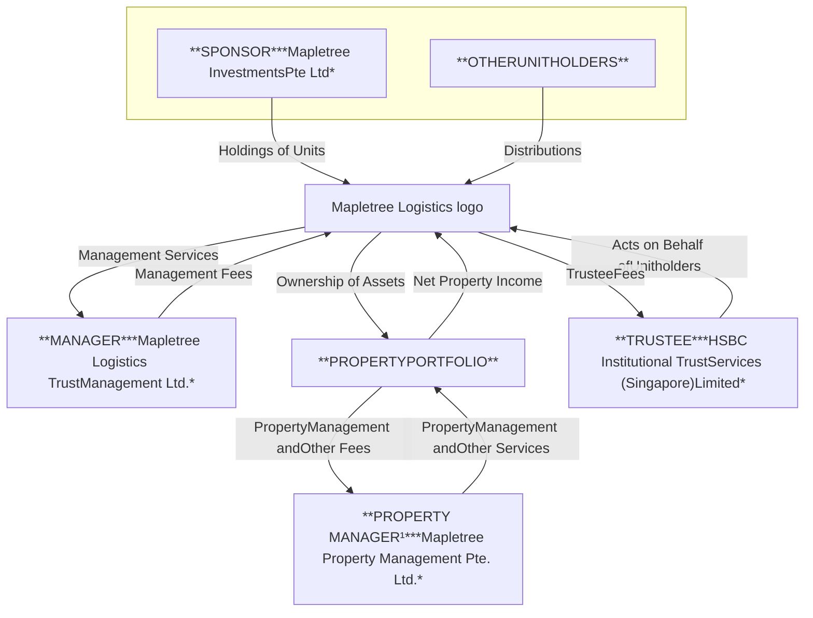
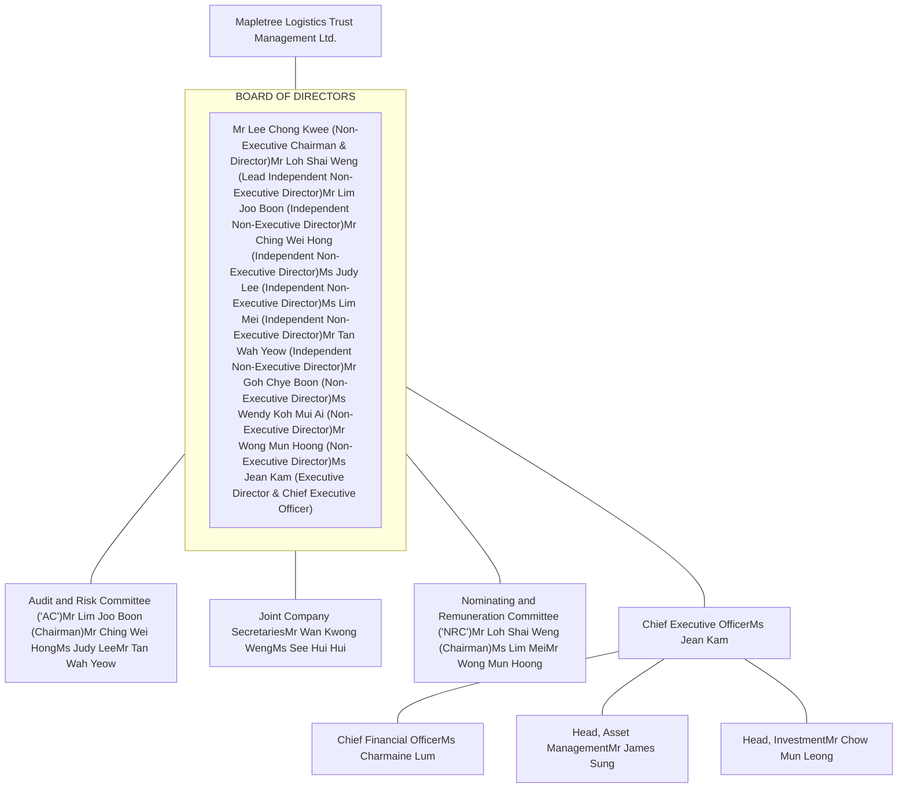
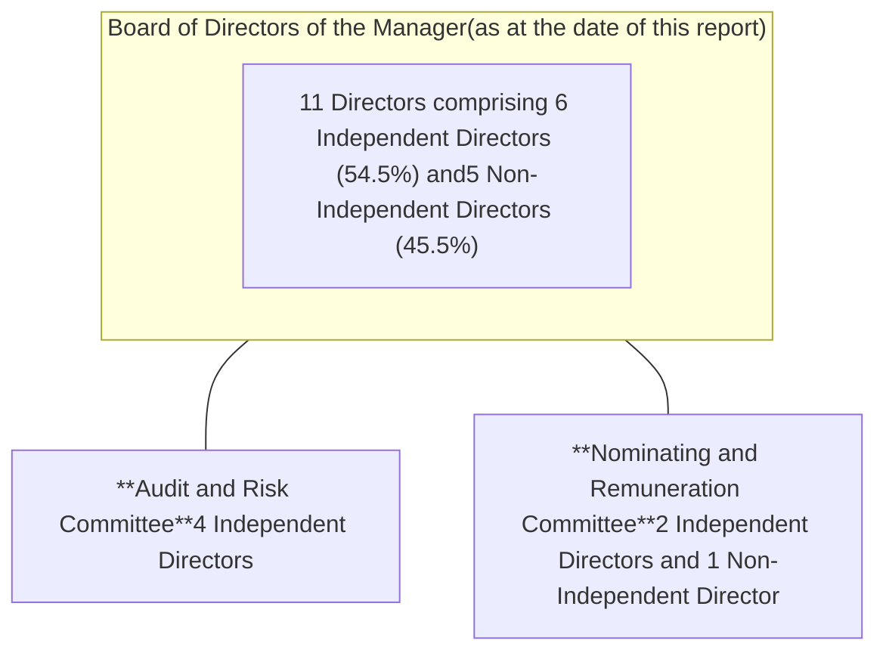

<!-- PAGE 1 -->

Annual Report 2024/25

Mapletree Logistics logo

# Active Rejuvenation Building Resilience

<!-- PAGE 2 -->

# Corporate Profile

# Our Vision

Mapletree Logistics Trust (“MLT” or “the Trust”) is Singapore’s first Asia Pacific-focused logistics real estate investment trust. Listed on the Singapore Exchange Securities Trading Limited in 2005, MLT invests in a diversified portfolio of quality, well-located income-producing logistics real estate in Singapore, Australia, China, Hong Kong SAR, India, Japan, Malaysia, South Korea and Vietnam.

To be the preferred real estate partner of choice to customers requiring high-quality logistics and distribution spaces in Asia Pacific.

# Our Mission

To provide Unitholders with competitive total returns through regular distributions and growth in asset value.

MLT is managed by Mapletree Logistics Trust Management Ltd. (the “Manager”), a wholly-owned subsidiary of Mapletree Investments Pte Ltd (the “Sponsor”). The Sponsor is a leading real estate development, investment, capital and property management company headquartered in Singapore.

The Manager is committed to providing Unitholders with competitive total returns through the following strategies:

a. optimising organic growth and hence, property yield from the existing portfolio;

b. making yield accretive acquisitions of good quality logistics properties; and

c. managing capital to maintain MLT’s strong balance sheet and provide financial flexibility for growth.

Reporting Suite 2025 logo

**Annual Report**

**Sustainability Report**

**Independent Market Research Report**

Mapletree Annual Report cover: Active Rejuvenation Building Resilience

Mapletree Sustainability Report cover: Active Rejuvenation Building Sustainability

Mapletree Independent Market Research Report cover: Active Rejuvenation Building Resilience

The reporting suite is available for viewing and download on our website: www.mapletreelogisticstrust.com

<!-- PAGE 3 -->

*Amidst persistent headwinds in FY24/25, we executed our value creation strategies with discipline, delivering resilient operational performance albeit tempered by a softer financial result.*

*It was also a year of active rejuvenation – we executed 14 divestments and redeployed the capital into investments of modern, high-specification assets, including three accretive acquisitions and a redevelopment project.*

*Looking ahead, we remain focused on building a resilient and future-ready portfolio to continue delivering value to our stakeholders.*

Modern high-specification industrial building

# In this Report

**Overview**

002 Key Highlights

004 Financial Highlights

006 Unit Price Performance

008 Strategy and Value Creation

010 Sustainability Highlights

012 Year in Review

014 Message from the Chairman and CEO

018 Corporate Structure

020 Trust Structure

021 Organisation Structure

022 Board of Directors

026 Management Team

**Performance**

031 Financial Review

038 Capital Management

042 Macro Trends Shaping Our Business

044 Portfolio Analysis and Review

053 Operations Review

062 Property Portfolio

**Governance**

082 Corporate Governance

106 Risk Management

110 Investor Relations

**Financial & Other Information**

113 Report of the Trustee

114 Statement by the Manager

115 Independent Auditor’s Report

119 Statements of Profit or Loss

120 Statements of Comprehensive Income

121 Statements of Financial Position

122 Distribution Statements

124 Consolidated Statement of Cash Flows

126 Statements of Movements in Unitholders’ Funds

128 Portfolio Statements

172 Notes to the Financial Statements

227 Statistics of Unitholdings

229 Interested Person Transactions

231 Corporate Directory

<!-- PAGE 4 -->

# Key Highlights

Globe with location pins over Asia-Pacific region

Briefcase icon

**Stable & Diversified Portfolio**

Hand holding a money bag icon

**Resilient & Consistent Returns**

Dollar sign with circular arrows icon

**Proactive & Disciplined Capital Management**

Factory with a leaf icon

**Commitment Towards Greener Spaces**

<table>
  <thead>
    <tr>
      <th>Singapore</th>
      <th>Hong Kong SAR</th>
      <th>Malaysia</th>
    </tr>
  </thead>
  <tbody>
    <tr>
      <td>47 Properties</td>
      <td>9 Properties</td>
      <td>10 Properties</td>
    </tr>
    <tr>
      <td>Australia</td>
      <td>India</td>
      <td>South Korea</td>
    </tr>
    <tr>
      <td>14 Properties</td>
      <td>3 Properties</td>
      <td>21 Properties</td>
    </tr>
    <tr>
      <td>China</td>
      <td>Japan</td>
      <td>Vietnam</td>
    </tr>
    <tr>
      <td>42 Properties</td>
      <td>22 Properties</td>
      <td>12 Properties</td>
    </tr>
  </tbody>
</table>
<table>
    <tr>
        <td>**Singapore**<br/>47 Properties</td>
        <td>**India**<br/>9 Properties</td>
        <td>**Malaysia**<br/>10 Properties</td>
    </tr>
    <tr>
        <td>**Australia**<br/>14 Properties</td>
        <td>**Hong Kong SAR**<br/>3 Properties</td>
        <td>**South Korea**<br/>21 Properties</td>
    </tr>
    <tr>
        <td>**China**<br/>42 Properties</td>
        <td>**Japan**<br/>22 Properties</td>
        <td>**Vietnam**<br/>12 Properties</td>
    </tr>
</table>

<table>
  <thead>
    <tr>
      <th>Singapore</th>
      <th>Hong Kong SAR</th>
      <th>Malaysia</th>
    </tr>
  </thead>
  <tbody>
    <tr>
      <td>47 Properties</td>
      <td>9 Properties</td>
      <td>10 Properties</td>
    </tr>
    <tr>
      <td>Australia</td>
      <td>India</td>
      <td>South Korea</td>
    </tr>
    <tr>
      <td>14 Properties</td>
      <td>3 Properties</td>
      <td>21 Properties</td>
    </tr>
    <tr>
      <td>China</td>
      <td>Japan</td>
      <td>Vietnam</td>
    </tr>
    <tr>
      <td>42 Properties</td>
      <td>22 Properties</td>
      <td>12 Properties</td>
    </tr>
  </tbody>
</table>

<!-- PAGE 5 -->

<table>
    <tr>
        <th>Assets Under Management icon</th>
        <th>Gross Floor Area icon</th>
        <th>Portfolio Occupancy icon</th>
        <th>Weighted Average Lease Expiry icon</th>
    </tr>
    <tr>
        <td>Assets Under Management</td>
        <td>Gross Floor Area</td>
        <td>Portfolio Occupancy</td>
        <td>Weighted Average Lease Expiry (by NLA)</td>
    </tr>
    <tr>
        <td>**S$13.3 billion**</td>
        <td>**8.3 million sqm**</td>
        <td>**96.2%**</td>
        <td>**2.8 years**</td>
    </tr>
</table>
<table>
    <tr>
        <th>Amount Distributable to Unitholders icon</th>
        <th>Distribution per Unit icon</th>
        <th>Net Asset Value per Unit icon</th>
        <th>Total Return Since Listing icon</th>
    </tr>
    <tr>
        <td>Amount Distributable to Unitholders</td>
        <td>Distribution per Unit</td>
        <td>Net Asset Value per Unit</td>
        <td>Total Return Since Listing¹</td>
    </tr>
    <tr>
        <td>**S$406.4 million**</td>
        <td>**8.053 cents**</td>
        <td>**S$1.31**</td>
        <td>**305%**</td>
    </tr>
</table>
<table>
    <tr>
        <th>Aggregate Leverage icon</th>
        <th>Average Debt Maturity icon</th>
        <th>Debt Hedged into Fixed Rates icon</th>
        <th>Income Hedged for Next Financial Year icon</th>
    </tr>
    <tr>
        <td>Aggregate Leverage</td>
        <td>Average Debt Maturity</td>
        <td>Debt Hedged into Fixed Rates</td>
        <td>Income Hedged for Next Financial Year</td>
    </tr>
    <tr>
        <td>**40.7%**</td>
        <td>**3.8 years**</td>
        <td>**81%**</td>
        <td>**75%**</td>
    </tr>
    <tr>
        <td>as at 31 March 2025</td>
        <td>as at 31 March 2025</td>
        <td></td>
        <td></td>
    </tr>
</table>
<table>
    <tr>
        <th>Green and Sustainable Financing icon</th>
        <th>Total Solar Generating Capacity icon</th>
        <th>China and Hong Kong SAR icon</th>
        <th>Green Certified Portfolio icon</th>
    </tr>
    <tr>
        <td>Green and Sustainable Financing</td>
        <td>Total Solar Generating Capacity²</td>
        <td>China and Hong Kong SAR as a combined market</td>
        <td>Green Certified Portfolio (by GFA)</td>
    </tr>
    <tr>
        <td>**S$1.3 billion**</td>
        <td>**71.1 MWp**</td>
        <td>**Neutralised Scope 2 Emissions**</td>
        <td>**56%**</td>
    </tr>
    <tr>
        <td>as at 31 March 2025</td>
        <td></td>
        <td></td>
        <td></td>
    </tr>
</table>

\*1 Sum of actual distributions and capital appreciation in MLT’s unit price for the period between MLT’s initial public offering (“IPO”) on 28 July 2005 and 31 March 2025, expressed as a percentage of the IPO issue price of S$0.68.

\*2 Comprises self-funded and third-party funded solar installations.

<!-- PAGE 6 -->

# Financial Highlights

MLT delivered resilient revenue and net property income in FY24/25 even as weaker regional currencies and challenges in China continued to pose headwinds. The consistent performance was underpinned by stable portfolio occupancy rate and positive rental reversions, bolstered by a geographically diversified portfolio of assets across nine markets in Asia Pacific.

Gross Revenue (S$million)
-0.9% y-o-y

<table>
  <thead>
    <tr>
        <th>Financial Year</th>
        <th>Gross Revenue (S$million)</th>
    </tr>
  </thead>
  <tbody>
    <tr>
        <td>24/25</td>
        <td>727.0</td>
    </tr>
    <tr>
        <td>23/24</td>
        <td>733.9</td>
    </tr>
    <tr>
        <td>22/23</td>
        <td>730.6</td>
    </tr>
    <tr>
        <td>21/22</td>
        <td>678.6</td>
    </tr>
    <tr>
        <td>20/21</td>
        <td>561.1</td>
    </tr>
  </tbody>
</table>

Net Property Income (S$million)
-1.5% y-o-y

<table>
  <thead>
    <tr>
        <th>Financial Year</th>
        <th>Net Property Income (S$million)</th>
    </tr>
  </thead>
  <tbody>
    <tr>
        <td>24/25</td>
        <td>625.3</td>
    </tr>
    <tr>
        <td>23/24</td>
        <td>634.9</td>
    </tr>
    <tr>
        <td>22/23</td>
        <td>634.8</td>
    </tr>
    <tr>
        <td>21/22</td>
        <td>592.1</td>
    </tr>
    <tr>
        <td>20/21</td>
        <td>499.1</td>
    </tr>
  </tbody>
</table>

Proactive and disciplined multi-year hedging helped mitigate the impact of higher borrowing costs and weaker regional currencies, which continued to exert downward pressure on MLT’s distributable income. Additionally, a lower divestment gain of S$27.0 million was distributed in FY24/25 as part of the Manager’s prudent capital management to preserve financial flexibility.

Amount Distributable to Unitholders (S$million)
-9.1% y-o-y

<table>
  <thead>
    <tr>
        <th>Financial Year</th>
        <th>Amount Distributable to Unitholders (S$million)</th>
    </tr>
  </thead>
  <tbody>
    <tr>
        <td>24/25</td>
        <td>406.4¹</td>
    </tr>
    <tr>
        <td>23/24</td>
        <td>447.1²</td>
    </tr>
    <tr>
        <td>22/23</td>
        <td>432.9³</td>
    </tr>
    <tr>
        <td>21/22</td>
        <td>390.7⁴</td>
    </tr>
    <tr>
        <td>20/21</td>
        <td>333.1⁵</td>
    </tr>
  </tbody>
</table>

Distribution Per Unit (cents)
-10.6% y-o-y

<table>
  <thead>
    <tr>
        <th>Financial Year</th>
        <th>Distribution Per Unit (cents)</th>
    </tr>
  </thead>
  <tbody>
    <tr>
        <td>24/25</td>
        <td>8.053</td>
    </tr>
    <tr>
        <td>23/24</td>
        <td>9.003</td>
    </tr>
    <tr>
        <td>22/23</td>
        <td>9.011</td>
    </tr>
    <tr>
        <td>21/22</td>
        <td>8.787</td>
    </tr>
    <tr>
        <td>20/21</td>
        <td>8.326</td>
    </tr>
  </tbody>
</table>

MLT’s assets under management rose by 0.8%, mainly due to the acquisitions of three properties, capital expenditure on existing assets and an ongoing redevelopment project. This was partly offset by the divestments of 10 properties, currency translation loss of S$116.0 million and S$62.0 million net fair value loss on investment properties.

Assets Under Management (S$billion)
+0.8% y-o-y

<table>
  <thead>
    <tr>
        <th>Financial Year</th>
        <th>Assets Under Management (S$billion)⁶</th>
    </tr>
  </thead>
  <tbody>
    <tr>
        <td>24/25</td>
        <td>13.3</td>
    </tr>
    <tr>
        <td>23/24</td>
        <td>13.2</td>
    </tr>
    <tr>
        <td>22/23</td>
        <td>12.8</td>
    </tr>
    <tr>
        <td>21/22</td>
        <td>13.1</td>
    </tr>
    <tr>
        <td>20/21</td>
        <td>10.8</td>
    </tr>
  </tbody>
</table>

Net Asset Value Per Unit (S$)
-5.1% y-o-y

<table>
  <thead>
    <tr>
        <th>Financial Year</th>
        <th>Net Asset Value Per Unit (S$)⁷ ⁸ ⁹</th>
    </tr>
  </thead>
  <tbody>
    <tr>
        <td>24/25</td>
        <td>1.31</td>
    </tr>
    <tr>
        <td>23/24</td>
        <td>1.38</td>
    </tr>
    <tr>
        <td>22/23</td>
        <td>1.44</td>
    </tr>
    <tr>
        <td>21/22</td>
        <td>1.48</td>
    </tr>
    <tr>
        <td>20/21</td>
        <td>1.33</td>
    </tr>
  </tbody>
</table>

1 This includes distribution of divestment gain of S$27.0 million.

2 This includes distribution of divestment gain of S$41.6 million.

3 This includes distribution of divestment gain of S$6.5 million.

4 This includes distribution of divestment gain of S$7.2 million.

5 This includes distribution of divestment gain of S$18.9 million.

6 Includes the right-of-use assets with the adoption of SFRS(I)16 and investment properties held for sale and under redevelopment.

7 This took into account the issuance of S$400.0 million 3.725% perpetual securities on 2 November 2021 and redemption of S$250.0 million 4.18% perpetual securities on 25 November 2021.

8 This took into account the issuance of S$180.0 million 4.30% perpetual securities on 15 August 2024 and redemption of S$180.0 million 5.2074% perpetual securities on 28 September 2024.

9 On 29 October 2020, 246,670,000 units in MLT were issued via private placement exercise which raised gross proceeds of S$500.0 million. On 18 November 2020, 72,408,675 units in MLT were issued via the 19-for-1000 preferential offering which raised gross proceeds of S$144.1 million. The total gross proceeds of approximately S$644.1 million were utilised to partially fund the acquisitions of nine logistics properties in China, Malaysia and Vietnam as well as the remaining 50% interest in 15 logistics properties in China. In addition, on 1 December 2020, a total of 148,001,965 Consideration Units worth S$300.0 million were issued to a wholly owned subsidiary of Mapletree Investments Pte Ltd as partial consideration in relation to the acquisition in China.

<!-- PAGE 7 -->

<table>
  <thead>
    <tr>
        <th> </th>
        <th>FY20/21</th>
        <th>FY21/22</th>
        <th>FY22/23</th>
        <th>FY23/24</th>
        <th>FY24/25</th>
    </tr>
  </thead>
  <tbody>
    <tr>
        <td colspan="6">Statement of Financial Position Highlights (S$million)</td>
    </tr>
    <tr>
        <td>Total Assets</td>
        <td>11,204.7</td>
        <td>13,689.8</td>
        <td>13,423.2</td>
        <td>13,812.3</td>
        <td>13,892.9</td>
    </tr>
    <tr>
        <td>Total Borrowings</td>
        <td>4,226.1</td>
        <td>4,958.2</td>
        <td>4,877.4</td>
        <td>5,309.6</td>
        <td>5,581.9</td>
    </tr>
    <tr>
        <td>Perpetual Securities</td>
        <td>429.9</td>
        <td>581.5⁷</td>
        <td>581.5</td>
        <td>581.5</td>
        <td>582.4⁸</td>
    </tr>
    <tr>
        <td>Unitholders’ Funds</td>
        <td>5,681.3⁹</td>
        <td>7,069.4¹⁰</td>
        <td>6,926.9</td>
        <td>6,884.8¹¹</td>
        <td>6,638.8</td>
    </tr>
    <tr>
        <td>Market Capitalisation¹²</td>
        <td>8,266.6</td>
        <td>8,848.0</td>
        <td>8,235.4</td>
        <td>7,291.2</td>
        <td>6,637.4</td>
    </tr>
    <tr>
        <td colspan="6">Key Financial Indicators</td>
    </tr>
    <tr>
        <td>Aggregate Leverage (%)¹³,¹⁴</td>
        <td>38.4</td>
        <td>36.8</td>
        <td>36.8</td>
        <td>38.9</td>
        <td>40.7</td>
    </tr>
    <tr>
        <td>Interest Cover Ratio (times)¹⁵</td>
        <td>4.3</td>
        <td>4.2</td>
        <td>3.5</td>
        <td>3.1</td>
        <td>2.9</td>
    </tr>
    <tr>
        <td>Average Cost of Debt (%)</td>
        <td>2.2</td>
        <td>2.2</td>
        <td>2.5</td>
        <td>2.5</td>
        <td>2.7</td>
    </tr>
    <tr>
        <td>Average Debt Maturity (years)</td>
        <td>3.8</td>
        <td>3.8</td>
        <td>3.8</td>
        <td>3.8</td>
        <td>3.8</td>
    </tr>
  </tbody>
</table>

10 On 2 December 2021, 212,766,000 units in MLT were issued via private placement exercise which raised gross proceeds of S$400.0 million. On 22 December 2021, 159,109,907 units in MLT were issued via preferential offering exercise which raised gross proceeds of S$292.8 million. The total gross proceeds of S$692.8 million were utilised to partially fund the acquisitions of 13 properties in China, three properties in Vietnam and one property in Japan. In addition, on 20 January 2022, a total of 106,382,979 Consideration Units worth S$200.0 million were issued to a wholly owned subsidiary of Mapletree Investments Pte Ltd as partial consideration in relation to the acquisitions of 12 properties in China.

11 On 11 April 2023, 121,285,000 units in MLT were issued via private placement exercise which raised gross proceeds of S$200.0 million. This amount was used to repay existing debts and partially fund the acquisitions of six logistics properties in Japan, one logistics property each in South Korea and Australia.

12 Based on the closing unit prices of S$1.93 on 31 March 2021, S$1.85 on 31 March 2022, S$1.71 on 31 March 2023, S$1.46 on 28 March 2024 and S$1.31 on 28 March 2025.

13 As per Code on Collective Investment Schemes (“CIS Code”), the aggregate leverage includes lease liabilities that are entered into in the ordinary course of MLT’s business on or after 1 April 2019 in accordance to the Monetary Authority of Singapore (“MAS”) guidance.

14 Total debt (including perpetual securities) to net asset value ratio and total debt (including perpetual securities) less cash and cash equivalent to net asset value ratio as at 31 March 2025 were 85.2% and 85.1% respectively.

15 The Interest Cover Ratio is based on a trailing 12 months’ financial results (including perpetual securities distribution), in accordance with the MAS revised CIS Code with effect from 28 November 2024.

<table>
  <thead>
    <tr>
      <th>ANNUAL REPORT 2024/25 005</th>
      <th></th>
      <th></th>
    </tr>
  </thead>
  <tbody>
    <tr>
      <td>(FY24/25)  (As at 31 March 2025)</td>
      <td></td>
      <td></td>
    </tr>
    <tr>
      <td>Singapore Singapore</td>
      <td>27.7%</td>
      <td>20.1%</td>
    </tr>
    <tr>
      <td>Hong Kong SAR Hong Kong SAR</td>
      <td>17.0%</td>
      <td>23.3%</td>
    </tr>
    <tr>
      <td>China  China</td>
      <td>17.0%</td>
      <td>18.1%</td>
    </tr>
    <tr>
      <td>S$727.0 Japan S$13.3 Japan</td>
      <td>11.3%</td>
      <td>14.4%</td>
    </tr>
    <tr>
      <td>South Korea South Korea</td>
      <td>7.9%</td>
      <td>7.9%</td>
    </tr>
    <tr>
      <td>million Australia  billion<sup>6</sup> Australia</td>
      <td>7.3%</td>
      <td>7.2%</td>
    </tr>
    <tr>
      <td>Malaysia Malaysia</td>
      <td>6.2%</td>
      <td>5.3%</td>
    </tr>
    <tr>
      <td>Vietnam Vietnam</td>
      <td>4.5%</td>
      <td>3.0%</td>
    </tr>
    <tr>
      <td>India India</td>
      <td>1.1%</td>
      <td>0.7%</td>
    </tr>
    <tr>
      <td>5-Year Financial Summary</td>
      <td></td>
      <td></td>
    </tr>
  </tbody>
</table>

<!-- PAGE 8 -->

# Unit Price Performance

**Trading Performance in FY24/25**

Most global equity markets rose in the 12 months to 31 March 2025 (“FY24/25”) despite significant market volatility caused by geopolitical uncertainty and high interest rates that persisted for the most part of the financial year. The continuation and broadening of the artificial intelligence (“AI”) boom sparked a strong tech rally, before worries over a softening economy, expensive valuations of tech companies and the unwinding of the yen carry trade took away some of the market gains. Towards the end of FY24/25, concerns over heightened geopolitical risk and renewed trade tensions once again weighed on investor sentiment.

The US Federal Reserve implemented three rate cuts in the latter part of 2024 before hitting the pause button for further rate cuts as US economic activity continued to expand at a solid pace, while inflation remained elevated.

Given expectations of higher-for-longer interest rates, yield-sensitive Singapore real estate investment trusts (“S-REITs”) continued to lag the broader market in FY24/25. The FTSE Straits Times Real Estate Investment Trust Index (“FSTREI”) fell by 1.5%, while the benchmark Straits Times Index (“STI”) gained 23.2%, led by financial stocks which soared to record highs.

Concerns over a lacklustre economic recovery in China continued to weigh on the price performance of S-REITs with exposure to the market. The persistent weakness in the Chinese logistics market also took a toll on MLT’s unit price, which closed at S$1.31 on 31 March 2025, 10.3% lower than the closing price of S$1.46 on 31 March 2024. Taking into account the distribution payout of 8.053 cents in FY24/25, this represents a total return of -4.8% and yield of 6.1%.

MLT is a constituent of major global indices such as the FTSE EPRA Nareit Global Developed Index and the Global Property Research (“GPR”) 250 Index. In addition, MLT is a constituent of the STI and FSTREI. MLT’s trading volume increased 61% to 6.0 billion units in FY24/25, representing an average daily trading volume of 22.8 million units.

Comparative Trading Performance in FY24/25

<table>
  <thead>
    <tr>
        <th>Month</th>
        <th>MLT</th>
        <th>STI</th>
        <th>FSTREI</th>
    </tr>
  </thead>
  <tbody>
    <tr>
        <td>Mar-24</td>
        <td>100.0</td>
        <td>100.0</td>
        <td>100.0</td>
    </tr>
    <tr>
        <td>Apr-24</td>
        <td>92.0</td>
        <td>101.0</td>
        <td>98.0</td>
    </tr>
    <tr>
        <td>May-24</td>
        <td>94.0</td>
        <td>103.0</td>
        <td>96.0</td>
    </tr>
    <tr>
        <td>Jun-24</td>
        <td>90.0</td>
        <td>105.0</td>
        <td>95.0</td>
    </tr>
    <tr>
        <td>Jul-24</td>
        <td>98.0</td>
        <td>108.0</td>
        <td>101.0</td>
    </tr>
    <tr>
        <td>Aug-24</td>
        <td>92.0</td>
        <td>106.0</td>
        <td>98.0</td>
    </tr>
    <tr>
        <td>Sep-24</td>
        <td>99.0</td>
        <td>112.0</td>
        <td>108.0</td>
    </tr>
    <tr>
        <td>Oct-24</td>
        <td>98.0</td>
        <td>111.0</td>
        <td>105.0</td>
    </tr>
    <tr>
        <td>Nov-24</td>
        <td>88.0</td>
        <td>116.0</td>
        <td>98.0</td>
    </tr>
    <tr>
        <td>Dec-24</td>
        <td>87.0</td>
        <td>118.0</td>
        <td>98.0</td>
    </tr>
    <tr>
        <td>Jan-25</td>
        <td>86.0</td>
        <td>118.0</td>
        <td>97.0</td>
    </tr>
    <tr>
        <td>Feb-25</td>
        <td>84.0</td>
        <td>122.0</td>
        <td>95.0</td>
    </tr>
    <tr>
        <td>Mar-25</td>
        <td>89.7</td>
        <td>123.2</td>
        <td>98.5</td>
    </tr>
  </tbody>
</table>

Note: Rebased closing prices on 31 March 2024 to 100.

Comparative Yields

<table>
  <thead>
    <tr>
        <th>Category</th>
        <th>Yield (%)</th>
    </tr>
  </thead>
  <tbody>
    <tr>
        <td>MLT yield¹</td>
        <td>6.1</td>
    </tr>
    <tr>
        <td>10-year Govt Bond Yield²</td>
        <td>2.7</td>
    </tr>
    <tr>
        <td>FSTREI Yield³</td>
        <td>5.2</td>
    </tr>
    <tr>
        <td>STI Yield⁴</td>
        <td>4.5</td>
    </tr>
    <tr>
        <td>CPF Ordinary Account⁵</td>
        <td>2.5</td>
    </tr>
  </tbody>
</table>

\*1 Based on actual DPU of 8.053 cents for the period of 1 April 2024 to 31 March 2025 and closing unit price of S$1.31 on 31 March 2025.
\*2 Singapore Government Bond Yield as at 31 March 2025, Monetary Authority of Singapore.
\*3 12-month gross dividend yield of FTSE Straits Times REIT Index as at 31 March 2025, Bloomberg.
\*4 12-month gross dividend yield of Straits Times Index as at 31 March 2025, Bloomberg.
\*5 Prevailing interest rate on CPF Ordinary Account Savings as at 31 March 2025.

<!-- PAGE 9 -->

# MLT’s Total Return Compared to the FTSE ST REIT Index and Straits Times Index

<table>
  <thead>
    <tr>
        <th> </th>
        <th colspan="2">1 Year<br/>From 31 March 2024</th>
        <th colspan="2">3 Years<br/>From 31 March 2022</th>
        <th colspan="2">5 Years<br/>From 31 March 2020</th>
        <th colspan="2">Since Listing<br/>From 28 July 2005</th>
    </tr>
    <tr>
        <th> </th>
        <th>Price Change %</th>
        <th>Total Return¹ %</th>
        <th>Price Change %</th>
        <th>Total Return¹ %</th>
        <th>Price Change %</th>
        <th>Total Return¹ %</th>
        <th>Price Change %</th>
        <th>Total Return¹ %</th>
    </tr>
  </thead>
  <tbody>
    <tr>
        <td>MLT</td>
        <td>-10.3</td>
        <td>-4.8</td>
        <td>-29.6</td>
        <td>-15.6</td>
        <td>-15.9</td>
        <td>11.8</td>
        <td>92.6²</td>
        <td>305.1²</td>
    </tr>
    <tr>
        <td>FTSE ST REIT Index</td>
        <td>-1.5</td>
        <td>3.9</td>
        <td>-24.1</td>
        <td>-9.6</td>
        <td>-8.4</td>
        <td>20.4</td>
        <td>-12.4</td>
        <td>89.9</td>
    </tr>
    <tr>
        <td>Straits Times Index</td>
        <td>23.2</td>
        <td>28.9</td>
        <td>16.5</td>
        <td>30.6</td>
        <td>60.1</td>
        <td>87.9</td>
        <td>74.2</td>
        <td>158.1</td>
    </tr>
  </tbody>
</table>

Source: MLT and Bloomberg.

1 Assume dividends are not reinvested.

2 Based on MLT’s IPO issue price of S$0.68.

## MLT Monthly Trading Performance in FY24/25

<table>
  <thead>
    <tr>
        <th>Month</th>
        <th>Volume (million Units)</th>
        <th>Unit price (S$)</th>
    </tr>
  </thead>
  <tbody>
    <tr>
        <td>Apr-24</td>
        <td>563.8</td>
        <td>1.35</td>
    </tr>
    <tr>
        <td>May-24</td>
        <td>993.0</td>
        <td>1.33</td>
    </tr>
    <tr>
        <td>Jun-24</td>
        <td>492.6</td>
        <td>1.29</td>
    </tr>
    <tr>
        <td>Jul-24</td>
        <td>498.7</td>
        <td>1.29</td>
    </tr>
    <tr>
        <td>Aug-24</td>
        <td>457.8</td>
        <td>1.36</td>
    </tr>
    <tr>
        <td>Sep-24</td>
        <td>562.8</td>
        <td>1.46</td>
    </tr>
    <tr>
        <td>Oct-24</td>
        <td>474.0</td>
        <td>1.33</td>
    </tr>
    <tr>
        <td>Nov-24</td>
        <td>467.0</td>
        <td>1.28</td>
    </tr>
    <tr>
        <td>Dec-24</td>
        <td>289.2</td>
        <td>1.27</td>
    </tr>
    <tr>
        <td>Jan-25</td>
        <td>415.6</td>
        <td>1.22</td>
    </tr>
    <tr>
        <td>Feb-25</td>
        <td>369.1</td>
        <td>1.23</td>
    </tr>
    <tr>
        <td>Mar-25</td>
        <td>380.0</td>
        <td>1.31</td>
    </tr>
  </tbody>
</table>

Source: Bloomberg

# MLT Unit Price and Trading Volume Over the Last 10 Financial Years

<table>
  <thead>
    <tr>
        <th>Unit Price Performance (S$)</th>
        <th>FY 15/16</th>
        <th>FY 16/17</th>
        <th>FY 17/18</th>
        <th>FY 18/19</th>
        <th>FY 19/20</th>
        <th>FY 20/21</th>
        <th>FY 21/22</th>
        <th>FY 22/23</th>
        <th>FY 23/24</th>
        <th>FY 24/25</th>
    </tr>
  </thead>
  <tbody>
    <tr>
        <td>Opening</td>
        <td>1.245</td>
        <td>1.010</td>
        <td>1.100</td>
        <td>1.230</td>
        <td>1.460</td>
        <td>1.580</td>
        <td>1.930</td>
        <td>1.850</td>
        <td>1.710</td>
        <td>1.460</td>
    </tr>
    <tr>
        <td>Closing</td>
        <td>1.010</td>
        <td>1.095</td>
        <td>1.230</td>
        <td>1.460</td>
        <td>1.580</td>
        <td>1.930</td>
        <td>1.850</td>
        <td>1.710</td>
        <td>1.460</td>
        <td>1.310</td>
    </tr>
    <tr>
        <td>Highest</td>
        <td>1.255</td>
        <td>1.100</td>
        <td>1.380</td>
        <td>1.460</td>
        <td>2.020</td>
        <td>2.160</td>
        <td>2.150</td>
        <td>1.880</td>
        <td>1.800</td>
        <td>1.500</td>
    </tr>
    <tr>
        <td>Lowest</td>
        <td>0.910</td>
        <td>0.970</td>
        <td>1.095</td>
        <td>1.190</td>
        <td>1.240</td>
        <td>1.490</td>
        <td>1.690</td>
        <td>1.430</td>
        <td>1.410</td>
        <td>1.200</td>
    </tr>
    <tr>
        <td>Trading Volume (million units)</td>
        <td>1,014</td>
        <td>1,023</td>
        <td>1,619</td>
        <td>2,203</td>
        <td>3,629</td>
        <td>4,003</td>
        <td>3,199</td>
        <td>3,550</td>
        <td>3,704</td>
        <td>5,964</td>
    </tr>
    <tr>
        <td>Market Capitalisation¹ (S$ million)</td>
        <td>2,515</td>
        <td>2,738</td>
        <td>3,762</td>
        <td>5,289</td>
        <td>6,004</td>
        <td>8,267</td>
        <td>8,848</td>
        <td>8,235</td>
        <td>7,291</td>
        <td>6,637</td>
    </tr>
  </tbody>
</table>

1 Based on MLT’s closing unit price and total issued units as at end of the period.

<!-- PAGE 10 -->

# Strategy and Value Creation

Guided by a sound strategy, we leverage on our strengths to deliver resilient and sustainable returns to our Unitholders.

## Our Strengths

**Extensive Regional Network**

Network of 180 assets across nine markets in Asia Pacific provides geographical diversification and reduces concentration risks

**Prime Logistics Space**

Strategically located modern facilities in multiple locations offer a variety of regional leasing solutions to meet tenants’ evolving business needs

**Diversified Tenant Mix**

Balanced mix of single-user and multi-tenanted buildings with diversified income source from more than 900 tenants in various trade mix

**Financial Strength**

Disciplined and prudent capital management helps mitigate risks while providing the Trust with the financial flexibility to navigate economic challenges and seize growth opportunities

**Experienced Team**

Proactive management approach with proven track record augmented by strong support from the Board and Sponsor

**Customer-focused**

On-the-ground teams with deep local knowledge strive to anticipate customers’ evolving needs and deliver tangible value for them, in line with MLT’s motto: “Be the First to Know”

**Sustainable Stewardship**

Integrating sustainability considerations into business strategy for a holistic approach to creating value for stakeholders

## Our Strategy

Our three-pronged approach ensures that we continue to be a sustainable business through economic cycles, creating and protecting value over the long term.

<table>
  <thead>
    <tr>
        <th>Category</th>
        <th>Description</th>
    </tr>
  </thead>
  <tbody>
    <tr>
        <td>Yield optimisation on existing portfolio</td>
        <td>Focus on existing assets to improve returns.</td>
    </tr>
    <tr>
        <td>Growth via acquisitions &amp; development</td>
        <td>Expansion through new assets and development projects.</td>
    </tr>
    <tr>
        <td>Prudent capital management</td>
        <td>Maintaining financial discipline and flexibility.</td>
    </tr>
    <tr>
        <td>Yield + Growth Strategy</td>
        <td>The core objective achieved by the intersection of the three pillars.</td>
    </tr>
  </tbody>
</table>

**Yield Optimisation on Existing Portfolio**

* Tailor leasing strategy to meet local market conditions

* Maintain a well-staggered lease expiry profile

* Maintain a balanced mix of single-user assets and multi-tenanted buildings

* Improve operational efficiency of properties

* Optimise returns via asset enhancement and/or redevelopment

* Selective divestments of low-yielding properties with older specifications

**Growth via Acquisitions & Development**

* Disciplined acquisitions of quality, well-located assets that add scale and strategic value to the portfolio

* Offer attractive value propositions to customers in support of their regional expansion plans

* Supported by a committed Sponsor with extensive development expertise and regional presence as evidenced by its strong platform of logistics development projects in Asia Pacific

**Prudent Capital Management**

* Maintain a strong balance sheet

* Diversify sources of funding

* Optimise cost of debt financing

* Manage exposure to market fluctuations in interest rate and foreign exchange through appropriate hedging strategies

## Stakeholders

**Tenant-Customers**

Fostering long-term relationships and supporting tenant-customers’ evolving business needs.

**Investors and Unitholders**

Providing competitive total returns via sustainable distributions and asset value growth.

**Employees**

Aiming to be the employer of choice through fair hiring, competitive compensation, professional development and employee engagement.

<!-- PAGE 11 -->

# Macro Trends Shaping Our Business

E-commerce icon

**E-commerce Remains a Growth Engine**

Supply chain icon

**Focus on Supply Chain Optimisation**

Green building icon

**Growing Demand for Green Buildings**

Forex and interest icon

**Heightened Forex Volatility and Interest Cost Challenges**

Geopolitical icon

**Geopolitical and Trade Uncertainties**

Read more on pages 42 to 43 of this Annual Report

# Value Created in FY24/25

## ACTIVE REJUVENATION

<table>
  <tbody>
    <tr>
        <td>S$227 million</td>
        <td>S$205 million</td>
        <td>S$209 million</td>
    </tr>
    <tr>
        <td>Accretive Acquisitions</td>
        <td>Asset Enhancement Initiative</td>
        <td>Selective Divestments at 17% Average Premium to Valuation</td>
    </tr>
  </tbody>
</table>

## RESILIENT OPERATIONAL PERFORMANCE

<table>
  <tbody>
    <tr>
        <td>96.2%</td>
        <td>+2.1%</td>
        <td>BBB+</td>
    </tr>
    <tr>
        <td>Portfolio Occupancy</td>
        <td>Rental Reversion</td>
        <td>Fitch Rating (with Stable Outlook)</td>
    </tr>
  </tbody>
</table>

## BUILDING RESILIENCE

<table>
  <tbody>
    <tr>
        <td>70%</td>
        <td>42%</td>
        <td>S$1.3 billion</td>
    </tr>
    <tr>
        <td>Tenants in Consumer-related Sectors</td>
        <td>Gross Revenue from Multi-location Tenants</td>
        <td>Green and Sustainable Financing</td>
    </tr>
  </tbody>
</table>
<table>
  <tbody>
    <tr>
        <td>71.1 MWp</td>
        <td>56%</td>
        <td>51%</td>
    </tr>
    <tr>
        <td>Total Solar Generating Capacity¹</td>
        <td>Portfolio (by GFA) is Green-certified</td>
        <td>Portfolio (by NLA) is Covered by Green Leases</td>
    </tr>
  </tbody>
</table>
<table>
  <tbody>
    <tr>
        <td>36%</td>
        <td>48</td>
        <td>375</td>
    </tr>
    <tr>
        <td>Female Representation on the Board</td>
        <td>Average Training Hours per Employee</td>
        <td>Staff Volunteer Hours Across Eight Markets</td>
    </tr>
  </tbody>
</table>

\* 1 Comprises self-funded and third-party funded solar installations.

<table>
  <tbody>
    <tr>
        <td>Government and Industry</td>
        <td>Business Partners</td>
        <td>Local Communities</td>
    </tr>
    <tr>
        <td>Ensuring high levels of corporate governance and transparency in our business operations.</td>
        <td>Creating value through mutually beneficial partnerships as a responsible landlord.</td>
        <td>Delivering positive social impact as we touch lives in a meaningful way.</td>
    </tr>
  </tbody>
</table>

<!-- PAGE 12 -->

# Sustainability Highlights

We believe in building a resilient and sustainable business while doing good. We embed sustainability into our business strategy, forge strong relationships and create sustainable value, all of which positively impact our stakeholders.

People working on laptops

A small plant sprout growing

<table>
  <thead>
    <tr>
      <th>Economic</th>
      <th>Environment</th>
    </tr>
  </thead>
  <tbody>
    <tr>
      <td>Social</td>
      <td>Governance</td>
    </tr>
  </tbody>
</table>

Economic Environment

Social Governance

Group of people joining hands in a circle

Person using a laptop with digital icons overlay

Sustainability report icon

More details can be found in MLT’s Sustainability Report 2024/25, which is available for viewing and download on our website: <u>www.mapletreelogisticstrust.com</u>

<table>
  <thead>
    <tr>
      <th>Economic</th>
      <th>Environment</th>
    </tr>
  </thead>
  <tbody>
    <tr>
      <td>Social</td>
      <td>Governance</td>
    </tr>
  </tbody>
</table>

<!-- PAGE 13 -->

# Building a Resilient and Sustainable Business

## S$1.3 billion | 3 | 56% | 51%

of total green and sustainable financing as at 31 March 2025 | sustainable initiatives implemented for the benefit of tenants | of portfolio (by GFA) is green certified | of portfolio (by NLA) is covered by green leases

***

## Supplier Code of Conduct | High ratings of 3.8 and 4.1

implemented in Singapore | for the Manager’s ESG efforts and property management services respectively, in 2024 tenant satisfaction survey¹

# Safeguarding Against the Impacts of Climate Change

## 4.3% | 71.1 MWp | Neutralised Scope 2 emissions | >1,700 trees

reduction in portfolio energy intensity² from FY23/24 baseline | of total solar generating capacity³, the largest among S-REITs reported to-date | in China and Hong Kong SAR as a combined market | planted across MLT’s assets in FY24/25

# Enhancing Social Value in Our Workplace and Community

## 48 | 48% | 375

average training hours per employee | of management positions held by women | staff volunteer hours across eight markets

***

## Zero

material incidences of non-compliance with health and safety laws and regulations

# Upholding High Ethical Standards

## Zero | 36% | 55% | Recognised for Exemplary Board Diversity

material incidences of non-compliance with relevant laws and regulations | female representation on the Board | Independent Directors on the Board | in the 2025 Singapore Board Diversity Index⁴

## Zero | 3-Star Rating | Morningstar Sustainalytics ESG Risk Rating

incidences of non-compliance with anti-corruption laws and regulations | in the 2024 GRESB Real Estate Assessment | **11.1** Low Risk

<table>
  <thead>
    <tr>
        <th>Negl</th>
        <th>Low</th>
        <th>Med</th>
        <th>High</th>
        <th>Severe</th>
    </tr>
  </thead>
  <tbody>
    <tr>
        <td>0-10</td>
        <td>10-20</td>
        <td>20-30</td>
        <td>30-40</td>
        <td>40+</td>
    </tr>
  </tbody>
</table>

<!-- PAGE 14 -->

# Year in Review 24/25

## May 2024

Completed the acquisition of **Mapletree Logistics Hub – Jubli Shah Alam** in Malaysia, from the Sponsor. The asset comprises two blocks of modern, Grade A ramp-up warehouses with excellent connectivity to Kuala Lumpur City Centre and Port Klang

**Agreed Property Value:**
**S$160.4 million**

Completed the divestment of **Padi Warehouse** in Malaysia

**Sale Price:**
**MYR26.1 million**
(S$7.5 million)

**Premium to Valuation:**
**16.0%**

From left: Mapletree Logistics Hub – Jubli Shah Alam in Malaysia; Hung Yen Logistics Park I and Mapletree Logistics Park Phase 3 in Vietnam, which were acquired in FY24/25.

## November 2024

Completed the divestment of **Mapletree Xi’an Logistics Park** in China

Sale Price:
**RMB70.5 million**
(S$13.1 million)

Premium to Valuation:
**0.7%**

Completed the divestments of **Toki Centre** and **Aichi Miyoshi Centre** in Japan

Total Sale Price:
**JPY4,250.0 million**
(S$37.2 million)

Average Premium to Valuation:
**8.4%**

## December 2024

Announced the proposed divestment of **1 Genting Lane** in Singapore

Sale Price:
**S$12.3 million**

Premium to Valuation:
**35.2%**

13 properties in China were awarded **LEED Gold Certification for Building Operations and Maintenance**, raising green certified space to **56%** of MLT’s portfolio gross floor area

## January 2025

Announced the proposed divestment of **Subang 2** in Malaysia

Sale Price:
**MYR31.5 million**
(S$9.5 million)

Premium to Valuation:
**31.3%**

The Manager was recognised for its exemplary board diversity in the **2025 Singapore Board Diversity Index** developed by WTW (Willis Towers Watson plc), in partnership with the Singapore Institute of Directors and James Cook University

Announced the proposed divestment of **8 Tuas View Square** in Singapore

Sale Price:
**S$11.2 million**

Premium to Valuation:
**39.8%**

Completed the divestment of **Celestica Hub** in Malaysia

Sale Price:
**MYR43.2 million**
(S$13.2 million)

Premium to Valuation:
**2.9%**

<!-- PAGE 15 -->

### June 2024

Completed the acquisitions of **Hung Yen Logistics Park I** and **Mapletree Logistics Park Phase 3** in Vietnam from the Sponsor. These modern properties are strategically located to serve the growing consumption bases of Hanoi and Ho Chi Minh City, respectively

Total Agreed Property Value:
**S$66.8 million**

Completed the divestment of **30 Tuas South Avenue 8** in Singapore

Sale Price: **S$10.5 million**
Premium to Valuation: **10.5%**

### July 2024

Ms Jean Kam, formerly Head of Investments at the Manager, was appointed as its Chief Executive Officer and Executive Director following Ms Ng Kiat’s transfer to assume new responsibilities at the Sponsor

### August 2024

Issued **S$180 million 4.30% fixed rate perpetual securities**, and in September fully redeemed **S$180 million 5.2074% perpetual securities** under MLT’s S$3 billion Euro Medium Term Securities Programme

11 properties in Vietnam received the **EDGE green building certification**. Together with five properties from the Sponsor, the combined portfolio of 16 properties represents the **largest EDGE-certified warehouse portfolio** in Southeast Asia

### September 2024

Completed the divestment of **119 Neythal Road** in Singapore

Sale Price:
**S$13.8 million**

Premium to Valuation:
**34.0%**

Completed the divestment of **Flexhub** in Malaysia

Sale Price:
**MYR125.1 million**
(S$38.5 million)

Premium to Valuation:
**7.4%**

Collage showing a redevelopment project in Singapore, CEO Jean Kam at an AGM, and solar panels on a logistics hub in Malaysia

Completed the divestment of **Zentraline** in Malaysia

Sale Price:
**MYR42.3 million**
(S$13.0 million)

Premium to Valuation:
**1.9%**

### February 2025

Issued **S$50 million 3.298% green bond** due 2032, bringing total green and sustainable financing to **S$1.3 billion** or 24% of MLT’s total borrowings

### March 2025

Completed the divestment of **Linfox** in Malaysia

Sale Price:
**MYR72.0 million**
(S$21.6 million)

Premium to Valuation:
**28.6%**

Announced the proposed divestment of **31 Penjuru Lane** in Singapore

Sale Price:
**S$7.8 million**

Premium to Valuation:
**6.8%**

Aerial view of trucks at a logistics facility

<!-- PAGE 16 -->

# Message from the Chairman and CEO

Ms Jean Kam and Mr Lee Chong Kwee

**Ms Jean Kam**
Executive Director and CEO

**Mr Lee Chong Kwee**
Non-Executive Chairman and Director

Dear Unitholders,

The past year has been a turbulent one, marked by a series of challenges that placed significant pressure on S-REITs and the warehousing and logistics industry. Persistent geopolitical conflicts, escalating trade tensions, and the prospect of delayed US rate cuts have contributed to an uncertain global growth outlook, dampening both business and consumer confidence. FY24/25 concluded with heightened volatility and uncertainty, following the return of the Trump administration, which introduced sweeping tariffs on most of America’s trading partners, sparking concerns of an escalating trade war and global economic slowdown.

Amidst the strong headwinds in FY24/25, our team remained committed to our value creation strategies, delivering a resilient operational performance, albeit tempered by softer financial results. We advanced our portfolio rejuvenation strategy with S$227 million of accretive acquisitions and S$209 million of strategic divestments, further enhancing our diversified portfolio that helped offset weakness in the China market. Alongside active asset management, we remained disciplined in capital management to mitigate risks from rising interest rates and currency fluctuations. We are equally focused on advancing our green agenda to build a future-ready portfolio that delivers sustainable returns through economic and market cycles.

## Resilient, Diversified Portfolio Anchors Operational Performance

The strength and stability of our underlying operational performance is anchored by our portfolio of 180 high-quality and well-located assets across nine key logistics markets: Singapore, Hong Kong SAR, China, Japan, South Korea, Australia, Malaysia, Vietnam and India. Underpinned by its strong attributes, our portfolio continues to attract healthy tenant demand and achieved consistently robust operating metrics through the year.

In China, the leasing market for warehouse space continued to be soft owing to subdued domestic consumption and rising trade tensions. In addition, the supply of new warehouse space has remained elevated, weighing down on occupancy and rental rates. In this difficult environment, we have been pragmatic in our approach to leasing, accepting lower rents and shorter leases where it makes sense to maintain stable occupancy. Through proactive leasing and strong tenant retention efforts, we improved China’s portfolio occupancy rate to 94.0% as at 31 March 2025,

<!-- PAGE 17 -->

compared to 93.2% in the previous year. Average rental reversion for our China portfolio was -11.4%, compared to -7.9% in the same period last year.

While leasing conditions in China remained difficult in FY24/25, our eight other markets recorded positive operating results. Excluding China, the portfolio achieved a high occupancy rate of 97.4% and healthy positive rental reversion of +4.9%. Including China, MLT’s overall portfolio occupancy remained healthy at 96.2%, with rental reversion at +2.1%.

Gross revenue for FY24/25 declined 0.9% to S$727.0 million from S$733.9 million in FY23/24, mainly due to lower contributions from China, the absence of income from divested properties, and the depreciation of several regional currencies against the Singapore Dollar. The decline was partially offset by stronger performance in Singapore, Australia and Hong Kong SAR markets, and contribution from acquisitions completed during the year. Accordingly, net property income (“NPI”) fell 1.5% to S$625.3 million from S$634.9 million in the year-ago period. On a constant currency basis, revenue would have risen by 0.7% while NPI would be flat.

The amount distributable to Unitholders declined 9.1% to S$406.4 million in FY24/25, reflecting the impact of higher borrowing costs which increased 7.5% or S$11.0 million from the prior year, and lower divestment gains of S$27.0 million as compared to S$41.6 million in FY23/24. Distribution per unit for FY24/25 was 8.053 cents on an enlarged issued unit basis, compared to 9.003 cents in the year-ago period.

MLT’s portfolio of 180 properties was valued at S$13.3 billion as at 31 March 2025, an increase of 0.8% or S$0.1 billion compared to S$13.2 billion in the previous year. The increase was primarily due to the acquisition of three assets during the year, capital expenditure on existing assets and a property under redevelopment in Singapore. This increase was partially offset by the divestment of 10 properties in FY24/25, a currency translation loss of S$116.0

million, and a net fair value loss of S$62.0 million. The latter was mainly attributable to valuation losses in China, South Korea and Singapore, offset by valuation gains in all other markets. As a result, net asset value per unit declined 5.1% to S$1.31, compared to S$1.38 in the previous year.

## Building Resilience Through Portfolio Rejuvenation

As part of our portfolio rejuvenation strategy, we regularly assess the long-term value creation potential of each asset and take appropriate actions to maximise investment value. This disciplined approach enables us to maintain a resilient portfolio that supports sustainable income and total returns for our Unitholders.

In FY24/25, we acquired S$227 million of modern, Grade A assets in Vietnam and Malaysia, strengthening our presence in two fast growing markets set to benefit from structural trends such as supply chain diversification and rising consumption. Strategically located in key logistics hubs near major cities, these assets are well-supported by a diverse tenant base, including international third-party logistics operators and multinational end-users from the e-commerce and consumer sectors.

During the year, we also divested 10 properties with older specifications across Singapore, Malaysia, Japan, and China and announced another four divestments which are pending completion. Totalling a sale value of approximately S$209 million, these selective divestments have been executed at an average premium to valuation of 17%, underscoring the Manager’s ability to unlock value. The capital released will provide the Manager

with greater financial flexibility to reinvest in modern, high-specification logistics facilities with stronger growth potential. To attract and better serve tenants in a dynamic business environment, we continue to modernise our portfolio through strategic asset enhancement initiatives. In Singapore, the ongoing redevelopment project at 5A Joo Koon Circle (formerly known as 51 Benoi Road) was recently completed in May 2025. Designed with modern features including cross-docks and rooftop solar systems, the six-storey ramp-up logistics facility has a gross floor area (“GFA”) of 82,400 square metres (“sqm”), representing a 2.3 times increase from before. The project has received healthy interest from a broad range of industrialists seeking quality logistics space and is to-date 46% pre-leased with another 30% of space under active negotiation.

## Proactive and Disciplined Capital Management

We proactively manage MLT’s debt profile and adopt a disciplined multi-year hedging strategy to mitigate the impact of rising interest rates and regional currency volatility on distributions. We also prioritise our agility by maintaining a stable gearing ratio, ensuring a healthy balance sheet, and building ample financial flexibility to achieve our goals of long-term growth and value creation.

Where feasible, we will optimise our debt mix to manage the impact of higher borrowing costs. For instance, some of the higher cost US Dollar, Australian Dollar and Hong Kong Dollar loans were replaced with cheaper Chinese Yuan loans during the year. Through such efforts, we maintained a stable average cost of debt at 2.7% in FY24/25, which is amongst the lowest for S-REITs.

> *The strength and stability of our underlying operational performance is anchored by our portfolio of 180 high-quality and well-located assets across nine key logistics markets*

<!-- PAGE 18 -->

# Message from the Chairman and CEO

Separately, we also issued S$180 million of 4.30% fixed rate perpetual securities. The proceeds were used for general corporate and working capital purposes, including the redemption of an existing S$180 million tranche bearing a higher rate of 5.2074%.

Besides interest rates, MLT’s revenue and distributable income is also affected by the currency exchange rates of our regional markets as over 70% of revenue is derived from overseas markets. During FY24/25, most of MLT’s foreign currency exposures depreciated against the Singapore Dollar. At the distribution level, the impact of weakening foreign currencies was largely mitigated through currency forward contracts to hedge the income from our regional markets.

As at 31 March 2025, 81% of our debt has been hedged into fixed rates, while approximately 75% of our income stream for the next 12 months has been hedged into or derived in Singapore Dollar.

Building on the success of our inaugural green bond – a S$75 million issuance with a 3.81% coupon and 7-year maturity in March 2024, we issued a second 7-year green bond in February 2025, raising S$50 million with a 3.298% coupon. Both issuances were made under MLT’s Green Finance Framework, which expands our funding channels while reinforcing our commitment to sustainable financing. As at 31 March 2025, green and sustainable financing totalled S$1.3 billion, accounting for 24% of MLT’s total borrowings.

At the close of FY24/25, our gearing level stood at 40.7%, comfortably below the regulated leverage limit of 50%. Our debt maturity profile remains well-diversified with an average debt duration of 3.8 years. With committed credit facilities totalling approximately S$853 million and an interest cover ratio of 2.9 times, we remain well-positioned to refinance approximately S$374 million or 7% of our total debt expiring in FY25/26. In March 2025, Fitch affirmed MLT with a credit rating at BBB+ with a Stable Outlook.

## Commitment to Sustainability

As a major logistics real estate owner and manager, we recognise our responsibility to operate efficiently and sustainably in the interest of our stakeholders. More importantly, we view ESG as a key competitive advantage and have embedded it into our business strategy to future-proof our portfolio. In FY24/25, we made significant progress against all areas of our sustainability targets, reaffirming our commitment to achieve carbon neutrality for Scope 1 and 2 emissions by 2030 and attaining net zero emissions by 2050.

During the year, we achieved green certification for 23 properties across China, Malaysia, Singapore and Vietnam, raising the proportion of green certified space to 56% of MLT’s total portfolio GFA. Notably, our portfolios in Japan, India and Vietnam are around 90% green certified. These milestones bring us closer to our target of achieving 80% green certified GFA across our portfolio by 2030.

In our operations, leveraging onsite renewable energy generation is a critical component of our decarbonisation pathway and we remain committed to achieving our target of 100 MWp self-funded solar generating capacity by 2030. To this end, 11 new solar projects were completed in FY24/25, increasing our self-funded solar generating capacity by 31% year-on-year to 47.5 MWp. Including third-party funded solar systems on our assets, MLT’s total solar generating capacity has increased to 71.1 MWp, which is the largest among S-REITs reported to-date.

With this progress, China and Hong Kong SAR as a combined market has reached carbon neutrality for Scope 2 emissions, a notable achievement in MLT’s sustainability journey.

Since implementing green leases for all new and renewal leases two years ago in our bid to gain tenants’ support in sustainability and data collection, we have made significant progress on this front. Green lease coverage has increased from 1% in FY22/23 to 51% of total portfolio lettable area in FY24/25. Covering approximately 4.1 million sqm of our portfolio, this has substantially enhanced our ability to collect quality Scope 3 data.

Mapletree Logistics Hub - Jubli Shah Alam

Mapletree Logistics Hub - Jubli Shah Alam

<!-- PAGE 19 -->

> *Longer term, it is our view that many of the macro trends that have informed our strategy will accelerate...All these play well to MLT’s portfolio of modern logistics assets, which are strategically located in key logistics hubs in the region*

Diversity is a key attribute of a leading sustainable company, driving innovation, resilience, and balanced decision-making. In recognition of our efforts, the Manager was recognised in the 2025 Singapore Board Diversity Index¹ for exhibiting exemplary diversity standards.

We remain committed to delivering long-term value to our stakeholders by actively decarbonising our portfolio and operations, equitably sharing benefits across stakeholder groups, and managing our sustainability impacts with transparency and accountability. We invite you to explore MLT’s sustainability approach and progress in the Sustainability Report 2024/25, published together with this Annual Report.

## Looking Ahead

We are cognisant of the challenges ahead. Ongoing geopolitical conflicts, rising trade tensions, and the prospect of slower US interest rate cuts continue to create uncertainty around the global growth outlook. These factors are dampening business and consumer sentiment, which could in turn affect demand for logistics space across Asia. In the latest World Economic Outlook issued in April 2025, the International Monetary Fund lowered its global output growth estimate to 2.8%, down from 3.3% in its January outlook.

Against this backdrop, the resilience of our tenant base and the stability of their businesses provide a degree of assurance. While some tenants have adopted a more cautious stance on expansion, we have not observed any significant lease terminations or space returns following the introduction of the US tariffs. With approximately 85% of our revenue derived from tenants focused on local consumption, we believe that our direct exposure to US-bound trade flows is limited. Nonetheless, it is early days and the potential second-order effects arising from broader demand softness remain difficult to assess.

Longer term, it is our view that many of the macro trends that have informed our strategy will accelerate. For instance, realignment of supply chains and resilience-building are expected to intensify amidst an evolving geopolitical landscape. This shift may further support intra-Asia trade and reinforce demand for warehouse space. We also expect demand to polarise towards properties which are well-located, efficient and sustainable. All these play well to MLT’s portfolio of modern logistics assets, which are strategically located in key logistics hubs in the region.

We will closely monitor evolving trade policies under the Trump administration, particularly the potential impact of US tariffs on global trade flows, supply chain dynamics, and the broader logistics sector. At the same time, we will keep a close watch on the Chinese government’s response to the US tariffs and its ongoing stimulus measures aimed at revitalising economic activity.

The continued strength of the Singapore Dollar against regional currencies is expected to persist in the near term and may continue to impact our financial results. Additionally, rising borrowing costs will put pressure on MLT’s distributions, as maturing loans and hedges are refinanced at rates higher than existing levels. Against this backdrop, we will remain focused on executing our disciplined multi-year hedging strategy, which has helped contain MLT’s effective cost of debt and mitigate the impact of regional currency depreciation.

We will continue to adopt a prudent and disciplined approach to capital management in this period of heightened macroeconomic uncertainty. This includes retaining divestment gains to strengthen financial flexibility, enabling us to seize accretive investment or asset enhancement opportunities that may arise.

We will also stay the course on our portfolio rejuvenation strategy. This entails the selective divestment of properties with older specifications and reinvesting the proceeds into modern, higher-specification properties that enhance portfolio resilience and support sustainable long-term growth.

## A Word of Appreciation

On behalf of the Board, we extend our sincere appreciation to our management and employees for their dedication and steadfast commitment during this challenging period. Our performance is a testament to the efforts of our talented and experienced team, whose tireless work has been instrumental in reinforcing MLT’s position as the landlord of choice. We also extend our heartfelt thanks to our valued Unitholders, Sponsor, tenants, and partners for their continued trust and steadfast support.

We look forward to your continued support as we strive to create value and build a high-quality portfolio that delivers resilient performance and ensures a sustainable future for MLT and our stakeholders.

**Lee Chong Kwee**
Non-Executive Chairman and Director

**Jean Kam**
Executive Director and CEO

<!-- PAGE 20 -->

# Corporate Structure

# MAPLETREE LOGISTICS TRUST

```mermaid
graph TD
    MLT[MAPLETREE LOGISTICS TRUST] --> MLT_Treasury[MapletreeLog Treasury Company Pte. Ltd.]
    MLT_Treasury --> MLT_Treasury_HK[MapletreeLog Treasury Company HKSAR Ltd.¹Incorporated in Cayman Islands]
    
    MLT --> MLT_Gyoda[MapletreeLog Gyoda Japan HKSAR LimitedIncorporated in Hong Kong SAR]
    
    MLT --> MLT_Sazanka[MapletreeLog Sazanka Pte. Ltd.]
    MLT_Sazanka --> MLT_Hinageshi[MapletreeLog Hinageshi Pte. Ltd.]
    
    MLT --> MLT_Nihon[MapletreeLog Nihon Pte. Ltd.]
    
    MLT --> MLT_Frontier[MapletreeLog Frontier Pte. Ltd.]
    MLT_Frontier -- 99% --> MLT_Frontier_Trust[MapletreeLog Frontier TrustConstituted in Australia]
    MLT_Frontier -- 1% --> MLT_Frontier_Trust
    MLT_Frontier_Trust --> WS_Asset[WS Asset TrustConstituted in Australia]
    MLT_Frontier_Trust --> NSW_Assets[NSW Assets TrustConstituted in Australia]
    MLT_Frontier_Trust --> VIC_Assets[VIC Assets TrustConstituted in Australia]
    MLT_Frontier_Trust --> QLD_Assets[QLD Assets TrustConstituted in Australia]
    QLD_Assets --> Alset_Forest[Alset Forest Lake TrustConstituted in Australia]
    QLD_Assets --> Alset_Bradman[Alset Bradman TrustConstituted in Australia]

    MLT --> MLT_Ouluo[MapletreeLog Ouluo Shanghai Ltd.Incorporated in Cayman Islands]
    MLT_Ouluo --> Mapletree_Ouluo[Mapletree Ouluo Logistics Shanghai Co., Ltd.Incorporated in China]
    
    MLT --> MLT_AIP[MapletreeLog AIP Guangzhou Ltd.Incorporated in Cayman Islands]
    MLT_AIP --> MLT_AIP_HK[MapletreeLog AIP Guangzhou HKSAR LimitedIncorporated in Hong Kong SAR]
    MLT_AIP_HK --> Guangzhou_Mapletree[Guangzhou Mapletree Eastern American Log LimitedIncorporated in China]
    
    MLT --> MLT_Seastar[MapletreeLog Seastar Xian Ltd.Incorporated in Cayman Islands]
    MLT_Seastar --> MLT_Seastar_HK[MapletreeLog Seastar Xian HKSAR LimitedIncorporated in Hong Kong SAR]
    
    MLT --> MLT_Northwest[MapletreeLog Northwest Shanghai Ltd.Incorporated in Cayman Islands]
    MLT_Northwest --> MLT_Northwest_HK[MapletreeLog Northwest Shanghai HKSAR LimitedIncorporated in Hong Kong SAR]
    MLT_Northwest_HK --> MLT_Jinda[MapletreeLog Jinda Warehouse Shanghai Co., Ltd.Incorporated in China]
    
    MLT --> MLT_Integrated[MapletreeLog Integrated Shanghai Cayman Ltd.Incorporated in Cayman Islands]
    MLT_Integrated --> MLT_WND[Mapletree WND Wuxi HKSAR LimitedIncorporated in Hong Kong SAR]
    MLT_WND --> MLT_Logistics_Dev[Mapletree Logistics Development Wuxi Co., Ltd.Incorporated in China]

    MLT --> MLT_GTC[MapletreeLog GTC HKSAR Ltd.¹Incorporated in Cayman Islands]
    MLT_GTC --> MLT_PF[MapletreeLog PF HKSAR Ltd.¹Incorporated in Cayman Islands]
    
    MLT --> MLT_Topaz[Mapletree Topaz Ltd.Incorporated in Cayman Islands]
    MLT_Topaz --> Mapletree_Opal[Mapletree Opal Ltd.¹Incorporated in Cayman Islands]
    
    MLT --> Greatdeal[Greatdeal Finance LimitedIncorporated in BVI]
    Greatdeal --> Genright[Genright Investment LimitedIncorporated in Hong Kong SAR]
    
    MLT --> MLT_Lingang[Mapletree Lingang Ltd.Incorporated in Cayman Islands]
    MLT_Lingang --> MLT_Lingang_Log[Mapletree Lingang Logistics Warehouse Shanghai Co., Ltd.Incorporated in China]
    
    MLT --> MLT_Emerald[Mapletree Emerald HKSAR LimitedIncorporated in Hong Kong SAR]
    MLT_Emerald --> MLT_Emerald_ZILP[Mapletree Emerald ZILP LimitedIncorporated in China]
    
    MLT --> Mapletree_Titanium[Mapletree Titanium Ltd.Incorporated in Cayman Islands]
    Mapletree_Titanium --> Mapletree_TY[Mapletree TY HKSAR LimitedIncorporated in Hong Kong SAR]
    
    MLT --> Changsha_East[Changsha East Development Pte. Ltd.]
    Changsha_East --> Fengchuang[Fengchuang Warehouse Changsha Co., Ltd.Incorporated in China]
    
    MLT --> Tianjin_XEDA[Tianjin XEDA Development HKSAR LimitedIncorporated in Hong Kong SAR]
    Tianjin_XEDA --> Fengwei[Fengwei Warehouse Tianjin Co., Ltd.Incorporated in China]
    
    MLT --> Chengdu_QBJ[Chengdu QBJ Development HKSAR LimitedIncorporated in Hong Kong SAR]
    Chengdu_QBJ --> Fengqing[Fengqing Warehouse Chengdu Co., Ltd.Incorporated in China]
    
    MLT --> Ningbo_CBD[Ningbo CBD Development HKSAR LimitedIncorporated in Hong Kong SAR]
    Ningbo_CBD --> Fengkang[Fengkang Logistics Cixi Co., Ltd.Incorporated in China]

    MLT --> Wuxi_EMZ[Wuxi EMZ HKSAR LimitedIncorporated in Hong Kong SAR]
    Wuxi_EMZ --> Fengshuo[Fengshuo Warehouse Development Wuxi Co., Ltd.Incorporated in China]
    
    MLT --> Hangzhou_Dev[Hangzhou Development HKSAR LimitedIncorporated in Hong Kong SAR]
    Hangzhou_Dev --> Fengzhou[Fengzhou Warehouse Hangzhou Co., Ltd.Incorporated in China]
    
    MLT --> Nantong_Dev[Nantong Development HKSAR LimitedIncorporated in Hong Kong SAR]
    Nantong_Dev --> Fengrui[Fengrui Logistics Nantong Co., Ltd.Incorporated in China]
    
    MLT --> Changshu_IDZ[Changshu IDZ HKSAR LimitedIncorporated in Hong Kong SAR]
    Changshu_IDZ --> Changshu_Fengjia[Changshu Fengjia Warehouse Co., Ltd.Incorporated in China]
    
    MLT --> Changsha_Dev[Changsha Development HKSAR LimitedIncorporated in Hong Kong SAR]
    Changsha_Dev --> Fengshun[Fengshun Logistics Development Changsha Co., Ltd.Incorporated in China]
    
    MLT --> Yangluo_EDZ[Yangluo EDZ HKSAR LimitedIncorporated in Hong Kong SAR]
    Yangluo_EDZ --> Fengying[Fengying Logistics Wuhan Co., Ltd.Incorporated in China]
    
    MLT --> Jurong_Dev[Jurong Development HKSAR LimitedIncorporated in Hong Kong SAR]
    Jurong_Dev --> Fengzhen[Fengzhen Logistics Zhenjiang Co., Ltd.Incorporated in China]
    
    MLT --> Xi_an_Falcon[Mapletree Xi'an Falcon II HKSAR LimitedIncorporated in Hong Kong SAR]
    Xi_an_Falcon --> Fenghang[Fenghang Logistics Development Xi'an Co., Ltd.Incorporated in China]
    
    MLT --> TWDA[TWDA HKSAR LimitedIncorporated in Hong Kong SAR]
    TWDA --> Fengquan[Fengquan Warehouse Tianjin Co., Ltd.Incorporated in China]

    MLT --> Jiaxing_Dev[Jiaxing Development HKSAR LimitedIncorporated in Hong Kong SAR]
    Jiaxing_Dev --> Jiaxing_Fengyue[Jiaxing Fengyue Warehouse Co., Ltd.Incorporated in China]
    
    MLT --> Nanchang_ETDZ[Nanchang ETDZ Development HKSAR LimitedIncorporated in Hong Kong SAR]
    Nanchang_ETDZ --> Fengqi[Fengqi Warehouse Nanchang Co., Ltd.Incorporated in China]
    
    MLT --> SD_Licheng[SD Licheng HKSAR LimitedIncorporated in Hong Kong SAR]
    SD_Licheng --> Fengcheng[Fengcheng Logistics Development Jinan Co., Ltd.Incorporated in China]
    
    MLT --> Changsha_Dev_II[Changsha Development II HKSAR LimitedIncorporated in Hong Kong SAR]
    Changsha_Dev_II --> Fengyi[Fengyi Warehouse Changsha Co., Ltd.Incorporated in China]
    
    MLT --> Chengdu_DC[Chengdu DC Development HKSAR LimitedIncorporated in Hong Kong SAR]
    Chengdu_DC --> Fengma[Fengma Warehouse Chengdu Co., Ltd.Incorporated in China]
    
    MLT --> Shenyang_SYEDA[Shenyang SYEDA Development HKSAR LimitedIncorporated in Hong Kong SAR]
    Shenyang_SYEDA --> Fengda[Fengda Warehouse Shenyang Co., Ltd.Incorporated in China]
    
    MLT --> Nantong_ETDA[Nantong ETDA Development HKSAR LimitedIncorporated in Hong Kong SAR]
    Nantong_ETDA --> Fengchi[Fengchi Logistics Nantong Co., Ltd.Incorporated in China]
    
    MLT --> Qingdao_HWDZ[Qingdao HWDZ Development HKSAR LimitedIncorporated in Hong Kong SAR]
    Qingdao_HWDZ --> Fenglu[Fenglu Warehouse Qingdao Co., Ltd.Incorporated in China]
    
    MLT --> Guizhou_Longli[Guizhou Longli Development HKSAR LimitedIncorporated in Hong Kong SAR]
    Guizhou_Longli --> Fenglong[Fenglong Warehouse Guizhou Co., Ltd.Incorporated in China]
```



Legend

First Tier Subsidiaries icon First Tier Subsidiaries

Second Tier Subsidiaries icon Second Tier Subsidiaries

Third Tier and below Subsidiaries icon Third Tier and below Subsidiaries

Trusts icon Trusts

<!-- PAGE 21 -->

```mermaid
graph LR
    subgraph Column1
        A1[Nangang HarbinDevelopment Pte. Ltd.] --> A1_1[Harbin FenggangWarehouse Co., Ltd.(Incorporated in China)]
        A2[Shandong YantaiDevelopment Pte. Ltd.] --> A2_1[Yantai Fengjun WarehouseCo., Ltd.(Incorporated in China)]
        A3[Yangzhou GuanglingDevelopment Pte. Ltd.] --> A3_1[Fengyuan Warehouse(Yangzhou) Co., Ltd.(Incorporated in China)]
        A4[Tianjin JinghaiDevelopment Pte. Ltd.] --> A4_1[Fengjing Warehouse(Tianjin) Co., Ltd.(Incorporated in China)]
        A5[Wenzhou ETDZDevelopment Pte. Ltd.] --> A5_1[Fengfan Industrial(Wenzhou) Co., Ltd.(Incorporated in China)]
        A6[Ningbo Yuyao DevelopmentPte. Ltd.] --> A6_1[Fengyu Warehouse (Yuyao)Co., Ltd.(Incorporated in China)]
        A7[Kunming DianzhongDevelopment Pte. Ltd.] --> A7_1[Kunming FengyunWarehouse Co., Ltd.(Incorporated in China)]
        A8[Wuxi Yixing DevelopmentPte. Ltd.] --> A8_1[Fenghuan Warehouse(Yixing) Co., Ltd.(Incorporated in China)]
        A9[Jiangjin Development(HKSAR) Limited(Incorporated in Hong Kong SAR)] --> A9_1[Fengfu Industrial(Chongqing) Co., Ltd.(Incorporated in China)]
        A10[Zhongshan HuangpuDevelopment (HKSAR) Limited(Incorporated in Hong Kong SAR)] --> A10_1[Fengteng Warehouse(Zhongshan) Co., Ltd.(Incorporated in China)]
    end

    subgraph Column2
        B1[Xi'an AD (HKSAR) Limited(Incorporated in Hong Kong SAR)] --> B1_1[Fengyang (Xixian NewDistrict) WarehouseDevelopment Co., Ltd.(Incorporated in China)]
        B2[Zhengzhou AEZ (HKSAR)Limited(Incorporated in Hong Kong SAR)] --> B2_1[Zhengzhou FengzhuangWarehouse Co., Ltd.(Incorporated in China)]
        B3[Ningbo Development(HKSAR) Limited(Incorporated in Hong Kong SAR)] --> B3_1[Fengxuan Logistics (Yuyao)Co., Ltd.(Incorporated in China)]
    end

    subgraph Column3
        C1[MapletreeLog Oakline(Korea) Pte. Ltd.] --> C1_1[MapletreeLog First Korea(Yujoo) Co., Ltd.(Incorporated in South Korea)]
        C2[MapletreeLog MQ (Korea)Pte. Ltd.] --> C2_1[MapletreeLog Korea(Yongin) Co., Ltd.(Incorporated in South Korea)]
        C3[Kingston (Korea) Pte. Ltd.] --> C3_1[MapletreeLog KingstonCo., Ltd.(Incorporated in South Korea)]
        C4[Pyeongtaek (Korea) Pte. Ltd.] --> C4_1[MapletreeLog PyeongtaekCo., Ltd.(Incorporated in South Korea)]
        C5[Iljuk (Korea) Pte. Ltd.] --> C5_1[MapletreeLog Iljuk KoreaCo., Ltd.(Incorporated in South Korea)]
        C6[Dooil (Korea) Pte. Ltd.] --> C6_1[MapletreeLog Dooil Co.,Ltd.(Incorporated in South Korea)]
        C7[Jungbu Jeil (Korea) Pte. Ltd.] --> C7_1[MapletreeLog Jungbu JeilCo., Ltd.(Incorporated in South Korea)]
        C8[Miyang (Korea) Pte. Ltd.] --> C8_1[MapletreeLog MiyangCo., Ltd.(Incorporated in South Korea)]
        C9[Seoicheon (Korea) Pte. Ltd.] --> C9_1[Seoicheon Logistics Co.,Ltd.(Incorporated in South Korea)]
        C10[Baekam (Korea) Pte. Ltd.] --> C10_1[Baekam Logistics KoreaCo., Ltd.(Incorporated in South Korea)]
        C11[Wonsam 1 (Korea) Pte. Ltd.] --> C11_1[Wonsam 1 Logistics KoreaCo., Ltd.(Incorporated in South Korea)]
    end

    subgraph Column4
        D1[Majang 1 (Korea) Pte. Ltd.] --> D1_1[Majang 1 Logistics KoreaCo., Ltd.(Incorporated in South Korea)]
        D2[Hobeob 1 (Korea) Pte. Ltd.] --> D2_1[Hobeob 1 Logistics KoreaCo., Ltd.(Incorporated in South Korea)]
        D3[Hobeob 2 (Korea) Pte. Ltd.] --> D3_1[Hobeob 2 Logistics KoreaCo., Ltd.(Incorporated in South Korea)]
        D4[Yeongdong (Korea) Pte. Ltd.] --> D4_1[99.86% IGIS ProfessionalInvestment Type PrivatePlacement Real EstateInvestment Trust No. 404(Constituted in South Korea)]
        D5[MapletreeLog MalaysiaHoldings Pte. Ltd.] --> D5_1[MapletreeLog (M) HoldingsSdn. Bhd.(Incorporated in Malaysia)]
        D6[MapletreeLog IndiaHoldings Pte. Ltd.] --> D6_1[CT Logistics Assets (India)Pte. Ltd.]
        D6_1 --> D6_2[99% Cardamom LogisticsAssets (India) PrivateLimited(Incorporated in India)]
        D7[MapletreeLog IndiaHoldings 2 Pte. Ltd.] --> D6_2
        D7 -- 1% --> D6_2
    end

    subgraph Column5
        E1[MapletreeLog VSIP 1Warehouse Pte. Ltd.] --> E1_1[Mapletree VSIP 1 Warehouse(Cayman) Co. Ltd.(Incorporated in Cayman Islands)]
        E1_1 --> E1_2[Mapletree FirstWarehouse (Vietnam)Co., Ltd.(Incorporated in Vietnam)]
        E2[Mapletree VSIP Bac NinhPhase 1 (Cayman) Co. Ltd.(Incorporated in Cayman Islands)] --> E2_1[Mapletree LogisticsPark Bac Ninh Phase 1(Vietnam) Co., Ltd.(Incorporated in Vietnam)]
        E3[Mapletree VSIP 2 Phase 2(Cayman) Co. Ltd.(Incorporated in Cayman Islands)] --> E3_1[Mapletree Logistics ParkPhase 2 (Vietnam) Co.,Ltd.(Incorporated in Vietnam)]
        E4[Mapletree VSIP Bac NinhPhase 2 (Cayman) Co. Ltd.(Incorporated in Cayman Islands)] --> E4_1[Mapletree LogisticsPark Bac Ninh Phase 2(Vietnam) Co., Ltd.(Incorporated in Vietnam)]
        E5[Mapletree VSIP 2 Phase 1(Cayman) Co. Ltd.(Incorporated in Cayman Islands)] --> E5_1[Mapletree Logistics ParkPhase 1 (Vietnam) Co., Ltd.(Incorporated in Vietnam)]
        E6[Mapletree VSIP Bac NinhPhase 3 (Cayman) Co. Ltd.(Incorporated in Cayman Islands)] --> E6_1[Mapletree LogisticsPark Bac Ninh Phase 3(Vietnam) Co., Ltd.(Incorporated in Vietnam)]
        E7[Mapletree VSIP 2 Phase 5(Cayman) Co. Ltd.(Incorporated in Cayman Islands)] --> E7_1[Mapletree Logistics ParkPhase 5 (Vietnam) Co., Ltd.(Incorporated in Vietnam)]
        E8[Mapletree VSIP Bac NinhPhase 4 (Cayman) Co. Ltd.(Incorporated in Cayman Islands)] --> E8_1[Mapletree LogisticsPark Bac Ninh Phase 4(Vietnam) Co., Ltd.(Incorporated in Vietnam)]
        E9[Mapletree VSIP Bac NinhPhase 5 (Cayman) Co. Ltd.(Incorporated in Cayman Islands)] --> E9_1[Mapletree LogisticsPark Bac Ninh Phase 5(Vietnam) Co., Ltd.(Incorporated in Vietnam)]
        E10[Mapletree VSIP 2 Phase 3(Cayman) Co. Ltd.(Incorporated in Cayman Islands)] --> E10_1[Mapletree Logistics ParkPhase 3 (Vietnam) Co., Ltd.(Incorporated in Vietnam)]
        E11[Hung Yen Logistics IDevelopment Pte. Ltd.] --> E11_1[Hung Yen Logistics Park I(Vietnam) Co., Ltd.(Incorporated in Vietnam)]
    end
```

<!-- PAGE 22 -->

# Trust
# Structure



<!-- PAGE 23 -->

# Organisation Structure



### HEADQUARTERS

**Finance**
Ms Sandra Chia
Director

**Treasury**
Ms Melissa Low
Vice President

**Investor Relations**
Ms Lum Yuen May
Director

**Technical Services**
Mr Victor Liu
Director

### GEOGRAPHIC MARKETS

**Australia**
Mr Matthew Meredith
General Manager

**China**
Mr Mowen Ho
General Manager

**Hong Kong SAR**
Mr David Won
General Manager

**India**
Mr Souvik Mukherjee
General Manager

**Japan**
Ms Yuko Shimazu
General Manager

**Malaysia**
Mr Ahmad Yusri Yahaya
General Manager

**Singapore**
Ms Chua Hwee Ling
General Manager

**South Korea**
Mr Steve Kim
General Manager

**Vietnam**
Mr Bui Anh Tuan
General Manager

<!-- PAGE 24 -->

# Board of Directors

Portraits of Mr Lee Chong Kwee, Mr Loh Shai Weng, and Mr Lim Joo Boon

**Mr Lee Chong Kwee**
Non-Executive Chairman & Director

**Mr Loh Shai Weng**
Lead Independent Non-Executive Director & Nominating and Remuneration Committee Chairman

**Mr Lim Joo Boon**
Independent Non-Executive Director & Audit and Risk Committee Chairman

Mr Lee Chong Kwee is the Non-Executive Chairman of the Board of Directors of the Manager.

Mr Loh Shai Weng is the Lead Independent Non-Executive Director and the Chairman of the Nominating and Remuneration Committee of the Manager.

Mr Lim Joo Boon is an Independent Non-Executive Director and the Chairman of the Audit and Risk Committee of the Manager.

Mr Lee is also a member of the Board of Directors of Mapletree Investments Pte Ltd (“the Sponsor”), the Chairman of its Transaction Review Committee as well as a member of its Executive Resource and Compensation Committee. He is also a fellow of the Singapore Institute of Directors.

Mr Loh held various positions in CIMB Investment Bank Berhad (“CIMB Bank”) including Head of International Banking and Transaction Service, Head of Capital Markets Division and Co-Head of Corporate Finance, spanning more than 25 years of service from 1982 until 2007. Mr Loh was Advisor to Head of International Banking and Transaction Service from 2008 to 2009 until his retirement from CIMB Bank.

Mr Lim is an Adjunct Associate Professor at National University of Singapore Business School and an Advisor to OWW II Private Equity Fund.

Mr Lee was formerly the Asia Pacific Chief Executive Officer of Exel (Singapore) Pte Ltd and had previously served as the Non-Executive Chairman of Jurong Port Pte Ltd as well as Corporate Advisor to Temasek Holdings (Private) Limited. He had also served on the Governing Council of the Singapore Institute of Directors and the Advisory Boards of the National University of Singapore Business School and The Logistics Institute – Asia Pacific.

Mr Loh holds a diploma in Financial Management (Accounting) from the Tunku Abdul Rahman University College. Mr Loh is a Fellow of the Association of Chartered and Certified Accountants (UK) and a Chartered Accountant of the Malaysian Institute of Accountants. He is also a Fellow of the Malaysian Institute of Chartered Secretaries and Administrators.

Mr Lim started his career with Accenture in 1978 and had held various senior leadership positions in Accenture Singapore and in the Asia Pacific region. Mr Lim was a Senior Partner of Accenture Singapore before his retirement in 2003.

Between 2005 and 2006, he was the Honorary Chief Executive Officer of SATA (Singapore Anti-Tuberculosis Association) on a voluntary basis and he was a Member of the Committee to Develop the Accounting Sector between 2008 and 2010. Mr Lim had also served as a Chairman of Singapore Turf Club and Pteris Global Limited and Director of Singapore Pools (Private) Limited, Asia Philanthropic Ventures Pte. Ltd., SIA Engineering Company Limited and Inland Revenue Authority of Singapore.


<table>
  <thead>
    <tr>
      <th>Past Directorships on Listed Entities</th>
      <th>Past Directorships on Listed Entities</th>
      <th>Past Directorships on Listed Entities</th>
    </tr>
  </thead>
  <tbody>
    <tr>
      <td>over the last three years:</td>
      <td>over the last three years:</td>
      <td>over the last three years:</td>
    </tr>
    <tr>
      <td>Nil</td>
      <td>Nil</td>
      <td>Nil</td>
    </tr>
  </tbody>
</table>

<!-- PAGE 25 -->

Portraits of Mr Ching Wei Hong, Ms Judy Lee, and Ms Lim Mei

# Mr Ching Wei Hong | Ms Judy Lee | Ms Lim Mei

**Independent Non-Executive Director & Audit and Risk Committee Member** | **Independent Non-Executive Director & Audit and Risk Committee Member** | **Independent Non-Executive Director & Nominating and Remuneration Committee Member**

Mr Ching Wei Hong is an Independent Non-Executive Director and a Member of the Audit and Risk Committee of the Manager.

Mr Ching currently serves on the Board of Directors of Singapore Power Limited, SP Group Treasury Pte. Ltd. and SP Powerassets Limited as a Non-Executive Director. He is also a member of the Nanyang Technological University’s Board of Trustees, a committee member of the Rare Disease Fund supported by the Ministry of Health, Singapore, a member of the Appeal Advisory Panel under the Business Trusts Act, Financial Advisers Act, Insurance Act, Securities and Futures Act and Trust Companies Act and a member of the Appeal Advisory Panel under the Financial Services and Markets Act and the Credit Bureau Act.

Mr Ching has over 40 years of experience in regional treasury / finance, private banking & wealth management, retail banking, corporate banking and corporate cash management. Prior to his retirement in 2021, he held various leadership positions, serving as Deputy President of OCBC Bank, Chairman of Bank of Singapore and OCBC Securities Pte Ltd respectively, as well as Vice Chairman of Lion Global Investors Limited.

Prior to joining OCBC Bank, Mr Ching was Director of Corporate Finance at Philips Electronics Asia Pacific. He also held senior regional assignments in Bank of America and was Treasurer of Union Carbide Asia Pacific.

Mr Ching holds a Bachelor of Business Administration from the National University of Singapore.

Ms Judy Lee is an Independent Non-Executive Director and a Member of the Audit and Risk Committee of the Manager.

Ms Lee is currently the Managing Director of Dragonfly LLC, an international risk advisory firm based in New York and the CEO of Dragonfly Capital Ventures LLC.

Ms Lee currently serves on the Board of Directors of DBS Group Holdings Ltd, DBS Bank Ltd., DBS Foundation Ltd., JTC Corporation and SMRT Corporation Ltd. She is also the Chairperson and Non-Executive Director of Strides DST Pte. Ltd. (a SMRT JV company). Ms Lee is an Independent Director of Commercial Bank of Ceylon PLC and of SG Her Empowerment Limited. She is a member of the ESG committee of PT TBS Energi Utama Tbk, a member of the Executive Board of the Stern School of Business, New York University as well as Co-Chair and director of WomenExecs on Boards. Ms Lee previously served on the boards of AlTi Global Inc., Temasek Lifesciences Accelerator Pte. Ltd. and Solar Frontier, a renewable energy subsidiary of Showa Shell Sekiyu (now Idemitsu). She was formerly a member of the MAS Corporate Governance Advisory Committee.

Ms Lee holds a Master of Business Administration from The Wharton School, University of Pennsylvania and a Bachelor of Science in Finance & International Business from NYU Stern School of Business. She attended the Advanced Management Program, as well as the Women on Boards Program at Harvard Business School.

Ms Lim Mei is an Independent Non-Executive Director and a Member of the Nominating and Remuneration Committee of the Manager.

Ms Lim is currently the Co-Head of the Corporate Mergers & Acquisitions Department at Allen & Gledhill LLP, a leading law firm in Singapore. She has extensive experience in mergers and acquisitions and has advised on numerous landmark domestic and cross-border mergers and acquisitions. Her areas of practice include local and cross-border mergers and acquisitions, equity capital markets and derivatives. Ms Lim is also a Non-Executive Director of SPH Media Holdings Pte. Ltd.

Ms Lim holds a Bachelor of Law (Honours) degree from the National University of Singapore and is a member of the Singapore Bar.

**Past Directorships on Listed Entities over the last three years:**
**Nil** | **Past Directorships on Listed Entities over the last three years:** **AlTi Global Inc. (listed on NASDAQ)** | **Past Directorships on Listed Entities over the last three years:** **Nil**

<!-- PAGE 26 -->

# Board of Directors

Portraits of Mr Tan Wah Yeow, Mr Goh Chye Boon, and Ms Wendy Koh Mui Ai

**Mr Tan Wah Yeow**
Independent Non-Executive Director & Audit and Risk Committee Member

**Mr Goh Chye Boon**
Non-Executive Director

**Ms Wendy Koh Mui Ai**
Non-Executive Director

Mr Tan Wah Yeow is an Independent Non-Executive Director and a Member of the Audit and Risk Committee of the Manager.

Mr Tan is also an Independent Member of the Investor Committees in the Mapletree Europe Income Trust (“MERIT”) and Mapletree US Income Commercial Trust (“MUSIC”).

Mr Tan is Singapore’s Non-Resident Ambassador to the Kingdom of Norway. He is currently an Independent Executive Director of Genting Singapore Limited. He also serves as Board Director of M1 Limited, M1 Network Private Limited, the Housing and Development Board (HDB) and as a member of the Governing Board of Yale-NUS College.

Mr Tan was formerly the Deputy Managing Partner of KPMG Singapore and Head of Healthcare Practice of KPMG Asia Pacific. He also previously served on the boards of Sembcorp Marine Ltd. and the Public Utilities Board Singapore (PUB), and was an Executive Committee Member and Treasurer of MILK (Mainly I Love Kids) Fund.

Mr Goh Chye Boon is a Non-Executive Director of the Manager.

Mr Goh is currently the Regional Chief Executive Officer of China of the Sponsor and oversees the whole of the Sponsor’s China business. He has direct responsibility over the Sponsor’s non-REIT business in China market, driving investments and operations for the region’s business platform. Prior to this appointment, Mr Goh was the Chief Executive Officer, Logistics Development, China of the Sponsor.

Mr Goh’s wide-ranging work experience of more than 30 years included stints at the Ministry of Finance, Monetary Authority of Singapore and Ministry of Trade and Industry. In addition, he was the former Chief Executive Officer of Sino-Singapore Tianjin Eco-City Investment & Development Co Ltd and also previously headed the China Business Partnership Unit of GIC China.

Mr Goh graduated from the London School of Economics with First Class Honours in Econometrics. He holds a Master in Public Administration from Harvard University.

Ms Wendy Koh Mui Ai is a Non-Executive Director of the Manager.

Ms Koh, as the Group Chief Financial Officer of the Sponsor, oversees the Finance, Information Systems & Technology, Tax, Treasury and Financial Risk Management functions of the Mapletree Group.

She is also a Non-Executive Director of Mapletree Industrial Trust Management Ltd. (the manager of Mapletree Industrial Trust) and MPACT Management Ltd. (the manager of Mapletree Pan Asia Commercial Trust) and serves as the Chairman of the Singapore Management University (SMU) Advisory Board for the Real Estate Programme.

Prior to her current role, she was the Regional Chief Executive Officer, South East Asia of the Sponsor. She was previously engaged by the Sponsor as an advisor and was involved in the formulation of the Sponsor’s second Five-Year Plan.

Before joining the Sponsor, Ms Koh was Co-head, Asia Pacific Property Research, at Citi Investment Research.

Ms Koh holds a Bachelor of Business (Honours) degree specialising in Financial Analysis from the Nanyang Technological University (NTU), Singapore and the professional designation of Chartered Financial Analyst from the CFA Institute.


<table>
  <thead>
    <tr>
      <th>Past Directorships on Listed Entities</th>
      <th>Past Directorships on Listed Entities</th>
      <th>Past Directorships on Listed Entities</th>
    </tr>
  </thead>
  <tbody>
    <tr>
      <td>over the last three years:</td>
      <td>over the last three years:</td>
      <td>over the last three years:</td>
    </tr>
    <tr>
      <td>Sembcorp Marine Ltd.</td>
      <td>Nil</td>
      <td>Nil</td>
    </tr>
  </tbody>
</table>

<!-- PAGE 27 -->

Portraits of Mr Wong Mun Hoong and Ms Jean Kam Sok Kam

# Mr Wong Mun Hoong

# Ms Jean Kam Sok Kam

**Non-Executive Director & Nominating and Remuneration Committee Member**

**Executive Director & Chief Executive Officer**

Mr Wong Mun Hoong is a Non-Executive Director and a Member of the Nominating and Remuneration Committee of the Manager.

Ms Jean Kam Sok Kam is an Executive Director and Chief Executive Officer of the Manager.

Mr Wong is the Regional Chief Executive Officer for Australia & North Asia of the Sponsor, and responsible for the Sponsor’s non-REIT businesses in Australia and North Asia, which includes Hong Kong SAR, Japan and South Korea.

Ms Kam has more than 20 years of industrial real estate experience, with expertise spanning property investment and divestment, asset management and marketing. Before her appointment as CEO in July 2024, she spent 17 years with Mapletree Logistics Trust Management Ltd, playing a pivotal role in driving MLT’s growth and portfolio rejuvenation strategy. She has held senior executive positions, including General Manager of Singapore, Head of Asset Management and Head of Investment.

Mr Wong was formerly a Non-Executive Director of Mapletree Commercial Trust Management Ltd. (the manager of Mapletree Commercial Trust) and Mapletree Industrial Trust Management Ltd. (the manager of Mapletree Industrial Trust).

Prior to joining Mapletree Logistics Trust Management Ltd, Ms Kam spent 10 years with JTC Corporation, where she was involved in the development, marketing and management of industrial properties.

From 2006 to July 2019, Mr Wong was the Group Chief Financial Officer of the Sponsor, overseeing the Finance, Tax, Treasury and Private Funds Management functions, amongst others, of the Sponsor. Prior to joining the Sponsor in 2006, Mr Wong had over 14 years of investment banking experience in Asia, of which the last 10 years were with Merrill Lynch & Co, having worked at its Singapore, Tokyo and Hong Kong SAR offices.

Ms Kam graduated with a Bachelor of Science (Estate Management), Second Class Honours (Upper Division) from the National University of Singapore.

Mr Wong graduated with a Bachelor of Accountancy (Honours) degree from the National University of Singapore in 1990 and holds the professional designation of Chartered Financial Analyst from the CFA Institute. He attended the Advanced Management Programme at INSEAD Business School.

**Past Directorships on Listed Entities over the last three years:**
Nil

**Past Directorships on Listed Entities over the last three years:**
Nil

<!-- PAGE 28 -->

# Management Team

**Ms Jean Kam**

**Chief Executive Officer**

Ms Jean Kam is an Executive Director and CEO of the Manager. Please refer to her profile under the Board of Directors’ section of this Annual Report on page 25.

**Ms Charmaine Lum**

**Chief Financial Officer**

Ms Charmaine Lum is responsible for financial reporting, budgeting, treasury and taxation matters.

Ms Lum has more than 20 years of auditing, financial and management reporting experience and has been with the Mapletree Group since 2006. Prior to joining the Manager, Ms Lum was Director of Finance at Mapletree Industrial Trust Management Ltd. (the manager of Mapletree Industrial Trust) where she had supported the business since 2010 in various financial management functions, including corporate reporting, management accounting, tax planning and capital management.

Ms Lum holds a Bachelor of Accountancy from the Nanyang Technological University and holds professional designations of Chartered Accountant by the Institute of Singapore Chartered Accountants and Chartered Financial Analyst by the CFA Institute.

**Mr James Sung**

**Head, Asset Management & Marketing**

Mr James Sung is responsible for overseeing the operational and asset performance of MLT’s portfolio of properties across the nine geographic markets.

Mr Sung has over 25 years of experience in business development, customer relationship management and sales in the real estate, logistics and air cargo industries. He was previously Head of International Marketing and Director of Marketing for the Manager, where he was responsible for driving client relationship management and business development with MLT’s global and regional customers.

Mr Sung holds a Bachelor of Science in Physics (Second Upper Class Honours) from the University of Canterbury, New Zealand and a Master of Business Administration in Banking and Finance from the Nanyang Business School, Singapore.

**Mr Chow Mun Leong**

**Head, Investment**

Mr Chow Mun Leong heads the investment function of the Manager and is responsible for sourcing and evaluating acquisition opportunities for MLT, including markets where MLT does not have a presence.

Mr Chow has close to 20 years of real estate investment and asset management experience. Prior to joining the Manager, Mr Chow was Co-Head of Investment and Asset Management at the manager of Mapletree Pan Asia Commercial Trust, after the merger of Mapletree Commercial Trust and Mapletree North Asia Commercial Trust (“MNACT”) in August 2022. Before the merger, Mr Chow was Head of Investment and Portfolio Management at the manager of MNACT since December 2021.

Earlier in his career, Mr Chow has experience working in major firms including Temasek International, CapitaMalls Asia Limited and GIC Real Estate. Prior to joining the Mapletree Group, he was Director in Temasek International since 2013, covering real estate investment and renewal projects in Real Estate Group and Enterprise Development Group respectively.

Mr Chow holds a Bachelor of Accountancy degree from the Nanyang Technological University, Singapore.

**Ms Sandra Chia**

**Director, Finance**

Ms Sandra Chia is responsible for financial and management reporting, finance operations and tax matters.

Ms Chia has more than 20 years of experience in accounting, finance, budgeting, tax, compliance and reporting. Prior to joining the Manager, Ms Chia was the Vice President, Finance at FEO Hospitality Asset Management Pte Ltd (the Manager of Far East Hospitality Trust). She also held various positions with Ascendas Property Fund Trustee Pte Ltd (the trustee-manager of Ascendas India Trust), Equinix Asia Pacific Pte Ltd and Acma Ltd.

Ms Chia holds an ACCA professional qualification. She is also a non-practising member of the Institute of Singapore Chartered Accountants.

<!-- PAGE 29 -->

## Ms Melissa Low

**Vice President, Treasury**

Ms Melissa Low is responsible for MLT’s treasury and capital management functions.

Ms Low has over 17 years of experience in corporate treasury and has been with the Manager since 2008 where she is involved in overseeing a wide range of treasury operations. Her areas of expertise include debt and hedge management, capital market activities, liquidity and cash flow management and the development of treasury strategies. She also leads treasury budgeting and reporting across nine geographic markets, supporting the Group’s financial resilience and strategic objectives.

Ms Low holds a Bachelor of Science (Business) from the University of London.

## Mr Victor Liu

**Head, Technical Services**

Mr Victor Liu is responsible for overseeing the daily operations, technical services, tenancy and other related supporting services for assets managed by the Manager.

Mr Liu has more than 30 years of experience in the construction and real estate industries in the region. He has been with the Manager since November 2012 and was formerly General Manager, Vietnam, where he was responsible for sourcing and evaluating business opportunities for MLT as well as managing the existing assets in Vietnam. Prior to joining the Manager, he was with the Sponsor (since April 2008) and was based in Vietnam where he was involved in various development projects, including the development of logistics parks in Binh Duong and Bac Ninh.

Mr Liu holds a Bachelor of Applied Science in Civil Engineering from the University of Ottawa, Canada and a Master’s degree in Construction Engineering and Management from the Asian Institute of Technology, Thailand.

## Ms Lum Yuen May

**Head, Investor Relations**

Ms Lum Yuen May is responsible for maintaining timely and transparent communications with MLT’s Unitholders, investors, analysts and the media.

Ms Lum has over 20 years of experience in investor relations, capital markets and research. Prior to joining the Manager, she spent five years as an equity research analyst and 10 years managing investor relations at various SGX-ST listed companies, including a real estate investment trust.

Ms Lum holds a Bachelor of Economics (Second Upper Class Honours) from Monash University and a Master of Business Administration from the National University of Singapore.

## Mr Matthew Meredith

**General Manager, Australia**

Mr Matthew Meredith is responsible for sourcing and evaluating acquisition opportunities for MLT as well as driving investment performance in Australia.

Mr Meredith has over 30 years of professional experience in logistics markets in Australia and Asia. Prior to joining Mapletree in 2021, Mr Meredith was the Head of Industrial and Logistics at 151 Property, where he built and managed a team to grow, develop, and enhance a portfolio of logistics assets to maximise returns for investors via planned sales, including the sale of the largest real estate portfolio in Australia’s history. Mr Meredith was previously General Manager at Ascendas Funds Management and formerly Head of Industrial at AMP Capital in Australia and Asia.

Mr Meredith holds a Bachelor of Applied Science, Land Economics from the University of Technology, Sydney.

<!-- PAGE 30 -->

# Management Team

**Mr Mowen Ho**

**General Manager, China**

Mr Mowen Ho is responsible for the overall management of MLT’s logistics assets in China.

Mr Ho has over 18 years of work experience in the logistics real estate and asset management sectors in China. Prior to joining Mapletree in 2021, Mr Ho spent 14 years in a private equity real estate firm covering both fund and asset management, where he had also served on the Investment Committees of multiple RMB funds and gained extensive industry and logistics knowledge.

Mr Ho holds a Bachelor of Science in Engineering Management and minor in Economics from Columbia University, New York, United States.

**Mr Souvik Mukherjee**

**General Manager, India**

Mr Souvik Mukherjee is responsible for sourcing and evaluating acquisition opportunities for MLT as well as managing the existing assets in India.

Mr Mukherjee has over 20 years of professional experience in real estate and infrastructure sectors across domains like private equity, structured finance, credit rating and project management. Prior to his appointment as General Manager, India in March 2021, Mr Mukherjee has been Head, Logistics Development, India at Mapletree since July 2018.

Prior to joining Mapletree, Mr Mukherjee has held various senior roles, including Chief Investment Officer of Shapoorji Pallonji Investment Advisors, an established real estate fund manager that has strategic alliances with CPPIB and Allianz, and Vice President-Investment, Asia of GIC Real Estate, Singapore. He had also served on the Investment Committees and Advisory Boards of a number of real estate funds.

Mr Mukherjee holds a Bachelor of Engineering from the Jadavpur University (India) and a Master’s degree in Construction Management from the National Institute of Construction Management and Research (India).

**Mr David Won**

**General Manager, Hong Kong SAR**

Mr David Won is responsible for sourcing and evaluating acquisition opportunities for MLT as well as managing the existing assets in Hong Kong.

Prior to his appointment as General Manager, Hong Kong in October 2011, Mr Won was Head of Investment and Asset Management of the Hong Kong logistics team since April 2010. He started his appointment with the Manager in May 2006 as Finance Manager of the Hong Kong logistics team. Prior to joining the Manager, Mr Won was Assistant Manager of Budgetary and Forecasting with the Hong Kong Housing Authority.

Mr Won holds a Bachelor of Commerce (Accountancy) from the University of Wollongong (Australia) and a Master of Business Administration from the Australian Graduate School of Management. He is also a Fellow Member of the Hong Kong Institute of Certified Public Accountants and CPA (Australia).

**Ms Yuko Shimazu**

**General Manager, Japan**

Ms Yuko Shimazu is responsible for managing the existing assets in Japan as well as establishing business relationship with Japanese customers for offshore opportunities for MLT.

Ms Shimazu has been in the real estate industry for more than 25 years. She started her career in CB Richard Ellis before moving on to Colliers, where she gained extensive market and industry knowledge nationwide, providing real estate consultancy and leasing services to foreign capital companies. Her other real estate business experience includes asset management of hotel and retail properties with Panorama Hospitality, a subsidiary of the Morgan Stanley group.

Ms Shimazu has the national qualification of real estate transaction called Real Estate Notary.

<!-- PAGE 31 -->

## Mr Ahmad Yusri Yahaya

**General Manager, Malaysia**

Mr Ahmad Yusri Yahaya is responsible for sourcing and evaluating acquisition opportunities for MLT as well as managing the existing assets in Malaysia.

Mr Yahaya has more than 25 years of multi-industry work experience, including real estate development, and logistics and transportation operations services. He was previously the Vice President of Marketing and Transactions at Sime Darby Property Berhad, where he was responsible for driving and managing new business leads for industrial and logistics real estate development projects. Prior to that, he was with Northern Corridor Economic Region as Director, Growth Development Services and UEM Edgenta Berhad, heading the Client Solutions portfolio for Facilities and Asset Management Services.

Mr Yahaya holds a Bachelor of Accounting and Finance (Honours) from Leeds Beckett University, United Kingdom and a Master of Strategic and General Management from Maastricht School of Management, Netherlands.

## Mr Steve Kim

**General Manager, South Korea**

Mr Steve Kim is responsible for sourcing and evaluating acquisition opportunities for MLT as well as managing the existing assets in South Korea.

Mr Kim has 20 years of professional experience in real estate with various companies. Prior to joining the Manager in 2020, Mr Kim was Director of the Corporate Finance Management team at Korea Investment & Securities Co., Ltd. where he was responsible for executing investment projects which include corporate and real estate equity/debt financing. He was previously with Mirae Asset Global Investments for 12 years, where he was rotated to Brazil, Australia, India and Korea to set up and head the real estate investment units. His last appointment at Mirae Asset Global Investments was Executive Director where he successfully established the REIT and obtained its license for operations.

Mr Kim holds a Master of Science in Public Policy and Management from Carnegie Mellon University.

## Ms Chua Hwee Ling

**General Manager, Singapore**

Ms Chua Hwee Ling is responsible for overseeing the operational and asset performance of MLT’s property portfolio in Singapore.

Ms Chua has over 20 years of experience in the real estate industry covering asset management, marketing and leasing of mostly industrial facilities. She started her career with the Housing & Development Board (HDB) before moving on to Tuan Sing Holdings Ltd and subsequently Ascendas Services Pte Ltd. She has been with the Manager since September 2007, where in addition to Singapore, she had also previously covered Vietnam, Malaysia and Australia in the areas of asset management and marketing.

Ms Chua holds a Bachelor of Science (Estate Management) (Second Lower Class Honours) from the National University of Singapore.

## Mr Bui Anh Tuan

**General Manager, Vietnam**

Mr Bui Anh Tuan is responsible for sourcing and evaluating acquisition opportunities for MLT as well as managing the existing assets in Vietnam.

Mr Anh Tuan has significant and diversified practicing experience in real estate with various companies and asset classes. Prior to joining the Manager in 2017, he was Associate Director at DTZ Debenham Tie Leung where he was in charge of the company’s business development and expansion in North Vietnam. Mr. Anh Tuan started his career in real estate as a Manager of Business Development and Assets Management in 2003 with the Ascott Group in Vietnam. Since then, he has held several senior positions mainly in investment and business development for both local and international corporations such as Sunway Group, NC Group and Colliers International.

Mr Anh Tuan holds a Bachelor of Business Management from the Vietnam University of Commerce and a Master of Business Administration from Columbia Southern University (U.S.A). He is also a professional member of the Royal Institution of Chartered Surveyors (“RICS”).

<!-- PAGE 32 -->

# Corporate Services Team

**Mr Wan Kwong Weng**

**Joint Company Secretary**

Mr Wan Kwong Weng is the Joint Company Secretary of the Manager and the Sponsor as well as the other two Mapletree Real Estate Investment Trust (REIT) Managers. He is concurrently the Group Chief Corporate Officer of the Sponsor, where he is responsible for all legal, compliance, corporate secretarial, human resource as well as corporate communications, corporate social responsibility and administration matters across all business units and countries.

Prior to joining Mapletree as General Counsel in 2009, Mr Wan was Group General Counsel — Asia at Infineon Technologies. He started his career with one of the oldest law firms in Singapore, Wee Swee Teow & Co., and was subsequently with the Corporate & Commercial/Private Equity practice group of Baker & McKenzie in Singapore and Sydney.

Mr Wan has an LL.B. (Honours) (Newcastle upon Tyne), where he was conferred the Wise Speke Prize, as well as an LL.M. (Merit) (London). He also attended the London Business School Senior Executive Programme. Mr Wan is called to the Singapore Bar, where he was awarded the Justice FA Chua Memorial Prize, and is also on the Rolls of Solicitors (England & Wales). He was conferred the Public Service Medal (PBM) in 2012 and Public Service Star (BBM) in 2017.

Mr Wan is also appointed as a Member of the Valuation Review Board, the Corporate Law Advisory Panel (CLAP) and the Reform of Legal Education Standing Committee. In addition, he is Secretary of the SMU Advisory Board for the Real Estate Programme.

**Ms See Hui Hui**

**Joint Company Secretary**

Ms See Hui Hui is the Joint Company Secretary of the Manager, as well as the Deputy Group General Counsel of the Sponsor.

Prior to joining the Sponsor in 2010, Ms See was in the Corporate/Mergers & Acquisitions practice group of Wong Partnership LLP, one of the leading law firms in Singapore. She started her career as a litigation lawyer with Tan Kok Quan Partnership.

Ms See holds an LL.B. (Honours) from the National University of Singapore and is admitted to the Singapore Bar.

<!-- PAGE 33 -->

# Financial Review

<table>
  <thead>
    <tr>
        <th> </th>
        <th colspan="3">GROUP</th>
    </tr>
    <tr>
        <th> </th>
        <th>12 mths ended</th>
        <th>12 mths ended</th>
        <th>Increase/</th>
    </tr>
    <tr>
        <th>Consolidated Statement of Profit or Loss</th>
        <th>31 Mar 2025</th>
        <th>31 Mar 2024</th>
        <th>(Decrease)</th>
    </tr>
    <tr>
        <th> </th>
        <th>S$'000</th>
        <th>S$'000</th>
        <th>%</th>
    </tr>
  </thead>
  <tbody>
    <tr>
        <td>Gross revenue</td>
        <td>727,026</td>
        <td>733,889</td>
        <td>(0.9)</td>
    </tr>
    <tr>
        <td>Property expenses</td>
        <td>(101,733)</td>
        <td>(98,945)</td>
        <td>2.8</td>
    </tr>
    <tr>
        <td><strong>Net property income</strong></td>
        <td><strong>625,293</strong></td>
        <td><strong>634,944</strong></td>
        <td><strong>(1.5)</strong></td>
    </tr>
    <tr>
        <td>Interest income</td>
        <td>2,648</td>
        <td>2,935</td>
        <td>(9.8)</td>
    </tr>
    <tr>
        <td>Manager’s management fees</td>
        <td>(90,513)</td>
        <td>(91,166)</td>
        <td>(0.7)</td>
    </tr>
    <tr>
        <td>Trustee’s fee</td>
        <td>(1,821)</td>
        <td>(1,831)</td>
        <td>(0.5)</td>
    </tr>
    <tr>
        <td>Other trust expenses, net</td>
        <td>(10,909)</td>
        <td>(28,004)</td>
        <td>(61.0)</td>
    </tr>
    <tr>
        <td>Borrowing costs</td>
        <td>(156,893)</td>
        <td>(145,905)</td>
        <td>7.5</td>
    </tr>
    <tr>
        <td><strong>Net investment income</strong></td>
        <td><strong>367,805</strong></td>
        <td><strong>370,973</strong></td>
        <td><strong>(0.9)</strong></td>
    </tr>
    <tr>
        <td><strong>Amount distributable</strong></td>
        <td><strong>430,628¹</strong></td>
        <td><strong>471,489²</strong></td>
        <td><strong>(8.7)</strong></td>
    </tr>
    <tr>
        <td>- To Perpetual securities holders</td>
        <td>24,231</td>
        <td>24,340</td>
        <td>(0.4)</td>
    </tr>
    <tr>
        <td>- To Unitholders of MLT</td>
        <td>406,397</td>
        <td>447,149</td>
        <td>(9.1)</td>
    </tr>
    <tr>
        <td><strong>Available distribution per unit (cents)</strong></td>
        <td><strong>8.053</strong></td>
        <td><strong>9.003</strong></td>
        <td><strong>(10.6)</strong></td>
    </tr>
    <tr>
        <td>Total issued units as at end of the year (in thousand)</td>
        <td>5,066,733</td>
        <td>4,993,959</td>
        <td>1.5</td>
    </tr>
  </tbody>
</table>

Notes:

1. This includes distribution of divestment gain of S$26,968,000.

2. This includes distribution of divestment gain of S$41,594,000.

<table>
  <thead>
    <tr>
        <th>Percentage of Total Operating Expenses to Net Assets</th>
        <th>FY24/25</th>
        <th>FY23/24</th>
    </tr>
  </thead>
  <tbody>
    <tr>
        <td>Total operating expenses, including all fees, charges and reimbursables paid to the manager and interested parties³ (S$’000)</td>
        <td>206,737</td>
        <td>207,935</td>
    </tr>
    <tr>
        <td>Net Assets⁴ (S$’000)</td>
        <td>7,246,574</td>
        <td>7,484,432</td>
    </tr>
    <tr>
        <td>Percentage of total operating expenses to Net Assets (%)</td>
        <td>2.9%</td>
        <td>2.8%</td>
    </tr>
  </tbody>
</table>

Notes:

3. This excludes net foreign exchange gain/loss, borrowing costs and other trust income. Including the land rent expense paid during the financial year which has been classified as borrowing costs arising from the adoption of Singapore Financial Reporting Standards International (“SFRS(I)”) 16 Leases, the percentage of total operating expenses to net assets is 3.0% (FY23/24: 3.0%).

4. Net assets as at 31 March 2025 and 31 March 2024 respectively.

## ACQUISITIONS

### Acquisitions completed in FY24/25 (“FY24/25 Acquisitions”)

* one property in Malaysia:- Mapletree Logistics Hub – Jubli Shah Alam, completed on 17 May 2024; and

* 100.0% interest in two properties in Vietnam:- Hung Yen Logistics Park I and Mapletree Logistics Park Phase 3, completed on 19 June 2024 and 20 June 2024 respectively.

## DIVESTMENTS

### Divestments completed in FY24/25 (“FY24/25 Divestments”)

* two properties in Singapore:- 30 Tuas South Avenue 8 and 119 Neythal Road, completed on 14 June 2024 and 12 September 2024 respectively;

* two properties in Japan:- Toki Centre and Aichi Miyoshi Centre, completed on 27 November 2024;

* five properties in Malaysia:- Padi Warehouse, Flexhub, Celestica Hub, Zentraline and Linfox, completed on 31 May 2024, 23 September 2024, 28 January 2025, 28 January 2025 and 19 March 2025 respectively; and

* 100.0% interest in one property in China:- Mapletree Xi’an Logistics Park, completed on 15 November 2024.

<!-- PAGE 34 -->

# Financial Review

## ACQUISITIONS

## DIVESTMENTS

## Acquisitions completed in FY23/24 (“FY23/24 Acquisitions”)

## Divestments completed in FY23/24 (“FY23/24 Divestments”)

* six properties in Japan:- Kasukabe Centre, Shiroi Centre, Chiba Kita Centre, Soka Centre, Kakamigahara Centre and Hiroshima SS Centre, completed on 28 April 2023;

* three properties in Singapore:- 8 Loyang Crescent, Pioneer Districentre and 73 Tuas South Avenue 1, completed on 8 September 2023, 8 December 2023 and 19 February 2024 respectively;

* one property in South Korea:- Mapletree Logistics Centre - Majang 3, completed on 26 May 2023;

* one property in Japan:- Moriya Centre, completed on 26 September 2023; and

* one property in Australia:- 8 Williamson Road, Ingleburn NSW, completed on 23 June 2023; and

* three properties in Malaysia:- Chee Wah, Subang 1 and Century, completed on 10 July 2023, 13 July 2023 and 6 November 2023 respectively.

* one property in India:- located in Farrukhnagar, Delhi NCR, completed on 26 February 2024.

<table>
  <thead>
    <tr>
        <th colspan="3">Gross Revenue</th>
    </tr>
    <tr>
        <th>Category</th>
        <th>12 months ended 31 March 2025</th>
        <th>12 months ended 31 March 2024</th>
    </tr>
    <tr>
        <th>Total Value</th>
        <th>S$727.0 million</th>
        <th>S$733.9 million</th>
    </tr>
  </thead>
  <tbody>
    <tr>
        <td>Singapore</td>
        <td>27.7%</td>
        <td>27.2%</td>
    </tr>
    <tr>
        <td>Hong Kong SAR</td>
        <td>17.0%</td>
        <td>16.6%</td>
    </tr>
    <tr>
        <td>China</td>
        <td>17.0%</td>
        <td>19.2%</td>
    </tr>
    <tr>
        <td>Japan</td>
        <td>11.3%</td>
        <td>12.1%</td>
    </tr>
    <tr>
        <td>South Korea</td>
        <td>7.9%</td>
        <td>8.3%</td>
    </tr>
    <tr>
        <td>Australia</td>
        <td>7.3%</td>
        <td>6.7%</td>
    </tr>
    <tr>
        <td>Malaysia</td>
        <td>6.2%</td>
        <td>5.0%</td>
    </tr>
    <tr>
        <td>Vietnam</td>
        <td>4.5%</td>
        <td>4.0%</td>
    </tr>
    <tr>
        <td>India</td>
        <td>1.1%</td>
        <td>0.9%</td>
    </tr>
  </tbody>
</table>
<table>
  <thead>
    <tr>
        <th colspan="3">Net Property Income</th>
    </tr>
    <tr>
        <th>Category</th>
        <th>12 months ended 31 March 2025</th>
        <th>12 months ended 31 March 2024</th>
    </tr>
    <tr>
        <th>Total Value</th>
        <th>S$625.3 million</th>
        <th>S$634.9 million</th>
    </tr>
  </thead>
  <tbody>
    <tr>
        <td>Singapore</td>
        <td>27.5%</td>
        <td>27.3%</td>
    </tr>
    <tr>
        <td>Hong Kong SAR</td>
        <td>18.6%</td>
        <td>18.0%</td>
    </tr>
    <tr>
        <td>China</td>
        <td>14.9%</td>
        <td>17.1%</td>
    </tr>
    <tr>
        <td>Japan</td>
        <td>11.0%</td>
        <td>12.0%</td>
    </tr>
    <tr>
        <td>South Korea</td>
        <td>7.6%</td>
        <td>7.9%</td>
    </tr>
    <tr>
        <td>Australia</td>
        <td>8.0%</td>
        <td>7.4%</td>
    </tr>
    <tr>
        <td>Malaysia</td>
        <td>6.4%</td>
        <td>5.0%</td>
    </tr>
    <tr>
        <td>Vietnam</td>
        <td>4.8%</td>
        <td>4.3%</td>
    </tr>
    <tr>
        <td>India</td>
        <td>1.2%</td>
        <td>1.0%</td>
    </tr>
  </tbody>
</table>

<!-- PAGE 35 -->

# GROSS REVENUE

<table>
  <thead>
    <tr>
        <th>Gross Revenue by Market</th>
        <th>FY24/25</th>
        <th>FY23/24</th>
        <th>Change</th>
    </tr>
    <tr>
        <th> </th>
        <th>S$'000</th>
        <th>S$'000</th>
        <th>%</th>
    </tr>
  </thead>
  <tbody>
    <tr>
        <td>Singapore</td>
        <td>201,149</td>
        <td>199,404</td>
        <td>0.9</td>
    </tr>
    <tr>
        <td>Hong Kong SAR</td>
        <td>123,708</td>
        <td>121,954</td>
        <td>1.4</td>
    </tr>
    <tr>
        <td>China</td>
        <td>123,524</td>
        <td>140,863</td>
        <td>(12.3)</td>
    </tr>
    <tr>
        <td>Japan</td>
        <td>82,051</td>
        <td>89,261</td>
        <td>(8.1)</td>
    </tr>
    <tr>
        <td>South Korea</td>
        <td>57,150</td>
        <td>60,672</td>
        <td>(5.8)</td>
    </tr>
    <tr>
        <td>Australia</td>
        <td>53,153</td>
        <td>48,949</td>
        <td>8.6</td>
    </tr>
    <tr>
        <td>Malaysia</td>
        <td>45,122</td>
        <td>36,403</td>
        <td>24.0</td>
    </tr>
    <tr>
        <td>Vietnam</td>
        <td>32,903</td>
        <td>29,437</td>
        <td>11.8</td>
    </tr>
    <tr>
        <td>India</td>
        <td>8,266</td>
        <td>6,946</td>
        <td>19.0</td>
    </tr>
    <tr>
        <td> </td>
        <td>727,026</td>
        <td>733,889</td>
        <td>(0.9)</td>
    </tr>
  </tbody>
</table>

Gross revenue for FY24/25 was S$727.0 million, a decrease of S$6.9 million or 0.9% year-on-year (“y-o-y”). This was mainly due to lower contribution from China, absence of contribution from FY24/25 Divestments and FY23/24 Divestments, and depreciation of regional currencies mainly Japanese Yen, South Korean Won, Vietnamese Dong, Chinese Yuan and Australian Dollar against Singapore Dollar. The decrease was moderated by better performance in Singapore, Australia and Hong Kong SAR, contribution from FY24/25 Acquisitions and full year contributions from FY23/24 Acquisitions.

# PROPERTY EXPENSES

Property expenses for FY24/25 increased by S$2.8 million or 2.8% y-o-y to S$101.7 million. This was largely attributable to acquisitions, higher utilities expenses and property related taxes, partly offset by absence of property expenses from divested properties and effect of depreciation of regional currencies against Singapore Dollar.

# NET PROPERTY INCOME

<table>
  <thead>
    <tr>
        <th>Net Property Income by Market</th>
        <th>FY24/25</th>
        <th>FY23/24</th>
        <th>Change</th>
    </tr>
    <tr>
        <th> </th>
        <th>S$'000</th>
        <th>S$'000</th>
        <th>%</th>
    </tr>
  </thead>
  <tbody>
    <tr>
        <td>Singapore</td>
        <td>172,019</td>
        <td>173,592</td>
        <td>(0.9)</td>
    </tr>
    <tr>
        <td>Hong Kong SAR</td>
        <td>116,147</td>
        <td>114,632</td>
        <td>1.3</td>
    </tr>
    <tr>
        <td>China</td>
        <td>93,418</td>
        <td>108,924</td>
        <td>(14.2)</td>
    </tr>
    <tr>
        <td>Japan</td>
        <td>68,978</td>
        <td>75,978</td>
        <td>(9.2)</td>
    </tr>
    <tr>
        <td>South Korea</td>
        <td>47,579</td>
        <td>50,170</td>
        <td>(5.2)</td>
    </tr>
    <tr>
        <td>Australia</td>
        <td>50,165</td>
        <td>46,702</td>
        <td>7.4</td>
    </tr>
    <tr>
        <td>Malaysia</td>
        <td>39,662</td>
        <td>31,771</td>
        <td>24.8</td>
    </tr>
    <tr>
        <td>Vietnam</td>
        <td>29,937</td>
        <td>27,035</td>
        <td>10.7</td>
    </tr>
    <tr>
        <td>India</td>
        <td>7,388</td>
        <td>6,140</td>
        <td>20.3</td>
    </tr>
    <tr>
        <td> </td>
        <td>625,293</td>
        <td>634,944</td>
        <td>(1.5)</td>
    </tr>
  </tbody>
</table>

Consequently, net property income (“NPI”) for FY24/25 decreased by S$9.7 million, or 1.5% y-o-y to S$625.3 million. In terms of geographical segment, Singapore remained the largest contributor, accounting for 27.5% of NPI, followed by Hong Kong SAR, China and Japan, which accounted for 18.6%, 14.9% and 11.0% of NPI respectively.

<!-- PAGE 36 -->

# Financial Review

**NET INVESTMENT INCOME**

Net investment income decreased S$3.2 million or 0.9% to S$367.8 million, largely due to lower NPI and higher borrowing costs, partly offset by foreign exchange gain in current year as opposed to foreign exchange loss in prior year mainly due to higher exchange gain on settlement of Japanese Yen and Chinese Yuan currency forwards and lower exchange loss on USD denominated borrowings.

FY24/25 borrowing costs increased by S$11.0 million or 7.5% y-o-y to S$156.9 million, primarily due to higher average interest rates on existing debts, and incremental borrowings to fund acquisitions, partly offset by repayment of loans with divestment proceeds.

Exposure to interest rate and foreign currency risks were partially mitigated through the use of derivative financial instruments to lessen the impact on distribution income. MLT hedges its exposure to interest rate volatilities through interest rate swaps and cross currency swaps, or by drawing loans on a fixed rate term. The impact of currency fluctuations is moderated through the use of foreign currency forward contracts to hedge the foreign-sourced income distribution.

**DISTRIBUTIONS TO UNITHOLDERS**

Amount available for distribution to Unitholders of MLT decreased by S$40.8 million, or 9.1% y-o-y to S$406.4 million, mainly attributed to lower NPI contribution from China, higher borrowing costs and lower divestments gains.

During FY24/25, MLT issued 41,647,706 new units in respect of payment of management fees and acquisition fees to the Manager and Property Manager. In addition, MLT issued 31,126,603 new units as part payment of distribution for the period from 1 January 2024 to 30 September 2024.

<table>
  <thead>
    <tr>
        <th> </th>
        <th>FY24/25<br/>('000)</th>
        <th>FY23/24<br/>('000)</th>
    </tr>
  </thead>
  <tbody>
    <tr>
        <td>Units in issue at beginning of the year</td>
        <td>4,993,959</td>
        <td>4,816,004</td>
    </tr>
    <tr>
        <td>New units issued during the year</td>
        <td>72,774</td>
        <td>177,955</td>
    </tr>
    <tr>
        <td>Total issued units at end of the year</td>
        <td>5,066,733</td>
        <td>4,993,959</td>
    </tr>
  </tbody>
</table>

Consequently, FY24/25 distribution per unit ("DPU") of 8.053 Singapore cents was 10.6% or 0.950 cents lower than FY23/24, on an enlarged unit base which increased by 1.5% y-o-y.

A breakdown of the Unitholders' DPU by quarter for FY24/25 compared to FY23/24 is as follows:

<table>
  <thead>
    <tr>
        <th>Quarterly DPU (Cents)</th>
        <th>1Q<br/>(1 Apr to 30 Jun)</th>
        <th>2Q<br/>(1 Jul to 30 Sep)</th>
        <th>3Q<br/>(1 Oct to 31 Dec)</th>
        <th>4Q<br/>(1 Jan to 31 Mar)</th>
        <th>Total</th>
    </tr>
  </thead>
  <tbody>
    <tr>
        <td>FY24/25</td>
        <td>2.068</td>
        <td>2.027</td>
        <td>2.003</td>
        <td>1.955</td>
        <td>8.053</td>
    </tr>
    <tr>
        <td>FY23/24</td>
        <td>2.271</td>
        <td>2.268</td>
        <td>2.253</td>
        <td>2.211</td>
        <td>9.003</td>
    </tr>
    <tr>
        <td>% Change y-o-y</td>
        <td>-8.9%</td>
        <td>-10.6%</td>
        <td>-11.1%</td>
        <td>-11.6%</td>
        <td>-10.6%</td>
    </tr>
  </tbody>
</table>

<!-- PAGE 37 -->

# NET ASSETS ATTRIBUTABLE TO UNITHOLDERS

<table>
  <thead>
    <tr>
        <th> </th>
        <th colspan="3">Group</th>
    </tr>
    <tr>
        <th> </th>
        <th>As at</th>
        <th>As at</th>
        <th> </th>
    </tr>
    <tr>
        <th> </th>
        <th>31 March 2025</th>
        <th>31 March 2024</th>
        <th>Change</th>
    </tr>
    <tr>
        <th> </th>
        <th>S$’000</th>
        <th>S$’000</th>
        <th>%</th>
    </tr>
  </thead>
  <tbody>
    <tr>
        <td>Total assets</td>
        <td>13,892,867</td>
        <td>13,812,335</td>
        <td>0.6</td>
    </tr>
    <tr>
        <td>Total liabilities</td>
        <td>6,646,293</td>
        <td>6,327,903</td>
        <td>5.0</td>
    </tr>
    <tr>
        <td>Total borrowings</td>
        <td>5,581,855</td>
        <td>5,309,639</td>
        <td>5.1</td>
    </tr>
    <tr>
        <td>Net assets attributable to Unitholders</td>
        <td>6,638,824</td>
        <td>6,884,841</td>
        <td>(3.6)</td>
    </tr>
    <tr>
        <td>Net asset value attributable to Unitholders per Unit (S$)</td>
        <td>1.31</td>
        <td>1.38</td>
        <td>(5.1)</td>
    </tr>
  </tbody>
</table>

As at 31 March 2025, MLT Group’s total assets of S$13,892.9 million was S$80.5 million higher compared to S$13,812.3 million as at 31 March 2024. This was primarily attributable to FY24/25 Acquisitions, redevelopment costs incurred for 5A Joon Koon Circle in Singapore and capital expenditures, partially offset by lower mark-to-market gain on derivative financial instruments, net fair value loss of investment properties, and net translation loss attributed to the Singapore Dollar strengthening against regional currencies. The total valuation of MLT’s portfolio of 180 properties comprising investment properties, properties under redevelopment and investment properties held for sale was S$13,292.0 million as at 31 March 2025, representing an increase of 0.8% over the previous valuation of S$13,183.2 million. This was after taking into account net translation loss of S$116.0 million and net fair value loss of S$62.0 million on investment properties.

Total liabilities of S$6,646.3 million was 5.0% or S$318.4 million higher, mainly due to additional loans drawn to fund FY24/25 Acquisitions, redevelopment costs for 5A Joo Koon Circle and capital expenditures, partly offset by repayment of loans using divestment proceeds.

Consequently, MLT Group’s net assets attributable to unitholders’ funds was S$6,638.8 million, representing a decrease of 3.6% over the previous year. Net asset value per unit was S$1.31 as of 31 March 2025, 5.1% lower y-o-y, largely due to depreciation of regional currencies against Singapore Dollar, lower fair value gain in derivative financial instruments and enlarged unit base.

# CASH FLOWS

As at 31 March 2025, cash and cash equivalents of MLT Group was S$298.2 million, an increase of S$3.1 million compared to S$295.1 million as at 31 March 2024. Cash flows generated from operating activities was S$37.5 million or 6.5% lower y-o-y, mainly attributable to lower NPI and movement in working capital. Cash flows used in investing activities decreased by S$600.6 million, mainly due to fewer properties acquired in the current financial year compared to the previous year, partly offset by higher redevelopment costs incurred for 5A Joo Koon Circle. Cash flows used in financing activities was S$567.4 million higher mainly due to lower loans drawn and absence of S$200.0 million from a private placement. Consequently, the net increase in cash and cash equivalent of S$5.6 million was S$4.2 million or 43.1% lower y-o-y.

## 10 Year Performance

<table>
  <thead>
    <tr>
        <th> </th>
        <th>Gross Revenue (S$’m)</th>
        <th>NPI (S$’m)</th>
        <th>DPU (cents)</th>
    </tr>
  </thead>
  <tbody>
    <tr>
        <td>FY15/16</td>
        <td>349.9</td>
        <td>290.9</td>
        <td>7.380</td>
    </tr>
    <tr>
        <td>FY16/17</td>
        <td>373.1</td>
        <td>312.2</td>
        <td>7.440</td>
    </tr>
    <tr>
        <td>FY17/18</td>
        <td>395.2</td>
        <td>333.8</td>
        <td>7.618</td>
    </tr>
    <tr>
        <td>FY18/19</td>
        <td>454.3</td>
        <td>389.5</td>
        <td>7.941</td>
    </tr>
    <tr>
        <td>FY19/20</td>
        <td>490.8</td>
        <td>438.5</td>
        <td>8.142</td>
    </tr>
    <tr>
        <td>FY20/21</td>
        <td>561.1</td>
        <td>499.1</td>
        <td>8.326</td>
    </tr>
    <tr>
        <td>FY21/22</td>
        <td>678.6</td>
        <td>592.1</td>
        <td>8.787</td>
    </tr>
    <tr>
        <td>FY22/23</td>
        <td>730.6</td>
        <td>634.8</td>
        <td>9.011</td>
    </tr>
    <tr>
        <td>FY23/24</td>
        <td>733.9</td>
        <td>634.9</td>
        <td>9.003</td>
    </tr>
    <tr>
        <td>FY24/25</td>
        <td>727.0</td>
        <td>625.3</td>
        <td>8.053</td>
    </tr>
  </tbody>
</table>

<!-- PAGE 38 -->

# Financial Review

## FINANCIAL PERFORMANCE FOR FY20/21 to FY23/24

### FY23/24

Against a challenging macroeconomic backdrop, MLT continued to report stable performance and accelerated portfolio rejuvenation efforts by completing acquisitions of nine properties in Japan, South Korea, Australia and India, and divestments of seven properties in Singapore, Japan and Malaysia in FY23/24.

Gross revenue for FY23/24 grew by S$3.2 million or 0.4% y-o-y to S$733.9 million. The increase was mainly contributed by existing properties in Singapore and Hong Kong SAR, FY23/24 Acquisitions and full year contributions from acquisitions completed in FY22/23, partly offset by absence of revenue from divested properties and properties under redevelopment, and weaker performance mainly in China. Overall growth was moderated by the depreciation of currencies against Singapore Dollar, mainly Chinese Yuan, Japanese Yen, Australian Dollar, Hong Kong Dollar and Malaysian Ringgit.

Property expenses was S$98.9 million, an increase of S$3.1 million or 3.2% y-o-y, largely attributed to enlarged portfolio, higher property tax and maintenance expenses, partly offset by lower loss allowances and the effect of depreciation of foreign currencies against Singapore Dollar. Consequently, NPI was stayed relatively flat y-o-y at S$634.9 million.

Borrowing costs increased by S$11.8 million or 8.8% to S$145.9 million, mainly due to higher average interest rates and incremental borrowings to fund FY23/24 Acquisitions, partly offset by loan repayments using proceeds from a private placement and FY23/24 Divestments.

Accordingly, distributable income increased by S$14.2 million or 3.3% y-o-y to S$447.1 million and DPU decreased slightly by 0.008 cents or 0.1% to 9.003 cents on an enlarged issued unit base.

### FY22/23

MLT delivered a year of steady and resilient performance in FY22/23 despite headwinds from high borrowing costs and currency volatility. During FY22/23, MLT completed acquisition of two properties each in China and South Korea, and two parcels of industrial land in Malaysia, as well as divestment of one property in Singapore.

Gross revenue for FY22/23 was S$730.6 million, an increase of S$52.1 million or 7.7% y-o-y. The increase was mainly due to higher revenue contributed by existing properties, acquisitions completed in FY22/23 and full year contributions from acquisitions completed in FY21/22. Overall growth was moderated by depreciation of Japanese Yen, Chinese Yuan, South Korean Won and Australian Dollar against Singapore Dollar.

Property expenses increased by S$9.5 million or 10.9% y-o-y, largely due to the enlarged portfolio, higher property maintenance costs, insurance expenses and loss allowances. Accordingly, NPI increased by S$42.6 million or 7.2% y-o-y.

Borrowing costs increased by S$30.7 million or 29.7% to S$134.1 million, mainly attributable to the incremental borrowings to fund acquisitions and higher average interest rates. Consequently, distributable income was S$432.9 million, an increase of S$42.2 million or 10.8% y-oy, while DPU grew 2.5% to 9.011 cents on account of an enlarged unit base.

### FY21/22

FY21/22 was an eventful and volatile year. MLT continued to strengthen its regional presence through the acquisition of twenty modern and well-located logistics properties in Singapore, Australia, China, Japan, Malaysia, South Korea and Vietnam, enabling the Trust to support its customers with a variety of high-quality leasing solutions.

Gross revenue for FY21/22 was S$678.6 million, an increase of S$117.4 million or 20.9% y-o-y. The increase was mainly attributed to contributions from existing properties particularly higher occupancy from the completed redevelopment of Mapletree Ouluo Logistics Park Phase 2 (“Ouluo Phase 2”) in China, acquisitions completed in FY21/22, full year contributions from acquisitions in FY20/21 and lower rental rebates granted to eligible tenants impacted by COVID-19 (“COVID-19 Rebates”). Overall, growth was impacted by depreciation of Japanese Yen and Hong Kong Dollar partly offset by the strengthened Chinese Yuan and Australian Dollar.

Property expenses increased by S$24.4 million or 39.3% y-o-y on account of the enlarged portfolio, higher repair and maintenance expenses, property, and land taxes.

Consequently, NPI was S$592.1 million, an increase of S$93.0 million or 18.6% y-o-y. Distributable income increased 17.3% to S$390.7 million and DPU rose 5.5% to 8.787 cents after accounting for an enlarged issued unit base.

<!-- PAGE 39 -->

# FY20/21

Amidst the challenging environment and outbreak of COVID-19 pandemic in early FY20/21, MLT continues to deliver sustainable growth in financial results and performance. In line with MLT’s growth strategy, MLT acquired 16 logistics properties in existing markets (Australia, China, Japan, South Korea and Vietnam) and 2 logistics properties in a new market – India. MLT also acquired the remaining 50% interest in 15 logistics properties in China.

Gross revenue for FY20/21 was S$561.1 million, an increase of S$70.4 million or 14.3% y-o-y. The increase was mainly due to contributions from existing properties, the completed redevelopment of Ouluo Phase 2, acquisitions in FY20/21 and full year contributions from acquisitions in FY19/20. The overall revenue was partly offset by COVID-19 Rebates and the absence of contributions from six properties divested in FY19/20.

Property expenses for FY20/21 amounted to S$62.0 million, an increase of S$9.8 million or 18.8% y-o-y, largely attributable to the enlarged portfolio and recognition of loss allowances. This was partly offset by lower utilities cost, maintenance expenses and absence of property expenses in relation to properties divested in FY19/20.

Accordingly, NPI increased by S$60.6 million or 13.8% y-o-y. Distributable income rose 10.4% year-on-year to S$333.1 million, while DPU was 2.3% higher at 8.326 cents, after accounting for an enlarged unit base.

<!-- PAGE 40 -->

# Capital Management

MLT adopts a disciplined and prudent approach in its capital management strategy to stay resilient amid a challenging economic environment. To deliver stable returns for its unitholders, the Manager prioritises maintaining a robust balance sheet and an efficient capital structure as well as employing effective hedging strategies which enabled MLT to mitigate the negative impact of interest rate and exchange rate volatilities to its distributable income. MLT’s total debt outstanding increased by S$272.3 million year-on-year to about S$5,581.9 million largely due to additional loans drawn to fund its acquisitions, asset enhancement initiatives and capital expenditure. This was partially offset by proceeds from asset divestments and the Distribution Reinvestment Plan.

## Key Financial Metrics and Indicators

<table>
  <thead>
    <tr>
        <th> </th>
        <th>As at</th>
        <th>As at</th>
    </tr>
    <tr>
        <th> </th>
        <th>31 March 2025</th>
        <th>31 March 2024</th>
    </tr>
  </thead>
  <tbody>
    <tr>
        <td>Total Borrowings, excluding lease liabilities (S$ million)¹</td>
        <td>5,581.9</td>
        <td>5,309.6</td>
    </tr>
    <tr>
        <td>Total Deferred Consideration (S$ million)</td>
        <td>9.4</td>
        <td>2.8</td>
    </tr>
    <tr>
        <td>Total Assets (S$ million)</td>
        <td>13,892.9</td>
        <td>13,812.3</td>
    </tr>
    <tr>
        <td>Aggregate Leverage²</td>
        <td>40.7%</td>
        <td>38.9%</td>
    </tr>
    <tr>
        <td>Unencumbered Assets as % of Total Assets</td>
        <td>93.5%</td>
        <td>94.3%</td>
    </tr>
    <tr>
        <th> </th>
        <th>FY24/25</th>
        <th>FY23/24</th>
    </tr>
    <tr>
        <td>Average Cost of Debt</td>
        <td>2.7%</td>
        <td>2.5%</td>
    </tr>
    <tr>
        <td>EBITDA (S$ million)</td>
        <td>520.7</td>
        <td>526.5</td>
    </tr>
    <tr>
        <td>Interest Expenses (S$ million)</td>
        <td>156.5</td>
        <td>143.6</td>
    </tr>
    <tr>
        <td>Interest Cover Ratio (ICR) (times)³</td>
        <td>2.9</td>
        <td>3.1</td>
    </tr>
  </tbody>
</table>

1 Total borrowings including lease liabilities is S$5,631.8 million and S$5,350.0 million as at 31 March 2025 and 31 March 2024, respectively.

2 As per Property Funds Appendix, the aggregate leverage includes proportionate share of borrowings and deposited property values of joint ventures as well as lease liabilities that are entered into in the ordinary course of MLT's business on or after 1 April 2019 in accordance with the Monetary Authority of Singapore guidance.

3 The ICR is based on trailing 12 months financial results (including perpetual securities distribution), in accordance with the guideline provided by the Monetary Authority of Singapore with effect from 28 November 2024.

<table>
  <thead>
    <tr>
        <th colspan="2">As at 31 March 2025</th>
    </tr>
  </thead>
  <tbody>
    <tr>
        <td colspan="2">Sensitivity analysis on ICR:</td>
    </tr>
    <tr>
        <td>i. a 10% decrease in the EBITDA</td>
        <td>2.6 times</td>
    </tr>
    <tr>
        <td>ii. a 100 basis points increase in the weighted average interest rate</td>
        <td>2.2 times</td>
    </tr>
  </tbody>
</table>

## Robust Balance Sheet with Diversified Sources of Funding

MLT remains committed to maintaining ample liquidity and financial flexibility to meet its refinancing and working capital needs while supporting portfolio growth and asset enhancement initiatives. During the year, the Manager undertook several initiatives to strengthen its balance sheet and diversify funding sources.

## Issuance of New Green Bond

In February 2025, MLT issued a S$50 million green bond under its S$3.0 billion Euro Medium Term Securities Programme. Priced at 3.298%, the green bond was raised via a private placement to refinance eligible green properties in accordance with its Green Finance Framework and serves to diversify MLT’s investor base and further integrate sustainability into its financing strategy.

As of 31 March 2025, MLT has a total of S$841.3 million MTN in issuance. By tapping into the debt capital markets to secure long-term fixed rate financing, MLT is able to lock in stable interest costs while preserving additional credit facilities for strategic and operational needs.

## Issuance of New Perpetual Securities

In August 2024, MLT issued a new S$180.0 million fixed-rate subordinated perpetual securities at a distribution rate of 4.3% per annum under its S$3.0 billion Euro Medium Term Notes Programme. The proceeds from the issuance were used for general corporate and working capital purposes, including the redemption of MLT’s existing S$180.0 million of 5.2074% per annum fixed-rate subordinated perpetual securities, translating to a reduction in MLT’s effective coupon rate on its perpetual securities.

<!-- PAGE 41 -->

# Credit Facilities with Competitive Terms

MLT enjoys strong support from a global network of over 20 banking partners. In the last financial year, it entered into S$988.5 million of new credit facilities with tenures ranging from five to eight years. As of 31 March 2025, in aggregate, MLT has in place S$6,070.2 million of credit facilities at favourable terms and competitive pricing.

Since securing its first sustainability-linked financing in 2019, MLT’s green and sustainability-linked loan portfolio has grown to S$1,328.7 million, now accounting for 24% of its total borrowings – demonstrating its continued commitment to sustainable financing practices.

<table>
  <thead>
    <tr>
        <th colspan="2">As at 31 March 2025</th>
    </tr>
    <tr>
        <th>Financial Resources and Liquidity</th>
        <th>S$’million</th>
    </tr>
  </thead>
  <tbody>
    <tr>
        <td>Undrawn committed credit facilities</td>
        <td>853.0</td>
    </tr>
    <tr>
        <td>Undrawn uncommitted credit facilities</td>
        <td>476.7</td>
    </tr>
    <tr>
        <td>Total available credit facilities</td>
        <td>1,329.7</td>
    </tr>
    <tr>
        <td>Cash and cash equivalents¹</td>
        <td>299.0</td>
    </tr>
    <tr>
        <td><strong>Total</strong></td>
        <td><strong>1,628.7</strong></td>
    </tr>
    <tr>
        <td><strong>Issue Capacity under Euro Medium Term Notes Programme</strong></td>
        <td><strong>2,006.0</strong></td>
    </tr>
  </tbody>
</table>

\* 1 Exclude restricted cash of S$8.6 million

# Financial Flexibility with Ample Liquidity

MLT maintains a strong liquidity position, with S$853.0 million in available committed credit facilities as at 31 March 2025. Including available uncommitted credit facilities and cash on hand, MLT is well-positioned with S$1,628.7 million in total of financial resources. This positions the company well to seize potential acquisition opportunities and navigate any liquidity crunch that may arise in the credit markets.

MLT has a current issuance capacity of S$2.0 billion under its S$3.0 billion Euro Medium Term Notes Programme. This programme enables the company to raise funds through MTNs and perpetual securities in various currencies, offering additional funding flexibility.

# Aggregate Leverage Ratio and ICR Well Below Regulatory Limit

MLT’s aggregate leverage ratio increased approximately 1.8% year-on-year to 40.7% as at 31 March 2025 mainly due to additional borrowings drawn to finance acquisitions and redevelopment expenditure. With an aggregate leverage of 40.7%, this translates to an estimated debt headroom of approximately S$2,574.0 million before MLT reaches the regulatory limit of 50.0%, providing the company with substantial capacity to optimise its capital structure and pursue potential growth through acquisitions. As both aggregate leverage and interest coverage ratio of 2.9 times remain well within the regulatory limits set by MAS and financial covenants, the Manager is of the view that the higher aggregate leverage will not have a material impact on the risk profile of MLT.

As part of its risk management process, the Manager will review and assess these ratios on a regular basis and remain prudent and disciplined in managing the overall leverage profile of MLT.

Aggregate Leverage Ratio Trend

<table>
  <thead>
    <tr>
        <th>Fiscal Year</th>
        <th>Total Assets (S$ billion)</th>
        <th>Total Borrowings (S$ billion)</th>
        <th>Leverage Ratio (%)</th>
    </tr>
  </thead>
  <tbody>
    <tr>
        <td>FY20/21</td>
        <td>11.2</td>
        <td>4.2</td>
        <td>38.4</td>
    </tr>
    <tr>
        <td>FY21/22</td>
        <td>13.7</td>
        <td>5.0</td>
        <td>36.8</td>
    </tr>
    <tr>
        <td>FY22/23</td>
        <td>13.4</td>
        <td>4.9</td>
        <td>36.8</td>
    </tr>
    <tr>
        <td>FY23/24</td>
        <td>13.8</td>
        <td>5.3</td>
        <td>38.9</td>
    </tr>
    <tr>
        <td>FY24/25</td>
        <td>13.9</td>
        <td>5.6</td>
        <td>40.7</td>
    </tr>
  </tbody>
</table>

<!-- PAGE 42 -->

# Capital Management

Total debt (including perpetual securities) to net asset value ratio and total debt (including perpetual securities) less cash and cash equivalents to net asset value ratio as at 31 March 2025 was 85.2% and 85.1% respectively.

## Well-Staggered Debt Maturity Profile with No Refinancing Risk

The Manager proactively manages its debt maturities by refinancing loans well in advance, engaging both existing and new banking partners to extend MLT Group’s debt maturity profile and mitigate refinancing risks. Debt due in the next 12 months amounts to only S$373.8 million or 7% of total debt. With S$853.0 million of available committed credit facilities, MLT has more than sufficient capacity to meet its upcoming refinancing requirements.

Underpinned by its proactive debt management, MLT presents a well staggered debt maturity profile with no more than 22% of its total debt due in any single year. As at 31 March 2025, it achieved a healthy weighted average debt duration of 3.8 years. Additionally, around 92% of total debt is unsecured, with minimal financial covenants, offering further financial flexibility and resilience.

## Investment Grade Credit Rating

In March 2025, Fitch affirmed a ‘BBB+’ long-term issuer default rating with a stable outlook to MLT and its Euro Medium Term Securities Programme of S$3.0 billion. The rating was underpinned by MLT’s stable rental income generated from its diversified tenant base and its high quality and diversified portfolio of logistics assets spread across nine markets within Asia Pacific.

## Prudent Hedging Strategies Amid a Challenging Environment

MLT’s geographically diversified portfolio across nine regional markets exposes its operations to a variety of market risks, including interest rate and foreign exchange rate risks. To manage these exposures, it uses derivative financial instruments, including interest rate

Debt Maturity Profile as at 31 March 2025 (% of Total Debt)

<table>
  <thead>
    <tr>
        <th>Fiscal Year</th>
        <th>Term Loan (SGD mil)</th>
        <th>Medium Term Note (SGD mil)</th>
        <th>Revolving Credit Facility (SGD mil)</th>
        <th>% of Total Debt</th>
    </tr>
  </thead>
  <tbody>
    <tr>
        <td>FY25/26</td>
        <td>373.8</td>
        <td>0</td>
        <td>0</td>
        <td>7%</td>
    </tr>
    <tr>
        <td>FY26/27</td>
        <td>180</td>
        <td>280</td>
        <td>280</td>
        <td>13%</td>
    </tr>
    <tr>
        <td>FY27/28</td>
        <td>260</td>
        <td>620</td>
        <td>0</td>
        <td>15%</td>
    </tr>
    <tr>
        <td>FY28/29</td>
        <td>280</td>
        <td>20</td>
        <td>780</td>
        <td>19%</td>
    </tr>
    <tr>
        <td>FY29/30</td>
        <td>580</td>
        <td>180</td>
        <td>420</td>
        <td>22%</td>
    </tr>
    <tr>
        <td>FY30/31</td>
        <td>580</td>
        <td>120</td>
        <td>100</td>
        <td>15%</td>
    </tr>
    <tr>
        <td>FY31/32 and beyond</td>
        <td>280</td>
        <td>240</td>
        <td>0</td>
        <td>9%</td>
    </tr>
  </tbody>
</table>

Interest Rate Hedging Profile
As at 31 March 2025

<table>
  <thead>
    <tr>
        <th>Category</th>
        <th>Percentage</th>
    </tr>
  </thead>
  <tbody>
    <tr>
        <td>Hedged / Fixed Rate</td>
        <td>81%</td>
    </tr>
    <tr>
        <td>Unhedged</td>
        <td>19%</td>
    </tr>
  </tbody>
</table>
<table>
  <thead>
    <tr>
        <th>Currency</th>
        <th>Unhedged %</th>
    </tr>
  </thead>
  <tbody>
    <tr>
        <td>JPY</td>
        <td>9%</td>
    </tr>
    <tr>
        <td>SGD</td>
        <td>9%</td>
    </tr>
    <tr>
        <td>MYR</td>
        <td>1%</td>
    </tr>
  </tbody>
</table>

swaps, cross currency swaps and currency forwards.

## Managing Interest Rate Risk

Despite elevated interest rates, MLT maintained a stable average cost of debt at 2.7% per annum throughout the whole of FY24/25, reflecting its resilience and sound financial strategy. MLT actively manages its interest costs by maintaining a prudent mix of fixed and floating rate debt. Interest rate exposures are mitigated through a combination of interest rate swaps, cross currency swaps, the issuance of fixed-rate MTNs, and the drawdown of fixed-rate loans. During the year, the Manager refinanced a portion of its USD, AUD and HKD borrowings which bear higher interest

costs into CNH to increase MLT’s natural hedge on its China-based assets and to benefit from interest cost savings. This allowed MLT to keep its weighted average interest rate stable, thus enabling it to record one of the lowest cost of debt among the S-REITS. With 81% of MLT’s total debt effectively hedged into fixed rates, the impact of base rates fluctuations on interest expense and distribution income remains minimal.

Meanwhile, the unhedged floating rate portion of the debt offers flexibility, enabling MLT to repay borrowings through asset divestments or available cash, and to strategically rebalance its debt portfolio when required.

<!-- PAGE 43 -->

# Interest Rate Sensitivity Analysis

A 0.25% movement in the base rate would have an estimated 0.04 SGD cent impact on DPU per annum.

<table>
  <thead>
    <tr>
        <th colspan="2">Estimated DPU impact per annum (SGD cent)</th>
    </tr>
  </thead>
  <tbody>
    <tr>
        <td>0.25% increase in interest rate</td>
        <td>-0.04</td>
    </tr>
    <tr>
        <td>0.25% decrease in interest rate</td>
        <td>+0.04</td>
    </tr>
  </tbody>
</table>

# Managing Foreign Exchange Rate Risk

To mitigate the impact of foreign exchange rate volatilities, the Manager adopts a range of hedging strategies including:

* The use of foreign currency-denominated borrowings to match the currency of the underlying assets as a natural hedge, where feasible, after taking into account cost, tax, and other considerations;

* The use of cross currency swaps where a portion of debt is converted from another currency into the currency of the underlying assets as a natural hedge; and

* The use of currency forward contracts to hedge the foreign currency income received or expected to be received into SGD.

During FY24/25, most of the foreign currencies which MLT has exposures to depreciated against the Singapore Dollar. MLT's proactive hedging strategy through the use of currency forward contracts has helped mitigate the negative impacts of foreign exchange volatility on its distributable income.

Looking ahead, 75% of MLT's projected distributable income for FY25/26 has been hedged into or is naturally derived in Singapore Dollar, providing support in its topline performance despite ongoing weakness in regional currencies.

In managing the company's interest rate profile and foreign exchange exposures, the Manager continues to consider market outlook, expected operating cashflows and any plans for acquisitions or divestments.

# Net Fair Value of Financial Derivatives

MLT's net derivative financial assets of S$206.3 million represented 2.85% of the net assets of MLT Group as at 31 March 2025. The fair value derivatives for FY24/25 is included in the financial statements as derivative financial instruments.

Foreign Exchange Rate Risk Management Profile
As at 31 March 2025

<table>
  <tbody>
    <tr>
        <td>Category</td>
        <td>Percentage</td>
    </tr>
    <tr>
        <td>Hedged</td>
        <td>75</td>
    </tr>
    <tr>
        <td>Unhedged</td>
        <td>25</td>
    </tr>
  </tbody>
</table>

# Debt Profile (Currency Breakdown)
As at 31 March 2025

Total Borrowings (Excluding lease liabilities) S$5,581.9 million donut chart

<table>
  <thead>
    <tr>
        <th>Currency</th>
        <th>S$ million</th>
        <th>% of Total Debt</th>
    </tr>
  </thead>
  <tbody>
    <tr>
        <td>JPY</td>
        <td>1,592</td>
        <td>28%</td>
    </tr>
    <tr>
        <td>RMB</td>
        <td>1,216</td>
        <td>22%</td>
    </tr>
    <tr>
        <td>SGD</td>
        <td>974</td>
        <td>17%</td>
    </tr>
    <tr>
        <td>KRW</td>
        <td>548</td>
        <td>10%</td>
    </tr>
    <tr>
        <td>HKD</td>
        <td>481</td>
        <td>9%</td>
    </tr>
    <tr>
        <td>MYR</td>
        <td>387</td>
        <td>7%</td>
    </tr>
    <tr>
        <td>AUD</td>
        <td>288</td>
        <td>5%</td>
    </tr>
    <tr>
        <td>USD</td>
        <td>96</td>
        <td>2%</td>
    </tr>
    <tr>
        <td><strong>Total</strong></td>
        <td><strong>5,582</strong></td>
        <td><strong>100%</strong></td>
    </tr>
  </tbody>
</table>

<!-- PAGE 44 -->

# Macro Trends Shaping Our Business

*Mapletree Logistics Trust (“MLT”) and the logistics industry are influenced by macroeconomic and structural trends, from near-term geopolitical uncertainties to longer-term forces such as shifting demographics, urbanisation, and evolving consumer behaviours.*

*As investors and occupiers place greater emphasis on resilient, agile supply chains to navigate these challenges, demand for modern, strategically-located facilities continues to rise. Supported by its portfolio rejuvenation strategy, MLT is well positioned to adapt swiftly to evolving market demands and deliver sustainable value to Unitholders.*

E-commerce shopping cart icon

## E-commerce Remains a Growth Engine

The global e-commerce market is projected to grow at 7% to 9% annually, reaching US$14 trillion to US$20 trillion by 2040. Growth will be driven by digitalisation, rising mobile connectivity, Asia’s expanding middle class, and trends such as low-cost marketplaces and Gen AI-driven commerce. This is expected to continue driving sustained demand for modern, well-located logistics properties.

## Our Approach

With most of MLT’s tenants engaged in consumer-related sectors, e-commerce remains a key growth driver. China, Japan, and South Korea – where 40% of MLT’s assets are located – are expected to generate over US$3.5 billion in e-commerce sales in 2025. We will continue to focus on major markets with strong 3PL and distribution demand, while rebalancing and optimising our portfolio through disciplined rejuvenation.

Supply chain link and gear icon

## Focus on Supply Chain Optimisation

Amidst heightened geopolitical risks, supply chain disruptions, and evolving consumer demands, businesses must prioritise resilience and agility. Strategies such as diversification, digitalisation, sustainability, and strong partnerships are vital to navigating this landscape. These trends continue to drive strong investor and occupier demand for modern, well-located and efficient logistics assets with good access to large consumption bases and major trade routes.

## Our Approach

Our tenant-centric approach enables a deep understanding of tenant needs, which informs MLT’s investment and asset management strategies. This ensures our portfolio of 180 logistics properties strategically-located across key logistics nodes in Asia Pacific remains future-ready, supporting tenants in building resilient, agile supply chains and adapting to evolving operational and business requirements.

<!-- PAGE 45 -->

Icon representing green buildings with trees and a building structure

## Growing Demand for Green Buildings

As governments, businesses, and individuals step up efforts toward a cleaner, more sustainable future, demand is rising for green buildings that offer efficient and environmentally conscious solutions. To this end, investors and tenants continue to favour sustainable properties which lower operating costs and advance sustainability and net zero objectives.

## Our Approach

In support of our commitment to achieve carbon neutrality for Scope 1 and 2 emissions by 2030, and net zero emissions by 2050, we continue to drive efforts on improving the sustainability performance of our portfolio. Good progress was achieved on this front with green certified space increasing to 56% of portfolio GFA and total solar generating capacity expanding to 71.1 MWp.

Icon representing currency volatility with dollar, euro, and pound symbols

## Heightened Foreign Currency Volatility and Interest Cost Challenges

Amidst geopolitical and market uncertainties, our business and financial performance may be affected by increased foreign currency volatility and higher borrowing costs. We expect continued pressure on distributions as expiring loans and hedges are refinanced at higher rates, while escalating trade tensions have increased regional currency volatility against the Singapore Dollar.

## Our Approach

We maintain a proactive and disciplined capital management strategy to mitigate the impact of higher borrowing costs and foreign currency volatility on MLT’s distributions. As at 31 March 2025, 75% of MLT’s projected 12-month income is hedged into Singapore Dollars and 81% of total debt is hedged into fixed rates. We remain in a healthy financial position, supported by a gearing ratio of 40.7% and an average debt duration of 3.8 years.

Icon representing geopolitical and trade uncertainties with a handshake

## Geopolitical and Trade Uncertainties

New US tariffs, coupled with geopolitical tensions and a soft China economy, are disrupting trade flows and pressuring supply chains and logistics demand. A prolonged trade conflict could further weigh on economic activity, investment, and consumption, prompting tenants to adopt a more cautious approach to leasing and expansion.

## Our Approach

With approximately 85% of our revenue oriented to local consumption, we believe that our direct exposure to US-bound trade flows is limited. While we are hopeful for logistics demand in this region to be sustained by intra-Asia trade and domestic consumption, we remain cautious of secondary effects from a broader economic slowdown. We will remain alert as the situation develops and adapt our strategy as appropriate.

<!-- PAGE 46 -->

# Portfolio Analysis and Review

**180**
Number of Properties

**8.1 million sqm**
Total Net Lettable Area (“NLA”)

**96.2%**
Portfolio Occupancy

**S$13.3 billion**
Total Assets Under Management

**2.2 million sqm**
Leases Renewed or Replaced, Representing a Success Rate of 90%

**42%**
Gross Revenue from Multi-Location Customers

**2.1%** (portfolio)
**4.9%** (portfolio ex China)
Rental Reversion

**2.8 years**
Weighted Average Lease Expiry (by NLA)

Modern Grade A logistics asset with orange and grey facade

## Strengthening Regional Network

MLT’s strategically positioned portfolio across key logistics hubs in Asia Pacific provides the Trust with a competitive edge. It enables MLT to offer a variety of regional leasing solutions to support customers’ business and expansion needs in multiple locations. In FY24/25, MLT further strengthened its regional network connectivity in high-growth markets with the acquisitions of three modern Grade A logistics assets in Malaysia and Vietnam.

Complementing its strategy of accretive acquisitions, the Manager selectively divests assets with older specifications which enable the redeployment of capital towards investments in modern logistics properties with higher growth potential. In FY24/25, MLT completed the divestments of 10 properties, with another four divestments pending completion.

As at 31 March 2025, MLT’s portfolio is comprised of 180 well-located quality properties in nine markets: Singapore, Australia, China, Hong Kong SAR, India, Japan, Malaysia, South Korea and Vietnam.

<!-- PAGE 47 -->

# Active Portfolio Rejuvenation

MLT is committed to building a resilient and future-ready portfolio that meets the evolving needs of customers through an active portfolio rejuvenation strategy. The Manager employs a rigorous evaluation process to identify and acquire well-located modern properties which are aligned with MLT’s investment profile and that will improve the portfolio’s future cash flow generation and returns. Asset enhancements or redevelopments are also carried out where feasible to improve asset performance. For properties that are no longer relevant to customers’ requirements, divestment is considered as a last resort.

Maintaining its strategic focus on portfolio rejuvenation, MLT executed more than S$200 million of divestments and in tandem, completed over S$220 million of acquisitions during the course of the year.

# Augmenting Portfolio with Quality Acquisitions

In FY24/25, MLT acquired three modern Grade A logistics assets in Malaysia and Vietnam from the Sponsor, Mapletree Investments, for approximately S$227 million. Built to modern specifications and equipped with green features, the three properties are strategically located in logistics hubs serving the growing consumption bases in Kuala Lumpur, Ho Chi Minh City and Hanoi. The three properties enjoy high occupancy supported by a diverse tenant base comprising largely international third-party logistics (“3PL”) operators and multinational end-users from the e-commerce and consumer sectors.

Hung Yen Logistics Park I

Mapletree Logistics Hub – Jubli Shah Alam

# Acquisitions in FY24/25

<table>
  <thead>
    <tr>
        <th>Property</th>
        <th>Country</th>
        <th>Agreed Property Value¹</th>
        <th>Valuation</th>
        <th>Completion Date</th>
    </tr>
  </thead>
  <tbody>
    <tr>
        <td>1 logistics asset in Shah Alam²</td>
        <td>Malaysia</td>
        <td>MYR558.8 million<br/>(S$160.4 million)</td>
        <td>MYR560.0 million<br/>MYR565.0 million³</td>
        <td>17 May 2024</td>
    </tr>
    <tr>
        <td>1 logistics asset in Hung Yen²</td>
        <td>Vietnam</td>
        <td>VND629,741 million<br/>(S$33.5 million)</td>
        <td>VND646,500 million<br/>VND644,000 million⁴</td>
        <td>19 June 2024</td>
    </tr>
    <tr>
        <td>1 logistics asset in Binh Duong²</td>
        <td>Vietnam</td>
        <td>VND624,782 million<br/>(S$33.3 million)</td>
        <td>VND650,000 million<br/>VND648,300 million⁵</td>
        <td>20 June 2024</td>
    </tr>
  </tbody>
</table>

\*1 Based on the exchange rate of S$1.00 = MYR3.4832 / VND18,774.

\*2 The properties were acquired from Mapletree Investments Pte Ltd’s subsidiaries. The total acquisition fee payable in Units to the Manager for the acquisitions amounts to approximately S$1.2 million, being 0.5% of the total acquisition price of S$230.2 million.

\*3 The property was independently valued at MYR560.0 million by First Pacific Valuers Property Consultants Sdn Bhd as at 31 December 2023, and MYR565.0 million by Knight Frank Malaysia Sdn Bhd as at 31 January 2024. First Pacific Valuers Property Consultants relied on the capitalisation method, cross-checked with the cost approach while Knight Frank Malaysia relied on the discounted cash flow method, cross-checked with the cost approach.

\*4 The property was independently valued at VND646,500 million and VND644,000 million by Cushman & Wakefield (Vietnam) Limited and Jones Lang LaSalle (Vietnam) Company Limited respectively, as at 26 February 2024. Cushman & Wakefield relied on the discounted cash flow method, cross-checked with the capitalisation method while Jones Lang LaSalle relied on the discounted cash flow and capitalisation methods.

\*5 The property was independently valued at VND650,000 million and VND648,300 million by Cushman & Wakefield (Vietnam) Limited and Jones Lang LaSalle (Vietnam) Company Limited respectively, as at 26 February 2024. Cushman & Wakefield relied on the discounted cash flow method, cross-checked with the capitalisation method while Jones Lang LaSalle relied on the discounted cash flow and capitalisation methods.

<!-- PAGE 48 -->

# Portfolio Analysis and Review

## Capital Recycling through Divestments

As part of MLT’s portfolio rejuvenation strategy, 10 properties in Malaysia, Japan, China and Singapore were divested in FY24/25, with another four divestments in Malaysia and Singapore – 1 Genting Lane, Subang 2, 8 Tuas View Square and 31 Penjuru Lane – pending completion as at 31 March 2025. Totalling approximately S$209 million, these divestments were executed at an average premium to valuation of 17%. Selective divestments of non-core assets provide MLT with greater financial flexibility to pursue investment opportunities in quality, modern logistics facilities offering higher growth potential.

## Divestments in FY24/25

<table>
  <thead>
    <tr>
        <th>Property</th>
        <th>Country</th>
        <th>Sale Price</th>
        <th>Valuation</th>
        <th>Completion Date</th>
    </tr>
  </thead>
  <tbody>
    <tr>
        <td>Padi Warehouse</td>
        <td>Malaysia</td>
        <td>MYR26.1 million<br/>(S$7.5 million)</td>
        <td>MYR22.5 million¹<br/>(S$6.5 million)</td>
        <td>31 May 2024</td>
    </tr>
    <tr>
        <td>30 Tuas South Avenue 8</td>
        <td>Singapore</td>
        <td>S$10.5 million</td>
        <td>S$9.5 million²</td>
        <td>14 June 2024</td>
    </tr>
    <tr>
        <td>119 Neythal Road</td>
        <td>Singapore</td>
        <td>S$13.8 million</td>
        <td>S$10.3 million³</td>
        <td>12 September 2024</td>
    </tr>
    <tr>
        <td>Flexhub</td>
        <td>Malaysia</td>
        <td>MYR125.1 million<br/>(S$38.5 million)</td>
        <td>MYR116.5 million⁴<br/>(S$35.8 million)</td>
        <td>23 September 2024</td>
    </tr>
    <tr>
        <td>Mapletree Xi’an Logistics Park</td>
        <td>China</td>
        <td>RMB70.5 million<br/>(S$13.1 million)</td>
        <td>RMB70.0 million⁵<br/>(S$13.0 million)</td>
        <td>15 November 2024</td>
    </tr>
    <tr>
        <td>Toki Centre</td>
        <td>Japan</td>
        <td>JPY2,425 million<br/>(S$21.2 million)</td>
        <td>JPY2,220 million⁶<br/>(S$19.4 million)</td>
        <td>27 November 2024</td>
    </tr>
    <tr>
        <td>Aichi Miyoshi Centre</td>
        <td>Japan</td>
        <td>JPY1,825 million<br/>(S$16.0 million)</td>
        <td>JPY1,700 million⁶<br/>(S$14.9 million)</td>
        <td>27 November 2024</td>
    </tr>
    <tr>
        <td>Celestica Hub</td>
        <td>Malaysia</td>
        <td>MYR43.2 million<br/>(S$13.2 million)</td>
        <td>MYR42.0 million⁷<br/>(S$12.7 million)</td>
        <td>28 January 2025</td>
    </tr>
    <tr>
        <td>Zentraline</td>
        <td>Malaysia</td>
        <td>MYR42.3 million<br/>(S$13.0 million)</td>
        <td>MYR41.5 million⁸<br/>(S$12.6 million)</td>
        <td>28 January 2025</td>
    </tr>
    <tr>
        <td>Linfox</td>
        <td>Malaysia</td>
        <td>MYR72.0 million<br/>(S$21.6 million)</td>
        <td>MYR56.0 million⁹<br/>(S$17.0 million)</td>
        <td>19 March 2025</td>
    </tr>
    <tr>
        <td>1 Genting Lane</td>
        <td>Singapore</td>
        <td>S$12.3 million</td>
        <td>S$9.1 million¹⁰</td>
        <td>13 May 2025</td>
    </tr>
    <tr>
        <td>Subang 2</td>
        <td>Malaysia</td>
        <td>MYR31.5 million<br/>(S$9.5 million)</td>
        <td>MYR24.0 million¹¹<br/>(S$7.3 million)</td>
        <td>By 1Q FY25/26</td>
    </tr>
    <tr>
        <td>8 Tuas View Square</td>
        <td>Singapore</td>
        <td>S$11.2 million</td>
        <td>S$8.0 million¹²</td>
        <td>By 1Q FY25/26</td>
    </tr>
    <tr>
        <td>31 Penjuru Lane</td>
        <td>Singapore</td>
        <td>S$7.8 million</td>
        <td>S$7.3 million¹³</td>
        <td>By 2Q FY25/26</td>
    </tr>
  </tbody>
</table>

1 The property was acquired by Goldcoin Wisdom Sdn Bhd and independently valued by Knight Frank Malaysia Sdn Bhd as at 1 October 2023 based on the discounted cash flow approach, supported by the cost approach.

2 The property was acquired by Koh Khang Hin Pte. Ltd. and independently valued by Jones Lang LaSalle Property Consultants Pte. Ltd. as at 1 January 2024 based on income capitalisation and discounted cash flow methods.

3 The property was acquired by Topzone E&C Pte. Ltd. and independently valued by Jones Lang LaSalle Property Consultants Pte. Ltd. as at 15 December 2023 based on income capitalisation and discounted cash flow methods.

4 The property was acquired by Goldcoin Paragon Sdn Bhd and independently valued by Knight Frank Malaysia Sdn Bhd as at 1 October 2023 based on the discounted cash flow approach, supported by the cost approach.

5 The property was acquired by Xi’an Yuankang Industry and Trade Co., Ltd. and independently valued by Colliers Appraisal & Advisory Services Co., Ltd., as at 31 March 2024 based on income capitalisation and discounted cash flow methods.

6 The properties were acquired by a private fund entity managed by Fortress Investment and independently valued by Colliers International Japan K.K. as at 31 October 2024 based on the discounted cash flow approach, supported by the cost approach.

7 The property was acquired by Goldcoin Starhill Sdn Bhd and independently valued by Knight Frank Malaysia Sdn Bhd as at 31 March 2024 based on the discounted cash flow approach, supported by the cost approach.

8 The property was acquired by Goldcoin Vista Sdn Bhd and independently valued by Knight Frank Malaysia Sdn Bhd as at 31 March 2024 based on the discounted cash flow approach, supported by the cost approach.

9 The property was acquired by Goldcoin Astute Sdn Bhd and independently valued by Knight Frank Malaysia Sdn Bhd as at 31 March 2024 based on the discounted cash flow approach, supported by the cost approach.

10 The property was acquired by House of Teak (Singapore) Pte. Ltd. and independently valued by Knight Frank Pte. Ltd. as at 1 October 2024 based on income capitalisation and discounted cash flow methods.

11 The property will be acquired by Hello Marketing (M) Sdn Bhd and independently valued by Nawawi Tie Leung Property Consultants Sdn Bhd as at 31 October 2024 based on the income capitalisation approach, supported by the comparison approach.

12 The property will be acquired by Rapid (S.E.A.) Engineering Pte. Ltd. and independently valued by Knight Frank Pte. Ltd. as at 5 November 2024 based on income capitalisation and discounted cash flow methods.

13 The property will be acquired by Prospaq Group Pte. Ltd. and independently valued by Knight Frank Pte. Ltd. as at 28 November 2024 based on income capitalisation and discounted cash flow methods.

<!-- PAGE 49 -->

Redevelopment project at 5A Joo Koon Circle has transformed the property from a two-storey industrial building to a six-storey modern, ramp-up logistics facility.

> Redevelopment project at 5A Joo Koon Circle has transformed the property from a two-storey industrial building to a six-storey modern, ramp-up logistics facility.

metres (“sqm”) to approximately 82,400 sqm. Construction commenced in July 2023 and the project was recently completed in May 2025. Ahead of its completion, the project attracted healthy leasing interest from a broad spectrum of industrialists, including 3PLs and end-users from the industrial, food, consumer and electronics sectors. The project is to-date 46% pre-leased with another 30% of space under active negotiations.

## Unlocking Value through Asset Enhancements

Value accretive asset enhancements remain a core pillar of the Manager’s portfolio rejuvenation strategy. Strategic asset enhancement projects allow MLT to unlock value within its portfolio, grow future income, and ensure that its properties meet the changing needs of its customers.

On this front, the Manager has recently completed an asset enhancement project — the redevelopment at 5A Joo Koon Circle (previously known as 51 Benoi Road), Singapore into a modern ramp-up facility.

At an estimated cost of S$205 million, this redevelopment project has increased the property’s total gross floor area (“GFA”) by 2.3 times from 36,300 square

## Well-Diversified and Quality Customer Base

MLT continues to expand its customer network in Asia Pacific with the addition of 19 quality customers, bringing its total customer base to over 900 as of 31 March 2025. The growing and well-diversified customer base, which comprises both local and international companies, provides income diversity to the portfolio and reflects the flexibility of MLT’s logistics space.

Comprising established names such as Equinix, CWT, Coles Group, SF Express and HKTV, MLT’s top 10 customers accounted for approximately 21.7% of total gross revenue with no single customer accounting for more than 3.7% of total gross revenue. The Manager manages risks through diversifying MLT’s customer mix and ensuring a high weighted average security deposit for the portfolio which stood at 3.1 months of rental income at the end of FY24/25.

Top 10 Customers by Gross Revenue

<table>
  <thead>
    <tr>
        <th>Customer</th>
        <th>Gross Revenue (%)</th>
    </tr>
  </thead>
  <tbody>
    <tr>
        <td>Equinix</td>
        <td>3.7</td>
    </tr>
    <tr>
        <td>CWT</td>
        <td>3.4</td>
    </tr>
    <tr>
        <td>Coles Group</td>
        <td>3.1</td>
    </tr>
    <tr>
        <td>S.F. Express</td>
        <td>2.0</td>
    </tr>
    <tr>
        <td>HKTV</td>
        <td>1.8</td>
    </tr>
    <tr>
        <td>YCH Group</td>
        <td>1.6</td>
    </tr>
    <tr>
        <td>Coupang Inc.</td>
        <td>1.6</td>
    </tr>
    <tr>
        <td>Woolworths</td>
        <td>1.5</td>
    </tr>
    <tr>
        <td>Cainiao</td>
        <td>1.5</td>
    </tr>
    <tr>
        <td>Bidvest Group</td>
        <td>1.5</td>
    </tr>
  </tbody>
</table>

<!-- PAGE 50 -->

# Portfolio Analysis and Review

Over 70% of MLT’s revenue is derived from customers handling consumer-related goods, such as food and beverages (“F&B”), consumer staples and fashion apparels. This positions the Trust well to benefit from the growing demand for logistics space underpinned by rising domestic consumption in Asia, which will add resilience to its revenue stream. The top three customer trade sectors in FY24/25 were F&B (19%), Consumer Staples (17%) and Electronics & IT (13%). Among the new leases signed in FY24/25, approximately 72% cater to the consumer sectors. The top three trade sectors of new demand were Electronics & IT, Materials, Construction & Engineering, and F&B.

Diversified Customer Trade Sectors

<table>
  <thead>
    <tr>
        <th>Trade Sector</th>
        <th>Gross Revenue (%)</th>
    </tr>
  </thead>
  <tbody>
    <tr>
        <td>F&amp;B</td>
        <td>19</td>
    </tr>
    <tr>
        <td>Fashion, Apparel &amp; Cosmetics</td>
        <td>6</td>
    </tr>
    <tr>
        <td>Consumer Staples</td>
        <td>17</td>
    </tr>
    <tr>
        <td>Furniture &amp; Furnishings</td>
        <td>3</td>
    </tr>
    <tr>
        <td>Automobiles</td>
        <td>6</td>
    </tr>
    <tr>
        <td>Healthcare</td>
        <td>3</td>
    </tr>
    <tr>
        <td>Retail</td>
        <td>4</td>
    </tr>
    <tr>
        <td>Electronics &amp; IT</td>
        <td>13</td>
    </tr>
    <tr>
        <td>Materials, Construction &amp; Engineering</td>
        <td>6</td>
    </tr>
    <tr>
        <td>Oil, Gas, Energy &amp; Marine</td>
        <td>1</td>
    </tr>
    <tr>
        <td>Chemicals</td>
        <td>4</td>
    </tr>
    <tr>
        <td>Document Storage</td>
        <td>1</td>
    </tr>
    <tr>
        <td>Commercial Printing</td>
        <td>1</td>
    </tr>
    <tr>
        <td>Information Communication Technology</td>
        <td>4</td>
    </tr>
    <tr>
        <td>Commodities</td>
        <td>4</td>
    </tr>
    <tr>
        <td>Others</td>
        <td>8</td>
    </tr>
  </tbody>
</table>

Gross Revenue by Trade Sector for the month of March 2025

## Proactive Leasing Strategy

At MLT, the Manager adopts a customer-centric approach and builds close relationships with its customers to drive long-term value and create new opportunities.

Adopting the motto “Be the First to Know”, the asset management and marketing teams strive to develop an in-depth understanding of the evolving business needs of customers through regular dialogue and interaction. With a strong focus on customer service, the teams aim to provide flexible and customised leasing solutions to address customers’ differing priorities, while creating mutual benefits for all. The insights gained will also help the Manager to anticipate emerging trends, formulate strategic decisions and shape MLT’s portfolio to ensure that its assets are fit for the future and suitable for customers’ evolving needs.

Testament to the teams’ focus on delivering excellent customer service, an annual tenant engagement survey in FY24/25 reported high levels of customer satisfaction with the Manager’s ESG efforts. The survey also established high customer satisfaction rate on property management-related matters such as communication, responsiveness and service levels. In addition, the Manager supported several tenants in various green initiatives to help reduce their carbon footprint and operating costs. For more details on the tenant engagement surveys and partnerships, please refer to page 15 of the Sustainability Report 2024/25.

## Robust Occupancy Rates

Through these tenant engagement efforts, portfolio occupancy was maintained at a stable rate throughout the year, ending at 96.2% as at 31 March 2025. New and renewal leases signed during the year have a weighted average lease term of 2.2 years (by revenue) and accounted for 23% of gross revenue in the month of March 2025.

Robust Occupancy Rates

<table>
  <thead>
    <tr>
        <th>Geography</th>
        <th>Occupancy Rate (%)</th>
    </tr>
  </thead>
  <tbody>
    <tr>
        <td>Singapore¹</td>
        <td>95.9</td>
    </tr>
    <tr>
        <td>Australia</td>
        <td>100.0</td>
    </tr>
    <tr>
        <td>China</td>
        <td>94.0</td>
    </tr>
    <tr>
        <td>Hong Kong SAR</td>
        <td>97.7</td>
    </tr>
    <tr>
        <td>India</td>
        <td>100.0</td>
    </tr>
    <tr>
        <td>Japan</td>
        <td>99.7</td>
    </tr>
    <tr>
        <td>Malaysia¹</td>
        <td>97.1</td>
    </tr>
    <tr>
        <td>South Korea</td>
        <td>96.6</td>
    </tr>
    <tr>
        <td>Vietnam</td>
        <td>97.8</td>
    </tr>
    <tr>
        <td>Portfolio</td>
        <td>96.2</td>
    </tr>
  </tbody>
</table>

<!-- PAGE 51 -->

# Positive Rental Reversions

The overall rental reversion for MLT’s portfolio remained healthy and averaged +2.1% during FY24/25, contributed by the positive rental reversions for all markets except China. Excluding China, the overall weighted average rental reversion for MLT’s portfolio was +4.9%, reflecting positive rental reversions ranging from +1.3% in Korea to +27.9% in Australia.

In China, the portfolio registered -11.4% rental reversion in FY24/25 amid leasing challenges due to weak investment and consumer sentiment, coupled with pressure from increased supply in the logistics space and rising trade tensions.

### Rental Reversions¹
<table>
  <tbody>
    <tr>
        <td>Singapore</td>
        <td>Australia</td>
        <td>China</td>
        <td>Hong Kong SAR</td>
        <td>India</td>
        <td>Japan</td>
        <td>Malaysia</td>
        <td>South Korea</td>
        <td>Vietnam</td>
        <td>Portfolio</td>
        <td>Portfolio (excluding China)</td>
    </tr>
    <tr>
        <td>8.8%</td>
        <td>27.9%</td>
        <td>-11.4%</td>
        <td>1.6%</td>
        <td>3.9%</td>
        <td>7.4%</td>
        <td>3.0%</td>
        <td>1.3%</td>
        <td>3.9%</td>
        <td>2.1%</td>
        <td>4.9%</td>
    </tr>
  </tbody>
</table>

1 Rental reversion is calculated based on the percentage change between the outgoing gross rent and the incoming gross rent of renewed or newly leased spaces. It excludes rental rates for short-term leases that are less than 12 months where rental rates are not reflective of prevailing market rents that are on normal lease tenure basis.

<table>
  <thead>
    <tr>
      <th>Optimising Lease Structure and Profile</th>
      <th>Japan and Hong Kong SAR. MTBs, which</th>
      <th>for expiry, of which 4.1% relate to leases</th>
    </tr>
  </thead>
  <tbody>
    <tr>
      <td>for Stability</td>
      <td>contributed to a majority 77.3% of total</td>
      <td>for SUAs and the remaining 28.2% being</td>
    </tr>
    <tr>
      <td>The Manager continues to optimise the</td>
      <td>gross revenue, will position MLT well to</td>
      <td>leases for MTBs.</td>
    </tr>
    <tr>
      <td>mix of multi-tenanted buildings (“MTBs”)</td>
      <td>benefit from a market upcycle given their</td>
      <td></td>
    </tr>
    <tr>
      <td>and single-user assets (“SUAs”) through</td>
      <td>shorter lease periods. The top three MTB</td>
      <td>The Manager continues to ensure that</td>
    </tr>
    <tr>
      <td>active asset and lease management.</td>
      <td>contributors by country were Singapore,</td>
      <td>MLT has a well-staggered lease expiry</td>
    </tr>
    <tr>
      <td>SUAs are typically leased to single</td>
      <td>China and Hong Kong SAR.</td>
      <td>profile. As at 31 March 2025, the</td>
    </tr>
    <tr>
      <td>tenants under long lease periods, which</td>
      <td></td>
      <td>portfolio weighted average lease expiry</td>
    </tr>
    <tr>
      <td>provide stability and income visibility to</td>
      <td>The Manager also actively manages</td>
      <td>(“WALE”) (by NLA) was approximately</td>
    </tr>
    <tr>
      <td>MLT’s portfolio. In comparison, MTBs</td>
      <td>MLT’s portfolio lease expiry profile to</td>
      <td>2.8 years. The portfolio WALE (by</td>
    </tr>
    <tr>
      <td>have multiple tenants on shorter lease</td>
      <td>avoid concentration of SUA lease expiries</td>
      <td>revenue) was approximately 2.7 years.</td>
    </tr>
    <tr>
      <td>periods, allowing MLT to capture rental</td>
      <td>in any given year. This is to minimise the</td>
      <td>The portfolio WALE based on the date</td>
    </tr>
    <tr>
      <td>upsides in a rising market.</td>
      <td>impact of transitional leasing downtime</td>
      <td>of commencement of the leases<sup>2</sup></td>
    </tr>
    <tr>
      <td></td>
      <td>from conversion of SUA leases to MTB</td>
      <td>was 2.5 years by revenue and 2.6 years</td>
    </tr>
    <tr>
      <td>In FY24/25, SUAs contributed to 22.7%</td>
      <td>leases and the associated impact it may</td>
      <td>by NLA.</td>
    </tr>
    <tr>
      <td>of total gross revenue with the top three</td>
      <td>have on MLT’s distributions. In FY25/26,</td>
      <td></td>
    </tr>
    <tr>
      <td>country contributors being Australia,</td>
      <td>leases for 32.3% of MLT’s NLA are due</td>
      <td></td>
    </tr>
  </tbody>
</table>


<table>
  <thead>
    <tr>
      <th>Optimising Lease Structure and Profile</th>
      <th>Japan and Hong Kong SAR. MTBs, which</th>
      <th>for expiry, of which 4.1% relate to leases</th>
    </tr>
  </thead>
  <tbody>
    <tr>
      <td>for Stability</td>
      <td>contributed to a majority 77.3% of total</td>
      <td>for SUAs and the remaining 28.2% being</td>
    </tr>
    <tr>
      <td>The Manager continues to optimise the</td>
      <td>gross revenue, will position MLT well to</td>
      <td>leases for MTBs.</td>
    </tr>
    <tr>
      <td>mix of multi-tenanted buildings (“MTBs”)</td>
      <td>benefit from a market upcycle given their</td>
      <td></td>
    </tr>
    <tr>
      <td>and single-user assets (“SUAs”) through</td>
      <td>shorter lease periods. The top three MTB</td>
      <td>The Manager continues to ensure that</td>
    </tr>
    <tr>
      <td>active asset and lease management.</td>
      <td>contributors by country were Singapore,</td>
      <td>MLT has a well-staggered lease expiry</td>
    </tr>
    <tr>
      <td>SUAs are typically leased to single</td>
      <td>China and Hong Kong SAR.</td>
      <td>profile. As at 31 March 2025, the</td>
    </tr>
    <tr>
      <td>tenants under long lease periods, which</td>
      <td></td>
      <td>portfolio weighted average lease expiry</td>
    </tr>
    <tr>
      <td>provide stability and income visibility to</td>
      <td>The Manager also actively manages</td>
      <td>(“WALE”) (by NLA) was approximately</td>
    </tr>
    <tr>
      <td>MLT’s portfolio. In comparison, MTBs</td>
      <td>MLT’s portfolio lease expiry profile to</td>
      <td>2.8 years. The portfolio WALE (by</td>
    </tr>
    <tr>
      <td>have multiple tenants on shorter lease</td>
      <td>avoid concentration of SUA lease expiries</td>
      <td>revenue) was approximately 2.7 years.</td>
    </tr>
    <tr>
      <td>periods, allowing MLT to capture rental</td>
      <td>in any given year. This is to minimise the</td>
      <td>The portfolio WALE based on the date</td>
    </tr>
    <tr>
      <td>upsides in a rising market.</td>
      <td>impact of transitional leasing downtime</td>
      <td>of commencement of the leases<sup>2</sup></td>
    </tr>
    <tr>
      <td></td>
      <td>from conversion of SUA leases to MTB</td>
      <td>was 2.5 years by revenue and 2.6 years</td>
    </tr>
    <tr>
      <td>In FY24/25, SUAs contributed to 22.7%</td>
      <td>leases and the associated impact it may</td>
      <td>by NLA.</td>
    </tr>
    <tr>
      <td>of total gross revenue with the top three</td>
      <td>have on MLT’s distributions. In FY25/26,</td>
      <td></td>
    </tr>
    <tr>
      <td>country contributors being Australia,</td>
      <td>leases for 32.3% of MLT’s NLA are due</td>
      <td></td>
    </tr>
  </tbody>
</table>

<!-- PAGE 52 -->

# Portfolio Analysis and Review

Single-User Assets vs Multi-Tenanted Buildings Breakdown (by Gross Revenue)

<table>
  <thead>
    <tr>
        <th>Geography</th>
        <th>SUA Revenue Contribution (%)</th>
        <th>MTB Revenue Contribution (%)</th>
    </tr>
  </thead>
  <tbody>
    <tr>
        <td colspan="3">GROSS REVENUE BREAKDOWN BY SUA &amp; MTB</td>
    </tr>
    <tr>
        <td> </td>
        <td>22.7</td>
        <td>77.3</td>
    </tr>
    <tr>
        <td>Singapore</td>
        <td>16.9</td>
        <td>29.3</td>
    </tr>
    <tr>
        <td>Hong Kong SAR</td>
        <td>17.9</td>
        <td>16.0</td>
    </tr>
    <tr>
        <td>China</td>
        <td>3.6</td>
        <td>22.2</td>
    </tr>
    <tr>
        <td>Japan</td>
        <td>18.3</td>
        <td>8.6</td>
    </tr>
    <tr>
        <td>South Korea</td>
        <td>14.0</td>
        <td>6.3</td>
    </tr>
    <tr>
        <td>Australia</td>
        <td>24.3</td>
        <td>3.6</td>
    </tr>
    <tr>
        <td>Malaysia</td>
        <td>2.0</td>
        <td>7.6</td>
    </tr>
    <tr>
        <td>Vietnam</td>
        <td>2.3</td>
        <td>5.2</td>
    </tr>
    <tr>
        <td>India</td>
        <td>0.7</td>
        <td>1.2</td>
    </tr>
  </tbody>
</table>

Lease Expiry Profile – SUA vs MTB Breakdown (by NLA)

<table>
  <thead>
    <tr>
        <th>Financial Year</th>
        <th>Single-User Assets ("SUA") (%)</th>
        <th>Multi-Tenanted Buildings ("MTB") (%)</th>
        <th>Total (%)</th>
    </tr>
  </thead>
  <tbody>
    <tr>
        <td>FY25/26</td>
        <td>4.1</td>
        <td>28.2</td>
        <td>32.3</td>
    </tr>
    <tr>
        <td>FY26/27</td>
        <td>2.8</td>
        <td>19.1</td>
        <td>21.9</td>
    </tr>
    <tr>
        <td>FY27/28</td>
        <td>4.1</td>
        <td>15.7</td>
        <td>19.8</td>
    </tr>
    <tr>
        <td>FY28/29</td>
        <td>3.5</td>
        <td>4.6</td>
        <td>8.1</td>
    </tr>
    <tr>
        <td>FY29/30</td>
        <td>0.5</td>
        <td>3.6</td>
        <td>4.1</td>
    </tr>
    <tr>
        <td>FY29/30</td>
        <td>3.4</td>
        <td>10.4</td>
        <td>13.8</td>
    </tr>
  </tbody>
</table>

Lease Expiry Profile – SUA vs MTB Breakdown (by Gross Revenue)

<table>
  <thead>
    <tr>
        <th>Financial Year</th>
        <th>Single-User Assets ("SUA") (%)</th>
        <th>Multi-Tenanted Buildings ("MTB") (%)</th>
        <th>Total (%)</th>
    </tr>
  </thead>
  <tbody>
    <tr>
        <td>FY25/26</td>
        <td>3.8</td>
        <td>22.3</td>
        <td>26.1</td>
    </tr>
    <tr>
        <td>FY26/27</td>
        <td>2.9</td>
        <td>21.3</td>
        <td>24.2</td>
    </tr>
    <tr>
        <td>FY27/28</td>
        <td>3.9</td>
        <td>15.8</td>
        <td>19.7</td>
    </tr>
    <tr>
        <td>FY28/29</td>
        <td>6.5</td>
        <td>6.5</td>
        <td>13.0</td>
    </tr>
    <tr>
        <td>FY29/30</td>
        <td>1.2</td>
        <td>4.6</td>
        <td>5.8</td>
    </tr>
    <tr>
        <td>FY29/30</td>
        <td>5.1</td>
        <td>6.1</td>
        <td>11.2</td>
    </tr>
  </tbody>
</table>

<!-- PAGE 53 -->

Lease Expiry Profile – Geographical Breakdown
(by NLA)

<table>
  <thead>
    <tr>
        <th>Financial Year</th>
        <th>Singapore</th>
        <th>Japan</th>
        <th>Hong Kong SAR</th>
        <th>South Korea</th>
        <th>China</th>
        <th>Malaysia</th>
        <th>Vietnam</th>
        <th>India</th>
        <th>Australia</th>
    </tr>
  </thead>
  <tbody>
    <tr>
        <td>FY25/26 (32.3%)</td>
        <td>2.8%</td>
        <td>1.5%</td>
        <td>0.8%</td>
        <td>3.3%</td>
        <td>16.1%</td>
        <td>2.3%</td>
        <td>3.7%</td>
        <td>0.7%</td>
        <td>1.1%</td>
    </tr>
    <tr>
        <td>FY26/27 (21.9%)</td>
        <td>4.0%</td>
        <td>1.8%</td>
        <td>1.2%</td>
        <td>2.6%</td>
        <td>8.5%</td>
        <td>2.0%</td>
        <td>1.5%</td>
        <td>0.3%</td>
        <td>0.0%</td>
    </tr>
    <tr>
        <td>FY27/28 (19.8%)</td>
        <td>3.8%</td>
        <td>2.5%</td>
        <td>1.2%</td>
        <td>2.0%</td>
        <td>6.1%</td>
        <td>2.4%</td>
        <td>1.3%</td>
        <td>0.2%</td>
        <td>0.3%</td>
    </tr>
    <tr>
        <td>FY28/29 (8.1%)</td>
        <td>1.2%</td>
        <td>1.5%</td>
        <td>1.3%</td>
        <td>0.5%</td>
        <td>0.7%</td>
        <td>0.6%</td>
        <td>1.0%</td>
        <td>0.3%</td>
        <td>1.0%</td>
    </tr>
    <tr>
        <td>FY29/30 (4.1%)</td>
        <td>0.9%</td>
        <td>0.7%</td>
        <td>0.3%</td>
        <td>0.5%</td>
        <td>0.5%</td>
        <td>0.3%</td>
        <td>0.9%</td>
        <td>0.0%</td>
        <td>0.0%</td>
    </tr>
    <tr>
        <td>FY29/30 (13.8%)</td>
        <td>8.2%</td>
        <td>1.5%</td>
        <td>0.0%</td>
        <td>0.0%</td>
        <td>1.0%</td>
        <td>0.0%</td>
        <td>0.2%</td>
        <td>0.0%</td>
        <td>2.9%</td>
    </tr>
  </tbody>
</table>

## Greening MLT’s Portfolio

In line with MLT’s sharpened focus on building a portfolio of sustainable and energy efficient assets, significant progress was achieved on the sustainability front. In FY24/25, green certifications were attained for another 23 properties, raising the proportion of green certified space by gross floor area to 56% of MLT’s portfolio. Further, MLT’s self-funded solar capacity increased to 47.5 MWp. Including third-party funded solar systems, MLT total solar capacity reached 71.1 MWp, which is the largest installed solar capacity among S-REITs reported to-date. For more information, please refer to page 16 to 24 of the Sustainability Report 2024/25.

## Portfolio Valuation

MLT conducted an independent valuation of its portfolio in March 2025 and the methodologies applied included the direct comparison method, discounted cash flow method and income capitalisation method to arrive at the open market value.

As at 31 March 2025, MLT’s portfolio of 180 properties was valued at S$13.3 billion. This compares with a value of S$13.2 billion for 187 properties as at 31 March 2024. The higher valuation was primarily due to the acquisition of three assets in FY24/25, property under redevelopment in Singapore and capital expenditure on existing assets. This was partially offset by the divestment of 10 properties during the year, currency translation loss of S$116.0 million and S$62.0 million net fair value loss on investment properties.

The net fair value loss of S$62.0 million was mainly attributable to properties in China, South Korea and Singapore, partially offset by gains from the rest of the markets. Same-store assets in China and South Korea saw lower valuations due to capitalisation rate expansion for some assets, while in Singapore, it was mainly attributable to properties with shortening land lease. Same-store assets in the rest of the markets saw stable to higher valuations, supported by stable capitalisation rates and rental growth.

For more details on the movement in valuation of the investment properties, please refer to pages 128-171 of this Annual Report.

<!-- PAGE 54 -->

# Portfolio Analysis and Review

<table>
  <thead>
    <tr>
        <th rowspan="2">Country</th>
        <th colspan="2">Valuation as at 31 Mar 2025</th>
        <th colspan="2">Valuation as at 31 Mar 2024</th>
        <th rowspan="2">Variance (%)</th>
    </tr>
    <tr>
        <th>No. of Properties</th>
        <th>Local Currency (million)</th>
        <th>No. of Properties</th>
        <th>Local Currency (million)</th>
    </tr>
  </thead>
  <tbody>
    <tr>
        <td>Singapore</td>
        <td>47</td>
        <td>SGD 2,676</td>
        <td>49</td>
        <td>SGD 2,559</td>
        <td>4.6</td>
    </tr>
    <tr>
        <td>Australia</td>
        <td>14</td>
        <td>AUD 1,135</td>
        <td>14</td>
        <td>AUD 1,119</td>
        <td>1.4</td>
    </tr>
    <tr>
        <td>China</td>
        <td>42</td>
        <td>CNY 13,083</td>
        <td>43</td>
        <td>CNY 13,401</td>
        <td>-2.4</td>
    </tr><tr>
<td>Hong Kong SAR</td>
<td>9</td>
<td>HKD 17,986</td>
<td>9</td>
<td>HKD 17,917</td>
<td>0.4</td>
</tr><tr>
<td>India</td>
<td>3</td>
<td>INR 6,328</td>
<td>3</td>
<td>INR 6,163</td>
<td>2.7</td>
</tr><tr>
<td>Japan</td>
<td>22</td>
<td>JPY 212,577</td>
<td>24</td>
<td>JPY 212,849</td>
<td>-0.1</td>
</tr><tr>
<td>Malaysia</td>
<td>10</td>
<td>MYR 2,333</td>
<td>14</td>
<td>MYR 2,038</td>
<td>14.5</td>
</tr>
    <tr>
        <td>South Korea</td>
        <td>21</td>
        <td>KRW 1,137,500</td>
        <td>21</td>
        <td>KRW 1,168,150</td>
        <td>-2.6</td>
    </tr>
    <tr>
        <td>Vietnam</td>
        <td>12</td>
        <td>VND 7,657,815</td>
        <td>10</td>
        <td>VND 6,011,800</td>
        <td>27.4</td>
    </tr>
    <tr>
        <td><strong>TOTAL</strong></td>
        <td><strong>180</strong></td>
        <td><strong>SGD 13,292¹</strong></td>
        <td><strong>187</strong></td>
        <td><strong>SGD 13,183²</strong></td>
        <td><strong>0.8</strong></td>
    </tr>
  </tbody>
</table>

\*1 Includes right-of-use assets of S$95 million for 31 March 2025.

\*2 Includes right-of-use assets of S$95 million for 31 March 2024.

The WALE of the underlying leasehold land (excluding freehold land) was approximately 41.2 years. Freehold land accounted for approximately 24.0% and 31.3% of the portfolio’s NLA and asset value respectively.

Land Lease Expiry Profile
(by NLA and Geographic Market)

<table>
  <thead>
    <tr>
<th>Category</th>
<th>Singapore</th>
<th>Hong Kong SAR</th>
<th>China</th>
<th>Japan</th>
<th>South Korea</th>
<th>Australia</th>
<th>Malaysia</th>
<th>Vietnam</th>
<th>India</th>
    </tr>
  </thead>
  <tbody>
    <tr>
<td>0-20 yrs</td>
<td>5.3</td>
<td></td>
<td></td>
<td></td>
<td></td>
<td></td>
<td></td>
<td></td>
<td></td>
    </tr>
    <tr>
<td>21-30 yrs</td>
<td>1.1</td>
<td>2.8</td>
<td>4.7</td>
<td>2.7</td>
<td>1.6</td>
<td></td>
<td></td>
<td></td>
<td></td>
    </tr>
    <tr>
<td>31-40 yrs</td>
<td>0.3</td>
<td>6.6</td>
<td>13.8</td>
<td>1.8</td>
<td>2.9</td>
<td></td>
<td></td>
<td></td>
<td></td>
    </tr>
    <tr>
<td>41-50 yrs</td>
<td>0.8</td>
<td></td>
<td>18.2</td>
<td></td>
<td>7.3</td>
<td></td>
<td></td>
<td></td>
<td></td>
    </tr>
    <tr>
<td colspan="10">51-60 yrs</td>
    </tr>
    <tr>
<td>60 yrs</td>
<td>1.1</td>
<td>3.9</td>
<td>0.3</td>
<td>1.8</td>
<td>8.8</td>
<td>0.7</td>
<td>0.7</td>
<td>8.9</td>
<td></td>
    </tr>
    <tr>
<td>Freehold</td>
<td></td>
<td></td>
<td></td>
<td>4.2</td>
<td></td>
<td></td>
<td></td>
<td></td>
<td>19.5</td>
    </tr>
  </tbody>
</table>

\* 5.3% (0-20 yrs), 12.9% (21-30 yrs), 25.4% (31-40 yrs), 26.3% (41-50 yrs), 0.0% (51-60 yrs), 6.4% (>60 yrs excluding freehold land), 23.7% (Freehold)

Land Lease Expiry Profile
(by Asset Value and Geographic Market)

<table>
  <thead>
    <tr>
<th>Category</th>
<th>Singapore</th>
<th>Hong Kong SAR</th>
<th>China</th>
<th>Japan</th>
<th>South Korea</th>
<th>Australia</th>
<th>Malaysia</th>
<th>Vietnam</th>
<th>India</th>
    </tr>
  </thead>
  <tbody>
    <tr>
<td>0-20 yrs</td>
<td>4.2</td>
<td></td>
<td></td>
<td></td>
<td></td>
<td></td>
<td></td>
<td></td>
<td></td>
    </tr>
    <tr>
<td>21-30 yrs</td>
<td>0.5</td>
<td>1.9</td>
<td>13.8</td>
<td>6.6</td>
<td>0.9</td>
<td></td>
<td></td>
<td></td>
<td></td>
    </tr>
    <tr>
<td>31-40 yrs</td>
<td>0.1</td>
<td>2.3</td>
<td>7.1</td>
<td>9.8</td>
<td>3.8</td>
<td></td>
<td></td>
<td></td>
<td></td>
    </tr>
    <tr>
<td>41-50 yrs</td>
<td>0.3</td>
<td></td>
<td>9.6</td>
<td>3.4</td>
<td></td>
<td></td>
<td></td>
<td></td>
<td></td>
    </tr>
    <tr>
<td colspan="10">51-60 yrs</td>
    </tr>
    <tr>
<td>60 yrs</td>
<td>0.6</td>
<td>0.4</td>
<td>0.3</td>
<td>2.8</td>
<td>14.3</td>
<td>0.4</td>
<td>0.4</td>
<td>1.4</td>
<td></td>
    </tr>
    <tr>
<td>Freehold</td>
<td></td>
<td></td>
<td></td>
<td>8.4</td>
<td></td>
<td></td>
<td></td>
<td></td>
<td>22.9</td>
    </tr>
  </tbody>
</table>

\* 4.2% (0-20 yrs), 23.7% (21-30 yrs), 23.2% (31-40 yrs), 13.3% (41-50 yrs), 0.0% (51-60 yrs), 4.2% (>60 yrs excluding freehold land), 31.3% (Freehold)

<!-- PAGE 55 -->

# Operations Review
SINGAPORE

**6 Fishery Port Road**

Aerial view of 6 Fishery Port Road logistics facility

<table>
  <thead>
    <tr>
        <th> </th>
        <th>FY23/24</th>
        <th>FY24/25</th>
    </tr>
  </thead>
  <tbody>
    <tr>
        <td>Properties</td>
        <td>49</td>
        <td>47</td>
    </tr>
    <tr>
        <td>Book Value</td>
        <td>S$2,465.9m¹</td>
        <td>S$2,591.4m²</td>
    </tr>
    <tr>
        <td>Occupancy Rate (%)</td>
        <td>96.6</td>
        <td>95.9</td>
    </tr>
    <tr>
        <td>WALE by NLA (years)</td>
        <td>6.2</td>
        <td>6.2</td>
    </tr>
    <tr>
        <td>WALE by Revenue (years)</td>
        <td>3.6</td>
        <td>3.6</td>
    </tr>
    <tr>
        <td>NLA (sqm)</td>
        <td>1,716,574</td>
        <td>1,699,421</td>
    </tr>
  </tbody>
</table>

Singapore’s economy expanded by 4.4% year-on-year (“y-o-y”) in 2024, an improvement from 1.8% in 2023³. Against this backdrop, Singapore’s logistics sector registered another year of robust performance. The island-wide warehouse net effective rent rose 2.7% in 2024⁴, underpinned by demand from third-party logistics providers (“3PLs”) and end-users from a wide range of industries. The island-wide warehouse occupancy was stable, ending at 91.5% in December 2024, compared to 91.6% a year ago⁵.

Approximately 163,000 square metres (“sqm”) of net new supply was completed in 2024, lower than the 204,000 sqm in 2023 and well below the 10-year average of 337,000 sqm. However, 442,000 sqm of new warehouse space is slated to be completed in 2025, which could exert downward pressure on occupancy and rent. Nevertheless, with about two-thirds of the new supply being single-user warehouses intended mostly for owner-occupation, the supply of quality logistics facilities remains limited.

In pursuit of its portfolio rejuvenation strategy, the Manager divested 30 Tuas South Avenue 8 and 119 Neythal Road in FY24/25. Selective divestments of properties with older specifications and little redevelopment potential will enable the Manager to redeploy capital into redevelopment projects offering higher growth potential. The redevelopment project at 5A Joo Koon Circle (formerly known as 51 Benoi Road) has secured strong pre-leasing commitment rate of 46% ahead of its completion in May 2025. At an estimated development cost of S$205 million, the property has been transformed into a modern ramp-up facility with a 2.3 times increase in gross floor area (“GFA”) to approximately 82,400 sqm.

Looking ahead, Singapore’s gross domestic product (“GDP”) growth forecast for 2025 has been lowered to 0% to 2% following sweeping tariffs introduced by the US on its trade partners⁶. Rising concerns of a global recession and global trade war could weigh on the demand for warehouse space. Nevertheless, the focus on supply chain resilience and diversification is likely to intensify amidst heightened market uncertainty. With its world-class infrastructure, strategic location and business friendly environment, Singapore remains attractive as a leading logistics and supply chain hub in Asia.

Singapore’s portfolio occupancy rate was 95.9% as at 31 March 2025, compared to 96.6% a year ago. The decline was largely due to lease expiries at properties with older specifications slated for divestment.

Leases for approximately 219,100 sqm of NLA are due to expire in FY25/26. The Manager will focus on maintaining healthy portfolio occupancy through proactive tenant engagement and flexible leasing solutions. The Manager will also continue to pursue selective divestment opportunities and explore asset enhancement opportunities to rejuvenate the portfolio for optimal performance.

The Manager leveraged on the newly installed 5 MWp of solar systems at 4 Pandan Avenue, 52 Tanjong Penjuru, 521 Bukit Batok Street 23 and 85 Defu Lane 10 in FY24/25 to reduce utilities costs, enhance operational efficiency and advance sustainability in its operations. Additionally, the Manager is constantly reviewing initiatives to further improve its resource and portfolio efficiency.

<!-- PAGE 56 -->

# Operations Review
AUSTRALIA

**15 Botero Place, Truganina, VIC**

Photograph of 15 Botero Place, Truganina, VIC warehouse facility

<table>
  <thead>
    <tr>
        <th> </th>
        <th>FY23/24</th>
        <th>FY24/25</th>
    </tr>
  </thead>
  <tbody>
    <tr>
        <td>Properties</td>
        <td>14</td>
        <td>14</td>
    </tr>
    <tr>
        <td>Book Value</td>
        <td>A$1,119.3m<br/>(S$990.5m)</td>
        <td>A$1,135.0m<br/>(S$952.7m)</td>
    </tr>
    <tr>
        <td>Occupancy Rate (%)</td>
        <td>99.2</td>
        <td>100</td>
    </tr>
    <tr>
        <td>WALE by NLA (years)</td>
        <td>4.7</td>
        <td>5.0</td>
    </tr>
    <tr>
        <td>WALE by Revenue (years)</td>
        <td>5.7</td>
        <td>5.6</td>
    </tr>
    <tr>
        <td>NLA (sqm)</td>
        <td>399,214</td>
        <td>399,250</td>
    </tr>
  </tbody>
</table>

Australian economic activity remained subdued across 2024 as the Reserve Bank of Australia (“RBA”) maintained an elevated cash rate of 4.35% through the year to dampen stubbornly high inflation. GDP growth eased to 1.3% in 2024, whilst inflation fell to 2.4% in Q4 2024¹. Inflation is now within the RBA’s target band of 2% to 3%, representing a significant improvement from peak inflation of 7.8% in December 2022. In February 2025, the RBA cut interest rates by 25 bps to 4.1% with further rate cuts anticipated in the future if inflation remains within the RBA’s target range.

Whilst inflation moderated, the Australian labour market remained robust with an unemployment rate of 4.0% as at December 2024¹, well below the 10-year pre-COVID average of 5.5%.

Despite the slower economic environment, tenant demand in 2024 remained close to long-term averages, totalling 2.94 million sqm as compared to 10-year average of 2.95 million sqm, although normalising from peak demand levels of 4.32 million sqm in 2021².

An estimated 1.86 million sqm of new supply is expected in the next 12 months. This is predominantly concentrated in the eastern seaboard states of New South Wales, Victoria and Queensland. With more speculative supply being delivered, it is expected to alleviate the tight availability of warehouse space where vacancy levels have largely been below 5% for extended periods in recent years.

As at 31 March 2025, MLT’s 14 properties in Australia are 100% occupied with a weighted average lease expiry (“WALE”) by NLA of 5.0 years. This reflects active lease management efforts where the Manager successfully leased over 114,000 sqm of space and proactively reduced lease expiry risk in FY25/26 and FY26/27.

MLT’s Australian portfolio registered a valuation increase of 1.4% on a same-store basis in FY24/25. This was largely driven by strong rental growth, partially offset by slightly higher capitalisation rates.

The outlook for the Australian industrial and logistics sector remains positive, underpinned by strong macroeconomic fundamentals including healthy population and GDP growth, moderating inflation and reduced debt costs. However, in view of increased supply and softer demand conditions, rent growth is expected to normalise from recent levels.

The Manager remains cautiously optimistic as MLT’s properties continue to demonstrate a high degree of resilience through market cycles, underpinned by their high specifications and strategic locations on the eastern seaboard. The Manager will continue to leverage its asset and investment management expertise to manage MLT’s portfolio and grow its income streams.

<!-- PAGE 57 -->

# CHINA

**Mapletree Wuxi New District Logistics Park**

Mapletree Wuxi New District Logistics Park

<table>
  <thead>
    <tr>
        <th> </th>
        <th>FY23/24</th>
        <th>FY24/25</th>
    </tr>
  </thead>
  <tbody>
    <tr>
        <td>Properties</td>
        <td>43</td>
        <td>42</td>
    </tr>
    <tr>
        <td>Book Value</td>
        <td>RMB13,401m<br/>(S$2,481.7m)</td>
        <td>RMB13,083m<br/>(S$2,410.8m)</td>
    </tr>
    <tr>
        <td>Occupancy Rate (%)</td>
        <td>93.2</td>
        <td>94.0</td>
    </tr>
    <tr>
        <td>WALE by NLA (years)</td>
        <td>1.6</td>
        <td>1.4</td>
    </tr>
    <tr>
        <td>WALE by Revenue (years)</td>
        <td>1.7</td>
        <td>1.4</td>
    </tr>
    <tr>
        <td>NLA (sqm)</td>
        <td>2,869,806</td>
        <td>2,846,931</td>
    </tr>
  </tbody>
</table>

China reported y-o-y GDP growth of 5.0% in 2024, in line with the official target of around 5% as a stronger-than-expected growth in Q4 2024 lifted overall growth in 2024¹. At the politburo meeting held in February 2025, the government reiterated its top priorities to expand domestic demand and stabilise the stock and housing markets.

Retail sales grew 5.9% y-o-y in March 2025, the fastest pace since December 2023, as sales benefitted from the government’s trade-in programme and policy initiatives². These are part of the government’s efforts to boost domestic consumption and stimulate economic growth, with more initiatives expected to be rolled out in 2025. Meanwhile, Deepseek’s breakthrough in artificial intelligence has sparked a rally on Chinese equities. In addition, there are some initial signs of property prices bottoming out, especially at the upper tier cities. If sustained, these developments could lift consumer sentiment and spur domestic spending.

China’s new warehouse supply remained elevated across the country in 2024. Despite the deferral of some stock which was originally scheduled to be completed in 2024, China’s new warehouse supply in 2024 totalled 7.5 million sqm. Coupled with a fall in national warehouse net absorption, overall vacancy remained high at around 21%³.

Looking ahead, new supply is projected to peak at 8.3 million sqm in 2025 and stabilise at a more moderate level in the medium term. Additionally, cross-border e-commerce is expected to gradually normalize, and coupled with a recovery in domestic demand, net absorption of warehouse space will outpace net new supply, leading to an easing in vacancy rate³.

China reported a stronger than expected 5.4% GDP growth in Q1 2025, buoyed by strong exports growth², which was likely boosted by front-loading of exports orders before the implementation of higher US tariffs. Following President Trump’s announcement of Liberation Day tariffs in April 2025, the US-China trade war has intensified, with both nations implementing aggressive tariffs and retaliatory measures. This has created heightened uncertainty on China’s exports and economic outlook.

As at 31 March 2025, MLT’s China portfolio of 42 properties registered an occupancy rate of 94.0%, higher than the 93.2% a year ago. MLT’s occupancy rate remained above the industry’s average occupancy level of around 80%. The WALE by NLA stood at 1.4 years, with more than 40% of long-term leases due for renewal in the next year. There are encouraging signs of market recovery with some of MLT’s key account tenants willing to sign longer term leases.

The Manager will continue to focus on strengthening its relationships with existing tenants; closely monitoring the domestic and overseas demand for its key account tenants; sourcing a diversified tenant mix; and providing flexible incentives to attract tenants.

To ensure the stability of MLT’s portfolio and income stream, the Manager had prioritised occupancy stability above rental growth. While the overall rent reversion registered in FY24/25 was -11.4%, this has improved to -9.4% in 4Q FY24/25, showing a positive trend of recovery. As the market recovers, the Manager will seek to achieve higher revenue and be prepared to trade off occupancy for better rental rates.

<!-- PAGE 58 -->

# Operations Review
HONG KONG SAR

**Mapletree Logistics Hub Tsing Yi**

Mapletree Logistics Hub Tsing Yi building

<table>
  <thead>
    <tr>
        <th> </th>
        <th>FY23/24</th>
        <th>FY24/25</th>
    </tr>
  </thead>
  <tbody>
    <tr>
        <td>Properties</td>
        <td>9</td>
        <td>9</td>
    </tr>
    <tr>
        <td>Book Value</td>
        <td>HKD17,917m<br/>(S$3,050.9m)</td>
        <td>HKD17,986m<br/>(S$3,090.9m)</td>
    </tr>
    <tr>
        <td>Occupancy Rate (%)</td>
        <td>95.6</td>
        <td>97.7</td>
    </tr>
    <tr>
        <td>WALE by NLA (years)</td>
        <td>2.3</td>
        <td>2.3</td>
    </tr>
    <tr>
        <td>WALE by Revenue (years)</td>
        <td>2.4</td>
        <td>2.4</td>
    </tr>
    <tr>
        <td>NLA (sqm)</td>
        <td>368,361</td>
        <td>368,361</td>
    </tr>
  </tbody>
</table>

The Hong Kong economy posted a slower growth of 2.5% in 2024, compared to 3.2% in the preceding year¹. Mainland China’s slow economic recovery, a prolonged property market downturn and weak local spending continued to weigh on the economy. While total exports of goods reverted to growth of 4.7% in 2024, after falling by 10% in 2023, private consumption expenditure registered a decline of 0.6%. Retail sales fell 7.3% y-o-y in value and 9.0% y-o-y in volume in 2024. This persistent downturn reflects ongoing challenges including structural shifts in consumption patterns compounded by a strong Hong Kong dollar.

Despite the challenging operating environment, MLT’s Hong Kong portfolio continued to deliver a stable operating performance in FY24/25. With leases for approximately 127,451 sqm expiring during the year, the Manager successfully renewed or replaced most leases to achieve an occupancy rate of approximately 97.7% as at 31 March 2025, up from 95.6% a year ago.

The Hong Kong government has also unveiled a series of initiatives that will bolster the logistics sector in the mid- to long-term. These policies include promoting Hong Kong’s multimodal logistics capabilities to attract more non-local logistics operators; increase logistics land supply to maintain affordable rental levels for logistics tenants; and extending logistics beyond traditional cargo. Through the implementation of these strategic policies, the government aims to enhance the competitiveness of the local logistics industry and reinforce Hong Kong’s status as a regional logistics hub, which bodes well for the logistics real estate market.

Against this backdrop, leasing demand for warehouse space was soft through 2024. While healthy growth from both air freight and cross-border logistics helped sustain demand for warehouse space, this was moderated by weak private consumption. As of end-2024, the prime warehouse vacancy rate reached 7.9%. This was largely due to the supply overhang from Cainiao Smart Gateway, a 4.1 million square feet facility completed in 2023. Excluding this project, the vacancy rate would be 3.5%².

Consistent with the Manager’s efforts in greening its portfolio, Mapletree Logistics Hub Tsing Yi was awarded LEED Gold Certification for Building Operations and Maintenance. The award signifies that the property has achieved a high standard of sustainable operations and maintenance practices, including energy efficiency, water conservation and indoor environmental quality. This follows from the LEED Gold Certification for Core and Shell Development received in 2017.

In FY25/26, leases for approximately 104,262 sqm of NLA are due to expire. The Manager continues to focus on maintaining healthy portfolio occupancy by retaining existing tenants and attracting new tenants with flexible leasing packages. In addition, the Manager will evaluate selective divestment opportunities for capital recycling to optimise portfolio performance.

Looking ahead, Hong Kong’s economy is projected to grow moderately in 2025, rising by 2% to 3% in real terms for the year³. However, there are significant downside risks as private consumption remains weak and export performance is facing strong headwinds from the ongoing US-China trade war. Nevertheless, new supply of warehouse space remains constrained in 2025 and 2026, providing a buffer against downward pressure on rents amidst elevated vacancy rates.

1 Census and Statistics Department, The Government of the Hong Kong Special Administrative Region, February 2025.

2 Independent Market Research Report, Jones Lang LaSalle, May 2025.

3 Hong Kong Budget 2025-26.

<!-- PAGE 59 -->

# INDIA

**Mapletree (Chakan) Logistics Park 1**

Mapletree (Chakan) Logistics Park 1 aerial view

<table>
  <thead>
    <tr>
        <th> </th>
        <th>FY23/24</th>
        <th>FY24/25</th>
    </tr>
  </thead>
  <tbody>
    <tr>
        <td>Properties</td>
        <td>3</td>
        <td>3</td>
    </tr>
    <tr>
        <td>Book Value</td>
        <td>INR6,067m¹<br/>(S$97.6m)</td>
        <td>INR6,229m²<br/>(S$95.6m)</td>
    </tr>
    <tr>
        <td>Occupancy Rate (%)</td>
        <td>100</td>
        <td>100</td>
    </tr>
    <tr>
        <td>WALE by NLA (years)</td>
        <td>1.7</td>
        <td>1.5</td>
    </tr>
    <tr>
        <td>WALE by Revenue (years)</td>
        <td>1.7</td>
        <td>1.7</td>
    </tr>
    <tr>
        <td>NLA (sqm)</td>
        <td>116,035</td>
        <td>116,168</td>
    </tr>
  </tbody>
</table>

India’s economy continued to expand in fiscal year FY24/25³, albeit at a slower pace. Real GDP is projected to grow at 6.5% y-o-y in FY24/25, compared to 9.2% y-o-y in the previous corresponding period⁴. With this robust performance, India continues to maintain its status as the world’s fastest-growing major economy. It is also the fifth largest economy globally, with an estimated GDP of US$3.89 trillion in 2024⁵.

Against this backdrop, India’s logistics and warehousing sector also witnessed significant growth. The combined stock of Grade A and B warehousing space across the top eight cities increased 16% y-o-y to 438 million square feet (“sqft”) by 2024⁵. Grade A facilities account for over 50% of this stock. Meanwhile, annual demand reached an all-time high of 50.6 million sqft in 2024⁵. Almost 80% of demand was generated by Grade A spaces, reflecting occupiers’ discernible shift towards premium, high-quality facilities⁵. The warehousing annual vacancy rate marginally increased from 10% in 2023 to 11% in 2024⁵.

Looking ahead, the warehousing sector in India is poised for substantial growth, driven by a confluence of factors including supportive government policies, upcoming infrastructure projects, expansion of 3PL and e-commerce sectors, and shifting consumer preferences towards online shopping⁵. Annual demand for warehouse space is projected to reach 78.6 million sqft by 2028, with Grade A facilities accounting for approximately 82% of this demand⁵. On the other hand, warehouse stock is projected to increase beyond 700 million sqft by 2028⁵. As supply aligns with this increasing demand, overall vacancy rates are expected to decline, with Grade A vacancy rates predicted to stabilise at around 4.0% and Grade B rates falling below 15.0% by 2028⁵.

MLT’s existing three assets in India, with a total NLA of 116,168 sqm, are strategically located in Chakan (near Pune), Talegaon (on the Mumbai-Pune expressway) and Farukhnagar, Delhi NCR. Reflecting the Manager’s proactive approach to asset and lease management, the assets remained fully occupied with a WALE by NLA of 1.5 years as at 31 March 2025. During the year, the Manager installed a 1.2 MWp rooftop solar system at Mapletree (Chakan) Logistics Park 1 in Pune, a testament to its focus on introducing sustainability features to attract and retain tenants.

In FY25/26, leases for about 74,800 sqm of space are due to expire. The Manager will proactively engage tenants to secure lease renewals or replacements ahead of expiries, with the aim of achieving positive rental reversions and minimal leasing downtime. The Manager will continue to pursue its commitment towards greener spaces to future-proof its portfolio. As part of its investment strategy, the Manager continues to explore opportunities to acquire well-located quality assets to capitalise on the strong demand for logistics space and enhance the resilience of MLT’s portfolio.

\*1 Excludes right-of-use assets of INR96.0 million.

\*2 Excludes right-of-use assets of INR99.3 million.

\*3 India’s fiscal year covers 1 April to 31 March.

\*4 Second Advance Estimates of Annual Gross Domestic Product for 2024-25, Ministry of Statistics and Programme Implementation, 28 February 2025.

\*5 Independent Market Research Report by Jones Lang LaSalle, May 2025.

<!-- PAGE 60 -->

# Operations Review
JAPAN

## Hiroshima SS Centre

<table>
  <thead>
    <tr>
        <th> </th>
        <th>FY23/24</th>
        <th>FY24/25</th>
    </tr>
  </thead>
  <tbody>
    <tr>
        <td>Properties</td>
        <td>24</td>
        <td>22</td>
    </tr>
    <tr>
        <td>Book Value</td>
        <td>JPY212.8b<br/>(S$1,918.9m)</td>
        <td>JPY212.6b<br/>(S$1,917.0m)</td>
    </tr>
    <tr>
        <td>Occupancy Rate (%)</td>
        <td>98.2</td>
        <td>99.7</td>
    </tr>
    <tr>
        <td>WALE by NLA (years)</td>
        <td>2.7</td>
        <td>3.0</td>
    </tr>
    <tr>
        <td>WALE by Revenue (years)</td>
        <td>2.7</td>
        <td>2.9</td>
    </tr>
    <tr>
        <td>NLA (sqm)</td>
        <td>742,731</td>
        <td>719,464</td>
    </tr>
  </tbody>
</table>

Hiroshima SS Centre

Japan’s economic recovery picked up pace in the second half of 2024, with GDP expanding at an annualised rate of 2.2% in the October-December period¹. Notably, private consumption is in a recovery phase as household spending benefits from stronger wage growth underpinned by low unemployment rate.

Looking ahead into 2025, with Consumer Price Index (“CPI”) rising in the range of 3.0% to 3.5% year-on-year², inflation concerns could exert downward pressure on consumer confidence. Meanwhile, corporate investment is expected to remain high mainly due to the new development of semiconductor-related facilities nationwide. However, a further slowdown in China’s economy as Japan’s largest trading partner and the risk of hefty reciprocal tariffs from the US, which Japan enjoys a significant trade surplus with, could dampen these prospects.

Among the four major logistics markets in Japan – Greater Tokyo, Greater Osaka, Greater Nagoya and Fukuoka metropolitan area, Greater Osaka has the lowest vacancy of 3.8%³ as at March 2025 due to limited supply and strong demand from consumer goods and e-commerce. Fukuoka also maintained a vacancy rate of around 5.0% throughout the year, despite the highest ever supply seen in Q1 2024. Vacancy rate for Greater Tokyo reached 11% in Q1 2025 – an increase of 1.3% from the previous quarter³. The Greater Tokyo market tends to be bifurcated into high vacancy markets like Kanagawa and Ken-O-do areas, and stable markets like the water bay areas and areas inside Route 16. In Greater Nagoya, supply is expected to remain high, keeping vacancy rate high at around 15% for the next 12 months.

As at 31 March 2025, MLT’s Japan portfolio is comprised of 22 quality properties. These properties comply with seismic safety standards and have a Probable Maximum Loss value of less than 15%⁴, indicative of low exposure to earthquake risks.

Significant progress was achieved on raising the Japan portfolio’s green credentials, in line with the Manager’s commitment to sustainability. Six new properties were awarded the Comprehensive Assessment System for Built Environment Efficiency (“CASBEE”) certification in FY24/25. This brings to a total of 16 properties with CASBEE certifications in the Japan portfolio, representing 88% of portfolio NLA.

In line with its portfolio rejuvenation strategy, the Manager divested two small-scale warehouses located in Greater Nagoya, namely Toki Centre and Aichi Miyoshi Centre in FY24/25. With an average age of 17 years, the properties were divested at a combined selling price of JPY4,250 million, which represents a premium of 8.4% above valuation.

Portfolio occupancy was maintained at near full level of 99.7% as at 31 March 2025. Looking ahead, leases with an aggregate NLA of approximately 148,500 sqm are due to expire in FY25/26. Of this, the Manager has completed the execution of lease renewal for around 41,200 sqm and confirmed the tenants’ renewal intention for another 83,300 sqm. The Manager will continue to proactively engage tenants to secure renewals or replacements ahead of lease expiries.

<!-- PAGE 61 -->

# MALAYSIA

**Mapletree Logistics Hub – Tanjung Pelepas**

Mapletree Logistics Hub – Tanjung Pelepas

<table>
  <thead>
    <tr>
        <th> </th>
        <th>FY23/24</th>
        <th>FY24/25</th>
    </tr>
  </thead>
  <tbody>
    <tr>
        <td>Properties</td>
        <td>14</td>
        <td>10</td>
    </tr>
    <tr>
        <td>Book Value</td>
        <td>MYR2,038.4m<br/>(S$579.1m)</td>
        <td>MYR2,333.0m<br/>(S$702.3m)</td>
    </tr>
    <tr>
        <td>Occupancy Rate (%)</td>
        <td>98.6</td>
        <td>97.1</td>
    </tr>
    <tr>
        <td>WALE by NLA (years)</td>
        <td>2.0</td>
        <td>1.7</td>
    </tr>
    <tr>
        <td>WALE by Revenue (years)</td>
        <td>1.9</td>
        <td>1.7</td>
    </tr>
    <tr>
        <td>NLA (sqm)</td>
        <td>611,159</td>
        <td>597,873</td>
    </tr>
  </tbody>
</table>

Malaysia’s economy grew at 5.1% in 2024 (2023: 3.6%) driven by stronger domestic demand and a rebound in exports¹. CPI inflation remained low at 1.8% in 2024 despite hike in Sales and Services Tax but is expected to rise in 2025, in view of upcoming changes to fuel subsidy policy and electricity tariff². Policy rate is expected to be maintained at 3.0% amid uncertain global economic conditions².

Demand for Grade A warehouses in prime locations is expected to remain healthy, particularly in the established locations of Shah Alam and Subang, where MLT has a strong presence. 3PLs and e-commerce companies are the primary demand drivers, with additional warehouse requirements coming from retail businesses, particularly for regional distribution centres and wholesale storage facilities².

In line with its portfolio rejuvenation strategy, the Manager also completed the divestments of Padi Warehouse, Flexhub, Celestica Hub, Zentraline and Linfox for an aggregate sale value of MYR308.7 million, representing an average premium to valuation of 11%. Capital released from the divestments will provide MLT with greater financial flexibility to pursue investment opportunities in high-specification, modern logistics facilities with higher growth potential.

Following the implementation of US reciprocal tariffs in April 2025, the Malaysian government is developing strategies to minimise its impact on the economy, focusing on maintaining trade access, diversifying markets, and strengthening domestic resilience. The government is reviewing its 2025 growth forecast of 4.5% to 5.5% but remains confident in Malaysia’s resilient macroeconomic fundamentals.

MLT’s Malaysia portfolio continued to deliver a stable set of performance in FY24/25. The Manager proactively renewed or replaced leases with an aggregate NLA of 145,863 sqm ahead of their expiries, achieving an average positive rental reversion of about 3.0%. As at 31 March 2025, the portfolio of 10 assets recorded a healthy occupancy rate of 97.1%.

The Manager will continue to focus on its proactive lease management strategy. Leases with an aggregate NLA of approximately 104,394 sqm are set to expire in FY25/26. The Manager is optimistic of renewing or securing replacement tenants for these expiring leases and maintain a stable occupancy.

Greater Kuala Lumpur’s warehousing sector recorded new supply of 373,000 sqm in 2024 and approximately 658,500 sqm, concentrated in Port Klang, Bukit Raja and Shah Alam, is scheduled for completion in 2025². With the warehouse stock of 3.1 million sqm in Greater Kuala Lumpur, average logistics space per capita is estimated at 0.33 sqm². This presents headroom for quality grade logistics development as more prime warehouses will be needed to meet expectations of modern logistics operators and retailers².

In FY24/25, the Manager completed the acquisition of Mapletree Logistics Hub – Jubli Shah Alam at an agreed property value of MYR558.8 million to capture demand from the growing consumption hub of Kuala Lumpur. With a GreenRE – Silver certification, the newly acquired asset is one of the latest additions to MLT’s stable of green certified properties, as part of its push towards building a greener portfolio.

<!-- PAGE 62 -->

# Operations Review
SOUTH KOREA

**Mapletree Logistics Centre - Majang 3**

Photograph of Mapletree Logistics Centre - Majang 3

<table>
  <thead>
    <tr>
        <th> </th>
        <th>FY23/24</th>
        <th>FY24/25</th>
    </tr>
  </thead>
  <tbody>
    <tr>
        <td>Properties</td>
        <td>21</td>
        <td>21</td>
    </tr>
    <tr>
        <td>Book Value</td>
        <td>KRW1,168.2b<br/>(S$1,181.5m)</td>
        <td>KRW1,137.5b<br/>(S$1,044.0m)</td>
    </tr>
    <tr>
        <td>Occupancy Rate (%)</td>
        <td>95.7</td>
        <td>96.6</td>
    </tr>
    <tr>
        <td>WALE by NLA (years)</td>
        <td>1.6</td>
        <td>1.7</td>
    </tr>
    <tr>
        <td>WALE by Revenue (years)</td>
        <td>1.7</td>
        <td>1.7</td>
    </tr>
    <tr>
        <td>NLA (sqm)</td>
        <td>724,162</td>
        <td>724,162</td>
    </tr>
  </tbody>
</table>

South Korea’s economy grew by 2.0% y-o-y in 2024, reversing a three-year streak of declining growth rates since 2021¹. The recovery was driven mainly by a 43.9% surge in semiconductor exports, while other IT-related items including wireless communication devices, displays and computers, recorded simultaneous y-o-y gains for the first time since 2021. However, final GDP growth slightly underperformed the Bank of Korea’s 2.2% forecast, as domestic demand weakened with private consumption rising only 1.3% amid deteriorating consumer confidence.

South Korea’s e-commerce sector continued to grow in 2024, though at a more measured pace. Total online shopping transactions rose 5.4%, a significant moderation from the explosive growth during the COVID-19 years (15.3% in 2021). With e-commerce accounting for 22% of total retail sales, underpinned by near-universal smartphone usage and advanced digital infrastructure, the sector continues to be a significant contributor to logistics demand³.

Despite broader market weakness, MLT’s South Korea portfolio delivered stable operational performance in FY24/25. As of 31 March 2025, the portfolio comprised 21 properties with a total NLA of 724,162 sqm. During the year, the Manager successfully renewed or replaced leases covering approximately 237,498 sqm, translating to a higher portfolio occupancy of 96.6%, as compared to 95.7% last year.

The Bank of Korea eased its policy stance to support growth, cutting the benchmark rate from 3.25% in October 2024 to 2.75% by February 2025². Future rate decisions remain data-dependent given ongoing inflation risks and rising global uncertainty, including volatility in the KRW and concerns over the U.S. administration’s trade policy shifts and tariff implications on South Korean exports.

2024 was a challenging year for the domestic logistics market. Grade A warehouse vacancy in the Seoul Metropolitan Area reached a record high of 18.0% at the end of 2024⁴, driven by a second consecutive year of significant new supply – 3.8 million sqm in 2024, following 4.8 million sqm in 2023. While leasing demand from 3PL operators remained healthy, demand from e-commerce operators moderated. Looking ahead, the market is projected to gradually improve in the later part of 2025 as projected new supply falls sharply to just one-third of 2024 levels⁴. Nevertheless, the prospects for driving rental rate growth seems to be limited as aggressive competition among landlords for tenants looks set to continue for existing properties.

Looking ahead, with leases covering approximately 253,650 sqm of NLA due for expiry in FY25/26, the Manager will continue to proactively engage new and existing tenants ahead of lease expiries, with a view to maintain stable occupancy and minimise leasing downtime. The Manager remains focused on seeking appropriate asset enhancement initiatives and acquisition opportunities of modern, well-located logistics properties to strengthen the resilience of MLT’s portfolio.

<!-- PAGE 63 -->

# VIETNAM

**Mapletree Logistics Park Bac Ninh Phase 5**

Mapletree Logistics Park Bac Ninh Phase 5

<table>
  <thead>
    <tr>
        <th colspan="3">Mapletree Logistics Park Bac Ninh Phase 5</th>
    </tr>
    <tr>
        <th> </th>
        <th>FY23/24</th>
        <th>FY24/25</th>
    </tr>
  </thead>
  <tbody>
    <tr>
        <td>Properties</td>
        <td>10</td>
        <td>12</td>
    </tr>
    <tr>
        <td>Book Value</td>
        <td>VND6,011.8b<br/>(S$324.0m)</td>
        <td>VND7,493.2b<br/>(S$392.6m¹)</td>
    </tr>
    <tr>
        <td>Occupancy Rate (%)</td>
        <td>100</td>
        <td>97.8</td>
    </tr>
    <tr>
        <td>WALE by NLA (years)</td>
        <td>2.2</td>
        <td>2.0</td>
    </tr>
    <tr>
        <td>WALE by Revenue (years)</td>
        <td>2.3</td>
        <td>2.0</td>
    </tr>
    <tr>
        <td>NLA (sqm)</td>
        <td>562,603</td>
        <td>684,371</td>
    </tr>
  </tbody>
</table>

Vietnam’s economy expanded by 7.09% in 2024², exceeding the government’s target of 6.5%. The robust growth was largely underpinned by a strong resurgence in export-oriented manufacturing such as electronics, textiles and machinery. While the government has set an ambitious growth target of at least 8.0% for 2025³, significant external headwinds including potential steep tariff hikes from the US administration and China’s uncertain economic recovery may test this outlook. Still, Vietnam’s integration into the global manufacturing and supply chain network is expected to sustain long-term demand for logistics space in the country.

MLT’s Vietnam portfolio demonstrated resilient performance in FY24/25. The Manager renewed and replaced approximately 174,100 sqm of leases, achieving a healthy average rental reversion of +3.9%. Portfolio occupancy stood at 97.8% as of 31 March 2025, supported by strong take-up from 3PLs, manufacturers and e-commerce businesses.

Vietnam’s logistics market remains highly attractive to institutional investors, backed by growing demand from 3PLs, domestic retailers, e-commerce giants (e.g. Shopee, Lazada, Tiki), and manufacturers (e.g. Vinfast, Samsung, Foxconn). The expected entry of global fast-fashion e-commerce players such as Temu and Shein is likely to accelerate demand for cross-border trade and last-mile infrastructure. Investor interest is strong, driving yield compression in established hubs like Bac Ninh, Hung Yen, Binh Duong and Dong Nai. Meanwhile, developers are turning to emerging locations such as Bac Giang, Vinh Phuc and Hai Duong in the north, and Long An and Can Tho in the south, where land availability and improving connectivity offer long-term upside.

Vietnam’s warehouse supply is projected to grow from 7.0 million sqm in 2024 to 9.7 million sqm by the end of 2027, marking a 1.4-fold increase⁴. If the anticipated 2.6 million sqm of NLA is successfully delivered on schedule, it could temper rental escalation, especially in the face of mounting resistance to further hikes from cost-conscious occupiers.

During the year, the Manager completed two accretive acquisitions from the Sponsor, Mapletree Logistics Park Phase 3 and Hung Yen Logistics Park I. The former is located in Binh Duong, one of southern Vietnam’s established industrial zones, benefiting from its proximity to Ho Chi Minh City and Tan Son Nhat International Airport. The latter marks MLT’s first entry into Hung Yen, a rising logistics hub in northern Vietnam. The asset is strategically located within an hour’s drive from Hanoi and Hai Phong Seaport, Vietnam’s second largest and among the world’s top 100 container ports. These additions expanded MLT’s Vietnam portfolio to 12 properties, enhancing network depth and tenant reach in both northern and southern Vietnam.

In FY25/26, leases with approximately 284,805 sqm of NLA are due to expire. The Manager will proactively engage tenants and prospects doing business in sustainably growing sectors to secure lease renewals or replacements with positive rental reversions. In line with MLT’s portfolio rejuvenation strategy, the Manager continues to evaluate opportunities to acquire modern, well-located facilities that position MLT to capture the long-term growth potential of the Vietnam logistics market.

<!-- PAGE 64 -->

# Property Portfolio
SINGAPORE

**47** Properties
**1,784,197 sqm** Total GFA

Map of Singapore showing locations of 47 properties with numbered markers. Key locations like Jurong Port, PSA Port, and Changi Airport are highlighted with icons.

<table>
  <thead>
    <tr>
        <th colspan="2"> </th>
        <th>Occupancy</th>
        <th>NLA</th>
        <th>Land Leasehold Tenure</th>
        <th>Purchase Price</th>
        <th>Valuation as at 31 Mar 2025</th>
    </tr>
    <tr>
        <th colspan="2">Property Name</th>
        <th>Rate (%)</th>
        <th>(sqm)</th>
        <th>(Lease Start Date)</th>
        <th>(SGD million)</th>
        <th>(SGD million)</th>
    </tr>
  </thead>
  <tbody>
    <tr>
        <td>1</td>
        <td>25 Pandan Crescent</td>
        <td>96</td>
        <td>35,141</td>
        <td>30+30 years (16 May 1996)</td>
        <td>48.0</td>
        <td>60.0</td>
    </tr>
    <tr>
        <td>2</td>
        <td>19 Senoko Loop</td>
        <td>95</td>
        <td>12,671</td>
        <td>30+30 years (1 May 1994)</td>
        <td>15.7</td>
        <td>24.2</td>
    </tr>
    <tr>
        <td>3</td>
        <td>61 Alps Avenue</td>
        <td>100</td>
        <td>12,366</td>
        <td>30 years (16 Oct 2003)</td>
        <td>19.6</td>
        <td>13.7</td>
    </tr>
    <tr>
        <td>4</td>
        <td>Allied Telesis</td>
        <td>100</td>
        <td>10,312</td>
        <td>30+30 years (15 Feb 2004)</td>
        <td>12.5</td>
        <td>24.3</td>
    </tr>
    <tr>
        <td>5</td>
        <td>Mapletree Benoi Logistics Hub</td>
        <td>100</td>
        <td>89,385</td>
        <td>30 years (16 Feb 2010)</td>
        <td>145.2¹</td>
        <td>132.8</td>
    </tr>
    <tr>
        <td>6</td>
        <td>37 Penjuru Lane</td>
        <td>98</td>
        <td>11,150</td>
        <td>30 years (16 Aug 1996)</td>
        <td>15.6</td>
        <td>1.0</td>
    </tr>
    <tr>
        <td>7</td>
        <td>6 Changi South Lane</td>
        <td>100</td>
        <td>11,496</td>
        <td>30+30 years (1 Jan 1995)</td>
        <td>11.4</td>
        <td>34.0</td>
    </tr>
    <tr>
        <td>8</td>
        <td>70 Alps Avenue</td>
        <td>100</td>
        <td>21,408</td>
        <td>30 years (1 Dec 2002)</td>
        <td>35.0</td>
        <td>19.7</td>
    </tr>
    <tr>
        <td>9</td>
        <td>60 Alps Avenue</td>
        <td>100</td>
        <td>10,759</td>
        <td>Two leases: 30 years (1 Oct 2001)<br/>and 29 years (16 Jul 2002)</td>
        <td>18.1</td>
        <td>8.9</td>
    </tr>
    <tr>
        <td>10</td>
        <td>21 Serangoon North Avenue 5</td>
        <td>58</td>
        <td>11,679</td>
        <td>30+30 years (1 Oct 1996)</td>
        <td>20.4</td>
        <td>21.5</td>
    </tr>
    <tr>
        <td>11</td>
        <td>Mapletree Logistics Hub, Toh Guan</td>
        <td>82</td>
        <td>60,976</td>
        <td>30+30 years (1 Dec 1990)</td>
        <td>108.3¹</td>
        <td>155.6</td>
    </tr>
    <tr>
        <td>12</td>
        <td>50 Airport Boulevard</td>
        <td>100</td>
        <td>22,136</td>
        <td>60 years (7 Dec 1979)</td>
        <td>19.0</td>
        <td>19.7</td>
    </tr>
    <tr>
        <td>13</td>
        <td>Prima</td>
        <td>100</td>
        <td>58,331</td>
        <td>99 years (1 Oct 1997)</td>
        <td>26.5</td>
        <td>48.0</td>
    </tr>
  </tbody>
</table>

<!-- PAGE 65 -->

Collage of property photos numbered 1 to 5

Collage of property photos numbered 6 to 10

Collage of property photos numbered 11 to 15

<table>
  <thead>
    <tr>
        <th>Property Name</th>
        <th>Occupancy Rate (%)</th>
        <th>NLA (sqm)</th>
        <th>Land Leasehold Tenure (Lease Start Date)</th>
        <th>Purchase Price (SGD million)</th>
        <th>Valuation as at 31 Mar 2025 (SGD million)</th>
    </tr>
  </thead>
  <tbody>
    <tr>
        <td>14 Pulau Sebarok</td>
        <td>100</td>
        <td>510,480</td>
        <td>73 years 3 months 13 days<br/>(1 Oct 1997)</td>
        <td>91.0</td>
        <td>123.5</td>
    </tr>
    <tr>
        <td>15 Toppan</td>
        <td>100</td>
        <td>10,469</td>
        <td>Two leases: 30+30 years (1 Dec 1989)<br/>and 28+30 years (1 Sep 1991)</td>
        <td>12.2</td>
        <td>18.2</td>
    </tr>
    <tr>
        <td>16 39 Changi South Avenue 2</td>
        <td>65</td>
        <td>6,129</td>
        <td>30+30 years (1 Apr 1995)</td>
        <td>9.1</td>
        <td>11.6</td>
    </tr>
    <tr>
        <td>17 2 Serangoon North Avenue 5</td>
        <td>91</td>
        <td>24,788</td>
        <td>30+30 years (1 Nov 1995)</td>
        <td>45.0</td>
        <td>54.5</td>
    </tr>
    <tr>
        <td>18 10 Changi South Street 3</td>
        <td>90</td>
        <td>10,697</td>
        <td>30+30 years (1 Mar 1995)</td>
        <td>17.3</td>
        <td>23.6</td>
    </tr>
    <tr>
        <td>19 85 Defu Lane 10</td>
        <td>92</td>
        <td>10,076</td>
        <td>30+30 years (1 May 1990)</td>
        <td>17.0</td>
        <td>14.3</td>
    </tr>
    <tr>
        <td>20 31 Penjuru Lane¹</td>
        <td>85</td>
        <td>15,430</td>
        <td>30+13 years (1 Feb 1989)</td>
        <td>16.2</td>
        <td>7.8</td>
    </tr>
    <tr>
        <td>21 8 Changi South Lane</td>
        <td>100</td>
        <td>8,966</td>
        <td>30+30 years (1 Sep 1997)</td>
        <td>15.6</td>
        <td>17.6</td>
    </tr>
    <tr>
        <td>22 138 Joo Seng Road</td>
        <td>85</td>
        <td>8,765</td>
        <td>30+30 years (1 Sep 1991)</td>
        <td>13.0</td>
        <td>20.1</td>
    </tr>
    <tr>
        <td>23 4 Tuas Avenue 5</td>
        <td>100</td>
        <td>10,399</td>
        <td>30+30 years (16 Nov 1989)</td>
        <td>13.0</td>
        <td>13.2</td>
    </tr>
    <tr>
        <td>24 Jurong Logistics Hub</td>
        <td>98</td>
        <td>124,559</td>
        <td>30+30 years (1 Jan 2001)</td>
        <td>168.0</td>
        <td>282.0</td>
    </tr>
    <tr>
        <td>25 1 Genting Lane²</td>
        <td>21</td>
        <td>6,050</td>
        <td>60 years (1 Apr 1988)</td>
        <td>11.0</td>
        <td>12.3</td>
    </tr>
    <tr>
        <td>26 521 Bukit Batok Street 23</td>
        <td>58</td>
        <td>14,731</td>
        <td>30+30 years (1 Sep 1995)</td>
        <td>25.4</td>
        <td>23.4</td>
    </tr>
  </tbody>
</table>

1 The proposed divestment of 31 Penjuru Lane was announced on 12 March 2025.

2 The divestment of 1 Genting Lane was completed on 13 May 2025.

<!-- PAGE 66 -->

# Property Portfolio
SINGAPORE

Grid of 15 property photos numbered 16 to 30

<table>
  <thead>
    <tr>
        <th>Property Name</th>
        <th>Occupancy Rate (%)</th>
        <th>NLA (sqm)</th>
        <th>Land Leasehold Tenure (Lease Start Date)</th>
        <th>Purchase Price (SGD million)</th>
        <th>Valuation as at 31 Mar 2025 (SGD million)</th>
    </tr>
  </thead>
  <tbody>
    <tr>
        <td>27  6 Marsiling Lane</td>
        <td>100</td>
        <td>15,244</td>
        <td>60 years (1 Jun 1978)</td>
        <td>18.0</td>
        <td>20.3</td>
    </tr>
    <tr>
        <td>28  31 &amp; 33 Pioneer Road North</td>
        <td>100</td>
        <td>5,442</td>
        <td>30+30 years (1 May 1993)</td>
        <td>6.9</td>
        <td>8.2</td>
    </tr>
    <tr>
        <td>29  8 Tuas View Square¹</td>
        <td>100</td>
        <td>4,405</td>
        <td>60 years (30 Oct 1996)</td>
        <td>5.8</td>
        <td>11.2</td>
    </tr>
    <tr>
        <td>30  Mapletree Pioneer Logistics Hub</td>
        <td>100</td>
        <td>68,662</td>
        <td>30+30 years (1 Aug 1993)</td>
        <td>127.3²</td>
        <td>145.8</td>
    </tr>
    <tr>
        <td>31  3A Jalan Terusan</td>
        <td>–</td>
        <td>18,139</td>
        <td>30+12 years (1 Sep 1995)</td>
        <td>26.5</td>
        <td>15.0</td>
    </tr>
    <tr>
        <td>32  30 Boon Lay Way</td>
        <td>96</td>
        <td>32,979</td>
        <td>30+15 years (16 Jul 1989)</td>
        <td>48.0</td>
        <td>17.5</td>
    </tr>
    <tr>
        <td>33  22A Benoi Road</td>
        <td>100</td>
        <td>6,948</td>
        <td>20 years (16 Feb 2010)</td>
        <td>7.6</td>
        <td>3.1</td>
    </tr>
    <tr>
        <td>34  SH Cogent (Penjuru Close)</td>
        <td>100</td>
        <td>37,067</td>
        <td>29 years (1 Jun 2006)</td>
        <td>43.0</td>
        <td>31.6</td>
    </tr>
    <tr>
        <td>35  15 Changi South Street 2</td>
        <td>68</td>
        <td>19,694</td>
        <td>25+30 years (16 Oct 1999)</td>
        <td>34.5</td>
        <td>38.1</td>
    </tr>
    <tr>
        <td>36  29 Tai Seng Avenue</td>
        <td>100</td>
        <td>16,016</td>
        <td>30+30 years (1 Feb 2007)</td>
        <td>53.0</td>
        <td>50.6</td>
    </tr>
    <tr>
        <td>37  5A Joo Koon Circle³<br/>(Previously known as 51 Benoi Road)</td>
        <td>–</td>
        <td>–</td>
        <td>30+30 years (16 Apr 1995)</td>
        <td>55.0</td>
        <td>188.0</td>
    </tr>
    <tr>
        <td>38  44 &amp; 46 Changi South Street 1</td>
        <td>100</td>
        <td>9,920</td>
        <td>Two leases: 30 years (16 Feb 2007)<br/>and 30 years (16 Oct 2006)</td>
        <td>16.8</td>
        <td>12.1</td>
    </tr>
  </tbody>
</table>

<!-- PAGE 67 -->

Grid of property photos numbered 31 to 47

<table>
  <thead>
    <tr>
        <th>Property Name</th>
        <th>Occupancy Rate (%)</th>
        <th>NLA (sqm)</th>
        <th>Land Leasehold Tenure (Lease Start Date)</th>
        <th>Purchase Price (SGD million)</th>
        <th>Valuation as at 31 Mar 2025 (SGD million)</th>
    </tr>
  </thead>
  <tbody>
    <tr>
        <td>39 36 Loyang Drive</td>
        <td>100</td>
        <td>7,784</td>
        <td>30+28 years (1 Dec 1993)</td>
        <td>13.8</td>
        <td>15.4</td>
    </tr>
    <tr>
        <td>40 15A Tuas Avenue 18</td>
        <td>85</td>
        <td>14,521</td>
        <td>30 years (16 Sep 2007)</td>
        <td>24.5</td>
        <td>14.2</td>
    </tr>
    <tr>
        <td>41 190A Pandan Loop</td>
        <td>100</td>
        <td>10,217</td>
        <td>30+30 years (1 Jan 1994)</td>
        <td>36.6</td>
        <td>29.0</td>
    </tr>
    <tr>
        <td>42 4 Pandan Avenue</td>
        <td>96</td>
        <td>56,723</td>
        <td>30 years (9 Oct 2014)</td>
        <td>117.0</td>
        <td>125.0</td>
    </tr>
    <tr>
        <td>43 52 Tanjong Penjuru</td>
        <td>100</td>
        <td>78,625</td>
        <td>30+10 years (1 Jul 2009)</td>
        <td>179.0</td>
        <td>191.5</td>
    </tr>
    <tr>
        <td>44 6 Fishery Port Road</td>
        <td>100</td>
        <td>69,865</td>
        <td>30+24 years (29 Jun 2011)</td>
        <td>244.0</td>
        <td>272.0</td>
    </tr>
    <tr>
        <td>45 5A Toh Guan Road East</td>
        <td>99</td>
        <td>52,595</td>
        <td>30+21 years (1 Mar 1991)</td>
        <td>115.0</td>
        <td>110.6</td>
    </tr>
    <tr>
        <td>46 38 Tanjong Penjuru</td>
        <td>100</td>
        <td>34,860</td>
        <td>30+14 years (1 Nov 2005)</td>
        <td>75.0</td>
        <td>81.3</td>
    </tr>
    <tr>
        <td>47 9 Changi South Street 2</td>
        <td>78</td>
        <td>10,367</td>
        <td>30+30 years (16 Oct 1994)</td>
        <td>24.5</td>
        <td>25.4</td>
    </tr>
  </tbody>
</table>

<!-- PAGE 68 -->

# Property Portfolio
AUSTRALIA

**14** Properties **399,214 sqm** Total GFA

---

Map of Australia showing property locations in Queensland, New South Wales, Victoria, South Australia, Western Australia, Northern Territory, and Tasmania, with inset maps for Melbourne and Sydney.

<table>
  <thead>
    <tr>
        <th>Property Name</th>
        <th>Occupancy Rate (%)</th>
        <th>NLA (sqm)</th>
        <th>Land Leasehold Tenure (Lease Start Date)</th>
        <th>Purchase Price (AUD million)</th>
        <th colspan="2">Valuation as at 31 Mar 2025 (AUD million)</th>
    </tr>
  </thead>
  <tbody>
    <tr>
        <td>1</td>
        <td>Coles Chilled Distribution Centre, 3 Roberts Road, Eastern Creek, NSW</td>
        <td>100</td>
        <td>55,395</td>
        <td>Freehold</td>
        <td>253.0</td>
        <td>383.0</td>
    </tr>
    <tr>
        <td>2</td>
        <td>114 Kurrajong Avenue &amp; 9 Coventry Place, Mount Druitt, NSW</td>
        <td>100</td>
        <td>18,136</td>
        <td>Freehold</td>
        <td>24.3</td>
        <td>50.0</td>
    </tr>
    <tr>
        <td>3</td>
        <td>53 Britton Street, Smithfield, NSW</td>
        <td>100</td>
        <td>13,484</td>
        <td>Freehold</td>
        <td>27.8</td>
        <td>42.0</td>
    </tr>
    <tr>
        <td>4</td>
        <td>405-407 Victoria Street, Wetherill Park, NSW</td>
        <td>100</td>
        <td>12,323</td>
        <td>Freehold</td>
        <td>17.7</td>
        <td>35.0</td>
    </tr>
    <tr>
        <td>5</td>
        <td>3 Distillers Place, Huntingwood, NSW</td>
        <td>100</td>
        <td>8,963</td>
        <td>Freehold</td>
        <td>15.2</td>
        <td>26.8</td>
    </tr>
    <tr>
        <td>6</td>
        <td>99-103 William Angliss Drive, Laverton North, VIC</td>
        <td>100</td>
        <td>8,871</td>
        <td>Freehold</td>
        <td>28.1</td>
        <td>43.0</td>
    </tr>
    <tr>
        <td>7</td>
        <td>213 Robinsons Road, Ravenhall, VIC</td>
        <td>100</td>
        <td>21,092</td>
        <td>Freehold</td>
        <td>27.9</td>
        <td>49.0</td>
    </tr>
    <tr>
        <td>8</td>
        <td>365 Fitzgerald Road, Derrimut, VIC</td>
        <td>100</td>
        <td>16,114</td>
        <td>Freehold</td>
        <td>18.0</td>
        <td>28.5</td>
    </tr>
  </tbody>
</table>

<!-- PAGE 69 -->

Grid of 14 aerial photographs of industrial properties, numbered 1 through 14.

<table>
  <thead>
    <tr>
        <th> </th>
        <th>Property Name</th>
        <th>Occupancy Rate (%)</th>
        <th>NLA (sqm)</th>
        <th>Land Leasehold Tenure (Lease Start Date)</th>
        <th>Purchase Price (AUD million)</th>
        <th>Valuation as at 31 Mar 2025 (AUD million)</th>
    </tr>
  </thead>
  <tbody>
    <tr>
        <td>9</td>
        <td>28 Bilston Drive, Barnawartha North, VIC</td>
        <td>100</td>
        <td>57,440</td>
        <td>300 years (31 Jul 2006)</td>
        <td>68.2</td>
        <td>56.0</td>
    </tr>
    <tr>
        <td>10</td>
        <td>44 Stradbroke Street, Heathwood, QLD</td>
        <td>100</td>
        <td>55,739</td>
        <td>Freehold</td>
        <td>105.0</td>
        <td>113.0</td>
    </tr>
    <tr>
        <td>11</td>
        <td>15 Botero Place, Truganina, VIC</td>
        <td>100</td>
        <td>15,154</td>
        <td>Freehold</td>
        <td>18.4</td>
        <td>31.7</td>
    </tr>
    <tr>
        <td>12</td>
        <td>338 Bradman Street, Acacia Ridge, QLD</td>
        <td>100</td>
        <td>55,009</td>
        <td>Freehold</td>
        <td>114.0</td>
        <td>111.5</td>
    </tr>
    <tr>
        <td>13</td>
        <td>5-17 Leslie Road &amp; 6-10 Pipe Road, Laverton North, VIC</td>
        <td>100</td>
        <td>14,747</td>
        <td>Freehold</td>
        <td>42.8</td>
        <td>35.5</td>
    </tr>
    <tr>
        <td>14</td>
        <td>8 Williamson Road, Ingleburn, NSW</td>
        <td>100</td>
        <td>46,747</td>
        <td>Freehold</td>
        <td>125.7</td>
        <td>130.0</td>
    </tr>
  </tbody>
</table>

<!-- PAGE 70 -->

# Property Portfolio
CHINA

**42** Properties
**2,793,036 sqm** Total GFA

Map of Mapletree Logistics Trust properties in China, highlighting locations such as Beijing, Tianjin, Qingdao, Shanghai, Nantong, Zhengzhou, Xi'an, Chengdu, Ningbo, Guiyang, Guangzhou, and Changsha.

<table>
  <thead>
    <tr>
        <th>Property Name</th>
        <th>Occupancy Rate (%)</th>
        <th>NLA (sqm)</th>
        <th>Land Leasehold Tenure (Lease Start Date)</th>
        <th>Purchase Price (RMB million)</th>
        <th colspan="2">Valuation as at 31 Mar 2025 (RMB million)</th>
    </tr>
  </thead>
  <tbody>
    <tr>
        <td>1</td>
        <td>Mapletree Ouluo Logistics Park</td>
        <td>76</td>
        <td>81,052</td>
        <td>50 years (4 Sep 2002)</td>
        <td>365.3¹</td>
        <td>729.0</td>
    </tr>
    <tr>
        <td>2</td>
        <td>Mapletree American Industrial Park</td>
        <td>94</td>
        <td>116,896</td>
        <td>50 years (21 Jun 2002)</td>
        <td>241.3</td>
        <td>331.0</td>
    </tr>
    <tr>
        <td>3</td>
        <td>Mapletree Northwest Logistics Park (Phase 1)</td>
        <td>100</td>
        <td>30,011</td>
        <td>50 years (10 Jan 2005)</td>
        <td>100.0</td>
        <td>245.0</td>
    </tr>
    <tr>
        <td>4</td>
        <td>Mapletree Northwest Logistics Park (Phase 2)</td>
        <td>96</td>
        <td>10,933</td>
        <td>50 years (30 Oct 2006)</td>
        <td>55.0</td>
        <td>91.0</td>
    </tr>
    <tr>
        <td>5</td>
        <td>Mapletree (Wuxi) Logistics Park</td>
        <td>100</td>
        <td>45,084</td>
        <td>50 years (31 Dec 2006)</td>
        <td>116.0</td>
        <td>169.0</td>
    </tr>
    <tr>
        <td>6</td>
        <td>Mapletree (Zhengzhou) Logistics Park</td>
        <td>100</td>
        <td>78,132</td>
        <td>50 years (28 Dec 2012)</td>
        <td>205.6</td>
        <td>300.0</td>
    </tr>
    <tr>
        <td>7</td>
        <td>Mapletree Yangshan Bonded Logistics Warehouses</td>
        <td>100</td>
        <td>45,940</td>
        <td>50 years (21 Aug 2006)</td>
        <td>197.2</td>
        <td>325.0</td>
    </tr>
    <tr>
        <td>8</td>
        <td>Mapletree Fengdong (Xi’an) Industrial Park</td>
        <td>100</td>
        <td>63,558</td>
        <td>50 years (10 Dec 2013)</td>
        <td>373.8</td>
        <td>356.0</td>
    </tr>
    <tr>
        <td>9</td>
        <td>Mapletree Wuxi New District Logistics Park</td>
        <td>81</td>
        <td>122,403</td>
        <td>50 years (17 Mar 2014)</td>
        <td>521.8</td>
        <td>541.0</td>
    </tr>
    <tr>
        <td>10</td>
        <td>Mapletree Changshu Logistics Park</td>
        <td>96</td>
        <td>60,967</td>
        <td>50 years (15 Feb 2015)</td>
        <td>216.8</td>
        <td>253.0</td>
    </tr>
    <tr>
        <td>11</td>
        <td>Mapletree Tianjin Wuqing Logistics Park</td>
        <td>100</td>
        <td>29,148</td>
        <td>50 years (13 Feb 2015)</td>
        <td>123.6</td>
        <td>125.0</td>
    </tr>
    <tr>
        <td>12</td>
        <td>Mapletree Changsha Logistics Park (Phase 1)</td>
        <td>100</td>
        <td>79,253</td>
        <td>50 years (21 Jun 2014)</td>
        <td>350.0</td>
        <td>334.0</td>
    </tr>
  </tbody>
</table>

<!-- PAGE 71 -->

Grid of 15 photographs showing various Mapletree logistics parks in China, numbered 1 through 15.

<table>
  <thead>
    <tr>
        <th>Property Name</th>
        <th>Occupancy Rate (%)</th>
        <th>NLA (sqm)</th>
        <th>Land Leasehold Tenure (Lease Start Date)</th>
        <th>Purchase Price (RMB million)</th>
        <th>Valuation as at 31 Mar 2025 (RMB million)</th>
    </tr>
  </thead>
  <tbody>
    <tr>
        <td>13 Mapletree Nantong Chongchuan Logistics<br/>Park</td>
        <td>84</td>
        <td>78,624</td>
        <td>West:50 years (30 Jan 2015)<br/>East:50 years (20 Oct 2014)</td>
        <td>290.3</td>
        <td>301.0</td>
    </tr>
    <tr>
        <td>14 Mapletree Hangzhou Logistics Park</td>
        <td>83</td>
        <td>106,726</td>
        <td>50 years (6 Sep 2014)</td>
        <td>453.8</td>
        <td>519.0</td>
    </tr>
    <tr>
        <td>15 Mapletree Wuhan Yangluo Logistics Park</td>
        <td>100</td>
        <td>69,984</td>
        <td>50 years (11 Jun 2015)</td>
        <td>277.1</td>
        <td>291.0</td>
    </tr>
    <tr>
        <td>16 Mapletree Jiaxing Logistics Park</td>
        <td>100</td>
        <td>35,683</td>
        <td>50 years (27 Jan 2016)</td>
        <td>180.1</td>
        <td>196.0</td>
    </tr>
    <tr>
        <td>17 Mapletree Nanchang Logistics Park</td>
        <td>95</td>
        <td>73,950</td>
        <td>50 years (15 Jan 2016)</td>
        <td>241.8</td>
        <td>270.0</td>
    </tr>
    <tr>
        <td>18 Mapletree Zhenjiang Logistics Park</td>
        <td>96</td>
        <td>101,616</td>
        <td>50 years (1 Oct 2016)</td>
        <td>464.1</td>
        <td>486.0</td>
    </tr>
    <tr>
        <td>19 Chengdu DC Logistics Park</td>
        <td>100</td>
        <td>20,138</td>
        <td>50 years (28 Oct 2015)</td>
        <td>112.2</td>
        <td>111.0</td>
    </tr>
    <tr>
        <td>20 Mapletree Shenyang Logistics Park</td>
        <td>90</td>
        <td>42,881</td>
        <td>50 years (29 Sep 2016)</td>
        <td>147.0</td>
        <td>145.0</td>
    </tr>
    <tr>
        <td>21 Mapletree Changsha Industrial Park (Phase 2)</td>
        <td>97</td>
        <td>97,888</td>
        <td>50 years (27 Dec 2014)</td>
        <td>413.1</td>
        <td>415.0</td>
    </tr>
    <tr>
        <td>22 Mapletree Jinan International Logistics Park</td>
        <td>87</td>
        <td>80,931</td>
        <td>50 years (16 Mar 2015)</td>
        <td>371.9</td>
        <td>384.0</td>
    </tr>
    <tr>
        <td>23 Mapletree (Cixi) Logistics Park</td>
        <td>100</td>
        <td>138,588</td>
        <td>50 years (31 Dec 2014)</td>
        <td>492.4</td>
        <td>518.0</td>
    </tr>
    <tr>
        <td>24 Mapletree Nantong (EDZ) Logistics Park</td>
        <td>96</td>
        <td>67,504</td>
        <td>50 years (10 Jun 2015)</td>
        <td>242.6</td>
        <td>245.0</td>
    </tr>
  </tbody>
</table>

<!-- PAGE 72 -->

# Property Portfolio

CHINA

Grid of 15 photographs showing various Mapletree logistics parks in China, numbered 16 through 30.

<table>
  <thead>
    <tr>
        <th>Property Name</th>
        <th>Occupancy Rate (%)</th>
        <th>NLA (sqm)</th>
        <th>Land Leasehold Tenure (Lease Start Date)</th>
        <th>Purchase Price (RMB million)</th>
        <th>Valuation as at 31 Mar 2025 (RMB million)</th>
    </tr>
  </thead>
  <tbody>
    <tr>
        <td><strong>25</strong> Mapletree Tianjin Xiqing Logistics Park</td>
        <td>82</td>
        <td>37,689</td>
        <td>50 years (8 Oct 2016)</td>
        <td>226.0</td>
        <td>202.0</td>
    </tr>
    <tr>
        <td><strong>26</strong> Mapletree Chengdu Qingbaijiang Logistics Park</td>
        <td>98</td>
        <td>107,379</td>
        <td>50 years (12 Dec 2016)</td>
        <td>432.6</td>
        <td>453.0</td>
    </tr>
    <tr>
        <td><strong>27</strong> Mapletree Huangdao Logistics Park</td>
        <td>94</td>
        <td>74,192</td>
        <td>50 years (18 May 2017)</td>
        <td>265.3</td>
        <td>277.0</td>
    </tr>
    <tr>
        <td><strong>28</strong> Mapletree Guizhou Longli Logistics Park</td>
        <td>100</td>
        <td>51,656</td>
        <td>50 years (5 Jul 2018)</td>
        <td>212.0</td>
        <td>226.0</td>
    </tr>
    <tr>
        <td><strong>29</strong> Mapletree Changsha Airport Logistics Park</td>
        <td>97</td>
        <td>35,108</td>
        <td>50 years (30 Sep 2017)</td>
        <td>204.2</td>
        <td>207.0</td>
    </tr>
    <tr>
        <td><strong>30</strong> Mapletree Yangzhou Industrial Park</td>
        <td>95</td>
        <td>83,807</td>
        <td>50 years (31 Jan 2018)</td>
        <td>331.9</td>
        <td>337.0</td>
    </tr>
    <tr>
        <td><strong>31</strong> Mapletree (Harbin) Logistics Park</td>
        <td>100</td>
        <td>59,128</td>
        <td>50 years (12 Oct 2017)</td>
        <td>235.0</td>
        <td>226.0</td>
    </tr>
    <tr>
        <td><strong>32</strong> Mapletree (Zhongshan) Modern Logistics Park</td>
        <td>100</td>
        <td>24,112</td>
        <td>50 years (9 Feb 2018)</td>
        <td>155.6</td>
        <td>153.0</td>
    </tr>
    <tr>
        <td><strong>33</strong> Mapletree Chongqing Jiangjin Comprehensive Industrial Park</td>
        <td>100</td>
        <td>47,037</td>
        <td>50 years (24 Jul 2014)</td>
        <td>167.0</td>
        <td>169.0</td>
    </tr>
  </tbody>
</table>

<!-- PAGE 73 -->

Grid of photographs showing various Mapletree logistics and industrial parks in China, numbered 31 to 42.

<table>
  <thead>
    <tr>
        <th>Property Name</th>
        <th>Occupancy Rate (%)</th>
        <th>NLA (sqm)</th>
        <th>Land Leasehold Tenure (Lease Start Date)</th>
        <th>Purchase Price (RMB million)</th>
        <th>Valuation as at 31 Mar 2025 (RMB million)</th>
    </tr>
  </thead>
  <tbody>
    <tr>
        <td><strong>34</strong> Mapletree Tianjin Jinghai International<br/>Logistics Park</td>
        <td>92</td>
        <td>33,227</td>
        <td>50 years (29 Dec 2018)</td>
        <td>166.1</td>
        <td>154.0</td>
    </tr>
    <tr>
        <td><strong>35</strong> Mapletree Kunming Airport Logistics Park</td>
        <td>100</td>
        <td>65,650</td>
        <td>50 years (8 Jan 2018)</td>
        <td>328.6</td>
        <td>327.0</td>
    </tr>
    <tr>
        <td><strong>36</strong> Mapletree (Wenzhou) Industrial Park</td>
        <td>100</td>
        <td>126,571</td>
        <td>50 years (23 Jan 2018)</td>
        <td>915.5</td>
        <td>844.0</td>
    </tr>
    <tr>
        <td><strong>37</strong> Mapletree Xixian Airport Logistics Park</td>
        <td>100</td>
        <td>71,006</td>
        <td>50 years (9 May 2016)</td>
        <td>288.5</td>
        <td>302.0</td>
    </tr>
    <tr>
        <td><strong>38</strong> Mapletree Yantai Modern Logistics Park</td>
        <td>86</td>
        <td>65,071</td>
        <td>50 years (10 Sep 2018)</td>
        <td>235.8</td>
        <td>241.0</td>
    </tr>
    <tr>
        <td><strong>39</strong> Mapletree (Yuyao) Logistics Park II</td>
        <td>98</td>
        <td>69,824</td>
        <td>50 years (7 Feb 2018)</td>
        <td>320.7</td>
        <td>336.0</td>
    </tr>
    <tr>
        <td><strong>40</strong> Mapletree (Yixing) Industrial Park</td>
        <td>65</td>
        <td>73,932</td>
        <td>50 years (25 Dec 2018)</td>
        <td>280.0</td>
        <td>282.0</td>
    </tr>
    <tr>
        <td><strong>41</strong> Mapletree (Zhengzhou) Airport Logistics Park</td>
        <td>100</td>
        <td>94,735</td>
        <td>50 years (21 Sep 2017)</td>
        <td>468.8</td>
        <td>447.0</td>
    </tr>
    <tr>
        <td><strong>42</strong> Mapletree (Yuyao) Logistics Park</td>
        <td>98</td>
        <td>48,914</td>
        <td>50 years (22 Jan 2015)</td>
        <td>218.2</td>
        <td>220.0</td>
    </tr>
  </tbody>
</table>

<!-- PAGE 74 -->

# Property Portfolio
HONG KONG SAR

Map of Mapletree Logistics Trust properties in Hong Kong SAR, showing 9 properties with a total GFA of 302,478 sqm. Locations include New Territories, Lantau Island, and Hong Kong Island.

<table>
  <thead>
    <tr>
        <th>Property Name</th>
        <th>Occupancy Rate (%)</th>
        <th>NLA (sqm)</th>
        <th>Land Leasehold Tenure (Lease Start Date)</th>
        <th>Purchase Price (HKD million)</th>
        <th colspan="2">Valuation as at 31 Mar 2025 (HKD million)</th>
    </tr>
  </thead>
  <tbody>
    <tr>
        <td><strong>1</strong></td>
        <td>Tsuen Wan No.1</td>
        <td>100</td>
        <td>17,094</td>
        <td>149 years (1 Jul 1898)</td>
        <td>206.0</td>
        <td>589.0</td>
    </tr>
    <tr>
        <td><strong>2</strong></td>
        <td>Shatin No. 2</td>
        <td>100</td>
        <td>26,201</td>
        <td>60 years (27 Nov 1987)</td>
        <td>341.0</td>
        <td>1,069.0</td>
    </tr>
    <tr>
        <td><strong>3</strong></td>
        <td>Shatin No. 3</td>
        <td>100</td>
        <td>39,125</td>
        <td>58 years (28 Dec 1989)</td>
        <td>935.2</td>
        <td>2,280.0</td>
    </tr>
    <tr>
        <td><strong>4</strong></td>
        <td>Shatin No. 4</td>
        <td>100</td>
        <td>54,137</td>
        <td>55 years (4 May 1992)</td>
        <td>1,037.0</td>
        <td>2,501.0</td>
    </tr>
    <tr>
        <td><strong>5</strong></td>
        <td>Mapletree Logistics Centre Fanling</td>
        <td>100</td>
        <td>12,763</td>
        <td>60 years (27 Nov 1987)</td>
        <td>113.0</td>
        <td>447.0</td>
    </tr>
    <tr>
        <td><strong>6</strong></td>
        <td>1 Wang Wo Tsai Street</td>
        <td>100</td>
        <td>17,073</td>
        <td>54 years (26 Nov 1993)</td>
        <td>210.0</td>
        <td>1,016.0</td>
    </tr>
    <tr>
        <td><strong>7</strong></td>
        <td>Grandtech Centre</td>
        <td>92</td>
        <td>47,304</td>
        <td>56 years (19 Nov 1991)</td>
        <td>780.0</td>
        <td>2,338.0</td>
    </tr>
    <tr>
        <td><strong>8</strong></td>
        <td>Shatin No. 5</td>
        <td>100</td>
        <td>6,599</td>
        <td>149 years (1 Jul 1898)</td>
        <td>66.0</td>
        <td>274.0</td>
    </tr>
    <tr>
        <td><strong>9</strong></td>
        <td>Mapletree Logistics Hub Tsing Yi</td>
        <td>97</td>
        <td>148,065</td>
        <td>50 years (2 Jul 2013)</td>
        <td>4,800.0</td>
        <td>7,472.0</td>
    </tr>
  </tbody>
</table>

Collage of photographs showing the nine properties listed in the table, numbered 1 through 9.

<!-- PAGE 75 -->

# Property Portfolio
# INDIA

**3** Properties
**116,168 sqm** Total GFA

Map of India showing locations of Mapletree properties in New Delhi, Mumbai, and Pune, along with major airports and Jawaharlal Nehru Port.

<table>
  <thead>
    <tr>
        <th>Property Name</th>
        <th>Occupancy Rate (%)</th>
        <th>NLA (sqm)</th>
        <th>Land Leasehold Tenure (Lease Start Date)</th>
        <th>Purchase Price (INR million)</th>
        <th colspan="2">Valuation as at 31 Mar 2025 (INR million)</th>
    </tr>
  </thead>
  <tbody>
    <tr>
        <td><strong>1</strong></td>
        <td>Mapletree (Chakan) Logistics Park 1</td>
        <td>100</td>
        <td>74,327</td>
        <td>95 years (1 Apr 2014)</td>
        <td>4,050.0</td>
        <td>4,623.0</td>
    </tr>
    <tr>
        <td><strong>2</strong></td>
        <td>Mapletree (Talegaon) Logistics Park</td>
        <td>100</td>
        <td>13,095</td>
        <td>95 years (1 Jun 2012)</td>
        <td>500.0</td>
        <td>670.0</td>
    </tr>
    <tr>
        <td><strong>3</strong></td>
        <td>Mapletree (Farukhnagar) Logistics Park</td>
        <td>100</td>
        <td>28,746</td>
        <td>42 Years (27 Dec 2019)</td>
        <td>900.0</td>
        <td>936.0</td>
    </tr>
  </tbody>
</table>

Aerial photographs of Mapletree (Chakan) Logistics Park 1, Mapletree (Talegaon) Logistics Park, and Mapletree (Farukhnagar) Logistics Park, labeled 1, 2, and 3 respectively.

<!-- PAGE 76 -->

# Property Portfolio
JAPAN

**22** Properties
**770,496 sqm** Total GFA

Map of Japan showing locations of Mapletree Logistics Trust properties and major airports

Photographs of five Mapletree Logistics Trust properties in Japan labeled 1 through 5

<table>
  <thead>
    <tr>
        <th>Property Name</th>
        <th>Occupancy Rate (%)</th>
        <th>NLA (sqm)</th>
        <th>Land Leasehold Tenure (Lease Start Date)</th>
        <th>Purchase Price (JPY million)</th>
        <th>Valuation as at 31 Mar 2025 (JPY million)</th>
    </tr>
  </thead>
  <tbody>
    <tr>
        <td><strong>1</strong> Ayase Centre</td>
        <td>100</td>
        <td>3,903</td>
        <td>Freehold</td>
        <td>1,274.6</td>
        <td>1,620.0</td>
    </tr>
    <tr>
        <td><strong>2</strong> Kyoto Centre</td>
        <td>100</td>
        <td>22,510</td>
        <td>Freehold</td>
        <td>8,809.0</td>
        <td>11,700.0</td>
    </tr>
    <tr>
        <td><strong>3</strong> Funabashi Centre</td>
        <td>100</td>
        <td>17,664</td>
        <td>Freehold</td>
        <td>3,719.4</td>
        <td>6,238.0</td>
    </tr>
    <tr>
        <td><strong>4</strong> Kashiwa Centre</td>
        <td>100</td>
        <td>29,164</td>
        <td>Freehold</td>
        <td>6,900.0</td>
        <td>9,970.0</td>
    </tr>
    <tr>
        <td><strong>5</strong> Shonan Centre</td>
        <td>100</td>
        <td>31,851</td>
        <td>Freehold</td>
        <td>4,360.0</td>
        <td>9,234.0</td>
    </tr>
    <tr>
        <td><strong>6</strong> Sendai Centre</td>
        <td>100</td>
        <td>4,249</td>
        <td>Freehold</td>
        <td>1,490.0</td>
        <td>2,200.0</td>
    </tr>
    <tr>
        <td><strong>7</strong> Iwatsuki Centre</td>
        <td>100</td>
        <td>24,469</td>
        <td>Freehold</td>
        <td>753.6</td>
        <td>427.0</td>
    </tr>
    <tr>
        <td><strong>8</strong> Noda Centre</td>
        <td>100</td>
        <td>35,567</td>
        <td>Freehold</td>
        <td>4,800.0</td>
        <td>8,334.0</td>
    </tr>
    <tr>
        <td><strong>9</strong> Hiroshima Centre</td>
        <td>100</td>
        <td>43,640</td>
        <td>Freehold</td>
        <td>7,300.0</td>
        <td>12,014.0</td>
    </tr>
    <tr>
        <td><strong>10</strong> Eniwa Centre</td>
        <td>100</td>
        <td>17,498</td>
        <td>Freehold</td>
        <td>1,460.0</td>
        <td>1,800.0</td>
    </tr>
    <tr>
        <td><strong>11</strong> Sano Centre</td>
        <td>100</td>
        <td>7,217</td>
        <td>Freehold</td>
        <td>1,050.0</td>
        <td>1,340.0</td>
    </tr>
    <tr>
        <td><strong>12</strong> Mizuhomachi Centre</td>
        <td>100</td>
        <td>20,212</td>
        <td>Freehold</td>
        <td>3,500.0</td>
        <td>6,366.0</td>
    </tr>
  </tbody>
</table>

<!-- PAGE 77 -->

Grid of 17 photographs showing various logistics centers and warehouses, numbered 6 through 22.

<table>
  <thead>
    <tr>
        <th> </th>
        <th>Occupancy</th>
        <th>NLA</th>
        <th>Land Leasehold Tenure</th>
        <th>Purchase Price</th>
        <th>Valuation as at 31 Mar 2025</th>
    </tr>
    <tr>
        <th>Property Name</th>
        <th>Rate (%)</th>
        <th>(sqm)</th>
        <th>(Lease Start Date)</th>
        <th>(JPY million)</th>
        <th>(JPY million)</th>
    </tr>
  </thead>
  <tbody>
    <tr>
        <td>13 Kyotanabe Centre</td>
        <td>100</td>
        <td>12,343</td>
        <td>Freehold</td>
        <td>1,830.0</td>
        <td>4,020.0</td>
    </tr>
    <tr>
        <td>14 Mapletree Kobe Logistics Centre</td>
        <td>100</td>
        <td>84,783</td>
        <td>Freehold</td>
        <td>22,200.0</td>
        <td>25,895.0</td>
    </tr>
    <tr>
        <td>15 Higashi Hiroshima Centre</td>
        <td>100</td>
        <td>26,833</td>
        <td>Freehold</td>
        <td>6,370.0</td>
        <td>6,750.0</td>
    </tr><tr>
<td>16 Kuwana Centre</td>
<td>98</td>
<td>133,456</td>
<td>Freehold</td>
<td>35,000.0</td>
<td>35,700.0</td>
</tr><tr>
<td>17 Kasukabe Centre</td>
<td>100</td>
<td>19,974</td>
<td>Freehold</td>
<td>7,135.0</td>
<td>7,081.0</td>
</tr><tr>
<td>18 Shiroi Centre</td>
<td>100</td>
<td>51,293</td>
<td>Freehold</td>
<td>16,315.0</td>
<td>16,628.0</td>
</tr><tr>
<td>19 Chiba Kita Centre</td>
<td>100</td>
<td>24,678</td>
<td>Freehold</td>
<td>8,460.0</td>
<td>8,560.0</td>
</tr>
    <tr>
        <td></td>
        <td></td>
        <td></td>
        <td></td>
        <td></td>
        <td></td>
    </tr>
    <tr>
        <td>20 Soka Centre</td>
        <td>100</td>
        <td>16,102</td>
        <td>Freehold</td>
        <td>7,050.0</td>
        <td>8,090.0</td>
    </tr>
    <tr>
        <td>21 Kakamigahara Centre</td>
        <td>100</td>
        <td>45,670</td>
        <td>Freehold</td>
        <td>12,800.0</td>
        <td>14,283.0</td>
    </tr>
    <tr>
        <td>22 Hiroshima SS Centre</td>
        <td>100</td>
        <td>46,389</td>
        <td>Freehold</td>
        <td>14,240.0</td>
        <td>14,327.0</td>
    </tr>
  </tbody>
</table>

<!-- PAGE 78 -->

# Property Portfolio

MALAYSIA

**10** Properties **657,572 sqm** Total GFA

Map of Malaysia showing property locations in Selangor, Johor, and other regions, with callouts for Port Klang, WestPort, and Senai Industrial Park.

<table>
  <thead>
    <tr>
        <th> </th>
        <th>Occupancy</th>
        <th>NLA</th>
        <th>Land Leasehold Tenure</th>
        <th>Purchase Price</th>
        <th colspan="2">Valuation as at 31 Mar 2025</th>
    </tr>
    <tr>
        <th>Property Name</th>
        <th>Rate (%)</th>
        <th>(sqm)</th>
        <th>(Lease Start Date)</th>
        <th>(MYR million)</th>
        <th colspan="2">(MYR million)</th>
    </tr>
  </thead>
  <tbody>
    <tr>
        <td>1</td>
        <td>Pancuran</td>
        <td>100</td>
        <td>29,783</td>
        <td>99 years (19 Apr 1996)</td>
        <td>45.0</td>
        <td>83.0</td>
    </tr>
    <tr>
        <td>2</td>
        <td>Subang 3</td>
        <td>–</td>
        <td>8,376</td>
        <td>99 years (30 Nov 1990)</td>
        <td>19.9</td>
        <td>25.0</td>
    </tr>
    <tr>
        <td>3</td>
        <td>Subang 4</td>
        <td>–</td>
        <td>4,518</td>
        <td>99 years (13 Dec 2006)</td>
        <td>9.5</td>
        <td>13.5</td>
    </tr>
    <tr>
        <td>4</td>
        <td>G-Force</td>
        <td>100</td>
        <td>18,670</td>
        <td>Freehold</td>
        <td>35.2</td>
        <td>48.0</td>
    </tr>
    <tr>
        <td>5</td>
        <td>Mapletree Shah Alam Logistics Park</td>
        <td>100</td>
        <td>60,158</td>
        <td>99 years (31 May 1999)</td>
        <td>160.0</td>
        <td>205.5</td>
    </tr>
    <tr>
        <td>6</td>
        <td>Mapletree Logistics Hub – Shah Alam</td>
        <td>100</td>
        <td>208,385</td>
        <td>99 years (10 Jul 1995)</td>
        <td>826.0</td>
        <td>877.0</td>
    </tr>
  </tbody>
</table>

<!-- PAGE 79 -->

Collage of ten numbered photographs showing various industrial and logistics buildings.

<table>
  <thead>
    <tr>
        <th>Property Name</th>
        <th>Occupancy Rate (%)</th>
        <th>NLA (sqm)</th>
        <th>Land Leasehold Tenure (Lease Start Date)</th>
        <th>Purchase Price (MYR million)</th>
        <th>Valuation as at 31 Mar 2025 (MYR million)</th>
    </tr>
  </thead>
  <tbody>
    <tr>
        <td>7 Mapletree Logistics Hub<br/>– Tanjung Pelepas</td>
        <td>100</td>
        <td>131,986</td>
        <td>40 years (7 Apr 2015)</td>
        <td>404.8</td>
        <td>415.5</td>
    </tr>
    <tr>
        <td>8 Subang land parcels</td>
        <td>–</td>
        <td>–</td>
        <td>Lot 10245: 99 years<br/>(1 March 1989)<br/>Lot 10246: 99 years<br/>(16 May 2012)</td>
        <td>65.6</td>
        <td>69.0</td>
    </tr>
    <tr>
        <td>9 Mapletree Logistics Hub – Jubli Shah Alam</td>
        <td>97</td>
        <td>127,699</td>
        <td>Freehold</td>
        <td>558.8</td>
        <td>565.0</td>
    </tr>
    <tr>
        <td>10 Subang 2¹</td>
        <td>100</td>
        <td>8,297</td>
        <td>99 years (17 Jul 1989)</td>
        <td>17.2</td>
        <td>31.5</td>
    </tr>
  </tbody>
</table>

<!-- PAGE 80 -->

# Property Portfolio
SOUTH KOREA

**21** Properties **726,833 sqm** Total GFA

Map of South Korea showing locations of 21 properties with labels for Incheon International Airport, Port Incheon, Pyeongtaek Port, Seoul, Wonju Airport, and Busan Port.

<table>
  <thead>
    <tr>
        <th>Property Name</th>
        <th>Occupancy Rate (%)</th>
        <th>NLA (sqm)</th>
        <th>Land Leasehold Tenure (Lease Start Date)</th>
        <th>Purchase Price (KRW million)</th>
        <th>Valuation as at 31 Mar 2025 (KRW million)</th>
    </tr>
  </thead>
  <tbody>
    <tr>
        <td>1 Mapletree Logistics Centre – Yeoju</td>
        <td>99</td>
        <td>10,959</td>
        <td>Freehold</td>
        <td>11,650.0</td>
        <td>7,900.0</td>
    </tr>
    <tr>
        <td>2 Mapletree Logistics Centre – Baekam 1</td>
        <td>100</td>
        <td>32,898</td>
        <td>Freehold</td>
        <td>32,000.0</td>
        <td>43,800.0</td>
    </tr>
    <tr>
        <td>3 Mapletree Logistics Centre – Iljuk</td>
        <td>100</td>
        <td>23,283</td>
        <td>Freehold</td>
        <td>22,000.0</td>
        <td>27,800.0</td>
    </tr>
    <tr>
        <td>4 Mapletree Logistics Hub – Pyeongtaek</td>
        <td>95</td>
        <td>100,914</td>
        <td>Freehold</td>
        <td>75,580.0</td>
        <td>88,900.0</td>
    </tr>
    <tr>
        <td>5 Mapletree Logistics Centre – Anseong Cold</td>
        <td>100</td>
        <td>20,791</td>
        <td>Freehold</td>
        <td>33,500.0</td>
        <td>17,500.0</td>
    </tr>
    <tr>
        <td>6 Mapletree Logistics Centre – Yongin Cold</td>
        <td>91</td>
        <td>18,031</td>
        <td>Freehold</td>
        <td>30,000.0</td>
        <td>22,300.0</td>
    </tr>
    <tr>
        <td>7 Mapletree Logistics Centre – Namanseong</td>
        <td>100</td>
        <td>32,317</td>
        <td>Freehold</td>
        <td>22,500.0</td>
        <td>31,400.0</td>
    </tr>
    <tr>
        <td>8 Mapletree Logistics Centre – Seoicheon</td>
        <td>100</td>
        <td>27,016</td>
        <td>Freehold</td>
        <td>28,750.0</td>
        <td>47,800.0</td>
    </tr>
    <tr>
        <td>9 Mapletree Logistics Centre – Baekam 2</td>
        <td>78</td>
        <td>25,619</td>
        <td>Freehold</td>
        <td>25,500.0</td>
        <td>40,200.0</td>
    </tr>
    <tr>
        <td>10 Mapletree Logistics Centre – Majang 1</td>
        <td>100</td>
        <td>19,285</td>
        <td>Freehold</td>
        <td>21,400.0</td>
        <td>31,700.0</td>
    </tr>
    <tr>
        <td>11 Mapletree Logistics Centre – Hobeob 1</td>
        <td>94</td>
        <td>16,111</td>
        <td>Freehold</td>
        <td>17,500.0</td>
        <td>24,700.0</td>
    </tr>
    <tr>
        <td>12 Mapletree Logistics Centre – Wonsam 1</td>
        <td>72</td>
        <td>30,780</td>
        <td>Freehold</td>
        <td>37,850.0</td>
        <td>50,900.0</td>
    </tr>
    <tr>
        <td>13 Mapletree Logistics Centre – Hobeob 2</td>
        <td>97</td>
        <td>30,509</td>
        <td>Freehold</td>
        <td>35,000.0</td>
        <td>50,000.0</td>
    </tr>
    <tr>
        <td>14 Mapletree Logistics Centre – Hobeob 3</td>
        <td>97</td>
        <td>55,139</td>
        <td>Freehold</td>
        <td>114,500.0</td>
        <td>115,200.0</td>
    </tr>
    <tr>
        <td>15 Mapletree Logistics Centre – Baekam 3</td>
        <td>100</td>
        <td>29,977</td>
        <td>Freehold</td>
        <td>59,900.0</td>
        <td>59,400.0</td>
    </tr>
  </tbody>
</table>

<!-- PAGE 81 -->

Grid of 21 numbered aerial photographs of Mapletree Logistics Centre properties in South Korea

<table>
  <thead>
    <tr>
        <th>Property Name</th>
        <th>Occupancy Rate (%)</th>
        <th>NLA (sqm)</th>
        <th>Land Leasehold Tenure (Lease Start Date)</th>
        <th>Purchase Price (KRW million)</th>
        <th>Valuation as at 31 Mar 2025 (KRW million)</th>
    </tr>
  </thead>
  <tbody>
    <tr>
        <td><strong>16</strong> Mapletree Logistics Centre – Iljuk 2</td>
        <td>100</td>
        <td>29,898</td>
        <td>Freehold</td>
        <td>50,700.0</td>
        <td>52,800.0</td>
    </tr>
    <tr>
        <td><strong>17</strong> Mapletree Logistics Centre – Daewol 1</td>
        <td>100</td>
        <td>18,706</td>
        <td>Freehold</td>
        <td>28,200.0</td>
        <td>30,300.0</td>
    </tr>
    <tr>
        <td><strong>18</strong> Mapletree Logistics Centre – Majang 2</td>
        <td>100</td>
        <td>16,310</td>
        <td>Freehold</td>
        <td>26,700.0</td>
        <td>26,600.0</td>
    </tr>
    <tr>
        <td><strong>19</strong> Mapletree Logistics Centre – Daesin 1</td>
        <td>100</td>
        <td>66,296</td>
        <td>Freehold</td>
        <td>135,000.0</td>
        <td>128,800.0</td>
    </tr>
    <tr>
        <td><strong>20</strong> Mapletree Logistics Centre – Baeksa 1</td>
        <td>100</td>
        <td>41,148</td>
        <td>Freehold</td>
        <td>88,500.0</td>
        <td>84,300.0</td>
    </tr>
    <tr>
        <td><strong>21</strong> Mapletree Logistics Centre – Majang 3</td>
        <td>100</td>
        <td>78,175</td>
        <td>Freehold</td>
        <td>144,802.5</td>
        <td>155,200.0</td>
    </tr>
  </tbody>
</table>

<!-- PAGE 82 -->

# Property Portfolio
## VIETNAM

Map of Vietnam showing property locations in Bac Ninh and near Ho Chi Minh City, with callouts for Noi Bai International Airport, Hai Phong Port, Tan Son Nhat International Airport, and Saigon Port. Key statistics: 12 Properties, 708,236 sqm Total GFA.

<table>
  <thead>
    <tr>
        <th>Property Name</th>
        <th>Occupancy Rate (%)</th>
        <th>NLA (sqm)</th>
        <th>Land Leasehold Tenure (Lease Start Date)</th>
        <th>Purchase Price (VND million)</th>
        <th>Valuation as at 31 Mar 2025 (VND million)</th>
    </tr>
  </thead>
  <tbody>
    <tr>
        <td>1 Mapletree Logistics Centre</td>
        <td>100</td>
        <td>23,050</td>
        <td>42 years (8 Nov 2006)</td>
        <td>133,299.2</td>
        <td>256,300.0</td>
    </tr>
    <tr>
        <td>2 Mapletree Logistics Park Bac Ninh Phase 1</td>
        <td>100</td>
        <td>54,127</td>
        <td>48 years (1 Dec 2009)</td>
        <td>336,975.0</td>
        <td>493,500.0</td>
    </tr>
    <tr>
        <td>3 Mapletree Logistics Park Phase 2</td>
        <td>100</td>
        <td>66,148</td>
        <td>48 years (26 Jul 2007)</td>
        <td>339,546.0</td>
        <td>490,500.0</td>
    </tr>
    <tr>
        <td>4 Unilever VSIP Distribution Center</td>
        <td>100</td>
        <td>66,846</td>
        <td>36 years (9 Nov 2018)</td>
        <td>725,090.0</td>
        <td>876,600.0</td>
    </tr>
    <tr>
        <td>5 Mapletree Logistics Park Bac Ninh Phase 2</td>
        <td>100</td>
        <td>49,930</td>
        <td>48 years (1 Dec 2009)</td>
        <td>375,642.3</td>
        <td>441,900.0</td>
    </tr>
    <tr>
        <td>6 Mapletree Logistics Park Phase 1</td>
        <td>100</td>
        <td>66,311</td>
        <td>48 years (26 Jul 2007)</td>
        <td>463,183.0</td>
        <td>568,100.0</td>
    </tr>
  </tbody>
</table>

<!-- PAGE 83 -->

Grid of 12 numbered aerial and ground-level photographs of logistics park properties in Vietnam.

<table>
  <thead>
    <tr>
        <th>Property Name</th>
        <th>Occupancy Rate (%)</th>
        <th>NLA (sqm)</th>
        <th>Land Leasehold Tenure (Lease Start Date)</th>
        <th>Purchase Price (VND million)</th>
        <th>Valuation as at 31 Mar 2025 (VND million)</th>
    </tr>
  </thead>
  <tbody>
    <tr>
        <td>7 Mapletree Logistics Park Bac Ninh Phase 3</td>
        <td>100</td>
        <td>47,682</td>
        <td>48 years (1 Dec 2009)</td>
        <td>514,716.3</td>
        <td>615,200.0</td>
    </tr>
    <tr>
        <td>8 Mapletree Logistics Park Bac Ninh Phase 4</td>
        <td>100</td>
        <td>56,755</td>
        <td>48 years (1 Dec 2009)</td>
        <td>708,789.3</td>
        <td>782,100.0</td>
    </tr>
    <tr>
        <td>9 Mapletree Logistics Park Bac Ninh Phase 5</td>
        <td>100</td>
        <td>70,247</td>
        <td>48 years (1 Dec 2009)</td>
        <td>870,426.4</td>
        <td>968,700.0</td>
    </tr>
    <tr>
        <td>10 Mapletree Logistic Park Phase 5</td>
        <td>100</td>
        <td>61,508</td>
        <td>47 years (11 May 2009)</td>
        <td>578,909.6</td>
        <td>652,500.0</td>
    </tr>
    <tr>
        <td>11 Mapletree Logistics Park Phase 3</td>
        <td>100</td>
        <td>61,712</td>
        <td>47 years (11 May 2009)</td>
        <td>624,782.0</td>
        <td>674,300.0</td>
    </tr>
    <tr>
        <td>12 Hung Yen Logistics Park 1</td>
        <td>75</td>
        <td>60,234</td>
        <td>49 years (22 Jun 2019)</td>
        <td>629,741.0</td>
        <td>673,500.0</td>
    </tr>
  </tbody>
</table>

<!-- PAGE 84 -->

# Corporate Governance

## Our Governance Framework



## Our Role

The Manager of Mapletree Logistics Trust (“MLT” or the “Trust”) is responsible for the strategic direction and management of the assets and liabilities of MLT and its subsidiaries (collectively, the “Group”). As a REIT manager, the Manager is licensed by the Monetary Authority of Singapore (the “MAS”) and holds a Capital Markets Services Licence for REIT management (“CMS Licence”).

The Manager discharges its responsibility for the benefit of MLT and its unitholders (“Unitholders”), in accordance with the applicable laws and regulations as well as the trust deed constituting MLT (as amended) (the “Trust Deed”)¹. To this end, the Manager sets the strategic direction of the Group and gives recommendations to HSBC Institutional Trust Services (Singapore) Limited, in its capacity as trustee of MLT (the “Trustee”), on the acquisition, divestment and enhancement of assets of the Group, in accordance with the stated investment mandate of MLT. The research, evaluation and analysis required for this purpose are coordinated and carried out by the Manager.

The Manager has general powers of management over the assets of MLT, and its primary responsibility is to manage the assets and liabilities of MLT for the benefit of the Unitholders. This is done with a focus on generating rental income and enhancing asset value over time so as to maximise returns from the investments, and ultimately the distributions and total returns, to Unitholders.

The Manager’s other functions, roles and responsibilities include:

* using its best endeavours in carrying on the Group’s business in a proper and efficient manner to generate returns in a sustainable manner and conducting all transactions on normal commercial terms and on an arm’s length basis;

* preparing annual budget proposals and business plans for review by the directors of the Manager (“Directors”), including forecasts on gross revenue, property expenditure, capital expenditure and providing explanations on major variances against prior year’s actual results and written commentaries on key issues and underlying assumptions on rental rates, operating expenses and any other relevant assumptions. The purpose of such proposals and analyses is to chart the Group’s business for the year ahead and to explain the performance of MLT’s properties compared to the prior year;

* ensuring compliance with applicable laws and regulations, including the Securities and Futures Act 2001, the Listing Manual of Singapore Exchange Securities Trading Limited (the “SGX-ST”), Code on Collective Investment Schemes (“CIS Code”) issued by the MAS (including Appendix 6 of the CIS Code, the “Property Funds Appendix”), the Singapore Code on Takeovers and Mergers, the Trust Deed, written directions, notices, codes and other guidelines that the MAS and other regulators may issue from time to time and any tax rulings issued by the Inland Revenue Authority of Singapore on the taxation of MLT and Unitholders, and the United Kingdom’s Alternative Investment Fund Managers Regulations 2013 (as amended) (“AIFMR”);

* attending to all regular communications with Unitholders; and

* supervising the relevant property manager which performs the day-to-day property management functions (including leasing, marketing, promotion, operations coordination and other property management activities) for MLT’s properties.

The Manager also considers sustainability issues (including environmental and social factors) as part of its responsibilities. MLT’s environmental, social and governance efforts can be found in MLT’s Sustainability Report 2024/25, which is available via SGXNET and MLT’s website.

MLT is externally managed by the Manager. The Manager appoints experienced and well-qualified personnel to run their day-to-day operations.

<!-- PAGE 85 -->

The Manager was appointed in accordance with the terms of the Trust Deed. The Trust Deed outlines certain circumstances under which the Manager can be removed, including by notice in writing given by the Trustee upon the occurrence of certain events, or by resolution passed by a simple majority of Unitholders present and voting (with no Unitholders disenfranchised) at a meeting of Unitholders duly convened and held in accordance with the provisions of the Trust Deed.

The Manager is a wholly-owned subsidiary of MIPL, which has a significant unitholding in MLT. MIPL is a leading global real estate development, investment, capital and property management company headquartered in Singapore and its significant unitholding in MLT demonstrates its commitment to MLT and as a result, MIPL’s interest is aligned with that of other Unitholders.

The Manager’s association with its Sponsor, MIPL, provides the following benefits, among other things, to MLT:

(a) Leverage on the Sponsor’s established global network and proven track record in REIT and real estate development, investment and capital management;

(b) Strategic acquisition pipeline of property assets through Mapletree Group;

(c) Wider and better access to banking and capital markets; and

(d) Access to a bench of experienced and professional management talent.

## Our Corporate Governance Framework and Culture

The Manager embraces the tenets of good corporate governance, including accountability, transparency and sustainability. The Manager is committed to enhancing long-term unitholder value and has appropriate people, processes and structure to direct and manage the business and affairs of the Manager with a view to achieving operational excellence and delivering MLT’s long-term strategic objectives. The policies and practices developed by the Manager to meet the specific business needs of MLT provide a firm foundation for a trusted and respected business enterprise.

The Board of Directors of the Manager (the “Board”) sets the tone from the top and are responsible for the Manager’s corporate governance standards and policies, underscoring their importance to MLT.

This report sets out the corporate governance practices for FY24/25 with reference to the Code of Corporate Governance 2018 (the “Code”). Throughout FY24/25, the Manager has complied with the principles of corporate governance laid down by the Code and also complied, substantially, with the provisions underlying the principles of the Code. Where there are deviations from the provisions of the Code, appropriate explanations are provided in this report. This report also sets out additional policies and practices adopted by the Manager which are not provided in the Code.

## Board Changes

As part of the Board’s renewal process, Ms Ng Kiat stepped down from the Board and from her role as Chief Executive Officer with effect from 22 July 2024, while Ms Jean Kam Sok Kam was appointed as Chief Executive Officer and Executive Director on 22 July 2024.

Directors who are appointed to the Board from time to time either have prior experience as a director of an issuer listed on the SGX-ST or will undergo further training required under Rule 210(5)(a) of the Listing Manual. Ms Jean Kam, being a first-time director, has undergone and completed the requisite training under Rule 210(5)(a) and Practice Note 2.3 of the Listing Manual as at the date of this report. As at the date of this report, Ms Jean Kam has attended all of the relevant modules under (i) the Board Of Directors (BOD) Masterclass Programme conducted by the Institute of Singapore Chartered Accountants and SAC Capital and (ii) the Essentials for Directors of REIT Managers conducted by the REIT Association of Singapore.

## (A) Board Matters

### The Board’s Conduct of Affairs Principle 1: Effective Board

### Our Policy and Practices

The Manager adopts the principle that the Board is collectively responsible for the long-term success of MLT and an effective Board for the Manager is one constituted with the right core competencies and diversity of experience, so that the collective wisdom of the Board can give guidance and provide insights as well as strategic thinking to the management team of the Manager (the “Management”).

The key roles of the Board are to:

* guide the corporate strategy and direction of the Manager;

* ensure that Management discharges business leadership and demonstrates the highest quality of management with integrity and enterprise; and

* oversee the proper conduct of the Manager.

In discharging their roles and responsibilities, all Directors of the Board are expected to act and have acted in the best interests of MLT.

The positions of Chairman and Chief Executive Officer (“CEO”) are held by two separate persons in order to maintain effective oversight. The Board has also established the Audit and Risk Committee (the “AC”) and the Nominating and Remuneration Committee (the “NRC”), each of which operates under delegated authority from the Board, to assist the Board in discharging its oversight function.

The Board comprises eleven directors (the “Directors”), of whom ten are Non-Executive Directors and six are Independent Non-Executive Directors.

<!-- PAGE 86 -->

# Corporate Governance

The following sets out the composition of the Board:

<table>
    <tr>
        <td>**Mr Lee Chong Kwee**<br/>Non-Executive Chairman and Director</td>
        <td>**Ms Judy Lee**<br/>Independent Non-Executive Director and Member of the AC</td>
        <td>**Ms Wendy Koh Mui Ai**<br/>Non-Executive Director</td>
    </tr>
    <tr>
        <td>**Mr Loh Shai Weng**<br/>Lead Independent Non-Executive Director and Chairman of the NRC</td>
        <td>**Ms Lim Mei**<br/>Independent Non-Executive Director and Member of the NRC</td>
        <td>**Mr Wong Mun Hoong**<br/>Non-Executive Director and Member of the NRC</td>
    </tr>
    <tr>
        <td>**Mr Lim Joo Boon**<br/>Independent Non-Executive Director and Chairman of the AC</td>
        <td>**Mr Tan Wah Yeow**<br/>Independent Non-Executive Director and Member of the AC</td>
        <td>**Ms Jean Kam Sok Kam**<br/>Executive Director and CEO</td>
    </tr>
    <tr>
        <td>**Mr Ching Wei Hong**<br/>Independent Non-Executive Director and Member of the AC</td>
        <td>**Mr Goh Chye Boon**<br/>Non-Executive Director</td>
        <td></td>
    </tr>
</table>

The Board comprises business leaders and distinguished professionals with banking, legal, real estate, strategic planning, management and accounting experience.

The diverse professional backgrounds of the Directors enable the Management to benefit from their external, varied and objective perspectives on issues brought before the Board for discussion and deliberation. The profiles of the Directors are set out in pages 22 to 25 of this Annual Report. The Board is of the view that the present principal directorships included in their individual profiles are sufficient to inform Unitholders of their principal commitments.

The Board meets regularly, at least once every quarter, to review the business performance and outlook of the Group and deliberate on business strategy, including any significant acquisitions, disposals, fund-raisings and development projects undertaken by the Group.

When exigencies prevent a Director from attending a Board or Board committee meeting in person, such Director can participate by audio or video conference.

The Directors’ attendance for the meetings of the Board, the AC, the NRC and the general meetings of MLT held in FY24/25 is as follows:

<table>
  <thead>
    <tr>
        <th> </th>
        <th> </th>
        <th>Board</th>
        <th>AC</th>
        <th>NRC</th>
        <th>AGM²</th>
    </tr>
    <tr>
        <th colspan="2">Number of meetings held in FY24/25</th>
        <th>5</th>
        <th>5</th>
        <th>2</th>
        <th>1</th>
    </tr>
    <tr>
        <th>Board Members</th>
        <th>Membership</th>
        <th> </th>
        <th> </th>
        <th> </th>
        <th> </th>
    </tr>
  </thead>
  <tbody>
    <tr>
        <td>Mr Lee Chong Kwee<br/>First appointment: 1 July 2016<br/>Last reappointment: 20 September 2024<br/>Length of service (as at 31 March 2025): 8 years 9 months</td>
        <td>Non-Executive Chairman and Director</td>
        <td>5</td>
        <td>N.A.¹</td>
        <td>N.A.¹</td>
        <td>1</td>
    </tr>
    <tr>
        <td>Mr Loh Shai Weng<br/>First appointment: 1 July 2018<br/>Last reappointment: 4 September 2023<br/>Length of service (as at 31 March 2025): 6 years 9 months</td>
        <td>Lead Independent Non-Executive Director and Chairman of the NRC</td>
        <td>5</td>
        <td>N.A.¹</td>
        <td>2</td>
        <td>1</td>
    </tr>
    <tr>
        <td>Mr Lim Joo Boon<br/>First appointment: 20 February 2017<br/>Last reappointment: 20 September 2024<br/>Length of service (as at 31 March 2025): 8 years 1 month</td>
        <td>Independent Non-Executive Director and Chairman of the AC</td>
        <td>5</td>
        <td>5</td>
        <td>N.A.¹</td>
        <td>1</td>
    </tr>
    <tr>
        <td>Mr Ching Wei Hong<br/>First appointment: 1 April 2022<br/>Last reappointment: 20 September 2022<br/>Length of service (as at 31 March 2025): 3 years</td>
        <td>Independent Non-Executive Director and Member of the AC</td>
        <td>5</td>
        <td>5</td>
        <td>N.A.¹</td>
        <td>1</td>
    </tr>
  </tbody>
</table>

<!-- PAGE 87 -->

<table>
  <thead>
    <tr>
        <th colspan="2"> </th>
        <th>Board</th>
        <th>AC</th>
        <th>NRC</th>
        <th>AGM²</th>
    </tr>
    <tr>
        <th colspan="2">Number of meetings held in FY24/25</th>
        <th>5</th>
        <th>5</th>
        <th>2</th>
        <th>1</th>
    </tr>
    <tr>
        <th>Board Members</th>
        <th>Membership</th>
        <th> </th>
        <th> </th>
        <th> </th>
        <th> </th>
    </tr>
  </thead>
  <tbody>
    <tr>
        <td><strong>Ms Judy Lee</strong><br/>First appointment: 25 February 2022<br/>Last reappointment: 20 September 2022<br/>Length of service (as at 31 March 2025): 3 years 1 month</td>
        <td>Independent Non-Executive<br/>Director and Member of the AC</td>
        <td>5</td>
        <td>5</td>
        <td>N.A.¹</td>
        <td>1</td>
    </tr>
    <tr>
        <td><strong>Ms Lim Mei</strong><br/>First appointment: 5 March 2020<br/>Last reappointment: 4 September 2023<br/>Length of service (as at 31 March 2025): 5 years</td>
        <td>Independent Non-Executive<br/>Director and Member of the NRC</td>
        <td>5</td>
        <td>N.A.¹</td>
        <td>2</td>
        <td>1</td>
    </tr>
    <tr>
        <td><strong>Mr Tan Wah Yeow</strong><br/>First appointment: 1 November 2017<br/>Last reappointment: 4 September 2023<br/>Length of service (as at 31 March 2025): 7 years 5 months</td>
        <td>Independent Non-Executive<br/>Director and Member of the AC</td>
        <td>5</td>
        <td>5</td>
        <td>N.A.¹</td>
        <td>1</td>
    </tr>
    <tr>
        <td><strong>Mr Goh Chye Boon</strong><br/>First appointment: 1 January 2020<br/>Last reappointment: 20 September 2024<br/>Length of service (as at 31 March 2025): 5 years 3 months</td>
        <td>Non-Executive Director</td>
        <td>5</td>
        <td>N.A.¹</td>
        <td>N.A.¹</td>
        <td>1</td>
    </tr>
    <tr>
        <td><strong>Ms Wendy Koh Mui Ai</strong><br/>First appointment: 1 January 2020<br/>Last reappointment: 4 September 2023<br/>Length of service (as at 31 March 2025): 5 years 3 months</td>
        <td>Non-Executive Director</td>
        <td>5</td>
        <td>5³</td>
        <td>N.A.¹</td>
        <td>1</td>
    </tr>
    <tr>
        <td><strong>Mr Wong Mun Hoong</strong><br/>First appointment: 15 July 2006<br/>Last reappointment: 20 September 2024<br/>Length of service (as at 31 March 2025): 18 years 8 months</td>
        <td>Non-Executive Director and<br/>Member of the NRC</td>
        <td>5</td>
        <td>N.A.¹</td>
        <td>2</td>
        <td>1</td>
    </tr>
    <tr>
        <td><strong>Ms Ng Kiat</strong><br/>First appointment: 2 October 2012<br/>Last reappointment: 20 September 2021<br/>Resignation: 22 July 2024<br/>Length of service (as at 22 July 2024): 11 years 9 months</td>
        <td>Executive Director and CEO</td>
        <td>1⁴</td>
        <td>1³,⁴</td>
        <td>1³,⁴</td>
        <td>1</td>
    </tr>
    <tr>
        <td><strong>Ms Jean Kam Sok Kam</strong><br/>First appointment: 22 July 2024<br/>Last reappointment: 20 September 2024<br/>Length of service (as at 31 March 2025): 8 months</td>
        <td>Executive Director and CEO</td>
        <td>4⁵</td>
        <td>4³,⁵</td>
        <td>N.A.¹</td>
        <td>N.A.¹</td>
    </tr>
  </tbody>
</table>

Notes:

1 N.A. means not applicable.

2 Held on 17 July 2024.

3 Attendance was by invitation.

4 Ms Ng Kiat stepped down as Executive Director and CEO with effect from 22 July 2024.

5 Ms Jean Kam was appointed as Executive Director and CEO with effect from 22 July 2024.

<!-- PAGE 88 -->

# Corporate Governance

The Board has also approved a set of delegations of authority which sets out approval limits for investments and divestments, development, operational and capital expenditures and treasury activities to be undertaken by the Group. Approval sub-limits are also provided at various management levels to facilitate operational efficiency as well as provide a system of checks and balances.

The Board has prescribed certain limits on transactions to be undertaken by the Group, above which approval from the Board is required. The Board’s approval is required for material transactions undertaken by the Group. Such material transactions are also included in the set of delegations of authority which has been clearly communicated to Management in writing. These include:

* equity fund-raising;

* acquisition, development and disposal of properties above Board-prescribed limits;

* overall project budget variance and ad hoc development budget above Board-prescribed limits;

* debt fund-raising above Board-prescribed limits; and

* derivative contracts above Board-prescribed limits.

The Board recognises that the Directors are fiduciaries who are obliged at all times to act objectively in the best interests of MLT and hold Management accountable for performance. In line with this, the Board has a standing policy that a Director must not allow himself or herself to get into a position where there is a conflict between his or her duty to MLT and his or her own interests. The Manager has a policy which provides that where a Director has a conflict of interest in a particular matter, he or she will be required to disclose his or her interest to the Board, recuse himself or herself from deliberations on the matter and abstain from voting on the matter. Every Director has complied with this policy, and where relevant, such compliance has been duly recorded in the minutes of meeting or written resolutions.

The Manager has in place an internal code on general conduct and discipline which sets out the framework and guidelines on ethical values such as honesty and responsibility as well as the appropriate conduct expected of Management and employees. The Board sets the appropriate tone from the top in respect of the desired organisational culture and ensures proper accountability within the Manager.

Management is required to provide adequate and timely information to the Board, which includes matters requiring the Board’s decision, as well as ongoing reports relating to the operational and financial performance of the Group. Management is also required to furnish any additional information requested by the Board in a timely manner in order for the Board to make informed decisions.

Directors have separate and independent access to Management and the Company Secretary.

The appointment and removal of the Company Secretary is subject to the approval of the Board.

The Company Secretary attends to the administration of corporate secretarial matters and advises the Board on governance matters. The Company Secretary also attends all Board and Board committee meetings and provides assistance to the Chairman in ensuring adherence to Board procedures.

The Board takes independent professional advice as and when necessary, at the Manager’s expense, to enable it and/or the Independent Directors to discharge their responsibilities effectively. The AC meets the external and internal auditors separately at least once a year, without the presence of Management.

## Director’s Development

Each newly-appointed Director is given a formal letter of appointment setting out his or her duties and obligations under the relevant laws and regulations governing the Manager and the Group. The Manager also has in place an orientation programme to brief new Directors on the Group’s business, strategic directions, risk management 

 policies, the regulatory environment in which the Group operates and the governance practices of the Group and the Manager, including in areas such as accounting, legal and industry-specific knowledge as appropriate. The Board is updated on any material change to relevant laws, regulations and accounting standards by way of briefings from professionals or updates issued by Management.

Where a newly appointed Director has no prior experience as a director of an issuer listed on SGX-ST and/or a director of a REIT manager, such Director will undergo the mandatory training as prescribed by SGX-ST. All Directors have undergone training on sustainability matters as prescribed under the Listing Manual.

Taking into account the increasingly demanding and complex role of a Director amidst an evolving global and business environment, the Board recognises the need for Directors to undergo regular training and development so as to equip them with the knowledge and skills to discharge their duties and responsibilities as Directors to the best of their abilities. The Board ensures that the Manager has in place a training and professional development framework to guide and support the Manager towards meeting the objective of having a Board which comprises individuals who are competent and possess up-to-date knowledge and skills necessary to discharge their duties and responsibilities. The NRC also assists the Board in reviewing and recommending training and professional development programmes for the Board.

Directors are provided with opportunities and encouraged to participate in industry conferences, seminars and training programmes that are relevant to their duties, which may include those organised by the Singapore Institute of Directors on corporate governance, leadership, sustainability, and related subjects.

During FY24/25, the training and professional development programmes

<!-- PAGE 89 -->

for the Directors included REITAS Annual Conference conducted by REITAS, Sustainability for REITs Course conducted by REITAS and Board-level Tax Governance: Regulator and Practitioner Insights conducted by Singapore Institute of Directors.

# Board Composition and Guidance
## Principle 2: Appropriate level of independence and diversity of thought

**Our Policy and Practices**

The Board reviews from time to time the size and composition of the Board and each Board Committee, to ensure that the size of the Board and each Board Committee is appropriate in facilitating effective decision making.

The Manager adopts the principle that a board composition with a strong and independent element as well as diversity of thought and background will allow the Board to engage in robust deliberations with Management and provide external, diverse and objective insights on issues brought before the Board for discussion and deliberation. Each Director is appointed on the strength of his or her business and industry experience, skills and functional and domain expertise to give proper guidance to Management on the business of the Group. In addition, the Board considers other aspects of diversity including the age, gender, cultural ethnicity and international experience of its members to ensure a balanced and effective composition of the Board.

Towards this end, the Board has adopted a Board Diversity Policy which takes into account the abovementioned aspects of diversity and outlines its commitment and approach towards achieving an effective and diverse Board. The NRC will review the policy from time to time and will recommend changes to the Board for approval if necessary, to ensure that the policy remains effective and relevant and to achieve greater diversity. Among the various aspects of diversity, gender diversity is an important aspect and the Board recognises this. Therefore, the Board is committed to achieve an aspirational target of at least 25% female representation on the Board by 2025,

and 30% by 2030. As of 31 March 2025, the Board has achieved its target of at least 30% female representation on the Board as there are four female Directors out of a total of eleven Directors on the Board.

The Board Diversity Policy also aims to ensure that the Directors as a group, possess:

(a) a variety of skill sets, including in core competencies, domain knowledge and other fields of expertise, such as finance, banking, real estate and investment management; and

(b) a mix of industry experience, management experience and listed company board experience, or (if applicable) to maintain such level of diversity in skill sets and experience.

The Manager believes that diversity in skill sets would support the work of the Board and the Board Committees and needs of the Manager, and that an optimal mix of experience would help shape the Manager’s strategic objectives and provide effective guidance and oversight of management and the Manager’s operations. The Manager continually endeavours to deepen the bench strength of the Board with complementary and relevant expertise, including in the area of logistics assets, and sustainability.

The Non-Executive Directors will also conduct periodic review of the investment mandate as well as the strategic focus of MLT with Management. Further, such a board composition, and the separation of the roles of the Chairman and the CEO, provide oversight to ensure that Management discharges its roles and responsibilities effectively and with integrity.

The Board is of the opinion that its current size is appropriate with an appropriate balance and diversity of skills, experience and knowledge, taking into account the targets and objectives of the Board Diversity Policy and the scope and nature of operations of the Manager and the Group, for effective decision-making, to avoid groupthink and foster constructive debate. The

Board comprises Directors who collectively have the core competencies, such as accounting or finance, business or management experience, industry knowledge, risk management, strategic planning experience and customer-based experience or knowledge, required for the Board to be effective in all aspects of its roles.

The Board assesses the independence of each Director in accordance with the requirements of the Code and Regulations 13D to 13H of the Securities and Futures (Licensing and Conduct of Business) Regulations (“SFLCB Regulations”). A Director is considered to be independent if he or she is independent in conduct, character and judgement and:

(a) has no relationship with the Manager, its related corporations, its substantial shareholders, MLT’s substantial unitholders (being unitholders who have interests in voting units with 5% or more of the total votes attached to all voting units) or the Manager’s officers that could interfere, or be reasonably perceived to interfere, with the exercise of his or her independent business judgement in the best interests of MLT;

(b) is independent from the management and any business relationship with the Manager and MLT, every substantial shareholder of the Manager and every substantial unitholder of MLT;

(c) is not a substantial shareholder of the Manager or a substantial unitholder of MLT;

(d) is not employed and has not been employed by the Manager or MLT or their related corporations in the current or any of the past three financial years;

(e) does not have an immediate family member who is employed or has been employed by the Manager or MLT or their related corporations in the current or any of the past three financial years and whose remuneration is or was determined by the Board and/or NRC; and

(f) has not served on the Board for a continuous period of nine years or longer.

<!-- PAGE 90 -->

# Corporate Governance

For FY24/25, each of the Independent Directors had carried out an assessment on whether there were any relationships or circumstances which may impact his or her independent status. Accordingly, each of the Independent Directors had either made a negative declaration or disclosed such relationships or circumstances as applicable. The declarations or disclosures made by each Independent Director had been reviewed by the NRC.

The Board of the Manager, after considering the relevant requirements under the SFLCB Regulations, specifically Regulation 13E(b)(i) of the SFLCB Regulations, and the Code, wishes to set out its views in respect of each of the Directors as follows:

<table>
  <thead>
    <tr>
        <th>Name of Director</th>
        <th>(i) had been independent from the management of the Manager and MLT during FY24/25</th>
        <th>(ii) had been independent from any business relationship with the Manager and MLT during FY24/25</th>
        <th>(iii) had been independent from every substantial shareholder of the Manager and every substantial unitholder of MLT during FY24/25</th>
        <th>(iv) had not been a substantial shareholder of the Manager or a substantial unitholder of MLT during FY24/25</th>
        <th>(v) has not served as a director of the Manager for a continuous period of 9 years or longer as at the last day of FY24/25</th>
    </tr>
  </thead>
  <tbody>
    <tr>
        <td>Mr Lee Chong Kwee<sup>1, 11</sup></td>
        <td>[yes]</td>
        <td> </td>
        <td> </td>
        <td>[yes]</td>
        <td>[yes]</td>
    </tr>
    <tr>
        <td>Mr Loh Shai Weng</td>
        <td>[yes]</td>
        <td>[yes]</td>
        <td>[yes]</td>
        <td>[yes]</td>
        <td>[yes]</td>
    </tr>
    <tr>
        <td>Mr Lim Joo Boon</td>
        <td>[yes]</td>
        <td>[yes]</td>
        <td>[yes]</td>
        <td>[yes]</td>
        <td>[yes]</td>
    </tr>
    <tr>
        <td>Mr Ching Wei Hong<sup>2, 11</sup></td>
        <td>[yes]</td>
        <td> </td>
        <td> </td>
        <td>[yes]</td>
        <td>[yes]</td>
    </tr>
    <tr>
        <td>Ms Judy Lee<sup>3, 11</sup></td>
        <td>[yes]</td>
        <td> </td>
        <td> </td>
        <td>[yes]</td>
        <td>[yes]</td>
    </tr>
    <tr>
        <td>Ms Lim Mei<sup>4, 11</sup></td>
        <td>[yes]</td>
        <td>[yes]</td>
        <td>[yes]</td>
        <td>[yes]</td>
        <td>[yes]</td>
    </tr>
    <tr>
        <td>Mr Tan Wah Yeow<sup>5, 11</sup></td>
        <td>[yes]</td>
        <td>[yes]</td>
        <td>[yes]</td>
        <td>[yes]</td>
        <td>[yes]</td>
    </tr>
    <tr>
        <td>Mr Goh Chye Boon<sup>6, 11</sup></td>
        <td> </td>
        <td> </td>
        <td> </td>
        <td>[yes]</td>
        <td>[yes]</td>
    </tr>
    <tr>
        <td>Ms Wendy Koh Mui Ai<sup>7, 11</sup></td>
        <td> </td>
        <td> </td>
        <td> </td>
        <td>[yes]</td>
        <td>[yes]</td>
    </tr>
    <tr>
        <td>Mr Wong Mun Hoong<sup>8, 11</sup></td>
        <td> </td>
        <td> </td>
        <td> </td>
        <td>[yes]</td>
        <td> </td>
    </tr>
    <tr>
        <td>Ms Jean Kam Sok Kam<sup>9, 11</sup></td>
        <td> </td>
        <td> </td>
        <td> </td>
        <td>[yes]</td>
        <td>[yes]</td>
    </tr>
    <tr>
        <td>Ms Ng Kiat<sup>10, 11</sup></td>
        <td> </td>
        <td> </td>
        <td> </td>
        <td>[yes]</td>
        <td> </td>
    </tr>
  </tbody>
</table>

Notes:

1 Mr Lee Chong Kwee (“Mr Lee”) is currently a Director, Chairman of the Transaction Review Committee as well as a member of the Executive Resource and Compensation Committee of Mapletree Investments Pte Ltd (“Sponsor”). Mr Lee is also a director of certain related corporations of Temasek Holdings (Private) Limited (“Temasek”). Temasek is a related corporation of the Manager as it wholly-owns the Sponsor, which in turn wholly-owns the Manager and is a substantial unitholder of MLT.

Pursuant to the SFLCB Regulations, during FY24/25, Mr Lee is deemed not to be (a) independent from any business relationship with the Manager and MLT; and (b) independent from every substantial shareholder of the Manager and every substantial unitholder of MLT, by virtue of his directorship on the Sponsor, and payments which the Manager had made to the Sponsor, as well as rental payments received by MLT in the ordinary course of business from certain related corporations of Temasek.

Nonetheless, the Board is satisfied that, as at 31 March 2025, Mr Lee was able to act in the best interests of all Unitholders of MLT as a whole.

2 Mr Ching Wei Hong (“Mr Ching”) is currently a Non-Executive Director of Singapore Power Limited and its subsidiaries, SP Group Treasury Pte. Ltd. and SP Powerassets Limited (collectively, the “SP Entities”). Singapore Power Limited is wholly-owned by Temasek. Temasek is a related corporation of the Manager as it wholly-owns the Sponsor which in turn wholly-owns the Manager and is a substantial unitholder of MLT.

Pursuant to the SFLCB Regulations, during FY24/25, Mr Ching is deemed not to be (a) independent from any business relationship with the Manager and MLT; and (b) independent from every substantial shareholder of the Manager and every substantial unitholder of MLT, by virtue of his directorships on the SP Entities and payments which MLT had made to certain SP Entities in the ordinary course of business.

Notwithstanding the above, the Board takes the view that Mr Ching’s Independent Director status is not affected as (a) Mr Ching is not involved in the management of the business of the SP Entities; (b) he serves on the boards of the SP Entities in his personal capacity and not as a representative or nominee of Temasek; and (c) he is not in any employment relationship with Temasek and is not under any obligation to act in accordance with the directions, instructions or wishes of Temasek.

Nonetheless, the Board is satisfied that, as at 31 March 2025, Mr Ching was able to act in the best interests of all Unitholders of MLT as a whole.

<!-- PAGE 91 -->

3 Ms Judy Lee (“Ms Lee”) is currently an Independent Director of DBS Group Holdings Ltd and DBS Bank Ltd. (the “DBS Entities”), both of which are associated corporations of Temasek.

The amounts paid or incurred by MLT to DBS Bank Ltd. in FY24/25 for upfront fees, underwriting fees and disbursements in connection with financing transactions and debt and capital markets transactions exceeded S$200,000. Under the Code’s Practice Guidance 2(b), a director may be considered as not independent if he or she is, among others, a director of an organisation to which a company or any of its subsidiaries made, or from which the company or any of its subsidiaries received, significant payments or material services in the current or immediate past financial year. As a guide, payments aggregated over any financial year in excess of S$200,000 should generally be deemed significant.

Ms Lee is also an Independent Director of SMRT Corporation Ltd which is wholly-owned by Temasek, a Non-Executive Director of Strides DST Pte. Ltd. (SMRT JV company which is a subsidiary of SMRT Corporation Ltd), an Independent Non-Executive Director of JTC Corporation (“JTC”) and an Independent Director of DBS Foundation Ltd. Ms Lee previously served as an Independent Director of Temasek Lifescience Accelerator Pte Ltd until 1 April 2024. In FY24/25, in connection with all fees including land rents payable to JTC in relation to properties leased from JTC, an aggregate amount in excess of S$200,000 was paid by MLT to JTC.

Pursuant to the SFLCB Regulations, during FY24/25, Ms Lee is deemed not to be (a) independent from a business relationship with the Manager and MLT, by virtue of the payments paid by MLT to DBS Bank Ltd. and the payments paid by MLT to JTC; and (b) independent from every substantial shareholder of the Manager and every substantial unitholder of MLT, by virtue of her directorships on the DBS Entities, SMRT Corporation Ltd, Strides DST Pte. Ltd. and Temasek Lifesciences Accelerator Pte. Ltd..

Notwithstanding the foregoing, the Board takes the view that Ms Lee’s Independent Director status is not affected as (a) Ms Lee is not involved in the management of the business of the DBS Entities; (b) the fees paid by MLT to DBS Bank Ltd. were agreed on an arm’s length basis and on normal commercial terms; (c) she serves on the boards of the DBS Entities, SMRT Corporation Ltd, Strides DST Pte. Ltd. and DBS Foundation Ltd., and had served on the board of Temasek Lifescience Accelerator Pte Ltd in her personal capacity and not as a representative or nominee of Temasek; (d) she is not in any employment relationship with Temasek and is not under any obligation to act in accordance with the directions, instructions or wishes of Temasek; and (e) Ms Lee was appointed as an Independent Non-Executive Director of JTC and is not involved in the management of JTC’s business. The JTC leases were entered into on an arm’s length basis and in accordance with market practice. The Board is satisfied that, as at 31 March 2025, Ms Lee was able to act in the best interests of all Unitholders of MLT as a whole.

4 Ms Lim Mei (“Ms Lim”) is currently the Co-Head of the Corporate Mergers and Acquisitions Department at A&G.

MLT paid fees in excess of S$200,000 to A&G for legal services in FY24/25. Under the Code’s Practice Guidance 2(b), a director may be considered as not independent if he or she is, among others, a partner of an organisation to which a company or any of its subsidiaries made, or from which the company or any of its subsidiaries received, significant payments or material services in the current or immediate past financial year. As a guide, payments aggregated over any financial year in excess of S$200,000 should generally be deemed significant.

Pursuant to the SFLCB Regulations, during FY24/25, Ms Lim is deemed not to be independent from a business relationship with the Manager and MLT, by virtue of the payments made by MLT to A&G, where Ms Lim is a partner.

Notwithstanding the above, the Board takes the view that her Independent Director status is not affected as (a) Ms Lim has declared that she did not hold a substantial partnership interest in A&G and the legal fees which A&G receives from MLT and Mapletree Group are insubstantial in relation to A&G’s overall revenue, (b) Ms Lim does not personally represent MLT in relation to A&G’s legal work for MLT, (c) Ms Lim is not involved in the selection and appointment of legal counsels for MLT and the fees were agreed on an arm’s length basis and on normal commercial terms. The Board is satisfied that, as at 31 March 2025, Ms Lim was able to act in the best interests of all Unitholders of MLT as a whole.

5 Mr Tan Wah Yeow (“Mr Tan”) is an Independent Member of the Investor Committees in the Mapletree Europe Income Trust (“MERIT”) and Mapletree US Income Commercial Trust (“MUSIC”). The Board would like to mention that Mr Tan had during FY24/25 received fees for being an Independent Member of the investor committees of MERIT and MUSIC, which are private real estate funds managed by a wholly-owned subsidiary of the Sponsor.

Notwithstanding the above, the Board takes the view that his Independent Director status is not affected as (a) Mr Tan is appointed as an Independent Member of the investor committees of MERIT and MUSIC; and (b) he is not under an obligation to act in accordance with the directions, instructions or wishes of the Sponsor in such capacity. The Board is satisfied that, as at 31 March 2025, Mr Tan was able to act in the best interests of all Unitholders of MLT as a whole.

6 Mr Goh Chye Boon (“Mr Goh”) is currently the Regional Chief Executive Officer of China of the Sponsor, which is a substantial shareholder of the Manager and a substantial unitholder of MLT.

Pursuant to the SFLCB Regulations, during FY24/25, Mr Goh is deemed not to be (a) independent from management relationship with the Manager and MLT, by virtue of his employment with the Sponsor; (b) independent from any business relationship with the Manager and MLT, by virtue of payments which the Sponsor had received from the Manager and/or the trustee of MLT during FY24/25; and (c) independent from every substantial shareholder of the Manager and every substantial unitholder of MLT, by virtue of his directorships on related corporations of the Sponsor and employment with the Sponsor.

Nonetheless, the Board is satisfied that, as at 31 March 2025, Mr Goh was able to act in the best interests of all Unitholders of MLT as a whole.

7 Ms Wendy Koh Mui Ai (“Ms Koh”) is currently the Group Chief Financial Officer of the Sponsor, which is a substantial shareholder of the Manager and a substantial unitholder of MLT. She is also a Non-Executive Director of Mapletree Industrial Trust Management Ltd. (the manager of Mapletree Industrial Trust) and MPACT Management Ltd. (the manager of Mapletree Pan Asia Commercial Trust), all of which are related corporations of the Sponsor.

Pursuant to the SFLCB Regulations, during FY24/25, Ms Koh is deemed not to be (a) independent from management relationship with the Manager and MLT, by virtue of her employment with the Sponsor; (b) independent from any business relationship with the Manager and MLT, by virtue of payments which the Sponsor had received from the Manager and/or the trustee of MLT during FY24/25; and (c) independent from every substantial shareholder of the Manager and every substantial unitholder of MLT, by virtue of her directorships on the related corporations of the Sponsor and employment with the Sponsor.

Nonetheless, the Board is satisfied that, as at 31 March 2025, Ms Koh was able to act in the best interests of all Unitholders of MLT as a whole.

8 Mr Wong Mun Hoong (“Mr Wong”) is currently the Regional Chief Executive Officer of Australia & North Asia of the Sponsor, which is a substantial shareholder of the Manager and a substantial unitholder of MLT.

Pursuant to the SFLCB Regulations, during FY24/25, Mr Wong is deemed not to be (a) independent from management relationship with the Manager and MLT, by virtue of his employment with the Sponsor; (b) independent from any business relationship with the Manager and MLT, by virtue of payments which the Sponsor had received from the Manager and/or the trustee of MLT during FY24/25; and (c) independent from every substantial shareholder of the Manager and every substantial unitholder of MLT, by virtue of his directorships on related corporations of the Sponsor and employment with the Sponsor.

Nonetheless, the Board is satisfied that, as at 31 March 2025, Mr Wong was able to act in the best interests of all Unitholders of MLT as a whole.

9 Ms Jean Kam Sok Kam (“Ms Kam”) is currently the Executive Director and CEO of the Manager.

Pursuant to the SFLCB Regulations, during FY24/25, Ms Kam is deemed not to be (a) independent from management relationship with the Manager and MLT, by virtue of her employment with the Manager; (b) independent from any business relationship with the Manager and MLT, by virtue of payments which the Manager had made to the Sponsor and/or received from the trustee of MLT during FY24/25; and (c) independent from every substantial shareholder of the Manager and every substantial unitholder of MLT, by virtue of her employment with the Manager, which is a related corporation of the Sponsor.

Nonetheless, the Board is satisfied that, as at 31 March 2025, Ms Kam was able to act in the best interests of all Unitholders of MLT as a whole.

10 Ms Ng Kiat (“Ms Ng”) stepped down as Executive Director and CEO of the Manager with effect from 22 July 2024.

Pursuant to the SFLCB Regulations, during her appointment as director of the Manager in FY24/25, Ms Ng is deemed not to be (a) independent from management relationship with the Manager and MLT, by virtue of her employment with the Manager; (b) independent from any business relationship with the Manager and MLT, by virtue of the payments which the Manager had made to the Sponsor and/or received from the trustee of MLT during FY24/25; and (c) independent from every substantial shareholder of the Manager and substantial unitholder of MLT, by virtue of her employment with the Manager, which is a related corporation of the Sponsor.

Nonetheless, the Board is satisfied that, as at 31 March 2025, Ms Ng was able to act in the best interests of all Unitholders of MLT as a whole during FY24/25 until her date of resignation.

11 For the purposes of Regulation 13E(b)(ii) of the SFLCB Regulations, as at 31 March 2025, each of the abovementioned Directors was able to act in the best interests of all Unitholders of MLT as a whole.

<!-- PAGE 92 -->

# Corporate Governance

Based on a review of the relationships between the Directors and the Group in accordance with the requirements of the Code and the SFLCB Regulations and declarations of independence by the Independent Directors, the Board considers the following Directors to be independent:

* Mr Loh Shai Weng;

* Mr Lim Joo Boon;

* Mr Ching Wei Hong;

* Ms Judy Lee;

* Ms Lim Mei; and

* Mr Tan Wah Yeow.

In view of the above, more than half of the Board comprises Independent Directors. Non-Executive Directors make up a majority of the Board.

## Chairman and CEO
Principle 3: Clear division of responsibilities

### Our Policy and Practices

The Board and the Manager adopts the principle of clear separation of the roles and division of responsibilities between the Chairman of the Board and the CEO of the Manager (which has been set out in writing) and that no one individual has unfettered powers of decision-making. The Chairman and the CEO are not related to each other so as to maintain an appropriate balance of power, increased accountability and greater capacity of the Board for independent decision-making.

The Chairman is a Non-Executive Director who is responsible for the overall management of the Board and ensures that the Directors and Management work together with integrity and competency. He also guides the Board in constructive debates on the Group’s strategic direction, management of its assets and governance matters.

The CEO is responsible for the running of the Manager’s business operations. She has full executive responsibilities over the business and operational decisions of the Group. The CEO is also responsible for ensuring the Group’s compliance with the applicable laws and regulations in its day-to-day operations.

As the Chairman is not an Independent Director, in accordance with Provision 3.3 of the Code, Mr Loh Shai Weng has been appointed as the Lead Independent Non-Executive Director of the Manager. The principal responsibilities of the Lead Independent Non-Executive Director are to act as Chairman of the Board when matters concerning the Chairman are to be considered, and to be available to the Board and Unitholders for communication of Unitholders’ concerns when other channels of communication through the Chairman or the CEO are inappropriate or inadequate, as well as for leading all deliberations on feedback regarding performance of the CEO and any interested person transactions. Mr Loh also has the discretion to hold meetings with the other Independent Directors regularly without the presence of the Management as he deems appropriate or necessary and to provide feedback to the Chairman after such meetings.

## Board Membership
Principle 4: Formal and transparent process for appointments

### Our Policy and Practices

The Manager adopts the principle that Board renewal is an ongoing process to ensure good governance and to remain relevant to the evolving needs of the Manager and the Group’s business.

The Board established the Nominating and Remuneration Committee (“NRC”) in January 2016 and it comprises three Directors, being Mr Loh Shai Weng, Ms Lim Mei and Mr Wong Mun Hoong, all of whom are non-executive and the majority of whom (including the Chairman) are independent. Mr Loh is the Chairman of the NRC and also the Lead Independent Non-Executive Director of the Manager.

The NRC has written terms of reference setting out its scope and authority in performing the functions of a nominating committee, which include assisting the Board in matters relating to:

* the appointment and re-appointment of Board and committee members;

* the appointment of the Executive Director and CEO and the framework for the appointment of key management personnel (which include the CEO) of the Manager, as well as the succession plan and framework for the Executive Director and the key management personnel of the Manager;

* training and professional development programmes for the Board;

* the process and criteria for evaluating the performance of the Board, the Board committees and the Directors; and

* the determination, on an annual basis and as and when circumstances require, of the independent status of a Director, bearing in mind the relevant principles and provisions of the Code and the SFLCB Regulations, as well as any other applicable regulations and guidelines and salient factors.

Guided by its terms of reference, the NRC assists the Board to oversee the development and succession planning for the CEO. This includes overseeing the process for selection of the CEO and conducting an annual performance review and succession matters for the CEO.

In addition to the above, the NRC reviews and approves the framework for the succession plan relating to the key management personnel of the Manager and makes its recommendations to the Board regarding the appointment and/ or replacement of the key management personnel.

<!-- PAGE 93 -->

# Board Composition and Renewal

The composition of the Board is determined based on the following principles:

* the Chairman of the Board should be a non-executive director of the Manager;

* the Board should comprise directors with a broad range of commercial experience including expertise in funds management, law, finance, audit, accounting and real estate;

* independent directors make up a majority of the Board if the Chairman is not an independent director; and

* non-executive directors make up a majority of the Board.

The Board adheres to the principle of progressive renewal to maintain good governance and seeks to ensure its composition provides for appropriate level of skills, expertise and experience, as well as independence, diversity of thought and background which are relevant to the evolving needs of MLT’s business.

There is a structured, formal and transparent process for determining Board composition and for selecting candidates for appointment as Directors. In undertaking its duty of reviewing and making Board appointment recommendations to the Board, the NRC considers different time horizons for purposes of succession planning. The NRC evaluates the Board’s competencies on a long-term basis and identifies competencies which may be further strengthened in the long term to achieve MLT’s strategy and objectives. As part of medium-term planning, the NRC seeks to refresh the membership of the Board progressively and in an orderly manner, whilst ensuring continuity and sustainability of corporate performance. The NRC also considers contingency planning to prepare for sudden and unforeseen changes. In reviewing succession plans, the NRC has in mind MLT’s strategic priorities and the factors affecting the long-term success of MLT.

Board succession planning takes into account the need to maintain flexibility to effectively address succession planning and to ensure that the Manager continues to attract and retain highly qualified individuals to serve on the Board. The NRC aims to maintain the optimal composition of the Board by considering the trends affecting MLT, reviewing the skills needed and identifying gaps, including considering whether there is an appropriate level of diversity of thought.

In identifying suitable candidates for appointment to the Board, the NRC prioritises the needs of the Group and takes into account the industry and business experience, skills, expertise and background of the candidates. These may include skillsets and experience in core competencies of accounting, finance, sustainability, legal, strategic planning as well as business and management, or other specific competency, geographical representation and business background. The NRC also considers the qualities of the candidates, in particular whether they are aligned to the strategic directions and values of MLT. In addition, the NRC gives due regard to the requirements in the Listing Manual and the Code, as well as factors in the Board Diversity Policy. The NRC takes into account the skills gaps of the Board and if the expertise and experience of a candidate would complement those of the existing members of the Board. The NRC also considers the candidate’s ability to commit sufficient time to the affairs of the Group so as to diligently fulfil director’s duties, taking into consideration their other current appointments. Searches for possible candidates are conducted through contacts and recommendations. The Board also has the option to engage external consultants if necessary to assist the Board in identifying suitable candidates.

The NRC makes recommendations of nominations and/or re-nominations of directors on the Board and Board committees to the Board for approval. As a principle of good corporate governance, all Board members are required to submit themselves for nomination and re-election at regular intervals during the annual general meeting of the Manager.

As at least half of the Board comprises Independent Directors, the Manager will not be voluntarily subjecting any appointment or reappointment of directors to voting by Unitholders. The NRC also determines annually, and as and when circumstances require, if a director is independent, having regard to the circumstances set forth in Provision 2.1 of the Code. Directors disclose to the Board their relationships with the Manager, its related corporations, its substantial shareholders, MLT’s substantial Unitholders or the Manager’s officers, if any, which may affect their independence. For further information on the Board’s assessment, please refer to “Principle 2: Board Composition and Guidance” in this Corporate Governance Report.

The listed company directorships and principal commitments of the Directors are disclosed on pages 22 to 25 of this Annual Report. The Manager does not, as a matter of policy, limit the maximum number of listed company board representations its Board members may hold as long as each of the Board members is able to commit his or her time and attention to the affairs of the Group, including attending Board and Board committee meetings and contributing constructively to the management of the Manager and the Group. The Manager believes that each Director is best placed to decide whether he or she has sufficient capacity to discharge his or her duties and responsibilities as Director in the best interests of the Manager and Unitholders. Taking into account the meeting attendance records of the Directors in FY24/25, as well as the contribution and performance of each individual Director at such meetings, the Board is satisfied that all the Directors have been able

<!-- PAGE 94 -->

# Corporate Governance

to adequately carry out their duties as Director notwithstanding their principal commitments.

In keeping with the principle that a Director must be able to commit his or her time and attention to the affairs of the Group, the Board will generally not approve the appointment of alternate directors. There were no alternate directors appointed in FY24/25.

## Board Performance

Principle 5: Formal assessment of the effectiveness of the Board

### Our Policy and Practices

The Manager adopts the principle that the Board’s performance is ultimately reflected in the performance of the Manager and the Group. An annual formal assessment of the Board's performance enables the Board to identify key strengths and areas of improvement which are essential for the effective stewardship of the Group.

To assess the performance of the Board, Board committees and the individual Directors, the Manager conducts, with the assistance of the Company Secretary, an annual confidential board effectiveness survey. The survey of the effectiveness of the Board, the AC and the NRC in respect of FY24/25 has been carried out.

To this end, the NRC will assist the Board in the assessment of the effectiveness of the Board, its Board committees, as well as the contribution by the Chairman and each Director, by reviewing the performance evaluation process and making recommendations to the Board on the objective performance criteria and process for such evaluations. The evaluation results will be reviewed by the NRC and then shared with the Board.

As part of the assessment, the criteria include the adequacy of Board composition, the Board’s performance and areas of improvement, level of strategic guidance to Management and the overall effectiveness of the Board, as well as each individual Director’s attendance, contribution and participation at the Board and Board committee meetings. The Board also believes that performance evaluation is an ongoing process and strives to maintain regular feedback and interactions between Directors and Management. The Chairman also consults and obtains feedback from the NRC Chairman and AC Chairman on the performance of the individual Directors from time to time and on an annual basis. As and when required, external facilitators may be appointed to assist in the evaluation process of the Board, Board committees and the individual Directors.

### Board and Board Committees

The evaluation categories covered in the questionnaire include Board composition, Board processes, strategy, performance and governance, and Board Committee’s effectiveness. As part of the questionnaire, the Board also considers whether it has been effective in guiding sustainability strategy, targets and performance. For FY24/25, the outcome of the evaluation was satisfactory and the Board as a whole, and each of the Board Committees, received affirmative ratings across all the evaluation categories.

### Individual Directors

The Directors are also evaluated individually on their contributions, conduct and interpersonal skills, as well as strategic thinking and risk management. For FY24/25, the outcome of the evaluation was satisfactory and each of the Directors on the whole received affirmative ratings across all the evaluation categories.

The Board also recognises that contributions by an individual Director can take different forms including providing objective perspectives on issues, facilitating business opportunities and strategic relationships, and accessibility to Management outside of the formal environment of Board and Board Committee meetings.

Each Director has objectively discharged his or her duties and responsibilities at all times as fiduciaries in the interests of the Manager and MLT.

The Board believes that performance evaluation should be an ongoing process and seek feedback on a regular basis. Such regular interactions between the Directors, and between the Directors and Management, also contribute to this ongoing process. Through engaging its members, the Board also benefits from an understanding of shared norms between Directors which also contributes to positive board culture. The collective Board performance and contributions of individual Directors are also reflected in the synergistic performance of the Board in discharging its responsibilities as a whole by providing proper guidance, oversight and leadership to support Management in steering MLT in the right direction in varying market conditions.

## (B) Remuneration Matters

### Procedures for Developing Remuneration Policies

Principle 6: Formal and transparent procedure for fixing the remuneration of Directors and key management personnel

### Level and Mix of Remuneration

Principle 7: Appropriate level of remuneration

### Disclosure on Remuneration

Principle 8: Clear disclosure of remuneration matters

### Our Policy and Practices

The Manager adopts the principle that remuneration matters should be sufficiently structured and benchmarked with good market practices to attract qualified talent to grow and manage its business. The remuneration structure supports the continuous development of the management bench strength to ensure robust talent management and succession planning.

The Manager adopts the principle that remuneration for the Board and Management should be viewed in totality.

<!-- PAGE 95 -->

All fees and remuneration payable to Directors, key management personnel and staff of the Manager are paid by the Manager, and not paid by MLT.

Pursuant to the *Guidelines to All Holders of a Capital Markets Services Licence for Real Estate Investment Trust Management* (Guideline No: SFA04-G07), the Manager has disclosed in this report information on its NRC as set out below.

Additional information on remuneration matters are disclosed in compliance with the requirements of the AIFMR.

# Nominating and Remuneration Committee

<u>Composition and Meetings</u>

The Manager has an established NRC which consists of a minimum of three members and is constituted in a way that enables it to exercise its judgment and demonstrate its ability to make decisions which are consistent with the current and future financial status of the business.

The current members are:

* Mr Loh Shai Weng, Lead Independent Non-Executive Director and Chairman of the NRC;

* Ms Lim Mei, Independent Non-Executive Director; and

* Mr Wong Mun Hoong, Non-Executive Director.

The NRC met twice during FY24/25 and was guided by an independent remuneration consultant, Willis Towers Watson Consulting (Singapore) Pte. Ltd., who has no relationship with the Manager, the controlling shareholders of the Manager or its related entities and the Board of Directors that would interfere with its ability to provide independent advice to the NRC.

<u>Responsibilities</u>

The NRC has written terms of reference setting out its scope and authority in performing the functions of a nominating and remuneration committee, which include, but are not limited to, assisting the Board in matters relating to:

* reviewing and recommending to the Board all nominations for the appointment and re-appointment of Directors and of members to the various Board committees;

* reviewing and recommending to the Board the succession plan for the Executive Director and CEO of the Manager;

* the remuneration framework for the Directors, the Executive Director and CEO, and Management of the Manager, including all option plans, stock plans and the like, as well as the performance hurdles of such plans;

* the specific remuneration package for the Directors and key management personnel; and

* the termination payment, gratuities, severance payment and other similar payments to the Executive Director and CEO of the Manager.

# Remuneration Policy and Decision-Making Process

<u>Guiding Principles</u>

The NRC is guided by the overarching principle to promote sustainable long-term success of MLT and to provide assurance that the level and structure of remuneration is aligned with the continued interests and risk management policies of MLT. The Manager’s remuneration policy is developed by the NRC with the following principles in mind (the “**Remuneration Principles**”):

* **Align with Unitholders:** A proportion of variable remuneration is deferred and delivered in the form of deferred awards over MLT phantom units, thereby aligning the interests of employees and Unitholders;

* **Align with performance and value creation:** Total variable compensation is managed and structured taking into consideration the level of performance and value creation attained which is being assessed holistically and determined based on financial performance and achievement of other key performance indicators;

* **Encourage retention:** Deferred variable compensation does not give rise to any immediate entitlement. Awards normally require the participant to be employed continuously by the Manager until at least the third anniversary of the grant in order to vest in full;

* **Be competitive:** Employees receive competitive compensation and benefits packages, which are reviewed annually and benchmarked by an independent remuneration consultant to the external market; and

* **Fair and Appropriate:** Remuneration is competitive relative to the appropriate external talent markets. Internal equity is managed such that remuneration is viewed as fair across the Group. There is a significant and appropriate portion of pay-at-risk, where a portion of variable compensation is deferred and subjected to risks, contingent on future performance.

In determining specific individual compensation amounts, a number of factors are considered including the key performance indicators, financial performance of MLT and the individual performance and contributions to MLT during the financial year. Particularly for Management and key management personnel, a portion of their variable compensation is deferred and subjected to downside risks to prevent excessive risk taking.

<u>Decision-Making Process</u>

The NRC is responsible for the annual review of remuneration policy (including termination terms), its implementation and ensuring that all aspects of remuneration are fair and in compliance with relevant legislation and regulation. The decision-making process includes:

* Annual review and approval of key performance targets;

* Annual remuneration decisions for employees in May, following the end of the performance year;

* Consideration of full-year financial results of the Group along with the other key performance indicators; and

<!-- PAGE 96 -->

# Corporate Governance

* Benchmarking and guidance by an independent remuneration consultant.

The Manager ensures that a significant and appropriate proportion of Executive Directors’ and key management personnel’s remuneration is structured so as to link rewards to corporate and individual performance. Performance-related remuneration is aligned with the interests of Unitholders and other stakeholders and promotes the long-term success of MLT.

<u>Directors’ Remuneration</u>

Guided by the Remuneration Principles, the key objectives and features of the Manager’s policy on the remuneration of its Directors are as follows:

* the level of directors’ fees should be appropriate (but not excessive) to attract, retain and motivate the Directors to provide good stewardship of the Manager and the Group;

* directors’ fees are reviewed annually and subject to the approval of the Manager’s shareholder;

* to ensure that each Director’s fees are commensurate with his or her responsibilities and time spent, each Director is paid a basic retainer and Directors who perform additional services through the Board committees are paid additional fees for such services;

* Non-Executive Directors who are employees of the Sponsor do not receive any director’s fees in their capacity as Directors, and the CEO also does not receive any director’s fees in her capacity as a Director;

* to ensure the remuneration of Non-Executive Directors who receive director’s fees is appropriate to the level of contribution, taking into account factors such as effort, time spent, and responsibilities; and

* no Director is involved in deciding his or her own remuneration.

Directors’ fees consist solely of a fixed fee component and are paid entirely in cash, in accordance with the following framework for FY24/25. The Directors’ fees do not comprise variable or performance-related income or bonuses, benefits-in-kind, unit options, unit-based incentives and awards, or other long-term incentives.

<table>
  <thead>
    <tr>
        <th colspan="2">Fee per annum (S$)</th>
    </tr>
  </thead>
  <tbody>
    <tr>
        <td colspan="2">Board</td>
    </tr>
    <tr>
        <td>Chairman</td>
        <td>145,000</td>
    </tr>
    <tr>
        <td>Member</td>
        <td>65,000</td>
    </tr>
    <tr>
        <td colspan="2">Audit and Risk Committee</td>
    </tr>
    <tr>
        <td>Chairman</td>
        <td>50,000</td>
    </tr>
    <tr>
        <td>Member</td>
        <td>35,000</td>
    </tr>
    <tr>
        <td colspan="2">Nominating and Remuneration Committee</td>
    </tr>
    <tr>
        <td>Chairman</td>
        <td>38,500</td>
    </tr>
    <tr>
        <td>Member</td>
        <td>22,500</td>
    </tr>
    <tr>
        <td colspan="2">Fee per board meeting (S$)</td>
    </tr>
    <tr>
        <td>Attendance Fee</td>
        <td>2,500</td>
    </tr>
    <tr>
        <td>Overseas Attendance Fee (up to 4 hours travel)</td>
        <td>5,000</td>
    </tr>
    <tr>
        <td>Overseas Attendance Fee (up to 8 hours travel)</td>
        <td>6,000</td>
    </tr>
    <tr>
        <td>Overseas Attendance Fee (more than 8 hours travel)</td>
        <td>10,000</td>
    </tr>
  </tbody>
</table>

<!-- PAGE 97 -->

The Manager has set out in the table below information on the fees paid to the Directors for FY24/25:

<table>
  <thead>
    <tr>
        <th>Board Members</th>
        <th>Membership</th>
        <th>Fees Paid for FY24/25 (S$)</th>
    </tr>
  </thead>
  <tbody>
    <tr>
        <td>Mr Lee Chong Kwee</td>
        <td>Non-Executive Chairman and Director</td>
        <td>163,500</td>
    </tr>
    <tr>
        <td>Mr Loh Shai Weng</td>
        <td>Lead Independent Non-Executive Director and Chairman of the NRC</td>
        <td>142,000</td>
    </tr>
    <tr>
        <td>Mr Lim Joo Boon</td>
        <td>Independent Non-Executive Director and Chairman of the AC</td>
        <td>133,500</td>
    </tr>
    <tr>
        <td>Mr Ching Wei Hong</td>
        <td>Independent Non-Executive Director and Member of the AC</td>
        <td>118,500</td>
    </tr>
    <tr>
        <td>Ms Judy Lee</td>
        <td>Independent Non-Executive Director and Member of the AC</td>
        <td>162,500</td>
    </tr>
    <tr>
        <td>Ms Lim Mei</td>
        <td>Independent Non-Executive Director and Member of the NRC</td>
        <td>106,000</td>
    </tr>
    <tr>
        <td>Mr Tan Wah Yeow</td>
        <td>Independent Non-Executive Director and Member of the AC</td>
        <td>118,500</td>
    </tr>
    <tr>
        <td>Mr Goh Chye Boon</td>
        <td>Non-Executive Director</td>
        <td>Nil¹</td>
    </tr>
    <tr>
        <td>Ms Wendy Koh Mui Ai</td>
        <td>Non-Executive Director</td>
        <td>Nil¹</td>
    </tr>
    <tr>
        <td>Mr Wong Mun Hoong</td>
        <td>Non-Executive Director and Member of the NRC</td>
        <td>Nil¹</td>
    </tr>
    <tr>
        <td>Ms Ng Kiat</td>
        <td>Executive Director and CEO</td>
        <td>Nil²,³</td>
    </tr>
    <tr>
        <td>Ms Jean Kam Sok Kam</td>
        <td>Executive Director and CEO</td>
        <td>Nil²,⁴</td>
    </tr>
  </tbody>
</table>

Notes:

1 Non-Executive Directors who are employees of the Sponsor do not receive any director’s fees in their capacity as Directors.

2 The CEO does not receive any director’s fees in her capacity as a Director.

3 Ms Ng Kiat stepped down as Executive Director and CEO with effect from 22 July 2024.

4 Ms Jean Kam was appointed as Executive Director and CEO with effect from 22 July 2024.

<u>Executives’ Remuneration</u>

Guided by the Remuneration Principles, the key objectives and features of the Manager’s policy on the remuneration of its executives are as follows:

* the level and structure of executive remuneration should be competitive (but not excessive) to attract, motivate and retain a pool of talented executives for the present and future growth of the Manager; and

* executive remuneration should be performance-related with a view to promoting the long-term success and sustainability of the Manager.

<u>CEO’s Remuneration Process</u>

The CEO is not present during the discussions relating to her own compensation and terms and conditions of service, and the review of her performance. However, the Board, with the assistance of the NRC, reviews the CEO’s performance and the NRC Chairman, or his designate, will 

 share with the CEO their views of her performance. In accordance with the directions and guidelines from the MAS on the remuneration of key executive officers of REIT managers, the Board, with the assistance of the NRC, reviews the CEO’s specific remuneration package to ensure its compliance with the substance and spirit of such directions and guidelines from the MAS.

**Employee Remuneration Structure and Link between Pay, Performance and Value Creation**

Employee remuneration at the Manager comprises:

* Fixed salary;

* Variable incentive; and

* Allowances and benefits.

All employees receive a fixed salary that reflects their responsibilities and the level of experience and expertise needed to undertake their roles. Allowances and benefits include statutory provident fund contributions and benefits-in-kind to enable employees to undertake their roles by ensuring their well-being.

Variable incentive is a material component of total remuneration and comprises three parts:

* **Performance Target Bonus (“PTB”):** The PTB amount is determined based on the achievement of Key Performance Indicators (“KPIs”) which are critical to improving people capability, building organisational culture, contributing to the Environment, Social and Governance (“ESG”) factors, as well as managing stakeholders of the Manager, e.g. raising the capability of the workforce through increase participation in learning and development, and with specific focus on digitalisation and ESG so as to improve their general skills and knowledge in these areas,

<!-- PAGE 98 -->

# Corporate Governance

building organisational culture by engaging employees and improving their well-being through regular participation in Wellness initiatives, connecting with investors and tenants through regular engagement meetings, and encouraging active contribution to environmental targets such as tree planting as well as increasing solar energy generation capacity.

* **Variable Bonus ("VB"):** The VB amount is assessed based on the achievement of financial KPIs such as Net Property Income ("NPI") Yield, Occupancy Rate, Distribution per Unit ("DPU") and Weighted Average Lease Expiry ("WALE") which measure the financial and operational metrics essential to the Unitholders. KPIs and their weightages may change from year to year.

* **Long-term Incentive ("LTI") award:** The LTI award is a form of unit-linked incentive plan and represents conditional rights to receive a cash sum based on the achievement of MLT's Total Shareholder Return ("TSR") targets.

Employees of the Manager are eligible to be considered for variable pay each year. Variable pay for all employees takes into account MLT, the Manager and the individual's performance against agreed financial and non-financial objectives similar to that of the senior management. However, in execution, the PTB and VB are combined to form consolidated variable pay for the employees.

To assess the individual performance, a 4-point rating scale is used by the supervisors to provide an overall assessment of an employee's performance, and employees are required to perform a self-evaluation. The Manager has ensured that this has been adhered to. The overall final rating is reconciled during each employee's performance appraisal.

The Manager will continue to be guided by the objective of delivering long-term sustainable returns to Unitholders. The remuneration of the senior management team will continue to be aligned with the goal of value creation for Unitholders. The performance will be measured over a 5-year period, with an interim review at the end of the third year.

To this end, the NRC has reviewed the performance of the Manager for FY24/25 and is satisfied that all KPIs have largely been achieved.

All fixed pay, variable incentives and allowances are payable wholly in cash. The current variable incentive is sufficiently aligned with unitholders' long-term interest to pay the CEO fully in cash. All payments are entirely paid by the Manager and not as an additional expense imposed on MLT.

<u>Remuneration of Key Management Personnel</u>

The remuneration for key management personnel comprises:

* Fixed components;
* Variable components;
* Long-term components; and
* Employee benefits.

A significant proportion of key management personnel's remuneration is in the form of variable compensation, awarded in a combination of short-term, deferred and long-term incentives, in keeping with the principle that the interests of the key management personnel should be aligned with those of Unitholders and that the remuneration framework should link rewards to business and individual performance and promote the long-term success of MLT.

<u>Fixed Components</u>

The fixed components comprise the base salary, fixed allowances and compulsory employer contribution to an employee's Central Provident Fund.

<u>Variable Components</u>

The Variable Components comprise the PTB and VB amounts payable in the short-term.

<u>Long-term Components</u>

A significant proportion of their variable incentive is deferred under the Manager's VB banking mechanism and vesting schedule of LTI award. Deferral of these two components is a key mechanism to building sustainable business performance.

Under the VB banking mechanism, only a portion of a VB award declared in the financial year will be paid out while the rest of the VB award will be deferred and paid out in the subsequent years. The deferred VB award will be subjected to downside risks depending on future performance. This ensures alignment between remuneration and sustaining business performance in the longer term.

For the LTI award, it is subject to three to five years vesting schedule. The settlement value of the LTI award is linked to the value of MLT's units at the time of vesting.

<u>Claw-Back Provisions</u>

Claw-back provisions are included within the VB and LTI scheme which would give the right to reclaim incentive components from the Management in circumstances such as misconduct or fraud resulting in financial loss to the Group.

<u>Employee Benefits</u>

The benefits provided are comparable with local market practices.

<!-- PAGE 99 -->

# Total Remuneration of CEO and Key Management Personnel for FY24/25

The exact remuneration for the CEO and a percentage breakdown of the remuneration of the CEO and other key management personnel of the Manager, are provided in the remuneration table below.

<table>
  <thead>
    <tr>
        <th> </th>
        <th>Salary, Allowances and Statutory Contributions</th>
        <th>Bonus¹</th>
        <th>Contingent Award of Long-term Incentives²</th>
        <th>Benefits-in-kind</th>
        <th>Total</th>
    </tr>
  </thead>
  <tbody>
    <tr>
        <td colspan="6">CEO</td>
    </tr>
    <tr>
        <td>Ms Jean Kam*</td>
        <td>35%</td>
        <td>42%</td>
        <td>23%</td>
        <td>N.M.³</td>
        <td>S$1,131,668</td>
    </tr>
    <tr>
        <td colspan="6">Other Key Management Personnel</td>
    </tr>
    <tr>
        <td>Ms Charmaine Lum</td>
        <td>56%</td>
        <td>31%</td>
        <td>13%</td>
        <td>N.M.³</td>
        <td rowspan="5">S$2,571,425</td>
    </tr>
    <tr>
        <td>Mr Chow Mun Leong**</td>
        <td>53%</td>
        <td>33%</td>
        <td>14%</td>
        <td>N.M.³</td>
    </tr>
    <tr>
        <td>Mr James Sung</td>
        <td>55%</td>
        <td>32%</td>
        <td>13%</td>
        <td>N.M.³</td>
    </tr>
    <tr>
        <td>Mr David Won</td>
        <td>55%</td>
        <td>32%</td>
        <td>13%</td>
        <td>N.M.³</td>
    </tr>
    <tr>
        <td>Ms Yuko Shimazu</td>
        <td>52%</td>
        <td>35%</td>
        <td>13%</td>
        <td>N.M.³</td>
    </tr>
  </tbody>
</table>

Notes:

\* Ms Jean Kam was previously Head of Investment and was appointed as CEO with effect from 22 July 2024.

\*\* Mr Chow Mun Leong joined the Manager and was appointed as Head of Investment with effect from 22 July 2024.

1 The amounts disclosed are bonuses declared during FY24/25.

2 The amounts disclosed include the grant value of the contingent LTI awards. The LTI award is a form of unit-linked incentive plan and represents conditional rights to receive a cash sum contingent on the achievement of the TSR targets and fulfillment of vesting period of up to five years.

3 N.M. refers to Not Meaningful.

The Manager is cognisant of the requirements as set out under Provision 8.1 of the Code and the "Notice to All Holders of a Capital Markets Services Licence for Real Estate Investment Trust Management" to disclose: (a) the remuneration of its CEO and each individual Director on a named basis; (b) the remuneration of at least its top five key management personnel (who are neither Directors nor the CEO), on a named basis, in bands of S$250,000; and (c) in aggregate the total remuneration paid to its top five key management personnel (who are not Directors or the CEO), and in the event of non-disclosure, the Manager is required to provide reasons for such non-disclosure.

The Board had assessed and decided not to disclose the remuneration of its top five key management personnel (who are neither Directors nor the CEO), in bands of S$250,000 as the Manager is of the view that these remuneration

details are commercially sensitive due to the confidential nature of remuneration matters and with keen competition for management staff in the REIT industry, such disclosure may result in talent retention issues. The Board is of the view that despite the deviation from Provision 8.1 of the Code, the Manager has been transparent on remuneration matters in line with the intent of Principle 8 of the Code, as information on the Manager's remuneration policies, level and mix of remuneration, procedure for setting remuneration and the relationships between remuneration, performance and value creation has been disclosed in detail in the preceding paragraphs.

Since the remuneration of the CEO and key management personnel of the Manager are not separately billed but paid by the Manager, the Manager is also of the view that the interest of the Unitholders would not be prejudiced as the total remuneration for the CEO and

aggregate total remuneration paid to other key management personnel of the Manager, have been provided.

There were no employees of the Manager who were substantial shareholders of the Manager, substantial unitholder of MLT or immediate family members of a Director, the CEO, a substantial shareholder of the Manager or a substantial unitholder of MLT.

<!-- PAGE 100 -->

# Corporate Governance

**Quantitative Remuneration Disclosure Under AIFMR**

The Manager is required under the AIFMR to make quantitative disclosures of remuneration. Disclosures are provided in relation to (a) the employees of the Manager; (b) employees who are senior management; and (c) employees who have the ability to materially affect the risk profile of MLT.

All individuals included in the aggregated figures disclosed are rewarded in line with the Manager’s remuneration policies.

The aggregate amount of remuneration awarded by the Manager to its staff in respect of the Manager’s financial year ended 31 March 2025 was S$11.5 million. This figure comprised fixed pay of S$7.8 million, variable pay of S$3.3 million and allowances/benefits-in-kind of S$0.4 million. There were a total of 58 beneficiaries of the remuneration described above.

In respect of the Manager’s financial year ended 31 March 2025, the aggregate amount of remuneration awarded by the Manager to its senior management (who are also members of staff whose actions have a material impact on the risk profile of MLT) was S$5.2 million, comprising eleven individuals identified having considered, among others, their roles and decision making powers.

** (C) Accountability and Audit **

**Risk Management and Internal Controls**

**Principle 9: Sound system of risk management and internal controls**

The Manager adopts the principle that the Board is responsible for the governance of risk and ensures that the Management maintains a sound system of internal controls and risk management is necessary for the Group’s business, to safeguard the interests of MLT and its Unitholders.

The Manager, working with the Sponsor, has established internal control and risk management systems that address key operational, financial, compliance and information technology risks relevant to the Group’s business and operating environment. These systems provide reasonable but not absolute assurance on the achievement of their intended internal controls and risk management objectives.

The key elements of the Group’s internal controls and risk management systems are as follows:

**Operating Structure**

The Manager has a well-defined operating structure with clear lines of responsibility and delegated authority, as well as reporting mechanisms to Management and the Board. This structure includes group functions, such as Human Resource, Information Systems & Technology, Internal Audit, Legal and Risk Management, which are outsourced to the Sponsor. The Manager also conducts an annual review of such outsourced functions to ensure required performance standards are met.

**Procedures and Practices**

Controls are detailed in formal procedures and manuals. For example, the Board has approved a set of delegations of authority which sets out approval limits for investments and divestments, development, operational and capital expenditures and treasury activities. Approval sub-limits are also provided at various management levels to facilitate operational efficiency, as well as provide a system of checks and balances.

The Board’s approval is required for material transactions, including the following:

* equity fund-raising;

* acquisition, development and disposal of properties above Board-prescribed limits;

* overall project budget variance and ad hoc development budget above Board-prescribed limits;

* debt fund-raising above Board-prescribed limits; and

* derivative contracts above Board-prescribed limits.

The Group’s procedures and practices are regularly reviewed and revised where necessary to enhance controls and efficiency.

The internal audit function, which is outsourced to the Sponsor, reviews the Group’s compliance with the control procedures and policies established within the internal controls and risk management systems.

**Whistle-blowing Policy**

To reinforce a culture of good business ethics and governance, the Manager has a Whistle-blowing Policy to encourage the reporting, in good faith, of any suspected misconduct or wrongdoing, including possible financial irregularities. Anonymous reporting is allowed, protecting the whistle-blowers from reprisals and detrimental or unfair treatment by, among others, ensuring that the identity of the whistle-blower is kept confidential. Any reporting concerning the Group or the Manager is notified to the AC Chairman of the Sponsor as well as the AC Chairman of the Manager for further investigation. The findings will then be reported to the AC of the Manager which is responsible for oversight and monitoring of the whistle-blowing reports received.

For queries or to make a report, please write to reporting@mapletree.com.sg.

**Risk Management**

Risk management is an integral part of the Manager’s business strategy in order to deliver competitive total returns. To achieve its strategic objectives and create value for Unitholders, the Manager determines the nature and extent of the significant risks which it is willing to take, and proactively manages risks and embeds risk management process into the Manager’s planning and decision-making process.

The Manager’s Enterprise Risk Management (“ERM”) framework is adapted from International Organisation for Standardisation (“ISO”) 31000 Risk Management and is benchmarked against other relevant best practices and guidelines. It is also reviewed annually to ensure its continued relevance and

<!-- PAGE 101 -->

practicality in identifying, assessing, treating, monitoring, and reporting of key risks. For example, portfolio risk profile, key risk indicators/limits and other significant risk matters (if applicable) are reported to the AC and the Board independently on a quarterly basis.

The risk management system established by the Manager, which encompasses the ERM framework and the risk management processes, is dynamic and evolves with the business. The Manager identifies key risks, assesses their likelihood and impact on MLT’s business, and establishes mitigating controls. The information is maintained in a risk register that is reviewed and updated regularly. The Manager, supported by the Sponsor’s Risk Management department, also conducts Risk assessments and Control Self-Assessments (“CSA”) on an annual basis to ensure that key risks and controls are being effectively managed. These programmes also serve to raise risk awareness and foster risk and control ownership.

The Manager’s policies and procedures relating to risk management can be found on pages 106 to 109 of this Annual Report.

### Information Technology Controls

As part of the Group’s risk management process, information technology (including cybersecurity) controls have been put in place and are periodically reviewed to ensure that information technology risks (including cybersecurity threats) are identified and mitigated. Our IT cybersecurity, governance and control have been strengthened through the alignment of IT policies, processes, and systems. As part of the periodic review, regulatory requirements, such as the MAS Cyber Hygiene Notice and the MAS Technology Risk Management Guidelines (January 2021), are monitored and complied with where applicable.

On an annual basis, the Manager conducts the IT Disaster Recovery (“ITDR”) Tests, as well as engages external specialists to perform a Vulnerability and Penetration Test (“VAPT”) on the Group’s networks, systems and devices. The ITDR ensures that information technology systems remain functional in a system failure, and the VAPT ensures that cybersecurity measures deployed continue to be effective. Security awareness training, including assessment exercises, has been conducted to heighten awareness of IT threats. Measures have been put in place to safeguard against loss of information, data security, and prolonged service disruption of critical IT systems.

### Financial Reporting

The Board is updated on a quarterly basis on the Group’s financial performance. The Manager reports on significant variances in financial performance, in comparison with budgets and financial performance of corresponding periods in the preceding year and provides an updated full year forecast. In addition, the Board is provided with quarterly updates on key operational activities of the Group.

A management representation letter is provided by the Manager to the AC and Board quarterly in connection with the preparation of the Group’s financial statements. The representation letter is supported by declarations made individually by the various Heads of Department. Compliance checklists on announcement of financial statements, which are required for submission to the SGX-ST, are reviewed and confirmed by the Chief Financial Officer (“CFO”) of the Manager.

The Group’s financial results are prepared in accordance with the Singapore Financial Reporting Standards (International) and are reported to Unitholders in accordance with the requirements of the SGX-ST. These results announcements provide analyses of significant variances in financial performance and commentary on the industry’s competitive conditions in which the Group operates and any known factors or events that may affect the Group in the next reporting period and the next twelve months.

Detailed disclosure and analysis of the full-year financial performance of the Group can be found on pages 31 to 37 of this Annual Report.

### Financial Management

As a matter of financial and operational discipline, Management reviews on a monthly basis the performance of the MLT portfolio properties.

The key financial risks which the Group is exposed to include interest rate risk, foreign currency risk, liquidity risk, and credit risk. Where appropriate, the Manager procures hedging transactions to be entered into so as to protect the Group against interest rate and foreign exchange rate fluctuations. In addition, the Manager proactively manages liquidity risk by ensuring that sufficient working capital lines and loan facilities are maintained for the Group. The Manager’s capital management strategy can be found on pages 38 to 41 of this Annual Report. The Manager also has in place credit control procedures for managing tenant credit risk and monitoring of arrears collection.

### Internal Audit

The internal audit function for the Group is outsourced to the Sponsor’s Internal Audit Department. The Internal Audit Department prepares a risk-based audit plan annually to review the adequacy and effectiveness of the Group’s system of internal controls and this audit plan is approved by the AC before execution. In formulating the annual audit plan, the Internal Audit Department conducts risk assessment of all key operations across the Group’s business and aligns its activities to the key strategies, risks and priorities of the Group over a three-year audit cycle. The Sponsor’s Internal Audit Department is also involved during the financial year in conducting *ad hoc* audits and reviews that may be requested by the AC or Management on specific areas of concern. In doing so, the Sponsor’s Internal Audit Department is able to obtain assurance that business objectives for the internal controls processes under review are being achieved and key control mechanisms are in place.

<!-- PAGE 102 -->

# Corporate Governance

Upon completion of each review, a formal report detailing the audit findings and the appropriate recommendations is issued to the AC. The Sponsor’s Internal Audit Department monitors and reports on a quarterly basis the timely implementation of the action plans to Management and the AC.

## External Audit

The external auditors also provide an independent perspective on certain aspects of the internal financial controls system arising from their work and report their findings to the AC on an annual basis. The external auditors are also updated on the findings of the Manager’s CSA programme.

## Interested Person Transactions

The Manager has established thresholds for interested person transactions, as well as internal control procedures in accordance with the relevant provisions of the Listing Manual and the Property Funds Appendix. All interested person transactions are undertaken on an arm’s length and on normal commercial terms and the AC regularly reviews all interested person transactions to ensure compliance with the internal control system, as well as with relevant provisions of the Listing Manual and the Property Funds Appendix. In respect of such transactions, the Manager would have to demonstrate to the AC that such transactions are undertaken on normal commercial terms and are not prejudicial to the interests of MLT and Unitholders which may include obtaining (where practicable) third-party quotations and obtaining two independent valuations with one of the valuers commissioned independently by the Trustee (in accordance with the applicable provisions of the Listing Manual and the Property Funds Appendix). In addition, the Trustee has the right to review such transactions to ascertain that the Property Funds Appendix and the Listing Manual have been complied with and to satisfy itself and/or confirm that such transactions are conducted on normal commercial terms and not prejudicial to the interests of MLT and the Unitholders.

The following procedures are also undertaken:

* transactions (either individually or as part of a series or if aggregated with other transactions involving the same interested person during the same financial year) equal to or exceeding S$100,000 in value but below 3.0% of the value of the Group’s net tangible assets will be subject to review by the AC at regular intervals;

* transactions (either individually or as part of a series or if aggregated with other transactions involving the same interested person during the same financial year) equal to or exceeding 3.0% but below 5.0% of the value of the Group’s net tangible assets will be subject to the review and prior approval of the AC. Such approval shall only be given if the transactions are on normal commercial terms and are consistent with similar types of transactions made by the Trustee with third parties which are unrelated to the Manager; and

* transactions (either individually or as part of a series or if aggregated with other transactions involving the same interested person during the same financial year) equal to or exceeding 5.0% of the value of the Group’s net tangible assets will be reviewed and approved prior to such transactions being entered into, on the basis described in the preceding paragraph, by the AC which may, as it deems fit, request advice on the transaction from independent sources or advisers, including the obtaining of valuations from independent professional valuers. Further, under the Listing Manual and the Property Funds Appendix, such transactions would have to be approved by the Unitholders at a meeting of the Unitholders.

The interested person transactions undertaken by the Group in FY24/25 are set out on page 229 of this Annual Report. For the purpose of the disclosures, the full contract sum is taken as the value of the transaction where the interested person transaction has a fixed term and contract value, while the annual amount incurred and/or accrued is taken as the value of the transaction where an interested person transaction has an indefinite term or where the contract sum is not specified.

## Dealing in MLT Units

The Manager has adopted a securities dealing policy for its officers and employees which applies the best practices on dealings in securities set out in the Listing Manual. Under the policy, all Directors are required to disclose their interests in MLT and are also provided with disclosures of interests by other Directors, as well as reminders on trading restrictions.

On trading in MLT units, the Directors and employees of the Manager are reminded not to deal in MLT units on short term considerations and are prohibited from dealing in MLT units:

* in the period commencing one month before the public announcement of the Group’s annual results;

* in the period commencing two weeks before the public announcement of the Group’s quarterly and semi-annual results; and

* at any time whilst in possession of price-sensitive information.

Each Director is required to notify the Manager of his or her acquisition of MLT units or of changes in the number of MLT units which he or she holds or in which he or she has an interest, within two business days of such acquisition or change of interest. In addition, employees of the Manager and the Sponsor are to give pre-trading notifications before any dealing in MLT units.

<!-- PAGE 103 -->

# Role of the Board and AC

The Board recognises the importance of maintaining a sound internal controls and risk management system to safeguard the assets of the Group and Unitholders’ interests, through a framework that enables key risks to be assessed and managed.

The AC provides oversight of the financial reporting, accounting policies and the adequacy and effectiveness of the Group’s internal controls and risk management systems, as well as its compliance processes.

The Board and the AC also take into account the results from the CSA programme, which requires the various departments to review and report on compliance with key control processes. As part of the CSA programme, the Sponsor’s Risk Management Department validates Management’s self-assessment responses on a sampling basis, after which the validated self-assessment results are reported to the AC and the Board.

It should be recognised that all internal controls and risk management systems contain inherent limitations and, accordingly, the internal controls and risk management systems can only provide reasonable but not absolute assurance.

The Board has received written assurance from the CEO and the CFO that the Group’s financial records have been properly maintained and the Group’s financial statements give a true and fair view of the Group’s operations and finances. It has also received assurance from the CEO, the CFO and other relevant key management personnel, who have responsibility regarding various aspects of the risk management and internal controls systems, that the systems of risk management and internal controls in place for the Group are adequate and effective to address the risks (including financial, operational, compliance and information technology risks) that the Manager considers relevant and material to the current business environment.

# Comment and Opinion on Internal Controls

Based on the internal control and risk management systems established and maintained by the Manager and the Sponsor, work performed by the Sponsor’s Internal Audit and Risk Management Departments, as well as by the external auditors, reviews performed by Management and the above-mentioned assurance from the CEO, the CFO and other key management personnel, the Board is of the opinion that the Group’s internal control and risk management systems, addressing key financial, operational, compliance, information technology and risk management objectives and which the Group considers relevant and material to its operations, were adequate and effective to meet the needs of the Group in its business as at 31 March 2025. However, the Board also notes that the system of internal controls and risk management provides reasonable, but not absolute, assurance that the Group will not be significantly affected by any event that could be reasonably foreseen as it works to achieve its business objectives. In this regard, the Board also notes that no system of internal controls and risk management can provide absolute assurance against the occurrence of material errors, poor judgment in decision making, human error, losses, fraud or other irregularities. The AC concurs with the Board’s comments provided in the foregoing. For the financial year ended 31 March 2025, the Board and the AC have not identified any material weaknesses in the Group’s internal control and risk management systems. Please refer to the “Risk Management” section on pages 106 to 109 for further details relating to internal control systems and risk management.

## Audit and Risk Committee

Principle 10: The Board has an AC which discharges its duties objectively

## Our Policy and Practices

The Board is supported by the AC which provides additional oversight of financial, risks and audit matters, so as to maximise the effectiveness of the Board and foster active participation and contribution.

The Manager adopts the principle that the AC shall have at least three members, all of whom must be non-executive and the majority of whom, including the AC Chairman, must be independent. The Board is of the view that the AC members collectively have recent and relevant expertise or experience in financial management and are appropriately qualified to discharge their responsibilities. The AC Chairman and members also bring with them invaluable recent and relevant managerial and professional expertise in finance, accounting, auditing and related financial management domains.

The AC consists of four members, all of whom are independent, have the relevant accounting, finance and/or risk management experience, and are appropriately qualified to discharge their responsibilities as AC members. They are at present:

* Mr Lim Joo Boon, Chairman;

* Mr Ching Wei Hong, Member;

* Ms Judy Lee, Member; and

* Mr Tan Wah Yeow, Member.

None of the AC members is or has been a partner or director of the incumbent external auditors, member firms of PricewaterhouseCoopers International Limited (“PwCIL”) within the previous two years, nor does any of the AC members have any financial interest in PwCIL.

The AC has written terms of reference setting out its scope and authority, which include:

* examination of interested person transactions;

* review and approval of the scope of internal audit activities;

* review of the adequacy, effectiveness, independence, scope and audit findings of internal and external auditors as well as Management’s responses to them and the implementation of remedial actions to address such findings;

* evaluation of the nature and extent of non-audit services performed by external auditors. In this regard, for FY24/25, MLT paid S$1,874,000 to the network of member firms of PwCIL,

<!-- PAGE 104 -->

# Corporate Governance

of which S$1,814,000 was for audit services and S$60,000 was for non-audit services. The AC has undertaken a review of all non-audit services provided by PwCIL and is of the opinion that such non-audit services would not affect the independence of PwCIL as the external auditors;

* review of the quality and reliability of information prepared for inclusion in financial reports;

* authority to investigate any matters within its terms of reference, full access to and co-operation by Management and full discretion to invite any Director or executive officer to attend its meetings, and reasonable resources to enable it to discharge its functions properly;

* making recommendation to the Board on the appointment and reappointment of external auditors; and

* making recommendations to the Board on the remuneration and terms of engagement of external auditors.

In addition, the AC also:

* reviews significant financial reporting issues and judgements so as to ensure the integrity of the financial statements of the Group and any announcements relating to the Group’s financial performance;

* reviews at least annually the adequacy and effectiveness of the Group’s internal controls and risk management systems;

* reviews the assurance from the CEO and the CFO on the financial records and financial statements;

* meets with the external and internal auditors, without the presence of Management, at least once a year to review and discuss the financial reporting process, system of internal controls (including financial, operational, compliance and information technology controls), and significant concerns, audit comments and recommendations;

* reviews the policy and arrangements for concerns about possible improprieties in financial reporting or other matters to be safely raised, independently investigated and appropriately followed up. If required, the AC investigates matters reported via the whistle-blowing mechanism, by which employees may, in confidence, raise concerns about suspected improprieties including financial irregularities. The objective of the whistle-blowing mechanism is to ensure that arrangements are in place for independent investigations of any reported matters and reviews of such investigations, to ensure appropriate follow-up actions are taken; and

* discuss during the AC meetings any changes to accounting standards and issues which have a direct impact on the financial statements.

As part of its oversight role over financial reporting, the AC reviewed the financial statements before recommending them to the Board for approval. The process involved discussions with the Management and external auditors on significant accounting matters.

In the review of the financial statements, the AC has discussed with Management the accounting principles that were applied and their judgment of items that might affect the integrity of the financial statements. The AC has reviewed, in discussion with Management, the following key audit matter as reported by the external auditor:

<table>
  <thead>
    <tr>
        <th>Key Audit Matter</th>
        <th>How this issue was addressed by AC</th>
    </tr>
  </thead>
  <tbody>
    <tr>
        <td>Valuation of investment properties</td>
        <td>The annual valuation for MLT’s portfolio of properties as at 31 March 2025 was performed by independent professional valuers. The CIS Code requires that the independent valuers should not value the same property for more than two consecutive financial years. The AC considered the standing of the valuers, their independence, expertise and relevant experience in valuing the logistics properties.<br/><br/>The AC reviewed the valuation methodologies and underlying key assumptions applied by the valuers for investment properties and investment properties under development in arriving at the valuation. The AC held discussions with Management on the output from the valuation process, focusing on key changes in the fair value measurement including assessing the reasonableness of the capitalisation rates and discount rates adopted by the valuers.<br/><br/>The AC considered the findings of the external auditor, including their assessment of the appropriateness of the valuation methodologies and key assumptions applied in the valuation of the investment properties and investment properties under development.<br/><br/>The AC was satisfied with the valuation process, appropriateness of the valuation methodologies and assumptions applied across all investment properties as disclosed in the financial statements. No other significant matter came to the attention of the AC during the review.</td>
    </tr>
  </tbody>
</table>

<!-- PAGE 105 -->

A total of five AC meetings were held in FY24/25.

The Manager, on behalf of the Group, confirms that the Group has complied with Rules 712 and 715 of the Listing Manual in relation to the Group’s auditing firm.

## Internal Audit

<u>Our Policy and Practices</u>
The Manager adopts the principle that a robust system of internal audits is required to safeguard Unitholders’ interests, the Group’s assets, and to manage risks. Apart from the AC, other Board committees may be set up from time to time to address specific issues or risks.

The internal audit function of the Group is outsourced to the Sponsor's Internal Audit Department, and Ms Tan Ling Choo is responsible for and heads the internal audit function of the Group. The primary reporting line of the internal audit function of the Group is to the AC.

Notwithstanding the deviation from Provision 10.4 of the Code which requires the AC to decide on the appointment, termination and remuneration of the head of the internal audit function, the AC reviews the performance of the head of internal audit function of the Group, and the internal audit function of the Group is able to fulfil its role effectively, aligning with the intent of Principle 10 of the Code.

The Sponsor’s Internal Audit Department (including the Head of Internal Audit) has unfettered access to all of the Group’s documents, records, properties and personnel, including access to the AC and has appropriate standing within the Group.

The role of the Sponsor’s Internal Audit Department is to conduct internal audit work in consultation with, but independently of, Management. Its annual audit plan and audit findings are submitted to the AC for approval and review respectively. The AC also meets with the Head of Internal Audit at least once a year without the presence of Management.

The Sponsor’s Internal Audit Department subscribes to, and is in conformance with, the Global Internal Audit Standards (the "IIA Standards") developed by the Institute of Internal Auditors (the "IIA"), and has incorporated these standards into its audit practices.

The IIA Standards cover requirements on:

* Purpose of Internal Auditing;
* Ethics and Professionalism;
* Governing the IA Function;
* Managing the IA Function; and
* Performing IA Services.

The Sponsor’s Internal Audit Department employees involved in information technology audits are Certified Information System Auditors and members of the Information System Audit and Control Association (the “ISACA”) in the USA. The ISACA Information System Auditing Standards provide guidance on the standards and procedures to apply in information technology audits.

To ensure that the internal audits are performed by competent professionals, the Sponsor’s Internal Audit Department recruits and employs qualified employees. In order that their technical knowledge remains current and relevant, the Sponsor’s Internal Audit Department identifies and provides training and development opportunities to the employees.

The Sponsor’s Internal Audit Department conducts internal quality assurance reviews annually to ensure that its audit activities conform to the IIA Standards and the Code of Ethics. This is in addition to the external quality assurance reviews (“QAR”) conducted every five years under the IIA Standards. The most recent external QAR was completed in 2023 and it was assessed that the Group’s internal audit function is in conformance with the IIA Standards. The next external QAR will be conducted in 2028.

For FY24/25, the AC is of the opinion that the internal audit function is independent, effective and adequately resourced.

## (D) Unitholder Rights and Engagement

### Unitholder rights and conduct of general meetings

Principle 11: Fair and equitable treatment of all Unitholders

### Engagement with Unitholders

Principle 12: Regular, effective and fair communication with Unitholders

### Our Policy and Practices

The Manager adopts the principle that all Unitholders should be treated fairly and equitably in order to enable them to exercise their ownership rights arising from their unitholdings and have the opportunity to communicate their views on matters affecting MLT. The Manager provides Unitholders with periodic, balanced and understandable assessments of MLT’s performance, position and prospects.

To this end, the Manager issues via SGXNET announcements and press releases on the Group’s latest corporate developments on an immediate basis where required by the Listing Manual. Where immediate disclosure is not practicable, the relevant announcement will be made as soon as possible to ensure that all stakeholders and the public have equal access to the information.

The public can access the electronic copy of this Annual Report via SGXNET as well as MLT’s website. All Unitholders will receive a booklet containing instructions on accessing the Annual Report online with the option of receiving a printed version of the Annual Report, a notice of annual general meeting and a proxy form with instructions on the appointment of proxies. The notice of annual general meeting is also published via SGXNET and MLT’s website as well as in the newspaper.

<!-- PAGE 106 -->

# Corporate Governance

<u>Conduct of General Meetings</u>
An annual general meeting is held once a year to provide a platform for Unitholders to interact with the Board and Management, in particular the Chairman of the Board, the Chairman of the AC, the CEO and the CFO, who have all attended the annual general meeting in FY24/25. The external auditors are also present to address Unitholders’ queries about the audit and the financial statements of the Group.

The Manager will be conducting MLT’s 16th annual general meeting in a wholly physical format. Please refer to the notice of annual general meeting for further information. A record of the Directors’ attendance at the annual general meeting can be found in the records of their attendance of meetings set out at pages 84 to 85 of the Annual Report.

Provision 11.4 of the Code requires an issuer’s constitutive documents to allow for absentia voting at general meetings of Unitholders. The Trust Deed currently does not provide for absentia voting which may be considered by the Manager following careful study, to ensure that the integrity of information and authentication of the identity of Unitholders through the web are not compromised, and legislative changes are effected to recognise remote voting. The Manager is of the view that despite the deviation from Provision 11.4 of the Code, its current practice remains consistent with Principle 11 of the Code as a whole because Unitholders nevertheless have opportunities to communicate their views on matters affecting the Group even when they are not in attendance at general meetings. For example, in an ordinary meeting setting (i.e. physical meetings), Unitholders may appoint proxies to attend, speak and vote, on their behalf, at general meetings. Unitholders such as nominee companies which provide custodial services for securities are not constrained by the two-proxy limitation and are able to appoint more than two proxies to attend, speak and vote at general meetings. Where a general meeting is convened, all Unitholders are entitled to receive a circular enclosing a proxy form with instructions on the appointment of proxies. The Manager informs the Unitholders of the rules governing the general meetings prior to voting at an annual general meeting or any other general meeting and the voting procedures will be made known to the Unitholders to facilitate them in exercising their votes.

To safeguard Unitholders’ interests and rights, a separate resolution is proposed for each substantially separate issue at an annual general meeting and any other general meeting. Each resolution proposed at an annual general meeting and any other general meeting will be voted on by way of electronic polling. An independent scrutineer is also appointed to validate the vote tabulation and procedures. The Manager will announce the results of the votes cast for and against each resolution and the respective percentages and prepare minutes of such meetings.

Minutes of the general meetings recording the substantive and relevant comments made and questions raised by Unitholders are available to Unitholders for their inspection upon request. Minutes of the annual general meeting (which record substantial and relevant comments and queries from Unitholders and the response from the Board and the Management) are also available on MLT’s website at www.mapletreelogisticstrust.com.

<u>Investor Relations Approach</u>
The Manager has an Investor Relations Department which works with the Legal and Corporate Secretariat Department of the Sponsor to ensure the Group’s compliance with the legal and regulatory requirements applicable to listed REITs, as well as to incorporate best practices in its investor relations programme. To keep the Board well-informed of market perception and concerns, the Investor Relations Department provides regular updates on analyst and investor feedback.

Proactive engagement is a key priority for the Manager. The Manager actively reaches out to Unitholders and analysts to solicit and understand their views. The Manager has in place an investor relations policy that emphasises proactive engagement and timely and effective communication with its stakeholders. This also allows for an ongoing exchange of views so as to actively engage and promote regular, effective and fair communication with unitholders.

<u>Communication Channels and Practices</u>
The Manager maintains open lines of communication with MLT’s stakeholders through various channels. Major developments in the Group’s businesses and operations are regularly communicated to Unitholders, analysts and the media through the issuance of announcements and press releases. These announcements and press releases are always first released on SGXNET and subsequently on MLT’s website to ensure fair and wide dissemination.

The Manager also communicates directly with MLT’s investors on a regular basis through:

* Group/individual meetings with investors;

* Participation in investor conferences; and

* Non-deal roadshows.

The Manager’s CEO and CFO are present at briefings and communication sessions to answer questions from investors.

To maintain transparency, investor presentation slides used during these events are uploaded to SGXNET and MLT’s website, keeping all Unitholders up to date on material information. “Live” audio webcast of analyst briefings are conducted, where practicable.

<!-- PAGE 107 -->

The Manager offers multiple ways for individual Unitholders and members of the public to stay informed and engaged:

* Subscriptions to email alerts for the latest updates on the Group;
* Dedicated email address and phone line to the Investor Relations Department;
* Contact details are easily available on MLT’s website.

Further details on the Manager’s investor relations activities and efforts are found on pages 110 to 111 of this Annual Report.

<u>Distribution Policy</u>

MLT’s distribution policy is to distribute at least 90% of its taxable income, as well as its tax-exempt income (if any), and such distributions are typically paid on a quarterly basis. For FY24/25, MLT made a total of four distributions to Unitholders.

Engagement with Stakeholders
Principle 13: Balance needs and interests of various stakeholders

**Our Policy and Practices**

The Manager adopts the principle that to build confidence among stakeholders, there is a need to balance the needs and interests of material stakeholders, as part of the overall strategy to ensure MLT’s best interests. Aligned with the Group, the Manager remains committed to sustainability, being environmentally and socially responsible as well as incorporate key principles of corporate governance in MLT’s business strategies and operations.

The Sustainability Report 2024/25, available via SGXNET and MLT’s website, provides the Group’s approach in:

* Identifying its material stakeholders;
* Addressing stakeholders’ concerns; and
* Methods of engagement.

The Manager’s sustainability reporting process is internally reviewed, and the Sustainability Report 2024/25 also sets out the key areas of focus in relation to the management of stakeholder relationships for the financial year ended 31 March 2025.

<u>Board’s Role and Commitment in Sustainability</u>

The Board’s role includes considering sustainability as part of their strategic formulation. The Manager adopts an inclusive approach by considering and balancing the needs and interests of material stakeholders, as part of the overall strategy to ensure that the best interests of MLT are served.

The Board and the Manager are committed to sustainability and incorporates the key principles of environmental and social responsibility, and corporate governance in MLT’s business strategies and operations. Arrangements are in place to identify and engage with material stakeholder groups, gather feedback on material sustainability issues, and to manage relationships with these groups. MLT’s website is kept updated with current information to facilitate communication and engagement with MLT’s stakeholders.

<u>Protection of Creditors’ Rights</u>
The rights of MLT’s creditors, which comprises of lending banks, are protected through well-spread debt maturity profile, as well as interest coverage and gearing ratios below regulated limits. Regular internal reviews are conducted to ensure that various capital management metrics remain compliant with loan covenants.

<!-- PAGE 108 -->

# Risk Management

Diagram of Enterprise Risk Management Framework showing Business Objectives and Strategies, Board and Management Oversight, Risk Universe, Key Risks (Strategic, Financial, Operational, Compliance, Technology, Environmental), and the Integrated Risk Management process involving People, Technology and Processes, Business Units, Corporate Units, and Internal Audit, supported by Risk Assurance (Independent Audit, Key Risk Indicators, Control Self-Assessment).

Risk management (“RM”) is an integral part of the Manager’s business strategy to deliver regular and steady distributions. To safeguard and create value for Unitholders, the Manager proactively manages risks and embeds the risk management process into the planning and decision-making process.

## ENTERPRISE RISK MANAGEMENT FRAMEWORK

The Manager’s Enterprise Risk Management (“ERM”) framework is adapted from the International Organisation for Standardisation (ISO) 31000 Risk Management and benchmarked against other relevant best practices and guidelines. The ERM framework is also reviewed annually to ensure its continued relevance and practicality in identifying, assessing, treating, monitoring and reporting the key risks.

## RISK GOVERNANCE AND ASSURANCE

The Board is responsible for overseeing the governance of risks and ensuring that the Manager implements sound risk management and internal control practices. The Board also approves the risk appetite, which sets out the nature and extent of material risks that can be taken to achieve MLT’s business objectives. The Board, which is supported by the Audit & Risk Committee (“AC”), reviews the risk strategy, material risks and risk profile.

The Manager is responsible for directing and monitoring the implementation of the ERM framework and its practices. The Manager adopts a top-down and bottom-up review approach that enables systematic identification and assessment of material risks based on its business objectives and strategies. They also maintain continuous communication and consultation with internal and external stakeholders.

The Risk Management (RM) department of the Sponsor collaborates closely with the Manager to design, implement and enhance the ERM framework. This is done in accordance with market practices and regulatory requirements, under the guidance and direction of the Board and the AC.

The Manager, with the support of the Sponsor’s RM department, conducted its annual Group-wide Risk Assessment (“RA”) and Control Self-Assessment (“CSA”) to ensure that material risks and controls are effectively managed, raise risk awareness and foster risk and control accountability.

The Internal Audit (“IA”) department provides independent assurance on the effectiveness of the risk management and internal control systems, as well as the effectiveness of the controls in place to manage material risks.

<!-- PAGE 109 -->

# RISK-AWARE CULTURE

The Manager is committed to fostering a strong “risk-aware” culture, which is crucial for the effective implementation of risk management programmes. This is achieved by setting the right tone at the top and providing continuous support for risk management. The RM department engages with various stakeholders to raise awareness of risks and facilitates the management of material risks.

# ROBUST MEASUREMENT AND ANALYSIS

The RM department utilises financial market knowledge, real estate market analysis and macro-economic research to quantify and assess financial risk impacts. This includes assessing the Manager’s Value-at-Risk (“VaR”), which measures the extent of potential losses arising from property market and macroeconomic risks, taking into account historical movements in market drivers such as rental rates, occupancy rates, capital values, interest rates and foreign currency exchange rates, as well as other risks such as refinancing and tenant-related risks, wherever feasible.

The Manager recognises the limitations of statistically-based analysis that rely on historical data. Hence, stress tests and scenario analysis are also conducted to analyse the impact of changing assumptions on MLT’s portfolio. This helps the Manager better understand the business’ level of resilience in the event of unexpected market shocks and other adverse situations.

# RISK IDENTIFICATION AND ASSESSMENT

The Manager’s ERM framework involves identifying key risks, assessing their likelihood and impact on the business, and establishing mitigating controls, taking into account the cost-benefit trade-off. The information is maintained in a risk register that is reviewed and updated regularly. The key risks identified include but are not limited to:

## Sector and Market

MLT’s portfolio is subject to various market factors and conditions such as competition, supply and demand dynamics, and changing trends such as hybrid or flexible work arrangements and increased demand for green buildings. The Manager monitors ongoing market developments, trends and their implications, and formulates plans and pre-emptive strategies, including future-proofing assets through portfolio rejuvenation and asset enhancement initiatives. In addition, the Manager monitors the performance of existing tenants and adopts a flexible leasing strategy to maintain high portfolio occupancy.

## Economic and Geopolitical

Given the geographical diversity of MLT’s business, the portfolio is subject to macroeconomic and geopolitical factors and events such as inflation, trade wars e.g. US trade tariffs, political instability and changes in government policies impacting the real estate sector. The Manager remains vigilant and actively monitors these macroeconomic and political developments in key markets, including conducting rigorous real estate market research and assessing their implications on the business, and formulates plans and pre-emptive strategies accordingly. The Manager also maintains a well-diversified portfolio across geographies and focuses on markets with robust underlying economic fundamentals and where the Manager has operational scale.

## Financial

The Manager is exposed to financial risks such as counterparty risk, interest rate risk, foreign exchange risk and liquidity risk.

To mitigate counterparty risk, credit assessments are conducted on prospective tenants to assess and mitigate their credit risks prior to making investments (where relevant) or onboarding sizeable tenants. The Manager’s asset management team also closely monitors all tenants’ credit worthiness on an ongoing basis, with portfolio arrears managed by the Credit Control Committee, who meets regularly to review debtor balances. To further mitigate credit risks, security deposits in the form of cash or banker’s guarantees are collected from prospective tenants prior to the commencement of leases where applicable.

The Manager actively reviews and manages the level of interest rate risk by borrowing at a fixed rate or hedging through interest rate derivatives where appropriate, taking into account the costs involved. At the portfolio level, the risk impact of interest rate volatility on value is quantified, monitored and reported quarterly.

The Manager seeks to borrow in the same currency as the underlying assets where feasible to provide a natural hedge, and/or hedge the underlying investment through derivatives, whenever appropriate. The VaR arising from any unhedged foreign exchange risks is monitored, with sensitivity analysis conducted to assess potential impact on balance sheet. The Manager also hedges income receivable from overseas assets to SGD using forward contracts where feasible to achieve a reasonable degree of income stability against foreign exchange volatility.

<!-- PAGE 110 -->

# Risk Management

The Manager actively monitors MLT’s cashflow position and funding requirements to ensure sufficient liquid reserves to fund operations, meet short-term obligations and refinancing requirements, and achieve a well-staggered debt maturity profile. The Manager also maintains sufficient financial flexibility and adequate debt headroom for MLT to partially finance future acquisitions. In addition, the manager monitors and mitigates bank concentration risks by having a well-diversified funding base. Coupled with sensitivity analysis and/ or reverse stress tests, the limit on MLT’s aggregate leverage ratio and adjusted interest coverage ratio are observed and monitored to ensure compliance with the Property Funds Appendix issued by the MAS.

For more information, please refer to the Financial Review & Capital Management section on pages 31 to 41 of this Annual Report.

## Investment and Divestment

The risks arising from investment and divestment activities are managed through a rigorous and structured approach. All acquisitions and divestments are aligned with the MLT’s investment strategy. Evaluation of investment and divestment risks include comprehensive due diligence, and sensitivity analysis performed for each transaction on all key project variables to test the robustness of the assumptions used. Independent risk assessments are also conducted by the RM department for significant acquisitions, and included in the investment proposals submitted to the Board for approval. All investment and divestment proposals are subject to rigorous scrutiny by the Management, in accordance with the Board’s approved delegation of authority.

Upon receiving approval in accordance with the Board’s approved delegation of authority, investment proposals are submitted to the Trustee, which serves as the final approving authority for all investment decisions.

The Trustee also monitors the compliance of the Manager’s executed investment transactions with the Listing Manual of the Singapore Exchange Securities Trading Limited, the MAS Property Funds Appendix and the provisions in the Trust Deed.

## Business Disruption

In the event of unforeseen catastrophic events such as natural disasters (e.g. earthquakes, floods, typhoons, pandemics), as well as man-made disruptions (e.g. strikes, civil unrest, terrorist attacks, cybersecurity attacks, riots, deliberate sabotages), the Manager has a business continuity plan and a crisis communication plan to resume business operations with minimal disruption and loss. MLT’s properties are insured in accordance with industry norms in their respective jurisdictions and benchmarked against those in Singapore.

## Fraud and Corruption

The Manager maintains a zero-tolerance policy towards unethical business practices or conduct, fraud and bribery. To support this, the Manager has a Whistleblowing Policy that provides an independent feedback channel to allow employees and stakeholders to report any serious unethical concerns, suspected fraudulent activities and bribery, dangers, risks, malpractices or wrongdoings in the workplace, while protecting them from reprisals.

Compliance with policies and procedures, such as code of conduct, gifts and entertainment, safe work practices and professional conduct is required of employees at all times. If an employee is found guilty of fraud, dishonesty or criminal conduct, the Manager reserves the right to take appropriate disciplinary action, including termination of employment.

## Health and Safety

The Manager places utmost importance on the health and safety of our stakeholders. Safety practices have been incorporated in the MLT’s Standard Operating Procedures such as fire emergency plan and regular checks on fire protection systems. Checks on required certificates and permits are also performed regularly to ensure compliance to regulatory requirements. To ensure continual improvement, the Manager monitors the safety and well-being of our employees and contractors working at the properties and sites, and highlights and addresses any potential safety risks that may arise. This proactive approach ensures MLT maintains a safe and supportive work environment.

## Cybersecurity and Data

As cybersecurity threats grow increasingly prevalent and sophisticated across industries, the Manager has established policies and procedures governing information availability, control, governance, and data security. A disaster recovery plan is in place and undergoes annual testing to ensure that business-critical systems meet business recovery objectives. Cybersecurity training and awareness have been provided to all employees to increase their understanding of cybersecurity risks and threat prevention strategies. In addition to monitoring the Manager’s network for potential security threats and ensuring up-to-date antivirus software, network vulnerability assessments and penetration testing are conducted regularly to ensure that cybersecurity measures remain effective.

<!-- PAGE 111 -->

**Regulatory & policy**

The Manager is committed to complying with the applicable laws and regulations of the various jurisdictions in which MLT operates. Non-compliance may result in litigation, penalties, fines or revocation of business licenses. The Manager identifies applicable laws and regulatory obligations and ensures compliance in its day-to-day business processes. The Manager also keeps track of and assesses upcoming changes in applicable laws and regulations of the various jurisdictions in which the MLT operates.

**RIGOROUS MONITORING AND CONTROL**

The Manager has developed key risk indicators that serve as an early-warning system to highlight risks that are close to exceeding or have exceeded agreed thresholds.

**Climate (Physical and Transition)**

The Manager may be exposed to physical risks such as rising sea levels, coastal flooding, increasing number of extreme hot and extreme cold days; as well as transition risks that may result in increased carbon tax, higher energy prices and more stringent building design requirements. The Manager is committed to comply with the International Sustainability Standard Board’s (ISSB)-aligned climate disclosures starting from FY25/26 reporting cycle.

On a quarterly basis, the RM department presents comprehensive risk reports to the Board and the AC. These reports highlight material matters relating to financial and operational risks, including changes in key risk indicators, portfolio risk profile and the results of stress testing scenarios.

In addition, the Manager has implemented a “net zero by 2050” roadmap to minimise MLT’s business impact on the environment and to alleviate any potential impact of climate change. This entails implementing robust climate risk mitigation strategies to shift towards a low carbon business model. The Manager sets targets for carbon emissions reduction, water and energy efficiency and will continue its efforts to adopt renewable energy sources and attain green building certifications, where feasible. Environmental risk due diligence is incorporated as part of the Manager’s investment considerations and exposure scans to physical risks of existing properties are conducted periodically. The Manager also monitors changes in climate regulations and engages stakeholders in ESG initiatives and discussions proactively.

This rigorous process ensures that the Board and the AC are kept well-informed of the material risks faced by the business, enabling them to make informed decisions and take appropriate and timely actions when necessary.

For more information, please refer to the Sustainability Report 2024/25, which is published together with this Annual Report.

<!-- PAGE 112 -->

# Investor Relations

Q&A session during MLT’s 15th Annual General Meeting

Q&A session during MLT’s 15th Annual General Meeting

At MLT, we are committed to building trust and delivering long-term value through active, transparent, and timely engagement with our unitholders and the broader investment community. We believe that excellence in investor relations (“IR”) plays a vital role in reinforcing unitholder confidence and supporting the fair valuation of our equity in the capital markets.

Our IR programme is guided by global best practices and underpinned by strong corporate governance. We prioritise two-way communication, ensuring that unitholders, analysts, financial media and other stakeholders are well-informed of our strategy, financial performance, and key developments. Through this proactive and responsive approach, we ensure our unitholders and the financial community have access to accurate, relevant, and current information to support informed investment decisions.

## Upholding Trust Through Clear and Consistent IR Practices

Our IR Policy outlines the guiding principles and practices that govern our approach to engaging with unitholders and the broader investment community. It sets out clear guidelines on communication practices, including disclosure channels, engagement with the investment community, and the conduct of unitholder meetings. Consistent with our dedication to transparency and accountability, our IR Policy is available to the public on our investor relations website at <u>www.mapletreelogisticstrust.com</u>.

## Timely Engagement Through Multiple Communication Channels

MLT’s IR programme is built on a multi-channel approach to deliver accurate, timely, and in-depth updates on our strategic direction, corporate developments, financial performance, and industry outlook to the financial community.

Our communication platforms include SGX announcements, financial and corporate press releases, investor presentations, analyst and media briefings, investor conferences, non-deal roadshows, annual reports, annual general meetings and a dedicated IR website at <u>www.mapletreelogisticstrust.com</u>.

We host live webcasts for our half-year and full-year results announcements, providing investors with the advantage of directly hearing from management on MLT’s operational and financial performance. Recordings of these live audio webcasts are accessible on our IR website. In addition, we leverage social media platforms such as LinkedIn to further extend our reach and engagement.

A key pillar of our IR strategy is maintaining active two-way communication with stakeholders. The Manager’s Board and management are regularly updated on market sentiment, investor concerns, and public perceptions that may influence our unit price. These insights are gathered through continuous monitoring of investor feedback, analyst reports, media coverage, financial blogs, and social media platforms.

Accessibility is central to our commitment to high-quality investor engagement. To facilitate open communication, the contact details of our Head of Investor Relations are prominently published across multiple platforms, including our corporate website, annual report, and official press materials.

In addition, Unitholders and investors can sign up for email alerts to receive updates on MLT’s latest corporate developments as well as send queries or feedback through a dedicated email address: <u>Ask-MapletreeLog@mapletree.com.sg</u>.

## Investor and Analyst Engagement

In FY24/25, we engaged more than 140 institutional investors from major capital markets including Singapore, Europe, Hong Kong SAR, Malaysia, Thailand, the United Kingdom and the United States. During the year, we conducted 10 property site visits for over 30 investors to our assets in Singapore, China, Hong Kong SAR and Malaysia. These site visits offer unitholders and investors a valuable opportunity to gain a deeper understanding of our business and experience the value of our properties firsthand. These visits also facilitate direct engagement with management and provide meaningful insights into our key growth markets, allowing each to make informed decisions.

The senior management and investor relations team also engage with retail investors through participation in large group events. In May 2024, we participated in the REITs Symposium held in Singapore, which was attended by over 1,100 retail investors.

<!-- PAGE 113 -->

As at 31 March 2025, MLT was actively covered by 14 local and foreign sell-side research houses.

<table>
  <thead>
    <tr>
        <th>Research House</th>
    </tr>
  </thead>
  <tbody>
    <tr>
        <td>Bank of America</td>
    </tr>
    <tr>
        <td>CGSI</td>
    </tr>
    <tr>
        <td>Citigroup</td>
    </tr>
    <tr>
        <td>CLSA</td>
    </tr>
    <tr>
        <td>DBS</td>
    </tr>
    <tr>
        <td>Goldman Sachs</td>
    </tr>
    <tr>
        <td>HSBC</td>
    </tr>
    <tr>
        <td>JPMorgan</td>
    </tr>
    <tr>
        <td>Maybank Kim Eng</td>
    </tr>
    <tr>
        <td>Morgan Stanley</td>
    </tr>
    <tr>
        <td>Morningstar</td>
    </tr>
    <tr>
        <td>OCBC</td>
    </tr>
    <tr>
        <td>UBS</td>
    </tr>
    <tr>
        <td>UOB KayHian</td>
    </tr>
  </tbody>
</table>

# MLT Financial Calendar

<table>
  <thead>
    <tr>
        <th>Event/Activity</th>
        <th>FY24/25</th>
        <th>FY25/26 (Tentative)</th>
    </tr>
  </thead>
  <tbody>
    <tr>
        <td>1Q results announcement</td>
        <td>24 July 2024</td>
        <td>July 2025</td>
    </tr>
    <tr>
        <td>1Q distribution to Unitholders</td>
        <td>18 September 2024</td>
        <td>September 2025</td>
    </tr>
    <tr>
        <td>2Q results announcement</td>
        <td>22 October 2024</td>
        <td>October 2025</td>
    </tr>
    <tr>
        <td>2Q distribution to Unitholders</td>
        <td>17 December 2024</td>
        <td>December 2025</td>
    </tr>
    <tr>
        <td>3Q results announcement</td>
        <td>21 January 2025</td>
        <td>January 2026</td>
    </tr>
    <tr>
        <td>3Q distribution to Unitholders</td>
        <td>13 March 2025</td>
        <td>March 2026</td>
    </tr>
    <tr>
        <td>4Q and FY results announcement</td>
        <td>23 April 2025</td>
        <td>April 2026</td>
    </tr>
    <tr>
        <td>4Q distribution to Unitholders</td>
        <td>13 June 2025</td>
        <td>June 2026</td>
    </tr>
  </tbody>
</table>

Please note that FY25/26 dates are indicative and subject to change without prior notice. Refer to MLT’s announcements on SGXNET for timely updates.

# MLT 15th Annual General Meeting

MLT’s 15th Annual General Meeting (“AGM”) was held on 17 July 2024 with more than 260 unitholders and proxies in attendance. With the return to office and the resumption of physical meetings firmly established, the in-person format provided an important opportunity for unitholders to engage directly with the Manager’s Board and management team. The return to a physical AGM format underscores our commitment to fostering meaningful, transparent face-to-face engagement with our unitholders and enhancing two-way communication.

To promote transparency and facilitate engagement, unitholders were invited to submit questions ahead of the AGM. Detailed responses were published on MLT’s corporate website and SGXNet approximately one week prior to the meeting, enabling stakeholders to review them in advance. Following the conclusion of the AGM, voting results were announced during the meeting and a formal announcement was released on SGXNet and MLT’s corporate website on the same day. Minutes of the meeting, including details of unitholders’ queries and management’s responses, together with related documents, were also made available online for public access.

# Well-Diversified Unitholder Base

## Unitholder Profile by Type
As at 15 March 2025

<table>
  <thead>
    <tr>
        <th>Unitholder Type</th>
        <th>Percentage (%)</th>
    </tr>
  </thead>
  <tbody>
    <tr>
        <td>Mapletree and related parties</td>
        <td>32</td>
    </tr>
    <tr>
        <td>Institutions</td>
        <td>33</td>
    </tr>
    <tr>
        <td>Private investors</td>
        <td>28</td>
    </tr>
    <tr>
        <td>Others¹</td>
        <td>7</td>
    </tr>
  </tbody>
</table>

\*1 Others include corporates, brokers, non-profit organisations, custodians and nominees.

## Institutional Holders By Region
As at 15 March 2025

<table>
  <thead>
    <tr>
        <th>Region</th>
        <th>Percentage (%)</th>
    </tr>
  </thead>
  <tbody>
    <tr>
        <td>Singapore</td>
        <td>26</td>
    </tr>
    <tr>
        <td>United Kingdom</td>
        <td>10</td>
    </tr>
    <tr>
        <td>Europe</td>
        <td>14</td>
    </tr>
    <tr>
        <td>North America</td>
        <td>34</td>
    </tr>
    <tr>
        <td>Asia</td>
        <td>16</td>
    </tr>
  </tbody>
</table>

# Unitholders Enquiries

For enquiries on MLT, please contact:

## The Manager
**Ms Lum Yuen May**

Investor Relations
T: (65) 6377 6111
E: lum.yuenmay@mapletree.com.sg
E: Ask-MapletreeLog@mapletree.com.sg
W: www.mapletreelogisticstrust.com

**Substantial Unitholders Enquiries:**
E: _MLT_disclosure@mapletree.com.sg

## Unit Registrar
**Boardroom Corporate & Advisory Services Pte. Ltd.**

1 Harbourfront Ave
Keppel Bay Tower #14-07
Singapore 098632
T: (65) 6536 5355
E: srs.teamd@boardroomlimited.com

# UNITHOLDER DEPOSITORY

For depository-related matters, please contact:

## The Central Depository (Pte) Limited

T: (65) 6535 7511
E: asksgx@sgx.com
W: www.sgx.com/cdp

<!-- PAGE 114 -->

# Financial Contents

**Financial Statements**

113 Report of the Trustee

114 Statement by the Manager

115 Independent Auditor’s Report to the Unitholders

119 Statements of Profit or Loss

120 Statements of Comprehensive Income

121 Statements of Financial Position

122 Distribution Statements

124 Consolidated Statement of Cash Flows

126 Statements of Movements in Unitholders’ Funds

128 Portfolio Statements

172 Notes to the Financial Statements

**Other Information**

227 Statistics of Unitholdings

229 Interested Person Transactions

231 Corporate Directory

<!-- PAGE 115 -->

# Report of the Trustee

**For the financial year ended 31 March 2025**

HSBC Institutional Trust Services (Singapore) Limited (the “Trustee”) is under a duty to take into custody and hold the assets of Mapletree Logistics Trust (the “Trust”) and its subsidiaries (the “Group”) in trust for the holders (“Unitholders”) of units in the Trust (the “Units”). In accordance with the Securities and Futures Act 2001, its subsidiary legislation and the Code on Collective Investment Schemes (“CIS Code”), the Trustee shall monitor the activities of Mapletree Logistics Trust Management Ltd. (the “Manager”) for compliance with the limitations imposed on the investment and borrowing powers as set out in the Trust Deed dated 5 July 2004 (as amended by the Supplemental Deed of Appointment and Retirement of Manager dated 14 June 2005, the Supplemental Deed of Appointment and Retirement of Trustee dated 24 June 2005, the First Amending and Restating Deed dated 24 June 2005, the Third Supplemental Deed dated 21 December 2005, the Fourth Supplemental Deed dated 20 April 2006, the Fifth Supplemental Deed dated 20 October 2006, the Sixth Supplemental Deed dated 30 November 2006, the Second Amending and Restating Deed dated 18 April 2007, the Seventh Supplemental Deed dated 24 June 2010, the Third Amending and Restating Deed dated 6 January 2011, the Eighth Supplemental Deed dated 18 May 2012, the Fourth Amending and Restating Deed dated 26 April 2016, Ninth Supplemental Deed dated 25 May 2018 and Tenth Supplemental Deed dated 24 July 2024) (the “Trust Deed”) between the Manager and the Trustee in each annual accounting period and report thereon to Unitholders in an annual report.

To the best knowledge of the Trustee, the Manager has, in all material respects, managed the Trust during the period covered by these financial statements, set out on pages 119 to 226 in accordance with the limitations imposed on the investment and borrowing powers set out in the Trust Deed.

For and on behalf of the Trustee,

**HSBC Institutional Trust Services (Singapore) Limited**

Authorised Signatory

Singapore
8 May 2025

<!-- PAGE 116 -->

# Statement by the Manager

**For the financial year ended 31 March 2025**

In the opinion of the directors of Mapletree Logistics Trust Management Ltd., the accompanying consolidated financial statements of Mapletree Logistics Trust (“MLT”) and its subsidiaries (the “Group”) as set out on pages 119 to 226 comprising the Statements of Financial Position and Portfolio Statements of MLT and the Group as at 31 March 2025, the Statements of Profit or Loss, Statements of Comprehensive Income, Distribution Statements and Statements of Movements in Unitholders’ Funds of MLT and the Group, the Consolidated Statement of Cash Flows of the Group and Notes to the Financial Statements for the financial year ended 31 March 2025 are drawn up so as to present fairly, in all material respects, the consolidated financial position of the Group and financial position of MLT as at 31 March 2025 and the financial performance, amount distributable and movements in Unitholders’ funds of the Group and of MLT and the consolidated cash flows of the Group for the financial year ended 31 March 2025 in accordance with the Singapore Financial Reporting Standards (International) (“SFRS(I)”), and applicable requirements of the Code on Collective Investment Schemes relating to financial reporting (the “CIS Code”). At the date of this statement, there are reasonable grounds to believe that MLT and the Group will be able to meet its financial obligations as and when they materialise.

For and on behalf of the Manager,

Mapletree Logistics Trust Management Ltd.

**Jean Kam**

Director

Singapore
8 May 2025

<!-- PAGE 117 -->

# Independent Auditor’s Report

**To the Unitholders of Mapletree Logistics Trust**

(Constituted under a Trust Deed in the Republic of Singapore)

## REPORT ON THE AUDIT OF THE FINANCIAL STATEMENTS

### Our Opinion

In our opinion, the accompanying consolidated financial statements of Mapletree Logistics Trust (“MLT”) and its subsidiaries (the “Group”) and the Statement of Profit or Loss, Statement of Comprehensive Income, Statement of Financial Position, Distribution Statement, Statement of Movements in Unitholders’ Funds and Portfolio Statement of MLT are properly drawn up in accordance with the Singapore Financial Reporting Standards (International) (“SFRS(I)”), and applicable requirements of the Code on Collective Investment Schemes relating to financial reporting (the “CIS Code”), so as to present fairly, in all material respects, the consolidated financial position of the Group and the financial position of MLT as at 31 March 2025 and the consolidated financial performance of the Group and the financial performance of MLT, the consolidated amount distributable of the Group and the amount distributable of MLT, the consolidated movements of unitholders’ funds of the Group and movements in unitholders’ funds of MLT, the consolidated portfolio holdings of the Group and portfolio holdings of MLT and the consolidated cash flows of the Group for the financial year ended on that date.

### What we have audited

The financial statements of MLT and the Group comprise:

* the Statements of Profit or Loss of the Group and MLT for the financial year ended 31 March 2025;

* the Statements of Comprehensive Income of the Group and MLT for the financial year then ended;

* the Statements of Financial Position of the Group and MLT as at 31 March 2025;

* the Distribution Statements of the Group and MLT for the financial year then ended;

* the Consolidated Statement of Cash Flows of the Group for the financial year then ended;

* the Statements of Movements in Unitholders’ Funds for the Group and MLT for the financial year then ended;

* the Portfolio Statements for the Group and MLT as at 31 March 2025; and

* the Notes to the Financial Statements, including material accounting policy information.

### Basis for Opinion

We conducted our audit in accordance with Singapore Standards on Auditing ("SSAs"). Our responsibilities under those standards are further described in the Auditor’s Responsibilities for the Audit of the Financial Statements section of our report.

We believe that the audit evidence we have obtained is sufficient and appropriate to provide a basis for our audit opinion.

### Independence

We are independent of the Group in accordance with the Accounting and Corporate Regulatory Authority Code of Professional Conduct and Ethics for Public Accountants and Accounting Entities ("ACRA Code") together with the ethical requirements that are relevant to our audit of the financial statements in Singapore, and we have fulfilled our other ethical responsibilities in accordance with these requirements and the ACRA Code.

<!-- PAGE 118 -->

# Independent Auditor’s Report

## To the Unitholders of Mapletree Logistics Trust

(Constituted under a Trust Deed in the Republic of Singapore)

**Our Audit Approach**

As part of designing our audit, we determined materiality and assessed the risks of material misstatement in the accompanying financial statements. In particular, we considered where management made subjective judgements; for example, in respect of significant accounting estimates that involved making assumptions and considering future events that are inherently uncertain. As in all of our audits, we also addressed the risk of management override of internal controls, including among other matters consideration of whether there was evidence of bias that represented a risk of material misstatement due to fraud.

**Key audit matters**

Key audit matters are those matters that, in our professional judgement, were of most significance in our audit of the financial statements for the financial year ended 31 March 2025. These matters were addressed in the context of our audit of the financial statements as a whole, and in forming our opinion thereon, and we do not provide a separate opinion on these matters.

<table>
  <thead>
    <tr>
        <th>Key Audit Matter</th>
        <th>How our audit addressed the Key Audit Matter</th>
    </tr>
  </thead>
  <tbody>
    <tr>
        <td><u>Valuation of investment properties</u><br/><br/>Refer to Note 14 (Investment Properties) to the financial statements.<br/><br/>As at 31 March 2025, the carrying value of the Group’s investment properties of S$13.2 billion accounted for 95.3% of the Group’s total assets.<br/><br/>The valuation of the investment properties was a key audit matter due to the significant judgement in the key inputs used in the valuation techniques. These key inputs include capitalisation rates and discount rates, which are dependent on the nature of each investment property and the prevailing market conditions, are disclosed in Note 14.</td>
        <td>Our audit procedures included the following:<br/><br/>* assessed the competence, capabilities and objectivity of the independent valuers engaged by the Group;<br/>* obtained an understanding of the techniques used by the independent valuers in determining the valuations of individual investment properties;<br/>* discussed the critical assumptions made by the independent valuers for the key inputs used in the valuation techniques;<br/>* tested the integrity of information, including underlying lease and financial information provided to the independent valuers; and<br/>* assessed the reasonableness of the capitalisation rates and discount rates by benchmarking these against prior year inputs and those of comparable properties based on information available as at 31 March 2025.<br/><br/>We found the independent valuers to be members of recognised bodies for professional valuers. We also found that the valuation techniques used were appropriate in the context of the Group’s investment properties and the critical assumptions used for the key inputs were within the range of market data.</td>
    </tr>
  </tbody>
</table>

<!-- PAGE 119 -->

# Independent Auditor’s Report

**To the Unitholders of Mapletree Logistics Trust**

(Constituted under a Trust Deed in the Republic of Singapore)

**Other Information**

The Manager is responsible for the other information. The other information comprises the information included in the Report of the Trustee, and Statement by the Manager, but does not include the financial statements and our auditor’s report thereon, which we obtained prior to the date of this auditor’s report, and other sections of MLT’s Annual Report 2025 (“Other Sections”), which is expected to be made available to us after that date.

Our opinion on the financial statements does not cover the other information and we do not and will not express any form of assurance conclusion thereon.

In connection with our audit of the financial statements, our responsibility is to read the other information identified above and, in doing so, consider whether the other information is materially inconsistent with the financial statements or our knowledge obtained in the audit, or otherwise appears to be materially misstated.

If, based on the work we have performed on the other information that we obtained prior to the date of this auditor’s report, we conclude that there is a material misstatement of this other information, we are required to report that fact. We have nothing to report in this regard.

When we read the Other Sections, if we conclude that there is a material misstatement therein, we are required to communicate the matter to the Manager and take appropriate actions in accordance with SSAs.

**Responsibilities of the Manager for the Financial Statements**

The Manager is responsible for the preparation and fair presentation of these financial statements in accordance with SFRS(I) and applicable requirements of the CIS Code, and for such internal control as the Manager determines is necessary to enable the preparation of financial statements that are free from material misstatement, whether due to fraud or error.

In preparing the financial statements, the Manager is responsible for assessing the Group’s ability to continue as a going concern, disclosing, as applicable, matters related to going concern and using the going concern basis of accounting unless the Manager either intends to terminate the Group or to cease the Group’s operations, or has no realistic alternative but to do so.

The Manager’s responsibilities include overseeing the Group’s financial reporting process.

**Auditor’s Responsibilities for the Audit of the Financial Statements**

Our objectives are to obtain reasonable assurance about whether the financial statements as a whole are free from material misstatement, whether due to fraud or error, and to issue an auditor’s report that includes our opinion. Reasonable assurance is a high level of assurance, but is not a guarantee that an audit conducted in accordance with SSAs will always detect a material misstatement when it exists. Misstatements can arise from fraud or error and are considered material if, individually or in the aggregate, they could reasonably be expected to influence the economic decisions of users taken on the basis of these financial statements.

<!-- PAGE 120 -->

# Independent Auditor’s Report

## To the Unitholders of Mapletree Logistics Trust

(Constituted under a Trust Deed in the Republic of Singapore)

### Auditor’s Responsibilities for the Audit of the Financial Statements (continued)

As part of an audit in accordance with SSAs, we exercise professional judgement and maintain professional scepticism throughout the audit. We also:

* Identify and assess the risks of material misstatement of the financial statements, whether due to fraud or error, design and perform audit procedures responsive to those risks, and obtain audit evidence that is sufficient and appropriate to provide a basis for our opinion. The risk of not detecting a material misstatement resulting from fraud is higher than for one resulting from error, as fraud may involve collusion, forgery, intentional omissions, misrepresentations, or the override of internal control.

* Obtain an understanding of internal control relevant to the audit in order to design audit procedures that are appropriate in the circumstances, but not for the purpose of expressing an opinion on the effectiveness of the Group’s internal control.

* Evaluate the appropriateness of accounting policies used and the reasonableness of accounting estimates and related disclosures made by the Manager.

* Conclude on the appropriateness of the Manager’s use of the going concern basis of accounting and, based on the audit evidence obtained, whether a material uncertainty exists related to events or conditions that may cast significant doubt on the Group’s ability to continue as a going concern. If we conclude that a material uncertainty exists, we are required to draw attention in our auditor’s report to the related disclosures in the financial statements or, if such disclosures are inadequate, to modify our opinion. Our conclusions are based on the audit evidence obtained up to the date of our auditor’s report. However, future events or conditions may cause the Group to cease to continue as a going concern.

* Evaluate the overall presentation, structure and content of the financial statements, including the disclosures, and whether the financial statements represent the underlying transactions and events in a manner that achieves fair presentation.

* Plan and perform the group audit to obtain sufficient appropriate audit evidence regarding the financial information of the entities or business units within the Group as a basis for forming an opinion on the group financial statements. We are responsible for the direction, supervision and review of the audit work performed for purpose of the group audit. We remain solely responsible for our audit opinion.

We communicate with the Manager regarding, among other matters, the planned scope and timing of the audit and significant audit findings, including any significant deficiencies in internal control that we identify during our audit.

We also provide the Manager with a statement that we have complied with relevant ethical requirements regarding independence, and to communicate with them all relationships and other matters that may reasonably be thought to bear on our independence, and where applicable, actions taken to eliminate threats or safeguards applied.

From the matters communicated with the Manager, we determine those matters that were of most significance in the audit of the financial statements of the current period and are therefore the key audit matters. We describe these matters in our auditor’s report unless law or regulation precludes public disclosure about the matter or when, in extremely rare circumstances, we determine that a matter should not be communicated in our report because the adverse consequences of doing so would reasonably be expected to outweigh the public interest benefits of such communication.

The engagement partner on the audit resulting in this independent auditor’s report is Alex Toh Wee Keong.

**PricewaterhouseCoopers LLP**

Public Accountants and Chartered Accountants

<!-- PAGE 121 -->

<table>
  <thead>
    <tr>
      <th>ANNUAL REPORT 2024/25</th>
      <th></th>
      <th></th>
      <th></th>
      <th>119</th>
    </tr>
  </thead>
  <tbody>
    <tr>
      <td>Statements of Profit or Loss</td>
      <td></td>
      <td></td>
      <td></td>
      <td></td>
    </tr>
    <tr>
      <td>For the financial year ended 31 March 2025</td>
      <td></td>
      <td></td>
      <td></td>
      <td></td>
    </tr>
    <tr>
      <td>Group MLT</td>
      <td></td>
      <td></td>
      <td></td>
      <td></td>
    </tr>
    <tr>
      <td>Note</td>
      <td>2025</td>
      <td>2024</td>
      <td>2025</td>
      <td>2024</td>
    </tr>
    <tr>
      <td>S$’000 S$’000 S$’000 S$’000</td>
      <td></td>
      <td></td>
      <td></td>
      <td></td>
    </tr>
    <tr>
      <td>Gross revenue 3</td>
      <td>727,026</td>
      <td>733,889</td>
      <td>201,149</td>
      <td>199,404</td>
    </tr>
    <tr>
      <td>Property expenses 4</td>
      <td>(101,733)</td>
      <td>(98,945)</td>
      <td>(30,197)</td>
      <td>(26,501)</td>
    </tr>
    <tr>
      <td>Net property income</td>
      <td>625,293</td>
      <td>634,944</td>
      <td>170,952</td>
      <td>172,903</td>
    </tr>
    <tr>
      <td>Interest income 3</td>
      <td>2,648</td>
      <td>2,935</td>
      <td>68,563</td>
      <td>78,500</td>
    </tr>
    <tr>
      <td>Dividend income 3 – –</td>
      <td></td>
      <td></td>
      <td>146,816</td>
      <td>156,656</td>
    </tr>
    <tr>
      <td>Manager’s management fees 5</td>
      <td>(90,513)</td>
      <td>(91,166)</td>
      <td>(32,038)</td>
      <td>(31,942)</td>
    </tr>
    <tr>
      <td>Trustee’s fees</td>
      <td>(1,821)</td>
      <td>(1,831)</td>
      <td>(1,821)</td>
      <td>(1,831)</td>
    </tr>
    <tr>
      <td>Other trust (expenses)/income, net 6</td>
      <td>(10,909)</td>
      <td>(28,004)</td>
      <td>21,050</td>
      <td>(84,969)</td>
    </tr>
    <tr>
      <td>Borrowing costs 7</td>
      <td>(156,893)</td>
      <td>(145,905)</td>
      <td>(96,855)</td>
      <td>(94,818)</td>
    </tr>
    <tr>
      <td>Net investment income</td>
      <td>367,805</td>
      <td>370,973</td>
      <td>276,667</td>
      <td>194,499</td>
    </tr>
    <tr>
      <td>Net change in fair value of financial derivatives 8</td>
      <td>(26,947)</td>
      <td>20,671</td>
      <td>(5,958)</td>
      <td>3,936</td>
    </tr>
    <tr>
      <td>Amortisation of fair value of financial guarantees – –</td>
      <td></td>
      <td></td>
      <td>142</td>
      <td>89</td>
    </tr>
    <tr>
      <td>Net income</td>
      <td>340,858</td>
      <td>391,644</td>
      <td>270,851</td>
      <td>198,524</td>
    </tr>
    <tr>
      <td>Net movement in the value of investment properties 14(b)</td>
      <td>(67,612)</td>
      <td>1,491</td>
      <td>(32,274)</td>
      <td>3,018</td>
    </tr>
    <tr>
      <td>Gain on disposal of a subsidiary  – – –</td>
      <td>515</td>
      <td></td>
      <td></td>
      <td></td>
    </tr>
    <tr>
      <td>Profit before income tax</td>
      <td>273,761</td>
      <td>393,135</td>
      <td>238,577</td>
      <td>201,542</td>
    </tr>
    <tr>
      <td>Income tax expense 9</td>
      <td>(64,865)</td>
      <td>(63,107)</td>
      <td>(4,304)</td>
      <td>1,493</td>
    </tr>
    <tr>
      <td>Profit for the year</td>
      <td>208,896</td>
      <td>330,028</td>
      <td>234,273</td>
      <td>203,035</td>
    </tr>
    <tr>
      <td>Profit attributable to:</td>
      <td></td>
      <td></td>
      <td></td>
      <td></td>
    </tr>
    <tr>
      <td>Unitholders of MLT</td>
      <td>183,540</td>
      <td>303,135</td>
      <td>210,042</td>
      <td>178,695</td>
    </tr>
    <tr>
      <td>Perpetual securities holders</td>
      <td>24,231</td>
      <td>24,340</td>
      <td>24,231</td>
      <td>24,340</td>
    </tr>
    <tr>
      <td>Non-controlling interests – –</td>
      <td>1,125</td>
      <td>2,553</td>
      <td></td>
      <td></td>
    </tr>
    <tr>
      <td></td>
      <td>208,896</td>
      <td>330,028</td>
      <td>234,273</td>
      <td>203,035</td>
    </tr>
    <tr>
      <td>Earnings per unit (cents) 10</td>
      <td></td>
      <td></td>
      <td></td>
      <td></td>
    </tr>
    <tr>
      <td>– Basic</td>
      <td>3.65</td>
      <td>6.11</td>
      <td></td>
      <td></td>
    </tr>
    <tr>
      <td>– Diluted</td>
      <td>3.65</td>
      <td>6.11</td>
      <td></td>
      <td></td>
    </tr>
  </tbody>
</table>

<table>
  <thead>
    <tr>
      <th>ANNUAL REPORT 2024/25</th>
      <th></th>
      <th></th>
      <th></th>
      <th>119</th>
    </tr>
  </thead>
  <tbody>
    <tr>
      <td>Statements of Profit or Loss</td>
      <td></td>
      <td></td>
      <td></td>
      <td></td>
    </tr>
    <tr>
      <td>For the financial year ended 31 March 2025</td>
      <td></td>
      <td></td>
      <td></td>
      <td></td>
    </tr>
    <tr>
      <td>Group MLT</td>
      <td></td>
      <td></td>
      <td></td>
      <td></td>
    </tr>
    <tr>
      <td>Note</td>
      <td>2025</td>
      <td>2024</td>
      <td>2025</td>
      <td>2024</td>
    </tr>
    <tr>
      <td>S$’000 S$’000 S$’000 S$’000</td>
      <td></td>
      <td></td>
      <td></td>
      <td></td>
    </tr>
    <tr>
      <td>Gross revenue 3</td>
      <td>727,026</td>
      <td>733,889</td>
      <td>201,149</td>
      <td>199,404</td>
    </tr>
    <tr>
      <td>Property expenses 4</td>
      <td>(101,733)</td>
      <td>(98,945)</td>
      <td>(30,197)</td>
      <td>(26,501)</td>
    </tr>
    <tr>
      <td>Net property income</td>
      <td>625,293</td>
      <td>634,944</td>
      <td>170,952</td>
      <td>172,903</td>
    </tr>
    <tr>
      <td>Interest income 3</td>
      <td>2,648</td>
      <td>2,935</td>
      <td>68,563</td>
      <td>78,500</td>
    </tr>
    <tr>
      <td>Dividend income 3 – –</td>
      <td></td>
      <td></td>
      <td>146,816</td>
      <td>156,656</td>
    </tr>
    <tr>
      <td>Manager’s management fees 5</td>
      <td>(90,513)</td>
      <td>(91,166)</td>
      <td>(32,038)</td>
      <td>(31,942)</td>
    </tr>
    <tr>
      <td>Trustee’s fees</td>
      <td>(1,821)</td>
      <td>(1,831)</td>
      <td>(1,821)</td>
      <td>(1,831)</td>
    </tr>
    <tr>
      <td>Other trust (expenses)/income, net 6</td>
      <td>(10,909)</td>
      <td>(28,004)</td>
      <td>21,050</td>
      <td>(84,969)</td>
    </tr>
    <tr>
      <td>Borrowing costs 7</td>
      <td>(156,893)</td>
      <td>(145,905)</td>
      <td>(96,855)</td>
      <td>(94,818)</td>
    </tr>
    <tr>
      <td>Net investment income</td>
      <td>367,805</td>
      <td>370,973</td>
      <td>276,667</td>
      <td>194,499</td>
    </tr>
    <tr>
      <td>Net change in fair value of financial derivatives 8</td>
      <td>(26,947)</td>
      <td>20,671</td>
      <td>(5,958)</td>
      <td>3,936</td>
    </tr>
    <tr>
      <td>Amortisation of fair value of financial guarantees – –</td>
      <td></td>
      <td></td>
      <td>142</td>
      <td>89</td>
    </tr>
    <tr>
      <td>Net income</td>
      <td>340,858</td>
      <td>391,644</td>
      <td>270,851</td>
      <td>198,524</td>
    </tr>
    <tr>
      <td>Net movement in the value of investment properties 14(b)</td>
      <td>(67,612)</td>
      <td>1,491</td>
      <td>(32,274)</td>
      <td>3,018</td>
    </tr>
    <tr>
      <td>Gain on disposal of a subsidiary  – – –</td>
      <td>515</td>
      <td></td>
      <td></td>
      <td></td>
    </tr>
    <tr>
      <td>Profit before income tax</td>
      <td>273,761</td>
      <td>393,135</td>
      <td>238,577</td>
      <td>201,542</td>
    </tr>
    <tr>
      <td>Income tax expense 9</td>
      <td>(64,865)</td>
      <td>(63,107)</td>
      <td>(4,304)</td>
      <td>1,493</td>
    </tr>
    <tr>
      <td>Profit for the year</td>
      <td>208,896</td>
      <td>330,028</td>
      <td>234,273</td>
      <td>203,035</td>
    </tr>
    <tr>
      <td>Profit attributable to:</td>
      <td></td>
      <td></td>
      <td></td>
      <td></td>
    </tr>
    <tr>
      <td>Unitholders of MLT</td>
      <td>183,540</td>
      <td>303,135</td>
      <td>210,042</td>
      <td>178,695</td>
    </tr>
    <tr>
      <td>Perpetual securities holders</td>
      <td>24,231</td>
      <td>24,340</td>
      <td>24,231</td>
      <td>24,340</td>
    </tr>
    <tr>
      <td>Non-controlling interests – –</td>
      <td>1,125</td>
      <td>2,553</td>
      <td></td>
      <td></td>
    </tr>
    <tr>
      <td></td>
      <td>208,896</td>
      <td>330,028</td>
      <td>234,273</td>
      <td>203,035</td>
    </tr>
    <tr>
      <td>Earnings per unit (cents) 10</td>
      <td></td>
      <td></td>
      <td></td>
      <td></td>
    </tr>
    <tr>
      <td>– Basic</td>
      <td>3.65</td>
      <td>6.11</td>
      <td></td>
      <td></td>
    </tr>
    <tr>
      <td>– Diluted</td>
      <td>3.65</td>
      <td>6.11</td>
      <td></td>
      <td></td>
    </tr>
  </tbody>
</table>

<!-- PAGE 122 -->

# Statements of Comprehensive Income

For the financial year ended 31 March 2025

<table>
  <thead>
    <tr>
<th> </th>
<th colspan="2">Group</th>
<th colspan="2">MLT</th>
    </tr>
    <tr>
<th> </th>
<th>2025</th>
<th>2024</th>
<th>2025</th>
<th>2024</th>
    </tr>
    <tr>
<th> </th>
<th>S$’000</th>
<th>S$’000</th>
<th>S$’000</th>
<th>S$’000</th>
    </tr>
  </thead>
  <tbody>
    <tr>
<td><strong>Profit for the year</strong></td>
<td><strong>208,896</strong></td>
<td>330,028</td>
<td><strong>234,273</strong></td>
<td>203,035</td>
    </tr>
    <tr>
<td> </td>
<td> </td>
<td> </td>
<td> </td>
<td> </td>
    </tr>
    <tr>
<td colspan="5"><strong>Other comprehensive loss:</strong></td>
    </tr>
    <tr>
<td> </td>
<td> </td>
<td> </td>
<td> </td>
<td> </td>
    </tr>
    <tr>
<td colspan="5"><strong>Items that may be reclassified subsequently to profit or loss:</strong></td>
    </tr>
    <tr>
<td colspan="5">Cash flow hedges</td>
    </tr>
    <tr>
<td>– Fair value (loss)/gain</td>
<td>(57,797)</td>
<td>18,162</td>
<td>–</td>
<td>–</td>
    </tr>
    <tr>
<td>– Reclassification to profit or loss</td>
<td>(8,984)</td>
<td>(6,473)</td>
<td>–</td>
<td>–</td>
    </tr>
    <tr>
<td>Net currency translation differences relating to financial statements of foreign subsidiaries</td>
<td>(47,835)</td>
<td>(147,785)</td>
<td>–</td>
<td>–</td>
    </tr>
    <tr>
<td>Net currency translation differences on quasi equity loans</td>
<td>(29,744)</td>
<td>(113,020)</td>
<td>–</td>
<td>–</td>
    </tr>
    <tr>
<td>Net currency translation differences designated as net investment hedge of foreign operations</td>
<td>37,693</td>
<td>59,067</td>
<td>–</td>
<td>–</td>
    </tr>
    <tr>
<td>Realisation of net currency translation differences upon disposal of a subsidiary</td>
<td>(709)</td>
<td>–</td>
<td>–</td>
<td>–</td>
    </tr>
    <tr>
<td><strong>Other comprehensive loss for the year</strong></td>
<td><strong>(107,376)</strong></td>
<td>(190,049)</td>
<td>–</td>
<td>–</td>
    </tr>
    <tr>
<td><strong>Total comprehensive income for the year</strong></td>
<td><strong>101,520</strong></td>
<td>139,979</td>
<td><strong>234,273</strong></td>
<td>203,035</td>
    </tr>
    <tr>
<td> </td>
<td> </td>
<td> </td>
<td> </td>
<td> </td>
    </tr>
    <tr>
<td colspan="5"><strong>Total comprehensive income attributable to:</strong></td>
    </tr>
    <tr>
<td>Unitholders of MLT</td>
<td>75,872</td>
<td>116,360</td>
<td>210,042</td>
<td>178,695</td>
    </tr>
    <tr>
<td>Perpetual securities holders</td>
<td>24,231</td>
<td>24,340</td>
<td>24,231</td>
<td>24,340</td>
    </tr>
    <tr>
<td>Non-controlling interests</td>
<td>1,417</td>
<td>(721)</td>
<td>–</td>
<td>–</td>
    </tr>
    <tr>
<td> </td>
<td><strong>101,520</strong></td>
<td>139,979</td>
<td><strong>234,273</strong></td>
<td>203,035</td>
    </tr>
  </tbody>
</table>

<!-- PAGE 123 -->

<table>
  <thead>
    <tr>
      <th>ANNUAL REPORT 2024/25</th>
      <th></th>
      <th></th>
      <th></th>
      <th>121</th>
    </tr>
  </thead>
  <tbody>
    <tr>
      <td>Statements of Financial Position</td>
      <td></td>
      <td></td>
      <td></td>
      <td></td>
    </tr>
    <tr>
      <td>As at 31 March 2025</td>
      <td></td>
      <td></td>
      <td></td>
      <td></td>
    </tr>
    <tr>
      <td>Group MLT</td>
      <td></td>
      <td></td>
      <td></td>
      <td></td>
    </tr>
    <tr>
      <td>Note</td>
      <td>2025</td>
      <td>2024</td>
      <td>2025</td>
      <td>2024</td>
    </tr>
    <tr>
      <td>S$’000 S$’000 S$’000 S$’000</td>
      <td></td>
      <td></td>
      <td></td>
      <td></td>
    </tr>
    <tr>
      <td>ASSETS</td>
      <td></td>
      <td></td>
      <td></td>
      <td></td>
    </tr>
    <tr>
      <td>Current assets</td>
      <td></td>
      <td></td>
      <td></td>
      <td></td>
    </tr>
    <tr>
      <td>Cash and cash equivalents 11</td>
      <td>299,011</td>
      <td>304,816</td>
      <td>17,999</td>
      <td>22,017</td>
    </tr>
    <tr>
      <td>Trade and other receivables 12</td>
      <td>39,124</td>
      <td>41,134</td>
      <td>138,116</td>
      <td>106,209</td>
    </tr>
    <tr>
      <td>Other assets 13</td>
      <td>30,448</td>
      <td>31,462</td>
      <td>11,783</td>
      <td>12,762</td>
    </tr>
    <tr>
      <td>Investment properties held for sale 15 –</td>
      <td>47,102</td>
      <td>42,886</td>
      <td>37,620</td>
      <td></td>
    </tr>
    <tr>
      <td>Derivative financial instruments 21</td>
      <td>13,052</td>
      <td>58,599</td>
      <td>11,403</td>
      <td>14,150</td>
    </tr>
    <tr>
      <td></td>
      <td>428,737</td>
      <td>478,897</td>
      <td>216,921</td>
      <td>155,138</td>
    </tr>
    <tr>
      <td>Non-current assets</td>
      <td></td>
      <td></td>
      <td></td>
      <td></td>
    </tr>
    <tr>
      <td>Trade and other receivables 12 – –</td>
      <td>2,136</td>
      <td>264</td>
      <td></td>
      <td></td>
    </tr>
    <tr>
      <td>Other assets 13 – –</td>
      <td>8,638</td>
      <td>6,012</td>
      <td></td>
      <td></td>
    </tr>
    <tr>
      <td>Investment properties 14</td>
      <td>13,244,883</td>
      <td>13,140,348</td>
      <td>2,638,222</td>
      <td>2,559,357</td>
    </tr>
    <tr>
      <td>Investment in subsidiaries 17 – –</td>
      <td></td>
      <td></td>
      <td>1,806,660</td>
      <td>1,569,007</td>
    </tr>
    <tr>
      <td>Loans to subsidiaries 18 – –</td>
      <td></td>
      <td></td>
      <td>3,990,089</td>
      <td>4,267,343</td>
    </tr>
    <tr>
      <td>Derivative financial instruments 21</td>
      <td>208,473</td>
      <td>186,814</td>
      <td>19,529</td>
      <td>22,293</td>
    </tr>
    <tr>
      <td></td>
      <td>13,464,130</td>
      <td>13,333,438</td>
      <td>8,454,500</td>
      <td>8,418,000</td>
    </tr>
    <tr>
      <td>Total assets</td>
      <td>13,892,867</td>
      <td>13,812,335</td>
      <td>8,671,421</td>
      <td>8,573,138</td>
    </tr>
    <tr>
      <td>LIABILITIES</td>
      <td></td>
      <td></td>
      <td></td>
      <td></td>
    </tr>
    <tr>
      <td>Current liabilities</td>
      <td></td>
      <td></td>
      <td></td>
      <td></td>
    </tr>
    <tr>
      <td>Trade and other payables 19</td>
      <td>323,671</td>
      <td>314,073</td>
      <td>167,890</td>
      <td>138,692</td>
    </tr>
    <tr>
      <td>Borrowings 20 – –</td>
      <td>373,769</td>
      <td>275,044</td>
      <td></td>
      <td></td>
    </tr>
    <tr>
      <td>Lease liabilities 20</td>
      <td>7,738</td>
      <td>9,383</td>
      <td>7,001</td>
      <td>9,265</td>
    </tr>
    <tr>
      <td>Liabilities of investment properties held for sale – –</td>
      <td>6,947</td>
      <td></td>
      <td>6,724</td>
      <td></td>
    </tr>
    <tr>
      <td>Other liabilities – –</td>
      <td></td>
      <td></td>
      <td>159</td>
      <td>147</td>
    </tr>
    <tr>
      <td>Current income tax liabilities</td>
      <td>27,871</td>
      <td>22,574</td>
      <td>4,592</td>
      <td>4,469</td>
    </tr>
    <tr>
      <td>Derivative financial instruments 21</td>
      <td>484</td>
      <td>40</td>
      <td>484</td>
      <td>40</td>
    </tr>
    <tr>
      <td></td>
      <td>740,480</td>
      <td>621,114</td>
      <td>186,850</td>
      <td>152,613</td>
    </tr>
    <tr>
      <td>Non-current liabilities</td>
      <td></td>
      <td></td>
      <td></td>
      <td></td>
    </tr>
    <tr>
      <td>Trade and other payables 19</td>
      <td>339</td>
      <td>651</td>
      <td>339</td>
      <td>651</td>
    </tr>
    <tr>
      <td>Borrowings 20</td>
      <td>5,208,086</td>
      <td>5,034,595</td>
      <td>3,342,108</td>
      <td>3,153,212</td>
    </tr>
    <tr>
      <td>Lease liabilities 20</td>
      <td>80,057</td>
      <td>85,617</td>
      <td>70,644</td>
      <td>84,192</td>
    </tr>
    <tr>
      <td>Deferred taxation 22 – –</td>
      <td>602,586</td>
      <td>581,809</td>
      <td></td>
      <td></td>
    </tr>
    <tr>
      <td>Derivative financial instruments 21</td>
      <td>14,745</td>
      <td>4,117</td>
      <td>79</td>
      <td>76</td>
    </tr>
    <tr>
      <td></td>
      <td>5,905,813</td>
      <td>5,706,789</td>
      <td>3,413,170</td>
      <td>3,238,131</td>
    </tr>
    <tr>
      <td>Total liabilities</td>
      <td>6,646,293</td>
      <td>6,327,903</td>
      <td>3,600,020</td>
      <td>3,390,744</td>
    </tr>
    <tr>
      <td>Net assets</td>
      <td>7,246,574</td>
      <td>7,484,432</td>
      <td>5,071,401</td>
      <td>5,182,394</td>
    </tr>
    <tr>
      <td>Represented by:</td>
      <td></td>
      <td></td>
      <td></td>
      <td></td>
    </tr>
    <tr>
      <td>Unitholders’ funds</td>
      <td>6,638,824</td>
      <td>6,884,841</td>
      <td>4,489,002</td>
      <td>4,600,849</td>
    </tr>
    <tr>
      <td>Perpetual securities holders 23(b)</td>
      <td>582,399</td>
      <td>581,545</td>
      <td>582,399</td>
      <td>581,545</td>
    </tr>
    <tr>
      <td>Non-controlling interest – –</td>
      <td>25,351</td>
      <td>18,046</td>
      <td></td>
      <td></td>
    </tr>
    <tr>
      <td></td>
      <td>7,246,574</td>
      <td>7,484,432</td>
      <td>5,071,401</td>
      <td>5,182,394</td>
    </tr>
    <tr>
      <td>Units in issue (’000)  23(a)</td>
      <td>5,066,733</td>
      <td>4,993,959</td>
      <td>5,066,733</td>
      <td>4,993,959</td>
    </tr>
    <tr>
      <td>Net asset value per unit* (S$)</td>
      <td>1.31</td>
      <td>1.38</td>
      <td>0.89</td>
      <td>0.92</td>
    </tr>
    <tr>
      <td>* Net asset value attributable to Unitholders.</td>
      <td></td>
      <td></td>
      <td></td>
      <td></td>
    </tr>
  </tbody>
</table>

<table>
  <thead>
    <tr>
      <th>ANNUAL REPORT 2024/25</th>
      <th></th>
      <th></th>
      <th></th>
      <th>121</th>
    </tr>
  </thead>
  <tbody>
    <tr>
      <td>Statements of Financial Position</td>
      <td></td>
      <td></td>
      <td></td>
      <td></td>
    </tr>
    <tr>
      <td>As at 31 March 2025</td>
      <td></td>
      <td></td>
      <td></td>
      <td></td>
    </tr>
    <tr>
      <td>Group MLT</td>
      <td></td>
      <td></td>
      <td></td>
      <td></td>
    </tr>
    <tr>
      <td>Note</td>
      <td>2025</td>
      <td>2024</td>
      <td>2025</td>
      <td>2024</td>
    </tr>
    <tr>
      <td>S$’000 S$’000 S$’000 S$’000</td>
      <td></td>
      <td></td>
      <td></td>
      <td></td>
    </tr>
    <tr>
      <td>ASSETS</td>
      <td></td>
      <td></td>
      <td></td>
      <td></td>
    </tr>
    <tr>
      <td>Current assets</td>
      <td></td>
      <td></td>
      <td></td>
      <td></td>
    </tr>
    <tr>
      <td>Cash and cash equivalents 11</td>
      <td>299,011</td>
      <td>304,816</td>
      <td>17,999</td>
      <td>22,017</td>
    </tr>
    <tr>
      <td>Trade and other receivables 12</td>
      <td>39,124</td>
      <td>41,134</td>
      <td>138,116</td>
      <td>106,209</td>
    </tr>
    <tr>
      <td>Other assets 13</td>
      <td>30,448</td>
      <td>31,462</td>
      <td>11,783</td>
      <td>12,762</td>
    </tr>
    <tr>
      <td>Investment properties held for sale 15 –</td>
      <td>47,102</td>
      <td>42,886</td>
      <td>37,620</td>
      <td></td>
    </tr>
    <tr>
      <td>Derivative financial instruments 21</td>
      <td>13,052</td>
      <td>58,599</td>
      <td>11,403</td>
      <td>14,150</td>
    </tr>
    <tr>
      <td></td>
      <td>428,737</td>
      <td>478,897</td>
      <td>216,921</td>
      <td>155,138</td>
    </tr>
    <tr>
      <td>Non-current assets</td>
      <td></td>
      <td></td>
      <td></td>
      <td></td>
    </tr>
    <tr>
      <td>Trade and other receivables 12 – –</td>
      <td>2,136</td>
      <td>264</td>
      <td></td>
      <td></td>
    </tr>
    <tr>
      <td>Other assets 13 – –</td>
      <td>8,638</td>
      <td>6,012</td>
      <td></td>
      <td></td>
    </tr>
    <tr>
      <td>Investment properties 14</td>
      <td>13,244,883</td>
      <td>13,140,348</td>
      <td>2,638,222</td>
      <td>2,559,357</td>
    </tr>
    <tr>
      <td>Investment in subsidiaries 17 – –</td>
      <td></td>
      <td></td>
      <td>1,806,660</td>
      <td>1,569,007</td>
    </tr>
    <tr>
      <td>Loans to subsidiaries 18 – –</td>
      <td></td>
      <td></td>
      <td>3,990,089</td>
      <td>4,267,343</td>
    </tr>
    <tr>
      <td>Derivative financial instruments 21</td>
      <td>208,473</td>
      <td>186,814</td>
      <td>19,529</td>
      <td>22,293</td>
    </tr>
    <tr>
      <td></td>
      <td>13,464,130</td>
      <td>13,333,438</td>
      <td>8,454,500</td>
      <td>8,418,000</td>
    </tr>
    <tr>
      <td>Total assets</td>
      <td>13,892,867</td>
      <td>13,812,335</td>
      <td>8,671,421</td>
      <td>8,573,138</td>
    </tr>
    <tr>
      <td>LIABILITIES</td>
      <td></td>
      <td></td>
      <td></td>
      <td></td>
    </tr>
    <tr>
      <td>Current liabilities</td>
      <td></td>
      <td></td>
      <td></td>
      <td></td>
    </tr>
    <tr>
      <td>Trade and other payables 19</td>
      <td>323,671</td>
      <td>314,073</td>
      <td>167,890</td>
      <td>138,692</td>
    </tr>
    <tr>
      <td>Borrowings 20 – –</td>
      <td>373,769</td>
      <td>275,044</td>
      <td></td>
      <td></td>
    </tr>
    <tr>
      <td>Lease liabilities 20</td>
      <td>7,738</td>
      <td>9,383</td>
      <td>7,001</td>
      <td>9,265</td>
    </tr>
    <tr>
      <td>Liabilities of investment properties held for sale – –</td>
      <td>6,947</td>
      <td></td>
      <td>6,724</td>
      <td></td>
    </tr>
    <tr>
      <td>Other liabilities – –</td>
      <td></td>
      <td></td>
      <td>159</td>
      <td>147</td>
    </tr>
    <tr>
      <td>Current income tax liabilities</td>
      <td>27,871</td>
      <td>22,574</td>
      <td>4,592</td>
      <td>4,469</td>
    </tr>
    <tr>
      <td>Derivative financial instruments 21</td>
      <td>484</td>
      <td>40</td>
      <td>484</td>
      <td>40</td>
    </tr>
    <tr>
      <td></td>
      <td>740,480</td>
      <td>621,114</td>
      <td>186,850</td>
      <td>152,613</td>
    </tr>
    <tr>
      <td>Non-current liabilities</td>
      <td></td>
      <td></td>
      <td></td>
      <td></td>
    </tr>
    <tr>
      <td>Trade and other payables 19</td>
      <td>339</td>
      <td>651</td>
      <td>339</td>
      <td>651</td>
    </tr>
    <tr>
      <td>Borrowings 20</td>
      <td>5,208,086</td>
      <td>5,034,595</td>
      <td>3,342,108</td>
      <td>3,153,212</td>
    </tr>
    <tr>
      <td>Lease liabilities 20</td>
      <td>80,057</td>
      <td>85,617</td>
      <td>70,644</td>
      <td>84,192</td>
    </tr>
    <tr>
      <td>Deferred taxation 22 – –</td>
      <td>602,586</td>
      <td>581,809</td>
      <td></td>
      <td></td>
    </tr>
    <tr>
      <td>Derivative financial instruments 21</td>
      <td>14,745</td>
      <td>4,117</td>
      <td>79</td>
      <td>76</td>
    </tr>
    <tr>
      <td></td>
      <td>5,905,813</td>
      <td>5,706,789</td>
      <td>3,413,170</td>
      <td>3,238,131</td>
    </tr>
    <tr>
      <td>Total liabilities</td>
      <td>6,646,293</td>
      <td>6,327,903</td>
      <td>3,600,020</td>
      <td>3,390,744</td>
    </tr>
    <tr>
      <td>Net assets</td>
      <td>7,246,574</td>
      <td>7,484,432</td>
      <td>5,071,401</td>
      <td>5,182,394</td>
    </tr>
    <tr>
      <td>Represented by:</td>
      <td></td>
      <td></td>
      <td></td>
      <td></td>
    </tr>
    <tr>
      <td>Unitholders’ funds</td>
      <td>6,638,824</td>
      <td>6,884,841</td>
      <td>4,489,002</td>
      <td>4,600,849</td>
    </tr>
    <tr>
      <td>Perpetual securities holders 23(b)</td>
      <td>582,399</td>
      <td>581,545</td>
      <td>582,399</td>
      <td>581,545</td>
    </tr>
    <tr>
      <td>Non-controlling interest – –</td>
      <td>25,351</td>
      <td>18,046</td>
      <td></td>
      <td></td>
    </tr>
    <tr>
      <td></td>
      <td>7,246,574</td>
      <td>7,484,432</td>
      <td>5,071,401</td>
      <td>5,182,394</td>
    </tr>
    <tr>
      <td>Units in issue (’000)  23(a)</td>
      <td>5,066,733</td>
      <td>4,993,959</td>
      <td>5,066,733</td>
      <td>4,993,959</td>
    </tr>
    <tr>
      <td>Net asset value per unit* (S$)</td>
      <td>1.31</td>
      <td>1.38</td>
      <td>0.89</td>
      <td>0.92</td>
    </tr>
    <tr>
      <td>* Net asset value attributable to Unitholders.</td>
      <td></td>
      <td></td>
      <td></td>
      <td></td>
    </tr>
  </tbody>
</table>

<!-- PAGE 124 -->

# Distribution Statements

For the financial year ended 31 March 2025

<table>
  <thead>
    <tr>
<th> </th>
<th colspan="2">Group</th>
<th colspan="2">MLT</th>
    </tr>
    <tr>
<th> </th>
<th>2025</th>
<th>2024</th>
<th>2025</th>
<th>2024</th>
    </tr>
    <tr>
<th> </th>
<th>S$'000</th>
<th>S$'000</th>
<th>S$'000</th>
<th>S$'000</th>
    </tr>
  </thead>
  <tbody>
    <tr>
<td>Profit for the year attributable to Unitholders</td>
<td><strong>183,540</strong></td>
<td>303,135</td>
<td><strong>210,042</strong></td>
<td>178,695</td>
    </tr>
    <tr>
<td>Adjustment for net effect of non-tax (chargeable)/<br/>deductible items and other adjustments (Note A)</td>
<td><strong>222,857</strong></td>
<td>144,014</td>
<td><strong>196,355</strong></td>
<td>268,454</td>
    </tr>
    <tr>
<td>Amount available for distribution</td>
<td><strong>406,397</strong></td>
<td>447,149</td>
<td><strong>406,397</strong></td>
<td>447,149</td>
    </tr>
    <tr>
<td>Amount available for distribution to Unitholders at<br/>beginning of the year</td>
<td><strong>111,214</strong></td>
<td>110,000</td>
<td><strong>111,214</strong></td>
<td>110,000</td>
    </tr>
    <tr>
<td> </td>
<td><strong>517,611</strong></td>
<td>557,149</td>
<td><strong>517,611</strong></td>
<td>557,149</td>
    </tr>
    <tr>
<td colspan="5">Distribution to Unitholders:</td>
    </tr>
    <tr>
<td>Distribution of 2.211 cents per unit for the period<br/>from 1 January 2024 to 31 March 2024</td>
<td><strong>(110,417)</strong></td>
<td>–</td>
<td><strong>(110,417)</strong></td>
<td>–</td>
    </tr>
    <tr>
<td>Distribution of 2.068 cents per unit for the period<br/>from 1 April 2024 to 30 June 2024</td>
<td><strong>(103,730)</strong></td>
<td>–</td>
<td><strong>(103,730)</strong></td>
<td>–</td>
    </tr>
    <tr>
<td>Distribution of 2.027 cents per unit for the period<br/>from 1 July 2024 to 30 September 2024</td>
<td><strong>(102,287)</strong></td>
<td>–</td>
<td><strong>(102,287)</strong></td>
<td>–</td>
    </tr>
    <tr>
<td>Distribution of 2.003 cents per unit for the period<br/>from 1 October 2024 to 31 December 2024</td>
<td><strong>(101,309)</strong></td>
<td>–</td>
<td><strong>(101,309)</strong></td>
<td>–</td>
    </tr>
    <tr>
<td>Distribution of 2.268 cents per unit for the period<br/>from 1 January 2023 to 31 March 2023</td>
<td>–</td>
<td>(109,227)</td>
<td>–</td>
<td>(109,227)</td>
    </tr>
    <tr>
<td>Distribution of 0.234 cents per unit for the period<br/>from 1 April 2023 to 10 April 2023</td>
<td>–</td>
<td>(11,270)</td>
<td>–</td>
<td>(11,270)</td>
    </tr>
    <tr>
<td>Distribution of 2.037 cents per unit for the period<br/>from 11 April 2023 to 30 June 2023</td>
<td>–</td>
<td>(100,695)</td>
<td>–</td>
<td>(100,695)</td>
    </tr>
    <tr>
<td>Distribution of 2.268 cents per unit for the period<br/>from 1 July 2023 to 30 September 2023</td>
<td>–</td>
<td>(112,501)</td>
<td>–</td>
<td>(112,501)</td>
    </tr>
    <tr>
<td>Distribution of 2.253 cents per unit for the period<br/>from 1 October 2023 to 31 December 2023</td>
<td>–</td>
<td>(112,242)</td>
<td>–</td>
<td>(112,242)</td>
    </tr>
    <tr>
<td>Total Unitholders’ distribution (including capital return)<br/>(Note B)</td>
<td><strong>(417,743)</strong></td>
<td>(445,935)</td>
<td><strong>(417,743)</strong></td>
<td>(445,935)</td>
    </tr>
    <tr>
<td>Amount available for distribution to Unitholders at<br/>end of the year</td>
<td><strong>99,868</strong></td>
<td>111,214</td>
<td><strong>99,868</strong></td>
<td>111,214</td>
    </tr>
    <tr>
<td>Distribution per unit (cents)</td>
<td><strong>8.053</strong></td>
<td>9.003</td>
<td><strong>8.053</strong></td>
<td>9.003</td>
    </tr>
  </tbody>
</table>

The accompanying notes form an integral part of these financial statements.

<!-- PAGE 125 -->

# Distribution Statements

**For the financial year ended 31 March 2025**

<table>
  <thead>
    <tr>
<th> </th>
<th colspan="2">Group</th>
<th colspan="2">MLT</th>
    </tr>
    <tr>
<th> </th>
<th>2025</th>
<th>2024</th>
<th>2025</th>
<th>2024</th>
    </tr>
    <tr>
<th> </th>
<th>S$’000</th>
<th>S$’000</th>
<th>S$’000</th>
<th>S$’000</th>
    </tr>
  </thead>
  <tbody>
    <tr>
<td colspan="5"><strong>Note A:</strong></td>
    </tr>
    <tr>
<td colspan="5"><strong>Adjustment for net effect of non-tax (chargeable)/deductible items and other adjustments comprise:</strong></td>
    </tr>
    <tr>
<td> </td>
<td> </td>
<td> </td>
<td> </td>
<td> </td>
    </tr>
    <tr>
<td colspan="5">Major non-tax (chargeable)/deductible items:</td>
    </tr>
    <tr>
<td>– Manager’s fees paid and payable in units</td>
<td>58,170</td>
<td>56,680</td>
<td>58,170</td>
<td>56,680</td>
    </tr>
    <tr>
<td>– Trustee’s fees</td>
<td>1,821</td>
<td>1,831</td>
<td>1,821</td>
<td>1,831</td>
    </tr>
    <tr>
<td>– Net change in fair value of financial derivatives</td>
<td>26,947</td>
<td>(20,671)</td>
<td>5,958</td>
<td>(3,936)</td>
    </tr>
    <tr>
<td>– Financing fees</td>
<td>5,275</td>
<td>6,149</td>
<td>5,275</td>
<td>6,149</td>
    </tr>
    <tr>
<td>– Net movement in the value of investment properties<br/>including deferred tax impact</td>
<td>89,829</td>
<td>13,683</td>
<td>32,274</td>
<td>(3,018)</td>
    </tr>
    <tr>
<td>– Gain on disposal of a subsidiary</td>
<td>(515)</td>
<td>–</td>
<td>–</td>
<td>–</td>
    </tr>
    <tr>
<td>– Exchange differences on capital items/ unrealised<br/>exchange differences</td>
<td>6,007</td>
<td>22,082</td>
<td>(24,818)</td>
<td>80,235</td>
    </tr>
    <tr>
<td>– Amortisation of fair value of financial guarantees</td>
<td>–</td>
<td>–</td>
<td>(142)</td>
<td>(89)</td>
    </tr>
    <tr>
<td>– Net effect on lease liabilities</td>
<td>(9,318)</td>
<td>(9,706)</td>
<td>(9,357)</td>
<td>(9,710)</td>
    </tr>
    <tr>
<td>Net overseas income distributed back to MLT in the form<br/>of capital returns</td>
<td>–</td>
<td>–</td>
<td>121,259</td>
<td>123,432</td>
    </tr>
    <tr>
<td>Other gains</td>
<td>2,659</td>
<td>11,640</td>
<td>2,659</td>
<td>11,640</td>
    </tr>
    <tr>
<td>Other non-tax deductible items and other adjustments</td>
<td>41,982</td>
<td>62,326</td>
<td>3,256</td>
<td>5,240</td>
    </tr>
    <tr>
<td> </td>
<td><strong>222,857</strong></td>
<td><strong>144,014</strong></td>
<td><strong>196,355</strong></td>
<td><strong>268,454</strong></td>
    </tr>
    <tr>
<td> </td>
<td> </td>
<td> </td>
<td> </td>
<td> </td>
    </tr>
    <tr>
<td colspan="5"><strong>Note B:</strong></td>
    </tr>
    <tr>
<td colspan="5"><strong>Total Unitholders’ distribution:</strong></td>
    </tr>
    <tr>
<td> </td>
<td> </td>
<td> </td>
<td> </td>
<td> </td>
    </tr>
    <tr>
<td>– From operations</td>
<td><strong>239,103</strong></td>
<td>244,094</td>
<td><strong>239,103</strong></td>
<td>244,094</td>
    </tr>
    <tr>
<td>– From Unitholders’ contribution</td>
<td><strong>175,981</strong></td>
<td>181,775</td>
<td><strong>175,981</strong></td>
<td>181,775</td>
    </tr>
    <tr>
<td>– From other gains</td>
<td><strong>2,659</strong></td>
<td>20,066</td>
<td><strong>2,659</strong></td>
<td>20,066</td>
    </tr>
    <tr>
<td> </td>
<td><strong>417,743</strong></td>
<td><strong>445,935</strong></td>
<td><strong>417,743</strong></td>
<td><strong>445,935</strong></td>
    </tr>
  </tbody>
</table>

The accompanying notes form an integral part of these financial statements.

<!-- PAGE 126 -->

<table>
  <thead>
    <tr>
      <th>124 MAPLETREE LOGISTICS TRUST</th>
      <th></th>
      <th></th>
    </tr>
  </thead>
  <tbody>
    <tr>
      <td>Consolidated Statement of Cash Flows</td>
      <td></td>
      <td></td>
    </tr>
    <tr>
      <td>For the financial year ended 31 March 2025</td>
      <td></td>
      <td></td>
    </tr>
    <tr>
      <td>Group</td>
      <td></td>
      <td></td>
    </tr>
    <tr>
      <td>Note</td>
      <td>2025</td>
      <td>2024</td>
    </tr>
    <tr>
      <td>S$’000 S$’000</td>
      <td></td>
      <td></td>
    </tr>
    <tr>
      <td>Operating activities</td>
      <td></td>
      <td></td>
    </tr>
    <tr>
      <td>Profit for the year</td>
      <td>208,896</td>
      <td>330,028</td>
    </tr>
    <tr>
      <td>Adjustments for:</td>
      <td></td>
      <td></td>
    </tr>
    <tr>
      <td>– Income tax expense 9</td>
      <td>64,865</td>
      <td>63,107</td>
    </tr>
    <tr>
      <td>– Loss allowances 4,6</td>
      <td>437</td>
      <td>219</td>
    </tr>
    <tr>
      <td>– Interest income 3</td>
      <td>(2,648)</td>
      <td>(2,935)</td>
    </tr>
    <tr>
      <td>– Interest expense 7</td>
      <td>146,280</td>
      <td>134,907</td>
    </tr>
    <tr>
      <td>– Interest expense on lease liabilities 7</td>
      <td>3,656</td>
      <td>3,610</td>
    </tr>
    <tr>
      <td>– Amortisation</td>
      <td>5,328</td>
      <td>4,983</td>
    </tr>
    <tr>
      <td>– Manager’s fees paid/payable in units</td>
      <td>56,335</td>
      <td>54,432</td>
    </tr>
    <tr>
      <td>– Unrealised translation loss</td>
      <td>1,461</td>
      <td>17,352</td>
    </tr>
    <tr>
      <td>– Net movement in the value of investment properties  14(b)</td>
      <td>67,612</td>
      <td>(1,491)</td>
    </tr>
    <tr>
      <td>– Gain on disposal of a subsidiary  –</td>
      <td>(515)</td>
      <td></td>
    </tr>
    <tr>
      <td>– Net change in fair value of financial derivatives 8</td>
      <td>26,947</td>
      <td>(20,671)</td>
    </tr>
    <tr>
      <td>Operating income before working capital changes</td>
      <td>578,654</td>
      <td>583,541</td>
    </tr>
    <tr>
      <td>Changes in working capital:</td>
      <td></td>
      <td></td>
    </tr>
    <tr>
      <td>– Trade and other receivables</td>
      <td>(6,528)</td>
      <td>7,733</td>
    </tr>
    <tr>
      <td>– Trade and other payables</td>
      <td>(2,156)</td>
      <td>17,973</td>
    </tr>
    <tr>
      <td>Cash generated from operations</td>
      <td>569,970</td>
      <td>609,247</td>
    </tr>
    <tr>
      <td>Tax paid</td>
      <td>(33,941)</td>
      <td>(35,759)</td>
    </tr>
    <tr>
      <td>Cash flows from operating activities</td>
      <td>536,029</td>
      <td>573,488</td>
    </tr>
    <tr>
      <td>Investing activities</td>
      <td></td>
      <td></td>
    </tr>
    <tr>
      <td>Interest received</td>
      <td>2,763</td>
      <td>2,524</td>
    </tr>
    <tr>
      <td>considerations</td>
      <td>(344,949)</td>
      <td>(1,027,594)</td>
    </tr>
    <tr>
      <td>net of cash acquired<sup>1 </sup> –</td>
      <td>(65,573)</td>
      <td></td>
    </tr>
    <tr>
      <td>Proceeds from disposal of interests in a subsidiary, net of cash disposed –</td>
      <td>12,877</td>
      <td></td>
    </tr>
    <tr>
      <td>net of divestment cost</td>
      <td>149,925</td>
      <td>177,753</td>
    </tr>
    <tr>
      <td>Deposits received for potential disposal of investment properties held for sale</td>
      <td>1,265</td>
      <td>3,063</td>
    </tr>
    <tr>
      <td>Cash flows used in investing activities</td>
      <td>(243,692)</td>
      <td>(844,254)</td>
    </tr>
  </tbody>
</table>

<table>
  <thead>
    <tr>
      <th>124 MAPLETREE LOGISTICS TRUST</th>
      <th></th>
      <th></th>
    </tr>
  </thead>
  <tbody>
    <tr>
      <td>Consolidated Statement of Cash Flows</td>
      <td></td>
      <td></td>
    </tr>
    <tr>
      <td>For the financial year ended 31 March 2025</td>
      <td></td>
      <td></td>
    </tr>
    <tr>
      <td>Group</td>
      <td></td>
      <td></td>
    </tr>
    <tr>
      <td>Note</td>
      <td>2025</td>
      <td>2024</td>
    </tr>
    <tr>
      <td>S$’000 S$’000</td>
      <td></td>
      <td></td>
    </tr>
    <tr>
      <td>Operating activities</td>
      <td></td>
      <td></td>
    </tr>
    <tr>
      <td>Profit for the year</td>
      <td>208,896</td>
      <td>330,028</td>
    </tr>
    <tr>
      <td>Adjustments for:</td>
      <td></td>
      <td></td>
    </tr>
    <tr>
      <td>– Income tax expense 9</td>
      <td>64,865</td>
      <td>63,107</td>
    </tr>
    <tr>
      <td>– Loss allowances 4,6</td>
      <td>437</td>
      <td>219</td>
    </tr>
    <tr>
      <td>– Interest income 3</td>
      <td>(2,648)</td>
      <td>(2,935)</td>
    </tr>
    <tr>
      <td>– Interest expense 7</td>
      <td>146,280</td>
      <td>134,907</td>
    </tr>
    <tr>
      <td>– Interest expense on lease liabilities 7</td>
      <td>3,656</td>
      <td>3,610</td>
    </tr>
    <tr>
      <td>– Amortisation</td>
      <td>5,328</td>
      <td>4,983</td>
    </tr>
    <tr>
      <td>– Manager’s fees paid/payable in units</td>
      <td>56,335</td>
      <td>54,432</td>
    </tr>
    <tr>
      <td>– Unrealised translation loss</td>
      <td>1,461</td>
      <td>17,352</td>
    </tr>
    <tr>
      <td>– Net movement in the value of investment properties  14(b)</td>
      <td>67,612</td>
      <td>(1,491)</td>
    </tr>
    <tr>
      <td>– Gain on disposal of a subsidiary  –</td>
      <td>(515)</td>
      <td></td>
    </tr>
    <tr>
      <td>– Net change in fair value of financial derivatives 8</td>
      <td>26,947</td>
      <td>(20,671)</td>
    </tr>
    <tr>
      <td>Operating income before working capital changes</td>
      <td>578,654</td>
      <td>583,541</td>
    </tr>
    <tr>
      <td>Changes in working capital:</td>
      <td></td>
      <td></td>
    </tr>
    <tr>
      <td>– Trade and other receivables</td>
      <td>(6,528)</td>
      <td>7,733</td>
    </tr>
    <tr>
      <td>– Trade and other payables</td>
      <td>(2,156)</td>
      <td>17,973</td>
    </tr>
    <tr>
      <td>Cash generated from operations</td>
      <td>569,970</td>
      <td>609,247</td>
    </tr>
    <tr>
      <td>Tax paid</td>
      <td>(33,941)</td>
      <td>(35,759)</td>
    </tr>
    <tr>
      <td>Cash flows from operating activities</td>
      <td>536,029</td>
      <td>573,488</td>
    </tr>
    <tr>
      <td>Investing activities</td>
      <td></td>
      <td></td>
    </tr>
    <tr>
      <td>Interest received</td>
      <td>2,763</td>
      <td>2,524</td>
    </tr>
    <tr>
      <td>considerations</td>
      <td>(344,949)</td>
      <td>(1,027,594)</td>
    </tr>
    <tr>
      <td>net of cash acquired<sup>1 </sup> –</td>
      <td>(65,573)</td>
      <td></td>
    </tr>
    <tr>
      <td>Proceeds from disposal of interests in a subsidiary, net of cash disposed –</td>
      <td>12,877</td>
      <td></td>
    </tr>
    <tr>
      <td>net of divestment cost</td>
      <td>149,925</td>
      <td>177,753</td>
    </tr>
    <tr>
      <td>Deposits received for potential disposal of investment properties held for sale</td>
      <td>1,265</td>
      <td>3,063</td>
    </tr>
    <tr>
      <td>Cash flows used in investing activities</td>
      <td>(243,692)</td>
      <td>(844,254)</td>
    </tr>
  </tbody>
</table>

<!-- PAGE 127 -->

# Consolidated Statement of Cash Flows (continued)

For the financial year ended 31 March 2025

<table>
  <thead>
    <tr>
      <th>ANNUAL REPORT 2024/25</th>
      <th></th>
      <th>125</th>
    </tr>
  </thead>
  <tbody>
    <tr>
      <td>Consolidated Statement of Cash Flows</td>
      <td></td>
      <td></td>
    </tr>
    <tr>
      <td>For the financial year ended 31 March 2025</td>
      <td></td>
      <td></td>
    </tr>
    <tr>
      <td>Group</td>
      <td></td>
      <td></td>
    </tr>
    <tr>
      <td>Note</td>
      <td>2025</td>
      <td>2024</td>
    </tr>
    <tr>
      <td>S$’000 S$’000</td>
      <td></td>
      <td></td>
    </tr>
    <tr>
      <td>Financing activities</td>
      <td></td>
      <td></td>
    </tr>
    <tr>
      <td>Proceeds from issuance of new units –</td>
      <td></td>
      <td>200,000</td>
    </tr>
    <tr>
      <td>Payments of transaction costs related to the issue of units –</td>
      <td></td>
      <td>(2,740)</td>
    </tr>
    <tr>
      <td>Proceeds from issuance of perpetual securities –</td>
      <td>180,000</td>
      <td></td>
    </tr>
    <tr>
      <td>Payments of transaction costs related to the issue of perpetual securities –</td>
      <td>(1,676)</td>
      <td></td>
    </tr>
    <tr>
      <td>Redemption of perpetual securities –</td>
      <td>(180,000)</td>
      <td></td>
    </tr>
    <tr>
      <td>Contributions from non-controlling interests</td>
      <td>7,872</td>
      <td>20,203</td>
    </tr>
    <tr>
      <td>Proceeds from borrowings</td>
      <td>1,150,562</td>
      <td>2,320,177</td>
    </tr>
    <tr>
      <td>Repayment of borrowings</td>
      <td>(886,939)</td>
      <td>(1,654,837)</td>
    </tr>
    <tr>
      <td>Payments of lease liabilities</td>
      <td>(12,974)</td>
      <td>(13,316)</td>
    </tr>
    <tr>
      <td>Distribution to Unitholders (net of distribution in units)</td>
      <td>(377,117)</td>
      <td>(409,576)</td>
    </tr>
    <tr>
      <td>Payments of transaction costs related to distribution reinvestment plan</td>
      <td>(381)</td>
      <td>(555)</td>
    </tr>
    <tr>
      <td>Distribution to perpetual securities holders</td>
      <td>(23,568)</td>
      <td>(24,300)</td>
    </tr>
    <tr>
      <td>Distribution to non-controlling interests</td>
      <td>(1,984)</td>
      <td>(15,435)</td>
    </tr>
    <tr>
      <td>Interest paid</td>
      <td>(146,877)</td>
      <td>(131,330)</td>
    </tr>
    <tr>
      <td>Change in restricted cash</td>
      <td>6,345</td>
      <td>(7,676)</td>
    </tr>
    <tr>
      <td>Cash flows (used in)/from financing activities</td>
      <td>(286,737)</td>
      <td>280,615</td>
    </tr>
    <tr>
      <td>Net increase in cash and cash equivalents</td>
      <td>5,600</td>
      <td>9,849</td>
    </tr>
    <tr>
      <td>Cash and cash equivalents at beginning of the year</td>
      <td>295,055</td>
      <td>300,884</td>
    </tr>
    <tr>
      <td>Effect of exchange rate changes on balances held in foreign currencies</td>
      <td>(2,434)</td>
      <td>(15,678)</td>
    </tr>
    <tr>
      <td>Cash and cash equivalents at end of the year 11</td>
      <td>298,221</td>
      <td>295,055</td>
    </tr>
    <tr>
      <td>Non-cash changes</td>
      <td></td>
      <td></td>
    </tr>
    <tr>
      <td>Net Foreign</td>
      <td></td>
      <td></td>
    </tr>
  </tbody>
</table>

Reconciliation of liabilities arising from financing activities:

**The Group**

<table>
  <thead>
    <tr>
        <th> </th>
        <th>1 April 2024</th>
        <th>Net drawdown/(payments)</th>
        <th>Net addition/(divestment)</th>
        <th>Interest expense</th>
        <th>Foreign exchange movement</th>
        <th>31 March 2025</th>
    </tr>
    <tr>
        <th> </th>
        <th>S$’000</th>
        <th>S$’000</th>
        <th>S$’000</th>
        <th>S$’000</th>
        <th>S$’000</th>
        <th>S$’000</th>
    </tr>
  </thead>
  <tbody>
    <tr>
        <td>Borrowings</td>
        <td>5,309,639</td>
        <td>263,623</td>
        <td>–</td>
        <td>–</td>
        <td>8,593</td>
        <td>5,581,855</td>
    </tr>
    <tr>
        <td>Interest payable</td>
        <td>18,503</td>
        <td>(146,877)</td>
        <td>–</td>
        <td>146,280</td>
        <td>196</td>
        <td>18,102</td>
    </tr>
    <tr>
        <td>Lease liabilities</td>
        <td>95,000</td>
        <td>(12,974)</td>
        <td>2,171</td>
        <td>3,656</td>
        <td>(58)</td>
        <td>87,795</td>
    </tr>
  </tbody>
</table>
<table>
  <thead>
    <tr>
        <th> </th>
        <th> </th>
        <th> </th>
        <th colspan="3">Non-cash changes</th>
        <th> </th>
    </tr>
    <tr>
        <th> </th>
        <th>1 April 2023</th>
        <th>Net drawdown/(payments)</th>
        <th>Net addition/(divestment)</th>
        <th>Interest expense</th>
        <th>Foreign exchange movement</th>
        <th>31 March 2024</th>
    </tr>
    <tr>
        <th> </th>
        <th>S$’000</th>
        <th>S$’000</th>
        <th>S$’000</th>
        <th>S$’000</th>
        <th>S$’000</th>
        <th>S$’000</th>
    </tr>
  </thead>
  <tbody>
    <tr>
        <td>Borrowings</td>
        <td>4,877,393</td>
        <td>665,340</td>
        <td>–</td>
        <td>–</td>
        <td>(233,094)</td>
        <td>5,309,639</td>
    </tr>
    <tr>
        <td>Interest payable</td>
        <td>15,278</td>
        <td>(131,330)</td>
        <td>–</td>
        <td>134,907</td>
        <td>(352)</td>
        <td>18,503</td>
    </tr>
    <tr>
        <td>Lease liabilities</td>
        <td>92,516</td>
        <td>(13,316)</td>
        <td>12,207</td>
        <td>3,610</td>
        <td>(17)</td>
        <td>95,000</td>
    </tr>
  </tbody>
</table>

The accompanying notes form an integral part of these financial statements.

<table>
  <thead>
    <tr>
      <th>ANNUAL REPORT 2024/25</th>
      <th></th>
      <th>125</th>
    </tr>
  </thead>
  <tbody>
    <tr>
      <td>Consolidated Statement of Cash Flows</td>
      <td></td>
      <td></td>
    </tr>
    <tr>
      <td>For the financial year ended 31 March 2025</td>
      <td></td>
      <td></td>
    </tr>
    <tr>
      <td>Group</td>
      <td></td>
      <td></td>
    </tr>
    <tr>
      <td>Note</td>
      <td>2025</td>
      <td>2024</td>
    </tr>
    <tr>
      <td>S$’000 S$’000</td>
      <td></td>
      <td></td>
    </tr>
    <tr>
      <td>Financing activities</td>
      <td></td>
      <td></td>
    </tr>
    <tr>
      <td>Proceeds from issuance of new units –</td>
      <td></td>
      <td>200,000</td>
    </tr>
    <tr>
      <td>Payments of transaction costs related to the issue of units –</td>
      <td></td>
      <td>(2,740)</td>
    </tr>
    <tr>
      <td>Proceeds from issuance of perpetual securities –</td>
      <td>180,000</td>
      <td></td>
    </tr>
    <tr>
      <td>Payments of transaction costs related to the issue of perpetual securities –</td>
      <td>(1,676)</td>
      <td></td>
    </tr>
    <tr>
      <td>Redemption of perpetual securities –</td>
      <td>(180,000)</td>
      <td></td>
    </tr>
    <tr>
      <td>Contributions from non-controlling interests</td>
      <td>7,872</td>
      <td>20,203</td>
    </tr>
    <tr>
      <td>Proceeds from borrowings</td>
      <td>1,150,562</td>
      <td>2,320,177</td>
    </tr>
    <tr>
      <td>Repayment of borrowings</td>
      <td>(886,939)</td>
      <td>(1,654,837)</td>
    </tr>
    <tr>
      <td>Payments of lease liabilities</td>
      <td>(12,974)</td>
      <td>(13,316)</td>
    </tr>
    <tr>
      <td>Distribution to Unitholders (net of distribution in units)</td>
      <td>(377,117)</td>
      <td>(409,576)</td>
    </tr>
    <tr>
      <td>Payments of transaction costs related to distribution reinvestment plan</td>
      <td>(381)</td>
      <td>(555)</td>
    </tr>
    <tr>
      <td>Distribution to perpetual securities holders</td>
      <td>(23,568)</td>
      <td>(24,300)</td>
    </tr>
    <tr>
      <td>Distribution to non-controlling interests</td>
      <td>(1,984)</td>
      <td>(15,435)</td>
    </tr>
    <tr>
      <td>Interest paid</td>
      <td>(146,877)</td>
      <td>(131,330)</td>
    </tr>
    <tr>
      <td>Change in restricted cash</td>
      <td>6,345</td>
      <td>(7,676)</td>
    </tr>
    <tr>
      <td>Cash flows (used in)/from financing activities</td>
      <td>(286,737)</td>
      <td>280,615</td>
    </tr>
    <tr>
      <td>Net increase in cash and cash equivalents</td>
      <td>5,600</td>
      <td>9,849</td>
    </tr>
    <tr>
      <td>Cash and cash equivalents at beginning of the year</td>
      <td>295,055</td>
      <td>300,884</td>
    </tr>
    <tr>
      <td>Effect of exchange rate changes on balances held in foreign currencies</td>
      <td>(2,434)</td>
      <td>(15,678)</td>
    </tr>
    <tr>
      <td>Cash and cash equivalents at end of the year 11</td>
      <td>298,221</td>
      <td>295,055</td>
    </tr>
    <tr>
      <td>Non-cash changes</td>
      <td></td>
      <td></td>
    </tr>
    <tr>
      <td>Net Foreign</td>
      <td></td>
      <td></td>
    </tr>
  </tbody>
</table>

<!-- PAGE 128 -->

# Statements of Movements in Unitholders’ Funds

For the financial year ended 31 March 2025

<table>
  <thead>
    <tr>
<th> </th>
<th>Note</th>
<th colspan="2">Group</th>
<th colspan="2">MLT</th>
    </tr>
    <tr>
<th> </th>
<th> </th>
<th>2025</th>
<th>2024</th>
<th>2025</th>
<th>2024</th>
    </tr>
    <tr>
<th> </th>
<th> </th>
<th>S$’000</th>
<th>S$’000</th>
<th>S$’000</th>
<th>S$’000</th>
    </tr>
  </thead>
  <tbody>
    <tr>
<td colspan="6"><strong>Operations</strong></td>
    </tr>
    <tr>
<td><strong>Balance as at beginning of the financial year</strong></td>
<td> </td>
<td><strong>2,429,774</strong></td>
<td>2,390,799</td>
<td><strong>(343,329)</strong></td>
<td>(257,864)</td>
    </tr>
    <tr>
<td>Transfer from perpetual securities</td>
<td> </td>
<td><strong>(1,867)</strong></td>
<td>–</td>
<td><strong>(1,867)</strong></td>
<td>–</td>
    </tr>
    <tr>
<td>Profit attributable to Unitholders of MLT</td>
<td> </td>
<td><strong>183,540</strong></td>
<td>303,135</td>
<td><strong>210,042</strong></td>
<td>178,695</td>
    </tr>
    <tr>
<td>Distributions</td>
<td> </td>
<td><strong>(241,762)</strong></td>
<td>(264,160)</td>
<td><strong>(241,762)</strong></td>
<td>(264,160)</td>
    </tr>
    <tr>
<td><strong>Balance at end of the financial year</strong></td>
<td> </td>
<td><strong>2,369,685</strong></td>
<td>2,429,774</td>
<td><strong>(376,916)</strong></td>
<td>(343,329)</td>
    </tr>
    <tr>
<td> </td>
<td> </td>
<td> </td>
<td> </td>
<td> </td>
<td> </td>
    </tr>
    <tr>
<td colspan="6"><u><strong>Unitholders’ Contribution</strong></u></td>
    </tr>
    <tr>
<td> </td>
<td> </td>
<td> </td>
<td> </td>
<td> </td>
<td> </td>
    </tr>
    <tr>
<td><strong>Balance as at beginning of the financial year</strong></td>
<td> </td>
<td><strong>4,944,178</strong></td>
<td>4,838,457</td>
<td><strong>4,944,178</strong></td>
<td>4,838,457</td>
    </tr>
    <tr>
<td colspan="6">Creation of new units arising from:</td>
    </tr>
    <tr>
<td>– Distribution Reinvestment Plan</td>
<td> </td>
<td><strong>40,626</strong></td>
<td>36,359</td>
<td><strong>40,626</strong></td>
<td>36,359</td>
    </tr>
    <tr>
<td>– Settlement of acquisition fees</td>
<td> </td>
<td><strong>1,141</strong></td>
<td>–</td>
<td><strong>1,141</strong></td>
<td>–</td>
    </tr>
    <tr>
<td>– Settlement of management fees</td>
<td> </td>
<td><strong>56,335</strong></td>
<td>54,432</td>
<td><strong>56,335</strong></td>
<td>54,432</td>
    </tr>
    <tr>
<td>– Private placement</td>
<td> </td>
<td><strong>–</strong></td>
<td>200,000</td>
<td><strong>–</strong></td>
<td>200,000</td>
    </tr>
    <tr>
<td>Issue expenses</td>
<td>24</td>
<td><strong>(381)</strong></td>
<td>(3,295)</td>
<td><strong>(381)</strong></td>
<td>(3,295)</td>
    </tr>
    <tr>
<td>Distributions</td>
<td> </td>
<td><strong>(175,981)</strong></td>
<td>(181,775)</td>
<td><strong>(175,981)</strong></td>
<td>(181,775)</td>
    </tr>
    <tr>
<td><strong>Balance at end of the financial year</strong></td>
<td> </td>
<td><strong>4,865,918</strong></td>
<td>4,944,178</td>
<td><strong>4,865,918</strong></td>
<td>4,944,178</td>
    </tr>
    <tr>
<td> </td>
<td> </td>
<td> </td>
<td> </td>
<td> </td>
<td> </td>
    </tr>
    <tr>
<td colspan="6"><u><strong>Hedging Reserve and Foreign Currency</strong></u></td>
    </tr>
    <tr>
<td colspan="6"><u><strong>Translation Reserve</strong></u></td>
    </tr>
    <tr>
<td> </td>
<td> </td>
<td> </td>
<td> </td>
<td> </td>
<td> </td>
    </tr>
    <tr>
<td><strong>Balance as at beginning of the financial year</strong></td>
<td> </td>
<td><strong>(489,111)</strong></td>
<td>(302,336)</td>
<td><strong>–</strong></td>
<td>–</td>
    </tr>
    <tr>
<td>Fair value (loss)/gain</td>
<td> </td>
<td><strong>(57,797)</strong></td>
<td>18,162</td>
<td><strong>–</strong></td>
<td>–</td>
    </tr>
    <tr>
<td>Reclassification to profit or loss</td>
<td> </td>
<td><strong>(8,984)</strong></td>
<td>(6,473)</td>
<td><strong>–</strong></td>
<td>–</td>
    </tr>
    <tr>
<td>Net currency translation differences relating to financial statements of foreign subsidiaries</td>
<td> </td>
<td><strong>(48,127)</strong></td>
<td>(144,511)</td>
<td><strong>–</strong></td>
<td>–</td>
    </tr>
    <tr>
<td>Net currency translation differences on quasi equity loans</td>
<td> </td>
<td><strong>(29,744)</strong></td>
<td>(113,020)</td>
<td><strong>–</strong></td>
<td>–</td>
    </tr>
    <tr>
<td>Net currency translation differences designated as net investment hedge of foreign operations</td>
<td> </td>
<td><strong>37,693</strong></td>
<td>59,067</td>
<td><strong>–</strong></td>
<td>–</td>
    </tr>
    <tr>
<td>Realisation of net currency translation differences upon disposal of a subsidiary</td>
<td> </td>
<td><strong>(709)</strong></td>
<td>–</td>
<td><strong>–</strong></td>
<td>–</td>
    </tr>
    <tr>
<td><strong>Balance at end of the financial year¹</strong></td>
<td> </td>
<td><strong>(596,779)</strong></td>
<td>(489,111)</td>
<td><strong>–</strong></td>
<td>–</td>
    </tr>
    <tr>
<td> </td>
<td> </td>
<td> </td>
<td> </td>
<td> </td>
<td> </td>
    </tr>
    <tr>
<td><strong>Total Unitholders’ funds at end of the financial year</strong></td>
<td> </td>
<td><strong>6,638,824</strong></td>
<td>6,884,841</td>
<td><strong>4,489,002</strong></td>
<td>4,600,849</td>
    </tr>
  </tbody>
</table>

The accompanying notes form an integral part of these financial statements.

<!-- PAGE 129 -->

# Statements of Movements in Unitholders’ Funds

For the financial year ended 31 March 2025

<table>
  <thead>
    <tr>
<th> </th>
<th> </th>
<th colspan="2">Group</th>
<th colspan="2">MLT</th>
    </tr>
    <tr>
<th> </th>
<th>Note</th>
<th>2025</th>
<th>2024</th>
<th>2025</th>
<th>2024</th>
    </tr>
    <tr>
<th> </th>
<th> </th>
<th>S$’000</th>
<th>S$’000</th>
<th>S$’000</th>
<th>S$’000</th>
    </tr>
  </thead>
  <tbody>
    <tr>
<td><strong>Total Unitholders’ funds at end of the financial year<br/>(continued)</strong></td>
<td> </td>
<td><strong>6,638,824</strong></td>
<td>6,884,841</td>
<td><strong>4,489,002</strong></td>
<td>4,600,849</td>
    </tr>
    <tr>
<td> </td>
<td> </td>
<td> </td>
<td> </td>
<td> </td>
<td> </td>
    </tr>
    <tr>
<td colspan="6"><u><strong>Perpetual Securities</strong></u></td>
    </tr>
    <tr>
<td> </td>
<td> </td>
<td> </td>
<td> </td>
<td> </td>
<td> </td>
    </tr>
    <tr>
<td><strong>Balance as at beginning of the financial year</strong></td>
<td> </td>
<td><strong>581,545</strong></td>
<td>581,505</td>
<td><strong>581,545</strong></td>
<td>581,505</td>
    </tr>
    <tr>
<td>Issue of perpetual securities</td>
<td> </td>
<td><strong>180,000</strong></td>
<td>–</td>
<td><strong>180,000</strong></td>
<td>–</td>
    </tr>
    <tr>
<td>Issue expenses</td>
<td> </td>
<td><strong>(1,676)</strong></td>
<td>–</td>
<td><strong>(1,676)</strong></td>
<td>–</td>
    </tr>
    <tr>
<td>Redemption of perpetual securities</td>
<td> </td>
<td><strong>(180,000)</strong></td>
<td>–</td>
<td><strong>(180,000)</strong></td>
<td>–</td>
    </tr>
    <tr>
<td>Transfer to revenue reserves</td>
<td> </td>
<td><strong>1,867</strong></td>
<td>–</td>
<td><strong>1,867</strong></td>
<td>–</td>
    </tr>
    <tr>
<td>Profit attributable to perpetual securities holders</td>
<td> </td>
<td><strong>24,231</strong></td>
<td>24,340</td>
<td><strong>24,231</strong></td>
<td>24,340</td>
    </tr>
    <tr>
<td>Distributions</td>
<td> </td>
<td><strong>(23,568)</strong></td>
<td>(24,300)</td>
<td><strong>(23,568)</strong></td>
<td>(24,300)</td>
    </tr>
    <tr>
<td><strong>End of the financial year</strong></td>
<td>23(b)</td>
<td><strong>582,399</strong></td>
<td>581,545</td>
<td><strong>582,399</strong></td>
<td>581,545</td>
    </tr>
    <tr>
<td> </td>
<td> </td>
<td> </td>
<td> </td>
<td> </td>
<td> </td>
    </tr>
    <tr>
<td colspan="6"><u><strong>Non-Controlling Interests</strong></u></td>
    </tr>
    <tr>
<td> </td>
<td> </td>
<td> </td>
<td> </td>
<td> </td>
<td> </td>
    </tr>
    <tr>
<td><strong>Beginning of the financial year</strong></td>
<td> </td>
<td><strong>18,046</strong></td>
<td>13,999</td>
<td><strong>–</strong></td>
<td>–</td>
    </tr>
    <tr>
<td>Contribution from non-controlling interests</td>
<td> </td>
<td><strong>7,872</strong></td>
<td>20,203</td>
<td><strong>–</strong></td>
<td>–</td>
    </tr>
    <tr>
<td>Profit attributable to non-controlling interests</td>
<td> </td>
<td><strong>1,125</strong></td>
<td>2,553</td>
<td><strong>–</strong></td>
<td>–</td>
    </tr>
    <tr>
<td>Distribution to non-controlling interests<br/>(including capital returns)</td>
<td> </td>
<td><strong>(1,984)</strong></td>
<td>(15,435)</td>
<td><strong>–</strong></td>
<td>–</td>
    </tr>
    <tr>
<td>Currency translation movement</td>
<td> </td>
<td><strong>292</strong></td>
<td>(3,274)</td>
<td><strong>–</strong></td>
<td>–</td>
    </tr>
    <tr>
<td><strong>End of the financial year</strong></td>
<td> </td>
<td><strong>25,351</strong></td>
<td>18,046</td>
<td><strong>–</strong></td>
<td>–</td>
    </tr>
    <tr>
<td> </td>
<td> </td>
<td> </td>
<td> </td>
<td> </td>
<td> </td>
    </tr>
    <tr>
<td colspan="6">

</td>
    </tr>
    <tr>
<td><strong>Total</strong></td>
<td> </td>
<td><strong>7,246,574</strong></td>
<td>7,484,432</td>
<td><strong>5,071,401</strong></td>
<td>5,182,394</td>
    </tr>
  </tbody>
</table>

<sup>1</sup> As at 31 March 2025, included in the hedging reserve and foreign currency translation reserve balance is a net unrealised gain of S$299,262,000 (2024: net unrealised gain of S$328,350,000) relates to continuing hedges. None of the hedging reserve and foreign currency translation reserve balance relates to hedging relationships for which hedge accounting is no longer applied.

The accompanying notes form an integral part of these financial statements.

<!-- PAGE 130 -->

# Portfolio Statements

As at 31 March 2025

## Group

<table>
  <thead>
    <tr>
        <th rowspan="3">Description of property</th>
        <th rowspan="3">Date of legal completion</th>
        <th rowspan="3">Term of lease*</th>
        <th rowspan="3">Remaining term of lease*</th>
        <th rowspan="3">Location</th>
        <th colspan="2">Gross revenue for year ended</th>
        <th colspan="2">Occupancy rates</th>
        <th rowspan="3">Latest valuation date</th>
        <th colspan="2">Valuation at</th>
        <th colspan="4" rowspan="3">Percentage of total net assets attributable to Unitholders at</th>
    </tr>
    <tr>
        <th>31/03/2025</th>
        <th>31/03/2024</th>
        <th>FY24/25</th>
        <th>FY23/24</th>
        <th>31/03/2025</th>
        <th>31/03/2024</th>
        <th>31/03/2025</th>
        <th>31/03/2024</th>
    </tr>
    <tr>
        <th>S$’000</th>
        <th>S$’000</th>
        <th>%</th>
        <th>%</th>
        <th>S$’000</th>
        <th>S$’000</th>
        <th>%</th>
        <th>%</th>
    </tr>
  </thead>
  <tbody>
    <tr>
        <td colspan="16">Logistics Properties</td>
    </tr>
    <tr>
        <td colspan="16">Singapore</td>
    </tr>
    <tr>
        <td>25 Pandan Crescent</td>
        <td>28/07/2004</td>
        <td>30+30 years</td>
        <td>31 years</td>
        <td>25 Pandan Crescent</td>
        <td>6,613</td>
        <td>6,212</td>
        <td>96</td>
        <td>99</td>
        <td>31/03/2025(a)</td>
        <td>60,000</td>
        <td>59,000</td>
        <td>0.9</td>
        <td>0.9</td>
        <td colspan="2"></td>
    </tr>
    <tr>
        <td>19 Senoko Loop</td>
        <td>06/12/2004</td>
        <td>30+30 years</td>
        <td>29 years</td>
        <td>19 Senoko Loop</td>
        <td>2,402</td>
        <td>2,267</td>
        <td>95</td>
        <td>91</td>
        <td>31/03/2025(a)</td>
        <td>24,200</td>
        <td>23,600</td>
        <td>0.4</td>
        <td>0.3</td>
        <td colspan="2"></td>
    </tr>
    <tr>
        <td>61 Alps Avenue</td>
        <td>03/01/2005</td>
        <td>30 years</td>
        <td>9 years</td>
        <td>61 Alps Avenue</td>
        <td>2,892</td>
        <td>2,863</td>
        <td>100</td>
        <td>100</td>
        <td>31/03/2025(a)</td>
        <td>13,700</td>
        <td>14,700</td>
        <td>0.2</td>
        <td>0.2</td>
        <td colspan="2"></td>
    </tr><tr>
<td>Allied Telesis</td>
<td>03/01/2005</td>
<td>30+30 years</td>
<td>39 years</td>
<td>11 Tai Seng Link</td>
<td>2,309</td>
<td>2,238</td>
<td>100</td>
<td>100</td>
<td>31/03/2025(a)</td>
<td>24,300</td>
<td>24,100</td>
<td>0.4</td>
<td>0.4</td>
<td></td>
</tr><tr>
<td>Mapletree Benoi Logistics Hub</td>
<td>17/05/2005</td>
<td>30 years</td>
<td>15 years</td>
<td>21/23 Benoi Sector</td>
<td>13,457</td>
<td>14,567</td>
<td>100</td>
<td>100</td>
<td>31/03/2025(a)</td>
<td>132,800</td>
<td>132,000</td>
<td>2.0</td>
<td>1.9</td>
<td></td>
</tr><tr>
<td>37 Penjuru Lane</td>
<td>17/05/2005</td>
<td>30 years</td>
<td>1 year</td>
<td>37 Penjuru Lane</td>
<td>1,464</td>
<td>1,282</td>
<td>98</td>
<td>98</td>
<td>31/03/2025(a)</td>
<td>1,000</td>
<td>1,200</td>
<td>**</td>
<td>**</td>
<td></td>
</tr><tr>
<td>6 Changi South Lane</td>
<td>07/06/2005</td>
<td>30+30 years</td>
<td>30 years</td>
<td>6 Changi South Lane</td>
<td>2,493</td>
<td>2,420</td>
<td>100</td>
<td>100</td>
<td>31/03/2025(a)</td>
<td>34,000</td>
<td>27,600</td>
<td>0.5</td>
<td>0.4</td>
<td></td>
</tr><tr>
<td>70 Alps Avenue</td>
<td>16/06/2005</td>
<td>30 years</td>
<td>8 years</td>
<td>70 Alps Avenue</td>
<td>4,922</td>
<td>4,814</td>
<td>100</td>
<td>100</td>
<td>31/03/2025(a)</td>
<td>19,700</td>
<td>21,300</td>
<td>0.3</td>
<td>0.3</td>
<td></td>
</tr><tr>
<td>60 Alps Avenue</td>
<td>16/06/2005</td>
<td>29/30 years(j)</td>
<td>7 years</td>
<td>60 Alps Avenue</td>
<td>2,420</td>
<td>2,189</td>
<td>100</td>
<td>100</td>
<td>31/03/2025(a)</td>
<td>8,900</td>
<td>9,900</td>
<td>0.1</td>
<td>0.1</td>
<td></td>
</tr><tr>
<td>21 Serangoon North Avenue 5</td>
<td>20/06/2005</td>
<td>30+30 years</td>
<td>32 years</td>
<td>21 Serangoon North Avenue 5</td>
<td>510</td>
<td>703</td>
<td>58</td>
<td>16</td>
<td>31/03/2025(a)</td>
<td>21,500</td>
<td>24,100</td>
<td>0.3</td>
<td>0.4</td>
<td></td>
</tr><tr>
<td>Mapletree Logistics Hub, Toh Guan</td>
<td>22/06/2005</td>
<td>30+30 years</td>
<td>26 years</td>
<td>5B Toh Guan Road East</td>
<td>11,563</td>
<td>11,256</td>
<td>82</td>
<td>100</td>
<td>31/03/2025(a)</td>
<td>155,600</td>
<td>157,000</td>
<td>2.3</td>
<td>2.3</td>
<td></td>
</tr><tr>
<td>50 Airport Boulevard</td>
<td>28/07/2005</td>
<td>60 years</td>
<td>15 years</td>
<td>50 Airport Boulevard</td>
<td>1,967</td>
<td>1,938</td>
<td>100</td>
<td>100</td>
<td>31/03/2025(a)</td>
<td>19,700</td>
<td>19,400</td>
<td>0.3</td>
<td>0.3</td>
<td></td>
</tr>
    <tr>
        <td>Prima</td>
        <td>28/07/2005</td>
        <td>99 years</td>
        <td>72 years</td>
        <td>201 Keppel Road</td>
        <td>3,286</td>
        <td>3,158</td>
        <td>100</td>
        <td>100</td>
        <td>31/03/2025(a)</td>
        <td>48,000</td>
        <td>46,800</td>
        <td>0.7</td>
        <td>0.7</td>
        <td colspan="2"></td>
    </tr>
    <tr>
        <td>Pulau Sebarok</td>
        <td>28/07/2005</td>
        <td>73 years</td>
        <td>46 years</td>
        <td>Pulau Sebarok</td>
        <td>7,544</td>
        <td>7,390</td>
        <td>100</td>
        <td>100</td>
        <td>31/03/2025(a)</td>
        <td>123,500</td>
        <td>123,400</td>
        <td>1.9</td>
        <td>1.8</td>
        <td colspan="2"></td>
    </tr>
    <tr>
        <td>Toppan</td>
        <td>01/12/2005</td>
        <td>28+30 years/<br/>30+30 years<sup>(k)</sup></td>
        <td>25 years</td>
        <td>97 Ubi Avenue 4</td>
        <td>1,794</td>
        <td>1,767</td>
        <td>100</td>
        <td>100</td>
        <td>31/03/2025(a)</td>
        <td>18,200</td>
        <td>18,200</td>
        <td>0.3</td>
        <td>0.3</td>
        <td colspan="2"></td>
    </tr>
    <tr>
        <td>39 Changi South Avenue 2</td>
        <td>01/12/2005</td>
        <td>30+30 years</td>
        <td>30 years</td>
        <td>39 Changi South Avenue 2</td>
        <td>866</td>
        <td>1,035</td>
        <td>65</td>
        <td>100</td>
        <td>31/03/2025(a)</td>
        <td>11,600</td>
        <td>11,900</td>
        <td>0.2</td>
        <td>0.2</td>
        <td colspan="2"></td>
    </tr>
    <tr>
        <td>2 Serangoon North Avenue 5</td>
        <td>07/02/2006</td>
        <td>30+30 years</td>
        <td>31 years</td>
        <td>2 Serangoon North Avenue 5</td>
        <td>5,139</td>
        <td>4,928</td>
        <td>91</td>
        <td>98</td>
        <td>31/03/2025(a)</td>
        <td>54,500</td>
        <td>54,300</td>
        <td>0.8</td>
        <td>0.8</td>
        <td colspan="2"></td>
    </tr>
    <tr>
        <td>10 Changi South Street 3</td>
        <td>10/02/2006</td>
        <td>30+30 years</td>
        <td>30 years</td>
        <td>10 Changi South Street 3</td>
        <td>1,670</td>
        <td>1,704</td>
        <td>90</td>
        <td>97</td>
        <td>31/03/2025(a)</td>
        <td>23,600</td>
        <td>19,000</td>
        <td>0.4</td>
        <td>0.3</td>
        <td colspan="2"></td>
    </tr><tr>
<td>85 Defu Lane 10</td>
<td>07/07/2006</td>
<td>30+30 years</td>
<td>25 years</td>
<td>85 Defu Lane 10</td>
<td>1,713</td>
<td>1,670</td>
<td>92</td>
<td>94</td>
<td>31/03/2025(a)</td>
<td>14,300</td>
<td>14,200</td>
<td>0.2</td>
<td>0.2</td>
<td></td>
</tr><tr>
<td>8 Changi South Lane</td>
<td>18/08/2006</td>
<td>30+30 years</td>
<td>32 years</td>
<td>8 Changi South Lane</td>
<td>1,393</td>
<td>1,341</td>
<td>100</td>
<td>100</td>
<td>31/03/2025(a)</td>
<td>17,600</td>
<td>16,900</td>
<td>0.3</td>
<td>0.2</td>
<td></td>
</tr><tr>
<td>138 Joo Seng Road</td>
<td>07/09/2006</td>
<td>30+30 years</td>
<td>26 years</td>
<td>138 Joo Seng Road</td>
<td>1,704</td>
<td>1,879</td>
<td>85</td>
<td>100</td>
<td>31/03/2025(a)</td>
<td>20,100</td>
<td>20,100</td>
<td>0.3</td>
<td>0.3</td>
<td></td>
</tr><tr>
<td>4 Tuas Avenue 5</td>
<td>13/09/2006</td>
<td>30+30 years</td>
<td>25 years</td>
<td>4 Tuas Avenue 5</td>
<td>1,313</td>
<td>1,294</td>
<td>100</td>
<td>100</td>
<td>31/03/2025(a)</td>
<td>13,200</td>
<td>13,100</td>
<td>0.2</td>
<td>0.2</td>
<td></td>
</tr><tr>
<td>Jurong Logistics Hub</td>
<td>20/10/2006</td>
<td>30+30 years</td>
<td>36 years</td>
<td>31 Jurong Port Road</td>
<td>22,972</td>
<td>22,174</td>
<td>98</td>
<td>98</td>
<td>31/03/2025(a)</td>
<td>282,000</td>
<td>277,000</td>
<td>4.2</td>
<td>4.0</td>
<td></td>
</tr><tr>
<td>521 Bukit Batok Street 23</td>
<td>28/02/2007</td>
<td>30+30 years</td>
<td>30 years</td>
<td>521 Bukit Batok Street 23</td>
<td>1,808</td>
<td>2,146</td>
<td>58</td>
<td>97</td>
<td>31/03/2025(a)</td>
<td>23,400</td>
<td>24,000</td>
<td>0.4</td>
<td>0.3</td>
<td></td>
</tr>
    <tr>
        <td>6 Marsiling Lane</td>
        <td>09/03/2007</td>
        <td>60 years</td>
        <td>13 years</td>
        <td>6 Marsiling Lane</td>
        <td>2,382</td>
        <td>2,298</td>
        <td>100</td>
        <td>100</td>
        <td>31/03/2025(a)</td>
        <td>20,300</td>
        <td>20,800</td>
        <td>0.3</td>
        <td>0.3</td>
        <td colspan="2"></td>
    </tr>
    <tr>
        <td>31 &amp; 33 Pioneer Road North</td>
        <td>30/11/2007</td>
        <td>30+30 years</td>
        <td>28 years</td>
        <td>31 &amp; 33 Pioneer Road North</td>
        <td>811</td>
        <td>702</td>
        <td>100</td>
        <td>100</td>
        <td>31/03/2025(a)</td>
        <td>8,200</td>
        <td>8,100</td>
        <td>0.1</td>
        <td>0.1</td>
        <td colspan="2"></td>
    </tr>
    <tr>
        <td>Mapletree Pioneer Logistics Hub</td>
        <td>24/04/2008</td>
        <td>30+30 years</td>
        <td>28 years</td>
        <td>76 Pioneer Road</td>
        <td>12,171</td>
        <td>11,667</td>
        <td>100</td>
        <td>100</td>
        <td>31/03/2025(a)</td>
        <td>145,800</td>
        <td>142,800</td>
        <td>2.2</td>
        <td>2.1</td>
        <td colspan="2"></td>
    </tr>
  </tbody>
</table>

\* Refers to the tenure of underlying land. Remaining term of lease includes option to renew land leases, which is subjected to the Group meeting certain conditions and approval is at the discretion of the lessor.

\*\* Less than 0.1%

<!-- PAGE 131 -->

Group

<table>
  <thead>
    <tr>
        <th>Description of property</th>
        <th>Date of legal completion</th>
        <th>Term of lease*</th>
        <th>Remaining term of lease*</th>
        <th>Location</th>
        <th>Gross revenue for year ended 31/03/2025 S$’000</th>
        <th>Gross revenue for year ended 31/03/2024 S$’000</th>
        <th>Occupancy rates FY24/25 %</th>
        <th>Occupancy rates FY23/24 %</th>
        <th>Latest valuation date</th>
        <th>Valuation at 31/03/2025 S$’000</th>
        <th>Valuation at 31/03/2024 S$’000</th>
        <th>Percentage of total net assets attributable to Unitholders at 31/03/2025 %</th>
        <th>Percentage of total net assets attributable to Unitholders at 31/03/2024 %</th>
    </tr>
  </thead>
  <tbody>
    <tr>
        <td colspan="14"><strong>Logistics Properties</strong></td>
    </tr>
    <tr>
        <td colspan="14"><strong>Singapore</strong></td>
    </tr>
    <tr>
        <td>25 Pandan Crescent</td>
        <td>28/07/2004</td>
        <td>30+30 years</td>
        <td>31 years</td>
        <td>25 Pandan Crescent</td>
        <td>6,613</td>
        <td>6,212</td>
        <td>96</td>
        <td>99</td>
        <td>31/03/2025(a)</td>
        <td>60,000</td>
        <td>59,000</td>
        <td>0.9</td>
        <td>0.9</td>
    </tr>
    <tr>
        <td>19 Senoko Loop</td>
        <td>06/12/2004</td>
        <td>30+30 years</td>
        <td>29 years</td>
        <td>19 Senoko Loop</td>
        <td>2,402</td>
        <td>2,267</td>
        <td>95</td>
        <td>91</td>
        <td>31/03/2025(a)</td>
        <td>24,200</td>
        <td>23,600</td>
        <td>0.4</td>
        <td>0.3</td>
    </tr>
    <tr>
        <td>61 Alps Avenue</td>
        <td>03/01/2005</td>
        <td>30 years</td>
        <td>9 years</td>
        <td>61 Alps Avenue</td>
        <td>2,892</td>
        <td>2,863</td>
        <td>100</td>
        <td>100</td>
        <td>31/03/2025(a)</td>
        <td>13,700</td>
        <td>14,700</td>
        <td>0.2</td>
        <td>0.2</td>
    </tr><tr>
<td>Allied Telesis</td>
<td>03/01/2005</td>
<td>30+30 years</td>
<td>39 years</td>
<td>11 Tai Seng Link</td>
<td>2,309</td>
<td>2,238</td>
<td>100</td>
<td>100</td>
<td>31/03/2025(a)</td>
<td>24,300</td>
<td>24,100</td>
<td>0.4</td>
<td>0.4</td>
</tr><tr>
<td>Mapletree Benoi Logistics Hub</td>
<td>17/05/2005</td>
<td>30 years</td>
<td>15 years</td>
<td>21/23 Benoi Sector</td>
<td>13,457</td>
<td>14,567</td>
<td>100</td>
<td>100</td>
<td>31/03/2025(a)</td>
<td>132,800</td>
<td>132,000</td>
<td>2.0</td>
<td>1.9</td>
</tr><tr>
<td>37 Penjuru Lane</td>
<td>17/05/2005</td>
<td>30 years</td>
<td>1 year</td>
<td>37 Penjuru Lane</td>
<td>1,464</td>
<td>1,282</td>
<td>98</td>
<td>98</td>
<td>31/03/2025(a)</td>
<td>1,000</td>
<td>1,200</td>
<td>**</td>
<td>**</td>
</tr><tr>
<td>6 Changi South Lane</td>
<td>07/06/2005</td>
<td>30+30 years</td>
<td>30 years</td>
<td>6 Changi South Lane</td>
<td>2,493</td>
<td>2,420</td>
<td>100</td>
<td>100</td>
<td>31/03/2025(a)</td>
<td>34,000</td>
<td>27,600</td>
<td>0.5</td>
<td>0.4</td>
</tr><tr>
<td>70 Alps Avenue</td>
<td>16/06/2005</td>
<td>30 years</td>
<td>8 years</td>
<td>70 Alps Avenue</td>
<td>4,922</td>
<td>4,814</td>
<td>100</td>
<td>100</td>
<td>31/03/2025(a)</td>
<td>19,700</td>
<td>21,300</td>
<td>0.3</td>
<td>0.3</td>
</tr><tr>
<td>60 Alps Avenue</td>
<td>16/06/2005</td>
<td>29/30 years(j)</td>
<td>7 years</td>
<td>60 Alps Avenue</td>
<td>2,420</td>
<td>2,189</td>
<td>100</td>
<td>100</td>
<td>31/03/2025(a)</td>
<td>8,900</td>
<td>9,900</td>
<td>0.1</td>
<td>0.1</td>
</tr><tr>
<td>21 Serangoon North Avenue 5</td>
<td>20/06/2005</td>
<td>30+30 years</td>
<td>32 years</td>
<td>21 Serangoon North Avenue 5</td>
<td>510</td>
<td>703</td>
<td>58</td>
<td>16</td>
<td>31/03/2025(a)</td>
<td>21,500</td>
<td>24,100</td>
<td>0.3</td>
<td>0.4</td>
</tr><tr>
<td>Mapletree Logistics Hub, Toh Guan</td>
<td>22/06/2005</td>
<td>30+30 years</td>
<td>26 years</td>
<td>5B Toh Guan Road East</td>
<td>11,563</td>
<td>11,256</td>
<td>82</td>
<td>100</td>
<td>31/03/2025(a)</td>
<td>155,600</td>
<td>157,000</td>
<td>2.3</td>
<td>2.3</td>
</tr><tr>
<td>50 Airport Boulevard</td>
<td>28/07/2005</td>
<td>60 years</td>
<td>15 years</td>
<td>50 Airport Boulevard</td>
<td>1,967</td>
<td>1,938</td>
<td>100</td>
<td>100</td>
<td>31/03/2025(a)</td>
<td>19,700</td>
<td>19,400</td>
<td>0.3</td>
<td>0.3</td>
</tr>
    <tr>
        <td>Prima</td>
        <td>28/07/2005</td>
        <td>99 years</td>
        <td>72 years</td>
        <td>201 Keppel Road</td>
        <td>3,286</td>
        <td>3,158</td>
        <td>100</td>
        <td>100</td>
        <td>31/03/2025(a)</td>
        <td>48,000</td>
        <td>46,800</td>
        <td>0.7</td>
        <td>0.7</td>
    </tr>
    <tr>
        <td>Pulau Sebarok</td>
        <td>28/07/2005</td>
        <td>73 years</td>
        <td>46 years</td>
        <td>Pulau Sebarok</td>
        <td>7,544</td>
        <td>7,390</td>
        <td>100</td>
        <td>100</td>
        <td>31/03/2025(a)</td>
        <td>123,500</td>
        <td>123,400</td>
        <td>1.9</td>
        <td>1.8</td>
    </tr>
    <tr>
        <td>Toppan</td>
        <td>01/12/2005</td>
        <td>28+30 years/<br/>30+30 years(k)</td>
        <td>25 years</td>
        <td>97 Ubi Avenue 4</td>
        <td>1,794</td>
        <td>1,767</td>
        <td>100</td>
        <td>100</td>
        <td>31/03/2025(a)</td>
        <td>18,200</td>
        <td>18,200</td>
        <td>0.3</td>
        <td>0.3</td>
    </tr>
    <tr>
        <td>39 Changi South Avenue 2</td>
        <td>01/12/2005</td>
        <td>30+30 years</td>
        <td>30 years</td>
        <td>39 Changi South Avenue 2</td>
        <td>866</td>
        <td>1,035</td>
        <td>65</td>
        <td>100</td>
        <td>31/03/2025(a)</td>
        <td>11,600</td>
        <td>11,900</td>
        <td>0.2</td>
        <td>0.2</td>
    </tr>
    <tr>
        <td>2 Serangoon North Avenue 5</td>
        <td>07/02/2006</td>
        <td>30+30 years</td>
        <td>31 years</td>
        <td>2 Serangoon North Avenue 5</td>
        <td>5,139</td>
        <td>4,928</td>
        <td>91</td>
        <td>98</td>
        <td>31/03/2025(a)</td>
        <td>54,500</td>
        <td>54,300</td>
        <td>0.8</td>
        <td>0.8</td>
    </tr>
    <tr>
        <td>10 Changi South Street 3</td>
        <td>10/02/2006</td>
        <td>30+30 years</td>
        <td>30 years</td>
        <td>10 Changi South Street 3</td>
        <td>1,670</td>
        <td>1,704</td>
        <td>90</td>
        <td>97</td>
        <td>31/03/2025(a)</td>
        <td>23,600</td>
        <td>19,000</td>
        <td>0.4</td>
        <td>0.3</td>
    </tr><tr>
<td>85 Defu Lane 10</td>
<td>07/07/2006</td>
<td>30+30 years</td>
<td>25 years</td>
<td>85 Defu Lane 10</td>
<td>1,713</td>
<td>1,670</td>
<td>92</td>
<td>94</td>
<td>31/03/2025(a)</td>
<td>14,300</td>
<td>14,200</td>
<td>0.2</td>
<td>0.2</td>
</tr><tr>
<td>8 Changi South Lane</td>
<td>18/08/2006</td>
<td>30+30 years</td>
<td>32 years</td>
<td>8 Changi South Lane</td>
<td>1,393</td>
<td>1,341</td>
<td>100</td>
<td>100</td>
<td>31/03/2025(a)</td>
<td>17,600</td>
<td>16,900</td>
<td>0.3</td>
<td>0.2</td>
</tr><tr>
<td>138 Joo Seng Road</td>
<td>07/09/2006</td>
<td>30+30 years</td>
<td>26 years</td>
<td>138 Joo Seng Road</td>
<td>1,704</td>
<td>1,879</td>
<td>85</td>
<td>100</td>
<td>31/03/2025(a)</td>
<td>20,100</td>
<td>20,100</td>
<td>0.3</td>
<td>0.3</td>
</tr><tr>
<td>4 Tuas Avenue 5</td>
<td>13/09/2006</td>
<td>30+30 years</td>
<td>25 years</td>
<td>4 Tuas Avenue 5</td>
<td>1,313</td>
<td>1,294</td>
<td>100</td>
<td>100</td>
<td>31/03/2025(a)</td>
<td>13,200</td>
<td>13,100</td>
<td>0.2</td>
<td>0.2</td>
</tr><tr>
<td>Jurong Logistics Hub</td>
<td>20/10/2006</td>
<td>30+30 years</td>
<td>36 years</td>
<td>31 Jurong Port Road</td>
<td>22,972</td>
<td>22,174</td>
<td>98</td>
<td>98</td>
<td>31/03/2025(a)</td>
<td>282,000</td>
<td>277,000</td>
<td>4.2</td>
<td>4.0</td>
</tr><tr>
<td>521 Bukit Batok Street 23</td>
<td>28/02/2007</td>
<td>30+30 years</td>
<td>30 years</td>
<td>521 Bukit Batok Street 23</td>
<td>1,808</td>
<td>2,146</td>
<td>58</td>
<td>97</td>
<td>31/03/2025(a)</td>
<td>23,400</td>
<td>24,000</td>
<td>0.4</td>
<td>0.3</td>
</tr>
    <tr>
        <td>6 Marsiling Lane</td>
        <td>09/03/2007</td>
        <td>60 years</td>
        <td>13 years</td>
        <td>6 Marsiling Lane</td>
        <td>2,382</td>
        <td>2,298</td>
        <td>100</td>
        <td>100</td>
        <td>31/03/2025(a)</td>
        <td>20,300</td>
        <td>20,800</td>
        <td>0.3</td>
        <td>0.3</td>
    </tr>
    <tr>
        <td>31 &amp; 33 Pioneer Road North</td>
        <td>30/11/2007</td>
        <td>30+30 years</td>
        <td>28 years</td>
        <td>31 &amp; 33 Pioneer Road North</td>
        <td>811</td>
        <td>702</td>
        <td>100</td>
        <td>100</td>
        <td>31/03/2025(a)</td>
        <td>8,200</td>
        <td>8,100</td>
        <td>0.1</td>
        <td>0.1</td>
    </tr>
    <tr>
        <td>Mapletree Pioneer Logistics Hub</td>
        <td>24/04/2008</td>
        <td>30+30 years</td>
        <td>28 years</td>
        <td>76 Pioneer Road</td>
        <td>12,171</td>
        <td>11,667</td>
        <td>100</td>
        <td>100</td>
        <td>31/03/2025(a)</td>
        <td>145,800</td>
        <td>142,800</td>
        <td>2.2</td>
        <td>2.1</td>
    </tr>
  </tbody>
</table>

\* Refers to the tenure of underlying land. Remaining term of lease includes option to renew land leases, which is subjected to the Group meeting certain conditions and approval is at the discretion of the lessor.
\*\* Less than 0.1%

<!-- PAGE 132 -->

# Portfolio Statements

As at 31 March 2025

**Group**

<table>
  <thead>
    <tr>
        <th>Description of property</th>
        <th>Date of legal completion</th>
        <th>Term of lease*</th>
        <th>Remaining term of lease*</th>
        <th>Location</th>
        <th colspan="2">Gross revenue for year ended</th>
        <th colspan="2">Occupancy rates</th>
        <th>Latest valuation date</th>
        <th colspan="2">Valuation at</th>
        <th colspan="2">Percentage of total net assets attributable to Unitholders at</th>
    </tr>
    <tr>
        <th> </th>
        <th> </th>
        <th> </th>
        <th> </th>
        <th> </th>
        <th>31/03/2025</th>
        <th>31/03/2024</th>
        <th>FY24/25</th>
        <th>FY23/24</th>
        <th> </th>
        <th>31/03/2025</th>
        <th>31/03/2024</th>
        <th>31/03/2025</th>
        <th>31/03/2024</th>
    </tr>
    <tr>
        <th> </th>
        <th> </th>
        <th> </th>
        <th> </th>
        <th> </th>
        <th>S$’000</th>
        <th>S$’000</th>
        <th>%</th>
        <th>%</th>
        <th> </th>
        <th>S$’000</th>
        <th>S$’000</th>
        <th>%</th>
        <th>%</th>
    </tr>
  </thead>
  <tbody>
    <tr>
        <td colspan="14">Logistics Properties</td>
    </tr>
    <tr>
        <td colspan="14">Singapore (continued)</td>
    </tr>
    <tr>
        <td>3A Jalan Terusan</td>
        <td>02/05/2008</td>
        <td>30+12 years</td>
        <td>12 years</td>
        <td>3A Jalan Terusan</td>
        <td>–</td>
        <td>850</td>
        <td>–</td>
        <td>–</td>
        <td>31/03/2025(a)</td>
        <td>15,000</td>
        <td>15,000</td>
        <td>0.2</td>
        <td>0.2</td>
    </tr>
    <tr>
        <td>30 Boon Lay Way</td>
        <td>30/06/2008</td>
        <td>30+15 years</td>
        <td>9 years</td>
        <td>30 Boon Lay Way</td>
        <td>4,816</td>
        <td>4,569</td>
        <td>96</td>
        <td>96</td>
        <td>31/03/2025(a)</td>
        <td>17,500</td>
        <td>17,800</td>
        <td>0.3</td>
        <td>0.3</td>
    </tr>
    <tr>
        <td>22A Benoi Road</td>
        <td>30/06/2008</td>
        <td>20 years</td>
        <td>5 years</td>
        <td>22A Benoi Road</td>
        <td>990</td>
        <td>828</td>
        <td>100</td>
        <td>100</td>
        <td>31/03/2025(a)</td>
        <td>3,100</td>
        <td>3,300</td>
        <td>**</td>
        <td>**</td>
    </tr>
    <tr>
        <td>SH Cogent (Penjuru Close)</td>
        <td>15/12/2009</td>
        <td>29 years</td>
        <td>10 years</td>
        <td>7 Penjuru Close</td>
        <td>2,812</td>
        <td>2,242</td>
        <td>100</td>
        <td>100</td>
        <td>31/03/2025(a)</td>
        <td>31,600</td>
        <td>35,000</td>
        <td>0.5</td>
        <td>0.5</td>
    </tr>
    <tr>
        <td>15 Changi South Street 2</td>
        <td>11/03/2010</td>
        <td>25+30 years</td>
        <td>30 years</td>
        <td>15 Changi South Street 2</td>
        <td>2,823</td>
        <td>2,866</td>
        <td>68</td>
        <td>89</td>
        <td>31/03/2025(a)</td>
        <td>38,100</td>
        <td>32,000</td>
        <td>0.6</td>
        <td>0.5</td>
    </tr>
    <tr>
        <td>29 Tai Seng Avenue</td>
        <td>18/08/2010</td>
        <td>30+30 years</td>
        <td>42 years</td>
        <td>29 Tai Seng Avenue</td>
        <td>3,429</td>
        <td>2,165</td>
        <td>100</td>
        <td>81</td>
        <td>31/03/2025(a)</td>
        <td>50,600</td>
        <td>51,500</td>
        <td>0.8</td>
        <td>0.8</td>
    </tr>
    <tr>
        <td>5A Joo Koon Circle (formerly known as 51 Benoi Road)(l)</td>
        <td>26/11/2010</td>
        <td>30+30 years</td>
        <td>30 years</td>
        <td>5A Joo Koon Circle</td>
        <td>–</td>
        <td>–</td>
        <td>–</td>
        <td>–</td>
        <td>31/03/2025(a)</td>
        <td>188,000</td>
        <td>55,100</td>
        <td>2.8</td>
        <td>0.8</td>
    </tr>
    <tr>
        <td>44 &amp; 46 Changi South Street 1</td>
        <td>20/12/2010</td>
        <td>30/30 years(m)</td>
        <td>12 years</td>
        <td>44 &amp; 46 Changi South Street 1</td>
        <td>1,971</td>
        <td>1,912</td>
        <td>100</td>
        <td>100</td>
        <td>31/03/2025(a)</td>
        <td>12,100</td>
        <td>12,200</td>
        <td>0.2</td>
        <td>0.2</td>
    </tr>
    <tr>
        <td>36 Loyang Drive</td>
        <td>24/12/2010</td>
        <td>30+28 years</td>
        <td>27 years</td>
        <td>36 Loyang Drive</td>
        <td>1,505</td>
        <td>1,542</td>
        <td>100</td>
        <td>100</td>
        <td>31/03/2025(a)</td>
        <td>15,400</td>
        <td>15,800</td>
        <td>0.2</td>
        <td>0.2</td>
    </tr>
    <tr>
        <td>15A Tuas Avenue 18</td>
        <td>31/03/2011</td>
        <td>30 years</td>
        <td>13 years</td>
        <td>15A Tuas Avenue 18</td>
        <td>1,906</td>
        <td>1,784</td>
        <td>85</td>
        <td>85</td>
        <td>31/03/2025(a)</td>
        <td>14,200</td>
        <td>15,000</td>
        <td>0.2</td>
        <td>0.2</td>
    </tr>
    <tr>
        <td>190A Pandan Loop</td>
        <td>18/11/2014</td>
        <td>30+30 years</td>
        <td>29 years</td>
        <td>190A Pandan Loop</td>
        <td>2,544</td>
        <td>3,292</td>
        <td>100</td>
        <td>100</td>
        <td>31/03/2025(a)</td>
        <td>29,000</td>
        <td>37,000</td>
        <td>0.4</td>
        <td>0.5</td>
    </tr>
    <tr>
        <td>4 Pandan Avenue</td>
        <td>28/09/2018</td>
        <td>30 years</td>
        <td>20 years</td>
        <td>4 Pandan Avenue</td>
        <td>10,717</td>
        <td>9,837</td>
        <td>96</td>
        <td>100</td>
        <td>31/03/2025(a)</td>
        <td>125,000</td>
        <td>125,200</td>
        <td>1.9</td>
        <td>1.8</td>
    </tr>
    <tr>
        <td>52 Tanjong Penjuru</td>
        <td>28/09/2018</td>
        <td>30+10 years</td>
        <td>24 years</td>
        <td>52 Tanjong Penjuru</td>
        <td>12,158</td>
        <td>11,981</td>
        <td>100</td>
        <td>100</td>
        <td>31/03/2025(a)</td>
        <td>191,500</td>
        <td>191,500</td>
        <td>2.9</td>
        <td>2.8</td>
    </tr>
    <tr>
        <td>6 Fishery Port Road</td>
        <td>28/09/2018</td>
        <td>30+24 years</td>
        <td>40 years</td>
        <td>6 Fishery Port Road</td>
        <td>16,399</td>
        <td>16,153</td>
        <td>100</td>
        <td>100</td>
        <td>31/03/2025(a)</td>
        <td>272,000</td>
        <td>267,000</td>
        <td>4.1</td>
        <td>3.9</td>
    </tr>
    <tr>
        <td>5A Toh Guan Road East</td>
        <td>28/09/2018</td>
        <td>30+21 years</td>
        <td>17 years</td>
        <td>5A Toh Guan Road East</td>
        <td>9,276</td>
        <td>8,710</td>
        <td>99</td>
        <td>100</td>
        <td>31/03/2025(a)</td>
        <td>110,600</td>
        <td>120,000</td>
        <td>1.7</td>
        <td>1.7</td>
    </tr>
    <tr>
        <td>38 Tanjong Penjuru</td>
        <td>28/09/2018</td>
        <td>30+14 years</td>
        <td>25 years</td>
        <td>38 Tanjong Penjuru</td>
        <td>5,428</td>
        <td>5,348</td>
        <td>100</td>
        <td>100</td>
        <td>31/03/2025(a)</td>
        <td>81,300</td>
        <td>80,000</td>
        <td>1.2</td>
        <td>1.2</td>
    </tr>
    <tr>
        <td>9 Changi South Street 2</td>
        <td>15/12/2021</td>
        <td>30+30 years</td>
        <td>30 years</td>
        <td>9 Changi South Street 2</td>
        <td>1,757</td>
        <td>1,750</td>
        <td>78</td>
        <td>78</td>
        <td>31/03/2025(a)</td>
        <td>25,400</td>
        <td>23,800</td>
        <td>0.4</td>
        <td>0.3</td>
    </tr>
    <tr>
        <td>1 Genting Lane(n)</td>
        <td>08/02/2007</td>
        <td>60 years</td>
        <td>23 years</td>
        <td>1 Genting Lane</td>
        <td>408</td>
        <td>504</td>
        <td>21</td>
        <td>57</td>
        <td>–</td>
        <td>–</td>
        <td>9,100</td>
        <td>–</td>
        <td>0.2</td>
    </tr>
    <tr>
        <td>8 Tuas View Square(n)</td>
        <td>30/11/2007</td>
        <td>60 years</td>
        <td>32 years</td>
        <td>8 Tuas View Square</td>
        <td>721</td>
        <td>632</td>
        <td>100</td>
        <td>100</td>
        <td>–</td>
        <td>–</td>
        <td>8,000</td>
        <td>–</td>
        <td>0.1</td>
    </tr>
    <tr>
        <td>31 Penjuru Lane(n)</td>
        <td>18/07/2006</td>
        <td>30+13 years</td>
        <td>7 years</td>
        <td>31 Penjuru Lane</td>
        <td>1,643</td>
        <td>1,525</td>
        <td>85</td>
        <td>85</td>
        <td>–</td>
        <td>–</td>
        <td>7,300</td>
        <td>–</td>
        <td>0.1</td>
    </tr>
    <tr>
        <td>30 Tuas South Avenue 8(o)</td>
        <td>30/11/2007</td>
        <td>30+30 years</td>
        <td>–</td>
        <td>30 Tuas South Avenue 8</td>
        <td>–</td>
        <td>527</td>
        <td>–</td>
        <td>–</td>
        <td>–</td>
        <td>–</td>
        <td>9,500</td>
        <td>–</td>
        <td>0.1</td>
    </tr>
    <tr>
        <td>119 Neythal Road(o)</td>
        <td>30/11/2007</td>
        <td>60 years</td>
        <td>–</td>
        <td>119 Neythal Road</td>
        <td>268</td>
        <td>484</td>
        <td>–</td>
        <td>69</td>
        <td>–</td>
        <td>–</td>
        <td>10,300</td>
        <td>–</td>
        <td>0.1</td>
    </tr>
    <tr>
        <td>Kenyon(o)</td>
        <td>28/11/2005</td>
        <td>30+23 years</td>
        <td>–</td>
        <td>8 Loyang Crescent</td>
        <td>–</td>
        <td>258</td>
        <td>–</td>
        <td>–</td>
        <td>–</td>
        <td>–</td>
        <td>–</td>
        <td>–</td>
        <td>–</td>
    </tr>
    <tr>
        <td>Pioneer Districentre(o)</td>
        <td>14/12/2007</td>
        <td>12+12 years</td>
        <td>–</td>
        <td>10 Tuas Avenue 13</td>
        <td>–</td>
        <td>1,064</td>
        <td>–</td>
        <td>–</td>
        <td>–</td>
        <td>–</td>
        <td>–</td>
        <td>–</td>
        <td>–</td>
    </tr>
    <tr>
        <td>73 Tuas South Avenue 1(o)</td>
        <td>25/10/2010</td>
        <td>30+30 years</td>
        <td>–</td>
        <td>73 Tuas South Avenue 1</td>
        <td>–</td>
        <td>679</td>
        <td>–</td>
        <td>–</td>
        <td>–</td>
        <td>–</td>
        <td>–</td>
        <td>–</td>
        <td>–</td>
    </tr>
  </tbody>
</table>

\* Refers to the tenure of underlying land. Remaining term of lease includes option to renew land leases, which is subjected to the Group meeting certain conditions and approval is at the discretion of the lessor.

\*\* Less than 0.1%

<!-- PAGE 133 -->

Group

<table>
  <thead>
    <tr>
        <th> </th>
        <th> </th>
        <th> </th>
        <th> </th>
        <th> </th>
        <th> </th>
        <th> </th>
        <th> </th>
        <th> </th>
        <th> </th>
        <th> </th>
        <th> </th>
        <th colspan="2">Percentage of total net assets attributable to Unitholders at</th>
    </tr>
    <tr>
        <th>Description of property</th>
        <th>Date of legal completion</th>
        <th>Term of lease*</th>
        <th>Remaining term of lease*</th>
        <th>Location</th>
        <th>Gross revenue for year ended 31/03/2025 S$'000</th>
        <th>Gross revenue for year ended 31/03/2024 S$'000</th>
        <th>Occupancy rates FY24/25 %</th>
        <th>Occupancy rates FY23/24 %</th>
        <th>Latest valuation date</th>
        <th>Valuation at 31/03/2025 S$'000</th>
        <th>Valuation at 31/03/2024 S$'000</th>
        <th>31/03/2025 %</th>
        <th>31/03/2024 %</th>
    </tr>
  </thead>
  <tbody>
    <tr>
        <td colspan="14"><strong>Logistics Properties Singapore (continued)</strong></td>
    </tr>
    <tr>
        <td>3A Jalan Terusan</td>
        <td>02/05/2008</td>
        <td>30+12 years</td>
        <td>12 years</td>
        <td>3A Jalan Terusan</td>
        <td>–</td>
        <td>850</td>
        <td>–</td>
        <td>–</td>
        <td>31/03/2025(a)</td>
        <td>15,000</td>
        <td>15,000</td>
        <td>0.2</td>
        <td>0.2</td>
    </tr>
    <tr>
        <td>30 Boon Lay Way</td>
        <td>30/06/2008</td>
        <td>30+15 years</td>
        <td>9 years</td>
        <td>30 Boon Lay Way</td>
        <td>4,816</td>
        <td>4,569</td>
        <td>96</td>
        <td>96</td>
        <td>31/03/2025(a)</td>
        <td>17,500</td>
        <td>17,800</td>
        <td>0.3</td>
        <td>0.3</td>
    </tr>
    <tr>
        <td>22A Benoi Road</td>
        <td>30/06/2008</td>
        <td>20 years</td>
        <td>5 years</td>
        <td>22A Benoi Road</td>
        <td>990</td>
        <td>828</td>
        <td>100</td>
        <td>100</td>
        <td>31/03/2025(a)</td>
        <td>3,100</td>
        <td>3,300</td>
        <td>**</td>
        <td>**</td>
    </tr>
    <tr>
        <td>SH Cogent (Penjuru Close)</td>
        <td>15/12/2009</td>
        <td>29 years</td>
        <td>10 years</td>
        <td>7 Penjuru Close</td>
        <td>2,812</td>
        <td>2,242</td>
        <td>100</td>
        <td>100</td>
        <td>31/03/2025(a)</td>
        <td>31,600</td>
        <td>35,000</td>
        <td>0.5</td>
        <td>0.5</td>
    </tr>
    <tr>
        <td>15 Changi South Street 2</td>
        <td>11/03/2010</td>
        <td>25+30 years</td>
        <td>30 years</td>
        <td>15 Changi South Street 2</td>
        <td>2,823</td>
        <td>2,866</td>
        <td>68</td>
        <td>89</td>
        <td>31/03/2025(a)</td>
        <td>38,100</td>
        <td>32,000</td>
        <td>0.6</td>
        <td>0.5</td>
    </tr>
    <tr>
        <td>29 Tai Seng Avenue</td>
        <td>18/08/2010</td>
        <td>30+30 years</td>
        <td>42 years</td>
        <td>29 Tai Seng Avenue</td>
        <td>3,429</td>
        <td>2,165</td>
        <td>100</td>
        <td>81</td>
        <td>31/03/2025(a)</td>
        <td>50,600</td>
        <td>51,500</td>
        <td>0.8</td>
        <td>0.8</td>
    </tr>
    <tr>
        <td>5A Joo Koon Circle (formerly known as 51 Benoi Road)(l)</td>
        <td>26/11/2010</td>
        <td>30+30 years</td>
        <td>30 years</td>
        <td>5A Joo Koon Circle</td>
        <td>–</td>
        <td>–</td>
        <td>–</td>
        <td>–</td>
        <td>31/03/2025(a)</td>
        <td>188,000</td>
        <td>55,100</td>
        <td>2.8</td>
        <td>0.8</td>
    </tr>
    <tr>
        <td>44 &amp; 46 Changi South Street 1</td>
        <td>20/12/2010</td>
        <td>30/30 years(m)</td>
        <td>12 years</td>
        <td>44 &amp; 46 Changi South Street 1</td>
        <td>1,971</td>
        <td>1,912</td>
        <td>100</td>
        <td>100</td>
        <td>31/03/2025(a)</td>
        <td>12,100</td>
        <td>12,200</td>
        <td>0.2</td>
        <td>0.2</td>
    </tr>
    <tr>
        <td>36 Loyang Drive</td>
        <td>24/12/2010</td>
        <td>30+28 years</td>
        <td>27 years</td>
        <td>36 Loyang Drive</td>
        <td>1,505</td>
        <td>1,542</td>
        <td>100</td>
        <td>100</td>
        <td>31/03/2025(a)</td>
        <td>15,400</td>
        <td>15,800</td>
        <td>0.2</td>
        <td>0.2</td>
    </tr>
    <tr>
        <td>15A Tuas Avenue 18</td>
        <td>31/03/2011</td>
        <td>30 years</td>
        <td>13 years</td>
        <td>15A Tuas Avenue 18</td>
        <td>1,906</td>
        <td>1,784</td>
        <td>85</td>
        <td>85</td>
        <td>31/03/2025(a)</td>
        <td>14,200</td>
        <td>15,000</td>
        <td>0.2</td>
        <td>0.2</td>
    </tr><tr>
<td>190A Pandan Loop</td>
<td>18/11/2014</td>
<td>30+30 years</td>
<td>29 years</td>
<td>190A Pandan Loop</td>
<td>2,544</td>
<td>3,292</td>
<td>100</td>
<td>100</td>
<td>31/03/2025(a)</td>
<td>29,000</td>
<td>37,000</td>
<td>0.4</td>
<td>0.5</td>
</tr><tr>
<td>4 Pandan Avenue</td>
<td>28/09/2018</td>
<td>30 years</td>
<td>20 years</td>
<td>4 Pandan Avenue</td>
<td>10,717</td>
<td>9,837</td>
<td>96</td>
<td>100</td>
<td>31/03/2025(a)</td>
<td>125,000</td>
<td>125,200</td>
<td>1.9</td>
<td>1.8</td>
</tr><tr>
<td>52 Tanjong Penjuru</td>
<td>28/09/2018</td>
<td>30+10 years</td>
<td>24 years</td>
<td>52 Tanjong Penjuru</td>
<td>12,158</td>
<td>11,981</td>
<td>100</td>
<td>100</td>
<td>31/03/2025(a)</td>
<td>191,500</td>
<td>191,500</td>
<td>2.9</td>
<td>2.8</td>
</tr><tr>
<td>6 Fishery Port Road</td>
<td>28/09/2018</td>
<td>30+24 years</td>
<td>40 years</td>
<td>6 Fishery Port Road</td>
<td>16,399</td>
<td>16,153</td>
<td>100</td>
<td>100</td>
<td>31/03/2025(a)</td>
<td>272,000</td>
<td>267,000</td>
<td>4.1</td>
<td>3.9</td>
</tr><tr>
<td>5A Toh Guan Road East</td>
<td>28/09/2018</td>
<td>30+21 years</td>
<td>17 years</td>
<td>5A Toh Guan Road East</td>
<td>9,276</td>
<td>8,710</td>
<td>99</td>
<td>100</td>
<td>31/03/2025(a)</td>
<td>110,600</td>
<td>120,000</td>
<td>1.7</td>
<td>1.7</td>
</tr><tr>
<td>38 Tanjong Penjuru</td>
<td>28/09/2018</td>
<td>30+14 years</td>
<td>25 years</td>
<td>38 Tanjong Penjuru</td>
<td>5,428</td>
<td>5,348</td>
<td>100</td>
<td>100</td>
<td>31/03/2025(a)</td>
<td>81,300</td>
<td>80,000</td>
<td>1.2</td>
<td>1.2</td>
</tr><tr>
<td>9 Changi South Street 2</td>
<td>15/12/2021</td>
<td>30+30 years</td>
<td>30 years</td>
<td>9 Changi South Street 2</td>
<td>1,757</td>
<td>1,750</td>
<td>78</td>
<td>78</td>
<td>31/03/2025(a)</td>
<td>25,400</td>
<td>23,800</td>
<td>0.4</td>
<td>0.3</td>
</tr><tr>
<td>1 Genting Lane(n)</td>
<td>08/02/2007</td>
<td>60 years</td>
<td>23 years</td>
<td>1 Genting Lane</td>
<td>408</td>
<td>504</td>
<td>21</td>
<td>57</td>
<td>–</td>
<td>–</td>
<td>9,100</td>
<td>–</td>
<td>0.2</td>
</tr><tr>
<td>8 Tuas View Square(n)</td>
<td>30/11/2007</td>
<td>60 years</td>
<td>32 years</td>
<td>8 Tuas View Square</td>
<td>721</td>
<td>632</td>
<td>100</td>
<td>100</td>
<td>–</td>
<td>–</td>
<td>8,000</td>
<td>–</td>
<td>0.1</td>
</tr><tr>
<td>31 Penjuru Lane(n)</td>
<td>18/07/2006</td>
<td>30+13 years</td>
<td>7 years</td>
<td>31 Penjuru Lane</td>
<td>1,643</td>
<td>1,525</td>
<td>85</td>
<td>85</td>
<td>–</td>
<td>–</td>
<td>7,300</td>
<td>–</td>
<td>0.1</td>
</tr><tr>
<td>30 Tuas South Avenue 8(o)</td>
<td>30/11/2007</td>
<td>30+30 years</td>
<td>–</td>
<td>30 Tuas South Avenue 8</td>
<td>–</td>
<td>527</td>
<td>–</td>
<td>–</td>
<td>–</td>
<td>–</td>
<td>9,500</td>
<td>–</td>
<td>0.1</td>
</tr><tr>
<td>119 Neythal Road(o)</td>
<td>30/11/2007</td>
<td>60 years</td>
<td>–</td>
<td>119 Neythal Road</td>
<td>268</td>
<td>484</td>
<td>–</td>
<td>69</td>
<td>–</td>
<td>–</td>
<td>10,300</td>
<td>–</td>
<td>0.1</td>
</tr>
    <tr>
        <td>Kenyon(o)</td>
        <td>28/11/2005</td>
        <td>30+23 years</td>
        <td>–</td>
        <td>8 Loyang Crescent</td>
        <td>–</td>
        <td>258</td>
        <td>–</td>
        <td>–</td>
        <td>–</td>
        <td>–</td>
        <td>–</td>
        <td>–</td>
        <td>–</td>
    </tr>
    <tr>
        <td>Pioneer Districentre(o)</td>
        <td>14/12/2007</td>
        <td>12+12 years</td>
        <td>–</td>
        <td>10 Tuas Avenue 13</td>
        <td>–</td>
        <td>1,064</td>
        <td>–</td>
        <td>–</td>
        <td>–</td>
        <td>–</td>
        <td>–</td>
        <td>–</td>
        <td>–</td>
    </tr>
    <tr>
        <td>73 Tuas South Avenue 1(o)</td>
        <td>25/10/2010</td>
        <td>30+30 years</td>
        <td>–</td>
        <td>73 Tuas South Avenue 1</td>
        <td>–</td>
        <td>679</td>
        <td>–</td>
        <td>–</td>
        <td>–</td>
        <td>–</td>
        <td>–</td>
        <td>–</td>
        <td>–</td>
    </tr>
  </tbody>
</table>

\* Refers to the tenure of underlying land. Remaining term of lease includes option to renew land leases, which is subjected to the Group meeting certain conditions and approval is at the discretion of the lessor.
\*\* Less than 0.1%

<!-- PAGE 134 -->

# Portfolio Statements

As at 31 March 2025

## Group

<table>
  <thead>
    <tr>
        <th rowspan="3">Description of property</th>
        <th rowspan="3">Date of legal completion</th>
        <th rowspan="3">Term of lease</th>
        <th rowspan="3">Remaining term of lease</th>
        <th rowspan="3">Location</th>
        <th colspan="2">Gross revenue for year ended</th>
        <th colspan="2">Occupancy rates</th>
        <th>Latest valuation date</th>
        <th colspan="2">Valuation at</th>
        <th colspan="3" rowspan="3">Percentage of total net assets attributable to Unitholders at</th>
    </tr>
    <tr>
        <th>31/03/2025</th>
        <th>31/03/2024</th>
        <th>FY24/25</th>
        <th>FY23/24</th>
        <th>31/03/2025</th>
        <th>31/03/2024</th>
        <th>31/03/2025</th>
        <th>31/03/2024</th>
    </tr>
    <tr>
        <th>S$’000</th>
        <th>S$’000</th>
        <th>%</th>
        <th>%</th>
        <th>S$’000</th>
        <th>S$’000</th>
        <th>%</th>
        <th>%</th>
    </tr>
  </thead>
  <tbody>
    <tr>
        <td colspan="15"><strong>Logistics Properties</strong></td>
    </tr>
    <tr>
        <td colspan="15"><strong>Australia</strong></td>
    </tr>
    <tr>
        <td>Coles Chilled Distribution Centre,<br/>3 Roberts Road,<br/>Eastern Creek, NSW</td>
        <td>28/08/2015</td>
        <td>Freehold</td>
        <td>–</td>
        <td>3 Roberts Road,<br/>Eastern Creek NSW 2766</td>
        <td>16,844</td>
        <td>15,258</td>
        <td>100</td>
        <td>100</td>
        <td>31/03/2025(b)</td>
        <td>321,498</td>
        <td>322,097</td>
        <td>4.9</td>
        <td>4.7</td>
        <td></td>
    </tr>
    <tr>
        <td>114 Kurrajong Avenue &amp;<br/>9 Coventry Place,<br/>Mount Druitt, NSW</td>
        <td>31/08/2016</td>
        <td>Freehold</td>
        <td>–</td>
        <td>114 Kurrajong Avenue &amp;<br/>9 Coventry Place,<br/>Mount Druitt NSW 2770</td>
        <td>2,186</td>
        <td>1,871</td>
        <td>100</td>
        <td>100</td>
        <td>31/03/2025(b)</td>
        <td>41,971</td>
        <td>40,372</td>
        <td>0.6</td>
        <td>0.6</td>
        <td></td>
    </tr>
    <tr>
        <td>53 Britton Street,<br/>Smithfield, NSW</td>
        <td>31/08/2016</td>
        <td>Freehold</td>
        <td>–</td>
        <td>53 Britton Street,<br/>Smithfield NSW 2164</td>
        <td>1,744</td>
        <td>1,763</td>
        <td>100</td>
        <td>100</td>
        <td>31/03/2025(b)</td>
        <td>35,256</td>
        <td>36,843</td>
        <td>0.5</td>
        <td>0.5</td>
        <td></td>
    </tr>
    <tr>
        <td>405-407 Victoria Street,<br/>Wetherill Park, NSW</td>
        <td>31/08/2016</td>
        <td>Freehold</td>
        <td>–</td>
        <td>405-407 Victoria St,<br/>Wetherill Park NSW 2164</td>
        <td>1,200</td>
        <td>1,197</td>
        <td>100</td>
        <td>100</td>
        <td>31/03/2025(b)</td>
        <td>29,380</td>
        <td>28,239</td>
        <td>0.5</td>
        <td>0.4</td>
        <td></td>
    </tr>
    <tr>
        <td>3 Distillers Place,<br/>Huntingwood, NSW</td>
        <td>31/08/2016</td>
        <td>Freehold</td>
        <td>–</td>
        <td>3 Distillers Place,<br/>Huntingwood NSW 2148</td>
        <td>1,083</td>
        <td>1,097</td>
        <td>100</td>
        <td>100</td>
        <td>31/03/2025(b)</td>
        <td>22,497</td>
        <td>23,606</td>
        <td>0.3</td>
        <td>0.3</td>
        <td></td>
    </tr>
    <tr>
        <td>99-103 William Angliss Drive,<br/>Laverton North, VIC</td>
        <td>15/12/2016</td>
        <td>Freehold</td>
        <td>–</td>
        <td>99-103 William Angliss Drive,<br/>Laverton North VIC 3026</td>
        <td>2,077</td>
        <td>2,102</td>
        <td>100</td>
        <td>100</td>
        <td>31/03/2025(b)</td>
        <td>36,095</td>
        <td>37,769</td>
        <td>0.6</td>
        <td>0.5</td>
        <td></td>
    </tr>
    <tr>
        <td>213 Robinsons Road,<br/>Ravenhall, VIC</td>
        <td>15/12/2016</td>
        <td>Freehold</td>
        <td>–</td>
        <td>213 Robinsons Road,<br/>Ravenhall VIC 3023</td>
        <td>2,448</td>
        <td>2,094</td>
        <td>100</td>
        <td>100</td>
        <td>31/03/2025(b)</td>
        <td>41,132</td>
        <td>37,769</td>
        <td>0.6</td>
        <td>0.5</td>
        <td></td>
    </tr>
    <tr>
        <td>365 Fitzgerald Road,<br/>Derrimut, VIC</td>
        <td>15/12/2016</td>
        <td>Freehold</td>
        <td>–</td>
        <td>365 Fitzgerald Road,<br/>Derrimut VIC 3026</td>
        <td>1,101</td>
        <td>1,114</td>
        <td>100</td>
        <td>100</td>
        <td>31/03/2025(b)</td>
        <td>23,923</td>
        <td>24,622</td>
        <td>0.4</td>
        <td>0.4</td>
        <td></td>
    </tr>
    <tr>
        <td>28 Bilston Drive,<br/>Barnawartha North, VIC</td>
        <td>15/12/2016</td>
        <td>300 years</td>
        <td>281 years</td>
        <td>28 Bilston Drive,<br/>Barnawartha North VIC 3691</td>
        <td>3,887</td>
        <td>3,934</td>
        <td>100</td>
        <td>100</td>
        <td>31/03/2025(b)</td>
        <td>47,008</td>
        <td>57,580</td>
        <td>0.7</td>
        <td>0.8</td>
        <td></td>
    </tr>
    <tr>
        <td>44 Stradbroke Street,<br/>Heathwood, QLD</td>
        <td>28/11/2018</td>
        <td>Freehold</td>
        <td>–</td>
        <td>44 Stradbroke Street,<br/>Heathwood QLD 4110</td>
        <td>5,625</td>
        <td>5,641</td>
        <td>100</td>
        <td>100</td>
        <td>31/03/2025(b)</td>
        <td>94,854</td>
        <td>109,425</td>
        <td>1.4</td>
        <td>1.6</td>
        <td></td>
    </tr>
    <tr>
        <td>15 Botero Place,<br/>Truganina, VIC</td>
        <td>21/09/2020</td>
        <td>Freehold</td>
        <td>–</td>
        <td>15 Botero Place,<br/>Truganina VIC 3029</td>
        <td>1,063</td>
        <td>1,077</td>
        <td>100</td>
        <td>100</td>
        <td>31/03/2025(b)</td>
        <td>26,610</td>
        <td>27,975</td>
        <td>0.4</td>
        <td>0.4</td>
        <td></td>
    </tr>
    <tr>
        <td>338 Bradman Street,<br/>Acacia Ridge, QLD</td>
        <td>08/12/2020</td>
        <td>Freehold</td>
        <td>–</td>
        <td>338 Bradman Street,<br/>Acacia Ridge QLD 4110</td>
        <td>5,373</td>
        <td>4,790</td>
        <td>100</td>
        <td>95</td>
        <td>31/03/2025(b)</td>
        <td>93,595</td>
        <td>96,188</td>
        <td>1.4</td>
        <td>1.4</td>
        <td></td>
    </tr>
    <tr>
        <td>5-17 Leslie Road &amp;<br/>6-10 Pipe Road,<br/>Laverton North, VIC</td>
        <td>23/11/2021</td>
        <td>Freehold</td>
        <td>–</td>
        <td>5-17 Leslie Road &amp;<br/>6-10 Pipe Road,<br/>Laverton North VIC 3026</td>
        <td>2,091</td>
        <td>2,116</td>
        <td>100</td>
        <td>100</td>
        <td>31/03/2025(b)</td>
        <td>29,799</td>
        <td>31,416</td>
        <td>0.5</td>
        <td>0.5</td>
        <td></td>
    </tr>
    <tr>
        <td>8 Williamson Road,<br/>Ingleburn NSW</td>
        <td>23/06/2023</td>
        <td>Freehold</td>
        <td>–</td>
        <td>8 Williamson Road,<br/>Ingleburn NSW 2565</td>
        <td>6,431</td>
        <td>4,895</td>
        <td>100</td>
        <td>100</td>
        <td>31/03/2025(b)</td>
        <td>109,124</td>
        <td>113,837</td>
        <td>1.6</td>
        <td>1.7</td>
        <td></td>
    </tr>
  </tbody>
</table>

The accompanying notes form an integral part of these financial statements.

<!-- PAGE 135 -->

Group

<table>
  <thead>
    <tr>
        <th>Description of property</th>
        <th>Date of legal completion</th>
        <th>Term of lease</th>
        <th>Remaining term of lease</th>
        <th>Location</th>
        <th>Gross revenue for year ended 31/03/2025</th>
        <th>Gross revenue for year ended 31/03/2024</th>
        <th>Occupancy rates FY24/25</th>
        <th>Occupancy rates FY23/24</th>
        <th>Latest valuation date</th>
        <th>Valuation at 31/03/2025</th>
        <th>Valuation at 31/03/2024</th>
        <th>Percentage of total net assets attributable to Unitholders at 31/03/2025</th>
        <th>Percentage of total net assets attributable to Unitholders at 31/03/2024</th>
    </tr>
    <tr>
        <th> </th>
        <th> </th>
        <th> </th>
        <th> </th>
        <th> </th>
        <th>S$’000</th>
        <th>S$’000</th>
        <th>%</th>
        <th>%</th>
        <th> </th>
        <th>S$’000</th>
        <th>S$’000</th>
        <th>%</th>
        <th>%</th>
    </tr>
  </thead>
  <tbody>
    <tr>
        <td colspan="14">Logistics Properties</td>
    </tr>
    <tr>
        <td colspan="14">Australia</td>
    </tr>
    <tr>
        <td>Coles Chilled Distribution Centre,<br/>3 Roberts Road,<br/>Eastern Creek, NSW</td>
        <td>28/08/2015</td>
        <td>Freehold</td>
        <td>–</td>
        <td>3 Roberts Road,<br/>Eastern Creek NSW 2766</td>
        <td>16,844</td>
        <td>15,258</td>
        <td>100</td>
        <td>100</td>
        <td>31/03/2025(b)</td>
        <td>321,498</td>
        <td>322,097</td>
        <td>4.9</td>
        <td>4.7</td>
    </tr>
    <tr>
        <td>114 Kurrajong Avenue &amp;<br/>9 Coventry Place,<br/>Mount Druitt, NSW</td>
        <td>31/08/2016</td>
        <td>Freehold</td>
        <td>–</td>
        <td>114 Kurrajong Avenue &amp;<br/>9 Coventry Place,<br/>Mount Druitt NSW 2770</td>
        <td>2,186</td>
        <td>1,871</td>
        <td>100</td>
        <td>100</td>
        <td>31/03/2025(b)</td>
        <td>41,971</td>
        <td>40,372</td>
        <td>0.6</td>
        <td>0.6</td>
    </tr>
    <tr>
        <td>53 Britton Street,<br/>Smithfield, NSW</td>
        <td>31/08/2016</td>
        <td>Freehold</td>
        <td>–</td>
        <td>53 Britton Street,<br/>Smithfield NSW 2164</td>
        <td>1,744</td>
        <td>1,763</td>
        <td>100</td>
        <td>100</td>
        <td>31/03/2025(b)</td>
        <td>35,256</td>
        <td>36,843</td>
        <td>0.5</td>
        <td>0.5</td>
    </tr>
    <tr>
        <td>405-407 Victoria Street,<br/>Wetherill Park, NSW</td>
        <td>31/08/2016</td>
        <td>Freehold</td>
        <td>–</td>
        <td>405-407 Victoria St,<br/>Wetherill Park NSW 2164</td>
        <td>1,200</td>
        <td>1,197</td>
        <td>100</td>
        <td>100</td>
        <td>31/03/2025(b)</td>
        <td>29,380</td>
        <td>28,239</td>
        <td>0.5</td>
        <td>0.4</td>
    </tr>
    <tr>
        <td>3 Distillers Place,<br/>Huntingwood, NSW</td>
        <td>31/08/2016</td>
        <td>Freehold</td>
        <td>–</td>
        <td>3 Distillers Place,<br/>Huntingwood NSW 2148</td>
        <td>1,083</td>
        <td>1,097</td>
        <td>100</td>
        <td>100</td>
        <td>31/03/2025(b)</td>
        <td>22,497</td>
        <td>23,606</td>
        <td>0.3</td>
        <td>0.3</td>
    </tr>
    <tr>
        <td>99-103 William Angliss Drive,<br/>Laverton North, VIC</td>
        <td>15/12/2016</td>
        <td>Freehold</td>
        <td>–</td>
        <td>99-103 William Angliss Drive,<br/>Laverton North VIC 3026</td>
        <td>2,077</td>
        <td>2,102</td>
        <td>100</td>
        <td>100</td>
        <td>31/03/2025(b)</td>
        <td>36,095</td>
        <td>37,769</td>
        <td>0.6</td>
        <td>0.5</td>
    </tr>
    <tr>
        <td>213 Robinsons Road,<br/>Ravenhall, VIC</td>
        <td>15/12/2016</td>
        <td>Freehold</td>
        <td>–</td>
        <td>213 Robinsons Road,<br/>Ravenhall VIC 3023</td>
        <td>2,448</td>
        <td>2,094</td>
        <td>100</td>
        <td>100</td>
        <td>31/03/2025(b)</td>
        <td>41,132</td>
        <td>37,769</td>
        <td>0.6</td>
        <td>0.5</td>
    </tr>
    <tr>
        <td>365 Fitzgerald Road,<br/>Derrimut, VIC</td>
        <td>15/12/2016</td>
        <td>Freehold</td>
        <td>–</td>
        <td>365 Fitzgerald Road,<br/>Derrimut VIC 3026</td>
        <td>1,101</td>
        <td>1,114</td>
        <td>100</td>
        <td>100</td>
        <td>31/03/2025(b)</td>
        <td>23,923</td>
        <td>24,622</td>
        <td>0.4</td>
        <td>0.4</td>
    </tr>
    <tr>
        <td>28 Bilston Drive,<br/>Barnawartha North, VIC</td>
        <td>15/12/2016</td>
        <td>300 years</td>
        <td>281 years</td>
        <td>28 Bilston Drive,<br/>Barnawartha North VIC 3691</td>
        <td>3,887</td>
        <td>3,934</td>
        <td>100</td>
        <td>100</td>
        <td>31/03/2025(b)</td>
        <td>47,008</td>
        <td>57,580</td>
        <td>0.7</td>
        <td>0.8</td>
    </tr>
    <tr>
        <td>44 Stradbroke Street,<br/>Heathwood, QLD</td>
        <td>28/11/2018</td>
        <td>Freehold</td>
        <td>–</td>
        <td>44 Stradbroke Street,<br/>Heathwood QLD 4110</td>
        <td>5,625</td>
        <td>5,641</td>
        <td>100</td>
        <td>100</td>
        <td>31/03/2025(b)</td>
        <td>94,854</td>
        <td>109,425</td>
        <td>1.4</td>
        <td>1.6</td>
    </tr>
    <tr>
        <td>15 Botero Place,<br/>Truganina, VIC</td>
        <td>21/09/2020</td>
        <td>Freehold</td>
        <td>–</td>
        <td>15 Botero Place,<br/>Truganina VIC 3029</td>
        <td>1,063</td>
        <td>1,077</td>
        <td>100</td>
        <td>100</td>
        <td>31/03/2025(b)</td>
        <td>26,610</td>
        <td>27,975</td>
        <td>0.4</td>
        <td>0.4</td>
    </tr>
    <tr>
        <td>338 Bradman Street,<br/>Acacia Ridge, QLD</td>
        <td>08/12/2020</td>
        <td>Freehold</td>
        <td>–</td>
        <td>338 Bradman Street,<br/>Acacia Ridge QLD 4110</td>
        <td>5,373</td>
        <td>4,790</td>
        <td>100</td>
        <td>95</td>
        <td>31/03/2025(b)</td>
        <td>93,595</td>
        <td>96,188</td>
        <td>1.4</td>
        <td>1.4</td>
    </tr>
    <tr>
        <td>5-17 Leslie Road &amp;<br/>6-10 Pipe Road,<br/>Laverton North, VIC</td>
        <td>23/11/2021</td>
        <td>Freehold</td>
        <td>–</td>
        <td>5-17 Leslie Road &amp;<br/>6-10 Pipe Road,<br/>Laverton North VIC 3026</td>
        <td>2,091</td>
        <td>2,116</td>
        <td>100</td>
        <td>100</td>
        <td>31/03/2025(b)</td>
        <td>29,799</td>
        <td>31,416</td>
        <td>0.5</td>
        <td>0.5</td>
    </tr>
    <tr>
        <td>8 Williamson Road,<br/>Ingleburn NSW</td>
        <td>23/06/2023</td>
        <td>Freehold</td>
        <td>–</td>
        <td>8 Williamson Road,<br/>Ingleburn NSW 2565</td>
        <td>6,431</td>
        <td>4,895</td>
        <td>100</td>
        <td>100</td>
        <td>31/03/2025(b)</td>
        <td>109,124</td>
        <td>113,837</td>
        <td>1.6</td>
        <td>1.7</td>
    </tr>
  </tbody>
</table>

<!-- PAGE 136 -->

# Portfolio Statements

As at 31 March 2025

**Group**

<table>
  <thead>
    <tr>
        <th colspan="5"> </th>
        <th colspan="2">Gross revenue for year ended</th>
        <th colspan="2">Occupancy rates</th>
        <th> </th>
        <th colspan="2">Valuation at</th>
        <th colspan="2">Percentage of total net assets attributable to Unitholders at</th>
    </tr>
    <tr>
        <th>Description of property</th>
        <th>Date of legal completion</th>
        <th>Term of lease</th>
        <th>Remaining term of lease</th>
        <th>Location</th>
        <th>31/03/2025 S$’000</th>
        <th>31/03/2024 S$’000</th>
        <th>FY24/25 %</th>
        <th>FY23/24 %</th>
        <th>Latest valuation date</th>
        <th>31/03/2025 S$’000</th>
        <th>31/03/2024 S$’000</th>
        <th>31/03/2025 %</th>
        <th>31/03/2024 %</th>
    </tr>
  </thead>
  <tbody>
    <tr>
        <td colspan="14"><strong>Logistics Properties</strong></td>
    </tr>
    <tr>
        <td colspan="14"><strong>China</strong></td>
    </tr>
    <tr>
        <td>Mapletree Ouluo Logistics Park</td>
        <td>14/04/2006</td>
        <td>50 years</td>
        <td>27 years</td>
        <td>No. 785 &amp; No. 909 Yuanhang Road, Pudong New District, Shanghai</td>
        <td>7,185</td>
        <td>7,997</td>
        <td>76</td>
        <td>95</td>
        <td>31/03/2025(c)</td>
        <td>134,332</td>
        <td>137,448</td>
        <td>2.0</td>
        <td>2.0</td>
    </tr>
    <tr>
        <td>Mapletree American Industrial Park</td>
        <td>11/12/2007</td>
        <td>50 years</td>
        <td>27 years</td>
        <td>No. 48 Hongmian Road, Xinhua Town, Huadu District, Guangzhou, Guangdong Province</td>
        <td>4,922</td>
        <td>4,980</td>
        <td>94</td>
        <td>94</td>
        <td>31/03/2025(c)</td>
        <td>60,993</td>
        <td>61,314</td>
        <td>0.9</td>
        <td>0.9</td>
    </tr>
    <tr>
        <td>Mapletree Northwest Logistics Park (Phase 1)</td>
        <td>19/08/2008</td>
        <td>50 years</td>
        <td>30 years</td>
        <td>No. 428 Jinda Road &amp; No. 359 Yinxing Road, Taopu Town, Putuo District, Shanghai</td>
        <td>2,182</td>
        <td>2,504</td>
        <td>100</td>
        <td>100</td>
        <td>31/03/2025(c)</td>
        <td>45,146</td>
        <td>47,792</td>
        <td>0.7</td>
        <td>0.7</td>
    </tr>
    <tr>
        <td>Mapletree Northwest Logistics Park (Phase 2)</td>
        <td>19/08/2008</td>
        <td>50 years</td>
        <td>32 years</td>
        <td>No. 402 Jinda Road, Taopu Town, Putuo District, Shanghai</td>
        <td>817</td>
        <td>983</td>
        <td>96</td>
        <td>91</td>
        <td>31/03/2025(c)</td>
        <td>16,769</td>
        <td>17,598</td>
        <td>0.3</td>
        <td>0.3</td>
    </tr>
    <tr>
        <td>Mapletree (Wuxi) Logistics Park</td>
        <td>11/01/2013</td>
        <td>50 years</td>
        <td>31 years</td>
        <td>No. 8 Huayou Fourth Road, Wuxi New District, Wuxi, Jiangsu Province</td>
        <td>2,467</td>
        <td>2,555</td>
        <td>100</td>
        <td>100</td>
        <td>31/03/2025(c)</td>
        <td>31,142</td>
        <td>31,676</td>
        <td>0.5</td>
        <td>0.5</td>
    </tr>
    <tr>
        <td>Mapletree (Zhengzhou) Logistics Park</td>
        <td>08/10/2014</td>
        <td>50 years</td>
        <td>37 years</td>
        <td>No. 221, Xida Road, Zhengzhou National Economic &amp; Technical Development Zone, Zhengzhou, Henan Province</td>
        <td>3,346</td>
        <td>4,610</td>
        <td>100</td>
        <td>98</td>
        <td>31/03/2025(c)</td>
        <td>55,281</td>
        <td>56,869</td>
        <td>0.8</td>
        <td>0.8</td>
    </tr>
    <tr>
        <td>Mapletree Yangshan Bonded Logistics Warehouses</td>
        <td>08/10/2014</td>
        <td>50 years</td>
        <td>31 years</td>
        <td>No. 579 &amp; 639 Huigang Road, Yangshan Bonded Port Area, Pudong New District, Shanghai</td>
        <td>2,475</td>
        <td>3,206</td>
        <td>100</td>
        <td>100</td>
        <td>31/03/2025(c)</td>
        <td>59,888</td>
        <td>61,500</td>
        <td>0.9</td>
        <td>0.9</td>
    </tr>
    <tr>
        <td>Mapletree Fengdong (Xi’an) Industrial Park</td>
        <td>01/12/2020</td>
        <td>50 years</td>
        <td>39 years</td>
        <td>No. 221 Tianzhang First Avenue, Fendong New Town, Xixian District, Xi’an, Shaanxi Province</td>
        <td>1,569</td>
        <td>2,240</td>
        <td>100</td>
        <td>100</td>
        <td>31/03/2025(c)</td>
        <td>65,600</td>
        <td>70,947</td>
        <td>1.0</td>
        <td>1.0</td>
    </tr>
    <tr>
        <td>Mapletree Wuxi New District Logistics Park</td>
        <td>01/12/2020</td>
        <td>50 years</td>
        <td>39 years</td>
        <td>No. 1 Qiangzhai Road, Wuxi New District, Wuxi, Jiangsu Province</td>
        <td>6,104</td>
        <td>6,759</td>
        <td>81</td>
        <td>98</td>
        <td>31/03/2025(c)</td>
        <td>99,690</td>
        <td>102,993</td>
        <td>1.5</td>
        <td>1.5</td>
    </tr>
    <tr>
        <td>Mapletree Changshu Logistics Park</td>
        <td>01/12/2020</td>
        <td>50 years</td>
        <td>40 years</td>
        <td>No. 1267 Dongnan Avenue, Dongnan Sub District, Changshu, Suzhou, Jiangsu Province</td>
        <td>3,293</td>
        <td>3,170</td>
        <td>95</td>
        <td>89</td>
        <td>31/03/2025(c)</td>
        <td>46,620</td>
        <td>46,866</td>
        <td>0.7</td>
        <td>0.7</td>
    </tr>
  </tbody>
</table>

The accompanying notes form an integral part of these financial statements.

<!-- PAGE 137 -->

Group

<table>
  <thead>
    <tr>
        <th>Description of property</th>
        <th>Date of legal completion</th>
        <th>Term of lease</th>
        <th>Remaining term of lease</th>
        <th>Location</th>
        <th>Gross revenue for year ended 31/03/2025 S$’000</th>
        <th>Gross revenue for year ended 31/03/2024 S$’000</th>
        <th>Occupancy rates FY24/25 %</th>
        <th>Occupancy rates FY23/24 %</th>
        <th>Latest valuation date</th>
        <th>Valuation at 31/03/2025 S$’000</th>
        <th>Valuation at 31/03/2024 S$’000</th>
        <th>Percentage of total net assets attributable to Unitholders at 31/03/2025 %</th>
        <th>Percentage of total net assets attributable to Unitholders at 31/03/2024 %</th>
    </tr>
  </thead>
  <tbody>
    <tr>
        <td colspan="14">Logistics Properties</td>
    </tr>
    <tr>
        <td colspan="14">China</td>
    </tr>
    <tr>
        <td>Mapletree Ouluo Logistics Park</td>
        <td>14/04/2006</td>
        <td>50 years</td>
        <td>27 years</td>
        <td>No. 785 &amp; No. 909 Yuanhang Road, Pudong New District, Shanghai</td>
        <td>7,185</td>
        <td>7,997</td>
        <td>76</td>
        <td>95</td>
        <td>31/03/2025(c)</td>
        <td>134,332</td>
        <td>137,448</td>
        <td>2.0</td>
        <td>2.0</td>
    </tr>
    <tr>
        <td>Mapletree American Industrial Park</td>
        <td>11/12/2007</td>
        <td>50 years</td>
        <td>27 years</td>
        <td>No. 48 Hongmian Road, Xinhua Town, Huadu District, Guangzhou, Guangdong Province</td>
        <td>4,922</td>
        <td>4,980</td>
        <td>94</td>
        <td>94</td>
        <td>31/03/2025(c)</td>
        <td>60,993</td>
        <td>61,314</td>
        <td>0.9</td>
        <td>0.9</td>
    </tr>
    <tr>
        <td>Mapletree Northwest Logistics Park (Phase 1)</td>
        <td>19/08/2008</td>
        <td>50 years</td>
        <td>30 years</td>
        <td>No. 428 Jinda Road &amp; No. 359 Yinxing Road, Taopu Town, Putuo District, Shanghai</td>
        <td>2,182</td>
        <td>2,504</td>
        <td>100</td>
        <td>100</td>
        <td>31/03/2025(c)</td>
        <td>45,146</td>
        <td>47,792</td>
        <td>0.7</td>
        <td>0.7</td>
    </tr>
    <tr>
        <td>Mapletree Northwest Logistics Park (Phase 2)</td>
        <td>19/08/2008</td>
        <td>50 years</td>
        <td>32 years</td>
        <td>No. 402 Jinda Road, Taopu Town, Putuo District, Shanghai</td>
        <td>817</td>
        <td>983</td>
        <td>96</td>
        <td>91</td>
        <td>31/03/2025(c)</td>
        <td>16,769</td>
        <td>17,598</td>
        <td>0.3</td>
        <td>0.3</td>
    </tr>
    <tr>
        <td>Mapletree (Wuxi) Logistics Park</td>
        <td>11/01/2013</td>
        <td>50 years</td>
        <td>31 years</td>
        <td>No. 8 Huayou Fourth Road, Wuxi New District, Wuxi, Jiangsu Province</td>
        <td>2,467</td>
        <td>2,555</td>
        <td>100</td>
        <td>100</td>
        <td>31/03/2025(c)</td>
        <td>31,142</td>
        <td>31,676</td>
        <td>0.5</td>
        <td>0.5</td>
    </tr>
    <tr>
        <td>Mapletree (Zhengzhou) Logistics Park</td>
        <td>08/10/2014</td>
        <td>50 years</td>
        <td>37 years</td>
        <td>No. 221, Xida Road, Zhengzhou National Economic &amp; Technical Development Zone, Zhengzhou, Henan Province</td>
        <td>3,346</td>
        <td>4,610</td>
        <td>100</td>
        <td>98</td>
        <td>31/03/2025(c)</td>
        <td>55,281</td>
        <td>56,869</td>
        <td>0.8</td>
        <td>0.8</td>
    </tr>
    <tr>
        <td>Mapletree Yangshan Bonded Logistics Warehouses</td>
        <td>08/10/2014</td>
        <td>50 years</td>
        <td>31 years</td>
        <td>No. 579 &amp; 639 Huigang Road, Yangshan Bonded Port Area, Pudong New District, Shanghai</td>
        <td>2,475</td>
        <td>3,206</td>
        <td>100</td>
        <td>100</td>
        <td>31/03/2025(c)</td>
        <td>59,888</td>
        <td>61,500</td>
        <td>0.9</td>
        <td>0.9</td>
    </tr>
    <tr>
        <td>Mapletree Fengdong (Xi’an) Industrial Park</td>
        <td>01/12/2020</td>
        <td>50 years</td>
        <td>39 years</td>
        <td>No. 221 Tianzhang First Avenue, Fendong New Town, Xixian District, Xi’an, Shaanxi Province</td>
        <td>1,569</td>
        <td>2,240</td>
        <td>100</td>
        <td>100</td>
        <td>31/03/2025(c)</td>
        <td>65,600</td>
        <td>70,947</td>
        <td>1.0</td>
        <td>1.0</td>
    </tr>
    <tr>
        <td>Mapletree Wuxi New District Logistics Park</td>
        <td>01/12/2020</td>
        <td>50 years</td>
        <td>39 years</td>
        <td>No. 1 Qiangzhai Road, Wuxi New District, Wuxi, Jiangsu Province</td>
        <td>6,104</td>
        <td>6,759</td>
        <td>81</td>
        <td>98</td>
        <td>31/03/2025(c)</td>
        <td>99,690</td>
        <td>102,993</td>
        <td>1.5</td>
        <td>1.5</td>
    </tr>
    <tr>
        <td>Mapletree Changshu Logistics Park</td>
        <td>01/12/2020</td>
        <td>50 years</td>
        <td>40 years</td>
        <td>No. 1267 Dongnan Avenue, Dongnan Sub District, Changshu, Suzhou, Jiangsu Province</td>
        <td>3,293</td>
        <td>3,170</td>
        <td>95</td>
        <td>89</td>
        <td>31/03/2025(c)</td>
        <td>46,620</td>
        <td>46,866</td>
        <td>0.7</td>
        <td>0.7</td>
    </tr>
  </tbody>
</table>

<!-- PAGE 138 -->

# Portfolio Statements

As at 31 March 2025

## Group

<table>
  <thead>
    <tr>
        <th>Description of property</th>
        <th>Date of legal completion</th>
        <th>Term of lease</th>
        <th>Remaining term of lease</th>
        <th>Location</th>
        <th>Gross revenue for year ended 31/03/2025 S$’000</th>
        <th>Gross revenue for year ended 31/03/2024 S$’000</th>
        <th>Occupancy rates FY24/25 %</th>
        <th>Occupancy rates FY23/24 %</th>
        <th>Latest valuation date</th>
        <th>Valuation at 31/03/2025 S$’000</th>
        <th>Valuation at 31/03/2024 S$’000</th>
        <th colspan="2">Percentage of total net assets attributable to Unitholders at</th>
    </tr>
    <tr>
        <th> </th>
        <th> </th>
        <th> </th>
        <th> </th>
        <th> </th>
        <th> </th>
        <th> </th>
        <th> </th>
        <th> </th>
        <th> </th>
        <th> </th>
        <th> </th>
        <th>31/03/2025 %</th>
        <th>31/03/2024 %</th>
    </tr>
  </thead>
  <tbody>
    <tr>
        <td colspan="14">Logistics Properties</td>
    </tr>
    <tr>
        <td colspan="14">China (continued)</td>
    </tr>
    <tr>
        <td>Mapletree Tianjin Wuqing Logistics Park</td>
        <td>01/12/2020</td>
        <td>50 years</td>
        <td>40 years</td>
        <td>No. 20 Quanxiu Road, Wuqing Development Area, Tianjin</td>
        <td>730</td>
        <td>1,123</td>
        <td>100</td>
        <td>90</td>
        <td>31/03/2025(c)</td>
        <td>23,034</td>
        <td>24,822</td>
        <td>0.3</td>
        <td>0.4</td>
    </tr>
    <tr>
        <td>Mapletree Changsha Logistics Park (Phase I)</td>
        <td>01/12/2020</td>
        <td>50 years</td>
        <td>39 years</td>
        <td>No. 77 Jinqiao Road, Yuelu District, Changsha, Hunan Province</td>
        <td>3,419</td>
        <td>3,674</td>
        <td>100</td>
        <td>100</td>
        <td>31/03/2025(c)</td>
        <td>61,546</td>
        <td>65,205</td>
        <td>0.9</td>
        <td>0.9</td>
    </tr>
    <tr>
        <td>Mapletree Nantong Chongchuan Logistics Park</td>
        <td>01/12/2020</td>
        <td>50 years</td>
        <td>39 years/<br/>40 years<sup>(p)</sup></td>
        <td>No. 425 and 426 Tongsheng Avenue, Nantong Economic &amp; Technology Development Zone, Nantong, Jiangsu Province</td>
        <td>2,796</td>
        <td>3,013</td>
        <td>84</td>
        <td>81</td>
        <td>31/03/2025(c)</td>
        <td>55,465</td>
        <td>56,869</td>
        <td>0.9</td>
        <td>0.8</td>
    </tr>
    <tr>
        <td>Mapletree Hangzhou Logistics Park</td>
        <td>01/12/2020</td>
        <td>50 years</td>
        <td>39 years</td>
        <td>No. 1717 Weiqi Road, Dajiangdong Industrial Cluster Zone, Hangzhou, Zhejiang Province</td>
        <td>4,100</td>
        <td>5,032</td>
        <td>83</td>
        <td>85</td>
        <td>31/03/2025(c)</td>
        <td>95,635</td>
        <td>96,881</td>
        <td>1.5</td>
        <td>1.4</td>
    </tr>
    <tr>
        <td>Mapletree Wuhan Yangluo Logistics Park</td>
        <td>01/12/2020</td>
        <td>50 years</td>
        <td>40 years</td>
        <td>Dongyue Village at Cangbu Street / Qiuli Village at Yangluo Street, Yangluo Economic Development Zone, Xinzhou District, Wuhan, Hubei Province</td>
        <td>2,523</td>
        <td>2,506</td>
        <td>100</td>
        <td>100</td>
        <td>31/03/2025(c)</td>
        <td>53,623</td>
        <td>54,090</td>
        <td>0.8</td>
        <td>0.8</td>
    </tr>
    <tr>
        <td>Mapletree Jiaxing Logistics Park</td>
        <td>01/12/2020</td>
        <td>50 years</td>
        <td>41 years</td>
        <td>No. 406 Yantang Road, Wangdian Town, Xiuzhou District, Jiaxing, Zhejiang Province</td>
        <td>2,323</td>
        <td>2,351</td>
        <td>100</td>
        <td>100</td>
        <td>31/03/2025(c)</td>
        <td>36,117</td>
        <td>36,307</td>
        <td>0.5</td>
        <td>0.6</td>
    </tr>
    <tr>
        <td>Mapletree Nanchang Logistics Park</td>
        <td>01/12/2020</td>
        <td>50 years</td>
        <td>41 years</td>
        <td>No. 3688 Jingkai Avenue, Economic &amp; Technology Development Zone, Nanchang, Jiangxi Province</td>
        <td>3,241</td>
        <td>3,181</td>
        <td>95</td>
        <td>79</td>
        <td>31/03/2025(c)</td>
        <td>49,753</td>
        <td>49,830</td>
        <td>0.7</td>
        <td>0.7</td>
    </tr>
    <tr>
        <td>Mapletree Zhenjiang Logistics Park</td>
        <td>01/12/2020</td>
        <td>50 years</td>
        <td>42 years</td>
        <td>East of Huamao Road and West of Hengda Road, Guozhuang Town, Jurong, Zhenjiang, Jiangsu Province</td>
        <td>4,559</td>
        <td>5,711</td>
        <td>96</td>
        <td>94</td>
        <td>31/03/2025(c)</td>
        <td>89,555</td>
        <td>90,027</td>
        <td>1.3</td>
        <td>1.3</td>
    </tr>
  </tbody>
</table>

<!-- PAGE 139 -->

Group

<table>
  <thead>
    <tr>
        <th>Description of property</th>
        <th>Date of legal completion</th>
        <th>Term of lease</th>
        <th>Remaining term of lease</th>
        <th>Location</th>
        <th>Gross revenue for year ended 31/03/2025 S$’000</th>
        <th>Gross revenue for year ended 31/03/2024 S$’000</th>
        <th>Occupancy rates FY24/25 %</th>
        <th>Occupancy rates FY23/24 %</th>
        <th>Latest valuation date</th>
        <th>Valuation at 31/03/2025 S$’000</th>
        <th>Valuation at 31/03/2024 S$’000</th>
        <th>Percentage of total net assets attributable to Unitholders at 31/03/2025 %</th>
        <th>Percentage of total net assets attributable to Unitholders at 31/03/2024 %</th>
    </tr>
  </thead>
  <tbody>
    <tr>
        <td colspan="14">Logistics Properties<br/>China (continued)</td>
    </tr>
    <tr>
        <td>Mapletree Tianjin Wuqing Logistics Park</td>
        <td>01/12/2020</td>
        <td>50 years</td>
        <td>40 years</td>
        <td>No. 20 Quanxiu Road, Wuqing Development Area, Tianjin</td>
        <td>730</td>
        <td>1,123</td>
        <td>100</td>
        <td>90</td>
        <td>31/03/2025(c)</td>
        <td>23,034</td>
        <td>24,822</td>
        <td>0.3</td>
        <td>0.4</td>
    </tr>
    <tr>
        <td>Mapletree Changsha Logistics Park (Phase I)</td>
        <td>01/12/2020</td>
        <td>50 years</td>
        <td>39 years</td>
        <td>No. 77 Jinqiao Road, Yuelu District, Changsha, Hunan Province</td>
        <td>3,419</td>
        <td>3,674</td>
        <td>100</td>
        <td>100</td>
        <td>31/03/2025(c)</td>
        <td>61,546</td>
        <td>65,205</td>
        <td>0.9</td>
        <td>0.9</td>
    </tr>
    <tr>
        <td>Mapletree Nantong Chongchuan Logistics Park</td>
        <td>01/12/2020</td>
        <td>50 years</td>
        <td>39 years/<br/>40 years(p)</td>
        <td>No. 425 and 426 Tongsheng Avenue, Nantong Economic &amp; Technology Development Zone, Nantong, Jiangsu Province</td>
        <td>2,796</td>
        <td>3,013</td>
        <td>84</td>
        <td>81</td>
        <td>31/03/2025(c)</td>
        <td>55,465</td>
        <td>56,869</td>
        <td>0.9</td>
        <td>0.8</td>
    </tr>
    <tr>
        <td>Mapletree Hangzhou Logistics Park</td>
        <td>01/12/2020</td>
        <td>50 years</td>
        <td>39 years</td>
        <td>No. 1717 Weiqi Road, Dajiangdong Industrial Cluster Zone, Hangzhou, Zhejiang Province</td>
        <td>4,100</td>
        <td>5,032</td>
        <td>83</td>
        <td>85</td>
        <td>31/03/2025(c)</td>
        <td>95,635</td>
        <td>96,881</td>
        <td>1.5</td>
        <td>1.4</td>
    </tr>
    <tr>
        <td>Mapletree Wuhan Yangluo Logistics Park</td>
        <td>01/12/2020</td>
        <td>50 years</td>
        <td>40 years</td>
        <td>Dongyue Village at Cangbu Street / Qiuli Village at Yangluo Street, Yangluo Economic Development Zone, Xinzhou District, Wuhan, Hubei Province</td>
        <td>2,523</td>
        <td>2,506</td>
        <td>100</td>
        <td>100</td>
        <td>31/03/2025(c)</td>
        <td>53,623</td>
        <td>54,090</td>
        <td>0.8</td>
        <td>0.8</td>
    </tr>
    <tr>
        <td>Mapletree Jiaxing Logistics Park</td>
        <td>01/12/2020</td>
        <td>50 years</td>
        <td>41 years</td>
        <td>No. 406 Yantang Road, Wangdian Town, Xiuzhou District, Jiaxing, Zhejiang Province</td>
        <td>2,323</td>
        <td>2,351</td>
        <td>100</td>
        <td>100</td>
        <td>31/03/2025(c)</td>
        <td>36,117</td>
        <td>36,307</td>
        <td>0.5</td>
        <td>0.6</td>
    </tr>
    <tr>
        <td>Mapletree Nanchang Logistics Park</td>
        <td>01/12/2020</td>
        <td>50 years</td>
        <td>41 years</td>
        <td>No. 3688 Jingkai Avenue, Economic &amp; Technology Development Zone, Nanchang, Jiangxi Province</td>
        <td>3,241</td>
        <td>3,181</td>
        <td>95</td>
        <td>79</td>
        <td>31/03/2025(c)</td>
        <td>49,753</td>
        <td>49,830</td>
        <td>0.7</td>
        <td>0.7</td>
    </tr>
    <tr>
        <td>Mapletree Zhenjiang Logistics Park</td>
        <td>01/12/2020</td>
        <td>50 years</td>
        <td>42 years</td>
        <td>East of Huamao Road and West of Hengda Road, Guozhuang Town, Jurong, Zhenjiang, Jiangsu Province</td>
        <td>4,559</td>
        <td>5,711</td>
        <td>96</td>
        <td>94</td>
        <td>31/03/2025(c)</td>
        <td>89,555</td>
        <td>90,027</td>
        <td>1.3</td>
        <td>1.3</td>
    </tr>
  </tbody>
</table>

<!-- PAGE 140 -->

# Portfolio Statements

As at 31 March 2025

## Group

<table>
  <thead>
    <tr>
        <th colspan="12"> </th>
        <th colspan="2">Percentage of total net assets attributable to Unitholders at</th>
    </tr>
    <tr>
        <th colspan="5"> </th>
        <th colspan="2">Gross revenue for year ended</th>
        <th colspan="2">Occupancy rates</th>
        <th>Latest</th>
        <th colspan="2"> </th>
        <th colspan="2"> </th>
    </tr>
    <tr>
        <th>Description of property</th>
        <th>Date of legal completion</th>
        <th>Term of lease</th>
        <th>Remaining term of lease</th>
        <th>Location</th>
        <th>31/03/2025</th>
        <th>31/03/2024</th>
        <th>FY24/25</th>
        <th>FY23/24</th>
        <th>valuation date</th>
        <th>Valuation at 31/03/2025</th>
        <th>Valuation at 31/03/2024</th>
        <th>31/03/2025</th>
        <th>31/03/2024</th>
    </tr>
    <tr>
        <th> </th>
        <th> </th>
        <th> </th>
        <th> </th>
        <th> </th>
        <th>S$’000</th>
        <th>S$’000</th>
        <th>%</th>
        <th>%</th>
        <th> </th>
        <th>S$’000</th>
        <th>S$’000</th>
        <th>%</th>
        <th>%</th>
    </tr>
  </thead>
  <tbody>
    <tr>
        <td colspan="14"><strong>Logistics Properties</strong></td>
    </tr>
    <tr>
        <td colspan="14"><strong>China</strong> (continued)</td>
    </tr>
    <tr>
        <td>Chengdu DC Logistics Park</td>
        <td>01/12/2020</td>
        <td>50 years</td>
        <td>41 years</td>
        <td>No. 251 Hangshu Second Road, Shuangliu District, Chengdu, Sichuan Province</td>
        <td>1,158</td>
        <td>1,243</td>
        <td>100</td>
        <td>76</td>
        <td>31/03/2025(c)</td>
        <td>20,454</td>
        <td>21,858</td>
        <td>0.3</td>
        <td>0.3</td>
    </tr>
    <tr>
        <td>Mapletree Shenyang Logistics Park</td>
        <td>01/12/2020</td>
        <td>50 years</td>
        <td>41 years</td>
        <td>4A, Hunhe 18th Street, Economic and Technology Development Zone, Shenyang, Liaoning Province</td>
        <td>975</td>
        <td>1,076</td>
        <td>90</td>
        <td>90</td>
        <td>31/03/2025(c)</td>
        <td>26,719</td>
        <td>27,601</td>
        <td>0.4</td>
        <td>0.4</td>
    </tr>
    <tr>
        <td>Mapletree Changsha Industrial Park (Phase 2)</td>
        <td>01/12/2020</td>
        <td>50 years</td>
        <td>40 years</td>
        <td>No. 20 Jinqiao Road, Yuelu District, Changsha, Hunan Province</td>
        <td>4,151</td>
        <td>4,579</td>
        <td>97</td>
        <td>100</td>
        <td>31/03/2025(c)</td>
        <td>76,472</td>
        <td>81,876</td>
        <td>1.2</td>
        <td>1.2</td>
    </tr>
    <tr>
        <td>Mapletree Jinan International Logistics Park</td>
        <td>01/12/2020</td>
        <td>50 years</td>
        <td>40 years</td>
        <td>No. 3153 Lingang Road, High-Tech Development Zone, Jinan, Shandong Province</td>
        <td>3,450</td>
        <td>4,146</td>
        <td>87</td>
        <td>95</td>
        <td>31/03/2025(c)</td>
        <td>70,760</td>
        <td>71,132</td>
        <td>1.1</td>
        <td>1.0</td>
    </tr>
    <tr>
        <td>Mapletree (Cixi) Logistics Park</td>
        <td>01/12/2020</td>
        <td>50 years</td>
        <td>40 years</td>
        <td>Ningbo Cidong Binhai District, Ningbo, Zhejiang Province</td>
        <td>5,148</td>
        <td>6,325</td>
        <td>100</td>
        <td>93</td>
        <td>31/03/2025(c)</td>
        <td>95,452</td>
        <td>95,584</td>
        <td>1.4</td>
        <td>1.4</td>
    </tr>
    <tr>
        <td>Mapletree Nantong (EDZ) Logistics Park</td>
        <td>01/12/2020</td>
        <td>50 years</td>
        <td>40 years</td>
        <td>No. 20 Jiqing Road, Nantong Economic and Technological Development Area, Nantong, Jiangsu Province</td>
        <td>1,994</td>
        <td>2,243</td>
        <td>96</td>
        <td>83</td>
        <td>31/03/2025(c)</td>
        <td>45,146</td>
        <td>46,310</td>
        <td>0.7</td>
        <td>0.7</td>
    </tr>
    <tr>
        <td>Mapletree Tianjin Xiqing Logistics Park</td>
        <td>01/12/2020</td>
        <td>50 years</td>
        <td>42 years</td>
        <td>No. 10 Chuying Road, Dasi Town, Xiqing District, Tianjin</td>
        <td>1,574</td>
        <td>1,897</td>
        <td>82</td>
        <td>100</td>
        <td>31/03/2025(c)</td>
        <td>37,223</td>
        <td>40,753</td>
        <td>0.6</td>
        <td>0.6</td>
    </tr>
    <tr>
        <td>Mapletree Chengdu Qingbaijiang Logistics Park</td>
        <td>01/12/2020</td>
        <td>50 years</td>
        <td>42 years</td>
        <td>West of Dongfeng Road and North of Guoguang Road, Mimou Town, Qingbaijiang District, Chengdu, Sichuan Province</td>
        <td>3,621</td>
        <td>3,684</td>
        <td>98</td>
        <td>94</td>
        <td>31/03/2025(c)</td>
        <td>83,474</td>
        <td>83,914</td>
        <td>1.3</td>
        <td>1.2</td>
    </tr>
    <tr>
        <td>Mapletree Huangdao Logistics Park</td>
        <td>01/12/2020</td>
        <td>50 years</td>
        <td>42 years</td>
        <td>North of Shugang Expressway, West of Dazhushan North Road, Huangdao District, Qingdao, Shandong Province</td>
        <td>2,608</td>
        <td>2,753</td>
        <td>94</td>
        <td>100</td>
        <td>31/03/2025(c)</td>
        <td>51,043</td>
        <td>51,126</td>
        <td>0.8</td>
        <td>0.7</td>
    </tr>
    <tr>
        <td>Mapletree Guizhou Longli Logistics Park</td>
        <td>01/12/2020</td>
        <td>50 years</td>
        <td>43 years</td>
        <td>Gujiao Town, Longli County, Guiyang, Guizhou Province</td>
        <td>2,256</td>
        <td>2,277</td>
        <td>100</td>
        <td>96</td>
        <td>31/03/2025(c)</td>
        <td>41,645</td>
        <td>41,864</td>
        <td>0.6</td>
        <td>0.6</td>
    </tr>
  </tbody>
</table>

The accompanying notes form an integral part of these financial statements.

<!-- PAGE 141 -->

Group

<table>
  <thead>
    <tr>
        <th> </th>
        <th> </th>
        <th> </th>
        <th> </th>
        <th> </th>
        <th colspan="2">Gross revenue for year ended</th>
        <th colspan="2">Occupancy rates</th>
        <th>Latest valuation date</th>
        <th colspan="2">Valuation at</th>
        <th colspan="2">Percentage of total net assets attributable to Unitholders at</th>
    </tr>
    <tr>
        <th>Description of property</th>
        <th>Date of legal completion</th>
        <th>Term of lease</th>
        <th>Remaining term of lease</th>
        <th>Location</th>
        <th>31/03/2025</th>
        <th>31/03/2024</th>
        <th>FY24/25</th>
        <th>FY23/24</th>
        <th> </th>
        <th>31/03/2025</th>
        <th>31/03/2024</th>
        <th>31/03/2025</th>
        <th>31/03/2024</th>
    </tr>
    <tr>
        <th> </th>
        <th> </th>
        <th> </th>
        <th> </th>
        <th> </th>
        <th>S$'000</th>
        <th>S$'000</th>
        <th>%</th>
        <th>%</th>
        <th> </th>
        <th>S$'000</th>
        <th>S$'000</th>
        <th>%</th>
        <th>%</th>
    </tr>
  </thead>
  <tbody>
    <tr>
        <td colspan="14"><strong>Logistics Properties China (continued)</strong></td>
    </tr>
    <tr>
        <td>Chengdu DC Logistics Park</td>
        <td>01/12/2020</td>
        <td>50 years</td>
        <td>41 years</td>
        <td>No. 251 Hangshu Second Road, Shuangliu District, Chengdu, Sichuan Province</td>
        <td>1,158</td>
        <td>1,243</td>
        <td>100</td>
        <td>76</td>
        <td>31/03/2025<sup>(c)</sup></td>
        <td>20,454</td>
        <td>21,858</td>
        <td>0.3</td>
        <td>0.3</td>
    </tr>
    <tr>
        <td>Mapletree Shenyang Logistics Park</td>
        <td>01/12/2020</td>
        <td>50 years</td>
        <td>41 years</td>
        <td>4A, Hunhe 18th Street, Economic and Technology Development Zone, Shenyang, Liaoning Province</td>
        <td>975</td>
        <td>1,076</td>
        <td>90</td>
        <td>90</td>
        <td>31/03/2025<sup>(c)</sup></td>
        <td>26,719</td>
        <td>27,601</td>
        <td>0.4</td>
        <td>0.4</td>
    </tr>
    <tr>
        <td>Mapletree Changsha Industrial Park (Phase 2)</td>
        <td>01/12/2020</td>
        <td>50 years</td>
        <td>40 years</td>
        <td>No. 20 Jinqiao Road, Yuelu District, Changsha, Hunan Province</td>
        <td>4,151</td>
        <td>4,579</td>
        <td>97</td>
        <td>100</td>
        <td>31/03/2025<sup>(c)</sup></td>
        <td>76,472</td>
        <td>81,876</td>
        <td>1.2</td>
        <td>1.2</td>
    </tr>
    <tr>
        <td>Mapletree Jinan International Logistics Park</td>
        <td>01/12/2020</td>
        <td>50 years</td>
        <td>40 years</td>
        <td>No. 3153 Lingang Road, High-Tech Development Zone, Jinan, Shandong Province</td>
        <td>3,450</td>
        <td>4,146</td>
        <td>87</td>
        <td>95</td>
        <td>31/03/2025<sup>(c)</sup></td>
        <td>70,760</td>
        <td>71,132</td>
        <td>1.1</td>
        <td>1.0</td>
    </tr>
    <tr>
        <td>Mapletree (Cixi) Logistics Park</td>
        <td>01/12/2020</td>
        <td>50 years</td>
        <td>40 years</td>
        <td>Ningbo Cidong Binhai District, Ningbo, Zhejiang Province</td>
        <td>5,148</td>
        <td>6,325</td>
        <td>100</td>
        <td>93</td>
        <td>31/03/2025<sup>(c)</sup></td>
        <td>95,452</td>
        <td>95,584</td>
        <td>1.4</td>
        <td>1.4</td>
    </tr>
    <tr>
        <td>Mapletree Nantong (EDZ) Logistics Park</td>
        <td>01/12/2020</td>
        <td>50 years</td>
        <td>40 years</td>
        <td>No. 20 Jiqing Road, Nantong Economic and Technological Development Area, Nantong, Jiangsu Province</td>
        <td>1,994</td>
        <td>2,243</td>
        <td>96</td>
        <td>83</td>
        <td>31/03/2025<sup>(c)</sup></td>
        <td>45,146</td>
        <td>46,310</td>
        <td>0.7</td>
        <td>0.7</td>
    </tr>
    <tr>
        <td>Mapletree Tianjin Xiqing Logistics Park</td>
        <td>01/12/2020</td>
        <td>50 years</td>
        <td>42 years</td>
        <td>No. 10 Chuying Road, Dasi Town, Xiqing District, Tianjin</td>
        <td>1,574</td>
        <td>1,897</td>
        <td>82</td>
        <td>100</td>
        <td>31/03/2025<sup>(c)</sup></td>
        <td>37,223</td>
        <td>40,753</td>
        <td>0.6</td>
        <td>0.6</td>
    </tr>
    <tr>
        <td>Mapletree Chengdu Qingbaijiang Logistics Park</td>
        <td>01/12/2020</td>
        <td>50 years</td>
        <td>42 years</td>
        <td>West of Dongfeng Road and North of Guoguang Road, Mimou Town, Qingbaijiang District, Chengdu, Sichuan Province</td>
        <td>3,621</td>
        <td>3,684</td>
        <td>98</td>
        <td>94</td>
        <td>31/03/2025<sup>(c)</sup></td>
        <td>83,474</td>
        <td>83,914</td>
        <td>1.3</td>
        <td>1.2</td>
    </tr>
    <tr>
        <td>Mapletree Huangdao Logistics Park</td>
        <td>01/12/2020</td>
        <td>50 years</td>
        <td>42 years</td>
        <td>North of Shugang Expressway, West of Dazhushan North Road, Huangdao District, Qingdao, Shandong Province</td>
        <td>2,608</td>
        <td>2,753</td>
        <td>94</td>
        <td>100</td>
        <td>31/03/2025<sup>(c)</sup></td>
        <td>51,043</td>
        <td>51,126</td>
        <td>0.8</td>
        <td>0.7</td>
    </tr>
    <tr>
        <td>Mapletree Guizhou Longli Logistics Park</td>
        <td>01/12/2020</td>
        <td>50 years</td>
        <td>43 years</td>
        <td>Gujiao Town, Longli County, Guiyang, Guizhou Province</td>
        <td>2,256</td>
        <td>2,277</td>
        <td>100</td>
        <td>96</td>
        <td>31/03/2025<sup>(c)</sup></td>
        <td>41,645</td>
        <td>41,864</td>
        <td>0.6</td>
        <td>0.6</td>
    </tr>
  </tbody>
</table>

<!-- PAGE 142 -->

# Portfolio Statements

As at 31 March 2025

## Group

<table>
  <thead>
    <tr>
        <th colspan="5"> </th>
        <th colspan="2">Gross revenue for year ended</th>
        <th colspan="2">Occupancy rates</th>
        <th>Latest</th>
        <th colspan="2">Valuation at</th>
        <th colspan="2">Percentage of total net assets attributable to Unitholders at</th>
    </tr>
    <tr>
        <th>Description of property</th>
        <th>Date of legal completion</th>
        <th>Term of lease</th>
        <th>Remaining term of lease</th>
        <th>Location</th>
        <th>31/03/2025</th>
        <th>31/03/2024</th>
        <th>FY24/25</th>
        <th>FY23/24</th>
        <th>valuation date</th>
        <th>31/03/2025</th>
        <th>31/03/2024</th>
        <th>31/03/2025</th>
        <th>31/03/2024</th>
    </tr>
    <tr>
        <th> </th>
        <th> </th>
        <th> </th>
        <th> </th>
        <th> </th>
        <th>S$’000</th>
        <th>S$’000</th>
        <th>%</th>
        <th>%</th>
        <th> </th>
        <th>S$’000</th>
        <th>S$’000</th>
        <th>%</th>
        <th>%</th>
    </tr>
  </thead>
  <tbody>
    <tr>
        <td colspan="14"><strong>Logistics Properties</strong></td>
    </tr>
    <tr>
        <td colspan="14"><strong>China (continued)</strong></td>
    </tr>
    <tr>
        <td>Mapletree Changsha Airport Logistics Park</td>
        <td>01/12/2020</td>
        <td>50 years</td>
        <td>43 years</td>
        <td>No. 35 Baixingtang Road, Huanghua Town, Changsha County, Changsha, Hunan Province</td>
        <td>2,164</td>
        <td>2,453</td>
        <td>97</td>
        <td>97</td>
        <td>31/03/2025(c)</td>
        <td>38,144</td>
        <td>39,271</td>
        <td>0.6</td>
        <td>0.6</td>
    </tr>
    <tr>
        <td>Mapletree Yangzhou Industrial Park</td>
        <td>20/01/2022</td>
        <td>50 years</td>
        <td>43 years</td>
        <td>No. 7 Longquan Road, Guangling District, Yangzhou, Jiangsu Province</td>
        <td>3,404</td>
        <td>3,699</td>
        <td>95</td>
        <td>86</td>
        <td>31/03/2025(c)</td>
        <td>62,099</td>
        <td>62,241</td>
        <td>0.9</td>
        <td>0.9</td>
    </tr>
    <tr>
        <td>Mapletree (Harbin) Logistics Park</td>
        <td>20/01/2022</td>
        <td>50 years</td>
        <td>43 years</td>
        <td>No. 4, Hanan No.1 Road, Pingfang District, Harbin, Heilongjiang Province</td>
        <td>2,434</td>
        <td>2,802</td>
        <td>100</td>
        <td>85</td>
        <td>31/03/2025(c)</td>
        <td>41,645</td>
        <td>42,976</td>
        <td>0.6</td>
        <td>0.6</td>
    </tr>
    <tr>
        <td>Mapletree (Zhongshan) Modern Logistics Park</td>
        <td>20/01/2022</td>
        <td>50 years</td>
        <td>43 years</td>
        <td>No. 7 Shengkai Road, Huangpu District, Zhongshan, Guangdong Province</td>
        <td>944</td>
        <td>1,552</td>
        <td>100</td>
        <td>100</td>
        <td>31/03/2025(c)</td>
        <td>28,193</td>
        <td>28,341</td>
        <td>0.4</td>
        <td>0.4</td>
    </tr>
    <tr>
        <td>Mapletree Chongqing Jiangjin Comprehensive Industrial Park</td>
        <td>20/01/2022</td>
        <td>50 years</td>
        <td>39 years</td>
        <td>No. 19, Jiujiang Avenue, Shuangfu Town, Jiangjin District, Chongqing</td>
        <td>1,849</td>
        <td>2,266</td>
        <td>100</td>
        <td>100</td>
        <td>31/03/2025(c)</td>
        <td>31,142</td>
        <td>31,306</td>
        <td>0.5</td>
        <td>0.5</td>
    </tr>
    <tr>
        <td>Mapletree Tianjin Jinghai International Logistics Park</td>
        <td>20/01/2022</td>
        <td>50 years</td>
        <td>44 years</td>
        <td>No. 6 Cigan Road Three, Jinghai Town, Jinghai District, Tianjin</td>
        <td>841</td>
        <td>1,191</td>
        <td>92</td>
        <td>92</td>
        <td>31/03/2025(c)</td>
        <td>28,378</td>
        <td>30,935</td>
        <td>0.4</td>
        <td>0.4</td>
    </tr>
    <tr>
        <td>Mapletree Kunming Airport Logistics Park</td>
        <td>20/01/2022</td>
        <td>50 years</td>
        <td>43 years</td>
        <td>No. 96 Mincheng Street, Dabanqiao Subdistrict, Kunming Airport Economic Zone, Kunming, Yunnan Province</td>
        <td>2,469</td>
        <td>3,332</td>
        <td>100</td>
        <td>93</td>
        <td>31/03/2025(c)</td>
        <td>60,256</td>
        <td>63,722</td>
        <td>0.9</td>
        <td>0.9</td>
    </tr>
    <tr>
        <td>Mapletree (Wenzhou) Industrial Park</td>
        <td>20/01/2022</td>
        <td>50 years</td>
        <td>43 years</td>
        <td>No. 838, Binhai No. 6 Road and No. 1345, Binhai No.11 Road, Wenzhou Economics Technology Development Zone, Wenzhou, Zhejiang Province</td>
        <td>8,172</td>
        <td>8,173</td>
        <td>100</td>
        <td>87</td>
        <td>31/03/2025(c)</td>
        <td>155,524</td>
        <td>156,343</td>
        <td>2.3</td>
        <td>2.3</td>
    </tr>
    <tr>
        <td>Mapletree Xixian Airport Logistics Park</td>
        <td>20/01/2022</td>
        <td>50 years</td>
        <td>41 years</td>
        <td>South of Zhengping Street, East of Tongji Road, West of Shengye Road, North of Jingping Street, Airport New City, Xixian New District, Xi’an, Shaanxi Province</td>
        <td>2,647</td>
        <td>2,487</td>
        <td>100</td>
        <td>99</td>
        <td>31/03/2025(c)</td>
        <td>55,650</td>
        <td>54,830</td>
        <td>0.8</td>
        <td>0.8</td>
    </tr>
  </tbody>
</table>

The accompanying notes form an integral part of these financial statements.

<!-- PAGE 143 -->

Group

<table>
  <thead>
    <tr>
        <th>Description of property</th>
        <th>Date of legal completion</th>
        <th>Term of lease</th>
        <th>Remaining term of lease</th>
        <th>Location</th>
        <th>Gross revenue for year ended 31/03/2025 S$’000</th>
        <th>Gross revenue for year ended 31/03/2024 S$’000</th>
        <th>Occupancy rates FY24/25 %</th>
        <th>Occupancy rates FY23/24 %</th>
        <th>Latest valuation date</th>
        <th>Valuation at 31/03/2025 S$’000</th>
        <th>Valuation at 31/03/2024 S$’000</th>
        <th>Percentage of total net assets attributable to Unitholders at 31/03/2025 %</th>
        <th>Percentage of total net assets attributable to Unitholders at 31/03/2024 %</th>
    </tr>
  </thead>
  <tbody>
    <tr>
        <td colspan="14">Logistics Properties China (continued)</td>
    </tr>
    <tr>
        <td>Mapletree Changsha Airport Logistics Park</td>
        <td>01/12/2020</td>
        <td>50 years</td>
        <td>43 years</td>
        <td>No. 35 Baixingtang Road, Huanghua Town, Changsha County, Changsha, Hunan Province</td>
        <td>2,164</td>
        <td>2,453</td>
        <td>97</td>
        <td>97</td>
        <td>31/03/2025(c)</td>
        <td>38,144</td>
        <td>39,271</td>
        <td>0.6</td>
        <td>0.6</td>
    </tr>
    <tr>
        <td>Mapletree Yangzhou Industrial Park</td>
        <td>20/01/2022</td>
        <td>50 years</td>
        <td>43 years</td>
        <td>No. 7 Longquan Road, Guangling District, Yangzhou, Jiangsu Province</td>
        <td>3,404</td>
        <td>3,699</td>
        <td>95</td>
        <td>86</td>
        <td>31/03/2025(c)</td>
        <td>62,099</td>
        <td>62,241</td>
        <td>0.9</td>
        <td>0.9</td>
    </tr>
    <tr>
        <td>Mapletree (Harbin) Logistics Park</td>
        <td>20/01/2022</td>
        <td>50 years</td>
        <td>43 years</td>
        <td>No. 4, Hanan No.1 Road, Pingfang District, Harbin, Heilongjiang Province</td>
        <td>2,434</td>
        <td>2,802</td>
        <td>100</td>
        <td>85</td>
        <td>31/03/2025(c)</td>
        <td>41,645</td>
        <td>42,976</td>
        <td>0.6</td>
        <td>0.6</td>
    </tr>
    <tr>
        <td>Mapletree (Zhongshan) Modern Logistics Park</td>
        <td>20/01/2022</td>
        <td>50 years</td>
        <td>43 years</td>
        <td>No. 7 Shengkai Road, Huangpu District, Zhongshan, Guangdong Province</td>
        <td>944</td>
        <td>1,552</td>
        <td>100</td>
        <td>100</td>
        <td>31/03/2025(c)</td>
        <td>28,193</td>
        <td>28,341</td>
        <td>0.4</td>
        <td>0.4</td>
    </tr>
    <tr>
        <td>Mapletree Chongqing Jiangjin Comprehensive Industrial Park</td>
        <td>20/01/2022</td>
        <td>50 years</td>
        <td>39 years</td>
        <td>No. 19, Jiujiang Avenue, Shuangfu Town, Jiangjin District, Chongqing</td>
        <td>1,849</td>
        <td>2,266</td>
        <td>100</td>
        <td>100</td>
        <td>31/03/2025(c)</td>
        <td>31,142</td>
        <td>31,306</td>
        <td>0.5</td>
        <td>0.5</td>
    </tr>
    <tr>
        <td>Mapletree Tianjin Jinghai International Logistics Park</td>
        <td>20/01/2022</td>
        <td>50 years</td>
        <td>44 years</td>
        <td>No. 6 Cigan Road Three, Jinghai Town, Jinghai District, Tianjin</td>
        <td>841</td>
        <td>1,191</td>
        <td>92</td>
        <td>92</td>
        <td>31/03/2025(c)</td>
        <td>28,378</td>
        <td>30,935</td>
        <td>0.4</td>
        <td>0.4</td>
    </tr>
    <tr>
        <td>Mapletree Kunming Airport Logistics Park</td>
        <td>20/01/2022</td>
        <td>50 years</td>
        <td>43 years</td>
        <td>No. 96 Mincheng Street, Dabanqiao Subdistrict, Kunming Airport Economic Zone, Kunming, Yunnan Province</td>
        <td>2,469</td>
        <td>3,332</td>
        <td>100</td>
        <td>93</td>
        <td>31/03/2025(c)</td>
        <td>60,256</td>
        <td>63,722</td>
        <td>0.9</td>
        <td>0.9</td>
    </tr>
    <tr>
        <td>Mapletree (Wenzhou) Industrial Park</td>
        <td>20/01/2022</td>
        <td>50 years</td>
        <td>43 years</td>
        <td>No. 838, Binhai No. 6 Road and No. 1345, Binhai No.11 Road, Wenzhou Economics Technology Development Zone, Wenzhou, Zhejiang Province</td>
        <td>8,172</td>
        <td>8,173</td>
        <td>100</td>
        <td>87</td>
        <td>31/03/2025(c)</td>
        <td>155,524</td>
        <td>156,343</td>
        <td>2.3</td>
        <td>2.3</td>
    </tr>
    <tr>
        <td>Mapletree Xixian Airport Logistics Park</td>
        <td>20/01/2022</td>
        <td>50 years</td>
        <td>41 years</td>
        <td>South of Zhengping Street, East of Tongji Road, West of Shengye Road, North of Jingping Street, Airport New City, Xixian New District, Xi’an, Shaanxi Province</td>
        <td>2,647</td>
        <td>2,487</td>
        <td>100</td>
        <td>99</td>
        <td>31/03/2025(c)</td>
        <td>55,650</td>
        <td>54,830</td>
        <td>0.8</td>
        <td>0.8</td>
    </tr>
  </tbody>
</table>

<!-- PAGE 144 -->

# Portfolio Statements

As at 31 March 2025

## Group

<table>
  <thead>
    <tr>
        <th>Description of property</th>
        <th>Date of legal completion</th>
        <th>Term of lease</th>
        <th>Remaining term of lease</th>
        <th>Location</th>
        <th colspan="2">Gross revenue for year ended</th>
        <th colspan="2">Occupancy rates</th>
        <th>Latest valuation date</th>
        <th colspan="2">Valuation at</th>
        <th colspan="2">Percentage of total net assets attributable to Unitholders at</th>
    </tr>
    <tr>
        <th> </th>
        <th> </th>
        <th> </th>
        <th> </th>
        <th> </th>
        <th>31/03/2025</th>
        <th>31/03/2024</th>
        <th>FY24/25</th>
        <th>FY23/24</th>
        <th> </th>
        <th>31/03/2025</th>
        <th>31/03/2024</th>
        <th>31/03/2025</th>
        <th>31/03/2024</th>
    </tr>
    <tr>
        <th> </th>
        <th> </th>
        <th> </th>
        <th> </th>
        <th> </th>
        <th>S$’000</th>
        <th>S$’000</th>
        <th>%</th>
        <th>%</th>
        <th> </th>
        <th>S$’000</th>
        <th>S$’000</th>
        <th>%</th>
        <th>%</th>
    </tr>
  </thead>
  <tbody>
    <tr>
        <td colspan="14"><strong>Logistics Properties</strong></td>
    </tr>
    <tr>
        <td colspan="14"><strong>China</strong> (continued)</td>
    </tr>
    <tr>
        <td>Mapletree Yantai Modern Logistics Park</td>
        <td>20/01/2022</td>
        <td>50 years</td>
        <td>44 years</td>
        <td>No. 18, Hongda Street, Fushan District, Yantai, Shandong Province</td>
        <td>1,945</td>
        <td>2,997</td>
        <td>86</td>
        <td>100</td>
        <td>31/03/2025(c)</td>
        <td>44,409</td>
        <td>44,643</td>
        <td>0.7</td>
        <td>0.6</td>
    </tr>
    <tr>
        <td>Mapletree (Yuyao) Logistics Park II</td>
        <td>20/01/2022</td>
        <td>50 years</td>
        <td>43 years</td>
        <td>No. 19-1 Simen East Section, Yaobei Avenue, Yuyao, Ningbo, Zhejiang Province</td>
        <td>3,347</td>
        <td>3,274</td>
        <td>98</td>
        <td>94</td>
        <td>31/03/2025(c)</td>
        <td>61,915</td>
        <td>62,240</td>
        <td>0.9</td>
        <td>0.9</td>
    </tr>
    <tr>
        <td>Mapletree (Yixing) Industrial Park</td>
        <td>20/01/2022</td>
        <td>50 years</td>
        <td>44 years</td>
        <td>Xujiaqiao County, Gaocheng Town, Yixing, Jiangsu Province</td>
        <td>1,924</td>
        <td>3,152</td>
        <td>65</td>
        <td>95</td>
        <td>31/03/2025(c)</td>
        <td>51,964</td>
        <td>52,422</td>
        <td>0.8</td>
        <td>0.8</td>
    </tr>
    <tr>
        <td>Mapletree (Zhengzhou) Airport Logistics Park</td>
        <td>20/01/2022</td>
        <td>50 years</td>
        <td>43 years</td>
        <td>No. 86, North Qinghe Road, Zhengzhou Airport Zone, Zhengzhou, Henan Province</td>
        <td>4,500</td>
        <td>4,906</td>
        <td>100</td>
        <td>96</td>
        <td>31/03/2025(c)</td>
        <td>82,369</td>
        <td>88,359</td>
        <td>1.3</td>
        <td>1.3</td>
    </tr>
    <tr>
        <td>Mapletree (Yuyao) Logistics Park</td>
        <td>01/04/2022</td>
        <td>50 years</td>
        <td>40 years</td>
        <td>No. 19 Simen East Section, Yaobei Avenue, Yuyao, Ningbo, Zhejiang Province</td>
        <td>1,781</td>
        <td>2,056</td>
        <td>98</td>
        <td>75</td>
        <td>31/03/2025(c)</td>
        <td>40,539</td>
        <td>40,753</td>
        <td>0.6</td>
        <td>0.6</td>
    </tr>
    <tr>
        <td>Mapletree Xi’an Logistics Park<sup>(o)</sup></td>
        <td>24/05/2007</td>
        <td>50 years</td>
        <td>–</td>
        <td>No. 20 Mingguang Road, Xi’an Economic &amp; Technological Development Zone, Weiyang District, Xi’an, Shaanxi Province</td>
        <td>117</td>
        <td>705</td>
        <td>–</td>
        <td>89</td>
        <td>–</td>
        <td>–</td>
        <td>12,967</td>
        <td>–</td>
        <td>0.2</td>
    </tr>
  </tbody>
</table>

<!-- PAGE 145 -->

Group

<table>
  <thead>
    <tr>
        <th>Description of property</th>
        <th>Date of legal completion</th>
        <th>Term of lease</th>
        <th>Remaining term of lease</th>
        <th>Location</th>
        <th>Gross revenue for year ended 31/03/2025 S$’000</th>
        <th>Gross revenue for year ended 31/03/2024 S$’000</th>
        <th>Occupancy rates FY24/25 %</th>
        <th>Occupancy rates FY23/24 %</th>
        <th>Latest valuation date</th>
        <th>Valuation at 31/03/2025 S$’000</th>
        <th>Valuation at 31/03/2024 S$’000</th>
        <th colspan="2">Percentage of total net assets attributable to Unitholders at</th>
    </tr>
    <tr>
        <th> </th>
        <th> </th>
        <th> </th>
        <th> </th>
        <th> </th>
        <th> </th>
        <th> </th>
        <th> </th>
        <th> </th>
        <th> </th>
        <th> </th>
        <th> </th>
        <th>31/03/2025 %</th>
        <th>31/03/2024 %</th>
    </tr>
  </thead>
  <tbody>
    <tr>
        <td colspan="14"><strong>Logistics Properties</strong></td>
    </tr>
    <tr>
        <td colspan="14"><strong>China (continued)</strong></td>
    </tr>
    <tr>
        <td>Mapletree Yantai Modern Logistics Park</td>
        <td>20/01/2022</td>
        <td>50 years</td>
        <td>44 years</td>
        <td>No. 18, Hongda Street, Fushan District, Yantai, Shandong Province</td>
        <td>1,945</td>
        <td>2,997</td>
        <td>86</td>
        <td>100</td>
        <td>31/03/2025<sup>(c)</sup></td>
        <td>44,409</td>
        <td>44,643</td>
        <td>0.7</td>
        <td>0.6</td>
    </tr>
    <tr>
        <td>Mapletree (Yuyao) Logistics Park II</td>
        <td>20/01/2022</td>
        <td>50 years</td>
        <td>43 years</td>
        <td>No. 19-1 Simen East Section, Yaobei Avenue, Yuyao, Ningbo, Zhejiang Province</td>
        <td>3,347</td>
        <td>3,274</td>
        <td>98</td>
        <td>94</td>
        <td>31/03/2025<sup>(c)</sup></td>
        <td>61,915</td>
        <td>62,240</td>
        <td>0.9</td>
        <td>0.9</td>
    </tr>
    <tr>
        <td>Mapletree (Yixing) Industrial Park</td>
        <td>20/01/2022</td>
        <td>50 years</td>
        <td>44 years</td>
        <td>Xujiaqiao County, Gaocheng Town, Yixing, Jiangsu Province</td>
        <td>1,924</td>
        <td>3,152</td>
        <td>65</td>
        <td>95</td>
        <td>31/03/2025<sup>(c)</sup></td>
        <td>51,964</td>
        <td>52,422</td>
        <td>0.8</td>
        <td>0.8</td>
    </tr>
    <tr>
        <td>Mapletree (Zhengzhou) Airport Logistics Park</td>
        <td>20/01/2022</td>
        <td>50 years</td>
        <td>43 years</td>
        <td>No. 86, North Qinghe Road, Zhengzhou Airport Zone, Zhengzhou, Henan Province</td>
        <td>4,500</td>
        <td>4,906</td>
        <td>100</td>
        <td>96</td>
        <td>31/03/2025<sup>(c)</sup></td>
        <td>82,369</td>
        <td>88,359</td>
        <td>1.3</td>
        <td>1.3</td>
    </tr>
    <tr>
        <td>Mapletree (Yuyao) Logistics Park</td>
        <td>01/04/2022</td>
        <td>50 years</td>
        <td>40 years</td>
        <td>No. 19 Simen East Section, Yaobei Avenue, Yuyao, Ningbo, Zhejiang Province</td>
        <td>1,781</td>
        <td>2,056</td>
        <td>98</td>
        <td>75</td>
        <td>31/03/2025<sup>(c)</sup></td>
        <td>40,539</td>
        <td>40,753</td>
        <td>0.6</td>
        <td>0.6</td>
    </tr>
    <tr>
        <td>Mapletree Xi’an Logistics Park<sup>(o)</sup></td>
        <td>24/05/2007</td>
        <td>50 years</td>
        <td>–</td>
        <td>No. 20 Mingguang Road, Xi’an Economic &amp; Technological Development Zone, Weiyang District, Xi’an, Shaanxi Province</td>
        <td>117</td>
        <td>705</td>
        <td>–</td>
        <td>89</td>
        <td>–</td>
        <td>–</td>
        <td>12,967</td>
        <td>–</td>
        <td>0.2</td>
    </tr>
  </tbody>
</table>

<!-- PAGE 146 -->

# Portfolio Statements

As at 31 March 2025

## Group

<table>
  <thead>
    <tr>
        <th colspan="12"> </th>
        <th colspan="2">Percentage of total net assets attributable to</th>
    </tr>
    <tr>
        <th colspan="5"> </th>
        <th>Gross</th>
        <th>Gross</th>
        <th> </th>
        <th> </th>
        <th> </th>
        <th colspan="2">Valuation at</th>
        <th>Unitholders at</th>
        <th>Unitholders at</th>
    </tr>
    <tr>
        <th colspan="5"> </th>
        <th>revenue for</th>
        <th>revenue for</th>
        <th>Occupancy</th>
        <th>Occupancy</th>
        <th>Latest</th>
        <th>31/03/2025</th>
        <th>31/03/2024</th>
        <th>31/03/2025</th>
        <th>31/03/2024</th>
    </tr>
    <tr>
        <th>Description of property</th>
        <th>Date of legal completion</th>
        <th>Term of lease</th>
        <th>Remaining term of lease</th>
        <th>Location</th>
        <th>year ended 31/03/2025</th>
        <th>year ended 31/03/2024</th>
        <th>rates FY24/25</th>
        <th>rates FY23/24</th>
        <th>valuation date</th>
        <th>S$’000</th>
        <th>S$’000</th>
        <th>%</th>
        <th>%</th>
    </tr>
  </thead>
  <tbody>
    <tr>
        <td colspan="14"><strong>Logistics Properties</strong></td>
    </tr>
    <tr>
        <td colspan="14"><strong>Hong Kong SAR</strong></td>
    </tr>
    <tr>
        <td>Tsuen Wan No.1</td>
        <td>26/01/2006</td>
        <td>149 years</td>
        <td>22 years</td>
        <td>Nos. 43-57 Wang Wo Tsai Street, Tsuen Wan, New Territories</td>
        <td>3,598</td>
        <td>3,448</td>
        <td>100</td>
        <td>100</td>
        <td>31/03/2025(d)</td>
        <td>101,220</td>
        <td>99,784</td>
        <td>1.5</td>
        <td>1.4</td>
    </tr>
    <tr>
        <td>Shatin No. 2</td>
        <td>26/01/2006</td>
        <td>60 years</td>
        <td>22 years</td>
        <td>Nos. 21-23 Yuen Shun Circuit, Shatin, New Territories</td>
        <td>6,408</td>
        <td>6,414</td>
        <td>100</td>
        <td>100</td>
        <td>31/03/2025(d)</td>
        <td>183,708</td>
        <td>181,518</td>
        <td>2.8</td>
        <td>2.6</td>
    </tr>
    <tr>
        <td>Shatin No. 3</td>
        <td>26/01/2006 &amp; 29/01/2018</td>
        <td>58 years</td>
        <td>22 years</td>
        <td>No. 22 On Sum Street, Shatin, New Territories</td>
        <td>17,755</td>
        <td>17,660</td>
        <td>100</td>
        <td>100</td>
        <td>31/03/2025(d)</td>
        <td>391,818</td>
        <td>384,833</td>
        <td>5.9</td>
        <td>5.6</td>
    </tr>
    <tr>
        <td>Shatin No. 4</td>
        <td>20/04/2006</td>
        <td>55 years</td>
        <td>22 years</td>
        <td>No. 28 On Muk Street, Shatin, New Territories</td>
        <td>15,407</td>
        <td>15,017</td>
        <td>100</td>
        <td>100</td>
        <td>31/03/2025(d)</td>
        <td>429,797</td>
        <td>420,421</td>
        <td>6.5</td>
        <td>6.1</td>
    </tr>
    <tr>
        <td>Mapletree Logistics Centre Fanling</td>
        <td>06/06/2006</td>
        <td>60 years</td>
        <td>22 years</td>
        <td>Nos. 4-8 Yip Wo Street, Fanling, New Territories</td>
        <td>1,321</td>
        <td>585</td>
        <td>100</td>
        <td>–</td>
        <td>31/03/2025(d)</td>
        <td>76,817</td>
        <td>82,075</td>
        <td>1.2</td>
        <td>1.2</td>
    </tr>
    <tr>
        <td>1 Wang Wo Tsai Street</td>
        <td>11/09/2006</td>
        <td>54 years</td>
        <td>22 years</td>
        <td>No. 1 Wang Wo Tsai Street, Tsuen Wan, New Territories</td>
        <td>10,279</td>
        <td>8,960</td>
        <td>100</td>
        <td>100</td>
        <td>31/03/2025(d)</td>
        <td>174,600</td>
        <td>168,577</td>
        <td>2.6</td>
        <td>2.5</td>
    </tr>
    <tr>
        <td>Grandtech Centre</td>
        <td>05/06/2007</td>
        <td>56 years</td>
        <td>22 years</td>
        <td>No. 8 On Ping Street, Shatin, New Territories</td>
        <td>14,815</td>
        <td>15,375</td>
        <td>92</td>
        <td>93</td>
        <td>31/03/2025(d)</td>
        <td>401,785</td>
        <td>396,753</td>
        <td>6.1</td>
        <td>5.8</td>
    </tr>
    <tr>
        <td>Shatin No. 5</td>
        <td>14/08/2007</td>
        <td>149 years</td>
        <td>22 years</td>
        <td>No. 6 Wong Chuk Yeung Street, Shatin, New Territories</td>
        <td>1,938</td>
        <td>1,799</td>
        <td>100</td>
        <td>100</td>
        <td>31/03/2025(d)</td>
        <td>47,087</td>
        <td>49,722</td>
        <td>0.7</td>
        <td>0.7</td>
    </tr>
    <tr>
        <td>Mapletree Logistics Hub Tsing Yi</td>
        <td>12/10/2017</td>
        <td>50 years</td>
        <td>38 years</td>
        <td>No. 30 Tsing Yi Road, Tsing Yi, New Territories</td>
        <td>52,187</td>
        <td>52,696</td>
        <td>97</td>
        <td>100</td>
        <td>31/03/2025(d)</td>
        <td>1,284,062</td>
        <td>1,267,224</td>
        <td>19.3</td>
        <td>18.4</td>
    </tr>
  </tbody>
</table>

<!-- PAGE 147 -->

Group

<table>
  <thead>
    <tr>
        <th>Description of property</th>
        <th>Date of legal completion</th>
        <th>Term of lease</th>
        <th>Remaining term of lease</th>
        <th>Location</th>
        <th>Gross revenue for year ended 31/03/2025 S$’000</th>
        <th>Gross revenue for year ended 31/03/2024 S$’000</th>
        <th>Occupancy rates FY24/25 %</th>
        <th>Occupancy rates FY23/24 %</th>
        <th>Latest valuation date</th>
        <th>Valuation at 31/03/2025 S$’000</th>
        <th>Valuation at 31/03/2024 S$’000</th>
        <th>Percentage of total net assets attributable to Unitholders at 31/03/2025 %</th>
        <th>Percentage of total net assets attributable to Unitholders at 31/03/2024 %</th>
    </tr>
  </thead>
  <tbody>
    <tr>
        <td colspan="14">Logistics Properties</td>
    </tr>
    <tr>
        <td colspan="14">Hong Kong SAR</td>
    </tr>
    <tr>
        <td>Tsuen Wan No.1</td>
        <td>26/01/2006</td>
        <td>149 years</td>
        <td>22 years</td>
        <td>Nos. 43-57 Wang Wo Tsai Street, Tsuen Wan, New Territories</td>
        <td>3,598</td>
        <td>3,448</td>
        <td>100</td>
        <td>100</td>
        <td>31/03/2025(d)</td>
        <td>101,220</td>
        <td>99,784</td>
        <td>1.5</td>
        <td>1.4</td>
    </tr>
    <tr>
        <td>Shatin No. 2</td>
        <td>26/01/2006</td>
        <td>60 years</td>
        <td>22 years</td>
        <td>Nos. 21-23 Yuen Shun Circuit, Shatin, New Territories</td>
        <td>6,408</td>
        <td>6,414</td>
        <td>100</td>
        <td>100</td>
        <td>31/03/2025(d)</td>
        <td>183,708</td>
        <td>181,518</td>
        <td>2.8</td>
        <td>2.6</td>
    </tr>
    <tr>
        <td>Shatin No. 3</td>
        <td>26/01/2006 &amp; 29/01/2018</td>
        <td>58 years</td>
        <td>22 years</td>
        <td>No. 22 On Sum Street, Shatin, New Territories</td>
        <td>17,755</td>
        <td>17,660</td>
        <td>100</td>
        <td>100</td>
        <td>31/03/2025(d)</td>
        <td>391,818</td>
        <td>384,833</td>
        <td>5.9</td>
        <td>5.6</td>
    </tr>
    <tr>
        <td>Shatin No. 4</td>
        <td>20/04/2006</td>
        <td>55 years</td>
        <td>22 years</td>
        <td>No. 28 On Muk Street, Shatin, New Territories</td>
        <td>15,407</td>
        <td>15,017</td>
        <td>100</td>
        <td>100</td>
        <td>31/03/2025(d)</td>
        <td>429,797</td>
        <td>420,421</td>
        <td>6.5</td>
        <td>6.1</td>
    </tr>
    <tr>
        <td>Mapletree Logistics Centre Fanling</td>
        <td>06/06/2006</td>
        <td>60 years</td>
        <td>22 years</td>
        <td>Nos. 4-8 Yip Wo Street, Fanling, New Territories</td>
        <td>1,321</td>
        <td>585</td>
        <td>100</td>
        <td>–</td>
        <td>31/03/2025(d)</td>
        <td>76,817</td>
        <td>82,075</td>
        <td>1.2</td>
        <td>1.2</td>
    </tr>
    <tr>
        <td>1 Wang Wo Tsai Street</td>
        <td>11/09/2006</td>
        <td>54 years</td>
        <td>22 years</td>
        <td>No. 1 Wang Wo Tsai Street, Tsuen Wan, New Territories</td>
        <td>10,279</td>
        <td>8,960</td>
        <td>100</td>
        <td>100</td>
        <td>31/03/2025(d)</td>
        <td>174,600</td>
        <td>168,577</td>
        <td>2.6</td>
        <td>2.5</td>
    </tr>
    <tr>
        <td>Grandtech Centre</td>
        <td>05/06/2007</td>
        <td>56 years</td>
        <td>22 years</td>
        <td>No. 8 On Ping Street, Shatin, New Territories</td>
        <td>14,815</td>
        <td>15,375</td>
        <td>92</td>
        <td>93</td>
        <td>31/03/2025(d)</td>
        <td>401,785</td>
        <td>396,753</td>
        <td>6.1</td>
        <td>5.8</td>
    </tr>
    <tr>
        <td>Shatin No. 5</td>
        <td>14/08/2007</td>
        <td>149 years</td>
        <td>22 years</td>
        <td>No. 6 Wong Chuk Yeung Street, Shatin, New Territories</td>
        <td>1,938</td>
        <td>1,799</td>
        <td>100</td>
        <td>100</td>
        <td>31/03/2025(d)</td>
        <td>47,087</td>
        <td>49,722</td>
        <td>0.7</td>
        <td>0.7</td>
    </tr>
    <tr>
        <td>Mapletree Logistics Hub Tsing Yi</td>
        <td>12/10/2017</td>
        <td>50 years</td>
        <td>38 years</td>
        <td>No. 30 Tsing Yi Road, Tsing Yi, New Territories</td>
        <td>52,187</td>
        <td>52,696</td>
        <td>97</td>
        <td>100</td>
        <td>31/03/2025(d)</td>
        <td>1,284,062</td>
        <td>1,267,224</td>
        <td>19.3</td>
        <td>18.4</td>
    </tr>
  </tbody>
</table>

<!-- PAGE 148 -->

# Portfolio Statements

As at 31 March 2025

**Group**

<table>
  <thead>
    <tr>
        <th colspan="5"> </th>
        <th colspan="2">Gross revenue for year ended</th>
        <th colspan="2">Occupancy rates</th>
        <th> </th>
        <th colspan="2">Valuation at</th>
        <th colspan="2">Percentage of total net assets attributable to Unitholders at</th>
    </tr>
    <tr>
        <th>Description of property</th>
        <th>Date of legal completion</th>
        <th>Term of lease</th>
        <th>Remaining term of lease</th>
        <th>Location</th>
        <th>31/03/2025</th>
        <th>31/03/2024</th>
        <th>FY24/25</th>
        <th>FY23/24</th>
        <th>Latest valuation date</th>
        <th>31/03/2025</th>
        <th>31/03/2024</th>
        <th>31/03/2025</th>
        <th>31/03/2024</th>
    </tr>
    <tr>
        <th colspan="5"> </th>
        <th>S$’000</th>
        <th>S$’000</th>
        <th>%</th>
        <th>%</th>
        <th> </th>
        <th>S$’000</th>
        <th>S$’000</th>
        <th>%</th>
        <th>%</th>
    </tr>
  </thead>
  <tbody>
    <tr>
        <td colspan="14"><strong>Logistics Properties</strong></td>
    </tr>
    <tr>
        <td colspan="14"><strong>India</strong></td>
    </tr>
    <tr>
        <td>Mapletree (Chakan) Logistics Park 1<br/>(formerly known as Mapletree Logistics Trust India KSH Industrial Park 1, Plot No. P-5, Chakan MIDC Phase - II, Khed, Pune, Maharashtra)</td>
        <td>25/03/2021</td>
        <td>95 years</td>
        <td>84 years</td>
        <td>Plot No. P-5, Chakan MIDC Phase – II, Khed, Pune, Maharashtra</td>
        <td>5,870</td>
        <td>5,937</td>
        <td>100</td>
        <td>100</td>
        <td>31/03/2025(e)</td>
        <td>70,963</td>
        <td>72,666</td>
        <td>1.1</td>
        <td>1.1</td>
    </tr>
    <tr>
        <td>Mapletree (Talegaon) Logistics Park (formerly known as Mapletree Logistics Trust India KSH Distriparks Pvt. Ltd., Plot No. P-12, Talegaon Floriculture and Industrial Park, MIDC, Talegaon, Pune, Maharashtra)</td>
        <td>25/03/2021</td>
        <td>95 years</td>
        <td>82 years</td>
        <td>Plot No. P-12, Talegaon Floriculture, and Industrial Park, MIDC, Talegaon, Pune, Maharashtra</td>
        <td>904</td>
        <td>868</td>
        <td>100</td>
        <td>100</td>
        <td>31/03/2025(e)</td>
        <td>10,284</td>
        <td>10,066</td>
        <td>0.1</td>
        <td>0.1</td>
    </tr>
    <tr>
        <td>Mapletree (Farukhnagar) Logistics Park (formerly known as Mapletree Logistics Trust India Warehouse located at Village Khalikpur, Farrukh Nagar, Tehsil Badli, District Jhajjar, Haryana)</td>
        <td>26/02/2024</td>
        <td>42 years</td>
        <td>37 years</td>
        <td>Village Khalikpur, Farrukh Nagar, Tehsil Badli, District Jhajjar, Haryana</td>
        <td>1,492</td>
        <td>141</td>
        <td>100</td>
        <td>100</td>
        <td>31/03/2025(e)</td>
        <td>14,368</td>
        <td>14,826</td>
        <td>0.2</td>
        <td>0.2</td>
    </tr>
  </tbody>
</table>

<!-- PAGE 149 -->

Group

<table>
  <thead>
    <tr>
        <th rowspan="3">Description of property</th>
        <th rowspan="3">Date of legal completion</th>
        <th rowspan="3">Term of lease</th>
        <th rowspan="3">Remaining term of lease</th>
        <th rowspan="3">Location</th>
        <th colspan="2">Gross revenue for year ended</th>
        <th colspan="2">Occupancy rates</th>
        <th rowspan="3">Latest valuation date</th>
        <th colspan="2">Valuation at</th>
        <th colspan="4" rowspan="3">Percentage of total net assets attributable to Unitholders at</th>
    </tr>
    <tr>
        <th>31/03/2025</th>
        <th>31/03/2024</th>
        <th>FY24/25</th>
        <th>FY23/24</th>
        <th>31/03/2025</th>
        <th>31/03/2024</th>
        <th>31/03/2025</th>
        <th>31/03/2024</th>
    </tr>
    <tr>
        <th>S$’000</th>
        <th>S$’000</th>
        <th>%</th>
        <th>%</th>
        <th>S$’000</th>
        <th>S$’000</th>
        <th>%</th>
        <th>%</th>
    </tr>
  </thead>
  <tbody>
    <tr>
        <td colspan="16"><strong>Logistics Properties</strong></td>
    </tr>
    <tr>
        <td colspan="16"><strong>India</strong></td>
    </tr>
    <tr>
        <td>Mapletree (Chakan) Logistics Park 1<br/>(formerly known as Mapletree Logistics Trust India KSH Industrial Park 1, Plot No. P-5, Chakan MIDC Phase - II, Khed, Pune, Maharashtra)</td>
        <td>25/03/2021</td>
        <td>95 years</td>
        <td>84 years</td>
        <td>Plot No. P-5, Chakan MIDC Phase – II, Khed, Pune, Maharashtra</td>
        <td>5,870</td>
        <td>5,937</td>
        <td>100</td>
        <td>100</td>
        <td>31/03/2025<sup>(e)</sup></td>
        <td>70,963</td>
        <td>72,666</td>
        <td>1.1</td>
        <td>1.1</td>
        <td colspan="2"></td>
    </tr>
    <tr>
        <td>Mapletree (Talegaon) Logistics Park (formerly known as Mapletree Logistics Trust India KSH Distriparks Pvt. Ltd., Plot No. P-12, Talegaon Floriculture and Industrial Park, MIDC, Talegaon, Pune, Maharashtra)</td>
        <td>25/03/2021</td>
        <td>95 years</td>
        <td>82 years</td>
        <td>Plot No. P-12, Talegaon Floriculture, and Industrial Park, MIDC, Talegaon, Pune, Maharashtra</td>
        <td>904</td>
        <td>868</td>
        <td>100</td>
        <td>100</td>
        <td>31/03/2025<sup>(e)</sup></td>
        <td>10,284</td>
        <td>10,066</td>
        <td>0.1</td>
        <td>0.1</td>
        <td colspan="2"></td>
    </tr>
    <tr>
        <td>Mapletree (Farukhnagar) Logistics Park (formerly known as Mapletree Logistics Trust India Warehouse located at Village Khalikpur, Farrukh Nagar, Tehsil Badli, District Jhajjar, Haryana)</td>
        <td>26/02/2024</td>
        <td>42 years</td>
        <td>37 years</td>
        <td>Village Khalikpur, Farrukh Nagar, Tehsil Badli, District Jhajjar, Haryana</td>
        <td>1,492</td>
        <td>141</td>
        <td>100</td>
        <td>100</td>
        <td>31/03/2025<sup>(e)</sup></td>
        <td>14,368</td>
        <td>14,826</td>
        <td>0.2</td>
        <td>0.2</td>
        <td colspan="2"></td>
    </tr>
  </tbody>
</table>

<!-- PAGE 150 -->

# Portfolio Statements

As at 31 March 2025

## Group

<table>
  <thead>
    <tr>
        <th rowspan="3">Description of property</th>
        <th rowspan="3">Date of legal completion</th>
        <th rowspan="3">Term of lease</th>
        <th rowspan="3">Remaining term of lease</th>
        <th rowspan="3">Location</th>
        <th colspan="2">Gross revenue for year ended</th>
        <th colspan="2">Occupancy rates</th>
        <th rowspan="3">Latest valuation date</th>
        <th rowspan="3">Valuation at 31/03/2025 S$’000</th>
        <th rowspan="3">Valuation at 31/03/2024 S$’000</th>
        <th colspan="4" rowspan="3">Percentage of total net assets attributable to Unitholders at</th>
    </tr>
    <tr>
        <th>31/03/2025</th>
        <th>31/03/2024</th>
        <th>FY24/25</th>
        <th>FY23/24</th>
        <th>31/03/2025</th>
        <th>31/03/2024</th>
    </tr>
    <tr>
        <th>S$’000</th>
        <th>S$’000</th>
        <th>%</th>
        <th>%</th>
        <th>%</th>
        <th>%</th>
    </tr>
  </thead>
  <tbody>
    <tr>
        <td colspan="16"><strong>Logistics Properties</strong></td>
    </tr>
    <tr>
        <td colspan="16"><strong>Japan</strong></td>
    </tr>
    <tr>
        <td>Ayase Centre</td>
        <td>27/04/2007</td>
        <td>Freehold</td>
        <td>–</td>
        <td>2-112-1, Yoshioka Higashi, Ayase-shi, Kanagawa</td>
        <td>761</td>
        <td>809</td>
        <td>100</td>
        <td>100</td>
        <td>31/03/2025(f)</td>
        <td>14,609</td>
        <td>15,686</td>
        <td>0.2</td>
        <td>0.2</td>
        <td colspan="2"></td>
    </tr>
    <tr>
        <td>Kyoto Centre</td>
        <td>27/04/2007</td>
        <td>Freehold</td>
        <td>–</td>
        <td>1, Shouryuji Tobio, Nagaokakyo-shi, Kyoto</td>
        <td>4,093</td>
        <td>4,277</td>
        <td>100</td>
        <td>100</td>
        <td>31/03/2025(f)</td>
        <td>105,512</td>
        <td>94,660</td>
        <td>1.6</td>
        <td>1.4</td>
        <td colspan="2"></td>
    </tr>
    <tr>
        <td>Funabashi Centre</td>
        <td>27/04/2007</td>
        <td>Freehold</td>
        <td>–</td>
        <td>488-33, Suzumi-cho Funabashi-shi, Chiba</td>
        <td>2,484</td>
        <td>2,618</td>
        <td>100</td>
        <td>100</td>
        <td>31/03/2025(f)</td>
        <td>56,255</td>
        <td>50,341</td>
        <td>0.8</td>
        <td>0.7</td>
        <td colspan="2"></td>
    </tr>
    <tr>
        <td>Kashiwa Centre</td>
        <td>30/09/2008</td>
        <td>Freehold</td>
        <td>–</td>
        <td>1046-1, Aza Nishishimonodai, Takata, Kashiwa-shi, Chiba</td>
        <td>3,626</td>
        <td>3,856</td>
        <td>100</td>
        <td>100</td>
        <td>31/03/2025(f)</td>
        <td>89,910</td>
        <td>87,835</td>
        <td>1.4</td>
        <td>1.3</td>
        <td colspan="2"></td>
    </tr>
    <tr>
        <td>Shonan Centre</td>
        <td>26/02/2010</td>
        <td>Freehold</td>
        <td>–</td>
        <td>1027-29, Aza Miyagohara, Washinoya, Kashiwa-shi, Chiba</td>
        <td>3,671</td>
        <td>3,863</td>
        <td>100</td>
        <td>100</td>
        <td>31/03/2025(f)</td>
        <td>83,273</td>
        <td>83,237</td>
        <td>1.3</td>
        <td>1.2</td>
        <td colspan="2"></td>
    </tr>
    <tr>
        <td>Sendai Centre</td>
        <td>03/06/2010</td>
        <td>Freehold</td>
        <td>–</td>
        <td>2-1-6, Minato, Miyagino-ku, Sendai-shi, Miyagi</td>
        <td>972</td>
        <td>1,036</td>
        <td>100</td>
        <td>100</td>
        <td>31/03/2025(f)</td>
        <td>19,840</td>
        <td>19,202</td>
        <td>0.3</td>
        <td>0.3</td>
        <td colspan="2"></td>
    </tr>
    <tr>
        <td>Iwatsuki Centre<sup>(q)</sup></td>
        <td>21/09/2010</td>
        <td>Freehold</td>
        <td>–</td>
        <td>850-3, Aza Yonban, Oaza Magome, Iwatsuki-ku, Saitama-shi, Saitama</td>
        <td>462</td>
        <td>419</td>
        <td>100</td>
        <td>100</td>
        <td>31/03/2025(f)</td>
        <td>3,851</td>
        <td>3,426</td>
        <td>0.1</td>
        <td>**</td>
        <td colspan="2"></td>
    </tr>
    <tr>
        <td>Noda Centre</td>
        <td>21/09/2010</td>
        <td>Freehold</td>
        <td>–</td>
        <td>2106-1, Aza Kanoyama, Kinosaki, Noda-shi, Chiba</td>
        <td>4,007</td>
        <td>4,275</td>
        <td>100</td>
        <td>100</td>
        <td>31/03/2025(f)</td>
        <td>75,157</td>
        <td>76,124</td>
        <td>1.1</td>
        <td>1.1</td>
        <td colspan="2"></td>
    </tr>
    <tr>
        <td>Hiroshima Centre</td>
        <td>25/03/2011</td>
        <td>Freehold</td>
        <td>–</td>
        <td>3-3, Tomonishi, Asaminami-ku, Hiroshima-shi, Hiroshima</td>
        <td>5,092</td>
        <td>5,413</td>
        <td>100</td>
        <td>100</td>
        <td>31/03/2025(f)</td>
        <td>108,344</td>
        <td>108,363</td>
        <td>1.6</td>
        <td>1.6</td>
        <td colspan="2"></td>
    </tr>
    <tr>
        <td>Eniwa Centre</td>
        <td>23/03/2012</td>
        <td>Freehold</td>
        <td>–</td>
        <td>345-17, Toiso, Eniwa-shi, Hokkaido</td>
        <td>1,131</td>
        <td>1,176</td>
        <td>100</td>
        <td>100</td>
        <td>31/03/2025(f)</td>
        <td>16,233</td>
        <td>15,957</td>
        <td>0.2</td>
        <td>0.2</td>
        <td colspan="2"></td>
    </tr>
    <tr>
        <td>Sano Centre</td>
        <td>23/03/2012</td>
        <td>Freehold</td>
        <td>–</td>
        <td>570-16, Nishiura-cho, Sano-shi, Tochigi</td>
        <td>698</td>
        <td>724</td>
        <td>100</td>
        <td>100</td>
        <td>31/03/2025(f)</td>
        <td>12,084</td>
        <td>12,261</td>
        <td>0.2</td>
        <td>0.2</td>
        <td colspan="2"></td>
    </tr>
    <tr>
        <td>Mizuhomachi Centre</td>
        <td>23/03/2012</td>
        <td>Freehold</td>
        <td>–</td>
        <td>182, Aza Miyahara, Oaza Fujiyama Kuriharashinden, Mizuho-machi, Nishitama-gun, Tokyo</td>
        <td>2,422</td>
        <td>2,595</td>
        <td>100</td>
        <td>100</td>
        <td>31/03/2025(f)</td>
        <td>57,409</td>
        <td>56,480</td>
        <td>0.9</td>
        <td>0.8</td>
        <td colspan="2"></td>
    </tr>
  </tbody>
</table>

\*\* Less than 0.1%

The accompanying notes form an integral part of these financial statements.

<!-- PAGE 151 -->

Group

<table>
  <thead>
    <tr>
        <th> </th>
        <th> </th>
        <th> </th>
        <th> </th>
        <th> </th>
        <th>Gross revenue for year ended</th>
        <th>Gross revenue for year ended</th>
        <th>Occupancy rates</th>
        <th>Occupancy rates</th>
        <th>Latest valuation date</th>
        <th>Valuation at</th>
        <th>Valuation at</th>
        <th>Percentage of total net assets attributable to Unitholders at</th>
        <th>Percentage of total net assets attributable to Unitholders at</th>
    </tr>
    <tr>
        <th>Description of property</th>
        <th>Date of legal completion</th>
        <th>Term of lease</th>
        <th>Remaining term of lease</th>
        <th>Location</th>
        <th>31/03/2025 S$’000</th>
        <th>31/03/2024 S$’000</th>
        <th>FY24/25 %</th>
        <th>FY23/24 %</th>
        <th> </th>
        <th>31/03/2025 S$’000</th>
        <th>31/03/2024 S$’000</th>
        <th>31/03/2025 %</th>
        <th>31/03/2024 %</th>
    </tr>
  </thead>
  <tbody>
    <tr>
        <td colspan="14">Logistics Properties</td>
    </tr>
    <tr>
        <td colspan="14">Japan</td>
    </tr>
    <tr>
        <td>Ayase Centre</td>
        <td>27/04/2007</td>
        <td>Freehold</td>
        <td>–</td>
        <td>2-112-1, Yoshioka Higashi, Ayase-shi, Kanagawa</td>
        <td>761</td>
        <td>809</td>
        <td>100</td>
        <td>100</td>
        <td>31/03/2025(f)</td>
        <td>14,609</td>
        <td>15,686</td>
        <td>0.2</td>
        <td>0.2</td>
    </tr>
    <tr>
        <td>Kyoto Centre</td>
        <td>27/04/2007</td>
        <td>Freehold</td>
        <td>–</td>
        <td>1, Shouryuji Tobio, Nagaokakyo-shi, Kyoto</td>
        <td>4,093</td>
        <td>4,277</td>
        <td>100</td>
        <td>100</td>
        <td>31/03/2025(f)</td>
        <td>105,512</td>
        <td>94,660</td>
        <td>1.6</td>
        <td>1.4</td>
    </tr>
    <tr>
        <td>Funabashi Centre</td>
        <td>27/04/2007</td>
        <td>Freehold</td>
        <td>–</td>
        <td>488-33, Suzumi-cho Funabashi-shi, Chiba</td>
        <td>2,484</td>
        <td>2,618</td>
        <td>100</td>
        <td>100</td>
        <td>31/03/2025(f)</td>
        <td>56,255</td>
        <td>50,341</td>
        <td>0.8</td>
        <td>0.7</td>
    </tr>
    <tr>
        <td>Kashiwa Centre</td>
        <td>30/09/2008</td>
        <td>Freehold</td>
        <td>–</td>
        <td>1046-1, Aza Nishishimonodai, Takata, Kashiwa-shi, Chiba</td>
        <td>3,626</td>
        <td>3,856</td>
        <td>100</td>
        <td>100</td>
        <td>31/03/2025(f)</td>
        <td>89,910</td>
        <td>87,835</td>
        <td>1.4</td>
        <td>1.3</td>
    </tr>
    <tr>
        <td>Shonan Centre</td>
        <td>26/02/2010</td>
        <td>Freehold</td>
        <td>–</td>
        <td>1027-29, Aza Miyagohara, Washinoya, Kashiwa-shi, Chiba</td>
        <td>3,671</td>
        <td>3,863</td>
        <td>100</td>
        <td>100</td>
        <td>31/03/2025(f)</td>
        <td>83,273</td>
        <td>83,237</td>
        <td>1.3</td>
        <td>1.2</td>
    </tr>
    <tr>
        <td>Sendai Centre</td>
        <td>03/06/2010</td>
        <td>Freehold</td>
        <td>–</td>
        <td>2-1-6, Minato, Miyagino-ku, Sendai-shi, Miyagi</td>
        <td>972</td>
        <td>1,036</td>
        <td>100</td>
        <td>100</td>
        <td>31/03/2025(f)</td>
        <td>19,840</td>
        <td>19,202</td>
        <td>0.3</td>
        <td>0.3</td>
    </tr>
    <tr>
        <td>Iwatsuki Centre(q)</td>
        <td>21/09/2010</td>
        <td>Freehold</td>
        <td>–</td>
        <td>850-3, Aza Yonban, Oaza Magome, Iwatsuki-ku, Saitama-shi, Saitama</td>
        <td>462</td>
        <td>419</td>
        <td>100</td>
        <td>100</td>
        <td>31/03/2025(f)</td>
        <td>3,851</td>
        <td>3,426</td>
        <td>0.1</td>
        <td>**</td>
    </tr>
    <tr>
        <td>Noda Centre</td>
        <td>21/09/2010</td>
        <td>Freehold</td>
        <td>–</td>
        <td>2106-1, Aza Kanoyama, Kinosaki, Noda-shi, Chiba</td>
        <td>4,007</td>
        <td>4,275</td>
        <td>100</td>
        <td>100</td>
        <td>31/03/2025(f)</td>
        <td>75,157</td>
        <td>76,124</td>
        <td>1.1</td>
        <td>1.1</td>
    </tr>
    <tr>
        <td>Hiroshima Centre</td>
        <td>25/03/2011</td>
        <td>Freehold</td>
        <td>–</td>
        <td>3-3, Tomonishi, Asaminami-ku, Hiroshima-shi, Hiroshima</td>
        <td>5,092</td>
        <td>5,413</td>
        <td>100</td>
        <td>100</td>
        <td>31/03/2025(f)</td>
        <td>108,344</td>
        <td>108,363</td>
        <td>1.6</td>
        <td>1.6</td>
    </tr>
    <tr>
        <td>Eniwa Centre</td>
        <td>23/03/2012</td>
        <td>Freehold</td>
        <td>–</td>
        <td>345-17, Toiso, Eniwa-shi, Hokkaido</td>
        <td>1,131</td>
        <td>1,176</td>
        <td>100</td>
        <td>100</td>
        <td>31/03/2025(f)</td>
        <td>16,233</td>
        <td>15,957</td>
        <td>0.2</td>
        <td>0.2</td>
    </tr>
    <tr>
        <td>Sano Centre</td>
        <td>23/03/2012</td>
        <td>Freehold</td>
        <td>–</td>
        <td>570-16, Nishiura-cho, Sano-shi, Tochigi</td>
        <td>698</td>
        <td>724</td>
        <td>100</td>
        <td>100</td>
        <td>31/03/2025(f)</td>
        <td>12,084</td>
        <td>12,261</td>
        <td>0.2</td>
        <td>0.2</td>
    </tr>
    <tr>
        <td>Mizuhomachi Centre</td>
        <td>23/03/2012</td>
        <td>Freehold</td>
        <td>–</td>
        <td>182, Aza Miyahara, Oaza Fujiyama Kuriharashinden, Mizuho-machi, Nishitama-gun, Tokyo</td>
        <td>2,422</td>
        <td>2,595</td>
        <td>100</td>
        <td>100</td>
        <td>31/03/2025(f)</td>
        <td>57,409</td>
        <td>56,480</td>
        <td>0.9</td>
        <td>0.8</td>
    </tr>
  </tbody>
</table>

\*  Less than 0.1%

<!-- PAGE 152 -->

# Portfolio Statements

As at 31 March 2025

**Group**

<table>
  <thead>
    <tr>
        <th colspan="12"> </th>
        <th colspan="2">Percentage of total net assets attributable to Unitholders at</th>
    </tr>
    <tr>
        <th colspan="5"> </th>
        <th colspan="2">Gross revenue for year ended</th>
        <th colspan="2">Occupancy rates</th>
        <th>Latest valuation date</th>
        <th colspan="2">Valuation at</th>
        <th>31/03/2025</th>
        <th>31/03/2024</th>
    </tr>
    <tr>
        <th>Description of property</th>
        <th>Date of legal completion</th>
        <th>Term of lease</th>
        <th>Remaining term of lease</th>
        <th>Location</th>
        <th>31/03/2025</th>
        <th>31/03/2024</th>
        <th>FY24/25</th>
        <th>FY23/24</th>
        <th> </th>
        <th>31/03/2025</th>
        <th>31/03/2024</th>
        <th>%</th>
        <th>%</th>
    </tr>
    <tr>
        <th> </th>
        <th> </th>
        <th> </th>
        <th> </th>
        <th> </th>
        <th>S$’000</th>
        <th>S$’000</th>
        <th>%</th>
        <th>%</th>
        <th> </th>
        <th>S$’000</th>
        <th>S$’000</th>
        <th> </th>
        <th> </th>
    </tr>
  </thead>
  <tbody>
    <tr>
        <td colspan="14"><strong>Logistics Properties</strong></td>
    </tr>
    <tr>
        <td colspan="14"><strong>Japan (continued)</strong></td>
    </tr>
    <tr>
        <td>Kyotanabe Centre</td>
        <td>23/03/2012</td>
        <td>Freehold</td>
        <td>–</td>
        <td>2-101, Kannabidai, Kyotanabe-shi, Kyoto</td>
        <td>1,531</td>
        <td>1,605</td>
        <td>100</td>
        <td>100</td>
        <td>31/03/2025(f)</td>
        <td>36,253</td>
        <td>36,421</td>
        <td>0.5</td>
        <td>0.5</td>
    </tr>
    <tr>
        <td>Mapletree Kobe Logistics Centre</td>
        <td>28/02/2020</td>
        <td>Freehold</td>
        <td>–</td>
        <td>7-1-3, Mitsugaoka, Nishi-ku, Kobe-shi, Hyogo</td>
        <td>9,736</td>
        <td>11,163</td>
        <td>100</td>
        <td>100</td>
        <td>31/03/2025(f)</td>
        <td>233,524</td>
        <td>224,695</td>
        <td>3.5</td>
        <td>3.3</td>
    </tr>
    <tr>
        <td>Higashi Hiroshima Centre</td>
        <td>21/12/2020</td>
        <td>Freehold</td>
        <td>–</td>
        <td>67-1, Shiwachokanmuri, Higashihiroshima-shi, Hiroshima</td>
        <td>2,801</td>
        <td>2,687</td>
        <td>100</td>
        <td>100</td>
        <td>31/03/2025(f)</td>
        <td>60,872</td>
        <td>58,058</td>
        <td>0.9</td>
        <td>0.8</td>
    </tr>
    <tr>
        <td>Kuwana Centre</td>
        <td>16/12/2021</td>
        <td>Freehold</td>
        <td>–</td>
        <td>4076, Aza Sawachi, Chikarao, Tado-cho, Kuwana-shi, Mie</td>
        <td>12,217</td>
        <td>14,108</td>
        <td>98</td>
        <td>90</td>
        <td>31/03/2025(f)</td>
        <td>321,946</td>
        <td>320,040</td>
        <td>4.8</td>
        <td>4.7</td>
    </tr>
    <tr>
        <td>Kasukabe Centre</td>
        <td>28/04/2023</td>
        <td>Freehold</td>
        <td>–</td>
        <td>643-1, Shimoyanagi Aza Furukawabata, Kasukabe-shi, Saitama</td>
        <td>2,437</td>
        <td>2,383</td>
        <td>100</td>
        <td>100</td>
        <td>31/03/2025(f)</td>
        <td>63,857</td>
        <td>64,783</td>
        <td>1.0</td>
        <td>1.0</td>
    </tr>
    <tr>
        <td>Shiroi Centre</td>
        <td>28/04/2023</td>
        <td>Freehold</td>
        <td>–</td>
        <td>149-1, Aza Koedo, Naka, Shiroi-shi, Chiba-ken</td>
        <td>6,138</td>
        <td>5,950</td>
        <td>100</td>
        <td>100</td>
        <td>31/03/2025(f)</td>
        <td>149,953</td>
        <td>147,939</td>
        <td>2.3</td>
        <td>2.2</td>
    </tr>
    <tr>
        <td>Chiba Kita Centre</td>
        <td>28/04/2023</td>
        <td>Freehold</td>
        <td>–</td>
        <td>753-3, Amadocho, Hanamigawa-ku, Chiba-shi</td>
        <td>2,923</td>
        <td>2,874</td>
        <td>100</td>
        <td>100</td>
        <td>31/03/2025(f)</td>
        <td>77,195</td>
        <td>78,432</td>
        <td>1.2</td>
        <td>1.1</td>
    </tr>
    <tr>
        <td>Soka Centre</td>
        <td>28/04/2023</td>
        <td>Freehold</td>
        <td>–</td>
        <td>548-2, Kakinokicho, Soka-shi, Saitama</td>
        <td>2,403</td>
        <td>2,363</td>
        <td>100</td>
        <td>100</td>
        <td>31/03/2025(f)</td>
        <td>72,956</td>
        <td>71,310</td>
        <td>1.1</td>
        <td>1.0</td>
    </tr>
    <tr>
        <td>Kakamigahara Centre</td>
        <td>28/04/2023</td>
        <td>Freehold</td>
        <td>–</td>
        <td>2-1, Kawashimatakehayamachi aza Takehaya, Kakamigahara-shi, Gifu-ken</td>
        <td>5,262</td>
        <td>5,266</td>
        <td>100</td>
        <td>100</td>
        <td>31/03/2025(f)</td>
        <td>128,806</td>
        <td>129,098</td>
        <td>1.9</td>
        <td>1.9</td>
    </tr>
    <tr>
        <td>Hiroshima SS Centre</td>
        <td>28/04/2023</td>
        <td>Freehold</td>
        <td>–</td>
        <td>8000-51, Tomominami 1-chome, Asaminami-ku, Hiroshima-shi</td>
        <td>6,057</td>
        <td>5,828</td>
        <td>100</td>
        <td>100</td>
        <td>31/03/2025(f)</td>
        <td>129,202</td>
        <td>129,188</td>
        <td>2.0</td>
        <td>1.9</td>
    </tr>
    <tr>
        <td>Aichi Miyoshi Centre<sup>(o)</sup></td>
        <td>23/03/2012</td>
        <td>Freehold</td>
        <td>–</td>
        <td>5-2-5, Neura-machi, Miyoshi-shi, Aichi</td>
        <td>488</td>
        <td>792</td>
        <td>–</td>
        <td>100</td>
        <td>–</td>
        <td>–</td>
        <td>15,326</td>
        <td>–</td>
        <td>0.2</td>
    </tr>
    <tr>
        <td>Toki Centre<sup>(o)</sup></td>
        <td>29/10/2010</td>
        <td>Freehold</td>
        <td>–</td>
        <td>1-1-1, Tokigaoka, Toki-shi, Gifu</td>
        <td>639</td>
        <td>1,086</td>
        <td>–</td>
        <td>100</td>
        <td>–</td>
        <td>–</td>
        <td>20,014</td>
        <td>–</td>
        <td>0.3</td>
    </tr>
    <tr>
        <td>Moriya Centre<sup>(o)</sup></td>
        <td>23/03/2012</td>
        <td>Freehold</td>
        <td>–</td>
        <td>2-27-1, Midori, Moriya-shi, Ibaraki</td>
        <td>–</td>
        <td>2,095</td>
        <td>–</td>
        <td>–</td>
        <td>–</td>
        <td>–</td>
        <td>–</td>
        <td>–</td>
        <td>–</td>
    </tr>
  </tbody>
</table>

The accompanying notes form an integral part of these financial statements.

<!-- PAGE 153 -->

Group

<table>
  <thead>
    <tr>
        <th>Description of property</th>
        <th>Date of legal completion</th>
        <th>Term of lease</th>
        <th>Remaining term of lease</th>
        <th>Location</th>
        <th>Gross revenue for year ended 31/03/2025 S$’000</th>
        <th>Gross revenue for year ended 31/03/2024 S$’000</th>
        <th>Occupancy rates FY24/25 %</th>
        <th>Occupancy rates FY23/24 %</th>
        <th>Latest valuation date</th>
        <th>Valuation at 31/03/2025 S$’000</th>
        <th>Valuation at 31/03/2024 S$’000</th>
        <th>Percentage of total net assets attributable to Unitholders at 31/03/2025 %</th>
        <th>Percentage of total net assets attributable to Unitholders at 31/03/2024 %</th>
    </tr>
  </thead>
  <tbody>
    <tr>
        <td colspan="14">Logistics Properties</td>
    </tr>
    <tr>
        <td colspan="14">Japan (continued)</td>
    </tr>
    <tr>
        <td>Kyotanabe Centre</td>
        <td>23/03/2012</td>
        <td>Freehold</td>
        <td>–</td>
        <td>2-101, Kannabidai, Kyotanabe-shi, Kyoto</td>
        <td>1,531</td>
        <td>1,605</td>
        <td>100</td>
        <td>100</td>
        <td>31/03/2025(f)</td>
        <td>36,253</td>
        <td>36,421</td>
        <td>0.5</td>
        <td>0.5</td>
    </tr>
    <tr>
        <td>Mapletree Kobe Logistics Centre</td>
        <td>28/02/2020</td>
        <td>Freehold</td>
        <td>–</td>
        <td>7-1-3, Mitsugaoka, Nishi-ku, Kobe-shi, Hyogo</td>
        <td>9,736</td>
        <td>11,163</td>
        <td>100</td>
        <td>100</td>
        <td>31/03/2025(f)</td>
        <td>233,524</td>
        <td>224,695</td>
        <td>3.5</td>
        <td>3.3</td>
    </tr>
    <tr>
        <td>Higashi Hiroshima Centre</td>
        <td>21/12/2020</td>
        <td>Freehold</td>
        <td>–</td>
        <td>67-1, Shiwachokanmuri, Higashihiroshima-shi, Hiroshima</td>
        <td>2,801</td>
        <td>2,687</td>
        <td>100</td>
        <td>100</td>
        <td>31/03/2025(f)</td>
        <td>60,872</td>
        <td>58,058</td>
        <td>0.9</td>
        <td>0.8</td>
    </tr>
    <tr>
        <td>Kuwana Centre</td>
        <td>16/12/2021</td>
        <td>Freehold</td>
        <td>–</td>
        <td>4076, Aza Sawachi, Chikarao, Tado-cho, Kuwana-shi, Mie</td>
        <td>12,217</td>
        <td>14,108</td>
        <td>98</td>
        <td>90</td>
        <td>31/03/2025(f)</td>
        <td>321,946</td>
        <td>320,040</td>
        <td>4.8</td>
        <td>4.7</td>
    </tr>
    <tr>
        <td>Kasukabe Centre</td>
        <td>28/04/2023</td>
        <td>Freehold</td>
        <td>–</td>
        <td>643-1, Shimoyanagi Aza Furukawabata, Kasukabe-shi, Saitama</td>
        <td>2,437</td>
        <td>2,383</td>
        <td>100</td>
        <td>100</td>
        <td>31/03/2025(f)</td>
        <td>63,857</td>
        <td>64,783</td>
        <td>1.0</td>
        <td>1.0</td>
    </tr>
    <tr>
        <td>Shiroi Centre</td>
        <td>28/04/2023</td>
        <td>Freehold</td>
        <td>–</td>
        <td>149-1, Aza Koedo, Naka, Shiroi-shi, Chiba-ken</td>
        <td>6,138</td>
        <td>5,950</td>
        <td>100</td>
        <td>100</td>
        <td>31/03/2025(f)</td>
        <td>149,953</td>
        <td>147,939</td>
        <td>2.3</td>
        <td>2.2</td>
    </tr>
    <tr>
        <td>Chiba Kita Centre</td>
        <td>28/04/2023</td>
        <td>Freehold</td>
        <td>–</td>
        <td>753-3, Amadocho, Hanamigawa-ku, Chiba-shi</td>
        <td>2,923</td>
        <td>2,874</td>
        <td>100</td>
        <td>100</td>
        <td>31/03/2025(f)</td>
        <td>77,195</td>
        <td>78,432</td>
        <td>1.2</td>
        <td>1.1</td>
    </tr>
    <tr>
        <td>Soka Centre</td>
        <td>28/04/2023</td>
        <td>Freehold</td>
        <td>–</td>
        <td>548-2, Kakinokicho, Soka-shi, Saitama</td>
        <td>2,403</td>
        <td>2,363</td>
        <td>100</td>
        <td>100</td>
        <td>31/03/2025(f)</td>
        <td>72,956</td>
        <td>71,310</td>
        <td>1.1</td>
        <td>1.0</td>
    </tr>
    <tr>
        <td>Kakamigahara Centre</td>
        <td>28/04/2023</td>
        <td>Freehold</td>
        <td>–</td>
        <td>2-1, Kawashimatakehayamachi aza Takehaya, Kakamigahara-shi, Gifu-ken</td>
        <td>5,262</td>
        <td>5,266</td>
        <td>100</td>
        <td>100</td>
        <td>31/03/2025(f)</td>
        <td>128,806</td>
        <td>129,098</td>
        <td>1.9</td>
        <td>1.9</td>
    </tr>
    <tr>
        <td>Hiroshima SS Centre</td>
        <td>28/04/2023</td>
        <td>Freehold</td>
        <td>–</td>
        <td>8000-51, Tomominami 1-chome, Asaminami-ku, Hiroshima-shi</td>
        <td>6,057</td>
        <td>5,828</td>
        <td>100</td>
        <td>100</td>
        <td>31/03/2025(f)</td>
        <td>129,202</td>
        <td>129,188</td>
        <td>2.0</td>
        <td>1.9</td>
    </tr>
    <tr>
        <td>Aichi Miyoshi Centre(o)</td>
        <td>23/03/2012</td>
        <td>Freehold</td>
        <td>–</td>
        <td>5-2-5, Neura-machi, Miyoshi-shi, Aichi</td>
        <td>488</td>
        <td>792</td>
        <td>–</td>
        <td>100</td>
        <td>–</td>
        <td>–</td>
        <td>15,326</td>
        <td>–</td>
        <td>0.2</td>
    </tr>
    <tr>
        <td>Toki Centre(o)</td>
        <td>29/10/2010</td>
        <td>Freehold</td>
        <td>–</td>
        <td>1-1-1, Tokigaoka, Toki-shi, Gifu</td>
        <td>639</td>
        <td>1,086</td>
        <td>–</td>
        <td>100</td>
        <td>–</td>
        <td>–</td>
        <td>20,014</td>
        <td>–</td>
        <td>0.3</td>
    </tr>
    <tr>
        <td>Moriya Centre(o)</td>
        <td>23/03/2012</td>
        <td>Freehold</td>
        <td>–</td>
        <td>2-27-1, Midori, Moriya-shi, Ibaraki</td>
        <td>–</td>
        <td>2,095</td>
        <td>–</td>
        <td>–</td>
        <td>–</td>
        <td>–</td>
        <td>–</td>
        <td>–</td>
        <td>–</td>
    </tr>
  </tbody>
</table>

<!-- PAGE 154 -->

# Portfolio Statements

As at 31 March 2025

## Group

<table>
  <thead>
    <tr>
        <th colspan="12"> </th>
        <th colspan="2">Percentage of total net assets attributable to Unitholders at</th>
    </tr>
    <tr>
        <th>Description of property</th>
        <th>Date of legal completion</th>
        <th>Term of lease</th>
        <th>Remaining term of lease</th>
        <th>Location</th>
        <th>Gross revenue for year ended 31/03/2025 S$’000</th>
        <th>Gross revenue for year ended 31/03/2024 S$’000</th>
        <th>Occupancy rates FY24/25 %</th>
        <th>Occupancy rates FY23/24 %</th>
        <th>Latest valuation date</th>
        <th>Valuation at 31/03/2025 S$’000</th>
        <th>Valuation at 31/03/2024 S$’000</th>
        <th>31/03/2025 %</th>
        <th>31/03/2024 %</th>
    </tr>
  </thead>
  <tbody>
    <tr>
        <td colspan="14"><strong>Logistics Properties</strong></td>
    </tr>
    <tr>
        <td colspan="14"><strong>Malaysia</strong></td>
    </tr>
    <tr>
        <td>Pancuran</td>
        <td>31/05/2006</td>
        <td>99 years</td>
        <td>70 years</td>
        <td>Lot 1, Persiaran Budiman,<br/>Section 23, 40300 Shah Alam,<br/>Selangor Darul Ehsan</td>
        <td>1,820</td>
        <td>1,766</td>
        <td>100</td>
        <td>100</td>
        <td>31/03/2025(g)</td>
        <td>24,984</td>
        <td>23,306</td>
        <td>0.4</td>
        <td>0.3</td>
    </tr>
    <tr>
        <td>Subang 3</td>
        <td>10/09/2007</td>
        <td>99 years</td>
        <td>65 years</td>
        <td>Lot 2607, Jalan Subang 6,<br/>Taman Perindustrian Subang,<br/>47510 Subang Jaya,<br/>Selangor Darul Ehsan</td>
        <td>–</td>
        <td>489</td>
        <td>–</td>
        <td>100</td>
        <td>31/03/2025(g)</td>
        <td>7,525</td>
        <td>7,106</td>
        <td>0.1</td>
        <td>0.1</td>
    </tr>
    <tr>
        <td>Subang 4</td>
        <td>10/09/2007</td>
        <td>99 years</td>
        <td>81 years</td>
        <td>Lot 298, Jalan Subang 6,<br/>Taman Perindustrian Subang,<br/>47510 Subang Jaya,<br/>Selangor Darul Ehsan</td>
        <td>–</td>
        <td>240</td>
        <td>–</td>
        <td>100</td>
        <td>31/03/2025(g)</td>
        <td>4,064</td>
        <td>3,837</td>
        <td>0.1</td>
        <td>0.1</td>
    </tr>
    <tr>
        <td>G-Force</td>
        <td>17/10/2008</td>
        <td>Freehold</td>
        <td>–</td>
        <td>Lot 2-30, 2-32, 2-34,<br/>Jalan SU 6A, Persiaran Tengku<br/>Ampuan, Lion Industrial Park,<br/>Section 26, 40400 Shah Alam,<br/>Selangor Darul Ehsan</td>
        <td>765</td>
        <td>746</td>
        <td>100</td>
        <td>100</td>
        <td>31/03/2025(g)</td>
        <td>14,448</td>
        <td>13,500</td>
        <td>0.2</td>
        <td>0.2</td>
    </tr>
    <tr>
        <td>Mapletree Shah Alam Logistics Park</td>
        <td>14/09/2016</td>
        <td>99 years</td>
        <td>73 years</td>
        <td>No. 14, Persiaran Perusahaan,<br/>Section 23, 40300 Shah Alam,<br/>Selangor Darul Ehsan</td>
        <td>4,486</td>
        <td>4,332</td>
        <td>100</td>
        <td>100</td>
        <td>31/03/2025(g)</td>
        <td>61,858</td>
        <td>58,265</td>
        <td>0.9</td>
        <td>0.8</td>
    </tr>
    <tr>
        <td>Mapletree Logistics Hub – Shah Alam</td>
        <td>31/12/2019</td>
        <td>99 years</td>
        <td>69 years</td>
        <td>Lot 10003, Jalan Jubli Perak<br/>22/1A, Section 22,<br/>40300 Shah Alam,<br/>Selangor Darul Ehsan</td>
        <td>16,137</td>
        <td>14,521</td>
        <td>100</td>
        <td>97</td>
        <td>31/03/2025(g)</td>
        <td>263,986</td>
        <td>247,271</td>
        <td>4.0</td>
        <td>3.6</td>
    </tr>
    <tr>
        <td>Mapletree Logistics Hub – Tanjung Pelepas</td>
        <td>14/02/2022</td>
        <td>40 years</td>
        <td>30 years</td>
        <td>Plot D40 &amp; D44, Jalan DPB/8,<br/>Zone B, Pelabuhan Tanjung<br/>Pelepas, 81560 Gelang Patah,<br/>Johor Darul Takzim</td>
        <td>7,363</td>
        <td>6,699</td>
        <td>100</td>
        <td>99</td>
        <td>31/03/2025(g)</td>
        <td>125,070</td>
        <td>117,100</td>
        <td>1.9</td>
        <td>1.7</td>
    </tr>
  </tbody>
</table>

The accompanying notes form an integral part of these financial statements.

<!-- PAGE 155 -->

Group

<table>
  <thead>
    <tr>
        <th>Description of property</th>
        <th>Date of legal completion</th>
        <th>Term of lease</th>
        <th>Remaining term of lease</th>
        <th>Location</th>
        <th colspan="2">Gross revenue for year ended</th>
        <th colspan="2">Occupancy rates</th>
        <th>Latest valuation date</th>
        <th colspan="2">Valuation at</th>
        <th colspan="2">Percentage of total net assets attributable to Unitholders at</th>
    </tr>
    <tr>
        <th> </th>
        <th> </th>
        <th> </th>
        <th> </th>
        <th> </th>
        <th>31/03/2025</th>
        <th>31/03/2024</th>
        <th>FY24/25</th>
        <th>FY23/24</th>
        <th> </th>
        <th>31/03/2025</th>
        <th>31/03/2024</th>
        <th>31/03/2025</th>
        <th>31/03/2024</th>
    </tr>
    <tr>
        <th> </th>
        <th> </th>
        <th> </th>
        <th> </th>
        <th> </th>
        <th>S$’000</th>
        <th>S$’000</th>
        <th>%</th>
        <th>%</th>
        <th> </th>
        <th>S$’000</th>
        <th>S$’000</th>
        <th>%</th>
        <th>%</th>
    </tr>
  </thead>
  <tbody>
    <tr>
        <td colspan="14"><strong>Logistics Properties</strong></td>
    </tr>
    <tr>
        <td colspan="14"><strong>Malaysia</strong></td>
    </tr>
    <tr>
        <td>Pancuran</td>
        <td>31/05/2006</td>
        <td>99 years</td>
        <td>70 years</td>
        <td>Lot 1, Persiaran Budiman, Section 23, 40300 Shah Alam, Selangor Darul Ehsan</td>
        <td>1,820</td>
        <td>1,766</td>
        <td>100</td>
        <td>100</td>
        <td>31/03/2025<sup>(g)</sup></td>
        <td>24,984</td>
        <td>23,306</td>
        <td>0.4</td>
        <td>0.3</td>
    </tr>
    <tr>
        <td>Subang 3</td>
        <td>10/09/2007</td>
        <td>99 years</td>
        <td>65 years</td>
        <td>Lot 2607, Jalan Subang 6, Taman Perindustrian Subang, 47510 Subang Jaya, Selangor Darul Ehsan</td>
        <td>–</td>
        <td>489</td>
        <td>–</td>
        <td>100</td>
        <td>31/03/2025<sup>(g)</sup></td>
        <td>7,525</td>
        <td>7,106</td>
        <td>0.1</td>
        <td>0.1</td>
    </tr>
    <tr>
        <td>Subang 4</td>
        <td>10/09/2007</td>
        <td>99 years</td>
        <td>81 years</td>
        <td>Lot 298, Jalan Subang 6, Taman Perindustrian Subang, 47510 Subang Jaya, Selangor Darul Ehsan</td>
        <td>–</td>
        <td>240</td>
        <td>–</td>
        <td>100</td>
        <td>31/03/2025<sup>(g)</sup></td>
        <td>4,064</td>
        <td>3,837</td>
        <td>0.1</td>
        <td>0.1</td>
    </tr>
    <tr>
        <td>G-Force</td>
        <td>17/10/2008</td>
        <td>Freehold</td>
        <td>–</td>
        <td>Lot 2-30, 2-32, 2-34, Jalan SU 6A, Persiaran Tengku Ampuan, Lion Industrial Park, Section 26, 40400 Shah Alam, Selangor Darul Ehsan</td>
        <td>765</td>
        <td>746</td>
        <td>100</td>
        <td>100</td>
        <td>31/03/2025<sup>(g)</sup></td>
        <td>14,448</td>
        <td>13,500</td>
        <td>0.2</td>
        <td>0.2</td>
    </tr>
    <tr>
        <td>Mapletree Shah Alam Logistics Park</td>
        <td>14/09/2016</td>
        <td>99 years</td>
        <td>73 years</td>
        <td>No. 14, Persiaran Perusahaan, Section 23, 40300 Shah Alam, Selangor Darul Ehsan</td>
        <td>4,486</td>
        <td>4,332</td>
        <td>100</td>
        <td>100</td>
        <td>31/03/2025<sup>(g)</sup></td>
        <td>61,858</td>
        <td>58,265</td>
        <td>0.9</td>
        <td>0.8</td>
    </tr>
    <tr>
        <td>Mapletree Logistics Hub – Shah Alam</td>
        <td>31/12/2019</td>
        <td>99 years</td>
        <td>69 years</td>
        <td>Lot 10003, Jalan Jubli Perak 22/1A, Section 22, 40300 Shah Alam, Selangor Darul Ehsan</td>
        <td>16,137</td>
        <td>14,521</td>
        <td>100</td>
        <td>97</td>
        <td>31/03/2025<sup>(g)</sup></td>
        <td>263,986</td>
        <td>247,271</td>
        <td>4.0</td>
        <td>3.6</td>
    </tr>
    <tr>
        <td>Mapletree Logistics Hub – Tanjung Pelepas</td>
        <td>14/02/2022</td>
        <td>40 years</td>
        <td>30 years</td>
        <td>Plot D40 &amp; D44, Jalan DPB/8, Zone B, Pelabuhan Tanjung Pelepas, 81560 Gelang Patah, Johor Darul Takzim</td>
        <td>7,363</td>
        <td>6,699</td>
        <td>100</td>
        <td>99</td>
        <td>31/03/2025<sup>(g)</sup></td>
        <td>125,070</td>
        <td>117,100</td>
        <td>1.9</td>
        <td>1.7</td>
    </tr>
  </tbody>
</table>

<!-- PAGE 156 -->

# Portfolio Statements

**As at 31 March 2025**

## Group

<table>
  <thead>
    <tr>
        <th> </th>
        <th> </th>
        <th> </th>
        <th> </th>
        <th> </th>
        <th colspan="2">Gross revenue for year ended</th>
        <th colspan="2">Occupancy rates</th>
        <th> </th>
        <th colspan="2">Valuation at</th>
        <th colspan="2">Percentage of total net assets attributable to Unitholders at</th>
    </tr>
    <tr>
        <th>Description of property</th>
        <th>Date of legal completion</th>
        <th>Term of lease</th>
        <th>Remaining term of lease</th>
        <th>Location</th>
        <th>31/03/2025</th>
        <th>31/03/2024</th>
        <th>FY24/25</th>
        <th>FY23/24</th>
        <th>Latest valuation date</th>
        <th>31/03/2025</th>
        <th>31/03/2024</th>
        <th>31/03/2025</th>
        <th>31/03/2024</th>
    </tr>
    <tr>
        <th> </th>
        <th> </th>
        <th> </th>
        <th> </th>
        <th> </th>
        <th>S$’000</th>
        <th>S$’000</th>
        <th>%</th>
        <th>%</th>
        <th> </th>
        <th>S$’000</th>
        <th>S$’000</th>
        <th>%</th>
        <th>%</th>
    </tr>
  </thead>
  <tbody>
    <tr>
        <td colspan="14"><strong>Logistics Properties</strong></td>
    </tr>
    <tr>
        <td colspan="14"><strong>Malaysia</strong> (continued)</td>
    </tr>
    <tr>
        <td>Subang land parcels<sup>(r)</sup></td>
        <td>14/07/2022</td>
        <td>99 years</td>
        <td>63 years/<br/>86 years</td>
        <td>Lot PT 10245, Kg. Penaga, HSM 4074, Mukim Damansara, District of Petaling, Selangor Darul Ehsan and Lot 91470, PM 5039, Pekan Subang Jaya, District of Petaling, Selangor Darul Ehsan</td>
        <td>–</td>
        <td>–</td>
        <td>–</td>
        <td>–</td>
        <td>31/03/2025<sup>(g)</sup></td>
        <td>20,770</td>
        <td>19,611</td>
        <td>0.3</td>
        <td>0.3</td>
    </tr>
    <tr>
        <td>Mapletree Logistics Hub – Jubli Shah Alam</td>
        <td>17/05/2024</td>
        <td>Freehold</td>
        <td>–</td>
        <td>Lot 38271, Persiaran Jubli Perak, Seksyen 22, 40300 Shah Alam, Selangor Darul Ehsan</td>
        <td>10,081</td>
        <td>–</td>
        <td>97</td>
        <td>–</td>
        <td>31/03/2025<sup>(g)</sup></td>
        <td>170,070</td>
        <td>–</td>
        <td>2.5</td>
        <td>–</td>
    </tr>
    <tr>
        <td>Subang 2<sup>(s)</sup></td>
        <td>02/11/2006</td>
        <td>99 years</td>
        <td>63 years</td>
        <td>Lot 832, Jalan Subang 6, Taman Perindustrian Subang, 47500 Subang Jaya, Selangor Darul Ehsan</td>
        <td>473</td>
        <td>462</td>
        <td>100</td>
        <td>100</td>
        <td>–</td>
        <td>–</td>
        <td>6,821</td>
        <td>–</td>
        <td>0.1</td>
    </tr>
    <tr>
        <td>Padi Warehouse<sup>(o)</sup></td>
        <td>29/05/2012</td>
        <td>60 years</td>
        <td>–</td>
        <td>PLO 271, Jalan Gangsa, Pasir Gudang Industrial Estate, 81700 Pasir Gudang, Johor Darul Takzim</td>
        <td>–</td>
        <td>725</td>
        <td>–</td>
        <td>–</td>
        <td>–</td>
        <td>–</td>
        <td>–</td>
        <td>–</td>
        <td>–</td>
    </tr>
    <tr>
        <td>Flexhub<sup>(o)</sup></td>
        <td>30/06/2014</td>
        <td>60 years</td>
        <td>–</td>
        <td>No. 11, Jalan Persiaran Teknologi, Taman Teknologi Johor, 81400 Senai, Johor Darul Takzim</td>
        <td>1,251</td>
        <td>2,603</td>
        <td>–</td>
        <td>100</td>
        <td>–</td>
        <td>–</td>
        <td>–</td>
        <td>–</td>
        <td>–</td>
    </tr>
    <tr>
        <td>Celestica Hub<sup>(o)</sup></td>
        <td>18/05/2012</td>
        <td>Freehold</td>
        <td>–</td>
        <td>Lot Nos. 205 &amp; 211, Jalan Seelong, 81400 Senai, Johor Darul Takzim</td>
        <td>775</td>
        <td>907</td>
        <td>–</td>
        <td>100</td>
        <td>–</td>
        <td>–</td>
        <td>11,937</td>
        <td>–</td>
        <td>0.2</td>
    </tr>
    <tr>
        <td>Zentraline<sup>(o)</sup></td>
        <td>06/10/2006</td>
        <td>99 years</td>
        <td>–</td>
        <td>Lot 6, Persiaran Budiman, Section 23, 40300 Shah Alam, Selangor Darul Ehsan</td>
        <td>784</td>
        <td>906</td>
        <td>–</td>
        <td>100</td>
        <td>–</td>
        <td>–</td>
        <td>11,795</td>
        <td>–</td>
        <td>0.2</td>
    </tr>
  </tbody>
</table>

The accompanying notes form an integral part of these financial statements.

<!-- PAGE 157 -->

Group

<table>
  <thead>
    <tr>
        <th>Description of property</th>
        <th>Date of legal completion</th>
        <th>Term of lease</th>
        <th>Remaining term of lease</th>
        <th>Location</th>
        <th colspan="2">Gross revenue for year ended</th>
        <th colspan="2">Occupancy rates</th>
        <th>Latest valuation date</th>
        <th colspan="2">Valuation at</th>
        <th colspan="2">Percentage of total net assets attributable to Unitholders at</th>
    </tr>
    <tr>
        <th> </th>
        <th> </th>
        <th> </th>
        <th> </th>
        <th> </th>
        <th>31/03/2025 S$’000</th>
        <th>31/03/2024 S$’000</th>
        <th>FY24/25 %</th>
        <th>FY23/24 %</th>
        <th> </th>
        <th>31/03/2025 S$’000</th>
        <th>31/03/2024 S$’000</th>
        <th>31/03/2025 %</th>
        <th>31/03/2024 %</th>
    </tr>
  </thead>
  <tbody>
    <tr>
        <td colspan="14">Logistics Properties</td>
    </tr>
    <tr>
        <td colspan="14">Malaysia (continued)</td>
    </tr>
    <tr>
        <td>Subang land parcels<sup>(r)</sup></td>
        <td>14/07/2022</td>
        <td>99 years</td>
        <td>63 years/<br/>86 years</td>
        <td>Lot PT 10245, Kg. Penaga, HSM 4074, Mukim Damansara, District of Petaling, Selangor Darul Ehsan and Lot 91470, PM 5039, Pekan Subang Jaya, District of Petaling, Selangor Darul Ehsan</td>
        <td>–</td>
        <td>–</td>
        <td>–</td>
        <td>–</td>
        <td>31/03/2025<sup>(g)</sup></td>
        <td>20,770</td>
        <td>19,611</td>
        <td>0.3</td>
        <td>0.3</td>
    </tr>
    <tr>
        <td>Mapletree Logistics Hub – Jubli Shah Alam</td>
        <td>17/05/2024</td>
        <td>Freehold</td>
        <td>–</td>
        <td>Lot 38271, Persiaran Jubli Perak, Seksyen 22, 40300 Shah Alam, Selangor Darul Ehsan</td>
        <td>10,081</td>
        <td>–</td>
        <td>97</td>
        <td>–</td>
        <td>31/03/2025<sup>(g)</sup></td>
        <td>170,070</td>
        <td>–</td>
        <td>2.5</td>
        <td>–</td>
    </tr>
    <tr>
        <td>Subang 2<sup>(s)</sup></td>
        <td>02/11/2006</td>
        <td>99 years</td>
        <td>63 years</td>
        <td>Lot 832, Jalan Subang 6, Taman Perindustrian Subang, 47500 Subang Jaya, Selangor Darul Ehsan</td>
        <td>473</td>
        <td>462</td>
        <td>100</td>
        <td>100</td>
        <td>–</td>
        <td>–</td>
        <td>6,821</td>
        <td>–</td>
        <td>0.1</td>
    </tr>
    <tr>
        <td>Padi Warehouse<sup>(o)</sup></td>
        <td>29/05/2012</td>
        <td>60 years</td>
        <td>–</td>
        <td>PLO 271, Jalan Gangsa, Pasir Gudang Industrial Estate, 81700 Pasir Gudang, Johor Darul Takzim</td>
        <td>–</td>
        <td>725</td>
        <td>–</td>
        <td>–</td>
        <td>–</td>
        <td>–</td>
        <td>–</td>
        <td>–</td>
        <td>–</td>
    </tr>
    <tr>
        <td>Flexhub<sup>(o)</sup></td>
        <td>30/06/2014</td>
        <td>60 years</td>
        <td>–</td>
        <td>No. 11, Jalan Persiaran Teknologi, Taman Teknologi Johor, 81400 Senai, Johor Darul Takzim</td>
        <td>1,251</td>
        <td>2,603</td>
        <td>–</td>
        <td>100</td>
        <td>–</td>
        <td>–</td>
        <td>–</td>
        <td>–</td>
        <td>–</td>
    </tr>
    <tr>
        <td>Celestica Hub<sup>(o)</sup></td>
        <td>18/05/2012</td>
        <td>Freehold</td>
        <td>–</td>
        <td>Lot Nos. 205 &amp; 211, Jalan Seelong, 81400 Senai, Johor Darul Takzim</td>
        <td>775</td>
        <td>907</td>
        <td>–</td>
        <td>100</td>
        <td>–</td>
        <td>–</td>
        <td>11,937</td>
        <td>–</td>
        <td>0.2</td>
    </tr>
    <tr>
        <td>Zentraline<sup>(o)</sup></td>
        <td>06/10/2006</td>
        <td>99 years</td>
        <td>–</td>
        <td>Lot 6, Persiaran Budiman, Section 23, 40300 Shah Alam, Selangor Darul Ehsan</td>
        <td>784</td>
        <td>906</td>
        <td>–</td>
        <td>100</td>
        <td>–</td>
        <td>–</td>
        <td>11,795</td>
        <td>–</td>
        <td>0.2</td>
    </tr>
  </tbody>
</table>

<!-- PAGE 158 -->

# Portfolio Statements

As at 31 March 2025

## Group

<table>
  <thead>
    <tr>
        <th> </th>
        <th> </th>
        <th> </th>
        <th> </th>
        <th> </th>
        <th> </th>
        <th> </th>
        <th> </th>
        <th> </th>
        <th> </th>
        <th> </th>
        <th> </th>
        <th colspan="2">Percentage of total net assets attributable to Unitholders at</th>
    </tr>
    <tr>
        <th> </th>
        <th> </th>
        <th> </th>
        <th> </th>
        <th> </th>
        <th>Gross revenue for year ended</th>
        <th>Gross revenue for year ended</th>
        <th>Occupancy rates</th>
        <th>Occupancy rates</th>
        <th>Latest</th>
        <th>Valuation at</th>
        <th>Valuation at</th>
        <th>Unitholders at</th>
        <th>Unitholders at</th>
    </tr>
    <tr>
        <th>Description of property</th>
        <th>Date of legal completion</th>
        <th>Term of lease</th>
        <th>Remaining term of lease</th>
        <th>Location</th>
        <th>31/03/2025</th>
        <th>31/03/2024</th>
        <th>FY24/25</th>
        <th>FY23/24</th>
        <th>valuation date</th>
        <th>31/03/2025</th>
        <th>31/03/2024</th>
        <th>31/03/2025</th>
        <th>31/03/2024</th>
    </tr>
    <tr>
        <th> </th>
        <th> </th>
        <th> </th>
        <th> </th>
        <th> </th>
        <th>S$’000</th>
        <th>S$’000</th>
        <th>%</th>
        <th>%</th>
        <th> </th>
        <th>S$’000</th>
        <th>S$’000</th>
        <th>%</th>
        <th>%</th>
    </tr>
  </thead>
  <tbody>
    <tr>
        <td colspan="14"><strong>Logistics Properties</strong></td>
    </tr>
    <tr>
        <td colspan="14"><strong>Malaysia</strong> (continued)</td>
    </tr>
    <tr>
        <td>Linfox<sup>(o)</sup></td>
        <td>14/12/2007</td>
        <td>Freehold</td>
        <td>–</td>
        <td>No. 3 Jalan Biola 33/1,<br/>Section 33, Off Jalan Bukit<br/>Kemuning, 40400 Shah Alam,<br/>Selangor Darul Ehsan</td>
        <td>1,187</td>
        <td>1,141</td>
        <td>–</td>
        <td>100</td>
        <td>–</td>
        <td>–</td>
        <td>15,916</td>
        <td>–</td>
        <td>0.2</td>
    </tr>
    <tr>
        <td>Chee Wah<sup>(o)</sup></td>
        <td>11/05/2007</td>
        <td>Freehold</td>
        <td>–</td>
        <td>No. 16, Jalan PPU 3,<br/>Taman Perindustrian<br/>Puchong Utama,<br/>47100 Puchong,<br/>Selangor Darul Ehsan</td>
        <td>–</td>
        <td>103</td>
        <td>–</td>
        <td>–</td>
        <td>–</td>
        <td>–</td>
        <td>–</td>
        <td>–</td>
        <td>–</td>
    </tr>
    <tr>
        <td>Subang 1<sup>(o)</sup></td>
        <td>02/11/2006</td>
        <td>99 years</td>
        <td>–</td>
        <td>Lot 36545, Jalan TS 6/5<br/>Taman Perindustrian Subang,<br/>47510 Subang Jaya,<br/>Selangor Darul Ehsan</td>
        <td>–</td>
        <td>43</td>
        <td>–</td>
        <td>–</td>
        <td>–</td>
        <td>–</td>
        <td>–</td>
        <td>–</td>
        <td>–</td>
    </tr>
    <tr>
        <td>Century<sup>(o)</sup></td>
        <td>15/02/2008</td>
        <td>Freehold</td>
        <td>–</td>
        <td>Lot No. 1829, 1830 &amp; 3399,<br/>Jalan Kem, Off Jalan Teluk Gong,<br/>Kawasan Perindustrian Pandamaran,<br/>42000 Pelabuhan Klang,<br/>Selangor Darul Ehsan</td>
        <td>–</td>
        <td>720</td>
        <td>–</td>
        <td>–</td>
        <td>–</td>
        <td>–</td>
        <td>–</td>
        <td>–</td>
        <td>–</td>
    </tr>
  </tbody>
</table>

The accompanying notes form an integral part of these financial statements.

<!-- PAGE 159 -->

Group

<table>
  <thead>
    <tr>
        <th>Description of property</th>
        <th>Date of legal completion</th>
        <th>Term of lease</th>
        <th>Remaining term of lease</th>
        <th>Location</th>
        <th>Gross revenue for year ended 31/03/2025 S$’000</th>
        <th>Gross revenue for year ended 31/03/2024 S$’000</th>
        <th>Occupancy rates FY24/25 %</th>
        <th>Occupancy rates FY23/24 %</th>
        <th>Latest valuation date</th>
        <th>Valuation at 31/03/2025 S$’000</th>
        <th>Valuation at 31/03/2024 S$’000</th>
        <th>Percentage of total net assets attributable to Unitholders at 31/03/2025 %</th>
        <th>Percentage of total net assets attributable to Unitholders at 31/03/2024 %</th>
    </tr>
  </thead>
  <tbody>
    <tr>
        <td colspan="14"><strong>Logistics Properties</strong></td>
    </tr>
    <tr>
        <td colspan="14"><strong>Malaysia (continued)</strong></td>
    </tr>
    <tr>
        <td>Linfox<sup>(o)</sup></td>
        <td>14/12/2007</td>
        <td>Freehold</td>
        <td>–</td>
        <td>No. 3 Jalan Biola 33/1, Section 33, Off Jalan Bukit Kemuning, 40400 Shah Alam, Selangor Darul Ehsan</td>
        <td>1,187</td>
        <td>1,141</td>
        <td>–</td>
        <td>100</td>
        <td>–</td>
        <td>–</td>
        <td>15,916</td>
        <td>–</td>
        <td>0.2</td>
    </tr>
    <tr>
        <td>Chee Wah<sup>(o)</sup></td>
        <td>11/05/2007</td>
        <td>Freehold</td>
        <td>–</td>
        <td>No. 16, Jalan PPU 3, Taman Perindustrian Puchong Utama, 47100 Puchong, Selangor Darul Ehsan</td>
        <td>–</td>
        <td>103</td>
        <td>–</td>
        <td>–</td>
        <td>–</td>
        <td>–</td>
        <td>–</td>
        <td>–</td>
        <td>–</td>
    </tr>
    <tr>
        <td>Subang 1<sup>(o)</sup></td>
        <td>02/11/2006</td>
        <td>99 years</td>
        <td>–</td>
        <td>Lot 36545, Jalan TS 6/5 Taman Perindustrian Subang, 47510 Subang Jaya, Selangor Darul Ehsan</td>
        <td>–</td>
        <td>43</td>
        <td>–</td>
        <td>–</td>
        <td>–</td>
        <td>–</td>
        <td>–</td>
        <td>–</td>
        <td>–</td>
    </tr>
    <tr>
        <td>Century<sup>(o)</sup></td>
        <td>15/02/2008</td>
        <td>Freehold</td>
        <td>–</td>
        <td>Lot No. 1829, 1830 &amp; 3399, Jalan Kem, Off Jalan Teluk Gong, Kawasan Perindustrian Pandamaran, 42000 Pelabuhan Klang, Selangor Darul Ehsan</td>
        <td>–</td>
        <td>720</td>
        <td>–</td>
        <td>–</td>
        <td>–</td>
        <td>–</td>
        <td>–</td>
        <td>–</td>
        <td>–</td>
    </tr>
  </tbody>
</table>

<!-- PAGE 160 -->

# Portfolio Statements

As at 31 March 2025

**Group**

<table>
  <thead>
    <tr>
        <th>Description of property</th>
        <th>Date of legal completion</th>
        <th>Term of lease</th>
        <th>Remaining term of lease</th>
        <th>Location</th>
        <th>Gross revenue for year ended 31/03/2025 S$’000</th>
        <th>Gross revenue for year ended 31/03/2024 S$’000</th>
        <th>Occupancy rates FY24/25 %</th>
        <th>Occupancy rates FY23/24 %</th>
        <th>Latest valuation date</th>
        <th>Valuation at 31/03/2025 S$’000</th>
        <th>Valuation at 31/03/2024 S$’000</th>
        <th>Percentage of total net assets attributable to Unitholders at 31/03/2025 %</th>
        <th>Percentage of total net assets attributable to Unitholders at 31/03/2024 %</th>
    </tr>
  </thead>
  <tbody>
    <tr>
        <td colspan="14"><strong>Logistics Properties</strong></td>
    </tr>
    <tr>
        <td colspan="14"><strong>South Korea</strong></td>
    </tr>
    <tr>
        <td>Mapletree Logistics Centre – Yeoju</td>
        <td>22/02/2008</td>
        <td>Freehold</td>
        <td>–</td>
        <td>348-18, Yanghwa-ro, Sejongdaewang-myeon, Yeoju-si, Gyeonggi-do</td>
        <td>559</td>
        <td>654</td>
        <td>99</td>
        <td>99</td>
        <td>31/03/2025(h)</td>
        <td>7,251</td>
        <td>8,041</td>
        <td>0.1</td>
        <td>0.1</td>
    </tr>
    <tr>
        <td>Mapletree Logistics Centre – Baekam 1</td>
        <td>14/09/2010 &amp; 31/01/2011</td>
        <td>Freehold</td>
        <td>–</td>
        <td>46 &amp; 54, Jugyang-daero 912beon-gil, Baekam-myeon, Cheoin-gu, Yongin-si, Gyeonggi-do</td>
        <td>2,495</td>
        <td>2,594</td>
        <td>100</td>
        <td>88</td>
        <td>31/03/2025(h)</td>
        <td>40,200</td>
        <td>43,338</td>
        <td>0.6</td>
        <td>0.6</td>
    </tr>
    <tr>
        <td>Mapletree Logistics Centre – Iljuk</td>
        <td>06/05/2011</td>
        <td>Freehold</td>
        <td>–</td>
        <td>95-31, Gomongnam-gil, Iljuk-myeon, Anseong-si, Gyeonggi-do</td>
        <td>1,537</td>
        <td>1,773</td>
        <td>100</td>
        <td>100</td>
        <td>31/03/2025(h)</td>
        <td>25,515</td>
        <td>27,864</td>
        <td>0.4</td>
        <td>0.4</td>
    </tr>
    <tr>
        <td>Mapletree Logistics Hub – Pyeongtaek</td>
        <td>17/06/2011</td>
        <td>Freehold</td>
        <td>–</td>
        <td>135, Poseunggongdan-ro 117beon-gil, Poseung-eup, Pyeongtaek-si, Gyeonggi-do</td>
        <td>5,678</td>
        <td>5,634</td>
        <td>95</td>
        <td>87</td>
        <td>31/03/2025(h)</td>
        <td>81,592</td>
        <td>86,323</td>
        <td>1.2</td>
        <td>1.3</td>
    </tr>
    <tr>
        <td>Mapletree Logistics Centre – Anseong Cold</td>
        <td>13/04/2012</td>
        <td>Freehold</td>
        <td>–</td>
        <td>139-1, Jukhwa-ro, Iljuk-myeon, Anseong-si, Gyeonggi-do</td>
        <td>571</td>
        <td>312</td>
        <td>100</td>
        <td>100</td>
        <td>31/03/2025(h)</td>
        <td>16,061</td>
        <td>17,902</td>
        <td>0.2</td>
        <td>0.3</td>
    </tr>
    <tr>
        <td>Mapletree Logistics Centre – Yongin Cold</td>
        <td>13/04/2012</td>
        <td>Freehold</td>
        <td>–</td>
        <td>260, Hantaek-ro 88beon-gil, Baekam-myeon, Cheoin-gu, Yongin-si, Gyeonggi-do</td>
        <td>1,337</td>
        <td>1,277</td>
        <td>91</td>
        <td>91</td>
        <td>31/03/2025(h)</td>
        <td>20,467</td>
        <td>22,049</td>
        <td>0.3</td>
        <td>0.3</td>
    </tr>
    <tr>
        <td>Mapletree Logistics Centre – Namanseong</td>
        <td>26/09/2012</td>
        <td>Freehold</td>
        <td>–</td>
        <td>72, Gusu-gil, Miyang-myeon, Anseong-si, Gyeonggi-do</td>
        <td>2,239</td>
        <td>2,357</td>
        <td>100</td>
        <td>86</td>
        <td>31/03/2025(h)</td>
        <td>28,819</td>
        <td>31,960</td>
        <td>0.4</td>
        <td>0.5</td>
    </tr>
    <tr>
        <td>Mapletree Logistics Centre – Seoicheon</td>
        <td>04/07/2013</td>
        <td>Freehold</td>
        <td>–</td>
        <td>383, Seoicheon-ro, Majang-myeon, Icheon-si, Gyeonggi-do</td>
        <td>2,361</td>
        <td>2,501</td>
        <td>100</td>
        <td>100</td>
        <td>31/03/2025(h)</td>
        <td>43,871</td>
        <td>48,345</td>
        <td>0.7</td>
        <td>0.7</td>
    </tr>
    <tr>
        <td>Mapletree Logistics Centre – Baekam 2</td>
        <td>17/07/2014</td>
        <td>Freehold</td>
        <td>–</td>
        <td>46, Jugyang-daero 904beon-gil, Baekam-myeon, Cheoin-gu, Yongin-si, Gyeonggi-do</td>
        <td>2,118</td>
        <td>2,516</td>
        <td>78</td>
        <td>100</td>
        <td>31/03/2025(h)</td>
        <td>36,896</td>
        <td>41,012</td>
        <td>0.6</td>
        <td>0.6</td>
    </tr>
    <tr>
        <td>Mapletree Logistics Centre – Majang 1</td>
        <td>10/12/2014</td>
        <td>Freehold</td>
        <td>–</td>
        <td>113-49, Premium Outlet-ro, Majang-myeon, Icheon-si, Gyeonggi-do</td>
        <td>1,686</td>
        <td>1,759</td>
        <td>100</td>
        <td>100</td>
        <td>31/03/2025(h)</td>
        <td>29,094</td>
        <td>34,034</td>
        <td>0.4</td>
        <td>0.5</td>
    </tr>
  </tbody>
</table>

The accompanying notes form an integral part of these financial statements.

<!-- PAGE 161 -->

Group

<table>
  <thead>
    <tr>
        <th> </th>
        <th> </th>
        <th> </th>
        <th> </th>
        <th> </th>
        <th> </th>
        <th> </th>
        <th> </th>
        <th> </th>
        <th> </th>
        <th> </th>
        <th> </th>
        <th colspan="2">Percentage of total net assets attributable to Unitholders at</th>
    </tr>
    <tr>
        <th> </th>
        <th> </th>
        <th> </th>
        <th> </th>
        <th> </th>
        <th>Gross revenue for year ended</th>
        <th>Gross revenue for year ended</th>
        <th>Occupancy rates</th>
        <th>Occupancy rates</th>
        <th>Latest valuation date</th>
        <th>Valuation at</th>
        <th>Valuation at</th>
        <th>31/03/2025</th>
        <th>31/03/2024</th>
    </tr>
    <tr>
        <th>Description of property</th>
        <th>Date of legal completion</th>
        <th>Term of lease</th>
        <th>Remaining term of lease</th>
        <th>Location</th>
        <th>31/03/2025</th>
        <th>31/03/2024</th>
        <th>FY24/25</th>
        <th>FY23/24</th>
        <th> </th>
        <th>31/03/2025</th>
        <th>31/03/2024</th>
        <th>%</th>
        <th>%</th>
    </tr>
    <tr>
        <th> </th>
        <th> </th>
        <th> </th>
        <th> </th>
        <th> </th>
        <th>S$’000</th>
        <th>S$’000</th>
        <th>%</th>
        <th>%</th>
        <th> </th>
        <th>S$’000</th>
        <th>S$’000</th>
        <th> </th>
        <th> </th>
    </tr>
  </thead>
  <tbody>
    <tr>
        <td colspan="14"><strong>Logistics Properties</strong></td>
    </tr>
    <tr>
        <td colspan="14"><strong>South Korea</strong></td>
    </tr>
    <tr>
        <td>Mapletree Logistics Centre – Yeoju</td>
        <td>22/02/2008</td>
        <td>Freehold</td>
        <td>–</td>
        <td>348-18, Yanghwa-ro, Sejongdaewang-myeon, Yeoju-si, Gyeonggi-do</td>
        <td>559</td>
        <td>654</td>
        <td>99</td>
        <td>99</td>
        <td>31/03/2025<sup>(h)</sup></td>
        <td>7,251</td>
        <td>8,041</td>
        <td>0.1</td>
        <td>0.1</td>
    </tr>
    <tr>
        <td>Mapletree Logistics Centre – Baekam 1</td>
        <td>14/09/2010 &amp; 31/01/2011</td>
        <td>Freehold</td>
        <td>–</td>
        <td>46 &amp; 54, Jugyang-daero 912beon-gil, Baekam-myeon, Cheoin-gu, Yongin-si, Gyeonggi-do</td>
        <td>2,495</td>
        <td>2,594</td>
        <td>100</td>
        <td>88</td>
        <td>31/03/2025<sup>(h)</sup></td>
        <td>40,200</td>
        <td>43,338</td>
        <td>0.6</td>
        <td>0.6</td>
    </tr>
    <tr>
        <td>Mapletree Logistics Centre – Iljuk</td>
        <td>06/05/2011</td>
        <td>Freehold</td>
        <td>–</td>
        <td>95-31, Gomongnam-gil, Iljuk-myeon, Anseong-si, Gyeonggi-do</td>
        <td>1,537</td>
        <td>1,773</td>
        <td>100</td>
        <td>100</td>
        <td>31/03/2025<sup>(h)</sup></td>
        <td>25,515</td>
        <td>27,864</td>
        <td>0.4</td>
        <td>0.4</td>
    </tr>
    <tr>
        <td>Mapletree Logistics Hub – Pyeongtaek</td>
        <td>17/06/2011</td>
        <td>Freehold</td>
        <td>–</td>
        <td>135, Poseunggongdan-ro 117beon-gil, Poseung-eup, Pyeongtaek-si, Gyeonggi-do</td>
        <td>5,678</td>
        <td>5,634</td>
        <td>95</td>
        <td>87</td>
        <td>31/03/2025<sup>(h)</sup></td>
        <td>81,592</td>
        <td>86,323</td>
        <td>1.2</td>
        <td>1.3</td>
    </tr>
    <tr>
        <td>Mapletree Logistics Centre – Anseong Cold</td>
        <td>13/04/2012</td>
        <td>Freehold</td>
        <td>–</td>
        <td>139-1, Jukhwa-ro, Iljuk-myeon, Anseong-si, Gyeonggi-do</td>
        <td>571</td>
        <td>312</td>
        <td>100</td>
        <td>100</td>
        <td>31/03/2025<sup>(h)</sup></td>
        <td>16,061</td>
        <td>17,902</td>
        <td>0.2</td>
        <td>0.3</td>
    </tr>
    <tr>
        <td>Mapletree Logistics Centre – Yongin Cold</td>
        <td>13/04/2012</td>
        <td>Freehold</td>
        <td>–</td>
        <td>260, Hantaek-ro 88beon-gil, Baekam-myeon, Cheoin-gu, Yongin-si, Gyeonggi-do</td>
        <td>1,337</td>
        <td>1,277</td>
        <td>91</td>
        <td>91</td>
        <td>31/03/2025<sup>(h)</sup></td>
        <td>20,467</td>
        <td>22,049</td>
        <td>0.3</td>
        <td>0.3</td>
    </tr>
    <tr>
        <td>Mapletree Logistics Centre – Namanseong</td>
        <td>26/09/2012</td>
        <td>Freehold</td>
        <td>–</td>
        <td>72, Gusu-gil, Miyang-myeon, Anseong-si, Gyeonggi-do</td>
        <td>2,239</td>
        <td>2,357</td>
        <td>100</td>
        <td>86</td>
        <td>31/03/2025<sup>(h)</sup></td>
        <td>28,819</td>
        <td>31,960</td>
        <td>0.4</td>
        <td>0.5</td>
    </tr>
    <tr>
        <td>Mapletree Logistics Centre – Seoicheon</td>
        <td>04/07/2013</td>
        <td>Freehold</td>
        <td>–</td>
        <td>383, Seoicheon-ro, Majang-myeon, Icheon-si, Gyeonggi-do</td>
        <td>2,361</td>
        <td>2,501</td>
        <td>100</td>
        <td>100</td>
        <td>31/03/2025<sup>(h)</sup></td>
        <td>43,871</td>
        <td>48,345</td>
        <td>0.7</td>
        <td>0.7</td>
    </tr>
    <tr>
        <td>Mapletree Logistics Centre – Baekam 2</td>
        <td>17/07/2014</td>
        <td>Freehold</td>
        <td>–</td>
        <td>46, Jugyang-daero 904beon-gil, Baekam-myeon, Cheoin-gu, Yongin-si, Gyeonggi-do</td>
        <td>2,118</td>
        <td>2,516</td>
        <td>78</td>
        <td>100</td>
        <td>31/03/2025<sup>(h)</sup></td>
        <td>36,896</td>
        <td>41,012</td>
        <td>0.6</td>
        <td>0.6</td>
    </tr>
    <tr>
        <td>Mapletree Logistics Centre – Majang 1</td>
        <td>10/12/2014</td>
        <td>Freehold</td>
        <td>–</td>
        <td>113-49, Premium Outlet-ro, Majang-myeon, Icheon-si, Gyeonggi-do</td>
        <td>1,686</td>
        <td>1,759</td>
        <td>100</td>
        <td>100</td>
        <td>31/03/2025<sup>(h)</sup></td>
        <td>29,094</td>
        <td>34,034</td>
        <td>0.4</td>
        <td>0.5</td>
    </tr>
  </tbody>
</table>

<!-- PAGE 162 -->

# Portfolio Statements

As at 31 March 2025

**Group**

<table>
  <thead>
    <tr>
        <th>Description of property</th>
        <th>Date of legal completion</th>
        <th>Term of lease</th>
        <th>Remaining term of lease</th>
        <th>Location</th>
        <th colspan="2">Gross revenue for year ended</th>
        <th colspan="2">Occupancy rates</th>
        <th>Latest valuation date</th>
        <th>Valuation at 31/03/2025</th>
        <th>Valuation at 31/03/2024</th>
        <th colspan="2">Percentage of total net assets attributable to Unitholders at</th>
    </tr>
    <tr>
        <th> </th>
        <th> </th>
        <th> </th>
        <th> </th>
        <th> </th>
        <th>31/03/2025</th>
        <th>31/03/2024</th>
        <th>FY24/25</th>
        <th>FY23/24</th>
        <th> </th>
        <th>S$’000</th>
        <th>S$’000</th>
        <th>31/03/2025</th>
        <th>31/03/2024</th>
    </tr>
    <tr>
        <th> </th>
        <th> </th>
        <th> </th>
        <th> </th>
        <th> </th>
        <th>S$’000</th>
        <th>S$’000</th>
        <th>%</th>
        <th>%</th>
        <th> </th>
        <th> </th>
        <th> </th>
        <th>%</th>
        <th>%</th>
    </tr>
  </thead>
  <tbody>
    <tr>
        <td colspan="14"><strong>Logistics Properties</strong></td>
    </tr>
    <tr>
        <td colspan="14"><strong>South Korea</strong> (continued)</td>
    </tr>
    <tr>
        <td>Mapletree Logistics Centre – Hobeob 1</td>
        <td>11/06/2015</td>
        <td>Freehold</td>
        <td>–</td>
        <td>626, Iseopdaecheon-ro, Hobeob-myeon, Icheon-si, Gyeonggi-do</td>
        <td>1,331</td>
        <td>1,370</td>
        <td>94</td>
        <td>94</td>
        <td>31/03/2025(h)</td>
        <td>22,670</td>
        <td>25,133</td>
        <td>0.3</td>
        <td>0.4</td>
    </tr>
    <tr>
        <td>Mapletree Logistics Centre – Wonsam 1</td>
        <td>29/11/2018</td>
        <td>Freehold</td>
        <td>–</td>
        <td>1566 &amp; 1566-1, Jugyang-daero, Wonsam-myeon, Cheoin-gu, Yongin-si, Gyeonggi-do</td>
        <td>1,374</td>
        <td>2,766</td>
        <td>72</td>
        <td>83</td>
        <td>31/03/2025(h)</td>
        <td>46,716</td>
        <td>54,110</td>
        <td>0.7</td>
        <td>0.8</td>
    </tr>
    <tr>
        <td>Mapletree Logistics Centre – Hobeob 2</td>
        <td>18/02/2020</td>
        <td>Freehold</td>
        <td>–</td>
        <td>217-42, Deokpyeong-ro, Hobeob-myeon, Icheon-si, Gyeonggi-do</td>
        <td>2,620</td>
        <td>2,998</td>
        <td>97</td>
        <td>97</td>
        <td>31/03/2025(h)</td>
        <td>45,890</td>
        <td>51,480</td>
        <td>0.7</td>
        <td>0.7</td>
    </tr>
    <tr>
        <td>Mapletree Logistics Centre – Hobeob 3</td>
        <td>18/03/2021</td>
        <td>Freehold</td>
        <td>–</td>
        <td>257-21, Deokpyeong-ro, Hobeob-myeon, Icheon-si, Gyeonggi-do</td>
        <td>5,218</td>
        <td>5,584</td>
        <td>97</td>
        <td>97</td>
        <td>31/03/2025(h)</td>
        <td>105,730</td>
        <td>123,543</td>
        <td>1.6</td>
        <td>1.8</td>
    </tr>
    <tr>
        <td>Mapletree Logistics Centre – Baekam 3</td>
        <td>18/03/2021</td>
        <td>Freehold</td>
        <td>–</td>
        <td>956-8, Jugyang-daero, Baekam-myeon, Cheoin-gu, Yongin-si, Gyeonggi-do</td>
        <td>2,697</td>
        <td>2,985</td>
        <td>100</td>
        <td>100</td>
        <td>31/03/2025(h)</td>
        <td>54,517</td>
        <td>64,679</td>
        <td>0.8</td>
        <td>0.9</td>
    </tr>
    <tr>
        <td>Mapletree Logistics Centre – Iljuk 2</td>
        <td>18/03/2021</td>
        <td>Freehold</td>
        <td>–</td>
        <td>166, Noseong-ro, Iljuk-myeon, Anseong-si, Gyeonggi-do</td>
        <td>2,684</td>
        <td>2,742</td>
        <td>100</td>
        <td>100</td>
        <td>31/03/2025(h)</td>
        <td>48,460</td>
        <td>53,705</td>
        <td>0.7</td>
        <td>0.8</td>
    </tr>
    <tr>
        <td>Mapletree Logistics Centre – Daewol 1</td>
        <td>18/03/2021</td>
        <td>Freehold</td>
        <td>–</td>
        <td>627-61, Daewol-ro, Daewol-myeon, Icheon-si, Gyeonggi-do</td>
        <td>1,614</td>
        <td>1,687</td>
        <td>100</td>
        <td>100</td>
        <td>31/03/2025(h)</td>
        <td>27,809</td>
        <td>30,999</td>
        <td>0.4</td>
        <td>0.5</td>
    </tr>
    <tr>
        <td>Mapletree Logistics Centre – Majang 2</td>
        <td>18/03/2021</td>
        <td>Freehold</td>
        <td>–</td>
        <td>70-77, Mado-ro, Majang-myeon, Icheon-si, Gyeonggi-do</td>
        <td>1,312</td>
        <td>1,390</td>
        <td>100</td>
        <td>100</td>
        <td>31/03/2025(h)</td>
        <td>24,413</td>
        <td>28,319</td>
        <td>0.4</td>
        <td>0.4</td>
    </tr>
    <tr>
        <td>Mapletree Logistics Centre – Daesin 1</td>
        <td>19/11/2021</td>
        <td>Freehold</td>
        <td>–</td>
        <td>1303 &amp; 1305, Yeoyang-ro, Daesin-myeon, Yeoju-si, Gyeonggi-do</td>
        <td>6,059</td>
        <td>6,659</td>
        <td>100</td>
        <td>100</td>
        <td>31/03/2025(h)</td>
        <td>118,213</td>
        <td>140,231</td>
        <td>1.8</td>
        <td>2.0</td>
    </tr>
    <tr>
        <td>Mapletree Logistics Centre – Baeksa 1</td>
        <td>08/04/2022</td>
        <td>Freehold</td>
        <td>–</td>
        <td>322, Cheongbaengni-ro, Baeksa-myeon, Icheon-si, Gyeonggi-do</td>
        <td>3,920</td>
        <td>4,151</td>
        <td>100</td>
        <td>100</td>
        <td>31/03/2025(h)</td>
        <td>77,371</td>
        <td>92,139</td>
        <td>1.2</td>
        <td>1.3</td>
    </tr>
    <tr>
        <td>Mapletree Logistics Centre – Majang 3</td>
        <td>26/05/2023</td>
        <td>Freehold</td>
        <td>–</td>
        <td>329-38, Ijang-ro, Majang-myeon, Icheon-si, Gyeonggi-do</td>
        <td>7,740</td>
        <td>6,963</td>
        <td>100</td>
        <td>100</td>
        <td>31/03/2025(h)</td>
        <td>142,442</td>
        <td>156,261</td>
        <td>2.2</td>
        <td>2.3</td>
    </tr>
  </tbody>
</table>

The accompanying notes form an integral part of these financial statements.

<!-- PAGE 163 -->

Group

<table>
  <thead>
    <tr>
        <th>Description of property</th>
        <th>Date of legal completion</th>
        <th>Term of lease</th>
        <th>Remaining term of lease</th>
        <th>Location</th>
        <th>Gross revenue for year ended 31/03/2025 S$’000</th>
        <th>Gross revenue for year ended 31/03/2024 S$’000</th>
        <th>Occupancy rates FY24/25 %</th>
        <th>Occupancy rates FY23/24 %</th>
        <th>Latest valuation date</th>
        <th>Valuation at 31/03/2025 S$’000</th>
        <th>Valuation at 31/03/2024 S$’000</th>
        <th colspan="2">Percentage of total net assets attributable to Unitholders at</th>
    </tr>
    <tr>
        <th> </th>
        <th> </th>
        <th> </th>
        <th> </th>
        <th> </th>
        <th> </th>
        <th> </th>
        <th> </th>
        <th> </th>
        <th> </th>
        <th> </th>
        <th> </th>
        <th>31/03/2025 %</th>
        <th>31/03/2024 %</th>
    </tr>
  </thead>
  <tbody>
    <tr>
        <td colspan="14">Logistics Properties</td>
    </tr>
    <tr>
        <td colspan="14">South Korea (continued)</td>
    </tr>
    <tr>
        <td>Mapletree Logistics Centre – Hobeob 1</td>
        <td>11/06/2015</td>
        <td>Freehold</td>
        <td>–</td>
        <td>626, Iseopdaecheon-ro, Hobeob-myeon, Icheon-si, Gyeonggi-do</td>
        <td>1,331</td>
        <td>1,370</td>
        <td>94</td>
        <td>94</td>
        <td>31/03/2025<sup>(h)</sup></td>
        <td>22,670</td>
        <td>25,133</td>
        <td>0.3</td>
        <td>0.4</td>
    </tr>
    <tr>
        <td>Mapletree Logistics Centre – Wonsam 1</td>
        <td>29/11/2018</td>
        <td>Freehold</td>
        <td>–</td>
        <td>1566 &amp; 1566-1, Jugyang-daero, Wonsam-myeon, Cheoin-gu, Yongin-si, Gyeonggi-do</td>
        <td>1,374</td>
        <td>2,766</td>
        <td>72</td>
        <td>83</td>
        <td>31/03/2025<sup>(h)</sup></td>
        <td>46,716</td>
        <td>54,110</td>
        <td>0.7</td>
        <td>0.8</td>
    </tr>
    <tr>
        <td>Mapletree Logistics Centre – Hobeob 2</td>
        <td>18/02/2020</td>
        <td>Freehold</td>
        <td>–</td>
        <td>217-42, Deokpyeong-ro, Hobeob-myeon, Icheon-si, Gyeonggi-do</td>
        <td>2,620</td>
        <td>2,998</td>
        <td>97</td>
        <td>97</td>
        <td>31/03/2025<sup>(h)</sup></td>
        <td>45,890</td>
        <td>51,480</td>
        <td>0.7</td>
        <td>0.7</td>
    </tr>
    <tr>
        <td>Mapletree Logistics Centre – Hobeob 3</td>
        <td>18/03/2021</td>
        <td>Freehold</td>
        <td>–</td>
        <td>257-21, Deokpyeong-ro, Hobeob-myeon, Icheon-si, Gyeonggi-do</td>
        <td>5,218</td>
        <td>5,584</td>
        <td>97</td>
        <td>97</td>
        <td>31/03/2025<sup>(h)</sup></td>
        <td>105,730</td>
        <td>123,543</td>
        <td>1.6</td>
        <td>1.8</td>
    </tr>
    <tr>
        <td>Mapletree Logistics Centre – Baekam 3</td>
        <td>18/03/2021</td>
        <td>Freehold</td>
        <td>–</td>
        <td>956-8, Jugyang-daero, Baekam-myeon, Cheoin-gu, Yongin-si, Gyeonggi-do</td>
        <td>2,697</td>
        <td>2,985</td>
        <td>100</td>
        <td>100</td>
        <td>31/03/2025<sup>(h)</sup></td>
        <td>54,517</td>
        <td>64,679</td>
        <td>0.8</td>
        <td>0.9</td>
    </tr>
    <tr>
        <td>Mapletree Logistics Centre – Iljuk 2</td>
        <td>18/03/2021</td>
        <td>Freehold</td>
        <td>–</td>
        <td>166, Noseong-ro, Iljuk-myeon, Anseong-si, Gyeonggi-do</td>
        <td>2,684</td>
        <td>2,742</td>
        <td>100</td>
        <td>100</td>
        <td>31/03/2025<sup>(h)</sup></td>
        <td>48,460</td>
        <td>53,705</td>
        <td>0.7</td>
        <td>0.8</td>
    </tr>
    <tr>
        <td>Mapletree Logistics Centre – Daewol 1</td>
        <td>18/03/2021</td>
        <td>Freehold</td>
        <td>–</td>
        <td>627-61, Daewol-ro, Daewol-myeon, Icheon-si, Gyeonggi-do</td>
        <td>1,614</td>
        <td>1,687</td>
        <td>100</td>
        <td>100</td>
        <td>31/03/2025<sup>(h)</sup></td>
        <td>27,809</td>
        <td>30,999</td>
        <td>0.4</td>
        <td>0.5</td>
    </tr>
    <tr>
        <td>Mapletree Logistics Centre – Majang 2</td>
        <td>18/03/2021</td>
        <td>Freehold</td>
        <td>–</td>
        <td>70-77, Mado-ro, Majang-myeon, Icheon-si, Gyeonggi-do</td>
        <td>1,312</td>
        <td>1,390</td>
        <td>100</td>
        <td>100</td>
        <td>31/03/2025<sup>(h)</sup></td>
        <td>24,413</td>
        <td>28,319</td>
        <td>0.4</td>
        <td>0.4</td>
    </tr>
    <tr>
        <td>Mapletree Logistics Centre – Daesin 1</td>
        <td>19/11/2021</td>
        <td>Freehold</td>
        <td>–</td>
        <td>1303 &amp; 1305, Yeoyang-ro, Daesin-myeon, Yeoju-si, Gyeonggi-do</td>
        <td>6,059</td>
        <td>6,659</td>
        <td>100</td>
        <td>100</td>
        <td>31/03/2025<sup>(h)</sup></td>
        <td>118,213</td>
        <td>140,231</td>
        <td>1.8</td>
        <td>2.0</td>
    </tr>
    <tr>
        <td>Mapletree Logistics Centre – Baeksa 1</td>
        <td>08/04/2022</td>
        <td>Freehold</td>
        <td>–</td>
        <td>322, Cheongbaengni-ro, Baeksa-myeon, Icheon-si, Gyeonggi-do</td>
        <td>3,920</td>
        <td>4,151</td>
        <td>100</td>
        <td>100</td>
        <td>31/03/2025<sup>(h)</sup></td>
        <td>77,371</td>
        <td>92,139</td>
        <td>1.2</td>
        <td>1.3</td>
    </tr>
    <tr>
        <td>Mapletree Logistics Centre – Majang 3</td>
        <td>26/05/2023</td>
        <td>Freehold</td>
        <td>–</td>
        <td>329-38, Ijang-ro, Majang-myeon, Icheon-si, Gyeonggi-do</td>
        <td>7,740</td>
        <td>6,963</td>
        <td>100</td>
        <td>100</td>
        <td>31/03/2025<sup>(h)</sup></td>
        <td>142,442</td>
        <td>156,261</td>
        <td>2.2</td>
        <td>2.3</td>
    </tr>
  </tbody>
</table>

<!-- PAGE 164 -->

# Portfolio Statements

As at 31 March 2025

**Group**

<table>
  <thead>
    <tr>
        <th rowspan="3">Description of property</th>
        <th rowspan="3">Date of legal completion</th>
        <th rowspan="3">Term of lease</th>
        <th rowspan="3">Remaining term of lease</th>
        <th rowspan="3">Location</th>
        <th colspan="2">Gross revenue for year ended</th>
        <th colspan="2">Occupancy rates</th>
        <th>Latest valuation date</th>
        <th>Valuation at 31/03/2025</th>
        <th rowspan="3">Valuation at 31/03/2024</th>
        <th colspan="2">Percentage of total net assets attributable to Unitholders at</th>
    </tr>
    <tr>
        <th>31/03/2025</th>
        <th>31/03/2024</th>
        <th>FY24/25</th>
        <th>FY23/24</th>
        <th>S$’000</th>
        <th>S$’000</th>
        <th>31/03/2025</th>
        <th>31/03/2024</th>
    </tr>
    <tr>
        <th>S$’000</th>
        <th>S$’000</th>
        <th>%</th>
        <th>%</th>
        <th> </th>
        <th> </th>
        <th>%</th>
        <th>%</th>
    </tr>
  </thead>
  <tbody>
    <tr>
        <td colspan="14"><strong>Logistics Properties</strong></td>
    </tr>
    <tr>
        <td colspan="14"><strong>Vietnam</strong></td>
    </tr>
    <tr>
        <td>Mapletree Logistics Centre</td>
        <td>01/06/2010</td>
        <td>42 years</td>
        <td>23 years</td>
        <td>No. 1, VSIP Street No. 10, Vietnam Singapore Industrial Park, Binh Hoa Ward, Thuan An City, Binh Duong Province</td>
        <td>1,525</td>
        <td>1,574</td>
        <td>100</td>
        <td>100</td>
        <td>31/03/2025(i)</td>
        <td>13,430</td>
        <td>13,313</td>
        <td>0.2</td>
        <td>0.2</td>
    </tr>
    <tr>
        <td>Mapletree Logistics Park Bac Ninh Phase 1</td>
        <td>15/07/2015</td>
        <td>48 years</td>
        <td>33 years</td>
        <td>No. 1, Street No. 6, VSIP Bac Ninh, Phu Chan Ward, Tu Son City, Bac Ninh Province</td>
        <td>2,898</td>
        <td>3,026</td>
        <td>100</td>
        <td>100</td>
        <td>31/03/2025(i)</td>
        <td>25,859</td>
        <td>25,807</td>
        <td>0.4</td>
        <td>0.4</td>
    </tr>
    <tr>
        <td>Mapletree Logistics Park Phase 2</td>
        <td>23/09/2016</td>
        <td>48 years</td>
        <td>31 years</td>
        <td>No. 18 L1-2 VSIP II Street No. 3, Vietnam Singapore Industrial Park II, Hoa Phu Ward, Thu Dau Mot City, Binh Duong Province</td>
        <td>3,006</td>
        <td>3,129</td>
        <td>100</td>
        <td>100</td>
        <td>31/03/2025(i)</td>
        <td>25,702</td>
        <td>25,894</td>
        <td>0.4</td>
        <td>0.4</td>
    </tr>
    <tr>
        <td>Unilever VSIP Distribution Centre</td>
        <td>30/01/2019</td>
        <td>36 years</td>
        <td>29 years</td>
        <td>No. 41, Doc Lap Boulevard, Vietnam Singapore Industrial Park, Binh Hoa Ward, Thuan An City, Binh Duong Province</td>
        <td>3,819</td>
        <td>4,028</td>
        <td>100</td>
        <td>100</td>
        <td>31/03/2025(i)</td>
        <td>45,934</td>
        <td>46,284</td>
        <td>0.7</td>
        <td>0.7</td>
    </tr>
    <tr>
        <td>Mapletree Logistics Park Bac Ninh Phase 2</td>
        <td>26/11/2019</td>
        <td>48 years</td>
        <td>33 years</td>
        <td>No. 9, Street. No. 6, VSIP Bac Ninh, Phu Chan Ward, Tu Son City, Bac Ninh Province</td>
        <td>2,322</td>
        <td>2,360</td>
        <td>100</td>
        <td>100</td>
        <td>31/03/2025(i)</td>
        <td>23,156</td>
        <td>23,193</td>
        <td>0.3</td>
        <td>0.3</td>
    </tr>
    <tr>
        <td>Mapletree Logistics Park Phase 1</td>
        <td>26/11/2019</td>
        <td>48 years</td>
        <td>31 years</td>
        <td>No. 18, L2-1 Tao Luc Street No. 5, Vietnam Singapore Industrial Park II, Hoa Phu Ward, Thu Dau Mot City, Binh Duong Province</td>
        <td>2,918</td>
        <td>2,948</td>
        <td>100</td>
        <td>100</td>
        <td>31/03/2025(i)</td>
        <td>29,768</td>
        <td>29,478</td>
        <td>0.5</td>
        <td>0.4</td>
    </tr>
    <tr>
        <td>Mapletree Logistics Park Bac Ninh Phase 3</td>
        <td>01/12/2020</td>
        <td>48 years</td>
        <td>33 years</td>
        <td>No. 3, Street No. 6, VSIP Bac Ninh, Phu Chan Ward, Tu Son City, Bac Ninh Province</td>
        <td>2,673</td>
        <td>2,649</td>
        <td>100</td>
        <td>100</td>
        <td>31/03/2025(i)</td>
        <td>32,236</td>
        <td>31,979</td>
        <td>0.5</td>
        <td>0.5</td>
    </tr>
  </tbody>
</table>

<!-- PAGE 165 -->

Group

<table>
  <thead>
    <tr>
        <th>Description of property</th>
        <th>Date of legal completion</th>
        <th>Term of lease</th>
        <th>Remaining term of lease</th>
        <th>Location</th>
        <th>Gross revenue for year ended 31/03/2025 S$’000</th>
        <th>Gross revenue for year ended 31/03/2024 S$’000</th>
        <th>Occupancy rates FY24/25 %</th>
        <th>Occupancy rates FY23/24 %</th>
        <th>Latest valuation date</th>
        <th>Valuation at 31/03/2025 S$’000</th>
        <th>Valuation at 31/03/2024 S$’000</th>
        <th>Percentage of total net assets attributable to Unitholders at 31/03/2025 %</th>
        <th>Percentage of total net assets attributable to Unitholders at 31/03/2024 %</th>
    </tr>
  </thead>
  <tbody>
    <tr>
        <td colspan="14">Logistics Properties</td>
    </tr>
    <tr>
        <td colspan="14">Vietnam</td>
    </tr>
    <tr>
        <td>Mapletree Logistics Centre</td>
        <td>01/06/2010</td>
        <td>42 years</td>
        <td>23 years</td>
        <td>No. 1, VSIP Street No. 10, Vietnam Singapore Industrial Park, Binh Hoa Ward, Thuan An City, Binh Duong Province</td>
        <td>1,525</td>
        <td>1,574</td>
        <td>100</td>
        <td>100</td>
        <td>31/03/2025(i)</td>
        <td>13,430</td>
        <td>13,313</td>
        <td>0.2</td>
        <td>0.2</td>
    </tr>
    <tr>
        <td>Mapletree Logistics Park Bac Ninh Phase 1</td>
        <td>15/07/2015</td>
        <td>48 years</td>
        <td>33 years</td>
        <td>No. 1, Street No. 6, VSIP Bac Ninh, Phu Chan Ward, Tu Son City, Bac Ninh Province</td>
        <td>2,898</td>
        <td>3,026</td>
        <td>100</td>
        <td>100</td>
        <td>31/03/2025(i)</td>
        <td>25,859</td>
        <td>25,807</td>
        <td>0.4</td>
        <td>0.4</td>
    </tr>
    <tr>
        <td>Mapletree Logistics Park Phase 2</td>
        <td>23/09/2016</td>
        <td>48 years</td>
        <td>31 years</td>
        <td>No. 18 L1-2 VSIP II Street No. 3, Vietnam Singapore Industrial Park II, Hoa Phu Ward, Thu Dau Mot City, Binh Duong Province</td>
        <td>3,006</td>
        <td>3,129</td>
        <td>100</td>
        <td>100</td>
        <td>31/03/2025(i)</td>
        <td>25,702</td>
        <td>25,894</td>
        <td>0.4</td>
        <td>0.4</td>
    </tr>
    <tr>
        <td>Unilever VSIP Distribution Centre</td>
        <td>30/01/2019</td>
        <td>36 years</td>
        <td>29 years</td>
        <td>No. 41, Doc Lap Boulevard, Vietnam Singapore Industrial Park, Binh Hoa Ward, Thuan An City, Binh Duong Province</td>
        <td>3,819</td>
        <td>4,028</td>
        <td>100</td>
        <td>100</td>
        <td>31/03/2025(i)</td>
        <td>45,934</td>
        <td>46,284</td>
        <td>0.7</td>
        <td>0.7</td>
    </tr>
    <tr>
        <td>Mapletree Logistics Park Bac Ninh Phase 2</td>
        <td>26/11/2019</td>
        <td>48 years</td>
        <td>33 years</td>
        <td>No. 9, Street. No. 6, VSIP Bac Ninh, Phu Chan Ward, Tu Son City, Bac Ninh Province</td>
        <td>2,322</td>
        <td>2,360</td>
        <td>100</td>
        <td>100</td>
        <td>31/03/2025(i)</td>
        <td>23,156</td>
        <td>23,193</td>
        <td>0.3</td>
        <td>0.3</td>
    </tr>
    <tr>
        <td>Mapletree Logistics Park Phase 1</td>
        <td>26/11/2019</td>
        <td>48 years</td>
        <td>31 years</td>
        <td>No. 18, L2-1 Tao Luc Street No. 5, Vietnam Singapore Industrial Park II, Hoa Phu Ward, Thu Dau Mot City, Binh Duong Province</td>
        <td>2,918</td>
        <td>2,948</td>
        <td>100</td>
        <td>100</td>
        <td>31/03/2025(i)</td>
        <td>29,768</td>
        <td>29,478</td>
        <td>0.5</td>
        <td>0.4</td>
    </tr>
    <tr>
        <td>Mapletree Logistics Park Bac Ninh Phase 3</td>
        <td>01/12/2020</td>
        <td>48 years</td>
        <td>33 years</td>
        <td>No. 3, Street No. 6, VSIP Bac Ninh, Phu Chan Ward, Tu Son City, Bac Ninh Province</td>
        <td>2,673</td>
        <td>2,649</td>
        <td>100</td>
        <td>100</td>
        <td>31/03/2025(i)</td>
        <td>32,236</td>
        <td>31,979</td>
        <td>0.5</td>
        <td>0.5</td>
    </tr>
  </tbody>
</table>

<!-- PAGE 166 -->

# Portfolio Statements

As at 31 March 2025

## Group

<table>
  <thead>
    <tr>
        <th colspan="12"> </th>
        <th colspan="2">Percentage of total net assets attributable to Unitholders at</th>
    </tr>
    <tr>
        <th colspan="5"> </th>
        <th colspan="2">Gross revenue for year ended</th>
        <th colspan="2">Occupancy rates</th>
        <th>Latest</th>
        <th colspan="2">Valuation at</th>
        <th>31/03/2025</th>
        <th>31/03/2024</th>
    </tr>
    <tr>
        <th>Description of property</th>
        <th>Date of legal completion</th>
        <th>Term of lease</th>
        <th>Remaining term of lease</th>
        <th>Location</th>
        <th>31/03/2025 S$’000</th>
        <th>31/03/2024 S$’000</th>
        <th>FY24/25 %</th>
        <th>FY23/24 %</th>
        <th>valuation date</th>
        <th>31/03/2025 S$’000</th>
        <th>31/03/2024 S$’000</th>
        <th>%</th>
        <th>%</th>
    </tr>
  </thead>
  <tbody>
    <tr>
        <td colspan="14"><strong>Logistics Properties</strong></td>
    </tr>
    <tr>
        <td colspan="14"><strong>Vietnam</strong> (continued)</td>
    </tr>
    <tr>
        <td>Mapletree Logistics Park Bac Ninh Phase 4</td>
        <td>26/01/2022</td>
        <td>48 years</td>
        <td>33 years</td>
        <td>No. 7, Street No. 6, VSIP Bac Ninh, Phu Chan Ward, Tu Son City, Bac Ninh Province</td>
        <td>3,128</td>
        <td>3,128</td>
        <td>100</td>
        <td>100</td>
        <td>31/03/2025(i)</td>
        <td>40,982</td>
        <td>41,762</td>
        <td>0.6</td>
        <td>0.6</td>
    </tr>
    <tr>
        <td>Mapletree Logistics Park Bac Ninh Phase 5</td>
        <td>26/01/2022</td>
        <td>48 years</td>
        <td>33 years</td>
        <td>No. 69, Huu Nghi Street, VSIP Bac Ninh, Phu Chan Ward, Tu Son City, Bac Ninh Province</td>
        <td>3,928</td>
        <td>4,150</td>
        <td>100</td>
        <td>100</td>
        <td>31/03/2025(i)</td>
        <td>50,760</td>
        <td>51,976</td>
        <td>0.8</td>
        <td>0.7</td>
    </tr>
    <tr>
        <td>Mapletree Logistics Park Phase 5</td>
        <td>26/01/2022</td>
        <td>47 years</td>
        <td>31 years</td>
        <td>No. 18, L2-4 Tao Luc Street No. 5, Vietnam Singapore Industrial Park II, Hoa Phu Ward, Thu Dau Mot City, Binh Duong Province</td>
        <td>2,448</td>
        <td>2,445</td>
        <td>100</td>
        <td>100</td>
        <td>31/03/2025(i)</td>
        <td>34,191</td>
        <td>34,350</td>
        <td>0.5</td>
        <td>0.5</td>
    </tr>
    <tr>
        <td>Hung Yen Logistics Park I</td>
        <td>19/06/2024</td>
        <td>49 years</td>
        <td>43 years</td>
        <td>Lot P1-CN2, Yen My Industrial Park, Yen My District, Hung Yen Province</td>
        <td>2,017</td>
        <td>–</td>
        <td>75</td>
        <td>–</td>
        <td>31/03/2025(i)</td>
        <td>35,291</td>
        <td>–</td>
        <td>0.5</td>
        <td>–</td>
    </tr>
    <tr>
        <td>Mapletree Logistics Park Phase 3</td>
        <td>20/06/2024</td>
        <td>47 years</td>
        <td>31 years</td>
        <td>No. 18 L2-3 Tao Luc Street No. 5, Vietnam Singapore Industrial Park II, Hoa Phu Ward, Thu Dau Mot City, Binh Duong Province</td>
        <td>2,221</td>
        <td>–</td>
        <td>100</td>
        <td>–</td>
        <td>31/03/2025(i)</td>
        <td>35,334</td>
        <td>–</td>
        <td>0.5</td>
        <td>–</td>
    </tr>
    <tr>
        <td colspan="5">Gross Revenue / Fair value of investment properties (Note 3 and 14(a))</td>
        <td>727,026</td>
        <td>733,889</td>
        <td> </td>
        <td> </td>
        <td> </td>
        <td>13,156,611</td>
        <td>13,045,348</td>
        <td>198.2</td>
        <td>189.5</td>
    </tr>
    <tr>
        <td colspan="10">Add: Asset corresponding to asset retirement obligation (Note 14(a))</td>
        <td>477</td>
        <td>–</td>
        <td>**</td>
        <td>–</td>
    </tr>
    <tr>
        <td colspan="10">Add: Carrying amount of lease liabilities (Note 14(a))</td>
        <td>87,795</td>
        <td>95,000</td>
        <td>1.3</td>
        <td>1.4</td>
    </tr>
    <tr>
        <td colspan="10">Total investment properties (Note 14(a))</td>
        <td>13,244,883</td>
        <td>13,140,348</td>
        <td>199.5</td>
        <td>190.9</td>
    </tr>
    <tr>
        <td colspan="10">Investment properties held for sale (Note 15)</td>
        <td>47,102</td>
        <td>42,886</td>
        <td>0.7</td>
        <td>0.6</td>
    </tr>
    <tr>
        <td colspan="10">Other assets and liabilities (net)</td>
        <td>(6,045,411)</td>
        <td>(5,698,802)</td>
        <td>(91.0)</td>
        <td>(82.8)</td>
    </tr>
    <tr>
        <td colspan="10">Net assets of Group</td>
        <td>7,246,574</td>
        <td>7,484,432</td>
        <td>109.2</td>
        <td>108.7</td>
    </tr>
    <tr>
        <td colspan="10">Perpetual securities</td>
        <td>(582,399)</td>
        <td>(581,545)</td>
        <td>(8.8)</td>
        <td>(8.4)</td>
    </tr>
    <tr>
        <td colspan="10">Non-controlling interest</td>
        <td>(25,351)</td>
        <td>(18,046)</td>
        <td>(0.4)</td>
        <td>(0.3)</td>
    </tr>
    <tr>
        <td colspan="10">Net assets attributable to Unitholders</td>
        <td>6,638,824</td>
        <td>6,884,841</td>
        <td>100.0</td>
        <td>100.0</td>
    </tr>
  </tbody>
</table>

\** Less than 0.1%

<!-- PAGE 167 -->

Group

<table>
  <thead>
    <tr>
        <th>Description of property</th>
        <th>Date of legal completion</th>
        <th>Term of lease</th>
        <th>Remaining term of lease</th>
        <th>Location</th>
        <th>Gross revenue for year ended 31/03/2025 S$'000</th>
        <th>Gross revenue for year ended 31/03/2024 S$'000</th>
        <th>Occupancy rates FY24/25 %</th>
        <th>Occupancy rates FY23/24 %</th>
        <th>Latest valuation date</th>
        <th>Valuation at 31/03/2025 S$'000</th>
        <th>Valuation at 31/03/2024 S$'000</th>
        <th>Percentage of total net assets attributable to Unitholders at 31/03/2025 %</th>
        <th>Percentage of total net assets attributable to Unitholders at 31/03/2024 %</th>
    </tr>
  </thead>
  <tbody>
    <tr>
        <td colspan="14"><strong>Logistics Properties</strong></td>
    </tr>
    <tr>
        <td colspan="14"><strong>Vietnam (continued)</strong></td>
    </tr>
    <tr>
        <td>Mapletree Logistics Park Bac Ninh Phase 4</td>
        <td>26/01/2022</td>
        <td>48 years</td>
        <td>33 years</td>
        <td>No. 7, Street No. 6, VSIP Bac Ninh, Phu Chan Ward, Tu Son City, Bac Ninh Province</td>
        <td>3,128</td>
        <td>3,128</td>
        <td>100</td>
        <td>100</td>
        <td>31/03/2025<sup>(i)</sup></td>
        <td>40,982</td>
        <td>41,762</td>
        <td>0.6</td>
        <td>0.6</td>
    </tr>
    <tr>
        <td>Mapletree Logistics Park Bac Ninh Phase 5</td>
        <td>26/01/2022</td>
        <td>48 years</td>
        <td>33 years</td>
        <td>No. 69, Huu Nghi Street, VSIP Bac Ninh, Phu Chan Ward, Tu Son City, Bac Ninh Province</td>
        <td>3,928</td>
        <td>4,150</td>
        <td>100</td>
        <td>100</td>
        <td>31/03/2025<sup>(i)</sup></td>
        <td>50,760</td>
        <td>51,976</td>
        <td>0.8</td>
        <td>0.7</td>
    </tr>
    <tr>
        <td>Mapletree Logistics Park Phase 5</td>
        <td>26/01/2022</td>
        <td>47 years</td>
        <td>31 years</td>
        <td>No. 18, L2-4 Tao Luc Street No. 5, Vietnam Singapore Industrial Park II, Hoa Phu Ward, Thu Dau Mot City, Binh Duong Province</td>
        <td>2,448</td>
        <td>2,445</td>
        <td>100</td>
        <td>100</td>
        <td>31/03/2025<sup>(i)</sup></td>
        <td>34,191</td>
        <td>34,350</td>
        <td>0.5</td>
        <td>0.5</td>
    </tr>
    <tr>
        <td>Hung Yen Logistics Park I</td>
        <td>19/06/2024</td>
        <td>49 years</td>
        <td>43 years</td>
        <td>Lot P1-CN2, Yen My Industrial Park, Yen My District, Hung Yen Province</td>
        <td>2,017</td>
        <td>–</td>
        <td>75</td>
        <td>–</td>
        <td>31/03/2025<sup>(i)</sup></td>
        <td>35,291</td>
        <td>–</td>
        <td>0.5</td>
        <td>–</td>
    </tr>
    <tr>
        <td>Mapletree Logistics Park Phase 3</td>
        <td>20/06/2024</td>
        <td>47 years</td>
        <td>31 years</td>
        <td>No. 18 L2-3 Tao Luc Street No. 5, Vietnam Singapore Industrial Park II, Hoa Phu Ward, Thu Dau Mot City, Binh Duong Province</td>
        <td>2,221</td>
        <td>–</td>
        <td>100</td>
        <td>–</td>
        <td>31/03/2025<sup>(i)</sup></td>
        <td>35,334</td>
        <td>–</td>
        <td>0.5</td>
        <td>–</td>
    </tr>
    <tr>
        <td colspan="5">Gross Revenue / Fair value of investment properties (Note 3 and 14(a))</td>
        <td>727,026</td>
        <td>733,889</td>
        <td> </td>
        <td> </td>
        <td> </td>
        <td>13,156,611</td>
        <td>13,045,348</td>
        <td>198.2</td>
        <td>189.5</td>
    </tr>
    <tr>
        <td colspan="5">Add: Asset corresponding to asset retirement obligation (Note 14(a))</td>
        <td> </td>
        <td> </td>
        <td> </td>
        <td> </td>
        <td> </td>
        <td>477</td>
        <td>–</td>
        <td>**</td>
        <td>–</td>
    </tr>
    <tr>
        <td colspan="5">Add: Carrying amount of lease liabilities (Note 14(a))</td>
        <td> </td>
        <td> </td>
        <td> </td>
        <td> </td>
        <td> </td>
        <td>87,795</td>
        <td>95,000</td>
        <td>1.3</td>
        <td>1.4</td>
    </tr>
    <tr>
        <td colspan="5">Total investment properties (Note 14(a))</td>
        <td> </td>
        <td> </td>
        <td> </td>
        <td> </td>
        <td> </td>
        <td>13,244,883</td>
        <td>13,140,348</td>
        <td>199.5</td>
        <td>190.9</td>
    </tr>
    <tr>
        <td colspan="5">Investment properties held for sale (Note 15)</td>
        <td> </td>
        <td> </td>
        <td> </td>
        <td> </td>
        <td> </td>
        <td>47,102</td>
        <td>42,886</td>
        <td>0.7</td>
        <td>0.6</td>
    </tr>
    <tr>
        <td colspan="5">Other assets and liabilities (net)</td>
        <td> </td>
        <td> </td>
        <td> </td>
        <td> </td>
        <td> </td>
        <td>(6,045,411)</td>
        <td>(5,698,802)</td>
        <td>(91.0)</td>
        <td>(82.8)</td>
    </tr>
    <tr>
        <td colspan="5">Net assets of Group</td>
        <td> </td>
        <td> </td>
        <td> </td>
        <td> </td>
        <td> </td>
        <td>7,246,574</td>
        <td>7,484,432</td>
        <td>109.2</td>
        <td>108.7</td>
    </tr>
    <tr>
        <td colspan="5">Perpetual securities</td>
        <td> </td>
        <td> </td>
        <td> </td>
        <td> </td>
        <td> </td>
        <td>(582,399)</td>
        <td>(581,545)</td>
        <td>(8.8)</td>
        <td>(8.4)</td>
    </tr>
    <tr>
        <td colspan="5">Non-controlling interest</td>
        <td> </td>
        <td> </td>
        <td> </td>
        <td> </td>
        <td> </td>
        <td>(25,351)</td>
        <td>(18,046)</td>
        <td>(0.4)</td>
        <td>(0.3)</td>
    </tr>
    <tr>
        <td colspan="5">Net assets attributable to Unitholders</td>
        <td> </td>
        <td> </td>
        <td> </td>
        <td> </td>
        <td> </td>
        <td>6,638,824</td>
        <td>6,884,841</td>
        <td>100.0</td>
        <td>100.0</td>
    </tr>
  </tbody>
</table>

\* Less than 0.1%

<!-- PAGE 168 -->

# Portfolio Statements

As at 31 March 2025

## MLT

<table>
  <thead>
    <tr>
        <th>Description of property</th>
        <th>Date of legal completion</th>
        <th>Term of lease*</th>
        <th>Remaining term of lease*</th>
        <th>Location</th>
        <th>Gross revenue for year ended 31/03/2025 S$’000</th>
        <th>Gross revenue for year ended 31/03/2024 S$’000</th>
        <th>Occupancy rates FY24/25 %</th>
        <th>Occupancy rates FY23/24 %</th>
        <th>Latest valuation date</th>
        <th>Valuation at 31/03/2025 S$’000</th>
        <th>Valuation at 31/03/2024 S$’000</th>
        <th>Percentage of total net assets attributable to Unitholders at 31/03/2025 %</th>
        <th>Percentage of total net assets attributable to Unitholders at 31/03/2024 %</th>
    </tr>
  </thead>
  <tbody>
    <tr>
        <td colspan="14">Logistics Properties</td>
    </tr>
    <tr>
        <td colspan="14">Singapore</td>
    </tr>
    <tr>
        <td>25 Pandan Crescent</td>
        <td>28/07/2004</td>
        <td>30+30 years</td>
        <td>31 years</td>
        <td>25 Pandan Crescent</td>
        <td>6,613</td>
        <td>6,212</td>
        <td>96</td>
        <td>99</td>
        <td>31/03/2025(a)</td>
        <td>60,000</td>
        <td>59,000</td>
        <td>1.3</td>
        <td>1.3</td>
    </tr>
    <tr>
        <td>19 Senoko Loop</td>
        <td>06/12/2004</td>
        <td>30+30 years</td>
        <td>29 years</td>
        <td>19 Senoko Loop</td>
        <td>2,402</td>
        <td>2,267</td>
        <td>95</td>
        <td>91</td>
        <td>31/03/2025(a)</td>
        <td>24,200</td>
        <td>23,600</td>
        <td>0.5</td>
        <td>0.5</td>
    </tr>
    <tr>
        <td>61 Alps Avenue</td>
        <td>03/01/2005</td>
        <td>30 years</td>
        <td>9 years</td>
        <td>61 Alps Avenue</td>
        <td>2,892</td>
        <td>2,863</td>
        <td>100</td>
        <td>100</td>
        <td>31/03/2025(a)</td>
        <td>13,700</td>
        <td>14,700</td>
        <td>0.3</td>
        <td>0.3</td>
    </tr><tr>
<td>Allied Telesis</td>
<td>03/01/2005</td>
<td>30+30 years</td>
<td>39 years</td>
<td>11 Tai Seng Link</td>
<td>2,309</td>
<td>2,238</td>
<td>100</td>
<td>100</td>
<td>31/03/2025(a)</td>
<td>24,300</td>
<td>24,100</td>
<td>0.5</td>
<td>0.5</td>
</tr><tr>
<td>Mapletree Benoi Logistics Hub</td>
<td>17/05/2005</td>
<td>30 years</td>
<td>15 years</td>
<td>21/23 Benoi Sector</td>
<td>13,457</td>
<td>14,567</td>
<td>100</td>
<td>100</td>
<td>31/03/2025(a)</td>
<td>132,800</td>
<td>132,000</td>
<td>3.0</td>
<td>2.9</td>
</tr><tr>
<td>37 Penjuru Lane</td>
<td>17/05/2005</td>
<td>30 years</td>
<td>1 year</td>
<td>37 Penjuru Lane</td>
<td>1,464</td>
<td>1,282</td>
<td>98</td>
<td>98</td>
<td>31/03/2025(a)</td>
<td>1,000</td>
<td>1,200</td>
<td>**</td>
<td>**</td>
</tr><tr>
<td>6 Changi South Lane</td>
<td>07/06/2005</td>
<td>30+30 years</td>
<td>30 years</td>
<td>6 Changi South Lane</td>
<td>2,493</td>
<td>2,420</td>
<td>100</td>
<td>100</td>
<td>31/03/2025(a)</td>
<td>34,000</td>
<td>27,600</td>
<td>0.8</td>
<td>0.6</td>
</tr><tr>
<td>70 Alps Avenue</td>
<td>16/06/2005</td>
<td>30 years</td>
<td>8 years</td>
<td>70 Alps Avenue</td>
<td>4,922</td>
<td>4,814</td>
<td>100</td>
<td>100</td>
<td>31/03/2025(a)</td>
<td>19,700</td>
<td>21,300</td>
<td>0.4</td>
<td>0.5</td>
</tr><tr>
<td>60 Alps Avenue</td>
<td>16/06/2005</td>
<td>29/30 years(j)</td>
<td>7 years</td>
<td>60 Alps Avenue</td>
<td>2,420</td>
<td>2,189</td>
<td>100</td>
<td>100</td>
<td>31/03/2025(a)</td>
<td>8,900</td>
<td>9,900</td>
<td>0.2</td>
<td>0.2</td>
</tr><tr>
<td>21 Serangoon North Avenue 5</td>
<td>20/06/2005</td>
<td>30+30 years</td>
<td>32 years</td>
<td>21 Serangoon North Avenue 5</td>
<td>510</td>
<td>703</td>
<td>58</td>
<td>16</td>
<td>31/03/2025(a)</td>
<td>21,500</td>
<td>24,100</td>
<td>0.5</td>
<td>0.5</td>
</tr><tr>
<td>Mapletree Logistics Hub, Toh Guan</td>
<td>22/06/2005</td>
<td>30+30 years</td>
<td>26 years</td>
<td>5B Toh Guan Road East</td>
<td>11,563</td>
<td>11,256</td>
<td>82</td>
<td>100</td>
<td>31/03/2025(a)</td>
<td>155,600</td>
<td>157,000</td>
<td>3.5</td>
<td>3.4</td>
</tr><tr>
<td>50 Airport Boulevard</td>
<td>28/07/2005</td>
<td>60 years</td>
<td>15 years</td>
<td>50 Airport Boulevard</td>
<td>1,967</td>
<td>1,938</td>
<td>100</td>
<td>100</td>
<td>31/03/2025(a)</td>
<td>19,700</td>
<td>19,400</td>
<td>0.4</td>
<td>0.4</td>
</tr>
    <tr>
        <td>Prima</td>
        <td>28/07/2005</td>
        <td>99 years</td>
        <td>72 years</td>
        <td>201 Keppel Road</td>
        <td>3,286</td>
        <td>3,158</td>
        <td>100</td>
        <td>100</td>
        <td>31/03/2025(a)</td>
        <td>48,000</td>
        <td>46,800</td>
        <td>1.1</td>
        <td>1.0</td>
    </tr>
    <tr>
        <td>Pulau Sebarok</td>
        <td>28/07/2005</td>
        <td>73 years</td>
        <td>46 years</td>
        <td>Pulau Sebarok</td>
        <td>7,544</td>
        <td>7,390</td>
        <td>100</td>
        <td>100</td>
        <td>31/03/2025(a)</td>
        <td>123,500</td>
        <td>123,400</td>
        <td>2.8</td>
        <td>2.7</td>
    </tr>
    <tr>
        <td>Toppan</td>
        <td>01/12/2005</td>
        <td>28+30 years/<br/>30+30 years<sup>(k)</sup></td>
        <td>25 years</td>
        <td>97 Ubi Avenue 4</td>
        <td>1,794</td>
        <td>1,767</td>
        <td>100</td>
        <td>100</td>
        <td>31/03/2025(a)</td>
        <td>18,200</td>
        <td>18,200</td>
        <td>0.4</td>
        <td>0.4</td>
    </tr>
    <tr>
        <td>39 Changi South Avenue 2</td>
        <td>01/12/2005</td>
        <td>30+30 years</td>
        <td>30 years</td>
        <td>39 Changi South Avenue 2</td>
        <td>866</td>
        <td>1,035</td>
        <td>65</td>
        <td>100</td>
        <td>31/03/2025(a)</td>
        <td>11,600</td>
        <td>11,900</td>
        <td>0.3</td>
        <td>0.3</td>
    </tr>
    <tr>
        <td>2 Serangoon North Avenue 5</td>
        <td>07/02/2006</td>
        <td>30+30 years</td>
        <td>31 years</td>
        <td>2 Serangoon North Avenue 5</td>
        <td>5,139</td>
        <td>4,928</td>
        <td>91</td>
        <td>98</td>
        <td>31/03/2025(a)</td>
        <td>54,500</td>
        <td>54,300</td>
        <td>1.2</td>
        <td>1.2</td>
    </tr>
    <tr>
        <td>10 Changi South Street 3</td>
        <td>10/02/2006</td>
        <td>30+30 years</td>
        <td>30 years</td>
        <td>10 Changi South Street 3</td>
        <td>1,670</td>
        <td>1,704</td>
        <td>90</td>
        <td>97</td>
        <td>31/03/2025(a)</td>
        <td>23,600</td>
        <td>19,000</td>
        <td>0.5</td>
        <td>0.4</td>
    </tr><tr>
<td>85 Defu Lane 10</td>
<td>07/07/2006</td>
<td>30+30 years</td>
<td>25 years</td>
<td>85 Defu Lane 10</td>
<td>1,713</td>
<td>1,670</td>
<td>92</td>
<td>94</td>
<td>31/03/2025(a)</td>
<td>14,300</td>
<td>14,200</td>
<td>0.3</td>
<td>0.3</td>
</tr><tr>
<td>8 Changi South Lane</td>
<td>18/08/2006</td>
<td>30+30 years</td>
<td>32 years</td>
<td>8 Changi South Lane</td>
<td>1,393</td>
<td>1,341</td>
<td>100</td>
<td>100</td>
<td>31/03/2025(a)</td>
<td>17,600</td>
<td>16,900</td>
<td>0.4</td>
<td>0.4</td>
</tr><tr>
<td>138 Joo Seng Road</td>
<td>07/09/2006</td>
<td>30+30 years</td>
<td>26 years</td>
<td>138 Joo Seng Road</td>
<td>1,704</td>
<td>1,879</td>
<td>85</td>
<td>100</td>
<td>31/03/2025(a)</td>
<td>20,100</td>
<td>20,100</td>
<td>0.4</td>
<td>0.4</td>
</tr><tr>
<td>4 Tuas Avenue 5</td>
<td>13/09/2006</td>
<td>30+30 years</td>
<td>25 years</td>
<td>4 Tuas Avenue 5</td>
<td>1,313</td>
<td>1,294</td>
<td>100</td>
<td>100</td>
<td>31/03/2025(a)</td>
<td>13,200</td>
<td>13,100</td>
<td>0.3</td>
<td>0.3</td>
</tr><tr>
<td>Jurong Logistics Hub</td>
<td>20/10/2006</td>
<td>30+30 years</td>
<td>36 years</td>
<td>31 Jurong Port Road</td>
<td>22,972</td>
<td>22,174</td>
<td>98</td>
<td>98</td>
<td>31/03/2025(a)</td>
<td>282,000</td>
<td>277,000</td>
<td>6.3</td>
<td>6.0</td>
</tr><tr>
<td>521 Bukit Batok Street 23</td>
<td>28/02/2007</td>
<td>30+30 years</td>
<td>30 years</td>
<td>521 Bukit Batok Street 23</td>
<td>1,808</td>
<td>2,146</td>
<td>58</td>
<td>97</td>
<td>31/03/2025(a)</td>
<td>23,400</td>
<td>24,000</td>
<td>0.5</td>
<td>0.5</td>
</tr>
    <tr>
        <td>6 Marsiling Lane</td>
        <td>09/03/2007</td>
        <td>60 years</td>
        <td>13 years</td>
        <td>6 Marsiling Lane</td>
        <td>2,382</td>
        <td>2,298</td>
        <td>100</td>
        <td>100</td>
        <td>31/03/2025(a)</td>
        <td>20,300</td>
        <td>20,800</td>
        <td>0.5</td>
        <td>0.5</td>
    </tr>
    <tr>
        <td>31 &amp; 33 Pioneer Road North</td>
        <td>30/11/2007</td>
        <td>30+30 years</td>
        <td>28 years</td>
        <td>31 &amp; 33 Pioneer Road North</td>
        <td>811</td>
        <td>702</td>
        <td>100</td>
        <td>100</td>
        <td>31/03/2025(a)</td>
        <td>8,200</td>
        <td>8,100</td>
        <td>0.2</td>
        <td>0.2</td>
    </tr>
    <tr>
        <td>Mapletree Pioneer Logistics Hub</td>
        <td>24/04/2008</td>
        <td>30+30 years</td>
        <td>28 years</td>
        <td>76 Pioneer Road</td>
        <td>12,171</td>
        <td>11,667</td>
        <td>100</td>
        <td>100</td>
        <td>31/03/2025(a)</td>
        <td>145,800</td>
        <td>142,800</td>
        <td>3.2</td>
        <td>3.1</td>
    </tr>
  </tbody>
</table>

\* Refers to the tenure of underlying land. Remaining term of lease includes option to renew land leases, which is subjected to the Group meeting certain conditions and approval is at the discretion of the lessor.

\*\* Less than 0.1%

<!-- PAGE 169 -->

MLT

<table>
  <thead>
    <tr>
        <th rowspan="2">Description of property</th>
        <th rowspan="2">Date of legal completion</th>
        <th rowspan="2">Term of lease*</th>
        <th rowspan="2">Remaining term of lease*</th>
        <th rowspan="2">Location</th>
        <th>Gross revenue for year ended 31/03/2025</th>
        <th>Gross revenue for year ended 31/03/2024</th>
        <th>Occupancy rates FY24/25</th>
        <th>Occupancy rates FY23/24</th>
        <th rowspan="2">Latest valuation date</th>
        <th>Valuation at 31/03/2025</th>
        <th>Valuation at 31/03/2024</th>
        <th>Percentage of total net assets attributable to Unitholders at 31/03/2025</th>
        <th>Percentage of total net assets attributable to Unitholders at 31/03/2024</th>
    </tr>
    <tr>
        <th>S$'000</th>
        <th>S$'000</th>
        <th>%</th>
        <th>%</th>
        <th>S$'000</th>
        <th>S$'000</th>
        <th>%</th>
        <th>%</th>
    </tr>
  </thead>
  <tbody>
    <tr>
        <td colspan="14"><strong>Logistics Properties</strong></td>
    </tr>
    <tr>
        <td colspan="14"><strong>Singapore</strong></td>
    </tr>
    <tr>
        <td>25 Pandan Crescent</td>
        <td>28/07/2004</td>
        <td>30+30 years</td>
        <td>31 years</td>
        <td>25 Pandan Crescent</td>
        <td>6,613</td>
        <td>6,212</td>
        <td>96</td>
        <td>99</td>
        <td>31/03/2025(a)</td>
        <td>60,000</td>
        <td>59,000</td>
        <td>1.3</td>
        <td>1.3</td>
    </tr>
    <tr>
        <td>19 Senoko Loop</td>
        <td>06/12/2004</td>
        <td>30+30 years</td>
        <td>29 years</td>
        <td>19 Senoko Loop</td>
        <td>2,402</td>
        <td>2,267</td>
        <td>95</td>
        <td>91</td>
        <td>31/03/2025(a)</td>
        <td>24,200</td>
        <td>23,600</td>
        <td>0.5</td>
        <td>0.5</td>
    </tr>
    <tr>
        <td>61 Alps Avenue</td>
        <td>03/01/2005</td>
        <td>30 years</td>
        <td>9 years</td>
        <td>61 Alps Avenue</td>
        <td>2,892</td>
        <td>2,863</td>
        <td>100</td>
        <td>100</td>
        <td>31/03/2025(a)</td>
        <td>13,700</td>
        <td>14,700</td>
        <td>0.3</td>
        <td>0.3</td>
    </tr><tr>
<td>Allied Telesis</td>
<td>03/01/2005</td>
<td>30+30 years</td>
<td>39 years</td>
<td>11 Tai Seng Link</td>
<td>2,309</td>
<td>2,238</td>
<td>100</td>
<td>100</td>
<td>31/03/2025(a)</td>
<td>24,300</td>
<td>24,100</td>
<td>0.5</td>
<td>0.5</td>
</tr><tr>
<td>Mapletree Benoi Logistics Hub</td>
<td>17/05/2005</td>
<td>30 years</td>
<td>15 years</td>
<td>21/23 Benoi Sector</td>
<td>13,457</td>
<td>14,567</td>
<td>100</td>
<td>100</td>
<td>31/03/2025(a)</td>
<td>132,800</td>
<td>132,000</td>
<td>3.0</td>
<td>2.9</td>
</tr><tr>
<td>37 Penjuru Lane</td>
<td>17/05/2005</td>
<td>30 years</td>
<td>1 year</td>
<td>37 Penjuru Lane</td>
<td>1,464</td>
<td>1,282</td>
<td>98</td>
<td>98</td>
<td>31/03/2025(a)</td>
<td>1,000</td>
<td>1,200</td>
<td>**</td>
<td>**</td>
</tr><tr>
<td>6 Changi South Lane</td>
<td>07/06/2005</td>
<td>30+30 years</td>
<td>30 years</td>
<td>6 Changi South Lane</td>
<td>2,493</td>
<td>2,420</td>
<td>100</td>
<td>100</td>
<td>31/03/2025(a)</td>
<td>34,000</td>
<td>27,600</td>
<td>0.8</td>
<td>0.6</td>
</tr><tr>
<td>70 Alps Avenue</td>
<td>16/06/2005</td>
<td>30 years</td>
<td>8 years</td>
<td>70 Alps Avenue</td>
<td>4,922</td>
<td>4,814</td>
<td>100</td>
<td>100</td>
<td>31/03/2025(a)</td>
<td>19,700</td>
<td>21,300</td>
<td>0.4</td>
<td>0.5</td>
</tr><tr>
<td>60 Alps Avenue</td>
<td>16/06/2005</td>
<td>29/30 years(j)</td>
<td>7 years</td>
<td>60 Alps Avenue</td>
<td>2,420</td>
<td>2,189</td>
<td>100</td>
<td>100</td>
<td>31/03/2025(a)</td>
<td>8,900</td>
<td>9,900</td>
<td>0.2</td>
<td>0.2</td>
</tr><tr>
<td>21 Serangoon North Avenue 5</td>
<td>20/06/2005</td>
<td>30+30 years</td>
<td>32 years</td>
<td>21 Serangoon North Avenue 5</td>
<td>510</td>
<td>703</td>
<td>58</td>
<td>16</td>
<td>31/03/2025(a)</td>
<td>21,500</td>
<td>24,100</td>
<td>0.5</td>
<td>0.5</td>
</tr><tr>
<td>Mapletree Logistics Hub, Toh Guan</td>
<td>22/06/2005</td>
<td>30+30 years</td>
<td>26 years</td>
<td>5B Toh Guan Road East</td>
<td>11,563</td>
<td>11,256</td>
<td>82</td>
<td>100</td>
<td>31/03/2025(a)</td>
<td>155,600</td>
<td>157,000</td>
<td>3.5</td>
<td>3.4</td>
</tr><tr>
<td>50 Airport Boulevard</td>
<td>28/07/2005</td>
<td>60 years</td>
<td>15 years</td>
<td>50 Airport Boulevard</td>
<td>1,967</td>
<td>1,938</td>
<td>100</td>
<td>100</td>
<td>31/03/2025(a)</td>
<td>19,700</td>
<td>19,400</td>
<td>0.4</td>
<td>0.4</td>
</tr>
    <tr>
        <td>Prima</td>
        <td>28/07/2005</td>
        <td>99 years</td>
        <td>72 years</td>
        <td>201 Keppel Road</td>
        <td>3,286</td>
        <td>3,158</td>
        <td>100</td>
        <td>100</td>
        <td>31/03/2025(a)</td>
        <td>48,000</td>
        <td>46,800</td>
        <td>1.1</td>
        <td>1.0</td>
    </tr>
    <tr>
        <td>Pulau Sebarok</td>
        <td>28/07/2005</td>
        <td>73 years</td>
        <td>46 years</td>
        <td>Pulau Sebarok</td>
        <td>7,544</td>
        <td>7,390</td>
        <td>100</td>
        <td>100</td>
        <td>31/03/2025(a)</td>
        <td>123,500</td>
        <td>123,400</td>
        <td>2.8</td>
        <td>2.7</td>
    </tr>
    <tr>
        <td>Toppan</td>
        <td>01/12/2005</td>
        <td>28+30 years/<br/>30+30 years(k)</td>
        <td>25 years</td>
        <td>97 Ubi Avenue 4</td>
        <td>1,794</td>
        <td>1,767</td>
        <td>100</td>
        <td>100</td>
        <td>31/03/2025(a)</td>
        <td>18,200</td>
        <td>18,200</td>
        <td>0.4</td>
        <td>0.4</td>
    </tr>
    <tr>
        <td>39 Changi South Avenue 2</td>
        <td>01/12/2005</td>
        <td>30+30 years</td>
        <td>30 years</td>
        <td>39 Changi South Avenue 2</td>
        <td>866</td>
        <td>1,035</td>
        <td>65</td>
        <td>100</td>
        <td>31/03/2025(a)</td>
        <td>11,600</td>
        <td>11,900</td>
        <td>0.3</td>
        <td>0.3</td>
    </tr>
    <tr>
        <td>2 Serangoon North Avenue 5</td>
        <td>07/02/2006</td>
        <td>30+30 years</td>
        <td>31 years</td>
        <td>2 Serangoon North Avenue 5</td>
        <td>5,139</td>
        <td>4,928</td>
        <td>91</td>
        <td>98</td>
        <td>31/03/2025(a)</td>
        <td>54,500</td>
        <td>54,300</td>
        <td>1.2</td>
        <td>1.2</td>
    </tr>
    <tr>
        <td>10 Changi South Street 3</td>
        <td>10/02/2006</td>
        <td>30+30 years</td>
        <td>30 years</td>
        <td>10 Changi South Street 3</td>
        <td>1,670</td>
        <td>1,704</td>
        <td>90</td>
        <td>97</td>
        <td>31/03/2025(a)</td>
        <td>23,600</td>
        <td>19,000</td>
        <td>0.5</td>
        <td>0.4</td>
    </tr><tr>
<td>85 Defu Lane 10</td>
<td>07/07/2006</td>
<td>30+30 years</td>
<td>25 years</td>
<td>85 Defu Lane 10</td>
<td>1,713</td>
<td>1,670</td>
<td>92</td>
<td>94</td>
<td>31/03/2025(a)</td>
<td>14,300</td>
<td>14,200</td>
<td>0.3</td>
<td>0.3</td>
</tr><tr>
<td>8 Changi South Lane</td>
<td>18/08/2006</td>
<td>30+30 years</td>
<td>32 years</td>
<td>8 Changi South Lane</td>
<td>1,393</td>
<td>1,341</td>
<td>100</td>
<td>100</td>
<td>31/03/2025(a)</td>
<td>17,600</td>
<td>16,900</td>
<td>0.4</td>
<td>0.4</td>
</tr><tr>
<td>138 Joo Seng Road</td>
<td>07/09/2006</td>
<td>30+30 years</td>
<td>26 years</td>
<td>138 Joo Seng Road</td>
<td>1,704</td>
<td>1,879</td>
<td>85</td>
<td>100</td>
<td>31/03/2025(a)</td>
<td>20,100</td>
<td>20,100</td>
<td>0.4</td>
<td>0.4</td>
</tr><tr>
<td>4 Tuas Avenue 5</td>
<td>13/09/2006</td>
<td>30+30 years</td>
<td>25 years</td>
<td>4 Tuas Avenue 5</td>
<td>1,313</td>
<td>1,294</td>
<td>100</td>
<td>100</td>
<td>31/03/2025(a)</td>
<td>13,200</td>
<td>13,100</td>
<td>0.3</td>
<td>0.3</td>
</tr><tr>
<td>Jurong Logistics Hub</td>
<td>20/10/2006</td>
<td>30+30 years</td>
<td>36 years</td>
<td>31 Jurong Port Road</td>
<td>22,972</td>
<td>22,174</td>
<td>98</td>
<td>98</td>
<td>31/03/2025(a)</td>
<td>282,000</td>
<td>277,000</td>
<td>6.3</td>
<td>6.0</td>
</tr><tr>
<td>521 Bukit Batok Street 23</td>
<td>28/02/2007</td>
<td>30+30 years</td>
<td>30 years</td>
<td>521 Bukit Batok Street 23</td>
<td>1,808</td>
<td>2,146</td>
<td>58</td>
<td>97</td>
<td>31/03/2025(a)</td>
<td>23,400</td>
<td>24,000</td>
<td>0.5</td>
<td>0.5</td>
</tr>
    <tr>
        <td>6 Marsiling Lane</td>
        <td>09/03/2007</td>
        <td>60 years</td>
        <td>13 years</td>
        <td>6 Marsiling Lane</td>
        <td>2,382</td>
        <td>2,298</td>
        <td>100</td>
        <td>100</td>
        <td>31/03/2025(a)</td>
        <td>20,300</td>
        <td>20,800</td>
        <td>0.5</td>
        <td>0.5</td>
    </tr>
    <tr>
        <td>31 &amp; 33 Pioneer Road North</td>
        <td>30/11/2007</td>
        <td>30+30 years</td>
        <td>28 years</td>
        <td>31 &amp; 33 Pioneer Road North</td>
        <td>811</td>
        <td>702</td>
        <td>100</td>
        <td>100</td>
        <td>31/03/2025(a)</td>
        <td>8,200</td>
        <td>8,100</td>
        <td>0.2</td>
        <td>0.2</td>
    </tr>
    <tr>
        <td>Mapletree Pioneer Logistics Hub</td>
        <td>24/04/2008</td>
        <td>30+30 years</td>
        <td>28 years</td>
        <td>76 Pioneer Road</td>
        <td>12,171</td>
        <td>11,667</td>
        <td>100</td>
        <td>100</td>
        <td>31/03/2025(a)</td>
        <td>145,800</td>
        <td>142,800</td>
        <td>3.2</td>
        <td>3.1</td>
    </tr>
  </tbody>
</table>

\* Refers to the tenure of underlying land. Remaining term of lease includes option to renew land leases, which is subjected to the Group meeting certain conditions and approval is at the discretion of the lessor.
\*\* Less than 0.1%

<!-- PAGE 170 -->

# Portfolio Statements

As at 31 March 2025

**MLT**

<table>
  <thead>
    <tr>
        <th colspan="5"> </th>
        <th colspan="2">Gross revenue for year ended</th>
        <th colspan="2">Occupancy rates</th>
        <th> </th>
        <th colspan="2"> </th>
        <th colspan="2">Percentage of total net assets attributable to Unitholders at</th>
    </tr>
    <tr>
        <th>Description of property</th>
        <th>Date of legal completion</th>
        <th>Term of lease*</th>
        <th>Remaining term of lease*</th>
        <th>Location</th>
        <th>31/03/2025</th>
        <th>31/03/2024</th>
        <th>FY24/25</th>
        <th>FY23/24</th>
        <th>Latest valuation date</th>
        <th>Valuation at 31/03/2025</th>
        <th>Valuation at 31/03/2024</th>
        <th>31/03/2025</th>
        <th>31/03/2024</th>
    </tr>
    <tr>
        <th> </th>
        <th> </th>
        <th> </th>
        <th> </th>
        <th> </th>
        <th>S$’000</th>
        <th>S$’000</th>
        <th>%</th>
        <th>%</th>
        <th> </th>
        <th>S$’000</th>
        <th>S$’000</th>
        <th>%</th>
        <th>%</th>
    </tr>
  </thead>
  <tbody>
    <tr>
        <td colspan="14"><strong>Logistics Properties</strong></td>
    </tr>
    <tr>
        <td colspan="14"><strong>Singapore</strong> (continued)</td>
    </tr>
    <tr>
        <td>3A Jalan Terusan</td>
        <td>02/05/2008</td>
        <td>30+12 years</td>
        <td>12 years</td>
        <td>3A Jalan Terusan</td>
        <td>–</td>
        <td>850</td>
        <td>–</td>
        <td>–</td>
        <td>31/03/2025(a)</td>
        <td>15,000</td>
        <td>15,000</td>
        <td>0.3</td>
        <td>0.3</td>
    </tr>
    <tr>
        <td>30 Boon Lay Way</td>
        <td>30/06/2008</td>
        <td>30+15 years</td>
        <td>9 years</td>
        <td>30 Boon Lay Way</td>
        <td>4,816</td>
        <td>4,569</td>
        <td>96</td>
        <td>96</td>
        <td>31/03/2025(a)</td>
        <td>17,500</td>
        <td>17,800</td>
        <td>0.4</td>
        <td>0.4</td>
    </tr>
    <tr>
        <td>22A Benoi Road</td>
        <td>30/06/2008</td>
        <td>20 years</td>
        <td>5 years</td>
        <td>22A Benoi Road</td>
        <td>990</td>
        <td>828</td>
        <td>100</td>
        <td>100</td>
        <td>31/03/2025(a)</td>
        <td>3,100</td>
        <td>3,300</td>
        <td>0.1</td>
        <td>0.1</td>
    </tr>
    <tr>
        <td>SH Cogent (Penjuru Close)</td>
        <td>15/12/2009</td>
        <td>29 years</td>
        <td>10 years</td>
        <td>7 Penjuru Close</td>
        <td>2,812</td>
        <td>2,242</td>
        <td>100</td>
        <td>100</td>
        <td>31/03/2025(a)</td>
        <td>31,600</td>
        <td>35,000</td>
        <td>0.7</td>
        <td>0.8</td>
    </tr>
    <tr>
        <td>15 Changi South Street 2</td>
        <td>11/03/2010</td>
        <td>25+30 years</td>
        <td>30 years</td>
        <td>15 Changi South Street 2</td>
        <td>2,823</td>
        <td>2,866</td>
        <td>68</td>
        <td>89</td>
        <td>31/03/2025(a)</td>
        <td>38,100</td>
        <td>32,000</td>
        <td>0.8</td>
        <td>0.7</td>
    </tr>
    <tr>
        <td>29 Tai Seng Avenue</td>
        <td>18/08/2010</td>
        <td>30+30 years</td>
        <td>42 years</td>
        <td>29 Tai Seng Avenue</td>
        <td>3,429</td>
        <td>2,165</td>
        <td>100</td>
        <td>81</td>
        <td>31/03/2025(a)</td>
        <td>50,600</td>
        <td>51,500</td>
        <td>1.1</td>
        <td>1.1</td>
    </tr>
    <tr>
        <td>5A Joo Koon (formerly known as 51 Benoi Road)<sup>(l)</sup></td>
        <td>26/11/2010</td>
        <td>30+30 years</td>
        <td>30 years</td>
        <td>5A Joo Koon Circle</td>
        <td>–</td>
        <td>–</td>
        <td>–</td>
        <td>–</td>
        <td>31/03/2025(a)</td>
        <td>188,000</td>
        <td>55,100</td>
        <td>4.2</td>
        <td>1.2</td>
    </tr>
    <tr>
        <td>44 &amp; 46 Changi South Street 1</td>
        <td>20/12/2010</td>
        <td>30/30 years<sup>(m)</sup></td>
        <td>12 years</td>
        <td>44 &amp; 46 Changi South Street 1</td>
        <td>1,971</td>
        <td>1,912</td>
        <td>100</td>
        <td>100</td>
        <td>31/03/2025(a)</td>
        <td>12,100</td>
        <td>12,200</td>
        <td>0.3</td>
        <td>0.3</td>
    </tr>
    <tr>
        <td>36 Loyang Drive</td>
        <td>24/12/2010</td>
        <td>30+28 years</td>
        <td>27 years</td>
        <td>36 Loyang Drive</td>
        <td>1,505</td>
        <td>1,542</td>
        <td>100</td>
        <td>100</td>
        <td>31/03/2025(a)</td>
        <td>15,400</td>
        <td>15,800</td>
        <td>0.3</td>
        <td>0.3</td>
    </tr>
    <tr>
        <td>15A Tuas Avenue 18</td>
        <td>31/03/2011</td>
        <td>30 years</td>
        <td>13 years</td>
        <td>15A Tuas Avenue 18</td>
        <td>1,906</td>
        <td>1,784</td>
        <td>85</td>
        <td>85</td>
        <td>31/03/2025(a)</td>
        <td>14,200</td>
        <td>15,000</td>
        <td>0.3</td>
        <td>0.3</td>
    </tr>
    <tr>
        <td>190A Pandan Loop</td>
        <td>18/11/2014</td>
        <td>30+30 years</td>
        <td>29 years</td>
        <td>190A Pandan Loop</td>
        <td>2,544</td>
        <td>3,292</td>
        <td>100</td>
        <td>100</td>
        <td>31/03/2025(a)</td>
        <td>29,000</td>
        <td>37,000</td>
        <td>0.6</td>
        <td>0.8</td>
    </tr>
    <tr>
        <td>4 Pandan Avenue</td>
        <td>28/09/2018</td>
        <td>30 years</td>
        <td>20 years</td>
        <td>4 Pandan Avenue</td>
        <td>10,717</td>
        <td>9,837</td>
        <td>96</td>
        <td>100</td>
        <td>31/03/2025(a)</td>
        <td>125,000</td>
        <td>125,200</td>
        <td>2.8</td>
        <td>2.7</td>
    </tr>
    <tr>
        <td>52 Tanjong Penjuru</td>
        <td>28/09/2018</td>
        <td>30+10 years</td>
        <td>24 years</td>
        <td>52 Tanjong Penjuru</td>
        <td>12,158</td>
        <td>11,981</td>
        <td>100</td>
        <td>100</td>
        <td>31/03/2025(a)</td>
        <td>191,500</td>
        <td>191,500</td>
        <td>4.3</td>
        <td>4.2</td>
    </tr>
    <tr>
        <td>6 Fishery Port Road</td>
        <td>28/09/2018</td>
        <td>30+24 years</td>
        <td>40 years</td>
        <td>6 Fishery Port Road</td>
        <td>16,399</td>
        <td>16,153</td>
        <td>100</td>
        <td>100</td>
        <td>31/03/2025(a)</td>
        <td>272,000</td>
        <td>267,000</td>
        <td>6.1</td>
        <td>5.8</td>
    </tr>
    <tr>
        <td>5A Toh Guan Road East</td>
        <td>28/09/2018</td>
        <td>30+21 years</td>
        <td>17 years</td>
        <td>5A Toh Guan Road East</td>
        <td>9,276</td>
        <td>8,710</td>
        <td>99</td>
        <td>100</td>
        <td>31/03/2025(a)</td>
        <td>110,600</td>
        <td>120,000</td>
        <td>2.5</td>
        <td>2.6</td>
    </tr>
    <tr>
        <td>38 Tanjong Penjuru</td>
        <td>28/09/2018</td>
        <td>30+14 years</td>
        <td>25 years</td>
        <td>38 Tanjong Penjuru</td>
        <td>5,428</td>
        <td>5,348</td>
        <td>100</td>
        <td>100</td>
        <td>31/03/2025(a)</td>
        <td>81,300</td>
        <td>80,000</td>
        <td>1.8</td>
        <td>1.7</td>
    </tr>
    <tr>
        <td>9 Changi South Street 2</td>
        <td>15/12/2021</td>
        <td>30+30 years</td>
        <td>30 years</td>
        <td>9 Changi South Street 2</td>
        <td>1,757</td>
        <td>1,750</td>
        <td>78</td>
        <td>78</td>
        <td>31/03/2025(a)</td>
        <td>25,400</td>
        <td>23,800</td>
        <td>0.6</td>
        <td>0.5</td>
    </tr>
    <tr>
        <td>1 Genting Lane<sup>(n)</sup></td>
        <td>08/02/2007</td>
        <td>60 years</td>
        <td>23 years</td>
        <td>1 Genting Lane</td>
        <td>408</td>
        <td>504</td>
        <td>21</td>
        <td>57</td>
        <td>31/03/2025(a)</td>
        <td>–</td>
        <td>9,100</td>
        <td>–</td>
        <td>0.2</td>
    </tr>
    <tr>
        <td>8 Tuas View Square<sup>(n)</sup></td>
        <td>30/11/2007</td>
        <td>60 years</td>
        <td>32 years</td>
        <td>8 Tuas View Square</td>
        <td>721</td>
        <td>632</td>
        <td>100</td>
        <td>100</td>
        <td>31/03/2025(a)</td>
        <td>–</td>
        <td>8,000</td>
        <td>–</td>
        <td>0.2</td>
    </tr>
    <tr>
        <td>31 Penjuru Lane<sup>(n)</sup></td>
        <td>18/07/2006</td>
        <td>30+13 years</td>
        <td>7 years</td>
        <td>31 Penjuru Lane</td>
        <td>1,643</td>
        <td>1,525</td>
        <td>85</td>
        <td>85</td>
        <td>31/03/2025(a)</td>
        <td>–</td>
        <td>7,300</td>
        <td>–</td>
        <td>0.2</td>
    </tr>
    <tr>
        <td>30 Tuas South Avenue 8<sup>(o)</sup></td>
        <td>30/11/2007</td>
        <td>30+30 years</td>
        <td>–</td>
        <td>30 Tuas South Avenue 8</td>
        <td>–</td>
        <td>527</td>
        <td>–</td>
        <td>–</td>
        <td>31/03/2025(a)</td>
        <td>–</td>
        <td>9,500</td>
        <td>–</td>
        <td>0.2</td>
    </tr>
    <tr>
        <td>119 Neythal Road<sup>(o)</sup></td>
        <td>30/11/2007</td>
        <td>60 years</td>
        <td>–</td>
        <td>119 Neythal Road</td>
        <td>268</td>
        <td>484</td>
        <td>–</td>
        <td>69</td>
        <td>31/03/2025(a)</td>
        <td>–</td>
        <td>10,300</td>
        <td>–</td>
        <td>0.2</td>
    </tr>
    <tr>
        <td>Kenyon<sup>(o)</sup></td>
        <td>28/11/2005</td>
        <td>30+23 years</td>
        <td>–</td>
        <td>8 Loyang Crescent</td>
        <td>–</td>
        <td>258</td>
        <td>–</td>
        <td>–</td>
        <td>–</td>
        <td>–</td>
        <td>–</td>
        <td>–</td>
        <td>–</td>
    </tr>
    <tr>
        <td>Pioneer Districentre<sup>(o)</sup></td>
        <td>14/12/2007</td>
        <td>12+12 years</td>
        <td>–</td>
        <td>10 Tuas Avenue 13</td>
        <td>–</td>
        <td>1,064</td>
        <td>–</td>
        <td>–</td>
        <td>–</td>
        <td>–</td>
        <td>–</td>
        <td>–</td>
        <td>–</td>
    </tr>
    <tr>
        <td>73 Tuas South Avenue 1<sup>(o)</sup></td>
        <td>25/10/2010</td>
        <td>30+30 years</td>
        <td>–</td>
        <td>73 Tuas South Avenue 1</td>
        <td>–</td>
        <td>679</td>
        <td>–</td>
        <td>–</td>
        <td>–</td>
        <td>–</td>
        <td>–</td>
        <td>–</td>
        <td>–</td>
    </tr>
    <tr>
        <td colspan="5"><strong>Gross Revenue / Fair value of investment properties (Note 3 and 14(a))</strong></td>
        <td>201,149</td>
        <td>199,404</td>
        <td> </td>
        <td> </td>
        <td> </td>
        <td>2,560,100</td>
        <td>2,465,900</td>
        <td>57.0</td>
        <td>53.6</td>
    </tr>
    <tr>
        <td colspan="10"><strong>Add: Asset corresponding to asset retirement obligation (Note 14(a))</strong></td>
        <td>477</td>
        <td>–</td>
        <td>\*\*</td>
        <td>–</td>
    </tr>
    <tr>
        <td colspan="10"><strong>Add: Carrying amount of lease liabilities (Note 14(a))</strong></td>
        <td>77,645</td>
        <td>93,457</td>
        <td>1.6</td>
        <td>2.0</td>
    </tr>
    <tr>
        <td colspan="10"><strong>Total investment properties (Note 14(a))</strong></td>
        <td>2,638,222</td>
        <td>2,559,357</td>
        <td>58.6</td>
        <td>55.6</td>
    </tr>
    <tr>
        <td colspan="10"><strong>Investment properties held for sale (Note 15)</strong></td>
        <td>37,620</td>
        <td>–</td>
        <td>0.9</td>
        <td>–</td>
    </tr>
    <tr>
        <td colspan="10"><strong>Other assets and liabilities (net)</strong></td>
        <td>2,395,559</td>
        <td>2,623,037</td>
        <td>53.5</td>
        <td>57.0</td>
    </tr>
    <tr>
        <td colspan="10"><strong>Net assets of MLT</strong></td>
        <td>5,071,401</td>
        <td>5,182,394</td>
        <td>113.0</td>
        <td>112.6</td>
    </tr>
    <tr>
        <td colspan="10"><strong>Perpetual securities</strong></td>
        <td>(582,399)</td>
        <td>(581,545)</td>
        <td>(13.0)</td>
        <td>(12.6)</td>
    </tr>
    <tr>
        <td colspan="10"><strong>Net assets attributable to Unitholders</strong></td>
        <td>4,489,002</td>
        <td>4,600,849</td>
        <td>100.0</td>
        <td>100.0</td>
    </tr>
  </tbody>
</table>

\* Refers to the tenure of underlying land. Remaining term of lease includes option to renew land leases, which is subjected to the Group meeting certain conditions and approval is at the discretion of the lessor.

\*\* Less than 0.1%

<!-- PAGE 171 -->

MLT

<table>
  <thead>
    <tr>
        <th colspan="5"> </th>
        <th colspan="2">Gross revenue for year ended</th>
        <th colspan="2">Occupancy rates</th>
        <th>Latest</th>
        <th colspan="2">Valuation at</th>
        <th colspan="2">Percentage of total net assets attributable to Unitholders at</th>
    </tr>
    <tr>
        <th>Description of property</th>
        <th>Date of legal completion</th>
        <th>Term of lease*</th>
        <th>Remaining term of lease*</th>
        <th>Location</th>
        <th>31/03/2025 S$’000</th>
        <th>31/03/2024 S$’000</th>
        <th>FY24/25 %</th>
        <th>FY23/24 %</th>
        <th>valuation date</th>
        <th>31/03/2025 S$’000</th>
        <th>31/03/2024 S$’000</th>
        <th>31/03/2025 %</th>
        <th>31/03/2024 %</th>
    </tr>
  </thead>
  <tbody>
    <tr>
        <td colspan="14"><strong>Logistics Properties</strong></td>
    </tr>
    <tr>
        <td colspan="14"><strong>Singapore (continued)</strong></td>
    </tr>
    <tr>
        <td>3A Jalan Terusan</td>
        <td>02/05/2008</td>
        <td>30+12 years</td>
        <td>12 years</td>
        <td>3A Jalan Terusan</td>
        <td>–</td>
        <td>850</td>
        <td>–</td>
        <td>–</td>
        <td>31/03/2025(a)</td>
        <td>15,000</td>
        <td>15,000</td>
        <td>0.3</td>
        <td>0.3</td>
    </tr>
    <tr>
        <td>30 Boon Lay Way</td>
        <td>30/06/2008</td>
        <td>30+15 years</td>
        <td>9 years</td>
        <td>30 Boon Lay Way</td>
        <td>4,816</td>
        <td>4,569</td>
        <td>96</td>
        <td>96</td>
        <td>31/03/2025(a)</td>
        <td>17,500</td>
        <td>17,800</td>
        <td>0.4</td>
        <td>0.4</td>
    </tr>
    <tr>
        <td>22A Benoi Road</td>
        <td>30/06/2008</td>
        <td>20 years</td>
        <td>5 years</td>
        <td>22A Benoi Road</td>
        <td>990</td>
        <td>828</td>
        <td>100</td>
        <td>100</td>
        <td>31/03/2025(a)</td>
        <td>3,100</td>
        <td>3,300</td>
        <td>0.1</td>
        <td>0.1</td>
    </tr>
    <tr>
        <td>SH Cogent (Penjuru Close)</td>
        <td>15/12/2009</td>
        <td>29 years</td>
        <td>10 years</td>
        <td>7 Penjuru Close</td>
        <td>2,812</td>
        <td>2,242</td>
        <td>100</td>
        <td>100</td>
        <td>31/03/2025(a)</td>
        <td>31,600</td>
        <td>35,000</td>
        <td>0.7</td>
        <td>0.8</td>
    </tr>
    <tr>
        <td>15 Changi South Street 2</td>
        <td>11/03/2010</td>
        <td>25+30 years</td>
        <td>30 years</td>
        <td>15 Changi South Street 2</td>
        <td>2,823</td>
        <td>2,866</td>
        <td>68</td>
        <td>89</td>
        <td>31/03/2025(a)</td>
        <td>38,100</td>
        <td>32,000</td>
        <td>0.8</td>
        <td>0.7</td>
    </tr>
    <tr>
        <td>29 Tai Seng Avenue</td>
        <td>18/08/2010</td>
        <td>30+30 years</td>
        <td>42 years</td>
        <td>29 Tai Seng Avenue</td>
        <td>3,429</td>
        <td>2,165</td>
        <td>100</td>
        <td>81</td>
        <td>31/03/2025(a)</td>
        <td>50,600</td>
        <td>51,500</td>
        <td>1.1</td>
        <td>1.1</td>
    </tr>
    <tr>
        <td>5A Joo Koon (formerly known as 51 Benoi Road)(l)</td>
        <td>26/11/2010</td>
        <td>30+30 years</td>
        <td>30 years</td>
        <td>5A Joo Koon Circle</td>
        <td>–</td>
        <td>–</td>
        <td>–</td>
        <td>–</td>
        <td>31/03/2025(a)</td>
        <td>188,000</td>
        <td>55,100</td>
        <td>4.2</td>
        <td>1.2</td>
    </tr>
    <tr>
        <td>44 &amp; 46 Changi South Street 1</td>
        <td>20/12/2010</td>
        <td>30/30 years(m)</td>
        <td>12 years</td>
        <td>44 &amp; 46 Changi South Street 1</td>
        <td>1,971</td>
        <td>1,912</td>
        <td>100</td>
        <td>100</td>
        <td>31/03/2025(a)</td>
        <td>12,100</td>
        <td>12,200</td>
        <td>0.3</td>
        <td>0.3</td>
    </tr>
    <tr>
        <td>36 Loyang Drive</td>
        <td>24/12/2010</td>
        <td>30+28 years</td>
        <td>27 years</td>
        <td>36 Loyang Drive</td>
        <td>1,505</td>
        <td>1,542</td>
        <td>100</td>
        <td>100</td>
        <td>31/03/2025(a)</td>
        <td>15,400</td>
        <td>15,800</td>
        <td>0.3</td>
        <td>0.3</td>
    </tr>
    <tr>
        <td>15A Tuas Avenue 18</td>
        <td>31/03/2011</td>
        <td>30 years</td>
        <td>13 years</td>
        <td>15A Tuas Avenue 18</td>
        <td>1,906</td>
        <td>1,784</td>
        <td>85</td>
        <td>85</td>
        <td>31/03/2025(a)</td>
        <td>14,200</td>
        <td>15,000</td>
        <td>0.3</td>
        <td>0.3</td>
    </tr><tr>
<td>190A Pandan Loop</td>
<td>18/11/2014</td>
<td>30+30 years</td>
<td>29 years</td>
<td>190A Pandan Loop</td>
<td>2,544</td>
<td>3,292</td>
<td>100</td>
<td>100</td>
<td>31/03/2025(a)</td>
<td>29,000</td>
<td>37,000</td>
<td>0.6</td>
<td>0.8</td>
</tr><tr>
<td>4 Pandan Avenue</td>
<td>28/09/2018</td>
<td>30 years</td>
<td>20 years</td>
<td>4 Pandan Avenue</td>
<td>10,717</td>
<td>9,837</td>
<td>96</td>
<td>100</td>
<td>31/03/2025(a)</td>
<td>125,000</td>
<td>125,200</td>
<td>2.8</td>
<td>2.7</td>
</tr><tr>
<td>52 Tanjong Penjuru</td>
<td>28/09/2018</td>
<td>30+10 years</td>
<td>24 years</td>
<td>52 Tanjong Penjuru</td>
<td>12,158</td>
<td>11,981</td>
<td>100</td>
<td>100</td>
<td>31/03/2025(a)</td>
<td>191,500</td>
<td>191,500</td>
<td>4.3</td>
<td>4.2</td>
</tr><tr>
<td>6 Fishery Port Road</td>
<td>28/09/2018</td>
<td>30+24 years</td>
<td>40 years</td>
<td>6 Fishery Port Road</td>
<td>16,399</td>
<td>16,153</td>
<td>100</td>
<td>100</td>
<td>31/03/2025(a)</td>
<td>272,000</td>
<td>267,000</td>
<td>6.1</td>
<td>5.8</td>
</tr><tr>
<td>5A Toh Guan Road East</td>
<td>28/09/2018</td>
<td>30+21 years</td>
<td>17 years</td>
<td>5A Toh Guan Road East</td>
<td>9,276</td>
<td>8,710</td>
<td>99</td>
<td>100</td>
<td>31/03/2025(a)</td>
<td>110,600</td>
<td>120,000</td>
<td>2.5</td>
<td>2.6</td>
</tr><tr>
<td>38 Tanjong Penjuru</td>
<td>28/09/2018</td>
<td>30+14 years</td>
<td>25 years</td>
<td>38 Tanjong Penjuru</td>
<td>5,428</td>
<td>5,348</td>
<td>100</td>
<td>100</td>
<td>31/03/2025(a)</td>
<td>81,300</td>
<td>80,000</td>
<td>1.8</td>
<td>1.7</td>
</tr><tr>
<td>9 Changi South Street 2</td>
<td>15/12/2021</td>
<td>30+30 years</td>
<td>30 years</td>
<td>9 Changi South Street 2</td>
<td>1,757</td>
<td>1,750</td>
<td>78</td>
<td>78</td>
<td>31/03/2025(a)</td>
<td>25,400</td>
<td>23,800</td>
<td>0.6</td>
<td>0.5</td>
</tr><tr>
<td>1 Genting Lane(n)</td>
<td>08/02/2007</td>
<td>60 years</td>
<td>23 years</td>
<td>1 Genting Lane</td>
<td>408</td>
<td>504</td>
<td>21</td>
<td>57</td>
<td>31/03/2025(a)</td>
<td>–</td>
<td>9,100</td>
<td>–</td>
<td>0.2</td>
</tr><tr>
<td>8 Tuas View Square(n)</td>
<td>30/11/2007</td>
<td>60 years</td>
<td>32 years</td>
<td>8 Tuas View Square</td>
<td>721</td>
<td>632</td>
<td>100</td>
<td>100</td>
<td>31/03/2025(a)</td>
<td>–</td>
<td>8,000</td>
<td>–</td>
<td>0.2</td>
</tr><tr>
<td>31 Penjuru Lane(n)</td>
<td>18/07/2006</td>
<td>30+13 years</td>
<td>7 years</td>
<td>31 Penjuru Lane</td>
<td>1,643</td>
<td>1,525</td>
<td>85</td>
<td>85</td>
<td>31/03/2025(a)</td>
<td>–</td>
<td>7,300</td>
<td>–</td>
<td>0.2</td>
</tr><tr>
<td>30 Tuas South Avenue 8(o)</td>
<td>30/11/2007</td>
<td>30+30 years</td>
<td>–</td>
<td>30 Tuas South Avenue 8</td>
<td>–</td>
<td>527</td>
<td>–</td>
<td>–</td>
<td>31/03/2025(a)</td>
<td>–</td>
<td>9,500</td>
<td>–</td>
<td>0.2</td>
</tr><tr>
<td>119 Neythal Road(o)</td>
<td>30/11/2007</td>
<td>60 years</td>
<td>–</td>
<td>119 Neythal Road</td>
<td>268</td>
<td>484</td>
<td>–</td>
<td>69</td>
<td>31/03/2025(a)</td>
<td>–</td>
<td>10,300</td>
<td>–</td>
<td>0.2</td>
</tr>
    <tr>
        <td>Kenyon(o)</td>
        <td>28/11/2005</td>
        <td>30+23 years</td>
        <td>–</td>
        <td>8 Loyang Crescent</td>
        <td>–</td>
        <td>258</td>
        <td>–</td>
        <td>–</td>
        <td>–</td>
        <td>–</td>
        <td>–</td>
        <td>–</td>
        <td>–</td>
    </tr>
    <tr>
        <td>Pioneer Districentre(o)</td>
        <td>14/12/2007</td>
        <td>12+12 years</td>
        <td>–</td>
        <td>10 Tuas Avenue 13</td>
        <td>–</td>
        <td>1,064</td>
        <td>–</td>
        <td>–</td>
        <td>–</td>
        <td>–</td>
        <td>–</td>
        <td>–</td>
        <td>–</td>
    </tr>
    <tr>
        <td>73 Tuas South Avenue 1(o)</td>
        <td>25/10/2010</td>
        <td>30+30 years</td>
        <td>–</td>
        <td>73 Tuas South Avenue 1</td>
        <td>–</td>
        <td>679</td>
        <td>–</td>
        <td>–</td>
        <td>–</td>
        <td>–</td>
        <td>–</td>
        <td>–</td>
        <td>–</td>
    </tr>
    <tr>
        <td colspan="5">Gross Revenue / Fair value of investment properties (Note 3 and 14(a))</td>
        <td>201,149</td>
        <td>199,404</td>
        <td></td>
        <td></td>
        <td></td>
        <td>2,560,100</td>
        <td>2,465,900</td>
        <td>57.0</td>
        <td>53.6</td>
    </tr>
    <tr>
        <td colspan="10">Add: Asset corresponding to asset retirement obligation (Note 14(a))</td>
        <td>477</td>
        <td>–</td>
        <td>**</td>
        <td>–</td>
    </tr>
    <tr>
        <td colspan="10">Add: Carrying amount of lease liabilities (Note 14(a))</td>
        <td>77,645</td>
        <td>93,457</td>
        <td>1.6</td>
        <td>2.0</td>
    </tr>
    <tr>
        <td colspan="10">Total investment properties (Note 14(a))</td>
        <td>2,638,222</td>
        <td>2,559,357</td>
        <td>58.6</td>
        <td>55.6</td>
    </tr>
    <tr>
        <td colspan="10">Investment properties held for sale (Note 15)</td>
        <td>37,620</td>
        <td>–</td>
        <td>0.9</td>
        <td>–</td>
    </tr>
    <tr>
        <td colspan="10">Other assets and liabilities (net)</td>
        <td>2,395,559</td>
        <td>2,623,037</td>
        <td>53.5</td>
        <td>57.0</td>
    </tr>
    <tr>
        <td colspan="10">Net assets of MLT</td>
        <td>5,071,401</td>
        <td>5,182,394</td>
        <td>113.0</td>
        <td>112.6</td>
    </tr>
    <tr>
        <td colspan="10">Perpetual securities</td>
        <td>(582,399)</td>
        <td>(581,545)</td>
        <td>(13.0)</td>
        <td>(12.6)</td>
    </tr>
    <tr>
        <td colspan="10">Net assets attributable to Unitholders</td>
        <td>4,489,002</td>
        <td>4,600,849</td>
        <td>100.0</td>
        <td>100.0</td>
    </tr>
  </tbody>
</table>

\* Refers to the tenure of underlying land. Remaining term of lease includes option to renew land leases, which is subjected to the Group meeting certain conditions and approval is at the discretion of the lessor.

\*\* Less than 0.1%

<!-- PAGE 172 -->

# Portfolio Statements

## As at 31 March 2025

Investment properties comprise a portfolio of logistics properties that are leased to external customers. Generally, the leases for the multi-tenanted buildings contain an initial non-cancellable period of 1 to 3 years and leases for single tenanted buildings contain an initial non-cancellable period of up to 30 years. Subsequent renewals are negotiated with the lessees.

(a) The carrying amounts of the Singapore investment properties, except for 1 Genting Lane, 8 Tuas View Square and 31 Penjuru Lane, were based on independent full valuations as at 31 March 2025 undertaken by Savills Valuation and Professional Services (S) Pte Ltd, an independent valuer. Savills Valuation and Professional Services (S) Pte Ltd has appropriate professional qualifications and recent experience in the location and category of the properties being valued. The full valuations of the investment properties were based on the income capitalisation method, discounted cash flow method and residual value method.

(b) The carrying amounts of the Australia investment properties were based on independent full valuations as at 31 March 2025 undertaken by independent valuers:

* (i) Knight Frank NSW Valuations & Advisory Pty Ltd,

* (ii) Knight Frank Valuation & Advisory Victoria, or

* (iii) Knight Frank Valuation & Advisory Queensland.

The above independent valuers have appropriate professional qualifications and recent experience in the location and category of the properties being valued. The full valuations of the investment properties were based on the income capitalisation method, discounted cash flow method and direct comparison method.

(c) The carrying amounts of the China investment properties, except for Mapletree American Industrial Park, were based on independent full valuations as at 31 March 2025 undertaken by Jones Lang LaSalle Corporate Appraisal and Advisory Limited, an independent valuer. Jones Lang LaSalle Corporate Appraisal and Advisory Limited has appropriate professional qualifications and recent experience in the location and category of the properties being valued. The full valuations of the investment properties were based on the income capitalisation method and discounted cash flow method.

The carrying amount of Mapletree American Industrial Park was based on independent full valuation as at 31 March 2025 undertaken by Colliers Appraisal & Advisory Services Co., Ltd., an independent valuer. Colliers Appraisal & Advisory Services Co., Ltd. has appropriate professional qualifications and recent experience in the location and category of the property being valued. The full valuation of the investment property was based on the income capitalisation method and discounted cash flow method.

(d) The carrying amounts of the Hong Kong SAR investment properties were based on independent full valuations as at 31 March 2025 undertaken by Jones Lang LaSalle Limited, an independent valuer. Jones Lang LaSalle Limited has appropriate professional qualifications and recent experience in the location and category of the properties being valued. The full valuations of the investment properties were based on the income capitalisation method and discounted cash flow method.

(e) The carrying amounts of the India investment properties were based on independent full valuations as at 31 March 2025 undertaken by Colliers International (India) Property Services Pvt. Ltd., an independent valuer. Colliers International (India) Property Services Pvt. Ltd. has appropriate professional qualifications and recent experience in the location and category of the properties being valued. The full valuations of the investment properties were based on the income capitalisation method and discounted cash flow method.

(f) The carrying amounts of the Japan investment properties were based on independent full valuations as at 31 March 2025 undertaken by CBRE K.K., an independent valuer. CBRE K.K. has appropriate professional qualifications and recent experience in the location and category of the properties being valued. The full valuations of the investment properties were based on the discounted cash flow method.

(g) The carrying amounts of the Malaysia investment properties, except for Subang 2, were based on independent full valuations as at 31 March 2025 undertaken by First Pacific Valuers Property Consultants Sdn Bhd, an independent valuer. First Pacific Valuers Property Consultants Sdn Bhd has appropriate professional qualifications and recent experience in the location and category of the properties being valued. The full valuations of the investment properties were based on the income capitalisation method and residual value method.

<!-- PAGE 173 -->

(h) The carrying amounts of the South Korea investment properties were based on independent full valuations as at 31 March 2025 undertaken by Colliers International (Hong Kong) Limited, an independent valuer. Colliers International (Hong Kong) Limited has appropriate professional qualifications and recent experience in the location and category of the properties being valued. The full valuations of the investment properties were based on the discounted cash flow method and direct comparison method.

(i) The carrying amounts of the Vietnam investment properties were based on independent full valuation as at 31 March 2025 undertaken by NLP Valuation Services Co., Ltd. (in association with Knight Frank Vietnam Property Services Co., Ltd.), an independent valuer. NLP Valuation Services Co., Ltd. has appropriate professional qualifications and recent experience in the location and category of the properties being valued. The full valuations of the investment properties were based on the discounted cash flow method.

(j) The property located on 2 land leases of 29 and 30 years both ending in September 2031.

(k) The property located on 2 land leases of 28+30 and 30+30 years ending in August and November 2049 respectively.

(l) This property is currently undergoing redevelopment.

(m) The property located on 2 land leases of 30 years ending in October 2036 and February 2037 respectively.

(n) These properties are classified as investment properties held for sale. The agreed property value for 1 Genting Lane, 8 Tuas View Square and 31 Penjuru Lane is S$12,300,000, S$11,180,000 and S$7,800,000 respectively.

(o) These are the divested properties’ completion date:

<table>
  <thead>
    <tr>
        <th><u>Country</u></th>
        <th><u>Property Name</u></th>
        <th><u>Completion Date</u></th>
    </tr>
  </thead>
  <tbody>
    <tr>
        <td rowspan="5">Singapore</td>
        <td>30 Tuas South Avenue 8</td>
        <td>14 June 2024</td>
    </tr>
    <tr>
        <td>119 Neythal Road</td>
        <td>12 September 2024</td>
    </tr>
    <tr>
        <td>Kenyon</td>
        <td>8 September 2023</td>
    </tr>
    <tr>
        <td>Pioneer Districentre</td>
        <td>8 December 2023</td>
    </tr>
    <tr>
        <td>73 Tuas South Avenue 1</td>
        <td>19 February 2024</td>
    </tr>
    <tr>
        <td>China</td>
        <td>Mapletree Xi’an Logistics Park</td>
        <td>15 November 2024</td>
    </tr>
    <tr>
        <td rowspan="3">Japan</td>
        <td>Toki Centre</td>
        <td>27 November 2024</td>
    </tr>
    <tr>
        <td>Aichi Miyoshi Centre</td>
        <td>27 November 2024</td>
    </tr>
    <tr>
        <td>Moriya Centre</td>
        <td>26 September 2023</td>
    </tr>
    <tr>
        <td rowspan="8">Malaysia</td>
        <td>Padi Warehouse</td>
        <td>31 May 2024</td>
    </tr>
    <tr>
        <td>Flexhub</td>
        <td>23 September 2024</td>
    </tr>
    <tr>
        <td>Celestica Hub</td>
        <td>28 January 2025</td>
    </tr>
    <tr>
        <td>Zentraline</td>
        <td>28 January 2025</td>
    </tr>
    <tr>
        <td>Linfox</td>
        <td>19 March 2025</td>
    </tr>
    <tr>
        <td>Chee Wah</td>
        <td>10 July 2023</td>
    </tr>
    <tr>
        <td>Subang 1</td>
        <td>13 July 2023</td>
    </tr>
    <tr>
        <td>Century</td>
        <td>6 November 2023</td>
    </tr>
  </tbody>
</table>

(p) Comprises 2 land leases of 50 years ending in October 2064 and January 2065 respectively.

(q) This property is a piece of land (“Iwatsuki A”). The land, Iwatsuki A, has been 100% occupied by IDOM Inc., whom is a major Japanese used car dealer.

(r) Comprises 2 land leases of 63 and 86 years ending in March 2088 and May 2111 respectively for potential amalgamation with Subang 3 and Subang 4 which is subject to relevant regulatory approvals.

(s) The property is classified as investment property held for sale. The agreed property value for Subang 2 is approximately S$9,482,000.

<!-- PAGE 174 -->

# Notes to the Financial Statements

For the financial year ended 31 March 2025

These notes form an integral part of and should be read in conjunction with the accompanying financial statements.

## 1. GENERAL

Mapletree Logistics Trust (“MLT”) is a Singapore-domiciled Real Estate Investment Trust constituted pursuant to the Trust Deed dated 5 July 2004 (as amended) between Mapletree Investments Pte Ltd and Mapletree Trustee Pte. Ltd.. The Trust Deed is governed by the laws of the Republic of Singapore. Mapletree Logistics Trust Management Ltd. replaced Mapletree Investments Pte Ltd as manager of MLT on 14 June 2005 and HSBC Institutional Trust Services (Singapore) Limited replaced Mapletree Trustee Pte. Ltd. as trustee of MLT on 24 June 2005.

MLT was formally admitted to the Official List of the Singapore Exchange Securities Trading Limited on 28 July 2005.

The principal activity of MLT and its subsidiaries (the “Group”) is to invest in a diverse portfolio of logistics properties with the primary objective of achieving an attractive level of return from rental income and for long-term capital growth.

MLT has entered into several service agreements in relation to the management of MLT and its property operations. The fee structures for these services are as follows:

### (a) Trustee’s fees

The Trustee’s fees shall not exceed 0.1% per annum of the value of all the assets of MLT (“Deposited Property”) (subject to a minimum of S$10,000 per month) or such higher percentage as may be fixed by an Extraordinary Resolution of a meeting of Unitholders. The Trustee’s fees are payable out of the Deposited Property of MLT monthly in arrears. The Trustee is also entitled to reimbursement of expenses incurred in the performance of its duties under the Trust Deed.

Based on the current arrangement between the Manager and the Trustee, the Trustee’s fees are charged on a scaled basis of up to 0.03% per annum of the value of the Deposited Property (subject to a minimum of S$10,000 per month).

### (b) Manager’s management fees

The Manager is entitled to receive the following remuneration:

(i) A base fee of 0.5% per annum of the value of the Deposited Property or such higher percentage as may be approved by an Extraordinary Resolution of a meeting of Unitholders; and

(ii) A performance fee of 3.6% per annum of the net property income of MLT or such higher percentage as may be approved by an Extraordinary Resolution of a meeting of Unitholders.

The management fees payable to the Manager will be paid in the form of cash or/and Units. Where the base fees are paid in cash, the amounts are paid monthly in arrears. Where the base fees are paid in the form of Units, the amounts are paid quarterly in arrears.

The performance fees are paid annually in arrears, whether in the form of cash or/and Units.

### (c) Acquisition fee and disposal fee

The Manager is entitled to receive the following fees:

(i) An acquisition fee not exceeding 1.0% of the acquisition price of any Authorised Investments (as defined in the Trust Deed), acquired directly or indirectly by MLT or such higher percentage as may be approved by an Extraordinary Resolution of a meeting of Unitholders; and

<!-- PAGE 175 -->

# Notes to the Financial Statements

For the financial year ended 31 March 2025

## 1. GENERAL (CONTINUED)

** (c) Acquisition fee and disposal fee (continued) **

(ii) A disposal fee not exceeding 0.5% of the sale price of any Authorised Investments, sold or divested directly or indirectly by MLT or such higher percentage as may be approved by an Extraordinary Resolution of a meeting of Unitholders.

The acquisition fee and disposal fee will be paid in the form of cash or/and Units and are payable as soon as practicable after completion of the acquisition and disposal respectively.

** (d) Development management fee **

The Manager is entitled to receive a development management fee not exceeding 3.0% of the total project costs incurred in a development project undertaken on behalf of MLT, or such higher percentage as may be approved by an Extraordinary Resolution of a meeting of Unitholders.

The development management fee is payable in cash, in equal monthly instalments over the construction period of each development project based on the Manager’s best estimate of the total project costs and construction period and, if necessary, a final payment of the balance amount when the total project costs are finalised.

** (e) Fees under the Property Management Agreement **

** (i) Property management services **

The Trustee will pay Mapletree Property Management Pte. Ltd. (the “Property Manager”), for each Fiscal Year (as defined in the Property Management Agreement), a fee of up to 2.0% per annum of the gross revenue of each property.

** (ii) Lease management services **

Under the Property Management Agreement, the Trustee will pay the Property Manager, for each Fiscal Year, a fee of up to 1.0% per annum of the gross revenue of each property.

** (iii) Marketing services **

Under the Property Management Agreement, the Trustee will pay the Property Manager, the following commissions:

* 1 month’s gross rent inclusive of service charge for securing a tenancy of 3 years or less;

* 2 months’ gross rent inclusive of service charge for securing a tenancy of more than 3 years;

* If a third party agent secures a tenancy, the Property Manager will be responsible for all commission payable to such third party agent, and the Property Manager will be entitled to a commission of:

    - 1.2 months’ gross rent inclusive of service charge for securing a tenancy of 3 years or less; and

    - 2.4 months’ gross rent inclusive of service charge for securing a tenancy of more than 3 years;

* 0.5 month’s gross rent inclusive of service charge for securing a renewal of tenancy of 3 years or less; and

* 1 month’s gross rent inclusive of service charge for securing a renewal of tenancy of more than 3 years.

Where the Property Manager’s fees are paid in cash, the amounts are paid monthly in arrears. Where the Property Manager’s fees are paid in the form of Units, the amounts are paid quarterly in arrears.

<!-- PAGE 176 -->

# Notes to the Financial Statements

For the financial year ended 31 March 2025

## 2. MATERIAL ACCOUNTING POLICY INFORMATION

## 2.1 Basis of preparation

These financial statements have been prepared in accordance with Singapore Financial Reporting Standards (International) (“SFRS(I)”), and the applicable requirements of the Code on Collective Investment Schemes (“CIS Code”) issued by the Monetary Authority of Singapore (“MAS”) and the provisions of the Trust Deed.

The MAS granted the Group a waiver from compliance with the requirement under Paragraph 4.3 of Appendix 6 to the CIS Code to prepare its financial statements in accordance with the recommendations of the Statement of Recommended Accounting Practice 7 : Reporting Framework for Unit Trusts (“RAP 7”) issued by the Institute of Singapore Chartered Accountants. RAP 7 requires the accounting policies to generally comply with the principles relating to recognition and measurement under the Singapore Financial Reporting Standards.

These financial statements, which are expressed in Singapore Dollars and rounded to the nearest thousand, have been prepared under the historical cost convention, except as disclosed in the accounting policies below.

As at 31 March 2025, the Group current liabilities exceeded its current assets by S$311.7 million (2024: S$142.2 million). Notwithstanding the net current liabilities position, based on the Group existing financial resources, the Manager is of the opinion that the Group will be able to refinance its borrowings and meet its current obligations as and when they fall due.

The preparation of financial statements in conformity with SFRS(I) requires management to exercise its judgement in the process of applying the Group’s accounting policies. It also requires the use of certain critical accounting estimates and assumptions. Information about an area involving a higher degree of judgment, where assumptions and estimates are significant to the financial statements, is disclosed in Note 14 – Investment properties. Those assumptions and estimates were used by the independent valuers in arriving at their valuations.

**Interpretations and amendments to published standards effective in 2024**

On 1 April 2024, the Group has adopted the new or amended SFRS(I) and SFRS(I) Interpretations (“SFRS(I) INT”) that are mandatory for application for the financial year. Changes to the Group’s accounting policies have been made as required, in accordance with the transitional provisions in the respective SFRS(I) and SFRS(I) INT.

The adoption of these new or amended SFRS(I) and SFRS(I) INT did not result in substantial changes to the Group’s accounting policies and had no material effect on the amounts reported for the current or prior financial years.

## 2.2 Revenue recognition

**(a) Rental income and service charge from operating leases**

Rental income and service charge from operating leases (net of any incentives given to the lessees) on investment properties are recognised on a straight-line basis over the lease term.

**(b) Other operating income**

Other operating income includes car park income, sale of electricity generated from solar panel and other property related income.

Car park income from the operation of car park facilities within the properties is recognised over time as and when the services are rendered.

Sale of electricity generated from solar panel is recognised based on volume of energy delivered to the customer in the period contracted under the power purchase agreement.

<!-- PAGE 177 -->

# Notes to the Financial Statements

For the financial year ended 31 March 2025

## 2. MATERIAL ACCOUNTING POLICY INFORMATION (CONTINUED)

## 2.2 Revenue recognition (continued)

** (c) Interest income **

Interest income is recognised on a time proportion basis using the effective interest method.

** (d) Dividend income **

Dividend income is recognised when the right to receive payment is established.

## 2.3 Expenses

** (a) Property expenses **

Property expenses are recognised on an accrual basis. Included in property expenses are Property Manager’s fees which are based on the applicable formula stipulated in Note 1(e).

** (b) Manager’s management fees **

Manager’s management fees are recognised on an accrual basis using the applicable formula stipulated in Note 1(b).

** (c) Borrowing costs **

Interest expense and similar charges are recognised in the period in which they are incurred using the effective interest method.

## 2.4 Income taxes

Taxation on the return for the year comprises current and deferred income taxes. Income taxes is recognised in profit or loss.

Current income tax is the expected tax payable on the taxable income for the year, using tax rates enacted or substantially enacted at the reporting date.

Deferred income tax is provided in full, using the liability method, on temporary differences arising between the tax bases of assets and liabilities and their carrying amounts in the financial statements. However, if the deferred income tax arises from initial recognition of an asset or liability in a transaction other than a business combination that at the time of transaction affects neither accounting nor taxable profit or loss, it is not accounted for. Deferred income tax is determined using tax rates (and laws) that have been enacted or substantially enacted by the reporting date and are expected to apply when the related deferred income tax asset is realised or deferred income tax liability is settled.

Deferred income tax asset is recognised to the extent that it is probable that future taxable profit will be available against which the temporary differences can be utilised.

Deferred income tax liability is provided on temporary differences arising on investment in subsidiaries except where the timing of the reversal of the temporary differences can be controlled and it is probable that temporary differences will not reverse in the foreseeable future.

The Inland Revenue Authority of Singapore (“IRAS”) has issued a tax ruling on the taxation of MLT for the income earned and expenditure incurred after its listing on the SGX-ST. Subject to meeting the terms and conditions of the tax rulings which includes a distribution of at least 90% of the taxable income of MLT, the Trustee will not be taxed on the portion of taxable income of MLT that is distributed to Unitholders. Any portion of the taxable income that is not distributed to Unitholders will be taxed on the Trustee. In the event that there are subsequent adjustments to the taxable income when the actual taxable income of MLT is finally agreed with the IRAS, such adjustments are taken up as an adjustment to the taxable income for the next distribution following the agreement with the IRAS.

<!-- PAGE 178 -->

# Notes to the Financial Statements

For the financial year ended 31 March 2025

## 2. MATERIAL ACCOUNTING POLICY INFORMATION (CONTINUED)

## 2.4 Income taxes (continued)

Although MLT is not taxed on its taxable income distributed, the Trustee and the Manager are required to deduct income tax at the applicable tax rate from the distributions of such taxable income of MLT (i.e. which has not been taxed in the hands of the Trustee) to certain Unitholders. The Trustee and the Manager will not deduct tax from the distributions made out of MLT’s taxable income to the extent that the beneficial Unitholder is:

* An individual (excluding partnership);

* A tax resident Singapore-incorporated company;

* A body of persons (excluding companies or partnership) registered or constituted in Singapore, including a charity registered under the Charities Act 1994 or established by any written law, a town council, a statutory board, a co-operative society registered under the Co-operative Societies Act 1979, platform work associations registered under Part 3 of the Platform Workers Act 2024 or a trade union registered under the Trade Unions Act 1940;

* A Singapore branch of a company incorporated outside Singapore;

* An international organisation that is exempt from tax on such distributions by reason of an order made under the International Organisations (Immunities and Privileges) Act 1948; or

* A real estate investment trust exchange-traded fund which has been accorded the tax transparency treatment.

The above tax transparency ruling does not apply to gains from sale of real properties. Such gains, if they are considered as trading gains, are assessable to tax on the Trustee. Where the gains are capital gains, the Trustee will not be assessed to tax and may distribute the gains without tax being deducted at source.

## 2.5 Group accounting

### (a) Subsidiaries

#### (i) Consolidation

Subsidiaries are all entities (including structured entities) over which the Group has control. The Group controls an entity when the Group is exposed to, or has rights to, variable returns from its involvement with the entity and has the ability to affect those returns through its power over the entity. Subsidiaries are fully consolidated from the date on which control is transferred to the Group. They are deconsolidated from the date on that control ceases.

In preparing the consolidated financial statements, transactions, balances and unrealised gains on transactions between group entities are eliminated. Unrealised losses are also eliminated but are considered an impairment indicator of the asset transferred. Accounting policies of subsidiaries have been changed where necessary to ensure consistency with the policies adopted by the Group.

Non-controlling interests comprise the portion of a subsidiary’s net results of operations and its net assets, which is attributable to the interests that are not owned directly or indirectly by the Unitholders of MLT. They are shown separately in the Statements of Profit or Loss, Statements of Comprehensive Income, Statements of Financial Position and Statements of Movements in Unitholders’ Funds.

<!-- PAGE 179 -->

# Notes to the Financial Statements

For the financial year ended 31 March 2025

## 2. MATERIAL ACCOUNTING POLICY INFORMATION (CONTINUED)

## 2.5 Group accounting (continued)

### (a) Subsidiaries (continued)

#### (ii) Acquisitions

The Group may elect to apply the optional concentration test in SFRS(I) 3 to assess whether an acquisition must be accounted for as a business combination. When substantially all of the fair value of the gross assets acquired is concentrated in a single asset (or a group of similar assets), the transaction is accounted for as an asset acquisition. The consideration paid is allocated to the identifiable assets and liabilities acquired on the basis of their relative fair values at the acquisition date. Where an acquisition does not satisfy the concentration test and the acquired set of activities meets the definition of a business, the Group applies the acquisition method of accounting.

The consideration transferred for the acquisition of a subsidiary comprises the fair value of the assets transferred, the liabilities incurred and the equity interests issued by the Group. The consideration transferred also includes any contingent consideration arrangement and any pre-existing equity interest in the subsidiary measured at their fair values at the acquisition date.

Acquisition-related costs are expensed as incurred.

Identifiable assets acquired and liabilities and contingent liabilities assumed in a business combination are, with limited exceptions, measured initially at their fair values at the acquisition date.

On an acquisition-by-acquisition basis, the Group recognises any non-controlling interest in the acquiree at the date of acquisition either at fair value or at the non-controlling interest’s proportionate share of the acquiree’s net identifiable assets.

The excess of the consideration transferred, the amount of any non-controlling interest in the acquiree and the acquisition-date fair value of any previous equity interest in the acquiree over the fair value of the net identifiable assets acquired is recorded as goodwill.

#### (iii) Disposals of subsidiaries or businesses

When a change in MLT’s ownership interest in a subsidiary results in a loss of control over the subsidiary, the assets and liabilities of the subsidiary including any goodwill are derecognised.

Any retained interest in the entity is re-measured at fair value. The difference between the carrying amount of the retained investment at the date when control is lost and its fair value is recognised in profit or loss.

Please refer to the paragraph “Investments in subsidiaries (Note 2.8)”, for the accounting policy on investments in subsidiaries in the separate financial statements of MLT.

### (b) Transactions with non-controlling interests

Changes in MLT’s ownership interest in a subsidiary that do not result in a loss of control over the subsidiary are accounted for as transactions with equity owners of the Group. Any difference between the change in the carrying amounts of the non-controlling interest and the fair value of the consideration paid or received is recognised in a separate reserve within equity attributable to the Unitholders of MLT.

<!-- PAGE 180 -->

# Notes to the Financial Statements

**For the financial year ended 31 March 2025**

## 2. MATERIAL ACCOUNTING POLICY INFORMATION (CONTINUED)

## 2.6 Investment properties

Investment properties are properties held either to earn rental income or capital appreciation or both and right-of-use assets relating to ground leases where certain properties are built upon. Investment properties are accounted for as non-current assets and are stated at initial cost on acquisition including transaction costs, and at fair value thereafter. Fair values are determined in accordance with the Trust Deed, which requires the investment properties to be valued by independent valuers at least once a year, in accordance with the CIS Code issued by the MAS.

Any increase or decrease in the fair values is recognised in profit or loss.

When an investment property is disposed of, the resulting gain or loss recognised in profit or loss is the difference between net disposal proceeds and the carrying amount of the investment property.

For taxation purposes, MLT may claim capital allowances on assets that qualify as plant and machinery under the Income Tax Act.

*Investment properties under redevelopment*

Investment properties under redevelopment are measured at fair values if the fair values are considered to be reliably determinable. Investment properties under redevelopment for which the fair value cannot be determined reliably, but for which the Group expects that the fair value of the properties will be reliably determinable when development is completed, are measured at cost less impairment until the fair value becomes reliably determinable or redevelopment is completed – whichever is earlier.

## 2.7 Investment properties held for sale

Investment properties that are highly probable to be recovered through sale are classified as held for sale. The carrying amount of the investment properties (includes its related liabilities) are remeasured in accordance with applicable SFRS(I)s. Subsequent gains or losses on remeasurement are recognised in profit or loss.

## 2.8 Investments in subsidiaries

Investments in subsidiaries is stated at cost less accumulated impairment losses (Note 2.12) in MLT’s Statement of Financial Position. On disposal of such investments, the difference between net disposal proceeds and the carrying amounts of the investments is recognised in profit or loss.

## 2.9 Financial assets

The Group measures its financial assets into the following measurement categories:

* amortised cost; and

* fair value through profit or loss (“FVPL”).

The Group’s financial assets at amortised costs mainly comprise of cash and cash equivalents, and trade and other receivables are held for collection of contractual cash flows where those cash flows represent solely payments of principal and interest are measured at amortised cost. A gain or loss on a debt instrument that is subsequently measured at amortised cost and is not part of a hedging relationship is recognised in profit or loss when the asset is derecognised or impaired. Interest income from these financial assets is included in interest income using the effective interest rate method.

The Group’s financial assets with cash flows which do not represent solely payment of principal and interest are classified as FVPL. Interest income from the financial assets is included in interest income using the effective interest rate method, with movements in fair values recognised in profit or loss in the period in which the changes arise.

<!-- PAGE 181 -->

# Notes to the Financial Statements

For the financial year ended 31 March 2025

## 2. MATERIAL ACCOUNTING POLICY INFORMATION (CONTINUED)

## 2.9 Financial assets (continued)

The Group assesses on a forward looking basis the expected credit losses associated with its debt financial assets carried at amortised cost. The impairment methodology applied depends on whether there has been a significant increase in credit risk. Note 26 details how the Group determines whether there has been a significant increase in credit risk.

For trade receivables, the Group applies the simplified approach permitted by the SFRS(I) 9, which requires expected lifetime losses to be recognised from initial recognition of the receivables.

## 2.10 Financial guarantees

MLT has issued corporate guarantees to banks for bank borrowings of its subsidiaries. These guarantees are financial guarantee contracts as they require MLT to reimburse the banks if the subsidiaries fail to make principal or interest payments when due in accordance with the terms of their borrowings.

Financial guarantee contracts are initially recognised at their fair values and subsequently measured at the higher of:

(a) amount initially recognised less cumulative amortisation recognised in accordance with principles of SFRS(I) 15; and

(b) the amount of expected loss computed using the impairment methodology under SFRS(I) 9.

## 2.11 Cash and cash equivalents

For the purpose of presentation in the consolidated statement of cash flows, cash and cash equivalents include cash balances and deposits with financial institutions which are subject to an insignificant risk of change in value. For cash subjected to restriction, assessment is made on the economic substances of the restriction and whether they meet the definition of cash and cash equivalent.

## 2.12 Impairment of non-financial assets

*Right-of-use assets*
*Investments in subsidiaries*

Right-of-use assets and investments in subsidiaries are tested for impairment whenever there is any objective evidence or indication that these assets may be impaired.

For the purpose of impairment testing, the recoverable amount (i.e. the higher of the fair value less cost to sell and the value-in-use) is determined on an individual asset basis unless the asset does not generate cash inflows that are largely independent of those from other assets. If this is the case, the recoverable amount is determined for the cash generating unit (“CGU”) to which the asset belongs.

If the recoverable amount of the asset (or CGU) is estimated to be less than its carrying amount, the carrying amount of the asset (or CGU) is reduced to its recoverable amount. The difference between the carrying amount and recoverable amount is recognised as an impairment loss in profit or loss.

An impairment loss for an asset is reversed if, and only if, there has been a change in the estimates used to determine the asset’s recoverable amount or if there is a change in the events that had given rise to the impairment since the last impairment loss was recognised. The carrying amount of this asset is increased to its revised recoverable amount, provided that this amount does not exceed the carrying amount that would have been determined (net of any accumulated amortisation or depreciation) had no impairment loss been recognised for the asset in prior years.

A reversal of impairment loss for an asset is recognised in profit or loss.

<!-- PAGE 182 -->

# Notes to the Financial Statements

For the financial year ended 31 March 2025

## 2. MATERIAL ACCOUNTING POLICY INFORMATION (CONTINUED)

## 2.13 Borrowings

Borrowings are presented as current liabilities unless, at the end of the reporting period, the Group has the right to defer settlement of the liability for at least 12 months after the reporting period, in which case they are presented as non-current liabilities.

Covenants that the Group is required to comply with on or before the end of the reporting period are considered in classifying loan arrangements with covenants as current or non-current. Covenants that the Group is required to comply with after the reporting period do not affect the classification at the reporting date.

Borrowings are initially recognised at fair value, net of transaction costs incurred. Borrowings are subsequently stated at amortised cost. Any difference between the proceeds (net of transaction costs) and the redemption value is recognised in profit or loss over the period of the borrowings using the effective interest method.

Borrowing costs that are directly attributable to the investment properties under redevelopment are capitalised in investment properties.

## 2.14 Trade and other payables

Trade and other payables are initially measured at fair value, and subsequently at amortised cost, using the effective interest method.

## 2.15 Derivative financial instruments and hedging activities

The Group uses derivative financial instruments such as interest rate swaps, cross currency swaps and forward foreign currency contracts to hedge its exposure to interest rate risks and currency risks arising from operational, financing and investment activities. In accordance with its treasury policy, which is in line with the CIS Code, the Group does not hold or issue derivative financial instruments for trading purposes.

Derivative financial instruments are recognised initially at fair value. Subsequent to initial recognition, derivative financial instruments are re-measured at their fair value.

The method of recognising the resulting gain or loss depends on whether the financial derivative is designated as a hedging instrument, and if so, the nature of the item being hedged.

Fair value changes on derivatives that are not designated or do not qualify for hedge accounting are recognised in profit or loss when the changes arise.

The Group adopts hedge accounting on selected hedge transactions whereby at the inception of the transactions, the Group documents the relationship between the hedging instruments and hedged items, as well as its risk management objective and strategies for undertaking various hedge transactions. The Group also documents its assessment, both at hedge inception and on an ongoing basis on whether the hedging relationship meets the hedge effectiveness requirements under SFRS(I) 9.

*Cash flow hedge*

When the Group has a derivative instrument that qualifies as a cash flow hedge, the fair value changes on the effective portion of interest rate swaps and cross currency swaps designated as cash flow hedges are recognised in other comprehensive income, accumulated in the hedging reserve and reclassified to profit or loss as part of the gain or loss when the hedged interest expense on the borrowing is recognised in profit or loss. The fair value changes on the ineffective portion of interest rate swaps and cross currency swaps are recognised immediately in profit or loss.

<!-- PAGE 183 -->

# Notes to the Financial Statements

For the financial year ended 31 March 2025

## 2. MATERIAL ACCOUNTING POLICY INFORMATION (CONTINUED)

## 2.15 Derivative financial instruments and hedging activities (continued)

*Net investment hedge*

When the Group has a derivative financial instrument or non-derivative financial instrument that qualify as a net investment hedge in foreign operation, this hedging instrument is accounted for similarly to cash flow hedge. The currency translation differences on the hedging instrument relating to the effective portion of the hedge are recognised in other comprehensive income, accumulated in the foreign currency translation reserve and reclassified to profit or loss as part of the gain or loss on disposal of the foreign operation. The currency translation differences relating to the ineffective portion of the hedge are recognised immediately in profit or loss.

The carrying amount of a derivative designated as a hedge is presented as a non-current asset or liability if the remaining expected life of the hedged item is more than 12 months and as a current asset or liability if the remaining expected life of the hedged item is less than 12 months.

## 2.16 Fair value estimation of financial assets and liabilities

The carrying amounts of current financial assets and liabilities carried at amortised cost approximate their fair values.

The fair values of forward currency contracts, interest rate swaps and cross currency swaps are based on valuations provided by the Group’s bankers. The fair values of forward currency contracts are determined using actively quoted forward currency rates at the reporting date. The fair values of interest rate swaps and cross currency swaps are calculated as the present value of the estimated future cash flows, discounted at actively quoted interest rates.

The fair values of financial guarantee contracts are determined based on the market price range of banker’s guarantees with similar terms.

## 2.17 Operating leases

**(i) When the Group is the lessee:**

At the inception of the contract, the Group assesses if the contract contains a lease. A contract contains a lease if the contract convey the right to control the use of an identified asset for a period of time in exchange for consideration. Reassessment is only required when the terms and conditions of the contract are changed.

*   Right-of-use assets

    The Group recognises a right-of-use asset and lease liability at the date which the underlying asset is available for use. Right-of-use assets are measured at cost which comprises the initial measurement of lease liabilities adjusted for any lease payments made at or before the commencement date and lease incentive received. Any initial direct costs that would not have been incurred if the lease had not been obtained are added to the carrying amount of the right-of-use assets.

    Right-of-use asset which meets the definition of an investment property is presented within “Investment properties” and “Investment properties held for sale”, and accounted for in accordance with Note 2.6 and Note 2.7.

<!-- PAGE 184 -->

# Notes to the Financial Statements

For the financial year ended 31 March 2025

## 2. MATERIAL ACCOUNTING POLICY INFORMATION (CONTINUED)

## 2.17 Operating leases (continued)

### (i) When the Group is the lessee: (continued)

* Lease liabilities

The initial measurement of lease liability is measured at the present value of the lease payments discounted using the implicit rate in the lease, if the rate can be readily determined. If that rate cannot be readily determined, the Group shall use its incremental borrowing rate. Generally, the Group uses the lessee’s incremental borrowing rate as the discount rate by obtaining interest rates from external financing sources which reflect the Group’s credit ratings, terms of the lease and type of the asset leased.

Lease payments include the following:

– Fixed payment (including in-substance fixed payments), less any lease incentives receivables;

– Variable lease payment that are based on an index or rate, initially measured using the index or rate as at the commencement date;

– The exercise price of a purchase option if the Group is reasonably certain to exercise the option; and

– Payment of penalties for terminating the lease, if the lease term reflects the Group exercising that option.

Lease liability is measured at amortised cost using the effective interest method. Lease liability shall be re-measured when:

– There is a change in future lease payments arising from changes in an index or rate;

– There is change in the Group’s assessment of whether it will exercise an extension option; or

– There is a modification in the scope of the consideration of the lease that was not part of the original term.

Lease liability is re-measured with a corresponding adjustment to the right-of-use asset, or is recorded in profit or loss if the carrying amount of the right-of-use asset has been reduced to zero.

* Variable lease payments

Variable lease payments that are not based on an index or a rate are not included as part of the measurement and initial recognition of the lease liability. The Group shall recognise those lease payments in profit or loss in the periods that triggered those lease payments.

* Short-term and low-value assets

The Group has elected not to recognise right-of-use assets and lease liabilities for short-term leases and low-value assets. Lease payments relating to these leases are expensed to profit or loss on a straight-line basis over the lease term.

<!-- PAGE 185 -->

# Notes to the Financial Statements

**For the financial year ended 31 March 2025**

## 2. MATERIAL ACCOUNTING POLICY INFORMATION (CONTINUED)

### 2.17 Operating leases (continued)

**(ii) When the Group is the lessor:**

Leases where the Group retains substantially all risks and rewards incidental to ownership are classified as operating leases. Rental income from operating leases (net of any incentives given to the lessees) is recognised in profit or loss on a straight-line basis over the lease term.

Initial direct costs incurred by the Group in negotiating and arranging operating leases are recognised in “Other Assets” and expensed to profit or loss over the lease term on the same basis as the lease income.

Lessor – Subleases

In classifying a sublease, the Group as an intermediate lessor classifies the sublease as a finance or an operating lease with reference to the right-of-use asset arising from the head lease, rather than the underlying asset.

When the sublease is assessed as a finance lease, the Group derecognises the right-of-use asset relating to the head lease that it transfers to the sublessee and recognised the net investment in the sublease within “Trade and other receivables”. Any differences between the right-of-use asset derecognised and the net investment in sublease is recognised in profit or loss. Lease liability relating to the head lease is retained in the balance sheet, which represents the lease payments owed to the head lessor.

When the sublease is assessed as an operating lease, the Group recognises lease income from the sublease in profit or loss within “Gross Revenue”. The right-of-use asset relating to the head lease is not derecognised.

For contract which contains lease and non-lease components, the Group allocates the consideration based on a relative stand-alone selling price basis.

### 2.18 Provisions

Provisions are recognised when the Group has a present legal or constructive obligation as a result of a past event where it is probable that such obligation will result in an outflow of economic benefits that can be reliably estimated.

### 2.19 Currency translation

**(a) Functional and presentation currency**

Items included in the financial statements of each entity in the Group are measured using the currency of the primary economic environment in which the entity operates (“functional currency”). The consolidated financial statements are presented in Singapore Dollars, which is MLT’s functional currency.

**(b) Transactions and balances**

Transactions in a currency other than the functional currency (“foreign currency”) are translated into the functional currency using the exchange rates prevailing at the dates of the transactions. Currency translation gains and losses resulting from the settlement of such transactions and from the translation of monetary assets and liabilities denominated in foreign currencies at the closing rates at the reporting date are recognised in profit or loss, except for currency translation differences on the net investment in foreign operations, borrowings in foreign currencies and other currency instruments qualifying as net investment hedges for foreign operations, which are included in the currency translation reserve within the Statements of Movements in Unitholders’ Funds of the Group.

<!-- PAGE 186 -->

# Notes to the Financial Statements

For the financial year ended 31 March 2025

## 2. MATERIAL ACCOUNTING POLICY INFORMATION (CONTINUED)

## 2.19 Currency translation (continued)

### (c) Translation of Group entities’ financial statements

The results and financial position of all the group entities (none of which has the currency of a hyperinflationary economy) that have a functional currency different from the presentation currency are translated into the presentation currency as follows:

(i) Assets and liabilities are translated at the closing rates at the date of the Statements of Financial Position;

(ii) Income and expenses are translated at average exchange rates (unless the average is not a reasonable approximation of the cumulative effect of the rates prevailing on the transaction dates, in which case income and expenses are translated using the exchange rates at the dates of the transactions); and

(iii) All resulting exchange differences are taken to the currency translation reserve within the Statements of Movements in Unitholders’ Funds.

### (d) Consolidation adjustments

On consolidation, currency translation differences arising from the net investment in foreign operations, borrowings in foreign currencies, and other currency instruments designated as hedges of such investments, are taken to the currency translation reserve. When a foreign operation is sold, such currency translation differences recorded in the currency translation reserve are recognised in profit or loss as part of the gain or loss on sale.

## 2.20 Units and perpetual securities

Proceeds from the issuance of units and perpetual securities in MLT are recognised as equity when there is no contractual obligation to deliver cash or other financial assets to another person or entity or exchange financial assets or liabilities with another person or entities that are potentially unfavourable to the issuer.

Issue expenses relate to expenses incurred in issuance of units and perpetual securities in MLT. The expenses relating to issuance of units and perpetual securities are deducted directly from the net assets attributable to the Unitholders and perpetual securities balance respectively.

## 2.21 Segment reporting

Operating segments are reported in a manner consistent with the internal reporting provided to Management who is responsible for allocating resources and assessing performance of the operating segments.

## 2.22 Distribution policy

MLT’s distribution policy is to distribute at least 90% of its taxable income, comprising substantially its income from the letting of its properties and related property services income after deduction of allowable expenses and allowances, and of its tax-exempt income (if any). Distributions, when paid, will be in Singapore Dollars.

<!-- PAGE 187 -->

<table>
  <thead>
    <tr>
      <th>ANNUAL REPORT 2024/25</th>
      <th></th>
      <th></th>
      <th></th>
      <th>185</th>
    </tr>
  </thead>
  <tbody>
    <tr>
      <td>Notes to the Financial Statements</td>
      <td></td>
      <td></td>
      <td></td>
      <td></td>
    </tr>
    <tr>
      <td>For the financial year ended 31 March 2025</td>
      <td></td>
      <td></td>
      <td></td>
      <td></td>
    </tr>
    <tr>
      <td>Group MLT</td>
      <td></td>
      <td></td>
      <td></td>
      <td></td>
    </tr>
    <tr>
      <td></td>
      <td>2025</td>
      <td>2024</td>
      <td>2025</td>
      <td>2024</td>
    </tr>
    <tr>
      <td>S$’000 S$’000 S$’000 S$’000</td>
      <td></td>
      <td></td>
      <td></td>
      <td></td>
    </tr>
    <tr>
      <td>Rental income</td>
      <td>627,722</td>
      <td>626,466</td>
      <td>161,221</td>
      <td>159,296</td>
    </tr>
    <tr>
      <td>Service charges</td>
      <td>87,058</td>
      <td>96,499</td>
      <td>37,414</td>
      <td>38,356</td>
    </tr>
    <tr>
      <td>Other operating income</td>
      <td>12,246</td>
      <td>10,924</td>
      <td>2,514</td>
      <td>1,752</td>
    </tr>
    <tr>
      <td>Gross revenue</td>
      <td>727,026</td>
      <td>733,889</td>
      <td>201,149</td>
      <td>199,404</td>
    </tr>
    <tr>
      <td>Interest income:</td>
      <td></td>
      <td></td>
      <td></td>
      <td></td>
    </tr>
    <tr>
      <td>– From bank</td>
      <td>2,495</td>
      <td>2,784</td>
      <td>181</td>
      <td>292</td>
    </tr>
    <tr>
      <td>– From subsidiaries – –</td>
      <td></td>
      <td></td>
      <td>68,347</td>
      <td>78,139</td>
    </tr>
    <tr>
      <td>– Late charges</td>
      <td>153</td>
      <td>151</td>
      <td>35</td>
      <td>69</td>
    </tr>
    <tr>
      <td></td>
      <td>2,648</td>
      <td>2,935</td>
      <td>68,563</td>
      <td>78,500</td>
    </tr>
    <tr>
      <td>Dividend income – –</td>
      <td></td>
      <td></td>
      <td>146,816</td>
      <td>156,656</td>
    </tr>
    <tr>
      <td>4. PROPERTY EXPENSES</td>
      <td></td>
      <td></td>
      <td></td>
      <td></td>
    </tr>
    <tr>
      <td>Group MLT</td>
      <td></td>
      <td></td>
      <td></td>
      <td></td>
    </tr>
    <tr>
      <td></td>
      <td>2025</td>
      <td>2024</td>
      <td>2025</td>
      <td>2024</td>
    </tr>
    <tr>
      <td>S$’000 S$’000 S$’000 S$’000</td>
      <td></td>
      <td></td>
      <td></td>
      <td></td>
    </tr>
    <tr>
      <td>Operation and maintenance</td>
      <td>26,196</td>
      <td>25,264</td>
      <td>8,811</td>
      <td>8,894</td>
    </tr>
    <tr>
      <td>Property and other taxes</td>
      <td>44,380</td>
      <td>44,294</td>
      <td>13,254</td>
      <td>11,815</td>
    </tr>
    <tr>
      <td>Property and lease management fees</td>
      <td>17,282</td>
      <td>17,358</td>
      <td>5,570</td>
      <td>4,874</td>
    </tr>
    <tr>
      <td>Loss allowances</td>
      <td>437</td>
      <td>219</td>
      <td>55</td>
      <td>41</td>
    </tr>
    <tr>
      <td>Others</td>
      <td>13,438</td>
      <td>11,810</td>
      <td>2,507</td>
      <td>877</td>
    </tr>
    <tr>
      <td></td>
      <td>101,733</td>
      <td>98,945</td>
      <td>30,197</td>
      <td>26,501</td>
    </tr>
    <tr>
      <td>5. MANAGER’S MANAGEMENT FEES</td>
      <td></td>
      <td></td>
      <td></td>
      <td></td>
    </tr>
    <tr>
      <td>Group MLT</td>
      <td></td>
      <td></td>
      <td></td>
      <td></td>
    </tr>
    <tr>
      <td></td>
      <td>2025</td>
      <td>2024</td>
      <td>2025</td>
      <td>2024</td>
    </tr>
    <tr>
      <td>S$’000 S$’000 S$’000 S$’000</td>
      <td></td>
      <td></td>
      <td></td>
      <td></td>
    </tr>
    <tr>
      <td>Base fee</td>
      <td>68,619</td>
      <td>69,117</td>
      <td>20,384</td>
      <td>20,426</td>
    </tr>
    <tr>
      <td>Performance fee</td>
      <td>21,894</td>
      <td>22,049</td>
      <td>11,654</td>
      <td>11,516</td>
    </tr>
    <tr>
      <td></td>
      <td>90,513</td>
      <td>91,166</td>
      <td>32,038</td>
      <td>31,942</td>
    </tr>
  </tbody>
</table>

<table>
  <thead>
    <tr>
      <th>ANNUAL REPORT 2024/25</th>
      <th></th>
      <th></th>
      <th></th>
      <th>185</th>
    </tr>
  </thead>
  <tbody>
    <tr>
      <td>Notes to the Financial Statements</td>
      <td></td>
      <td></td>
      <td></td>
      <td></td>
    </tr>
    <tr>
      <td>For the financial year ended 31 March 2025</td>
      <td></td>
      <td></td>
      <td></td>
      <td></td>
    </tr>
    <tr>
      <td>Group MLT</td>
      <td></td>
      <td></td>
      <td></td>
      <td></td>
    </tr>
    <tr>
      <td></td>
      <td>2025</td>
      <td>2024</td>
      <td>2025</td>
      <td>2024</td>
    </tr>
    <tr>
      <td>S$’000 S$’000 S$’000 S$’000</td>
      <td></td>
      <td></td>
      <td></td>
      <td></td>
    </tr>
    <tr>
      <td>Rental income</td>
      <td>627,722</td>
      <td>626,466</td>
      <td>161,221</td>
      <td>159,296</td>
    </tr>
    <tr>
      <td>Service charges</td>
      <td>87,058</td>
      <td>96,499</td>
      <td>37,414</td>
      <td>38,356</td>
    </tr>
    <tr>
      <td>Other operating income</td>
      <td>12,246</td>
      <td>10,924</td>
      <td>2,514</td>
      <td>1,752</td>
    </tr>
    <tr>
      <td>Gross revenue</td>
      <td>727,026</td>
      <td>733,889</td>
      <td>201,149</td>
      <td>199,404</td>
    </tr>
    <tr>
      <td>Interest income:</td>
      <td></td>
      <td></td>
      <td></td>
      <td></td>
    </tr>
    <tr>
      <td>– From bank</td>
      <td>2,495</td>
      <td>2,784</td>
      <td>181</td>
      <td>292</td>
    </tr>
    <tr>
      <td>– From subsidiaries – –</td>
      <td></td>
      <td></td>
      <td>68,347</td>
      <td>78,139</td>
    </tr>
    <tr>
      <td>– Late charges</td>
      <td>153</td>
      <td>151</td>
      <td>35</td>
      <td>69</td>
    </tr>
    <tr>
      <td></td>
      <td>2,648</td>
      <td>2,935</td>
      <td>68,563</td>
      <td>78,500</td>
    </tr>
    <tr>
      <td>Dividend income – –</td>
      <td></td>
      <td></td>
      <td>146,816</td>
      <td>156,656</td>
    </tr>
    <tr>
      <td>4. PROPERTY EXPENSES</td>
      <td></td>
      <td></td>
      <td></td>
      <td></td>
    </tr>
    <tr>
      <td>Group MLT</td>
      <td></td>
      <td></td>
      <td></td>
      <td></td>
    </tr>
    <tr>
      <td></td>
      <td>2025</td>
      <td>2024</td>
      <td>2025</td>
      <td>2024</td>
    </tr>
    <tr>
      <td>S$’000 S$’000 S$’000 S$’000</td>
      <td></td>
      <td></td>
      <td></td>
      <td></td>
    </tr>
    <tr>
      <td>Operation and maintenance</td>
      <td>26,196</td>
      <td>25,264</td>
      <td>8,811</td>
      <td>8,894</td>
    </tr>
    <tr>
      <td>Property and other taxes</td>
      <td>44,380</td>
      <td>44,294</td>
      <td>13,254</td>
      <td>11,815</td>
    </tr>
    <tr>
      <td>Property and lease management fees</td>
      <td>17,282</td>
      <td>17,358</td>
      <td>5,570</td>
      <td>4,874</td>
    </tr>
    <tr>
      <td>Loss allowances</td>
      <td>437</td>
      <td>219</td>
      <td>55</td>
      <td>41</td>
    </tr>
    <tr>
      <td>Others</td>
      <td>13,438</td>
      <td>11,810</td>
      <td>2,507</td>
      <td>877</td>
    </tr>
    <tr>
      <td></td>
      <td>101,733</td>
      <td>98,945</td>
      <td>30,197</td>
      <td>26,501</td>
    </tr>
    <tr>
      <td>5. MANAGER’S MANAGEMENT FEES</td>
      <td></td>
      <td></td>
      <td></td>
      <td></td>
    </tr>
    <tr>
      <td>Group MLT</td>
      <td></td>
      <td></td>
      <td></td>
      <td></td>
    </tr>
    <tr>
      <td></td>
      <td>2025</td>
      <td>2024</td>
      <td>2025</td>
      <td>2024</td>
    </tr>
    <tr>
      <td>S$’000 S$’000 S$’000 S$’000</td>
      <td></td>
      <td></td>
      <td></td>
      <td></td>
    </tr>
    <tr>
      <td>Base fee</td>
      <td>68,619</td>
      <td>69,117</td>
      <td>20,384</td>
      <td>20,426</td>
    </tr>
    <tr>
      <td>Performance fee</td>
      <td>21,894</td>
      <td>22,049</td>
      <td>11,654</td>
      <td>11,516</td>
    </tr>
    <tr>
      <td></td>
      <td>90,513</td>
      <td>91,166</td>
      <td>32,038</td>
      <td>31,942</td>
    </tr>
  </tbody>
</table>

<!-- PAGE 188 -->

# Notes to the Financial Statements

For the financial year ended 31 March 2025

## 6. OTHER TRUST EXPENSES/(INCOME), NET

Included in other trust expenses are:

<table>
  <thead>
    <tr>
        <th> </th>
        <th colspan="2">Group</th>
        <th colspan="2">MLT</th>
    </tr>
    <tr>
        <th> </th>
        <th>2025</th>
        <th>2024</th>
        <th>2025</th>
        <th>2024</th>
    </tr>
    <tr>
        <th> </th>
        <th>S$’000</th>
        <th>S$’000</th>
        <th>S$’000</th>
        <th>S$’000</th>
    </tr>
  </thead>
  <tbody>
    <tr>
        <td>Net foreign exchange (gain)/loss</td>
        <td><strong>(1,480)</strong></td>
        <td>12,304</td>
        <td><strong>(24,818)</strong></td>
        <td>80,235</td>
    </tr>
    <tr>
        <td>Valuation fees</td>
        <td><strong>674</strong></td>
        <td>693</td>
        <td><strong>117</strong></td>
        <td>125</td>
    </tr>
    <tr>
        <td>Professional fees</td>
        <td><strong>6,388</strong></td>
        <td>6,321</td>
        <td><strong>3,029</strong></td>
        <td>2,204</td>
    </tr>
    <tr>
        <td>Other trust expenses, net</td>
        <td><strong>5,327</strong></td>
        <td>8,686</td>
        <td><strong>622</strong></td>
        <td>2,405</td>
    </tr>
    <tr>
        <td> </td>
        <td><strong>10,909</strong></td>
        <td>28,004</td>
        <td><strong>(21,050)</strong></td>
        <td>84,969</td>
    </tr>
  </tbody>
</table>

In 2024, other trust expenses included non-recoverable amount of S$1,777,000 after settlement of a dispute with a former tenant.

The aggregate amount of annual fees paid/payable to auditors by audit and non-audit services are as follow:

<table>
  <thead>
    <tr>
<th> </th>
<th colspan="2">Group</th>
<th colspan="2">MLT</th>
    </tr>
    <tr>
<th> </th>
<th>2025</th>
<th>2024</th>
<th>2025</th>
<th>2024</th>
    </tr>
    <tr>
<th> </th>
<th>S$’000</th>
<th>S$’000</th>
<th>S$’000</th>
<th>S$’000</th>
    </tr>
  </thead>
  <tbody>
    <tr>
<td colspan="5">Auditors’ remuneration paid/payable to:</td>
    </tr>
    <tr>
<td>– Auditors of MLT</td>
<td><strong>331</strong></td>
<td>326</td>
<td><strong>249</strong></td>
<td>248</td>
    </tr>
    <tr>
<td>– Other auditors\*</td>
<td><strong>1,483</strong></td>
<td>1,629</td>
<td>–</td>
<td>–</td>
    </tr>
    <tr>
<td> </td>
<td><strong>1,814</strong></td>
<td>1,955</td>
<td><strong>249</strong></td>
<td>248</td>
    </tr>
    <tr>
<td colspan="5">Non-audit fee paid/payable to:</td>
    </tr>
    <tr>
<td>– Auditors of MLT\*\*</td>
<td><strong>60</strong></td>
<td>–</td>
<td><strong>60</strong></td>
<td>–</td>
    </tr>
    <tr>
<td>– Other auditors</td>
<td>–</td>
<td>5</td>
<td>–</td>
<td>–</td>
    </tr>
    <tr>
<td> </td>
<td><strong>60</strong></td>
<td>5</td>
<td><strong>60</strong></td>
<td>–</td>
    </tr>
    <tr>
<td> </td>
<td> </td>
<td> </td>
<td> </td>
<td> </td>
    </tr>
    <tr>
<td> </td>
<td><strong>1,874</strong></td>
<td>1,960</td>
<td><strong>309</strong></td>
<td>248</td>
    </tr>
  </tbody>
</table>

\* In 2025 and 2024, other auditors include the network of member firms of PricewaterhouseCoopers International Limited (PwCIL).

\*\* In 2025, fees for non-audit services paid/payable to auditors of MLT has been capitalised as part of the issue expenses in Statements of Movements in Unitholders’ Funds.

## 7. BORROWING COSTS

<table>
  <thead>
    <tr>
<th> </th>
<th colspan="2">Group</th>
<th colspan="2">MLT</th>
    </tr>
    <tr>
<th> </th>
<th>2025</th>
<th>2024</th>
<th>2025</th>
<th>2024</th>
    </tr>
    <tr>
<th> </th>
<th>S$’000</th>
<th>S$’000</th>
<th>S$’000</th>
<th>S$’000</th>
    </tr>
  </thead>
  <tbody>
    <tr>
<td colspan="5">Interest expense:</td>
    </tr>
    <tr>
<td>– Bank and other borrowings</td>
<td><strong>146,280</strong></td>
<td>134,907</td>
<td>–</td>
<td>–</td>
    </tr>
    <tr>
<td>– Subsidiary</td>
<td>–</td>
<td>–</td>
<td><strong>88,079</strong></td>
<td>85,073</td>
    </tr>
    <tr>
<td>– Lease liabilities</td>
<td><strong>3,656</strong></td>
<td>3,610</td>
<td><strong>3,501</strong></td>
<td>3,596</td>
    </tr>
    <tr>
<td>Financing fees</td>
<td><strong>6,957</strong></td>
<td>7,388</td>
<td><strong>5,275</strong></td>
<td>6,149</td>
    </tr>
    <tr>
<td> </td>
<td><strong>156,893</strong></td>
<td>145,905</td>
<td><strong>96,855</strong></td>
<td>94,818</td>
    </tr>
  </tbody>
</table>

<!-- PAGE 189 -->

# Notes to the Financial Statements

For the financial year ended 31 March 2025

## 8. NET CHANGE IN FAIR VALUE OF FINANCIAL DERIVATIVES

<table>
  <thead>
    <tr>
<th> </th>
<th colspan="2">Group</th>
<th colspan="2">MLT</th>
    </tr>
    <tr>
<th> </th>
<th>2025</th>
<th>2024</th>
<th>2025</th>
<th>2024</th>
    </tr>
    <tr>
<th> </th>
<th>S$'000</th>
<th>S$'000</th>
<th>S$'000</th>
<th>S$'000</th>
    </tr>
  </thead>
  <tbody>
    <tr>
<td colspan="5">Fair value (loss)/gains:</td>
    </tr>
    <tr>
<td>Derivative financial instruments measured at FVPL</td>
<td>(6,288)</td>
<td>3,936</td>
<td>(5,958)</td>
<td>3,936</td>
    </tr>
    <tr>
<td>Reclassification to profit or loss due to discontinuation<br/>of hedges</td>
<td>2,317</td>
<td>925</td>
<td>–</td>
<td>–</td>
    </tr>
    <tr>
<td>Ineffectiveness on cash flow hedges</td>
<td>(22,976)</td>
<td>15,810</td>
<td>–</td>
<td>–</td>
    </tr>
    <tr>
<td> </td>
<td>(26,947)</td>
<td>20,671</td>
<td>(5,958)</td>
<td>3,936</td>
    </tr>
  </tbody>
</table>

## 9. INCOME TAX EXPENSE

<table>
  <thead>
    <tr>
<th> </th>
<th colspan="2">Group</th>
<th colspan="2">MLT</th>
    </tr>
    <tr>
<th> </th>
<th>2025</th>
<th>2024</th>
<th>2025</th>
<th>2024</th>
    </tr>
    <tr>
<th> </th>
<th>S$'000</th>
<th>S$'000</th>
<th>S$'000</th>
<th>S$'000</th>
    </tr>
  </thead>
  <tbody>
    <tr>
<td colspan="5">Current income tax</td>
    </tr>
    <tr>
<td>– Current year</td>
<td>21,501</td>
<td>16,476</td>
<td>1,533</td>
<td>1,797</td>
    </tr>
    <tr>
<td>– Prior years</td>
<td>487</td>
<td>4,685</td>
<td>–</td>
<td>(5,567)</td>
    </tr>
    <tr>
<td>Deferred income tax (Note 22)</td>
<td>25,933</td>
<td>18,952</td>
<td>–</td>
<td>–</td>
    </tr>
    <tr>
<td>Withholding tax</td>
<td>16,944</td>
<td>22,994</td>
<td>2,771</td>
<td>2,277</td>
    </tr>
    <tr>
<td> </td>
<td>64,865</td>
<td>63,107</td>
<td>4,304</td>
<td>(1,493)</td>
    </tr>
  </tbody>
</table>

The income tax expense on the results for the financial year differs from the amount that would arise using the Singapore standard rate of income tax due to the following:

<table>
  <thead>
    <tr>
<th> </th>
<th colspan="2">Group</th>
<th colspan="2">MLT</th>
    </tr>
    <tr>
<th> </th>
<th>2025</th>
<th>2024</th>
<th>2025</th>
<th>2024</th>
    </tr>
    <tr>
<th> </th>
<th>S$'000</th>
<th>S$'000</th>
<th>S$'000</th>
<th>S$'000</th>
    </tr>
  </thead>
  <tbody>
    <tr>
<td>Profit before income tax</td>
<td>273,761</td>
<td>393,135</td>
<td>238,577</td>
<td>201,542</td>
    </tr>
    <tr>
<td> </td>
<td> </td>
<td> </td>
<td> </td>
<td> </td>
    </tr>
    <tr>
<td>Tax calculated at a tax rate of 17% (2024: 17%)</td>
<td>46,539</td>
<td>66,833</td>
<td>40,558</td>
<td>34,262</td>
    </tr>
    <tr>
<td> </td>
<td> </td>
<td> </td>
<td> </td>
<td> </td>
    </tr>
    <tr>
<td colspan="5">Effects of:</td>
    </tr>
    <tr>
<td>– Expenses not deductible for tax purposes</td>
<td>22,262</td>
<td>19,453</td>
<td>21,766</td>
<td>29,169</td>
    </tr>
    <tr>
<td>– Income not subject to tax</td>
<td>(2,092)</td>
<td>(19,004)</td>
<td>(15,909)</td>
<td>(14,542)</td>
    </tr>
    <tr>
<td>– Exemption for foreign dividend income under<br/>Singapore income tax</td>
<td>–</td>
<td>–</td>
<td>(24,959)</td>
<td>(26,632)</td>
    </tr>
    <tr>
<td>– Different tax rates and tax basis in other countries</td>
<td>14,821</td>
<td>9,323</td>
<td>–</td>
<td>–</td>
    </tr>
    <tr>
<td>– Under/(over) provision of tax in prior years</td>
<td>487</td>
<td>4,685</td>
<td>–</td>
<td>(5,567)</td>
    </tr>
    <tr>
<td>– Tax transparency ruling (Note 2.4)</td>
<td>(17,152)</td>
<td>(18,183)</td>
<td>(17,152)</td>
<td>(18,183)</td>
    </tr>
    <tr>
<td>Tax charge</td>
<td>64,865</td>
<td>63,107</td>
<td>4,304</td>
<td>(1,493)</td>
    </tr>
  </tbody>
</table>

<u>OECD Pillar Two model rules</u>

Pillar Two legislation was enacted in Singapore, the jurisdiction in which the Trust is incorporated, which is effective from 1 January 2025. The Group has assessed and reviewed the requirements under the Pillar Two legislation. The Group has concluded that it qualifies as out-of-scope entities under the OECD Pillar Two model rules.

<!-- PAGE 190 -->

# Notes to the Financial Statements

**For the financial year ended 31 March 2025**

## 10. EARNINGS PER UNIT

The calculation of basic earnings per unit is based on:

<table>
  <thead>
    <tr>
        <th> </th>
        <th colspan="2">Group</th>
    </tr>
    <tr>
        <th> </th>
        <th>2025</th>
        <th>2024</th>
    </tr>
  </thead>
  <tbody>
    <tr>
        <td>Profit attributable to Unitholders of MLT (S$’000)</td>
        <td><strong>183,540</strong></td>
        <td>303,135</td>
    </tr>
    <tr>
        <td>Weighted average number of units outstanding during the year (’000)</td>
        <td><strong>5,034,448</strong></td>
        <td>4,958,115</td>
    </tr>
    <tr>
        <td>Basic and diluted earnings per unit (cents)</td>
        <td><strong>3.65</strong></td>
        <td>6.11</td>
    </tr>
  </tbody>
</table>

Diluted earnings per unit is the same as the basic earnings per unit as there are no dilutive instruments in issue during the financial year.

## 11. CASH AND CASH EQUIVALENTS

<table>
  <thead>
    <tr>
        <th> </th>
        <th colspan="2">Group</th>
        <th colspan="2">MLT</th>
    </tr>
    <tr>
        <th> </th>
        <th>2025</th>
        <th>2024</th>
        <th>2025</th>
        <th>2024</th>
    </tr>
    <tr>
        <th> </th>
        <th>S$’000</th>
        <th>S$’000</th>
        <th>S$’000</th>
        <th>S$’000</th>
    </tr>
  </thead>
  <tbody>
    <tr>
        <td>Cash at bank and on hand</td>
        <td><strong>249,145</strong></td>
        <td>264,712</td>
        <td><strong>11,090</strong></td>
        <td>14,427</td>
    </tr>
    <tr>
        <td>Bank deposits</td>
        <td><strong>58,504</strong></td>
        <td>46,116</td>
        <td><strong>6,909</strong></td>
        <td>7,590</td>
    </tr>
    <tr>
        <td>Total cash and bank balances</td>
        <td><strong>307,649</strong></td>
        <td>310,828</td>
        <td><strong>17,999</strong></td>
        <td>22,017</td>
    </tr>
    <tr>
        <td>Less: Restricted cash at bank and bank deposits<br/>held more than 12 months (Note 13)</td>
        <td><strong>(8,638)</strong></td>
        <td>(6,012)</td>
        <td>–</td>
        <td>–</td>
    </tr>
    <tr>
        <td>Cash and cash equivalents in the<br/>Statements of Financial Position</td>
        <td><strong>299,011</strong></td>
        <td>304,816</td>
        <td><strong>17,999</strong></td>
        <td>22,017</td>
    </tr>
    <tr>
        <td>Restricted cash at bank</td>
        <td><strong>(790)</strong></td>
        <td>(9,761)</td>
        <td>–</td>
        <td>–</td>
    </tr>
    <tr>
        <td>Cash and cash equivalents in the<br/>Consolidated Statement of Cash Flows</td>
        <td><strong>298,221</strong></td>
        <td>295,055</td>
        <td><strong>17,999</strong></td>
        <td>22,017</td>
    </tr>
  </tbody>
</table>

Bank deposits as at 31 March 2025 have a weighted average maturity of 2.2 months (2024: 1.5 months) from the end of the financial year. The effective interest rate at reporting date is 2.97% (2024: 3.22%) per annum.

As at 31 March 2025, included in the Group’s short-term restricted cash at bank of S$790,000 (2024: S$9,761,000) pertains to cash reserves for certain properties in Japan (2024: Japan and India) which is required to be maintained based on agreements with the banks. The restricted cash are mainly reserve for loan repayment, interest expense, capital expenditure or property expenses to ensure the availability of cash when incurred/due for payment.

<!-- PAGE 191 -->

# Notes to the Financial Statements

For the financial year ended 31 March 2025

## 11. CASH AND CASH EQUIVALENTS (CONTINUED)

Disposal of subsidiary

On 15 November 2024, the Group disposed its wholly-owned subsidiary, Mapletree Logistics Warehouse (Xi’an) Co., Ltd.. The effects of the disposal on the cash flows of the Group were:

<table>
  <thead>
    <tr>
        <th> </th>
        <th>Group</th>
    </tr>
    <tr>
        <th> </th>
        <th>S$’000</th>
    </tr>
  </thead>
  <tbody>
    <tr>
        <td colspan="2">Carrying amounts of assets and liabilities as at the date of disposal:</td>
    </tr>
    <tr>
        <td>Cash and cash equivalent</td>
        <td>*</td>
    </tr>
    <tr>
        <td>Investment property</td>
        <td>13,084</td>
    </tr>
    <tr>
        <td>Trade and other receivables</td>
        <td>13</td>
    </tr>
    <tr>
        <td>Trade and other payables</td>
        <td>(11,222)</td>
    </tr>
    <tr>
        <td>Net assets disposed</td>
        <td>1,875</td>
    </tr>
    <tr>
        <td>Release of foreign currency translation reserve</td>
        <td>(709)</td>
    </tr>
    <tr>
        <td> </td>
        <td>1,166</td>
    </tr>
    <tr>
        <td>Gain on divestment of subsidiary, net of divestment costs</td>
        <td>515</td>
    </tr>
    <tr>
        <td>Add: Receipt of other payables as part of sale proceeds</td>
        <td>11,196</td>
    </tr>
    <tr>
        <td>Less: Cash and cash equivalent</td>
        <td>*</td>
    </tr>
    <tr>
        <td>Net cash inflow on disposal, net of divestment costs</td>
        <td>12,877</td>
    </tr>
  </tbody>
</table>

\* Amount less than S$1,000.

## 12. TRADE AND OTHER RECEIVABLES

<table>
  <thead>
    <tr>
        <th> </th>
        <th colspan="2">Group</th>
        <th colspan="2">MLT</th>
    </tr>
    <tr>
        <th> </th>
        <th>2025</th>
        <th>2024</th>
        <th>2025</th>
        <th>2024</th>
    </tr>
    <tr>
        <th> </th>
        <th>S$’000</th>
        <th>S$’000</th>
        <th>S$’000</th>
        <th>S$’000</th>
    </tr>
  </thead>
  <tbody>
    <tr>
        <td colspan="5"><strong>Current</strong></td>
    </tr>
    <tr>
        <td>Trade receivables</td>
        <td>12,528</td>
        <td>18,659</td>
        <td>252</td>
        <td>681</td>
    </tr>
    <tr>
        <td>Less: Loss allowances</td>
        <td>(1,371)</td>
        <td>(4,983)</td>
        <td>(59)</td>
        <td>(43)</td>
    </tr>
    <tr>
        <td> </td>
        <td>11,157</td>
        <td>13,676</td>
        <td>193</td>
        <td>638</td>
    </tr>
    <tr>
        <td>Amounts due from subsidiaries (non-trade)</td>
        <td>–</td>
        <td>–</td>
        <td>77,756</td>
        <td>53,053</td>
    </tr>
    <tr>
        <td>Dividend receivables</td>
        <td>–</td>
        <td>–</td>
        <td>57,123</td>
        <td>51,118</td>
    </tr>
    <tr>
        <td>Advance tax recoverable</td>
        <td>1,136</td>
        <td>1,024</td>
        <td>–</td>
        <td>–</td>
    </tr>
    <tr>
        <td>Other receivables</td>
        <td>26,831</td>
        <td>26,434</td>
        <td>3,044</td>
        <td>1,400</td>
    </tr>
    <tr>
        <td> </td>
        <td>39,124</td>
        <td>41,134</td>
        <td>138,116</td>
        <td>106,209</td>
    </tr>
    <tr>
        <td colspan="5"><strong>Non-current</strong></td>
    </tr>
    <tr>
        <td>Advance tax recoverable</td>
        <td>2,136</td>
        <td>264</td>
        <td>–</td>
        <td>–</td>
    </tr>
    <tr>
        <td><strong>Total trade and other receivables</strong></td>
        <td><strong>41,260</strong></td>
        <td><strong>41,398</strong></td>
        <td><strong>138,116</strong></td>
        <td><strong>106,209</strong></td>
    </tr>
  </tbody>
</table>

Trade receivables as at 1 April 2023 for the Group and MLT amounted to S$19,842,000 and S$1,014,000 respectively.

The amounts due from subsidiaries are unsecured, interest-free and repayable on demand.

The other receivables mainly includes government services and taxes receivables.

<!-- PAGE 192 -->

# Notes to the Financial Statements

For the financial year ended 31 March 2025

## 13. OTHER ASSETS

<table>
  <thead>
    <tr>
<th> </th>
<th colspan="2">Group</th>
<th colspan="2">MLT</th>
    </tr>
    <tr>
<th> </th>
<th>2025</th>
<th>2024</th>
<th>2025</th>
<th>2024</th>
    </tr>
    <tr>
<th> </th>
<th>S$’000</th>
<th>S$’000</th>
<th>S$’000</th>
<th>S$’000</th>
    </tr>
  </thead>
  <tbody>
    <tr>
<td colspan="5"><strong>Current</strong></td>
    </tr>
    <tr>
<td>Deposits</td>
<td><strong>2,374</strong></td>
<td>2,211</td>
<td><strong>258</strong></td>
<td>169</td>
    </tr>
    <tr>
<td>Prepayments</td>
<td><strong>28,074</strong></td>
<td>29,251</td>
<td><strong>11,525</strong></td>
<td>12,593</td>
    </tr>
    <tr>
<td> </td>
<td><strong>30,448</strong></td>
<td>31,462</td>
<td><strong>11,783</strong></td>
<td>12,762</td>
    </tr>
    <tr>
<td colspan="5"><strong>Non-current</strong></td>
    </tr>
    <tr>
<td>Long-term bank balances (Note 11)</td>
<td><strong>8,638</strong></td>
<td>6,012</td>
<td><strong>–</strong></td>
<td>–</td>
    </tr>
    <tr>
<td> </td>
<td> </td>
<td> </td>
<td> </td>
<td> </td>
    </tr>
    <tr>
<td>Total other assets</td>
<td><strong>39,086</strong></td>
<td>37,474</td>
<td><strong>11,783</strong></td>
<td>12,762</td>
    </tr>
  </tbody>
</table>

The Group’s long-term bank balances are cash at bank and bank deposits held over which are mainly for certain banks in Malaysia (2024: Malaysia) that have a first charge in the event that certain subsidiaries do not meet the debt servicing requirement and for certain bank guarantee facility.

## 14. INVESTMENT PROPERTIES

### (a) Investment properties

<table>
  <thead>
    <tr>
        <th> </th>
        <th colspan="2">Group</th>
        <th colspan="2">MLT</th>
    </tr>
    <tr>
        <th> </th>
        <th>2025</th>
        <th>2024</th>
        <th>2025</th>
        <th>2024</th>
    </tr>
    <tr>
        <th> </th>
        <th>S$’000</th>
        <th>S$’000</th>
        <th>S$’000</th>
        <th>S$’000</th>
    </tr>
  </thead>
  <tbody>
    <tr>
        <td>Beginning of the year</td>
        <td><strong>13,140,348</strong></td>
        <td>12,754,465</td>
        <td><strong>2,559,357</strong></td>
        <td>2,548,816</td>
    </tr>
    <tr>
        <td>Acquisitions of and additions to investment properties</td>
        <td><strong>453,507</strong></td>
        <td>1,068,722</td>
        <td><strong>175,677</strong></td>
        <td>63,278</td>
    </tr>
    <tr>
        <td>Net movement in the value of investment properties<br/>recognised in the Statements of Profit or Loss</td>
        <td><strong>(61,327)</strong></td>
        <td>(1,803)</td>
        <td><strong>(32,168)</strong></td>
        <td>2,987</td>
    </tr>
    <tr>
        <td>Transfer to investment properties held for sale<br/>(Note 15)</td>
        <td><strong>(158,544)</strong></td>
        <td>(210,150)</td>
        <td><strong>(64,644)</strong></td>
        <td>(55,724)</td>
    </tr>
    <tr>
        <td>Transfer to disposal of subsidiary held for sale</td>
        <td><strong>(13,094)</strong></td>
        <td>–</td>
        <td><strong>–</strong></td>
        <td>–</td>
    </tr>
    <tr>
        <td>Currency translation differences</td>
        <td><strong>(116,007)</strong></td>
        <td>(470,886)</td>
        <td><strong>–</strong></td>
        <td>–</td>
    </tr>
    <tr>
        <td>End of the year</td>
        <td><strong>13,244,883</strong></td>
        <td>13,140,348</td>
        <td><strong>2,638,222</strong></td>
        <td>2,559,357</td>
    </tr>
    <tr>
        <td> </td>
        <td> </td>
        <td> </td>
        <td> </td>
        <td> </td>
    </tr>
    <tr>
        <td>Fair value of investment properties (on net basis)</td>
        <td><strong>13,156,611</strong></td>
        <td>13,045,348</td>
        <td><strong>2,560,100</strong></td>
        <td>2,465,900</td>
    </tr>
    <tr>
        <td>Add: Asset corresponding to asset retirement<br/>obligation</td>
        <td><strong>477</strong></td>
        <td>–</td>
        <td><strong>477</strong></td>
        <td>–</td>
    </tr>
    <tr>
        <td>Add: Carrying amount of lease liabilities (Note 20)</td>
        <td><strong>87,795</strong></td>
        <td>95,000</td>
        <td><strong>77,645</strong></td>
        <td>93,457</td>
    </tr>
    <tr>
        <td>Carrying amount of investment properties</td>
        <td><strong>13,244,883</strong></td>
        <td>13,140,348</td>
        <td><strong>2,638,222</strong></td>
        <td>2,559,357</td>
    </tr>
  </tbody>
</table>

Included in acquisitions of and additions to investment properties of the Group are acquisitions of investment properties of S$229,477,000 (2024: S$962,467,000), land premium of S$23,730,000 (2024: S$16,985,000) and capitalised expenditure of S$200,300,000 (2024: S$89,270,000). In MLT, it comprises land premium of S$23,730,000 (2024: S$16,985,000) and capitalised expenditure of S$151,947,000 (2024: S$46,293,000).

The Group’s investment properties include S$20,770,000 (2024: S$19,611,000) of two land parcels in Malaysia classified as investment property under development. In addition, the Group’s and MLT’s investment properties include S$188,000,000 (2024: S$55,100,000) of 5A Joo Koon Circle (formerly known as 51 Benoi Road) under redevelopment. Included in this amount are capitalised borrowing costs related to the construction of logistics warehouse of S$1,594,000, calculated using a capitalisation weighted average rate of 3.64%.

<!-- PAGE 193 -->

# Notes to the Financial Statements

## For the financial year ended 31 March 2025

# 14. INVESTMENT PROPERTIES (CONTINUED)

## (a) Investment properties (continued)

The investment property transferred to disposal of subsidiary held for sale pertains to Mapletree Xi’an Logistics Park in China. The divestment was completed in November 2024 with carrying value of S$13,084,000.

As at 31 March 2025, certain investment properties in Japan and Malaysia with carrying amount of S$879,491,000 (2024: S$724,555,000 in India, Japan and Malaysia) are secured under certain notes payables (2024: term loans and notes payables) (Note 20).

Investment properties are stated at fair value based on valuations performed by independent valuers.

The fair values are generally derived using the following methods:

* Income capitalisation – Properties are valued by capitalising net rental income after property tax at a rate which reflects the present and potential income growth and over the unexpired lease term.

* Discounted cash flow – Properties are valued by discounting the future net income stream over a period to arrive at a present value.

* Direct comparison – Properties are valued using transacted prices for comparable properties in the vicinity and elsewhere with adjustments made for differences in location, tenure, size, shape, design, age and condition of the buildings, availability of car park facilities, dates of transactions and the prevailing market conditions.

* Residual value – Investment properties under redevelopment or development are valued, as a starting point using the income capitalisation method and discounted cash flow method to derive the fair value of the property as if the redevelopment was already completed at reporting date. Deductions from that fair value, such as estimated construction cost and other costs to completion and estimated profit margin required to hold and develop property to completion are made to reflect the current condition of the property under redevelopment and development.

Details of the properties are shown in the Portfolio Statements.

## (b) Net movement in the fair value of investment properties

Net movement in the fair value of investment properties recognised in Statements of Profit or Loss comprises the following:

<table>
  <thead>
    <tr>
        <th> </th>
        <th colspan="2">Group</th>
        <th colspan="2">MLT</th>
    </tr>
    <tr>
        <th> </th>
        <th>2025</th>
        <th>2024</th>
        <th>2025</th>
        <th>2024</th>
    </tr>
    <tr>
        <th> </th>
        <th>S$'000</th>
        <th>S$'000</th>
        <th>S$'000</th>
        <th>S$'000</th>
    </tr>
  </thead>
  <tbody>
    <tr>
        <td>Fair value of investment properties</td>
        <td>(61,327)</td>
        <td>(1,803)</td>
        <td>(32,168)</td>
        <td>2,987</td>
    </tr>
    <tr>
        <td>Effect of lease incentives and marketing<br/>commission amortisation</td>
        <td>(5,626)</td>
        <td>3,333</td>
        <td>–</td>
        <td>–</td>
    </tr>
    <tr>
        <td> </td>
        <td>(66,953)</td>
        <td>1,530</td>
        <td>(32,168)</td>
        <td>2,987</td>
    </tr>
    <tr>
        <td>Fair value of investment properties held for sale<br/>(Note 15)</td>
        <td>(659)</td>
        <td>(39)</td>
        <td>(106)</td>
        <td>31</td>
    </tr>
    <tr>
        <td>Net movement in the fair value of investment<br/>properties recognised in the Statements of<br/>Profit or Loss</td>
        <td>(67,612)</td>
        <td>1,491</td>
        <td>(32,274)</td>
        <td>3,018</td>
    </tr>
  </tbody>
</table>

<!-- PAGE 194 -->

# Notes to the Financial Statements

For the financial year ended 31 March 2025

## 14. INVESTMENT PROPERTIES (CONTINUED)

### (c) Fair value hierarchy

The Group classifies investment properties measured at fair value by the following levels of fair value measurement hierarchy:

* Level 1: quoted prices (unadjusted) in active markets for identical assets;

* Level 2: inputs other than quoted prices included within Level 1 that are observable for the asset, either directly (i.e. as prices) or indirectly (i.e. derived from prices); and

* Level 3: inputs for the asset that are not based on observable market data (unobservable inputs).

All properties within MLT’s and the Group’s portfolio are classified within Level 3 of the fair value hierarchy.

### (d) Reconciliation of Level 3 fair value measurements

The reconciliation between the balances at the beginning and end of the financial year is disclosed within the investment properties movement table presented in Note 14(a).

### (e) Valuation techniques and key unobservable inputs

The following table presents the valuation techniques and key unobservable inputs that were used to determine the fair value of the investment properties classified under Level 3 of the fair value hierarchy:

<table>
  <thead>
    <tr>
        <th>Geographical regions</th>
        <th>Valuation techniques</th>
        <th>Key unobservable inputs</th>
    </tr>
  </thead>
  <tbody>
    <tr>
        <td rowspan="3">Singapore</td>
        <td>Income capitalisation</td>
        <td>Capitalisation rate<br/>2025: 5.25% – 7.50% (2024: 4.75% – 7.00%)</td>
    </tr>
    <tr>
        <td>Discounted cash flow</td>
        <td>Discount rate<br/>2025: 7.75% (2024: 7.00% – 8.25%)</td>
    </tr>
    <tr>
        <td>Residual value</td>
        <td>Gross development value<br/>2025: S$2,768 per square metre (“psm”) (2024: S$2,980 psm)</td>
    </tr>
    <tr>
        <td rowspan="3">Australia</td>
        <td>Income capitalisation</td>
        <td>Capitalisation rate<br/>2025: 5.00% – 8.00% (2024: 4.63% – 8.00%)</td>
    </tr>
    <tr>
        <td>Discounted cash flow</td>
        <td>Discount rate<br/>2025: 7.00% – 8.50% (2024: 6.50% – 8.75%)</td>
    </tr>
    <tr>
        <td>Direct comparison</td>
        <td>Adjusted price per square metre<br/>2025: AUD 350 – AUD 1,200 (2024: Not applicable)</td>
    </tr>
    <tr>
        <td rowspan="2">China</td>
        <td>Income capitalisation</td>
        <td>Capitalisation rate<br/>2025: 4.75% – 6.00% (2024: 4.75% – 5.75%)</td>
    </tr>
    <tr>
        <td>Discounted cash flow</td>
        <td>Discount rate<br/>2025: 7.75% – 9.00% (2024: 7.75% – 8.75%)</td>
    </tr>
  </tbody>
</table>

<!-- PAGE 195 -->

# Notes to the Financial Statements

For the financial year ended 31 March 2025

## 14. INVESTMENT PROPERTIES (CONTINUED)

### (e) Valuation techniques and key unobservable inputs (continued)

<table>
  <thead>
    <tr>
        <th>Geographical regions</th>
        <th>Valuation techniques</th>
        <th>Key unobservable inputs</th>
    </tr>
  </thead>
  <tbody>
    <tr>
        <td rowspan="2">Hong Kong SAR</td>
        <td>Income capitalisation</td>
        <td>Capitalisation rate<br/>2025: 3.75% – 4.50% (2024: 3.65% – 3.90%)</td>
    </tr>
    <tr>
        <td>Discounted cash flow</td>
        <td>Discount rate<br/>2025: 6.75% – 7.50% (2024: 6.75% – 6.90%)</td>
    </tr>
    <tr>
        <td rowspan="2">India</td>
        <td>Income capitalisation</td>
        <td>Capitalisation rate<br/>2025: 7.75% (2024: 7.75%)</td>
    </tr>
    <tr>
        <td>Discounted cash flow</td>
        <td>Discount rate<br/>2025: 12.50% (2024: 10.25% – 11.53%)</td>
    </tr>
    <tr>
        <td>Japan</td>
        <td>Discounted cash flow</td>
        <td>Discount rate<br/>2025: 3.00% – 10.00% (2024: 2.90% – 10.00%)</td>
    </tr>
    <tr>
        <td rowspan="4">Malaysia</td>
        <td>Income capitalisation</td>
        <td>Capitalisation rate<br/>2025: 6.25% – 7.00% (2024: Not applicable)</td>
    </tr>
    <tr>
        <td>Residual value</td>
        <td>Gross development value<br/>2025: MYR 4,480 psm (2024: Not applicable)</td>
    </tr>
    <tr>
        <td>Discounted cash flow</td>
        <td>Discount rate<br/>2025: Not applicable (2024: 8.00%)</td>
    </tr>
    <tr>
        <td>Direct comparison</td>
        <td>Adjusted price per square metre<br/>2025: Not applicable (2024: MYR 2,892)</td>
    </tr>
    <tr>
        <td rowspan="2">South Korea</td>
        <td>Discounted cash flow</td>
        <td>Discount rate<br/>2025: 6.20% – 7.75% (2024: 5.50% – 8.40%)</td>
    </tr>
    <tr>
        <td>Direct comparison</td>
        <td>Adjusted price per square metre<br/>2025: KRW 739,102 – KRW 2,178,133<br/>(2024: KRW 729,977 – KRW 2,268,813)</td>
    </tr>
    <tr>
        <td rowspan="2">Vietnam</td>
        <td>Income capitalisation</td>
        <td>Capitalisation rate<br/>2025: Not applicable (2024: 7.50% – 7.75%)</td>
    </tr>
    <tr>
        <td>Discounted cash flow</td>
        <td>Discount rate<br/>2025: 11.50% – 11.75% (2024: 11.75% – 12.75%)</td>
    </tr>
  </tbody>
</table>

<u>Relationship of key unobservable inputs to fair value</u>

* The higher the capitalisation rate, the lower the fair value.

* The higher the adjusted price per square metre, the higher the fair value.

* The higher the discount rate, the lower the fair value.

* The higher the gross development value, the higher the fair value.

<!-- PAGE 196 -->

# Notes to the Financial Statements

For the financial year ended 31 March 2025

## 15. INVESTMENT PROPERTIES HELD FOR SALE

In 2025, the Group’s investment properties held for sale with carrying value of S$47,102,000. It comprises carrying value of 1 Genting Lane, 8 Tuas View Square and 31 Penjuru Lane in Singapore amounting to S$37,620,000, and Subang 2 in Malaysia amounting to S$9,482,000.

During the financial year, the Group had completed divestments of 30 Tuas South Avenue 8 and 119 Neythal Road in Singapore, Aichi Miyoshi Centre and Toki Centre in Japan, and Celestica Hub, Linfox and Zentraline in Malaysia. These 11 investment properties were transferred on a carrying value of S$158,544,000 (Note 14) and a subsequent divestment loss of S$659,000 (Note 14(b)) were incurred in Statement of Profit or Loss.

In 2024, it comprised Padi Warehouse and Flexhub in Malaysia which were divested on 31 May 2024 and 23 September 2024 respectively.

As at 31 March 2025, Subang 2 with carrying amount of S$9,482,000 (2024: S$42,886,000 for Padi Warehouse and Flexhub) is secured under certain notes payables (Note 20).

The investment properties held for sale are classified within Level 3 of the fair value hierarchy.

## 16. LEASES

<u>Leases as lessee</u>

The Group leases leasehold lands for certain properties within its logistics portfolio. The leases are typically more than 10 years, with an option to renew the lease after the expiry date. Majority of lease payments are revised annually based on lessor’s prevailing published rental rent with a certain percentage escalation cap annually.

These leasehold lands are classified in Investment Properties (Note 14(a)).

There are no externally imposed covenant on these lease arrangements.

### (a) Carrying amounts

The right-of-use asset relating to the leasehold land is presented under investment properties (Note 14(a)) and is stated at fair value.

### (b) Interest expense

<table>
  <thead>
    <tr>
        <th> </th>
        <th colspan="2">Group</th>
        <th colspan="2">MLT</th>
    </tr>
    <tr>
        <th> </th>
        <th>2025</th>
        <th>2024</th>
        <th>2025</th>
        <th>2024</th>
    </tr>
    <tr>
        <th> </th>
        <th>S$’000</th>
        <th>S$’000</th>
        <th>S$’000</th>
        <th>S$’000</th>
    </tr>
  </thead>
  <tbody>
    <tr>
        <td>Interest expense on lease liabilities (Note 7)</td>
        <td><strong>3,656</strong></td>
        <td>3,610</td>
        <td><strong>3,501</strong></td>
        <td>3,596</td>
    </tr>
  </tbody>
</table>

(c) The Group’s total cash outflow for all the leases was S$12,974,000 (2024: S$13,316,000), and MLT’s was S$12,858,000 (2024: S$13,306,000).

(d) During the financial year, additions to right-of-use assets, excluding land premium, for the Group and MLT are S$9,103,000 (2024: S$11,655,000) and S$477,000 (2024: S$10,099,000) respectively. The Group’s and MLT’s carrying value of right-of-use assets includes derecognition of S$2,724,000 relating to 2 divested investment properties, S$6,322,000 relating to 2 investment properties transferred to asset held for sale (2024: S$1,470,000 related to 3 divested investment properties) and annual value adjustments of existing properties’ lease payments of S$2,591,000 (2024: S$2,022,000).

(e) Extension options – The leases for leasehold lands for which the related lease payments had not been included in lease liabilities as the options are subjected to the Group meeting certain conditions and approval is at the discretion of the lessor.

<!-- PAGE 197 -->

# Notes to the Financial Statements

For the financial year ended 31 March 2025

## 16. LEASES (CONTINUED)

<u>Leases as lessor</u>

The Group leases out its investment properties to third parties for monthly lease payments. The leases are classified as operating leases because the risk and rewards incidental to ownership of the assets are not substantially transferred. As part of its asset and lease management strategy, the Manager proactively engages tenants for negotiations well ahead of lease expiries to mitigate leasing risk and achieve a well-staggered lease expiry profile. The Group also actively manages its property portfolio and reviews its tenant mix in order to achieve portfolio diversification and stability.

The Group also acts as an intermediate lessor in respect of the land component, in leasing arrangements where its investment properties on underlying ground leases with JTC are leased to single tenants. The sublease periods do not form a major part of the remaining lease terms under the head leases and accordingly, the sub-leases are classified as operating leases.

Rental income from investment properties is disclosed in Note 3.

Undiscounted lease payments from the non-cancellable operating leases to be received after the reporting date are as follows:

<table>
  <thead>
    <tr>
      <th></th>
      <th>2025</th>
      <th>2024</th>
      <th>2025</th>
      <th>2024</th>
    </tr>
  </thead>
  <tbody>
    <tr>
      <td>S$’000 S$’000 S$’000 S$’000</td>
      <td></td>
      <td></td>
      <td></td>
      <td></td>
    </tr>
    <tr>
      <td>Less than one year</td>
      <td>647,741</td>
      <td>603,076</td>
      <td>194,390</td>
      <td>165,132</td>
    </tr>
    <tr>
      <td>One to two years</td>
      <td>465,898</td>
      <td>423,927</td>
      <td>149,696</td>
      <td>116,458</td>
    </tr>
    <tr>
      <td>Two to three years</td>
      <td>296,753</td>
      <td>271,327</td>
      <td>90,797</td>
      <td>79,337</td>
    </tr>
    <tr>
      <td>Three to four years</td>
      <td>157,857</td>
      <td>172,111</td>
      <td>49,064</td>
      <td>52,531</td>
    </tr>
    <tr>
      <td>Four to five years</td>
      <td>81,759</td>
      <td>100,424</td>
      <td>22,276</td>
      <td>31,545</td>
    </tr>
    <tr>
      <td>Five years and above</td>
      <td>226,043</td>
      <td>262,928</td>
      <td>86,353</td>
      <td>88,326</td>
    </tr>
    <tr>
      <td>Total undiscounted lease payment</td>
      <td>1,876,051</td>
      <td>1,833,793</td>
      <td>592,576</td>
      <td>533,329</td>
    </tr>
    <tr>
      <td>17. INVESTMENTS IN SUBSIDIARIES</td>
      <td></td>
      <td></td>
      <td></td>
      <td></td>
    </tr>
    <tr>
      <td>MLT</td>
      <td></td>
      <td></td>
      <td></td>
      <td></td>
    </tr>
    <tr>
      <td></td>
      <td></td>
      <td></td>
      <td>2025</td>
      <td>2024</td>
    </tr>
    <tr>
      <td>S$’000 S$’000</td>
      <td></td>
      <td></td>
      <td></td>
      <td></td>
    </tr>
    <tr>
      <td>Equity investments at cost</td>
      <td></td>
      <td></td>
      <td>1,844,196</td>
      <td>1,606,543</td>
    </tr>
    <tr>
      <td>Accumulated impairment</td>
      <td></td>
      <td></td>
      <td>(37,536)</td>
      <td>(37,536)</td>
    </tr>
    <tr>
      <td></td>
      <td></td>
      <td></td>
      <td>1,806,660</td>
      <td>1,569,007</td>
    </tr>
  </tbody>
</table>

<table>
  <thead>
    <tr>
      <th></th>
      <th>2025</th>
      <th>2024</th>
      <th>2025</th>
      <th>2024</th>
    </tr>
  </thead>
  <tbody>
    <tr>
      <td>S$’000 S$’000 S$’000 S$’000</td>
      <td></td>
      <td></td>
      <td></td>
      <td></td>
    </tr>
    <tr>
      <td>Less than one year</td>
      <td>647,741</td>
      <td>603,076</td>
      <td>194,390</td>
      <td>165,132</td>
    </tr>
    <tr>
      <td>One to two years</td>
      <td>465,898</td>
      <td>423,927</td>
      <td>149,696</td>
      <td>116,458</td>
    </tr>
    <tr>
      <td>Two to three years</td>
      <td>296,753</td>
      <td>271,327</td>
      <td>90,797</td>
      <td>79,337</td>
    </tr>
    <tr>
      <td>Three to four years</td>
      <td>157,857</td>
      <td>172,111</td>
      <td>49,064</td>
      <td>52,531</td>
    </tr>
    <tr>
      <td>Four to five years</td>
      <td>81,759</td>
      <td>100,424</td>
      <td>22,276</td>
      <td>31,545</td>
    </tr>
    <tr>
      <td>Five years and above</td>
      <td>226,043</td>
      <td>262,928</td>
      <td>86,353</td>
      <td>88,326</td>
    </tr>
    <tr>
      <td>Total undiscounted lease payment</td>
      <td>1,876,051</td>
      <td>1,833,793</td>
      <td>592,576</td>
      <td>533,329</td>
    </tr>
    <tr>
      <td>17. INVESTMENTS IN SUBSIDIARIES</td>
      <td></td>
      <td></td>
      <td></td>
      <td></td>
    </tr>
    <tr>
      <td>MLT</td>
      <td></td>
      <td></td>
      <td></td>
      <td></td>
    </tr>
    <tr>
      <td></td>
      <td></td>
      <td></td>
      <td>2025</td>
      <td>2024</td>
    </tr>
    <tr>
      <td>S$’000 S$’000</td>
      <td></td>
      <td></td>
      <td></td>
      <td></td>
    </tr>
    <tr>
      <td>Equity investments at cost</td>
      <td></td>
      <td></td>
      <td>1,844,196</td>
      <td>1,606,543</td>
    </tr>
    <tr>
      <td>Accumulated impairment</td>
      <td></td>
      <td></td>
      <td>(37,536)</td>
      <td>(37,536)</td>
    </tr>
    <tr>
      <td></td>
      <td></td>
      <td></td>
      <td>1,806,660</td>
      <td>1,569,007</td>
    </tr>
  </tbody>
</table>

<!-- PAGE 198 -->

# Notes to the Financial Statements

For the financial year ended 31 March 2025

## 18. LOANS TO SUBSIDIARIES

Loans to subsidiaries are denominated in the following currencies:

<table>
  <thead>
    <tr>
        <th> </th>
        <th colspan="2">MLT</th>
    </tr>
    <tr>
        <th> </th>
        <th>2025</th>
        <th>2024</th>
    </tr>
    <tr>
        <th> </th>
        <th>S$’000</th>
        <th>S$’000</th>
    </tr>
  </thead>
  <tbody>
    <tr>
        <td>Singapore Dollar</td>
        <td>1,056,127</td>
        <td>1,087,541</td>
    </tr>
    <tr>
        <td>Hong Kong Dollar</td>
        <td>185,811</td>
        <td>184,114</td>
    </tr>
    <tr>
        <td>Japanese Yen</td>
        <td>356,841</td>
        <td>392,336</td>
    </tr>
    <tr>
        <td>United States Dollar</td>
        <td>396,727</td>
        <td>360,737</td>
    </tr>
    <tr>
        <td>Renminbi</td>
        <td>1,603,293</td>
        <td>1,613,964</td>
    </tr>
    <tr>
        <td>Malaysian Ringgit</td>
        <td>243,587</td>
        <td>228,007</td>
    </tr>
    <tr>
        <td>Australian Dollar</td>
        <td>73,651</td>
        <td>316,558</td>
    </tr>
    <tr>
        <td>Indian Rupee</td>
        <td>74,052</td>
        <td>84,086</td>
    </tr>
    <tr>
        <td> </td>
        <td>3,990,089</td>
        <td>4,267,343</td>
    </tr>
  </tbody>
</table>

The loans to subsidiaries comprise a mix of interest bearing and interest free loans, which are unsecured and have no fixed repayment terms. The weighted average interest rate of the interest bearing loans at reporting date is 3.57% (2024: 3.86%) per annum.

## 19. TRADE AND OTHER PAYABLES

<table>
  <thead>
    <tr>
<th> </th>
<th colspan="2">Group</th>
<th colspan="2">MLT</th>
    </tr>
    <tr>
<th> </th>
<th>2025</th>
<th>2024</th>
<th>2025</th>
<th>2024</th>
    </tr>
    <tr>
<th> </th>
<th>S$’000</th>
<th>S$’000</th>
<th>S$’000</th>
<th>S$’000</th>
    </tr>
  </thead>
  <tbody>
    <tr>
<td colspan="5"><strong>Current</strong></td>
    </tr>
    <tr>
<td>Trade payables</td>
<td>3,029</td>
<td>3,074</td>
<td>711</td>
<td>1,074</td>
    </tr>
    <tr>
<td>Other payables</td>
<td>15,664</td>
<td>19,304</td>
<td>1,794</td>
<td>4,435</td>
    </tr>
    <tr>
<td>Accruals</td>
<td>103,618</td>
<td>93,052</td>
<td>57,925</td>
<td>43,974</td>
    </tr>
    <tr>
<td>Accrued retention sums</td>
<td>9,397</td>
<td>2,786</td>
<td>8,495</td>
<td>2,142</td>
    </tr>
    <tr>
<td>Amounts due to subsidiaries (non-trade)</td>
<td>–</td>
<td>–</td>
<td>56,357</td>
<td>48,420</td>
    </tr>
    <tr>
<td>Amounts due to related parties (trade)</td>
<td>20,094</td>
<td>21,318</td>
<td>7,167</td>
<td>6,993</td>
    </tr>
    <tr>
<td>Deposits and advance rental</td>
<td>153,454</td>
<td>155,723</td>
<td>35,128</td>
<td>31,341</td>
    </tr>
    <tr>
<td>Interest payable</td>
<td>18,102</td>
<td>18,503</td>
<td>–</td>
<td>–</td>
    </tr>
    <tr>
<td>Deferred revenue</td>
<td>313</td>
<td>313</td>
<td>313</td>
<td>313</td>
    </tr>
    <tr>
<td> </td>
<td>323,671</td>
<td>314,073</td>
<td>167,890</td>
<td>138,692</td>
    </tr>
    <tr>
<td> </td>
<td> </td>
<td> </td>
<td> </td>
<td> </td>
    </tr>
    <tr>
<td colspan="5"><strong>Non-current</strong></td>
    </tr>
    <tr>
<td>Deferred revenue</td>
<td>339</td>
<td>651</td>
<td>339</td>
<td>651</td>
    </tr>
    <tr>
<td> </td>
<td> </td>
<td> </td>
<td> </td>
<td> </td>
    </tr>
    <tr>
<td><strong>Total trade and other payables</strong></td>
<td>324,010</td>
<td>314,724</td>
<td>168,229</td>
<td>139,343</td>
    </tr>
  </tbody>
</table>

The amounts due to subsidiaries and related parties are unsecured, interest-free and repayable on demand.

Accruals include accrued operating, capital and development expenditures.

<!-- PAGE 199 -->

# Notes to the Financial Statements

For the financial year ended 31 March 2025

## 20. BORROWINGS

<table>
  <thead>
    <tr>
<th> </th>
<th colspan="2">Group</th>
<th colspan="2">MLT</th>
    </tr>
    <tr>
<th> </th>
<th>2025</th>
<th>2024</th>
<th>2025</th>
<th>2024</th>
    </tr>
    <tr>
<th> </th>
<th>S$’000</th>
<th>S$’000</th>
<th>S$’000</th>
<th>S$’000</th>
    </tr>
  </thead>
  <tbody>
    <tr>
<td colspan="5"><strong>Current</strong></td>
    </tr>
    <tr>
<td>Term loans</td>
<td><strong>301,705</strong></td>
<td>133,975</td>
<td>–</td>
<td>–</td>
    </tr>
    <tr>
<td>Revolving credit facilities</td>
<td><strong>72,064</strong></td>
<td>141,069</td>
<td>–</td>
<td>–</td>
    </tr>
    <tr>
<td> </td>
<td><strong>373,769</strong></td>
<td>275,044</td>
<td>–</td>
<td>–</td>
    </tr>
    <tr>
<td>Lease liabilities</td>
<td><strong>7,738</strong></td>
<td>9,383</td>
<td><strong>7,001</strong></td>
<td>9,265</td>
    </tr>
    <tr>
<td> </td>
<td><strong>381,507</strong></td>
<td>284,427</td>
<td><strong>7,001</strong></td>
<td>9,265</td>
    </tr>
    <tr>
<td> </td>
<td> </td>
<td> </td>
<td> </td>
<td> </td>
    </tr>
    <tr>
<td colspan="5"><strong>Non-current</strong></td>
    </tr>
    <tr>
<td>Term loans</td>
<td><strong>1,967,961</strong></td>
<td>1,967,385</td>
<td>–</td>
<td>–</td>
    </tr>
    <tr>
<td>Revolving credit facilities</td>
<td><strong>2,398,809</strong></td>
<td>2,441,861</td>
<td>–</td>
<td>–</td>
    </tr>
    <tr>
<td>Notes payable</td>
<td><strong>841,316</strong></td>
<td>625,349</td>
<td>–</td>
<td>–</td>
    </tr>
    <tr>
<td>Loans from a subsidiary</td>
<td>–</td>
<td>–</td>
<td><strong>3,342,108</strong></td>
<td>3,153,212</td>
    </tr>
    <tr>
<td> </td>
<td><strong>5,208,086</strong></td>
<td>5,034,595</td>
<td><strong>3,342,108</strong></td>
<td>3,153,212</td>
    </tr>
    <tr>
<td>Lease liabilities</td>
<td><strong>80,057</strong></td>
<td>85,617</td>
<td><strong>70,644</strong></td>
<td>84,192</td>
    </tr>
    <tr>
<td> </td>
<td><strong>5,288,143</strong></td>
<td>5,120,212</td>
<td><strong>3,412,752</strong></td>
<td>3,237,404</td>
    </tr>
    <tr>
<td> </td>
<td> </td>
<td> </td>
<td> </td>
<td> </td>
    </tr>
    <tr>
<td>Total borrowings</td>
<td><strong>5,581,855</strong></td>
<td>5,309,639</td>
<td><strong>3,342,108</strong></td>
<td>3,153,212</td>
    </tr>
    <tr>
<td> </td>
<td> </td>
<td> </td>
<td> </td>
<td> </td>
    </tr>
    <tr>
<td>Total lease liabilities</td>
<td><strong>87,795</strong></td>
<td>95,000</td>
<td><strong>77,645</strong></td>
<td>93,457</td>
    </tr>
  </tbody>
</table>

The borrowings of the Group and MLT are unsecured except for the following the Group’s borrowings which are secured over certain investment properties and investment properties held for sale (Note 14(a) and Note 15).

<table>
  <thead>
    <tr>
        <th> </th>
        <th colspan="2">Group</th>
    </tr>
    <tr>
        <th> </th>
        <th>2025</th>
        <th>2024</th>
    </tr>
    <tr>
        <th> </th>
        <th>S$’000</th>
        <th>S$’000</th>
    </tr>
  </thead>
  <tbody>
    <tr>
        <td>Term loans (current)</td>
        <td>–</td>
        <td>8,975</td>
    </tr>
    <tr>
        <td>Notes payable (non-current)</td>
        <td><strong>427,337</strong></td>
        <td>336,446</td>
    </tr>
  </tbody>
</table>

The Group has obtained green and sustainability-linked financing. Included in the borrowings, the Group has S$1,328,662,000 (2024: S$964,074,000) of green and sustainability-linked loans to finance eligible related green and sustainability projects.

<!-- PAGE 200 -->

# Notes to the Financial Statements

**For the financial year ended 31 March 2025**

## 20. BORROWINGS (CONTINUED)

### (a) Maturity of borrowings

As at 31 March 2025, the current borrowings have a weighted average maturity of approximately 9 months (2024: 8 months) from the end of the financial year.

The non-current term loans, revolving credit facilities and notes payable mature between 2026 and 2033 (2024: 2025 and 2032). The loans from a subsidiary have no fixed repayment terms and are not expected to be repaid within the next 12 months.

### (b) Loan covenants

The Group’s non-current borrowings with a carrying amount of S$5,208,086,000 (2024: S$5,034,595,000) included a significant portion of borrowings which is required to comply with aggregate leverage ratio and interest coverage ratio throughout the reporting period and certain secured borrowings which are required to comply with the loan-to-valuation ratios and debt service coverage ratio. The Group has complied with these covenants throughout the reporting period.

### (c) Interest rates

The weighted average effective interest rates of borrowings at the reporting date were as follows:

<table>
  <thead>
    <tr>
        <th> </th>
        <th colspan="2">Group</th>
        <th colspan="2">MLT</th>
    </tr>
    <tr>
        <th> </th>
        <th>2025</th>
        <th>2024</th>
        <th>2025</th>
        <th>2024</th>
    </tr>
    <tr>
        <th> </th>
        <th>%</th>
        <th>%</th>
        <th>%</th>
        <th>%</th>
    </tr>
  </thead>
  <tbody>
    <tr>
        <td>Term loans (current)</td>
        <td><strong>2.60</strong></td>
        <td>3.78</td>
        <td>–</td>
        <td>–</td>
    </tr>
    <tr>
        <td>Term loans (non-current)</td>
        <td><strong>2.26</strong></td>
        <td>2.01</td>
        <td>–</td>
        <td>–</td>
    </tr>
    <tr>
        <td>Revolving credit facilities (current)</td>
        <td><strong>3.52</strong></td>
        <td>3.16</td>
        <td>–</td>
        <td>–</td>
    </tr>
    <tr>
        <td>Revolving credit facilities (non-current)</td>
        <td><strong>2.99</strong></td>
        <td>3.13</td>
        <td>–</td>
        <td>–</td>
    </tr>
    <tr>
        <td>Notes payable (non-current)</td>
        <td><strong>2.94</strong></td>
        <td>2.56</td>
        <td>–</td>
        <td>–</td>
    </tr>
    <tr>
        <td>Loans from a subsidiary</td>
        <td>–</td>
        <td>–</td>
        <td><strong>2.82</strong></td>
        <td>2.83</td>
    </tr>
  </tbody>
</table>

<!-- PAGE 201 -->

# Notes to the Financial Statements

For the financial year ended 31 March 2025

## 20. BORROWINGS (CONTINUED)

### (d) Interest rate risks

The exposure of the borrowings and lease liabilities of the Group and MLT to interest rate changes and the contractual repricing dates at the reporting dates (before taking into account the derivatives to swap the floating rates to fixed rates) are as follows:

<table>
  <thead>
    <tr>
<th> </th>
<th>Variable rates<br/>less than<br/>6 months</th>
<th>Fixed rates<br/>less than<br/>1 year</th>
<th>Fixed rates<br/>1 to 5 years</th>
<th>Fixed rates<br/>more than<br/>5 years</th>
<th>Total</th>
    </tr>
    <tr>
<th> </th>
<th>S$'000</th>
<th>S$'000</th>
<th>S$'000</th>
<th>S$'000</th>
<th>S$'000</th>
    </tr>
  </thead>
  <tbody>
    <tr>
<td colspan="6"><strong>Group</strong></td>
    </tr>
    <tr>
<td> </td>
<td> </td>
<td> </td>
<td> </td>
<td> </td>
<td> </td>
    </tr>
    <tr>
<td colspan="6"><strong>31 March 2025</strong></td>
    </tr>
    <tr>
<td>Borrowings</td>
<td>4,517,404</td>
<td>–</td>
<td>521,462</td>
<td>542,989</td>
<td>5,581,855</td>
    </tr>
    <tr>
<td>Lease liabilities</td>
<td>–</td>
<td>7,738</td>
<td>24,737</td>
<td>55,320</td>
<td>87,795</td>
    </tr>
    <tr>
<td> </td>
<td> </td>
<td> </td>
<td> </td>
<td> </td>
<td> </td>
    </tr>
    <tr>
<td colspan="6"><strong>31 March 2024</strong></td>
    </tr>
    <tr>
<td>Borrowings</td>
<td>4,460,887</td>
<td>–</td>
<td>282,821</td>
<td>565,931</td>
<td>5,309,639</td>
    </tr>
    <tr>
<td>Lease liabilities</td>
<td>–</td>
<td>9,383</td>
<td>24,519</td>
<td>61,098</td>
<td>95,000</td>
    </tr>
    <tr>
<td> </td>
<td> </td>
<td> </td>
<td> </td>
<td> </td>
<td> </td>
    </tr>
    <tr>
<td colspan="6"><strong>MLT</strong></td>
    </tr>
    <tr>
<td> </td>
<td> </td>
<td> </td>
<td> </td>
<td> </td>
<td> </td>
    </tr>
    <tr>
<td colspan="6"><strong>31 March 2025</strong></td>
    </tr>
    <tr>
<td>Borrowings</td>
<td>2,867,319</td>
<td>–</td>
<td>214,517</td>
<td>260,272</td>
<td>3,342,108</td>
    </tr>
    <tr>
<td>Lease liabilities</td>
<td>–</td>
<td>7,001</td>
<td>21,758</td>
<td>48,886</td>
<td>77,645</td>
    </tr>
    <tr>
<td> </td>
<td> </td>
<td> </td>
<td> </td>
<td> </td>
<td> </td>
    </tr>
    <tr>
<td colspan="6"><strong>31 March 2024</strong></td>
    </tr>
    <tr>
<td>Borrowings</td>
<td>2,803,180</td>
<td>–</td>
<td>61,129</td>
<td>288,903</td>
<td>3,153,212</td>
    </tr>
    <tr>
<td>Lease liabilities</td>
<td>–</td>
<td>9,265</td>
<td>24,840</td>
<td>59,352</td>
<td>93,457</td>
    </tr>
  </tbody>
</table>

<!-- PAGE 202 -->

# Notes to the Financial Statements

For the financial year ended 31 March 2025

## 20. BORROWINGS (CONTINUED)

### (e) Carrying amounts and fair values

The carrying amounts of current borrowings approximate their fair values. The carrying amounts of non-current borrowings, which are at variable market rates, also approximate their fair values.

The carrying amounts and fair values of fixed rate non-current notes payable and loans from a subsidiary were as follows:

<table>
  <thead>
    <tr>
        <th> </th>
        <th colspan="2">Carrying amounts</th>
        <th colspan="2">Fair values</th>
    </tr>
    <tr>
        <th> </th>
        <th>2025</th>
        <th>2024</th>
        <th>2025</th>
        <th>2024</th>
    </tr>
    <tr>
        <th> </th>
        <th>S$’000</th>
        <th>S$’000</th>
        <th>S$’000</th>
        <th>S$’000</th>
    </tr>
  </thead>
  <tbody>
    <tr>
        <td colspan="5"><strong>Group</strong></td>
    </tr>
    <tr>
        <td>Notes payable (non-current)</td>
        <td>769,171</td>
        <td>553,227</td>
        <td>755,502</td>
        <td>543,639</td>
    </tr>
    <tr>
        <td>Term loans (non-current)</td>
        <td>295,280</td>
        <td>295,524</td>
        <td>289,300</td>
        <td>296,752</td>
    </tr>
    <tr>
        <td colspan="5"><strong>MLT</strong></td>
    </tr>
    <tr>
        <td>Loans from a subsidiary</td>
        <td>474,789</td>
        <td>350,032</td>
        <td>465,591</td>
        <td>344,293</td>
    </tr>
  </tbody>
</table>

The fair values above, determined from the cash flow analyses, discounted at market borrowing rates of an equivalent instrument at the balance sheet date are as follows:

<table>
  <thead>
    <tr>
        <th> </th>
        <th colspan="2">Group</th>
        <th colspan="2">MLT</th>
    </tr>
    <tr>
        <th> </th>
        <th>2025</th>
        <th>2024</th>
        <th>2025</th>
        <th>2024</th>
    </tr>
    <tr>
        <th> </th>
        <th>%</th>
        <th>%</th>
        <th>%</th>
        <th>%</th>
    </tr>
  </thead>
  <tbody>
    <tr>
        <td>Notes payable (non-current)</td>
        <td>1.65 – 4.81</td>
        <td>1.25 – 4.57</td>
        <td>–</td>
        <td>–</td>
    </tr>
    <tr>
        <td>Term loans (non-current)</td>
        <td>1.41 – 2.30</td>
        <td>0.73 – 2.85</td>
        <td>–</td>
        <td>–</td>
    </tr>
    <tr>
        <td>Loans from a subsidiary</td>
        <td>–</td>
        <td>–</td>
        <td>1.65 – 3.30</td>
        <td>1.25 – 3.75</td>
    </tr>
  </tbody>
</table>

<!-- PAGE 203 -->

# Notes to the Financial Statements

For the financial year ended 31 March 2025

## 21. DERIVATIVE FINANCIAL INSTRUMENTS

<table>
  <thead>
    <tr>
<th> </th>
<th colspan="2">Group</th>
<th colspan="2">MLT</th>
    </tr>
    <tr>
<th> </th>
<th>Contract<br/>notional<br/>amount<br/>S$’000</th>
<th>Fair value<br/>Assets/<br/>(Liabilities)<br/>S$’000</th>
<th>Contract<br/>notional<br/>amount<br/>S$’000</th>
<th>Fair value<br/>Assets/<br/>(Liabilities)<br/>S$’000</th>
    </tr>
  </thead>
  <tbody>
    <tr>
<td colspan="5"><strong>31 March 2025</strong></td>
    </tr>
    <tr>
<td colspan="5"><em>Derivatives held for hedging:</em></td>
    </tr>
    <tr>
<td colspan="5"><em>Cash flow hedges</em></td>
    </tr>
    <tr>
<td>– Interest rate swaps</td>
<td><strong>1,674,216</strong></td>
<td><strong>30,720</strong></td>
<td>–</td>
<td>–</td>
    </tr>
    <tr>
<td>– Cross currency swaps</td>
<td><strong>1,763,181</strong></td>
<td><strong>145,207</strong></td>
<td>–</td>
<td>–</td>
    </tr>
    <tr>
<td> </td>
<td> </td>
<td> </td>
<td> </td>
<td> </td>
    </tr>
    <tr>
<td colspan="5"><em>Derivatives not held for hedging:</em></td>
    </tr>
    <tr>
<td>– Currency forwards</td>
<td><strong>239,972</strong></td>
<td><strong>30,369</strong></td>
<td><strong>239,972</strong></td>
<td><strong>30,369</strong></td>
    </tr>
    <tr>
<td> </td>
<td> </td>
<td><strong>206,296</strong></td>
<td> </td>
<td><strong>30,369</strong></td>
    </tr>
    <tr>
<td> </td>
<td> </td>
<td> </td>
<td> </td>
<td> </td>
    </tr>
    <tr>
<td colspan="5">Represented by:</td>
    </tr>
    <tr>
<td>Current assets</td>
<td> </td>
<td><strong>13,052</strong></td>
<td> </td>
<td><strong>11,403</strong></td>
    </tr>
    <tr>
<td>Non-current assets</td>
<td> </td>
<td><strong>208,473</strong></td>
<td> </td>
<td><strong>19,529</strong></td>
    </tr>
    <tr>
<td>Current liabilities</td>
<td> </td>
<td><strong>(484)</strong></td>
<td> </td>
<td><strong>(484)</strong></td>
    </tr>
    <tr>
<td>Non-current liabilities</td>
<td> </td>
<td><strong>(14,745)</strong></td>
<td> </td>
<td><strong>(79)</strong></td>
    </tr>
    <tr>
<td> </td>
<td> </td>
<td><strong>206,296</strong></td>
<td> </td>
<td><strong>30,369</strong></td>
    </tr>
    <tr>
<td> </td>
<td> </td>
<td> </td>
<td> </td>
<td> </td>
    </tr>
    <tr>
<td colspan="5">31 March 2024</td>
    </tr>
    <tr>
<td colspan="5"><em>Derivatives held for hedging:</em></td>
    </tr>
    <tr>
<td colspan="5"><em>Cash flow hedges</em></td>
    </tr>
    <tr>
<td>– Interest rate swaps</td>
<td>2,081,548</td>
<td>60,291</td>
<td>–</td>
<td>–</td>
    </tr>
    <tr>
<td>– Cross currency swaps</td>
<td>1,539,175</td>
<td>144,638</td>
<td>–</td>
<td>–</td>
    </tr>
    <tr>
<td> </td>
<td> </td>
<td> </td>
<td> </td>
<td> </td>
    </tr>
    <tr>
<td colspan="5"><em>Derivatives not held for hedging:</em></td>
    </tr>
    <tr>
<td>– Currency forwards</td>
<td>279,339</td>
<td>36,327</td>
<td>279,339</td>
<td>36,327</td>
    </tr>
    <tr>
<td> </td>
<td> </td>
<td>241,256</td>
<td> </td>
<td>36,327</td>
    </tr>
    <tr>
<td> </td>
<td> </td>
<td> </td>
<td> </td>
<td> </td>
    </tr>
    <tr>
<td colspan="5">Represented by:</td>
    </tr>
    <tr>
<td>Current assets</td>
<td> </td>
<td>58,599</td>
<td> </td>
<td>14,150</td>
    </tr>
    <tr>
<td>Non-current assets</td>
<td> </td>
<td>186,814</td>
<td> </td>
<td>22,293</td>
    </tr>
    <tr>
<td>Current liabilities</td>
<td> </td>
<td>(40)</td>
<td> </td>
<td>(40)</td>
    </tr>
    <tr>
<td>Non-current liabilities</td>
<td> </td>
<td>(4,117)</td>
<td> </td>
<td>(76)</td>
    </tr>
    <tr>
<td> </td>
<td> </td>
<td>241,256</td>
<td> </td>
<td>36,327</td>
    </tr>
  </tbody>
</table>

<!-- PAGE 204 -->

# Notes to the Financial Statements

For the financial year ended 31 March 2025

## 21. DERIVATIVE FINANCIAL INSTRUMENTS (CONTINUED)

Hedging instruments used in Group’s hedging strategy in 2025

<table>
  <thead>
    <tr>
<th> </th>
<th> </th>
<th>Carrying Amount</th>
<th> </th>
<th colspan="2">Changes in fair value used for calculating hedge ineffectiveness</th>
<th> </th>
<th> </th>
<th> </th>
<th> </th>
    </tr>
    <tr>
<th> </th>
<th>Contractual notional amount S$'000</th>
<th>Assets/ (Liabilities) S$'000</th>
<th>Financial statement line item</th>
<th>Hedging instruments S$'000</th>
<th>Hedged item S$'000</th>
<th>Hedge ineffectiveness recognised in P&amp;L¹ S$'000</th>
<th>Reclassification to P&amp;L, as hedge item has affected P&amp;L S$'000</th>
<th>Hedged rate</th>
<th>Maturity</th>
    </tr>
  </thead>
  <tbody>
    <tr>
<td colspan="10"><strong>Group</strong></td>
    </tr>
    <tr>
<td colspan="10"><strong>Cash flow hedge</strong></td>
    </tr>
    <tr>
<td colspan="10"><em>Interest rate risk</em></td>
    </tr>
    <tr>
<td>– Interest rate swaps to hedge floating rate borrowings</td>
<td>1,674,216</td>
<td>30,720</td>
<td>Derivative financial instruments</td>
<td>(27,004)</td>
<td>23,803</td>
<td>(3,201)</td>
<td>5,238</td>
<td>0.18% – 3.77%</td>
<td>2025 – 2033</td>
    </tr>
    <tr>
<td colspan="10"><em>Foreign currency risk/Interest rate risk</em></td>
    </tr>
    <tr>
<td>– Cross currency swaps to hedge floating rate borrowings denominated in foreign currency</td>
<td>1,763,181</td>
<td>145,207</td>
<td>Derivative financial instruments</td>
<td>864²</td>
<td>(20,639)²</td>
<td>(19,775)²</td>
<td>3,746</td>
<td>0.50% – 3.06%</td>
<td>2026 – 2033</td>
    </tr>
    <tr>
<td colspan="10"><strong>Net investment hedge</strong></td>
    </tr>
    <tr>
<td>– Borrowings to hedge net investments in foreign operations</td>
<td>–</td>
<td>(648,253)</td>
<td>Borrowings</td>
<td>(16,940)</td>
<td>16,940</td>
<td>–</td>
<td>–</td>
<td>–</td>
<td>–</td>
    </tr>
  </tbody>
</table>

\*1 All hedge ineffectiveness and costs of hedging are recognised in Statements of Profit or Loss within “net change in fair value of financial derivatives” (Note 8).

\*2 The amounts include changes in foreign exchange of cross currency swaps designate as net investment hedge of foreign operations whereby S$56,353,000 represents net gain in fair value of the hedging instruments, S$54,633,000 represents net loss in the hedged item and S$1,720,000 recognised as hedge ineffectiveness gain in Statements of Profit or Loss.

<!-- PAGE 205 -->

# Notes to the Financial Statements

For the financial year ended 31 March 2025

## 21. DERIVATIVE FINANCIAL INSTRUMENTS (CONTINUED)

Hedging instruments used in Group’s hedging strategy in 2024

<table>
  <thead>
    <tr>
<th> </th>
<th colspan="2">Carrying Amount</th>
<th> </th>
<th colspan="2">Changes in fair value used for calculating hedge ineffectiveness</th>
<th> </th>
<th> </th>
<th> </th>
<th> </th>
    </tr>
    <tr>
<th> </th>
<th>Contractual notional amount S$’000</th>
<th>Assets/ (Liabilities) S$’000</th>
<th>Financial statement line item</th>
<th>Hedging instruments S$’000</th>
<th>Hedged item S$’000</th>
<th>Hedge ineffectiveness recognised in P&amp;L¹ S$’000</th>
<th>Reclassification to P&amp;L, as hedge item has affected P&amp;L S$’000</th>
<th>Hedged rate</th>
<th>Maturity</th>
    </tr>
  </thead>
  <tbody>
    <tr>
<td colspan="10"><strong>Group</strong></td>
    </tr>
    <tr>
<td colspan="10"><strong>Cash flow hedge</strong></td>
    </tr>
    <tr>
<td colspan="10"><em>Interest rate risk</em></td>
    </tr>
    <tr>
<td>– Interest rate swaps to hedge floating rate borrowings</td>
<td>2,081,548</td>
<td>60,291</td>
<td>Derivative financial instruments</td>
<td>(8,002)</td>
<td>6,318</td>
<td>(1,684)</td>
<td>2,282</td>
<td>0.18% – 3.77%</td>
<td>2025 – 2031</td>
    </tr>
    <tr>
<td colspan="10"><em>Foreign currency risk/Interest rate risk</em></td>
    </tr>
    <tr>
<td>– Cross currency swaps to hedge floating rate borrowings denominated in foreign currency</td>
<td>1,539,175</td>
<td>144,638</td>
<td>Derivative financial instruments</td>
<td>41,974</td>
<td>(24,480)</td>
<td>17,494</td>
<td>4,191</td>
<td>0.00% – 3.06%</td>
<td>2025 – 2032</td>
    </tr>
    <tr>
<td colspan="10"><strong>Net investment hedge</strong></td>
    </tr>
    <tr>
<td>– Borrowings to hedge net investments in foreign operations</td>
<td>–</td>
<td>(891,514)</td>
<td>Borrowings</td>
<td>59,067</td>
<td>(59,067)</td>
<td>–</td>
<td>–</td>
<td>–</td>
<td>–</td>
    </tr>
  </tbody>
</table>

\* 1 All hedge ineffectiveness and costs of hedging are recognised in Statements of Profit or Loss within “net change in fair value of financial derivatives” (Note 8).

<!-- PAGE 206 -->

# Notes to the Financial Statements

For the financial year ended 31 March 2025

## 22. DEFERRED TAXATION

<table>
  <thead>
    <tr>
        <th> </th>
        <th colspan="2">Group</th>
    </tr>
    <tr>
        <th> </th>
        <th>2025</th>
        <th>2024</th>
    </tr>
    <tr>
        <th> </th>
        <th>S$'000</th>
        <th>S$'000</th>
    </tr>
  </thead>
  <tbody>
    <tr>
        <td>Beginning of the year</td>
        <td>581,809</td>
        <td>594,237</td>
    </tr>
    <tr>
        <td>Tax charged to Statements of Profit or Loss (Note 9)</td>
        <td>25,933</td>
        <td>18,952</td>
    </tr>
    <tr>
        <td>Acquisition of subsidiaries</td>
        <td>2,390</td>
        <td>–</td>
    </tr>
    <tr>
        <td>Currency translation differences</td>
        <td>(7,546)</td>
        <td>(31,380)</td>
    </tr>
    <tr>
        <td>End of the year</td>
        <td>602,586</td>
        <td>581,809</td>
    </tr>
  </tbody>
</table>

The movement in deferred income tax liabilities prior to offsetting of balances within the same tax jurisdiction is as follows:

<table>
  <thead>
    <tr>
        <th> </th>
        <th>Accelerated tax</th>
        <th>Change in fair value of investment</th>
        <th> </th>
    </tr>
    <tr>
        <th> </th>
        <th>depreciation</th>
        <th>properties</th>
        <th>Total</th>
    </tr>
    <tr>
        <th> </th>
        <th>S$'000</th>
        <th>S$'000</th>
        <th>S$'000</th>
    </tr>
  </thead>
  <tbody>
    <tr>
        <td colspan="4"><strong>Group</strong></td>
    </tr>
    <tr>
        <td> </td>
        <td> </td>
        <td> </td>
        <td> </td>
    </tr>
    <tr>
        <td colspan="4"><strong>2025</strong></td>
    </tr>
    <tr>
        <td>Beginning of the year</td>
        <td>243,349</td>
        <td>338,460</td>
        <td>581,809</td>
    </tr>
    <tr>
        <td>Tax charge to Statements of Profit or Loss</td>
        <td>31,109</td>
        <td>(5,176)</td>
        <td>25,933</td>
    </tr>
    <tr>
        <td>Acquisition of subsidiaries</td>
        <td>1,103</td>
        <td>1,287</td>
        <td>2,390</td>
    </tr>
    <tr>
        <td>Currency translation differences</td>
        <td>(2,822)</td>
        <td>(4,724)</td>
        <td>(7,546)</td>
    </tr>
    <tr>
        <td>End of the year</td>
        <td>272,739</td>
        <td>329,847</td>
        <td>602,586</td>
    </tr>
    <tr>
        <td> </td>
        <td> </td>
        <td> </td>
        <td> </td>
    </tr>
    <tr>
        <td colspan="4"><strong>2024</strong></td>
    </tr>
    <tr>
        <td>Beginning of the year</td>
        <td>221,092</td>
        <td>373,145</td>
        <td>594,237</td>
    </tr>
    <tr>
        <td>Tax charge to Statements of Profit or Loss</td>
        <td>31,504</td>
        <td>(12,552)</td>
        <td>18,952</td>
    </tr>
    <tr>
        <td>Currency translation differences</td>
        <td>(9,247)</td>
        <td>(22,133)</td>
        <td>(31,380)</td>
    </tr>
    <tr>
        <td>End of the year</td>
        <td>243,349</td>
        <td>338,460</td>
        <td>581,809</td>
    </tr>
  </tbody>
</table>

## 23. UNITS IN ISSUE AND PERPETUAL SECURITIES

### (a) Units in issue

<table>
  <thead>
    <tr>
<th> </th>
<th> </th>
<th colspan="2">Group and MLT</th>
    </tr>
    <tr>
<th> </th>
<th>Note</th>
<th>2025</th>
<th>2024</th>
    </tr>
    <tr>
<th> </th>
<th> </th>
<th>'000</th>
<th>'000</th>
    </tr>
  </thead>
  <tbody>
    <tr>
<td>Beginning of the year</td>
<td> </td>
<td>4,993,959</td>
<td>4,816,004</td>
    </tr>
    <tr>
<td colspan="4">Creation of new units arising from:</td>
    </tr>
    <tr>
<td>– Distribution Reinvestment Plan</td>
<td>(i)</td>
<td>31,127</td>
<td>24,383</td>
    </tr>
    <tr>
<td>– Settlement of acquisition fees</td>
<td>(ii)</td>
<td>848</td>
<td>–</td>
    </tr>
    <tr>
<td>– Settlement of management fees</td>
<td>(iii)</td>
<td>40,799</td>
<td>32,287</td>
    </tr>
    <tr>
<td>– Private placement</td>
<td>(iv)</td>
<td>–</td>
<td>121,285</td>
    </tr>
    <tr>
<td>End of the year</td>
<td> </td>
<td>5,066,733</td>
<td>4,993,959</td>
    </tr>
  </tbody>
</table>

<!-- PAGE 207 -->

# Notes to the Financial Statements

For the financial year ended 31 March 2025

## 23. UNITS IN ISSUE AND PERPETUAL SECURITIES (CONTINUED)

### (a) Units in issue (continued)

(i) MLT reimplemented Distribution Reinvestment Plan in 2024 whereby Unitholders have an option to receive their distribution either in the form of units or cash or a combination of both. During the financial year, 31,126,603 new units at an issue price range of S$1.2760 to S$1.3320 per unit (2024: 24,382,702 new units at an issue price range of S$1.4370 to S$1.6490 per unit) were issued pursuant to the Distribution Reinvestment Plan.

(ii) In 2025, 848,333 new units at an issue price range of S$1.3317 to S$1.3494 per unit were issued in respect of the payment of Manager’s acquisition fees for acquisition of Mapletree Logistics Hub – Jubli Shah Alam in Malaysia and a 100.0% interest in two logistics assets located in Vietnam through the acquisition of two property holding companies.

(iii) 40,799,373 new units (2024: 32,287,155) at an issue price range of S$1.2641 to S$1.4516 (2024: S$1.6668 to S$1.6932) per unit were issued during the financial year, in respect of the payment of management fees to the Manager and the Property Manager in units.

(iv) In 2024, 121,285,000 new units at an issue price of S$1.6490 per unit were issued in respect of a private placement exercise.

Each unit in MLT represents an undivided interest in MLT. The rights and interests of Unitholders are contained in the Trust Deed and included the right to:

* Receive income and other distributions attributable to the units held;

* Participate in the termination of MLT by receiving a share of all net cash proceeds derived from the realisation of the assets of MLT less any liabilities, in accordance with their proportionate interests in MLT. However, a Unitholder does not have the right to require that any assets (or part thereof) of MLT be transferred to him; and

* Attend all Unitholders’ meetings. The Trustee or the Manager may (and the Manager shall at the request in writing of not less than 50 Unitholders or one-tenth in the number of Unitholders, whichever is lesser) at any time convene a meeting of Unitholders in accordance with the provisions of the Trust Deed.

The restrictions of a Unitholder include the following:

* A Unitholder’s right is limited to the right to require due administration of MLT in accordance with the provisions of the Trust Deed; and

* A Unitholder has no right to request to redeem his units while the units are listed on SGX-ST.

A Unitholder’s liability is limited to the amount paid or payable for any units in MLT. The provisions of the Trust Deed provide that no Unitholder will be personally liable to indemnify the Trustee or any creditor of the Trustee in the event that the liabilities of MLT exceed its assets.

<!-- PAGE 208 -->

# Notes to the Financial Statements

For the financial year ended 31 March 2025

## 23. UNITS IN ISSUE AND PERPETUAL SECURITIES (CONTINUED)

### (b) Perpetual securities

On 15 August 2024, MLT issued S$180 million in aggregate principal amount of 4.30% fixed rate perpetual securities. The existing S$180 million in aggregate principal amount of 5.2074% fixed rate perpetual securities was fully redeemed on 28 September 2024.

In November 2021, MLT issued S$400 million in aggregate principal amount of 3.725% fixed rate perpetual securities.

The following represents the terms of the perpetual securities:

* These perpetual securities have no fixed redemption date;

* Redemption is at the discretion of MLT. The distribution will be payable semi-annually at the discretion of MLT and will be non-cumulative.

In terms of distribution payments or in the event of winding-up of MLT:

* These perpetual securities rank pari passu with the holders of preferred units (if any) and rank ahead of the Unitholders of MLT, but junior to the claims of all other present and future creditors of MLT.

* MLT shall not declare distribution or pay any distributions to the Unitholders, or make redemption, unless MLT declare or pay any distributions to the holders of the perpetual securities.

These perpetual securities are classified as equity instruments and recorded in equity in the Statements of Movements in Unitholders’ Funds. The S$582,399,000 (2024: S$581,545,000) presented on the Statements of Financial Position represents the S$580,000,000 (2024: S$580,000,000) perpetual securities net of issue costs and includes profit attributable to perpetual securities holders from last distribution date.

## 24. ISSUE EXPENSES

Issue expenses comprise professional, advisory, underwriting, printing and other costs related to issuance of units and perpetual securities of MLT.

## 25. COMMITMENTS

### Capital commitments

<table>
  <thead>
    <tr>
        <th> </th>
        <th colspan="2">Group</th>
        <th colspan="2">MLT</th>
    </tr>
    <tr>
        <th> </th>
        <th>2025</th>
        <th>2024</th>
        <th>2025</th>
        <th>2024</th>
    </tr>
    <tr>
        <th> </th>
        <th>S$’000</th>
        <th>S$’000</th>
        <th>S$’000</th>
        <th>S$’000</th>
    </tr>
  </thead>
  <tbody>
    <tr>
        <td>Development expenditure contracted for</td>
        <td>9,581</td>
        <td>141,197</td>
        <td>9,581</td>
        <td>141,197</td>
    </tr>
    <tr>
        <td>Capital expenditure contracted for</td>
        <td>5,110</td>
        <td>10,838</td>
        <td>3,949</td>
        <td>2,548</td>
    </tr>
  </tbody>
</table>

<!-- PAGE 209 -->

# Notes to the Financial Statements

For the financial year ended 31 March 2025

## 26. FINANCIAL RISK MANAGEMENT

**Financial risk factors**

The Group’s activities expose it to market risk (including currency risk and interest rate risk), credit risk and liquidity risk in the normal course of its business. The Group’s overall risk management strategy seeks to minimise adverse effects from the unpredictability of financial markets on the Group’s financial performance. The Group uses financial instruments such as currency forwards, cross currency swaps, interest rate swaps and foreign currency borrowings to hedge certain financial risk exposures.

The Board of Directors (“BOD”) of the Manager is responsible for setting the objectives and underlying principles of financial risk management for the Group. This is supported by comprehensive internal processes and procedures which are formalised in the Manager’s organisational and reporting structure, operating manuals and delegation of authority guidelines.

### (a) Market risk

**(i) Currency risk**

The Group is exposed to currency risk on its denominated foreign currency denominated assets and liabilities. The foreign currencies giving rise to this risk are Hong Kong Dollar (“HKD”), Malaysian Ringgit (“MYR”), Japanese Yen (“JPY”), US Dollar (“USD”), Renminbi (“RMB”), Australian Dollar (“AUD”).

The Manager’s investment strategy includes investing in the Asia-Pacific region. In order to manage the currency risk involved in investing in assets outside Singapore, the Manager adopts currency risk management strategies that may include:

*   The use of foreign currency denominated borrowings to match the currency of the asset investment as a natural currency hedge;

*   The use of cross currency swaps to swap a portion of debt in another currency into the currency of the asset investment to reduce the underlying currency exposure; and

*   Entering into currency forward contracts to hedge the foreign currency income received from the offshore assets, back into Singapore Dollars (“SGD”).

The Group determines the existence of an economic relationship between the hedging instrument and hedged item based on the currency, amount and timing of their respective cash flows. The Group assesses whether the derivative designated in each hedging relationship is expected to be and has been effective in offsetting changes in cash flows of the hedged item using the hypothetical derivative method.

The Group establishes the hedging ratio by matching the notional of the derivative with the principal of the specific debt instrument being hedged, therefore the hedge ratio is 1:1. In these hedge relationships, main sources of ineffectiveness are:

*   Changes in the designated component value of the hedging instrument exceeds on an absolute basis the change in value of the hedged item attributable to the hedged risk;

*   Changes in the credit risk of the derivative counterparty or the Group; and

*   Changes in the timing of the hedged transactions.

The Group is exposed to currency translation risk from investments in foreign subsidiaries. The currency exposure arising from the exchange rate movement of these foreign currencies against the functional currencies of the foreign subsidiaries are recognised in comprehensive income as foreign currency translation differences. In order to minimise the currency exposures of the Group’s foreign investments, the Group enters into cross currency swaps to hedge the Group’s exposure in certain investments. The Group establishes the hedge ratio of 1:1 by matching the net assets exposure to the borrowings designated as hedge instrument.

<!-- PAGE 210 -->

# Notes to the Financial Statements

For the financial year ended 31 March 2025

## 26. FINANCIAL RISK MANAGEMENT (CONTINUED)

### Financial risk factors (continued)

### (a) Market risk (continued)

#### (i) Currency risk (continued)

The Group’s main currency exposure based on the information provided to key management is as follows:

<table>
  <thead>
    <tr>
<th> </th>
<th>SGD</th>
<th>HKD</th>
<th>MYR</th>
<th>JPY</th>
<th>USD</th>
<th>RMB</th>
<th>AUD</th>
<th>Others</th>
<th>Total</th>
    </tr>
    <tr>
<th> </th>
<th>S$’000</th>
<th>S$’000</th>
<th>S$’000</th>
<th>S$’000</th>
<th>S$’000</th>
<th>S$’000</th>
<th>S$’000</th>
<th>S$’000</th>
<th>S$’000</th>
    </tr>
  </thead>
  <tbody>
    <tr>
<td colspan="10"><strong>Group</strong></td>
    </tr>
    <tr>
<td colspan="10"><strong>31 March 2025</strong></td>
    </tr>
    <tr>
<td colspan="10"><strong>Financial assets</strong></td>
    </tr>
    <tr>
<td>Cash and cash equivalents</td>
<td>10,738</td>
<td>13,590</td>
<td>41,465</td>
<td>39,848</td>
<td>4,216</td>
<td>128,540</td>
<td>14,544</td>
<td>46,070</td>
<td>299,011</td>
    </tr>
    <tr>
<td>Trade and other receivables¹</td>
<td>1,397</td>
<td>10</td>
<td>948</td>
<td>1,682</td>
<td>6</td>
<td>7,018</td>
<td>3,966</td>
<td>2,220</td>
<td>17,247</td>
    </tr>
    <tr>
<td>Other assets²</td>
<td>258</td>
<td>1,160</td>
<td>9,396</td>
<td>–</td>
<td>–</td>
<td>111</td>
<td>–</td>
<td>87</td>
<td>11,012</td>
    </tr>
    <tr>
<td colspan="10"><strong>Financial liabilities</strong></td>
    </tr>
    <tr>
<td>Trade and other payables³</td>
<td>(116,941)</td>
<td>(34,552)</td>
<td>(18,495)</td>
<td>(38,170)</td>
<td>(1,531)</td>
<td>(43,547)</td>
<td>(14,138)</td>
<td>(33,794)</td>
<td>(301,168)</td>
    </tr>
    <tr>
<td>Lease liabilities</td>
<td>(77,645)</td>
<td>–</td>
<td>–</td>
<td>–</td>
<td>–</td>
<td>–</td>
<td>–</td>
<td>(10,150)</td>
<td>(87,795)</td>
    </tr>
    <tr>
<td>Borrowings</td>
<td>(1,684,974)</td>
<td>(661,760)</td>
<td>(386,436)</td>
<td>(1,495,607)</td>
<td>(1,004,310)</td>
<td>(60,809)</td>
<td>(287,959)</td>
<td>–</td>
<td>(5,581,855)</td>
    </tr>
    <tr>
<td><strong>Net financial assets/(liabilities)</strong></td>
<td>(1,867,167)</td>
<td>(681,552)</td>
<td>(353,122)</td>
<td>(1,492,247)</td>
<td>(1,001,619)</td>
<td>31,313</td>
<td>(283,587)</td>
<td>4,433</td>
<td>(5,643,548)</td>
    </tr>
    <tr>
<td colspan="10">Less:</td>
    </tr>
    <tr>
<td>Net financial liabilities denominated in the respective entities’ functional currencies</td>
<td>1,874,383</td>
<td>696,219</td>
<td>357,739</td>
<td>1,492,154</td>
<td>–</td>
<td>897,112</td>
<td>309,808</td>
<td>1,245</td>
<td>5,628,660</td>
    </tr>
    <tr>
<td>Cross currency swaps\*</td>
<td>–</td>
<td>–</td>
<td>–</td>
<td>–</td>
<td>908,087</td>
<td>(855,820)</td>
<td>–</td>
<td>–</td>
<td>52,267</td>
    </tr>
    <tr>
<td><strong>Net currency exposure</strong></td>
<td>7,216</td>
<td>14,667</td>
<td>4,617</td>
<td>(93)</td>
<td>(93,532)</td>
<td>72,605</td>
<td>26,221</td>
<td>5,678</td>
<td>37,379</td>
    </tr>
  </tbody>
</table>

<!-- PAGE 211 -->

# Notes to the Financial Statements

For the financial year ended 31 March 2025

## 26. FINANCIAL RISK MANAGEMENT (CONTINUED)

Financial risk factors (continued)

### (a) Market risk (continued)

#### (i) Currency risk (continued)

<table>
  <thead>
    <tr>
<th> </th>
<th>SGD</th>
<th>HKD</th>
<th>MYR</th>
<th>JPY</th>
<th>USD</th>
<th>RMB</th>
<th>AUD</th>
<th>Others</th>
<th>Total</th>
    </tr>
    <tr>
<th> </th>
<th>S$’000</th>
<th>S$’000</th>
<th>S$’000</th>
<th>S$’000</th>
<th>S$’000</th>
<th>S$’000</th>
<th>S$’000</th>
<th>S$’000</th>
<th>S$’000</th>
    </tr>
  </thead>
  <tbody>
    <tr>
<td colspan="10"><strong>Group</strong></td>
    </tr>
    <tr>
<td colspan="10"><strong>31 March 2024</strong></td>
    </tr>
    <tr>
<td colspan="10"><strong>Financial assets</strong></td>
    </tr>
    <tr>
<td>Cash and cash equivalents</td>
<td>13,921</td>
<td>15,138</td>
<td>30,395</td>
<td>42,878</td>
<td>5,862</td>
<td>113,175</td>
<td>17,495</td>
<td>65,952</td>
<td>304,816</td>
    </tr>
    <tr>
<td>Trade and other receivables¹</td>
<td>1,874</td>
<td>45</td>
<td>1,973</td>
<td>2,203</td>
<td>9</td>
<td>8,552</td>
<td>2,642</td>
<td>4,130</td>
<td>21,428</td>
    </tr>
    <tr>
<td>Other assets²</td>
<td>169</td>
<td>1,214</td>
<td>6,638</td>
<td>–</td>
<td>–</td>
<td>111</td>
<td>–</td>
<td>91</td>
<td>8,223</td>
    </tr>
    <tr>
<td> </td>
<td> </td>
<td> </td>
<td> </td>
<td> </td>
<td> </td>
<td> </td>
<td> </td>
<td> </td>
<td> </td>
    </tr>
    <tr>
<td colspan="10"><strong>Financial liabilities</strong></td>
    </tr>
    <tr>
<td>Trade and other payables³</td>
<td>(91,839)</td>
<td>(34,756)</td>
<td>(19,417)</td>
<td>(36,568)</td>
<td>(2,315)</td>
<td>(50,010)</td>
<td>(13,673)</td>
<td>(36,361)</td>
<td>(284,939)</td>
    </tr>
    <tr>
<td>Lease liabilities</td>
<td>(93,457)</td>
<td>–</td>
<td>–</td>
<td>–</td>
<td>–</td>
<td>–</td>
<td>–</td>
<td>(1,543)</td>
<td>(95,000)</td>
    </tr>
    <tr>
<td>Borrowings</td>
<td>(1,304,224)</td>
<td>(655,714)</td>
<td>(291,551)</td>
<td>(1,495,126)</td>
<td>(952,903)</td>
<td>(61,129)</td>
<td>(540,017)</td>
<td>(8,975)</td>
<td>(5,309,639)</td>
    </tr>
    <tr>
<td><strong>Net financial assets/(liabilities)</strong></td>
<td>(1,473,556)</td>
<td>(674,073)</td>
<td>(271,962)</td>
<td>(1,486,613)</td>
<td>(949,347)</td>
<td>10,699</td>
<td>(533,553)</td>
<td>23,294</td>
<td>(5,355,111)</td>
    </tr>
    <tr>
<td colspan="10">Less:</td>
    </tr>
    <tr>
<td>Net financial liabilities denominated in the respective entities’ functional currencies</td>
<td>1,468,668</td>
<td>688,631</td>
<td>273,333</td>
<td>1,487,209</td>
<td>–</td>
<td>784,252</td>
<td>551,919</td>
<td>(15,247)</td>
<td>5,238,765</td>
    </tr>
    <tr>
<td>Cross currency swaps*</td>
<td>–</td>
<td>–</td>
<td>–</td>
<td>–</td>
<td>856,938</td>
<td>(748,936)</td>
<td>–</td>
<td>–</td>
<td>108,002</td>
    </tr>
    <tr>
<td><strong>Net currency exposure</strong></td>
<td>(4,888)</td>
<td>14,558</td>
<td>1,371</td>
<td>596</td>
<td>(92,409)</td>
<td>46,015</td>
<td>18,366</td>
<td>8,047</td>
<td>(8,344)</td>
    </tr>
  </tbody>
</table>

\* The Group mainly entered into cross currency swaps to swap USD denominated borrowings into RMB amounting to S$719.1 million (2024: S$650.6 million), USD denominated borrowings into JPY amounting to S$96.1 million (2024: S$95.9 million), SGD denominated borrowings into RMB amounting to S$255.8 million (2024: S$214.1 million), SGD denominated borrowings into KRW amounting to S$547.9 million (2024: S$568.7 million), USD denominated borrowings into SGD amounting to S$92.8 million (2024: S$92.6 million) and HKD denominated borrowings into RMB amounting to S$180.4 million. In 2024, the Group entered into cross currency swap to swap USD denominated borrowings into KRW amounting S$17.9 million.

¹ Excludes accrued revenue, Goods and Services Tax receivables and tax recoverable.

² Excludes prepayments.

³ Excludes advance rental, deferred revenue and Goods and Services Tax payables.

<!-- PAGE 212 -->

# Notes to the Financial Statements

For the financial year ended 31 March 2025

## 26. FINANCIAL RISK MANAGEMENT (CONTINUED)

**Financial risk factors** (continued)

**(a) Market risk** (continued)

**(i) Currency risk** (continued)

MLT’s main foreign currency exposure based on the information provided to key management is as follows:

<table>
  <thead>
    <tr>
<th> </th>
<th>HKD</th>
<th>MYR</th>
<th>JPY</th>
<th>USD</th>
<th>RMB</th>
<th>AUD</th>
<th>INR</th>
<th>Others</th>
    </tr>
    <tr>
<th> </th>
<th>S$’000</th>
<th>S$’000</th>
<th>S$’000</th>
<th>S$’000</th>
<th>S$’000</th>
<th>S$’000</th>
<th>S$’000</th>
<th>S$’000</th>
    </tr>
  </thead>
  <tbody>
    <tr>
<td colspan="9"><strong>MLT</strong></td>
    </tr>
    <tr>
<td colspan="9"><strong>31 March 2025</strong></td>
    </tr>
    <tr>
<td colspan="9"><strong>Financial assets</strong></td>
    </tr>
    <tr>
<td>Cash and cash equivalents</td>
<td><strong>259</strong></td>
<td>–</td>
<td><strong>541</strong></td>
<td><strong>3,397</strong></td>
<td><strong>4,820</strong></td>
<td><strong>499</strong></td>
<td>–</td>
<td>–</td>
    </tr>
    <tr>
<td>Trade and other receivables¹</td>
<td><strong>17,501</strong></td>
<td><strong>4,616</strong></td>
<td><strong>4,498</strong></td>
<td><strong>5,303</strong></td>
<td><strong>70,505</strong></td>
<td><strong>25,854</strong></td>
<td><strong>492</strong></td>
<td><strong>5,186</strong></td>
    </tr>
    <tr>
<td>Loans to subsidiaries</td>
<td><strong>185,811</strong></td>
<td><strong>243,587</strong></td>
<td><strong>356,841</strong></td>
<td><strong>396,727</strong></td>
<td><strong>1,603,293</strong></td>
<td><strong>73,651</strong></td>
<td><strong>74,052</strong></td>
<td>–</td>
    </tr>
    <tr>
<td> </td>
<td> </td>
<td> </td>
<td> </td>
<td> </td>
<td> </td>
<td> </td>
<td> </td>
<td> </td>
    </tr>
    <tr>
<td colspan="9"><strong>Financial liabilities</strong></td>
    </tr>
    <tr>
<td>Trade and other payables²</td>
<td><strong>(19,171)</strong></td>
<td>–</td>
<td><strong>(773)</strong></td>
<td><strong>(5,998)</strong></td>
<td><strong>(2,509)</strong></td>
<td><strong>(131)</strong></td>
<td>–</td>
<td>–</td>
    </tr>
    <tr>
<td>Borrowings</td>
<td>–</td>
<td>–</td>
<td><strong>(478,861)</strong></td>
<td><strong>(1,004,310)</strong></td>
<td><strong>(60,809)</strong></td>
<td><strong>(113,154)</strong></td>
<td>–</td>
<td>–</td>
    </tr>
    <tr>
<td><strong>Net currency exposure</strong></td>
<td><strong>184,400</strong></td>
<td><strong>248,203</strong></td>
<td><strong>(117,754)</strong></td>
<td><strong>(604,881)</strong></td>
<td><strong>1,615,300</strong></td>
<td><strong>(13,281)</strong></td>
<td><strong>74,544</strong></td>
<td><strong>5,186</strong></td>
    </tr>
    <tr>
<td> </td>
<td> </td>
<td> </td>
<td> </td>
<td> </td>
<td> </td>
<td> </td>
<td> </td>
<td> </td>
    </tr>
    <tr>
<td colspan="9"><strong>31 March 2024</strong></td>
    </tr>
    <tr>
<td colspan="9"><strong>Financial assets</strong></td>
    </tr>
    <tr>
<td>Cash and cash equivalents</td>
<td>209</td>
<td>371</td>
<td>1,099</td>
<td>4,752</td>
<td>4,523</td>
<td>1,043</td>
<td>–</td>
<td>–</td>
    </tr>
    <tr>
<td>Trade and other receivables¹</td>
<td>19,452</td>
<td>1,000</td>
<td>4,988</td>
<td>2,879</td>
<td>48,642</td>
<td>18,400</td>
<td>1,228</td>
<td>6,819</td>
    </tr>
    <tr>
<td>Loans to subsidiaries</td>
<td>184,114</td>
<td>228,007</td>
<td>392,336</td>
<td>360,737</td>
<td>1,613,964</td>
<td>316,558</td>
<td>84,086</td>
<td>–</td>
    </tr>
    <tr>
<td> </td>
<td> </td>
<td> </td>
<td> </td>
<td> </td>
<td> </td>
<td> </td>
<td> </td>
<td> </td>
    </tr>
    <tr>
<td colspan="9"><strong>Financial liabilities</strong></td>
    </tr>
    <tr>
<td>Trade and other payables²</td>
<td>(21,039)</td>
<td>–</td>
<td>(1,133)</td>
<td>(2,758)</td>
<td>(6,938)</td>
<td>(1,076)</td>
<td>–</td>
<td>–</td>
    </tr>
    <tr>
<td>Borrowings</td>
<td>–</td>
<td>–</td>
<td>(478,707)</td>
<td>(952,903)</td>
<td>(61,129)</td>
<td>(356,249)</td>
<td>–</td>
<td>–</td>
    </tr>
    <tr>
<td><strong>Net currency exposure</strong></td>
<td>182,736</td>
<td>229,378</td>
<td>(81,417)</td>
<td>(587,293)</td>
<td>1,599,062</td>
<td>(21,324)</td>
<td>85,314</td>
<td>6,819</td>
    </tr>
  </tbody>
</table>

¹ Excludes accrued revenue.

² Excludes advanced rental, deferred revenue and Goods and Services Tax payables.

<!-- PAGE 213 -->

# Notes to the Financial Statements

For the financial year ended 31 March 2025

## 26. FINANCIAL RISK MANAGEMENT (CONTINUED)

Financial risk factors (continued)

### (a) Market risk (continued)

#### (i) Currency risk (continued)

The Group’s main foreign currency exposure is in HKD, MYR, JPY, USD, RMB and AUD (2024: HKD, MYR, JPY, USD, RMB and AUD). If the HKD, MYR, JPY, USD, RMB and AUD change against the SGD by 5% (2024: 5%), with all other variables including tax being held constant, the effects arising from the net financial asset/liability position will be as follows:

<table>
  <thead>
    <tr>
        <th colspan="3">Increase/(Decrease)</th>
    </tr>
    <tr>
        <th> </th>
        <th>2025</th>
        <th>2024</th>
    </tr>
    <tr>
        <th> </th>
        <th>Profit for the year</th>
        <th>Profit for the year</th>
    </tr>
    <tr>
        <th> </th>
        <th>S$’000</th>
        <th>S$’000</th>
    </tr>
  </thead>
  <tbody>
    <tr>
        <td colspan="3"><strong>Group</strong></td>
    </tr>
    <tr>
        <td colspan="3">HKD against SGD</td>
    </tr>
    <tr>
        <td>– strengthened</td>
        <td>772</td>
        <td>766</td>
    </tr>
    <tr>
        <td>– weakened</td>
        <td>(698)</td>
        <td>(693)</td>
    </tr>
    <tr>
        <td colspan="3">MYR against SGD</td>
    </tr>
    <tr>
        <td>– strengthened</td>
        <td>243</td>
        <td>72</td>
    </tr>
    <tr>
        <td>– weakened</td>
        <td>(220)</td>
        <td>(65)</td>
    </tr>
    <tr>
        <td colspan="3">JPY against SGD</td>
    </tr>
    <tr>
        <td>– strengthened</td>
        <td>(5)</td>
        <td>31</td>
    </tr>
    <tr>
        <td>– weakened</td>
        <td>4</td>
        <td>(28)</td>
    </tr>
    <tr>
        <td colspan="3">USD against SGD</td>
    </tr>
    <tr>
        <td>– strengthened</td>
        <td>(4,923)</td>
        <td>(4,864)</td>
    </tr>
    <tr>
        <td>– weakened</td>
        <td>4,454</td>
        <td>4,400</td>
    </tr>
    <tr>
        <td colspan="3">RMB against SGD</td>
    </tr>
    <tr>
        <td>– strengthened</td>
        <td>3,821</td>
        <td>2,422</td>
    </tr>
    <tr>
        <td>– weakened</td>
        <td>(3,457)</td>
        <td>(2,191)</td>
    </tr>
    <tr>
        <td colspan="3">AUD against SGD</td>
    </tr>
    <tr>
        <td>– strengthened</td>
        <td>1,380</td>
        <td>967</td>
    </tr>
    <tr>
        <td>– weakened</td>
        <td>(1,249)</td>
        <td>(875)</td>
    </tr>
  </tbody>
</table>

<!-- PAGE 214 -->

# Notes to the Financial Statements

For the financial year ended 31 March 2025

## 26. FINANCIAL RISK MANAGEMENT (CONTINUED)

**Financial risk factors** (continued)

**(a) Market risk** (continued)

**(i) Currency risk** (continued)

MLT’s main foreign currency exposure is in HKD, MYR, JPY, USD, RMB, AUD and INR (2024: HKD, MYR, JPY, USD, RMB, AUD and INR). If the HKD, MYR, JPY, USD, RMB, AUD and INR change against the SGD by 5% (2024: 5%), with all other variables including tax being held constant, the effects arising from the net financial asset/liability will be as follows:

<table>
  <thead>
    <tr>
<th> </th>
<th colspan="2">Increase/(Decrease)</th>
    </tr>
    <tr>
<th> </th>
<th>2025</th>
<th>2024</th>
    </tr>
    <tr>
<th> </th>
<th>Profit for the year</th>
<th>Profit for the year</th>
    </tr>
    <tr>
<th> </th>
<th>S$’000</th>
<th>S$’000</th>
    </tr>
  </thead>
  <tbody>
    <tr>
<td colspan="3"><strong>MLT</strong></td>
    </tr>
    <tr>
<td colspan="3">HKD against SGD</td>
    </tr>
    <tr>
<td>– strengthened</td>
<td>9,705</td>
<td>9,618</td>
    </tr>
    <tr>
<td>– weakened</td>
<td>(8,781)</td>
<td>(8,702)</td>
    </tr>
    <tr>
<td colspan="3">MYR against SGD</td>
    </tr>
    <tr>
<td>– strengthened</td>
<td>13,063</td>
<td>12,073</td>
    </tr>
    <tr>
<td>– weakened</td>
<td>(11,819)</td>
<td>(10,923)</td>
    </tr>
    <tr>
<td colspan="3">JPY against SGD</td>
    </tr>
    <tr>
<td>– strengthened</td>
<td>(6,198)</td>
<td>(4,285)</td>
    </tr>
    <tr>
<td>– weakened</td>
<td>5,607</td>
<td>3,877</td>
    </tr>
    <tr>
<td colspan="3">USD against SGD</td>
    </tr>
    <tr>
<td>– strengthened</td>
<td>(31,836)</td>
<td>(30,910)</td>
    </tr>
    <tr>
<td>– weakened</td>
<td>28,804</td>
<td>27,966</td>
    </tr>
    <tr>
<td colspan="3">RMB against SGD</td>
    </tr>
    <tr>
<td>– strengthened</td>
<td>85,016</td>
<td>84,161</td>
    </tr>
    <tr>
<td>– weakened</td>
<td>(76,919)</td>
<td>(76,146)</td>
    </tr>
    <tr>
<td colspan="3">AUD against SGD</td>
    </tr>
    <tr>
<td>– strengthened</td>
<td>(699)</td>
<td>(1,122)</td>
    </tr>
    <tr>
<td>– weakened</td>
<td>632</td>
<td>1,015</td>
    </tr>
    <tr>
<td colspan="3">INR against SGD</td>
    </tr>
    <tr>
<td>– strengthened</td>
<td>3,923</td>
<td>4,490</td>
    </tr>
    <tr>
<td>– weakened</td>
<td>(3,550)</td>
<td>(4,063)</td>
    </tr>
  </tbody>
</table>

<!-- PAGE 215 -->

# Notes to the Financial Statements

For the financial year ended 31 March 2025

## 26. FINANCIAL RISK MANAGEMENT (CONTINUED)

**Financial risk factors** (continued)

**(a) Market risk** (continued)

**(ii) Cash flow and fair value interest rate risk**

The Group’s exposure to changes in interest rates relates primarily to interest-earning financial assets and interest-bearing financial liabilities. Cash flow interest rate risk is the risk that the future cash flows of a financial instrument will fluctuate because of changes in market interest rates. Fair value interest rate risk is the risk that the fair value of a financial instrument will fluctuate due to changes in market interest rates. The Group has no significant interest-bearing assets.

The Group’s policy is to maintain at least 75% of its borrowings in fixed-rate instruments. The Group’s exposure to cash flow interest rate risks arises mainly from variable-rate borrowings. MLT’s exposure to cash flow interest rate risks arises mainly from borrowings and loans to subsidiaries at variable rates. The Manager manages these cash flow interest rate risks using floating-to-fixed interest rate swaps.

The Group enters into interest rate swaps with the same critical terms as the hedged item, such as reference rate, reset dates, payment dates, maturities and notional amount. The Group does not hedge 100% of its loans, therefore the hedged item is identified as a proportion of the outstanding amount of the borrowings. When all critical terms match, the economic relationship is considered 100% effective.

*Hedge effectiveness*

Hedge effectiveness is determined at the inception of the hedging relationship, and through periodic prospective effective assessments to ensure that an economic relationship exists between the hedged item and hedging instrument.

The Group enters into hedge relationships where the critical terms of the hedging instrument match exactly with the terms of the hedged item, and so a qualitative assessment of effectiveness is performed. If changes in circumstances affect the terms of the hedged item such that the critical terms no longer match exactly with the critical terms of the hedging instrument, the Group uses the hypothetical derivative method to assess effectiveness.

Hedge ineffectiveness have occurred due to changes in the critical terms of either the interest rate swaps or the borrowings.

The Group’s borrowings at variable rates on which interest rate swaps have not been entered into, are denominated mainly in JPY and SGD (2024: JPY and SGD).

If JPY and SGD (2024: JPY and SGD) interest rates increase/decrease by 0.5% per annum (2024: 0.5% per annum), the total other comprehensive income will be lower/higher by S$5,098,000 (2024: S$3,796,000).

<!-- PAGE 216 -->

# Notes to the Financial Statements

For the financial year ended 31 March 2025

## 26. FINANCIAL RISK MANAGEMENT (CONTINUED)

**Financial risk factors (continued)**

**(b) Credit risk**

Credit risk is the potential financial loss resulting from the failure of a customer or counterparty to settle its financial and contractual obligations to the Group, as and when they fall due.

The Manager has established credit limits for customers and monitors their balances on an ongoing basis. Credit evaluations are performed by the Manager before lease agreements are entered into with customers. The risk is also mitigated due to customers placing security deposits or furnishing bankers guarantees for lease rentals. Cash and short-term bank deposits are placed with financial institutions which are regulated.

For the MLT’s non-trade amounts and loans due from subsidiaries, MLT considers the financial assets to have a low credit risk by taking into consideration of the subsidiaries’ financial abilities and sufficient credit facilities to settle the amounts.

At the reporting date, there was no significant concentration of credit risk. The maximum exposure to credit risk is represented by the carrying value of each financial asset in the Statements of Financial Position, except as follows:

<table>
  <thead>
    <tr>
        <th> </th>
        <th colspan="2">MLT</th>
    </tr>
    <tr>
        <th> </th>
        <th>2025</th>
        <th>2024</th>
    </tr>
    <tr>
        <th> </th>
        <th>S$’000</th>
        <th>S$’000</th>
    </tr>
  </thead>
  <tbody>
    <tr>
        <td>Corporate guarantees provided to banks on subsidiaries’ loans</td>
        <td><strong>1,812,410</strong></td>
        <td>1,811,006</td>
    </tr>
  </tbody>
</table>

The Group’s major classes of financial assets are cash and cash equivalents and trade and other receivables.

MLT’s major class of financial assets are cash and cash equivalents, trade and other receivables, amounts due from subsidiaries and loans to subsidiaries.

**(i) Trade receivables**

The Group performs ongoing assessments of the collectability for the amounts owing by customers on an individual basis. In calculating the expected credit loss rates, the Group considers historical loss rates, payment pattern of customers and adjust to reflect current and forward-looking macroeconomic factors affecting the ability of the debtor to settle the receivables.

Trade receivables are impaired (net of security deposits and bank guarantees) when it is deemed probable that the Group is unable to collect all amounts due in accordance with the contractual terms of agreement. Where receivables are written off, the Group continues to engage in enforcement activity to attempt to recover the receivables due. Where recoveries are made, these are recognised in profit or loss.

Overall, the Group has good collection track record on trade and other receivables and has sufficient security deposits as collateral, except for certain trade debtors of the Group and MLT which the outstanding receivables has exceeded the rental deposits received of which S$1,371,000 and S$59,000 (2024: S$4,983,000 and S$43,000) allowances are made respectively.

<!-- PAGE 217 -->

# Notes to the Financial Statements

For the financial year ended 31 March 2025

## 26. FINANCIAL RISK MANAGEMENT (CONTINUED)

Financial risk factors (continued)

(b) Credit risk (continued)

(i) Trade receivables (continued)

The age analysis of trade receivables is as follows:

<table>
  <thead>
    <tr>
<th> </th>
<th>2025</th>
<th>2024</th>
    </tr>
    <tr>
<th> </th>
<th>Gross</th>
<th>Gross</th>
    </tr>
    <tr>
<th> </th>
<th>Carrying</th>
<th>Carrying</th>
    </tr>
    <tr>
<th> </th>
<th>Amount</th>
<th>Amount</th>
    </tr>
    <tr>
<th> </th>
<th>S$'000</th>
<th>S$'000</th>
    </tr>
  </thead>
  <tbody>
    <tr>
<td colspan="3"><strong>Group</strong></td>
    </tr>
    <tr>
<td>Current (not past due)</td>
<td>7,210</td>
<td>9,587</td>
    </tr>
    <tr>
<td>Past due 0 to 3 months</td>
<td>3,497</td>
<td>3,182</td>
    </tr>
    <tr>
<td>Past due 3 to 6 months</td>
<td>601</td>
<td>1,979</td>
    </tr>
    <tr>
<td>Past due over 6 months</td>
<td>1,220</td>
<td>3,911</td>
    </tr>
    <tr>
<td> </td>
<td><strong>12,528</strong></td>
<td><strong>18,659</strong></td>
    </tr>
    <tr>
<td> </td>
<td> </td>
<td> </td>
    </tr>
    <tr>
<td colspan="3"><strong>MLT</strong></td>
    </tr>
    <tr>
<td>Current (not past due)</td>
<td>183</td>
<td>525</td>
    </tr>
    <tr>
<td>Past due 0 to 3 months</td>
<td>40</td>
<td>92</td>
    </tr>
    <tr>
<td>Past due 3 to 6 months</td>
<td>22</td>
<td>9</td>
    </tr>
    <tr>
<td>Past due over 6 months</td>
<td>7</td>
<td>55</td>
    </tr>
    <tr>
<td> </td>
<td><strong>252</strong></td>
<td><strong>681</strong></td>
    </tr>
  </tbody>
</table>

During the financial year ended 31 March 2025, the Group had constantly monitored the collectability of the arrears and the credit worthiness of its tenants. Loss allowances is provided in situation whereby collection from tenants is in doubt. The Manager believes that the remaining trade receivables that are not impaired are mainly tenants with good record with the Group and/or have sufficient security deposits.

(ii) Cash and cash equivalents

Cash and bank deposits are mainly deposits with banks which are regulated and with high credit-ratings assigned by international credit-rating agencies.

(iii) Financial guarantee contracts

MLT has issued financial guarantees to banks for borrowings of its subsidiaries. These guarantees are subject to the impairment requirements of SFRS(I) 9. MLT has assessed that its subsidiaries have strong financial capacity to meet the contractual cash flow obligations in the near future and hence, does not expect significant credit losses arising from these guarantees.

<!-- PAGE 218 -->

# Notes to the Financial Statements

For the financial year ended 31 March 2025

## 26. FINANCIAL RISK MANAGEMENT (CONTINUED)

Financial risk factors (continued)

(c) Liquidity risk

The Manager monitors and maintains a level of cash and cash equivalents and available banking facilities deemed adequate to finance the Group’s and MLT’s operations. In addition, the Manager also monitors and observes the CIS Code by the MAS concerning the leverage limits as well as bank covenants imposed by the banks on the various borrowings.

The table below analyses the maturity profile of the Group’s and MLT’s financial liabilities (including derivative financial liabilities) based on contractual undiscounted cash flows.

<table>
  <thead>
    <tr>
<th> </th>
<th>Less than<br/>1 year<br/>S$’000</th>
<th>Between<br/>1 and 2<br/>years<br/>S$’000</th>
<th>Between<br/>2 and 5<br/>years<br/>S$’000</th>
<th>Over 5<br/>years<br/>S$’000</th>
    </tr>
  </thead>
  <tbody>
    <tr>
<td colspan="5"><strong>Group</strong></td>
    </tr>
    <tr>
<td colspan="5"><strong>31 March 2025</strong></td>
    </tr>
    <tr>
<td>Net-settled interest rate and cross currency swaps</td>
<td>183</td>
<td>183</td>
<td>81</td>
<td>–</td>
    </tr>
    <tr>
<td colspan="5">Gross-settled currency forwards</td>
    </tr>
    <tr>
<td>– Receipts</td>
<td>(48,239)</td>
<td>(8,386)</td>
<td>–</td>
<td>–</td>
    </tr>
    <tr>
<td>– Payments</td>
<td>48,723</td>
<td>8,466</td>
<td>–</td>
<td>–</td>
    </tr>
    <tr>
<td>Trade and other payables¹</td>
<td>301,168</td>
<td>–</td>
<td>–</td>
<td>–</td>
    </tr>
    <tr>
<td>Lease liabilities</td>
<td>11,327</td>
<td>9,662</td>
<td>27,315</td>
<td>93,143</td>
    </tr>
    <tr>
<td>Borrowings</td>
<td>567,529</td>
<td>881,613</td>
<td>3,426,933</td>
<td>1,405,947</td>
    </tr>
    <tr>
<td> </td>
<td>880,691</td>
<td>891,538</td>
<td>3,454,329</td>
<td>1,499,090</td>
    </tr>
    <tr>
<td colspan="5"><strong>31 March 2024</strong></td>
    </tr>
    <tr>
<td>Net-settled interest rate and cross currency swaps</td>
<td>–</td>
<td>–</td>
<td>–</td>
<td>–</td>
    </tr>
    <tr>
<td colspan="5">Gross-settled currency forwards</td>
    </tr>
    <tr>
<td>– Receipts</td>
<td>(11,658)</td>
<td>(17,483)</td>
<td>–</td>
<td>–</td>
    </tr>
    <tr>
<td>– Payments</td>
<td>11,697</td>
<td>17,559</td>
<td>–</td>
<td>–</td>
    </tr>
    <tr>
<td>Trade and other payables¹</td>
<td>284,939</td>
<td>–</td>
<td>–</td>
<td>–</td>
    </tr>
    <tr>
<td>Lease liabilities</td>
<td>12,917</td>
<td>10,683</td>
<td>26,160</td>
<td>84,934</td>
    </tr>
    <tr>
<td>Borrowings</td>
<td>489,929</td>
<td>956,171</td>
<td>3,390,707</td>
<td>1,234,517</td>
    </tr>
    <tr>
<td> </td>
<td>787,824</td>
<td>966,930</td>
<td>3,416,867</td>
<td>1,319,451</td>
    </tr>
    <tr>
<td colspan="5"><strong>MLT</strong></td>
    </tr>
    <tr>
<td colspan="5"><strong>31 March 2025</strong></td>
    </tr>
    <tr>
<td colspan="5">Gross-settled currency forwards</td>
    </tr>
    <tr>
<td>– Receipts</td>
<td>(48,239)</td>
<td>(8,386)</td>
<td>–</td>
<td>–</td>
    </tr>
    <tr>
<td>– Payments</td>
<td>48,723</td>
<td>8,466</td>
<td>–</td>
<td>–</td>
    </tr>
    <tr>
<td>Trade and other payables¹</td>
<td>166,553</td>
<td>–</td>
<td>–</td>
<td>–</td>
    </tr>
    <tr>
<td>Lease liabilities</td>
<td>10,590</td>
<td>8,924</td>
<td>25,073</td>
<td>68,583</td>
    </tr>
    <tr>
<td>Borrowings – loans from a subsidiary</td>
<td>295,715</td>
<td>462,598</td>
<td>2,204,958</td>
<td>831,012</td>
    </tr>
    <tr>
<td> </td>
<td>473,342</td>
<td>471,602</td>
<td>2,230,031</td>
<td>899,595</td>
    </tr>
    <tr>
<td colspan="5"><strong>31 March 2024</strong></td>
    </tr>
    <tr>
<td colspan="5">Gross-settled currency forwards</td>
    </tr>
    <tr>
<td>– Receipts</td>
<td>(11,658)</td>
<td>(17,483)</td>
<td>–</td>
<td>–</td>
    </tr>
    <tr>
<td>– Payments</td>
<td>11,697</td>
<td>17,559</td>
<td>–</td>
<td>–</td>
    </tr>
    <tr>
<td>Trade and other payables¹</td>
<td>134,099</td>
<td>–</td>
<td>–</td>
<td>–</td>
    </tr>
    <tr>
<td>Lease liabilities</td>
<td>12,799</td>
<td>10,562</td>
<td>25,775</td>
<td>77,182</td>
    </tr>
    <tr>
<td>Borrowings – loans from a subsidiary</td>
<td>147,342</td>
<td>135,140</td>
<td>229,938</td>
<td>3,160,292</td>
    </tr>
    <tr>
<td> </td>
<td>294,279</td>
<td>145,778</td>
<td>255,713</td>
<td>3,237,474</td>
    </tr>
  </tbody>
</table>

¹ Excludes advance rental, deferred revenue and Goods and Services Tax payables.

<!-- PAGE 219 -->

# Notes to the Financial Statements

For the financial year ended 31 March 2025

## 26. FINANCIAL RISK MANAGEMENT (CONTINUED)

Financial risk factors (continued)

**(d) Capital risk**

The Manager’s objective when managing capital is to optimise the Group’s capital structure within the borrowing limits set out in the CIS Code by the MAS to fund future acquisitions and asset enhancement works. To maintain or achieve an optimal capital structure, the Manager may issue new units or source additional funding from both financial institutions and capital markets.

The Manager monitors capital based on aggregate leverage limit. Under the CIS Code, the total borrowings and deferred payments (collectively “Aggregate Leverage”) of a property fund should not exceed 50% of its Deposited Property and should have a minimum interest coverage ratio of 1.5 times.

With the adoption of SFRS(I) 16, MAS had issued a circular on 26 November 2018 specifying that the lease liabilities pertaining to investment properties that were entered into before 1 April 2019 are to be excluded in the aggregated leverage ratio calculation.

The Group has an aggregate leverage ratio of 40.7% (2024: 38.9%) at the statement of financial position date.

The Group has an interest coverage ratio 2.9 (2024: 3.1) times.

The Group and MLT are in compliance with the borrowing limit requirement imposed by the CIS Code and all externally imposed capital requirements for the financial year ended 31 March 2025 and 31 March 2024.

<u>Sensitivity analysis</u>

The impact to the interest cover ratio of the property fund under the following scenarios:

<table>
  <thead>
    <tr>
        <th> </th>
        <th colspan="2">Group</th>
    </tr>
    <tr>
        <th> </th>
        <th>2025</th>
        <th>2024</th>
    </tr>
  </thead>
  <tbody>
    <tr>
        <td>A 10% decrease in the earnings before interest, tax, depreciation and amortisation (excluding effects of any fair value changes of derivatives and investment properties, and foreign exchange translation) (“EBITDA”)</td>
        <td>2.6 times</td>
        <td>2.8 times</td>
    </tr>
    <tr>
        <td>A 100 basis point increase in the weighted average interest</td>
        <td>2.2 times</td>
        <td>2.3 times</td>
    </tr>
  </tbody>
</table>

**(e) Categories of financial assets and financial liabilities**

The carrying amount of the different categories of financial instrument is as disclosed on the face of the Statements of Financial Position, except for the following:

<table>
  <thead>
    <tr>
        <th> </th>
        <th>Group</th>
        <th>MLT</th>
    </tr>
    <tr>
        <th> </th>
        <th>S$’000</th>
        <th>S$’000</th>
    </tr>
  </thead>
  <tbody>
    <tr>
        <td colspan="3"><strong>31 March 2025</strong></td>
    </tr>
    <tr>
        <td>Financial assets, at FVPL</td>
        <td>221,525</td>
        <td>30,932</td>
    </tr>
    <tr>
        <td>Financial liabilities, at FVPL</td>
        <td>15,229</td>
        <td>722</td>
    </tr>
    <tr>
        <td>Financial assets, at amortised cost¹</td>
        <td>327,270</td>
        <td>4,144,632</td>
    </tr>
    <tr>
        <td>Financial liabilities, at amortised cost²</td>
        <td>5,970,818</td>
        <td>3,586,305</td>
    </tr>
    <tr>
        <td colspan="3">31 March 2024</td>
    </tr>
    <tr>
        <td>Financial assets, at FVPL</td>
        <td>245,413</td>
        <td>36,443</td>
    </tr>
    <tr>
        <td>Financial liabilities, at FVPL</td>
        <td>4,157</td>
        <td>263</td>
    </tr>
    <tr>
        <td>Financial assets, at amortised cost¹</td>
        <td>334,467</td>
        <td>4,395,585</td>
    </tr>
    <tr>
        <td>Financial liabilities, at amortised cost²</td>
        <td>5,689,578</td>
        <td>3,380,769</td>
    </tr>
  </tbody>
</table>

\*1 Excludes prepayment, accrued revenue, Good and Services Taxes receivables and tax recoverable.

\*2 Excludes advance rental, deferred revenue and Good and Services Taxes payables.

<!-- PAGE 220 -->

# Notes to the Financial Statements

**For the financial year ended 31 March 2025**

## 26. FINANCIAL RISK MANAGEMENT (CONTINUED)

**Financial risk factors (continued)**

**(f) Fair value measurements**

The following table presents financial derivatives at fair value at reporting dates and classified by level of the fair value measurement hierarchy:

(i) Level 1: quoted prices (unadjusted) in active markets for identical assets

(ii) Level 2: inputs other than quoted prices included within Level 1 that are observable for the asset, either directly (i.e. as prices) or indirectly (i.e. derived from prices); and

(iii) Level 3: inputs for the asset that are not based on observable market data (unobservable inputs)

<table>
  <thead>
    <tr>
<th> </th>
<th colspan="2">Group</th>
<th colspan="2">MLT</th>
    </tr>
    <tr>
<th> </th>
<th>2025</th>
<th>2024</th>
<th>2025</th>
<th>2024</th>
    </tr>
    <tr>
<th> </th>
<th>S$’000</th>
<th>S$’000</th>
<th>S$’000</th>
<th>S$’000</th>
    </tr>
  </thead>
  <tbody>
    <tr>
<td colspan="5">Level 2</td>
    </tr>
    <tr>
<td> </td>
<td> </td>
<td> </td>
<td> </td>
<td> </td>
    </tr>
    <tr>
<td colspan="5">Assets</td>
    </tr>
    <tr>
<td>Derivative financial instruments</td>
<td>221,525</td>
<td>245,413</td>
<td>30,932</td>
<td>36,443</td>
    </tr>
    <tr>
<td> </td>
<td> </td>
<td> </td>
<td> </td>
<td> </td>
    </tr>
    <tr>
<td colspan="5">Liabilities</td>
    </tr>
    <tr>
<td>Derivative financial instruments</td>
<td>(15,229)</td>
<td>(4,157)</td>
<td>(563)</td>
<td>(116)</td>
    </tr>
  </tbody>
</table>

The fair values of financial instruments that are not traded in an active market (for example, over-the-counter derivatives) are based on banks’ quotes. The fair values of forward currency contracts are determined using actively quoted forward currency rates at the reporting date. The fair values of interest-rate swaps and cross currency swaps are calculated as the present value of the estimated future cash flows, discounted at actively quoted interest rates.

The carrying value of trade and other receivables, other current assets, loans to subsidiaries and trade and other payables approximate their fair values. The financial liabilities (other than derivative financial instruments) are estimated by discounting the future contractual cash flows at the current market interest rate that is available to the Group and MLT for similar financial instruments. The fair value of borrowings approximates their carrying amounts as the interest rate of such loans are adjusted for changes in relevant market interest rate except for non-current fixed rate borrowings which are disclosed in Note 20(d) which are classified within Level 2 of the fair value hierarchy.

## 27. IMMEDIATE AND ULTIMATE HOLDING COMPANY

For the financial reporting purposes under SFRS(I) 10 *Consolidated Financial Statements*, the Trust’s immediate and ultimate holding company is Temasek Holdings (Private) Limited, a company incorporated in Singapore.

<!-- PAGE 221 -->

# Notes to the Financial Statements

For the financial year ended 31 March 2025

## 28. RELATED PARTY TRANSACTIONS

For the purposes of these financial statements, parties are considered to be related to the Group when the Group has the ability, directly or indirectly, to control the party or exercise significant influence over the party in making financial and operating decisions, or vice versa, or where the Group and the party are subject to common significant influence. Related parties may be individuals or other entities and include fellow subsidiaries and associated companies of Temasek.

During the financial year, other than those disclosed elsewhere in the financial statements, the following significant related party transactions took place at terms agreed between the parties as follows:

<table>
  <thead>
    <tr>
        <th> </th>
        <th colspan="2">Group</th>
        <th colspan="2">MLT</th>
    </tr>
    <tr>
        <th> </th>
        <th>2025</th>
        <th>2024</th>
        <th>2025</th>
        <th>2024</th>
    </tr>
    <tr>
        <th> </th>
        <th>S$'000</th>
        <th>S$'000</th>
        <th>S$'000</th>
        <th>S$'000</th>
    </tr>
  </thead>
  <tbody>
    <tr>
        <td>Management fees paid/payable to the Manager<br/>and related parties*</td>
        <td><strong>91,071</strong></td>
        <td>90,918</td>
        <td><strong>32,850</strong></td>
        <td>31,963</td>
    </tr>
    <tr>
        <td>Property and lease management fees paid/payable<br/>to related parties</td>
        <td><strong>12,556</strong></td>
        <td>12,632</td>
        <td><strong>4,741</strong></td>
        <td>4,261</td>
    </tr>
    <tr>
        <td>Acquisition fees paid/payable to the Manager<br/>in relation to the acquisition of properties</td>
        <td><strong>1,286</strong></td>
        <td>9,228</td>
        <td><strong>1,286</strong></td>
        <td>9,228</td>
    </tr>
    <tr>
        <td>Injection of capital for preferred equity from related parties</td>
        <td><strong>7,872</strong></td>
        <td>20,203</td>
        <td>—</td>
        <td>—</td>
    </tr>
    <tr>
        <td>Acquisition of properties via the purchase of shares<br/>in subsidiaries from related parties</td>
        <td><strong>67,783</strong></td>
        <td>—</td>
        <td><strong>67,783</strong></td>
        <td>—</td>
    </tr>
    <tr>
        <td>Acquisition of property from a related party</td>
        <td><strong>160,427</strong></td>
        <td>—</td>
        <td>—</td>
        <td>—</td>
    </tr>
    <tr>
        <td>Operation and maintenance expenses paid / payable<br/>to related parties</td>
        <td><strong>7,715</strong></td>
        <td>3,161</td>
        <td><strong>7,509</strong></td>
        <td>3,156</td>
    </tr>
    <tr>
        <td>Return of capital for preferred equity to related parties</td>
        <td><strong>886</strong></td>
        <td>15,176</td>
        <td>—</td>
        <td>—</td>
    </tr>
    <tr>
        <td>Rental and other related income received/receivable<br/>from related parties</td>
        <td><strong>9,994</strong></td>
        <td>8,503</td>
        <td><strong>9,687</strong></td>
        <td>8,347</td>
    </tr>
    <tr>
        <td>Interest expense paid/payable to a related corporation*</td>
        <td><strong>31,188</strong></td>
        <td>31,649</td>
        <td>—</td>
        <td>—</td>
    </tr>
  </tbody>
</table>

\* In 2025, includes amount capitalised into investment property under development.

## 29. SEGMENT INFORMATION

The Group has determined the operating segments based on the reports reviewed by Management that are used to make strategic decisions. Management comprises the Chief Executive Officer and the Chief Financial Officer.

Management considers the business from a geographic segment perspective. Geographically, Management manages and monitors the business by the nine markets: Singapore, Hong Kong SAR, the People’s Republic of China, Japan, South Korea, Australia, Malaysia, Vietnam and India. All geographical locations are in the business of investing in logistics properties, which is the only business segment of the Group.

Management assesses the performance of the geographic segments based on a measure of Net Property Income (“NPI”). Interest income and finance expenses are not allocated to segments, as the treasury activities are centrally managed by the Group.

<!-- PAGE 222 -->

# Notes to the Financial Statements

For the financial year ended 31 March 2025

## 29. SEGMENT INFORMATION (CONTINUED)

The segment information provided to Management for the reportable segments for the year ended 31 March 2025 is as follows:

<table>
  <thead>
    <tr>
<th> </th>
<th>Singapore</th>
<th>Hong Kong SAR</th>
<th>China</th>
<th>Japan</th>
<th>South Korea</th>
<th>Australia</th>
<th>Malaysia</th>
<th>Vietnam</th>
<th>India</th>
<th>Total</th>
    </tr>
    <tr>
<th> </th>
<th>S$’000</th>
<th>S$’000</th>
<th>S$’000</th>
<th>S$’000</th>
<th>S$’000</th>
<th>S$’000</th>
<th>S$’000</th>
<th>S$’000</th>
<th>S$’000</th>
<th>S$’000</th>
    </tr>
  </thead>
  <tbody>
    <tr>
<td>Gross revenue</td>
<td>201,149</td>
<td>123,708</td>
<td>123,524</td>
<td>82,051</td>
<td>57,150</td>
<td>53,153</td>
<td>45,122</td>
<td>32,903</td>
<td>8,266</td>
<td>727,026</td>
    </tr>
    <tr>
<td>Net property income</td>
<td>172,019</td>
<td>116,147</td>
<td>93,418</td>
<td>68,978</td>
<td>47,579</td>
<td>50,165</td>
<td>39,662</td>
<td>29,937</td>
<td>7,388</td>
<td>625,293</td>
    </tr>
    <tr>
<td>Interest income</td>
<td> </td>
<td> </td>
<td> </td>
<td> </td>
<td> </td>
<td> </td>
<td> </td>
<td> </td>
<td> </td>
<td>2,648</td>
    </tr>
    <tr>
<td>Unallocated costs¹</td>
<td> </td>
<td> </td>
<td> </td>
<td> </td>
<td> </td>
<td> </td>
<td> </td>
<td> </td>
<td> </td>
<td>(103,243)</td>
    </tr>
    <tr>
<td>Borrowing costs</td>
<td> </td>
<td> </td>
<td> </td>
<td> </td>
<td> </td>
<td> </td>
<td> </td>
<td> </td>
<td> </td>
<td>(156,893)</td>
    </tr>
    <tr>
<td>Net investment income</td>
<td> </td>
<td> </td>
<td> </td>
<td> </td>
<td> </td>
<td> </td>
<td> </td>
<td> </td>
<td> </td>
<td>367,805</td>
    </tr>
    <tr>
<td>Net change in fair value of financial derivatives</td>
<td> </td>
<td> </td>
<td> </td>
<td> </td>
<td> </td>
<td> </td>
<td> </td>
<td> </td>
<td> </td>
<td>(26,947)</td>
    </tr>
    <tr>
<td>Net income</td>
<td> </td>
<td> </td>
<td> </td>
<td> </td>
<td> </td>
<td> </td>
<td> </td>
<td> </td>
<td> </td>
<td>340,858</td>
    </tr>
    <tr>
<td>Net movement in the value of investment properties</td>
<td>(32,274)</td>
<td>5,239</td>
<td>(56,186)</td>
<td>30,073</td>
<td>(34,426)</td>
<td>3,940</td>
<td>6,040</td>
<td>8,618</td>
<td>1,364</td>
<td>(67,612)</td>
    </tr>
    <tr>
<td>Gain on disposal of a subsidiary</td>
<td>–</td>
<td>–</td>
<td>515</td>
<td>–</td>
<td>–</td>
<td>–</td>
<td>–</td>
<td>–</td>
<td>–</td>
<td>515</td>
    </tr>
    <tr>
<td><strong>Profit before income tax</strong></td>
<td> </td>
<td> </td>
<td> </td>
<td> </td>
<td> </td>
<td> </td>
<td> </td>
<td> </td>
<td> </td>
<td><strong>273,761</strong></td>
    </tr>
    <tr>
<td>Income tax</td>
<td> </td>
<td> </td>
<td> </td>
<td> </td>
<td> </td>
<td> </td>
<td> </td>
<td> </td>
<td> </td>
<td>(64,865)</td>
    </tr>
    <tr>
<td><strong>Profit for the year</strong></td>
<td> </td>
<td> </td>
<td> </td>
<td> </td>
<td> </td>
<td> </td>
<td> </td>
<td> </td>
<td> </td>
<td><strong>208,896</strong></td>
    </tr>
    <tr>
<td colspan="11">Other segment items</td>
    </tr>
    <tr>
<td>Acquisitions of and additions to investment properties</td>
<td>175,677</td>
<td>4,031</td>
<td>11,624</td>
<td>4,353</td>
<td>2,187</td>
<td>8,664</td>
<td>166,445</td>
<td>79,289</td>
<td>1,237</td>
<td>453,507</td>
    </tr>
    <tr>
<td colspan="11">Segment assets</td>
    </tr>
    <tr>
<td>– Investment properties</td>
<td>2,638,222</td>
<td>3,090,894</td>
<td>2,410,804</td>
<td>1,917,041</td>
<td>1,043,997</td>
<td>952,742</td>
<td>692,775</td>
<td>401,269</td>
<td>97,139</td>
<td>13,244,883</td>
    </tr>
    <tr>
<td>– Investment properties held for sale</td>
<td>37,620</td>
<td>–</td>
<td>–</td>
<td>–</td>
<td>–</td>
<td>–</td>
<td>9,482</td>
<td>–</td>
<td>–</td>
<td>47,102</td>
    </tr>
    <tr>
<td>– Others</td>
<td>193</td>
<td>–</td>
<td>6,995</td>
<td>463</td>
<td>1,009</td>
<td>1,240</td>
<td>209</td>
<td>1,044</td>
<td>4</td>
<td>11,157</td>
    </tr>
    <tr>
<td> </td>
<td> </td>
<td> </td>
<td> </td>
<td> </td>
<td> </td>
<td> </td>
<td> </td>
<td> </td>
<td> </td>
<td>13,303,142</td>
    </tr>
    <tr>
<td>Unallocated assets</td>
<td> </td>
<td> </td>
<td> </td>
<td> </td>
<td> </td>
<td> </td>
<td> </td>
<td> </td>
<td> </td>
<td>589,725</td>
    </tr>
    <tr>
<td><strong>Consolidated total assets</strong></td>
<td> </td>
<td> </td>
<td> </td>
<td> </td>
<td> </td>
<td> </td>
<td> </td>
<td> </td>
<td> </td>
<td><strong>13,892,867</strong></td>
    </tr>
    <tr>
<td>Segment liabilities</td>
<td>120,208</td>
<td>22,014</td>
<td>29,664</td>
<td>31,922</td>
<td>17,512</td>
<td>1,715</td>
<td>8,961</td>
<td>14,518</td>
<td>4,711</td>
<td>251,225</td>
    </tr>
    <tr>
<td>Unallocated liabilities</td>
<td> </td>
<td> </td>
<td> </td>
<td> </td>
<td> </td>
<td> </td>
<td> </td>
<td> </td>
<td> </td>
<td>6,395,068</td>
    </tr>
    <tr>
<td><strong>Consolidated total liabilities</strong></td>
<td> </td>
<td> </td>
<td> </td>
<td> </td>
<td> </td>
<td> </td>
<td> </td>
<td> </td>
<td> </td>
<td><strong>6,646,293</strong></td>
    </tr>
  </tbody>
</table>

<!-- PAGE 223 -->

# Notes to the Financial Statements

For the financial year ended 31 March 2025

## 29. SEGMENT INFORMATION (CONTINUED)

The segment information provided to Management for the reportable segments for the year ended 31 March 2024 is as follows:

<table>
  <thead>
    <tr>
<th> </th>
<th>Singapore</th>
<th>Hong Kong SAR</th>
<th>China</th>
<th>Japan</th>
<th>South Korea</th>
<th>Australia</th>
<th>Malaysia</th>
<th>Vietnam</th>
<th>India</th>
<th>Total</th>
    </tr>
    <tr>
<th> </th>
<th>S$’000</th>
<th>S$’000</th>
<th>S$’000</th>
<th>S$’000</th>
<th>S$’000</th>
<th>S$’000</th>
<th>S$’000</th>
<th>S$’000</th>
<th>S$’000</th>
<th>S$’000</th>
    </tr>
  </thead>
  <tbody>
    <tr>
<td>Gross revenue</td>
<td>199,404</td>
<td>121,954</td>
<td>140,863</td>
<td>89,261</td>
<td>60,672</td>
<td>48,949</td>
<td>36,403</td>
<td>29,437</td>
<td>6,946</td>
<td>733,889</td>
    </tr>
    <tr>
<td>Net property income</td>
<td>173,592</td>
<td>114,632</td>
<td>108,924</td>
<td>75,978</td>
<td>50,170</td>
<td>46,702</td>
<td>31,771</td>
<td>27,035</td>
<td>6,140</td>
<td>634,944</td>
    </tr>
    <tr>
<td>Interest income</td>
<td> </td>
<td> </td>
<td> </td>
<td> </td>
<td> </td>
<td> </td>
<td> </td>
<td> </td>
<td> </td>
<td>2,935</td>
    </tr>
    <tr>
<td>Unallocated costs¹</td>
<td> </td>
<td> </td>
<td> </td>
<td> </td>
<td> </td>
<td> </td>
<td> </td>
<td> </td>
<td> </td>
<td>(121,001)</td>
    </tr>
    <tr>
<td>Borrowing costs</td>
<td> </td>
<td> </td>
<td> </td>
<td> </td>
<td> </td>
<td> </td>
<td> </td>
<td> </td>
<td> </td>
<td>(145,905)</td>
    </tr>
    <tr>
<td>Net investment income</td>
<td> </td>
<td> </td>
<td> </td>
<td> </td>
<td> </td>
<td> </td>
<td> </td>
<td> </td>
<td> </td>
<td>370,973</td>
    </tr>
    <tr>
<td>Net change in fair value of financial derivatives</td>
<td> </td>
<td> </td>
<td> </td>
<td> </td>
<td> </td>
<td> </td>
<td> </td>
<td> </td>
<td> </td>
<td>20,671</td>
    </tr>
    <tr>
<td>Net income</td>
<td> </td>
<td> </td>
<td> </td>
<td> </td>
<td> </td>
<td> </td>
<td> </td>
<td> </td>
<td> </td>
<td>391,644</td>
    </tr>
    <tr>
<td>Net movement in the value of investment properties</td>
<td>3,018</td>
<td>56,199</td>
<td>(38,050)</td>
<td>62,373</td>
<td>(16,030)</td>
<td>(87,695)</td>
<td>6,240</td>
<td>13,303</td>
<td>2,133</td>
<td>1,491</td>
    </tr>
    <tr>
<td><strong>Profit before income tax</strong></td>
<td> </td>
<td> </td>
<td> </td>
<td> </td>
<td> </td>
<td> </td>
<td> </td>
<td> </td>
<td> </td>
<td>393,135</td>
    </tr>
    <tr>
<td>Income tax</td>
<td> </td>
<td> </td>
<td> </td>
<td> </td>
<td> </td>
<td> </td>
<td> </td>
<td> </td>
<td> </td>
<td>(63,107)</td>
    </tr>
    <tr>
<td><strong>Profit for the year</strong></td>
<td> </td>
<td> </td>
<td> </td>
<td> </td>
<td> </td>
<td> </td>
<td> </td>
<td> </td>
<td> </td>
<td><u>330,028</u></td>
    </tr>
    <tr>
<td colspan="11"><strong>Other segment items</strong></td>
    </tr>
    <tr>
<td>Acquisitions of and additions to investment properties</td>
<td>63,278</td>
<td>6,968</td>
<td>11,720</td>
<td>672,401</td>
<td>163,217</td>
<td>129,519</td>
<td>4,006</td>
<td>903</td>
<td>16,710</td>
<td>1,068,722</td>
    </tr>
    <tr>
<td colspan="11"><strong>Segment assets</strong></td>
    </tr>
    <tr>
<td>– Investment properties</td>
<td>2,559,357</td>
<td>3,050,907</td>
<td>2,482,401</td>
<td>1,918,876</td>
<td>1,181,467</td>
<td>987,738</td>
<td>536,465</td>
<td>324,036</td>
<td>99,101</td>
<td>13,140,348</td>
    </tr>
    <tr>
<td>– Investment properties held for sale</td>
<td>–</td>
<td>–</td>
<td>–</td>
<td>–</td>
<td>–</td>
<td>–</td>
<td>42,886</td>
<td>–</td>
<td>–</td>
<td>42,886</td>
    </tr>
    <tr>
<td>– Others</td>
<td>638</td>
<td>–</td>
<td>7,662</td>
<td>462</td>
<td>3,019</td>
<td>791</td>
<td>116</td>
<td>988</td>
<td>*</td>
<td>13,676</td>
    </tr>
    <tr>
<td> </td>
<td> </td>
<td> </td>
<td> </td>
<td> </td>
<td> </td>
<td> </td>
<td> </td>
<td> </td>
<td> </td>
<td>13,196,910</td>
    </tr>
    <tr>
<td>Unallocated assets</td>
<td> </td>
<td> </td>
<td> </td>
<td> </td>
<td> </td>
<td> </td>
<td> </td>
<td> </td>
<td> </td>
<td>615,425</td>
    </tr>
    <tr>
<td><strong>Consolidated total assets</strong></td>
<td> </td>
<td> </td>
<td> </td>
<td> </td>
<td> </td>
<td> </td>
<td> </td>
<td> </td>
<td> </td>
<td><u>13,812,335</u></td>
    </tr>
    <tr>
<td>Segment liabilities</td>
<td>125,872</td>
<td>22,766</td>
<td>30,520</td>
<td>31,382</td>
<td>19,843</td>
<td>3,033</td>
<td>10,442</td>
<td>4,940</td>
<td>4,999</td>
<td>253,797</td>
    </tr>
    <tr>
<td>Unallocated liabilities</td>
<td> </td>
<td> </td>
<td> </td>
<td> </td>
<td> </td>
<td> </td>
<td> </td>
<td> </td>
<td> </td>
<td>6,074,106</td>
    </tr>
    <tr>
<td><strong>Consolidated total liabilities</strong></td>
<td> </td>
<td> </td>
<td> </td>
<td> </td>
<td> </td>
<td> </td>
<td> </td>
<td> </td>
<td> </td>
<td><u>6,327,903</u></td>
    </tr>
  </tbody>
</table>

¹ Unallocated costs include Manager’s management fees, Trustee’s fees and other trust expenses.

\* Less than S$1,000.

<!-- PAGE 224 -->

# Notes to the Financial Statements

For the financial year ended 31 March 2025

## 29. SEGMENT INFORMATION (CONTINUED)

Segment assets are reconciled to total assets as follows:

<table>
  <thead>
    <tr>
<th> </th>
<th>2025</th>
<th>2024</th>
    </tr>
    <tr>
<th> </th>
<th>S$'000</th>
<th>S$'000</th>
    </tr>
  </thead>
  <tbody>
    <tr>
<td>Total segment assets</td>
<td><strong>13,303,142</strong></td>
<td>13,196,910</td>
    </tr>
    <tr>
<td> </td>
<td> </td>
<td> </td>
    </tr>
    <tr>
<td colspan="3">Unallocated assets:</td>
    </tr>
    <tr>
<td>Cash and cash equivalents</td>
<td><strong>299,011</strong></td>
<td>304,816</td>
    </tr>
    <tr>
<td>Trade and other receivables</td>
<td><strong>30,103</strong></td>
<td>27,722</td>
    </tr>
    <tr>
<td>Other assets</td>
<td><strong>39,086</strong></td>
<td>37,474</td>
    </tr>
    <tr>
<td>Derivative financial instruments</td>
<td><strong>221,525</strong></td>
<td>245,413</td>
    </tr>
    <tr>
<td>Consolidated total assets</td>
<td><strong>13,892,867</strong></td>
<td>13,812,335</td>
    </tr>
  </tbody>
</table>

Segment liabilities are reconciled to total liabilities as follows:

<table>
  <thead>
    <tr>
<th> </th>
<th>2025</th>
<th>2024</th>
    </tr>
    <tr>
<th> </th>
<th>S$'000</th>
<th>S$'000</th>
    </tr>
  </thead>
  <tbody>
    <tr>
<td>Total segment liabilities</td>
<td><strong>251,225</strong></td>
<td>253,797</td>
    </tr>
    <tr>
<td> </td>
<td> </td>
<td> </td>
    </tr>
    <tr>
<td colspan="3">Unallocated liabilities:</td>
    </tr>
    <tr>
<td>Borrowings</td>
<td><strong>5,581,855</strong></td>
<td>5,309,639</td>
    </tr>
    <tr>
<td>Trade and other payables</td>
<td><strong>167,527</strong></td>
<td>155,927</td>
    </tr>
    <tr>
<td>Current income tax liabilities</td>
<td><strong>27,871</strong></td>
<td>22,574</td>
    </tr>
    <tr>
<td>Deferred taxation</td>
<td><strong>602,586</strong></td>
<td>581,809</td>
    </tr>
    <tr>
<td>Derivative financial instruments</td>
<td><strong>15,229</strong></td>
<td>4,157</td>
    </tr>
    <tr>
<td>Consolidated total liabilities</td>
<td><strong>6,646,293</strong></td>
<td>6,327,903</td>
    </tr>
  </tbody>
</table>

The revenue from external parties reported to Management is measured in a manner consistent with that of the Statements of Profit or Loss. The Group provides a single product/service - logistics business.

## 30. FINANCIAL RATIOS

<table>
  <thead>
    <tr>
<th> </th>
<th>2025</th>
<th>2024</th>
    </tr>
    <tr>
<th> </th>
<th>%</th>
<th>%</th>
    </tr>
  </thead>
  <tbody>
    <tr>
<td colspan="3">Ratio of expenses to weighted average net assets¹</td>
    </tr>
    <tr>
<td>– Including performance component of asset management fees</td>
<td><strong>1.42</strong></td>
<td>1.44</td>
    </tr>
    <tr>
<td>– Excluding performance component of asset management fees</td>
<td><strong>1.12</strong></td>
<td>1.15</td>
    </tr>
    <tr>
<td>Portfolio turnover rate²</td>
<td><strong>1.63</strong></td>
<td>1.66</td>
    </tr>
  </tbody>
</table>

\*1 The annualised ratios are computed in accordance with the guidelines of Investment Management Association of Singapore dated 25 May 2005. The expenses used in the computation relate to expenses of the Group, excluding property expenses, borrowing costs, net foreign exchange differences and income tax expense.

\*2 The annualised ratio is computed based on the lesser of purchases or sales of underlying investment properties of the Group expressed as a percentage of daily average net asset value in accordance with the formulae stated in the CIS Code.

<!-- PAGE 225 -->

# Notes to the Financial Statements

**For the financial year ended 31 March 2025**

## 31. EVENTS OCCURRING AFTER STATEMENT OF FINANCIAL POSITION DATE

The Manager announced a distribution of 1.955 cents (2024: 2.211 cents) per unit for the period from 1 January 2025 to 31 March 2025.

## 32. NEW OR REVISED RECOMMENDED ACCOUNTING PRACTICE, ACCOUNTING STANDARDS AND SFRS(I) INTERPRETATIONS

Below are the mandatory standards that have been published, and are relevant for the Group’s accounting periods beginning on or after 1 April 2025 and which the Group has not early adopted:

**Amendments to SFRS(I) 1-21 –** *Lack of Exchangeability* (effective for annual periods beginning on or after 1 January 2025)

SFRS(I) 1-21 is amended to add requirements to help entities to determine whether a currency is exchangeable into another currency, and the spot exchange rate to use when it is not. Prior to these amendments, SFRS(I) 1-21 set out the exchange rate to use when exchangeability is temporarily lacking, but not what to do when lack of exchangeability is not temporary.

**Amendments to SFRS(I) 9 and SFRS(I) 7 –** *Amendments to the Classification and Measurement of Financial Instruments* (effective for annual reporting periods beginning on or after 1 January 2026)

SFRS(I) 9 and SFRS(I) 7 are amended to respond to recent questions arising in practice, and to include new requirements not only for financial institutions but also for corporate entities. These amendments:

*   clarify the timing of recognition and derecognition of some financial assets and liabilities, with a new exception for some financial liabilities settled through an electronic cash transfer system;

*   clarify and add further guidance for assessing whether a financial asset meets the solely payments of principal and interest (SPPI) criterion;

*   add new disclosures for certain instruments with contractual terms that can change cash flows (such as some financial instruments with features linked to the achievement of environment, social and governance targets); and

*   update the disclosures for equity instruments designated at fair value through other comprehensive income (FVOCI).

**SFRS(I) 18 –** *Presentation and Disclosure in Financial Statements* (effective for annual reporting periods beginning on or after 1 January 2027)

SFRS(I) 18 replaces SFRS(I) 1-1 Presentation of Financial Statements, introducing new requirements that will help to achieve comparability of the financial performance of similar entities and provide more relevant information and transparency to users.

Even though SFRS(I) 18 will not impact the recognition or measurement of items in the financial statements, its impacts on presentation and disclosure are expected to be pervasive, in particular those related to the statement of financial performance (comprising of the statement of profit or loss and other comprehensive income) and providing management-defined performance measures within the financial statements.

<!-- PAGE 226 -->

# Notes to the Financial Statements

For the financial year ended 31 March 2025

## 32. NEW OR REVISED RECOMMENDED ACCOUNTING PRACTICE, ACCOUNTING STANDARDS AND SFRS(I) INTERPRETATIONS (CONTINUED)

**SFRS(I) 18 – Presentation and Disclosure in Financial Statements** (effective for annual reporting periods beginning on or after 1 January 2027) (continued)

Management is currently assessing the detailed implications of applying the new standard on the Group’s consolidated financial statements. From the high-level preliminary assessment performed, the following potential impacts have been identified:

* Although the adoption of SFRS(I) 18 will have no impact on the group’s net profit, the group expects that grouping items of income and expenses in the statement of profit or loss into the new categories (operating, investing and financing) will impact how operating profit is calculated and reported. From the high-level impact assessment that the group has performed, the following items might potentially impact operating profit:

    - Foreign exchange differences currently aggregated in the line item ‘other trust expenses’ might need to be disaggregated, with some foreign exchange gains or losses presented below net operating profit.

    - SFRS(I) 18 has specific requirements on the category in which derivative gains or losses are recognised – which is the same category as the income and expenses affected by the risk that the derivative is used to manage. There might be a change to where these gains or losses are recognised, and the group is currently evaluating the need for change.

    - The line items presented on the primary financial statements might change as a result of the application of the concept of ‘useful structured summary’ and the enhanced principles on aggregation and disaggregation.

* The group does not expect there to be a significant change in the information that is currently disclosed in the notes because the requirement to disclose material information remains unchanged; however, the way in which the information is grouped might change as a result of the aggregation and disaggregation principles. In addition, there will be significant new disclosures required for:

    - management-defined performance measures;

    - a break-down of the nature of expenses for line items presented by function in the operating category of the statement of profit or loss – this break-down is only required for certain nature expenses; and

    - for the first annual period of application of SFRS(I) 18, a reconciliation for each line item in the statement of profit or loss between the restated amounts presented by applying SFRS(I) 18 and the amounts previously presented applying SFRS(I) 1-1.

The group will apply the new standard from its mandatory effective date of 1 April 2027. Retrospective application is required, and so the comparative information for the financial year ending 31 March 2026 will be restated in accordance with SFRS(I) 18.

**SFRS(I) 19 – Subsidiaries without Public Accountability: Disclosures** (effective for annual reporting periods beginning on or after 1 January 2027)

SFRS(I) 19 allows for certain eligible subsidiaries of parent entities that report under SFRS(I) Accounting Standards to apply reduced disclosure requirements. This new standard works alongside other SFRS(I). An eligible subsidiary applies the requirements in other SFRS(I) except for the disclosure requirements; and it applies instead the reduced disclosure requirements in SFRS(I) 19.

SFRS(I) 19 is a voluntary standard for eligible subsidiaries. A subsidiary is eligible if:

* it does not have public accountability; and

* it has an ultimate or intermediate parent that prepares consolidated financial statements, available for public use that comply with SFRS(I) Accounting Standards.

The Group does not expect this standard to have an impact on its operations or financial statements.

<!-- PAGE 227 -->

# Notes to the Financial Statements

For the financial year ended 31 March 2025

## 33. LISTING OF SIGNIFICANT COMPANIES IN THE GROUP

Details of significant subsidiaries of the Group are as follows:

<table>
  <thead>
    <tr>
        <th>Name of companies</th>
        <th>Principal activities</th>
        <th>Country of incorporation/business</th>
        <th colspan="2">Effective interest held by the Group</th>
    </tr>
    <tr>
        <th> </th>
        <th> </th>
        <th> </th>
        <th>2025</th>
        <th>2024</th>
    </tr>
    <tr>
        <th> </th>
        <th> </th>
        <th> </th>
        <th>%</th>
        <th>%</th>
    </tr>
  </thead>
  <tbody>
    <tr>
        <td colspan="5"><strong>(a) Held by MLT</strong></td>
    </tr>
    <tr>
        <td>MapletreeLog Treasury Company<br/>Pte. Ltd.<sup>(a)</sup></td>
        <td>Captive treasury</td>
        <td>Singapore/<br/>Singapore</td>
        <td>100</td>
        <td>100</td>
    </tr>
    <tr>
        <td>MapletreeLog PF (HKSAR) Ltd.<sup>(b)</sup></td>
        <td>Property investment</td>
        <td>Cayman Islands/<br/>Hong Kong SAR</td>
        <td>100</td>
        <td>100</td>
    </tr>
    <tr>
        <td>MapletreeLog GTC (HKSAR) Ltd.<sup>(b)</sup></td>
        <td>Property investment</td>
        <td>Cayman Islands/<br/>Hong Kong SAR</td>
        <td>100</td>
        <td>100</td>
    </tr>
    <tr>
        <td>MapletreeLog Gyoda (Japan) (HKSAR)<br/>Limited<sup>(b)</sup></td>
        <td>Investment holding</td>
        <td>Hong Kong SAR/<br/>Japan</td>
        <td>100</td>
        <td>100</td>
    </tr>
    <tr>
        <td colspan="5"><strong>(b) Held by subsidiaries</strong></td>
    </tr>
    <tr>
        <td>MapletreeLog Treasury Company<br/>(HKSAR) Ltd.<sup>(a)</sup></td>
        <td>Captive treasury</td>
        <td>Cayman Islands/<br/>Hong Kong SAR</td>
        <td>100</td>
        <td>100</td>
    </tr>
    <tr>
        <td>Mapletree Opal Ltd.<sup>(b)</sup></td>
        <td>Property investment</td>
        <td>Cayman Islands/<br/>Hong Kong SAR</td>
        <td>100</td>
        <td>100</td>
    </tr>
    <tr>
        <td>Genright Investment Limited<sup>(b)</sup></td>
        <td>Property investment</td>
        <td>Hong Kong SAR/<br/>Hong Kong SAR</td>
        <td>100</td>
        <td>100</td>
    </tr>
    <tr>
        <td>Mapletree TY (HKSAR) Limited<sup>(b)</sup></td>
        <td>Property investment</td>
        <td>Hong Kong SAR/<br/>Hong Kong SAR</td>
        <td>100</td>
        <td>100</td>
    </tr>
    <tr>
        <td>Mapletree Ouluo Logistics (Shanghai)<br/>Co., Ltd.<sup>(c)</sup></td>
        <td>Property investment</td>
        <td>China/China</td>
        <td>100</td>
        <td>100</td>
    </tr>
    <tr>
        <td>Fengfan Industrial (Wenzhou) Co., Ltd.<sup>(c)</sup></td>
        <td>Property investment</td>
        <td>China/China</td>
        <td>100</td>
        <td>100</td>
    </tr>
    <tr>
        <td>Semangkuk Berhad<sup>(d)(h)</sup></td>
        <td>Property investment</td>
        <td>Malaysia/Malaysia</td>
        <td>N.A</td>
        <td>N.A</td>
    </tr>
    <tr>
        <td>Semangkuk 2 Berhad<sup>(d)(h)</sup></td>
        <td>Property investment</td>
        <td>Malaysia/Malaysia</td>
        <td>N.A</td>
        <td>N.A</td>
    </tr>
    <tr>
        <td>Godo Kaisha Samara Logistics 1<sup>(g)(h)</sup></td>
        <td>Property investment</td>
        <td>Japan/Japan</td>
        <td>97.00</td>
        <td>100</td>
    </tr>
    <tr>
        <td>Godo Kaisha Asagao<sup>(g)(h)</sup></td>
        <td>Property investment</td>
        <td>Japan/Japan</td>
        <td>97.00</td>
        <td>97.00</td>
    </tr>
    <tr>
        <td>Godo Kaisha Hinoki<sup>(g)(h)</sup></td>
        <td>Property investment</td>
        <td>Japan/Japan</td>
        <td>97.00</td>
        <td>97.00</td>
    </tr>
    <tr>
        <td>Sazanka Tokutei Mokuteki Kaisha<sup>(e)(h)</sup></td>
        <td>Property investment</td>
        <td>Japan/Japan</td>
        <td>98.47</td>
        <td>98.47</td>
    </tr>
    <tr>
        <td>Hobeob 1 Logistics Korea Co., Ltd.<sup>(f)</sup></td>
        <td>Property investment</td>
        <td>South Korea/<br/>South Korea</td>
        <td>100</td>
        <td>100</td>
    </tr>
    <tr>
        <td>MapletreeLog Miyang Co., Ltd.<sup>(f)</sup></td>
        <td>Property investment</td>
        <td>South Korea/<br/>South Korea</td>
        <td>100</td>
        <td>100</td>
    </tr>
    <tr>
        <td>IGIS Professional Investment Type<br/>Private Placement Real Estate<br/>Investment Trust No. 404<sup>(f)</sup></td>
        <td>Property investment</td>
        <td>South Korea/<br/>South Korea</td>
        <td>99.86</td>
        <td>99.86</td>
    </tr>
  </tbody>
</table>

<!-- PAGE 228 -->

# Notes to the Financial Statements

**For the financial year ended 31 March 2025**

## 33. LISTING OF SIGNIFICANT COMPANIES IN THE GROUP (CONTINUED)

<table>
  <thead>
    <tr>
        <th>Name of companies</th>
        <th>Principal activities</th>
        <th>Country of incorporation/business</th>
        <th colspan="2">Effective interest held by the Group</th>
    </tr>
    <tr>
        <th> </th>
        <th> </th>
        <th> </th>
        <th>2025</th>
        <th>2024</th>
    </tr>
    <tr>
        <th> </th>
        <th> </th>
        <th> </th>
        <th>%</th>
        <th>%</th>
    </tr>
  </thead>
  <tbody>
    <tr>
        <td colspan="5"><strong>(b) Held by subsidiaries</strong> (continued)</td>
    </tr>
    <tr>
        <td>WS Asset Trust<sup>(a)</sup></td>
        <td>Property investment</td>
        <td>Australia/Australia</td>
        <td><strong>100</strong></td>
        <td>100</td>
    </tr>
    <tr>
        <td>NSW Assets Trust<sup>(a)</sup></td>
        <td>Property investment</td>
        <td>Australia/Australia</td>
        <td><strong>100</strong></td>
        <td>100</td>
    </tr>
    <tr>
        <td>VIC Assets Trust<sup>(a)</sup></td>
        <td>Property investment</td>
        <td>Australia/Australia</td>
        <td><strong>100</strong></td>
        <td>100</td>
    </tr>
  </tbody>
</table>

(a) Audited by PricewaterhouseCoopers LLP, Singapore<sup>(i)</sup>

(b) Audited by PricewaterhouseCoopers, Hong Kong SAR<sup>(i)</sup>

(c) Audited by PricewaterhouseCoopers Zhong Tian LLP, China<sup>(i)</sup>

(d) Audited by PricewaterhouseCoopers, Malaysia<sup>(i)</sup>

(e) Audited by PricewaterhouseCoopers Aarata LLC, Japan<sup>(i)</sup>

(f) Audited by Samil PricewaterhouseCoopers, South Korea<sup>(i)</sup>

(g) Not required to be audited under the laws of the country of incorporation.

(h) The structured entity has been consolidated in the financial statements in accordance with SFRS(I) 10 – *Consolidated Financial Statements* as the Group is able to demonstrate control on its investment in the structured entities.

(i) Part of the network of member firms of PricewaterhouseCoopers International Limited (PwCIL).

## 34. AUTHORISATION OF THE FINANCIAL STATEMENTS

The financial statements were authorised for issue by the Manager and the Trustee on 8 May 2025.

<!-- PAGE 229 -->

# Statistics of Unitholdings

As at 30 May 2025

## ISSUED AND FULLY PAID UNITS

5,075,148,796 Units (voting rights: one vote per unit)
Market capitalisation: S$5,633,415,163.56 (based on closing price of S$1.11 per Unit on 30 May 2025)

## DISTRIBUTION OF UNITHOLDINGS

<table>
  <thead>
    <tr>
        <th> </th>
        <th>No. of</th>
        <th> </th>
        <th> </th>
        <th> </th>
    </tr>
    <tr>
        <th>Size of Unitholdings</th>
        <th>Unitholders</th>
        <th>%</th>
        <th>No. of Units</th>
        <th>%</th>
    </tr>
  </thead>
  <tbody>
    <tr>
        <td>1 – 99</td>
        <td>643</td>
        <td>1.88</td>
        <td>27,592</td>
        <td>0.00</td>
    </tr>
    <tr>
        <td>100 – 1,000</td>
        <td>2,994</td>
        <td>8.73</td>
        <td>1,960,598</td>
        <td>0.04</td>
    </tr>
    <tr>
        <td>1,001 – 10,000</td>
        <td>17,664</td>
        <td>51.51</td>
        <td>90,463,650</td>
        <td>1.78</td>
    </tr>
    <tr>
        <td>10,001 – 1,000,000</td>
        <td>12,939</td>
        <td>37.73</td>
        <td>553,978,647</td>
        <td>10.92</td>
    </tr>
    <tr>
        <td>1,000,001 and above</td>
        <td>52</td>
        <td>0.15</td>
        <td>4,428,718,309</td>
        <td>87.26</td>
    </tr>
    <tr>
        <td><strong>Total</strong></td>
        <td><strong>34,292</strong></td>
        <td><strong>100.00</strong></td>
        <td><strong>5,075,148,796</strong></td>
        <td><strong>100.00</strong></td>
    </tr>
  </tbody>
</table>

## LOCATION OF UNITHOLDERS

<table>
  <thead>
    <tr>
        <th> </th>
        <th>No. of</th>
        <th> </th>
        <th> </th>
        <th> </th>
    </tr>
    <tr>
        <th>Country</th>
        <th>Unitholders</th>
        <th>%</th>
        <th>No. of Units</th>
        <th>%</th>
    </tr>
  </thead>
  <tbody>
    <tr>
        <td>Singapore</td>
        <td>33,206</td>
        <td>96.83</td>
        <td>5,053,333,908</td>
        <td>99.57</td>
    </tr>
    <tr>
        <td>Malaysia</td>
        <td>737</td>
        <td>2.15</td>
        <td>15,216,150</td>
        <td>0.30</td>
    </tr>
    <tr>
        <td>Others</td>
        <td>349</td>
        <td>1.02</td>
        <td>6,598,738</td>
        <td>0.13</td>
    </tr>
    <tr>
        <td><strong>Total</strong></td>
        <td><strong>34,292</strong></td>
        <td><strong>100.00</strong></td>
        <td><strong>5,075,148,796</strong></td>
        <td><strong>100.00</strong></td>
    </tr>
  </tbody>
</table>

## TWENTY LARGEST UNITHOLDERS

<table>
  <thead>
    <tr>
        <th>No.</th>
        <th>Name</th>
        <th>No. of Units</th>
        <th>%</th>
    </tr>
  </thead>
  <tbody>
    <tr>
        <td>1.</td>
        <td>Mulberry Pte. Ltd.</td>
        <td>871,922,416</td>
        <td>17.18</td>
    </tr>
    <tr>
        <td>2.</td>
        <td>Citibank Nominees Singapore Pte Ltd</td>
        <td>849,173,989</td>
        <td>16.73</td>
    </tr>
    <tr>
        <td>3.</td>
        <td>DBS Nominees (Private) Limited</td>
        <td>701,944,026</td>
        <td>13.83</td>
    </tr><tr>
<td>4.</td>
<td>HSBC (Singapore) Nominees Pte Ltd</td>
<td>427,616,271</td>
<td>8.43</td>
</tr><tr>
<td>5.</td>
<td>Aranda Investments Pte. Ltd.</td>
<td>296,611,145</td>
<td>5.84</td>
</tr><tr>
<td>6.</td>
<td>DBSN Services Pte. Ltd.</td>
<td>229,577,645</td>
<td>4.52</td>
</tr><tr>
<td>7.</td>
<td>Mapletree Logistics Properties Pte. Ltd.</td>
<td>186,592,178</td>
<td>3.68</td>
</tr><tr>
<td>8.</td>
<td>Mangrove Pte. Ltd.</td>
<td>186,589,900</td>
<td>3.68</td>
</tr><tr>
<td>9.</td>
<td>Raffles Nominees (Pte.) Limited</td>
<td>176,774,903</td>
<td>3.48</td>
</tr><tr>
<td>10.</td>
<td>Meranti Investments Pte. Ltd.</td>
<td>86,977,013</td>
<td>1.71</td>
</tr><tr>
<td>11.</td>
<td>United Overseas Bank Nominees (Private) Limited</td>
<td>58,285,823</td>
<td>1.15</td>
</tr><tr>
<td>12.</td>
<td>Phillip Securities Pte Ltd</td>
<td>39,744,556</td>
<td>0.78</td>
</tr><tr>
<td>13.</td>
<td>Moomoo Financial Singapore Pte. Ltd.</td>
<td>33,738,646</td>
<td>0.66</td>
</tr><tr>
<td>14.</td>
<td>iFAST Financial Pte. Ltd.</td>
<td>32,481,586</td>
<td>0.64</td>
</tr><tr>
<td>15.</td>
<td>BPSS Nominees Singapore (Pte.) Ltd.</td>
<td>30,478,682</td>
<td>0.60</td>
</tr><tr>
<td>16.</td>
<td>ABN AMRO Clearing Bank N.V.</td>
<td>26,926,806</td>
<td>0.53</td>
</tr><tr>
<td>17.</td>
<td>OCBC Nominees Singapore Private Limited</td>
<td>24,828,001</td>
<td>0.49</td>
</tr>
    <tr>
        <td>18.</td>
        <td>OCBC Securities Private Limited</td>
        <td>20,860,571</td>
        <td>0.41</td>
    </tr>
    <tr>
        <td>19.</td>
        <td>Tiger Brokers (Singapore) Pte. Ltd.</td>
        <td>16,606,269</td>
        <td>0.33</td>
    </tr>
    <tr>
        <td>20.</td>
        <td>DB Nominees (Singapore) Pte Ltd</td>
        <td>14,024,833</td>
        <td>0.28</td>
    </tr>
    <tr>
        <td><strong>Total</strong></td>
        <td></td>
        <td><strong>4,311,755,259</strong></td>
        <td><strong>84.95</strong></td>
    </tr>
  </tbody>
</table>

<!-- PAGE 230 -->

# Statistics of Unitholdings

**As at 30 May 2025**

## SUBSTANTIAL UNITHOLDERS AS AT 30 MAY 2025

<table>
  <thead>
    <tr>
        <th> </th>
        <th> </th>
        <th colspan="2">No. of Units</th>
        <th>% of Total</th>
    </tr>
    <tr>
        <th>No.</th>
        <th>Name of Company</th>
        <th>Direct Interest</th>
        <th>Deemed Interest</th>
        <th>Issued Capital</th>
    </tr>
  </thead>
  <tbody>
    <tr>
        <td>1.</td>
        <td>Temasek Holdings (Private) Limited(1)</td>
        <td>–</td>
        <td>1,703,218,888</td>
        <td>33.55</td>
    </tr>
    <tr>
        <td>2.</td>
        <td>Fullerton Management Pte Ltd(1)</td>
        <td>–</td>
        <td>1,338,371,868</td>
        <td>26.37</td>
    </tr>
    <tr>
        <td>3.</td>
        <td>Mapletree Investments Pte Ltd(2)</td>
        <td>–</td>
        <td>1,338,371,868</td>
        <td>26.37</td>
    </tr>
    <tr>
        <td>4.</td>
        <td>Aranda Investments Pte. Ltd.(3)</td>
        <td>296,611,145</td>
        <td>–</td>
        <td>5.84</td>
    </tr>
    <tr>
        <td>5.</td>
        <td>Seletar Investments Pte Ltd(3)</td>
        <td>–</td>
        <td>296,611,145</td>
        <td>5.84</td>
    </tr>
    <tr>
        <td>6.</td>
        <td>Temasek Capital (Private) Limited(3)</td>
        <td>–</td>
        <td>296,611,145</td>
        <td>5.84</td>
    </tr>
    <tr>
        <td>7.</td>
        <td>Mulberry Pte. Ltd.</td>
        <td>871,922,416</td>
        <td>–</td>
        <td>17.18</td>
    </tr>
  </tbody>
</table>

**Notes:**

(1) Each of Temasek Holdings (Private) Limited (“Temasek”) and Fullerton Management Pte Ltd (“Fullerton”) is deemed to be interested in the 871,922,416 Units held by Mulberry Pte. Ltd. (“Mulberry”), 86,977,013 Units held by Meranti Investments Pte. Ltd. (“Meranti”), 186,592,178 Units held by Mapletree Logistics Properties Pte. Ltd. (“MLP”), 186,589,900 Units held by Mangrove Pte. Ltd. (“Mangrove”) and 6,290,361 Units held by the Manager. In addition, Temasek is deemed to be interested in 296,611,145 Units held by Aranda Investments Pte. Ltd. (“Aranda”) and 68,235,875 Units in which its other subsidiaries and associated companies have direct or deemed interest. Mulberry, Meranti, MLP and Mangrove are wholly-owned subsidiaries of Mapletree Investments Pte Ltd (“MIPL”). The Manager is a wholly-owned subsidiary of Mapletree Capital Management Pte. Ltd., which is a wholly-owned subsidiary of MIPL. MIPL is a wholly-owned subsidiary of Fullerton which is in turn a wholly-owned subsidiary of Temasek. Except for Aranda, Fullerton and Seletar (as defined herein), which are Temasek investment holding companies, each of MIPL and the other subsidiaries and associated companies referred to above is an independently-managed Temasek portfolio company. Neither Temasek nor Fullerton are involved in their business or operating decisions, including those regarding their unitholdings.

(2) MIPL is deemed to be interested in the 871,922,416 Units held by Mulberry, 86,977,013 Units held by Meranti, 186,592,178 Units held by MLP, 186,589,900 Units held by Mangrove and 6,290,361 Units held by the Manager.

(3) Aranda is a wholly-owned subsidiary of Seletar Investments Pte Ltd (“Seletar”) which is in turn a wholly-owned subsidiary of Temasek Capital (Private) Limited (“Temasek Capital”) which is in turn a wholly-owned subsidiary of Temasek. Temasek Capital and Seletar are deemed to be interested in the 296,611,145 Units held by Aranda.

## UNITHOLDINGS OF THE DIRECTORS OF THE MANAGER AS AT 21 APRIL 2025

<table>
  <thead>
    <tr>
        <th> </th>
        <th> </th>
        <th colspan="2">No. of Units</th>
    </tr>
    <tr>
        <th>No.</th>
        <th>Name</th>
        <th>Direct Interest</th>
        <th>Deemed Interest</th>
    </tr>
  </thead>
  <tbody>
    <tr>
        <td>1.</td>
        <td>Lee Chong Kwee(1)</td>
        <td>300,000</td>
        <td>–</td>
    </tr>
    <tr>
        <td>2.</td>
        <td>Loh Shai Weng</td>
        <td>–</td>
        <td>–</td>
    </tr>
    <tr>
        <td>3.</td>
        <td>Lim Joo Boon</td>
        <td>110,418</td>
        <td>200,000</td>
    </tr><tr>
<td>4.</td>
<td>Ching Wei Hong</td>
<td>–</td>
<td>–</td>
</tr><tr>
<td>5.</td>
<td>Judy Lee</td>
<td>–</td>
<td>–</td>
</tr><tr>
<td>6.</td>
<td>Lim Mei</td>
<td>–</td>
<td>–</td>
</tr><tr>
<td>7.</td>
<td>Tan Wah Yeow</td>
<td>–</td>
<td>–</td>
</tr><tr>
<td>8.</td>
<td>Goh Chye Boon</td>
<td>–</td>
<td>–</td>
</tr>
    <tr>
        <td>9.</td>
        <td>Wendy Koh Mui Ai</td>
        <td>–</td>
        <td>124,100</td>
    </tr>
    <tr>
        <td>10.</td>
        <td>Wong Mun Hoong</td>
        <td>–</td>
        <td>–</td>
    </tr>
    <tr>
        <td>11.</td>
        <td>Jean Kam Sok Kam(2)</td>
        <td>–</td>
        <td>79,800</td>
    </tr>
  </tbody>
</table>

**Notes:**

(1) Mr Lee Chong Kwee’s current unitholding as at the date of this annual report is 400,000 Units (Direct Interest).

(2) Ms Jean Kam’s current unitholding as at the date of this annual report is 179,800 Units (Direct Interest: 100,000 Units; Deemed Interest: 79,800 Units).

## FREE FLOAT

Based on the information made available to the Manager as at 30 May 2025, approximately 66.42% of the units in MLT were held in the hands of the public. Accordingly, Rule 723 of the Listing Manual of the SGX-ST has been complied with.

<!-- PAGE 231 -->

# Interested Person Transactions

The transactions entered into with interested persons during the financial year under the Listing Manual of the Singapore Exchange Securities Trading Limited (“SGX-ST”) and the Property Funds Appendix of the Code on Collective Investment Schemes, are as follows:

<table>
  <thead>
    <tr>
<th> </th>
<th> </th>
<th>Aggregate value of all interested person transactions during the financial year under review (excluding transactions less than S$100,000)</th>
<th>Aggregate value of all interested person transactions conducted under shareholders' mandate pursuant to Rule 920 (excluding transactions less than S$100,000)</th>
    </tr>
    <tr>
<th>Name of Interested Person</th>
<th>Nature of relationship</th>
<th>S$'000</th>
<th>S$'000</th>
    </tr>
  </thead>
  <tbody>
    <tr>
<td><strong>Mapletree Investments Pte Ltd and its Associates</strong></td>
<td rowspan="7">Associate of Mapletree Logistics Trust's controlling unitholder</td>
<td>91,071¹</td>
<td>–</td>
    </tr>
    <tr>
<td>– Management fees</td>
<td>12,556</td>
<td>–</td>
    </tr>
    <tr>
<td>– Property management fees</td>
<td>1,286</td>
<td>–</td>
    </tr>
    <tr>
<td>– Acquisition fees</td>
<td>317</td>
<td>–</td>
    </tr>
    <tr>
<td>– Divestment fees</td>
<td>1,880</td>
<td>–</td>
    </tr>
    <tr>
<td>– Development management fees</td>
<td>201</td>
<td>–</td>
    </tr>
    <tr>
<td>– Rental expense</td>
<td>7,872</td>
<td>–</td>
    </tr>
    <tr>
<td colspan="4">– Capital injection in an existing structured entity</td>
    </tr>
    <tr>
<td><strong>Singapore Power Limited and its Associates</strong></td>
<td rowspan="2">Associate of Mapletree Logistics Trust's controlling unitholder</td>
<td>3,171</td>
<td>–</td>
    </tr>
    <tr>
<td colspan="3">– Utilities management related services</td>
    </tr>
    <tr>
<td><strong>Sembcorp Industries Limited and its Associates</strong></td>
<td rowspan="2">Associate of Mapletree Logistics Trust's controlling unitholder</td>
<td>328</td>
<td>–</td>
    </tr>
    <tr>
<td colspan="3">– Refuse management</td>
    </tr>
    <tr>
<td><strong>Singapore Technologies Engineering Ltd and its Associates</strong></td>
<td rowspan="2">Associate of Mapletree Logistics Trust's controlling unitholder</td>
<td>3,140</td>
<td>–</td>
    </tr>
    <tr>
<td colspan="3">– Rental income</td>
    </tr>
    <tr>
<td><strong>Vopak Terminals Singapore Pte. Ltd.</strong></td>
<td rowspan="2">Associate of Mapletree Logistics Trust's controlling unitholder</td>
<td>1,449</td>
<td>–</td>
    </tr>
    <tr>
<td colspan="3">– Recovery of lease related expenses</td>
    </tr>
    <tr>
<td><strong>HSBC Institutional Trust Services (Singapore) Limited</strong></td>
<td rowspan="2">Mapletree Logistics Trust's Trustee</td>
<td>1,821</td>
<td>–</td>
    </tr>
    <tr>
<td colspan="3">– Trustee fees</td>
    </tr>
  </tbody>
</table>

<!-- PAGE 232 -->

# Interested Person Transactions

For the purpose of the disclosure, the full contract sum was used where an interested person transaction had a fixed term and contract value, while the annual amount incurred and accrued was used where an interested person transaction had an indefinite term or where the contract sum was not specified.

Saved as disclosed above, there were no interested person transactions entered (excluding transactions of less than S$100,000 each), nor material contracts entered into by MLT Group that involved the interests of the CEO or Director of the Manager, or any controlling unitholder of MLT, either still subsisting at the end of the financial year under review or entered into since the end of the previous financial year.

As set out in the MLT Prospectus dated 18 July 2005, fees and charges payable by MLT to the Manager under the Trust Deed are not subject to Rules 905 and 906 of the SGX-ST’s Listing Manual. MLT Group has not obtained a general mandate from Unitholders pursuant to Rule 920 for any interested person transactions.

Please also see Significant Related Party Transactions in Note 28 to the financial statements.

<!-- PAGE 233 -->

# Corporate Directory

## THE MANAGER

Mapletree Logistics Trust Management Ltd.

Company Registration Number: 200500947N

## THE MANAGER’S REGISTERED OFFICE

10 Pasir Panjang Road
#13-01 Mapletree Business City
Singapore 117438
T: (65) 6377 6111
F: (65) 6273 2281
W: www.mapletreelogisticstrust.com
E: Ask-MapletreeLog@mapletree.com.sg

## BOARD OF DIRECTORS

Mr Lee Chong Kwee
Non-Executive Chairman and Director

Mr Loh Shai Weng
Lead Independent Non-Executive Director

Mr Lim Joo Boon
Independent Non-Executive Director

Mr Ching Wei Hong
Independent Non-Executive Director

Ms Judy Lee
Independent Non-Executive Director

Ms Lim Mei
Independent Non-Executive Director

Mr Tan Wah Yeow
Independent Non-Executive Director

Mr Goh Chye Boon
Non-Executive Director

Ms Wendy Koh Mui Ai
Non-Executive Director

Mr Wong Mun Hoong
Non-Executive Director

Ms Jean Kam
Executive Director and Chief Executive Officer

## AUDIT AND RISK COMMITTEE

Mr Lim Joo Boon
Chairman

Mr Ching Wei Hong
Ms Judy Lee
Mr Tan Wah Yeow

## NOMINATING AND REMUNERATION COMMITTEE

Mr Loh Shai Weng
Chairman
Ms Lim Mei
Mr Wong Mun Hoong

## MANAGEMENT TEAM

Ms Jean Kam
Chief Executive Officer

Ms Charmaine Lum
Chief Financial Officer

Mr James Sung
Head, Asset Management

Mr Chow Mun Leong
Head, Investment

Ms Sandra Chia
Director, Finance

Ms Melissa Low
Vice President, Treasury

Ms Lum Yuen May
Director, Investor Relations

Mr Victor Liu
Director, Technical Services

Mr Matt Meredith
General Manager, Australia

Mr Mowen Ho
General Manager, China

Mr David Won
General Manager, Hong Kong SAR

Mr Souvik Mukherjee
General Manager, India

Ms Yuko Shimazu
General Manager, Japan

Mr Ahmad Yusri Yahaya
General Manager, Malaysia

Ms Chua Hwee Ling
General Manager, Singapore

Mr Steve Kim
General Manager, South Korea

Mr Bui Anh Tuan
General Manager, Vietnam

## CORPORATE SERVICES

Mr Wan Kwong Weng
Joint Company Secretary

Ms See Hui Hui
Joint Company Secretary

## UNIT REGISTRAR

Boardroom Corporate & Advisory Services Pte. Ltd.

1 Harbourfront Avenue
Keppel Bay Tower #14-07
Singapore 098632

T: (65) 6536 5355
F: (65) 6438 8710
E: srs.teamd@boardroomlimited.com

## TRUSTEE

HSBC Institutional Trust Services (Singapore) Limited

Registered Address:

10 Marina Boulevard
Marina Bay Financial Centre
Tower 2 #48-01
Singapore 018983

Correspondence Address:

10 Marina Boulevard
Marina Bay Financial Centre
Tower 2 #45-01
Singapore 018983
T: (65) 6658 6667
F: (65) 6534 5526

## AUDITOR

PricewaterhouseCoopers LLP

7 Straits View
Marina One East Tower, Level 12
Singapore 018936
T: (65) 6236 3388
F: (65) 6236 3300

Partner-in-charge:

Mr Alex Toh Wee Keong
(Appointed from the financial year ended 31 March 2023)

<!-- PAGE 234 -->


<!-- PAGE 235 -->

**Mapletree Logistics Trust Management Ltd.**

(As Manager of Mapletree Logistics Trust)
Co. Reg. No.: 200500947N

10 Pasir Panjang Road
#13-01 Mapletree Business City
Singapore 117438

**Tel:** +65 6377 6111
**Fax:** +65 6273 2281
**Email:** Ask-MapletreeLog@mapletree.com.sg

FSC MIX Paper logo - Supporting responsible forestry - FSC C158351