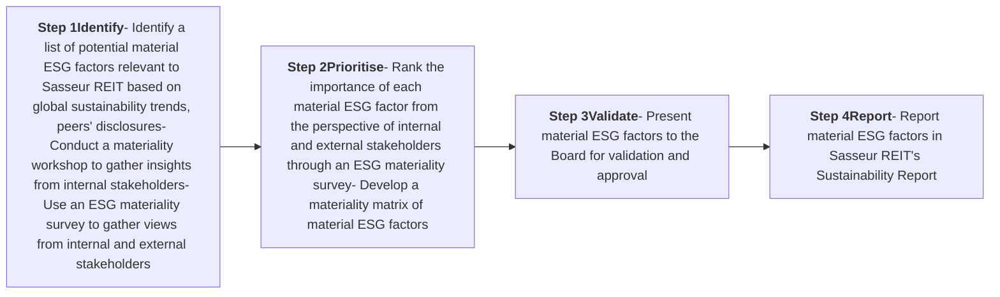

<!-- PAGE 1 -->

# SUSTAINABILITY REPORT

> **We recognise the vital role that sustainability plays in driving long-term value creation for our stakeholders and contributing positively to the community.**

## BOARD STATEMENT

The Board of Directors (the Board) is proud to present Sasseur Real Estate Investment Trust’s (Sasseur REIT) Sustainability Report for the financial year ended 31 December 2024 (FY2024). This report highlights the collaborative efforts between Sasseur Asset Management Pte. Ltd. (the REIT Manager) and Sasseur (Shanghai) Holding Company Limited (the Entrusted Manager) in addressing and managing the environmental, social and governance (ESG) impacts across Sasseur REIT’s operations.

We recognise the vital role that sustainability plays in driving long-term value creation for our stakeholders and contributing positively to the community. We are committed to integrating ESG considerations into our business strategy, ensuring that these factors are embedded in the decision-making process at all levels. Our focus on sustainability is aligned with our goal to deliver responsible, long-term growth while maintaining the trust of our stakeholders.

People walking in an outdoor shopping area with pink flowering trees

<!-- PAGE 2 -->

In line with our commitment to regulatory compliance, transparency, and best practices in sustainability reporting, we are transitioning to the International Sustainability Standards Board (ISSB) reporting standards in the coming year. This shift will further strengthen the transparency, consistency, and accuracy of our climate-related disclosures, aligning with the requirements set forth by the Singapore Exchange (SGX). By adopting the ISSB standards, we aim to enhance the quality and comparability of our reporting, ensuring that our stakeholders have access to clear, reliable, and comprehensive information on our climate-related risks, opportunities, and performance.

The Board has ultimate responsibility for Sasseur REIT’s sustainability reporting and oversees the integration of sustainability into Sasseur REIT’s strategy and operations. The Board is also responsible for the management and monitoring of Sasseur REIT’s material ESG factors. The Sustainability Committee (SC) has delegated authority from the Board to define Sasseur REIT’s sustainability strategies and integrate sustainability into Sasseur REIT’s operations.

The Sustainability Steering Committee (SSC) supports the SC in executing Sasseur REIT's sustainability strategies. The Board's continuous engagement with the SC and SSC enables the Board to satisfy itself that sustainability governance is effectively structured and functioning across all levels.

As part of Sasseur REIT’s commitment to sustainable growth and value creation, we have included targets over the short, medium, and long-term for material ESG factors in the FY2024 Sustainability Report. These targets provide a clear framework for guiding Sasseur REIT’s strategic direction, ensuring that sustainability objectives are systematically integrated into our business operations, decision-making, and long-term planning.

The Board expresses its gratitude to all stakeholders for their ongoing trust and support as Sasseur REIT progresses on its sustainability journey. We remain committed to upholding our sustainability goals while creating long-term value for our stakeholders.

Landscape with pink flowering trees and green foliage

<!-- PAGE 3 -->

# SUSTAINABILITY REPORT

# ABOUT THIS REPORT

## REPORTING FRAMEWORK

This Sustainability Report has been prepared in accordance with the sustainability reporting requirements of the Singapore Exchange Securities Trading Limited (SGX-ST) Mainboard Listing Rules 711A and 711B on Sustainability Reporting, and Practice Note 7.6 Sustainability Reporting Guide (updated in January 2022). In addition, this report has been prepared with reference to the Global Reporting Initiative Universal Standards 2021 (GRI Standards). The GRI Standards was selected due to its global adoption and robust industry guidance, promoting comparability against global and local peers. We view this framework as the most appropriate for communicating relevant information to stakeholders on Sasseur REIT's ESG risks and opportunities. The REIT Manager has adopted the recommendations of the Task Force on Climate-related Financial Disclosures (TCFD) and the Guidelines on Environmental Risk Management for Asset Managers (EnRM Guidelines) issued by the Monetary Authority of Singapore (MAS). Our greenhouse gas (GHG) inventory has been developed following the GHG Protocol Corporate Accounting and Reporting Standard.

## REPORTING PERIOD AND SCOPE

The reporting period for this report is from 1 January 2024 to 31 December 2024. Where applicable, data from previous financial years have been included for comparison.

To gain a full understanding of Sasseur REIT's business and performance, this report should be read together with the financial performance and governance information detailed in the Annual Report.

Unless otherwise stated, this report covers the following entities:

* Sasseur REIT;
* The REIT Manager;
* The Entrusted Manager; and
* Sasseur REIT's portfolio of properties - Sasseur (Chongqing Liangjiang) Outlet, Sasseur (Chongqing Bishan) Outlet, Sasseur (Hefei) Outlet and Sasseur (Kunming) Outlet (the Outlets).

The remaining entities within the trust structure, which are special purpose vehicles, are excluded from the report.

For performance related to environmental factors, the data disclosed covers Sasseur REIT's portfolio of properties. For performance related to human resource factors, the data disclosed covers the REIT Manager in Singapore¹.

Sasseur REIT's sustainability reporting process for FY2024 has been independently reviewed by Sasseur REIT's internal auditors. No external assurance was sought for this report. External assurance by independent professional bodies will be considered as our reporting matures.

## FEEDBACK

The REIT Manager values and welcomes all feedback from stakeholders as they are integral to the continuous improvement of our sustainability practices and reporting. Comments and suggestions on this report can be sent to ir@sasseurreit.com.

<!-- PAGE 4 -->

# MANAGING SUSTAINABILITY

## SUSTAINABILITY GOVERNANCE

The Board holds the ultimate oversight of Sasseur REIT's sustainability strategy, risk management and reporting. It is responsible for overseeing sustainability matters, including climate-related risks and opportunities, while ensuring alignment with the REIT’s long-term strategic objectives. The Board reviews and approves Sasseur REIT’s material ESG factors, and oversees the management and monitoring of material ESG factors.

To support the Board, the SC has been established with defined roles and responsibilities. The SC plays a pivotal role in integrating sustainability considerations and related risks into Sasseur REIT’s and the REIT Manager’s strategy, ensuring transparency and alignment across governance levels.

Headed by the Chief Executive Officer (CEO), the Sustainability Steering Committee (SSC) comprises Heads of Departments (HODs) and representatives from key functions, including Investment Management, Asset Management, Finance, Investor Relations, Risk and Compliance, and Human Resources. The SSC supports the SC in executing Sasseur REIT's sustainability strategies. The SSC identifies the ESG factors that are deemed material to the business through materiality assessment. These material ESG factors are then presented to the SC for revalidation and ultimately, approved by the Board. The SSC monitors sustainability performance, implements sustainability initiatives, and ensures that material ESG factors are continuously monitored and effectively managed. The SSC convenes regularly to discuss sustainability-related matters, track progress, and drive continuous improvements. It provides updates to the SC on Sasseur REIT’s sustainability performance annually. The SC, in turn, escalates key sustainability issues and progress updates to the Board for strategic oversight and decision-making.

## Sasseur REIT's Sustainability Governance Structure

Sasseur REIT's Sustainability Governance Structure diagram showing a pyramid with Board of Directors at the top, followed by Sustainability Committee, Sustainability Steering Committee, and Key Corporate Units and Functions at the base. Arrows on the sides indicate Top-down strategy and Bottom-up information flow.

<!-- PAGE 5 -->

# SUSTAINABILITY REPORT

## STAKEHOLDER ENGAGEMENT

To address the concerns and expectations of our stakeholders, we remained dedicated in maintaining open, two-way communication and conducted regular stakeholder engagements throughout FY2024. This approach supports the ongoing improvement of our operations. The table below outlines the various methods used to engage our key stakeholders.

<table>
  <thead>
    <tr>
        <th>Key Stakeholder Groups</th>
        <th>Relevance to Sasseur REIT</th>
        <th>Key Engagement Modes</th>
        <th>Key Interests of Stakeholder</th>
    </tr>
  </thead>
  <tbody>
    <tr>
        <td><strong>Investment communities (Unitholders, investors, analysts, and media)</strong></td>
        <td>* The REIT Manager is committed to provide accurate and timely disclosures * We are proactive in engaging Unitholders, investors, analysts, and media through regular two-way communications</td>
        <td>* SGXNet announcements * Results briefings to analysts and investors * Annual General Meetings (AGM) and Extraordinary General Meetings (EGM) * Bilateral communications via emails, calls, and virtual/physical meetings * Partnerships with REIT Association of Singapore (REITAS), Securities Investors Association (Singapore) (SIAS) and brokerage houses to conduct corporate presentations to retail investors * Sasseur REIT website, Facebook, LinkedIn, Telegram and YouTube * Roadshows and conferences * Site visits to Sasseur REIT Outlets</td>
        <td>* Business strategy and outlook * Financial and operational performance * Capital and risk management * Good corporate governance * Timely and transparent disclosures</td>
    </tr>
    <tr>
        <td><strong>Tenants</strong></td>
        <td>* Tenants are key to the success of the business as their goods and services attract customers to our Outlets, thus contributing to the sales and income for Sasseur REIT</td>
        <td>* Face-to-face dialogues * Training sessions conducted by the Entrusted Manager for tenants * Meetings and discussions to review yearly sales targets and optimal levels of stock inventories for promotional activities * Joint promotional and strategic partnerships</td>
        <td>* Quality of facilities and services to enhance shoppers' experience * Publicity through collaborative promotional activities * Good flow of shopper traffic * Strategic partnerships, online projects, new product launches, discounts, VIP memberships etc. * Health and safety</td>
    </tr>
    <tr>
        <td><strong>Shoppers</strong></td>
        <td>* Shoppers are crucial to the economic viability of the outlet business</td>
        <td>* Customer service * Marketing and promotional events * Online communication platforms including social media * Loyalty programmes * Customer satisfaction surveys</td>
        <td>* Range and quality of retail offerings, amenities and services * Conducive shopping environment and family-friendliness * Availability of promotion campaigns * Health and safety * Membership benefits * Access to public transport</td>
    </tr>
  </tbody>
</table>

<!-- PAGE 6 -->

<table>
  <thead>
    <tr>
        <th>Key Stakeholder Groups</th>
        <th>Relevance to Sasseur REIT</th>
        <th>Key Engagement Modes</th>
        <th>Key Interests of Stakeholder</th>
    </tr>
  </thead>
  <tbody>
    <tr>
        <td><strong>Regulators and industry associations</strong></td>
        <td>- Sasseur REIT and the REIT Manager comply with applicable rules and regulations</td>
        <td>- Regular participation in briefings and consultations with SGX and MAS - Communication and consultations with government agencies - Ongoing monitoring of evolving regulatory landscape - Annual Report and Sustainability Report - Sasseur REIT is a member of REITAS - CEO of the REIT Manager is a member of the Promotions sub-committee of REITAS</td>
        <td>- Compliance with rules and regulations - Good corporate governance and transparency - Environmental impact</td>
    </tr>
    <tr>
        <td><strong>Employees</strong></td>
        <td>- People drive our business growth and success. We strive to have a diverse, safe, and healthy work environment for our employees</td>
        <td>- Orientation programmes for new joiners - Half-yearly performance reviews - 360-degree feedback sessions - Training and career development opportunities - Team cohesion activities - Internal staff communication - Employee satisfaction surveys - Team meetings - Health and wellness initiatives</td>
        <td>- Fair and equal employment practices - Diversity and inclusion - Skills development and career progression - Employee welfare management - Health and wellbeing</td>
    </tr>
    <tr>
        <td><strong>Local communities</strong></td>
        <td>- We seek to make a positive impact and give back to the local communities as part of our corporate social responsibility</td>
        <td>- Employee volunteerism - Social entrepreneurship</td>
        <td>- Contributions to community - Impact of business on the environment and society</td>
    </tr>
  </tbody>
</table>

<!-- PAGE 7 -->

# SUSTAINABILITY REPORT

## MATERIALITY ASSESSMENT

Sasseur REIT’s materiality assessment involves a four-step process to identify our material topics. This process is guided by the GRI Standards’ Principles of accuracy, balance, clarity, comparability, completeness, sustainability context, timeliness, and verifiability.

The materiality assessment process begins by identifying potential material factors that are relevant to Sasseur REIT and strategically reviewing them to ensure alignment with business strategies. To address key stakeholders' concerns, these material factors are prioritised based on Sasseur REIT's current risk analysis and disclosures, emerging global and local trends, peer benchmarking, and feedback from both internal and external stakeholders. As part of the materiality assessment, the SSC participates in a workshop, facilitated by an external consultant, to gain insights into the latest industry trends and emerging materiality topics relevant to Sasseur REIT. Additionally, an ESG materiality survey is conducted to gather internal and external stakeholders' perspectives on sustainability and to identify the material ESG factors they prioritise in terms of importance.

The figure below illustrates Sasseur REIT’s four-step materiality assessment process.

## Sasseur REIT’s Four-step Materiality Assessment Process

We conduct an annual materiality review to ensure the material topics remain relevant to Sasseur REIT and its stakeholders. In FY2024, our material ESG factors remained unchanged, as there were no significant changes to our business operations.

Sasseur REIT’s material ESG factors are presented below:

<table>
  <thead>
    <tr>
        <th>Environmental</th>
        <th>Social</th>
        <th>Governance</th>
    </tr>
  </thead>
  <tbody>
    <tr>
        <td>Managing the Impacts of Climate Change • Greenhouse Gas Emissions • Climate-related Financial Disclosures</td>
        <td>Tenant Management Health and Safety • Employees, Tenants and Shoppers</td>
        <td>Regulatory Compliance • Compliance with Laws and Regulations • Anti-corruption • Cybersecurity</td>
    </tr>
    <tr>
        <td>Environmental Footprint • Energy Consumption • Water Management • Waste Management</td>
        <td>Talent Retention and Training (including local communities)</td>
        <td> </td>
    </tr>
  </tbody>
</table>

<!-- PAGE 8 -->

# ENVIRONMENTAL

**FY2024 PERFORMANCE**

<table>
  <thead>
    <tr>
        <th>FY2024 Targets</th>
        <th>FY2024 Performance</th>
    </tr>
  </thead>
  <tbody>
    <tr>
        <td>Continue assessing emission hotspots to determine expansion of Scope 3 organisational boundary</td>
        <td>Ongoing</td>
    </tr>
    <tr>
        <td>Reduce energy intensity for landlord-controlled areas by 1% from last financial year</td>
        <td>Target not achieved, FY2024 energy intensity for landlord-controlled areas increased by 14.9% as compared to FY2023. Refer to the “Energy Consumption” section on pages 91 to 92 for a detailed explanation.</td>
    </tr>
    <tr>
        <td>Reduce water intensity for landlord-controlled areas by 1% from last financial year</td>
        <td>Target not achieved, FY2024 water intensity for landlord-controlled areas increased by 12.6% as compared to FY2023. Refer to the “Water Management” section on pages 95 to 96 for a detailed explanation.</td>
    </tr>
  </tbody>
</table>

**ENVIRONMENTAL TARGETS**

<table>
  <thead>
    <tr>
        <th>Targets</th>
        <th>Short-term (by FY2027)</th>
        <th>Medium-term (by FY2030)</th>
        <th>Long-term (by FY2050) / Perpetual</th>
    </tr>
  </thead>
  <tbody>
    <tr>
        <td>To disclose all applicable Scope 3 categories by 2028</td>
        <td> </td>
        <td>[yes]</td>
        <td> </td>
    </tr>
    <tr>
        <td>REIT Manager to determine base year and set targets for energy and GHG emissions over short, medium, and long-term</td>
        <td>[yes]</td>
        <td> </td>
        <td> </td>
    </tr>
    <tr>
        <td>Reduce water intensity for landlord-controlled areas by 1% from FY2024</td>
        <td>[yes]</td>
        <td> </td>
        <td> </td>
    </tr>
  </tbody>
</table>

**MANAGING THE IMPACTS OF CLIMATE CHANGE**

**Enhancing Climate Resilience and Transparency**

In this decade, it is crucial to intensify efforts to address climate change and close the gap between current adaptation measures and the required level of action. As highlighted in the Intergovernmental Panel on Climate Change (IPCC) report, human-induced climate change is already influencing many extreme weather and climate events globally. These changes have caused significant adverse effects, including widespread losses and damage to both nature and people². Climate change

presents both risks and opportunities for the real estate sector. Stakeholders in both public and private sectors are increasingly focused on managing climate-related risks and exploring opportunities for climate change adaptation. Sasseur REIT has identified climate-related risks and opportunities impacting our business operations and prepared the TCFD disclosures focusing on four key areas: governance, strategy, risk management, and metrics and targets. Aligned with China’s objective of peaking carbon emissions by 2030 and achieving carbon neutrality by 2060³, we have implemented strategies to reduce adverse impacts on our business and the environment. These efforts include optimising resource efficiency in our daily operations and strengthening our resilience to climate change.

**Notes:**

² IPCC, 2023: Climate Change 2023: Synthesis Report. Contribution of Working Groups I, II and III to the Sixth Assessment Report of the Intergovernmental Panel on Climate Change, IPCC, March 2023.

³ UNFCCC, China First NDC: China’s Achievements, New Goals and New Measures for Nationally Determined Contributions, 2021.

<!-- PAGE 9 -->

# SUSTAINABILITY REPORT

## Climate Scenario Analysis

To deepen our understanding of how climate-related risks and opportunities impact our business activities, Sasseur REIT engaged an independent third-party consultant in the financial year ended 31 December 2022 (FY2022) to perform a quantitative climate scenario analysis for our portfolio in China. This analysis allowed us to better understand the implications of climate-related risks and opportunities on our business, and guided us in strengthening our climate resilience over various time horizons. The assessment considers recent advancements in technology and research to identify and quantify the potential effects of these risks and opportunities. The table below outlines the parameters used in the climate scenario analysis.

<table>
  <thead>
    <tr>
        <th colspan="4">Parameters</th>
    </tr>
    <tr>
        <th> </th>
        <th> </th>
        <th>Business as Usual</th>
        <th>Net Zero by 2050</th>
    </tr>
  </thead>
  <tbody>
    <tr>
        <td rowspan="2">Climate scenarios</td>
        <td>IPCC scenario⁴ alignment for physical risks assessment</td>
        <td><strong>RCP8.5</strong> Shows a very high emissions trajectory with a projected global mean surface temperature increase of up to 4.8°C</td>
        <td><strong>RCP2.6</strong> Aims to keep global warming likely below 2°C above pre-industrial levels</td>
    </tr>
    <tr>
        <td>International Energy Agency (IEA) scenario⁵ alignment for transition risks and opportunities assessment</td>
        <td><strong>Stated Policies Scenario (STEPS)</strong> Reflects current policy settings based on an assessment of the existing policies and those that have been announced by governments around the world</td>
        <td><strong>Net Zero Emissions by 2050 Scenario (NZE)</strong> Sets out a pathway for the global energy sector to achieve net zero CO₂ emissions by 2050 without relying on emissions reductions from other sectors</td>
    </tr>
    <tr>
        <td>Time horizons</td>
        <td colspan="3">By 2030 and by 2050</td>
    </tr>
    <tr>
        <td>Types of climate risks</td>
        <td colspan="3">Physical and Transition risks</td>
    </tr>
    <tr>
        <td>Coverage scope</td>
        <td colspan="3">Sasseur REIT’s portfolio of properties - Sasseur (Chongqing Liangjiang) Outlet, Sasseur (Chongqing Bishan) Outlet, Sasseur (Hefei) Outlet and Sasseur (Kunming) Outlet</td>
    </tr>
    <tr>
        <td>Baseline year</td>
        <td colspan="3">2021</td>
    </tr>
  </tbody>
</table>

**Notes:**

\*4 IPCC, Fifth Assessment Report, 2014.

\*5 IEA, Global Energy and Climate Model, October 2023.

<!-- PAGE 10 -->

The qualitative assessment offered a comprehensive overview of potential risks and opportunities that could affect our business operations. Following this, the quantitative analysis evaluated the potential impact of key physical and transition risks, along with opportunities, on our operations.

A summary of the key climate-related risks and opportunities, along with their potential impacts, is as follows:

# Climate-related Risks

<table>
  <thead>
    <tr>
        <th>Risk Type</th>
        <th>Risks</th>
        <th>Potential Impacts</th>
    </tr>
  </thead>
  <tbody>
    <tr>
        <td colspan="3">Physical risk</td>
    </tr>
    <tr>
        <td rowspan="3">Acute</td>
        <td>Riverine flooding</td>
        <td>Increased occurrence and intensity of rainfall contribute to more instances where precipitation in catchment areas causes rivers to overflow, flooding nearby areas</td>
    </tr>
    <tr>
        <td>Forest fires</td>
        <td>Forest fires may cause significant damage to Sasseur REIT’s assets and result in operational disruptions and financial losses</td>
    </tr>
    <tr>
        <td>Extreme heat</td>
        <td>Commercial and utility assets may be affected by the malfunction of electronic control systems during periods of extreme heat. Air-conditioning units may stop functioning once they reach their maximum design temperature, leading to operational disruptions</td>
    </tr>
    <tr>
        <td>Chronic</td>
        <td>Soil subsidence due to drought</td>
        <td>Longer dry spells and droughts, resulting from permanent changes in weather patterns, cause a significant reduction in soil moisture within reactive clay soils. This triggers substantial soil movement and cracking. The shrinking and swelling of the soil can lead to the shifting of foundations in Sasseur REIT's assets, resulting in extensive damage</td>
    </tr>
    <tr>
        <td colspan="3">Transition risk</td>
    </tr>
    <tr>
        <td>Policy and legal</td>
        <td>Carbon pricing</td>
        <td>To achieve China's goals of peaking emissions by 2030 and achieving carbon neutrality by 2060, the Chinese government may introduce stringent policies that contribute to a rise in carbon pricing. These could include an expansion of the national Emissions Trading Scheme (ETS) scope to include the real estate sector or emission allowances reduction which will be passed onto the real estate sector along the value chain.  As a result of the indirect costs associated with carbon, the prices of electricity generated from non-renewable sources are expected to rise in the future, leading to higher operating costs for Sasseur REIT.</td>
    </tr>
  </tbody>
</table>

<!-- PAGE 11 -->

# SUSTAINABILITY REPORT

## Climate-related opportunities

<table>
  <thead>
    <tr>
        <th>Opportunity Type</th>
        <th>Opportunities</th>
        <th>Opportunity Drivers</th>
    </tr>
  </thead>
  <tbody>
    <tr>
        <td><strong>Energy source</strong></td>
        <td>Renewable energy</td>
        <td>China’s ambitious goal of advancing renewable energy adoption is evident in its recently updated Nationally Determined Contributions⁶ (NDC).  China has pledged to raise the share of non-fossil fuels in its primary energy consumption to approximately 25% by 2030 and to surpass 1.2 billion kW in total installed capacity for solar and wind power by the same year. Additionally, driven by strong regulatory push from the Chinese government, China is making significant strides toward a low-carbon energy transition, which could help make clean energy more widely available and affordable.  The increasing adoption of renewable energy in China could potentially lower Sasseur REIT’s operating costs, assuming that Sasseur REIT transitions to clean energy sources.</td>
    </tr>
    <tr>
        <td><strong>Market</strong></td>
        <td>Green financing</td>
        <td>China's commitment to green finance is evident through its comprehensive policies and substantial investments aimed at fostering sustainable economic growth. China’s green finance market has expanded significantly, with green loans constituting 12.7% of China's total loan balance by the end of 2023, up from 8.3% in 2021⁷.  For Sasseur REIT, this robust green finance landscape presents a strategic opportunity. By aligning with China's sustainability objectives, Sasseur REIT can access various green financing instruments, such as green bonds and sustainability-linked loans, to fund eco-friendly projects.  Moreover, the Chinese government's proactive stance, including the extension of low-cost loans for carbon reduction projects until 2027, underscores the availability of financial support for green initiatives. Engaging in green financing enables Sasseur REIT to contribute to China's low-carbon transition while potentially benefiting from favourable financing terms and strengthening its market position.</td>
    </tr>
  </tbody>
</table>

**Notes:**

6 UNFCCC, China’s Achievements, New Goals and New Measures for Nationally Determined Contributions, 2022.

7 Zhang, Jing, Song, Ziying and Nedopil, Christoph, 2024, China green finance status and trends 2023-2024, Griffith Asia Institute, Griffith University (Brisbane) and Green Finance & Development Center, FISF Fudan University (Shanghai).

<!-- PAGE 12 -->

# Task Force on Climate-related Financial Disclosures

## Introduction

This section of the report details our approach to adopting the TCFD Recommendations, which align with the MAS EnRM Guidelines8. It explores the potential physical and transition risks that Sasseur REIT may face in its operations.

The TCFD framework provides a globally recognised reporting structure, promoting consistency and comparability. It enables us to share insights with investors and stakeholders about our strategies for managing climate-related risks and opportunities. By aligning with the TCFD Recommendations, we enhance transparency and clarity in our sustainability efforts, supporting informed financial decisions by investors and key stakeholders.

Our dedication to integrating environmental and climate-related risk considerations into our business and investment processes is demonstrated through the establishment of Sasseur REIT’s EnRM Framework which guides the selection and management of our properties, aligning with environmental risk principles to create long-term value for our investors. We are committed to continuously enhancing our risk management and disclosure practices in future Sustainability Reports.

The section below outlines our approach and progress in addressing these risks, along with key initiatives across the four TCFD pillars. This approach underscores our commitment to enhancing our sustainability practices and adapting to evolving climate-related challenges.

## Governance

**a) Board’s oversight of climate-related risks and opportunities**

**b) Management’s role in assessing and managing climate-related risks and opportunities**

Sasseur REIT’s sustainability governance structure, including the key roles and responsibilities of each component of the structure can be found on page 79 of the Sustainability Report.

In 2023, Sasseur REIT established an EnRM Framework which is aligned with the EnRM Guidelines issued by MAS. The EnRM Framework outlines the roles and responsibilities of the Board, the Audit and Risk Committee (ARC), the SC (collectively referred to as Board Committees or Committees) and the SSC in managing environmental risks.

The Board and its Committees are responsible for overseeing the management of Sasseur REIT’s environmental risks:

* Approving an EnRM Framework and policies to assess and manage the environmental risk of assets under Sasseur REIT’s portfolio

* Setting clear roles and responsibilities of the Board and senior management, including personnel and departments responsible for oversight of environmental risk for assets under Sasseur REIT’s portfolio

* Ensuring that Board members have an adequate understanding of environmental risks

* Ensuring that senior management possess the expertise for managing environmental risks

* Identifying various environmental risks and opportunities over the short-term and long-term to evaluate the actual and potential impact of these risks and opportunities on Sasseur REIT’s strategies, business plans and properties

* Determining organisational risk appetite and exercising oversight of risk management

* Overseeing the integration of environmental risk into Sasseur REIT’s Enterprise Risk Management Framework and Investment Policy

* Overseeing Sasseur REIT’s disclosures on environmental risks

* Reviewing the escalations of unanticipated environmental-related events and the relevant risks involved

The Board's dedication to enhancing climate capacity is demonstrated by its efforts to ensure that the SC and SSC undergo sustainability training to equip them with the necessary knowledge and skills to address climate-related issues.

The SSC has the following responsibilities with respect to environmental risk management:

* Ensuring the development and implementation of policies, tools, and metrics to monitor exposures to environmental risk

* Regularly reviewing the effectiveness of the EnRM Framework and metrics and making necessary adjustments, taking into account changes in the business, size, and complexity of Sasseur REIT as well as the risk environment

* Implementing an internal escalation process to address risks in a timely and appropriate manner

* Allocating adequate resources with appropriate expertise, to manage the risks of Sasseur REIT’s portfolio

* Updating the Board and its Committees on environmental risk issues such as environmental-related events in a timely manner

<!-- PAGE 13 -->

# SUSTAINABILITY REPORT

## Strategy

### a) Identifying climate-related risks and opportunities over the short, medium and long-term

Sasseur REIT acknowledges that climate change is transforming the global business landscape. As such, we prioritise identifying climate-related risks and opportunities that are pertinent to our portfolio of properties.

TCFD categorises climate-related risks into physical risks and transition risks.

**Physical risks**

Physical risks arising from climate change significantly impact Sasseur REIT’s operations and pose significant financial threats worldwide. The intensity and frequency of climate-related catastrophes have increased in recent years, amplifying the global scale and severity of these challenges. Sasseur REIT’s assets in China face physical risks such as floods and heatwaves. Additionally, the growing occurrence of extreme weather events—including cyclones, heavy storms, and other meteorological phenomena—demands a thorough evaluation of the resilience and adaptability of each property within the portfolio. To address these evolving risks, Sasseur REIT must remain proactive in identifying emerging threats, analyse the intricate dynamics of regional climates, and implement strategies to strengthen the resilience of its assets against the impacts of climate change.

**Transition risks**

Transition risks arising from policy shifts, technological advancements, and changes in the low-carbon market landscape could significantly impact Sasseur REIT's strategy and operations. To navigate these evolving market conditions and comply with regulatory requirements, Sasseur REIT must continuously evaluate its investments and climate change commitments. Maintaining resilience and staying competitive during these transitions requires regular reassessment of Sasseur REIT's portfolio.

To proactively address transition risks, Sasseur REIT conducted a scenario analysis in FY2022 as part of its climate-related risk assessment. This analysis incorporated climate scenarios from the IPCC and the IEA. Sasseur REIT plans to perform scenario analysis whenever significant changes occur that could impact the risk profile of its portfolio, such as new property acquisitions or major operational shifts. In FY2024, we have assessed that there were no changes to the portfolio that resulted in changes in Sasseur REIT’s climate-risk profile, and the results of the FY2022 scenario analysis remained valid, continuing to guide the climate-related risk assessments for FY2024.

The processes for identifying and evaluating material risks and opportunities relevant to Sasseur REIT are outlined in the “Risk Management” section on page 90 of the Sustainability Report. These processes provide a structured framework for assessing the potential impact of climate-related risks and opportunities on Sasseur REIT's operations and strategy.

For disclosures on the key climate-related risks and opportunities, please refer to the “Climate Scenario Analysis” section on pages 84 to 86 of the Sustainability Report.

### b) Impact of climate-related risks and opportunities on business, strategy, and financial planning

To evaluate the potential impacts of identified physical risks, Sasseur REIT considered various factors, including asset-specific details such as the locations and design specifications of its Outlets, as well as contextual elements like surrounding forests and soil conditions. Climate data was sourced from the Coupled Model Intercomparison Project Phase 5 (CMIP5) and Phase 6 (CMIP6) models. For assessing transition risks, data and assumptions were derived from the IEA’s World Energy Outlook (WEO) 2021⁹.

<!-- PAGE 14 -->

The table below outlines various climate-related risks identified by Sasseur REIT, categorised by their relevance to its operations over different time horizons and scenarios:

<table>
  <thead>
    <tr>
        <th> </th>
        <th> </th>
        <th> </th>
        <th colspan="4">Risk impact</th>
    </tr>
    <tr>
        <th> </th>
        <th> </th>
        <th> </th>
        <th colspan="2">Business as usual</th>
        <th colspan="2">Net zero by 2050</th>
    </tr>
    <tr>
        <th>Risk category</th>
        <th>Risk</th>
        <th>Impact description</th>
        <th>By 2030</th>
        <th>By 2050</th>
        <th>By 2030</th>
        <th>By 2050</th>
    </tr>
  </thead>
  <tbody>
    <tr>
        <td colspan="7">Climate-related risks: physical risks</td>
    </tr>
    <tr>
        <td rowspan="5">Acute</td>
        <td rowspan="2">Riverine flooding¹⁰</td>
        <td>Increased capital expenditures due to repairing asset damage</td>
        <td>High</td>
        <td>High</td>
        <td>High</td>
        <td>High</td>
    </tr>
    <tr>
        <td>Reduced revenue due to operational disruption</td>
        <td>High</td>
        <td>High</td>
        <td>High</td>
        <td>High</td>
    </tr>
    <tr>
        <td rowspan="2">Forest fire</td>
        <td>Increased capital expenditures due to repairing asset damage</td>
        <td>Medium</td>
        <td>Medium</td>
        <td>Medium</td>
        <td>Medium</td>
    </tr>
    <tr>
        <td>Reduced revenue due to operational disruption</td>
        <td>High</td>
        <td>High</td>
        <td>Medium</td>
        <td>Medium</td>
    </tr>
    <tr>
        <td>Extreme heat</td>
        <td>Reduced revenue due to operational disruption</td>
        <td>Medium</td>
        <td>Medium</td>
        <td>Low</td>
        <td>Medium</td>
    </tr>
    <tr>
        <td>Chronic</td>
        <td>Soil subsidence due to drought</td>
        <td>Increased capital expenditures due to repairing asset damage</td>
        <td>Low</td>
        <td>Low</td>
        <td>Low</td>
        <td>Low</td>
    </tr>
    <tr>
        <td colspan="7">Climate-related risks: transition risks</td>
    </tr>
    <tr>
        <td>Policy and legal</td>
        <td>Carbon pricing</td>
        <td>Increased operating costs due to increased non-renewable-based electricity price</td>
        <td>Low</td>
        <td>Low</td>
        <td>Low</td>
        <td>Medium</td>
    </tr>
  </tbody>
</table>

<!-- PAGE 15 -->

# SUSTAINABILITY REPORT

## c) Resilience of the organisation’s strategy, taking into consideration different climate-related scenarios, including a 2°C or lower scenario

Given the significant uncertainty surrounding the extent of global temperature rise and the transition to a low-carbon economy, the scenario analysis results enable Sasseur REIT to prepare for and strengthen its resilience against the potential worst-case impacts of climate change.

Since 2022, Sasseur REIT has established its GHG inventory and set energy reduction targets. We have been consistently monitoring our Scope 1, Scope 2, and Scope 3 emissions and developing action plans to progressively reduce our carbon footprint.

Environmental and climate considerations are incorporated throughout the investment process, from acquisition to the ongoing monitoring of portfolio properties. During the acquisition phase, Sasseur REIT uses an environmental and climate due diligence questionnaire to assess the environmental risks associated with the investment target. Climate-related risks are qualitatively evaluated during due diligence, utilising scenario analysis tools to identify the physical and transition risk exposure of the target investment.

Post acquisition, an Environmental Corrective Action Plan (ECAP) is used for monitoring of environmental risks. The ECAP documents corrective measures to address environmental and climate issues identified during due diligence and aims to enhance the property’s performance to meet the agreed operational standards and requirements. Changes in the environmental risk profile, such as new government regulations or unexpected events like environmental disasters, are closely monitored.

## Risk Management

**a) Process of identifying and assessing climate-related risks**

**b) Process of managing climate-related risks**

**c) How processes for identifying, assessing, and managing climate-related risks are integrated into overall risk management**

The REIT Manager has established a robust Enterprise Risk Management (ERM) framework and ERM Policy which serves to identify, assess and mitigate risks within Sasseur REIT. On an annual basis, the REIT Manager, with the assistance of an external consultant as necessary, conducts a comprehensive review of Sasseur REIT’s risk register, incorporating insights from emerging industry trends and market developments. The review covers the following areas:

* Conduct risk surveys with key stakeholders to understand key risks and concerns

* Facilitate a risk prioritisation workshop with senior management and key stakeholders to identify key risks, including climate-related risks

* Review risk parameters, key risk drivers, key risk consequences, existing controls and mitigating measures to manage identified risks

* Develop action plans to further mitigate risks to an acceptable level

* Establish key risk indicators to define thresholds for regular monitoring and reporting to the ARC

On a quarterly basis, the risk coordinator meets with the risk owners and control owners to review Sasseur REIT’s risk register. The following areas are discussed:

* Review risk ratings based on established risk parameters

* Review existing controls and mitigating measures to manage identified risks

* Determine whether any new controls and mitigating measures were implemented to manage identified risks

* Review implementation status of action plans

* Determine whether any new action plans should be developed to further mitigate risks to an acceptable level

* Reporting of key risk indicators

These discussions are incorporated into a report which is presented to the ARC every quarter.

For more details on Sasseur REIT’s risk management process, please refer to pages 122 to 125 of the Annual Report.

## Metrics and Targets

### a) Metrics used to assess climate-related risks and opportunities in line with the strategy and risk management process

Sasseur REIT is reporting on the following metrics to manage climate-related risks associated with emissions, energy and water for the four Outlets in scope:

* GHG emissions – Scope 1, Scope 2, and Scope 3 emissions (pages 93 to 95 of the Sustainability Report)

* Energy consumption – energy intensity (pages 91 to 92 of the Sustainability Report)

* Water management - water intensity (pages 95 to 96 of the Sustainability Report)

Sasseur REIT has also provided past years’ data to allow for trend analysis. Based on Sasseur REIT’s materiality review, climate-related risks such as emissions, energy and water have been identified as material to the business.

### b) Scope 1, Scope 2, and Scope 3 GHG emissions, and the related risks

Sasseur REIT begun measuring and monitoring our Scope 1, Scope 2, and Scope 3 emissions in FY2022. Our performance data is disclosed on pages 93 to 95 of the Sustainability Report.

### c) Targets used to manage climate-related risks and opportunities and performance against targets

Sasseur REIT has set the following targets to manage related risks associated with emissions, energy and water for the four Outlets in scope:

* GHG emissions – Scope 1, Scope 2, and Scope 3 emissions (pages 93 to 95 of the Sustainability Report)

* Energy consumption – energy intensity (pages 91 to 92 of the Sustainability Report)

* Water management - water intensity (pages 95 to 96 of the Sustainability Report)

<!-- PAGE 16 -->

Hands holding a moss-covered globe

# ENVIRONMENTAL FOOTPRINT

## Energy Consumption

Optimising energy efficiency not only drives cost savings but also reduces our carbon footprint. In response, the Entrusted Manager is committed to minimising energy consumption within the Outlets through continuous monitoring, process optimisation, and fostering behavioural initiatives.

In addition to conducting regular equipment inspections and maintenance, the Entrusted Manager closely monitors meter readings to promptly detect and address any anomalies. Monthly energy data analysis is also carried out to identify potential opportunities for enhancing energy efficiency.

To further manage energy use, the Entrusted Manager collaborates with tenants to manage energy consumption by promoting energy-saving initiatives during monthly meetings. Additionally, daily checks are performed by the Entrusted Manager to ensure that tenants' main power switches are turned off after operating hours.

### Recap of Past Initiatives

* Upgraded the central air-conditioning chilled water system with variable frequency control devices to prevent prolonged operation at fixed frequencies, thereby reducing energy consumption

* Used energy efficient LED bulbs and motion sensor lights in public areas and shops

* Replaced worn-out cooling tower ventilation fans to enhance energy efficiency

* Adjusted escalator and lift operations by switching them off after hours and enabling low-speed mode when unoccupied

* Installed solar-powered street lights in open-air car parks

* Installed sunshades within the Outlets to reduce exposure to direct sunlight, which lowered the indoor temperature by 5°C and reduced the energy consumption of the air-conditioning system

* Replaced decentralised air-conditioning control panel with a centralised system, resulting in annual energy savings of 150,000 kWh

* Adjusted operating hours of LED displays to reduce energy consumption

### New Initiatives to be Implemented

* Air-conditioning system at Sasseur (Chongqing Liangjiang) which has been in use since 2008 will be replaced with an energy-efficient system. High-efficiency cooling towers will be installed in the first quarter of 2025, with works expected to be completed by 2027

* Installation of energy-saving LED displays at Sasseur (Hefei) Outlet by the first quarter of 2025

<!-- PAGE 17 -->

# SUSTAINABILITY REPORT

## Landlord Energy Consumption and Intensity

<table>
  <thead>
    <tr>
        <th>Fiscal Year</th>
        <th>Total energy consumption (GJ)</th>
        <th>Energy intensity (GJ/m²)</th>
    </tr>
  </thead>
  <tbody>
    <tr>
        <td>FY2022</td>
        <td>97,133</td>
        <td>0.4903</td>
    </tr>
    <tr>
        <td>FY2023</td>
        <td>90,378</td>
        <td>0.4562</td>
    </tr>
    <tr>
        <td>FY2024</td>
        <td>99,450</td>
        <td>0.5241</td>
    </tr>
  </tbody>
</table>

## Tenant Energy Consumption and Intensity

<table>
  <thead>
    <tr>
        <th>Fiscal Year</th>
        <th>Total energy consumption (GJ)</th>
        <th>Energy intensity (GJ/m²)</th>
    </tr>
  </thead>
  <tbody>
    <tr>
        <td>FY2022</td>
        <td>109,813</td>
        <td>0.4260</td>
    </tr>
    <tr>
        <td>FY2023</td>
        <td>129,805</td>
        <td>0.5035</td>
    </tr>
    <tr>
        <td>FY2024</td>
        <td>148,443</td>
        <td>0.5125</td>
    </tr>
  </tbody>
</table>

## Total Energy Consumption and Intensity

<table>
  <thead>
    <tr>
        <th>Fiscal Year</th>
        <th>Total energy consumption (GJ)</th>
        <th>Energy intensity (GJ/m²)</th>
    </tr>
  </thead>
  <tbody>
    <tr>
        <td>FY2022</td>
        <td>206,946</td>
        <td>0.4539</td>
    </tr>
    <tr>
        <td>FY2023</td>
        <td>220,183</td>
        <td>0.4830</td>
    </tr>
    <tr>
        <td>FY2024</td>
        <td>247,893</td>
        <td>0.5171</td>
    </tr>
  </tbody>
</table>

At landlord-controlled areas, energy consumption in FY2024 increased by 10.0% year-on-year (YoY) to 99,450 GJ, or 0.5241 GJ/m² in terms of energy intensity. This was due to extreme heatwaves in Chongqing during the third quarter of 2024 and extended operating hours due to promotional events at the Outlets.

At tenant-controlled areas, energy consumption in FY2024 increased by 14.4% YoY to 148,443 GJ, or 0.5125 GJ/m² in terms of energy intensity. This was due to an increase in tenant fit-outs and extreme heatwaves in Chongqing during the third quarter of 2024.

Overall, total energy consumption and total energy intensity stood at 247,893 GJ and 0.5171 GJ/m² respectively in FY2024, reflecting a 12.6% increase YoY.

Sasseur REIT will continue collaborating with our tenants to promote energy conservation efforts, and strive to reduce energy consumption across our Outlets.

<table>
  <thead>
    <tr>
        <th>Fuel Category</th>
        <th>Unit</th>
        <th>FY2022</th>
        <th>FY2023</th>
        <th>FY2024</th>
    </tr>
  </thead>
  <tbody>
    <tr>
        <td>Diesel consumption</td>
        <td>GJ</td>
        <td>30</td>
        <td>27</td>
        <td>28</td>
    </tr>
    <tr>
        <td>Natural gas consumption</td>
        <td>GJ</td>
        <td>17,433</td>
        <td>16,546¹¹</td>
        <td>22,144</td>
    </tr>
    <tr>
        <td rowspan="2">Electricity consumption</td>
        <td>MWh</td>
        <td>52,634</td>
        <td>56,558</td>
        <td>62,700</td>
    </tr>
    <tr>
        <td>GJ</td>
        <td>189,483</td>
        <td>203,610</td>
        <td>225,721</td>
    </tr>
    <tr>
        <td>Total energy consumption</td>
        <td>GJ</td>
        <td>206,946</td>
        <td>220,183</td>
        <td>247,893</td>
    </tr>
    <tr>
        <td>Energy intensity¹²</td>
        <td>GJ/m²</td>
        <td>0.4539</td>
        <td>0.4830</td>
        <td>0.5171</td>
    </tr>
  </tbody>
</table>

<!-- PAGE 18 -->

Overview

Year In Review

Leadership

Portfolio

Reports

Financials and Other Information

# Greenhouse Gas Emissions

The impact of climate change, particularly carbon emissions from energy consumption and other activities, remains a pressing global concern. At Sasseur REIT, we are committed to enhancing energy efficiency and reducing our carbon footprint, with our key initiatives detailed under the "Energy Consumption" section on pages 91 to 92 of the Sustainability Report.

Our GHG emissions are consolidated in accordance with the operational control approach outlined in the GHG Protocol, ensuring consistency with internationally recognised standards.

In FY2024, Scope 1 and 2 emissions totalled 15,089 tCO₂e, reflecting a 8.5% increase from FY2023. This rise was primarily driven by increased operational activities at the Outlets and an increase in refrigerant top-ups13 in the common areas of certain outlets due to the ageing air-conditioning systems. To address this key Scope 1 emission source, the air-conditioning system at Sasseur (Chongqing Liangjiang) will be replaced with an energy-efficient system by 2027.

The emission intensity for Scope 1 and Scope 2 emissions for FY2024 stood at 0.0796 tCO₂e/m², marking a 13.4% increase from the previous year. The discrepancy between the overall emissions growth and the rise in emission intensity is attributed to the standardisation and refinement of the Outlets’ gross floor area calculations.

Purchased electricity accounts for the majority of our Scope 1 and 2 GHG emissions, and we remain committed to actively managing and optimising our energy consumption.

<table>
  <thead>
    <tr>
        <th>Greenhouse Gas Emissions</th>
        <th>Unit</th>
        <th>FY2022</th>
        <th>FY2023</th>
        <th>FY2024</th>
    </tr>
  </thead>
  <tbody>
    <tr>
        <td>Scope 1</td>
        <td>t CO₂e</td>
        <td>1,381</td>
        <td>1,167¹⁴</td>
        <td>2,022</td>
    </tr>
    <tr>
        <td>Scope 2</td>
        <td>t CO₂e</td>
        <td>13,171</td>
        <td>12,734</td>
        <td>13,067</td>
    </tr>
    <tr>
        <td><strong>Total Scope 1 &amp; Scope 2</strong></td>
        <td><strong>t CO₂e</strong></td>
        <td><strong>14,552</strong></td>
        <td><strong>13,901</strong></td>
        <td><strong>15,089</strong></td>
    </tr>
    <tr>
        <td>Emission intensity¹⁵ Scope 1</td>
        <td>t CO₂e/m²</td>
        <td>0.0070</td>
        <td>0.0059</td>
        <td>0.0107</td>
    </tr>
    <tr>
        <td>Emission intensity¹⁵ Scope 2</td>
        <td>t CO₂e/m²</td>
        <td>0.0665</td>
        <td>0.0643</td>
        <td>0.0689</td>
    </tr>
    <tr>
        <td><strong>Emission intensity¹⁵</strong> <strong>(Scope 1 &amp; Scope 2)</strong></td>
        <td><strong>t CO₂e/m²</strong></td>
        <td><strong>0.0735</strong></td>
        <td><strong>0.0702</strong></td>
        <td><strong>0.0796</strong></td>
    </tr>
  </tbody>
</table>

Scope 1 & 2 GHG Emissions and Intensity

<table>
  <thead>
    <tr>
        <th>Year</th>
        <th>Scope 1 (t CO₂e)</th>
        <th>Scope 2 (t CO₂e)</th>
        <th>Scope 1 &amp; Scope 2 Intensity (t CO₂e/m²)</th>
    </tr>
  </thead>
  <tbody>
    <tr>
        <td>FY2022</td>
        <td>1,381</td>
        <td>13,171</td>
        <td>0.0735</td>
    </tr>
    <tr>
        <td>FY2023</td>
        <td>1,167</td>
        <td>12,734</td>
        <td>0.0702</td>
    </tr>
    <tr>
        <td>FY2024</td>
        <td>2,022</td>
        <td>13,067</td>
        <td>0.0796</td>
    </tr>
  </tbody>
</table>

Scope 1 GHG Emissions and Intensity

<table>
  <thead>
    <tr>
        <th>Year</th>
        <th>Scope 1 (t CO₂e)</th>
        <th>Emission intensity Scope 1 (t CO₂e/m²)</th>
    </tr>
  </thead>
  <tbody>
    <tr>
        <td>FY2022</td>
        <td>1,381</td>
        <td>0.0070</td>
    </tr>
    <tr>
        <td>FY2023</td>
        <td>1,167</td>
        <td>0.0059</td>
    </tr>
    <tr>
        <td>FY2024</td>
        <td>2,022</td>
        <td>0.0107</td>
    </tr>
  </tbody>
</table>

**Notes:**

13 The refrigerant usage is estimated based on the top-up records.

14 FY2023 Scope 1 emissions have been revised from 1,089 tCO2e to 1,167 tCO₂e due to restatements of the natural gas consumption data collected from the Sasseur (Hefei) Outlet.

15 Emission intensity is calculated based on total GHG emission divided by total operating area, for the corresponding emission scope. Total operating area is the sum of gross floor area and outdoor operating areas.

<!-- PAGE 19 -->

# SUSTAINABILITY REPORT

Scope 2 GHG Emissions and Intensity

<table>
  <thead>
    <tr>
        <th>Year</th>
        <th>Scope 2 t CO₂e</th>
        <th>Emission intensity Scope 2 t CO₂e/m²</th>
    </tr>
  </thead>
  <tbody>
    <tr>
        <td>FY2022</td>
        <td>13,171</td>
        <td>0.0665</td>
    </tr>
    <tr>
        <td>FY2023</td>
        <td>12,734</td>
        <td>0.0643</td>
    </tr>
    <tr>
        <td>FY2024</td>
        <td>13,067</td>
        <td>0.0689</td>
    </tr>
  </tbody>
</table>

Scope 3 GHG Emissions

<table>
  <thead>
    <tr>
        <th>Year</th>
        <th>Scope 3 (Category 13: Downstream Leased Assets) t CO₂e</th>
        <th>Scope 3 (Category 3: Fuel- and Energy-Related Activities Not Included in Scope 1 or Scope 2) t CO₂e</th>
    </tr>
  </thead>
  <tbody>
    <tr>
        <td>FY2022</td>
        <td>17,410</td>
        <td>0</td>
    </tr>
    <tr>
        <td>FY2023</td>
        <td>20,024</td>
        <td>757</td>
    </tr>
    <tr>
        <td>FY2024</td>
        <td>22,335</td>
        <td>723</td>
    </tr>
  </tbody>
</table>
<table>
  <thead>
    <tr>
        <th>Greenhouse Gas Emissions</th>
        <th>Unit</th>
        <th>FY2022</th>
        <th>FY2023</th>
        <th>FY2024</th>
    </tr>
  </thead>
  <tbody>
    <tr>
        <td>Scope 3 (Category 13: Downstream Leased Assets)</td>
        <td>t CO₂e</td>
        <td>17,410</td>
        <td>20,024</td>
        <td>22,335</td>
    </tr>
    <tr>
        <td>Scope 3 (Category 3: Fuel- and Energy-Related Activities Not Included in Scope 1 or Scope 2)</td>
        <td>t CO₂e</td>
        <td>-</td>
        <td>75716</td>
        <td>723</td>
    </tr>
    <tr>
        <td><strong>Total Scope 3</strong></td>
        <td><strong>t CO₂e</strong></td>
        <td><strong>17,410</strong></td>
        <td><strong>20,781</strong></td>
        <td><strong>23,058</strong></td>
    </tr>
  </tbody>
</table>

We expanded the scope of our Scope 3 emissions disclosures in FY2023 to improve reporting transparency and carbon footprint accuracy. This included broader coverage of tenant emissions, incorporating energy consumption under Scope 3 Category 13 (Downstream Leased Assets). Additionally, we accounted for the emissions from Scope 3 Category 3 (Fuel- and Energy-Related Activities Not Included in Scope 1 or Scope 2), including transmission and distribution (T&D) losses, and well-to-tank (WTT) emissions.

In FY2024, the business travel category is excluded from Scope 3 emissions17. Given the complexity and extensive data requirements involved in Scope 3 assessments, we are committed to progressively enhancing data coverage and quality. Our goal is to achieve full disclosure of all applicable Scope 3 categories by 2028.

In FY2024, our Scope 3 Category 13 emissions rose to 22,335 tCO₂e, reflecting a 11.5% increase from FY2023, primarily due to higher natural gas consumption by food and beverage tenants following the post-COVID recovery. In contrast, our Scope 3 Category 3 emissions decreased by 4.5% YoY to 723 tCO₂e, largely driven by updated emission factors published in the latest IEA report.

<!-- PAGE 20 -->

As part of our commitment to reducing GHG emissions, we have implemented green landscaping across our Outlets, enhancing the natural environment while contributing to climate resilience. Our properties feature 26,541 m² of trees, shrubs, and seedlings, creating a lush and vibrant landscape. Beyond aesthetic and recreational benefits, this greenery plays a crucial role in carbon sequestration, helping to absorb CO₂ from the atmosphere and improve air quality for the community.

In addition to green infrastructure, we continue to champion sustainable mobility solutions by supporting the adoption of Electric Vehicles (EVs). EVs produce approximately 43.4% fewer GHG emissions compared to traditional internal combustion engine (ICE) vehicles, making them a cleaner transportation alternative. We have installed 67 EV charging stations at Sasseur (Hefei) Outlet, providing greater convenience and encouraging wider adoption of low-carbon transportation.

Recognising the increase in GHG emissions and energy consumption this year, we understand the urgent need to accelerate our decarbonisation efforts. Moving forward, we are committed to enhancing energy efficiency, expanding our green initiatives, and exploring innovative solutions to further reduce our carbon footprint.

## Water Management

Recognising water as a finite resource with increasing demand, Sasseur REIT is committed to responsible water management. We actively seek to reduce water consumption through ongoing water conservation initiatives and efficiency improvements.

The Entrusted Manager conducts regular inspections of water supply equipment and monitors meter readings to promptly detect and address any irregularities. Daily checks after operating hours ensure restroom valves and tenants’ main water valves are functioning properly and securely shut. Additionally, the Entrusted Manager collaborates with tenants to promote water conservation initiatives during monthly meetings. To maintain high drinking water quality, the secondary water supply tank undergoes routine cleaning, disinfection, and testing.

Each outlet operates its own bio-treatment pond, ensuring wastewater meets national regulatory standards before discharge. To further reduce sewage discharge and ease treatment facility loads, regular sewage pipeline inspections and scheduled pump pit maintenance are conducted. Additionally, rainwater and sewage draining systems are managed through separate drainage systems, and outdoor drainage networks undergo weekly inspections by the Entrusted Manager to ensure water pumps are properly maintained and lubricated.

In addition to regular spot checks by local government authorities on water resource usage and sewage discharge, the Entrusted Manager holds monthly meetings to monitor and review water consumption and quality of sewage discharge.

Key water management initiatives aimed at improving water efficiency and minimising water consumption at the Outlets include:

* Installing water-efficient faucets and flush valves in restrooms

* Placing water-filled bottles in each toilet cistern to reduce refilling volumes in toilet cisterns after each flush, leading to annual water savings of around 1,200 m³

* Using extracted spring water from the mountains for landscape irrigation, cleaning and water features

* Constructing reclaimed water stations to produce recycled water for landscape irrigation purposes, saving approximately 3,600 m³ of water annually

* Recycling condensation water from air conditioners for cleaning, resulting in the recycling of approximately 60 m³ of water annually

* Optimising water supply pressure to meet the standard water consumption requirements of the Outlets

<!-- PAGE 21 -->

# SUSTAINABILITY REPORT

**Landlord Water Consumption and Intensity**
<table>
  <thead>
    <tr>
        <th>Fiscal Year</th>
        <th>Total water consumption (m³)</th>
        <th>Water intensity (m³/m²)</th>
    </tr>
  </thead>
  <tbody>
    <tr>
        <td>FY2022</td>
        <td>298,605</td>
        <td>1.5074</td>
    </tr>
    <tr>
        <td>FY2023</td>
        <td>257,209</td>
        <td>1.2984</td>
    </tr>
    <tr>
        <td>FY2024</td>
        <td>277,350</td>
        <td>1.4616</td>
    </tr>
  </tbody>
</table>

**Tenant Water Consumption and Intensity**
<table>
  <thead>
    <tr>
        <th>Fiscal Year</th>
        <th>Total water consumption (m³)</th>
        <th>Water intensity (m³/m²)</th>
    </tr>
  </thead>
  <tbody>
    <tr>
        <td>FY2022</td>
        <td>106,331</td>
        <td>0.4125</td>
    </tr>
    <tr>
        <td>FY2023</td>
        <td>111,443</td>
        <td>0.4323</td>
    </tr>
    <tr>
        <td>FY2024</td>
        <td>125,647</td>
        <td>0.4338</td>
    </tr>
  </tbody>
</table>

**Total Water Consumption and Intensity**
<table>
  <thead>
    <tr>
        <th>Fiscal Year</th>
        <th>Total water consumption (m³)</th>
        <th>Water intensity (m³/m²)</th>
    </tr>
  </thead>
  <tbody>
    <tr>
        <td>FY2022</td>
        <td>404,936</td>
        <td>0.8883</td>
    </tr>
    <tr>
        <td>FY2023</td>
        <td>368,652</td>
        <td>0.8087</td>
    </tr>
    <tr>
        <td>FY2024</td>
        <td>402,997</td>
        <td>0.8407</td>
    </tr>
  </tbody>
</table>

At landlord-controlled areas, water consumption in FY2024 increased by 7.8% YoY to 277,350 m³, or 1.4616 m³/m² in terms of water intensity. This was partially attributed to the Sasseur (Chongqing) Bishan Outlet, where water usage was higher in FY2024 as the water fountain was under renovation in FY2023 and was not in operation. Additionally, extreme heatwaves in Chongqing during the third quarter of 2024 led to higher water consumption, as more water evaporated from landscaped areas and air-conditioning cooling towers. Asset enhancement initiatives carried out at the Sasseur (Hefei) Outlet also resulted in higher water usage. Finally, green landscaping at the Sasseur (Kunming) Outlet expanded by approximately 2,700 m² in FY2024, leading to greater water usage for irrigation.

At tenant-controlled areas, water consumption in FY2024 increased by 12.7% YoY to 125,647 m³, or 0.4338 m³/m² in terms of water intensity. This was due to an increase in tenant fit-outs and extreme heatwaves in Chongqing during the third quarter of 2024.

Overall, total water consumption and total water intensity stood at 402,997 m³ and 0.8407 m³/m² respectively in FY2024, reflecting a 9.3% increase YoY.

Sasseur REIT will continue collaborating with our tenants to promote water conservation efforts, and strive to reduce water consumption across our Outlets.

<table>
  <thead>
    <tr>
        <th>Water Source Category</th>
        <th>Unit</th>
        <th>FY2022</th>
        <th>FY2023</th>
        <th>FY2024</th>
    </tr>
  </thead>
  <tbody>
    <tr>
        <td>Third-party water</td>
        <td>m³</td>
        <td>366,101</td>
        <td>361,852</td>
        <td>390,811</td>
    </tr>
    <tr>
        <td>Ground water</td>
        <td>m³</td>
        <td>38,835</td>
        <td>6,800</td>
        <td>12,186</td>
    </tr>
    <tr>
        <td><strong>Total water consumption</strong></td>
        <td><strong>m³</strong></td>
        <td><strong>404,936</strong></td>
        <td><strong>368,652</strong></td>
        <td><strong>402,997</strong></td>
    </tr>
    <tr>
        <td><strong>Water intensity¹⁸</strong></td>
        <td><strong>m³/m²</strong></td>
        <td><strong>0.8883</strong></td>
        <td><strong>0.8087</strong></td>
        <td><strong>0.8407</strong></td>
    </tr>
  </tbody>
</table>

**Note:**

18 Water intensity is calculated based on total water consumption divided by total operating area, for the corresponding control ownership. Total operating area is the sum of gross floor area and outdoor operating areas.

<!-- PAGE 22 -->

Overview

Year In Review

Leadership

Portfolio

Reports

Financials and Other Information

# Waste Management

At Sasseur REIT, we recognise that effective waste management, such as responsible waste disposal and recycling, is essential for environmental protection and pollution reduction. Our commitment to sustainability drives continuous improvements in waste management initiatives to promote sustainability and public health.

The Entrusted Manager collaborates with tenants and shoppers to implement effective waste reduction strategies across all our Outlets. Tenants are actively encouraged to participate in recycling programmes, and strategically placed recycling bins facilitate shopper engagement in waste recycling efforts.

Various waste materials, including electronic waste, metals, paper, cardboard, and construction debris, are collected and processed by third-party waste management and recycling providers.

Through these initiatives, we continue to drive resource efficiency and reinforce our commitment to sustainable and responsible waste management.

**Waste Generated**

<table>
  <thead>
    <tr>
        <th>Year</th>
        <th>Non-recyclable waste (Tonnes)</th>
        <th>Recyclable waste (Tonnes)</th>
    </tr>
  </thead>
  <tbody>
    <tr>
        <td>FY2022</td>
        <td>44,188</td>
        <td>9,676</td>
    </tr>
    <tr>
        <td>FY2023</td>
        <td>17,483</td>
        <td>351</td>
    </tr>
    <tr>
        <td>FY2024</td>
        <td>13,732</td>
        <td>283</td>
    </tr>
  </tbody>
</table>

Total waste generated in FY2024 decreased 21.4% YoY as tenants are encouraged to recycle and reuse secondary packaging material to reduce waste.

<table>
  <thead>
    <tr>
      <th>Waste Generated</th>
      <th>Unit</th>
      <th>FY2022</th>
      <th>FY2023</th>
      <th>FY2024</th>
    </tr>
  </thead>
  <tbody>
    <tr>
      <td>Non-recyclable waste</td>
      <td>Tonnes</td>
      <td>44,188</td>
      <td>17,483</td>
      <td>13,732</td>
    </tr>
    <tr>
      <td>Recyclable waste</td>
      <td>Tonnes</td>
      <td>9,676</td>
      <td>351</td>
      <td>283</td>
    </tr>
    <tr>
      <td>Total waste generated19</td>
      <td>Tonnes</td>
      <td>53,864</td>
      <td>17,834</td>
      <td>14,015</td>
    </tr>
  </tbody>
</table>

<table>
  <thead>
    <tr>
      <th>Waste Generated</th>
      <th>Unit</th>
      <th>FY2022</th>
      <th>FY2023</th>
      <th>FY2024</th>
    </tr>
  </thead>
  <tbody>
    <tr>
      <td>Non-recyclable waste</td>
      <td>Tonnes</td>
      <td>44,188</td>
      <td>17,483</td>
      <td>13,732</td>
    </tr>
    <tr>
      <td>Recyclable waste</td>
      <td>Tonnes</td>
      <td>9,676</td>
      <td>351</td>
      <td>283</td>
    </tr>
    <tr>
      <td>Total waste generated19</td>
      <td>Tonnes</td>
      <td>53,864</td>
      <td>17,834</td>
      <td>14,015</td>
    </tr>
  </tbody>
</table>

<!-- PAGE 23 -->

# SUSTAINABILITY REPORT

# SOCIAL

## FY2024 Performance

<table>
  <thead>
    <tr>
        <th>FY2024 Targets</th>
        <th>FY2024 Performance</th>
    </tr>
  </thead>
  <tbody>
    <tr>
        <td>Zero incidents of fatalities, high-consequence injuries, recordable injuries and recordable work-related ill health cases</td>
        <td>Target achieved</td>
    </tr>
    <tr>
        <td>Continue to practise fair treatment in the recruitment and selection of employees on the basis of merit, regardless of age, race, gender</td>
        <td>Target achieved</td>
    </tr>
    <tr>
        <td>Maintain or reduce the employee turnover rate</td>
        <td>Target not achieved. Annual employee turnover rate increased to 53.8%20 in FY2024 (FY2023: 23.1%)</td>
    </tr>
    <tr>
        <td>Maintain or increase average training hours per employee</td>
        <td>Target not achieved. Average training hours per employee decreased to 23 hours in FY2024 (FY2023: 32 hours). Refer to the "Training and Career Development" section on page 104 for a detailed explanation.</td>
    </tr>
  </tbody>
</table>

## SOCIAL TARGETS

<table>
  <thead>
    <tr>
        <th>Targets</th>
        <th>Short-term (by FY2027)</th>
        <th>Medium-term (by FY2030)</th>
        <th>Long-term/ Perpetual (by FY2050)</th>
    </tr>
  </thead>
  <tbody>
    <tr>
        <td>Zero incidents of fatalities, high-consequence injuries, recordable injuries and recordable work-related ill health cases</td>
        <td>[yes]</td>
        <td>[yes]</td>
        <td>[yes]</td>
    </tr>
    <tr>
        <td>Zero complaints of unfair recruitment practices</td>
        <td>[yes]</td>
        <td>[yes]</td>
        <td>[yes]</td>
    </tr>
    <tr>
        <td>Minimum average training hours per employee</td>
        <td>12</td>
        <td>15</td>
        <td>20</td>
    </tr>
    <tr>
        <td>100% participation rate for annual Employee Satisfaction Survey</td>
        <td>[yes]</td>
        <td>[yes]</td>
        <td>[yes]</td>
    </tr>
  </tbody>
</table>

## TENANT MANAGEMENT

At Sasseur REIT, we are committed to embedding sustainable practices into our tenant management efforts. Our tenant management strategy emphasises collaboration with tenants to integrate ESG principles into day-to-day operations.

### Tenant Engagement

The Entrusted Manager actively engages with tenants to promote ESG awareness through informal dialogues and the provision of comprehensive ESG guidelines. These efforts help tenants understand their role in sustainability and align their business practices with our sustainability goals.

### Fit-out and Refurbishment

Before tenants begin their fit-out and refurbishment, the Entrusted Manager reviews the submitted plans to ensure they align with the Entrusted Manager’s fit-out guidelines, which emphasise the use of environmentally friendly materials and energy-efficient equipment.

To uphold safety and sustainability standards, the Entrusted Manager also conducts a briefing for contractors hired by the tenants prior to the start of the fit-out and refurbishment work. The briefing covers topics such as onsite safety protocols, proper construction waste disposal, and approved work hours to minimise disruptions to operations. The Entrusted Manager carries out regular spot checks and will issue warnings or work orders if the fit-out guidelines are not followed. Upon the completion of the fit-out and refurbishment, the Entrusted Manager conducts inspections before allowing tenants to begin operations.

<!-- PAGE 24 -->

# HEALTH AND SAFETY

## Employees, Tenants and Shoppers

Sasseur REIT prioritises the responsible management of health and safety to enhance business resilience, enabling us to respond effectively to potential disruptions. We are dedicated to maintaining a safe and healthy environment for our employees, tenants, and shoppers.

The Entrusted Manager has established a Health and Safety Policy to maintain a healthy and safe environment for all stakeholders. The following initiatives have been implemented at our Outlets:

*   **Training programmes:** Employees receive comprehensive training in first aid, evacuation procedures, crowd management, and security measures, including surveillance systems and access control protocols.

*   **Collaboration with law enforcement agencies:** Regular meetings between the Entrusted Manager, law enforcement agencies, and security personnel are conducted for information sharing, coordinated planning, and joint training exercises, enhancing emergency response preparedness.

*   **Security measures:** Robust security measures, including surveillance systems, access control protocols, and crowd management strategies have been implemented to maintain law and order within our Outlets.

*   **Emergency preparedness:** Employees undergo thorough training on emergency procedures and protocols to ensure swift response times during crises. Regular drills are conducted to assess preparedness, including biannual fire drills, while escalators and elevators are routinely inspected for safety.

*   **Improving indoor air quality:** The Entrusted Manager conducts regular cleaning and disinfection of air-conditioning filters to minimise bacteria levels and improve the overall efficiency of the air-conditioning system.

*   **Regular inspections of tenant premises:** The Entrusted Manager conducts regular inspections of tenant premises to ensure compliance with electrical and fire safety standards. In cases of non-compliance, tenants are notified and given a deadline to address the identified issues.

The REIT Manager has implemented a Workplace Safety and Health (WSH) Policy, aligned with the Workplace Safety and Health Act 2006 (WSH Act) and the Code of Practice on Chief Executives’ and Board of Directors’ Workplace Safety and Health Duties, issued by the Workplace Safety and Health Council in September 2022. This policy serves as a guideline for employees, contractors, and visitors to uphold safe practices and work procedures within the REIT Manager’s office premises.

To prioritise the health and well-being of employees, the REIT Manager conducts quarterly professional deep cleaning of office premises and installs air purifiers to enhance indoor air quality. Additionally, all employees are provided with height-adjustable desks and ergonomic chairs to encourage healthy work habits and minimise the risk of musculoskeletal injuries. The REIT Manager remains committed to fostering a conducive work environment that enhances employee productivity and well-being.

In FY2024, the REIT Manager recorded zero incidents of fatalities, high-consequence injuries, recordable injuries and recordable work-related ill health cases. The REIT Manager aims to continue our progress of zero incidents in the coming year.

# TALENT RETENTION AND TRAINING

The REIT Manager strives to be an employer of choice to consistently attract, retain, and nurture talent, ensuring the long-term success of Sasseur REIT.

An Employee Satisfaction Survey is conducted annually to gather objective feedback on various factors such as job satisfaction, work environment, career development opportunities, communication and feedback, company culture, and compensation and benefits. These insights from the survey help the REIT Manager identify strengths, address areas for improvement, and implement action plans to enhance the work environment. In FY2024, an overall employee satisfaction score of 76.2% was achieved, an improvement from the 74.2% recorded in FY2023. All employees participated in the Employee Satisfaction Survey conducted in 2024.

To continue attracting and retaining qualified talent, the REIT Manager regularly reviews its compensation packages against market data, engaging independent remuneration consultants to guide executive remuneration when required. Full-time employees are offered a comprehensive benefits package that includes life insurance, health coverage, and various leave entitlements, with parental leave provided to all eligible employees. In FY2024, a female employee took parental leave and has since returned to work and remains employed with the REIT Manager.

The REIT Manager is committed to fostering an engaging and rewarding workplace by offering training and career development programmes, alongside employee wellness initiatives, to help employees realise their full potential. Additionally, as part of our dedication to supporting the social development of local communities, the REIT Manager encourages employees to participate in Corporate Social Responsibility (CSR) activities, contributing to societal and community well-being.

<!-- PAGE 25 -->

# SUSTAINABILITY REPORT

## Diversity and Equal Opportunity

The REIT Manager values workplace diversity, recognising the unique strengths and potential each employee contributes to the organisation. As a signatory of the Tripartite Alliance for Fair & Progressive Employment Practices (TAFEP), the REIT Manager is committed to upholding fair employment practices that promote equal opportunities and eliminate discrimination. These practices include:

*   **Merit-based recruitment**: Hiring and selecting employees based on skills, experience, and job performance abilities, regardless of age, race, gender, religion, nationality, sexual orientation, family status, disability, medical condition, or other legally protected characteristics.

*   **Fair treatment**: Ensuring employees are treated with respect and supported by progressive human resource management systems.

*   **Equal development opportunities**: Offering training and development opportunities based on individual strengths and needs to help employees reach their full potential.

*   **Fair rewards**: Compensating employees fairly based on their abilities, skills, performance, contributions, and experience.

*   **Flexible retirement policy**: Employing individuals beyond the retirement age with no mandatory retirement policy, provided their consent is obtained and they remain fit for work.

This commitment underscores the REIT Manager's dedication to fostering an inclusive and equitable workplace.

Overall Employee Profile

<table>
  <thead>
    <tr>
        <th>Category</th>
        <th>Sub-category</th>
        <th>Value</th>
    </tr>
  </thead>
  <tbody>
    <tr>
        <td rowspan="2">By Gender</td>
        <td>Male</td>
        <td>3</td>
    </tr>
    <tr>
        <td>Female</td>
        <td>10</td>
    </tr>
    <tr>
        <td rowspan="3">By Employee Category²¹</td>
        <td>Senior management</td>
        <td>5</td>
    </tr>
    <tr>
        <td>Middle management</td>
        <td>4</td>
    </tr>
    <tr>
        <td>Associate</td>
        <td>4</td>
    </tr>
    <tr>
        <td rowspan="3">By Age Group</td>
        <td>&lt; 30 years old</td>
        <td>2</td>
    </tr>
    <tr>
        <td>30 - 50 years old</td>
        <td>9</td>
    </tr>
    <tr>
        <td>&gt; 50 years old</td>
        <td>2</td>
    </tr>
  </tbody>
</table>

Diversity of Board of Directors

<table>
  <thead>
    <tr>
        <th>Category</th>
        <th>Sub-category</th>
        <th>Value (%)</th>
    </tr>
  </thead>
  <tbody>
    <tr>
        <td rowspan="3">By Age Group</td>
        <td>&lt; 30 years old</td>
        <td>0.0</td>
    </tr>
    <tr>
        <td>30 - 50 years old</td>
        <td>16.7</td>
    </tr>
    <tr>
        <td>&gt; 50 years old</td>
        <td>83.3</td>
    </tr>
    <tr>
        <td rowspan="2">By Gender</td>
        <td>Male</td>
        <td>83.3</td>
    </tr>
    <tr>
        <td>Female</td>
        <td>16.7</td>
    </tr>
    <tr>
        <td rowspan="2">By Independence</td>
        <td>Independent</td>
        <td>66.7</td>
    </tr>
    <tr>
        <td>Non-independent</td>
        <td>33.3</td>
    </tr>
  </tbody>
</table>

<!-- PAGE 26 -->

# Diversity of Employees

## Senior Management

### By Age Group
<table>
  <tbody>
    <tr>
        <td>Category</td>
        <td>Percentage</td>
    </tr>
    <tr>
        <td>&lt; 30 years old</td>
        <td>0%</td>
    </tr>
    <tr>
        <td>30 - 50 years old</td>
        <td>40%</td>
    </tr>
    <tr>
        <td>50 years old</td>
        <td>60%</td>
    </tr>
  </tbody>
</table>

### By Gender
<table>
  <tbody>
    <tr>
        <td>Category</td>
        <td>Percentage</td>
    </tr>
    <tr>
        <td>Male</td>
        <td>40%</td>
    </tr>
    <tr>
        <td>Female</td>
        <td>60%</td>
    </tr>
  </tbody>
</table>

## Middle Management

### By Age Group
<table>
  <tbody>
    <tr>
        <td>Category</td>
        <td>Percentage</td>
    </tr>
    <tr>
        <td>&lt; 30 years old</td>
        <td>0%</td>
    </tr>
    <tr>
        <td>30 - 50 years old</td>
        <td>100%</td>
    </tr>
    <tr>
        <td>50 years old</td>
        <td>0%</td>
    </tr>
  </tbody>
</table>

### By Gender
<table>
  <tbody>
    <tr>
        <td>Category</td>
        <td>Percentage</td>
    </tr>
    <tr>
        <td>Male</td>
        <td>25%</td>
    </tr>
    <tr>
        <td>Female</td>
        <td>75%</td>
    </tr>
  </tbody>
</table>

## Associate

### By Age Group
<table>
  <tbody>
    <tr>
        <td>Category</td>
        <td>Percentage</td>
    </tr>
    <tr>
        <td>&lt; 30 years old</td>
        <td>50%</td>
    </tr>
    <tr>
        <td>30 - 50 years old</td>
        <td>50%</td>
    </tr>
    <tr>
        <td>50 years old</td>
        <td>0%</td>
    </tr>
  </tbody>
</table>

### By Gender
<table>
  <tbody>
    <tr>
        <td>Category</td>
        <td>Percentage</td>
    </tr>
    <tr>
        <td>Male</td>
        <td>0%</td>
    </tr>
    <tr>
        <td>Female</td>
        <td>100%</td>
    </tr>
  </tbody>
</table>

<!-- PAGE 27 -->

# SUSTAINABILITY REPORT

## New Employee Hires and Employee Turnover

To ensure a smooth onboarding process that helps new hires integrate seamlessly into our workplace culture, the REIT Manager conducts an induction programme led by the CEO, Human Resources Department, and Compliance Department. The induction programme provides new employees with a deeper insight into Sasseur REIT’s history, business, values, mission, and policies.

The Human Resources Department also conducts exit interviews with all departing employees to understand their reasons for leaving. Feedback collected during these interviews is reviewed and used by the Human Resources Department to enhance the REIT Manager’s work environment and processes.

In FY2024, the REIT Manager hired 4 new employees and had a turnover of 7 employees. The annual new employee hires rate and annual employee turnover rate stood at 30.8% and 53.8%22 respectively, an increase from 15.4% and 23.1% respectively in FY2023.

<table>
  <thead>
    <tr>
        <th colspan="2">FY2024 New Employee Hires</th>
        <th colspan="6">FY2024 New Employee Hire Rate</th>
    </tr>
    <tr>
        <th>By Age Group</th>
        <th>By Gender</th>
        <th>By Age Group23</th>
        <th colspan="5">By Gender24</th>
    </tr>
  </thead>
  <tbody>
    <tr>
        <td>&lt; 30 years old</td>
        <td>2</td>
        <td>Male</td>
        <td>1</td>
        <td>&lt; 30 years old</td>
        <td>100%</td>
        <td>Male</td>
        <td>33%</td>
    </tr>
    <tr>
        <td>30 - 50 years old</td>
        <td>2</td>
        <td>Female</td>
        <td>3</td>
        <td>30 - 50 years old</td>
        <td>22%</td>
        <td>Female</td>
        <td>30%</td>
    </tr>
    <tr>
        <td>50 years old</td>
        <td>0</td>
        <td> </td>
        <td> </td>
        <td>&gt; 50 years old</td>
        <td>0%</td>
        <td> </td>
        <td> </td>
    </tr>
  </tbody>
</table>

### Summary of Annual New Hires Rate Between FY2023 and FY2024

**By Age Group**
<table>
  <thead>
    <tr>
        <th>Age Group</th>
        <th>FY2023 (%)</th>
        <th>FY2024 (%)</th>
    </tr>
  </thead>
  <tbody>
    <tr>
        <td>&lt; 30 years old</td>
        <td>0</td>
        <td>50</td>
    </tr>
    <tr>
        <td>30 - 50 years old</td>
        <td>100</td>
        <td>50</td>
    </tr>
    <tr>
        <td>50 years old</td>
        <td>0</td>
        <td>0</td>
    </tr>
  </tbody>
</table>

**By Gender**
<table>
  <thead>
    <tr>
        <th>Gender</th>
        <th>FY2023 (%)</th>
        <th>FY2024 (%)</th>
    </tr>
  </thead>
  <tbody>
    <tr>
        <td>Male</td>
        <td>0</td>
        <td>25</td>
    </tr>
    <tr>
        <td>Female</td>
        <td>100</td>
        <td>75</td>
    </tr>
  </tbody>
</table>

**Notes:**

22 The turnover of 7 employees includes 3 employees who departed during the probation period. The annual employee turnover rate would have been 30.8% if these 3 employees were excluded.

23 Annual new employee hire rate (by age group) is calculated as: Total new employee hires by age group / number of employees by age group as at end of financial year.

24 Annual new employee hire rate (by gender) is calculated as: Total new employee hires by gender / number of employees by gender as at end of financial year.

<!-- PAGE 28 -->

Overview

Year In Review

Leadership

Portfolio

Reports

Financials and Other Information

# FY2024 Employee Turnover

<table>
  <thead>
    <tr>
        <th>By Age Group</th>
        <th> </th>
        <th>By Gender</th>
        <th> </th>
    </tr>
  </thead>
  <tbody>
    <tr>
        <td>&lt; 30 years old</td>
        <td>2</td>
        <td>Male</td>
        <td>3</td>
    </tr>
    <tr>
        <td>30 - 50 years old</td>
        <td>3</td>
        <td>Female</td>
        <td>4</td>
    </tr>
    <tr>
        <td>50 years old</td>
        <td>2</td>
        <td> </td>
        <td> </td>
    </tr>
  </tbody>
</table>

# FY2024 Turnover Rate

<table>
  <thead>
    <tr>
        <th>By Age Group²⁵</th>
        <th> </th>
        <th>By Gender²⁶</th>
        <th> </th>
    </tr>
  </thead>
  <tbody>
    <tr>
        <td>&lt; 30 years old</td>
        <td>100%</td>
        <td>Male</td>
        <td>100%</td>
    </tr>
    <tr>
        <td>30 - 50 years old</td>
        <td>33%</td>
        <td>Female</td>
        <td>40%</td>
    </tr>
    <tr>
        <td>50 years old</td>
        <td>100%</td>
        <td> </td>
        <td> </td>
    </tr>
  </tbody>
</table>

## Summary of Annual Rate of Employee Turnover Between FY2023 and FY2024

### By Age Group

<table>
  <thead>
    <tr>
        <th>Age Group</th>
        <th>FY2023 (%)</th>
        <th>FY2024 (%)</th>
    </tr>
  </thead>
  <tbody>
    <tr>
        <td>&lt; 30 years old</td>
        <td>33</td>
        <td>29</td>
    </tr>
    <tr>
        <td>30 - 50 years old</td>
        <td>67</td>
        <td>43</td>
    </tr>
    <tr>
        <td>50 years old</td>
        <td>0</td>
        <td>29</td>
    </tr>
  </tbody>
</table>

### By Gender

<table>
  <thead>
    <tr>
        <th>Year</th>
        <th>Male (%)</th>
        <th>Female (%)</th>
    </tr>
  </thead>
  <tbody>
    <tr>
        <td>FY2023</td>
        <td>33</td>
        <td>43</td>
    </tr>
    <tr>
        <td>FY2024</td>
        <td>67</td>
        <td>57</td>
    </tr>
  </tbody>
</table>

Summary of Annual Rate of Employee Turnover Between FY2023 and FY2024 background graphic

**Notes:**

25 Annual turnover rate (by age group) is calculated as: Total turnover by age group / number of employees by age group as at end of financial year.

26 Annual turnover rate (by gender) is calculated as: Total turnover by gender / number of employees by gender as at end of financial year.

<!-- PAGE 29 -->

# SUSTAINABILITY REPORT

## Performance Management

The REIT Manager has implemented a transparent and equitable performance management system to support employee development and drive organisational excellence. This system includes semi-annual performance appraisals and an annual 360-degree feedback assessment. These processes evaluate employee performance against predefined competencies, recognise achievements, establish clear and achievable goals, and identify opportunities for personal and professional growth, fostering a culture of continuous improvement.

The 360-degree feedback assessment provides all employees with the opportunity to offer feedback on the strengths and areas for improvement for development of colleagues and reporting managers. This process enhances self-awareness and encourages a culture of open, honest communication within the organisation.

In FY2024, the REIT Manager conducted performance and career development reviews for all employees.

## Training and Career Development

The REIT Manager recognises the importance of investing in employees through training and career development programmes. These initiatives help employees expand their knowledge, develop both soft and hard skills, and stay aligned with industry trends. As a result, productivity is enhanced, and employee morale and confidence are boosted.

All employees are given an equal opportunity to participate in training programmes designed to help them reach their full potential.

The REIT Manager encourages all employees to participate in training sessions, conferences, and seminars to support their professional and personal growth. Additionally, the REIT Manager sponsors part-time courses related to an employee's job responsibilities, typically offered by reputable local institutions, schools, and universities.

In FY2024, the REIT Manager's average training hours per employee decreased to 22.77 hours compared to 32.30 hours in FY2023. This was primarily due to employees departing in the first half of the year before the commencement of scheduled training.

### FY2024 Average Training Hours Per Employee Against FY2023

**By Gender**

<table>
  <thead>
    <tr>
        <th>Gender</th>
        <th>FY2023</th>
        <th>FY2024</th>
    </tr>
  </thead>
  <tbody>
    <tr>
        <td>Male</td>
        <td>44.58</td>
        <td>31.83</td>
    </tr>
    <tr>
        <td>Female</td>
        <td>30.07</td>
        <td>20.05</td>
    </tr>
  </tbody>
</table>

**By Employee Category**

<table>
  <thead>
    <tr>
        <th>Employee Category</th>
        <th>FY2023</th>
        <th>FY2024</th>
    </tr>
  </thead>
  <tbody>
    <tr>
        <td>Senior management</td>
        <td>43.39</td>
        <td>37.50</td>
    </tr>
    <tr>
        <td>Middle management</td>
        <td>7.88</td>
        <td>42.88</td>
    </tr>
    <tr>
        <td>Associate</td>
        <td>13.25</td>
        <td>13.88</td>
    </tr>
  </tbody>
</table>

**By Employees**

<table>
  <thead>
    <tr>
        <th>Year</th>
        <th>Average Training Hours</th>
    </tr>
  </thead>
  <tbody>
    <tr>
        <td>FY2023</td>
        <td>32.30</td>
    </tr>
    <tr>
        <td>FY2024</td>
        <td>22.77</td>
    </tr>
  </tbody>
</table>

<!-- PAGE 30 -->

Overview

Year In Review

Leadership

Portfolio

Reports

Financials and Other Information

# Employee Wellness

Employees of the REIT Manager at the boxing class

Employees attended the REIT Manager’s inaugural Family Day event

1. Employees of the REIT Manager at the boxing class

2. Employees attended the REIT Manager’s inaugural Family Day event

The REIT Manager prioritises fostering a workplace culture that promotes mental, physical, and social wellbeing, empowering employees to thrive and reach their full potential. To support this, we continue to offer flexible working arrangements, helping employees better manage their work-life balance and safeguarding their overall wellbeing.

Throughout the year, team-building activities were organised, as we believe that it is a critical aspect of fostering a healthy, productive, and cohesive work environment. Employees participated in a boxing class, where they learned essential boxing techniques that helped improve their strength, reflexes, agility, and endurance—promoting both physical and mental resilience. Employees also had the opportunity to express their creativity by designing and assembling individual closed terrariums. The REIT Manager also organised its inaugural Family Day. This event brought together employees, their families, and friends for a festive Christmas celebration, fostering a sense of belonging and unity. These initiatives align with our values of sustainability, teamwork, and employee engagement, contributing to a holistic, thriving workplace culture.

<!-- PAGE 31 -->

# SUSTAINABILITY REPORT

Sustainability Report decorative graphic

## Local Communities

Quotation mark icon

**Connecting with local communities is integral to our commitment to creating a positive social impact and supporting underprivileged groups. In the past years, we have partnered with various local stakeholders to direct resources into initiatives that work to improve social conditions.**

### In FY2024, we participated in the following CSR initiatives:

Employees volunteering at Project Dignity's Dignity Kitchen

### VOLUNTEERING WITH PROJECT DIGNITY

Project Dignity is a social enterprise with a mission to restore dignity to the disabled and disadvantaged through vocation and passion. In October 2024, employees gathered at Project Dignity’s Dignity Kitchen to pack and distribute 100 bento meals to low-income families in the local community. This initiative underscored our commitment to social responsibility and community engagement, while supporting the well-being of those in need within the community.

### DONATING SCHOOL SUPPLIES TO STUDENTS FROM CHANGLINGZI PRIMARY SCHOOL

Sasseur (Kunming) Outlet donated school supplies such as school bags and stationery to students from Changlingzi Primary School in Awang Town, Dongchuan district.

<!-- PAGE 32 -->

Overview

Year In Review

Leadership

Portfolio

Reports

Financials and Other Information

Group photo of participants at the "Care for Breast Pink Plan" event in Chongqing

# PARTNERING WITH HUIJIE LOVE FOUNDATION AND MANIFEN

Sasseur (Chongqing Liangjiang) Outlet and Sasseur (Chongqing Bishan) Outlet partnered with Huijie Love Foundation and Manifen to organise a breast prosthesis donation event called “Care for Breast Pink Plan (关爱乳房粉红计划)” on Mother’s Day to support breast cancer patients and raise awareness about breast health. 100 sets of post-surgery bras and matching breast prostheses were donated to post-surgery breast cancer patients to help them regain their confidence.

# SUPPORTING ANIMAL WELFARE

Sasseur (Hefei) Outlet partnered with Anhui Province’s radio station FM98.5 to support animal welfare. A series of pet adoption events titled “I Want a Home” was held at Sasseur (Hefei) Outlet. Sasseur (Hefei) Outlet is the first pet-friendly outlet in Anhui Province.

People holding awards at a pet adoption event titled "I Want a Home"

<!-- PAGE 33 -->

# SUSTAINABILITY REPORT

# GOVERNANCE

## FY2024 PERFORMANCE

<table>
  <thead>
    <tr>
        <th>FY2024 Targets</th>
        <th>FY2024 Performance</th>
    </tr>
  </thead>
  <tbody>
    <tr>
        <td>Zero incidents of non-compliance with relevant laws and regulations resulting in fines or non-monetary sanctions</td>
        <td>Target achieved</td>
    </tr>
    <tr>
        <td>Zero incidents of corruption</td>
        <td>Target achieved</td>
    </tr>
    <tr>
        <td>Zero incidents of identified leaks, thefts, or losses of data</td>
        <td>Target achieved</td>
    </tr>
  </tbody>
</table>

## GOVERNANCE TARGETS

<table>
  <thead>
    <tr>
        <th>Targets</th>
        <th>Short-term (FY2027)</th>
        <th>Medium-term (by FY2030)</th>
        <th>Long-term/ Perpetual (by FY2050)</th>
    </tr>
  </thead>
  <tbody>
    <tr>
        <td>Zero incidents of non-compliance with relevant laws and regulations resulting in fines or non-monetary sanctions</td>
        <td>checked icon</td>
        <td>checked icon</td>
        <td>checked icon</td>
    </tr>
    <tr>
        <td>Zero incidents of corruption</td>
        <td>checked icon</td>
        <td>checked icon</td>
        <td>checked icon</td>
    </tr>
    <tr>
        <td>Zero incidents of identified leaks, thefts, or losses of data</td>
        <td>checked icon</td>
        <td>checked icon</td>
        <td>checked icon</td>
    </tr>
  </tbody>
</table>

## REGULATORY COMPLIANCE

Sasseur REIT is committed to maintaining robust corporate governance practices, emphasising accountability, transparency, and sustainability. These practices are designed to drive long-term value for Unitholders, safeguard stakeholder interests, and ensure sustainable business performance. We are dedicated to ethical business operations and strict compliance with applicable laws and regulations, recognising these as fundamental to fostering trust and credibility among our stakeholders.

The REIT Manager maintains a comprehensive Compliance Manual that outlines the obligations under the SGX-ST Mainboard Listing Rules, the Code on Collective Investment Schemes applicable to Sasseur REIT, and the Securities and Futures Act 2001, along with its related regulations, notices, guidelines, and circulars relevant to REIT management activities. This manual is reviewed and updated annually to address compliance risks and ensure adherence to all applicable laws and regulations. Additionally, a compliance monitoring programme has been implemented, and any instances of non-compliance are promptly reported to the ARC. Corrective actions are taken swiftly to address breaches or deficiencies identified.

## Compliance with Laws and Regulations

As a listed entity on the SGX and a holder of the Capital Markets Services Licence (CMSL) issued by MAS, Sasseur REIT and the REIT Manager understand the critical importance of complying with legal and regulatory requirements. This adherence helps prevent potential regulatory actions, including licence revocations, reputational harm, financial penalties, and operational losses.

The REIT Manager ensures that its employees receive regular training to stay updated on applicable laws and regulations. CMSL representatives complete an annual Rules and Ethics training to remain informed about regulatory developments.

The REIT Manager actively monitors regulatory developments to stay informed about the evolving regulatory landscape. Updates on changes to laws and regulations are communicated to the Board and employees as needed to ensure ongoing compliance.

In FY2024, there were no incidents of non-compliance with relevant laws and regulations that resulted in fines or monetary sanctions.

<!-- PAGE 34 -->

# Anti-corruption

Sasseur REIT is dedicated to conducting its business with integrity and adhering to the highest ethical standards to prevent corruption, bribery, and extortion. These unethical practices can harm Sasseur REIT’s reputation and undermine the trust of stakeholders, including Unitholders and business partners. Reflecting our commitment to professionalism, fairness, and integrity in all business interactions, we maintain a strict 'zero-tolerance' policy against any form of corruption, bribery, or extortion.

Employees and directors of the REIT Manager are required to submit a Fit and Proper Criteria Declaration both during their onboarding process and annually thereafter.

The following policies and procedures have been implemented to ensure that business dealings are conducted with fairness and transparency:

<table>
  <thead>
    <tr>
        <th>Policies and Procedures</th>
        <th>Objectives</th>
    </tr>
  </thead>
  <tbody>
    <tr>
        <td><strong>Anti-bribery and Corruption Policy</strong></td>
        <td>Sets out the responsibilities of Sasseur REIT and its subsidiaries, the REIT Manager and of each employee in observing and upholding the REIT Manager's ‘zero-tolerance’ approach against all forms of corruption, bribery and extortion.  It also provides information and guidance to employees on how to recognise, address, resolve, avoid and prevent instances of corruption, bribery and extortion which may arise in the course of their work.</td>
    </tr>
    <tr>
        <td><strong>Anti-money Laundering Manual</strong></td>
        <td>Assists the REIT Manager in understanding its legal and regulatory obligations as well as the internal policies and procedures instituted by the REIT Manager when conducting its business.</td>
    </tr>
    <tr>
        <td><strong>Code of Conduct</strong></td>
        <td>Sets out the behaviour and conduct expected of all employees.  The Code of Conduct is available on Sasseur REIT’s website at https://www.sasseurreit.com/code-of-conduct.html</td>
    </tr>
    <tr>
        <td><strong>Conflict of Interest Policy</strong></td>
        <td>Framework to provide guidance on dealing with conflicts of interest.</td>
    </tr>
    <tr>
        <td><strong>Interested Person Transaction Policy</strong></td>
        <td>Sets out the procedures of the REIT Manager to identify interested person transactions and highlight the relevant approval, announcement and disclosure requirements.</td>
    </tr>
    <tr>
        <td><strong>Personal Account Dealing Policy</strong></td>
        <td>Sets out the procedures to all directors and employees of the REIT Manager with regards to dealings in Sasseur REIT and aims to prevent insider trading through effective trading restrictions of dealings in securities.</td>
    </tr>
    <tr>
        <td><strong>Procedure on Declaration of Gifts and Entertainment</strong></td>
        <td>Procedures established by the REIT Manager on the receipt and provision of gifts and entertainment.</td>
    </tr>
    <tr>
        <td><strong>Whistle-blowing Policy</strong></td>
        <td>Provides a framework to encourage the REIT Manager’s employees and stakeholders such as customers, suppliers and service providers to use the procedures to report any concern or complaint, possible improprieties in matters of financial reporting, and other malpractices.  The Whistle-blowing Policy is available on Sasseur REIT’s website at https://www.sasseurreit.com/whistle-blowing-policy.html</td>
    </tr>
  </tbody>
</table>

The REIT Manager recognises that corrupt practices can harm Sasseur REIT’s reputation and erode stakeholder trust. As part of its ERM framework, the REIT Manager has evaluated potential corruption risks within Sasseur REIT’s operations. To address these risks, measures have been implemented to prevent non-compliance with laws and regulations that could result in fines, sanctions, or damage to reputation. For more information on Sasseur REIT’s ERM framework, please refer to pages 122 to 125 of the Annual Report.

All employees and directors of the REIT Manager undergo regular anti-corruption training. The Anti-bribery and Corruption Policy has been communicated to all employees. There were no reported instances of bribery, corruption, or fraud during the year.

<!-- PAGE 35 -->

# SUSTAINABILITY REPORT

## Cybersecurity

Sasseur REIT acknowledges the growing risk of cyberattacks, which have led to data breaches and leaks globally. We place significant emphasis on cybersecurity within the organisation to address both existing and emerging risks posed by the evolving cyber threat landscape. We are committed to continuously enhancing our IT infrastructure to safeguard sensitive and confidential data from unauthorised access, use, or disclosure.

To ensure the integrity and availability of the data environment, the REIT Manager has implemented an Information Security Policy. This policy outlines the technical controls and security configurations that users and IT administrators must adhere to. Additionally, it provides guidelines and policies regarding the acceptable use of the REIT Manager’s technology equipment and email.

The REIT Manager has established a Handling of Confidential Information Policy that outlines procedures for classifying information based on its sensitivity and provides guidance to employees on how to handle confidential information. Additionally, the REIT Manager ensures compliance with the Personal Data Protection Act (PDPA) and has implemented a Personal Data Protection Policy. This policy is available on Sasseur REIT’s website at https://www.sasseurreit.com/privacy-policy.html.

All employees and directors of the REIT Manager undergo regular, comprehensive IT security awareness training to foster and sustain a strong cybersecurity awareness and culture within the organisation.

In FY2024, there were no incidents of identified leaks, thefts, or losses of data.

Abstract digital representation of cybersecurity with a padlock icon on a circuit board background

<!-- PAGE 36 -->

# GRI CONTENT INDEX

<table>
  <tbody>
    <tr>
        <td>Statement of use</td>
        <td>Sasseur REIT has reported the information cited in this GRI content index for the period from 1 January 2024 to 31 December 2024 with reference to the GRI Standards.</td>
    </tr>
    <tr>
        <td>GRI 1 used</td>
        <td>GRI 1: Foundation 2021</td>
    </tr>
    <tr>
        <td>Applicable GRI Sector Standard(s)</td>
        <td>N/A</td>
    </tr>
  </tbody>
</table>
<table>
  <thead>
    <tr>
        <th>GRI Disclosure</th>
        <th>Disclosure Requirements</th>
        <th>Disclosure Information and Page Reference</th>
    </tr>
  </thead>
  <tbody>
    <tr>
        <td colspan="3">GRI 2: General Disclosures 2021</td>
    </tr>
    <tr>
        <td>2-1</td>
        <td>Organisational details</td>
        <td>Annual Report, About Sasseur REIT, page 2</td>
    </tr>
    <tr>
        <td>2-2</td>
        <td>Entities included in the organisation’s sustainability reporting</td>
        <td>Sustainability Report, About this Report – Reporting Period and Scope, page 78</td>
    </tr>
    <tr>
        <td>2-3</td>
        <td>Reporting period, frequency and contact point</td>
        <td>▪ Sustainability Report, About this Report – Reporting Period and Scope, page 78 ▪ Sustainability Report, About this Report – Feedback, page 78</td>
    </tr>
    <tr>
        <td>2-4</td>
        <td>Restatements of information</td>
        <td>We have restated the data for the energy consumption, and Scope 1 and 3 emissions within Sasseur REIT’s Outlets for FY2023 due to a change in methodology of natural gas consumption data collection for Sasseur (Hefei) Outlet and the exclusion of the business travel category from Scope 3 emissions. The data has been corrected on pages 92 to 94 of this Sustainability Report.</td>
    </tr>
    <tr>
        <td>2-5</td>
        <td>External assurance</td>
        <td>No external assurance was sought for this report. External assurance by independent professional bodies will be considered as our reporting matures over time.</td>
    </tr>
    <tr>
        <td>2-6</td>
        <td>Activities, value chain and other business relationships</td>
        <td>Annual Report, About Sasseur REIT, page 2</td>
    </tr>
    <tr>
        <td>2-7</td>
        <td>Employees</td>
        <td>Sustainability Report, Talent Retention and Training – Diversity and Equal Opportunity, pages 100 to 103</td>
    </tr>
    <tr>
        <td>2-8</td>
        <td>Workers who are not employees</td>
        <td>Not applicable due to the nature of our business.</td>
    </tr>
    <tr>
        <td>2-9</td>
        <td>Governance structure and composition</td>
        <td>▪ Sustainability Report, Managing Sustainability – Sustainability Governance, page 79 ▪ Annual Report, Corporate Governance – Board Composition and Guidance, page 130</td>
    </tr>
    <tr>
        <td>2-10</td>
        <td>Nomination and selection of the highest governance body</td>
        <td>Annual Report, Corporate Governance – Board Membership, pages 133 to 135</td>
    </tr>
    <tr>
        <td>2-11</td>
        <td>Chair of the highest governance body</td>
        <td>Annual Report, Board of Directors, pages 42 to 45</td>
    </tr>
    <tr>
        <td>2-12</td>
        <td>Role of the highest governance body in overseeing the management of impacts</td>
        <td>Sustainability Report, Managing Sustainability – Sustainability Governance, page 79</td>
    </tr>
  </tbody>
</table>

<!-- PAGE 37 -->

# GRI CONTENT INDEX

<table>
  <thead>
    <tr>
        <th>GRI Disclosure</th>
        <th>Disclosure Requirements</th>
        <th>Disclosure Information and Page Reference</th>
    </tr>
  </thead>
  <tbody>
    <tr>
        <td colspan="3">GRI 2: General Disclosures 2021</td>
    </tr>
    <tr>
        <td>2-13</td>
        <td>Delegation of responsibility for managing impacts</td>
        <td>Sustainability Report, Managing Sustainability – Sustainability Governance, page 79</td>
    </tr>
    <tr>
        <td>2-14</td>
        <td>Role of the highest governance body in sustainability reporting</td>
        <td>Sustainability Report, Managing Sustainability – Sustainability Governance, page 79</td>
    </tr>
    <tr>
        <td>2-15</td>
        <td>Conflicts of interest</td>
        <td>▪ Corporate Governance Report, Dealing with Conflicts of Interest, pages 146 to 147 ▪ Corporate Governance Report, Interested Person Transactions (IPT) / Related Party Transactions (RPT), pages 147 to 148</td>
    </tr>
    <tr>
        <td>2-16</td>
        <td>Communication of critical concerns</td>
        <td>Annual Report, Corporate Governance – Whistle-blowing Policy, page 143</td>
    </tr>
    <tr>
        <td>2-17</td>
        <td>Collective knowledge of the highest governance body</td>
        <td>▪ Annual Report, Board of Directors, pages 42 to 45 ▪ Annual Report, Corporate Governance – Board Composition and Guidance, page 130</td>
    </tr>
    <tr>
        <td>2-18</td>
        <td>Evaluation of the performance of the highest governance body</td>
        <td>Annual Report, Corporate Governance – Board Performance, page 135</td>
    </tr>
    <tr>
        <td>2-19</td>
        <td>Remuneration policies</td>
        <td>Annual Report, Corporate Governance – Remuneration Matters, pages 136 to 138</td>
    </tr>
    <tr>
        <td>2-20</td>
        <td>Process to determine remuneration</td>
        <td>Annual Report, Corporate Governance – Remuneration Matters, pages 136 to 138</td>
    </tr>
    <tr>
        <td>2-21</td>
        <td>Annual total compensation ratio</td>
        <td>Confidentiality constraints. We are unable to disclose the ratio due to the highly competitive labour market.</td>
    </tr>
    <tr>
        <td>2-22</td>
        <td>Statement on sustainable development strategy</td>
        <td>Sustainability Report, Board Statement, pages 76 to 77</td>
    </tr>
    <tr>
        <td>2-25</td>
        <td>Processes to remediate negative impacts</td>
        <td>▪ Sustainability Report, Managing Sustainability – Stakeholder Engagement, pages 80 to 81 ▪ Annual Report, Corporate Governance – Whistle-blowing Policy, page 143</td>
    </tr>
    <tr>
        <td>2-26</td>
        <td>Mechanisms for seeking advice and raising concerns</td>
        <td>Annual Report, Corporate Governance – Whistle-blowing Policy, page 143</td>
    </tr>
    <tr>
        <td>2-27</td>
        <td>Compliance with laws and regulations</td>
        <td>Sustainability Report, Regulatory Compliance – Compliance with Laws and Regulations, page 108</td>
    </tr>
    <tr>
        <td>2-28</td>
        <td>Membership associations</td>
        <td>REITAS, The Institute of Singapore Chartered Accountants (ISCA), Financial Industry Disputes Resolution Centre (FIDReC), Singapore Business Federation (SBF) and Singapore Chinese Chamber of Commerce &amp; Industry (SCCCI)</td>
    </tr>
    <tr>
        <td>2-29</td>
        <td>Approach to stakeholder engagement</td>
        <td>Sustainability Report, Managing Sustainability – Stakeholder Engagement, pages 80 to 81</td>
    </tr>
    <tr>
        <td>2-30</td>
        <td>Collective bargaining agreements</td>
        <td>There are no collective bargaining agreements in place.</td>
    </tr>
    <tr>
        <td colspan="3">GRI 3: Material Topics 2021</td>
    </tr>
    <tr>
        <td>3-1</td>
        <td>Process to determine material topics</td>
        <td>Sustainability Report, Materiality Assessment, page 82</td>
    </tr>
    <tr>
        <td>3-2</td>
        <td>List of material topics</td>
        <td>Sustainability Report, Materiality Assessment, page 82</td>
    </tr>
  </tbody>
</table>

<!-- PAGE 38 -->

<table>
  <thead>
    <tr>
        <th>Standards</th>
        <th>Disclosure</th>
        <th>Disclosure Information and Page Reference</th>
    </tr>
  </thead>
  <tbody>
    <tr>
        <td colspan="3">Managing the Impacts of Climate Change</td>
    </tr>
    <tr>
        <td>GRI 3: Material Topics 2021</td>
        <td><strong>3-3</strong> Management of material topics</td>
        <td>Sustainability Report, Managing the Impacts of Climate Change, pages 83 to 90</td>
    </tr>
    <tr>
        <td>GRI 201: Economic Performance 2016</td>
        <td><strong>201-2</strong> Financial implications and other risks and opportunities due to climate change</td>
        <td>Sustainability Report, Managing the Impacts of Climate Change, pages 83 to 90</td>
    </tr>
    <tr>
        <td rowspan="5">GRI 305: Emissions 2016</td>
        <td><strong>305-1</strong> Direct (Scope 1) GHG emissions</td>
        <td>Sustainability Report, Greenhouse Gas Emissions, pages 93 to 95</td>
    </tr>
    <tr>
        <td><strong>305-2</strong> Energy indirect (Scope 2) GHG emissions</td>
        <td>Sustainability Report, Greenhouse Gas Emissions, pages 93 to 95</td>
    </tr>
    <tr>
        <td><strong>305-3</strong> Other indirect (Scope 3) GHG emissions</td>
        <td>Sustainability Report, Greenhouse Gas Emissions, pages 93 to 95</td>
    </tr>
    <tr>
        <td><strong>305-4</strong> GHG emissions intensity</td>
        <td>Sustainability Report, Greenhouse Gas Emissions, pages 93 to 95</td>
    </tr>
    <tr>
        <td><strong>305-5</strong> Reduction of GHG emissions</td>
        <td>Sustainability Report, Greenhouse Gas Emissions, pages 93 to 95</td>
    </tr>
    <tr>
        <td colspan="3">Environmental Footprint</td>
    </tr>
    <tr>
        <td>GRI 3: Material Topics 2021</td>
        <td><strong>3-3</strong> Management of material topics</td>
        <td>Sustainability Report, Environmental Footprint, pages 91 to 97</td>
    </tr>
    <tr>
        <td rowspan="2">GRI 302: Energy 2016</td>
        <td><strong>302-1</strong> Energy consumption within the organisation</td>
        <td>Sustainability Report, Environmental Footprint – Energy Consumption, pages 91 to 92</td>
    </tr>
    <tr>
        <td><strong>302-3</strong> Energy intensity</td>
        <td>Sustainability Report, Environmental Footprint – Energy Consumption, pages 91 to 92</td>
    </tr>
    <tr>
        <td rowspan="4">GRI 303: Water and Effluents 2018</td>
        <td><strong>303-1</strong> Interactions with water as a shared resource</td>
        <td>Sustainability Report, Environmental Footprint – Water Management, pages 95 to 96</td>
    </tr>
    <tr>
        <td><strong>303-2</strong> Management of water discharge-related impacts</td>
        <td>Sustainability Report, Environmental Footprint – Water Management, pages 95 to 96</td>
    </tr>
    <tr>
        <td><strong>303-3</strong> Water withdrawal</td>
        <td>Sustainability Report, Environmental Footprint – Water Management, pages 95 to 96</td>
    </tr>
    <tr>
        <td><strong>303-5</strong> Water consumption</td>
        <td>Not applicable due to the nature of our business. We will continue to monitor the relevance of the disclosure for future reporting.</td>
    </tr>
    <tr>
        <td>Non-GRI</td>
        <td>Water withdrawal intensity</td>
        <td>Sustainability Report, Environmental Footprint – Water Management, pages 95 to 96</td>
    </tr>
    <tr>
        <td>GRI 306: Waste 2020</td>
        <td><strong>306-3</strong> Waste generated</td>
        <td>Sustainability Report, Environmental Footprint – Waste Management, page 97</td>
    </tr>
  </tbody>
</table>

<!-- PAGE 39 -->

# GRI CONTENT INDEX

<table>
  <thead>
    <tr>
        <th>Standards</th>
        <th>Disclosure</th>
        <th>Disclosure Information and Page Reference</th>
    </tr>
  </thead>
  <tbody>
    <tr>
        <td colspan="3">Tenant Management</td>
    </tr>
    <tr>
        <td>GRI 3: Material Topics 2021</td>
        <td><strong>3-3</strong> Management of material topics</td>
        <td>Sustainability Report, Tenant Management, page 98</td>
    </tr>
    <tr>
        <td rowspan="2">Non-GRI (GRESB)</td>
        <td>Tenant Engagement Program</td>
        <td>Sustainability Report, Tenant Management, page 98</td>
    </tr>
    <tr>
        <td>Fit-out and Refurbishment Program</td>
        <td>Sustainability Report, Tenant Management, page 98</td>
    </tr>
    <tr>
        <td colspan="3">Health and Safety</td>
    </tr>
    <tr>
        <td>GRI 3: Material Topics 2021</td>
        <td><strong>3-3</strong> Management of material topics</td>
        <td>Sustainability Report, Health and Safety, page 99</td>
    </tr>
    <tr>
        <td rowspan="4">GRI 403: Occupational Health and Safety 2018</td>
        <td><strong>403-1</strong> Occupational health and safety management system</td>
        <td>Sustainability Report, Health and Safety, page 99</td>
    </tr>
    <tr>
        <td><strong>403-7</strong> Prevention and mitigation of occupational health and safety impacts directly linked by business relationships</td>
        <td>Sustainability Report, Health and Safety, page 99</td>
    </tr>
    <tr>
        <td><strong>403-9</strong> Work-related injuries</td>
        <td>Sustainability Report, Health and Safety, page 99</td>
    </tr>
    <tr>
        <td><strong>403-10</strong> Work-related ill health</td>
        <td>Sustainability Report, Health and Safety, page 99</td>
    </tr>
    <tr>
        <td>Non-GRI</td>
        <td>Tenant Health &amp; Well-being Measures</td>
        <td>Sustainability Report, Health and Safety, page 99</td>
    </tr>
  </tbody>
</table>

<!-- PAGE 40 -->

<table>
  <thead>
    <tr>
        <th>Standards</th>
        <th>Disclosure</th>
        <th>Disclosure Information and Page Reference</th>
    </tr>
  </thead>
  <tbody>
    <tr>
        <td colspan="3">Talent Retention and Training</td>
    </tr>
    <tr>
        <td>GRI 3: Material Topis 2021</td>
        <td><strong>3-3</strong> Management of material topics</td>
        <td>Sustainability Report, Talent Retention and Training, pages 99 to 107</td>
    </tr>
    <tr>
        <td rowspan="3">GRI 401: Employment 2016</td>
        <td><strong>401-1</strong> New employee hires and employee turnover</td>
        <td>Sustainability Report, Talent Retention and Training – New Employee Hires and Employee Turnover, pages 102 to 103</td>
    </tr>
    <tr>
        <td><strong>401-2</strong> Benefits provided to full-time employees that are not provided to temporary or part-time employees</td>
        <td>Sustainability Report, Talent Retention and Training, page 99</td>
    </tr>
    <tr>
        <td><strong>401-3</strong> Parental leave</td>
        <td>Sustainability Report, Talent Retention and Training, page 99</td>
    </tr>
    <tr>
        <td rowspan="3">GRI 404: Training and Education 2016</td>
        <td><strong>404-1</strong> Average hours of training per year per employee</td>
        <td>Sustainability Report, Talent Retention and Training – Training and Career Development, page 104</td>
    </tr>
    <tr>
        <td><strong>404-2</strong> Programs for upgrading employee skills and transition assistance programs</td>
        <td>Sustainability Report, Talent Retention and Training – Training and Career Development, page 104</td>
    </tr>
    <tr>
        <td><strong>404-3</strong> Percentage of employees receiving regular performance and career development reviews</td>
        <td>Sustainability Report, Talent Retention and Training – Performance Management, page 104</td>
    </tr>
    <tr>
        <td>GRI 405: Diversity and Equal Opportunity 2016</td>
        <td><strong>405-1</strong> Diversity of governance bodies and employees</td>
        <td>Sustainability Report, Talent Retention and Training – Diversity and Equal Opportunity, pages 100 to 101</td>
    </tr>
    <tr>
        <td>GRI 413: Local Communities 2016</td>
        <td><strong>413-1</strong> Operations with local community engagement, impact assessments, and development programs</td>
        <td>Sustainability Report, Talent Retention and Training – Local Communities, pages 106 to 107</td>
    </tr>
    <tr>
        <td colspan="3">Regulatory Compliance</td>
    </tr>
    <tr>
        <td>GRI 3: Material Topics 2021</td>
        <td><strong>3-3</strong> Management of material topics</td>
        <td>Sustainability Report, Regulatory Compliance, pages 108 to 110</td>
    </tr>
    <tr>
        <td rowspan="3">GRI 205: Anti-corruption 2016</td>
        <td><strong>205-1</strong> Operations assessed for risks related to corruption</td>
        <td>Annual Report, Enterprise Risk Management, pages 122 to 125</td>
    </tr>
    <tr>
        <td><strong>205-2</strong> Communication and training about anti-corruption policies and procedures</td>
        <td>Sustainability Report, Regulatory Compliance – Anti-corruption, page 109</td>
    </tr>
    <tr>
        <td><strong>205-3</strong> Confirmed incidents of corruption and actions taken</td>
        <td>Sustainability Report, Regulatory Compliance – Anti-corruption, page 109</td>
    </tr>
    <tr>
        <td>Non-GRI</td>
        <td>Cyber Security</td>
        <td>Sustainability Report, Regulatory Compliance – Cyber Security, page 110</td>
    </tr>
  </tbody>
</table>